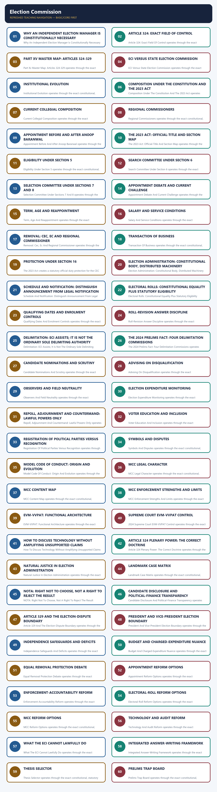

# Polity 27 - Election Commission - Complete Topic Package

> **Control date:** 28 August 2026, Asia/Kolkata  
> **Tags:** `[FACT]` directly supported by a named local or official source; `[ANALYSIS]` reasoned exam use; `[CURRENT]` date-sensitive control; `[LIMIT]` boundary, uncertainty or non-ownership.  
> **Core discipline:** claim -> named evidence -> analysis -> qualification.  
> **Scope:** constitutional design, composition, appointment, tenure, removal, administration, rolls, parties and symbols, Model Code of Conduct (MCC), EVM-VVPAT, case law, independence, accountability and reform.

#### Package method, sources and current legal control

- [FACT] Local source order followed: `basic/Election-Commission.md` -> `advanced/27_Election-Commission.md` -> related Polity owners only where a boundary required it -> local OCR-searchable M. Laxmikanth chapter -> audited PYQ routing ledgers and locally held official papers/keys -> official Constitution, India Code, ECI manuals/FAQs, Supreme Court judgments, Legislative Department, PIB and Union Budget material.
- [FACT] Structural and validation reference only: Polity 24, 25 and 26 complete packages. Their subject content has not been imported.
- [FACT] The controlling appointment statute was checked against the official India Code PDF of **The Chief Election Commissioner and other Election Commissioners (Appointment, Conditions of Service and Term of Office) Act, 2023**, Act 49 of 2023, including sections 3-11 and 16-18.
- [CURRENT] The 2023 Act commenced on **2 January 2024** under S.O. 35(E), as recorded in the India Code text.
- [CURRENT] **Live official refresh, 28 August 2026:** India Code, ECI leadership/manuals, the official 2024 EVM-VVPAT judgment and Supreme Court appointment-case orders were rechecked. The 2023 Act remains operative; no official stay or merits judgment was located.
- [CURRENT] The official ECI leadership page, checked for this control date, lists Chief Election Commissioner **Gyanesh Kumar** and Election Commissioners **Dr Sukhbir Singh Sandhu** and **Dr Vivek Joshi**.
- [CURRENT] The Supreme Court's official 22 March 2024 order dismissed applications seeking a stay of section 7 and the appointments, while expressly treating its observations as tentative because the constitutional challenge remained sub judice.
- [LIMIT] The official Supreme Court record confirms the 22 March 2024 refusal of interim interference. No later official stay or merits judgment was located by 28 August 2026. The safe answer is therefore: **the Act operates; there is no located stay or merits verdict; do not say it has been upheld or struck down.**
- [LIMIT] No volatile turnout, elector-total or fraud allegation is frozen into this package. Any State-specific electoral-roll revision must be read with the exact ECI order and current court record.

### Authoritative source map

| Source | Named evidence used | Control |
|---|---|---|
| Constitution of India, Part XV | Articles 324-329; Articles 103, 192, 243K, 243ZA | constitutional allocation and boundaries |
| India Code, Act 49 of 2023 | sections 3-11, 16-18 | appointment, eligibility, service and business |
| RPA 1950 | rolls, allocation and delimitation framework | election infrastructure |
| RPA 1951 | conduct, candidates, parties, expenses, corrupt practices and petitions | election operation and disputes |
| ECI Manual on Electoral Rolls, 2023 | ordinary residence, qualifying dates, revision, claims and objections | roll administration |
| ECI MCC Manual / FAQ | evolution, consensus basis, start and end of operation | MCC |
| ECI Symbols Order, 1968 | recognition and symbol allocation/disputes | parties and symbols |
| Supreme Court judgments | named holdings in the case matrix below | powers, limits and rights |
| Union Budget, Demand No. 66, 2026-27 | ECI establishment expenditure | budget-control nuance |

#### Roadmap

| Stage | Units | Outcome |
|---|---|---|
| Foundation | Articles 324-329, institutional purpose, ownership | define the ECI without overreach |
| Design | composition, appointment, tenure, removal, business | solve close constitutional options |
| Administration | rolls, schedules, officials, observers, expenses | understand the election machine |
| Regulation | parties, symbols, MCC, repoll and advice | distinguish legal and non-statutory tools |
| Technology | EVM-VVPAT and judicial safeguards | answer trust questions without amplifying claims |
| Doctrine | plenary power and case law | state power plus boundary |
| Evaluation | independence, accountability and reforms | write balanced GS-II answers |
| Workbook | verified PYQs, 48 rotated MCQs and eight solved Mains | convert doctrine into marks |

#### Scope ownership and cross-links

| This package owns | Cross-link only | Reason for boundary |
|---|---|---|
| ECI under Article 324 | State Election Commissions under Articles 243K/243ZA | local-body elections are constitutionally separate |
| RPA provisions needed to explain ECI work | full RPA taxonomy, corrupt practices and election petitions | electoral-reforms/RPA owner carries deeper offence and remedy detail |
| party registration, recognition and symbols | ideology, party system and internal democracy | Political Parties owner |
| MCC evolution and enforcement | executive conduct and civil-service neutrality generally | Governance/Parliament owners |
| ECI assistance in delimitation | representation freeze and seat readjustment | Parliament and federal-design owners |
| ECI's disqualification opinion under Articles 103/192 | Tenth Schedule adjudication | Speaker/Chairman under Anti-Defection owner |
| EVM-VVPAT administration | electronics engineering | Science and Technology owner |
| post-poll petition boundary | judicial hierarchy and full case procedure | High Court/Supreme Court owners |

```text
ECI OWNER
  |-- national and State-legislature elections
  |-- President and Vice-President elections
  |-- rolls, schedule, symbols, MCC, observers, poll integrity
  |
  +-- CROSS-LINKS
       |-- local bodies -> State Election Commission
       |-- delimitation -> statutory Delimitation Commission
       |-- election petition -> High Court / Supreme Court appeal
       |-- party democracy -> Political Parties owner
```

Caption: Ownership follows the constitutional decision-maker, not a broad use of the word "election".


## BASIC LEARNING SESSION



*Distinct embedded teaching-navigation image. The separate continuous Cārvāka-style flowchart package remains an independent at-a-glance artifact.*


### SESSION 1 — WHY AN INDEPENDENT ELECTION MANAGER IS CONSTITUTIONALLY NECESSARY

#### DEFINITION / WHAT THIS IS CALLED

**Plain-language definition:** Why An Independent Election Manager Is Constitutionally Necessary explains the exact constitutional, statutory and institutional rules governing why an independent election manager is constitutionally necessary.

**Technical definition:** Why An Independent Election Manager Is Constitutionally Necessary operates through the exact constitutional, statutory and institutional rules governing why an independent election manager is constitutionally necessary, keeping authority, procedure, legal limits and dated status distinct.

#### ANSWER-GRABBING OPENING — WRITE/ADAPT IN THE EXAM

> Why An Independent Election Manager Is Constitutionally Necessary is best understood through the exact constitutional, statutory and institutional rules governing why an independent election manager is constitutionally necessary.

#### MUST-WRITE KEYWORDS

- **Article 324**
- **Election Commission**
- **free and fair elections**
- **independent**
- **election**
- **manager**
- **constitutionally**
- **necessary**

**How to use them:** Frame the answer through Article 324; define Election Commission, connect free and fair elections with independent to explain the mechanism, and use election for the decisive comparison or qualification.

[FACT] Representative government requires more than periodic voting. It needs an authority able to convert equal citizenship into a credible roll, a lawful candidature process, a neutral polling arrangement, secure counting and an accepted result.

[ANALYSIS] The ECI is therefore best understood as a **constitutional trust institution**: it does not choose the winner; it protects the conditions under which electors choose.

[LIMIT] "Independent" does not mean legally unbounded. The ECI is subject to the Constitution, parliamentary election law, judicial review at the proper stage and reasoned public accountability.

#### Visual 1 - Democratic trust chain

```text
EQUAL CITIZENSHIP
      |
accurate roll -> fair candidature -> neutral campaign field
      |                                  |
secure poll -> verifiable count -> lawful declaration
      |
ACCEPTED REPRESENTATIVE AUTHORITY
```

Caption: Trust is cumulative; failure at any link can damage the legitimacy of the result.

#### CLOSING RECALL FLOW — WHY AN INDEPENDENT ELECTION MANAGER IS CONSTITUTIONALLY NECESSARY

```text
START / CONCEPT: WHY AN INDEPENDENT ELECTION MANAGER IS CONSTITUTIONALLY NECESSARY
        |
        v
EXACT TERMS: Article 324 · Election Commission · free and fair elections · independent · election · manager · constitutionally · necessary
        |
        v
MECHANISM / ARGUMENT: Trace the governing Article or RPA provision, empowered election authority, procedural trigger and review mechanism for why an independent election manager is constitutionally necessary.
        |
        v
CONSEQUENCE / CONTRAST: This determines electoral integrity, institutional independence and the exam consequence of why an independent election manager is constitutionally necessary.
        |
        v
UPSC TRAP / ANSWER-USE: Do not generalise why an independent election manager is constitutionally necessary beyond its exact statute, stage, decision-maker or dated legal status.
        |
        v
ANSWER-GRABBING FORMULATION: Why An Independent Election Manager Is Constitutionally Necessary is best understood through the exact constitutional, statutory and institutional rules governing why an independent election manager is constitutionally necessary.
```
### SESSION 2 — ARTICLE 324: EXACT FIELD OF CONTROL

#### DEFINITION / WHAT THIS IS CALLED

**Plain-language definition:** Article 324: Exact Field Of Control explains the exact constitutional, statutory and institutional rules governing article 324: exact field of control.

**Technical definition:** Article 324: Exact Field Of Control operates through the exact constitutional, statutory and institutional rules governing article 324: exact field of control, keeping authority, procedure, legal limits and dated status distinct.

#### ANSWER-GRABBING OPENING — WRITE/ADAPT IN THE EXAM

> Article 324: Exact Field Of Control is best understood through the exact constitutional, statutory and institutional rules governing article 324: exact field of control.

#### MUST-WRITE KEYWORDS

- **Article 324**
- **Election Commission**
- **free and fair elections**
- **article**
- **field**
- **control**

**How to use them:** Frame the answer through Article 324; define Election Commission, connect free and fair elections with article to explain the mechanism, and use field for the decisive comparison or qualification.

[FACT] Article 324(1) vests in the Election Commission the **superintendence, direction and control** of:

1. preparation of electoral rolls for elections to Parliament and State legislatures;
2. conduct of those elections;
3. elections to the offices of President; and
4. elections to the office of Vice-President.

[LIMIT] Article 324 does **not** place panchayat or municipal elections under the ECI. Articles **243K** and **243ZA** vest those fields in State Election Commissions (SECs).

#### Visual 2 - Article 324 inclusion-exclusion map

| Included in ECI field | Excluded from ECI field |
|---|---|
| Lok Sabha | Panchayats |
| Rajya Sabha election administration where applicable | Municipalities |
| State Legislative Assemblies | cooperative-society elections |
| State Legislative Councils | internal party organisational elections as such |
| President | private associations |
| Vice-President | ordinary by-elections to local bodies |

Caption: The quickest Prelims method is to ask whether the elected institution is named in Article 324 or Part IX/IX-A.

#### CLOSING RECALL FLOW — ARTICLE 324: EXACT FIELD OF CONTROL

```text
START / CONCEPT: ARTICLE 324: EXACT FIELD OF CONTROL
        |
        v
EXACT TERMS: Article 324 · Election Commission · free and fair elections · article · field · control
        |
        v
MECHANISM / ARGUMENT: Trace the governing Article or RPA provision, empowered election authority, procedural trigger and review mechanism for article 324: exact field of control.
        |
        v
CONSEQUENCE / CONTRAST: This determines electoral integrity, institutional independence and the exam consequence of article 324: exact field of control.
        |
        v
UPSC TRAP / ANSWER-USE: Do not generalise article 324: exact field of control beyond its exact statute, stage, decision-maker or dated legal status.
        |
        v
ANSWER-GRABBING FORMULATION: Article 324: Exact Field Of Control is best understood through the exact constitutional, statutory and institutional rules governing article 324: exact field of control.
```
### SESSION 3 — PART XV MASTER MAP: ARTICLES 324-329

#### DEFINITION / WHAT THIS IS CALLED

**Plain-language definition:** Part Xv Master Map: Articles 324-329 explains the exact constitutional, statutory and institutional rules governing part xv master map: articles 324-329.

**Technical definition:** Part Xv Master Map: Articles 324-329 operates through the exact constitutional, statutory and institutional rules governing part xv master map: articles 324-329, keeping authority, procedure, legal limits and dated status distinct.

#### ANSWER-GRABBING OPENING — WRITE/ADAPT IN THE EXAM

> Part Xv Master Map: Articles 324-329 is best understood through the exact constitutional, statutory and institutional rules governing part xv master map: articles 324-329.

#### MUST-WRITE KEYWORDS

- **Article 324**
- **Election Commission**
- **free and fair elections**
- **part**
- **master**
- **map**
- **articles**

**How to use them:** Frame the answer through Article 324; define Election Commission, connect free and fair elections with part to explain the mechanism, and use master for the decisive comparison or qualification.

#### Visual 3 - Six-article constitutional spine

| Article | Core rule | Exam trap |
|---|---|---|
| 324 | ECI's superintendence, direction and control | not a licence to contradict statute |
| 325 | one general roll; no exclusion/special roll on religion, race, caste or sex | does not erase lawful residence/age/citizenship conditions |
| 326 | adult suffrage for Lok Sabha and State Assemblies | voting is subject to constitutional/statutory disqualifications |
| 327 | Parliament may legislate on elections to legislatures | primary source of RPA framework |
| 328 | State legislature may legislate for its legislature, subject to Constitution and parliamentary law | subordinate to Parliament's occupied field |
| 329 | limits judicial interruption; election challenged by election petition | not total immunity from judicial review |

[FACT] The **61st Constitutional Amendment Act, 1988** reduced the voting age under Article 326 from 21 to 18.

[ANALYSIS] Articles 324 and 327 must be read together: constitutional supervision and statutory specification are complementary.

#### CLOSING RECALL FLOW — PART XV MASTER MAP: ARTICLES 324-329

```text
START / CONCEPT: PART XV MASTER MAP: ARTICLES 324-329
        |
        v
EXACT TERMS: Article 324 · Election Commission · free and fair elections · part · master · map · articles
        |
        v
MECHANISM / ARGUMENT: Trace the governing Article or RPA provision, empowered election authority, procedural trigger and review mechanism for part xv master map: articles 324-329.
        |
        v
CONSEQUENCE / CONTRAST: This determines electoral integrity, institutional independence and the exam consequence of part xv master map: articles 324-329.
        |
        v
UPSC TRAP / ANSWER-USE: Do not generalise part xv master map: articles 324-329 beyond its exact statute, stage, decision-maker or dated legal status.
        |
        v
ANSWER-GRABBING FORMULATION: Part Xv Master Map: Articles 324-329 is best understood through the exact constitutional, statutory and institutional rules governing part xv master map: articles 324-329.
```
### SESSION 4 — ECI VERSUS STATE ELECTION COMMISSION

#### DEFINITION / WHAT THIS IS CALLED

**Plain-language definition:** ECI Versus State Election Commission explains the exact constitutional, statutory and institutional rules governing eci versus state election commission.

**Technical definition:** ECI Versus State Election Commission operates through the exact constitutional, statutory and institutional rules governing eci versus state election commission, keeping authority, procedure, legal limits and dated status distinct.

#### ANSWER-GRABBING OPENING — WRITE/ADAPT IN THE EXAM

> ECI Versus State Election Commission is best understood through the exact constitutional, statutory and institutional rules governing eci versus state election commission.

#### MUST-WRITE KEYWORDS

- **Article 324**
- **Election Commission**
- **free and fair elections**
- **eci**
- **election**
- **commission**

**How to use them:** Frame the answer through Article 324; define Election Commission, connect free and fair elections with eci to explain the mechanism, and use election for the decisive comparison or qualification.

#### Visual 4 - Two constitutional election managers

| Dimension | Election Commission of India | State Election Commission |
|---|---|---|
| source | Article 324 | Articles 243K and 243ZA |
| field | Parliament, State legislatures, President, Vice-President | Panchayats and municipalities |
| head | CEC plus other ECs as fixed | State Election Commissioner |
| appointment | President under the 2023 Act | Governor |
| removal protection | CEC like SC judge; ECs/Regional Commissioners on CEC recommendation | SEC removed like a High Court judge |
| law base | Constitution, RPA 1950/1951 and election rules | State local-government election laws |

[LIMIT] Simultaneous logistics or use of State officials does not merge the two constitutional authorities.

> **Prelims trap:** "The ECI conducts every public election in India" is false.

#### CLOSING RECALL FLOW — ECI VERSUS STATE ELECTION COMMISSION

```text
START / CONCEPT: ECI VERSUS STATE ELECTION COMMISSION
        |
        v
EXACT TERMS: Article 324 · Election Commission · free and fair elections · eci · election · commission
        |
        v
MECHANISM / ARGUMENT: Trace the governing Article or RPA provision, empowered election authority, procedural trigger and review mechanism for eci versus state election commission.
        |
        v
CONSEQUENCE / CONTRAST: This determines electoral integrity, institutional independence and the exam consequence of eci versus state election commission.
        |
        v
UPSC TRAP / ANSWER-USE: Do not generalise eci versus state election commission beyond its exact statute, stage, decision-maker or dated legal status.
        |
        v
ANSWER-GRABBING FORMULATION: ECI Versus State Election Commission is best understood through the exact constitutional, statutory and institutional rules governing eci versus state election commission.
```
### SESSION 5 — INSTITUTIONAL EVOLUTION

#### DEFINITION / WHAT THIS IS CALLED

**Plain-language definition:** Institutional Evolution explains the exact constitutional, statutory and institutional rules governing institutional evolution.

**Technical definition:** Institutional Evolution operates through the exact constitutional, statutory and institutional rules governing institutional evolution, keeping authority, procedure, legal limits and dated status distinct.

#### ANSWER-GRABBING OPENING — WRITE/ADAPT IN THE EXAM

> Institutional Evolution is best understood through the exact constitutional, statutory and institutional rules governing institutional evolution.

#### MUST-WRITE KEYWORDS

- **Article 324**
- **Election Commission**
- **free and fair elections**
- **institutional**
- **evolution**

**How to use them:** Frame the answer through Article 324; define Election Commission, connect free and fair elections with institutional to explain the mechanism, and use evolution for the decisive comparison or qualification.

[FACT] The ECI was established on **25 January 1950**. It operated as a single-member body until 15 October 1989; two ECs were added on 16 October 1989, the posts were discontinued in January 1990, and two ECs were again appointed in October 1993. The three-member form has continued since then.

[ANALYSIS] The shift from a single office to a collegial commission distributes authority, creates internal deliberation and reduces person-centred administration.

#### Visual 5 - Composition timeline

```text
1950                  Oct 1989       Jan 1990       Oct 1993 onward
CEC only  ----------> CEC + 2 ECs -> CEC only ----> CEC + 2 ECs
                                               collegial majority model
```

Caption: Multi-membership is constitutionally permitted because Article 324 does not fix the number.

#### CLOSING RECALL FLOW — INSTITUTIONAL EVOLUTION

```text
START / CONCEPT: INSTITUTIONAL EVOLUTION
        |
        v
EXACT TERMS: Article 324 · Election Commission · free and fair elections · institutional · evolution
        |
        v
MECHANISM / ARGUMENT: Trace the governing Article or RPA provision, empowered election authority, procedural trigger and review mechanism for institutional evolution.
        |
        v
CONSEQUENCE / CONTRAST: This determines electoral integrity, institutional independence and the exam consequence of institutional evolution.
        |
        v
UPSC TRAP / ANSWER-USE: Do not generalise institutional evolution beyond its exact statute, stage, decision-maker or dated legal status.
        |
        v
ANSWER-GRABBING FORMULATION: Institutional Evolution is best understood through the exact constitutional, statutory and institutional rules governing institutional evolution.
```
### SESSION 6 — COMPOSITION UNDER THE CONSTITUTION AND THE 2023 ACT

#### DEFINITION / WHAT THIS IS CALLED

**Plain-language definition:** Composition Under The Constitution And The 2023 Act explains the exact constitutional, statutory and institutional rules governing composition under the constitution and the 2023 act.

**Technical definition:** Composition Under The Constitution And The 2023 Act operates through the exact constitutional, statutory and institutional rules governing composition under the constitution and the 2023 act, keeping authority, procedure, legal limits and dated status distinct.

#### ANSWER-GRABBING OPENING — WRITE/ADAPT IN THE EXAM

> Composition Under The Constitution And The 2023 Act is best understood through the exact constitutional, statutory and institutional rules governing composition under the constitution and the 2023 act.

#### MUST-WRITE KEYWORDS

- **Article 324**
- **Election Commission**
- **appointment law**
- **composition**
- **constitution**
- **act**

**How to use them:** Frame the answer through Article 324; define Election Commission, connect appointment law with composition to explain the mechanism, and use constitution for the decisive comparison or qualification.

[FACT] Article 324(2) provides for the CEC and such number of other ECs, if any, as the President may from time to time fix, subject to a parliamentary law.

[FACT] Section 3 of the 2023 Act states that the Commission consists of the CEC and such number of other ECs as the President may fix from time to time.

[FACT] When other ECs are appointed, Article 324(3) makes the CEC the Chairman.

[LIMIT] Chairmanship does not make the CEC a unilateral superior in adjudicatory or administrative decision-making.

#### Visual 6 - Position versus power

```text
CEC = CHAIR
  |
  +-- agenda / institutional leadership
  +-- constitutional removal protection
  |
  X-- no unilateral veto over equal EC votes

CEC + EC + EC -> unanimity where possible -> otherwise majority
```

#### CLOSING RECALL FLOW — COMPOSITION UNDER THE CONSTITUTION AND THE 2023 ACT

```text
START / CONCEPT: COMPOSITION UNDER THE CONSTITUTION AND THE 2023 ACT
        |
        v
EXACT TERMS: Article 324 · Election Commission · appointment law · composition · constitution · act
        |
        v
MECHANISM / ARGUMENT: Trace the governing Article or RPA provision, empowered election authority, procedural trigger and review mechanism for composition under the constitution and the 2023 act.
        |
        v
CONSEQUENCE / CONTRAST: This determines electoral integrity, institutional independence and the exam consequence of composition under the constitution and the 2023 act.
        |
        v
UPSC TRAP / ANSWER-USE: Do not generalise composition under the constitution and the 2023 act beyond its exact statute, stage, decision-maker or dated legal status.
        |
        v
ANSWER-GRABBING FORMULATION: Composition Under The Constitution And The 2023 Act is best understood through the exact constitutional, statutory and institutional rules governing composition under the constitution and the 2023 act.
```
### SESSION 7 — CURRENT COLLEGIAL COMPOSITION

#### DEFINITION / WHAT THIS IS CALLED

**Plain-language definition:** Current Collegial Composition explains the exact constitutional, statutory and institutional rules governing current collegial composition.

**Technical definition:** Current Collegial Composition operates through the exact constitutional, statutory and institutional rules governing current collegial composition, keeping authority, procedure, legal limits and dated status distinct.

#### ANSWER-GRABBING OPENING — WRITE/ADAPT IN THE EXAM

> Current Collegial Composition is best understood through the exact constitutional, statutory and institutional rules governing current collegial composition.

#### MUST-WRITE KEYWORDS

- **Article 324**
- **Election Commission**
- **appointment law**
- **collegial**
- **composition**

**How to use them:** Frame the answer through Article 324; define Election Commission, connect appointment law with collegial to explain the mechanism, and use composition for the decisive comparison or qualification.

[CURRENT] On the control date, the ECI's official leadership page lists:

| Office | Incumbent |
|---|---|
| Chief Election Commissioner | Gyanesh Kumar |
| Election Commissioner | Dr Sukhbir Singh Sandhu |
| Election Commissioner | Dr Vivek Joshi |

[LIMIT] Names are date-sensitive. UPSC usually tests constitutional architecture, not incumbent memory.

#### CLOSING RECALL FLOW — CURRENT COLLEGIAL COMPOSITION

```text
START / CONCEPT: CURRENT COLLEGIAL COMPOSITION
        |
        v
EXACT TERMS: Article 324 · Election Commission · appointment law · collegial · composition
        |
        v
MECHANISM / ARGUMENT: Trace the governing Article or RPA provision, empowered election authority, procedural trigger and review mechanism for current collegial composition.
        |
        v
CONSEQUENCE / CONTRAST: This determines electoral integrity, institutional independence and the exam consequence of current collegial composition.
        |
        v
UPSC TRAP / ANSWER-USE: Do not generalise current collegial composition beyond its exact statute, stage, decision-maker or dated legal status.
        |
        v
ANSWER-GRABBING FORMULATION: Current Collegial Composition is best understood through the exact constitutional, statutory and institutional rules governing current collegial composition.
```
### SESSION 8 — REGIONAL COMMISSIONERS

#### DEFINITION / WHAT THIS IS CALLED

**Plain-language definition:** Regional Commissioners explains the exact constitutional, statutory and institutional rules governing regional commissioners.

**Technical definition:** Regional Commissioners operates through the exact constitutional, statutory and institutional rules governing regional commissioners, keeping authority, procedure, legal limits and dated status distinct.

#### ANSWER-GRABBING OPENING — WRITE/ADAPT IN THE EXAM

> Regional Commissioners is best understood through the exact constitutional, statutory and institutional rules governing regional commissioners.

#### MUST-WRITE KEYWORDS

- **Article 324**
- **Election Commission**
- **free and fair elections**
- **regional**
- **commissioners**

**How to use them:** Frame the answer through Article 324; define Election Commission, connect free and fair elections with regional to explain the mechanism, and use commissioners for the decisive comparison or qualification.

[FACT] Article 324(4) allows the President, after consulting the ECI, to appoint Regional Commissioners when necessary to assist the Commission.

[FACT] Under Article 324(5), a Regional Commissioner cannot be removed except on the CEC's recommendation.

[LIMIT] Regional Commissioners are not permanent State Election Commissioners and do not replace the Chief Electoral Officer machinery.

#### Visual 7 - Assistance architecture

```text
President --consults ECI--> may appoint Regional Commissioner
                                  |
                                  v
                            assists the ECI

NOT: head of a State Election Commission
NOT: independent local-body election authority
```

#### CLOSING RECALL FLOW — REGIONAL COMMISSIONERS

```text
START / CONCEPT: REGIONAL COMMISSIONERS
        |
        v
EXACT TERMS: Article 324 · Election Commission · free and fair elections · regional · commissioners
        |
        v
MECHANISM / ARGUMENT: Trace the governing Article or RPA provision, empowered election authority, procedural trigger and review mechanism for regional commissioners.
        |
        v
CONSEQUENCE / CONTRAST: This determines electoral integrity, institutional independence and the exam consequence of regional commissioners.
        |
        v
UPSC TRAP / ANSWER-USE: Do not generalise regional commissioners beyond its exact statute, stage, decision-maker or dated legal status.
        |
        v
ANSWER-GRABBING FORMULATION: Regional Commissioners is best understood through the exact constitutional, statutory and institutional rules governing regional commissioners.
```
### SESSION 9 — APPOINTMENT BEFORE AND AFTER ANOOP BARANWAL

#### DEFINITION / WHAT THIS IS CALLED

**Plain-language definition:** Appointment Before And After Anoop Baranwal explains the exact constitutional, statutory and institutional rules governing appointment before and after anoop baranwal.

**Technical definition:** Appointment Before And After Anoop Baranwal operates through the exact constitutional, statutory and institutional rules governing appointment before and after anoop baranwal, keeping authority, procedure, legal limits and dated status distinct.

#### ANSWER-GRABBING OPENING — WRITE/ADAPT IN THE EXAM

> Appointment Before And After Anoop Baranwal is best understood through the exact constitutional, statutory and institutional rules governing appointment before and after anoop baranwal.

#### MUST-WRITE KEYWORDS

- **Article 324**
- **Election Commission**
- **appointment law**
- **appointment**
- **before**
- **after**
- **anoop**
- **baranwal**

**How to use them:** Frame the answer through Article 324; define Election Commission, connect appointment law with appointment to explain the mechanism, and use before for the decisive comparison or qualification.

[FACT] Article 324(2) always contemplated appointments by the President, subject to any law Parliament made.

[FACT] In *Anoop Baranwal v. Union of India* (2 March 2023), the Supreme Court filled the legislative vacuum by directing that appointments be made on the advice of a committee comprising the Prime Minister, Leader of Opposition (or largest opposition-party leader) and Chief Justice of India.

[FACT] The judgment expressly said this norm would continue **"till a law is made by the Parliament."**

[LIMIT] The Court did not simply declare every prior executive appointment unconstitutional. Its operative response was a prospective interim institutional arrangement pending legislation.

#### Visual 8 - Appointment-law sequence

```text
Article 324(2)
   |
long absence of parliamentary appointment law
   |
Anoop Baranwal (2 Mar 2023)
PM + LoP/largest opposition leader + CJI
   |  expressly temporary
   v
2023 Act, in force 2 Jan 2024
PM + LoP/largest opposition leader + PM-nominated Cabinet Minister
```

Caption: The 2023 Act displaced the Court-created interim panel because the judgment itself preserved Parliament's law-making space.

#### CLOSING RECALL FLOW — APPOINTMENT BEFORE AND AFTER ANOOP BARANWAL

```text
START / CONCEPT: APPOINTMENT BEFORE AND AFTER ANOOP BARANWAL
        |
        v
EXACT TERMS: Article 324 · Election Commission · appointment law · appointment · before · after · anoop · baranwal
        |
        v
MECHANISM / ARGUMENT: Trace the governing Article or RPA provision, empowered election authority, procedural trigger and review mechanism for appointment before and after anoop baranwal.
        |
        v
CONSEQUENCE / CONTRAST: This determines electoral integrity, institutional independence and the exam consequence of appointment before and after anoop baranwal.
        |
        v
UPSC TRAP / ANSWER-USE: Do not generalise appointment before and after anoop baranwal beyond its exact statute, stage, decision-maker or dated legal status.
        |
        v
ANSWER-GRABBING FORMULATION: Appointment Before And After Anoop Baranwal is best understood through the exact constitutional, statutory and institutional rules governing appointment before and after anoop baranwal.
```
### SESSION 10 — THE 2023 ACT: OFFICIAL-TITLE AND SECTION MAP

#### DEFINITION / WHAT THIS IS CALLED

**Plain-language definition:** The 2023 Act: Official-Title And Section Map explains the exact constitutional, statutory and institutional rules governing the 2023 act: official-title and section map.

**Technical definition:** The 2023 Act: Official-Title And Section Map operates through the exact constitutional, statutory and institutional rules governing the 2023 act: official-title and section map, keeping authority, procedure, legal limits and dated status distinct.

#### ANSWER-GRABBING OPENING — WRITE/ADAPT IN THE EXAM

> The 2023 Act: Official-Title And Section Map is best understood through the exact constitutional, statutory and institutional rules governing the 2023 act: official-title and section map.

#### MUST-WRITE KEYWORDS

- **Article 324**
- **Election Commission**
- **free and fair elections**
- **act**
- **official**
- **title**
- **section**
- **map**

**How to use them:** Frame the answer through Article 324; define Election Commission, connect free and fair elections with act to explain the mechanism, and use official for the decisive comparison or qualification.

#### Visual 9 - Act 49 of 2023 dashboard

| Provision | Official control |
|---|---|
| long title | appointment, service, term and transaction of ECI business |
| s.3 | composition |
| s.4 | President appoints by warrant under hand and seal |
| s.5 | eligibility |
| s.6 | Search Committee |
| s.7 | Selection Committee and vacancy/defect saving |
| s.8 | transparent self-regulated selection procedure; power to consider outside panel |
| s.9 | term, age, no reappointment, aggregate cap |
| s.10 | salary equal to SC judge; related allowances |
| s.11 | resignation and removal |
| s.16 | protection concerning official acts/things/words |
| ss.17-18 | transaction and disposal of business |

[LIMIT] Coaching summaries frequently reproduce Bill-stage provisions. The enacted India Code text, not a Bill summary, controls.

#### CLOSING RECALL FLOW — THE 2023 ACT: OFFICIAL-TITLE AND SECTION MAP

```text
START / CONCEPT: THE 2023 ACT: OFFICIAL-TITLE AND SECTION MAP
        |
        v
EXACT TERMS: Article 324 · Election Commission · free and fair elections · act · official · title · section · map
        |
        v
MECHANISM / ARGUMENT: Trace the governing Article or RPA provision, empowered election authority, procedural trigger and review mechanism for the 2023 act: official-title and section map.
        |
        v
CONSEQUENCE / CONTRAST: This determines electoral integrity, institutional independence and the exam consequence of the 2023 act: official-title and section map.
        |
        v
UPSC TRAP / ANSWER-USE: Do not generalise the 2023 act: official-title and section map beyond its exact statute, stage, decision-maker or dated legal status.
        |
        v
ANSWER-GRABBING FORMULATION: The 2023 Act: Official-Title And Section Map is best understood through the exact constitutional, statutory and institutional rules governing the 2023 act: official-title and section map.
```
### SESSION 11 — ELIGIBILITY UNDER SECTION 5

#### DEFINITION / WHAT THIS IS CALLED

**Plain-language definition:** Eligibility Under Section 5 explains the exact constitutional, statutory and institutional rules governing eligibility under section 5.

**Technical definition:** Eligibility Under Section 5 operates through the exact constitutional, statutory and institutional rules governing eligibility under section 5, keeping authority, procedure, legal limits and dated status distinct.

#### ANSWER-GRABBING OPENING — WRITE/ADAPT IN THE EXAM

> Eligibility Under Section 5 is best understood through the exact constitutional, statutory and institutional rules governing eligibility under section 5.

#### MUST-WRITE KEYWORDS

- **Article 324**
- **Election Commission**
- **free and fair elections**
- **eligibility**
- **section**

**How to use them:** Frame the answer through Article 324; define Election Commission, connect free and fair elections with eligibility to explain the mechanism, and use section for the decisive comparison or qualification.

[FACT] A CEC or EC must be appointed from among persons who hold or have held a post equivalent to the rank of **Secretary to the Government of India**.

[FACT] The person must be of integrity and possess knowledge of and experience in the **management and conduct of elections**.

[ANALYSIS] Section 5 converts a previously constitutionally unspecified qualification field into a senior-administrative eligibility pool.

[LIMIT] The provision does not require judicial office, a fixed academic degree or prior service inside the ECI.

#### Visual 10 - Eligibility filter

```text
Secretary-equivalent rank
          +
integrity
          +
knowledge and experience in election management/conduct
          =
statutory eligibility pool
```

#### CLOSING RECALL FLOW — ELIGIBILITY UNDER SECTION 5

```text
START / CONCEPT: ELIGIBILITY UNDER SECTION 5
        |
        v
EXACT TERMS: Article 324 · Election Commission · free and fair elections · eligibility · section
        |
        v
MECHANISM / ARGUMENT: Trace the governing Article or RPA provision, empowered election authority, procedural trigger and review mechanism for eligibility under section 5.
        |
        v
CONSEQUENCE / CONTRAST: This determines electoral integrity, institutional independence and the exam consequence of eligibility under section 5.
        |
        v
UPSC TRAP / ANSWER-USE: Do not generalise eligibility under section 5 beyond its exact statute, stage, decision-maker or dated legal status.
        |
        v
ANSWER-GRABBING FORMULATION: Eligibility Under Section 5 is best understood through the exact constitutional, statutory and institutional rules governing eligibility under section 5.
```
### SESSION 12 — SEARCH COMMITTEE UNDER SECTION 6

#### DEFINITION / WHAT THIS IS CALLED

**Plain-language definition:** Search Committee Under Section 6 explains the exact constitutional, statutory and institutional rules governing search committee under section 6.

**Technical definition:** Search Committee Under Section 6 operates through the exact constitutional, statutory and institutional rules governing search committee under section 6, keeping authority, procedure, legal limits and dated status distinct.

#### ANSWER-GRABBING OPENING — WRITE/ADAPT IN THE EXAM

> Search Committee Under Section 6 is best understood through the exact constitutional, statutory and institutional rules governing search committee under section 6.

#### MUST-WRITE KEYWORDS

- **Article 324**
- **Election Commission**
- **free and fair elections**
- **committee**
- **section**

**How to use them:** Frame the answer through Article 324; define Election Commission, connect free and fair elections with committee to explain the mechanism, and use section for the decisive comparison or qualification.

[FACT] The enacted section 6 Search Committee is headed by the **Minister of Law and Justice**, with two other members not below Secretary rank.

[FACT] It prepares a panel of **five persons** for the Selection Committee.

[LIMIT] "Cabinet Secretary heads the Search Committee" is not the enacted Act 49 of 2023 rule.

#### Visual 11 - Search stage

| Actor | Composition | Output |
|---|---|---|
| Search Committee | Law Minister + two Secretary-rank-or-above members | panel of five |
| Selection Committee | PM + LoP/largest opposition leader + PM-nominated Cabinet Minister | recommendation to President |
| President | constitutional appointing authority | warrant of appointment |

#### CLOSING RECALL FLOW — SEARCH COMMITTEE UNDER SECTION 6

```text
START / CONCEPT: SEARCH COMMITTEE UNDER SECTION 6
        |
        v
EXACT TERMS: Article 324 · Election Commission · free and fair elections · committee · section
        |
        v
MECHANISM / ARGUMENT: Trace the governing Article or RPA provision, empowered election authority, procedural trigger and review mechanism for search committee under section 6.
        |
        v
CONSEQUENCE / CONTRAST: This determines electoral integrity, institutional independence and the exam consequence of search committee under section 6.
        |
        v
UPSC TRAP / ANSWER-USE: Do not generalise search committee under section 6 beyond its exact statute, stage, decision-maker or dated legal status.
        |
        v
ANSWER-GRABBING FORMULATION: Search Committee Under Section 6 is best understood through the exact constitutional, statutory and institutional rules governing search committee under section 6.
```
### SESSION 13 — SELECTION COMMITTEE UNDER SECTIONS 7 AND 8

#### DEFINITION / WHAT THIS IS CALLED

**Plain-language definition:** Selection Committee Under Sections 7 And 8 explains the exact constitutional, statutory and institutional rules governing selection committee under sections 7 and 8.

**Technical definition:** Selection Committee Under Sections 7 And 8 operates through the exact constitutional, statutory and institutional rules governing selection committee under sections 7 and 8, keeping authority, procedure, legal limits and dated status distinct.

#### ANSWER-GRABBING OPENING — WRITE/ADAPT IN THE EXAM

> Selection Committee Under Sections 7 And 8 is best understood through the exact constitutional, statutory and institutional rules governing selection committee under sections 7 and 8.

#### MUST-WRITE KEYWORDS

- **Article 324**
- **Election Commission**
- **free and fair elections**
- **selection**
- **committee**
- **sections**

**How to use them:** Frame the answer through Article 324; define Election Commission, connect free and fair elections with selection to explain the mechanism, and use committee for the decisive comparison or qualification.

[FACT] The committee comprises the Prime Minister as Chairperson, the Lok Sabha Leader of Opposition (or leader of the single largest opposition party if no LoP is recognised), and a Union Cabinet Minister nominated by the Prime Minister.

[FACT] Appointment is not invalid merely because of a vacancy in or defect in the constitution of the committee.

[FACT] The committee must regulate its procedure transparently and may consider a person outside the Search Committee's panel.

[ANALYSIS] The outside-panel power prevents the five-name panel from being a legal cage, but increases the importance of disclosed criteria and reasoned deliberation.

#### Visual 12 - Selection logic and accountability risk

```text
SEARCH PANEL (5) ----------------------+
                                      |
outside-panel candidate permitted ----+--> transparent committee procedure
                                             |
                                             v
                                      recommendation -> President

Risk: executive has 2 of 3 seats
Need: criteria + adequate dossiers + reasons + meaningful deliberation
```

#### CLOSING RECALL FLOW — SELECTION COMMITTEE UNDER SECTIONS 7 AND 8

```text
START / CONCEPT: SELECTION COMMITTEE UNDER SECTIONS 7 AND 8
        |
        v
EXACT TERMS: Article 324 · Election Commission · free and fair elections · selection · committee · sections
        |
        v
MECHANISM / ARGUMENT: Trace the governing Article or RPA provision, empowered election authority, procedural trigger and review mechanism for selection committee under sections 7 and 8.
        |
        v
CONSEQUENCE / CONTRAST: This determines electoral integrity, institutional independence and the exam consequence of selection committee under sections 7 and 8.
        |
        v
UPSC TRAP / ANSWER-USE: Do not generalise selection committee under sections 7 and 8 beyond its exact statute, stage, decision-maker or dated legal status.
        |
        v
ANSWER-GRABBING FORMULATION: Selection Committee Under Sections 7 And 8 is best understood through the exact constitutional, statutory and institutional rules governing selection committee under sections 7 and 8.
```
### SESSION 14 — APPOINTMENT DEBATE AND CURRENT CHALLENGE

#### DEFINITION / WHAT THIS IS CALLED

**Plain-language definition:** Appointment Debate And Current Challenge explains the exact constitutional, statutory and institutional rules governing appointment debate and current challenge.

**Technical definition:** Appointment Debate And Current Challenge operates through the exact constitutional, statutory and institutional rules governing appointment debate and current challenge, keeping authority, procedure, legal limits and dated status distinct.

#### ANSWER-GRABBING OPENING — WRITE/ADAPT IN THE EXAM

> Appointment Debate And Current Challenge is best understood through the exact constitutional, statutory and institutional rules governing appointment debate and current challenge.

#### MUST-WRITE KEYWORDS

- **Article 324**
- **Election Commission**
- **appointment law**
- **appointment**
- **debate**
- **challenge**

**How to use them:** Frame the answer through Article 324; define Election Commission, connect appointment law with appointment to explain the mechanism, and use debate for the decisive comparison or qualification.

[ANALYSIS] Critics focus on executive predominance because the PM and PM-nominated Minister form two of three members. Defenders point to Parliament's express Article 324(2) authority, the LoP's participation and the Act's transparency language.

[FACT] The Supreme Court's official 22 March 2024 order refused interim replacement of the statutory panel with the CJI-inclusive panel; doing so without striking section 7 would amount to judicially rewriting the law.

[FACT] The same order expressed concern that full candidate details should be circulated to every Selection Committee member and that procedural sanctity requires fair deliberation.

[CURRENT] No official merits verdict or stay was located as of 28 August 2026.

#### Visual 13 - Constitutional issue tree

```text
PARLIAMENTARY COMPETENCE? -> Article 324(2) expressly permits a law
          |
          +-- not the main unresolved difficulty

INSTITUTIONAL INDEPENDENCE? -> executive 2:1 weight
          |
          +-- free and fair elections / basic-structure argument
          +-- transparency and meaningful deliberation
          +-- pending merits adjudication
```

#### CLOSING RECALL FLOW — APPOINTMENT DEBATE AND CURRENT CHALLENGE

```text
START / CONCEPT: APPOINTMENT DEBATE AND CURRENT CHALLENGE
        |
        v
EXACT TERMS: Article 324 · Election Commission · appointment law · appointment · debate · challenge
        |
        v
MECHANISM / ARGUMENT: Trace the governing Article or RPA provision, empowered election authority, procedural trigger and review mechanism for appointment debate and current challenge.
        |
        v
CONSEQUENCE / CONTRAST: This determines electoral integrity, institutional independence and the exam consequence of appointment debate and current challenge.
        |
        v
UPSC TRAP / ANSWER-USE: Do not generalise appointment debate and current challenge beyond its exact statute, stage, decision-maker or dated legal status.
        |
        v
ANSWER-GRABBING FORMULATION: Appointment Debate And Current Challenge is best understood through the exact constitutional, statutory and institutional rules governing appointment debate and current challenge.
```
### SESSION 15 — TERM, AGE AND REAPPOINTMENT

#### DEFINITION / WHAT THIS IS CALLED

**Plain-language definition:** Term, Age And Reappointment explains the exact constitutional, statutory and institutional rules governing term, age and reappointment.

**Technical definition:** Term, Age And Reappointment operates through the exact constitutional, statutory and institutional rules governing term, age and reappointment, keeping authority, procedure, legal limits and dated status distinct.

#### ANSWER-GRABBING OPENING — WRITE/ADAPT IN THE EXAM

> Term, Age And Reappointment is best understood through the exact constitutional, statutory and institutional rules governing term, age and reappointment.

#### MUST-WRITE KEYWORDS

- **Article 324**
- **Election Commission**
- **appointment law**
- **term**
- **age**
- **reappointment**

**How to use them:** Frame the answer through Article 324; define Election Commission, connect appointment law with term to explain the mechanism, and use age for the decisive comparison or qualification.

[FACT] Section 9 sets a six-year term from assumption of office or age 65, whichever is earlier.

[FACT] CECs and ECs are not eligible for reappointment.

[FACT] If an EC becomes CEC, combined service as EC and CEC cannot exceed six years.

[LIMIT] The six-year/65 rule is **statutory**, not textually fixed by the Constitution.

#### Visual 14 - Tenure calculation

```text
END DATE = earlier of:
  A. assumption date + 6 years
  B. 65th birthday

If EC -> CEC:
  EC period + CEC period <= 6 years

Reappointment = barred
```

#### CLOSING RECALL FLOW — TERM, AGE AND REAPPOINTMENT

```text
START / CONCEPT: TERM, AGE AND REAPPOINTMENT
        |
        v
EXACT TERMS: Article 324 · Election Commission · appointment law · term · age · reappointment
        |
        v
MECHANISM / ARGUMENT: Trace the governing Article or RPA provision, empowered election authority, procedural trigger and review mechanism for term, age and reappointment.
        |
        v
CONSEQUENCE / CONTRAST: This determines electoral integrity, institutional independence and the exam consequence of term, age and reappointment.
        |
        v
UPSC TRAP / ANSWER-USE: Do not generalise term, age and reappointment beyond its exact statute, stage, decision-maker or dated legal status.
        |
        v
ANSWER-GRABBING FORMULATION: Term, Age And Reappointment is best understood through the exact constitutional, statutory and institutional rules governing term, age and reappointment.
```
### SESSION 16 — SALARY AND SERVICE CONDITIONS

#### DEFINITION / WHAT THIS IS CALLED

**Plain-language definition:** Salary And Service Conditions explains the exact constitutional, statutory and institutional rules governing salary and service conditions.

**Technical definition:** Salary And Service Conditions operates through the exact constitutional, statutory and institutional rules governing salary and service conditions, keeping authority, procedure, legal limits and dated status distinct.

#### ANSWER-GRABBING OPENING — WRITE/ADAPT IN THE EXAM

> Salary And Service Conditions is best understood through the exact constitutional, statutory and institutional rules governing salary and service conditions.

#### MUST-WRITE KEYWORDS

- **Article 324**
- **Election Commission**
- **free and fair elections**
- **salary**
- **service**
- **conditions**

**How to use them:** Frame the answer through Article 324; define Election Commission, connect free and fair elections with salary to explain the mechanism, and use service for the decisive comparison or qualification.

[FACT] Section 10 of the enacted Act sets salary equal to that of a **Judge of the Supreme Court**, with dearness allowance on the same basis and specified leave-encashment rules.

[FACT] Article 324(5) protects the CEC against disadvantageous variation of service conditions after appointment.

[LIMIT] Do not repeat the Bill-stage claim that the enacted salary standard is that of the Cabinet Secretary.

[LIMIT] Salary parity with an SC judge does not by itself prove that the entire ECI budget is constitutionally "charged".

#### Visual 15 - Service-condition safeguards

| Question | Safe rule |
|---|---|
| salary comparator | Supreme Court judge |
| constitutional non-variation protection | expressly for CEC |
| leave/pension/other service matters | Act and rules |
| automatic charged status of all ECI expenditure | no |
| post-retirement office ban | no general constitutional/statutory ban in this Act |

#### CLOSING RECALL FLOW — SALARY AND SERVICE CONDITIONS

```text
START / CONCEPT: SALARY AND SERVICE CONDITIONS
        |
        v
EXACT TERMS: Article 324 · Election Commission · free and fair elections · salary · service · conditions
        |
        v
MECHANISM / ARGUMENT: Trace the governing Article or RPA provision, empowered election authority, procedural trigger and review mechanism for salary and service conditions.
        |
        v
CONSEQUENCE / CONTRAST: This determines electoral integrity, institutional independence and the exam consequence of salary and service conditions.
        |
        v
UPSC TRAP / ANSWER-USE: Do not generalise salary and service conditions beyond its exact statute, stage, decision-maker or dated legal status.
        |
        v
ANSWER-GRABBING FORMULATION: Salary And Service Conditions is best understood through the exact constitutional, statutory and institutional rules governing salary and service conditions.
```
### SESSION 17 — REMOVAL: CEC, EC AND REGIONAL COMMISSIONER

#### DEFINITION / WHAT THIS IS CALLED

**Plain-language definition:** Removal: Cec, Ec And Regional Commissioner explains the exact constitutional, statutory and institutional rules governing removal: cec, ec and regional commissioner.

**Technical definition:** Removal: Cec, Ec And Regional Commissioner operates through the exact constitutional, statutory and institutional rules governing removal: cec, ec and regional commissioner, keeping authority, procedure, legal limits and dated status distinct.

#### ANSWER-GRABBING OPENING — WRITE/ADAPT IN THE EXAM

> Removal: Cec, Ec And Regional Commissioner is best understood through the exact constitutional, statutory and institutional rules governing removal: cec, ec and regional commissioner.

#### MUST-WRITE KEYWORDS

- **Article 324**
- **Election Commission**
- **appointment law**
- **removal**
- **cec**
- **regional**
- **commissioner**

**How to use them:** Frame the answer through Article 324; define Election Commission, connect appointment law with removal to explain the mechanism, and use cec for the decisive comparison or qualification.

[FACT] Article 324(5) and section 11 distinguish the offices:

- CEC: removable only in like manner and on like grounds as an SC judge.
- Other EC: removable only on the CEC's recommendation.
- Regional Commissioner: Article 324(5) also requires the CEC's recommendation.

[ANALYSIS] The asymmetry protects other ECs from direct executive pleasure but does not give them the CEC's parliamentary-removal security.

#### Visual 16 - Removal matrix

| Office | Removal route | Relative protection |
|---|---|---|
| CEC | President after parliamentary address with special-majority process on proved misbehaviour/incapacity | highest |
| EC | President only on CEC recommendation | intermediate and asymmetric |
| Regional Commissioner | President only on CEC recommendation | intermediate and asymmetric |

> **Prelims trap:** Equal decision-making power does not mean identical removal protection.

#### CLOSING RECALL FLOW — REMOVAL: CEC, EC AND REGIONAL COMMISSIONER

```text
START / CONCEPT: REMOVAL: CEC, EC AND REGIONAL COMMISSIONER
        |
        v
EXACT TERMS: Article 324 · Election Commission · appointment law · removal · cec · regional · commissioner
        |
        v
MECHANISM / ARGUMENT: Trace the governing Article or RPA provision, empowered election authority, procedural trigger and review mechanism for removal: cec, ec and regional commissioner.
        |
        v
CONSEQUENCE / CONTRAST: This determines electoral integrity, institutional independence and the exam consequence of removal: cec, ec and regional commissioner.
        |
        v
UPSC TRAP / ANSWER-USE: Do not generalise removal: cec, ec and regional commissioner beyond its exact statute, stage, decision-maker or dated legal status.
        |
        v
ANSWER-GRABBING FORMULATION: Removal: Cec, Ec And Regional Commissioner is best understood through the exact constitutional, statutory and institutional rules governing removal: cec, ec and regional commissioner.
```
### SESSION 18 — TRANSACTION OF BUSINESS

#### DEFINITION / WHAT THIS IS CALLED

**Plain-language definition:** Transaction Of Business explains the exact constitutional, statutory and institutional rules governing transaction of business.

**Technical definition:** Transaction Of Business operates through the exact constitutional, statutory and institutional rules governing transaction of business, keeping authority, procedure, legal limits and dated status distinct.

#### ANSWER-GRABBING OPENING — WRITE/ADAPT IN THE EXAM

> Transaction Of Business is best understood through the exact constitutional, statutory and institutional rules governing transaction of business.

#### MUST-WRITE KEYWORDS

- **Article 324**
- **Election Commission**
- **appointment law**
- **transaction**
- **business**

**How to use them:** Frame the answer through Article 324; define Election Commission, connect appointment law with transaction to explain the mechanism, and use business for the decisive comparison or qualification.

[FACT] Section 17 requires ECI business to be transacted under the Act.

[FACT] Section 18 allows the Commission, by unanimous decision, to regulate procedure and allocate business among members.

[FACT] Business should, as far as possible, be unanimous; a difference is resolved by majority.

[FACT] *T.N. Seshan v. Union of India* (1995) upheld the multi-member design and equal decisional status of ECs.

#### Visual 17 - Collegial decision rule

```text
ISSUE
  |
attempt unanimity
  | yes -> Commission decision
  |
  no
  v
majority opinion -> Commission decision

CEC vote = one vote; chairmanship != superior vote
```

#### CLOSING RECALL FLOW — TRANSACTION OF BUSINESS

```text
START / CONCEPT: TRANSACTION OF BUSINESS
        |
        v
EXACT TERMS: Article 324 · Election Commission · appointment law · transaction · business
        |
        v
MECHANISM / ARGUMENT: Trace the governing Article or RPA provision, empowered election authority, procedural trigger and review mechanism for transaction of business.
        |
        v
CONSEQUENCE / CONTRAST: This determines electoral integrity, institutional independence and the exam consequence of transaction of business.
        |
        v
UPSC TRAP / ANSWER-USE: Do not generalise transaction of business beyond its exact statute, stage, decision-maker or dated legal status.
        |
        v
ANSWER-GRABBING FORMULATION: Transaction Of Business is best understood through the exact constitutional, statutory and institutional rules governing transaction of business.
```
### SESSION 19 — PROTECTION UNDER SECTION 16

#### DEFINITION / WHAT THIS IS CALLED

**Plain-language definition:** Section 16 protects serving and former Chief Election Commissioners and Election Commissioners from civil or criminal proceedings for acts, things or words done in the course of official duty or purported official duty.

**Technical definition:** The 2023 Act creates a statutory official-duty protection for the CEC and ECs, subject to the section's text and without converting the Commission into an institution above constitutional or judicial accountability.

#### ANSWER-GRABBING OPENING — WRITE/ADAPT IN THE EXAM

> Section 16 supplies office-linked litigation protection for official conduct, but it does not displace constitutional limits, judicial review or accountability for action outside the statutory field.

#### MUST-WRITE KEYWORDS

- **section 16**
- **official-duty protection**
- **CEC and ECs**
- **civil proceedings**
- **criminal proceedings**
- **judicial review**

**How to use them:** Name section 16, identify the protected office-holders and official-duty nexus, and immediately qualify the protection through constitutional limits and judicial review.

[FACT] Section 16 states that, notwithstanding other law, no court shall entertain or continue civil or criminal proceedings against a present or former CEC/EC for an act, thing or word committed, done or spoken while acting or purporting to act in discharge of official duty or function.

[LIMIT] The enacted text is broader and differently worded than a generic "good-faith immunity" summary. It should not be paraphrased into an unlimited personal immunity for private acts.

#### Visual 18 - Protection boundary

| Covered textual connection | Not safe to claim |
|---|---|
| act/thing/word in official duty or purported official duty | immunity for private conduct |
| present or former CEC/EC | abolition of constitutional judicial review of ECI decisions |
| civil or criminal proceeding against the person | automatic validation of an unlawful election order |

#### CLOSING RECALL FLOW — PROTECTION UNDER SECTION 16

```text
START / CONCEPT: PROTECTION UNDER SECTION 16
        |
        v
EXACT TERMS: section 16 · official-duty protection · CEC and ECs · civil proceedings · criminal proceedings · judicial review
        |
        v
MECHANISM / ARGUMENT: The protection attaches to specified acts, things or words connected with official or purported official duty and is invoked within the legal process governing a proceeding.
        |
        v
CONSEQUENCE / CONTRAST: Election Commissioners receive functional protection against personal litigation pressure while remaining bound by the Constitution, election law and reviewable legal limits.
        |
        v
UPSC TRAP / ANSWER-USE: Do not describe section 16 as blanket personal immunity, extend it to every election official or treat it as a bar on judicial review of ECI action.
        |
        v
ANSWER-GRABBING FORMULATION: Section 16 supplies office-linked litigation protection for official conduct, but it does not displace constitutional limits, judicial review or accountability for action outside the statutory field.
```
### SESSION 20 — ELECTION ADMINISTRATION: CONSTITUTIONAL BODY, DISTRIBUTED MACHINERY

#### DEFINITION / WHAT THIS IS CALLED

**Plain-language definition:** Election Administration: Constitutional Body, Distributed Machinery explains the exact constitutional, statutory and institutional rules governing election administration: constitutional body, distributed machinery.

**Technical definition:** Election Administration: Constitutional Body, Distributed Machinery operates through the exact constitutional, statutory and institutional rules governing election administration: constitutional body, distributed machinery, keeping authority, procedure, legal limits and dated status distinct.

#### ANSWER-GRABBING OPENING — WRITE/ADAPT IN THE EXAM

> Election Administration: Constitutional Body, Distributed Machinery is best understood through the exact constitutional, statutory and institutional rules governing election administration: constitutional body, distributed machinery.

#### MUST-WRITE KEYWORDS

- **Article 324**
- **Election Commission**
- **free and fair elections**
- **election**
- **administration**
- **constitutional**
- **body**
- **distributed**

**How to use them:** Frame the answer through Article 324; define Election Commission, connect free and fair elections with election to explain the mechanism, and use administration for the decisive comparison or qualification.

[FACT] The ECI works through a national secretariat and temporary/statutory field machinery: Chief Electoral Officers, District Election Officers, Returning Officers, Electoral Registration Officers, Presiding Officers and polling personnel.

[FACT] Article 324(6) requires the President or Governor, when requested by the ECI, to make staff available for election functions.

[ANALYSIS] Operational dependence on Union and State personnel makes neutrality protocols, transfer powers during the election period, observer systems and written instructions important.

#### Visual 19 - Administrative chain

```text
ECI
 |
Chief Electoral Officer (State/UT)
 |
District Election Officer
 |
Returning Officer -------- Electoral Registration Officer
 |
Presiding Officer / polling teams
```

Caption: The ECI controls the election function even though much field staff belongs to ordinary government cadres.

#### CLOSING RECALL FLOW — ELECTION ADMINISTRATION: CONSTITUTIONAL BODY, DISTRIBUTED MACHINERY

```text
START / CONCEPT: ELECTION ADMINISTRATION: CONSTITUTIONAL BODY, DISTRIBUTED MACHINERY
        |
        v
EXACT TERMS: Article 324 · Election Commission · free and fair elections · election · administration · constitutional · body · distributed
        |
        v
MECHANISM / ARGUMENT: Trace the governing Article or RPA provision, empowered election authority, procedural trigger and review mechanism for election administration: constitutional body, distributed machinery.
        |
        v
CONSEQUENCE / CONTRAST: This determines electoral integrity, institutional independence and the exam consequence of election administration: constitutional body, distributed machinery.
        |
        v
UPSC TRAP / ANSWER-USE: Do not generalise election administration: constitutional body, distributed machinery beyond its exact statute, stage, decision-maker or dated legal status.
        |
        v
ANSWER-GRABBING FORMULATION: Election Administration: Constitutional Body, Distributed Machinery is best understood through the exact constitutional, statutory and institutional rules governing election administration: constitutional body, distributed machinery.
```
### SESSION 21 — SCHEDULE AND NOTIFICATION: DISTINGUISH ANNOUNCEMENT FROM LEGAL NOTIFICATION

#### DEFINITION / WHAT THIS IS CALLED

**Plain-language definition:** Schedule And Notification: Distinguish Announcement From Legal Notification explains the exact constitutional, statutory and institutional rules governing schedule and notification: distinguish announcement from legal notification.

**Technical definition:** Schedule And Notification: Distinguish Announcement From Legal Notification operates through the exact constitutional, statutory and institutional rules governing schedule and notification: distinguish announcement from legal notification, keeping authority, procedure, legal limits and dated status distinct.

#### ANSWER-GRABBING OPENING — WRITE/ADAPT IN THE EXAM

> Schedule And Notification: Distinguish Announcement From Legal Notification is best understood through the exact constitutional, statutory and institutional rules governing schedule and notification: distinguish announcement from legal notification.

#### MUST-WRITE KEYWORDS

- **Article 324**
- **Election Commission**
- **free and fair elections**
- **schedule**
- **notification**
- **announcement**
- **from**

**How to use them:** Frame the answer through Article 324; define Election Commission, connect free and fair elections with schedule to explain the mechanism, and use notification for the decisive comparison or qualification.

[FACT] The ECI assesses readiness and announces the election schedule.

[FACT] The formal statutory election process includes notifications issued by the President or Governor under the applicable election law and the timetable carried through by Returning Officers.

[LIMIT] "ECI alone notifies every election by its own constitutional order" is too broad.

#### Visual 20 - Election timetable chain

```text
readiness assessment
      |
ECI schedule announcement -> MCC begins
      |
statutory notification
      |
nominations -> scrutiny -> withdrawal -> poll -> count -> return
```

#### CLOSING RECALL FLOW — SCHEDULE AND NOTIFICATION: DISTINGUISH ANNOUNCEMENT FROM LEGAL NOTIFICATION

```text
START / CONCEPT: SCHEDULE AND NOTIFICATION: DISTINGUISH ANNOUNCEMENT FROM LEGAL NOTIFICATION
        |
        v
EXACT TERMS: Article 324 · Election Commission · free and fair elections · schedule · notification · announcement · from
        |
        v
MECHANISM / ARGUMENT: Trace the governing Article or RPA provision, empowered election authority, procedural trigger and review mechanism for schedule and notification: distinguish announcement from legal notification.
        |
        v
CONSEQUENCE / CONTRAST: This determines electoral integrity, institutional independence and the exam consequence of schedule and notification: distinguish announcement from legal notification.
        |
        v
UPSC TRAP / ANSWER-USE: Do not generalise schedule and notification: distinguish announcement from legal notification beyond its exact statute, stage, decision-maker or dated legal status.
        |
        v
ANSWER-GRABBING FORMULATION: Schedule And Notification: Distinguish Announcement From Legal Notification is best understood through the exact constitutional, statutory and institutional rules governing schedule and notification: distinguish announcement from legal notification.
```
### SESSION 22 — ELECTORAL ROLLS: CONSTITUTIONAL EQUALITY PLUS STATUTORY ELIGIBILITY

#### DEFINITION / WHAT THIS IS CALLED

**Plain-language definition:** Electoral Rolls: Constitutional Equality Plus Statutory Eligibility explains the exact constitutional, statutory and institutional rules governing electoral rolls: constitutional equality plus statutory eligibility.

**Technical definition:** Electoral Rolls: Constitutional Equality Plus Statutory Eligibility operates through the exact constitutional, statutory and institutional rules governing electoral rolls: constitutional equality plus statutory eligibility, keeping authority, procedure, legal limits and dated status distinct.

#### ANSWER-GRABBING OPENING — WRITE/ADAPT IN THE EXAM

> Electoral Rolls: Constitutional Equality Plus Statutory Eligibility is best understood through the exact constitutional, statutory and institutional rules governing electoral rolls: constitutional equality plus statutory eligibility.

#### MUST-WRITE KEYWORDS

- **electoral rolls**
- **RPA 1950**
- **delimitation**
- **electoral**
- **rolls**
- **constitutional**
- **equality**
- **plus**

**How to use them:** Frame the answer through electoral rolls; define RPA 1950, connect delimitation with electoral to explain the mechanism, and use rolls for the decisive comparison or qualification.

[FACT] Article 325 requires one general electoral roll and rejects exclusion or a special roll solely on religion, race, caste or sex.

[FACT] Under the RPA 1950, citizenship, age and ordinary residence structure entitlement; disqualifications and duplicate registration controls also apply.

[FACT] The ECI's 2023 Electoral Roll Manual explains revision, claims, objections, hearings, inclusion, correction and deletion processes.

[ANALYSIS] Roll integrity has two equal limbs: **inclusion of every eligible person** and **exclusion/correction through fair procedure**, not one-sided numerical cleansing.

#### Visual 21 - Roll-integrity balance

```text
UNIVERSALITY                            INTEGRITY
include eligible citizens <---------> correct duplicates/errors
accessible claims                       notice + inquiry
four qualifying dates                   appeal/remedy
                    DUE PROCESS
```

#### CLOSING RECALL FLOW — ELECTORAL ROLLS: CONSTITUTIONAL EQUALITY PLUS STATUTORY ELIGIBILITY

```text
START / CONCEPT: ELECTORAL ROLLS: CONSTITUTIONAL EQUALITY PLUS STATUTORY ELIGIBILITY
        |
        v
EXACT TERMS: electoral rolls · RPA 1950 · delimitation · electoral · rolls · constitutional · equality · plus
        |
        v
MECHANISM / ARGUMENT: Trace the governing Article or RPA provision, empowered election authority, procedural trigger and review mechanism for electoral rolls: constitutional equality plus statutory eligibility.
        |
        v
CONSEQUENCE / CONTRAST: This determines electoral integrity, institutional independence and the exam consequence of electoral rolls: constitutional equality plus statutory eligibility.
        |
        v
UPSC TRAP / ANSWER-USE: Do not generalise electoral rolls: constitutional equality plus statutory eligibility beyond its exact statute, stage, decision-maker or dated legal status.
        |
        v
ANSWER-GRABBING FORMULATION: Electoral Rolls: Constitutional Equality Plus Statutory Eligibility is best understood through the exact constitutional, statutory and institutional rules governing electoral rolls: constitutional equality plus statutory eligibility.
```
### SESSION 23 — QUALIFYING DATES AND ENROLMENT CONTROLS

#### DEFINITION / WHAT THIS IS CALLED

**Plain-language definition:** Qualifying Dates And Enrolment Controls explains the exact constitutional, statutory and institutional rules governing qualifying dates and enrolment controls.

**Technical definition:** Qualifying Dates And Enrolment Controls operates through the exact constitutional, statutory and institutional rules governing qualifying dates and enrolment controls, keeping authority, procedure, legal limits and dated status distinct.

#### ANSWER-GRABBING OPENING — WRITE/ADAPT IN THE EXAM

> Qualifying Dates And Enrolment Controls is best understood through the exact constitutional, statutory and institutional rules governing qualifying dates and enrolment controls.

#### MUST-WRITE KEYWORDS

- **Article 324**
- **Election Commission**
- **free and fair elections**
- **qualifying**
- **dates**
- **enrolment**
- **controls**

**How to use them:** Frame the answer through Article 324; define Election Commission, connect free and fair elections with qualifying to explain the mechanism, and use dates for the decisive comparison or qualification.

[FACT] The present statutory framework uses four qualifying dates in a year: 1 January, 1 April, 1 July and 1 October, enabling advance applications linked to the relevant date.

[FACT] Common operational forms include Form 6 for new inclusion, Form 7 for objection/deletion requests and Form 8 for specified corrections/shifting.

[LIMIT] A form request does not itself delete or include a name; the Electoral Registration Officer must exercise the statutory function through the prescribed process.

#### Visual 22 - Claims and objections flow

```text
application / objection
        |
ERO verification and, where required, notice/hearing
        |
reasoned inclusion / correction / deletion
        |
statutory appeal or other lawful remedy
```

#### CLOSING RECALL FLOW — QUALIFYING DATES AND ENROLMENT CONTROLS

```text
START / CONCEPT: QUALIFYING DATES AND ENROLMENT CONTROLS
        |
        v
EXACT TERMS: Article 324 · Election Commission · free and fair elections · qualifying · dates · enrolment · controls
        |
        v
MECHANISM / ARGUMENT: Trace the governing Article or RPA provision, empowered election authority, procedural trigger and review mechanism for qualifying dates and enrolment controls.
        |
        v
CONSEQUENCE / CONTRAST: This determines electoral integrity, institutional independence and the exam consequence of qualifying dates and enrolment controls.
        |
        v
UPSC TRAP / ANSWER-USE: Do not generalise qualifying dates and enrolment controls beyond its exact statute, stage, decision-maker or dated legal status.
        |
        v
ANSWER-GRABBING FORMULATION: Qualifying Dates And Enrolment Controls is best understood through the exact constitutional, statutory and institutional rules governing qualifying dates and enrolment controls.
```
### SESSION 24 — ROLL-REVISION ANSWER DISCIPLINE

#### DEFINITION / WHAT THIS IS CALLED

**Plain-language definition:** Roll-Revision Answer Discipline explains the exact constitutional, statutory and institutional rules governing roll-revision answer discipline.

**Technical definition:** Roll-Revision Answer Discipline operates through the exact constitutional, statutory and institutional rules governing roll-revision answer discipline, keeping authority, procedure, legal limits and dated status distinct.

#### ANSWER-GRABBING OPENING — WRITE/ADAPT IN THE EXAM

> Roll-Revision Answer Discipline is best understood through the exact constitutional, statutory and institutional rules governing roll-revision answer discipline.

#### MUST-WRITE KEYWORDS

- **electoral rolls**
- **RPA 1950**
- **delimitation**
- **roll**
- **revision**
- **discipline**

**How to use them:** Frame the answer through electoral rolls; define RPA 1950, connect delimitation with roll to explain the mechanism, and use revision for the decisive comparison or qualification.

[ANALYSIS] A sound answer evaluates a revision on legality, notice, evidence, inclusion safeguards, accessibility, reasons, appeal and independent review.

[LIMIT] Do not convert a State-specific special revision, draft roll or pending litigation into a permanent nationwide rule.

#### Visual 23 - Seven-question audit

| Audit question | Why it matters |
|---|---|
| What exact order and legal provision? | avoids headline law |
| Who bears what proof burden? | fairness |
| Was prior notice practical and individualised? | due process |
| Were migration, homelessness, disability and documentation barriers addressed? | inclusion |
| Are reasons recorded? | reviewability |
| Is appeal accessible before poll closure? | effective remedy |
| Is aggregate data independently auditable? | public trust |

#### CLOSING RECALL FLOW — ROLL-REVISION ANSWER DISCIPLINE

```text
START / CONCEPT: ROLL-REVISION ANSWER DISCIPLINE
        |
        v
EXACT TERMS: electoral rolls · RPA 1950 · delimitation · roll · revision · discipline
        |
        v
MECHANISM / ARGUMENT: Trace the governing Article or RPA provision, empowered election authority, procedural trigger and review mechanism for roll-revision answer discipline.
        |
        v
CONSEQUENCE / CONTRAST: This determines electoral integrity, institutional independence and the exam consequence of roll-revision answer discipline.
        |
        v
UPSC TRAP / ANSWER-USE: Do not generalise roll-revision answer discipline beyond its exact statute, stage, decision-maker or dated legal status.
        |
        v
ANSWER-GRABBING FORMULATION: Roll-Revision Answer Discipline is best understood through the exact constitutional, statutory and institutional rules governing roll-revision answer discipline.
```
### SESSION 25 — DELIMITATION: ECI ASSISTS; IT IS NOT THE ORDINARY SOLE DELIMITING AUTHORITY

#### DEFINITION / WHAT THIS IS CALLED

**Plain-language definition:** Delimitation: ECI Assists; It Is Not The Ordinary Sole Delimiting Authority explains the exact constitutional, statutory and institutional rules governing delimitation: eci assists; it is not the ordinary sole delimiting authority.

**Technical definition:** Delimitation: ECI Assists; It Is Not The Ordinary Sole Delimiting Authority operates through the exact constitutional, statutory and institutional rules governing delimitation: eci assists; it is not the ordinary sole delimiting authority, keeping authority, procedure, legal limits and dated status distinct.

#### ANSWER-GRABBING OPENING — WRITE/ADAPT IN THE EXAM

> Delimitation: ECI Assists; It Is Not The Ordinary Sole Delimiting Authority is best understood through the exact constitutional, statutory and institutional rules governing delimitation: eci assists; it is not the ordinary sole delimiting authority.

#### MUST-WRITE KEYWORDS

- **electoral rolls**
- **RPA 1950**
- **delimitation**
- **eci**
- **assists**
- **not**
- **ordinary**
- **sole**

**How to use them:** Frame the answer through electoral rolls; define RPA 1950, connect delimitation with eci to explain the mechanism, and use assists for the decisive comparison or qualification.

[FACT] The statutory Delimitation Commission under the Delimitation Act, 2002 includes a current/former Supreme Court judge as Chairperson, the CEC or a nominated EC ex officio, and the relevant State Election Commissioner ex officio.

[FACT] Its published final orders have force of law and their validity is protected from court challenge by the statutory framework.

[LIMIT] The ECI does not ordinarily redraw all constituencies by itself. Its role is membership, assistance, later implementation and specified special statutory functions.

#### Visual 24 - Delimitation responsibility map

```text
Parliament enacts framework
        |
Central Government constitutes Delimitation Commission
        |
Judge Chair + CEC/EC nominee + State EC
        |
public process -> final order -> ECI implements electoral map
```

#### CLOSING RECALL FLOW — DELIMITATION: ECI ASSISTS; IT IS NOT THE ORDINARY SOLE DELIMITING AUTHORITY

```text
START / CONCEPT: DELIMITATION: ECI ASSISTS; IT IS NOT THE ORDINARY SOLE DELIMITING AUTHORITY
        |
        v
EXACT TERMS: electoral rolls · RPA 1950 · delimitation · eci · assists · not · ordinary · sole
        |
        v
MECHANISM / ARGUMENT: Trace the governing Article or RPA provision, empowered election authority, procedural trigger and review mechanism for delimitation: eci assists; it is not the ordinary sole delimiting authority.
        |
        v
CONSEQUENCE / CONTRAST: This determines electoral integrity, institutional independence and the exam consequence of delimitation: eci assists; it is not the ordinary sole delimiting authority.
        |
        v
UPSC TRAP / ANSWER-USE: Do not generalise delimitation: eci assists; it is not the ordinary sole delimiting authority beyond its exact statute, stage, decision-maker or dated legal status.
        |
        v
ANSWER-GRABBING FORMULATION: Delimitation: ECI Assists; It Is Not The Ordinary Sole Delimiting Authority is best understood through the exact constitutional, statutory and institutional rules governing delimitation: eci assists; it is not the ordinary sole delimiting authority.
```
### SESSION 26 — THE 2024 PRELIMS FACT: FOUR DELIMITATION COMMISSIONS

#### DEFINITION / WHAT THIS IS CALLED

**Plain-language definition:** The 2024 Prelims Fact: Four Delimitation Commissions explains the exact constitutional, statutory and institutional rules governing the 2024 prelims fact: four delimitation commissions.

**Technical definition:** The 2024 Prelims Fact: Four Delimitation Commissions operates through the exact constitutional, statutory and institutional rules governing the 2024 prelims fact: four delimitation commissions, keeping authority, procedure, legal limits and dated status distinct.

#### ANSWER-GRABBING OPENING — WRITE/ADAPT IN THE EXAM

> The 2024 Prelims Fact: Four Delimitation Commissions is best understood through the exact constitutional, statutory and institutional rules governing the 2024 prelims fact: four delimitation commissions.

#### MUST-WRITE KEYWORDS

- **electoral rolls**
- **RPA 1950**
- **delimitation**
- **four**
- **commissions**

**How to use them:** Frame the answer through electoral rolls; define RPA 1950, connect delimitation with four to explain the mechanism, and use commissions for the decisive comparison or qualification.

[FACT] The locally held 2024 official Set A question asked how many Delimitation Commissions the Government of India had constituted till December 2023. The official local key records **four**.

#### Visual 25 - Delimitation chronology

| Commission basis | Broad census linkage |
|---|---|
| 1952 Act | 1951 Census |
| 1962 Act | 1961 Census |
| 1972 Act | 1971 Census |
| 2002 Act | 2001 Census |

[LIMIT] This count does not mean the ECI itself constituted or solely operated all four Commissions.

#### CLOSING RECALL FLOW — THE 2024 PRELIMS FACT: FOUR DELIMITATION COMMISSIONS

```text
START / CONCEPT: THE 2024 PRELIMS FACT: FOUR DELIMITATION COMMISSIONS
        |
        v
EXACT TERMS: electoral rolls · RPA 1950 · delimitation · four · commissions
        |
        v
MECHANISM / ARGUMENT: Trace the governing Article or RPA provision, empowered election authority, procedural trigger and review mechanism for the 2024 prelims fact: four delimitation commissions.
        |
        v
CONSEQUENCE / CONTRAST: This determines electoral integrity, institutional independence and the exam consequence of the 2024 prelims fact: four delimitation commissions.
        |
        v
UPSC TRAP / ANSWER-USE: Do not generalise the 2024 prelims fact: four delimitation commissions beyond its exact statute, stage, decision-maker or dated legal status.
        |
        v
ANSWER-GRABBING FORMULATION: The 2024 Prelims Fact: Four Delimitation Commissions is best understood through the exact constitutional, statutory and institutional rules governing the 2024 prelims fact: four delimitation commissions.
```
### SESSION 27 — CANDIDATE NOMINATIONS AND SCRUTINY

#### DEFINITION / WHAT THIS IS CALLED

**Plain-language definition:** Candidate Nominations And Scrutiny explains the exact constitutional, statutory and institutional rules governing candidate nominations and scrutiny.

**Technical definition:** Candidate Nominations And Scrutiny operates through the exact constitutional, statutory and institutional rules governing candidate nominations and scrutiny, keeping authority, procedure, legal limits and dated status distinct.

#### ANSWER-GRABBING OPENING — WRITE/ADAPT IN THE EXAM

> Candidate Nominations And Scrutiny is best understood through the exact constitutional, statutory and institutional rules governing candidate nominations and scrutiny.

#### MUST-WRITE KEYWORDS

- **electoral rolls**
- **RPA 1950**
- **delimitation**
- **candidate**
- **nominations**
- **scrutiny**

**How to use them:** Frame the answer through electoral rolls; define RPA 1950, connect delimitation with candidate to explain the mechanism, and use nominations for the decisive comparison or qualification.

[FACT] Returning Officers receive nominations, conduct statutory scrutiny and handle withdrawal according to the RPA 1951 and Conduct of Elections Rules.

[FACT] The ECI issues binding administrative instructions within the legal framework and supervises consistency.

[LIMIT] The Commission cannot add a disqualification that Parliament has not enacted merely because it considers the candidate undesirable.

#### Visual 26 - Candidature legality chain

```text
constitutional qualification
       +
RPA qualification/disqualification
       +
valid nomination and deposit
       |
Returning Officer scrutiny
       |
acceptance or rejection -> election-petition review at proper stage
```

#### CLOSING RECALL FLOW — CANDIDATE NOMINATIONS AND SCRUTINY

```text
START / CONCEPT: CANDIDATE NOMINATIONS AND SCRUTINY
        |
        v
EXACT TERMS: electoral rolls · RPA 1950 · delimitation · candidate · nominations · scrutiny
        |
        v
MECHANISM / ARGUMENT: Trace the governing Article or RPA provision, empowered election authority, procedural trigger and review mechanism for candidate nominations and scrutiny.
        |
        v
CONSEQUENCE / CONTRAST: This determines electoral integrity, institutional independence and the exam consequence of candidate nominations and scrutiny.
        |
        v
UPSC TRAP / ANSWER-USE: Do not generalise candidate nominations and scrutiny beyond its exact statute, stage, decision-maker or dated legal status.
        |
        v
ANSWER-GRABBING FORMULATION: Candidate Nominations And Scrutiny is best understood through the exact constitutional, statutory and institutional rules governing candidate nominations and scrutiny.
```
### SESSION 28 — ADVISING ON DISQUALIFICATION

#### DEFINITION / WHAT THIS IS CALLED

**Plain-language definition:** Advising On Disqualification explains the exact constitutional, statutory and institutional rules governing advising on disqualification.

**Technical definition:** Advising On Disqualification operates through the exact constitutional, statutory and institutional rules governing advising on disqualification, keeping authority, procedure, legal limits and dated status distinct.

#### ANSWER-GRABBING OPENING — WRITE/ADAPT IN THE EXAM

> Advising On Disqualification is best understood through the exact constitutional, statutory and institutional rules governing advising on disqualification.

#### MUST-WRITE KEYWORDS

- **RPA 1951**
- **election petition**
- **High Court**
- **advising**
- **disqualification**

**How to use them:** Frame the answer through RPA 1951; define election petition, connect High Court with advising to explain the mechanism, and use disqualification for the decisive comparison or qualification.

[FACT] Under Articles 103 and 192, questions about specified disqualifications of sitting MPs/MLAs go to the President/Governor, who must obtain the ECI's opinion and act according to it.

[LIMIT] The ECI does not decide Tenth Schedule defection questions; those belong to the Speaker/Chairman subject to judicial review.

[LIMIT] A corrupt-practice disqualification under the RPA follows its own election-petition and statutory process; Article 324 is not an independent shortcut.

#### Visual 27 - Disqualification routes

| Question | Decision route |
|---|---|
| Article 102/191 issue for sitting member | President/Governor -> ECI opinion -> decision according to opinion |
| Tenth Schedule defection | Speaker/Chairman |
| election void for corrupt practice | High Court election petition |
| conviction-based statutory disqualification | RPA operation, courts and specified remedies |

#### CLOSING RECALL FLOW — ADVISING ON DISQUALIFICATION

```text
START / CONCEPT: ADVISING ON DISQUALIFICATION
        |
        v
EXACT TERMS: RPA 1951 · election petition · High Court · advising · disqualification
        |
        v
MECHANISM / ARGUMENT: Trace the governing Article or RPA provision, empowered election authority, procedural trigger and review mechanism for advising on disqualification.
        |
        v
CONSEQUENCE / CONTRAST: This determines electoral integrity, institutional independence and the exam consequence of advising on disqualification.
        |
        v
UPSC TRAP / ANSWER-USE: Do not generalise advising on disqualification beyond its exact statute, stage, decision-maker or dated legal status.
        |
        v
ANSWER-GRABBING FORMULATION: Advising On Disqualification is best understood through the exact constitutional, statutory and institutional rules governing advising on disqualification.
```
### SESSION 29 — OBSERVERS AND FIELD NEUTRALITY

#### DEFINITION / WHAT THIS IS CALLED

**Plain-language definition:** Observers And Field Neutrality explains the exact constitutional, statutory and institutional rules governing observers and field neutrality.

**Technical definition:** Observers And Field Neutrality operates through the exact constitutional, statutory and institutional rules governing observers and field neutrality, keeping authority, procedure, legal limits and dated status distinct.

#### ANSWER-GRABBING OPENING — WRITE/ADAPT IN THE EXAM

> Observers And Field Neutrality is best understood through the exact constitutional, statutory and institutional rules governing observers and field neutrality.

#### MUST-WRITE KEYWORDS

- **Article 324**
- **Election Commission**
- **free and fair elections**
- **observers**
- **field**
- **neutrality**

**How to use them:** Frame the answer through Article 324; define Election Commission, connect free and fair elections with observers to explain the mechanism, and use field for the decisive comparison or qualification.

[FACT] The RPA 1951 and ECI instructions support deployment of general, police, expenditure and other observers to report independently on readiness, campaign conduct, polling and counting.

[ANALYSIS] Observers reduce the information gap between Nirvachan Sadan and local administration.

[LIMIT] An observer does not replace the statutory Returning Officer or decide an election petition.

#### Visual 28 - Observer dashboard

| Observer type | Primary lens | Typical output |
|---|---|---|
| General | overall conduct and level playing field | reports and corrective recommendations |
| Police | security, vulnerability and force deployment | security assessment |
| Expenditure | candidate spending and monitoring teams | shadow registers and discrepancy process |
| Micro-observer | critical polling station process | direct poll-day report |

#### CLOSING RECALL FLOW — OBSERVERS AND FIELD NEUTRALITY

```text
START / CONCEPT: OBSERVERS AND FIELD NEUTRALITY
        |
        v
EXACT TERMS: Article 324 · Election Commission · free and fair elections · observers · field · neutrality
        |
        v
MECHANISM / ARGUMENT: Trace the governing Article or RPA provision, empowered election authority, procedural trigger and review mechanism for observers and field neutrality.
        |
        v
CONSEQUENCE / CONTRAST: This determines electoral integrity, institutional independence and the exam consequence of observers and field neutrality.
        |
        v
UPSC TRAP / ANSWER-USE: Do not generalise observers and field neutrality beyond its exact statute, stage, decision-maker or dated legal status.
        |
        v
ANSWER-GRABBING FORMULATION: Observers And Field Neutrality is best understood through the exact constitutional, statutory and institutional rules governing observers and field neutrality.
```
### SESSION 30 — ELECTION EXPENDITURE MONITORING

#### DEFINITION / WHAT THIS IS CALLED

**Plain-language definition:** Election Expenditure Monitoring explains the exact constitutional, statutory and institutional rules governing election expenditure monitoring.

**Technical definition:** Election Expenditure Monitoring operates through the exact constitutional, statutory and institutional rules governing election expenditure monitoring, keeping authority, procedure, legal limits and dated status distinct.

#### ANSWER-GRABBING OPENING — WRITE/ADAPT IN THE EXAM

> Election Expenditure Monitoring is best understood through the exact constitutional, statutory and institutional rules governing election expenditure monitoring.

#### MUST-WRITE KEYWORDS

- **Article 324**
- **Election Commission**
- **free and fair elections**
- **election**
- **expenditure**
- **monitoring**

**How to use them:** Frame the answer through Article 324; define Election Commission, connect free and fair elections with election to explain the mechanism, and use expenditure for the decisive comparison or qualification.

[FACT] Candidates must keep and lodge election-expense accounts under the RPA 1951; expenditure ceilings arise under law and rules.

[FACT] ECI monitoring uses expenditure observers, flying squads, static surveillance teams, video teams, accounting teams and media-certification/monitoring mechanisms.

[ANALYSIS] The principal accountability gap is often the difference between candidate-account rules and the wider ecosystem of party, supporter and digital campaign spending.

#### Visual 29 - Expenditure-monitoring loop

```text
campaign event / advertisement / distribution allegation
        |
field team + video + rate card + seizure record
        |
shadow observation register <-> candidate account
        |
notice / reconciliation
        |
lodging of account -> statutory consequence where applicable
```

#### CLOSING RECALL FLOW — ELECTION EXPENDITURE MONITORING

```text
START / CONCEPT: ELECTION EXPENDITURE MONITORING
        |
        v
EXACT TERMS: Article 324 · Election Commission · free and fair elections · election · expenditure · monitoring
        |
        v
MECHANISM / ARGUMENT: Trace the governing Article or RPA provision, empowered election authority, procedural trigger and review mechanism for election expenditure monitoring.
        |
        v
CONSEQUENCE / CONTRAST: This determines electoral integrity, institutional independence and the exam consequence of election expenditure monitoring.
        |
        v
UPSC TRAP / ANSWER-USE: Do not generalise election expenditure monitoring beyond its exact statute, stage, decision-maker or dated legal status.
        |
        v
ANSWER-GRABBING FORMULATION: Election Expenditure Monitoring is best understood through the exact constitutional, statutory and institutional rules governing election expenditure monitoring.
```
### SESSION 31 — REPOLL, ADJOURNMENT AND COUNTERMAND: LAWFUL POWERS ONLY

#### DEFINITION / WHAT THIS IS CALLED

**Plain-language definition:** Repoll, Adjournment And Countermand: Lawful Powers Only explains the exact constitutional, statutory and institutional rules governing repoll, adjournment and countermand: lawful powers only.

**Technical definition:** Repoll, Adjournment And Countermand: Lawful Powers Only operates through the exact constitutional, statutory and institutional rules governing repoll, adjournment and countermand: lawful powers only, keeping authority, procedure, legal limits and dated status distinct.

#### ANSWER-GRABBING OPENING — WRITE/ADAPT IN THE EXAM

> Repoll, Adjournment And Countermand: Lawful Powers Only is best understood through the exact constitutional, statutory and institutional rules governing repoll, adjournment and countermand: lawful powers only.

#### MUST-WRITE KEYWORDS

- **Article 324**
- **Election Commission**
- **free and fair elections**
- **repoll**
- **adjournment**
- **countermand**
- **lawful**
- **powers**

**How to use them:** Frame the answer through Article 324; define Election Commission, connect free and fair elections with repoll to explain the mechanism, and use adjournment for the decisive comparison or qualification.

[FACT] Election law provides for adjournment/fresh poll in specified emergencies, destruction/loss or tampering situations and booth capturing. Article 324 supplies residual supervision where law is silent.

[FACT] *Mohinder Singh Gill* accepted broad ECI authority in a grave poll-disruption setting while insisting that constitutional power operates for free and fair elections and remains legally controlled.

[LIMIT] "The ECI may cancel any election whenever it wishes" is false. The trigger, scale, reasons, statutory field and natural-justice context matter.

#### Visual 30 - Integrity-response ladder

```text
local defect
   -> corrective instruction / replacement / station-level fresh poll

serious statutory event
   -> adjournment or fresh poll under election law

constituency-wide vitiation
   -> countermand only on lawful basis with recorded reasons

post-result validity dispute
   -> High Court election petition, not ECI merits trial
```

#### CLOSING RECALL FLOW — REPOLL, ADJOURNMENT AND COUNTERMAND: LAWFUL POWERS ONLY

```text
START / CONCEPT: REPOLL, ADJOURNMENT AND COUNTERMAND: LAWFUL POWERS ONLY
        |
        v
EXACT TERMS: Article 324 · Election Commission · free and fair elections · repoll · adjournment · countermand · lawful · powers
        |
        v
MECHANISM / ARGUMENT: Trace the governing Article or RPA provision, empowered election authority, procedural trigger and review mechanism for repoll, adjournment and countermand: lawful powers only.
        |
        v
CONSEQUENCE / CONTRAST: This determines electoral integrity, institutional independence and the exam consequence of repoll, adjournment and countermand: lawful powers only.
        |
        v
UPSC TRAP / ANSWER-USE: Do not generalise repoll, adjournment and countermand: lawful powers only beyond its exact statute, stage, decision-maker or dated legal status.
        |
        v
ANSWER-GRABBING FORMULATION: Repoll, Adjournment And Countermand: Lawful Powers Only is best understood through the exact constitutional, statutory and institutional rules governing repoll, adjournment and countermand: lawful powers only.
```
### SESSION 32 — VOTER EDUCATION AND INCLUSION

#### DEFINITION / WHAT THIS IS CALLED

**Plain-language definition:** Voter Education And Inclusion explains the exact constitutional, statutory and institutional rules governing voter education and inclusion.

**Technical definition:** Voter Education And Inclusion operates through the exact constitutional, statutory and institutional rules governing voter education and inclusion, keeping authority, procedure, legal limits and dated status distinct.

#### ANSWER-GRABBING OPENING — WRITE/ADAPT IN THE EXAM

> Voter Education And Inclusion is best understood through the exact constitutional, statutory and institutional rules governing voter education and inclusion.

#### MUST-WRITE KEYWORDS

- **Article 324**
- **Election Commission**
- **free and fair elections**
- **voter**
- **education**
- **inclusion**

**How to use them:** Frame the answer through Article 324; define Election Commission, connect free and fair elections with voter to explain the mechanism, and use education for the decisive comparison or qualification.

[FACT] ECI's SVEEP programme supports voter awareness, registration, ethical participation and accessibility.

[ANALYSIS] Participation is an integrity issue: an accurate machine cannot compensate for an inaccessible roll or polling station.

[LIMIT] Awareness campaigns must remain non-partisan and cannot become a substitute for legal enrolment remedies.

#### Visual 31 - Participation architecture

```text
INFORMATION -> REGISTRATION -> ACCESSIBILITY -> ETHICAL VOTING
     |              |               |                |
SVEEP          voter services   PwD/senior needs   no inducement
```

#### CLOSING RECALL FLOW — VOTER EDUCATION AND INCLUSION

```text
START / CONCEPT: VOTER EDUCATION AND INCLUSION
        |
        v
EXACT TERMS: Article 324 · Election Commission · free and fair elections · voter · education · inclusion
        |
        v
MECHANISM / ARGUMENT: Trace the governing Article or RPA provision, empowered election authority, procedural trigger and review mechanism for voter education and inclusion.
        |
        v
CONSEQUENCE / CONTRAST: This determines electoral integrity, institutional independence and the exam consequence of voter education and inclusion.
        |
        v
UPSC TRAP / ANSWER-USE: Do not generalise voter education and inclusion beyond its exact statute, stage, decision-maker or dated legal status.
        |
        v
ANSWER-GRABBING FORMULATION: Voter Education And Inclusion is best understood through the exact constitutional, statutory and institutional rules governing voter education and inclusion.
```
### SESSION 33 — REGISTRATION OF POLITICAL PARTIES VERSUS RECOGNITION

#### DEFINITION / WHAT THIS IS CALLED

**Plain-language definition:** Registration Of Political Parties Versus Recognition explains the exact constitutional, statutory and institutional rules governing registration of political parties versus recognition.

**Technical definition:** Registration Of Political Parties Versus Recognition operates through the exact constitutional, statutory and institutional rules governing registration of political parties versus recognition, keeping authority, procedure, legal limits and dated status distinct.

#### ANSWER-GRABBING OPENING — WRITE/ADAPT IN THE EXAM

> Registration Of Political Parties Versus Recognition is best understood through the exact constitutional, statutory and institutional rules governing registration of political parties versus recognition.

#### MUST-WRITE KEYWORDS

- **political parties**
- **Symbols Order**
- **recognition**
- **registration**
- **political**
- **parties**

**How to use them:** Frame the answer through political parties; define Symbols Order, connect recognition with registration to explain the mechanism, and use political for the decisive comparison or qualification.

[FACT] Political-party registration is under **section 29A of the RPA 1951**.

[FACT] Recognition as a national or State party and reservation/allotment of symbols operate under the **Election Symbols (Reservation and Allotment) Order, 1968**, applying performance criteria.

[LIMIT] Registration does not automatically confer recognition or a permanently reserved symbol.

#### Visual 32 - Party-status ladder

```text
association
   |
application under RPA 1951 s.29A
   v
registered political party
   |
electoral performance under Symbols Order criteria
   v
recognised State party / recognised national party
```

#### CLOSING RECALL FLOW — REGISTRATION OF POLITICAL PARTIES VERSUS RECOGNITION

```text
START / CONCEPT: REGISTRATION OF POLITICAL PARTIES VERSUS RECOGNITION
        |
        v
EXACT TERMS: political parties · Symbols Order · recognition · registration · political · parties
        |
        v
MECHANISM / ARGUMENT: Trace the governing Article or RPA provision, empowered election authority, procedural trigger and review mechanism for registration of political parties versus recognition.
        |
        v
CONSEQUENCE / CONTRAST: This determines electoral integrity, institutional independence and the exam consequence of registration of political parties versus recognition.
        |
        v
UPSC TRAP / ANSWER-USE: Do not generalise registration of political parties versus recognition beyond its exact statute, stage, decision-maker or dated legal status.
        |
        v
ANSWER-GRABBING FORMULATION: Registration Of Political Parties Versus Recognition is best understood through the exact constitutional, statutory and institutional rules governing registration of political parties versus recognition.
```
### SESSION 34 — SYMBOLS AND DISPUTES

#### DEFINITION / WHAT THIS IS CALLED

**Plain-language definition:** Symbols And Disputes explains the exact constitutional, statutory and institutional rules governing symbols and disputes.

**Technical definition:** Symbols And Disputes operates through the exact constitutional, statutory and institutional rules governing symbols and disputes, keeping authority, procedure, legal limits and dated status distinct.

#### ANSWER-GRABBING OPENING — WRITE/ADAPT IN THE EXAM

> Symbols And Disputes is best understood through the exact constitutional, statutory and institutional rules governing symbols and disputes.

#### MUST-WRITE KEYWORDS

- **political parties**
- **Symbols Order**
- **recognition**
- **symbols**
- **disputes**

**How to use them:** Frame the answer through political parties; define Symbols Order, connect recognition with symbols to explain the mechanism, and use disputes for the decisive comparison or qualification.

[FACT] The ECI specifies free and reserved symbols and decides recognition/symbol disputes under the Symbols Order.

[FACT] *Kanhiya Lal Omar v. R.K. Trivedi* upheld the ECI's authority to issue the Symbols Order and regulate recognition and symbols.

[ANALYSIS] Symbols reduce information costs and make the ballot accessible across literacy and language differences.

[LIMIT] The ECI's symbol adjudication is quasi-judicial; it is not a general power to settle every internal property, membership or leadership dispute within a party.

#### Visual 33 - Split-dispute decision frame

| Question | Evidence considered |
|---|---|
| Which group represents the party? | organisational and legislative support, party constitution and facts |
| Is an old symbol frozen? | need to prevent voter confusion |
| Is an interim symbol needed? | election timetable and equal treatment |
| Can ordinary civil rights still be litigated? | yes, outside the narrow Symbols Order decision |

#### CLOSING RECALL FLOW — SYMBOLS AND DISPUTES

```text
START / CONCEPT: SYMBOLS AND DISPUTES
        |
        v
EXACT TERMS: political parties · Symbols Order · recognition · symbols · disputes
        |
        v
MECHANISM / ARGUMENT: Trace the governing Article or RPA provision, empowered election authority, procedural trigger and review mechanism for symbols and disputes.
        |
        v
CONSEQUENCE / CONTRAST: This determines electoral integrity, institutional independence and the exam consequence of symbols and disputes.
        |
        v
UPSC TRAP / ANSWER-USE: Do not generalise symbols and disputes beyond its exact statute, stage, decision-maker or dated legal status.
        |
        v
ANSWER-GRABBING FORMULATION: Symbols And Disputes is best understood through the exact constitutional, statutory and institutional rules governing symbols and disputes.
```
### SESSION 35 — MODEL CODE OF CONDUCT: ORIGIN AND EVOLUTION

#### DEFINITION / WHAT THIS IS CALLED

**Plain-language definition:** Model Code Of Conduct: Origin And Evolution explains the exact constitutional, statutory and institutional rules governing model code of conduct: origin and evolution.

**Technical definition:** Model Code Of Conduct: Origin And Evolution operates through the exact constitutional, statutory and institutional rules governing model code of conduct: origin and evolution, keeping authority, procedure, legal limits and dated status distinct.

#### ANSWER-GRABBING OPENING — WRITE/ADAPT IN THE EXAM

> Model Code Of Conduct: Origin And Evolution is best understood through the exact constitutional, statutory and institutional rules governing model code of conduct: origin and evolution.

#### MUST-WRITE KEYWORDS

- **Model Code**
- **Article 324**
- **campaign enforcement**
- **model**
- **code**
- **conduct**
- **origin**
- **evolution**

**How to use them:** Frame the answer through Model Code; define Article 324, connect campaign enforcement with model to explain the mechanism, and use code for the decisive comparison or qualification.

[FACT] Official ECI material traces the first code experiment to the **1960 Kerala Assembly election**.

[FACT] The code was circulated and expanded in the early national-election experience, and an inter-party minimum-code consensus developed through the **1968-69 mid-term election period**. The present MCC is the result of successive ECI consolidation, party consultation and later additions concerning the party in power.

[LIMIT] Avoid a single simplistic sentence that the whole present MCC was enacted in 1960 or became a statute in 1968.

#### Visual 34 - MCC evolution timeline

```text
1960 Kerala code
      |
early national circulation and learning
      |
1968-69 broader minimum-code consensus
      |
successive additions: general conduct, meetings, processions,
polling day, observers, party in power, manifestos
      |
current ECI manuals and instructions
```

#### CLOSING RECALL FLOW — MODEL CODE OF CONDUCT: ORIGIN AND EVOLUTION

```text
START / CONCEPT: MODEL CODE OF CONDUCT: ORIGIN AND EVOLUTION
        |
        v
EXACT TERMS: Model Code · Article 324 · campaign enforcement · model · code · conduct · origin · evolution
        |
        v
MECHANISM / ARGUMENT: Trace the governing Article or RPA provision, empowered election authority, procedural trigger and review mechanism for model code of conduct: origin and evolution.
        |
        v
CONSEQUENCE / CONTRAST: This determines electoral integrity, institutional independence and the exam consequence of model code of conduct: origin and evolution.
        |
        v
UPSC TRAP / ANSWER-USE: Do not generalise model code of conduct: origin and evolution beyond its exact statute, stage, decision-maker or dated legal status.
        |
        v
ANSWER-GRABBING FORMULATION: Model Code Of Conduct: Origin And Evolution is best understood through the exact constitutional, statutory and institutional rules governing model code of conduct: origin and evolution.
```
### SESSION 36 — MCC LEGAL CHARACTER

#### DEFINITION / WHAT THIS IS CALLED

**Plain-language definition:** MCC Legal Character explains the exact constitutional, statutory and institutional rules governing mcc legal character.

**Technical definition:** MCC Legal Character operates through the exact constitutional, statutory and institutional rules governing mcc legal character, keeping authority, procedure, legal limits and dated status distinct.

#### ANSWER-GRABBING OPENING — WRITE/ADAPT IN THE EXAM

> MCC Legal Character is best understood through the exact constitutional, statutory and institutional rules governing mcc legal character.

#### MUST-WRITE KEYWORDS

- **Model Code**
- **Article 324**
- **campaign enforcement**
- **mcc**
- **legal**
- **character**

**How to use them:** Frame the answer through Model Code; define Article 324, connect campaign enforcement with mcc to explain the mechanism, and use legal for the decisive comparison or qualification.

[FACT] The MCC is a **consensus-based, non-statutory code**.

[FACT] It operates from announcement of the election schedule until completion of the election process.

[FACT] Some conduct prohibited by the MCC is independently punishable under the RPA 1951, Bharatiya Nyaya Sanhita, 2023 or other law.

[ANALYSIS] The MCC's distinctive value is rapid preventive correction; prosecution under a statute has a different evidentiary and adjudicatory route.

#### Visual 35 - Three-layer enforcement model

| Layer | Example | Consequence |
|---|---|---|
| MCC norm only | misuse of official publicity or announcement of new discretionary benefits | ECI direction, censure, restraint or corrective order |
| MCC plus statutory wrong | bribery, communal appeal, intimidation, unlawful meeting conduct | ECI response plus FIR/prosecution/election-law consequence |
| service/administrative control | partisan field officer or prohibited transfer | transfer, replacement, disciplinary reference |

> **Prelims trap:** Non-statutory does not mean consequence-free; it means the code itself is not a penal statute.

#### CLOSING RECALL FLOW — MCC LEGAL CHARACTER

```text
START / CONCEPT: MCC LEGAL CHARACTER
        |
        v
EXACT TERMS: Model Code · Article 324 · campaign enforcement · mcc · legal · character
        |
        v
MECHANISM / ARGUMENT: Trace the governing Article or RPA provision, empowered election authority, procedural trigger and review mechanism for mcc legal character.
        |
        v
CONSEQUENCE / CONTRAST: This determines electoral integrity, institutional independence and the exam consequence of mcc legal character.
        |
        v
UPSC TRAP / ANSWER-USE: Do not generalise mcc legal character beyond its exact statute, stage, decision-maker or dated legal status.
        |
        v
ANSWER-GRABBING FORMULATION: MCC Legal Character is best understood through the exact constitutional, statutory and institutional rules governing mcc legal character.
```
### SESSION 37 — MCC CONTENT MAP

#### DEFINITION / WHAT THIS IS CALLED

**Plain-language definition:** MCC Content Map explains the exact constitutional, statutory and institutional rules governing mcc content map.

**Technical definition:** MCC Content Map operates through the exact constitutional, statutory and institutional rules governing mcc content map, keeping authority, procedure, legal limits and dated status distinct.

#### ANSWER-GRABBING OPENING — WRITE/ADAPT IN THE EXAM

> MCC Content Map is best understood through the exact constitutional, statutory and institutional rules governing mcc content map.

#### MUST-WRITE KEYWORDS

- **Model Code**
- **Article 324**
- **campaign enforcement**
- **mcc**
- **content**
- **map**

**How to use them:** Frame the answer through Model Code; define Article 324, connect campaign enforcement with mcc to explain the mechanism, and use content for the decisive comparison or qualification.

#### Visual 36 - Eight operational fields

| Field | Core expectation |
|---|---|
| general conduct | no aggravation of communal/caste tensions; criticism focused on policies and record |
| meetings | notice, permissions and public order coordination |
| processions | route, timing and conflict prevention |
| polling day | voter freedom and authorised camps |
| polling booth | restricted access and official control |
| observers | channel serious complaints |
| party in power | no misuse of official machinery, public funds or discretionary announcements |
| manifestos | avoid promises inconsistent with constitutional ideals; disclose rationale and financing approach under ECI directions |

#### CLOSING RECALL FLOW — MCC CONTENT MAP

```text
START / CONCEPT: MCC CONTENT MAP
        |
        v
EXACT TERMS: Model Code · Article 324 · campaign enforcement · mcc · content · map
        |
        v
MECHANISM / ARGUMENT: Trace the governing Article or RPA provision, empowered election authority, procedural trigger and review mechanism for mcc content map.
        |
        v
CONSEQUENCE / CONTRAST: This determines electoral integrity, institutional independence and the exam consequence of mcc content map.
        |
        v
UPSC TRAP / ANSWER-USE: Do not generalise mcc content map beyond its exact statute, stage, decision-maker or dated legal status.
        |
        v
ANSWER-GRABBING FORMULATION: MCC Content Map is best understood through the exact constitutional, statutory and institutional rules governing mcc content map.
```
### SESSION 38 — MCC ENFORCEMENT STRENGTHS AND LIMITS

#### DEFINITION / WHAT THIS IS CALLED

**Plain-language definition:** MCC Enforcement Strengths And Limits explains the exact constitutional, statutory and institutional rules governing mcc enforcement strengths and limits.

**Technical definition:** MCC Enforcement Strengths And Limits operates through the exact constitutional, statutory and institutional rules governing mcc enforcement strengths and limits, keeping authority, procedure, legal limits and dated status distinct.

#### ANSWER-GRABBING OPENING — WRITE/ADAPT IN THE EXAM

> MCC Enforcement Strengths And Limits is best understood through the exact constitutional, statutory and institutional rules governing mcc enforcement strengths and limits.

#### MUST-WRITE KEYWORDS

- **Model Code**
- **Article 324**
- **campaign enforcement**
- **mcc**
- **enforcement**
- **strengths**
- **limits**

**How to use them:** Frame the answer through Model Code; define Article 324, connect campaign enforcement with mcc to explain the mechanism, and use enforcement for the decisive comparison or qualification.

[ANALYSIS] Strengths include immediacy, flexibility, public signalling, administrative control and ability to prevent an unfair advantage before it hardens.

[LIMIT] Weaknesses include non-penal status, contested consistency, limited speaking orders, dependence on ordinary criminal law for prosecution and delay in deciding complaints.

#### Visual 37 - Speed-accountability trade-off

```text
NON-STATUTORY MCC
  + fast
  + flexible
  + preventive
  - weak direct penalties
  - consistency concerns

FULL STATUTORY CODE
  + clearer offences and sanctions
  - litigation may slow election-time correction
```

[ANALYSIS] A calibrated reform can preserve rapid interim directions while requiring transparent complaint registers, reasoned outcomes and prompt referral of statutory offences.

#### CLOSING RECALL FLOW — MCC ENFORCEMENT STRENGTHS AND LIMITS

```text
START / CONCEPT: MCC ENFORCEMENT STRENGTHS AND LIMITS
        |
        v
EXACT TERMS: Model Code · Article 324 · campaign enforcement · mcc · enforcement · strengths · limits
        |
        v
MECHANISM / ARGUMENT: Trace the governing Article or RPA provision, empowered election authority, procedural trigger and review mechanism for mcc enforcement strengths and limits.
        |
        v
CONSEQUENCE / CONTRAST: This determines electoral integrity, institutional independence and the exam consequence of mcc enforcement strengths and limits.
        |
        v
UPSC TRAP / ANSWER-USE: Do not generalise mcc enforcement strengths and limits beyond its exact statute, stage, decision-maker or dated legal status.
        |
        v
ANSWER-GRABBING FORMULATION: MCC Enforcement Strengths And Limits is best understood through the exact constitutional, statutory and institutional rules governing mcc enforcement strengths and limits.
```
### SESSION 39 — EVM-VVPAT: FUNCTIONAL ARCHITECTURE

#### DEFINITION / WHAT THIS IS CALLED

**Plain-language definition:** EVM-VVPAT: Functional Architecture explains the exact constitutional, statutory and institutional rules governing evm-vvpat: functional architecture.

**Technical definition:** EVM-VVPAT: Functional Architecture operates through the exact constitutional, statutory and institutional rules governing evm-vvpat: functional architecture, keeping authority, procedure, legal limits and dated status distinct.

#### ANSWER-GRABBING OPENING — WRITE/ADAPT IN THE EXAM

> EVM-VVPAT: Functional Architecture is best understood through the exact constitutional, statutory and institutional rules governing evm-vvpat: functional architecture.

#### MUST-WRITE KEYWORDS

- **EVM**
- **VVPAT**
- **audit safeguards**
- **functional**
- **architecture**

**How to use them:** Frame the answer through EVM; define VVPAT, connect audit safeguards with functional to explain the mechanism, and use architecture for the decisive comparison or qualification.

[FACT] The Indian EVM system uses a Ballot Unit, Control Unit and VVPAT. The VVPAT briefly displays a paper record to the voter and stores the slip in a sealed box for verification/counting under the prescribed process.

[FACT] *Subramanian Swamy v. ECI* (2013) treated paper trail as important for free and fair elections and directed phased VVPAT introduction.

[LIMIT] A VVPAT slip is not handed to the voter to take away.

#### Visual 38 - Vote recording flow

```text
voter presses candidate button
       |
Ballot Unit signal -> Control Unit records vote
       |
VVPAT prints and briefly displays candidate serial/name/symbol
       |
slip falls into sealed VVPAT box
```

#### CLOSING RECALL FLOW — EVM-VVPAT: FUNCTIONAL ARCHITECTURE

```text
START / CONCEPT: EVM-VVPAT: FUNCTIONAL ARCHITECTURE
        |
        v
EXACT TERMS: EVM · VVPAT · audit safeguards · functional · architecture
        |
        v
MECHANISM / ARGUMENT: Trace the governing Article or RPA provision, empowered election authority, procedural trigger and review mechanism for evm-vvpat: functional architecture.
        |
        v
CONSEQUENCE / CONTRAST: This determines electoral integrity, institutional independence and the exam consequence of evm-vvpat: functional architecture.
        |
        v
UPSC TRAP / ANSWER-USE: Do not generalise evm-vvpat: functional architecture beyond its exact statute, stage, decision-maker or dated legal status.
        |
        v
ANSWER-GRABBING FORMULATION: EVM-VVPAT: Functional Architecture is best understood through the exact constitutional, statutory and institutional rules governing evm-vvpat: functional architecture.
```
### SESSION 40 — SUPREME COURT EVM-VVPAT CONTROL

#### DEFINITION / WHAT THIS IS CALLED

**Plain-language definition:** 2024 Supreme Court EVM-VVPAT Control explains the exact constitutional, statutory and institutional rules governing 2024 supreme court evm-vvpat control.

**Technical definition:** 2024 Supreme Court EVM-VVPAT Control operates through the exact constitutional, statutory and institutional rules governing 2024 supreme court evm-vvpat control, keeping authority, procedure, legal limits and dated status distinct.

#### ANSWER-GRABBING OPENING — WRITE/ADAPT IN THE EXAM

> 2024 Supreme Court EVM-VVPAT Control is best understood through the exact constitutional, statutory and institutional rules governing 2024 supreme court evm-vvpat control.

#### MUST-WRITE KEYWORDS

- **EVM**
- **VVPAT**
- **audit safeguards**
- **supreme**
- **court**
- **control**

**How to use them:** Frame the answer through EVM; define VVPAT, connect audit safeguards with supreme to explain the mechanism, and use court for the decisive comparison or qualification.

[FACT] In *Association for Democratic Reforms v. Election Commission of India* (26 April 2024), the Supreme Court rejected return to paper ballots and universal 100% VVPAT counting.

[FACT] It directed that Symbol Loading Units used on or after 1 May 2024 be sealed, signed and kept with EVMs in the strong room for at least 45 days after declaration of results.

[FACT] On a written request within seven days by the candidates placed second or third, burnt memory/microcontrollers in 5% of EVM sets per Assembly constituency/segment are to be checked by manufacturer engineers; the requesting candidate identifies the machines and initially bears notified cost, refundable if tampering is found.

[FACT] In its official **7 May 2025** follow-up order, the Court accepted an ECI technical SOP based on self-diagnosis and mutual authentication; required ECIL/BEL engineers to conduct the check and certify the integrity of burnt memory/programs; and allowed a requesting candidate to seek a mock poll after the recorded data is first displayed. A candidate may ask that SLU data be retained for use in that mock poll.

[LIMIT] This is a request-triggered post-result verification safeguard, not a finding that EVM manipulation occurred.

#### Visual 39 - Judicial safeguard matrix

| Demand/control | Court position |
|---|---|
| return to paper ballot | rejected |
| count every VVPAT slip | rejected |
| SLU preservation | directed for at least 45 days |
| microcontroller check | 5% on qualifying candidate request within seven days |
| 2025 verification SOP | ECIL/BEL check and certificate; optional mock poll after display of recorded data |
| inference of fraud | not made |

#### CLOSING RECALL FLOW — SUPREME COURT EVM-VVPAT CONTROL

```text
START / CONCEPT: SUPREME COURT EVM-VVPAT CONTROL
        |
        v
EXACT TERMS: EVM · VVPAT · audit safeguards · supreme · court · control
        |
        v
MECHANISM / ARGUMENT: Trace the governing Article or RPA provision, empowered election authority, procedural trigger and review mechanism for 2024 supreme court evm-vvpat control.
        |
        v
CONSEQUENCE / CONTRAST: This determines electoral integrity, institutional independence and the exam consequence of 2024 supreme court evm-vvpat control.
        |
        v
UPSC TRAP / ANSWER-USE: Do not generalise 2024 supreme court evm-vvpat control beyond its exact statute, stage, decision-maker or dated legal status.
        |
        v
ANSWER-GRABBING FORMULATION: 2024 Supreme Court EVM-VVPAT Control is best understood through the exact constitutional, statutory and institutional rules governing 2024 supreme court evm-vvpat control.
```
### SESSION 41 — HOW TO DISCUSS TECHNOLOGY WITHOUT AMPLIFYING UNSUPPORTED CLAIMS

#### DEFINITION / WHAT THIS IS CALLED

**Plain-language definition:** How To Discuss Technology Without Amplifying Unsupported Claims explains the exact constitutional, statutory and institutional rules governing how to discuss technology without amplifying unsupported claims.

**Technical definition:** How To Discuss Technology Without Amplifying Unsupported Claims operates through the exact constitutional, statutory and institutional rules governing how to discuss technology without amplifying unsupported claims, keeping authority, procedure, legal limits and dated status distinct.

#### ANSWER-GRABBING OPENING — WRITE/ADAPT IN THE EXAM

> How To Discuss Technology Without Amplifying Unsupported Claims is best understood through the exact constitutional, statutory and institutional rules governing how to discuss technology without amplifying unsupported claims.

#### MUST-WRITE KEYWORDS

- **EVM**
- **VVPAT**
- **audit safeguards**
- **discuss**
- **technology**
- **without**
- **amplifying**
- **unsupported**

**How to use them:** Frame the answer through EVM; define VVPAT, connect audit safeguards with discuss to explain the mechanism, and use technology for the decisive comparison or qualification.

[ANALYSIS] A trustworthy answer separates system design, procedural custody, auditability, complaint remedy and public communication.

[LIMIT] Suspicion is not proof; institutional assurance is also not a reason to reject independent audits or reasoned disclosure.

#### Visual 40 - Trust framework

```text
TECHNICAL SECURITY
       +
physical chain of custody
       +
candidate/agent observation
       +
statistical and legal audit
       +
transparent incident response
       =
evidence-based confidence
```

#### CLOSING RECALL FLOW — HOW TO DISCUSS TECHNOLOGY WITHOUT AMPLIFYING UNSUPPORTED CLAIMS

```text
START / CONCEPT: HOW TO DISCUSS TECHNOLOGY WITHOUT AMPLIFYING UNSUPPORTED CLAIMS
        |
        v
EXACT TERMS: EVM · VVPAT · audit safeguards · discuss · technology · without · amplifying · unsupported
        |
        v
MECHANISM / ARGUMENT: Trace the governing Article or RPA provision, empowered election authority, procedural trigger and review mechanism for how to discuss technology without amplifying unsupported claims.
        |
        v
CONSEQUENCE / CONTRAST: This determines electoral integrity, institutional independence and the exam consequence of how to discuss technology without amplifying unsupported claims.
        |
        v
UPSC TRAP / ANSWER-USE: Do not generalise how to discuss technology without amplifying unsupported claims beyond its exact statute, stage, decision-maker or dated legal status.
        |
        v
ANSWER-GRABBING FORMULATION: How To Discuss Technology Without Amplifying Unsupported Claims is best understood through the exact constitutional, statutory and institutional rules governing how to discuss technology without amplifying unsupported claims.
```
### SESSION 42 — ARTICLE 324 PLENARY POWER: THE CORRECT DOCTRINE

#### DEFINITION / WHAT THIS IS CALLED

**Plain-language definition:** Article 324 Plenary Power: The Correct Doctrine explains the exact constitutional, statutory and institutional rules governing article 324 plenary power: the correct doctrine.

**Technical definition:** Article 324 Plenary Power: The Correct Doctrine operates through the exact constitutional, statutory and institutional rules governing article 324 plenary power: the correct doctrine, keeping authority, procedure, legal limits and dated status distinct.

#### ANSWER-GRABBING OPENING — WRITE/ADAPT IN THE EXAM

> Article 324 Plenary Power: The Correct Doctrine is best understood through the exact constitutional, statutory and institutional rules governing article 324 plenary power: the correct doctrine.

#### MUST-WRITE KEYWORDS

- **Article 324**
- **Election Commission**
- **free and fair elections**
- **article**
- **plenary**
- **power**
- **doctrine**

**How to use them:** Frame the answer through Article 324; define Election Commission, connect free and fair elections with article to explain the mechanism, and use plenary for the decisive comparison or qualification.

[FACT] *Mohinder Singh Gill v. CEC* describes Article 324 as a plenary/reservoir power enabling necessary action where enacted law is silent.

[FACT] *A.C. Jose v. Sivan Pillai* states the limiting rule: the ECI may **supplement, not supplant**, an Act or express Rules.

[ANALYSIS] Read together, the cases create a gap-filling power, not an override power.

#### Visual 41 - Plenary-power decision test

```text
Is the Constitution/statute/rule explicit?
  |
  yes -> ECI must follow it; cannot contradict
  |
  no / genuine operational gap
  v
ECI may act under Article 324
  |
purpose: free and fair election
  |
limits: fairness, reason, proportionality, judicial review
```

#### CLOSING RECALL FLOW — ARTICLE 324 PLENARY POWER: THE CORRECT DOCTRINE

```text
START / CONCEPT: ARTICLE 324 PLENARY POWER: THE CORRECT DOCTRINE
        |
        v
EXACT TERMS: Article 324 · Election Commission · free and fair elections · article · plenary · power · doctrine
        |
        v
MECHANISM / ARGUMENT: Trace the governing Article or RPA provision, empowered election authority, procedural trigger and review mechanism for article 324 plenary power: the correct doctrine.
        |
        v
CONSEQUENCE / CONTRAST: This determines electoral integrity, institutional independence and the exam consequence of article 324 plenary power: the correct doctrine.
        |
        v
UPSC TRAP / ANSWER-USE: Do not generalise article 324 plenary power: the correct doctrine beyond its exact statute, stage, decision-maker or dated legal status.
        |
        v
ANSWER-GRABBING FORMULATION: Article 324 Plenary Power: The Correct Doctrine is best understood through the exact constitutional, statutory and institutional rules governing article 324 plenary power: the correct doctrine.
```
### SESSION 43 — NATURAL JUSTICE IN ELECTION ADMINISTRATION

#### DEFINITION / WHAT THIS IS CALLED

**Plain-language definition:** Natural Justice In Election Administration explains the exact constitutional, statutory and institutional rules governing natural justice in election administration.

**Technical definition:** Natural Justice In Election Administration operates through the exact constitutional, statutory and institutional rules governing natural justice in election administration, keeping authority, procedure, legal limits and dated status distinct.

#### ANSWER-GRABBING OPENING — WRITE/ADAPT IN THE EXAM

> Natural Justice In Election Administration is best understood through the exact constitutional, statutory and institutional rules governing natural justice in election administration.

#### MUST-WRITE KEYWORDS

- **Article 324**
- **Election Commission**
- **free and fair elections**
- **natural**
- **justice**
- **election**
- **administration**

**How to use them:** Frame the answer through Article 324; define Election Commission, connect free and fair elections with natural to explain the mechanism, and use justice for the decisive comparison or qualification.

[FACT] *Mohinder Singh Gill* recognised that orders with civil consequences ordinarily attract fairness, while the content and timing of natural justice depend on election exigency.

[ANALYSIS] Urgent preventive action may precede a full hearing, but urgency should not become a formula for arbitrary or unexplained decisions.

#### Visual 42 - Flexible fairness

| Context | Procedural expectation |
|---|---|
| immediate violence/booth capture | urgent protective order may be necessary |
| candidate censure/ban with time available | notice, response and reasoned order |
| roll deletion | notice, inquiry and remedy |
| post-poll technical verification | prescribed request, presence and certification |

#### CLOSING RECALL FLOW — NATURAL JUSTICE IN ELECTION ADMINISTRATION

```text
START / CONCEPT: NATURAL JUSTICE IN ELECTION ADMINISTRATION
        |
        v
EXACT TERMS: Article 324 · Election Commission · free and fair elections · natural · justice · election · administration
        |
        v
MECHANISM / ARGUMENT: Trace the governing Article or RPA provision, empowered election authority, procedural trigger and review mechanism for natural justice in election administration.
        |
        v
CONSEQUENCE / CONTRAST: This determines electoral integrity, institutional independence and the exam consequence of natural justice in election administration.
        |
        v
UPSC TRAP / ANSWER-USE: Do not generalise natural justice in election administration beyond its exact statute, stage, decision-maker or dated legal status.
        |
        v
ANSWER-GRABBING FORMULATION: Natural Justice In Election Administration is best understood through the exact constitutional, statutory and institutional rules governing natural justice in election administration.
```
### SESSION 44 — LANDMARK CASE MATRIX

#### DEFINITION / WHAT THIS IS CALLED

**Plain-language definition:** Landmark Case Matrix explains the exact constitutional, statutory and institutional rules governing landmark case matrix.

**Technical definition:** Landmark Case Matrix operates through the exact constitutional, statutory and institutional rules governing landmark case matrix, keeping authority, procedure, legal limits and dated status distinct.

#### ANSWER-GRABBING OPENING — WRITE/ADAPT IN THE EXAM

> Landmark Case Matrix is best understood through the exact constitutional, statutory and institutional rules governing landmark case matrix.

#### MUST-WRITE KEYWORDS

- **Article 324**
- **Election Commission**
- **free and fair elections**
- **landmark**
- **case**
- **matrix**

**How to use them:** Frame the answer through Article 324; define Election Commission, connect free and fair elections with landmark to explain the mechanism, and use case for the decisive comparison or qualification.

#### Visual 43 - Cases, holdings and boundaries

| Case | Named holding for this topic | Qualification |
|---|---|---|
| *Mohinder Singh Gill* (1978) | Article 324 reservoir/plenary power in silence; free-and-fair purpose | legality and fairness remain |
| *A.C. Jose* (1984) | ECI supplements, not supplants, statute/rules | no contrary innovation |
| *Kanhiya Lal Omar* (1985) | Symbols Order and ECI symbol authority upheld | narrow election-symbol field |
| *T.N. Seshan* (1995) | multi-member ECI, equality and majority rule upheld | CEC retains distinct removal protection |
| *ADR* (2002) / *PUCL* (2003) | candidate-information disclosure and voter's right to know | implement through election framework |
| *PUCL* (2013) | secret NOTA option directed | NOTA plurality does not invalidate ordinary winner rule |
| *Subramanian Swamy* (2013) | VVPAT/paper trail directed in phases | not a return to paper ballots |
| *Anoop Baranwal* (2023) | interim appointment committee until parliamentary law | displaced by 2023 Act |
| *ADR v. ECI* (2024) | EVM-VVPAT system retained; added preservation/verification safeguards | no universal 100% count |
| *ADR electoral bonds* (2024) | non-disclosure violated Article 19(1)(a); disclosure directions through ECI | political-funding case, not general ECI appointment case |

#### CLOSING RECALL FLOW — LANDMARK CASE MATRIX

```text
START / CONCEPT: LANDMARK CASE MATRIX
        |
        v
EXACT TERMS: Article 324 · Election Commission · free and fair elections · landmark · case · matrix
        |
        v
MECHANISM / ARGUMENT: Trace the governing Article or RPA provision, empowered election authority, procedural trigger and review mechanism for landmark case matrix.
        |
        v
CONSEQUENCE / CONTRAST: This determines electoral integrity, institutional independence and the exam consequence of landmark case matrix.
        |
        v
UPSC TRAP / ANSWER-USE: Do not generalise landmark case matrix beyond its exact statute, stage, decision-maker or dated legal status.
        |
        v
ANSWER-GRABBING FORMULATION: Landmark Case Matrix is best understood through the exact constitutional, statutory and institutional rules governing landmark case matrix.
```
### SESSION 45 — NOTA: RIGHT NOT TO CHOOSE, NOT A RIGHT TO REJECT THE RESULT

#### DEFINITION / WHAT THIS IS CALLED

**Plain-language definition:** NOTA: Right Not To Choose, Not A Right To Reject The Result explains the exact constitutional, statutory and institutional rules governing nota: right not to choose, not a right to reject the result.

**Technical definition:** NOTA: Right Not To Choose, Not A Right To Reject The Result operates through the exact constitutional, statutory and institutional rules governing nota: right not to choose, not a right to reject the result, keeping authority, procedure, legal limits and dated status distinct.

#### ANSWER-GRABBING OPENING — WRITE/ADAPT IN THE EXAM

> NOTA: Right Not To Choose, Not A Right To Reject The Result is best understood through the exact constitutional, statutory and institutional rules governing nota: right not to choose, not a right to reject the result.

#### MUST-WRITE KEYWORDS

- **Article 324**
- **Election Commission**
- **free and fair elections**
- **nota**
- **right**
- **not**
- **choose**
- **reject**

**How to use them:** Frame the answer through Article 324; define Election Commission, connect free and fair elections with nota to explain the mechanism, and use right for the decisive comparison or qualification.

[FACT] *PUCL v. Union of India* (2013) directed a secret NOTA option to protect voter secrecy and expression.

[LIMIT] Under the ordinary present rule, even if NOTA receives more votes than each candidate, the candidate with the highest valid candidate vote is returned; NOTA does not automatically trigger a re-election.

#### Visual 44 - NOTA legal effect

```text
NOTA selected
   -> secret expression of rejection
   -> counted and reported
   X-> not a candidate
   X-> no automatic constituency cancellation
```

#### CLOSING RECALL FLOW — NOTA: RIGHT NOT TO CHOOSE, NOT A RIGHT TO REJECT THE RESULT

```text
START / CONCEPT: NOTA: RIGHT NOT TO CHOOSE, NOT A RIGHT TO REJECT THE RESULT
        |
        v
EXACT TERMS: Article 324 · Election Commission · free and fair elections · nota · right · not · choose · reject
        |
        v
MECHANISM / ARGUMENT: Trace the governing Article or RPA provision, empowered election authority, procedural trigger and review mechanism for nota: right not to choose, not a right to reject the result.
        |
        v
CONSEQUENCE / CONTRAST: This determines electoral integrity, institutional independence and the exam consequence of nota: right not to choose, not a right to reject the result.
        |
        v
UPSC TRAP / ANSWER-USE: Do not generalise nota: right not to choose, not a right to reject the result beyond its exact statute, stage, decision-maker or dated legal status.
        |
        v
ANSWER-GRABBING FORMULATION: NOTA: Right Not To Choose, Not A Right To Reject The Result is best understood through the exact constitutional, statutory and institutional rules governing nota: right not to choose, not a right to reject the result.
```
### SESSION 46 — CANDIDATE DISCLOSURE AND POLITICAL-FINANCE TRANSPARENCY

#### DEFINITION / WHAT THIS IS CALLED

**Plain-language definition:** Candidate Disclosure And Political-Finance Transparency explains the exact constitutional, statutory and institutional rules governing candidate disclosure and political-finance transparency.

**Technical definition:** Candidate Disclosure And Political-Finance Transparency operates through the exact constitutional, statutory and institutional rules governing candidate disclosure and political-finance transparency, keeping authority, procedure, legal limits and dated status distinct.

#### ANSWER-GRABBING OPENING — WRITE/ADAPT IN THE EXAM

> Candidate Disclosure And Political-Finance Transparency is best understood through the exact constitutional, statutory and institutional rules governing candidate disclosure and political-finance transparency.

#### MUST-WRITE KEYWORDS

- **Article 324**
- **Election Commission**
- **free and fair elections**
- **candidate**
- **disclosure**
- **political**
- **finance**
- **transparency**

**How to use them:** Frame the answer through Article 324; define Election Commission, connect free and fair elections with candidate to explain the mechanism, and use disclosure for the decisive comparison or qualification.

[FACT] *ADR* (2002) and *PUCL* (2003) constitutionalised the voter's right to know material candidate antecedents through disclosure.

[FACT] The 15 February 2024 electoral-bonds judgment held that non-disclosure of political funding violated Article 19(1)(a), invalidated the scheme and connected amendments, and required SBI data to be furnished to and published by the ECI.

[ANALYSIS] The ECI is both election administrator and a disclosure platform, but Parliament and courts define much of the substantive political-finance regime.

#### Visual 45 - Information-right ladder

```text
candidate criminal/financial/educational disclosure
                   |
            informed voter choice
                   |
political funding disclosure and donor-recipient visibility
                   |
        electoral accountability
```

#### CLOSING RECALL FLOW — CANDIDATE DISCLOSURE AND POLITICAL-FINANCE TRANSPARENCY

```text
START / CONCEPT: CANDIDATE DISCLOSURE AND POLITICAL-FINANCE TRANSPARENCY
        |
        v
EXACT TERMS: Article 324 · Election Commission · free and fair elections · candidate · disclosure · political · finance · transparency
        |
        v
MECHANISM / ARGUMENT: Trace the governing Article or RPA provision, empowered election authority, procedural trigger and review mechanism for candidate disclosure and political-finance transparency.
        |
        v
CONSEQUENCE / CONTRAST: This determines electoral integrity, institutional independence and the exam consequence of candidate disclosure and political-finance transparency.
        |
        v
UPSC TRAP / ANSWER-USE: Do not generalise candidate disclosure and political-finance transparency beyond its exact statute, stage, decision-maker or dated legal status.
        |
        v
ANSWER-GRABBING FORMULATION: Candidate Disclosure And Political-Finance Transparency is best understood through the exact constitutional, statutory and institutional rules governing candidate disclosure and political-finance transparency.
```
### SESSION 47 — ARTICLE 329 AND THE ELECTION-DISPUTE BOUNDARY

#### DEFINITION / WHAT THIS IS CALLED

**Plain-language definition:** Article 329 And The Election-Dispute Boundary explains the exact constitutional, statutory and institutional rules governing article 329 and the election-dispute boundary.

**Technical definition:** Article 329 And The Election-Dispute Boundary operates through the exact constitutional, statutory and institutional rules governing article 329 and the election-dispute boundary, keeping authority, procedure, legal limits and dated status distinct.

#### ANSWER-GRABBING OPENING — WRITE/ADAPT IN THE EXAM

> Article 329 And The Election-Dispute Boundary is best understood through the exact constitutional, statutory and institutional rules governing article 329 and the election-dispute boundary.

#### MUST-WRITE KEYWORDS

- **RPA 1951**
- **election petition**
- **High Court**
- **article**
- **election**
- **dispute**
- **boundary**

**How to use them:** Frame the answer through RPA 1951; define election petition, connect High Court with article to explain the mechanism, and use election for the decisive comparison or qualification.

[FACT] Article 329(b) channels a challenge to an election to Parliament or a State legislature into an election petition presented under law.

[FACT] The RPA 1951 places election petitions before the High Court, with a statutory appeal to the Supreme Court.

[FACT] *N.P. Ponnuswami* protects the election from midstream interruption; later doctrine permits judicial intervention only where it facilitates rather than retards the electoral process.

[LIMIT] The ECI declares results and administers recount/repoll mechanisms within law; it is not the final election court for returned-candidate validity.

#### Visual 46 - Time-sensitive judicial route

```text
BEFORE / DURING POLL
  default -> do not interrupt electoral process
  narrow facilitative review may exist

AFTER RESULT
  election petition -> High Court -> statutory appeal to Supreme Court
```

#### CLOSING RECALL FLOW — ARTICLE 329 AND THE ELECTION-DISPUTE BOUNDARY

```text
START / CONCEPT: ARTICLE 329 AND THE ELECTION-DISPUTE BOUNDARY
        |
        v
EXACT TERMS: RPA 1951 · election petition · High Court · article · election · dispute · boundary
        |
        v
MECHANISM / ARGUMENT: Trace the governing Article or RPA provision, empowered election authority, procedural trigger and review mechanism for article 329 and the election-dispute boundary.
        |
        v
CONSEQUENCE / CONTRAST: This determines electoral integrity, institutional independence and the exam consequence of article 329 and the election-dispute boundary.
        |
        v
UPSC TRAP / ANSWER-USE: Do not generalise article 329 and the election-dispute boundary beyond its exact statute, stage, decision-maker or dated legal status.
        |
        v
ANSWER-GRABBING FORMULATION: Article 329 And The Election-Dispute Boundary is best understood through the exact constitutional, statutory and institutional rules governing article 329 and the election-dispute boundary.
```
### SESSION 48 — PRESIDENT AND VICE-PRESIDENT ELECTION BOUNDARY

#### DEFINITION / WHAT THIS IS CALLED

**Plain-language definition:** President And Vice-President Election Boundary explains the exact constitutional, statutory and institutional rules governing president and vice-president election boundary.

**Technical definition:** President And Vice-President Election Boundary operates through the exact constitutional, statutory and institutional rules governing president and vice-president election boundary, keeping authority, procedure, legal limits and dated status distinct.

#### ANSWER-GRABBING OPENING — WRITE/ADAPT IN THE EXAM

> President And Vice-President Election Boundary is best understood through the exact constitutional, statutory and institutional rules governing president and vice-president election boundary.

#### MUST-WRITE KEYWORDS

- **Article 324**
- **Election Commission**
- **free and fair elections**
- **president**
- **vice**
- **election**
- **boundary**

**How to use them:** Frame the answer through Article 324; define Election Commission, connect free and fair elections with president to explain the mechanism, and use vice for the decisive comparison or qualification.

[FACT] Article 324 includes conduct of presidential and vice-presidential elections.

[FACT] Article 71 vests disputes relating to those elections in the Supreme Court.

[LIMIT] Do not route these disputes to a High Court election petition under the ordinary parliamentary/Assembly mechanism.

#### Visual 47 - Dispute forum comparison

| Election | Administrative authority | Dispute forum |
|---|---|---|
| Parliament/State legislature | ECI machinery | High Court election petition; SC appeal |
| President/Vice-President | ECI machinery under special statute | Supreme Court under Article 71 |
| Panchayat/municipality | SEC machinery | forum under State law |

#### CLOSING RECALL FLOW — PRESIDENT AND VICE-PRESIDENT ELECTION BOUNDARY

```text
START / CONCEPT: PRESIDENT AND VICE-PRESIDENT ELECTION BOUNDARY
        |
        v
EXACT TERMS: Article 324 · Election Commission · free and fair elections · president · vice · election · boundary
        |
        v
MECHANISM / ARGUMENT: Trace the governing Article or RPA provision, empowered election authority, procedural trigger and review mechanism for president and vice-president election boundary.
        |
        v
CONSEQUENCE / CONTRAST: This determines electoral integrity, institutional independence and the exam consequence of president and vice-president election boundary.
        |
        v
UPSC TRAP / ANSWER-USE: Do not generalise president and vice-president election boundary beyond its exact statute, stage, decision-maker or dated legal status.
        |
        v
ANSWER-GRABBING FORMULATION: President And Vice-President Election Boundary is best understood through the exact constitutional, statutory and institutional rules governing president and vice-president election boundary.
```
### SESSION 49 — INDEPENDENCE SAFEGUARDS AND DEFICITS

#### DEFINITION / WHAT THIS IS CALLED

**Plain-language definition:** Independence Safeguards And Deficits explains the exact constitutional, statutory and institutional rules governing independence safeguards and deficits.

**Technical definition:** Independence Safeguards And Deficits operates through the exact constitutional, statutory and institutional rules governing independence safeguards and deficits, keeping authority, procedure, legal limits and dated status distinct.

#### ANSWER-GRABBING OPENING — WRITE/ADAPT IN THE EXAM

> Independence Safeguards And Deficits is best understood through the exact constitutional, statutory and institutional rules governing independence safeguards and deficits.

#### MUST-WRITE KEYWORDS

- **Article 324**
- **Election Commission**
- **free and fair elections**
- **independence**
- **safeguards**
- **deficits**

**How to use them:** Frame the answer through Article 324; define Election Commission, connect free and fair elections with independence to explain the mechanism, and use safeguards for the decisive comparison or qualification.

[FACT] Safeguards include constitutional status, CEC removal protection, non-variation of CEC service conditions, protection of other ECs/Regional Commissioners through the CEC-recommendation rule, a collegial majority system and broad Article 324 authority.

[ANALYSIS] Independence also depends on appointment legitimacy, control over staff, a stable secretariat, adequate finance, transparent reasons and even-handed enforcement.

#### Visual 48 - Independence is a system

```text
APPOINTMENT
    x
TENURE/REMOVAL
    x
FINANCE/SECRETARIAT
    x
COLLEGIAL PROCESS
    x
TRANSPARENT ENFORCEMENT
    =
EFFECTIVE INDEPENDENCE
```

Caption: A weak factor can reduce the practical value of the others.

#### CLOSING RECALL FLOW — INDEPENDENCE SAFEGUARDS AND DEFICITS

```text
START / CONCEPT: INDEPENDENCE SAFEGUARDS AND DEFICITS
        |
        v
EXACT TERMS: Article 324 · Election Commission · free and fair elections · independence · safeguards · deficits
        |
        v
MECHANISM / ARGUMENT: Trace the governing Article or RPA provision, empowered election authority, procedural trigger and review mechanism for independence safeguards and deficits.
        |
        v
CONSEQUENCE / CONTRAST: This determines electoral integrity, institutional independence and the exam consequence of independence safeguards and deficits.
        |
        v
UPSC TRAP / ANSWER-USE: Do not generalise independence safeguards and deficits beyond its exact statute, stage, decision-maker or dated legal status.
        |
        v
ANSWER-GRABBING FORMULATION: Independence Safeguards And Deficits is best understood through the exact constitutional, statutory and institutional rules governing independence safeguards and deficits.
```
### SESSION 50 — BUDGET AND CHARGED-EXPENDITURE NUANCE

#### DEFINITION / WHAT THIS IS CALLED

**Plain-language definition:** Budget And Charged-Expenditure Nuance explains the exact constitutional, statutory and institutional rules governing budget and charged-expenditure nuance.

**Technical definition:** Budget And Charged-Expenditure Nuance operates through the exact constitutional, statutory and institutional rules governing budget and charged-expenditure nuance, keeping authority, procedure, legal limits and dated status distinct.

#### ANSWER-GRABBING OPENING — WRITE/ADAPT IN THE EXAM

> Budget And Charged-Expenditure Nuance is best understood through the exact constitutional, statutory and institutional rules governing budget and charged-expenditure nuance.

#### MUST-WRITE KEYWORDS

- **Article 324**
- **Election Commission**
- **free and fair elections**
- **budget**
- **charged**
- **expenditure**
- **nuance**

**How to use them:** Frame the answer through Article 324; define Election Commission, connect free and fair elections with budget to explain the mechanism, and use charged for the decisive comparison or qualification.

[FACT] Article 324 contains no analogue of Article 322 automatically charging the Commission's administrative expenditure on the Consolidated Fund.

[FACT] The official Union Budget 2026-27 places ECI establishment expenditure under **Demand No. 66, Election Commission**, within the Ministry of Law and Justice demands.

[FACT] The 2023 Act makes salary equal to that of an SC judge but does not state that all ECI expenditure is charged.

[FACT] *Anoop Baranwal* made a **fervent appeal**, rather than an operative constitutional declaration, that Parliament/Union consider a permanent secretariat and charged expenditure.

[LIMIT] Do not infer blanket charged status merely from salary parity.

#### Visual 49 - Current position versus reform

| Dimension | Current control | Reform claim |
|---|---|---|
| institutional expenditure | Union Budget Demand No. 66 | charge ECI expenditure on CFI |
| secretariat | ECI secretariat within present staffing/budget framework | constitutionally/statutorily independent secretariat |
| judicial language | appeal to consider changes | not self-executing amendment |

#### CLOSING RECALL FLOW — BUDGET AND CHARGED-EXPENDITURE NUANCE

```text
START / CONCEPT: BUDGET AND CHARGED-EXPENDITURE NUANCE
        |
        v
EXACT TERMS: Article 324 · Election Commission · free and fair elections · budget · charged · expenditure · nuance
        |
        v
MECHANISM / ARGUMENT: Trace the governing Article or RPA provision, empowered election authority, procedural trigger and review mechanism for budget and charged-expenditure nuance.
        |
        v
CONSEQUENCE / CONTRAST: This determines electoral integrity, institutional independence and the exam consequence of budget and charged-expenditure nuance.
        |
        v
UPSC TRAP / ANSWER-USE: Do not generalise budget and charged-expenditure nuance beyond its exact statute, stage, decision-maker or dated legal status.
        |
        v
ANSWER-GRABBING FORMULATION: Budget And Charged-Expenditure Nuance is best understood through the exact constitutional, statutory and institutional rules governing budget and charged-expenditure nuance.
```
### SESSION 51 — EQUAL REMOVAL PROTECTION DEBATE

#### DEFINITION / WHAT THIS IS CALLED

**Plain-language definition:** Equal Removal Protection Debate explains the exact constitutional, statutory and institutional rules governing equal removal protection debate.

**Technical definition:** Equal Removal Protection Debate operates through the exact constitutional, statutory and institutional rules governing equal removal protection debate, keeping authority, procedure, legal limits and dated status distinct.

#### ANSWER-GRABBING OPENING — WRITE/ADAPT IN THE EXAM

> Equal Removal Protection Debate is best understood through the exact constitutional, statutory and institutional rules governing equal removal protection debate.

#### MUST-WRITE KEYWORDS

- **Article 324**
- **Election Commission**
- **appointment law**
- **equal**
- **removal**
- **protection**
- **debate**

**How to use them:** Frame the answer through Article 324; define Election Commission, connect appointment law with equal to explain the mechanism, and use removal for the decisive comparison or qualification.

[ANALYSIS] Giving ECs the CEC's removal protection could reduce hierarchical dependence on the CEC and protect dissent.

[LIMIT] A symmetrical rule must also preserve accountability and avoid creating members who are practically irremovable for serious misconduct.

#### Visual 50 - Reform options

| Option | Benefit | Risk/qualification |
|---|---|---|
| identical parliamentary removal for all | equal independence | high threshold may impede accountability |
| CEC-recommendation rule plus reasons/review | preserves present design with transparency | continuing asymmetry |
| independent inquiry before removal | procedural legitimacy | institution and standard must be designed |

#### CLOSING RECALL FLOW — EQUAL REMOVAL PROTECTION DEBATE

```text
START / CONCEPT: EQUAL REMOVAL PROTECTION DEBATE
        |
        v
EXACT TERMS: Article 324 · Election Commission · appointment law · equal · removal · protection · debate
        |
        v
MECHANISM / ARGUMENT: Trace the governing Article or RPA provision, empowered election authority, procedural trigger and review mechanism for equal removal protection debate.
        |
        v
CONSEQUENCE / CONTRAST: This determines electoral integrity, institutional independence and the exam consequence of equal removal protection debate.
        |
        v
UPSC TRAP / ANSWER-USE: Do not generalise equal removal protection debate beyond its exact statute, stage, decision-maker or dated legal status.
        |
        v
ANSWER-GRABBING FORMULATION: Equal Removal Protection Debate is best understood through the exact constitutional, statutory and institutional rules governing equal removal protection debate.
```
### SESSION 52 — APPOINTMENT REFORM OPTIONS

#### DEFINITION / WHAT THIS IS CALLED

**Plain-language definition:** Appointment Reform Options explains the exact constitutional, statutory and institutional rules governing appointment reform options.

**Technical definition:** Appointment Reform Options operates through the exact constitutional, statutory and institutional rules governing appointment reform options, keeping authority, procedure, legal limits and dated status distinct.

#### ANSWER-GRABBING OPENING — WRITE/ADAPT IN THE EXAM

> Appointment Reform Options is best understood through the exact constitutional, statutory and institutional rules governing appointment reform options.

#### MUST-WRITE KEYWORDS

- **Article 324**
- **Election Commission**
- **appointment law**
- **appointment**
- **reform**
- **options**

**How to use them:** Frame the answer through Article 324; define Election Commission, connect appointment law with appointment to explain the mechanism, and use reform for the decisive comparison or qualification.

[ANALYSIS] A credible design should combine a plural committee, published eligibility criteria, adequate dossier time, conflict rules, a public shortlist principle compatible with privacy, recorded reasons and parliamentary reporting.

[LIMIT] Judicial membership is one design choice, not the sole conceivable constitutional model.

#### Visual 51 - Appointment-quality funnel

```text
broad eligible pool
   -> published criteria
   -> independent search
   -> plural selection
   -> adequate dossier time
   -> recorded comparative reasons
   -> President's appointment
```

#### CLOSING RECALL FLOW — APPOINTMENT REFORM OPTIONS

```text
START / CONCEPT: APPOINTMENT REFORM OPTIONS
        |
        v
EXACT TERMS: Article 324 · Election Commission · appointment law · appointment · reform · options
        |
        v
MECHANISM / ARGUMENT: Trace the governing Article or RPA provision, empowered election authority, procedural trigger and review mechanism for appointment reform options.
        |
        v
CONSEQUENCE / CONTRAST: This determines electoral integrity, institutional independence and the exam consequence of appointment reform options.
        |
        v
UPSC TRAP / ANSWER-USE: Do not generalise appointment reform options beyond its exact statute, stage, decision-maker or dated legal status.
        |
        v
ANSWER-GRABBING FORMULATION: Appointment Reform Options is best understood through the exact constitutional, statutory and institutional rules governing appointment reform options.
```
### SESSION 53 — ENFORCEMENT-ACCOUNTABILITY REFORM

#### DEFINITION / WHAT THIS IS CALLED

**Plain-language definition:** Enforcement-Accountability Reform explains the exact constitutional, statutory and institutional rules governing enforcement-accountability reform.

**Technical definition:** Enforcement-Accountability Reform operates through the exact constitutional, statutory and institutional rules governing enforcement-accountability reform, keeping authority, procedure, legal limits and dated status distinct.

#### ANSWER-GRABBING OPENING — WRITE/ADAPT IN THE EXAM

> Enforcement-Accountability Reform is best understood through the exact constitutional, statutory and institutional rules governing enforcement-accountability reform.

#### MUST-WRITE KEYWORDS

- **Article 324**
- **Election Commission**
- **free and fair elections**
- **enforcement**
- **accountability**
- **reform**

**How to use them:** Frame the answer through Article 324; define Election Commission, connect free and fair elections with enforcement to explain the mechanism, and use accountability for the decisive comparison or qualification.

[ANALYSIS] The strongest near-term reform is not simply "more power". It is **visible, consistent and reviewable use of existing power**.

#### Visual 52 - Complaint-to-outcome ledger

| Stage | Minimum public control |
|---|---|
| complaint | date, complainant category, allegation type |
| preliminary view | MCC-only or statutory overlap |
| response | notice and time allowed |
| decision | rule, evidence, reason and member decision |
| follow-up | compliance, prosecution referral or closure |
| data review | comparative consistency across parties and elections |

#### CLOSING RECALL FLOW — ENFORCEMENT-ACCOUNTABILITY REFORM

```text
START / CONCEPT: ENFORCEMENT-ACCOUNTABILITY REFORM
        |
        v
EXACT TERMS: Article 324 · Election Commission · free and fair elections · enforcement · accountability · reform
        |
        v
MECHANISM / ARGUMENT: Trace the governing Article or RPA provision, empowered election authority, procedural trigger and review mechanism for enforcement-accountability reform.
        |
        v
CONSEQUENCE / CONTRAST: This determines electoral integrity, institutional independence and the exam consequence of enforcement-accountability reform.
        |
        v
UPSC TRAP / ANSWER-USE: Do not generalise enforcement-accountability reform beyond its exact statute, stage, decision-maker or dated legal status.
        |
        v
ANSWER-GRABBING FORMULATION: Enforcement-Accountability Reform is best understood through the exact constitutional, statutory and institutional rules governing enforcement-accountability reform.
```
### SESSION 54 — ELECTORAL-ROLL REFORM OPTIONS

#### DEFINITION / WHAT THIS IS CALLED

**Plain-language definition:** Electoral-Roll Reform Options explains the exact constitutional, statutory and institutional rules governing electoral-roll reform options.

**Technical definition:** Electoral-Roll Reform Options operates through the exact constitutional, statutory and institutional rules governing electoral-roll reform options, keeping authority, procedure, legal limits and dated status distinct.

#### ANSWER-GRABBING OPENING — WRITE/ADAPT IN THE EXAM

> Electoral-Roll Reform Options is best understood through the exact constitutional, statutory and institutional rules governing electoral-roll reform options.

#### MUST-WRITE KEYWORDS

- **electoral rolls**
- **RPA 1950**
- **delimitation**
- **electoral**
- **roll**
- **reform**
- **options**

**How to use them:** Frame the answer through electoral rolls; define RPA 1950, connect delimitation with electoral to explain the mechanism, and use roll for the decisive comparison or qualification.

[ANALYSIS] Reform should emphasise continuous updating, interoperable but privacy-protective death/migration data, accessible documentary alternatives, individual notice, reasoned orders, rapid appeals and independent audits.

[LIMIT] Technology must not turn a statutory entitlement into an undocumented-person exclusion test.

#### Visual 53 - Inclusion-first data governance

```text
data signal of possible error
       |
human verification + notice
       |
accessible response / alternate proof
       |
reasoned order
       |
appeal + audit
```

#### CLOSING RECALL FLOW — ELECTORAL-ROLL REFORM OPTIONS

```text
START / CONCEPT: ELECTORAL-ROLL REFORM OPTIONS
        |
        v
EXACT TERMS: electoral rolls · RPA 1950 · delimitation · electoral · roll · reform · options
        |
        v
MECHANISM / ARGUMENT: Trace the governing Article or RPA provision, empowered election authority, procedural trigger and review mechanism for electoral-roll reform options.
        |
        v
CONSEQUENCE / CONTRAST: This determines electoral integrity, institutional independence and the exam consequence of electoral-roll reform options.
        |
        v
UPSC TRAP / ANSWER-USE: Do not generalise electoral-roll reform options beyond its exact statute, stage, decision-maker or dated legal status.
        |
        v
ANSWER-GRABBING FORMULATION: Electoral-Roll Reform Options is best understood through the exact constitutional, statutory and institutional rules governing electoral-roll reform options.
```
### SESSION 55 — MCC REFORM OPTIONS

#### DEFINITION / WHAT THIS IS CALLED

**Plain-language definition:** MCC Reform Options explains the exact constitutional, statutory and institutional rules governing mcc reform options.

**Technical definition:** MCC Reform Options operates through the exact constitutional, statutory and institutional rules governing mcc reform options, keeping authority, procedure, legal limits and dated status distinct.

#### ANSWER-GRABBING OPENING — WRITE/ADAPT IN THE EXAM

> MCC Reform Options is best understood through the exact constitutional, statutory and institutional rules governing mcc reform options.

#### MUST-WRITE KEYWORDS

- **Model Code**
- **Article 324**
- **campaign enforcement**
- **mcc**
- **reform**
- **options**

**How to use them:** Frame the answer through Model Code; define Article 324, connect campaign enforcement with mcc to explain the mechanism, and use reform for the decisive comparison or qualification.

[ANALYSIS] A hybrid model is preferable:

1. retain non-statutory rapid directions for campaign fairness;
2. codify timelines and reason-giving;
3. publish a complaint/outcome database;
4. identify conduct that must be referred under RPA/BNS;
5. create proportionate, reviewable sanctions for repeated non-compliance.

#### Visual 54 - Hybrid MCC model

```text
FAST ECI DIRECTION
       +
reasoned public order
       +
statutory referral where offence exists
       +
post-election consistency audit
```

#### CLOSING RECALL FLOW — MCC REFORM OPTIONS

```text
START / CONCEPT: MCC REFORM OPTIONS
        |
        v
EXACT TERMS: Model Code · Article 324 · campaign enforcement · mcc · reform · options
        |
        v
MECHANISM / ARGUMENT: Trace the governing Article or RPA provision, empowered election authority, procedural trigger and review mechanism for mcc reform options.
        |
        v
CONSEQUENCE / CONTRAST: This determines electoral integrity, institutional independence and the exam consequence of mcc reform options.
        |
        v
UPSC TRAP / ANSWER-USE: Do not generalise mcc reform options beyond its exact statute, stage, decision-maker or dated legal status.
        |
        v
ANSWER-GRABBING FORMULATION: MCC Reform Options is best understood through the exact constitutional, statutory and institutional rules governing mcc reform options.
```
### SESSION 56 — TECHNOLOGY AND AUDIT REFORM

#### DEFINITION / WHAT THIS IS CALLED

**Plain-language definition:** Technology And Audit Reform explains the exact constitutional, statutory and institutional rules governing technology and audit reform.

**Technical definition:** Technology And Audit Reform operates through the exact constitutional, statutory and institutional rules governing technology and audit reform, keeping authority, procedure, legal limits and dated status distinct.

#### ANSWER-GRABBING OPENING — WRITE/ADAPT IN THE EXAM

> Technology And Audit Reform is best understood through the exact constitutional, statutory and institutional rules governing technology and audit reform.

#### MUST-WRITE KEYWORDS

- **EVM**
- **VVPAT**
- **audit safeguards**
- **technology**
- **audit**
- **reform**

**How to use them:** Frame the answer through EVM; define VVPAT, connect audit safeguards with technology to explain the mechanism, and use audit for the decisive comparison or qualification.

[ANALYSIS] Improvements should be evidence-led: secure custody documentation, candidate access to prescribed checks, publishable aggregate discrepancy reports, independent technical review with source-code and security confidentiality safeguards, and fast incident communication.

[LIMIT] Neither maximal secrecy nor uncontrolled public access to security-sensitive material is a complete solution.

#### Visual 55 - Audit proportionality

| Goal | Tool | Qualification |
|---|---|---|
| voter assurance | VVPAT display and prescribed count | preserve secrecy |
| candidate assurance | mock polls, seals, forms, SLU/microcontroller checks | request and custody rules |
| public assurance | aggregate audit/discrepancy data | no voter-level disclosure |
| security assurance | independent expert testing | protect attack surface |

#### CLOSING RECALL FLOW — TECHNOLOGY AND AUDIT REFORM

```text
START / CONCEPT: TECHNOLOGY AND AUDIT REFORM
        |
        v
EXACT TERMS: EVM · VVPAT · audit safeguards · technology · audit · reform
        |
        v
MECHANISM / ARGUMENT: Trace the governing Article or RPA provision, empowered election authority, procedural trigger and review mechanism for technology and audit reform.
        |
        v
CONSEQUENCE / CONTRAST: This determines electoral integrity, institutional independence and the exam consequence of technology and audit reform.
        |
        v
UPSC TRAP / ANSWER-USE: Do not generalise technology and audit reform beyond its exact statute, stage, decision-maker or dated legal status.
        |
        v
ANSWER-GRABBING FORMULATION: Technology And Audit Reform is best understood through the exact constitutional, statutory and institutional rules governing technology and audit reform.
```
### SESSION 57 — WHAT THE ECI CANNOT LAWFULLY DO

#### DEFINITION / WHAT THIS IS CALLED

**Plain-language definition:** What The ECI Cannot Lawfully Do explains the exact constitutional, statutory and institutional rules governing what the eci cannot lawfully do.

**Technical definition:** What The ECI Cannot Lawfully Do operates through the exact constitutional, statutory and institutional rules governing what the eci cannot lawfully do, keeping authority, procedure, legal limits and dated status distinct.

#### ANSWER-GRABBING OPENING — WRITE/ADAPT IN THE EXAM

> What The ECI Cannot Lawfully Do is best understood through the exact constitutional, statutory and institutional rules governing what the eci cannot lawfully do.

#### MUST-WRITE KEYWORDS

- **Article 324**
- **Election Commission**
- **free and fair elections**
- **eci**
- **lawfully**

**How to use them:** Frame the answer through Article 324; define Election Commission, connect free and fair elections with eci to explain the mechanism, and use lawfully for the decisive comparison or qualification.

#### Visual 56 - Negative-power board

| Cannot | Correct route |
|---|---|
| conduct panchayat/municipal elections under Article 324 | SEC |
| contradict an enacted Act or Rule | Parliament/rule amendment or judicial review |
| invent a new candidate disqualification | Constitution/RPA |
| finally void a returned candidate's election | High Court election petition |
| decide Tenth Schedule defection | Speaker/Chairman |
| ordinarily delimit every constituency alone | Delimitation Commission/statutory route |
| convert MCC itself into a criminal statute | Parliament |
| treat allegations of EVM fraud as established fact | evidence and prescribed verification |

#### CLOSING RECALL FLOW — WHAT THE ECI CANNOT LAWFULLY DO

```text
START / CONCEPT: WHAT THE ECI CANNOT LAWFULLY DO
        |
        v
EXACT TERMS: Article 324 · Election Commission · free and fair elections · eci · lawfully
        |
        v
MECHANISM / ARGUMENT: Trace the governing Article or RPA provision, empowered election authority, procedural trigger and review mechanism for what the eci cannot lawfully do.
        |
        v
CONSEQUENCE / CONTRAST: This determines electoral integrity, institutional independence and the exam consequence of what the eci cannot lawfully do.
        |
        v
UPSC TRAP / ANSWER-USE: Do not generalise what the eci cannot lawfully do beyond its exact statute, stage, decision-maker or dated legal status.
        |
        v
ANSWER-GRABBING FORMULATION: What The ECI Cannot Lawfully Do is best understood through the exact constitutional, statutory and institutional rules governing what the eci cannot lawfully do.
```
### SESSION 58 — INTEGRATED ANSWER-WRITING FRAMEWORK

#### DEFINITION / WHAT THIS IS CALLED

**Plain-language definition:** Integrated Answer-Writing Framework explains the exact constitutional, statutory and institutional rules governing integrated answer-writing framework.

**Technical definition:** Integrated Answer-Writing Framework operates through the exact constitutional, statutory and institutional rules governing integrated answer-writing framework, keeping authority, procedure, legal limits and dated status distinct.

#### ANSWER-GRABBING OPENING — WRITE/ADAPT IN THE EXAM

> Integrated Answer-Writing Framework is best understood through the exact constitutional, statutory and institutional rules governing integrated answer-writing framework.

#### MUST-WRITE KEYWORDS

- **Article 324**
- **Election Commission**
- **free and fair elections**
- **integrated**
- **writing**

**How to use them:** Frame the answer through Article 324; define Election Commission, connect free and fair elections with integrated to explain the mechanism, and use writing for the decisive comparison or qualification.

[ANALYSIS] Every strong ECI answer should move through five moves:

1. **Constitutional claim:** Article and exact field.
2. **Named evidence:** statute, ECI manual or case.
3. **Institutional analysis:** how the mechanism protects free and fair elections.
4. **Qualification:** statutory boundary, ownership or current-status caution.
5. **Reform verdict:** precise, proportional and implementable.

#### Visual 57 - Claim-evidence-analysis-qualification spine

```text
CLAIM
  "Article 324 grants plenary supervision."
      |
EVIDENCE
  Mohinder Singh Gill + A.C. Jose
      |
ANALYSIS
  gap-filling authority preserves electoral integrity
      |
QUALIFICATION
  supplement, never supplant, enacted law
      |
VERDICT
  reasoned and reviewable residual action
```

#### CLOSING RECALL FLOW — INTEGRATED ANSWER-WRITING FRAMEWORK

```text
START / CONCEPT: INTEGRATED ANSWER-WRITING FRAMEWORK
        |
        v
EXACT TERMS: Article 324 · Election Commission · free and fair elections · integrated · writing
        |
        v
MECHANISM / ARGUMENT: Trace the governing Article or RPA provision, empowered election authority, procedural trigger and review mechanism for integrated answer-writing framework.
        |
        v
CONSEQUENCE / CONTRAST: This determines electoral integrity, institutional independence and the exam consequence of integrated answer-writing framework.
        |
        v
UPSC TRAP / ANSWER-USE: Do not generalise integrated answer-writing framework beyond its exact statute, stage, decision-maker or dated legal status.
        |
        v
ANSWER-GRABBING FORMULATION: Integrated Answer-Writing Framework is best understood through the exact constitutional, statutory and institutional rules governing integrated answer-writing framework.
```
### SESSION 59 — THESIS SELECTOR

#### DEFINITION / WHAT THIS IS CALLED

**Plain-language definition:** Thesis Selector explains the exact constitutional, statutory and institutional rules governing thesis selector.

**Technical definition:** Thesis Selector operates through the exact constitutional, statutory and institutional rules governing thesis selector, keeping authority, procedure, legal limits and dated status distinct.

#### ANSWER-GRABBING OPENING — WRITE/ADAPT IN THE EXAM

> Thesis Selector is best understood through the exact constitutional, statutory and institutional rules governing thesis selector.

#### MUST-WRITE KEYWORDS

- **Article 324**
- **Election Commission**
- **free and fair elections**
- **thesis**
- **selector**

**How to use them:** Frame the answer through Article 324; define Election Commission, connect free and fair elections with thesis to explain the mechanism, and use selector for the decisive comparison or qualification.

| Demand | Qualified thesis |
|---|---|
| independence | Constitutional status is necessary but insufficient; appointment, equal collegial security, finance, staff and transparent enforcement determine practical autonomy. |
| Article 324 powers | Article 324 is a reservoir for statutory silence, not a charter to disobey Parliament. |
| MCC | The MCC's speed comes from its non-statutory form; accountability should be strengthened without losing preventive capacity. |
| EVM trust | Trust rests on layered custody, observation and audit, not on unsupported assurance or allegation. |
| rolls | Roll integrity means inclusion plus lawful correction through notice, evidence and remedy. |
| appointment Act | Parliament filled the Article 324(2) vacuum, but executive predominance and deliberative transparency remain under constitutional challenge. |

#### CLOSING RECALL FLOW — THESIS SELECTOR

```text
START / CONCEPT: THESIS SELECTOR
        |
        v
EXACT TERMS: Article 324 · Election Commission · free and fair elections · thesis · selector
        |
        v
MECHANISM / ARGUMENT: Trace the governing Article or RPA provision, empowered election authority, procedural trigger and review mechanism for thesis selector.
        |
        v
CONSEQUENCE / CONTRAST: This determines electoral integrity, institutional independence and the exam consequence of thesis selector.
        |
        v
UPSC TRAP / ANSWER-USE: Do not generalise thesis selector beyond its exact statute, stage, decision-maker or dated legal status.
        |
        v
ANSWER-GRABBING FORMULATION: Thesis Selector is best understood through the exact constitutional, statutory and institutional rules governing thesis selector.
```
### SESSION 60 — PRELIMS TRAP BOARD

#### DEFINITION / WHAT THIS IS CALLED

**Plain-language definition:** Prelims Trap Board explains the exact constitutional, statutory and institutional rules governing prelims trap board.

**Technical definition:** Prelims Trap Board operates through the exact constitutional, statutory and institutional rules governing prelims trap board, keeping authority, procedure, legal limits and dated status distinct.

#### ANSWER-GRABBING OPENING — WRITE/ADAPT IN THE EXAM

> Prelims Trap Board is best understood through the exact constitutional, statutory and institutional rules governing prelims trap board.

#### MUST-WRITE KEYWORDS

- **Article 324**
- **Election Commission**
- **free and fair elections**
- **board**

**How to use them:** Frame the answer through Article 324; define Election Commission, connect free and fair elections with board to explain the mechanism, and close with the decisive comparison or qualification.

#### Visual 58 - Close-option corrections

| Wrong statement | Correction |
|---|---|
| ECI conducts all elections | excludes local bodies |
| Constitution fixes three members | President fixes number; present practice is three |
| CEC has superior vote | equal votes; majority |
| all members removed like SC judges | only CEC |
| six-year term is constitutional text | statutory |
| Search Committee headed by Cabinet Secretary | enacted Act: Law Minister |
| salary equals Cabinet Secretary | enacted Act: SC judge |
| selection confined to five-name panel | committee may consider outside panel |
| MCC is a statute | consensus-based non-statutory code |
| ECI can override RPA | supplement, not supplant |
| ECI itself finally tries election petitions | High Court |
| NOTA victory forces repoll | no automatic repoll |
| ECI directly delimits every seat | statutory Delimitation Commission |
| 2023 Act has been upheld/struck down | no located merits verdict as of control date |

#### CLOSING RECALL FLOW — PRELIMS TRAP BOARD

```text
START / CONCEPT: PRELIMS TRAP BOARD
        |
        v
EXACT TERMS: Article 324 · Election Commission · free and fair elections · board
        |
        v
MECHANISM / ARGUMENT: Trace the governing Article or RPA provision, empowered election authority, procedural trigger and review mechanism for prelims trap board.
        |
        v
CONSEQUENCE / CONTRAST: This determines electoral integrity, institutional independence and the exam consequence of prelims trap board.
        |
        v
UPSC TRAP / ANSWER-USE: Do not generalise prelims trap board beyond its exact statute, stage, decision-maker or dated legal status.
        |
        v
ANSWER-GRABBING FORMULATION: Prelims Trap Board is best understood through the exact constitutional, statutory and institutional rules governing prelims trap board.
```
## BASIC MCQS / REMEDIATION

### Original MCQ loop - strict continuous A -> B -> C -> D rotation

### OM1. Article 324 field

Which election is within the ECI's Article 324 field?

A. Election to the office of Vice-President
B. Election to a municipal corporation
C. Election to a cooperative society
D. Election to a Gram Panchayat

**Answer: A.**

**Explanation:** [FACT] Article 324 expressly covers President and Vice-President; local bodies belong to SECs.

### OM2. Local-body boundary

Superintendence of municipal elections is constitutionally vested in:

A. the Election Commission of India
B. the State Election Commission
C. Parliament
D. the State Public Service Commission

**Answer: B.**

**Explanation:** [FACT] Article 243ZA routes municipal elections to the SEC.

### OM3. Article 325

Article 325 principally prohibits:

A. Parliament from making election law.
B. all residence requirements for enrolment.
C. exclusion from or claim to a special roll only on religion, race, caste or sex.
D. every electoral disqualification.

**Answer: C.**

**Explanation:** [FACT] One general roll coexists with citizenship, age and ordinary-residence rules.

### OM4. Constitutional term

Which statement is correct?

A. The Constitution mandates exactly two ECs.
B. Article 324 fixes a six-year term.
C. Article 324 fixes retirement at 65.
D. Six years or age 65 is a statutory rule under the 2023 Act.

**Answer: D.**

**Explanation:** [FACT] The Constitution leaves service conditions/tenure to law; section 9 supplies the present rule.

### OM5. Composition

The number of other Election Commissioners is:

A. fixed from time to time by the President within the constitutional/statutory framework.
B. fixed by each State legislature.
C. permanently two under the Constitution.
D. fixed by the Chief Justice of India.

**Answer: A.**

**Explanation:** [FACT] Article 324(2) and section 3 do not constitutionalise the present number two.

### OM6. Regional Commissioner

A Regional Commissioner under Article 324:

A. finally decides election petitions.
B. may be appointed by the President after consultation with the ECI to assist it.
C. is elected by State legislatures.
D. heads the State Election Commission.

**Answer: B.**

**Explanation:** [FACT] The office is an assistance mechanism, not the local-body authority.

### OM7. *Anoop Baranwal*

The most accurate statement is:

A. It permanently amended Article 324 to add the CJI.
B. It struck down all appointments made before 2023.
C. It created a CJI-inclusive interim committee until Parliament made a law.
D. It prohibited Parliament from legislating on appointments.

**Answer: C.**

**Explanation:** [FACT] The operative direction expressly lasted till parliamentary law.

### OM8. 2023 Act status

As on 28 August 2026, the safest statement is:

A. The Act has been struck down.
B. The Act is stayed.
C. The CJI has been restored by final judgment.
D. The Act operates; no located official stay or merits verdict permits saying upheld or struck down.

**Answer: D.**

**Explanation:** [CURRENT] The 2024 stay applications were dismissed; no later official merits disposition was located.

### OM9. Eligibility

Section 5 requires, among other things:

A. holding or having held Secretary-equivalent rank and election-management knowledge/experience.
B. ten years as a High Court judge.
C. a constitutional-law doctorate.
D. prior service as a Returning Officer in three elections.

**Answer: A.**

**Explanation:** [FACT] These are the enacted statutory qualifications.

### OM10. Search Committee

The enacted Search Committee is headed by:

A. the Chief Justice of India.
B. the Minister of Law and Justice.
C. the Chief Election Commissioner.
D. the Cabinet Secretary.

**Answer: B.**

**Explanation:** [FACT] Section 6 controls; Bill-stage summaries must not replace it.

### OM11. Outside-panel power

Under section 8, the Selection Committee:

A. must disclose its vote publicly before appointment.
B. can only accept the first-ranked panel name.
C. may consider a person outside the Search Committee panel.
D. must return the panel if the LoP dissents.

**Answer: C.**

**Explanation:** [FACT] The outside-panel power is express, subject to transparent procedure.

### OM12. Vacancy clause

An appointment recommendation is not invalid merely because:

A. there was no Selection Committee recommendation.
B. the candidate lacks section 5 eligibility.
C. the President did not issue a warrant.
D. there is a vacancy in or defect in constitution of the Selection Committee.

**Answer: D.**

**Explanation:** [FACT] Section 7(2) is a saving clause, not a waiver of the whole Act.

### OM13. Tenure aggregation

If an EC later becomes CEC:

A. combined EC and CEC service cannot exceed six years.
B. reappointment is permitted once.
C. retirement age rises to 68.
D. a fresh six-year CEC term automatically begins.

**Answer: A.**

**Explanation:** [FACT] Section 9 caps aggregate service and bars reappointment.

### OM14. Salary

The enacted 2023 Act equates salary with that of:

A. a Member of Parliament.
B. a Judge of the Supreme Court.
C. the Attorney-General.
D. the Cabinet Secretary.

**Answer: B.**

**Explanation:** [FACT] Section 10 uses the Supreme Court judge comparator.

### OM15. Removal

Which distinction is correct?

A. Every EC is removed by parliamentary impeachment.
B. Regional Commissioners have no removal protection.
C. The CEC has the SC-judge route; another EC requires the CEC's recommendation.
D. The CEC serves during presidential pleasure.

**Answer: C.**

**Explanation:** [FACT] Article 324(5) creates removal asymmetry.

### OM16. Collegial business

Where the three members differ:

A. the matter must remain undecided.
B. the President decides.
C. the CEC's view automatically prevails.
D. the majority opinion decides.

**Answer: D.**

**Explanation:** [FACT] Section 18 and *T.N. Seshan* establish majority rule.

### OM17. Section 16 protection

The most precise description is:

A. protection concerns official or purported-official acts, things or words by a present/former CEC or EC.
B. absolute immunity extends to every private act.
C. all ECI orders become immune from judicial review.
D. only defamation claims are covered.

**Answer: A.**

**Explanation:** [FACT] The textual connection to official function must be preserved.

### OM18. Election staff

Article 324(6) supports:

A. removal of Governors during elections.
B. making staff available to the ECI when requested for election functions.
C. ECI recruitment to all civil services.
D. permanent transfer of every State officer to ECI.

**Answer: B.**

**Explanation:** [FACT] Field administration relies on staff made available by the Union/States.

### OM19. Election schedule

Which is the correct distinction?

A. Courts announce the timetable.
B. The MCC waits until polling begins.
C. ECI announces the schedule, while statutory notifications form part of the legal election process.
D. Returning Officers independently choose national dates.

**Answer: C.**

**Explanation:** [FACT] Administrative announcement and legal notification should not be collapsed.

### OM20. Electoral roll integrity

The soundest principle is:

A. aggregate numbers matter more than individual remedy.
B. inclusion alone defines integrity.
C. deletion accuracy alone defines integrity.
D. integrity combines eligible inclusion, lawful correction, notice and remedy.

**Answer: D.**

**Explanation:** [ANALYSIS] Both completeness and accuracy must operate through due process.

### OM21. Article 325 and residence

Article 325:

A. does not eliminate lawful ordinary-residence and age conditions.
B. permits religion-specific rolls.
C. makes citizenship irrelevant.
D. applies only to local elections.

**Answer: A.**

**Explanation:** [FACT] Anti-discrimination in roll structure coexists with statutory eligibility.

### OM22. Delimitation

In the ordinary 2002 Act design, the ECI:

A. alone redraws all constituencies.
B. participates through the CEC or nominated EC in the statutory Delimitation Commission.
C. may disregard final delimitation orders.
D. has no connection with delimitation.

**Answer: B.**

**Explanation:** [FACT] Membership/assistance is different from sole authority.

### OM23. Party status

Which is correct?

A. Recognition is decided by Parliament resolution.
B. Every registered party receives a permanently reserved symbol.
C. Registration under RPA section 29A and recognition under the Symbols Order are distinct.
D. Registration automatically creates national-party status.

**Answer: C.**

**Explanation:** [FACT] Recognition follows performance criteria under the Symbols Order.

### OM24. Symbol disputes

*Kanhiya Lal Omar* is associated with:

A. presidential election disputes.
B. NOTA.
C. EVM microcontroller checks.
D. validity of the Symbols Order and ECI symbol authority.

**Answer: D.**

**Explanation:** [FACT] It is the core symbol-order authority.

### OM25. MCC origin

The safest evolution statement is:

A. a Kerala 1960 code evolved through later national consensus and ECI additions.
B. the MCC began only after EVMs.
C. Parliament enacted the MCC in 1960.
D. the Supreme Court wrote the entire MCC in 1968.

**Answer: A.**

**Explanation:** [FACT] Evolution, not one-time enactment, is the correct frame.

### OM26. MCC operation

The MCC ordinarily starts:

A. after results.
B. with announcement of the election schedule.
C. on filing of the first nomination.
D. at the start of polling.

**Answer: B.**

**Explanation:** [FACT] ECI's official FAQ uses schedule announcement to completion.

### OM27. MCC legal character

Which statement is correct?

A. The MCC has no enforceable consequence of any kind.
B. Only the Supreme Court may enforce it.
C. The MCC is non-statutory, but overlapping conduct may violate penal/election law.
D. Every MCC breach is automatically a criminal offence.

**Answer: C.**

**Explanation:** [FACT] Code consequence and statutory prosecution are distinct layers.

### OM28. MCC reform

The best calibrated reform is:

A. make decisions secret to avoid controversy.
B. criminalise every campaign disagreement.
C. abolish all rapid directions.
D. preserve rapid directions while requiring timelines, reasons and statutory referral.

**Answer: D.**

**Explanation:** [ANALYSIS] The hybrid model protects both speed and accountability.

### OM29. VVPAT

VVPAT primarily provides:

A. a voter-visible paper verification trail stored in a sealed box.
B. online publication of each vote.
C. automatic recount of every constituency.
D. a paper receipt for the voter to take home.

**Answer: A.**

**Explanation:** [FACT] Voter secrecy and sealed custody are central.

### OM30. 2024 EVM judgment

The Supreme Court in April 2024:

A. found systematic tampering.
B. retained EVM-VVPAT and added SLU/microcontroller safeguards.
C. ordered return to paper ballots.
D. ordered 100% VVPAT counting.

**Answer: B.**

**Explanation:** [FACT] None of the three contrary propositions was the holding.

### OM31. Microcontroller verification

The Court-directed check may be requested by:

A. only a High Court after an election petition.
B. any voter at any time.
C. candidates placed second or third, within the prescribed seven-day period.
D. only the winning candidate.

**Answer: C.**

**Explanation:** [FACT] The request triggers checks of 5% of EVM sets in the relevant segment.

### OM32. NOTA

Under the ordinary current rule:

A. NOTA is a candidate.
B. NOTA plurality automatically disqualifies all candidates.
C. NOTA is ignored and not counted.
D. NOTA records secret rejection but does not automatically require a repoll.

**Answer: D.**

**Explanation:** [FACT] *PUCL* protects expression/secrecy, not a binding right to reject the result.

### OM33. Article 324 doctrine

*Mohinder Singh Gill* supports:

A. residual/plenary ECI power where law is silent.
B. ECI power to repeal statutes.
C. ECI trial of election petitions.
D. permanent immunity from judicial review.

**Answer: A.**

**Explanation:** [FACT] The reservoir is directed to free and fair election administration.

### OM34. Statutory limit

*A.C. Jose* establishes that the ECI:

A. can create criminal offences by instruction.
B. supplements but cannot supplant an occupied statutory field.
C. controls local-body elections.
D. may ignore Conduct of Election Rules.

**Answer: B.**

**Explanation:** [FACT] Express law prevails over contrary ECI innovation.

### OM35. Election petition

The ordinary forum to try a parliamentary or Assembly election petition is:

A. Parliament's privileges committee.
B. the ECI.
C. the High Court.
D. the District Election Officer.

**Answer: C.**

**Explanation:** [FACT] RPA 1951 section 80A supplies the High Court forum.

### OM36. Independence evaluation

Which conclusion is strongest?

A. Appointment alone determines every outcome.
B. Removal protection alone guarantees independence.
C. More power always means more independence.
D. appointment, tenure, finance, staff, collegiality and transparent enforcement interact.

**Answer: D.**

**Explanation:** [ANALYSIS] Institutional independence is systemic and multiplicative.

### Remedial MCQs - strict continuation A -> A -> C -> D rotation

### RM1. CEC chairmanship trap

Calling the CEC "Chairman" means:

A. institutional chairmanship, not a superior deciding vote.
B. exclusive power to allocate every symbol.
C. power to remove ECs directly.
D. power to veto both ECs.

**Answer: A.**

**Explanation:** [FACT] Equality and majority rule survive chairmanship.

### RM2. Removal asymmetry

Another EC can be removed:

A. at the Prime Minister's pleasure.
B. only on the CEC's recommendation.
C. by majority vote of the Commission.
D. only through the same parliamentary address as the CEC.

**Answer: B.**

**Explanation:** [FACT] Article 324(5) uses the CEC-recommendation safeguard.

### RM3. Search-selection distinction

Which statement is correct?

A. The Supreme Court confirms the appointment.
B. The Search Committee appoints the CEC.
C. The Search Committee prepares a panel; the Selection Committee recommends.
D. The President prepares the five-name panel.

**Answer: C.**

**Explanation:** [FACT] Appointment itself is by presidential warrant.

### RM4. Salary-charged trap

Which is safest?

A. Demand No. 66 proves permanent constitutional charging.
B. Every ECI expense is constitutionally charged because salary equals an SC judge's.
C. Article 322 directly covers ECI.
D. Salary parity does not itself create blanket charged status; a reform proposal seeks fuller financial autonomy.

**Answer: D.**

**Explanation:** [FACT] The statute and budget must be read separately from reform demands.

### RM5. Roll deletion

A possible database mismatch should first lead to:

A. verification, notice and a reasoned statutory process.
B. postponement of all elections.
C. automatic mass deletion.
D. loss of citizenship.

**Answer: A.**

**Explanation:** [ANALYSIS] A data signal is not an adjudication.

### RM6. Delimitation owner

The ordinary final map under the 2002 framework comes from:

A. the Finance Commission.
B. the statutory Delimitation Commission.
C. the ECI acting alone.
D. the Inter-State Council.

**Answer: B.**

**Explanation:** [FACT] ECI participation must not be converted into sole ownership.

### RM7. MCC-statutory overlap

An MCC complaint alleging bribery should be treated as:

A. only a moral issue.
B. an election petition before polling.
C. an MCC issue plus referral/investigation under applicable law where elements exist.
D. automatically proved criminal guilt.

**Answer: C.**

**Explanation:** [FACT] Administrative prevention and penal proof are separate.

### RM8. Article 324 gap

If a Rule expressly requires method X, the ECI:

A. must seek the CJI's permission.
B. may replace it with Y whenever administratively convenient.
C. may disregard it during a close election.
D. must follow X unless lawfully changed; Article 324 cannot contradict it.

**Answer: D.**

**Explanation:** [FACT] *A.C. Jose* is the controlling correction.

### RM9. Observer role

An election observer principally:

A. independently observes/reports and supports corrective supervision.
B. appoints the CEC.
C. recognises political parties.
D. replaces the High Court.

**Answer: A.**

**Explanation:** [FACT] Observers close information gaps but do not absorb statutory offices.

### RM10. NOTA remedy

If NOTA tops the tally under the ordinary present rule:

A. the ECI permanently bans all candidates.
B. the highest-voted candidate remains returned; no automatic repoll follows merely from NOTA.
C. the Governor appoints a candidate.
D. the seat is abolished.

**Answer: B.**

**Explanation:** [FACT] NOTA is expressive, not a candidate or binding reject option.

### RM11. Appointment status

Which answer respects the control date?

A. The Act has ceased to operate.
B. *Anoop Baranwal* permanently bars parliamentary law.
C. The official 2024 stay refusal stands, while no located official merits verdict permits a final-validity claim.
D. The Supreme Court has finally upheld section 7.

**Answer: C.**

**Explanation:** [CURRENT] This formulation separates located orders from unresolved merits.

### RM12. Best Mains method

An examiner-grade paragraph should normally use:

A. definition -> unrelated statistic -> conclusion.
B. accusation -> slogan -> prediction.
C. case name without holding -> reform wish.
D. claim -> named evidence -> analysis -> qualification.

**Answer: D.**

**Explanation:** [ANALYSIS] This sequence makes legal control and evaluative reasoning visible.


## PYQS AND ANSWER PRACTICE

### Verified routed Prelims PYQs

### PYQ-P1 - UPSC Prelims 2021 GS-I Q80

**Official-paper wording held locally**

Consider the following statements:

1. In India, there is no law restricting the candidates from contesting in one Lok Sabha election from three constituencies.
2. In 1991 Lok Sabha Election, Shri Devi Lal contested from three Lok Sabha constituencies.
3. As per the existing rules, if a candidate contests in one Lok Sabha election from many constituencies, his/her party should bear the cost of bye-elections to the constituencies vacated by him/her in the event of him/her winning in all the constituencies.

Which of the statements given above is/are correct?

A. 1 only  
B. 2 only  
C. 1 and 3  
D. 2 and 3

**INFERRED KEY - NOT OFFICIALLY VERIFIED LOCALLY:** B, statement 2 only. **Confidence: high.**

**Explanation**

- [FACT] RPA 1951 section 33(7) presently restricts a candidate to at most two constituencies in the same general election; statement 1's "three" proposition is false.
- [FACT] The locally routed historical fact records Devi Lal's 1991 three-constituency candidature; statement 2 is true.
- [FACT] The proposal that the candidate/party bear the bye-election cost has been discussed as reform, but it is not the present rule stated in statement 3.
- [LIMIT] Because the repository does not hold a readable official 2021 key, the key is inferential and is not represented as an official UPSC answer.

### PYQ-P2 - UPSC Prelims 2024 GS-I Q71

**Official Set A wording held locally**

How many Delimitation Commissions have been constituted by the Government of India till December 2023?

A. One  
B. Two  
C. Three  
D. Four

**Official local Set A key:** D, Four.

**Explanation**

- [FACT] The four statutory exercises were under the Delimitation Commission Acts of 1952, 1962, 1972 and the Delimitation Act, 2002.
- [LIMIT] The fact does not make the ECI the sole delimiting authority. Under the 2002 Act, the CEC or nominated EC is an ex officio member of the statutory Delimitation Commission.

### Prelims PYQ ownership control

| Routed demand | Included | Ownership note |
|---|---|---|
| 2021 multiple-constituency candidature | yes | ECI/electoral-reform interface |
| 2024 number of Delimitation Commissions | yes | direct route, with delimitation boundary |
| presidential Electoral College/vote-value questions | no | President and Vice-President owner |
| Tenth Schedule political-party references | no | Anti-Defection owner |
| general political-party history matching | no | Post-Independence/Political Parties owner |


### Verified routed Mains PYQs with model solutions

### PYQ-M1 - UPSC 2018 GS-II Q1

**Official-paper wording held locally:**  
“In the light of recent controversy regarding the use of Electronic Voting Machines (EVM), what are the challenges before the Election Commission of India to ensure the trustworthiness of elections in India?” (10 marks, 150 words)

**Demand:** identify challenges, not merely defend or attack EVMs.

**Model solution**

**Thesis:** [ANALYSIS] Trustworthy elections require confidence in the complete chain - roll, campaign, machine, custody, counting and remedy - rather than a binary claim about EVMs.

**Machine and audit:** [FACT] *Subramanian Swamy v. ECI* made VVPAT paper trail an integrity safeguard. [FACT] *ADR v. ECI* (2024) retained EVM-VVPAT, rejected universal paper counting, and ordered SLU preservation plus request-based checks of 5% burnt memories. [ANALYSIS] Verification must be visible enough to answer specific evidence, not general suspicion.

[FACT] The Supreme Court's 7 May 2025 follow-up accepted ECIL/BEL diagnostic checks and certification, with a candidate-requested mock poll possible after recorded data is displayed.

**Wider challenges:** [FACT] ECI must also address roll exclusion, money power through expenditure monitoring, criminal antecedent disclosure after *ADR/PUCL*, partisan field administration, misinformation and MCC enforcement. [ANALYSIS] A secure device cannot cure an unfair campaign field.

**Qualification:** [LIMIT] Unsupported fraud claims should not be amplified; equally, institutional confidence cannot rest on assertion alone.

**Verdict:** Publish aggregate audit outcomes, strengthen complaint reasons, preserve candidate-observation rights and connect machine security with roll and campaign integrity.

**Outstanding-answer test:** It expands "trustworthiness" beyond the device, names two judgments and ends with evidence-based reforms.

**How to improve / compress:** In 150 words, retain the six-stage trust chain, one EVM judgment and two non-machine risks; compress the 2025 follow-up to a clause unless the question specifically asks current safeguards.

### PYQ-M2 - UPSC 2019 GS-II Q11

**Official-paper wording held locally:**  
“On what grounds a people's representative can be disqualified under the Representation of Peoples Act, 1951? Also mention the remedies available to such person against his disqualification.” (15 marks, 250 words)

**Demand:** grounds plus remedies; do not turn it into an ECI-powers essay.

**Model solution**

**Thesis:** [FACT] Disqualification is a two-layer system: Articles 102/191 supply constitutional grounds, while the RPA 1951 specifies operational statutory grounds and remedies.

**Grounds:** [FACT] RPA sections 8-10A cover conviction for specified offences, corrupt practices, dismissal for corruption/disloyalty, government contracts, office under a government company and failure to lodge election-expense accounts. [FACT] *Lily Thomas v. Union of India* invalidated section 8(4)'s sitting-member protection, making conviction-based disqualification immediate when the statutory threshold applies.

**Constitutional decision route:** [FACT] For a sitting MP/MLA question under Articles 103/192, the President/Governor obtains the ECI's opinion and acts according to it. [LIMIT] Defection belongs to the Speaker/Chairman under the Tenth Schedule.

**Remedies:** [FACT] An appellate stay of **conviction**, not merely sentence, can suspend the consequence; section 11 allows the ECI to remove or reduce specified disqualification; election-petition findings and High Court orders carry the RPA appeal route to the Supreme Court.

**Qualification:** [ANALYSIS] Speedy disposal is vital because delayed relief can consume the representative's term, but simplification cannot dilute proof where civic exclusion follows.

**Verdict:** Preserve strict grounds and due process while creating time-bound election benches and reasoned ECI opinions.

**Outstanding-answer test:** It classifies grounds, distinguishes defection, names *Lily Thomas* and states conviction-stay precisely.

**How to improve / compress:** Use a two-column mental structure—grounds and remedies—and cite sections 8, 8A and 11 plus Articles 103/192; omit peripheral constitutional grounds if space is tight.

### PYQ-M3 - UPSC 2020 GS-II Q1

**Official-paper wording held locally:**  
“There is a need for simplification of procedure for disqualification of persons found guilty of corrupt practices under the Representation of Peoples Act”. Comment. (10 marks, 150 words)

**Demand:** measured comment on procedure, not automatic ECI disqualification.

**Model solution**

**Position:** [ANALYSIS] Simplification is justified because the present multi-stage process can outlast the elected term, but the evidentiary standard should not be weakened.

**Present chain:** [FACT] A corrupt practice under section 123 is proved in a High Court election petition; section 99 may name guilty persons; section 8A disqualification then follows through the President acting on the ECI's opinion. [ANALYSIS] Fragmented forums create delay and reduce deterrence.

**Reform:** Establish dedicated election benches, enforce the RPA's time expectation, digitise service and evidence, require reasoned timelines and coordinate the court-ECI-President stages.

**Qualification:** [LIMIT] Article 324 does not authorise the ECI to bypass the petition and adjudicate guilt on its own. A six-year civic consequence requires natural justice and strict proof.

**Verdict:** Simplify sequence and time, not proof or appellate protection.

**Outstanding-answer test:** It states the actual statutory chain and avoids the common "give ECI power to disqualify immediately" overreach.

**How to improve / compress:** Write the present statutory chain in one arrow line, then devote more words to time-bound benches and due process; do not propose summary ECI punishment.

### PYQ-M4 - UPSC 2022 GS-II Q11

**Official-paper wording held locally:**  
“Discuss the procedures to decide the disputes arising out of the election of a Member of the Parliament or State Legislature under the Representation of the People Act, 1951. What are the grounds on which the election of any returned candidate may be declared void? What remedy is available to the aggrieved party against the decision? Refer to the case laws.” (15 marks, 250 words)

**Demand:** procedure, void grounds, remedy and case law.

**Model solution**

**Constitutional frame:** [FACT] Article 329(b) channels a challenge to a parliamentary or State-legislature election into an election petition. *N.P. Ponnuswami* explains why courts ordinarily do not interrupt the process mid-election.

**Procedure:** [FACT] Under sections 80 and 80A, only an election petition is used and the High Court tries it; section 81 prescribes filing within 45 days; section 83 requires material facts and full particulars of corrupt practice; parties, trial and orders follow the RPA framework.

**Void grounds:** [FACT] Section 100 includes lack of qualification/disqualification, corrupt practice by the returned candidate/election agent, improper rejection of nomination, and material effect from improper acceptance, corrupt practice by others, improper reception/refusal/rejection of votes or non-compliance with Constitution, Act, Rules or orders.

**Remedy:** [FACT] The High Court may dismiss the petition, void the election or declare another candidate elected where legal conditions are met. Section 116A provides appeal to the Supreme Court.

**Case law:** [FACT] *Indira Nehru Gandhi v. Raj Narain* protects free and fair elections and judicial review; *Mohinder Singh Gill* distinguishes ECI administration from the post-result petition.

**Verdict:** The design avoids mid-poll fragmentation but needs time-bound adjudication so the remedy remains meaningful.

**Outstanding-answer test:** It answers all four limbs and keeps the ECI/court boundary clear.

**How to improve / compress:** Use four labelled limbs matching the question—procedure, void grounds, remedy, cases—so no directive is missed; compress section numbers to the indispensable set.

### PYQ-M5 - UPSC 2022 GS-II Q15 - direct routed demand

**Exact official-paper wording held locally:**  
“Discuss the role of the Election Commission of India in the light of the evolution of the Model Code of Conduct.” (15 marks, 250 words)

**Demand:** link institutional role with evolution, legal status, enforcement and limits.

**Model solution**

**Thesis:** [FACT] The MCC is a consensus-based, non-statutory code through which the ECI converts Article 324's free-and-fair-election mandate into rapid campaign-time standards.

**Evolution:** [FACT] ECI material traces a code to the 1960 Kerala election; early national circulation and the 1968-69 mid-term election experience developed a minimum inter-party code. Successive ECI consultations added rules for meetings, processions, polling, manifestos and the party in power.

**ECI role:** [FACT] From schedule announcement to completion, the ECI receives complaints, obtains responses, censures or restrains campaigners, regulates official machinery and transfers, and refers independently illegal conduct for statutory action. [ANALYSIS] Its preventive speed protects the level playing field before harm becomes irreversible.

**Legal overlap:** [FACT] Bribery, undue influence, communal appeals and specified offences may attract the RPA 1951, BNS 2023 or other law even though the MCC itself is not a penal statute.

**Limits:** [LIMIT] Direct sanctions are limited; consistency and reason-giving are contested; criminal adjudication remains with ordinary institutions.

**Verdict:** Retain the MCC's flexible form but publish complaint timelines, reasoned outcomes and statutory-referral data to combine speed with accountability.

**Outstanding-answer test:** It avoids falsely calling the MCC law and gives a dated, qualified evolution.

**How to improve / compress:** Give evolution only one paragraph; maximise marks through legal character, ECI enforcement tools, statutory overlap and a reasoned hybrid-reform conclusion.

### PYQ-M6 - UPSC 2024 GS-II Q1

**Exact wording preserved in the local owner:**  
“Examine the need for electoral reforms as suggested by various committees with particular reference to ‘one nation - one election’ principle.” (10 marks, 150 words)

**Demand:** committee-linked reform need, with ONOE as a special focus rather than the entire answer.

**Model solution**

**Thesis:** [ANALYSIS] India needs reforms in funding, criminalisation, roll integrity, ECI independence and dispute speed; simultaneous elections are one contested institutional proposal within that larger agenda.

**Need:** [FACT] Candidate disclosure cases, *Lily Thomas*, the electoral-bonds judgment and repeated ECI/Law Commission proposals identify transparency, decriminalisation and administrative-independence deficits.

**ONOE case:** [ANALYSIS] Supporters cite reduced repeated election expenditure, fewer recurring MCC interruptions and administrative continuity.

**Costs:** [FACT] Synchronisation would require constitutional and statutory change concerning House terms and mid-term dissolution. [ANALYSIS] It may nationalise State mandates, burden ECI logistics and weaken periodic accountability.

**Qualification:** [LIMIT] As of the control date, the proposal remains legislative business, not an implemented constitutional rule. This package cross-links its full status to Parliament/federalism owners.

**Verdict:** Implement consensus reforms now; test simultaneous elections against federal consent, constructive no-confidence or remainder-term design, ECI capacity and judicial safeguards.

**Outstanding-answer test:** It neither dismisses nor celebrates ONOE and protects the broader reform demand.

**How to improve / compress:** Name two uncontested reforms before ONOE, then balance efficiency against federal and mid-term-dissolution costs; end with its dated Bill-not-law status.

### PYQ-M7 - UPSC 2025 GS-II Q1

**Official-paper wording held locally:**  
“Discuss the ‘corrupt practices’ for the purpose of the Representation of the People Act, 1951. Analyze whether the increase in the assets of the legislators and/or their associates, disproportionate to their known sources of income, would constitute ‘undue influence’ and consequently a corrupt practice.” (10 marks, 150 words)

**Demand:** define corrupt practices, then analyse the specific undue-influence proposition.

**Model solution**

**Definition:** [FACT] Section 123 includes bribery, undue influence, specified identity/religious appeals, promotion of enmity, false statements about a candidate, prohibited transport, excess expenditure and obtaining prohibited assistance from government servants.

**Undue influence:** [FACT] Section 123(2) targets direct or indirect interference with the free exercise of an electoral right.

**Asset question:** [ANALYSIS] Disproportionate growth in a legislator's or associate's assets may indicate corruption, tax or disclosure concerns, but without an election nexus showing coercion or interference with voter freedom it does not automatically become section 123(2) undue influence.

**Named evidence:** [FACT] *ADR* and *PUCL* protect the voter's right to candidate information. [ANALYSIS] The correct immediate response is full, verifiable disclosure and lawful investigation, not distortion of an electoral term.

**Qualification:** [LIMIT] A specific inducement funded by illicit assets could separately satisfy bribery or another corrupt practice if its elements are proved.

**Verdict:** Enforce disclosure and anti-corruption law rigorously while retaining strict element-based interpretation of corrupt practices.

**Outstanding-answer test:** It distinguishes unexplained enrichment from interference with the electoral right.

**How to improve / compress:** Define section 123(2) exactly, apply its election-nexus requirement to assets, and finish with disclosure/investigation remedies; avoid treating every illegality as undue influence.

### Mains PYQ coverage control

| Year | Demand | Status |
|---:|---|---|
| 2018 | EVM controversy and trustworthy elections | exact official wording + solution |
| 2019 | RPA disqualification grounds and remedies | exact official wording + solution |
| 2020 | simplify corrupt-practice disqualification | exact official wording + solution |
| 2022 Q11 | election disputes under RPA | exact official wording + solution |
| 2022 Q15 | ECI and MCC evolution | exact official wording + solution |
| 2024 | electoral reforms with ONOE | exact local-owner wording + solution |
| 2025 | corrupt practices and disproportionate assets | exact official wording + solution |


### Original solved Mains practice

### M1. Article 324 is a reservoir of electoral power, not a source of power contrary to law. Explain. (10 marks, 150 words)

**Model solution**

**Thesis:** [FACT] Article 324 vests plenary superintendence, direction and control in the ECI; [ANALYSIS] its breadth enables gap-filling action needed for free and fair elections, not displacement of parliamentary law.

**Power:** [FACT] In *Mohinder Singh Gill v. CEC*, the Supreme Court described Article 324 as a reservoir of authority where enacted law is silent. This supports urgent repoll directions, administrative safeguards, the MCC and other integrity measures where no contrary rule occupies the field.

**Limit:** [FACT] *A.C. Jose v. Sivan Pillai* held that the ECI must supplement rather than supplant the Act and Rules. [ANALYSIS] Otherwise, an unelected administrator could rewrite the democratic rules Parliament was constitutionally authorised to enact under Article 327.

**Procedural control:** [FACT] Natural justice is context-sensitive; election urgency may alter timing, but reason, relevance and judicial review remain.

**Qualification:** [LIMIT] Plenary does not mean final power to void a returned candidate's election; that belongs to the election-petition court.

**Verdict:** Article 324 is strongest when used as a legally disciplined reserve: decisive in a vacuum, obedient in an occupied field.

**Why this earns marks:** It states both leading cases, supplies a functional example and ends with the supplement-not-supplant rule.

**How to improve / compress:** Lead with institutional independence, then compare appointment, removal and finance in three compact heads; reserve reform proposals for the final third.

### M2. Distinguish the constitutional position of the CEC from that of the other Election Commissioners. (10 marks, 150 words)

**Model solution**

**Thesis:** [FACT] The CEC is first among equals in institutional chairmanship but enjoys a distinct removal safeguard.

**Equality:** [FACT] Article 324 permits a multi-member Commission. Section 18 of the 2023 Act prefers unanimity and sends differences to majority. *T.N. Seshan* rejected CEC decisional supremacy. [ANALYSIS] Each member therefore has an equal vote in Commission business.

**Distinct position:** [FACT] The CEC acts as Chairman and is removable only like an SC judge. The CEC's service conditions cannot be varied to disadvantage after appointment.

**Other ECs:** [FACT] They have equal decisional power, the same statutory salary and term framework, but can be removed only on the CEC's recommendation rather than through the CEC's parliamentary route.

**Qualification:** [LIMIT] "Only on CEC recommendation" is protection against direct pleasure removal, yet it remains weaker and creates dependence on the Chair.

**Verdict:** Functional equality and security asymmetry coexist; reform should protect collegial dissent while preserving accountability.

**Why this earns marks:** It separates vote, chairmanship, service conditions and removal rather than saying simply "CEC is superior".

**How to improve / compress:** Separate registration, recognition and symbol disputes in a three-step chain; name section 29A and the Symbols Order before discussing ECI discretion.

### M3. Critically examine the appointment architecture created by the 2023 Act. (15 marks, 250 words)

**Model solution**

**Thesis:** [FACT] The 2023 Act validly occupies Parliament's express Article 324(2) law-making space; [ANALYSIS] its unresolved legitimacy issue is whether executive predominance provides sufficient institutional independence and deliberative transparency.

**Architecture:** [FACT] Section 5 uses Secretary-equivalent rank, integrity and election-management experience. Section 6 gives a Law-Minister-led Search Committee power to prepare five names. Section 7 creates the PM-LoP-PM-nominated Minister committee, with a vacancy/defect saving clause. Section 8 requires transparent procedure but allows selection outside the panel. The President appoints by warrant.

**Strengths:** A statutory process replaces the previous vacuum; eligibility and Opposition participation are express; procedure must be transparent; current appointment does not depend on an unregulated executive convention.

**Concerns:** [ANALYSIS] The executive holds two of three votes; the Search Committee is executive-led; outside-panel choice may weaken search discipline; the vacancy clause can reduce plural participation; the Act does not require public comparative reasons.

**Named evidence:** [FACT] *Anoop Baranwal* created a CJI-inclusive committee only till parliamentary law. The official 22 March 2024 order refused to rewrite section 7 at the interim stage but stressed full dossiers and fair deliberation.

**Current control:** [CURRENT] The Act operates; no official merits verdict or stay was located as of 28 August 2026.

**Reform:** publish criteria, ensure adequate dossier time, record comparative reasons, strengthen search independence and consider a committee whose majority is not controlled by the incumbent executive.

**Verdict:** Parliamentary competence is clear; constitutional adequacy must be judged by whether the process credibly insulates electoral administration from partisan dependence.

**Why this earns marks:** It evaluates the enacted sections rather than a Bill summary and accurately limits *Anoop Baranwal*.

**How to improve / compress:** Organise the answer by preparation, poll, counting and post-poll remedy; attach one statutory source and one accountability limit to each stage.

### M4. The Model Code of Conduct succeeds through speed but is weakened by opacity. Discuss. (15 marks, 250 words)

**Model solution**

**Thesis:** [ANALYSIS] The MCC is effective because a non-statutory code allows immediate preventive correction during a short campaign; its legitimacy weakens when similar complaints yield delayed or unexplained outcomes.

**Evolution and authority:** [FACT] Beginning with the Kerala 1960 experiment and broader 1968-69 consensus, the MCC evolved through party consultation and ECI instructions. It operates from schedule announcement to completion under Article 324 supervision.

**Speed advantage:** The ECI can stop misuse of official machinery, seek responses, censure speakers, order transfers and restrain announcements before electoral advantage becomes irreversible. [ANALYSIS] A criminal trial after polling cannot restore an already distorted campaign field.

**Legal overlap:** [FACT] Bribery, undue influence, communal appeals and other conduct may independently attract the RPA/BNS. [LIMIT] MCC censure is not a finding of criminal guilt.

**Opacity problem:** complaint status, evidence, member votes, precedent and reasons may not be consistently visible. [ANALYSIS] Selective appearance is itself an institutional cost because neutrality must be demonstrable.

**Reform:** publish a real-time complaint ledger; specify response/decision timelines; issue speaking orders; identify statutory referrals; audit cross-party consistency after each election.

**Qualification:** [LIMIT] Turning the whole code into criminal law could sacrifice preventive flexibility and invite delay.

**Verdict:** Retain non-statutory speed, but constitutionalise its credibility through transparent, proportionate and reviewable administration.

**Why this earns marks:** It explains the mechanism of speed, the statutory overlap and a hybrid reform rather than choosing a false statutory/non-statutory binary.

**How to improve / compress:** Use a machine-process diagram in prose—ballot unit, control unit, VVPAT, custody, count—and distinguish technical safeguards from public confidence measures.

### M5. Evaluate the ECI's role in maintaining accurate and inclusive electoral rolls. (15 marks, 250 words)

**Model solution**

**Thesis:** [FACT] Article 324 and the RPA 1950 make roll preparation and revision a core ECI responsibility; [ANALYSIS] accuracy is legitimate only when pursued with equal commitment to inclusion and due process.

**Legal structure:** Article 325 guarantees one general roll without specified identity discrimination. The RPA uses citizenship, age, ordinary residence and lawful disqualification. EROs process inclusion, correction and deletion under ECI supervision; the 2023 Roll Manual details claims, objections, notice, inquiry and appeals.

**Inclusion role:** continuous updating, four qualifying dates, online/physical access, field verification, accessible forms, SVEEP and targeted support for migrants, homeless persons, persons with disabilities and young electors.

**Integrity role:** duplicate/error checks, death and shifting information, reasoned correction, public draft/final publication and objection process.

**Risk:** [ANALYSIS] mass data matching can create false positives; short timelines and rigid documents can disproportionately exclude mobile and poor citizens. A database flag is evidence for inquiry, not a deletion order.

**Current qualification:** [LIMIT] State-specific revision rules and litigation are volatile; the exact ECI order must be cited before assessing legality.

**Reform:** individual notice, alternate proof, assisted filing, reasoned orders, rapid pre-poll appeals, privacy safeguards and independent aggregate audits.

**Verdict:** Roll purity is not the smallest roll; it is the most complete lawful roll produced by a reviewable process.

**Why this earns marks:** It balances inclusion and cleansing, names the legal architecture and protects current-status discipline.

**How to improve / compress:** Frame MCC reform as speed versus enforceability; propose published reasons and statutory referral rather than blanket criminalisation of the Code.

### M6. How do party registration, recognition and symbol adjudication illustrate the ECI's quasi-judicial role? (15 marks, 250 words)

**Model solution**

**Thesis:** [FACT] The ECI regulates entry and electoral identity through different legal instruments; [ANALYSIS] its quasi-judicial character is clearest when facts, rival claims and legal criteria must be applied through reasoned decisions.

**Registration:** RPA 1951 section 29A governs registration. It brings an association into the statutory political-party framework but does not guarantee recognition.

**Recognition:** The Symbols Order, 1968 applies electoral-performance criteria to national and State recognition and reserves symbols accordingly.

**Split disputes:** The ECI evaluates organisational and legislative support, party constitution and election urgency; it may freeze a disputed symbol and give temporary symbols to avoid voter confusion.

**Named evidence:** [FACT] *Kanhiya Lal Omar v. R.K. Trivedi* upheld the Symbols Order and ECI authority in recognition and symbol matters.

**Analysis:** Symbols serve ballot accessibility and stable political identity. A neutral decision therefore protects both competing factions and electors.

**Limits:** [LIMIT] Registration is not recognition; symbol adjudication is not a general jurisdiction over property, ideology or every internal membership dispute. Civil courts and other legal forums retain their fields, and ECI decisions remain judicially reviewable.

**Reform:** publish criteria, procedural calendars, evidence summaries and reasoned interim/final orders; develop transparent rules for internal-democracy disclosures without claiming powers Parliament has not conferred.

**Verdict:** Quasi-judicial legitimacy rests on bounded jurisdiction, consistent precedent and visible reasons.

**Why this earns marks:** It separates three commonly collapsed functions and attaches a case plus jurisdictional limit.

**How to improve / compress:** Distinguish RPA 1950 infrastructure from RPA 1951 conduct/disputes in the opening; use exact sections only for the question’s demanded branch.

### M7. Design an institutional reform package to strengthen ECI independence without weakening accountability. (20 marks, 250 words)

**Model solution**

**Thesis:** [ANALYSIS] Independence and accountability are complements: insulation from partisan command must be paired with plural appointment, internal checks, reasoned action, financial visibility and judicial remedy.

**1. Appointment:** use a plural committee without an automatic incumbent-executive majority; an independent search body; published criteria; adequate dossiers; conflict declarations and comparative reasons.

**2. Tenure/removal:** consider equal removal protection for ECs, but add an independent misconduct-inquiry stage so security does not become impunity.

**3. Secretariat:** [FACT] *Anoop Baranwal* appealed for a permanent independent secretariat. Create a statutory cadre/appointment framework with transparent deputation and transfer rules.

**4. Finance:** provide a separately presented ECI budget and consider charged expenditure through constitutional/statutory change; retain audit by the CAG and parliamentary outcome scrutiny.

**5. Collegiality:** publish business-allocation regulations, recusals and, where legally possible, majority/minority reasons in important matters.

**6. Enforcement:** public MCC complaint ledger, decision deadlines, speaking orders, statutory-offence referrals and consistency audits.

**7. Rolls/technology:** due-process roll controls, independent aggregate audits, secure custody records and accessible court-directed EVM checks.

**8. Judicial interface:** fast election benches and expedited review that does not derail live polling.

**Qualification:** [LIMIT] No reform should transfer election management to courts or Parliament, expose security-sensitive details, or make commissioners unanswerable.

**Verdict:** The test is institutional distance from the government of the day plus visible fidelity to law, evidence and equal treatment.

**Why this earns marks:** It treats the ECI as a full system and attaches an accountability control to every autonomy proposal.

**How to improve / compress:** Compare CEC and EC safeguards in a table-like paragraph and state why equal decisional power does not mean equal removal protection.

### M8. “Electoral trust is an ecosystem, not a machine question.” Critically analyse the statement with reference to the ECI. (20 marks, 250 words)

**Model solution**

**Thesis:** [ANALYSIS] EVM integrity is essential, but electoral trust emerges from the combined credibility of the roll, campaign, personnel, voting technology, custody, count, disclosure and remedy.

**Roll:** [FACT] Article 325 and the RPA 1950 require an inclusive, accurate general roll. Unreasoned deletion can disenfranchise before a machine is used.

**Campaign:** MCC neutrality, expenditure monitoring, candidate disclosure and action against bribery or communal appeals determine whether choice is free.

**Personnel:** Article 324(6), observers and transfer controls address the risk of partisan field administration.

**Machine and audit:** [FACT] *Subramanian Swamy* introduced VVPAT. *ADR v. ECI* (2024) retained EVM-VVPAT while ordering SLU preservation and request-based 5% microcontroller verification. [ANALYSIS] These are layered assurance mechanisms, not proof of fraud.

**Information:** [FACT] *ADR/PUCL* candidate disclosure and the electoral-bonds judgment protect informed choice.

**Remedy:** Article 329 and RPA petitions balance uninterrupted polling with post-result judicial challenge; reasoned ECI complaints and technical verification supply earlier remedies.

**Critical side:** [LIMIT] Institutional assurance can become opaque, while unsupported allegations can corrode confidence. Both secrecy and speculation are poor substitutes for auditable evidence.

**Reform:** publish custody/audit aggregates, complaint outcomes and roll metrics; protect security and voter secrecy; provide rapid independent review.

**Verdict:** The ECI should answer distrust with evidence across the ecosystem, because a trustworthy machine inside an unfair process is not a trustworthy election.

**Why this earns marks:** It integrates all major subtopics, uses three case families and critically rejects both complacency and unsupported suspicion.

**How to improve / compress:** Prioritise reforms by constitutional independence, campaign equality, voter inclusion and timely remedy; state actor and implementation route for each.


## OPTIONAL ADVANCED DEPTH — NOT REQUIRED FOR A CORE ANSWER

### Election Commission + Elections & Electoral Reforms (Articles 324–329) — ADVANCED / COMPLETE

> **Subject:** Polity · **Tier:** Advanced (exam depth) · **GS Paper:** GS-II
> **Grounded in:** Indian Polity by M. Laxmikant, Ch. 42 & 71–72 (direct check of the local Sixth Revised Edition PDF) + India Code/ECI updates.
> ✅ = from source book · ⚠️ = inference / case law · 📰 = current affairs.
> *Companion: `basic/Election-Commission.md`.*

---

### PART A — ELECTION COMMISSION OF INDIA (Art 324) ⭐
✅ A **permanent, independent constitutional body** ensuring free & fair elections to **Parliament, State
Legislatures, the offices of President & Vice-President**. An **all-India body** (common to Centre & states).
- ✅ **NOT** concerned with **panchayat/municipality** polls → that's the **State Election Commission**.

#### Composition (Art 324)
| Point | Detail |
|---|---|
| ✅ Members | **CEC + such other ECs** as the President fixes |
| ✅ Appointment | By the **President** |
| ✅ History | **Single-member** till 15 Oct 1989; became **3-member** (CEC + 2 ECs) permanently from **Oct 1993** |
| ✅ Equal powers | CEC & 2 ECs have **equal** power/salary (= a **Supreme Court judge**); disputes decided by **majority** |
| ✅ Term | **6 years or 65 years**, whichever earlier |
| ✅ Regional Commissioners | President may appoint (after consulting EC) to assist |

#### Independence (Art 324) ⭐
- ✅ **CEC** removed **only like a Supreme Court judge** (special-majority resolution of both Houses on proved
  misbehaviour/incapacity) — **not** during the President's pleasure.
- ✅ CEC's service conditions can't be varied to his disadvantage after appointment.
- ✅ Other ECs / Regional Commissioners removed **only on the CEC's recommendation**.
- ⚠️ **Flaws Laxmikant flags:** Constitution prescribes **no qualifications**, **no fixed term** (set by law/rules),
  and does **not debar** retired ECs from further government appointment.

#### 📰 CEC/EC Appointment — the big current story ⭐⭐
- 📰 **Anoop Baranwal v. Union of India (March 2023):** SC ruled the CEC/ECs be appointed by a committee of
  **PM + LoP (Lok Sabha) + CJI** — *until Parliament makes a law*.
- 📰 **CEC & Other ECs (Appointment, Conditions of Service and Term of Office) Act, 2023** replaced the CJI with a
  **Union Cabinet Minister** → selection committee = **PM (chair) + a Union Minister + LoP**, giving the executive
  a **2:1 majority**. Critics say it dilutes EC independence.
- 📰 **CEC Gyanesh Kumar** was appointed in **Feb 2025** under the new Act. **Status
  checked 28 Aug 2026:** the constitutional challenge to section 7 remains pending; the
  Supreme Court's 22 Mar 2024 order declined interim interference with the appointments.
  The question is the Act's compatibility with institutional-independence and free-and-fair-
  election principles, not Parliament's competence to enact a law after *Anoop Baranwal*.

#### Powers & Functions (3 categories) ✅
**Administrative** (assists the statutory **Delimitation Commission**; prepares electoral rolls, notifies schedule, allots symbols, enforces Model
Code of Conduct, cancel rigged polls) · **Advisory** (advise President/Governor on MP/MLA disqualifications) ·
**Quasi-judicial** (settle party recognition & symbol disputes).
- ✅ Assisted by **Deputy ECs** (civil service); at state level the **Chief Electoral Officer**; district = **DEO/
  Collector** as District Returning Officer.

---

### PART B — ELECTIONS (Art 325–329) ⭐
- ✅ **Art 325:** one **general electoral roll** — no exclusion on religion, race, caste, sex.
- ✅ **Art 326:** elections to Lok Sabha & State Assemblies on **adult suffrage** (voting age **18**, lowered from
  21 by the **61st Amendment 1988/89**).
- ✅ **Art 327/328:** Parliament / State legislature power to make election laws (RPA 1950 & **RPA 1951**).
- ✅ **Art 329:** **bar on court interference** in electoral matters (delimitation; elections challengeable only by
  **election petition** to the HC).

---

### PART C — ELECTORAL REFORMS (highlights) ⭐
| Reform | Detail |
|---|---|
| ✅ **NOTA (2013)** | SC-directed (PUCL case); "None of the Above" on EVM — but highest-vote candidate still wins |
| ✅ **VVPAT** | Voter Verifiable Paper Audit Trail — independent verification of the EVM vote |
| ✅ **Exit-poll ban** | Prohibited during the notified poll period (2009) |
| ✅ **NRI voting (2010)** | Overseas Indians can register at their passport-address constituency |
| ✅ **Online enrolment (2013)** | e-registration in the electoral roll |
| ✅ **Security deposit hike (2009)** | To curb non-serious candidates |
| ⚠️ **1988** | EVMs & anti-defection; **1996** — disqualification of convicts, liquor ban 48 hrs before poll |

#### 📰 CA hooks
- 📰 **Remote Voting Machine (RVM)** remains an ECI proposal/prototype for consultation,
  not an enacted voting entitlement.
- 📰 **Electoral Bonds struck down** by the SC (Feb 2024) as unconstitutional (violated right to information) —
  political-funding transparency.
- 📰 **VVPAT 100% verification** demand — SC (Apr 2024) declined full count but ordered checks; **"One Nation, One
  Election"** (Kovind Committee → Constitution Amendment Bills) debate.
- 📰 Electoral-roll revision controversies must be tied to the relevant ECI order and
  pending judicial proceeding; they are not a permanent nationwide rule.

---


#### ➕ Model Code of Conduct (MCC)

> ✅ Grounded in M. Laxmikant *Indian Polity* + ⚠️ standard + 📰 verified. Added to close a UPSC gap.

- ✅ Laxmikant notes the MCC was agreed to by political parties in 1968 and is linked to ECI election supervision.
- 📰 MCC is **non-statutory**; it operates through ECI's Art 324 powers and political consensus.
- 📰 It comes into force from the announcement of the election schedule and lasts till completion of the poll process.
- 📰 Some violations overlap with enforceable law — e.g., RPA 1951 corrupt practices/
  silence period and offences now governed by the **BNS, 2023** (from 1 Jul 2024).
- ⚠️ ECI can censure, advise, order transfers or direct prosecution where a statutory offence is made out.

| MCC area | Legal character |
|---|---|
| Hate speech, bribery, communal appeals | May attract RPA/BNS and other statutory provisions |
| Official machinery, ads, transfers, new schemes | Mostly administrative ECI enforcement |
| General conduct of parties/candidates | Non-statutory code backed by Art 324 supervision |

> 🔑 Trap: MCC is not a statute, but parts of the same conduct may still be punishable under RPA/IPC.

#### UPSC Traps
- ❌ EC conducts panchayat/municipality polls → those are the **State Election Commission's**.
- ❌ ECs can be removed only on a Parliament resolution like the CEC → **other ECs** are removed on the **CEC's
  recommendation** (weaker protection than the CEC).
- ❌ CEC & ECs have unequal powers (CEC superior) → **equal** powers; disputes by **majority**.
- ❌ The Constitution fixes the ECs' term at 6 years → the Constitution is **silent**; 6 yr/65 is set by **law**.
- ❌ Anoop Baranwal put the CJI permanently on the panel → only **"until a law is made"**; the 2023 Act **replaced**
  the CJI with a Union Minister.
- ❌ Voting age was 18 from 1950 → lowered from **21 → 18** by the **61st Amendment (1988)**.

#### Mains angles
- "The independence of the Election Commission depends more on the appointment process than on removal safeguards."
  Examine in light of the 2023 Act.
- Electoral reforms — from EVMs and NOTA to electoral bonds and One Nation One Election: assess the trajectory.
- Should the removal protection of the two ECs be brought on par with the CEC? Discuss.

#### Verified PYQ applications

- ✅ **2024 GS-II Q1 (10 marks, 150 words):** “Examine the need for electoral reforms as
  suggested by various committees with particular reference to ‘one nation – one election’
  principle.” Route: committee proposals -> claimed stability/cost gains -> federal,
  accountability and mid-term-collapse problems -> constructive safeguards.
- ✅ **2025 GS-II Q1 (10 marks, 150 words):** “Discuss the ‘corrupt practices’ for the
  purpose of the Representation of the People Act, 1951. Analyze whether the increase in
  the assets of the legislators and/or their associates, disproportionate to their known
  sources of income, would constitute ‘undue influence’ and consequently a corrupt
  practice.” Route: Section 123 categories -> strict proof/election nexus -> distinguish
  unexplained enrichment from voter coercion/undue influence -> disclosure, investigation
  and disqualification reform.

<!-- BEGIN GENERATED PYQ INTEGRATION: 2018-2023 -->
#### Historical PYQ Integration (2018-2023)

> **Status:** Question-level PYQ demand is integrated into this owner.
> **Provenance:** Audited local official-paper routing ledgers: `_PYQ-ROUTING-MAINS-GS1-GS2-ESSAY-2018-2023.md`.

- **Years represented:** 2018, 2019, 2020, 2022
- **Paper(s):** GS-II
- **Routed question demands:** 5

| Year | Paper | Q | PYQ demand (neutral rendering) | Directive / format | Source status | Owner requirement |
|---:|---|---:|---|---|---|---|
| 2018 | GS-II | 1 | EVM controversy and ECI's task of ensuring trustworthy elections | What are the challenges · 10 marks · 150 words | Routed to owning topic | Prepare context, core dimensions, evidence/examples, counterpoint and a concise conclusion. |
| 2019 | GS-II | 11 | Disqualification of a people's representative under RPA 1951 and remedies | On what grounds and mention remedies · 15 marks · 250 words | Routed to owning topic; word limit taken from the instruction block | Prepare context, core dimensions, evidence/examples, counterpoint and a concise conclusion. |
| 2020 | GS-II | 1 | Simplifying disqualification for corrupt practices under RPA | Comment · 10 marks · 150 words | Routed to owning topic | Prepare context, core dimensions, evidence/examples, counterpoint and a concise conclusion. |
| 2022 | GS-II | 11 | Election disputes for Parliament or State Legislature under RPA 1951 | Discuss and refer to case laws · 15 marks · 250 words | Routed to owning topic | Prepare context, core dimensions, evidence/examples, counterpoint and a concise conclusion. |
| 2022 | GS-II | 15 | Election Commission and the evolution of the Model Code of Conduct | Discuss · 15 marks · 250 words | Routed to owning topic | Prepare context, core dimensions, evidence/examples, counterpoint and a concise conclusion. |

##### What this owner must now support

- EVM controversy and ECI's task of ensuring trustworthy elections
- Disqualification of a people's representative under RPA 1951 and remedies
- Simplifying disqualification for corrupt practices under RPA
- Election disputes for Parliament or State Legislature under RPA 1951
- Election Commission and the evolution of the Model Code of Conduct

> The table integrates the examinable demand and paper metadata. It does not turn an unkeyed objective question into a solved answer, and it does not claim that lexical presence alone proves full conceptual sufficiency.
<!-- END GENERATED PYQ INTEGRATION: 2018-2023 -->

## CONSOLIDATED REGISTER NOTES

### Constitutional field and ownership

```text
ARTICLE 324
  Parliament + State legislatures + President + Vice-President

ARTICLES 243K / 243ZA
  Panchayats + Municipalities -> State Election Commission
```

- [FACT] ECI is a permanent independent constitutional body established on 25 January 1950.
- [FACT] Article 324 verbs: superintendence, direction and control.
- [LIMIT] It does not conduct local-body elections.
- [FACT] Article 325: one general roll; no exclusion/special-roll claim solely on religion, race, caste or sex.
- [FACT] Article 326: adult suffrage; age reduced to 18 by the 61st Amendment.
- [FACT] Articles 327/328 allocate election-law competence; Article 329 protects the process and routes challenges to petitions.

### Composition and evolution

| Recall | Rule |
|---|---|
| 1950-Oct 1989 | single-member CEC |
| Oct 1989-Jan 1990 | CEC + 2 ECs |
| Jan 1990-Oct 1993 | single-member |
| Oct 1993 onward | three-member collegial Commission |
| constitutional number | not fixed |
| current number | CEC + 2 ECs |

- [CURRENT] Control-date leadership: Gyanesh Kumar; Dr Sukhbir Singh Sandhu; Dr Vivek Joshi.
- [FACT] CEC is Chair when other ECs exist.
- [FACT] Equal decisional power; unanimity as far as possible; majority if difference.
- [FACT] *T.N. Seshan*: multi-member equality upheld.

### Appointment Act rapid recall

```text
s.5 eligibility
  Secretary-equivalent + integrity + election management/conduct experience

s.6 Search
  Law Minister + 2 Secretary-rank-or-above -> panel of 5

ss.7-8 Selection
  PM + LoP/largest opposition leader + PM-nominated Cabinet Minister
  transparent procedure; may go outside panel

s.4 President appoints by warrant
```

- [FACT] Official title: The Chief Election Commissioner and other Election Commissioners (Appointment, Conditions of Service and Term of Office) Act, 2023.
- [FACT] Act 49 of 2023; in force 2 January 2024.
- [FACT] Vacancy/defect in Selection Committee does not merely by itself invalidate appointment.
- [LIMIT] Search Committee head is not Cabinet Secretary in the enacted text.
- [LIMIT] Salary comparator is SC judge, not Cabinet Secretary.

### *Anoop Baranwal* and current status

```text
legislative vacuum
   -> Anoop Baranwal interim panel:
      PM + LoP/largest opposition leader + CJI
   -> "till a law is made by Parliament"
   -> 2023 Act displaces interim panel
```

- [FACT] Do not say old appointments were simply declared unconstitutional.
- [FACT] Official 22 March 2024 order dismissed stay applications and refused interim judicial rewriting.
- [FACT] That order called for full candidate details and fair deliberation.
- [CURRENT] No located official merits verdict or stay as of 28 August 2026.
- [LIMIT] No later official stay or merits judgment was located by 28 August 2026; do not infer a result from hearing reports.

### Tenure, salary, protection and removal

| Issue | Control |
|---|---|
| term | 6 years or 65, earlier |
| reappointment | barred |
| EC promoted CEC | aggregate service max 6 years |
| salary | equal to SC judge |
| CEC removal | like SC judge |
| EC removal | only on CEC recommendation |
| Regional Commissioner removal | only on CEC recommendation |
| s.16 | civil/criminal proceeding protection for official/purported-official act, thing or word |

- [LIMIT] Six years/65 is statutory, not constitutional text.
- [LIMIT] Equal votes do not mean equal removal protection.
- [LIMIT] Section 16 is not private-conduct immunity or abolition of review of ECI orders.

### Election administration chain

```text
ECI
 -> Chief Electoral Officer
 -> District Election Officer
 -> Returning Officer / Electoral Registration Officer
 -> Presiding and polling personnel
```

- [FACT] Article 324(6): President/Governor makes staff available when requested.
- [FACT] ECI announces schedule; statutory notifications activate the formal legal process.
- [FACT] Observers: general, police, expenditure and micro-observer functions.
- [FACT] SVEEP supports information, registration, accessibility and ethical participation.
- [LIMIT] Observer is not Returning Officer or election court.

### Electoral-roll control

| Principle | Recall |
|---|---|
| equality | Article 325 general roll |
| eligibility | citizenship + 18 + ordinary residence |
| qualifying dates | 1 Jan, 1 Apr, 1 Jul, 1 Oct |
| forms | 6 inclusion; 7 objection/deletion; 8 correction/shifting |
| process | verification -> notice/hearing -> reason -> appeal |

- [ANALYSIS] Integrity = eligible inclusion + accurate lawful correction.
- [LIMIT] A database flag is not a deletion order.
- [LIMIT] Recheck every State-specific special revision and pending case.

### Delimitation boundary

```text
Parliamentary law
  -> Delimitation Commission
     Judge Chair + CEC/EC nominee + State EC
  -> public process and final order
  -> ECI implementation
```

- [FACT] Four Delimitation Commissions till December 2023: 1952, 1962, 1972, 2002 frameworks.
- [FACT] Final statutory orders have force of law.
- [LIMIT] ECI assists/participates; it does not ordinarily delimit alone.

### Parties and symbols

| Stage | Legal route |
|---|---|
| registration | RPA 1951 s.29A |
| recognition | Symbols Order performance criteria |
| reserved/free symbols | Symbols Order |
| split dispute | ECI quasi-judicial decision |

- [FACT] *Kanhiya Lal Omar* upheld Symbols Order authority.
- [LIMIT] Registration != recognition.
- [LIMIT] Symbol jurisdiction != every internal party dispute.

### Model Code of Conduct

```text
1960 Kerala experiment
 -> early national circulation
 -> 1968-69 broader consensus
 -> successive ECI additions
 -> current code
```

- [FACT] Non-statutory and consensus-based.
- [FACT] Operates from schedule announcement to completion.
- [FACT] Covers general conduct, meetings, processions, polling, observers, party in power and manifestos.
- [FACT] RPA/BNS offences may overlap.
- [ANALYSIS] Strength: rapid prevention. Weakness: limited direct penalty, consistency and opacity.
- [LIMIT] Non-statutory != no consequence; MCC censure != criminal conviction.
- [ANALYSIS] Reform: complaint ledger + timelines + speaking orders + statutory referrals.

### EVM-VVPAT

```text
Ballot Unit -> Control Unit record
            -> VVPAT visible paper trail -> sealed box
```

- [FACT] *Subramanian Swamy* (2013): phased VVPAT.
- [FACT] *ADR v. ECI* (26 Apr 2024): no paper-ballot return; no universal 100% VVPAT count.
- [FACT] SLUs sealed and kept at least 45 days post-result.
- [FACT] second/third candidates may request within seven days a 5% EVM-set burnt-memory check per Assembly constituency/segment.
- [FACT] 7 May 2025 follow-up: ECIL/BEL engineers conduct diagnostic checks and certify integrity; a candidate may request a mock poll after display of recorded data and may seek retention of SLU data for it.
- [LIMIT] Safeguard != finding of tampering.
- [ANALYSIS] Trust = technical security + custody + observation + audit + transparent incident response.

### Article 324 case-law code

| Case | One-line rule |
|---|---|
| *Mohinder Singh Gill* | reservoir power in statutory silence |
| *A.C. Jose* | supplement, never supplant, Act/Rules |
| *T.N. Seshan* | collegial equality and majority |
| *Kanhiya Lal Omar* | Symbols Order authority |
| *ADR/PUCL* | voter information disclosure |
| *PUCL* 2013 | secret NOTA |
| *Subramanian Swamy* | VVPAT |
| *Anoop Baranwal* | interim appointment committee till law |
| *ADR v. ECI* 2024 | EVM-VVPAT retained with safeguards |
| electoral-bonds judgment | political-funding non-disclosure violated Article 19(1)(a) |

### Plenary-power formula

```text
LAW SPEAKS -> ECI follows
LAW SILENT -> Article 324 may fill gap
EVERY CASE -> free/fair purpose + reasons + fairness + review
```

- [LIMIT] Article 324 cannot invent disqualification, criminal offence or contrary voting method.
- [FACT] Urgency can shape natural justice, not erase legality.

### Disqualification and dispute routes

| Issue | Forum |
|---|---|
| Article 102/191 sitting-member question | President/Governor acting according to ECI opinion |
| Tenth Schedule | Speaker/Chairman |
| returned-candidate validity | High Court election petition |
| RPA appeal | Supreme Court |
| President/VP election dispute | Supreme Court under Article 71 |

- [FACT] Article 329 protects an uninterrupted election and post-poll petition remedy.
- [LIMIT] ECI is administrator/adviser, not the final election court.

### Independence and accountability

```text
appointment x removal x finance x secretariat
            x collegiality x transparent enforcement
            = practical independence
```

- [FACT] CEC tenure protection is strong; other EC protection is asymmetric.
- [FACT] Union Budget 2026-27 presents ECI under Demand No. 66.
- [FACT] *Anoop Baranwal* appealed for permanent secretariat and charged expenditure.
- [LIMIT] The appeal was not a self-executing declaration that all ECI expenditure is charged.
- [ANALYSIS] Best reforms: plural appointment, independent search, reasons, equalised but accountable removal, stable secretariat, separate/charged finance with audit, complaint transparency and fast judicial remedies.

### Last-minute trap list

1. ECI does not conduct panchayat/municipal elections.
2. Constitution does not fix three members.
3. CEC has no superior deciding vote.
4. Only CEC has SC-judge removal route.
5. Six years/65 is statutory.
6. Search Committee is Law-Minister-led.
7. Selection may go outside the five-name panel.
8. Salary equals SC judge.
9. MCC is non-statutory.
10. Article 324 supplements, not supplants, law.
11. ECI participates in delimitation; it is not ordinary sole authority.
12. Registration is not recognition.
13. NOTA does not automatically trigger repoll.
14. Election petitions go to High Court.
15. No final-validity claim about the 2023 Act is safe on this control date.

### Rapid Mains spines

| Demand | Spine |
|---|---|
| ECI independence | Article 324 -> safeguards -> appointment Act -> finance/staff -> transparency -> reform |
| appointment law | *Anoop* interim -> ss.5-8 -> strengths -> 2:1 concern -> current status -> reasons/plurality |
| plenary power | *Mohinder* -> gap -> *A.C. Jose* -> limit -> fairness |
| MCC | evolution -> non-statutory status -> enforcement -> legal overlap -> opacity -> hybrid reform |
| EVM trust | VVPAT -> 2024 safeguards -> ecosystem risks -> evidence-led transparency |
| rolls | Article 325/RPA -> inclusion -> correction -> due process -> audit |
| symbols | s.29A -> recognition -> Symbols Order -> *Kanhiya* -> bounded jurisdiction |
| disputes | Article 329 -> petition -> void grounds -> appeal -> delay reform |

### Final twenty-second recall

```text
324 = ECI field
243K/243ZA = local bodies
CEC chair, equal votes, stronger removal
Anoop = interim till law
2023 Act = Law Minister search; PM-LoP-Minister selection
6 years/65; no reappointment; SC-judge salary
MCC = fast, consensus, non-statutory
Mohinder = reservoir
A.C. Jose = no statutory override
Rolls = inclusion + integrity + due process
Symbols = registration != recognition
EVM trust = VVPAT + custody + audit
Disputes = High Court petition
Current = Act operative; no located stay/merits verdict
```

### COMPLETE TOPIC ASCII MASTER FLOW DIAGRAM

**High-yield use:** Follow the panels as one topic-specific conceptual atlas: root question, classifications, processes or arguments, comparisons, objections and a final answer-writing spine. This text-native master is separate from both graphical flowchart artifacts.

#### ASCII MASTER FLOW — PANEL 1/12: Article 324 constitutional position and collegial Election Commission

```ascii-master
ARTICLE 324
superintendence, direction and control of rolls and elections to
Parliament | State legislatures | President | Vice-President.

COMPOSITION
CEC + such number of Election Commissioners as President fixes.
President may appoint Regional Commissioners after consulting the ECI.

COLLEGIALITY
multi-member Commission decides by majority under the governing statute.

EXCLUSION
local-body elections -> State Election Commissions under Articles 243K and 243ZA.

CONSTITUTIONAL POSITION
independent election manager + distributed field machinery
bounded by Constitution, enacted law, natural justice and judicial review.
```

#### ASCII MASTER FLOW — PANEL 2/12: Appointment Act, tenure, removal and independence safeguards

```ascii-master
Anoop Baranwal (2023)
interim PM + Opposition leader + CJI committee only until Parliament made a law.

2023 APPOINTMENT ACT
Search Committee led by Law Minister -> panel of five
-> Selection Committee: PM + Union Cabinet Minister + Opposition leader
-> President appoints.

TERM
six years or age 65, whichever earlier; no reappointment under the Act.

REMOVAL
CEC -> like Supreme Court judge.
EC/Regional Commissioner -> President only on CEC recommendation.

CURRENT LEGAL CONTROL: 24 AUGUST 2026
Act operates; challenge pending; no claim of final validation or invalidation.

INDEPENDENCE TEST
appointment + removal + finance + secretariat + staff + transparent reasons.
```

#### ASCII MASTER FLOW — PANEL 3/12: Election administration from schedule and rolls to repoll

```ascii-master
ADMINISTRATIVE CHAIN
roll revision -> schedule announcement -> statutory notification
-> nomination -> scrutiny -> withdrawal -> campaign
-> poll -> count -> result -> election-petition route.

ROLLS
citizenship + qualifying age + ordinary residence + inclusion/deletion due process.

FIELD CONTROL
Returning Officers | observers | security coordination | expenditure teams.

URGENT INTEGRITY POWER
adjournment, repoll or countermand only through the applicable legal basis and facts.

DISQUALIFICATION ADVICE
President under Article 103 and Governor under Article 192 obtain ECI opinion.
Tenth Schedule disqualification belongs to Speaker/Chairman, not ECI.
```

#### ASCII MASTER FLOW — PANEL 4/12: RPA interface, delimitation boundary, voter registration and NOTA

```ascii-master
RPA 1950
seat allocation/delimitation framework + electoral rolls + eligibility architecture.

RPA 1951
conduct, candidates, expenses, corrupt practices, disqualifications and petitions.

DELIMITATION
Delimitation Commission is the statutory authority when constituted;
CEC/ECI participates as law provides but is not the ordinary sole delimiting body.

People's Union for Civil Liberties (2013)
secret NOTA protects voter expression and secrecy.

NOTA LIMIT
NOTA plurality does not automatically cancel the election or force a repoll.

ARTICLE 329
electoral process receives anti-interruption protection; post-result petition remains
available.
```

#### ASCII MASTER FLOW — PANEL 5/12: Political parties, symbols and Model Code enforcement

```ascii-master
PARTY REGISTRATION
RPA 1951 section 29A -> registration.

RECOGNITION / SYMBOL
Symbols Order, 1968 -> national/State recognition, reserved/free symbols
and quasi-judicial symbol disputes.

MODEL CODE OF CONDUCT
consensus-based non-statutory code -> operates from election-schedule announcement
until completion -> rapid preventive correction and level-playing-field control.

LEGAL OVERLAP
bribery, communal appeals, expenditure and other conduct may independently violate law.

LIMITS
registration != recognition | symbol jurisdiction != every internal party dispute
| MCC is not by itself a complete penal code.
```

#### ASCII MASTER FLOW — PANEL 6/12: Campaign finance, criminalisation, paid news and social-media limits

```ascii-master
CAMPAIGN FINANCE
candidate account + statutory ceiling + observers/teams
!= one identical ceiling for total political-party campaign spending.

CRIMINALISATION
candidate affidavit disclosure + RPA disqualification + court process.
ECI cannot invent new conviction or disqualification grounds.

PAID NEWS
media monitoring -> evidence -> expense attribution or legal route where supported.

SOCIAL MEDIA / DEEPFAKES
ad certification + MCC/advisories + applicable election/criminal/technology law.
ECI is not a general platform regulator or universal censor.

TRANSPARENCY
Union of India v. Association for Democratic Reforms (2002)
-> voter right to candidate information.

REFORM TEST
clear law + reasons + equal enforcement + rapid remedy + audit trail.
```

#### ASCII MASTER FLOW — PANEL 7/12: EVM-VVPAT architecture and current judicial controls

```ascii-master
POLLING CHAIN
Ballot Unit -> Control Unit -> VVPAT slip display/drop -> sealed records -> counting
protocol.

VVPAT PURPOSE
voter-verifiable paper audit trail, not a take-home ballot.

Association for Democratic Reforms v. Election Commission of India (2024)
rejected paper-ballot return and universal 100% VVPAT counting;
added limited post-result technical safeguards.

2025 FOLLOW-UP
candidate-requested diagnostic/check process operates within the Court's stated
protocol.

ANSWER DISCIPLINE
device security + roll accuracy + staff neutrality + campaign fairness
-> transparent audit + reasoned judicial/administrative safeguards.

LIMIT unsupported fraud claims and unsupported infallibility claims are both
exam-unsafe.
```

#### ASCII MASTER FLOW — PANEL 8/12: Article 324 case-law code: power, law, collegiality and rights

```ascii-master
Mohinder Singh Gill (1977)
Article 324 is a reservoir where law is silent; it cannot override enacted law.

A.C. Jose (1984)
ECI fills gaps but cannot act contrary to a field occupied by legislation/rules.

T.N. Seshan (1995)
multi-member Commission and equal decision-making status are constitutionally valid.

Union of India v. Association for Democratic Reforms (2002)
candidate disclosure serves the voter's Article 19(1)(a) right.

People's Union for Civil Liberties (2013)
secret NOTA protects expression; it is not a binding reject option.

Anoop Baranwal (2023) -> temporary appointment rule until legislation.
The VVPAT ruling is separately controlled by its full 2024 case label in Stage 06.
```

#### ASCII MASTER FLOW — PANEL 9/12: ECI-SEC boundary, reform priorities, traps and final answer spine

```ascii-master
ECI                                  STATE ELECTION COMMISSION
Parliament/State legislature/P/VP     Panchayat and municipal elections
Article 324                           Articles 243K and 243ZA
national election statutes            State local-government election law.

PRELIMS FIREWALL
CEC removal != EC removal | ECI advice != Tenth Schedule decision
| ECI assists delimitation != sole delimiting authority
| party registration != recognition | NOTA != automatic repoll.

REFORM
credible plural appointment + stable secretariat/finance
-> equal collegial security with accountability -> transparent complaint orders
-> cleaner rolls -> faster disputes -> audited technology and campaign enforcement.

MAINS SPINE
Article 324 purpose -> power/function -> legal boundary -> case-year
-> independence deficit -> accountable reform -> trust-ecosystem verdict.
```

#### ASCII MASTER FLOW — PANEL 10/12: Appointment-law status and institutional-independence test

```ascii-master
ARTICLE 324
President appoints CEC and ECs subject to parliamentary law.

ANOOP BARANWAL (2023)
PM + LoP + CJI was an interim rule only until Parliament enacted a law.

ACT 49 OF 2023
Search Committee -> eligible panel -> PM + LoP + nominated Cabinet Minister ->
President.

DATED CONTROL — 28 AUGUST 2026
Act operative; official 22 March 2024 order declined interim interference; no later
official stay or merits judgment located.

REFORM TEST
independence + transparency + diversity + reasoned selection + equal institutional
protection.
```

#### ASCII MASTER FLOW — PANEL 11/12: Roll, delimitation and election-dispute boundaries

```ascii-master
RPA 1950
seat allocation and electoral-roll infrastructure; ordinary residence, qualifying dates,
revision, claims and objections.

DELIMITATION
statutory Delimitation Commission; ECI participates but is not ordinary sole authority.

RPA 1951
nominations, campaign, poll, corrupt practices, disputes and election petitions.

ARTICLE 329(b)
no mid-process challenge that interrupts election; post-result election petition before
High Court, then statutory Supreme Court appeal.
```

#### ASCII MASTER FLOW — PANEL 12/12: Scheduling, repoll and countermanding legality chain

```ascii-master
SCHEDULE ANNOUNCEMENT
ECI fixes the programme under Article 324 and election law; legal notification follows
the statutory authority and stage.

DISTURBED POLL
adjournment or repoll requires the applicable RPA/Conduct Rules ground and recorded
material.

CANDIDATE DEATH / BOOTH CAPTURE / CORRUPT INFLUENCE
use the exact statutory provision; countermanding is not a free-standing political
discretion.

CONTROL
reasoned order -> natural justice where applicable -> preserve election timetable ->
post-result petition for final election challenge.
```
