# Election Commission — Complete Uncompressed Learning Session

> **Control date:** 2026-08-24  
> **Tags:** `[FACT]` directly supported by a named local or official source; `[ANALYSIS]` reasoned exam use; `[CURRENT]` date-sensitive control; `[LIMIT]` boundary, uncertainty or non-ownership.  
> **Core discipline:** claim -> named evidence -> analysis -> qualification.  
> **Scope:** constitutional design, composition, appointment, tenure, removal, administration, rolls, parties and symbols, Model Code of Conduct (MCC), EVM-VVPAT, case law, independence, accountability and reform.

#### Package method, sources and current legal control

- [CURRENT] Status is controlled to **24 August 2026, Asia/Kolkata**.

- [CURRENT] **Live official refresh, 24 August 2026:** ECI, India Code and Supreme Court official portals were rechecked on 24 August 2026. The official ECI leadership control remains Gyanesh Kumar, Dr Sukhbir Singh Sandhu and Dr Vivek Joshi on this dated audit.
- [FACT] Local source order followed: `basic/Election-Commission.md` -> `advanced/27_Election-Commission.md` -> related Polity owners only where a boundary required it -> local OCR-searchable M. Laxmikanth chapter -> audited PYQ routing ledgers and locally held official papers/keys -> official Constitution, India Code, ECI manuals/FAQs, Supreme Court judgments, Legislative Department, PIB and Union Budget material.
- [FACT] Structural and validation reference only: Polity 24, 25 and 26 complete packages. Their subject content has not been imported.
- [FACT] The controlling appointment statute was checked against the official India Code PDF of **The Chief Election Commissioner and other Election Commissioners (Appointment, Conditions of Service and Term of Office) Act, 2023**, Act 49 of 2023, including sections 3-11 and 16-18.
- [CURRENT] The 2023 Act commenced on **2 January 2024** under S.O. 35(E), as recorded in the India Code text.
- [CURRENT] The official ECI leadership page, checked for this control date, lists Chief Election Commissioner **Gyanesh Kumar** and Election Commissioners **Dr Sukhbir Singh Sandhu** and **Dr Vivek Joshi**.
- [CURRENT] The Supreme Court's official 22 March 2024 order dismissed applications seeking a stay of section 7 and the appointments, while expressly treating its observations as tentative because the constitutional challenge remained sub judice.
- [LIMIT] Live discovery and the repository's 13 August 2026 legal-control note report that on 30 July 2026 the Court reserved its decision on whether the appointment-law challenges should go to a larger Bench. No later official merits judgment or stay was located in the official judgment search during this export. The safe answer as of 24 August 2026 is therefore: **the Act operates; there is no located stay or merits verdict; do not say it has been upheld or struck down.**
- [LIMIT] No volatile turnout, elector-total or fraud allegation is frozen into this package. Any State-specific electoral-roll revision must be read with the exact ECI order and current court record.

### Authoritative source map

| Source | Named evidence used | Control |
|---|---|---|
| Constitution of India, Part XV | Articles 324-329; Articles 103, 192, 243K, 243ZA | constitutional allocation and boundaries |
| India Code, Act 49 of 2023 | sections 3-11, 16-18 | appointment, eligibility, service and business |
| RPA 1950 | rolls, allocation and delimitation framework | election infrastructure |
| RPA 1951 | conduct, candidates, parties, expenses, corrupt practices and petitions | election operation and disputes |
| ECI Manual on Electoral Rolls, 2023 | ordinary residence, qualifying dates, revision, claims and objections | roll administration |
| ECI MCC Manual / FAQ | evolution, consensus basis, start and end of operation | MCC |
| ECI Symbols Order, 1968 | recognition and symbol allocation/disputes | parties and symbols |
| Supreme Court judgments | named holdings in the case matrix below | powers, limits and rights |
| Union Budget, Demand No. 66, 2026-27 | ECI establishment expenditure | budget-control nuance |

#### Roadmap

| Stage | Units | Outcome |
|---|---|---|
| Foundation | Articles 324-329, institutional purpose, ownership | define the ECI without overreach |
| Design | composition, appointment, tenure, removal, business | solve close constitutional options |
| Administration | rolls, schedules, officials, observers, expenses | understand the election machine |
| Regulation | parties, symbols, MCC, repoll and advice | distinguish legal and non-statutory tools |
| Technology | EVM-VVPAT and judicial safeguards | answer trust questions without amplifying claims |
| Doctrine | plenary power and case law | state power plus boundary |
| Evaluation | independence, accountability and reforms | write balanced GS-II answers |
| Workbook | verified PYQs, 48 rotated MCQs and eight solved Mains | convert doctrine into marks |

#### Scope ownership and cross-links

| This package owns | Cross-link only | Reason for boundary |
|---|---|---|
| ECI under Article 324 | State Election Commissions under Articles 243K/243ZA | local-body elections are constitutionally separate |
| RPA provisions needed to explain ECI work | full RPA taxonomy, corrupt practices and election petitions | electoral-reforms/RPA owner carries deeper offence and remedy detail |
| party registration, recognition and symbols | ideology, party system and internal democracy | Political Parties owner |
| MCC evolution and enforcement | executive conduct and civil-service neutrality generally | Governance/Parliament owners |
| ECI assistance in delimitation | representation freeze and seat readjustment | Parliament and federal-design owners |
| ECI's disqualification opinion under Articles 103/192 | Tenth Schedule adjudication | Speaker/Chairman under Anti-Defection owner |
| EVM-VVPAT administration | electronics engineering | Science and Technology owner |
| post-poll petition boundary | judicial hierarchy and full case procedure | High Court/Supreme Court owners |

```text
ECI OWNER
  |-- national and State-legislature elections
  |-- President and Vice-President elections
  |-- rolls, schedule, symbols, MCC, observers, poll integrity
  |
  +-- CROSS-LINKS
       |-- local bodies -> State Election Commission
       |-- delimitation -> statutory Delimitation Commission
       |-- election petition -> High Court / Supreme Court appeal
       |-- party democracy -> Political Parties owner
```

Caption: Ownership follows the constitutional decision-maker, not a broad use of the word "election".

## BASIC LEARNING SESSION

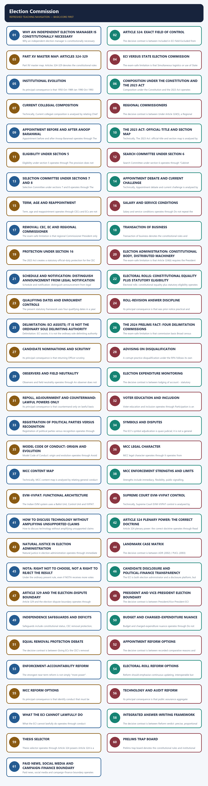

*Distinct embedded teaching-navigation image. The separate continuous Cārvāka-style flowchart package remains an independent at-a-glance artifact.*

### SESSION 1 — WHY AN INDEPENDENT ELECTION MANAGER IS CONSTITUTIONALLY NECESSARY
#### DEFINITION / WHAT THIS IS CALLED

**Plain-language definition:** Why an independent election manager is constitutionally necessary operates through secure poll - verifiable count - lawful declaration, connected with ACCEPTED REPRESENTATIVE AUTHORITY.

**Technical definition:** Why an independent election manager is constitutionally necessary denotes the constitutional rules and institutional links organised around accurate roll - fair candidature - neutral campaign field.

#### ANSWER-GRABBING OPENING — WRITE/ADAPT IN THE EXAM

> The ECI is subject to the Constitution, parliamentary election law, judicial review at the proper stage and reasoned public accountability.

#### MUST-WRITE KEYWORDS

- **constitutional trust institution**
- **Why an independent election manager**
- **Why**
- **ACCEPTED REPRESENTATIVE AUTHORITY**
- **Its principal consequence**
- **Its**

**How to use them:** Frame the answer through constitutional trust institution; define Why an independent election manager, connect Why with ACCEPTED REPRESENTATIVE AUTHORITY to explain the mechanism, and use Its principal consequence for the decisive comparison or qualification.

Why an independent election manager is constitutionally necessary denotes the constitutional rules and institutional links organised around accurate roll - fair candidature - neutral campaign field.
Why an independent election manager is constitutionally necessary operates through secure poll - verifiable count - lawful declaration, connected with ACCEPTED REPRESENTATIVE AUTHORITY.
The operative mechanism matters because accurate roll - fair candidature - neutral campaign field.
Its principal consequence is that accurate roll - fair candidature - neutral campaign field.
The decisive contrast is between accurate roll - fair candidature - neutral campaign field and accurate roll - fair candidature - neutral campaign field.
The exam-safe limitation is that accurate roll - fair candidature - neutral campaign field.
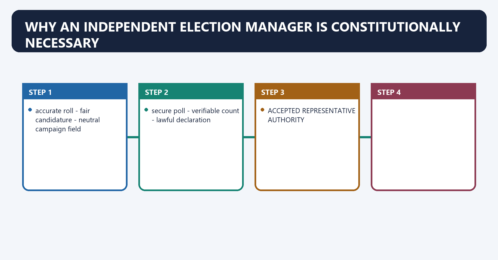
[FACT] Representative government requires more than periodic voting. It needs an authority able to convert equal citizenship into a credible roll, a lawful candidature process, a neutral polling arrangement, secure counting and an accepted result.

[ANALYSIS] The ECI is therefore best understood as a **constitutional trust institution**: it does not choose the winner; it protects the conditions under which electors choose.

[LIMIT] "Independent" does not mean legally unbounded. The ECI is subject to the Constitution, parliamentary election law, judicial review at the proper stage and reasoned public accountability.

#### Visual 1 - Democratic trust chain

```text
EQUAL CITIZENSHIP
      |
accurate roll -> fair candidature -> neutral campaign field
      |                                  |
secure poll -> verifiable count -> lawful declaration
      |
ACCEPTED REPRESENTATIVE AUTHORITY
```

Caption: Trust is cumulative; failure at any link can damage the legitimacy of the result.

#### CLOSING RECALL FLOW — WHY AN INDEPENDENT ELECTION MANAGER IS CONSTITUTIONALLY NECESSARY

```closure-flow
SUBTOPIC: Why an independent election manager is constitutionally necessary
KEY TERMS / DEFINITIONS: constitutional trust institution · Why an independent election manager · Why · ACCEPTED REPRESENTATIVE AUTHORITY · Its principal consequence · Its
MECHANISM / ARGUMENT: Why an independent election manager is constitutionally necessary denotes the constitutional rules and institutional links organised around accurate roll - fair candidature - neutral campaign field.
CONSEQUENCE / CONTRAST: Its principal consequence is that accurate roll - fair candidature - neutral campaign field.
UPSC TRAP / ANSWER-USE: The ECI is therefore best understood as a constitutional trust institution: it does not choose the winner; it protects the conditions under which electors choose.
ANSWER-GRABBING FORMULATION: The ECI is subject to the Constitution, parliamentary election law, judicial review at the proper stage and reasoned public accountability.
```
### SESSION 2 — ARTICLE 324: EXACT FIELD OF CONTROL
#### DEFINITION / WHAT THIS IS CALLED

**Plain-language definition:** Article 324: exact field of control denotes the constitutional rules and institutional links organised around Article 324(1) vests in the Election Commission the superintendence, direction and control of.

**Technical definition:** The decisive contrast is between Included in ECI field Excluded from ECI field and Lok Sabha Panchayats.

#### ANSWER-GRABBING OPENING — WRITE/ADAPT IN THE EXAM

> Article 324 gives the Election Commission control over national and State elections, while local-body elections remain constitutionally assigned to State Election Commissions.

#### MUST-WRITE KEYWORDS

- **Article 324**
- **exact field of control**
- **superintendence, direction and control**
- **not**
- **243K**
- **243ZA**

**How to use them:** Frame the answer through Article 324; define exact field of control, connect superintendence, direction and control with not to explain the mechanism, and use 243K for the decisive comparison or qualification.

Article 324: exact field of control denotes the constitutional rules and institutional links organised around [FACT] Article 324(1) vests in the Election Commission the superintendence, direction and control of.
Article 324: exact field of control operates through preparation of electoral rolls for elections to Parliament and State legislatures, connected with conduct of those elections.
The operative mechanism matters because elections to the offices of President; and.
Its principal consequence is that elections to the office of Vice-President.
The decisive contrast is between Included in ECI field Excluded from ECI field and Lok Sabha Panchayats.
The exam-safe limitation is that rajya Sabha election administration where applicable Municipalities.
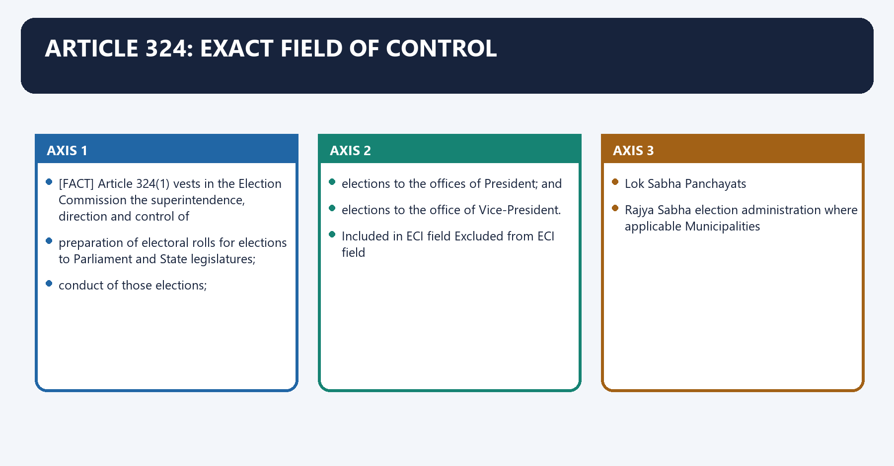
[FACT] Article 324(1) vests in the Election Commission the **superintendence, direction and control** of:

1. preparation of electoral rolls for elections to Parliament and State legislatures;
2. conduct of those elections;
3. elections to the offices of President; and
4. elections to the office of Vice-President.

[LIMIT] Article 324 does **not** place panchayat or municipal elections under the ECI. Articles **243K** and **243ZA** vest those fields in State Election Commissions (SECs).

#### Visual 2 - Article 324 inclusion-exclusion map

| Included in ECI field | Excluded from ECI field |
|---|---|
| Lok Sabha | Panchayats |
| Rajya Sabha election administration where applicable | Municipalities |
| State Legislative Assemblies | cooperative-society elections |
| State Legislative Councils | internal party organisational elections as such |
| President | private associations |
| Vice-President | ordinary by-elections to local bodies |

Caption: The quickest Prelims method is to ask whether the elected institution is named in Article 324 or Part IX/IX-A.

#### CLOSING RECALL FLOW — ARTICLE 324: EXACT FIELD OF CONTROL

```closure-flow
SUBTOPIC: Article 324: exact field of control
KEY TERMS / DEFINITIONS: Article 324 · exact field of control · superintendence, direction and control · not · 243K · 243ZA
MECHANISM / ARGUMENT: Article 324 does not place panchayat or municipal elections under the ECI.
CONSEQUENCE / CONTRAST: The decisive contrast is between Included in ECI field Excluded from ECI field and Lok Sabha Panchayats.
UPSC TRAP / ANSWER-USE: Do not miss this limiting distinction: its principal consequence is that elections to the office of Vice-President.
ANSWER-GRABBING FORMULATION: Article 324 gives the Election Commission control over national and State elections, while local-body elections remain constitutionally assigned to State Election Commissions.
```
### SESSION 3 — PART XV MASTER MAP: ARTICLES 324-329
#### DEFINITION / WHAT THIS IS CALLED

**Plain-language definition:** Part XV master map: Articles 324-329 operates through 324 ECI's superintendence, direction and control not a licence to contradict statute, connected with 326 adult suffrage for Lok Sabha and State Assemblies voting is subject to constitutional/statutory disqualifications.

**Technical definition:** Part XV master map: Articles 324-329 denotes the constitutional rules and institutional links organised around Article Core rule Exam trap.

#### ANSWER-GRABBING OPENING — WRITE/ADAPT IN THE EXAM

> Part XV combines Election Commission supervision, adult suffrage, legislative regulation and limited electoral-interruption rules, requiring Article 324 to operate with rather than above statute.

#### MUST-WRITE KEYWORDS

- **Part XV master map**
- **Articles 324-329**
- **ECI's superintendence, direction and control**
- **not a licence to contradict statute**
- **adult suffrage for Lok Sabha and State Assemblies**
- **61st Constitutional Amendment Act, 1988**

**How to use them:** Frame the answer through Part XV master map; define Articles 324-329, connect ECI's superintendence, direction and control with not a licence to contradict statute to explain the mechanism, and use adult suffrage for Lok Sabha and State Assemblies for the decisive comparison or qualification.

Part XV master map: Articles 324-329 denotes the constitutional rules and institutional links organised around Article Core rule Exam trap.
Part XV master map: Articles 324-329 operates through 324 ECI's superintendence, direction and control not a licence to contradict statute, connected with 326 adult suffrage for Lok Sabha and State Assemblies voting is subject to constitutional/statutory disqualifications.
The operative mechanism matters because 327 Parliament may legislate on elections to legislatures primary source of RPA framework.
Its principal consequence is that 329 limits judicial interruption; election challenged by election petition not total immunity from judicial review.
The decisive contrast is between [FACT] The 61st Constitutional Amendment Act, 1988 reduced the voting age under Article 326 from 21 to 18 and [ANALYSIS] Articles 324 and 327 must be read together: constitutional supervision and statutory specification are complementary.
The exam-safe limitation is that article Core rule Exam trap.
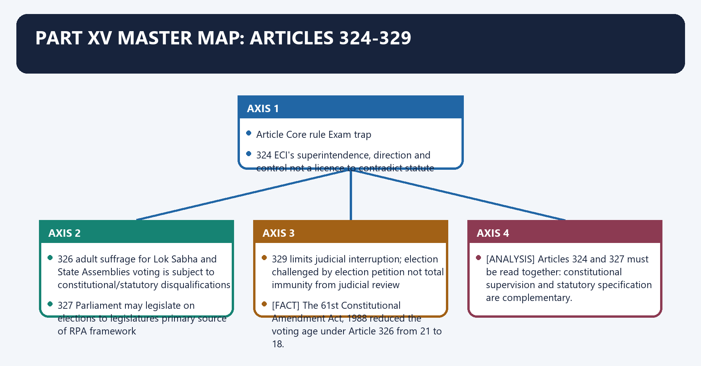
#### Visual 3 - Six-article constitutional spine

| Article | Core rule | Exam trap |
|---|---|---|
| 324 | ECI's superintendence, direction and control | not a licence to contradict statute |
| 325 | one general roll; no exclusion/special roll on religion, race, caste or sex | does not erase lawful residence/age/citizenship conditions |
| 326 | adult suffrage for Lok Sabha and State Assemblies | voting is subject to constitutional/statutory disqualifications |
| 327 | Parliament may legislate on elections to legislatures | primary source of RPA framework |
| 328 | State legislature may legislate for its legislature, subject to Constitution and parliamentary law | subordinate to Parliament's occupied field |
| 329 | limits judicial interruption; election challenged by election petition | not total immunity from judicial review |

[FACT] The **61st Constitutional Amendment Act, 1988** reduced the voting age under Article 326 from 21 to 18.

[ANALYSIS] Articles 324 and 327 must be read together: constitutional supervision and statutory specification are complementary.

#### CLOSING RECALL FLOW — PART XV MASTER MAP: ARTICLES 324-329

```closure-flow
SUBTOPIC: Part XV master map: Articles 324-329
KEY TERMS / DEFINITIONS: Part XV master map · Articles 324-329 · ECI's superintendence, direction and control · not a licence to contradict statute · adult suffrage for Lok Sabha and State Assemblies · 61st Constitutional Amendment Act, 1988
MECHANISM / ARGUMENT: Part XV master map: Articles 324-329 denotes the constitutional rules and institutional links organised around Article Core rule Exam trap.
CONSEQUENCE / CONTRAST: The decisive contrast is between The 61st Constitutional Amendment Act, 1988 reduced the voting age under Article 326 from 21 to 18 and Articles 324 and 327 must be read together: constitutional supervision and statutory specification are complementary.
UPSC TRAP / ANSWER-USE: Its principal consequence is that 329 limits judicial interruption; election challenged by election petition not total immunity from judicial review.
ANSWER-GRABBING FORMULATION: Part XV combines Election Commission supervision, adult suffrage, legislative regulation and limited electoral-interruption rules, requiring Article 324 to operate with rather than above statute.
```
### SESSION 4 — ECI VERSUS STATE ELECTION COMMISSION
#### DEFINITION / WHAT THIS IS CALLED

**Plain-language definition:** ECI versus State Election Commission denotes the constitutional rules and institutional links organised around Dimension Election Commission of India State Election Commission.

**Technical definition:** The exam-safe limitation is that Simultaneous logistics or use of State officials does not merge the two constitutional authorities.

#### ANSWER-GRABBING OPENING — WRITE/ADAPT IN THE EXAM

> Simultaneous logistics or use of State officials does not merge the two constitutional authorities.

#### MUST-WRITE KEYWORDS

- **ECI versus State Election Commission**
- **Article 324**
- **Articles 243K and 243ZA**
- **field**
- **Parliament, State legislatures, President, Vice-President**
- **Panchayats and municipalities**

**How to use them:** Frame the answer through ECI versus State Election Commission; define Article 324, connect Articles 243K and 243ZA with field to explain the mechanism, and use Parliament, State legislatures, President, Vice-President for the decisive comparison or qualification.

ECI versus State Election Commission denotes the constitutional rules and institutional links organised around Dimension Election Commission of India State Election Commission.
ECI versus State Election Commission operates through source Article 324 Articles 243K and 243ZA, connected with field Parliament, State legislatures, President, Vice-President Panchayats and municipalities.
The operative mechanism matters because head CEC plus other ECs as fixed State Election Commissioner.
Its principal consequence is that appointment President under the 2023 Act Governor.
The decisive contrast is between removal protection CEC like SC judge; ECs/Regional Commissioners on CEC recommendation SEC removed like a High Court judge and law base Constitution, RPA 1950/1951 and election rules State local-government election laws.
The exam-safe limitation is that [LIMIT] Simultaneous logistics or use of State officials does not merge the two constitutional authorities.
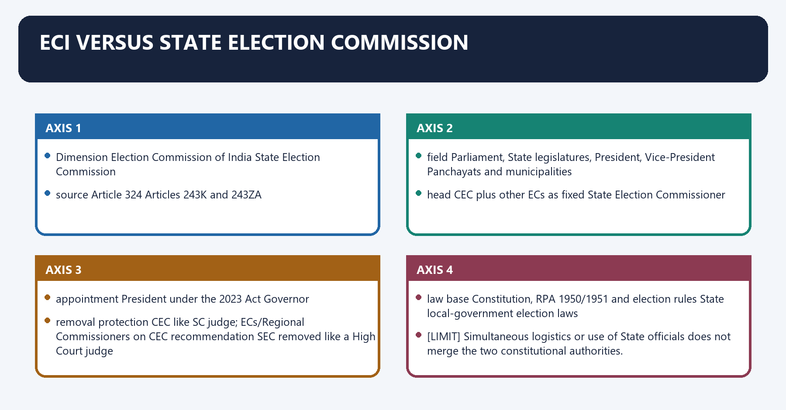
#### Visual 4 - Two constitutional election managers

| Dimension | Election Commission of India | State Election Commission |
|---|---|---|
| source | Article 324 | Articles 243K and 243ZA |
| field | Parliament, State legislatures, President, Vice-President | Panchayats and municipalities |
| head | CEC plus other ECs as fixed | State Election Commissioner |
| appointment | President under the 2023 Act | Governor |
| removal protection | CEC like SC judge; ECs/Regional Commissioners on CEC recommendation | SEC removed like a High Court judge |
| law base | Constitution, RPA 1950/1951 and election rules | State local-government election laws |

[LIMIT] Simultaneous logistics or use of State officials does not merge the two constitutional authorities.

> **Prelims trap:** "The ECI conducts every public election in India" is false.

#### CLOSING RECALL FLOW — ECI VERSUS STATE ELECTION COMMISSION

```closure-flow
SUBTOPIC: ECI versus State Election Commission
KEY TERMS / DEFINITIONS: ECI versus State Election Commission · Article 324 · Articles 243K and 243ZA · field · Parliament, State legislatures, President, Vice-President · Panchayats and municipalities
MECHANISM / ARGUMENT: The decisive contrast is between removal protection CEC like SC judge; ECs/Regional Commissioners on CEC recommendation SEC removed like a High Court judge and law base Constitution, RPA 1950/1951 and election rules State local-government election laws.
CONSEQUENCE / CONTRAST: The exam-safe limitation is that Simultaneous logistics or use of State officials does not merge the two constitutional authorities.
UPSC TRAP / ANSWER-USE: Simultaneous logistics or use of State officials does not merge the two constitutional authorities.
ANSWER-GRABBING FORMULATION: Simultaneous logistics or use of State officials does not merge the two constitutional authorities.
```
### SESSION 5 — INSTITUTIONAL EVOLUTION
#### DEFINITION / WHAT THIS IS CALLED

**Plain-language definition:** Institutional evolution denotes the constitutional rules and institutional links organised around 1950 Oct 1989 Jan 1990 Oct 1993 onward.

**Technical definition:** Its principal consequence is that 1950 Oct 1989 Jan 1990 Oct 1993 onward.

#### ANSWER-GRABBING OPENING — WRITE/ADAPT IN THE EXAM

> Article 324 permits a multi-member Election Commission without fixing its size, allowing institutional evolution through law and presidential action within the constitutional framework.

#### MUST-WRITE KEYWORDS

- **Institutional evolution**
- **Article 324**
- **Institutional**
- **Oct**
- **Jan**
- **25 January 1950**

**How to use them:** Frame the answer through Institutional evolution; define Article 324, connect Institutional with Oct to explain the mechanism, and use Jan for the decisive comparison or qualification.

Institutional evolution denotes the constitutional rules and institutional links organised around 1950 Oct 1989 Jan 1990 Oct 1993 onward.
Institutional evolution operates through CEC only ---------- CEC + 2 ECs - CEC only ---- CEC + 2 ECs, connected with collegial majority model.
The operative mechanism matters because 1950 Oct 1989 Jan 1990 Oct 1993 onward.
Its principal consequence is that 1950 Oct 1989 Jan 1990 Oct 1993 onward.
The decisive contrast is between 1950 Oct 1989 Jan 1990 Oct 1993 onward and 1950 Oct 1989 Jan 1990 Oct 1993 onward.
The exam-safe limitation is that 1950 Oct 1989 Jan 1990 Oct 1993 onward.
[FACT] The ECI was established on **25 January 1950**. It operated as a single-member body until 15 October 1989; two ECs were added on 16 October 1989, the posts were discontinued in January 1990, and two ECs were again appointed in October 1993. The three-member form has continued since then.

[ANALYSIS] The shift from a single office to a collegial commission distributes authority, creates internal deliberation and reduces person-centred administration.

#### Visual 5 - Composition timeline

```text
1950                  Oct 1989       Jan 1990       Oct 1993 onward
CEC only  ----------> CEC + 2 ECs -> CEC only ----> CEC + 2 ECs
                                               collegial majority model
```

Caption: Multi-membership is constitutionally permitted because Article 324 does not fix the number.

#### CLOSING RECALL FLOW — INSTITUTIONAL EVOLUTION

```closure-flow
SUBTOPIC: Institutional evolution
KEY TERMS / DEFINITIONS: Institutional evolution · Article 324 · Institutional · Oct · Jan · 25 January 1950
MECHANISM / ARGUMENT: Its principal consequence is that 1950 Oct 1989 Jan 1990 Oct 1993 onward.
CONSEQUENCE / CONTRAST: The decisive contrast is between 1950 Oct 1989 Jan 1990 Oct 1993 onward and 1950 Oct 1989 Jan 1990 Oct 1993 onward.
UPSC TRAP / ANSWER-USE: Do not miss this limiting distinction: the exam-safe limitation is that 1950 Oct 1989 Jan 1990 Oct 1993 onward.
ANSWER-GRABBING FORMULATION: Article 324 permits a multi-member Election Commission without fixing its size, allowing institutional evolution through law and presidential action within the constitutional framework.
```
### SESSION 6 — COMPOSITION UNDER THE CONSTITUTION AND THE 2023 ACT
#### DEFINITION / WHAT THIS IS CALLED

**Plain-language definition:** Composition under the Constitution and the 2023 Act denotes the constitutional rules and institutional links organised around When other ECs are appointed, Article 324(3) makes the CEC the Chairman.

**Technical definition:** Composition under the Constitution and the 2023 Act operates through Chairmanship does not make the CEC a unilateral superior in adjudicatory or administrative decision-making, connected with agenda / institutional leadership.

#### ANSWER-GRABBING OPENING — WRITE/ADAPT IN THE EXAM

> Article 324(2) provides for the CEC and such number of other ECs, if any, as the President may from time to time fix, subject to a parliamentary law.

#### MUST-WRITE KEYWORDS

- **Composition under the Constitution**
- **the 2023 Act**
- **Article 324**
- **Composition under the Constitution and the 2023 Act**
- **Composition**
- **Constitution**

**How to use them:** Frame the answer through Composition under the Constitution; define the 2023 Act, connect Article 324 with Composition under the Constitution and the 2023 Act to explain the mechanism, and use Composition for the decisive comparison or qualification.

Composition under the Constitution and the 2023 Act denotes the constitutional rules and institutional links organised around [FACT] When other ECs are appointed, Article 324(3) makes the CEC the Chairman.
Composition under the Constitution and the 2023 Act operates through [LIMIT] Chairmanship does not make the CEC a unilateral superior in adjudicatory or administrative decision-making, connected with agenda / institutional leadership.
The operative mechanism matters because constitutional removal protection.
Its principal consequence is that x-- no unilateral veto over equal EC votes.
The decisive contrast is between CEC + EC + EC - unanimity where possible - otherwise majority and [FACT] When other ECs are appointed, Article 324(3) makes the CEC the Chairman.
The exam-safe limitation is that [FACT] When other ECs are appointed, Article 324(3) makes the CEC the Chairman.
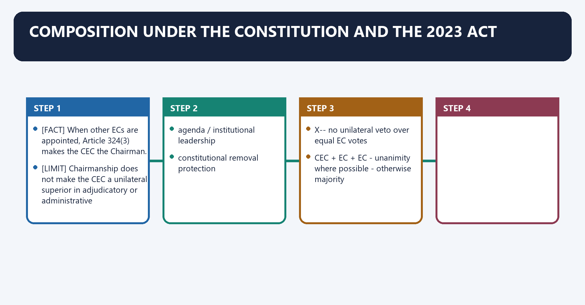
[FACT] Article 324(2) provides for the CEC and such number of other ECs, if any, as the President may from time to time fix, subject to a parliamentary law.

[FACT] Section 3 of the 2023 Act states that the Commission consists of the CEC and such number of other ECs as the President may fix from time to time.

[FACT] When other ECs are appointed, Article 324(3) makes the CEC the Chairman.

[LIMIT] Chairmanship does not make the CEC a unilateral superior in adjudicatory or administrative decision-making.

#### Visual 6 - Position versus power

```text
CEC = CHAIR
  |
  +-- agenda / institutional leadership
  +-- constitutional removal protection
  |
  X-- no unilateral veto over equal EC votes

CEC + EC + EC -> unanimity where possible -> otherwise majority
```

#### CLOSING RECALL FLOW — COMPOSITION UNDER THE CONSTITUTION AND THE 2023 ACT

```closure-flow
SUBTOPIC: Composition under the Constitution and the 2023 Act
KEY TERMS / DEFINITIONS: Composition under the Constitution · the 2023 Act · Article 324 · Composition under the Constitution and the 2023 Act · Composition · Constitution
MECHANISM / ARGUMENT: Composition under the Constitution and the 2023 Act operates through Chairmanship does not make the CEC a unilateral superior in adjudicatory or administrative decision-making, connected with agenda / institutional leadership.
CONSEQUENCE / CONTRAST: The decisive contrast is between CEC + EC + EC - unanimity where possible - otherwise majority and When other ECs are appointed, Article 324(3) makes the CEC the Chairman.
UPSC TRAP / ANSWER-USE: Do not miss this limiting distinction: its principal consequence is that x-- no unilateral veto over equal EC votes.
ANSWER-GRABBING FORMULATION: Article 324(2) provides for the CEC and such number of other ECs, if any, as the President may from time to time fix, subject to a parliamentary law.
```
### SESSION 7 — CURRENT COLLEGIAL COMPOSITION
#### DEFINITION / WHAT THIS IS CALLED

**Plain-language definition:** Current collegial composition denotes the constitutional rules and institutional links organised around [CURRENT] On the control date, the ECI's official leadership page lists.

**Technical definition:** Technically, Current collegial composition is analysed by relating Chief Election Commissioner to Gyanesh Kumar, then testing the relationship through Election Commissioner and Dr Sukhbir Singh Sandhu.

#### ANSWER-GRABBING OPENING — WRITE/ADAPT IN THE EXAM

> The Election Commission's current membership is date-sensitive, while its collegial constitutional structure matters more than memorising temporary officeholders.

#### MUST-WRITE KEYWORDS

- **Current collegial composition**
- **Chief Election Commissioner**
- **Gyanesh Kumar**
- **Election Commissioner**
- **Dr Sukhbir Singh Sandhu**
- **Dr Vivek Joshi**

**How to use them:** Frame the answer through Current collegial composition; define Chief Election Commissioner, connect Gyanesh Kumar with Election Commissioner to explain the mechanism, and use Dr Sukhbir Singh Sandhu for the decisive comparison or qualification.

Current collegial composition denotes the constitutional rules and institutional links organised around [CURRENT] On the control date, the ECI's official leadership page lists.
Current collegial composition operates through Chief Election Commissioner Gyanesh Kumar, connected with Election Commissioner Dr Sukhbir Singh Sandhu.
The operative mechanism matters because election Commissioner Dr Vivek Joshi.
Its principal consequence is that [LIMIT] Names are date-sensitive. UPSC usually tests constitutional architecture, not incumbent memory.
The decisive contrast is between [CURRENT] On the control date, the ECI's official leadership page lists and [CURRENT] On the control date, the ECI's official leadership page lists.
The exam-safe limitation is that [CURRENT] On the control date, the ECI's official leadership page lists.
[CURRENT] On the control date, the ECI's official leadership page lists:

| Office | Incumbent |
|---|---|
| Chief Election Commissioner | Gyanesh Kumar |
| Election Commissioner | Dr Sukhbir Singh Sandhu |
| Election Commissioner | Dr Vivek Joshi |

[LIMIT] Names are date-sensitive. UPSC usually tests constitutional architecture, not incumbent memory.

#### CLOSING RECALL FLOW — CURRENT COLLEGIAL COMPOSITION

```closure-flow
SUBTOPIC: Current collegial composition
KEY TERMS / DEFINITIONS: Current collegial composition · Chief Election Commissioner · Gyanesh Kumar · Election Commissioner · Dr Sukhbir Singh Sandhu · Dr Vivek Joshi
MECHANISM / ARGUMENT: The decisive contrast is between [CURRENT] On the control date, the ECI's official leadership page lists and [CURRENT] On the control date, the ECI's official leadership page lists.
CONSEQUENCE / CONTRAST: Its principal consequence is that Names are date-sensitive.
UPSC TRAP / ANSWER-USE: Do not miss this limiting distinction: the exam-safe limitation is that [CURRENT] On the control date, the ECI's official leadership...
ANSWER-GRABBING FORMULATION: The Election Commission's current membership is date-sensitive, while its collegial constitutional structure matters more than memorising temporary officeholders.
```
### SESSION 8 — REGIONAL COMMISSIONERS
#### DEFINITION / WHAT THIS IS CALLED

**Plain-language definition:** Regional Commissioners denotes the constitutional rules and institutional links organised around Under Article 324(5), a Regional Commissioner cannot be removed except on the CEC's recommendation.

**Technical definition:** The decisive contrast is between Under Article 324(5), a Regional Commissioner cannot be removed except on the CEC's recommendation and Under Article 324(5), a Regional Commissioner cannot be removed except on the CEC's recommendation.

#### ANSWER-GRABBING OPENING — WRITE/ADAPT IN THE EXAM

> Under Article 324(5), a Regional Commissioner cannot be removed except on the CEC's recommendation.

#### MUST-WRITE KEYWORDS

- **Regional Commissioners**
- **Article 324**
- **Under Article**
- **Regional Commissioner**
- **CEC's**
- **Regional Commissioners operates through Regional Commissioners**

**How to use them:** Frame the answer through Regional Commissioners; define Article 324, connect Under Article with Regional Commissioner to explain the mechanism, and use CEC's for the decisive comparison or qualification.

Regional Commissioners denotes the constitutional rules and institutional links organised around [FACT] Under Article 324(5), a Regional Commissioner cannot be removed except on the CEC's recommendation.
Regional Commissioners operates through [LIMIT] Regional Commissioners are not permanent State Election Commissioners and do not replace the Chief Electoral Officer machinery, connected with President --consults ECI-- may appoint Regional Commissioner.
The operative mechanism matters because nOT: head of a State Election Commission.
Its principal consequence is that nOT: independent local-body election authority.
The decisive contrast is between [FACT] Under Article 324(5), a Regional Commissioner cannot be removed except on the CEC's recommendation and [FACT] Under Article 324(5), a Regional Commissioner cannot be removed except on the CEC's recommendation.
The exam-safe limitation is that [FACT] Under Article 324(5), a Regional Commissioner cannot be removed except on the CEC's recommendation.
[FACT] Article 324(4) allows the President, after consulting the ECI, to appoint Regional Commissioners when necessary to assist the Commission.

[FACT] Under Article 324(5), a Regional Commissioner cannot be removed except on the CEC's recommendation.

[LIMIT] Regional Commissioners are not permanent State Election Commissioners and do not replace the Chief Electoral Officer machinery.

#### Visual 7 - Assistance architecture

```text
President --consults ECI--> may appoint Regional Commissioner
                                  |
                                  v
                            assists the ECI

NOT: head of a State Election Commission
NOT: independent local-body election authority
```

#### CLOSING RECALL FLOW — REGIONAL COMMISSIONERS

```closure-flow
SUBTOPIC: Regional Commissioners
KEY TERMS / DEFINITIONS: Regional Commissioners · Article 324 · Under Article · Regional Commissioner · CEC's · Regional Commissioners operates through Regional Commissioners
MECHANISM / ARGUMENT: Regional Commissioners operates through Regional Commissioners are not permanent State Election Commissioners and do not replace the Chief Electoral Officer machinery, connected with President --consults ECI-- may appoint Regional Commissioner.
CONSEQUENCE / CONTRAST: The decisive contrast is between Under Article 324(5), a Regional Commissioner cannot be removed except on the CEC's recommendation and Under Article 324(5), a Regional Commissioner cannot be removed except on the CEC's recommendation.
UPSC TRAP / ANSWER-USE: Regional Commissioners are not permanent State Election Commissioners and do not replace the Chief Electoral Officer machinery.
ANSWER-GRABBING FORMULATION: Under Article 324(5), a Regional Commissioner cannot be removed except on the CEC's recommendation.
```
### SESSION 9 — APPOINTMENT BEFORE AND AFTER ANOOP BARANWAL
#### DEFINITION / WHAT THIS IS CALLED

**Plain-language definition:** Appointment before and after Anoop Baranwal denotes the constitutional rules and institutional links organised around Article 324(2) always contemplated appointments by the President, subject to any law Parliament made.

**Technical definition:** Appointment before and after Anoop Baranwal operates through The judgment expressly said this norm would continue "till a law is made by the Parliament.", connected with long absence of parliamentary appointment law.

#### ANSWER-GRABBING OPENING — WRITE/ADAPT IN THE EXAM

> Article 324(2) always contemplated appointments by the President, subject to any law Parliament made.

#### MUST-WRITE KEYWORDS

- **Appointment before**
- **after Anoop Baranwal**
- **Article 324**
- **Appointment before and after Anoop Baranwal**
- **Appointment**
- **Anoop Baranwal**

**How to use them:** Frame the answer through Appointment before; define after Anoop Baranwal, connect Article 324 with Appointment before and after Anoop Baranwal to explain the mechanism, and use Appointment for the decisive comparison or qualification.

Appointment before and after *Anoop Baranwal* denotes the constitutional rules and institutional links organised around [FACT] Article 324(2) always contemplated appointments by the President, subject to any law Parliament made.
Appointment before and after *Anoop Baranwal* operates through [FACT] The judgment expressly said this norm would continue "till a law is made by the Parliament.", connected with long absence of parliamentary appointment law.
The operative mechanism matters because anoop Baranwal (2 Mar 2023).
Its principal consequence is that pM + LoP/largest opposition leader + CJI.
The decisive contrast is between expressly temporary and 2023 Act, in force 2 Jan 2024.
The exam-safe limitation is that pM + LoP/largest opposition leader + PM-nominated Cabinet Minister.
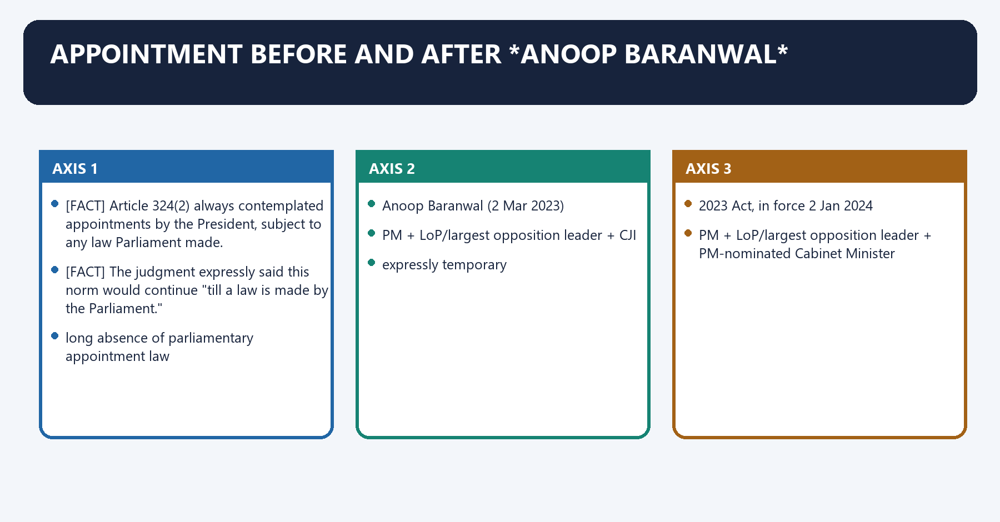
[FACT] Article 324(2) always contemplated appointments by the President, subject to any law Parliament made.

[FACT] In *Anoop Baranwal v. Union of India* (2 March 2023), the Supreme Court filled the legislative vacuum by directing that appointments be made on the advice of a committee comprising the Prime Minister, Leader of Opposition (or largest opposition-party leader) and Chief Justice of India.

[FACT] The judgment expressly said this norm would continue **"till a law is made by the Parliament."**

[LIMIT] The Court did not simply declare every prior executive appointment unconstitutional. Its operative response was a prospective interim institutional arrangement pending legislation.

#### Visual 8 - Appointment-law sequence

```text
Article 324(2)
   |
long absence of parliamentary appointment law
   |
Anoop Baranwal (2 Mar 2023)
PM + LoP/largest opposition leader + CJI
   |  expressly temporary
   v
2023 Act, in force 2 Jan 2024
PM + LoP/largest opposition leader + PM-nominated Cabinet Minister
```

Caption: The 2023 Act displaced the Court-created interim panel because the judgment itself preserved Parliament's law-making space.

#### CLOSING RECALL FLOW — APPOINTMENT BEFORE AND AFTER ANOOP BARANWAL

```closure-flow
SUBTOPIC: Appointment before and after Anoop Baranwal
KEY TERMS / DEFINITIONS: Appointment before · after Anoop Baranwal · Article 324 · Appointment before and after Anoop Baranwal · Appointment · Anoop Baranwal
MECHANISM / ARGUMENT: Appointment before and after Anoop Baranwal operates through The judgment expressly said this norm would continue "till a law is made by the Parliament.", connected with long absence of parliamentary appointment law.
CONSEQUENCE / CONTRAST: Its principal consequence is that pM + LoP/largest opposition leader + CJI.
UPSC TRAP / ANSWER-USE: Do not miss this limiting distinction: the decisive contrast is between expressly temporary and 2023 Act, in force 2 Jan...
ANSWER-GRABBING FORMULATION: Article 324(2) always contemplated appointments by the President, subject to any law Parliament made.
```
### SESSION 10 — THE 2023 ACT: OFFICIAL-TITLE AND SECTION MAP
#### DEFINITION / WHAT THIS IS CALLED

**Plain-language definition:** The 2023 Act: official-title and section map denotes the constitutional rules and institutional links organised around Provision Official control.

**Technical definition:** Technically, The 2023 Act: official-title and section map is analysed by relating The 2023 Act to official-title, then testing the relationship through section map and long title.

#### ANSWER-GRABBING OPENING — WRITE/ADAPT IN THE EXAM

> The 2023 appointment law governs eligibility, search, selection, tenure, service conditions and Commission business, making the enacted text—not Bill-stage summaries—the controlling source.

#### MUST-WRITE KEYWORDS

- **The 2023 Act**
- **official-title**
- **section map**
- **long title**
- **appointment, service, term and transaction of ECI business**
- **s.3**

**How to use them:** Frame the answer through The 2023 Act; define official-title, connect section map with long title to explain the mechanism, and use appointment, service, term and transaction of ECI business for the decisive comparison or qualification.

The 2023 Act: official-title and section map denotes the constitutional rules and institutional links organised around Provision Official control.
The 2023 Act: official-title and section map operates through long title appointment, service, term and transaction of ECI business, connected with s.4 President appoints by warrant under hand and seal.
The operative mechanism matters because s.6 Search Committee.
Its principal consequence is that s.7 Selection Committee and vacancy/defect saving.
The decisive contrast is between s.8 transparent self-regulated selection procedure; power to consider outside panel and s.9 term, age, no reappointment, aggregate cap.
The exam-safe limitation is that s.10 salary equal to SC judge; related allowances.
#### Visual 9 - Act 49 of 2023 dashboard

| Provision | Official control |
|---|---|
| long title | appointment, service, term and transaction of ECI business |
| s.3 | composition |
| s.4 | President appoints by warrant under hand and seal |
| s.5 | eligibility |
| s.6 | Search Committee |
| s.7 | Selection Committee and vacancy/defect saving |
| s.8 | transparent self-regulated selection procedure; power to consider outside panel |
| s.9 | term, age, no reappointment, aggregate cap |
| s.10 | salary equal to SC judge; related allowances |
| s.11 | resignation and removal |
| s.16 | protection concerning official acts/things/words |
| ss.17-18 | transaction and disposal of business |

[LIMIT] Coaching summaries frequently reproduce Bill-stage provisions. The enacted India Code text, not a Bill summary, controls.

#### CLOSING RECALL FLOW — THE 2023 ACT: OFFICIAL-TITLE AND SECTION MAP

```closure-flow
SUBTOPIC: The 2023 Act: official-title and section map
KEY TERMS / DEFINITIONS: The 2023 Act · official-title · section map · long title · appointment, service, term and transaction of ECI business · s.3
MECHANISM / ARGUMENT: Its principal consequence is that s.7 Selection Committee and vacancy/defect saving.
CONSEQUENCE / CONTRAST: The decisive contrast is between s.8 transparent self-regulated selection procedure; power to consider outside panel and s.9 term, age, no reappointment, aggregate cap.
UPSC TRAP / ANSWER-USE: Do not miss this limiting distinction: the exam-safe limitation is that s.10 salary equal to SC judge.
ANSWER-GRABBING FORMULATION: The 2023 appointment law governs eligibility, search, selection, tenure, service conditions and Commission business, making the enacted text—not Bill-stage summaries—the controlling source.
```
### SESSION 11 — ELIGIBILITY UNDER SECTION 5
#### DEFINITION / WHAT THIS IS CALLED

**Plain-language definition:** Eligibility under section 5 denotes the constitutional rules and institutional links organised around The person must be of integrity and possess knowledge of and experience in the management and conduct of elections.

**Technical definition:** Eligibility under section 5 operates through The provision does not require judicial office, a fixed academic degree or prior service inside the ECI, connected with Secretary-equivalent rank.

#### ANSWER-GRABBING OPENING — WRITE/ADAPT IN THE EXAM

> Section 5 converts a previously constitutionally unspecified qualification field into a senior-administrative eligibility pool.

#### MUST-WRITE KEYWORDS

- **Eligibility under section 5**
- **Secretary to the Government of India**
- **management and conduct of elections**
- **Eligibility**
- **ECI**
- **Secretary-equivalent**

**How to use them:** Frame the answer through Eligibility under section 5; define Secretary to the Government of India, connect management and conduct of elections with Eligibility to explain the mechanism, and use ECI for the decisive comparison or qualification.

Eligibility under section 5 denotes the constitutional rules and institutional links organised around [FACT] The person must be of integrity and possess knowledge of and experience in the management and conduct of elections.
Eligibility under section 5 operates through [LIMIT] The provision does not require judicial office, a fixed academic degree or prior service inside the ECI, connected with Secretary-equivalent rank.
The operative mechanism matters because knowledge and experience in election management/conduct.
Its principal consequence is that statutory eligibility pool.
The decisive contrast is between [FACT] The person must be of integrity and possess knowledge of and experience in the management and conduct of elections and [FACT] The person must be of integrity and possess knowledge of and experience in the management and conduct of elections.
The exam-safe limitation is that [FACT] The person must be of integrity and possess knowledge of and experience in the management and conduct of elections.
[FACT] A CEC or EC must be appointed from among persons who hold or have held a post equivalent to the rank of **Secretary to the Government of India**.

[FACT] The person must be of integrity and possess knowledge of and experience in the **management and conduct of elections**.

[ANALYSIS] Section 5 converts a previously constitutionally unspecified qualification field into a senior-administrative eligibility pool.

[LIMIT] The provision does not require judicial office, a fixed academic degree or prior service inside the ECI.

#### Visual 10 - Eligibility filter

```text
Secretary-equivalent rank
          +
integrity
          +
knowledge and experience in election management/conduct
          =
statutory eligibility pool
```

#### CLOSING RECALL FLOW — ELIGIBILITY UNDER SECTION 5

```closure-flow
SUBTOPIC: Eligibility under section 5
KEY TERMS / DEFINITIONS: Eligibility under section 5 · Secretary to the Government of India · management and conduct of elections · Eligibility · ECI · Secretary-equivalent
MECHANISM / ARGUMENT: Section 5 converts a previously constitutionally unspecified qualification field into a senior-administrative eligibility pool.
CONSEQUENCE / CONTRAST: Eligibility under section 5 denotes the constitutional rules and institutional links organised around The person must be of integrity and possess knowledge of and experience in the management and conduct of elections.
UPSC TRAP / ANSWER-USE: Do not miss this limiting distinction: its principal consequence is that statutory eligibility pool.
ANSWER-GRABBING FORMULATION: Section 5 converts a previously constitutionally unspecified qualification field into a senior-administrative eligibility pool.
```
### SESSION 12 — SEARCH COMMITTEE UNDER SECTION 6
#### DEFINITION / WHAT THIS IS CALLED

**Plain-language definition:** Search Committee under section 6 denotes the constitutional rules and institutional links organised around It prepares a panel of five persons for the Selection Committee.

**Technical definition:** Search Committee under section 6 operates through "Cabinet Secretary heads the Search Committee" is not the enacted Act 49 of 2023 rule, connected with Actor Composition Output.

#### ANSWER-GRABBING OPENING — WRITE/ADAPT IN THE EXAM

> Section 6 places the Law Minister at the head of a Search Committee that prepares five names, distinguishing preliminary screening from the Selection Committee's choice.

#### MUST-WRITE KEYWORDS

- **Search Committee under section 6**
- **Minister of Law and Justice**
- **five persons**
- **Search Committee**
- **Law Minister + two Secretary-rank-or-above members**
- **panel of five**

**How to use them:** Frame the answer through Search Committee under section 6; define Minister of Law and Justice, connect five persons with Search Committee to explain the mechanism, and use Law Minister + two Secretary-rank-or-above members for the decisive comparison or qualification.

Search Committee under section 6 denotes the constitutional rules and institutional links organised around [FACT] It prepares a panel of five persons for the Selection Committee.
Search Committee under section 6 operates through [LIMIT] "Cabinet Secretary heads the Search Committee" is not the enacted Act 49 of 2023 rule, connected with Actor Composition Output.
The operative mechanism matters because search Committee Law Minister + two Secretary-rank-or-above members panel of five.
Its principal consequence is that selection Committee PM + LoP/largest opposition leader + PM-nominated Cabinet Minister recommendation to President.
The decisive contrast is between President constitutional appointing authority warrant of appointment and [FACT] It prepares a panel of five persons for the Selection Committee.
The exam-safe limitation is that [FACT] It prepares a panel of five persons for the Selection Committee.
[FACT] The enacted section 6 Search Committee is headed by the **Minister of Law and Justice**, with two other members not below Secretary rank.

[FACT] It prepares a panel of **five persons** for the Selection Committee.

[LIMIT] "Cabinet Secretary heads the Search Committee" is not the enacted Act 49 of 2023 rule.

#### Visual 11 - Search stage

| Actor | Composition | Output |
|---|---|---|
| Search Committee | Law Minister + two Secretary-rank-or-above members | panel of five |
| Selection Committee | PM + LoP/largest opposition leader + PM-nominated Cabinet Minister | recommendation to President |
| President | constitutional appointing authority | warrant of appointment |

#### CLOSING RECALL FLOW — SEARCH COMMITTEE UNDER SECTION 6

```closure-flow
SUBTOPIC: Search Committee under section 6
KEY TERMS / DEFINITIONS: Search Committee under section 6 · Minister of Law and Justice · five persons · Search Committee · Law Minister + two Secretary-rank-or-above members · panel of five
MECHANISM / ARGUMENT: Search Committee under section 6 operates through "Cabinet Secretary heads the Search Committee" is not the enacted Act 49 of 2023 rule, connected with Actor Composition Output.
CONSEQUENCE / CONTRAST: The enacted section 6 Search Committee is headed by the Minister of Law and Justice, with two other members not below Secretary rank.
UPSC TRAP / ANSWER-USE: Do not miss this limiting distinction: the decisive contrast is between President constitutional appointing authority warrant of appointment and It...
ANSWER-GRABBING FORMULATION: Section 6 places the Law Minister at the head of a Search Committee that prepares five names, distinguishing preliminary screening from the Selection Committee's choice.
```
### SESSION 13 — SELECTION COMMITTEE UNDER SECTIONS 7 AND 8
#### DEFINITION / WHAT THIS IS CALLED

**Plain-language definition:** Selection Committee under sections 7 and 8 denotes the constitutional rules and institutional links organised around Appointment is not invalid merely because of a vacancy in or defect in the constitution of the committee.

**Technical definition:** Selection Committee under sections 7 and 8 operates through The committee must regulate its procedure transparently and may consider a person outside the Search Committee's panel, connected with SEARCH PANEL (5) ----------------------+.

#### ANSWER-GRABBING OPENING — WRITE/ADAPT IN THE EXAM

> Appointment is not invalid merely because of a vacancy in or defect in the constitution of the committee.

#### MUST-WRITE KEYWORDS

- **Selection Committee under sections 7**
- **Selection Committee under sections 7 and 8**
- **Selection Committee**
- **Appointment**
- **Search Committee's**
- **SEARCH PANEL**

**How to use them:** Frame the answer through Selection Committee under sections 7; define Selection Committee under sections 7 and 8, connect Selection Committee with Appointment to explain the mechanism, and use Search Committee's for the decisive comparison or qualification.

Selection Committee under sections 7 and 8 denotes the constitutional rules and institutional links organised around [FACT] Appointment is not invalid merely because of a vacancy in or defect in the constitution of the committee.
Selection Committee under sections 7 and 8 operates through [FACT] The committee must regulate its procedure transparently and may consider a person outside the Search Committee's panel, connected with SEARCH PANEL (5) ----------------------+.
The operative mechanism matters because outside-panel candidate permitted ----+-- transparent committee procedure.
Its principal consequence is that recommendation - President.
The decisive contrast is between Risk: executive has 2 of 3 seats and Need: criteria + adequate dossiers + reasons + meaningful deliberation.
The exam-safe limitation is that [FACT] Appointment is not invalid merely because of a vacancy in or defect in the constitution of the committee.
[FACT] The committee comprises the Prime Minister as Chairperson, the Lok Sabha Leader of Opposition (or leader of the single largest opposition party if no LoP is recognised), and a Union Cabinet Minister nominated by the Prime Minister.

[FACT] Appointment is not invalid merely because of a vacancy in or defect in the constitution of the committee.

[FACT] The committee must regulate its procedure transparently and may consider a person outside the Search Committee's panel.

[ANALYSIS] The outside-panel power prevents the five-name panel from being a legal cage, but increases the importance of disclosed criteria and reasoned deliberation.

#### Visual 12 - Selection logic and accountability risk

```text
SEARCH PANEL (5) ----------------------+
                                      |
outside-panel candidate permitted ----+--> transparent committee procedure
                                             |
                                             v
                                      recommendation -> President

Risk: executive has 2 of 3 seats
Need: criteria + adequate dossiers + reasons + meaningful deliberation
```

#### CLOSING RECALL FLOW — SELECTION COMMITTEE UNDER SECTIONS 7 AND 8

```closure-flow
SUBTOPIC: Selection Committee under sections 7 and 8
KEY TERMS / DEFINITIONS: Selection Committee under sections 7 · Selection Committee under sections 7 and 8 · Selection Committee · Appointment · Search Committee's · SEARCH PANEL
MECHANISM / ARGUMENT: Selection Committee under sections 7 and 8 operates through The committee must regulate its procedure transparently and may consider a person outside the Search Committee's panel, connected with SEARCH PANEL (5) ----------------------+.
CONSEQUENCE / CONTRAST: The exam-safe limitation is that Appointment is not invalid merely because of a vacancy in or defect in the constitution of the committee.
UPSC TRAP / ANSWER-USE: Appointment is not invalid merely because of a vacancy in or defect in the constitution of the committee.
ANSWER-GRABBING FORMULATION: Appointment is not invalid merely because of a vacancy in or defect in the constitution of the committee.
```
### SESSION 14 — APPOINTMENT DEBATE AND CURRENT CHALLENGE
#### DEFINITION / WHAT THIS IS CALLED

**Plain-language definition:** Appointment debate and current challenge denotes the constitutional rules and institutional links organised around [CURRENT] No official merits verdict or stay was located as of 24 August 2026.

**Technical definition:** Technically, Appointment debate and current challenge is analysed by relating Appointment debate to current challenge, then testing the relationship through Article 324 and Appointment.

#### ANSWER-GRABBING OPENING — WRITE/ADAPT IN THE EXAM

> The 2023 appointments framework invokes Parliament's Article 324(2) authority, but executive predominance and compressed deliberation sustain unresolved independence concerns.

#### MUST-WRITE KEYWORDS

- **Appointment debate**
- **current challenge**
- **Article 324**
- **Appointment debate and current challenge**
- **Appointment**
- **No**

**How to use them:** Frame the answer through Appointment debate; define current challenge, connect Article 324 with Appointment debate and current challenge to explain the mechanism, and use Appointment for the decisive comparison or qualification.

Appointment debate and current challenge denotes the constitutional rules and institutional links organised around [CURRENT] No official merits verdict or stay was located as of 24 August 2026.
Appointment debate and current challenge operates through PARLIAMENTARY COMPETENCE? - Article 324(2) expressly permits a law, connected with not the main unresolved difficulty.
The operative mechanism matters because iNSTITUTIONAL INDEPENDENCE? - executive 2:1 weight.
Its principal consequence is that free and fair elections / basic-structure argument.
The decisive contrast is between transparency and meaningful deliberation and pending merits adjudication.
The exam-safe limitation is that [CURRENT] No official merits verdict or stay was located as of 24 August 2026.
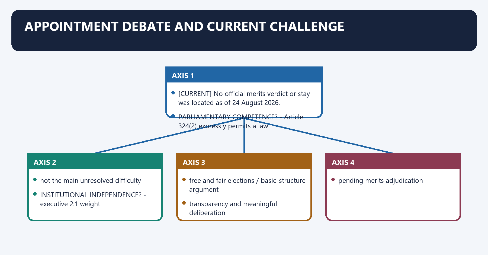
[ANALYSIS] Critics focus on executive predominance because the PM and PM-nominated Minister form two of three members. Defenders point to Parliament's express Article 324(2) authority, the LoP's participation and the Act's transparency language.

[FACT] The Supreme Court's official 22 March 2024 order refused interim replacement of the statutory panel with the CJI-inclusive panel; doing so without striking section 7 would amount to judicially rewriting the law.

[FACT] The same order expressed concern that full candidate details should be circulated to every Selection Committee member and that procedural sanctity requires fair deliberation.

[CURRENT] No official merits verdict or stay was located as of 24 August 2026.

#### Visual 13 - Constitutional issue tree

```text
PARLIAMENTARY COMPETENCE? -> Article 324(2) expressly permits a law
          |
          +-- not the main unresolved difficulty

INSTITUTIONAL INDEPENDENCE? -> executive 2:1 weight
          |
          +-- free and fair elections / basic-structure argument
          +-- transparency and meaningful deliberation
          +-- pending merits adjudication
```

#### CLOSING RECALL FLOW — APPOINTMENT DEBATE AND CURRENT CHALLENGE

```closure-flow
SUBTOPIC: Appointment debate and current challenge
KEY TERMS / DEFINITIONS: Appointment debate · current challenge · Article 324 · Appointment debate and current challenge · Appointment · No
MECHANISM / ARGUMENT: The exam-safe limitation is that [CURRENT] No official merits verdict or stay was located as of 24 August 2026.
CONSEQUENCE / CONTRAST: Its principal consequence is that free and fair elections / basic-structure argument.
UPSC TRAP / ANSWER-USE: Do not miss this limiting distinction: the decisive contrast is between transparency and meaningful deliberation and pending merits adjudication.
ANSWER-GRABBING FORMULATION: The 2023 appointments framework invokes Parliament's Article 324(2) authority, but executive predominance and compressed deliberation sustain unresolved independence concerns.
```
### SESSION 15 — TERM, AGE AND REAPPOINTMENT
#### DEFINITION / WHAT THIS IS CALLED

**Plain-language definition:** Term, age and reappointment denotes the constitutional rules and institutional links organised around Section 9 sets a six-year term from assumption of office or age 65, whichever is earlier.

**Technical definition:** Term, age and reappointment operates through CECs and ECs are not eligible for reappointment, connected with If an EC becomes CEC, combined service as EC and CEC cannot exceed six years.

#### ANSWER-GRABBING OPENING — WRITE/ADAPT IN THE EXAM

> If an EC becomes CEC, combined service as EC and CEC cannot exceed six years.

#### MUST-WRITE KEYWORDS

- **Term**
- **age**
- **reappointment**
- **statutory**
- **Term, age and reappointment**
- **Section**

**How to use them:** Frame the answer through Term; define age, connect reappointment with statutory to explain the mechanism, and use Term, age and reappointment for the decisive comparison or qualification.

Term, age and reappointment denotes the constitutional rules and institutional links organised around [FACT] Section 9 sets a six-year term from assumption of office or age 65, whichever is earlier.
Term, age and reappointment operates through [FACT] CECs and ECs are not eligible for reappointment, connected with [FACT] If an EC becomes CEC, combined service as EC and CEC cannot exceed six years.
The operative mechanism matters because [LIMIT] The six-year/65 rule is statutory , not textually fixed by the Constitution.
Its principal consequence is that eND DATE = earlier of.
The decisive contrast is between A. assumption date + 6 years and EC period + CEC period <= 6 years.
The exam-safe limitation is that reappointment = barred.
[FACT] Section 9 sets a six-year term from assumption of office or age 65, whichever is earlier.

[FACT] CECs and ECs are not eligible for reappointment.

[FACT] If an EC becomes CEC, combined service as EC and CEC cannot exceed six years.

[LIMIT] The six-year/65 rule is **statutory**, not textually fixed by the Constitution.

#### Visual 14 - Tenure calculation

```text
END DATE = earlier of:
  A. assumption date + 6 years
  B. 65th birthday

If EC -> CEC:
  EC period + CEC period <= 6 years

Reappointment = barred
```

#### CLOSING RECALL FLOW — TERM, AGE AND REAPPOINTMENT

```closure-flow
SUBTOPIC: Term, age and reappointment
KEY TERMS / DEFINITIONS: Term · age · reappointment · statutory · Term, age and reappointment · Section
MECHANISM / ARGUMENT: Term, age and reappointment operates through CECs and ECs are not eligible for reappointment, connected with If an EC becomes CEC, combined service as EC and CEC cannot exceed six years.
CONSEQUENCE / CONTRAST: CECs and ECs are not eligible for reappointment.
UPSC TRAP / ANSWER-USE: The operative mechanism matters because The six-year/65 rule is statutory , not textually fixed by the Constitution.
ANSWER-GRABBING FORMULATION: If an EC becomes CEC, combined service as EC and CEC cannot exceed six years.
```
### SESSION 16 — SALARY AND SERVICE CONDITIONS
#### DEFINITION / WHAT THIS IS CALLED

**Plain-language definition:** Salary and service conditions denotes the constitutional rules and institutional links organised around Article 324(5) protects the CEC against disadvantageous variation of service conditions after appointment.

**Technical definition:** Salary and service conditions operates through Do not repeat the Bill-stage claim that the enacted salary standard is that of the Cabinet Secretary, connected with Salary parity with an SC judge does not by itself prove that the entire ECI budget is constitutionally "charged".

#### ANSWER-GRABBING OPENING — WRITE/ADAPT IN THE EXAM

> Salary parity with an SC judge does not by itself prove that the entire ECI budget is constitutionally "charged".

#### MUST-WRITE KEYWORDS

- **Salary**
- **service conditions**
- **Judge of the Supreme Court**
- **salary comparator**
- **Supreme Court judge**
- **constitutional non-variation protection**

**How to use them:** Frame the answer through Salary; define service conditions, connect Judge of the Supreme Court with salary comparator to explain the mechanism, and use Supreme Court judge for the decisive comparison or qualification.

Salary and service conditions denotes the constitutional rules and institutional links organised around [FACT] Article 324(5) protects the CEC against disadvantageous variation of service conditions after appointment.
Salary and service conditions operates through [LIMIT] Do not repeat the Bill-stage claim that the enacted salary standard is that of the Cabinet Secretary, connected with [LIMIT] Salary parity with an SC judge does not by itself prove that the entire ECI budget is constitutionally "charged".
The operative mechanism matters because question Safe rule.
Its principal consequence is that salary comparator Supreme Court judge.
The decisive contrast is between constitutional non-variation protection expressly for CEC and leave/pension/other service matters Act and rules.
The exam-safe limitation is that automatic charged status of all ECI expenditure no.
[FACT] Section 10 of the enacted Act sets salary equal to that of a **Judge of the Supreme Court**, with dearness allowance on the same basis and specified leave-encashment rules.

[FACT] Article 324(5) protects the CEC against disadvantageous variation of service conditions after appointment.

[LIMIT] Do not repeat the Bill-stage claim that the enacted salary standard is that of the Cabinet Secretary.

[LIMIT] Salary parity with an SC judge does not by itself prove that the entire ECI budget is constitutionally "charged".

#### Visual 15 - Service-condition safeguards

| Question | Safe rule |
|---|---|
| salary comparator | Supreme Court judge |
| constitutional non-variation protection | expressly for CEC |
| leave/pension/other service matters | Act and rules |
| automatic charged status of all ECI expenditure | no |
| post-retirement office ban | no general constitutional/statutory ban in this Act |

#### CLOSING RECALL FLOW — SALARY AND SERVICE CONDITIONS

```closure-flow
SUBTOPIC: Salary and service conditions
KEY TERMS / DEFINITIONS: Salary · service conditions · Judge of the Supreme Court · salary comparator · Supreme Court judge · constitutional non-variation protection
MECHANISM / ARGUMENT: Salary and service conditions operates through Do not repeat the Bill-stage claim that the enacted salary standard is that of the Cabinet Secretary, connected with Salary parity with an SC judge does not by itself prove that the entire ECI budget is constitutionally "charged".
CONSEQUENCE / CONTRAST: Its principal consequence is that salary comparator Supreme Court judge.
UPSC TRAP / ANSWER-USE: Do not miss this limiting distinction: the decisive contrast is between constitutional non-variation protection expressly for CEC and leave/pension/other service...
ANSWER-GRABBING FORMULATION: Salary parity with an SC judge does not by itself prove that the entire ECI budget is constitutionally "charged".
```
### SESSION 17 — REMOVAL: CEC, EC AND REGIONAL COMMISSIONER
#### DEFINITION / WHAT THIS IS CALLED

**Plain-language definition:** Removal: CEC, EC and Regional Commissioner denotes the constitutional rules and institutional links organised around Article 324(5) and section 11 distinguish the offices.

**Technical definition:** The exam-safe limitation is that regional Commissioner President only on CEC recommendation intermediate and asymmetric.

#### ANSWER-GRABBING OPENING — WRITE/ADAPT IN THE EXAM

> The asymmetry protects other ECs from direct executive pleasure but does not give them the CEC's parliamentary-removal security.

#### MUST-WRITE KEYWORDS

- **Removal**
- **CEC**
- **EC**
- **Regional Commissioner**
- **highest**
- **President only on CEC recommendation**

**How to use them:** Frame the answer through Removal; define CEC, connect EC with Regional Commissioner to explain the mechanism, and use highest for the decisive comparison or qualification.

Removal: CEC, EC and Regional Commissioner denotes the constitutional rules and institutional links organised around [FACT] Article 324(5) and section 11 distinguish the offices.
Removal: CEC, EC and Regional Commissioner operates through CEC: removable only in like manner and on like grounds as an SC judge, connected with Other EC: removable only on the CEC's recommendation.
The operative mechanism matters because regional Commissioner: Article 324(5) also requires the CEC's recommendation.
Its principal consequence is that office Removal route Relative protection.
The decisive contrast is between CEC President after parliamentary address with special-majority process on proved misbehaviour/incapacity highest and EC President only on CEC recommendation intermediate and asymmetric.
The exam-safe limitation is that regional Commissioner President only on CEC recommendation intermediate and asymmetric.
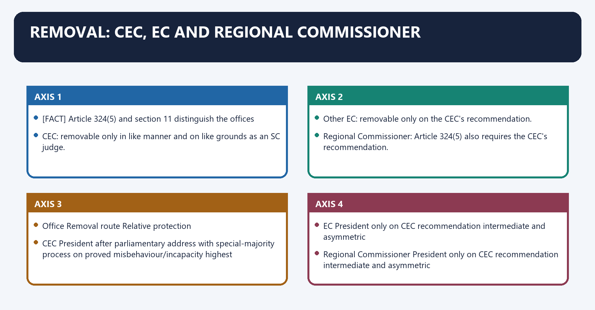
[FACT] Article 324(5) and section 11 distinguish the offices:

- CEC: removable only in like manner and on like grounds as an SC judge.
- Other EC: removable only on the CEC's recommendation.
- Regional Commissioner: Article 324(5) also requires the CEC's recommendation.

[ANALYSIS] The asymmetry protects other ECs from direct executive pleasure but does not give them the CEC's parliamentary-removal security.

#### Visual 16 - Removal matrix

| Office | Removal route | Relative protection |
|---|---|---|
| CEC | President after parliamentary address with special-majority process on proved misbehaviour/incapacity | highest |
| EC | President only on CEC recommendation | intermediate and asymmetric |
| Regional Commissioner | President only on CEC recommendation | intermediate and asymmetric |

> **Prelims trap:** Equal decision-making power does not mean identical removal protection.

#### CLOSING RECALL FLOW — REMOVAL: CEC, EC AND REGIONAL COMMISSIONER

```closure-flow
SUBTOPIC: Removal: CEC, EC and Regional Commissioner
KEY TERMS / DEFINITIONS: Removal · CEC · EC · Regional Commissioner · highest · President only on CEC recommendation
MECHANISM / ARGUMENT: The operative mechanism matters because regional Commissioner: Article 324(5) also requires the CEC's recommendation.
CONSEQUENCE / CONTRAST: Its principal consequence is that office Removal route Relative protection.
UPSC TRAP / ANSWER-USE: Prelims trap: Equal decision-making power does not mean identical removal protection.
ANSWER-GRABBING FORMULATION: The asymmetry protects other ECs from direct executive pleasure but does not give them the CEC's parliamentary-removal security.
```
### SESSION 18 — TRANSACTION OF BUSINESS
#### DEFINITION / WHAT THIS IS CALLED

**Plain-language definition:** Transaction of business operates through Section 18 allows the Commission, by unanimous decision, to regulate procedure and allocate business among members, connected with Business should, as far as possible, be unanimous; a difference is resolved by majority.

**Technical definition:** Transaction of business denotes the constitutional rules and institutional links organised around Section 17 requires ECI business to be transacted under the Act.

#### ANSWER-GRABBING OPENING — WRITE/ADAPT IN THE EXAM

> Section 18 allows the Commission, by unanimous decision, to regulate procedure and allocate business among members.

#### MUST-WRITE KEYWORDS

- **Transaction of business**
- **Transaction**
- **Section**
- **ECI**
- **Act**
- **Commission**

**How to use them:** Frame the answer through Transaction of business; define Transaction, connect Section with ECI to explain the mechanism, and use Act for the decisive comparison or qualification.

Transaction of business denotes the constitutional rules and institutional links organised around [FACT] Section 17 requires ECI business to be transacted under the Act.
Transaction of business operates through [FACT] Section 18 allows the Commission, by unanimous decision, to regulate procedure and allocate business among members, connected with [FACT] Business should, as far as possible, be unanimous; a difference is resolved by majority.
The operative mechanism matters because [FACT] T.N. Seshan v. Union of India (1995) upheld the multi-member design and equal decisional status of ECs.
Its principal consequence is that yes - Commission decision.
The decisive contrast is between majority opinion - Commission decision and CEC vote = one vote; chairmanship != superior vote.
The exam-safe limitation is that [FACT] Section 17 requires ECI business to be transacted under the Act.
[FACT] Section 17 requires ECI business to be transacted under the Act.

[FACT] Section 18 allows the Commission, by unanimous decision, to regulate procedure and allocate business among members.

[FACT] Business should, as far as possible, be unanimous; a difference is resolved by majority.

[FACT] *T.N. Seshan v. Union of India* (1995) upheld the multi-member design and equal decisional status of ECs.

#### Visual 17 - Collegial decision rule

```text
ISSUE
  |
attempt unanimity
  | yes -> Commission decision
  |
  no
  v
majority opinion -> Commission decision

CEC vote = one vote; chairmanship != superior vote
```

#### CLOSING RECALL FLOW — TRANSACTION OF BUSINESS

```closure-flow
SUBTOPIC: Transaction of business
KEY TERMS / DEFINITIONS: Transaction of business · Transaction · Section · ECI · Act · Commission
MECHANISM / ARGUMENT: Section 18 allows the Commission, by unanimous decision, to regulate procedure and allocate business among members.
CONSEQUENCE / CONTRAST: Transaction of business denotes the constitutional rules and institutional links organised around Section 17 requires ECI business to be transacted under the Act.
UPSC TRAP / ANSWER-USE: Do not miss this limiting distinction: the decisive contrast is between majority opinion - Commission decision and CEC vote =...
ANSWER-GRABBING FORMULATION: Section 18 allows the Commission, by unanimous decision, to regulate procedure and allocate business among members.
```
### SESSION 19 — PROTECTION UNDER SECTION 16
#### DEFINITION / WHAT THIS IS CALLED

**Plain-language definition:** Section 16 protects serving and former Chief Election Commissioners and Election Commissioners from civil or criminal proceedings for acts, things or words done in the course of official duty or purported official duty.

**Technical definition:** The 2023 Act creates a statutory official-duty protection for the CEC and ECs, subject to the section's text and without converting the Commission into an institution above constitutional or judicial accountability.

#### ANSWER-GRABBING OPENING — WRITE/ADAPT IN THE EXAM

> Section 16 supplies office-linked litigation protection for official conduct, but it does not displace constitutional limits, judicial review or accountability for action outside the statutory field.

#### MUST-WRITE KEYWORDS

- **section 16**
- **official-duty protection**
- **CEC and ECs**
- **civil proceedings**
- **criminal proceedings**
- **judicial review**

**How to use them:** Name section 16, identify the protected office-holders and official-duty nexus, and immediately qualify the protection through constitutional limits and judicial review.

Protection under section 16 denotes the constitutional rules and institutional links organised around Covered textual connection Not safe to claim.
Protection under section 16 operates through act/thing/word in official duty or purported official duty immunity for private conduct, connected with present or former CEC/EC abolition of constitutional judicial review of ECI decisions.
The operative mechanism matters because civil or criminal proceeding against the person automatic validation of an unlawful election order.
Its principal consequence is that covered textual connection Not safe to claim.
The decisive contrast is between Covered textual connection Not safe to claim and Covered textual connection Not safe to claim.
The exam-safe limitation is that covered textual connection Not safe to claim.
[FACT] Section 16 states that, notwithstanding other law, no court shall entertain or continue civil or criminal proceedings against a present or former CEC/EC for an act, thing or word committed, done or spoken while acting or purporting to act in discharge of official duty or function.

[LIMIT] The enacted text is broader and differently worded than a generic "good-faith immunity" summary. It should not be paraphrased into an unlimited personal immunity for private acts.

#### Visual 18 - Protection boundary

| Covered textual connection | Not safe to claim |
|---|---|
| act/thing/word in official duty or purported official duty | immunity for private conduct |
| present or former CEC/EC | abolition of constitutional judicial review of ECI decisions |
| civil or criminal proceeding against the person | automatic validation of an unlawful election order |

#### CLOSING RECALL FLOW — PROTECTION UNDER SECTION 16

```closure-flow
SUBTOPIC: Protection under section 16
KEY TERMS / DEFINITIONS: section 16 · official-duty protection · CEC and ECs · civil proceedings · criminal proceedings · judicial review
MECHANISM / ARGUMENT: The protection attaches to specified acts, things or words connected with official or purported official duty and is invoked within the legal process governing a proceeding.
CONSEQUENCE / CONTRAST: Election Commissioners receive functional protection against personal litigation pressure while remaining bound by the Constitution, election law and reviewable legal limits.
UPSC TRAP / ANSWER-USE: Do not describe section 16 as blanket personal immunity, extend it to every election official or treat it as a bar on judicial review of ECI action.
ANSWER-GRABBING FORMULATION: Section 16 supplies office-linked litigation protection for official conduct, but it does not displace constitutional limits, judicial review or accountability for action outside the statutory field.
```
### SESSION 20 — ELECTION ADMINISTRATION: CONSTITUTIONAL BODY, DISTRIBUTED MACHINERY
#### DEFINITION / WHAT THIS IS CALLED

**Plain-language definition:** Election administration: constitutional body, distributed machinery denotes the constitutional rules and institutional links organised around Article 324(6) requires the President or Governor, when requested by the ECI, to make staff available for election functions.

**Technical definition:** The exam-safe limitation is that Article 324(6) requires the President or Governor, when requested by the ECI, to make staff available for election functions.

#### ANSWER-GRABBING OPENING — WRITE/ADAPT IN THE EXAM

> Article 324(6) requires the President or Governor, when requested by the ECI, to make staff available for election functions.

#### MUST-WRITE KEYWORDS

- **Election administration**
- **constitutional body**
- **distributed machinery**
- **Article 324**
- **Election administration: constitutional body, distributed machinery**
- **Election**

**How to use them:** Frame the answer through Election administration; define constitutional body, connect distributed machinery with Article 324 to explain the mechanism, and use Election administration: constitutional body, distributed machinery for the decisive comparison or qualification.

Election administration: constitutional body, distributed machinery denotes the constitutional rules and institutional links organised around [FACT] Article 324(6) requires the President or Governor, when requested by the ECI, to make staff available for election functions.
Election administration: constitutional body, distributed machinery operates through Chief Electoral Officer (State/UT), connected with District Election Officer.
The operative mechanism matters because returning Officer -------- Electoral Registration Officer.
Its principal consequence is that presiding Officer / polling teams.
The decisive contrast is between [FACT] Article 324(6) requires the President or Governor, when requested by the ECI, to make staff available for election functions and [FACT] Article 324(6) requires the President or Governor, when requested by the ECI, to make staff available for election functions.
The exam-safe limitation is that [FACT] Article 324(6) requires the President or Governor, when requested by the ECI, to make staff available for election functions.
[FACT] The ECI works through a national secretariat and temporary/statutory field machinery: Chief Electoral Officers, District Election Officers, Returning Officers, Electoral Registration Officers, Presiding Officers and polling personnel.

[FACT] Article 324(6) requires the President or Governor, when requested by the ECI, to make staff available for election functions.

[ANALYSIS] Operational dependence on Union and State personnel makes neutrality protocols, transfer powers during the election period, observer systems and written instructions important.

#### Visual 19 - Administrative chain

```text
ECI
 |
Chief Electoral Officer (State/UT)
 |
District Election Officer
 |
Returning Officer -------- Electoral Registration Officer
 |
Presiding Officer / polling teams
```

Caption: The ECI controls the election function even though much field staff belongs to ordinary government cadres.

#### CLOSING RECALL FLOW — ELECTION ADMINISTRATION: CONSTITUTIONAL BODY, DISTRIBUTED MACHINERY

```closure-flow
SUBTOPIC: Election administration: constitutional body, distributed machinery
KEY TERMS / DEFINITIONS: Election administration · constitutional body · distributed machinery · Article 324 · Election administration: constitutional body, distributed machinery · Election
MECHANISM / ARGUMENT: The exam-safe limitation is that Article 324(6) requires the President or Governor, when requested by the ECI, to make staff available for election functions.
CONSEQUENCE / CONTRAST: The decisive contrast is between Article 324(6) requires the President or Governor, when requested by the ECI, to make staff available for election functions and Article 324(6) requires the President or Governor, when requested by the ECI, to make staff available for election functions.
UPSC TRAP / ANSWER-USE: Do not miss this limiting distinction: its principal consequence is that presiding Officer / polling teams.
ANSWER-GRABBING FORMULATION: Article 324(6) requires the President or Governor, when requested by the ECI, to make staff available for election functions.
```
### SESSION 21 — SCHEDULE AND NOTIFICATION: DISTINGUISH ANNOUNCEMENT FROM LEGAL NOTIFICATION
#### DEFINITION / WHAT THIS IS CALLED

**Plain-language definition:** Schedule and notification: distinguish announcement from legal notification denotes the constitutional rules and institutional links organised around The ECI assesses readiness and announces the election schedule.

**Technical definition:** Schedule and notification: distinguish announcement from legal notification operates through "ECI alone notifies every election by its own constitutional order" is too broad, connected with readiness assessment.

#### ANSWER-GRABBING OPENING — WRITE/ADAPT IN THE EXAM

> The Election Commission announces the schedule and administers the process, while Presidents, Governors and Returning Officers perform distinct statutory notification functions.

#### MUST-WRITE KEYWORDS

- **Schedule**
- **notification**
- **The ECI**
- **ECI**
- **Its principal consequence**
- **Its**

**How to use them:** Frame the answer through Schedule; define notification, connect The ECI with ECI to explain the mechanism, and use Its principal consequence for the decisive comparison or qualification.

Schedule and notification: distinguish announcement from legal notification denotes the constitutional rules and institutional links organised around [FACT] The ECI assesses readiness and announces the election schedule.
Schedule and notification: distinguish announcement from legal notification operates through [LIMIT] "ECI alone notifies every election by its own constitutional order" is too broad, connected with readiness assessment.
The operative mechanism matters because eCI schedule announcement - MCC begins.
Its principal consequence is that statutory notification.
The decisive contrast is between nominations - scrutiny - withdrawal - poll - count - return and [FACT] The ECI assesses readiness and announces the election schedule.
The exam-safe limitation is that [FACT] The ECI assesses readiness and announces the election schedule.
[FACT] The ECI assesses readiness and announces the election schedule.

[FACT] The formal statutory election process includes notifications issued by the President or Governor under the applicable election law and the timetable carried through by Returning Officers.

[LIMIT] "ECI alone notifies every election by its own constitutional order" is too broad.

#### Visual 20 - Election timetable chain

```text
readiness assessment
      |
ECI schedule announcement -> MCC begins
      |
statutory notification
      |
nominations -> scrutiny -> withdrawal -> poll -> count -> return
```

#### CLOSING RECALL FLOW — SCHEDULE AND NOTIFICATION: DISTINGUISH ANNOUNCEMENT FROM LEGAL NOTIFICATION

```closure-flow
SUBTOPIC: Schedule and notification: distinguish announcement from legal notification
KEY TERMS / DEFINITIONS: Schedule · notification · The ECI · ECI · Its principal consequence · Its
MECHANISM / ARGUMENT: Schedule and notification: distinguish announcement from legal notification operates through "ECI alone notifies every election by its own constitutional order" is too broad, connected with readiness assessment.
CONSEQUENCE / CONTRAST: The decisive contrast is between nominations - scrutiny - withdrawal - poll - count - return and The ECI assesses readiness and announces the election schedule.
UPSC TRAP / ANSWER-USE: Do not miss this limiting distinction: its principal consequence is that statutory notification.
ANSWER-GRABBING FORMULATION: The Election Commission announces the schedule and administers the process, while Presidents, Governors and Returning Officers perform distinct statutory notification functions.
```
### SESSION 22 — ELECTORAL ROLLS: CONSTITUTIONAL EQUALITY PLUS STATUTORY ELIGIBILITY
#### DEFINITION / WHAT THIS IS CALLED

**Plain-language definition:** Electoral rolls: constitutional equality plus statutory eligibility denotes the constitutional rules and institutional links organised around Article 325 requires one general electoral roll and rejects exclusion or a special roll solely on religion, race, caste or sex.

**Technical definition:** Electoral rolls: constitutional equality plus statutory eligibility operates through UNIVERSALITY INTEGRITY, connected with include eligible citizens <--------- correct duplicates/errors.

#### ANSWER-GRABBING OPENING — WRITE/ADAPT IN THE EXAM

> Electoral-roll integrity requires both inclusion of every eligible citizen and fair correction of ineligible or duplicate entries, not one-sided numerical cleansing.

#### MUST-WRITE KEYWORDS

- **Electoral rolls**
- **constitutional equality plus statutory eligibility**
- **inclusion of every eligible person**
- **exclusion/correction through fair procedure**
- **Article 325**
- **Electoral rolls: constitutional equality plus statutory eligibility**

**How to use them:** Frame the answer through Electoral rolls; define constitutional equality plus statutory eligibility, connect inclusion of every eligible person with exclusion/correction through fair procedure to explain the mechanism, and use Article 325 for the decisive comparison or qualification.

Electoral rolls: constitutional equality plus statutory eligibility denotes the constitutional rules and institutional links organised around [FACT] Article 325 requires one general electoral roll and rejects exclusion or a special roll solely on religion, race, caste or sex.
Electoral rolls: constitutional equality plus statutory eligibility operates through UNIVERSALITY INTEGRITY, connected with include eligible citizens <--------- correct duplicates/errors.
The operative mechanism matters because accessible claims notice + inquiry.
Its principal consequence is that four qualifying dates appeal/remedy.
The decisive contrast is between [FACT] Article 325 requires one general electoral roll and rejects exclusion or a special roll solely on religion, race, caste or sex and [FACT] Article 325 requires one general electoral roll and rejects exclusion or a special roll solely on religion, race, caste or sex.
The exam-safe limitation is that [FACT] Article 325 requires one general electoral roll and rejects exclusion or a special roll solely on religion, race, caste or sex.
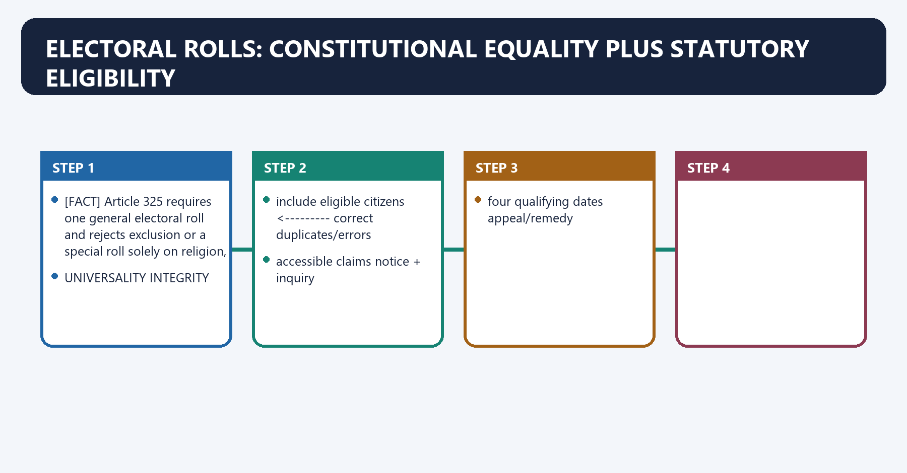
[FACT] Article 325 requires one general electoral roll and rejects exclusion or a special roll solely on religion, race, caste or sex.

[FACT] Under the RPA 1950, citizenship, age and ordinary residence structure entitlement; disqualifications and duplicate registration controls also apply.

[FACT] The ECI's 2023 Electoral Roll Manual explains revision, claims, objections, hearings, inclusion, correction and deletion processes.

[ANALYSIS] Roll integrity has two equal limbs: **inclusion of every eligible person** and **exclusion/correction through fair procedure**, not one-sided numerical cleansing.

#### Visual 21 - Roll-integrity balance

```text
UNIVERSALITY                            INTEGRITY
include eligible citizens <---------> correct duplicates/errors
accessible claims                       notice + inquiry
four qualifying dates                   appeal/remedy
                    DUE PROCESS
```

#### CLOSING RECALL FLOW — ELECTORAL ROLLS: CONSTITUTIONAL EQUALITY PLUS STATUTORY ELIGIBILITY

```closure-flow
SUBTOPIC: Electoral rolls: constitutional equality plus statutory eligibility
KEY TERMS / DEFINITIONS: Electoral rolls · constitutional equality plus statutory eligibility · inclusion of every eligible person · exclusion/correction through fair procedure · Article 325 · Electoral rolls: constitutional equality plus statutory eligibility
MECHANISM / ARGUMENT: Electoral rolls: constitutional equality plus statutory eligibility operates through UNIVERSALITY INTEGRITY, connected with include eligible citizens <--------- correct duplicates/errors.
CONSEQUENCE / CONTRAST: Roll integrity has two equal limbs: inclusion of every eligible person and exclusion/correction through fair procedure, not one-sided numerical cleansing.
UPSC TRAP / ANSWER-USE: Do not miss this limiting distinction: the decisive contrast is between Article 325 requires one general electoral roll and rejects...
ANSWER-GRABBING FORMULATION: Electoral-roll integrity requires both inclusion of every eligible citizen and fair correction of ineligible or duplicate entries, not one-sided numerical cleansing.
```
### SESSION 23 — QUALIFYING DATES AND ENROLMENT CONTROLS
#### DEFINITION / WHAT THIS IS CALLED

**Plain-language definition:** Qualifying dates and enrolment controls denotes the constitutional rules and institutional links organised around application / objection.

**Technical definition:** The present statutory framework uses four qualifying dates in a year: 1 January, 1 April, 1 July and 1 October, enabling advance applications linked to the relevant date.

#### ANSWER-GRABBING OPENING — WRITE/ADAPT IN THE EXAM

> A form request does not itself delete or include a name; the Electoral Registration Officer must exercise the statutory function through the prescribed process.

#### MUST-WRITE KEYWORDS

- **Qualifying dates**
- **enrolment controls**
- **Qualifying dates and enrolment controls**
- **Qualifying**
- **Its principal consequence**
- **Its**

**How to use them:** Frame the answer through Qualifying dates; define enrolment controls, connect Qualifying dates and enrolment controls with Qualifying to explain the mechanism, and use Its principal consequence for the decisive comparison or qualification.

Qualifying dates and enrolment controls denotes the constitutional rules and institutional links organised around application / objection.
Qualifying dates and enrolment controls operates through ERO verification and, where required, notice/hearing, connected with reasoned inclusion / correction / deletion.
The operative mechanism matters because statutory appeal or other lawful remedy.
Its principal consequence is that application / objection.
The decisive contrast is between application / objection and application / objection.
The exam-safe limitation is that application / objection.
[FACT] The present statutory framework uses four qualifying dates in a year: 1 January, 1 April, 1 July and 1 October, enabling advance applications linked to the relevant date.

[FACT] Common operational forms include Form 6 for new inclusion, Form 7 for objection/deletion requests and Form 8 for specified corrections/shifting.

[LIMIT] A form request does not itself delete or include a name; the Electoral Registration Officer must exercise the statutory function through the prescribed process.

#### Visual 22 - Claims and objections flow

```text
application / objection
        |
ERO verification and, where required, notice/hearing
        |
reasoned inclusion / correction / deletion
        |
statutory appeal or other lawful remedy
```

#### CLOSING RECALL FLOW — QUALIFYING DATES AND ENROLMENT CONTROLS

```closure-flow
SUBTOPIC: Qualifying dates and enrolment controls
KEY TERMS / DEFINITIONS: Qualifying dates · enrolment controls · Qualifying dates and enrolment controls · Qualifying · Its principal consequence · Its
MECHANISM / ARGUMENT: The present statutory framework uses four qualifying dates in a year: 1 January, 1 April, 1 July and 1 October, enabling advance applications linked to the relevant date.
CONSEQUENCE / CONTRAST: A form request does not itself delete or include a name; the Electoral Registration Officer must exercise the statutory function through the prescribed process.
UPSC TRAP / ANSWER-USE: Do not miss this limiting distinction: its principal consequence is that application / objection.
ANSWER-GRABBING FORMULATION: A form request does not itself delete or include a name; the Electoral Registration Officer must exercise the statutory function through the prescribed process.
```
### SESSION 24 — ROLL-REVISION ANSWER DISCIPLINE
#### DEFINITION / WHAT THIS IS CALLED

**Plain-language definition:** Roll-revision answer discipline denotes the constitutional rules and institutional links organised around Do not convert a State-specific special revision, draft roll or pending litigation into a permanent nationwide rule.

**Technical definition:** Its principal consequence is that was prior notice practical and individualised? due process.

#### ANSWER-GRABBING OPENING — WRITE/ADAPT IN THE EXAM

> A lawful roll revision must combine notice, evidence, accessibility, inclusion safeguards, reasons and appeal, rather than convert a local exercise into a permanent national rule.

#### MUST-WRITE KEYWORDS

- **Roll-revision answer discipline**
- **avoids headline law**
- **fairness**
- **due process**
- **inclusion**
- **reviewability**

**How to use them:** Frame the answer through Roll-revision answer discipline; define avoids headline law, connect fairness with due process to explain the mechanism, and use inclusion for the decisive comparison or qualification.

Roll-revision answer discipline denotes the constitutional rules and institutional links organised around [LIMIT] Do not convert a State-specific special revision, draft roll or pending litigation into a permanent nationwide rule.
Roll-revision answer discipline operates through Audit question Why it matters, connected with What exact order and legal provision? avoids headline law.
The operative mechanism matters because who bears what proof burden? fairness.
Its principal consequence is that was prior notice practical and individualised? due process.
The decisive contrast is between Were migration, homelessness, disability and documentation barriers addressed? inclusion and Are reasons recorded? reviewability.
The exam-safe limitation is that is appeal accessible before poll closure? effective remedy.
[ANALYSIS] A sound answer evaluates a revision on legality, notice, evidence, inclusion safeguards, accessibility, reasons, appeal and independent review.

[LIMIT] Do not convert a State-specific special revision, draft roll or pending litigation into a permanent nationwide rule.

#### Visual 23 - Seven-question audit

| Audit question | Why it matters |
|---|---|
| What exact order and legal provision? | avoids headline law |
| Who bears what proof burden? | fairness |
| Was prior notice practical and individualised? | due process |
| Were migration, homelessness, disability and documentation barriers addressed? | inclusion |
| Are reasons recorded? | reviewability |
| Is appeal accessible before poll closure? | effective remedy |
| Is aggregate data independently auditable? | public trust |

#### CLOSING RECALL FLOW — ROLL-REVISION ANSWER DISCIPLINE

```closure-flow
SUBTOPIC: Roll-revision answer discipline
KEY TERMS / DEFINITIONS: Roll-revision answer discipline · avoids headline law · fairness · due process · inclusion · reviewability
MECHANISM / ARGUMENT: Do not convert a State-specific special revision, draft roll or pending litigation into a permanent nationwide rule.
CONSEQUENCE / CONTRAST: The decisive contrast is between Were migration, homelessness, disability and documentation barriers addressed? inclusion and Are reasons recorded? reviewability.
UPSC TRAP / ANSWER-USE: Do not miss this limiting distinction: its principal consequence is that was prior notice practical and individualised? due process.
ANSWER-GRABBING FORMULATION: A lawful roll revision must combine notice, evidence, accessibility, inclusion safeguards, reasons and appeal, rather than convert a local exercise into a permanent national rule.
```
### SESSION 25 — DELIMITATION: ECI ASSISTS; IT IS NOT THE ORDINARY SOLE DELIMITING AUTHORITY
#### DEFINITION / WHAT THIS IS CALLED

**Plain-language definition:** Delimitation: ECI assists; it is not the ordinary sole delimiting authority operates through Parliament enacts framework, connected with Central Government constitutes Delimitation Commission.

**Technical definition:** Delimitation: ECI assists; it is not the ordinary sole delimiting authority denotes the constitutional rules and institutional links organised around Its published final orders have force of law and their validity is protected from court challenge by the statutory framework.

#### ANSWER-GRABBING OPENING — WRITE/ADAPT IN THE EXAM

> Statutory Delimitation Commissions redraw constituencies with Election Commission participation, while their final orders acquire legal force and are not ordinary ECI decisions.

#### MUST-WRITE KEYWORDS

- **Delimitation**
- **ECI assists**
- **Delimitation: ECI assists; it**
- **ECI**
- **Its**
- **Parliament**

**How to use them:** Frame the answer through Delimitation; define ECI assists, connect Delimitation: ECI assists; it with ECI to explain the mechanism, and use Its for the decisive comparison or qualification.

Delimitation: ECI assists; it is not the ordinary sole delimiting authority denotes the constitutional rules and institutional links organised around [FACT] Its published final orders have force of law and their validity is protected from court challenge by the statutory framework.
Delimitation: ECI assists; it is not the ordinary sole delimiting authority operates through Parliament enacts framework, connected with Central Government constitutes Delimitation Commission.
The operative mechanism matters because judge Chair + CEC/EC nominee + State EC.
Its principal consequence is that public process - final order - ECI implements electoral map.
The decisive contrast is between [FACT] Its published final orders have force of law and their validity is protected from court challenge by the statutory framework and [FACT] Its published final orders have force of law and their validity is protected from court challenge by the statutory framework.
The exam-safe limitation is that [FACT] Its published final orders have force of law and their validity is protected from court challenge by the statutory framework.
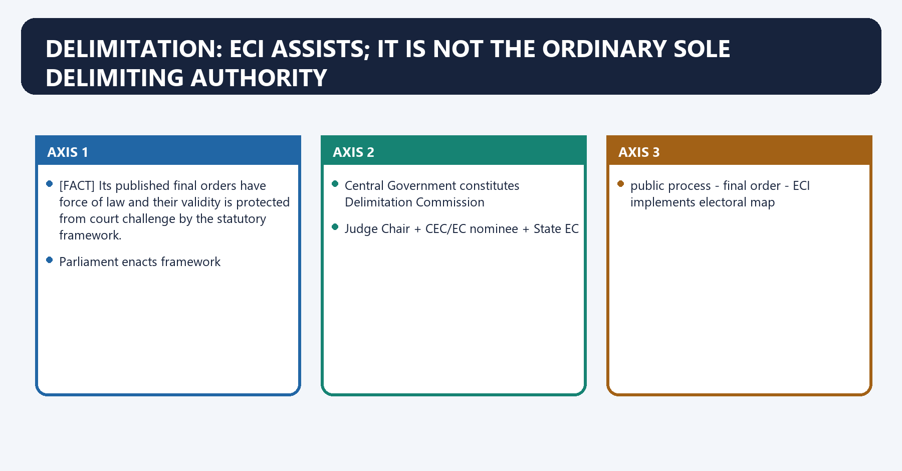
[FACT] The statutory Delimitation Commission under the Delimitation Act, 2002 includes a current/former Supreme Court judge as Chairperson, the CEC or a nominated EC ex officio, and the relevant State Election Commissioner ex officio.

[FACT] Its published final orders have force of law and their validity is protected from court challenge by the statutory framework.

[LIMIT] The ECI does not ordinarily redraw all constituencies by itself. Its role is membership, assistance, later implementation and specified special statutory functions.

#### Visual 24 - Delimitation responsibility map

```text
Parliament enacts framework
        |
Central Government constitutes Delimitation Commission
        |
Judge Chair + CEC/EC nominee + State EC
        |
public process -> final order -> ECI implements electoral map
```

#### CLOSING RECALL FLOW — DELIMITATION: ECI ASSISTS; IT IS NOT THE ORDINARY SOLE DELIMITING AUTHORITY

```closure-flow
SUBTOPIC: Delimitation: ECI assists; it is not the ordinary sole delimiting authority
KEY TERMS / DEFINITIONS: Delimitation · ECI assists · Delimitation: ECI assists; it · ECI · Its · Parliament
MECHANISM / ARGUMENT: Delimitation: ECI assists; it is not the ordinary sole delimiting authority denotes the constitutional rules and institutional links organised around Its published final orders have force of law and their validity is protected from court challenge by the statutory framework.
CONSEQUENCE / CONTRAST: Its principal consequence is that public process - final order - ECI implements electoral map.
UPSC TRAP / ANSWER-USE: The ECI does not ordinarily redraw all constituencies by itself.
ANSWER-GRABBING FORMULATION: Statutory Delimitation Commissions redraw constituencies with Election Commission participation, while their final orders acquire legal force and are not ordinary ECI decisions.
```
### SESSION 26 — THE 2024 PRELIMS FACT: FOUR DELIMITATION COMMISSIONS
#### DEFINITION / WHAT THIS IS CALLED

**Plain-language definition:** The 2024 Prelims fact: four Delimitation Commissions denotes the constitutional rules and institutional links organised around Commission basis Broad census linkage.

**Technical definition:** The exam-safe limitation is that commission basis Broad census linkage.

#### ANSWER-GRABBING OPENING — WRITE/ADAPT IN THE EXAM

> India has constituted four statutory Delimitation Commissions, but the Election Commission neither constitutes nor solely operates them.

#### MUST-WRITE KEYWORDS

- **four Delimitation Commissions**
- **four**
- **1952 Act**
- **1951 Census**
- **1962 Act**
- **1961 Census**

**How to use them:** Frame the answer through four Delimitation Commissions; define four, connect 1952 Act with 1951 Census to explain the mechanism, and use 1962 Act for the decisive comparison or qualification.

The 2024 Prelims fact: four Delimitation Commissions denotes the constitutional rules and institutional links organised around Commission basis Broad census linkage.
The 2024 Prelims fact: four Delimitation Commissions operates through 1952 Act 1951 Census, connected with 1962 Act 1961 Census.
The operative mechanism matters because 1972 Act 1971 Census.
Its principal consequence is that 2002 Act 2001 Census.
The decisive contrast is between [LIMIT] This count does not mean the ECI itself constituted or solely operated all four Commissions and Commission basis Broad census linkage.
The exam-safe limitation is that commission basis Broad census linkage.
[FACT] The locally held 2024 official Set A question asked how many Delimitation Commissions the Government of India had constituted till December 2023. The official local key records **four**.

#### Visual 25 - Delimitation chronology

| Commission basis | Broad census linkage |
|---|---|
| 1952 Act | 1951 Census |
| 1962 Act | 1961 Census |
| 1972 Act | 1971 Census |
| 2002 Act | 2001 Census |

[LIMIT] This count does not mean the ECI itself constituted or solely operated all four Commissions.

#### CLOSING RECALL FLOW — THE 2024 PRELIMS FACT: FOUR DELIMITATION COMMISSIONS

```closure-flow
SUBTOPIC: The 2024 Prelims fact: four Delimitation Commissions
KEY TERMS / DEFINITIONS: four Delimitation Commissions · four · 1952 Act · 1951 Census · 1962 Act · 1961 Census
MECHANISM / ARGUMENT: The decisive contrast is between This count does not mean the ECI itself constituted or solely operated all four Commissions and Commission basis Broad census linkage.
CONSEQUENCE / CONTRAST: This count does not mean the ECI itself constituted or solely operated all four Commissions.
UPSC TRAP / ANSWER-USE: Do not miss this limiting distinction: the locally held 2024 official Set A question asked how many Delimitation Commissions the...
ANSWER-GRABBING FORMULATION: India has constituted four statutory Delimitation Commissions, but the Election Commission neither constitutes nor solely operates them.
```
### SESSION 27 — CANDIDATE NOMINATIONS AND SCRUTINY
#### DEFINITION / WHAT THIS IS CALLED

**Plain-language definition:** Candidate nominations and scrutiny denotes the constitutional rules and institutional links organised around The ECI issues binding administrative instructions within the legal framework and supervises consistency.

**Technical definition:** Its principal consequence is that returning Officer scrutiny.

#### ANSWER-GRABBING OPENING — WRITE/ADAPT IN THE EXAM

> The Commission cannot add a disqualification that Parliament has not enacted merely because it considers the candidate undesirable.

#### MUST-WRITE KEYWORDS

- **Candidate nominations**
- **scrutiny**
- **Candidate nominations and scrutiny**
- **Candidate**
- **The ECI**
- **Its principal consequence**

**How to use them:** Frame the answer through Candidate nominations; define scrutiny, connect Candidate nominations and scrutiny with Candidate to explain the mechanism, and use The ECI for the decisive comparison or qualification.

Candidate nominations and scrutiny denotes the constitutional rules and institutional links organised around [FACT] The ECI issues binding administrative instructions within the legal framework and supervises consistency.
Candidate nominations and scrutiny operates through constitutional qualification, connected with RPA qualification/disqualification.
The operative mechanism matters because valid nomination and deposit.
Its principal consequence is that returning Officer scrutiny.
The decisive contrast is between acceptance or rejection - election-petition review at proper stage and [FACT] The ECI issues binding administrative instructions within the legal framework and supervises consistency.
The exam-safe limitation is that [FACT] The ECI issues binding administrative instructions within the legal framework and supervises consistency.
[FACT] Returning Officers receive nominations, conduct statutory scrutiny and handle withdrawal according to the RPA 1951 and Conduct of Elections Rules.

[FACT] The ECI issues binding administrative instructions within the legal framework and supervises consistency.

[LIMIT] The Commission cannot add a disqualification that Parliament has not enacted merely because it considers the candidate undesirable.

#### Visual 26 - Candidature legality chain

```text
constitutional qualification
       +
RPA qualification/disqualification
       +
valid nomination and deposit
       |
Returning Officer scrutiny
       |
acceptance or rejection -> election-petition review at proper stage
```

#### CLOSING RECALL FLOW — CANDIDATE NOMINATIONS AND SCRUTINY

```closure-flow
SUBTOPIC: Candidate nominations and scrutiny
KEY TERMS / DEFINITIONS: Candidate nominations · scrutiny · Candidate nominations and scrutiny · Candidate · The ECI · Its principal consequence
MECHANISM / ARGUMENT: The Commission cannot add a disqualification that Parliament has not enacted merely because it considers the candidate undesirable.
CONSEQUENCE / CONTRAST: Its principal consequence is that returning Officer scrutiny.
UPSC TRAP / ANSWER-USE: Do not miss this limiting distinction: the decisive contrast is between acceptance or rejection - election-petition review at proper stage...
ANSWER-GRABBING FORMULATION: The Commission cannot add a disqualification that Parliament has not enacted merely because it considers the candidate undesirable.
```
### SESSION 28 — ADVISING ON DISQUALIFICATION
#### DEFINITION / WHAT THIS IS CALLED

**Plain-language definition:** Advising on disqualification denotes the constitutional rules and institutional links organised around The ECI does not decide Tenth Schedule defection questions; those belong to the Speaker/Chairman subject to judicial review.

**Technical definition:** A corrupt-practice disqualification under the RPA follows its own election-petition and statutory process; Article 324 is not an independent shortcut.

#### ANSWER-GRABBING OPENING — WRITE/ADAPT IN THE EXAM

> The ECI does not decide Tenth Schedule defection questions; those belong to the Speaker/Chairman subject to judicial review.

#### MUST-WRITE KEYWORDS

- **Advising on disqualification**
- **Article 102/191 issue for sitting member**
- **President/Governor - ECI opinion - decision according to opinion**
- **Tenth Schedule defection**
- **Speaker/Chairman**
- **election void for corrupt practice**

**How to use them:** Frame the answer through Advising on disqualification; define Article 102/191 issue for sitting member, connect President/Governor - ECI opinion - decision according to opinion with Tenth Schedule defection to explain the mechanism, and use Speaker/Chairman for the decisive comparison or qualification.

Advising on disqualification denotes the constitutional rules and institutional links organised around [LIMIT] The ECI does not decide Tenth Schedule defection questions; those belong to the Speaker/Chairman subject to judicial review.
Advising on disqualification operates through Question Decision route, connected with Article 102/191 issue for sitting member President/Governor - ECI opinion - decision according to opinion.
The operative mechanism matters because tenth Schedule defection Speaker/Chairman.
Its principal consequence is that election void for corrupt practice High Court election petition.
The decisive contrast is between conviction-based statutory disqualification RPA operation, courts and specified remedies and [LIMIT] The ECI does not decide Tenth Schedule defection questions; those belong to the Speaker/Chairman subject to judicial review.
The exam-safe limitation is that [LIMIT] The ECI does not decide Tenth Schedule defection questions; those belong to the Speaker/Chairman subject to judicial review.
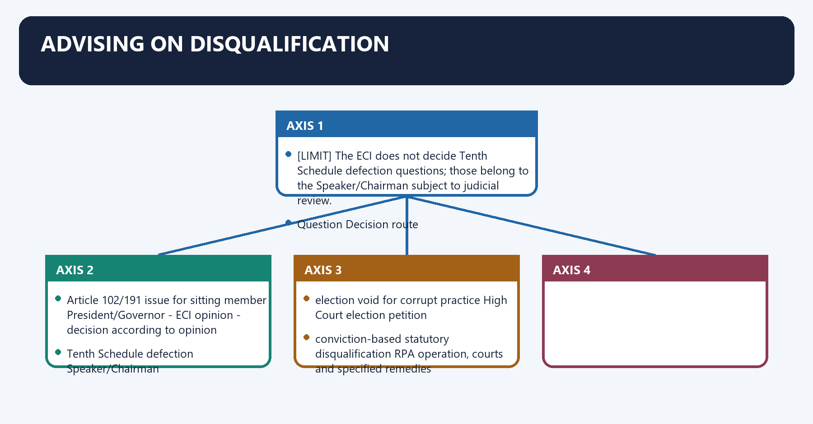
[FACT] Under Articles 103 and 192, questions about specified disqualifications of sitting MPs/MLAs go to the President/Governor, who must obtain the ECI's opinion and act according to it.

[LIMIT] The ECI does not decide Tenth Schedule defection questions; those belong to the Speaker/Chairman subject to judicial review.

[LIMIT] A corrupt-practice disqualification under the RPA follows its own election-petition and statutory process; Article 324 is not an independent shortcut.

#### Visual 27 - Disqualification routes

| Question | Decision route |
|---|---|
| Article 102/191 issue for sitting member | President/Governor -> ECI opinion -> decision according to opinion |
| Tenth Schedule defection | Speaker/Chairman |
| election void for corrupt practice | High Court election petition |
| conviction-based statutory disqualification | RPA operation, courts and specified remedies |

#### CLOSING RECALL FLOW — ADVISING ON DISQUALIFICATION

```closure-flow
SUBTOPIC: Advising on disqualification
KEY TERMS / DEFINITIONS: Advising on disqualification · Article 102/191 issue for sitting member · President/Governor - ECI opinion - decision according to opinion · Tenth Schedule defection · Speaker/Chairman · election void for corrupt practice
MECHANISM / ARGUMENT: The decisive contrast is between conviction-based statutory disqualification RPA operation, courts and specified remedies and The ECI does not decide Tenth Schedule defection questions; those belong to the Speaker/Chairman subject to judicial review.
CONSEQUENCE / CONTRAST: A corrupt-practice disqualification under the RPA follows its own election-petition and statutory process; Article 324 is not an independent shortcut.
UPSC TRAP / ANSWER-USE: The exam-safe limitation is that The ECI does not decide Tenth Schedule defection questions; those belong to the Speaker/Chairman subject to judicial review.
ANSWER-GRABBING FORMULATION: The ECI does not decide Tenth Schedule defection questions; those belong to the Speaker/Chairman subject to judicial review.
```
### SESSION 29 — OBSERVERS AND FIELD NEUTRALITY
#### DEFINITION / WHAT THIS IS CALLED

**Plain-language definition:** Observers and field neutrality denotes the constitutional rules and institutional links organised around Observers reduce the information gap between Nirvachan Sadan and local administration.

**Technical definition:** Observers and field neutrality operates through An observer does not replace the statutory Returning Officer or decide an election petition, connected with Observer type Primary lens Typical output.

#### ANSWER-GRABBING OPENING — WRITE/ADAPT IN THE EXAM

> An observer does not replace the statutory Returning Officer or decide an election petition.

#### MUST-WRITE KEYWORDS

- **Observers**
- **field neutrality**
- **General**
- **overall conduct and level playing field**
- **reports and corrective recommendations**
- **Police**

**How to use them:** Frame the answer through Observers; define field neutrality, connect General with overall conduct and level playing field to explain the mechanism, and use reports and corrective recommendations for the decisive comparison or qualification.

Observers and field neutrality denotes the constitutional rules and institutional links organised around [ANALYSIS] Observers reduce the information gap between Nirvachan Sadan and local administration.
Observers and field neutrality operates through [LIMIT] An observer does not replace the statutory Returning Officer or decide an election petition, connected with Observer type Primary lens Typical output.
The operative mechanism matters because general overall conduct and level playing field reports and corrective recommendations.
Its principal consequence is that police security, vulnerability and force deployment security assessment.
The decisive contrast is between Expenditure candidate spending and monitoring teams shadow registers and discrepancy process and Micro-observer critical polling station process direct poll-day report.
The exam-safe limitation is that [ANALYSIS] Observers reduce the information gap between Nirvachan Sadan and local administration.
[FACT] The RPA 1951 and ECI instructions support deployment of general, police, expenditure and other observers to report independently on readiness, campaign conduct, polling and counting.

[ANALYSIS] Observers reduce the information gap between Nirvachan Sadan and local administration.

[LIMIT] An observer does not replace the statutory Returning Officer or decide an election petition.

#### Visual 28 - Observer dashboard

| Observer type | Primary lens | Typical output |
|---|---|---|
| General | overall conduct and level playing field | reports and corrective recommendations |
| Police | security, vulnerability and force deployment | security assessment |
| Expenditure | candidate spending and monitoring teams | shadow registers and discrepancy process |
| Micro-observer | critical polling station process | direct poll-day report |

#### CLOSING RECALL FLOW — OBSERVERS AND FIELD NEUTRALITY

```closure-flow
SUBTOPIC: Observers and field neutrality
KEY TERMS / DEFINITIONS: Observers · field neutrality · General · overall conduct and level playing field · reports and corrective recommendations · Police
MECHANISM / ARGUMENT: Observers and field neutrality operates through An observer does not replace the statutory Returning Officer or decide an election petition, connected with Observer type Primary lens Typical output.
CONSEQUENCE / CONTRAST: An observer does not replace the statutory Returning Officer or decide an election petition.
UPSC TRAP / ANSWER-USE: Do not miss this limiting distinction: its principal consequence is that police security, vulnerability and force deployment security assessment.
ANSWER-GRABBING FORMULATION: An observer does not replace the statutory Returning Officer or decide an election petition.
```
### SESSION 30 — ELECTION EXPENDITURE MONITORING
#### DEFINITION / WHAT THIS IS CALLED

**Plain-language definition:** Election expenditure monitoring denotes the constitutional rules and institutional links organised around Candidates must keep and lodge election-expense accounts under the RPA 1951; expenditure ceilings arise under law and rules.

**Technical definition:** The decisive contrast is between lodging of account - statutory consequence where applicable and Candidates must keep and lodge election-expense accounts under the RPA 1951; expenditure ceilings arise under law and rules.

#### ANSWER-GRABBING OPENING — WRITE/ADAPT IN THE EXAM

> Candidate expenditure rules create accounts and ceilings, but accountability gaps persist where party, supporter and digital spending escapes effective attribution.

#### MUST-WRITE KEYWORDS

- **Election expenditure monitoring**
- **Election**
- **Candidates**
- **RPA**
- **Its principal consequence**
- **Its**

**How to use them:** Frame the answer through Election expenditure monitoring; define Election, connect Candidates with RPA to explain the mechanism, and use Its principal consequence for the decisive comparison or qualification.

Election expenditure monitoring denotes the constitutional rules and institutional links organised around [FACT] Candidates must keep and lodge election-expense accounts under the RPA 1951; expenditure ceilings arise under law and rules.
Election expenditure monitoring operates through campaign event / advertisement / distribution allegation, connected with field team + video + rate card + seizure record.
The operative mechanism matters because shadow observation register <- candidate account.
Its principal consequence is that notice / reconciliation.
The decisive contrast is between lodging of account - statutory consequence where applicable and [FACT] Candidates must keep and lodge election-expense accounts under the RPA 1951; expenditure ceilings arise under law and rules.
The exam-safe limitation is that [FACT] Candidates must keep and lodge election-expense accounts under the RPA 1951; expenditure ceilings arise under law and rules.
[FACT] Candidates must keep and lodge election-expense accounts under the RPA 1951; expenditure ceilings arise under law and rules.

[FACT] ECI monitoring uses expenditure observers, flying squads, static surveillance teams, video teams, accounting teams and media-certification/monitoring mechanisms.

[ANALYSIS] The principal accountability gap is often the difference between candidate-account rules and the wider ecosystem of party, supporter and digital campaign spending.

#### Visual 29 - Expenditure-monitoring loop

```text
campaign event / advertisement / distribution allegation
        |
field team + video + rate card + seizure record
        |
shadow observation register <-> candidate account
        |
notice / reconciliation
        |
lodging of account -> statutory consequence where applicable
```

#### CLOSING RECALL FLOW — ELECTION EXPENDITURE MONITORING

```closure-flow
SUBTOPIC: Election expenditure monitoring
KEY TERMS / DEFINITIONS: Election expenditure monitoring · Election · Candidates · RPA · Its principal consequence · Its
MECHANISM / ARGUMENT: The decisive contrast is between lodging of account - statutory consequence where applicable and Candidates must keep and lodge election-expense accounts under the RPA 1951; expenditure ceilings arise under law and rules.
CONSEQUENCE / CONTRAST: Its principal consequence is that notice / reconciliation.
UPSC TRAP / ANSWER-USE: Do not miss this limiting distinction: the exam-safe limitation is that Candidates must keep and lodge election-expense accounts under the...
ANSWER-GRABBING FORMULATION: Candidate expenditure rules create accounts and ceilings, but accountability gaps persist where party, supporter and digital spending escapes effective attribution.
```
### SESSION 31 — REPOLL, ADJOURNMENT AND COUNTERMAND: LAWFUL POWERS ONLY
#### DEFINITION / WHAT THIS IS CALLED

**Plain-language definition:** Repoll, adjournment and countermand: lawful powers only denotes the constitutional rules and institutional links organised around corrective instruction / replacement / station-level fresh poll.

**Technical definition:** Its principal consequence is that countermand only on lawful basis with recorded reasons.

#### ANSWER-GRABBING OPENING — WRITE/ADAPT IN THE EXAM

> Mohinder Singh Gill accepted broad ECI authority in a grave poll-disruption setting while insisting that constitutional power operates for free and fair elections and remains legally controlled.

#### MUST-WRITE KEYWORDS

- **Repoll**
- **adjournment**
- **countermand**
- **lawful powers only**
- **Article 324**
- **Repoll, adjournment and countermand: lawful powers only**

**How to use them:** Frame the answer through Repoll; define adjournment, connect countermand with lawful powers only to explain the mechanism, and use Article 324 for the decisive comparison or qualification.

Repoll, adjournment and countermand: lawful powers only denotes the constitutional rules and institutional links organised around corrective instruction / replacement / station-level fresh poll.
Repoll, adjournment and countermand: lawful powers only operates through serious statutory event, connected with adjournment or fresh poll under election law.
The operative mechanism matters because constituency-wide vitiation.
Its principal consequence is that countermand only on lawful basis with recorded reasons.
The decisive contrast is between post-result validity dispute and High Court election petition, not ECI merits trial.
The exam-safe limitation is that corrective instruction / replacement / station-level fresh poll.
[FACT] Election law provides for adjournment/fresh poll in specified emergencies, destruction/loss or tampering situations and booth capturing. Article 324 supplies residual supervision where law is silent.

[FACT] *Mohinder Singh Gill* accepted broad ECI authority in a grave poll-disruption setting while insisting that constitutional power operates for free and fair elections and remains legally controlled.

[LIMIT] "The ECI may cancel any election whenever it wishes" is false. The trigger, scale, reasons, statutory field and natural-justice context matter.

#### Visual 30 - Integrity-response ladder

```text
local defect
   -> corrective instruction / replacement / station-level fresh poll

serious statutory event
   -> adjournment or fresh poll under election law

constituency-wide vitiation
   -> countermand only on lawful basis with recorded reasons

post-result validity dispute
   -> High Court election petition, not ECI merits trial
```

#### CLOSING RECALL FLOW — REPOLL, ADJOURNMENT AND COUNTERMAND: LAWFUL POWERS ONLY

```closure-flow
SUBTOPIC: Repoll, adjournment and countermand: lawful powers only
KEY TERMS / DEFINITIONS: Repoll · adjournment · countermand · lawful powers only · Article 324 · Repoll, adjournment and countermand: lawful powers only
MECHANISM / ARGUMENT: Its principal consequence is that countermand only on lawful basis with recorded reasons.
CONSEQUENCE / CONTRAST: Mohinder Singh Gill accepted broad ECI authority in a grave poll-disruption setting while insisting that constitutional power operates for free and fair elections and remains legally controlled.
UPSC TRAP / ANSWER-USE: The decisive contrast is between post-result validity dispute and High Court election petition, not ECI merits trial.
ANSWER-GRABBING FORMULATION: Mohinder Singh Gill accepted broad ECI authority in a grave poll-disruption setting while insisting that constitutional power operates for free and fair elections and remains legally controlled.
```
### SESSION 32 — VOTER EDUCATION AND INCLUSION
#### DEFINITION / WHAT THIS IS CALLED

**Plain-language definition:** Voter education and inclusion denotes the constitutional rules and institutional links organised around ECI's SVEEP programme supports voter awareness, registration, ethical participation and accessibility.

**Technical definition:** Voter education and inclusion operates through Participation is an integrity issue: an accurate machine cannot compensate for an inaccessible roll or polling station, connected with Awareness campaigns must remain non-partisan and cannot become a substitute for legal enrolment remedies.

#### ANSWER-GRABBING OPENING — WRITE/ADAPT IN THE EXAM

> Awareness campaigns must remain non-partisan and cannot become a substitute for legal enrolment remedies.

#### MUST-WRITE KEYWORDS

- **Voter education**
- **inclusion**
- **Voter education and inclusion**
- **Voter**
- **ECI's SVEEP**
- **Voter education and inclusion operates through Participation**

**How to use them:** Frame the answer through Voter education; define inclusion, connect Voter education and inclusion with Voter to explain the mechanism, and use ECI's SVEEP for the decisive comparison or qualification.

Voter education and inclusion denotes the constitutional rules and institutional links organised around [FACT] ECI's SVEEP programme supports voter awareness, registration, ethical participation and accessibility.
Voter education and inclusion operates through [ANALYSIS] Participation is an integrity issue: an accurate machine cannot compensate for an inaccessible roll or polling station, connected with [LIMIT] Awareness campaigns must remain non-partisan and cannot become a substitute for legal enrolment remedies.
The operative mechanism matters because iNFORMATION - REGISTRATION - ACCESSIBILITY - ETHICAL VOTING.
Its principal consequence is that sVEEP voter services PwD/senior needs no inducement.
The decisive contrast is between [FACT] ECI's SVEEP programme supports voter awareness, registration, ethical participation and accessibility and [FACT] ECI's SVEEP programme supports voter awareness, registration, ethical participation and accessibility.
The exam-safe limitation is that [FACT] ECI's SVEEP programme supports voter awareness, registration, ethical participation and accessibility.
[FACT] ECI's SVEEP programme supports voter awareness, registration, ethical participation and accessibility.

[ANALYSIS] Participation is an integrity issue: an accurate machine cannot compensate for an inaccessible roll or polling station.

[LIMIT] Awareness campaigns must remain non-partisan and cannot become a substitute for legal enrolment remedies.

#### Visual 31 - Participation architecture

```text
INFORMATION -> REGISTRATION -> ACCESSIBILITY -> ETHICAL VOTING
     |              |               |                |
SVEEP          voter services   PwD/senior needs   no inducement
```

#### CLOSING RECALL FLOW — VOTER EDUCATION AND INCLUSION

```closure-flow
SUBTOPIC: Voter education and inclusion
KEY TERMS / DEFINITIONS: Voter education · inclusion · Voter education and inclusion · Voter · ECI's SVEEP · Voter education and inclusion operates through Participation
MECHANISM / ARGUMENT: Voter education and inclusion operates through Participation is an integrity issue: an accurate machine cannot compensate for an inaccessible roll or polling station, connected with Awareness campaigns must remain non-partisan and cannot become a substitute for legal enrolment remedies.
CONSEQUENCE / CONTRAST: The decisive contrast is between ECI's SVEEP programme supports voter awareness, registration, ethical participation and accessibility and ECI's SVEEP programme supports voter awareness, registration, ethical participation and accessibility.
UPSC TRAP / ANSWER-USE: Do not miss this limiting distinction: its principal consequence is that sVEEP voter services PwD/senior needs no inducement.
ANSWER-GRABBING FORMULATION: Awareness campaigns must remain non-partisan and cannot become a substitute for legal enrolment remedies.
```
### SESSION 33 — REGISTRATION OF POLITICAL PARTIES VERSUS RECOGNITION
#### DEFINITION / WHAT THIS IS CALLED

**Plain-language definition:** Registration of political parties versus recognition denotes the constitutional rules and institutional links organised around Political-party registration is under section 29A of the RPA 1951.

**Technical definition:** Registration of political parties versus recognition operates through Registration does not automatically confer recognition or a permanently reserved symbol, connected with application under RPA 1951 s.29A.

#### ANSWER-GRABBING OPENING — WRITE/ADAPT IN THE EXAM

> Registration under section 29A does not itself confer party recognition or a reserved symbol, which depend on separate performance-based rules under the Symbols Order.

#### MUST-WRITE KEYWORDS

- **Registration of political parties versus recognition**
- **section 29A of the RPA 1951**
- **Election Symbols (Reservation and Allotment) Order, 1968**
- **Registration**
- **Political-party**
- **RPA**

**How to use them:** Frame the answer through Registration of political parties versus recognition; define section 29A of the RPA 1951, connect Election Symbols (Reservation and Allotment) Order, 1968 with Registration to explain the mechanism, and use Political-party for the decisive comparison or qualification.

Registration of political parties versus recognition denotes the constitutional rules and institutional links organised around [FACT] Political-party registration is under section 29A of the RPA 1951.
Registration of political parties versus recognition operates through [LIMIT] Registration does not automatically confer recognition or a permanently reserved symbol, connected with application under RPA 1951 s.29A.
The operative mechanism matters because registered political party.
Its principal consequence is that electoral performance under Symbols Order criteria.
The decisive contrast is between recognised State party / recognised national party and [FACT] Political-party registration is under section 29A of the RPA 1951.
The exam-safe limitation is that [FACT] Political-party registration is under section 29A of the RPA 1951.
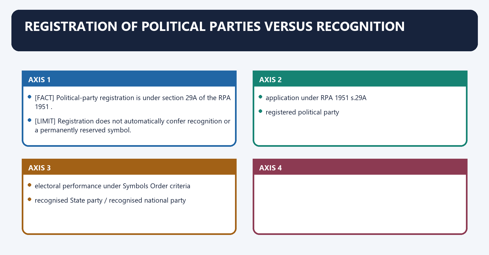
[FACT] Political-party registration is under **section 29A of the RPA 1951**.

[FACT] Recognition as a national or State party and reservation/allotment of symbols operate under the **Election Symbols (Reservation and Allotment) Order, 1968**, applying performance criteria.

[LIMIT] Registration does not automatically confer recognition or a permanently reserved symbol.

#### Visual 32 - Party-status ladder

```text
association
   |
application under RPA 1951 s.29A
   v
registered political party
   |
electoral performance under Symbols Order criteria
   v
recognised State party / recognised national party
```

#### CLOSING RECALL FLOW — REGISTRATION OF POLITICAL PARTIES VERSUS RECOGNITION

```closure-flow
SUBTOPIC: Registration of political parties versus recognition
KEY TERMS / DEFINITIONS: Registration of political parties versus recognition · section 29A of the RPA 1951 · Election Symbols (Reservation and Allotment) Order, 1968 · Registration · Political-party · RPA
MECHANISM / ARGUMENT: Registration of political parties versus recognition operates through Registration does not automatically confer recognition or a permanently reserved symbol, connected with application under RPA 1951 s.29A.
CONSEQUENCE / CONTRAST: The decisive contrast is between recognised State party / recognised national party and Political-party registration is under section 29A of the RPA 1951.
UPSC TRAP / ANSWER-USE: Registration does not automatically confer recognition or a permanently reserved symbol.
ANSWER-GRABBING FORMULATION: Registration under section 29A does not itself confer party recognition or a reserved symbol, which depend on separate performance-based rules under the Symbols Order.
```
### SESSION 34 — SYMBOLS AND DISPUTES
#### DEFINITION / WHAT THIS IS CALLED

**Plain-language definition:** Symbols and disputes denotes the constitutional rules and institutional links organised around The ECI specifies free and reserved symbols and decides recognition/symbol disputes under the Symbols Order.

**Technical definition:** The ECI's symbol adjudication is quasi-judicial; it is not a general power to settle every internal property, membership or leadership dispute within a party.

#### ANSWER-GRABBING OPENING — WRITE/ADAPT IN THE EXAM

> Symbols reduce information costs and make the ballot accessible across literacy and language differences.

#### MUST-WRITE KEYWORDS

- **Symbols**
- **disputes**
- **organisational and legislative support, party constitution and facts**
- **need to prevent voter confusion**
- **election timetable and equal treatment**
- **yes, outside the narrow Symbols Order decision**

**How to use them:** Frame the answer through Symbols; define disputes, connect organisational and legislative support, party constitution and facts with need to prevent voter confusion to explain the mechanism, and use election timetable and equal treatment for the decisive comparison or qualification.

Symbols and disputes denotes the constitutional rules and institutional links organised around [FACT] The ECI specifies free and reserved symbols and decides recognition/symbol disputes under the Symbols Order.
Symbols and disputes operates through [FACT] Kanhiya Lal Omar v. R.K. Trivedi upheld the ECI's authority to issue the Symbols Order and regulate recognition and symbols, connected with [ANALYSIS] Symbols reduce information costs and make the ballot accessible across literacy and language differences.
The operative mechanism matters because question Evidence considered.
Its principal consequence is that which group represents the party? organisational and legislative support, party constitution and facts.
The decisive contrast is between Is an old symbol frozen? need to prevent voter confusion and Is an interim symbol needed? election timetable and equal treatment.
The exam-safe limitation is that can ordinary civil rights still be litigated? yes, outside the narrow Symbols Order decision.
[FACT] The ECI specifies free and reserved symbols and decides recognition/symbol disputes under the Symbols Order.

[FACT] *Kanhiya Lal Omar v. R.K. Trivedi* upheld the ECI's authority to issue the Symbols Order and regulate recognition and symbols.

[ANALYSIS] Symbols reduce information costs and make the ballot accessible across literacy and language differences.

[LIMIT] The ECI's symbol adjudication is quasi-judicial; it is not a general power to settle every internal property, membership or leadership dispute within a party.

#### Visual 33 - Split-dispute decision frame

| Question | Evidence considered |
|---|---|
| Which group represents the party? | organisational and legislative support, party constitution and facts |
| Is an old symbol frozen? | need to prevent voter confusion |
| Is an interim symbol needed? | election timetable and equal treatment |
| Can ordinary civil rights still be litigated? | yes, outside the narrow Symbols Order decision |

#### CLOSING RECALL FLOW — SYMBOLS AND DISPUTES

```closure-flow
SUBTOPIC: Symbols and disputes
KEY TERMS / DEFINITIONS: Symbols · disputes · organisational and legislative support, party constitution and facts · need to prevent voter confusion · election timetable and equal treatment · yes, outside the narrow Symbols Order decision
MECHANISM / ARGUMENT: The ECI's symbol adjudication is quasi-judicial; it is not a general power to settle every internal property, membership or leadership dispute within a party.
CONSEQUENCE / CONTRAST: The decisive contrast is between Is an old symbol frozen? need to prevent voter confusion and Is an interim symbol needed? election timetable and equal treatment.
UPSC TRAP / ANSWER-USE: Do not miss this limiting distinction: its principal consequence is that which group represents the party? organisational and legislative support...
ANSWER-GRABBING FORMULATION: Symbols reduce information costs and make the ballot accessible across literacy and language differences.
```
### SESSION 35 — MODEL CODE OF CONDUCT: ORIGIN AND EVOLUTION
#### DEFINITION / WHAT THIS IS CALLED

**Plain-language definition:** Model Code of Conduct: origin and evolution denotes the constitutional rules and institutional links organised around Official ECI material traces the first code experiment to the 1960 Kerala Assembly election.

**Technical definition:** Model Code of Conduct: origin and evolution operates through Avoid a single simplistic sentence that the whole present MCC was enacted in 1960 or became a statute in 1968, connected with early national circulation and learning.

#### ANSWER-GRABBING OPENING — WRITE/ADAPT IN THE EXAM

> The Model Code evolved through Election Commission consolidation and party consultation from early election practice, rather than appearing fully formed as a statute in 1960.

#### MUST-WRITE KEYWORDS

- **Model Code of Conduct**
- **origin**
- **evolution**
- **1960 Kerala Assembly election**
- **1968-69 mid-term election period**
- **1968-69**

**How to use them:** Frame the answer through Model Code of Conduct; define origin, connect evolution with 1960 Kerala Assembly election to explain the mechanism, and use 1968-69 mid-term election period for the decisive comparison or qualification.

Model Code of Conduct: origin and evolution denotes the constitutional rules and institutional links organised around [FACT] Official ECI material traces the first code experiment to the 1960 Kerala Assembly election.
Model Code of Conduct: origin and evolution operates through [LIMIT] Avoid a single simplistic sentence that the whole present MCC was enacted in 1960 or became a statute in 1968, connected with early national circulation and learning.
The operative mechanism matters because 1968-69 broader minimum-code consensus.
Its principal consequence is that successive additions: general conduct, meetings, processions,.
The decisive contrast is between polling day, observers, party in power, manifestos and current ECI manuals and instructions.
The exam-safe limitation is that [FACT] Official ECI material traces the first code experiment to the 1960 Kerala Assembly election.
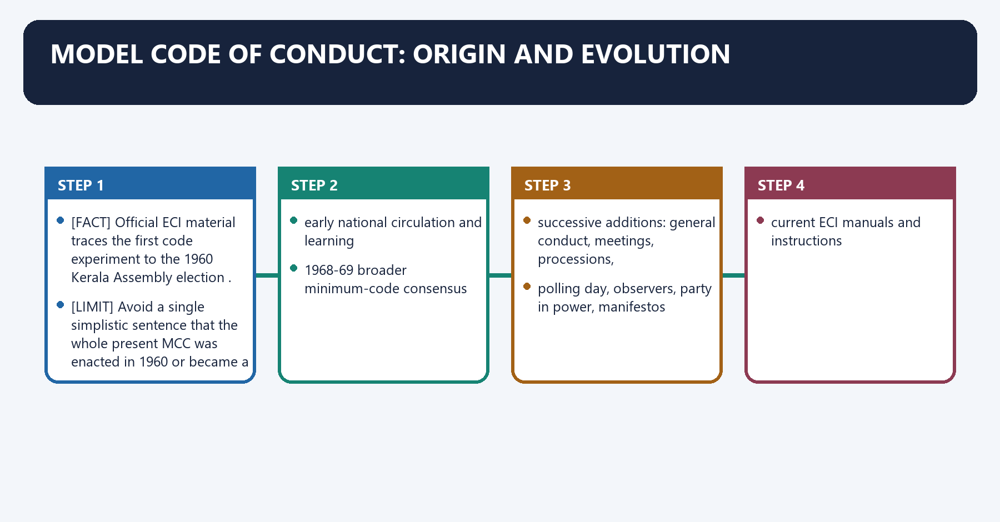
[FACT] Official ECI material traces the first code experiment to the **1960 Kerala Assembly election**.

[FACT] The code was circulated and expanded in the early national-election experience, and an inter-party minimum-code consensus developed through the **1968-69 mid-term election period**. The present MCC is the result of successive ECI consolidation, party consultation and later additions concerning the party in power.

[LIMIT] Avoid a single simplistic sentence that the whole present MCC was enacted in 1960 or became a statute in 1968.

#### Visual 34 - MCC evolution timeline

```text
1960 Kerala code
      |
early national circulation and learning
      |
1968-69 broader minimum-code consensus
      |
successive additions: general conduct, meetings, processions,
polling day, observers, party in power, manifestos
      |
current ECI manuals and instructions
```

#### CLOSING RECALL FLOW — MODEL CODE OF CONDUCT: ORIGIN AND EVOLUTION

```closure-flow
SUBTOPIC: Model Code of Conduct: origin and evolution
KEY TERMS / DEFINITIONS: Model Code of Conduct · origin · evolution · 1960 Kerala Assembly election · 1968-69 mid-term election period · 1968-69
MECHANISM / ARGUMENT: Model Code of Conduct: origin and evolution operates through Avoid a single simplistic sentence that the whole present MCC was enacted in 1960 or became a statute in 1968, connected with early national circulation and learning.
CONSEQUENCE / CONTRAST: Its principal consequence is that successive additions: general conduct, meetings, processions,.
UPSC TRAP / ANSWER-USE: Do not miss this limiting distinction: the decisive contrast is between polling day, observers, party in power, manifestos and current...
ANSWER-GRABBING FORMULATION: The Model Code evolved through Election Commission consolidation and party consultation from early election practice, rather than appearing fully formed as a statute in 1960.
```
### SESSION 36 — MCC LEGAL CHARACTER
#### DEFINITION / WHAT THIS IS CALLED

**Plain-language definition:** MCC legal character denotes the constitutional rules and institutional links organised around The MCC is a consensus-based, non-statutory code.

**Technical definition:** MCC legal character operates through It operates from announcement of the election schedule until completion of the election process, connected with Some conduct prohibited by the MCC is independently punishable under the RPA 1951, Bharatiya Nyaya Sanhita, 2023 or other law.

#### ANSWER-GRABBING OPENING — WRITE/ADAPT IN THE EXAM

> The Model Code is non-statutory but operationally consequential, while conduct independently prohibited by election or criminal law follows separate legal enforcement.

#### MUST-WRITE KEYWORDS

- **MCC legal character**
- **consensus-based, non-statutory code**
- **MCC norm only**
- **ECI direction, censure, restraint or corrective order**
- **MCC plus statutory wrong**
- **bribery, communal appeal, intimidation, unlawful meeting conduct**

**How to use them:** Frame the answer through MCC legal character; define consensus-based, non-statutory code, connect MCC norm only with ECI direction, censure, restraint or corrective order to explain the mechanism, and use MCC plus statutory wrong for the decisive comparison or qualification.

MCC legal character denotes the constitutional rules and institutional links organised around [FACT] The MCC is a consensus-based, non-statutory code.
MCC legal character operates through [FACT] It operates from announcement of the election schedule until completion of the election process, connected with [FACT] Some conduct prohibited by the MCC is independently punishable under the RPA 1951, Bharatiya Nyaya Sanhita, 2023 or other law.
The operative mechanism matters because layer Example Consequence.
Its principal consequence is that service/administrative control partisan field officer or prohibited transfer transfer, replacement, disciplinary reference.
The decisive contrast is between Prelims trap: Non-statutory does not mean consequence-free; it means the code itself is not a penal statute and [FACT] The MCC is a consensus-based, non-statutory code.
The exam-safe limitation is that [FACT] The MCC is a consensus-based, non-statutory code.
[FACT] The MCC is a **consensus-based, non-statutory code**.

[FACT] It operates from announcement of the election schedule until completion of the election process.

[FACT] Some conduct prohibited by the MCC is independently punishable under the RPA 1951, Bharatiya Nyaya Sanhita, 2023 or other law.

[ANALYSIS] The MCC's distinctive value is rapid preventive correction; prosecution under a statute has a different evidentiary and adjudicatory route.

#### Visual 35 - Three-layer enforcement model

| Layer | Example | Consequence |
|---|---|---|
| MCC norm only | misuse of official publicity or announcement of new discretionary benefits | ECI direction, censure, restraint or corrective order |
| MCC plus statutory wrong | bribery, communal appeal, intimidation, unlawful meeting conduct | ECI response plus FIR/prosecution/election-law consequence |
| service/administrative control | partisan field officer or prohibited transfer | transfer, replacement, disciplinary reference |

> **Prelims trap:** Non-statutory does not mean consequence-free; it means the code itself is not a penal statute.

#### CLOSING RECALL FLOW — MCC LEGAL CHARACTER

```closure-flow
SUBTOPIC: MCC legal character
KEY TERMS / DEFINITIONS: MCC legal character · consensus-based, non-statutory code · MCC norm only · ECI direction, censure, restraint or corrective order · MCC plus statutory wrong · bribery, communal appeal, intimidation, unlawful meeting conduct
MECHANISM / ARGUMENT: MCC legal character operates through It operates from announcement of the election schedule until completion of the election process, connected with Some conduct prohibited by the MCC is independently punishable under the RPA 1951, Bharatiya Nyaya Sanhita, 2023 or other law.
CONSEQUENCE / CONTRAST: The decisive contrast is between Prelims trap: Non-statutory does not mean consequence-free; it means the code itself is not a penal statute and The MCC is a consensus-based, non-statutory code.
UPSC TRAP / ANSWER-USE: Do not miss this limiting distinction: its principal consequence is that service/administrative control partisan field officer or prohibited transfer transfer...
ANSWER-GRABBING FORMULATION: The Model Code is non-statutory but operationally consequential, while conduct independently prohibited by election or criminal law follows separate legal enforcement.
```
### SESSION 37 — MCC CONTENT MAP
#### DEFINITION / WHAT THIS IS CALLED

**Plain-language definition:** MCC content map denotes the constitutional rules and institutional links organised around Field Core expectation.

**Technical definition:** Technically, MCC content map is analysed by relating general conduct to meetings, then testing the relationship through notice, permissions and public order coordination and processions.

#### ANSWER-GRABBING OPENING — WRITE/ADAPT IN THE EXAM

> The Model Code coordinates campaign conduct, meetings, polling, official machinery and manifestos, using preventive correction to protect a level electoral field.

#### MUST-WRITE KEYWORDS

- **MCC content map**
- **general conduct**
- **meetings**
- **notice, permissions and public order coordination**
- **processions**
- **route, timing and conflict prevention**

**How to use them:** Frame the answer through MCC content map; define general conduct, connect meetings with notice, permissions and public order coordination to explain the mechanism, and use processions for the decisive comparison or qualification.

MCC content map denotes the constitutional rules and institutional links organised around Field Core expectation.
MCC content map operates through general conduct no aggravation of communal/caste tensions; criticism focused on policies and record, connected with meetings notice, permissions and public order coordination.
The operative mechanism matters because processions route, timing and conflict prevention.
Its principal consequence is that polling day voter freedom and authorised camps.
The decisive contrast is between polling booth restricted access and official control and observers channel serious complaints.
The exam-safe limitation is that party in power no misuse of official machinery, public funds or discretionary announcements.
#### Visual 36 - Eight operational fields

| Field | Core expectation |
|---|---|
| general conduct | no aggravation of communal/caste tensions; criticism focused on policies and record |
| meetings | notice, permissions and public order coordination |
| processions | route, timing and conflict prevention |
| polling day | voter freedom and authorised camps |
| polling booth | restricted access and official control |
| observers | channel serious complaints |
| party in power | no misuse of official machinery, public funds or discretionary announcements |
| manifestos | avoid promises inconsistent with constitutional ideals; disclose rationale and financing approach under ECI directions |

#### CLOSING RECALL FLOW — MCC CONTENT MAP

```closure-flow
SUBTOPIC: MCC content map
KEY TERMS / DEFINITIONS: MCC content map · general conduct · meetings · notice, permissions and public order coordination · processions · route, timing and conflict prevention
MECHANISM / ARGUMENT: Its principal consequence is that polling day voter freedom and authorised camps.
CONSEQUENCE / CONTRAST: The decisive contrast is between polling booth restricted access and official control and observers channel serious complaints.
UPSC TRAP / ANSWER-USE: Do not miss this limiting distinction: the exam-safe limitation is that party in power no misuse of official machinery, public...
ANSWER-GRABBING FORMULATION: The Model Code coordinates campaign conduct, meetings, polling, official machinery and manifestos, using preventive correction to protect a level electoral field.
```
### SESSION 38 — MCC ENFORCEMENT STRENGTHS AND LIMITS
#### DEFINITION / WHAT THIS IS CALLED

**Plain-language definition:** MCC enforcement strengths and limits denotes the constitutional rules and institutional links organised around weak direct penalties.

**Technical definition:** Strengths include immediacy, flexibility, public signalling, administrative control and ability to prevent an unfair advantage before it hardens.

#### ANSWER-GRABBING OPENING — WRITE/ADAPT IN THE EXAM

> A calibrated reform can preserve rapid interim directions while requiring transparent complaint registers, reasoned outcomes and prompt referral of statutory offences.

#### MUST-WRITE KEYWORDS

- **MCC enforcement strengths**
- **limits**
- **MCC enforcement strengths and limits**
- **MCC**
- **Its principal consequence**
- **Its**

**How to use them:** Frame the answer through MCC enforcement strengths; define limits, connect MCC enforcement strengths and limits with MCC to explain the mechanism, and use Its principal consequence for the decisive comparison or qualification.

MCC enforcement strengths and limits denotes the constitutional rules and institutional links organised around weak direct penalties.
MCC enforcement strengths and limits operates through consistency concerns, connected with FULL STATUTORY CODE.
The operative mechanism matters because clearer offences and sanctions.
Its principal consequence is that litigation may slow election-time correction.
The decisive contrast is between weak direct penalties and weak direct penalties.
The exam-safe limitation is that weak direct penalties.
[ANALYSIS] Strengths include immediacy, flexibility, public signalling, administrative control and ability to prevent an unfair advantage before it hardens.

[LIMIT] Weaknesses include non-penal status, contested consistency, limited speaking orders, dependence on ordinary criminal law for prosecution and delay in deciding complaints.

#### Visual 37 - Speed-accountability trade-off

```text
NON-STATUTORY MCC
  + fast
  + flexible
  + preventive
  - weak direct penalties
  - consistency concerns

FULL STATUTORY CODE
  + clearer offences and sanctions
  - litigation may slow election-time correction
```

[ANALYSIS] A calibrated reform can preserve rapid interim directions while requiring transparent complaint registers, reasoned outcomes and prompt referral of statutory offences.

#### CLOSING RECALL FLOW — MCC ENFORCEMENT STRENGTHS AND LIMITS

```closure-flow
SUBTOPIC: MCC enforcement strengths and limits
KEY TERMS / DEFINITIONS: MCC enforcement strengths · limits · MCC enforcement strengths and limits · MCC · Its principal consequence · Its
MECHANISM / ARGUMENT: Strengths include immediacy, flexibility, public signalling, administrative control and ability to prevent an unfair advantage before it hardens.
CONSEQUENCE / CONTRAST: Its principal consequence is that litigation may slow election-time correction.
UPSC TRAP / ANSWER-USE: Do not miss this limiting distinction: the decisive contrast is between weak direct penalties and weak direct penalties.
ANSWER-GRABBING FORMULATION: A calibrated reform can preserve rapid interim directions while requiring transparent complaint registers, reasoned outcomes and prompt referral of statutory offences.
```
### SESSION 39 — EVM-VVPAT: FUNCTIONAL ARCHITECTURE
#### DEFINITION / WHAT THIS IS CALLED

**Plain-language definition:** EVM-VVPAT: functional architecture denotes the constitutional rules and institutional links organised around A VVPAT slip is not handed to the voter to take away.

**Technical definition:** The Indian EVM system uses a Ballot Unit, Control Unit and VVPAT.

#### ANSWER-GRABBING OPENING — WRITE/ADAPT IN THE EXAM

> EVM-VVPAT combines electronic recording with a briefly visible, securely stored paper trail, enabling verification without handing the slip to the voter.

#### MUST-WRITE KEYWORDS

- **EVM-VVPAT**
- **functional architecture**
- **EVM-VVPAT: functional architecture**
- **VVPAT**
- **Its principal consequence**
- **Its**

**How to use them:** Frame the answer through EVM-VVPAT; define functional architecture, connect EVM-VVPAT: functional architecture with VVPAT to explain the mechanism, and use Its principal consequence for the decisive comparison or qualification.

EVM-VVPAT: functional architecture denotes the constitutional rules and institutional links organised around [LIMIT] A VVPAT slip is not handed to the voter to take away.
EVM-VVPAT: functional architecture operates through voter presses candidate button, connected with Ballot Unit signal - Control Unit records vote.
The operative mechanism matters because vVPAT prints and briefly displays candidate serial/name/symbol.
Its principal consequence is that slip falls into sealed VVPAT box.
The decisive contrast is between [LIMIT] A VVPAT slip is not handed to the voter to take away and [LIMIT] A VVPAT slip is not handed to the voter to take away.
The exam-safe limitation is that [LIMIT] A VVPAT slip is not handed to the voter to take away.
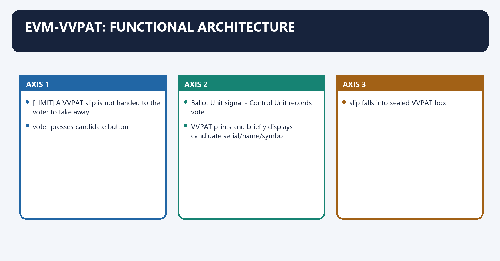
[FACT] The Indian EVM system uses a Ballot Unit, Control Unit and VVPAT. The VVPAT briefly displays a paper record to the voter and stores the slip in a sealed box for verification/counting under the prescribed process.

[FACT] *Subramanian Swamy v. ECI* (2013) treated paper trail as important for free and fair elections and directed phased VVPAT introduction.

[LIMIT] A VVPAT slip is not handed to the voter to take away.

#### Visual 38 - Vote recording flow

```text
voter presses candidate button
       |
Ballot Unit signal -> Control Unit records vote
       |
VVPAT prints and briefly displays candidate serial/name/symbol
       |
slip falls into sealed VVPAT box
```

#### CLOSING RECALL FLOW — EVM-VVPAT: FUNCTIONAL ARCHITECTURE

```closure-flow
SUBTOPIC: EVM-VVPAT: functional architecture
KEY TERMS / DEFINITIONS: EVM-VVPAT · functional architecture · EVM-VVPAT: functional architecture · VVPAT · Its principal consequence · Its
MECHANISM / ARGUMENT: Its principal consequence is that slip falls into sealed VVPAT box.
CONSEQUENCE / CONTRAST: The decisive contrast is between A VVPAT slip is not handed to the voter to take away and A VVPAT slip is not handed to the voter to take away.
UPSC TRAP / ANSWER-USE: The exam-safe limitation is that A VVPAT slip is not handed to the voter to take away.
ANSWER-GRABBING FORMULATION: EVM-VVPAT combines electronic recording with a briefly visible, securely stored paper trail, enabling verification without handing the slip to the voter.
```
### SESSION 40 — SUPREME COURT EVM-VVPAT CONTROL
#### DEFINITION / WHAT THIS IS CALLED

**Plain-language definition:** In its official 7 May 2025 follow-up order, the Court accepted an ECI technical SOP based on self-diagnosis and mutual authentication; required ECIL/BEL engineers to conduct the check and certify the integrity of burnt memory/programs; and allowed a requesting candidate to seek a mock poll after the recorded data is first displayed.

**Technical definition:** Technically, Supreme Court EVM-VVPAT control is analysed by relating return to paper ballot to rejected, then testing the relationship through count every VVPAT slip and SLU preservation.

#### ANSWER-GRABBING OPENING — WRITE/ADAPT IN THE EXAM

> Supreme Court safeguards permit request-based post-result checks and preservation of specified EVM components, but do not constitute a judicial finding that manipulation occurred.

#### MUST-WRITE KEYWORDS

- **Supreme Court EVM-VVPAT control**
- **return to paper ballot**
- **rejected**
- **count every VVPAT slip**
- **SLU preservation**
- **7 May 2025**

**How to use them:** Frame the answer through Supreme Court EVM-VVPAT control; define return to paper ballot, connect rejected with count every VVPAT slip to explain the mechanism, and use SLU preservation for the decisive comparison or qualification.

2024 Supreme Court EVM-VVPAT control denotes the constitutional rules and institutional links organised around [LIMIT] This is a request-triggered post-result verification safeguard, not a finding that EVM manipulation occurred.
2024 Supreme Court EVM-VVPAT control operates through Demand/control Court position, connected with return to paper ballot rejected.
The operative mechanism matters because count every VVPAT slip rejected.
Its principal consequence is that sLU preservation directed for at least 45 days.
The decisive contrast is between microcontroller check 5% on qualifying candidate request within seven days and 2025 verification SOP ECIL/BEL check and certificate; optional mock poll after display of recorded data.
The exam-safe limitation is that inference of fraud not made.
[FACT] In *Association for Democratic Reforms v. Election Commission of India* (26 April 2024), the Supreme Court rejected return to paper ballots and universal 100% VVPAT counting.

[FACT] It directed that Symbol Loading Units used on or after 1 May 2024 be sealed, signed and kept with EVMs in the strong room for at least 45 days after declaration of results.

[FACT] On a written request within seven days by the candidates placed second or third, burnt memory/microcontrollers in 5% of EVM sets per Assembly constituency/segment are to be checked by manufacturer engineers; the requesting candidate identifies the machines and initially bears notified cost, refundable if tampering is found.

[FACT] In its official **7 May 2025** follow-up order, the Court accepted an ECI technical SOP based on self-diagnosis and mutual authentication; required ECIL/BEL engineers to conduct the check and certify the integrity of burnt memory/programs; and allowed a requesting candidate to seek a mock poll after the recorded data is first displayed. A candidate may ask that SLU data be retained for use in that mock poll.

[LIMIT] This is a request-triggered post-result verification safeguard, not a finding that EVM manipulation occurred.

#### Visual 39 - Judicial safeguard matrix

| Demand/control | Court position |
|---|---|
| return to paper ballot | rejected |
| count every VVPAT slip | rejected |
| SLU preservation | directed for at least 45 days |
| microcontroller check | 5% on qualifying candidate request within seven days |
| 2025 verification SOP | ECIL/BEL check and certificate; optional mock poll after display of recorded data |
| inference of fraud | not made |

#### CLOSING RECALL FLOW — SUPREME COURT EVM-VVPAT CONTROL

```closure-flow
SUBTOPIC: Supreme Court EVM-VVPAT control
KEY TERMS / DEFINITIONS: Supreme Court EVM-VVPAT control · return to paper ballot · rejected · count every VVPAT slip · SLU preservation · 7 May 2025
MECHANISM / ARGUMENT: It directed that Symbol Loading Units used on or after 1 May 2024 be sealed, signed and kept with EVMs in the strong room for at least 45 days after declaration of results.
CONSEQUENCE / CONTRAST: Its principal consequence is that sLU preservation directed for at least 45 days.
UPSC TRAP / ANSWER-USE: Do not miss this limiting distinction: the decisive contrast is between microcontroller check 5% on qualifying candidate request within seven...
ANSWER-GRABBING FORMULATION: Supreme Court safeguards permit request-based post-result checks and preservation of specified EVM components, but do not constitute a judicial finding that manipulation occurred.
```
### SESSION 41 — HOW TO DISCUSS TECHNOLOGY WITHOUT AMPLIFYING UNSUPPORTED CLAIMS
#### DEFINITION / WHAT THIS IS CALLED

**Plain-language definition:** How to discuss technology without amplifying unsupported claims operates through Suspicion is not proof; institutional assurance is also not a reason to reject independent audits or reasoned disclosure, connected with TECHNICAL SECURITY.

**Technical definition:** How to discuss technology without amplifying unsupported claims denotes the constitutional rules and institutional links organised around A trustworthy answer separates system design, procedural custody, auditability, complaint remedy and public communication.

#### ANSWER-GRABBING OPENING — WRITE/ADAPT IN THE EXAM

> Electoral technology earns trust through secure design, chain of custody, auditability, complaint remedies and transparent communication rather than unsupported assurances or allegations.

#### MUST-WRITE KEYWORDS

- **How to discuss technology without amplifying unsupported claims**
- **Suspicion**
- **TECHNICAL SECURITY**
- **Its principal consequence**
- **Its**
- **The decisive contrast**

**How to use them:** Frame the answer through How to discuss technology without amplifying unsupported claims; define Suspicion, connect TECHNICAL SECURITY with Its principal consequence to explain the mechanism, and use Its for the decisive comparison or qualification.

How to discuss technology without amplifying unsupported claims denotes the constitutional rules and institutional links organised around [ANALYSIS] A trustworthy answer separates system design, procedural custody, auditability, complaint remedy and public communication.
How to discuss technology without amplifying unsupported claims operates through [LIMIT] Suspicion is not proof; institutional assurance is also not a reason to reject independent audits or reasoned disclosure, connected with TECHNICAL SECURITY.
The operative mechanism matters because physical chain of custody.
Its principal consequence is that candidate/agent observation.
The decisive contrast is between statistical and legal audit and transparent incident response.
The exam-safe limitation is that evidence-based confidence.
[ANALYSIS] A trustworthy answer separates system design, procedural custody, auditability, complaint remedy and public communication.

[LIMIT] Suspicion is not proof; institutional assurance is also not a reason to reject independent audits or reasoned disclosure.

#### Visual 40 - Trust framework

```text
TECHNICAL SECURITY
       +
physical chain of custody
       +
candidate/agent observation
       +
statistical and legal audit
       +
transparent incident response
       =
evidence-based confidence
```

#### CLOSING RECALL FLOW — HOW TO DISCUSS TECHNOLOGY WITHOUT AMPLIFYING UNSUPPORTED CLAIMS

```closure-flow
SUBTOPIC: How to discuss technology without amplifying unsupported claims
KEY TERMS / DEFINITIONS: How to discuss technology without amplifying unsupported claims · Suspicion · TECHNICAL SECURITY · Its principal consequence · Its · The decisive contrast
MECHANISM / ARGUMENT: How to discuss technology without amplifying unsupported claims denotes the constitutional rules and institutional links organised around A trustworthy answer separates system design, procedural custody, auditability, complaint remedy and public communication.
CONSEQUENCE / CONTRAST: Suspicion is not proof; institutional assurance is also not a reason to reject independent audits or reasoned disclosure.
UPSC TRAP / ANSWER-USE: Do not miss this limiting distinction: the decisive contrast is between statistical and legal audit and transparent incident response.
ANSWER-GRABBING FORMULATION: Electoral technology earns trust through secure design, chain of custody, auditability, complaint remedies and transparent communication rather than unsupported assurances or allegations.
```
### SESSION 42 — ARTICLE 324 PLENARY POWER: THE CORRECT DOCTRINE
#### DEFINITION / WHAT THIS IS CALLED

**Plain-language definition:** Article 324 plenary power: the correct doctrine denotes the constitutional rules and institutional links organised around A.C.

**Technical definition:** Article 324 plenary power: the correct doctrine operates through Read together, the cases create a gap-filling power, not an override power, connected with Is the Constitution/statute/rule explicit?.

#### ANSWER-GRABBING OPENING — WRITE/ADAPT IN THE EXAM

> Article 324 supplies a reservoir power where election law is silent, but the Commission may supplement rather than supplant enacted statutes and rules.

#### MUST-WRITE KEYWORDS

- **Article 324 plenary power**
- **the correct doctrine**
- **supplement, not supplant**
- **Article 324**
- **Article 324 plenary power: the correct doctrine**
- **Article**

**How to use them:** Frame the answer through Article 324 plenary power; define the correct doctrine, connect supplement, not supplant with Article 324 to explain the mechanism, and use Article 324 plenary power: the correct doctrine for the decisive comparison or qualification.

Article 324 plenary power: the correct doctrine denotes the constitutional rules and institutional links organised around [FACT] A.C. Jose v. Sivan Pillai states the limiting rule: the ECI may supplement, not supplant , an Act or express Rules.
Article 324 plenary power: the correct doctrine operates through [ANALYSIS] Read together, the cases create a gap-filling power, not an override power, connected with Is the Constitution/statute/rule explicit?.
The operative mechanism matters because yes - ECI must follow it; cannot contradict.
Its principal consequence is that no / genuine operational gap.
The decisive contrast is between ECI may act under Article 324 and purpose: free and fair election.
The exam-safe limitation is that limits: fairness, reason, proportionality, judicial review.
[FACT] *Mohinder Singh Gill v. CEC* describes Article 324 as a plenary/reservoir power enabling necessary action where enacted law is silent.

[FACT] *A.C. Jose v. Sivan Pillai* states the limiting rule: the ECI may **supplement, not supplant**, an Act or express Rules.

[ANALYSIS] Read together, the cases create a gap-filling power, not an override power.

#### Visual 41 - Plenary-power decision test

```text
Is the Constitution/statute/rule explicit?
  |
  yes -> ECI must follow it; cannot contradict
  |
  no / genuine operational gap
  v
ECI may act under Article 324
  |
purpose: free and fair election
  |
limits: fairness, reason, proportionality, judicial review
```

#### CLOSING RECALL FLOW — ARTICLE 324 PLENARY POWER: THE CORRECT DOCTRINE

```closure-flow
SUBTOPIC: Article 324 plenary power: the correct doctrine
KEY TERMS / DEFINITIONS: Article 324 plenary power · the correct doctrine · supplement, not supplant · Article 324 · Article 324 plenary power: the correct doctrine · Article
MECHANISM / ARGUMENT: Article 324 plenary power: the correct doctrine operates through Read together, the cases create a gap-filling power, not an override power, connected with Is the Constitution/statute/rule explicit?.
CONSEQUENCE / CONTRAST: The decisive contrast is between ECI may act under Article 324 and purpose: free and fair election.
UPSC TRAP / ANSWER-USE: Do not miss this limiting distinction: cEC describes Article 324 as a plenary/reservoir power enabling necessary action where enacted law...
ANSWER-GRABBING FORMULATION: Article 324 supplies a reservoir power where election law is silent, but the Commission may supplement rather than supplant enacted statutes and rules.
```
### SESSION 43 — NATURAL JUSTICE IN ELECTION ADMINISTRATION
#### DEFINITION / WHAT THIS IS CALLED

**Plain-language definition:** Natural justice in election administration denotes the constitutional rules and institutional links organised around Context Procedural expectation.

**Technical definition:** Natural justice in election administration operates through immediate violence/booth capture urgent protective order may be necessary, connected with candidate censure/ban with time available notice, response and reasoned order.

#### ANSWER-GRABBING OPENING — WRITE/ADAPT IN THE EXAM

> Mohinder Singh Gill recognised that orders with civil consequences ordinarily attract fairness, while the content and timing of natural justice depend on election exigency.

#### MUST-WRITE KEYWORDS

- **Natural justice in election administration**
- **immediate violence/booth capture**
- **urgent protective order may be necessary**
- **candidate censure/ban with time available**
- **notice, response and reasoned order**
- **roll deletion**

**How to use them:** Frame the answer through Natural justice in election administration; define immediate violence/booth capture, connect urgent protective order may be necessary with candidate censure/ban with time available to explain the mechanism, and use notice, response and reasoned order for the decisive comparison or qualification.

Natural justice in election administration denotes the constitutional rules and institutional links organised around Context Procedural expectation.
Natural justice in election administration operates through immediate violence/booth capture urgent protective order may be necessary, connected with candidate censure/ban with time available notice, response and reasoned order.
The operative mechanism matters because roll deletion notice, inquiry and remedy.
Its principal consequence is that post-poll technical verification prescribed request, presence and certification.
The decisive contrast is between Context Procedural expectation and Context Procedural expectation.
The exam-safe limitation is that context Procedural expectation.
[FACT] *Mohinder Singh Gill* recognised that orders with civil consequences ordinarily attract fairness, while the content and timing of natural justice depend on election exigency.

[ANALYSIS] Urgent preventive action may precede a full hearing, but urgency should not become a formula for arbitrary or unexplained decisions.

#### Visual 42 - Flexible fairness

| Context | Procedural expectation |
|---|---|
| immediate violence/booth capture | urgent protective order may be necessary |
| candidate censure/ban with time available | notice, response and reasoned order |
| roll deletion | notice, inquiry and remedy |
| post-poll technical verification | prescribed request, presence and certification |

#### CLOSING RECALL FLOW — NATURAL JUSTICE IN ELECTION ADMINISTRATION

```closure-flow
SUBTOPIC: Natural justice in election administration
KEY TERMS / DEFINITIONS: Natural justice in election administration · immediate violence/booth capture · urgent protective order may be necessary · candidate censure/ban with time available · notice, response and reasoned order · roll deletion
MECHANISM / ARGUMENT: Natural justice in election administration operates through immediate violence/booth capture urgent protective order may be necessary, connected with candidate censure/ban with time available notice, response and reasoned order.
CONSEQUENCE / CONTRAST: Its principal consequence is that post-poll technical verification prescribed request, presence and certification.
UPSC TRAP / ANSWER-USE: Do not miss this limiting distinction: the decisive contrast is between Context Procedural expectation and Context Procedural expectation.
ANSWER-GRABBING FORMULATION: Mohinder Singh Gill recognised that orders with civil consequences ordinarily attract fairness, while the content and timing of natural justice depend on election exigency.
```
### SESSION 44 — LANDMARK CASE MATRIX
#### DEFINITION / WHAT THIS IS CALLED

**Plain-language definition:** Landmark case matrix denotes the constitutional rules and institutional links organised around Case Named holding for this topic Qualification.

**Technical definition:** The decisive contrast is between ADR (2002) / PUCL (2003) candidate-information disclosure and voter's right to know implement through election framework and PUCL (2013) secret NOTA option directed NOTA plurality does not invalidate ordinary winner rule.

#### ANSWER-GRABBING OPENING — WRITE/ADAPT IN THE EXAM

> Election cases collectively protect disclosure, voter choice, fair administration and verifiability, but each holding must remain tied to its precise legal issue.

#### MUST-WRITE KEYWORDS

- **Landmark case matrix**
- **Mohinder Singh Gill (1978)**
- **Article 324 reservoir/plenary power in silence; free-and-fair purpose**
- **legality and fairness remain**
- **A.C. Jose (1984)**
- **ECI supplements, not supplants, statute/rules**

**How to use them:** Frame the answer through Landmark case matrix; define Mohinder Singh Gill (1978), connect Article 324 reservoir/plenary power in silence; free-and-fair purpose with legality and fairness remain to explain the mechanism, and use A.C. Jose (1984) for the decisive comparison or qualification.

Landmark case matrix denotes the constitutional rules and institutional links organised around Case Named holding for this topic Qualification.
Landmark case matrix operates through Mohinder Singh Gill (1978) Article 324 reservoir/plenary power in silence; free-and-fair purpose legality and fairness remain, connected with A.C. Jose (1984) ECI supplements, not supplants, statute/rules no contrary innovation.
The operative mechanism matters because kanhiya Lal Omar (1985) Symbols Order and ECI symbol authority upheld narrow election-symbol field.
Its principal consequence is that t.N. Seshan (1995) multi-member ECI, equality and majority rule upheld CEC retains distinct removal protection.
The decisive contrast is between ADR (2002) / PUCL (2003) candidate-information disclosure and voter's right to know implement through election framework and PUCL (2013) secret NOTA option directed NOTA plurality does not invalidate ordinary winner rule.
The exam-safe limitation is that subramanian Swamy (2013) VVPAT/paper trail directed in phases not a return to paper ballots.
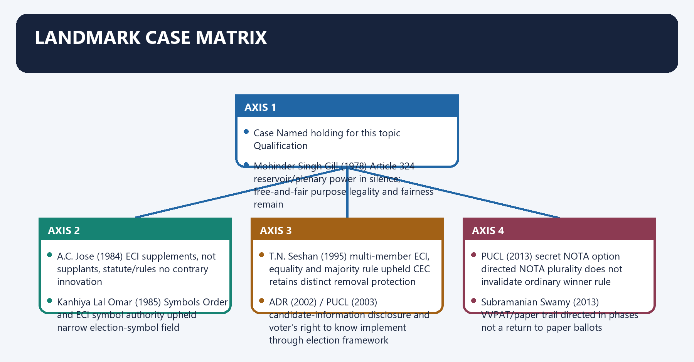
#### Visual 43 - Cases, holdings and boundaries

| Case | Named holding for this topic | Qualification |
|---|---|---|
| *Mohinder Singh Gill* (1978) | Article 324 reservoir/plenary power in silence; free-and-fair purpose | legality and fairness remain |
| *A.C. Jose* (1984) | ECI supplements, not supplants, statute/rules | no contrary innovation |
| *Kanhiya Lal Omar* (1985) | Symbols Order and ECI symbol authority upheld | narrow election-symbol field |
| *T.N. Seshan* (1995) | multi-member ECI, equality and majority rule upheld | CEC retains distinct removal protection |
| *ADR* (2002) / *PUCL* (2003) | candidate-information disclosure and voter's right to know | implement through election framework |
| *PUCL* (2013) | secret NOTA option directed | NOTA plurality does not invalidate ordinary winner rule |
| *Subramanian Swamy* (2013) | VVPAT/paper trail directed in phases | not a return to paper ballots |
| *Anoop Baranwal* (2023) | interim appointment committee until parliamentary law | displaced by 2023 Act |
| *ADR v. ECI* (2024) | EVM-VVPAT system retained; added preservation/verification safeguards | no universal 100% count |
| *ADR electoral bonds* (2024) | non-disclosure violated Article 19(1)(a); disclosure directions through ECI | political-funding case, not general ECI appointment case |

#### CLOSING RECALL FLOW — LANDMARK CASE MATRIX

```closure-flow
SUBTOPIC: Landmark case matrix
KEY TERMS / DEFINITIONS: Landmark case matrix · Mohinder Singh Gill (1978) · Article 324 reservoir/plenary power in silence; free-and-fair purpose · legality and fairness remain · A.C. Jose (1984) · ECI supplements, not supplants, statute/rules
MECHANISM / ARGUMENT: The decisive contrast is between ADR (2002) / PUCL (2003) candidate-information disclosure and voter's right to know implement through election framework and PUCL (2013) secret NOTA option directed NOTA plurality does not invalidate ordinary winner rule.
CONSEQUENCE / CONTRAST: The exam-safe limitation is that subramanian Swamy (2013) VVPAT/paper trail directed in phases not a return to paper ballots.
UPSC TRAP / ANSWER-USE: Do not miss this limiting distinction: its principal consequence is that t.N.
ANSWER-GRABBING FORMULATION: Election cases collectively protect disclosure, voter choice, fair administration and verifiability, but each holding must remain tied to its precise legal issue.
```
### SESSION 45 — NOTA: RIGHT NOT TO CHOOSE, NOT A RIGHT TO REJECT THE RESULT
#### DEFINITION / WHAT THIS IS CALLED

**Plain-language definition:** NOTA: right not to choose, not a right to reject the result denotes the constitutional rules and institutional links organised around PUCL v.

**Technical definition:** Under the ordinary present rule, even if NOTA receives more votes than each candidate, the candidate with the highest valid candidate vote is returned; NOTA does not automatically trigger a re-election.

#### ANSWER-GRABBING OPENING — WRITE/ADAPT IN THE EXAM

> Under the ordinary present rule, even if NOTA receives more votes than each candidate, the candidate with the highest valid candidate vote is returned; NOTA does not automatically trigger a re-election.

#### MUST-WRITE KEYWORDS

- **NOTA**
- **right not to choose**
- **not a right to reject the result**
- **PUCL**
- **Its principal consequence**
- **Its**

**How to use them:** Frame the answer through NOTA; define right not to choose, connect not a right to reject the result with PUCL to explain the mechanism, and use Its principal consequence for the decisive comparison or qualification.

NOTA: right not to choose, not a right to reject the result denotes the constitutional rules and institutional links organised around [FACT] PUCL v. Union of India (2013) directed a secret NOTA option to protect voter secrecy and expression.
NOTA: right not to choose, not a right to reject the result operates through secret expression of rejection, connected with counted and reported.
The operative mechanism matters because x- not a candidate.
Its principal consequence is that x- no automatic constituency cancellation.
The decisive contrast is between [FACT] PUCL v. Union of India (2013) directed a secret NOTA option to protect voter secrecy and expression and [FACT] PUCL v. Union of India (2013) directed a secret NOTA option to protect voter secrecy and expression.
The exam-safe limitation is that [FACT] PUCL v. Union of India (2013) directed a secret NOTA option to protect voter secrecy and expression.
[FACT] *PUCL v. Union of India* (2013) directed a secret NOTA option to protect voter secrecy and expression.

[LIMIT] Under the ordinary present rule, even if NOTA receives more votes than each candidate, the candidate with the highest valid candidate vote is returned; NOTA does not automatically trigger a re-election.

#### Visual 44 - NOTA legal effect

```text
NOTA selected
   -> secret expression of rejection
   -> counted and reported
   X-> not a candidate
   X-> no automatic constituency cancellation
```

#### CLOSING RECALL FLOW — NOTA: RIGHT NOT TO CHOOSE, NOT A RIGHT TO REJECT THE RESULT

```closure-flow
SUBTOPIC: NOTA: right not to choose, not a right to reject the result
KEY TERMS / DEFINITIONS: NOTA · right not to choose · not a right to reject the result · PUCL · Its principal consequence · Its
MECHANISM / ARGUMENT: Under the ordinary present rule, even if NOTA receives more votes than each candidate, the candidate with the highest valid candidate vote is returned; NOTA does not automatically trigger a re-election.
CONSEQUENCE / CONTRAST: Its principal consequence is that x- no automatic constituency cancellation.
UPSC TRAP / ANSWER-USE: Do not miss this limiting distinction: the decisive contrast is between PUCL v.
ANSWER-GRABBING FORMULATION: Under the ordinary present rule, even if NOTA receives more votes than each candidate, the candidate with the highest valid candidate vote is returned; NOTA does not automatically trigger a re-election.
```
### SESSION 46 — CANDIDATE DISCLOSURE AND POLITICAL-FINANCE TRANSPARENCY
#### DEFINITION / WHAT THIS IS CALLED

**Plain-language definition:** Candidate disclosure and political-finance transparency denotes the constitutional rules and institutional links organised around ADR (2002) and PUCL (2003) constitutionalised the voter's right to know material candidate antecedents through disclosure.

**Technical definition:** The ECI is both election administrator and a disclosure platform, but Parliament and courts define much of the substantive political-finance regime.

#### ANSWER-GRABBING OPENING — WRITE/ADAPT IN THE EXAM

> The ECI is both election administrator and a disclosure platform, but Parliament and courts define much of the substantive political-finance regime.

#### MUST-WRITE KEYWORDS

- **Candidate disclosure**
- **political-finance transparency**
- **Article 19**
- **Candidate disclosure and political-finance transparency**
- **Candidate**
- **ADR**

**How to use them:** Frame the answer through Candidate disclosure; define political-finance transparency, connect Article 19 with Candidate disclosure and political-finance transparency to explain the mechanism, and use Candidate for the decisive comparison or qualification.

Candidate disclosure and political-finance transparency denotes the constitutional rules and institutional links organised around [FACT] ADR (2002) and PUCL (2003) constitutionalised the voter's right to know material candidate antecedents through disclosure.
Candidate disclosure and political-finance transparency operates through candidate criminal/financial/educational disclosure, connected with informed voter choice.
The operative mechanism matters because political funding disclosure and donor-recipient visibility.
Its principal consequence is that electoral accountability.
The decisive contrast is between [FACT] ADR (2002) and PUCL (2003) constitutionalised the voter's right to know material candidate antecedents through disclosure and [FACT] ADR (2002) and PUCL (2003) constitutionalised the voter's right to know material candidate antecedents through disclosure.
The exam-safe limitation is that [FACT] ADR (2002) and PUCL (2003) constitutionalised the voter's right to know material candidate antecedents through disclosure.
[FACT] *ADR* (2002) and *PUCL* (2003) constitutionalised the voter's right to know material candidate antecedents through disclosure.

[FACT] The 15 February 2024 electoral-bonds judgment held that non-disclosure of political funding violated Article 19(1)(a), invalidated the scheme and connected amendments, and required SBI data to be furnished to and published by the ECI.

[ANALYSIS] The ECI is both election administrator and a disclosure platform, but Parliament and courts define much of the substantive political-finance regime.

#### Visual 45 - Information-right ladder

```text
candidate criminal/financial/educational disclosure
                   |
            informed voter choice
                   |
political funding disclosure and donor-recipient visibility
                   |
        electoral accountability
```

#### CLOSING RECALL FLOW — CANDIDATE DISCLOSURE AND POLITICAL-FINANCE TRANSPARENCY

```closure-flow
SUBTOPIC: Candidate disclosure and political-finance transparency
KEY TERMS / DEFINITIONS: Candidate disclosure · political-finance transparency · Article 19 · Candidate disclosure and political-finance transparency · Candidate · ADR
MECHANISM / ARGUMENT: The decisive contrast is between ADR (2002) and PUCL (2003) constitutionalised the voter's right to know material candidate antecedents through disclosure and ADR (2002) and PUCL (2003) constitutionalised the voter's right to know material candidate antecedents through disclosure.
CONSEQUENCE / CONTRAST: The ECI is both election administrator and a disclosure platform, but Parliament and courts define much of the substantive political-finance regime.
UPSC TRAP / ANSWER-USE: Do not miss this limiting distinction: the exam-safe limitation is that ADR (2002) and PUCL (2003) constitutionalised the voter's right...
ANSWER-GRABBING FORMULATION: The ECI is both election administrator and a disclosure platform, but Parliament and courts define much of the substantive political-finance regime.
```
### SESSION 47 — ARTICLE 329 AND THE ELECTION-DISPUTE BOUNDARY
#### DEFINITION / WHAT THIS IS CALLED

**Plain-language definition:** Article 329 and the election-dispute boundary denotes the constitutional rules and institutional links organised around The RPA 1951 places election petitions before the High Court, with a statutory appeal to the Supreme Court.

**Technical definition:** Article 329 and the election-dispute boundary operates through BEFORE / DURING POLL, connected with default - do not interrupt electoral process.

#### ANSWER-GRABBING OPENING — WRITE/ADAPT IN THE EXAM

> Ponnuswami protects the election from midstream interruption; later doctrine permits judicial intervention only where it facilitates rather than retards the electoral process.

#### MUST-WRITE KEYWORDS

- **Article 329**
- **the election-dispute boundary**
- **Article 329 and the election-dispute boundary**
- **Article**
- **The RPA**
- **High Court**

**How to use them:** Frame the answer through Article 329; define the election-dispute boundary, connect Article 329 and the election-dispute boundary with Article to explain the mechanism, and use The RPA for the decisive comparison or qualification.

Article 329 and the election-dispute boundary denotes the constitutional rules and institutional links organised around [FACT] The RPA 1951 places election petitions before the High Court, with a statutory appeal to the Supreme Court.
Article 329 and the election-dispute boundary operates through BEFORE / DURING POLL, connected with default - do not interrupt electoral process.
The operative mechanism matters because narrow facilitative review may exist.
Its principal consequence is that election petition - High Court - statutory appeal to Supreme Court.
The decisive contrast is between [FACT] The RPA 1951 places election petitions before the High Court, with a statutory appeal to the Supreme Court and [FACT] The RPA 1951 places election petitions before the High Court, with a statutory appeal to the Supreme Court.
The exam-safe limitation is that [FACT] The RPA 1951 places election petitions before the High Court, with a statutory appeal to the Supreme Court.
[FACT] Article 329(b) channels a challenge to an election to Parliament or a State legislature into an election petition presented under law.

[FACT] The RPA 1951 places election petitions before the High Court, with a statutory appeal to the Supreme Court.

[FACT] *N.P. Ponnuswami* protects the election from midstream interruption; later doctrine permits judicial intervention only where it facilitates rather than retards the electoral process.

[LIMIT] The ECI declares results and administers recount/repoll mechanisms within law; it is not the final election court for returned-candidate validity.

#### Visual 46 - Time-sensitive judicial route

```text
BEFORE / DURING POLL
  default -> do not interrupt electoral process
  narrow facilitative review may exist

AFTER RESULT
  election petition -> High Court -> statutory appeal to Supreme Court
```

#### CLOSING RECALL FLOW — ARTICLE 329 AND THE ELECTION-DISPUTE BOUNDARY

```closure-flow
SUBTOPIC: Article 329 and the election-dispute boundary
KEY TERMS / DEFINITIONS: Article 329 · the election-dispute boundary · Article 329 and the election-dispute boundary · Article · The RPA · High Court
MECHANISM / ARGUMENT: Article 329 and the election-dispute boundary operates through BEFORE / DURING POLL, connected with default - do not interrupt electoral process.
CONSEQUENCE / CONTRAST: Its principal consequence is that election petition - High Court - statutory appeal to Supreme Court.
UPSC TRAP / ANSWER-USE: Do not miss this limiting distinction: the decisive contrast is between The RPA 1951 places election petitions before the High...
ANSWER-GRABBING FORMULATION: Ponnuswami protects the election from midstream interruption; later doctrine permits judicial intervention only where it facilitates rather than retards the electoral process.
```
### SESSION 48 — PRESIDENT AND VICE-PRESIDENT ELECTION BOUNDARY
#### DEFINITION / WHAT THIS IS CALLED

**Plain-language definition:** President and Vice-President election boundary denotes the constitutional rules and institutional links organised around Article 324 includes conduct of presidential and vice-presidential elections.

**Technical definition:** The decisive contrast is between President/Vice-President ECI machinery under special statute Supreme Court under Article 71 and Panchayat/municipality SEC machinery forum under State law.

#### ANSWER-GRABBING OPENING — WRITE/ADAPT IN THE EXAM

> Article 324 covers presidential and vice-presidential elections, while Article 71 assigns disputes over those offices directly to the Supreme Court.

#### MUST-WRITE KEYWORDS

- **President**
- **Vice-President election boundary**
- **Parliament/State legislature**
- **ECI machinery**
- **High Court election petition; SC appeal**
- **President/Vice-President**

**How to use them:** Frame the answer through President; define Vice-President election boundary, connect Parliament/State legislature with ECI machinery to explain the mechanism, and use High Court election petition; SC appeal for the decisive comparison or qualification.

President and Vice-President election boundary denotes the constitutional rules and institutional links organised around [FACT] Article 324 includes conduct of presidential and vice-presidential elections.
President and Vice-President election boundary operates through [FACT] Article 71 vests disputes relating to those elections in the Supreme Court, connected with [LIMIT] Do not route these disputes to a High Court election petition under the ordinary parliamentary/Assembly mechanism.
The operative mechanism matters because election Administrative authority Dispute forum.
Its principal consequence is that parliament/State legislature ECI machinery High Court election petition; SC appeal.
The decisive contrast is between President/Vice-President ECI machinery under special statute Supreme Court under Article 71 and Panchayat/municipality SEC machinery forum under State law.
The exam-safe limitation is that [FACT] Article 324 includes conduct of presidential and vice-presidential elections.
[FACT] Article 324 includes conduct of presidential and vice-presidential elections.

[FACT] Article 71 vests disputes relating to those elections in the Supreme Court.

[LIMIT] Do not route these disputes to a High Court election petition under the ordinary parliamentary/Assembly mechanism.

#### Visual 47 - Dispute forum comparison

| Election | Administrative authority | Dispute forum |
|---|---|---|
| Parliament/State legislature | ECI machinery | High Court election petition; SC appeal |
| President/Vice-President | ECI machinery under special statute | Supreme Court under Article 71 |
| Panchayat/municipality | SEC machinery | forum under State law |

#### CLOSING RECALL FLOW — PRESIDENT AND VICE-PRESIDENT ELECTION BOUNDARY

```closure-flow
SUBTOPIC: President and Vice-President election boundary
KEY TERMS / DEFINITIONS: President · Vice-President election boundary · Parliament/State legislature · ECI machinery · High Court election petition; SC appeal · President/Vice-President
MECHANISM / ARGUMENT: President and Vice-President election boundary operates through Article 71 vests disputes relating to those elections in the Supreme Court, connected with Do not route these disputes to a High Court election petition under the ordinary parliamentary/Assembly mechanism.
CONSEQUENCE / CONTRAST: The decisive contrast is between President/Vice-President ECI machinery under special statute Supreme Court under Article 71 and Panchayat/municipality SEC machinery forum under State law.
UPSC TRAP / ANSWER-USE: Do not miss this limiting distinction: its principal consequence is that parliament/State legislature ECI machinery High Court election petition.
ANSWER-GRABBING FORMULATION: Article 324 covers presidential and vice-presidential elections, while Article 71 assigns disputes over those offices directly to the Supreme Court.
```
### SESSION 49 — INDEPENDENCE SAFEGUARDS AND DEFICITS
#### DEFINITION / WHAT THIS IS CALLED

**Plain-language definition:** Independence safeguards and deficits denotes the constitutional rules and institutional links organised around FINANCE/SECRETARIAT.

**Technical definition:** Safeguards include constitutional status, CEC removal protection, non-variation of CEC service conditions, protection of other ECs/Regional Commissioners through the CEC-recommendation rule, a collegial majority system and broad Article 324 authority.

#### ANSWER-GRABBING OPENING — WRITE/ADAPT IN THE EXAM

> Independence also depends on appointment legitimacy, control over staff, a stable secretariat, adequate finance, transparent reasons and even-handed enforcement.

#### MUST-WRITE KEYWORDS

- **Independence safeguards**
- **deficits**
- **Article 324**
- **Independence safeguards and deficits**
- **Independence**
- **FINANCE**

**How to use them:** Frame the answer through Independence safeguards; define deficits, connect Article 324 with Independence safeguards and deficits to explain the mechanism, and use Independence for the decisive comparison or qualification.

Independence safeguards and deficits denotes the constitutional rules and institutional links organised around FINANCE/SECRETARIAT.
Independence safeguards and deficits operates through TRANSPARENT ENFORCEMENT, connected with EFFECTIVE INDEPENDENCE.
The operative mechanism matters because fINANCE/SECRETARIAT.
Its principal consequence is that fINANCE/SECRETARIAT.
The decisive contrast is between FINANCE/SECRETARIAT and FINANCE/SECRETARIAT.
The exam-safe limitation is that fINANCE/SECRETARIAT.
[FACT] Safeguards include constitutional status, CEC removal protection, non-variation of CEC service conditions, protection of other ECs/Regional Commissioners through the CEC-recommendation rule, a collegial majority system and broad Article 324 authority.

[ANALYSIS] Independence also depends on appointment legitimacy, control over staff, a stable secretariat, adequate finance, transparent reasons and even-handed enforcement.

#### Visual 48 - Independence is a system

```text
APPOINTMENT
    x
TENURE/REMOVAL
    x
FINANCE/SECRETARIAT
    x
COLLEGIAL PROCESS
    x
TRANSPARENT ENFORCEMENT
    =
EFFECTIVE INDEPENDENCE
```

Caption: A weak factor can reduce the practical value of the others.

#### CLOSING RECALL FLOW — INDEPENDENCE SAFEGUARDS AND DEFICITS

```closure-flow
SUBTOPIC: Independence safeguards and deficits
KEY TERMS / DEFINITIONS: Independence safeguards · deficits · Article 324 · Independence safeguards and deficits · Independence · FINANCE
MECHANISM / ARGUMENT: Independence also depends on appointment legitimacy, control over staff, a stable secretariat, adequate finance, transparent reasons and even-handed enforcement.
CONSEQUENCE / CONTRAST: Its principal consequence is that fINANCE/SECRETARIAT.
UPSC TRAP / ANSWER-USE: Do not miss this limiting distinction: the decisive contrast is between FINANCE/SECRETARIAT and FINANCE/SECRETARIAT.
ANSWER-GRABBING FORMULATION: Independence also depends on appointment legitimacy, control over staff, a stable secretariat, adequate finance, transparent reasons and even-handed enforcement.
```
### SESSION 50 — BUDGET AND CHARGED-EXPENDITURE NUANCE
#### DEFINITION / WHAT THIS IS CALLED

**Plain-language definition:** Budget and charged-expenditure nuance denotes the constitutional rules and institutional links organised around The 2023 Act makes salary equal to that of an SC judge but does not state that all ECI expenditure is charged.

**Technical definition:** Budget and charged-expenditure nuance operates through Do not infer blanket charged status merely from salary parity, connected with Dimension Current control Reform claim.

#### ANSWER-GRABBING OPENING — WRITE/ADAPT IN THE EXAM

> The 2023 Act makes salary equal to that of an SC judge but does not state that all ECI expenditure is charged.

#### MUST-WRITE KEYWORDS

- **Budget**
- **charged-expenditure nuance**
- **Demand No. 66, Election Commission**
- **fervent appeal**
- **institutional expenditure**
- **Union Budget Demand No. 66**

**How to use them:** Frame the answer through Budget; define charged-expenditure nuance, connect Demand No. 66, Election Commission with fervent appeal to explain the mechanism, and use institutional expenditure for the decisive comparison or qualification.

Budget and charged-expenditure nuance denotes the constitutional rules and institutional links organised around [FACT] The 2023 Act makes salary equal to that of an SC judge but does not state that all ECI expenditure is charged.
Budget and charged-expenditure nuance operates through [LIMIT] Do not infer blanket charged status merely from salary parity, connected with Dimension Current control Reform claim.
The operative mechanism matters because institutional expenditure Union Budget Demand No. 66 charge ECI expenditure on CFI.
Its principal consequence is that secretariat ECI secretariat within present staffing/budget framework constitutionally/statutorily independent secretariat.
The decisive contrast is between judicial language appeal to consider changes not self-executing amendment and [FACT] The 2023 Act makes salary equal to that of an SC judge but does not state that all ECI expenditure is charged.
The exam-safe limitation is that [FACT] The 2023 Act makes salary equal to that of an SC judge but does not state that all ECI expenditure is charged.
[FACT] Article 324 contains no analogue of Article 322 automatically charging the Commission's administrative expenditure on the Consolidated Fund.

[FACT] The official Union Budget 2026-27 places ECI establishment expenditure under **Demand No. 66, Election Commission**, within the Ministry of Law and Justice demands.

[FACT] The 2023 Act makes salary equal to that of an SC judge but does not state that all ECI expenditure is charged.

[FACT] *Anoop Baranwal* made a **fervent appeal**, rather than an operative constitutional declaration, that Parliament/Union consider a permanent secretariat and charged expenditure.

[LIMIT] Do not infer blanket charged status merely from salary parity.

#### Visual 49 - Current position versus reform

| Dimension | Current control | Reform claim |
|---|---|---|
| institutional expenditure | Union Budget Demand No. 66 | charge ECI expenditure on CFI |
| secretariat | ECI secretariat within present staffing/budget framework | constitutionally/statutorily independent secretariat |
| judicial language | appeal to consider changes | not self-executing amendment |

#### CLOSING RECALL FLOW — BUDGET AND CHARGED-EXPENDITURE NUANCE

```closure-flow
SUBTOPIC: Budget and charged-expenditure nuance
KEY TERMS / DEFINITIONS: Budget · charged-expenditure nuance · Demand No. 66, Election Commission · fervent appeal · institutional expenditure · Union Budget Demand No. 66
MECHANISM / ARGUMENT: Budget and charged-expenditure nuance operates through Do not infer blanket charged status merely from salary parity, connected with Dimension Current control Reform claim.
CONSEQUENCE / CONTRAST: Its principal consequence is that secretariat ECI secretariat within present staffing/budget framework constitutionally/statutorily independent secretariat.
UPSC TRAP / ANSWER-USE: The decisive contrast is between judicial language appeal to consider changes not self-executing amendment and The 2023 Act makes salary equal to that of an SC judge but does not state that all ECI expenditure is charged.
ANSWER-GRABBING FORMULATION: The 2023 Act makes salary equal to that of an SC judge but does not state that all ECI expenditure is charged.
```
### SESSION 51 — EQUAL REMOVAL PROTECTION DEBATE
#### DEFINITION / WHAT THIS IS CALLED

**Plain-language definition:** Equal removal protection debate denotes the constitutional rules and institutional links organised around Giving ECs the CEC's removal protection could reduce hierarchical dependence on the CEC and protect dissent.

**Technical definition:** The decisive contrast is between Giving ECs the CEC's removal protection could reduce hierarchical dependence on the CEC and protect dissent and Giving ECs the CEC's removal protection could reduce hierarchical dependence on the CEC and protect dissent.

#### ANSWER-GRABBING OPENING — WRITE/ADAPT IN THE EXAM

> Giving ECs the CEC's removal protection could reduce hierarchical dependence on the CEC and protect dissent.

#### MUST-WRITE KEYWORDS

- **Equal removal protection debate**
- **identical parliamentary removal for all**
- **equal independence**
- **high threshold may impede accountability**
- **CEC-recommendation rule plus reasons/review**
- **preserves present design with transparency**

**How to use them:** Frame the answer through Equal removal protection debate; define identical parliamentary removal for all, connect equal independence with high threshold may impede accountability to explain the mechanism, and use CEC-recommendation rule plus reasons/review for the decisive comparison or qualification.

Equal removal protection debate denotes the constitutional rules and institutional links organised around [ANALYSIS] Giving ECs the CEC's removal protection could reduce hierarchical dependence on the CEC and protect dissent.
Equal removal protection debate operates through Option Benefit Risk/qualification, connected with identical parliamentary removal for all equal independence high threshold may impede accountability.
The operative mechanism matters because cEC-recommendation rule plus reasons/review preserves present design with transparency continuing asymmetry.
Its principal consequence is that independent inquiry before removal procedural legitimacy institution and standard must be designed.
The decisive contrast is between [ANALYSIS] Giving ECs the CEC's removal protection could reduce hierarchical dependence on the CEC and protect dissent and [ANALYSIS] Giving ECs the CEC's removal protection could reduce hierarchical dependence on the CEC and protect dissent.
The exam-safe limitation is that [ANALYSIS] Giving ECs the CEC's removal protection could reduce hierarchical dependence on the CEC and protect dissent.
[ANALYSIS] Giving ECs the CEC's removal protection could reduce hierarchical dependence on the CEC and protect dissent.

[LIMIT] A symmetrical rule must also preserve accountability and avoid creating members who are practically irremovable for serious misconduct.

#### Visual 50 - Reform options

| Option | Benefit | Risk/qualification |
|---|---|---|
| identical parliamentary removal for all | equal independence | high threshold may impede accountability |
| CEC-recommendation rule plus reasons/review | preserves present design with transparency | continuing asymmetry |
| independent inquiry before removal | procedural legitimacy | institution and standard must be designed |

#### CLOSING RECALL FLOW — EQUAL REMOVAL PROTECTION DEBATE

```closure-flow
SUBTOPIC: Equal removal protection debate
KEY TERMS / DEFINITIONS: Equal removal protection debate · identical parliamentary removal for all · equal independence · high threshold may impede accountability · CEC-recommendation rule plus reasons/review · preserves present design with transparency
MECHANISM / ARGUMENT: The decisive contrast is between Giving ECs the CEC's removal protection could reduce hierarchical dependence on the CEC and protect dissent and Giving ECs the CEC's removal protection could reduce hierarchical dependence on the CEC and protect dissent.
CONSEQUENCE / CONTRAST: Its principal consequence is that independent inquiry before removal procedural legitimacy institution and standard must be designed.
UPSC TRAP / ANSWER-USE: Do not miss this limiting distinction: the exam-safe limitation is that Giving ECs the CEC's removal protection could reduce hierarchical...
ANSWER-GRABBING FORMULATION: Giving ECs the CEC's removal protection could reduce hierarchical dependence on the CEC and protect dissent.
```
### SESSION 52 — APPOINTMENT REFORM OPTIONS
#### DEFINITION / WHAT THIS IS CALLED

**Plain-language definition:** Appointment reform options denotes the constitutional rules and institutional links organised around Judicial membership is one design choice, not the sole conceivable constitutional model.

**Technical definition:** The decisive contrast is between recorded comparative reasons and President's appointment.

#### ANSWER-GRABBING OPENING — WRITE/ADAPT IN THE EXAM

> A credible appointments model needs plural participation, transparent criteria, adequate dossier time and recorded reasons, while judicial membership remains one possible safeguard rather than the only design.

#### MUST-WRITE KEYWORDS

- **Appointment reform options**
- **Appointment**
- **Judicial**
- **Its principal consequence**
- **Its**
- **The decisive contrast**

**How to use them:** Frame the answer through Appointment reform options; define Appointment, connect Judicial with Its principal consequence to explain the mechanism, and use Its for the decisive comparison or qualification.

Appointment reform options denotes the constitutional rules and institutional links organised around [LIMIT] Judicial membership is one design choice, not the sole conceivable constitutional model.
Appointment reform options operates through broad eligible pool, connected with published criteria.
The operative mechanism matters because independent search.
Its principal consequence is that adequate dossier time.
The decisive contrast is between recorded comparative reasons and President's appointment.
The exam-safe limitation is that [LIMIT] Judicial membership is one design choice, not the sole conceivable constitutional model.
[ANALYSIS] A credible design should combine a plural committee, published eligibility criteria, adequate dossier time, conflict rules, a public shortlist principle compatible with privacy, recorded reasons and parliamentary reporting.

[LIMIT] Judicial membership is one design choice, not the sole conceivable constitutional model.

#### Visual 51 - Appointment-quality funnel

```text
broad eligible pool
   -> published criteria
   -> independent search
   -> plural selection
   -> adequate dossier time
   -> recorded comparative reasons
   -> President's appointment
```

#### CLOSING RECALL FLOW — APPOINTMENT REFORM OPTIONS

```closure-flow
SUBTOPIC: Appointment reform options
KEY TERMS / DEFINITIONS: Appointment reform options · Appointment · Judicial · Its principal consequence · Its · The decisive contrast
MECHANISM / ARGUMENT: The decisive contrast is between recorded comparative reasons and President's appointment.
CONSEQUENCE / CONTRAST: The exam-safe limitation is that Judicial membership is one design choice, not the sole conceivable constitutional model.
UPSC TRAP / ANSWER-USE: Judicial membership is one design choice, not the sole conceivable constitutional model.
ANSWER-GRABBING FORMULATION: A credible appointments model needs plural participation, transparent criteria, adequate dossier time and recorded reasons, while judicial membership remains one possible safeguard rather than the only design.
```
### SESSION 53 — ENFORCEMENT-ACCOUNTABILITY REFORM
#### DEFINITION / WHAT THIS IS CALLED

**Plain-language definition:** Enforcement-accountability reform denotes the constitutional rules and institutional links organised around The strongest near-term reform is not simply "more power".

**Technical definition:** The strongest near-term reform is not simply "more power".

#### ANSWER-GRABBING OPENING — WRITE/ADAPT IN THE EXAM

> Election enforcement improves through visible, consistent and reviewable use of existing authority, not simply through conferring broader unstructured power.

#### MUST-WRITE KEYWORDS

- **Enforcement-accountability reform**
- **complaint**
- **date, complainant category, allegation type**
- **preliminary view**
- **MCC-only or statutory overlap**
- **response**

**How to use them:** Frame the answer through Enforcement-accountability reform; define complaint, connect date, complainant category, allegation type with preliminary view to explain the mechanism, and use MCC-only or statutory overlap for the decisive comparison or qualification.

Enforcement-accountability reform denotes the constitutional rules and institutional links organised around [ANALYSIS] The strongest near-term reform is not simply "more power". It is visible, consistent and reviewable use of existing power.
Enforcement-accountability reform operates through Stage Minimum public control, connected with complaint date, complainant category, allegation type.
The operative mechanism matters because preliminary view MCC-only or statutory overlap.
Its principal consequence is that response notice and time allowed.
The decisive contrast is between decision rule, evidence, reason and member decision and follow-up compliance, prosecution referral or closure.
The exam-safe limitation is that data review comparative consistency across parties and elections.
[ANALYSIS] The strongest near-term reform is not simply "more power". It is **visible, consistent and reviewable use of existing power**.

#### Visual 52 - Complaint-to-outcome ledger

| Stage | Minimum public control |
|---|---|
| complaint | date, complainant category, allegation type |
| preliminary view | MCC-only or statutory overlap |
| response | notice and time allowed |
| decision | rule, evidence, reason and member decision |
| follow-up | compliance, prosecution referral or closure |
| data review | comparative consistency across parties and elections |

#### CLOSING RECALL FLOW — ENFORCEMENT-ACCOUNTABILITY REFORM

```closure-flow
SUBTOPIC: Enforcement-accountability reform
KEY TERMS / DEFINITIONS: Enforcement-accountability reform · complaint · date, complainant category, allegation type · preliminary view · MCC-only or statutory overlap · response
MECHANISM / ARGUMENT: The operative mechanism matters because preliminary view MCC-only or statutory overlap.
CONSEQUENCE / CONTRAST: Its principal consequence is that response notice and time allowed.
UPSC TRAP / ANSWER-USE: The strongest near-term reform is not simply "more power".
ANSWER-GRABBING FORMULATION: Election enforcement improves through visible, consistent and reviewable use of existing authority, not simply through conferring broader unstructured power.
```
### SESSION 54 — ELECTORAL-ROLL REFORM OPTIONS
#### DEFINITION / WHAT THIS IS CALLED

**Plain-language definition:** Electoral-roll reform options denotes the constitutional rules and institutional links organised around Technology must not turn a statutory entitlement into an undocumented-person exclusion test.

**Technical definition:** Reform should emphasise continuous updating, interoperable but privacy-protective death/migration data, accessible documentary alternatives, individual notice, reasoned orders, rapid appeals and independent audits.

#### ANSWER-GRABBING OPENING — WRITE/ADAPT IN THE EXAM

> Reform should emphasise continuous updating, interoperable but privacy-protective death/migration data, accessible documentary alternatives, individual notice, reasoned orders, rapid appeals and independent audits.

#### MUST-WRITE KEYWORDS

- **Electoral-roll reform options**
- **Electoral-roll**
- **Technology**
- **Its principal consequence**
- **Its**
- **The decisive contrast**

**How to use them:** Frame the answer through Electoral-roll reform options; define Electoral-roll, connect Technology with Its principal consequence to explain the mechanism, and use Its for the decisive comparison or qualification.

Electoral-roll reform options denotes the constitutional rules and institutional links organised around [LIMIT] Technology must not turn a statutory entitlement into an undocumented-person exclusion test.
Electoral-roll reform options operates through data signal of possible error, connected with human verification + notice.
The operative mechanism matters because accessible response / alternate proof.
Its principal consequence is that [LIMIT] Technology must not turn a statutory entitlement into an undocumented-person exclusion test.
The decisive contrast is between [LIMIT] Technology must not turn a statutory entitlement into an undocumented-person exclusion test and [LIMIT] Technology must not turn a statutory entitlement into an undocumented-person exclusion test.
The exam-safe limitation is that [LIMIT] Technology must not turn a statutory entitlement into an undocumented-person exclusion test.
[ANALYSIS] Reform should emphasise continuous updating, interoperable but privacy-protective death/migration data, accessible documentary alternatives, individual notice, reasoned orders, rapid appeals and independent audits.

[LIMIT] Technology must not turn a statutory entitlement into an undocumented-person exclusion test.

#### Visual 53 - Inclusion-first data governance

```text
data signal of possible error
       |
human verification + notice
       |
accessible response / alternate proof
       |
reasoned order
       |
appeal + audit
```

#### CLOSING RECALL FLOW — ELECTORAL-ROLL REFORM OPTIONS

```closure-flow
SUBTOPIC: Electoral-roll reform options
KEY TERMS / DEFINITIONS: Electoral-roll reform options · Electoral-roll · Technology · Its principal consequence · Its · The decisive contrast
MECHANISM / ARGUMENT: Reform should emphasise continuous updating, interoperable but privacy-protective death/migration data, accessible documentary alternatives, individual notice, reasoned orders, rapid appeals and independent audits.
CONSEQUENCE / CONTRAST: Its principal consequence is that Technology must not turn a statutory entitlement into an undocumented-person exclusion test.
UPSC TRAP / ANSWER-USE: The decisive contrast is between Technology must not turn a statutory entitlement into an undocumented-person exclusion test and Technology must not turn a statutory entitlement into an undocumented-person exclusion test.
ANSWER-GRABBING FORMULATION: Reform should emphasise continuous updating, interoperable but privacy-protective death/migration data, accessible documentary alternatives, individual notice, reasoned orders, rapid appeals and independent audits.
```
### SESSION 55 — MCC REFORM OPTIONS
#### DEFINITION / WHAT THIS IS CALLED

**Plain-language definition:** MCC reform options denotes the constitutional rules and institutional links organised around A hybrid model is preferable.

**Technical definition:** Its principal consequence is that identify conduct that must be referred under RPA/BNS.

#### ANSWER-GRABBING OPENING — WRITE/ADAPT IN THE EXAM

> A hybrid Model Code can preserve rapid non-statutory correction while adding clearer reasons, timelines, publication and referral of independently unlawful conduct.

#### MUST-WRITE KEYWORDS

- **MCC reform options**
- **MCC**
- **Its principal consequence**
- **Its**
- **RPA**
- **BNS**

**How to use them:** Frame the answer through MCC reform options; define MCC, connect Its principal consequence with Its to explain the mechanism, and use RPA for the decisive comparison or qualification.

MCC reform options denotes the constitutional rules and institutional links organised around [ANALYSIS] A hybrid model is preferable.
MCC reform options operates through retain non-statutory rapid directions for campaign fairness, connected with codify timelines and reason-giving.
The operative mechanism matters because publish a complaint/outcome database.
Its principal consequence is that identify conduct that must be referred under RPA/BNS.
The decisive contrast is between create proportionate, reviewable sanctions for repeated non-compliance and FAST ECI DIRECTION.
The exam-safe limitation is that reasoned public order.
[ANALYSIS] A hybrid model is preferable:

1. retain non-statutory rapid directions for campaign fairness;
2. codify timelines and reason-giving;
3. publish a complaint/outcome database;
4. identify conduct that must be referred under RPA/BNS;
5. create proportionate, reviewable sanctions for repeated non-compliance.

#### Visual 54 - Hybrid MCC model

```text
FAST ECI DIRECTION
       +
reasoned public order
       +
statutory referral where offence exists
       +
post-election consistency audit
```

#### CLOSING RECALL FLOW — MCC REFORM OPTIONS

```closure-flow
SUBTOPIC: MCC reform options
KEY TERMS / DEFINITIONS: MCC reform options · MCC · Its principal consequence · Its · RPA · BNS
MECHANISM / ARGUMENT: Its principal consequence is that identify conduct that must be referred under RPA/BNS.
CONSEQUENCE / CONTRAST: The decisive contrast is between create proportionate, reviewable sanctions for repeated non-compliance and FAST ECI DIRECTION.
UPSC TRAP / ANSWER-USE: Do not miss this limiting distinction: retain non-statutory rapid directions for campaign fairness.
ANSWER-GRABBING FORMULATION: A hybrid Model Code can preserve rapid non-statutory correction while adding clearer reasons, timelines, publication and referral of independently unlawful conduct.
```
### SESSION 56 — TECHNOLOGY AND AUDIT REFORM
#### DEFINITION / WHAT THIS IS CALLED

**Plain-language definition:** Technology and audit reform denotes the constitutional rules and institutional links organised around Neither maximal secrecy nor uncontrolled public access to security-sensitive material is a complete solution.

**Technical definition:** Its principal consequence is that public assurance aggregate audit/discrepancy data no voter-level disclosure.

#### ANSWER-GRABBING OPENING — WRITE/ADAPT IN THE EXAM

> Electoral-technology reform gains credibility through secure custody, candidate-accessible checks, aggregate discrepancy reporting, independent review and rapid incident communication.

#### MUST-WRITE KEYWORDS

- **Technology**
- **audit reform**
- **voter assurance**
- **VVPAT display and prescribed count**
- **preserve secrecy**
- **candidate assurance**

**How to use them:** Frame the answer through Technology; define audit reform, connect voter assurance with VVPAT display and prescribed count to explain the mechanism, and use preserve secrecy for the decisive comparison or qualification.

Technology and audit reform denotes the constitutional rules and institutional links organised around [LIMIT] Neither maximal secrecy nor uncontrolled public access to security-sensitive material is a complete solution.
Technology and audit reform operates through Goal Tool Qualification, connected with voter assurance VVPAT display and prescribed count preserve secrecy.
The operative mechanism matters because candidate assurance mock polls, seals, forms, SLU/microcontroller checks request and custody rules.
Its principal consequence is that public assurance aggregate audit/discrepancy data no voter-level disclosure.
The decisive contrast is between security assurance independent expert testing protect attack surface and [LIMIT] Neither maximal secrecy nor uncontrolled public access to security-sensitive material is a complete solution.
The exam-safe limitation is that [LIMIT] Neither maximal secrecy nor uncontrolled public access to security-sensitive material is a complete solution.
[ANALYSIS] Improvements should be evidence-led: secure custody documentation, candidate access to prescribed checks, publishable aggregate discrepancy reports, independent technical review with source-code and security confidentiality safeguards, and fast incident communication.

[LIMIT] Neither maximal secrecy nor uncontrolled public access to security-sensitive material is a complete solution.

#### Visual 55 - Audit proportionality

| Goal | Tool | Qualification |
|---|---|---|
| voter assurance | VVPAT display and prescribed count | preserve secrecy |
| candidate assurance | mock polls, seals, forms, SLU/microcontroller checks | request and custody rules |
| public assurance | aggregate audit/discrepancy data | no voter-level disclosure |
| security assurance | independent expert testing | protect attack surface |

#### CLOSING RECALL FLOW — TECHNOLOGY AND AUDIT REFORM

```closure-flow
SUBTOPIC: Technology and audit reform
KEY TERMS / DEFINITIONS: Technology · audit reform · voter assurance · VVPAT display and prescribed count · preserve secrecy · candidate assurance
MECHANISM / ARGUMENT: Its principal consequence is that public assurance aggregate audit/discrepancy data no voter-level disclosure.
CONSEQUENCE / CONTRAST: The decisive contrast is between security assurance independent expert testing protect attack surface and Neither maximal secrecy nor uncontrolled public access to security-sensitive material is a complete solution.
UPSC TRAP / ANSWER-USE: Do not miss this limiting distinction: the exam-safe limitation is that Neither maximal secrecy nor uncontrolled public access to security-sensitive...
ANSWER-GRABBING FORMULATION: Electoral-technology reform gains credibility through secure custody, candidate-accessible checks, aggregate discrepancy reporting, independent review and rapid incident communication.
```
### SESSION 57 — WHAT THE ECI CANNOT LAWFULLY DO
#### DEFINITION / WHAT THIS IS CALLED

**Plain-language definition:** What the ECI cannot lawfully do denotes the constitutional rules and institutional links organised around Cannot Correct route.

**Technical definition:** What the ECI cannot lawfully do operates through conduct panchayat/municipal elections under Article 324 SEC, connected with contradict an enacted Act or Rule Parliament/rule amendment or judicial review.

#### ANSWER-GRABBING OPENING — WRITE/ADAPT IN THE EXAM

> The Election Commission cannot conduct local-body polls, contradict statute, invent disqualifications or finally void elections, because those functions belong to other constitutional or judicial routes.

#### MUST-WRITE KEYWORDS

- **conduct panchayat/municipal elections under Article 324**
- **SEC**
- **contradict an enacted Act or Rule**
- **Parliament/rule amendment or judicial review**
- **invent a new candidate disqualification**
- **Constitution/RPA**

**How to use them:** Frame the answer through conduct panchayat/municipal elections under Article 324; define SEC, connect contradict an enacted Act or Rule with Parliament/rule amendment or judicial review to explain the mechanism, and use invent a new candidate disqualification for the decisive comparison or qualification.

What the ECI cannot lawfully do denotes the constitutional rules and institutional links organised around Cannot Correct route.
What the ECI cannot lawfully do operates through conduct panchayat/municipal elections under Article 324 SEC, connected with contradict an enacted Act or Rule Parliament/rule amendment or judicial review.
The operative mechanism matters because invent a new candidate disqualification Constitution/RPA.
Its principal consequence is that finally void a returned candidate's election High Court election petition.
The decisive contrast is between decide Tenth Schedule defection Speaker/Chairman and ordinarily delimit every constituency alone Delimitation Commission/statutory route.
The exam-safe limitation is that convert MCC itself into a criminal statute Parliament.
#### Visual 56 - Negative-power board

| Cannot | Correct route |
|---|---|
| conduct panchayat/municipal elections under Article 324 | SEC |
| contradict an enacted Act or Rule | Parliament/rule amendment or judicial review |
| invent a new candidate disqualification | Constitution/RPA |
| finally void a returned candidate's election | High Court election petition |
| decide Tenth Schedule defection | Speaker/Chairman |
| ordinarily delimit every constituency alone | Delimitation Commission/statutory route |
| convert MCC itself into a criminal statute | Parliament |
| treat allegations of EVM fraud as established fact | evidence and prescribed verification |

#### CLOSING RECALL FLOW — WHAT THE ECI CANNOT LAWFULLY DO

```closure-flow
SUBTOPIC: What the ECI cannot lawfully do
KEY TERMS / DEFINITIONS: conduct panchayat/municipal elections under Article 324 · SEC · contradict an enacted Act or Rule · Parliament/rule amendment or judicial review · invent a new candidate disqualification · Constitution/RPA
MECHANISM / ARGUMENT: What the ECI cannot lawfully do operates through conduct panchayat/municipal elections under Article 324 SEC, connected with contradict an enacted Act or Rule Parliament/rule amendment or judicial review.
CONSEQUENCE / CONTRAST: Its principal consequence is that finally void a returned candidate's election High Court election petition.
UPSC TRAP / ANSWER-USE: Do not miss this limiting distinction: the decisive contrast is between decide Tenth Schedule defection Speaker/Chairman and ordinarily delimit every...
ANSWER-GRABBING FORMULATION: The Election Commission cannot conduct local-body polls, contradict statute, invent disqualifications or finally void elections, because those functions belong to other constitutional or judicial routes.
```
### SESSION 58 — INTEGRATED ANSWER-WRITING FRAMEWORK
#### DEFINITION / WHAT THIS IS CALLED

**Plain-language definition:** Integrated answer-writing framework denotes the constitutional rules and institutional links organised around Every strong ECI answer should move through five moves.

**Technical definition:** The decisive contrast is between Reform verdict: precise, proportional and implementable and "Article 324 grants plenary supervision.".

#### ANSWER-GRABBING OPENING — WRITE/ADAPT IN THE EXAM

> Free-and-fair election analysis connects each institutional mechanism to its statutory boundary, responsible authority and dated operational status.

#### MUST-WRITE KEYWORDS

- **Integrated answer-writing framework**
- **Constitutional claim**
- **Named evidence**
- **Institutional analysis**
- **Qualification**
- **Reform verdict**

**How to use them:** Frame the answer through Integrated answer-writing framework; define Constitutional claim, connect Named evidence with Institutional analysis to explain the mechanism, and use Qualification for the decisive comparison or qualification.

Integrated answer-writing framework denotes the constitutional rules and institutional links organised around [ANALYSIS] Every strong ECI answer should move through five moves.
Integrated answer-writing framework operates through Constitutional claim: Article and exact field, connected with Named evidence: statute, ECI manual or case.
The operative mechanism matters because institutional analysis: how the mechanism protects free and fair elections.
Its principal consequence is that qualification: statutory boundary, ownership or current-status caution.
The decisive contrast is between Reform verdict: precise, proportional and implementable and "Article 324 grants plenary supervision.".
The exam-safe limitation is that mohinder Singh Gill + A.C. Jose.
[ANALYSIS] Every strong ECI answer should move through five moves:

1. **Constitutional claim:** Article and exact field.
2. **Named evidence:** statute, ECI manual or case.
3. **Institutional analysis:** how the mechanism protects free and fair elections.
4. **Qualification:** statutory boundary, ownership or current-status caution.
5. **Reform verdict:** precise, proportional and implementable.

#### Visual 57 - Claim-evidence-analysis-qualification spine

```text
CLAIM
  "Article 324 grants plenary supervision."
      |
EVIDENCE
  Mohinder Singh Gill + A.C. Jose
      |
ANALYSIS
  gap-filling authority preserves electoral integrity
      |
QUALIFICATION
  supplement, never supplant, enacted law
      |
VERDICT
  reasoned and reviewable residual action
```

#### CLOSING RECALL FLOW — INTEGRATED ANSWER-WRITING FRAMEWORK

```closure-flow
SUBTOPIC: Integrated answer-writing framework
KEY TERMS / DEFINITIONS: Integrated answer-writing framework · Constitutional claim · Named evidence · Institutional analysis · Qualification · Reform verdict
MECHANISM / ARGUMENT: Every strong ECI answer should move through five moves.
CONSEQUENCE / CONTRAST: Its principal consequence is that qualification: statutory boundary, ownership or current-status caution.
UPSC TRAP / ANSWER-USE: Do not miss this limiting distinction: the decisive contrast is between Reform verdict.
ANSWER-GRABBING FORMULATION: Free-and-fair election analysis connects each institutional mechanism to its statutory boundary, responsible authority and dated operational status.
```
### SESSION 59 — THESIS SELECTOR
#### DEFINITION / WHAT THIS IS CALLED

**Plain-language definition:** Thesis selector denotes the constitutional rules and institutional links organised around Demand Qualified thesis.

**Technical definition:** Thesis selector operates through Article 324 powers Article 324 is a reservoir for statutory silence, not a charter to disobey Parliament, connected with MCC The MCC's speed comes from its non-statutory form; accountability should be strengthened without losing preventive capacity.

#### ANSWER-GRABBING OPENING — WRITE/ADAPT IN THE EXAM

> Election Commission independence requires secure appointments and resources, while its operational powers remain bounded by statute, reason-giving and judicial review.

#### MUST-WRITE KEYWORDS

- **Thesis selector**
- **independence**
- **Article 324 powers**
- **MCC**
- **EVM trust**
- **rolls**

**How to use them:** Frame the answer through Thesis selector; define independence, connect Article 324 powers with MCC to explain the mechanism, and use EVM trust for the decisive comparison or qualification.

Thesis selector denotes the constitutional rules and institutional links organised around Demand Qualified thesis.
Thesis selector operates through Article 324 powers Article 324 is a reservoir for statutory silence, not a charter to disobey Parliament, connected with MCC The MCC's speed comes from its non-statutory form; accountability should be strengthened without losing preventive capacity.
The operative mechanism matters because eVM trust Trust rests on layered custody, observation and audit, not on unsupported assurance or allegation.
Its principal consequence is that rolls Roll integrity means inclusion plus lawful correction through notice, evidence and remedy.
The decisive contrast is between Demand Qualified thesis and Demand Qualified thesis.
The exam-safe limitation is that demand Qualified thesis.
| Demand | Qualified thesis |
|---|---|
| independence | Constitutional status is necessary but insufficient; appointment, equal collegial security, finance, staff and transparent enforcement determine practical autonomy. |
| Article 324 powers | Article 324 is a reservoir for statutory silence, not a charter to disobey Parliament. |
| MCC | The MCC's speed comes from its non-statutory form; accountability should be strengthened without losing preventive capacity. |
| EVM trust | Trust rests on layered custody, observation and audit, not on unsupported assurance or allegation. |
| rolls | Roll integrity means inclusion plus lawful correction through notice, evidence and remedy. |
| appointment Act | Parliament filled the Article 324(2) vacuum, but executive predominance and deliberative transparency remain under constitutional challenge. |

#### CLOSING RECALL FLOW — THESIS SELECTOR

```closure-flow
SUBTOPIC: Thesis selector
KEY TERMS / DEFINITIONS: Thesis selector · independence · Article 324 powers · MCC · EVM trust · rolls
MECHANISM / ARGUMENT: Thesis selector operates through Article 324 powers Article 324 is a reservoir for statutory silence, not a charter to disobey Parliament, connected with MCC The MCC's speed comes from its non-statutory form; accountability should be strengthened without losing preventive capacity.
CONSEQUENCE / CONTRAST: The decisive contrast is between Demand Qualified thesis and Demand Qualified thesis.
UPSC TRAP / ANSWER-USE: Do not miss this limiting distinction: its principal consequence is that rolls Roll integrity means inclusion plus lawful correction through...
ANSWER-GRABBING FORMULATION: Election Commission independence requires secure appointments and resources, while its operational powers remain bounded by statute, reason-giving and judicial review.
```
### SESSION 60 — PRELIMS TRAP BOARD
#### DEFINITION / WHAT THIS IS CALLED

**Plain-language definition:** Prelims trap board operates through ECI conducts all elections excludes local bodies, connected with Constitution fixes three members President fixes number; present practice is three.

**Technical definition:** Prelims trap board denotes the constitutional rules and institutional links organised around Wrong statement Correction.

#### ANSWER-GRABBING OPENING — WRITE/ADAPT IN THE EXAM

> The ECI and State Election Commissions govern different electoral fields, while tenure and removal protections also differ among the CEC and other Commissioners.

#### MUST-WRITE KEYWORDS

- **Prelims trap board**
- **ECI conducts all elections**
- **excludes local bodies**
- **Constitution fixes three members**
- **CEC has superior vote**
- **equal votes; majority**

**How to use them:** Frame the answer through Prelims trap board; define ECI conducts all elections, connect excludes local bodies with Constitution fixes three members to explain the mechanism, and use CEC has superior vote for the decisive comparison or qualification.

Prelims trap board denotes the constitutional rules and institutional links organised around Wrong statement Correction.
Prelims trap board operates through ECI conducts all elections excludes local bodies, connected with Constitution fixes three members President fixes number; present practice is three.
The operative mechanism matters because cEC has superior vote equal votes; majority.
Its principal consequence is that all members removed like SC judges only CEC.
The decisive contrast is between six-year term is constitutional text statutory and Search Committee headed by Cabinet Secretary enacted Act: Law Minister.
The exam-safe limitation is that salary equals Cabinet Secretary enacted Act: SC judge.
#### Visual 58 - Close-option corrections

| Wrong statement | Correction |
|---|---|
| ECI conducts all elections | excludes local bodies |
| Constitution fixes three members | President fixes number; present practice is three |
| CEC has superior vote | equal votes; majority |
| all members removed like SC judges | only CEC |
| six-year term is constitutional text | statutory |
| Search Committee headed by Cabinet Secretary | enacted Act: Law Minister |
| salary equals Cabinet Secretary | enacted Act: SC judge |
| selection confined to five-name panel | committee may consider outside panel |
| MCC is a statute | consensus-based non-statutory code |
| ECI can override RPA | supplement, not supplant |
| ECI itself finally tries election petitions | High Court |
| NOTA victory forces repoll | no automatic repoll |
| ECI directly delimits every seat | statutory Delimitation Commission |
| 2023 Act has been upheld/struck down | no located merits verdict as of control date |

#### CLOSING RECALL FLOW — PRELIMS TRAP BOARD

```closure-flow
SUBTOPIC: Prelims trap board
KEY TERMS / DEFINITIONS: Prelims trap board · ECI conducts all elections · excludes local bodies · Constitution fixes three members · CEC has superior vote · equal votes; majority
MECHANISM / ARGUMENT: The operative mechanism matters because cEC has superior vote equal votes; majority.
CONSEQUENCE / CONTRAST: Its principal consequence is that all members removed like SC judges only CEC.
UPSC TRAP / ANSWER-USE: Do not miss this limiting distinction: the decisive contrast is between six-year term is constitutional text statutory and Search Committee...
ANSWER-GRABBING FORMULATION: The ECI and State Election Commissions govern different electoral fields, while tenure and removal protections also differ among the CEC and other Commissioners.
```
### SESSION 61 — PAID NEWS, SOCIAL MEDIA AND CAMPAIGN-FINANCE BOUNDARY
#### DEFINITION / WHAT THIS IS CALLED

**Plain-language definition:** Paid news, social media and campaign-finance boundary denotes the constitutional rules and institutional links organised around Problem ECI-linked tool Constitutional or statutory limit.

**Technical definition:** Paid news, social media and campaign-finance boundary operates through candidate expenditure accounts, observers, monitoring teams ceiling and liability follow law, connected with paid news media monitoring and expense attribution where supported facts and due process matter.

#### ANSWER-GRABBING OPENING — WRITE/ADAPT IN THE EXAM

> The proposal that the candidate/party bear the bye-election cost has been discussed as reform, but it is not the present rule stated in statement 3.

#### MUST-WRITE KEYWORDS

- **Paid news**
- **social media**
- **campaign-finance boundary**
- **candidate expenditure**
- **accounts, observers, monitoring teams**
- **ceiling and liability follow law**

**How to use them:** Frame the answer through Paid news; define social media, connect campaign-finance boundary with candidate expenditure to explain the mechanism, and use accounts, observers, monitoring teams for the decisive comparison or qualification.

Paid news, social media and campaign-finance boundary denotes the constitutional rules and institutional links organised around Problem ECI-linked tool Constitutional or statutory limit.
Paid news, social media and campaign-finance boundary operates through candidate expenditure accounts, observers, monitoring teams ceiling and liability follow law, connected with paid news media monitoring and expense attribution where supported facts and due process matter.
The operative mechanism matters because political advertising certification and expenditure disclosure rules not general content censorship.
Its principal consequence is that misinformation/deepfakes MCC directions, advisories and applicable law ECI cannot invent offences.
The decisive contrast is between criminalisation candidate disclosure and lawful disqualification routes ECI cannot add RPA grounds and party finance disclosure platform and election administration Parliament defines core regime.
The exam-safe limitation is that [LIMIT] Candidate expenditure ceilings and party campaign expenditure are not identical.
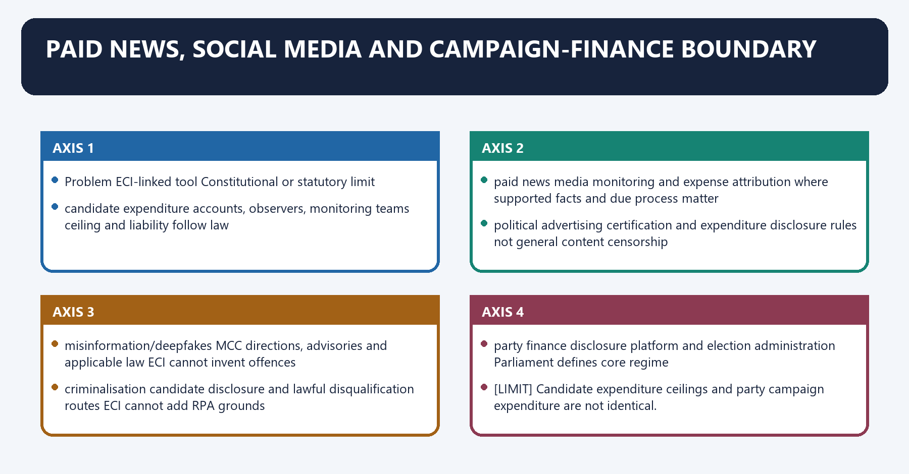
| Problem | ECI-linked tool | Constitutional or statutory limit |
|---|---|---|
| candidate expenditure | accounts, observers, monitoring teams | ceiling and liability follow law |
| paid news | media monitoring and expense attribution where supported | facts and due process matter |
| political advertising | certification and expenditure disclosure rules | not general content censorship |
| misinformation/deepfakes | MCC directions, advisories and applicable law | ECI cannot invent offences |
| criminalisation | candidate disclosure and lawful disqualification routes | ECI cannot add RPA grounds |
| party finance | disclosure platform and election administration | Parliament defines core regime |

[LIMIT] Candidate expenditure ceilings and party campaign expenditure are not identical.
Platform regulation, criminal liability and takedown powers require the applicable statute,
rules, court orders and reasoned procedural safeguards.

#### CLOSING RECALL FLOW — PAID NEWS, SOCIAL MEDIA AND CAMPAIGN-FINANCE BOUNDARY

```closure-flow
SUBTOPIC: Paid news, social media and campaign-finance boundary
KEY TERMS / DEFINITIONS: Paid news · social media · campaign-finance boundary · candidate expenditure · accounts, observers, monitoring teams · ceiling and liability follow law
MECHANISM / ARGUMENT: Paid news, social media and campaign-finance boundary operates through candidate expenditure accounts, observers, monitoring teams ceiling and liability follow law, connected with paid news media monitoring and expense attribution where supported facts and due process matter.
CONSEQUENCE / CONTRAST: The exam-safe limitation is that Candidate expenditure ceilings and party campaign expenditure are not identical.
UPSC TRAP / ANSWER-USE: Candidate expenditure ceilings and party campaign expenditure are not identical.
ANSWER-GRABBING FORMULATION: The proposal that the candidate/party bear the bye-election cost has been discussed as reform, but it is not the present rule stated in statement 3.
```
## BASIC MCQS / REMEDIATION

### Original MCQ loop - strict continuous A -> B -> C -> D rotation

#### OM1. Article 324 field

Which election is within the ECI's Article 324 field?

A. Election to a municipal corporation
B. Election to a cooperative society
C. Election to a Gram Panchayat
D. Election to the office of Vice-President

**Answer: D.**

**Explanation:** [FACT] Article 324 expressly covers President and Vice-President; local bodies belong to SECs.

#### OM2. Local-body boundary

Superintendence of municipal elections is constitutionally vested in:

A. the Election Commission of India
B. Parliament
C. the State Election Commission
D. the State Public Service Commission

**Answer: C.**

**Explanation:** [FACT] Article 243ZA routes municipal elections to the SEC.

#### OM3. Article 325

Article 325 principally prohibits:

A. exclusion from or claim to a special roll only on religion, race, caste or sex.
B. Parliament from making election law.
C. all residence requirements for enrolment.
D. every electoral disqualification.

**Answer: A.**

**Explanation:** [FACT] One general roll coexists with citizenship, age and ordinary-residence rules.

#### OM4. Constitutional term

Which statement is correct?

A. Six years or age 65 is a statutory rule under the 2023 Act.
B. The Constitution mandates exactly two ECs.
C. Article 324 fixes a six-year term.
D. Article 324 fixes retirement at 65.

**Answer: A.**

**Explanation:** [FACT] The Constitution leaves service conditions/tenure to law; section 9 supplies the present rule.

#### OM5. Composition

The number of other Election Commissioners is:

A. fixed by each State legislature.
B. permanently two under the Constitution.
C. fixed from time to time by the President within the constitutional/statutory framework.
D. fixed by the Chief Justice of India.

**Answer: C.**

**Explanation:** [FACT] Article 324(2) and section 3 do not constitutionalise the present number two.

#### OM6. Regional Commissioner

A Regional Commissioner under Article 324:

A. finally decides election petitions.
B. is elected by State legislatures.
C. heads the State Election Commission.
D. may be appointed by the President after consultation with the ECI to assist it.

**Answer: D.**

**Explanation:** [FACT] The office is an assistance mechanism, not the local-body authority.

#### OM7. *Anoop Baranwal*

The most accurate statement is:

A. It created a CJI-inclusive interim committee until Parliament made a law.
B. It permanently amended Article 324 to add the CJI.
C. It struck down all appointments made before 2023.
D. It prohibited Parliament from legislating on appointments.

**Answer: A.**

**Explanation:** [FACT] The operative direction expressly lasted till parliamentary law.

#### OM8. 2023 Act status

As on 19 August 2026, the safest statement is:

A. The Act has been struck down.
B. The Act is stayed.
C. The CJI has been restored by final judgment.
D. The Act operates; no located official stay or merits verdict permits saying upheld or struck down.

**Answer: D.**

**Explanation:** [CURRENT] The 2024 stay applications were dismissed; no later official merits disposition was located.

#### OM9. Eligibility

Section 5 requires, among other things:

A. holding or having held Secretary-equivalent rank and election-management knowledge/experience.
B. ten years as a High Court judge.
C. a constitutional-law doctorate.
D. prior service as a Returning Officer in three elections.

**Answer: A.**

**Explanation:** [FACT] These are the enacted statutory qualifications.

#### OM10. Search Committee

The enacted Search Committee is headed by:

A. the Minister of Law and Justice.
B. the Chief Justice of India.
C. the Chief Election Commissioner.
D. the Cabinet Secretary.

**Answer: A.**

**Explanation:** [FACT] Section 6 controls; Bill-stage summaries must not replace it.

#### OM11. Outside-panel power

Under section 8, the Selection Committee:

A. must disclose its vote publicly before appointment.
B. can only accept the first-ranked panel name.
C. may consider a person outside the Search Committee panel.
D. must return the panel if the LoP dissents.

**Answer: C.**

**Explanation:** [FACT] The outside-panel power is express, subject to transparent procedure.

#### OM12. Vacancy clause

An appointment recommendation is not invalid merely because:

A. there was no Selection Committee recommendation.
B. there is a vacancy in or defect in constitution of the Selection Committee.
C. the candidate lacks section 5 eligibility.
D. the President did not issue a warrant.

**Answer: B.**

**Explanation:** [FACT] Section 7(2) is a saving clause, not a waiver of the whole Act.

#### OM13. Tenure aggregation

If an EC later becomes CEC:

A. combined EC and CEC service cannot exceed six years.
B. reappointment is permitted once.
C. retirement age rises to 68.
D. a fresh six-year CEC term automatically begins.

**Answer: A.**

**Explanation:** [FACT] Section 9 caps aggregate service and bars reappointment.

#### OM14. Salary

The enacted 2023 Act equates salary with that of:

A. a Member of Parliament.
B. a Judge of the Supreme Court.
C. the Attorney-General.
D. the Cabinet Secretary.

**Answer: B.**

**Explanation:** [FACT] Section 10 uses the Supreme Court judge comparator.

#### OM15. Removal

Which distinction is correct?

A. The CEC has the SC-judge route; another EC requires the CEC's recommendation.
B. Every EC is removed by parliamentary impeachment.
C. Regional Commissioners have no removal protection.
D. The CEC serves during presidential pleasure.

**Answer: A.**

**Explanation:** [FACT] Article 324(5) creates removal asymmetry.

#### OM16. Collegial business

Where the three members differ:

A. the matter must remain undecided.
B. the President decides.
C. the majority opinion decides.
D. the CEC's view automatically prevails.

**Answer: C.**

**Explanation:** [FACT] Section 18 and *T.N. Seshan* establish majority rule.

#### OM17. Section 16 protection

The most precise description is:

A. absolute immunity extends to every private act.
B. all ECI orders become immune from judicial review.
C. only defamation claims are covered.
D. protection concerns official or purported-official acts, things or words by a present/former CEC or EC.

**Answer: D.**

**Explanation:** [FACT] The textual connection to official function must be preserved.

#### OM18. Election staff

Article 324(6) supports:

A. removal of Governors during elections.
B. ECI recruitment to all civil services.
C. permanent transfer of every State officer to ECI.
D. making staff available to the ECI when requested for election functions.

**Answer: D.**

**Explanation:** [FACT] Field administration relies on staff made available by the Union/States.

#### OM19. Election schedule

Which is the correct distinction?

A. ECI announces the schedule, while statutory notifications form part of the legal election process.
B. Courts announce the timetable.
C. The MCC waits until polling begins.
D. Returning Officers independently choose national dates.

**Answer: A.**

**Explanation:** [FACT] Administrative announcement and legal notification should not be collapsed.

#### OM20. Electoral roll integrity

The soundest principle is:

A. aggregate numbers matter more than individual remedy.
B. inclusion alone defines integrity.
C. integrity combines eligible inclusion, lawful correction, notice and remedy.
D. deletion accuracy alone defines integrity.

**Answer: C.**

**Explanation:** [ANALYSIS] Both completeness and accuracy must operate through due process.

#### OM21. Article 325 and residence

Article 325:

A. permits religion-specific rolls.
B. makes citizenship irrelevant.
C. does not eliminate lawful ordinary-residence and age conditions.
D. applies only to local elections.

**Answer: C.**

**Explanation:** [FACT] Anti-discrimination in roll structure coexists with statutory eligibility.

#### OM22. Delimitation

In the ordinary 2002 Act design, the ECI:

A. alone redraws all constituencies.
B. participates through the CEC or nominated EC in the statutory Delimitation Commission.
C. may disregard final delimitation orders.
D. has no connection with delimitation.

**Answer: B.**

**Explanation:** [FACT] Membership/assistance is different from sole authority.

#### OM23. Party status

Which is correct?

A. Recognition is decided by Parliament resolution.
B. Every registered party receives a permanently reserved symbol.
C. Registration automatically creates national-party status.
D. Registration under RPA section 29A and recognition under the Symbols Order are distinct.

**Answer: D.**

**Explanation:** [FACT] Recognition follows performance criteria under the Symbols Order.

#### OM24. Symbol disputes

*Kanhiya Lal Omar* is associated with:

A. presidential election disputes.
B. NOTA.
C. EVM microcontroller checks.
D. validity of the Symbols Order and ECI symbol authority.

**Answer: D.**

**Explanation:** [FACT] It is the core symbol-order authority.

#### OM25. MCC origin

The safest evolution statement is:

A. the MCC began only after EVMs.
B. a Kerala 1960 code evolved through later national consensus and ECI additions.
C. Parliament enacted the MCC in 1960.
D. the Supreme Court wrote the entire MCC in 1968.

**Answer: B.**

**Explanation:** [FACT] Evolution, not one-time enactment, is the correct frame.

#### OM26. MCC operation

The MCC ordinarily starts:

A. after results.
B. on filing of the first nomination.
C. at the start of polling.
D. with announcement of the election schedule.

**Answer: D.**

**Explanation:** [FACT] ECI's official FAQ uses schedule announcement to completion.

#### OM27. MCC legal character

Which statement is correct?

A. The MCC has no enforceable consequence of any kind.
B. Only the Supreme Court may enforce it.
C. The MCC is non-statutory, but overlapping conduct may violate penal/election law.
D. Every MCC breach is automatically a criminal offence.

**Answer: C.**

**Explanation:** [FACT] Code consequence and statutory prosecution are distinct layers.

#### OM28. MCC reform

The best calibrated reform is:

A. make decisions secret to avoid controversy.
B. preserve rapid directions while requiring timelines, reasons and statutory referral.
C. criminalise every campaign disagreement.
D. abolish all rapid directions.

**Answer: B.**

**Explanation:** [ANALYSIS] The hybrid model protects both speed and accountability.

#### OM29. VVPAT

VVPAT primarily provides:

A. online publication of each vote.
B. automatic recount of every constituency.
C. a voter-visible paper verification trail stored in a sealed box.
D. a paper receipt for the voter to take home.

**Answer: C.**

**Explanation:** [FACT] Voter secrecy and sealed custody are central.

#### OM30. 2024 EVM judgment

The Supreme Court in April 2024:

A. found systematic tampering.
B. ordered return to paper ballots.
C. retained EVM-VVPAT and added SLU/microcontroller safeguards.
D. ordered 100% VVPAT counting.

**Answer: C.**

**Explanation:** [FACT] None of the three contrary propositions was the holding.

#### OM31. Microcontroller verification

The Court-directed check may be requested by:

A. only a High Court after an election petition.
B. any voter at any time.
C. only the winning candidate.
D. candidates placed second or third, within the prescribed seven-day period.

**Answer: D.**

**Explanation:** [FACT] The request triggers checks of 5% of EVM sets in the relevant segment.

#### OM32. NOTA

Under the ordinary current rule:

A. NOTA is a candidate.
B. NOTA records secret rejection but does not automatically require a repoll.
C. NOTA plurality automatically disqualifies all candidates.
D. NOTA is ignored and not counted.

**Answer: B.**

**Explanation:** [FACT] *PUCL* protects expression/secrecy, not a binding right to reject the result.

#### OM33. Article 324 doctrine

*Mohinder Singh Gill* supports:

A. residual/plenary ECI power where law is silent.
B. ECI power to repeal statutes.
C. ECI trial of election petitions.
D. permanent immunity from judicial review.

**Answer: A.**

**Explanation:** [FACT] The reservoir is directed to free and fair election administration.

#### OM34. Statutory limit

*A.C. Jose* establishes that the ECI:

A. can create criminal offences by instruction.
B. supplements but cannot supplant an occupied statutory field.
C. controls local-body elections.
D. may ignore Conduct of Election Rules.

**Answer: B.**

**Explanation:** [FACT] Express law prevails over contrary ECI innovation.

#### OM35. Election petition

The ordinary forum to try a parliamentary or Assembly election petition is:

A. Parliament's privileges committee.
B. the ECI.
C. the High Court.
D. the District Election Officer.

**Answer: C.**

**Explanation:** [FACT] RPA 1951 section 80A supplies the High Court forum.

#### OM36. Independence evaluation

Which conclusion is strongest?

A. Appointment alone determines every outcome.
B. appointment, tenure, finance, staff, collegiality and transparent enforcement interact.
C. Removal protection alone guarantees independence.
D. More power always means more independence.

**Answer: B.**

**Explanation:** [ANALYSIS] Institutional independence is systemic and multiplicative.

### Remedial MCQs - strict continuation C -> C -> B -> A rotation

#### RM1. CEC chairmanship trap

Calling the CEC "Chairman" means:

A. exclusive power to allocate every symbol.
B. institutional chairmanship, not a superior deciding vote.
C. power to remove ECs directly.
D. power to veto both ECs.

**Answer: B.**

**Explanation:** [FACT] Equality and majority rule survive chairmanship.

#### RM2. Removal asymmetry

Another EC can be removed:

A. at the Prime Minister's pleasure.
B. by majority vote of the Commission.
C. only through the same parliamentary address as the CEC.
D. only on the CEC's recommendation.

**Answer: D.**

**Explanation:** [FACT] Article 324(5) uses the CEC-recommendation safeguard.

#### RM3. Search-selection distinction

Which statement is correct?

A. The Supreme Court confirms the appointment.
B. The Search Committee appoints the CEC.
C. The President prepares the five-name panel.
D. The Search Committee prepares a panel; the Selection Committee recommends.

**Answer: D.**

**Explanation:** [FACT] Appointment itself is by presidential warrant.

#### RM4. Salary-charged trap

Which is safest?

A. Demand No. 66 proves permanent constitutional charging.
B. Salary parity does not itself create blanket charged status; a reform proposal seeks fuller financial autonomy.
C. Every ECI expense is constitutionally charged because salary equals an SC judge's.
D. Article 322 directly covers ECI.

**Answer: B.**

**Explanation:** [FACT] The statute and budget must be read separately from reform demands.

#### RM5. Roll deletion

A possible database mismatch should first lead to:

A. verification, notice and a reasoned statutory process.
B. postponement of all elections.
C. automatic mass deletion.
D. loss of citizenship.

**Answer: A.**

**Explanation:** [ANALYSIS] A data signal is not an adjudication.

#### RM6. Delimitation owner

The ordinary final map under the 2002 framework comes from:

A. the Finance Commission.
B. the statutory Delimitation Commission.
C. the ECI acting alone.
D. the Inter-State Council.

**Answer: B.**

**Explanation:** [FACT] ECI participation must not be converted into sole ownership.

#### RM7. MCC-statutory overlap

An MCC complaint alleging bribery should be treated as:

A. only a moral issue.
B. an election petition before polling.
C. an MCC issue plus referral/investigation under applicable law where elements exist.
D. automatically proved criminal guilt.

**Answer: C.**

**Explanation:** [FACT] Administrative prevention and penal proof are separate.

#### RM8. Article 324 gap

If a Rule expressly requires method X, the ECI:

A. must seek the CJI's permission.
B. may replace it with Y whenever administratively convenient.
C. may disregard it during a close election.
D. must follow X unless lawfully changed; Article 324 cannot contradict it.

**Answer: D.**

**Explanation:** [FACT] *B.A. Jose* is the controlling correction.

#### RM9. Observer role

An election observer principally:

A. appoints the CEC.
B. independently observes/reports and supports corrective supervision.
C. recognises political parties.
D. replaces the High Court.

**Answer: B.**

**Explanation:** [FACT] Observers close information gaps but do not absorb statutory offices.

#### RM10. NOTA remedy

If NOTA tops the tally under the ordinary present rule:

A. the ECI permanently bans all candidates.
B. the Governor appoints a candidate.
C. the highest-voted candidate remains returned; no automatic repoll follows merely from NOTA.
D. the seat is abolished.

**Answer: C.**

**Explanation:** [FACT] NOTA is expressive, not a candidate or binding reject option.

#### RM11. Appointment status

Which answer respects the control date?

A. The official 2024 stay refusal stands, while no located official merits verdict permits a final-validity claim.
B. The Act has ceased to operate.
C. *Anoop Baranwal* permanently bars parliamentary law.
D. The Supreme Court has finally upheld section 7.

**Answer: A.**

**Explanation:** [CURRENT] This formulation separates located orders from unresolved merits.

#### RM12. Best Mains method

An examiner-grade paragraph should normally use:

A. claim -> named evidence -> analysis -> qualification.
B. definition -> unrelated statistic -> conclusion.
C. accusation -> slogan -> prediction.
D. case name without holding -> reform wish.

**Answer: A.**

**Explanation:** [ANALYSIS] This sequence makes legal control and evaluative reasoning visible.

## PYQS AND ANSWER PRACTICE

### Verified routed Prelims PYQs

#### PYQ-P1 - UPSC Prelims 2021 GS-I Q80

**Official-paper wording held locally**

Consider the following statements:

1. In India, there is no law restricting the candidates from contesting in one Lok Sabha election from three constituencies.
2. In 1991 Lok Sabha Election, Shri Devi Lal contested from three Lok Sabha constituencies.
3. As per the existing rules, if a candidate contests in one Lok Sabha election from many constituencies, his/her party should bear the cost of bye-elections to the constituencies vacated by him/her in the event of him/her winning in all the constituencies.

Which of the statements given above is/are correct?

A. 1 only  
B. 2 only  
C. 1 and 3  
D. 2 and 3

**INFERRED KEY - NOT OFFICIALLY VERIFIED LOCALLY:** B, statement 2 only. **Confidence: high.**

**Explanation**

- [FACT] RPA 1951 section 33(7) presently restricts a candidate to at most two constituencies in the same general election; statement 1's "three" proposition is false.
- [FACT] The locally routed historical fact records Devi Lal's 1991 three-constituency candidature; statement 2 is true.
- [FACT] The proposal that the candidate/party bear the bye-election cost has been discussed as reform, but it is not the present rule stated in statement 3.
- [LIMIT] Because the repository does not hold a readable official 2021 key, the key is inferential and is not represented as an official UPSC answer.

#### PYQ-P2 - UPSC Prelims 2024 GS-I Q71

**Official Set A wording held locally**

How many Delimitation Commissions have been constituted by the Government of India till December 2023?

A. One  
B. Two  
C. Three  
D. Four

**Official local Set A key:** D, Four.

**Explanation**

- [FACT] The four statutory exercises were under the Delimitation Commission Acts of 1952, 1962, 1972 and the Delimitation Act, 2002.
- [LIMIT] The fact does not make the ECI the sole delimiting authority. Under the 2002 Act, the CEC or nominated EC is an ex officio member of the statutory Delimitation Commission.

#### Prelims PYQ ownership control

| Routed demand | Included | Ownership note |
|---|---|---|
| 2021 multiple-constituency candidature | yes | ECI/electoral-reform interface |
| 2024 number of Delimitation Commissions | yes | direct route, with delimitation boundary |
| presidential Electoral College/vote-value questions | no | President and Vice-President owner |
| Tenth Schedule political-party references | no | Anti-Defection owner |
| general political-party history matching | no | Post-Independence/Political Parties owner |

### Verified routed Mains PYQs with model solutions

#### PYQ-M1 - UPSC 2018 GS-II Q1

**Official-paper wording held locally:**  
“In the light of recent controversy regarding the use of Electronic Voting Machines (EVM), what are the challenges before the Election Commission of India to ensure the trustworthiness of elections in India?” (10 marks, 150 words)

**Demand:** identify challenges, not merely defend or attack EVMs.

**Model solution**

**Thesis:** [ANALYSIS] Trustworthy elections require confidence in the complete chain - roll, campaign, machine, custody, counting and remedy - rather than a binary claim about EVMs.

**Machine and audit:** [FACT] *Subramanian Swamy v. ECI* made VVPAT paper trail an integrity safeguard. [FACT] *ADR v. ECI* (2024) retained EVM-VVPAT, rejected universal paper counting, and ordered SLU preservation plus request-based checks of 5% burnt memories. [ANALYSIS] Verification must be visible enough to answer specific evidence, not general suspicion.

[FACT] The Supreme Court's 7 May 2025 follow-up accepted ECIL/BEL diagnostic checks and certification, with a candidate-requested mock poll possible after recorded data is displayed.

**Wider challenges:** [FACT] ECI must also address roll exclusion, money power through expenditure monitoring, criminal antecedent disclosure after *ADR/PUCL*, partisan field administration, misinformation and MCC enforcement. [ANALYSIS] A secure device cannot cure an unfair campaign field.

**Qualification:** [LIMIT] Unsupported fraud claims should not be amplified; equally, institutional confidence cannot rest on assertion alone.

**Verdict:** Publish aggregate audit outcomes, strengthen complaint reasons, preserve candidate-observation rights and connect machine security with roll and campaign integrity.

**Outstanding-answer test:** It expands "trustworthiness" beyond the device, names two judgments and ends with evidence-based reforms.

#### PYQ-M2 - UPSC 2019 GS-II Q11

**Official-paper wording held locally:**  
“On what grounds a people's representative can be disqualified under the Representation of Peoples Act, 1951? Also mention the remedies available to such person against his disqualification.” (15 marks, 250 words)

**Demand:** grounds plus remedies; do not turn it into an ECI-powers essay.

**Model solution**

**Thesis:** [FACT] Disqualification is a two-layer system: Articles 102/191 supply constitutional grounds, while the RPA 1951 specifies operational statutory grounds and remedies.

**Grounds:** [FACT] RPA sections 8-10A cover conviction for specified offences, corrupt practices, dismissal for corruption/disloyalty, government contracts, office under a government company and failure to lodge election-expense accounts. [FACT] *Lily Thomas v. Union of India* invalidated section 8(4)'s sitting-member protection, making conviction-based disqualification immediate when the statutory threshold applies.

**Constitutional decision route:** [FACT] For a sitting MP/MLA question under Articles 103/192, the President/Governor obtains the ECI's opinion and acts according to it. [LIMIT] Defection belongs to the Speaker/Chairman under the Tenth Schedule.

**Remedies:** [FACT] An appellate stay of **conviction**, not merely sentence, can suspend the consequence; section 11 allows the ECI to remove or reduce specified disqualification; election-petition findings and High Court orders carry the RPA appeal route to the Supreme Court.

**Qualification:** [ANALYSIS] Speedy disposal is vital because delayed relief can consume the representative's term, but simplification cannot dilute proof where civic exclusion follows.

**Verdict:** Preserve strict grounds and due process while creating time-bound election benches and reasoned ECI opinions.

**Outstanding-answer test:** It classifies grounds, distinguishes defection, names *Lily Thomas* and states conviction-stay precisely.

#### PYQ-M3 - UPSC 2020 GS-II Q1

**Official-paper wording held locally:**  
“There is a need for simplification of procedure for disqualification of persons found guilty of corrupt practices under the Representation of Peoples Act”. Comment. (10 marks, 150 words)

**Demand:** measured comment on procedure, not automatic ECI disqualification.

**Model solution**

**Position:** [ANALYSIS] Simplification is justified because the present multi-stage process can outlast the elected term, but the evidentiary standard should not be weakened.

**Present chain:** [FACT] A corrupt practice under section 123 is proved in a High Court election petition; section 99 may name guilty persons; section 8A disqualification then follows through the President acting on the ECI's opinion. [ANALYSIS] Fragmented forums create delay and reduce deterrence.

**Reform:** Establish dedicated election benches, enforce the RPA's time expectation, digitise service and evidence, require reasoned timelines and coordinate the court-ECI-President stages.

**Qualification:** [LIMIT] Article 324 does not authorise the ECI to bypass the petition and adjudicate guilt on its own. A six-year civic consequence requires natural justice and strict proof.

**Verdict:** Simplify sequence and time, not proof or appellate protection.

**Outstanding-answer test:** It states the actual statutory chain and avoids the common "give ECI power to disqualify immediately" overreach.

#### PYQ-M4 - UPSC 2022 GS-II Q11

**Official-paper wording held locally:**  
“Discuss the procedures to decide the disputes arising out of the election of a Member of the Parliament or State Legislature under the Representation of the People Act, 1951. What are the grounds on which the election of any returned candidate may be declared void? What remedy is available to the aggrieved party against the decision? Refer to the case laws.” (15 marks, 250 words)

**Demand:** procedure, void grounds, remedy and case law.

**Model solution**

**Constitutional frame:** [FACT] Article 329(b) channels a challenge to a parliamentary or State-legislature election into an election petition. *N.P. Ponnuswami* explains why courts ordinarily do not interrupt the process mid-election.

**Procedure:** [FACT] Under sections 80 and 80A, only an election petition is used and the High Court tries it; section 81 prescribes filing within 45 days; section 83 requires material facts and full particulars of corrupt practice; parties, trial and orders follow the RPA framework.

**Void grounds:** [FACT] Section 100 includes lack of qualification/disqualification, corrupt practice by the returned candidate/election agent, improper rejection of nomination, and material effect from improper acceptance, corrupt practice by others, improper reception/refusal/rejection of votes or non-compliance with Constitution, Act, Rules or orders.

**Remedy:** [FACT] The High Court may dismiss the petition, void the election or declare another candidate elected where legal conditions are met. Section 116A provides appeal to the Supreme Court.

**Case law:** [FACT] *Indira Nehru Gandhi v. Raj Narain* protects free and fair elections and judicial review; *Mohinder Singh Gill* distinguishes ECI administration from the post-result petition.

**Verdict:** The design avoids mid-poll fragmentation but needs time-bound adjudication so the remedy remains meaningful.

**Outstanding-answer test:** It answers all four limbs and keeps the ECI/court boundary clear.

#### PYQ-M5 - UPSC 2022 GS-II Q15 - direct routed demand

**Exact official-paper wording held locally:**  
“Discuss the role of the Election Commission of India in the light of the evolution of the Model Code of Conduct.” (15 marks, 250 words)

**Demand:** link institutional role with evolution, legal status, enforcement and limits.

**Model solution**

**Thesis:** [FACT] The MCC is a consensus-based, non-statutory code through which the ECI converts Article 324's free-and-fair-election mandate into rapid campaign-time standards.

**Evolution:** [FACT] ECI material traces a code to the 1960 Kerala election; early national circulation and the 1968-69 mid-term election experience developed a minimum inter-party code. Successive ECI consultations added rules for meetings, processions, polling, manifestos and the party in power.

**ECI role:** [FACT] From schedule announcement to completion, the ECI receives complaints, obtains responses, censures or restrains campaigners, regulates official machinery and transfers, and refers independently illegal conduct for statutory action. [ANALYSIS] Its preventive speed protects the level playing field before harm becomes irreversible.

**Legal overlap:** [FACT] Bribery, undue influence, communal appeals and specified offences may attract the RPA 1951, BNS 2023 or other law even though the MCC itself is not a penal statute.

**Limits:** [LIMIT] Direct sanctions are limited; consistency and reason-giving are contested; criminal adjudication remains with ordinary institutions.

**Verdict:** Retain the MCC's flexible form but publish complaint timelines, reasoned outcomes and statutory-referral data to combine speed with accountability.

**Outstanding-answer test:** It avoids falsely calling the MCC law and gives a dated, qualified evolution.

#### PYQ-M6 - UPSC 2024 GS-II Q1

**Exact wording preserved in the local owner:**  
“Examine the need for electoral reforms as suggested by various committees with particular reference to ‘one nation - one election’ principle.” (10 marks, 150 words)

**Demand:** committee-linked reform need, with ONOE as a special focus rather than the entire answer.

**Model solution**

**Thesis:** [ANALYSIS] India needs reforms in funding, criminalisation, roll integrity, ECI independence and dispute speed; simultaneous elections are one contested institutional proposal within that larger agenda.

**Need:** [FACT] Candidate disclosure cases, *Lily Thomas*, the electoral-bonds judgment and repeated ECI/Law Commission proposals identify transparency, decriminalisation and administrative-independence deficits.

**ONOE case:** [ANALYSIS] Supporters cite reduced repeated election expenditure, fewer recurring MCC interruptions and administrative continuity.

**Costs:** [FACT] Synchronisation would require constitutional and statutory change concerning House terms and mid-term dissolution. [ANALYSIS] It may nationalise State mandates, burden ECI logistics and weaken periodic accountability.

**Qualification:** [LIMIT] As of the control date, the proposal remains legislative business, not an implemented constitutional rule. This package cross-links its full status to Parliament/federalism owners.

**Verdict:** Implement consensus reforms now; test simultaneous elections against federal consent, constructive no-confidence or remainder-term design, ECI capacity and judicial safeguards.

**Outstanding-answer test:** It neither dismisses nor celebrates ONOE and protects the broader reform demand.

#### PYQ-M7 - UPSC 2025 GS-II Q1

**Official-paper wording held locally:**  
“Discuss the ‘corrupt practices’ for the purpose of the Representation of the People Act, 1951. Analyze whether the increase in the assets of the legislators and/or their associates, disproportionate to their known sources of income, would constitute ‘undue influence’ and consequently a corrupt practice.” (10 marks, 150 words)

**Demand:** define corrupt practices, then analyse the specific undue-influence proposition.

**Model solution**

**Definition:** [FACT] Section 123 includes bribery, undue influence, specified identity/religious appeals, promotion of enmity, false statements about a candidate, prohibited transport, excess expenditure and obtaining prohibited assistance from government servants.

**Undue influence:** [FACT] Section 123(2) targets direct or indirect interference with the free exercise of an electoral right.

**Asset question:** [ANALYSIS] Disproportionate growth in a legislator's or associate's assets may indicate corruption, tax or disclosure concerns, but without an election nexus showing coercion or interference with voter freedom it does not automatically become section 123(2) undue influence.

**Named evidence:** [FACT] *ADR* and *PUCL* protect the voter's right to candidate information. [ANALYSIS] The correct immediate response is full, verifiable disclosure and lawful investigation, not distortion of an electoral term.

**Qualification:** [LIMIT] A specific inducement funded by illicit assets could separately satisfy bribery or another corrupt practice if its elements are proved.

**Verdict:** Enforce disclosure and anti-corruption law rigorously while retaining strict element-based interpretation of corrupt practices.

**Outstanding-answer test:** It distinguishes unexplained enrichment from interference with the electoral right.

#### Mains PYQ coverage control

| Year | Demand | Status |
|---:|---|---|
| 2018 | EVM controversy and trustworthy elections | exact official wording + solution |
| 2019 | RPA disqualification grounds and remedies | exact official wording + solution |
| 2020 | simplify corrupt-practice disqualification | exact official wording + solution |
| 2022 Q11 | election disputes under RPA | exact official wording + solution |
| 2022 Q15 | ECI and MCC evolution | exact official wording + solution |
| 2024 | electoral reforms with ONOE | exact local-owner wording + solution |
| 2025 | corrupt practices and disproportionate assets | exact official wording + solution |

### Original solved Mains practice

#### M1. Article 324 is a reservoir of electoral power, not a source of power contrary to law. Explain. (10 marks, 150 words)

**Model solution**

**Thesis:** [FACT] Article 324 vests plenary superintendence, direction and control in the ECI; [ANALYSIS] its breadth enables gap-filling action needed for free and fair elections, not displacement of parliamentary law.

**Power:** [FACT] In *Mohinder Singh Gill v. CEC*, the Supreme Court described Article 324 as a reservoir of authority where enacted law is silent. This supports urgent repoll directions, administrative safeguards, the MCC and other integrity measures where no contrary rule occupies the field.

**Limit:** [FACT] *A.C. Jose v. Sivan Pillai* held that the ECI must supplement rather than supplant the Act and Rules. [ANALYSIS] Otherwise, an unelected administrator could rewrite the democratic rules Parliament was constitutionally authorised to enact under Article 327.

**Procedural control:** [FACT] Natural justice is context-sensitive; election urgency may alter timing, but reason, relevance and judicial review remain.

**Qualification:** [LIMIT] Plenary does not mean final power to void a returned candidate's election; that belongs to the election-petition court.

**Verdict:** Article 324 is strongest when used as a legally disciplined reserve: decisive in a vacuum, obedient in an occupied field.

**Why this earns marks:** It states both leading cases, supplies a functional example and ends with the supplement-not-supplant rule.

#### M2. Distinguish the constitutional position of the CEC from that of the other Election Commissioners. (10 marks, 150 words)

**Model solution**

**Thesis:** [FACT] The CEC is first among equals in institutional chairmanship but enjoys a distinct removal safeguard.

**Equality:** [FACT] Article 324 permits a multi-member Commission. Section 18 of the 2023 Act prefers unanimity and sends differences to majority. *T.N. Seshan* rejected CEC decisional supremacy. [ANALYSIS] Each member therefore has an equal vote in Commission business.

**Distinct position:** [FACT] The CEC acts as Chairman and is removable only like an SC judge. The CEC's service conditions cannot be varied to disadvantage after appointment.

**Other ECs:** [FACT] They have equal decisional power, the same statutory salary and term framework, but can be removed only on the CEC's recommendation rather than through the CEC's parliamentary route.

**Qualification:** [LIMIT] "Only on CEC recommendation" is protection against direct pleasure removal, yet it remains weaker and creates dependence on the Chair.

**Verdict:** Functional equality and security asymmetry coexist; reform should protect collegial dissent while preserving accountability.

**Why this earns marks:** It separates vote, chairmanship, service conditions and removal rather than saying simply "CEC is superior".

#### M3. Critically examine the appointment architecture created by the 2023 Act. (15 marks, 250 words)

**Model solution**

**Thesis:** [FACT] The 2023 Act validly occupies Parliament's express Article 324(2) law-making space; [ANALYSIS] its unresolved legitimacy issue is whether executive predominance provides sufficient institutional independence and deliberative transparency.

**Architecture:** [FACT] Section 5 uses Secretary-equivalent rank, integrity and election-management experience. Section 6 gives a Law-Minister-led Search Committee power to prepare five names. Section 7 creates the PM-LoP-PM-nominated Minister committee, with a vacancy/defect saving clause. Section 8 requires transparent procedure but allows selection outside the panel. The President appoints by warrant.

**Strengths:** A statutory process replaces the previous vacuum; eligibility and Opposition participation are express; procedure must be transparent; current appointment does not depend on an unregulated executive convention.

**Concerns:** [ANALYSIS] The executive holds two of three votes; the Search Committee is executive-led; outside-panel choice may weaken search discipline; the vacancy clause can reduce plural participation; the Act does not require public comparative reasons.

**Named evidence:** [FACT] *Anoop Baranwal* created a CJI-inclusive committee only till parliamentary law. The official 22 March 2024 order refused to rewrite section 7 at the interim stage but stressed full dossiers and fair deliberation.

**Current control:** [CURRENT] The Act operates; no official merits verdict or stay was located as of 24 August 2026.

**Reform:** publish criteria, ensure adequate dossier time, record comparative reasons, strengthen search independence and consider a committee whose majority is not controlled by the incumbent executive.

**Verdict:** Parliamentary competence is clear; constitutional adequacy must be judged by whether the process credibly insulates electoral administration from partisan dependence.

**Why this earns marks:** It evaluates the enacted sections rather than a Bill summary and accurately limits *Anoop Baranwal*.

#### M4. The Model Code of Conduct succeeds through speed but is weakened by opacity. Discuss. (15 marks, 250 words)

**Model solution**

**Thesis:** [ANALYSIS] The MCC is effective because a non-statutory code allows immediate preventive correction during a short campaign; its legitimacy weakens when similar complaints yield delayed or unexplained outcomes.

**Evolution and authority:** [FACT] Beginning with the Kerala 1960 experiment and broader 1968-69 consensus, the MCC evolved through party consultation and ECI instructions. It operates from schedule announcement to completion under Article 324 supervision.

**Speed advantage:** The ECI can stop misuse of official machinery, seek responses, censure speakers, order transfers and restrain announcements before electoral advantage becomes irreversible. [ANALYSIS] A criminal trial after polling cannot restore an already distorted campaign field.

**Legal overlap:** [FACT] Bribery, undue influence, communal appeals and other conduct may independently attract the RPA/BNS. [LIMIT] MCC censure is not a finding of criminal guilt.

**Opacity problem:** complaint status, evidence, member votes, precedent and reasons may not be consistently visible. [ANALYSIS] Selective appearance is itself an institutional cost because neutrality must be demonstrable.

**Reform:** publish a real-time complaint ledger; specify response/decision timelines; issue speaking orders; identify statutory referrals; audit cross-party consistency after each election.

**Qualification:** [LIMIT] Turning the whole code into criminal law could sacrifice preventive flexibility and invite delay.

**Verdict:** Retain non-statutory speed, but constitutionalise its credibility through transparent, proportionate and reviewable administration.

**Why this earns marks:** It explains the mechanism of speed, the statutory overlap and a hybrid reform rather than choosing a false statutory/non-statutory binary.

#### M5. Evaluate the ECI's role in maintaining accurate and inclusive electoral rolls. (15 marks, 250 words)

**Model solution**

**Thesis:** [FACT] Article 324 and the RPA 1950 make roll preparation and revision a core ECI responsibility; [ANALYSIS] accuracy is legitimate only when pursued with equal commitment to inclusion and due process.

**Legal structure:** Article 325 guarantees one general roll without specified identity discrimination. The RPA uses citizenship, age, ordinary residence and lawful disqualification. EROs process inclusion, correction and deletion under ECI supervision; the 2023 Roll Manual details claims, objections, notice, inquiry and appeals.

**Inclusion role:** continuous updating, four qualifying dates, online/physical access, field verification, accessible forms, SVEEP and targeted support for migrants, homeless persons, persons with disabilities and young electors.

**Integrity role:** duplicate/error checks, death and shifting information, reasoned correction, public draft/final publication and objection process.

**Risk:** [ANALYSIS] mass data matching can create false positives; short timelines and rigid documents can disproportionately exclude mobile and poor citizens. A database flag is evidence for inquiry, not a deletion order.

**Current qualification:** [LIMIT] State-specific revision rules and litigation are volatile; the exact ECI order must be cited before assessing legality.

**Reform:** individual notice, alternate proof, assisted filing, reasoned orders, rapid pre-poll appeals, privacy safeguards and independent aggregate audits.

**Verdict:** Roll purity is not the smallest roll; it is the most complete lawful roll produced by a reviewable process.

**Why this earns marks:** It balances inclusion and cleansing, names the legal architecture and protects current-status discipline.

#### M6. How do party registration, recognition and symbol adjudication illustrate the ECI's quasi-judicial role? (15 marks, 250 words)

**Model solution**

**Thesis:** [FACT] The ECI regulates entry and electoral identity through different legal instruments; [ANALYSIS] its quasi-judicial character is clearest when facts, rival claims and legal criteria must be applied through reasoned decisions.

**Registration:** RPA 1951 section 29A governs registration. It brings an association into the statutory political-party framework but does not guarantee recognition.

**Recognition:** The Symbols Order, 1968 applies electoral-performance criteria to national and State recognition and reserves symbols accordingly.

**Split disputes:** The ECI evaluates organisational and legislative support, party constitution and election urgency; it may freeze a disputed symbol and give temporary symbols to avoid voter confusion.

**Named evidence:** [FACT] *Kanhiya Lal Omar v. R.K. Trivedi* upheld the Symbols Order and ECI authority in recognition and symbol matters.

**Analysis:** Symbols serve ballot accessibility and stable political identity. A neutral decision therefore protects both competing factions and electors.

**Limits:** [LIMIT] Registration is not recognition; symbol adjudication is not a general jurisdiction over property, ideology or every internal membership dispute. Civil courts and other legal forums retain their fields, and ECI decisions remain judicially reviewable.

**Reform:** publish criteria, procedural calendars, evidence summaries and reasoned interim/final orders; develop transparent rules for internal-democracy disclosures without claiming powers Parliament has not conferred.

**Verdict:** Quasi-judicial legitimacy rests on bounded jurisdiction, consistent precedent and visible reasons.

**Why this earns marks:** It separates three commonly collapsed functions and attaches a case plus jurisdictional limit.

#### M7. Design an institutional reform package to strengthen ECI independence without weakening accountability. (20 marks, 250 words)

**Model solution**

**Thesis:** [ANALYSIS] Independence and accountability are complements: insulation from partisan command must be paired with plural appointment, internal checks, reasoned action, financial visibility and judicial remedy.

**1. Appointment:** use a plural committee without an automatic incumbent-executive majority; an independent search body; published criteria; adequate dossiers; conflict declarations and comparative reasons.

**2. Tenure/removal:** consider equal removal protection for ECs, but add an independent misconduct-inquiry stage so security does not become impunity.

**3. Secretariat:** [FACT] *Anoop Baranwal* appealed for a permanent independent secretariat. Create a statutory cadre/appointment framework with transparent deputation and transfer rules.

**4. Finance:** provide a separately presented ECI budget and consider charged expenditure through constitutional/statutory change; retain audit by the CAG and parliamentary outcome scrutiny.

**5. Collegiality:** publish business-allocation regulations, recusals and, where legally possible, majority/minority reasons in important matters.

**6. Enforcement:** public MCC complaint ledger, decision deadlines, speaking orders, statutory-offence referrals and consistency audits.

**7. Rolls/technology:** due-process roll controls, independent aggregate audits, secure custody records and accessible court-directed EVM checks.

**8. Judicial interface:** fast election benches and expedited review that does not derail live polling.

**Qualification:** [LIMIT] No reform should transfer election management to courts or Parliament, expose security-sensitive details, or make commissioners unanswerable.

**Verdict:** The test is institutional distance from the government of the day plus visible fidelity to law, evidence and equal treatment.

**Why this earns marks:** It treats the ECI as a full system and attaches an accountability control to every autonomy proposal.

#### M8. “Electoral trust is an ecosystem, not a machine question.” Critically analyse the statement with reference to the ECI. (20 marks, 250 words)

**Model solution**

**Thesis:** [ANALYSIS] EVM integrity is essential, but electoral trust emerges from the combined credibility of the roll, campaign, personnel, voting technology, custody, count, disclosure and remedy.

**Roll:** [FACT] Article 325 and the RPA 1950 require an inclusive, accurate general roll. Unreasoned deletion can disenfranchise before a machine is used.

**Campaign:** MCC neutrality, expenditure monitoring, candidate disclosure and action against bribery or communal appeals determine whether choice is free.

**Personnel:** Article 324(6), observers and transfer controls address the risk of partisan field administration.

**Machine and audit:** [FACT] *Subramanian Swamy* introduced VVPAT. *ADR v. ECI* (2024) retained EVM-VVPAT while ordering SLU preservation and request-based 5% microcontroller verification. [ANALYSIS] These are layered assurance mechanisms, not proof of fraud.

**Information:** [FACT] *ADR/PUCL* candidate disclosure and the electoral-bonds judgment protect informed choice.

**Remedy:** Article 329 and RPA petitions balance uninterrupted polling with post-result judicial challenge; reasoned ECI complaints and technical verification supply earlier remedies.

**Critical side:** [LIMIT] Institutional assurance can become opaque, while unsupported allegations can corrode confidence. Both secrecy and speculation are poor substitutes for auditable evidence.

**Reform:** publish custody/audit aggregates, complaint outcomes and roll metrics; protect security and voter secrecy; provide rapid independent review.

**Verdict:** The ECI should answer distrust with evidence across the ecosystem, because a trustworthy machine inside an unfair process is not a trustworthy election.

**Why this earns marks:** It integrates all major subtopics, uses three case families and critically rejects both complacency and unsupported suspicion.

## OPTIONAL ADVANCED DEPTH — NOT REQUIRED FOR A CORE ANSWER

> **Subject:** Polity · **Tier:** Advanced (exam depth) · **GS Paper:** GS-II
> **Grounded in:** Indian Polity by M. Laxmikant, Ch. 42 & 71–72 (direct check of the local Sixth Revised Edition PDF) + India Code/ECI updates.
> ✅ = from source book · ⚠️ = inference / case law · 📰 = current affairs.
> *Companion: `basic/Election-Commission.md`.*

---

### PART A — ELECTION COMMISSION OF INDIA (Art 324) ⭐
✅ A **permanent, independent constitutional body** ensuring free & fair elections to **Parliament, State
Legislatures, the offices of President & Vice-President**. An **all-India body** (common to Centre & states).
- ✅ **NOT** concerned with **panchayat/municipality** polls → that's the **State Election Commission**.

#### Composition (Art 324)
| Point | Detail |
|---|---|
| ✅ Members | **CEC + such other ECs** as the President fixes |
| ✅ Appointment | By the **President** |
| ✅ History | **Single-member** till 15 Oct 1989; became **3-member** (CEC + 2 ECs) permanently from **Oct 1993** |
| ✅ Equal powers | CEC & 2 ECs have **equal** power/salary (= a **Supreme Court judge**); disputes decided by **majority** |
| ✅ Term | **6 years or 65 years**, whichever earlier |
| ✅ Regional Commissioners | President may appoint (after consulting EC) to assist |

#### Independence (Art 324) ⭐
- ✅ **CEC** removed **only like a Supreme Court judge** (special-majority resolution of both Houses on proved
  misbehaviour/incapacity) — **not** during the President's pleasure.
- ✅ CEC's service conditions can't be varied to his disadvantage after appointment.
- ✅ Other ECs / Regional Commissioners removed **only on the CEC's recommendation**.
- ⚠️ **Flaws Laxmikant flags:** Constitution prescribes **no qualifications**, **no fixed term** (set by law/rules),
  and does **not debar** retired ECs from further government appointment.

#### 📰 CEC/EC Appointment — the big current story ⭐⭐
- 📰 **Anoop Baranwal (2023) v. Union of India (March 2023):** SC ruled the CEC/ECs be appointed by a committee of
  **PM + LoP (Lok Sabha) + CJI** — *until Parliament makes a law*.
- 📰 **CEC & Other ECs (Appointment, Conditions of Service and Term of Office) Act, 2023** replaced the CJI with a
  **Union Cabinet Minister** → selection committee = **PM (chair) + a Union Minister + LoP**, giving the executive
  a **2:1 majority**. Critics say it dilutes EC independence.
- 📰 **CEC Gyanesh Kumar** was appointed in **Feb 2025** under the new Act. **Status
  checked 21 Jul 2026:** the constitutional challenge to section 7 remains pending; the
  Supreme Court's 22 Mar 2024 order declined interim interference with the appointments.
  The question is the Act's compatibility with institutional-independence and free-and-fair-
  election principles, not Parliament's competence to enact a law after *Anoop Baranwal (2023)*.

#### Powers & Functions (3 categories) ✅
**Administrative** (assists the statutory **Delimitation Commission**; prepares electoral rolls, notifies schedule, allots symbols, enforces Model
Code of Conduct, cancel rigged polls) · **Advisory** (advise President/Governor on MP/MLA disqualifications) ·
**Quasi-judicial** (settle party recognition & symbol disputes).
- ✅ Assisted by **Deputy ECs** (civil service); at state level the **Chief Electoral Officer**; district = **DEO/
  Collector** as District Returning Officer.

---

### PART B — ELECTIONS (Art 325–329) ⭐
- ✅ **Art 325:** one **general electoral roll** — no exclusion on religion, race, caste, sex.
- ✅ **Art 326:** elections to Lok Sabha & State Assemblies on **adult suffrage** (voting age **18**, lowered from
  21 by the **61st Amendment 1988/89**).
- ✅ **Art 327/328:** Parliament / State legislature power to make election laws (RPA 1950 & **RPA 1951**).
- ✅ **Art 329:** **bar on court interference** in electoral matters (delimitation; elections challengeable only by
  **election petition** to the HC).

---

### PART C — ELECTORAL REFORMS (highlights) ⭐
| Reform | Detail |
|---|---|
| ✅ **NOTA (2013)** | SC-directed (PUCL case); "None of the Above" on EVM — but highest-vote candidate still wins |
| ✅ **VVPAT** | Voter Verifiable Paper Audit Trail — independent verification of the EVM vote |
| ✅ **Exit-poll ban** | Prohibited during the notified poll period (2009) |
| ✅ **NRI voting (2010)** | Overseas Indians can register at their passport-address constituency |
| ✅ **Online enrolment (2013)** | e-registration in the electoral roll |
| ✅ **Security deposit hike (2009)** | To curb non-serious candidates |
| ⚠️ **1988** | EVMs & anti-defection; **1996** — disqualification of convicts, liquor ban 48 hrs before poll |

#### 📰 CA hooks
- 📰 **Remote Voting Machine (RVM)** remains an ECI proposal/prototype for consultation,
  not an enacted voting entitlement.
- 📰 **Electoral Bonds struck down** by the SC (Feb 2024) as unconstitutional (violated right to information) —
  political-funding transparency.
- 📰 **VVPAT 100% verification** demand — SC (Apr 2024) declined full count but ordered checks; **"One Nation, One
  Election"** (Kovind Committee → Constitution Amendment Bills) debate.
- 📰 Electoral-roll revision controversies must be tied to the relevant ECI order and
  pending judicial proceeding; they are not a permanent nationwide rule.

---


#### ➕ Model Code of Conduct (MCC)

> ✅ Grounded in M. Laxmikant *Indian Polity* + ⚠️ standard + 📰 verified. Added to close a UPSC gap.

- ✅ Laxmikant notes the MCC was agreed to by political parties in 1968 and is linked to ECI election supervision.
- 📰 MCC is **non-statutory**; it operates through ECI's Art 324 powers and political consensus.
- 📰 It comes into force from the announcement of the election schedule and lasts till completion of the poll process.
- 📰 Some violations overlap with enforceable law — e.g., RPA 1951 corrupt practices/
  silence period and offences now governed by the **BNS, 2023** (from 1 Jul 2024).
- ⚠️ ECI can censure, advise, order transfers or direct prosecution where a statutory offence is made out.

| MCC area | Legal character |
|---|---|
| Hate speech, bribery, communal appeals | May attract RPA/BNS and other statutory provisions |
| Official machinery, ads, transfers, new schemes | Mostly administrative ECI enforcement |
| General conduct of parties/candidates | Non-statutory code backed by Art 324 supervision |

> 🔑 Trap: MCC is not a statute, but parts of the same conduct may still be punishable under RPA/IPC.

#### UPSC Traps
- ❌ EC conducts panchayat/municipality polls → those are the **State Election Commission's**.
- ❌ ECs can be removed only on a Parliament resolution like the CEC → **other ECs** are removed on the **CEC's
  recommendation** (weaker protection than the CEC).
- ❌ CEC & ECs have unequal powers (CEC superior) → **equal** powers; disputes by **majority**.
- ❌ The Constitution fixes the ECs' term at 6 years → the Constitution is **silent**; 6 yr/65 is set by **law**.
- ❌ Anoop Baranwal (2023) put the CJI permanently on the panel → only **"until a law is made"**; the 2023 Act **replaced**
  the CJI with a Union Minister.
- ❌ Voting age was 18 from 1950 → lowered from **21 → 18** by the **61st Amendment (1988)**.

#### Mains angles
- "The independence of the Election Commission depends more on the appointment process than on removal safeguards."
  Examine in light of the 2023 Act.
- Electoral reforms — from EVMs and NOTA to electoral bonds and One Nation One Election: assess the trajectory.
- Should the removal protection of the two ECs be brought on par with the CEC? Discuss.

#### Verified PYQ applications

- ✅ **2024 GS-II Q1 (10 marks, 150 words):** “Examine the need for electoral reforms as
  suggested by various committees with particular reference to ‘one nation – one election’
  principle.” Route: committee proposals -> claimed stability/cost gains -> federal,
  accountability and mid-term-collapse problems -> constructive safeguards.
- ✅ **2025 GS-II Q1 (10 marks, 150 words):** “Discuss the ‘corrupt practices’ for the
  purpose of the Representation of the People Act, 1951. Analyze whether the increase in
  the assets of the legislators and/or their associates, disproportionate to their known
  sources of income, would constitute ‘undue influence’ and consequently a corrupt
  practice.” Route: Section 123 categories -> strict proof/election nexus -> distinguish
  unexplained enrichment from voter coercion/undue influence -> disclosure, investigation
  and disqualification reform.

<!-- BEGIN GENERATED PYQ INTEGRATION: 2018-2023 -->
#### Historical PYQ Integration (2018-2023)

> **Status:** Question-level PYQ demand is integrated into this owner.
> **Provenance:** Audited local official-paper routing ledgers: `_PYQ-ROUTING-MAINS-GS1-GS2-ESSAY-2018-2023.md`.

- **Years represented:** 2018, 2019, 2020, 2022
- **Paper(s):** GS-II
- **Routed question demands:** 5

| Year | Paper | Q | PYQ demand (neutral rendering) | Directive / format | Source status | Owner requirement |
|---:|---|---:|---|---|---|---|
| 2018 | GS-II | 1 | EVM controversy and ECI's task of ensuring trustworthy elections | What are the challenges · 10 marks · 150 words | Routed to owning topic | Prepare context, core dimensions, evidence/examples, counterpoint and a concise conclusion. |
| 2019 | GS-II | 11 | Disqualification of a people's representative under RPA 1951 and remedies | On what grounds and mention remedies · 15 marks · 250 words | Routed to owning topic; word limit taken from the instruction block | Prepare context, core dimensions, evidence/examples, counterpoint and a concise conclusion. |
| 2020 | GS-II | 1 | Simplifying disqualification for corrupt practices under RPA | Comment · 10 marks · 150 words | Routed to owning topic | Prepare context, core dimensions, evidence/examples, counterpoint and a concise conclusion. |
| 2022 | GS-II | 11 | Election disputes for Parliament or State Legislature under RPA 1951 | Discuss and refer to case laws · 15 marks · 250 words | Routed to owning topic | Prepare context, core dimensions, evidence/examples, counterpoint and a concise conclusion. |
| 2022 | GS-II | 15 | Election Commission and the evolution of the Model Code of Conduct | Discuss · 15 marks · 250 words | Routed to owning topic | Prepare context, core dimensions, evidence/examples, counterpoint and a concise conclusion. |

##### What this owner must now support

- EVM controversy and ECI's task of ensuring trustworthy elections
- Disqualification of a people's representative under RPA 1951 and remedies
- Simplifying disqualification for corrupt practices under RPA
- Election disputes for Parliament or State Legislature under RPA 1951
- Election Commission and the evolution of the Model Code of Conduct

> The table integrates the examinable demand and paper metadata. It does not turn an unkeyed objective question into a solved answer, and it does not claim that lexical presence alone proves full conceptual sufficiency.
<!-- END GENERATED PYQ INTEGRATION: 2018-2023 -->

## CONSOLIDATED REGISTER NOTES

### Constitutional field and ownership

```text
ARTICLE 324
  Parliament + State legislatures + President + Vice-President

ARTICLES 243K / 243ZA
  Panchayats + Municipalities -> State Election Commission
```

- [FACT] ECI is a permanent independent constitutional body established on 25 January 1950.
- [FACT] Article 324 verbs: superintendence, direction and control.
- [LIMIT] It does not conduct local-body elections.
- [FACT] Article 325: one general roll; no exclusion/special-roll claim solely on religion, race, caste or sex.
- [FACT] Article 326: adult suffrage; age reduced to 18 by the 61st Amendment.
- [FACT] Articles 327/328 allocate election-law competence; Article 329 protects the process and routes challenges to petitions.

### Composition and evolution

| Recall | Rule |
|---|---|
| 1950-Oct 1989 | single-member CEC |
| Oct 1989-Jan 1990 | CEC + 2 ECs |
| Jan 1990-Oct 1993 | single-member |
| Oct 1993 onward | three-member collegial Commission |
| constitutional number | not fixed |
| current number | CEC + 2 ECs |

- [CURRENT] Control-date leadership: Gyanesh Kumar; Dr Sukhbir Singh Sandhu; Dr Vivek Joshi.
- [FACT] CEC is Chair when other ECs exist.
- [FACT] Equal decisional power; unanimity as far as possible; majority if difference.
- [FACT] *T.N. Seshan*: multi-member equality upheld.

### Appointment Act rapid recall

```text
s.5 eligibility
  Secretary-equivalent + integrity + election management/conduct experience

s.6 Search
  Law Minister + 2 Secretary-rank-or-above -> panel of 5

ss.7-8 Selection
  PM + LoP/largest opposition leader + PM-nominated Cabinet Minister
  transparent procedure; may go outside panel

s.4 President appoints by warrant
```

- [FACT] Official title: The Chief Election Commissioner and other Election Commissioners (Appointment, Conditions of Service and Term of Office) Act, 2023.
- [FACT] Act 49 of 2023; in force 2 January 2024.
- [FACT] Vacancy/defect in Selection Committee does not merely by itself invalidate appointment.
- [LIMIT] Search Committee head is not Cabinet Secretary in the enacted text.
- [LIMIT] Salary comparator is SC judge, not Cabinet Secretary.

### *Anoop Baranwal* and current status

```text
legislative vacuum
   -> Anoop Baranwal interim panel:
      PM + LoP/largest opposition leader + CJI
   -> "till a law is made by Parliament"
   -> 2023 Act displaces interim panel
```

- [FACT] Do not say old appointments were simply declared unconstitutional.
- [FACT] Official 22 March 2024 order dismissed stay applications and refused interim judicial rewriting.
- [FACT] That order called for full candidate details and fair deliberation.
- [CURRENT] No located official merits verdict or stay as of 24 August 2026.
- [LIMIT] Repository/live discovery reports 30 July 2026 reservation on larger-Bench reference; do not convert it into a merits result.

### Tenure, salary, protection and removal

| Issue | Control |
|---|---|
| term | 6 years or 65, earlier |
| reappointment | barred |
| EC promoted CEC | aggregate service max 6 years |
| salary | equal to SC judge |
| CEC removal | like SC judge |
| EC removal | only on CEC recommendation |
| Regional Commissioner removal | only on CEC recommendation |
| s.16 | civil/criminal proceeding protection for official/purported-official act, thing or word |

- [LIMIT] Six years/65 is statutory, not constitutional text.
- [LIMIT] Equal votes do not mean equal removal protection.
- [LIMIT] Section 16 is not private-conduct immunity or abolition of review of ECI orders.

### Election administration chain

```text
ECI
 -> Chief Electoral Officer
 -> District Election Officer
 -> Returning Officer / Electoral Registration Officer
 -> Presiding and polling personnel
```

- [FACT] Article 324(6): President/Governor makes staff available when requested.
- [FACT] ECI announces schedule; statutory notifications activate the formal legal process.
- [FACT] Observers: general, police, expenditure and micro-observer functions.
- [FACT] SVEEP supports information, registration, accessibility and ethical participation.
- [LIMIT] Observer is not Returning Officer or election court.

### Electoral-roll control

| Principle | Recall |
|---|---|
| equality | Article 325 general roll |
| eligibility | citizenship + 18 + ordinary residence |
| qualifying dates | 1 Jan, 1 Apr, 1 Jul, 1 Oct |
| forms | 6 inclusion; 7 objection/deletion; 8 correction/shifting |
| process | verification -> notice/hearing -> reason -> appeal |

- [ANALYSIS] Integrity = eligible inclusion + accurate lawful correction.
- [LIMIT] A database flag is not a deletion order.
- [LIMIT] Recheck every State-specific special revision and pending case.

### Delimitation boundary

```text
Parliamentary law
  -> Delimitation Commission
     Judge Chair + CEC/EC nominee + State EC
  -> public process and final order
  -> ECI implementation
```

- [FACT] Four Delimitation Commissions till December 2023: 1952, 1962, 1972, 2002 frameworks.
- [FACT] Final statutory orders have force of law.
- [LIMIT] ECI assists/participates; it does not ordinarily delimit alone.

### Parties and symbols

| Stage | Legal route |
|---|---|
| registration | RPA 1951 s.29A |
| recognition | Symbols Order performance criteria |
| reserved/free symbols | Symbols Order |
| split dispute | ECI quasi-judicial decision |

- [FACT] *Kanhiya Lal Omar* upheld Symbols Order authority.
- [LIMIT] Registration != recognition.
- [LIMIT] Symbol jurisdiction != every internal party dispute.

### Model Code of Conduct

```text
1960 Kerala experiment
 -> early national circulation
 -> 1968-69 broader consensus
 -> successive ECI additions
 -> current code
```

- [FACT] Non-statutory and consensus-based.
- [FACT] Operates from schedule announcement to completion.
- [FACT] Covers general conduct, meetings, processions, polling, observers, party in power and manifestos.
- [FACT] RPA/BNS offences may overlap.
- [ANALYSIS] Strength: rapid prevention. Weakness: limited direct penalty, consistency and opacity.
- [LIMIT] Non-statutory != no consequence; MCC censure != criminal conviction.
- [ANALYSIS] Reform: complaint ledger + timelines + speaking orders + statutory referrals.

### EVM-VVPAT

```text
Ballot Unit -> Control Unit record
            -> VVPAT visible paper trail -> sealed box
```

- [FACT] *Subramanian Swamy* (2013): phased VVPAT.
- [FACT] *ADR v. ECI* (26 Apr 2024): no paper-ballot return; no universal 100% VVPAT count.
- [FACT] SLUs sealed and kept at least 45 days post-result.
- [FACT] second/third candidates may request within seven days a 5% EVM-set burnt-memory check per Assembly constituency/segment.
- [FACT] 7 May 2025 follow-up: ECIL/BEL engineers conduct diagnostic checks and certify integrity; a candidate may request a mock poll after display of recorded data and may seek retention of SLU data for it.
- [LIMIT] Safeguard != finding of tampering.
- [ANALYSIS] Trust = technical security + custody + observation + audit + transparent incident response.

### Article 324 case-law code

| Case | One-line rule |
|---|---|
| *Mohinder Singh Gill* | reservoir power in statutory silence |
| *A.C. Jose* | supplement, never supplant, Act/Rules |
| *T.N. Seshan* | collegial equality and majority |
| *Kanhiya Lal Omar* | Symbols Order authority |
| *ADR/PUCL* | voter information disclosure |
| *PUCL* 2013 | secret NOTA |
| *Subramanian Swamy* | VVPAT |
| *Anoop Baranwal* | interim appointment committee till law |
| *ADR v. ECI* 2024 | EVM-VVPAT retained with safeguards |
| electoral-bonds judgment | political-funding non-disclosure violated Article 19(1)(a) |

### Plenary-power formula

```text
LAW SPEAKS -> ECI follows
LAW SILENT -> Article 324 may fill gap
EVERY CASE -> free/fair purpose + reasons + fairness + review
```

- [LIMIT] Article 324 cannot invent disqualification, criminal offence or contrary voting method.
- [FACT] Urgency can shape natural justice, not erase legality.

### Disqualification and dispute routes

| Issue | Forum |
|---|---|
| Article 102/191 sitting-member question | President/Governor acting according to ECI opinion |
| Tenth Schedule | Speaker/Chairman |
| returned-candidate validity | High Court election petition |
| RPA appeal | Supreme Court |
| President/VP election dispute | Supreme Court under Article 71 |

- [FACT] Article 329 protects an uninterrupted election and post-poll petition remedy.
- [LIMIT] ECI is administrator/adviser, not the final election court.

### Independence and accountability

```text
appointment x removal x finance x secretariat
            x collegiality x transparent enforcement
            = practical independence
```

- [FACT] CEC tenure protection is strong; other EC protection is asymmetric.
- [FACT] Union Budget 2026-27 presents ECI under Demand No. 66.
- [FACT] *Anoop Baranwal* appealed for permanent secretariat and charged expenditure.
- [LIMIT] The appeal was not a self-executing declaration that all ECI expenditure is charged.
- [ANALYSIS] Best reforms: plural appointment, independent search, reasons, equalised but accountable removal, stable secretariat, separate/charged finance with audit, complaint transparency and fast judicial remedies.

### Last-minute trap list

1. ECI does not conduct panchayat/municipal elections.
2. Constitution does not fix three members.
3. CEC has no superior deciding vote.
4. Only CEC has SC-judge removal route.
5. Six years/65 is statutory.
6. Search Committee is Law-Minister-led.
7. Selection may go outside the five-name panel.
8. Salary equals SC judge.
9. MCC is non-statutory.
10. Article 324 supplements, not supplants, law.
11. ECI participates in delimitation; it is not ordinary sole authority.
12. Registration is not recognition.
13. NOTA does not automatically trigger repoll.
14. Election petitions go to High Court.
15. No final-validity claim about the 2023 Act is safe on this control date.

### Rapid Mains spines

| Demand | Spine |
|---|---|
| ECI independence | Article 324 -> safeguards -> appointment Act -> finance/staff -> transparency -> reform |
| appointment law | *Anoop* interim -> ss.5-8 -> strengths -> 2:1 concern -> current status -> reasons/plurality |
| plenary power | *Mohinder* -> gap -> *A.C. Jose* -> limit -> fairness |
| MCC | evolution -> non-statutory status -> enforcement -> legal overlap -> opacity -> hybrid reform |
| EVM trust | VVPAT -> 2024 safeguards -> ecosystem risks -> evidence-led transparency |
| rolls | Article 325/RPA -> inclusion -> correction -> due process -> audit |
| symbols | s.29A -> recognition -> Symbols Order -> *Kanhiya* -> bounded jurisdiction |
| disputes | Article 329 -> petition -> void grounds -> appeal -> delay reform |

### Final twenty-second recall

```text
324 = ECI field
243K/243ZA = local bodies
CEC chair, equal votes, stronger removal
Anoop = interim till law
2023 Act = Law Minister search; PM-LoP-Minister selection
6 years/65; no reappointment; SC-judge salary
MCC = fast, consensus, non-statutory
Mohinder = reservoir
A.C. Jose = no statutory override
Rolls = inclusion + integrity + due process
Symbols = registration != recognition
EVM trust = VVPAT + custody + audit
Disputes = High Court petition
Current = Act operative; no located stay/merits verdict
```

### COMPLETE TOPIC ASCII MASTER FLOW DIAGRAM


#### ASCII MASTER FLOW — PANEL 1/9: Article 324 constitutional position and collegial Election Commission

```ascii-master
ARTICLE 324
superintendence, direction and control of rolls and elections to
Parliament | State legislatures | President | Vice-President.

COMPOSITION
CEC + such number of Election Commissioners as President fixes.
President may appoint Regional Commissioners after consulting the ECI.

COLLEGIALITY
multi-member Commission decides by majority under the governing statute.

EXCLUSION
local-body elections -> State Election Commissions under Articles 243K and 243ZA.

CONSTITUTIONAL POSITION
independent election manager + distributed field machinery
bounded by Constitution, enacted law, natural justice and judicial review.
```

#### ASCII MASTER FLOW — PANEL 2/9: Appointment Act, tenure, removal and independence safeguards

```ascii-master
Anoop Baranwal (2023)
interim PM + Opposition leader + CJI committee only until Parliament made a law.

2023 APPOINTMENT ACT
Search Committee led by Law Minister -> panel of five
-> Selection Committee: PM + Union Cabinet Minister + Opposition leader
-> President appoints.

TERM
six years or age 65, whichever earlier; no reappointment under the Act.

REMOVAL
CEC -> like Supreme Court judge.
EC/Regional Commissioner -> President only on CEC recommendation.

CURRENT LEGAL CONTROL: 24 AUGUST 2026
Act operates; challenge pending; no claim of final validation or invalidation.

INDEPENDENCE TEST
appointment + removal + finance + secretariat + staff + transparent reasons.
```

#### ASCII MASTER FLOW — PANEL 3/9: Election administration from schedule and rolls to repoll

```ascii-master
ADMINISTRATIVE CHAIN
roll revision -> schedule announcement -> statutory notification
-> nomination -> scrutiny -> withdrawal -> campaign
-> poll -> count -> result -> election-petition route.

ROLLS
citizenship + qualifying age + ordinary residence + inclusion/deletion due process.

FIELD CONTROL
Returning Officers | observers | security coordination | expenditure teams.

URGENT INTEGRITY POWER
adjournment, repoll or countermand only through the applicable legal basis and facts.

DISQUALIFICATION ADVICE
President under Article 103 and Governor under Article 192 obtain ECI opinion.
Tenth Schedule disqualification belongs to Speaker/Chairman, not ECI.
```

#### ASCII MASTER FLOW — PANEL 4/9: RPA interface, delimitation boundary, voter registration and NOTA

```ascii-master
RPA 1950
seat allocation/delimitation framework + electoral rolls + eligibility architecture.

RPA 1951
conduct, candidates, expenses, corrupt practices, disqualifications and petitions.

DELIMITATION
Delimitation Commission is the statutory authority when constituted;
CEC/ECI participates as law provides but is not the ordinary sole delimiting body.

People's Union for Civil Liberties (2013)
secret NOTA protects voter expression and secrecy.

NOTA LIMIT
NOTA plurality does not automatically cancel the election or force a repoll.

ARTICLE 329
electoral process receives anti-interruption protection; post-result petition remains available.
```

#### ASCII MASTER FLOW — PANEL 5/9: Political parties, symbols and Model Code enforcement

```ascii-master
PARTY REGISTRATION
RPA 1951 section 29A -> registration.

RECOGNITION / SYMBOL
Symbols Order, 1968 -> national/State recognition, reserved/free symbols
and quasi-judicial symbol disputes.

MODEL CODE OF CONDUCT
consensus-based non-statutory code -> operates from election-schedule announcement
until completion -> rapid preventive correction and level-playing-field control.

LEGAL OVERLAP
bribery, communal appeals, expenditure and other conduct may independently violate law.

LIMITS
registration != recognition | symbol jurisdiction != every internal party dispute
| MCC is not by itself a complete penal code.
```

#### ASCII MASTER FLOW — PANEL 6/9: Campaign finance, criminalisation, paid news and social-media limits

```ascii-master
CAMPAIGN FINANCE
candidate account + statutory ceiling + observers/teams
!= one identical ceiling for total political-party campaign spending.

CRIMINALISATION
candidate affidavit disclosure + RPA disqualification + court process.
ECI cannot invent new conviction or disqualification grounds.

PAID NEWS
media monitoring -> evidence -> expense attribution or legal route where supported.

SOCIAL MEDIA / DEEPFAKES
ad certification + MCC/advisories + applicable election/criminal/technology law.
ECI is not a general platform regulator or universal censor.

TRANSPARENCY
Union of India v. Association for Democratic Reforms (2002)
-> voter right to candidate information.

REFORM TEST
clear law + reasons + equal enforcement + rapid remedy + audit trail.
```

#### ASCII MASTER FLOW — PANEL 7/9: EVM-VVPAT architecture and current judicial controls

```ascii-master
POLLING CHAIN
Ballot Unit -> Control Unit -> VVPAT slip display/drop -> sealed records -> counting protocol.

VVPAT PURPOSE
voter-verifiable paper audit trail, not a take-home ballot.

Association for Democratic Reforms v. Election Commission of India (2024)
rejected paper-ballot return and universal 100% VVPAT counting;
added limited post-result technical safeguards.

2025 FOLLOW-UP
candidate-requested diagnostic/check process operates within the Court's stated protocol.

ANSWER DISCIPLINE
device security + roll accuracy + staff neutrality + campaign fairness
-> transparent audit + reasoned judicial/administrative safeguards.

LIMIT unsupported fraud claims and unsupported infallibility claims are both exam-unsafe.
```

#### ASCII MASTER FLOW — PANEL 8/9: Article 324 case-law code: power, law, collegiality and rights

```ascii-master
Mohinder Singh Gill (1977)
Article 324 is a reservoir where law is silent; it cannot override enacted law.

A.C. Jose (1984)
ECI fills gaps but cannot act contrary to a field occupied by legislation/rules.

T.N. Seshan (1995)
multi-member Commission and equal decision-making status are constitutionally valid.

Union of India v. Association for Democratic Reforms (2002)
candidate disclosure serves the voter's Article 19(1)(a) right.

People's Union for Civil Liberties (2013)
secret NOTA protects expression; it is not a binding reject option.

Anoop Baranwal (2023) -> temporary appointment rule until legislation.
The VVPAT ruling is separately controlled by its full 2024 case label in Stage 06.
```

#### ASCII MASTER FLOW — PANEL 9/9: ECI-SEC boundary, reform priorities, traps and final answer spine

```ascii-master
ECI                                  STATE ELECTION COMMISSION
Parliament/State legislature/P/VP     Panchayat and municipal elections
Article 324                           Articles 243K and 243ZA
national election statutes            State local-government election law.

PRELIMS FIREWALL
CEC removal != EC removal | ECI advice != Tenth Schedule decision
| ECI assists delimitation != sole delimiting authority
| party registration != recognition | NOTA != automatic repoll.

REFORM
credible plural appointment + stable secretariat/finance
-> equal collegial security with accountability -> transparent complaint orders
-> cleaner rolls -> faster disputes -> audited technology and campaign enforcement.

MAINS SPINE
Article 324 purpose -> power/function -> legal boundary -> case-year
-> independence deficit -> accountable reform -> trust-ecosystem verdict.
```