# UPSC and SPSC — Complete Uncompressed Learning Session

> **Control date:** 2026-08-24  
> **Tags:** `[FACT]` directly supported by a named constitutional, statutory, judicial, official or audited local source; `[ANALYSIS]` reasoned exam use; `[CURRENT]` date-sensitive legal or institutional control; `[LIMIT]` boundary or qualification preventing overstatement.  
> **Answer discipline:** claim -> named evidence -> analysis -> qualification.  
> **Scope:** constitutional rationale and evolution; Articles 315-323 article by article; UPSC, SPSC and Joint State Public Service Commission; composition, appointment, tenure, removal and post-office restrictions; examinations and consultation; recruitment boundaries; independence and accountability; judicial review; examination integrity; current controls and reforms.

#### Package method, source priority and current legal control

- [CURRENT] Status is controlled to **24 August 2026, Asia/Kolkata**.

- [CURRENT] **Live official refresh, 24 August 2026:** UPSC, DoPT, India Code and Legislative Department official portals were rechecked on 24 August 2026. The Public Examinations Act and Rules, 2024 and the 15 March 2024 consultation-regulation amendment remain dated controls; no volatile officeholder or calendar data is frozen.
- [FACT] Local source order followed: `basic/UPSC-and-SPSC.md` -> `advanced/28_UPSC-and-SPSC.md` -> `basic/Public-Services.md`, `basic/Administrative-Tribunals.md`, `basic/Statutory-Regulatory-and-Quasi-Judicial-Bodies.md`, judiciary and reservation owners only where a boundary required it -> local OCR-searchable *Indian Polity* by M. Laxmikanth -> all recent routed-PYQ and integration-audit ledgers searched precisely for `Public Service Commission`, `Article 315`, `Article 320`, `SPSC` and `Joint State Public Service Commission` -> official constitutional, statutory, regulatory, judicial, UPSC and SPSC material.
- [FACT] Structural and validation references only: Polity 25, 26 and 27 complete packages. Their subject content has not been imported.
- [CURRENT] The official Legislative Department consolidation checked is *The Constitution of India [As on 1 May 2024]*. Articles 315-323 were controlled clause by clause against that text.
- [CURRENT] The India Code consolidation of the **Public Examinations (Prevention of Unfair Means) Act, 2024**, checked as on 21 July 2025, records commencement on **21 June 2024** and expressly lists examinations conducted by the **Union Public Service Commission** in its Schedule.
- [CURRENT] The **Public Examinations (Prevention of Unfair Means) Rules, 2024**, G.S.R. 342(E), were notified on 23 June 2024 and published on 24 June 2024. They prescribe institutional roles, computer-based-test standards, incident reporting and monitoring architecture.
- [CURRENT] G.S.R. 203(E), dated 15 March 2024, amended the Union Public Service Commission (Exemption from Consultation) Regulations, 1958 for specified Group A and Group B posts up to pay level 13A filled by named deputation/re-employment, short-term-contract, absorption or composite methods.
- [LIMIT] That 2024 amendment is **not** a general constitutional exemption called “lateral entry”. Every lateral recruitment must be analysed through the post's recruitment rules, level, mode of filling, reservation law, the operative consultation regulations and the actual role assigned to the UPSC.
- [CURRENT] Official UPSC and State PSC portals continue to use examination calendars/programmes, results pages, recruitment notices, contact/grievance channels, RTI disclosures and conference/newsletter mechanisms. These are transparency instruments, not substitutes for lawful selection rules or reasoned remedies.
- [LIMIT] This package does not freeze current chairperson/member names, vacancies, candidate counts, annual calendars or changing examination statistics.
- [LIMIT] No adopted constitutional “collegium” for PSC appointments was located. Proposals for broader selection committees are reform arguments, not current law.

### Authoritative control set

| Source | Named evidence used | Control supplied |
|---|---|---|
| Constitution of India, Part XIV, Chapter II | Articles 315-323 | complete constitutional architecture |
| Constitution, Articles 14, 16(4), 309-312, 323A and 335 | equality, reservation, service rules, All-India Services and tribunals | recruitment boundaries |
| Public Examinations Act, 2024, India Code | sections 2-18 and Schedule | UPSC coverage, unfair means, offences and monitoring |
| Public Examinations Rules, 2024 | rules 3-9 | CBT standards, reporting and monitoring |
| UPSC Exemption from Consultation Regulations, 1958, amended 15 March 2024 | specified consultation exclusions | current consultation boundary |
| *State of U.P. v. Manbodhan Lal Srivastava* (1957) | Article 320 consultation is directory, not mandatory | non-consultation doctrine |
| *Ashok Kumar Yadav v. State of Haryana* (1985) | bias and arbitrariness in PSC selection | fair-selection doctrine |
| *Shankarsan Dash v. Union of India* (1991) | select-list inclusion creates no indefeasible appointment right | appointment boundary |
| *K. Manjusree v. State of Andhra Pradesh* (2008) | selection criteria cannot be introduced after the process | rules-of-the-game doctrine |
| *M.V. Thimmaiah v. UPSC* (2007) | limited review of expert selection recommendations | judicial-restraint doctrine |
| *Tej Prakash Pathak v. Rajasthan High Court*, 2024 INSC 847 | Constitution Bench restatement of recruitment-rule stability and non-arbitrariness | current doctrinal control |
| Official UPSC/SPSC portals | calendars, results, contact/RTI and conference material | current transparency examples |

#### Roadmap

| Stage | Coverage | Exam outcome |
|---|---|---|
| Foundation | rationale, evolution and Part XIV placement | explain why recruitment is constitutionalised |
| Institutional design | UPSC, SPSC and Joint Commission | solve source, appointment and federal traps |
| Membership | composition, experience rule, term and acting chair | master Article 316 |
| Independence | removal, suspension, service conditions and post-office bars | master Articles 317-319 |
| Functions | examinations, joint recruitment and consultation | master Article 320 |
| Extension and reporting | Articles 321-323 | connect advice with accountability |
| Recruitment boundary | executive, DoPT, reservation, lateral entry and tribunals | prevent ownership overreach |
| Courts | limited review, stable rules and no appointment right | write accurate case-law answers |
| Integrity and reform | public-examination law, digital security and SPSC risks | add current value without speculation |
| Workbook | audited PYQ outcome, 48 rotated MCQs and eight solved Mains | convert doctrine into marks |

#### Scope ownership and cross-links

| This package owns | Cross-link owner | Boundary |
|---|---|---|
| Public Service Commissions under Articles 315-323 | Public Services, Articles 308-314 | Commission design is distinct from service tenure |
| examinations and constitutional consultation | DoPT / Ministries under Article 309 rules | UPSC is not the whole personnel administration |
| PSC recommendation and selection review | Supreme Court / High Court owners | courts review legality, not comparative merit as an appellate board |
| reservation consultation exception | Fundamental Rights / special-class commissions | Article 320(4) is not a general anti-reservation rule |
| service-dispute recruitment interface | Administrative Tribunals | CAT adjudicates covered disputes; it does not recruit |
| public-examination integrity law as applied to UPSC | Internal Security / criminal-law owners | this package owns institutional application, not every offence detail |
| lateral recruitment consultation boundary | Governance / Public Services | no claim that every lateral post bypasses or must use UPSC |
| SPSC integrity and federal design | Governor / Centre-State Relations | general gubernatorial office doctrine remains with its owner |

### Visual 1 - Ownership map

```text
RULES / POSTS / CADRE / TRAINING
        Article 309 + Government + DoPT
                       |
                       v
PUBLIC SERVICE COMMISSION
 examination + selection/recruitment advice + specified consultation
                       |
                       v
APPOINTING GOVERNMENT
 retains lawful decision responsibility
                       |
                       v
SERVICE DISPUTE
 tribunal / High Court / Supreme Court according to jurisdiction
```

Caption: The Commission guards entry and specified personnel decisions; it does not absorb the executive, cadre authority or judiciary.

## BASIC LEARNING SESSION

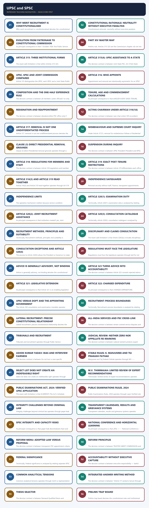

*Distinct embedded teaching-navigation image. The separate continuous Cārvāka-style flowchart package remains an independent at-a-glance artifact.*

### SESSION 1 — WHY MERIT RECRUITMENT IS CONSTITUTIONALISED
#### DEFINITION / WHAT THIS IS CALLED

**Plain-language definition:** Why merit recruitment is constitutionalised operates through reasoned scrutiny - lawful recommendation - accountable appointment, connected with CAPABLE + REPRESENTATIVE + TRUSTED PUBLIC SERVICE.

**Technical definition:** Why merit recruitment is constitutionalised denotes the constitutional rules and institutional links organised around stable rules - open notice - fair examination/selection.

#### ANSWER-GRABBING OPENING — WRITE/ADAPT IN THE EXAM

> Constitutional recruitment must reconcile competence, equal opportunity, reservation, suitability, integrity, accessibility and the requirements of each service.

#### MUST-WRITE KEYWORDS

- **Why merit recruitment is constitutionalised**
- **constitutional trust institution**
- **Why merit recruitment**
- **Why**
- **CAPABLE**
- **REPRESENTATIVE**

**How to use them:** Frame the answer through Why merit recruitment is constitutionalised; define constitutional trust institution, connect Why merit recruitment with Why to explain the mechanism, and use CAPABLE for the decisive comparison or qualification.

Why merit recruitment is constitutionalised denotes the constitutional rules and institutional links organised around stable rules - open notice - fair examination/selection.
Why merit recruitment is constitutionalised operates through reasoned scrutiny - lawful recommendation - accountable appointment, connected with CAPABLE + REPRESENTATIVE + TRUSTED PUBLIC SERVICE.
The operative mechanism matters because stable rules - open notice - fair examination/selection.
Its principal consequence is that stable rules - open notice - fair examination/selection.
The decisive contrast is between stable rules - open notice - fair examination/selection and stable rules - open notice - fair examination/selection.
The exam-safe limitation is that stable rules - open notice - fair examination/selection.
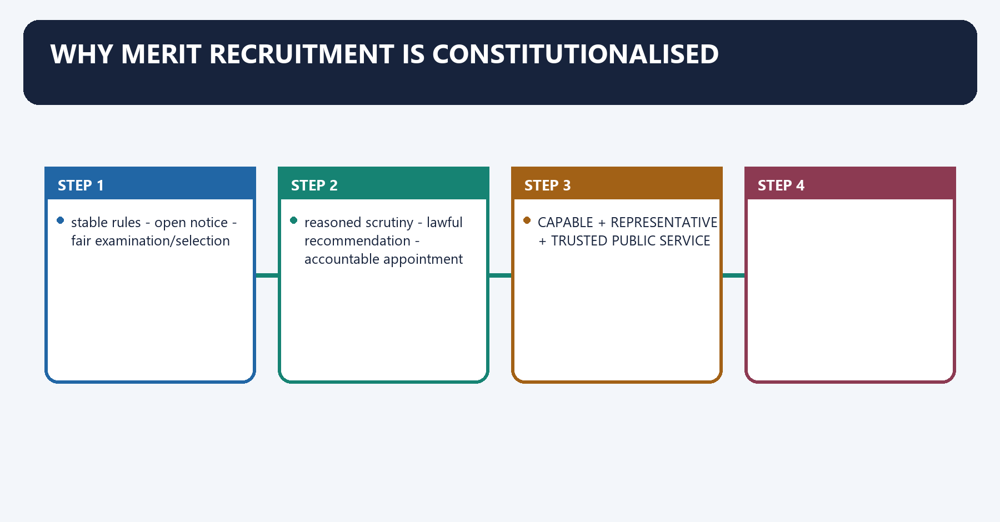
[FACT] A modern State needs permanent officials selected through criteria that do not simply reproduce patronage, family connection, party loyalty or personal favour.

[ANALYSIS] A Public Service Commission is a **constitutional trust institution**: it separates the political executive's legitimate power to govern from the temptation to distribute public posts as political rewards.

[LIMIT] Merit is not identical to one examination score. Constitutional recruitment must reconcile competence, equal opportunity, reservation, suitability, integrity, accessibility and the requirements of each service.

#### Visual 2 - Democratic merit chain

```text
EQUAL OPPORTUNITY
       |
stable rules -> open notice -> fair examination/selection
       |                         |
reasoned scrutiny -> lawful recommendation -> accountable appointment
       |
CAPABLE + REPRESENTATIVE + TRUSTED PUBLIC SERVICE
```

Caption: Merit legitimacy depends on the whole process, not merely the final rank.

#### CLOSING RECALL FLOW — WHY MERIT RECRUITMENT IS CONSTITUTIONALISED

```closure-flow
SUBTOPIC: Why merit recruitment is constitutionalised
KEY TERMS / DEFINITIONS: Why merit recruitment is constitutionalised · constitutional trust institution · Why merit recruitment · Why · CAPABLE · REPRESENTATIVE
MECHANISM / ARGUMENT: Why merit recruitment is constitutionalised denotes the constitutional rules and institutional links organised around stable rules - open notice - fair examination/selection.
CONSEQUENCE / CONTRAST: Merit is not identical to one examination score.
UPSC TRAP / ANSWER-USE: Do not miss this limiting distinction: its principal consequence is that stable rules - open notice - fair examination/selection.
ANSWER-GRABBING FORMULATION: Constitutional recruitment must reconcile competence, equal opportunity, reservation, suitability, integrity, accessibility and the requirements of each service.
```
### SESSION 2 — CONSTITUTIONAL RATIONALE: NEUTRALITY WITHOUT EXECUTIVE PARALYSIS
#### DEFINITION / WHAT THIS IS CALLED

**Plain-language definition:** Constitutional rationale: neutrality without executive paralysis denotes the constitutional rules and institutional links organised around Constitutional need PSC response Necessary qualification.

**Technical definition:** Constitutional rationale: neutrality without executive paralysis operates through neutral recruitment external constitutional commission executive still creates posts and appoints, connected with professional expertise examinations and expert selection courts retain legality review.

#### ANSWER-GRABBING OPENING — WRITE/ADAPT IN THE EXAM

> The Commission must be strong enough to resist patronage but not so dominant that elected government loses responsibility for administration.

#### MUST-WRITE KEYWORDS

- **Constitutional rationale**
- **neutrality without executive paralysis**
- **insulated advice**
- **neutral recruitment**
- **external constitutional commission**
- **professional expertise**

**How to use them:** Frame the answer through Constitutional rationale; define neutrality without executive paralysis, connect insulated advice with neutral recruitment to explain the mechanism, and use external constitutional commission for the decisive comparison or qualification.

Constitutional rationale: neutrality without executive paralysis denotes the constitutional rules and institutional links organised around Constitutional need PSC response Necessary qualification.
Constitutional rationale: neutrality without executive paralysis operates through neutral recruitment external constitutional commission executive still creates posts and appoints, connected with professional expertise examinations and expert selection courts retain legality review.
The operative mechanism matters because equal opportunity standardised and public procedure reservation and accommodation remain applicable.
Its principal consequence is that protection from retaliation difficult removal and charged expenses appointment is still executive.
The decisive contrast is between democratic accountability annual reports and non-acceptance memorandum advice is generally not binding and Constitutional need PSC response Necessary qualification.
The exam-safe limitation is that constitutional need PSC response Necessary qualification.
#### Visual 3 - Design balance

| Constitutional need | PSC response | Necessary qualification |
|---|---|---|
| neutral recruitment | external constitutional commission | executive still creates posts and appoints |
| professional expertise | examinations and expert selection | courts retain legality review |
| equal opportunity | standardised and public procedure | reservation and accommodation remain applicable |
| protection from retaliation | difficult removal and charged expenses | appointment is still executive |
| democratic accountability | annual reports and non-acceptance memorandum | advice is generally not binding |

[ANALYSIS] The Constitution chose **insulated advice**, not an unelected personnel government. The Commission must be strong enough to resist patronage but not so dominant that elected government loses responsibility for administration.

#### CLOSING RECALL FLOW — CONSTITUTIONAL RATIONALE: NEUTRALITY WITHOUT EXECUTIVE PARALYSIS

```closure-flow
SUBTOPIC: Constitutional rationale: neutrality without executive paralysis
KEY TERMS / DEFINITIONS: Constitutional rationale · neutrality without executive paralysis · insulated advice · neutral recruitment · external constitutional commission · professional expertise
MECHANISM / ARGUMENT: Constitutional rationale: neutrality without executive paralysis operates through neutral recruitment external constitutional commission executive still creates posts and appoints, connected with professional expertise examinations and expert selection courts retain legality review.
CONSEQUENCE / CONTRAST: Its principal consequence is that protection from retaliation difficult removal and charged expenses appointment is still executive.
UPSC TRAP / ANSWER-USE: The decisive contrast is between democratic accountability annual reports and non-acceptance memorandum advice is generally not binding and Constitutional need PSC response Necessary qualification.
ANSWER-GRABBING FORMULATION: The Commission must be strong enough to resist patronage but not so dominant that elected government loses responsibility for administration.
```
### SESSION 3 — EVOLUTION FROM PATRONAGE TO CONSTITUTIONAL COMMISSION
#### DEFINITION / WHAT THIS IS CALLED

**Plain-language definition:** Evolution from patronage to constitutional commission denotes the constitutional rules and institutional links organised around Charter Act 1853: competitive-recruitment turn.

**Technical definition:** Its principal consequence is that 1 October 1926: first Public Service Commission.

#### ANSWER-GRABBING OPENING — WRITE/ADAPT IN THE EXAM

> Public Service Commissions transformed competitive recruitment from a colonial administrative device into a federal institution constrained by equality and public accountability.

#### MUST-WRITE KEYWORDS

- **Evolution from patronage to constitutional commission**
- **Charter Act 1853**
- **India Act 1919**
- **India Act 1935**
- **Evolution**
- **315-323**

**How to use them:** Frame the answer through Evolution from patronage to constitutional commission; define Charter Act 1853, connect India Act 1919 with India Act 1935 to explain the mechanism, and use Evolution for the decisive comparison or qualification.

Evolution from patronage to constitutional commission denotes the constitutional rules and institutional links organised around Charter Act 1853: competitive-recruitment turn.
Evolution from patronage to constitutional commission operates through Macaulay Committee 1854: competitive civil-service framework, connected with Government of India Act 1919: provision for a Public Service Commission.
The operative mechanism matters because lee Commission 1924: institutional recommendation.
Its principal consequence is that 1 October 1926: first Public Service Commission.
The decisive contrast is between Government of India Act 1935 and Federal + Provincial + Joint PSC design.
The exam-safe limitation is that articles 315-323 constitutionalise UPSC/SPSC architecture.
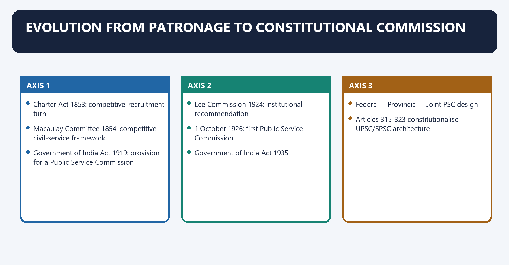
#### Visual 4 - Evolution timeline

```text
Company patronage
      |
Charter Act 1853: competitive-recruitment turn
      |
Macaulay Committee 1854: competitive civil-service framework
      |
Government of India Act 1919: provision for a Public Service Commission
      |
Lee Commission 1924: institutional recommendation
      |
1 October 1926: first Public Service Commission
      |
Government of India Act 1935:
Federal + Provincial + Joint PSC design
      |
26 January 1950:
Articles 315-323 constitutionalise UPSC/SPSC architecture
```

[FACT] The local OCR-searchable Laxmikanth chapter and official institutional history trace the Commission lineage through the 1919 and 1935 Acts and the first Commission in 1926.

[ANALYSIS] The constitutional innovation was not merely an examination body. It was the conversion of a colonial recruitment mechanism into a federal, equality-bound and publicly accountable institution.

[LIMIT] Competitive recruitment under colonial rule did not itself create social equality; access and representation remained restricted.

#### CLOSING RECALL FLOW — EVOLUTION FROM PATRONAGE TO CONSTITUTIONAL COMMISSION

```closure-flow
SUBTOPIC: Evolution from patronage to constitutional commission
KEY TERMS / DEFINITIONS: Evolution from patronage to constitutional commission · Charter Act 1853 · India Act 1919 · India Act 1935 · Evolution · 315-323
MECHANISM / ARGUMENT: It was the conversion of a colonial recruitment mechanism into a federal, equality-bound and publicly accountable institution.
CONSEQUENCE / CONTRAST: Its principal consequence is that 1 October 1926: first Public Service Commission.
UPSC TRAP / ANSWER-USE: Do not miss this limiting distinction: the decisive contrast is between Government of India Act 1935 and Federal + Provincial...
ANSWER-GRABBING FORMULATION: Public Service Commissions transformed competitive recruitment from a colonial administrative device into a federal institution constrained by equality and public accountability.
```
### SESSION 4 — PART XIV MASTER MAP
#### DEFINITION / WHAT THIS IS CALLED

**Plain-language definition:** Part XIV master map denotes the constitutional rules and institutional links organised around Provision Core subject Owner.

**Technical definition:** Prelims rule: Articles 315-323 are the Commission chapter; do not mix them with Article 323A tribunals merely because numbering is adjacent.

#### ANSWER-GRABBING OPENING — WRITE/ADAPT IN THE EXAM

> Articles 315 to 323 govern Public Service Commissions, while Article 323A concerns administrative tribunals despite the adjacent numbering.

#### MUST-WRITE KEYWORDS

- **Part XIV master map**
- **Prelims rule**
- **interpretation**
- **Public Services**
- **recruitment and service-condition law/rules**
- **315-323**

**How to use them:** Frame the answer through Part XIV master map; define Prelims rule, connect interpretation with Public Services to explain the mechanism, and use recruitment and service-condition law/rules for the decisive comparison or qualification.

Part XIV master map denotes the constitutional rules and institutional links organised around Provision Core subject Owner.
Part XIV master map operates through 308 interpretation Public Services, connected with 309 recruitment and service-condition law/rules Public Services / executive.
The operative mechanism matters because 310 doctrine of pleasure Public Services.
Its principal consequence is that 311 dismissal safeguards Public Services.
The decisive contrast is between 312 All-India Services Public Services and 315 UPSC, SPSC and Joint Commission this package.
The exam-safe limitation is that 316 appointment and term this package.
#### Visual 5 - Services and Commission spine

| Provision | Core subject | Owner |
|---|---|---|
| 308 | interpretation | Public Services |
| 309 | recruitment and service-condition law/rules | Public Services / executive |
| 310 | doctrine of pleasure | Public Services |
| 311 | dismissal safeguards | Public Services |
| 312 | All-India Services | Public Services |
| 315 | UPSC, SPSC and Joint Commission | this package |
| 316 | appointment and term | this package |
| 317 | removal and suspension | this package |
| 318 | member/staff regulations | this package |
| 319 | post-tenure office restrictions | this package |
| 320 | functions and consultation | this package |
| 321 | legislative extension | this package |
| 322 | charged expenses | this package |
| 323 | annual reports and memoranda | this package |
| 323A | administrative tribunals | Tribunals owner |

> **Prelims rule:** Articles **315-323** are the Commission chapter; do not mix them with Article 323A tribunals merely because numbering is adjacent.

#### CLOSING RECALL FLOW — PART XIV MASTER MAP

```closure-flow
SUBTOPIC: Part XIV master map
KEY TERMS / DEFINITIONS: Part XIV master map · Prelims rule · interpretation · Public Services · recruitment and service-condition law/rules · 315-323
MECHANISM / ARGUMENT: Prelims rule: Articles 315-323 are the Commission chapter; do not mix them with Article 323A tribunals merely because numbering is adjacent.
CONSEQUENCE / CONTRAST: Its principal consequence is that 311 dismissal safeguards Public Services.
UPSC TRAP / ANSWER-USE: Do not miss this limiting distinction: the decisive contrast is between 312 All-India Services Public Services and 315 UPSC, SPSC...
ANSWER-GRABBING FORMULATION: Articles 315 to 323 govern Public Service Commissions, while Article 323A concerns administrative tribunals despite the adjacent numbering.
```
### SESSION 5 — ARTICLE 315: THREE INSTITUTIONAL FORMS
#### DEFINITION / WHAT THIS IS CALLED

**Plain-language definition:** Article 315: three institutional forms denotes the constitutional rules and institutional links organised around Article 315(1) requires a Public Service Commission for the Union and one for each State, subject to the rest of the Article.

**Technical definition:** The exam-safe limitation is that within Articles 315-323.

#### ANSWER-GRABBING OPENING — WRITE/ADAPT IN THE EXAM

> Article 315(1) requires a Public Service Commission for the Union and one for each State, subject to the rest of the Article.

#### MUST-WRITE KEYWORDS

- **Article 315**
- **three institutional forms**
- **by law provide for the appointment**
- **Article 315: three institutional forms**
- **Article**
- **315-323**

**How to use them:** Frame the answer through Article 315; define three institutional forms, connect by law provide for the appointment with Article 315: three institutional forms to explain the mechanism, and use Article for the decisive comparison or qualification.

Article 315: three institutional forms denotes the constitutional rules and institutional links organised around [FACT] Article 315(1) requires a Public Service Commission for the Union and one for each State, subject to the rest of the Article.
Article 315: three institutional forms operates through CONSTITUTION, ARTICLE 315(2), connected with authorises a Joint State PSC.
The operative mechanism matters because state legislatures pass resolutions.
Its principal consequence is that pARLIAMENT ENACTS LAW.
The decisive contrast is between providing for appointment and incidental matters and JOINT COMMISSION OPERATES.
The exam-safe limitation is that within Articles 315-323.
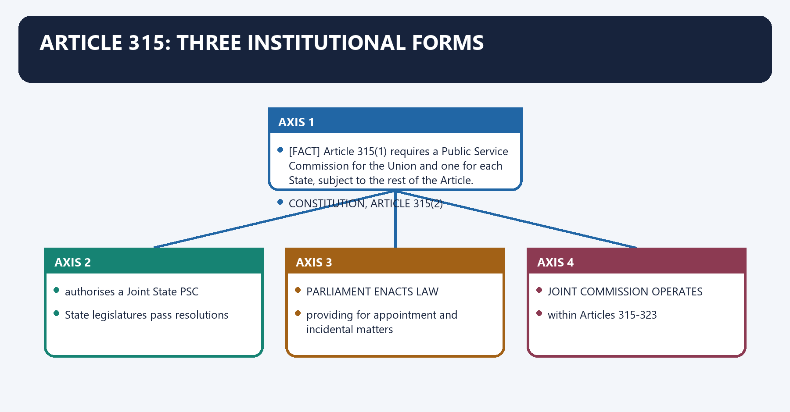
[FACT] Article 315(1) requires a Public Service Commission for the Union and one for each State, subject to the rest of the Article.

[FACT] Article 315(2) allows two or more States to agree on one Commission. Each relevant State legislature must pass the required resolution; Parliament may then **by law provide for the appointment** of a Joint State Public Service Commission.

[ANALYSIS] A Joint Commission is constitutionally contemplated but activated through a parliamentary statute. Calling it simply “statutory” is incomplete if that suggests an extra-constitutional body; calling it automatically existing “directly under Article 315” is also incomplete.

#### Visual 6 - Constitutional source versus creating instrument

```text
CONSTITUTION, ARTICLE 315(2)
authorises a Joint State PSC
          |
State legislatures pass resolutions
          |
PARLIAMENT ENACTS LAW
providing for appointment and incidental matters
          |
JOINT COMMISSION OPERATES
within Articles 315-323
```

Caption: The office has a constitutional foundation and a statutory creating instrument.

#### CLOSING RECALL FLOW — ARTICLE 315: THREE INSTITUTIONAL FORMS

```closure-flow
SUBTOPIC: Article 315: three institutional forms
KEY TERMS / DEFINITIONS: Article 315 · three institutional forms · by law provide for the appointment · Article 315: three institutional forms · Article · 315-323
MECHANISM / ARGUMENT: Each relevant State legislature must pass the required resolution; Parliament may then by law provide for the appointment of a Joint State Public Service Commission.
CONSEQUENCE / CONTRAST: The decisive contrast is between providing for appointment and incidental matters and JOINT COMMISSION OPERATES.
UPSC TRAP / ANSWER-USE: A Joint Commission is constitutionally contemplated but activated through a parliamentary statute.
ANSWER-GRABBING FORMULATION: Article 315(1) requires a Public Service Commission for the Union and one for each State, subject to the rest of the Article.
```
### SESSION 6 — ARTICLE 315(4): UPSC ASSISTANCE TO A STATE
#### DEFINITION / WHAT THIS IS CALLED

**Plain-language definition:** Article 315(4): UPSC assistance to a State denotes the constitutional rules and institutional links organised around This is not the same as.

**Technical definition:** The decisive contrast is between Joint State PSC, Art 315(2) State legislative resolutions + parliamentary law one Joint Commission serves group of States and UPSC serves a State, Art 315(4) Governor request + President approval + UPSC agreement UPSC serves all/some State needs.

#### ANSWER-GRABBING OPENING — WRITE/ADAPT IN THE EXAM

> Article 315(4) permits UPSC assistance to a State by agreement, but neither creates a Joint State Commission nor abolishes the State's own Commission.

#### MUST-WRITE KEYWORDS

- **Article 315(4)**
- **UPSC assistance to a State**
- **Joint State PSC, Art 315(2)**
- **one Joint Commission**
- **serves group of States**
- **UPSC serves a State, Art 315(4)**

**How to use them:** Frame the answer through Article 315(4); define UPSC assistance to a State, connect Joint State PSC, Art 315(2) with one Joint Commission to explain the mechanism, and use serves group of States for the decisive comparison or qualification.

Article 315(4): UPSC assistance to a State denotes the constitutional rules and institutional links organised around [LIMIT] This is not the same as.
Article 315(4): UPSC assistance to a State operates through creating a Joint State PSC under Article 315(2), connected with the Article 320(2) duty to assist two or more States with a joint recruitment scheme for services requiring special qualifications; or.
The operative mechanism matters because permanently abolishing the State Commission.
Its principal consequence is that device Trigger Institution Result.
The decisive contrast is between Joint State PSC, Art 315(2) State legislative resolutions + parliamentary law one Joint Commission serves group of States and UPSC serves a State, Art 315(4) Governor request + President approval + UPSC agreement UPSC serves all/some State needs.
The exam-safe limitation is that joint recruitment scheme, Art 320(2) request by two or more States UPSC assistance scheme for specially qualified service.
[FACT] The UPSC may, on a request by a State's Governor and with the President's approval, agree to serve all or any of that State's needs.

[LIMIT] This is not the same as:

1. creating a Joint State PSC under Article 315(2);
2. the Article 320(2) duty to assist two or more States with a joint recruitment scheme for services requiring special qualifications; or
3. permanently abolishing the State Commission.

#### Visual 7 - Three easily confused cooperative devices

| Device | Trigger | Institution | Result |
|---|---|---|---|
| Joint State PSC, Art 315(2) | State legislative resolutions + parliamentary law | one Joint Commission | serves group of States |
| UPSC serves a State, Art 315(4) | Governor request + President approval + UPSC agreement | UPSC | serves all/some State needs |
| joint recruitment scheme, Art 320(2) | request by two or more States | UPSC assistance | scheme for specially qualified service |

#### CLOSING RECALL FLOW — ARTICLE 315(4): UPSC ASSISTANCE TO A STATE

```closure-flow
SUBTOPIC: Article 315(4): UPSC assistance to a State
KEY TERMS / DEFINITIONS: Article 315(4) · UPSC assistance to a State · Joint State PSC, Art 315(2) · one Joint Commission · serves group of States · UPSC serves a State, Art 315(4)
MECHANISM / ARGUMENT: The exam-safe limitation is that joint recruitment scheme, Art 320(2) request by two or more States UPSC assistance scheme for specially qualified service.
CONSEQUENCE / CONTRAST: The decisive contrast is between Joint State PSC, Art 315(2) State legislative resolutions + parliamentary law one Joint Commission serves group of States and UPSC serves a State, Art 315(4) Governor request + President approval + UPSC agreement UPSC serves all/some State needs.
UPSC TRAP / ANSWER-USE: Do not miss this limiting distinction: its principal consequence is that device Trigger Institution Result.
ANSWER-GRABBING FORMULATION: Article 315(4) permits UPSC assistance to a State by agreement, but neither creates a Joint State Commission nor abolishes the State's own Commission.
```
### SESSION 7 — UPSC, SPSC AND JOINT COMMISSION COMPARED
#### DEFINITION / WHAT THIS IS CALLED

**Plain-language definition:** The Union Public Service Commission serves the Union, a State Public Service Commission serves a State, and a Joint State Public Service Commission serves participating States under a parliamentary law.

**Technical definition:** Article 315 distinguishes the UPSC, each SPSC and a Joint State Public Service Commission while assigning different creation, appointment, assistance and reporting routes.

#### ANSWER-GRABBING OPENING — WRITE/ADAPT IN THE EXAM

> Articles 315 to 323 create a differentiated federal commission system rather than one national recruitment authority for every public post.

#### MUST-WRITE KEYWORDS

- **Article 315**
- **SPSC**
- **Joint State PSC**
- **parliamentary law**
- **federal recruitment**

**How to use them:** Use Article 315 to compare UPSC, SPSC and Joint State PSC by constitutional source, appointing authority, service area and reporting route; then add the Article 315(4) and Article 320(2) assistance mechanisms.

UPSC, SPSC and Joint Commission compared denotes the constitutional rules and institutional links organised around Dimension UPSC SPSC Joint State PSC.
UPSC, SPSC and Joint Commission compared operates through constitutional basis Art 315(1) Art 315(1) Art 315(2), connected with operational creation Constitution Constitution parliamentary law after State resolutions.
The operative mechanism matters because chair/members appointed by President Governor President.
Its principal consequence is that removal authority President President President.
The decisive contrast is between suspension after SC reference President Governor President and service-regulation authority, Art 318 President Governor President.
The exam-safe limitation is that age ceiling 65 62 62.
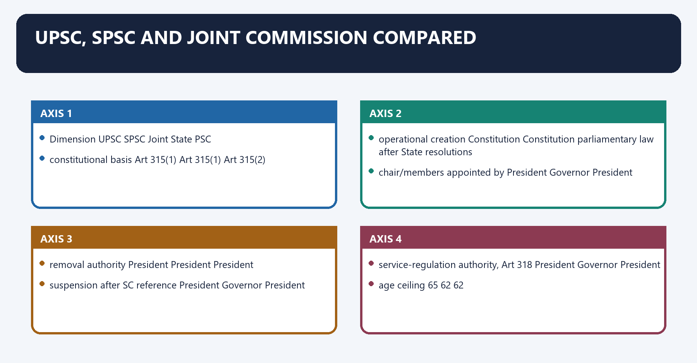
#### Visual 8 - Institutional comparison matrix

| Dimension | UPSC | SPSC | Joint State PSC |
|---|---|---|---|
| constitutional basis | Art 315(1) | Art 315(1) | Art 315(2) |
| operational creation | Constitution | Constitution | parliamentary law after State resolutions |
| chair/members appointed by | President | Governor | President |
| removal authority | President | President | President |
| suspension after SC reference | President | Governor | President |
| service-regulation authority, Art 318 | President | Governor | President |
| age ceiling | 65 | 62 | 62 |
| annual report | President | Governor | Governor of each served State for that State |
| charged fund | CFI | State Consolidated Fund | law/constitutional arrangement must be read with served design |

[LIMIT] For Article 322, the text expressly names Union and State Commissions. A Joint Commission's financial arrangements should be stated from its creating law rather than guessed.

#### CLOSING RECALL FLOW — UPSC, SPSC AND JOINT COMMISSION COMPARED

```closure-flow
SUBTOPIC: UPSC, SPSC and Joint Commission compared
KEY TERMS / DEFINITIONS: Article 315 · SPSC · Joint State PSC · parliamentary law · federal recruitment
MECHANISM / ARGUMENT: The Constitution assigns a Union Commission and State Commissions, permits a Joint Commission after State resolutions and parliamentary law, and allows specified UPSC assistance.
CONSEQUENCE / CONTRAST: Recruitment expertise can be shared across governments without erasing the constitutional identity and accountability route of each commission.
UPSC TRAP / ANSWER-USE: Do not call a Joint State PSC purely extra-constitutional, confuse it with temporary UPSC assistance or say that the Union Commission controls every State recruitment.
ANSWER-GRABBING FORMULATION: Articles 315 to 323 create a differentiated federal commission system rather than one national recruitment authority for every public post.
```
### SESSION 8 — ARTICLE 316: WHO APPOINTS
#### DEFINITION / WHAT THIS IS CALLED

**Plain-language definition:** Article 316: who appoints denotes the constitutional rules and institutional links organised around Appointment and removal are intentionally asymmetric for an SPSC: Governor appoints; President removes.

**Technical definition:** Appointment and removal are intentionally asymmetric for an SPSC: Governor appoints; President removes.

#### ANSWER-GRABBING OPENING — WRITE/ADAPT IN THE EXAM

> The President appoints UPSC and Joint Commission members while Governors appoint State Commission members, but removal protection prevents State retaliation against SPSC members.

#### MUST-WRITE KEYWORDS

- **Article 316**
- **who appoints**
- **Governor appoints; President removes**
- **Article 316: who appoints**
- **Article**
- **Appointment**

**How to use them:** Frame the answer through Article 316; define who appoints, connect Governor appoints; President removes with Article 316: who appoints to explain the mechanism, and use Article for the decisive comparison or qualification.

Article 316: who appoints denotes the constitutional rules and institutional links organised around [LIMIT] Appointment and removal are intentionally asymmetric for an SPSC: Governor appoints; President removes.
Article 316: who appoints operates through UPSC: President appoints ---- President removes, connected with SPSC: Governor appoints ---- President removes.
The operative mechanism matters because joint PSC: President appoints ---- President removes.
Its principal consequence is that [LIMIT] Appointment and removal are intentionally asymmetric for an SPSC: Governor appoints; President removes.
The decisive contrast is between [LIMIT] Appointment and removal are intentionally asymmetric for an SPSC: Governor appoints; President removes and [LIMIT] Appointment and removal are intentionally asymmetric for an SPSC: Governor appoints; President removes.
The exam-safe limitation is that [LIMIT] Appointment and removal are intentionally asymmetric for an SPSC: Governor appoints; President removes.
[FACT] The President appoints the Chairman and other members of the Union Commission and a Joint Commission. The Governor appoints the Chairman and other members of a State Commission.

[LIMIT] Appointment and removal are intentionally asymmetric for an SPSC: **Governor appoints; President removes**.

#### Visual 9 - Appointment/removal trap board

```text
UPSC:       President appoints ---- President removes
SPSC:       Governor appoints  ---- President removes
Joint PSC:  President appoints ---- President removes
```

Caption: The State executive initiates SPSC membership but cannot use removal as retaliation.

#### CLOSING RECALL FLOW — ARTICLE 316: WHO APPOINTS

```closure-flow
SUBTOPIC: Article 316: who appoints
KEY TERMS / DEFINITIONS: Article 316 · who appoints · Governor appoints; President removes · Article 316: who appoints · Article · Appointment
MECHANISM / ARGUMENT: Its principal consequence is that Appointment and removal are intentionally asymmetric for an SPSC: Governor appoints; President removes.
CONSEQUENCE / CONTRAST: The decisive contrast is between Appointment and removal are intentionally asymmetric for an SPSC: Governor appoints; President removes and Appointment and removal are intentionally asymmetric for an SPSC: Governor appoints; President removes.
UPSC TRAP / ANSWER-USE: Do not miss this limiting distinction: the exam-safe limitation is that Appointment and removal are intentionally asymmetric for an SPSC.
ANSWER-GRABBING FORMULATION: The President appoints UPSC and Joint Commission members while Governors appoint State Commission members, but removal protection prevents State retaliation against SPSC members.
```
### SESSION 9 — COMPOSITION AND THE ONE-HALF EXPERIENCE RULE
#### DEFINITION / WHAT THIS IS CALLED

**Plain-language definition:** Composition and the one-half experience rule denotes the constitutional rules and institutional links organised around The Constitution does not fix the total strength of any Commission.

**Technical definition:** The decisive contrast is between all members career officials? no only near-half ten-year rule and exactly 50% mathematically? “as nearly as may be” do not flatten the phrase.

#### ANSWER-GRABBING OPENING — WRITE/ADAPT IN THE EXAM

> Article 316 leaves Commission strength unfixed while requiring, as nearly as may be, half the members to possess ten years of government service.

#### MUST-WRITE KEYWORDS

- **Composition**
- **the one-half experience rule**
- **as nearly as may be one-half**
- **no constitutional number**
- **no**
- **only near-half ten-year rule**

**How to use them:** Frame the answer through Composition; define the one-half experience rule, connect as nearly as may be one-half with no constitutional number to explain the mechanism, and use no for the decisive comparison or qualification.

Composition and the one-half experience rule denotes the constitutional rules and institutional links organised around [FACT] The Constitution does not fix the total strength of any Commission.
Composition and the one-half experience rule operates through [FACT] Pre-Constitution service under the Crown in India or the Government of an Indian State counts toward the ten years, connected with [LIMIT] The Constitution prescribes no universal educational degree, judicial qualification or civil-service rank for every member.
The operative mechanism matters because question Correct test Trap.
Its principal consequence is that fixed number? no constitutional number do not memorise a changing “usual” strength.
The decisive contrast is between all members career officials? no only near-half ten-year rule and exactly 50% mathematically? “as nearly as may be” do not flatten the phrase.
The exam-safe limitation is that ten years immediately preceding? text says held office for at least ten years do not add continuity language.
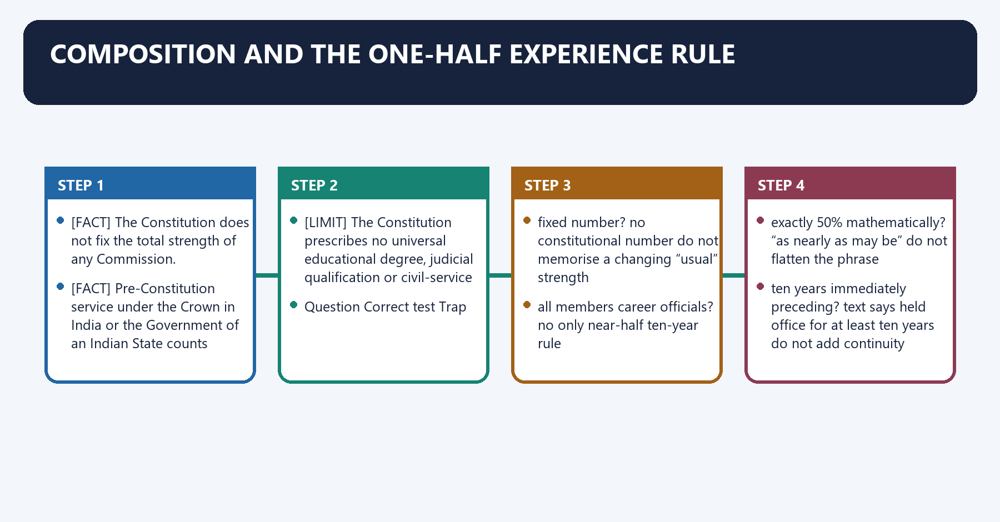
[FACT] The Constitution does not fix the total strength of any Commission.

[FACT] Under the proviso to Article 316(1), **as nearly as may be one-half** of the members of every Commission must, at their appointment dates, have held office for at least ten years under the Government of India or a State.

[FACT] Pre-Constitution service under the Crown in India or the Government of an Indian State counts toward the ten years.

[LIMIT] The Constitution prescribes no universal educational degree, judicial qualification or civil-service rank for every member.

#### Visual 10 - Composition test

| Question | Correct test | Trap |
|---|---|---|
| fixed number? | no constitutional number | do not memorise a changing “usual” strength |
| all members career officials? | no | only near-half ten-year rule |
| exactly 50% mathematically? | “as nearly as may be” | do not flatten the phrase |
| ten years immediately preceding? | text says held office for at least ten years | do not add continuity language |
| pre-1950 service counted? | yes, as specified | often omitted in summaries |

#### CLOSING RECALL FLOW — COMPOSITION AND THE ONE-HALF EXPERIENCE RULE

```closure-flow
SUBTOPIC: Composition and the one-half experience rule
KEY TERMS / DEFINITIONS: Composition · the one-half experience rule · as nearly as may be one-half · no constitutional number · no · only near-half ten-year rule
MECHANISM / ARGUMENT: The decisive contrast is between all members career officials? no only near-half ten-year rule and exactly 50% mathematically? “as nearly as may be” do not flatten the phrase.
CONSEQUENCE / CONTRAST: Its principal consequence is that fixed number? no constitutional number do not memorise a changing “usual” strength.
UPSC TRAP / ANSWER-USE: The exam-safe limitation is that ten years immediately preceding? text says held office for at least ten years do not add continuity language.
ANSWER-GRABBING FORMULATION: Article 316 leaves Commission strength unfixed while requiring, as nearly as may be, half the members to possess ten years of government service.
```
### SESSION 10 — TENURE, AGE AND COMMENCEMENT CALCULATIONS
#### DEFINITION / WHAT THIS IS CALLED

**Plain-language definition:** Tenure, age and commencement calculations denotes the constitutional rules and institutional links organised around The ceiling is 65 for the Union Commission and 62 for a State or Joint Commission.

**Technical definition:** Its principal consequence is that eARLIER EVENT ENDS TENURE.

#### ANSWER-GRABBING OPENING — WRITE/ADAPT IN THE EXAM

> A Commission member serves six years from entering office or until the applicable age ceiling, whichever occurs earlier, making commencement dates legally significant.

#### MUST-WRITE KEYWORDS

- **Tenure**
- **age**
- **commencement calculations**
- **Article 316**
- **Tenure, age and commencement calculations**
- **Union Commission**

**How to use them:** Frame the answer through Tenure; define age, connect commencement calculations with Article 316 to explain the mechanism, and use Tenure, age and commencement calculations for the decisive comparison or qualification.

Tenure, age and commencement calculations denotes the constitutional rules and institutional links organised around [FACT] The ceiling is 65 for the Union Commission and 62 for a State or Joint Commission.
Tenure, age and commencement calculations operates through DATE OF ENTRY UPON OFFICE, connected with compare with age ceiling.
The operative mechanism matters because sPSC/Joint: age 62.
Its principal consequence is that eARLIER EVENT ENDS TENURE.
The decisive contrast is between [FACT] The ceiling is 65 for the Union Commission and 62 for a State or Joint Commission and [FACT] The ceiling is 65 for the Union Commission and 62 for a State or Joint Commission.
The exam-safe limitation is that [FACT] The ceiling is 65 for the Union Commission and 62 for a State or Joint Commission.
[FACT] Article 316(2) gives a term of **six years from the date the member enters upon office**, or until the age ceiling, whichever occurs earlier.

[FACT] The ceiling is 65 for the Union Commission and 62 for a State or Joint Commission.

#### Visual 11 - Tenure calculation flow

```text
DATE OF ENTRY UPON OFFICE
          |
      + 6 years
          |
compare with age ceiling
          |
UPSC: age 65
SPSC/Joint: age 62
          |
EARLIER EVENT ENDS TENURE
```

[LIMIT] Appointment date, notification date and date of entering office need not always be identical. Use the constitutional phrase when a commencement calculation matters.

#### CLOSING RECALL FLOW — TENURE, AGE AND COMMENCEMENT CALCULATIONS

```closure-flow
SUBTOPIC: Tenure, age and commencement calculations
KEY TERMS / DEFINITIONS: Tenure · age · commencement calculations · Article 316 · Tenure, age and commencement calculations · Union Commission
MECHANISM / ARGUMENT: Use the constitutional phrase when a commencement calculation matters.
CONSEQUENCE / CONTRAST: Its principal consequence is that eARLIER EVENT ENDS TENURE.
UPSC TRAP / ANSWER-USE: Do not miss this limiting distinction: the decisive contrast is between The ceiling is 65 for the Union Commission and...
ANSWER-GRABBING FORMULATION: A Commission member serves six years from entering office or until the applicable age ceiling, whichever occurs earlier, making commencement dates legally significant.
```
### SESSION 11 — RESIGNATION AND REAPPOINTMENT
#### DEFINITION / WHAT THIS IS CALLED

**Plain-language definition:** Resignation and reappointment denotes the constitutional rules and institutional links organised around Article 316(3) makes a person, on expiry of the term, ineligible for reappointment to that office.

**Technical definition:** The decisive contrast is between elevation/other PSC office only if Article 319 permits not a reappointment to same office and Article 316(3) makes a person, on expiry of the term, ineligible for reappointment to that office.

#### ANSWER-GRABBING OPENING — WRITE/ADAPT IN THE EXAM

> Article 316(3) bars reappointment to the same office after term expiry, reducing incentives to seek renewal from the appointing executive.

#### MUST-WRITE KEYWORDS

- **Resignation**
- **reappointment**
- **to that office**
- **expiry**
- **six years/age, whichever earlier**
- **no reappointment to same office**

**How to use them:** Frame the answer through Resignation; define reappointment, connect to that office with expiry to explain the mechanism, and use six years/age, whichever earlier for the decisive comparison or qualification.

Resignation and reappointment denotes the constitutional rules and institutional links organised around [FACT] Article 316(3) makes a person, on expiry of the term, ineligible for reappointment to that office.
Resignation and reappointment operates through Exit Constitutional route Consequence, connected with expiry six years/age, whichever earlier no reappointment to same office.
The operative mechanism matters because resignation President for UPSC/Joint; Governor for SPSC post-office restrictions apply.
Its principal consequence is that removal Article 317 constitutional process.
The decisive contrast is between elevation/other PSC office only if Article 319 permits not a reappointment to same office and [FACT] Article 316(3) makes a person, on expiry of the term, ineligible for reappointment to that office.
The exam-safe limitation is that [FACT] Article 316(3) makes a person, on expiry of the term, ineligible for reappointment to that office.
[FACT] A UPSC or Joint Commission member resigns by writing addressed to the President. An SPSC member resigns by writing addressed to the Governor.

[FACT] Article 316(3) makes a person, on expiry of the term, ineligible for reappointment **to that office**.

[ANALYSIS] “No second term” is a useful shorthand only if qualified: Article 319 still permits specified movement to a different eligible Commission office.

#### Visual 12 - Exit routes

| Exit | Constitutional route | Consequence |
|---|---|---|
| expiry | six years/age, whichever earlier | no reappointment to same office |
| resignation | President for UPSC/Joint; Governor for SPSC | post-office restrictions apply |
| removal | Article 317 | constitutional process |
| elevation/other PSC office | only if Article 319 permits | not a reappointment to same office |

#### CLOSING RECALL FLOW — RESIGNATION AND REAPPOINTMENT

```closure-flow
SUBTOPIC: Resignation and reappointment
KEY TERMS / DEFINITIONS: Resignation · reappointment · to that office · expiry · six years/age, whichever earlier · no reappointment to same office
MECHANISM / ARGUMENT: The decisive contrast is between elevation/other PSC office only if Article 319 permits not a reappointment to same office and Article 316(3) makes a person, on expiry of the term, ineligible for reappointment to that office.
CONSEQUENCE / CONTRAST: Its principal consequence is that removal Article 317 constitutional process.
UPSC TRAP / ANSWER-USE: Do not miss this limiting distinction: the exam-safe limitation is that Article 316(3) makes a person, on expiry of the...
ANSWER-GRABBING FORMULATION: Article 316(3) bars reappointment to the same office after term expiry, reducing incentives to seek renewal from the appointing executive.
```
### SESSION 12 — ACTING CHAIRMAN UNDER ARTICLE 316(1A)
#### DEFINITION / WHAT THIS IS CALLED

**Plain-language definition:** Acting Chairman under Article 316(1A) denotes the constitutional rules and institutional links organised around The appointing authority is the President for the Union/Joint Commission and the Governor for an SPSC.

**Technical definition:** The decisive contrast is between new chair enters OR incumbent resumes and acting arrangement ends.

#### ANSWER-GRABBING OPENING — WRITE/ADAPT IN THE EXAM

> If the Chair's office is vacant, or the Chair cannot perform duties because of absence or another reason, another member may be appointed to perform the duties.

#### MUST-WRITE KEYWORDS

- **Acting Chairman under Article 316(1A)**
- **Article 316**
- **Acting Chairman**
- **Article**
- **President**
- **Union**

**How to use them:** Frame the answer through Acting Chairman under Article 316(1A); define Article 316, connect Acting Chairman with Article to explain the mechanism, and use President for the decisive comparison or qualification.

Acting Chairman under Article 316(1A) denotes the constitutional rules and institutional links organised around [FACT] The appointing authority is the President for the Union/Joint Commission and the Governor for an SPSC.
Acting Chairman under Article 316(1A) operates through [FACT] The arrangement lasts until the new Chair enters upon duties or the existing Chair resumes, connected with VACANCY TEMPORARY INABILITY.
The operative mechanism matters because +---------------------+.
Its principal consequence is that other member appointed to perform duties.
The decisive contrast is between new chair enters OR incumbent resumes and acting arrangement ends.
The exam-safe limitation is that [FACT] The appointing authority is the President for the Union/Joint Commission and the Governor for an SPSC.
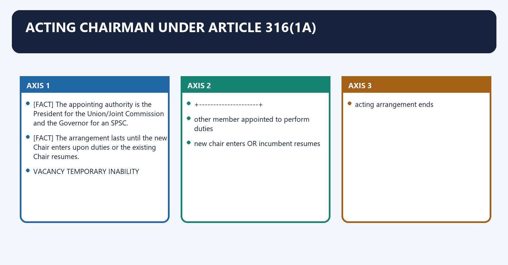
[FACT] If the Chair's office is vacant, or the Chair cannot perform duties because of absence or another reason, another member may be appointed to perform the duties.

[FACT] The appointing authority is the President for the Union/Joint Commission and the Governor for an SPSC.

[FACT] The arrangement lasts until the new Chair enters upon duties or the existing Chair resumes.

#### Visual 13 - Acting-chair trigger

```text
VACANCY                         TEMPORARY INABILITY
   |                                   |
   +-------------+---------------------+
                 |
other member appointed to perform duties
                 |
new chair enters OR incumbent resumes
                 |
acting arrangement ends
```

#### CLOSING RECALL FLOW — ACTING CHAIRMAN UNDER ARTICLE 316(1A)

```closure-flow
SUBTOPIC: Acting Chairman under Article 316(1A)
KEY TERMS / DEFINITIONS: Acting Chairman under Article 316(1A) · Article 316 · Acting Chairman · Article · President · Union
MECHANISM / ARGUMENT: If the Chair's office is vacant, or the Chair cannot perform duties because of absence or another reason, another member may be appointed to perform the duties.
CONSEQUENCE / CONTRAST: The decisive contrast is between new chair enters OR incumbent resumes and acting arrangement ends.
UPSC TRAP / ANSWER-USE: Do not miss this limiting distinction: its principal consequence is that other member appointed to perform duties.
ANSWER-GRABBING FORMULATION: If the Chair's office is vacant, or the Chair cannot perform duties because of absence or another reason, another member may be appointed to perform the duties.
```
### SESSION 13 — ARTICLE 317: REMOVAL IS NOT ONE UNDIFFERENTIATED PROCESS
#### DEFINITION / WHAT THIS IS CALLED

**Plain-language definition:** Article 317: removal is not one undifferentiated process operates through President refers to Supreme Court, connected with SC inquiry under Article 145 procedure.

**Technical definition:** Article 317: removal is not one undifferentiated process denotes the constitutional rules and institutional links organised around ALLEGED MISBEHAVIOUR?.

#### ANSWER-GRABBING OPENING — WRITE/ADAPT IN THE EXAM

> Article 317 differentiates misbehaviour inquiries from direct removal grounds, while reserving final removal of every Public Service Commission member to the President.

#### MUST-WRITE KEYWORDS

- **Article 317**
- **Article 145**
- **Article 317: removal**
- **Article**
- **ALLEGED MISBEHAVIOUR**
- **President**

**How to use them:** Frame the answer through Article 317; define Article 145, connect Article 317: removal with Article to explain the mechanism, and use ALLEGED MISBEHAVIOUR for the decisive comparison or qualification.

Article 317: removal is not one undifferentiated process denotes the constitutional rules and institutional links organised around ALLEGED MISBEHAVIOUR?.
Article 317: removal is not one undifferentiated process operates through President refers to Supreme Court, connected with SC inquiry under Article 145 procedure.
The operative mechanism matters because sC reports member ought to be removed.
Its principal consequence is that president removes under Art 317(1).
The decisive contrast is between DIRECT CLAUSE (3) GROUND? and insolvency / paid outside employment / mental or physical infirmity.
The exam-safe limitation is that president may remove directly under Art 317(3).
#### Visual 14 - Removal decision tree

```text
ALLEGED MISBEHAVIOUR?
        |
       YES
        |
President refers to Supreme Court
        |
SC inquiry under Article 145 procedure
        |
SC reports member ought to be removed
        |
President removes under Art 317(1)

DIRECT CLAUSE (3) GROUND?
 insolvency / paid outside employment / mental or physical infirmity
        |
President may remove directly under Art 317(3)
```

[FACT] Only the President removes a Chair or member of any Public Service Commission.

[LIMIT] Do not import the parliamentary-address process used for judges into Article 317.

#### CLOSING RECALL FLOW — ARTICLE 317: REMOVAL IS NOT ONE UNDIFFERENTIATED PROCESS

```closure-flow
SUBTOPIC: Article 317: removal is not one undifferentiated process
KEY TERMS / DEFINITIONS: Article 317 · Article 145 · Article 317: removal · Article · ALLEGED MISBEHAVIOUR · President
MECHANISM / ARGUMENT: Article 317: removal is not one undifferentiated process denotes the constitutional rules and institutional links organised around ALLEGED MISBEHAVIOUR?.
CONSEQUENCE / CONTRAST: Do not import the parliamentary-address process used for judges into Article 317.
UPSC TRAP / ANSWER-USE: Do not miss this limiting distinction: its principal consequence is that president removes under Art 317(1).
ANSWER-GRABBING FORMULATION: Article 317 differentiates misbehaviour inquiries from direct removal grounds, while reserving final removal of every Public Service Commission member to the President.
```
### SESSION 14 — MISBEHAVIOUR AND SUPREME COURT INQUIRY
#### DEFINITION / WHAT THIS IS CALLED

**Plain-language definition:** Misbehaviour and Supreme Court inquiry denotes the constitutional rules and institutional links organised around Element Constitutional control Why it matters.

**Technical definition:** Under Article 317(1), removal for misbehaviour follows a Presidential reference and Supreme Court inquiry.

#### ANSWER-GRABBING OPENING — WRITE/ADAPT IN THE EXAM

> Removal for misbehaviour requires presidential reference and Supreme Court inquiry, protecting tenure while treating specified government-contract interests as deemed misconduct.

#### MUST-WRITE KEYWORDS

- **Misbehaviour**
- **Supreme Court inquiry**
- **allegation**
- **not enough by itself**
- **protects tenure**
- **reference**

**How to use them:** Frame the answer through Misbehaviour; define Supreme Court inquiry, connect allegation with not enough by itself to explain the mechanism, and use protects tenure for the decisive comparison or qualification.

Misbehaviour and Supreme Court inquiry denotes the constitutional rules and institutional links organised around Element Constitutional control Why it matters.
Misbehaviour and Supreme Court inquiry operates through allegation not enough by itself protects tenure, connected with reference President central constitutional trigger.
The operative mechanism matters because inquiry Supreme Court independent fact/legal assessment.
Its principal consequence is that contract interest deemed misbehaviour, subject to company exception controls conflict of interest.
The decisive contrast is between final order President after Court report formal removal authority and Element Constitutional control Why it matters.
The exam-safe limitation is that element Constitutional control Why it matters.
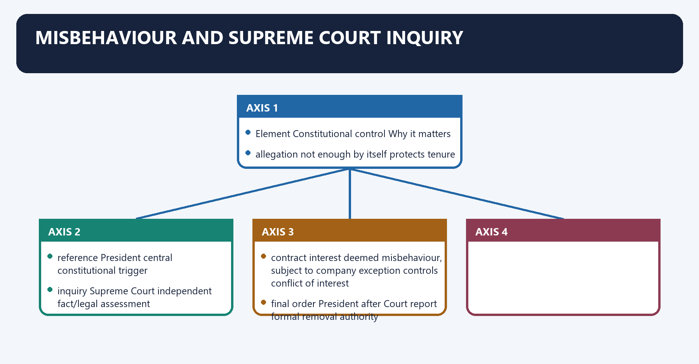
[FACT] Under Article 317(1), removal for misbehaviour follows a Presidential reference and Supreme Court inquiry. Removal follows where the Court reports that the member ought to be removed on that ground.

[FACT] Article 317(4) deems a member guilty of misbehaviour if the member is concerned or interested in a government contract/agreement or participates in its profit or benefit, except as a member in common with other members of an incorporated company.

#### Visual 15 - Misbehaviour architecture

| Element | Constitutional control | Why it matters |
|---|---|---|
| allegation | not enough by itself | protects tenure |
| reference | President | central constitutional trigger |
| inquiry | Supreme Court | independent fact/legal assessment |
| contract interest | deemed misbehaviour, subject to company exception | controls conflict of interest |
| final order | President after Court report | formal removal authority |

#### CLOSING RECALL FLOW — MISBEHAVIOUR AND SUPREME COURT INQUIRY

```closure-flow
SUBTOPIC: Misbehaviour and Supreme Court inquiry
KEY TERMS / DEFINITIONS: Misbehaviour · Supreme Court inquiry · allegation · not enough by itself · protects tenure · reference
MECHANISM / ARGUMENT: Under Article 317(1), removal for misbehaviour follows a Presidential reference and Supreme Court inquiry.
CONSEQUENCE / CONTRAST: Its principal consequence is that contract interest deemed misbehaviour, subject to company exception controls conflict of interest.
UPSC TRAP / ANSWER-USE: Do not miss this limiting distinction: the decisive contrast is between final order President after Court report formal removal authority...
ANSWER-GRABBING FORMULATION: Removal for misbehaviour requires presidential reference and Supreme Court inquiry, protecting tenure while treating specified government-contract interests as deemed misconduct.
```
### SESSION 15 — CLAUSE (3) DIRECT PRESIDENTIAL REMOVAL GROUNDS
#### DEFINITION / WHAT THIS IS CALLED

**Plain-language definition:** Clause (3) direct Presidential removal grounds denotes the constitutional rules and institutional links organised around Article 317(3) separately authorises Presidential removal where the member.

**Technical definition:** Clause (3) direct Presidential removal grounds operates through is adjudged insolvent, connected with engages during the term in paid employment outside official duties; or.

#### ANSWER-GRABBING OPENING — WRITE/ADAPT IN THE EXAM

> Article 317(3) permits direct presidential removal for insolvency, outside paid employment or specified infirmity, without importing the separate misbehaviour-inquiry route.

#### MUST-WRITE KEYWORDS

- **Clause (3) direct Presidential removal grounds**
- **misbehaviour**
- **yes**
- **reference - inquiry - report - President**
- **insolvency**
- **no separate 317(1) inquiry required**

**How to use them:** Frame the answer through Clause (3) direct Presidential removal grounds; define misbehaviour, connect yes with reference - inquiry - report - President to explain the mechanism, and use insolvency for the decisive comparison or qualification.

Clause (3) direct Presidential removal grounds denotes the constitutional rules and institutional links organised around [FACT] Article 317(3) separately authorises Presidential removal where the member.
Clause (3) direct Presidential removal grounds operates through is adjudged insolvent, connected with engages during the term in paid employment outside official duties; or.
The operative mechanism matters because is, in the President's opinion, unfit by reason of infirmity of mind or body.
Its principal consequence is that ground SC inquiry under 317(1)? Decision route.
The decisive contrast is between misbehaviour yes reference - inquiry - report - President and insolvency no separate 317(1) inquiry required President under 317(3).
The exam-safe limitation is that paid outside employment no separate 317(1) inquiry required President under 317(3).
[FACT] Article 317(3) separately authorises Presidential removal where the member:

1. is adjudged insolvent;
2. engages during the term in paid employment outside official duties; or
3. is, in the President's opinion, unfit by reason of infirmity of mind or body.

#### Visual 16 - Grounds must not be flattened

| Ground | SC inquiry under 317(1)? | Decision route |
|---|---:|---|
| misbehaviour | yes | reference -> inquiry -> report -> President |
| insolvency | no separate 317(1) inquiry required | President under 317(3) |
| paid outside employment | no separate 317(1) inquiry required | President under 317(3) |
| mental/physical infirmity | no separate 317(1) inquiry required | President under 317(3) |
| government-contract interest | deemed misbehaviour | 317(1) route |

#### CLOSING RECALL FLOW — CLAUSE (3) DIRECT PRESIDENTIAL REMOVAL GROUNDS

```closure-flow
SUBTOPIC: Clause (3) direct Presidential removal grounds
KEY TERMS / DEFINITIONS: Clause (3) direct Presidential removal grounds · misbehaviour · yes · reference - inquiry - report - President · insolvency · no separate 317(1) inquiry required
MECHANISM / ARGUMENT: Clause (3) direct Presidential removal grounds operates through is adjudged insolvent, connected with engages during the term in paid employment outside official duties; or.
CONSEQUENCE / CONTRAST: The decisive contrast is between misbehaviour yes reference - inquiry - report - President and insolvency no separate 317(1) inquiry required President under 317(3).
UPSC TRAP / ANSWER-USE: Do not miss this limiting distinction: its principal consequence is that ground SC inquiry under 317(1)?
ANSWER-GRABBING FORMULATION: Article 317(3) permits direct presidential removal for insolvency, outside paid employment or specified infirmity, without importing the separate misbehaviour-inquiry route.
```
### SESSION 16 — SUSPENSION DURING INQUIRY
#### DEFINITION / WHAT THIS IS CALLED

**Plain-language definition:** Suspension during inquiry denotes the constitutional rules and institutional links organised around Once a reference has been made to the Supreme Court.

**Technical definition:** The decisive contrast is between UPSC President President and SPSC, including a State body such as Jharkhand PSC Governor President.

#### ANSWER-GRABBING OPENING — WRITE/ADAPT IN THE EXAM

> After a Supreme Court reference, the President may suspend UPSC or Joint Commission members, while the Governor may suspend members of a State Commission.

#### MUST-WRITE KEYWORDS

- **Suspension during inquiry**
- **Joint Commission**
- **SPSC**
- **Terminology caution**
- **President**
- **Governor**

**How to use them:** Frame the answer through Suspension during inquiry; define Joint Commission, connect SPSC with Terminology caution to explain the mechanism, and use President for the decisive comparison or qualification.

Suspension during inquiry denotes the constitutional rules and institutional links organised around [FACT] Once a reference has been made to the Supreme Court.
Suspension during inquiry operates through the President may suspend a UPSC or Joint Commission Chair/member; and, connected with the Governor may suspend an SPSC Chair/member.
The operative mechanism matters because [FACT] Suspension lasts until the President acts after receiving the Supreme Court report.
Its principal consequence is that commission Who suspends after reference? Who finally removes/acts?.
The decisive contrast is between UPSC President President and SPSC, including a State body such as Jharkhand PSC Governor President.
The exam-safe limitation is that joint State PSC President President.
[FACT] Once a reference has been made to the Supreme Court:

- the President may suspend a UPSC or **Joint Commission** Chair/member; and
- the Governor may suspend an **SPSC** Chair/member.

[FACT] Suspension lasts until the President acts after receiving the Supreme Court report.

#### Visual 17 - Suspension authority matrix

| Commission | Who suspends after reference? | Who finally removes/acts? |
|---|---|---|
| UPSC | President | President |
| SPSC, including a State body such as Jharkhand PSC | Governor | President |
| Joint State PSC | President | President |

> **Terminology caution:** “JPSC” can mean Jharkhand Public Service Commission in current usage. A Jharkhand PSC is an SPSC, not the constitutional “Joint Commission”.

#### CLOSING RECALL FLOW — SUSPENSION DURING INQUIRY

```closure-flow
SUBTOPIC: Suspension during inquiry
KEY TERMS / DEFINITIONS: Suspension during inquiry · Joint Commission · SPSC · Terminology caution · President · Governor
MECHANISM / ARGUMENT: The decisive contrast is between UPSC President President and SPSC, including a State body such as Jharkhand PSC Governor President.
CONSEQUENCE / CONTRAST: A Jharkhand PSC is an SPSC, not the constitutional “Joint Commission”.
UPSC TRAP / ANSWER-USE: Do not miss this limiting distinction: its principal consequence is that commission Who suspends after reference?
ANSWER-GRABBING FORMULATION: After a Supreme Court reference, the President may suspend UPSC or Joint Commission members, while the Governor may suspend members of a State Commission.
```
### SESSION 17 — ARTICLE 318: REGULATIONS FOR MEMBERS AND STAFF
#### DEFINITION / WHAT THIS IS CALLED

**Plain-language definition:** Article 318: regulations for members and staff denotes the constitutional rules and institutional links organised around The President for the Union/Joint Commission and the Governor for an SPSC may regulate.

**Technical definition:** The decisive contrast is between Article 318 regulations and member number/conditions staff number/conditions.

#### ANSWER-GRABBING OPENING — WRITE/ADAPT IN THE EXAM

> The non-disadvantage proviso protects members; staff conditions remain governed by the applicable legal framework.

#### MUST-WRITE KEYWORDS

- **Article 318**
- **regulations for members**
- **staff**
- **Article 318: regulations for members and staff**
- **Article**
- **The President**

**How to use them:** Frame the answer through Article 318; define regulations for members, connect staff with Article 318: regulations for members and staff to explain the mechanism, and use Article for the decisive comparison or qualification.

Article 318: regulations for members and staff denotes the constitutional rules and institutional links organised around [FACT] The President for the Union/Joint Commission and the Governor for an SPSC may regulate.
Article 318: regulations for members and staff operates through the number of Commission members and their conditions of service; and, connected with the number and conditions of service of Commission staff.
The operative mechanism matters because [FACT] A member's conditions of service cannot be varied to the member's disadvantage after appointment.
Its principal consequence is that pRESIDENT (UPSC/Joint) or GOVERNOR (SPSC).
The decisive contrast is between Article 318 regulations and member number/conditions staff number/conditions.
The exam-safe limitation is that nO disadvantageous variation after appointment.
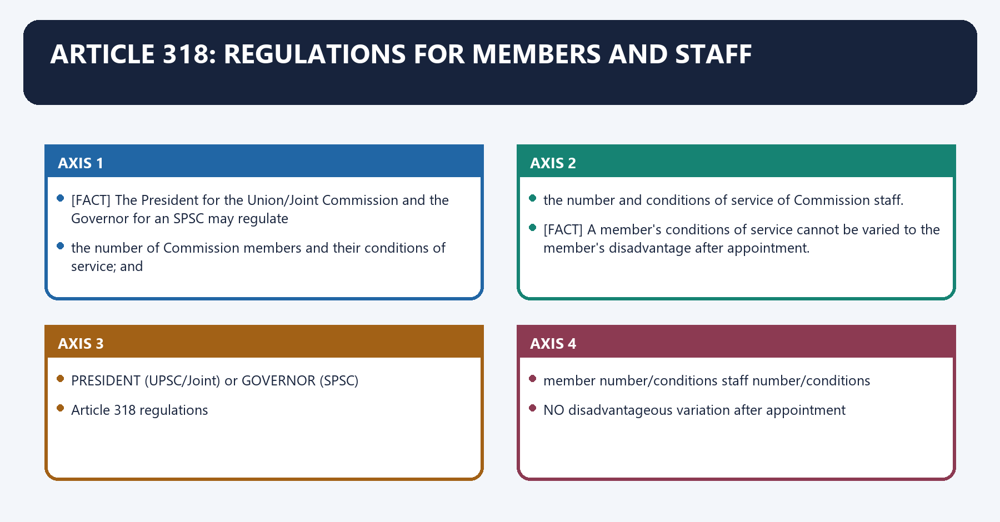
[FACT] The President for the Union/Joint Commission and the Governor for an SPSC may regulate:

1. the number of Commission members and their conditions of service; and
2. the number and conditions of service of Commission staff.

[FACT] A member's conditions of service cannot be varied to the member's disadvantage after appointment.

#### Visual 18 - Regulation power and safeguard

```text
PRESIDENT (UPSC/Joint) or GOVERNOR (SPSC)
              |
      Article 318 regulations
       /                    \
member number/conditions   staff number/conditions
       |
NO disadvantageous variation after appointment
```

[LIMIT] The non-disadvantage proviso protects members; staff conditions remain governed by the applicable legal framework.

#### CLOSING RECALL FLOW — ARTICLE 318: REGULATIONS FOR MEMBERS AND STAFF

```closure-flow
SUBTOPIC: Article 318: regulations for members and staff
KEY TERMS / DEFINITIONS: Article 318 · regulations for members · staff · Article 318: regulations for members and staff · Article · The President
MECHANISM / ARGUMENT: The decisive contrast is between Article 318 regulations and member number/conditions staff number/conditions.
CONSEQUENCE / CONTRAST: Its principal consequence is that pRESIDENT (UPSC/Joint) or GOVERNOR (SPSC).
UPSC TRAP / ANSWER-USE: Do not miss this limiting distinction: the exam-safe limitation is that nO disadvantageous variation after appointment.
ANSWER-GRABBING FORMULATION: The non-disadvantage proviso protects members; staff conditions remain governed by the applicable legal framework.
```
### SESSION 18 — ARTICLE 319: EXACT POST-TENURE RESTRICTIONS
#### DEFINITION / WHAT THIS IS CALLED

**Plain-language definition:** Article 319: exact post-tenure restrictions denotes the constitutional rules and institutional links organised around Former office May become Bar.

**Technical definition:** The decisive contrast is between Article 319 differentiates each office; there is no single sentence accurately describing all four and Eligibility does not create a right to elevation.

#### ANSWER-GRABBING OPENING — WRITE/ADAPT IN THE EXAM

> Article 319 restrictions depend on each office's legal character, while unverified textbook references cannot support blanket post-tenure claims.

#### MUST-WRITE KEYWORDS

- **Article 319**
- **exact post-tenure restrictions**
- **UPSC Chair**
- **no further government employment**
- **Union or State government employment**
- **SPSC Chair**

**How to use them:** Frame the answer through Article 319; define exact post-tenure restrictions, connect UPSC Chair with no further government employment to explain the mechanism, and use Union or State government employment for the decisive comparison or qualification.

Article 319: exact post-tenure restrictions denotes the constitutional rules and institutional links organised around Former office May become Bar.
Article 319: exact post-tenure restrictions operates through UPSC Chair no further government employment Union or State government employment, connected with SPSC Chair UPSC Chair or UPSC member; Chair of another SPSC every other Union/State government employment.
The operative mechanism matters because uPSC member UPSC Chair or Chair of an SPSC every other Union/State government employment.
Its principal consequence is that sPSC member UPSC Chair/member; Chair of same or another SPSC every other Union/State government employment.
The decisive contrast is between [FACT] Article 319 differentiates each office; there is no single sentence accurately describing all four and [LIMIT] Eligibility does not create a right to elevation.
The exam-safe limitation is that former office May become Bar.
#### Visual 19 - Four-office eligibility matrix

| Former office | May become | Bar |
|---|---|---|
| UPSC Chair | no further government employment | Union or State government employment |
| SPSC Chair | UPSC Chair or UPSC member; Chair of another SPSC | every other Union/State government employment |
| UPSC member | UPSC Chair or Chair of an SPSC | every other Union/State government employment |
| SPSC member | UPSC Chair/member; Chair of same or another SPSC | every other Union/State government employment |

[FACT] Article 319 differentiates each office; there is no single sentence accurately describing all four.

[LIMIT] Eligibility does not create a right to elevation.

[LIMIT] The text bars “employment” under government. A constitutional office must be analysed by its legal character; do not convert an unverified textbook case reference into a blanket proposition.

#### CLOSING RECALL FLOW — ARTICLE 319: EXACT POST-TENURE RESTRICTIONS

```closure-flow
SUBTOPIC: Article 319: exact post-tenure restrictions
KEY TERMS / DEFINITIONS: Article 319 · exact post-tenure restrictions · UPSC Chair · no further government employment · Union or State government employment · SPSC Chair
MECHANISM / ARGUMENT: A constitutional office must be analysed by its legal character; do not convert an unverified textbook case reference into a blanket proposition.
CONSEQUENCE / CONTRAST: The decisive contrast is between Article 319 differentiates each office; there is no single sentence accurately describing all four and Eligibility does not create a right to elevation.
UPSC TRAP / ANSWER-USE: Do not miss this limiting distinction: its principal consequence is that sPSC member UPSC Chair/member.
ANSWER-GRABBING FORMULATION: Article 319 restrictions depend on each office's legal character, while unverified textbook references cannot support blanket post-tenure claims.
```
### SESSION 19 — ARTICLE 316(3) AND ARTICLE 319 READ TOGETHER
#### DEFINITION / WHAT THIS IS CALLED

**Plain-language definition:** Article 316(3) and Article 319 read together denotes the constitutional rules and institutional links organised around Art 316(3): no reappointment to THAT office.

**Technical definition:** Article 316(3) and Article 319 read together operates through Art 319 asks whether a DIFFERENT PSC office is permitted, connected with eligible progression only within the exact four-clause matrix.

#### ANSWER-GRABBING OPENING — WRITE/ADAPT IN THE EXAM

> The design reduces incentives to please the appointing executive for an ordinary government job while retaining limited institutional progression.

#### MUST-WRITE KEYWORDS

- **Article 316(3)**
- **Article 319 read together**
- **Article 316**
- **Article 319**
- **Article 316(3) and Article 319 read together**
- **Article**

**How to use them:** Frame the answer through Article 316(3); define Article 319 read together, connect Article 316 with Article 319 to explain the mechanism, and use Article 316(3) and Article 319 read together for the decisive comparison or qualification.

Article 316(3) and Article 319 read together denotes the constitutional rules and institutional links organised around Art 316(3): no reappointment to THAT office.
Article 316(3) and Article 319 read together operates through Art 319 asks whether a DIFFERENT PSC office is permitted, connected with eligible progression only within the exact four-clause matrix.
The operative mechanism matters because [LIMIT] Post-office bars do not cure appointment-stage influence; independence is a lifecycle problem.
Its principal consequence is that art 316(3): no reappointment to THAT office.
The decisive contrast is between Art 316(3): no reappointment to THAT office and Art 316(3): no reappointment to THAT office.
The exam-safe limitation is that art 316(3): no reappointment to THAT office.
#### Visual 20 - Same office versus permitted progression

```text
TERM EXPIRES
    |
Art 316(3): no reappointment to THAT office
    |
Art 319 asks whether a DIFFERENT PSC office is permitted
    |
eligible progression only within the exact four-clause matrix
```

[ANALYSIS] The design reduces incentives to please the appointing executive for an ordinary government job while retaining limited institutional progression.

[LIMIT] Post-office bars do not cure appointment-stage influence; independence is a lifecycle problem.

#### CLOSING RECALL FLOW — ARTICLE 316(3) AND ARTICLE 319 READ TOGETHER

```closure-flow
SUBTOPIC: Article 316(3) and Article 319 read together
KEY TERMS / DEFINITIONS: Article 316(3) · Article 319 read together · Article 316 · Article 319 · Article 316(3) and Article 319 read together · Article
MECHANISM / ARGUMENT: Article 316(3) and Article 319 read together operates through Art 319 asks whether a DIFFERENT PSC office is permitted, connected with eligible progression only within the exact four-clause matrix.
CONSEQUENCE / CONTRAST: The operative mechanism matters because Post-office bars do not cure appointment-stage influence; independence is a lifecycle problem.
UPSC TRAP / ANSWER-USE: Do not miss this limiting distinction: its principal consequence is that art 316(3).
ANSWER-GRABBING FORMULATION: The design reduces incentives to please the appointing executive for an ordinary government job while retaining limited institutional progression.
```
### SESSION 20 — INDEPENDENCE SAFEGUARDS
#### DEFINITION / WHAT THIS IS CALLED

**Plain-language definition:** Independence safeguards denotes the constitutional rules and institutional links organised around Safeguard Article Institutional effect.

**Technical definition:** Removal security without staff, finance, transparent appointments and operational integrity can still produce weak independence.

#### ANSWER-GRABBING OPENING — WRITE/ADAPT IN THE EXAM

> Removal security without staff, finance, transparent appointments and operational integrity can still produce weak independence.

#### MUST-WRITE KEYWORDS

- **Independence safeguards**
- **constitutional creation**
- **ordinary executive cannot abolish core office**
- **fixed tenure/age**
- **predictable endpoint**
- **removal only constitutionally**

**How to use them:** Frame the answer through Independence safeguards; define constitutional creation, connect ordinary executive cannot abolish core office with fixed tenure/age to explain the mechanism, and use predictable endpoint for the decisive comparison or qualification.

Independence safeguards denotes the constitutional rules and institutional links organised around Safeguard Article Institutional effect.
Independence safeguards operates through constitutional creation 315 ordinary executive cannot abolish core office, connected with fixed tenure/age 316 predictable endpoint.
The operative mechanism matters because removal only constitutionally 317 protection from retaliation.
Its principal consequence is that adverse service change barred 318 financial/service security.
The decisive contrast is between post-office restrictions 319 reduces favour-seeking and charged expenditure 322 non-votable financial protection.
The exam-safe limitation is that public reporting 323 makes rejected advice visible.
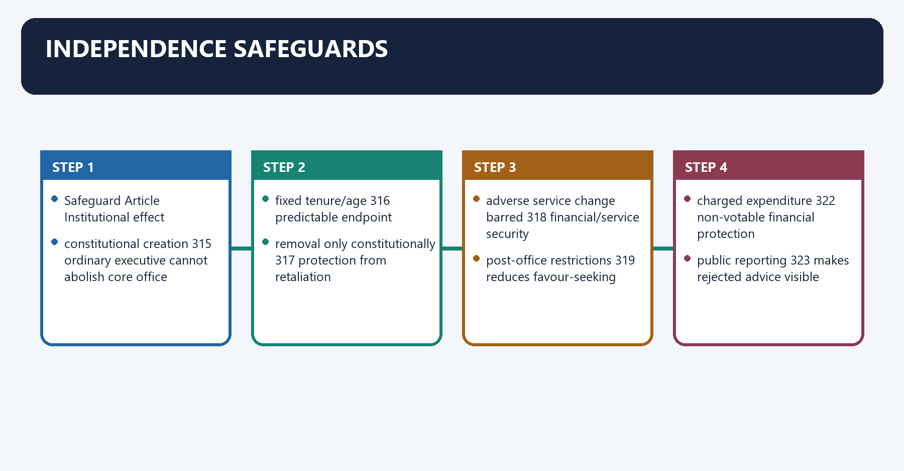
#### Visual 21 - Safeguard shield

| Safeguard | Article | Institutional effect |
|---|---:|---|
| constitutional creation | 315 | ordinary executive cannot abolish core office |
| fixed tenure/age | 316 | predictable endpoint |
| removal only constitutionally | 317 | protection from retaliation |
| adverse service change barred | 318 | financial/service security |
| post-office restrictions | 319 | reduces favour-seeking |
| charged expenditure | 322 | non-votable financial protection |
| public reporting | 323 | makes rejected advice visible |

[ANALYSIS] These safeguards are mutually reinforcing. Removal security without staff, finance, transparent appointments and operational integrity can still produce weak independence.

#### CLOSING RECALL FLOW — INDEPENDENCE SAFEGUARDS

```closure-flow
SUBTOPIC: Independence safeguards
KEY TERMS / DEFINITIONS: Independence safeguards · constitutional creation · ordinary executive cannot abolish core office · fixed tenure/age · predictable endpoint · removal only constitutionally
MECHANISM / ARGUMENT: Removal security without staff, finance, transparent appointments and operational integrity can still produce weak independence.
CONSEQUENCE / CONTRAST: Its principal consequence is that adverse service change barred 318 financial/service security.
UPSC TRAP / ANSWER-USE: Do not miss this limiting distinction: the decisive contrast is between post-office restrictions 319 reduces favour-seeking and charged expenditure 322...
ANSWER-GRABBING FORMULATION: Removal security without staff, finance, transparent appointments and operational integrity can still produce weak independence.
```
### SESSION 21 — INDEPENDENCE LIMITS
#### DEFINITION / WHAT THIS IS CALLED

**Plain-language definition:** Independence limits denotes the constitutional rules and institutional links organised around Protection Continuing vulnerability.

**Technical definition:** The operative mechanism matters because service-condition protection secretariat and technology dependence can persist.

#### ANSWER-GRABBING OPENING — WRITE/ADAPT IN THE EXAM

> Public Service Commission independence combines constitutional insulation with operational dependence on appointment quality, staffing, reason-giving and governmental compliance.

#### MUST-WRITE KEYWORDS

- **Independence limits**
- **hard removal**
- **executive appoints members**
- **charged expenditure**
- **budget size and staff capacity still matter**
- **service-condition protection**

**How to use them:** Frame the answer through Independence limits; define hard removal, connect executive appoints members with charged expenditure to explain the mechanism, and use budget size and staff capacity still matter for the decisive comparison or qualification.

Independence limits denotes the constitutional rules and institutional links organised around Protection Continuing vulnerability.
Independence limits operates through hard removal executive appoints members, connected with charged expenditure budget size and staff capacity still matter.
The operative mechanism matters because service-condition protection secretariat and technology dependence can persist.
Its principal consequence is that post-office bar permitted PSC progression may still create incentives.
The decisive contrast is between constitutional consultation advice is generally non-binding and annual reporting delay or thin reasons can weaken accountability.
The exam-safe limitation is that expert selection vacancies, delay or integrity failures can erode trust.
#### Visual 22 - Safeguard-limit matrix

| Protection | Continuing vulnerability |
|---|---|
| hard removal | executive appoints members |
| charged expenditure | budget size and staff capacity still matter |
| service-condition protection | secretariat and technology dependence can persist |
| post-office bar | permitted PSC progression may still create incentives |
| constitutional consultation | advice is generally non-binding |
| annual reporting | delay or thin reasons can weaken accountability |
| expert selection | vacancies, delay or integrity failures can erode trust |

[ANALYSIS] The strongest GS-II conclusion is neither “completely independent” nor “mere department”. It is constitutionally insulated but operationally dependent on appointment quality, capacity, reason-giving and compliance conventions.

#### CLOSING RECALL FLOW — INDEPENDENCE LIMITS

```closure-flow
SUBTOPIC: Independence limits
KEY TERMS / DEFINITIONS: Independence limits · hard removal · executive appoints members · charged expenditure · budget size and staff capacity still matter · service-condition protection
MECHANISM / ARGUMENT: The operative mechanism matters because service-condition protection secretariat and technology dependence can persist.
CONSEQUENCE / CONTRAST: Its principal consequence is that post-office bar permitted PSC progression may still create incentives.
UPSC TRAP / ANSWER-USE: Do not miss this limiting distinction: the decisive contrast is between constitutional consultation advice is generally non-binding and annual reporting...
ANSWER-GRABBING FORMULATION: Public Service Commission independence combines constitutional insulation with operational dependence on appointment quality, staffing, reason-giving and governmental compliance.
```
### SESSION 22 — ARTICLE 320(1): EXAMINATION DUTY
#### DEFINITION / WHAT THIS IS CALLED

**Plain-language definition:** Article 320(1): examination duty denotes the constitutional rules and institutional links organised around POST + RECRUITMENT RULE.

**Technical definition:** Technically, Article 320(1): examination duty is analysed by relating Article 320(1) to examination duty, then testing the relationship through Article 320 and Article.

#### ANSWER-GRABBING OPENING — WRITE/ADAPT IN THE EXAM

> Article 320(1) gives Public Service Commissions an examination duty, while recruitment rules may lawfully use several other selection modes.

#### MUST-WRITE KEYWORDS

- **Article 320(1)**
- **examination duty**
- **Article 320**
- **Article 320(1): examination duty**
- **Article**
- **POST**

**How to use them:** Frame the answer through Article 320(1); define examination duty, connect Article 320 with Article 320(1): examination duty to explain the mechanism, and use Article for the decisive comparison or qualification.

Article 320(1): examination duty denotes the constitutional rules and institutional links organised around POST + RECRUITMENT RULE.
Article 320(1): examination duty operates through +---------+----------+-----------+, connected with exam selection promotion transfer/deputation/contract.
The operative mechanism matters because pSC role depends on Constitution + rules + consultation regulations.
Its principal consequence is that pOST + RECRUITMENT RULE.
The decisive contrast is between POST + RECRUITMENT RULE and POST + RECRUITMENT RULE.
The exam-safe limitation is that pOST + RECRUITMENT RULE.
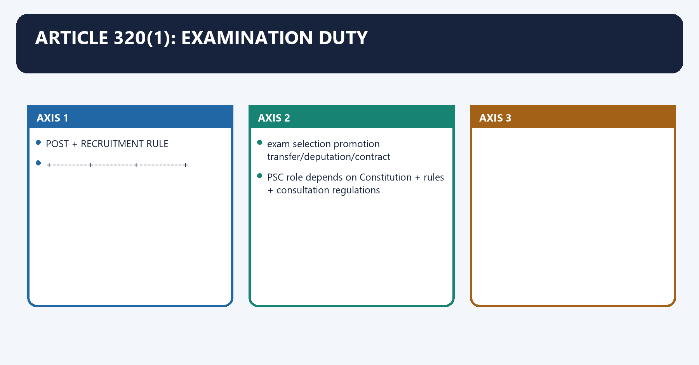
[FACT] It is the duty of the Union and State Commissions to conduct examinations for appointments to Union and State services respectively.

[LIMIT] Not every government appointment must be made through one common competitive examination. Recruitment rules may prescribe examination, direct recruitment by selection, promotion, transfer, deputation, contract or another lawful mode.

#### Visual 23 - Examination is a function, not a monopoly over every post

```text
POST + RECRUITMENT RULE
          |
  +-------+---------+----------+-----------+
  |                 |          |           |
exam             selection   promotion   transfer/deputation/contract
  |                 |          |           |
PSC role depends on Constitution + rules + consultation regulations
```

#### CLOSING RECALL FLOW — ARTICLE 320(1): EXAMINATION DUTY

```closure-flow
SUBTOPIC: Article 320(1): examination duty
KEY TERMS / DEFINITIONS: Article 320(1) · examination duty · Article 320 · Article 320(1): examination duty · Article · POST
MECHANISM / ARGUMENT: Not every government appointment must be made through one common competitive examination.
CONSEQUENCE / CONTRAST: The decisive contrast is between POST + RECRUITMENT RULE and POST + RECRUITMENT RULE.
UPSC TRAP / ANSWER-USE: Do not miss this limiting distinction: its principal consequence is that pOST + RECRUITMENT RULE.
ANSWER-GRABBING FORMULATION: Article 320(1) gives Public Service Commissions an examination duty, while recruitment rules may lawfully use several other selection modes.
```
### SESSION 23 — ARTICLE 320(2): JOINT RECRUITMENT ASSISTANCE
#### DEFINITION / WHAT THIS IS CALLED

**Plain-language definition:** Article 320(2): joint recruitment assistance denotes the constitutional rules and institutional links organised around This clause does not create a Joint State PSC.

**Technical definition:** Its principal consequence is that institution created? yes, Joint Commission no new Commission.

#### ANSWER-GRABBING OPENING — WRITE/ADAPT IN THE EXAM

> Article 320(2) requires UPSC assistance with joint recruitment schemes requested by States, but creates no new Joint State Public Service Commission.

#### MUST-WRITE KEYWORDS

- **Article 320(2)**
- **joint recruitment assistance**
- **object**
- **common Commission**
- **common recruitment scheme**
- **trigger**

**How to use them:** Frame the answer through Article 320(2); define joint recruitment assistance, connect object with common Commission to explain the mechanism, and use common recruitment scheme for the decisive comparison or qualification.

Article 320(2): joint recruitment assistance denotes the constitutional rules and institutional links organised around [LIMIT] This clause does not create a Joint State PSC.
Article 320(2): joint recruitment assistance operates through Test Art 315(2) Art 320(2), connected with object common Commission common recruitment scheme.
The operative mechanism matters because trigger legislative resolutions + parliamentary law requests by two or more States.
Its principal consequence is that institution created? yes, Joint Commission no new Commission.
The decisive contrast is between special qualifications required? not textual condition expressly relevant and [LIMIT] This clause does not create a Joint State PSC.
The exam-safe limitation is that [LIMIT] This clause does not create a Joint State PSC.
[FACT] If requested by two or more States, the UPSC must assist them in framing and operating joint recruitment schemes for services requiring candidates with special qualifications.

[LIMIT] This clause does not create a Joint State PSC.

#### Visual 24 - Article 315(2) versus Article 320(2)

| Test | Art 315(2) | Art 320(2) |
|---|---|---|
| object | common Commission | common recruitment scheme |
| trigger | legislative resolutions + parliamentary law | requests by two or more States |
| institution created? | yes, Joint Commission | no new Commission |
| special qualifications required? | not textual condition | expressly relevant |

#### CLOSING RECALL FLOW — ARTICLE 320(2): JOINT RECRUITMENT ASSISTANCE

```closure-flow
SUBTOPIC: Article 320(2): joint recruitment assistance
KEY TERMS / DEFINITIONS: Article 320(2) · joint recruitment assistance · object · common Commission · common recruitment scheme · trigger
MECHANISM / ARGUMENT: If requested by two or more States, the UPSC must assist them in framing and operating joint recruitment schemes for services requiring candidates with special qualifications.
CONSEQUENCE / CONTRAST: Its principal consequence is that institution created? yes, Joint Commission no new Commission.
UPSC TRAP / ANSWER-USE: The decisive contrast is between special qualifications required? not textual condition expressly relevant and This clause does not create a Joint State PSC.
ANSWER-GRABBING FORMULATION: Article 320(2) requires UPSC assistance with joint recruitment schemes requested by States, but creates no new Joint State Public Service Commission.
```
### SESSION 24 — ARTICLE 320(3): CONSULTATION CATALOGUE
#### DEFINITION / WHAT THIS IS CALLED

**Plain-language definition:** Article 320(3): consultation catalogue denotes the constitutional rules and institutional links organised around methods of recruitment.

**Technical definition:** Technically, Article 320(3): consultation catalogue is analysed by relating Article 320(3) to consultation catalogue, then testing the relationship through Article 320 and Article.

#### ANSWER-GRABBING OPENING — WRITE/ADAPT IN THE EXAM

> The Commission must advise on referred matters and the listed classes, subject to the constitutional exceptions and valid regulations.

#### MUST-WRITE KEYWORDS

- **Article 320(3)**
- **consultation catalogue**
- **Article 320**
- **Article 320(3): consultation catalogue**
- **Article**
- **Its principal consequence**

**How to use them:** Frame the answer through Article 320(3); define consultation catalogue, connect Article 320 with Article 320(3): consultation catalogue to explain the mechanism, and use Article for the decisive comparison or qualification.

Article 320(3): consultation catalogue denotes the constitutional rules and institutional links organised around methods of recruitment.
Article 320(3): consultation catalogue operates through appointments / promotions / transfers -- suitability, connected with disciplinary matters.
The operative mechanism matters because legal-defence cost claims from official-duty proceedings.
Its principal consequence is that injury-pension claims and amount questions.
The decisive contrast is between any other matter referred by President/Governor and methods of recruitment.
The exam-safe limitation is that methods of recruitment.
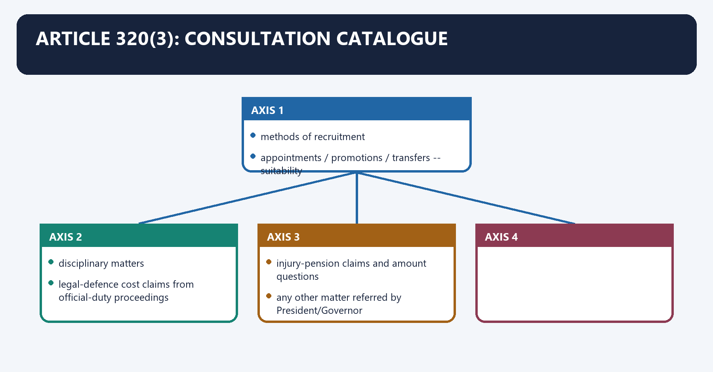
#### Visual 25 - Consultation wheel

```text
                    methods of recruitment
                            |
appointments / promotions / transfers -- suitability
                            |
                    disciplinary matters
                            |
      legal-defence cost claims from official-duty proceedings
                            |
           injury-pension claims and amount questions
                            |
      any other matter referred by President/Governor
```

[FACT] The Commission must advise on referred matters and the listed classes, subject to the constitutional exceptions and valid regulations.

#### CLOSING RECALL FLOW — ARTICLE 320(3): CONSULTATION CATALOGUE

```closure-flow
SUBTOPIC: Article 320(3): consultation catalogue
KEY TERMS / DEFINITIONS: Article 320(3) · consultation catalogue · Article 320 · Article 320(3): consultation catalogue · Article · Its principal consequence
MECHANISM / ARGUMENT: The decisive contrast is between any other matter referred by President/Governor and methods of recruitment.
CONSEQUENCE / CONTRAST: Its principal consequence is that injury-pension claims and amount questions.
UPSC TRAP / ANSWER-USE: Do not miss this limiting distinction: the Commission must advise on referred matters and the listed classes, subject to the...
ANSWER-GRABBING FORMULATION: The Commission must advise on referred matters and the listed classes, subject to the constitutional exceptions and valid regulations.
```
### SESSION 25 — RECRUITMENT METHODS, PRINCIPLES AND SUITABILITY
#### DEFINITION / WHAT THIS IS CALLED

**Plain-language definition:** Recruitment methods, principles and suitability comprises Recruitment methods, principles and suitability as its core connected dimensions.

**Technical definition:** Technically, Recruitment methods, principles and suitability is analysed by relating Recruitment methods to principles, then testing the relationship through suitability and method.

#### ANSWER-GRABBING OPENING — WRITE/ADAPT IN THE EXAM

> Public Service Commission involvement can shape recruitment methods, service principles and candidate suitability, but these stages must remain analytically distinct when locating arbitrariness.

#### MUST-WRITE KEYWORDS

- **Recruitment methods**
- **principles**
- **suitability**
- **method**
- **exam, interview, promotion quota, deputation**
- **advise on method**

**How to use them:** Frame the answer through Recruitment methods; define principles, connect suitability with method to explain the mechanism, and use exam, interview, promotion quota, deputation for the decisive comparison or qualification.

Recruitment methods, principles and suitability denotes the constitutional rules and institutional links organised around Question Example Commission role.
Recruitment methods, principles and suitability operates through method exam, interview, promotion quota, deputation advise on method, connected with principle seniority-cum-merit, qualifying standard, selection criteria advise on governing principle.
The operative mechanism matters because suitability whether named candidates satisfy lawful criteria assess within process.
Its principal consequence is that question Example Commission role.
The decisive contrast is between Question Example Commission role and Question Example Commission role.
The exam-safe limitation is that question Example Commission role.
#### Visual 26 - Three different consultation questions

| Question | Example | Commission role |
|---|---|---|
| method | exam, interview, promotion quota, deputation | advise on method |
| principle | seniority-cum-merit, qualifying standard, selection criteria | advise on governing principle |
| suitability | whether named candidates satisfy lawful criteria | assess within process |

[ANALYSIS] A strong answer distinguishes designing the route, setting the rule and evaluating a candidate. Conflating them hides where arbitrariness occurred.

#### CLOSING RECALL FLOW — RECRUITMENT METHODS, PRINCIPLES AND SUITABILITY

```closure-flow
SUBTOPIC: Recruitment methods, principles and suitability
KEY TERMS / DEFINITIONS: Recruitment methods · principles · suitability · method · exam, interview, promotion quota, deputation · advise on method
MECHANISM / ARGUMENT: The decisive contrast is between Question Example Commission role and Question Example Commission role.
CONSEQUENCE / CONTRAST: Its principal consequence is that question Example Commission role.
UPSC TRAP / ANSWER-USE: Do not miss this limiting distinction: a strong answer distinguishes designing the route, setting the rule and evaluating a candidate.
ANSWER-GRABBING FORMULATION: Public Service Commission involvement can shape recruitment methods, service principles and candidate suitability, but these stages must remain analytically distinct when locating arbitrariness.
```
### SESSION 26 — DISCIPLINARY AND CLAIMS CONSULTATION
#### DEFINITION / WHAT THIS IS CALLED

**Plain-language definition:** Disciplinary and claims consultation denotes the constitutional rules and institutional links organised around Article 320(3)(c) includes disciplinary matters affecting persons serving in a civil capacity, including memorials or petitions.

**Technical definition:** The exam-safe limitation is that Article 320(3)(c) includes disciplinary matters affecting persons serving in a civil capacity, including memorials or petitions.

#### ANSWER-GRABBING OPENING — WRITE/ADAPT IN THE EXAM

> Article 320 consultation extends beyond examinations to disciplinary matters and specified legal-cost and injury-pension claims, revealing the Commission's wider service-law role.

#### MUST-WRITE KEYWORDS

- **Disciplinary**
- **claims consultation**
- **reimbursement of legal defence costs for official-duty proceedings**
- **CFI/State fund**
- **320(3)(d)**
- **320(3)(e)**

**How to use them:** Frame the answer through Disciplinary; define claims consultation, connect reimbursement of legal defence costs for official-duty proceedings with CFI/State fund to explain the mechanism, and use 320(3)(d) for the decisive comparison or qualification.

Disciplinary and claims consultation denotes the constitutional rules and institutional links organised around [FACT] Article 320(3)(c) includes disciplinary matters affecting persons serving in a civil capacity, including memorials or petitions.
Disciplinary and claims consultation operates through [FACT] Clauses (d) and (e) cover specified official-duty legal-cost claims and injury-pension claims, connected with Clause Claim Fund/decision concern.
The operative mechanism matters because 320(3)(d) reimbursement of legal defence costs for official-duty proceedings CFI/State fund.
Its principal consequence is that 320(3)(e) pension for injury sustained in civil service and amount compensatory service claim.
The decisive contrast is between Prelims trap: Article 320 is wider than examinations and ordinary recruitment and [FACT] Article 320(3)(c) includes disciplinary matters affecting persons serving in a civil capacity, including memorials or petitions.
The exam-safe limitation is that [FACT] Article 320(3)(c) includes disciplinary matters affecting persons serving in a civil capacity, including memorials or petitions.
[FACT] Article 320(3)(c) includes disciplinary matters affecting persons serving in a civil capacity, including memorials or petitions.

[FACT] Clauses (d) and (e) cover specified official-duty legal-cost claims and injury-pension claims.

#### Visual 27 - Less-tested Article 320 claims

| Clause | Claim | Fund/decision concern |
|---|---|---|
| 320(3)(d) | reimbursement of legal defence costs for official-duty proceedings | CFI/State fund |
| 320(3)(e) | pension for injury sustained in civil service and amount | compensatory service claim |

> **Prelims trap:** Article 320 is wider than examinations and ordinary recruitment.

#### CLOSING RECALL FLOW — DISCIPLINARY AND CLAIMS CONSULTATION

```closure-flow
SUBTOPIC: Disciplinary and claims consultation
KEY TERMS / DEFINITIONS: Disciplinary · claims consultation · reimbursement of legal defence costs for official-duty proceedings · CFI/State fund · 320(3)(d) · 320(3)(e)
MECHANISM / ARGUMENT: Its principal consequence is that 320(3)(e) pension for injury sustained in civil service and amount compensatory service claim.
CONSEQUENCE / CONTRAST: The decisive contrast is between Prelims trap: Article 320 is wider than examinations and ordinary recruitment and Article 320(3)(c) includes disciplinary matters affecting persons serving in a civil capacity, including memorials or petitions.
UPSC TRAP / ANSWER-USE: Do not miss this limiting distinction: the exam-safe limitation is that Article 320(3)(c) includes disciplinary matters affecting persons serving in...
ANSWER-GRABBING FORMULATION: Article 320 consultation extends beyond examinations to disciplinary matters and specified legal-cost and injury-pension claims, revealing the Commission's wider service-law role.
```
### SESSION 27 — CONSULTATION EXCEPTIONS AND ARTICLE 320(4)
#### DEFINITION / WHAT THIS IS CALLED

**Plain-language definition:** Consultation exceptions and Article 320(4) denotes the constitutional rules and institutional links organised around Article 320(4) separately says clause (3) does not require consultation about.

**Technical definition:** The proviso to Article 320(3) allows the President or Governor to make regulations specifying matters/classes/circumstances where consultation is unnecessary.

#### ANSWER-GRABBING OPENING — WRITE/ADAPT IN THE EXAM

> The proviso to Article 320(3) allows the President or Governor to make regulations specifying matters/classes/circumstances where consultation is unnecessary.

#### MUST-WRITE KEYWORDS

- **Consultation exceptions**
- **Article 320(4)**
- **Article 320**
- **Article 16**
- **Article 335**
- **Consultation exceptions and Article 320(4)**

**How to use them:** Frame the answer through Consultation exceptions; define Article 320(4), connect Article 320 with Article 16 to explain the mechanism, and use Article 335 for the decisive comparison or qualification.

Consultation exceptions and Article 320(4) denotes the constitutional rules and institutional links organised around [FACT] Article 320(4) separately says clause (3) does not require consultation about.
Consultation exceptions and Article 320(4) operates through the manner in which a provision under Article 16(4) may be made; or, connected with the manner in which effect may be given to Article 335.
The operative mechanism matters because aRTICLE 16(4) RESERVATION DESIGN.
Its principal consequence is that aRTICLE 335 EFFECT FOR SC/ST CLAIMS.
The decisive contrast is between Art 320(4): no required PSC consultation on the MANNER and reservation is outside the Constitution.
The exam-safe limitation is that pSC may disregard an operative roster/rule.
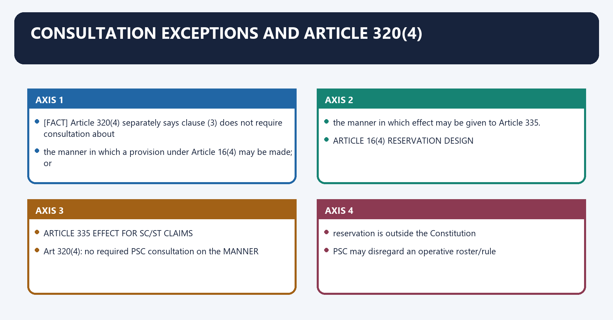
[FACT] The proviso to Article 320(3) allows the President or Governor to make regulations specifying matters/classes/circumstances where consultation is unnecessary.

[FACT] Article 320(4) separately says clause (3) does not require consultation about:

1. the manner in which a provision under Article 16(4) may be made; or
2. the manner in which effect may be given to Article 335.

#### Visual 28 - Reservation nuance

```text
ARTICLE 16(4) RESERVATION DESIGN
          +
ARTICLE 335 EFFECT FOR SC/ST CLAIMS
          |
Art 320(4): no required PSC consultation on the MANNER
          |
NOT:
reservation is outside the Constitution
NOT:
PSC may disregard an operative roster/rule
NOT:
all SC/ST service questions are excluded from every process
```

[LIMIT] The familiar statement “UPSC is not consulted on reservations” must be written with this exact textual scope.

#### CLOSING RECALL FLOW — CONSULTATION EXCEPTIONS AND ARTICLE 320(4)

```closure-flow
SUBTOPIC: Consultation exceptions and Article 320(4)
KEY TERMS / DEFINITIONS: Consultation exceptions · Article 320(4) · Article 320 · Article 16 · Article 335 · Consultation exceptions and Article 320(4)
MECHANISM / ARGUMENT: Article 320(4) separately says clause (3) does not require consultation about.
CONSEQUENCE / CONTRAST: Its principal consequence is that aRTICLE 335 EFFECT FOR SC/ST CLAIMS.
UPSC TRAP / ANSWER-USE: Do not miss this limiting distinction: the decisive contrast is between Art 320(4).
ANSWER-GRABBING FORMULATION: The proviso to Article 320(3) allows the President or Governor to make regulations specifying matters/classes/circumstances where consultation is unnecessary.
```
### SESSION 28 — REGULATIONS MUST FACE THE LEGISLATURE
#### DEFINITION / WHAT THIS IS CALLED

**Plain-language definition:** Regulations must face the legislature denotes the constitutional rules and institutional links organised around President/Governor makes exemption regulation.

**Technical definition:** Regulations must face the legislature operates through laid for not less than 14 days, connected with Parliament / State Legislature scrutinises.

#### ANSWER-GRABBING OPENING — WRITE/ADAPT IN THE EXAM

> Article 320(5) exposes consultation-exemption regulations to legislative scrutiny, preventing executive exclusions from remaining wholly internal administrative choices.

#### MUST-WRITE KEYWORDS

- **Regulations must face the legislature**
- **Article 320**
- **Regulations**
- **President**
- **Governor**
- **Parliament**

**How to use them:** Frame the answer through Regulations must face the legislature; define Article 320, connect Regulations with President to explain the mechanism, and use Governor for the decisive comparison or qualification.

Regulations must face the legislature denotes the constitutional rules and institutional links organised around President/Governor makes exemption regulation.
Regulations must face the legislature operates through laid for not less than 14 days, connected with Parliament / State Legislature scrutinises.
The operative mechanism matters because may modify, repeal or amend.
Its principal consequence is that [ANALYSIS] Exemption power is constitutionally permitted but not designed as invisible executive waiver.
The decisive contrast is between President/Governor makes exemption regulation and President/Governor makes exemption regulation.
The exam-safe limitation is that president/Governor makes exemption regulation.
[FACT] Article 320(5) requires consultation-exemption regulations to be laid for at least fourteen days before Parliament or the State legislature, as applicable, and subjects them to legislative modification, repeal or amendment during the relevant session.

#### Visual 29 - Delegated-accountability chain

```text
President/Governor makes exemption regulation
                |
laid for not less than 14 days
                |
Parliament / State Legislature scrutinises
                |
may modify, repeal or amend
```

[ANALYSIS] Exemption power is constitutionally permitted but not designed as invisible executive waiver.

#### CLOSING RECALL FLOW — REGULATIONS MUST FACE THE LEGISLATURE

```closure-flow
SUBTOPIC: Regulations must face the legislature
KEY TERMS / DEFINITIONS: Regulations must face the legislature · Article 320 · Regulations · President · Governor · Parliament
MECHANISM / ARGUMENT: Regulations must face the legislature operates through laid for not less than 14 days, connected with Parliament / State Legislature scrutinises.
CONSEQUENCE / CONTRAST: The decisive contrast is between President/Governor makes exemption regulation and President/Governor makes exemption regulation.
UPSC TRAP / ANSWER-USE: Do not miss this limiting distinction: article 320(5) requires consultation-exemption regulations to be laid for at least fourteen days before...
ANSWER-GRABBING FORMULATION: Article 320(5) exposes consultation-exemption regulations to legislative scrutiny, preventing executive exclusions from remaining wholly internal administrative choices.
```
### SESSION 29 — ADVICE IS GENERALLY ADVISORY, NOT BINDING
#### DEFINITION / WHAT THIS IS CALLED

**Plain-language definition:** Advice is generally advisory, not binding operates through act constitutional reporting/reason mechanism where applicable, connected with The Commission influences through expertise, convention, transparency and political cost rather than a legal veto.

**Technical definition:** Advice is generally advisory, not binding denotes the constitutional rules and institutional links organised around government considers.

#### ANSWER-GRABBING OPENING — WRITE/ADAPT IN THE EXAM

> In Manbodhan Lal Srivastava (1957), the Supreme Court held Article 320(3) consultation directory, so non-consultation alone does not invalidate disciplinary action.

#### MUST-WRITE KEYWORDS

- **Advice is generally advisory**
- **not binding**
- **Article 320**
- **Advice**
- **The Commission**
- **Its principal consequence**

**How to use them:** Frame the answer through Advice is generally advisory; define not binding, connect Article 320 with Advice to explain the mechanism, and use The Commission for the decisive comparison or qualification.

Advice is generally advisory, not binding denotes the constitutional rules and institutional links organised around government considers.
Advice is generally advisory, not binding operates through act constitutional reporting/reason mechanism where applicable, connected with [ANALYSIS] The Commission influences through expertise, convention, transparency and political cost rather than a legal veto.
The operative mechanism matters because government considers.
Its principal consequence is that government considers.
The decisive contrast is between government considers and government considers.
The exam-safe limitation is that government considers.
[FACT] In *State of U.P. v. Manbodhan Lal Srivastava* (1957), the Supreme Court held Article 320(3) consultation directory rather than mandatory; non-consultation does not by itself invalidate the disciplinary action.

[LIMIT] “Directory” does not mean the executive may casually ignore the Commission. The judgment treated consultation as an important constitutional safeguard even while refusing automatic invalidation.

#### Visual 30 - Advisory does not mean irrelevant

```text
COMMISSION ADVICE
      |
government considers
      |
 +----+----+
 |         |
accept   reject
 |         |
act      constitutional reporting/reason mechanism where applicable
```

[ANALYSIS] The Commission influences through expertise, convention, transparency and political cost rather than a legal veto.

#### CLOSING RECALL FLOW — ADVICE IS GENERALLY ADVISORY, NOT BINDING

```closure-flow
SUBTOPIC: Advice is generally advisory, not binding
KEY TERMS / DEFINITIONS: Advice is generally advisory · not binding · Article 320 · Advice · The Commission · Its principal consequence
MECHANISM / ARGUMENT: Advice is generally advisory, not binding denotes the constitutional rules and institutional links organised around government considers.
CONSEQUENCE / CONTRAST: Manbodhan Lal Srivastava (1957), the Supreme Court held Article 320(3) consultation directory rather than mandatory; non-consultation does not by itself invalidate the disciplinary action.
UPSC TRAP / ANSWER-USE: “Directory” does not mean the executive may casually ignore the Commission.
ANSWER-GRABBING FORMULATION: In Manbodhan Lal Srivastava (1957), the Supreme Court held Article 320(3) consultation directory, so non-consultation alone does not invalidate disciplinary action.
```
### SESSION 30 — ARTICLE 323 TURNS ADVICE INTO ACCOUNTABILITY
#### DEFINITION / WHAT THIS IS CALLED

**Plain-language definition:** Article 323 turns advice into accountability denotes the constitutional rules and institutional links organised around An SPSC reports to the Governor, who lays the report and corresponding memorandum before the State legislature.

**Technical definition:** The decisive contrast is between Article 323 converts rejected advice from a private executive departure into a matter capable of legislative scrutiny and An SPSC reports to the Governor, who lays the report and corresponding memorandum before the State legislature.

#### ANSWER-GRABBING OPENING — WRITE/ADAPT IN THE EXAM

> Article 323 converts rejected advice from a private executive departure into a matter capable of legislative scrutiny.

#### MUST-WRITE KEYWORDS

- **Article 323 turns advice into accountability**
- **Article 323**
- **Article**
- **An SPSC**
- **Governor**
- **Its principal consequence**

**How to use them:** Frame the answer through Article 323 turns advice into accountability; define Article 323, connect Article with An SPSC to explain the mechanism, and use Governor for the decisive comparison or qualification.

Article 323 turns advice into accountability denotes the constitutional rules and institutional links organised around [FACT] An SPSC reports to the Governor, who lays the report and corresponding memorandum before the State legislature.
Article 323 turns advice into accountability operates through UPSC - President - Parliament + non-acceptance memorandum, connected with SPSC - Governor - State Legislature + memorandum.
The operative mechanism matters because joint PSC - each Governor (State-specific work).
Its principal consequence is that each State Legislature + memorandum.
The decisive contrast is between [ANALYSIS] Article 323 converts rejected advice from a private executive departure into a matter capable of legislative scrutiny and [FACT] An SPSC reports to the Governor, who lays the report and corresponding memorandum before the State legislature.
The exam-safe limitation is that [FACT] An SPSC reports to the Governor, who lays the report and corresponding memorandum before the State legislature.
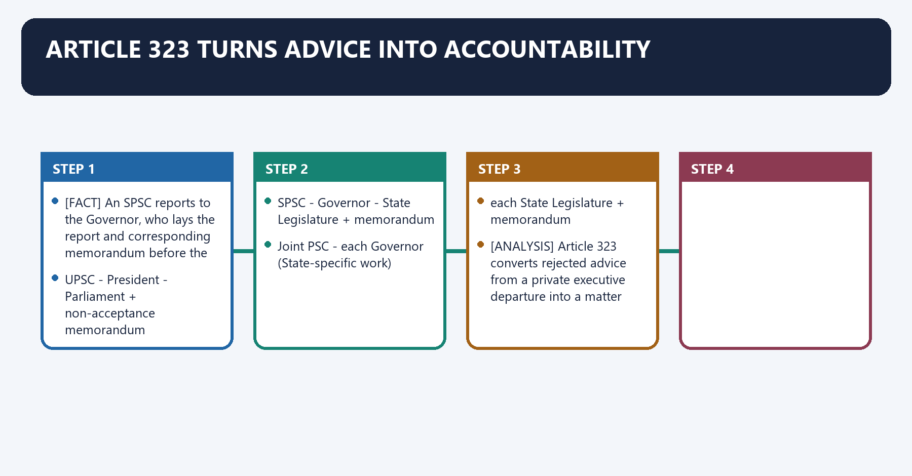
[FACT] The UPSC reports annually to the President. The President lays the report before each House of Parliament with a memorandum explaining cases where advice was not accepted and reasons for non-acceptance.

[FACT] An SPSC reports to the Governor, who lays the report and corresponding memorandum before the State legislature.

[FACT] A Joint Commission reports annually to the Governor of each served State about work in relation to that State; each Governor lays the relevant report and memorandum before that State legislature.

#### Visual 31 - Reporting routes

```text
UPSC -> President -> Parliament + non-acceptance memorandum

SPSC -> Governor -> State Legislature + memorandum

Joint PSC -> each Governor (State-specific work)
          -> each State Legislature + memorandum
```

[ANALYSIS] Article 323 converts rejected advice from a private executive departure into a matter capable of legislative scrutiny.

#### CLOSING RECALL FLOW — ARTICLE 323 TURNS ADVICE INTO ACCOUNTABILITY

```closure-flow
SUBTOPIC: Article 323 turns advice into accountability
KEY TERMS / DEFINITIONS: Article 323 turns advice into accountability · Article 323 · Article · An SPSC · Governor · Its principal consequence
MECHANISM / ARGUMENT: The decisive contrast is between Article 323 converts rejected advice from a private executive departure into a matter capable of legislative scrutiny and An SPSC reports to the Governor, who lays the report and corresponding memorandum before the State legislature.
CONSEQUENCE / CONTRAST: Article 323 converts rejected advice from a private executive departure into a matter capable of legislative scrutiny.
UPSC TRAP / ANSWER-USE: The President lays the report before each House of Parliament with a memorandum explaining cases where advice was not accepted and reasons for non-acceptance.
ANSWER-GRABBING FORMULATION: Article 323 converts rejected advice from a private executive departure into a matter capable of legislative scrutiny.
```
### SESSION 31 — ARTICLE 321: LEGISLATIVE EXTENSION
#### DEFINITION / WHAT THIS IS CALLED

**Plain-language definition:** Article 321: legislative extension comprises Article 321, legislative extension and Article 320 as its core connected dimensions.

**Technical definition:** Its principal consequence is that Article 321 is an enabling legislative route, not an automatic extension to every public-sector entity.

#### ANSWER-GRABBING OPENING — WRITE/ADAPT IN THE EXAM

> Article 321 lets legislation extend Commission functions to local or public institutions, but does not automatically place every public-sector entity within its jurisdiction.

#### MUST-WRITE KEYWORDS

- **Article 321**
- **legislative extension**
- **Article 320**
- **examinations and listed consultation**
- **extension**
- **Act under Article 321**

**How to use them:** Frame the answer through Article 321; define legislative extension, connect Article 320 with examinations and listed consultation to explain the mechanism, and use extension for the decisive comparison or qualification.

Article 321: legislative extension denotes the constitutional rules and institutional links organised around Layer Source Example scope.
Article 321: legislative extension operates through core Article 320 examinations and listed consultation, connected with extension Act under Article 321 local authority, statutory corporation or public institution services.
The operative mechanism matters because limit legislative competence + Constitution cannot erase constitutional rights or judicial review.
Its principal consequence is that [LIMIT] Article 321 is an enabling legislative route, not an automatic extension to every public-sector entity.
The decisive contrast is between Layer Source Example scope and Layer Source Example scope.
The exam-safe limitation is that layer Source Example scope.
[FACT] Parliament or a State legislature may extend Commission functions to services of the Union/State and to services of a local authority, statutory body corporate or public institution.

#### Visual 32 - Constitutional core and legislative extension

| Layer | Source | Example scope |
|---|---|---|
| core | Article 320 | examinations and listed consultation |
| extension | Act under Article 321 | local authority, statutory corporation or public institution services |
| limit | legislative competence + Constitution | cannot erase constitutional rights or judicial review |

[LIMIT] Article 321 is an enabling legislative route, not an automatic extension to every public-sector entity.

#### CLOSING RECALL FLOW — ARTICLE 321: LEGISLATIVE EXTENSION

```closure-flow
SUBTOPIC: Article 321: legislative extension
KEY TERMS / DEFINITIONS: Article 321 · legislative extension · Article 320 · examinations and listed consultation · extension · Act under Article 321
MECHANISM / ARGUMENT: Its principal consequence is that Article 321 is an enabling legislative route, not an automatic extension to every public-sector entity.
CONSEQUENCE / CONTRAST: Article 321 is an enabling legislative route, not an automatic extension to every public-sector entity.
UPSC TRAP / ANSWER-USE: Do not miss this limiting distinction: the decisive contrast is between Layer Source Example scope and Layer Source Example scope.
ANSWER-GRABBING FORMULATION: Article 321 lets legislation extend Commission functions to local or public institutions, but does not automatically place every public-sector entity within its jurisdiction.
```
### SESSION 32 — ARTICLE 322: CHARGED EXPENDITURE
#### DEFINITION / WHAT THIS IS CALLED

**Plain-language definition:** Article 322: charged expenditure denotes the constitutional rules and institutional links organised around CHARGED EXPENDITURE.

**Technical definition:** Its principal consequence is that cHARGED EXPENDITURE.

#### ANSWER-GRABBING OPENING — WRITE/ADAPT IN THE EXAM

> Charged status protects the mode of authorisation; it does not automatically guarantee adequate staffing, modern technology or timely filling of vacancies.

#### MUST-WRITE KEYWORDS

- **Article 322**
- **charged expenditure**
- **Article 322: charged expenditure**
- **Article**
- **Its principal consequence**
- **Its**

**How to use them:** Frame the answer through Article 322; define charged expenditure, connect Article 322: charged expenditure with Article to explain the mechanism, and use Its principal consequence for the decisive comparison or qualification.

Article 322: charged expenditure denotes the constitutional rules and institutional links organised around CHARGED EXPENDITURE.
Article 322: charged expenditure operates through included in budget, connected with NOT submitted to vote.
The operative mechanism matters because reduces annual majoritarian pressure on core Commission expenses.
Its principal consequence is that cHARGED EXPENDITURE.
The decisive contrast is between CHARGED EXPENDITURE and CHARGED EXPENDITURE.
The exam-safe limitation is that cHARGED EXPENDITURE.
[FACT] Expenses of the UPSC or an SPSC, including salaries, allowances and pensions payable to or in respect of members or staff, are charged on the Consolidated Fund of India or the State respectively.

#### Visual 33 - Charged versus voted

```text
CHARGED EXPENDITURE
included in budget
      |
discussable
      |
NOT submitted to vote
      |
reduces annual majoritarian pressure on core Commission expenses
```

[LIMIT] Charged status protects the mode of authorisation; it does not automatically guarantee adequate staffing, modern technology or timely filling of vacancies.

#### CLOSING RECALL FLOW — ARTICLE 322: CHARGED EXPENDITURE

```closure-flow
SUBTOPIC: Article 322: charged expenditure
KEY TERMS / DEFINITIONS: Article 322 · charged expenditure · Article 322: charged expenditure · Article · Its principal consequence · Its
MECHANISM / ARGUMENT: Its principal consequence is that cHARGED EXPENDITURE.
CONSEQUENCE / CONTRAST: The decisive contrast is between CHARGED EXPENDITURE and CHARGED EXPENDITURE.
UPSC TRAP / ANSWER-USE: Charged status protects the mode of authorisation; it does not automatically guarantee adequate staffing, modern technology or timely filling of vacancies.
ANSWER-GRABBING FORMULATION: Charged status protects the mode of authorisation; it does not automatically guarantee adequate staffing, modern technology or timely filling of vacancies.
```
### SESSION 33 — UPSC VERSUS DOPT AND THE APPOINTING GOVERNMENT
#### DEFINITION / WHAT THIS IS CALLED

**Plain-language definition:** The recruitment ecosystem is the division in which the Commission conducts assigned examinations and advice, and the executive creates posts, manages cadres and makes lawful appointments.

**Technical definition:** The Article 320 consultation and examination mandate operates within the executive personnel framework created under Article 309, valid recruitment rules and the constitutional equality code.

#### ANSWER-GRABBING OPENING — WRITE/ADAPT IN THE EXAM

> UPSC advises on recruitment but does not control the entire personnel system, whose legitimacy depends on lawful rules, selection, appointment and review.

#### MUST-WRITE KEYWORDS

- **Article 320**
- **Article 309**
- **DoPT**
- **appointing authority**
- **recruitment rules**
- **advisory function**

**How to use them:** Use Article 309 and DoPT for recruitment rules and cadre control, Article 320 for UPSC examination and advice, and the appointing authority for the final lawful decision before evaluating independence.

UPSC versus DoPT and the appointing government denotes the constitutional rules and institutional links organised around Function Primary institutional owner.
UPSC versus DoPT and the appointing government operates through create/abolish post Government under law/rules, connected with frame recruitment/service rules appropriate government/legislature, often DoPT coordination at Union.
The operative mechanism matters because conduct specified competitive examination UPSC/SPSC.
Its principal consequence is that advise on recruitment principles/suitability where applicable UPSC/SPSC.
The decisive contrast is between issue appointment order appointing authority and cadre allocation, training and much career management Government/cadre-controlling authority.
The exam-safe limitation is that decide service dispute tribunal/court.
#### Visual 34 - Personnel-system allocation

| Function | Primary institutional owner |
|---|---|
| create/abolish post | Government under law/rules |
| frame recruitment/service rules | appropriate government/legislature, often DoPT coordination at Union |
| conduct specified competitive examination | UPSC/SPSC |
| advise on recruitment principles/suitability where applicable | UPSC/SPSC |
| issue appointment order | appointing authority |
| cadre allocation, training and much career management | Government/cadre-controlling authority |
| decide service dispute | tribunal/court |

[ANALYSIS] The Commission is a merit gatekeeper, not the entire personnel state.

#### CLOSING RECALL FLOW — UPSC VERSUS DOPT AND THE APPOINTING GOVERNMENT

```closure-flow
SUBTOPIC: UPSC versus DoPT and the appointing government
KEY TERMS / DEFINITIONS: Article 320 · Article 309 · DoPT · appointing authority · recruitment rules · advisory function
MECHANISM / ARGUMENT: Government defines the post and rules, the Commission conducts the assigned selection or consultation, the competent authority decides, and review bodies test legality.
CONSEQUENCE / CONTRAST: Institutional separation protects neutral selection while preserving elected-government responsibility for public administration.
UPSC TRAP / ANSWER-USE: Do not treat a UPSC recommendation as an appointment order, equate UPSC with DoPT or describe CAT as a recruitment body.
ANSWER-GRABBING FORMULATION: UPSC advises on recruitment but does not control the entire personnel system, whose legitimacy depends on lawful rules, selection, appointment and review.
```
### SESSION 34 — RECRUITMENT-PROCESS BOUNDARIES
#### DEFINITION / WHAT THIS IS CALLED

**Plain-language definition:** Recruitment-process boundaries denotes the constitutional rules and institutional links organised around RECRUITMENT RULES + RESERVATION ROSTER.

**Technical definition:** Technically, Recruitment-process boundaries is analysed by relating Recruitment-process to RECRUITMENT RULES, then testing the relationship through RESERVATION ROSTER and Its principal consequence.

#### ANSWER-GRABBING OPENING — WRITE/ADAPT IN THE EXAM

> A Commission recommendation informs appointment but cannot cure fraud, ineligibility or rule violation, preserving the appointing authority's duty to make a lawful decision.

#### MUST-WRITE KEYWORDS

- **Recruitment-process boundaries**
- **Recruitment-process**
- **RECRUITMENT RULES**
- **RESERVATION ROSTER**
- **Its principal consequence**
- **Its**

**How to use them:** Frame the answer through Recruitment-process boundaries; define Recruitment-process, connect RECRUITMENT RULES with RESERVATION ROSTER to explain the mechanism, and use Its principal consequence for the decisive comparison or qualification.

Recruitment-process boundaries denotes the constitutional rules and institutional links organised around RECRUITMENT RULES + RESERVATION ROSTER.
Recruitment-process boundaries operates through ADVERTISEMENT / NOTICE, connected with APPLICATION + ACCESSIBILITY.
The operative mechanism matters because eXAM / SHORTLIST / INTERVIEW.
Its principal consequence is that dOCUMENT + ELIGIBILITY VERIFICATION.
The decisive contrast is between PSC RECOMMENDATION / RESULT and APPOINTING AUTHORITY'S LAWFUL DECISION.
The exam-safe limitation is that pROBATION / SERVICE RULES.
#### Visual 35 - End-to-end recruitment chain

```text
POST SANCTION
   |
RECRUITMENT RULES + RESERVATION ROSTER
   |
ADVERTISEMENT / NOTICE
   |
APPLICATION + ACCESSIBILITY
   |
EXAM / SHORTLIST / INTERVIEW
   |
DOCUMENT + ELIGIBILITY VERIFICATION
   |
PSC RECOMMENDATION / RESULT
   |
APPOINTING AUTHORITY'S LAWFUL DECISION
   |
PROBATION / SERVICE RULES
```

[LIMIT] A recommendation is neither the appointment order nor an immunity certificate for fraud, ineligibility or rule violation.

#### CLOSING RECALL FLOW — RECRUITMENT-PROCESS BOUNDARIES

```closure-flow
SUBTOPIC: Recruitment-process boundaries
KEY TERMS / DEFINITIONS: Recruitment-process boundaries · Recruitment-process · RECRUITMENT RULES · RESERVATION ROSTER · Its principal consequence · Its
MECHANISM / ARGUMENT: The decisive contrast is between PSC RECOMMENDATION / RESULT and APPOINTING AUTHORITY'S LAWFUL DECISION.
CONSEQUENCE / CONTRAST: Its principal consequence is that dOCUMENT + ELIGIBILITY VERIFICATION.
UPSC TRAP / ANSWER-USE: Do not miss this limiting distinction: a recommendation is neither the appointment order nor an immunity certificate for fraud, ineligibility...
ANSWER-GRABBING FORMULATION: A Commission recommendation informs appointment but cannot cure fraud, ineligibility or rule violation, preserving the appointing authority's duty to make a lawful decision.
```
### SESSION 35 — LATERAL RECRUITMENT: PRECISE CONSTITUTIONAL RELATIONSHIP
#### DEFINITION / WHAT THIS IS CALLED

**Plain-language definition:** Lateral recruitment: precise constitutional relationship operates through does not say every lateral post is exempt, connected with does not decide the rule for posts above its specified coverage.

**Technical definition:** Lateral recruitment: precise constitutional relationship denotes the constitutional rules and institutional links organised around The instrument.

#### ANSWER-GRABBING OPENING — WRITE/ADAPT IN THE EXAM

> Lateral recruitment is a mode of filling identified posts; it is not a constitutional amendment and does not displace Articles 14, 16, 309 or the applicable reservation and recruitment rules.

#### MUST-WRITE KEYWORDS

- **Lateral recruitment**
- **precise constitutional relationship**
- **post**
- **rule**
- **mode**
- **consultation**

**How to use them:** Frame the answer through Lateral recruitment; define precise constitutional relationship, connect post with rule to explain the mechanism, and use mode for the decisive comparison or qualification.

Lateral recruitment: precise constitutional relationship denotes the constitutional rules and institutional links organised around [LIMIT] The instrument.
Lateral recruitment: precise constitutional relationship operates through does not say every lateral post is exempt, connected with does not decide the rule for posts above its specified coverage.
The operative mechanism matters because does not itself resolve reservation design.
Its principal consequence is that does not prohibit government from engaging UPSC where the operative framework provides; and.
The decisive contrast is between does not make a contract appointment constitutionally immune from equality review and post what is the sanctioned post and pay level?.
The exam-safe limitation is that rule what do recruitment rules prescribe?.
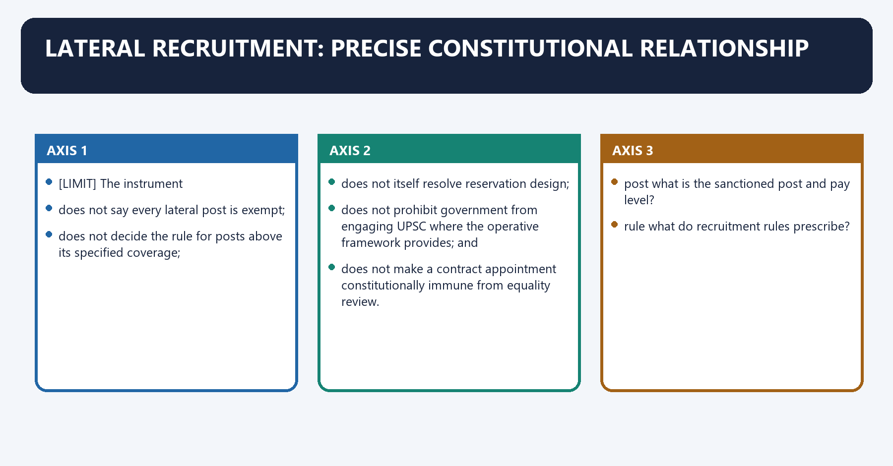
[FACT] Lateral recruitment is a mode of filling identified posts; it is not a constitutional amendment and does not displace Articles 14, 16, 309 or the applicable reservation and recruitment rules.

[CURRENT] The 15 March 2024 amendment to the UPSC Exemption from Consultation Regulations exempts specified Group A and Group B posts up to pay level 13A when filled through the named deputation/re-employment, short-term-contract, absorption or composite modes.

[LIMIT] The instrument:

- does not say every lateral post is exempt;
- does not decide the rule for posts above its specified coverage;
- does not itself resolve reservation design;
- does not prohibit government from engaging UPSC where the operative framework provides; and
- does not make a contract appointment constitutionally immune from equality review.

#### Visual 36 - Lateral-entry legality checklist

| Check | Question |
|---|---|
| post | what is the sanctioned post and pay level? |
| rule | what do recruitment rules prescribe? |
| mode | contract, deputation, absorption, direct selection or composite? |
| consultation | does Article 320 plus an exemption regulation require/dispense with PSC consultation? |
| equality | are Articles 14 and 16 satisfied? |
| reservation | what roster/constitutional/statutory rule applies? |
| transparency | were criteria and reasons published before selection? |
| review | is the decision free from mala fides, arbitrariness and rule breach? |

#### CLOSING RECALL FLOW — LATERAL RECRUITMENT: PRECISE CONSTITUTIONAL RELATIONSHIP

```closure-flow
SUBTOPIC: Lateral recruitment: precise constitutional relationship
KEY TERMS / DEFINITIONS: Lateral recruitment · precise constitutional relationship · post · rule · mode · consultation
MECHANISM / ARGUMENT: Lateral recruitment: precise constitutional relationship denotes the constitutional rules and institutional links organised around The instrument.
CONSEQUENCE / CONTRAST: Lateral recruitment is a mode of filling identified posts; it is not a constitutional amendment and does not displace Articles 14, 16, 309 or the applicable reservation and recruitment rules.
UPSC TRAP / ANSWER-USE: does not say every lateral post is exempt; does not decide the rule for posts above its specified coverage; does not itself resolve reservation design; does not prohibit government from engaging UPSC where the operative framework provides; and does not make a contract appointment constitutionally immune from equality review.
ANSWER-GRABBING FORMULATION: Lateral recruitment is a mode of filling identified posts; it is not a constitutional amendment and does not displace Articles 14, 16, 309 or the applicable reservation and recruitment rules.
```
### SESSION 36 — ALL-INDIA SERVICES AND PSC CROSS-LINK
#### DEFINITION / WHAT THIS IS CALLED

**Plain-language definition:** All-India Services and PSC cross-link denotes the constitutional rules and institutional links organised around ARTICLE 312 / PARLIAMENTARY LAW.

**Technical definition:** The decisive contrast is between review covered service disputes and ARTICLE 312 / PARLIAMENTARY LAW.

#### ANSWER-GRABBING OPENING — WRITE/ADAPT IN THE EXAM

> UPSC neither creates All-India Services nor controls every cadre, posting or disciplinary decision, which remain distributed across constitutional and statutory authorities.

#### MUST-WRITE KEYWORDS

- **All-India Services**
- **PSC cross-link**
- **Article 312**
- **All-India Services and PSC cross-link**
- **PSC**
- **ARTICLE**

**How to use them:** Frame the answer through All-India Services; define PSC cross-link, connect Article 312 with All-India Services and PSC cross-link to explain the mechanism, and use PSC for the decisive comparison or qualification.

All-India Services and PSC cross-link denotes the constitutional rules and institutional links organised around ARTICLE 312 / PARLIAMENTARY LAW.
All-India Services and PSC cross-link operates through creates/governs AIS framework, connected with UPSC recruitment/selection role under applicable rules.
The operative mechanism matters because cENTRE + STATES / CADRE AUTHORITIES.
Its principal consequence is that manage service after entry.
The decisive contrast is between review covered service disputes and ARTICLE 312 / PARLIAMENTARY LAW.
The exam-safe limitation is that aRTICLE 312 / PARLIAMENTARY LAW.
[FACT] Article 312 and the All-India Services framework belong to the Public Services owner. UPSC conducts the Civil Services Examination and participates in specified promotion-selection processes under applicable service rules.

[LIMIT] The UPSC does not create an All-India Service, allocate every cadre power, manage all postings or decide every disciplinary penalty.

#### Visual 37 - AIS interface

```text
ARTICLE 312 / PARLIAMENTARY LAW
creates/governs AIS framework
             |
UPSC recruitment/selection role under applicable rules
             |
CENTRE + STATES / CADRE AUTHORITIES
manage service after entry
             |
TRIBUNAL / COURTS
review covered service disputes
```

#### CLOSING RECALL FLOW — ALL-INDIA SERVICES AND PSC CROSS-LINK

```closure-flow
SUBTOPIC: All-India Services and PSC cross-link
KEY TERMS / DEFINITIONS: All-India Services · PSC cross-link · Article 312 · All-India Services and PSC cross-link · PSC · ARTICLE
MECHANISM / ARGUMENT: All-India Services and PSC cross-link operates through creates/governs AIS framework, connected with UPSC recruitment/selection role under applicable rules.
CONSEQUENCE / CONTRAST: The UPSC does not create an All-India Service, allocate every cadre power, manage all postings or decide every disciplinary penalty.
UPSC TRAP / ANSWER-USE: Do not miss this limiting distinction: the decisive contrast is between review covered service disputes and ARTICLE 312 / PARLIAMENTARY...
ANSWER-GRABBING FORMULATION: UPSC neither creates All-India Services nor controls every cadre, posting or disciplinary decision, which remain distributed across constitutional and statutory authorities.
```
### SESSION 37 — TRIBUNALS AND RECRUITMENT
#### DEFINITION / WHAT THIS IS CALLED

**Plain-language definition:** Tribunals and recruitment denotes the constitutional rules and institutional links organised around L.

**Technical definition:** Tribunals and recruitment operates through Public Service Commission Administrative tribunal, connected with recruits/advises adjudicates covered disputes.

#### ANSWER-GRABBING OPENING — WRITE/ADAPT IN THE EXAM

> Chandra Kumar keeps tribunal decisions subject to High Court review under Articles 226/227.

#### MUST-WRITE KEYWORDS

- **Tribunals**
- **recruitment**
- **recruits/advises**
- **adjudicates covered disputes**
- **constitutional under Arts 315-323**
- **statutory under Art 323A legislation**

**How to use them:** Frame the answer through Tribunals; define recruitment, connect recruits/advises with adjudicates covered disputes to explain the mechanism, and use constitutional under Arts 315-323 for the decisive comparison or qualification.

Tribunals and recruitment denotes the constitutional rules and institutional links organised around [FACT] L. Chandra Kumar keeps tribunal decisions subject to High Court review under Articles 226/227.
Tribunals and recruitment operates through Public Service Commission Administrative tribunal, connected with recruits/advises adjudicates covered disputes.
The operative mechanism matters because constitutional under Arts 315-323 statutory under Art 323A legislation.
Its principal consequence is that recommendation/examination role remedial/decisional role.
The decisive contrast is between not a court quasi-judicial adjudicatory forum and [FACT] L. Chandra Kumar keeps tribunal decisions subject to High Court review under Articles 226/227.
The exam-safe limitation is that [FACT] L. Chandra Kumar keeps tribunal decisions subject to High Court review under Articles 226/227.
[FACT] Article 323A permits Parliament to create administrative tribunals for recruitment and service-condition disputes. The Administrative Tribunals Act, 1985 establishes the CAT framework.

[FACT] *L. Chandra Kumar* keeps tribunal decisions subject to High Court review under Articles 226/227.

#### Visual 38 - Commission versus tribunal

| Public Service Commission | Administrative tribunal |
|---|---|
| recruits/advises | adjudicates covered disputes |
| constitutional under Arts 315-323 | statutory under Art 323A legislation |
| recommendation/examination role | remedial/decisional role |
| not a court | quasi-judicial adjudicatory forum |

#### CLOSING RECALL FLOW — TRIBUNALS AND RECRUITMENT

```closure-flow
SUBTOPIC: Tribunals and recruitment
KEY TERMS / DEFINITIONS: Tribunals · recruitment · recruits/advises · adjudicates covered disputes · constitutional under Arts 315-323 · statutory under Art 323A legislation
MECHANISM / ARGUMENT: Tribunals and recruitment operates through Public Service Commission Administrative tribunal, connected with recruits/advises adjudicates covered disputes.
CONSEQUENCE / CONTRAST: Article 323A permits Parliament to create administrative tribunals for recruitment and service-condition disputes.
UPSC TRAP / ANSWER-USE: The decisive contrast is between not a court quasi-judicial adjudicatory forum and L.
ANSWER-GRABBING FORMULATION: Chandra Kumar keeps tribunal decisions subject to High Court review under Articles 226/227.
```
### SESSION 38 — JUDICIAL REVIEW: NEITHER ZERO NOR APPELLATE RE-MARKING
#### DEFINITION / WHAT THIS IS CALLED

**Plain-language definition:** Judicial review: neither zero nor appellate re-marking denotes the constitutional rules and institutional links organised around Courts ordinarily do not sit as an expert selection committee to re-evaluate comparative merit.

**Technical definition:** The decisive contrast is between Judicial restraint protects expert assessment; judicial review protects constitutional legitimacy and Courts ordinarily do not sit as an expert selection committee to re-evaluate comparative merit.

#### ANSWER-GRABBING OPENING — WRITE/ADAPT IN THE EXAM

> Judicial restraint protects expert comparative assessment, while review remains available for illegality, bias, mala fides, unequal treatment and breach of announced rules.

#### MUST-WRITE KEYWORDS

- **Judicial review**
- **neither zero nor appellate re-marking**
- **Judicial review: neither zero nor appellate re-marking**
- **Judicial**
- **Courts**
- **Its principal consequence**

**How to use them:** Frame the answer through Judicial review; define neither zero nor appellate re-marking, connect Judicial review: neither zero nor appellate re-marking with Judicial to explain the mechanism, and use Courts for the decisive comparison or qualification.

Judicial review: neither zero nor appellate re-marking denotes the constitutional rules and institutional links organised around [FACT] Courts ordinarily do not sit as an expert selection committee to re-evaluate comparative merit.
Judicial review: neither zero nor appellate re-marking operates through NO REVIEW X--------------------------------------X FULL MERIT APPEAL, connected with CONSTITUTIONAL REVIEW.
The operative mechanism matters because illegality bias mala fides arbitrariness.
Its principal consequence is that rule breach unequal treatment procedural unfairness.
The decisive contrast is between [ANALYSIS] Judicial restraint protects expert assessment; judicial review protects constitutional legitimacy and [FACT] Courts ordinarily do not sit as an expert selection committee to re-evaluate comparative merit.
The exam-safe limitation is that [FACT] Courts ordinarily do not sit as an expert selection committee to re-evaluate comparative merit.
[FACT] Courts may intervene where a selection is infected by illegality, mala fides, bias, arbitrariness, breach of statutory rules, unequal treatment or violation of the announced process.

[FACT] Courts ordinarily do not sit as an expert selection committee to re-evaluate comparative merit.

#### Visual 39 - Review spectrum

```text
NO REVIEW  X--------------------------------------X  FULL MERIT APPEAL
                        |
                 CONSTITUTIONAL REVIEW
        illegality | bias | mala fides | arbitrariness
        rule breach | unequal treatment | procedural unfairness
```

[ANALYSIS] Judicial restraint protects expert assessment; judicial review protects constitutional legitimacy.

#### CLOSING RECALL FLOW — JUDICIAL REVIEW: NEITHER ZERO NOR APPELLATE RE-MARKING

```closure-flow
SUBTOPIC: Judicial review: neither zero nor appellate re-marking
KEY TERMS / DEFINITIONS: Judicial review · neither zero nor appellate re-marking · Judicial review: neither zero nor appellate re-marking · Judicial · Courts · Its principal consequence
MECHANISM / ARGUMENT: The decisive contrast is between Judicial restraint protects expert assessment; judicial review protects constitutional legitimacy and Courts ordinarily do not sit as an expert selection committee to re-evaluate comparative merit.
CONSEQUENCE / CONTRAST: Its principal consequence is that rule breach unequal treatment procedural unfairness.
UPSC TRAP / ANSWER-USE: The exam-safe limitation is that Courts ordinarily do not sit as an expert selection committee to re-evaluate comparative merit.
ANSWER-GRABBING FORMULATION: Judicial restraint protects expert comparative assessment, while review remains available for illegality, bias, mala fides, unequal treatment and breach of announced rules.
```
### SESSION 39 — ASHOK KUMAR YADAV: BIAS AND INTERVIEW FAIRNESS
#### DEFINITION / WHAT THIS IS CALLED

**Plain-language definition:** Ashok Kumar Yadav: bias and interview fairness denotes the constitutional rules and institutional links organised around member's relationship/conflict disclosure and recusal.

**Technical definition:** The decisive contrast is between Do not turn a case-specific discussion of interview percentages into an inflexible constitutional number for every service and member's relationship/conflict disclosure and recusal.

#### ANSWER-GRABBING OPENING — WRITE/ADAPT IN THE EXAM

> Ashok Kumar Yadav shows that expert status cannot cure biased participation or distorted interview design, although its percentage discussion is not a universal constitutional formula.

#### MUST-WRITE KEYWORDS

- **Ashok Kumar Yadav**
- **bias**
- **interview fairness**
- **member's relationship/conflict**
- **disclosure and recusal**
- **excessive subjective weight**

**How to use them:** Frame the answer through Ashok Kumar Yadav; define bias, connect interview fairness with member's relationship/conflict to explain the mechanism, and use disclosure and recusal for the decisive comparison or qualification.

*Ashok Kumar Yadav*: bias and interview fairness denotes the constitutional rules and institutional links organised around member's relationship/conflict disclosure and recusal.
*Ashok Kumar Yadav*: bias and interview fairness operates through excessive subjective weight proportionate, pre-declared criteria, connected with unstructured interview scoring rubric and records.
The operative mechanism matters because opaque moderation documented and auditable method.
Its principal consequence is that selective rule application uniform treatment.
The decisive contrast is between [LIMIT] Do not turn a case-specific discussion of interview percentages into an inflexible constitutional number for every service and member's relationship/conflict disclosure and recusal.
The exam-safe limitation is that member's relationship/conflict disclosure and recusal.
[FACT] *Ashok Kumar Yadav v. State of Haryana* scrutinised Haryana PSC selection, including interview weight and participation concerns involving relations of Commission members.

[ANALYSIS] Its enduring lesson is institutional: a formally expert body can still produce unconstitutional selection if bias safeguards and assessment design are weak.

#### Visual 40 - Bias-control protocol

| Risk | Control |
|---|---|
| member's relationship/conflict | disclosure and recusal |
| excessive subjective weight | proportionate, pre-declared criteria |
| unstructured interview | scoring rubric and records |
| opaque moderation | documented and auditable method |
| selective rule application | uniform treatment |

[LIMIT] Do not turn a case-specific discussion of interview percentages into an inflexible constitutional number for every service.

#### CLOSING RECALL FLOW — ASHOK KUMAR YADAV: BIAS AND INTERVIEW FAIRNESS

```closure-flow
SUBTOPIC: Ashok Kumar Yadav: bias and interview fairness
KEY TERMS / DEFINITIONS: Ashok Kumar Yadav · bias · interview fairness · member's relationship/conflict · disclosure and recusal · excessive subjective weight
MECHANISM / ARGUMENT: Its enduring lesson is institutional: a formally expert body can still produce unconstitutional selection if bias safeguards and assessment design are weak.
CONSEQUENCE / CONTRAST: The decisive contrast is between Do not turn a case-specific discussion of interview percentages into an inflexible constitutional number for every service and member's relationship/conflict disclosure and recusal.
UPSC TRAP / ANSWER-USE: Do not turn a case-specific discussion of interview percentages into an inflexible constitutional number for every service.
ANSWER-GRABBING FORMULATION: Ashok Kumar Yadav shows that expert status cannot cure biased participation or distorted interview design, although its percentage discussion is not a universal constitutional formula.
```
### SESSION 40 — STABLE RULES: K. MANJUSREE AND TEJ PRAKASH PATHAK
#### DEFINITION / WHAT THIS IS CALLED

**Plain-language definition:** Manjusree and Tej Prakash Pathak denotes the constitutional rules and institutional links organised around Was criterion/rule disclosed in governing rules or notice?.

**Technical definition:** Manjusree and Tej Prakash Pathak operates through NO ---- introduced after process? ---- presumptive arbitrariness, connected with was application uniform, lawful and non-arbitrary?.

#### ANSWER-GRABBING OPENING — WRITE/ADAPT IN THE EXAM

> The Constitution Bench in Tej Prakash Pathak, 2024 INSC 847, reaffirmed the core stability principle while locating it in Articles 14 and 16: eligibility/selection criteria cannot be changed after commencement unless the governing rules permit a lawful, non-arbitrary course.

#### MUST-WRITE KEYWORDS

- **Stable rules**
- **K. Manjusree**
- **Tej Prakash Pathak**
- **Manjusree and Tej Prakash Pathak**
- **Manjusree**
- **Was**

**How to use them:** Frame the answer through Stable rules; define K. Manjusree, connect Tej Prakash Pathak with Manjusree and Tej Prakash Pathak to explain the mechanism, and use Manjusree for the decisive comparison or qualification.

Stable rules: *K. Manjusree* and *Tej Prakash Pathak* denotes the constitutional rules and institutional links organised around Was criterion/rule disclosed in governing rules or notice?.
Stable rules: *K. Manjusree* and *Tej Prakash Pathak* operates through NO ---- introduced after process? ---- presumptive arbitrariness, connected with was application uniform, lawful and non-arbitrary?.
The operative mechanism matters because constitutional validity depends on answer.
Its principal consequence is that was criterion/rule disclosed in governing rules or notice?.
The decisive contrast is between Was criterion/rule disclosed in governing rules or notice? and Was criterion/rule disclosed in governing rules or notice?.
The exam-safe limitation is that was criterion/rule disclosed in governing rules or notice?.
[FACT] *K. Manjusree* disallowed introducing a minimum interview benchmark after the selection process where the governing framework had not prescribed it.

[CURRENT] The Constitution Bench in *Tej Prakash Pathak*, 2024 INSC 847, reaffirmed the core stability principle while locating it in Articles 14 and 16: eligibility/selection criteria cannot be changed after commencement unless the governing rules permit a lawful, non-arbitrary course.

#### Visual 41 - Rules-of-the-game test

```text
Was criterion/rule disclosed in governing rules or notice?
        |
      NO ---- introduced after process? ----> presumptive arbitrariness
        |
      YES
        |
was application uniform, lawful and non-arbitrary?
        |
constitutional validity depends on answer
```

[LIMIT] Administrative clarification is not always a prohibited change; ask whether it alters eligibility, evaluation or outcome criteria.

#### CLOSING RECALL FLOW — STABLE RULES: K. MANJUSREE AND TEJ PRAKASH PATHAK

```closure-flow
SUBTOPIC: Stable rules: K. Manjusree and Tej Prakash Pathak
KEY TERMS / DEFINITIONS: Stable rules · K. Manjusree · Tej Prakash Pathak · Manjusree and Tej Prakash Pathak · Manjusree · Was
MECHANISM / ARGUMENT: Manjusree and Tej Prakash Pathak operates through NO ---- introduced after process? ---- presumptive arbitrariness, connected with was application uniform, lawful and non-arbitrary?.
CONSEQUENCE / CONTRAST: Its principal consequence is that was criterion/rule disclosed in governing rules or notice?.
UPSC TRAP / ANSWER-USE: Do not miss this limiting distinction: the decisive contrast is between Was criterion/rule disclosed in governing rules or notice? and...
ANSWER-GRABBING FORMULATION: The Constitution Bench in Tej Prakash Pathak, 2024 INSC 847, reaffirmed the core stability principle while locating it in Articles 14 and 16: eligibility/selection criteria cannot be changed after commencement unless the governing rules permit a lawful, non-arbitrary course.
```
### SESSION 41 — SELECT LIST DOES NOT CREATE AN INDEFEASIBLE RIGHT
#### DEFINITION / WHAT THIS IS CALLED

**Plain-language definition:** Select list does not create an indefeasible right denotes the constitutional rules and institutional links organised around Government may decide not to fill all vacancies for bona fide reasons, but the decision cannot be arbitrary.

**Technical definition:** Select list does not create an indefeasible right operates through SUCCESS IN SELECTION, connected with fair consideration + lawful treatment.

#### ANSWER-GRABBING OPENING — WRITE/ADAPT IN THE EXAM

> The candidate has a right against unconstitutional decision-making, not ownership of the post.

#### MUST-WRITE KEYWORDS

- **Select**
- **Government**
- **SUCCESS IN SELECTION**
- **Its principal consequence**
- **Its**
- **The decisive contrast**

**How to use them:** Frame the answer through Select; define Government, connect SUCCESS IN SELECTION with Its principal consequence to explain the mechanism, and use Its for the decisive comparison or qualification.

Select list does not create an indefeasible right denotes the constitutional rules and institutional links organised around [FACT] Government may decide not to fill all vacancies for bona fide reasons, but the decision cannot be arbitrary.
Select list does not create an indefeasible right operates through SUCCESS IN SELECTION, connected with fair consideration + lawful treatment.
The operative mechanism matters because nO automatic appointment right.
Its principal consequence is that government may not act arbitrarily, discriminatorily or in bad faith.
The decisive contrast is between [ANALYSIS] The candidate has a right against unconstitutional decision-making, not ownership of the post and [FACT] Government may decide not to fill all vacancies for bona fide reasons, but the decision cannot be arbitrary.
The exam-safe limitation is that [FACT] Government may decide not to fill all vacancies for bona fide reasons, but the decision cannot be arbitrary.
[FACT] *Shankarsan Dash v. Union of India* held that notification of vacancies and inclusion in a select list do not create an indefeasible right to appointment.

[FACT] Government may decide not to fill all vacancies for bona fide reasons, but the decision cannot be arbitrary.

#### Visual 42 - Recommendation-to-appointment boundary

```text
SUCCESS IN SELECTION
        |
fair consideration + lawful treatment
        |
NO automatic appointment right
        |
government may not act arbitrarily, discriminatorily or in bad faith
```

[ANALYSIS] The candidate has a right against unconstitutional decision-making, not ownership of the post.

#### CLOSING RECALL FLOW — SELECT LIST DOES NOT CREATE AN INDEFEASIBLE RIGHT

```closure-flow
SUBTOPIC: Select list does not create an indefeasible right
KEY TERMS / DEFINITIONS: Select · Government · SUCCESS IN SELECTION · Its principal consequence · Its · The decisive contrast
MECHANISM / ARGUMENT: Select list does not create an indefeasible right operates through SUCCESS IN SELECTION, connected with fair consideration + lawful treatment.
CONSEQUENCE / CONTRAST: Union of India held that notification of vacancies and inclusion in a select list do not create an indefeasible right to appointment.
UPSC TRAP / ANSWER-USE: The decisive contrast is between The candidate has a right against unconstitutional decision-making, not ownership of the post and Government may decide not to fill all vacancies for bona fide reasons, but the decision cannot be arbitrary.
ANSWER-GRABBING FORMULATION: The candidate has a right against unconstitutional decision-making, not ownership of the post.
```
### SESSION 42 — M.V. THIMMAIAH: LIMITED REVIEW OF EXPERT RECOMMENDATIONS
#### DEFINITION / WHAT THIS IS CALLED

**Plain-language definition:** Thimmaiah: limited review of expert recommendations denotes the constitutional rules and institutional links organised around Court may ask Court ordinarily will not do.

**Technical definition:** Thimmaiah: limited review of expert recommendations operates through Was the body legally constituted? replace experts' marks with its preference, connected with Were rules followed? conduct a fresh interview.

#### ANSWER-GRABBING OPENING — WRITE/ADAPT IN THE EXAM

> M. V. Thimmaiah limits courts from re-ranking candidates while preserving review for mala fides and serious statutory violations, balancing expertise with legality.

#### MUST-WRITE KEYWORDS

- **M.V. Thimmaiah**
- **limited review of expert recommendations**
- **replace experts' marks with its preference**
- **conduct a fresh interview**
- **rank candidates on perceived merit**
- **rewrite recruitment policy without legal defect**

**How to use them:** Frame the answer through M.V. Thimmaiah; define limited review of expert recommendations, connect replace experts' marks with its preference with conduct a fresh interview to explain the mechanism, and use rank candidates on perceived merit for the decisive comparison or qualification.

*M.V. Thimmaiah*: limited review of expert recommendations denotes the constitutional rules and institutional links organised around Court may ask Court ordinarily will not do.
*M.V. Thimmaiah*: limited review of expert recommendations operates through Was the body legally constituted? replace experts' marks with its preference, connected with Were rules followed? conduct a fresh interview.
The operative mechanism matters because was there bias/mala fide? rank candidates on perceived merit.
Its principal consequence is that was equality violated? rewrite recruitment policy without legal defect.
The decisive contrast is between Court may ask Court ordinarily will not do and Court may ask Court ordinarily will not do.
The exam-safe limitation is that court may ask Court ordinarily will not do.
[FACT] *M.V. Thimmaiah v. UPSC* states that selection-committee recommendations are ordinarily not challengeable except on grounds such as mala fides or serious violation of statutory rules; courts do not act as appellate authorities over expert comparative assessment.

#### Visual 43 - Court's question set

| Court may ask | Court ordinarily will not do |
|---|---|
| Was the body legally constituted? | replace experts' marks with its preference |
| Were rules followed? | conduct a fresh interview |
| Was there bias/mala fide? | rank candidates on perceived merit |
| Was equality violated? | rewrite recruitment policy without legal defect |

#### CLOSING RECALL FLOW — M.V. THIMMAIAH: LIMITED REVIEW OF EXPERT RECOMMENDATIONS

```closure-flow
SUBTOPIC: M.V. Thimmaiah: limited review of expert recommendations
KEY TERMS / DEFINITIONS: M.V. Thimmaiah · limited review of expert recommendations · replace experts' marks with its preference · conduct a fresh interview · rank candidates on perceived merit · rewrite recruitment policy without legal defect
MECHANISM / ARGUMENT: Thimmaiah: limited review of expert recommendations operates through Was the body legally constituted? replace experts' marks with its preference, connected with Were rules followed? conduct a fresh interview.
CONSEQUENCE / CONTRAST: UPSC states that selection-committee recommendations are ordinarily not challengeable except on grounds such as mala fides or serious violation of statutory rules; courts do not act as appellate authorities over expert comparative assessment.
UPSC TRAP / ANSWER-USE: Do not miss this limiting distinction: its principal consequence is that was equality violated? rewrite recruitment policy without legal defect.
ANSWER-GRABBING FORMULATION: M. V. Thimmaiah limits courts from re-ranking candidates while preserving review for mala fides and serious statutory violations, balancing expertise with legality.
```
### SESSION 43 — PUBLIC EXAMINATIONS ACT, 2024: VERIFIED UPSC APPLICATION
#### DEFINITION / WHAT THIS IS CALLED

**Plain-language definition:** Public Examinations Act, 2024: verified UPSC application denotes the constitutional rules and institutional links organised around [CURRENT] The Act's Schedule expressly covers any examination conducted by the Union Public Service Commission.

**Technical definition:** The exam-safe limitation is that [CURRENT] The Act's Schedule expressly covers any examination conducted by the Union Public Service Commission. [CURRENT] The Act's Schedule expressly covers any examination conducted by the Union Public Service Commission.

#### ANSWER-GRABBING OPENING — WRITE/ADAPT IN THE EXAM

> The Public Examinations Act strengthens integrity against organised unfair means, but does not replace recruitment rules, evidence requirements or procedural fairness.

#### MUST-WRITE KEYWORDS

- **Public Examinations Act**
- **verified UPSC application**
- **Public Examinations Act, 2024: verified UPSC application**
- **The Act's Schedule**
- **Union Public Service Commission**
- **Its principal consequence**

**How to use them:** Frame the answer through Public Examinations Act; define verified UPSC application, connect Public Examinations Act, 2024: verified UPSC application with The Act's Schedule to explain the mechanism, and use Union Public Service Commission for the decisive comparison or qualification.

Public Examinations Act, 2024: verified UPSC application denotes the constitutional rules and institutional links organised around [CURRENT] The Act's Schedule expressly covers any examination conducted by the Union Public Service Commission.
Public Examinations Act, 2024: verified UPSC application operates through norms + centre controls + digital/physical security, connected with monitoring + incident evidence + audit trail.
The operative mechanism matters because venue - coordinator - regional/public examination authority.
Its principal consequence is that police / authorised agency under Act.
The decisive contrast is between individual / service provider / organised-crime consequences and candidate communication + lawful re-exam/result decision + review.
The exam-safe limitation is that [CURRENT] The Act's Schedule expressly covers any examination conducted by the Union Public Service Commission.
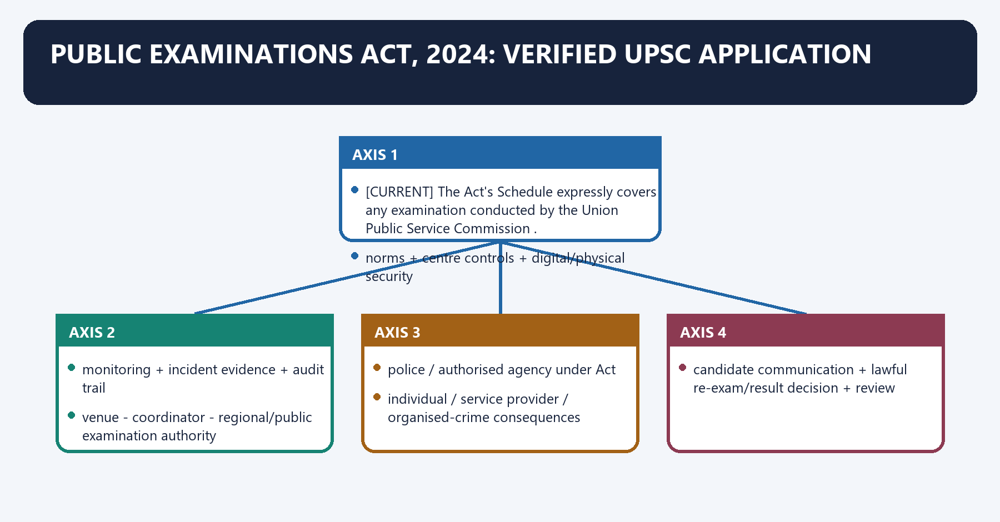
[CURRENT] The Act's Schedule expressly covers **any examination conducted by the Union Public Service Commission**.

[FACT] Section 3 lists unfair means including question/answer-key leakage, unauthorised access, assistance, answer-sheet tampering, unauthorised assessment alteration, security violations, computer/network tampering, manipulation of shifts/seating, fake websites, fake examinations, fake admit cards and fake offer letters, where the statutory requirements are met.

[FACT] The Act also covers conspiracy, service-provider responsibility, reporting, cognizable/non-bailable/non-compoundable offences, investigation and organised crime.

[LIMIT] It does not constitutionalise every operational choice of UPSC, replace service/recruitment rules or eliminate the need for evidence and due process.

#### Visual 44 - Integrity-law architecture

```text
PREVENT
norms + centre controls + digital/physical security
        |
DETECT
monitoring + incident evidence + audit trail
        |
REPORT
venue -> coordinator -> regional/public examination authority
        |
INVESTIGATE
police / authorised agency under Act
        |
PUNISH
individual / service provider / organised-crime consequences
        |
REMEDIATE
candidate communication + lawful re-exam/result decision + review
```

#### CLOSING RECALL FLOW — PUBLIC EXAMINATIONS ACT, 2024: VERIFIED UPSC APPLICATION

```closure-flow
SUBTOPIC: Public Examinations Act, 2024: verified UPSC application
KEY TERMS / DEFINITIONS: Public Examinations Act · verified UPSC application · Public Examinations Act, 2024: verified UPSC application · The Act's Schedule · Union Public Service Commission · Its principal consequence
MECHANISM / ARGUMENT: The exam-safe limitation is that [CURRENT] The Act's Schedule expressly covers any examination conducted by the Union Public Service Commission. [CURRENT] The Act's Schedule expressly covers any examination conducted by the Union Public Service Commission.
CONSEQUENCE / CONTRAST: Its principal consequence is that police / authorised agency under Act.
UPSC TRAP / ANSWER-USE: Do not miss this limiting distinction: the decisive contrast is between individual / service provider / organised-crime consequences and candidate...
ANSWER-GRABBING FORMULATION: The Public Examinations Act strengthens integrity against organised unfair means, but does not replace recruitment rules, evidence requirements or procedural fairness.
```
### SESSION 44 — PUBLIC EXAMINATIONS RULES, 2024
#### DEFINITION / WHAT THIS IS CALLED

**Plain-language definition:** Public Examinations Rules, 2024 denotes the constitutional rules and institutional links organised around [CURRENT] The Rules define centre coordinators, regional officers, venue-in-charge responsibilities and monitoring.

**Technical definition:** Public Examinations Rules, 2024 operates through Layer Verified rule theme Reform use, connected with centre registration, space and seating reduce unverified venues.

#### ANSWER-GRABBING OPENING — WRITE/ADAPT IN THE EXAM

> The Public Examinations Rules prescribe technical and security standards for computer-based tests, translating statutory integrity into auditable operational controls.

#### MUST-WRITE KEYWORDS

- **Public Examinations Rules**
- **centre**
- **registration, space and seating**
- **reduce unverified venues**
- **device**
- **node and server specifications**

**How to use them:** Frame the answer through Public Examinations Rules; define centre, connect registration, space and seating with reduce unverified venues to explain the mechanism, and use device for the decisive comparison or qualification.

Public Examinations Rules, 2024 denotes the constitutional rules and institutional links organised around [CURRENT] The Rules define centre coordinators, regional officers, venue-in-charge responsibilities and monitoring.
Public Examinations Rules, 2024 operates through Layer Verified rule theme Reform use, connected with centre registration, space and seating reduce unverified venues.
The operative mechanism matters because device node and server specifications baseline hardening.
Its principal consequence is that network network/platform standards integrity and availability.
The decisive contrast is between people biometric, screening, invigilation identity and access control and content question loading/distribution controls prevent unauthorised access.
The exam-safe limitation is that audit pre-exam readiness and post-exam checklist evidence before/after event.
[CURRENT] The Rules define centre coordinators, regional officers, venue-in-charge responsibilities and monitoring.

[CURRENT] Rule 5 provides for notified norms, standards and guidelines for computer-based tests covering physical and digital infrastructure, centre registration, layout, nodes, servers/networks, platform specifications, readiness audit, biometric check-in, security, seat allocation, question loading, invigilation, post-exam activities and scribes.

[CURRENT] Rule 7 establishes incident-reporting pathways; rule 9 requires every public examination authority to set up an implementation-monitoring mechanism.

#### Visual 45 - Computer-based-test security layers

| Layer | Verified rule theme | Reform use |
|---|---|---|
| centre | registration, space and seating | reduce unverified venues |
| device | node and server specifications | baseline hardening |
| network | network/platform standards | integrity and availability |
| people | biometric, screening, invigilation | identity and access control |
| content | question loading/distribution controls | prevent unauthorised access |
| audit | pre-exam readiness and post-exam checklist | evidence before/after event |
| inclusion | scribe guidelines | security without excluding candidates |

#### CLOSING RECALL FLOW — PUBLIC EXAMINATIONS RULES, 2024

```closure-flow
SUBTOPIC: Public Examinations Rules, 2024
KEY TERMS / DEFINITIONS: Public Examinations Rules · centre · registration, space and seating · reduce unverified venues · device · node and server specifications
MECHANISM / ARGUMENT: Public Examinations Rules, 2024 operates through Layer Verified rule theme Reform use, connected with centre registration, space and seating reduce unverified venues.
CONSEQUENCE / CONTRAST: [CURRENT] Rule 7 establishes incident-reporting pathways; rule 9 requires every public examination authority to set up an implementation-monitoring mechanism.
UPSC TRAP / ANSWER-USE: Do not miss this limiting distinction: its principal consequence is that network network/platform standards integrity and availability.
ANSWER-GRABBING FORMULATION: The Public Examinations Rules prescribe technical and security standards for computer-based tests, translating statutory integrity into auditable operational controls.
```
### SESSION 45 — INTEGRITY CHALLENGES BEYOND CRIMINAL LAW
#### DEFINITION / WHAT THIS IS CALLED

**Plain-language definition:** Integrity challenges beyond criminal law denotes the constitutional rules and institutional links organised around Challenge Institutional risk Calibrated control.

**Technical definition:** Integrity challenges beyond criminal law operates through paper leak equal opportunity destroyed segmented custody, access logs, criminal enforcement, connected with impersonation false identity proportionate identity/biometric controls + exception handling.

#### ANSWER-GRABBING OPENING — WRITE/ADAPT IN THE EXAM

> Security controls must protect privacy, disability accommodation and natural justice; “maximum secrecy” alone is not good governance.

#### MUST-WRITE KEYWORDS

- **Integrity challenges beyond criminal law**
- **paper leak**
- **equal opportunity destroyed**
- **segmented custody, access logs, criminal enforcement**
- **impersonation**
- **false identity**

**How to use them:** Frame the answer through Integrity challenges beyond criminal law; define paper leak, connect equal opportunity destroyed with segmented custody, access logs, criminal enforcement to explain the mechanism, and use impersonation for the decisive comparison or qualification.

Integrity challenges beyond criminal law denotes the constitutional rules and institutional links organised around Challenge Institutional risk Calibrated control.
Integrity challenges beyond criminal law operates through paper leak equal opportunity destroyed segmented custody, access logs, criminal enforcement, connected with impersonation false identity proportionate identity/biometric controls + exception handling.
The operative mechanism matters because cyber compromise question/result manipulation hardened systems, audit trails, independent testing.
Its principal consequence is that opaque scaling/moderation distrust and litigation pre-declared method and reviewable records.
The decisive contrast is between long calendar delays candidate cost and vacancies realistic calendar and reasoned updates and result opacity suspicion and grievance load marks/cut-off/result disclosure as law permits.
The exam-safe limitation is that weak grievance handling avoidable litigation trackable, time-bound, reasoned response.
#### Visual 46 - Threat-control matrix

| Challenge | Institutional risk | Calibrated control |
|---|---|---|
| paper leak | equal opportunity destroyed | segmented custody, access logs, criminal enforcement |
| impersonation | false identity | proportionate identity/biometric controls + exception handling |
| cyber compromise | question/result manipulation | hardened systems, audit trails, independent testing |
| opaque scaling/moderation | distrust and litigation | pre-declared method and reviewable records |
| long calendar delays | candidate cost and vacancies | realistic calendar and reasoned updates |
| result opacity | suspicion and grievance load | marks/cut-off/result disclosure as law permits |
| weak grievance handling | avoidable litigation | trackable, time-bound, reasoned response |
| SPSC political capture | patronage and legitimacy loss | transparent appointment criteria, conflict checks, audit |

[LIMIT] Security controls must protect privacy, disability accommodation and natural justice; “maximum secrecy” alone is not good governance.

#### CLOSING RECALL FLOW — INTEGRITY CHALLENGES BEYOND CRIMINAL LAW

```closure-flow
SUBTOPIC: Integrity challenges beyond criminal law
KEY TERMS / DEFINITIONS: Integrity challenges beyond criminal law · paper leak · equal opportunity destroyed · segmented custody, access logs, criminal enforcement · impersonation · false identity
MECHANISM / ARGUMENT: Integrity challenges beyond criminal law operates through paper leak equal opportunity destroyed segmented custody, access logs, criminal enforcement, connected with impersonation false identity proportionate identity/biometric controls + exception handling.
CONSEQUENCE / CONTRAST: Its principal consequence is that opaque scaling/moderation distrust and litigation pre-declared method and reviewable records.
UPSC TRAP / ANSWER-USE: Do not miss this limiting distinction: the decisive contrast is between long calendar delays candidate cost and vacancies realistic calendar...
ANSWER-GRABBING FORMULATION: Security controls must protect privacy, disability accommodation and natural justice; “maximum secrecy” alone is not good governance.
```
### SESSION 46 — TRANSPARENT CALENDARS, RESULTS AND GRIEVANCE SYSTEMS
#### DEFINITION / WHAT THIS IS CALLED

**Plain-language definition:** Transparent calendars, results and grievance systems denotes the constitutional rules and institutional links organised around A credible recruitment institution should publish.

**Technical definition:** Transparent calendars, results and grievance systems operates through a realistic calendar and promptly reasoned deviations, connected with clear eligibility and evaluation rules before the process.

#### ANSWER-GRABBING OPENING — WRITE/ADAPT IN THE EXAM

> Published calendars, results and grievance channels improve predictability and communication, but their existence alone does not establish timely or fair recruitment.

#### MUST-WRITE KEYWORDS

- **Transparent calendars**
- **results**
- **grievance systems**
- **Transparent**
- **Its principal consequence**
- **Its**

**How to use them:** Frame the answer through Transparent calendars; define results, connect grievance systems with Transparent to explain the mechanism, and use Its principal consequence for the decisive comparison or qualification.

Transparent calendars, results and grievance systems denotes the constitutional rules and institutional links organised around [ANALYSIS] A credible recruitment institution should publish.
Transparent calendars, results and grievance systems operates through a realistic calendar and promptly reasoned deviations, connected with clear eligibility and evaluation rules before the process.
The operative mechanism matters because result, marks and cut-off information within legal/privacy limits.
Its principal consequence is that answer-key objection or representation processes where provided.
The decisive contrast is between grievance tracking and speaking responses; and and aggregate integrity/audit information that does not compromise future security.
The exam-safe limitation is that rESULT / MARKS / CUT-OFF.
[CURRENT] UPSC and official State PSC portals such as Kerala PSC and TNPSC publish examination programmes/planners and result material; official contact, RTI and grievance channels provide routes for candidate communication.

[ANALYSIS] A credible recruitment institution should publish:

1. a realistic calendar and promptly reasoned deviations;
2. clear eligibility and evaluation rules before the process;
3. result, marks and cut-off information within legal/privacy limits;
4. answer-key objection or representation processes where provided;
5. grievance tracking and speaking responses; and
6. aggregate integrity/audit information that does not compromise future security.

#### Visual 47 - Transparency ladder

```text
NOTICE
  -> RULES
    -> CALENDAR
      -> PROCESS UPDATES
        -> RESULT / MARKS / CUT-OFF
          -> REASONS / GRIEVANCE
            -> ANNUAL REPORT / LEGISLATIVE SCRUTINY
```

#### CLOSING RECALL FLOW — TRANSPARENT CALENDARS, RESULTS AND GRIEVANCE SYSTEMS

```closure-flow
SUBTOPIC: Transparent calendars, results and grievance systems
KEY TERMS / DEFINITIONS: Transparent calendars · results · grievance systems · Transparent · Its principal consequence · Its
MECHANISM / ARGUMENT: Transparent calendars, results and grievance systems operates through a realistic calendar and promptly reasoned deviations, connected with clear eligibility and evaluation rules before the process.
CONSEQUENCE / CONTRAST: a realistic calendar and promptly reasoned deviations; clear eligibility and evaluation rules before the process; result, marks and cut-off information within legal/privacy limits; answer-key objection or representation processes where provided; grievance tracking and speaking responses; and aggregate integrity/audit information that does not compromise future security.
UPSC TRAP / ANSWER-USE: The decisive contrast is between grievance tracking and speaking responses; and and aggregate integrity/audit information that does not compromise future security.
ANSWER-GRABBING FORMULATION: Published calendars, results and grievance channels improve predictability and communication, but their existence alone does not establish timely or fair recruitment.
```
### SESSION 47 — SPSC INTEGRITY AND CAPACITY RISKS
#### DEFINITION / WHAT THIS IS CALLED

**Plain-language definition:** SPSC integrity and capacity risks denotes the constitutional rules and institutional links organised around Risk Why SPSC may be vulnerable Constitutional answer.

**Technical definition:** Its principal consequence is that paper leak decentralised chain and vendor risk 2024 Act where applicable + State law + security protocols.

#### ANSWER-GRABBING OPENING — WRITE/ADAPT IN THE EXAM

> State Commission performance varies, but vacancies, compromised appointments, insecure processes and weak capacity can convert formal autonomy into uneven recruitment integrity.

#### MUST-WRITE KEYWORDS

- **SPSC integrity**
- **capacity risks**
- **vacancies/delayed appointments**
- **small bench loses quorum/capacity**
- **timely, criteria-based appointments**
- **compromised membership**

**How to use them:** Frame the answer through SPSC integrity; define capacity risks, connect vacancies/delayed appointments with small bench loses quorum/capacity to explain the mechanism, and use timely, criteria-based appointments for the decisive comparison or qualification.

SPSC integrity and capacity risks denotes the constitutional rules and institutional links organised around Risk Why SPSC may be vulnerable Constitutional answer.
SPSC integrity and capacity risks operates through vacancies/delayed appointments small bench loses quorum/capacity timely, criteria-based appointments, connected with compromised membership local political networks conflict disclosure and transparent selection.
The operative mechanism matters because repeated exam delay limited technical/administrative capacity shared standards, trained secretariat, audited vendors.
Its principal consequence is that paper leak decentralised chain and vendor risk 2024 Act where applicable + State law + security protocols.
The decisive contrast is between litigation after shifting criteria weak rule drafting stable rules and Tej Prakash Pathak compliance and non-acceptance without scrutiny advisory nature Article 323 memorandum and committee examination.
The exam-safe limitation is that secretariat dependence executive control over staff/technology rule-based staffing and functional budget autonomy.
#### Visual 48 - Risk diagnosis

| Risk | Why SPSC may be vulnerable | Constitutional answer |
|---|---|---|
| vacancies/delayed appointments | small bench loses quorum/capacity | timely, criteria-based appointments |
| compromised membership | local political networks | conflict disclosure and transparent selection |
| repeated exam delay | limited technical/administrative capacity | shared standards, trained secretariat, audited vendors |
| paper leak | decentralised chain and vendor risk | 2024 Act where applicable + State law + security protocols |
| litigation after shifting criteria | weak rule drafting | stable rules and *Tej Prakash Pathak* compliance |
| non-acceptance without scrutiny | advisory nature | Article 323 memorandum and committee examination |
| secretariat dependence | executive control over staff/technology | rule-based staffing and functional budget autonomy |

[LIMIT] SPSC performance varies by State. Do not generalise one scandal, vacancy or reform to every Commission.

#### CLOSING RECALL FLOW — SPSC INTEGRITY AND CAPACITY RISKS

```closure-flow
SUBTOPIC: SPSC integrity and capacity risks
KEY TERMS / DEFINITIONS: SPSC integrity · capacity risks · vacancies/delayed appointments · small bench loses quorum/capacity · timely, criteria-based appointments · compromised membership
MECHANISM / ARGUMENT: Its principal consequence is that paper leak decentralised chain and vendor risk 2024 Act where applicable + State law + security protocols.
CONSEQUENCE / CONTRAST: The decisive contrast is between litigation after shifting criteria weak rule drafting stable rules and Tej Prakash Pathak compliance and non-acceptance without scrutiny advisory nature Article 323 memorandum and committee examination.
UPSC TRAP / ANSWER-USE: Do not generalise one scandal, vacancy or reform to every Commission.
ANSWER-GRABBING FORMULATION: State Commission performance varies, but vacancies, compromised appointments, insecure processes and weak capacity can convert formal autonomy into uneven recruitment integrity.
```
### SESSION 48 — NATIONAL CONFERENCE AND HORIZONTAL LEARNING
#### DEFINITION / WHAT THIS IS CALLED

**Plain-language definition:** National Conference and horizontal learning denotes the constitutional rules and institutional links organised around UPSC <---- National Conference / standing mechanisms ---- SPSCs.

**Technical definition:** Its principal consequence is that uPSC <---- National Conference / standing mechanisms ---- SPSCs.

#### ANSWER-GRABBING OPENING — WRITE/ADAPT IN THE EXAM

> Horizontal learning can spread question-bank security, digital standards, vendor controls and grievance design without erasing State constitutional identity.

#### MUST-WRITE KEYWORDS

- **National Conference**
- **horizontal learning**
- **National Conference and horizontal learning**
- **SPSCs**
- **Its principal consequence**
- **Its**

**How to use them:** Frame the answer through National Conference; define horizontal learning, connect National Conference and horizontal learning with SPSCs to explain the mechanism, and use Its principal consequence for the decisive comparison or qualification.

National Conference and horizontal learning denotes the constitutional rules and institutional links organised around UPSC <---- National Conference / standing mechanisms ---- SPSCs.
National Conference and horizontal learning operates through standards shared lessons State adaptation, connected with no command hierarchy; cooperation within constitutional roles.
The operative mechanism matters because uPSC <---- National Conference / standing mechanisms ---- SPSCs.
Its principal consequence is that uPSC <---- National Conference / standing mechanisms ---- SPSCs.
The decisive contrast is between UPSC <---- National Conference / standing mechanisms ---- SPSCs and UPSC <---- National Conference / standing mechanisms ---- SPSCs.
The exam-safe limitation is that uPSC <---- National Conference / standing mechanisms ---- SPSCs.
[CURRENT] UPSC's official material describes the National Conference of Chairmen of State Public Service Commissions as a forum for recruitment methods, personnel policy and institutional practice; the first conference was held in 1949, and the UPSC Chair has served as ex officio conference chair since 1999.

[ANALYSIS] Horizontal learning can spread question-bank security, digital standards, vendor controls and grievance design without erasing State constitutional identity.

#### Visual 49 - Cooperative integrity network

```text
UPSC <---- National Conference / standing mechanisms ----> SPSCs
 |                  |                    |
standards      shared lessons       State adaptation
 |                  |                    |
no command hierarchy; cooperation within constitutional roles
```

#### CLOSING RECALL FLOW — NATIONAL CONFERENCE AND HORIZONTAL LEARNING

```closure-flow
SUBTOPIC: National Conference and horizontal learning
KEY TERMS / DEFINITIONS: National Conference · horizontal learning · National Conference and horizontal learning · SPSCs · Its principal consequence · Its
MECHANISM / ARGUMENT: Its principal consequence is that uPSC <---- National Conference / standing mechanisms ---- SPSCs.
CONSEQUENCE / CONTRAST: The decisive contrast is between UPSC <---- National Conference / standing mechanisms ---- SPSCs and UPSC <---- National Conference / standing mechanisms ---- SPSCs.
UPSC TRAP / ANSWER-USE: Do not miss this limiting distinction: horizontal learning can spread question-bank security, digital standards, vendor controls and grievance design without...
ANSWER-GRABBING FORMULATION: Horizontal learning can spread question-bank security, digital standards, vendor controls and grievance design without erasing State constitutional identity.
```
### SESSION 49 — REFORM MENU: ADOPTED LAW VERSUS PROPOSAL
#### DEFINITION / WHAT THIS IS CALLED

**Plain-language definition:** Reform menu: adopted law versus proposal denotes the constitutional rules and institutional links organised around Reform Status on control date Safe answer.

**Technical definition:** The decisive contrast is between transparent PSC appointment criteria reform proposal in many debates desirable, not adopted constitutional rule and collegium for PSC appointments not located as adopted law never present as current law.

#### ANSWER-GRABBING OPENING — WRITE/ADAPT IN THE EXAM

> Reform analysis must separate existing constitutional safeguards and enacted examination law from proposals for collegia, fixed timelines or new transparency duties.

#### MUST-WRITE KEYWORDS

- **Reform menu**
- **adopted law versus proposal**
- **Articles 315-323 safeguards**
- **constitutional law**
- **binding baseline**
- **Public Examinations Act/Rules 2024**

**How to use them:** Frame the answer through Reform menu; define adopted law versus proposal, connect Articles 315-323 safeguards with constitutional law to explain the mechanism, and use binding baseline for the decisive comparison or qualification.

Reform menu: adopted law versus proposal denotes the constitutional rules and institutional links organised around Reform Status on control date Safe answer.
Reform menu: adopted law versus proposal operates through Articles 315-323 safeguards constitutional law binding baseline, connected with Public Examinations Act/Rules 2024 operative Union law/rules applies where statutory definition/Schedule covers.
The operative mechanism matters because 15 March 2024 consultation-regulation amendment notified regulation apply exact post/mode/level.
Its principal consequence is that calendars/results/grievance portals administrative practice evaluate quality, not existence alone.
The decisive contrast is between transparent PSC appointment criteria reform proposal in many debates desirable, not adopted constitutional rule and collegium for PSC appointments not located as adopted law never present as current law.
The exam-safe limitation is that fixed recruitment timelines partly administrative/rule-specific propose with exception and reasons.
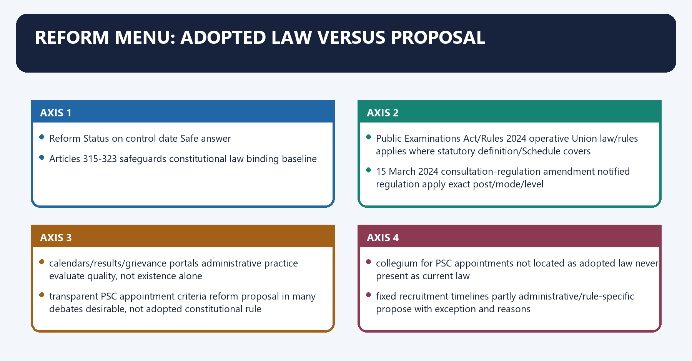
#### Visual 50 - Reform-status matrix

| Reform | Status on control date | Safe answer |
|---|---|---|
| Articles 315-323 safeguards | constitutional law | binding baseline |
| Public Examinations Act/Rules 2024 | operative Union law/rules | applies where statutory definition/Schedule covers |
| 15 March 2024 consultation-regulation amendment | notified regulation | apply exact post/mode/level |
| calendars/results/grievance portals | administrative practice | evaluate quality, not existence alone |
| transparent PSC appointment criteria | reform proposal in many debates | desirable, not adopted constitutional rule |
| collegium for PSC appointments | not located as adopted law | never present as current law |
| fixed recruitment timelines | partly administrative/rule-specific | propose with exception and reasons |
| independent vendor/cyber audit | governance reform | preserve security and accountability |

#### CLOSING RECALL FLOW — REFORM MENU: ADOPTED LAW VERSUS PROPOSAL

```closure-flow
SUBTOPIC: Reform menu: adopted law versus proposal
KEY TERMS / DEFINITIONS: Reform menu · adopted law versus proposal · Articles 315-323 safeguards · constitutional law · binding baseline · Public Examinations Act/Rules 2024
MECHANISM / ARGUMENT: The decisive contrast is between transparent PSC appointment criteria reform proposal in many debates desirable, not adopted constitutional rule and collegium for PSC appointments not located as adopted law never present as current law.
CONSEQUENCE / CONTRAST: Its principal consequence is that calendars/results/grievance portals administrative practice evaluate quality, not existence alone.
UPSC TRAP / ANSWER-USE: Do not miss this limiting distinction: the exam-safe limitation is that fixed recruitment timelines partly administrative/rule-specific propose with exception and...
ANSWER-GRABBING FORMULATION: Reform analysis must separate existing constitutional safeguards and enacted examination law from proposals for collegia, fixed timelines or new transparency duties.
```
### SESSION 50 — REFORM PRINCIPLES
#### DEFINITION / WHAT THIS IS CALLED

**Plain-language definition:** Reform principles denotes the constitutional rules and institutional links organised around APPOINTMENT QUALITY.

**Technical definition:** The decisive contrast is between TRUSTED MERIT COMMISSION and Reform should strengthen the lifecycle, not merely add penalties after a leak.

#### ANSWER-GRABBING OPENING — WRITE/ADAPT IN THE EXAM

> Public Service Commission reform should strengthen appointments, examination security, reasoned decisions, grievance systems and legislative scrutiny across the recruitment lifecycle.

#### MUST-WRITE KEYWORDS

- **Reform principles**
- **Reform**
- **APPOINTMENT QUALITY**
- **Its principal consequence**
- **Its**
- **LEGISLATIVE ACCOUNTABILITY**

**How to use them:** Frame the answer through Reform principles; define Reform, connect APPOINTMENT QUALITY with Its principal consequence to explain the mechanism, and use Its for the decisive comparison or qualification.

Reform principles denotes the constitutional rules and institutional links organised around APPOINTMENT QUALITY.
Reform principles operates through SECRETARIAT CAPACITY, connected with SECURE EXAM DESIGN.
The operative mechanism matters because rEASONED GRIEVANCE / RESULT DISCLOSURE.
Its principal consequence is that aRTICLE 323 LEGISLATIVE ACCOUNTABILITY.
The decisive contrast is between TRUSTED MERIT COMMISSION and [ANALYSIS] Reform should strengthen the lifecycle, not merely add penalties after a leak.
The exam-safe limitation is that aPPOINTMENT QUALITY.
#### Visual 51 - Seven-part reform framework

```text
APPOINTMENT QUALITY
        +
MEMBER INTEGRITY
        +
SECRETARIAT CAPACITY
        +
SECURE EXAM DESIGN
        +
STABLE RULES
        +
REASONED GRIEVANCE / RESULT DISCLOSURE
        +
ARTICLE 323 LEGISLATIVE ACCOUNTABILITY
        =
TRUSTED MERIT COMMISSION
```

[ANALYSIS] Reform should strengthen the lifecycle, not merely add penalties after a leak.

#### CLOSING RECALL FLOW — REFORM PRINCIPLES

```closure-flow
SUBTOPIC: Reform principles
KEY TERMS / DEFINITIONS: Reform principles · Reform · APPOINTMENT QUALITY · Its principal consequence · Its · LEGISLATIVE ACCOUNTABILITY
MECHANISM / ARGUMENT: The decisive contrast is between TRUSTED MERIT COMMISSION and Reform should strengthen the lifecycle, not merely add penalties after a leak.
CONSEQUENCE / CONTRAST: Reform should strengthen the lifecycle, not merely add penalties after a leak.
UPSC TRAP / ANSWER-USE: Do not miss this limiting distinction: its principal consequence is that aRTICLE 323 LEGISLATIVE ACCOUNTABILITY.
ANSWER-GRABBING FORMULATION: Public Service Commission reform should strengthen appointments, examination security, reasoned decisions, grievance systems and legislative scrutiny across the recruitment lifecycle.
```
### SESSION 51 — FEDERAL SIGNIFICANCE
#### DEFINITION / WHAT THIS IS CALLED

**Plain-language definition:** Federal significance denotes the constitutional rules and institutional links organised around Design choice Federal meaning.

**Technical definition:** Technically, Federal significance is analysed by relating separate SPSC for each State to Governor appoints SPSC, then testing the relationship through President removes all PSC members and insulation from immediate State retaliation.

#### ANSWER-GRABBING OPENING — WRITE/ADAPT IN THE EXAM

> State Commissions are locally appointed and reported upon but centrally insulated at removal, a deliberate federal asymmetry protecting them from immediate State retaliation.

#### MUST-WRITE KEYWORDS

- **Federal significance**
- **separate SPSC for each State**
- **Governor appoints SPSC**
- **President removes all PSC members**
- **insulation from immediate State retaliation**
- **Joint Commission route**

**How to use them:** Frame the answer through Federal significance; define separate SPSC for each State, connect Governor appoints SPSC with President removes all PSC members to explain the mechanism, and use insulation from immediate State retaliation for the decisive comparison or qualification.

Federal significance denotes the constitutional rules and institutional links organised around Design choice Federal meaning.
Federal significance operates through separate SPSC for each State State-specific recruitment identity, connected with Governor appoints SPSC State executive connection.
The operative mechanism matters because president removes all PSC members insulation from immediate State retaliation.
Its principal consequence is that joint Commission route voluntary inter-State pooling with parliamentary law.
The decisive contrast is between UPSC may serve State cooperative flexibility and State legislature receives SPSC report State democratic accountability.
The exam-safe limitation is that design choice Federal meaning.
#### Visual 52 - Federal balance

| Design choice | Federal meaning |
|---|---|
| separate SPSC for each State | State-specific recruitment identity |
| Governor appoints SPSC | State executive connection |
| President removes all PSC members | insulation from immediate State retaliation |
| Joint Commission route | voluntary inter-State pooling with parliamentary law |
| UPSC may serve State | cooperative flexibility |
| State legislature receives SPSC report | State democratic accountability |

[ANALYSIS] The SPSC is State-rooted in appointment and reporting but Union-insulated at removal. This is a deliberate federal asymmetry, not an accidental inconsistency.

#### CLOSING RECALL FLOW — FEDERAL SIGNIFICANCE

```closure-flow
SUBTOPIC: Federal significance
KEY TERMS / DEFINITIONS: Federal significance · separate SPSC for each State · Governor appoints SPSC · President removes all PSC members · insulation from immediate State retaliation · Joint Commission route
MECHANISM / ARGUMENT: This is a deliberate federal asymmetry, not an accidental inconsistency.
CONSEQUENCE / CONTRAST: Its principal consequence is that joint Commission route voluntary inter-State pooling with parliamentary law.
UPSC TRAP / ANSWER-USE: Do not miss this limiting distinction: the decisive contrast is between UPSC may serve State cooperative flexibility and State legislature...
ANSWER-GRABBING FORMULATION: State Commissions are locally appointed and reported upon but centrally insulated at removal, a deliberate federal asymmetry protecting them from immediate State retaliation.
```
### SESSION 52 — ACCOUNTABILITY WITHOUT EXECUTIVE CAPTURE
#### DEFINITION / WHAT THIS IS CALLED

**Plain-language definition:** Accountability without executive capture denotes the constitutional rules and institutional links organised around CONSTITUTIONAL TEXT.

**Technical definition:** The decisive contrast is between executive responsibility <- lawful appointment and administration and Accountability does not justify day-to-day political direction of selection results.

#### ANSWER-GRABBING OPENING — WRITE/ADAPT IN THE EXAM

> Annual reporting, reasons, judicial review and transparent administration can secure accountability without permitting day-to-day executive direction of selection results.

#### MUST-WRITE KEYWORDS

- **Accountability without executive capture**
- **Accountability**
- **CONSTITUTIONAL TEXT**
- **RTI**
- **Its principal consequence**
- **Its**

**How to use them:** Frame the answer through Accountability without executive capture; define Accountability, connect CONSTITUTIONAL TEXT with RTI to explain the mechanism, and use Its principal consequence for the decisive comparison or qualification.

Accountability without executive capture denotes the constitutional rules and institutional links organised around CONSTITUTIONAL TEXT.
Accountability without executive capture operates through legislative scrutiny <- annual report + non-acceptance reasons, connected with judicial review <- legality, equality, bias, mala fides.
The operative mechanism matters because public/RTI transparency <- rules, notices, results, reports.
Its principal consequence is that internal audit/security <- evidence and controls.
The decisive contrast is between executive responsibility <- lawful appointment and administration and [LIMIT] Accountability does not justify day-to-day political direction of selection results.
The exam-safe limitation is that cONSTITUTIONAL TEXT.
#### Visual 53 - Accountability channels

```text
CONSTITUTIONAL TEXT
       |
legislative scrutiny <- annual report + non-acceptance reasons
       |
judicial review <- legality, equality, bias, mala fides
       |
public/RTI transparency <- rules, notices, results, reports
       |
internal audit/security <- evidence and controls
       |
executive responsibility <- lawful appointment and administration
```

[LIMIT] Accountability does not justify day-to-day political direction of selection results.

#### CLOSING RECALL FLOW — ACCOUNTABILITY WITHOUT EXECUTIVE CAPTURE

```closure-flow
SUBTOPIC: Accountability without executive capture
KEY TERMS / DEFINITIONS: Accountability without executive capture · Accountability · CONSTITUTIONAL TEXT · RTI · Its principal consequence · Its
MECHANISM / ARGUMENT: Accountability without executive capture operates through legislative scrutiny <- annual report + non-acceptance reasons, connected with judicial review <- legality, equality, bias, mala fides.
CONSEQUENCE / CONTRAST: The decisive contrast is between executive responsibility <- lawful appointment and administration and Accountability does not justify day-to-day political direction of selection results.
UPSC TRAP / ANSWER-USE: Accountability does not justify day-to-day political direction of selection results.
ANSWER-GRABBING FORMULATION: Annual reporting, reasons, judicial review and transparent administration can secure accountability without permitting day-to-day executive direction of selection results.
```
### SESSION 53 — COMMON ANALYTICAL TENSIONS
#### DEFINITION / WHAT THIS IS CALLED

**Plain-language definition:** Common analytical tensions denotes the constitutional rules and institutional links organised around Tension False binary Reconciliation.

**Technical definition:** Common analytical tensions operates through merit vs representation exam or reservation lawful merit within equal-opportunity/reservation design, connected with independence vs accountability secrecy or capture autonomy + reasons + reporting + review.

#### ANSWER-GRABBING OPENING — WRITE/ADAPT IN THE EXAM

> Recruitment legitimacy requires reconciling merit with representation, autonomy with reasons, speed with fair remedy, and security with proportionate transparency.

#### MUST-WRITE KEYWORDS

- **Common analytical tensions**
- **merit vs representation**
- **exam or reservation**
- **lawful merit within equal-opportunity/reservation design**
- **independence vs accountability**
- **secrecy or capture**

**How to use them:** Frame the answer through Common analytical tensions; define merit vs representation, connect exam or reservation with lawful merit within equal-opportunity/reservation design to explain the mechanism, and use independence vs accountability for the decisive comparison or qualification.

Common analytical tensions denotes the constitutional rules and institutional links organised around Tension False binary Reconciliation.
Common analytical tensions operates through merit vs representation exam or reservation lawful merit within equal-opportunity/reservation design, connected with independence vs accountability secrecy or capture autonomy + reasons + reporting + review.
The operative mechanism matters because expertise vs judicial review experts or courts expert merits + court legality control.
Its principal consequence is that speed vs fairness instant result or endless hearing pre-declared process + time-bound remedy.
The decisive contrast is between security vs transparency reveal everything or nothing disclose governance/audit, protect attack surface and Union standards vs State autonomy central command or fragmentation cooperative standards with State adaptation.
The exam-safe limitation is that tension False binary Reconciliation.
#### Visual 54 - Tension and reconciliation

| Tension | False binary | Reconciliation |
|---|---|---|
| merit vs representation | exam or reservation | lawful merit within equal-opportunity/reservation design |
| independence vs accountability | secrecy or capture | autonomy + reasons + reporting + review |
| expertise vs judicial review | experts or courts | expert merits + court legality control |
| speed vs fairness | instant result or endless hearing | pre-declared process + time-bound remedy |
| security vs transparency | reveal everything or nothing | disclose governance/audit, protect attack surface |
| Union standards vs State autonomy | central command or fragmentation | cooperative standards with State adaptation |

#### CLOSING RECALL FLOW — COMMON ANALYTICAL TENSIONS

```closure-flow
SUBTOPIC: Common analytical tensions
KEY TERMS / DEFINITIONS: Common analytical tensions · merit vs representation · exam or reservation · lawful merit within equal-opportunity/reservation design · independence vs accountability · secrecy or capture
MECHANISM / ARGUMENT: Common analytical tensions operates through merit vs representation exam or reservation lawful merit within equal-opportunity/reservation design, connected with independence vs accountability secrecy or capture autonomy + reasons + reporting + review.
CONSEQUENCE / CONTRAST: Its principal consequence is that speed vs fairness instant result or endless hearing pre-declared process + time-bound remedy.
UPSC TRAP / ANSWER-USE: Do not miss this limiting distinction: the decisive contrast is between security vs transparency reveal everything or nothing disclose governance/audit...
ANSWER-GRABBING FORMULATION: Recruitment legitimacy requires reconciling merit with representation, autonomy with reasons, speed with fair remedy, and security with proportionate transparency.
```
### SESSION 54 — INTEGRATED ANSWER-WRITING METHOD
#### DEFINITION / WHAT THIS IS CALLED

**Plain-language definition:** Integrated answer-writing method denotes the constitutional rules and institutional links organised around "Article 317 protects tenure through a differentiated removal process.".

**Technical definition:** The decisive contrast is between "Article 317 protects tenure through a differentiated removal process." and "Article 317 protects tenure through a differentiated removal process.".

#### ANSWER-GRABBING OPENING — WRITE/ADAPT IN THE EXAM

> Article 317 provides strong tenure protection through differentiated removal routes, but institutional independence also depends on appointments, resources, process integrity and accountable reporting.

#### MUST-WRITE KEYWORDS

- **Integrated answer-writing method**
- **Article 317**
- **Integrated**
- **Article**
- **Its principal consequence**
- **Its**

**How to use them:** Frame the answer through Integrated answer-writing method; define Article 317, connect Integrated with Article to explain the mechanism, and use Its principal consequence for the decisive comparison or qualification.

Integrated answer-writing method denotes the constitutional rules and institutional links organised around "Article 317 protects tenure through a differentiated removal process.".
Integrated answer-writing method operates through clauses (1), (2), (3), (4), connected with insulation prevents executive retaliation.
The operative mechanism matters because appointment remains executive and clause (3) has direct grounds.
Its principal consequence is that strong removal security, incomplete lifecycle independence.
The decisive contrast is between "Article 317 protects tenure through a differentiated removal process." and "Article 317 protects tenure through a differentiated removal process.".
The exam-safe limitation is that "Article 317 protects tenure through a differentiated removal process.".
#### Visual 55 - Claim-evidence-analysis-qualification spine

```text
CLAIM
  "Article 317 protects tenure through a differentiated removal process."
       |
NAMED EVIDENCE
  clauses (1), (2), (3), (4)
       |
ANALYSIS
  insulation prevents executive retaliation
       |
QUALIFICATION
  appointment remains executive and clause (3) has direct grounds
       |
VERDICT
  strong removal security, incomplete lifecycle independence
```

#### CLOSING RECALL FLOW — INTEGRATED ANSWER-WRITING METHOD

```closure-flow
SUBTOPIC: Integrated answer-writing method
KEY TERMS / DEFINITIONS: Integrated answer-writing method · Article 317 · Integrated · Article · Its principal consequence · Its
MECHANISM / ARGUMENT: The decisive contrast is between "Article 317 protects tenure through a differentiated removal process." and "Article 317 protects tenure through a differentiated removal process.".
CONSEQUENCE / CONTRAST: Its principal consequence is that strong removal security, incomplete lifecycle independence.
UPSC TRAP / ANSWER-USE: Do not miss this limiting distinction: the exam-safe limitation is that "Article 317 protects tenure through a differentiated removal process.".
ANSWER-GRABBING FORMULATION: Article 317 provides strong tenure protection through differentiated removal routes, but institutional independence also depends on appointments, resources, process integrity and accountable reporting.
```
### SESSION 55 — THESIS SELECTOR
#### DEFINITION / WHAT THIS IS CALLED

**Plain-language definition:** Thesis selector denotes the constitutional rules and institutional links organised around Demand Qualified thesis.

**Technical definition:** The decisive contrast is between Demand Qualified thesis and Demand Qualified thesis.

#### ANSWER-GRABBING OPENING — WRITE/ADAPT IN THE EXAM

> Public Service Commissions convert merit rules into credible recruitment only when constitutional independence is joined to fair procedure, secure examinations and reviewable accountability.

#### MUST-WRITE KEYWORDS

- **Thesis selector**
- **independence**
- **advisory role**
- **SPSC federal design**
- **selection review**
- **exam integrity**

**How to use them:** Frame the answer through Thesis selector; define independence, connect advisory role with SPSC federal design to explain the mechanism, and use selection review for the decisive comparison or qualification.

Thesis selector denotes the constitutional rules and institutional links organised around Demand Qualified thesis.
Thesis selector operates through advisory role Article 320 gives constitutional voice, not a veto; Article 323 makes departure politically accountable, connected with SPSC federal design State appointment plus Presidential removal anchors State recruitment while reducing immediate State retaliation.
The operative mechanism matters because selection review courts police legality and equality without becoming interview boards.
Its principal consequence is that exam integrity criminal deterrence under the 2024 Act must be joined to secure design, audit, communication and remedy.
The decisive contrast is between Demand Qualified thesis and Demand Qualified thesis.
The exam-safe limitation is that demand Qualified thesis.
| Demand | Qualified thesis |
|---|---|
| independence | PSC independence is strongest at removal and finance, but practical autonomy depends on appointment quality, staff, security and transparency. |
| advisory role | Article 320 gives constitutional voice, not a veto; Article 323 makes departure politically accountable. |
| SPSC federal design | State appointment plus Presidential removal anchors State recruitment while reducing immediate State retaliation. |
| selection review | courts police legality and equality without becoming interview boards. |
| exam integrity | criminal deterrence under the 2024 Act must be joined to secure design, audit, communication and remedy. |
| lateral recruitment | lawfulness depends on the post-specific rule, consultation exemption, reservation and transparent criteria, not on the label “lateral”. |

#### CLOSING RECALL FLOW — THESIS SELECTOR

```closure-flow
SUBTOPIC: Thesis selector
KEY TERMS / DEFINITIONS: Thesis selector · independence · advisory role · SPSC federal design · selection review · exam integrity
MECHANISM / ARGUMENT: The decisive contrast is between Demand Qualified thesis and Demand Qualified thesis.
CONSEQUENCE / CONTRAST: Its principal consequence is that exam integrity criminal deterrence under the 2024 Act must be joined to secure design, audit, communication and remedy.
UPSC TRAP / ANSWER-USE: Do not miss this limiting distinction: the exam-safe limitation is that demand Qualified thesis.
ANSWER-GRABBING FORMULATION: Public Service Commissions convert merit rules into credible recruitment only when constitutional independence is joined to fair procedure, secure examinations and reviewable accountability.
```
### SESSION 56 — PRELIMS TRAP BOARD
#### DEFINITION / WHAT THIS IS CALLED

**Plain-language definition:** Prelims trap board operates through Joint PSC is purely extra-constitutional statutory body Constitution authorises it; parliamentary law activates it, connected with Governor removes SPSC members President removes.

**Technical definition:** Prelims trap board denotes the constitutional rules and institutional links organised around Wrong statement Correction.

#### ANSWER-GRABBING OPENING — WRITE/ADAPT IN THE EXAM

> Lateral recruitment can supplement constitutional merit only when it is more transparent and rule-bound than patronage, not when used to escape regular safeguards.

#### MUST-WRITE KEYWORDS

- **Prelims trap board**
- **Constitution authorises it; parliamentary law activates it**
- **Governor removes SPSC members**
- **President removes**
- **Governor suspends Joint Commission member**
- **President suspends Joint; Governor suspends SPSC**

**How to use them:** Frame the answer through Prelims trap board; define Constitution authorises it; parliamentary law activates it, connect Governor removes SPSC members with President removes to explain the mechanism, and use Governor suspends Joint Commission member for the decisive comparison or qualification.

Prelims trap board denotes the constitutional rules and institutional links organised around Wrong statement Correction.
Prelims trap board operates through Joint PSC is purely extra-constitutional statutory body Constitution authorises it; parliamentary law activates it, connected with Governor removes SPSC members President removes.
The operative mechanism matters because governor suspends Joint Commission member President suspends Joint; Governor suspends SPSC.
Its principal consequence is that all removal needs SC inquiry only misbehaviour route; clause (3) grounds are direct Presidential grounds.
The decisive contrast is between half members must be IAS officers near-half need ten years in government office and term runs from notification six years from entering office.
The exam-safe limitation is that no PSC member can hold any later PSC office Article 319 differentiates.
#### Visual 56 - Close-option corrections

| Wrong statement | Correction |
|---|---|
| Joint PSC is purely extra-constitutional statutory body | Constitution authorises it; parliamentary law activates it |
| Governor removes SPSC members | President removes |
| Governor suspends Joint Commission member | President suspends Joint; Governor suspends SPSC |
| all removal needs SC inquiry | only misbehaviour route; clause (3) grounds are direct Presidential grounds |
| half members must be IAS officers | near-half need ten years in government office |
| term runs from notification | six years from entering office |
| no PSC member can hold any later PSC office | Article 319 differentiates |
| UPSC advice is binding | generally advisory/directory |
| Article 320(4) abolishes reservation consultation entirely | exact manner-of-16(4)/335 exception |
| every government post requires UPSC exam | role depends on rules and valid exemptions |
| recommendation guarantees appointment | no indefeasible right |
| courts cannot review selection | limited legality review is available |
| Public Examinations Act excludes UPSC | UPSC is expressly in Schedule |
| lateral entry automatically bypasses UPSC | post/mode/rule/exemption specific |

#### CLOSING RECALL FLOW — PRELIMS TRAP BOARD

```closure-flow
SUBTOPIC: Prelims trap board
KEY TERMS / DEFINITIONS: Prelims trap board · Constitution authorises it; parliamentary law activates it · Governor removes SPSC members · President removes · Governor suspends Joint Commission member · President suspends Joint; Governor suspends SPSC
MECHANISM / ARGUMENT: Prelims trap board denotes the constitutional rules and institutional links organised around Wrong statement Correction.
CONSEQUENCE / CONTRAST: Its principal consequence is that all removal needs SC inquiry only misbehaviour route; clause (3) grounds are direct Presidential grounds.
UPSC TRAP / ANSWER-USE: Do not miss this limiting distinction: the decisive contrast is between half members must be IAS officers near-half need ten...
ANSWER-GRABBING FORMULATION: Lateral recruitment can supplement constitutional merit only when it is more transparent and rule-bound than patronage, not when used to escape regular safeguards.
```
## BASIC MCQS / REMEDIATION

### Original MCQ loop - strict continuous A -> B -> C -> D rotation

#### OM1. Article 315 baseline

Which statement is constitutionally correct?

A. The Supreme Court determines the number of PSCs.
B. There shall be a Public Service Commission for the Union and for each State, subject to Article 315.
C. Parliament must create every SPSC by ordinary law.
D. One Commission must serve the Union and all States.

**Answer: B.**

**Explanation:** [FACT] Article 315(1) establishes the Union and State Commission baseline, subject to the cooperative alternatives in the Article.

#### OM2. Creating a Joint State PSC

A Joint State Public Service Commission is provided for when:

A. the Inter-State Council recommends it.
B. relevant State legislatures pass resolutions and Parliament provides by law.
C. the UPSC Chair approves a merger.
D. two Governors issue a joint executive order.

**Answer: B.**

**Explanation:** [FACT] Article 315(2) requires State legislative resolutions and a parliamentary law.

#### OM3. Appointment to a Joint Commission

The Chair and members of a Joint State Public Service Commission are appointed by:

A. Parliament's presiding officers.
B. the Chief Justice of India.
C. the Governors jointly.
D. the President.

**Answer: D.**

**Explanation:** [FACT] Article 316(1) places UPSC and Joint Commission appointments with the President.

#### OM4. SPSC removal

An SPSC member can constitutionally be removed by:

A. the Chief Minister after Cabinet advice.
B. the President under Article 317.
C. the State legislature by special majority.
D. the Governor alone.

**Answer: B.**

**Explanation:** [FACT] Appointment is by the Governor, but removal authority for every PSC is the President.

#### OM5. Experience rule

Article 316 requires that:

A. as nearly as may be one-half of members have at least ten years of specified government office.
B. exactly half be serving IAS officers.
C. every member be a retired civil servant.
D. the Chair have twenty years of judicial service.

**Answer: A.**

**Explanation:** [FACT] The near-half ten-year rule is the only universal composition qualification in the constitutional text.

#### OM6. UPSC tenure

A UPSC member ordinarily serves:

A. six years from notification regardless of age.
B. five years or age 62.
C. until presidential pleasure ends.
D. six years from entering office or age 65, whichever is earlier.

**Answer: D.**

**Explanation:** [FACT] Article 316(2) uses entry upon office and the earlier of six years or age 65.

#### OM7. SPSC resignation

An SPSC member resigns by writing addressed to:

A. the President.
B. the Governor.
C. the State legislature.
D. the Chief Minister.

**Answer: B.**

**Explanation:** [FACT] The resignation addressee differs from the removal authority.

#### OM8. Reappointment rule

On expiry of term, a PSC member:

A. may be reappointed if the executive records reasons.
B. may always obtain a second identical term.
C. is barred from every different PSC office.
D. is ineligible for reappointment to that office, subject to Article 319 progression.

**Answer: D.**

**Explanation:** [FACT] Article 316(3) bars the same office; Article 319 separately states permitted later PSC offices.

#### OM9. Acting UPSC Chair

When the UPSC Chair cannot perform duties, the acting arrangement is made by:

A. the senior-most member automatically.
B. Parliament by resolution.
C. the Cabinet Secretary from the civil service.
D. the President from among other Commission members.

**Answer: D.**

**Explanation:** [FACT] Article 316(1A) requires Presidential appointment; automatic seniority is not the text.

#### OM10. Misbehaviour removal

Removal for misbehaviour requires:

A. a Presidential reference and Supreme Court inquiry/report.
B. a parliamentary impeachment vote.
C. a State Cabinet inquiry.
D. a Commission majority.

**Answer: A.**

**Explanation:** [FACT] Article 317(1), not the judicial-removal address procedure, controls.

#### OM11. Direct clause (3) ground

Which is a direct Presidential removal ground under Article 317(3)?

A. an adverse annual report.
B. refusal to accept an executive recommendation.
C. infirmity of mind or body making the member unfit.
D. disagreement with government policy.

**Answer: C.**

**Explanation:** [FACT] Insolvency, paid outside employment and qualifying infirmity are clause (3) grounds.

#### OM12. Joint Commission suspension

After a Supreme Court reference, a Joint Commission member may be suspended by:

A. the President.
B. Parliament.
C. the Governor chosen by rotation.
D. any served State's Governor.

**Answer: A.**

**Explanation:** [FACT] Article 317(2) gives the President suspension power for Union and Joint Commissions.

#### OM13. Article 318 safeguard

Which condition is constitutionally protected?

A. Staff conditions can never be altered.
B. Commission strength is permanently frozen.
C. A member's service conditions cannot be varied to the member's disadvantage after appointment.
D. Every member receives a judicial salary.

**Answer: C.**

**Explanation:** [FACT] The Article 318 proviso expressly protects members against disadvantageous variation.

#### OM14. Former SPSC Chair

A former SPSC Chair may be eligible to become:

A. an SPSC member in the same State.
B. a member or Chair of the UPSC, or Chair of another SPSC.
C. any Union Secretary.
D. any public-sector chief executive.

**Answer: B.**

**Explanation:** [FACT] Article 319(b) permits the specified PSC offices and bars other government employment.

#### OM15. Former UPSC member

A former UPSC member other than the Chair may be eligible as:

A. the same UPSC member for a second term.
B. any government adviser.
C. UPSC Chair or Chair of an SPSC.
D. any SPSC member.

**Answer: C.**

**Explanation:** [FACT] Article 319(c) does not permit ordinary SPSC membership.

#### OM16. Former UPSC Chair

On ceasing office, the UPSC Chair is:

A. ineligible for further employment under Union or State government.
B. eligible to become a Union Secretary.
C. eligible to chair any SPSC.
D. eligible for any State government employment.

**Answer: A.**

**Explanation:** [FACT] Article 319(c) is the strictest of the four post-office clauses.

#### OM17. Examination duty

Article 320(1) makes it the duty of PSCs to:

A. appoint every selected candidate.
B. conduct examinations for appointments to the respective Union/State services.
C. frame all service laws.
D. adjudicate all service disputes.

**Answer: B.**

**Explanation:** [FACT] Examination is a core duty; appointment and adjudication remain elsewhere.

#### OM18. Joint recruitment scheme

Under Article 320(2), UPSC assists:

A. one State whenever its SPSC is vacant.
B. Parliament in recruiting judges.
C. private employers seeking a common test.
D. two or more requesting States with joint recruitment for specially qualified services.

**Answer: D.**

**Explanation:** [FACT] This is joint-scheme assistance, not a Joint Commission.

#### OM19. Consultation subject

Which matter is expressly within Article 320(3)?

A. deciding an election petition.
B. fixing the Finance Commission formula.
C. a qualifying official-duty legal-defence cost claim.
D. delimitation of constituencies.

**Answer: C.**

**Explanation:** [FACT] Article 320(3)(a) is a frequently overlooked consultation subject.

#### OM20. Article 320(4)

Article 320(4) means that PSC consultation is not required regarding:

A. every application of Article 16.
B. all promotions involving reservation.
C. every appointment of an SC/ST candidate.
D. the manner of making Article 16(4) provision or giving effect to Article 335.

**Answer: D.**

**Explanation:** [FACT] The exact textual scope must replace the loose statement that “reservation is outside UPSC”.

#### OM21. Exemption regulations

Regulations under the proviso to Article 320(3):

A. must be laid for at least fourteen days before the relevant legislature and are modifiable.
B. permanently amend Article 320.
C. require Supreme Court approval.
D. are secret executive instructions.

**Answer: A.**

**Explanation:** [FACT] Article 320(5) creates legislative scrutiny of delegated exemptions.

#### OM22. Nature of advice

The safest statement is:

A. government may ignore the Commission without accountability.
B. non-consultation automatically voids every action.
C. PSC advice always binds the government.
D. Article 320 consultation is generally directory; advice is not a legal veto.

**Answer: D.**

**Explanation:** [FACT] *Manbodhan Lal* establishes directory consultation while recognising its constitutional importance.

#### OM23. Article 321

Additional PSC functions concerning local authorities or statutory bodies may be conferred by:

A. an Act of Parliament or the competent State legislature.
B. an annual report.
C. a Commission resolution alone.
D. a Supreme Court practice direction.

**Answer: A.**

**Explanation:** [FACT] Article 321 supplies the legislative-extension route.

#### OM24. Charged expenditure

Under Article 322, SPSC expenses are charged on:

A. the Consolidated Fund of the State.
B. a Commission fee fund.
C. the Consolidated Fund of India.
D. the Public Account of the State.

**Answer: A.**

**Explanation:** [FACT] Charged expenditure is not submitted to vote, though it may be discussed.

#### OM25. UPSC report

Where UPSC advice is not accepted, Article 323 requires:

A. a national referendum.
B. the President to reverse the government.
C. a memorandum explaining cases and reasons to accompany the report laid before Parliament.
D. automatic judicial invalidation.

**Answer: C.**

**Explanation:** [FACT] Reporting and reasons are the constitutional accountability substitute for binding advice.

#### OM26. Joint Commission reporting

A Joint Commission reports:

A. to the Inter-State Council.
B. to each served State's Governor on work relating to that State.
C. only to Parliament.
D. only to the President.

**Answer: B.**

**Explanation:** [FACT] Each Governor lays the relevant report and non-acceptance memorandum before that State legislature.

#### OM27. UPSC and DoPT

Which allocation is correct?

A. CAT appoints civil servants.
B. DoPT conducts every UPSC examination.
C. UPSC manages all cadres and training.
D. UPSC recruits/advises; government/DoPT owns much rule, cadre and personnel management.

**Answer: D.**

**Explanation:** [FACT] The constitutional Commission is not the entire personnel administration.

#### OM28. Select-list right

*Shankarsan Dash* establishes that:

A. government discretion is immune from equality review.
B. selection creates property in the post.
C. inclusion in a select list creates no indefeasible appointment right, though action cannot be arbitrary.
D. every notified vacancy must be filled.

**Answer: C.**

**Explanation:** [FACT] Fair consideration and non-arbitrariness survive without an automatic appointment right.

#### OM29. Judicial review of selection

Courts may properly interfere where:

A. the court wants to design a new service.
B. interview answers could have been marked differently.
C. a judge personally prefers another candidate.
D. statutory rules are seriously violated or mala fides/bias is shown.

**Answer: D.**

**Explanation:** [FACT] *M.V. Thimmaiah* protects expert merits while preserving review for legal defects.

#### OM30. *Manbodhan Lal*

The case is chiefly associated with:

A. creation of a Joint Commission.
B. charged expenditure.
C. Article 320 consultation being directory rather than mandatory.
D. the age ceiling of SPSC members.

**Answer: C.**

**Explanation:** [FACT] The decision arose in the disciplinary-consultation context.

#### OM31. Mid-process criteria

Which principle follows from *K. Manjusree* and *Tej Prakash Pathak*?

A. criteria may always change before results.
B. eligibility/selection criteria cannot be altered mid-process unless lawful rules permit a non-arbitrary course.
C. candidates control recruitment rules.
D. every clarification is illegal.

**Answer: B.**

**Explanation:** [FACT] The doctrine is anchored in equal, predictable public employment under Articles 14 and 16.

#### OM32. Public Examinations Act coverage

The 2024 Act's Schedule:

A. expressly includes examinations conducted by UPSC.
B. excludes constitutional bodies.
C. covers UPSC only after a separate State notification.
D. covers only school boards.

**Answer: A.**

**Explanation:** [CURRENT] UPSC is item 1 in the Schedule.

#### OM33. Monitoring rule

The Public Examinations Rules, 2024 require:

A. all exams to use one private vendor.
B. each public examination authority to establish an implementation-monitoring mechanism.
C. abolition of offline examinations.
D. the Supreme Court to audit every examination.

**Answer: B.**

**Explanation:** [CURRENT] Rule 9 supplies the monitoring duty.

#### OM34. 15 March 2024 consultation amendment

The precise statement is:

A. it applies to every SPSC.
B. it abolishes Article 320.
C. it exempts specified Group A/B posts up to level 13A filled through named modes.
D. it exempts every lateral appointment.

**Answer: C.**

**Explanation:** [CURRENT] Post level and mode are essential; “lateral entry” is not the regulation's universal label.

#### OM35. Tribunal boundary

Which institution principally adjudicates covered Union recruitment/service disputes at first instance?

A. Finance Commission.
B. Election Commission.
C. Central Administrative Tribunal under its statutory jurisdiction.
D. UPSC.

**Answer: C.**

**Explanation:** [FACT] Commission and tribunal functions are institutionally distinct.

#### OM36. Independence assessment

Which conclusion is strongest?

A. charged expenditure alone guarantees integrity.
B. appointment quality, tenure, finance, staff, secure process, reporting and review interact.
C. non-binding advice means no independence exists.
D. Presidential removal makes appointments irrelevant.

**Answer: B.**

**Explanation:** [ANALYSIS] Independence is systemic, not a one-clause label.

### Remedial MCQs - strict continuation A -> B -> C -> D rotation

#### RM1. Joint Commission status

The best description of a Joint State PSC is:

A. identical to UPSC assistance under Article 315(4).
B. automatically created when two Governors agree.
C. constitutionally contemplated and brought into operation by parliamentary law after State resolutions.
D. purely executive and extra-constitutional.

**Answer: C.**

**Explanation:** [FACT] This formulation preserves both constitutional source and statutory creating instrument.

#### RM2. Suspension trap

After an Article 317 reference concerning an SPSC member, suspension may be ordered by:

A. the SPSC Chair.
B. the President only.
C. the State legislature.
D. the Governor.

**Answer: D.**

**Explanation:** [FACT] Final removal remains with the President; suspension authority is differentiated.

#### RM3. Contract interest

A PSC member's prohibited interest in a government contract is:

A. deemed misbehaviour subject to the Article 317(1) route, with the company-membership exception.
B. a direct insolvency ground.
C. irrelevant after disclosure.
D. decided finally by the Commission.

**Answer: A.**

**Explanation:** [FACT] Article 317(4) supplies the deemed-misbehaviour rule.

#### RM4. Same-office trap

Article 316(3) means:

A. no former member may ever serve another PSC.
B. reappointment to the same office is barred, while exact different-office eligibility is separately tested.
C. Article 319 is redundant.
D. a second term is allowed after a gap.

**Answer: B.**

**Explanation:** [FACT] The two Articles must be read together.

#### RM5. Advice-accountability link

If government rejects PSC advice, the constitutional model relies especially on:

A. reasons and the Article 323 report/memorandum route.
B. Commission veto.
C. dismissal of the minister.
D. automatic contempt.

**Answer: A.**

**Explanation:** [ANALYSIS] Public reason and legislative scrutiny give advisory power consequence.

#### RM6. Reservation nuance

Article 320(4):

A. excludes every SC/ST candidate from Commission recruitment.
B. prohibits reservation.
C. removes the requirement of PSC consultation on the specified manner of Article 16(4)/335 implementation.
D. permits PSC to ignore a roster.

**Answer: C.**

**Explanation:** [FACT] The exception concerns required consultation, not substantive equality law.

#### RM7. Lateral-entry trap

The correct method is to:

A. treat media terminology as the legal rule.
B. check post, level, recruitment rule, mode, consultation regulation, reservation and transparency.
C. assume every lateral post is UPSC-exempt.
D. assume every contract post is unconstitutional.

**Answer: B.**

**Explanation:** [ANALYSIS] Post-specific legal analysis prevents overstatement in either direction.

#### RM8. Appointment-right trap

A selected candidate:

A. can compel filling of every advertised vacancy.
B. cannot be rejected for discovered ineligibility.
C. owns the vacancy.
D. has no automatic appointment right but is protected against arbitrary State action.

**Answer: D.**

**Explanation:** [FACT] This is the calibrated *Shankarsan Dash* rule.

#### RM9. Court's role

In reviewing PSC selection, a court should principally:

A. test legality, fairness, bias and rule compliance.
B. fill vacancies directly whenever possible.
C. substitute its preferred scoring system.
D. conduct a new viva voce.

**Answer: A.**

**Explanation:** [FACT] Review is constitutional supervision, not merit appeal.

#### RM10. Public-examination law

The 2024 Act:

A. replaces Articles 315-323.
B. governs only private coaching tests.
C. guarantees every exam will be leak-proof.
D. adds anti-unfair-means offences and controls to the existing recruitment framework.

**Answer: D.**

**Explanation:** [CURRENT] It supplements, rather than constitutionalises or perfects, exam administration.

#### RM11. SPSC reform

Which is a calibrated integrity reform?

A. executive power to alter criteria after the exam.
B. removal of judicial review.
C. timely criteria-based appointments, conflict controls, secure systems and reasoned grievance handling.
D. permanent secrecy over results.

**Answer: C.**

**Explanation:** [ANALYSIS] Reform must strengthen capacity and accountability without executive capture.

#### RM12. Examiner-grade method

The best paragraph sequence is:

A. claim -> named evidence -> analysis -> qualification.
B. definition -> copied list -> absolute claim.
C. slogan -> allegation -> prediction.
D. case name -> unrelated statistic -> wish.

**Answer: A.**

**Explanation:** [ANALYSIS] This pattern demonstrates control, relevance and balance.

## PYQS AND ANSWER PRACTICE

[FACT] This H2 deliberately begins the practice material so that `markdown_learning_pdf.py --mode workbook` extracts the complete solved workbook and stops before the final consolidated register notes.

[FACT] The recent local routing ledgers and integration audits for **2018-2023, 2024-2025 and 2026** were searched precisely for `Public Service Commission`, `Article 315`, `Article 320`, `SPSC` and `Joint State Public Service Commission`.

[LIMIT] **No direct standalone UPSC Prelims or GS-II Mains PYQ on the UPSC/SPSC constitutional architecture was verified in those routed ledgers.** Therefore, this package does not manufacture an official question, year, wording or key.

[LIMIT] Adjacent verified questions on civil-service reform, ethos of civil services, administrative tribunals, district-judge recruitment and bank-chair selection remain with their audited Governance, Public Services, Judiciary, Tribunal or Economy owners. They are not relabelled as PSC PYQs merely because recruitment is an adjacent concept.

#### Visual 57 - PYQ audit outcome

| Ledger window | Exact PSC route found? | Package action |
|---|---:|---|
| 2018-2023 Prelims/Mains | no direct standalone route | state absence; do not invent |
| 2024-2025 Prelims/Mains | no direct standalone route | state absence; do not invent |
| 2026 ledgers/audit | no routed PSC question | state absence; do not invent |
| adjacent recruitment/service demands | yes, but owned elsewhere | cross-link, not duplicate |

### Original solved Mains practice

#### M1. Article 317 does not provide one uniform removal process for every allegation against a Public Service Commission member. Explain. (10 marks, 150 words)

**Model solution**

**Thesis:** [FACT] Article 317 centralises final removal in the President but differentiates misbehaviour from three direct constitutional grounds; [ANALYSIS] that distinction combines tenure security with workable incapacity and conflict controls.

**Misbehaviour:** [FACT] Under clause (1), the President refers the allegation to the Supreme Court, which conducts an inquiry under the Article 145 procedure and reports whether the member ought to be removed. [FACT] Clause (4) deems prohibited interest in a government contract to be misbehaviour.

**Direct grounds:** [FACT] Clause (3) allows Presidential removal for adjudged insolvency, paid employment outside office, or unfitness due to infirmity of mind or body without using the separate clause (1) inquiry route.

**Suspension:** [FACT] Once reference is made, the President may suspend a UPSC/Joint Commission member, while the Governor may suspend an SPSC member, until the President acts on the Court's report.

**Qualification:** [LIMIT] The Governor never finally removes an SPSC member, and Parliament's judicial-address procedure is inapplicable.

**Verdict:** Article 317 protects against retaliatory removal without making the office incapable of responding to objective disqualification or incapacity.

**Outstanding-answer test:** It names all four clauses, distinguishes removal from suspension and avoids importing “impeachment”.

#### M2. Public Service Commission advice is non-binding, yet constitutionally consequential. Comment. (10 marks, 150 words)

**Model solution**

**Thesis:** [FACT] Article 320 creates a constitutional consultation voice rather than a veto; [ANALYSIS] its consequence arises from expertise, convention and public accountability.

**Scope:** [FACT] Consultation covers recruitment methods, appointment/promotion/transfer principles and suitability, disciplinary matters, official-duty legal-cost claims and injury pensions. This gives the Commission structured access before important personnel decisions.

**Legal limit:** [FACT] *State of U.P. v. Manbodhan Lal Srivastava* held Article 320(3) directory, so non-consultation does not automatically invalidate executive action. Valid regulations may also specify consultation exceptions.

**Accountability:** [FACT] Article 323 requires annual reports and memoranda explaining cases and reasons where advice was not accepted. [ANALYSIS] Rejection thus becomes capable of legislative and public scrutiny.

**Qualification:** [LIMIT] Directory does not mean dispensable at will; arbitrariness, mala fides and rule violations remain reviewable.

**Verdict:** The Commission influences by reason and disclosure, not command—a soft legal power strengthened by hard reporting duties.

**Outstanding-answer test:** It links Articles 320 and 323 and states *Manbodhan Lal* without saying advice is meaningless.

#### M3. A Joint State Public Service Commission is neither purely statutory nor automatically created by the Constitution. Clarify. (10 marks, 150 words)

**Model solution**

**Thesis:** [FACT] Article 315(2) supplies the constitutional design, while a parliamentary law after State legislative resolutions supplies the operational creating instrument.

**Constitutional foundation:** Two or more States may agree to a common Commission. Each relevant House—or each House in a bicameral State—must pass the resolution contemplated by Article 315(2).

**Statutory activation:** Parliament may then by law provide for appointment and incidental/consequential matters. [FACT] The President appoints its Chair/members under Article 316, regulates it under Article 318 and may suspend its member after an Article 317 reference.

**Distinctions:** [FACT] It differs from UPSC serving a State under Article 315(4) and from UPSC assistance for a joint recruitment scheme under Article 320(2).

**Qualification:** [LIMIT] Calling it merely “statutory” can hide its constitutional status; calling it self-executing ignores the required law.

**Verdict:** It is best described as a constitutionally authorised common Commission instantiated by parliamentary statute through State consent.

**Outstanding-answer test:** It separates source, trigger, law, appointing authority and two neighbouring devices.

#### M4. Examine the constitutional safeguards and practical limits of UPSC/SPSC independence. (15 marks, 250 words)

**Model solution**

**Thesis:** [ANALYSIS] PSC independence is strongest at removal and finance but incomplete across the institutional lifecycle; appointment quality, staff, technology and compliance conventions determine whether constitutional insulation becomes practical autonomy.

**Constitutional safeguards**

1. [FACT] Article 315 creates the Commissions directly and prevents ordinary executive abolition of their core.
2. [FACT] Article 316 fixes six-year/age-limited tenure, reducing pleasure-based insecurity.
3. [FACT] Article 317 reserves final removal to the President and subjects misbehaviour to Supreme Court inquiry.
4. [FACT] Article 318 bars disadvantageous variation of member service conditions.
5. [FACT] Article 319 narrows post-office government employment, reducing favour-seeking.
6. [FACT] Article 322 charges UPSC/SPSC expenditure on the relevant Consolidated Fund.
7. [FACT] Article 323 requires reporting and reasons for rejected advice.

**Practical limits**

- [FACT] President/Governor appoint members without an adopted constitutional collegium.
- [FACT] Article 320 advice is generally non-binding after *Manbodhan Lal*.
- [ANALYSIS] Executive control over staff, technology procurement and timely vacancies can weaken an otherwise protected body.
- [ANALYSIS] SPSC quality may vary with local political networks, secretariat capacity and examination-security systems.

**Counterpoint:** [ANALYSIS] Binding advice on every matter could transfer democratic personnel responsibility to an unelected commission.

**Reforms:** publish appointment criteria and conflicts, fill vacancies predictably, strengthen rule-based staff and cyber capacity, improve speaking grievance decisions, and ensure legislative committees examine Article 323 memoranda.

**Qualification:** [LIMIT] No speculative collegium should be presented as current law.

**Verdict:** The Constitution protects the Commission from dismissal; governance reform must protect it from dependence, delay and distrust.

**Outstanding-answer test:** It uses at least five exact Articles, presents both institutional case and democratic limit, and offers implementable reforms.

#### M5. Courts review Public Service Commission selections, but they do not sit as appellate selection boards. Analyse. (15 marks, 250 words)

**Model solution**

**Thesis:** [FACT] Judicial review protects Articles 14 and 16, statutory rules and procedural fairness; [ANALYSIS] judicial restraint simultaneously protects expert comparative assessment.

**Reviewable defects**

- [FACT] *Ashok Kumar Yadav* demonstrates that PSC selection remains reviewable for bias and arbitrary interview design.
- [FACT] *K. Manjusree* invalidated a minimum interview benchmark introduced after the process.
- [CURRENT] *Tej Prakash Pathak*, 2024 INSC 847, Constitution Bench, reaffirms stability of eligibility/selection rules unless the governing framework permits a lawful, non-arbitrary change.
- [FACT] Mala fides, unequal treatment, ineligible decision-makers and serious statutory-rule violations remain review grounds.

**Restraint**

[FACT] *M.V. Thimmaiah v. UPSC* states that courts ordinarily do not act as appellate authorities over expert recommendations; review is exceptional for mala fides or serious rule breach.

**Appointment boundary**

[FACT] *Shankarsan Dash* denies an indefeasible appointment right merely from select-list inclusion. Yet government cannot arbitrarily refuse appointment or selectively apply its decision.

**Institutional reason:** [ANALYSIS] Judges are equipped to decide legality, not to reconstruct specialist scoring, interviews and service suitability.

**Qualification:** [LIMIT] “Expert opinion” cannot shield conflict of interest, undisclosed criteria or discrimination.

**Verdict:** The correct line is **merit deference with legality control**: courts do not choose candidates, but they ensure the State chooses by known, equal and lawful rules.

**Outstanding-answer test:** It gives four named cases with propositions and distinguishes selection, recommendation and appointment.

#### M6. Examination integrity requires more than criminal punishment. Discuss with reference to the Public Examinations framework and PSC governance. (15 marks, 250 words)

**Model solution**

**Thesis:** [CURRENT] The Public Examinations Act and Rules, 2024 add a strong anti-unfair-means framework; [ANALYSIS] deterrence succeeds only when joined to prevention, detection, transparent remedy and institutional capacity.

**Legal layer**

[FACT] The Act's Schedule expressly covers UPSC examinations. Section 3 includes leakage, unauthorised access/assistance, answer-sheet and assessment tampering, security/network manipulation, fake sites, fake exams and fake offer letters. Offences are cognizable, non-bailable and non-compoundable; service-provider and organised-crime liability addresses systemic wrongdoing.

**Preventive layer**

[CURRENT] Rule 5 contemplates CBT standards for centres, nodes, servers, networks, platforms, readiness audits, biometrics, security, question loading, invigilation and post-exam checks. Rule 9 requires implementation monitoring.

**Governance layer**

- segment question access and retain audit logs;
- independently test high-risk digital systems and vendors;
- publish stable criteria, calendars and prompt reasons for delay;
- provide accessible grievance and answer-key/result representation channels;
- prepare continuity/re-examination protocols that protect innocent candidates.

**Qualification:** [LIMIT] Maximum secrecy can conceal weak governance; maximum disclosure can reveal attack surfaces. Privacy, disability accommodation and natural justice must remain intact.

**Verdict:** Criminal law punishes the breach; trustworthy PSC design prevents it, detects it early and gives candidates a lawful remedy.

**Outstanding-answer test:** It names the Act's UPSC Schedule, verified Rules and a full prevent-detect-report-remedy cycle.

#### M7. “The SPSC is State-rooted but Union-insulated.” Evaluate this federal design and suggest reforms. (20 marks, 300 words)

**Model solution**

**Thesis:** [FACT] The Governor appoints SPSC members and receives their annual report, while the President alone removes them; [ANALYSIS] this asymmetry combines State recruitment ownership with protection from immediate State executive retaliation.

**State-rooted elements**

1. [FACT] Article 315 provides an SPSC for each State.
2. [FACT] The Governor appoints the Chair and members under Article 316.
3. [FACT] The Governor determines membership/staff conditions by regulations under Article 318.
4. [FACT] The SPSC recruits for State services and reports to the Governor under Article 323.
5. [FACT] The State legislature receives the report and non-acceptance memorandum.

**Union-insulated elements**

1. [FACT] Only the President removes an SPSC member under Article 317.
2. [FACT] Misbehaviour requires Supreme Court inquiry.
3. [FACT] The State government cannot use removal simply because advice is inconvenient.
4. [FACT] The constitutional age/tenure, service-condition and post-office rules limit local executive control.

**Federal flexibility**

[FACT] States may seek a Joint Commission through resolutions and parliamentary law, use UPSC assistance under Article 315(4), or request joint-scheme help under Article 320(2).

**Problems**

[ANALYSIS] Executive appointment dominance, vacancies, local conflicts, weak vendor/security capacity, shifting criteria and poor grievance systems can defeat formal insulation. Presidential removal is a last-resort safeguard, not daily quality assurance.

**Reforms**

- publish qualification, integrity and conflict criteria for appointments;
- create predictable appointment/vacancy calendars;
- professionalise permanent secretariats and digital-security cells;
- adopt national-conference standards while preserving State adaptation;
- publish reasons, marks/cut-offs and grievance outcomes within law;
- strengthen legislative committee scrutiny of Article 323 reports.

**Qualification:** [LIMIT] A Union-controlled appointment system would over-correct the State problem and weaken federal ownership; no adopted collegium should be assumed.

**Verdict:** The design wisely separates State connection from State removal control. Its unfinished task is to add transparent appointment and operational capacity to constitutional tenure security.

**Outstanding-answer test:** It evaluates both federal poles, uses Articles 315-323 and rejects both centralisation and local capture.

#### M8. Critically examine whether lateral recruitment is inconsistent with the constitutional role of the UPSC and the equality code in public employment. (20 marks, 300 words)

**Model solution**

**Thesis:** [FACT] Lateral recruitment is not per se unconstitutional and UPSC has no monopoly over every post; [ANALYSIS] legality depends on post-specific recruitment rules, consultation requirements, Articles 14 and 16, reservation, transparent criteria and non-arbitrary selection.

**Why it may be legitimate**

- [FACT] Article 309 permits recruitment and service conditions to be regulated by law/rules.
- [FACT] Article 320 envisages examinations and consultation but also constitutionally permits exemption regulations.
- [ANALYSIS] Specialist, time-bound or scarce-skill posts may justify direct selection, deputation or contract where rules authorise it.
- [ANALYSIS] An independent expert/UPSC role can strengthen credibility even when a competitive generalist examination is unsuitable.

**Constitutional concerns**

- bypassing a valid consultation requirement;
- vague or tailored eligibility criteria;
- changing benchmarks after applications;
- inadequate advertisement and conflict disclosure;
- arbitrary shortlisting/interview;
- evasion rather than lawful application of reservation/equal-opportunity rules;
- repeated temporary hiring that replaces rule-bound career structures.

**Current regulatory nuance**

[CURRENT] G.S.R. 203(E), 15 March 2024, exempts specified Group A/B posts up to level 13A filled through named deputation/re-employment, short-term-contract, absorption or composite modes. [LIMIT] It is not a blanket “lateral entry exemption”; higher/different posts require their own legal analysis.

**Judicial control**

[FACT] *K. Manjusree* and *Tej Prakash Pathak* require stable criteria; *M.V. Thimmaiah* supports merit deference subject to legality; *Shankarsan Dash* denies an automatic appointment right but not equality review.

**Reform design**

Publish a post-wise skills gap, recruitment rule and reservation position; use wide notice; pre-declare scoring and conflicts; include independent expertise; record reasons; cap tenure with evaluation; publish aggregate outcomes; preserve review.

**Qualification:** [LIMIT] Neither “all expertise lies outside government” nor “only career examination creates merit” is defensible.

**Verdict:** Lateral recruitment can supplement the constitutional merit system only when it is more transparent and rule-bound than patronage—not a label used to escape it.

**Outstanding-answer test:** It avoids a yes/no slogan, cites Articles 309/320, the exact 2024 regulation, reservation, four cases and a workable design.

## OPTIONAL ADVANCED DEPTH — NOT REQUIRED FOR A CORE ANSWER

> **Subject:** Polity · **Tier:** Advanced (exam depth) · **GS Paper:** GS-II
> **Grounded in:** Indian Polity by M. Laxmikant, Ch. 43–44 (direct check of the local Sixth Revised Edition PDF).
> ✅ = from source book · ⚠️ = inference / case law · 📰 = current affairs.
> *Companion: `basic/UPSC-and-SPSC.md`.*

---

### PART A — UPSC (Art 315–323, Part XIV) ⭐
✅ The **central recruiting agency** — an **independent constitutional body** (directly created by the
Constitution). Governs composition, appointment, removal, independence, powers & functions of the UPSC and SPSCs.

#### Composition
| Point | Detail |
|---|---|
| ✅ Members | **Chairman + members** appointed by the **President**; strength **not fixed** (usually 9–11) |
| ✅ Qualification | None specified — but **½ the members** must have held office **≥ 10 years** under the Centre/a state |
| ✅ Term | **6 years or 65 years**, whichever earlier |
| ✅ Acting chairman | President may appoint a member as acting chairman (15th Amdt 1963) |

#### Removal (Art 317) ⭐
✅ President removes the chairman/member if: **(a) adjudged insolvent**, **(b) engages in paid employment
outside office**, **(c) unfit due to infirmity of mind/body**. For **misbehaviour**, the President **refers the
matter to the Supreme Court** — the SC's advice (after enquiry) is **binding**. (President may **suspend** during
the enquiry.)

#### Independence
- ✅ **Security of tenure** (removed only in the constitutional manner).
- ✅ Service conditions **can't be varied to disadvantage** after appointment.
- ✅ Expenses (salaries/pensions) **charged on the Consolidated Fund of India** (not voted).
- ✅ **Chairman:** NOT eligible for any further Central/state employment after office.
- ✅ **Member:** eligible ONLY to become **UPSC chairman** or **an SPSC chairman** — nothing else.
- ✅ **No re-appointment** to the same office (no second term).
- ⚠️ *A.R. Kidwai case (1979):* an ex-UPSC chairman appointed **Governor** was upheld — Governor is a
  **constitutional office**, not "employment under government."

#### Functions
✅ Conducts exams for **All-India / Central services & UT services**; advises on **recruitment methods,
appointments, promotions, transfers, disciplinary matters, legal-expense/pension claims**. Presents an **annual
report** to the President → laid before Parliament with a memo explaining rejected advice.
- ⚠️ **Advisory & directory, NOT mandatory:** the SC held that failure to consult the UPSC does **not invalidate**
  a government decision, and UPSC selection confers **no right to the post**.

#### Limitations (UPSC NOT consulted on) ✅
Reservations for backward classes; SC/ST claims; selections for **tribunal/commission chairmanships, top
diplomatic posts, bulk of Group C & D**; temporary appointments ≤ 1 year. The President may exclude posts by
**regulations laid before Parliament for 14 days**.

#### Role
✅ **"Watch-dog of the merit system"** — but only a **recruiting agency**. Cadre management, pay, training →
**Department of Personnel & Training (DoPT)**, the central *personnel* agency. ⚠️ On disciplinary matters it has an
**edge over the CVC** (UPSC is constitutional; CVC statutory since 2003).

---

### PART B — STATE PSC (SPSC) ⭐
| Point | UPSC | SPSC |
|---|---|---|
| ✅ Created by | Constitution | Constitution |
| ✅ Appointed by | **President** | **Governor** |
| ✅ Removed by | **President** | **President** (NOT the Governor!) |
| ✅ Member's onward eligibility | UPSC chairman / SPSC chairman | UPSC member/chairman, **or** chairman of the **same or another SPSC** |
| ✅ ½-members-10-yr rule | Yes | Yes |
| ✅ Term | 6 yr / 65 yr | 6 yr / **62 yr** |

⭐ **Key trap:** An SPSC member/chairman is **appointed by the Governor but removed only by the President** — a
state functionary removable only by the Union.

---

### PART C — JOINT SPSC (JSPSC) ⭐
✅ For **two or more states**. Unlike UPSC/SPSC (constitutional), a **JSPSC is created by an Act of Parliament**
(on the request of the state legislatures). Its **chairman & members are appointed by the President** and removed
by the President. Term: 6 yr / 62 yr.
- ✅ **UPSC can also serve a state's needs** — on the **Governor's request** with the **President's approval**.

---

#### UPSC Traps
- ❌ SPSC members are removed by the Governor → removed **only by the President**.
- ❌ UPSC advice is binding on the government → **advisory/directory**, not binding.
- ❌ UPSC handles pay, cadre & training → that's the **DoPT**; UPSC only **recruits**.
- ❌ A UPSC member can take any government job after his term → only **UPSC/SPSC chairmanship**.
- ❌ JSPSC is a constitutional body → created by an **Act of Parliament** (statutory).
- ❌ UPSC is consulted on reservations/SC-ST claims → these are **outside** its purview.
- ❌ SPSC retirement age is 65 → **62** for SPSC (65 for UPSC).

#### 📰 CA hooks
- 📰 ⚠️ **UPSC/CSE reform debate** — attempts limit/age relaxation demands; the **"UDAAN"/one-nation-one-exam**
  and lateral-entry-into-bureaucracy controversy.
- 📰 ⚠️ **Puja Khedkar fake-disability/OBC-certificate case (2024)** → UPSC integrity, candidate verification, and
  the "watch-dog of merit" role in focus.
- 📰 ⚠️ Vacancies & delays in several **State PSCs**; demand for greater autonomy and transparency.

#### Mains angles
- "The UPSC is only as strong as the merit system it guards." Examine its role and limitations.
- SPSC members appointed by the Governor but removable only by the President — assess this federal design.
- Lateral entry vs UPSC recruitment: does it dilute or strengthen the merit system?

## CONSOLIDATED REGISTER NOTES

### Constitutional purpose and institutional lineage

- [FACT] Public Service Commissions convert recruitment from executive patronage toward rule-based, equal and expert selection.
- [FACT] Institutional lineage: competitive turn after 1853 -> 1919 Act provision -> Lee Commission -> first PSC in 1926 -> Federal/Provincial/Joint design under 1935 Act -> Articles 315-323 in 1950.
- [ANALYSIS] The constitutional settlement is **insulated advice plus democratic executive responsibility**, not a Commission monopoly over the personnel state.
- [LIMIT] Competitive examination is one merit tool; competence must coexist with equality, reservation, accessibility and post-specific suitability.

### Visual 58 - Article 315-323 rapid spine

| Article | Recall phrase |
|---:|---|
| 315 | Union, State, Joint and UPSC-for-State |
| 316 | appointment, near-half ten-year rule, acting Chair, term/resignation |
| 317 | removal, suspension and contract-interest misbehaviour |
| 318 | member/staff regulations; no adverse member variation |
| 319 | four differentiated post-office restrictions |
| 320 | exams, joint schemes, consultation, exceptions and laying |
| 321 | legislative extension |
| 322 | charged expenses |
| 323 | reports, memoranda and legislatures |

### The three Commission forms

- [FACT] UPSC and each SPSC exist directly under Article 315(1).
- [FACT] Joint Commission: State legislative resolutions -> parliamentary law -> President appoints.
- [ANALYSIS] Best description: constitutionally authorised, statutorily instantiated.
- [FACT] Article 315(4): Governor request + President approval + UPSC agreement for State needs.
- [FACT] Article 320(2): two or more States may request a joint recruitment scheme for specially qualified services.

### Visual 59 - Three-device recall

```text
315(2) = common COMMISSION
315(4) = UPSC serves a STATE
320(2) = common RECRUITMENT SCHEME
```

### Membership, tenure and acting arrangements

- [FACT] President appoints UPSC/Joint; Governor appoints SPSC.
- [FACT] Strength is not constitutionally fixed.
- [FACT] As nearly as may be half the members: ten years in specified government office; qualifying pre-1950 service counts.
- [FACT] Six years from entering office or age 65 UPSC / 62 SPSC and Joint, whichever earlier.
- [FACT] Resignation: President for UPSC/Joint; Governor for SPSC.
- [FACT] Acting Chair: another member appointed by President/Governor until entry/resumption.
- [FACT] No reappointment to the same office after expiry; test different-office progression under Article 319.

### Removal and suspension

### Visual 60 - Article 317 compressed tree

```text
MISBEHAVIOUR -> President reference -> Supreme Court inquiry/report -> President

DIRECT 317(3) -> insolvency / outside paid work / qualifying infirmity -> President

SUSPENSION AFTER REFERENCE:
UPSC/Joint -> President
SPSC -> Governor
```

- [FACT] Government-contract interest is deemed misbehaviour, subject to the incorporated-company exception.
- [LIMIT] Never write “Governor removes SPSC”, “all grounds need SC inquiry” or “Parliament impeaches PSC members”.

### Article 318 and Article 319

- [FACT] President regulates UPSC/Joint member and staff number/conditions; Governor does so for SPSC.
- [FACT] Member conditions cannot be varied to disadvantage after appointment.

### Visual 61 - Post-office memory grid

| Former | Permitted PSC progression |
|---|---|
| UPSC Chair | none |
| SPSC Chair | UPSC Chair/member; another SPSC Chair |
| UPSC member | UPSC Chair; SPSC Chair |
| SPSC member | UPSC Chair/member; same/other SPSC Chair |

- [LIMIT] Every row also bars other Union/State government employment.

### Functions and consultation

- [FACT] Article 320(1): examinations for respective services.
- [FACT] Article 320(3): methods; principles; suitability; discipline; official-duty legal costs; injury pension; referred matters.
- [FACT] Valid regulations may exempt specified matters/classes/circumstances.
- [FACT] Article 320(4): no required consultation on manner of Article 16(4) provision or giving effect to Article 335.
- [FACT] Exemption regulations must be laid for at least fourteen days and remain legislatively modifiable.
- [FACT] *Manbodhan Lal*: consultation directory, not mandatory; still an important safeguard.

### Visual 62 - Advice-to-accountability chain

```text
PSC advises -> government decides
                 |
        rejection/non-acceptance
                 |
Article 323 report + reasons memorandum
                 |
Parliament / State Legislature scrutiny
```

### Extension, finance and reports

- [FACT] Article 321: legislative extension to local authorities, statutory bodies corporate and public institutions.
- [FACT] Article 322: UPSC/SPSC expenses charged on relevant Consolidated Fund.
- [FACT] Article 323: UPSC -> President -> Parliament; SPSC -> Governor -> State legislature; Joint -> each Governor for State-specific work -> each legislature.
- [LIMIT] Charged expenditure does not guarantee adequate capacity; reporting does not help if delayed or perfunctory.

### Recruitment boundaries and cross-links

### Visual 63 - Who owns what

| Stage | Owner |
|---|---|
| post/rule/roster | government under law and equality code |
| exam/selection advice | PSC where applicable |
| appointment order | appointing authority |
| cadre/training/posting | government/DoPT/cadre authority |
| recruitment/service dispute | tribunal/court |
| additional public-body role | legislation under Article 321 |

- [FACT] Recommendation is not appointment.
- [FACT] *Shankarsan Dash*: no indefeasible appointment right; arbitrariness still prohibited.
- [FACT] *M.V. Thimmaiah*: limited review; no appellate re-selection.
- [FACT] *Ashok Kumar Yadav*: bias/arbitrariness controls expert selection.
- [FACT] *K. Manjusree* + *Tej Prakash Pathak*: stable, pre-declared lawful criteria.

### Lateral recruitment control

- [FACT] Analyse through Articles 14, 16 and 309; recruitment rule; post/level; mode; reservation; consultation regulation; procedure and reasons.
- [CURRENT] 15 March 2024 regulation: specified Group A/B up to level 13A through named modes.
- [LIMIT] Never call this a universal lateral-entry exemption.
- [ANALYSIS] Lateral recruitment is legitimate only as transparent specialist supplementation, not patronage or rule evasion.

### Examination integrity and current controls

- [CURRENT] Public Examinations Act commenced 21 June 2024; UPSC expressly in Schedule.
- [FACT] Coverage includes leakage, collusion, unauthorised access/assistance, answer/assessment tampering, digital/security manipulation, fake sites/exams/documents and organised crime, subject to statutory elements.
- [CURRENT] Rules cover CBT infrastructure, networks, audits, biometrics, question loading, invigilation, incident reporting and monitoring.
- [ANALYSIS] Best reform cycle: prevent -> detect -> record -> report -> investigate -> remedy -> learn.
- [LIMIT] Criminal law does not replace fair re-examination/result decisions, privacy, accessibility or grievance redress.

### Visual 64 - Final rapid-recall board

| Trap | Correct recall |
|---|---|
| SPSC appointment/removal | Governor / President |
| Joint suspension | President |
| SPSC suspension after reference | Governor |
| term start | entering office |
| UPSC/SPSC age | 65 / 62 |
| near-half rule | ten years government office |
| advice | advisory/directory |
| rejected advice | Article 323 reasons memorandum |
| reservation exception | manner under 16(4)/335 |
| recommendation | no automatic appointment |
| court | legality review, not merit appeal |
| 2024 exam law | expressly covers UPSC |

### Mains verdict bank

- **Independence:** The Constitution secures the Commission against easy removal; reform must secure it against weak appointments, capacity dependence and distrust.
- **Advisory role:** Article 320 supplies reasoned expertise; Article 323 converts rejection into democratic accountability.
- **Federal design:** The SPSC is State-rooted in appointment and reporting but Union-insulated in removal.
- **Judicial review:** Courts preserve lawful merit by reviewing the rules, not by becoming the selectors.
- **Integrity:** Penalties punish a breached examination; secure systems, stable rules and remedy preserve the institution.
- **Lateral recruitment:** Specialist entry can supplement merit only when post-specific law, equality, reservation and transparency are stricter than patronage.

### Final limitations to write explicitly

1. No direct standalone PSC PYQ was verified in the audited 2018-2026 routing ledgers.
2. No current officeholder, vacancy, candidate-count or calendar fact is frozen.
3. No PSC appointment collegium is presented as enacted law.
4. Joint Commission is not reduced to either “purely statutory” or “automatically constitutional”.
5. Article 317 processes are kept differentiated.
6. Article 320(4) is not converted into a blanket exclusion of reservation matters.
7. The 2024 consultation amendment is not presented as a universal lateral-entry exemption.
8. Public Examinations Act coverage is verified for UPSC, but its existence is not treated as proof that every exam risk has been eliminated.

### COMPLETE TOPIC ASCII MASTER FLOW DIAGRAM


#### ASCII MASTER FLOW — PANEL 1/9: Constitutional purpose, evolution and Articles 315-323 master map

```ascii-master
ROOT QUESTION
How can recruitment remain merit-based, representative and insulated from patronage?

EVOLUTION
Charter Act 1853 -> Macaulay Committee 1854 -> first PSC, 1 October 1926
-> Government of India Act 1935 -> Constitution, 26 January 1950.

PART XIV, CHAPTER II
315 institution | 316 appointment/term | 317 removal/suspension
318 service/staff rules | 319 post-office limits | 320 functions/consultation
321 additional functions | 322 charged expenses | 323 reports.

DESIGN
independent constitutional advice -> lawful executive appointment -> public accountability.

LIMIT
merit is not one test score; Articles 14, 16, reservation and suitability remain operative.
```

#### ASCII MASTER FLOW — PANEL 2/9: UPSC, SPSC and Joint State PSC: creation, assistance and federal distinctions

```ascii-master
UNION PUBLIC SERVICE COMMISSION
Article 315(1) -> Union institution -> members appointed by President.

STATE PUBLIC SERVICE COMMISSION
Article 315(1) -> one for each State, subject to Article 315
-> members appointed by Governor.

JOINT STATE PSC
Article 315(2) -> resolutions by participating State legislatures
-> Parliament provides by law -> members appointed by President.

UPSC ASSISTANCE TO ONE STATE: ARTICLE 315(4)
Governor request + President approval + UPSC agreement.

JOINT RECRUITMENT: ARTICLE 320(2)
UPSC assists two or more States where special qualifications are required.

TRAP
constitutional source, creating instrument, appointing authority and service area differ.
```

#### ASCII MASTER FLOW — PANEL 3/9: Article 316 membership, experience rule, tenure, resignation and acting chair

```ascii-master
APPOINTMENT
UPSC / Joint PSC -> President | SPSC -> Governor.

COMPOSITION
number and service conditions are regulated under Article 318.
As nearly as may be, one-half of members must have held government office for ten years.

TERM
six years from entering office.
UPSC member: age ceiling 65 | SPSC or Joint PSC member: age ceiling 62.

RESIGNATION
UPSC / Joint PSC member -> President | SPSC member -> Governor.

ACTING CHAIR: ARTICLE 316(1A)
President for UPSC/Joint PSC | Governor for SPSC.

TRAP
appointment, resignation, acting appointment and removal do not use one authority.
```

#### ASCII MASTER FLOW — PANEL 4/9: Articles 317-319 and 322: removal, suspension and independence safeguards

```ascii-master
MISBEHAVIOUR ROUTE: ARTICLE 317(1)
President refers to Supreme Court -> Court inquiry and report
-> President may remove after constitutional finding.

DIRECT PRESIDENTIAL GROUNDS: ARTICLE 317(3)
insolvency | paid employment outside office | infirmity of mind or body.

DEEMED MISBEHAVIOUR: ARTICLE 317(4)
interest in specified government contracts or benefits.

SUSPENSION PENDING INQUIRY: ARTICLE 317(2)
President for UPSC/Joint PSC | Governor for SPSC.

ARTICLE 318
President/Governor regulates member conditions and staff; disadvantage bar after appointment.

ARTICLE 319 + ARTICLE 322
post-office restrictions + expenses charged on Consolidated Fund.

LIMIT
strong tenure and finance protection coexist with executive appointment and staff dependence.
```

#### ASCII MASTER FLOW — PANEL 5/9: Article 320 functions: examinations, recruitment methods and personnel advice

```ascii-master
ARTICLE 320(1)
conduct examinations for appointments to Union and State services.

ARTICLE 320(2)
UPSC assists two or more States in joint recruitment for specially qualified services.

ARTICLE 320(3) CONSULTATION
methods of recruitment -> principles for appointments
-> promotions and transfers -> candidate suitability
-> disciplinary matters -> legal-cost claims -> injury-pension claims.

DECISION CHAIN
service rules + vacancy + notice -> examination/selection -> recommendation
-> appointing government makes lawful decision.

LIMITS
PSC advice is generally advisory | government owns posts and cadres
| consultation is not adjudication | recommendation is not appointment.
```

#### ASCII MASTER FLOW — PANEL 6/9: Exemptions, non-consultation, additional functions and Article 323 accountability

```ascii-master
ARTICLE 320(3) PROVISO
President/Governor may make consultation-exemption regulations
-> regulations must be laid before Parliament/State legislature.

ARTICLE 320(4)
consultation is not required on the manner of Article 16(4) reservation
or giving effect to Article 335.

State of U.P. v. Manbodhan Lal Srivastava (1957)
consultation is directory; non-consultation alone does not invalidate action.

ARTICLE 321
Parliament/State legislature may extend functions to local or other public institutions.

ARTICLE 323
annual report -> President/Governor -> legislature
+ memorandum explaining non-acceptance of advice.

SYNTHESIS
non-binding advice becomes constitutionally visible through reasoned legislative reporting.
```

#### ASCII MASTER FLOW — PANEL 7/9: Recruitment ecosystem, lateral entry and institutional ownership boundaries

```ascii-master
WHO OWNS WHAT?
Government / DoPT -> posts, recruitment rules, cadre, reservation and appointment.
UPSC / SPSC -> examination, selection and consultation assigned by Constitution/rules.
SSC / departmental body -> statutory or executive recruitment within assigned jurisdiction.
CAT / courts -> service-dispute adjudication and legality review.

LATERAL ENTRY TEST
identify post -> recruitment rule -> mode and level -> consultation regulation
-> reservation/equality control -> transparent selection -> appointing authority.

CURRENT CONTROL
15 March 2024 consultation-regulation amendment covers specified posts and methods.
It is not a universal constitutional category called lateral entry.

TRAP
UPSC is not the entire civil-service system and CAT is not a recruitment agency.
```

#### ASCII MASTER FLOW — PANEL 8/9: Selection case law and examination-integrity control

```ascii-master
FAIRNESS AND REVIEW
Ashok Kumar Yadav (1985) -> bias controls and proportionate interview design.
K. Manjusree (2008) -> no undisclosed minimum criterion after process begins.
Tej Prakash Pathak (2024) -> stable, lawful and non-arbitrary recruitment rules.
Shankarsan Dash (1991) -> select-list entry gives no indefeasible appointment right.
M.V. Thimmaiah (2007) -> courts do not become appellate selection boards.

PUBLIC EXAMINATIONS ACT AND RULES, 2024
prevention -> secure centres/CBT -> incident reporting -> investigation -> penalty.

INTEGRITY SYSTEM
conflict disclosure + audit trail + cyber security + calibrated transparency
-> prompt reasoned remedy.

LIMIT
criminal punishment cannot cure opaque rules, weak governance or inaccessible remedies.
```

#### ASCII MASTER FLOW — PANEL 9/9: Neutrality, capacity, reform, traps and qualified answer synthesis

```ascii-master
INDEPENDENCE TEST
credible appointments + secure tenure + charged expenses + professional staff
-> protected data/exams + reasoned decisions + legislative reporting + judicial review.

REFORM
transparent criteria -> vacancy planning -> conflict/recusal rules
-> common security standards -> faster grievance disposal
-> SPSC capacity support without Union takeover.

PRELIMS FIREWALL
Governor appoints SPSC but President removes | age 65 versus 62
| Joint PSC needs parliamentary law | Article 320 advice is not binding
| Article 319 restrictions differ | ECI, SSC, CAT and PSC are not interchangeable.

PYQ AUDIT
no direct standalone 2018-2026 PSC PYQ verified; do not manufacture one.

MAINS SPINE
constitutional purpose -> exact Article -> function -> safeguard
-> practical deficit -> case-year -> accountable reform -> neutrality-with-representation verdict.
```