# Finance Commission — Complete Uncompressed Learning Session

> **Control date:** 2026-08-24  
> **Tags:** `[FACT]` directly supported by a named constitutional, statutory, official, judicial or audited local source; `[ANALYSIS]` reasoned exam use; `[CURRENT]` date-sensitive position; `[LIMIT]` qualification preventing overstatement.  
> **Answer discipline:** claim -> named evidence -> analysis -> qualification.  
> **Scope:** Articles 270, 275, 279, 280 and 281; composition and the Finance Commission Act, 1951; tax-devolution mechanics; vertical and horizontal imbalance; grants; local bodies and disaster finance; Fourteenth, Fifteenth and Sixteenth Finance Commissions; institutional comparisons; fiscal-federalism debates; cases, reforms and answer writing.

#### Package method, source priority and current control

- [CURRENT] Status is controlled to **24 August 2026, Asia/Kolkata**.

- [CURRENT] **Live official refresh, 24 August 2026:** The Sixteenth Finance Commission's official report, submitted on 17 November 2025, the Explanatory Memorandum tabled on 1 February 2026 and Union Budget 2026-27 remain the dated controls for the 2026-31 award. Recommendation, acceptance and implementation are kept distinct.
- [FACT] Local-first sequence followed: `Polity/basic/Finance-Commission.md` -> `Polity/advanced/29_Finance-Commission.md` -> Centre-State Relations, Panchayati Raj, Municipalities, CAG and GST Council owners -> Economy taxation/public-finance owner only where necessary -> local OCR-searchable *Indian Polity* chapter -> all relevant PYQ routing and audit ledgers.
- [FACT] Polity packages 27 and 28 were used only as structural, visual and validation references. Their subject content has not been imported.
- [CURRENT] Constitutional text was controlled against the Legislative Department's official consolidation *The Constitution of India [As on 1 May 2024]*.
- [CURRENT] The Sixteenth Finance Commission's official Volume I and Volume II, submitted on 17 November 2025, and the Union Government's Explanatory Memorandum tabled with the report on 1 February 2026 were checked directly.
- [CURRENT] The Union Budget 2026-27 operationalises the award's first year at the budget level, including the Budget Speech statement of Rs 1.4 lakh crore in Finance Commission grants for rural and urban local bodies and disaster management.
- [LIMIT] Recommendation, acceptance and implementation are separate stages. The Explanatory Memorandum is the primary acceptance control used here; budget provision is evidence of first-year fiscal implementation, not proof that every administrative guideline or constitutional amendment proposed by the Commission has been completed.
- [LIMIT] No later official instrument independently retrieved by the control date is used to overstate the status of the Commission's proposal to amend Article 280(3)(bb) and (c). The constitutional words continue to require reference to State Finance Commission recommendations.
- [LIMIT] State shares and award-period rupee totals are not interchangeable with one-year Budget Estimates, releases or expenditure. Every figure below carries its period and category.

### Authoritative evidence board

| Named source | What it controls |
|---|---|
| Constitution, Articles 270, 271, 275, 279, 280, 281 and 282 | divisible pool, net proceeds, grants, Commission and parliamentary laying |
| Finance Commission (Miscellaneous Provisions) Act, 1951 | qualifications, disqualification, service conditions, procedure and powers |
| Fourteenth Finance Commission Report | 42 per cent vertical devolution and its rationale |
| Fifteenth Finance Commission Report, 2021-26 | 41 per cent, six horizontal criteria, grants and fiscal roadmap |
| Sixteenth Finance Commission Report, Volume I | 2026-31 formula, grants, local bodies, disaster finance and fiscal roadmap |
| Sixteenth Finance Commission Explanatory Memorandum | accepted, taken-note-of and separately examinable recommendations |
| Union Budget 2026-27 | first award-year budget implementation |
| CAG constitutional role under Article 279 | final certification of net proceeds |
| *Bhim Singh v. Union of India* (2010) | broad public-purpose grant power under Article 282 |
| *Union of India v. Mohit Minerals* (2022) | GST Council recommendations are not binding; comparison only |

#### Roadmap

| Stage | Coverage | Exam outcome |
|---|---|---|
| Foundation | fiscal federalism and imbalance | explain why the Commission exists |
| Constitution | Articles 270, 275, 279-281 | solve legal-mechanics traps |
| Institution | composition, qualifications and workflow | distinguish Constitution from 1951 Act |
| Devolution | gross taxes, divisible pool, vertical and horizontal shares | calculate and explain transfers |
| Grants | revenue, local-body, disaster and other grants | classify without double counting |
| Evolution | Fourteenth, Fifteenth and Sixteenth Commissions | write change-with-continuity answers |
| Current control | 2026-31 formula, status and limits | use current data safely |
| Comparison | GST Council, NITI Aayog and SFCs | prevent institutional confusion |
| Debate | cesses, CSS, debt, data and reform | build analytical Mains answers |
| Workbook | verified PYQs, 48 MCQs and eight solved Mains | convert doctrine into marks |

#### Scope ownership and cross-links

| This package owns | Related owner | Boundary |
|---|---|---|
| Union-State tax devolution | Centre-State Relations | wider political federalism remains with that owner |
| Finance Commission grants | Article 275 / public finance | scheme design and sector administration remain elsewhere |
| Article 280 local-body augmentation | Panchayats / Municipalities | detailed Parts IX and IX-A remain with topics 23 and 24 |
| net-proceeds certification | CAG | the wider audit architecture remains with the CAG owner |
| fiscal-devolution formula | Economy taxation/public finance | tax design and macroeconomics remain Economy-owned |
| Finance Commission comparison | GST Council / NITI Aayog / SFC | each body's full doctrine remains with its owner |
| fiscal roadmap recommendations | FRBM / State finance | operational fiscal rules require the relevant law and budget |

### Visual 1 - Fiscal-federalism ownership map

```text
CONSTITUTION ASSIGNS TAX POWERS + EXPENDITURE RESPONSIBILITIES
                              |
              unequal revenue capacity / expenditure need
                              |
                    FINANCE COMMISSION
           tax devolution + grants + fiscal advice
                              |
      Union budget / Presidential orders / law / grant guidelines
                              |
                     STATE AND LOCAL FINANCE
```

Caption: The Commission is the constitutional balancing mechanism, not the sole source of intergovernmental transfers.

## BASIC LEARNING SESSION

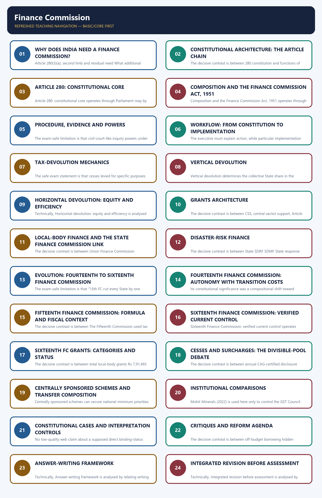

*Distinct embedded teaching-navigation image. The separate continuous Cārvāka-style flowchart package remains an independent at-a-glance artifact.*

### SESSION 1 — WHY DOES INDIA NEED A FINANCE COMMISSION?
#### DEFINITION / WHAT THIS IS CALLED

**Plain-language definition:** Why does India need a Finance Commission? denotes the constitutional rules and institutional links organised around Two mismatches follow.

**Technical definition:** Article 280(3)(a), second limb and residual need What additional assistance is justified?

#### ANSWER-GRABBING OPENING — WRITE/ADAPT IN THE EXAM

> The Union controls broader tax bases while States carry major service responsibilities, creating the vertical fiscal imbalance that the Finance Commission must periodically mediate.

#### MUST-WRITE KEYWORDS

- **Vertical fiscal imbalance**
- **Horizontal fiscal imbalance**
- **vertical**
- **Article 280(3)(a), first limb**
- **horizontal**
- **Article 280(3)(a), second limb**

**How to use them:** Frame the answer through Vertical fiscal imbalance; define Horizontal fiscal imbalance, connect vertical with Article 280(3)(a), first limb to explain the mechanism, and use horizontal for the decisive comparison or qualification.

Why does India need a Finance Commission? denotes the constitutional rules and institutional links organised around [ANALYSIS] Two mismatches follow.
Why does India need a Finance Commission? operates through Horizontal fiscal imbalance: States differ in population, geography, income, tax capacity, ecology and service-delivery cost, connected with [FACT] Article 280 creates a periodic expert body to recommend rule-based correction through shared taxes and grants.
The operative mechanism matters because gap Question Constitutional response.
Its principal consequence is that vertical How much of the divisible pool should all States receive? Article 280(3)(a), first limb.
The decisive contrast is between horizontal How should that State share be divided among States? Article 280(3)(a), second limb and residual need What additional assistance is justified? Article 275 grants and Article 280 recommendations.
The exam-safe limitation is that uNION: wider tax bases STATES: service-heavy functions.
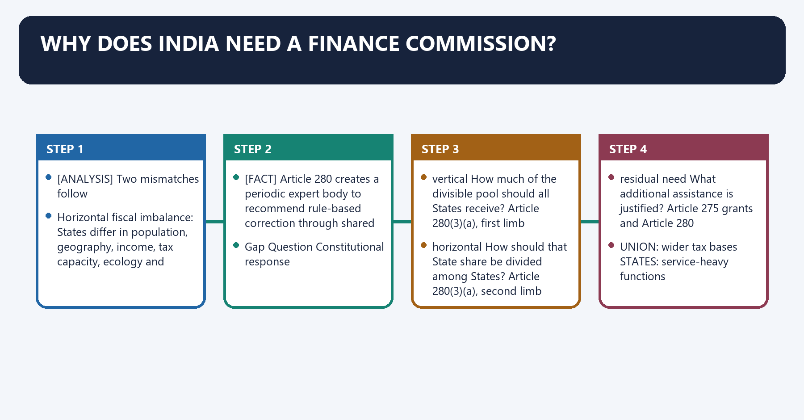
[FACT] The Constitution gives the Union access to broad and buoyant tax bases while States carry major responsibilities in health, education, agriculture, police, local infrastructure and welfare delivery.

[ANALYSIS] Two mismatches follow:

1. **Vertical fiscal imbalance:** the Union and all States together do not initially possess revenues proportionate to their assigned responsibilities.
2. **Horizontal fiscal imbalance:** States differ in population, geography, income, tax capacity, ecology and service-delivery cost.

[FACT] Article 280 creates a periodic expert body to recommend rule-based correction through shared taxes and grants.

[LIMIT] A fiscal gap does not automatically prove constitutional unfairness. It must be assessed after tax assignment, own revenues, devolution, grants, borrowing and expenditure responsibilities are considered together.

#### Visual 2 - The two-gap model

| Gap | Question | Constitutional response |
|---|---|---|
| vertical | How much of the divisible pool should all States receive? | Article 280(3)(a), first limb |
| horizontal | How should that State share be divided among States? | Article 280(3)(a), second limb |
| residual need | What additional assistance is justified? | Article 275 grants and Article 280 recommendations |

#### Visual 3 - Assignment-to-gap chain

```text
UNION: wider tax bases                    STATES: service-heavy functions
           \                                      /
            \                                    /
             ---- VERTICAL RESOURCE GAP --------
                           |
                  vertical devolution

STATE A: high income / low cost      STATE B: low income / high cost
                  \                    /
                   HORIZONTAL GAP
                           |
             inter se devolution formula
```

Caption: Vertical sharing answers “Union versus States”; horizontal sharing answers “among States”.

#### Visual 4 - Balancing-wheel logic

```text
AUTONOMY        EQUITY        EFFICIENCY        STABILITY
   \              |              |                /
    \             |              |               /
        RULE-BASED, PERIODIC, EVIDENCE-LED AWARD
                         |
                 COOPERATIVE FEDERALISM
```

[ANALYSIS] The Commission's value is procedural as much as distributive: regularity, transparent criteria, national consultation and reasons make bargaining more principled.

#### CLOSING RECALL FLOW — WHY DOES INDIA NEED A FINANCE COMMISSION?

```closure-flow
SUBTOPIC: Why does India need a Finance Commission?
KEY TERMS / DEFINITIONS: Vertical fiscal imbalance · Horizontal fiscal imbalance · vertical · Article 280(3)(a), first limb · horizontal · Article 280(3)(a), second limb
MECHANISM / ARGUMENT: Why does India need a Finance Commission? operates through Horizontal fiscal imbalance: States differ in population, geography, income, tax capacity, ecology and service-delivery cost, connected with Article 280 creates a periodic expert body to recommend rule-based correction through shared taxes and grants.
CONSEQUENCE / CONTRAST: Vertical fiscal imbalance: the Union and all States together do not initially possess revenues proportionate to their assigned responsibilities.
UPSC TRAP / ANSWER-USE: Do not miss this limiting distinction: its principal consequence is that vertical How much of the divisible pool should all...
ANSWER-GRABBING FORMULATION: The Union controls broader tax bases while States carry major service responsibilities, creating the vertical fiscal imbalance that the Finance Commission must periodically mediate.
```
### SESSION 2 — CONSTITUTIONAL ARCHITECTURE: THE ARTICLE CHAIN
#### DEFINITION / WHAT THIS IS CALLED

**Plain-language definition:** Constitutional architecture: the article chain denotes the constitutional rules and institutional links organised around Article Core rule Exam trap.

**Technical definition:** The decisive contrast is between 280 constitution and functions of Finance Commission constitutional core only and 281 report plus explanatory memorandum before Parliament laying is not prior legislative approval.

#### ANSWER-GRABBING OPENING — WRITE/ADAPT IN THE EXAM

> The Finance Commission operates within an article chain separating gross revenue, net proceeds, the divisible pool, tax devolution and grants, preventing these quantities from being conflated.

#### MUST-WRITE KEYWORDS

- **Constitutional architecture**
- **the article chain**
- **specified Union taxes distributed between Union and States**
- **not gross tax revenue**
- **parliamentary surcharge for Union purposes**
- **excluded from State sharing**

**How to use them:** Frame the answer through Constitutional architecture; define the article chain, connect specified Union taxes distributed between Union and States with not gross tax revenue to explain the mechanism, and use parliamentary surcharge for Union purposes for the decisive comparison or qualification.

Constitutional architecture: the article chain denotes the constitutional rules and institutional links organised around Article Core rule Exam trap.
Constitutional architecture: the article chain operates through 270 specified Union taxes distributed between Union and States not gross tax revenue, connected with 271 parliamentary surcharge for Union purposes excluded from State sharing.
The operative mechanism matters because 275 grants-in-aid of revenues of certain States distinct from tax devolution.
Its principal consequence is that 279 net proceeds and CAG certification collection cost is deducted.
The decisive contrast is between 280 constitution and functions of Finance Commission constitutional core only and 281 report plus explanatory memorandum before Parliament laying is not prior legislative approval.
The exam-safe limitation is that 282 Union/State grants for any public purpose distinct discretionary grant channel.
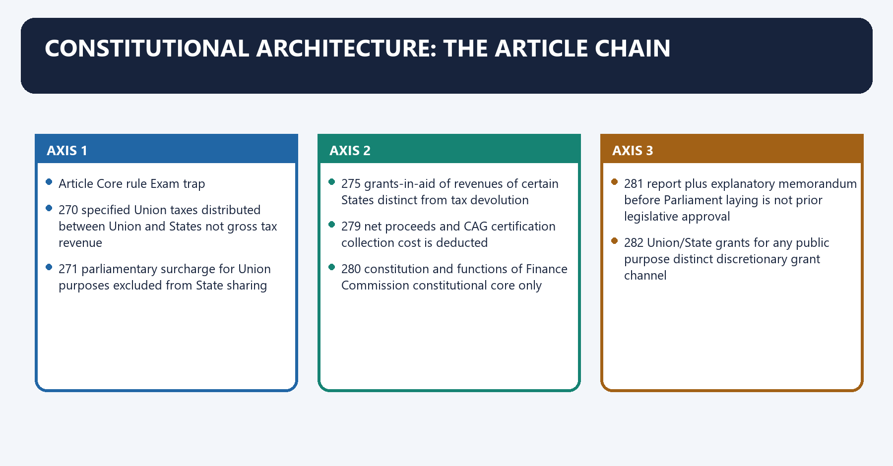
#### Visual 5 - Master article chain

| Article | Core rule | Exam trap |
|---|---|---|
| 270 | specified Union taxes distributed between Union and States | not gross tax revenue |
| 271 | parliamentary surcharge for Union purposes | excluded from State sharing |
| 275 | grants-in-aid of revenues of certain States | distinct from tax devolution |
| 279 | net proceeds and CAG certification | collection cost is deducted |
| 280 | constitution and functions of Finance Commission | constitutional core only |
| 281 | report plus explanatory memorandum before Parliament | laying is not prior legislative approval |
| 282 | Union/State grants for any public purpose | distinct discretionary grant channel |

#### Visual 6 - Constitutional money flow

```text
UNION TAX COLLECTIONS
        |
        +-- Article 271 surcharges -----------------> Union
        |
        +-- specific-purpose cesses kept outside
        |   Article 270 sharing under the constitutional design
        |
        +-- cost of collection deducted
        |
        v
NET PROCEEDS OF SHAREABLE TAXES = DIVISIBLE POOL
        |
        +-- Union share
        |
        +-- States' vertical share
                    |
                    v
          horizontal allocation among States
```

Caption: Gross tax revenue, divisible pool, devolution and grants are four different quantities.

#### CLOSING RECALL FLOW — CONSTITUTIONAL ARCHITECTURE: THE ARTICLE CHAIN

```closure-flow
SUBTOPIC: Constitutional architecture: the article chain
KEY TERMS / DEFINITIONS: Constitutional architecture · the article chain · specified Union taxes distributed between Union and States · not gross tax revenue · parliamentary surcharge for Union purposes · excluded from State sharing
MECHANISM / ARGUMENT: The decisive contrast is between 280 constitution and functions of Finance Commission constitutional core only and 281 report plus explanatory memorandum before Parliament laying is not prior legislative approval.
CONSEQUENCE / CONTRAST: Its principal consequence is that 279 net proceeds and CAG certification collection cost is deducted.
UPSC TRAP / ANSWER-USE: Do not miss this limiting distinction: the exam-safe limitation is that 282 Union/State grants for any public purpose distinct discretionary...
ANSWER-GRABBING FORMULATION: The Finance Commission operates within an article chain separating gross revenue, net proceeds, the divisible pool, tax devolution and grants, preventing these quantities from being conflated.
```
### SESSION 3 — ARTICLE 280: CONSTITUTIONAL CORE
#### DEFINITION / WHAT THIS IS CALLED

**Plain-language definition:** Article 280: constitutional core denotes the constitutional rules and institutional links organised around It consists of a Chairman and four other members appointed by the President.

**Technical definition:** Article 280: constitutional core operates through Parliament may by law determine qualifications for appointment and the manner of selection, connected with previous award / constitutional need.

#### ANSWER-GRABBING OPENING — WRITE/ADAPT IN THE EXAM

> The Constitution does not itself list the detailed qualification categories, tenure, disqualifications or evidentiary powers.

#### MUST-WRITE KEYWORDS

- **Article 280**
- **constitutional core**
- **or earlier if considered necessary**
- **Chairman and four other members**
- **existence and periodicity**
- **operational dates**

**How to use them:** Frame the answer through Article 280; define constitutional core, connect or earlier if considered necessary with Chairman and four other members to explain the mechanism, and use existence and periodicity for the decisive comparison or qualification.

Article 280: constitutional core denotes the constitutional rules and institutional links organised around [FACT] It consists of a Chairman and four other members appointed by the President.
Article 280: constitutional core operates through [FACT] Parliament may by law determine qualifications for appointment and the manner of selection, connected with previous award / constitutional need.
The operative mechanism matters because five years OR earlier if President considers necessary.
Its principal consequence is that president constitutes Commission.
The decisive contrast is between Chairman + four other members and report and recommendations.
The exam-safe limitation is that issue Constitution 1951 Act / Presidential order.
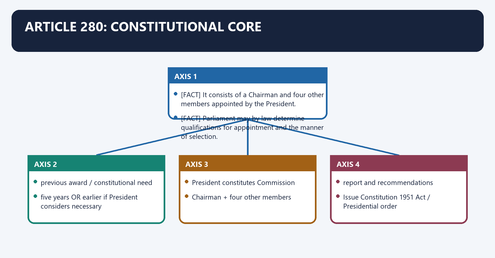
[FACT] Under Article 280(1), the President shall, within two years from the commencement of the Constitution and thereafter at the expiration of every fifth year **or earlier if considered necessary**, constitute a Finance Commission.

[FACT] It consists of a **Chairman and four other members** appointed by the President.

[FACT] Parliament may by law determine qualifications for appointment and the manner of selection.

[LIMIT] The Constitution does not itself list the detailed qualification categories, tenure, disqualifications or evidentiary powers. Those are supplied by the Finance Commission (Miscellaneous Provisions) Act, 1951 and the constituting order.

#### Visual 7 - Article 280 constitution clock

```text
previous award / constitutional need
               |
five years OR earlier if President considers necessary
               |
President constitutes Commission
               |
Chairman + four other members
               |
report and recommendations
```

#### Visual 8 - Constitution versus statute

| Issue | Constitution | 1951 Act / Presidential order |
|---|---|---|
| existence and periodicity | Article 280 | operational dates |
| size | Chair + four | names and service arrangements |
| appointment | President | selection framework |
| qualifications | Parliament may prescribe | section 3 categories |
| tenure | not fixed in Article 280 | Presidential order under Act |
| procedure | Commission may determine | Act powers plus own procedure |
| functions | Article 280(3) | terms of reference may add matters |

#### Visual 9 - Five constitutional functions

```text
1. VERTICAL DISTRIBUTION:
   Union <-> States share of net proceeds

2. HORIZONTAL ALLOCATION:
   State share divided among States

3. GRANTS:
   principles governing Article 275 grants-in-aid

4. LOCAL BODIES:
   augment State Consolidated Funds for Panchayats/Municipalities
   on the basis of State Finance Commission recommendations

5. RESIDUAL REFERENCE:
   any other matter referred by President in interests of sound finance
```

[LIMIT] “Any other matter” is not a free-standing power of the Commission; it must be referred by the President and linked to sound finance.

#### CLOSING RECALL FLOW — ARTICLE 280: CONSTITUTIONAL CORE

```closure-flow
SUBTOPIC: Article 280: constitutional core
KEY TERMS / DEFINITIONS: Article 280 · constitutional core · or earlier if considered necessary · Chairman and four other members · existence and periodicity · operational dates
MECHANISM / ARGUMENT: Article 280: constitutional core operates through Parliament may by law determine qualifications for appointment and the manner of selection, connected with previous award / constitutional need.
CONSEQUENCE / CONTRAST: The decisive contrast is between Chairman + four other members and report and recommendations.
UPSC TRAP / ANSWER-USE: The Constitution does not itself list the detailed qualification categories, tenure, disqualifications or evidentiary powers.
ANSWER-GRABBING FORMULATION: The Constitution does not itself list the detailed qualification categories, tenure, disqualifications or evidentiary powers.
```
### SESSION 4 — COMPOSITION AND THE FINANCE COMMISSION ACT, 1951
#### DEFINITION / WHAT THIS IS CALLED

**Plain-language definition:** Composition and the Finance Commission Act, 1951 denotes the constitutional rules and institutional links organised around Section 3 of the 1951 Act requires the Chairman to be a person with experience in public affairs.

**Technical definition:** Composition and the Finance Commission Act, 1951 operates through The other four members are selected from persons who, connected with are, have been, or are qualified to be appointed as a High Court judge.

#### ANSWER-GRABBING OPENING — WRITE/ADAPT IN THE EXAM

> The Finance Commission Act places qualifications, disqualifications, service conditions, procedure and evidentiary powers in legislation rather than the constitutional text.

#### MUST-WRITE KEYWORDS

- **Composition**
- **the Finance Commission Act**
- **Chairman**
- **experience in public affairs**
- **judicial member pool**
- **High Court judge/former judge/qualified to be one**

**How to use them:** Frame the answer through Composition; define the Finance Commission Act, connect Chairman with experience in public affairs to explain the mechanism, and use judicial member pool for the decisive comparison or qualification.

Composition and the Finance Commission Act, 1951 denotes the constitutional rules and institutional links organised around [FACT] Section 3 of the 1951 Act requires the Chairman to be a person with experience in public affairs.
Composition and the Finance Commission Act, 1951 operates through [FACT] The other four members are selected from persons who, connected with are, have been, or are qualified to be appointed as a High Court judge.
The operative mechanism matters because have special knowledge of government finance and accounts.
Its principal consequence is that have wide experience in financial matters and administration; or.
The decisive contrast is between have special knowledge of economics and [FACT] The Act also governs disqualification, personal-interest disclosure, conditions of service, procedure and powers.
The exam-safe limitation is that position/category Prescribed qualification.
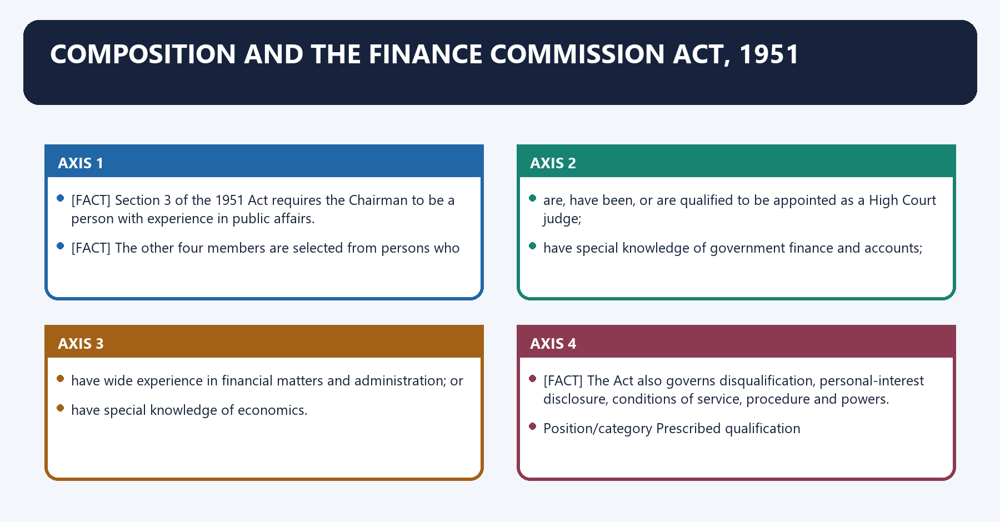
[FACT] Section 3 of the 1951 Act requires the Chairman to be a person with experience in public affairs.

[FACT] The other four members are selected from persons who:

- are, have been, or are qualified to be appointed as a High Court judge;
- have special knowledge of government finance and accounts;
- have wide experience in financial matters and administration; or
- have special knowledge of economics.

[FACT] The Act also governs disqualification, personal-interest disclosure, conditions of service, procedure and powers.

#### Visual 10 - Qualification matrix

| Position/category | Prescribed qualification |
|---|---|
| Chairman | experience in public affairs |
| judicial member pool | High Court judge/former judge/qualified to be one |
| accounts member pool | special knowledge of government finance and accounts |
| administration member pool | wide experience in financial matters and administration |
| economics member pool | special knowledge of economics |

[LIMIT] The four categories describe the pool from which the four other members may be selected; do not mechanically claim that every Commission must contain exactly one person from each category unless the constituting arrangement so demonstrates.

#### Visual 11 - Suitability and disqualification screen

```text
PRESCRIBED EXPERTISE
        |
        v
Is the person disqualified under the 1951 Act?
        |
   +----+----+
   |         |
  YES       NO
   |         |
exclude   appointment may proceed
```

[FACT] Statutory disqualification covers unsound mind, undischarged insolvency, conviction involving moral turpitude, and financial or other interests likely prejudicially to affect functions.

#### Visual 12 - Institutional design balance

| Design feature | Independence value | Accountability boundary |
|---|---|---|
| constitutional origin | protects regular existence | members appointed by President |
| expert composition | improves technical credibility | qualifications are broad |
| own procedure | flexible inquiry | must remain within law and reference |
| civil-court-like powers | supports evidence collection | not a court deciding rights |
| periodic commission | resets formula to current conditions | weak institutional memory risk |

#### CLOSING RECALL FLOW — COMPOSITION AND THE FINANCE COMMISSION ACT, 1951

```closure-flow
SUBTOPIC: Composition and the Finance Commission Act, 1951
KEY TERMS / DEFINITIONS: Composition · the Finance Commission Act · Chairman · experience in public affairs · judicial member pool · High Court judge/former judge/qualified to be one
MECHANISM / ARGUMENT: Composition and the Finance Commission Act, 1951 operates through The other four members are selected from persons who, connected with are, have been, or are qualified to be appointed as a High Court judge.
CONSEQUENCE / CONTRAST: The four categories describe the pool from which the four other members may be selected; do not mechanically claim that every Commission must contain exactly one person from each category unless the constituting arrangement so demonstrates.
UPSC TRAP / ANSWER-USE: Do not miss this limiting distinction: its principal consequence is that have wide experience in financial matters and administration.
ANSWER-GRABBING FORMULATION: The Finance Commission Act places qualifications, disqualifications, service conditions, procedure and evidentiary powers in legislation rather than the constitutional text.
```
### SESSION 5 — PROCEDURE, EVIDENCE AND POWERS
#### DEFINITION / WHAT THIS IS CALLED

**Plain-language definition:** Procedure, evidence and powers denotes the constitutional rules and institutional links organised around The 1951 Act permits the Commission to determine its procedure.

**Technical definition:** The exam-safe limitation is that civil-court-like inquiry powers under statute power to enforce State entitlement.

#### ANSWER-GRABBING OPENING — WRITE/ADAPT IN THE EXAM

> The Finance Commission recommends a fiscal settlement but does not adjudicate enforceable claims between governments, preserving political responsibility for implementation.

#### MUST-WRITE KEYWORDS

- **Procedure**
- **powers**
- **evidence-led, reasoned and impartial expert exercise**
- **court with binding decrees**
- **civil-court-like inquiry powers under statute**
- **power to enforce State entitlement**

**How to use them:** Frame the answer through Procedure; define powers, connect evidence-led, reasoned and impartial expert exercise with court with binding decrees to explain the mechanism, and use civil-court-like inquiry powers under statute for the decisive comparison or qualification.

Procedure, evidence and powers denotes the constitutional rules and institutional links organised around [FACT] The 1951 Act permits the Commission to determine its procedure.
Procedure, evidence and powers operates through Union memorandum + State memoranda + local-body data, connected with consultations / visits / expert studies.
The operative mechanism matters because revenue and expenditure assessment / projections.
Its principal consequence is that criteria choice + weights + grants + fiscal roadmap.
The decisive contrast is between Safe proposition Unsafe overstatement and evidence-led, reasoned and impartial expert exercise court with binding decrees.
The exam-safe limitation is that civil-court-like inquiry powers under statute power to enforce State entitlement.
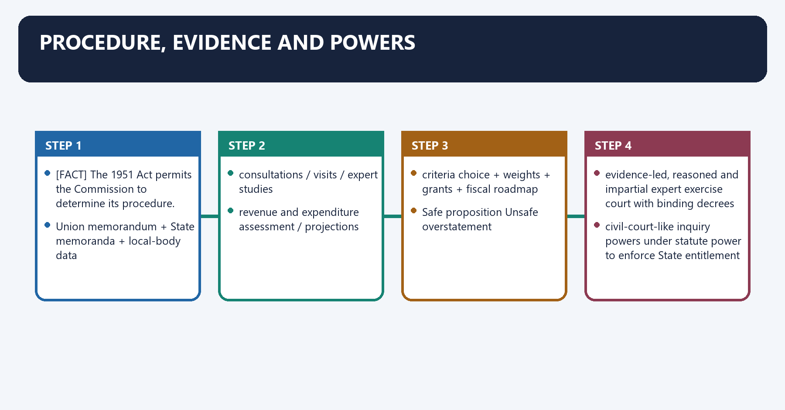
[FACT] The 1951 Act permits the Commission to determine its procedure.

[FACT] It has powers of a civil court for summoning and enforcing attendance, requiring production of documents and requisitioning public records. It may require information relevant to its inquiry.

[ANALYSIS] These are inquiry powers, not proof that the Commission is a judicial tribunal. It recommends a fiscal settlement; it does not adjudicate enforceable claims between governments.

#### Visual 13 - Evidence funnel

```text
Union memorandum + State memoranda + local-body data
                    |
        consultations / visits / expert studies
                    |
   revenue and expenditure assessment / projections
                    |
 criteria choice + weights + grants + fiscal roadmap
                    |
               reasoned report
```

#### Visual 14 - What “quasi-judicial” can and cannot mean

| Safe proposition | Unsafe overstatement |
|---|---|
| evidence-led, reasoned and impartial expert exercise | court with binding decrees |
| civil-court-like inquiry powers under statute | power to enforce State entitlement |
| constitutional independence and balanced hearing | judicial review of Union policy |
| recommendations carry high constitutional weight | recommendations automatically law |

#### CLOSING RECALL FLOW — PROCEDURE, EVIDENCE AND POWERS

```closure-flow
SUBTOPIC: Procedure, evidence and powers
KEY TERMS / DEFINITIONS: Procedure · powers · evidence-led, reasoned and impartial expert exercise · court with binding decrees · civil-court-like inquiry powers under statute · power to enforce State entitlement
MECHANISM / ARGUMENT: The exam-safe limitation is that civil-court-like inquiry powers under statute power to enforce State entitlement.
CONSEQUENCE / CONTRAST: These are inquiry powers, not proof that the Commission is a judicial tribunal.
UPSC TRAP / ANSWER-USE: Do not miss this limiting distinction: the decisive contrast is between Safe proposition Unsafe overstatement and evidence-led, reasoned and impartial...
ANSWER-GRABBING FORMULATION: The Finance Commission recommends a fiscal settlement but does not adjudicate enforceable claims between governments, preserving political responsibility for implementation.
```
### SESSION 6 — WORKFLOW: FROM CONSTITUTION TO IMPLEMENTATION
#### DEFINITION / WHAT THIS IS CALLED

**Plain-language definition:** Workflow: from constitution to implementation denotes the constitutional rules and institutional links organised around Presidential constituting order + Terms of Reference.

**Technical definition:** The executive must explain action, while particular implementation may require constitutional orders, appropriations, legislation or administrative guidelines.

#### ANSWER-GRABBING OPENING — WRITE/ADAPT IN THE EXAM

> The executive must explain action, while particular implementation may require constitutional orders, appropriations, legislation or administrative guidelines.

#### MUST-WRITE KEYWORDS

- **Workflow**
- **from constitution to implementation**
- **recommendation**
- **Commission report**
- **expert reasons**
- **executive response**

**How to use them:** Frame the answer through Workflow; define from constitution to implementation, connect recommendation with Commission report to explain the mechanism, and use expert reasons for the decisive comparison or qualification.

Workflow: from constitution to implementation denotes the constitutional rules and institutional links organised around Presidential constituting order + Terms of Reference.
Workflow: from constitution to implementation operates through Commission secretariat, data and consultations, connected with normative assessment + formula + grants + recommendations.
The operative mechanism matters because report submitted to President.
Its principal consequence is that article 281: report + explanatory action memorandum.
The decisive contrast is between laid before each House of Parliament and accepted items enter Presidential orders / Budget / law /.
The exam-safe limitation is that grant guidelines / administrative action as applicable.
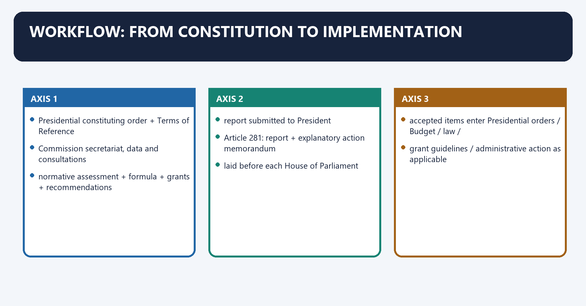
#### Visual 15 - Full award-cycle workflow

```text
Presidential constituting order + Terms of Reference
                         |
Commission secretariat, data and consultations
                         |
normative assessment + formula + grants + recommendations
                         |
report submitted to President
                         |
Article 281: report + explanatory action memorandum
laid before each House of Parliament
                         |
accepted items enter Presidential orders / Budget / law /
grant guidelines / administrative action as applicable
                         |
releases, accounts, audit and next-cycle evidence
```

[FACT] Article 281 requires the President to cause every recommendation to be laid before each House together with an explanatory memorandum as to the action taken.

[LIMIT] Parliament does not “pass” the Finance Commission report as if it were a Bill. The executive must explain action, while particular implementation may require constitutional orders, appropriations, legislation or administrative guidelines.

#### Visual 16 - Article 281 accountability chain

| Stage | Document | Accountability function |
|---|---|---|
| recommendation | Commission report | expert reasons |
| executive response | explanatory memorandum | acceptance/status transparency |
| fiscal action | Budget and demands for grants | parliamentary financial control |
| distribution | constitutional/administrative instruments | legal implementation |
| audit | Union, State and CAG systems | expenditure and accounts control |

#### Visual 17 - Status vocabulary

```text
RECOMMENDED
     |
     +-- ACCEPTED -----------------> implementation steps
     |
     +-- TAKEN NOTE OF ------------> acknowledgement, not full adoption
     |
     +-- ACCEPTED IN PRINCIPLE ----> design/conditions may follow
     |
     +-- EXAMINED SEPARATELY ------> no final present adoption
```

Caption: Current-affairs answers score by preserving this status vocabulary.

#### Visual 18 - Advisory but weighty

```text
NOT LEGALLY SELF-EXECUTING
            +
constitutional pedigree
periodic federal consultation
transparent formula
budgetary centrality
political cost of unexplained rejection
            =
HIGH FISCAL AND POLITICAL WEIGHT
```

[FACT] Laxmikanth's Finance Commission chapter correctly states the advisory character: recommendations are not binding commands creating a beneficiary State's legal right to the recommended sum.

[ANALYSIS] “Advisory” should not be written as “irrelevant”. Article 281 forces a public executive response, and accepted devolution structures the core of State fiscal space.

#### CLOSING RECALL FLOW — WORKFLOW: FROM CONSTITUTION TO IMPLEMENTATION

```closure-flow
SUBTOPIC: Workflow: from constitution to implementation
KEY TERMS / DEFINITIONS: Workflow · from constitution to implementation · recommendation · Commission report · expert reasons · executive response
MECHANISM / ARGUMENT: Article 281 requires the President to cause every recommendation to be laid before each House together with an explanatory memorandum as to the action taken.
CONSEQUENCE / CONTRAST: The executive must explain action, while particular implementation may require constitutional orders, appropriations, legislation or administrative guidelines.
UPSC TRAP / ANSWER-USE: Parliament does not “pass” the Finance Commission report as if it were a Bill.
ANSWER-GRABBING FORMULATION: The executive must explain action, while particular implementation may require constitutional orders, appropriations, legislation or administrative guidelines.
```
### SESSION 7 — TAX-DEVOLUTION MECHANICS
#### DEFINITION / WHAT THIS IS CALLED

**Plain-language definition:** Tax-devolution mechanics denotes the constitutional rules and institutional links organised around Quantity Meaning Includes grants?.

**Technical definition:** The safe exam statement is that cesses levied for specific purposes under the operative Article 270 framework and Article 271 surcharges are excluded from the divisible pool.

#### ANSWER-GRABBING OPENING — WRITE/ADAPT IN THE EXAM

> Tax devolution first identifies the divisible pool and then distributes the States' share, while cesses, surcharges and collection costs alter the relevant base.

#### MUST-WRITE KEYWORDS

- **Tax-devolution mechanics**
- **gross tax revenue**
- **total Union tax collections before relevant exclusions/deductions**
- **no**
- **divisible pool**
- **tax devolution**

**How to use them:** Frame the answer through Tax-devolution mechanics; define gross tax revenue, connect total Union tax collections before relevant exclusions/deductions with no to explain the mechanism, and use divisible pool for the decisive comparison or qualification.

Tax-devolution mechanics denotes the constitutional rules and institutional links organised around Quantity Meaning Includes grants?.
Tax-devolution mechanics operates through gross tax revenue total Union tax collections before relevant exclusions/deductions no, connected with divisible pool net proceeds of shareable Union taxes under Article 270 no.
The operative mechanism matters because tax devolution States' vertical share of divisible pool, horizontally divided no.
Its principal consequence is that grants transfers under Article 275/other authority yes, separate channel.
The decisive contrast is between [FACT] Article 279 defines “net proceeds” as proceeds of a tax or duty minus the cost of collection and [FACT] The CAG ascertains and certifies net proceeds, and that certificate is final.
The exam-safe limitation is that sHAREABLE TAX PROCEEDS.
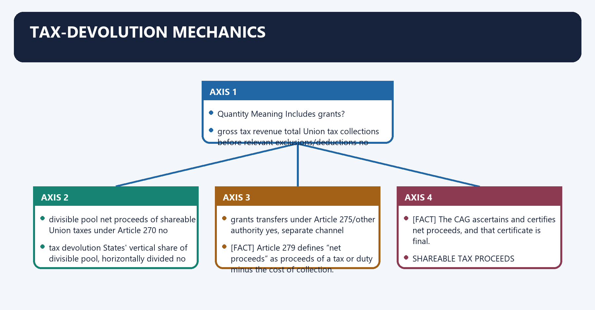
#### Visual 19 - Four fiscal quantities

| Quantity | Meaning | Includes grants? |
|---|---|---|
| gross tax revenue | total Union tax collections before relevant exclusions/deductions | no |
| divisible pool | net proceeds of shareable Union taxes under Article 270 | no |
| tax devolution | States' vertical share of divisible pool, horizontally divided | no |
| grants | transfers under Article 275/other authority | yes, separate channel |

[FACT] Article 279 defines “net proceeds” as proceeds of a tax or duty minus the cost of collection.

[FACT] The CAG ascertains and certifies net proceeds, and that certificate is final.

#### Visual 20 - Net-proceeds equation

```text
SHAREABLE TAX PROCEEDS
       minus
COST ATTRIBUTABLE TO COLLECTION
       equals
NET PROCEEDS CERTIFIED BY CAG
       equals
BASE FOR ARTICLE 270 DISTRIBUTION
```

#### Visual 21 - Divisible-pool exclusions

| Item | Treatment | Reason |
|---|---|---|
| Article 271 surcharge | outside State distribution | raised for Union purposes |
| specific-purpose cess kept outside sharing | outside divisible pool | Article 270 design |
| collection cost | deducted | Article 279 net-proceeds rule |
| shareable Union taxes | included after constitutional treatment | Article 270 |
| Article 275 grant | not part of pool | separate transfer |

[LIMIT] Avoid the shortcut “all cesses are taxes but never shareable” without constitutional context. The safe exam statement is that cesses levied for specific purposes under the operative Article 270 framework and Article 271 surcharges are excluded from the divisible pool.

#### Visual 22 - Worked mechanics without unstable totals

```text
Assume divisible pool = 100 units
Sixteenth FC vertical share = 41 units for States
Union retains = 59 units from this pool

If State X horizontal share = x per cent:
State X devolution = 41 x (x/100) units
```

[ANALYSIS] This two-stage method prevents the common error of applying a State's horizontal share to gross tax revenue.

#### Visual 23 - CAG control point

```text
tax departments record collections
             |
calculation of collection costs and net proceeds
             |
CAG ascertainment + certification under Article 279
             |
final constitutional base for distribution
```

[CURRENT] The Sixteenth Commission recommended annual Union disclosure of CAG-certified net proceeds and associated calculations to improve divisible-pool transparency.

#### CLOSING RECALL FLOW — TAX-DEVOLUTION MECHANICS

```closure-flow
SUBTOPIC: Tax-devolution mechanics
KEY TERMS / DEFINITIONS: Tax-devolution mechanics · gross tax revenue · total Union tax collections before relevant exclusions/deductions · no · divisible pool · tax devolution
MECHANISM / ARGUMENT: The safe exam statement is that cesses levied for specific purposes under the operative Article 270 framework and Article 271 surcharges are excluded from the divisible pool.
CONSEQUENCE / CONTRAST: Its principal consequence is that grants transfers under Article 275/other authority yes, separate channel.
UPSC TRAP / ANSWER-USE: Do not miss this limiting distinction: the decisive contrast is between Article 279 defines “net proceeds” as proceeds of a...
ANSWER-GRABBING FORMULATION: Tax devolution first identifies the divisible pool and then distributes the States' share, while cesses, surcharges and collection costs alter the relevant base.
```
### SESSION 8 — VERTICAL DEVOLUTION
#### DEFINITION / WHAT THIS IS CALLED

**Plain-language definition:** Vertical devolution denotes the constitutional rules and institutional links organised around Vertical devolution determines the collective State share in the divisible pool.

**Technical definition:** Vertical devolution determines the collective State share in the divisible pool.

#### ANSWER-GRABBING OPENING — WRITE/ADAPT IN THE EXAM

> A higher share can improve State autonomy, but its effect depends on whether other grants, scheme shares, cesses and expenditure assignments change at the same time.

#### MUST-WRITE KEYWORDS

- **Vertical devolution**
- **defence, national infrastructure, debt service**
- **health, education, police, agriculture**
- **national transfers and disaster support**
- **local services and welfare delivery**
- **macroeconomic stabilisation**

**How to use them:** Frame the answer through Vertical devolution; define defence, national infrastructure, debt service, connect health, education, police, agriculture with national transfers and disaster support to explain the mechanism, and use local services and welfare delivery for the decisive comparison or qualification.

Vertical devolution denotes the constitutional rules and institutional links organised around [FACT] Vertical devolution determines the collective State share in the divisible pool.
Vertical devolution operates through Union-side needs State-side needs, connected with defence, national infrastructure, debt service health, education, police, agriculture.
The operative mechanism matters because national transfers and disaster support local services and welfare delivery.
Its principal consequence is that macroeconomic stabilisation region-specific development cost.
The decisive contrast is between Union schemes and national public goods constitutionally assigned State functions and UNION CAPACITY / \ MACRO STABILITY.
The exam-safe limitation is that not Gross Tax Revenue.
[FACT] Vertical devolution determines the collective State share in the divisible pool.

[ANALYSIS] A sound vertical assessment considers both levels of government's projected revenues, expenditure responsibilities, debt and macroeconomic stability rather than treating either level as a passive claimant.

#### Visual 24 - Vertical-devolution balance sheet

| Union-side needs | State-side needs |
|---|---|
| defence, national infrastructure, debt service | health, education, police, agriculture |
| national transfers and disaster support | local services and welfare delivery |
| macroeconomic stabilisation | region-specific development cost |
| Union schemes and national public goods | constitutionally assigned State functions |

#### Visual 25 - Vertical trade-off triangle

```text
             STATE AUTONOMY
                  /\
                 /  \
                /    \
UNION CAPACITY /______\ MACRO STABILITY
```

[ANALYSIS] A higher share can improve State autonomy, but its effect depends on whether other grants, scheme shares, cesses and expenditure assignments change at the same time.

#### Visual 26 - Read the percentage correctly

```text
41% OF WHAT?
    |
    +-- not Gross Tax Revenue
    +-- not total Union receipts
    +-- not total public spending
    |
    +-- 41% of net proceeds in the Article 270 divisible pool
```

#### CLOSING RECALL FLOW — VERTICAL DEVOLUTION

```closure-flow
SUBTOPIC: Vertical devolution
KEY TERMS / DEFINITIONS: Vertical devolution · defence, national infrastructure, debt service · health, education, police, agriculture · national transfers and disaster support · local services and welfare delivery · macroeconomic stabilisation
MECHANISM / ARGUMENT: Vertical devolution determines the collective State share in the divisible pool.
CONSEQUENCE / CONTRAST: Its principal consequence is that macroeconomic stabilisation region-specific development cost.
UPSC TRAP / ANSWER-USE: Do not miss this limiting distinction: the decisive contrast is between Union schemes and national public goods constitutionally assigned State...
ANSWER-GRABBING FORMULATION: A higher share can improve State autonomy, but its effect depends on whether other grants, scheme shares, cesses and expenditure assignments change at the same time.
```
### SESSION 9 — HORIZONTAL DEVOLUTION: EQUITY AND EFFICIENCY
#### DEFINITION / WHAT THIS IS CALLED

**Plain-language definition:** Horizontal devolution: equity and efficiency denotes the constitutional rules and institutional links organised around Horizontal devolution distributes the collective State share among individual States.

**Technical definition:** Technically, Horizontal devolution: equity and efficiency is analysed by relating Horizontal devolution to equity, then testing the relationship through efficiency and need/equity.

#### ANSWER-GRABBING OPENING — WRITE/ADAPT IN THE EXAM

> Horizontal devolution distributes the collective State share through equity, need, ecology and effort criteria, but formula weights do not permanently classify a State's worth or efficiency.

#### MUST-WRITE KEYWORDS

- **Horizontal devolution**
- **equity**
- **efficiency**
- **need/equity**
- **cost/ecology**
- **demographic incentives**

**How to use them:** Frame the answer through Horizontal devolution; define equity, connect efficiency with need/equity to explain the mechanism, and use cost/ecology for the decisive comparison or qualification.

Horizontal devolution: equity and efficiency denotes the constitutional rules and institutional links organised around [FACT] Horizontal devolution distributes the collective State share among individual States.
Horizontal devolution: equity and efficiency operates through [ANALYSIS] Criteria usually combine, connected with need/equity: income distance, population and area.
The operative mechanism matters because cost/ecology: forest or ecological service.
Its principal consequence is that demographic incentives: demographic-performance design.
The decisive contrast is between effort/contribution: tax effort, fiscal effort or contribution to GDP, depending on the Commission and Criterion family Policy purpose Possible concern.
The exam-safe limitation is that population service need at scale census-year controversy.
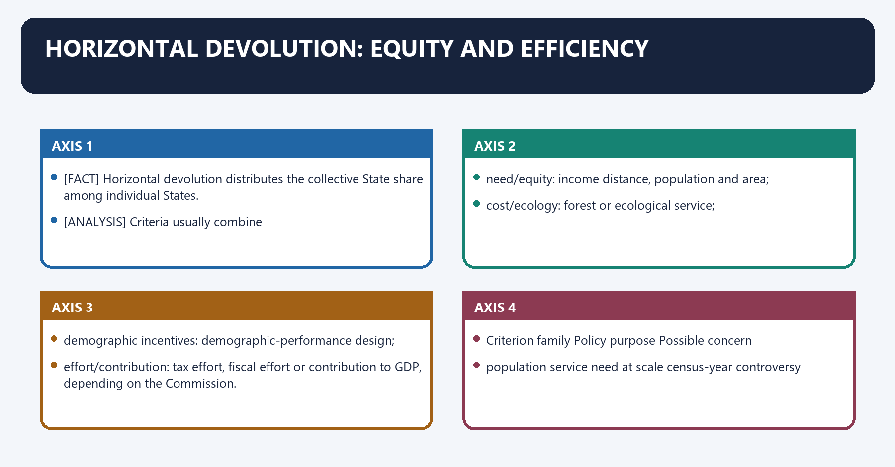
[FACT] Horizontal devolution distributes the collective State share among individual States.

[ANALYSIS] Criteria usually combine:

- **need/equity:** income distance, population and area;
- **cost/ecology:** forest or ecological service;
- **demographic incentives:** demographic-performance design;
- **effort/contribution:** tax effort, fiscal effort or contribution to GDP, depending on the Commission.

#### Visual 27 - Formula philosophy

| Criterion family | Policy purpose | Possible concern |
|---|---|---|
| population | service need at scale | census-year controversy |
| income distance | equalisation | perceived penalty to richer States |
| area | fixed and spatial costs | capping may be needed |
| forest/ecology | national ecological externality | measurement choice |
| demographic performance | reward demographic transition | formula complexity |
| effort/contribution | recognise revenue or output contribution | can weaken equalisation |

#### Visual 28 - Income-distance intuition

```text
reference per-capita income
          |
          |<------ larger gap ------ low-income State
          |
          |<-- smaller gap -- higher-income State

larger distance -> larger equalisation weight, other things equal
```

[LIMIT] Income distance is formula-based, not a declaration that a State is permanently poor or inefficient.

#### Visual 29 - Population versus demographic performance

| Population criterion | Demographic-performance criterion |
|---|---|
| recognises current scale of service need | rewards relative demographic transition |
| uses a specified census base | formula changes across Commissions |
| larger population generally raises weight | not simply “smaller population gets more” |
| equity/need orientation | incentive/fairness orientation |

#### Visual 30 - Forest criterion logic

```text
FOREST CONSERVATION
      |
national climate, biodiversity and watershed benefits
      |
host State bears opportunity and service costs
      |
formula recognises positive externality
```

#### Visual 31 - Effort is Commission-specific

| Commission | Effort/contribution item | Safe recall |
|---|---|---|
| Fifteenth | tax and fiscal effort, 2.5% | own-tax effort returned as criterion |
| Sixteenth | contribution to GDP, 10% | new GDP-contribution criterion |
| Sixteenth | no separate tax-effort weight | do not carry 15th formula forward |

#### CLOSING RECALL FLOW — HORIZONTAL DEVOLUTION: EQUITY AND EFFICIENCY

```closure-flow
SUBTOPIC: Horizontal devolution: equity and efficiency
KEY TERMS / DEFINITIONS: Horizontal devolution · equity · efficiency · need/equity · cost/ecology · demographic incentives
MECHANISM / ARGUMENT: The decisive contrast is between effort/contribution: tax effort, fiscal effort or contribution to GDP, depending on the Commission and Criterion family Policy purpose Possible concern.
CONSEQUENCE / CONTRAST: Income distance is formula-based, not a declaration that a State is permanently poor or inefficient.
UPSC TRAP / ANSWER-USE: Do not miss this limiting distinction: its principal consequence is that demographic incentives.
ANSWER-GRABBING FORMULATION: Horizontal devolution distributes the collective State share through equity, need, ecology and effort criteria, but formula weights do not permanently classify a State's worth or efficiency.
```
### SESSION 10 — GRANTS ARCHITECTURE
#### DEFINITION / WHAT THIS IS CALLED

**Plain-language definition:** Grants architecture denotes the constitutional rules and institutional links organised around INTERGOVERNMENTAL TRANSFERS.

**Technical definition:** The decisive contrast is between CSS, central-sector support, Article 282 grants, etc and Dimension Tax devolution Grant.

#### ANSWER-GRABBING OPENING — WRITE/ADAPT IN THE EXAM

> The case does not convert every Article 282 scheme into Finance Commission devolution or remove normal constitutional, appropriation and accountability requirements.

#### MUST-WRITE KEYWORDS

- **Grants architecture**
- **base**
- **divisible pool**
- **Consolidated Fund / relevant authority**
- **form**
- **specified transfer**

**How to use them:** Frame the answer through Grants architecture; define base, connect divisible pool with Consolidated Fund / relevant authority to explain the mechanism, and use form for the decisive comparison or qualification.

Grants architecture denotes the constitutional rules and institutional links organised around INTERGOVERNMENTAL TRANSFERS.
Grants architecture operates through vertical + horizontal, connected with FINANCE COMMISSION GRANTS.
The operative mechanism matters because revenue / local body / disaster / other recommended classes.
Its principal consequence is that oTHER UNION TRANSFERS.
The decisive contrast is between CSS, central-sector support, Article 282 grants, etc and Dimension Tax devolution Grant.
The exam-safe limitation is that base divisible pool Consolidated Fund / relevant authority.
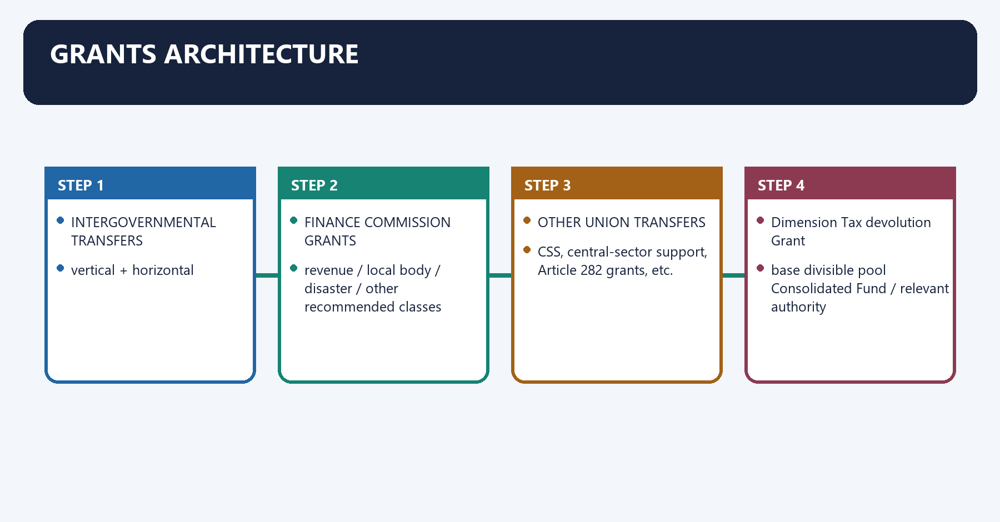
[FACT] Tax devolution is formula-based general revenue sharing. Grants address constitutionally justified needs through a separate channel.

#### Visual 32 - Transfer taxonomy

```text
INTERGOVERNMENTAL TRANSFERS
        |
        +-- TAX DEVOLUTION
        |      vertical + horizontal
        |
        +-- FINANCE COMMISSION GRANTS
        |      revenue / local body / disaster / other recommended classes
        |
        +-- OTHER UNION TRANSFERS
               CSS, central-sector support, Article 282 grants, etc.
```

#### Visual 33 - Devolution versus grants

| Dimension | Tax devolution | Grant |
|---|---|---|
| base | divisible pool | Consolidated Fund / relevant authority |
| form | State share of shared taxes | specified transfer |
| discretion after receipt | generally untied | may be tied/conditional |
| role | broad fiscal capacity | equalisation, local, disaster or targeted need |
| risk | formula controversy | conditionality and fragmentation |

#### Visual 34 - Article 275 and Article 282

| Article 275 | Article 282 |
|---|---|
| constitutional grants-in-aid of revenues of States | Union or State may make grants for any public purpose |
| Finance Commission recommends governing principles | broader discretionary/public-purpose field |
| includes special constitutional grant contexts | used for plan/scheme-type transfers historically |
| part of structured fiscal-federal design | cannot be collapsed into Article 275 |

[FACT] In *Bhim Singh v. Union of India* (2010), the Supreme Court recognised the breadth of Article 282's public-purpose grant power.

[LIMIT] The case does not convert every Article 282 scheme into Finance Commission devolution or remove normal constitutional, appropriation and accountability requirements.

#### CLOSING RECALL FLOW — GRANTS ARCHITECTURE

```closure-flow
SUBTOPIC: Grants architecture
KEY TERMS / DEFINITIONS: Grants architecture · base · divisible pool · Consolidated Fund / relevant authority · form · specified transfer
MECHANISM / ARGUMENT: The case does not convert every Article 282 scheme into Finance Commission devolution or remove normal constitutional, appropriation and accountability requirements.
CONSEQUENCE / CONTRAST: The decisive contrast is between CSS, central-sector support, Article 282 grants, etc and Dimension Tax devolution Grant.
UPSC TRAP / ANSWER-USE: Do not miss this limiting distinction: its principal consequence is that oTHER UNION TRANSFERS.
ANSWER-GRABBING FORMULATION: The case does not convert every Article 282 scheme into Finance Commission devolution or remove normal constitutional, appropriation and accountability requirements.
```
### SESSION 11 — LOCAL-BODY FINANCE AND THE STATE FINANCE COMMISSION LINK
#### DEFINITION / WHAT THIS IS CALLED

**Plain-language definition:** Local-body finance and the State Finance Commission link denotes the constitutional rules and institutional links organised around Articles 243-I and 243-Y create the State Finance Commission and connect municipal finance review to it.

**Technical definition:** The decisive contrast is between Union Finance Commission local-body grants and State Consolidated Fund - eligible local bodies.

#### ANSWER-GRABBING OPENING — WRITE/ADAPT IN THE EXAM

> National grants can support local bodies, but cannot substitute for State-level tax assignment, functional devolution, accounting and elected accountability.

#### MUST-WRITE KEYWORDS

- **Local-body finance**
- **the State Finance Commission link**
- **Article 280**
- **Articles 243-I and 243-Y**
- **constituting authority**
- **President**

**How to use them:** Frame the answer through Local-body finance; define the State Finance Commission link, connect Article 280 with Articles 243-I and 243-Y to explain the mechanism, and use constituting authority for the decisive comparison or qualification.

Local-body finance and the State Finance Commission link denotes the constitutional rules and institutional links organised around [FACT] Articles 243-I and 243-Y create the State Finance Commission and connect municipal finance review to it.
Local-body finance and the State Finance Commission link operates through PANCHAYAT / MUNICIPAL FINANCE DATA, connected with STATE FINANCE COMMISSION.
The operative mechanism matters because recommendations to Governor / State action.
Its principal consequence is that article 280 national assessment of augmentation need.
The decisive contrast is between Union Finance Commission local-body grants and State Consolidated Fund - eligible local bodies.
The exam-safe limitation is that feature Union Finance Commission State Finance Commission.
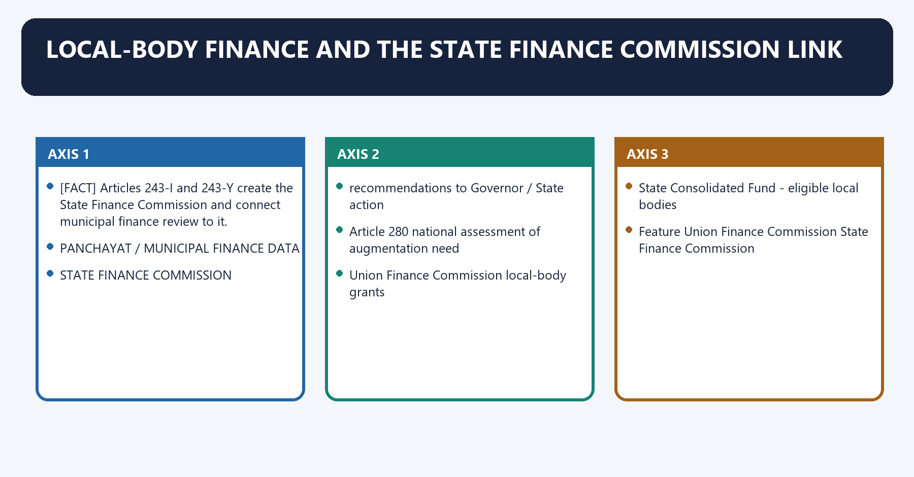
[FACT] Article 280(3)(bb) and (c) require recommendations on measures needed to augment a State's Consolidated Fund to supplement Panchayat and Municipal resources **on the basis of recommendations made by the State Finance Commission**.

[FACT] Articles 243-I and 243-Y create the State Finance Commission and connect municipal finance review to it.

#### Visual 35 - Local fiscal-federal chain

```text
PANCHAYAT / MUNICIPAL FINANCE DATA
                 |
       STATE FINANCE COMMISSION
                 |
 recommendations to Governor / State action
                 |
Article 280 national assessment of augmentation need
                 |
Union Finance Commission local-body grants
                 |
State Consolidated Fund -> eligible local bodies
```

#### Visual 36 - National FC versus State FC

| Feature | Union Finance Commission | State Finance Commission |
|---|---|---|
| source | Article 280 | Articles 243-I and 243-Y |
| constituting authority | President | Governor |
| principal field | Union-State fiscal relations | State-local fiscal relations |
| frequency | every fifth year or earlier | every fifth year |
| report laid before | Parliament under Article 281 | State legislature under Part IX framework |
| local-body connection | augmentation based on SFC recommendations | assesses local finances directly |

[ANALYSIS] Weak or delayed SFCs impair the evidence chain. National grants can support local bodies, but cannot substitute for State-level tax assignment, functional devolution, accounting and elected accountability.

#### Visual 37 - Local-grant quality ladder

```text
timely SFC
   -> audited accounts
      -> reliable own-revenue data
         -> transparent eligibility
            -> predictable grant
               -> service outcomes
```

[CURRENT] The Sixteenth Commission recommended a constitutional amendment to remove the words tying Article 280(3)(bb) and (c) to SFC recommendations.

[LIMIT] This is a Commission proposal, not current constitutional text. The February 2026 Explanatory Memorandum did not separately record implementation of that constitutional amendment in its summary; no amendment is treated here as enacted.

#### CLOSING RECALL FLOW — LOCAL-BODY FINANCE AND THE STATE FINANCE COMMISSION LINK

```closure-flow
SUBTOPIC: Local-body finance and the State Finance Commission link
KEY TERMS / DEFINITIONS: Local-body finance · the State Finance Commission link · Article 280 · Articles 243-I and 243-Y · constituting authority · President
MECHANISM / ARGUMENT: Article 280(3)(bb) and (c) require recommendations on measures needed to augment a State's Consolidated Fund to supplement Panchayat and Municipal resources on the basis of recommendations made by the State Finance Commission.
CONSEQUENCE / CONTRAST: The decisive contrast is between Union Finance Commission local-body grants and State Consolidated Fund - eligible local bodies.
UPSC TRAP / ANSWER-USE: Do not miss this limiting distinction: articles 243-I and 243-Y create the State Finance Commission and connect municipal finance review...
ANSWER-GRABBING FORMULATION: National grants can support local bodies, but cannot substitute for State-level tax assignment, functional devolution, accounting and elected accountability.
```
### SESSION 12 — DISASTER-RISK FINANCE
#### DEFINITION / WHAT THIS IS CALLED

**Plain-language definition:** Disaster-risk finance denotes the constitutional rules and institutional links organised around Finance Commissions shape Union and State disaster-management funds in conjunction with the Disaster Management Act framework.

**Technical definition:** The decisive contrast is between State SDRF SDMF State response and mitigation and Finance Commissions shape Union and State disaster-management funds in conjunction with the Disaster Management Act framework.

#### ANSWER-GRABBING OPENING — WRITE/ADAPT IN THE EXAM

> Finance Commission disaster funding increasingly spans prevention, mitigation, response and recovery, while actual access remains conditioned by statutory frameworks, guidelines and utilisation.

#### MUST-WRITE KEYWORDS

- **Disaster-risk finance**
- **national**
- **NDRF**
- **NDMF**
- **severe events and national support**
- **SDRF**

**How to use them:** Frame the answer through Disaster-risk finance; define national, connect NDRF with NDMF to explain the mechanism, and use severe events and national support for the decisive comparison or qualification.

Disaster-risk finance denotes the constitutional rules and institutional links organised around [FACT] Finance Commissions shape Union and State disaster-management funds in conjunction with the Disaster Management Act framework.
Disaster-risk finance operates through mitigation - preparedness - response - relief, connected with resilient reconstruction <- recovery <- damage assessment.
The operative mechanism matters because level Response fund Mitigation fund Core purpose.
Its principal consequence is that national NDRF NDMF severe events and national support.
The decisive contrast is between State SDRF SDMF State response and mitigation and [FACT] Finance Commissions shape Union and State disaster-management funds in conjunction with the Disaster Management Act framework.
The exam-safe limitation is that [FACT] Finance Commissions shape Union and State disaster-management funds in conjunction with the Disaster Management Act framework.
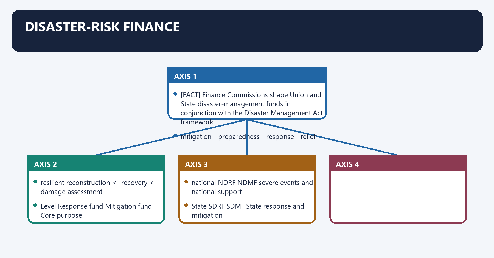
[FACT] Finance Commissions shape Union and State disaster-management funds in conjunction with the Disaster Management Act framework.

[ANALYSIS] Contemporary disaster finance must move from post-event relief alone toward prevention, preparedness, mitigation, response, recovery and reconstruction.

#### Visual 38 - Disaster-finance cycle

```text
RISK ASSESSMENT
      |
mitigation -> preparedness -> response -> relief
      ^                                  |
      |                                  v
resilient reconstruction <- recovery <- damage assessment
```

#### Visual 39 - Fund-level map

| Level | Response fund | Mitigation fund | Core purpose |
|---|---|---|---|
| national | NDRF | NDMF | severe events and national support |
| State | SDRF | SDMF | State response and mitigation |

[LIMIT] Award-period allocations are not the same as annual releases. Access depends on applicable contribution ratios, guidelines, events, assessment and utilisation conditions.

#### CLOSING RECALL FLOW — DISASTER-RISK FINANCE

```closure-flow
SUBTOPIC: Disaster-risk finance
KEY TERMS / DEFINITIONS: Disaster-risk finance · national · NDRF · NDMF · severe events and national support · SDRF
MECHANISM / ARGUMENT: Contemporary disaster finance must move from post-event relief alone toward prevention, preparedness, mitigation, response, recovery and reconstruction.
CONSEQUENCE / CONTRAST: Its principal consequence is that national NDRF NDMF severe events and national support.
UPSC TRAP / ANSWER-USE: Do not miss this limiting distinction: the decisive contrast is between State SDRF SDMF State response and mitigation and Finance...
ANSWER-GRABBING FORMULATION: Finance Commission disaster funding increasingly spans prevention, mitigation, response and recovery, while actual access remains conditioned by statutory frameworks, guidelines and utilisation.
```
### SESSION 13 — EVOLUTION: FOURTEENTH TO SIXTEENTH FINANCE COMMISSION
#### DEFINITION / WHAT THIS IS CALLED

**Plain-language definition:** Evolution: Fourteenth to Sixteenth Finance Commission denotes the constitutional rules and institutional links organised around FC-14 (2015-20): 42%.

**Technical definition:** The exam-safe limitation is that “15th FC cut every State by one percentage point” collective share moved from 42 to 41.

#### ANSWER-GRABBING OPENING — WRITE/ADAPT IN THE EXAM

> The Fourteenth to Sixteenth Commissions show broad continuity in vertical devolution alongside changing horizontal criteria, rather than an identical gain or loss for every State.

#### MUST-WRITE KEYWORDS

- **Evolution**
- **Fourteenth to Sixteenth Finance Commission**
- **collective share moved from 42 to 41**
- **“Union recentralised the entire point”**
- **“all States lost identically”**
- **“41 means 41% of GTR”**

**How to use them:** Frame the answer through Evolution; define Fourteenth to Sixteenth Finance Commission, connect collective share moved from 42 to 41 with “Union recentralised the entire point” to explain the mechanism, and use “all States lost identically” for the decisive comparison or qualification.

Evolution: Fourteenth to Sixteenth Finance Commission denotes the constitutional rules and institutional links organised around FC-14 (2015-20): 42%.
Evolution: Fourteenth to Sixteenth Finance Commission operates through sharp rise in untied formula-based resources, connected with FC-15 (2020-21 / 2021-26): 41%.
The operative mechanism matters because primarily J&K reorganisation adjustment.
Its principal consequence is that fC-16 (2026-31): 41%.
The decisive contrast is between continuity in vertical share, revised horizontal formula and Unsafe claim Controlled explanation.
The exam-safe limitation is that “15th FC cut every State by one percentage point” collective share moved from 42 to 41.
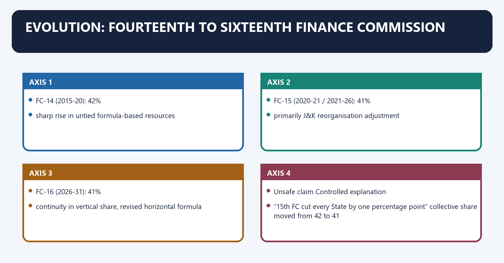
#### Visual 40 - Evolution timeline

```text
FC-13: 32%
   |
FC-14 (2015-20): 42%
   |  sharp rise in untied formula-based resources
   |
FC-15 (2020-21 / 2021-26): 41%
   |  primarily J&K reorganisation adjustment
   |
FC-16 (2026-31): 41%
      continuity in vertical share, revised horizontal formula
```

#### Visual 41 - 42 to 41: the correct context

| Unsafe claim | Controlled explanation |
|---|---|
| “15th FC cut every State by one percentage point” | collective share moved from 42 to 41 |
| “Union recentralised the entire point” | 15th FC identified exclusion of erstwhile J&K's share after reorganisation as primary reason |
| “all States lost identically” | actual State effect depends on horizontal share, tax buoyancy and grants |
| “41 means 41% of GTR” | 41% of divisible-pool net proceeds |

#### Visual 42 - Three-Commission comparison

| Dimension | Fourteenth | Fifteenth | Sixteenth |
|---|---|---|---|
| main award | 2015-20 | 2021-26, plus 2020-21 report | 2026-31 |
| vertical share | 42% | 41% | 41% |
| strong theme | higher untied devolution | balance after J&K reorganisation, COVID-era roadmap | continuity, revised formula, local/disaster architecture |
| effort element | fiscal discipline not separately carried in final six like 15th | tax and fiscal effort 2.5% | GDP contribution 10% |
| grants stance | devolution-led, with grants | multiple grant categories | no RDG, sector-specific or State-specific grants recommended |

#### CLOSING RECALL FLOW — EVOLUTION: FOURTEENTH TO SIXTEENTH FINANCE COMMISSION

```closure-flow
SUBTOPIC: Evolution: Fourteenth to Sixteenth Finance Commission
KEY TERMS / DEFINITIONS: Evolution · Fourteenth to Sixteenth Finance Commission · collective share moved from 42 to 41 · “Union recentralised the entire point” · “all States lost identically” · “41 means 41% of GTR”
MECHANISM / ARGUMENT: The exam-safe limitation is that “15th FC cut every State by one percentage point” collective share moved from 42 to 41.
CONSEQUENCE / CONTRAST: The decisive contrast is between continuity in vertical share, revised horizontal formula and Unsafe claim Controlled explanation.
UPSC TRAP / ANSWER-USE: Do not miss this limiting distinction: its principal consequence is that fC-16 (2026-31).
ANSWER-GRABBING FORMULATION: The Fourteenth to Sixteenth Commissions show broad continuity in vertical devolution alongside changing horizontal criteria, rather than an identical gain or loss for every State.
```
### SESSION 14 — FOURTEENTH FINANCE COMMISSION: AUTONOMY WITH TRANSITION COSTS
#### DEFINITION / WHAT THIS IS CALLED

**Plain-language definition:** Fourteenth Finance Commission: autonomy with transition costs denotes the constitutional rules and institutional links organised around The Fourteenth Commission increased States' collective share from 32 per cent to 42 per cent of the divisible pool.

**Technical definition:** Its constitutional significance was a compositional shift toward predictable, formula-based and relatively untied resources, particularly as the Planning Commission era ended.

#### ANSWER-GRABBING OPENING — WRITE/ADAPT IN THE EXAM

> The Fourteenth Finance Commission shifted transfers toward predictable and relatively untied devolution, strengthening State autonomy as plan-era allocation receded.

#### MUST-WRITE KEYWORDS

- **Fourteenth Finance Commission**
- **autonomy with transition costs**
- **larger predictable devolution**
- **greater expenditure flexibility**
- **not all transfers became untied**
- **lower dependence on discretionary transfers**

**How to use them:** Frame the answer through Fourteenth Finance Commission; define autonomy with transition costs, connect larger predictable devolution with greater expenditure flexibility to explain the mechanism, and use not all transfers became untied for the decisive comparison or qualification.

Fourteenth Finance Commission: autonomy with transition costs denotes the constitutional rules and institutional links organised around [FACT] The Fourteenth Commission increased States' collective share from 32 per cent to 42 per cent of the divisible pool.
Fourteenth Finance Commission: autonomy with transition costs operates through 32% - 42% vertical share, connected with more formula-based untied resources.
The operative mechanism matters because greater State prioritisation space.
Its principal consequence is that need for stronger State budgeting, own revenue and accountability.
The decisive contrast is between Improvement channel Qualification and larger predictable devolution depends on actual Union tax collection.
The exam-safe limitation is that greater expenditure flexibility not all transfers became untied.
[FACT] The Fourteenth Commission increased States' collective share from 32 per cent to 42 per cent of the divisible pool.

[ANALYSIS] Its constitutional significance was a compositional shift toward predictable, formula-based and relatively untied resources, particularly as the Planning Commission era ended.

[LIMIT] The gain in tax devolution must not be assessed in isolation from contemporaneous restructuring of centrally sponsored schemes, grants and Union expenditure responsibilities.

#### Visual 43 - Fourteenth FC impact chain

```text
32% -> 42% vertical share
        |
more formula-based untied resources
        |
greater State prioritisation space
        |
need for stronger State budgeting, own revenue and accountability
```

#### Visual 44 - Fiscal-position channels

| Improvement channel | Qualification |
|---|---|
| larger predictable devolution | depends on actual Union tax collection |
| greater expenditure flexibility | not all transfers became untied |
| lower dependence on discretionary transfers | CSS and other transfers continued |
| improved borrowing/fiscal planning | debt and revenue deficits did not disappear |
| stronger cooperative federal bargain | formula disputes remained |

#### CLOSING RECALL FLOW — FOURTEENTH FINANCE COMMISSION: AUTONOMY WITH TRANSITION COSTS

```closure-flow
SUBTOPIC: Fourteenth Finance Commission: autonomy with transition costs
KEY TERMS / DEFINITIONS: Fourteenth Finance Commission · autonomy with transition costs · larger predictable devolution · greater expenditure flexibility · not all transfers became untied · lower dependence on discretionary transfers
MECHANISM / ARGUMENT: The decisive contrast is between Improvement channel Qualification and larger predictable devolution depends on actual Union tax collection.
CONSEQUENCE / CONTRAST: The exam-safe limitation is that greater expenditure flexibility not all transfers became untied.
UPSC TRAP / ANSWER-USE: Do not miss this limiting distinction: its principal consequence is that need for stronger State budgeting, own revenue and accountability.
ANSWER-GRABBING FORMULATION: The Fourteenth Finance Commission shifted transfers toward predictable and relatively untied devolution, strengthening State autonomy as plan-era allocation receded.
```
### SESSION 15 — FIFTEENTH FINANCE COMMISSION: FORMULA AND FISCAL CONTEXT
#### DEFINITION / WHAT THIS IS CALLED

**Plain-language definition:** Fifteenth Finance Commission: formula and fiscal context denotes the constitutional rules and institutional links organised around income distance 45.0%.

**Technical definition:** The decisive contrast is between The Fifteenth Commission used tax and fiscal effort to reward own-tax performance and Its vertical share was 41 per cent for 2021-26.

#### ANSWER-GRABBING OPENING — WRITE/ADAPT IN THE EXAM

> The Fifteenth Commission combined income distance with population, area, ecology, demographic performance and tax effort, balancing equalisation with incentives within a forty-one-percent State share.

#### MUST-WRITE KEYWORDS

- **Fifteenth Finance Commission**
- **formula**
- **fiscal context**
- **Total**
- **income distance**
- **100.0%**

**How to use them:** Frame the answer through Fifteenth Finance Commission; define formula, connect fiscal context with Total to explain the mechanism, and use income distance for the decisive comparison or qualification.

Fifteenth Finance Commission: formula and fiscal context denotes the constitutional rules and institutional links organised around income distance 45.0%.
Fifteenth Finance Commission: formula and fiscal context operates through population, 2011 15.0%, connected with demographic performance 12.5%.
The operative mechanism matters because forest and ecology 10.0%.
Its principal consequence is that tax and fiscal effort 2.5%.
The decisive contrast is between [FACT] The Fifteenth Commission used tax and fiscal effort to reward own-tax performance and [FACT] Its vertical share was 41 per cent for 2021-26.
The exam-safe limitation is that 45 income distance.
#### Visual 45 - Fifteenth FC horizontal formula, 2021-26

| Criterion | Weight |
|---|---:|
| income distance | 45.0% |
| population, 2011 | 15.0% |
| area | 15.0% |
| demographic performance | 12.5% |
| forest and ecology | 10.0% |
| tax and fiscal effort | 2.5% |
| **Total** | **100.0%** |

[FACT] The Fifteenth Commission used tax and fiscal effort to reward own-tax performance.

[FACT] Its vertical share was 41 per cent for 2021-26.

#### Visual 46 - Fifteenth formula memory wheel

```text
45 income distance
15 population
15 area
12.5 demographic performance
10 forest and ecology
2.5 tax and fiscal effort
----------------------------
100
```

> **Memory line:** 45 - 15 - 15 - 12.5 - 10 - 2.5.

#### CLOSING RECALL FLOW — FIFTEENTH FINANCE COMMISSION: FORMULA AND FISCAL CONTEXT

```closure-flow
SUBTOPIC: Fifteenth Finance Commission: formula and fiscal context
KEY TERMS / DEFINITIONS: Fifteenth Finance Commission · formula · fiscal context · Total · income distance · 100.0%
MECHANISM / ARGUMENT: The decisive contrast is between The Fifteenth Commission used tax and fiscal effort to reward own-tax performance and Its vertical share was 41 per cent for 2021-26.
CONSEQUENCE / CONTRAST: Its principal consequence is that tax and fiscal effort 2.5%.
UPSC TRAP / ANSWER-USE: Do not miss this limiting distinction: the exam-safe limitation is that 45 income distance.
ANSWER-GRABBING FORMULATION: The Fifteenth Commission combined income distance with population, area, ecology, demographic performance and tax effort, balancing equalisation with incentives within a forty-one-percent State share.
```
### SESSION 16 — SIXTEENTH FINANCE COMMISSION: VERIFIED CURRENT CONTROL
#### DEFINITION / WHAT THIS IS CALLED

**Plain-language definition:** Sixteenth Finance Commission: verified current control denotes the constitutional rules and institutional links organised around [CURRENT] The Sixteenth Finance Commission was constituted on 31 December 2023.

**Technical definition:** Sixteenth Finance Commission: verified current control operates through [CURRENT] It submitted its report on 17 November 2025 for the award period 2026-27 to 2030-31, connected with [CURRENT] The report and Explanatory Memorandum were laid in Parliament on 1 February 2026.

#### ANSWER-GRABBING OPENING — WRITE/ADAPT IN THE EXAM

> The square-root transformation recognises contribution while moderating the dominance that a simple proportional output share could produce.

#### MUST-WRITE KEYWORDS

- **Sixteenth Finance Commission**
- **verified current control**
- **Total**
- **award period**
- **100.0%**
- **2026-27 to 2030-31**

**How to use them:** Frame the answer through Sixteenth Finance Commission; define verified current control, connect Total with award period to explain the mechanism, and use 100.0% for the decisive comparison or qualification.

Sixteenth Finance Commission: verified current control denotes the constitutional rules and institutional links organised around [CURRENT] The Sixteenth Finance Commission was constituted on 31 December 2023.
Sixteenth Finance Commission: verified current control operates through [CURRENT] It submitted its report on 17 November 2025 for the award period 2026-27 to 2030-31, connected with [CURRENT] The report and Explanatory Memorandum were laid in Parliament on 1 February 2026.
The operative mechanism matters because item Official position controlled to 19 Aug 2026.
Its principal consequence is that award period 2026-27 to 2030-31.
The decisive contrast is between vertical share 41% and Union response accepted.
The exam-safe limitation is that horizontal formula revised six-criterion formula.
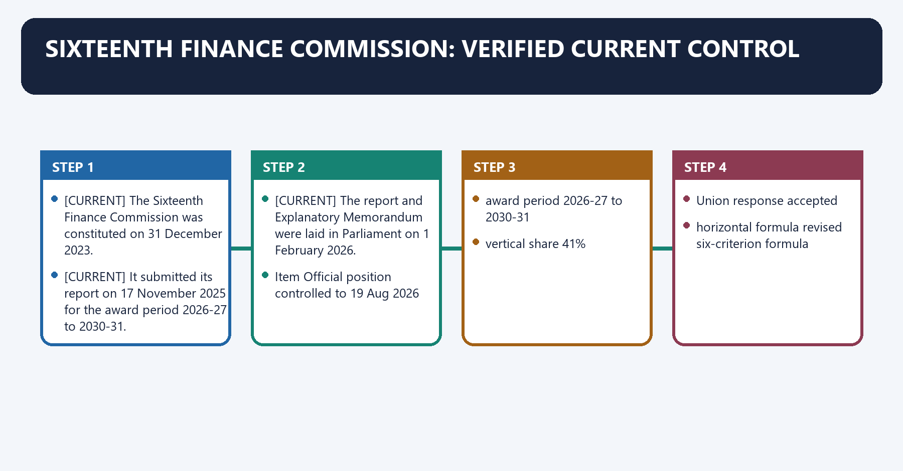
[CURRENT] The Sixteenth Finance Commission was constituted on 31 December 2023.

[CURRENT] It submitted its report on 17 November 2025 for the award period 2026-27 to 2030-31.

[CURRENT] The report and Explanatory Memorandum were laid in Parliament on 1 February 2026.

#### Visual 47 - Sixteenth FC current-status card

| Item | Official position controlled to 19 Aug 2026 |
|---|---|
| award period | 2026-27 to 2030-31 |
| vertical share | 41% |
| Union response | accepted |
| horizontal formula | revised six-criterion formula |
| local-body grants | Rs 7,91,493 crore over award period; accepted design |
| State disaster funds | Rs 2,04,401 crore over award period; accepted |
| national disaster funds | Rs 79,406 crore over award period; accepted |
| RDG / sector / State-specific grants | none recommended; Government took note |

#### Visual 48 - Sixteenth FC horizontal formula

| Criterion | Weight |
|---|---:|
| per-capita GSDP distance | 42.5% |
| population, 2011 | 17.5% |
| demographic performance | 10.0% |
| area | 10.0% |
| forest | 10.0% |
| contribution to GDP | 10.0% |
| **Total** | **100.0%** |

[CURRENT] The Union Government accepted the vertical share and horizontal formula stated above.

#### Visual 49 - What changed from Fifteenth to Sixteenth?

| Formula element | Fifteenth | Sixteenth | Change |
|---|---:|---:|---|
| income/GSDP distance | 45 | 42.5 | reduced by 2.5 |
| population | 15 | 17.5 | increased by 2.5 |
| area | 15 | 10 | reduced by 5 |
| demographic performance | 12.5 | 10 | reduced by 2.5 |
| forest/ecology | 10 | 10 forest | weight retained, label/method controlled by report |
| tax/fiscal effort | 2.5 | - | removed |
| GDP contribution | - | 10 | introduced |

#### Visual 50 - Sixteenth demographic-performance method

```text
1971 population -> 2011 population
          |
   State population growth rate
          |
inverse-growth approach
          |
relative demographic-performance index
```

[CURRENT] Unlike the Fifteenth Commission's total-fertility-rate-based design, the Sixteenth Commission's demographic-performance criterion uses inverse population growth between 1971 and 2011.

[LIMIT] Do not describe it as a direct reward for a current year's fertility rate.

#### Visual 51 - GDP-contribution method

```text
State share in national GSDP
          |
square-root transformation
          |
relative index for 10% formula weight
```

[ANALYSIS] The square-root transformation recognises contribution while moderating the dominance that a simple proportional output share could produce.

#### Visual 52 - Equity-efficiency balance in FC-16

| Equity/need side | Efficiency/contribution side |
|---|---|
| GSDP distance, 42.5 | GDP contribution, 10 |
| population, 17.5 | demographic performance, 10 |
| area, 10 | forest externality also has efficiency logic |
| large combined equalisation core | contribution receives visible but bounded weight |

#### CLOSING RECALL FLOW — SIXTEENTH FINANCE COMMISSION: VERIFIED CURRENT CONTROL

```closure-flow
SUBTOPIC: Sixteenth Finance Commission: verified current control
KEY TERMS / DEFINITIONS: Sixteenth Finance Commission · verified current control · Total · award period · 100.0% · 2026-27 to 2030-31
MECHANISM / ARGUMENT: Sixteenth Finance Commission: verified current control operates through [CURRENT] It submitted its report on 17 November 2025 for the award period 2026-27 to 2030-31, connected with [CURRENT] The report and Explanatory Memorandum were laid in Parliament on 1 February 2026.
CONSEQUENCE / CONTRAST: [CURRENT] Unlike the Fifteenth Commission's total-fertility-rate-based design, the Sixteenth Commission's demographic-performance criterion uses inverse population growth between 1971 and 2011.
UPSC TRAP / ANSWER-USE: Do not miss this limiting distinction: the exam-safe limitation is that horizontal formula revised six-criterion formula. [CURRENT] The Sixteenth Finance...
ANSWER-GRABBING FORMULATION: The square-root transformation recognises contribution while moderating the dominance that a simple proportional output share could produce.
```
### SESSION 17 — SIXTEENTH FC GRANTS: CATEGORIES AND STATUS
#### DEFINITION / WHAT THIS IS CALLED

**Plain-language definition:** Sixteenth FC grants: categories and status denotes the constitutional rules and institutional links organised around Was a grant category recommended by FC-16?.

**Technical definition:** The decisive contrast is between total local-body grants Rs 7,91,493 crore and period 2026-27 to 2030-31.

#### ANSWER-GRABBING OPENING — WRITE/ADAPT IN THE EXAM

> The Sixteenth Finance Commission's grant baseline does not constitutionally prohibit later incentive-linked borrowing decisions, which require their own lawful authority.

#### MUST-WRITE KEYWORDS

- **Sixteenth FC grants**
- **categories**
- **status**
- **takes note**
- **total local-body grants**
- **Rs 7,91,493 crore**

**How to use them:** Frame the answer through Sixteenth FC grants; define categories, connect status with takes note to explain the mechanism, and use total local-body grants for the decisive comparison or qualification.

Sixteenth FC grants: categories and status denotes the constitutional rules and institutional links organised around Was a grant category recommended by FC-16?.
Sixteenth FC grants: categories and status operates through RDG / sector / State-specific local body / disaster, connected with Government “takes note” Government accepts.
The operative mechanism matters because [CURRENT] The Commission did not recommend revenue-deficit grants, sector-specific grants or State-specific grants.
Its principal consequence is that item Sixteenth FC award-period recommendation.
The decisive contrast is between total local-body grants Rs 7,91,493 crore and period 2026-27 to 2030-31.
The exam-safe limitation is that union response detailed design accepted.
#### Visual 53 - Grant decision tree

```text
Was a grant category recommended by FC-16?
          |
     +----+----+
     |         |
    NO        YES
     |         |
RDG / sector / State-specific   local body / disaster
Government “takes note”         Government accepts
```

[CURRENT] The Commission did not recommend revenue-deficit grants, sector-specific grants or State-specific grants.

[CURRENT] The Explanatory Memorandum says the Government **takes note** of that recommendation. This differs from an acceptance of a positive grant design.

#### Visual 54 - Local-body grant envelope

| Item | Sixteenth FC award-period recommendation |
|---|---:|
| total local-body grants | Rs 7,91,493 crore |
| period | 2026-27 to 2030-31 |
| Union response | detailed design accepted |
| release character | subject to eligibility, conditions, allocation and guidelines |

[LIMIT] Rs 7,91,493 crore is a five-year award envelope, not a one-year release.

#### Visual 55 - Local-body grant architecture

```text
TOTAL LOCAL-BODY GRANT
       |
       +-- rural local bodies
       |
       +-- urban local bodies
       |
       +-- performance / entry / accounting conditions as designed
       |
       +-- State allocation and onward transfer
```

[CURRENT] The report's design emphasises timely constitution of SFCs, audited accounts, reporting, basic services and own-source revenue incentives.

#### Visual 56 - Disaster grant envelope

| Fund group | Award-period amount |
|---|---:|
| State-level disaster funds | Rs 2,04,401 crore |
| national-level disaster funds | Rs 79,406 crore |
| Union response | accepted |

#### Visual 57 - Award total versus annual Budget Estimate

```text
FC-16 REPORT:
five-year recommended envelopes
             is not equal to
UNION BUDGET 2026-27:
one-year provision
             is not equal to
ACTUAL RELEASE:
depends on conditions, accounts and execution
```

[CURRENT] The 2026-27 Budget Speech provided Rs 1.4 lakh crore in Finance Commission grants for local bodies and disaster management in the first award year.

#### CLOSING RECALL FLOW — SIXTEENTH FC GRANTS: CATEGORIES AND STATUS

```closure-flow
SUBTOPIC: Sixteenth FC grants: categories and status
KEY TERMS / DEFINITIONS: Sixteenth FC grants · categories · status · takes note · total local-body grants · Rs 7,91,493 crore
MECHANISM / ARGUMENT: The decisive contrast is between total local-body grants Rs 7,91,493 crore and period 2026-27 to 2030-31.
CONSEQUENCE / CONTRAST: Its principal consequence is that item Sixteenth FC award-period recommendation.
UPSC TRAP / ANSWER-USE: Rs 7,91,493 crore is a five-year award envelope, not a one-year release.
ANSWER-GRABBING FORMULATION: The Sixteenth Finance Commission's grant baseline does not constitutionally prohibit later incentive-linked borrowing decisions, which require their own lawful authority.
```
### 18. Sixteenth FC fiscal roadmap

Sixteenth FC fiscal roadmap denotes the constitutional rules and institutional links organised around Recommendation area Commission position Government response.
Sixteenth FC fiscal roadmap operates through State fiscal-deficit ceiling 3% of GSDP, without assuming SASCI-linked additional space accepted in principle, connected with State net borrowing ceiling linked to fiscal-deficit path accepted in principle.
The operative mechanism matters because union fiscal deficit reduce to 3.5% of GDP by 2030-31 to be examined separately.
Its principal consequence is that off-budget borrowing disclosure/control strengthen comprehensive fiscal reporting to be examined separately.
The decisive contrast is between fiscal-responsibility law changes reform/strengthen frameworks to be examined separately and power, subsidy and PSE reforms detailed reform agenda to be examined separately.
The exam-safe limitation is that [LIMIT] “Accepted in principle” is not the same as a fully notified operational rule for every year and every exception.
#### Visual 58 - Fiscal-roadmap status matrix

| Recommendation area | Commission position | Government response |
|---|---|---|
| State fiscal-deficit ceiling | 3% of GSDP, without assuming SASCI-linked additional space | accepted in principle |
| State net borrowing ceiling | linked to fiscal-deficit path | accepted in principle |
| Union fiscal deficit | reduce to 3.5% of GDP by 2030-31 | to be examined separately |
| off-budget borrowing disclosure/control | strengthen comprehensive fiscal reporting | to be examined separately |
| fiscal-responsibility law changes | reform/strengthen frameworks | to be examined separately |
| power, subsidy and PSE reforms | detailed reform agenda | to be examined separately |

[LIMIT] “Accepted in principle” is not the same as a fully notified operational rule for every year and every exception.

#### Visual 59 - Debt-control chain

```text
transparent liabilities
       |
include off-budget risks
       |
credible deficit ceiling
       |
borrowing limit
       |
debt sustainability
       |
intergenerational fiscal space
```

[ANALYSIS] Fiscal discipline is federal only if both levels disclose liabilities consistently and avoid shifting debt outside budgets.

#### Visual 60 - SASCI qualification

```text
3% State fiscal-deficit ceiling
          |
FC-16 did not build assumed extra borrowing
under the Special Assistance to States for
Capital Investment scheme into that ceiling
```

[LIMIT] This does not by itself abolish or constitutionally prohibit future incentive-linked borrowing decisions; it controls how the Commission framed its recommended baseline.

### SESSION 18 — CESSES AND SURCHARGES: THE DIVISIBLE-POOL DEBATE
#### DEFINITION / WHAT THIS IS CALLED

**Plain-language definition:** Cesses and surcharges: the divisible-pool debate denotes the constitutional rules and institutional links organised around UNION GROSS TAX REVENUE rises.

**Technical definition:** The decisive contrast is between annual CAG-certified disclosure transparency without constitutional redesign does not change the base and sunset/review of cesses limits indefinite continuation Parliament retains tax-policy needs.

#### ANSWER-GRABBING OPENING — WRITE/ADAPT IN THE EXAM

> Cesses and surcharges reduce the shareable base even when gross Union revenue rises, making transparency and sunset review important without misreporting proposals as enacted rules.

#### MUST-WRITE KEYWORDS

- **Cesses**
- **surcharges**
- **the divisible-pool debate**
- **not**
- **annual CAG-certified disclosure**
- **transparency without constitutional redesign**

**How to use them:** Frame the answer through Cesses; define surcharges, connect the divisible-pool debate with not to explain the mechanism, and use annual CAG-certified disclosure for the decisive comparison or qualification.

Cesses and surcharges: the divisible-pool debate denotes the constitutional rules and institutional links organised around UNION GROSS TAX REVENUE rises.
Cesses and surcharges: the divisible-pool debate operates through if larger fraction comes from excluded cesses/surcharges, connected with DIVISIBLE POOL may grow more slowly than GTR.
The operative mechanism matters because 41% applies to the smaller shareable base.
Its principal consequence is that reform idea Advantage Constraint.
The decisive contrast is between annual CAG-certified disclosure transparency without constitutional redesign does not change the base and sunset/review of cesses limits indefinite continuation Parliament retains tax-policy needs.
The exam-safe limitation is that wider tax-base bargain may align Union-State incentives politically and fiscally complex.
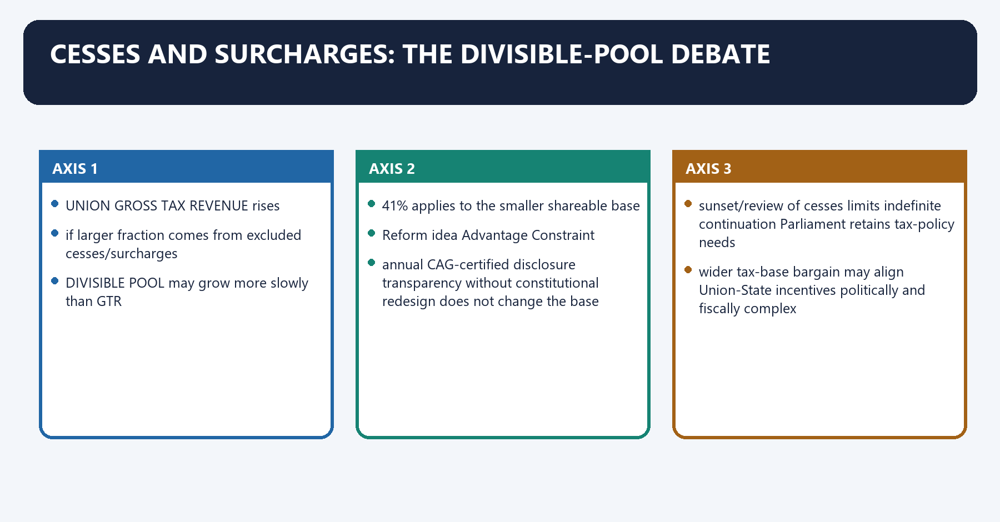
[FACT] Article 271 surcharges and applicable specific-purpose cesses lie outside the divisible pool. Rising reliance on them can reduce the shareable portion of Union gross tax revenue.

[CURRENT] The Sixteenth Commission did **not** recommend including cesses and surcharges in the divisible pool or imposing a numerical cap on them.

[CURRENT] It instead recommended greater transparency, including annual disclosure of CAG-certified net proceeds, and analytically discussed a possible wider “grand bargain”.

#### Visual 61 - Cess/surcharge effect

```text
UNION GROSS TAX REVENUE rises
          |
if larger fraction comes from excluded cesses/surcharges
          |
DIVISIBLE POOL may grow more slowly than GTR
          |
41% applies to the smaller shareable base
```

#### Visual 62 - Reform choices

| Reform idea | Advantage | Constraint |
|---|---|---|
| annual CAG-certified disclosure | transparency without constitutional redesign | does not change the base |
| sunset/review of cesses | limits indefinite continuation | Parliament retains tax-policy needs |
| wider tax-base bargain | may align Union-State incentives | politically and fiscally complex |
| constitutional inclusion/cap | stronger State share | requires legal/constitutional change and Union-capacity assessment |

[LIMIT] Present inclusion, caps and sunset rules as reform proposals unless enacted; do not attribute them to FC-16 as recommendations when the report did not recommend them.

#### CLOSING RECALL FLOW — CESSES AND SURCHARGES: THE DIVISIBLE-POOL DEBATE

```closure-flow
SUBTOPIC: Cesses and surcharges: the divisible-pool debate
KEY TERMS / DEFINITIONS: Cesses · surcharges · the divisible-pool debate · not · annual CAG-certified disclosure · transparency without constitutional redesign
MECHANISM / ARGUMENT: The decisive contrast is between annual CAG-certified disclosure transparency without constitutional redesign does not change the base and sunset/review of cesses limits indefinite continuation Parliament retains tax-policy needs.
CONSEQUENCE / CONTRAST: Present inclusion, caps and sunset rules as reform proposals unless enacted; do not attribute them to FC-16 as recommendations when the report did not recommend them.
UPSC TRAP / ANSWER-USE: Do not miss this limiting distinction: its principal consequence is that reform idea Advantage Constraint.
ANSWER-GRABBING FORMULATION: Cesses and surcharges reduce the shareable base even when gross Union revenue rises, making transparency and sunset review important without misreporting proposals as enacted rules.
```
### SESSION 19 — CENTRALLY SPONSORED SCHEMES AND TRANSFER COMPOSITION
#### DEFINITION / WHAT THIS IS CALLED

**Plain-language definition:** Centrally sponsored schemes and transfer composition denotes the constitutional rules and institutional links organised around MORE STATE DISCRETION MORE UNION DIRECTION.

**Technical definition:** Centrally sponsored schemes can secure national minimum priorities but may constrain State tailoring, demand matching funds and fragment accountability.

#### ANSWER-GRABBING OPENING — WRITE/ADAPT IN THE EXAM

> Centrally sponsored schemes can secure national minimum priorities but may constrain State tailoring, demand matching funds and fragment accountability.

#### MUST-WRITE KEYWORDS

- **Centrally sponsored schemes**
- **transfer composition**
- **formula-based autonomy**
- **equalisation and targeted support**
- **effective spending flexibility**
- **size of shareable base**

**How to use them:** Frame the answer through Centrally sponsored schemes; define transfer composition, connect formula-based autonomy with equalisation and targeted support to explain the mechanism, and use effective spending flexibility for the decisive comparison or qualification.

Centrally sponsored schemes and transfer composition denotes the constitutional rules and institutional links organised around MORE STATE DISCRETION MORE UNION DIRECTION.
Centrally sponsored schemes and transfer composition operates through tax devolution - general grants - conditional grants - CSS, connected with Question Why it matters.
The operative mechanism matters because did devolution rise? formula-based autonomy.
Its principal consequence is that did grants change? equalisation and targeted support.
The decisive contrast is between Did CSS shares/conditions change? effective spending flexibility and Did cesses/surcharges rise? size of shareable base.
The exam-safe limitation is that did tax buoyancy materialise? actual rupee devolution.
[ANALYSIS] Tax devolution advances autonomy because it is generally untied. Centrally sponsored schemes can secure national minimum priorities but may constrain State tailoring, demand matching funds and fragment accountability.

#### Visual 63 - Autonomy-control spectrum

```text
MORE STATE DISCRETION                         MORE UNION DIRECTION
tax devolution -> general grants -> conditional grants -> CSS
```

#### Visual 64 - Evaluate total transfers, not one channel

| Question | Why it matters |
|---|---|
| Did devolution rise? | formula-based autonomy |
| Did grants change? | equalisation and targeted support |
| Did CSS shares/conditions change? | effective spending flexibility |
| Did cesses/surcharges rise? | size of shareable base |
| Did tax buoyancy materialise? | actual rupee devolution |
| Did assigned functions expand? | real expenditure need |

#### CLOSING RECALL FLOW — CENTRALLY SPONSORED SCHEMES AND TRANSFER COMPOSITION

```closure-flow
SUBTOPIC: Centrally sponsored schemes and transfer composition
KEY TERMS / DEFINITIONS: Centrally sponsored schemes · transfer composition · formula-based autonomy · equalisation and targeted support · effective spending flexibility · size of shareable base
MECHANISM / ARGUMENT: Centrally sponsored schemes can secure national minimum priorities but may constrain State tailoring, demand matching funds and fragment accountability.
CONSEQUENCE / CONTRAST: The decisive contrast is between Did CSS shares/conditions change? effective spending flexibility and Did cesses/surcharges rise? size of shareable base.
UPSC TRAP / ANSWER-USE: Do not miss this limiting distinction: its principal consequence is that did grants change? equalisation and targeted support.
ANSWER-GRABBING FORMULATION: Centrally sponsored schemes can secure national minimum priorities but may constrain State tailoring, demand matching funds and fragment accountability.
```
### SESSION 20 — INSTITUTIONAL COMPARISONS
#### DEFINITION / WHAT THIS IS CALLED

**Plain-language definition:** Institutional comparisons denotes the constitutional rules and institutional links organised around Feature Finance Commission GST Council.

**Technical definition:** Mohit Minerals (2022) is used here only to control the GST Council comparison.

#### ANSWER-GRABBING OPENING — WRITE/ADAPT IN THE EXAM

> The Finance Commission redistributes shareable Union revenues, whereas the GST Council coordinates a common indirect-tax system; Mohit Minerals directly governs only the latter comparison.

#### MUST-WRITE KEYWORDS

- **Institutional comparisons**
- **Article 280**
- **Article 279A**
- **nature**
- **periodic expert commission**
- **permanent intergovernmental council**

**How to use them:** Frame the answer through Institutional comparisons; define Article 280, connect Article 279A with nature to explain the mechanism, and use periodic expert commission for the decisive comparison or qualification.

Institutional comparisons denotes the constitutional rules and institutional links organised around Feature Finance Commission GST Council.
Institutional comparisons operates through source Article 280 Article 279A, connected with nature periodic expert commission permanent intergovernmental council.
The operative mechanism matters because membership Chair + four members Union and State political executives.
Its principal consequence is that core function tax devolution and grants GST rate, base and administration recommendations.
The decisive contrast is between recommendation status advisory, implemented through relevant instruments recommendatory; Mohit Minerals rejects binding-command theory and federal logic redistribution/equalisation harmonised indirect-tax coordination.
The exam-safe limitation is that [FACT] Union of India v. Mohit Minerals (2022) is used here only to control the GST Council comparison.
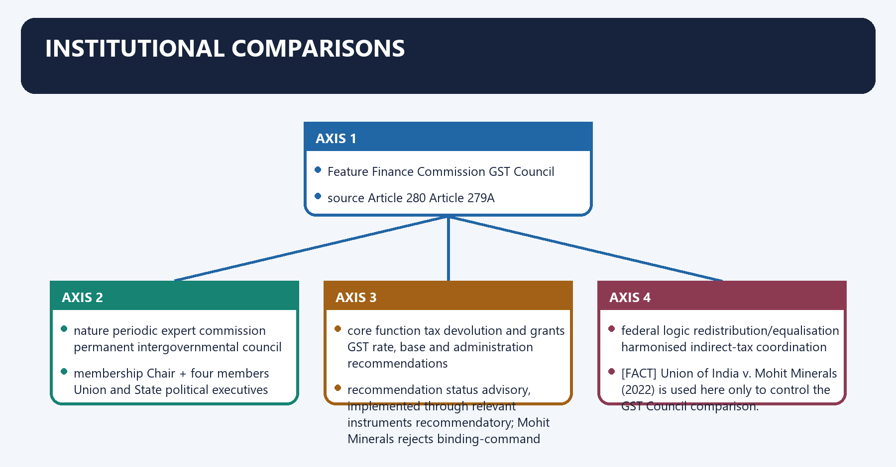
#### Visual 65 - Finance Commission versus GST Council

| Feature | Finance Commission | GST Council |
|---|---|---|
| source | Article 280 | Article 279A |
| nature | periodic expert commission | permanent intergovernmental council |
| membership | Chair + four members | Union and State political executives |
| core function | tax devolution and grants | GST rate, base and administration recommendations |
| recommendation status | advisory, implemented through relevant instruments | recommendatory; *Mohit Minerals* rejects binding-command theory |
| federal logic | redistribution/equalisation | harmonised indirect-tax coordination |

[FACT] *Union of India v. Mohit Minerals* (2022) is used here only to control the GST Council comparison.

[LIMIT] Do not cite *Mohit Minerals* as a direct Article 280 judgment.

#### Visual 66 - Finance Commission versus NITI Aayog

| Feature | Finance Commission | NITI Aayog |
|---|---|---|
| source | constitutional | executive resolution |
| periodicity | every five years or earlier | continuing institution |
| principal role | fiscal distribution recommendations | strategy, policy coordination and cooperative platforms |
| transfer power | recommends devolution/grants | does not constitutionally award the divisible pool |
| composition | expert commission | Prime Minister-led federal policy body |

#### Visual 67 - Finance Commission versus State Finance Commission

| Test | Union FC | SFC |
|---|---|---|
| relation | Union-State | State-local |
| article | 280 | 243-I / 243-Y |
| appointing authority | President | Governor |
| data focus | national and State fiscal capacity | local-body functions, taxes and grants |
| common challenge | formula and current data | delays, weak data and implementation |

#### Visual 68 - Four-body rapid distinction

```text
FC      = redistribution across levels and States
GSTC    = harmonised GST decision forum
NITI    = policy strategy and cooperative platform
SFC     = State-local fiscal review
```

#### CLOSING RECALL FLOW — INSTITUTIONAL COMPARISONS

```closure-flow
SUBTOPIC: Institutional comparisons
KEY TERMS / DEFINITIONS: Institutional comparisons · Article 280 · Article 279A · nature · periodic expert commission · permanent intergovernmental council
MECHANISM / ARGUMENT: The decisive contrast is between recommendation status advisory, implemented through relevant instruments recommendatory; Mohit Minerals rejects binding-command theory and federal logic redistribution/equalisation harmonised indirect-tax coordination.
CONSEQUENCE / CONTRAST: Do not cite Mohit Minerals as a direct Article 280 judgment.
UPSC TRAP / ANSWER-USE: Do not miss this limiting distinction: its principal consequence is that core function tax devolution and grants GST rate, base...
ANSWER-GRABBING FORMULATION: The Finance Commission redistributes shareable Union revenues, whereas the GST Council coordinates a common indirect-tax system; Mohit Minerals directly governs only the latter comparison.
```
### SESSION 21 — CONSTITUTIONAL CASES AND INTERPRETATION CONTROLS
#### DEFINITION / WHAT THIS IS CALLED

**Plain-language definition:** Constitutional cases and interpretation controls denotes the constitutional rules and institutional links organised around Case Safe use Do not use for.

**Technical definition:** No low-quality web claim about a supposed direct binding-status Article 280 case is frozen here.

#### ANSWER-GRABBING OPENING — WRITE/ADAPT IN THE EXAM

> Finance Commission recommendations are advisory within Article 281's implementation structure, while the resulting laws, orders and budget actions remain reviewable on ordinary legal grounds.

#### MUST-WRITE KEYWORDS

- **Constitutional cases**
- **interpretation controls**
- **Bhim Singh v. Union of India (2010)**
- **proving FC recommendations binding**
- **Union of India v. Mohit Minerals (2022)**
- **direct Article 280 holding**

**How to use them:** Frame the answer through Constitutional cases; define interpretation controls, connect Bhim Singh v. Union of India (2010) with proving FC recommendations binding to explain the mechanism, and use Union of India v. Mohit Minerals (2022) for the decisive comparison or qualification.

Constitutional cases and interpretation controls denotes the constitutional rules and institutional links organised around Case Safe use Do not use for.
Constitutional cases and interpretation controls operates through CONSTITUTIONAL DUTY TO CONSTITUTE FC, connected with DUTY TO LAY REPORT + EXPLANATORY MEMORANDUM.
The operative mechanism matters because rECOMMENDATIONS ARE NOT SELF-EXECUTING DECREES.
Its principal consequence is that aCCEPTED ITEMS REQUIRE APPROPRIATE IMPLEMENTATION.
The decisive contrast is between IMPLEMENTING LAW / ORDER / BUDGET ACTION IS REVIEWABLE and ON NORMAL CONSTITUTIONAL AND LEGAL GROUNDS.
The exam-safe limitation is that case Safe use Do not use for.
#### Visual 69 - Case-use matrix

| Case | Safe use | Do not use for |
|---|---|---|
| *Bhim Singh v. Union of India* (2010) | Article 282 permits grants for any public purpose within constitutional controls | proving FC recommendations binding |
| *Union of India v. Mohit Minerals* (2022) | GST Council recommendations are not binding; persuasive cooperative-federal role | direct Article 280 holding |

[LIMIT] No low-quality web claim about a supposed direct binding-status Article 280 case is frozen here. The advisory character is supported by constitutional structure, Article 281 implementation mechanics, statutory commentary and authoritative institutional practice.

#### Visual 70 - Legal enforceability ladder

```text
CONSTITUTIONAL DUTY TO CONSTITUTE FC
                |
DUTY TO LAY REPORT + EXPLANATORY MEMORANDUM
                |
RECOMMENDATIONS ARE NOT SELF-EXECUTING DECREES
                |
ACCEPTED ITEMS REQUIRE APPROPRIATE IMPLEMENTATION
                |
IMPLEMENTING LAW / ORDER / BUDGET ACTION IS REVIEWABLE
ON NORMAL CONSTITUTIONAL AND LEGAL GROUNDS
```

#### CLOSING RECALL FLOW — CONSTITUTIONAL CASES AND INTERPRETATION CONTROLS

```closure-flow
SUBTOPIC: Constitutional cases and interpretation controls
KEY TERMS / DEFINITIONS: Constitutional cases · interpretation controls · Bhim Singh v. Union of India (2010) · proving FC recommendations binding · Union of India v. Mohit Minerals (2022) · direct Article 280 holding
MECHANISM / ARGUMENT: The advisory character is supported by constitutional structure, Article 281 implementation mechanics, statutory commentary and authoritative institutional practice.
CONSEQUENCE / CONTRAST: The decisive contrast is between IMPLEMENTING LAW / ORDER / BUDGET ACTION IS REVIEWABLE and ON NORMAL CONSTITUTIONAL AND LEGAL GROUNDS.
UPSC TRAP / ANSWER-USE: The exam-safe limitation is that case Safe use Do not use for.
ANSWER-GRABBING FORMULATION: Finance Commission recommendations are advisory within Article 281's implementation structure, while the resulting laws, orders and budget actions remain reviewable on ordinary legal grounds.
```
### SESSION 22 — CRITIQUES AND REFORM AGENDA
#### DEFINITION / WHAT THIS IS CALLED

**Plain-language definition:** Critiques and reform agenda denotes the constitutional rules and institutional links organised around Problem Consequence Controlled reform.

**Technical definition:** The decisive contrast is between off-budget borrowing hidden liabilities whole-of-government debt reporting and weak SFCs fragile local grant evidence timely SFCs, accounts and State action.

#### ANSWER-GRABBING OPENING — WRITE/ADAPT IN THE EXAM

> A permanent secretariat can support, but should not become, a permanent Finance Commission.

#### MUST-WRITE KEYWORDS

- **Critiques**
- **reform agenda**
- **data asymmetry**
- **formula distrust**
- **common, timely fiscal data and CAG-certified net proceeds**
- **periodic institutional memory loss**

**How to use them:** Frame the answer through Critiques; define reform agenda, connect data asymmetry with formula distrust to explain the mechanism, and use common, timely fiscal data and CAG-certified net proceeds for the decisive comparison or qualification.

Critiques and reform agenda denotes the constitutional rules and institutional links organised around Problem Consequence Controlled reform.
Critiques and reform agenda operates through data asymmetry formula distrust common, timely fiscal data and CAG-certified net proceeds, connected with periodic institutional memory loss repeated start-up costs permanent secretariat/research capacity.
The operative mechanism matters because cess/surcharge growth narrower shareable base disclosure, review and wider fiscal bargain.
Its principal consequence is that cSS proliferation reduced flexibility rationalisation and outcome-based design.
The decisive contrast is between off-budget borrowing hidden liabilities whole-of-government debt reporting and weak SFCs fragile local grant evidence timely SFCs, accounts and State action.
The exam-safe limitation is that conditional grants compliance burden fewer, clearer and measurable conditions.
#### Visual 71 - Problem-reform matrix

| Problem | Consequence | Controlled reform |
|---|---|---|
| data asymmetry | formula distrust | common, timely fiscal data and CAG-certified net proceeds |
| periodic institutional memory loss | repeated start-up costs | permanent secretariat/research capacity |
| cess/surcharge growth | narrower shareable base | disclosure, review and wider fiscal bargain |
| CSS proliferation | reduced flexibility | rationalisation and outcome-based design |
| off-budget borrowing | hidden liabilities | whole-of-government debt reporting |
| weak SFCs | fragile local grant evidence | timely SFCs, accounts and State action |
| conditional grants | compliance burden | fewer, clearer and measurable conditions |
| climate disasters | backward-looking allocation | risk and resilience-based finance |
| intergenerational debt | future service crowd-out | credible medium-term fiscal rules |

#### Visual 72 - Permanent secretariat debate

| For | Against / design caution |
|---|---|
| institutional memory and comparable data | must not predetermine independent Commission judgment |
| continuous research and monitoring | recurring bureaucracy risk |
| smoother award transitions | constitutional periodicity remains |
| stronger SFC support | staffing and accountability need clarity |

[ANALYSIS] A permanent secretariat can support, but should not become, a permanent Finance Commission. The constitutional decision remains periodic and commission-led.

#### Visual 73 - Conditional-grant design test

```text
Is condition within constitutional purpose?
        |
Is it measurable and within recipient control?
        |
Is data auditable and release timing predictable?
        |
Does compliance cost remain proportionate?
        |
If yes -> legitimate incentive
If no  -> coercion, delay or paper compliance risk
```

#### Visual 74 - Climate-finance shift

```text
past expenditure only
        |
        v
hazard + exposure + vulnerability + capacity
        |
prevention + resilience + response + recovery
```

[ANALYSIS] Disaster finance should reward risk reduction without depriving high-risk, low-capacity States of basic response resources.

#### CLOSING RECALL FLOW — CRITIQUES AND REFORM AGENDA

```closure-flow
SUBTOPIC: Critiques and reform agenda
KEY TERMS / DEFINITIONS: Critiques · reform agenda · data asymmetry · formula distrust · common, timely fiscal data and CAG-certified net proceeds · periodic institutional memory loss
MECHANISM / ARGUMENT: Its principal consequence is that cSS proliferation reduced flexibility rationalisation and outcome-based design.
CONSEQUENCE / CONTRAST: The decisive contrast is between off-budget borrowing hidden liabilities whole-of-government debt reporting and weak SFCs fragile local grant evidence timely SFCs, accounts and State action.
UPSC TRAP / ANSWER-USE: A permanent secretariat can support, but should not become, a permanent Finance Commission.
ANSWER-GRABBING FORMULATION: A permanent secretariat can support, but should not become, a permanent Finance Commission.
```
### SESSION 23 — ANSWER-WRITING FRAMEWORK
#### DEFINITION / WHAT THIS IS CALLED

**Plain-language definition:** Answer-writing framework denotes the constitutional rules and institutional links organised around claim FC is the balancing wheel of fiscal federalism.

**Technical definition:** Technically, Answer-writing framework is analysed by relating writing framework to claim, then testing the relationship through named evidence and Article 280(3)(a), 41% accepted under FC-16.

#### ANSWER-GRABBING OPENING — WRITE/ADAPT IN THE EXAM

> The Finance Commission is a balancing mechanism of fiscal federalism because predictable devolution supports State autonomy while equalisation addresses unequal revenue capacity.

#### MUST-WRITE KEYWORDS

- **writing framework**
- **claim**
- **named evidence**
- **Article 280(3)(a), 41% accepted under FC-16**
- **predictable devolution supports State autonomy**
- **qualification**

**How to use them:** Frame the answer through writing framework; define claim, connect named evidence with Article 280(3)(a), 41% accepted under FC-16 to explain the mechanism, and use predictable devolution supports State autonomy for the decisive comparison or qualification.

Answer-writing framework denotes the constitutional rules and institutional links organised around claim FC is the balancing wheel of fiscal federalism.
Answer-writing framework operates through named evidence Article 280(3)(a), 41% accepted under FC-16, connected with analysis predictable devolution supports State autonomy.
The operative mechanism matters because qualification cess/surcharge composition, CSS and tax buoyancy shape actual space.
Its principal consequence is that 20 words: constitutional definition.
The decisive contrast is between 35 words: two core functions and 55 words: two analytical impacts with evidence.
The exam-safe limitation is that 25 words: qualification / challenge.
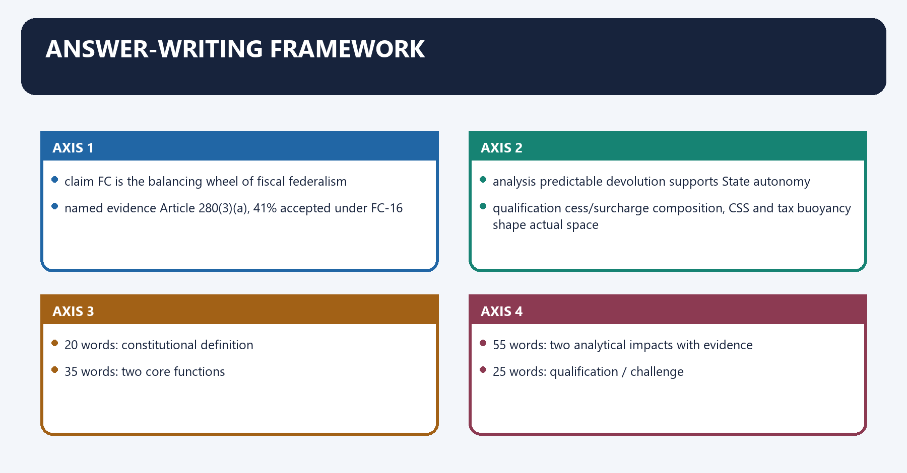
#### Visual 75 - Claim-evidence-analysis-qualification spine

| Step | Example |
|---|---|
| claim | FC is the balancing wheel of fiscal federalism |
| named evidence | Article 280(3)(a), 41% accepted under FC-16 |
| analysis | predictable devolution supports State autonomy |
| qualification | cess/surcharge composition, CSS and tax buoyancy shape actual space |

#### Visual 76 - 150-word answer blueprint

```text
20 words: constitutional definition
35 words: two core functions
55 words: two analytical impacts with evidence
25 words: qualification / challenge
15 words: cooperative-federal conclusion
```

#### Visual 77 - 250-word answer blueprint

```text
INTRO: Article 280 + issue
BODY 1: constitutional architecture
BODY 2: evolution / current evidence
BODY 3: critique and counterpoint
REFORM: 3 precise measures
CONCLUSION: rule-based autonomy + shared stability
```

#### Visual 78 - Common traps

| Trap | Correct recall |
|---|---|
| 41% of gross tax revenue | 41% of divisible-pool net proceeds |
| FC is permanent | periodic; can be constituted earlier |
| Constitution lists detailed qualifications | Parliament prescribed them in 1951 Act |
| report requires parliamentary approval | Article 281 requires laying plus explanatory memorandum |
| recommendations are binding | advisory, though constitutionally weighty |
| cesses/surcharges are shared | excluded under operative constitutional design |
| 42 to 41 was uniform State loss | primarily J&K reorganisation adjustment; effects vary |
| 16th retained 15th formula | horizontal criteria and weights changed |
| demographic performance means TFR in FC-16 | inverse population growth, 1971-2011 |
| FC-16 recommended RDG | no RDG recommended |
| FC-16 capped cesses | no such recommendation |
| SFC wording has been removed | amendment only proposed, not enacted here |

#### CLOSING RECALL FLOW — ANSWER-WRITING FRAMEWORK

```closure-flow
SUBTOPIC: Answer-writing framework
KEY TERMS / DEFINITIONS: writing framework · claim · named evidence · Article 280(3)(a), 41% accepted under FC-16 · predictable devolution supports State autonomy · qualification
MECHANISM / ARGUMENT: The exam-safe limitation is that 25 words: qualification / challenge.
CONSEQUENCE / CONTRAST: The decisive contrast is between 35 words: two core functions and 55 words: two analytical impacts with evidence.
UPSC TRAP / ANSWER-USE: Do not miss this limiting distinction: its principal consequence is that 20 words.
ANSWER-GRABBING FORMULATION: The Finance Commission is a balancing mechanism of fiscal federalism because predictable devolution supports State autonomy while equalisation addresses unequal revenue capacity.
```
### SESSION 24 — INTEGRATED REVISION BEFORE ASSESSMENT
#### DEFINITION / WHAT THIS IS CALLED

**Plain-language definition:** Integrated revision before assessment denotes the constitutional rules and institutional links organised around ARTICLE 280 COMMISSION.

**Technical definition:** Technically, Integrated revision before assessment is analysed by relating constituted to report submitted, then testing the relationship through period and 31 Dec 2023.

#### ANSWER-GRABBING OPENING — WRITE/ADAPT IN THE EXAM

> Finance Commission recommendations remain advisory, but Article 281 requires parliamentary visibility through the report and an explanatory action memorandum.

#### MUST-WRITE KEYWORDS

- **Integrated revision before assessment**
- **constituted**
- **report submitted**
- **period**
- **31 Dec 2023**
- **17 Nov 2025**

**How to use them:** Frame the answer through Integrated revision before assessment; define constituted, connect report submitted with period to explain the mechanism, and use 31 Dec 2023 for the decisive comparison or qualification.

Integrated revision before assessment denotes the constitutional rules and institutional links organised around ARTICLE 280 COMMISSION.
Integrated revision before assessment operates through Constitution: President, every fifth year/earlier, Chair + 4, connected with 1951 Act: qualifications, procedure, powers.
The operative mechanism matters because vertical + horizontal + grants + local bodies + referred matters.
Its principal consequence is that article 279: CAG-certified net proceeds.
The decisive contrast is between Article 270: divisible pool and Article 281: report + action memorandum.
The exam-safe limitation is that fC-15: 41%; 45-15-15-12.5-10-2.5.
#### Visual 79 - One-page conceptual map

```text
ARTICLE 280 COMMISSION
  |
  +-- Constitution: President, every fifth year/earlier, Chair + 4
  +-- 1951 Act: qualifications, procedure, powers
  +-- Article 280(3):
  |      vertical + horizontal + grants + local bodies + referred matters
  +-- Article 279: CAG-certified net proceeds
  +-- Article 270: divisible pool
  +-- Article 281: report + action memorandum
  |
  +-- FC-14: 42%
  +-- FC-15: 41%; 45-15-15-12.5-10-2.5
  +-- FC-16: 41%; 42.5-17.5-10-10-10-10
  |
  +-- debates: cesses, CSS, debt, data, local bodies, climate
```

#### Visual 80 - Sixteenth FC rapid board

| Recall field | Controlled fact |
|---|---|
| constituted | 31 Dec 2023 |
| report submitted | 17 Nov 2025 |
| period | 2026-27 to 2030-31 |
| vertical | 41%, accepted |
| largest horizontal weight | per-capita GSDP distance, 42.5% |
| new visible criterion | GDP contribution, 10% |
| local-body grants | Rs 7,91,493 crore, five years |
| State disaster funds | Rs 2,04,401 crore, five years |
| national disaster funds | Rs 79,406 crore, five years |
| excluded grant classes | no RDG, sector-specific or State-specific grant recommendation |
| State deficit baseline | 3% GSDP, accepted in principle |
| Union 2030-31 path | 3.5% GDP recommendation; separate examination |
| cess/surcharge cap | not recommended |

#### CLOSING RECALL FLOW — INTEGRATED REVISION BEFORE ASSESSMENT

```closure-flow
SUBTOPIC: Integrated revision before assessment
KEY TERMS / DEFINITIONS: Integrated revision before assessment · constituted · report submitted · period · 31 Dec 2023 · 17 Nov 2025
MECHANISM / ARGUMENT: Its principal consequence is that article 279: CAG-certified net proceeds.
CONSEQUENCE / CONTRAST: The decisive contrast is between Article 270: divisible pool and Article 281: report + action memorandum.
UPSC TRAP / ANSWER-USE: Do not miss this limiting distinction: the exam-safe limitation is that fC-15.
ANSWER-GRABBING FORMULATION: Finance Commission recommendations remain advisory, but Article 281 requires parliamentary visibility through the report and an explanatory action memorandum.
```
## BASIC MCQS / REMEDIATION

### Original MCQs - 36 questions

#### OM1. Constitutional frequency

Article 280 requires the President to constitute a Finance Commission:

A. whenever the GST Council recommends it.
B. annually before the Union Budget.
C. only after every general election.
D. every fifth year or earlier if necessary.

**Answer: D.**

**Explanation:** [FACT] Article 280(1) uses a five-year cycle and permits earlier constitution.

#### OM2. Composition

The constitutional composition is:

A. a Chair and two members.
B. the Union Finance Minister and all State Finance Ministers.
C. five CAG nominees.
D. a Chairman and four other members.

**Answer: D.**

**Explanation:** [FACT] Article 280 fixes Chairman plus four other members.

#### OM3. Detailed qualifications

The detailed qualification categories for Finance Commission members are prescribed primarily by:

A. the Finance Commission (Miscellaneous Provisions) Act, 1951.
B. rules made by the CAG.
C. GST Council regulations.
D. Article 281 itself.

**Answer: A.**

**Explanation:** [FACT] Article 280 authorises Parliament; the 1951 Act supplies the detail.

#### OM4. Chairman qualification

Under the 1951 Act, the Chairman should be a person:

A. possessing only a doctorate in economics.
B. with ten years as a State Finance Minister.
C. who is a serving Supreme Court judge.
D. having experience in public affairs.

**Answer: D.**

**Explanation:** [FACT] Public-affairs experience is the statutory Chairman qualification.

#### OM5. Net proceeds

Which expression best represents Article 279 net proceeds?

A. tax revenue minus all grants.
B. gross tax revenue plus borrowings.
C. tax proceeds minus collection cost.
D. divisible pool plus cesses.

**Answer: C.**

**Explanation:** [FACT] Article 279 deducts the cost attributable to collection.

#### OM6. Final certification

Net proceeds are ascertained and certified finally by:

A. Parliament's Public Accounts Committee.
B. Comptroller and Auditor General of India.
C. GST Council.
D. Finance Secretary.

**Answer: B.**

**Explanation:** [FACT] Article 279 gives this final certification function to the CAG.

#### OM7. Vertical devolution

Vertical devolution determines:

A. the collective State share relative to the Union.
B. Union borrowing from States.
C. grants among municipalities.
D. each district's tax effort.

**Answer: A.**

**Explanation:** [FACT] Vertical distribution is Union versus all States.

#### OM8. Horizontal devolution

Horizontal devolution determines:

A. division of the collective State share among States.
B. Union versus States.
C. tax versus non-tax revenue.
D. revenue versus capital spending.

**Answer: A.**

**Explanation:** [FACT] It is the inter se State allocation.

#### OM9. Divisible pool

Which is included in the conceptual base for Finance Commission tax devolution?

A. every Union cess without exception.
B. net proceeds of shareable Union taxes.
C. Union market borrowings.
D. Article 271 surcharges.

**Answer: B.**

**Explanation:** [FACT] The divisible pool is built from constitutionally shareable net tax proceeds.

#### OM10. Article 271

Article 271 primarily concerns:

A. State Finance Commissions.
B. CAG appointment.
C. municipal taxation.
D. Union surcharges for Union purposes.

**Answer: D.**

**Explanation:** [FACT] Such surcharges are outside Article 270 distribution.

#### OM11. Article 281

Article 281 requires:

A. the recommendations and explanatory action memorandum to be laid before each House.
B. a constitutional amendment for every award.
C. Supreme Court approval of the award.
D. ratification by half the States.

**Answer: A.**

**Explanation:** [FACT] Laying plus the explanatory memorandum is the constitutional accountability rule.

#### OM12. Legal status

Finance Commission recommendations are best described as:

A. binding GST law.
B. judicial decrees.
C. advisory recommendations with high constitutional and fiscal weight.
D. automatically enforceable State debts.

**Answer: C.**

**Explanation:** [FACT] They require implementation through appropriate fiscal and legal instruments.

#### OM13. Grants provision

The constitutional article directly associated with Finance Commission principles for grants-in-aid of State revenues is:

A. Article 324.
B. Article 110.
C. Article 275.
D. Article 32.

**Answer: C.**

**Explanation:** [FACT] Article 280(3)(d) refers to grants under Article 275.

#### OM14. Article 282

Which statement is correct?

A. It abolishes appropriations.
B. It permits Union or State grants for any public purpose, subject to constitutional controls.
C. Article 282 is identical to Article 275.
D. It makes every grant a Finance Commission grant.

**Answer: B.**

**Explanation:** [FACT] *Bhim Singh* recognises the breadth of this separate grant power.

#### OM15. Local-body augmentation

Article 280 requires the national Commission to recommend augmentation measures for Panchayats and Municipalities on the basis of:

A. State Finance Commission recommendations.
B. GST compensation data only.
C. NITI Aayog rankings.
D. District Magistrate reports alone.

**Answer: A.**

**Explanation:** [FACT] This wording remains in Article 280(3)(bb) and (a).

#### OM16. Amendment status

The Sixteenth Commission's proposal to remove the SFC-reference words from Article 280 should presently be written as:

A. an automatic textual deletion.
B. a Supreme Court direction.
C. a reform proposal requiring constitutional amendment, not current text.
D. enforced constitutional law.

**Answer: C.**

**Explanation:** [CURRENT] No enacted amendment is frozen in this package.

#### OM17. Fourteenth Commission

The Fourteenth Finance Commission raised the collective State share from:

A. 41 per cent to 50 per cent.
B. 25 per cent to 41 per cent.
C. 42 per cent to 45 per cent.
D. 32 per cent to 42 per cent.

**Answer: D.**

**Explanation:** [FACT] This was the major 2015-20 devolution shift.

#### OM18. Fifteenth Commission

The Fifteenth Commission's 41 per cent share was primarily explained by:

A. a GST Council veto.
B. Jammu and Kashmir's reorganisation and exclusion from the State-share calculation.
C. removal of all grants.
D. abolition of Article 270.

**Answer: B.**

**Explanation:** [FACT] The official report supplies this context.

#### OM19. Fifteenth formula

The largest horizontal weight under the Fifteenth Commission for 2021-26 was:

A. income distance.
B. area.
C. population.
D. tax effort.

**Answer: A.**

**Explanation:** [FACT] Income distance carried 45 per cent.

#### OM20. Fifteenth effort weight

Tax and fiscal effort under the Fifteenth formula carried:

A. 12.5 per cent.
B. 10 per cent.
C. 2.5 per cent.
D. 5 per cent.

**Answer: C.**

**Explanation:** [FACT] The 2.5 per cent criterion rewarded own-tax effort.

#### OM21. Sixteenth vertical share

The accepted Sixteenth Commission vertical share for 2026-31 is:

A. 45 per cent.
B. 42 per cent.
C. 41 per cent.
D. 50 per cent.

**Answer: C.**

**Explanation:** [CURRENT] The Government accepted the recommended 41 per cent.

#### OM22. Sixteenth largest criterion

The largest Sixteenth Commission horizontal weight is:

A. per-capita GSDP distance.
B. population, 2011.
C. forest.
D. contribution to GDP.

**Answer: A.**

**Explanation:** [CURRENT] Per-capita GSDP distance carries 42.5 per cent.

#### OM23. New Sixteenth criterion

Which criterion appears in the Sixteenth formula but not the Fifteenth formula?

A. area.
B. contribution to GDP.
C. demographic performance.
D. population.

**Answer: B.**

**Explanation:** [CURRENT] GDP contribution carries 10 per cent.

#### OM24. Sixteenth demographic method

Sixteenth Commission demographic performance is based on:

A. current population density.
B. life expectancy change.
C. current total fertility rate alone.
D. inverse population growth between 1971 and 2011.

**Answer: D.**

**Explanation:** [CURRENT] Do not carry the Fifteenth TFR-based method forward.

#### OM25. GDP-contribution transformation

The Sixteenth Commission moderates the GDP-contribution criterion through:

A. a simple winner-takes-all rule.
B. an equal share for every State.
C. a square-root transformation of State GSDP shares.
D. a population-density multiplier.

**Answer: C.**

**Explanation:** [CURRENT] The transformation recognises contribution while moderating concentration.

#### OM26. Revenue-deficit grants

For 2026-31, the Sixteenth Commission:

A. doubled revenue-deficit grants.
B. recommended no revenue-deficit grants.
C. made them a constitutional right.
D. transferred their design to the GST Council.

**Answer: B.**

**Explanation:** [CURRENT] It also recommended no sector-specific or State-specific grants.

#### OM27. Local-body envelope

The Sixteenth Commission's Rs 7,91,493 crore local-body figure is:

A. a State's individual share.
B. the five-year recommended award envelope.
C. the Union's gross tax revenue.
D. one year's actual release.

**Answer: B.**

**Explanation:** [CURRENT] Period and category must accompany the figure.

#### OM28. Government status vocabulary

For the absence of RDG, sector-specific and State-specific grants, the Explanatory Memorandum states that Government:

A. rejected Article 275.
B. constitutionally vetoed the Commission.
C. took note of the recommendation.
D. accepted a positive grant formula.

**Answer: C.**

**Explanation:** [CURRENT] “Takes note” must not be silently rewritten as “accepted”.

#### OM29. Disaster funds

Which pairing is correct for the Sixteenth award period?

A. State disaster funds Rs 2,04,401 crore; national disaster funds Rs 79,406 crore.
B. State disaster funds Rs 79,406 crore; national funds Rs 7,91,493 crore.
C. no disaster allocation was recommended.
D. both exactly Rs 1.4 lakh crore.

**Answer: A.**

**Explanation:** [CURRENT] The two five-year envelopes and their levels are distinct.

#### OM30. State fiscal-deficit baseline

The Sixteenth Commission recommended a State fiscal-deficit ceiling of:

A. 5 per cent of gross tax revenue.
B. 3 per cent of GSDP.
C. 3.5 per cent of GDP for every State.
D. 2 per cent of GSDP.

**Answer: B.**

**Explanation:** [CURRENT] Government accepted the State borrowing/deficit path in principle.

#### OM31. Union fiscal path

The Commission's recommendation to reduce the Union fiscal deficit to 3.5 per cent of GDP by 2030-31 was:

A. struck down judicially.
B. accepted as an Article 271 surcharge.
C. automatically constitutionalised.
D. left for separate examination by Government.

**Answer: D.**

**Explanation:** [CURRENT] The Explanatory Memorandum preserves this separate-examination status.

#### OM32. Cess/surcharge recommendation

Which is the accurate Sixteenth Commission position?

A. It did not recommend inclusion or a numerical cap, but sought transparency.
B. It abolished Article 271.
C. It imposed a 10 per cent surcharge cap.
D. It mandated immediate inclusion of every cess.

**Answer: A.**

**Explanation:** [CURRENT] Annual disclosure of CAG-certified net proceeds is the controlled recommendation.

#### OM33. GST Council comparison

Which distinction is correct?

A. NITI Aayog appoints both.
B. Finance Commission redistributes; GST Council coordinates GST recommendations.
C. both are periodic judicial tribunals.
D. both divide Article 275 grants.

**Answer: B.**

**Explanation:** [FACT] Their source, membership and functions differ.

#### OM34. NITI Aayog comparison

NITI Aayog differs from the Finance Commission because NITI Aayog is:

A. an executive policy institution rather than the constitutional tax-devolution body.
B. constituted every fifth year by the President.
C. created by Article 280.
D. the final certifier of net proceeds.

**Answer: A.**

**Explanation:** [FACT] NITI's strategic role does not confer Article 280 distribution functions.

#### OM35. State Finance Commission

The State Finance Commission principally reviews:

A. Union-State defence expenditure.
B. GST rates.
C. State-local fiscal relations.
D. Article 271 surcharges.

**Answer: C.**

**Explanation:** [FACT] Articles 243-I and 243-Y provide the State-local architecture.

#### OM36. *Mohit Minerals*

This case is safely used in the present topic to explain:

A. direct binding force of Finance Commission awards.
B. member disqualification under the 1951 Act.
C. Article 279 CAG certification.
D. the recommendatory status of the GST Council in institutional comparison.

**Answer: D.**

**Explanation:** [FACT] It is not presented as a direct Article 280 holding.

### Remedial MCQs - 12 questions

#### RM1. Percentage-base trap

“States receive 41 per cent under the Sixteenth Finance Commission” means:

A. 41 per cent of GDP.
B. 41 per cent of divisible-pool net proceeds.
C. 41 per cent of every cess and surcharge.
D. 41 per cent of all Union receipts.

**Answer: B.**

**Explanation:** [FACT] Always name the base; otherwise the statement is misleading.

#### RM2. Timing trap

Which statement corrects “the Finance Commission can be constituted only after five years”?

A. Article 280 permits earlier constitution if the President considers it necessary.
B. the CAG fixes the date.
C. It is constituted every ten years.
D. only Parliament may constitute it early.

**Answer: A.**

**Explanation:** [FACT] “Every fifth year or earlier” is exact constitutional language.

#### RM3. Qualification trap

The statement “Article 280 itself requires one economist and one judge” is:

A. correct only after GST.
B. fully correct.
C. inaccurate because detailed categories come from the 1951 Act.
D. correct only for the Sixteenth Commission.

**Answer: C.**

**Explanation:** [FACT] Distinguish constitutional authorisation from statutory detail.

#### RM4. Binding-status trap

If Government accepts a Finance Commission recommendation, it:

A. becomes a Supreme Court decree.
B. must still be implemented through the appropriate fiscal/legal instrument.
C. needs no Budget or legal action.
D. automatically amends the Constitution.

**Answer: B.**

**Explanation:** [FACT] Advisory recommendations are not self-executing commands.

#### RM5. Forty-two-to-forty-one trap

The best explanation of the Fifteenth Commission's 41 per cent is:

A. a uniform one-point deduction from every State's budget.
B. inclusion of all cesses.
C. a primary adjustment for Jammu and Kashmir's reorganisation, with State effects depending on the full formula.
D. abolition of horizontal devolution.

**Answer: C.**

**Explanation:** [FACT] This preserves both the official context and distribution nuance.

#### RM6. Formula-carry-forward trap

Which criterion was removed as a separate weight from the Fifteenth to the Sixteenth formula?

A. population.
B. forest.
C. income distance.
D. tax and fiscal effort.

**Answer: D.**

**Explanation:** [CURRENT] GDP contribution was introduced instead as a distinct 10 per cent criterion.

#### RM7. Demographic trap

The Sixteenth Commission's demographic-performance criterion should be remembered as:

A. current birth rate only.
B. population density.
C. 2011 population only.
D. inverse population growth from 1971 to 2011.

**Answer: D.**

**Explanation:** [CURRENT] This is a major current-affairs distinction from the Fifteenth formula.

#### RM8. Grant-total trap

Rs 1.4 lakh crore in the 2026-27 Budget Speech and Rs 7,91,493 crore in the FC report:

A. are two descriptions of the same annual release.
B. belong to different periods and scopes: first-year grants versus five-year local-body envelope.
C. are both gross tax revenue.
D. are State X's tax share.

**Answer: B.**

**Explanation:** [CURRENT] Never mix an annual Budget provision with an award-period total.

#### RM9. Cess-reform trap

Which claim is safe?

A. Article 271 was repealed.
B. FC-16 abolished every cess.
C. all cesses entered the pool in 2026.
D. FC-16 sought net-proceeds transparency but did not recommend a cess/surcharge cap.

**Answer: D.**

**Explanation:** [CURRENT] Stronger reform proposals may be analysed, but not fabricated as Commission recommendations.

#### RM10. Local-body amendment trap

The existing Article 280 local-body clauses:

A. no longer mention SFC recommendations.
B. transfer all municipal taxes to the Union.
C. still mention SFC recommendations; FC-16's deletion idea remains a reform proposal here.
D. make the GST Council the SFC.

**Answer: C.**

**Explanation:** [CURRENT] Recommendation and enacted amendment must remain distinct.

#### RM11. SFC identity trap

Which body is constituted by the Governor to review State-local finances?

A. State Finance Commission.
B. GST Council.
C. Union Finance Commission.
D. NITI Aayog.

**Answer: A.**

**Explanation:** [FACT] It is rooted in Articles 243-I and 243-Y.

#### RM12. Case-law trap

Which use of *Bhim Singh v. Union of India* is accurate?

A. It prescribes the horizontal formula.
B. It fixes 41 per cent devolution.
C. It makes Article 280 awards binding.
D. It supports the breadth of Article 282's public-purpose grant power.

**Answer: D.**

**Explanation:** [FACT] The case must not be stretched beyond its Article 282 relevance.

## PYQS AND ANSWER PRACTICE

#### Audited PYQ routing note

- [FACT] The local official papers and routing ledgers were searched for Finance Commission, fiscal federalism, Article 280, horizontal devolution, Fourteenth Finance Commission and Fifteenth Finance Commission.
- [FACT] Five relevant demands were verified: 2018 GS-II Q14, 2021 GS-II Q3, 2023 Prelims Q29, 2025 Prelims Q66 and 2025 GS-II Q14.
- [LIMIT] The 2025 GS-II question is principally owned by Centre-State Relations; it is solved here only to show the Finance Commission dimension.
- [LIMIT] A local official key for the 2023 Prelims paper was unavailable. The resolution below is derived from the official Fifteenth Finance Commission formula and is not mislabelled as an official UPSC key.
- [FACT] The official 2025 Set-A key records option C for Q66.

#### PYQ 1 - UPSC GS-II 2018, Q14 - 15 marks, 250 words

**Question:** “How is the Finance Commission of India constituted? What do you know about the terms of reference of the recently constituted Finance Commission? Discuss.”

##### Demand decoding

| Part | Required content |
|---|---|
| how constituted | Article 280, President, timing, Chair + four, Parliament's law |
| terms of reference | constitutional functions plus additional matters in constituting order |
| discuss | significance, controversy and balanced qualification |

##### Evidence-led model solution

The Finance Commission is a periodic constitutional body under Article 280 and the balancing mechanism of Indian fiscal federalism. The President constitutes it every fifth year or earlier, if necessary. It consists of a Chairman and four other members. Parliament is authorised to prescribe qualifications and selection; the Finance Commission (Miscellaneous Provisions) Act, 1951 requires public-affairs experience for the Chairman and supplies judicial, government-finance, financial-administration and economics qualification pools for the other members.

Its constitutional reference covers: distribution of net proceeds of shareable taxes between the Union and States; horizontal allocation among States; principles governing Article 275 grants; measures to augment State Consolidated Funds for Panchayats and Municipalities on the basis of State Finance Commission recommendations; and any other presidentially referred matter in the interests of sound finance.

The “recently constituted” Commission in the question's temporal setting was the Fifteenth Finance Commission. Its order required review of Union and State finances, tax devolution and grants, local-body augmentation, fiscal consolidation and debt, while considering contemporary policy changes and expenditure demands. Such additional terms can broaden analysis but cannot displace Article 280's constitutional core.

The Commission must balance State autonomy and equalisation with Union responsibilities and macroeconomic stability. Its recommendations are advisory, but Article 281 requires the report and an explanatory action memorandum to be laid before Parliament. Thus, technical expertise is joined with political accountability rather than judicial enforceability.

#### PYQ 2 - UPSC GS-II 2021, Q3 - 10 marks, 150 words

**Question:** “How have the recommendations of the 14th Finance Commission of India enabled the States to improve their fiscal position?”

##### Evidence-led model solution

The Fourteenth Finance Commission strengthened State fiscal capacity mainly by raising their collective share in the divisible pool from 32 to 42 per cent for 2015-20.

First, the shift enlarged predictable, formula-based and relatively untied transfers, allowing States to align expenditure with local priorities rather than depend excessively on discretionary or scheme-specific support. Second, a larger tax share allowed States to benefit from Union-tax buoyancy and improved medium-term budgeting. Third, greater general-purpose resources supported constitutionally assigned services such as health, education, agriculture and local infrastructure. Fourth, the move complemented the end of the Planning Commission and increased State responsibility for expenditure choices.

However, the fiscal effect was not equal for every State and cannot be read from the headline percentage alone. It depended on each State's horizontal share, actual Union tax collection, changes in grants and centrally sponsored schemes, own-tax effort, debt and expenditure pressures.

Therefore, the Fourteenth Commission improved autonomy and predictable fiscal space, while simultaneously demanding stronger State-level revenue mobilisation, budgeting and accountability.

#### PYQ 3 - UPSC Prelims 2023, Q29

**Question:** Consider the following:

1. Demographic performance  
2. Forest and ecology  
3. Governance reforms  
4. Stable government  
5. Tax and fiscal efforts

For the horizontal tax devolution, the Fifteenth Finance Commission used how many of the above as criteria other than population, area and income distance?

A. Only two  
B. Only three  
C. Only four  
D. All five

##### Controlled resolution

[FACT] The official Fifteenth Finance Commission formula used demographic performance, forest and ecology, and tax and fiscal effort in addition to population, area and income distance.

[FACT] Governance reforms and stable government were not horizontal-devolution criteria.

[ANALYSIS] Therefore, three listed items - 1, 2 and 5 - qualify, corresponding to option B in the official paper.

[LIMIT] This is an evidence-based resolution from the official Commission report. A local official UPSC key for this paper was unavailable, so no official-key attribution is made.

#### PYQ 4 - UPSC Prelims 2025, Q66

**Question:** Which of the following statements with regard to recommendations of the 15th Finance Commission of India are correct?

I. It has recommended grants of Rs 4,800 crores from the year 2022-23 to the year 2025-26 for incentivizing States to enhance educational outcomes.  
II. 45% of the net proceeds of Union taxes are to be shared with States.  
III. Rs 45,000 crores are to be kept as performance-based incentive for all States for carrying out agricultural reforms.  
IV. It reintroduced tax effort criteria to reward fiscal performance.

A. I, II and III  
B. I, II and IV  
C. I, III and IV  
D. II, III and IV

##### Official-key-controlled solution

[FACT] Statement I is correct: the Fifteenth Commission recommended the specified educational-outcomes incentive grant.

[FACT] Statement II is incorrect: the collective State share was 41 per cent, not 45 per cent, of divisible-pool net proceeds.

[FACT] Statement III is correct: the report provided the stated performance-linked agricultural-reform incentive envelope.

[FACT] Statement IV is correct: tax and fiscal effort had a 2.5 per cent horizontal weight.

[FACT] Correct combination: I, III and IV. The official UPSC Set-A key records **C**.

#### PYQ 5 - UPSC GS-II 2025, Q14 - 15 marks, 250 words

**Question:** “Examine the evolving pattern of Centre-State financial relations in the context of planned development in India. How far have the recent reforms impacted the fiscal federalism in India?”

##### Evidence-led routed model solution

Centre-State financial relations have evolved from plan-led discretionary coordination toward a more rule-based but still mixed transfer system.

During planned development, the Planning Commission influenced plan assistance and centrally designed programmes, while the Finance Commission addressed non-plan revenue gaps, tax sharing and grants. The division created overlapping channels and often increased State dependence on Union approval. Article 282 grants and centrally sponsored schemes expanded the discretionary component beyond the Finance Commission's constitutional transfers.

Recent reforms changed this pattern. The Fourteenth Finance Commission raised vertical devolution from 32 to 42 per cent, enlarging untied State resources. The Planning Commission was replaced by NITI Aayog, and plan/non-plan expenditure classification ended. The Fifteenth Commission fixed 41 per cent, primarily adjusting for Jammu and Kashmir's reorganisation, while retaining a multi-criterion equalisation formula. GST created a permanent intergovernmental Council, though it also pooled important indirect-tax autonomy. The Sixteenth Commission retained 41 per cent for 2026-31, revised the horizontal formula, and strengthened local-body, disaster and fiscal-transparency recommendations.

The impact is substantial but incomplete. Predictable devolution supports autonomy and equalisation; GST coordination and Article 281 disclosure improve cooperative processes. Yet cesses and surcharges narrow the divisible base, conditional schemes constrain flexibility, SFC delays weaken local finance, and off-budget liabilities obscure fiscal risks.

Fiscal federalism has therefore become more formula-based and consultative, but reform must now align the divisible pool, CSS design, whole-government debt reporting, timely SFCs and transparent data with States' expenditure responsibilities.

### Original solved Mains practice - 8 questions

#### Original Solved Mains 1 - 10 marks, 150 words

**Question:** Distinguish vertical and horizontal fiscal imbalance. How does the Finance Commission address both?

##### Model solution

Vertical fiscal imbalance is the mismatch between the revenue powers and expenditure responsibilities of the Union and all States collectively. Horizontal imbalance is the difference among States in revenue capacity, population, income, geography, ecology and service-delivery cost.

Article 280(3)(a) addresses both in sequence. First, the Finance Commission recommends the collective State share in the net proceeds of shareable Union taxes - vertical devolution. The Sixteenth Commission retained this at 41 per cent of the divisible pool for 2026-31. Second, it allocates that collective share among States through a weighted formula - horizontal devolution. The current formula combines per-capita GSDP distance, population, demographic performance, area, forest and contribution to GDP.

Grants under Article 275 and local-body/disaster recommendations address needs that the general formula may not fully capture.

The framework promotes equalisation and autonomy, but outcomes depend on the size of the divisible pool, tax buoyancy, grants, centrally sponsored schemes and State fiscal effort. Thus, the Commission corrects both imbalances through a layered, not a single-percentage, settlement.

#### Original Solved Mains 2 - 10 marks, 150 words

**Question:** Explain why Finance Commission recommendations are advisory yet constitutionally weighty.

##### Model solution

Finance Commission recommendations are advisory because Article 280 does not make them self-executing judicial commands or create an automatic legal debt in favour of a State. Accepted recommendations require implementation through Presidential orders, the Union Budget, appropriations, statutes or grant guidelines, as applicable.

They are nevertheless constitutionally weighty. First, the Commission has constitutional origin, periodicity and an expert composition. Second, it conducts nationwide fiscal consultation and supplies a transparent, reasoned formula. Third, Article 281 requires the President to lay the recommendations and an explanatory memorandum on action taken before both Houses of Parliament. Fourth, devolution materially structures State fiscal space, making unexplained departure politically and fiscally costly.

Therefore, “advisory” describes legal form, not institutional insignificance. The correct balance is that elected governments retain implementation responsibility while constitutional publicity, expert reasoning and federal expectations discipline that choice.

#### Original Solved Mains 3 - 15 marks, 250 words

**Question:** Examine the constitutional mechanics of India's divisible pool and explain why cesses and surcharges generate federal controversy.

##### Model solution

The divisible pool is not Union gross tax revenue. Under Article 270, specified Union taxes are distributed between the Union and States. Article 279 defines net proceeds as tax proceeds minus collection costs and makes the CAG's ascertainment and certification final. Article 271 surcharges for Union purposes and applicable specific-purpose cesses lie outside the shareable pool. The Finance Commission first recommends the collective State percentage and then each State's horizontal share.

This design produces a federal controversy when excluded levies grow faster than shareable taxes. Even if gross tax revenue rises, the base to which the accepted 41 per cent applies may grow more slowly. States therefore argue that a larger cess/surcharge component weakens the spirit of tax sharing and reduces predictable untied resources. The Union counters that such levies finance national or earmarked priorities and that it retains defence, debt, macro-stabilisation and national-transfer responsibilities.

The Sixteenth Finance Commission did not recommend automatic inclusion or a numerical cap. It instead sought annual transparency through disclosure of CAG-certified net proceeds and discussed the possibility of a wider fiscal bargain.

Reform should combine transparent reconciliation of gross and net proceeds, regular review and sunset discipline for earmarked levies, rationalised centrally sponsored schemes and a negotiated assessment of Union and State expenditure responsibilities. The aim is not mechanical maximisation of one level's share, but a credible shareable base supporting both State autonomy and national fiscal capacity.

#### Original Solved Mains 4 - 15 marks, 250 words

**Question:** Compare the Fifteenth and Sixteenth Finance Commission horizontal-devolution formulas. What federal values do the changes reveal?

##### Model solution

The Fifteenth Commission's 2021-26 formula assigned 45 per cent to income distance, 15 each to 2011 population and area, 12.5 to demographic performance, 10 to forest and ecology and 2.5 to tax and fiscal effort.

The Sixteenth Commission's 2026-31 formula, accepted by the Union, assigns 42.5 per cent to per-capita GSDP distance, 17.5 to 2011 population and 10 each to demographic performance, area, forest and contribution to GDP. Tax/fiscal effort disappears as a separate weight; GDP contribution enters. Demographic performance also changes method: it uses inverse population growth between 1971 and 2011 rather than the Fifteenth Commission's TFR-linked approach. GDP contribution is moderated by a square-root transformation.

Continuity remains strong: equalisation through income distance is still dominant, while population, geography and ecology remain recognised. The changes, however, make contribution more visible and modestly reduce the combined weight of distance, area and demographic performance. This reflects an attempt to reconcile poorer States' expenditure needs with producing States' demand that contribution and efficiency receive recognition.

The formula cannot eliminate distributive conflict. Richer States may still consider equalisation excessive; lower-income States may fear that contribution rewards inherited advantage. The proper test is whether the package enables comparable basic services while preserving incentives, ecological compensation and macro stability. Transparent data and reasoned methodology are therefore as important as the numerical weights.

#### Original Solved Mains 5 - 15 marks, 250 words

**Question:** Assess the Finance Commission's role in strengthening local self-government. Why are State Finance Commissions indispensable?

##### Model solution

The Seventy-third and Seventy-fourth Amendment architecture places local finance within a two-tier commission chain. Articles 243-I and 243-Y require State Finance Commissions to review Panchayat and Municipal finances. Article 280(3)(bb) and (c) requires the Union Finance Commission to recommend measures augmenting State Consolidated Funds for local bodies on the basis of SFC recommendations.

Union Finance Commission grants provide scale, national minimum incentives and support for basic services, accounts and revenue improvement. The Sixteenth Commission recommended Rs 7,91,493 crore for local bodies over 2026-31, with the detailed design accepted by the Union. It emphasises timely SFCs, audited accounts, reporting and own-source revenue.

Yet the national Commission cannot replace SFCs. Local tax bases, assigned functions, service costs and devolution laws are State-specific. Delayed SFCs, weak data, non-implementation and untimely onward transfer break the constitutional evidence chain and reduce grants to compliance exercises.

The Sixteenth Commission proposed removing the explicit SFC-reference words from Article 280, but this remains a proposed constitutional amendment in this package, not enacted text. Even if the wording changes, strong SFCs remain substantively necessary.

Reform requires regular SFC constitution, common accounts, public action-taken reports, predictable State-local transfers, stronger own revenues and outcome audits. Local fiscal federalism succeeds only when funds, functions and functionaries move together.

#### Original Solved Mains 6 - 20 marks, 250 words

**Question:** “The Sixteenth Finance Commission combines continuity in vertical devolution with innovation in horizontal distribution.” Discuss, with reference to grants and fiscal roadmap.

##### Model solution

The Sixteenth Finance Commission covers 2026-27 to 2030-31. Its central continuity is retention of a 41 per cent collective State share in divisible-pool net proceeds, accepted by the Union. This preserves the Fifteenth Commission's vertical balance rather than reopening the headline Union-State split.

Innovation is clearer horizontally. The accepted formula gives 42.5 per cent to per-capita GSDP distance, 17.5 to 2011 population and 10 each to area, forest, demographic performance and contribution to GDP. The last is a new criterion, moderated through a square-root transformation. Demographic performance now uses inverse population growth during 1971-2011. Thus, equalisation remains dominant, but contribution and a revised demographic logic reshape distribution.

The grant structure is selective. The Commission recommended no revenue-deficit, sector-specific or State-specific grants; Government took note. It recommended Rs 7,91,493 crore for local bodies, Rs 2,04,401 crore for State disaster funds and Rs 79,406 crore for national disaster funds, with those designs accepted. These are five-year envelopes, not annual releases.

Its fiscal roadmap proposes a 3 per cent GSDP State deficit ceiling and linked borrowing limits, accepted in principle. Union-deficit, off-budget borrowing and fiscal-law reforms remain for separate examination. It did not recommend a cess/surcharge cap, preferring transparency.

The award therefore combines stability, equalisation and selected performance recognition. Its success depends on tax buoyancy, grant guidelines, timely SFCs, transparent net proceeds and faithful implementation rather than headline percentages alone.

#### Original Solved Mains 7 - 20 marks, 250 words

**Question:** Critically analyse whether a permanent Finance Commission would improve Indian fiscal federalism.

##### Model solution

Article 280 envisages a Finance Commission every fifth year or earlier, allowing each award to respond to changing fiscal conditions through an independently constituted expert body. A proposal for permanence must therefore distinguish a permanent **support institution** from replacing periodic constitutional Commissions.

A permanent secretariat offers clear benefits. It can preserve institutional memory, maintain comparable Union-State-local datasets, monitor implementation, assist State Finance Commissions, reconcile CAG-certified net proceeds and undertake continuous research on debt, climate and service costs. This would reduce start-up delays and improve transparency.

However, a permanent decision-making Commission could weaken periodic reconstitution, entrench methodology, create bureaucratic path dependence and blur accountability between one award and the next. Continuous monitoring could also become intrusive if it substitutes for State autonomy or parliamentary financial control.

The better reform is a lean, professionally independent secretariat or fiscal council-type research platform serving each newly constituted Commission. Its datasets, methods and implementation reports should be public; each Commission must retain authority to choose its normative assumptions, formula and recommendations after federal consultation.

Permanence should thus attach to knowledge, not to unreviewable distributive power. India needs continuous evidence and institutional memory alongside periodic constitutional judgment. Such a design would preserve Article 280's adaptability while making fiscal-federal bargaining more informed, transparent and credible.

#### Original Solved Mains 8 - 20 marks, 250 words

**Question:** Fiscal federalism must reconcile State autonomy, horizontal equity and macroeconomic stability. Suggest a reform framework for future Finance Commissions.

##### Model solution

Future Finance Commissions should treat fiscal federalism as a three-objective compact rather than a contest over one percentage.

**First, strengthen autonomy.** Preserve a large, predictable and untied tax-devolution channel; rationalise centrally sponsored schemes; publish stable release calendars; and ensure that cesses and surcharges do not obscure the relationship between gross tax revenue and the divisible pool.

**Second, deepen equalisation.** Retain a dominant need/capacity criterion, but improve measures of service-delivery cost, urbanisation, ecology and climate risk. Population and demographic performance should be methodologically transparent. Contribution or effort weights should reward behaviour without overwhelming poorer States' basic-service needs.

**Third, secure macro stability.** Adopt consistent Union-State debt definitions, disclose off-budget liabilities, link borrowing ceilings to credible medium-term paths and protect high-quality capital expenditure. Escape clauses should be rule-based for shocks.

**Fourth, repair local finance.** Ensure timely State Finance Commissions, common municipal and Panchayat accounts, public action-taken reports and stronger own-source revenue. National grants should complement, not replace, State-local devolution.

**Fifth, build institutions.** A permanent technical secretariat can maintain data and memory, while each periodic Commission retains normative independence. Article 281 memoranda should use standard status labels - accepted, noted, in principle or separately examined - followed by implementation dashboards and audit.

The objective is cooperative but accountable federalism: comparable basic services across India, meaningful State choice and sufficient Union capacity for national public goods and stabilisation.

## OPTIONAL ADVANCED DEPTH — NOT REQUIRED FOR A CORE ANSWER

> **Subject:** Polity · **Tier:** Advanced (exam depth) · **GS Paper:** GS-II / GS-III
> **Grounded in:** Indian Polity by M. Laxmikant, Ch. 14 & 45 (direct check of the local Sixth Revised Edition PDF) + official update.
> ✅ = from source book · ⚠️ = inference / case law · 📰 = current affairs.
> *Companion: `basic/Finance-Commission.md`.*

---

### PART A — CONSTITUTION & COMPOSITION (Art 280) ⭐
✅ A constitutional body constituted by the **President every 5th year (or earlier)**;
Laxmikanth describes its expert, adjudicatory-style role as **quasi-judicial**.
Envisaged as the **"balancing wheel of fiscal federalism"** in India.

| Point | Detail |
|---|---|
| ✅ Members | **Chairman + 4 members** appointed by the President |
| ✅ Term / reappointment | Period as the President specifies; **eligible for reappointment** |
| ✅ Qualifications (set by **Parliament**) | **Chairman** — experience in **public affairs** |
| ✅ 4 members from | (1) a **High Court judge** (or qualified to be); (2) specialised knowledge of **finance & accounts** of govt; (3) wide experience in **financial matters & administration**; (4) special knowledge of **economics** |

---

### PART B — FUNCTIONS ⭐
✅ Recommends to the President:
1. **Vertical devolution** — distribution of the **net proceeds of taxes** between Centre & states.
2. **Horizontal devolution** — allocation of shares **among the states**.
3. Principles governing **grants-in-aid** to states (from the Consolidated Fund of India).
4. Measures to **augment a state's Consolidated Fund** to supplement **panchayat & municipality** resources
   (based on the **State Finance Commission's** recommendations).
5. Any other matter referred by the President for **sound finance**.

✅ Report submitted to the **President** → laid before **both Houses** with an **action-taken memorandum**.

---

### PART C — ADVISORY ROLE & FISCAL FEDERALISM ⭐
- ⚠️ Recommendations are **advisory, NOT binding** — but (Dr. **P.V. Rajamannar**, 4th FC chair) "should not be
  turned down without very compelling reasons."
- ✅ Till 2014 the FC's role was **undermined by the Planning Commission** (a non-constitutional, non-statutory
  body); the Planning Commission was replaced by **NITI Aayog in 2015** — restoring the FC's primacy in fiscal
  transfers.
- ✅ **"Net proceeds"** = tax proceeds **minus cost of collection**, certified by the **CAG** (final).

---

### PART D — 📰 16th FINANCE COMMISSION (current) ⭐⭐
- 📰 **16th FC** chaired by **Arvind Panagariya**, constituted **Dec 2023**; award period **2026–31**. Report
  **accepted** by the government; recommendations **in effect from 1 April 2026**.
- 📰 **Vertical devolution retained at 41%** of the divisible pool (states had demanded 50%) — same as the 15th FC.
- 📰 **New horizontal formula** adds a **"Contribution to GDP" (10%)** criterion:
  Income Distance **42.5%** · Population 2011 **17.5%** · Demographic Performance **10%** · Area **10%** ·
  Forest & Ecology **10%** · **Contribution to GDP 10%**.
- 📰 Shift toward **performance/compliance-based** transfers; **revenue-deficit grants discontinued**; large
  **grants-in-aid to local bodies & disaster management**.

---

#### UPSC Traps
- ❌ FC has a chairman + 5 members → **chairman + 4 members**.
- ❌ FC recommendations are binding on the government → **advisory only**.
- ❌ FC members can't be reappointed → they **are eligible** for reappointment (unlike UPSC/EC).
- ❌ Net proceeds are certified by the Finance Ministry → certified by the **CAG** (final).
- ❌ 16th FC raised states' share to 50% → **retained at 41%**.
- ❌ Vertical devolution = split among states → that's **horizontal**; **vertical** = Centre-vs-states split.
- ❌ FC augments panchayat funds directly → it recommends measures based on the **State Finance Commission**.

#### 📰 CA hooks
- 📰 **Cess & surcharge** rising as a share of central revenue shrinks the **divisible pool** — a key
  states'-grievance / fiscal-federalism debate.
- 📰 **Southern states vs population criterion** — fear of losing share due to better demographic performance
  (the 2011 Census & delimitation link).
- 📰 **16th FC's GDP-contribution weight** — rewards richer states; equity vs efficiency debate.

#### Mains angles
- "The Finance Commission is the balancing wheel of Indian fiscal federalism." Examine in light of the 16th FC.
- Should vertical devolution be constitutionally floored at a minimum % to protect states from cess/surcharge
  erosion of the divisible pool?
- Horizontal devolution criteria: balancing equity (income distance) with efficiency (GDP contribution).

#### Verified PYQ cross-link

- ✅ **2025 GS-II Q14 (15 marks, 250 words)** asks how Centre-State financial
  relations evolved through planned development and how recent reforms affected fiscal
  federalism. Use this file for Finance Commission/devolution and the 16th FC; the
  complete historical route is in `13_Centre-State-and-Inter-State-Relations.md`.

<!-- BEGIN GENERATED PYQ INTEGRATION: 2018-2023 -->
#### Historical PYQ Integration (2018-2023)

> **Status:** Question-level PYQ demand is integrated into this owner.
> **Provenance:** Audited local official-paper routing ledgers: `_PYQ-ROUTING-MAINS-GS1-GS2-ESSAY-2018-2023.md`.

- **Years represented:** 2018, 2021
- **Paper(s):** GS-II
- **Routed question demands:** 2

| Year | Paper | Q | PYQ demand (neutral rendering) | Directive / format | Source status | Owner requirement |
|---:|---|---:|---|---|---|---|
| 2018 | GS-II | 14 | Constitution and terms of reference of the Finance Commission | Discuss · 15 marks · 250 words | Routed to owning topic | Prepare context, core dimensions, evidence/examples, counterpoint and a concise conclusion. |
| 2021 | GS-II | 3 | Fourteenth Finance Commission recommendations and State fiscal position | How have they enabled · 10 marks · 150 words | Routed to owning topic | Prepare context, core dimensions, evidence/examples, counterpoint and a concise conclusion. |

##### What this owner must now support

- Constitution and terms of reference of the Finance Commission
- Fourteenth Finance Commission recommendations and State fiscal position

> The table integrates the examinable demand and paper metadata. It does not turn an unkeyed objective question into a solved answer, and it does not claim that lexical presence alone proves full conceptual sufficiency.
<!-- END GENERATED PYQ INTEGRATION: 2018-2023 -->

## CONSOLIDATED REGISTER NOTES

### 1. Core definition

- [FACT] Finance Commission: periodic constitutional body under Article 280.
- [FACT] Constituting authority: President of India.
- [FACT] Timing: every fifth year or earlier if the President considers necessary.
- [FACT] Composition: Chairman plus four other members.
- [ANALYSIS] Central purpose: rule-based correction of vertical and horizontal fiscal imbalances.
- [LIMIT] It is not a permanent ministry, a court or the only channel of Union-State transfers.

### 2. Constitutional article strip

| Article | Register recall |
|---|---|
| 270 | shareable Union taxes; Union-State distribution |
| 271 | surcharge for Union purposes; outside sharing |
| 275 | grants-in-aid of State revenues |
| 279 | net proceeds minus collection cost; CAG certificate final |
| 280 | Finance Commission constitution and functions |
| 281 | report plus explanatory action memorandum before each House |
| 282 | Union/State grant for any public purpose |
| 243-I / 243-Y | State Finance Commission and municipal linkage |

### 3. Constitutional core versus 1951 Act

| Constitution supplies | 1951 Act supplies |
|---|---|
| body, timing and size | detailed qualifications |
| President's appointment | disqualifications |
| Parliament's power to prescribe | service conditions |
| five functions | procedure and inquiry powers |

- [FACT] Chairman: experience in public affairs.
- [FACT] Other-member pools: High Court judge/qualified person; government finance and accounts expert; financial administration expert; economist.
- [LIMIT] Do not mechanically assert one compulsory member from each pool.

### 4. Functions under Article 280(3)

1. [FACT] Recommend distribution of shareable net tax proceeds between Union and States.
2. [FACT] Recommend allocation of the States' share among States.
3. [FACT] Recommend principles governing Article 275 grants-in-aid.
4. [FACT] Recommend measures augmenting State Consolidated Funds for Panchayats and Municipalities on the basis of SFC recommendations.
5. [FACT] Consider other presidentially referred matters in the interests of sound finance.

> **Memory line:** Union-State -> State-State -> grants -> local bodies -> referred sound-finance matters.

### 5. Commission workflow

```text
President constitutes + Terms of Reference
        ->
Union/State memoranda + consultations + data
        ->
assessment + formula + grants + fiscal roadmap
        ->
report to President
        ->
Article 281 laying + explanatory memorandum
        ->
orders / Budget / law / guidelines
        ->
release + accounts + audit
```

- [FACT] The Commission has statutory civil-court-like inquiry powers.
- [LIMIT] Inquiry powers do not make it a judicial tribunal.
- [FACT] Recommendations are advisory.
- [ANALYSIS] Their constitutional pedigree, transparent reasoning and fiscal centrality give them high political weight.

### 6. Fiscal-quantity ladder

```text
Gross Tax Revenue
   minus constitutionally excluded items and relevant treatment
   minus cost of collection
      =
Divisible-pool net proceeds
   x vertical State share
      =
Collective State devolution
   x State's horizontal share
      =
Individual State devolution

Grants remain a separate channel.
```

- [FACT] Article 279: CAG certifies net proceeds finally.
- [FACT] Article 271 surcharges are outside State distribution.
- [LIMIT] 41 per cent is not 41 per cent of GTR, GDP, total receipts or every cess.

### 7. Vertical and horizontal imbalance

| Vertical | Horizontal |
|---|---|
| Union versus all States | among individual States |
| revenue powers versus assigned functions | capacity, need, geography, ecology, cost |
| solved by collective State percentage | solved by inter se weighted formula |

- [ANALYSIS] Vertical devolution balances State autonomy, Union national-public-good capacity and macro stability.
- [ANALYSIS] Horizontal devolution balances equalisation, cost compensation, incentives and contribution.

### 8. Criteria logic

| Criterion | Meaning |
|---|---|
| income/GSDP distance | equalises weaker per-capita fiscal capacity |
| population | recognises scale of service need |
| area | recognises spatial and fixed administrative costs |
| forest/ecology | compensates positive national ecological externality |
| demographic performance | rewards demographic transition under specified method |
| tax/fiscal effort | rewards own-revenue effort when included |
| GDP contribution | recognises national-output contribution when included |

- [LIMIT] Criteria and methods are Commission-specific.
- [LIMIT] Population is not population density unless the formula expressly says so.
- [LIMIT] “Demographic performance” is not one permanent formula.

### 9. Grants map

| Transfer | Register distinction |
|---|---|
| tax devolution | formula-based share of net proceeds; broadly untied |
| Article 275 grant | constitutional grant-in-aid channel |
| local-body grant | augments State fund for Panchayat/Municipal resources |
| disaster grant | response/mitigation architecture at State/national levels |
| Article 282 grant | broad public-purpose grant power |
| CSS transfer | scheme-based Union support, often conditional |

- [FACT] *Bhim Singh v. Union of India* supports broad Article 282 public-purpose grant power.
- [LIMIT] It does not make all Article 282 grants Finance Commission grants.

### 10. Local-body chain

```text
Local accounts and needs
        ->
State Finance Commission
        ->
State action
        ->
Article 280 national augmentation recommendation
        ->
Finance Commission grant
        ->
State Consolidated Fund / onward transfer
```

- [FACT] SFC: Governor-constituted State-local finance body under Articles 243-I and 243-Y.
- [ANALYSIS] Timely SFCs, audited accounts, own-source revenues and actual State devolution are indispensable.
- [CURRENT] FC-16 proposed deleting the SFC-reference words from Article 280(3)(bb)/(c).
- [LIMIT] This proposal is not treated as enacted constitutional law.

### 11. Disaster finance

- [FACT] State architecture: SDRF and SDMF.
- [FACT] National architecture: NDRF and NDMF.
- [ANALYSIS] Modern approach: risk assessment, mitigation, preparedness, response, recovery and resilient reconstruction.
- [LIMIT] Award-period allocation is not annual release or actual expenditure.

### 12. Fourteenth Finance Commission

| Field | Recall |
|---|---|
| period | 2015-20 |
| vertical move | 32% to 42% |
| significance | larger predictable, formula-based and relatively untied State resources |
| federal context | end of Planning Commission era |
| qualification | CSS, grants, own revenues, debt and tax buoyancy shape net effect |

### 13. Fifteenth Finance Commission

| Criterion | Weight |
|---|---:|
| income distance | 45% |
| population, 2011 | 15% |
| area | 15% |
| demographic performance | 12.5% |
| forest and ecology | 10% |
| tax and fiscal effort | 2.5% |

- [FACT] Vertical share: 41 per cent for 2021-26.
- [FACT] Main context for 42 to 41: Jammu and Kashmir reorganisation.
- [LIMIT] Do not describe this as an identical one-point budget loss for every State.

> **Mnemonic:** 45 - 15 - 15 - 12.5 - 10 - 2.5.

### 14. Sixteenth Finance Commission current card

| Field | Controlled fact |
|---|---|
| constituted | 31 December 2023 |
| report submitted | 17 November 2025 |
| award | 2026-27 to 2030-31 |
| report laid | 1 February 2026 |
| vertical share | 41%, accepted |

#### Horizontal formula

| Criterion | Weight |
|---|---:|
| per-capita GSDP distance | 42.5% |
| population, 2011 | 17.5% |
| demographic performance | 10% |
| area | 10% |
| forest | 10% |
| contribution to GDP | 10% |

> **Mnemonic:** 42.5 - 17.5 - four tens.

- [CURRENT] Demographic method: inverse population growth, 1971-2011.
- [CURRENT] GDP contribution: square-root transformation of State GSDP shares.
- [CURRENT] No separate tax/fiscal-effort criterion.

### 15. FC-16 grants and response status

| Item | Recommendation/status |
|---|---|
| local-body grants | Rs 7,91,493 crore, five years; accepted design |
| State disaster funds | Rs 2,04,401 crore, five years; accepted |
| national disaster funds | Rs 79,406 crore, five years; accepted |
| revenue-deficit grant | none recommended; Government takes note |
| sector-specific grant | none recommended; Government takes note |
| State-specific grant | none recommended; Government takes note |
| 2026-27 Budget grant provision | Rs 1.4 lakh crore for local bodies and disaster management |

- [LIMIT] Five-year award envelopes, annual Budget Estimates and actual releases are different.
- [LIMIT] “Takes note” is not “accepts a positive grant formula”.

### 16. FC-16 fiscal roadmap

| Recommendation | Status |
|---|---|
| State fiscal deficit up to 3% GSDP | accepted in principle |
| related State borrowing ceilings | accepted in principle |
| Union deficit to 3.5% GDP by 2030-31 | separate examination |
| off-budget borrowing reform | separate examination |
| fiscal-responsibility law reform | separate examination |
| wider power/subsidy/PSE reforms | separate examination |

- [CURRENT] FC-16 did not build assumed SASCI extra borrowing into its 3 per cent State baseline.
- [LIMIT] Accepted in principle does not prove every operational detail has been notified.

### 17. Cesses and surcharges

```text
larger excluded levy share
        ->
shareable pool grows slower than GTR
        ->
41% applies to smaller base
        ->
State autonomy concern
```

- [CURRENT] FC-16 did not recommend inclusion of cesses/surcharges or a numerical cap.
- [CURRENT] It recommended annual disclosure of CAG-certified net proceeds.
- [ANALYSIS] Reform menu: disclosure, periodic review/sunset, CSS rationalisation and negotiated wider fiscal bargain.
- [LIMIT] Do not present reform proposals as enacted law or FC-16 recommendations.

### 18. Institutional comparison board

| Body | Source | Nature | Core job |
|---|---|---|---|
| Finance Commission | Article 280 | periodic expert body | devolution and grants |
| GST Council | Article 279A | permanent political intergovernmental forum | GST recommendations |
| NITI Aayog | executive resolution | continuing policy body | strategy and coordination |
| State Finance Commission | Articles 243-I/243-Y | periodic State-level body | State-local fiscal review |

- [FACT] *Mohit Minerals*: GST Council recommendations are not binding.
- [LIMIT] It is a comparison case, not a direct Finance Commission ruling.

### 19. Reform register

1. [ANALYSIS] Publish CAG-certified net proceeds and full GTR-to-divisible-pool reconciliation annually.
2. [ANALYSIS] Rationalise cesses, surcharges and centrally sponsored schemes through a negotiated fiscal bargain.
3. [ANALYSIS] Create a permanent technical secretariat for data and institutional memory, not a permanent unreviewable award-maker.
4. [ANALYSIS] Use common Union-State debt definitions and disclose off-budget liabilities.
5. [ANALYSIS] Strengthen timely SFCs, State action-taken reports and local accounts.
6. [ANALYSIS] Simplify grant conditions and measure outcomes within recipient control.
7. [ANALYSIS] Integrate hazard, exposure, vulnerability and mitigation into disaster finance.
8. [ANALYSIS] Balance intergenerational debt discipline with high-quality capital expenditure.

### 20. Prelims trap box

| Wrong shortcut | Correct statement |
|---|---|
| FC every five years only | every fifth year or earlier |
| five members appointed by Parliament | Chair + four appointed by President |
| Article 280 lists all qualifications | 1951 Act supplies details |
| net proceeds = GTR | proceeds minus collection cost |
| CAG advises net proceeds | CAG certification is final |
| 41% of GTR | 41% of divisible-pool net proceeds |
| horizontal = Union-State | horizontal = among States |
| 15th weight carried forward | 16th formula is revised |
| FC-16 demographic criterion = TFR | inverse 1971-2011 population growth |
| GDP contribution simple proportional | square-root transformation |
| FC-16 recommended RDG | no RDG recommended |
| FC-16 capped cesses | no cap recommended |
| SFC-reference deleted | amendment only proposed |
| FC and GST Council same | redistribution versus GST coordination |

### 21. Mains value-add lines

- [ANALYSIS] “The Finance Commission constitutionalises negotiation: it converts a distributive conflict into a periodic, reasoned and publicly accountable settlement.”
- [ANALYSIS] “Vertical devolution creates fiscal space; horizontal devolution determines its equalising character.”
- [ANALYSIS] “The headline percentage is only the first layer: the shareable base, formula, grants, schemes and tax buoyancy determine effective federal space.”
- [ANALYSIS] “Advisory status preserves democratic responsibility; Article 281 publicity raises the cost of arbitrary departure.”
- [ANALYSIS] “A permanent secretariat should preserve knowledge, while a periodic Commission preserves constitutional adaptability.”
- [ANALYSIS] “Local grants cannot compensate indefinitely for delayed State Finance Commissions and weak municipal own revenues.”
- [ANALYSIS] “Fiscal discipline is cooperative only when Union and States disclose liabilities on comparable terms.”
- [ANALYSIS] “Equalisation and contribution are not opposites; the design question is how much recognition each receives without denying comparable basic services.”

### 22. Final answer spine

```text
INTRO
Article 280 + fiscal imbalance

CONSTITUTION
270 / 275 / 279 / 280 / 281

MECHANICS
GTR -> net shareable pool -> vertical -> horizontal -> grants

EVIDENCE
FC-14 42%
FC-15 41% + old formula
FC-16 41% + revised formula + grants/status

ANALYSIS
autonomy + equity + efficiency + stability

QUALIFICATION
cesses / CSS / tax buoyancy / debt / SFC data

REFORM
transparency + institutional memory + local finance + fiscal rules

CONCLUSION
rule-based cooperative and accountable fiscal federalism
```

### 23. Final current-control limitations

1. [LIMIT] The legal/data control date is 24 August 2026.
2. [LIMIT] Sixteenth Commission figures are taken from the official report and Explanatory Memorandum; period and response status are preserved.
3. [LIMIT] No later instrument is used to claim that the proposed Article 280 local-body amendment has been enacted.
4. [LIMIT] No official 2023 Prelims key is inferred; the answer is analytically resolved from the official Fifteenth formula.
5. [LIMIT] The 2025 Prelims key is recorded only because the official Set-A key was locally verified.
6. [LIMIT] No annual Budget Estimate is presented as a five-year award total or actual release.
7. [LIMIT] No cess/surcharge cap or inclusion recommendation is falsely attributed to FC-16.
8. [LIMIT] Recommendation, acceptance, acceptance in principle, taking note and separate examination remain distinct throughout.
9. [LIMIT] The 2025 GS-II fiscal-federalism PYQ is routed here only for its Finance Commission dimension; Centre-State Relations remains its primary owner.
10. [LIMIT] Current State release dashboards, changing tax collections and unverified media aggregates are not frozen.

### COMPLETE TOPIC ASCII MASTER FLOW DIAGRAM


#### ASCII MASTER FLOW — PANEL 1/9: Fiscal-federal problem and the Articles 270-282 constitutional chain

```ascii-master
ROOT PROBLEM
Union has broader buoyant taxes; States carry service-heavy expenditure duties.

VERTICAL IMBALANCE
Union versus all States -> size of States' collective share.

HORIZONTAL IMBALANCE
differences among States -> inter se distribution formula.

ARTICLE CHAIN
270 divisible taxes | 271 Union surcharges | 275 grants-in-aid
279 net proceeds and CAG certification | 280 Finance Commission
281 report + explanatory memorandum | 282 public-purpose grants.

CORE DISTINCTION
gross tax revenue != net proceeds != divisible pool != State share != grants.
```

#### ASCII MASTER FLOW — PANEL 2/9: Article 280 institution: constitution, qualifications, procedure and report

```ascii-master
CONSTITUTION
President constitutes every fifth year or earlier if necessary.
Chairman + four other members.

FINANCE COMMISSION ACT, 1951
Chairman -> public-affairs experience.
Other members -> judicial qualification | government finance/accounts
| financial administration | economics.

OPERATING DESIGN
President appoints and fixes terms through constituting order
-> Commission determines procedure -> civil-court-type evidentiary powers.

ARTICLE 281
recommendations + explanatory memorandum on action taken
-> laid before each House of Parliament.

LIMIT
recommendations are expert and advisory, not self-executing decrees.
```

#### ASCII MASTER FLOW — PANEL 3/9: Divisible pool, vertical share and horizontal devolution formula

```ascii-master
GROSS UNION TAX COLLECTION
minus collection cost -> net proceeds.

OUTSIDE THE SHAREABLE POOL
Article 271 surcharges + constitutionally earmarked cesses + excluded receipts.

DIVISIBLE POOL
specified net Union-tax proceeds under Article 270.

VERTICAL DEVOLUTION
Commission recommends percentage for all States together.

HORIZONTAL DEVOLUTION
State share distributed by weighted criteria:
income distance / need | population | area | forest/ecology
| demographic performance | tax effort | other award-specific criteria.

ANALYTICAL TEST
equity + efficiency + predictability + data quality + incentives.

TRAP
a high headline percentage does not neutralise a shrinking divisible base.
```

#### ASCII MASTER FLOW — PANEL 4/9: Grants-in-aid, Article 282 and the tax-versus-grant distinction

```ascii-master
ARTICLE 275
Parliament may provide grants-in-aid of revenues of States in need
and constitutionally specified welfare/administration grants.

FINANCE COMMISSION ROLE
recommend principles governing Article 275 grants
and award-specific grant categories within terms of reference.

ARTICLE 282
Union or State may make grants for any public purpose
even beyond the ordinary legislative field.

Bhim Singh (2010)
supports the breadth of Article 282 public-purpose grants.

TAX DEVOLUTION                         GRANT
share in common tax pool               transfer for need/purpose/design
formula entitlement                    may be conditional or category-specific.

LIMIT
Finance Commission grant, Article 282 grant and centrally sponsored scheme are not synonyms.
```

#### ASCII MASTER FLOW — PANEL 5/9: Panchayat, Municipality and State Finance Commission augmentation chain

```ascii-master
73RD AND 74TH AMENDMENT LINK
Article 280(3)(bb) -> augment State Consolidated Fund for Panchayats.
Article 280(3)(c)  -> augment State Consolidated Fund for Municipalities.

TEXTUAL BASIS
recommendations of the State Finance Commission under Articles 243I and 243Y.

FLOW
local functions and finances -> SFC assessment
-> Union Finance Commission augmentation recommendation
-> Union budget/guidelines -> State fund -> eligible local bodies.

ACCOUNTABILITY
accounts + audit + timely SFCs + transparent release + service outcomes.

LIMIT
Union local-body grants supplement; they do not replace State devolution,
own revenue or the constitutional role of State Finance Commissions.
```

#### ASCII MASTER FLOW — PANEL 6/9: Fourteenth, Fifteenth and Sixteenth Finance Commission trajectory

```ascii-master
FOURTEENTH FINANCE COMMISSION: 2015-20
States' vertical share raised from 32% to 42%.

FIFTEENTH FINANCE COMMISSION: 2021-26
41% vertical share; six horizontal criteria
including demographic performance, forest/ecology and tax/fiscal effort.

SIXTEENTH FINANCE COMMISSION
constituted 31 December 2023 -> report submitted 17 November 2025
-> award period 2026-27 to 2030-31
-> Explanatory Memorandum tabled 1 February 2026.

DATED CONTROL
41% vertical share accepted for 2026-31.
Per-capita GSDP distance carries the largest horizontal weight, 42.5%;
GDP contribution appears with 10% weight.

LIMIT
report recommendation, government acceptance and annual implementation must remain separate.
```

#### ASCII MASTER FLOW — PANEL 7/9: Disaster finance, debt, borrowing and whole-government fiscal risk

```ascii-master
DISASTER FINANCE
Finance Commission may recommend disaster-management funding arrangements
within its terms of reference and the Disaster Management Act framework.

FISCAL ROADMAP
deficit and debt paths -> Union/State sustainability
-> transparent liabilities -> credible budget institutions.

OFF-BUDGET RISK
public entities borrow or defer payment outside headline budget
-> contingent liability or future servicing pressure
-> incomplete fiscal picture unless consolidated.

ARTICLE 293 LINK
State borrowing and Union consent conditions belong to the wider fiscal-federal system.

REFORM
comparable accounts + debt register + guarantee disclosure
-> independent projections + medium-term correction.

LIMIT
Finance Commission advice does not itself amend borrowing law or erase political choices.
```

#### ASCII MASTER FLOW — PANEL 8/9: Finance Commission compared with GST Council, NITI Aayog, CAG and SFC

```ascii-master
FINANCE COMMISSION
Article 280 | periodic expert body | tax devolution + grants + fiscal advice.

GST COUNCIL
Article 279A | continuing Union-State forum | GST recommendations and bargaining.
Mohit Minerals (2022) -> recommendations persuasive, not legislative commands.

NITI AAYOG
executive-resolution policy platform | strategy and cooperative dialogue
| no Article 280 transfer award.

CAG
Articles 148-151 | audits and certifies net proceeds under Article 279
| does not allocate the divisible pool.

STATE FINANCE COMMISSION
Articles 243I/243Y | State-local fiscal relations every five years.

TRAP
coordination, distribution, strategy, audit and State-local review are different functions.
```

#### ASCII MASTER FLOW — PANEL 9/9: Fiscal-federal debates, PYQ routes, traps and final answer spine

```ascii-master
CORE DEBATES
cesses/surcharges and divisible-pool erosion | equity versus incentive
| data lag and climate/ecology costs | tied schemes versus State autonomy
| local-body absorption and accountability | debt and off-budget opacity.

PRELIMS FIREWALL
Chair + four | five years or earlier | President constitutes
| Article 281 requires report and memorandum
| vertical != horizontal | Article 275 != Article 282
| SFC != Union Finance Commission | CAG certifies net proceeds.

PYQ ROUTES
2018 constitution/ToR | 2021 Fourteenth FC | 2023 horizontal criteria
| 2025 Fifteenth FC facts | 2025 Centre-State finance.

MAINS SPINE
define imbalance -> article chain -> transfer mechanism -> award evidence
-> contested incentive/autonomy effect -> implementation qualification
-> predictable, transparent and accountable fiscal-federal verdict.
```