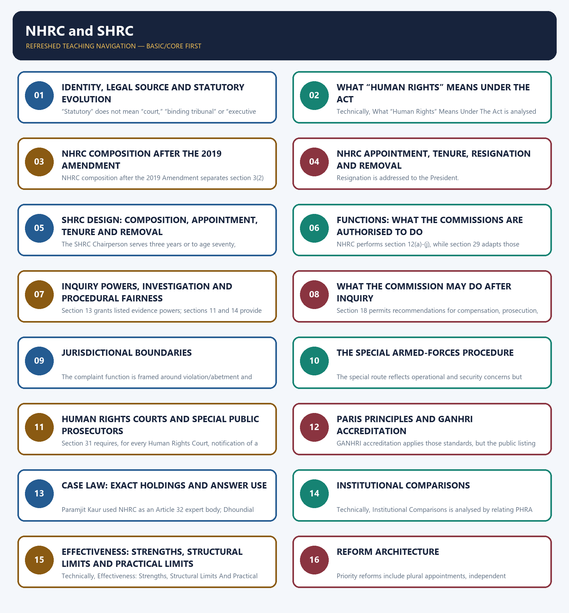

# Polity 35 - NHRC and SHRC - Complete Topic Package

> **Control date:** 28 August 2026, Asia/Kolkata  
> **Evidence tags:** `[FACT]` directly supported by a named official, judicial or audited local source; `[ANALYSIS]` reasoned exam use; `[CURRENT]` date-sensitive official position; `[LIMIT]` qualification, jurisdictional boundary or unresolved issue.  
> **Answer discipline:** claim -> named evidence -> analysis -> qualification.  
> **Scope:** statutory evolution; the statutory definition of human rights; NHRC and SHRC composition, appointment, tenure and removal; functions, inquiry powers and procedure; remedies and reporting; jurisdictional limits; armed-forces procedure; Human Rights Courts; Paris Principles and GANHRI accreditation; case law; institutional comparison; criticism, reform and current controls.

#### Package method, source priority and legal-current control

- [FACT] Local-first sequence followed: `Polity/basic/NHRC-and-SHRC.md` -> `Polity/advanced/35_NHRC-and-SHRC.md` -> related owners for statutory/regulatory/quasi-judicial bodies, Fundamental Rights and national commissions for SCs/STs/BCs -> related minority, women, child and disability institutions only where comparison was necessary -> all PYQ routing and audit ledgers.
- [FACT] OCR-searchable local editions of M. Laxmikanth's *Indian Polity* were checked after the Markdown owners for deeper book context.
- [FACT] Polity packages 31-34 were used only as structural, visual and validation references.
- [FACT] The controlling domestic text is the Protection of Human Rights Act, 1993 as displayed by India Code and the NHRC, with the 2006 and 2019 amendment layers.
- [CURRENT] The current official text extends the Act to the **whole of India**. It was deemed to have come into force on **28 September 1993**, received presidential assent on **8 January 1994**, and is Act No. 10 of 1994.
- [CURRENT] No later enacted amendment changing the provisions taught here was located in the current India Code, Legislative Department, MHA or NHRC texts by the control date. The one-year bar in section 36(2) remains law. Reform demands to extend or relax it are proposals.
- [CURRENT] GANHRI's March 2025 SCA report recommended downgrade of the NHRC to B status, but its 3 June 2025 note records that India challenged the recommendation with the required Bureau support. GANHRI's current membership page still lists India as `[A]`; the April-May 2026 SCA report did not list India among the institutions reviewed.
- [LIMIT] The package therefore records the **public current listing as A**, together with the unresolved/challenged downgrade recommendation. It does not declare a completed downgrade or invent an unpublished Bureau decision.
- [CURRENT] An official NHRC conference with SHRCs on **19 May 2026** stressed jurisdictional clarity, information sharing and integrated case-management. This is evidence of a coordination agenda, not proof that overlap or capacity gaps have ended.
- [LIMIT] Current officeholders, vacancies, complaint totals, pendency, compensation totals and disposal percentages are deliberately not frozen.

### Authoritative evidence board

| Named evidence | Claim controlled |
|---|---|
| India Code, Protection of Human Rights Act, 1993, current text | sections 1-40B; current composition, functions, procedure and limits |
| Protection of Human Rights (Amendment) Act, 2006 | court-reference route, revised visits, complaint transfer, procedure and State-commission changes |
| Protection of Human Rights (Amendment) Act, 2019 | expanded eligibility, three expert members with one woman, deemed members, tenure and UT arrangements |
| NHRC official composition and Act pages | current institutional statement and official consolidated Act |
| OHCHR, Paris Principles, GA Resolution 48/134, 19 December 1993 | broad mandate, pluralism, independence, resources and methods |
| GANHRI SCA 45th Session report, 13-21 March 2025, note dated 3 June 2025 | downgrade recommendation, delayed effect, challenge and scrutiny grounds |
| GANHRI membership page and 47th SCA report, April-May 2026 | public A listing and absence of a published 47th-session India decision |
| *N.C. Dhoundial v. Union of India*, Supreme Court, 4 December 2003 | section 36(2) as a jurisdictional bar; no generic continuing-wrong escape |
| *Paramjit Kaur v. State of Punjab* (1999), as authoritatively explained in *Dhoundial* | NHRC as Supreme Court's expert body under Article 32 |
| *EEVFAM v. Union of India*, Supreme Court, 8 July 2016 | Article 32 oversight, excessive-force inquiry and qualified NHRC role |
| Audited local PYQ ledgers and local official paper exports | exact 2018 GS-II Q16 and 2021 GS-II Q12 routes |

### Official links used for control

- India Code Act text: `https://www.indiacode.nic.in/bitstream/123456789/15709/1/a199410.pdf`
- India Code Act page: `https://www.indiacode.nic.in/handle/123456789/15709`
- NHRC Act page: `https://nhrc.nic.in/acts-and-rules/protection-human-rights-act-1993`
- NHRC composition: `https://nhrc.nic.in/about-us/composition_of_commission`
- OHCHR Paris Principles: `https://www.ohchr.org/en/instruments-mechanisms/instruments/principles-relating-status-national-institutions-paris`
- GANHRI SCA reports archive: `https://ganhri.org/accreditation/sca-reports/`
- GANHRI March 2025 SCA report: `https://ganhri.org/wp-content/uploads/2025/06/SCA-Report-march-2025-session_13052025_EN.pdf`
- GANHRI 47th Session report: `https://ganhri.org/wp-content/uploads/2026/06/sca-report-47th-session-en.pdf`
- GANHRI membership listing: `https://ganhri.org/membership/`
- Supreme Court, *N.C. Dhoundial*: `https://api.sci.gov.in/jonew/judis/25688.pdf`
- Supreme Court, *EEVFAM* (8 July 2016): `https://api.sci.gov.in/jonew/judis/43775.pdf`
- NHRC-SHRC conference, 19 May 2026: `https://nhrc.nic.in/media/press-release/nhrc,-india-holds-a-day-long-conference-of-shrcs-along-with-its-special-rapporteurs-and-special-monitors-in-virtual-mode-in-new-delhi`

#### Roadmap

| Stage | Units | Exam outcome |
|---|---|---|
| Foundation | legal status, evolution, statutory definition | classify the bodies and define the protected field precisely |
| Design | NHRC and SHRC composition, appointment, tenure and removal | solve close institutional options |
| Mandate | functions, court intervention, visits, treaties, literacy and NGOs | separate promotion from adjudication |
| Procedure | civil-court powers, investigation, hearing, inquiry and outputs | explain how a complaint moves |
| Boundaries | overlap, one-year bar, federal lists, private actors and armed forces | identify exact statutory ceilings |
| Enforcement | recommendations, reports, courts and Human Rights Courts | distinguish evidence power from remedy power |
| International | Paris Principles and GANHRI review | evaluate independence without misreporting status |
| Case law | *Paramjit Kaur*, *Dhoundial* and *EEVFAM* | use holdings with qualifications |
| Comparison | commissions, courts, Lokpal and specialised bodies | prevent source/jurisdiction/binding-force confusion |
| Workbook | verified PYQs, 48 rotated MCQs and eight solved Mains | convert doctrine into marks |

### Visual 1 - Source-to-answer ladder

```text
CURRENT ACT / CONSTITUTION / JUDGMENT
                 |
                 v
EXACT SECTION, ARTICLE OR HOLDING
                 |
                 v
INSTITUTIONAL MECHANISM
                 |
                 v
[ANALYSIS] EFFECT ON RIGHTS / ACCOUNTABILITY
                 |
                 v
[LIMIT] JURISDICTION / NON-BINDING FORCE / CURRENT UNCERTAINTY
```

Caption: A strong Polity answer starts with named authority, explains mechanism and ends with a precise qualification.


## BASIC LEARNING SESSION



*Distinct embedded teaching-navigation image. The separate continuous Cārvāka-style flowchart package remains an independent at-a-glance artifact.*


### SESSION 1 — IDENTITY, LEGAL SOURCE AND STATUTORY EVOLUTION

#### DEFINITION / WHAT THIS IS CALLED

**Plain-language definition:** The National Human Rights Commission (NHRC) and State Human Rights Commissions (SHRCs) are statutory bodies created under the Protection of Human Rights Act, 1993.

**Technical definition:** “Statutory” does not mean “court,” “binding tribunal” or “executive department.” The Act gives inquiry powers and recommendatory outputs, not a general power to convict, punish or execute decrees.

#### ANSWER-GRABBING OPENING — WRITE/ADAPT IN THE EXAM

> The National Human Rights Commission (NHRC) and State Human Rights Commissions (SHRCs) are statutory bodies created under the Protection of Human Rights Act, 1993.

#### MUST-WRITE KEYWORDS

- **Identity**
- **Legal Source**
- **Statutory Evolution**
- **National Human Rights Commission (NHRC)**
- **Protection of Human Rights Act, 1993**
- **shall constitute**

**How to use them:** Frame the answer through Identity; define Legal Source, connect Statutory Evolution with National Human Rights Commission (NHRC) to explain the mechanism, and use Protection of Human Rights Act, 1993 for the decisive comparison or qualification.

[FACT] The **National Human Rights Commission (NHRC)** and **State Human Rights Commissions (SHRCs)** are statutory bodies created under the **Protection of Human Rights Act, 1993**. They are not constitutional bodies.

[FACT] Section 3 says the Central Government **shall constitute** the NHRC. Section 21 says a State Government **may constitute** an SHRC. The national body is mandatory under the Act; the State body is enabled, not automatically created in every State.

[ANALYSIS] Statutory status gives the commissions a defined mandate, procedure and safeguards while allowing Parliament to alter their design by ordinary legislation, subject to constitutional review.

[LIMIT] “Statutory” does not mean “court,” “binding tribunal” or “executive department.” The Act gives inquiry powers and recommendatory outputs, not a general power to convict, punish or execute decrees.

#### Visual 2 - Legal-status classification

| Institution | Creating source | Correct label | Core output |
|---|---|---|---|
| NHRC | PHRA, 1993, section 3 | statutory national commission | inquiry report and recommendations |
| SHRC | PHRA, 1993, section 21 + State notification constituting it | statutory State commission | inquiry report and recommendations |
| NCSC | Article 338 | constitutional commission | investigation, advice and reports |
| NCST | Article 338A | constitutional commission | investigation, advice and reports |
| NCBC | Article 338B | constitutional commission | investigation, consultation and reports |
| Supreme Court/High Court | Constitution | constitutional courts | binding judgments, writs and orders |

#### Visual 3 - Evolution timeline

```text
28 Sep 1993      8 Jan 1994       2006 Amendment        2019 Amendment       19 Aug 2026
deemed force --> assent / Act --> procedure widened --> design updated --> current control
                                      |                     |
                              court-order inquiry,      broader chair eligibility,
                              revised visits, transfer  3 experts, deemed members,
                              and State provisions      3-year terms, UT changes
```

Caption: The controlling architecture is the 1993 Act as altered principally in 2006 and 2019.

#### Visual 4 - Mandatory versus enabling constitution

```text
CENTRAL GOVERNMENT                      STATE GOVERNMENT
section 3: "shall constitute"           section 21: "may constitute"
          |                                        |
          v                                        v
         NHRC                           SHRC only after State action
```

#### Visual 5 - Status is not sanction

| What statutory status gives | What it does not automatically give |
|---|---|
| legal mandate | constitutional entrenchment |
| specified composition | complete operational independence |
| inquiry procedure | power to convict |
| civil-court powers for listed matters | status as a civil court for all purposes |
| reporting route | automatic compliance with recommendations |

#### CLOSING RECALL FLOW — IDENTITY, LEGAL SOURCE AND STATUTORY EVOLUTION

```text
START / CONCEPT: IDENTITY, LEGAL SOURCE AND STATUTORY EVOLUTION
        |
        v
EXACT TERMS: Identity · Legal Source · Statutory Evolution · National Human Rights Commission (NHRC) · Protection of Human Rights Act, 1993 · shall constitute
        |
        v
MECHANISM / ARGUMENT: “Statutory” does not mean “court,” “binding tribunal” or “executive department.” The Act gives inquiry powers and recommendatory outputs, not a general power to convict, punish or execute decrees.
        |
        v
CONSEQUENCE / CONTRAST: The national body is mandatory under the Act; the State body is enabled, not automatically created in every State.
        |
        v
UPSC TRAP / ANSWER-USE: Do not miss this limiting distinction: “Statutory” does not mean “court,” “binding tribunal” or “executive department.” The Act gives inquiry...
        |
        v
ANSWER-GRABBING FORMULATION: The National Human Rights Commission (NHRC) and State Human Rights Commissions (SHRCs) are statutory bodies created under the Protection of Human Rights Act, 1993.
```
### SESSION 2 — WHAT “HUMAN RIGHTS” MEANS UNDER THE ACT

#### DEFINITION / WHAT THIS IS CALLED

**Plain-language definition:** Section 2(1)(d) defines human rights as “the rights relating to life, liberty, equality and dignity of the individual guaranteed by the Constitution or embodied in the International Covenants and enforceable by courts in India.”.

**Technical definition:** Technically, What “Human Rights” Means Under The Act is analysed by relating ICCPR to yes, then testing the relationship through expressly named and ICESCR.

#### ANSWER-GRABBING OPENING — WRITE/ADAPT IN THE EXAM

> Do not write that all international human-rights declarations, treaties or soft-law documents are directly enforceable in India merely because they concern human rights.

#### MUST-WRITE KEYWORDS

- **ICCPR**
- **yes**
- **expressly named**
- **ICESCR**
- **another UNGA covenant/convention**
- **only if Central Government notification specifies it**

**How to use them:** Frame the answer through ICCPR; define yes, connect expressly named with ICESCR to explain the mechanism, and use another UNGA covenant/convention for the decisive comparison or qualification.

[FACT] Section 2(1)(d) defines human rights as **“the rights relating to life, liberty, equality and dignity of the individual guaranteed by the Constitution or embodied in the International Covenants and enforceable by courts in India.”**

[FACT] Section 2(1)(f) defines “International Covenants” as:

1. the **International Covenant on Civil and Political Rights (ICCPR)**;
2. the **International Covenant on Economic, Social and Cultural Rights (ICESCR)**, both adopted by the UN General Assembly on 16 December 1966; and
3. any other UN General Assembly covenant or convention that the Central Government specifies by notification.

[ANALYSIS] The definition joins four substantive values—life, liberty, equality and dignity—to a domestic enforceability filter. It links constitutional rights with specified covenant rights without automatically incorporating every international instrument.

[LIMIT] Do not write that all international human-rights declarations, treaties or soft-law documents are directly enforceable in India merely because they concern human rights. The Act's definition is narrower.

#### Visual 6 - Statutory definition formula

```text
LIFE + LIBERTY + EQUALITY + DIGNITY
                 |
      guaranteed by Constitution
                 OR
      embodied in "International Covenants"
                 |
      enforceable by courts in India
                 =
      HUMAN RIGHTS UNDER SECTION 2(d)
```

#### Visual 7 - International-covenant gate

| Instrument | Automatically within section 2(f)? | Reason |
|---|---:|---|
| ICCPR | yes | expressly named |
| ICESCR | yes | expressly named |
| another UNGA covenant/convention | only if Central Government notification specifies it | statutory notification gate |
| Paris Principles | no, not as an “International Covenant” under this definition | institutional standard, not the section 2(f) category |
| NGO declaration or commentary | no | not a notified covenant/convention |

#### Visual 8 - Rights-to-remedy chain

```text
CONSTITUTION / SPECIFIED COVENANT RIGHT
                 |
         enforceable in India
                 |
       alleged violation linked
       to a public servant
                 |
      NHRC/SHRC inquiry route
                 |
   recommendation / court approach
```

[LIMIT] The Commission route supplements, but does not replace, Articles 32 and 226, criminal procedure, civil remedies, service remedies or specialised statutory forums.

#### CLOSING RECALL FLOW — WHAT “HUMAN RIGHTS” MEANS UNDER THE ACT

```text
START / CONCEPT: WHAT “HUMAN RIGHTS” MEANS UNDER THE ACT
        |
        v
EXACT TERMS: ICCPR · yes · expressly named · ICESCR · another UNGA covenant/convention · only if Central Government notification specifies it
        |
        v
MECHANISM / ARGUMENT: Section 2(1)(d) defines human rights as “the rights relating to life, liberty, equality and dignity of the individual guaranteed by the Constitution or embodied in the International Covenants and enforceable by courts in India.”.
        |
        v
CONSEQUENCE / CONTRAST: The Commission route supplements, but does not replace, Articles 32 and 226, criminal procedure, civil remedies, service remedies or specialised statutory forums.
        |
        v
UPSC TRAP / ANSWER-USE: Do not miss this limiting distinction: it links constitutional rights with specified covenant rights without automatically incorporating every international instrument.
        |
        v
ANSWER-GRABBING FORMULATION: Do not write that all international human-rights declarations, treaties or soft-law documents are directly enforceable in India merely because they concern human rights.
```
### SESSION 3 — NHRC COMPOSITION AFTER THE 2019 AMENDMENT

#### DEFINITION / WHAT THIS IS CALLED

**Plain-language definition:** The post-2019 NHRC has a Chairperson, five ordinary members and a separate deemed-member coordination layer.

**Technical definition:** NHRC composition after the 2019 Amendment separates section 3(2) ordinary membership from section 3(3) deemed membership for limited functions.

#### ANSWER-GRABBING OPENING — WRITE/ADAPT IN THE EXAM

> The amended NHRC composition combines judicial experience, human-rights expertise and specialist coordination.

#### MUST-WRITE KEYWORDS

- **NHRC composition**
- **2019 Amendment**
- **Chairperson**
- **ordinary members**
- **deemed members**
- **section 3(2)**
- **section 3(3)**
- **one woman**

**How to use them:** Frame the answer through NHRC composition; define 2019 Amendment, connect Chairperson with ordinary members to explain the mechanism, and use deemed members for the decisive comparison or qualification.

[FACT] Section 3(2) creates a standing composition of a Chairperson and five members:

1. **Chairperson:** a person who has been a Chief Justice of India **or a Judge of the Supreme Court**;
2. one member who is or has been a Judge of the Supreme Court;
3. one member who is or has been the Chief Justice of a High Court; and
4. three members with knowledge of or practical experience in human-rights matters, **at least one of whom shall be a woman**.

[FACT] Section 3(3) makes seven officeholders deemed members:

- Chairperson, National Commission for Backward Classes;
- Chairperson, National Commission for Minorities;
- Chairperson, National Commission for Protection of Child Rights;
- Chairperson, National Commission for Scheduled Castes;
- Chairperson, National Commission for Scheduled Tribes;
- Chairperson, National Commission for Women; and
- Chief Commissioner for Persons with Disabilities.

[FACT] These seven are deemed members only for functions in **section 12(b) to (j)**. They are not deemed members for the complaint-inquiry function in section 12(a).

[ANALYSIS] The design combines adjudicative experience, general human-rights expertise and links to specialised institutions. The deemed-member layer is an integration device without dissolving the specialised bodies.

[LIMIT] “At least one woman” applies to the three human-rights experts; it does not establish gender parity across the whole Commission.

#### Visual 9 - NHRC standing composition

```text
CHAIRPERSON
former CJI or former Supreme Court judge
        |
        +-- Judicial member: serving/former SC judge
        |
        +-- Judicial member: serving/former HC Chief Justice
        |
        +-- Expert 1
        +-- Expert 2
        +-- Expert 3
               |
          at least one woman
```

#### Visual 10 - Standing and deemed members

| Layer | Number | Participation |
|---|---:|---|
| Chairperson + ordinary members under section 3(2) | 6 persons in all | Commission's statutory work |
| Deemed members under section 3(3) | 7 officeholders | section 12(b)-(j), not section 12(a) complaint inquiry |

#### Visual 11 - Deemed-member integration map

```text
NCBC  NCM  NCPCR  NCSC  NCST  NCW  Chief Commissioner PwD
  \    |     |      |     |    |          /
   \   |     |      |     |    |         /
        DEEMED NHRC MEMBERS
                 |
       section 12(b) to (j)
 intervention / visits / review / research /
 literacy / NGO encouragement / promotion
                 X
       not section 12(a) complaint inquiry
```

#### Visual 12 - Pre-2019 versus post-2019 control

| Dimension | Earlier structure | Current post-2019 structure |
|---|---|---|
| Chair eligibility | former CJI | former CJI or former SC judge |
| human-rights experts | two | three |
| woman requirement | no express minimum in this clause | at least one among the three experts |
| deemed links | narrower | includes NCBC, NCPCR and Chief Commissioner PwD in addition to earlier bodies |
| ordinary term | five years | three years |

#### CLOSING RECALL FLOW — NHRC COMPOSITION AFTER THE 2019 AMENDMENT

```text
START / CONCEPT: NHRC COMPOSITION AFTER THE 2019 AMENDMENT
        |
        v
EXACT TERMS: NHRC composition · 2019 Amendment · Chairperson · ordinary members · deemed members · section 3(2) · section 3(3) · one woman
        |
        v
MECHANISM / ARGUMENT: Section 3(2) constitutes the standing Commission, while section 3(3) adds seven deemed members for section 12(b)-(j).
        |
        v
CONSEQUENCE / CONTRAST: This design broadens expertise without merging specialist bodies or extending deemed participation to complaint inquiry.
        |
        v
UPSC TRAP / ANSWER-USE: Do not call deemed members ordinary members or include them in section 12(a) complaint inquiry.
        |
        v
ANSWER-GRABBING FORMULATION: The amended NHRC composition combines judicial experience, human-rights expertise and specialist coordination.
```
### SESSION 4 — NHRC APPOINTMENT, TENURE, RESIGNATION AND REMOVAL

#### DEFINITION / WHAT THIS IS CALLED

**Plain-language definition:** Section 4(2) says an appointment is not invalid merely because of a vacancy of a member in the selection committee.

**Technical definition:** Resignation is addressed to the President.

#### ANSWER-GRABBING OPENING — WRITE/ADAPT IN THE EXAM

> Do not collapse all removal grounds into “Supreme Court inquiry required.” The inquiry route is for proved misbehaviour/incapacity; section 5(3) separately lists direct grounds.

#### MUST-WRITE KEYWORDS

- **Nhrc Appointment**
- **Tenure**
- **Resignation**
- **Removal**
- **proved misbehaviour or incapacity**
- **Prime Minister**

**How to use them:** Frame the answer through Nhrc Appointment; define Tenure, connect Resignation with Removal to explain the mechanism, and use proved misbehaviour or incapacity for the decisive comparison or qualification.

[FACT] The President appoints the Chairperson and members by warrant under his hand and seal after recommendation of a six-member committee:

1. Prime Minister—Chairperson;
2. Speaker of the Lok Sabha;
3. Union Home Minister;
4. Leader of the Opposition in the Lok Sabha;
5. Leader of the Opposition in the Rajya Sabha; and
6. Deputy Chairman of the Rajya Sabha.

[FACT] A sitting Supreme Court judge or sitting High Court Chief Justice cannot be appointed without consultation with the Chief Justice of India.

[FACT] Section 4(2) says an appointment is not invalid merely because of a vacancy of a member in the selection committee. The Act itself uses the offices “Leader of the Opposition”; it does not replace them in the text with a generic “leader of the largest opposition party.”

[LIMIT] A vacancy-saving clause prevents automatic invalidity; it does not eliminate constitutional judicial review for illegality, mala fides or failure to follow the Act.

#### Visual 13 - NHRC appointment chain

```text
SIX-MEMBER COMMITTEE
PM + LS Speaker + Home Minister + LS LoP + RS LoP + RS Deputy Chair
                              |
                       recommends names
                              |
                              v
                         PRESIDENT
                  warrant under hand and seal
                              |
                              v
                    Chairperson / Member
```

#### Visual 14 - Selection-committee trap grid

| Included | Not included by section 4 |
|---|---|
| Prime Minister | Chief Justice of India as committee member |
| Lok Sabha Speaker | President as committee member |
| Union Home Minister | Vice-President in that capacity |
| LoP of each House | Cabinet Secretary |
| Rajya Sabha Deputy Chairman | Attorney-General |

[FACT] The Chairperson holds office for three years from entry or until age seventy, whichever is earlier, and is eligible for reappointment.

[FACT] A member holds office for three years and is eligible for reappointment, but cannot continue after age seventy. The 2019 Amendment removed the former “another term of five years” wording; the Act does not state a fixed maximum number of reappointments.

[FACT] On leaving office, the Chairperson or a member is ineligible for further employment under the Union or a State government.

#### Visual 15 - Tenure clock

```text
CHAIRPERSON: entry + 3 years OR age 70, whichever earlier -> reappointment eligible
MEMBER:      entry + 3 years -> reappointment eligible -> absolute age ceiling 70
AFTER OFFICE: no further Union/State government employment
```

[FACT] Resignation is addressed to the President.

[FACT] For **proved misbehaviour or incapacity**, the President refers the matter to the Supreme Court; removal follows if the Court, after the prescribed inquiry, reports that the person ought to be removed.

[FACT] The President may remove directly on the separate statutory grounds of:

- adjudged insolvency;
- paid outside employment during the term;
- unfitness due to infirmity of mind or body;
- unsound mind declared by a competent court; or
- conviction and imprisonment for an offence that, in the President's opinion, involves moral turpitude.

#### Visual 16 - Two removal tracks

```text
TRACK A: PROVED MISBEHAVIOUR / INCAPACITY
President reference -> Supreme Court inquiry -> Court report -> President removal

TRACK B: DIRECT STATUTORY GROUNDS
insolvency / paid outside work / infirmity / declared unsound mind /
conviction + imprisonment involving moral turpitude
                         |
                         v
                    President order
```

[LIMIT] Do not collapse all removal grounds into “Supreme Court inquiry required.” The inquiry route is for proved misbehaviour/incapacity; section 5(3) separately lists direct grounds.

#### CLOSING RECALL FLOW — NHRC APPOINTMENT, TENURE, RESIGNATION AND REMOVAL

```text
START / CONCEPT: NHRC APPOINTMENT, TENURE, RESIGNATION AND REMOVAL
        |
        v
EXACT TERMS: Nhrc Appointment · Tenure · Resignation · Removal · proved misbehaviour or incapacity · Prime Minister
        |
        v
MECHANISM / ARGUMENT: Section 4(2) says an appointment is not invalid merely because of a vacancy of a member in the selection committee.
        |
        v
CONSEQUENCE / CONTRAST: The Act itself uses the offices “Leader of the Opposition”; it does not replace them in the text with a generic “leader of the largest opposition party.”.
        |
        v
UPSC TRAP / ANSWER-USE: A vacancy-saving clause prevents automatic invalidity; it does not eliminate constitutional judicial review for illegality, mala fides or failure to follow the Act.
        |
        v
ANSWER-GRABBING FORMULATION: Do not collapse all removal grounds into “Supreme Court inquiry required.” The inquiry route is for proved misbehaviour/incapacity; section 5(3) separately lists direct grounds.
```
### SESSION 5 — SHRC DESIGN: COMPOSITION, APPOINTMENT, TENURE AND REMOVAL

#### DEFINITION / WHAT THIS IS CALLED

**Plain-language definition:** An SHRC Chairperson or member resigns to the Governor, but removal is by the President.

**Technical definition:** The SHRC Chairperson serves three years or to age seventy, whichever is earlier, and is eligible for reappointment.

#### ANSWER-GRABBING OPENING — WRITE/ADAPT IN THE EXAM

> An SHRC Chairperson or member resigns to the Governor, but removal is by the President.

#### MUST-WRITE KEYWORDS

- **Shrc Design**
- **Composition**
- **Appointment**
- **Tenure**
- **Removal**
- **or a Judge**

**How to use them:** Frame the answer through Shrc Design; define Composition, connect Appointment with Tenure to explain the mechanism, and use Removal for the decisive comparison or qualification.

[FACT] Section 21 permits a State Government to constitute an SHRC. Its current standing composition is:

1. Chairperson who has been a Chief Justice **or a Judge** of a High Court;
2. one member who is or has been a High Court judge, or a District Judge in the State with at least seven years' experience as District Judge; and
3. one member with knowledge of or practical experience in human-rights matters.

[FACT] An SHRC has no statutory seven-member deemed/ex-officio layer corresponding to section 3(3).

#### Visual 17 - SHRC standing composition

```text
CHAIRPERSON
former HC Chief Justice or former HC judge
        |
        +-- Judicial member:
        |   serving/former HC judge
        |   OR District Judge with >=7 years as District Judge
        |
        +-- Human-rights expert
```

[FACT] The Governor appoints the Chairperson and members by warrant after recommendation of a committee consisting of:

- Chief Minister—Chairperson;
- Speaker of the Legislative Assembly;
- State Home Minister; and
- Leader of the Opposition in the Legislative Assembly.

[FACT] In a bicameral State, the Chairman of the Legislative Council and the Leader of the Opposition in that Council also join the committee.

[FACT] A sitting High Court judge or sitting District Judge cannot be appointed without consultation with the Chief Justice of the concerned High Court.

#### Visual 18 - SHRC appointment chain

```text
UNICAMERAL STATE: CM + Assembly Speaker + State Home Minister + Assembly LoP
BICAMERAL ADD-ON: Council Chairman + Council LoP
                              |
                       recommends names
                              |
                              v
                           GOVERNOR
                  warrant under hand and seal
```

[FACT] An SHRC Chairperson or member resigns to the **Governor**, but removal is by the **President**.

[FACT] Proved misbehaviour/incapacity requires the same President-to-Supreme-Court inquiry route. The President also exercises the direct removal grounds corresponding to insolvency, outside paid work, infirmity, declared unsoundness and qualifying conviction.

[ANALYSIS] The appointment/removal asymmetry gives the State a constitutive role while insulating removal from unilateral action by the State executive being scrutinised.

#### Visual 19 - SHRC asymmetry

| Stage | Authority |
|---|---|
| appoints | Governor |
| receives resignation | Governor |
| removes after SC inquiry or on direct statutory ground | President |
| appoints acting Chairperson during vacancy/absence | Governor |

[FACT] The SHRC Chairperson serves three years or to age seventy, whichever is earlier, and is eligible for reappointment. A member serves three years, is reappointment-eligible and cannot continue after seventy.

[FACT] Two or more State Governments may, with consent and after the required committee recommendations, appoint a common Chairperson or member.

[FACT] The Central Government may confer Union-territory human-rights functions on an SHRC, except that the NHRC handles the functions relating to the Union Territory of Delhi.

#### Visual 20 - NHRC-SHRC design comparison

| Dimension | NHRC | SHRC |
|---|---|---|
| creating command | Centre shall constitute | State may constitute |
| appointment | President | Governor |
| removal | President | President |
| chair eligibility | former CJI or SC judge | former HC Chief Justice or HC judge |
| ordinary judicial members | SC judge + HC Chief Justice | HC judge/District Judge route |
| expert members | three, at least one woman | one |
| deemed members | seven for section 12(b)-(j) | none under the Act |
| headquarters | Delhi; other offices with prior Central approval | place notified by State |

#### CLOSING RECALL FLOW — SHRC DESIGN: COMPOSITION, APPOINTMENT, TENURE AND REMOVAL

```text
START / CONCEPT: SHRC DESIGN: COMPOSITION, APPOINTMENT, TENURE AND REMOVAL
        |
        v
EXACT TERMS: Shrc Design · Composition · Appointment · Tenure · Removal · or a Judge
        |
        v
MECHANISM / ARGUMENT: The SHRC Chairperson serves three years or to age seventy, whichever is earlier, and is eligible for reappointment.
        |
        v
CONSEQUENCE / CONTRAST: An SHRC has no statutory seven-member deemed/ex-officio layer corresponding to section 3(3).
        |
        v
UPSC TRAP / ANSWER-USE: A member serves three years, is reappointment-eligible and cannot continue after seventy.
        |
        v
ANSWER-GRABBING FORMULATION: An SHRC Chairperson or member resigns to the Governor, but removal is by the President.
```
### SESSION 6 — FUNCTIONS: WHAT THE COMMISSIONS ARE AUTHORISED TO DO

#### DEFINITION / WHAT THIS IS CALLED

**Plain-language definition:** Section 12 authorises inquiry, court intervention, institutional visits, safeguard review, research, literacy and promotional work.

**Technical definition:** NHRC performs section 12(a)-(j), while section 29 adapts those functions for SHRCs and omits treaty study under section 12(f).

#### ANSWER-GRABBING OPENING — WRITE/ADAPT IN THE EXAM

> The commissions combine protective inquiry with preventive, educational and advisory functions.

#### MUST-WRITE KEYWORDS

- **section 12**
- **inquiry**
- **court intervention**
- **institution visits**
- **safeguard review**
- **treaty study**
- **research**
- **human-rights literacy**

**How to use them:** Frame the answer through section 12; define inquiry, connect court intervention with institution visits to explain the mechanism, and use safeguard review for the decisive comparison or qualification.

[FACT] Section 12(a) authorises inquiry, suo motu, on a victim's petition, on a petition by another person on the victim's behalf, or on a direction/order of a court, into:

- violation of human rights or abetment; or
- negligence by a public servant in preventing such violation.

[FACT] Section 12(b) permits intervention in a pending court proceeding involving an allegation of human-rights violation **with the approval of that court**.

[FACT] Current section 12(c), substituted in 2006, permits visits—despite other law—to a jail or other State-controlled institution where persons are detained or lodged for treatment, reformation or protection, to study living conditions and recommend changes.

[LIMIT] The current consolidated clause does not reproduce the older shorthand “after/under intimation to the State Government.” Use the present statutory text in an answer.

#### Visual 21 - Section 12 function wheel

| Clause | Function | Exact limit |
|---|---|---|
| (a) | inquire into violation/abetment or public-servant negligence | complaint jurisdiction, subject to sections 19, 21 and 36 |
| (b) | intervene in court proceeding | court approval required |
| (c) | visit jail/institution and study conditions | State-controlled institution described by clause |
| (d) | review constitutional/legal safeguards | recommend implementation measures |
| (e) | review inhibiting factors including terrorism | recommend remedies |
| (f) | study treaties and other international instruments | SHRC does not receive this clause through section 29 |
| (g) | research | promotional, not adjudicative |
| (h) | human-rights literacy | publications, media, seminars and other means |
| (i) | encourage NGOs/institutions | cooperation function |
| (j) | other promotion functions | must remain tied to human-rights promotion |

#### Visual 22 - Complaint entry routes

```text
SUO MOTU              VICTIM PETITION
    \                       /
     \                     /
      +--> COMMISSION <--+
     /                     \
person on victim's behalf   court direction/order
               |
               v
       section 12(a) inquiry
```

#### Visual 23 - Court-intervention boundary

```text
pending court proceeding
          +
human-rights allegation
          +
approval of that court
          =
NHRC/SHRC may intervene
```

[FACT] Sections 12(d)-(j) cover review of safeguards; factors inhibiting rights, including terrorism; treaty/instrument study; research; literacy; NGO encouragement; and other promotion functions.

[FACT] Section 29 applies section 12 to SHRCs but **omits clause (f)**. Thus treaty and international-instrument study is an NHRC function under this statutory application scheme, not an SHRC function imported through section 29.

#### Visual 24 - NHRC versus SHRC function delta

| Function | NHRC | SHRC |
|---|---:|---:|
| complaint inquiry | yes | yes, within State/Concurrent field |
| court intervention with approval | yes | yes |
| jail/institution visit | yes | yes |
| safeguard/factor review | yes | yes |
| treaty/instrument study under section 12(f) | yes | omitted by section 29 |
| research/literacy/NGO encouragement | yes | yes |

[ANALYSIS] The Act gives the commissions a dual identity: **protection** through complaints and inquiries, and **promotion** through research, review, education and cooperation.

[LIMIT] They are not substitutes for police investigation under the criminal process, prosecution by the State, trial by a criminal court or constitutional adjudication by the Supreme Court/High Courts.

#### Visual 25 - Protection and promotion

```text
PROTECTION ARM                           PROMOTION ARM
complaints                               safeguard review
suo motu inquiry                         terrorism/factor review
court intervention                       research
institution visits                       literacy
recommendations                          NGO encouragement
        \                                  /
         \                                /
             HUMAN-RIGHTS ACCOUNTABILITY
```

#### CLOSING RECALL FLOW — FUNCTIONS: WHAT THE COMMISSIONS ARE AUTHORISED TO DO

```text
START / CONCEPT: FUNCTIONS: WHAT THE COMMISSIONS ARE AUTHORISED TO DO
        |
        v
EXACT TERMS: section 12 · inquiry · court intervention · institution visits · safeguard review · treaty study · research · human-rights literacy
        |
        v
MECHANISM / ARGUMENT: A complaint may trigger inquiry, while visits, reviews, research and literacy address systemic prevention.
        |
        v
CONSEQUENCE / CONTRAST: NHRC has the treaty-study function; SHRCs receive the adapted statutory set within their jurisdiction.
        |
        v
UPSC TRAP / ANSWER-USE: Do not reduce section 12 to complaint disposal or import omitted clause 12(f) into SHRC powers.
        |
        v
ANSWER-GRABBING FORMULATION: The commissions combine protective inquiry with preventive, educational and advisory functions.
```
### SESSION 7 — INQUIRY POWERS, INVESTIGATION AND PROCEDURAL FAIRNESS

#### DEFINITION / WHAT THIS IS CALLED

**Plain-language definition:** Civil-court powers help the commissions collect and test evidence during an inquiry.

**Technical definition:** Section 13 grants listed evidence powers; sections 11 and 14 provide government-supplied staff and consensual agency support; section 16 protects affected persons through notice and hearing.

#### ANSWER-GRABBING OPENING — WRITE/ADAPT IN THE EXAM

> Strong evidence-gathering powers coexist with dependence on government-linked investigation support.

#### MUST-WRITE KEYWORDS

- **section 13**
- **civil-court powers**
- **section 14**
- **investigation agency**
- **section 16**
- **notice**
- **hearing**
- **procedural fairness**

**How to use them:** Frame the answer through section 13; define civil-court powers, connect section 14 with investigation agency to explain the mechanism, and use section 16 for the decisive comparison or qualification.

[FACT] Under section 13(1), while inquiring into complaints, the Commission has civil-court powers for:

- summoning and enforcing witness attendance and examination on oath;
- discovery and production of documents;
- receiving affidavit evidence;
- requisitioning public records or copies from a court or office;
- issuing commissions for examination of witnesses/documents; and
- prescribed matters.

[FACT] It may require relevant information, subject to lawful privilege. An authorised gazetted officer may enter a building/place where relevant documents are believed to exist and seize, copy or extract them subject to the applicable criminal-procedure safeguard.

[FACT] For specified offences in its view/presence, the Commission is deemed a civil court for forwarding the matter to a Magistrate. Proceedings are deemed judicial proceedings for specified Penal Code and criminal-procedure purposes.

[LIMIT] These deeming provisions are purpose-specific. “Civil-court powers” does not convert every Commission recommendation into a decree.

#### Visual 26 - Civil-court power kit

```text
SUMMON -> EXAMINE ON OATH -> REQUIRE DOCUMENTS -> RECEIVE AFFIDAVITS
   -> REQUISITION RECORDS -> ISSUE COMMISSIONS -> BUILD EVIDENCE RECORD
```

#### Visual 27 - Power-status distinction

| Proposition | Correct? | Why |
|---|---:|---|
| Commission may summon a witness | yes | section 13 |
| Commission is a civil court for every legal purpose | no | deeming is limited |
| Commission proceeding has specified judicial-proceeding status | yes | section 13(5) |
| Commission can itself convict the violator | no | criminal court retains trial power |
| Commission recommendation is executable like a decree | no | section 18 uses recommendatory language |

[FACT] Under section 14, the Commission may use an officer or investigation agency of the Union or a State, with the concerned government's concurrence. The officer/agency acts under the Commission's direction and control and submits a report.

[FACT] The Commission must satisfy itself about the correctness of facts and conclusions in that report and may examine the investigating persons.

[ANALYSIS] Statutory direction and review preserve formal Commission control, but dependence on government-provided police/investigative personnel creates a perceived or real independence concern when police conduct itself is under scrutiny.

#### Visual 28 - Investigation chain

```text
COMMISSION decides investigation needed
                 |
       government concurrence
                 |
 officer/agency services utilised
                 |
 acts under Commission direction/control
                 |
         investigation report
                 |
 Commission independently checks facts/conclusions
```

[FACT] Section 16 requires a reasonable opportunity of hearing and defence where the Commission examines a person's conduct or may prejudicially affect that person's reputation.

#### Visual 29 - Procedural-fairness gate

```text
Will inquiry examine conduct
OR prejudice reputation?
          |
         YES
          |
notice + reasonable hearing + defence evidence
```

[FACT] Under section 17, the Commission may call for information/report from government or a subordinate authority/organisation within a specified time. If no report arrives, it may inquire itself. If satisfactory action has already been initiated/taken, it may stop and inform the complainant. It may directly initiate inquiry where necessary.

#### Visual 30 - Complaint-processing flow

```text
COMPLAINT / SUO MOTU / COURT ROUTE
                 |
        preliminary jurisdiction check
                 |
     call for report OR initiate inquiry
         |                    |
 report adequate          report absent/inadequate
 action taken?                 |
   |                           v
 close/inform             Commission inquiry
         \                    /
          \                  /
            findings stage
```

#### CLOSING RECALL FLOW — INQUIRY POWERS, INVESTIGATION AND PROCEDURAL FAIRNESS

```text
START / CONCEPT: INQUIRY POWERS, INVESTIGATION AND PROCEDURAL FAIRNESS
        |
        v
EXACT TERMS: section 13 · civil-court powers · section 14 · investigation agency · section 16 · notice · hearing · procedural fairness
        |
        v
MECHANISM / ARGUMENT: Section 13 grants listed evidence powers; sections 11 and 14 provide government-supplied staff and consensual agency support; section 16 protects affected persons through notice and hearing.
        |
        v
CONSEQUENCE / CONTRAST: The resulting consequence is that strong evidence-gathering powers coexist with dependence on government-linked investigation support.
        |
        v
UPSC TRAP / ANSWER-USE: Civil-court powers do not turn a commission into a civil or criminal court.
        |
        v
ANSWER-GRABBING FORMULATION: Strong evidence-gathering powers coexist with dependence on government-linked investigation support.
```
### SESSION 8 — WHAT THE COMMISSION MAY DO AFTER INQUIRY

#### DEFINITION / WHAT THIS IS CALLED

**Plain-language definition:** After inquiry, the commission recommends relief or action and can seek constitutional-court intervention.

**Technical definition:** Section 18 permits recommendations for compensation, prosecution, other action or interim relief, followed by government comments and publication.

#### ANSWER-GRABBING OPENING — WRITE/ADAPT IN THE EXAM

> The follow-up chain creates publicity and accountability without making the recommendation a self-executing decree.

#### MUST-WRITE KEYWORDS

- **NHRC**
- **SHRC**
- **Protection of Human Rights Act**
- **jurisdiction**
- **independence**
- **recommendation**

**How to use them:** Frame the answer through NHRC; define SHRC, connect Protection of Human Rights Act with jurisdiction to explain the mechanism, and use independence for the decisive comparison or qualification.

[FACT] Section 18 permits the Commission to:

1. recommend compensation or damages;
2. recommend prosecution or other suitable action;
3. recommend further action;
4. approach the Supreme Court or concerned High Court for directions, orders or writs;
5. recommend immediate interim relief at any inquiry stage;
6. provide the inquiry report to the petitioner/representative, subject to the statutory sequence;
7. send the report and recommendations to the concerned government/authority; and
8. publish the report with government comments and action taken/proposed.

[FACT] The concerned government/authority must, within **one month** or further time allowed by the Commission, send comments including action taken or proposed.

[LIMIT] The legal duty is to respond with comments/action taken or proposed. Section 18 does not say every recommendation automatically binds the government.

#### Visual 31 - Section 18 remedy menu

```text
FINDING OF VIOLATION / ABETMENT / PUBLIC-SERVANT NEGLIGENCE
        |
        +-- recommend compensation/damages
        +-- recommend prosecution/other action
        +-- recommend further action
        +-- recommend interim relief
        +-- approach SC/HC
        +-- publish report + government response
```

#### Visual 32 - Evidence power versus remedy power

| Stage | Commission strength | Ceiling |
|---|---|---|
| evidence gathering | coercive civil-court powers for listed matters | limited to inquiry |
| fact finding | reasoned inquiry report | reviewable by constitutional courts |
| victim relief | may recommend compensation/interim relief | not self-executing award |
| accountability | may recommend prosecution/action | prosecutor/court/department must act |
| constitutional enforcement | may approach SC/HC | court decides relief |
| publicity | publishes report and response | reputational, not coercive sanction |

#### Visual 33 - Ordinary response timetable

```text
Commission sends report + recommendations
                 |
       one month by default
        (or further time allowed)
                 |
government/authority comments:
action taken OR proposed
                 |
Commission publishes report + response
```

[FACT] Under section 20, NHRC annual and special reports go to the Central Government and concerned State Government. They must be laid before Parliament or the State Legislature, as applicable, with an action-taken/proposed memorandum and reasons for non-acceptance.

[FACT] Under section 28, SHRC reports go to the State Government and are laid before the State Legislature with corresponding action and reasons for non-acceptance.

#### Visual 34 - Reporting accountability chain

```text
NHRC REPORT -> Centre/concerned State -> Parliament/State Legislature
SHRC REPORT -> State Government       -> State Legislature
                         |
             action memorandum + reasons
             for non-acceptance, if any
```

[ANALYSIS] Publication, legislative laying and reasoned non-acceptance create political and reputational accountability even where legal compulsion is weak.

[LIMIT] Delayed laying or generic responses can reduce that accountability. A reform answer should strengthen follow-up rather than falsely describe present recommendations as binding.

#### CLOSING RECALL FLOW — WHAT THE COMMISSION MAY DO AFTER INQUIRY

```text
START / CONCEPT: WHAT THE COMMISSION MAY DO AFTER INQUIRY
        |
        v
EXACT TERMS: NHRC · SHRC · Protection of Human Rights Act · jurisdiction · independence · recommendation
        |
        v
MECHANISM / ARGUMENT: Section 18 permits recommendations for compensation, prosecution, other action or interim relief, followed by government comments and publication.
        |
        v
CONSEQUENCE / CONTRAST: The resulting consequence is that the follow-up chain creates publicity and accountability without making the recommendation a self-executing decree.
        |
        v
UPSC TRAP / ANSWER-USE: The one-month period is for comments or action information, not compulsory acceptance.
        |
        v
ANSWER-GRABBING FORMULATION: The follow-up chain creates publicity and accountability without making the recommendation a self-executing decree.
```
### SESSION 9 — JURISDICTIONAL BOUNDARIES

#### DEFINITION / WHAT THIS IS CALLED

**Plain-language definition:** Dhoundial, the Supreme Court treated section 36(2) as a jurisdictional bar, rejected a generic “continuing wrong until reparation” theory for detention that had ended, and noted the absence of a statutory power to extend the period.

**Technical definition:** The complaint function is framed around violation/abetment and negligence in prevention by a public servant.

#### ANSWER-GRABBING OPENING — WRITE/ADAPT IN THE EXAM

> Dhoundial, the Supreme Court treated section 36(2) as a jurisdictional bar, rejected a generic “continuing wrong until reparation” theory for detention that had ended, and noted the absence of a statutory power to extend the period.

#### MUST-WRITE KEYWORDS

- **Jurisdictional Boundaries**
- **one year from the date of the act**
- **by a public servant**
- **completed illegal detention**
- **recurring separate acts**
- **continuing harmful effect**

**How to use them:** Frame the answer through Jurisdictional Boundaries; define one year from the date of the act, connect by a public servant with completed illegal detention to explain the mechanism, and use recurring separate acts for the decisive comparison or qualification.

#### 09.1 One-year limitation and overlap

[FACT] Section 36(1) bars the NHRC from inquiring into a matter pending before an SHRC or another duly constituted commission.

[FACT] Section 36(2) bars the NHRC or an SHRC from inquiring after **one year from the date of the act** alleged to constitute the human-rights violation.

[FACT] In *N.C. Dhoundial*, the Supreme Court treated section 36(2) as a jurisdictional bar, rejected a generic “continuing wrong until reparation” theory for detention that had ended, and noted the absence of a statutory power to extend the period.

[LIMIT] A genuinely continuing act must be analysed on its facts. The case prevents turning every past violation into a continuing wrong merely because its consequences or non-reparation continue.

#### Visual 35 - Section 36 double gate

```text
GATE 1: Is matter pending before SHRC/another lawful commission?
        YES -> NHRC does not inquire
        NO  -> move to Gate 2

GATE 2: More than one year since the alleged violative act?
        YES -> NHRC/SHRC statutory inquiry barred
        NO  -> other jurisdiction checks continue
```

#### Visual 36 - Date-of-act test

| Situation | Relevant inquiry question |
|---|---|
| completed illegal detention | when did unlawful detention end? |
| recurring separate acts | is each later act independently alleged? |
| continuing harmful effect | effect alone does not automatically extend the act |
| Supreme Court assigns Article 32 task | *Paramjit Kaur* exception explained through *Dhoundial* |

[CURRENT] No enacted amendment extending section 36(2) was located by the control date.

[ANALYSIS] Relaxing the period for grave violations, concealed violations or vulnerable complainants is a defensible reform proposal.

[LIMIT] It must be labelled a proposal; the current statutory period is one year.

#### 09.2 SHRC subject-matter boundary

[FACT] Section 21(5) confines an SHRC to violations relating to entries in the **State List and Concurrent List**.

[FACT] If the NHRC or another duly constituted commission is already inquiring into the matter, the SHRC cannot inquire into it.

#### Visual 37 - SHRC jurisdiction filter

```text
human-rights allegation
        |
State List or Concurrent List connection?
        | YES
already being inquired by NHRC/another commission?
        | NO
one-year limit satisfied?
        | YES
SHRC may proceed
```

#### 09.3 Private actors and the public-servant nexus

[FACT] The complaint function is framed around violation/abetment and negligence in prevention **by a public servant**.

[ANALYSIS] A private assault, discrimination or exploitation issue may enter Commission jurisdiction where a public servant is alleged to have violated or abetted rights, or negligently failed to prevent the violation. The Commission is not a general forum for every private dispute.

#### Visual 38 - Private-actor nexus

```text
PRIVATE ACTOR ALLEGATION
         |
public servant directly involved / abetted?
         OR
public servant negligently failed to prevent?
         |
        YES -> possible section 12(a) route
        NO  -> use police/court/specialised civil or statutory remedies
```

#### CLOSING RECALL FLOW — JURISDICTIONAL BOUNDARIES

```text
START / CONCEPT: JURISDICTIONAL BOUNDARIES
        |
        v
EXACT TERMS: Jurisdictional Boundaries · one year from the date of the act · by a public servant · completed illegal detention · recurring separate acts · continuing harmful effect
        |
        v
MECHANISM / ARGUMENT: The complaint function is framed around violation/abetment and negligence in prevention by a public servant.
        |
        v
CONSEQUENCE / CONTRAST: The Commission is not a general forum for every private dispute.
        |
        v
UPSC TRAP / ANSWER-USE: Do not miss this limiting distinction: a genuinely continuing act must be analysed on its facts.
        |
        v
ANSWER-GRABBING FORMULATION: Dhoundial, the Supreme Court treated section 36(2) as a jurisdictional bar, rejected a generic “continuing wrong until reparation” theory for detention that had ended, and noted the absence of a statutory power to extend the period.
```
### SESSION 10 — THE SPECIAL ARMED-FORCES PROCEDURE

#### DEFINITION / WHAT THIS IS CALLED

**Plain-language definition:** Section 19 is an NHRC report-and-recommendation procedure, not an ordinary direct investigation under sections 13-18.

**Technical definition:** The special route reflects operational and security concerns but weakens perceived independence where the alleged violator and reporting chain are institutionally connected.

#### ANSWER-GRABBING OPENING — WRITE/ADAPT IN THE EXAM

> Section 19 is an NHRC report-and-recommendation procedure, not an ordinary direct investigation under sections 13-18.

#### MUST-WRITE KEYWORDS

- **The Special Armed-Forces Procedure**
- **three months**
- **body**
- **NHRC/SHRC as applicable**
- **NHRC**
- **finding**

**How to use them:** Frame the answer through The Special Armed-Forces Procedure; define three months, connect body with NHRC/SHRC as applicable to explain the mechanism, and use NHRC for the decisive comparison or qualification.

[FACT] Section 2(1)(a) defines “armed forces” as naval, military and air forces and includes any other armed forces of the Union.

[FACT] Section 19 overrides the ordinary procedure for complaints against members of the armed forces:

1. NHRC may act suo motu or on petition and seek a report from the Central Government;
2. after the report, NHRC may not proceed or may make recommendations;
3. the Central Government must inform NHRC of action taken within **three months**, or further time allowed;
4. NHRC publishes its report, recommendations and government action; and
5. the petitioner/representative receives the published report.

[LIMIT] Section 19 is an NHRC report-and-recommendation procedure, not an ordinary direct investigation under sections 13-18.

#### Visual 39 - Armed-forces route

```text
complaint / suo motu
        |
NHRC seeks Central Government report
        |
report received
   |             |
close       recommendations
                 |
Central response within 3 months
(or further time allowed)
                 |
publish report + action; copy to petitioner
```

#### Visual 40 - Ordinary case versus armed-forces case

| Dimension | Ordinary section 17-18 route | Armed-forces section 19 route |
|---|---|---|
| body | NHRC/SHRC as applicable | NHRC |
| fact finding | ordinary inquiry architecture available | report sought from Centre |
| response default | one month under section 18(e) | three months under section 19(2) |
| output | recommendations/court approach/publication | recommendations/publication |
| concern | non-binding follow-up | reduced independent fact-finding |

[ANALYSIS] The special route reflects operational and security concerns but weakens perceived independence where the alleged violator and reporting chain are institutionally connected.

[LIMIT] Police are not automatically “armed forces” under section 2(a). Do not apply section 19 to every custodial or encounter allegation involving State police.

#### CLOSING RECALL FLOW — THE SPECIAL ARMED-FORCES PROCEDURE

```text
START / CONCEPT: THE SPECIAL ARMED-FORCES PROCEDURE
        |
        v
EXACT TERMS: The Special Armed-Forces Procedure · three months · body · NHRC/SHRC as applicable · NHRC · finding
        |
        v
MECHANISM / ARGUMENT: The special route reflects operational and security concerns but weakens perceived independence where the alleged violator and reporting chain are institutionally connected.
        |
        v
CONSEQUENCE / CONTRAST: NHRC may act suo motu or on petition and seek a report from the Central Government; after the report, NHRC may not proceed or may make recommendations; the Central Government must inform NHRC of action taken within three months, or further time allowed; NHRC publishes its report, recommendations and government action; and the petitioner/representative receives the published report.
        |
        v
UPSC TRAP / ANSWER-USE: Do not apply section 19 to every custodial or encounter allegation involving State police.
        |
        v
ANSWER-GRABBING FORMULATION: Section 19 is an NHRC report-and-recommendation procedure, not an ordinary direct investigation under sections 13-18.
```
### SESSION 11 — HUMAN RIGHTS COURTS AND SPECIAL PUBLIC PROSECUTORS

#### DEFINITION / WHAT THIS IS CALLED

**Plain-language definition:** The provision does not apply where a Court of Session is already specified as a Special Court or a Special Court already exists for those offences under another law.

**Technical definition:** Section 31 requires, for every Human Rights Court, notification of a Public Prosecutor or appointment of an advocate with at least seven years' practice as Special Public Prosecutor.

#### ANSWER-GRABBING OPENING — WRITE/ADAPT IN THE EXAM

> Section 31 requires, for every Human Rights Court, notification of a Public Prosecutor or appointment of an advocate with at least seven years' practice as Special Public Prosecutor.

#### MUST-WRITE KEYWORDS

- **Human Rights Courts**
- **Special Public Prosecutors**
- **seven years' practice**
- **NHRC/SHRC**
- **inquire, review, recommend, publish**
- **recommendations generally not binding**

**How to use them:** Frame the answer through Human Rights Courts; define Special Public Prosecutors, connect seven years' practice with NHRC/SHRC to explain the mechanism, and use inquire, review, recommend, publish for the decisive comparison or qualification.

[FACT] Section 30 says a State Government **may**, with concurrence of the Chief Justice of the High Court, notify for each district a Court of Session as a Human Rights Court for speedy trial of offences arising from human-rights violations.

[FACT] The provision does not apply where a Court of Session is already specified as a Special Court or a Special Court already exists for those offences under another law.

[FACT] Section 31 requires, for every Human Rights Court, notification of a Public Prosecutor or appointment of an advocate with at least **seven years' practice** as Special Public Prosecutor.

[LIMIT] The Act does not create a new offence called “human-rights violation,” prescribe a separate complete criminal procedure for every such case or automatically activate a dedicated court in every district. Operationalisation depends on State notification, offence-creating law, prosecution and procedural machinery.

#### Visual 41 - Human Rights Court chain

```text
STATE GOVERNMENT proposal
          +
Chief Justice of High Court concurrence
          |
notification of Court of Session
          |
HUMAN RIGHTS COURT for speedy trial
          |
Special Public Prosecutor:
notified PP OR advocate with >=7 years' practice
```

#### Visual 42 - Commission and court are different

| Institution | Main role | Binding output |
|---|---|---|
| NHRC/SHRC | inquire, review, recommend, publish | recommendations generally not binding |
| Human Rights Court | try an offence within criminal-law framework | judgment/order binding subject to appeal |
| Supreme Court/High Court | constitutional adjudication and writs | binding orders/judgments |
| police/investigation agency | investigate cognisable offences under law | report, not verdict |
| prosecutor | conduct prosecution | argument, not judgment |

[ANALYSIS] Weak operationalisation may result from absence of dedicated notifications, unclear offence mapping, limited prosecutors, low case routing and overlap with existing special courts.

[LIMIT] Avoid unsupported nationwide counts of functioning Human Rights Courts. The structural problem can be explained without inventing numbers.

#### CLOSING RECALL FLOW — HUMAN RIGHTS COURTS AND SPECIAL PUBLIC PROSECUTORS

```text
START / CONCEPT: HUMAN RIGHTS COURTS AND SPECIAL PUBLIC PROSECUTORS
        |
        v
EXACT TERMS: Human Rights Courts · Special Public Prosecutors · seven years' practice · NHRC/SHRC · inquire, review, recommend, publish · recommendations generally not binding
        |
        v
MECHANISM / ARGUMENT: Weak operationalisation may result from absence of dedicated notifications, unclear offence mapping, limited prosecutors, low case routing and overlap with existing special courts.
        |
        v
CONSEQUENCE / CONTRAST: The provision does not apply where a Court of Session is already specified as a Special Court or a Special Court already exists for those offences under another law.
        |
        v
UPSC TRAP / ANSWER-USE: The Act does not create a new offence called “human-rights violation,” prescribe a separate complete criminal procedure for every such case or automatically activate a dedicated court in every district.
        |
        v
ANSWER-GRABBING FORMULATION: Section 31 requires, for every Human Rights Court, notification of a Public Prosecutor or appointment of an advocate with at least seven years' practice as Special Public Prosecutor.
```
### SESSION 12 — PARIS PRINCIPLES AND GANHRI ACCREDITATION

#### DEFINITION / WHAT THIS IS CALLED

**Plain-language definition:** The Paris Principles assess whether a national institution has a broad mandate, pluralism, independence, resources and effective methods.

**Technical definition:** GANHRI accreditation applies those standards, but the public listing and a challenged downgrade recommendation must be reported separately.

#### ANSWER-GRABBING OPENING — WRITE/ADAPT IN THE EXAM

> Accreditation is an external institutional benchmark, not a substitute for evaluating statutory powers and practice.

#### MUST-WRITE KEYWORDS

- **Paris Principles**
- **GANHRI**
- **accreditation**
- **pluralism**
- **independence**
- **resources**
- **A status**
- **downgrade recommendation**

**How to use them:** Frame the answer through Paris Principles; define GANHRI, connect accreditation with pluralism to explain the mechanism, and use independence for the decisive comparison or qualification.

[FACT] The UN General Assembly adopted the Paris Principles through Resolution 48/134 on **19 December 1993**.

[FACT] They call for:

- the broadest possible promotion-and-protection mandate in constitutional or legislative text;
- pluralist representation of social forces;
- adequate funding, staff and premises supporting independence;
- stable terms;
- freedom to consider issues, hear persons, obtain documents and publicise views;
- regular meetings and working groups;
- cooperation with courts, ombuds institutions, civil society and vulnerable groups; and
- fair complaint/conciliation/referral/reform methods where quasi-jurisdictional competence exists.

#### Visual 43 - Paris Principles hexagon

```text
              BROAD MANDATE
            /               \
    ACCESSIBILITY          PLURALISM
       |                       |
 METHODS / POWERS         OPEN APPOINTMENT
       |                       |
 ADEQUATE RESOURCES ----- INDEPENDENCE
```

#### Visual 44 - Domestic design against Paris heads

| Paris head | Supporting feature in PHRA | Tension/qualification |
|---|---|---|
| legal mandate | detailed parliamentary statute | mandate narrowed by one-year and armed-forces routes |
| stability | fixed term and protected removal | three-year terms may be relatively short |
| pluralism | three experts, one-woman minimum, deemed specialised members | minimum does not ensure social diversity or gender balance |
| investigation | civil-court powers and investigation provisions | government-provided police/officials create independence concern |
| resources | statutory grants and staff | government provision can affect perceived autonomy |
| accessibility | petitions, representative filing, suo motu action | time bar, geography, awareness and capacity affect access |
| publicity | publication and legislative reports | delayed or weak follow-up can blunt effect |

#### Visual 45 - Accreditation chronology

```text
2017 concerns
     |
2023 review deferred
     |
2024 further deferral
     |
Mar 2025 SCA recommends B downgrade
     |
3 Jun 2025 report note: India challenge + required Bureau support
     |
official membership page continues to list India [A]
     |
Apr-May 2026 SCA report: India not among reviewed institutions
     |
19 Aug 2026 control: public A listing + unresolved scrutiny;
no invented final downgrade
```

[CURRENT] The March 2025 SCA report said a downgrade recommendation would not take effect for one year and that NHRC maintained A status until the 47th SCA session in 2026. The later report note records the challenge. The current GANHRI membership page lists India `[A]`.

[CURRENT] The SCA concerns included:

- involvement of police officers in investigations;
- government-linked appointment of the Secretary-General;
- composition and pluralism;
- selection and appointment openness;
- response to serious human-rights violations and public positioning; and
- civil-society cooperation.

[LIMIT] A-status is an accreditation classification, not proof that every Paris requirement is perfectly satisfied in practice. Equally, an SCA recommendation under challenge is not the same as a completed B-status downgrade.

#### Visual 46 - Status language control

| Unsafe sentence | Controlled sentence |
|---|---|
| “India was downgraded to B in 2025.” | “The SCA recommended downgrade in March 2025; India challenged it, and GANHRI's public membership page still lists A as of 19 August 2026.” |
| “A-status proves complete independence.” | “A is the current public accreditation listing, while official SCA scrutiny identifies unresolved Paris-Principles concerns.” |
| “No 2026 report means India was cleared.” | “The 47th-session report did not list India; absence is not a published merits decision.” |

#### CLOSING RECALL FLOW — PARIS PRINCIPLES AND GANHRI ACCREDITATION

```text
START / CONCEPT: PARIS PRINCIPLES AND GANHRI ACCREDITATION
        |
        v
EXACT TERMS: Paris Principles · GANHRI · accreditation · pluralism · independence · resources · A status · downgrade recommendation
        |
        v
MECHANISM / ARGUMENT: GANHRI accreditation applies those standards, but the public listing and a challenged downgrade recommendation must be reported separately.
        |
        v
CONSEQUENCE / CONTRAST: The resulting consequence is that accreditation is an external institutional benchmark, not a substitute for evaluating statutory powers and...
        |
        v
UPSC TRAP / ANSWER-USE: Do not treat an A listing as proof of perfect compliance or a challenged recommendation as a completed downgrade.
        |
        v
ANSWER-GRABBING FORMULATION: Accreditation is an external institutional benchmark, not a substitute for evaluating statutory powers and practice.
```
### SESSION 13 — CASE LAW: EXACT HOLDINGS AND ANSWER USE

#### DEFINITION / WHAT THIS IS CALLED

**Plain-language definition:** Three leading cases distinguish ordinary statutory jurisdiction from Supreme Court-supervised human-rights protection.

**Technical definition:** Paramjit Kaur used NHRC as an Article 32 expert body; Dhoundial enforced section 36(2); EEVFAM required lawful inquiry into excessive-force allegations.

#### ANSWER-GRABBING OPENING — WRITE/ADAPT IN THE EXAM

> Case law shows that court-assigned expertise can supplement but does not erase the Commission’s statutory limits.

#### MUST-WRITE KEYWORDS

- **Paramjit Kaur**
- **N.C. Dhoundial**
- **EEVFAM**
- **Article 32**
- **section 36(2)**
- **jurisdictional bar**
- **excessive force**

**How to use them:** Frame the answer through Paramjit Kaur; define N.C. Dhoundial, connect EEVFAM with Article 32 to explain the mechanism, and use section 36(2) for the decisive comparison or qualification.

#### 13.1 *Paramjit Kaur v. State of Punjab* (1999)

[FACT] In the Punjab mass-cremation context, the Supreme Court used the NHRC as an expert body assisting its Article 32 jurisdiction.

[FACT] *N.C. Dhoundial* later clarified the controlling proposition: when NHRC investigates pursuant to Supreme Court directions under Article 32, section 36(2) does not apply because NHRC acts as an expert body aiding the Court rather than merely exercising ordinary statutory jurisdiction.

[LIMIT] This is not a general power for NHRC to ignore section 36(2) whenever a case is grave. The exception depends on the Supreme Court's constitutional assignment.

#### Visual 47 - *Paramjit Kaur* exception

```text
ORDINARY NHRC CASE                SUPREME COURT ARTICLE 32 ASSIGNMENT
acts under PHRA                   acts as Court's expert body
section 36(2) applies             *Paramjit Kaur* / *Dhoundial* exception
```

#### 13.2 *N.C. Dhoundial v. Union of India* (4 December 2003)

[FACT] The alleged illegal detention ended in April 1994; the complaint reached NHRC years later. NHRC treated non-reparation as a continuing wrong.

[FACT] The Supreme Court rejected that approach, held that the Commission is a creature of statute bound by statutory limits, and described section 36(2) as a jurisdictional embargo measured from the alleged violative act.

[FACT] The Court said the completed detention did not repeat daily after lawful remand and noted no PHRA provision extending the one-year period.

[ANALYSIS] The case is the decisive authority against answering section 36(2) as a flexible procedural limitation.

#### Visual 48 - *Dhoundial* holding chain

```text
illegal detention ended
        |
complaint filed years later
        |
NHRC invokes continuing wrong
        |
Supreme Court rejects generic theory
        |
section 36(2) = jurisdictional bar
```

#### 13.3 *EEVFAM v. Union of India* (8 July 2016)

[FACT] The Supreme Court held the Article 32 petition concerning alleged extra-judicial executions in Manipur maintainable.

[FACT] It reiterated that excessive or retaliatory force by police or Union armed forces is impermissible even in an AFSPA disturbed area, and allegations of excessive force causing death must be thoroughly inquired into.

[FACT] It stated that an internal armed-forces inquiry or State magisterial inquiry would not necessarily preclude another lawful inquiry/investigation. It recognised judicial inquiry, NHRC inquiry or a Commissions of Inquiry Act inquiry as possible accountability routes in the context before it.

[FACT] The Court recorded NHRC's “toothless tiger” grievance and kept open, at that stage, the question whether NHRC guidelines were binding or advisory.

[LIMIT] Do not cite *EEVFAM* as holding that section 18 recommendations generally became binding. The judgment itself kept that issue open in the passage relevant here.

#### Visual 49 - *EEVFAM* answer map

| Claim | Named evidence | What it proves | Qualification |
|---|---|---|---|
| security operations remain reviewable | *EEVFAM*, Article 32 | no rights-free zone | operational context still matters |
| excessive/retaliatory force impermissible | *Naga People's Movement* reiterated in *EEVFAM* | force constrained by law | not every encounter is automatically unlawful |
| death allegation needs thorough inquiry | *EEVFAM* conclusion | accountability requires facts | inquiry body/procedure depends on law and directions |
| NHRC has institutional relevance | Court sought NHRC assistance/inquiry information | specialist fact-finding value | not a substitute for Article 32 or criminal court |

#### Visual 50 - Three-case synthesis

```text
PARAMJIT KAUR -> constitutional assignment can place NHRC beyond ordinary s.36(2)
DHOUNDIAL     -> ordinary NHRC jurisdiction remains tightly statutory
EEVFAM        -> courts retain Article 32 oversight; NHRC is useful but not exclusive
```

#### CLOSING RECALL FLOW — CASE LAW: EXACT HOLDINGS AND ANSWER USE

```text
START / CONCEPT: CASE LAW: EXACT HOLDINGS AND ANSWER USE
        |
        v
EXACT TERMS: Paramjit Kaur · N.C. Dhoundial · EEVFAM · Article 32 · section 36(2) · jurisdictional bar · excessive force
        |
        v
MECHANISM / ARGUMENT: The Supreme Court can assign an expert role under Article 32, while autonomous NHRC action remains governed by the PHRA.
        |
        v
CONSEQUENCE / CONTRAST: Constitutional oversight supplies remedies where statutory inquiry routes are limited.
        |
        v
UPSC TRAP / ANSWER-USE: Do not cite EEVFAM as making all NHRC recommendations binding or Paramjit Kaur as abolishing section 36(2).
        |
        v
ANSWER-GRABBING FORMULATION: Case law shows that court-assigned expertise can supplement but does not erase the Commission’s statutory limits.
```
### SESSION 14 — INSTITUTIONAL COMPARISONS

#### DEFINITION / WHAT THIS IS CALLED

**Plain-language definition:** Calling all national commissions “constitutional” or all of them “statutory” is wrong.

**Technical definition:** Technically, Institutional Comparisons is analysed by relating PHRA 1993 to PHRA 1993 + State notification constituting it, then testing the relationship through Articles 338/338A/338B and field.

#### ANSWER-GRABBING OPENING — WRITE/ADAPT IN THE EXAM

> Calling all national commissions “constitutional” or all of them “statutory” is wrong.

#### MUST-WRITE KEYWORDS

- **Institutional Comparisons**
- **PHRA 1993**
- **PHRA 1993 + State notification constituting it**
- **Articles 338/338A/338B**
- **field**
- **national human-rights mandate**

**How to use them:** Frame the answer through Institutional Comparisons; define PHRA 1993, connect PHRA 1993 + State notification constituting it with Articles 338/338A/338B to explain the mechanism, and use field for the decisive comparison or qualification.

#### Visual 51 - NHRC, SHRC and constitutional commissions

| Dimension | NHRC | SHRC | NCSC/NCST/NCBC |
|---|---|---|---|
| source | PHRA 1993 | PHRA 1993 + State notification constituting it | Articles 338/338A/338B |
| field | national human-rights mandate | State/Concurrent human-rights field | group-specific constitutional safeguards |
| inquiry powers | civil-court powers | same through section 29 | constitutional civil-court powers |
| output | recommendations/reports | recommendations/reports | advice/reports/recommendations |
| merger difficulty | statutory change possible | statutory/federal consequences | constitutional amendment needed to abolish/absorb core |
| integration | seven deemed members for s.12(b)-(j) | coordination/transfer | retain specialised expertise |

#### Visual 52 - NHRC versus courts, Lokpal and specialised bodies

| Body | Basis | Jurisdiction | Typical output | Binding force |
|---|---|---|---|---|
| NHRC | PHRA 1993 | public-servant-linked human-rights violations + promotion | inquiry report/recommendation | generally non-binding |
| SHRC | PHRA 1993 | State/Concurrent field | inquiry report/recommendation | generally non-binding |
| SC/HC | Constitution | constitutional/legal disputes and writs | judgment/order | binding |
| Lokpal | Lokpal and Lokayuktas Act 2013 | specified corruption complaints | inquiry/investigation/prosecution architecture | statutory consequences; guilt by court |
| NCM/NCW/NCPCR | separate statutes | group-specific safeguards/complaints | investigation/advice/reports | mainly recommendatory |
| Human Rights Court | PHRA notification + criminal law | trial of offences | judgment | binding subject to appeal |

#### Visual 53 - Why one umbrella body is difficult

```text
CONSTITUTIONAL BODIES: NCSC / NCST / NCBC
         | cannot be absorbed by ordinary statutory redesign
         v
SPECIALISED MANDATES + CONSTITUTIONAL FUNCTIONS

STATUTORY BODIES: NHRC / NCW / NCM / NCPCR / disability institutions
         | legal merger possible in principle
         v
risk of diluted expertise and accessibility

BEST EXAM MIDDLE PATH:
coordination + referral + shared data + specialised autonomy
```

[ANALYSIS] NHRC already provides partial umbrella coordination through deemed membership and section 36 anti-overlap rules. A mega-merger may reduce duplication but also dilute group-specific expertise and constitutional entrenchment.

[LIMIT] Calling all national commissions “constitutional” or all of them “statutory” is wrong.

#### Visual 54 - Binding-force ladder

```text
PUBLICITY / ADVICE
NHRC-NCW-NCM recommendations
          |
STATUTORY DIRECTION / PENALTY
depends on specific regulator or statute
          |
TRIBUNAL / COURT ORDER
binding subject to appeal/review
          |
CONSTITUTIONAL JUDGMENT
binding under constitutional hierarchy
```

#### CLOSING RECALL FLOW — INSTITUTIONAL COMPARISONS

```text
START / CONCEPT: INSTITUTIONAL COMPARISONS
        |
        v
EXACT TERMS: Institutional Comparisons · PHRA 1993 · PHRA 1993 + State notification constituting it · Articles 338/338A/338B · field · national human-rights mandate
        |
        v
MECHANISM / ARGUMENT: NHRC already provides partial umbrella coordination through deemed membership and section 36 anti-overlap rules.
        |
        v
CONSEQUENCE / CONTRAST: The resulting consequence is that nHRC already provides partial umbrella coordination through deemed membership and section 36 anti-overlap rules.
        |
        v
UPSC TRAP / ANSWER-USE: Do not miss this limiting distinction: nHRC already provides partial umbrella coordination through deemed membership and section 36 anti-overlap rules.
        |
        v
ANSWER-GRABBING FORMULATION: Calling all national commissions “constitutional” or all of them “statutory” is wrong.
```
### SESSION 15 — EFFECTIVENESS: STRENGTHS, STRUCTURAL LIMITS AND PRACTICAL LIMITS

#### DEFINITION / WHAT THIS IS CALLED

**Plain-language definition:** Effectiveness: Strengths, Structural Limits And Practical Limits comprises Effectiveness, Strengths and Structural Limits as its core connected dimensions.

**Technical definition:** Technically, Effectiveness: Strengths, Structural Limits And Practical Limits is analysed by relating Effectiveness to Strengths, then testing the relationship through Structural Limits and Practical Limits.

#### ANSWER-GRABBING OPENING — WRITE/ADAPT IN THE EXAM

> Effectiveness: Strengths, Structural Limits And Practical Limits comprises Effectiveness, Strengths and Structural Limits as its core connected dimensions.

#### MUST-WRITE KEYWORDS

- **Effectiveness**
- **Strengths**
- **Structural Limits**
- **Practical Limits**
- **suo motu and representative petitions**
- **section 12(a)**

**How to use them:** Frame the answer through Effectiveness; define Strengths, connect Structural Limits with Practical Limits to explain the mechanism, and use suo motu and representative petitions for the decisive comparison or qualification.

#### Visual 55 - Strength-limit pairs

| Strength | Named basis | Paired limit |
|---|---|---|
| suo motu and representative petitions | section 12(a) | one-year and subject-matter bars |
| civil-court evidence powers | section 13 | recommendations are not decrees |
| court intervention | section 12(b) | court approval required |
| jail/institution visits | section 12(c) | recommendations require executive follow-up |
| interim relief recommendation | section 18(c) | not self-executing |
| public reports | sections 18, 20, 28 | delayed or weak responses can blunt accountability |
| armed-forces visibility | section 19 publication | Centre-report route limits independent inquiry |
| specialised links | section 3(3) | deemed members excluded from section 12(a) |

#### Visual 56 - Structural versus practical limitations

| Structural: written into law | Practical: operation and capacity |
|---|---|
| recommendations framed as recommendations | vacancies or delayed appointments |
| one-year jurisdiction bar | uneven SHRC capacity |
| armed-forces report route | dependence on police/deputationists |
| SHRC List II/III restriction | budget/staff constraints |
| government role in staff provision | poor-quality or delayed government reports |
| narrow selection architecture | limited civil-society participation/access |

[ANALYSIS] The “toothless tiger” description is partly correct but incomplete. The Commission has strong evidence-gathering, visibility and court-access tools; its weakness lies in compulsory remedy and independent operational capacity.

#### Visual 57 - Influence without decree

```text
FACT FINDING
   + PUBLICATION
   + INTERIM / FINAL RECOMMENDATION
   + LEGISLATIVE REPORTING
   + COURT APPROACH
   + MEDIA / CIVIL-SOCIETY PRESSURE
             |
             v
      COMPLIANCE INFLUENCE
      (real, but not automatic)
```

#### CLOSING RECALL FLOW — EFFECTIVENESS: STRENGTHS, STRUCTURAL LIMITS AND PRACTICAL LIMITS

```text
START / CONCEPT: EFFECTIVENESS: STRENGTHS, STRUCTURAL LIMITS AND PRACTICAL LIMITS
        |
        v
EXACT TERMS: Effectiveness · Strengths · Structural Limits · Practical Limits · suo motu and representative petitions · section 12(a)
        |
        v
MECHANISM / ARGUMENT: The Commission has strong evidence-gathering, visibility and court-access tools; its weakness lies in compulsory remedy and independent operational capacity.
        |
        v
CONSEQUENCE / CONTRAST: The “toothless tiger” description is partly correct but incomplete.
        |
        v
UPSC TRAP / ANSWER-USE: Do not miss this limiting distinction: the “toothless tiger” description is partly correct but incomplete.
        |
        v
ANSWER-GRABBING FORMULATION: Effectiveness: Strengths, Structural Limits And Practical Limits comprises Effectiveness, Strengths and Structural Limits as its core connected dimensions.
```
### SESSION 16 — REFORM ARCHITECTURE

#### DEFINITION / WHAT THIS IS CALLED

**Plain-language definition:** Reform should match each diagnosed weakness with the legal or administrative instrument capable of fixing it.

**Technical definition:** Priority reforms include plural appointments, independent multidisciplinary investigation, time-bound reasoned responses, limitation reform and safeguarded armed-forces fact-finding.

#### ANSWER-GRABBING OPENING — WRITE/ADAPT IN THE EXAM

> Sequencing reforms by statute, rules and administration makes the proposal executable rather than rhetorical.

#### MUST-WRITE KEYWORDS

- **NHRC**
- **SHRC**
- **Protection of Human Rights Act**
- **jurisdiction**
- **independence**
- **recommendation**

**How to use them:** Frame the answer through NHRC; define SHRC, connect Protection of Human Rights Act with jurisdiction to explain the mechanism, and use independence for the decisive comparison or qualification.

[ANALYSIS] Reforms should improve enforceability and independence without casually turning the Commission into a criminal court.

#### Visual 58 - Problem-to-reform matrix

| Problem | Reform proposal | Legal status |
|---|---|---|
| generic rejection/non-response | comply-or-give-detailed-reasons duty; judicial escalation on default | proposal |
| police investigating police allegations | independent multi-disciplinary investigation cadre | proposal requiring legal/administrative change |
| one-year bar | exceptions/relaxation for grave, concealed or vulnerable-victim cases | statutory amendment proposal |
| section 19 weakness | independent fact-finding with security safeguards | statutory amendment proposal |
| closed appointments | public criteria, vacancy notice, shortlists and civil-society input | proposal |
| weak pluralism | broader social, regional, gender and professional representation | proposal |
| SHRC vacancies/capacity | time-bound appointments, shared services without loss of autonomy | proposal |
| weak Human Rights Courts | notifications, trained prosecutors and case-routing protocols | implementation reform |
| fragmented commissions | referral protocol, interoperable case system and joint thematic action | coordination reform |

#### Visual 59 - Enforceability design options

```text
OPTION 1: make every recommendation binding
          + stronger remedy
          - risks converting inquiry body into court without appeal safeguards

OPTION 2: comply OR reject with detailed reasons + court escalation
          + preserves recommendatory model
          + raises cost of non-compliance

OPTION 3: publication only
          + flexible
          - weakest against the powerful
```

[ANALYSIS] A reasoned-rejection model is institutionally safer than treating every recommendation as an unappealable decree. It can be paired with victim access to judicial review.

#### Visual 60 - Paris-aligned reform sequence

```text
OPEN APPOINTMENT
      ->
PLURAL MEMBERSHIP
      ->
INDEPENDENT STAFF + INVESTIGATION
      ->
ADEQUATE, PREDICTABLE RESOURCES
      ->
PUBLIC POSITIONS + CIVIL-SOCIETY ACCESS
      ->
TIME-BOUND FOLLOW-UP
```

[LIMIT] All reforms in this section are proposals unless tied to an enacted provision. Current law remains the PHRA text described above.

#### CLOSING RECALL FLOW — REFORM ARCHITECTURE

```text
START / CONCEPT: REFORM ARCHITECTURE
        |
        v
EXACT TERMS: NHRC · SHRC · Protection of Human Rights Act · jurisdiction · independence · recommendation
        |
        v
MECHANISM / ARGUMENT: Priority reforms include plural appointments, independent multidisciplinary investigation, time-bound reasoned responses, limitation reform and safeguarded armed-forces fact-finding.
        |
        v
CONSEQUENCE / CONTRAST: The resulting consequence is that sequencing reforms by statute, rules and administration makes the proposal executable rather than rhetorical.
        |
        v
UPSC TRAP / ANSWER-USE: Do not miss this limiting distinction: every reform remains a proposal unless tied to an enacted provision or binding judgment.
        |
        v
ANSWER-GRABBING FORMULATION: Sequencing reforms by statute, rules and administration makes the proposal executable rather than rhetorical.
```
### CURRENT CONTROLS AND ANSWER-WRITING ARCHITECTURE

#### Visual 61 - 2026 current-control board

| Date/source | Verified current point | Safe use |
|---|---|---|
| GANHRI March 2025 report | SCA recommended B; delayed effect; concerns specified | evidence of international scrutiny |
| report note, 3 June 2025 | India challenged; required Bureau support obtained | recommendation not final in that report |
| GANHRI membership page checked for package | India displayed `[A]` | current public listing |
| GANHRI 47th report, April-May 2026 | India not listed among reviewed NHRIs | do not infer clearance or downgrade |
| NHRC-SHRC conference, 19 May 2026 | jurisdictional clarity, information sharing and coordination stressed | current coordination reform hook |
| current PHRA text | section 36(2) remains one year | no proposed extension written as law |

#### Visual 62 - Claim-evidence-analysis-qualification template

| Step | Example |
|---|---|
| Claim | NHRC's main weakness is compulsory follow-up, not absence of inquiry power. |
| Named evidence | Sections 13 and 18: civil-court inquiry powers but recommendatory relief. |
| Analysis | It can establish facts and publicise responsibility, yet government/court action delivers coercive remedy. |
| Qualification | Court approach and publication still create meaningful pressure; “powerless” is too absolute. |

#### Visual 63 - Directive-specific answer spines

| Directive | Spine |
|---|---|
| “Discuss effectiveness” | mandate -> powers -> achievements/mechanisms -> statutory/practical limits -> reforms -> graded verdict |
| “Analyse limitations and remedies” | direct thesis -> structural limits -> practical limits -> matched remedies -> feasibility caution |
| “Argue umbrella body” | map constitutional/statutory bodies -> case for -> case against -> coordinated middle path -> stand |
| “Compare NHRC and SHRC” | source -> composition -> appointment/removal -> jurisdiction -> function delta -> reporting |
| “Examine Paris compliance” | benchmark -> supporting design -> SCA concerns -> current status control -> reforms |

#### Visual 64 - Marks-scaled evidence load

| Marks | Structure | Minimum named evidence |
|---:|---|---|
| 10 | thesis + 3 dimensions + one qualification + verdict | 2 sections/cases/standards |
| 15 | thesis + statutory design + structural/practical analysis + reforms + verdict | 4-6 named units |
| 20 | full architecture + cases + comparison + current international control + phased reform | 6-8 named units |

#### Visual 65 - Ten close-option traps

| Trap | Correction |
|---|---|
| NHRC is constitutional | statutory under PHRA 1993 |
| all deemed members hear section 12(a) complaints | deemed participation is section 12(b)-(j) |
| NHRC chair must be former CJI only | former CJI or former SC judge |
| NHRC term is five years | three years, age ceiling 70 |
| Governor removes SHRC members | President removes |
| SHRC has all section 12 functions unchanged | section 12(f) omitted by section 29 |
| recommendations are binding decrees | recommendatory; government responds |
| every old violation is continuing | *Dhoundial* rejects generic escape |
| armed-forces response is one month | three months under section 19 |
| Human Rights Court is automatically active in each district | State may notify a Sessions Court with CJ concurrence |

#### Visual 66 - Final analytical thesis bank

```text
1. Strong inquiry, weak compulsory remedy.
2. National mandate, but jurisdictionally fenced.
3. Statutory independence safeguards, but executive-linked staffing.
4. Specialised commissions should coordinate, not disappear into a mega-body.
5. Paris compliance is a design-and-practice test, not a badge alone.
```
## BASIC MCQS / REMEDIATION

#### Original MCQs - 36 questions

### Q1. Which description most accurately captures the NHRC?

A. A statutory commission constituted under the Protection of Human Rights Act, 1993
B. A criminal court under the Code of Criminal Procedure
C. A constitutional commission under Article 338
D. An executive committee created only by Cabinet resolution

**Answer: A.**

**Explanation:** [FACT] Section 3 of the PHRA requires the Central Government to constitute the NHRC. [LIMIT] Statutory inquiry powers do not make it a court.

### Q2. Section 2(d) links human rights to life, liberty, equality and dignity that are:

A. mentioned in any international publication
B. constitutionally guaranteed or embodied in the statutory International Covenants and enforceable by courts in India
C. confined to Fundamental Rights available only to citizens
D. recognised by any NGO

**Answer: B.**

**Explanation:** [FACT] The enforceability language and defined International Covenants are essential parts of section 2(c).

### Q3. “International Covenants” under section 2(f) expressly includes:

A. all judgments of international courts
B. only the Universal Declaration of Human Rights
C. ICCPR, ICESCR and another UNGA covenant/convention only if specified by Central notification
D. every treaty signed by any ministry

**Answer: C.**

**Explanation:** [FACT] ICCPR and ICESCR are named. Other UNGA instruments need the statutory notification gate.

### Q4. The seven deemed members of NHRC participate by that status in:

A. only section 12(a) complaint inquiry
B. the presidential selection committee
C. removal proceedings
D. functions under section 12(b) to (j), not section 12(a)

**Answer: D.**

**Explanation:** [FACT] Section 3(3) expressly limits deemed membership to section 12(c)-(j).

### Q5. Who is eligible to be NHRC Chairperson under current law?

A. A person who has been CJI or a Judge of the Supreme Court
B. Only a former Union Home Secretary
C. Any serving High Court judge
D. Only a serving CJI

**Answer: A.**

**Explanation:** [FACT] The 2019 Amendment widened eligibility beyond a former CJI to a former SC judge.

### Q6. Which office is NOT part of the NHRC selection committee under section 4?

A. Union Home Minister
B. Chief Justice of India
C. Deputy Chairman of Rajya Sabha
D. Lok Sabha Speaker

**Answer: B.**

**Explanation:** [FACT] CJI consultation is required for specified sitting-judge appointments, but the CJI is not a committee member.

### Q7. The ordinary NHRC member's term is:

A. five years with no age limit
B. six years or age sixty-five
C. three years, reappointment-eligible, with an age ceiling of seventy
D. until the pleasure of the President

**Answer: C.**

**Explanation:** [FACT] Section 6 was amended in 2019. [LIMIT] The current Act does not state a fixed maximum number of reappointments.

### Q8. Which ground permits direct removal by the President without the proved-misbehaviour Supreme Court inquiry track?

A. absence from one meeting
B. criticism by a State government
C. disagreement with a recommendation
D. adjudged insolvency

**Answer: D.**

**Explanation:** [FACT] Insolvency is one of section 5(3)'s direct statutory grounds.

### Q9. SHRC Chairperson and members are appointed by:

A. the Governor after the statutory committee's recommendation
B. the Chief Justice of the High Court
C. the State Cabinet without warrant
D. the President after Parliament's recommendation

**Answer: A.**

**Explanation:** [FACT] Section 22 vests appointment in the Governor by warrant.

### Q10. Who removes an SHRC Chairperson or member under the PHRA?

A. High Court Chief Justice
B. President
C. Chief Minister
D. Governor

**Answer: B.**

**Explanation:** [FACT] Resignation goes to the Governor, but removal power belongs to the President.

### Q11. Which section 12 function is omitted when applied to SHRCs by section 29?

A. jail/institution visit
B. research
C. treaty and international-instrument study under clause (f)
D. court intervention

**Answer: C.**

**Explanation:** [FACT] Section 29 expressly omits section 12(f) for State Commissions.

### Q12. An SHRC may inquire only into matters relatable to:

A. Union List only
B. foreign affairs only
C. residuary powers only
D. State List and Concurrent List entries

**Answer: D.**

**Explanation:** [FACT] Section 21(5) supplies the federal subject-matter boundary.

### Q13. Which is a civil-court power specifically granted for inquiry?

A. Summoning witnesses and examining them on oath
B. Passing a criminal sentence
C. Executing compensation as a decree
D. Striking down legislation

**Answer: A.**

**Explanation:** [FACT] Section 13 grants evidence-gathering powers, not general judicial jurisdiction.

### Q14. Under section 14, use of a government investigation agency requires:

A. a jury verdict
B. concurrence of the concerned Central or State Government
C. approval by every complainant
D. a constitutional amendment

**Answer: B.**

**Explanation:** [FACT] The agency then acts under Commission direction and control; the Commission checks its report.

### Q15. Section 16 is most directly associated with:

A. annual budgeting
B. accreditation
C. hearing a person whose conduct or reputation may be prejudicially affected
D. armed-forces reporting

**Answer: C.**

**Explanation:** [FACT] It is the statutory natural-justice safeguard.

### Q16. In an ordinary section 18 case, the default period for government comments is:

A. fifteen days
B. seven days
C. three months
D. one month, or further time allowed

**Answer: D.**

**Explanation:** [FACT] Section 18(e) sets one month; section 19 separately uses three months for armed-forces cases.

### Q17. “Armed forces” under the Act includes:

A. naval, military and air forces and other armed forces of the Union
B. prison staff only
C. private security agencies
D. every State police constable automatically

**Answer: A.**

**Explanation:** [FACT] Section 2(a) defines the category. State police should not be casually placed under section 19.

### Q18. The Central Government normally informs NHRC of action on an armed-forces recommendation within:

A. six months without extension
B. three months, or further time allowed
C. one year
D. one month

**Answer: B.**

**Explanation:** [FACT] Section 19(2) creates the distinct timetable.

### Q19. Which case treats section 36(2) as a jurisdictional bar?

A. *Indra Sawhney*
B. *Kesavananda Bharati*
C. *N.C. Dhoundial v. Union of India*
D. *S.R. Bommai*

**Answer: C.**

**Explanation:** [FACT] The Court rejected NHRC's generic continuing-wrong theory on the facts.

### Q20. A Human Rights Court is specified by:

A. NHRC alone
B. the District Magistrate
C. Parliament for the whole country through one resolution
D. the State Government, with concurrence of the High Court Chief Justice, by notifying a Court of Session

**Answer: D.**

**Explanation:** [FACT] Section 30 uses “may” and includes an existing-special-court proviso.

### Q21. A specially appointed advocate under section 31 must have practised for at least:

A. seven years
B. ten years
C. twelve years
D. five years

**Answer: A.**

**Explanation:** [FACT] The State may instead specify a Public Prosecutor.

### Q22. Which is a core Paris-Principles requirement?

A. control by the Home Ministry
B. pluralist composition and adequate independent resources
C. secrecy of reports
D. exclusive judicial membership

**Answer: B.**

**Explanation:** [FACT] OHCHR's official text emphasises broad mandate, pluralism, infrastructure, funding and operational freedom.

### Q23. The safest current statement on India's GANHRI status is:

A. India was finally downgraded in March 2025
B. India was permanently cleared in April 2026
C. the SCA recommended B in 2025, India challenged it, and the public membership page still lists A as of the control date
D. India has never been reviewed

**Answer: C.**

**Explanation:** [CURRENT] This preserves the official recommendation, challenge and current public listing without inventing a final decision.

### Q24. *N.C. Dhoundial* rejected the proposition that:

A. courts can review NHRC
B. NHRC is statutory
C. illegal detention can violate rights
D. every completed violation remains a continuing wrong until reparation

**Answer: D.**

**Explanation:** [FACT] The Court measured the bar from the alleged act and treated the completed detention accordingly.

### Q25. The *Paramjit Kaur* exception applies when:

A. NHRC acts as an expert body pursuant to Supreme Court Article 32 directions
B. a State waives limitation
C. an NGO requests it
D. any complainant labels a case grave

**Answer: A.**

**Explanation:** [FACT] *Dhoundial* authoritatively explains this constitutional-assignment exception.

### Q26. *EEVFAM* is safely used for the proposition that:

A. AFSPA eliminates judicial review
B. excessive-force deaths require thorough inquiry and Article 32 oversight remains available
C. every encounter is unlawful
D. NHRC recommendations became universally binding

**Answer: B.**

**Explanation:** [FACT] The Court kept the binding-guideline question open in the cited passage.

### Q27. A purely private dispute is most likely to enter section 12(a) jurisdiction when:

A. it is commercially important
B. both parties consent to arbitration
C. a public servant is alleged to have violated/abetted rights or negligently failed to prevent the violation
D. social media discusses it

**Answer: C.**

**Explanation:** [FACT] The public-servant nexus separates Commission jurisdiction from a general private-dispute forum.

### Q28. Which output belongs to a Human Rights Court rather than NHRC?

A. recommendation of compensation
B. safeguard review
C. human-rights literacy
D. criminal judgment after trial within its lawful jurisdiction

**Answer: D.**

**Explanation:** [FACT] Inquiry/recommendation and criminal adjudication are institutionally distinct.

### Q29. The strongest constitutional objection to merging all commissions into NHRC is:

A. NCSC, NCST and NCBC have constitutional foundations that a statutory merger cannot erase by ordinary law
B. NHRC has no human-rights mandate
C. every statutory body is superior to a constitutional body
D. no commissions may ever cooperate

**Answer: A.**

**Explanation:** [ANALYSIS] Coordination is feasible; absorption of constitutional cores requires constitutional change.

### Q30. An NHRC annual report is laid before:

A. GANHRI only
B. Parliament or the concerned State Legislature as applicable, with an action memorandum and reasons for non-acceptance
C. only the Supreme Court
D. no public body

**Answer: B.**

**Explanation:** [FACT] Section 20 creates the legislative reporting route.

### Q31. Which statement reflects current section 12(c)?

A. The Commission can visit only after a State Cabinet resolution in each case.
B. It may run the institution directly.
C. The Commission may visit the specified State-controlled jail/institution despite other law, study conditions and recommend changes.
D. The Commission may take over the institution's administration.

**Answer: C.**

**Explanation:** [FACT] Current section 12(c) authorises the visit and recommendation function; it does not transfer administration to the Commission.

### Q32. How many deemed members are listed in section 3(3)?

A. six
B. three
C. five
D. seven

**Answer: D.**

**Explanation:** [FACT] The seven are NCBC, NCM, NCPCR, NCSC, NCST, NCW and Chief Commissioner for PwD.

### Q33. Section 13 permits NHRC to transfer a complaint to an SHRC when:

A. the complaint arises from that State and the SHRC has jurisdiction
B. the matter concerns only foreign affairs
C. the one-year bar has expired
D. the complainant always demands it

**Answer: A.**

**Explanation:** [FACT] Sections 13(6)-(7) govern transfer and subsequent treatment as an initially filed SHRC complaint.

### Q34. Human-rights functions relating to the Union Territory of Delhi are dealt with by:

A. a mandatory Delhi SHRC under section 21
B. NHRC
C. the Finance Commission
D. NITI Aayog

**Answer: B.**

**Explanation:** [FACT] Section 21(8) assigns Delhi's functions to NHRC.

### Q35. After leaving NHRC office, a Chairperson or member is:

A. required to join an SHRC
B. eligible for any government job without restriction
C. ineligible for further employment under Union or State government
D. automatically appointed Governor

**Answer: C.**

**Explanation:** [FACT] Section 6(3) supplies this post-tenure safeguard.

### Q36. Which is the most balanced assessment?

A. NHRC is useless because recommendations are advisory.
B. NHRC is a court because it summons witnesses.
C. A-status proves there are no independence concerns.
D. NHRC combines strong fact-finding and publicity tools with weak compulsory remedy and operational-independence constraints.

**Answer: D.**

**Explanation:** [ANALYSIS] This captures both capacity and statutory/practical ceilings.

#### Remedial MCQs - 12 questions

### R1. A student writes, “NHRC is a constitutional body because it protects Fundamental Rights.” The best correction is:

A. Function does not determine source; NHRC is statutory under the PHRA, 1993.
B. NHRC is a High Court division.
C. Every rights body is constitutional.
D. NHRC is a private association.

**Answer: A.**

**Explanation:** [FACT] Classify an institution by its creating source, not by the importance of its work.

### R2. Which statement about deemed NHRC members is correct?

A. They may remove the Chairperson.
B. They are deemed members for section 12(b)-(j), not the section 12(a) inquiry function.
C. They are appointed by the Chief Justice of India.
D. They replace the ordinary members.

**Answer: B.**

**Explanation:** [FACT] This narrow participation rule is a frequent Prelims trap.

### R3. A vacancy on the NHRC selection committee:

A. always makes every appointment void
B. converts appointment into a judicial nomination
C. does not by itself invalidate the appointment under section 4(2)
D. transfers appointment power to the Governor

**Answer: C.**

**Explanation:** [FACT] The vacancy-saving clause does not bar judicial review for other legal defects.

### R4. Which sentence must be deleted from an SHRC answer?

A. The Governor receives resignation.
B. The Governor appoints.
C. The President removes.
D. The Governor removes for proved misbehaviour after a High Court inquiry.

**Answer: D.**

**Explanation:** [FACT] Removal is by the President; proved misbehaviour/incapacity uses a Supreme Court inquiry.

### R5. The post-2019 tenure rule is:

A. three years, reappointment eligible, subject to the age-seventy ceiling
B. five years with no reappointment
C. pleasure tenure
D. life tenure

**Answer: A.**

**Explanation:** [FACT] The amendment reduced the ordinary term and altered the reappointment wording.

### R6. Which is an NHRC-SHRC difference created by section 29?

A. SHRC has no civil-court powers.
B. SHRC does not receive section 12(f)'s treaty/instrument-study function.
C. SHRC cannot conduct research.
D. SHRC cannot visit institutions.

**Answer: B.**

**Explanation:** [FACT] Sections 12, 13, 14 and 18 otherwise apply with listed modifications.

### R7. “Government must accept an NHRC recommendation within one month” is wrong because:

A. recommendations expire in one month
B. no response is required
C. section 18 requires comments/action taken or proposed, not automatic acceptance
D. only Parliament can read the report

**Answer: C.**

**Explanation:** [FACT] The one-month period concerns response. Binding compliance is not the present rule.

### R8. Which pairing is correct?

A. both—one year
B. ordinary response—three months; armed forces—one month
C. both—seven days
D. ordinary response—one month; armed-forces response—three months

**Answer: D.**

**Explanation:** [FACT] Further time may be allowed under each relevant provision.

### R9. A complaint about a completed act from several years earlier is ordinarily barred by:

A. section 36(2)
B. Article 280
C. section 3(3)
D. section 31

**Answer: A.**

**Explanation:** [FACT] *Dhoundial* confirms the jurisdictional character of the one-year bar.

### R10. Which body can return a criminal judgment after trial?

A. NHRC acting under section 18
B. a competent Human Rights Court
C. NCW as deemed member
D. GANHRI SCA

**Answer: B.**

**Explanation:** [FACT] The Commission recommends; the court adjudicates.

### R11. The current accreditation statement should mention:

A. that accreditation is domestic law
B. only the word A, without context
C. A public listing together with the challenged 2025 SCA downgrade recommendation and absence of a published final downgrade located by the control date
D. a final B downgrade in 2025

**Answer: C.**

**Explanation:** [CURRENT] Precise status language prevents both complacency and exaggeration.

### R12. Which reform best answers both independence and due-process concerns?

A. keep all appointments secret
B. abolish hearings
C. allow every recommendation to be unappealable
D. create independent investigation capacity and require reasoned follow-up with judicial escalation

**Answer: D.**

**Explanation:** [ANALYSIS] The design improves evidence independence and remedy accountability without pretending NHRC is a criminal court.

### Visual 71 - MCQ coverage matrix

| Domain | Original MCQs | Remedials | Rotation |
|---|---:|---:|---|
| source and definition | Q1-Q4 | R1-R2 | continuous A-B-C-D |
| composition/appointment/removal | Q5-Q12 | R3-R6 | continuous |
| powers/procedure/remedies | Q13-Q20 | R7-R10 | continuous |
| Paris/cases/comparison/current | Q21-Q36 | R11-R12 | continuous |
| total | 36 | 12 | 48 markers; A-B-C-D repeated 12 times |


## PYQS AND ANSWER PRACTICE

#### PYQ, Practice and Solved Workbook

### Verified PYQ routing audit

[FACT] The controlling local routing ledger directly assigns two Mains questions to this NHRC-SHRC owner:

1. **2018 GS-II Q16**—multiplicity of commissions for vulnerable sections and the umbrella Human Rights Commission proposal; 15 marks, 250 words.
2. **2021 GS-II Q12**—structural and practical limitations of Human Rights Commissions and remedies; 15 marks, 250 words.

[FACT] A comprehensive search of the 2018-2023, 2024-2025 and 2026 routing/audit ledgers found no additional direct NHRC-SHRC owner route.

[FACT] The 2023 Prelims Q35 classification question mentions NHRC, but its audited route is to the National-Commissions and Statutory/Regulatory/Quasi-Judicial owners, not directly to this topic. It is reproduced as a cross-link without inventing or labelling an unavailable official key.

### Visual 67 - PYQ provenance board

| Year/paper | Question | Route status | Key control |
|---|---|---|---|
| 2018 GS-II Q16 | multiplicity and umbrella commission | direct, cross-cutting owner route | Mains; no objective key |
| 2021 GS-II Q12 | HRC limitations and remedies | direct owner route | Mains; no objective key |
| 2023 Prelims Q35 | constitutional-body classification including NHRC | related cross-link, not direct route | local ledger says key unavailable; no official letter claimed |
| 2024-2026 | no additional direct NHRC-SHRC route found | audited | no question invented |

#### Verified routed PYQ 1 - UPSC GS-II 2018, Q16 - 15 marks, 250 words

**Verified question:** “Multiplicity of various commissions for the vulnerable sections of the society leads to problems of overlapping jurisdiction and duplication of functions. Is it better to merge all commissions into an umbrella Human Rights Commission? Argue your case.”

**Directive decode:** “Argue your case” requires a clear stand, not a neutral list. The answer must distinguish constitutional from statutory commissions before evaluating merger.

### Evidence-led model solution

Multiplicity does produce overlap, but merging every vulnerable-section commission into a statutory Human Rights Commission would be constitutionally difficult and functionally unwise. The better course is coordinated specialisation under a strengthened referral architecture.

**Case for consolidation:** NHRC, NCW, NCM, NCPCR and disability institutions often confront intersecting dignity, discrimination and custodial-governance issues. Section 3(3) of the Protection of Human Rights Act already recognises this overlap by making seven specialised officeholders deemed NHRC members for section 12(b)-(j). Shared intake, HRCNet-style case information and section 36 anti-duplication rules can reduce forum-shopping and inconsistent follow-up. The qualification is that deemed members do not participate in section 12(a) complaint inquiry merely by that status.

**Case against a mega-merger:** NCSC, NCST and NCBC are constitutional bodies under Articles 338, 338A and 338B. Their constitutional reporting, consultation and group-specific safeguards cannot be absorbed into a statutory NHRC by ordinary amendment. Even among statutory bodies, child rights, gender discrimination, minority safeguards and disability rights demand specialised law, expertise and accessible forums. A very large umbrella may centralise appointments and dilute marginal voices.

**Middle path:** retain specialised commissions; create a common referral protocol, interoperable case-management, joint thematic inquiries and reasoned transfer rules. Strengthen NHRC's independent investigation and follow-up while preserving each body's mandate.

Thus, the problem is not specialisation but uncoordinated specialisation. India needs an apex coordination network, not institutional erasure.

**Why this earns marks:** It takes a position, uses Articles 338-338B and PHRA sections 3(3)/36, addresses both sides, explains mechanism and gives a constitutionally feasible middle path.

**How to improve this answer:** Compress the constitutional-versus-statutory objection into one sentence, then spend more words on the workable referral and coordination mechanism.

### Visual 68 - 2018 argument tree

```text
OVERLAP PROBLEM
   |
   +-- merge all? -> simpler intake, common standards
   |                 BUT constitutional bodies cannot be casually absorbed
   |                 AND specialist expertise may be diluted
   |
   +-- retain all unchanged? -> preserves expertise
   |                            BUT duplication continues
   |
   +-- BEST POSITION:
       specialised autonomy + common referral/data/joint-action framework
```

#### Verified routed PYQ 2 - UPSC GS-II 2021, Q12 - 15 marks, 250 words

**Verified question:** “Though the Human Rights Commissions have contributed immensely to the protection of human rights in India, yet they have failed to assert themselves against the mighty and powerful. Analyzing their structural and practical limitations, suggest remedial measures.”

**Directive decode:** The answer must first acknowledge contribution, then separate structural limits from practical limits, and match each limit with a remedy.

### Evidence-led model solution

Human Rights Commissions are valuable fact-finding and publicity institutions, but their statutory design and operational dependence weaken remedies against powerful State actors.

**Contribution:** Section 12 enables suo motu inquiry, court intervention with approval, institution visits and safeguard review; section 13 supplies civil-court evidence powers. In *EEVFAM* (2016), the Supreme Court treated NHRC inquiry as a meaningful accountability route while retaining Article 32 oversight. These tools expose violations and create public records, though they do not themselves complete prosecution.

**Structural limits:** Section 18 frames compensation and prosecution as recommendations; governments must respond, not automatically comply. Section 36(2)'s one-year bar was treated as jurisdictional in *N.C. Dhoundial*. Section 19 substitutes a Central-government report for ordinary inquiry into armed-forces complaints. SHRCs are limited to State/Concurrent subjects, and section 36 reduces parallel inquiry.

**Practical limits:** government-provided police investigators can face conflicts when police conduct is examined; short or incomplete membership, uneven SHRC resources, delayed official reports and limited civil-society access weaken capacity. GANHRI's March 2025 SCA report mapped similar concerns to independence, pluralism and open appointments. The recommendation remained challenged and the public listing remains A, so scrutiny must not be misstated as a completed downgrade.

**Remedies:** create an independent multidisciplinary investigation cadre; require compliance or detailed, time-bound rejection with court escalation; relax the one-year bar for grave/concealed violations; reform section 19 with safeguarded independent fact-finding; publish open selection criteria; ensure pluralism, resources and functioning Human Rights Courts.

The goal is not to turn NHRC into a criminal court, but to convert moral authority into accountable follow-through.

**Why this earns marks:** It follows the directive, balances contribution and failure, uses sections 12, 13, 18, 19 and 36, adds two cases and current GANHRI evidence, and pairs every diagnosis with a feasible remedy.

**How to improve this answer:** Pair each statutory limitation with exactly one implementable remedy and reserve the final two sentences for a graded verdict on independence and enforceability.

### Visual 69 - 2021 diagnosis-remedy chain

| Limitation | Named evidence | Remedy |
|---|---|---|
| recommendations not self-executing | section 18 | comply-or-reasoned-reject + escalation |
| old complaints barred | section 36(2), *Dhoundial* | statutory exceptions for grave/concealed cases |
| armed-forces inquiry restricted | section 19 | independent fact-finding with security safeguards |
| police/deputation dependence | section 11, GANHRI SCA | independent investigation cadre |
| pluralism/selection gaps | Paris Principles, SCA 2025 | open, participatory and diverse appointments |
| weak district trial route | sections 30-31 | notifications, prosecutors and routing protocols |

#### Cross-linked verified Prelims PYQ - UPSC 2023, Q35

**Verified question:** Consider the following organisations/bodies in India: (1) National Commission for Backward Classes, (2) National Human Rights Commission, (3) National Law Commission, and (4) National Consumer Disputes Redressal Commission. How many of the above are constitutional bodies? Options: only one; only two; only three; all four.

**Key-status control:** The audited local ledger states that the official key is unavailable locally. No option letter is presented as an official or inferred UPSC key.

**Doctrinal learning:** Article 338B creates NCBC; the PHRA creates NHRC; the Law Commission is executive; and the consumer commission is statutory. The question tests source classification, not whether a body performs important public functions.

### Visual 70 - Prelims source test

```text
ASK FIRST: "Where is the body created?"
Constitution article -> constitutional
Act of legislature  -> statutory
executive order     -> executive
court judgment alone does not change the creating source
```

#### Original Solved Mains Practice - 8 questions

#### Original Mains 1 - 10 marks, 150 words

**Question:** Explain the statutory meaning of “human rights” under the Protection of Human Rights Act, 1993. Why is the enforceability condition important?

**Directive decode:** “Explain” needs the exact definition, its components and the consequence of the enforceability filter.

### Model solution

Section 2(d) of the Protection of Human Rights Act defines human rights as rights relating to **life, liberty, equality and dignity** that are guaranteed by the Constitution or embodied in the “International Covenants” and enforceable by courts in India.

The first limb connects the Commission's mandate to India's constitutional rights order, especially equality and the judicially developed dignity content of Article 21. The second limb is not an open door to every international instrument. Section 2(f) expressly names the ICCPR and ICESCR and includes another UN General Assembly covenant or convention only when the Central Government specifies it by notification.

The enforceability condition is important for three reasons. First, it anchors Commission inquiry in the domestic legal system. Second, it prevents soft-law declarations or unincorporated instruments from automatically becoming enforceable merely through Commission practice. Third, it aligns the Commission's recommendations with remedies that Indian courts can legally recognise.

However, the condition should not be read as making NHRC a court. It may study broader treaties under section 12(f), promote standards and recommend reform, while coercive enforcement remains with competent authorities and courts.

**Why this earns marks:** It quotes the four statutory values, names sections 2(d)/2(f), distinguishes treaties from enforceable law and ends with the Commission-court boundary.

**How to improve this answer:** In 150 words, quote only the four statutory values and the enforceability gate; omit the longer covenant catalogue unless the question expressly asks for it.

### Visual 72 - 10-marker spine: definition

```text
exact words -> International Covenants gate -> enforceability purpose
           -> wider promotional function -> NHRC is not a court
```

#### Original Mains 2 - 10 marks, 150 words

**Question:** Distinguish the NHRC from an SHRC with reference to composition, appointment, removal and jurisdiction.

**Directive decode:** Use common comparison criteria; avoid two disconnected descriptions.

### Model solution

Both NHRC and SHRC are statutory commissions under the Protection of Human Rights Act, 1993, but their design reflects national and State roles.

**Composition:** NHRC has a former CJI/SC-judge Chairperson, two judicial members and three human-rights experts, at least one a woman, plus seven deemed members for section 12(b)-(j). SHRC has a former High Court Chief Justice/judge Chairperson, one judicial member through the High Court/District Judge route and one expert, without that deemed-member layer.

**Appointment:** The President appoints NHRC members on a committee led by the Prime Minister. The Governor appoints SHRC members on a committee led by the Chief Minister, with Legislative Council participation in bicameral States.

**Removal:** Both are removed by the President. Proved misbehaviour/incapacity requires Supreme Court inquiry. The SHRC trap is therefore: Governor appoints and receives resignation, but President removes.

**Jurisdiction:** NHRC has the national mandate, subject to statutory bars. SHRC is confined by section 21(5) to State and Concurrent List matters and cannot duplicate an inquiry already before NHRC/another commission. Section 29 also omits treaty study under section 12(f) for SHRCs.

Thus, powers are broadly parallel, but composition and federal reach differ.

**Why this earns marks:** It compares on four demanded heads, cites sections 21(5)/29 and includes the high-yield appointment-removal asymmetry.

**How to improve this answer:** Use a five-row NHRC-SHRC comparison grid—source, composition, appointment/removal, jurisdiction and reporting—and end with the President-removal trap.

### Visual 73 - 10-marker comparison grid

| Head | NHRC | SHRC |
|---|---|---|
| appoint | President | Governor |
| remove | President | President |
| jurisdiction | national statutory mandate | State/Concurrent field |
| treaty study | yes | omitted under section 29 |

#### Original Mains 3 - 10 marks, 150 words

**Question:** “Civil-court powers do not make the NHRC a civil court.” Explain.

**Directive decode:** Identify the powers, the limited deeming provisions and the remedy ceiling.

### Model solution

Section 13 gives NHRC important civil-court powers while inquiring into complaints: summoning witnesses, examination on oath, requiring documents, receiving affidavits, requisitioning public records and issuing commissions. Proceedings also receive specified judicial-proceeding status, and limited civil-court deeming enables action concerning offences committed in the Commission's presence.

These powers make evidence gathering credible. For example, an executive authority cannot defeat inquiry merely by refusing documents or witness attendance. Section 16's hearing safeguard also requires fairness where conduct or reputation may be prejudiced.

Yet legal character follows the whole statute, not one procedural clause. Under section 18, NHRC **recommends** compensation, prosecution or interim relief and may approach the Supreme Court/High Court. It does not execute a money decree, convict an accused or replace criminal trial. A Human Rights Court under sections 30-31, by contrast, is a notified Sessions Court capable of adjudication within criminal law.

Therefore, NHRC is a statutory inquiry-and-recommendation body with selected court-like powers, not a court with plenary adjudicative jurisdiction.

**Why this earns marks:** It names the section 13 toolkit, explains its purpose, contrasts section 18 and Human Rights Courts, and reaches a legally precise conclusion.

**How to improve this answer:** Name only three section 13 powers, contrast them immediately with section 18 outputs, and avoid implying that civil-court powers create adjudicatory jurisdiction.

### Visual 74 - Power-character test

```text
court-like evidence powers != court status
read section 13 together with section 18 outputs
```

#### Original Mains 4 - 15 marks, 250 words

**Question:** Examine the NHRC's institutional design against the Paris Principles. Refer to the current GANHRI accreditation scrutiny.

**Directive decode:** “Examine” requires supporting features, gaps, current evidence and a qualified verdict.

### Model solution

The Paris Principles assess whether a national institution has a broad legal mandate, pluralist composition, independence, adequate resources, accessible methods and freedom to investigate and publicise. The NHRC's design partly satisfies each head but contains visible tensions.

**Supporting design:** The PHRA provides a parliamentary mandate covering complaints, jail visits, safeguard review, research, literacy and NGO encouragement. Sections 13-14 create evidence and investigation machinery; fixed terms and President/Supreme Court removal procedure protect tenure; sections 18 and 20 require publication and legislative reporting. These features give NHRC visibility and institutional continuity.

**Independence and pluralism gaps:** Section 11 requires government to make senior civil-service and police/investigative staff available. Where allegations concern police, secondment can create a real or perceived conflict despite Commission control under section 14. The expert-member category and one-woman minimum permit breadth but do not guarantee representation of India's social forces. The selection committee is high-level and bipartisan in formal composition, yet the Act does not require public advertisement, consultation or civil-society participation.

**Mandate/access gaps:** Section 36(2)'s one-year bar and section 19's armed-forces report route narrow effective protection. Non-binding recommendations make follow-up dependent on governments and courts.

**Current control:** GANHRI's March 2025 SCA recommended B status, citing investigation, Secretary-General, pluralism, selection, public response and civil-society concerns. India challenged the recommendation; GANHRI's public membership page still lists A as of 19 August 2026. The 2026 SCA report's silence is not a merits clearance.

Reform should open appointments, diversify membership, secure independent staff/investigation, protect funding and require reasoned, time-bound follow-up.

**Why this earns marks:** It applies each Paris head to named statutory provisions, uses the exact current accreditation qualification and proposes matched reforms.

**How to improve this answer:** Organise the answer under mandate, pluralism, investigation, resources and follow-up; attach one statutory fact and one reform to each Paris-Principles head.

### Visual 75 - Paris gap-to-reform map

| Paris head | Gap | Reform |
|---|---|---|
| pluralism | minimum representation, not full diversity | open criteria and broader representation |
| independence | executive-linked staff | autonomous recruitment/investigation |
| resources | grant dependence | predictable protected funding |
| accessibility | time and subject bars | calibrated exceptions and outreach |
| effectiveness | non-binding follow-up | reasoned compliance/escalation |

#### Original Mains 5 - 15 marks, 250 words

**Question:** Is the one-year limitation under section 36(2) compatible with effective human-rights protection? Analyse with case law and propose a balanced reform.

**Directive decode:** State current law, explain its rationale and harm, use *Dhoundial*, then design a legally workable reform.

### Model solution

Section 36(2) bars NHRC or an SHRC from inquiring more than one year after the alleged violative act. It supplies finality and protects an inquiry body from stale evidence, but its rigidity can exclude the persons most unable to complain quickly.

**Current legal position:** In *N.C. Dhoundial v. Union of India* (2003), a complaint concerned detention that had ended years earlier. The Supreme Court held that NHRC, as a creature of statute, cannot exceed its jurisdiction; section 36(2) is a jurisdictional embargo. The Court rejected the claim that every violation continues until reparation, because that would make the provision a dead letter. It also clarified that *Paramjit Kaur* was different: NHRC there acted as the Supreme Court's Article 32 expert body.

**Case for the limit:** timely complaints preserve records, witness memory and administrative certainty. NHRC is only one remedy; Articles 32/226, criminal law and other statutory forums may remain available.

**Case against rigidity:** custodial abuse, trafficking, disability, child abuse, remote geography or official concealment may delay knowledge and access. A uniform bar can therefore reward concealment and penalise vulnerability. Continuing or repeated acts also require fact-sensitive analysis rather than an automatic completed-act label.

**Balanced reform:** retain a normal one-year rule but authorise a reasoned condonation mechanism for grave violations, concealed facts, continuing acts, disability/minority, childhood or circumstances beyond the victim's control. Require recorded reasons, an outer safeguard where appropriate and judicial review. Preserve the *Paramjit Kaur* constitutional-assignment exception.

As of 19 August 2026, this remains a reform proposal; section 36(2) still says one year.

**Why this earns marks:** It accurately states *Dhoundial*, balances evidence/finality with access, distinguishes constitutional assignment and labels reform as prospective.

**How to improve this answer:** State the Dhoundial holding before evaluating it, distinguish delayed consequences from a continuing violation, and label any exception as a proposed amendment.

### Visual 76 - Limitation balance

```text
FINALITY + FRESH EVIDENCE  <---->  ACCESS + CONCEALED/GRAVE VIOLATIONS
                  balanced by reasoned condonation
```

#### Original Mains 6 - 15 marks, 250 words

**Question:** Critically analyse the special procedure for complaints against the armed forces under section 19 of the Protection of Human Rights Act.

**Directive decode:** Explain the exact procedure, evaluate both rationale and accountability cost, and propose safeguarded reform.

### Model solution

Section 19 creates a special, narrower route for allegations against members of the armed forces, defined to include naval, military, air and other Union armed forces.

**Mechanism:** NHRC may act suo motu or on petition, but instead of ordinary direct inquiry it seeks a report from the Central Government. After receiving it, NHRC may close the complaint or make recommendations. The Centre reports action within three months or further time allowed; NHRC publishes the report, recommendation and action and supplies it to the petitioner.

**Rationale:** operations may involve classified intelligence, chain-of-command evidence and national-security risks. A central report can ensure access to operational records and preserve specialised accountability processes.

**Accountability cost:** the alleged institutional side controls the first factual narrative. That weakens independence and victim confidence, particularly because section 19 displaces the ordinary evidence route. Recommendations remain non-binding. *EEVFAM* (2016) demonstrates why constitutional oversight matters: the Supreme Court reiterated that excessive or retaliatory force is impermissible even in an AFSPA disturbed area and that death allegations require thorough inquiry. It did not treat security operations as a rights-free zone.

**Reform:** permit an independent NHRC-led or court-supervised fact-finding team with security-cleared members; use in-camera handling and redaction for genuinely sensitive material; require preservation of evidence, victim participation, reasoned public outcomes and judicial escalation for non-cooperation. Operational secrecy should be tailored, not total.

Section 19 should protect legitimate security information without making executive self-reporting the ceiling of accountability.

**Why this earns marks:** It reproduces the statutory steps and timetable, connects *EEVFAM* to accountability, recognises security concerns and designs proportional safeguards.

**How to improve this answer:** Reproduce section 19 as a four-step chain, use EEVFAM only for constitutional oversight, and separate security-sensitive procedure from immunity from scrutiny.

### Visual 77 - Security-accountability design

| Legitimate need | Safeguard |
|---|---|
| classified information | security-cleared inquiry, redaction/in-camera review |
| operational urgency | prompt evidence preservation |
| command responsibility | records and chain-of-command examination |
| victim confidence | independent participation and reasoned outcome |

#### Original Mains 7 - 20 marks, 300 words

**Question:** Evaluate whether Human Rights Commissions in India possess sufficient independence and enforcement capacity. Suggest a phased reform programme.

**Directive decode:** Evaluate design and practice, distinguish independence from enforcement, and prioritise reforms.

### Model solution

Human Rights Commissions possess meaningful investigative autonomy and public authority, but neither full operational independence nor sufficient compulsory enforcement.

**Institutional independence:** The PHRA creates fixed eligibility, terms and removal safeguards. NHRC removal for proved misbehaviour/incapacity requires a Supreme Court inquiry, and SHRC members are removed by the President rather than the State executive. These features protect tenure. Yet section 11 makes the Central Government provide a Secretary-rank officer and police/investigative staff; section 27 creates a similar State arrangement. When police are accused, dependence on police personnel creates a conflict risk. Closed selection procedures and limited statutory pluralism further affect perceived independence. GANHRI's 2025 SCA scrutiny provides named external evidence, although the recommendation remains challenged and the public listing remains A.

**Enforcement capacity:** Sections 13-14 provide strong fact-finding powers. Section 18 can recommend compensation, prosecution, interim relief and court action; reports are published and laid before legislatures. This is more than mere advice. However, a recommendation is not a decree, section 36(2) excludes old complaints and section 19 restricts armed-forces inquiry. Uneven SHRC staffing and government delays compound the statutory ceiling.

**Phased reform:**

1. **Immediate administrative phase:** fill vacancies through published calendars; digitise referral and track action-taken reports; train staff and Special Public Prosecutors; publish reasons for delay/non-acceptance.
2. **Institutional phase:** create independent multidisciplinary investigation cadres, direct recruitment and protected budgets; establish civil-society advisory channels; strengthen field access and witness/victim support.
3. **Legislative phase:** create comply-or-reasoned-reject duties with court escalation; add calibrated section 36 condonation; amend section 19 for independent fact finding; make appointments open and pluralist.
4. **Judicial/legislative oversight:** regular report laying, committee scrutiny and reviewable reasons.

The commissions should remain expert rights bodies rather than criminal courts, but their evidence must trigger a reliable remedy chain. Independence without follow-up is symbolic; enforcement without due process is unsafe.

**Why this earns marks:** It separates two evaluative dimensions, uses sections 11, 13, 18, 19, 27 and 36, integrates current GANHRI control, and sequences feasible reforms.

**How to improve this answer:** Divide the 20-marker into legal design and administrative practice, then rank reforms by what needs statutory amendment, rules, or executive action.

### Visual 78 - Phased reform staircase

```text
PHASE 1: vacancies + transparency + case tracking
          |
PHASE 2: independent staff/investigation + resources
          |
PHASE 3: statutory follow-up + limitation/armed-forces reform
          |
PHASE 4: legislative and judicial oversight
```

#### Original Mains 8 - 20 marks, 300 words

**Question:** Human Rights Courts remain the missing enforcement link in India's commission-centred rights architecture. Discuss this claim and suggest how commissions, courts and specialised bodies should coordinate.

**Directive decode:** Explain the court provisions, why the link is incomplete, and design coordination without institutional merger.

### Model solution

The PHRA separates fact-finding from adjudication. NHRC/SHRC inquire and recommend; sections 30-31 envisage Sessions Courts and Special Public Prosecutors for speedy trial. Human Rights Courts could therefore connect Commission findings to criminal accountability, but the statutory bridge is incomplete.

**Legal design:** A State Government may, with concurrence of the High Court Chief Justice, notify a Court of Session for each district. Existing special courts are protected from duplication. For every notified court, the State specifies a Public Prosecutor or appoints an advocate with at least seven years' practice.

**Why the link is weak:** The PHRA does not create a comprehensive catalogue of “human-rights offences,” an automatic transfer mechanism from Commission inquiry to prosecution, or a separate procedure overriding specialised criminal laws. A notified Sessions Court may remain only a label unless police register and investigate an offence, prosecutors are trained, victims receive support and case allocation is clear. Unsupported national counts should therefore be avoided.

**Coordination architecture:**

- NHRC/SHRC should produce legally structured records, preserve evidence and identify the competent offence/investigating authority, while respecting section 16 hearing rights.
- Police/SITs should conduct criminal investigation independently of the Commission's recommendatory finding.
- Prosecutors should assess admissible evidence and give reasons where prosecution is declined.
- High Courts should oversee notifications, case allocation and delay through administrative and Article 226 powers.
- NCSC, NCST, NCBC, NCW, NCM, NCPCR and disability institutions should use referral protocols and joint thematic action, not lose specialist mandates in one mega-body.
- A shared case identifier can enforce section 36 anti-duplication while protecting data and victim choice.

**Reform:** States should notify functional courts where needed, designate trained prosecutors, publish routing rules, create victim/witness services and report outcomes without compromising privacy.

Human Rights Courts are potentially an enforcement link, but no court can repair weak investigation or vague case routing. The solution is a chain of lawful specialisation, not institutional collapse.

**Why this earns marks:** It explains sections 30-31, identifies the legal/operational gap, integrates criminal procedure and specialised commissions, and offers a non-merger coordination model.

**How to improve this answer:** Explain the missing referral bridge between Commission findings, police investigation, prosecution and the Sessions Court; do not present notification alone as operational success.

### Visual 79 - Rights-enforcement chain

```text
COMPLAINT
  -> NHRC/SHRC fact finding
  -> police/SIT criminal investigation
  -> prosecutor decision
  -> notified Sessions/Human Rights Court trial
  -> appeal/judicial review

SPECIALISED COMMISSIONS feed expertise and referrals across the chain.
```

### Visual 80 - Practice inventory

| Component | Count | Control |
|---|---:|---|
| direct verified routed Mains PYQs | 2 | exact local official-paper wording |
| related verified Prelims cross-link | 1 | no unavailable official key claimed |
| original MCQs | 36 | explanations; A-B-C-D rotation |
| remedial MCQs | 12 | explanations; continuous rotation |
| objective answer markers | 48 | exactly 12 A, 12 B, 12 C, 12 D |
| original solved Mains | 8 | 3 x 10, 3 x 15, 2 x 20 marks |
| solved routed Mains | 2 | examiner-grade evidence-led models |


## OPTIONAL ADVANCED DEPTH — NOT REQUIRED FOR A CORE ANSWER

### Comparative institutional design refinements

- [ANALYSIS] A stronger commission need not become a court. A calibrated model can preserve recommendatory inquiry while imposing a statutory comply-or-give-reasons duty and enabling court escalation on default.
- [ANALYSIS] Independence has separate dimensions: appointment pluralism, investigative autonomy, budget adequacy, security of tenure and publication/follow-up. A reform answer should diagnose each rather than use “toothless” as a substitute for analysis.
- [LIMIT] Paris Principles and GANHRI accreditation assess institutional compatibility; they do not themselves alter the PHRA, invalidate appointments or convert recommendations into decrees.
- [ANALYSIS] Shared intake standards and reasoned referral can reduce NHRC-SHRC-specialist overlap without erasing constitutional or group-specific mandates.

## CONSOLIDATED REGISTER NOTES

#### Final consolidated register notes - NHRC and SHRC

### Statutory identity and evolution

- [FACT] NHRC and SHRC are **statutory**, not constitutional, under the Protection of Human Rights Act, 1993.
- [FACT] Centre **shall** constitute NHRC; a State **may** constitute SHRC.
- [FACT] Act now extends to the **whole of India**; deemed commencement 28 September 1993.
- [FACT] Principal amendment controls: **2006**—procedure, court-direction route, visits, transfer and State provisions; **2019**—composition, eligibility, tenure, deemed members and UT arrangements.
- [CURRENT] No later enacted change to the taught provisions was located by 19 August 2026.

### Human-rights definition

```text
life + liberty + equality + dignity
guaranteed by Constitution OR embodied in International Covenants
AND enforceable by courts in India
```

- [FACT] International Covenants = ICCPR + ICESCR + another UNGA covenant/convention specified by Central notification.
- [LIMIT] Not every human-rights instrument is automatically enforceable.

### NHRC composition recall

```text
Chair: former CJI or former SC judge
Members: SC judge + HC Chief Justice + 3 HR experts
Woman rule: at least 1 among 3 experts
Deemed: NCBC, NCM, NCPCR, NCSC, NCST, NCW, Chief Commissioner PwD
Participation: section 12(b)-(j), not 12(a)
```

### NHRC appointment and tenure

- [FACT] President appoints on recommendation of PM, LS Speaker, Home Minister, LS LoP, RS LoP and RS Deputy Chairman.
- [FACT] Committee vacancy alone does not invalidate appointment.
- [FACT] Chair: three years or age seventy, whichever earlier; reappointment eligible.
- [FACT] Member: three years; reappointment eligible; cannot serve after seventy.
- [FACT] No further Union/State government employment after office.

### Removal split

| Route | Control |
|---|---|
| proved misbehaviour/incapacity | President reference -> Supreme Court inquiry/report -> President |
| insolvency, outside paid work, infirmity, declared unsound mind, qualifying conviction | direct President order under statute |

### SHRC high-yield asymmetry

```text
Governor appoints
Governor receives resignation
President removes
```

- [FACT] Chair: former HC Chief Justice or HC judge.
- [FACT] Member 1: serving/former HC judge or District Judge with at least seven years as District Judge.
- [FACT] Member 2: human-rights expert.
- [FACT] Appointment committee: CM, Assembly Speaker, State Home Minister, Assembly LoP; add Council Chairman and Council LoP in bicameral State.
- [FACT] Term/reappointment/age controls broadly parallel NHRC.

### Functions register

| Function | Exact qualification |
|---|---|
| inquiry | suo motu, petition/representative or court direction/order; public-servant nexus |
| court intervention | court approval |
| jail/institution visit | current section 12(c); study and recommend |
| safeguard review | Constitution/law and implementation |
| inhibiting factors | includes terrorism |
| treaty study | NHRC; section 12(f) omitted for SHRC by section 29 |
| research/literacy/NGO support | promotional mandate |

### Inquiry-power register

- [FACT] Section 13: summon, oath, documents, affidavits, public records and commissions.
- [FACT] Purpose-specific civil-court/judicial-proceeding deeming.
- [FACT] Section 14: government agency with concurrence, under Commission control; Commission verifies report.
- [FACT] Section 16: hearing where conduct/reputation may be prejudiced.
- [LIMIT] Court-like powers do not make the Commission a court.

### Section 18 output register

```text
recommend compensation/damages
recommend prosecution/action
recommend interim relief
approach SC/HC
send and publish report
government response: one month or further time allowed
```

- [LIMIT] Government must respond; recommendation is not automatically a binding decree.
- [FACT] Legislative reports carry action taken/proposed and reasons for non-acceptance.

### Jurisdiction fences

| Fence | Rule |
|---|---|
| overlap | NHRC does not inquire into matter pending before SHRC/another lawful commission |
| time | one year from alleged violative act |
| SHRC federal field | State List and Concurrent List |
| private actor | needs alleged public-servant violation/abetment/negligent prevention nexus |
| Delhi | human-rights functions handled by NHRC |

### Armed-forces control

```text
NHRC seeks Central report
-> close or recommend
-> Centre responds in 3 months/further time
-> NHRC publishes + supplies report
```

- [LIMIT] Special report route, not ordinary direct inquiry.
- [LIMIT] State police are not automatically “armed forces.”

### Human Rights Courts

- [FACT] State **may** notify a Sessions Court for each district with High Court Chief Justice concurrence.
- [FACT] Existing special-court proviso avoids duplication.
- [FACT] Special Public Prosecutor = notified PP or advocate with at least seven years' practice.
- [LIMIT] Notification alone does not create offences, evidence, prosecution or automatic case routing.

### Paris Principles and accreditation control

| Paris head | Recall |
|---|---|
| mandate | broad and legally defined |
| independence | legal and practical |
| pluralism | civil society/social forces represented |
| resources | own adequate staff, premises and funding |
| methods | hear, obtain information, publicise, cooperate |
| accessibility | complaint/referral/remedy information |

- [CURRENT] March 2025 SCA recommended B; India challenged; required Bureau support recorded 3 June 2025.
- [CURRENT] GANHRI public membership page still lists India `[A]` at control.
- [LIMIT] 2026 SCA report's non-inclusion of India is not a published merits clearance.
- [LIMIT] Write “A public listing under unresolved scrutiny,” not “completed downgrade.”

### Case-law capsule

| Case | Holding/use | Qualification |
|---|---|---|
| *Paramjit Kaur* (1999) | NHRC as Supreme Court's Article 32 expert body | not general licence to ignore statute |
| *N.C. Dhoundial* (2003) | section 36(2) jurisdictional; generic continuing-wrong theory rejected | constitutional-assignment exception preserved |
| *EEVFAM* (2016) | excessive force impermissible; death allegations need thorough inquiry; Article 32 oversight | did not make all NHRC recommendations binding |

### Comparison capsule

```text
NHRC/SHRC: statutory inquiry + recommendation
NCSC/NCST/NCBC: constitutional specialised commissions
NCW/NCM/NCPCR/disability bodies: statutory specialised institutions
Human Rights Court: criminal adjudication
SC/HC: constitutional writs and binding judgments
Lokpal: corruption-specific statutory architecture
```

### Reform register

1. open, plural and publicly reasoned appointments;
2. independent multidisciplinary investigation cadre;
3. predictable resources and direct professional recruitment;
4. comply-or-reasoned-reject duty with judicial escalation;
5. calibrated limitation exceptions for grave/concealed/vulnerable cases;
6. independent section 19 fact-finding with security safeguards;
7. SHRC vacancy and capacity calendar;
8. functional Human Rights Courts and trained prosecutors;
9. common referral/case identifier without specialist merger;
10. timely legislative laying and civil-society access.

### PYQ routes and final answer spine

- **2018:** argue for coordinated specialisation, not wholesale merger.
- **2021:** contribution -> structural limits -> practical limits -> matched remedies.

```text
THESIS
-> exact statutory architecture
-> named power and named ceiling
-> case/current evidence
-> balanced reform
-> graded verdict
```

### Final rapid-recall traps

1. Statutory, not constitutional.
2. Chair eligibility includes former SC judge.
3. Three experts; at least one woman.
4. Seven deemed members only for section 12(b)-(j).
5. President appoints NHRC; Governor appoints SHRC.
6. President removes both.
7. Three-year terms; age seventy ceiling.
8. SHRC treaty-study clause omitted.
9. Ordinary response one month; armed forces three months.
10. Section 36(2) remains one year.
11. Civil-court powers are not a decree power.
12. Human Rights Court notification is enabling, not automatic nationwide operation.
13. 2025 SCA recommendation is challenged; public listing remains A at control date.
14. No current officeholder or volatile statistics should be memorised from this package.
15. Best verdict: **strong inquiry and publicity, weak compulsory remedy; reform independence and follow-up without confusing the Commission with a court.**

### COMPLETE TOPIC ASCII MASTER FLOW DIAGRAM

**High-yield use:** Follow the panels as one topic-specific conceptual atlas: root question, classifications, processes or arguments, comparisons, objections and a final answer-writing spine. This text-native master is separate from both graphical flowchart artifacts.

#### ASCII MASTER FLOW — PANEL 1/12: Statutory origin and the section 2 human-rights field

```ascii-master
PROTECTION OF HUMAN RIGHTS ACT, 1993
deemed commencement 28 September 1993 | presidential assent 8 January 1994.
Amendments in 2006 and 2019 reshape design; commissions remain statutory.

SECTION 2(d)
rights relating to life, liberty, equality and dignity
-> guaranteed by Constitution or embodied in defined International Covenants
-> enforceable by courts in India.

SECTION 2(f)
ICCPR + ICESCR + notified UN General Assembly covenant or convention.

INSTITUTIONAL MAP
NHRC at Union level | SHRCs at State level | Human Rights Courts as trial route.

LIMIT
human-rights importance does not convert NHRC or SHRC into a constitutional court.
```

#### ASCII MASTER FLOW — PANEL 2/12: NHRC composition and deemed-member boundary

```ascii-master
NHRC: Chairperson + five ordinary members under section 3(2).
Chair: person who has been CJI or Supreme Court Judge.
Judicial routes: Supreme Court Judge + High Court Chief Justice.
Three experts; at least one woman.

SEVEN DEEMED MEMBERS
NCBC | NCM | NCPCR | NCSC | NCST | NCW | Chief Commissioner PwD.
They participate for section 12(b)-(j), not section 12(a) complaint inquiry.

TRAP
'deemed member' is not a merger of specialised commissions.
```

#### ASCII MASTER FLOW — PANEL 3/12: NHRC appointment, tenure and removal

```ascii-master
APPOINTMENT
Six-member committee recommends -> President appoints by warrant.
Sitting judicial appointee requires consultation with CJI.

TENURE
three years; age ceiling 70; reappointment permitted; post-office government employment barred.

REMOVAL
proved misbehaviour/incapacity: President reference -> Supreme Court inquiry/report -> removal.
Separate direct statutory grounds remain distinct.

LIMIT
committee vacancy does not by itself invalidate appointment, but judicial review remains.
```

#### ASCII MASTER FLOW — PANEL 4/12: SHRC design and the federal jurisdiction line

```ascii-master
SHRC MAY be constituted by State Government.
Chair: person who has been High Court Chief Justice or Judge.
One judicial member + one human-rights expert.
Governor appoints after State committee recommendation; President removes under the Act.

JURISDICTION
State List + Concurrent List matters.
No duplicate inquiry where NHRC or another commission is seized.
Section 29 adapts section 12 and omits treaty-study clause 12(f).

TRAP
appointment by Governor does not mean removal by Governor.
```

#### ASCII MASTER FLOW — PANEL 5/12: Section 12 functions and section 13 evidence powers

```ascii-master
SECTION 12 FUNCTIONS
suo motu or petition inquiry | court intervention with approval
| institution visits | review constitutional/legal safeguards
| review factors inhibiting rights | study treaties
| research | literacy | NGO encouragement | other necessary functions.

SECTION 13 INQUIRY POWERS
summon and examine on oath | documents | affidavits
| public records | commissions | specified additional powers.

SECTION 14 INVESTIGATION
Commission may use Central or State government agency or officers with consent.

PROCEDURAL FAIRNESS
notice and hearing where reputation or conduct may be prejudicially affected.

LIMIT
civil-court evidence powers support inquiry;
they do not create ordinary civil or criminal jurisdiction.
```

#### ASCII MASTER FLOW — PANEL 6/12: Investigation support and procedural fairness

```ascii-master
SECTIONS 11 AND 14
Central Government makes specified staff available to NHRC.
Commission may use Central/State agency or officers with government consent.
Agency works under Commission direction for the assigned investigation and reports back.

SECTION 16
Give a reasonable opportunity of hearing where conduct or reputation may be prejudicially affected.

LIMIT
government-linked staff can support capacity,
but does not equal an independent permanent investigation cadre.
```

#### ASCII MASTER FLOW — PANEL 7/12: Inquiry outputs, reporting and the one-year bar

```ascii-master
ENTRY
complaint or suo motu material -> jurisdiction screen -> inquiry or investigation.

SECTION 36
no parallel inquiry where another named commission is seized.
Section 36(2): no inquiry after one year from the alleged violative act.

SECTION 18 OUTPUTS
recommend compensation or damages
| recommend prosecution or other action
| approach Supreme Court or High Court
| recommend immediate interim relief.

FOLLOW-UP
government comments/action report ordinarily within one month
-> Commission publishes report, recommendation and response.

LEGAL EFFECT
recommendation carries public and institutional weight but is not a self-executing decree.

TRAP
action-taken reporting != mandatory acceptance and grave facts alone do not erase section 36(2).
```

#### ASCII MASTER FLOW — PANEL 8/12: Section 19 armed-forces procedure

```ascii-master
NHRC own motion/petition -> seek Central Government report
-> either stop or recommend -> Central Government reports action within three months
-> Commission publishes report, recommendation and response.

Armed forces = naval, military, air and other armed forces of Union.
State police are not automatically within this definition.

LIMIT
section 19 replaces ordinary direct inquiry with a report-based route.
It does not create a rights-free zone.
```

#### ASCII MASTER FLOW — PANEL 9/12: Human Rights Courts and prosecution bridge

```ascii-master
SECTIONS 30-31
State MAY, with High Court Chief Justice concurrence, specify a Court of Session for each district.
Purpose: speedy trial of offences arising from human-rights violations.
Special Public Prosecutor: Public Prosecutor or advocate with at least seven years' practice.

BOUNDARY
Commission inquires/recommends -> police investigate offences
-> prosecutor presents case -> Sessions Court adjudicates.
Notification is enabling; do not assume automatic nationwide operation.
```

#### ASCII MASTER FLOW — PANEL 10/12: Overlap, referral and specialised commissions

```ascii-master
NHRC
national statutory mandate subject to PHRA exclusions and transfer rules.

SHRC
inquires into matters relatable to State List and Concurrent List;
section 29 adapts functions and omits treaty study.

TRANSFER
NHRC may transfer a complaint to a competent SHRC under statutory conditions.

OVERLAP
NCSC, NCST and NCBC have constitutional safeguard mandates.
Women, child, minority and disability bodies have specialised statutory fields.

COORDINATION
common intake metadata -> reasoned referral -> no duplicate inquiry
-> joint thematic work -> preserve specialist voice.

LIMIT
an umbrella merger cannot absorb constitutional commissions through ordinary PHRA amendment.
```

#### ASCII MASTER FLOW — PANEL 11/12: Paris Principles, accreditation and case-law controls

```ascii-master
PARIS PRINCIPLES, 1993
broad legal mandate | pluralism | open appointment
| adequate resources | stable tenure | independent methods | accessibility.

DOMESTIC TEST
PHRA mandate and inquiry powers
versus police/deputation dependence, short terms, selection opacity and weak follow-up.

GANHRI CONTROL
March 2025 SCA recommended B downgrade.
India challenged with required Bureau support.
Public membership page continued to list India as A on the 24 August 2026 control.

SAFE LANGUAGE
current public A listing + unresolved official scrutiny.

TRAP
recommendation under challenge != completed downgrade;
A listing != proof of perfect Paris-Principles compliance.

Paramjit Kaur v. State of Punjab (1999)
Supreme Court used NHRC as an expert body assisting Article 32 jurisdiction.
This constitutional assignment is not ordinary PHRA jurisdiction.

N.C. Dhoundial v. Union of India (2003)
section 36(2) is a jurisdictional bar;
a completed violation does not become a daily continuing wrong merely through non-reparation.

EEVFAM (2016)
excessive-force allegations require lawful inquiry under Article 32 oversight;
NHRC is a valuable route but not exclusive and recommendations were not made generally binding.

SYNTHESIS
Court-assigned expertise may exceed the ordinary route,
but an autonomous statutory commission remains bound by statutory limits.
```

#### ASCII MASTER FLOW — PANEL 12/12: Limits, reforms, PYQs and qualified verdict

```ascii-master
STRUCTURAL LIMITS
recommendatory outputs | one-year bar | armed-forces report route
| government-linked investigation support | federal and overlap boundaries.

PRACTICAL LIMITS
vacancies | staff/resources | delayed reports | uneven SHRC capacity
| weak Human Rights Court routing | limited civil-society trust.

REFORM
independent multidisciplinary investigation cadre
-> open plural appointments -> time-bound reasoned response
-> grave/concealed-violation limitation reform
-> safeguarded armed-forces fact-finding -> interoperable referrals.

PYQ ROUTES
2018 umbrella-commission debate | 2021 limitations and remedies
| 2023 body-classification support.

MAINS VERDICT
strengthen fact-finding, independence and follow-through without misdescribing NHRC as a court.
```
