# CIC and SIC — Complete Uncompressed Learning Session

> **Control date:** 2026-08-24  
> **Evidence tags:** `[FACT]` directly supported by a named statute, rule, official notification, judgment, audited local source or official paper; `[ANALYSIS]` reasoned exam use; `[CURRENT]` date-sensitive legal position; `[LIMIT]` qualification, jurisdictional boundary or unresolved issue.  
> **Answer discipline:** claim -> named evidence -> analysis -> qualification.  
> **Scope:** constitutional basis of the right to know; RTI definitions and proactive disclosure; request, transfer, first appeal, second appeal and complaint routes; CIC/SIC composition, appointment, eligibility, service conditions, removal and suspension; powers, compensation, penalty and reporting; exemptions, severability, third-party procedure and security bodies; privacy and the commenced DPDP amendment; case law; independence, comparison and reform.

- [CURRENT] Status is controlled to **24 August 2026, Asia/Kolkata**.

- [CURRENT] **Live official refresh, 24 August 2026:** The DoPT consolidated RTI Act as on 18 November 2025, the 2019 service-condition Rules, CIC materials, the 13 November 2025 DPDP commencement control and Supreme Court judgments were rechecked on 24 August 2026. Officeholders and backlog totals are not frozen.
#### Package method, source priority and current-law control

- [FACT] The local-first sequence was: `Polity/basic/CIC-and-SIC.md` -> `Polity/advanced/36_CIC-and-SIC.md` -> Governance owners for transparency/accountability and data governance -> the consolidated Polity owner for statutory/regulatory/quasi-judicial bodies -> Fundamental Rights, Parliament and judiciary owners only where needed -> all relevant PYQ routing/audit ledgers.
- [FACT] OCR-searchable local official and book PDFs were checked after the Markdown owners. The exact UPSC 2020 GS-II question was verified from the locally held official paper `books/more_previous_papers/Gen_St_P2.pdf`.
- [FACT] Polity packages 34 and 35 were used only as structural, style and validation references.
- [CURRENT] The controlling statutory text is the Department of Personnel and Training's **Right to Information Act, 2005, as on 18 November 2025**, which lists the Digital Personal Data Protection Act, 2023 among the amending Acts.
- [CURRENT] That official consolidated text records RTI section 8(1)(j) as **“information which relates to personal information”** and footnotes the substitution by DPDP Act section 44 with effect from **13 November 2025**.
- [CURRENT] MeitY notification **G.S.R. 843(E), dated 13 November 2025**, expressly commenced DPDP Act section 44(3) on the date of publication of the notification. The same notification stages most substantive DPDP duties and Data Principal rights for a later tranche.
- [LIMIT] The package therefore treats the substituted RTI clause as operative current statutory text. It does **not** repeat the old clause as current law.
- [CURRENT] The RTI Act's general public-interest override in **section 8(2)** remains in the official consolidated text. The amendment removed the old clause-specific wording and Parliament/State-Legislature proviso; it did not delete section 8(2).
- [LIMIT] No official Supreme Court order was located by the control date that reliably established a stay, Constitution-Bench reference or final disposition of a challenge to section 44(3). The package states no unverified procedural status or constitutional outcome.
- [CURRENT] The 2019 service-condition rules remain the latest official rules located for the tenure and pay taught here: three-year terms; fixed pay of Rs 2,50,000 for the Central Chief Information Commissioner, Rs 2,25,000 for a Central Information Commissioner, and Rs 2,25,000 for both the State Chief Information Commissioner and a State Information Commissioner.
- [LIMIT] Current officeholders, vacancies, pendency, disposal totals, penalty rates and State-wise functionality are deliberately not frozen.

### Authoritative evidence board

| Named evidence | Claim controlled |
|---|---|
| Right to Information Act, 2005, DoPT consolidated text as on 18 November 2025 | current sections 2-29, including substituted section 8(1)(j) |
| MeitY G.S.R. 843(E), 13 November 2025 | exact phased commencement of DPDP Act, including section 44(3) |
| RTI (Amendment) Act, 2019 | shift of tenure, salary and service conditions from Act to Central rules |
| RTI service-condition Rules, 2019 | three-year terms, pay, allowances, pension adjustment and residuary control |
| RTI Rules, 2012 | Central application fee and appeal/procedure rules; State rules may vary |
| DoPT section 4 proactive-disclosure guidance | disclosure by default and reduction of request dependence |
| CIC Annual Reports page and section 25 | monitoring/reporting architecture without freezing variable totals |
| *State of U.P. v. Raj Narain (1975)* (1975) | foundational right-to-know proposition |
| *S.P. Gupta v. Union of India (1981)* (1981) | open government and disclosure as democratic norm |
| *CBSE v. Aditya Bandopadhyay (2011)* (2011) | evaluated answer books/existing records; no duty to create information |
| *Chief Information Commissioner v. State of Manipur (2011)* (2011) | complaint under section 18 is not the disclosure remedy supplied by section 19 appeal |
| *RBI v. Jayantilal N. Mistry (2015)* (2015) | regulator cannot use a generic fiduciary claim to shield regulated entities |
| *Subhash Chandra Agarwal (2019)* (2019) | CJI's office is a public authority; privacy/transparency balancing under then-current clause |
| *Anjali Bhardwaj v. Union of India (2019)* (2019) and later official orders | timely, transparent appointment process and vacancy control |
| Audited local PYQ ledger + official 2020 GS-II paper | exact routed PYQ, directive, marks and word limit |

### Official links used for legal control

- DoPT consolidated RTI Act: `https://dopt.gov.in/sites/default/files/RTI%20Act%202005%20%28updated%20as%20on%2018-11-2025%29.pdf`
- MeitY commencement notification G.S.R. 843(E): `https://www.meity.gov.in/static/uploads/2025/11/c56ceae6c383460ca69577428d36828b.pdf`
- DoPT RTI service-condition Rules, 2019: `https://dopt.gov.in/sites/default/files/RTI%20Rules%202019.pdf`
- DoPT RTI Rules, 2012: `https://dopt.gov.in/sites/default/files/RTIRules_2012_English_0.pdf`
- DoPT proactive-disclosure materials: `https://dopt.gov.in/rti/proactive-disclosures/important-files-ir-division`
- CIC annual reports: `https://cic.gov.in/annual-reports`
- CIC complaint route: `https://cic.gov.in/complaint`
- Supreme Court, *Chief Information Commissioner v. State of Manipur (2011)*: `https://api.sci.gov.in/jonew/judis/38918.pdf`
- Supreme Court, *CBSE v. Aditya Bandopadhyay (2011)*: `https://api.sci.gov.in/jonew/judis/38344.pdf`
- Supreme Court, *RBI v. Jayantilal N. Mistry (2015)*: `https://api.sci.gov.in/jonew/judis/43192.pdf`
- Supreme Court, *Subhash Chandra Agarwal (2019)*: `https://api.sci.gov.in/supremecourt/2009/36624/36624_2009_1_1502_18247_Judgement_13-Nov-2019.pdf`
- Supreme Court, *Anjali Bhardwaj v. Union of India (2019)*: `https://api.sci.gov.in/supremecourt/2018/15968/15968_2018_Judgement_15-Feb-2019.pdf`

#### Roadmap

| Stage | Units | Exam outcome |
|---|---|---|
| Foundation | constitutional root, statutory right and definitions | classify the right and identify covered information |
| Prevention | record management and section 4 disclosure | explain why transparency should precede applications |
| Access route | PIO/APIO, request, transfer, time and fee | solve procedural close options |
| Remedies | first appeal, second appeal and complaint | route the citizen to the correct forum |
| Institutional design | CIC/SIC composition, appointment and eligibility | compare central and State bodies exactly |
| Independence | tenure, pay, reappointment, removal and staffing | answer the 2019-amendment autonomy debate |
| Adjudication | inquiry, appeal, compliance, compensation and penalty | distinguish legal teeth from jurisdictional limits |
| Withholding | sections 8-11, 24 and 22 | separate exemption, procedure, severability and override |
| Privacy | old/new section 8(1)(j), section 8(2) and DPDP phasing | write current law without losing constitutional nuance |
| Authorities | seven leading cases | attach exact holdings to propositions |
| Evaluation | accountability gaps, comparisons and reforms | produce balanced GS-II answers |
| Workbook | one verified PYQ, 48 rotated MCQs and eight solved Mains | convert doctrine into marks |

### Visual 1 - Source-to-answer ladder

```text
CURRENT ACT / RULE / GAZETTE / JUDGMENT
                    |
                    v
EXACT SECTION, DATE OR HOLDING
                    |
                    v
INSTITUTIONAL MECHANISM
                    |
                    v
[ANALYSIS] EFFECT ON TRANSPARENCY / PRIVACY / AUTONOMY
                    |
                    v
[LIMIT] JURISDICTION / REVIEW / IMPLEMENTATION / UNCERTAINTY
```

Caption: A high-scoring Polity answer moves from named authority to mechanism, then analysis, and ends with a controlled qualification.

## BASIC LEARNING SESSION

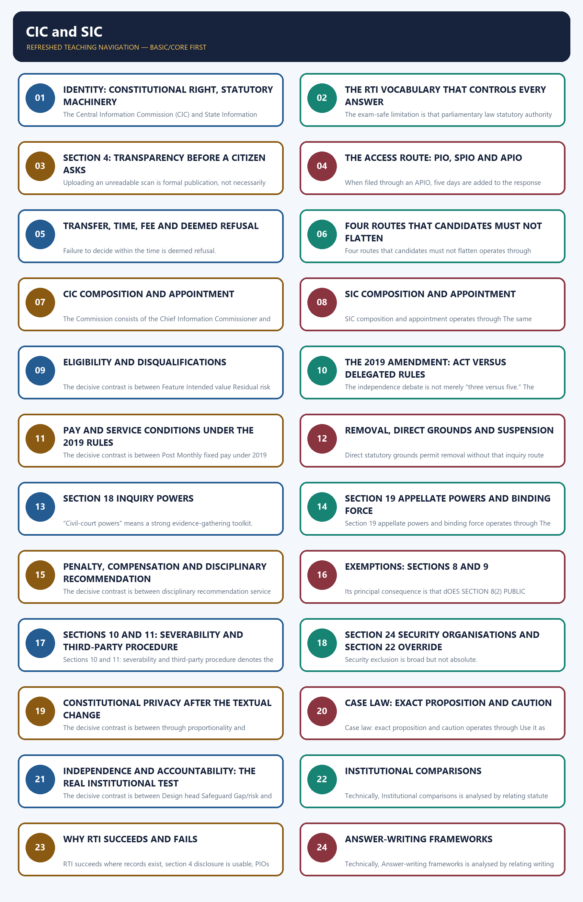

*Distinct embedded teaching-navigation image. The separate continuous Cārvāka-style flowchart package remains an independent at-a-glance artifact.*

### SESSION 1 — IDENTITY: CONSTITUTIONAL RIGHT, STATUTORY MACHINERY
#### DEFINITION / WHAT THIS IS CALLED

**Plain-language definition:** Identity: constitutional right, statutory machinery denotes the constitutional rules and institutional links organised around freedom of speech and expression.

**Technical definition:** The Central Information Commission (CIC) and State Information Commissions (SICs) are statutory bodies created by the Right to Information Act, 2005.

#### ANSWER-GRABBING OPENING — WRITE/ADAPT IN THE EXAM

> CIC/SIC jurisdiction, procedure and remedies remain bounded by the Act and are subject to constitutional judicial review.

#### MUST-WRITE KEYWORDS

- **Identity**
- **constitutional right**
- **statutory machinery**
- **Central Information Commission (CIC)**
- **right to know**
- **CIC/SIC**

**How to use them:** Frame the answer through Identity; define constitutional right, connect statutory machinery with Central Information Commission (CIC) to explain the mechanism, and use right to know for the decisive comparison or qualification.

Identity: constitutional right, statutory machinery denotes the constitutional rules and institutional links organised around freedom of speech and expression.
Identity: constitutional right, statutory machinery operates through judicial right-to-know doctrine, connected with PUBLIC AUTHORITY - PIO - FIRST APPEAL - CIC/SIC.
The operative mechanism matters because dISCLOSURE / COMPLIANCE / COMPENSATION / PERSONAL PENALTY.
Its principal consequence is that institution Source Correct character Core output.
The decisive contrast is between Supreme Court/High Court Constitution constitutional court binding judgment/writ and tribunal Constitution/statute specialised adjudicatory body adjudicatory order under parent law.
The exam-safe limitation is that nHRC/SHRC PHRA, 1993 statutory inquiry/recommendation body recommendations and reports.
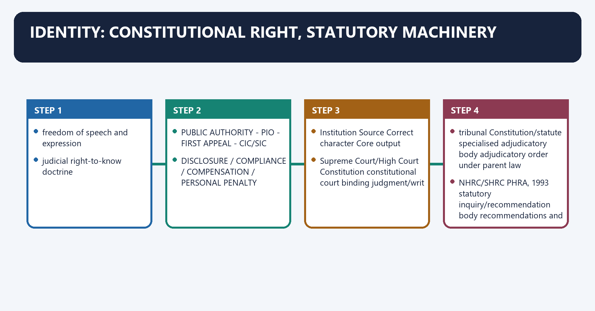
[FACT] The **Central Information Commission (CIC)** and **State Information Commissions (SICs)** are statutory bodies created by the Right to Information Act, 2005. They are not constitutional courts, tribunals or general grievance authorities.

[FACT] The constitutional foundation is the judicially recognised **right to know** implicit in Article 19(1)(a). The statutory right in section 3, its procedures, exemptions and remedies are nevertheless governed by the RTI Act.

[ANALYSIS] The Constitution supplies the normative foundation; the Act converts that foundation into a practical records-access system with time limits, appeals and penalties.

[LIMIT] A constitutional foundation does not let a Commission ignore the statute. CIC/SIC jurisdiction, procedure and remedies remain bounded by the Act and are subject to constitutional judicial review.

#### Visual 2 - Norm-to-remedy chain

```text
ARTICLE 19(1)(a)
freedom of speech and expression
          |
judicial right-to-know doctrine
          |
RTI ACT, 2005
          |
PUBLIC AUTHORITY -> PIO -> FIRST APPEAL -> CIC/SIC
          |
DISCLOSURE / COMPLIANCE / COMPENSATION / PERSONAL PENALTY
```

#### Visual 3 - Status classification

| Institution | Source | Correct character | Core output |
|---|---|---|---|
| CIC/SIC | RTI Act, 2005 | statutory, quasi-judicial appellate/complaint body | binding appellate decision, compliance direction, compensation, statutory penalty |
| Supreme Court/High Court | Constitution | constitutional court | binding judgment/writ |
| tribunal | Constitution/statute | specialised adjudicatory body | adjudicatory order under parent law |
| NHRC/SHRC | PHRA, 1993 | statutory inquiry/recommendation body | recommendations and reports |
| Lokpal | 2013 Act | statutory anti-corruption ombudsman | inquiry/investigation/prosecution architecture |

#### Visual 4 - Three levels of the RTI right

| Level | Question answered | Named basis |
|---|---|---|
| constitutional | Why may citizens seek government information? | Article 19(1)(a), *State of U.P. v. Raj Narain (1975)*, *S.P. Gupta v. Union of India (1981)* |
| statutory | What information, from whom, through which process? | RTI Act sections 2-11 |
| remedial | Who corrects denial or delay? | first appeal, CIC/SIC appeal/complaint, section 20 |

#### Visual 5 - What CIC/SIC are not

```text
NOT a constitutional body
NOT a general service-grievance forum
NOT a corruption-investigation agency
NOT a civil or criminal court
NOT a data-protection regulator
BUT a statutory RTI complaint + appellate institution
with binding appellate and penal powers
```

#### CLOSING RECALL FLOW — IDENTITY: CONSTITUTIONAL RIGHT, STATUTORY MACHINERY

```closure-flow
SUBTOPIC: Identity: constitutional right, statutory machinery
KEY TERMS / DEFINITIONS: Identity · constitutional right · statutory machinery · Central Information Commission (CIC) · right to know · CIC/SIC
MECHANISM / ARGUMENT: The Central Information Commission (CIC) and State Information Commissions (SICs) are statutory bodies created by the Right to Information Act, 2005.
CONSEQUENCE / CONTRAST: The decisive contrast is between Supreme Court/High Court Constitution constitutional court binding judgment/writ and tribunal Constitution/statute specialised adjudicatory body adjudicatory order under parent law.
UPSC TRAP / ANSWER-USE: They are not constitutional courts, tribunals or general grievance authorities.
ANSWER-GRABBING FORMULATION: CIC/SIC jurisdiction, procedure and remedies remain bounded by the Act and are subject to constitutional judicial review.
```
### SESSION 2 — THE RTI VOCABULARY THAT CONTROLS EVERY ANSWER
#### DEFINITION / WHAT THIS IS CALLED

**Plain-language definition:** The RTI vocabulary that controls every answer denotes the constitutional rules and institutional links organised around MATERIAL IN ANY FORM.

**Technical definition:** The exam-safe limitation is that parliamentary law statutory authority parent Act supplies identity.

#### ANSWER-GRABBING OPENING — WRITE/ADAPT IN THE EXAM

> The RTI Act secures access to existing information held or controlled by public authorities, but does not require creation of new explanations or answers.

#### MUST-WRITE KEYWORDS

- **The RTI vocabulary that controls every answer**
- **information**
- **record**
- **right to information**
- **public authority**
- **Constitution**

**How to use them:** Frame the answer through The RTI vocabulary that controls every answer; define information, connect record with right to information to explain the mechanism, and use public authority for the decisive comparison or qualification.

The RTI vocabulary that controls every answer denotes the constitutional rules and institutional links organised around MATERIAL IN ANY FORM.
The RTI vocabulary that controls every answer operates through HELD BY / UNDER CONTROL OF PUBLIC AUTHORITY, connected with EXISTING RECORD OR LEGALLY ACCESSIBLE PRIVATE-BODY INFORMATION.
The operative mechanism matters because iNSPECT / COPY / SAMPLE / ELECTRONIC ACCESS.
Its principal consequence is that rIGHT TO INFORMATION.
The decisive contrast is between Route into section 2(h) Illustration Qualification and Constitution constitutional office/body functions may still contain exempt records.
The exam-safe limitation is that parliamentary law statutory authority parent Act supplies identity.
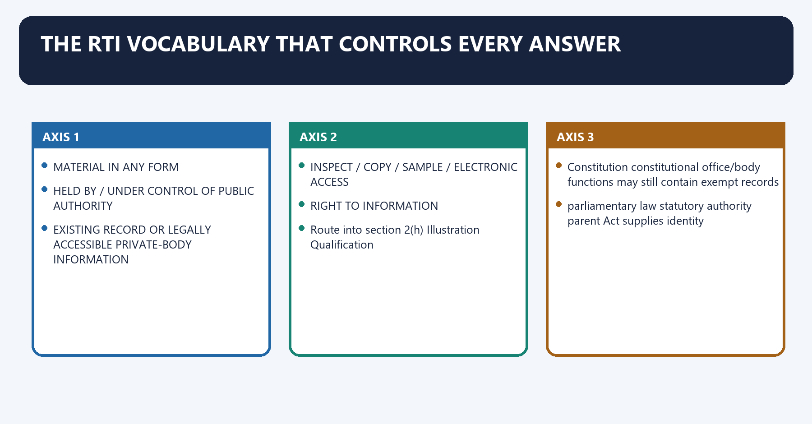
[FACT] Section 2(f) defines **information** broadly as material in any form, including records, documents, memos, e-mails, opinions, advices, orders, logbooks, contracts, reports, samples, models and electronic data. It also includes information about a private body that a public authority can access under another law.

[FACT] Section 2(i) defines **record** inclusively: documents, manuscripts, files, microfilm/microfiche/facsimile, reproduced images and computer-produced material.

[FACT] Section 2(j) defines the **right to information** as access to information held by or under the control of a public authority, including inspection, notes/extracts/certified copies, certified samples and electronic copies/printouts.

[FACT] Section 2(h) covers a **public authority** established by the Constitution, parliamentary or State law, or government notification/order, and includes bodies owned, controlled or substantially financed and NGOs substantially financed directly or indirectly by government funds.

[ANALYSIS] The critical exam move is to ask whether the requested material already exists or is legally accessible to the public authority. RTI is a records-access right, not a duty to answer a viva voce “why” question by creating a new explanation.

[LIMIT] “Substantially financed” and “controlled” are context-sensitive legal tests. Do not assume every entity receiving any government benefit becomes a public authority.

#### Visual 6 - Definition funnel

```text
MATERIAL IN ANY FORM
        |
HELD BY / UNDER CONTROL OF PUBLIC AUTHORITY
        |
EXISTING RECORD OR LEGALLY ACCESSIBLE PRIVATE-BODY INFORMATION
        |
INSPECT / COPY / SAMPLE / ELECTRONIC ACCESS
        =
RIGHT TO INFORMATION
```

#### Visual 7 - Public-authority source matrix

| Route into section 2(h) | Illustration | Qualification |
|---|---|---|
| Constitution | constitutional office/body | functions may still contain exempt records |
| parliamentary law | statutory authority | parent Act supplies identity |
| State law | State statutory body | SIC ordinarily hears the State route |
| notification/order | executive-created public authority | source notification must be identified |
| owned/controlled/substantially financed | government-linked body | factual intensity matters |
| substantially financed NGO | indirect/direct public funds | not every grant is automatically substantial |

#### Visual 8 - Existing information versus new creation

| RTI may require | RTI does not ordinarily require |
|---|---|
| existing file noting | a newly written justification |
| recorded opinion/advice | fresh expert opinion |
| held database extract where reasonably accessible | creation of a database that does not exist |
| inspection/certified copy | answering hypothetical questions |
| legally accessible private-body record | obtaining information with no legal access route |

#### Visual 9 - Citizen and third party

```text
APPLICANT = citizen exercising section 3 right
THIRD PARTY = anyone other than applicant,
              including another public authority
```

[LIMIT] Section 11 procedure may be triggered where confidential third-party material is contemplated for disclosure. It does not convert the third party into an absolute veto-holder.

#### CLOSING RECALL FLOW — THE RTI VOCABULARY THAT CONTROLS EVERY ANSWER

```closure-flow
SUBTOPIC: The RTI vocabulary that controls every answer
KEY TERMS / DEFINITIONS: The RTI vocabulary that controls every answer · information · record · right to information · public authority · Constitution
MECHANISM / ARGUMENT: Section 2(j) defines the right to information as access to information held by or under the control of a public authority, including inspection, notes/extracts/certified copies, certified samples and electronic copies/printouts.
CONSEQUENCE / CONTRAST: Do not assume every entity receiving any government benefit becomes a public authority.
UPSC TRAP / ANSWER-USE: Do not miss this limiting distinction: its principal consequence is that rIGHT TO INFORMATION.
ANSWER-GRABBING FORMULATION: The RTI Act secures access to existing information held or controlled by public authorities, but does not require creation of new explanations or answers.
```
### SESSION 3 — SECTION 4: TRANSPARENCY BEFORE A CITIZEN ASKS
#### DEFINITION / WHAT THIS IS CALLED

**Plain-language definition:** Section 4: transparency before a citizen asks denotes the constitutional rules and institutional links organised around Section 4(2) makes maximum suo motu disclosure a constant endeavour so that citizens have minimum resort to requests.

**Technical definition:** Uploading an unreadable scan is formal publication, not necessarily meaningful transparency.

#### ANSWER-GRABBING OPENING — WRITE/ADAPT IN THE EXAM

> Section 4(1)(c) requires publication of relevant facts while formulating important policies or announcing decisions affecting the public.

#### MUST-WRITE KEYWORDS

- **Section 4**
- **transparency before a citizen asks**
- **suo motu**
- **identity**
- **organisation, functions, duties**
- **locate duty-holder**

**How to use them:** Frame the answer through Section 4; define transparency before a citizen asks, connect suo motu with identity to explain the mechanism, and use organisation, functions, duties for the decisive comparison or qualification.

Section 4: transparency before a citizen asks denotes the constitutional rules and institutional links organised around [FACT] Section 4(2) makes maximum suo motu disclosure a constant endeavour so that citizens have minimum resort to requests.
Section 4: transparency before a citizen asks operates through SECTION 4 DISCLOSURE --------------------+, connected with records, budgets, reasons, beneficiaries.
The operative mechanism matters because fEWER ROUTINE REQUESTS.
Its principal consequence is that rEQUEST - PIO - APPEALS - COMMISSION -+.
The decisive contrast is between Cluster Typical content Accountability use and identity organisation, functions, duties locate duty-holder.
The exam-safe limitation is that authority powers, procedure, norms test legality and delay.
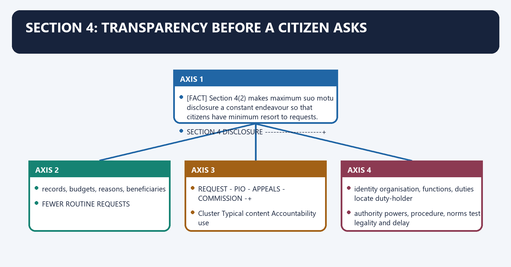
[FACT] Section 4 requires record cataloguing/indexing, appropriate computerisation, publication of institutional particulars, powers, procedure, norms, rules, categories of records, consultation arrangements, boards/committees, staff directory, remuneration, budget, subsidies, concessions, electronic information, access facilities and PIO particulars.

[FACT] Section 4(1)(c) requires publication of relevant facts while formulating important policies or announcing decisions affecting the public. Section 4(1)(d) requires reasons for administrative or quasi-judicial decisions to affected persons.

[FACT] Section 4(2) makes maximum **suo motu** disclosure a constant endeavour so that citizens have minimum resort to requests.

[ANALYSIS] Section 4 is the prevention layer of RTI. A well-designed disclosure system reduces applications, asymmetric information, arbitrariness and appeal backlog.

[LIMIT] Uploading an unreadable scan is formal publication, not necessarily meaningful transparency. Accessibility, local language, updates, machine readability and discoverability determine practical value.

#### Visual 10 - Prevention-versus-remedy architecture

```text
SECTION 4 DISCLOSURE --------------------+
records, budgets, reasons, beneficiaries |
                                         v
                               FEWER ROUTINE REQUESTS
                                         |
REQUEST -> PIO -> APPEALS -> COMMISSION -+
```

#### Visual 11 - Section 4 disclosure clusters

| Cluster | Typical content | Accountability use |
|---|---|---|
| identity | organisation, functions, duties | locate duty-holder |
| authority | powers, procedure, norms | test legality and delay |
| rules/records | manuals, categories, decisions | compare conduct with standard |
| money | budget, subsidy, concessions | trace allocation and beneficiary logic |
| people | directory, remuneration, PIOs | identify responsible officers |
| participation | consultation, boards, minutes | assess voice and openness |

#### Visual 12 - Transparency quality test

```text
PUBLISHED?
   |
UPDATED?
   |
SEARCHABLE?
   |
ACCESSIBLE + LOCAL-LANGUAGE?
   |
LINKED TO DECISION / BUDGET / DUTY-HOLDER?
   |
USABLE TRANSPARENCY
```

#### Visual 13 - Transparency is necessary, not sufficient

| Layer | Question | RTI contribution |
|---|---|---|
| visibility | What happened? | record access/disclosure |
| answerability | Who explains it? | named PIO/public authority/reasons |
| correction | What changes? | compliance direction/other competent forum |
| consequence | Who is liable? | PIO penalty/disciplinary recommendation within section 20 |

#### CLOSING RECALL FLOW — SECTION 4: TRANSPARENCY BEFORE A CITIZEN ASKS

```closure-flow
SUBTOPIC: Section 4: transparency before a citizen asks
KEY TERMS / DEFINITIONS: Section 4 · transparency before a citizen asks · suo motu · identity · organisation, functions, duties · locate duty-holder
MECHANISM / ARGUMENT: Section 4(2) makes maximum suo motu disclosure a constant endeavour so that citizens have minimum resort to requests.
CONSEQUENCE / CONTRAST: Section 4(1)(c) requires publication of relevant facts while formulating important policies or announcing decisions affecting the public.
UPSC TRAP / ANSWER-USE: Do not miss this limiting distinction: the decisive contrast is between Cluster Typical content Accountability use and identity organisation, functions...
ANSWER-GRABBING FORMULATION: Section 4(1)(c) requires publication of relevant facts while formulating important policies or announcing decisions affecting the public.
```
### SESSION 4 — THE ACCESS ROUTE: PIO, SPIO AND APIO
#### DEFINITION / WHAT THIS IS CALLED

**Plain-language definition:** The access route: PIO, SPIO and APIO denotes the constitutional rules and institutional links organised around A PIO may seek another officer's assistance; for contravention purposes that assisting officer is treated as a PIO.

**Technical definition:** When filed through an APIO, five days are added to the response period.

#### ANSWER-GRABBING OPENING — WRITE/ADAPT IN THE EXAM

> PIOs and APIOs structure access to records, including assistance for oral requests, so inability to write cannot defeat the statutory right.

#### MUST-WRITE KEYWORDS

- **The access route**
- **PIO**
- **SPIO**
- **APIO**
- **Central/State Public Information Officers**
- **five days are added**

**How to use them:** Frame the answer through The access route; define PIO, connect SPIO with APIO to explain the mechanism, and use Central/State Public Information Officers for the decisive comparison or qualification.

The access route: PIO, SPIO and APIO denotes the constitutional rules and institutional links organised around [FACT] A PIO may seek another officer's assistance; for contravention purposes that assisting officer is treated as a PIO.
The access route: PIO, SPIO and APIO operates through [FACT] The applicant need not give reasons or personal details beyond those necessary for contact, connected with Officer Core role Liability point.
The operative mechanism matters because cPIO/SPIO decides and furnishes/rejects section 20 can apply personally.
Its principal consequence is that cAPIO/SAPIO receives and forwards five days added.
The decisive contrast is between assisting officer supplies needed assistance deemed PIO for contravention and first appellate authority senior officer reviews PIO decision not the Commission.
The exam-safe limitation is that cPIO / SPIO --------------------+.
[FACT] Every public authority must designate as many **Central/State Public Information Officers** as necessary. PIOs receive and decide requests and must render reasonable assistance.

[FACT] Central/State Assistant Public Information Officers receive applications or appeals for forwarding. When filed through an APIO, **five days are added** to the response period.

[FACT] A PIO may seek another officer's assistance; for contravention purposes that assisting officer is treated as a PIO.

[FACT] A request may be in writing/electronic form in English, Hindi or the official language of the area. If the person cannot write it, the PIO must assist in reducing the oral request to writing.

[FACT] The applicant need not give reasons or personal details beyond those necessary for contact.

#### Visual 14 - Officer-role map

| Officer | Core role | Liability point |
|---|---|---|
| CPIO/SPIO | decides and furnishes/rejects | section 20 can apply personally |
| CAPIO/SAPIO | receives and forwards | five days added |
| assisting officer | supplies needed assistance | deemed PIO for contravention |
| first appellate authority | senior officer reviews PIO decision | not the Commission |

#### Visual 15 - Request intake flow

```text
CITIZEN
  |
  +--> CPIO / SPIO --------------------+
  |                                    |
  +--> CAPIO / SAPIO -- forward -------+ (+5 days)
                                       |
                                DECISION / DEEMED REFUSAL
```

#### CLOSING RECALL FLOW — THE ACCESS ROUTE: PIO, SPIO AND APIO

```closure-flow
SUBTOPIC: The access route: PIO, SPIO and APIO
KEY TERMS / DEFINITIONS: The access route · PIO · SPIO · APIO · Central/State Public Information Officers · five days are added
MECHANISM / ARGUMENT: When filed through an APIO, five days are added to the response period.
CONSEQUENCE / CONTRAST: Its principal consequence is that cAPIO/SAPIO receives and forwards five days added.
UPSC TRAP / ANSWER-USE: The decisive contrast is between assisting officer supplies needed assistance deemed PIO for contravention and first appellate authority senior officer reviews PIO decision not the Commission.
ANSWER-GRABBING FORMULATION: PIOs and APIOs structure access to records, including assistance for oral requests, so inability to write cannot defeat the statutory right.
```
### SESSION 5 — TRANSFER, TIME, FEE AND DEEMED REFUSAL
#### DEFINITION / WHAT THIS IS CALLED

**Plain-language definition:** Transfer, time, fee and deemed refusal denotes the constitutional rules and institutional links organised around Do not universalise a Central-rule fee detail to every State without checking that State's rules.

**Technical definition:** Failure to decide within the time is deemed refusal.

#### ANSWER-GRABBING OPENING — WRITE/ADAPT IN THE EXAM

> Section 6(3) requires prompt transfer to the responsible public authority, preserving access without forcing applicants to identify the correct administrative compartment.

#### MUST-WRITE KEYWORDS

- **Transfer**
- **time**
- **fee**
- **deemed refusal**
- **life or liberty**
- **30 days**

**How to use them:** Frame the answer through Transfer; define time, connect fee with deemed refusal to explain the mechanism, and use life or liberty for the decisive comparison or qualification.

Transfer, time, fee and deemed refusal denotes the constitutional rules and institutional links organised around [LIMIT] Do not universalise a Central-rule fee detail to every State without checking that State's rules.
Transfer, time, fee and deemed refusal operates through transfer under section 6(3) no later than 5 days, connected with ordinary request decision 30 days.
The operative mechanism matters because life/liberty 48 hours.
Its principal consequence is that aPIO route add 5 days.
The decisive contrast is between third-party decision 40 days overall and first appeal filing ordinarily 30 days.
The exam-safe limitation is that first appeal disposal 30 days; up to 45 with written reasons.
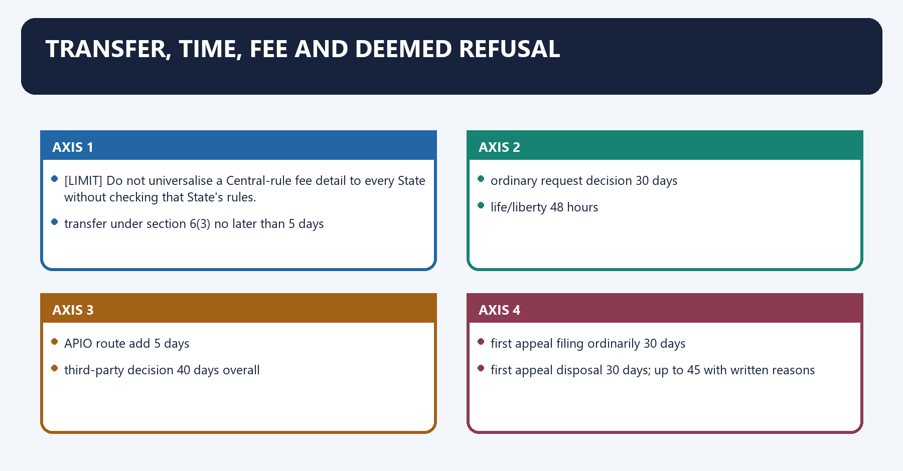
[FACT] If information is held by another public authority or is more closely connected with its functions, section 6(3) requires transfer of the application or relevant part **as soon as practicable and not later than five days**, with immediate intimation to the applicant.

[FACT] The standard section 7(1) decision period is **30 days**. Information concerning a person's **life or liberty** must be provided within **48 hours**.

[FACT] Failure to decide within the time is **deemed refusal**. Where the authority misses the statutory time, the information must be provided **free of charge**.

[FACT] A further-fee intimation must show the calculation and review rights; the time between dispatch of the intimation and payment is excluded from the 30-day calculation.

[FACT] Under the Central RTI Rules, 2012, the application fee is Rs 10, with prescribed copying/electronic/inspection charges and BPL exemption. State rules may prescribe different forms or fee details within the Act.

[LIMIT] Do not universalise a Central-rule fee detail to every State without checking that State's rules.

#### Visual 16 - Core statutory clocks

| Event | Clock |
|---|---:|
| transfer under section 6(3) | no later than 5 days |
| ordinary request decision | 30 days |
| life/liberty | 48 hours |
| APIO route | add 5 days |
| third-party decision | 40 days overall |
| first appeal filing | ordinarily 30 days |
| first appeal disposal | 30 days; up to 45 with written reasons |
| second appeal filing | ordinarily 90 days |
| section 24 human-rights information | 45 days after required Commission approval route |

#### Visual 17 - Delay consequences

```text
NO DECISION WITHIN TIME
        |
DEEMED REFUSAL
        |
FIRST APPEAL
        |
INFORMATION, IF LATER PROVIDED, FREE OF CHARGE
        |
POSSIBLE SECTION 20 SCRUTINY OF PIO
```

#### Visual 18 - Fee control

| Fee issue | Correct rule |
|---|---|
| application fee | prescribed by applicable rules |
| BPL applicant | no section 6/7 fee under statutory proviso |
| extra copying cost | calculation must be intimated |
| unreasonable fee | section 18 complaint ground and appeal issue |
| authority delay | information free |
| State variation | check State rules; do not assume Central form/amount |

#### CLOSING RECALL FLOW — TRANSFER, TIME, FEE AND DEEMED REFUSAL

```closure-flow
SUBTOPIC: Transfer, time, fee and deemed refusal
KEY TERMS / DEFINITIONS: Transfer · time · fee · deemed refusal · life or liberty · 30 days
MECHANISM / ARGUMENT: If information is held by another public authority or is more closely connected with its functions, section 6(3) requires transfer of the application or relevant part as soon as practicable and not later than five days, with immediate intimation to the applicant.
CONSEQUENCE / CONTRAST: Failure to decide within the time is deemed refusal.
UPSC TRAP / ANSWER-USE: Do not miss this limiting distinction: the decisive contrast is between third-party decision 40 days overall and first appeal filing...
ANSWER-GRABBING FORMULATION: Section 6(3) requires prompt transfer to the responsible public authority, preserving access without forcing applicants to identify the correct administrative compartment.
```
### SESSION 6 — FOUR ROUTES THAT CANDIDATES MUST NOT FLATTEN
#### DEFINITION / WHAT THIS IS CALLED

**Plain-language definition:** Four routes that candidates must not flatten denotes the constitutional rules and institutional links organised around INFORMATION NEEDED.

**Technical definition:** Four routes that candidates must not flatten operates through decision / no decision, connected with FIRST APPEAL TO SENIOR OFFICER.

#### ANSWER-GRABBING OPENING — WRITE/ADAPT IN THE EXAM

> State of Manipur (2011), section 18's complaint jurisdiction does not itself become the section 19 appellate disclosure route.

#### MUST-WRITE KEYWORDS

- **request**
- **first appeal**
- **second appeal**
- **section 18 complaint**
- **trigger**
- **grievance against PIO/FAA decision or non-decision**

**How to use them:** Frame the answer through request; define first appeal, connect second appeal with section 18 complaint to explain the mechanism, and use trigger for the decisive comparison or qualification.

Four routes that candidates must not flatten denotes the constitutional rules and institutional links organised around INFORMATION NEEDED.
Four routes that candidates must not flatten operates through decision / no decision, connected with FIRST APPEAL TO SENIOR OFFICER.
The operative mechanism matters because sECOND APPEAL TO CIC/SIC ---- disclosure/compliance remedy.
Its principal consequence is that aCCESS SYSTEM OBSTRUCTED?.
The decisive contrast is between no PIO / APIO refuses / false info / unreasonable fee / delay and SECTION 18 COMPLAINT -------- inquiry + statutory consequences.
The exam-safe limitation is that dimension Section 19 appeal Section 18 complaint.
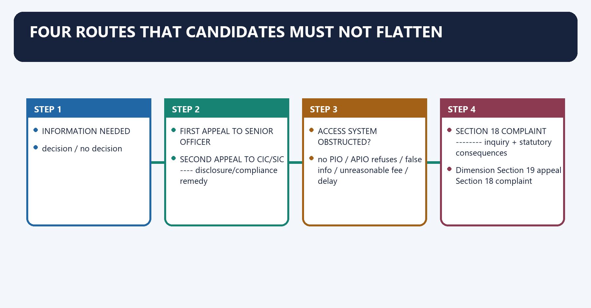
[FACT] The RTI system contains a **request**, a **first appeal**, a **second appeal**, and a **section 18 complaint**. They solve related but different procedural problems.

[FACT] The first appeal under section 19(1) goes to an officer senior in rank to the PIO, ordinarily within 30 days. The second appeal under section 19(3) goes to the CIC/SIC, ordinarily within 90 days.

[FACT] Section 18 complaints cover inability to submit a request, refusal of access, no timely response, unreasonable fee, incomplete/misleading/false information and other access-related matters.

[FACT] Under *Chief Information Commissioner v. State of Manipur (2011)*, section 18's complaint jurisdiction does not itself become the section 19 appellate disclosure route. A person seeking an order to furnish information should pursue the statutory appeal.

[ANALYSIS] The best exam answer treats complaint and appeal as complementary rather than interchangeable: complaint polices obstruction and maladministration in access; appeal reviews denial and can secure disclosure.

#### Visual 19 - Route-selection decision tree

```text
INFORMATION NEEDED
      |
REQUEST TO PIO
      |
decision / no decision
      |
FIRST APPEAL TO SENIOR OFFICER
      |
SECOND APPEAL TO CIC/SIC ----> disclosure/compliance remedy

ACCESS SYSTEM OBSTRUCTED?
no PIO / APIO refuses / false info / unreasonable fee / delay
      |
SECTION 18 COMPLAINT --------> inquiry + statutory consequences
```

#### Visual 20 - Appeal versus complaint

| Dimension | Section 19 appeal | Section 18 complaint |
|---|---|---|
| trigger | grievance against PIO/FAA decision or non-decision | listed access-system failure |
| ordinary sequence | request -> first appeal -> second appeal | direct complaint on listed ground possible |
| disclosure remedy | yes, through appellate power | not a substitute for disclosure appeal under *Manipur* |
| inquiry powers | appellate adjudication and statutory procedure | express civil-court inquiry powers |
| penalty | section 20 may arise | section 20 may arise |

#### Visual 21 - Burden and hearing

```text
SECOND APPEAL
     |
PIO BEARS ONUS TO JUSTIFY DENIAL (s.19(5))
     |
THIRD PARTY HEARD WHERE ITS INFORMATION IS INVOLVED
     |
REASONED, BINDING DECISION
```

#### CLOSING RECALL FLOW — FOUR ROUTES THAT CANDIDATES MUST NOT FLATTEN

```closure-flow
SUBTOPIC: Four routes that candidates must not flatten
KEY TERMS / DEFINITIONS: request · first appeal · second appeal · section 18 complaint · trigger · grievance against PIO/FAA decision or non-decision
MECHANISM / ARGUMENT: Four routes that candidates must not flatten denotes the constitutional rules and institutional links organised around INFORMATION NEEDED.
CONSEQUENCE / CONTRAST: State of Manipur (2011), section 18's complaint jurisdiction does not itself become the section 19 appellate disclosure route.
UPSC TRAP / ANSWER-USE: Do not miss this limiting distinction: the decisive contrast is between no PIO / APIO refuses / false info /...
ANSWER-GRABBING FORMULATION: State of Manipur (2011), section 18's complaint jurisdiction does not itself become the section 19 appellate disclosure route.
```
### SESSION 7 — CIC COMPOSITION AND APPOINTMENT
#### DEFINITION / WHAT THIS IS CALLED

**Plain-language definition:** CIC composition and appointment denotes the constitutional rules and institutional links organised around Section 12 requires the Central Government to constitute the CIC by Gazette notification.

**Technical definition:** The Commission consists of the Chief Information Commissioner and such number of Central Information Commissioners, not exceeding ten, as considered necessary.

#### ANSWER-GRABBING OPENING — WRITE/ADAPT IN THE EXAM

> General superintendence, direction and management vest in the Chief Information Commissioner, assisted by the Information Commissioners, and the Commission acts autonomously without directions from another authority under the Act.

#### MUST-WRITE KEYWORDS

- **CIC composition**
- **appointment**
- **Chief Information Commissioner**
- **not exceeding ten**
- **Prime Minister as Chairperson**
- **Leader of Opposition in the Lok Sabha**

**How to use them:** Frame the answer through CIC composition; define appointment, connect Chief Information Commissioner with not exceeding ten to explain the mechanism, and use Prime Minister as Chairperson for the decisive comparison or qualification.

CIC composition and appointment denotes the constitutional rules and institutional links organised around [FACT] Section 12 requires the Central Government to constitute the CIC by Gazette notification.
CIC composition and appointment operates through LOK SABHA LoP ----- UNION CABINET MINISTER, connected with CIC + up to 10 ICs.
The operative mechanism matters because situation Statutory treatment.
Its principal consequence is that recognised LoP exists recognised LoP serves.
The decisive contrast is between no recognised LoP leader of single largest opposition group is deemed LoP for this committee and Head Rule Exam significance.
The exam-safe limitation is that chief one Chief Information Commissioner institutional leadership.
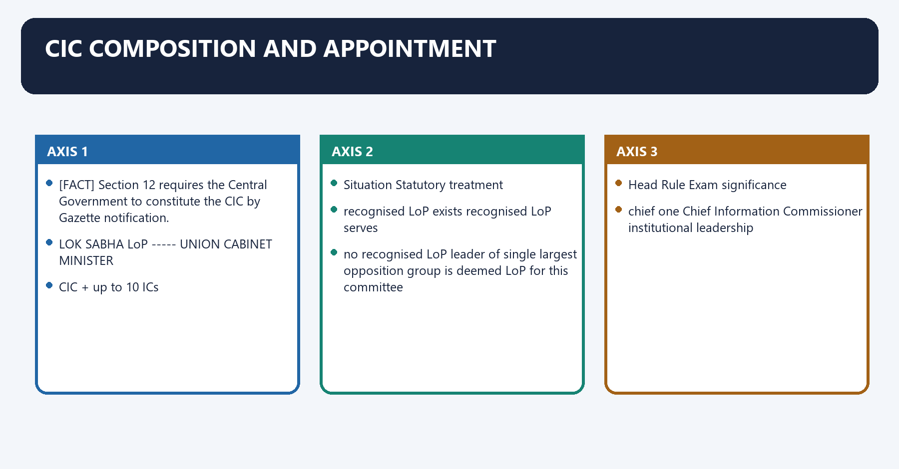
[FACT] Section 12 requires the Central Government to constitute the CIC by Gazette notification.

[FACT] The Commission consists of the **Chief Information Commissioner** and such number of Central Information Commissioners, **not exceeding ten**, as considered necessary.

[FACT] The President appoints them on the recommendation of a committee consisting of the **Prime Minister as Chairperson**, the **Leader of Opposition in the Lok Sabha**, and a **Union Cabinet Minister nominated by the Prime Minister**.

[FACT] The statutory explanation deems the leader of the single largest opposition group to be the Leader of Opposition where no LoP has been recognised as such.

[FACT] General superintendence, direction and management vest in the Chief Information Commissioner, assisted by the Information Commissioners, and the Commission acts autonomously without directions from another authority under the Act.

#### Visual 22 - CIC appointment triangle

```text
                 PRIME MINISTER
                   (Chair)
                  /       \
                 /         \
     LOK SABHA LoP ----- UNION CABINET MINISTER
                              nominated by PM
                 |
          recommendation
                 |
             PRESIDENT
                 |
       CIC + up to 10 ICs
```

#### Visual 23 - LoP deeming rule

| Situation | Statutory treatment |
|---|---|
| recognised LoP exists | recognised LoP serves |
| no recognised LoP | leader of single largest opposition group is deemed LoP for this committee |

#### Visual 24 - CIC internal design

| Head | Rule | Exam significance |
|---|---|---|
| chief | one Chief Information Commissioner | institutional leadership |
| members | up to ten ICs | statutory ceiling, not guaranteed filled strength |
| management | vests in Chief, assisted by ICs | internal autonomy language |
| headquarters | Delhi | other offices need previous Central approval |

#### CLOSING RECALL FLOW — CIC COMPOSITION AND APPOINTMENT

```closure-flow
SUBTOPIC: CIC composition and appointment
KEY TERMS / DEFINITIONS: CIC composition · appointment · Chief Information Commissioner · not exceeding ten · Prime Minister as Chairperson · Leader of Opposition in the Lok Sabha
MECHANISM / ARGUMENT: Section 12 requires the Central Government to constitute the CIC by Gazette notification.
CONSEQUENCE / CONTRAST: The Commission consists of the Chief Information Commissioner and such number of Central Information Commissioners, not exceeding ten, as considered necessary.
UPSC TRAP / ANSWER-USE: Do not miss this limiting distinction: its principal consequence is that recognised LoP exists recognised LoP serves.
ANSWER-GRABBING FORMULATION: General superintendence, direction and management vest in the Chief Information Commissioner, assisted by the Information Commissioners, and the Commission acts autonomously without directions from another authority under the Act.
```
### SESSION 8 — SIC COMPOSITION AND APPOINTMENT
#### DEFINITION / WHAT THIS IS CALLED

**Plain-language definition:** SIC composition and appointment denotes the constitutional rules and institutional links organised around Section 15 requires every State Government to constitute a State Information Commission by Gazette notification.

**Technical definition:** SIC composition and appointment operates through The same largest-opposition-group deeming rule applies where no Assembly LoP is recognised, connected with The Legislative Council's LoP is not on this statutory committee, even in a bicameral State.

#### ANSWER-GRABBING OPENING — WRITE/ADAPT IN THE EXAM

> Section 15 requires every State to constitute an SIC with a Chief and up to ten Commissioners, while appointment design gives the executive a committee majority.

#### MUST-WRITE KEYWORDS

- **SIC composition**
- **appointment**
- **not exceeding ten**
- **Chief Minister as Chairperson**
- **Leader of Opposition in the Legislative Assembly**
- **Cabinet Minister nominated by the Chief Minister**

**How to use them:** Frame the answer through SIC composition; define appointment, connect not exceeding ten with Chief Minister as Chairperson to explain the mechanism, and use Leader of Opposition in the Legislative Assembly for the decisive comparison or qualification.

SIC composition and appointment denotes the constitutional rules and institutional links organised around [FACT] Section 15 requires every State Government to constitute a State Information Commission by Gazette notification.
SIC composition and appointment operates through [FACT] The same largest-opposition-group deeming rule applies where no Assembly LoP is recognised, connected with [LIMIT] The Legislative Council's LoP is not on this statutory committee, even in a bicameral State.
The operative mechanism matters because aSSEMBLY LoP -------- STATE CABINET MINISTER.
Its principal consequence is that sCIC + up to 10 SICs.
The decisive contrast is between appointing authority President Governor and committee chair Prime Minister Chief Minister.
The exam-safe limitation is that opposition member Lok Sabha LoP/deemed leader Assembly LoP/deemed leader.
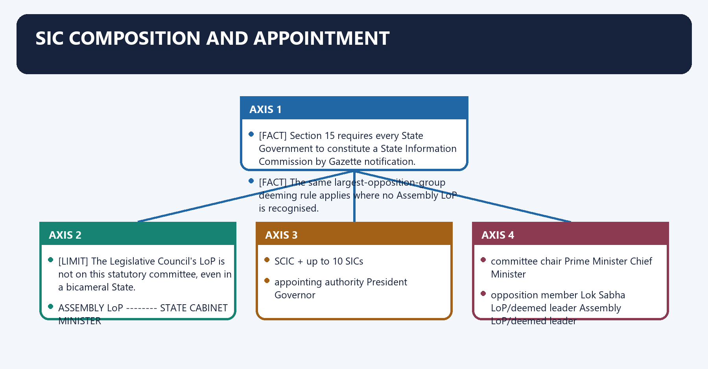
[FACT] Section 15 requires every State Government to constitute a State Information Commission by Gazette notification.

[FACT] It consists of the **State Chief Information Commissioner** and such number of State Information Commissioners, **not exceeding ten**, as considered necessary.

[FACT] The Governor appoints them on the recommendation of a committee consisting of the **Chief Minister as Chairperson**, the **Leader of Opposition in the Legislative Assembly**, and a **Cabinet Minister nominated by the Chief Minister**.

[FACT] The same largest-opposition-group deeming rule applies where no Assembly LoP is recognised.

[LIMIT] The Legislative Council's LoP is not on this statutory committee, even in a bicameral State.

#### Visual 25 - SIC appointment triangle

```text
                 CHIEF MINISTER
                    (Chair)
                  /         \
                 /           \
 ASSEMBLY LoP -------- STATE CABINET MINISTER
                           nominated by CM
                 |
          recommendation
                 |
              GOVERNOR
                 |
       SCIC + up to 10 SICs
```

#### Visual 26 - CIC and SIC symmetry

| Head | CIC | SIC |
|---|---|---|
| appointing authority | President | Governor |
| committee chair | Prime Minister | Chief Minister |
| opposition member | Lok Sabha LoP/deemed leader | Assembly LoP/deemed leader |
| minister member | Union Cabinet Minister nominated by PM | State Cabinet Minister nominated by CM |
| maximum other commissioners | ten | ten |

#### Visual 27 - Federal jurisdiction shortcut

```text
CENTRAL / UT PUBLIC AUTHORITY -> CPIO -> CIC
STATE PUBLIC AUTHORITY        -> SPIO -> SIC
```

[LIMIT] Jurisdiction follows the public authority and the Act's “appropriate Government” logic, not merely the applicant's place of residence.

#### CLOSING RECALL FLOW — SIC COMPOSITION AND APPOINTMENT

```closure-flow
SUBTOPIC: SIC composition and appointment
KEY TERMS / DEFINITIONS: SIC composition · appointment · not exceeding ten · Chief Minister as Chairperson · Leader of Opposition in the Legislative Assembly · Cabinet Minister nominated by the Chief Minister
MECHANISM / ARGUMENT: SIC composition and appointment operates through The same largest-opposition-group deeming rule applies where no Assembly LoP is recognised, connected with The Legislative Council's LoP is not on this statutory committee, even in a bicameral State.
CONSEQUENCE / CONTRAST: It consists of the State Chief Information Commissioner and such number of State Information Commissioners, not exceeding ten, as considered necessary.
UPSC TRAP / ANSWER-USE: Do not miss this limiting distinction: its principal consequence is that sCIC + up to 10 SICs.
ANSWER-GRABBING FORMULATION: Section 15 requires every State to constitute an SIC with a Chief and up to ten Commissioners, while appointment design gives the executive a committee majority.
```
### SESSION 9 — ELIGIBILITY AND DISQUALIFICATIONS
#### DEFINITION / WHAT THIS IS CALLED

**Plain-language definition:** Eligibility and disqualifications denotes the constitutional rules and institutional links organised around EMINENCE + WIDE KNOWLEDGE/EXPERIENCE.

**Technical definition:** The decisive contrast is between Feature Intended value Residual risk and multidisciplinary eligibility varied understanding of records/governance vague criteria.

#### ANSWER-GRABBING OPENING — WRITE/ADAPT IN THE EXAM

> The statute seeks multidisciplinary competence and freedom from immediate political/commercial conflicts, but it does not prescribe a judicial majority or a single professional pipeline.

#### MUST-WRITE KEYWORDS

- **Eligibility**
- **disqualifications**
- **multidisciplinary eligibility**
- **varied understanding of records/governance**
- **vague criteria**
- **no party connection**

**How to use them:** Frame the answer through Eligibility; define disqualifications, connect multidisciplinary eligibility with varied understanding of records/governance to explain the mechanism, and use vague criteria for the decisive comparison or qualification.

Eligibility and disqualifications denotes the constitutional rules and institutional links organised around EMINENCE + WIDE KNOWLEDGE/EXPERIENCE.
Eligibility and disqualifications operates through law science-tech social service management, connected with journalism mass media administration-governance.
The operative mechanism matters because nO legislature membership / office of profit /.
Its principal consequence is that party connection / business / profession.
The decisive contrast is between Feature Intended value Residual risk and multidisciplinary eligibility varied understanding of records/governance vague criteria.
The exam-safe limitation is that no party connection impartiality prior affiliations may still matter.
[FACT] CIC/IC and SCIC/SIC appointees must be persons of eminence in public life with wide knowledge and experience in **law, science and technology, social service, management, journalism, mass media, or administration and governance**.

[FACT] They cannot be MPs or members of a State/UT legislature, hold another office of profit, be connected with a political party, carry on business, or pursue a profession.

[ANALYSIS] The statute seeks multidisciplinary competence and freedom from immediate political/commercial conflicts, but it does not prescribe a judicial majority or a single professional pipeline.

[LIMIT] Expertise diversity on paper does not guarantee pluralism in actual appointments. Transparent criteria and published shortlists are governance safeguards, not substitutes for the statutory committee.

#### Visual 28 - Eligibility-disqualification gate

```text
EMINENCE + WIDE KNOWLEDGE/EXPERIENCE
law | science-tech | social service | management
journalism | mass media | administration-governance
                         |
                         v
NO legislature membership / office of profit /
party connection / business / profession
```

#### Visual 29 - Design rationale

| Feature | Intended value | Residual risk |
|---|---|---|
| multidisciplinary eligibility | varied understanding of records/governance | vague criteria |
| no party connection | impartiality | prior affiliations may still matter |
| no business/profession | conflict reduction | post-tenure incentives remain relevant |
| committee appointment | political accountability + opposition voice | executive-heavy majority |

#### CLOSING RECALL FLOW — ELIGIBILITY AND DISQUALIFICATIONS

```closure-flow
SUBTOPIC: Eligibility and disqualifications
KEY TERMS / DEFINITIONS: Eligibility · disqualifications · multidisciplinary eligibility · varied understanding of records/governance · vague criteria · no party connection
MECHANISM / ARGUMENT: The decisive contrast is between Feature Intended value Residual risk and multidisciplinary eligibility varied understanding of records/governance vague criteria.
CONSEQUENCE / CONTRAST: Its principal consequence is that party connection / business / profession.
UPSC TRAP / ANSWER-USE: The statute seeks multidisciplinary competence and freedom from immediate political/commercial conflicts, but it does not prescribe a judicial majority or a single professional pipeline.
ANSWER-GRABBING FORMULATION: The statute seeks multidisciplinary competence and freedom from immediate political/commercial conflicts, but it does not prescribe a judicial majority or a single professional pipeline.
```
### SESSION 10 — THE 2019 AMENDMENT: ACT VERSUS DELEGATED RULES
#### DEFINITION / WHAT THIS IS CALLED

**Plain-language definition:** The 2019 amendment: Act versus delegated rules denotes the constitutional rules and institutional links organised around Head Pre-2019 Act Post-2019 legal design.

**Technical definition:** The independence debate is not merely “three versus five.” The deeper change is the movement of a safeguard from parliamentary text to executive rule-making by the government whose records the Commissions review.

#### ANSWER-GRABBING OPENING — WRITE/ADAPT IN THE EXAM

> The independence debate is not merely “three versus five.” The deeper change is the movement of a safeguard from parliamentary text to executive rule-making by the government whose records the Commissions review.

#### MUST-WRITE KEYWORDS

- **The 2019 amendment**
- **Act versus delegated rules**
- **three-year term from entry into office**
- **five years**
- **ordinary term**
- **five years in Act**

**How to use them:** Frame the answer through The 2019 amendment; define Act versus delegated rules, connect three-year term from entry into office with five years to explain the mechanism, and use ordinary term for the decisive comparison or qualification.

The 2019 amendment: Act versus delegated rules denotes the constitutional rules and institutional links organised around Head Pre-2019 Act Post-2019 legal design.
The 2019 amendment: Act versus delegated rules operates through ordinary term five years in Act “such term as prescribed”; Rules = three years, connected with salary parity linked to Election Commission offices fixed by Central rules.
The operative mechanism matters because maximum age 65 65 retained.
Its principal consequence is that removal protected statutory process retained.
The decisive contrast is between rule-maker core terms in parliamentary Act Central Government prescribes and age ceiling appointment removal broad service-rule delegation.
The exam-safe limitation is that cENTRAL RULES, 2019.
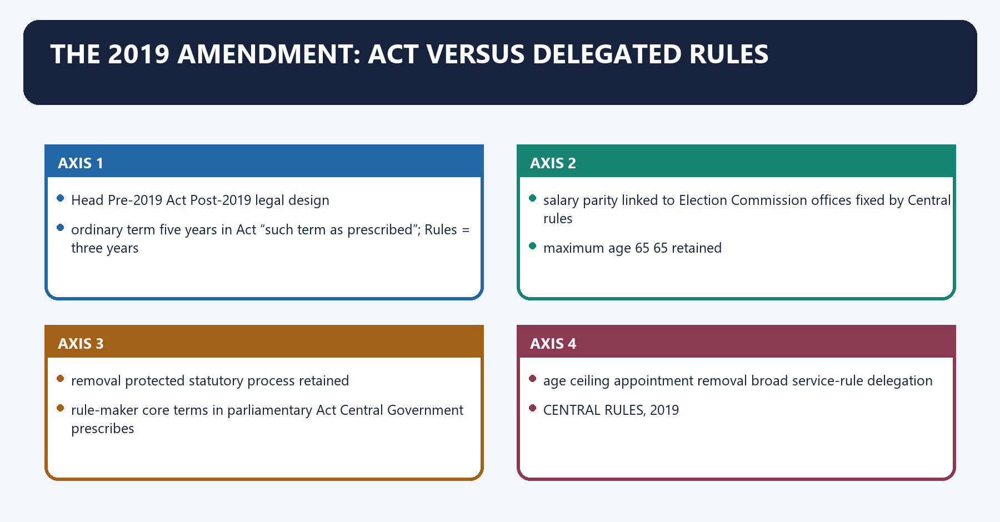
[FACT] Before the 2019 amendment, the RTI Act itself fixed a five-year term and linked salaries/status to Election Commission offices. The Right to Information (Amendment) Act, 2019 replaced the fixed statutory term and salary provisions with matters to be prescribed by the Central Government.

[FACT] The 2019 service-condition Rules prescribe a **three-year term from entry into office** for the Central Chief, Central ICs, State Chief and State ICs.

[FACT] The statutory maximum age remains **65**. A Chief cannot be reappointed as Chief. An IC cannot be reappointed as IC but may be appointed Chief through the statutory process; the aggregate tenure as IC and Chief cannot exceed **five years**. The State rules are parallel.

[ANALYSIS] The independence debate is not merely “three versus five.” The deeper change is the movement of a safeguard from parliamentary text to executive rule-making by the government whose records the Commissions review.

[LIMIT] Appointment, statutory age ceiling, non-reappointment rules, protected removal and the non-disadvantage proviso remain important safeguards. The amendment weakened structural insulation; it did not erase every independence protection.

#### Visual 30 - Before-and-after map

| Head | Pre-2019 Act | Post-2019 legal design |
|---|---|---|
| ordinary term | five years in Act | “such term as prescribed”; Rules = three years |
| salary parity | linked to Election Commission offices | fixed by Central rules |
| maximum age | 65 | 65 retained |
| removal | protected statutory process | retained |
| rule-maker | core terms in parliamentary Act | Central Government prescribes |

#### Visual 31 - Statute-versus-rule distinction

```text
PARLIAMENTARY ACT
  age ceiling | appointment | removal | broad service-rule delegation
                         |
                         v
CENTRAL RULES, 2019
  three-year term | pay | allowances | pension adjustment | residuary control
```

#### Visual 32 - Reappointment logic

| Office | Same-office reappointment? | Possible elevation? | Aggregate ceiling |
|---|---|---|---|
| Chief Information Commissioner | no | not applicable | statutory term + age 65 |
| Information Commissioner | no as IC | eligible for appointment as Chief | max five years across IC + Chief |
| State Chief Information Commissioner | no | not applicable | statutory term + age 65 |
| State Information Commissioner | no as SIC | eligible for appointment as State Chief | max five years across SIC + State Chief |

#### CLOSING RECALL FLOW — THE 2019 AMENDMENT: ACT VERSUS DELEGATED RULES

```closure-flow
SUBTOPIC: The 2019 amendment: Act versus delegated rules
KEY TERMS / DEFINITIONS: The 2019 amendment · Act versus delegated rules · three-year term from entry into office · five years · ordinary term · five years in Act
MECHANISM / ARGUMENT: The Right to Information (Amendment) Act, 2019 replaced the fixed statutory term and salary provisions with matters to be prescribed by the Central Government.
CONSEQUENCE / CONTRAST: The independence debate is not merely “three versus five.” The deeper change is the movement of a safeguard from parliamentary text to executive rule-making by the government whose records the Commissions review.
UPSC TRAP / ANSWER-USE: Do not miss this limiting distinction: its principal consequence is that removal protected statutory process retained.
ANSWER-GRABBING FORMULATION: The independence debate is not merely “three versus five.” The deeper change is the movement of a safeguard from parliamentary text to executive rule-making by the government whose records the Commissions review.
```
### SESSION 11 — PAY AND SERVICE CONDITIONS UNDER THE 2019 RULES
#### DEFINITION / WHAT THIS IS CALLED

**Plain-language definition:** Pay and service conditions under the 2019 Rules denotes the constitutional rules and institutional links organised around The 2019 Rules fix monthly pay at.

**Technical definition:** The decisive contrast is between Post Monthly fixed pay under 2019 Rules and Central Chief Information Commissioner Rs 2,50,000.

#### ANSWER-GRABBING OPENING — WRITE/ADAPT IN THE EXAM

> Fixed high pay can support independence, but central control over tenure, residuary questions and relaxation strengthens the autonomy critique, especially for State Commissions.

#### MUST-WRITE KEYWORDS

- **Pay**
- **service conditions under the 2019 Rules**
- **Rs 2,50,000**
- **Rs 2,25,000**
- **Central Chief Information Commissioner**
- **Central Information Commissioner**

**How to use them:** Frame the answer through Pay; define service conditions under the 2019 Rules, connect Rs 2,50,000 with Rs 2,25,000 to explain the mechanism, and use Central Chief Information Commissioner for the decisive comparison or qualification.

Pay and service conditions under the 2019 Rules denotes the constitutional rules and institutional links organised around [FACT] The 2019 Rules fix monthly pay at.
Pay and service conditions under the 2019 Rules operates through Central Chief Information Commissioner: Rs 2,50,000, connected with Central Information Commissioner: Rs 2,25,000.
The operative mechanism matters because state Chief Information Commissioner: Rs 2,25,000 ; and.
Its principal consequence is that state Information Commissioner: Rs 2,25,000.
The decisive contrast is between Post Monthly fixed pay under 2019 Rules and Central Chief Information Commissioner Rs 2,50,000.
The exam-safe limitation is that central Information Commissioner Rs 2,25,000.
[FACT] The 2019 Rules fix monthly pay at:

- Central Chief Information Commissioner: **Rs 2,50,000**;
- Central Information Commissioner: **Rs 2,25,000**;
- State Chief Information Commissioner: **Rs 2,25,000**; and
- State Information Commissioner: **Rs 2,25,000**.

[FACT] Pension/retirement-benefit adjustments apply as specified. Dearness allowance, leave, medical facilities, accommodation and travel entitlements follow the corresponding same-pay government framework stated in the Rules.

[FACT] Rule 21 sends unprovided service-condition questions to the Central Government, whose decision is binding; rule 22 gives the Central Government relaxation power.

[ANALYSIS] Fixed high pay can support independence, but central control over tenure, residuary questions and relaxation strengthens the autonomy critique, especially for State Commissions.

[LIMIT] Do not revive stale pre-2019 equations to the Chief Election Commissioner, Election Commissioners or Chief Secretary as the current source of pay/status.

#### Visual 33 - Current pay table

| Post | Monthly fixed pay under 2019 Rules |
|---|---:|
| Central Chief Information Commissioner | Rs 2,50,000 |
| Central Information Commissioner | Rs 2,25,000 |
| State Chief Information Commissioner | Rs 2,25,000 |
| State Information Commissioner | Rs 2,25,000 |

#### Visual 34 - Independence effect chain

```text
COMMISSION REVIEWS GOVERNMENT DENIALS
                |
CENTRAL EXECUTIVE PRESCRIBES TERM + PAY + RESIDUARY CONDITIONS
                |
[ANALYSIS] perceived dependence / chilling-risk argument
                |
[LIMIT] protected removal + committee appointment + binding powers survive
```

#### CLOSING RECALL FLOW — PAY AND SERVICE CONDITIONS UNDER THE 2019 RULES

```closure-flow
SUBTOPIC: Pay and service conditions under the 2019 Rules
KEY TERMS / DEFINITIONS: Pay · service conditions under the 2019 Rules · Rs 2,50,000 · Rs 2,25,000 · Central Chief Information Commissioner · Central Information Commissioner
MECHANISM / ARGUMENT: The decisive contrast is between Post Monthly fixed pay under 2019 Rules and Central Chief Information Commissioner Rs 2,50,000.
CONSEQUENCE / CONTRAST: Its principal consequence is that state Information Commissioner: Rs 2,25,000.
UPSC TRAP / ANSWER-USE: Fixed high pay can support independence, but central control over tenure, residuary questions and relaxation strengthens the autonomy critique, especially for State Commissions.
ANSWER-GRABBING FORMULATION: Fixed high pay can support independence, but central control over tenure, residuary questions and relaxation strengthens the autonomy critique, especially for State Commissions.
```
### SESSION 12 — REMOVAL, DIRECT GROUNDS AND SUSPENSION
#### DEFINITION / WHAT THIS IS CALLED

**Plain-language definition:** Removal, direct grounds and suspension denotes the constitutional rules and institutional links organised around The President removes the Central Chief/IC; the Governor removes the State Chief/SIC.

**Technical definition:** Direct statutory grounds permit removal without that inquiry route where the member is adjudged insolvent; convicted of an offence involving moral turpitude in the relevant authority's opinion; engages in paid outside employment; is unfit by infirmity of mind/body; or acquires a prejudicial financial/other interest.

#### ANSWER-GRABBING OPENING — WRITE/ADAPT IN THE EXAM

> Information Commissioners receive protected removal procedures, while insolvency, specified conviction, outside employment, infirmity or prejudicial interest trigger separate direct-removal grounds.

#### MUST-WRITE KEYWORDS

- **Removal**
- **direct grounds**
- **suspension**
- **proved misbehaviour or incapacity**
- **CIC**
- **President**

**How to use them:** Frame the answer through Removal; define direct grounds, connect suspension with proved misbehaviour or incapacity to explain the mechanism, and use CIC for the decisive comparison or qualification.

Removal, direct grounds and suspension denotes the constitutional rules and institutional links organised around [FACT] The President removes the Central Chief/IC; the Governor removes the State Chief/SIC.
Removal, direct grounds and suspension operates through [LIMIT] Do not collapse suspension, direct removal grounds and Supreme-Court-inquiry removal into one procedure, connected with proved misbehaviour / incapacity.
The operative mechanism matters because president/Governor reference to Supreme Court.
Its principal consequence is that inquiry report - removal order.
The decisive contrast is between listed direct ground and President/Governor order.
The exam-safe limitation is that body Reference maker Suspension authority during inquiry Removal authority.
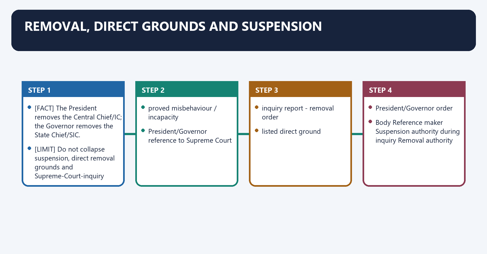
[FACT] The President removes the Central Chief/IC; the Governor removes the State Chief/SIC.

[FACT] For **proved misbehaviour or incapacity**, removal follows a Supreme Court inquiry on a reference by the President or Governor, followed by the relevant authority's order.

[FACT] Once a reference is made, the President or Governor may suspend the commissioner and, if considered necessary, prohibit attendance at office until the report is received and an order is passed.

[FACT] Direct statutory grounds permit removal without that inquiry route where the member is adjudged insolvent; convicted of an offence involving moral turpitude in the relevant authority's opinion; engages in paid outside employment; is unfit by infirmity of mind/body; or acquires a prejudicial financial/other interest.

[FACT] Interest in a government contract/agreement, beyond the ordinary incorporated-company shareholder exception, is deemed misbehaviour for the inquiry route.

[LIMIT] Do not collapse suspension, direct removal grounds and Supreme-Court-inquiry removal into one procedure.

#### Visual 35 - Removal decision tree

```text
ALLEGATION
   |
   +--> proved misbehaviour / incapacity
   |        |
   |   President/Governor reference to Supreme Court
   |        |
   |   inquiry report -> removal order
   |
   +--> listed direct ground
            |
       President/Governor order
```

#### Visual 36 - Suspension symmetry

| Body | Reference maker | Suspension authority during inquiry | Removal authority |
|---|---|---|---|
| CIC | President | President | President |
| SIC | Governor | Governor | Governor |

#### Visual 37 - Direct-ground checklist

```text
INSOLVENCY
MORAL-TURPITUDE CONVICTION
PAID OUTSIDE EMPLOYMENT
MENTAL / PHYSICAL INFIRMITY
PREJUDICIAL FINANCIAL OR OTHER INTEREST
```

#### CLOSING RECALL FLOW — REMOVAL, DIRECT GROUNDS AND SUSPENSION

```closure-flow
SUBTOPIC: Removal, direct grounds and suspension
KEY TERMS / DEFINITIONS: Removal · direct grounds · suspension · proved misbehaviour or incapacity · CIC · President
MECHANISM / ARGUMENT: Removal, direct grounds and suspension operates through Do not collapse suspension, direct removal grounds and Supreme-Court-inquiry removal into one procedure, connected with proved misbehaviour / incapacity.
CONSEQUENCE / CONTRAST: Do not collapse suspension, direct removal grounds and Supreme-Court-inquiry removal into one procedure.
UPSC TRAP / ANSWER-USE: Do not miss this limiting distinction: the decisive contrast is between listed direct ground and President/Governor order.
ANSWER-GRABBING FORMULATION: Information Commissioners receive protected removal procedures, while insolvency, specified conviction, outside employment, infirmity or prejudicial interest trigger separate direct-removal grounds.
```
### SESSION 13 — SECTION 18 INQUIRY POWERS
#### DEFINITION / WHAT THIS IS CALLED

**Plain-language definition:** Section 18 inquiry powers denotes the constitutional rules and institutional links organised around On reasonable grounds, the Commission may initiate an inquiry into a section 18 complaint.

**Technical definition:** “Civil-court powers” means a strong evidence-gathering toolkit.

#### ANSWER-GRABBING OPENING — WRITE/ADAPT IN THE EXAM

> Section 18 gives Information Commissions civil-court evidence powers during inquiry, but those powers do not convert complaint jurisdiction into appellate authority.

#### MUST-WRITE KEYWORDS

- **Section 18 inquiry powers**
- **summon/compel attendance**
- **secure testimony**
- **evidence on oath**
- **formalise fact finding**
- **discovery/inspection**

**How to use them:** Frame the answer through Section 18 inquiry powers; define summon/compel attendance, connect secure testimony with evidence on oath to explain the mechanism, and use formalise fact finding for the decisive comparison or qualification.

Section 18 inquiry powers denotes the constitutional rules and institutional links organised around [FACT] On reasonable grounds, the Commission may initiate an inquiry into a section 18 complaint.
Section 18 inquiry powers operates through summon/compel attendance secure testimony, connected with evidence on oath formalise fact finding.
The operative mechanism matters because discovery/inspection locate relevant documents.
Its principal consequence is that affidavit evidence receive sworn material.
The decisive contrast is between requisition public records overcome departmental withholding and commissions examine witnesses/documents where needed.
The exam-safe limitation is that cIVIL-COURT POWERS FOR LISTED INQUIRY MATTERS.
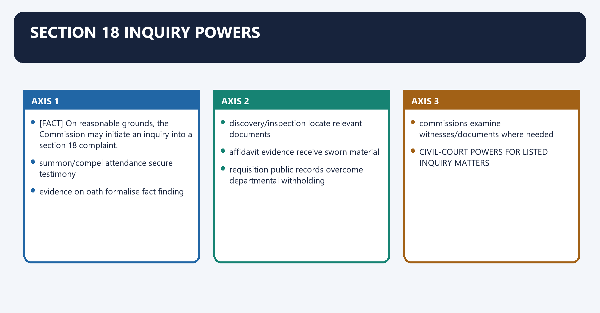
[FACT] On reasonable grounds, the Commission may initiate an inquiry into a section 18 complaint.

[FACT] While inquiring under section 18, it has civil-court powers concerning summons and attendance, oral/written evidence on oath, discovery/inspection, affidavits, requisition of public records and commissions for witnesses/documents.

[FACT] It may examine any RTI-covered record under the public authority's control, and that record cannot be withheld from the Commission on any ground.

[ANALYSIS] “Civil-court powers” means a strong evidence-gathering toolkit. It does not transform the Commission into a civil court with general jurisdiction.

[LIMIT] The Commission cannot convict, award punitive damages like a tort court, decide the merits of the underlying pension/licence/tender dispute, or strike down a law.

#### Visual 38 - Civil-court toolkit

| Power | Purpose |
|---|---|
| summon/compel attendance | secure testimony |
| evidence on oath | formalise fact finding |
| discovery/inspection | locate relevant documents |
| affidavit evidence | receive sworn material |
| requisition public records | overcome departmental withholding |
| commissions | examine witnesses/documents where needed |

#### Visual 39 - Power is not identity

```text
CIVIL-COURT POWERS FOR LISTED INQUIRY MATTERS
                         !=
CIVIL COURT WITH GENERAL JURISDICTION
```

#### CLOSING RECALL FLOW — SECTION 18 INQUIRY POWERS

```closure-flow
SUBTOPIC: Section 18 inquiry powers
KEY TERMS / DEFINITIONS: Section 18 inquiry powers · summon/compel attendance · secure testimony · evidence on oath · formalise fact finding · discovery/inspection
MECHANISM / ARGUMENT: While inquiring under section 18, it has civil-court powers concerning summons and attendance, oral/written evidence on oath, discovery/inspection, affidavits, requisition of public records and commissions for witnesses/documents.
CONSEQUENCE / CONTRAST: Its principal consequence is that affidavit evidence receive sworn material.
UPSC TRAP / ANSWER-USE: Do not miss this limiting distinction: the decisive contrast is between requisition public records overcome departmental withholding and commissions examine...
ANSWER-GRABBING FORMULATION: Section 18 gives Information Commissions civil-court evidence powers during inquiry, but those powers do not convert complaint jurisdiction into appellate authority.
```
### SESSION 14 — SECTION 19 APPELLATE POWERS AND BINDING FORCE
#### DEFINITION / WHAT THIS IS CALLED

**Plain-language definition:** Section 19 appellate powers and binding force denotes the constitutional rules and institutional links organised around In appeal, the PIO bears the onus of proving that denial was justified.

**Technical definition:** Section 19 appellate powers and binding force operates through The Commission's decision is binding under section 19(7), subject to constitutional judicial review, connected with APPOINT PIO -- SECURE COMPLIANCE -- PUBLISH INFORMATION.

#### ANSWER-GRABBING OPENING — WRITE/ADAPT IN THE EXAM

> The Commission's decision is binding under section 19(7), subject to constitutional judicial review.

#### MUST-WRITE KEYWORDS

- **Section 19 appellate powers**
- **binding force**
- **PIO decision**
- **operative within department**
- **first appeal**
- **FAA decision**

**How to use them:** Frame the answer through Section 19 appellate powers; define binding force, connect PIO decision with operative within department to explain the mechanism, and use first appeal for the decisive comparison or qualification.

Section 19 appellate powers and binding force denotes the constitutional rules and institutional links organised around [FACT] In appeal, the PIO bears the onus of proving that denial was justified.
Section 19 appellate powers and binding force operates through [FACT] The Commission's decision is binding under section 19(7), subject to constitutional judicial review, connected with APPOINT PIO -- SECURE COMPLIANCE -- PUBLISH INFORMATION.
The operative mechanism matters because rECORD REFORM -- TRAINING -- ANNUAL REPORT.
Its principal consequence is that cOMPENSATION / PENALTY / REJECTION.
The decisive contrast is between Output Immediate force Review and PIO decision operative within department first appeal.
The exam-safe limitation is that fAA decision operative second appeal.
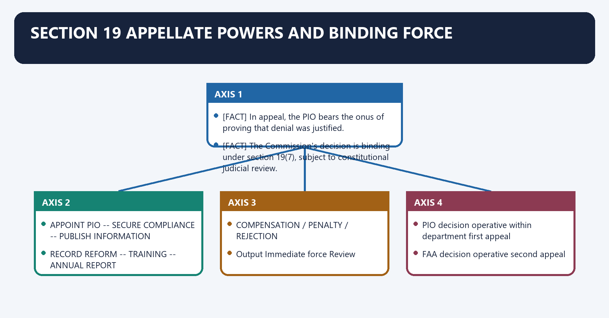
[FACT] In appeal, the PIO bears the onus of proving that denial was justified.

[FACT] The Commission's decision is binding under section 19(7), subject to constitutional judicial review.

[FACT] Section 19(8) allows the Commission to require steps necessary to secure compliance, including access in a specified form, appointment of a PIO, publication, record-management reform, training and annual-report compliance.

[FACT] It may require the public authority to compensate the complainant for loss/detriment, impose statutory penalties, or reject the application.

[ANALYSIS] The Commission's strongest systemic power is not only ordering one disclosure; it can correct the public authority's disclosure, staffing, record and training architecture.

[LIMIT] Section 23 bars ordinary suits/proceedings against RTI orders, but cannot extinguish High Court/Supreme Court constitutional review. “Final” or “binding” does not mean constitutionally unreviewable.

#### Visual 40 - Section 19(8) remedy wheel

```text
                 PROVIDE ACCESS
                       |
 APPOINT PIO -- SECURE COMPLIANCE -- PUBLISH INFORMATION
                       |
 RECORD REFORM -- TRAINING -- ANNUAL REPORT
                       |
           COMPENSATION / PENALTY / REJECTION
```

#### Visual 41 - Binding-force ladder

| Output | Immediate force | Review |
|---|---|---|
| PIO decision | operative within department | first appeal |
| FAA decision | operative | second appeal |
| CIC/SIC decision | binding under section 19(7) | constitutional judicial review |
| High Court writ judgment | binding | appeal/SC route as law permits |

#### Visual 42 - Underlying grievance boundary

```text
RTI REQUEST: "Give me the pension file and reasons recorded."
                 -> CIC/SIC can enforce information access

SERVICE CLAIM: "Sanction my pension."
                 -> competent service/grievance/court route
```

#### CLOSING RECALL FLOW — SECTION 19 APPELLATE POWERS AND BINDING FORCE

```closure-flow
SUBTOPIC: Section 19 appellate powers and binding force
KEY TERMS / DEFINITIONS: Section 19 appellate powers · binding force · PIO decision · operative within department · first appeal · FAA decision
MECHANISM / ARGUMENT: Section 19 appellate powers and binding force operates through The Commission's decision is binding under section 19(7), subject to constitutional judicial review, connected with APPOINT PIO -- SECURE COMPLIANCE -- PUBLISH INFORMATION.
CONSEQUENCE / CONTRAST: The decisive contrast is between Output Immediate force Review and PIO decision operative within department first appeal.
UPSC TRAP / ANSWER-USE: The Commission's strongest systemic power is not only ordering one disclosure; it can correct the public authority's disclosure, staffing, record and training architecture.
ANSWER-GRABBING FORMULATION: The Commission's decision is binding under section 19(7), subject to constitutional judicial review.
```
### SESSION 15 — PENALTY, COMPENSATION AND DISCIPLINARY RECOMMENDATION
#### DEFINITION / WHAT THIS IS CALLED

**Plain-language definition:** Penalty, compensation and disciplinary recommendation denotes the constitutional rules and institutional links organised around The penalty is Rs 250 per day until the application is received or information furnished, capped at Rs 25,000.

**Technical definition:** The decisive contrast is between disciplinary recommendation service authority acts under rules address persistent default section 20(2) and NO REASONABLE CAUSE.

#### ANSWER-GRABBING OPENING — WRITE/ADAPT IN THE EXAM

> The Commission should not casually fine the public authority, impose a section 20 penalty without statutory findings/hearing, or award punitive damages as though exercising general civil jurisdiction.

#### MUST-WRITE KEYWORDS

- **Penalty**
- **compensation**
- **disciplinary recommendation**
- **Rs 250 per day**
- **Rs 25,000**
- **public authority**

**How to use them:** Frame the answer through Penalty; define compensation, connect disciplinary recommendation with Rs 250 per day to explain the mechanism, and use Rs 25,000 for the decisive comparison or qualification.

Penalty, compensation and disciplinary recommendation denotes the constitutional rules and institutional links organised around [FACT] The penalty is Rs 250 per day until the application is received or information furnished, capped at Rs 25,000.
Penalty, compensation and disciplinary recommendation operates through [FACT] The PIO must receive a reasonable opportunity of hearing. The burden of proving reasonable and diligent conduct lies on the PIO, connected with Consequence Target Purpose Basis.
The operative mechanism matters because compensation public authority repair applicant's loss/detriment section 19(8)(b).
Its principal consequence is that monetary penalty PIO personally deter listed access defaults section 20(1).
The decisive contrast is between disciplinary recommendation service authority acts under rules address persistent default section 20(2) and NO REASONABLE CAUSE.
The exam-safe limitation is that oPPORTUNITY OF HEARING.
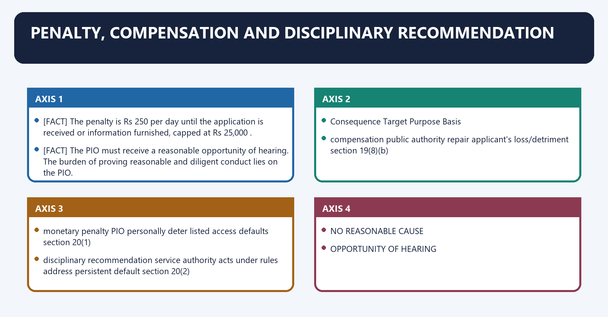
[FACT] Section 20(1) applies when, without reasonable cause, the PIO refuses an application, delays beyond section 7(1), malafidely denies, knowingly gives incorrect/incomplete/misleading information, destroys the requested information or obstructs furnishing.

[FACT] The penalty is **Rs 250 per day** until the application is received or information furnished, capped at **Rs 25,000**.

[FACT] The PIO must receive a reasonable opportunity of hearing. The burden of proving reasonable and diligent conduct lies on the PIO.

[FACT] Under section 20(2), persistent default on the listed grounds leads to a recommendation for disciplinary action under applicable service rules.

[FACT] Compensation under section 19(8)(b) is paid by the public authority to redress the complainant's loss/detriment. Penalty under section 20 is personal statutory liability of the PIO. They answer different questions.

[LIMIT] The Commission should not casually fine the public authority, impose a section 20 penalty without statutory findings/hearing, or award punitive damages as though exercising general civil jurisdiction.

#### Visual 43 - Three-consequence matrix

| Consequence | Target | Purpose | Basis |
|---|---|---|---|
| compensation | public authority | repair applicant's loss/detriment | section 19(8)(b) |
| monetary penalty | PIO personally | deter listed access defaults | section 20(1) |
| disciplinary recommendation | service authority acts under rules | address persistent default | section 20(2) |

#### Visual 44 - Penalty gate

```text
LISTED DEFAULT
      +
NO REASONABLE CAUSE
      +
OPPORTUNITY OF HEARING
      +
PIO FAILS REASONABLE-DILIGENCE BURDEN
      =
Rs 250/day, maximum Rs 25,000
```

#### Visual 45 - What section 20 does not do

| Wrong claim | Correct position |
|---|---|
| “Commission fines the ministry” | penalty is on the CPIO/SPIO |
| “Every delay automatically means penalty” | statutory opinion, reasonable-cause assessment and hearing required |
| “Compensation and penalty are identical” | recipient, purpose and legal basis differ |
| “Commission awards punitive damages” | compensation is statutory loss/detriment relief, not general tort punishment |

#### CLOSING RECALL FLOW — PENALTY, COMPENSATION AND DISCIPLINARY RECOMMENDATION

```closure-flow
SUBTOPIC: Penalty, compensation and disciplinary recommendation
KEY TERMS / DEFINITIONS: Penalty · compensation · disciplinary recommendation · Rs 250 per day · Rs 25,000 · public authority
MECHANISM / ARGUMENT: Penalty, compensation and disciplinary recommendation operates through The PIO must receive a reasonable opportunity of hearing.
CONSEQUENCE / CONTRAST: The decisive contrast is between disciplinary recommendation service authority acts under rules address persistent default section 20(2) and NO REASONABLE CAUSE.
UPSC TRAP / ANSWER-USE: The Commission should not casually fine the public authority, impose a section 20 penalty without statutory findings/hearing, or award punitive damages as though exercising general civil jurisdiction.
ANSWER-GRABBING FORMULATION: The Commission should not casually fine the public authority, impose a section 20 penalty without statutory findings/hearing, or award punitive damages as though exercising general civil jurisdiction.
```
### SESSION 16 — EXEMPTIONS: SECTIONS 8 AND 9
#### DEFINITION / WHAT THIS IS CALLED

**Plain-language definition:** Exemptions: sections 8 and 9 denotes the constitutional rules and institutional links organised around Section 9 permits rejection where access would infringe copyright subsisting in a person other than the State.

**Technical definition:** Its principal consequence is that dOES SECTION 8(2) PUBLIC INTEREST OUTWEIGH HARM?.

#### ANSWER-GRABBING OPENING — WRITE/ADAPT IN THE EXAM

> Section 8(3) creates a twenty-year disclosure rule subject to clauses (a), (c) and (i), with date disputes decided by the Central Government subject to usual appeals.

#### MUST-WRITE KEYWORDS

- **Exemptions**
- **sections 8**
- **(a), (f), (g), (h)**
- **security, relations, sources, investigation**
- **institutions**
- **(b), (c), (i)**

**How to use them:** Frame the answer through Exemptions; define sections 8, connect (a), (f), (g), (h) with security, relations, sources, investigation to explain the mechanism, and use institutions for the decisive comparison or qualification.

Exemptions: sections 8 and 9 denotes the constitutional rules and institutional links organised around [FACT] Section 9 permits rejection where access would infringe copyright subsisting in a person other than the State.
Exemptions: sections 8 and 9 operates through WHAT PROTECTED INTEREST?, connected with WHAT DISCLOSURE HARM?.
The operative mechanism matters because cAN NON-EXEMPT PART BE SEVERED?.
Its principal consequence is that dOES SECTION 8(2) PUBLIC INTEREST OUTWEIGH HARM?.
The decisive contrast is between Cluster Clauses Core concern and State/security (a), (f), (g), (h) security, relations, sources, investigation.
The exam-safe limitation is that institutions (b), (c), (i) courts, privilege, Cabinet deliberation.
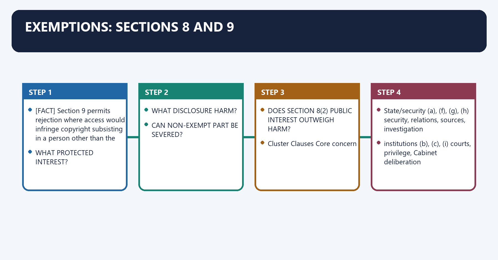
[FACT] Section 8(1) lists protected interests: security/sovereignty/foreign relations/incitement; court-forbidden or contempt material; legislative privilege; commercial confidence/trade secrets/IP; fiduciary information; foreign-government confidence; life/safety and confidential sources; investigation/prosecution; Cabinet papers; and current personal-information clause (j).

[FACT] Section 8(2) allows access notwithstanding the Official Secrets Act and section 8(1) exemptions where public interest in disclosure outweighs harm to protected interests.

[FACT] Section 8(3) creates a twenty-year disclosure rule subject to clauses (a), (c) and (i), with date disputes decided by the Central Government subject to usual appeals.

[FACT] Section 9 permits rejection where access would infringe copyright subsisting in a person other than the State.

[ANALYSIS] A proper exemption answer names the protected interest, identifies likely harm, tests severability and then applies any relevant public-interest override. It does not treat “confidential” as a magic word.

#### Visual 46 - Exemption analysis ladder

```text
WHICH CLAUSE?
     |
WHAT PROTECTED INTEREST?
     |
WHAT DISCLOSURE HARM?
     |
CAN NON-EXEMPT PART BE SEVERED?
     |
DOES SECTION 8(2) PUBLIC INTEREST OUTWEIGH HARM?
     |
REASONED DECISION
```

#### Visual 47 - Section 8 cluster map

| Cluster | Clauses | Core concern |
|---|---|---|
| State/security | (a), (f), (g), (h) | security, relations, sources, investigation |
| institutions | (b), (c), (i) | courts, privilege, Cabinet deliberation |
| economic/private interests | (d), (e), (j) | competition, fiduciary trust, personal information |

#### Visual 48 - Twenty-year rule

```text
20-YEAR-OLD INFORMATION
       |
normally disclosable
       |
except continuing protection under s.8(1)(a), (c), (i)
       |
other RTI procedures still apply
```

#### CLOSING RECALL FLOW — EXEMPTIONS: SECTIONS 8 AND 9

```closure-flow
SUBTOPIC: Exemptions: sections 8 and 9
KEY TERMS / DEFINITIONS: Exemptions · sections 8 · (a), (f), (g), (h) · security, relations, sources, investigation · institutions · (b), (c), (i)
MECHANISM / ARGUMENT: Section 8(3) creates a twenty-year disclosure rule subject to clauses (a), (c) and (i), with date disputes decided by the Central Government subject to usual appeals.
CONSEQUENCE / CONTRAST: Its principal consequence is that dOES SECTION 8(2) PUBLIC INTEREST OUTWEIGH HARM?.
UPSC TRAP / ANSWER-USE: Do not miss this limiting distinction: the decisive contrast is between Cluster Clauses Core concern and State/security (a), (f), (g)...
ANSWER-GRABBING FORMULATION: Section 8(3) creates a twenty-year disclosure rule subject to clauses (a), (c) and (i), with date disputes decided by the Central Government subject to usual appeals.
```
### SESSION 17 — SECTIONS 10 AND 11: SEVERABILITY AND THIRD-PARTY PROCEDURE
#### DEFINITION / WHAT THIS IS CALLED

**Plain-language definition:** Sections 10 and 11: severability and third-party procedure operates through Section 11 is a consultation/procedure provision, not an independent exemption and not a third-party veto, connected with +----------------------+.

**Technical definition:** Sections 10 and 11: severability and third-party procedure denotes the constitutional rules and institutional links organised around Section 10 requires access to a reasonably severable non-exempt part of a record even where another part is exempt.

#### ANSWER-GRABBING OPENING — WRITE/ADAPT IN THE EXAM

> Section 10 requires disclosure of reasonably severable material, while section 11 creates third-party consultation rather than an independent exemption or private veto.

#### MUST-WRITE KEYWORDS

- **Sections 10**
- **severability**
- **third-party procedure**
- **not an independent exemption**
- **exempt segment**
- **non-exempt segment**

**How to use them:** Frame the answer through Sections 10; define severability, connect third-party procedure with not an independent exemption to explain the mechanism, and use exempt segment for the decisive comparison or qualification.

Sections 10 and 11: severability and third-party procedure denotes the constitutional rules and institutional links organised around [FACT] Section 10 requires access to a reasonably severable non-exempt part of a record even where another part is exempt.
Sections 10 and 11: severability and third-party procedure operates through [LIMIT] Section 11 is a consultation/procedure provision, not an independent exemption and not a third-party veto, connected with +----------------------+.
The operative mechanism matters because exempt segment non-exempt segment.
Its principal consequence is that redact with reasons disclose.
The decisive contrast is between notice to third party within 5 days and representation opportunity: 10 days.
The exam-safe limitation is that pIO balances law, harm and public interest.
[FACT] Section 10 requires access to a reasonably severable non-exempt part of a record even where another part is exempt.

[FACT] Section 11 applies when the PIO intends to disclose information relating to or supplied by a third party and treated as confidential. Written notice must ordinarily be given within five days; the third party has ten days to represent; the decision is made within forty days; and appeal rights are communicated.

[FACT] Except for trade/commercial secrets protected by law, disclosure may be allowed where public interest outweighs possible harm/injury to the third party.

[LIMIT] Section 11 is a consultation/procedure provision, **not an independent exemption** and not a third-party veto.

#### Visual 49 - Severability

```text
ONE RECORD
  +----------------------+----------------------+
  | exempt segment       | non-exempt segment   |
  | redact with reasons  | disclose             |
  +----------------------+----------------------+
```

#### Visual 50 - Third-party timeline

```text
REQUEST RECEIVED
      |
notice to third party within 5 days
      |
representation opportunity: 10 days
      |
PIO balances law, harm and public interest
      |
decision within 40 days
      |
third-party appeal right
```

#### Visual 51 - Section 11 trap table

| Proposition | Correct? | Why |
|---|---:|---|
| section 11 itself exempts information | no | procedure, not exemption |
| third party must be heard where applicable | yes | statutory representation opportunity |
| third party has absolute veto | no | PIO/appellate authority decides |
| public interest may support disclosure | yes | express statutory balance in relevant cases |

#### CLOSING RECALL FLOW — SECTIONS 10 AND 11: SEVERABILITY AND THIRD-PARTY PROCEDURE

```closure-flow
SUBTOPIC: Sections 10 and 11: severability and third-party procedure
KEY TERMS / DEFINITIONS: Sections 10 · severability · third-party procedure · not an independent exemption · exempt segment · non-exempt segment
MECHANISM / ARGUMENT: Sections 10 and 11: severability and third-party procedure denotes the constitutional rules and institutional links organised around Section 10 requires access to a reasonably severable non-exempt part of a record even where another part is exempt.
CONSEQUENCE / CONTRAST: Section 11 is a consultation/procedure provision, not an independent exemption and not a third-party veto.
UPSC TRAP / ANSWER-USE: Do not miss this limiting distinction: the decisive contrast is between notice to third party within 5 days and representation...
ANSWER-GRABBING FORMULATION: Section 10 requires disclosure of reasonably severable material, while section 11 creates third-party consultation rather than an independent exemption or private veto.
```
### SESSION 18 — SECTION 24 SECURITY ORGANISATIONS AND SECTION 22 OVERRIDE
#### DEFINITION / WHAT THIS IS CALLED

**Plain-language definition:** Section 24 security organisations and section 22 override denotes the constitutional rules and institutional links organised around The appropriate government may amend the relevant schedule/list by Gazette notification, with legislative laying requirements.

**Technical definition:** Security exclusion is broad but not absolute.

#### ANSWER-GRABBING OPENING — WRITE/ADAPT IN THE EXAM

> Section 24 excludes listed Central intelligence/security organisations and information furnished by them to government, subject to the provisos for allegations of corruption and human-rights violations.

#### MUST-WRITE KEYWORDS

- **Section 24 security organisations**
- **section 22 override**
- **corruption**
- **human-rights violations**
- **Section 24 security organisations and section 22 override**
- **Section**

**How to use them:** Frame the answer through Section 24 security organisations; define section 22 override, connect corruption with human-rights violations to explain the mechanism, and use Section 24 security organisations and section 22 override for the decisive comparison or qualification.

Section 24 security organisations and section 22 override denotes the constitutional rules and institutional links organised around [FACT] The appropriate government may amend the relevant schedule/list by Gazette notification, with legislative laying requirements.
Section 24 security organisations and section 22 override operates through LISTED INTELLIGENCE / SECURITY ORGANISATION, connected with corruption human-rights allegation.
The operative mechanism matters because carve-out Commission approval + 45 days.
Its principal consequence is that oTHER LAW / OFFICIAL SECRETS ACT INCONSISTENCY.
The decisive contrast is between but RTI's own ss.8, 9, 24 still operate and [FACT] The appropriate government may amend the relevant schedule/list by Gazette notification, with legislative laying requirements.
The exam-safe limitation is that [FACT] The appropriate government may amend the relevant schedule/list by Gazette notification, with legislative laying requirements.
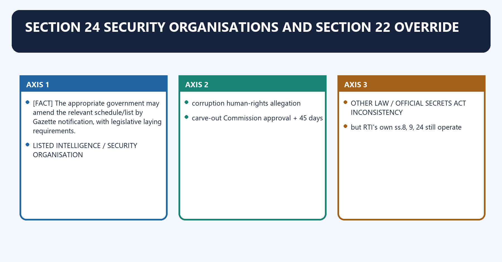
[FACT] Section 24 excludes listed Central intelligence/security organisations and information furnished by them to government, subject to the provisos for allegations of **corruption** and **human-rights violations**.

[FACT] Human-rights information in the Central route requires CIC approval and must be provided within 45 days; the State route uses SIC approval for State-notified organisations.

[FACT] The appropriate government may amend the relevant schedule/list by Gazette notification, with legislative laying requirements.

[FACT] Section 22 gives the RTI Act overriding effect over inconsistent provisions in the Official Secrets Act, 1923 and other laws/instruments.

[ANALYSIS] Security exclusion is broad but not absolute. A strong answer distinguishes the corruption carve-out from the human-rights route, which adds Commission approval and a special clock.

[LIMIT] Section 22 does not abolish section 8 or section 24. It resolves inconsistency in favour of the RTI Act's own calibrated scheme.

#### Visual 52 - Section 24 gate

```text
LISTED INTELLIGENCE / SECURITY ORGANISATION
              |
          general exclusion
              |
      +-------+--------+
      |                |
 corruption        human-rights allegation
 carve-out         Commission approval + 45 days
```

#### Visual 53 - Override hierarchy

```text
OTHER LAW / OFFICIAL SECRETS ACT INCONSISTENCY
                    |
                 SECTION 22
                    |
          RTI ACT CONTROLS
                    |
     but RTI's own ss.8, 9, 24 still operate
```

#### CLOSING RECALL FLOW — SECTION 24 SECURITY ORGANISATIONS AND SECTION 22 OVERRIDE

```closure-flow
SUBTOPIC: Section 24 security organisations and section 22 override
KEY TERMS / DEFINITIONS: Section 24 security organisations · section 22 override · corruption · human-rights violations · Section 24 security organisations and section 22 override · Section
MECHANISM / ARGUMENT: The decisive contrast is between but RTI's own ss.8, 9, 24 still operate and The appropriate government may amend the relevant schedule/list by Gazette notification, with legislative laying requirements.
CONSEQUENCE / CONTRAST: Section 22 does not abolish section 8 or section 24.
UPSC TRAP / ANSWER-USE: Security exclusion is broad but not absolute.
ANSWER-GRABBING FORMULATION: Section 24 excludes listed Central intelligence/security organisations and information furnished by them to government, subject to the provisos for allegations of corruption and human-rights violations.
```
### 19. Privacy and the DPDP amendment: current law

Privacy and the DPDP amendment: current law denotes the constitutional rules and institutional links organised around Element Pre-13 Nov 2025 clause (historical) Current clause.
Privacy and the DPDP amendment: current law operates through subject personal information personal information, connected with public-activity/interest test express removed from clause.
The operative mechanism matters because unwarranted-invasion test express removed from clause.
Its principal consequence is that clause-specific larger-public-interest exception express removed from clause.
The decisive contrast is between Parliament/State Legislature proviso express removed and general section 8(2) override existed remains.
The exam-safe limitation is that dPDP tranche Commencement RTI relevance.
[FACT] Before substitution, section 8(1)(j) protected personal information where disclosure had no relationship to public activity/interest or caused unwarranted invasion of privacy, unless larger public interest justified disclosure; it also contained the Parliament/State-Legislature proviso.

[CURRENT] DPDP Act section 44(3) substituted that clause. The current DoPT consolidated RTI Act states: **“information which relates to personal information;”**

[CURRENT] MeitY G.S.R. 843(E), dated 13 November 2025, commenced section 44(3) on the notification's publication date. The DoPT text expressly footnotes the change as effective **13 November 2025**.

[FACT] Section 8(2) remains: a public authority may allow access where public interest in disclosure outweighs harm to protected interests, notwithstanding section 8(1).

[ANALYSIS] The amendment broadens the clause-level exemption by removing the old textual tests and proviso. Yet the Act still contains a general balancing route in section 8(2). The central interpretive dispute is therefore the scope and intensity of that surviving override.

[LIMIT] Do not write either extreme: “privacy now always defeats RTI” or “nothing changed because section 8(2) exists.” The clause text materially changed, while the general override materially survives.

#### Visual 54 - Old and current clause

| Element | Pre-13 Nov 2025 clause (historical) | Current clause |
|---|---|---|
| subject | personal information | personal information |
| public-activity/interest test | express | removed from clause |
| unwarranted-invasion test | express | removed from clause |
| clause-specific larger-public-interest exception | express | removed from clause |
| Parliament/State Legislature proviso | express | removed |
| general section 8(2) override | existed | remains |

#### Visual 55 - DPDP commencement control

| DPDP tranche | Commencement | RTI relevance |
|---|---|---|
| first tranche: sections 1(2), 2, 18-26, 35, 38-43, 44(1), 44(3) | date of Gazette publication, 13 Nov 2025 | RTI section 8(1)(j) substituted |
| one-year tranche: section 6(9), section 27(1)(d) | 13 Nov 2026 | not yet in force on control date |
| eighteen-month tranche: sections 3-17, most of 27, 28-34, 36-37, 44(2) | 13 May 2027 | most substantive duties/rights later; IT Act amendment later |

#### Visual 56 - Current privacy-disclosure reasoning

```text
PERSONAL INFORMATION
        |
current s.8(1)(j) exemption engaged
        |
identify protected privacy/data harm
        |
test s.8(2): public interest vs harm
        |
sever / redact where possible
        |
reasoned decision + appeal
```

#### Visual 57 - Enacted, commenced, operational

| Status | Meaning | DPDP control |
|---|---|---|
| enacted | Parliament passed and President assented | whole Act is on statute book |
| commenced | provision legally in force by notification | section 44(3) in force since 13 Nov 2025 |
| operational | institutions, rules, people and procedures actually deliver rights/duties | cannot be inferred merely from commencement |

#### Visual 58 - Litigation-status discipline

```text
OFFICIAL CURRENT ACT = substitution in force
OFFICIAL SC ORDER PROVING STAY / REFERRAL / FINAL RESULT = not located
THEREFORE:
teach operative text
do not invent bench, stay, listing or outcome
```

### SESSION 19 — CONSTITUTIONAL PRIVACY AFTER THE TEXTUAL CHANGE
#### DEFINITION / WHAT THIS IS CALLED

**Plain-language definition:** Constitutional privacy after the textual change denotes the constitutional rules and institutional links organised around LEVEL 1: CURRENT STATUTE.

**Technical definition:** The decisive contrast is between through proportionality and legitimate interest what privacy or transparency interest is protected?.

#### ANSWER-GRABBING OPENING — WRITE/ADAPT IN THE EXAM

> Subhash Chandra Agarwal (2019) held the office of the Chief Justice of India to be a public authority and applied a structured balance among transparency, privacy and judicial independence under the then-current statutory text.

#### MUST-WRITE KEYWORDS

- **Constitutional privacy after the textual change**
- **legitimate interest**
- **rational connection**
- **necessity**
- **balancing**
- **safeguards**

**How to use them:** Frame the answer through Constitutional privacy after the textual change; define legitimate interest, connect rational connection with necessity to explain the mechanism, and use balancing for the decisive comparison or qualification.

Constitutional privacy after the textual change denotes the constitutional rules and institutional links organised around LEVEL 1: CURRENT STATUTE.
Constitutional privacy after the textual change operates through s.8(1)(j) + s.8(2) + s.10 + reasons/appeal, connected with LEVEL 2: CONSTITUTION.
The operative mechanism matters because article 19(1)(a) information interest.
Its principal consequence is that article 21 privacy interest.
The decisive contrast is between through proportionality and legitimate interest what privacy or transparency interest is protected?.
The exam-safe limitation is that rational connection does withholding/disclosure advance it?.
[FACT] *Subhash Chandra Agarwal (2019)* held the office of the Chief Justice of India to be a public authority and applied a structured balance among transparency, privacy and judicial independence under the then-current statutory text.

[FACT] The constitutional rights to information under Article 19(1)(a) and privacy under Article 21 remain relevant even after statutory amendment.

[ANALYSIS] The 2019 judgment's proportionality reasoning remains an important constitutional method, but the precise statutory pathway changed in 2025. An answer should separate enduring constitutional doctrine from superseded clause wording.

[LIMIT] Do not claim that *Subhash Chandra Agarwal (2019)* has already invalidated or neutralised the new clause; the judgment preceded the substitution.

#### Visual 59 - Two-level privacy analysis

```text
LEVEL 1: CURRENT STATUTE
s.8(1)(j) + s.8(2) + s.10 + reasons/appeal

LEVEL 2: CONSTITUTION
Article 19(1)(a) information interest
          versus
Article 21 privacy interest
          through proportionality
```

#### Visual 60 - Proportionality answer frame

| Step | Question |
|---|---|
| legitimate interest | what privacy or transparency interest is protected? |
| rational connection | does withholding/disclosure advance it? |
| necessity | is redaction/severability a less restrictive route? |
| balancing | does public accountability justify the residual privacy cost? |
| safeguards | reasons, hearing and appeal? |

#### CLOSING RECALL FLOW — CONSTITUTIONAL PRIVACY AFTER THE TEXTUAL CHANGE

```closure-flow
SUBTOPIC: Constitutional privacy after the textual change
KEY TERMS / DEFINITIONS: Constitutional privacy after the textual change · legitimate interest · rational connection · necessity · balancing · safeguards
MECHANISM / ARGUMENT: The decisive contrast is between through proportionality and legitimate interest what privacy or transparency interest is protected?.
CONSEQUENCE / CONTRAST: The 2019 judgment's proportionality reasoning remains an important constitutional method, but the precise statutory pathway changed in 2025.
UPSC TRAP / ANSWER-USE: Do not miss this limiting distinction: its principal consequence is that article 21 privacy interest.
ANSWER-GRABBING FORMULATION: Subhash Chandra Agarwal (2019) held the office of the Chief Justice of India to be a public authority and applied a structured balance among transparency, privacy and judicial independence under the then-current statutory text.
```
### SESSION 20 — CASE LAW: EXACT PROPOSITION AND CAUTION
#### DEFINITION / WHAT THIS IS CALLED

**Plain-language definition:** Case law: exact proposition and caution denotes the constitutional rules and institutional links organised around 1 State of U.P. v.

**Technical definition:** Case law: exact proposition and caution operates through Use it as the foundational “right to know” authority under Article 19(1)(a), connected with It predates the RTI Act and does not supply the Act's detailed request/appeal rules.

#### ANSWER-GRABBING OPENING — WRITE/ADAPT IN THE EXAM

> The Court described open government as flowing from the right to know implicit in Article 19(1)(a) and treated disclosure as a democratic norm, subject to justified confidentiality.

#### MUST-WRITE KEYWORDS

- **Case law**
- **exact proposition**
- **caution**
- **constitutional opening**
- **S.P. Gupta v. Union of India (1981)**
- **open government/disclosure norm**

**How to use them:** Frame the answer through Case law; define exact proposition, connect caution with constitutional opening to explain the mechanism, and use S.P. Gupta v. Union of India (1981) for the decisive comparison or qualification.

Case law: exact proposition and caution denotes the constitutional rules and institutional links organised around 1 State of U.P. v. Raj Narain (1975).
Case law: exact proposition and caution operates through [ANALYSIS] Use it as the foundational “right to know” authority under Article 19(1)(a), connected with [LIMIT] It predates the RTI Act and does not supply the Act's detailed request/appeal rules.
The operative mechanism matters because 2 S.P. Gupta v. Union of India (1981).
Its principal consequence is that [ANALYSIS] It strengthens the presumption-of-openness thesis.
The decisive contrast is between [LIMIT] Do not turn the presumption into an absolute disclosure rule and 3 CBSE v. Aditya Bandopadhyay (2011).
The exam-safe limitation is that [FACT] Evaluated answer books are “information” accessible under the Act, subject to lawful exemptions and procedure.
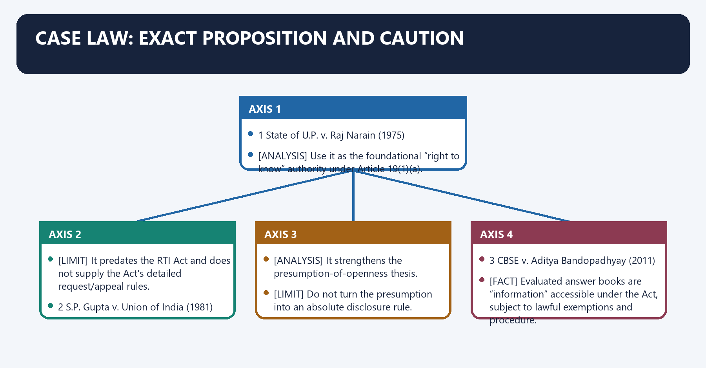
#### 21.1 *State of U.P. v. Raj Narain (1975)* (1975)

[FACT] The Supreme Court linked democratic government with the people's right to know the acts of public officials, subject to legitimate secrecy claims.

[ANALYSIS] Use it as the foundational “right to know” authority under Article 19(1)(a).

[LIMIT] It predates the RTI Act and does not supply the Act's detailed request/appeal rules.

#### 21.2 *S.P. Gupta v. Union of India (1981)* (1981)

[FACT] The Court described open government as flowing from the right to know implicit in Article 19(1)(a) and treated disclosure as a democratic norm, subject to justified confidentiality.

[ANALYSIS] It strengthens the presumption-of-openness thesis.

[LIMIT] Do not turn the presumption into an absolute disclosure rule.

#### 21.3 *CBSE v. Aditya Bandopadhyay (2011)* (2011)

[FACT] Evaluated answer books are “information” accessible under the Act, subject to lawful exemptions and procedure.

[FACT] A public authority need not create information, generate advice/opinion, draw inferences or collect/collate material not held in its records merely to answer an RTI query.

[ANALYSIS] This case controls the line between records access and interrogatory explanation.

#### 21.4 *Chief Information Commissioner v. State of Manipur (2011)* (2011)

[FACT] Section 18 complaint power and section 19 appellate power have distinct fields. The disclosure remedy is pursued through the appeal route; complaint is not an automatic substitute.

[ANALYSIS] Use it whenever a question asks complaint versus second appeal.

#### 21.5 *RBI v. Jayantilal N. Mistry (2015)* (2015)

[FACT] The RBI could not treat its regulatory relationship with banks as a generic fiduciary basis to withhold inspection-related information; the regulator acts in public interest and must justify any statutory exemption.

[ANALYSIS] It is the leading regulator-transparency authority and shows that “fiduciary” depends on the legal relationship, not a label.

[LIMIT] It does not mean every banking record is automatically public; section 8 interests remain case-specific.

#### 21.6 *Subhash Chandra Agarwal (2019)* (2019)

[FACT] The CJI's office is a public authority under RTI. Disclosure remains subject to privacy, confidentiality, judicial independence and proportionality.

[LIMIT] Its section 8(1)(j) discussion addressed the pre-2025 clause. Use the constitutional method, not the superseded wording, for current answers.

#### 21.7 *Anjali Bhardwaj v. Union of India (2019)* (2019)

[FACT] The Supreme Court addressed prolonged vacancies and directed timely, transparent appointment processes, including public-domain disclosure of relevant selection particulars and initiation sufficiently in advance of vacancies.

[ANALYSIS] The case proves that formal statutory powers are ineffective when the adjudicatory seats remain unfilled.

[LIMIT] Current vacancy numbers must be reverified; cite the structural direction, not stale totals.

#### Visual 61 - Seven-case matrix

| Case | Core proposition | Current use |
|---|---|---|
| *State of U.P. v. Raj Narain (1975)* | people have a right to know public acts | constitutional opening |
| *S.P. Gupta v. Union of India (1981)* | open government/disclosure norm | transparency thesis |
| *CBSE* | existing records; no creation duty | information-scope trap |
| *Chief Information Commissioner v. State of Manipur (2011)* | complaint ≠ disclosure appeal | remedy routing |
| *Jayantilal Mistry* | no generic regulator fiduciary shield | section 8(e) analysis |
| *Subhash Chandra Agarwal (2019)* | CJI office public authority; proportionality | judiciary/privacy balance |
| *Anjali Bhardwaj v. Union of India (2019)* | timely transparent appointments | independence/implementation |

#### Visual 62 - Case-selection shortcut

```text
RIGHT TO KNOW?              -> STATE OF U.P. V. RAJ NARAIN (1975) / S.P. GUPTA V. UNION OF INDIA
  -> (1981)
WHAT COUNTS AS INFORMATION? -> CBSE
COMPLAINT OR APPEAL?        -> CHIEF INFORMATION COMMISSIONER V. STATE OF MANIPUR (2011)
REGULATORY SECRECY?         -> JAYANTILAL MISTRY
JUDICIARY + PRIVACY?        -> SUBHASH CHANDRA AGARWAL (2019)
VACANCIES/APPOINTMENTS?     -> ANJALI BHARDWAJ V. UNION OF INDIA (2019)
```

#### CLOSING RECALL FLOW — CASE LAW: EXACT PROPOSITION AND CAUTION

```closure-flow
SUBTOPIC: Case law: exact proposition and caution
KEY TERMS / DEFINITIONS: Case law · exact proposition · caution · constitutional opening · S.P. Gupta v. Union of India (1981) · open government/disclosure norm
MECHANISM / ARGUMENT: Case law: exact proposition and caution operates through Use it as the foundational “right to know” authority under Article 19(1)(a), connected with It predates the RTI Act and does not supply the Act's detailed request/appeal rules.
CONSEQUENCE / CONTRAST: Its principal consequence is that It strengthens the presumption-of-openness thesis.
UPSC TRAP / ANSWER-USE: The decisive contrast is between Do not turn the presumption into an absolute disclosure rule and 3 CBSE v.
ANSWER-GRABBING FORMULATION: The Court described open government as flowing from the right to know implicit in Article 19(1)(a) and treated disclosure as a democratic norm, subject to justified confidentiality.
```
### SESSION 21 — INDEPENDENCE AND ACCOUNTABILITY: THE REAL INSTITUTIONAL TEST
#### DEFINITION / WHAT THIS IS CALLED

**Plain-language definition:** Independence and accountability: the real institutional test denotes the constitutional rules and institutional links organised around Four structural concerns remain.

**Technical definition:** The decisive contrast is between Design head Safeguard Gap/risk and appointment opposition member + statutory committee executive majority.

#### ANSWER-GRABBING OPENING — WRITE/ADAPT IN THE EXAM

> Information Commissions combine protected removal, appellate authority and reporting with executive-heavy appointments, rule control and resource dependence, making practical autonomy an institutional test.

#### MUST-WRITE KEYWORDS

- **Independence**
- **accountability**
- **the real institutional test**
- **appointment**
- **opposition member + statutory committee**
- **executive majority**

**How to use them:** Frame the answer through Independence; define accountability, connect the real institutional test with appointment to explain the mechanism, and use opposition member + statutory committee for the decisive comparison or qualification.

Independence and accountability: the real institutional test denotes the constitutional rules and institutional links organised around [ANALYSIS] Four structural concerns remain.
Independence and accountability: the real institutional test operates through executive-heavy appointment committees, connected with Central rule control over tenure/pay, including State Commissioners.
The operative mechanism matters because dependence on government-provided staff, offices and budget; and.
Its principal consequence is that delayed appointments, backlog, non-compliance and weak use of penalty powers.
The decisive contrast is between Design head Safeguard Gap/risk and appointment opposition member + statutory committee executive majority.
The exam-safe limitation is that tenure fixed three-year rule + age ceiling rule-made and relatively short.
[FACT] The Act contains several independence supports: committee-based appointment with opposition participation, statutory eligibility/disqualifications, autonomous-function language, age ceiling/non-reappointment, protected removal and binding appellate powers.

[ANALYSIS] Four structural concerns remain:

1. executive-heavy appointment committees;
2. Central rule control over tenure/pay, including State Commissioners;
3. dependence on government-provided staff, offices and budget; and
4. delayed appointments, backlog, non-compliance and weak use of penalty powers.

[FACT] Section 25 requires annual implementation reports covering requests, denials, appeals, disciplinary action, charges, implementation efforts and reform recommendations. The appropriate government lays the report before the relevant legislature through the statutory route.

[ANALYSIS] Information Commissions need dual accountability: independence from the government whose secrecy they review, and transparency about their own listing, reasoning, pendency, penalty and compliance practices.

[LIMIT] “Independent” does not mean unaccountable. Reasoned decisions, conflict rules, publication, judicial review and legislative reporting are compatible with autonomy.

#### Visual 63 - Independence safeguard-gap matrix

| Design head | Safeguard | Gap/risk |
|---|---|---|
| appointment | opposition member + statutory committee | executive majority |
| tenure | fixed three-year rule + age ceiling | rule-made and relatively short |
| removal | SC inquiry for proved misconduct/incapacity | does not solve vacancy delay |
| finance/staff | statutory duty to provide staff | dependence on executive provision |
| powers | binding appeal, penalty, compensation | compliance/penalty use may be weak |
| accountability | annual reports, reasons, judicial review | delayed reporting or inconsistent data |

#### Visual 64 - Capacity-to-right chain

```text
VACANCY / STAFF SHORTAGE
        |
FEWER HEARINGS
        |
LONGER SECOND-APPEAL WAIT
        |
DELAYED INFORMATION
        |
TIME-SENSITIVE ACCOUNTABILITY LOST
```

#### Visual 65 - Commission accountability dashboard

| Publish without freezing here | Why it matters |
|---|---|
| sanctioned versus working strength | capacity |
| age-wise pendency | delay severity |
| disposal with reason categories | adjudication quality |
| penalty show-cause and final orders | deterrence |
| compliance/action-taken status | real enforcement |
| section 4 audit | prevention |

#### CLOSING RECALL FLOW — INDEPENDENCE AND ACCOUNTABILITY: THE REAL INSTITUTIONAL TEST

```closure-flow
SUBTOPIC: Independence and accountability: the real institutional test
KEY TERMS / DEFINITIONS: Independence · accountability · the real institutional test · appointment · opposition member + statutory committee · executive majority
MECHANISM / ARGUMENT: The decisive contrast is between Design head Safeguard Gap/risk and appointment opposition member + statutory committee executive majority.
CONSEQUENCE / CONTRAST: Its principal consequence is that delayed appointments, backlog, non-compliance and weak use of penalty powers.
UPSC TRAP / ANSWER-USE: Do not miss this limiting distinction: central rule control over tenure/pay, including State Commissioners.
ANSWER-GRABBING FORMULATION: Information Commissions combine protected removal, appellate authority and reporting with executive-heavy appointments, rule control and resource dependence, making practical autonomy an institutional test.
```
### SESSION 22 — INSTITUTIONAL COMPARISONS
#### DEFINITION / WHAT THIS IS CALLED

**Plain-language definition:** Institutional comparisons denotes the constitutional rules and institutional links organised around Dimension CIC/SIC NHRC/SHRC.

**Technical definition:** Technically, Institutional comparisons is analysed by relating statute to RTI Act, 2005, then testing the relationship through PHRA, 1993 and main issue.

#### ANSWER-GRABBING OPENING — WRITE/ADAPT IN THE EXAM

> Information Commissions issue binding RTI appellate decisions and personal PIO penalties, unlike Human Rights Commissions whose ordinary outputs are principally recommendations and reports.

#### MUST-WRITE KEYWORDS

- **Institutional comparisons**
- **statute**
- **RTI Act, 2005**
- **PHRA, 1993**
- **main issue**
- **information access**

**How to use them:** Frame the answer through Institutional comparisons; define statute, connect RTI Act, 2005 with PHRA, 1993 to explain the mechanism, and use main issue for the decisive comparison or qualification.

Institutional comparisons denotes the constitutional rules and institutional links organised around Dimension CIC/SIC NHRC/SHRC.
Institutional comparisons operates through statute RTI Act, 2005 PHRA, 1993, connected with main issue information access human-rights violation/promotion.
The operative mechanism matters because civil-court powers section 18 inquiry PHRA inquiry.
Its principal consequence is that ordinary output binding appellate decision; penalty/compensation recommendations/reports generally.
The decisive contrast is between personal monetary penalty section 20 on PIO no parallel general PHRA penalty and removal of State chief/member Governor President.
The exam-safe limitation is that head CIC/SIC Court.
#### Visual 66 - CIC/SIC versus NHRC/SHRC

| Dimension | CIC/SIC | NHRC/SHRC |
|---|---|---|
| statute | RTI Act, 2005 | PHRA, 1993 |
| main issue | information access | human-rights violation/promotion |
| civil-court powers | section 18 inquiry | PHRA inquiry |
| ordinary output | binding appellate decision; penalty/compensation | recommendations/reports generally |
| personal monetary penalty | section 20 on PIO | no parallel general PHRA penalty |
| removal of State chief/member | Governor | President |

#### Visual 67 - CIC/SIC versus courts

| Head | CIC/SIC | Court |
|---|---|---|
| source | statute | Constitution/statute |
| jurisdiction | RTI access/remedies | general/special judicial jurisdiction |
| procedure | specialised, relatively flexible | judicial procedure |
| order | binding under RTI, reviewable | binding judgment, appellate hierarchy |
| cannot do | strike law, convict, decide underlying service right | may exercise judicial remedies within jurisdiction |

#### Visual 68 - CIC/SIC versus Lokpal

| Problem | Correct body |
|---|---|
| “Give corruption-investigation file subject to RTI” | PIO -> RTI appeals, exemptions tested |
| “Investigate corruption by covered public servant” | Lokpal/vigilance/investigative route |
| “Award service benefit” | department/grievance/court route |
| “Penalise PIO for malafide RTI denial” | CIC/SIC section 20 |

#### Visual 69 - CIC/SIC versus data-protection institutions

| Dimension | CIC/SIC | Data Protection Board framework |
|---|---|---|
| parent law | RTI Act, 2005 | DPDP Act, 2023 |
| protected interest | access to public-authority information | compliance with personal-data processing law |
| main claimant | citizen seeking records | Data Principal/affected party under the Act, subject to phased commencement and operational status |
| current-law caution | section 8(1)(j) substituted | phased commencement; do not assume all rights/duties operational |
| relationship | RTI privacy exemption and public-interest override | distinct adjudicatory/data-governance mandate |

#### CLOSING RECALL FLOW — INSTITUTIONAL COMPARISONS

```closure-flow
SUBTOPIC: Institutional comparisons
KEY TERMS / DEFINITIONS: Institutional comparisons · statute · RTI Act, 2005 · PHRA, 1993 · main issue · information access
MECHANISM / ARGUMENT: Its principal consequence is that ordinary output binding appellate decision; penalty/compensation recommendations/reports generally.
CONSEQUENCE / CONTRAST: The decisive contrast is between personal monetary penalty section 20 on PIO no parallel general PHRA penalty and removal of State chief/member Governor President.
UPSC TRAP / ANSWER-USE: Do not miss this limiting distinction: the exam-safe limitation is that head CIC/SIC Court.
ANSWER-GRABBING FORMULATION: Information Commissions issue binding RTI appellate decisions and personal PIO penalties, unlike Human Rights Commissions whose ordinary outputs are principally recommendations and reports.
```
### SESSION 23 — WHY RTI SUCCEEDS AND FAILS
#### DEFINITION / WHAT THIS IS CALLED

**Plain-language definition:** Why RTI succeeds and fails denotes the constitutional rules and institutional links organised around Success condition Failure mode.

**Technical definition:** RTI succeeds where records exist, section 4 disclosure is usable, PIOs are trained, first appeals are independent, Commissions are staffed, penalties are credible and orders are complied with.

#### ANSWER-GRABBING OPENING — WRITE/ADAPT IN THE EXAM

> RTI implementation fails when records, routing, exemption analysis, first appeals, staffing and penalty practice do not support the statutory access right.

#### MUST-WRITE KEYWORDS

- **Why RTI succeeds**
- **fails**
- **indexed, digitised records**
- **“information not available” due to poor records**
- **section 4 disclosure**
- **repetitive request burden**

**How to use them:** Frame the answer through Why RTI succeeds; define fails, connect indexed, digitised records with “information not available” due to poor records to explain the mechanism, and use section 4 disclosure for the decisive comparison or qualification.

Why RTI succeeds and fails denotes the constitutional rules and institutional links organised around Success condition Failure mode.
Why RTI succeeds and fails operates through indexed, digitised records “information not available” due to poor records, connected with section 4 disclosure repetitive request burden.
The operative mechanism matters because trained PIO mechanical exemption.
Its principal consequence is that independent first appeal departmental rubber stamp.
The decisive contrast is between staffed Commission backlog and reasoned penalty use low deterrence.
The exam-safe limitation is that compliance monitoring paper victory.
[ANALYSIS] RTI succeeds where records exist, section 4 disclosure is usable, PIOs are trained, first appeals are independent, Commissions are staffed, penalties are credible and orders are complied with.

[ANALYSIS] It fails where record systems are weak, requests are misrouted, exemptions are asserted without harm analysis, first appeals rubber-stamp, vacancies delay hearings, penalties are avoided, or the underlying grievance is incorrectly pushed into RTI.

[LIMIT] RTI can expose a wrong but does not automatically remedy every wrong. Transparency must connect to audit, grievance, vigilance, legislative and judicial routes.

#### Visual 70 - Success/failure pairs

| Success condition | Failure mode |
|---|---|
| indexed, digitised records | “information not available” due to poor records |
| section 4 disclosure | repetitive request burden |
| trained PIO | mechanical exemption |
| independent first appeal | departmental rubber stamp |
| staffed Commission | backlog |
| reasoned penalty use | low deterrence |
| compliance monitoring | paper victory |

#### CLOSING RECALL FLOW — WHY RTI SUCCEEDS AND FAILS

```closure-flow
SUBTOPIC: Why RTI succeeds and fails
KEY TERMS / DEFINITIONS: Why RTI succeeds · fails · indexed, digitised records · “information not available” due to poor records · section 4 disclosure · repetitive request burden
MECHANISM / ARGUMENT: RTI succeeds where records exist, section 4 disclosure is usable, PIOs are trained, first appeals are independent, Commissions are staffed, penalties are credible and orders are complied with.
CONSEQUENCE / CONTRAST: Its principal consequence is that independent first appeal departmental rubber stamp.
UPSC TRAP / ANSWER-USE: Do not miss this limiting distinction: the decisive contrast is between staffed Commission backlog and reasoned penalty use low deterrence.
ANSWER-GRABBING FORMULATION: RTI implementation fails when records, routing, exemption analysis, first appeals, staffing and penalty practice do not support the statutory access right.
```
### 25. Reform agenda - proposals, not current law

Reform agenda - proposals, not current law denotes the constitutional rules and institutional links organised around [ANALYSIS] The following are reform proposals.
Reform agenda - proposals, not current law operates through place a fixed minimum tenure and core service safeguards back in the Act, connected with publish vacancies early, eligibility criteria, applicant lists, shortlists and reasons, subject to legitimate privacy.
The operative mechanism matters because create an independent secretariat/cadre and predictable budget for CIC/SICs.
Its principal consequence is that publish age-wise pendency, penalty show-cause, final penalty and compliance dashboards.
The decisive contrast is between strengthen first appellate authorities and mandatory section 4 audits and use severability/redaction before blanket privacy denial.
The exam-safe limitation is that issue reasoned guidance on the interaction between current section 8(1)(j) and section 8(2).
[ANALYSIS] The following are reform proposals:

1. place a fixed minimum tenure and core service safeguards back in the Act;
2. publish vacancies early, eligibility criteria, applicant lists, shortlists and reasons, subject to legitimate privacy;
3. create an independent secretariat/cadre and predictable budget for CIC/SICs;
4. publish age-wise pendency, penalty show-cause, final penalty and compliance dashboards;
5. strengthen first appellate authorities and mandatory section 4 audits;
6. use severability/redaction before blanket privacy denial;
7. issue reasoned guidance on the interaction between current section 8(1)(j) and section 8(2);
8. create time-bound order-compliance reporting without converting Commissions into general grievance courts; and
9. modernise records through interoperable, searchable retention systems with privacy safeguards.

[LIMIT] Restoring the old Election Commission parity, changing committee composition or amending section 8(1)(j) requires legislative/policy action; present each as a proposal, not present law.

#### Visual 71 - Reform-to-defect map

| Defect | Targeted reform |
|---|---|
| executive-rule dependence | statutory core tenure/service safeguards |
| opaque selection | advance public process + reasoned criteria |
| backlog | staffing, benches, triage and age-wise dashboard |
| weak deterrence | consistent reasoned section 20 process |
| blanket privacy denial | section 8(2) analysis + section 10 redaction |
| repetitive requests | section 4 disclosure audit |
| non-compliance | action-taken tracking and escalation |

### SESSION 24 — ANSWER-WRITING FRAMEWORKS
#### DEFINITION / WHAT THIS IS CALLED

**Plain-language definition:** Answer-writing frameworks denotes the constitutional rules and institutional links organised around DEFINE CIC/SIC + statutory role.

**Technical definition:** Technically, Answer-writing frameworks is analysed by relating writing frameworks to right-to-know + statutory architecture, then testing the relationship through section 4 and request timelines and appeal/complaint/powers/penalty.

#### ANSWER-GRABBING OPENING — WRITE/ADAPT IN THE EXAM

> Therefore, the amendment does not make the Commissions legally subordinate in decision-making, but it shifts a structural guarantee from Parliament's Act to executive rules.

#### MUST-WRITE KEYWORDS

- **writing frameworks**
- **right-to-know + statutory architecture**
- **section 4 and request timelines**
- **appeal/complaint/powers/penalty**
- **vacancies, records, non-compliance, privacy change**
- **reforms and graded conclusion**

**How to use them:** Frame the answer through writing frameworks; define right-to-know + statutory architecture, connect section 4 and request timelines with appeal/complaint/powers/penalty to explain the mechanism, and use vacancies, records, non-compliance, privacy change for the decisive comparison or qualification.

Answer-writing frameworks denotes the constitutional rules and institutional links organised around DEFINE CIC/SIC + statutory role.
Answer-writing frameworks operates through 2019 CHANGE: Act - Central rules, connected with AUTONOMY EFFECT: tenure/pay dependence.
The operative mechanism matters because cOUNTER: appointment/removal/powers survive.
Its principal consequence is that nAMED EVIDENCE: 2019 Rules + Anjali Bhardwaj v. Union of India (2019).
The decisive contrast is between GRADED VERDICT + targeted reform and 1 right-to-know + statutory architecture.
The exam-safe limitation is that 2 section 4 and request timelines.
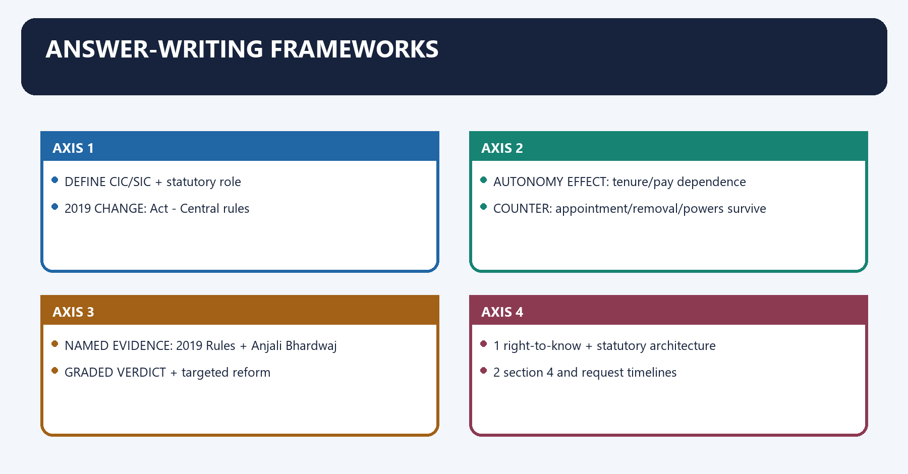
#### Visual 72 - 10-marker autonomy spine

```text
DEFINE CIC/SIC + statutory role
        |
2019 CHANGE: Act -> Central rules
        |
AUTONOMY EFFECT: tenure/pay dependence
        |
COUNTER: appointment/removal/powers survive
        |
NAMED EVIDENCE: 2019 Rules + Anjali Bhardwaj v. Union of India (2019)
        |
GRADED VERDICT + targeted reform
```

#### Visual 73 - 15-marker effectiveness spine

| Paragraph | Content |
|---|---|
| 1 | right-to-know + statutory architecture |
| 2 | section 4 and request timelines |
| 3 | appeal/complaint/powers/penalty |
| 4 | vacancies, records, non-compliance, privacy change |
| 5 | reforms and graded conclusion |

#### Visual 74 - 20-marker privacy-transparency spine

```text
constitutional rights on both sides
        |
historical old clause -> current substituted clause
        |
section 8(2) survives + section 10 redaction
        |
Subhash Chandra Agarwal (2019) proportionality method
        |
institutional design + current-law uncertainty
        |
balanced, non-final constitutional verdict
```

#### Visual 75 - High-yield traps

| Trap | Correct line |
|---|---|
| CIC/SIC are constitutional tribunals | statutory quasi-judicial bodies |
| section 11 is an exemption | consultation procedure |
| section 18 complaint always orders disclosure | disclosure route is section 19 appeal |
| Commission fines ministry under section 20 | personal PIO penalty |
| State Chief IC salary equals Chief Secretary by current law | fixed Rs 2,25,000 under 2019 Rules |
| all commissioners cannot ever hold another commission office | IC may become Chief, aggregate max five years |
| DPDP section 44(3) uncommenced | commenced 13 Nov 2025 |
| DPDP deleted all public-interest balancing | section 8(2) remains |
| binding order means no judicial review | constitutional review survives |
| RTI gives the underlying service | it gives existing information and RTI remedies |

#### CLOSING RECALL FLOW — ANSWER-WRITING FRAMEWORKS

```closure-flow
SUBTOPIC: Answer-writing frameworks
KEY TERMS / DEFINITIONS: writing frameworks · right-to-know + statutory architecture · section 4 and request timelines · appeal/complaint/powers/penalty · vacancies, records, non-compliance, privacy change · reforms and graded conclusion
MECHANISM / ARGUMENT: The decisive contrast is between GRADED VERDICT + targeted reform and 1 right-to-know + statutory architecture.
CONSEQUENCE / CONTRAST: Its principal consequence is that nAMED EVIDENCE: 2019 Rules + Anjali Bhardwaj v.
UPSC TRAP / ANSWER-USE: Do not miss this limiting distinction: the exam-safe limitation is that 2 section 4 and request timelines.
ANSWER-GRABBING FORMULATION: Therefore, the amendment does not make the Commissions legally subordinate in decision-making, but it shifts a structural guarantee from Parliament's Act to executive rules.
```
## BASIC MCQS / REMEDIATION

### Original hard MCQs - 36 questions

#### OM1. The most accurate description of the CIC is:

A. A tribunal created under Article 323B
B. An executive grievance portal
C. A constitutional court for transparency disputes
D. A statutory quasi-judicial RTI appellate and complaint body

**Answer: D.**

**Explanation:** [FACT] The RTI Act creates the CIC. It has complaint, appellate, compliance, compensation and penalty powers, but it is not a constitutional court or general tribunal.

#### OM2. The constitutional foundation of the right to know is most directly linked to:

A. Article 300A
B. Article 14 alone
C. Article 20(3)
D. Article 19(1)(a)

**Answer: D.**

**Explanation:** [FACT] *State of U.P. v. Raj Narain (1975)* and *S.P. Gupta v. Union of India (1981)* link the right to know/open government with freedom of speech and expression.

#### OM3. Which is included in the statutory “right to information”?

A. Ordering the grant of a service entitlement
B. Taking certified samples of material
C. Compelling a department to create a new expert report
D. Requiring a minister to answer a hypothetical question

**Answer: B.**

**Explanation:** [FACT] Section 2(j) includes inspection, certified copies, certified samples and electronic access. [LIMIT] RTI does not create information or award the underlying entitlement.

#### OM4. A non-government organisation enters section 2(h) when it is:

A. registered under any law
B. receiving one minor government grant
C. substantially financed directly or indirectly by government funds
D. performing any socially useful work

**Answer: C.**

**Explanation:** [FACT] Substantial finance is the statutory test; every registration or small grant is insufficient.

#### OM5. The central purpose of section 4(2) is to:

A. authorise the Commission to legislate disclosure rules
B. replace the PIO system with social audit
C. exempt all Cabinet material permanently
D. maximise suo motu disclosure so citizens need minimum resort to requests

**Answer: D.**

**Explanation:** [FACT] Section 4(2) is the prevention layer of the RTI regime.

#### OM6. When an application is filed through an APIO, the Act:

A. converts it into a first appeal
B. adds five days in computing the response period
C. shortens the period by five days
D. removes the fee automatically

**Answer: B.**

**Explanation:** [FACT] The proviso to section 5(2) adds five days.

#### OM7. Transfer under section 6(3) must occur:

A. only after CIC approval
B. as soon as practicable and not later than five days
C. within 30 days
D. within 48 hours in all cases

**Answer: B.**

**Explanation:** [FACT] The applicant must also be informed immediately about the transfer.

#### OM8. If a public authority misses the statutory response time:

A. only a section 18 complaint is possible
B. the applicant must pay a higher copying fee
C. the failure is deemed refusal and later information is free of charge
D. the application lapses

**Answer: C.**

**Explanation:** [FACT] Sections 7(2) and 7(6) create these consequences.

#### OM9. Information concerning life or liberty must ordinarily be provided within:

A. ten days
B. 48 hours
C. five days
D. thirty days

**Answer: B.**

**Explanation:** [FACT] This is the section 7(1) proviso.

#### OM10. The first appeal ordinarily lies to:

A. the Lokpal
B. the CIC/SIC directly
C. the High Court
D. an officer senior in rank to the PIO in the public authority

**Answer: D.**

**Explanation:** [FACT] The Commission hears the second appeal.

#### OM11. In a second appeal, the onus to justify denial lies on:

A. the third party in every case
B. the Commission registry
C. the applicant
D. the PIO who denied the request

**Answer: D.**

**Explanation:** [FACT] Section 19(5) reverses the ordinary informational disadvantage.

#### OM12. *Chief Information Commissioner v. State of Manipur (2011)* is authority for the proposition that:

A. first appeals are optional in every case
B. section 18 was repealed
C. section 18 complaint is not an automatic substitute for the section 19 disclosure appeal
D. complaints can never trigger penalty

**Answer: C.**

**Explanation:** [FACT] The statutory routes have distinct remedial fields.

#### OM13. The CIC consists of:

A. the Chief plus exactly ten members
B. the Chief plus not more than ten Central Information Commissioners
C. a Chief and unlimited commissioners
D. eleven members apart from the Chief

**Answer: B.**

**Explanation:** [FACT] The Act sets a ceiling, not a required filled strength.

#### OM14. Which is part of the CIC selection committee?

A. Speaker of the Lok Sabha
B. Union Cabinet Minister nominated by the Prime Minister
C. Cabinet Secretary
D. Chief Justice of India

**Answer: B.**

**Explanation:** [FACT] The committee is PM, Lok Sabha LoP/deemed leader, and nominated Union Cabinet Minister.

#### OM15. If no Lok Sabha Leader of Opposition is formally recognised:

A. the leader of the single largest opposition group is deemed LoP for this purpose
B. the committee becomes two-member
C. the President nominates any opposition MP
D. the Chief Justice joins

**Answer: A.**

**Explanation:** [FACT] This is the statutory explanation to section 12(3).

#### OM16. A State Information Commissioner is appointed by:

A. the President on the Prime Minister's advice
B. the Chief Minister directly
C. the Governor on the statutory committee's recommendation
D. the State Legislature

**Answer: C.**

**Explanation:** [FACT] The committee is CM, Assembly LoP/deemed leader and nominated State Cabinet Minister.

#### OM17. Which is an eligible field of knowledge/experience for an Information Commissioner?

A. Only judicial service
B. Journalism and mass media
C. Only information technology
D. Only civil service

**Answer: B.**

**Explanation:** [FACT] The Act lists multiple fields and does not require a judicial monopoly.

#### OM18. Which disqualification is correctly stated?

A. A former civil servant can never be appointed.
B. Legal experience is prohibited.
C. Every appointee must have held constitutional office.
D. A serving commissioner cannot be connected with a political party.

**Answer: D.**

**Explanation:** [FACT] Party connection, legislative membership, office of profit, business and profession are barred.

#### OM19. Under the 2019 Rules, the ordinary term is:

A. six years
B. five years for Central and three for State
C. three years from entry into office
D. pleasure tenure

**Answer: C.**

**Explanation:** [FACT] The age-65 statutory ceiling continues.

#### OM20. Which reappointment statement is correct?

A. Every IC may receive unlimited three-year renewals.
B. A Chief may be reappointed once.
C. An IC is not reappointable as IC but may be appointed Chief, subject to an aggregate five-year ceiling.
D. An IC can automatically become Chief without selection.

**Answer: C.**

**Explanation:** [FACT] Appointment as Chief still follows the statutory committee route.

#### OM21. The current fixed monthly pay of the Central Chief Information Commissioner under the 2019 Rules is:

A. Rs 2,50,000
B. Rs 2,25,000
C. Rs 2,00,000
D. linked automatically to the serving Chief Election Commissioner

**Answer: A.**

**Explanation:** [FACT] The old statutory parity is historical, not the current legal source.

#### OM22. The current fixed monthly pay of a State Chief Information Commissioner is:

A. whatever the State Cabinet chooses case by case
B. Rs 2,50,000
C. Rs 2,25,000
D. automatically the Chief Secretary's pay

**Answer: C.**

**Explanation:** [FACT] The Central 2019 Rules prescribe Rs 2,25,000 for both the State Chief and State IC.

#### OM23. The deepest autonomy criticism of the 2019 amendment is that it:

A. moved core tenure/pay conditions from the Act to Central executive rules
B. removed all appellate powers
C. made Commission orders advisory
D. abolished the opposition member

**Answer: A.**

**Explanation:** [ANALYSIS] The change concerns the source and controller of structural safeguards.

#### OM24. For proved misbehaviour or incapacity, a State Chief Information Commissioner is removed:

A. by the Chief Minister without inquiry
B. by the President after a High Court inquiry
C. by the State Legislature
D. by the Governor after a Supreme Court inquiry on the Governor's reference

**Answer: D.**

**Explanation:** [FACT] Do not import the SHRC's President-removal rule into the SIC.

#### OM25. During a Supreme Court inquiry into a Central commissioner:

A. the President may suspend and prohibit attendance at office
B. suspension is constitutionally impossible
C. the Lok Sabha Speaker suspends
D. the Prime Minister alone suspends

**Answer: A.**

**Explanation:** [FACT] Section 14(2) supplies the power after reference.

#### OM26. Which is a direct statutory removal ground?

A. Media criticism
B. Adjudged insolvency
C. Low disposal rate without more
D. A decision adverse to government

**Answer: B.**

**Explanation:** [FACT] Other listed grounds include relevant conviction, paid outside employment, infirmity and prejudicial interest.

#### OM27. Civil-court powers under section 18 mean that the Commission may:

A. summon witnesses and require evidence on oath
B. convict a PIO for a criminal offence
C. execute compensation as a civil decree
D. strike down section 8

**Answer: A.**

**Explanation:** [FACT] Evidence-gathering power does not convert institutional identity.

#### OM28. Which is within section 19(8)?

A. Granting the underlying pension
B. Amending the RTI Act
C. Sentencing a public servant
D. Requiring a public authority to improve record-management practices

**Answer: D.**

**Explanation:** [FACT] Section 19(8) contains systemic compliance directions.

#### OM29. A section 20(1) monetary penalty is imposed on:

A. the responsible CPIO/SPIO personally
B. Parliament
C. the applicant
D. the public authority as a corporate fine

**Answer: A.**

**Explanation:** [FACT] Compensation and penalty must be distinguished.

#### OM30. The maximum section 20(1) penalty is:

A. Rs 50,000
B. unlimited
C. Rs 25,000
D. Rs 10,000

**Answer: C.**

**Explanation:** [FACT] The daily rate is Rs 250.

#### OM31. Compensation under section 19(8)(b) primarily seeks to:

A. redress loss or detriment suffered by the complainant
B. replace disciplinary action
C. fund the Commission
D. punish the applicant

**Answer: A.**

**Explanation:** [FACT] It is distinct from the PIO's personal penalty.

#### OM32. Section 11 is best described as:

A. a veto vested in every third party
B. a privacy chapter overriding section 8(2)
C. a notice, representation and decision procedure, not an independent exemption
D. an absolute exemption for all third-party records

**Answer: C.**

**Explanation:** [FACT] The authority must still apply the relevant exemption/public-interest rules.

#### OM33. Section 10 requires:

A. third-party consent in every request
B. rejection of the whole record whenever one line is exempt
C. disclosure of reasonably severable non-exempt portions
D. automatic transfer to a court

**Answer: C.**

**Explanation:** [FACT] Redaction/severability is a less restrictive disclosure tool.

#### OM34. Under section 24, human-rights information concerning a listed Central security organisation:

A. follows the CIC-approval route and a 45-day clock
B. is always absolutely barred
C. must be supplied in 48 hours
D. is decided only by Parliament

**Answer: A.**

**Explanation:** [FACT] Corruption and human-rights allegations are preserved provisos; the latter has approval/time conditions.

#### OM35. The current RTI section 8(1)(j) text is:

A. the Parliament-parity proviso only
B. the old public-activity/unwarranted-invasion formulation
C. “information which relates to personal information”
D. a complete repeal of personal-information protection

**Answer: C.**

**Explanation:** [CURRENT] DoPT's consolidated Act records the substitution effective 13 November 2025.

#### OM36. Which current-law statement is most accurate?

A. DPDP section 44(3) commences in May 2027.
B. Section 8(2) was deleted with clause (j).
C. Section 44(3) is in force, section 8(2) remains, and no unverified litigation outcome should be asserted.
D. The Supreme Court has finally upheld the substitution.

**Answer: C.**

**Explanation:** [CURRENT] This is the legally controlled position as of the package date.

### Remedial MCQs - 12 questions

#### RM1. A student writes, “CIC is a constitutional tribunal because its orders are binding.” The best correction is:

A. Source and force are separate: CIC is statutory and quasi-judicial, with binding appellate orders subject to judicial review.
B. CIC is a tribunal under Article 323A.
C. CIC is an executive committee.
D. Every binding body is a constitutional court.

**Answer: A.**

**Explanation:** [FACT] Classify by creating source, then state powers.

#### RM2. Which request most clearly seeks information under the Act?

A. “Provide the recorded file noting and order on my representation.”
B. “Create a new comparative policy study.”
C. “Sanction my claim immediately.”
D. “Why did you personally dislike my representation?”

**Answer: A.**

**Explanation:** [FACT] Existing recorded material is the statutory object.

#### RM3. An applicant wants actual disclosure after a PIO denial. The safer route is:

A. section 18 complaint only, with no appeal
B. first appeal followed by section 19 second appeal
C. Lokpal complaint
D. direct civil suit

**Answer: B.**

**Explanation:** [FACT] *Chief Information Commissioner v. State of Manipur (2011)* controls the complaint/appeal distinction.

#### RM4. Which sentence must be deleted?

A. The Commission can direct disclosure in second appeal.
B. The Commission can compensate loss under section 19(8).
C. The Commission can summon witnesses during a section 18 inquiry.
D. The Commission can finally decide whether the applicant is entitled to a pension.

**Answer: D.**

**Explanation:** [LIMIT] It decides information access, not the underlying service right.

#### RM5. The strongest correction to “all Commissioners are barred from ever becoming Chief” is:

A. The President may waive all tenure rules.
B. An IC cannot be reappointed as IC but may be appointed Chief through the statutory route, subject to the aggregate ceiling.
C. Every IC automatically becomes Chief.
D. Only State ICs may become Chief.

**Answer: B.**

**Explanation:** [FACT] This is the high-yield reappointment nuance.

#### RM6. Which salary statement is current?

A. Every State separately fixes salary.
B. No salary is prescribed.
C. State Chief salary equals the CEC by the Act.
D. The 2019 Rules fix Rs 2,25,000 for both State Chief and State IC.

**Answer: D.**

**Explanation:** [FACT] Do not use stale parity.

#### RM7. A Commission wants to impose penalty for delay. It must especially ensure:

A. applicant consent
B. statutory grounds, hearing and assessment of reasonable diligence
C. a political approval
D. prior criminal conviction

**Answer: B.**

**Explanation:** [FACT] Penalty is not an automatic arithmetic consequence of every delay.

#### RM8. Which pairing is correct?

A. compensation—public authority; penalty—PIO personally
B. both—public authority
C. both—PIO personally
D. compensation—PIO personally; penalty—public authority

**Answer: A.**

**Explanation:** [FACT] Purpose and target differ.

#### RM9. A record contains exempt personal details and non-exempt expenditure totals. The first corrective tool is:

A. destruction of the record
B. blanket rejection
C. section 24 security exclusion
D. section 10 severability/redaction

**Answer: D.**

**Explanation:** [FACT] Disclosure should be narrowed to the non-exempt part where reasonably severable.

#### RM10. Which sentence correctly treats section 11?

A. It gives the third party an absolute veto.
B. It creates a new exemption.
C. It applies only to intelligence agencies.
D. It provides third-party consultation; the authority still decides under the Act.

**Answer: D.**

**Explanation:** [FACT] Procedure and exemption must not be conflated.

#### RM11. Which statement preserves the DPDP timing distinction?

A. Section 44(3) commenced in the first tranche, while most sections 3-17 commence in May 2027.
B. Section 44(3) is still uncommenced.
C. Section 44(2) amended RTI section 8(1)(j).
D. Every DPDP right and duty became operational in November 2025.

**Answer: A.**

**Explanation:** [CURRENT] Section 44(2) concerns the IT Act and is in the later tranche.

#### RM12. The safest conclusion on privacy and transparency is:

A. Section 8(2) makes the substitution meaningless.
B. The clause-level exemption broadened, while section 8(2), severability and constitutional proportionality remain important controls.
C. The old clause remains current.
D. Privacy always defeats disclosure.

**Answer: B.**

**Explanation:** [ANALYSIS] This recognises both legal change and surviving safeguards.

#### Visual 77 - MCQ coverage and rotation audit

| Domain | Questions | Correct-option sequence |
|---|---:|---|
| identity, definitions and section 4 | Q1-Q5 | D-C-A-B-D |
| process and routes | Q6-Q12 | C-A-B-D-C-A-B |
| design and service conditions | Q13-Q24 | D-C-A-B repeated three times |
| powers, penalty and exemptions | Q25-Q34 | D-C-A-B-D-C-A-B-D-C |
| current privacy law | Q35-Q36 | A-B |
| remedials | R1-R12 | D-C-A-B repeated three times |
| total | 48 | strict continuous D-C-A-B repeated 12 times |

## PYQS AND ANSWER PRACTICE

> **Workbook boundary:** Everything from this heading through the eight original solved Mains questions is included in the separate workbook PDF. Final consolidated register notes are intentionally excluded from that workbook.

### Verified routed previous-year question

#### PYQ 1 - UPSC Civil Services (Main) Examination 2020, GS-II, Question 2

**Official-paper wording (verbatim-verified from the locally held UPSC paper):**

> “Recent amendments to the Right to Information Act will have profound impact on the autonomy and independence of the Information Commission”. Discuss.  
> *(Answer in 150 words) — 10 marks*

**Evidence status:** [FACT] Exact English wording, year, paper, marks and word limit were checked against `books/more_previous_papers/Gen_St_P2.pdf`. The local routing ledger cross-routes it to CIC/SIC, transparency/accountability and consolidated statutory-body owners. UPSC supplies no official model answer or marking key; none is inferred.

#### Demand decode

- **“Recent amendments” in a 2020 paper:** principally the RTI (Amendment) Act, 2019 and the 2019 service-condition Rules.
- **“Profound impact”:** evaluate the mechanism, not merely list altered provisions.
- **“Autonomy and independence”:** test appointment, tenure, pay, removal, staffing, decisional power and relation to the government being reviewed.
- **“Discuss”:** give the autonomy critique, the surviving safeguards/counter-position and a graded verdict.

#### Model solution

The Information Commissions are statutory appellate watchdogs whose credibility depends on independence from the governments whose disclosure decisions they review.

[FACT] The RTI (Amendment) Act, 2019 removed the Act's fixed five-year tenure and Election-Commission-linked salary provisions and authorised the Central Government to prescribe tenure, pay and service conditions for both Central and State Commissioners. The 2019 Rules fixed a three-year term and specified salaries.

[ANALYSIS] This change can affect autonomy in three ways. First, an executive-controlled rule now determines core conditions of an adjudicator hearing cases against that executive. Second, removal of statutory parity and shortening of ordinary tenure can weaken institutional status and continuity. Third, central prescription for State Commissioners raises a federal-independence concern.

[LIMIT] The amendment did not abolish all safeguards: committee-based appointment with opposition participation, age ceiling, non-reappointment, protected removal after Supreme Court inquiry for proved misbehaviour/incapacity, and binding appellate/penal powers remain.

Therefore, the amendment does not make the Commissions legally subordinate in decision-making, but it shifts a structural guarantee from Parliament's Act to executive rules. Fixed statutory safeguards, timely transparent appointments and independent staffing would better reconcile administrative flexibility with autonomy.

**Why this earns marks:** It answers the 2020 time context, identifies the exact legal mechanism, links each change to autonomy, supplies a counter-position and reaches a qualified verdict within a 10-marker structure.

#### Visual 76 - PYQ evidence chain

```text
2019 AMENDING ACT
  removes Act-fixed term and parity
             |
2019 RULES
  three years + rule-fixed pay
             |
AUTONOMY CONCERN
  executive sets core conditions
             |
SURVIVING SAFEGUARDS
  committee, age, removal, binding powers
             |
GRADED VERDICT
```

#### Current-law addendum to the 2020 PYQ

[CURRENT] A 2026 answer may add one final sentence—without rewriting the historical demand—that DPDP Act section 44(3), effective 13 November 2025, has separately changed the substantive personal-information exemption. Institutional autonomy and the breadth of disclosable information are distinct analytical questions.

### Original solved Mains practice - 8 questions

### M1.  10 marks, 150 words

**Question:** Distinguish a complaint under section 18 of the RTI Act from a second appeal under section 19. Why does the distinction matter?

**Directive decode:** “Distinguish” requires common criteria, not two isolated descriptions; the second limb requires practical significance.

#### Model solution

A section 18 complaint and a section 19 second appeal both reach an Information Commission, but they serve distinct remedial purposes.

[FACT] Section 18 permits a complaint where a person cannot submit a request, is refused access, receives no timely reply, faces unreasonable fee, or receives incomplete, misleading or false information. On reasonable grounds, the Commission may inquire with civil-court powers and inspect any covered record.

[FACT] A second appeal under section 19(3) follows the first-appeal route and allows the Commission to review denial/non-decision. The PIO bears the burden of justifying denial; section 19(8) permits disclosure and systemic compliance directions.

[FACT] In *Chief Information Commissioner v. State of Manipur (2011)*, the Supreme Court held that the complaint route is not an automatic substitute for the statutory appellate disclosure remedy.

[ANALYSIS] The distinction matters because remedy must match jurisdiction. A citizen seeking the document should use appeal, while obstruction of the access system may justify complaint and penalty scrutiny.

[LIMIT] Section 20 consequences may arise in either complaint or appeal when statutory conditions are met.

**Why this earns marks:** It compares trigger, power, remedy and authority, uses the controlling case and preserves the section 20 qualification.

#### Visual 78 - Complaint-appeal 10-marker grid

| Criterion | Complaint | Second appeal |
|---|---|---|
| section | 18 | 19(3) |
| focus | access-system failure | review of denial/non-decision |
| disclosure | not substitute route | direct appellate remedy |
| authority | civil-court inquiry | binding appeal + section 19(8) |

### M2.  10 marks, 150 words

**Question:** Explain how compensation, monetary penalty and disciplinary recommendation operate as distinct accountability tools under the RTI Act.

**Directive decode:** State target, trigger, purpose and procedure for each.

#### Model solution

The RTI Act separates restorative, deterrent and service-disciplinary consequences.

[FACT] Under section 19(8)(b), the Commission may require the **public authority** to compensate a complainant for loss or detriment. This is restorative: it addresses the applicant's injury from wrongful RTI administration.

[FACT] Section 20(1) imposes a **personal penalty on the CPIO/SPIO** for listed defaults—refusing an application, delay, malafide denial, knowingly false/incomplete/misleading information, record destruction or obstruction—without reasonable cause. The rate is Rs 250 per day, capped at Rs 25,000. The PIO receives a hearing and bears the reasonable-diligence burden.

[FACT] Section 20(2) requires a **disciplinary recommendation** for persistent default under applicable service rules. The competent service authority, not the Commission acting as employer, carries the process forward.

[ANALYSIS] Together, the tools repair individual harm, deter access obstruction and address repeated service misconduct.

[LIMIT] They cannot be merged into a casual fine on the department or punitive damages without statutory findings.

**Why this earns marks:** It names sections, target, trigger and purpose, and ends with the due-process boundary.

#### Visual 79 - Accountability triad

```text
LOSS TO APPLICANT  -> compensation by public authority
LISTED PIO DEFAULT -> personal monetary penalty
PERSISTENT DEFAULT -> disciplinary recommendation under service rules
```

### M3.  10 marks, 150 words

**Question:** Compare the composition, appointment and removal of the CIC and SIC.

**Directive decode:** Use identical heads and include the LoP deeming rule and suspension/removal trap.

#### Model solution

Both bodies are statutory Information Commissions under the RTI Act, but their design mirrors Union and State executive structures.

[FACT] **Composition:** CIC comprises the Chief plus not more than ten Central ICs; SIC comprises the State Chief plus not more than ten State ICs.

[FACT] **Appointment:** The President appoints CIC members on a committee of the Prime Minister, Lok Sabha Leader of Opposition and a Union Cabinet Minister nominated by the PM. The Governor appoints SIC members on a committee of the Chief Minister, Assembly Leader of Opposition and a State Cabinet Minister nominated by the CM. Where no LoP is recognised, the leader of the single largest opposition group is deemed LoP.

[FACT] **Removal:** The President removes Central commissioners; the Governor removes State commissioners. Proved misbehaviour/incapacity requires a Supreme Court inquiry on the relevant authority's reference. That authority may suspend during the inquiry. Listed direct grounds permit removal by order.

[LIMIT] Do not import the NHRC/SHRC rule: an SHRC member is removed by the President, whereas an SIC member is removed by the Governor.

**Why this earns marks:** The answer uses common heads, exact authorities and the highest-yield inter-commission trap.

#### Visual 80 - CIC/SIC comparison spine

| Head | CIC | SIC |
|---|---|---|
| chief + others | Chief + <=10 | State Chief + <=10 |
| appoint | President | Governor |
| committee chair | PM | CM |
| remove | President | Governor |
| SC inquiry | proved misconduct/incapacity | same |

### M4.  15 marks, 250 words

**Question:** “Information Commissions possess substantial legal teeth, yet the RTI regime can remain institutionally weak.” Analyse.

**Directive decode:** Establish powers, then explain why formal capacity may not translate into outcomes.

#### Model solution

Information Commissions are stronger than merely recommendatory accountability bodies, but legal power is only one link in the transparency chain.

**Legal teeth:** [FACT] Under section 18, they can inquire with civil-court powers and inspect any RTI-covered public record. In appeal, section 19(7) makes decisions binding, while section 19(8) permits disclosure, appointment of PIOs, proactive publication, record-management reform, training, compensation and penalties. Section 20 imposes a personal Rs 250-per-day penalty up to Rs 25,000 and supports disciplinary recommendation. [ANALYSIS] These powers combine adjudication, systemic correction and deterrence.

**Why weakness persists:** [FACT] *Anjali Bhardwaj v. Union of India (2019)* addressed prolonged vacancies and demanded timely transparent appointments. [ANALYSIS] An unfilled Commission cannot convert a statutory 30-day request into timely appellate relief. Government-provided staff, offices and budgets may limit administrative autonomy. Weak record management produces genuine/non-genuine “non-availability,” while rubber-stamp first appeals shift avoidable cases upward. Sparing or inconsistent penalty use reduces deterrence. Non-compliance can turn a binding order into a paper victory.

**Substantive narrowing:** [CURRENT] The commenced substitution of section 8(1)(j) broadens the clause-level personal-information exemption, though section 8(2) remains. [ANALYSIS] The Commission's power matters only within the information Parliament leaves disclosable.

**Qualification:** [LIMIT] Backlog or non-compliance should not be described through stale unverified totals; outcomes vary across Commissions and time.

**Conclusion:** RTI is not toothless in law; it is capacity-constrained in practice. Advance appointments, independent secretariats, section 4 audits, compliance dashboards and reasoned penalty practice would connect formal power to timely transparency.

**Why this earns marks:** It balances exact sections with causal institutional analysis, current-law control and targeted reforms.

#### Visual 81 - Teeth-to-outcome chain

```text
STATUTORY POWER
   |
staffed bench + usable records + timely hearing
   |
reasoned order + penalty where justified
   |
compliance tracking
   |
ACTUAL INFORMATION OUTCOME
```

### M5.  15 marks, 250 words

**Question:** Examine the transparency-privacy balance under the RTI Act after the commencement of DPDP Act section 44(3).

**Directive decode:** State current law, compare the historical text, identify surviving controls and avoid predicting litigation.

#### Model solution

The DPDP amendment changes the statutory starting point for personal information but does not eliminate every transparency safeguard.

**Current law:** [CURRENT] MeitY G.S.R. 843(E) commenced DPDP section 44(3) on 13 November 2025. DoPT's consolidated RTI Act now states in section 8(1)(j): “information which relates to personal information.” The old tests—no relation to public activity/interest, unwarranted invasion of privacy, clause-specific larger-public-interest exception and Parliament/State-Legislature proviso—are historical, not current text.

**Effect:** [ANALYSIS] The new clause is broader and easier to invoke at the threshold because it no longer requires the PIO to establish the old clause-level conditions. This may protect privacy consistently but can shield information about public decision-making where personal and public roles overlap.

**Surviving controls:** [FACT] Section 8(2) still allows disclosure where public interest outweighs harm to protected interests. Section 10 requires severability, permitting redaction rather than blanket withholding. Reasons, first appeal and Commission review remain. [FACT] *Subhash Chandra Agarwal (2019)* supplies a constitutional proportionality method for balancing transparency, privacy and institutional independence, though it interpreted the prior clause.

**Current qualification:** [LIMIT] Most substantive DPDP duties/rights are in a later tranche, so partial commencement must not be described as full operationality. No official Supreme Court order proving a stay, reference or final result was located for this package; no procedural status is asserted.

**Conclusion:** The clause-level balance has shifted toward privacy, but section 8(2), severability, reasons and constitutional proportionality remain central transparency controls.

**Why this earns marks:** It gets the commencement and text right, distinguishes clause-level and general overrides, and avoids unverified litigation claims.

#### Visual 82 - Privacy answer balance

| Privacy-side evidence | Transparency-side control |
|---|---|
| new broad clause (j) | section 8(2) override |
| legitimate personal-data harm | section 10 redaction |
| DPDP statutory policy | reasons and appeals |
| Article 21 | Article 19(1)(a) + proportionality |

### M6.  15 marks, 250 words

**Question:** Proactive disclosure under section 4 is more important to RTI's success than the volume of individual applications. Discuss.

**Directive decode:** Explain mechanism, benefits, limitations and a balanced verdict.

#### Model solution

Section 4 makes transparency an administrative default rather than a citizen-by-citizen struggle.

**Statutory design:** [FACT] Public authorities must catalogue/index records, computerise appropriate material, publish organisational powers, procedures, norms, rules, record categories, consultation arrangements, budgets, subsidies, concessions, remuneration and PIO particulars. Sections 4(1)(c)-(d) require relevant policy facts and reasons for administrative/quasi-judicial decisions. Section 4(2) seeks maximum suo motu disclosure so citizens need minimum resort to applications.

**Why it matters:** [ANALYSIS] First, publication lowers information asymmetry for every citizen simultaneously. Second, disclosure of budgets, beneficiaries and decision rules enables social audit, media scrutiny and legislative oversight. Third, it reduces repetitive applications and Commission backlog. Fourth, reason-giving improves administrative discipline before litigation arises.

**Named evidence:** [FACT] The Act's preamble links informed citizenry and transparency with containing corruption and accountability. DoPT's proactive-disclosure guidance translates section 4 into implementation expectations.

**Limits:** [LIMIT] A stale, scanned or unsearchable upload may satisfy form but fail use. Privacy, security and legitimate confidentiality still require calibrated redaction. Poor record creation cannot be cured by a website alone, and publication does not itself provide service relief or sanction wrongdoing.

**Reform:** Annual third-party section 4 audits, machine-readable datasets, local-language access, disclosure logs and linkage to record-retention rules should be institutionalised.

**Conclusion:** Applications remain the enforceable safety valve, but section 4 determines whether RTI operates as routine open government or as perpetual adversarial litigation.

**Why this earns marks:** It uses exact section 4 duties, explains causal benefits, names implementation limits and avoids equating transparency with complete accountability.

#### Visual 83 - Section 4 multiplier

```text
ONE PROACTIVE DISCLOSURE
        |
MANY CITIZENS INFORMED
        |
FEWER REQUESTS + BETTER AUDIT + EARLIER CORRECTION
        |
LOWER APPEAL BURDEN
```

### M7.  20 marks, 250 words

**Question:** Critically evaluate the independence of the Central and State Information Commissions after the RTI (Amendment) Act, 2019. Suggest institutional safeguards.

**Directive decode:** Apply explicit independence criteria, present counter-evidence and propose legally appropriate reforms.

#### Model solution

Information Commissions require independence because they adjudicate disclosure disputes against the same governments that appoint, fund and staff them.

**Surviving statutory safeguards:** [FACT] CIC appointments are made by the President on a PM-LoP-Union Minister committee; SIC appointments by the Governor on a CM-Assembly LoP-State Minister committee. The Act prescribes multidisciplinary eligibility, conflict disqualifications, age 65, non-reappointment and protected removal. Proved misbehaviour/incapacity requires Supreme Court inquiry. Section 19 decisions are binding; sections 19(8) and 20 provide compliance, compensation and penalty powers.

**Post-2019 concern:** [FACT] The amendment removed Act-fixed five-year tenure and Election-Commission-linked pay and delegated tenure, salary and service conditions to Central rules. The 2019 Rules prescribe three-year terms and fixed pay, with Central control over residuary conditions and relaxation. [ANALYSIS] This creates a structural conflict: the executive whose secrecy is reviewed determines core conditions of both Central and State adjudicators. Shorter rule-made tenure may reduce continuity, while central prescription for SICs adds a federal concern.

**Counter-position:** [LIMIT] Rule-made conditions do not automatically prove biased decisions. High fixed salaries, the non-disadvantage proviso, committee appointment, SC-inquiry removal and binding powers remain. Statutory bodies need not replicate a constitutional body's status in every respect.

**Operational independence:** [FACT] *Anjali Bhardwaj v. Union of India (2019)* required timely transparent appointments. [ANALYSIS] Vacancy delay, executive-provided staff/budget and weak compliance can impair independence more directly than formal text.

**Safeguards:** Parliament should restore core tenure/service guarantees to the Act; selection should begin before vacancies with published criteria/shortlists; independent secretariats and predictable budgets should be created; age-wise pendency, recusal, penalty and compliance data should be published; first appeals and section 4 audits should reduce appellate load.

**Conclusion:** The 2019 change did not extinguish legal autonomy, but moved key structural guarantees into executive hands. Independence now depends too heavily on rules and practice; statutory insulation and operational capacity should be strengthened together.

**Why this earns marks:** It evaluates appointment, tenure, pay, removal, powers, staffing and appointments with named law/case evidence and a balanced verdict.

#### Visual 84 - Independence criteria matrix

| Criterion | Present support | Present vulnerability |
|---|---|---|
| appointment | opposition participation | executive majority |
| tenure/pay | fixed 2019 Rules | Central rule control |
| removal | Supreme Court inquiry | no cure for non-appointment |
| decisional power | binding + penal | compliance gap |
| administration | statutory staff duty | executive dependence |
| accountability | reports/reasons/review | variable publication quality |

### M8.  20 marks, 250 words

**Question:** The RTI Act is an ecosystem of records, disclosure, adjudication and accountability rather than merely a request-and-reply law. Analyse the statement with reference to CIC and SIC.

**Directive decode:** Cover the full architecture, show causal links and identify system boundaries.

#### Model solution

The RTI Act converts the constitutional right to know into a chain extending from record creation to appellate enforcement.

**Records and disclosure:** [FACT] Section 2 defines information, record, public authority and modes of access. Section 4 requires cataloguing, computerisation, institutional/budget/beneficiary disclosure and reasons, while section 4(2) seeks minimum resort to applications. [ANALYSIS] Without reliable records, the legal right has no object.

**Request administration:** [FACT] Sections 5-7 establish PIO/APIO assistance, reason-free applications, five-day transfer, 30-day decisions, 48-hour life/liberty access, deemed refusal and free information after delay. [ANALYSIS] Time limits turn openness from discretion into duty.

**Adjudication:** [FACT] First appeal stays within the authority; second appeal reaches CIC/SIC, where the PIO bears the denial burden. Section 18 separately addresses access-system complaints. *Chief Information Commissioner v. State of Manipur (2011)* prevents remedial confusion. Commission decisions bind; section 19(8) supports disclosure, publication, record reform, training and compensation.

**Accountability:** [FACT] Section 20 creates personal penalty and disciplinary recommendation. Section 25 monitors denials, appeals, discipline and reform. *Anjali Bhardwaj v. Union of India (2019)* shows that vacancies can disable this architecture.

**Calibrated secrecy:** [FACT] Sections 8-11 and 24 protect legitimate interests, while section 8(2), severability and corruption/human-rights provisos preserve accountability. [CURRENT] The 2025 personal-information substitution shifts the balance but leaves section 8(2) intact.

**Boundaries:** [LIMIT] CIC/SIC do not grant the underlying pension, investigate corruption generally, convict offenders or become constitutional courts. Judicial review remains.

**Conclusion:** RTI works when section 4 prevention, trained PIOs, independent first appeals, staffed Commissions, reasoned exemptions, penalty and compliance operate as one system. Reform must therefore target records and institutions, not merely shorten the application form.

**Why this earns marks:** It traces the full statutory chain, integrates cases/current law and preserves jurisdictional limits.

#### Visual 85 - Ecosystem synthesis

```text
RECORD CREATION
      |
SECTION 4 DISCLOSURE
      |
REQUEST + TIME LIMIT
      |
FIRST APPEAL
      |
CIC/SIC COMPLAINT / SECOND APPEAL
      |
DISCLOSURE + SYSTEM REFORM + COMPENSATION + PENALTY
      |
REPORTING + JUDICIAL REVIEW + OTHER ACCOUNTABILITY ROUTES
```

## OPTIONAL ADVANCED DEPTH — NOT REQUIRED FOR A CORE ANSWER

> **Subject:** Polity · **Tier:** Advanced (exam depth) · **GS Paper:** GS-II
> **Grounded in:** Indian Polity by M. Laxmikant, Ch. 57–58 (direct check of the local Sixth Revised Edition PDF) + official updates.
> ✅ = from source book · ⚠️ = inference / analysis · 📰 = current affairs.
> *Companion: `basic/CIC-and-SIC.md`.*
>
> ⚠️ **Note:** CIC & SIC are **statutory** bodies (RTI Act, 2005) — **NOT constitutional**.

---

### PART A — CENTRAL INFORMATION COMMISSION (CIC) ⭐
✅ Established **2005** under the **Right to Information (RTI) Act, 2005** — a **high-powered independent statutory
body** that decides **complaints & appeals** on offices/PSUs/financial institutions under the **Centre & UTs**.

#### Composition
| Point | Detail |
|---|---|
| ✅ Members | **Chief Information Commissioner (CIC) + up to 10 Information Commissioners** |
| ✅ Appointed by | **President**, on a **3-member committee**: **PM (chair)** + **LoP (Lok Sabha)** + a **Union Cabinet Minister** |
| ✅ Eligibility | Eminence in public life (law, science, social service, media, admin…); **not** an MP/MLA, no office of profit/party/business |
| ✅ Re-appointment | **NOT eligible** |

#### Tenure & removal ⭐⭐
- 📰 **Term = 3 years under the RTI Rules, 2019**, subject to the statutory maximum age of **65**.
  ⚠️ **The RTI (Amendment) Act, 2019** removed the earlier **fixed 5-year term** and the salary parity with the
  **Election Commission**, making **tenure, salary & service conditions decided by the Central Government** — widely
  criticised as **undermining the CIC's independence** and turning it into a subordinate body.
- ✅ Removed by the **President**; for **proved misbehaviour/incapacity**, a **Supreme Court inquiry** is required.

#### Powers & functions ✅
Receive & inquire into **complaints** (no PIO, refusal, delay, unreasonable fees, false/incomplete info);
**suo-motu** inquiry; **civil-court powers**; can examine **any public record** (none can be withheld); **secure
compliance** — order disclosure, appoint a PIO, **impose penalties**, award **compensation**; submits an **annual
report** → Parliament.

---

### PART B — STATE INFORMATION COMMISSION (SIC) ⭐
✅ Also under the RTI Act, at the **state level** — decides appeals/complaints on **state government** offices.
| Point | Detail |
|---|---|
| ✅ Members | **State CIC + up to 10 State Information Commissioners** |
| ✅ Appointed by | **Governor**, on a committee: **CM (chair)** + **LoP (Assembly)** + a **State Cabinet Minister** |
| ✅ **Removed by** | **GOVERNOR** (for proved misbehaviour → **SC inquiry**) |
| ✅ Term | **3 years under the 2019 Rules** / maximum age 65 |

⭐ **Crucial distinction:** SIC members are **appointed AND removed by the Governor** — UNLIKE the **SHRC**, whose
members the Governor appoints but only the **President** can remove.

---

#### UPSC Traps
- ❌ CIC/SIC are constitutional bodies → **statutory** (RTI Act 2005).
- ❌ CIC's term remains 5 years → after the **2019 Amendment**, Central rules prescribe
  it; the **RTI Rules, 2019 currently prescribe 3 years**, subject to age 65.
- ❌ CIC salary equals the Election Commissioners' → that **parity was removed** by the 2019 Amendment.
- ❌ CIC can have unlimited Information Commissioners → **max 10** (+ the Chief).
- ❌ SIC members are removed by the President → removed by the **Governor** (contrast SHRC = President).
- ❌ CIC/IC are eligible for re-appointment → **not eligible**.
- ❌ The Leader of Opposition is not on the CIC panel → the **LoP (LS)** is on the 3-member selection committee.

#### 📰 CA hooks
- 📰 **RTI (Amendment) Act, 2019** — Centre controls tenure/salary → the **independence** debate.
- 📰 ✅ **DPDP Act, 2023 section 44(3)** substituted RTI section 8(1)(j) with effect
  from **13 Nov 2025** under MeitY's commencement notification. The new text exempts
  information relating to personal information; its interaction with the public-interest
  override and constitutional right-to-information doctrine remains contested.
- 📰 ⚠️ **Vacancies & pendency** in the CIC/SICs — several commissions functioning below strength or defunct, delaying
  appeals (SC has flagged this).

#### Mains angles
- "The RTI Act empowered citizens; recent amendments risk disempowering the commissions." Examine (2019 & DPDP 2023).
- Information Commissions vs the right to privacy (DPDP Act) — balancing transparency and data protection.
- Vacancies in Information Commissions: a slow death of the RTI regime?

## CONSOLIDATED REGISTER NOTES

### A. Identity and constitutional anchor

- [FACT] CIC/SIC are **statutory quasi-judicial RTI bodies**, not constitutional courts or tribunals.
- [FACT] Article 19(1)(a) supplies the right-to-know foundation through *State of U.P. v. Raj Narain (1975)* and *S.P. Gupta v. Union of India (1981)*; the RTI Act supplies enforceable procedure.
- [LIMIT] Constitutional foundation does not enlarge Commission jurisdiction beyond the Act.

### B. Four definitions to recall

| Term | Compressed rule |
|---|---|
| public authority | Constitution/law/notification body + owned/controlled/substantially financed body + substantially financed NGO |
| information | material in any form, including legally accessible private-body information |
| record | files/documents/microforms/computer material |
| right to information | inspect, copy, extract, sample and obtain electronic/print access to held/controlled information |

> **Trap:** Existing recorded opinion is information; a new opinion or explanation need not be created.

### C. Section 4 prevention layer

```text
CATALOGUE + INDEX + COMPUTERISE
          |
PUBLISH organisation / procedure / norms / rules / budgets /
subsidies / concessions / staff / PIOs / policy facts / reasons
          |
MINIMUM RESORT TO REQUESTS
```

- [ANALYSIS] Best Mains line: **section 4 converts transparency from individual litigation into an administrative default**.

### D. Request and clock card

| Step | Rule |
|---|---|
| request | written/electronic; local official language allowed; no reasons |
| oral assistance | PIO reduces request to writing |
| transfer | <=5 days |
| ordinary decision | 30 days |
| life/liberty | 48 hours |
| APIO | +5 days |
| delay | deemed refusal + information free |
| first appeal | ordinarily 30 days |
| FAA disposal | 30 days; up to 45 with reasons |
| second appeal | ordinarily 90 days |
| third party | notice 5 days; representation 10; decision 40 |

### E. Remedy routing

```text
DOCUMENT WANTED -> request -> first appeal -> second appeal
SYSTEM OBSTRUCTION -> section 18 complaint
UNDERLYING SERVICE -> department / grievance / court
CORRUPTION INVESTIGATION -> vigilance / Lokpal / agency
```

- [FACT] *Chief Information Commissioner v. State of Manipur (2011)*: complaint is not automatic substitute for disclosure appeal.
- [FACT] In appeal, PIO bears the denial burden; Commission decision is binding subject to constitutional review.

### F. CIC/SIC institutional card

| Head | CIC | SIC |
|---|---|---|
| composition | Chief + <=10 ICs | State Chief + <=10 SICs |
| appoint | President | Governor |
| panel | PM + LS LoP + Union Cabinet Minister | CM + Assembly LoP + State Cabinet Minister |
| LoP absence | largest opposition-group leader deemed | same |
| remove | President | Governor |
| SC inquiry | proved misconduct/incapacity | same |
| suspend during inquiry | President | Governor |

### G. Eligibility and conflict card

- [FACT] Eminence + knowledge/experience in law, science-tech, social service, management, journalism, mass media, administration/governance.
- [FACT] No legislature membership, office of profit, party connection, business or profession.

### H. 2019 service-condition card

| Head | Current rule |
|---|---|
| term | 3 years under 2019 Rules |
| maximum age | 65 under Act |
| Central Chief pay | Rs 2,50,000 fixed |
| Central IC pay | Rs 2,25,000 fixed |
| State Chief/SIC pay | Rs 2,25,000 fixed each |
| Chief reappointment | no |
| IC reappointment | no as IC; may become Chief |
| aggregate IC + Chief | <=5 years |

> **Autonomy thesis:** 2019 moved core tenure/pay protection from Parliament's Act to Central executive rules; appointment/removal/powers safeguards survived.

### I. Removal precision

```text
PROVED MISBEHAVIOUR / INCAPACITY
-> President/Governor reference
-> Supreme Court inquiry
-> removal order

DIRECT GROUNDS
-> insolvency / moral-turpitude conviction / paid outside work /
   infirmity / prejudicial interest
-> direct order by President/Governor
```

### J. Power and consequence card

| Tool | Exact use |
|---|---|
| civil-court powers | evidence gathering in section 18 inquiry |
| inspect any covered record | record cannot be withheld from Commission |
| section 19(8) | disclosure, PIO appointment, publication, records, training, annual-report compliance |
| compensation | public authority -> applicant loss/detriment |
| penalty | PIO personally; Rs 250/day; max Rs 25,000 |
| discipline | recommendation for persistent default |

> **Trap:** Civil-court powers do not make CIC/SIC civil courts.

### K. Exemption and disclosure card

```text
IDENTIFY s.8(1) CLAUSE
-> show protected harm
-> apply s.10 severability
-> apply s.8(2) public-interest override
-> give reasons + appeal route
```

- [FACT] Section 9 = non-State copyright ground.
- [FACT] Section 11 = third-party procedure, **not exemption**.
- [FACT] Section 24 = listed security bodies, but corruption and human-rights provisos survive; HR route uses Commission approval + 45 days.
- [FACT] Section 22 = RTI overrides inconsistent OSA/other law, while RTI's own exemptions remain.

### L. Current privacy/DPDP control

| Point | Safe current statement |
|---|---|
| commencement | G.S.R. 843(E), 13 Nov 2025 commenced s.44(3) |
| current RTI s.8(1)(j) | “information which relates to personal information” |
| old tests/proviso | historical, not current clause |
| public-interest route | general s.8(2) remains |
| redaction | s.10 remains |
| DPDP phasing | most ss.3-17 commence 13 May 2027 |
| litigation | no unverified stay/bench/outcome claim |

> **Balanced line:** The clause-level exemption broadened; section 8(2), severability, reasons, appeal and constitutional proportionality remain controls.

### M. Seven cases in one glance

| Case | Recall phrase |
|---|---|
| *State of U.P. v. Raj Narain (1975)* | right to know public acts |
| *S.P. Gupta v. Union of India (1981)* | open government |
| *CBSE* | existing information; no creation duty |
| *Chief Information Commissioner v. State of Manipur (2011)* | complaint ≠ disclosure appeal |
| *Jayantilal Mistry* | no generic regulator fiduciary shield |
| *Subhash Chandra Agarwal (2019)* | CJI office public authority; proportionality |
| *Anjali Bhardwaj v. Union of India (2019)* | timely transparent appointments |

### N. Independence and reform recall

```text
FORMAL STRENGTH:
committee + eligibility + protected removal + binding/penal power

PRACTICAL WEAKNESS:
executive-rule tenure/pay + vacancies + staff/budget dependence +
records failure + non-compliance + weak penalty use

REFORM:
statutory core safeguards + advance transparent selection +
independent secretariat + section 4 audit + age-wise dashboard +
reasoned penalty/compliance tracking + privacy redaction guidance
```

### O. PYQ and answer spines

- **Verified direct PYQ:** 2020 GS-II Q2, 10 marks/150 words—recent RTI amendments and Commission autonomy.
- **10 marks:** identify 2019 legal change -> autonomy mechanism -> surviving safeguard -> graded verdict.
- **15 marks:** architecture -> powers -> implementation limits -> current privacy change -> reforms.
- **20 marks:** constitutional root -> records/disclosure -> request/appeals -> Commission design/powers -> exemptions/privacy -> independence -> balanced reform.

### P. Last-minute traps

1. Statutory, not constitutional.
2. Chief + **not more than ten**, not exactly ten.
3. LoP deeming rule uses largest opposition group.
4. CIC removed by President; SIC by Governor.
5. Three-year **rule-made** term; age 65 in Act.
6. IC may become Chief; aggregate maximum five years.
7. State Chief and State IC both Rs 2,25,000 under current Rules.
8. Complaint is not the disclosure appeal.
9. Section 11 is procedure, not exemption.
10. Compensation targets public authority; penalty targets PIO.
11. New section 8(1)(j) is operative from 13 November 2025.
12. Section 8(2) remains.
13. Binding decisions remain judicially reviewable.
14. RTI reveals the service file; it does not itself grant the service.

### COMPLETE TOPIC ASCII MASTER FLOW DIAGRAM


#### ASCII MASTER FLOW — PANEL 1/9: Right to know, RTI Act identity and the information-public-authority vocabulary

```ascii-master
CONSTITUTIONAL ROOT
Article 19(1)(a) right to receive information for democratic participation,
subject to lawful restrictions and competing rights.

RTI ACT, 2005
statutory request, proactive-disclosure, appeal, complaint and enforcement machinery.

INFORMATION
material in any form held by or under control of public authority,
including accessible private-body information under another law.

PUBLIC AUTHORITY
Constitution | parliamentary or State law | government notification/order
| substantially financed bodies and NGOs under section 2(h).

RIGHT TO INFORMATION
inspection | notes/extracts | certified copies | certified samples | electronic copies.

LIMIT
RTI gives access to existing covered records; it does not compel a new answer, opinion or record.
```

#### ASCII MASTER FLOW — PANEL 2/9: PIO-FAA-Commission chain, transfers and statutory timelines

```ascii-master
PROACTIVE DISCLOSURE: SECTION 4
records and key information disclosed by default -> fewer individual requests.

REQUEST
PIO or SPIO receives | APIO forwarding adds five days where applicable.
No reasons required; only contact details needed for communication.

TRANSFER: SECTION 6(3)
to the concerned public authority as soon as practicable, within five days.

RESPONSE
ordinary: 30 days | life or liberty: 48 hours
| third-party process: decision within 40 days | delay: information free.

REMEDY CHAIN
PIO decision/deemed refusal -> First Appellate Authority, ordinarily 30 days
-> CIC or SIC second appeal, ordinarily 90 days.

TRAP
section 18 complaint and section 19 disclosure appeal are not interchangeable.
```

#### ASCII MASTER FLOW — PANEL 3/9: CIC and SIC composition, appointment committees, eligibility and jurisdiction

```ascii-master
CIC
Chief Information Commissioner + up to ten Information Commissioners.
President appoints on committee advice:
Prime Minister + Lok Sabha Opposition Leader/substitute + Union Cabinet Minister.

SIC
State Chief Information Commissioner + up to ten State Information Commissioners.
Governor appoints on committee advice:
Chief Minister + Assembly Opposition Leader/substitute + State Cabinet Minister.

ELIGIBILITY
eminence in public life with knowledge/experience in listed fields.

DISQUALIFICATIONS
MP/MLA | office of profit | political party link | business or profession.

JURISDICTION
CIC for Central public authorities | SIC for State public authorities.

LIMIT
appointment committees do not make the commissions constitutional bodies.
```

#### ASCII MASTER FLOW — PANEL 4/9: 2019 amendment, current Rules, tenure and protected removal

```ascii-master
2019 AMENDMENT
removed Act-fixed five-year term and Election-Commission-linked conditions
-> Central Government prescribes term, pay and service conditions by rules.

2019 RULES
ordinary term: three years | age ceiling: 65.
fixed current pay varies by office under the Rules.

REAPPOINTMENT
same office: barred; an Information Commissioner may become Chief,
subject to aggregate statutory maximum.

REMOVAL FOR PROVED MISBEHAVIOUR OR INCAPACITY
President for CIC officers | Governor for SIC officers
after Supreme Court inquiry.

DIRECT GROUNDS
insolvency | conviction involving moral turpitude | outside paid employment
| infirmity | prejudicial financial or other interest.

AUTONOMY CONCERN
executive rule-making now controls core conditions of adjudicators reviewing that executive.
```

#### ASCII MASTER FLOW — PANEL 5/9: Sections 18-20: complaint, appeal, inquiry, orders, compensation and penalty

```ascii-master
SECTION 18 COMPLAINT
inability to file | refusal | no reply | unreasonable fee
| incomplete, misleading or false information -> inquiry on reasonable grounds.

INQUIRY POWERS
civil-court powers + direct inspection of covered records;
no record may be withheld from Commission on a statutory exemption claim.

SECTION 19 SECOND APPEAL
PIO bears burden to justify denial.
Commission may order disclosure and systemic compliance under section 19(8).
Orders bind within the statutory field, subject to constitutional review.

REMEDIES
compensation to complainant/appellant
| section 20 personal PIO penalty: Rs 250 per day, maximum Rs 25,000
| disciplinary recommendation.

DUE PROCESS
reasonable opportunity and statutory conditions precede penalty.
```

#### ASCII MASTER FLOW — PANEL 6/9: Exemptions, public interest, severability, third parties and security bodies

```ascii-master
SECTION 8
specified protected interests; current section 8(1)(j) covers personal information.
Section 8(2) general public-interest override remains.

SECTION 9
copyright-based refusal where access would infringe copyright of a person other than State.

SECTION 10
sever exempt portion -> disclose reasonably separable remainder with reasons.

SECTION 11
third-party consultation procedure, not an independent exemption.

SECTION 24
listed intelligence/security organisations excluded,
except corruption allegations and human-rights information.
Human-rights disclosure requires Commission approval and uses a 45-day period.

PRIVACY CONTROL
current statute -> harm and public-interest analysis -> redaction -> reasoned order -> appeal.
```

#### ASCII MASTER FLOW — PANEL 7/9: Seven controlling decisions and the no-record-creation boundary

```ascii-master
State of U.P. v. Raj Narain (1975)
democratic right to know public acts.

S.P. Gupta v. Union of India (1981)
open government and disclosure as democratic norm.

CBSE v. Aditya Bandopadhyay (2011)
evaluated answer books are information; authority need not create new information.

Chief Information Commissioner v. State of Manipur (2011)
complaint is not an automatic substitute for disclosure appeal.

RBI v. Jayantilal N. Mistry (2015)
no generic fiduciary shield for the regulator's inspection information.

Subhash Chandra Agarwal (2019)
CJI office is a public authority; privacy and transparency require balancing.

Anjali Bhardwaj v. Union of India (2019)
appointments must be timely and transparent; stale vacancy counts must be reverified.
```

#### ASCII MASTER FLOW — PANEL 8/9: Institutional comparison, backlog, digital RTI and reform architecture

```ascii-master
CIC / SIC
statutory RTI complaints and second appeals; disclosure, compliance and personal-penalty powers.

COURT
constitutional/statutory judicial review; not a routine RTI first-instance forum.

PIO / FAA
departmental access decision and internal appeal; neither replaces Commission.

IMPLEMENTATION DEFICITS
vacancies + backlog + weak section 4 disclosure + record disorder
| uneven digital access + low penalty consistency + privacy uncertainty.

REFORM
advance vacancy calendar -> independent staff and budget
-> interoperable e-filing with offline access -> record digitisation
-> section 4 audit -> reasoned penalty practice -> privacy-redaction guidance.

LIMIT
technology accelerates routing only when records, accessibility and adjudicatory capacity exist.
```

#### ASCII MASTER FLOW — PANEL 9/9: Current-law caveats, PYQ route, traps and transparency synthesis

```ascii-master
DATED CONTROL: 24 AUGUST 2026
DPDP section 44(3) substituted section 8(1)(j) from 13 November 2025.
Section 8(2) remains; no unverified stay or final constitutional outcome is asserted.

PYQ ROUTE
2020 GS-II -> 2019 amendment and autonomy of Information Commissions.

PRELIMS FIREWALL
statutory != constitutional court | complaint != second appeal
| binding order != no judicial review | PIO penalty != ministry fine
| third-party procedure != exemption | section 24 != absolute exclusion
| RTI record != new explanation.

MAINS SPINE
right-to-know root -> access chain -> independent commission design
-> inquiry and appeal powers -> exemptions and privacy
-> implementation deficit -> transparent appointments, records and reasoned balancing.
```