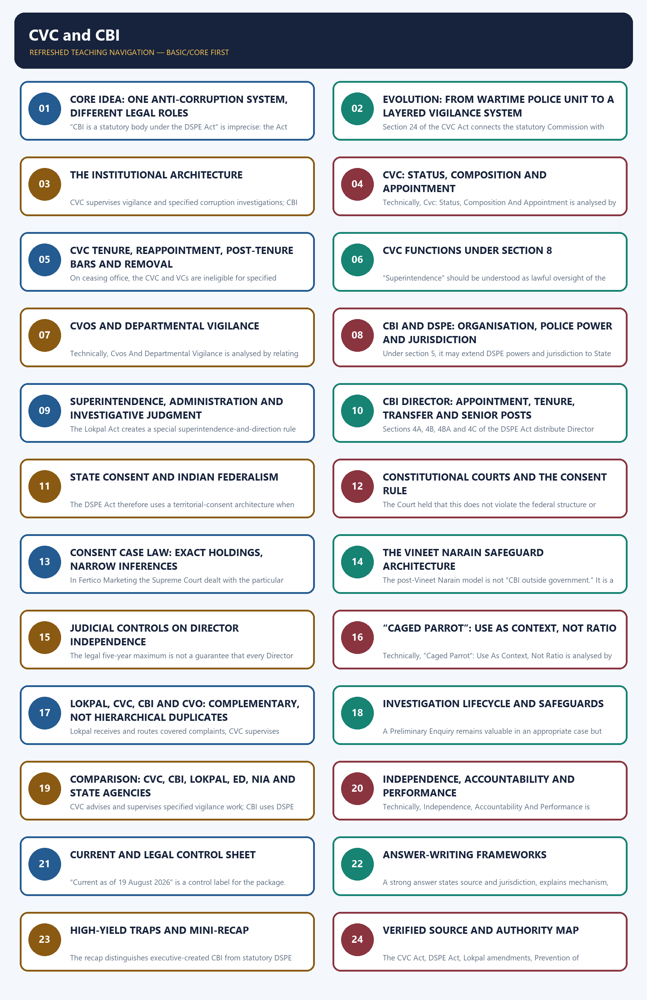

# Polity 37 — Central Vigilance Commission (CVC) and Central Bureau of Investigation (CBI)

**Complete learning session + solved PYQs + solved practice + final register notes**

**Legal/current control date:** 28 August 2026 (Asia/Kolkata)

> **Tag key:** `[FACT]` = directly supported by a named legal/official source; `[ANALYSIS]` = reasoned examination; `[CURRENT]` = checked for this package's control date; `[LIMIT]` = a boundary, qualification, unresolved issue, or deliberately unfrozen fact.

#### How to Use This Package

This is an independent UPSC learning session, not a short revision sheet. Read the concept sections first, then attempt the PYQ and practice workbook. The **Final Consolidated Register Notes** are deliberately placed last.

### Visual 01 — Learning Roadmap

```text
FOUNDATION
   |
   +--> Evolution: SPE -> DSPE Act -> CBI resolution -> CVC resolution -> CVC Act
   |
CORE INSTITUTIONS
   |
   +--> CVC design + section 8 functions + CVO system
   +--> CBI organisation + DSPE police powers + offence domains
   |
FEDERAL CONTROL
   |
   +--> DSPE sections 5-6 -> State consent -> court-directed investigation
   |
INDEPENDENCE AND ACCOUNTABILITY
   |
   +--> Director selection/tenure -> superintendence split -> case law
   |
APPLICATION
   |
   +--> Lokpal interface -> investigation safeguards -> comparisons -> reforms
   |
PRACTICE
   |
   +--> Verified PYQs -> 48 MCQs -> 8 solved Mains -> register notes
```

*Caption: The topic moves from legal identity to institutional interaction, federalism, safeguards and exam application.*


## BASIC LEARNING SESSION



*Distinct embedded teaching-navigation image. The separate continuous Cārvāka-style flowchart package remains an independent at-a-glance artifact.*

### SESSION 1 — CORE IDEA: ONE ANTI-CORRUPTION SYSTEM, DIFFERENT LEGAL ROLES

#### DEFINITION / WHAT THIS IS CALLED

**Plain-language definition:** Neither institution is a universal anti-corruption authority.

**Technical definition:** “CBI is a statutory body under the DSPE Act” is imprecise: the Act constitutes and empowers the DSPE; the 1963 executive resolution established the wider CBI organisation and made the DSPE its Investigation and Anti-Corruption Division.

#### ANSWER-GRABBING OPENING — WRITE/ADAPT IN THE EXAM

> “CBI is a statutory body under the DSPE Act” is imprecise: the Act constitutes and empowers the DSPE; the 1963 executive resolution established the wider CBI organisation and made the DSPE its Investigation and Anti-Corruption Division.

#### MUST-WRITE KEYWORDS

- **One Anti-Corruption System**
- **Different Legal Roles**
- **Delhi Special Police Establishment (DSPE)**
- **CVC**
- **CVC Act, 2003; preceded by 1964 resolution**
- **Statutory apex vigilance institution**

**How to use them:** Frame the answer through One Anti-Corruption System; define Different Legal Roles, connect Delhi Special Police Establishment (DSPE) with CVC to explain the mechanism, and use CVC Act, 2003; preceded by 1964 resolution for the decisive comparison or qualification.

[FACT] The CVC and CBI are not interchangeable. The **CVC is a statutory vigilance, supervisory and advisory institution** under the Central Vigilance Commission Act, 2003. The **CBI is an organisation created by a Government of India resolution dated 1 April 1963**, while the police establishment from which its investigative powers are principally derived is the **Delhi Special Police Establishment (DSPE)** constituted under the DSPE Act, 1946.

[ANALYSIS] UPSC commonly tests the gap between a familiar label and its precise legal source. “CBI is a statutory body under the DSPE Act” is imprecise: the Act constitutes and empowers the DSPE; the 1963 executive resolution established the wider CBI organisation and made the DSPE its Investigation and Anti-Corruption Division.

[LIMIT] Neither institution is a universal anti-corruption authority. Their jurisdiction, functions, offence domain, personnel coverage and coercive powers depend on the governing statute, notification, reference, consent or court order.

#### Visual 02 — Legal Identity in One Frame

| Institution/establishment | Creation or legal basis | Primary character | Key exam correction |
|---|---|---|---|
| CVC | CVC Act, 2003; preceded by 1964 resolution | Statutory apex vigilance institution | Supervisory/advisory; not a police station or court |
| CBI | Government of India resolution, 1 April 1963 | Executive-created organisation | No standalone “CBI Act” |
| DSPE | DSPE Act, 1946 | Statutory police establishment | Source of core police powers exercised by CBI investigators |
| Lokpal | Lokpal and Lokayuktas Act, 2013 | Statutory anti-corruption ombudsman | Can route preliminary inquiry/investigation as the Act provides |
| Departmental CVO | Vigilance-administration framework | Internal vigilance node | Works within an organisation; not a substitute for criminal investigation |

*Caption: Legal basis determines power; similar anti-corruption purposes do not create identical jurisdictions.*

#### Visual 03 — Five Questions Before Naming an Agency

```text
1. WHAT IS THE ALLEGED OFFENCE?
              |
2. WHO IS THE PERSON / WHICH ORGANISATION?
              |
3. WHICH TERRITORY IS INVOLVED?
              |
4. WHAT IS THE ENTRY ROUTE?
   complaint / reference / consent / notification / court order
              |
5. WHAT OUTPUT IS SOUGHT?
   vigilance advice / departmental action / FIR-investigation /
   prosecution / adjudication
```

*Caption: Institutional competence is decided by offence, person, territory, entry route and legal output—not by prestige.*

#### CLOSING RECALL FLOW — CORE IDEA: ONE ANTI-CORRUPTION SYSTEM, DIFFERENT LEGAL ROLES

```text
START / CONCEPT: CORE IDEA: ONE ANTI-CORRUPTION SYSTEM, DIFFERENT LEGAL ROLES
        |
        v
EXACT TERMS: One Anti-Corruption System · Different Legal Roles · Delhi Special Police Establishment (DSPE) · CVC · CVC Act, 2003; preceded by 1964 resolution · Statutory apex vigilance institution
        |
        v
MECHANISM / ARGUMENT: The CBI is an organisation created by a Government of India resolution dated 1 April 1963, while the police establishment from which its investigative powers are principally derived is the Delhi Special Police Establishment (DSPE) constituted under the DSPE Act, 1946.
        |
        v
CONSEQUENCE / CONTRAST: The CVC and CBI are not interchangeable.
        |
        v
UPSC TRAP / ANSWER-USE: Do not miss this limiting distinction: the CVC is a statutory vigilance, supervisory and advisory institution under the Central Vigilance...
        |
        v
ANSWER-GRABBING FORMULATION: “CBI is a statutory body under the DSPE Act” is imprecise: the Act constitutes and empowers the DSPE; the 1963 executive resolution established the wider CBI organisation and made the DSPE its Investigation and Anti-Corruption Division.
```
### SESSION 2 — EVOLUTION: FROM WARTIME POLICE UNIT TO A LAYERED VIGILANCE SYSTEM

#### DEFINITION / WHAT THIS IS CALLED

**Plain-language definition:** Section 24 of the CVC Act connects the statutory Commission with the earlier CVC created through the Ministry of Home Affairs resolution dated 11 February 1964.

**Technical definition:** Section 24 of the CVC Act connects the statutory Commission with the earlier CVC created through the Ministry of Home Affairs resolution dated 11 February 1964.

#### ANSWER-GRABBING OPENING — WRITE/ADAPT IN THE EXAM

> Section 24 of the CVC Act connects the statutory Commission with the earlier CVC created through the Ministry of Home Affairs resolution dated 11 February 1964.

#### MUST-WRITE KEYWORDS

- **Evolution**
- **hybrid system**
- **Wartime ordinance gave the SPE a legal framework**
- **Transitional legal basis during the war**
- **Delhi Special Police Establishment Act enacted**
- **DSPE obtained continuing statutory police powers**

**How to use them:** Frame the answer through Evolution; define hybrid system, connect Wartime ordinance gave the SPE a legal framework with Transitional legal basis during the war to explain the mechanism, and use Delhi Special Police Establishment Act enacted for the decisive comparison or qualification.

#### Visual 04 — Evolution Timeline

| Year | Institutional development | Legal significance |
|---|---|---|
| 1941 | Special Police Establishment (SPE) set up by executive order during World War II | Investigated bribery and corruption connected with War and Supply transactions |
| 1943 | Wartime ordinance gave the SPE a legal framework | Transitional legal basis during the war |
| 1946 | Delhi Special Police Establishment Act enacted | DSPE obtained continuing statutory police powers |
| 1963 | CBI established by Home Ministry resolution dated 1 April | Executive creation; DSPE became a division within CBI |
| 1964 | CVC created by Government resolution following Santhanam Committee recommendation | Executive vigilance body at inception |
| 1997 | *Vineet Narain v Union of India* | Supreme Court prescribed institutional safeguards and pressed for statutory CVC |
| 2003 | CVC Act enacted | CVC became statutory; DSPE superintendence architecture was codified |
| 2013-14 | Lokpal and Lokayuktas Act created a new complaint-routing and supervisory interface | Added Lokpal-CVC-CBI coordination rules |
| 2021 | CVC and DSPE tenure-extension amendments | Permitted structured one-year extensions up to aggregate five years, subject to statutory conditions |
| 2023 | *Dr Jaya Thakur v Union of India* | Supreme Court upheld the amendment framework; extension is not automatic |

*Caption: CBI and CVC began through executive action, but their present powers are not traceable to the same legal instrument.*

[FACT] The official CBI history records the SPE’s 1941 wartime origin, extension to railway corruption, the DSPE Act of 1946, and the 1963 CBI resolution.

[FACT] Section 24 of the CVC Act connects the statutory Commission with the earlier CVC created through the Ministry of Home Affairs resolution dated 11 February 1964.

[ANALYSIS] Institutional evolution produced a **hybrid system**: executive organisation, statutory police powers, statutory vigilance oversight, executive administration, federal consent and constitutional-court review coexist.

#### Visual 05 — Executive Creation vs Statutory Power

```text
EXECUTIVE RESOLUTION                         PARLIAMENTARY STATUTE
--------------------                         ---------------------
Creates organisational form                  Confers defined legal powers
Can allocate administrative business         Sets jurisdiction and safeguards
Example: CBI, 1963                            Example: DSPE Act, CVC Act

                 BOTH OPERATE TOGETHER
  CBI organisation + DSPE statutory police establishment
```

*Caption: An executive origin does not mean that every operational power is merely executive; statutory powers must be traced separately.*

#### CLOSING RECALL FLOW — EVOLUTION: FROM WARTIME POLICE UNIT TO A LAYERED VIGILANCE SYSTEM

```text
START / CONCEPT: EVOLUTION: FROM WARTIME POLICE UNIT TO A LAYERED VIGILANCE SYSTEM
        |
        v
EXACT TERMS: Evolution · hybrid system · Wartime ordinance gave the SPE a legal framework · Transitional legal basis during the war · Delhi Special Police Establishment Act enacted · DSPE obtained continuing statutory police powers
        |
        v
MECHANISM / ARGUMENT: The operative mechanism is that section 24 of the CVC Act connects the statutory Commission with the earlier CVC...
        |
        v
CONSEQUENCE / CONTRAST: The resulting consequence is that section 24 of the CVC Act connects the statutory Commission with the earlier CVC...
        |
        v
UPSC TRAP / ANSWER-USE: Do not miss this limiting distinction: section 24 of the CVC Act connects the statutory Commission with the earlier CVC...
        |
        v
ANSWER-GRABBING FORMULATION: Section 24 of the CVC Act connects the statutory Commission with the earlier CVC created through the Ministry of Home Affairs resolution dated 11 February 1964.
```
### SESSION 3 — THE INSTITUTIONAL ARCHITECTURE

#### DEFINITION / WHAT THIS IS CALLED

**Plain-language definition:** The Union anti-corruption system separates vigilance oversight, investigation, departmental action, prosecution and adjudication.

**Technical definition:** CVC supervises vigilance and specified corruption investigations; CBI investigates through DSPE powers; departments and prosecutors retain distinct legal functions.

#### ANSWER-GRABBING OPENING — WRITE/ADAPT IN THE EXAM

> Institutional architecture matters because no single anti-corruption body owns the entire accountability chain.

#### MUST-WRITE KEYWORDS

- **CVC**
- **CBI**
- **CVO**
- **Lokpal**
- **DoPT**
- **investigation**
- **prosecution**
- **adjudication**

**How to use them:** Frame the answer through CVC; define CBI, connect CVO with Lokpal to explain the mechanism, and use DoPT for the decisive comparison or qualification.

#### Visual 06 — Anti-Corruption and Investigation Architecture

```text
                         PARLIAMENT / STATUTES
                                  |
             +--------------------+--------------------+
             |                    |                    |
         CVC ACT              DSPE ACT             LOKPAL ACT
             |                    |                    |
            CVC          DSPE within CBI              Lokpal
             |                    |                    |
      vigilance advice       police inquiry/       complaint scrutiny,
      and supervision        investigation          referral and oversight
             |                    |                    |
             +-------- CVOs -----+------ agencies ----+
                                  |
                         COMPETENT COURT
                    charge sheet / trial / judgment
```

*Caption: Advice, investigation, prosecution and adjudication occur at different institutional stages.*

#### Visual 07 — Power-Type Matrix

| Power type | CVC | CBI/DSPE | Lokpal | Court |
|---|---:|---:|---:|---:|
| Vigilance-system supervision | Yes, within statutory field | No | Limited to matters under its Act | Judicial review only |
| Police investigation | No general police power | Yes, within legal jurisdiction | May direct an agency; own Inquiry Wing is for preliminary inquiry | May direct investigation in appropriate cases |
| Arrest/search/seizure as police | No general power | Yes, subject to criminal procedure and special statutes | Search may be authorised through agency under Lokpal Act | Issues judicial warrants/orders as law provides |
| Prosecution decision/output | Advises/reviews sanction progress | Investigates and files statutory report; prosecution structure applies | Can direct Prosecution Wing/agency under its Act | Takes cognizance, tries and decides |
| Final guilt determination | No | No | No | Yes |

*Caption: The power to supervise investigation is not the power to convict, and an investigative recommendation is not proof of guilt.*

#### CLOSING RECALL FLOW — THE INSTITUTIONAL ARCHITECTURE

```text
START / CONCEPT: THE INSTITUTIONAL ARCHITECTURE
        |
        v
EXACT TERMS: CVC · CBI · CVO · Lokpal · DoPT · investigation · prosecution · adjudication
        |
        v
MECHANISM / ARGUMENT: A complaint moves through the legally competent referral, inquiry, investigation, sanction, prosecution and court stages.
        |
        v
CONSEQUENCE / CONTRAST: Separation creates checks but also coordination and delay risks.
        |
        v
UPSC TRAP / ANSWER-USE: Do not describe CVC, CBI, Lokpal and courts as one hierarchy or interchangeable agencies.
        |
        v
ANSWER-GRABBING FORMULATION: Institutional architecture matters because no single anti-corruption body owns the entire accountability chain.
```
### SESSION 4 — CVC: STATUS, COMPOSITION AND APPOINTMENT

#### DEFINITION / WHAT THIS IS CALLED

**Plain-language definition:** A vacancy in the selection committee does not by itself invalidate an appointment.

**Technical definition:** Technically, Cvc: Status, Composition And Appointment is analysed by relating Cvc to Status, then testing the relationship through Composition and Appointment.

#### ANSWER-GRABBING OPENING — WRITE/ADAPT IN THE EXAM

> A vacancy in the selection committee does not by itself invalidate an appointment.

#### MUST-WRITE KEYWORDS

- **Cvc**
- **Status**
- **Composition**
- **Appointment**
- **Central Vigilance Commissioner**
- **not more than two Vigilance Commissioners**

**How to use them:** Frame the answer through Cvc; define Status, connect Composition with Appointment to explain the mechanism, and use Central Vigilance Commissioner for the decisive comparison or qualification.

[FACT] Section 3 of the CVC Act constitutes the Commission. It consists of:

- one **Central Vigilance Commissioner**, as Chairperson; and
- **not more than two Vigilance Commissioners**, as Members.

[FACT] The statute draws eligible persons from two broad experience pools:

1. All-India Service, Union civil service or Union civil post experience involving vigilance, policy-making and administration, including police administration; or
2. specified public-sector corporate experience and expertise in finance (including insurance and banking), law, vigilance and investigations.

[FACT] The proviso prevents all three offices from being monopolised by one eligibility category: not more than two persons may belong to either category.

#### Visual 08 — Composition

```text
                 CENTRAL VIGILANCE COMMISSION
                              |
          +-------------------+-------------------+
          |                   |                   |
       CENTRAL            VIGILANCE           VIGILANCE
      VIGILANCE          COMMISSIONER         COMMISSIONER
    COMMISSIONER          (if appointed)       (if appointed)
     Chairperson              Member               Member

Maximum size = 3; statutory wording = "not more than two" VCs
```

*Caption: The Commission is multi-member but the Act does not require that both Vigilance Commissioner posts be occupied at all times.*

#### Visual 09 — Appointment Chain

```text
SELECTION COMMITTEE RECOMMENDATION
   |
   +--> Prime Minister (Chairperson)
   +--> Minister of Home Affairs
   +--> Leader of Opposition in Lok Sabha
        |
        +--> if no recognised LoP:
             leader of single largest opposition group
   |
PRESIDENT APPOINTS BY WARRANT UNDER HAND AND SEAL
```

*Caption: The statutory substitute for an unrecognised Lok Sabha LoP is expressly written into the CVC Act.*

[FACT] Section 4 states that the President appoints the CVC and VCs by warrant under hand and seal after obtaining the recommendation of the committee above.

[LIMIT] A vacancy in the selection committee does not by itself invalidate an appointment. This statutory rule must not be confused with whether a particular selection process was fair on its facts.

#### Visual 10 — Eligibility Logic

| Category A | Category B | Diversity guardrail |
|---|---|---|
| Union/All-India public-service experience | Public-sector corporate office/expertise | Maximum two appointees from either single category |
| Vigilance, policy, administration, police administration | Finance, insurance, banking, law, vigilance, investigation | At least one seat must therefore come from the other category if all three seats are filled |

*Caption: The Act combines administrative knowledge with specialist expertise and inserts a limited category-balancing rule.*

#### CLOSING RECALL FLOW — CVC: STATUS, COMPOSITION AND APPOINTMENT

```text
START / CONCEPT: CVC: STATUS, COMPOSITION AND APPOINTMENT
        |
        v
EXACT TERMS: Cvc · Status · Composition · Appointment · Central Vigilance Commissioner · not more than two Vigilance Commissioners
        |
        v
MECHANISM / ARGUMENT: This statutory rule must not be confused with whether a particular selection process was fair on its facts.
        |
        v
CONSEQUENCE / CONTRAST: The resulting consequence is that a vacancy in the selection committee does not by itself invalidate an appointment.
        |
        v
UPSC TRAP / ANSWER-USE: Do not miss this limiting distinction: a vacancy in the selection committee does not by itself invalidate an appointment.
        |
        v
ANSWER-GRABBING FORMULATION: A vacancy in the selection committee does not by itself invalidate an appointment.
```
### SESSION 5 — CVC TENURE, REAPPOINTMENT, POST-TENURE BARS AND REMOVAL

#### DEFINITION / WHAT THIS IS CALLED

**Plain-language definition:** The CVC is ineligible for reappointment in the Commission after ceasing office.

**Technical definition:** On ceasing office, the CVC and VCs are ineligible for specified diplomatic/presidential assignments and for further employment in an office of profit under the Union or a State.

#### ANSWER-GRABBING OPENING — WRITE/ADAPT IN THE EXAM

> The CVC is ineligible for reappointment in the Commission after ceasing office.

#### MUST-WRITE KEYWORDS

- **Cvc Tenure**
- **Reappointment**
- **Post-Tenure Bars**
- **Removal**
- **Reappointment as CVC/VC**
- **Diplomatic assignment / UT Administrator / specified presidential appointment**

**How to use them:** Frame the answer through Cvc Tenure; define Reappointment, connect Post-Tenure Bars with Removal to explain the mechanism, and use Reappointment as CVC/VC for the decisive comparison or qualification.

#### Visual 11 — Tenure Clock

```text
ENTRY INTO OFFICE
      |
      +--> Four years
      |
      +--> Age 65
      |
WHICHEVER OCCURS EARLIER

VC -> may be appointed CVC
but aggregate service as VC + CVC cannot exceed four years
```

*Caption: “Four years or 65” is a ceiling rule; appointment as CVC does not restart a former VC’s four-year clock.*

[FACT] The CVC is ineligible for reappointment in the Commission after ceasing office. A VC may be appointed CVC through the statutory process, subject to the aggregate four-year cap.

[FACT] On ceasing office, the CVC and VCs are ineligible for specified diplomatic/presidential assignments and for further employment in an office of profit under the Union or a State.

#### Visual 12 — Post-Tenure Restriction

| After office | Legal position |
|---|---|
| Reappointment as CVC/VC | CVC cannot be reappointed; VC-to-CVC route is specially allowed within aggregate cap |
| Diplomatic assignment / UT Administrator / specified presidential appointment | Barred |
| Further government office of profit | Barred |
| Private activity | Governed by other applicable law/ethics; the cited statutory bar is not a universal ban on every activity |

*Caption: State the statutory bars exactly; do not enlarge them into an unsupported lifetime prohibition.*

#### Visual 13 — Two Removal Routes

```text
ROUTE 1: PROVED MISBEHAVIOUR OR INCAPACITY
President makes reference
        -> Supreme Court inquiry
        -> Court reports whether removal is warranted
        -> President orders removal

ROUTE 2: LISTED DIRECT STATUTORY GROUNDS
President may remove for:
insolvency / conviction involving moral turpitude /
outside paid employment / mental or physical infirmity /
prejudicial financial or other interest
```

*Caption: The Supreme Court inquiry route and the expressly listed direct-removal grounds must be kept separate.*

[FACT] The President may suspend and prohibit attendance during the Supreme Court inquiry after a reference.

[FACT] A prohibited interest in a Government of India contract or agreement, beyond the ordinary position of a member of an incorporated company, is statutorily deemed misbehaviour.

[ANALYSIS] Security of tenure protects institutional independence; tightly defined direct-removal grounds protect integrity and functionality.

#### Visual 14 — Independence Safeguards and Limits

| Design safeguard | Independence value | Continuing limit |
|---|---|---|
| Multi-member selection committee | Reduces unilateral executive choice | Committee remains political-executive heavy |
| Fixed term/age ceiling | Protects against ordinary pleasure removal | Short maximum tenure may reduce continuity |
| Supreme Court inquiry for proved misbehaviour/incapacity | High removal threshold | Direct statutory grounds remain |
| Post-tenure employment bars | Reduces inducement risk | Does not itself create budget/cadre autonomy |
| Expenses charged on Consolidated Fund of India | Financial protection | Operational capacity still depends on staffing and administration |

*Caption: Institutional independence is cumulative; no single safeguard eliminates all executive or organisational dependence.*

#### CLOSING RECALL FLOW — CVC TENURE, REAPPOINTMENT, POST-TENURE BARS AND REMOVAL

```text
START / CONCEPT: CVC TENURE, REAPPOINTMENT, POST-TENURE BARS AND REMOVAL
        |
        v
EXACT TERMS: Cvc Tenure · Reappointment · Post-Tenure Bars · Removal · Reappointment as CVC/VC · Diplomatic assignment / UT Administrator / specified presidential appointment
        |
        v
MECHANISM / ARGUMENT: On ceasing office, the CVC and VCs are ineligible for specified diplomatic/presidential assignments and for further employment in an office of profit under the Union or a State.
        |
        v
CONSEQUENCE / CONTRAST: A prohibited interest in a Government of India contract or agreement, beyond the ordinary position of a member of an incorporated company, is statutorily deemed misbehaviour.
        |
        v
UPSC TRAP / ANSWER-USE: Do not miss this limiting distinction: the CVC is ineligible for reappointment in the Commission after ceasing office.
        |
        v
ANSWER-GRABBING FORMULATION: The CVC is ineligible for reappointment in the Commission after ceasing office.
```
### SESSION 6 — CVC FUNCTIONS UNDER SECTION 8

#### DEFINITION / WHAT THIS IS CALLED

**Plain-language definition:** Section 8 is the operational core of the CVC Act.

**Technical definition:** “Superintendence” should be understood as lawful oversight of the agency and process, not remote authorship of the evidence, charges or final report in a named case.

#### ANSWER-GRABBING OPENING — WRITE/ADAPT IN THE EXAM

> Section 8 is the operational core of the CVC Act.

#### MUST-WRITE KEYWORDS

- **Cvc Functions Under Section 8**
- **DSPE superintendence**
- **Directions to DSPE**
- **Give directions for discharge of the statutory responsibility**
- **Central Government reference**
- **Reference and statutory offence/person coverage matter**

**How to use them:** Frame the answer through Cvc Functions Under Section 8; define DSPE superintendence, connect Directions to DSPE with Give directions for discharge of the statutory responsibility to explain the mechanism, and use Central Government reference for the decisive comparison or qualification.

[FACT] Section 8 is the operational core of the CVC Act. It gives the Commission a combination of DSPE superintendence, constrained directions, inquiry/investigation routing, progress review, advice and vigilance-administration supervision.

#### Visual 15 — Section 8 Function Map

| Section 8 function | What CVC may do | Boundary |
|---|---|---|
| DSPE superintendence | Supervise DSPE functioning for Prevention of Corruption Act investigations and connected same-trial offences | Does not cover every CBI matter |
| Directions to DSPE | Give directions for discharge of the statutory responsibility | Cannot require investigation or disposal of a particular case in a particular manner |
| Central Government reference | Inquire or cause inquiry/investigation concerning covered central/public-sector servants | Reference and statutory offence/person coverage matter |
| Complaint jurisdiction | Inquire or cause inquiry/investigation against specified categories | Not every public servant everywhere |
| Investigation review | Review progress of relevant DSPE investigations | Review is not adjudication |
| Sanction review | Review progress of prosecution-sanction applications | Review does not erase the competent authority’s statutory role |
| Advice | Advise Union Government and covered central organisations | Advice is not automatically binding |
| Vigilance administration | Supervise vigilance administration across covered central entities | Cannot contradict Government vigilance directions or issue policy directions beyond the proviso |

*Caption: CVC’s section 8 powers are broad within central vigilance, but each is textually bounded.*

#### Visual 16 — Superintendence Without Case Dictation

```text
PERMITTED LEVEL                         PROHIBITED LEVEL
---------------                         ----------------
systemic supervision                    "reach this result"
progress monitoring                     "charge this named person"
lawful general directions               "close this particular case"
sanction-delay review                   "investigate in this exact manner"
integrity/process oversight             "dispose of case as instructed"
```

*Caption: The proviso protects investigative judgment by prohibiting CVC from dictating the particular manner of investigation or disposal.*

[ANALYSIS] “Superintendence” should be understood as lawful oversight of the agency and process, not remote authorship of the evidence, charges or final report in a named case.

#### Visual 17 — Person-Coverage Gate

```text
COMPLAINT RECEIVED
       |
Is the alleged conduct within the statutory offence field?
       |
Is the officer/person in a section 8(2) covered category?
       |
Is there a valid reference/complaint route?
       |
YES -> CVC may inquire or cause inquiry/investigation
NO  -> another statutory/departmental route may apply
```

*Caption: A complaint’s seriousness does not by itself confer CVC jurisdiction.*

[FACT] For the complaint route in section 8(1)(d), section 8(2) covers:

- members of All-India Services serving in connection with Union affairs and Group A officers of the Central Government; and
- notified levels in covered central corporations, Government companies, societies and local authorities, with the Act’s transitional deeming provision.

[LIMIT] Lokpal-referred complaints introduce a separate statutory interface. Do not collapse the original section 8 complaint category into all Group A-D public servants without stating the Lokpal route.

#### Visual 18 — Advice Is Not a Command

```text
INQUIRY REPORT
      |
      v
     CVC
      |
      v
ADVICE TO UNION / COVERED ORGANISATION
      |
      +--> agrees -> appropriate action
      |
      +--> disagrees -> written reasons communicated to CVC
```

*Caption: Section 17 requires consideration of CVC advice and written reasons for disagreement, but the advice is not self-executing punishment.*

[ANALYSIS] This model combines expert vigilance review with administrative responsibility. Its weakness is potential dilution through repeated disagreement or delay; its accountability tool is reason-giving.

#### Visual 19 — CVC’s Inquiry-Related Civil-Court Powers

| CVC may, for specified inquiries | CVC still is not |
|---|---|
| Summon and enforce attendance | A criminal trial court |
| Examine on oath | A general police station |
| Require discovery/production of documents | A sentencing authority |
| Receive affidavit evidence | A universal ombudsman |
| Requisition public records | A substitute for the competent disciplinary authority |
| Issue commissions for witnesses/documents | The final judge of guilt |

*Caption: Civil-court-like procedural powers do not transform the Commission into a court of criminal jurisdiction.*

#### Visual 20 — Annual Accountability Loop

```text
CVC WORK DURING YEAR
       |
Annual report within six months of year-end
       |
Separate part on DSPE anti-corruption functioning
       |
President
       |
Both Houses of Parliament
       |
Public / legislative scrutiny
```

*Caption: Reporting creates parliamentary visibility without turning Parliament into the investigator of individual cases.*

#### CLOSING RECALL FLOW — CVC FUNCTIONS UNDER SECTION 8

```text
START / CONCEPT: CVC FUNCTIONS UNDER SECTION 8
        |
        v
EXACT TERMS: Cvc Functions Under Section 8 · DSPE superintendence · Directions to DSPE · Give directions for discharge of the statutory responsibility · Central Government reference · Reference and statutory offence/person coverage matter
        |
        v
MECHANISM / ARGUMENT: Its weakness is potential dilution through repeated disagreement or delay; its accountability tool is reason-giving.
        |
        v
CONSEQUENCE / CONTRAST: Do not collapse the original section 8 complaint category into all Group A-D public servants without stating the Lokpal route.
        |
        v
UPSC TRAP / ANSWER-USE: “Superintendence” should be understood as lawful oversight of the agency and process, not remote authorship of the evidence, charges or final report in a named case.
        |
        v
ANSWER-GRABBING FORMULATION: Section 8 is the operational core of the CVC Act.
```
### SESSION 7 — CVOS AND DEPARTMENTAL VIGILANCE

#### DEFINITION / WHAT THIS IS CALLED

**Plain-language definition:** Chief Vigilance Officers (CVOs) are the vigilance nodes within Ministries, departments and covered public organisations.

**Technical definition:** Technically, Cvos And Departmental Vigilance is analysed by relating Cvos to Departmental Vigilance, then testing the relationship through Process redesign and finding after alleged misconduct.

#### ANSWER-GRABBING OPENING — WRITE/ADAPT IN THE EXAM

> Chief Vigilance Officers (CVOs) are the vigilance nodes within Ministries, departments and covered public organisations.

#### MUST-WRITE KEYWORDS

- **Cvos**
- **Departmental Vigilance**
- **Process redesign**
- **finding after alleged misconduct**
- **Rotation in sensitive posts**
- **Departmental charge and inquiry**

**How to use them:** Frame the answer through Cvos; define Departmental Vigilance, connect Process redesign with finding after alleged misconduct to explain the mechanism, and use Rotation in sensitive posts for the decisive comparison or qualification.

[FACT] Chief Vigilance Officers (CVOs) are the vigilance nodes within Ministries, departments and covered public organisations. They support preventive vigilance, complaint handling, examination of processes, disciplinary coordination and communication with the CVC.

[ANALYSIS] A CVO’s proximity to organisational records can identify systemic risk early. The same proximity can create conflict or dependence if the post lacks functional protection.

#### Visual 21 — CVC-CVO Operating Chain

```text
                    CVC
                     |
        general vigilance supervision
                     |
                    CVO
          within Ministry / PSU / body
             /          |          \
   preventive review  complaints  disciplinary coordination
             \          |          /
                organisational head
```

*Caption: The CVO is an internal vigilance bridge, not an independent criminal court or a branch office with unlimited CBI powers.*

#### Visual 22 — Preventive vs Punitive Vigilance

| Preventive vigilance | Punitive/disciplinary response |
|---|---|
| Process redesign | Fact-finding after alleged misconduct |
| Rotation in sensitive posts | Departmental charge and inquiry |
| Conflict-of-interest control | Penalty by competent authority |
| Procurement transparency | Referral for criminal investigation where warranted |
| Audit trails and risk analytics | Prosecution-sanction process where applicable |

*Caption: A mature vigilance system prevents opportunity as well as responds to completed misconduct.*

#### CLOSING RECALL FLOW — CVOS AND DEPARTMENTAL VIGILANCE

```text
START / CONCEPT: CVOS AND DEPARTMENTAL VIGILANCE
        |
        v
EXACT TERMS: Cvos · Departmental Vigilance · Process redesign · finding after alleged misconduct · Rotation in sensitive posts · Departmental charge and inquiry
        |
        v
MECHANISM / ARGUMENT: A CVO’s proximity to organisational records can identify systemic risk early.
        |
        v
CONSEQUENCE / CONTRAST: The same proximity can create conflict or dependence if the post lacks functional protection.
        |
        v
UPSC TRAP / ANSWER-USE: Do not miss this limiting distinction: chief Vigilance Officers (CVOs) are the vigilance nodes within Ministries, departments and covered public...
        |
        v
ANSWER-GRABBING FORMULATION: Chief Vigilance Officers (CVOs) are the vigilance nodes within Ministries, departments and covered public organisations.
```
### SESSION 8 — CBI AND DSPE: ORGANISATION, POLICE POWER AND JURISDICTION

#### DEFINITION / WHAT THIS IS CALLED

**Plain-language definition:** Under section 2, DSPE members have police powers in Union Territories.

**Technical definition:** Under section 5, it may extend DSPE powers and jurisdiction to State areas; section 6 ordinarily requires the State Government’s consent for that exercise.

#### ANSWER-GRABBING OPENING — WRITE/ADAPT IN THE EXAM

> Under section 2, DSPE members have police powers in Union Territories.

#### MUST-WRITE KEYWORDS

- **Cbi**
- **Dspe**
- **Organisation**
- **Police Power**
- **Jurisdiction**
- **Anti-corruption**

**How to use them:** Frame the answer through Cbi; define Dspe, connect Organisation with Police Power to explain the mechanism, and use Jurisdiction for the decisive comparison or qualification.

[FACT] The CBI’s organisational identity and the DSPE’s statutory identity must be stated together but not merged. The 1963 resolution broadened the organisational mandate; investigators exercise police powers through the DSPE Act and applicable criminal law.

#### Visual 23 — CBI/DSPE Legal Stack

```text
CBI ORGANISATION
created by 1963 executive resolution
          |
          +--> DSPE / Investigation and Anti-Corruption
          |       powers: DSPE Act + criminal procedure + notified offences
          |
          +--> Economic-offence work
          |
          +--> Special-crime work on a selective lawful basis
          |
          +--> INTERPOL National Central Bureau for India
```

*Caption: Organisational wings do not enlarge statutory police jurisdiction beyond law, notification, consent or court order.*

#### Visual 24 — DSPE Act Jurisdiction Ladder

```text
SECTION 2
DSPE police powers in Union Territories
        |
SECTION 3
Central Government notifies offence classes
        |
SECTION 5
Central Government may extend powers/jurisdiction to a State area
        |
SECTION 6
State consent required for exercise in that State area
        |
EXCEPTIONAL CONSTITUTIONAL ROUTE
Supreme Court / High Court direction under Articles 32 / 226
```

*Caption: State consent is one route; a constitutional-court direction is a distinct route and does not derive from State consent.*

[FACT] Under section 2, DSPE members have police powers in Union Territories. Under section 3, the Central Government specifies offence classes by notification. Under section 5, it may extend DSPE powers and jurisdiction to State areas; section 6 ordinarily requires the State Government’s consent for that exercise.

[LIMIT] “CBI can investigate any case in India” and “CBI can never act without State consent” are both overbroad.

#### Visual 25 — Officially Supported CBI Domains

| Domain | Typical legal character | Essential qualification |
|---|---|---|
| Anti-corruption | PC Act offences and connected offences | CVC superintendence applies to the relevant DSPE investigations |
| Economic offences | Complex fraud/economic crime under notified laws | CBI is not the same as ED or SFIO |
| Special crimes | Serious conventional crime on a selective lawful basis | Territorial jurisdiction/consent/court-order questions remain |
| INTERPOL NCB | International police-cooperation channel for India | Coordination does not itself determine domestic guilt or jurisdiction |

*Caption: CBI’s diverse work remains legally compartmentalised.*

#### Visual 26 — Police Power Is Not Organisational Reputation

```text
HIGH PUBLIC IMPORTANCE
        does not automatically produce
LEGAL JURISDICTION

Jurisdiction requires:
DSPE power + notified offence + territorial authority
+ applicable consent/reference/court direction
+ compliance with criminal-procedure safeguards
```

*Caption: Public demand for a CBI probe is politically relevant but not a substitute for a lawful jurisdictional route.*

#### CLOSING RECALL FLOW — CBI AND DSPE: ORGANISATION, POLICE POWER AND JURISDICTION

```text
START / CONCEPT: CBI AND DSPE: ORGANISATION, POLICE POWER AND JURISDICTION
        |
        v
EXACT TERMS: Cbi · Dspe · Organisation · Police Power · Jurisdiction · Anti-corruption
        |
        v
MECHANISM / ARGUMENT: Under section 5, it may extend DSPE powers and jurisdiction to State areas; section 6 ordinarily requires the State Government’s consent for that exercise.
        |
        v
CONSEQUENCE / CONTRAST: The CBI’s organisational identity and the DSPE’s statutory identity must be stated together but not merged.
        |
        v
UPSC TRAP / ANSWER-USE: “CBI can investigate any case in India” and “CBI can never act without State consent” are both overbroad.
        |
        v
ANSWER-GRABBING FORMULATION: Under section 2, DSPE members have police powers in Union Territories.
```
### SESSION 9 — SUPERINTENDENCE, ADMINISTRATION AND INVESTIGATIVE JUDGMENT

#### DEFINITION / WHAT THIS IS CALLED

**Plain-language definition:** Superintendence, Administration And Investigative Judgment comprises Superintendence, Administration and Investigative Judgment as its core connected dimensions.

**Technical definition:** The Lokpal Act creates a special superintendence-and-direction rule for matters referred by the Lokpal to DSPE, while repeating the prohibition on requiring investigation or disposal in a particular manner.

#### ANSWER-GRABBING OPENING — WRITE/ADAPT IN THE EXAM

> The Lokpal Act creates a special superintendence-and-direction rule for matters referred by the Lokpal to DSPE, while repeating the prohibition on requiring investigation or disposal in a particular manner.

#### MUST-WRITE KEYWORDS

- **Superintendence**
- **Administration**
- **Investigative Judgment**
- **insulated investigation plus answerable power**
- **Investigation of PC Act offences**
- **CVC**

**How to use them:** Frame the answer through Superintendence; define Administration, connect Investigative Judgment with insulated investigation plus answerable power to explain the mechanism, and use Investigation of PC Act offences for the decisive comparison or qualification.

#### Visual 27 — Statutory Superintendence Split

| DSPE matter | Superintendence under section 4 | Administration |
|---|---|---|
| Investigation of PC Act offences | CVC | Director, CBI/DSPE under statutory structure |
| Other DSPE matters | Central Government, save as otherwise provided | Director, CBI/DSPE |
| Lokpal-referred preliminary inquiry/investigation | Lokpal’s special section 25 power operates notwithstanding DSPE section 4/CVC section 8 | Agency remains bound by law and Lokpal Act safeguards |

*Caption: Superintendence changes with the legal subject and referral route; there is no single controller for every CBI function.*

[FACT] DSPE Act section 4(1) vests superintendence over PC Act investigations in the CVC. Section 4(2) vests superintendence over other matters in the Central Government, subject to other statutory provisions. Section 4(3) vests administration in the Director.

[FACT] The Lokpal Act creates a special superintendence-and-direction rule for matters referred by the Lokpal to DSPE, while repeating the prohibition on requiring investigation or disposal in a particular manner.

#### Visual 28 — Administration vs Case Investigation

| Administrative control may concern | Investigative judgment concerns |
|---|---|
| Budget and establishment | Evidence collection in a case |
| Personnel policy and deputation | Witness assessment |
| Infrastructure and inter-departmental coordination | Search/arrest decisions under law |
| Allocation within statutory framework | Legal sufficiency for final report |
| Service conditions | Whether evidence supports charge or closure |

*Caption: CBI’s administrative placement under DoPT does not prove that the PMO lawfully dictates every investigative decision.*

[ANALYSIS] Independence is compromised when administrative leverage is used to influence case outcomes. Accountability is compromised when “independence” is invoked to avoid lawful supervision, audit, courts or reasons. The constitutional objective is **insulated investigation plus answerable power**.

#### Visual 29 — Four-Layer Control Model

```text
LAYER 1: LAW
DSPE Act / CVC Act / PC Act / Lokpal Act / criminal procedure
                        |
LAYER 2: INSTITUTIONAL OVERSIGHT
CVC / Lokpal / Central Government within allocated fields
                        |
LAYER 3: AGENCY ADMINISTRATION
Director and internal hierarchy
                        |
LAYER 4: JUDICIAL CONTROL
trial court / High Court / Supreme Court
```

*Caption: The layers constrain one another; none is a licence for extra-legal command.*

#### CLOSING RECALL FLOW — SUPERINTENDENCE, ADMINISTRATION AND INVESTIGATIVE JUDGMENT

```text
START / CONCEPT: SUPERINTENDENCE, ADMINISTRATION AND INVESTIGATIVE JUDGMENT
        |
        v
EXACT TERMS: Superintendence · Administration · Investigative Judgment · insulated investigation plus answerable power · Investigation of PC Act offences · CVC
        |
        v
MECHANISM / ARGUMENT: Independence is compromised when administrative leverage is used to influence case outcomes.
        |
        v
CONSEQUENCE / CONTRAST: Accountability is compromised when “independence” is invoked to avoid lawful supervision, audit, courts or reasons.
        |
        v
UPSC TRAP / ANSWER-USE: Do not miss this limiting distinction: the constitutional objective is insulated investigation plus answerable power.
        |
        v
ANSWER-GRABBING FORMULATION: The Lokpal Act creates a special superintendence-and-direction rule for matters referred by the Lokpal to DSPE, while repeating the prohibition on requiring investigation or disposal in a particular manner.
```
### SESSION 10 — CBI DIRECTOR: APPOINTMENT, TENURE, TRANSFER AND SENIOR POSTS

#### DEFINITION / WHAT THIS IS CALLED

**Plain-language definition:** The CBI Director safeguard system protects professional control of the investigating establishment through committee-based appointment, a minimum tenure and restricted transfer.

**Technical definition:** Sections 4A, 4B, 4BA and 4C of the DSPE Act distribute Director selection, tenure, conditional extension, transfer protection and senior appointment inputs among specified statutory authorities.

#### ANSWER-GRABBING OPENING — WRITE/ADAPT IN THE EXAM

> CBI autonomy depends less on a slogan of independence than on a rule-bound Director architecture that separates high-level selection, secure minimum tenure, lawful extension and day-to-day administration.

#### MUST-WRITE KEYWORDS

- **Section 4A**
- **Section 4B**
- **Section 4BA**
- **Section 4C**
- **selection committee**
- **minimum tenure**
- **conditional extension**
- **transfer safeguard**

**How to use them:** Use sections 4A to 4C in sequence: identify the selection committee, state the two-year floor, qualify the current extension route and explain the committee safeguard against transfer-equivalent interference.

#### Visual 30 — Director Appointment Pipeline

```text
ELIGIBLE IPS OFFICERS
     |
     | panel based on seniority, integrity and
     | experience in anti-corruption investigation
     v
HIGH-POWERED COMMITTEE
     +--> Prime Minister (Chairperson)
     +--> Lok Sabha Leader of Opposition
     |    or leader of largest opposition party where no LoP
     +--> Chief Justice of India or Supreme Court judge nominated by CJI
     |
     v
COMMITTEE RECOMMENDATION
     |
     v
CENTRAL GOVERNMENT APPOINTS DIRECTOR
```

*Caption: The present section 4A high-powered committee is different from the older CVC-chaired panel that prepares the eligible officer panel.*

[FACT] DSPE Act section 4A requires the Central Government to appoint the Director on the recommendation of the Prime Minister-LoP-CJI committee. Where no LoP is recognised, the leader of the single largest opposition party in the Lok Sabha is substituted.

[FACT] Before the high-powered committee stage, the CVC-chaired institutional committee prepares the panel under the statutory criteria, after considering the outgoing Director’s views.

[LIMIT] Selection by a high-powered committee is an independence safeguard, not an immunity from legal review or administrative accountability.

#### Visual 31 — Director Tenure and Extension

```text
APPOINTMENT
    |
    +--> Minimum protected tenure: 2 years
    |
    +--> Possible extension after initial appointment
           |
           +--> public interest
           +--> section 4A committee recommendation
           +--> reasons recorded in writing
           +--> one year at a time
           +--> aggregate maximum: 5 years

Maximum is not an automatic entitlement.
```

*Caption: The 2021 amendment creates a conditional extension architecture, not a routine five-year appointment.*

[FACT] Section 4B protects a minimum two-year tenure. Transfer requires prior consent of the section 4A committee.

[FACT] The 2021 amendment permits extension in public interest, on the committee’s recommendation, for reasons recorded in writing, one year at a time, with no extension beyond an aggregate five-year period including the initial appointment.

[FACT] In *Dr Jaya Thakur v Union of India* (2023 INSC 616), the Supreme Court upheld the amended statutory extension framework. The Court’s separate conclusion that particular extensions granted to the then Director of Enforcement violated an earlier mandamus must not be converted into invalidation of the CBI/ED amendment architecture itself.

#### Visual 32 — Appointment, Transfer and Extension Controls

| Decision | Statutory control | Independence purpose |
|---|---|---|
| Initial appointment | High-powered section 4A committee recommendation | Disperses selection power |
| Tenure below two years | Generally barred by protected minimum | Prevents easy premature removal |
| Transfer during protected tenure | Prior committee consent | Prevents transfer-equivalent ouster |
| Annual extension | Public interest + committee recommendation + written reasons | Requires fresh justification |
| Aggregate service | Maximum five years | Prevents indefinite continuation |

*Caption: Appointment security and extension accountability operate together.*

#### Visual 33 — *Alok Verma* Procedure Principle

```text
FORMAL TRANSFER?
       |
       +--> committee consent required

DIVESTING DIRECTOR OF POWERS / FUNCTIONS?
       |
       +--> has transfer-like effect
       +--> cannot bypass section 4A committee protection
```

*Caption: In *Alok Kumar Verma v Union of India* (2019), substance prevailed over the label attached to the executive action.*

[FACT] The Supreme Court held that divesting the Director of powers and functions has transfer-equivalent consequences within the protective statutory scheme and required consideration by the section 4A committee.

#### Visual 34 — Senior Appointment Architecture

| Post/level | Core statutory relationship |
|---|---|
| Director, CBI | Appointed by Central Government on section 4A high-powered committee recommendation |
| SP and above in DSPE | CVC-chaired committee recommends appointment, extension or curtailment of tenure after consulting Director |
| Director of Prosecution | Central Government appoints on CVC recommendation; minimum two-year tenure |
| Director of Prosecution’s work | Exercises powers/functions under overall supervision and control of Director, CBI |

*Caption: Do not confuse the Director-selection committee with the CVC-chaired machinery for other senior appointments.*

[LIMIT] Current officeholders are deliberately not named. UPSC answers should prefer statutory design over transient personalities.

#### CLOSING RECALL FLOW — CBI DIRECTOR: APPOINTMENT, TENURE, TRANSFER AND SENIOR POSTS

```text
START / CONCEPT: CBI DIRECTOR: APPOINTMENT, TENURE, TRANSFER AND SENIOR POSTS
        |
        v
EXACT TERMS: Section 4A · Section 4B · Section 4BA · Section 4C · selection committee · minimum tenure · conditional extension · transfer safeguard
        |
        v
MECHANISM / ARGUMENT: The statutory committee recommends the Director, a protected minimum tenure supports continuity, any extension must satisfy current recorded conditions, and transfer or equivalent divestment engages the protective scheme.
        |
        v
CONSEQUENCE / CONTRAST: The architecture reduces abrupt executive displacement while preserving legal supervision, judicial review and accountability for investigative decisions.
        |
        v
UPSC TRAP / ANSWER-USE: Do not describe the two-year minimum as an automatic five-year term, include the Home Minister in the Director committee or treat superintendence as power to dictate a case result.
        |
        v
ANSWER-GRABBING FORMULATION: CBI autonomy depends less on a slogan of independence than on a rule-bound Director architecture that separates high-level selection, secure minimum tenure, lawful extension and day-to-day administration.
```
### SESSION 11 — STATE CONSENT AND INDIAN FEDERALISM

#### DEFINITION / WHAT THIS IS CALLED

**Plain-language definition:** Police and public order are primarily State List fields.

**Technical definition:** The DSPE Act therefore uses a territorial-consent architecture when the Union police establishment exercises powers in a State.

#### ANSWER-GRABBING OPENING — WRITE/ADAPT IN THE EXAM

> The DSPE Act therefore uses a territorial-consent architecture when the Union police establishment exercises powers in a State.

#### MUST-WRITE KEYWORDS

- **Indian Federalism**
- **Standing consent for defined classes/categories**
- **Reduces repeated administrative requests**
- **Preserves closer State control**
- **May contain conditions/riders**
- **Scope depends on precise terms**

**How to use them:** Frame the answer through Indian Federalism; define Standing consent for defined classes/categories, connect Reduces repeated administrative requests with Preserves closer State control to explain the mechanism, and use May contain conditions/riders for the decisive comparison or qualification.

[FACT] Police and public order are primarily State List fields. The DSPE Act therefore uses a territorial-consent architecture when the Union police establishment exercises powers in a State.

#### Visual 35 — Sections 5 and 6 as a Federal Sequence

```text
CENTRAL GOVERNMENT
extends DSPE powers/jurisdiction to State area (section 5)
                        |
                        v
STATE GOVERNMENT CONSENT (section 6)
                        |
                        v
DSPE officers exercise police powers for the specified legal field
```

*Caption: Extension and consent are distinct statutory steps; both must be read with offence notification and any court order.*

#### Visual 36 — General Consent vs Case-Specific Consent

| General consent | Case-specific consent |
|---|---|
| Standing consent for defined classes/categories | Consent for a named case, FIR, persons or facts |
| Reduces repeated administrative requests | Preserves closer State control |
| May contain conditions/riders | Scope depends on precise terms |
| Can be prospectively withdrawn | Must be evaluated for each requested case |

*Caption: “Consent” is not one undifferentiated instrument; its text, date, conditions and scope matter.*

[ANALYSIS] General consent supports speed and continuity. Case-specific consent gives States a stronger gatekeeping role. The institutional risk is reciprocal politicisation: refusal may obstruct neutral investigation, while over-centralisation may weaken federal trust.

#### Visual 37 — Withdrawal of General Consent

```text
GENERAL CONSENT EXISTS
       |
CBI validly begins investigation
       |
STATE WITHDRAWS GENERAL CONSENT
       |
       +--> future/new cases: fresh legal authority ordinarily needed
       |
       +--> already-instituted investigation:
            withdrawal does not automatically extinguish it
            (*Kazi Lhendup Dorji*, fact-specific rule)
```

*Caption: Withdrawal is prospective in the cited precedent; never write that it automatically nullifies every pending investigation.*

[FACT] In *Kazi Lhendup Dorji v CBI* (1994), the Supreme Court held that withdrawal of consent did not operate retrospectively to terminate investigations already undertaken; CBI could complete them and submit the statutory police report.

[LIMIT] The holding does not create a free-standing power to start any later investigation without consent.

#### Visual 38 — Union Territory Baseline

| Territory | DSPE baseline |
|---|---|
| Union Territory | Section 2 directly gives DSPE members the relevant police powers, subject to the Act |
| State | Sections 5-6 ordinarily require extension plus State consent |
| State under SC/HC direction | Constitutional-court direction is an independent authority route |

*Caption: A State-consent answer is incomplete if it fails to distinguish the Union Territory baseline.*

#### Visual 39 — Three Routes to a CBI/DSPE Investigation in a State

```text
ROUTE A                         ROUTE B                         ROUTE C
State consent                   Supreme Court                  High Court
general/specific                Article 32                     Article 226
    |                               |                              |
DSPE Act route                 constitutional route            constitutional route

Consent and court direction are legally distinct.
```

*Caption: Constitutional courts do not “deem” State consent; they exercise their own constitutional power.*

#### CLOSING RECALL FLOW — STATE CONSENT AND INDIAN FEDERALISM

```text
START / CONCEPT: STATE CONSENT AND INDIAN FEDERALISM
        |
        v
EXACT TERMS: Indian Federalism · Standing consent for defined classes/categories · Reduces repeated administrative requests · Preserves closer State control · May contain conditions/riders · Scope depends on precise terms
        |
        v
MECHANISM / ARGUMENT: In Kazi Lhendup Dorji v CBI (1994), the Supreme Court held that withdrawal of consent did not operate retrospectively to terminate investigations already undertaken; CBI could complete them and submit the statutory police report.
        |
        v
CONSEQUENCE / CONTRAST: The holding does not create a free-standing power to start any later investigation without consent.
        |
        v
UPSC TRAP / ANSWER-USE: The institutional risk is reciprocal politicisation: refusal may obstruct neutral investigation, while over-centralisation may weaken federal trust.
        |
        v
ANSWER-GRABBING FORMULATION: The DSPE Act therefore uses a territorial-consent architecture when the Union police establishment exercises powers in a State.
```
### SESSION 12 — CONSTITUTIONAL COURTS AND THE CONSENT RULE

#### DEFINITION / WHAT THIS IS CALLED

**Plain-language definition:** The Court also cautioned that the extraordinary power must be used sparingly, cautiously and in exceptional situations—not merely because allegations are made against local police.

**Technical definition:** The Court held that this does not violate the federal structure or separation of powers because judicial review is part of the Constitution and the courts enforce fundamental rights and legality.

#### ANSWER-GRABBING OPENING — WRITE/ADAPT IN THE EXAM

> The Court also cautioned that the extraordinary power must be used sparingly, cautiously and in exceptional situations—not merely because allegations are made against local police.

#### MUST-WRITE KEYWORDS

- **Constitutional Courts**
- **The Consent Rule**
- **sparingly, cautiously and in exceptional situations**
- **SC/HC may order CBI investigation without consent**
- **Existing valid investigations may survive later withdrawal**
- **Withdrawal is always legally meaningless**

**How to use them:** Frame the answer through Constitutional Courts; define The Consent Rule, connect sparingly, cautiously and in exceptional situations with SC/HC may order CBI investigation without consent to explain the mechanism, and use Existing valid investigations may survive later withdrawal for the decisive comparison or qualification.

[FACT] In *State of West Bengal v Committee for Protection of Democratic Rights* (2010), a Constitution Bench held that a High Court may direct a CBI investigation in a State without State consent while exercising Article 226 power. The same constitutional logic applies to the Supreme Court under Article 32.

[FACT] The Court held that this does not violate the federal structure or separation of powers because judicial review is part of the Constitution and the courts enforce fundamental rights and legality.

[LIMIT] The Court also cautioned that the extraordinary power must be used **sparingly, cautiously and in exceptional situations**—not merely because allegations are made against local police.

#### Visual 40 — *CPDR* Federal Balance

```text
STATE POLICE AUTONOMY                   CONSTITUTIONAL RIGHTS
        |                                      |
        +-------------- balance ---------------+
                           |
                  SC / HC judicial review
                           |
              exceptional CBI direction possible
                           |
          no routine displacement of State police
```

*Caption: The judgment preserves federalism by making court-directed CBI investigation exceptional rather than unavailable.*

#### Visual 41 — What “Consent Is Not Absolute” Means

| Correct meaning | Incorrect overstatement |
|---|---|
| State consent controls the ordinary DSPE Act route | State consent has no constitutional value |
| SC/HC may order CBI investigation without consent | Union executive can always ignore section 6 |
| Existing valid investigations may survive later withdrawal | Withdrawal is always legally meaningless |
| Other statute/court routes must be separately shown | CBI has inherent nationwide police jurisdiction |

*Caption: The federal answer is about qualified routes, not about declaring one level of government supreme in every case.*

#### CLOSING RECALL FLOW — CONSTITUTIONAL COURTS AND THE CONSENT RULE

```text
START / CONCEPT: CONSTITUTIONAL COURTS AND THE CONSENT RULE
        |
        v
EXACT TERMS: Constitutional Courts · The Consent Rule · sparingly, cautiously and in exceptional situations · SC/HC may order CBI investigation without consent · Existing valid investigations may survive later withdrawal · Withdrawal is always legally meaningless
        |
        v
MECHANISM / ARGUMENT: The Court held that this does not violate the federal structure or separation of powers because judicial review is part of the Constitution and the courts enforce fundamental rights and legality.
        |
        v
CONSEQUENCE / CONTRAST: The resulting consequence is that the Court also cautioned that the extraordinary power must be used sparingly, cautiously and...
        |
        v
UPSC TRAP / ANSWER-USE: Do not miss this limiting distinction: the Court also cautioned that the extraordinary power must be used sparingly, cautiously and...
        |
        v
ANSWER-GRABBING FORMULATION: The Court also cautioned that the extraordinary power must be used sparingly, cautiously and in exceptional situations—not merely because allegations are made against local police.
```
### SESSION 13 — CONSENT CASE LAW: EXACT HOLDINGS, NARROW INFERENCES

#### DEFINITION / WHAT THIS IS CALLED

**Plain-language definition:** The safe UPSC formulation is: consent defects must be assessed through statutory text, consent terms, timing, parties, prejudice and precedent—not slogans.

**Technical definition:** In Fertico Marketing the Supreme Court dealt with the particular consent terms, private parties, the way State servants emerged during investigation, later consent, and the absence of a pleaded prejudice.

#### ANSWER-GRABBING OPENING — WRITE/ADAPT IN THE EXAM

> The safe UPSC formulation is: consent defects must be assessed through statutory text, consent terms, timing, parties, prejudice and precedent—not slogans.

#### MUST-WRITE KEYWORDS

- **Consent Case Law**
- **Exact Holdings**
- **Narrow Inferences**
- **Kazi Lhendup Dorji v CBI (1994)**
- **Prospective-withdrawal principle; not blanket authority for new cases**
- **Exceptional, cautious exercise**

**How to use them:** Frame the answer through Consent Case Law; define Exact Holdings, connect Narrow Inferences with Kazi Lhendup Dorji v CBI (1994) to explain the mechanism, and use Prospective-withdrawal principle; not blanket authority for new cases for the decisive comparison or qualification.

#### Visual 42 — Consent Precedent Matrix

| Case | Holding useful for Topic 37 | Qualification |
|---|---|---|
| *Kazi Lhendup Dorji v CBI* (1994) | Later withdrawal did not halt investigations validly initiated under earlier consent | Prospective-withdrawal principle; not blanket authority for new cases |
| *State of West Bengal v CPDR* (2010) | HC/SC may constitutionally order CBI investigation without State consent | Exceptional, cautious exercise |
| *Fertico Marketing and Investment Pvt Ltd v CBI* (2020) | On its facts, the Court rejected invalidity claims involving a general-consent rider, later emergence of State servants, subsequent consent and no pleaded prejudice | Do not generalise that “post-facto consent always cures” absence of consent |
| *State of West Bengal v Union of India* (2024 INSC 502) | Supreme Court rejected a preliminary maintainability objection to the State’s original suit | Merits of the consent dispute were expressly not decided in that judgment |

*Caption: Case names score only when paired with the narrow proposition actually decided.*

#### Visual 43 — *Fertico* Qualification Funnel

```text
Was there general consent with a rider?
              |
Did State-public-servant involvement emerge during investigation?
              |
Was later consent given?
              |
Was jurisdictional prejudice specifically pleaded/shown?
              |
FACT-SPECIFIC RESULT

Not a universal "later consent cures everything" rule.
```

*Caption: The factual chain is part of the holding; removing it produces an unsafe generalisation.*

[FACT] In *Fertico Marketing* the Supreme Court dealt with the particular consent terms, private parties, the way State servants emerged during investigation, later consent, and the absence of a pleaded prejudice.

[ANALYSIS] The safe UPSC formulation is: **consent defects must be assessed through statutory text, consent terms, timing, parties, prejudice and precedent—not slogans.**

#### Visual 44 — 2024 West Bengal Original-Suit Control

```text
PRELIMINARY OBJECTION
Is the Article 131 suit maintainable against Union?
              |
Supreme Court: objection rejected at this stage
              |
MERITS OF CONSENT / INVESTIGATIONS
              |
Not decided by the cited 10 July 2024 judgment
```

*Caption: A maintainability ruling permits adjudication; it does not predetermine the final merits.*

[CURRENT] The package relies on the official 2024 judgment only for its stated preliminary result. It does not claim a later merits outcome without a separately verified official decision.

#### CLOSING RECALL FLOW — CONSENT CASE LAW: EXACT HOLDINGS, NARROW INFERENCES

```text
START / CONCEPT: CONSENT CASE LAW: EXACT HOLDINGS, NARROW INFERENCES
        |
        v
EXACT TERMS: Consent Case Law · Exact Holdings · Narrow Inferences · Kazi Lhendup Dorji v CBI (1994) · Prospective-withdrawal principle; not blanket authority for new cases · Exceptional, cautious exercise
        |
        v
MECHANISM / ARGUMENT: In Fertico Marketing the Supreme Court dealt with the particular consent terms, private parties, the way State servants emerged during investigation, later consent, and the absence of a pleaded prejudice.
        |
        v
CONSEQUENCE / CONTRAST: It does not claim a later merits outcome without a separately verified official decision.
        |
        v
UPSC TRAP / ANSWER-USE: Do not miss this limiting distinction: consent defects must be assessed through statutory text, consent terms, timing, parties, prejudice and...
        |
        v
ANSWER-GRABBING FORMULATION: The safe UPSC formulation is: consent defects must be assessed through statutory text, consent terms, timing, parties, prejudice and precedent—not slogans.
```
### SESSION 14 — THE VINEET NARAIN SAFEGUARD ARCHITECTURE

#### DEFINITION / WHAT THIS IS CALLED

**Plain-language definition:** The post-Vineet Narain model is not “CBI outside government.” It is a set of legal buffers within a system that still requires administration, funding, staffing, legislative authority and judicial control.

**Technical definition:** The post-Vineet Narain model is not “CBI outside government.” It is a set of legal buffers within a system that still requires administration, funding, staffing, legislative authority and judicial control.

#### ANSWER-GRABBING OPENING — WRITE/ADAPT IN THE EXAM

> The post-Vineet Narain model is not “CBI outside government.” It is a set of legal buffers within a system that still requires administration, funding, staffing, legislative authority and judicial control.

#### MUST-WRITE KEYWORDS

- **The Vineet Narain Safeguard Architecture**
- **CVC should have statutory status**
- **CVC Act, 2003**
- **CVC supervision of anti-corruption investigation**
- **CVC Act section 8; DSPE Act section 4**
- **Director minimum two-year tenure**

**How to use them:** Frame the answer through The Vineet Narain Safeguard Architecture; define CVC should have statutory status, connect CVC Act, 2003 with CVC supervision of anti-corruption investigation to explain the mechanism, and use CVC Act section 8; DSPE Act section 4 for the decisive comparison or qualification.

[FACT] *Vineet Narain v Union of India* (1997) arose from concern about investigative inertia and executive interference. The Supreme Court framed institutional directions pending suitable legislation.

#### Visual 45 — *Vineet Narain* Safeguard Chain

```text
RISK: political/executive interference
                |
                v
Statutory status for CVC
                |
CVC supervision over CBI anti-corruption work
                |
Protected minimum tenure for CBI Director
                |
Committee control over transfer
                |
Director's internal freedom in work allocation
                |
Compliance with CBI Manual / fair procedure
```

*Caption: The judgment addressed both external interference and internal investigative professionalism.*

[ANALYSIS] The post-*Vineet Narain* model is not “CBI outside government.” It is a set of legal buffers within a system that still requires administration, funding, staffing, legislative authority and judicial control.

#### Visual 46 — Judgment-to-Statute Trajectory

| Judicial concern/direction | Later statutory expression |
|---|---|
| CVC should have statutory status | CVC Act, 2003 |
| CVC supervision of anti-corruption investigation | CVC Act section 8; DSPE Act section 4 |
| Director minimum two-year tenure | DSPE Act section 4B |
| Committee role in appointment/transfer | DSPE Act sections 4A-4B |
| Professional agency process | CBI Manual, criminal procedure and judicial review continue |

*Caption: Institutional reform moved from continuing mandamus to statutory codification.*

#### CLOSING RECALL FLOW — THE VINEET NARAIN SAFEGUARD ARCHITECTURE

```text
START / CONCEPT: THE VINEET NARAIN SAFEGUARD ARCHITECTURE
        |
        v
EXACT TERMS: The Vineet Narain Safeguard Architecture · CVC should have statutory status · CVC Act, 2003 · CVC supervision of anti-corruption investigation · CVC Act section 8; DSPE Act section 4 · Director minimum two-year tenure
        |
        v
MECHANISM / ARGUMENT: The operative mechanism is that the post-Vineet Narain model is not “CBI outside government.” It is a set of...
        |
        v
CONSEQUENCE / CONTRAST: The resulting consequence is that the post-Vineet Narain model is not “CBI outside government.” It is a set of...
        |
        v
UPSC TRAP / ANSWER-USE: Do not miss this limiting distinction: the post-Vineet Narain model is not “CBI outside government.” It is a set of...
        |
        v
ANSWER-GRABBING FORMULATION: The post-Vineet Narain model is not “CBI outside government.” It is a set of legal buffers within a system that still requires administration, funding, staffing, legislative authority and judicial control.
```
### SESSION 15 — JUDICIAL CONTROLS ON DIRECTOR INDEPENDENCE

#### DEFINITION / WHAT THIS IS CALLED

**Plain-language definition:** The legal five-year maximum is not a guarantee that every Director will or should serve five years.

**Technical definition:** The legal five-year maximum is not a guarantee that every Director will or should serve five years.

#### ANSWER-GRABBING OPENING — WRITE/ADAPT IN THE EXAM

> The legal five-year maximum is not a guarantee that every Director will or should serve five years.

#### MUST-WRITE KEYWORDS

- **Judicial Controls On Director Independence**
- **Vineet Narain (1997)**
- **Fixed minimum tenure, oversight and professional autonomy safeguards**
- **Common Cause line of institutional litigation**
- **Alok Kumar Verma (2019)**
- **Dr Jaya Thakur (2023)**

**How to use them:** Frame the answer through Judicial Controls On Director Independence; define Vineet Narain (1997), connect Fixed minimum tenure, oversight and professional autonomy safeguards with Common Cause line of institutional litigation to explain the mechanism, and use Alok Kumar Verma (2019) for the decisive comparison or qualification.

#### Visual 47 — Director Cases and Principles

| Case | Principle |
|---|---|
| *Vineet Narain* (1997) | Fixed minimum tenure, oversight and professional autonomy safeguards |
| *Common Cause* line of institutional litigation | Reinforced concern with lawful selection, tenure and non-arbitrary executive action |
| *Alok Kumar Verma* (2019) | Divesting powers can be transfer-equivalent; committee safeguard cannot be evaded by label |
| *Dr Jaya Thakur* (2023) | 2021 extension framework upheld; statutory conditions control each extension |

*Caption: Judicial doctrine protects process, not personal entitlement to office.*

#### Visual 48 — Tenure Is a Floor, Extension Is Conditional

```text
MINIMUM TENURE                         EXTENDED TENURE
--------------                         ---------------
Institutional protection               Not automatic
Prevents premature displacement        Fresh statutory satisfaction
Committee control over transfer        One year at a time
                                       Aggregate ceiling
```

*Caption: Independence requires a secure floor; accountability requires reasoned controls above that floor.*

[LIMIT] The legal five-year maximum is not a guarantee that every Director will or should serve five years.

#### CLOSING RECALL FLOW — JUDICIAL CONTROLS ON DIRECTOR INDEPENDENCE

```text
START / CONCEPT: JUDICIAL CONTROLS ON DIRECTOR INDEPENDENCE
        |
        v
EXACT TERMS: Judicial Controls On Director Independence · Vineet Narain (1997) · Fixed minimum tenure, oversight and professional autonomy safeguards · Common Cause line of institutional litigation · Alok Kumar Verma (2019) · Dr Jaya Thakur (2023)
        |
        v
MECHANISM / ARGUMENT: The operative mechanism is that the legal five-year maximum is not a guarantee that every Director will or should...
        |
        v
CONSEQUENCE / CONTRAST: The resulting consequence is that the legal five-year maximum is not a guarantee that every Director will or should...
        |
        v
UPSC TRAP / ANSWER-USE: Do not miss this limiting distinction: the legal five-year maximum is not a guarantee that every Director will or should...
        |
        v
ANSWER-GRABBING FORMULATION: The legal five-year maximum is not a guarantee that every Director will or should serve five years.
```
### SESSION 16 — “CAGED PARROT”: USE AS CONTEXT, NOT RATIO

#### DEFINITION / WHAT THIS IS CALLED

**Plain-language definition:** “Caged Parrot”: Use As Context, Not Ratio comprises “Caged Parrot”, Not Ratio and judicial criticism and institutional context as its core connected dimensions.

**Technical definition:** Technically, “Caged Parrot”: Use As Context, Not Ratio is analysed by relating “Caged Parrot” to Not Ratio, then testing the relationship through judicial criticism and institutional context and It.

#### ANSWER-GRABBING OPENING — WRITE/ADAPT IN THE EXAM

> It should be used as judicial criticism and institutional context, not presented as the binding ratio of a reported judgment creating a new legal test.

#### MUST-WRITE KEYWORDS

- **“Caged Parrot”**
- **Not Ratio**
- **judicial criticism and institutional context**
- **It**

**How to use them:** Frame the answer through “Caged Parrot”; define Not Ratio, connect judicial criticism and institutional context with It to explain the mechanism, and close with the decisive comparison or qualification.

[FACT] The phrase “caged parrot speaking in its master’s voice” entered public discourse through Supreme Court courtroom criticism during coal-block investigation proceedings.

[LIMIT] It should be used as **judicial criticism and institutional context**, not presented as the binding ratio of a reported judgment creating a new legal test.

#### Visual 49 — Safe Use of the Metaphor

| Weak answer | Strong answer |
|---|---|
| “Supreme Court held CBI is a caged parrot; therefore all its probes are invalid.” | “The courtroom criticism captured public concern over executive influence; enforceable safeguards must still be traced to statute and judgments such as *Vineet Narain* and *Alok Verma*.” |

*Caption: Metaphor diagnoses a legitimacy problem; legal analysis identifies the actual remedy.*

#### CLOSING RECALL FLOW — “CAGED PARROT”: USE AS CONTEXT, NOT RATIO

```text
START / CONCEPT: “CAGED PARROT”: USE AS CONTEXT, NOT RATIO
        |
        v
EXACT TERMS: “Caged Parrot” · Not Ratio · judicial criticism and institutional context · It
        |
        v
MECHANISM / ARGUMENT: The operative mechanism is that it should be used as judicial criticism and institutional context, not presented as the...
        |
        v
CONSEQUENCE / CONTRAST: The resulting consequence is that it should be used as judicial criticism and institutional context, not presented as the...
        |
        v
UPSC TRAP / ANSWER-USE: Do not miss this limiting distinction: it should be used as judicial criticism and institutional context, not presented as the...
        |
        v
ANSWER-GRABBING FORMULATION: It should be used as judicial criticism and institutional context, not presented as the binding ratio of a reported judgment creating a new legal test.
```
### SESSION 17 — LOKPAL, CVC, CBI AND CVO: COMPLEMENTARY, NOT HIERARCHICAL DUPLICATES

#### DEFINITION / WHAT THIS IS CALLED

**Plain-language definition:** Lokpal, CVC, CBI and departmental CVOs perform connected but legally distinct anti-corruption roles.

**Technical definition:** Lokpal receives and routes covered complaints, CVC supervises vigilance and specified DSPE work, CBI investigates, and CVOs administer departmental vigilance.

#### ANSWER-GRABBING OPENING — WRITE/ADAPT IN THE EXAM

> Lokpal, CVC, CBI and CVO are complementary institutions, not hierarchical duplicates.

#### MUST-WRITE KEYWORDS

- **Lokpal**
- **CVC**
- **CBI**
- **CVO**
- **Inquiry Wing**
- **investigation**
- **vigilance**
- **referral**

**How to use them:** Frame the answer through Lokpal; define CVC, connect CBI with CVO to explain the mechanism, and use Inquiry Wing for the decisive comparison or qualification.

[FACT] The Lokpal Act creates its own Inquiry Wing and Prosecution Wing. On receiving a complaint and deciding to proceed, the Lokpal may order preliminary inquiry by its Inquiry Wing or an agency including DSPE, or investigation by an agency including DSPE when a prima facie case exists, subject to the Act’s procedure.

[FACT] For preliminary inquiry into complaints concerning Group A-D public servants, section 20 routes the complaints to CVC. The CVC reports Group A-B preliminary inquiries to Lokpal; for Group C-D it proceeds under the CVC Act as the Lokpal Act states.

[FACT] For a matter referred to DSPE, section 25 gives Lokpal superintendence and direction notwithstanding DSPE section 4 and CVC section 8, but Lokpal too cannot require investigation/disposal in a particular manner.

#### Visual 50 — Lokpal Complaint Route

```text
COMPLAINT TO LOKPAL
        |
Lokpal decides whether to proceed
        |
        +--> Preliminary inquiry
        |       |
        |       +--> Group A/B/C/D route to CVC as section 20 provides
        |       +--> Inquiry Wing / agency in other permitted route
        |
        +--> Investigation when prima facie case exists
                |
                +--> agency including DSPE
                        |
                        +--> report to jurisdictional court
                        +--> copy to Lokpal
```

*Caption: Lokpal can route work to CVC/CBI while retaining the specific statutory role assigned by its Act.*

#### Visual 51 — Four-Institution Relationship

| Institution | Primary role | Typical output |
|---|---|---|
| Lokpal | Statutory complaint scrutiny, inquiry/investigation direction, supervision for referred matters | Closure, departmental direction, charge-sheet/prosecution direction as Act provides |
| CVC | Central vigilance supervision, advice, inquiry routing and DSPE anti-corruption oversight | Vigilance advice, inquiry/investigation referral, progress review |
| CBI/DSPE | Police investigation | FIR/regular case, evidence, final police report/charge sheet or closure |
| CVO | Departmental preventive and punitive vigilance coordination | System correction, fact report, disciplinary processing, referral |

*Caption: The relationship is a legally allocated workflow, not a single chain of command.*

#### Visual 52 — Lokpal Prosecution Wing

```text
INVESTIGATION REPORT
        |
Lokpal bench considers statutory options
        |
        +--> closure
        +--> departmental proceedings
        +--> sanction / direction to file charge sheet
                         |
                         v
              Prosecution Wing or agency
                         |
                         v
                    Special Court
```

*Caption: The Prosecution Wing acts after Lokpal direction and within the statutory case route; it is not the CBI’s general prosecution hierarchy.*

#### CLOSING RECALL FLOW — LOKPAL, CVC, CBI AND CVO: COMPLEMENTARY, NOT HIERARCHICAL DUPLICATES

```text
START / CONCEPT: LOKPAL, CVC, CBI AND CVO: COMPLEMENTARY, NOT HIERARCHICAL DUPLICATES
        |
        v
EXACT TERMS: Lokpal · CVC · CBI · CVO · Inquiry Wing · investigation · vigilance · referral
        |
        v
MECHANISM / ARGUMENT: A complaint follows the competent statutory referral, preliminary inquiry, investigation, sanction and departmental or prosecutorial route.
        |
        v
CONSEQUENCE / CONTRAST: Clear role separation prevents duplication and preserves accountability at each stage.
        |
        v
UPSC TRAP / ANSWER-USE: Do not state that Lokpal administratively controls every CBI case or that CVC prosecutes offences.
        |
        v
ANSWER-GRABBING FORMULATION: Lokpal, CVC, CBI and CVO are complementary institutions, not hierarchical duplicates.
```
### SESSION 18 — INVESTIGATION LIFECYCLE AND SAFEGUARDS

#### DEFINITION / WHAT THIS IS CALLED

**Plain-language definition:** In CBI v Thommandru Hannah Vijayalakshmi (2021), the Supreme Court held that a Preliminary Enquiry is not mandatory before every corruption FIR.

**Technical definition:** A Preliminary Enquiry remains valuable in an appropriate case but cannot be demanded by the accused as a right.

#### ANSWER-GRABBING OPENING — WRITE/ADAPT IN THE EXAM

> In CBI v Thommandru Hannah Vijayalakshmi (2021), the Supreme Court held that a Preliminary Enquiry is not mandatory before every corruption FIR.

#### MUST-WRITE KEYWORDS

- **Investigation Lifecycle**
- **Safeguards**
- **Limited threshold verification where appropriate**
- **Formal registration of cognizable offence information**
- **Starts statutory investigation**
- **Not mandatory in every corruption case**

**How to use them:** Frame the answer through Investigation Lifecycle; define Safeguards, connect Limited threshold verification where appropriate with Formal registration of cognizable offence information to explain the mechanism, and use Starts statutory investigation for the decisive comparison or qualification.

#### Visual 53 — Investigation Lifecycle

```text
COMPLAINT / SOURCE INFORMATION / REFERENCE
                    |
        Does information disclose a cognizable offence?
              /                         \
            YES                         UNCLEAR
             |                            |
   FIR / Regular Case may be       Preliminary Enquiry may be
   registered directly             used in an appropriate case
              \                         /
                     INVESTIGATION
                         |
          documents / witnesses / searches /
          expert evidence / suspect response
                         |
       statutory approvals or sanctions where applicable
                         |
           FINAL REPORT TO COMPETENT COURT
              /                         \
        charge sheet                 closure report
              \                         /
                  judicial consideration
                         |
                   trial if instituted
                         |
                 acquittal / conviction
```

*Caption: Preliminary Enquiry is not a mandatory right of the accused, and an FIR is not a finding of guilt.*

[FACT] In *CBI v Thommandru Hannah Vijayalakshmi* (2021), the Supreme Court held that a Preliminary Enquiry is not mandatory before every corruption FIR. If complaint or “source information” discloses a cognizable offence, CBI may directly register a Regular Case. A Preliminary Enquiry remains valuable in an appropriate case but cannot be demanded by the accused as a right.

[FACT] The Constitution Bench in *Lalita Kumari v Government of Uttar Pradesh* held that registration is mandatory where information discloses a cognizable offence; a preliminary inquiry is limited to ascertaining whether such an offence is disclosed in appropriate categories.

[CURRENT] Older judgments use the Code of Criminal Procedure terminology applicable when decided. Current procedure must be read with the Bharatiya Nagarik Suraksha Sanhita, 2023 and operative transition provisions; this package preserves the judgments’ principles without pretending that every old section citation is the current code label.

#### Visual 54 — PE vs FIR

| Preliminary Enquiry (PE) | FIR/Regular Case |
|---|---|
| Limited threshold verification where appropriate | Formal registration of cognizable offence information |
| Asks whether a cognizable offence is disclosed | Starts statutory investigation |
| Not mandatory in every corruption case | Required when legal registration threshold is met |
| Not a mini-trial | Not proof that allegation is true |
| Cannot become indefinite delay | Must be investigated fairly and lawfully |

*Caption: PE protects against abuse at the threshold; FIR protects the duty to investigate disclosed crime.*

#### Visual 55 — Safeguard Gates

```text
JURISDICTION GATE
offence + territory + consent/order
        |
THRESHOLD GATE
PE where appropriate / FIR where required
        |
PUBLIC-SERVANT DECISION GATE
PC Act section 17A approval where legally attracted
        |
INVESTIGATION GATE
fair procedure + evidence integrity + judicial warrants where required
        |
PROSECUTION GATE
sanction under applicable law where required
        |
TRIAL GATE
open adjudication + defence rights + proof beyond reasonable doubt
```

*Caption: Anti-corruption effectiveness and due process are sequential complements, not opposites.*

[FACT] PC Act section 17A governs previous approval for enquiry, inquiry or investigation into specified allegations relatable to a public servant’s recommendation or decision in discharge of official functions, subject to its statutory exceptions. Section 19 governs previous sanction for court cognizance of specified PC Act offences.

[LIMIT] Approval/sanction is not a declaration of innocence or guilt. Its applicability depends on the statutory conditions and facts.

#### Visual 56 — Presumption of Innocence

```text
ALLEGATION != FIR != ARREST != CHARGE SHEET != CONVICTION

Each stage has a different legal threshold.
Only the competent court determines criminal guilt after trial.
```

*Caption: CBI recommendations and media reporting cannot replace adjudication.*

#### CLOSING RECALL FLOW — INVESTIGATION LIFECYCLE AND SAFEGUARDS

```text
START / CONCEPT: INVESTIGATION LIFECYCLE AND SAFEGUARDS
        |
        v
EXACT TERMS: Investigation Lifecycle · Safeguards · Limited threshold verification where appropriate · Formal registration of cognizable offence information · Starts statutory investigation · Not mandatory in every corruption case
        |
        v
MECHANISM / ARGUMENT: A Preliminary Enquiry remains valuable in an appropriate case but cannot be demanded by the accused as a right.
        |
        v
CONSEQUENCE / CONTRAST: Approval/sanction is not a declaration of innocence or guilt.
        |
        v
UPSC TRAP / ANSWER-USE: Do not miss this limiting distinction: the Constitution Bench in Lalita Kumari v Government of Uttar Pradesh held that registration...
        |
        v
ANSWER-GRABBING FORMULATION: In CBI v Thommandru Hannah Vijayalakshmi (2021), the Supreme Court held that a Preliminary Enquiry is not mandatory before every corruption FIR.
```
### SESSION 19 — COMPARISON: CVC, CBI, LOKPAL, ED, NIA AND STATE AGENCIES

#### DEFINITION / WHAT THIS IS CALLED

**Plain-language definition:** Anti-corruption and investigative bodies differ in legal source, offence field, coercive power and accountability.

**Technical definition:** CVC advises and supervises specified vigilance work; CBI uses DSPE police powers; Lokpal has statutory inquiry/referral powers; ED, NIA and State police follow separate statutes.

#### ANSWER-GRABBING OPENING — WRITE/ADAPT IN THE EXAM

> Comparison must begin with each institution’s legal source rather than its acronym or political visibility.

#### MUST-WRITE KEYWORDS

- **CVC**
- **CBI**
- **Lokpal**
- **ED**
- **NIA**
- **legal source**
- **jurisdiction**

**How to use them:** Frame the answer through CVC; define CBI, connect Lokpal with ED to explain the mechanism, and use NIA for the decisive comparison or qualification.

#### Visual 57 — Full Comparison Matrix

| Body | Legal basis | Core domain |
|---|---|---|
| CVC | CVC Act, 2003 | Central vigilance and anti-corruption supervision |
| CBI/DSPE | CBI resolution + DSPE Act | Anti-corruption, economic offences, selected special crimes |
| Lokpal | Lokpal and Lokayuktas Act, 2013 | Corruption complaints against covered Union public servants |
| ED | FEMA, PMLA and related law | Foreign exchange and money laundering |
| NIA | NIA Act, 2008 and scheduled-offence laws | National-security and scheduled offences |
| State ACB/Vigilance | State law/executive framework + criminal law | State-public-servant corruption |
| State police | Constitution, police law, criminal procedure | General policing and public order |

| Body | Power and jurisdiction | Typical output |
|---|---|---|
| CVC | No general police power; Covered central persons/entities and statutory references | Advice, review, referral, vigilance supervision |
| CBI/DSPE | Police powers through DSPE framework; UT baseline; State extension/consent; court direction | FIR, investigation, final report/charge sheet |
| Lokpal | Inquiry Wing; may direct agencies including DSPE; prosecution framework; Persons and procedures under Lokpal Act | Inquiry decision, investigation/prosecution/departmental direction |
| ED | Statute-specific investigation, search, attachment/arrest powers; Offence and proceeds-of-crime nexus under governing statutes | Complaint, attachment, adjudicatory/criminal proceedings |
| NIA | Police investigation under special statutory scheme; Central direction/statutory scheduled-offence architecture | Investigation and charge sheet before special court |
| State ACB/Vigilance | State police/vigilance powers; State territory and State jurisdiction | FIR, departmental recommendation, charge sheet |
| State police | General police powers; State territory, subject to law/courts | FIR, investigation, final report |

*Caption: Similar tools such as search or arrest arise from different statutes and must not be transferred from one agency to another by analogy.*

#### Visual 58 — Offence-to-Agency Map

```text
BRIBERY BY COVERED CENTRAL PUBLIC SERVANT
   -> CBI/DSPE investigation route + CVC oversight; Lokpal route may apply

PROCEEDS OF CRIME / MONEY LAUNDERING
   -> ED under PMLA; predicate-offence agency may be separate

SCHEDULED NATIONAL-SECURITY OFFENCE
   -> NIA statutory route where invoked

CORPORATE FRAUD UNDER COMPANIES ACT
   -> SFIO route where law/order assigns investigation

STATE PUBLIC-SERVANT CORRUPTION
   -> State ACB/police ordinarily; CBI route needs lawful authority
```

*Caption: More than one agency may lawfully touch a transaction, but each must remain within its own statute.*

#### Visual 59 — Frequent Conflations

| Trap | Correction |
|---|---|
| CBI investigates money laundering because it investigates economic offences | PMLA investigation is ED’s statutory domain; CBI may investigate a connected predicate offence if competent |
| NIA and CBI are interchangeable central police | NIA has a scheduled-offence statute; CBI/DSPE has a different jurisdiction architecture |
| Lokpal is CBI’s permanent administrative superior | Lokpal has special powers only for matters referred under its Act |
| CVC can order conviction or punishment | CVC advises/supervises; competent authority/court acts under law |
| State ACB is subordinate to CBI | They are separate Union/State investigative arrangements |

*Caption: UPSC distractors often move a true power from one body to the wrong body.*

#### CLOSING RECALL FLOW — COMPARISON: CVC, CBI, LOKPAL, ED, NIA AND STATE AGENCIES

```text
START / CONCEPT: COMPARISON: CVC, CBI, LOKPAL, ED, NIA AND STATE AGENCIES
        |
        v
EXACT TERMS: CVC · CBI · Lokpal · ED · NIA · legal source · jurisdiction
        |
        v
MECHANISM / ARGUMENT: Classify the body, offence, territorial authority, investigative power, prosecution route and review mechanism.
        |
        v
CONSEQUENCE / CONTRAST: Correct classification prevents overlap from becoming a false claim of hierarchy.
        |
        v
UPSC TRAP / ANSWER-USE: Do not transfer consent, arrest, attachment or superintendence rules from one agency to another.
        |
        v
ANSWER-GRABBING FORMULATION: Comparison must begin with each institution’s legal source rather than its acronym or political visibility.
```
### SESSION 20 — INDEPENDENCE, ACCOUNTABILITY AND PERFORMANCE

#### DEFINITION / WHAT THIS IS CALLED

**Plain-language definition:** Independence, Accountability And Performance comprises Independence, Accountability and Performance as its core connected dimensions.

**Technical definition:** Technically, Independence, Accountability And Performance is analysed by relating Independence to Accountability, then testing the relationship through Performance and Executive administrative dependence.

#### ANSWER-GRABBING OPENING — WRITE/ADAPT IN THE EXAM

> This package does not state current officeholders, the number of States withholding general consent, case pendency, conviction rates, vacancies or sanction statistics.

#### MUST-WRITE KEYWORDS

- **Independence**
- **Accountability**
- **Performance**
- **Executive administrative dependence**
- **Can delay multi-State investigation**
- **Vacancies/deputation dependence**

**How to use them:** Frame the answer through Independence; define Accountability, connect Performance with Executive administrative dependence to explain the mechanism, and use Can delay multi-State investigation for the decisive comparison or qualification.

#### Visual 60 — Independence-Accountability Balance

```text
INDEPENDENCE                              ACCOUNTABILITY
------------                              --------------
fixed Director tenure                     law-defined jurisdiction
high-powered selection                    reasoned decisions
committee transfer control                CVC/Lokpal supervision
case-allocation insulation                judicial review
professional cadre                        parliamentary reporting
                       \                 /
                        \               /
                    LEGITIMATE INVESTIGATION
```

*Caption: Independence without accountability risks arbitrariness; accountability without insulation risks political control.*

#### Visual 61 — Structural Challenge Matrix

| Challenge | Why it matters | Safe evidence-led formulation |
|---|---|---|
| Executive administrative dependence | Staffing, budget and deputation can shape capacity | Administrative placement creates influence risk but does not prove case-specific dictation |
| State-consent fragmentation | Can delay multi-State investigation | Federal consent is a legal safeguard; predictable protocols can reduce tactical blockage |
| Vacancies/deputation dependence | Affects continuity and expertise | Discuss structurally; do not freeze current vacancy counts |
| Prosecution-sanction delay | Delays transition to trial | CVC statutorily reviews progress; do not invent pending numbers |
| Selective-use perception | Weakens legitimacy | Transparency and even-handed criteria are required; perception is not proof in a named case |
| Weak standalone CBI statutory design | Organisational mandate remains resolution-based | Dedicated legislation is a reform proposal, not existing law |
| Limited legislative visibility | Individual cases should not be politicised, yet system scrutiny matters | Strengthen aggregate reporting without revealing protected investigation detail |

*Caption: A high-scoring critique identifies the mechanism of dependence and then proposes a legally compatible remedy.*

[LIMIT] This package does not state current officeholders, the number of States withholding general consent, case pendency, conviction rates, vacancies or sanction statistics. Such figures are transient and require date-specific official datasets.

#### Visual 62 — Reform Ladder

```text
LEVEL 1: PROCESS
transparent case allocation, written recusals, digital audit trails
        |
LEVEL 2: PERSONNEL
stable specialist cadre, bounded deputation, protected tenure
        |
LEVEL 3: FEDERALISM
model consent protocols, time-bound requests, joint coordination
        |
LEVEL 4: FINANCE AND REPORTING
functional budget protection, aggregate parliamentary reporting
        |
LEVEL 5: LEGISLATION
debated dedicated CBI law defining mandate, autonomy and accountability
```

*Caption: Reform should combine operational, federal, personnel and legislative measures rather than rely on one slogan.*

#### Visual 63 — Proposal-Test Matrix

| Proposal | Potential gain | Design safeguard needed |
|---|---|---|
| Dedicated CBI law | Clear organisation, mandate and accountability | Preserve State List and constitutional-court powers |
| Independent budget line | Reduces day-to-day leverage | Audit by CAG/Parliament |
| Permanent specialist cadre | Retains expertise | Diversity, lateral expertise and external accountability |
| Transparent case allocation | Reduces selective manipulation | Protect witness and operational secrecy |
| Federal consent protocol | Predictability in inter-State cases | Cannot amend section 6 by executive convenience |
| Stronger legislative report | System-level scrutiny | No disclosure prejudicing live investigation/trial |

*Caption: Every autonomy reform needs a reciprocal accountability control.*

#### CLOSING RECALL FLOW — INDEPENDENCE, ACCOUNTABILITY AND PERFORMANCE

```text
START / CONCEPT: INDEPENDENCE, ACCOUNTABILITY AND PERFORMANCE
        |
        v
EXACT TERMS: Independence · Accountability · Performance · Executive administrative dependence · Can delay multi-State investigation · Vacancies/deputation dependence
        |
        v
MECHANISM / ARGUMENT: Such figures are transient and require date-specific official datasets.
        |
        v
CONSEQUENCE / CONTRAST: The resulting consequence is that this package does not state current officeholders, the number of States withholding general consent...
        |
        v
UPSC TRAP / ANSWER-USE: Do not miss this limiting distinction: this package does not state current officeholders, the number of States withholding general consent...
        |
        v
ANSWER-GRABBING FORMULATION: This package does not state current officeholders, the number of States withholding general consent, case pendency, conviction rates, vacancies or sanction statistics.
```
### SESSION 21 — CURRENT AND LEGAL CONTROL SHEET

#### DEFINITION / WHAT THIS IS CALLED

**Plain-language definition:** “Current as of 19 August 2026” is a control label for the package.

**Technical definition:** “Current as of 19 August 2026” is a control label for the package.

#### ANSWER-GRABBING OPENING — WRITE/ADAPT IN THE EXAM

> “Current as of 19 August 2026” is a control label for the package.

#### MUST-WRITE KEYWORDS

- **Legal Control Sheet**
- **CVC/DSPE/Lokpal statutory design**
- **Current officeholders**
- **Number of non-consenting States**
- **Official holdings of cited judgments**
- **2021 extension text and 2023 validity ruling**

**How to use them:** Frame the answer through Legal Control Sheet; define CVC/DSPE/Lokpal statutory design, connect Current officeholders with Number of non-consenting States to explain the mechanism, and use Official holdings of cited judgments for the decisive comparison or qualification.

#### Visual 64 — What Is Frozen and What Is Not

| Included as stable legal control | Deliberately not frozen |
|---|---|
| CVC/DSPE/Lokpal statutory design | Current officeholders |
| 2021 extension text and 2023 validity ruling | Number of non-consenting States |
| Official holdings of cited judgments | Live case totals/conviction rates |
| Official CBI history and jurisdiction explanation | Current vacancy or sanction-pendency figures |
| 2026 Prelims question wording | Provisional answer letter/count |

*Caption: Durable legal structure belongs in core notes; volatile data belongs in a dated current-affairs update.*

[CURRENT] Legal verification for this package used official statute/Gazette or Government-hosted text and official Supreme Court judgments/orders available for the control exercise.

[LIMIT] “Current as of 19 August 2026” is a control label for the package. Where a live matter lacks a separately verified official merits decision, the text stops at the last verified holding instead of predicting an outcome.

#### CLOSING RECALL FLOW — CURRENT AND LEGAL CONTROL SHEET

```text
START / CONCEPT: CURRENT AND LEGAL CONTROL SHEET
        |
        v
EXACT TERMS: Legal Control Sheet · CVC/DSPE/Lokpal statutory design · Current officeholders · Number of non-consenting States · Official holdings of cited judgments · 2021 extension text and 2023 validity ruling
        |
        v
MECHANISM / ARGUMENT: The operative mechanism is that “Current as of 19 August 2026” is a control label for the package.
        |
        v
CONSEQUENCE / CONTRAST: The resulting consequence is that “Current as of 19 August 2026” is a control label for the package.
        |
        v
UPSC TRAP / ANSWER-USE: Do not miss this limiting distinction: “Current as of 19 August 2026” is a control label for the package.
        |
        v
ANSWER-GRABBING FORMULATION: “Current as of 19 August 2026” is a control label for the package.
```
### SESSION 22 — ANSWER-WRITING FRAMEWORKS

#### DEFINITION / WHAT THIS IS CALLED

**Plain-language definition:** Answer frameworks convert the CVC-CBI legal map into directive-specific structures.

**Technical definition:** A strong answer states source and jurisdiction, explains mechanism, evaluates autonomy or federalism and ends with a qualified reform.

#### ANSWER-GRABBING OPENING — WRITE/ADAPT IN THE EXAM

> CVC-CBI answers score through exact legal routes, not generic anti-corruption commentary.

#### MUST-WRITE KEYWORDS

- **directive**
- **legal source**
- **jurisdiction**
- **case law**
- **federalism**
- **autonomy**
- **reform**

**How to use them:** Frame the answer through directive; define legal source, connect jurisdiction with case law to explain the mechanism, and use federalism for the decisive comparison or qualification.

#### Visual 65 — Claim-Evidence-Analysis-Qualification

```text
CLAIM
"State consent is central to ordinary DSPE jurisdiction."
        |
NAMED EVIDENCE
DSPE Act sections 5-6
        |
ANALYSIS
protects State police domain in a federal Constitution
        |
QUALIFICATION
SC/HC may order CBI probe exceptionally under Articles 32/226
```

*Caption: Every major paragraph should move from proposition to authority to reasoning to limit.*

#### Visual 66 — 15-Mark Answer Spine

```text
INTRO: define institution + identify legal tension
   |
BODY 1: statutory architecture
   |
BODY 2: named case law
   |
BODY 3: independence/accountability problem
   |
BODY 4: feasible reform
   |
CONCLUSION: cooperative federalism + rule-bound investigation
```

*Caption: A balanced answer uses law first, criticism second and reform last.*

#### Visual 67 — Directive Decoder

| Directive | Required response |
|---|---|
| Explain | Clarify mechanism and why it operates |
| Discuss | Present dimensions and balanced evaluation |
| Examine | Test a proposition against law/evidence |
| Analyse | Break into causal/institutional parts |
| Critically analyse | Establish value, identify limits, weigh alternatives and conclude |

*Caption: Do not answer “Explain” with an unstructured critique or “Critically analyse” with a list of provisions.*

#### CLOSING RECALL FLOW — ANSWER-WRITING FRAMEWORKS

```text
START / CONCEPT: ANSWER-WRITING FRAMEWORKS
        |
        v
EXACT TERMS: directive · legal source · jurisdiction · case law · federalism · autonomy · reform
        |
        v
MECHANISM / ARGUMENT: Decode the demand, select the statutory chain, add a controlling case and compress to the mark limit.
        |
        v
CONSEQUENCE / CONTRAST: The framework keeps Core law before optional agency comparison.
        |
        v
UPSC TRAP / ANSWER-USE: Do not use the same generic structure for consent, vigilance, Director tenure and prosecution questions.
        |
        v
ANSWER-GRABBING FORMULATION: CVC-CBI answers score through exact legal routes, not generic anti-corruption commentary.
```
### SESSION 23 — HIGH-YIELD TRAPS AND MINI-RECAP

#### DEFINITION / WHAT THIS IS CALLED

**Plain-language definition:** High-yield traps test legal source, committee composition, consent, superintendence and investigation-prosecution boundaries.

**Technical definition:** The recap distinguishes executive-created CBI from statutory DSPE powers, partial CVC supervision and court-directed investigations without State consent.

#### ANSWER-GRABBING OPENING — WRITE/ADAPT IN THE EXAM

> High-yield traps and recap rules prevent errors about CVC-CBI source, consent and powers.

#### MUST-WRITE KEYWORDS

- **CVC Act**
- **DSPE Act**
- **CBI Director**
- **superintendence**
- **investigation**
- **prosecution**

**How to use them:** Frame the answer through CVC Act; define DSPE Act, connect CBI Director with superintendence to explain the mechanism, and use investigation for the decisive comparison or qualification.

#### Visual 68 — Twenty Prelims Traps

| Trap statement | Correct position |
|---|---|
| CBI was created by DSPE Act | CBI by 1963 resolution; DSPE by 1946 Act |
| CVC is constitutional | CVC is statutory |
| CVC has three Vigilance Commissioners | One CVC + not more than two VCs |
| CVC appointment has CJI member | CVC committee: PM, Home Minister, Lok Sabha LoP/substitute |
| Director CBI committee has Home Minister | It has PM, Lok Sabha LoP/substitute, CJI/nominee |
| CVC advice is always binding | Disagreement is allowed with written reasons |
| CVC can dictate disposal of a CBI case | Statutory proviso prohibits this |
| CVC controls every CBI investigation | CVC superintendence is for the relevant PC Act field |
| Director has an automatic five-year term | Two-year minimum; conditional annual extensions; aggregate ceiling |
| State withdrawal kills every pending case | Validly instituted cases may continue under *Kazi Lhendup Dorji* |
| Courts need State consent | SC/HC exercise independent constitutional powers |
| Courts routinely transfer cases to CBI | *CPDR* requires exceptional, cautious use |
| Post-facto consent always cures defect | *Fertico* is fact-specific |
| 2024 West Bengal ruling decided consent merits | It rejected a preliminary maintainability objection |
| PE is mandatory before every corruption FIR | *Thommandru* says no |
| FIR proves guilt | Only trial court determines guilt |
| Lokpal, CVC and CBI are a hierarchy | Their statutory functions intersect but remain distinct |
| ED is CBI’s economic-offence wing | ED is a separate statutory enforcement agency |
| DoPT placement means PMO dictates all cases | Administrative placement is not proof of case-level command |
| “Caged parrot” is a statutory doctrine | It is criticism/context, not a statutory rule |

*Caption: Most prelims errors are caused by transferring one true fact to the wrong institution, field or procedural stage.*

#### Visual 69 — One-Minute Recall

```text
CVC = VIGILANCE + ADVICE + PC-ACT SUPERINTENDENCE
CBI = ORGANISATION BY RESOLUTION
DSPE = POLICE POWER BY STATUTE
STATE = CONSENT IN ORDINARY STATE-AREA ROUTE
COURTS = EXCEPTIONAL CONSTITUTIONAL ROUTE
DIRECTOR = COMMITTEE + 2-YEAR FLOOR + CONDITIONAL EXTENSION
LOKPAL = COMPLAINT-ROUTING AND REFERRED-MATTER SUPERVISION
COURT = FINAL GUILT
```

*Caption: This recall line provides the legal skeleton for both Prelims and Mains.*

#### CLOSING RECALL FLOW — HIGH-YIELD TRAPS AND MINI-RECAP

```text
START / CONCEPT: HIGH-YIELD TRAPS AND MINI-RECAP
        |
        v
EXACT TERMS: CVC Act · DSPE Act · CBI Director · superintendence · investigation · prosecution
        |
        v
MECHANISM / ARGUMENT: Check source, authority, territorial route, offence field and legal effect for every statement.
        |
        v
CONSEQUENCE / CONTRAST: This method eliminates close-option errors and overbroad Mains claims.
        |
        v
UPSC TRAP / ANSWER-USE: Do not call CBI a constitutional body, CVC a police agency or State consent an absolute veto.
        |
        v
ANSWER-GRABBING FORMULATION: High-yield traps and recap rules prevent errors about CVC-CBI source, consent and powers.
```
### SESSION 24 — VERIFIED SOURCE AND AUTHORITY MAP

#### DEFINITION / WHAT THIS IS CALLED

**Plain-language definition:** The authority map links every major CVC-CBI claim to legislation, official material or a controlling judgment.

**Technical definition:** The CVC Act, DSPE Act, Lokpal amendments, Prevention of Corruption Act and Supreme Court holdings control different parts of the system.

#### ANSWER-GRABBING OPENING — WRITE/ADAPT IN THE EXAM

> Source discipline prevents executive practice, statutory power and judicial exception from being confused.

#### MUST-WRITE KEYWORDS

- **CVC Act**
- **DSPE Act**
- **Lokpal Act**
- **Prevention of Corruption Act**
- **Supreme Court**
- **official source**

**How to use them:** Frame the answer through CVC Act; define DSPE Act, connect Lokpal Act with Prevention of Corruption Act to explain the mechanism, and use Supreme Court for the decisive comparison or qualification.

#### Visual 70 — Authority Hierarchy Used

| Priority | Source class | Use in this package |
|---:|---|---|
| 1 | Statutes/Gazette/India Code or official Government-hosted text | Composition, powers, consent, tenure, Lokpal interface |
| 2 | Official Supreme Court judgments/orders | Binding holdings and qualifications |
| 3 | Official CBI/CVC/DoPT pages | Institutional history, organisation and administrative description |
| 4 | Local UPSC knowledge/PYQ ledgers and official question paper | Routing, exact question wording and package continuity |
| 5 | Generic summaries | Discovery only; not relied on for contested legal propositions |

*Caption: Authority strength is part of answer quality; case law and statutory text outrank generic institutional description.*

#### Named Primary Authorities

- `[FACT]` Central Vigilance Commission Act, 2003: sections 3-8, 11-14, 17-19 and relevant amended interfaces.
- `[FACT]` Delhi Special Police Establishment Act, 1946, as amended: sections 2-6, 4A, 4B, 4BA and 4C.
- `[FACT]` Lokpal and Lokayuktas Act, 2013: sections 11-12, 20, 23 and 25.
- `[FACT]` Prevention of Corruption Act, 1988, as amended: sections 17A and 19 for the limited approval/sanction explanation.
- `[FACT]` Official CBI history/about pages and DSPE text.
- `[FACT]` *Vineet Narain v Union of India* (1997).
- `[FACT]` *Kazi Lhendup Dorji v CBI* (1994).
- `[FACT]` *State of West Bengal v Committee for Protection of Democratic Rights* (2010).
- `[FACT]` *Alok Kumar Verma v Union of India* (2019).
- `[FACT]` *Fertico Marketing and Investment Pvt Ltd v CBI* (2020).
- `[FACT]` *CBI v Thommandru Hannah Vijayalakshmi* (2021).
- `[FACT]` *Dr Jaya Thakur v Union of India* (2023 INSC 616).
- `[FACT]` *State of West Bengal v Union of India* (2024 INSC 502), limited to the preliminary ruling stated above.
- `[FACT]` Official UPSC Civil Services (Main) Examination 2021 GS-II question and official 2026 Prelims GS-I Set A paper.

#### CLOSING RECALL FLOW — VERIFIED SOURCE AND AUTHORITY MAP

```text
START / CONCEPT: VERIFIED SOURCE AND AUTHORITY MAP
        |
        v
EXACT TERMS: CVC Act · DSPE Act · Lokpal Act · Prevention of Corruption Act · Supreme Court · official source
        |
        v
MECHANISM / ARGUMENT: Match each composition, power, consent, tenure and safeguard claim to its exact authority.
        |
        v
CONSEQUENCE / CONTRAST: Dated source control keeps volatile consent and officeholder facts out of static doctrine.
        |
        v
UPSC TRAP / ANSWER-USE: Do not use commentary as authority where the Act or judgment supplies the controlling rule.
        |
        v
ANSWER-GRABBING FORMULATION: Source discipline prevents executive practice, statutory power and judicial exception from being confused.
```
## BASIC MCQS / REMEDIATION

#### D. Original MCQs — 36 Questions

### MCQ 1

Which statement most accurately describes the legal creation of the CBI?

A. It was established by a Government of India resolution in 1963, while DSPE police powers arise from the DSPE Act, 1946.
B. It was created as a statutory body by the CVC Act, 2003.
C. It was established by the Lokpal and Lokayuktas Act, 2013.
D. It was constituted directly by Article 312 of the Constitution.

**Answer: A.**

**Explanation:** `[FACT]` CBI is an organisation created by the 1 April 1963 resolution. The DSPE Act constitutes the police establishment and supplies its central statutory powers.

### MCQ 2

The Central Vigilance Commission consists of:

A. A Chairperson, one judicial member and one expert member.
B. A Central Vigilance Commissioner and not more than two Vigilance Commissioners.
C. A Central Vigilance Commissioner alone.
D. A Central Vigilance Commissioner and exactly three Vigilance Commissioners.

**Answer: B.**

**Explanation:** `[FACT]` CVC Act section 3 specifies one CVC as Chairperson and not more than two VCs as Members.

### MCQ 3

Who are members of the statutory committee recommending appointment of the Central Vigilance Commissioner?

A. Prime Minister, Chief Justice of India and Home Minister
B. Prime Minister, Speaker of Lok Sabha and Lok Sabha Leader of Opposition
C. Prime Minister, Home Minister and Lok Sabha Leader of Opposition/statutory substitute
D. President, Prime Minister and Chief Justice of India

**Answer: C.**

**Explanation:** `[FACT]` CVC appointments use the PM-Home Minister-LoP committee. The CJI belongs to the CBI Director committee, not the CVC committee.

### MCQ 4

Which is correct regarding CVC/VC tenure?

A. Four years with automatic reappointment
B. Six years or age 65, whichever is earlier
C. Five years with no age ceiling
D. Four years or age 65, whichever is earlier

**Answer: D.**

**Explanation:** `[FACT]` The four-year/65 rule applies. A VC appointed CVC remains subject to the aggregate four-year cap.

### MCQ 5

Removal of the CVC for proved misbehaviour or incapacity ordinarily requires:

A. Presidential reference, Supreme Court inquiry and presidential removal order
B. A simple majority resolution of Lok Sabha
C. CVC selection committee recommendation alone
D. Cabinet advice followed by immediate termination

**Answer: A.**

**Explanation:** `[FACT]` Section 6 prescribes the Supreme Court inquiry route for proved misbehaviour or incapacity, distinct from listed direct statutory grounds.

### MCQ 6

While supervising DSPE anti-corruption investigations, the CVC:

A. May order conviction of a public servant
B. Cannot require investigation or disposal of a particular case in a particular manner
C. Replaces the trial court in evaluating evidence
D. May exercise unlimited police power throughout India

**Answer: B.**

**Explanation:** `[FACT]` The section 8 proviso protects case-specific investigative judgment from dictated manner or result.

### MCQ 7

If a covered organisation disagrees with CVC advice after an inquiry report, it must:

A. Refer every disagreement to Parliament
B. Obtain Supreme Court approval
C. Record reasons in writing and communicate them to CVC
D. Treat the advice as void without response

**Answer: C.**

**Explanation:** `[FACT]` CVC advice is not automatically binding, but section 17 requires written reasons for disagreement.

### MCQ 8

The CVC’s annual report:

A. Is submitted directly to the Supreme Court
B. Is sent only to DoPT and remains confidential by statute
C. Excludes all reference to DSPE functioning
D. Is presented to the President and laid before both Houses, with a separate relevant DSPE part

**Answer: D.**

**Explanation:** `[FACT]` Section 14 creates the annual reporting and parliamentary-laying mechanism.

### MCQ 9

Under DSPE Act section 2, the baseline territorial police powers of DSPE apply to:

A. Union Territories
B. Only railway property
C. All States automatically
D. Foreign territories

**Answer: A.**

**Explanation:** `[FACT]` The State-area route is built through sections 5-6; Union Territories are the section 2 baseline.

### MCQ 10

The classes of offences to be investigated by DSPE are specified by:

A. Every State Governor independently
B. The Central Government by notification under section 3
C. The CVC through an annual report
D. The Lok Sabha Speaker

**Answer: B.**

**Explanation:** `[FACT]` Section 3 is the notified-offence gate; organisational importance alone does not create offence jurisdiction.

### MCQ 11

Which correctly states the DSPE superintendence split?

A. Central Government supervises every PC Act investigation without limitation.
B. CVC supervises every CBI function, including INTERPOL administration.
C. CVC supervises relevant PC Act investigations; Central Government supervises other DSPE matters, subject to special law.
D. State Governments jointly supervise all CBI cases.

**Answer: C.**

**Explanation:** `[FACT]` DSPE Act section 4 divides superintendence by subject and remains subject to special provisions such as the Lokpal Act.

### MCQ 12

CBI’s administrative placement under DoPT necessarily means:

A. State consent is unnecessary
B. CVC has no statutory role
C. Every investigation is unconstitutional
D. Administrative placement alone does not prove lawful case-specific PMO direction

**Answer: D.**

**Explanation:** `[ANALYSIS]` Administration and investigative judgment are distinct. Any interference claim needs evidence and legal analysis.

### MCQ 13

The high-powered committee recommending appointment of the CBI Director includes:

A. Prime Minister, Lok Sabha LoP/substitute, and CJI or CJI nominee
B. Prime Minister, Home Minister and CVC
C. Cabinet Secretary, Home Secretary and CJI
D. President, CVC and Attorney General

**Answer: A.**

**Explanation:** `[FACT]` This is the present section 4A committee. It should not be confused with the CVC appointment committee.

### MCQ 14

The statutorily protected minimum tenure of the CBI Director is:

A. Three years
B. Two years
C. One year
D. Five years

**Answer: B.**

**Explanation:** `[FACT]` Section 4B creates a two-year floor; five years is only the aggregate maximum after conditional extensions.

### MCQ 15

Under the 2021 DSPE amendment, a Director’s extension:

A. Can continue without an aggregate ceiling
B. Is automatic until five years
C. Requires public interest, committee recommendation and recorded reasons, one year at a time
D. May be granted for any period by DoPT alone

**Answer: C.**

**Explanation:** `[FACT]` The conditions are cumulative and the aggregate period cannot exceed five years.

### MCQ 16

Transfer of the CBI Director during protected tenure requires:

A. CVC advice only
B. State consent
C. Parliamentary approval
D. Prior consent of the section 4A committee

**Answer: D.**

**Explanation:** `[FACT]` The committee safeguard also informed the Supreme Court’s substance-based reasoning in *Alok Verma*.

### MCQ 17

Which best distinguishes general and case-specific State consent?

A. General consent is standing for defined classes; case-specific consent is tied to a named case/facts.
B. General consent applies only to Union Territories.
C. General consent comes from courts; specific consent comes from Parliament.
D. There is no legal difference.

**Answer: A.**

**Explanation:** `[FACT]` Scope, conditions and timing of the consent instrument determine its effect.

### MCQ 18

According to *Kazi Lhendup Dorji*, withdrawal of consent:

A. Retrospectively voids every act of investigation
B. Does not automatically terminate investigations validly begun before withdrawal
C. Gives CBI permanent jurisdiction over all future State cases
D. Removes the need for a police report

**Answer: B.**

**Explanation:** `[FACT]` The rule is prospective and must not be enlarged into a general future-investigation power.

### MCQ 19

The *CPDR* Constitution Bench held that:

A. Parliament alone may order a CBI investigation
B. Every allegation against State police must go to CBI
C. SC/HC may exceptionally direct CBI investigation without State consent under Articles 32/226
D. State consent is never required under section 6

**Answer: C.**

**Explanation:** `[FACT]` Constitutional judicial review supplies a separate route, to be used sparingly and cautiously.

### MCQ 20

The safest reading of *Fertico Marketing* is:

A. Later consent is constitutionally prohibited
B. Consent defects are always irrelevant
C. CBI may investigate any State employee without authority
D. Its result was fact-specific and does not establish that later consent always cures absence of consent

**Answer: D.**

**Explanation:** `[FACT]` The consent rider, manner in which State servants emerged, later consent and pleaded prejudice were material.

### MCQ 21

The 2024 Supreme Court judgment in *State of West Bengal v Union of India* cited here:

A. Rejected a preliminary maintainability objection but did not decide merits
B. Finally upheld every challenged CBI investigation
C. Declared CBI unconstitutional
D. Abolished section 6 consent

**Answer: A.**

**Explanation:** `[FACT]` The Court expressly limited the decision to the preliminary objection.

### MCQ 22

The central principle of *Alok Kumar Verma* for Director protection is:

A. The Director is immune from all supervision
B. Divesting powers may have transfer-equivalent effect and cannot evade committee protection
C. Only a written transfer order can affect tenure
D. The President alone selects the Director

**Answer: B.**

**Explanation:** `[FACT]` The Court focused on the substance and effect of the action.

### MCQ 23

*Dr Jaya Thakur* (2023) held that:

A. The 2021 amendment was wholly unconstitutional
B. Every Director is entitled to five years
C. The extension framework is valid, but its statutory conditions must govern each extension
D. Written reasons are unnecessary

**Answer: C.**

**Explanation:** `[FACT]` Validity of the framework and legality of a particular extension are separate inquiries.

### MCQ 24

The “caged parrot” phrase should be used in an answer as:

A. The text of DSPE Act section 4
B. A binding test invalidating all CBI reports
C. Proof of interference in every case
D. Judicial criticism/context, with enforceable safeguards traced to actual statutes and holdings

**Answer: D.**

**Explanation:** `[LIMIT]` The metaphor captures a legitimacy concern; it is not a substitute for ratio or proof.

### MCQ 25

Under Lokpal Act section 20, complaints selected for preliminary inquiry concerning Group A-D public servants are routed:

A. To CVC in the manner specified by the Act
B. Only to State police
C. Automatically to ED
D. Directly to Parliament

**Answer: A.**

**Explanation:** `[FACT]` The Act then distinguishes how CVC handles Group A-B and Group C-D matters.

### MCQ 26

Which is correct after *Thommandru Hannah Vijayalakshmi*?

A. A PE must determine guilt.
B. PE is not mandatory before every corruption FIR; a Regular Case may be directly registered when cognizable offence information is disclosed.
C. CBI can never use source information.
D. PE is an enforceable right of every accused.

**Answer: B.**

**Explanation:** `[FACT]` PE remains useful in an appropriate case but is not a compulsory precondition or a defence entitlement.

### MCQ 27

Which institution finally determines criminal guilt?

A. CVC
B. CVO
C. The competent court after due process
D. CBI

**Answer: C.**

**Explanation:** `[FACT]` Investigation and advice produce inputs; adjudication and conviction belong to the court.

### MCQ 28

Which statement correctly separates CBI and ED?

A. CBI exercises every power under PMLA.
B. ED is a wing of CBI.
C. ED needs State consent under DSPE section 6 for every PMLA action.
D. CBI may investigate a competent predicate offence, while ED separately exercises PMLA powers over money laundering.

**Answer: D.**

**Explanation:** `[FACT]` Overlapping facts do not merge statutory mandates.

### MCQ 29

NIA differs from CBI primarily because NIA:

A. Operates under the NIA Act’s scheduled-offence architecture
B. Is supervised by CVC for every case
C. Was created by the 1963 CBI resolution
D. Has no police powers

**Answer: A.**

**Explanation:** `[FACT]` The NIA Act supplies a distinct central-investigation route for scheduled offences.

### MCQ 30

A departmental CVO is best understood as:

A. A general police station
B. An internal vigilance node connecting preventive/disciplinary work with the CVC framework
C. A constitutional authority superior to CVC
D. The final criminal court

**Answer: B.**

**Explanation:** `[FACT]` CVOs assist vigilance administration but do not acquire the full police powers of DSPE.

### MCQ 31

Which reform best combines independence with accountability?

A. Abolition of all judicial review
B. Unlimited executive power to transfer investigators
C. Transparent case-allocation safeguards plus protected operational confidentiality and audit
D. Complete secrecy with no reporting

**Answer: C.**

**Explanation:** `[ANALYSIS]` Insulation must coexist with lawful review, reason-giving and aggregate reporting.

### MCQ 32

Which statement on State consent is most accurate?

A. It is absolute even against a High Court order.
B. It applies only to economic offences.
C. It is irrelevant because CBI is a Union agency.
D. It governs the ordinary DSPE State-area route but is qualified by constitutional-court power and precedent on pending cases.

**Answer: D.**

**Explanation:** `[FACT]` This formulation preserves both section 6 federalism and judicial review.

### MCQ 33

CVC’s inquiry-related civil-court powers include:

A. Summoning persons and requiring document production
B. Sentencing an accused to imprisonment
C. Overriding a trial judgment
D. Registering every FIR in India

**Answer: A.**

**Explanation:** `[FACT]` Procedural powers for inquiry do not make CVC a criminal court.

### MCQ 34

Which statement about the CBI Director of Prosecution is correct?

A. The officer appoints the CBI Director.
B. Central Government appoints on CVC recommendation, and the officer works under overall supervision and control of the CBI Director.
C. The post is filled by State Governors.
D. The post has no statutory tenure protection.

**Answer: B.**

**Explanation:** `[FACT]` DSPE Act section 4BA also provides a minimum two-year tenure.

### MCQ 35

For DSPE posts of Superintendent of Police and above, the CVC-chaired committee:

A. Conducts criminal trials
B. Replaces the section 4A Director committee
C. Recommends appointment and tenure-related decisions after consulting the Director
D. Requires approval from every State

**Answer: C.**

**Explanation:** `[FACT]` Section 4C creates this separate senior-personnel mechanism.

### MCQ 36

For a Mains answer on CBI federalism, the strongest structure is:

A. State that either Union or States have absolute power
B. Begin and end with the “caged parrot” phrase
C. List allegations without law
D. Claim -> sections 5-6 -> named cases -> federal analysis -> qualified reform

**Answer: D.**

**Explanation:** `[ANALYSIS]` The structure converts description into authority-backed evaluation.

#### E. Remedial MCQs — 12 Questions

### Remedial MCQ 1

A student writes: “CBI is a statutory body created by the DSPE Act.” What is the best correction?

A. CBI was created by the 1963 resolution; DSPE is the statutory police establishment under the 1946 Act.
B. CBI was created by the CVC Act.
C. CBI is a constitutional body.
D. The statement is fully correct.

**Answer: A.**

**Explanation:** Separate organisation from statutory police establishment.

### Remedial MCQ 2

“CVC superintendence” permits CVC to:

A. Order automatic conviction
B. Supervise relevant processes but not dictate a particular case’s investigation or disposal manner
C. Ignore the section 8 proviso
D. Write the final judgment

**Answer: B.**

**Explanation:** The case-dictation prohibition is a central independence safeguard.

### Remedial MCQ 3

Which proposition correctly follows from *Kazi Lhendup Dorji*?

A. Consent can never be withdrawn.
B. Withdrawal authorises all new CBI cases.
C. Withdrawal does not retrospectively terminate investigations validly begun under earlier consent.
D. State police cease to exist.

**Answer: C.**

**Explanation:** The holding protects continuity of already instituted investigations, not unlimited future jurisdiction.

### Remedial MCQ 4

A High Court orders CBI investigation without State consent in an exceptional rights case. The authority comes from:

A. DoPT administrative control
B. CVC annual report
C. Deemed general consent
D. Article 226 constitutional power as recognised in *CPDR*

**Answer: D.**

**Explanation:** Court direction is not a disguised section 6 consent route.

### Remedial MCQ 5

Which condition belongs to the 2021 Director-extension framework?

A. One-year-at-a-time extension on committee recommendation, public interest and recorded reasons
B. Oral reasons by DoPT alone
C. Automatic five-year tenure from day one
D. No aggregate ceiling

**Answer: A.**

**Explanation:** Every annual extension requires statutory satisfaction; five years is only the aggregate maximum.

### Remedial MCQ 6

For a Lokpal-referred DSPE investigation, the Lokpal:

A. Becomes the State police chief
B. Has special statutory superintendence but cannot dictate investigation/disposal in a particular manner
C. Decides guilt itself
D. Abolishes CVC

**Answer: B.**

**Explanation:** Section 25 combines special supervision with an express non-dictation safeguard.

### Remedial MCQ 7

An FIR by CBI means:

A. State consent can never be questioned
B. Conviction is certain
C. The formal investigation threshold is crossed, not that guilt is proved
D. CVC has imposed a penalty

**Answer: C.**

**Explanation:** Allegation, FIR, charge sheet and conviction are different stages with different thresholds.

### Remedial MCQ 8

Why does this package not state how many States currently withhold general consent?

A. Such data can never be published.
B. State consent is irrelevant.
C. No State can withdraw it.
D. The count is transient and must be verified against a date-specific official source.

**Answer: D.**

**Explanation:** `[LIMIT]` Durable notes should not freeze a volatile number without live official evidence.

### Remedial MCQ 9

When a covered organisation disagrees with CVC advice, the accountability device is:

A. Written reasons communicated to CVC
B. Automatic imprisonment
C. A fresh constitutional amendment
D. State consent

**Answer: A.**

**Explanation:** Reason-giving enables institutional scrutiny while preserving competent-authority responsibility.

### Remedial MCQ 10

Which trio belongs to the CBI Director selection committee?

A. President, Speaker, Attorney General
B. PM, Lok Sabha LoP/substitute, CJI/nominee
C. PM, Home Minister, CVC
D. CVC, CAG, UPSC Chairperson

**Answer: B.**

**Explanation:** Do not import the CVC appointment committee into DSPE section 4A.

### Remedial MCQ 11

Which pairing is correct?

A. CVC — general criminal trial
B. NIA — PMLA
C. CBI/DSPE — notified offences and DSPE jurisdiction; ED — PMLA money-laundering field
D. ED — DSPE Act

**Answer: C.**

**Explanation:** Each body’s power must be traced to its own governing law.

### Remedial MCQ 12

Who gives the final determination of criminal guilt?

A. CBI Director
B. Media
C. CVC
D. Competent court

**Answer: D.**

**Explanation:** The presumption of innocence continues through investigation and prosecution.

### Visual 74 — MCQ Rotation Audit

```text
Original MCQs 1-36:
A B C D | A B C D | A B C D | A B C D | A B C D
| A B C D | A B C D | A B C D | A B C D

Remedials 1-12:
A B C D | A B C D | A B C D

Continuous total:
48 markers = (A B C D) repeated 12 times
```

*Caption: The correct option never repeats consecutively and the rotation continues across the original/remedial boundary.*


## PYQS AND ANSWER PRACTICE

#### PYQ, Practice and Solved Workbook

#### A. PYQ Routing Audit

[FACT] The local direct-owner and cross-cutting routing ledgers, topic owners, recent Polity packages and official papers were searched for CVC/CBI-linked questions.

### Visual 71 — Verified PYQ Coverage

| Year/paper | Question | Routing status | Treatment |
|---|---|---|---|
| 2021 GS-II Q11 | CBI jurisdiction, State consent and federal character | Verified cross-cutting Polity PYQ | Fully solved below |
| 2026 Prelims GS-I Q63, Set A | Organisation-function-controlling Ministry matching | Verified official paper; provisional key only in local control ledger | Exact question reproduced; deliberately unsolved |

*Caption: No additional question is labelled as a direct verified PYQ merely because it is thematically similar.*

[LIMIT] The 2026 key in the local audit trail is provisional and records no answer letter. This package neither infers an answer from a provisional count nor resolves individual rows indirectly.

#### B. Verified Mains PYQ — 2021 GS-II Q11

> **Question:** “The jurisdiction of the Central Bureau of Investigation regarding lodging an FIR and conducting a probe within a particular State is being questioned by various States. However, the power of States to withhold consent to the CBI is not absolute. Explain with special reference to the federal character of India.”  
> **15 marks | 250 words | Directive: Explain**

### Visual 72 — PYQ Demand Map

```text
PART 1: Why State consent exists
DSPE sections 5-6 + State police field
               |
PART 2: Why it is not absolute
SC/HC constitutional power + pending-case rule
               |
PART 3: Federal evaluation
State autonomy + rights + judicial review
               |
PART 4: Balanced conclusion
exceptional court power + cooperative protocols
```

*Caption: The question asks for a qualified federal explanation, not a defence of either unlimited Union power or an absolute State veto.*

### Model Solution

The CBI is an executive-created organisation, while its core police powers arise from the Delhi Special Police Establishment Act, 1946. `[FACT]` Sections 5 and 6 reflect India’s federal structure: the Central Government may extend DSPE powers to a State area, but their ordinary exercise requires the State Government’s consent. This respects “police” and “public order” as State List subjects.

Consent may be general for defined classes of cases or case-specific. `[FACT]` A State may prospectively withdraw general consent, thereby requiring a fresh legal basis for new investigations. However, the veto is not absolute for three reasons.

First, `[FACT]` in *Kazi Lhendup Dorji v CBI* (1994), the Supreme Court held that later withdrawal did not terminate investigations validly commenced while consent operated; CBI could complete them and submit its police report.

Second, `[FACT]` in *State of West Bengal v Committee for Protection of Democratic Rights* (2010), a Constitution Bench held that High Courts under Article 226 and the Supreme Court under Article 32 may direct a CBI investigation without State consent. Such power flows from the Constitution, not section 6, and protects fundamental rights and judicial review. `[LIMIT]` The Court required sparing, cautious and exceptional use; routine transfer would itself erode federal balance and State-police responsibility.

Third, the precise terms and timing of consent matter. `[FACT]` *Fertico Marketing* (2020) reached a fact-specific result and cannot be converted into a universal rule that later consent always cures a defect.

`[ANALYSIS]` Thus, Indian federalism creates neither an unchecked central police nor an unreviewable State shield. The preferred equilibrium is State consent in the ordinary route, constitutional-court intervention in exceptional cases, and transparent Union-State protocols for investigations crossing jurisdictions.

**Why this earns marks:** It explains sections 5-6, distinguishes general and specific consent, uses Kazi Lhendup Dorji and CPDR for the two qualifications, and reaches a federal rather than partisan conclusion.

**How to improve this answer:** Compress the consent history into three legal steps—ordinary State consent, survival of valid pending cases, and exceptional constitutional-court direction—then use the final 40 words for federal evaluation.

### Examiner Value Addition

- Use “qualified State veto,” not “State consent is irrelevant.”
- Name sections 5-6 before citing *CPDR*.
- Distinguish pending cases from new cases after withdrawal.
- End with cooperative federalism and rights-protecting judicial review.

#### C. Verified Prelims PYQ — 2026 GS-I Q63 (Controlled Unsolved)

> **63. With reference to the organisations under the Government of India, consider the following details:**

| Sl. No. | Organisation | Function | Controlling Union Ministry |
|---:|---|---|---|
| 1. | Central Economic Intelligence Bureau (CEIB) | To coordinate between various law enforcement agencies | Ministry of Home Affairs |
| 2. | Serious Fraud Investigation Office (SFIO) | To investigate complex corporate frauds | Ministry of Finance |
| 3. | Central Bureau of Investigation (CBI) | To preserve values in public life and ensure the health of the national economy | Ministry of Personnel, Public Grievances and Pension |

> **In how many of the above rows are the given details correctly matched?**  
> (a) 1  
> (b) 2  
> (c) 3  
> (d) None

### Visual 73 — How to Audit a Matching Question Without Guessing

```text
FOR EACH ROW, VERIFY THREE INDEPENDENT ELEMENTS

organisation identity
        +
officially assigned function
        +
current administrative ministry/department
        =
row-level conclusion

Only then count correct rows.
```

*Caption: A familiar function cannot compensate for a wrong ministry, and a correct ministry cannot compensate for an inaccurate mandate.*

[LIMIT] **Resolution withheld:** the official paper wording is verified, but the available local answer-key control is provisional and contains no recorded answer letter. No option, count or row-wise conclusion is supplied here.

#### F. Original Solved Mains Practice — 8 Questions

### Solved Mains 1 — 10 Marks / 150 Words

> **“The CBI’s organisational birth and its investigative powers arise from different legal instruments.” Explain.**

### Visual 75 — Two-Layer Thesis

```text
ORGANISATION                         POLICE POWER
CBI resolution, 1963                DSPE Act, 1946
mandate and structure               powers, offences, territory
          \                           /
           \                         /
            CBI/DSPE in operation
```

*Caption: The distinction prevents the common error of calling CBI itself a statutory body created by the DSPE Act.*

**Model solution:**

The Central Bureau of Investigation is a Union investigative organisation, but its legal identity is hybrid.

`[FACT]` The Government of India established CBI through a Home Ministry resolution dated 1 April 1963. The resolution organised a wider bureau covering investigation and anti-corruption, economic offences, special crimes and related work. Therefore, no standalone “CBI Act” created the organisation.

`[FACT]` Its core police powers are principally exercised through the Delhi Special Police Establishment constituted under the DSPE Act, 1946. Section 2 supplies the Union Territory baseline; section 3 requires notified offence classes; sections 5-6 govern extension to State areas and State consent. The DSPE Act also provides the superintendence, Director-selection, tenure and senior-appointment architecture.

`[ANALYSIS]` Thus, executive creation explains organisational form, while statute supplies coercive authority and limits. An executive resolution cannot by itself override federal consent, criminal procedure or judicial safeguards.

`[LIMIT]` Calling CBI “non-statutory” should not imply that its investigators act without statutory power. The precise formulation is: **CBI is executive-created; DSPE police powers are statutory.**

**Conclusion:** A dedicated CBI law may improve institutional clarity, but until enacted, answers must preserve this two-layer legal identity.

**Why this earns marks:** It preserves the hybrid identity: executive-created CBI organisation, statutory DSPE police power and federal limits.

**How to improve this answer:** In 150 words, use a two-column creation-versus-power distinction and omit organisational branches unless the question asks for them.

### Solved Mains 2 — 15 Marks / 250 Words

> **Examine whether the CVC is an effective “apex vigilance institution” despite being primarily advisory and supervisory.**

### Visual 76 — CVC Effectiveness Test

```text
LEGAL STATUS + INDEPENDENCE SAFEGUARDS
                    |
SECTION 8 POWERS ---+--- CVO NETWORK
                    |
ADVICE + REVIEW + REPORTING
                    |
       EFFECTIVENESS DEPENDS ON
compliance / staffing / reasons / follow-up
```

*Caption: Formal power creates capacity; organisational compliance converts capacity into outcome.*

**Model solution:**

The CVC Act, 2003 makes the Central Vigilance Commission the statutory apex of the Union vigilance framework, but not a general anti-corruption police force.

`[FACT]` Its institutional strength lies in a multi-member Commission, committee-based presidential appointment, fixed tenure, protected removal, post-tenure employment restrictions, expenditure charged on the Consolidated Fund of India and annual reporting to Parliament.

Operationally, `[FACT]` section 8 gives CVC superintendence over DSPE investigations under the Prevention of Corruption Act, constrained direction power, complaint/reference inquiry routes, review of investigations and prosecution-sanction applications, advice to covered central organisations and supervision of vigilance administration. Through CVOs, it can combine preventive vigilance with departmental follow-up.

However, its model is deliberately bounded. It cannot dictate how a named case must be investigated or disposed of, conduct every criminal investigation itself, impose criminal guilt, or operate as a universal ombudsman. `[FACT]` Its advice is not automatically binding; the organisation may disagree after recording and communicating reasons.

`[ANALYSIS]` Advisory status is not necessarily weakness. It preserves departmental responsibility and avoids merging investigator, prosecutor and adjudicator. Yet effectiveness falls when reasons are formulaic, appointments or staffing are delayed, CVOs lack functional independence, prosecution sanction is slow, or aggregate reporting does not produce legislative scrutiny.

**Way forward:** strengthen time-bound reasoned compliance, professional CVO protection, digital vigilance analytics, public aggregate reporting and follow-up audit, while retaining the prohibition on case-specific dictation.

**Conclusion:** CVC is structurally significant but outcome-dependent—an oversight hub whose credibility rests on the quality of advice, compliance and transparent institutional response.

**Why this earns marks:** It evaluates CVC through legal status, section 8 mechanisms, advisory limits and practical compliance rather than using a slogan.

**How to improve this answer:** Rank CVC strengths and limits under authority, independence and follow-up; attach one practical reform to each diagnosed weakness.

### Solved Mains 3 — 15 Marks / 250 Words

> **Analyse the constitutional and statutory limits on State power to deny CBI jurisdiction.**

### Visual 77 — Qualified State Veto

```text
ORDINARY ROUTE                    QUALIFICATIONS
DSPE ss.5-6                       pending valid cases
State-area extension              SC Article 32
+ State consent                   HC Article 226
       |                                 |
       +---------- FEDERAL BALANCE ------+
```

*Caption: State consent is legally meaningful but not superior to constitutional judicial review.*

**Model solution:**

State control over police and public order is a core federal feature. The DSPE Act translates that feature into an ordinary territorial gate for CBI/DSPE investigations.

`[FACT]` Section 5 authorises the Central Government to extend DSPE powers to a State area, while section 6 requires the State Government’s consent. Consent may be general for defined categories or specific to a case. A State may prospectively withdraw general consent, ordinarily requiring fresh authority for new investigations.

The power is nevertheless qualified. First, `[FACT]` *Kazi Lhendup Dorji v CBI* held that withdrawal did not retrospectively terminate investigations validly begun when consent existed. The agency could complete investigation and submit the police report.

Second, `[FACT]` the Constitution Bench in *State of West Bengal v CPDR* held that the Supreme Court and High Courts may direct a CBI probe without State consent under Articles 32 and 226. Such authority arises from constitutional judicial review and protection of fundamental rights, not from a fiction of consent. `[LIMIT]` The power must be used sparingly, cautiously and exceptionally, so State police are not routinely displaced.

Third, consent disputes remain fact-sensitive. `[FACT]` *Fertico Marketing* cannot be generalised into an automatic post-facto cure. Likewise, the 2024 *West Bengal v Union* ruling cited here rejected only a maintainability objection and did not settle merits.

`[ANALYSIS]` An absolute State veto could shield rights violations; an unchecked Union police could undermine the State List. Federalism therefore requires a rule-bound ordinary consent route, exceptional judicial correction and cooperative protocols for inter-jurisdictional crime.

**Conclusion:** The State’s power is substantial, prospective and federal—but neither retrospective over every pending case nor immune from constitutional review.

**Why this earns marks:** It states the ordinary consent rule, pending-case qualification and constitutional-court exception with narrow case holdings.

**How to improve this answer:** Draw the answer around sections 2, 5 and 6, then give one sentence each to pending investigations and court-ordered probes.

### Solved Mains 4 — 20 Marks / 300 Words

> **“The central challenge is not to make CBI unaccountable to government, but to make investigation independent of improper control while keeping the agency answerable to law.” Critically analyse.**

### Visual 78 — Insulation with Answerability

```text
IMPROPER CONTROL                     LAWFUL ACCOUNTABILITY
political case selection             statute and jurisdiction
transfer threats                     CVC/Lokpal oversight
evidence/result dictation            courts and fair procedure
selective resource pressure          audit and reporting
            \                         /
             \                       /
              PROFESSIONAL AUTONOMY
```

*Caption: Institutional design must remove outcome manipulation without creating a secret, self-judging police authority.*

**Model solution:**

CBI occupies a difficult constitutional position: it handles nationally significant investigations, yet its organisation is executive-created, its administration lies within the Union executive and its State-area powers are federally conditioned.

Several safeguards support independence. `[FACT]` *Vineet Narain* led to statutory CVC supervision over PC Act investigations, a protected minimum tenure and committee-based appointment/transfer safeguards. DSPE section 4A disperses Director selection across the Prime Minister, Opposition and judiciary. Section 4B protects a two-year minimum and requires committee consent for transfer. `[FACT]` *Alok Verma* prevented evasion of this protection through transfer-equivalent divestment of powers. The 2021 extension regime requires public interest, committee recommendation, written reasons and annual renewal within a five-year aggregate ceiling.

Yet vulnerabilities remain. `[ANALYSIS]` Executive influence may operate through staffing, deputation, budget, promotion, selective references or public narratives even without a written direction. State-consent withdrawals can fragment investigations. Sanction delays and vacancies can weaken timelines. Perceived selective use damages public trust even where evidence in a particular case is sound.

However, complete insulation from government would be constitutionally undesirable. Police power requires legal jurisdiction, financial audit, service regulation, prosecution scrutiny and judicial review. CVC and Lokpal superintendence are themselves bounded: neither may dictate a particular case result. Parliament must receive system-level information, while courts ensure due process and the accused retains the presumption of innocence.

Reform should therefore:

1. enact a debated CBI law defining organisation, mandate and accountability;
2. protect a professional multidisciplinary cadre and functional budget;
3. make case allocation, recusals and transfer reasons auditable;
4. develop statutory-consistent federal consent protocols;
5. strengthen aggregate parliamentary reporting without prejudicing live cases; and
6. penalise unlawful interference while preserving lawful supervision.

**Conclusion:** The goal is neither “CBI under command” nor “CBI beyond control,” but **operationally insulated, legally bounded and publicly accountable investigation**.

**Why this earns marks:** It separates supervision, administration and investigative judgment and gives reforms matched to each interference risk.

**How to improve this answer:** Use a three-layer grid—CVC corruption supervision, Central Government other superintendence, Director operational control—and avoid saying any actor may dictate case outcomes.

### Solved Mains 5 — 10 Marks / 150 Words

> **Differentiate the roles of Lokpal, CVC, CBI and departmental CVOs in processing corruption allegations.**

### Visual 79 — Role-to-Output Chain

```text
LOKPAL        -> complaint route and statutory directions
CVC           -> vigilance supervision, advice and referral
CBI/DSPE      -> police investigation and final report
CVO           -> departmental vigilance and preventive control
COURT         -> guilt determination
```

*Caption: Complementarity arises because each institution produces a different legal output.*

**Model solution:**

The four institutions form an interconnected but non-hierarchical anti-corruption network.

`[FACT]` Lokpal receives complaints against persons covered by the Lokpal Act. It may order preliminary inquiry or investigation through its Inquiry Wing or an agency including DSPE. Section 20 routes specified Group A-D preliminary inquiries to CVC, and section 25 gives Lokpal special superintendence over DSPE matters referred by it.

`[FACT]` CVC is the apex Union vigilance institution. It supervises relevant DSPE anti-corruption investigations, reviews investigation and sanction progress, advises covered organisations and oversees vigilance administration. It cannot dictate a named case’s manner of disposal.

`[FACT]` CBI/DSPE exercises police powers: registration, evidence collection, searches/arrests where lawful and submission of charge sheet or closure report.

CVOs are departmental nodes for preventive vigilance, complaint examination, system correction and disciplinary coordination.

`[ANALYSIS]` The institutions are complementary because complaint scrutiny, vigilance advice, police investigation, prosecution and adjudication require different safeguards.

**Conclusion:** Treating one as the universal superior of the others obscures statutory routes and produces incorrect UPSC answers.

**Why this earns marks:** It maps Lokpal referral, CVC oversight, CBI investigation and prosecution sanction without inventing a single hierarchy.

**How to improve this answer:** Write the referral chain chronologically and identify the legal authority at every hand-off; reserve overlap criticism for the evaluation paragraph.

### Solved Mains 6 — 15 Marks / 250 Words

> **Discuss how the appointment and tenure architecture of the CBI Director attempts to reconcile continuity with democratic accountability.**

### Visual 80 — Director Safeguard Triangle

```text
              SELECTION
 PM + Opposition + Judiciary
           /              \
          /                \
   TENURE FLOOR -------- EXTENSION CONTROL
   two years             public interest,
   transfer consent      reasons, annual review
```

*Caption: Selection dispersion, tenure security and conditional continuation address different risks.*

**Model solution:**

Continuity in a premier investigation agency protects ongoing cases from disruption, while democratic accountability prevents the Director from becoming an unreviewable authority.

`[FACT]` DSPE Act section 4A requires appointment by the Central Government on recommendation of a committee comprising the Prime Minister, Lok Sabha Leader of Opposition—or statutory substitute—and Chief Justice of India or nominee. The cross-institutional design reduces unilateral appointment.

`[FACT]` A CVC-chaired committee prepares the eligible IPS panel on seniority, integrity and anti-corruption investigation experience, considering the outgoing Director’s views. Section 4B then provides a minimum two-year tenure and requires prior section 4A committee consent for transfer.

The judiciary has protected the substance of tenure. `[FACT]` *Alok Kumar Verma* treated divestment of powers as having transfer-like effect and required committee consideration.

The 2021 amendment introduced conditional continuation beyond the initial tenure: `[FACT]` each extension must be in public interest, based on section 4A committee recommendation, supported by written reasons, granted one year at a time and remain within an aggregate five-year ceiling. *Dr Jaya Thakur* upheld this framework.

`[ANALYSIS]` The design creates continuity but raises two concerns: repeated annual extensions may create perceived dependence on reappointment, and “public interest” can become formulaic unless reasons receive genuine scrutiny.

**Reform:** publish non-sensitive reasons, initiate succession planning early, maintain objective performance criteria and preserve judicial review.

**Conclusion:** The two-year floor protects independence; committee-based, reasoned annual extension protects accountability. Neither the floor nor the ceiling is a personal entitlement.

**Why this earns marks:** It distinguishes investigation from prosecution and trial while locating section 17A and section 19 at different stages.

**How to improve this answer:** Separate approval to begin decision-linked inquiry, investigation evidence, sanction to prosecute and judicial adjudication into four numbered stages.

### Solved Mains 7 — 15 Marks / 250 Words

> **Compare CBI with ED, NIA and State anti-corruption agencies. Why is legal-domain separation essential?**

### Visual 81 — Domain Separation

```text
CBI/DSPE -> notified corruption/economic/special crimes
ED       -> FEMA/PMLA enforcement and money laundering
NIA      -> NIA Act scheduled offences
State ACB-> State-public-servant corruption / State police field

Same transaction can create parallel lawful proceedings,
but no agency inherits another statute's powers.
```

*Caption: Factual overlap allows coordination; it does not erase jurisdictional boundaries.*

**Model solution:**

India’s enforcement system is functionally specialised rather than organised around a single national police body.

`[FACT]` CBI is an executive-created organisation whose core police powers come through the DSPE Act. It handles notified anti-corruption, economic and selected special-crime work, subject to territorial consent or court-order rules.

ED is a separate Union agency operating under FEMA and the Prevention of Money Laundering Act. Its money-laundering, attachment and related powers cannot be attributed to CBI merely because CBI investigates economic offences.

NIA operates under the NIA Act’s scheduled-offence and national-security architecture. Its central assumption of investigation follows a different statute and cannot be used to explain DSPE section 6.

State ACBs/vigilance police ordinarily investigate corruption involving State public servants under State police jurisdiction and applicable criminal law. They are not subordinate branches of CBI.

`[ANALYSIS]` A single transaction may involve bribery, corporate fraud, a scheduled offence and laundering of proceeds. Parallel agencies may therefore act, but each needs its own offence nexus, territorial authority and procedure. Domain separation:

- protects federalism and legality;
- prevents forum shopping and duplicated coercion;
- clarifies evidence-sharing and prosecution responsibility;
- enables judicial review of each power; and
- helps the accused and public understand legal thresholds.

**Way forward:** create formal inter-agency coordination protocols, common digital evidence standards and lead-agency rules while preserving statutory independence.

**Conclusion:** Coordination should connect jurisdictions, not collapse them. The correct question is never “which agency is strongest?” but “which statute authorises which act?”

**Why this earns marks:** It compares bodies by exact source, mandate, coercive power and accountability, avoiding acronym-based generalisation.

**How to improve this answer:** Use a compact comparison table and include only institutions demanded; do not let ED/NIA detail displace the CVC-CBI core.

### Solved Mains 8 — 20 Marks / 300 Words

> **Propose a reform framework for CVC-CBI that strengthens anti-corruption effectiveness without weakening federalism, due process or parliamentary accountability.**

### Visual 82 — Reform Architecture

```text
                 CLEAR LAW
                    |
 PROFESSIONAL CADRE + FEDERAL PROTOCOL
          \          |          /
           \         |         /
        TRANSPARENT PROCESS CONTROLS
                    |
      CVC / LOKPAL / COURT OVERSIGHT
                    |
       PARLIAMENTARY SYSTEM REPORTING
                    |
         RIGHTS-RESPECTING OUTCOMES
```

*Caption: Durable reform aligns mandate, capacity, federal consent, due process and public accountability.*

**Model solution:**

Anti-corruption reform must address both ineffective investigation and misuse of investigative power. A stronger CBI without federal or rights safeguards may centralise coercion; a stronger consent veto without accountability may obstruct serious cases.

**1. Clear legislative mandate:** `[ANALYSIS]` Parliament should debate a dedicated CBI law defining organisational status, offence domain, internal allocation, appointment machinery, protected functional budget, reporting and unlawful-interference offences. It must preserve DSPE section 6 principles and constitutional-court powers.

**2. Professional capacity:** Build a stable multidisciplinary cadre in policing, forensic accounting, cyber evidence, procurement and prosecution. Deputation should remain available for diversity but should not create chronic dependence. Fixed investigator tenures and documented transfers can protect continuity.

**3. Federal protocol:** Union and States should adopt a legally consistent model for general/case-specific consent, time-bound requests, reasons, joint teams and evidence transfer. `[LIMIT]` An executive protocol cannot override sections 5-6; it can only make their exercise predictable.

**4. CVC effectiveness:** Strengthen CVO functional protection, sanction-delay dashboards, preventive-vigilance analytics, reasoned disagreement with CVC advice and follow-up audits. Preserve the statutory bar on directing a case’s particular result.

**5. Transparent investigation governance:** Use auditable case allocation, written recusals, conflict registers and non-sensitive publication of policy criteria. Operational secrecy should protect evidence and witnesses, not hide arbitrary selection.

**6. Due process:** Ensure jurisdictional review, section 17A/19 compliance where applicable, time-bound PE/FIR decisions, disclosure obligations, presumption of innocence and effective judicial remedies. Investigative speed cannot substitute for evidentiary quality.

**7. Parliamentary accountability:** CVC’s annual report should present comparable aggregate indicators on investigation stages, sanction delays, systemic risks and action on advice. Committees may scrutinise institutions without demanding prejudicial detail from live cases.

**8. Independent review:** Periodic expert review of institutional design and public reporting can test whether safeguards reduce both delay and interference.

**Conclusion:** The reform objective is a **federal, professional and rights-bound national investigation capacity**—independent in evidence and case judgment, accountable in jurisdiction, resources, reasons and outcomes.

**Why this earns marks:** It uses Vineet Narain, CPDR, Common Cause and statutory safeguards to produce a balanced autonomy-accountability answer.

**How to improve this answer:** Structure reforms by statute, appointment/tenure, investigation autonomy and legislative reporting, then qualify against unchecked-agency risk.


## OPTIONAL ADVANCED DEPTH — NOT REQUIRED FOR A CORE ANSWER

### Adjacent enforcement bodies and deeper design
- [LIMIT] ED, NIA, SFIO and FIU comparisons are useful only to distinguish legal source and mandate; they must not displace the CVC-CBI Core.
- [ANALYSIS] A dedicated CBI statute could clarify mandate, appointment, finance, reporting and accountability, but independence must be balanced by prosecutorial and judicial checks.
- [LIMIT] The “caged parrot” remark is institutional context, not a statutory holding that invalidates every CBI investigation.
- [ANALYSIS] Comparative design should separate investigation, prosecution, vigilance advice and adjudication because concentrating all four functions would create its own accountability risk.
- [ANALYSIS] Cross-border economic crime may require coordination with ED, SFIO, FIU-IND and State police, but each body must remain within its own statute and notification.
- [LIMIT] Changing consent rosters, officeholders, investigation totals and conviction rates require dated primary evidence and are not permanent institutional facts.

## CONSOLIDATED REGISTER NOTES

#### Final Consolidated Register Notes

### 1. Topic Thesis

> **CVC supervises vigilance; CBI is the organisation; DSPE supplies police power; States control the ordinary State-area route; constitutional courts retain exceptional corrective power.**

### Visual 83 — Register-Page Master Map

```text
CVC ACT 2003                    DSPE ACT 1946
statutory vigilance            statutory police establishment
advice + review                FIR + investigation
PC Act superintendence         sections 2-6 jurisdiction
         \                         /
          \                       /
           CBI ORGANISATION, 1963
                    |
      LOKPAL ACT REFERRED-MATTER ROUTE
                    |
              COMPETENT COURT
```

*Caption: Use this as the first diagram in any revision notebook.*

### 2. Evolution in Six Lines

1. `[FACT]` 1941: wartime SPE created by executive order for bribery/corruption connected with War and Supply transactions.
2. `[FACT]` 1943: wartime ordinance supplied an interim legal framework.
3. `[FACT]` 1946: DSPE Act created the continuing statutory police establishment.
4. `[FACT]` 1963: Government resolution created CBI; DSPE became its Investigation and Anti-Corruption Division.
5. `[FACT]` 1964: CVC created by resolution following the Santhanam Committee recommendation.
6. `[FACT]` *Vineet Narain* trajectory led to statutory CVC and codified Director/oversight safeguards through the CVC Act, 2003 and DSPE amendments.

### Visual 84 — Evolution Mnemonic

```text
S - Special Police Establishment
D - DSPE Act
B - Bureau created by resolution
V - Vigilance Commission by resolution
J - Judicial safeguards in Vineet Narain
S - Statutory CVC

"S D B V J S" = SPE -> DSPE -> Bureau -> Vigilance -> Judgment -> Statute
```

*Caption: The mnemonic preserves the correct executive/statutory sequence.*

### 3. CVC Snapshot

| Head | Register note |
|---|---|
| Status | Statutory apex vigilance institution; not constitutional |
| Composition | CVC + not more than two VCs |
| Appointment | President; recommendation of PM + Home Minister + Lok Sabha LoP/substitute |
| Eligibility | Union/All-India administrative-vigilance experience or specified public-sector/specialist experience |
| Category balance | Not more than two of the three appointees from either eligibility category |
| Tenure | Four years or age 65, whichever earlier |
| VC-to-CVC | Permitted through appointment process; aggregate maximum four years |
| Post-tenure | Specified presidential assignments and further government office-of-profit employment barred |
| Expenses | Charged on Consolidated Fund of India |
| Report | President -> both Houses; separate relevant DSPE part |

### 4. CVC Removal

**Route A — proved misbehaviour/incapacity**

`President reference -> Supreme Court inquiry -> Court report -> President removal order`

**Route B — listed direct grounds**

- adjudged insolvent;
- conviction involving moral turpitude in Central Government’s opinion;
- paid outside employment during term;
- mental/physical infirmity making continuation unfit in President’s opinion; or
- prejudicial financial/other interest.

**Deemed misbehaviour:** prohibited concern/interest in specified Government of India contract or benefit, subject to the incorporated-company qualification.

### 5. CVC Section 8 Core

### Visual 85 — “S-D-I-R-A-V” Recall

```text
S = Superintend DSPE PC Act investigations
D = Directions, but no particular-case dictation
I = Inquiry/investigation on reference or covered complaint
R = Review investigations and sanction applications
A = Advice to Union/covered bodies
V = Vigilance-administration supervision
```

*Caption: “S-D-I-R-A-V” reproduces the operational sequence without turning CVC into police or court.*

**Critical limits**

- `[LIMIT]` not a general police station;
- `[LIMIT]` no power to force a case to be investigated/disposed in a particular manner;
- `[LIMIT]` no criminal conviction power;
- `[LIMIT]` complaint/person coverage is statutory, not universal;
- `[FACT]` advice may be disagreed with, but written reasons must be communicated;
- `[FACT]` civil-court-like inquiry powers do not make CVC a criminal court.

### 6. CVO Notes

- CVO = internal vigilance bridge within a Ministry/department/PSU/body.
- Preventive role: risk mapping, sensitive-post rotation, procurement control, conflict management, audit trails.
- Punitive role: complaint examination, disciplinary coordination, referral for investigation.
- CVO is neither CBI officer by default nor final disciplinary/criminal authority.
- Reform focus: stable tenure, professional expertise, direct functional access and auditable follow-up.

### 7. CBI/DSPE Snapshot

| Head | Register note |
|---|---|
| CBI creation | 1 April 1963 Government resolution |
| DSPE creation | DSPE Act, 1946 |
| Police powers | DSPE Act + applicable criminal procedure/special law |
| Section 2 | UT baseline |
| Section 3 | Central Government-notified offence classes |
| Section 4 | Superintendence split; administration in Director |
| Section 5 | Extension of DSPE jurisdiction/powers to State area |
| Section 6 | State consent for ordinary exercise in State |
| Domains | Anti-corruption, officially supported economic/special-crime work, INTERPOL NCB |
| Administrative placement | DoPT; not proof of lawful PMO direction in individual cases |

### Visual 86 — DSPE “2-3-4-5-6” Ladder

```text
2 = Union Territory powers
3 = offence notification
4 = superintendence + administration
5 = extend to State area
6 = State consent
```

*Caption: This five-number ladder is the fastest prelims and Mains recall device for jurisdiction.*

### 8. Superintendence Split

- `[FACT]` CVC: DSPE investigations concerning PC Act offences and connected same-trial offences.
- `[FACT]` Central Government: other DSPE matters, save special statutory provisions.
- `[FACT]` Director: administration of DSPE.
- `[FACT]` Lokpal: special superintendence over preliminary inquiry/investigation referred by it.
- `[LIMIT]` CVC and Lokpal are both barred from dictating investigation/disposal of a particular case in a particular manner.

### 9. CBI Director

**Appointment**

`Eligible IPS panel -> CVC-chaired panel preparation -> PM + LoP/substitute + CJI/nominee recommendation -> Central Government appointment`

**Tenure**

- minimum protected tenure: two years;
- transfer: prior section 4A committee consent;
- extension: public interest + committee recommendation + written reasons;
- one year at a time;
- aggregate maximum five years;
- five years is not automatic.

**Cases**

- *Vineet Narain*: tenure/oversight/internal professional safeguards.
- *Alok Verma*: divesting powers can be transfer-equivalent; committee safeguard applies to substance.
- *Jaya Thakur*: extension amendments valid; statutory conditions remain mandatory.

**Senior posts**

- Director of Prosecution: Central Government appoints on CVC recommendation; minimum two years; overall supervision/control of CBI Director.
- SP and above: CVC-chaired committee recommends appointment/tenure decisions after consulting Director.

### 10. State Consent

### Visual 87 — Consent Decision Tree

```text
WHERE?
 |
 +--> Union Territory -> section 2 baseline
 |
 +--> State
       |
       +--> valid State consent? -> ordinary DSPE route
       |
       +--> SC/HC order? -> constitutional route
       |
       +--> investigation validly began before withdrawal?
              -> may continue under *Kazi Lhendup Dorji*
```

*Caption: Always identify territory before discussing consent.*

**General consent**

- standing permission for specified case/offence/person categories;
- may contain riders;
- can be prospectively withdrawn.

**Case-specific consent**

- tied to named facts, FIR, persons or offences;
- scope depends on exact instrument.

**Never write**

- State consent is meaningless;
- State veto is absolute against constitutional courts;
- withdrawal automatically voids pending cases;
- post-facto consent always cures absence of consent;
- a current number of withholding States without date-specific official proof.

### 11. Consent Cases

| Case | One-line holding | Qualification |
|---|---|---|
| *Kazi Lhendup Dorji* (1994) | Withdrawal did not stop investigations validly begun earlier | No blanket future power |
| *CPDR* (2010) | SC/HC can order CBI probe without State consent | Exceptional, sparing, cautious |
| *Fertico Marketing* (2020) | Challenge failed on its specific consent/fact/prejudice setting | No universal post-facto-cure rule |
| *West Bengal v Union* (2024) | Preliminary maintainability objection rejected | Merits not decided in cited ruling |

### 12. *Vineet Narain* Safeguards

1. statutory CVC;
2. CVC oversight of anti-corruption investigation;
3. minimum Director tenure;
4. committee control over transfer;
5. Director’s professional/internal work-allocation freedom;
6. CBI Manual adherence;
7. continuing judicial concern with institutional independence.

`[ANALYSIS]` These are buffers against improper control, not a declaration that CBI is outside government and law.

### 13. Lokpal Interface

### Visual 88 — Lokpal-CVC-CBI-Court Flow

```text
LOKPAL COMPLAINT
      |
preliminary inquiry / investigation decision
      |
      +--> CVC route for specified Group A-D preliminary inquiries
      |
      +--> DSPE/agency investigation
                  |
             investigation report
                  |
         Lokpal statutory decision
                  |
      prosecution wing / agency -> Special Court
```

*Caption: Lokpal controls its referred-matter route without becoming the investigator or trial court in every case.*

**Key provisions**

- Inquiry Wing: preliminary inquiry into alleged PC Act offences by covered public servants.
- Prosecution Wing: files case before Special Court after Lokpal direction.
- Section 20: preliminary inquiry/investigation routes and procedural safeguards.
- Section 23: prosecution-sanction power in the Lokpal route, subject to the Act.
- Section 25: Lokpal superintendence over referred DSPE matters; no case-result dictation.

### 14. Investigation Lifecycle

1. complaint/source information/reference;
2. threshold assessment;
3. PE where appropriate, or direct FIR/Regular Case where cognizable offence information is disclosed;
4. lawful investigation and evidence collection;
5. statutory approval/sanction gates where applicable;
6. final police report—charge sheet or closure;
7. court consideration;
8. trial;
9. acquittal or conviction.

**Judicial control**

- *Lalita Kumari*: FIR registration duty where cognizable offence disclosed; limited preliminary inquiry where appropriate.
- *Thommandru*: PE not mandatory in every corruption case and not an accused’s right; direct Regular Case permissible on sufficient cognizable-offence information.

> **Threshold mnemonic:** `PE tests disclosure; FIR starts investigation; charge sheet states agency case; trial determines guilt.`

### 15. PC Act Safeguard Gates

- Section 17A: previous approval for specified inquiry/investigation concerning official recommendations/decisions, when statutory conditions apply; read exceptions exactly.
- Section 19: previous sanction for cognizance of specified offences.
- CVC reviews progress of sanction applications.
- Approval/sanction is not guilt determination.
- Delay weakens effectiveness; removal of safeguards altogether risks harassment and poor decision-making.

### 16. Comparison Capsule

| Body | Memory phrase |
|---|---|
| CVC | Vigilance supervisor and adviser |
| CBI/DSPE | Police investigator under consent/jurisdiction rules |
| Lokpal | Statutory complaint router and referred-matter supervisor |
| CVO | Departmental vigilance node |
| ED | FEMA/PMLA enforcement and money-laundering agency |
| NIA | Scheduled-offence national-security investigator |
| State ACB/police | State police-domain corruption/general investigation |
| Court | Final adjudicator |

### 17. Independence vs Accountability

**Independence tools**

- high-powered Director selection;
- protected minimum tenure;
- committee transfer control;
- CVC/Lokpal non-dictation provisos;
- stable investigator tenure;
- professional cadre;
- auditable case allocation.

**Accountability tools**

- statutory offence and territorial limits;
- CVC/Lokpal supervision;
- judicial review and trial;
- written reasons;
- financial audit;
- annual/parliamentary reporting;
- due-process rights and presumption of innocence.

### Visual 89 — Balance Formula

```text
INDEPENDENCE
  - improper outcome control
  - transfer threats
  - selective case allocation

+ ACCOUNTABILITY
  - jurisdiction
  - reasons
  - courts
  - audit/reporting

= LEGITIMATE INVESTIGATION
```

*Caption: Use the formula as the conclusion to any institutional-reform answer.*

### 18. Critiques

- executive administrative dependence;
- resolution-based organisational status;
- deputation and specialist-capacity dependence;
- federal consent fragmentation;
- sanction and inter-agency delay;
- perception of selective use;
- confidentiality-accountability tension;
- weak public understanding of differing legal thresholds.

`[LIMIT]` Do not convert structural risk into an allegation against a named officeholder or case without evidence.

### 19. Reform Notes

1. dedicated CBI legislation after federal consultation;
2. independent but audited functional budget;
3. stable multidisciplinary cadre;
4. transparent, protected case allocation and recusal;
5. time-bound, legally compliant State-consent protocol;
6. written reasons for transfers, extensions and disagreement with CVC advice;
7. CVO professionalisation and preventive-vigilance analytics;
8. aggregate parliamentary reporting that protects live investigations;
9. digital evidence and inter-agency standards;
10. effective remedy against unlawful interference.

### 20. Mains Vocabulary

Use:

- “executive-created organisation with statutory police powers through DSPE”;
- “qualified federal consent gate”;
- “constitutional-court route independent of section 6 consent”;
- “operational insulation with legal answerability”;
- “superintendence without case-result dictation”;
- “reason-giving as an accountability device”;
- “conditional extension, not automatic entitlement”;
- “parallel statutory jurisdictions, not institutional merger.”

Avoid:

- “CBI is a constitutional/statutory body”;
- “CVC can punish/convict”;
- “State consent is absolute/irrelevant”;
- “CBI investigates all money laundering”;
- “five-year Director tenure is automatic”;
- “caged parrot is binding legal doctrine.”

### Visual 90 — Final 30-Second Revision Box

```text
CVC: 2003 Act | 1 + <=2 | PM-HM-LoP | 4 yrs/65
SECTION 8: supervise, direct-with-limit, inquire, review, advise, vigilance
CBI: 1963 resolution | DSPE: 1946 Act
DSPE 2-3-4-5-6: UT, offences, control, extension, consent
DIRECTOR: PM-LoP-CJI | 2-year floor | transfer consent
EXTENSION: public interest + committee + reasons + 1 year + max 5
COURTS: *CPDR* exceptional no-consent route
WITHDRAWAL: *Kazi* pending valid cases continue
LOKPAL: referred-matter route | no case-result dictation
GUILT: court alone
```

*Caption: If these ten lines are correct, the core topic is legally controlled.*

### 21. Current-Control Limits to Write in the Margin

- `[CURRENT]` Structure and holdings controlled to 19 August 2026 for this package.
- `[LIMIT]` No current officeholders frozen.
- `[LIMIT]` No count of States withholding consent frozen.
- `[LIMIT]` No live case, conviction, vacancy or sanction-pendency statistic frozen.
- `[LIMIT]` 2026 Prelims Q63 remains unresolved here because the routed key is provisional and records no answer letter.
- `[LIMIT]` The cited 2024 West Bengal judgment is used only for preliminary maintainability, not merits.
- `[LIMIT]` “Caged parrot” is context, not ratio.
- `[LIMIT]` Every CBI jurisdiction answer must identify offence, territory and authority route.

> **Final conclusion:** CVC-CBI reform should protect evidence-based investigation from improper power while preserving federal consent, constitutional judicial review, due process, reasoned supervision and parliamentary system accountability.

### COMPLETE TOPIC ASCII MASTER FLOW DIAGRAM

**High-yield use:** Follow the panels as one topic-specific conceptual atlas: root question, classifications, processes or arguments, comparisons, objections and a final answer-writing spine. This text-native master is separate from both graphical flowchart artifacts.

#### ASCII MASTER FLOW — PANEL 1/12: Santhanam trajectory and the CVC-CBI-DSPE legal identity map

```ascii-master
ROOT QUESTION
How should vigilance supervision, police investigation and final adjudication be separated?

EVOLUTION
1941 Special Police Establishment -> DSPE Act, 1946
-> CBI resolution, 1 April 1963
-> CVC resolution, 1964 after Santhanam Committee
-> Vineet Narain v. Union of India (1997) safeguards -> CVC Act, 2003.

LEGAL IDENTITY
CVC -> statutory commission under CVC Act.
CBI -> executive-created organisation.
DSPE -> statutory police establishment supplying core investigative powers.

LIMIT
common anti-corruption purpose does not merge advice, police power, prosecution and judgment.
```

#### ASCII MASTER FLOW — PANEL 2/12: CVC composition, appointment and tenure

```ascii-master
COMPOSITION
Central Vigilance Commissioner as Chairperson
+ not more than two Vigilance Commissioners.

APPOINTMENT
President by warrant after committee recommendation:
Prime Minister + Union Home Minister + Lok Sabha Opposition Leader/substitute.

QUALIFICATION
experience in vigilance, policy, administration, police administration,
finance including insurance and banking, law or investigations.
```

#### ASCII MASTER FLOW — PANEL 3/12: CVC removal, service safeguards and legal limits

```ascii-master
TERM
four years or age 65, whichever earlier; statutory post-tenure restrictions apply.

REMOVAL
proved misbehaviour or incapacity -> President after Supreme Court inquiry.
Direct statutory grounds cover insolvency, moral-turpitude conviction,
outside paid employment, infirmity and prejudicial interest.

LIMIT
secure removal does not convert advice into binding adjudication.
```

#### ASCII MASTER FLOW — PANEL 4/12: CVC section 8 vigilance and CBI supervision

```ascii-master
CVC FUNCTIONS
superintend DSPE investigation of specified Prevention of Corruption Act matters
| issue directions without dictating disposal of a particular case
| review investigation progress and prosecution-sanction applications
| inquire or cause inquiry into covered public-servant complaints
| advise Central Government and covered organisations
| exercise vigilance-administration superintendence.

CVO CHAIN
prevention -> surveillance and complaint scrutiny -> departmental inquiry
-> CVC advice where applicable -> disciplinary authority reasoned decision.
```

#### ASCII MASTER FLOW — PANEL 5/12: CVO network, advice and prosecution-sanction monitoring

```ascii-master
PROSECUTION SANCTION
section 19 PC Act concerns prosecution stage;
section 17A prior approval concerns specified inquiry/investigation decisions.

LIMIT
CVC is not a police station, trial court or universal controller of every CBI case.
```

#### ASCII MASTER FLOW — PANEL 6/12: CBI organisation, DSPE powers, notified offences and mandate boundaries

```ascii-master
CBI ORGANISATION
investigation and anti-corruption | economic offences | special crimes
| policy, administration, forensics and international cooperation.

DSPE ACT
section 2 -> Union Territory police-establishment baseline.
section 3 -> Central notification specifies offence classes.
section 5 -> Central extension of powers to State areas.
section 6 -> State consent for ordinary exercise in State area.

POLICE POWER
FIR or regular case -> search, seizure, arrest and examination under law
-> evidence assessment -> closure report or charge sheet -> court.

BOUNDARY
organisational mandate does not override notified offences, territory,
criminal procedure, special statutes, consent or court directions.
```

#### ASCII MASTER FLOW — PANEL 7/12: CBI superintendence and investigative judgment

```ascii-master
SUPERINTENDENCE
CVC for DSPE investigation of specified corruption offences.
Central Government for other DSPE matters.

ADMINISTRATION
Director controls day-to-day administration and investigative judgment,
subject to statute, law and lawful oversight.

DIRECTOR APPOINTMENT
Central Government appoints on committee recommendation:
Prime Minister + Lok Sabha Opposition Leader/substitute + CJI or nominee.
```

#### ASCII MASTER FLOW — PANEL 8/12: CBI Director appointment, tenure and transfer safeguards

```ascii-master
TENURE
minimum two years under DSPE Act.
Current law permits conditional one-year extensions,
with recorded public-interest reasons, up to aggregate five years.

TRANSFER
statutory committee safeguard applies.

TRAP
two-year floor != automatic five-year term and superintendence != case-outcome command.
```

#### ASCII MASTER FLOW — PANEL 9/12: State consent, pending investigations and constitutional-court directions

```ascii-master
ORDINARY STATE-AREA ROUTE
section 5 extension + section 6 general or case-specific State consent.
Withdrawal of general consent operates prospectively for new ordinary entries.

Kazi Lhendup Dorji v. CBI (1994)
later withdrawal did not terminate investigations validly begun while consent operated.

State of West Bengal v. Committee for Protection of Democratic Rights (2010)
High Court under Article 226 and Supreme Court under Article 32
may direct CBI investigation without State consent, exceptionally and cautiously.

Fertico Marketing and Investment Pvt. Ltd. v. CBI (2020)
fact-specific consent result; no universal rule that later consent always cures defect.

State of West Bengal v. Union of India (2024)
preliminary maintainability objection rejected; cited judgment did not decide consent merits.

FEDERAL VERDICT
qualified State control in ordinary cases + exceptional rights-protecting judicial review.
```

#### ASCII MASTER FLOW — PANEL 10/12: Lokpal interface, investigation lifecycle and procedural safeguards

```ascii-master
LOKPAL ROUTE
complaint scrutiny -> preliminary inquiry or investigation under Lokpal Act
-> CVC/CBI or statutory wings as assigned -> reports and directions within the Act.

INVESTIGATION LIFECYCLE
source information/complaint -> jurisdiction and approval screen
-> preliminary verification where law permits -> FIR/regular case
-> evidence collection -> sanction question -> final police report
-> prosecution -> trial -> judgment.

CBI v. Thommandru Hannah Vijayalakshmi (2021)
preliminary inquiry is not mandatory before every corruption FIR;
criminal-procedure and corruption-law requirements control.

SAFEGUARDS
lawful approval | reasons | search and arrest standards
| disclosure and fair trial | judicial review | presumption of innocence.

LIMIT
FIR, charge sheet, vigilance advice and sanction are not findings of guilt.
```

#### ASCII MASTER FLOW — PANEL 11/12: CVC, CBI, Lokpal, NIA and State Police: power-type comparison

```ascii-master
CVC
statutory vigilance supervision and advice | no general police power.

CBI / DSPE
executive organisation + statutory police powers | consent and offence controls.

LOKPAL
statutory ombudsman and complaint-routing authority for covered public functionaries.

NIA
statutory national-security investigation under NIA Act and scheduled-offence framework.

STATE POLICE / ACB
State police power and territorial responsibility under ordinary criminal law.

DEPARTMENTAL CVO
internal prevention, scrutiny and disciplinary-vigilance coordination.

COURT
authorises, reviews, tries and finally determines guilt.

TRAP
administrative placement, vigilance supervision and police command are different relationships.
```

#### ASCII MASTER FLOW — PANEL 12/12: Controlling cases, caged-parrot criticism, reform and answer synthesis

```ascii-master
Vineet Narain v. Union of India (1997)
institutional safeguards, Director tenure and statutory CVC trajectory.

Alok Kumar Verma v. Union of India (2019)
statutory committee safeguard constrained removal of Director's functions.

Dr Jaya Thakur v. Union of India (2023)
current extension framework upheld; extension remains conditional, not automatic.

"CAGED PARROT"
judicial criticism of perceived executive influence in 2013;
not a statutory status, doctrine or licence for judicial administration of every case.

REFORM
dedicated law with federal safeguards + predictable consent protocol
-> professional cadre and budget -> transparent case allocation
-> timely sanctions -> parliamentary system review + judicial accountability.

PYQ SPINE
2021 State consent and federalism | 2026 controlled institutional matching.

VERDICT
operational autonomy must be paired with legality, federal restraint and answerable coercive power.
```
