# Lokpal and Lokayuktas — Complete Uncompressed Learning Session

**Complete independent learning session + verified PYQ + solved practice workbook + final consolidated register notes**

**Legal/current control date:** 25 August 2026 (Asia/Kolkata)

> **Tag key:** `[FACT]` = directly supported by a named legal, judicial, official or local-book source; `[ANALYSIS]` = reasoned examination; `[CURRENT]` = checked against official material for the control date; `[LIMIT]` = qualification, unresolved issue or deliberately unfrozen fact.
>
> **Answer-writing discipline:** claim -> named evidence -> analysis -> qualification.

- [CURRENT] Status is controlled to **25 August 2026, Asia/Kolkata**.

- [CURRENT] **Live official refresh, 25 August 2026:** The current Lokpal Act framework, Complaint Rules, official Lokpal circular/wing material, DoPT asset-declaration position and controlling Supreme Court decisions were rechecked on 25 August 2026. The 2025 High Court-judge jurisdiction order remains stayed; officeholders and case-output totals are not frozen.
#### How to Use This Package

[FACT] This package reads the current India Code text of the **Lokpal and Lokayuktas Act, 2013**, the **Lokpal (Complaint) Rules, 2020**, official Lokpal circulars, notifications and organogram, DoPT material, Supreme Court decisions and the local Polity sources together.

[LIMIT] It does not freeze current officeholders, complaint/disposal totals, State-wise vacancies or a count of States with a presently functioning Lokayukta. Those facts change faster than the governing legal architecture.

### Visual 01 — Learning Roadmap

```text
FOUNDATION
   |
   +--> Ombudsman idea -> First ARC -> repeated Bills -> 2013 Act
   |
INSTITUTIONAL DESIGN
   |
   +--> Composition -> eligibility -> appointment -> tenure -> removal
   |
JURISDICTION
   |
   +--> PM safeguards -> Ministers -> MPs -> officials -> funded bodies
   |
CASE PIPELINE
   |
   +--> Complaint -> scrutiny -> preliminary inquiry -> investigation
   +--> sanction / departmental action / closure -> Special Court
   |
CAPACITY AND CONTROL
   |
   +--> Inquiry Wing -> Prosecution Wing -> CVC -> CBI/DSPE
   +--> search -> attachment -> civil-court powers -> limitation/assets
   |
FEDERAL LAYER
   |
   +--> Section 63 -> diverse State Lokayukta statutes
   |
APPLICATION
   |
   +--> Cases -> critiques -> reforms -> verified PYQ -> 48 MCQs
   +--> 8 solved Mains -> final consolidated register notes
```

*Caption: The topic must be learnt as a legal process, not as a list of slogans about an “anti-corruption body”.*

## BASIC LEARNING SESSION

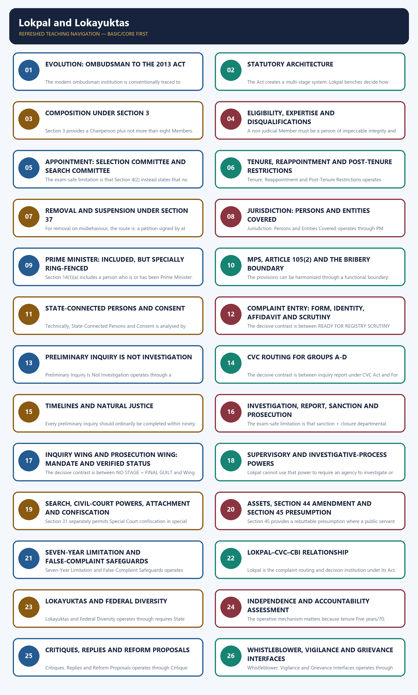

*Distinct embedded teaching-navigation image. The separate continuous Cārvāka-style flowchart package remains an independent at-a-glance artifact.*

Core Idea and Legal Identity denotes the constitutional rules and institutional links organised around Question Correct position Named evidence Exam trap.
Core Idea and Legal Identity operates through What creates Lokpal? Parliamentary statute Lokpal and Lokayuktas Act, 2013 Not a constitutional body, connected with Who determines guilt? Special Court/competent court Sections 24, 35 and criminal procedure Lokpal is not a criminal court.
The operative mechanism matters because "Lokpal has meaningful anti-corruption powers".
Its principal consequence is that ss.20, 23, 25, 29-33 + Special Court.
The decisive contrast is between It can move a complaint across inquiry, investigation and prosecution and No general suo motu jurisdiction; no conviction power; agency dependence remains.
The exam-safe limitation is that question Correct position Named evidence Exam trap.
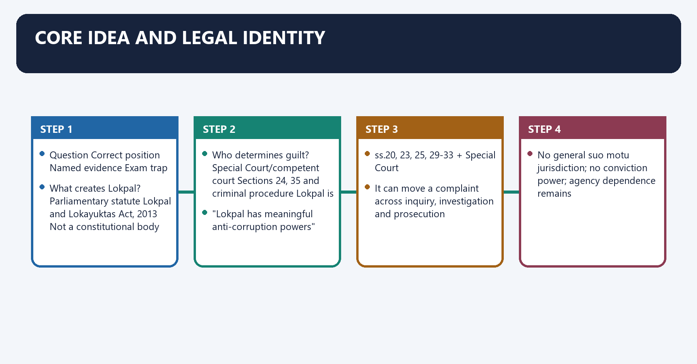
[FACT] The Lokpal is a **statutory body**, established for the Union by the Lokpal and Lokayuktas Act, 2013. It is not created by the Constitution and is not a constitutional court, police force or general public-grievance commission.

[FACT] Section 2 defines a complaint as one made in the prescribed form alleging that a covered public servant committed an offence punishable under the Prevention of Corruption Act, 1988. This makes the institution corruption-specific.

[ANALYSIS] The ombudsman idea supplies the accountability logic, but the enacted Indian model is more than a classical recommendatory grievance office. It can route preliminary inquiry and investigation, supervise the DSPE/CBI in referred matters, grant prosecution sanction, use attachment machinery and direct prosecution under the Act.

[LIMIT] These powers do not make Lokpal the final judge of criminal guilt. Investigation, prosecution and adjudication remain legally distinct stages; conviction or acquittal belongs to the competent court.

#### Visual 02 — Legal Identity Matrix

| Question | Correct position | Named evidence | Exam trap |
|---|---|---|---|
| What creates Lokpal? | Parliamentary statute | Lokpal and Lokayuktas Act, 2013 | Not a constitutional body |
| What type of complaint? | Alleged Prevention of Corruption Act offence by a covered public servant | Section 2(1)(e) | Not every service grievance |
| Does it investigate every case itself? | It may conduct preliminary inquiry through its Inquiry Wing; investigation is assigned to an agency, including DSPE/CBI | Sections 11 and 20 | Inquiry is not police investigation |
| Does it prosecute? | Prosecution Wing or investigating agency may prosecute when directed | Sections 12 and 20(8) | Direction to prosecute is not conviction |
| Who determines guilt? | Special Court/competent court | Sections 24, 35 and criminal procedure | Lokpal is not a criminal court |

*Caption: Legal source, entry condition, process power and final outcome must be kept separate.*

#### Visual 03 — Claim-to-Conclusion Discipline

```text
CLAIM
"Lokpal has meaningful anti-corruption powers"
          |
NAMED EVIDENCE
ss.20, 23, 25, 29-33 + Special Court
          |
ANALYSIS
It can move a complaint across inquiry, investigation and prosecution
          |
QUALIFICATION
No general suo motu jurisdiction; no conviction power; agency dependence remains
```

*Caption: A balanced UPSC answer proves institutional capacity and then identifies its legal boundary.*

### SESSION 1 — EVOLUTION: OMBUDSMAN TO THE 2013 ACT
#### DEFINITION / WHAT THIS IS CALLED

**Plain-language definition:** Evolution: Ombudsman to the 2013 Act denotes the constitutional rules and institutional links organised around Milestone Development Exam significance.

**Technical definition:** The modern ombudsman institution is conventionally traced to Sweden in 1809.

#### ANSWER-GRABBING OPENING — WRITE/ADAPT IN THE EXAM

> The long legislative history shows a recurring design conflict: how to create an institution strong enough to scrutinise high public office without merging complainant, investigator, prosecutor and judge.

#### MUST-WRITE KEYWORDS

- **Evolution**
- **Ombudsman to the 2013 Act**
- **Lokpal at the Union level**
- **Lokayuktas at the State level**
- **1 January 2014**
- **16 January 2014**

**How to use them:** Frame the answer through Evolution; define Ombudsman to the 2013 Act, connect Lokpal at the Union level with Lokayuktas at the State level to explain the mechanism, and use 1 January 2014 for the decisive comparison or qualification.

Evolution: Ombudsman to the 2013 Act denotes the constitutional rules and institutional links organised around Milestone Development Exam significance.
Evolution: Ombudsman to the 2013 Act operates through 1809 Swedish ombudsman Comparative origin, connected with 1966 First ARC recommends Lokpal and Lokayuktas Indian institutional proposal.
The operative mechanism matters because 1968 onward Repeated parliamentary Bills Long implementation delay.
Its principal consequence is that 2011 Renewed public mobilisation and legislative activity Political context only.
The decisive contrast is between 2013 Parliament enacts the law Statutory foundation and 1 Jan 2014 Presidential assent Act No. 1 of 2014.
The exam-safe limitation is that 16 Jan 2014 Commencement notification Legal operation begins.
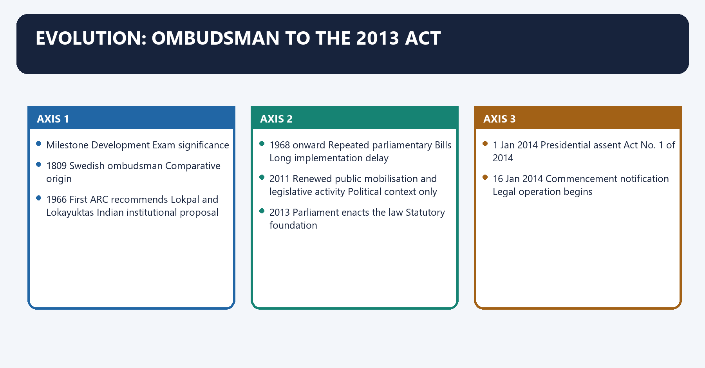
[FACT] The modern ombudsman institution is conventionally traced to Sweden in 1809. Local Polity sources explain its diffusion to other jurisdictions as a mechanism for receiving complaints about administrative wrongdoing.

[FACT] India’s First Administrative Reforms Commission, in its 1966 work on redress of citizens’ grievances, recommended two institutions: a **Lokpal at the Union level** and **Lokayuktas at the State level**.

[FACT] Successive Lokpal Bills beginning in 1968 repeatedly lapsed, were withdrawn or failed to complete enactment. The political and civil-society mobilisation of 2011 formed part of the bounded context in which the later Bill was debated.

[FACT] The Lokpal and Lokayuktas Act received presidential assent on **1 January 2014** and came into force on **16 January 2014** through Gazette notification.

[ANALYSIS] The long legislative history shows a recurring design conflict: how to create an institution strong enough to scrutinise high public office without merging complainant, investigator, prosecutor and judge.

[LIMIT] Civil-society mobilisation explains political salience; it is not the legal source of the institution. The enacted statute, rules and judicial interpretation control the present framework.

#### Visual 04 — Evolution Timeline

| Milestone | Development | Exam significance |
|---|---|---|
| 1809 | Swedish ombudsman | Comparative origin |
| 1966 | First ARC recommends Lokpal and Lokayuktas | Indian institutional proposal |
| 1968 onward | Repeated parliamentary Bills | Long implementation delay |
| 2011 | Renewed public mobilisation and legislative activity | Political context only |
| 2013 | Parliament enacts the law | Statutory foundation |
| 1 Jan 2014 | Presidential assent | Act No. 1 of 2014 |
| 16 Jan 2014 | Commencement notification | Legal operation begins |
| 2016 | Section 44 substituted | Asset-declaration framework changed |
| 2017 | *Common Cause v. Union of India (2017)* holds Act workable despite LoP vacancy | Appointment blockage rejected |
| 2019 | Initial appointments made | Institutional constitution in practice |
| 2024 | Inquiry Wing formally constituted | Statutory wing moved beyond paper creation |
| 2025 | Prosecution Wing constituted and Gazette-notified | Formal prosecution architecture created |
| 2026 | Circular No. 01/2026 consolidates complaint-processing procedure | Current procedural control |

*Caption: Enactment, appointment, wing constitution and procedural consolidation are separate implementation stages.*

#### Visual 05 — Ombudsman, Grievance and Criminal Process

| Model | Core concern | Typical output | Lokpal position |
|---|---|---|---|
| Classical ombudsman | Maladministration/unfairness | Recommendation/report | Historical inspiration |
| Public grievance portal | Service-delivery complaint | Administrative redress | Not Lokpal’s statutory core |
| Vigilance institution | Integrity and departmental vigilance | Advice/disciplinary route | CVC-linked layer |
| Police investigation | Evidence collection for offences | Police report/charge-sheet | CBI/agency role |
| Lokpal model | Prescribed corruption complaint against covered public servant | Inquiry routing, supervision, sanction, prosecution direction | Hybrid statutory ombudsman |
| Court | Criminal adjudication | Conviction/acquittal/sentence | Separate final stage |

*Caption: Calling every accountability mechanism an “ombudsman” conceals decisive differences in jurisdiction and legal output.*

#### CLOSING RECALL FLOW — EVOLUTION: OMBUDSMAN TO THE 2013 ACT

```closure-flow
SUBTOPIC: Evolution: Ombudsman to the 2013 Act
KEY TERMS / DEFINITIONS: Evolution · Ombudsman to the 2013 Act · Lokpal at the Union level · Lokayuktas at the State level · 1 January 2014 · 16 January 2014
MECHANISM / ARGUMENT: Local Polity sources explain its diffusion to other jurisdictions as a mechanism for receiving complaints about administrative wrongdoing.
CONSEQUENCE / CONTRAST: Its principal consequence is that 2011 Renewed public mobilisation and legislative activity Political context only.
UPSC TRAP / ANSWER-USE: Do not miss this limiting distinction: the decisive contrast is between 2013 Parliament enacts the law Statutory foundation and 1...
ANSWER-GRABBING FORMULATION: The long legislative history shows a recurring design conflict: how to create an institution strong enough to scrutinise high public office without merging complainant, investigator, prosecutor and judge.
```
### SESSION 2 — STATUTORY ARCHITECTURE
#### DEFINITION / WHAT THIS IS CALLED

**Plain-language definition:** Statutory Architecture denotes the constitutional rules and institutional links organised around PRESCRIBED COMPLAINT.

**Technical definition:** The Act creates a multi-stage system: Lokpal benches decide how complaints proceed; the Inquiry Wing undertakes preliminary inquiry; the CVC receives prescribed categories; investigating agencies conduct investigation; the Prosecution Wing or agency prosecutes; Special Courts adjudicate.

#### ANSWER-GRABBING OPENING — WRITE/ADAPT IN THE EXAM

> Lokpal's multi-agency architecture reduces concentration of complainant, investigator, prosecutor and judge roles, but creates coordination and delay risks.

#### MUST-WRITE KEYWORDS

- **Statutory Architecture**
- **Filing/scrutiny**
- **Registry and Lokpal bench**
- **Form, jurisdiction, maintainability**
- **Criminal guilt**
- **Preliminary inquiry**

**How to use them:** Frame the answer through Statutory Architecture; define Filing/scrutiny, connect Registry and Lokpal bench with Form, jurisdiction, maintainability to explain the mechanism, and use Criminal guilt for the decisive comparison or qualification.

Statutory Architecture denotes the constitutional rules and institutional links organised around PRESCRIBED COMPLAINT.
Statutory Architecture operates through +---------------------+, connected with PRELIMINARY INQUIRY DIRECT INVESTIGATION.
The operative mechanism matters because inquiry Wing / CVC / CBI-DSPE or other agency.
Its principal consequence is that tHREE-MEMBER BENCH.
The decisive contrast is between investigate departmental close and INVESTIGATION REPORT.
The exam-safe limitation is that sanction / charge-sheet / closure.
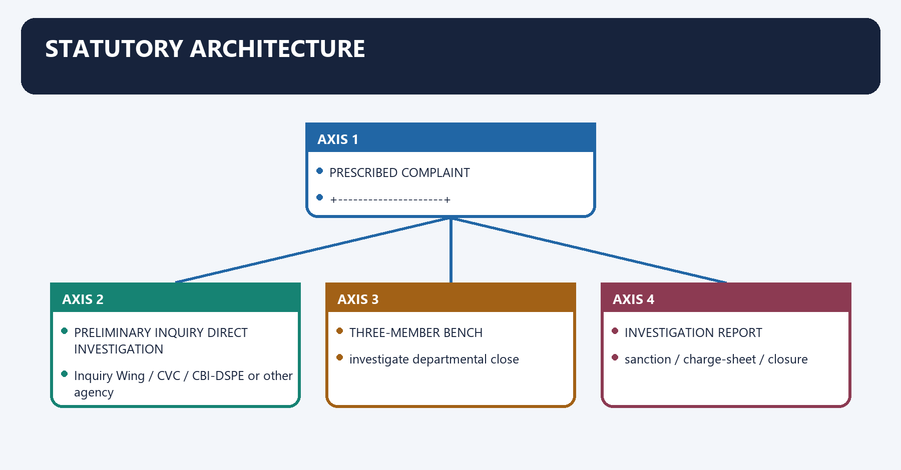
[FACT] The Act creates a multi-stage system: Lokpal benches decide how complaints proceed; the Inquiry Wing undertakes preliminary inquiry; the CVC receives prescribed categories; investigating agencies conduct investigation; the Prosecution Wing or agency prosecutes; Special Courts adjudicate.

[ANALYSIS] The architecture deliberately disperses power. This reduces the danger of a single institution controlling every stage, but creates coordination, delay and responsibility-diffusion risks.

#### Visual 06 — Statutory Architecture

```text
PRESCRIBED COMPLAINT
        |
     LOKPAL
        |
  +-----+---------------------+
  |                           |
PRELIMINARY INQUIRY       DIRECT INVESTIGATION
  |                           |
Inquiry Wing / CVC /      CBI-DSPE or other agency
other agency                  |
  +-------------+-------------+
                |
       THREE-MEMBER BENCH
                |
   +------------+-------------+
   |            |             |
investigate   departmental   close
                action
                |
        INVESTIGATION REPORT
                |
   sanction / charge-sheet / closure
                |
     Prosecution Wing / agency
                |
          SPECIAL COURT
```

*Caption: The statute separates screening, preliminary inquiry, investigation, prosecution and adjudication.*

#### Visual 07 — Power Holder by Stage

| Stage | Principal actor | Legal task | What it does not decide |
|---|---|---|---|
| Filing/scrutiny | Registry and Lokpal bench | Form, jurisdiction, maintainability | Criminal guilt |
| Preliminary inquiry | Inquiry Wing/CVC/agency | Whether prima facie case exists | Final culpability |
| Investigation | CBI/DSPE or other agency | Collect admissible evidence | Conviction |
| Post-report decision | At least three Lokpal Members | Sanction, prosecution/closure, departmental route | Trial verdict |
| Prosecution | Prosecution Wing/agency | Present case before Special Court | Judicial outcome |
| Trial | Special Court | Decide charges on evidence | Institutional policy |

*Caption: “Lokpal investigated and convicted” is an invalid compression of multiple legal stages.*

#### CLOSING RECALL FLOW — STATUTORY ARCHITECTURE

```closure-flow
SUBTOPIC: Statutory Architecture
KEY TERMS / DEFINITIONS: Statutory Architecture · Filing/scrutiny · Registry and Lokpal bench · Form, jurisdiction, maintainability · Criminal guilt · Preliminary inquiry
MECHANISM / ARGUMENT: The Act creates a multi-stage system: Lokpal benches decide how complaints proceed; the Inquiry Wing undertakes preliminary inquiry; the CVC receives prescribed categories; investigating agencies conduct investigation; the Prosecution Wing or agency prosecutes; Special Courts adjudicate.
CONSEQUENCE / CONTRAST: The decisive contrast is between investigate departmental close and INVESTIGATION REPORT.
UPSC TRAP / ANSWER-USE: This reduces the danger of a single institution controlling every stage, but creates coordination, delay and responsibility-diffusion risks.
ANSWER-GRABBING FORMULATION: Lokpal's multi-agency architecture reduces concentration of complainant, investigator, prosecutor and judge roles, but creates coordination and delay risks.
```
### SESSION 3 — COMPOSITION UNDER SECTION 3
#### DEFINITION / WHAT THIS IS CALLED

**Plain-language definition:** Composition Under Section 3 denotes the constitutional rules and institutional links organised around Section 3 provides a Chairperson plus not more than eight Members.

**Technical definition:** Section 3 provides a Chairperson plus not more than eight Members.

#### ANSWER-GRABBING OPENING — WRITE/ADAPT IN THE EXAM

> Section 3 separates the Lokpal Chairperson from up to eight members and applies judicial and social-representation requirements to the member body on their statutory terms.

#### MUST-WRITE KEYWORDS

- **Composition Under Section 3**
- **Chairperson plus not more than eight Members**
- **Judicial membership**
- **Members**
- **“At least half of the whole Lokpal”**
- **50% shall be Judicial Members**

**How to use them:** Frame the answer through Composition Under Section 3; define Chairperson plus not more than eight Members, connect Judicial membership with Members to explain the mechanism, and use “At least half of the whole Lokpal” for the decisive comparison or qualification.

Composition Under Section 3 denotes the constitutional rules and institutional links organised around [FACT] Section 3 provides a Chairperson plus not more than eight Members.
Composition Under Section 3 operates through +----------------+, connected with CHAIRPERSON MEMBERS: <= 8.
The operative mechanism matters because +-------------------+.
Its principal consequence is that 50% Judicial Members Remaining non-judicial.
The decisive contrast is between REPRESENTATION FLOOR ACROSS MEMBERS and not less than 50% from SC / ST / OBC / minorities / women.
The exam-safe limitation is that rule Denominator Exact language Wrong shortcut.
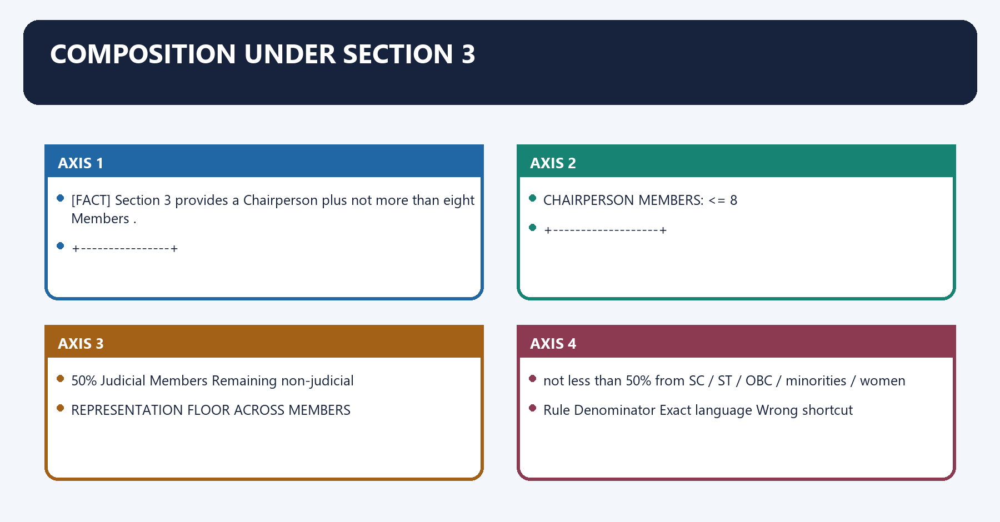
[FACT] Section 3 provides a **Chairperson plus not more than eight Members**.

[FACT] **Fifty per cent of the Members shall be Judicial Members.** The statutory percentage applies to the Members, not to a combined denominator that automatically includes the Chairperson.

[FACT] **Not less than fifty per cent of the Members** must be from among persons belonging to the Scheduled Castes, Scheduled Tribes, Other Backward Classes, minorities and women.

[ANALYSIS] The first rule distributes professional background; the second establishes a social-representation floor. They are different requirements and can overlap in the same individual.

[LIMIT] “Maximum eight” is a ceiling, not a permanent guarantee that every seat is always filled. This package does not freeze the current occupancy of those seats.

#### Visual 08 — Composition at a Glance

```text
                         LOKPAL
                           |
          +----------------+----------------+
          |                                 |
     CHAIRPERSON                      MEMBERS: <= 8
                                             |
                         +-------------------+-------------------+
                         |                                       |
                50% Judicial Members                 Remaining non-judicial

REPRESENTATION FLOOR ACROSS MEMBERS:
not less than 50% from SC / ST / OBC / minorities / women
```

*Caption: Judicial share and representation share are two distinct statutory calculations.*

#### Visual 09 — Percentage Rules Without Confusion

| Rule | Denominator | Exact language | Wrong shortcut |
|---|---|---|---|
| Judicial membership | Members | 50% shall be Judicial Members | “At least half of the whole Lokpal” |
| Social representation | Members | Not less than 50% from listed categories | “Exactly half including Chairperson” |
| Total size | Members | Not exceeding eight | “Always eight members” |

*Caption: UPSC close options often alter the denominator or replace a floor with an exact quota.*

#### CLOSING RECALL FLOW — COMPOSITION UNDER SECTION 3

```closure-flow
SUBTOPIC: Composition Under Section 3
KEY TERMS / DEFINITIONS: Composition Under Section 3 · Chairperson plus not more than eight Members · Judicial membership · Members · “At least half of the whole Lokpal” · 50% shall be Judicial Members
MECHANISM / ARGUMENT: Section 3 provides a Chairperson plus not more than eight Members.
CONSEQUENCE / CONTRAST: Its principal consequence is that 50% Judicial Members Remaining non-judicial.
UPSC TRAP / ANSWER-USE: The decisive contrast is between REPRESENTATION FLOOR ACROSS MEMBERS and not less than 50% from SC / ST / OBC / minorities / women.
ANSWER-GRABBING FORMULATION: Section 3 separates the Lokpal Chairperson from up to eight members and applies judicial and social-representation requirements to the member body on their statutory terms.
```
### SESSION 4 — ELIGIBILITY, EXPERTISE AND DISQUALIFICATIONS
#### DEFINITION / WHAT THIS IS CALLED

**Plain-language definition:** Eligibility, Expertise and Disqualifications denotes the constitutional rules and institutional links organised around A Judicial Member must be or have been a Supreme Court Judge or Chief Justice of a High Court.

**Technical definition:** A non-judicial Member must be a person of impeccable integrity and outstanding ability with at least twenty-five years of special knowledge and expertise in anti-corruption policy, public administration, vigilance, finance including insurance and banking, law and management.

#### ANSWER-GRABBING OPENING — WRITE/ADAPT IN THE EXAM

> Lokpal eligibility combines judicial routes with a non-judicial expertise route, balancing adjudicatory competence with wider public-administration experience.

#### MUST-WRITE KEYWORDS

- **Eligibility**
- **Expertise**
- **Disqualifications**
- **twenty-five years**
- **forty-five years**
- **Chairperson — judicial route**

**How to use them:** Frame the answer through Eligibility; define Expertise, connect Disqualifications with twenty-five years to explain the mechanism, and use forty-five years for the decisive comparison or qualification.

Eligibility, Expertise and Disqualifications denotes the constitutional rules and institutional links organised around [FACT] A Judicial Member must be or have been a Supreme Court Judge or Chief Justice of a High Court.
Eligibility, Expertise and Disqualifications operates through [FACT] The Chairperson or a Member cannot be below forty-five years on assuming office, connected with Office Eligible background Experience threshold.
The operative mechanism matters because chairperson — judicial route Current/former CJI or current/former Supreme Court Judge Office-based.
Its principal consequence is that chairperson — eminent-person route Integrity and outstanding ability in listed fields At least 25 years.
The decisive contrast is between Judicial Member Current/former Supreme Court Judge or current/former High Court Chief Justice Office-based and Non-judicial Member Listed anti-corruption/governance/finance/law/management expertise At least 25 years.
The exam-safe limitation is that every appointee Must be at least 45 on assuming office Age floor.
[FACT] A Chairperson may be a person who is or has been Chief Justice of India, is or has been a Supreme Court Judge, or is an eminent person satisfying the non-judicial expertise condition.

[FACT] A Judicial Member must be or have been a Supreme Court Judge or Chief Justice of a High Court.

[FACT] A non-judicial Member must be a person of impeccable integrity and outstanding ability with at least **twenty-five years** of special knowledge and expertise in anti-corruption policy, public administration, vigilance, finance including insurance and banking, law and management.

[FACT] The Chairperson or a Member cannot be below **forty-five years** on assuming office.

[FACT] Section 3 also excludes an MP, State/UT legislator, Panchayat or Municipality member, a person convicted of an offence involving moral turpitude, and a person removed or dismissed from Union or State service.

[FACT] An appointee cannot hold another office of trust or profit, be affiliated with a political party, carry on business or practise a profession; existing conflicting engagements must be severed before entry into office.

#### Visual 10 — Eligibility Matrix

| Office | Eligible background | Experience threshold |
|---|---|---:|
| Chairperson — judicial route | Current/former CJI or current/former Supreme Court Judge | Office-based |
| Chairperson — eminent-person route | Integrity and outstanding ability in listed fields | At least 25 years |
| Judicial Member | Current/former Supreme Court Judge or current/former High Court Chief Justice | Office-based |
| Non-judicial Member | Listed anti-corruption/governance/finance/law/management expertise | At least 25 years |
| Every appointee | Must be at least 45 on assuming office | Age floor |

*Caption: The Chairperson is not confined to a serving or retired Chief Justice of India.*

#### Visual 11 — Disqualification Screen

```text
IS THE PERSON:
MP / State or UT legislator? ---------------- yes -> ineligible
Panchayat / Municipality member? ------------ yes -> ineligible
convicted of moral-turpitude offence? -------- yes -> ineligible
removed/dismissed from Union/State service? -- yes -> ineligible
under 45 on assuming office? ----------------- yes -> ineligible
politically affiliated / in business /
profession / other trust or profit office? --- must sever before entry
```

*Caption: Eligibility credentials do not cure an express statutory disqualification.*

#### CLOSING RECALL FLOW — ELIGIBILITY, EXPERTISE AND DISQUALIFICATIONS

```closure-flow
SUBTOPIC: Eligibility, Expertise and Disqualifications
KEY TERMS / DEFINITIONS: Eligibility · Expertise · Disqualifications · twenty-five years · forty-five years · Chairperson — judicial route
MECHANISM / ARGUMENT: A non-judicial Member must be a person of impeccable integrity and outstanding ability with at least twenty-five years of special knowledge and expertise in anti-corruption policy, public administration, vigilance, finance including insurance and banking, law and management.
CONSEQUENCE / CONTRAST: The decisive contrast is between Judicial Member Current/former Supreme Court Judge or current/former High Court Chief Justice Office-based and Non-judicial Member Listed anti-corruption/governance/finance/law/management expertise At least 25 years.
UPSC TRAP / ANSWER-USE: Do not miss this limiting distinction: its principal consequence is that chairperson — eminent-person route Integrity and outstanding ability in...
ANSWER-GRABBING FORMULATION: Lokpal eligibility combines judicial routes with a non-judicial expertise route, balancing adjudicatory competence with wider public-administration experience.
```
### SESSION 5 — APPOINTMENT: SELECTION COMMITTEE AND SEARCH COMMITTEE
#### DEFINITION / WHAT THIS IS CALLED

**Plain-language definition:** Appointment: Selection Committee and Search Committee denotes the constitutional rules and institutional links organised around The President appoints the Chairperson and Members on the recommendation of the Selection Committee.

**Technical definition:** The exam-safe limitation is that Section 4(2) instead states that no appointment is invalid merely because of a vacancy in the Selection Committee.

#### ANSWER-GRABBING OPENING — WRITE/ADAPT IN THE EXAM

> Lokpal appointments follow the statutory Selection and Search Committees, so political substitutions cannot be assumed beyond the Act's text.

#### MUST-WRITE KEYWORDS

- **Appointment**
- **Selection Committee**
- **Search Committee**
- **Leader of Opposition**
- **at least seven persons**
- **Prime Minister**

**How to use them:** Frame the answer through Appointment; define Selection Committee, connect Search Committee with Leader of Opposition to explain the mechanism, and use at least seven persons for the decisive comparison or qualification.

Appointment: Selection Committee and Search Committee denotes the constitutional rules and institutional links organised around [FACT] The President appoints the Chairperson and Members on the recommendation of the Selection Committee.
Appointment: Selection Committee and Search Committee operates through [FACT] Section 4 names five positions, connected with Prime Minister — Chairperson.
The operative mechanism matters because speaker of the Lok Sabha.
Its principal consequence is that leader of Opposition in the Lok Sabha.
The decisive contrast is between Chief Justice of India or a Supreme Court Judge nominated by the CJI; and and one eminent jurist nominated by the President on the recommendation of the first four.
The exam-safe limitation is that [FACT] Section 4(2) instead states that no appointment is invalid merely because of a vacancy in the Selection Committee.
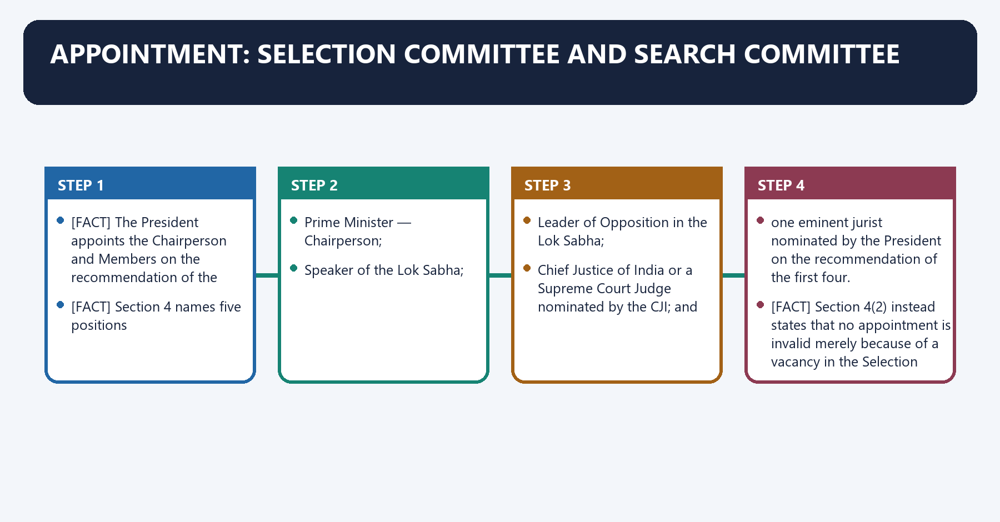
[FACT] The President appoints the Chairperson and Members on the recommendation of the Selection Committee.

[FACT] Section 4 names five positions:

1. Prime Minister — Chairperson;
2. Speaker of the Lok Sabha;
3. Leader of Opposition in the Lok Sabha;
4. Chief Justice of India or a Supreme Court Judge nominated by the CJI; and
5. one eminent jurist nominated by the President on the recommendation of the first four.

[CURRENT] The current India Code text checked for this package names the **Leader of Opposition**. It does not insert the leader of the single largest opposition party as a statutory substitute for Lokpal appointments.

[FACT] Section 4(2) instead states that no appointment is invalid merely because of a vacancy in the Selection Committee.

[FACT] The Selection Committee constitutes a Search Committee of **at least seven persons** of standing and relevant expertise. Not less than fifty per cent of its members must come from the same listed diversity categories. The Selection Committee may consider a person not recommended by the Search Committee.

[ANALYSIS] Search identifies a panel; Selection makes the recommendation; the President makes the appointment. Treating the Search Committee as the final appointing body reverses the statutory sequence.

#### Visual 12 — Appointment Chain

```text
SEARCH COMMITTEE
at least 7 experts
prepares panel
       |
       v
SELECTION COMMITTEE
PM + Speaker + LoP + CJI/nominee + eminent jurist
recommends Chairperson/Members
       |
       v
PRESIDENT
appoints by warrant under hand and seal
```

*Caption: Search, recommendation and appointment are three different legal acts.*

#### Visual 13 — Selection Committee: Exact Seats

| Seat | Status under section 4 | Frequent confusion |
|---|---|---|
| Prime Minister | Chairperson | Not President |
| Lok Sabha Speaker | Member | Not Rajya Sabha Chairman |
| Lok Sabha Leader of Opposition | Member | Current text contains no largest-party substitute |
| CJI or CJI-nominated Supreme Court Judge | Member | Not any judge chosen by executive |
| Eminent jurist | President nominates on recommendation of first four | Not independently chosen by President |

*Caption: Appointment questions often swap Speaker/Chairman, LoP/opposition leader or CJI/nominee.*

#### Visual 14 — Search vs Selection

| Feature | Search Committee | Selection Committee |
|---|---|---|
| Size | At least seven | Five statutory positions |
| Main task | Prepare panel | Select and recommend |
| Diversity rule | Not less than 50% listed categories | No identical quota stated for committee seats |
| Expertise | Anti-corruption, administration, vigilance, policy, finance, law, management and useful fields | Institutional office-holders plus eminent jurist |
| Binding effect | Panel is not exclusive | May consider person outside Search panel |

*Caption: Search-panel eligibility is not final-selection entitlement.*

#### Visual 15 — Vacancy Rule and *Common Cause v. Union of India (2017)*

```text
NO RECOGNISED LoP / OTHER VACANCY
             |
Section 4(2): appointment not invalid merely because of vacancy
             |
Common Cause v. Union of India (2017):
truncated Selection Committee can appoint eminent jurist,
constitute Search Committee and recommend appointments
             |
RESULT:
Act remains workable; vacancy cannot suspend enforcement
```

*Caption: The judicial solution was workability through the vacancy clause, not rewriting a substitute into section 4.*

#### CLOSING RECALL FLOW — APPOINTMENT: SELECTION COMMITTEE AND SEARCH COMMITTEE

```closure-flow
SUBTOPIC: Appointment: Selection Committee and Search Committee
KEY TERMS / DEFINITIONS: Appointment · Selection Committee · Search Committee · Leader of Opposition · at least seven persons · Prime Minister
MECHANISM / ARGUMENT: The exam-safe limitation is that Section 4(2) instead states that no appointment is invalid merely because of a vacancy in the Selection Committee.
CONSEQUENCE / CONTRAST: It does not insert the leader of the single largest opposition party as a statutory substitute for Lokpal appointments.
UPSC TRAP / ANSWER-USE: Do not miss this limiting distinction: section 4(2) instead states that no appointment is invalid merely because of a vacancy...
ANSWER-GRABBING FORMULATION: Lokpal appointments follow the statutory Selection and Search Committees, so political substitutions cannot be assumed beyond the Act's text.
```
### SESSION 6 — TENURE, REAPPOINTMENT AND POST-TENURE RESTRICTIONS
#### DEFINITION / WHAT THIS IS CALLED

**Plain-language definition:** Tenure, Reappointment and Post-Tenure Restrictions denotes the constitutional rules and institutional links organised around Section 6 fixes the term at five years from entering office or until age seventy, whichever is earlier.

**Technical definition:** Tenure, Reappointment and Post-Tenure Restrictions operates through The Chairperson or Member may resign to the President or be removed under section 37, connected with A Member may be appointed Chairperson if the aggregate tenure as Member and Chairperson does not exceed five years.

#### ANSWER-GRABBING OPENING — WRITE/ADAPT IN THE EXAM

> A Member may be appointed Chairperson if the aggregate tenure as Member and Chairperson does not exceed five years.

#### MUST-WRITE KEYWORDS

- **Tenure**
- **Reappointment**
- **Post-Tenure Restrictions**
- **Reappointment to Lokpal**
- **Ineligible, subject to Member-to-Chair aggregate exception**
- **Diplomatic/UT administrator/specified presidential appointment**

**How to use them:** Frame the answer through Tenure; define Reappointment, connect Post-Tenure Restrictions with Reappointment to Lokpal to explain the mechanism, and use Ineligible, subject to Member-to-Chair aggregate exception for the decisive comparison or qualification.

Tenure, Reappointment and Post-Tenure Restrictions denotes the constitutional rules and institutional links organised around [FACT] Section 6 fixes the term at five years from entering office or until age seventy, whichever is earlier.
Tenure, Reappointment and Post-Tenure Restrictions operates through [FACT] The Chairperson or Member may resign to the President or be removed under section 37, connected with [FACT] A Member may be appointed Chairperson if the aggregate tenure as Member and Chairperson does not exceed five years.
The operative mechanism matters because five-year period ends.
Its principal consequence is that eARLIER EVENT ENDS TENURE.
The decisive contrast is between EXCEPTIONAL CAREER MOVE and Member - Chairperson permitted.
The exam-safe limitation is that only if aggregate Lokpal tenure <= 5 years.
[FACT] Section 6 fixes the term at **five years from entering office or until age seventy, whichever is earlier**.

[FACT] The Chairperson or Member may resign to the President or be removed under section 37.

[FACT] On leaving office, the Chairperson and every Member are ineligible for reappointment as Chairperson or Member, diplomatic assignment, Union Territory administrator or another presidential-warrant assignment, and further office of profit under Union or State government.

[FACT] They cannot contest election as President, Vice-President, MP, State legislator, Municipality or Panchayat member for five years after relinquishing office.

[FACT] A Member may be appointed Chairperson if the aggregate tenure as Member and Chairperson does not exceed five years.

#### Visual 16 — Tenure Clock

```text
ENTRY INTO OFFICE
       |
       +--> five-year period ends
       |
       +--> age 70 reached
       |
EARLIER EVENT ENDS TENURE

EXCEPTIONAL CAREER MOVE:
Member -> Chairperson permitted
only if aggregate Lokpal tenure <= 5 years
```

*Caption: “Five years” is subject to the age ceiling and aggregate-tenure rule.*

#### Visual 17 — Post-Tenure Firewall

| Restriction | Duration/form |
|---|---|
| Reappointment to Lokpal | Ineligible, subject to Member-to-Chair aggregate exception |
| Diplomatic/UT administrator/specified presidential appointment | Ineligible |
| Government office of profit | Ineligible |
| Election to named public offices | Five-year cooling-off period |

*Caption: Fixed tenure is paired with restrictions designed to reduce expectation of executive reward.*

#### CLOSING RECALL FLOW — TENURE, REAPPOINTMENT AND POST-TENURE RESTRICTIONS

```closure-flow
SUBTOPIC: Tenure, Reappointment and Post-Tenure Restrictions
KEY TERMS / DEFINITIONS: Tenure · Reappointment · Post-Tenure Restrictions · Reappointment to Lokpal · Ineligible, subject to Member-to-Chair aggregate exception · Diplomatic/UT administrator/specified presidential appointment
MECHANISM / ARGUMENT: Tenure, Reappointment and Post-Tenure Restrictions operates through The Chairperson or Member may resign to the President or be removed under section 37, connected with A Member may be appointed Chairperson if the aggregate tenure as Member and Chairperson does not exceed five years.
CONSEQUENCE / CONTRAST: A Member may be appointed Chairperson if the aggregate tenure as Member and Chairperson does not exceed five years.
UPSC TRAP / ANSWER-USE: Do not miss this limiting distinction: its principal consequence is that eARLIER EVENT ENDS TENURE.
ANSWER-GRABBING FORMULATION: A Member may be appointed Chairperson if the aggregate tenure as Member and Chairperson does not exceed five years.
```
### SESSION 7 — REMOVAL AND SUSPENSION UNDER SECTION 37
#### DEFINITION / WHAT THIS IS CALLED

**Plain-language definition:** Removal and Suspension Under Section 37 denotes the constitutional rules and institutional links organised around Lokpal cannot inquire into a complaint against its own Chairperson or Member.

**Technical definition:** For removal on misbehaviour, the route is: a petition signed by at least one hundred Members of Parliament; Presidential reference to the Supreme Court; Supreme Court inquiry and report that removal is warranted; Presidential removal order.

#### ANSWER-GRABBING OPENING — WRITE/ADAPT IN THE EXAM

> Section 37 protects Lokpal tenure through a special judicial-reference route for misbehaviour, while allowing direct presidential removal on separately listed incapacity grounds.

#### MUST-WRITE KEYWORDS

- **Removal**
- **Suspension Under Section 37**
- **misbehaviour**
- **one hundred Members of Parliament**
- **Section 37(2)**
- **Yes**

**How to use them:** Frame the answer through Removal; define Suspension Under Section 37, connect misbehaviour with one hundred Members of Parliament to explain the mechanism, and use Section 37(2) for the decisive comparison or qualification.

Removal and Suspension Under Section 37 denotes the constitutional rules and institutional links organised around [FACT] Lokpal cannot inquire into a complaint against its own Chairperson or Member.
Removal and Suspension Under Section 37 operates through PETITION SIGNED BY = 100 MPs, connected with PRESIDENTIAL REFERENCE.
The operative mechanism matters because sUPREME COURT INQUIRY.
Its principal consequence is that sC reports that removal is warranted.
The decisive contrast is between PRESIDENTIAL ORDER and suspension only on SC recommendation/interim order.
The exam-safe limitation is that route Ground Supreme Court inquiry?.
[FACT] Lokpal cannot inquire into a complaint against its own Chairperson or Member.

[FACT] For removal on **misbehaviour**, the route is: a petition signed by at least **one hundred Members of Parliament**; Presidential reference to the Supreme Court; Supreme Court inquiry and report that removal is warranted; Presidential removal order.

[FACT] Once a reference is made, the President may suspend the Chairperson or Member on the Supreme Court’s recommendation or interim order until the final report is acted upon.

[FACT] The President may directly remove a Chairperson or Member who is adjudged insolvent, engages in paid employment outside official duties during the term, or is considered unfit by reason of infirmity of mind or body.

[FACT] Interest in a Union or State government contract, or participation in its profit/benefit beyond ordinary incorporated-company membership, is deemed misbehaviour.

[LIMIT] Do not import the removal procedures of CVC, NHRC or Election Commission. Section 37 has its own threshold, grounds and judicial-reference architecture.

#### Visual 18 — Misbehaviour Removal Route

```text
PETITION SIGNED BY >= 100 MPs
              |
        PRESIDENTIAL REFERENCE
              |
       SUPREME COURT INQUIRY
              |
SC reports that removal is warranted
              |
       PRESIDENTIAL ORDER

PENDING REFERENCE:
suspension only on SC recommendation/interim order
```

*Caption: The Supreme Court inquiry is central to the misbehaviour route.*

#### Visual 19 — Direct Grounds vs Inquiry Ground

| Route | Ground | Supreme Court inquiry? |
|---|---|---|
| Section 37(2) | Misbehaviour | Yes |
| Section 37(4)(a) | Insolvency | Not under subsection (2) route |
| Section 37(4)(b) | Paid outside employment during term | Not under subsection (2) route |
| Section 37(4)(c) | Mental or physical infirmity rendering person unfit | Not under subsection (2) route |
| Section 37(5) | Government-contract interest | Deemed misbehaviour; subsection (2) route |

*Caption: Not every removal ground uses the same procedure.*

#### CLOSING RECALL FLOW — REMOVAL AND SUSPENSION UNDER SECTION 37

```closure-flow
SUBTOPIC: Removal and Suspension Under Section 37
KEY TERMS / DEFINITIONS: Removal · Suspension Under Section 37 · misbehaviour · one hundred Members of Parliament · Section 37(2) · Yes
MECHANISM / ARGUMENT: For removal on misbehaviour, the route is: a petition signed by at least one hundred Members of Parliament; Presidential reference to the Supreme Court; Supreme Court inquiry and report that removal is warranted; Presidential removal order.
CONSEQUENCE / CONTRAST: Its principal consequence is that sC reports that removal is warranted.
UPSC TRAP / ANSWER-USE: Do not import the removal procedures of CVC, NHRC or Election Commission.
ANSWER-GRABBING FORMULATION: Section 37 protects Lokpal tenure through a special judicial-reference route for misbehaviour, while allowing direct presidential removal on separately listed incapacity grounds.
```
### SESSION 8 — JURISDICTION: PERSONS AND ENTITIES COVERED
#### DEFINITION / WHAT THIS IS CALLED

**Plain-language definition:** Jurisdiction: Persons and Entities Covered denotes the constitutional rules and institutional links organised around Former public servants remain covered for conduct during the period in which they held or served in the relevant capacity.

**Technical definition:** Jurisdiction: Persons and Entities Covered operates through PM (guarded) Union Ministers MPs, connected with UNION PUBLIC SERVICE.

#### ANSWER-GRABBING OPENING — WRITE/ADAPT IN THE EXAM

> Section 14(3) can reach another person involved in abetting, bribe giving, bribe taking or conspiracy connected with a corruption allegation against a covered person, subject to State consent where the person serves State affairs.

#### MUST-WRITE KEYWORDS

- **Jurisdiction**
- **Persons**
- **Entities Covered**
- **Sitting/former Prime Minister**
- **Yes**
- **Special exclusions and procedure**

**How to use them:** Frame the answer through Jurisdiction; define Persons, connect Entities Covered with Sitting/former Prime Minister to explain the mechanism, and use Yes for the decisive comparison or qualification.

Jurisdiction: Persons and Entities Covered denotes the constitutional rules and institutional links organised around [FACT] Former public servants remain covered for conduct during the period in which they held or served in the relevant capacity.
Jurisdiction: Persons and Entities Covered operates through PM (guarded) Union Ministers MPs, connected with UNION PUBLIC SERVICE.
The operative mechanism matters because groups A B C D former officials.
Its principal consequence is that pUBLICLY CREATED / FUNDED / CONTROLLED ENTITIES.
The decisive contrast is between boards corporations authorities companies societies trusts and OTHER COVERED ENTITIES.
The exam-safe limitation is that notified government-finance threshold specified foreign contribution.
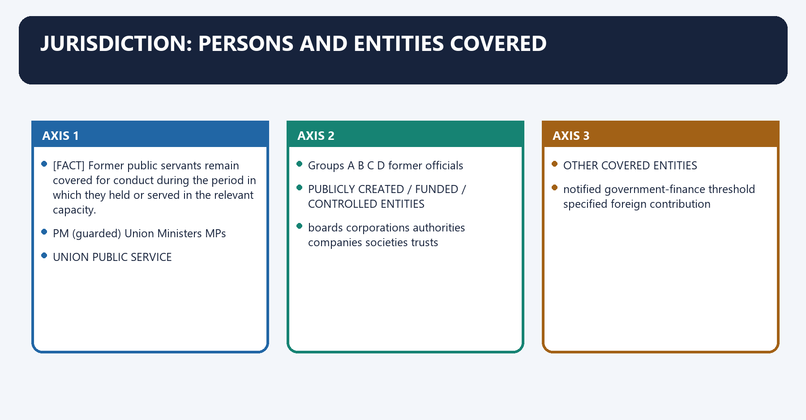
[FACT] Section 14 covers current and former Prime Ministers, Union Ministers, Members of Parliament, Group A-D Union officials and specified persons in statutory, financed or controlled bodies.

[FACT] Former public servants remain covered for conduct during the period in which they held or served in the relevant capacity.

[FACT] Officers of entities established by an Act of Parliament, or wholly or partly financed or controlled by the Central Government, fall within clause (f).

[FACT] Clause (g) reaches officers of other societies, associations or trusts wholly or partly financed by Government where annual income exceeds the amount notified by the Central Government. Because that threshold can be notification-dependent, it is not frozen here.

[FACT] Clause (h) reaches officers of other societies, associations or trusts receiving foreign-source donations exceeding **ten lakh rupees in a year or a higher amount notified by the Central Government**.

[FACT] Section 14(3) can reach another person involved in abetting, bribe giving, bribe taking or conspiracy connected with a corruption allegation against a covered person, subject to State consent where the person serves State affairs.

[FACT] The definition of public servant excludes persons for whom jurisdiction or procedure lies under the Army, Air Force, Navy or Coast Guard Acts.

#### Visual 20 — Jurisdiction Concentric Map

```text
CORE HIGH OFFICES
PM (guarded) | Union Ministers | MPs
             |
UNION PUBLIC SERVICE
Groups A | B | C | D | former officials
             |
PUBLICLY CREATED / FUNDED / CONTROLLED ENTITIES
boards | corporations | authorities | companies | societies | trusts
             |
OTHER COVERED ENTITIES
notified government-finance threshold | specified foreign contribution
             |
CONNECTED PRIVATE ACTORS
abetting | bribe giving/taking | conspiracy
```

*Caption: Jurisdiction follows statutory category and allegation, not the public prominence of the person alone.*

#### Visual 21 — Coverage Matrix

| Category | Covered? | Qualification |
|---|---:|---|
| Sitting/former Prime Minister | Yes | Special exclusions and procedure |
| Sitting/former Union Minister | Yes | Ordinary statutory procedure subject to Act |
| Sitting/former MP | Yes | Article 105(2) speech/vote exclusion |
| Group A-D Union official | Yes | CVC routing differs by category |
| Former Union official | Yes | Conduct must relate to period in covered capacity |
| State official | Not automatically | Consent provisions may apply |
| Armed-forces personnel governed by named service Acts | Excluded from Act’s public-servant definition for that jurisdiction/procedure | Special legal systems |
| Any NGO merely because registered | No | Funding/control/foreign-contribution conditions matter |

*Caption: Registration alone is not the jurisdictional test for a private society or trust.*

#### Visual 22 — Current/Former Test

```text
ALLEGED ACT DATE
      |
Was the person then holding/serving in a section 14 capacity?
      |
  yes + complaint within limitation -> former status does not erase jurisdiction
  no  -> present fame or later office cannot create retrospective category coverage
```

*Caption: The Act attaches the allegation to the period of covered public service.*

#### CLOSING RECALL FLOW — JURISDICTION: PERSONS AND ENTITIES COVERED

```closure-flow
SUBTOPIC: Jurisdiction: Persons and Entities Covered
KEY TERMS / DEFINITIONS: Jurisdiction · Persons · Entities Covered · Sitting/former Prime Minister · Yes · Special exclusions and procedure
MECHANISM / ARGUMENT: Jurisdiction: Persons and Entities Covered operates through PM (guarded) Union Ministers MPs, connected with UNION PUBLIC SERVICE.
CONSEQUENCE / CONTRAST: The decisive contrast is between boards corporations authorities companies societies trusts and OTHER COVERED ENTITIES.
UPSC TRAP / ANSWER-USE: Do not miss this limiting distinction: its principal consequence is that pUBLICLY CREATED / FUNDED / CONTROLLED ENTITIES.
ANSWER-GRABBING FORMULATION: Section 14(3) can reach another person involved in abetting, bribe giving, bribe taking or conspiracy connected with a corruption allegation against a covered person, subject to State consent where the person serves State affairs.
```
### SESSION 9 — PRIME MINISTER: INCLUDED, BUT SPECIALLY RING-FENCED
#### DEFINITION / WHAT THIS IS CALLED

**Plain-language definition:** Prime Minister: Included, but Specially Ring-Fenced denotes the constitutional rules and institutional links organised around Section 14(1)(a) includes a person who is or has been Prime Minister.

**Technical definition:** Section 14(1)(a) includes a person who is or has been Prime Minister.

#### ANSWER-GRABBING OPENING — WRITE/ADAPT IN THE EXAM

> Lokpal jurisdiction covers the Prime Minister but excludes specified security and external-affairs fields and requires enhanced full-bench screening for institutional sensitivity.

#### MUST-WRITE KEYWORDS

- **Prime Minister**
- **Included**
- **but Specially Ring-Fenced**
- **two-thirds of its Members**
- **in camera**
- **Inquiry itself**

**How to use them:** Frame the answer through Prime Minister; define Included, connect but Specially Ring-Fenced with two-thirds of its Members to explain the mechanism, and use in camera for the decisive comparison or qualification.

Prime Minister: Included, but Specially Ring-Fenced denotes the constitutional rules and institutional links organised around [FACT] Section 14(1)(a) includes a person who is or has been Prime Minister.
Prime Minister: Included, but Specially Ring-Fenced operates through [FACT] Lokpal cannot inquire into a corruption allegation against the Prime Minister insofar as it relates to, connected with international relations.
The operative mechanism matters because external and internal security.
Its principal consequence is that atomic energy; and.
The decisive contrast is between COMPLAINT AGAINST PM and Does allegation relate to any excluded domain?.
The exam-safe limitation is that iR external/internal security public order atomic energy space.
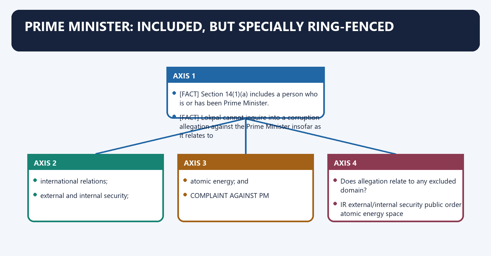
[FACT] Section 14(1)(a) includes a person who is or has been Prime Minister.

[FACT] Lokpal cannot inquire into a corruption allegation against the Prime Minister insofar as it relates to:

- international relations;
- external and internal security;
- public order;
- atomic energy; and
- space.

[FACT] Initiation requires a **full bench consisting of the Chairperson and all Members**, and at least **two-thirds of its Members** must approve.

[FACT] The inquiry must be held **in camera**. If Lokpal concludes that the complaint deserves dismissal, the inquiry records shall not be published or made available to anyone.

[FACT] The Complaint Rules, 2020 require a complaint against the Prime Minister to be decided by that full bench in the first instance at the admission stage.

[ANALYSIS] The model is neither total immunity nor ordinary parity. It combines substantive exclusions, collective decision-making, a supermajority, confidentiality and record consequences.

#### Visual 23 — Prime Minister Safeguard Screen

```text
COMPLAINT AGAINST PM
        |
Does allegation relate to any excluded domain?
IR | external/internal security | public order | atomic energy | space
        |
yes -> no Lokpal inquiry into that matter
no  -> full bench at admission/initiation stage
        |
at least two-thirds approval?
        |
no -> inquiry not initiated
yes -> in-camera inquiry
```

*Caption: Subject exclusion and supermajority approval are cumulative safeguards.*

#### Visual 24 — PM Record Consequences

| Stage/outcome | Publicity rule |
|---|---|
| Inquiry itself | In camera |
| Complaint dismissed | Inquiry records not published or made available to anyone |
| Matter proceeds | Controlled by Act, Rules and applicable confidentiality orders |

*Caption: The special record-destruction/publication consequence applies to dismissal, not as a general formula for all Lokpal cases.*

#### CLOSING RECALL FLOW — PRIME MINISTER: INCLUDED, BUT SPECIALLY RING-FENCED

```closure-flow
SUBTOPIC: Prime Minister: Included, but Specially Ring-Fenced
KEY TERMS / DEFINITIONS: Prime Minister · Included · but Specially Ring-Fenced · two-thirds of its Members · in camera · Inquiry itself
MECHANISM / ARGUMENT: Section 14(1)(a) includes a person who is or has been Prime Minister.
CONSEQUENCE / CONTRAST: The decisive contrast is between COMPLAINT AGAINST PM and Does allegation relate to any excluded domain?.
UPSC TRAP / ANSWER-USE: Do not miss this limiting distinction: its principal consequence is that atomic energy.
ANSWER-GRABBING FORMULATION: Lokpal jurisdiction covers the Prime Minister but excludes specified security and external-affairs fields and requires enhanced full-bench screening for institutional sensitivity.
```
### SESSION 10 — MPS, ARTICLE 105(2) AND THE BRIBERY BOUNDARY
#### DEFINITION / WHAT THIS IS CALLED

**Plain-language definition:** MPs, Article 105(2) and the Bribery Boundary denotes the constitutional rules and institutional links organised around BONA FIDE SPEECH OR VOTE IN PARLIAMENT.

**Technical definition:** The provisions can be harmonised through a functional boundary: bona fide speech and vote remain protected, but a separate criminal bargain to sell that function is not converted into protected legislative activity.

#### ANSWER-GRABBING OPENING — WRITE/ADAPT IN THE EXAM

> The provisions can be harmonised through a functional boundary: bona fide speech and vote remain protected, but a separate criminal bargain to sell that function is not converted into protected legislative activity.

#### MUST-WRITE KEYWORDS

- **MPs**
- **Article 105(2)**
- **the Bribery Boundary**
- **Section 14(2) exclusion applies**
- **Continue**
- **Sita Soren (2024) denies privilege immunity**

**How to use them:** Frame the answer through MPs; define Article 105(2), connect the Bribery Boundary with Section 14(2) exclusion applies to explain the mechanism, and use Continue for the decisive comparison or qualification.

MPs, Article 105(2) and the Bribery Boundary denotes the constitutional rules and institutional links organised around BONA FIDE SPEECH OR VOTE IN PARLIAMENT.
MPs, Article 105(2) and the Bribery Boundary operates through Article 105(2) shield, connected with SEPARATE ACCEPTANCE OF BRIBE FOR SPEECH/VOTE.
The operative mechanism matters because Sita Soren (2024): no privilege immunity.
Its principal consequence is that question If yes If no.
The decisive contrast is between Is the allegation merely about protected speech/vote? Section 14(2) exclusion applies Continue and Is there an independent allegation of bribery/bargain? Sita Soren (2024) denies privilege immunity Ordinary jurisdiction test.
The exam-safe limitation is that is the person otherwise covered by section 14? Lokpal process may apply No Lokpal jurisdiction.
[FACT] Section 14(2) bars Lokpal inquiry into a corruption allegation against an MP in respect of anything said or a vote given in Parliament or a committee, where Article 105(2) applies.

[FACT] In ***Sita Soren (2024) v Union of India* (2024 INSC 161)**, a unanimous seven-judge Supreme Court bench overruled the relevant majority position in *P.V. Narasimha Rao*. It held that a legislator who accepts a bribe for a speech or vote receives no Article 105/194 immunity; bribery is complete on acceptance.

[ANALYSIS] The provisions can be harmonised through a functional boundary: bona fide speech and vote remain protected, but a separate criminal bargain to sell that function is not converted into protected legislative activity.

[LIMIT] *Sita Soren (2024)* did not abolish parliamentary freedom of speech or ordinary vote immunity. It removed the claimed shield for bribery.

#### Visual 25 — Article 105(2) Boundary

```text
BONA FIDE SPEECH OR VOTE IN PARLIAMENT
                |
          Article 105(2) shield

SEPARATE ACCEPTANCE OF BRIBE FOR SPEECH/VOTE
                |
       Sita Soren (2024): no privilege immunity
```

*Caption: Privilege protects the legislative function, not its corrupt sale.*

#### Visual 26 — Lokpal and Privilege Test

| Question | If yes | If no |
|---|---|---|
| Is the allegation merely about protected speech/vote? | Section 14(2) exclusion applies | Continue |
| Is there an independent allegation of bribery/bargain? | *Sita Soren (2024)* denies privilege immunity | Ordinary jurisdiction test |
| Is the person otherwise covered by section 14? | Lokpal process may apply | No Lokpal jurisdiction |
| Is complaint timely and prescribed? | Proceed to scrutiny | Defect/limitation route |

*Caption: “MPs are outside Lokpal” and “privilege never matters” are both wrong.*

#### CLOSING RECALL FLOW — MPS, ARTICLE 105(2) AND THE BRIBERY BOUNDARY

```closure-flow
SUBTOPIC: MPs, Article 105(2) and the Bribery Boundary
KEY TERMS / DEFINITIONS: MPs · Article 105(2) · the Bribery Boundary · Section 14(2) exclusion applies · Continue · Sita Soren (2024) denies privilege immunity
MECHANISM / ARGUMENT: The provisions can be harmonised through a functional boundary: bona fide speech and vote remain protected, but a separate criminal bargain to sell that function is not converted into protected legislative activity.
CONSEQUENCE / CONTRAST: Its principal consequence is that question If yes If no.
UPSC TRAP / ANSWER-USE: Do not miss this limiting distinction: the decisive contrast is between Is the allegation merely about protected speech/vote?
ANSWER-GRABBING FORMULATION: The provisions can be harmonised through a functional boundary: bona fide speech and vote remain protected, but a separate criminal bargain to sell that function is not converted into protected legislative activity.
```
### SESSION 11 — STATE-CONNECTED PERSONS AND CONSENT
#### DEFINITION / WHAT THIS IS CALLED

**Plain-language definition:** State-Connected Persons and Consent denotes the constitutional rules and institutional links organised around Section 14(3) also requires State consent before action against a connected person serving in State affairs.

**Technical definition:** Technically, State-Connected Persons and Consent is analysed by relating Consent to Section, then testing the relationship through DOES LOKPAL HAVE SECTION and JURISDICTION.

#### ANSWER-GRABBING OPENING — WRITE/ADAPT IN THE EXAM

> Lokpal's Union jurisdiction does not automatically absorb every State-linked corruption allegation, preserving statutory federal boundaries.

#### MUST-WRITE KEYWORDS

- **Consent**
- **Section**
- **DOES LOKPAL HAVE SECTION**
- **JURISDICTION**
- **OVER**
- **Its principal consequence**

**How to use them:** Frame the answer through Consent; define Section, connect DOES LOKPAL HAVE SECTION with JURISDICTION to explain the mechanism, and use OVER for the decisive comparison or qualification.

State-Connected Persons and Consent denotes the constitutional rules and institutional links organised around [FACT] Section 14(3) also requires State consent before action against a connected person serving in State affairs.
State-Connected Persons and Consent operates through QUESTION 1: DOES LOKPAL HAVE SECTION 14 JURISDICTION, connected with OVER A STATE-CONNECTED PERSON?.
The operative mechanism matters because apply Lokpal Act consent provisos.
Its principal consequence is that qUESTION 2: CAN DSPE/CBI EXERCISE POLICE POWERS.
The decisive contrast is between IN A STATE TERRITORY? and apply DSPE Act sections 5-6 / court route.
The exam-safe limitation is that nEVER MERGE THE TWO TESTS.
[FACT] Section 14 contains consent protections where a person connected with Union service or a Union-linked entity is working in connection with State affairs or a State-established/financed/controlled entity.

[FACT] Section 14(3) also requires State consent before action against a connected person serving in State affairs.

[ANALYSIS] These provisions recognise that Lokpal is a Union institution and cannot automatically convert every State-linked corruption allegation into central jurisdiction.

[LIMIT] This is distinct from DSPE Act section 6 consent for CBI territorial operation. An answer should identify which consent rule is being discussed.

#### Visual 27 — Two Consent Questions

```text
QUESTION 1: DOES LOKPAL HAVE SECTION 14 JURISDICTION
            OVER A STATE-CONNECTED PERSON?
            -> apply Lokpal Act consent provisos

QUESTION 2: CAN DSPE/CBI EXERCISE POLICE POWERS
            IN A STATE TERRITORY?
            -> apply DSPE Act sections 5-6 / court route

NEVER MERGE THE TWO TESTS
```

*Caption: Person-based Lokpal consent and territory-based DSPE consent solve different federal problems.*

#### CLOSING RECALL FLOW — STATE-CONNECTED PERSONS AND CONSENT

```closure-flow
SUBTOPIC: State-Connected Persons and Consent
KEY TERMS / DEFINITIONS: Consent · Section · DOES LOKPAL HAVE SECTION · JURISDICTION · OVER · Its principal consequence
MECHANISM / ARGUMENT: State-Connected Persons and Consent operates through QUESTION 1: DOES LOKPAL HAVE SECTION 14 JURISDICTION, connected with OVER A STATE-CONNECTED PERSON?.
CONSEQUENCE / CONTRAST: Its principal consequence is that qUESTION 2: CAN DSPE/CBI EXERCISE POLICE POWERS.
UPSC TRAP / ANSWER-USE: Do not miss this limiting distinction: the decisive contrast is between IN A STATE TERRITORY? and apply DSPE Act sections...
ANSWER-GRABBING FORMULATION: Lokpal's Union jurisdiction does not automatically absorb every State-linked corruption allegation, preserving statutory federal boundaries.
```
### SESSION 12 — COMPLAINT ENTRY: FORM, IDENTITY, AFFIDAVIT AND SCRUTINY
#### DEFINITION / WHAT THIS IS CALLED

**Plain-language definition:** Complaint Entry: Form, Identity, Affidavit and Scrutiny denotes the constitutional rules and institutional links organised around The Lokpal (Complaint) Rules, 2020 require the prescribed form.

**Technical definition:** The decisive contrast is between READY FOR REGISTRY SCRUTINY and FORM AND ANNEXURE SCRUTINY.

#### ANSWER-GRABBING OPENING — WRITE/ADAPT IN THE EXAM

> A complaint ordinarily may be in English, but Lokpal may entertain a complaint in an Eighth Schedule language.

#### MUST-WRITE KEYWORDS

- **Complaint Entry**
- **Form**
- **Identity**
- **Affidavit**
- **Scrutiny**
- **Illegible**

**How to use them:** Frame the answer through Complaint Entry; define Form, connect Identity with Affidavit to explain the mechanism, and use Scrutiny for the decisive comparison or qualification.

Complaint Entry: Form, Identity, Affidavit and Scrutiny denotes the constitutional rules and institutional links organised around [FACT] The Lokpal (Complaint) Rules, 2020 require the prescribed form. Filing may be electronic, by post or in person.
Complaint Entry: Form, Identity, Affidavit and Scrutiny operates through [FACT] A complaint ordinarily may be in English, but Lokpal may entertain a complaint in an Eighth Schedule language, connected with SIGNED DETAILED ALLEGATION.
The operative mechanism matters because oRGANISATIONAL AUTHORITY DOCUMENTS (if applicable).
Its principal consequence is that fILING MODE REQUIREMENTS.
The decisive contrast is between READY FOR REGISTRY SCRUTINY and FORM AND ANNEXURE SCRUTINY.
The exam-safe limitation is that +-----------------------+.
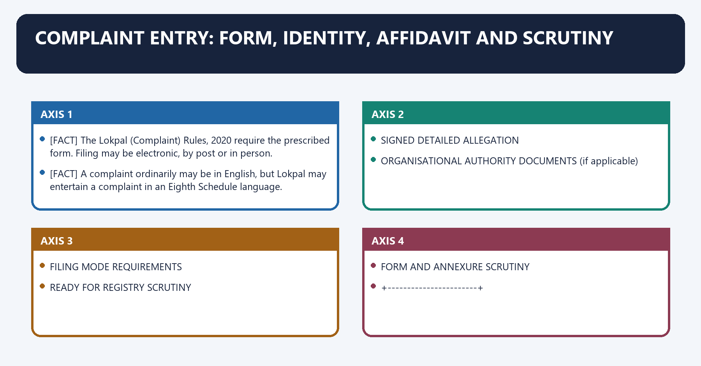
[FACT] The Lokpal (Complaint) Rules, 2020 require the prescribed form. Filing may be electronic, by post or in person.

[FACT] Where filed electronically, a hard copy must be submitted within fifteen days; the Rules also state that a complete electronic complaint should not be kept pending merely for that reason.

[FACT] A complaint ordinarily may be in English, but Lokpal may entertain a complaint in an Eighth Schedule language.

[FACT] Required annexures include identity proof, organisational registration/incorporation and authorisation where relevant, the specified affidavit, and a duly signed detailed statement of allegation.

[CURRENT] Lokpal Circular No. 01/2026, dated 24 July 2026, consolidates Registry procedure. It states that a complaint not in the prescribed form will not be entertained on merits until defects are removed; the Registry scrutinises form and relevant information, assigns diary/complaint numbers and places the matter for bench allocation.

[FACT] Rule 4 permits in-limine disposal where content is illegible, vague or ambiguous, trivial or frivolous, lacks an allegation against a public servant, is time-barred, or concerns a cause pending before another court, tribunal or authority.

[LIMIT] A formal defect is not a finding that the allegation is false. Defect cure, maintainability, prima facie assessment and final adjudication are different.

#### Visual 28 — Complaint Entry Checklist

```text
PRESCRIBED FORM
   +
IDENTITY PROOF
   +
AFFIDAVIT
   +
SIGNED DETAILED ALLEGATION
   +
ORGANISATIONAL AUTHORITY DOCUMENTS (if applicable)
   +
FILING MODE REQUIREMENTS
   =
READY FOR REGISTRY SCRUTINY
```

*Caption: The Act does not create an anonymous-complaint channel.*

#### Visual 29 — Scrutiny Funnel

```text
RECEIPT / DIARY
      |
FORM AND ANNEXURE SCRUTINY
      |
  +---+-----------------------+
  |                           |
defect                      no defect
  |                           |
call for cure /             registration and
bench may condone           bench allocation
  |
not yet a merits finding
```

*Caption: Registry scrutiny filters filing compliance; the bench controls legal disposition.*

#### Visual 30 — In-Limine Disposal Grounds

| Ground under Rule 4 | Why it matters | Qualification |
|---|---|---|
| Illegible | No workable allegation | Curable form issue may differ |
| Vague/ambiguous | No determinate case | Must not substitute speculation |
| Trivial/frivolous | Statutory filter | “Unproved” is not automatically frivolous |
| No allegation against public servant | Outside complaint definition | Connected-person rule may still require analysis |
| Beyond section 53 | Seven-year bar | Date of alleged offence controls |
| Cause pending elsewhere | Avoid parallel process | Apply exact pendency facts |

*Caption: Screening protects process integrity but can also create access barriers if applied mechanically.*

#### CLOSING RECALL FLOW — COMPLAINT ENTRY: FORM, IDENTITY, AFFIDAVIT AND SCRUTINY

```closure-flow
SUBTOPIC: Complaint Entry: Form, Identity, Affidavit and Scrutiny
KEY TERMS / DEFINITIONS: Complaint Entry · Form · Identity · Affidavit · Scrutiny · Illegible
MECHANISM / ARGUMENT: The decisive contrast is between READY FOR REGISTRY SCRUTINY and FORM AND ANNEXURE SCRUTINY.
CONSEQUENCE / CONTRAST: It states that a complaint not in the prescribed form will not be entertained on merits until defects are removed; the Registry scrutinises form and relevant information, assigns diary/complaint numbers and places the matter for bench allocation.
UPSC TRAP / ANSWER-USE: Where filed electronically, a hard copy must be submitted within fifteen days; the Rules also state that a complete electronic complaint should not be kept pending merely for that reason.
ANSWER-GRABBING FORMULATION: A complaint ordinarily may be in English, but Lokpal may entertain a complaint in an Eighth Schedule language.
```
### SESSION 13 — PRELIMINARY INQUIRY IS NOT INVESTIGATION
#### DEFINITION / WHAT THIS IS CALLED

**Plain-language definition:** Preliminary Inquiry Is Not Investigation denotes the constitutional rules and institutional links organised around On receiving a complaint and deciding to proceed, Lokpal may order either.

**Technical definition:** Preliminary Inquiry Is Not Investigation operates through a preliminary inquiry by its Inquiry Wing or an agency, including DSPE, to ascertain whether a prima facie case exists; or, connected with an investigation by an agency, including DSPE, where a prima facie case exists.

#### ANSWER-GRABBING OPENING — WRITE/ADAPT IN THE EXAM

> A preliminary inquiry tests whether a prima facie corruption case exists, whereas investigation gathers criminal evidence after that threshold, preserving procedural fairness without blocking necessary searches.

#### MUST-WRITE KEYWORDS

- **Preliminary Inquiry Is Not Investigation**
- **preliminary inquiry**
- **investigation**
- **Purpose**
- **Determine prima facie case**
- **Collect evidence for criminal report**

**How to use them:** Frame the answer through Preliminary Inquiry Is Not Investigation; define preliminary inquiry, connect investigation with Purpose to explain the mechanism, and use Determine prima facie case for the decisive comparison or qualification.

Preliminary Inquiry Is Not Investigation denotes the constitutional rules and institutional links organised around [FACT] On receiving a complaint and deciding to proceed, Lokpal may order either.
Preliminary Inquiry Is Not Investigation operates through a preliminary inquiry by its Inquiry Wing or an agency, including DSPE, to ascertain whether a prima facie case exists; or, connected with an investigation by an agency, including DSPE, where a prima facie case exists.
The operative mechanism matters because dimension Preliminary inquiry Investigation.
Its principal consequence is that purpose Determine prima facie case Collect evidence for criminal report.
The decisive contrast is between Actors Inquiry Wing, CVC or agency CBI/DSPE or other investigating agency and Output Investigate, departmental action, closure Court report + Lokpal copy; prosecution/closure/departmental route.
The exam-safe limitation is that legal character Screening/inquiry Criminal investigation.
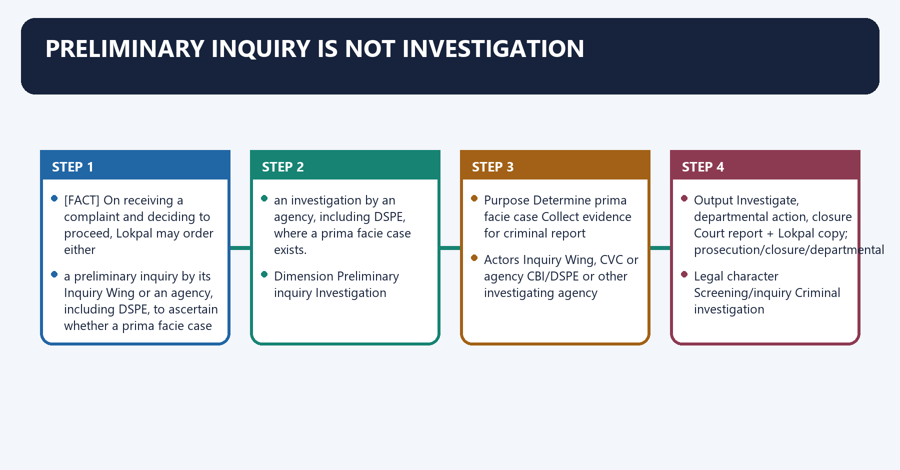
[FACT] On receiving a complaint and deciding to proceed, Lokpal may order either:

- a **preliminary inquiry** by its Inquiry Wing or an agency, including DSPE, to ascertain whether a prima facie case exists; or
- an **investigation** by an agency, including DSPE, where a prima facie case exists.

[FACT] Before ordering investigation, Lokpal must call for the public servant’s explanation to determine whether a prima facie case exists. This does not interfere with necessary search and seizure.

[ANALYSIS] Preliminary inquiry is a threshold assessment. Investigation is the evidence-gathering criminal-process stage. Calling both “investigation” hides different safeguards and outputs.

#### Visual 31 — Inquiry vs Investigation

| Dimension | Preliminary inquiry | Investigation |
|---|---|---|
| Purpose | Determine prima facie case | Collect evidence for criminal report |
| Actors | Inquiry Wing, CVC or agency | CBI/DSPE or other investigating agency |
| Comments/hearing | Comments from public servant and competent authority; hearing before decision | Explanation before direct investigation; comments again at post-report stage |
| Output | Investigate, departmental action, closure | Court report + Lokpal copy; prosecution/closure/departmental route |
| Legal character | Screening/inquiry | Criminal investigation |

*Caption: An allegation surviving preliminary inquiry is still not proof of guilt.*

#### CLOSING RECALL FLOW — PRELIMINARY INQUIRY IS NOT INVESTIGATION

```closure-flow
SUBTOPIC: Preliminary Inquiry Is Not Investigation
KEY TERMS / DEFINITIONS: Preliminary Inquiry Is Not Investigation · preliminary inquiry · investigation · Purpose · Determine prima facie case · Collect evidence for criminal report
MECHANISM / ARGUMENT: Preliminary Inquiry Is Not Investigation operates through a preliminary inquiry by its Inquiry Wing or an agency, including DSPE, to ascertain whether a prima facie case exists; or, connected with an investigation by an agency, including DSPE, where a prima facie case exists.
CONSEQUENCE / CONTRAST: Its principal consequence is that purpose Determine prima facie case Collect evidence for criminal report.
UPSC TRAP / ANSWER-USE: Do not miss this limiting distinction: the decisive contrast is between Actors Inquiry Wing, CVC or agency CBI/DSPE or other...
ANSWER-GRABBING FORMULATION: A preliminary inquiry tests whether a prima facie corruption case exists, whereas investigation gathers criminal evidence after that threshold, preserving procedural fairness without blocking necessary searches.
```
### SESSION 14 — CVC ROUTING FOR GROUPS A-D
#### DEFINITION / WHAT THIS IS CALLED

**Plain-language definition:** CVC Routing for Groups A-D denotes the constitutional rules and institutional links organised around For Groups A and B, the CVC conducts preliminary inquiry and submits its report to Lokpal.

**Technical definition:** The decisive contrast is between inquiry report under CVC Act and For Groups A and B, the CVC conducts preliminary inquiry and submits its report to Lokpal.

#### ANSWER-GRABBING OPENING — WRITE/ADAPT IN THE EXAM

> Lokpal remains the high-level complaint-routing institution, while CVC has category-specific preliminary-inquiry and vigilance functions.

#### MUST-WRITE KEYWORDS

- **CVC Routing for Groups A-D**
- **CVC Routing**
- **Groups A-D**
- **For Groups**
- **CVC**
- **Lokpal**

**How to use them:** Frame the answer through CVC Routing for Groups A-D; define CVC Routing, connect Groups A-D with For Groups to explain the mechanism, and use CVC for the decisive comparison or qualification.

CVC Routing for Groups A-D denotes the constitutional rules and institutional links organised around [FACT] For Groups A and B, the CVC conducts preliminary inquiry and submits its report to Lokpal.
CVC Routing for Groups A-D operates through [FACT] For Groups C and D, the CVC proceeds under the CVC Act, 2003, connected with LOKPAL CHOOSES PRELIMINARY INQUIRY.
The operative mechanism matters because complaint concerns Union Groups?.
Its principal consequence is that cVC preliminary CVC proceeds.
The decisive contrast is between inquiry report under CVC Act and [FACT] For Groups A and B, the CVC conducts preliminary inquiry and submits its report to Lokpal.
The exam-safe limitation is that [FACT] For Groups A and B, the CVC conducts preliminary inquiry and submits its report to Lokpal.
[FACT] If Lokpal decides to proceed through preliminary inquiry, section 20 requires reference of complaints or categories involving Groups A, B, C or D to the CVC by general or special order.

[FACT] For Groups A and B, the CVC conducts preliminary inquiry and submits its report to Lokpal.

[FACT] For Groups C and D, the CVC proceeds under the CVC Act, 2003.

[FACT] Section 25(2) requires the CVC to send statements at intervals directed by Lokpal about action on referred complaints; Lokpal may issue guidelines for effective and expeditious disposal.

[ANALYSIS] This is neither a simple hierarchy nor duplication. Lokpal remains the high-level complaint-routing institution, while CVC has category-specific preliminary-inquiry and vigilance functions.

#### Visual 32 — CVC Routing Tree

```text
LOKPAL CHOOSES PRELIMINARY INQUIRY
                |
      complaint concerns Union Groups?
                |
       +--------+---------+
       |                  |
    A / B              C / D
       |                  |
CVC preliminary       CVC proceeds
inquiry report        under CVC Act
back to Lokpal
```

*Caption: Group category changes where the report returns and which statutory route continues.*

#### CLOSING RECALL FLOW — CVC ROUTING FOR GROUPS A-D

```closure-flow
SUBTOPIC: CVC Routing for Groups A-D
KEY TERMS / DEFINITIONS: CVC Routing for Groups A-D · CVC Routing · Groups A-D · For Groups · CVC · Lokpal
MECHANISM / ARGUMENT: If Lokpal decides to proceed through preliminary inquiry, section 20 requires reference of complaints or categories involving Groups A, B, C or D to the CVC by general or special order.
CONSEQUENCE / CONTRAST: The decisive contrast is between inquiry report under CVC Act and For Groups A and B, the CVC conducts preliminary inquiry and submits its report to Lokpal.
UPSC TRAP / ANSWER-USE: Lokpal remains the high-level complaint-routing institution, while CVC has category-specific preliminary-inquiry and vigilance functions.
ANSWER-GRABBING FORMULATION: Lokpal remains the high-level complaint-routing institution, while CVC has category-specific preliminary-inquiry and vigilance functions.
```
### SESSION 15 — TIMELINES AND NATURAL JUSTICE
#### DEFINITION / WHAT THIS IS CALLED

**Plain-language definition:** Timelines and Natural Justice denotes the constitutional rules and institutional links organised around REFERENCE FOR PRELIMINARY INQUIRY.

**Technical definition:** Every preliminary inquiry should ordinarily be completed within ninety days, extendable for recorded reasons by a further ninety days from receipt of the complaint.

#### ANSWER-GRABBING OPENING — WRITE/ADAPT IN THE EXAM

> Section 21 protects a person other than the accused whose conduct is examined or reputation is likely to be prejudicially affected, by requiring a reasonable opportunity of hearing and defence evidence.

#### MUST-WRITE KEYWORDS

- **Timelines**
- **Natural Justice**
- **sixty days from receipt of the reference**
- **ninety days**
- **six months**
- **at a time**

**How to use them:** Frame the answer through Timelines; define Natural Justice, connect sixty days from receipt of the reference with ninety days to explain the mechanism, and use six months for the decisive comparison or qualification.

Timelines and Natural Justice denotes the constitutional rules and institutional links organised around REFERENCE FOR PRELIMINARY INQUIRY.
Timelines and Natural Justice operates through report target: 60 days from reference, connected with ordinary preliminary-inquiry completion: 90 days.
The operative mechanism matters because recorded-reason extension: further 90 days.
Its principal consequence is that iNVESTIGATION ORDER.
The decisive contrast is between ordinary completion: 6 months and recorded-reason extension: <= 6 months at a time.
The exam-safe limitation is that sPECIAL COURT TRIAL.
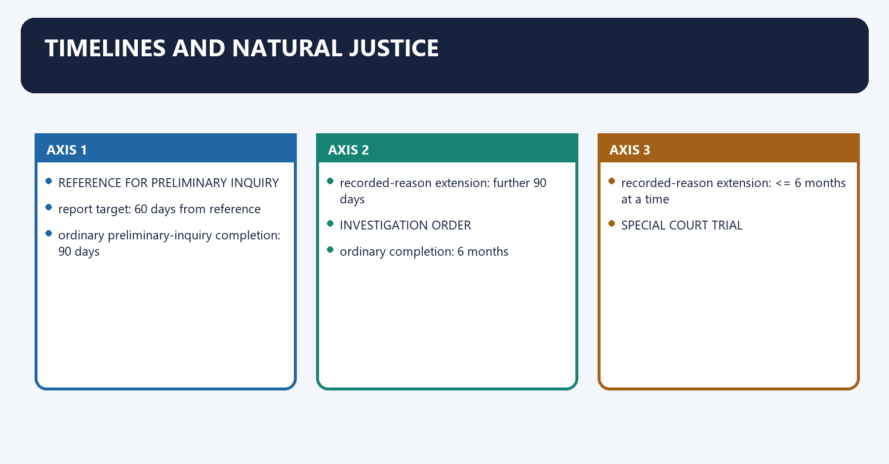
[FACT] During preliminary inquiry, the Inquiry Wing or agency collects material, seeks comments from the public servant and competent authority, and submits a report within **sixty days from receipt of the reference**.

[FACT] Every preliminary inquiry should ordinarily be completed within **ninety days**, extendable for recorded reasons by a further **ninety days** from receipt of the complaint.

[FACT] A bench of at least three Members considers the report, gives the public servant an opportunity of hearing and chooses investigation, departmental/other action, or closure with possible section 46 action.

[FACT] Investigation should be completed within **six months** from Lokpal’s order. Lokpal may extend it by a further period not exceeding six months **at a time**, recording reasons.

[FACT] Section 21 protects a person other than the accused whose conduct is examined or reputation is likely to be prejudicially affected, by requiring a reasonable opportunity of hearing and defence evidence.

#### Visual 33 — Statutory Time Map

```text
REFERENCE FOR PRELIMINARY INQUIRY
        |
report target: 60 days from reference
        |
ordinary preliminary-inquiry completion: 90 days
        |
recorded-reason extension: further 90 days
        |
INVESTIGATION ORDER
        |
ordinary completion: 6 months
        |
recorded-reason extension: <= 6 months at a time
        |
SPECIAL COURT TRIAL
1 year target -> 3-month recorded extensions -> total <= 2 years
```

*Caption: The 60-day report requirement, 90+90 inquiry framework and six-month investigation period are not interchangeable.*

#### Visual 34 — Three-Member Bench Decision

| Finding after preliminary inquiry | Possible action |
|---|---|
| Prima facie criminal case | Investigation by agency/DSPE |
| Service misconduct/other appropriate concern | Departmental or other action through competent authority |
| No prima facie case | Closure |
| False, frivolous or vexatious case meeting section 46 threshold | Proceed against complainant through lawful process |

*Caption: Closure and prosecution of the complainant are not automatic synonyms.*

#### CLOSING RECALL FLOW — TIMELINES AND NATURAL JUSTICE

```closure-flow
SUBTOPIC: Timelines and Natural Justice
KEY TERMS / DEFINITIONS: Timelines · Natural Justice · sixty days from receipt of the reference · ninety days · six months · at a time
MECHANISM / ARGUMENT: Every preliminary inquiry should ordinarily be completed within ninety days, extendable for recorded reasons by a further ninety days from receipt of the complaint.
CONSEQUENCE / CONTRAST: The decisive contrast is between ordinary completion: 6 months and recorded-reason extension: <= 6 months at a time.
UPSC TRAP / ANSWER-USE: Do not miss this limiting distinction: its principal consequence is that iNVESTIGATION ORDER.
ANSWER-GRABBING FORMULATION: Section 21 protects a person other than the accused whose conduct is examined or reputation is likely to be prejudicially affected, by requiring a reasonable opportunity of hearing and defence evidence.
```
### SESSION 16 — INVESTIGATION, REPORT, SANCTION AND PROSECUTION
#### DEFINITION / WHAT THIS IS CALLED

**Plain-language definition:** Investigation, Report, Sanction and Prosecution denotes the constitutional rules and institutional links organised around Lokpal may then direct its Prosecution Wing or investigating agency to initiate prosecution in the Special Court.

**Technical definition:** The exam-safe limitation is that sanction + closure departmental other.

#### ANSWER-GRABBING OPENING — WRITE/ADAPT IN THE EXAM

> Section 23 gives Lokpal prosecution-sanction power for the section 20(7)(a) route, subject to the constitutional-office qualification in section 23(3).

#### MUST-WRITE KEYWORDS

- **Investigation**
- **Report**
- **Sanction**
- **Prosecution**
- **Prima facie routing**
- **Yes**

**How to use them:** Frame the answer through Investigation; define Report, connect Sanction with Prosecution to explain the mechanism, and use Prima facie routing for the decisive comparison or qualification.

Investigation, Report, Sanction and Prosecution denotes the constitutional rules and institutional links organised around [FACT] Lokpal may then direct its Prosecution Wing or investigating agency to initiate prosecution in the Special Court.
Investigation, Report, Sanction and Prosecution operates through AGENCY INVESTIGATION REPORT, connected with filed before jurisdictional court.
The operative mechanism matters because copy forwarded to Lokpal.
Its principal consequence is that = 3 MEMBER LOKPAL BENCH.
The decisive contrast is between comments of competent authority/public servant and +--------------+----------------+.
The exam-safe limitation is that sanction + closure departmental other.
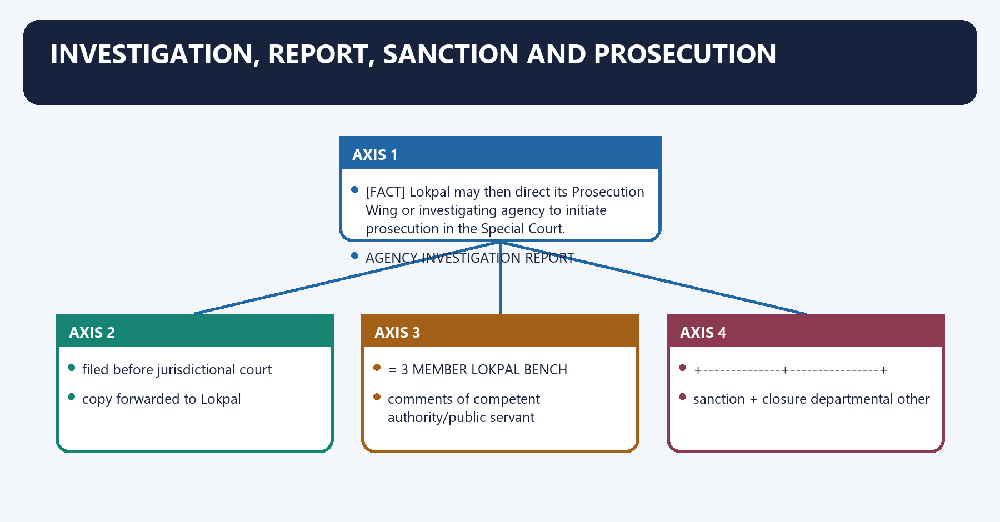
[FACT] The investigating agency submits its statutory investigation report to the court having jurisdiction and forwards a copy to Lokpal.

[FACT] A bench of at least three Members considers the report and, after comments from the competent authority and public servant, may grant sanction to the Prosecution Wing or agency to file a charge-sheet, direct a closure report, or direct departmental/other action.

[FACT] Lokpal may then direct its Prosecution Wing or investigating agency to initiate prosecution in the Special Court.

[FACT] Section 23 gives Lokpal prosecution-sanction power for the section 20(7)(a) route, subject to the constitutional-office qualification in section 23(3).

[FACT] Where the investigation concerns the Prime Minister, Union Minister or MP and discloses a Prevention of Corruption Act offence, section 24 permits Lokpal to file a case in the Special Court and requires the report/findings to be sent to the competent authority.

[ANALYSIS] “Sanction” is procedural authorisation to prosecute; it is not a merits verdict. Likewise, a charge-sheet is an accusation supported by investigative material, not a conviction.

#### Visual 35 — Post-Investigation Decision Flow

```text
AGENCY INVESTIGATION REPORT
      |
filed before jurisdictional court
+ copy forwarded to Lokpal
      |
>= 3 MEMBER LOKPAL BENCH
+ comments of competent authority/public servant
      |
 +-----------+--------------+----------------+
 |           |              |                |
sanction +  closure       departmental     other
charge-sheet report       action           appropriate action
 |
Prosecution Wing / agency
 |
Special Court
```

*Caption: The post-report stage combines criminal and departmental choices without treating either as established guilt.*

#### Visual 36 — Special Court Role

| Question | Lokpal | Special Court |
|---|---:|---:|
| Prima facie routing | Yes | No |
| Prosecution sanction under Act | Yes | No |
| Charge framed/trial conducted | No | Yes |
| Attachment confirmed | Applies/seeks | Decides |
| Conviction/acquittal | No | Yes |
| Loss assessment after conviction | No | Yes |

*Caption: Special Court control is a central due-process counterweight to Lokpal’s process powers.*

#### CLOSING RECALL FLOW — INVESTIGATION, REPORT, SANCTION AND PROSECUTION

```closure-flow
SUBTOPIC: Investigation, Report, Sanction and Prosecution
KEY TERMS / DEFINITIONS: Investigation · Report · Sanction · Prosecution · Prima facie routing · Yes
MECHANISM / ARGUMENT: Likewise, a charge-sheet is an accusation supported by investigative material, not a conviction.
CONSEQUENCE / CONTRAST: “Sanction” is procedural authorisation to prosecute; it is not a merits verdict.
UPSC TRAP / ANSWER-USE: Do not miss this limiting distinction: its principal consequence is that = 3 MEMBER LOKPAL BENCH.
ANSWER-GRABBING FORMULATION: Section 23 gives Lokpal prosecution-sanction power for the section 20(7)(a) route, subject to the constitutional-office qualification in section 23(3).
```
### SESSION 17 — INQUIRY WING AND PROSECUTION WING: MANDATE AND VERIFIED STATUS
#### DEFINITION / WHAT THIS IS CALLED

**Plain-language definition:** Inquiry Wing and Prosecution Wing: Mandate and Verified Status denotes the constitutional rules and institutional links organised around Wing Statutory mandate Official implementation evidence Controlled conclusion.

**Technical definition:** The decisive contrast is between NO STAGE = FINAL GUILT and Wing Statutory mandate Official implementation evidence Controlled conclusion.

#### ANSWER-GRABBING OPENING — WRITE/ADAPT IN THE EXAM

> Lokpal's Inquiry and Prosecution Wings have distinct statutory mandates, but notification or staffing evidence alone does not prove complete operational capacity or effectiveness.

#### MUST-WRITE KEYWORDS

- **Inquiry Wing**
- **Prosecution Wing**
- **Mandate**
- **Verified Status**
- **6 June 2025**
- **13 June 2025**

**How to use them:** Frame the answer through Inquiry Wing; define Prosecution Wing, connect Mandate with Verified Status to explain the mechanism, and use 6 June 2025 for the decisive comparison or qualification.

Inquiry Wing and Prosecution Wing: Mandate and Verified Status denotes the constitutional rules and institutional links organised around Wing Statutory mandate Official implementation evidence Controlled conclusion.
Inquiry Wing and Prosecution Wing: Mandate and Verified Status operates through INQUIRY WING INVESTIGATING AGENCY PROSECUTION WING, connected with preliminary inquiry police/criminal investigation files and conducts case.
The operative mechanism matters because prima facie threshold evidence + statutory report before Special Court.
Its principal consequence is that section 11 section 20 section 12.
The decisive contrast is between NO STAGE = FINAL GUILT and Wing Statutory mandate Official implementation evidence Controlled conclusion.
The exam-safe limitation is that wing Statutory mandate Official implementation evidence Controlled conclusion.
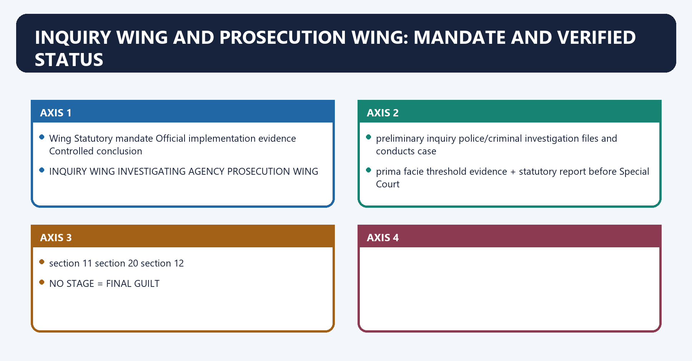
[FACT] Section 11 requires an Inquiry Wing headed by the Director of Inquiry to conduct preliminary inquiries into alleged Prevention of Corruption Act offences by public servants. Officers not below Under Secretary rank have specified civil-court powers for this purpose.

[FACT] Section 12 requires Lokpal, by notification, to constitute a Prosecution Wing headed by the Director of Prosecution. When directed, it files the case before the Special Court in accordance with the investigation report and takes necessary prosecution steps.

[CURRENT] The official Lokpal circulars/notifications register records **“Constitution of Inquiry Wing of Lokpal of India” dated 5 September 2024**.

[CURRENT] The official revised organogram, approved by the Full Bench on 13 September 2024, depicts a Director of Inquiry and an Inquiry structure within the Judicial Wing.

[CURRENT] The Chairperson formally constituted the Prosecution Wing by order dated **6 June 2025**. An official Gazette notification dated **13 June 2025** records that constitution under section 12.

[LIMIT] Formal constitution and a published organogram prove legal/organisational creation. They do not, by themselves, prove that every sanctioned post is filled, that the wings possess complete independent operational capacity, or any particular level of case output.

#### Visual 37 — Wings: Law vs Current Implementation

| Wing | Statutory mandate | Official implementation evidence | Controlled conclusion |
|---|---|---|---|
| Inquiry Wing | Preliminary inquiry, section 11 | Constitution entry dated 5 Sep 2024; revised organogram dated 13 Sep 2024 | Formally constituted and structurally depicted |
| Prosecution Wing | File/prosecute cases when directed, section 12 | Formal order 6 Jun 2025; Gazette notification 13 Jun 2025 | Formally constituted and notified |
| Investigation function | Criminal investigation | Assigned to CBI/DSPE or other agency under section 20 | Wings do not create a general Lokpal police force |

*Caption: “Created in the Act”, “formally constituted” and “fully staffed/effective” are three different propositions.*

#### Visual 38 — Inquiry–Investigation–Prosecution Boundary

```text
INQUIRY WING              INVESTIGATING AGENCY             PROSECUTION WING
preliminary inquiry       police/criminal investigation   files and conducts case
prima facie threshold     evidence + statutory report     before Special Court
section 11                section 20                       section 12

NO STAGE = FINAL GUILT
```

*Caption: Institutional labels must follow the statutory function actually performed.*

#### CLOSING RECALL FLOW — INQUIRY WING AND PROSECUTION WING: MANDATE AND VERIFIED STATUS

```closure-flow
SUBTOPIC: Inquiry Wing and Prosecution Wing: Mandate and Verified Status
KEY TERMS / DEFINITIONS: Inquiry Wing · Prosecution Wing · Mandate · Verified Status · 6 June 2025 · 13 June 2025
MECHANISM / ARGUMENT: Section 11 requires an Inquiry Wing headed by the Director of Inquiry to conduct preliminary inquiries into alleged Prevention of Corruption Act offences by public servants.
CONSEQUENCE / CONTRAST: The decisive contrast is between NO STAGE = FINAL GUILT and Wing Statutory mandate Official implementation evidence Controlled conclusion.
UPSC TRAP / ANSWER-USE: They do not, by themselves, prove that every sanctioned post is filled, that the wings possess complete independent operational capacity, or any particular level of case output.
ANSWER-GRABBING FORMULATION: Lokpal's Inquiry and Prosecution Wings have distinct statutory mandates, but notification or staffing evidence alone does not prove complete operational capacity or effectiveness.
```
### SESSION 18 — SUPERVISORY AND INVESTIGATIVE-PROCESS POWERS
#### DEFINITION / WHAT THIS IS CALLED

**Plain-language definition:** Supervisory and Investigative-Process Powers denotes the constitutional rules and institutional links organised around Lokpal cannot use that power to require an agency to investigate or dispose of a case in a particular manner.

**Technical definition:** Lokpal cannot use that power to require an agency to investigate or dispose of a case in a particular manner.

#### ANSWER-GRABBING OPENING — WRITE/ADAPT IN THE EXAM

> Lokpal cannot use that power to require an agency to investigate or dispose of a case in a particular manner.

#### MUST-WRITE KEYWORDS

- **Supervisory**
- **Investigative-Process Powers**
- **Direct DSPE in referred matter**
- **Yes**
- **Cannot dictate particular investigation/disposal**
- **Transfer approval for referred-case investigator**

**How to use them:** Frame the answer through Supervisory; define Investigative-Process Powers, connect Direct DSPE in referred matter with Yes to explain the mechanism, and use Cannot dictate particular investigation/disposal for the decisive comparison or qualification.

Supervisory and Investigative-Process Powers denotes the constitutional rules and institutional links organised around [FACT] Lokpal cannot use that power to require an agency to investigate or dispose of a case in a particular manner.
Supervisory and Investigative-Process Powers operates through [FACT] A DSPE officer investigating a Lokpal-referred case cannot be transferred without Lokpal approval, connected with [FACT] DSPE may, with Lokpal’s consent, appoint a panel of advocates other than government advocates for referred cases.
The operative mechanism matters because [ANALYSIS] This creates operational insulation for referred cases, not general command over every CBI investigation.
Its principal consequence is that lOKPAL-REFERRED MATTER.
The decisive contrast is between superintendence + lawful directions and NO DICTATION OF PARTICULAR MANNER OR DISPOSAL.
The exam-safe limitation is that investigating officer transfer requires Lokpal approval.
[FACT] Section 25 gives Lokpal superintendence and direction over DSPE in matters Lokpal refers for preliminary inquiry or investigation.

[FACT] Lokpal cannot use that power to require an agency to investigate or dispose of a case in a particular manner.

[FACT] A DSPE officer investigating a Lokpal-referred case cannot be transferred without Lokpal approval.

[FACT] DSPE may, with Lokpal’s consent, appoint a panel of advocates other than government advocates for referred cases.

[ANALYSIS] This creates operational insulation for referred cases, not general command over every CBI investigation.

#### Visual 39 — CBI/DSPE Guardrails

```text
LOKPAL-REFERRED MATTER
       |
superintendence + lawful directions
       |
NO DICTATION OF PARTICULAR MANNER OR DISPOSAL
       |
investigating officer transfer requires Lokpal approval
       |
advocate panel requires Lokpal consent
```

*Caption: Superintendence is real but bounded by investigative independence and case-specific jurisdiction.*

#### Visual 40 — Power Matrix

| Power | Lokpal position | Key limit |
|---|---|---|
| Direct DSPE in referred matter | Yes | Cannot dictate particular investigation/disposal |
| Transfer approval for referred-case investigator | Yes | Only Lokpal-referred case |
| Conduct general police investigation | No | Agency function |
| Authorise search/seizure | Yes | Through agency entrusted with investigation |
| Require information/documents | Yes | For inquiry/investigation under Act |
| Recommend suspension/transfer | Yes | Government ordinarily accepts; may record administrative reasons |
| Convict or sentence | No | Court function |

*Caption: The most defensible answer names both the power and its statutory boundary.*

#### CLOSING RECALL FLOW — SUPERVISORY AND INVESTIGATIVE-PROCESS POWERS

```closure-flow
SUBTOPIC: Supervisory and Investigative-Process Powers
KEY TERMS / DEFINITIONS: Supervisory · Investigative-Process Powers · Direct DSPE in referred matter · Yes · Cannot dictate particular investigation/disposal · Transfer approval for referred-case investigator
MECHANISM / ARGUMENT: The operative mechanism matters because This creates operational insulation for referred cases, not general command over every CBI investigation.
CONSEQUENCE / CONTRAST: The decisive contrast is between superintendence + lawful directions and NO DICTATION OF PARTICULAR MANNER OR DISPOSAL.
UPSC TRAP / ANSWER-USE: This creates operational insulation for referred cases, not general command over every CBI investigation.
ANSWER-GRABBING FORMULATION: Lokpal cannot use that power to require an agency to investigate or dispose of a case in a particular manner.
```
### SESSION 19 — SEARCH, CIVIL-COURT POWERS, ATTACHMENT AND CONFISCATION
#### DEFINITION / WHAT THIS IS CALLED

**Plain-language definition:** Search, Civil-Court Powers, Attachment and Confiscation denotes the constitutional rules and institutional links organised around RELEVANT DOCUMENTS SECRETED?.

**Technical definition:** Section 31 separately permits Special Court confiscation in special circumstances on prima facie evidence until acquittal, with restoration/value plus statutory interest if the order is annulled or the public servant is acquitted.

#### ANSWER-GRABBING OPENING — WRITE/ADAPT IN THE EXAM

> Section 29 permits provisional attachment for up to ninety days where recorded reasons and material support belief about proceeds of corruption and risk of concealment/transfer.

#### MUST-WRITE KEYWORDS

- **Civil-Court Powers**
- **Attachment**
- **Confiscation**
- **ninety days**
- **thirty days**
- **Yes**

**How to use them:** Frame the answer through Civil-Court Powers; define Attachment, connect Confiscation with ninety days to explain the mechanism, and use thirty days for the decisive comparison or qualification.

Search, Civil-Court Powers, Attachment and Confiscation denotes the constitutional rules and institutional links organised around RELEVANT DOCUMENTS SECRETED?.
Search, Civil-Court Powers, Attachment and Confiscation operates through Lokpal authorises investigating agency - search/seizure, connected with PROCEEDS OF CORRUPTION AT RISK?.
The operative mechanism matters because recorded reasons + material.
Its principal consequence is that provisional attachment <= 90 days.
The decisive contrast is between copy/material to Special Court and Prosecution Wing application within 30 days.
The exam-safe limitation is that special Court confirms/refuses.
[FACT] Section 26 allows Lokpal, where it has reason to believe relevant documents are secreted, to authorise the investigating agency to search for and seize them.

[FACT] Section 27 gives the Inquiry Wing civil-court powers during preliminary inquiry for summoning, attendance, examination on oath, document discovery/production, affidavit evidence, public-record requisition and commissions.

[FACT] Proceedings before Lokpal are deemed judicial proceedings for the false-evidence provision referenced by the Act. This does not transform Lokpal into a criminal court.

[FACT] Section 29 permits provisional attachment for up to **ninety days** where recorded reasons and material support belief about proceeds of corruption and risk of concealment/transfer. The order and material go to the Special Court.

[FACT] Under section 30, the Prosecution Wing must apply within **thirty days** for confirmation. Acquittal ordinarily leads to restoration; conviction permits confiscation of proceeds relatable to the offence.

[FACT] Section 31 separately permits Special Court confiscation in special circumstances on prima facie evidence until acquittal, with restoration/value plus statutory interest if the order is annulled or the public servant is acquitted.

[FACT] Section 32 permits Lokpal to recommend transfer or suspension where continuation threatens inquiry, evidence or witnesses. The Central Government ordinarily accepts, unless written administrative reasons make it infeasible.

#### Visual 41 — Search and Attachment Sequence

```text
RELEVANT DOCUMENTS SECRETED?
      |
Lokpal authorises investigating agency -> search/seizure

PROCEEDS OF CORRUPTION AT RISK?
      |
recorded reasons + material
      |
provisional attachment <= 90 days
      |
copy/material to Special Court
      |
Prosecution Wing application within 30 days
      |
Special Court confirms/refuses
```

*Caption: Search is agency-executed; attachment is court-controlled after the provisional stage.*

#### Visual 42 — Civil Court, Criminal Court and Judicial Proceeding

| Proposition | Correct? | Reason |
|---|---:|---|
| Inquiry Wing has specified civil-court powers | Yes | Section 27 |
| Lokpal proceedings are deemed judicial for false-evidence law | Yes | Section 27(2) |
| Lokpal is a civil court for all purposes | No | Powers are purpose-specific |
| Lokpal is a criminal court | No | Special Court adjudicates |
| Lokpal has a general contempt jurisdiction | No general power located in the Act | Do not infer from “judicial proceeding” |

*Caption: A deeming provision must not be expanded beyond its stated purpose.*

#### CLOSING RECALL FLOW — SEARCH, CIVIL-COURT POWERS, ATTACHMENT AND CONFISCATION

```closure-flow
SUBTOPIC: Search, Civil-Court Powers, Attachment and Confiscation
KEY TERMS / DEFINITIONS: Civil-Court Powers · Attachment · Confiscation · ninety days · thirty days · Yes
MECHANISM / ARGUMENT: Proceedings before Lokpal are deemed judicial proceedings for the false-evidence provision referenced by the Act.
CONSEQUENCE / CONTRAST: Its principal consequence is that provisional attachment <= 90 days.
UPSC TRAP / ANSWER-USE: Do not miss this limiting distinction: the decisive contrast is between copy/material to Special Court and Prosecution Wing application within...
ANSWER-GRABBING FORMULATION: Section 29 permits provisional attachment for up to ninety days where recorded reasons and material support belief about proceeds of corruption and risk of concealment/transfer.
```
### SESSION 20 — ASSETS, SECTION 44 AMENDMENT AND SECTION 45 PRESUMPTION
#### DEFINITION / WHAT THIS IS CALLED

**Plain-language definition:** Assets, Section 44 Amendment and Section 45 Presumption denotes the constitutional rules and institutional links organised around Dimension Original framework Current statutory framework.

**Technical definition:** Section 45 provides a rebuttable presumption where a public servant wilfully or without justifiable reason fails to declare assets, or supplies misleading information and is found possessing undisclosed/misdescribed assets.

#### ANSWER-GRABBING OPENING — WRITE/ADAPT IN THE EXAM

> Section 45 provides a rebuttable presumption where a public servant wilfully or without justifiable reason fails to declare assets, or supplies misleading information and is found possessing undisclosed/misdescribed assets.

#### MUST-WRITE KEYWORDS

- **Assets**
- **Section 44 Amendment**
- **Section 45 Presumption**
- **Lokpal and Lokayuktas (Amendment) Act, 2016**
- **Detail in Act**
- **Extensive declaration/publication architecture**

**How to use them:** Frame the answer through Assets; define Section 44 Amendment, connect Section 45 Presumption with Lokpal and Lokayuktas (Amendment) Act, 2016 to explain the mechanism, and use Detail in Act for the decisive comparison or qualification.

Assets, Section 44 Amendment and Section 45 Presumption denotes the constitutional rules and institutional links organised around Dimension Original framework Current statutory framework.
Assets, Section 44 Amendment and Section 45 Presumption operates through Detail in Act Extensive declaration/publication architecture General duty, connected with Operative wording Specified assets/liabilities and related disclosure design Form and manner to be prescribed.
The operative mechanism matters because rules status 2014 rules existed DoPT stated old rules redundant after amendment.
Its principal consequence is that safe exam statement Historical design Current section 44 + rule-status qualification.
The decisive contrast is between WILFUL / UNJUSTIFIABLE FAILURE TO DECLARE and MISLEADING INFORMATION + UNDISCLOSED ASSETS FOUND.
The exam-safe limitation is that rEBUTTABLE PRESUMPTION.
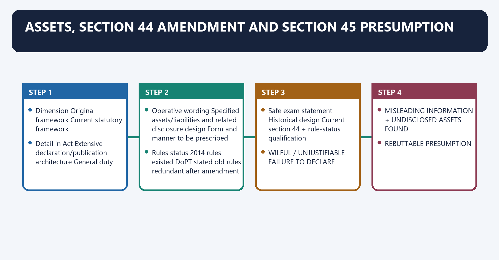
[FACT] The original section 44 contained a more detailed declaration structure. The **Lokpal and Lokayuktas (Amendment) Act, 2016** substituted it retrospectively from commencement.

[FACT] Current section 44 states that every public servant shall declare assets and liabilities **in such form and manner as may be prescribed**.

[FACT] Section 45 provides a rebuttable presumption where a public servant wilfully or without justifiable reason fails to declare assets, or supplies misleading information and is found possessing undisclosed/misdescribed assets.

[CURRENT] DoPT’s official 2016 memoranda state that the earlier 2014 asset-return rules became redundant after substitution and that fresh rules would be prescribed. In the official DoPT/Lokpal material located for this control check, no later fresh section 44 form-and-manner rules were located.

[LIMIT] The last sentence is a controlled search result, not a claim that no document could exist outside the official repositories checked. Do not use the original 2014 public-disclosure design as if it remains the current statutory text.

[LIMIT] ***Lok Prahari v. Union of India (2018) v Union of India* (2018)** concerned election-candidate/legislator disclosure, sources of income, voter information and a permanent monitoring mechanism. It did not judicially restore the original section 44 format.

#### Visual 43 — Section 44 Before and After 2016

| Dimension | Original framework | Current statutory framework |
|---|---|---|
| Detail in Act | Extensive declaration/publication architecture | General duty |
| Operative wording | Specified assets/liabilities and related disclosure design | Form and manner to be prescribed |
| Rules status | 2014 rules existed | DoPT stated old rules redundant after amendment |
| Safe exam statement | Historical design | Current section 44 + rule-status qualification |

*Caption: The amendment preserved a declaration duty but changed how its operative detail is supplied.*

#### Visual 44 — Section 45 Logic

```text
WILFUL / UNJUSTIFIABLE FAILURE TO DECLARE
                 OR
MISLEADING INFORMATION + UNDISCLOSED ASSETS FOUND
                 |
REBUTTABLE PRESUMPTION
assets belong to public servant and were acquired by corrupt means
                 |
public servant may prove otherwise
```

*Caption: Section 45 is a rebuttable evidentiary presumption, not automatic conviction.*

#### CLOSING RECALL FLOW — ASSETS, SECTION 44 AMENDMENT AND SECTION 45 PRESUMPTION

```closure-flow
SUBTOPIC: Assets, Section 44 Amendment and Section 45 Presumption
KEY TERMS / DEFINITIONS: Assets · Section 44 Amendment · Section 45 Presumption · Lokpal and Lokayuktas (Amendment) Act, 2016 · Detail in Act · Extensive declaration/publication architecture
MECHANISM / ARGUMENT: Section 45 provides a rebuttable presumption where a public servant wilfully or without justifiable reason fails to declare assets, or supplies misleading information and is found possessing undisclosed/misdescribed assets.
CONSEQUENCE / CONTRAST: The decisive contrast is between WILFUL / UNJUSTIFIABLE FAILURE TO DECLARE and MISLEADING INFORMATION + UNDISCLOSED ASSETS FOUND.
UPSC TRAP / ANSWER-USE: Its principal consequence is that safe exam statement Historical design Current section 44 + rule-status qualification.
ANSWER-GRABBING FORMULATION: Section 45 provides a rebuttable presumption where a public servant wilfully or without justifiable reason fails to declare assets, or supplies misleading information and is found possessing undisclosed/misdescribed assets.
```
### SESSION 21 — SEVEN-YEAR LIMITATION AND FALSE-COMPLAINT SAFEGUARDS
#### DEFINITION / WHAT THIS IS CALLED

**Plain-language definition:** Seven-Year Limitation and False-Complaint Safeguards denotes the constitutional rules and institutional links organised around A convicted complainant may also be ordered to pay compensation and legal expenses.

**Technical definition:** Seven-Year Limitation and False-Complaint Safeguards operates through Closure, acquittal or an unproved allegation does not automatically establish a false, frivolous or vexatious complaint, connected with DATE OF ALLEGED OFFENCE.

#### ANSWER-GRABBING OPENING — WRITE/ADAPT IN THE EXAM

> The false-complaint provision protects public servants against abuse, but can chill legitimate complainants if failure of proof is wrongly equated with bad faith.

#### MUST-WRITE KEYWORDS

- **Seven-Year Limitation**
- **False-Complaint Safeguards**
- **Complaint dismissed for lack of evidence**
- **No**
- **Public servant acquitted**
- **Filing defect**

**How to use them:** Frame the answer through Seven-Year Limitation; define False-Complaint Safeguards, connect Complaint dismissed for lack of evidence with No to explain the mechanism, and use Public servant acquitted for the decisive comparison or qualification.

Seven-Year Limitation and False-Complaint Safeguards denotes the constitutional rules and institutional links organised around [FACT] A convicted complainant may also be ordered to pay compensation and legal expenses.
Seven-Year Limitation and False-Complaint Safeguards operates through [LIMIT] Closure, acquittal or an unproved allegation does not automatically establish a false, frivolous or vexatious complaint, connected with DATE OF ALLEGED OFFENCE.
The operative mechanism matters because complaint after expiry - Lokpal cannot inquire/investigate.
Its principal consequence is that date of discovery retirement date date complaint is publicised.
The decisive contrast is between Situation Section 46 automatically applies? and Complaint dismissed for lack of evidence No.
The exam-safe limitation is that public servant acquitted No.
[FACT] Section 53 bars Lokpal inquiry or investigation where the complaint is made after **seven years from the date of the alleged offence**.

[FACT] Section 46 punishes, on conviction, a false and frivolous or vexatious complaint with imprisonment up to one year and fine up to one lakh rupees. Cognizance and prosecution follow the section’s special conditions.

[FACT] A convicted complainant may also be ordered to pay compensation and legal expenses.

[FACT] Section 46 does not apply to complaints made in good faith; the Act defines good faith through due care, caution and responsibility or mistake of fact under the stated criminal-law provision.

[ANALYSIS] The false-complaint provision protects public servants against abuse, but can chill legitimate complainants if failure of proof is wrongly equated with bad faith.

[LIMIT] Closure, acquittal or an unproved allegation does not automatically establish a false, frivolous or vexatious complaint.

#### Visual 45 — Limitation Clock

```text
DATE OF ALLEGED OFFENCE
          |
      7 YEARS
          |
complaint after expiry -> Lokpal cannot inquire/investigate

NOT THE SAME AS:
date of discovery | retirement date | date complaint is publicised
```

*Caption: Section 53 uses the alleged-offence date.*

#### Visual 46 — False Complaint Test

| Situation | Section 46 automatically applies? |
|---|---:|
| Complaint dismissed for lack of evidence | No |
| Public servant acquitted | No |
| Filing defect | No |
| Complaint judicially found false and frivolous/vexatious through statutory process | Potentially |
| Good-faith complaint | Expressly protected |

*Caption: Anti-abuse law must not be converted into strict liability for an unsuccessful complainant.*

#### CLOSING RECALL FLOW — SEVEN-YEAR LIMITATION AND FALSE-COMPLAINT SAFEGUARDS

```closure-flow
SUBTOPIC: Seven-Year Limitation and False-Complaint Safeguards
KEY TERMS / DEFINITIONS: Seven-Year Limitation · False-Complaint Safeguards · Complaint dismissed for lack of evidence · No · Public servant acquitted · Filing defect
MECHANISM / ARGUMENT: Seven-Year Limitation and False-Complaint Safeguards operates through Closure, acquittal or an unproved allegation does not automatically establish a false, frivolous or vexatious complaint, connected with DATE OF ALLEGED OFFENCE.
CONSEQUENCE / CONTRAST: The false-complaint provision protects public servants against abuse, but can chill legitimate complainants if failure of proof is wrongly equated with bad faith.
UPSC TRAP / ANSWER-USE: Do not miss this limiting distinction: the decisive contrast is between Situation Section 46 automatically applies? and Complaint dismissed for...
ANSWER-GRABBING FORMULATION: The false-complaint provision protects public servants against abuse, but can chill legitimate complainants if failure of proof is wrongly equated with bad faith.
```
### SESSION 22 — LOKPAL–CVC–CBI RELATIONSHIP
#### DEFINITION / WHAT THIS IS CALLED

**Plain-language definition:** Lokpal–CVC–CBI Relationship denotes the constitutional rules and institutional links organised around Lokpal is the complaint-routing and decision institution under its Act.

**Technical definition:** Lokpal is the complaint-routing and decision institution under its Act.

#### ANSWER-GRABBING OPENING — WRITE/ADAPT IN THE EXAM

> Lokpal exercises referred-matter superintendence, controls transfer of the investigating officer in such cases and may grant prosecution sanction/direction.

#### MUST-WRITE KEYWORDS

- **Lokpal**
- **CVC**
- **CBI Relationship**
- **Receive prescribed Lokpal complaint**
- **Yes**
- **Referred route**

**How to use them:** Frame the answer through Lokpal; define CVC, connect CBI Relationship with Receive prescribed Lokpal complaint to explain the mechanism, and use Yes for the decisive comparison or qualification.

Lokpal–CVC–CBI Relationship denotes the constitutional rules and institutional links organised around [FACT] Lokpal is the complaint-routing and decision institution under its Act.
Lokpal–CVC–CBI Relationship operates through Function Lokpal CVC CBI/DSPE Special Court, connected with Receive prescribed Lokpal complaint Yes Referred route No primary Lokpal intake No.
The operative mechanism matters because preliminary inquiry Inquiry Wing/agency Yes for referred categories May be assigned No.
Its principal consequence is that criminal investigation Directs agency No general police role Yes No.
The decisive contrast is between Referred-case superintendence Yes Statutory role in own field Subject to lawful oversight Judicial review/trial and Prosecution sanction under Lokpal route Yes No Uses sanction/process No.
The exam-safe limitation is that trial and guilt No No No Yes.
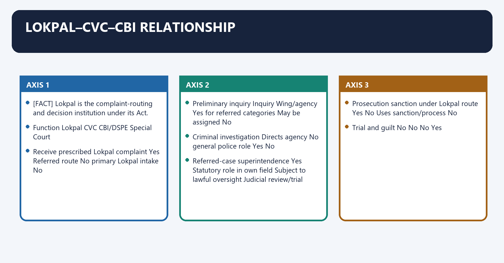
[FACT] Lokpal is the complaint-routing and decision institution under its Act.

[FACT] CVC conducts or processes preliminary inquiries for referred Union official categories and reports/statements as the statutes require.

[FACT] CBI, through DSPE powers, may conduct preliminary inquiry or investigation when referred and submits the legal investigation report.

[FACT] Lokpal exercises referred-matter superintendence, controls transfer of the investigating officer in such cases and may grant prosecution sanction/direction.

[ANALYSIS] The relationship is functional, not a single command pyramid. Each institution retains a different legal source, domain and output.

#### Visual 47 — Role Matrix

| Function | Lokpal | CVC | CBI/DSPE | Special Court |
|---|---:|---:|---:|---:|
| Receive prescribed Lokpal complaint | Yes | Referred route | No primary Lokpal intake | No |
| Preliminary inquiry | Inquiry Wing/agency | Yes for referred categories | May be assigned | No |
| Criminal investigation | Directs agency | No general police role | Yes | No |
| Referred-case superintendence | Yes | Statutory role in own field | Subject to lawful oversight | Judicial review/trial |
| Prosecution sanction under Lokpal route | Yes | No | Uses sanction/process | No |
| Trial and guilt | No | No | No | Yes |

*Caption: Overlap in anti-corruption purpose does not erase institutional specialisation.*

#### Visual 48 — Anti-Corruption Ecosystem

```text
COMPLAINT ACCOUNTABILITY        VIGILANCE             INVESTIGATION
Lokpal                         CVC / CVOs             CBI / DSPE
    \                             |                     /
     \                            |                    /
      +------ departmental / prosecution choices ----+
                              |
                        SPECIAL COURT
                              |
                      judicial determination
```

*Caption: Coordination is necessary because no single body lawfully performs every function.*

#### CLOSING RECALL FLOW — LOKPAL–CVC–CBI RELATIONSHIP

```closure-flow
SUBTOPIC: Lokpal–CVC–CBI Relationship
KEY TERMS / DEFINITIONS: Lokpal · CVC · CBI Relationship · Receive prescribed Lokpal complaint · Yes · Referred route
MECHANISM / ARGUMENT: The decisive contrast is between Referred-case superintendence Yes Statutory role in own field Subject to lawful oversight Judicial review/trial and Prosecution sanction under Lokpal route Yes No Uses sanction/process No.
CONSEQUENCE / CONTRAST: Its principal consequence is that criminal investigation Directs agency No general police role Yes No.
UPSC TRAP / ANSWER-USE: The relationship is functional, not a single command pyramid.
ANSWER-GRABBING FORMULATION: Lokpal exercises referred-matter superintendence, controls transfer of the investigating officer in such cases and may grant prosecution sanction/direction.
```
### SESSION 23 — LOKAYUKTAS AND FEDERAL DIVERSITY
#### DEFINITION / WHAT THIS IS CALLED

**Plain-language definition:** Lokayuktas and Federal Diversity denotes the constitutional rules and institutional links organised around UNION ACT, SECTION 63.

**Technical definition:** Lokayuktas and Federal Diversity operates through requires State establishment by State law, connected with STATE LEGISLATURE CHOOSES.

#### ANSWER-GRABBING OPENING — WRITE/ADAPT IN THE EXAM

> Section 63 does not prescribe a uniform national composition, selection panel, jurisdiction, tenure, removal process, investigation wing, binding force or Upalokayukta model.

#### MUST-WRITE KEYWORDS

- **Lokayuktas**
- **Federal Diversity**
- **Jurisdiction**
- **Broad high-office and official coverage with narrow exclusions**
- **Wide exclusions**
- **Appointment**

**How to use them:** Frame the answer through Lokayuktas; define Federal Diversity, connect Jurisdiction with Broad high-office and official coverage with narrow exclusions to explain the mechanism, and use Wide exclusions for the decisive comparison or qualification.

Lokayuktas and Federal Diversity denotes the constitutional rules and institutional links organised around UNION ACT, SECTION 63.
Lokayuktas and Federal Diversity operates through requires State establishment by State law, connected with STATE LEGISLATURE CHOOSES.
The operative mechanism matters because composition appointment CM coverage officials covered.
Its principal consequence is that tenure removal inquiry/investigation report force.
The decisive contrast is between DIFFERENT LOKAYUKTA MODELS ACROSS INDIA and Design axis Stronger statutory design Weaker statutory design.
The exam-safe limitation is that jurisdiction Broad high-office and official coverage with narrow exclusions Wide exclusions.
[FACT] Section 63 requires every State, if it had not already done so, to establish a Lokayukta by a law of the State Legislature within one year from commencement of the Union Act.

[FACT] Section 63 does not prescribe a uniform national composition, selection panel, jurisdiction, tenure, removal process, investigation wing, binding force or Upalokayukta model.

[FACT] Local Polity sources record Maharashtra as the first State to establish a Lokayukta in 1971, while noting earlier Odisha legislation with later enforcement.

[ANALYSIS] The Union Act creates a minimum institutional obligation, but State legislation determines design quality. Federal flexibility permits adaptation and also produces uneven accountability capacity.

[LIMIT] This package does not freeze a current State count or classify named States by today’s vacancies/performance. “Strong” and “weak” below describe legal design features, not a permanent ranking.

#### Visual 49 — Section 63 Federal Model

```text
UNION ACT, SECTION 63
requires State establishment by State law
                 |
                 v
STATE LEGISLATURE CHOOSES:
composition | appointment | CM coverage | officials covered
tenure | removal | inquiry/investigation | report force
                 |
                 v
DIFFERENT LOKAYUKTA MODELS ACROSS INDIA
```

*Caption: The national law mandates establishment, not uniform institutional design.*

#### Visual 50 — Strong vs Weak Design Archetypes

| Design axis | Stronger statutory design | Weaker statutory design |
|---|---|---|
| Jurisdiction | Broad high-office and official coverage with narrow exclusions | Wide exclusions |
| Appointment | Multi-institutional, transparent panel | Executive-dominant process |
| Investigation | Dedicated/insulated capacity | Dependence without safeguards |
| Recommendations | Reasoned response and follow-up duties | Easily ignored advice |
| Tenure/removal | Fixed tenure and protected removal | Easy executive displacement |
| Reporting | Timely legislative/public reporting | Opaque disposal |
| Resources | Charged/protected or rule-based capacity | Ad hoc staffing |

*Caption: Federal comparison should evaluate statutory features, not rely on a changing vacancy list.*

#### Visual 51 — Lokpal vs Lokayukta

| Head | Lokpal | Lokayukta |
|---|---|---|
| Level | Union | State |
| Governing law | 2013 parliamentary Act | Relevant State Act |
| Uniform composition | Yes under section 3 | No national uniformity |
| PM/Union officials | Lokpal jurisdiction | Not State Lokayukta core |
| CM/State officials | Not automatically Lokpal’s domain | Depends on State law |
| CVC/CBI routing | Express Union statutory links | State-specific machinery |

*Caption: Never transplant Lokpal’s composition or five-member Selection Committee into every State statute.*

#### CLOSING RECALL FLOW — LOKAYUKTAS AND FEDERAL DIVERSITY

```closure-flow
SUBTOPIC: Lokayuktas and Federal Diversity
KEY TERMS / DEFINITIONS: Lokayuktas · Federal Diversity · Jurisdiction · Broad high-office and official coverage with narrow exclusions · Wide exclusions · Appointment
MECHANISM / ARGUMENT: Lokayuktas and Federal Diversity operates through requires State establishment by State law, connected with STATE LEGISLATURE CHOOSES.
CONSEQUENCE / CONTRAST: The decisive contrast is between DIFFERENT LOKAYUKTA MODELS ACROSS INDIA and Design axis Stronger statutory design Weaker statutory design.
UPSC TRAP / ANSWER-USE: Section 63 requires every State, if it had not already done so, to establish a Lokayukta by a law of the State Legislature within one year from commencement of the Union Act.
ANSWER-GRABBING FORMULATION: Section 63 does not prescribe a uniform national composition, selection panel, jurisdiction, tenure, removal process, investigation wing, binding force or Upalokayukta model.
```
### 25. Supreme Court and Current-Law Controls

Supreme Court and Current-Law Controls denotes the constitutional rules and institutional links organised around 1 Common Cause v. Union of India (2017) v Union of India (2017).
Supreme Court and Current-Law Controls operates through [ANALYSIS] The case protects statutory implementation against political or institutional vacancy, connected with [LIMIT] It did not amend section 4 to create a largest-opposition-party substitute.
The operative mechanism matters because 2 Lok Prahari v. Union of India (2018) v Union of India (2018).
Its principal consequence is that [FACT] It treated non-disclosure of assets and sources of income as undue influence/corrupt practice in the election-law context.
The decisive contrast is between 3 Sita Soren (2024) v Union of India (2024) and [FACT] The seven-judge bench held that legislative privilege does not immunise bribery connected with a speech or vote.
The exam-safe limitation is that [ANALYSIS] This narrows the practical space of the section 14(2) exclusion without erasing protected legislative speech and vote.
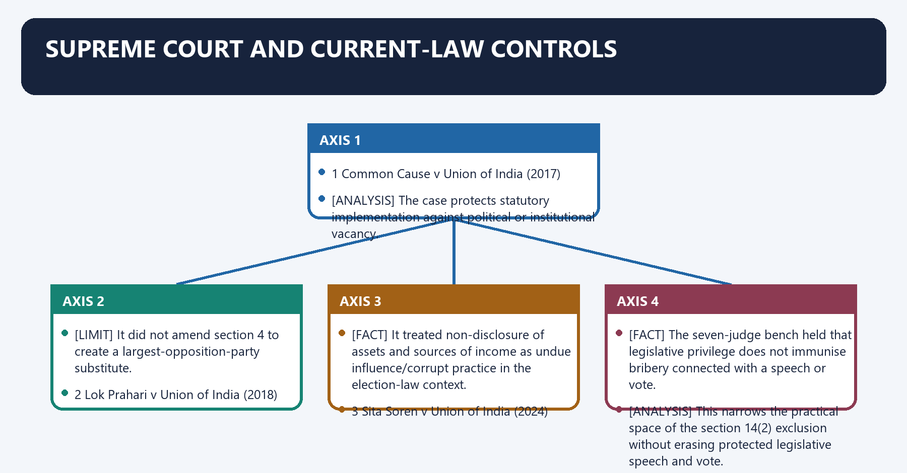
#### 25.1 *Common Cause v. Union of India (2017) v Union of India* (2017)

[FACT] The Supreme Court held the Act “eminently workable” and rejected the claim that its enforcement had to await proposed amendments.

[FACT] It read section 4(2) to permit a truncated Selection Committee, in the absence of a recognised LoP, to appoint the eminent jurist, constitute a Search Committee and recommend appointments.

[ANALYSIS] The case protects statutory implementation against political or institutional vacancy.

[LIMIT] It did not amend section 4 to create a largest-opposition-party substitute.

#### 25.2 *Lok Prahari v. Union of India (2018) v Union of India* (2018)

[FACT] The Court directed amendment of election Form 26/rules to require candidates and associates to declare sources of income, and required a permanent mechanism to monitor disproportionate asset growth of legislators and associates.

[FACT] It treated non-disclosure of assets and sources of income as undue influence/corrupt practice in the election-law context.

[LIMIT] The holding is about electoral disclosure and democratic information. It must not be cited as if the Court restored the pre-2016 section 44 Lokpal return format.

#### 25.3 *Sita Soren (2024) v Union of India* (2024)

[FACT] The seven-judge bench held that legislative privilege does not immunise bribery connected with a speech or vote.

[ANALYSIS] This narrows the practical space of the section 14(2) exclusion without erasing protected legislative speech and vote.

#### 25.4 High Court Judge Jurisdiction Order (2025)

[CURRENT] On 20 February 2025, the Supreme Court stayed the Lokpal order dated 27 January 2025 in Complaint No. 05/2025 concerning asserted jurisdiction over a High Court judge, issued notice and imposed confidentiality directions.

[LIMIT] A stay is not a final holding on jurisdiction. The Lokpal order cannot be presented as settled expansion of jurisdiction, and the Supreme Court’s interim order cannot be presented as a final exclusion ruling.

[CURRENT] Lokpal Circular No. 01/2026 records the institution’s view, based on cited orders, that sitting Supreme Court judges are outside section 14 because the Supreme Court is constitutionally established rather than established by an Act of Parliament.

[LIMIT] An institutional circular does not predetermine the Supreme Court’s final resolution of the distinct High Court judge issue.

#### Visual 52 — Case-Control Timeline

| Year | Case/order | Exact use |
|---|---|---|
| 2017 | *Common Cause v. Union of India (2017)* | Act workable; LoP vacancy not a legal blockade |
| 2018 | *Lok Prahari v. Union of India (2018)* | Electoral asset/source disclosure and monitoring |
| 2024 | *Sita Soren (2024)* | No legislative-privilege immunity for bribery |
| 2025 | SC stay of Lokpal HC-judge order | Jurisdiction issue remains unresolved |
| 2026 | Lokpal Circular 01/2026 | Current Registry/jurisdiction procedural position, subject to superior law |

*Caption: Each authority has a different holding; none is a generic “Lokpal powers” precedent.*

#### Visual 53 — Judiciary Status Control

```text
SUPREME COURT JUDGES
Lokpal 2026 circular: outside section 14 on stated institutional basis

HIGH COURT JUDGE ISSUE
Lokpal asserted jurisdiction in Jan 2025
          |
Supreme Court stayed order in Feb 2025
          |
FINAL JURISDICTION QUESTION NOT SETTLED BY THAT INTERIM ORDER
```

*Caption: Institution-level position, stayed order and final judicial law must be labelled separately.*

### SESSION 24 — INDEPENDENCE AND ACCOUNTABILITY ASSESSMENT
#### DEFINITION / WHAT THIS IS CALLED

**Plain-language definition:** Independence and Accountability Assessment denotes the constitutional rules and institutional links organised around Structural vulnerability does not prove partisan misuse in a named case.

**Technical definition:** The operative mechanism matters because tenure Five years/70; protected removal Delayed vacancies can reduce capacity.

#### ANSWER-GRABBING OPENING — WRITE/ADAPT IN THE EXAM

> Public status information and annual reports support accountability, while complainant/public-servant confidentiality and PM in-camera rules protect fairness.

#### MUST-WRITE KEYWORDS

- **Independence**
- **Accountability Assessment**
- **Appointment**
- **Multiple constitutional/institutional actors**
- **PM-led committee; vacancy politics**
- **Tenure**

**How to use them:** Frame the answer through Independence; define Accountability Assessment, connect Appointment with Multiple constitutional/institutional actors to explain the mechanism, and use PM-led committee; vacancy politics for the decisive comparison or qualification.

Independence and Accountability Assessment denotes the constitutional rules and institutional links organised around [LIMIT] Structural vulnerability does not prove partisan misuse in a named case. Critique design with evidence, not insinuation.
Independence and Accountability Assessment operates through Dimension Safeguard Residual risk, connected with Appointment Multiple constitutional/institutional actors PM-led committee; vacancy politics.
The operative mechanism matters because tenure Five years/70; protected removal Delayed vacancies can reduce capacity.
Its principal consequence is that finance Charged on Consolidated Fund Staffing/administrative dependence may remain.
The decisive contrast is between Inquiry Own Inquiry Wing Preliminary inquiry is not full police investigation and Investigation DSPE transfer approval; superintendence External-agency dependence.
The exam-safe limitation is that prosecution Own Prosecution Wing Formal constitution does not prove full staffing.
[FACT] Independence-supporting features include multi-institutional selection, fixed tenure, protected removal, post-tenure restrictions, expenditure charged on the Consolidated Fund of India, diverse membership, own statutory wings and referred-case control over DSPE transfers.

[ANALYSIS] Constraints include an executive-heavy Selection Committee, no general suo motu complaint power, prescribed-form barriers, reliance on external investigation, coordination delays, confidentiality tensions, the seven-year bar, uncertain asset-rule implementation and uneven State models.

[ANALYSIS] Transparency is also dual-edged. Public status information and annual reports support accountability, while complainant/public-servant confidentiality and PM in-camera rules protect fairness. Over-secrecy can weaken legitimacy; over-disclosure can prejudice inquiry.

[LIMIT] Structural vulnerability does not prove partisan misuse in a named case. Critique design with evidence, not insinuation.

#### Visual 54 — Independence Scorecard

| Dimension | Safeguard | Residual risk |
|---|---|---|
| Appointment | Multiple constitutional/institutional actors | PM-led committee; vacancy politics |
| Tenure | Five years/70; protected removal | Delayed vacancies can reduce capacity |
| Finance | Charged on Consolidated Fund | Staffing/administrative dependence may remain |
| Inquiry | Own Inquiry Wing | Preliminary inquiry is not full police investigation |
| Investigation | DSPE transfer approval; superintendence | External-agency dependence |
| Prosecution | Own Prosecution Wing | Formal constitution does not prove full staffing |
| Transparency | Website status/annual reporting | Confidentiality and delayed reporting tensions |
| Federal reach | State duty to create Lokayukta | Non-uniform State design |

*Caption: Institutional independence is a bundle of safeguards, not a binary label.*

#### Visual 55 — Accountability Without Merger

```text
INDEPENDENCE FROM IMPROPER EXECUTIVE PRESSURE
                    +
ANSWERABILITY THROUGH REASONS, REPORTS AND COURTS
                    +
DUE PROCESS FOR PUBLIC SERVANT AND COMPLAINANT
                    +
FEDERAL RESPECT
                    =
CREDIBLE ANTI-CORRUPTION OMBUDSMAN
```

*Caption: Independence without accountability risks arbitrariness; accountability without independence risks capture.*

#### CLOSING RECALL FLOW — INDEPENDENCE AND ACCOUNTABILITY ASSESSMENT

```closure-flow
SUBTOPIC: Independence and Accountability Assessment
KEY TERMS / DEFINITIONS: Independence · Accountability Assessment · Appointment · Multiple constitutional/institutional actors · PM-led committee; vacancy politics · Tenure
MECHANISM / ARGUMENT: The operative mechanism matters because tenure Five years/70; protected removal Delayed vacancies can reduce capacity.
CONSEQUENCE / CONTRAST: Its principal consequence is that finance Charged on Consolidated Fund Staffing/administrative dependence may remain.
UPSC TRAP / ANSWER-USE: The decisive contrast is between Inquiry Own Inquiry Wing Preliminary inquiry is not full police investigation and Investigation DSPE transfer approval; superintendence External-agency dependence.
ANSWER-GRABBING FORMULATION: Public status information and annual reports support accountability, while complainant/public-servant confidentiality and PM in-camera rules protect fairness.
```
### SESSION 25 — CRITIQUES, REPLIES AND REFORM PROPOSALS
#### DEFINITION / WHAT THIS IS CALLED

**Plain-language definition:** Critiques, Replies and Reform Proposals denotes the constitutional rules and institutional links organised around 1 Critique–Reply Matrix.

**Technical definition:** Critiques, Replies and Reform Proposals operates through Critique Evidence Reply Qualification, connected with “Duplicative” Lokpal, CVC and CBI overlap Functions differ by stage Poor coordination can create delay.

#### ANSWER-GRABBING OPENING — WRITE/ADAPT IN THE EXAM

> A model State Lokayukta law could propose minimum jurisdiction, appointment diversity, tenure protection, investigation safeguards, response deadlines and reporting standards while leaving States room to legislate.

#### MUST-WRITE KEYWORDS

- **Critiques**
- **Replies**
- **Reform Proposals**
- **“No teeth”**
- **No general suo motu complaint route; agency dependence**
- **“Executive capture”**

**How to use them:** Frame the answer through Critiques; define Replies, connect Reform Proposals with “No teeth” to explain the mechanism, and use No general suo motu complaint route; agency dependence for the decisive comparison or qualification.

Critiques, Replies and Reform Proposals denotes the constitutional rules and institutional links organised around 1 Critique–Reply Matrix.
Critiques, Replies and Reform Proposals operates through Critique Evidence Reply Qualification, connected with “Duplicative” Lokpal, CVC and CBI overlap Functions differ by stage Poor coordination can create delay.
The operative mechanism matters because “Uniform national system” Section 63 duty State law permits federal tailoring Baseline quality varies.
Its principal consequence is that “False-complaint chilling” Section 46 penalties Good-faith protection exists Failure of proof must not be treated as bad faith.
The decisive contrast is between form barriers - assisted multilingual filing and cure process and agency dependence - stable multidisciplinary staffing + time audits.
The exam-safe limitation is that appointment delay - public calendar and reasoned vacancy management.
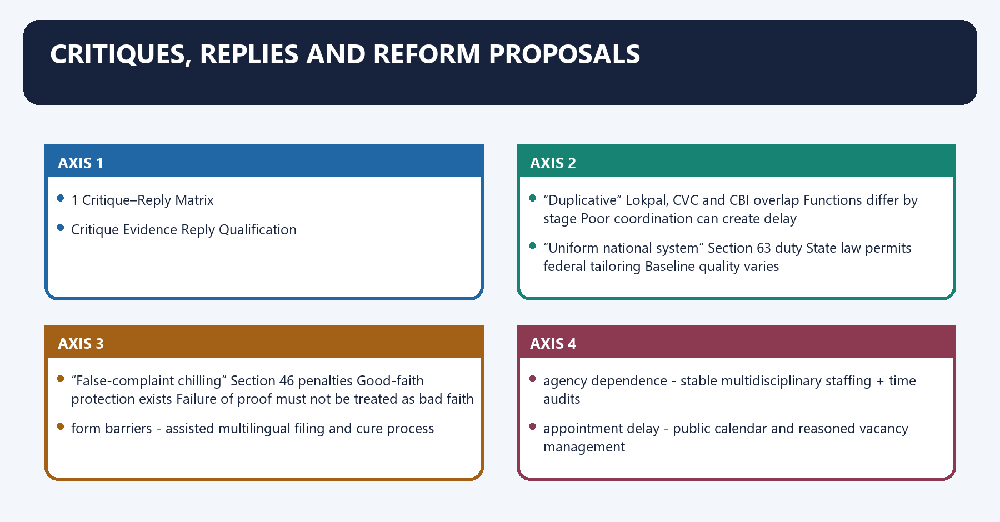
#### 27.1 Critique–Reply Matrix

| Critique | Evidence | Reply | Qualification |
|---|---|---|---|
| “No teeth” | No general suo motu complaint route; agency dependence | Sanction, supervision, attachment and prosecution powers are real | Effectiveness depends on capacity and lawful use |
| “Executive capture” | PM chairs Selection Committee | Speaker, LoP, CJI/nominee and jurist diversify it | Executive remains institutionally influential |
| “Too secret” | PM inquiry in camera; identity protection | Confidentiality protects fairness and security | Reasoned aggregate reporting still needed |
| “Duplicative” | Lokpal, CVC and CBI overlap | Functions differ by stage | Poor coordination can create delay |
| “Uniform national system” | Section 63 duty | State law permits federal tailoring | Baseline quality varies |
| “False-complaint chilling” | Section 46 penalties | Good-faith protection exists | Failure of proof must not be treated as bad faith |

#### Visual 56 — Reform Map

```text
PROBLEM                         PROPOSAL
form barriers             -> assisted multilingual filing and cure process
agency dependence         -> stable multidisciplinary staffing + time audits
appointment delay         -> public calendar and reasoned vacancy management
opacity                    -> anonymised stage-wise reasons and annual reporting
State variation           -> model minimum standards, preserving State law
asset-rule uncertainty    -> notify clear current section 44 rules
false-complaint chilling  -> strict good-faith screen before prosecution
overlap                    -> written Lokpal-CVC-CBI routing protocol
```

*Caption: These are reform proposals, not existing legal powers.*

[ANALYSIS] A model State Lokayukta law could propose minimum jurisdiction, appointment diversity, tenure protection, investigation safeguards, response deadlines and reporting standards while leaving States room to legislate.

[ANALYSIS] Any proposal for suo motu power should include a recorded-reasons threshold, conflict/recusal rules, natural justice and judicial review. More power without procedure can politicise the institution it seeks to strengthen.

[ANALYSIS] Publishing anonymised reasons for closure and aggregate stage-wise data could improve legitimacy without freezing live complaint counts or compromising protected identities.

#### CLOSING RECALL FLOW — CRITIQUES, REPLIES AND REFORM PROPOSALS

```closure-flow
SUBTOPIC: Critiques, Replies and Reform Proposals
KEY TERMS / DEFINITIONS: Critiques · Replies · Reform Proposals · “No teeth” · No general suo motu complaint route; agency dependence · “Executive capture”
MECHANISM / ARGUMENT: Critiques, Replies and Reform Proposals operates through Critique Evidence Reply Qualification, connected with “Duplicative” Lokpal, CVC and CBI overlap Functions differ by stage Poor coordination can create delay.
CONSEQUENCE / CONTRAST: Its principal consequence is that “False-complaint chilling” Section 46 penalties Good-faith protection exists Failure of proof must not be treated as bad faith.
UPSC TRAP / ANSWER-USE: Do not miss this limiting distinction: the decisive contrast is between form barriers - assisted multilingual filing and cure process...
ANSWER-GRABBING FORMULATION: A model State Lokayukta law could propose minimum jurisdiction, appointment diversity, tenure protection, investigation safeguards, response deadlines and reporting standards while leaving States room to legislate.
```
### 28. UPSC Answer Architecture

UPSC Answer Architecture denotes the constitutional rules and institutional links organised around Marks Structure Evidence load.
UPSC Answer Architecture operates through 10 Definition/status - 2-3 design features - one limitation - verdict Act + 2 sections/case points, connected with 15 Evolution - design - jurisdiction/process - critique/reply - reforms 4-6 named legal anchors.
The operative mechanism matters because 20 Thesis - full architecture - PM/privilege/federalism - institutions - cases - balanced reform 6-8 anchors + diagram.
Its principal consequence is that directive What examiner expects Lokpal example.
The decisive contrast is between Explain Mechanism and reasons How complaint becomes prosecution and Examine Test proposition using evidence Whether Lokpal is independent.
The exam-safe limitation is that analyse Break into causal/institutional parts Lokpal-CVC-CBI relationship.
#### Visual 57 — 10/15/20-Mark Spine

| Marks | Structure | Evidence load |
|---:|---|---|
| 10 | Definition/status -> 2-3 design features -> one limitation -> verdict | Act + 2 sections/case points |
| 15 | Evolution -> design -> jurisdiction/process -> critique/reply -> reforms | 4-6 named legal anchors |
| 20 | Thesis -> full architecture -> PM/privilege/federalism -> institutions -> cases -> balanced reform | 6-8 anchors + diagram |

*Caption: Marks should scale dimensions and evidence, not merely paragraph length.*

#### Visual 58 — Directive Decoder

| Directive | What examiner expects | Lokpal example |
|---|---|---|
| Explain | Mechanism and reasons | How complaint becomes prosecution |
| Examine | Test proposition using evidence | Whether Lokpal is independent |
| Analyse | Break into causal/institutional parts | Lokpal-CVC-CBI relationship |
| Critically examine | Strengths, weaknesses and reasoned verdict | “Ombudsman without teeth” |
| Discuss | Multi-dimensional balanced treatment | Uniform Lokayukta model |

*Caption: A critique without statutory mechanism becomes opinion; a description without evaluation misses “critically”.*

#### Visual 59 — Prelims Close-Option Traps

| Trap | Correct control |
|---|---|
| Constitutional body | Statutory body |
| Chair must only be CJI | CJI/SC Judge/eminent qualified person |
| 50% of total institution judicial | 50% of Members judicial |
| Exactly eight Members | Not exceeding eight |
| PM fully immune | Included with exclusions and full-bench supermajority |
| MPs wholly immune | Protected speech/vote; bribery not immunised after *Sita Soren (2024)* |
| Lokpal directly investigates all cases | Investigation by assigned agency |
| CVC is subordinate office of Lokpal | Statutory functional referral relationship |
| Every State has same Lokayukta | State statutes vary |
| Failed complaint means false complaint | Section 46 threshold + good-faith shield |

*Caption: Most objective errors arise from replacing a qualified rule with an absolute proposition.*

### 29. Current-Control and Source Ledger

Current-Control and Source Ledger denotes the constitutional rules and institutional links organised around Claim family Source used Current control.
Current-Control and Source Ledger operates through Composition, appointment, jurisdiction, procedure, powers Current India Code PDF Checked 25 Aug 2026, connected with Complaint form and initial filters Lokpal (Complaint) Rules, 2020 Gazette Official.
The operative mechanism matters because registry procedure Lokpal Circular No. 01/2026, 24 Jul 2026 Official/current.
Its principal consequence is that inquiry Wing Official Lokpal circular register + organogram Constitution dated 5 Sep 2024.
The decisive contrast is between Prosecution Wing Official order/Gazette Order 6 Jun; notification 13 Jun 2025 and Asset declarations 2016 Amendment + DoPT OMs No later fresh rule located in checked official repository.
The exam-safe limitation is that loP vacancy Common Cause v. Union of India (2017) official judgment Exact holding used.
#### Visual 60 — Claim-Risk Ledger

| Claim family | Source used | Current control |
|---|---|---|
| Composition, appointment, jurisdiction, procedure, powers | Current India Code PDF | Checked 25 Aug 2026 |
| Complaint form and initial filters | Lokpal (Complaint) Rules, 2020 Gazette | Official |
| Registry procedure | Lokpal Circular No. 01/2026, 24 Jul 2026 | Official/current |
| Inquiry Wing | Official Lokpal circular register + organogram | Constitution dated 5 Sep 2024 |
| Prosecution Wing | Official order/Gazette | Order 6 Jun; notification 13 Jun 2025 |
| Asset declarations | 2016 Amendment + DoPT OMs | No later fresh rule located in checked official repository |
| LoP vacancy | *Common Cause v. Union of India (2017)* official judgment | Exact holding used |
| Legislative bribery | *Sita Soren (2024)* official judgment | Exact privilege boundary used |
| HC judge issue | SC order, 20 Feb 2025 | Stay/interim status only |
| PYQ | Official 2025 Set A paper and official Set A key | Directly checked locally |

*Caption: Current status is strongest where the proposition is tied to a named first-party instrument.*

#### Official and Local Sources Consulted

- `[FACT]` India Code, **Lokpal and Lokayuktas Act, 2013**, current official consolidated PDF checked on 25 August 2026.
- `[FACT]` Gazette of India, **Lokpal (Complaint) Rules, 2020**, G.S.R. 148(E), 2 March 2020.
- `[CURRENT]` Lokpal of India, **Circular No. 01/2026**, 24 July 2026, procedure for complaints.
- `[CURRENT]` Lokpal official circulars/notifications API: Inquiry Wing entry dated 5 September 2024; Prosecution Wing order dated 6 June 2025 and Gazette notification dated 13 June 2025.
- `[CURRENT]` Lokpal official **Organizational Structure**, revised by Full Bench on 13 September 2024.
- `[FACT]` DoPT, Lokpal and Lokayuktas (Amendment) Act, 2016 and official asset-declaration memoranda.
- `[FACT]` Supreme Court, ***Common Cause v. Union of India (2017) v Union of India***, W.P.(C) 245/2014, judgment dated 27 April 2017.
- `[FACT]` Supreme Court, ***Lok Prahari v. Union of India (2018) v Union of India***, W.P.(C) 784/2015, judgment dated 16 February 2018.
- `[FACT]` Supreme Court, ***Sita Soren (2024) v Union of India***, 2024 INSC 161, judgment dated 4 March 2024.
- `[CURRENT]` Supreme Court order dated 20 February 2025 staying the Lokpal’s 27 January 2025 High Court judge order.
- `[FACT]` Local sources: `basic/Lokpal-and-Lokayuktas.md`, `advanced/38_Lokpal-and-Lokayuktas.md`, Polity 37 CVC-CBI package, Parliament package and OCR-searchable M. Laxmikanth Polity PDFs.
- `[FACT]` Local PYQ routing/audit ledgers; official UPSC 2025 GS-I Set A paper; official UPSC 2025 GS-I Set A answer key.

#### Current-Law Limits

- `[LIMIT]` No current Chairperson/Member names are frozen.
- `[LIMIT]` No complaint, disposal, prosecution or conviction totals are frozen.
- `[LIMIT]` No State-by-State vacancy or establishment count is frozen.
- `[LIMIT]` Formal wing constitution is not equated with full staffing or measured effectiveness.
- `[LIMIT]` The High Court judge jurisdiction question is described through the 2025 stay, not as finally decided.
- `[LIMIT]` The current section 44 text is not replaced by the original public-disclosure design.
- `[LIMIT]` Notification-dependent clause (g) finance threshold is not frozen.

### SESSION 26 — WHISTLEBLOWER, VIGILANCE AND GRIEVANCE INTERFACES
#### DEFINITION / WHAT THIS IS CALLED

**Plain-language definition:** Whistleblower, Vigilance and Grievance Interfaces denotes the constitutional rules and institutional links organised around Route Entry condition Principal output Boundary.

**Technical definition:** Whistleblower, Vigilance and Grievance Interfaces operates through CVC/CVO vigilance information or departmental integrity issue vigilance advice or disciplinary route no criminal conviction, connected with CBI/DSPE notified offence and lawful territorial/jurisdictional route criminal investigation report guilt remains for court.

#### ANSWER-GRABBING OPENING — WRITE/ADAPT IN THE EXAM

> The Lokpal framework’s principal strength is that it makes high-level corruption subject to a statutory, multi-stage institution rather than leaving it entirely to executive vigilance.

#### MUST-WRITE KEYWORDS

- **Whistleblower**
- **Vigilance**
- **Grievance Interfaces**
- **Lokpal**
- **inquiry/investigation/prosecution route**
- **not a general service grievance**

**How to use them:** Frame the answer through Whistleblower; define Vigilance, connect Grievance Interfaces with Lokpal to explain the mechanism, and use inquiry/investigation/prosecution route for the decisive comparison or qualification.

Whistleblower, Vigilance and Grievance Interfaces denotes the constitutional rules and institutional links organised around Route Entry condition Principal output Boundary.
Whistleblower, Vigilance and Grievance Interfaces operates through CVC/CVO vigilance information or departmental integrity issue vigilance advice or disciplinary route no criminal conviction, connected with CBI/DSPE notified offence and lawful territorial/jurisdictional route criminal investigation report guilt remains for court.
The operative mechanism matters because grievance portal service-delivery complaint administrative redress not a substitute for corruption evidence.
Its principal consequence is that [LIMIT] These routes may interact, but one filing does not automatically satisfy another.
The decisive contrast is between statute's form, jurisdiction, limitation, evidence or sanction requirements and PYQ, Practice and Solved Workbook.
The exam-safe limitation is that a. PYQ Routing Audit.
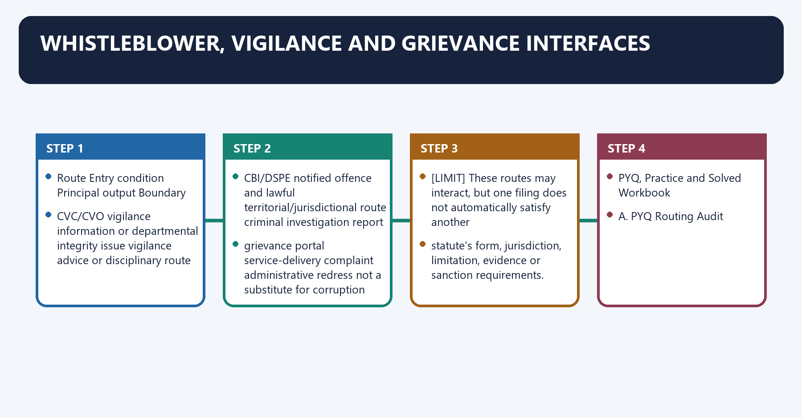
| Route | Entry condition | Principal output | Boundary |
|---|---|---|---|
| Lokpal | prescribed corruption complaint against a covered public servant | inquiry/investigation/prosecution route | not a general service grievance |
| CVC/CVO | vigilance information or departmental integrity issue | vigilance advice or disciplinary route | no criminal conviction |
| CBI/DSPE | notified offence and lawful territorial/jurisdictional route | criminal investigation report | guilt remains for court |
| whistleblower channel | protected disclosure under the applicable legal framework | identity protection and examination route | do not assume full commencement of every enactment |
| grievance portal | service-delivery complaint | administrative redress | not a substitute for corruption evidence |

[LIMIT] These routes may interact, but one filing does not automatically satisfy another
statute's form, jurisdiction, limitation, evidence or sanction requirements.

#### CLOSING RECALL FLOW — WHISTLEBLOWER, VIGILANCE AND GRIEVANCE INTERFACES

```closure-flow
SUBTOPIC: Whistleblower, Vigilance and Grievance Interfaces
KEY TERMS / DEFINITIONS: Whistleblower · Vigilance · Grievance Interfaces · Lokpal · inquiry/investigation/prosecution route · not a general service grievance
MECHANISM / ARGUMENT: Whistleblower, Vigilance and Grievance Interfaces operates through CVC/CVO vigilance information or departmental integrity issue vigilance advice or disciplinary route no criminal conviction, connected with CBI/DSPE notified offence and lawful territorial/jurisdictional route criminal investigation report guilt remains for court.
CONSEQUENCE / CONTRAST: Its principal consequence is that These routes may interact, but one filing does not automatically satisfy another.
UPSC TRAP / ANSWER-USE: Do not miss this limiting distinction: the decisive contrast is between statute's form, jurisdiction, limitation, evidence or sanction requirements and...
ANSWER-GRABBING FORMULATION: The Lokpal framework’s principal strength is that it makes high-level corruption subject to a statutory, multi-stage institution rather than leaving it entirely to executive vigilance.
```
## BASIC MCQS / REMEDIATION

### C. Original MCQs — 36 Questions

#### OM1. Which statement best describes the Lokpal?

A. It is a statutory anti-corruption ombudsman whose powers and limits arise from the 2013 Act.
B. It is an executive body created only by a government resolution.
C. It is the investigative division of the CVC.
D. It is a constitutional court for corruption offences.

**Answer: A.**

**Explanation:** `[FACT]` The Lokpal is established by the Lokpal and Lokayuktas Act, 2013. It routes inquiries/investigations and exercises defined process powers, but a Special Court determines guilt.

#### OM2. The Lokpal consists of:

A. A Chairperson and exactly eight Members.
B. A Chairperson and not more than eight Members.
C. A Chairperson, eight Members and the CVC as an ex officio Member.
D. A Chairperson and not more than ten Members.

**Answer: B.**

**Explanation:** `[FACT]` Section 3 sets a ceiling of eight Members. “Not exceeding” must not be converted into a permanently filled exact number.

#### OM3. Which composition statement is correct?

A. Half of the whole institution, including the Chairperson, must be judicial.
B. At least half of the Members must be serving judges.
C. Fifty per cent of the Members shall be Judicial Members, and not less than fifty per cent of Members must satisfy the listed representation rule.
D. The representation rule applies only to non-judicial Members.

**Answer: C.**

**Explanation:** `[FACT]` Both calculations use “Members” as the denominator. Judicial Members can be former office-holders; the social-representation rule is not restricted to non-judicial seats.

#### OM4. Who may be appointed Chairperson under section 3?

A. Only a serving Chief Justice of India.
B. Only a former Chief Justice of India.
C. Only a Supreme Court Judge.
D. A current/former CJI, current/former Supreme Court Judge, or an eminent person satisfying the statutory expertise condition.

**Answer: D.**

**Explanation:** `[FACT]` The Chairperson has both judicial and eminent-person routes. The eminent-person route imports the non-judicial integrity, ability, expertise and experience requirements.

#### OM5. A non-judicial Member must ordinarily possess:

A. At least twenty-five years of special knowledge and expertise in the listed fields.
B. Ten years of judicial office.
C. Twenty years as an MP.
D. Thirty years in any occupation.

**Answer: A.**

**Explanation:** `[FACT]` Section 3 specifies twenty-five years and named fields including anti-corruption policy, administration, vigilance, finance, law and management.

#### OM6. Which person is not expressly disqualified merely by the stated fact?

A. A sitting MP.
B. A retired civil servant aged 60 who meets all eligibility conditions.
C. A sitting Municipality member.
D. A person removed from State service.

**Answer: B.**

**Explanation:** `[FACT]` Retirement from public service is not a disqualification. Sitting legislative/local-body office, removal/dismissal and the other listed grounds are.

#### OM7. The Selection Committee for Lokpal appointments includes:

A. President, Prime Minister, CJI, CVC and Attorney General.
B. Prime Minister, Rajya Sabha Chairman, LoP, CJI and CVC.
C. Prime Minister, Lok Sabha Speaker, Lok Sabha LoP, CJI/nominee and an eminent jurist.
D. Prime Minister, Home Minister, LoP, CJI and Cabinet Secretary.

**Answer: C.**

**Explanation:** `[FACT]` Section 4 names these five positions. The eminent jurist is nominated by the President on recommendation of the first four.

#### OM8. The eminent jurist on the Selection Committee is:

A. Nominated by the CJI alone.
B. Selected by the Search Committee.
C. Elected by Parliament.
D. Nominated by the President on recommendation of the other four Selection Committee members.

**Answer: D.**

**Explanation:** `[FACT]` This exact nomination route prevents the error that the President has an unguided independent choice.

#### OM9. Which statement about the Search Committee is correct?

A. It has at least seven persons, a statutory diversity floor and prepares a panel, but its panel is not exclusive.
B. It consists of exactly five constitutional office-holders.
C. It makes the final presidential appointment.
D. It can consider only serving judges.

**Answer: A.**

**Explanation:** `[FACT]` Section 4(3) provides at least seven experts and allows the Selection Committee to consider persons outside the Search Committee’s recommendations.

#### OM10. Under current section 4 and *Common Cause v. Union of India (2017)*:

A. The Search Committee becomes the appointing authority.
B. A vacancy does not by itself invalidate appointment, and a truncated committee may proceed.
C. Every appointment made without LoP is void.
D. Absence of a recognised LoP automatically substitutes the Home Minister.

**Answer: B.**

**Explanation:** `[FACT]` Section 4(2) is the vacancy-validity rule. *Common Cause v. Union of India (2017)* held the Act workable; it did not enact a new substitute seat.

#### OM11. The ordinary tenure rule is:

A. Five years without age ceiling.
B. Six years or age 65, whichever earlier.
C. Five years or age 70, whichever earlier.
D. Four years or age 70, whichever earlier.

**Answer: C.**

**Explanation:** `[FACT]` Section 6 uses five years from entry or age seventy, whichever occurs first.

#### OM12. Which post-tenure proposition is correct?

A. Every Member may be reappointed for another full five-year term.
B. A former Member may accept any Union office of profit.
C. The Chairperson may immediately contest for Parliament.
D. A Member may become Chairperson only if aggregate Lokpal tenure does not exceed five years.

**Answer: D.**

**Explanation:** `[FACT]` Section 8 creates broad ineligibilities and one limited Member-to-Chairperson exception with an aggregate cap.

#### OM13. Removal for misbehaviour ordinarily begins with:

A. A petition signed by at least one hundred MPs followed by Presidential reference to the Supreme Court.
B. A Cabinet resolution.
C. A Lokpal internal inquiry.
D. A simple-majority Lok Sabha motion.

**Answer: A.**

**Explanation:** `[FACT]` Section 37 supplies its own threshold and Supreme Court inquiry route. Lokpal cannot inquire into its own Chairperson/Member.

#### OM14. Which is a direct presidential removal ground under section 37(4)?

A. Receiving an adverse media report.
B. Being adjudged insolvent.
C. Dissenting from another Member.
D. Policy disagreement with the Government.

**Answer: B.**

**Explanation:** `[FACT]` Insolvency, paid outside employment during tenure and infirmity rendering the person unfit are listed direct grounds.

#### OM15. A complaint concerning the Prime Minister can proceed only if, among other conditions:

A. The CVC unanimously approves.
B. Parliament passes a resolution.
C. A full Lokpal bench considers initiation and at least two-thirds of its Members approve.
D. The CJI conducts the preliminary inquiry.

**Answer: C.**

**Explanation:** `[FACT]` Section 14 creates a full-bench supermajority screen in addition to excluded subject domains and in-camera procedure.

#### OM16. If a PM complaint is dismissed after the special inquiry:

A. It must be tabled in Parliament.
B. Only the complainant may publish it.
C. It must be published after thirty days.
D. The inquiry records shall not be published or made available to anyone.

**Answer: D.**

**Explanation:** `[FACT]` This is the specific consequence in the second proviso to section 14(1)(a).

#### OM17. Which proposition correctly reconciles section 14(2) with *Sita Soren (2024)*?

A. Bona fide parliamentary speech/vote remains protected, but bribery for it is not immunised.
B. MPs are completely outside Lokpal jurisdiction.
C. Every parliamentary speech may be investigated as corruption.
D. Article 105(2) was repealed judicially.

**Answer: A.**

**Explanation:** `[FACT]` The 2024 judgment removed bribery immunity while preserving privilege’s functional protection.

#### OM18. Where Lokpal chooses preliminary inquiry for Groups A-D Union officials:

A. Departments conduct the final criminal trial.
B. CVC reports on Groups A/B to Lokpal and proceeds under the CVC Act for Groups C/D.
C. CBI decides whether Lokpal has jurisdiction.
D. Every category is sent directly to the Special Court.

**Answer: B.**

**Explanation:** `[FACT]` The two provisos to section 20(1) create category-specific CVC routing.

#### OM19. Section 14(1)(h) covers specified officers of certain entities receiving:

A. Any domestic donation.
B. Any government grant, however small, without further condition.
C. Foreign-source donations exceeding ten lakh rupees in a year or a higher notified amount.
D. Only United Nations grants.

**Answer: C.**

**Explanation:** `[FACT]` The statutory threshold is ten lakh rupees or a higher notified amount. Clause (g)’s government-finance threshold is separately notification-dependent.

#### OM20. Former public servants:

A. Are automatically immune after retirement.
B. Are covered for every private act in their lifetime.
C. Are covered only if re-employed.
D. May remain covered for alleged conduct during the period they served in the relevant statutory capacity.

**Answer: D.**

**Explanation:** `[FACT]` Section 14 repeatedly uses “is or has been”, while its explanation ties the complaint to the covered period.

#### OM21. Which is required by the Complaint Rules, 2020?

A. Prescribed form, identity proof, affidavit and signed detailed allegation.
B. Anonymous oral information alone.
C. Prior permission of the accused public servant.
D. Filing only through a lawyer.

**Answer: A.**

**Explanation:** `[FACT]` The Rules prescribe filing form/mode and required annexures. They do not create an anonymous channel.

#### OM22. The best distinction between preliminary inquiry and investigation is:

A. Both are final trials.
B. Preliminary inquiry tests prima facie basis; investigation gathers evidence for the criminal report.
C. Preliminary inquiry is always by a court.
D. Investigation is only departmental.

**Answer: B.**

**Explanation:** `[FACT]` Sections 2 and 20 assign different purposes, procedures and outputs to the two stages.

#### OM23. Which timeline combination is correct?

A. Preliminary inquiry always ends in 30 days; investigation in 90 days.
B. Preliminary report in 90 days; investigation cannot be extended.
C. Report within 60 days of reference; ordinary inquiry 90 days with further 90 days for recorded reasons.
D. Every inquiry and trial must finish within six months.

**Answer: C.**

**Explanation:** `[FACT]` Section 20 contains both a 60-day report rule and the 90+90 overall preliminary-inquiry framework.

#### OM24. After considering a preliminary inquiry report, a three-Member bench may:

A. Convict the public servant.
B. Dissolve the department.
C. Amend the Prevention of Corruption Act.
D. Order investigation, departmental/other action, or closure under the statutory conditions.

**Answer: D.**

**Explanation:** `[FACT]` Section 20(3) lists these options. Conviction is not among them.

#### OM25. An investigation directed by Lokpal should ordinarily be completed within:

A. Six months, with recorded-reason extensions not exceeding six months at a time.
B. Thirty days without extension.
C. One year without extension.
D. Seven years.

**Answer: A.**

**Explanation:** `[FACT]` Section 20(5) establishes the six-month period and extension architecture.

#### OM26. Lokpal’s superintendence over DSPE:

A. Covers every CBI case in India.
B. Applies to matters Lokpal refers, but cannot dictate investigation/disposal in a particular manner.
C. Converts Lokpal into the CBI Director.
D. Eliminates all federal consent requirements.

**Answer: B.**

**Explanation:** `[FACT]` Section 25 is referred-matter specific and contains an express anti-dictation proviso.

#### OM27. An officer of DSPE investigating a Lokpal-referred case:

A. Is appointed by the complainant.
B. Can never be transferred.
C. Cannot be transferred without Lokpal approval.
D. May be transferred only by Parliament.

**Answer: C.**

**Explanation:** `[FACT]` Section 25(3) creates a case-specific transfer safeguard.

#### OM28. Under section 26:

A. Lokpal personally conducts every physical search.
B. CVC issues all search warrants.
C. Search is barred before investigation.
D. Lokpal may authorise the agency entrusted with investigation to search for and seize relevant secreted documents.

**Answer: D.**

**Explanation:** `[FACT]` The power is authorisation through the investigating agency, not a general Lokpal police force.

#### OM29. The Inquiry Wing’s civil-court powers include:

A. Summoning persons and requiring document production for preliminary inquiry.
B. Awarding criminal sentences.
C. Declaring statutes unconstitutional.
D. Exercising a general contempt jurisdiction.

**Answer: A.**

**Explanation:** `[FACT]` Section 27 enumerates specified civil-procedure powers. It does not confer final criminal adjudication or general contempt power.

#### OM30. Provisional attachment under section 29 may ordinarily last:

A. Thirty days with no court role.
B. Up to ninety days, followed by Special Court control.
C. Indefinitely at Lokpal’s discretion.
D. Until retirement of the public servant.

**Answer: B.**

**Explanation:** `[FACT]` Recorded reasons and material are required; the order/material must be sent to the Special Court.

#### OM31. Lokpal’s prosecution-sanction power:

A. Is identical to a conviction.
B. Applies without any statutory conditions to every constitutional office-holder.
C. Authorises prosecution under the section 20 route, subject to section 23’s qualifications.
D. Replaces the Special Court.

**Answer: C.**

**Explanation:** `[FACT]` Sanction is a procedural gateway. Section 23(3) preserves the qualification for constitutional offices with specified removal procedure.

#### OM32. The Special Court is expected to complete trial:

A. Within six months with no extension.
B. Within three months in every case.
C. Whenever Lokpal directs, without statutory target.
D. Within one year, with recorded three-month extensions but total not exceeding two years.

**Answer: D.**

**Explanation:** `[FACT]` Section 35 sets the one-year target and the structured extension ceiling.

#### OM33. Section 53 bars a complaint made:

A. More than seven years after the date of the alleged offence.
B. More than three years after discovery.
C. More than seven years after retirement only.
D. After any departmental inquiry begins.

**Answer: A.**

**Explanation:** `[FACT]` The alleged-offence date is the statutory anchor.

#### OM34. After the 2016 amendment, section 44:

A. Abolishes all asset declarations.
B. Requires declaration in the form and manner to be prescribed.
C. Automatically republishes the original detailed format.
D. Applies only to MPs.

**Answer: B.**

**Explanation:** `[FACT]` The duty remains, but the detailed form/manner moved to prescription. The old rules were officially described as redundant.

#### OM35. Section 63 of the Union Act:

A. Abolishes pre-existing State Lokayukta laws.
B. Appoints every Lokayukta through the President.
C. Requires State establishment by State law but leaves institutional design to State legislation.
D. Prescribes one national composition for all Lokayuktas.

**Answer: C.**

**Explanation:** `[FACT]` The one-year establishment duty does not impose Lokpal’s exact model on States.

#### OM36. Which statement about the statutory wings is most accurate?

A. Inquiry Wing conducts all criminal trials.
B. Both wings were fully staffed from 2014 by operation of the Act alone.
C. Prosecution Wing is the CBI.
D. Inquiry Wing was formally constituted in 2024 and Prosecution Wing in 2025, but formal creation does not prove full staffing or output.

**Answer: D.**

**Explanation:** `[CURRENT]` Official Lokpal records establish the constitution dates and organogram; `[LIMIT]` capacity and performance require separate evidence.

### D. Remedial MCQs — 12 Questions

#### Visual 64 — Remedial Error Map

| Recurring error | Corrective rule |
|---|---|
| “PM is immune” | PM is covered, but specified domains and a special screen apply |
| “Lokpal controls all CBI work” | Superintendence is confined to Lokpal-referred matters |
| “The Union Act standardises Lokayuktas” | Section 63 leaves design to State law |
| “Wing notified = fully operational” | Constitution, staffing and output are separate facts |
| “Sanction/attachment = guilt” | These are interim/procedural steps; court adjudication remains |
| “Original asset-disclosure model continues unchanged” | Section 44 was substituted in 2016 |

*Caption: Remedials target the exact overstatements that UPSC converts into close options.*

#### RM37. Which is **not** one of the subject domains expressly excluded from a Lokpal inquiry against the Prime Minister?

A. Agriculture and irrigation policy.
B. Atomic energy and space.
C. External and internal security.
D. International relations.

**Answer: A.**

**Explanation:** `[FACT]` Section 14 names international relations, external/internal security, public order, atomic energy and space. It does not create a general policy-domain immunity.

#### RM38. Which federal statement is correct?

A. The Lokpal Chairperson appoints all State Lokayuktas.
B. State legislation determines the actual Lokayukta design within each State.
C. Parliament directly fixes every State Lokayukta’s jurisdiction.
D. A State Lokayukta is a bench of the Union Lokpal.

**Answer: B.**

**Explanation:** `[FACT]` Section 63 mandates establishment by State law; `[ANALYSIS]` therefore comparison must be design-variable, not based on a fictitious uniform model.

#### RM39. Which statement best captures the Lokpal-CVC relationship?

A. CVC conducts the Special Court trial.
B. Lokpal ceased to have jurisdiction over Groups A and B.
C. CVC acts as a statutory preliminary-inquiry channel in referred public-servant categories and reports back as section 20 requires.
D. CVC is subordinate to Lokpal for every function.

**Answer: C.**

**Explanation:** `[FACT]` Referral/reporting is case- and category-specific. `[LIMIT]` It does not establish a universal institutional hierarchy.

#### RM40. As of the legal control date, the safest statement on Lokpal jurisdiction over sitting High Court judges is:

A. Parliament expressly amended section 14 to include them.
B. The Supreme Court finally upheld it.
C. Every complaint must proceed without scrutiny.
D. The Supreme Court stayed the Lokpal order asserting jurisdiction; no final merits holding should be claimed from that interim order.

**Answer: D.**

**Explanation:** `[CURRENT]` The 20 February 2025 Supreme Court order stayed the impugned Lokpal order. `[LIMIT]` A stay is not a final precedent deciding the merits.

#### RM41. Which date-status pairing is officially supported?

A. Inquiry Wing — constituted 5 September 2024; Prosecution Wing — constituted 6 June 2025 and Gazette-notified 13 June 2025.
B. Both wings — constituted automatically on 1 January 2014.
C. Inquiry Wing — constituted by the Supreme Court.
D. Prosecution Wing — constituted under the CVC Act.

**Answer: A.**

**Explanation:** `[CURRENT]` Official Lokpal/Gazette records support these dates. `[LIMIT]` They do not alone establish vacancy-free staffing or a quantified case-output history.

#### RM42. Which asset-declaration claim is defensible?

A. *Lok Prahari v. Union of India (2018)* automatically restored the original section 44 form.
B. The amended Act retains a declaration duty but leaves form and manner to prescription; the old rules were officially treated as redundant.
C. The 2016 amendment eliminated the legal duty itself.
D. Every declaration must, under the present statutory text alone, be uploaded in the original public format.

**Answer: B.**

**Explanation:** `[FACT]` Section 44 was substituted. `[LIMIT]` *Lok Prahari v. Union of India (2018)* concerned electoral disclosure and monitoring; it is not a substitute for rules under the amended provision.

#### RM43. An alleged offence occurred eight years before the complaint. Which provision is directly relevant?

A. Section 63’s State duty.
B. Section 44’s asset declaration.
C. Section 53’s seven-year complaint bar.
D. Section 35’s trial target.

**Answer: C.**

**Explanation:** `[FACT]` Section 53 counts from the date on which the alleged offence was committed.

#### RM44. Which statement correctly separates the two removal routes?

A. Lokpal itself finally removes a Member.
B. Every removal requires only a presidential order.
C. Every removal requires one hundred MPs.
D. Misbehaviour ordinarily uses the parliamentary-petition/Supreme Court inquiry route, while specified grounds such as insolvency permit direct presidential removal.

**Answer: D.**

**Explanation:** `[FACT]` Section 37 contains both routes. Mixing it with CVC/NHRC removal procedures produces a wrong answer.

#### RM45. Why must an answer distinguish allegation from guilt?

A. Lokpal’s scrutiny, inquiry, investigation and sanction are process stages; criminal guilt is adjudicated by the Special Court.
B. Departmental action and criminal conviction are identical.
C. Every complaint automatically proves misconduct.
D. Lokpal has no role after receiving a complaint.

**Answer: A.**

**Explanation:** `[ANALYSIS]` Due-process vocabulary is essential: prima facie satisfaction, evidence collection and prosecution are not conviction.

#### RM46. Before Lokpal decides the statutory course on a preliminary inquiry report:

A. It must publish the complete file.
B. The public servant is afforded an opportunity of being heard under section 20.
C. The agency may impose sentence.
D. The complainant becomes the prosecutor.

**Answer: B.**

**Explanation:** `[FACT]` Section 20 builds hearing safeguards into the post-report decision stage.

#### RM47. Which entity-coverage statement is most accurate?

A. Every private association in India is automatically under Lokpal.
B. Foreign contribution is irrelevant to jurisdiction.
C. The Act extends to specified government-connected or financed entities and to specified foreign-contribution recipients, subject to statutory/notification conditions.
D. Only Union Ministries can ever be covered.

**Answer: C.**

**Explanation:** `[FACT]` Sections 14(1)(g)-(h) are conditional coverage clauses; they should not be rewritten as a general private-sector jurisdiction.

#### RM48. Which institutional chain is correct?

A. CBI controls every Lokpal bench.
B. CVC appoints Lokpal and Lokpal appoints judges.
C. Lokpal convicts, CBI appeals, CVC pardons.
D. Lokpal may route/supervise referred inquiry or investigation, an agency gathers material, the Prosecution Wing may pursue the case, and a Special Court adjudicates.

**Answer: D.**

**Explanation:** `[ANALYSIS]` This is a functional chain, not a claim that one institution is generally subordinate to another.

#### Visual 65 — Complete Objective-Practice Rotation

```text
Q01-04  C B A D    Q05-08  C B A D    Q09-12  C B A D
Q13-16  C B A D    Q17-20  C B A D    Q21-24  C B A D
Q25-28  C B A D    Q29-32  C B A D    Q33-36  C B A D
Q37-40  C B A D    Q41-44  C B A D    Q45-48  C B A D
```

*Caption: All 48 original/remedial answer markers follow one uninterrupted C-B-A-D cycle.*

## PYQS AND ANSWER PRACTICE

### A. PYQ Routing Audit

[FACT] All local Prelims and Mains routing ledgers/audit files were searched for “Lokpal”, “Lokayukta” and “ombudsman”. One direct routed question was found: **2025 Prelims GS-I, Set A, Question 98**. No direct verified Mains PYQ was routed to this owner.

[LIMIT] The absence of a direct routed Mains PYQ does not mean the topic is unimportant for GS-II; it means original Mains practice below must not be mislabeled as UPSC PYQs.

#### Visual 61 — Verified PYQ Coverage

| Year/paper | Question | Routing status | Key treatment |
|---|---|---|---|
| 2025 Prelims GS-I Set A | Q98 — Lokpal jurisdiction/composition | Direct verified routed PYQ | Official Set-A key checked locally |
| Mains | No direct verified routed Lokpal/Lokayukta question found | None | No invented PYQ |

*Caption: The workbook reproduces the verified objective demand and labels every descriptive question as original.*

### B. Verified Prelims PYQ — 2025 GS-I Set A Q98

> **Consider the following statements about Lokpal:**
>
> I. The power of Lokpal applies to public servants of India, but not to the Indian public servants posted outside India.  
> II. The Chairperson or a Member shall not be a Member of the Parliament or a Member of the Legislature of any State or Union Territory, and only the Chief Justice of India, whether incumbent or retired, has to be its Chairperson.  
> III. The Chairperson or a Member shall not be a person of less than forty-five years of age on the date of assuming office as the Chairperson or Member, as the case may be.  
> IV. Lokpal cannot inquire into the allegations of corruption against a sitting Prime Minister of India.
>
> Which of the statements given above is/are correct?  
> (a) III only  
> (b) II and III  
> (c) I and IV  
> (d) None of the above statements is correct

**Official Set-A key: A — III only.**

[FACT] This letter is not inferred from the routing ledger. The ledger records that the answer was omitted there; the official local **Ans-2025-GS1.pdf** was directly checked and records **Q98 = A** for Series A.

#### Visual 62 — Statement Audit

| Statement | Verdict | Named evidence |
|---|---:|---|
| I | False | Section 1(3): Act applies to public servants in and outside India |
| II | False | Section 3: Chair may be CJI/SC Judge/eminent qualified person; Member/legislator disqualification is only part of statement |
| III | True | Section 3(4)(iii): minimum age 45 |
| IV | False | Section 14 includes PM with exclusions and special procedure |

*Caption: A compound statement is false if any component is false.*

#### Visual 63 — PYQ Elimination Route

```text
I: "not outside India" -> contradicts section 1(3) -> eliminate C
II: "only CJI Chair"   -> contradicts section 3    -> eliminate B
IV: "PM cannot be inquired" -> contradicts section 14 -> eliminate C/D logic
III alone survives -> option A
```

*Caption: The question tests exact statutory qualifiers rather than general awareness.*

### E. Original Solved Mains Practice — 8 Questions

[LIMIT] Every question in this section is original practice, not a claimed UPSC PYQ.

#### M1. 10 marks | 150 words

**Question:** “The Lokpal is an ombudsman, not a corruption court.” Explain.

##### Visual 66 — Demand Decoder

| Term | What the answer must establish |
|---|---|
| Ombudsman | Receives and processes public-integrity grievances |
| Not a court | Does not itself conduct the criminal trial or convict |
| Statutory powers | Inquiry, referral, superintendence, sanction, attachment |
| Qualification | Special Court retains adjudicatory role |

*Caption: The answer should define, distinguish and then qualify.*

**Evidence spine**

1. `[FACT]` Lokpal and Lokayuktas Act, 2013 establishes the institution.
2. `[FACT]` Sections 11-12 provide Inquiry and Prosecution Wings.
3. `[FACT]` Section 20 separates preliminary inquiry, investigation and prosecution decisions.
4. `[FACT]` Sections 29-32 provide attachment/confiscation processes under court control.
5. `[FACT]` Section 35 provides for Special Courts and trial timelines.

**Model answer**

The Lokpal is India’s statutory anti-corruption ombudsman at the Union level. It receives complaints against covered public functionaries and subjects them to a legally structured process.

Its functions are substantial: it may order a preliminary inquiry or investigation, use the CVC for specified public-servant categories, exercise superintendence over the DSPE in Lokpal-referred matters, protect investigating officers from transfer without approval, authorise search and seizure, initiate provisional attachment, grant prosecution sanction in the statutory route and use its Prosecution Wing.

However, these are **screening, evidence-gathering and prosecution-enabling powers**, not final criminal adjudication. A preliminary inquiry tests whether a prima facie case exists; an investigation collects evidence; sanction permits prosecution. Attachment is provisional and comes under Special Court control. The Special Court, applying criminal law and due process, decides guilt and punishment.

Thus, calling Lokpal a “corruption court” exaggerates its legal character. It is better understood as an institutional gateway and integrity coordinator with defined coercive powers, while adjudication remains judicial.

**Examiner value-add:** Use the line “process authority is not adjudicatory guilt”.

---

#### M2. 10 marks | 150 words

**Question:** Discuss the special statutory safeguards governing complaints against the Prime Minister under the Lokpal and Lokayuktas Act.

##### Visual 67 — PM Safeguard Funnel

```text
Complaint against PM
        |
Excluded subject-domain check
        |
Full Lokpal bench
        |
At least 2/3 approve initiation?
     No | Yes
 Dismiss | In-camera inquiry
        |
If dismissed: records not published/made available
```

*Caption: Coverage exists, but it is filtered by substantive and procedural safeguards.*

**Evidence spine**

- `[FACT]` Section 14 covers a person who is or has been Prime Minister.
- `[FACT]` Excluded domains: international relations, external/internal security, public order, atomic energy and space.
- `[FACT]` Full bench and at least two-thirds approval are required.
- `[FACT]` Inquiry is in camera; dismissed-inquiry records receive special secrecy protection.

**Model answer**

The Act rejects both extremes of complete Prime Ministerial immunity and ordinary identical treatment.

First, it places a serving or former Prime Minister within Lokpal jurisdiction. Secondly, it excludes allegations relating to international relations, external or internal security, public order, atomic energy and space. These exclusions protect high-sensitivity sovereign decision-making, but they are subject-specific rather than a blanket personal immunity.

Thirdly, initiation requires consideration by the **full bench** of the Lokpal and approval by at least **two-thirds of its Members**. Fourthly, the inquiry must be held **in camera**. If the complaint is dismissed, the records of the inquiry cannot be published or made available to anyone.

`[ANALYSIS]` These safeguards seek to reconcile high-office accountability with governmental stability, confidentiality and protection against politically motivated complaints. Yet the high threshold and secrecy can reduce public visibility. The best reform approach is therefore not to dilute the statutory test casually, but to ensure reasoned institutional processes and aggregate transparency consistent with the secrecy clause.

---

#### M3. 10 marks | 150 words

**Question:** Why does section 63 not create a uniform national model of Lokayuktas?

##### Visual 68 — Federal Design Matrix

| What section 63 does | What it does not do |
|---|---|
| Requires every State to establish a Lokayukta | Prescribe identical composition |
| Requires establishment through State law | Fix one appointment process |
| Sets a Union statutory expectation | Uniformly define CM/minister/bureaucracy jurisdiction |
| Leaves operative design to States | Equalise powers, budgets or removal safeguards |

*Caption: A common duty coexists with decentralised institutional design.*

**Evidence spine**

- `[FACT]` Section 63 requires establishment “by a law made by the State Legislature”.
- `[FACT]` State laws predated the Union Act in several jurisdictions.
- `[ANALYSIS]` Composition, jurisdiction, tenure, investigative powers and accessibility are design variables.

**Model answer**

Section 63 of the 2013 Act requires every State to establish a Lokayukta, but directs that this be done **through State legislation**. It does not transplant the Union Lokpal’s composition, selection committee, jurisdiction or powers into every State.

Consequently, State institutions differ on whether the Chief Minister is covered and with what exceptions; which ministers, legislators, officials and local bodies fall within jurisdiction; whether the institution has an investigative wing; how recommendations are enforced; and how appointments, tenure, removal, finance and reporting operate. Older State statutes also reflect their own institutional histories.

`[ANALYSIS]` This diversity respects federal legislative space and allows contextual design. However, it can generate unequal anti-corruption safeguards, weak enforcement in some States and confusing inter-State comparison. Reform should therefore favour **minimum process principles**—transparent appointments, secure finance, timely filling of vacancies, reasoned disposal and public annual reporting—while preserving State legislative choice rather than imposing an inflexible national template.

---

#### M4. 15 marks | 250 words

**Question:** Analyse the Lokpal-CVC-CBI relationship. Why is it misleading to describe it as a simple hierarchy?

##### Visual 69 — Functional Relationship Map

```text
                         LOKPAL
              complaint scrutiny / bench decisions
                    /                     \
      preliminary inquiry route       investigation route
              |                              |
             CVC                         CBI / other agency
       Groups A/B: report                    |
       Groups C/D: CVC Act route             |
              \______________________________/
                             |
                Lokpal considers outcomes
                             |
           closure / departmental action / prosecution
                             |
                    Prosecution Wing
                             |
                       Special Court
```

*Caption: Authority changes with the function, category and case stage.*

**Evidence spine**

1. `[FACT]` Section 20 provisos assign the CVC different roles for Groups A/B and C/D.
2. `[FACT]` Section 25 grants Lokpal superintendence/directions over DSPE only for referred matters.
3. `[FACT]` Lokpal cannot require a particular investigation/disposal outcome.
4. `[FACT]` Transfer of a DSPE officer investigating a referred case needs Lokpal approval.
5. `[FACT]` Agency investigation, Lokpal decision, prosecution and trial are distinct.

**Model answer**

The Lokpal, CVC and CBI form a differentiated anti-corruption chain rather than a single command pyramid.

When Lokpal chooses a preliminary inquiry for covered Union public servants, section 20 routes the matter to the CVC. For Groups A and B, the CVC reports its findings to Lokpal; for Groups C and D, it proceeds under the CVC Act framework. Thus, the CVC is a statutory inquiry channel whose precise accountability depends on employee category.

Where investigation is ordered, the CBI/DSPE or another agency gathers criminal evidence. For matters referred by Lokpal, section 25 vests Lokpal with superintendence and power to give directions. Yet the proviso bars directions requiring investigation or disposal in a particular manner. The transfer of the investigating DSPE officer requires Lokpal approval, protecting continuity without making Lokpal the operational investigator.

After reports are received, Lokpal may close the case, order departmental action or move toward prosecution. Its Prosecution Wing may file and conduct cases, while a Special Court adjudicates guilt.

Calling this a hierarchy is misleading for three reasons. First, Lokpal’s authority is **case-specific**, not a general takeover of the CVC or CBI. Second, specialised functions remain institutionally separated. Third, statutory safeguards preserve professional investigation and judicial adjudication.

`[ANALYSIS]` The arrangement’s strength is coordinated accountability; its weakness is multi-agency delay and blurred responsibility. Interoperable digital case tracking, reasoned inter-agency timelines and aggregate stage-wise reporting can improve performance without destroying functional autonomy.

---

#### M5. 15 marks | 250 words

**Question:** Evaluate the appointment and removal architecture of the Lokpal from the standpoint of independence and accountability.

##### Visual 70 — Independence-Accountability Balance Sheet

| Independence device | Accountability/concern |
|---|---|
| Multi-member Selection Committee | Executive and political office-holders remain influential |
| Judicial participant | Does not make selection judicially controlled |
| Expert Search Committee with diversity | Selection Committee may go beyond its panel |
| Fixed tenure/age ceiling | Vacancy and delayed appointment can weaken capacity |
| Salary/service protection | Institution still needs administrative resources |
| Supreme Court inquiry for misbehaviour | High threshold can make removal deliberately difficult |
| Direct grounds for insolvency/infirmity etc. | Must not be used to bypass misbehaviour inquiry |

*Caption: Independence depends on both legal design and timely institutional practice.*

**Evidence spine**

- `[FACT]` President appoints on Selection Committee recommendation.
- `[FACT]` Committee: PM, Speaker, LoP, CJI/nominee and eminent jurist.
- `[FACT]` Search Committee has at least seven experts and a representation floor.
- `[FACT]` Vacancy does not invalidate appointment.
- `[FACT]` Five-year/age-70 tenure; post-tenure restrictions.
- `[FACT]` Section 37 separates misbehaviour inquiry and direct grounds.

**Model answer**

The Lokpal’s architecture attempts to combine plural selection, tenure security and high-threshold removal.

Appointments are formally made by the President on recommendation of a Selection Committee comprising the Prime Minister, Lok Sabha Speaker, Lok Sabha Leader of Opposition, Chief Justice of India or nominee, and an eminent jurist nominated through the statutory process. A Search Committee of at least seven experts, with a diversity requirement, prepares a panel. This broadens inputs beyond the executive.

However, the executive-political component is substantial, the Search Committee’s panel is not exclusive, and the present text names the LoP without itself creating a largest-opposition-party substitute. Section 4(2) and *Common Cause v. Union of India (2017)* make the institution workable despite vacancy, but they do not eliminate concern about truncated deliberation. Transparent criteria and timely vacancy calendars are therefore important.

Independence is further supported by a fixed tenure of five years or age seventy, protected service conditions and post-tenure restrictions that reduce patronage incentives. For removal on misbehaviour, a petition signed by at least one hundred MPs precedes Presidential reference and Supreme Court inquiry. Suspension may operate during the process. Separate direct grounds—such as insolvency or paid outside employment—address objectively specified incapacity or conflict.

`[ANALYSIS]` The design is defensible because easy executive removal would destroy independence, while complete insulation would weaken accountability. Its real test is procedural transparency: published eligibility standards, disclosed selection stages consistent with privacy, timely filling of posts, reasoned institutional reporting, and strict separation of direct-removal grounds from the judicial misbehaviour route.

---

#### M6. 15 marks | 250 words

**Question:** Examine whether the inquiry-investigation-prosecution pipeline under the Lokpal Act adequately balances effectiveness with due process.

##### Visual 71 — Process and Safeguard Matrix

| Stage | Effectiveness tool | Due-process control |
|---|---|---|
| Complaint | Prescribed filing and scrutiny | Identity, affidavit and particulars reduce vague accusation |
| Preliminary inquiry | CVC/Inquiry Wing or agency route | Prima facie threshold and public-servant hearing |
| Investigation | CBI/other agency; six-month norm | Recorded reasons for extension |
| Decision | Three-Member bench options | Closure and opportunity provisions |
| Attachment | Preserve suspected proceeds | Reasons, ninety-day limit, Special Court control |
| Prosecution | Lokpal sanction/Prosecution Wing | Sanction is not conviction |
| Trial | Dedicated Special Court | Judicial adjudication and statutory timeline |

*Caption: The Act distributes power across stages instead of concentrating accusation, investigation and guilt.*

**Evidence spine**

- Complaint Rules, 2020.
- Sections 20, 25-32 and 35.
- `[CURRENT]` Formal Inquiry/Prosecution Wing constitution.
- `[LIMIT]` Notifications prove structure, not complete staffing or speed.

**Model answer**

The Act uses a staged pipeline to prevent both impunity and punishment by mere allegation.

A complaint must satisfy prescribed form and supporting requirements. Lokpal then decides whether to use preliminary inquiry or investigation. Preliminary inquiry tests prima facie substance; it is not a trial. For public-servant categories, CVC routing distributes workload. Reports have prescribed timelines, and the public servant receives an opportunity of hearing before the statutory course is selected.

Investigation by the CBI or another agency is evidence-oriented and ordinarily subject to a six-month timeline, with extensions requiring recorded reasons. A three-Member Lokpal bench then considers closure, departmental action or prosecution. Search, seizure and provisional attachment preserve material or suspected proceeds, but attachment is time-bound and subject to Special Court control. Prosecution sanction enables proceedings; the Special Court alone adjudicates guilt.

This design serves effectiveness through specialised agencies, continuity safeguards for investigating officers, own statutory wings, coercive preservation powers and dedicated courts. It protects due process through complaint particulars, prima facie filtering, hearing, recorded reasons, bench decisions and judicial control.

Yet `[ANALYSIS]` multi-stage routing can also produce delay, responsibility gaps and opaque closure. Formal constitution of the Inquiry Wing in 2024 and Prosecution Wing in 2025 is institutionally relevant but cannot, without staffing/output evidence, establish full capacity.

The balance should be strengthened through stage-wise public dashboards using aggregate data, speaking closure orders subject to lawful confidentiality, interoperable case files, independent staffing and routine publication of reasons for systemic delay—not by collapsing inquiry, investigation and adjudication into one body.

---

#### M7. 20 marks | 250 words

**Question:** “The Lokpal Act is broad in jurisdiction but filtered in operation.” Critically analyse with reference to covered persons, parliamentary privilege, the Prime Minister, limitation and institutional procedure.

##### Visual 72 — Breadth-versus-Filter Grid

| Breadth of reach | Operational filter |
|---|---|
| PM, present/former | Excluded domains, full bench, two-thirds threshold, in-camera |
| Union Ministers | Complaint and section 20 process |
| MPs | Article 105(2) speech/vote protection |
| Groups A-D public servants | CVC category routing |
| Former public servants | Conduct must relate to covered period |
| Government-linked/financed bodies | Statutory and notified conditions |
| Specified foreign-contribution entities | Monetary threshold in section 14(1)(h) |
| Historical allegations | Seven-year bar under section 53 |

*Caption: Jurisdictional inclusion does not mean automatic investigation or guilt.*

**Evidence spine**

1. Section 14 person/entity coverage.
2. Article 105(2) and section 14(2); *Sita Soren (2024)* on bribery.
3. PM provisos.
4. Section 20 process.
5. Section 53 limitation.

**Model answer**

The Lokpal Act deliberately reaches high political office and the administrative hierarchy, but translates that reach into action through legal filters.

Its jurisdiction covers a person who is or has been Prime Minister; Union Ministers; MPs; Groups A, B, C and D Union public servants; former functionaries for conduct during the covered period; and specified officers of government-connected, financed or foreign-contribution-receiving entities. This breadth counters the idea that anti-corruption oversight should stop below the political executive.

Breadth is nevertheless qualified. A PM complaint cannot concern the listed sovereign domains and requires a full-bench, two-thirds decision, in-camera inquiry and special control over dismissed records. For MPs, section 14(2) respects Article 105(2) for anything said or any vote given in Parliament. After *Sita Soren (2024)*, bribery is not protected merely because it relates to a legislative vote, but genuine speech/vote functions remain privileged.

For officials, preliminary-inquiry routing through the CVC varies between Groups A/B and C/D. Covered entities depend on statutory and, in some clauses, notified financial conditions. Former status does not create immunity, but jurisdiction is tied to the period of covered service. Section 53 bars a complaint after seven years from the alleged offence.

Procedure supplies further filters: prescribed complaint material, scrutiny, prima facie inquiry, hearing, three-Member bench consideration, professional investigation and Special Court adjudication. These protect reputation and institutional stability.

`[ANALYSIS]` Filters are legitimate when they secure due process; they become problematic if vacancy, delay, secrecy or inter-agency dependence makes them barriers to accountability. Reforms should therefore distinguish **safeguard from obstruction**: retain evidentiary thresholds and judicial control, but publish aggregate stage-wise outcomes, fill posts predictably, strengthen own-wing capacity and record reasons for delay or closure. The Act’s success depends not only on whom it covers, but on whether a credible complaint can traverse the filtered pathway in time.

---

#### M8. 20 marks | 250 words

**Question:** Assess the institutional strengths and weaknesses of the Lokpal framework. Suggest reforms that preserve federalism, due process and investigative autonomy.

##### Visual 73 — Reform Priority Ladder

```text
                HIGH IMPACT / LOW LEGAL DISRUPTION
       vacancy calendar | staffing | digital case tracking
         aggregate reporting | reasoned stage timelines
     ----------------------------------------------------
       rules/standards clarification | agency protocols
          transparent selection and search criteria
     ----------------------------------------------------
        carefully debated statutory amendments only
     ====================================================
     Preserve: court adjudication, professional investigation,
              State legislative space, fair-hearing safeguards
```

*Caption: Administrative repair should precede indiscriminate concentration of power.*

**Evidence spine**

- Broad section 14 jurisdiction and PM safeguards.
- Plural selection, fixed tenure, removal protection.
- Inquiry/Prosecution Wings and Special Courts.
- CVC/CBI functional dependence and section 25 limits.
- Section 44 prescription gap/status caution.
- Section 63 State-law diversity.
- *Common Cause v. Union of India (2017)*, *Sita Soren (2024)*, *Lok Prahari v. Union of India (2018)* boundary and 2025 High Court-judge stay.

**Model answer**

The Lokpal framework’s principal strength is that it makes high-level corruption subject to a statutory, multi-stage institution rather than leaving it entirely to executive vigilance. Jurisdiction extends from the Prime Minister, with special safeguards, to Ministers, MPs within privilege limits, Union officials and specified entities. A diverse multi-member body, fixed tenure, protected removal route, own Inquiry and Prosecution Wings, referred-case superintendence over the CBI, attachment powers and Special Courts create an integrated accountability architecture.

Its restraint is also a strength. Complaint does not equal guilt; preliminary inquiry, investigation, sanction and trial remain distinct. Lokpal cannot direct CBI disposal in a particular manner, and court control follows attachment and prosecution. State Lokayuktas are established through State law, preserving federal design choice.

Weaknesses arise in implementation. Multi-agency routing can fragment responsibility; vacancies and delayed institutional creation reduce capacity; executive-political influence remains in selection; Search Committee recommendations are non-exclusive; and secrecy or sparse reasoned reporting may obscure closure patterns. The amended section 44 depends on prescribed form/manner, and checked official repositories did not yield a later fresh replacement for the old redundant rules. Formal wing constitution does not by itself prove full staffing or performance. State diversity can become unequal minimum protection.

Reforms should:

1. publish advance vacancy calendars and transparent eligibility/selection criteria;
2. ensure independent staffing and budget execution for both wings;
3. create interoperable, time-stamped Lokpal-CVC-CBI case tracking;
4. publish aggregate stage-wise receipts, closures, referrals and delay reasons without freezing volatile counts in static notes;
5. clarify current asset-declaration rules through valid prescription;
6. develop model minimum Lokayukta principles—independent selection, finance, reporting and reasoned disposal—without imposing one rigid State structure;
7. preserve agency professionalism, fair hearing and Special Court adjudication.

`[ANALYSIS]` The correct reform objective is not a legally omnipotent super-agency. It is a capable, transparent coordinator whose independence is matched by due process, reviewable reasons and federal sensitivity.

#### Visual 74 — Eight-Answer Reuse Matrix

| Theme | Useful questions |
|---|---|
| Statutory character and powers | Mains 1, 6 |
| PM accountability | Mains 2, 7 |
| Federalism/Lokayuktas | Mains 3, 8 |
| CVC-CBI coordination | Mains 4, 6, 8 |
| Independence/removal | Mains 5, 8 |
| Due process | Mains 1, 6, 7 |
| Reform | Mains 3-8 |

*Caption: Reuse evidence, but reshape the argument to the directive and word limit.*

## OPTIONAL ADVANCED DEPTH — NOT REQUIRED FOR A CORE ANSWER

> **Subject:** Polity · **Tier:** Advanced (exam depth) · **GS Paper:** GS-II
> **Grounded in:** Indian Polity by M. Laxmikant, Ch. 61 (direct check of the local Sixth Revised Edition PDF) + official updates.
> ✅ = from source book · ⚠️ = inference / analysis · 📰 = official/court-verified update.
> *Companion: `basic/Lokpal-and-Lokayuktas.md`.*
>
> ⚠️ **Note:** Lokpal & Lokayuktas are **statutory** bodies (Lokpal and Lokayuktas Act, **2013**) — **NOT constitutional**.

---

### PART A — BACKGROUND ✅
- ✅ **Ombudsman** first created in **Sweden (1809)**; India's version recommended by the **First ARC (1966–70)** →
  **Lokpal** (Centre) + **Lokayukta** (states).
- ✅ ARC kept the **judiciary outside** Lokpal's purview (like New Zealand; unlike Sweden).
- ✅ **Ten** bills introduced (1968 → Dec 2011) before the law finally passed → **Lokpal and Lokayuktas Act, 2013**
  (⚠️ catalysed by the **2011 Anna Hazare / India Against Corruption** movement).

---

### PART B — LOKPAL (Centre) ⭐⭐

#### Composition ✅
| Point | Detail |
|---|---|
| ✅ Structure | **Chairperson + max 8 members**; **50% (i.e., up to 4) must be judicial members** |
| ✅ Reservation | **50%** of members from **SC/ST/OBC/minorities/women** |
| ✅ Chair eligibility | Ex-CJI / ex-SC judge / eminent person of integrity & expertise (anti-corruption/PA/law/finance) |

#### Selection ⭐
✅ **Selection Committee** = **PM (chair)** + **Speaker (LS)** + **LoP (LS)** + **CJI/SC judge** + **an eminent
jurist** (nominated by the President on the first four's advice). A **Search Committee** (also 50% SC/ST/OBC/min/women)
assists.

#### Jurisdiction ⭐
✅ **PM** (with safeguards/exclusions — atomic energy, space, security, public order, foreign relations), **Ministers,
MPs**, and **Groups A/B/C/D** officials. Also covers bodies **fully/partly govt-financed** (aided-only = excluded)
and **FCRA recipients > ₹10 lakh/yr**.
- ✅ **Power of superintendence & direction over any agency incl. the CBI** for referred cases.
- ✅ **Timelines:** preliminary enquiry 3 (+3) months; investigation 6 (+6); trial 1 (+1) yr via **special courts**.
- ✅ Can **attach/confiscate** corruptly-acquired property; grants **sanction for prosecution**; PC-Act max
  punishment **7 → 10 years**.

#### Drawbacks ✅ (UPSC favourite)
❌ **No suo-motu** power · emphasis on **form over substance** of complaint · **no anonymous** complaints ·
heavy punishment for false complaints (deterrent) · **7-year** limitation · non-transparent PM-complaint procedure.

---

### PART C — LOKAYUKTAS (States) ⭐
- ✅ First established in **Maharashtra (1971)** (Odisha enacted 1970 but enforced 1983).
- ✅ The 2013 Act required states to establish Lokayuktas **by state law** and left the
  design to them. Appointment panel, composition, jurisdiction, tenure, age limits, removal
  and the existence of an Upalokayukta therefore vary across state enactments.

---

#### UPSC Traps
- ❌ Lokpal is a constitutional body → **statutory (2013 Act)**.
- ❌ Lokpal has unlimited members → **Chair + max 8** (50% judicial).
- ❌ The PM is fully outside Lokpal's ambit → **included, with subject-matter exclusions**.
- ❌ Lokpal can act **suo motu** → **cannot** (a key drawback).
- ❌ Ombudsman originated in the UK → **Sweden (1809)**.
- ❌ Every Lokayukta follows one Governor–Chief Justice–LoP panel and 5-year/65 rule →
  **state statutes differ**.
- ❌ Judiciary is within Lokpal's purview → ARC/ Act kept **judiciary out** (⚠️ see 2025 HC-judge order below).

#### 📰 CA hooks (official/court-verified)
- 📰 **Justice A.M. Khanwilkar** is the current **Lokpal Chairperson** (assumed office **10 Mar 2024**); the **first**
  Lokpal chair was **Justice Pinaki Chandra Ghose (2019)**.
- 📰 ✅ On **20 Feb 2025**, the Supreme Court stayed the Lokpal's 27 Jan 2025 order
  asserting jurisdiction over a High Court judge. The jurisdiction issue remains unresolved;
  the stayed order is not settled law.
- 📰 Lokpal has notified complaint-processing procedures and maintains inquiry/prosecution
  machinery; avoid unsupported claims about sharp complaint growth or proposed amendments.

#### Mains angles
- "An Ombudsman without teeth" — evaluate the structural weaknesses of the Lokpal (no suo-motu, PM safeguards, delays).
- Can the Lokpal investigate the higher judiciary? Discuss in light of the 2025 SC stay.
- Multiplicity of anti-corruption institutions (Lokpal, CVC, CBI, ED) — overlap and the need for coordination.

## CONSOLIDATED REGISTER NOTES

### 1. Identity and Core Status

> **One-line definition:** `[FACT]` The Lokpal is a **statutory Union anti-corruption ombudsman** created by the Lokpal and Lokayuktas Act, 2013; it is neither a constitutional body nor a criminal court.

### Visual 75 — Identity Card

| Field | Register entry |
|---|---|
| Source | Lokpal and Lokayuktas Act, 2013 |
| Nature | Statutory, multi-member |
| Level | Union |
| Core role | Complaint scrutiny, preliminary inquiry/investigation routing, prosecution-enabling decisions |
| Adjudication | Special Court |
| State counterpart | Lokayukta under State law |

*Caption: Identify legal source, institutional level and functional boundary in the introduction.*

### 2. Evolution

```text
Swedish ombudsman idea
        ->
Administrative Reforms Commission recommends Lokpal/Lokayukta
        ->
Repeated parliamentary Bills
        ->
Civil-society mobilisation as bounded political context
        ->
Lokpal and Lokayuktas Act, 2013
        ->
Commencement in 2014
        ->
2016 asset-declaration amendment
        ->
Institution-building: Complaint Rules 2020,
Inquiry Wing 2024, Prosecution Wing 2025
```

[LIMIT] Do not reduce the Act’s evolution to one movement or one Bill. Administrative reform proposals, legislative iterations, political pressure and final parliamentary enactment are distinct stages.

### 3. Composition

| Element | Exact rule |
|---|---|
| Chairperson | One |
| Members | Not more than eight |
| Judicial Members | 50% of Members |
| Representation | Not less than 50% of Members from SC/ST/OBC/minorities/women categories |
| Minimum age | 45 |
| Non-judicial expertise | At least 25 years in listed fields |
| Tenure | Five years or age 70, whichever earlier |

> **Trap:** The Chairperson is not included in the denominator when the Act says “Members”.

**Chairperson eligibility**

- `[FACT]` Current/former Chief Justice of India; or
- `[FACT]` Current/former Supreme Court Judge; or
- `[FACT]` Eminent person satisfying statutory integrity, ability, expertise and experience criteria.

**Judicial Member**

- `[FACT]` Current/former Supreme Court Judge; or
- `[FACT]` Current/former Chief Justice of a High Court.

**Other Member**

- `[FACT]` Impeccable integrity and outstanding ability;
- `[FACT]` At least twenty-five years’ special knowledge/expertise in the named fields.

### 4. Disqualifications and Post-Tenure Controls

```text
No MP/State or UT legislator
No person convicted for offence involving moral turpitude
No age below 45
No Panchayat/Municipality member
No person removed/dismissed from Union or State service
No disqualifying office/business/profession retained on appointment
```

[FACT] Reappointment is generally barred. A Member may become Chairperson only within the aggregate five-year Lokpal-tenure limit. Post-tenure restrictions curb executive rewards and electoral-office incentives.

### 5. Appointment

```text
Search Committee (>=7 experts + diversity floor)
             |
             v
Panel/recommendations -- not exclusive
             |
             v
Selection Committee
PM | LS Speaker | LS LoP | CJI/nominee | eminent jurist
             |
             v
Recommendation
             |
             v
President appoints
```

[FACT] The eminent jurist is nominated by the President on recommendation of the other four Selection Committee members.

[FACT] Section 4(2): vacancy in the Selection Committee does not invalidate an appointment.

[FACT] *Common Cause v. Union of India (2017) v Union of India*: the Act remained workable despite absence of a recognised LoP; a truncated committee could proceed.

[LIMIT] Current section 4 names the **Leader of Opposition**. Do not invent a largest-opposition-party statutory substitute in this Act.

### 6. Removal and Suspension

| Route | Trigger/process |
|---|---|
| Misbehaviour | Petition signed by at least 100 MPs -> President -> Supreme Court inquiry -> Presidential removal if proved |
| Suspension | President may suspend/restrict attendance during the statutory process |
| Direct grounds | Insolvency; paid outside employment during tenure; infirmity rendering person unfit |

> **Trap:** Do not copy the CVC or NHRC removal formula. Use section 37.

### 7. Jurisdiction

| Covered category | Qualification |
|---|---|
| PM/former PM | Special exclusions and procedure |
| Union Minister/former Minister | Covered |
| MP/former MP | Article 105(2) speech/vote protection |
| Groups A-D Union public servants | Category-specific CVC routing may apply |
| Former public servants | Conduct during covered period |
| Government-created/controlled/financed bodies | Statutory and notification conditions |
| Specified societies/trusts/entities | Clause-specific funding/foreign-contribution conditions |

[FACT] Section 1(3) extends the Act to public servants **in and outside India**.

[FACT] Section 14(1)(h) uses foreign-source donations exceeding ten lakh rupees in a year or a higher notified amount.

[LIMIT] Avoid stating a notification-dependent government-financing amount unless the current notification is produced.

### 8. Prime Minister Safeguards

> 🔑 **Mnemonic: “I-S-P-A-S”**  
> **I**nternational relations | external/internal **S**ecurity | **P**ublic order | **A**tomic energy | **S**pace

```text
PM covered
  BUT
I-S-P-A-S subject exclusions
  +
full bench
  +
2/3 of Members approve initiation
  +
in-camera inquiry
  +
dismissed records not published/made available
```

[ANALYSIS] Accountability is preserved without treating sensitive sovereign functions as an ordinary complaint domain.

### 9. MPs and Privilege

[FACT] Section 14(2) respects Article 105(2) for anything said or a vote given in Parliament or its committees.

[FACT] *Sita Soren (2024) v Union of India* (2024): bribery is not immunised merely because it is connected to a legislative vote or speech.

[LIMIT] The judgment does not abolish parliamentary privilege; it separates protected legislative function from bribery.

### 10. Complaint-to-Trial Pipeline

```text
Complaint Rules 2020 requirements
          |
scrutiny / jurisdiction / limitation
          |
Lokpal chooses preliminary inquiry OR investigation
          |
PI: Inquiry Wing/CVC/agency -> prima facie report
          |
public servant heard
          |
3-Member bench:
close | departmental action | investigation/prosecution route
          |
investigation by CBI/other agency
          |
report + Lokpal decision + sanction
          |
Prosecution Wing
          |
Special Court: guilt/punishment
```

**Timeline capsule**

| Stage | Statutory control |
|---|---|
| Preliminary report | 60 days from reference |
| Ordinary preliminary inquiry | 90 days + up to 90 days for recorded reasons |
| Investigation | Six months; recorded extensions up to six months at a time |
| Special Court trial | One-year target; three-month recorded extensions; total up to two years |

[LIMIT] These are statutory timelines/targets. Do not infer that every case actually concludes within them.

### 11. CVC and CBI Links

```text
Lokpal preliminary-inquiry reference:
  Groups A/B -> CVC inquires, reports to Lokpal
  Groups C/D -> CVC proceeds under CVC Act

Lokpal investigation reference:
  CBI/other agency investigates
  Lokpal superintendence/directions for referred DSPE matters
  but no direction to investigate/dispose in a particular manner
  and investigating officer transfer needs Lokpal approval
```

[ANALYSIS] This is a statutory network of allocated functions, not a simple universal hierarchy.

### 12. Wings and Capacity

| Wing | Section | Verified current control |
|---|---:|---|
| Inquiry Wing | 11 | Constituted 5 September 2024 |
| Prosecution Wing | 12 | Constituted 6 June 2025; Gazette 13 June 2025 |
| Organogram | — | Revised official structure dated 13 September 2024 |

[LIMIT] Notification or organogram proves formal structure, not that every sanctioned post is filled or that a claimed volume of work was completed.

### 13. Powers — Use Precise Verbs

| Power | Precise description | Do not write |
|---|---|---|
| DSPE | Superintend/direction in referred matters | Controls all CBI cases |
| Transfer | Approves transfer of referred-case investigating officer | Appoints all CBI officers |
| Search | Authorises entrusted agency to search/seize | Lokpal is a police force |
| Civil procedure | Summons, documents and specified inquiry powers | Lokpal is a civil court for all purposes |
| Attachment | Provisional, reasoned, time-bound, court-controlled | Confiscates finally by itself |
| Sanction | Enables prosecution through statutory route | Convicts accused |
| Prosecution | Wing files/conducts case | Wing replaces judiciary |

### 14. Asset Declarations

```text
Original 2014 framework
       ->
2016 amendment substitutes section 44
       ->
duty retained
       ->
form and manner to be prescribed
       ->
old rules officially described as redundant
```

[CURRENT] In the official repositories checked for this package, no later fresh replacement rules were located.

[LIMIT] Do not claim that the original online public-disclosure format continues unchanged.

[FACT] *Lok Prahari v. Union of India (2018)* addresses candidate/legislator electoral asset disclosure and monitoring; it does not itself supply rules under amended section 44.

### 15. Limitation

> **Section 53:** No inquiry if the complaint is made after **seven years from the date of the alleged offence**.

**Trap table**

| Wrong anchor | Correct anchor |
|---|---|
| Date of retirement | Date of alleged offence |
| Date of discovery | Date of alleged offence |
| Date Lokpal was established | Date of alleged offence |

### 16. Lokayuktas and Federalism

```text
Section 63 common duty
        +
State legislation
        =
non-uniform Lokayukta designs
```

Compare States only across variables:

1. Composition;
2. Appointment and consultation;
3. CM/minister/legislator jurisdiction;
4. Bureaucracy/local-body coverage;
5. Own inquiry/investigation power;
6. Binding or recommendatory consequences;
7. Tenure/removal;
8. Finance/staffing;
9. Complaint accessibility;
10. Reporting and legislative follow-up.

[LIMIT] Do not freeze a State-by-State vacancy list or a national “number of functioning Lokayuktas” without a same-date official audit.

### 17. Cases and Current Controls

| Authority | Safe holding/status |
|---|---|
| *Common Cause v. Union of India (2017) v Union of India* | Act workable despite LoP vacancy; appointment not invalid merely for vacancy |
| *Sita Soren (2024) v Union of India* | Bribery not protected by legislative privilege |
| *Lok Prahari v. Union of India (2018) v Union of India* | Electoral asset disclosure/monitoring context; not restoration of original section 44 |
| Supreme Court order, 20 Feb 2025 | Stayed Lokpal’s order asserting jurisdiction over a sitting High Court judge; no final merits holding claimed |

### 18. Independence and Accountability Scorecard

| Strength | Limitation |
|---|---|
| Broad high-office jurisdiction | PM and privilege filters |
| Diverse multi-member design | Selection remains executive-political heavy |
| Fixed tenure and protected removal | Vacancies can erode real capacity |
| Own statutory wings | Formal creation is not staffing/output proof |
| Referred-case CBI safeguards | Continued operational reliance on external agencies |
| Special Courts | Timelines can face system delay |
| Complaint rules and hearing | Filters may become procedural bottlenecks |
| Federal State-law model | Unequal Lokayukta strength across States |

### 19. Reform Spine

```text
Timely appointments
      +
independent staff and budget execution
      +
interoperable Lokpal-CVC-CBI case tracking
      +
aggregate stage-wise transparency
      +
reasoned closure/delay reporting
      +
valid updated asset-declaration prescription
      +
minimum Lokayukta process principles
      =
capacity + accountability + due process + federal respect
```

[ANALYSIS] Reform proposals must be labelled proposals. They are not existing law.

### 20. Prelims Rapid Revision — 20 Facts

1. `[FACT]` Lokpal is statutory, not constitutional.
2. `[FACT]` One Chairperson plus not more than eight Members.
3. `[FACT]` 50% of Members are Judicial Members.
4. `[FACT]` At least 50% of Members satisfy the representation rule.
5. `[FACT]` Minimum entry age is 45.
6. `[FACT]` Non-judicial expertise requirement is at least 25 years.
7. `[FACT]` Tenure is five years or age 70.
8. `[FACT]` President appoints on Selection Committee recommendation.
9. `[FACT]` Search Committee has at least seven experts.
10. `[FACT]` Search Committee panel is not exclusive.
11. `[FACT]` Selection Committee vacancy does not invalidate appointment.
12. `[FACT]` PM is covered with special safeguards.
13. `[FACT]` MPs retain Article 105(2) protection, but bribery is not privilege.
14. `[FACT]` Groups A-D Union officials are covered.
15. `[FACT]` Preliminary inquiry and investigation are different.
16. `[FACT]` Lokpal superintendence over CBI is referred-matter specific.
17. `[FACT]` Section 53 uses a seven-year bar.
18. `[FACT]` Section 44 was substituted in 2016.
19. `[FACT]` Section 63 leaves Lokayukta design to State legislation.
20. `[FACT]` Special Court, not Lokpal, decides criminal guilt.

### 21. Mains Answer Spine

```text
INTRO: statutory ombudsman + purpose
BODY 1: exact legal architecture
BODY 2: functional strengths
BODY 3: due-process/federal/operational limitations
BODY 4: evidence-led reforms
CONCLUSION: capable coordinator, not omnipotent super-agency
```

> **Final takeaway:** `[ANALYSIS]` India’s Lokpal framework is best judged through a four-part discipline—**legal reach, procedural filters, institutional capacity and judicially controlled outcomes**.

### COMPLETE TOPIC ASCII MASTER FLOW DIAGRAM


#### ASCII MASTER FLOW — PANEL 1/9: Ombudsman evolution and the statutory anti-corruption design

```ascii-master
ROOT QUESTION
How can high public office be investigated without merging complaint, police and court?

1809 Sweden -> ombudsman model.
1966 First ARC -> Union Lokpal + State Lokayuktas.
1968 onward -> repeated Bills.
2013 Act -> assent 1 January 2014 -> commencement 16 January 2014.

LEGAL IDENTITY
statutory | corruption-specific | Union institution | no general suo-motu route.

CORE DISTINCTION
Lokpal directs a legal process; the Special Court decides criminal guilt.
```

#### ASCII MASTER FLOW — PANEL 2/9: Composition, selection, search, tenure and removal lifecycle

```ascii-master
COMPOSITION
Chairperson + not more than eight Members.
50% of Members judicial | at least 50% of Members from named social categories.

SELECTION COMMITTEE
PM | Lok Sabha Speaker | Lok Sabha LoP | CJI or nominee | eminent jurist.

SEARCH COMMITTEE
assists with a panel; it does not appoint and its panel is not the final decision.

TENURE
five years or age seventy, whichever earlier | no reappointment.

REMOVAL
President + Supreme Court inquiry for misbehaviour; statutory direct grounds are separate.

Common Cause v. Union of India (2017)
vacancy did not make the Act unworkable or create a substitute committee seat.
```

#### ASCII MASTER FLOW — PANEL 3/9: Jurisdiction map: Prime Minister, MPs, officials and covered entities

```ascii-master
PERSONAL REACH
PM | Union Ministers | MPs | Groups A-D | specified financed/foreign-funded entities.

PM FILTER
excluded subjects: international relations | external/internal security | public order
| atomic energy | space.
Full bench + at least two-thirds approval | in-camera inquiry | record controls.

MP FIREWALL
speech or vote protected by Article 105(2) is outside the statutory route.

Sita Soren (2024) v. Union of India
legislative bribery is not constitutionally immunised merely because it relates to a vote.

TRAP
wide personal jurisdiction != unrestricted subject-matter jurisdiction.
```

#### ASCII MASTER FLOW — PANEL 4/9: Complaint-to-trial chain with natural justice and statutory timelines

```ascii-master
PRESCRIBED COMPLAINT
identity + form + allegation + supporting material -> Registry scrutiny.

LOKPAL CHOICE
preliminary inquiry | direct investigation | in-limine closure within legal bounds.

PRELIMINARY INQUIRY
prima facie screen -> public-servant hearing -> report ordinarily within ninety days
with recorded extension.

INVESTIGATION
evidence collection -> report ordinarily within six months with recorded extensions.

THREE-MEMBER BENCH
closure | departmental action | sanction/prosecution route.

END POINT
Prosecution Wing or agency -> Special Court -> conviction or acquittal.
```

#### ASCII MASTER FLOW — PANEL 5/9: Wings, CVC, CBI and superintendence without institutional merger

```ascii-master
INQUIRY WING
preliminary inquiry and prima facie assessment.

PROSECUTION WING
files and conducts prosecution when Lokpal directs.

CVC ROUTE
specified Groups A-D preliminary-inquiry categories under the statutory distribution.

CBI / DSPE ROUTE
criminal investigation; Lokpal superintendence is confined to Lokpal-referred matters.
Investigating-officer transfer in a referred matter needs Lokpal approval.

VIGILANCE / WHISTLEBLOWER / GRIEVANCE
distinct entry tests and outputs; no automatic jurisdictional substitution.

LIMIT
superintendence != power to dictate a predetermined investigative result.
```

#### ASCII MASTER FLOW — PANEL 6/9: Powers, assets, limitation, attachment and Special Court control

```ascii-master
PROCESS POWERS
search/seizure | civil-court powers | provisional attachment | prosecution sanction.

ATTACHMENT
recorded reasons + suspected corruption proceeds + maximum ninety-day provisional order
-> material sent to Special Court -> confirmation, refusal or later restoration.

SECTION 44
2016 substitution -> assets/liabilities in prescribed form and manner.
Checked official material did not yield a later fresh replacement form-and-manner rule.

LIMITATION
complaint barred after seven years from the alleged offence.

FALSE COMPLAINT
statutory safeguard requires legal proof; it must not deter bona fide disclosures.

Lok Prahari v. Union of India (2018)
electoral disclosure case; it did not restore the pre-2016 Lokpal return format.
```

#### ASCII MASTER FLOW — PANEL 7/9: Lokayuktas: State-law variation inside a common federal objective

```ascii-master
SECTION 63
each State shall establish a Lokayukta by State law.

VARIATION AXES
single/member body | selection panel | tenure | jurisdiction | suo-motu power
| minister coverage | investigation support | recommendation/enforcement route.

DO NOT UNIVERSALISE
one State's Governor panel, age, term, Upalokayukta or report consequence.

FEDERAL GAIN
State adaptation and experimentation.

FEDERAL RISK
uneven minimum protection, vacancies and dependence on State agencies.

REFORM
model baseline + State autonomy + transparent appointments + public follow-up.
```

#### ASCII MASTER FLOW — PANEL 8/9: Cases, independence deficits, accountability controls and reform priorities

```ascii-master
CASE SPINE
Common Cause v. Union of India (2017) -> appointment cannot be blocked by committee vacancy.
Lok Prahari v. Union of India (2018) -> electoral disclosure, not section 44 rulemaking.
Sita Soren (2024) v. Union of India -> bribery outside legislative privilege immunity.

2025 HIGH COURT-JUDGE ISSUE
Supreme Court stay is interlocutory control; jurisdiction is not finally expanded.

INDEPENDENCE RISKS
executive weight in selection | vacancy | agency reliance | opaque closure | capacity gaps.

ACCOUNTABILITY CONTROLS
reasons | hearing | judicial review | Special Court | reports | removal safeguards.

REFORM
timely vacancies + clear section 44 rules + interoperable tracking + reasoned publication.
```

#### ASCII MASTER FLOW — PANEL 9/9: UPSC traps, PYQ route and qualified answer synthesis

```ascii-master
PRELIMS FIREWALL
statutory, not constitutional | maximum eight Members | PM included with filters
| speech/vote exclusion | no general suo-motu power | seven-year limitation
| referred-case CBI superintendence only | Lokayukta design varies.

2025 PRELIMS ROUTE
jurisdiction + composition -> test percentage denominator, PM safeguards and privilege.

MAINS SPINE
ombudsman evolution -> legal identity -> composition/independence
-> jurisdiction -> complaint-to-court process -> agency interfaces
-> powers and safeguards -> State variation -> capacity reform.

VERDICT
Lokpal has real process powers, but credibility depends on appointments, agency autonomy,
reasoned transparency and court-controlled legality rather than institutional mythology.
```