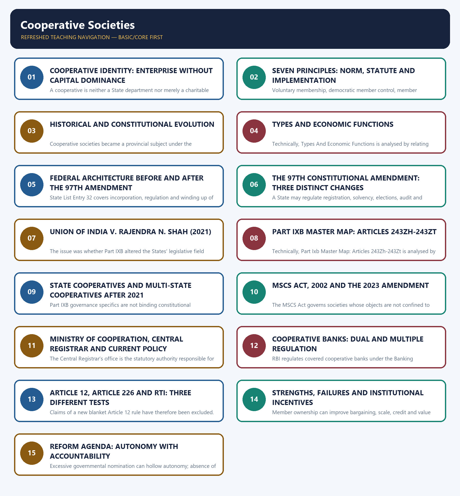

# Polity 39 — Cooperative Societies — Deep-Reviewed Source

## BASIC LEARNING SESSION



*Distinct embedded teaching-navigation image. The separate continuous Cārvāka-style flowchart package remains an independent at-a-glance artifact.*

### SESSION 1 — COOPERATIVE IDENTITY: ENTERPRISE WITHOUT CAPITAL DOMINANCE

#### DEFINITION / WHAT THIS IS CALLED

**Plain-language definition:** The International Cooperative Alliance defines a cooperative as an autonomous association of persons united voluntarily to meet common economic, social and cultural needs and aspirations through a jointly owned and democratically controlled enterprise.

**Technical definition:** A cooperative is neither a State department nor merely a charitable association.

#### ANSWER-GRABBING OPENING — WRITE/ADAPT IN THE EXAM

> A cooperative is neither a State department nor merely a charitable association.

#### MUST-WRITE KEYWORDS

- **Cooperative Identity**
- **Enterprise Without Capital Dominance**
- **Primary constituency**
- **Members/users**
- **Shareholders/investors**
- **Public through government**

**How to use them:** Frame the answer through Cooperative Identity; define Enterprise Without Capital Dominance, connect Primary constituency with Members/users to explain the mechanism, and use Shareholders/investors for the decisive comparison or qualification.

[FACT] The International Cooperative Alliance defines a cooperative as an autonomous association of persons united voluntarily to meet common economic, social and cultural needs and aspirations through a jointly owned and democratically controlled enterprise.

[ANALYSIS] A cooperative is neither a State department nor merely a charitable association. It conducts an economic or service activity, but membership and democratic control—not external capital alone—supply its institutional logic.

[LIMIT] The ICA statement is a normative global standard. It does not automatically override the Constitution, the MSCS Act, a State cooperative statute, banking law or registered bye-laws.

#### Visual 02 — Cooperative Enterprise Triangle

```text
                    COMMON NEED
                 credit / milk / housing
                         /\
                        /  \
                       /    \
          JOINT OWNERSHIP----DEMOCRATIC CONTROL
          member capital      member voice

                 ENTERPRISE OUTPUT
        service + bargaining power + member benefit
```

*Caption: Cooperative identity joins economic activity to member ownership and control.*

#### Visual 03 — Cooperative, Company and Department

| Test | Cooperative | Investor-owned company | Government department |
|---|---|---|---|
| Primary constituency | Members/users | Shareholders/investors | Public through government |
| Control ideal | Democratic member control | Voting linked mainly to capital | Administrative hierarchy |
| Surplus logic | Member service, reserves, limited distribution under law/bye-laws | Return on capital | Budgetary/public purpose |
| Legal source | Cooperative statute + bye-laws | Companies law + charter | Constitution/statute/executive rules |
| Core risk | Elite capture or politicisation | Capital dominance | Bureaucratic control |

*Caption: A cooperative is a distinct institutional form, not an informal company or government office.*

#### CLOSING RECALL FLOW — COOPERATIVE IDENTITY: ENTERPRISE WITHOUT CAPITAL DOMINANCE

```text
START / CONCEPT: COOPERATIVE IDENTITY: ENTERPRISE WITHOUT CAPITAL DOMINANCE
        |
        v
EXACT TERMS: Cooperative Identity · Enterprise Without Capital Dominance · Primary constituency · Members/users · Shareholders/investors · Public through government
        |
        v
MECHANISM / ARGUMENT: The International Cooperative Alliance defines a cooperative as an autonomous association of persons united voluntarily to meet common economic, social and cultural needs and aspirations through a jointly owned and democratically controlled enterprise.
        |
        v
CONSEQUENCE / CONTRAST: It does not automatically override the Constitution, the MSCS Act, a State cooperative statute, banking law or registered bye-laws.
        |
        v
UPSC TRAP / ANSWER-USE: Do not miss this limiting distinction: the ICA statement is a normative global standard.
        |
        v
ANSWER-GRABBING FORMULATION: A cooperative is neither a State department nor merely a charitable association.
```
### SESSION 2 — SEVEN PRINCIPLES: NORM, STATUTE AND IMPLEMENTATION

#### DEFINITION / WHAT THIS IS CALLED

**Plain-language definition:** Cooperative principles guide member-owned enterprise but acquire legal force only through applicable statutes, rules and bye-laws.

**Technical definition:** Voluntary membership, democratic member control, member economic participation, autonomy, education, inter-cooperation and community concern operate as ICA norms and, for MSCS, through the statutory First Schedule.

#### ANSWER-GRABBING OPENING — WRITE/ADAPT IN THE EXAM

> Cooperative principles must be separated into normative, statutory and implementation layers.

#### MUST-WRITE KEYWORDS

- **cooperative principles**
- **member control**
- **economic participation**
- **autonomy**
- **First Schedule**

**How to use them:** Frame the answer through cooperative principles; define member control, connect economic participation with autonomy to explain the mechanism, and use First Schedule for the decisive comparison or qualification.

[FACT] The ICA statement lists seven principles: voluntary and open membership; democratic member control; member economic participation; autonomy and independence; education, training and information; cooperation among cooperatives; and concern for community.

[FACT] The First Schedule to the MSCS Act also states cooperative principles for the statutory multi-State field. That statutory incorporation gives the principles legal relevance within that Act.

[LIMIT] The same sentence may be normative in an ICA document, statutory for an MSCS under the 2002 Act, and only indirectly relevant to a State cooperative unless its State law or bye-laws adopt it.

#### Visual 04 — Seven-Principle Wheel

```text
                 [1] VOLUNTARY / OPEN
                         |
 [7] COMMUNITY --- MEMBER AT CENTRE --- [2] DEMOCRATIC CONTROL
        |                |                         |
 [6] COOPERATION    SHARED NEED              [3] ECONOMIC
   AMONG CO-OPS          |                    PARTICIPATION
        |                |                         |
 [5] EDUCATION ---- [4] AUTONOMY / INDEPENDENCE
```

*Caption: The principles protect both member agency and institutional sustainability.*

#### Visual 05 — Three Legal Layers of a Principle

| Layer | Example | Legal effect |
|---|---|---|
| Normative | ICA concern for community | Persuasive identity standard |
| Constitutional-policy | Article 43B autonomy/democratic control/professional management | Non-justiciable directive |
| Enforceable law | MSCS Act, State Act, rules and bye-laws | Rights, duties and sanctions within scope |

*Caption: Never convert a cooperative ideal into an enforceable rule without naming its legal source.*

#### Visual 06 — Voice and Capital

```text
INVESTOR MODEL: more capital -> usually more voting influence

COOPERATIVE IDEAL: membership -> democratic voice
                   capital     -> participation, not automatic domination

QUALIFICATION: exact voting rules come from the applicable Act and bye-laws.
```

*Caption: “One member, one vote” is a common primary-cooperative principle, not a substitute for reading the applicable statute.*

#### CLOSING RECALL FLOW — SEVEN PRINCIPLES: NORM, STATUTE AND IMPLEMENTATION

```text
START / CONCEPT: SEVEN PRINCIPLES: NORM, STATUTE AND IMPLEMENTATION
        |
        v
EXACT TERMS: cooperative principles · member control · economic participation · autonomy · First Schedule
        |
        v
MECHANISM / ARGUMENT: Member voting, capital rules, education, inter-cooperation and community orientation translate cooperative identity into governance practice.
        |
        v
CONSEQUENCE / CONTRAST: Legal incorporation can support the principles, but implementation still depends on active membership and accountable management.
        |
        v
UPSC TRAP / ANSWER-USE: Do not treat every ICA principle as directly enforceable against every State cooperative without checking its governing law and bye-laws.
        |
        v
ANSWER-GRABBING FORMULATION: Cooperative principles must be separated into normative, statutory and implementation layers.
```
### SESSION 3 — HISTORICAL AND CONSTITUTIONAL EVOLUTION

#### DEFINITION / WHAT THIS IS CALLED

**Plain-language definition:** The evolution shows continuity: cooperative organisation was treated as locally embedded, even while multi-State operation and banking required wider regulatory layers.

**Technical definition:** Cooperative societies became a provincial subject under the Government of India Acts of 1919 and 1935 and entered the Constitution in State List Entry 32.

#### ANSWER-GRABBING OPENING — WRITE/ADAPT IN THE EXAM

> The evolution shows continuity: cooperative organisation was treated as locally embedded, even while multi-State operation and banking required wider regulatory layers.

#### MUST-WRITE KEYWORDS

- **Historical**
- **Constitutional Evolution**
- **Co-operative Credit Societies Act, 1904**
- **Co-operative Societies Act, 1912**
- **Co-operative Credit Societies Act**
- **Early credit-focused legislation**

**How to use them:** Frame the answer through Historical; define Constitutional Evolution, connect Co-operative Credit Societies Act, 1904 with Co-operative Societies Act, 1912 to explain the mechanism, and use Co-operative Credit Societies Act for the decisive comparison or qualification.

[FACT] The Supreme Court in *Rajendra N. Shah* traced Indian cooperative legislation to the **Co-operative Credit Societies Act, 1904** and the **Co-operative Societies Act, 1912**. Cooperative societies became a provincial subject under the Government of India Acts of 1919 and 1935 and entered the Constitution in State List Entry 32.

[ANALYSIS] The evolution shows continuity: cooperative organisation was treated as locally embedded, even while multi-State operation and banking required wider regulatory layers.

#### Visual 07 — Evolution Timeline

| Year | Development | Exam significance |
|---:|---|---|
| 1904 | Co-operative Credit Societies Act | Early credit-focused legislation |
| 1912 | Co-operative Societies Act | Broader cooperative legal form |
| 1919 | Provincial legislative subject | Local/provincial competence |
| 1935 | Provincial List continued | Federal lineage |
| 1950 | State List Entry 32; Union List Entry 44 | Constitutional competence split |
| 2011-12 | 97th Amendment enacted, assented and commenced | FR + DPSP + Part IXB |
| 2021 | *Rajendra N. Shah* | Federal ratification correction |
| 2021 | Ministry of Cooperation created | Executive-policy layer |
| 2023 | MSCS Amendment Act and Rules | Statutory multi-State governance reform |
| 2025 | National Cooperation Policy officially issued | Policy, not competence transfer |

*Caption: National policy has grown, but the original federal allocation has not disappeared.*

#### Visual 08 — Constitutional Evolution in One Line

```text
LOCAL ASSOCIATION
      ->
PROVINCIAL SUBJECT
      ->
STATE LIST ENTRY 32
      + UNION LIST ENTRY 44 FOR MULTI-STATE CORPORATIONS
      ->
97TH AMENDMENT GOVERNANCE CODE
      ->
2021 SEVERANCE BACK TO VALID FEDERAL BOUNDARY
```

*Caption: The 2021 judgment restored the competence boundary rather than rejecting cooperation as a constitutional value.*

#### CLOSING RECALL FLOW — HISTORICAL AND CONSTITUTIONAL EVOLUTION

```text
START / CONCEPT: HISTORICAL AND CONSTITUTIONAL EVOLUTION
        |
        v
EXACT TERMS: Historical · Constitutional Evolution · Co-operative Credit Societies Act, 1904 · Co-operative Societies Act, 1912 · Co-operative Credit Societies Act · Early credit-focused legislation
        |
        v
MECHANISM / ARGUMENT: Cooperative societies became a provincial subject under the Government of India Acts of 1919 and 1935 and entered the Constitution in State List Entry 32.
        |
        v
CONSEQUENCE / CONTRAST: The resulting consequence is that cooperative organisation was treated as locally embedded, even while multi-State operation and banking required...
        |
        v
UPSC TRAP / ANSWER-USE: Do not miss this limiting distinction: cooperative organisation was treated as locally embedded, even while multi-State operation and banking required...
        |
        v
ANSWER-GRABBING FORMULATION: The evolution shows continuity: cooperative organisation was treated as locally embedded, even while multi-State operation and banking required wider regulatory layers.
```
### SESSION 4 — TYPES AND ECONOMIC FUNCTIONS

#### DEFINITION / WHAT THIS IS CALLED

**Plain-language definition:** Their legal and regulatory treatment depends on function and territorial reach.

**Technical definition:** Technically, Types And Economic Functions is analysed by relating Types to Economic Functions, then testing the relationship through Credit and Small borrowers lack affordable access.

#### ANSWER-GRABBING OPENING — WRITE/ADAPT IN THE EXAM

> Their legal and regulatory treatment depends on function and territorial reach.

#### MUST-WRITE KEYWORDS

- **Types**
- **Economic Functions**
- **Credit**
- **Small borrowers lack affordable access**
- **Pooling, local intermediation**
- **Dairy**

**How to use them:** Frame the answer through Types; define Economic Functions, connect Credit with Small borrowers lack affordable access to explain the mechanism, and use Pooling, local intermediation for the decisive comparison or qualification.

[FACT] Cooperative forms include credit, dairy, housing, consumer, marketing, labour, producer, processing, fisheries and multipurpose societies. Their legal and regulatory treatment depends on function and territorial reach.

[LIMIT] Amul is a useful dairy-cooperative model, not proof that every cooperative has identical governance, scale or member benefit.

#### Visual 09 — Functional Taxonomy

| Type | Shared member problem | Cooperative response |
|---|---|---|
| Credit | Small borrowers lack affordable access | Pooling, local intermediation |
| Dairy | Perishable output and weak bargaining | Collection, processing, marketing |
| Marketing | Fragmented farm output | Aggregation and market access |
| Consumer | Price/quality asymmetry | Member-oriented procurement |
| Housing | Land, finance and common services | Collective development/management |
| Labour | Weak individual bargaining | Collective contracting |
| Producer | Small scale and input/market gaps | Shared services and value addition |

*Caption: Classification should start from the member problem being solved.*

#### Visual 10 — Rural Value Chain

```text
SMALL PRODUCERS
      |
      v
LOCAL SOCIETY -> aggregation -> quality/processing -> market negotiation
      |                                      |
      +-> credit / inputs / information      +-> better price discovery

LIMIT: each arrow can fail if governance, capital or professional capacity is weak.
```

*Caption: Cooperatives can reduce transaction costs, but institutional quality controls the outcome.*

#### Visual 11 — Promise and Risk

| Promise | Causal mechanism | Main risk |
|---|---|---|
| Local ownership | Members control enterprise | Local elite capture |
| Aggregation | Scale in purchase/sale | Management weakness |
| Inclusion | Last-mile presence | Exclusion by dominant groups |
| Democratic voice | Elected board | Delayed or politicised elections |
| Surplus retention | Member-centred use | Poor capital formation |

*Caption: The same local embeddedness that enables participation can also enable capture.*

#### CLOSING RECALL FLOW — TYPES AND ECONOMIC FUNCTIONS

```text
START / CONCEPT: TYPES AND ECONOMIC FUNCTIONS
        |
        v
EXACT TERMS: Types · Economic Functions · Credit · Small borrowers lack affordable access · Pooling, local intermediation · Dairy
        |
        v
MECHANISM / ARGUMENT: Cooperative forms include credit, dairy, housing, consumer, marketing, labour, producer, processing, fisheries and multipurpose societies.
        |
        v
CONSEQUENCE / CONTRAST: Amul is a useful dairy-cooperative model, not proof that every cooperative has identical governance, scale or member benefit.
        |
        v
UPSC TRAP / ANSWER-USE: Do not miss this limiting distinction: amul is a useful dairy-cooperative model, not proof that every cooperative has identical governance...
        |
        v
ANSWER-GRABBING FORMULATION: Their legal and regulatory treatment depends on function and territorial reach.
```
### SESSION 5 — FEDERAL ARCHITECTURE BEFORE AND AFTER THE 97TH AMENDMENT

#### DEFINITION / WHAT THIS IS CALLED

**Plain-language definition:** Union List Entry 44 covers incorporation, regulation and winding up of corporations, whether trading or not, whose objects are not confined to one State.

**Technical definition:** State List Entry 32 covers incorporation, regulation and winding up of corporations other than those specified in List I, and expressly includes cooperative societies.

#### ANSWER-GRABBING OPENING — WRITE/ADAPT IN THE EXAM

> Union List Entry 44 covers incorporation, regulation and winding up of corporations, whether trading or not, whose objects are not confined to one State.

#### MUST-WRITE KEYWORDS

- **Federal Architecture Before**
- **After The 97Th Amendment**
- **Union List Entry 44**
- **Union List Entry 45**
- **Core object**
- **Intra-State cooperative societies**

**How to use them:** Frame the answer through Federal Architecture Before; define After The 97Th Amendment, connect Union List Entry 44 with Union List Entry 45 to explain the mechanism, and use Core object for the decisive comparison or qualification.

[FACT] **State List Entry 32** covers incorporation, regulation and winding up of corporations other than those specified in List I, and expressly includes cooperative societies.

[FACT] **Union List Entry 44** covers incorporation, regulation and winding up of corporations, whether trading or not, whose objects are not confined to one State. It is the legislative base for multi-State cooperative societies.

[FACT] **Union List Entry 45** covers banking. A cooperative bank can therefore remain a cooperative under State or multi-State law while banking regulation overlays its activity.

#### Visual 12 — Three-Layer Competence Map

```text
SOCIETY WITH OBJECTS CONFINED TO ONE STATE
        -> State List Entry 32 -> State cooperative law/Registrar

SOCIETY WITH OBJECTS NOT CONFINED TO ONE STATE
        -> Union List Entry 44 -> MSCS Act/Central Registrar

IF THE SOCIETY CARRIES ON REGULATED BANKING
        -> Union List Entry 45 + Banking Regulation Act/RBI
        -> State/MSCS incorporation layer still remains
```

*Caption: Territorial reach decides the cooperative-law base; banking function adds a separate Union overlay.*

#### Visual 13 — Entry 32 and Entry 44

| Question | Entry 32, State List | Entry 44, Union List |
|---|---|---|
| Core object | Intra-State cooperative societies | Corporations with objects not confined to one State |
| Legislature | State Legislature | Parliament |
| Registrar | State Registrar | Central Registrar under MSCS Act |
| Common error | Treating every cooperative as Union subject | Treating “multi-State” as merely having members from different States without statutory status |

*Caption: “Cooperative” does not itself answer the legislative-competence question.*

#### Visual 14 — Banking Overlay

```text
COOPERATIVE LEGAL PERSON
   |
   +--> incorporation / board / membership -> State law or MSCS Act
   |
   +--> banking licence / prudential rules -> RBI under banking law
   |
   +--> rural cooperative-bank inspection -> NABARD statutory supervision

DUAL OR MULTIPLE REGULATION != NO REGULATION
```

*Caption: Institutional law and prudential banking law regulate different dimensions.*

#### Visual 15 — Ministry Boundary

| Ministry of Cooperation may | It does not thereby |
|---|---|
| Frame Union policy and administer Union business | Convert Entry 32 into a Union subject |
| Administer the MSCS Act through CRCS | Replace State Registrars for State societies |
| Coordinate schemes, portals and model frameworks | Make model bye-laws binding without legal adoption |
| Promote cooperation and capacity | Adjudicate every intra-State cooperative dispute |

*Caption: An executive ministry cannot redraw the Seventh Schedule.*

#### CLOSING RECALL FLOW — FEDERAL ARCHITECTURE BEFORE AND AFTER THE 97TH AMENDMENT

```text
START / CONCEPT: FEDERAL ARCHITECTURE BEFORE AND AFTER THE 97TH AMENDMENT
        |
        v
EXACT TERMS: Federal Architecture Before · After The 97Th Amendment · Union List Entry 44 · Union List Entry 45 · Core object · Intra-State cooperative societies
        |
        v
MECHANISM / ARGUMENT: State List Entry 32 covers incorporation, regulation and winding up of corporations other than those specified in List I, and expressly includes cooperative societies.
        |
        v
CONSEQUENCE / CONTRAST: A cooperative bank can therefore remain a cooperative under State or multi-State law while banking regulation overlays its activity.
        |
        v
UPSC TRAP / ANSWER-USE: Do not miss this limiting distinction: it is the legislative base for multi-State cooperative societies.
        |
        v
ANSWER-GRABBING FORMULATION: Union List Entry 44 covers incorporation, regulation and winding up of corporations, whether trading or not, whose objects are not confined to one State.
```
### SESSION 6 — THE 97TH CONSTITUTIONAL AMENDMENT: THREE DISTINCT CHANGES

#### DEFINITION / WHAT THIS IS CALLED

**Plain-language definition:** The Constitution (Ninety-seventh Amendment) Act, 2011 was passed by the Lok Sabha on 27 December 2011 and Rajya Sabha on 28 December 2011, received presidential assent on 12 January 2012, was published on 13 January 2012, and came into force on 15 February 2012.

**Technical definition:** A State may regulate registration, solvency, elections, audit and member protection, but a restriction on formation must still satisfy the applicable constitutional test.

#### ANSWER-GRABBING OPENING — WRITE/ADAPT IN THE EXAM

> A State may regulate registration, solvency, elections, audit and member protection, but a restriction on formation must still satisfy the applicable constitutional test.

#### MUST-WRITE KEYWORDS

- **The 97Th Constitutional Amendment**
- **Three Distinct Changes**
- **27 December 2011**
- **28 December 2011**
- **12 January 2012**
- **13 January 2012**

**How to use them:** Frame the answer through The 97Th Constitutional Amendment; define Three Distinct Changes, connect 27 December 2011 with 28 December 2011 to explain the mechanism, and use 12 January 2012 for the decisive comparison or qualification.

[FACT] The Constitution (Ninety-seventh Amendment) Act, 2011 was passed by the Lok Sabha on **27 December 2011** and Rajya Sabha on **28 December 2011**, received presidential assent on **12 January 2012**, was published on **13 January 2012**, and came into force on **15 February 2012**.

[FACT] It: (1) added “co-operative societies” to Article 19(1)(c); (2) inserted Article 43B; and (3) inserted Part IXB, Articles 243ZH-243ZT.

#### Visual 16 — Amendment Triptych

```text
FUNDAMENTAL RIGHT          DIRECTIVE PRINCIPLE        GOVERNANCE PART
Article 19(1)(c)           Article 43B                Part IXB
formation freedom          policy direction           detailed structure
justiciable, qualified     non-justiciable             reach cut by 2021 case
```

*Caption: The three changes have different legal character and different post-2021 status.*

#### Visual 17 — Enactment Clock

```text
27 Dec 2011  Lok Sabha passes
28 Dec 2011  Rajya Sabha passes
12 Jan 2012  Presidential assent
13 Jan 2012  Gazette publication
15 Feb 2012  Commencement
20 Jul 2021  Supreme Court federal-severance judgment
```

*Caption: The Act is styled “2011” although assent and commencement occurred in 2012.*

#### Visual 18 — Article 19(1)(c) Boundary

| Proposition | Correct position |
|---|---|
| Can citizens form cooperative societies? | Yes, expressly protected by Article 19(1)(c) |
| Is the right absolute? | No; Article 19(4) permits reasonable restrictions for sovereignty/integrity, public order and morality |
| Does formation guarantee State recognition or aid? | No |
| Does it constitutionalise a preferred management regime? | No |
| Does it guarantee success, subsidy or immunity from regulation? | No |

*Caption: Formation freedom is not a constitutional promise of State patronage or regulatory exemption.*

[FACT] Article 19(4) supplies the restriction grounds. The wider association doctrine also distinguishes the right to form an association from every consequential claim of recognition, bargaining success, aid or a particular statutory benefit.

[ANALYSIS] A State may regulate registration, solvency, elections, audit and member protection, but a restriction on formation must still satisfy the applicable constitutional test.

#### Visual 19 — Article 43B

```text
VOLUNTARY FORMATION
        +
AUTONOMOUS FUNCTIONING
        +
DEMOCRATIC CONTROL
        +
PROFESSIONAL MANAGEMENT
        =
ARTICLE 43B POLICY DIRECTION

Article 37 control: fundamental in governance, but not directly enforceable.
```

*Caption: Article 43B balances autonomy with democratic and professional governance.*

#### CLOSING RECALL FLOW — THE 97TH CONSTITUTIONAL AMENDMENT: THREE DISTINCT CHANGES

```text
START / CONCEPT: THE 97TH CONSTITUTIONAL AMENDMENT: THREE DISTINCT CHANGES
        |
        v
EXACT TERMS: The 97Th Constitutional Amendment · Three Distinct Changes · 27 December 2011 · 28 December 2011 · 12 January 2012 · 13 January 2012
        |
        v
MECHANISM / ARGUMENT: The Constitution (Ninety-seventh Amendment) Act, 2011 was passed by the Lok Sabha on 27 December 2011 and Rajya Sabha on 28 December 2011, received presidential assent on 12 January 2012, was published on 13 January 2012, and came into force on 15 February 2012.
        |
        v
CONSEQUENCE / CONTRAST: It: (1) added “co-operative societies” to Article 19(1)(c); (2) inserted Article 43B; and (3) inserted Part IXB, Articles 243ZH-243ZT.
        |
        v
UPSC TRAP / ANSWER-USE: Do not miss this limiting distinction: the wider association doctrine also distinguishes the right to form an association from every...
        |
        v
ANSWER-GRABBING FORMULATION: A State may regulate registration, solvency, elections, audit and member protection, but a restriction on formation must still satisfy the applicable constitutional test.
```
### SESSION 7 — UNION OF INDIA V. RAJENDRA N. SHAH (2021)

#### DEFINITION / WHAT THIS IS CALLED

**Plain-language definition:** The safest answer is therefore MSCS in States and UTs, not a blanket claim that every UT-confined cooperative is constitutionally governed by Part IXB.

**Technical definition:** The issue was whether Part IXB altered the States’ legislative field without the ratification of at least half of the State Legislatures required by the proviso to Article 368(2).

#### ANSWER-GRABBING OPENING — WRITE/ADAPT IN THE EXAM

> However, majority paragraph 78 expressly says Part IXB has no application to a cooperative with no ramifications outside the Union Territory itself.

#### MUST-WRITE KEYWORDS

- **Union Of India V. Rajendra N. Shah (2021)**
- **MSCS in States and UTs**
- **Entry 32, State List**
- **States possess cooperative legislative field**
- **Articles 243ZI-243ZQ constrain State law**
- **Legislative field was substantively altered**

**How to use them:** Frame the answer through Union Of India V. Rajendra N. Shah (2021); define MSCS in States and UTs, connect Entry 32, State List with States possess cooperative legislative field to explain the mechanism, and use Articles 243ZI-243ZQ constrain State law for the decisive comparison or qualification.

[FACT] The issue was whether Part IXB altered the States’ legislative field without the ratification of at least half of the State Legislatures required by the proviso to Article 368(2).

[FACT] The majority held that Part IXB substantially constrained State legislative power under Entry 32. Because the amendment had not received the required State ratification, Part IXB could not operate for cooperative societies within the State legislative field.

[FACT] The Court applied severability. Article 19(1)(c) and Article 43B remained untouched; Part IXB remained operative for multi-State cooperative societies.

#### Visual 20 — Amendment Procedure Test

```text
Does amendment affect a matter in Article 368(2) proviso?
                    |
                  YES
                    |
Special majority in Parliament
                    +
Ratification by at least half of State Legislatures
                    |
97th Amendment had first limb but not State-ratification limb
                    |
Part IXB invalid in State legislative field
```

*Caption: Ratification is a federal consent device, not a procedural formality.*

#### Visual 21 — Case Logic

| Step | Named evidence | Consequence |
|---|---|---|
| 1 | Entry 32, State List | States possess cooperative legislative field |
| 2 | Articles 243ZI-243ZQ constrain State law | Legislative field was substantively altered |
| 3 | Proviso to Article 368(2) | Half-State ratification required |
| 4 | No such ratification | State-field application invalid |
| 5 | Article 243ZR separable for MSCS | Multi-State application survives |

*Caption: The judgment protects federal legislative competence through amendment procedure.*

#### Visual 22 — Majority and Dissent

| Opinion | Position on severability | Result |
|---|---|---|
| Nariman and Gavai JJ. | Multi-State scheme could stand independently through Article 243ZR | Saved Part IXB for MSCS |
| K.M. Joseph J. | Valid and invalid provisions were too interdependent | Would not save the Part through severance |

*Caption: Use the majority as law; mention the dissent only for analytical depth.*

#### Visual 23 — Exact Surviving Field, Including the UT Nuance

```text
PART IXB AFTER THE MAJORITY JUDGMENT

Multi-State cooperative society operating across States       -> survives
Multi-State cooperative society with operations in a UT       -> survives
Cooperative confined within one State                          -> does not bind
Cooperative confined within a single Union Territory           -> para 78 says no

OPERATIVE PARA 80:
Part IXB operates for multi-State cooperative societies
"both within the various States and in the Union territories".
```

*Caption: “MSCS and all UT cooperatives” is overbroad; the official judgment saves MSCS, including their operation in UTs.*

[LIMIT] Article 243ZS remains textually in the Constitution. However, majority paragraph 78 expressly says Part IXB has no application to a cooperative with no ramifications outside the Union Territory itself. The safest answer is therefore **MSCS in States and UTs**, not a blanket claim that every UT-confined cooperative is constitutionally governed by Part IXB.

#### Visual 24 — What the Court Did Not Do

| Incorrect statement | Correct control |
|---|---|
| Entire 97th Amendment struck down | No; Article 19(1)(c) and Article 43B remain |
| All Part IXB text deleted | No; its operative reach was severed |
| Cooperatives became Union subjects | No; Entry 32 continues |
| Every UT cooperative is covered | No; use paragraphs 78 and 80 together |
| State laws cannot adopt similar standards | They may independently enact them within State competence |

*Caption: The judgment is a field-and-procedure ruling, not an anti-cooperative ruling.*

#### CLOSING RECALL FLOW — UNION OF INDIA V. RAJENDRA N. SHAH (2021)

```text
START / CONCEPT: UNION OF INDIA V. RAJENDRA N. SHAH (2021)
        |
        v
EXACT TERMS: Union Of India V. Rajendra N. Shah (2021) · MSCS in States and UTs · Entry 32, State List · States possess cooperative legislative field · Articles 243ZI-243ZQ constrain State law · Legislative field was substantively altered
        |
        v
MECHANISM / ARGUMENT: The safest answer is therefore MSCS in States and UTs, not a blanket claim that every UT-confined cooperative is constitutionally governed by Part IXB.
        |
        v
CONSEQUENCE / CONTRAST: Because the amendment had not received the required State ratification, Part IXB could not operate for cooperative societies within the State legislative field.
        |
        v
UPSC TRAP / ANSWER-USE: Do not miss this limiting distinction: the issue was whether Part IXB altered the States’ legislative field without the ratification...
        |
        v
ANSWER-GRABBING FORMULATION: However, majority paragraph 78 expressly says Part IXB has no application to a cooperative with no ramifications outside the Union Territory itself.
```
### SESSION 8 — PART IXB MASTER MAP: ARTICLES 243ZH-243ZT

#### DEFINITION / WHAT THIS IS CALLED

**Plain-language definition:** Part Ixb Master Map: Articles 243Zh-243Zt comprises Part Ixb Master Map, Articles 243Zh-243Zt and Definitions as its core connected dimensions.

**Technical definition:** Technically, Part Ixb Master Map: Articles 243Zh-243Zt is analysed by relating Part Ixb Master Map to Articles 243Zh-243Zt, then testing the relationship through Definitions and Incorporation, regulation and winding up.

#### ANSWER-GRABBING OPENING — WRITE/ADAPT IN THE EXAM

> Part Ixb Master Map: Articles 243Zh-243Zt comprises Part Ixb Master Map, Articles 243Zh-243Zt and Definitions as its core connected dimensions.

#### MUST-WRITE KEYWORDS

- **Part Ixb Master Map**
- **Articles 243Zh-243Zt**
- **Definitions**
- **Incorporation, regulation and winding up**
- **243ZH**
- **243ZI**

**How to use them:** Frame the answer through Part Ixb Master Map; define Articles 243Zh-243Zt, connect Definitions with Incorporation, regulation and winding up to explain the mechanism, and use 243ZH for the decisive comparison or qualification.

[LIMIT] The following provisions are mapped as constitutional text **within the surviving field identified by the 2021 majority**. They must not be presented as binding constitutional commands for ordinary State-field cooperatives.

#### Visual 25 — Article Map

| Article | Subject |
|---|---|
| 243ZH | Definitions |
| 243ZI | Incorporation, regulation and winding up |
| 243ZJ | Board number, reservation and term |
| 243ZK | Board elections |
| 243ZL | Supersession/suspension and interim management |
| 243ZM | Audit |
| 243ZN | Annual general body meeting |
| 243ZO | Member information, participation and education |
| 243ZP | Returns |
| 243ZQ | Offences and penalties |
| 243ZR | Application to MSCS |
| 243ZS | Textual application to UTs, judicially qualified |
| 243ZT | Transitional continuance of laws |

*Caption: Learn Part IXB as a governance sequence, not thirteen isolated labels.*

#### Visual 26 — Articles 243ZH and 243ZI

```text
243ZH -> definitions:
board | cooperative society | multi-State cooperative | office bearer | Registrar

243ZI -> law may address:
incorporation | regulation | winding up
based on:
voluntary formation | democratic member control
member economic participation | autonomous functioning
```

*Caption: Article 243ZI constitutionalises a design basis, not a self-executing registration form.*

#### Visual 27 — Article 243ZJ Board Design

| Element | Constitutional text |
|---|---|
| Maximum elected directors | 21 |
| Reservation | One SC/ST seat and two women seats for a society of individual members having members from those categories |
| Elected board/office-bearer term | Five years from election; conterminous |
| Co-opted experts | Up to two beyond the 21; banking/management/finance/related expertise |
| Co-opted voting limit | No vote in office-bearer election; cannot be office bearer |
| Functional directors | May be on board; excluded from the 21 count |

*Caption: Reservation and co-option carry qualifications; avoid absolute shorthand.*

#### Visual 28 — Article 243ZK Election Clock

```text
OUTGOING BOARD TERM APPROACHES EXPIRY
              |
election must be conducted before expiry
              |
new board assumes office immediately on expiry
              |
electoral rolls + election control vest in statutory authority/body
```

*Caption: The objective is continuity of elected management, not post-expiry regularisation.*

#### Visual 29 — Article 243ZL Supersession Screen

```text
POSSIBLE GROUNDS
persistent default | negligence | prejudicial act | stalemate | election failure
                           |
GENERAL CEILING: six months
                           |
NO GOVERNMENT share/loan/assistance/guarantee?
                           |
board shall not be superseded/suspended under the constitutional text
                           |
BANKING SOCIETY?
Banking Regulation Act also applies; constitutional text carries a banking qualification.
```

*Caption: Supersession is exceptional, time-bound and subject to financial-link and banking provisos.*

#### Visual 30 — Articles 243ZM-243ZP Compliance Clock

| Stage | Rule in constitutional text |
|---|---|
| Accounts | Audit at least once each financial year |
| Auditor | Eligible qualifications set by law; general body appoints from approved panel |
| Audit completion | Within six months of financial-year close |
| AGM | Within six months of financial-year close |
| Member information | Access to books/information/accounts concerning regular business with member, as law provides |
| Returns | Within six months of financial-year close |

*Caption: Audit, AGM and returns form a six-month accountability cycle.*

#### Visual 31 — Article 243ZQ Offence Families

```text
FALSE RETURN / FALSE INFORMATION
        +
DISOBEYING SUMMONS OR LAWFUL ORDER
        +
FAILURE TO REMIT EMPLOYEE DEDUCTIONS
        +
FAILURE TO HAND OVER RECORDS / PROPERTY
        +
CORRUPT ELECTORAL PRACTICE
```

*Caption: Article 243ZQ requires the law to include specified governance failures as offences.*

#### Visual 32 — Articles 243ZR-243ZT

| Article | Function | Present qualification |
|---|---|---|
| 243ZR | Reads State references as Parliament/Central Act/Central Government for MSCS | Core severability bridge |
| 243ZS | Applies Part text to UTs with textual adaptations | Read with *Rajendra N. Shah* para 78 |
| 243ZT | Keeps inconsistent pre-amendment law until amendment/repeal or one year, whichever earlier | Transitional, not permanent validation |

*Caption: Articles 243ZR and 243ZS cannot be reduced to the slogan “MSCS plus UTs”.*

#### CLOSING RECALL FLOW — PART IXB MASTER MAP: ARTICLES 243ZH-243ZT

```text
START / CONCEPT: PART IXB MASTER MAP: ARTICLES 243ZH-243ZT
        |
        v
EXACT TERMS: Part Ixb Master Map · Articles 243Zh-243Zt · Definitions · Incorporation, regulation and winding up · 243ZH · 243ZI
        |
        v
MECHANISM / ARGUMENT: They must not be presented as binding constitutional commands for ordinary State-field cooperatives.
        |
        v
CONSEQUENCE / CONTRAST: The resulting consequence is that they must not be presented as binding constitutional commands for ordinary State-field cooperatives.
        |
        v
UPSC TRAP / ANSWER-USE: Do not miss this limiting distinction: they must not be presented as binding constitutional commands for ordinary State-field cooperatives.
        |
        v
ANSWER-GRABBING FORMULATION: Part Ixb Master Map: Articles 243Zh-243Zt comprises Part Ixb Master Map, Articles 243Zh-243Zt and Definitions as its core connected dimensions.
```
### SESSION 9 — STATE COOPERATIVES AND MULTI-STATE COOPERATIVES AFTER 2021

#### DEFINITION / WHAT THIS IS CALLED

**Plain-language definition:** A cooperative whose objects are confined to one State is governed primarily by the applicable State cooperative law, State rules, registered bye-laws and State Registrar.

**Technical definition:** Part IXB governance specifics are not binding constitutional commands in the State field after Rajendra N.

#### ANSWER-GRABBING OPENING — WRITE/ADAPT IN THE EXAM

> A cooperative whose objects are confined to one State is governed primarily by the applicable State cooperative law, State rules, registered bye-laws and State Registrar.

#### MUST-WRITE KEYWORDS

- **Multi-State Cooperatives After 2021**
- **Legislative base**
- **Entry 32, State List**
- **Entry 44, Union List**
- **Principal law**
- **MSCS Act, 2002 as amended**

**How to use them:** Frame the answer through Multi-State Cooperatives After 2021; define Legislative base, connect Entry 32, State List with Entry 44, Union List to explain the mechanism, and use Principal law for the decisive comparison or qualification.

[FACT] A cooperative whose objects are confined to one State is governed primarily by the applicable State cooperative law, State rules, registered bye-laws and State Registrar.

[FACT] Such societies remain subject to Article 19(1)(c), Article 43B and other generally applicable constitutional rights and limitations. Part IXB governance specifics are not binding constitutional commands in the State field after *Rajendra N. Shah*.

[ANALYSIS] A State legislature may independently adopt five-year terms, election authorities, audit rules or reservation provisions. Their force then comes from State law, not directly from invalidated Part IXB application.

#### Visual 33 — Two Operative Regimes

| Dimension | State-field society | Multi-State cooperative society |
|---|---|---|
| Legislative base | Entry 32, State List | Entry 44, Union List |
| Principal law | State Cooperative Societies Act | MSCS Act, 2002 as amended |
| Registrar | State Registrar | Central Registrar |
| Part IXB | Not binding for governance specifics | Operative through Article 243ZR |
| FR/DPSP | Article 19(1)(c) and 43B remain | Article 19(1)(c) and 43B remain |
| Banking overlay | If banking activity is covered | If banking activity is covered |

*Caption: Constitutional values are common; operative governance statutes differ.*

#### Visual 34 — Source Hierarchy for an Exam Problem

```text
1. Identify territorial reach
2. Choose State Act or MSCS Act
3. Add Part IXB only within surviving field
4. Add banking/sectoral law if relevant
5. Apply registered bye-laws
6. Apply constitutional rights and judicial review
```

*Caption: Starting with Part IXB before identifying the society is a common analytical error.*

#### CLOSING RECALL FLOW — STATE COOPERATIVES AND MULTI-STATE COOPERATIVES AFTER 2021

```text
START / CONCEPT: STATE COOPERATIVES AND MULTI-STATE COOPERATIVES AFTER 2021
        |
        v
EXACT TERMS: Multi-State Cooperatives After 2021 · Legislative base · Entry 32, State List · Entry 44, Union List · Principal law · MSCS Act, 2002 as amended
        |
        v
MECHANISM / ARGUMENT: Part IXB governance specifics are not binding constitutional commands in the State field after Rajendra N.
        |
        v
CONSEQUENCE / CONTRAST: The resulting consequence is that part IXB governance specifics are not binding constitutional commands in the State field after...
        |
        v
UPSC TRAP / ANSWER-USE: Do not miss this limiting distinction: part IXB governance specifics are not binding constitutional commands in the State field after...
        |
        v
ANSWER-GRABBING FORMULATION: A cooperative whose objects are confined to one State is governed primarily by the applicable State cooperative law, State rules, registered bye-laws and State Registrar.
```
### SESSION 10 — MSCS ACT, 2002 AND THE 2023 AMENDMENT

#### DEFINITION / WHAT THIS IS CALLED

**Plain-language definition:** The 2023 Amendment Act is enacted law, commenced on 3 August 2023; the corresponding Amendment Rules were notified on 4 August 2023.

**Technical definition:** The MSCS Act governs societies whose objects are not confined to one State.

#### ANSWER-GRABBING OPENING — WRITE/ADAPT IN THE EXAM

> The 2023 Amendment Act is enacted law, commenced on 3 August 2023; the corresponding Amendment Rules were notified on 4 August 2023.

#### MUST-WRITE KEYWORDS

- **Mscs Act**
- **The 2023 Amendment**
- **as on 27 June 2025**
- **Composition**
- **3 August 2023**
- **4 August 2023**

**How to use them:** Frame the answer through Mscs Act; define The 2023 Amendment, connect as on 27 June 2025 with Composition to explain the mechanism, and use 3 August 2023 for the decisive comparison or qualification.

[FACT] The MSCS Act governs societies whose objects are not confined to one State. The 2023 Amendment Act is enacted law, commenced on **3 August 2023**; the corresponding Amendment Rules were notified on **4 August 2023**.

[CURRENT] The official India Code consolidation checked for this package is marked **as on 27 June 2025**. Official Ministry material through the control date did not disclose a later amending Act replacing the 2023 reform framework.

#### Visual 35 — 2023 Reform Architecture

```text
ELECTIONS       -> Co-operative Election Authority
BOARD           -> representation + conflict/nepotism controls
AUDIT           -> statutory panels + concurrent audit for notified large societies
GRIEVANCE       -> Co-operative Ombudsman
INFORMATION     -> Co-operative Information Officer
DISTRESS        -> rehabilitation/reconstruction/development fund
REPORTING       -> stronger digital annual-return architecture
MERGER          -> route for State cooperative to merge into existing MSCS
```

*Caption: The reform is a statutory governance package, not a second constitutional amendment.*

#### Visual 36 — Co-operative Election Authority

| Feature | Exact statutory position |
|---|---|
| Composition | Chairperson, Vice-Chairperson and not more than three Members |
| Appointment | Central Government on Selection Committee recommendation |
| Core function | Conduct MSCS elections; supervise/direct/control electoral-roll preparation |
| Board election | Secret ballot; held in general meeting |
| Advance trigger | Chairperson and Chief Executive inform Authority six months before board-term expiry |
| Term of elected board | Five years |

*Caption: The Authority governs MSCS elections; it is not the election body for every State cooperative.*

#### Visual 37 — Board and Conflict Controls

| Reform area | Statutory rule |
|---|---|
| Board ceiling | Not more than 21 directors under section 41 |
| Representation | One SC/ST and two women where individual membership includes those categories |
| Co-option | Up to two co-opted members beyond the ceiling, with limited office-bearer rights |
| Conflict | Interested director cannot participate/vote on relevant contract/arrangement |
| Recruitment | Relative of sitting director barred from recruitment, including as Chief Executive |
| Consequence | Violation can disqualify director and void relevant proceedings |

*Caption: Representation and anti-nepotism rules address different governance failures.*

#### Visual 38 — Rehabilitation, Reconstruction and Development Fund

```text
CONTRIBUTOR:
MSCS in profit for preceding three financial years

ANNUAL CREDIT:
Rs 1 crore OR 1% of net profit, whichever is less

USES:
revival of statutorily defined sick MSCS
        +
development/infrastructure assistance subject to section 63C conditions

BANK QUALIFICATION:
reconstruction of sick multi-State cooperative bank needs prior RBI approval
```

*Caption: The fund is contribution-conditioned and legally targeted; it is not an unlimited bailout.*

#### Visual 39 — Audit Ladder

| Audit layer | Applicability |
|---|---|
| Annual statutory audit | MSCS under section 70 |
| National cooperative audit report | Laid before each House of Parliament |
| Concurrent audit | Section 70A for turnover/deposit above Central Government-notified amount |
| Current threshold | Official Ministry material: above Rs 500 crore for statutory + concurrent audit |
| Auditor source | Panel approved by Central Registrar |

*Caption: The Rs 500 crore threshold is a current notified control, not text permanently hard-coded in section 70A.*

#### Visual 40 — Member Grievance and Information

```text
MEMBER COMPLAINT
 deposits / equitable benefits / individual-right issue
            |
   CO-OPERATIVE OMBUDSMAN
   inquiry and adjudication within 3 months
            |
direction -> society compliance within 1 month
            |
society appeal -> Central Registrar within 1 month
decision target -> 45 days

INFORMATION ROUTE
member -> Information Officer -> provide/reject within 30 days
rejection -> appeal to Ombudsman within 1 month
```

*Caption: Ombudsman jurisdiction is member-centred and statutorily specified, not a general public grievance portal.*

#### Visual 41 — Merger and Amalgamation Routes

| Route | Qualification |
|---|---|
| MSCS amalgamation/division | Two-thirds of members present and voting at relevant general meetings, plus member/creditor safeguards |
| State cooperative into existing MSCS | Two-thirds resolution, subject to its State Cooperative Societies Act |
| Cooperative bank under moratorium | Central Registrar scheme with prior written RBI approval |

*Caption: “Merger permitted” is incomplete unless the resolution, creditor and banking qualifications are stated.*

#### Visual 42 — Current Compliance Control

```text
MSCS annual activities
      |
online return to CRCS within six months
      |
audited accounts + meeting/election declaration
related-party and relative-employee disclosures
      |
non-filing can trigger statutory consequences

LIMIT: portal filing proves submission, not substantive good governance.
```

*Caption: Digitisation can improve traceability but cannot by itself create member participation.*

#### CLOSING RECALL FLOW — MSCS ACT, 2002 AND THE 2023 AMENDMENT

```text
START / CONCEPT: MSCS ACT, 2002 AND THE 2023 AMENDMENT
        |
        v
EXACT TERMS: Mscs Act · The 2023 Amendment · as on 27 June 2025 · Composition · 3 August 2023 · 4 August 2023
        |
        v
MECHANISM / ARGUMENT: The MSCS Act governs societies whose objects are not confined to one State.
        |
        v
CONSEQUENCE / CONTRAST: [CURRENT] The official India Code consolidation checked for this package is marked as on 27 June 2025.
        |
        v
UPSC TRAP / ANSWER-USE: Do not miss this limiting distinction: the MSCS Act governs societies whose objects are not confined to one State.
        |
        v
ANSWER-GRABBING FORMULATION: The 2023 Amendment Act is enacted law, commenced on 3 August 2023; the corresponding Amendment Rules were notified on 4 August 2023.
```
### SESSION 11 — MINISTRY OF COOPERATION, CENTRAL REGISTRAR AND CURRENT POLICY

#### DEFINITION / WHAT THIS IS CALLED

**Plain-language definition:** [CURRENT] The official National Cooperation Policy 2025 is a policy framework.

**Technical definition:** The Central Registrar’s office is the statutory authority responsible for registration and regulatory processes concerning MSCS, including filings, management-related processes, complaints, elections and liquidation under the Act.

#### ANSWER-GRABBING OPENING — WRITE/ADAPT IN THE EXAM

> [CURRENT] The official National Cooperation Policy 2025 is a policy framework.

#### MUST-WRITE KEYWORDS

- **Ministry Of Cooperation**
- **Central Registrar**
- **Current Policy**
- **National Cooperation Policy 2025**
- **National policy**
- **6 July 2021**

**How to use them:** Frame the answer through Ministry Of Cooperation; define Central Registrar, connect Current Policy with National Cooperation Policy 2025 to explain the mechanism, and use National policy for the decisive comparison or qualification.

[FACT] The Ministry of Cooperation was created through an executive allocation-of-business change notified on **6 July 2021**. It provides a Union administrative, legal and policy framework and administers Union cooperative business.

[FACT] The Central Registrar’s office is the statutory authority responsible for registration and regulatory processes concerning MSCS, including filings, management-related processes, complaints, elections and liquidation under the Act.

[CURRENT] The official **National Cooperation Policy 2025** is a policy framework. It does not amend Entries 32, 44 or 45 and does not replace State cooperative legislation.

#### Visual 43 — Institution Map

```text
MINISTRY OF COOPERATION
      |
      +--> Union policy / coordination / schemes
      |
      +--> CENTRAL REGISTRAR (statutory MSCS administration)
      |       +-> registration
      |       +-> filings / audit / inquiry / liquidation functions
      |
      +--> MSCS-specific authorities under amended Act

STATE GOVERNMENT
      |
      +--> STATE REGISTRAR -> State-field societies under State law
```

*Caption: The two registrar systems correspond to two legislative fields.*

#### Visual 44 — Policy Federalism Filter

| Policy instrument | Constitutional use | Constitutional limit |
|---|---|---|
| National policy | Shared direction and reform agenda | Cannot legislate on Entry 32 by itself |
| Model bye-laws | Template and convergence | Need lawful State/society adoption |
| Digital portal | Filing and transparency infrastructure | Cannot prove autonomy or participation |
| Financial support | Incentive and capacity | Conditions must respect competence and law |

*Caption: Cooperative federalism works through consent, lawful incentives and coordination—not competence substitution.*

#### CLOSING RECALL FLOW — MINISTRY OF COOPERATION, CENTRAL REGISTRAR AND CURRENT POLICY

```text
START / CONCEPT: MINISTRY OF COOPERATION, CENTRAL REGISTRAR AND CURRENT POLICY
        |
        v
EXACT TERMS: Ministry Of Cooperation · Central Registrar · Current Policy · National Cooperation Policy 2025 · National policy · 6 July 2021
        |
        v
MECHANISM / ARGUMENT: The Ministry of Cooperation was created through an executive allocation-of-business change notified on 6 July 2021.
        |
        v
CONSEQUENCE / CONTRAST: It does not amend Entries 32, 44 or 45 and does not replace State cooperative legislation.
        |
        v
UPSC TRAP / ANSWER-USE: Do not miss this limiting distinction: the Central Registrar’s office is the statutory authority responsible for registration and regulatory processes...
        |
        v
ANSWER-GRABBING FORMULATION: [CURRENT] The official National Cooperation Policy 2025 is a policy framework.
```
### SESSION 12 — COOPERATIVE BANKS: DUAL AND MULTIPLE REGULATION

#### DEFINITION / WHAT THIS IS CALLED

**Plain-language definition:** The Banking Regulation (Amendment) Act, 2020 was applied in stages: RBI material states it was deemed effective from 29 June 2020 for UCBs and came into force from 1 April 2021 for State and District Central Cooperative Banks.

**Technical definition:** RBI regulates covered cooperative banks under the Banking Regulation Act as applicable to cooperative societies.

#### ANSWER-GRABBING OPENING — WRITE/ADAPT IN THE EXAM

> NABARD statutorily supervises State Cooperative Banks and District Central Cooperative Banks under section 35(6); PACS do not figure among NABARD’s statutorily supervised entities.

#### MUST-WRITE KEYWORDS

- **Cooperative Banks**
- **Dual**
- **Multiple Regulation**
- **UCB**
- **29 June 2020**
- **1 April 2021**

**How to use them:** Frame the answer through Cooperative Banks; define Dual, connect Multiple Regulation with UCB to explain the mechanism, and use 29 June 2020 for the decisive comparison or qualification.

[FACT] Urban Cooperative Banks, State Cooperative Banks and District Central Cooperative Banks combine cooperative legal identity with regulated banking activity.

[FACT] RBI regulates covered cooperative banks under the Banking Regulation Act as applicable to cooperative societies. NABARD statutorily supervises State Cooperative Banks and District Central Cooperative Banks under section 35(6); PACS do not figure among NABARD’s statutorily supervised entities.

[FACT] The Banking Regulation (Amendment) Act, 2020 was applied in stages: RBI material states it was deemed effective from **29 June 2020** for UCBs and came into force from **1 April 2021** for State and District Central Cooperative Banks.

#### Visual 45 — Rural Short-Term Cooperative Credit Structure

```text
STATE COOPERATIVE BANK
          |
DISTRICT CENTRAL COOPERATIVE BANK
          |
PRIMARY AGRICULTURAL CREDIT SOCIETY
          |
FARM / RURAL MEMBER

QUALIFICATION: State structures vary; not every State follows an identical three-tier form.
```

*Caption: The tiers connect local membership to district and State-level liquidity and banking structures.*

#### Visual 46 — Regulator Matrix

| Institution | Cooperative-law layer | Banking/prudential layer | Supervision |
|---|---|---|---|
| UCB | State law or MSCS Act, as applicable | RBI | RBI |
| State Cooperative Bank | State cooperative law | RBI regulation | NABARD statutory inspection/supervision |
| DCCB | State cooperative law | RBI regulation | NABARD statutory inspection/supervision |
| PACS | State cooperative law | Generally outside the same licensed banking framework | Not a NABARD statutory supervised entity |

*Caption: “Dual control” differs by institution; do not give one regulator exclusive credit for every function.*

#### Visual 47 — What the 2020 Banking Amendment Changed

```text
BEFORE / CONTINUING PROBLEM:
fragmented governance and prudential powers

2020 AMENDMENT EFFECT FOR COVERED COOPERATIVE BANKS:
stronger RBI role in governance, capital, audit,
reconstruction/amalgamation and management-related controls

CONTINUING COOPERATIVE LAYER:
registration, membership and cooperative-law matters
remain under the applicable State/MSCS framework
```

*Caption: Stronger prudential control did not turn cooperative banks into ordinary companies.*

#### Visual 48 — PACS Boundary

| Statement | Correct control |
|---|---|
| Every PACS is an RBI-licensed bank | False |
| PACS are directly statutorily supervised by NABARD like DCCBs | False |
| PACS may use “bank” freely | False; RBI has warned against unauthorised use and unlicensed public deposit-taking |
| PACS have no regulatory framework | False; State cooperative law and scheme-specific controls apply |

*Caption: PACS are cooperative credit institutions, but not automatically banks in the full prudential sense.*

#### Visual 49 — Cooperative-Bank Governance Risk Chain

```text
POLITICAL / MEMBER PRESSURE
        ->
CONNECTED LENDING OR WEAK CREDIT DISCIPLINE
        ->
ASSET-QUALITY STRESS
        ->
DEPOSITOR / MEMBER RISK
        ->
RBI + NABARD + REGISTRAR COORDINATION NEED

REFORM: autonomy in business + prudential accountability + professional board
```

*Caption: Member ownership cannot replace depositor protection and risk management.*

#### CLOSING RECALL FLOW — COOPERATIVE BANKS: DUAL AND MULTIPLE REGULATION

```text
START / CONCEPT: COOPERATIVE BANKS: DUAL AND MULTIPLE REGULATION
        |
        v
EXACT TERMS: Cooperative Banks · Dual · Multiple Regulation · UCB · 29 June 2020 · 1 April 2021
        |
        v
MECHANISM / ARGUMENT: The Banking Regulation (Amendment) Act, 2020 was applied in stages: RBI material states it was deemed effective from 29 June 2020 for UCBs and came into force from 1 April 2021 for State and District Central Cooperative Banks.
        |
        v
CONSEQUENCE / CONTRAST: RBI regulates covered cooperative banks under the Banking Regulation Act as applicable to cooperative societies.
        |
        v
UPSC TRAP / ANSWER-USE: Do not miss this limiting distinction: nABARD statutorily supervises State Cooperative Banks and District Central Cooperative Banks under section 35(6).
        |
        v
ANSWER-GRABBING FORMULATION: NABARD statutorily supervises State Cooperative Banks and District Central Cooperative Banks under section 35(6); PACS do not figure among NABARD’s statutorily supervised entities.
```
### SESSION 13 — ARTICLE 12, ARTICLE 226 AND RTI: THREE DIFFERENT TESTS

#### DEFINITION / WHAT THIS IS CALLED

**Plain-language definition:** A cooperative society is not automatically “State” under Article 12 merely because it is registered, regulated or supervised under a cooperative statute.

**Technical definition:** Claims of a new blanket Article 12 rule have therefore been excluded.

#### ANSWER-GRABBING OPENING — WRITE/ADAPT IN THE EXAM

> A cooperative society is not automatically “State” under Article 12 merely because it is registered, regulated or supervised under a cooperative statute.

#### MUST-WRITE KEYWORDS

- **Article 12**
- **Article 226**
- **Rti**
- **Three Different Tests**
- **Ajay Hasia v. Khalid Mujib**
- **Article 12 instrumentality/agency test**

**How to use them:** Frame the answer through Article 12; define Article 226, connect Rti with Three Different Tests to explain the mechanism, and use Ajay Hasia v. Khalid Mujib for the decisive comparison or qualification.

[FACT] A cooperative society is not automatically “State” under Article 12 merely because it is registered, regulated or supervised under a cooperative statute.

[FACT] ***Ajay Hasia v. Khalid Mujib*** supplied instrumentality indicators; ***Pradeep Kumar Biswas v. Indian Institute of Chemical Biology*** refined the inquiry to whether the body is financially, functionally and administratively dominated by or under pervasive government control. Merely regulatory control is insufficient.

[FACT] In ***Thalappalam Service Cooperative Bank Ltd. v. State of Kerala*** (2013), the Supreme Court held that the concerned Kerala cooperative societies were not automatically “public authorities” under RTI section 2(h), absent material showing government ownership, control or substantial financing.

#### Visual 50 — Three Status Tests

| Question | Governing test | Result |
|---|---|---|
| Is the body “State”? | Article 12 instrumentality/agency test | FR claim directly against body if test met |
| Can a writ issue? | Article 226 authority/public-duty inquiry | Broader than Article 12, duty-specific |
| Is it an RTI public authority? | Section 2(h): Constitution/law/notification or government ownership, control, substantial finance | Direct RTI obligations if met |

*Caption: Article 12 status, writ amenability and RTI status are related but not interchangeable.*

#### Visual 51 — Case-Control Matrix

| Case | Proposition | Qualification |
|---|---|---|
| *Ajay Hasia* (1981) | Instrumentality indicators matter | Not a mechanical checklist |
| *Pradeep Kumar Biswas* (2002) | Financial, functional and administrative domination; pervasive control | Regulatory control alone is insufficient |
| *Thalappalam* (2013) | Kerala cooperatives not automatically RTI public authorities | Society-specific ownership/control/finance can change result |
| *Andi Mukta* (1989) | Article 226 reaches bodies performing public duty | Remedy must relate to that duty |

*Caption: Always state the legal question before citing the case.*

#### Visual 52 — Writ and RTI Decision Tree

```text
COOPERATIVE SOCIETY
      |
Is it Article 12 "State"? -- yes -> Part III remedies available
      |
      no
      |
Does impugned action involve public/statutory duty? -- yes -> Art 226 may lie
      |
      no -> ordinarily private/internal remedy

RTI:
Is society section 2(h) public authority? -- fact-specific
If not, information accessible by a public authority under law
may still be sought from that public authority through section 2(f).
```

*Caption: A “no” under Article 12 does not automatically end every public-law inquiry.*

[LIMIT] *Thalappalam* did not immunise all cooperatives from RTI forever. Ownership, pervasive control or substantial direct/indirect financing can alter the section 2(h) result; section 2(f) also preserves access to information that a public authority can lawfully obtain from a private body.

[CURRENT] No official Supreme Court decision from 2026 was verified as squarely replacing this framework. Claims of a new blanket Article 12 rule have therefore been excluded.

#### CLOSING RECALL FLOW — ARTICLE 12, ARTICLE 226 AND RTI: THREE DIFFERENT TESTS

```text
START / CONCEPT: ARTICLE 12, ARTICLE 226 AND RTI: THREE DIFFERENT TESTS
        |
        v
EXACT TERMS: Article 12 · Article 226 · Rti · Three Different Tests · Ajay Hasia v. Khalid Mujib · Article 12 instrumentality/agency test
        |
        v
MECHANISM / ARGUMENT: Indian Institute of Chemical Biology refined the inquiry to whether the body is financially, functionally and administratively dominated by or under pervasive government control.
        |
        v
CONSEQUENCE / CONTRAST: Claims of a new blanket Article 12 rule have therefore been excluded.
        |
        v
UPSC TRAP / ANSWER-USE: State of Kerala (2013), the Supreme Court held that the concerned Kerala cooperative societies were not automatically “public authorities” under RTI section 2(h), absent material showing government ownership, control or substantial financing.
        |
        v
ANSWER-GRABBING FORMULATION: A cooperative society is not automatically “State” under Article 12 merely because it is registered, regulated or supervised under a cooperative statute.
```
### SESSION 14 — STRENGTHS, FAILURES AND INSTITUTIONAL INCENTIVES

#### DEFINITION / WHAT THIS IS CALLED

**Plain-language definition:** Cooperatives can aggregate small producers and democratise enterprise, but weak member control can enable capture.

**Technical definition:** Member ownership can improve bargaining, scale, credit and value addition; politicised boards, delayed elections, weak audit, connected lending, professional deficits and member apathy can reverse those gains.

#### ANSWER-GRABBING OPENING — WRITE/ADAPT IN THE EXAM

> Democratic ownership produces benefits only when members can exercise informed control.

#### MUST-WRITE KEYWORDS

- **strengths**
- **failures**
- **institutional incentives**
- **member control**
- **audit**
- **capture**

**How to use them:** Frame the answer through strengths; define failures, connect institutional incentives with member control to explain the mechanism, and use audit for the decisive comparison or qualification.

#### Visual 53 — Cooperative Theory of Change

```text
SMALL MEMBERS
   -> pool demand/output/capital
   -> lower transaction cost + stronger bargaining
   -> shared services and value addition
   -> member income / access / resilience

CONDITIONS:
real participation + competent management + transparent accounts + market viability
```

*Caption: Collective form produces benefit only through a functioning governance and business chain.*

#### Visual 54 — Failure Chain

```text
PASSIVE MEMBERSHIP
      ->
ENTRENCHED BOARD / POLITICAL CAPTURE
      ->
DELAYED ELECTIONS + WEAK AUDIT
      ->
RELATED-PARTY DECISIONS / POOR BUSINESS CHOICES
      ->
LOSS OF TRUST, CAPITAL AND MEMBER USE
```

*Caption: Governance failure becomes economic failure through predictable institutional links.*

#### Visual 55 — Strength-Failure Matrix

| Dimension | Strength | Failure mode | Corrective lever |
|---|---|---|---|
| Ownership | Local commitment | Factional capture | Active membership and disclosure |
| Scale | Aggregation | Bureaucratic expansion | Subsidiarity and performance review |
| Democracy | Member voice | Election manipulation | Independent timely elections |
| Finance | Member capital | Thin capital base | Retained reserves and prudent instruments |
| Management | Local knowledge | Skill deficit | Professional board/CEO capacity |
| Regulation | Member protection | Overlap/conflict | Clear regulator coordination |

*Caption: Reform should repair the broken mechanism rather than merely add another institution.*

#### Visual 56 — Example Discipline

```text
GOOD USE:
"The dairy cooperative model shows how aggregation and processing
can improve small-producer bargaining when procurement and governance work."

BAD USE:
"Amul proves all cooperatives are successful and should replace private firms."
```

*Caption: An example proves a mechanism under conditions, not a universal law.*

#### CLOSING RECALL FLOW — STRENGTHS, FAILURES AND INSTITUTIONAL INCENTIVES

```text
START / CONCEPT: STRENGTHS, FAILURES AND INSTITUTIONAL INCENTIVES
        |
        v
EXACT TERMS: strengths · failures · institutional incentives · member control · audit · capture
        |
        v
MECHANISM / ARGUMENT: Voice, pooled capital and professional management generate value when elections, disclosure, audit and grievance systems discipline agents.
        |
        v
CONSEQUENCE / CONTRAST: Autonomy and accountability must reinforce each other; either unchecked control or unchecked management can destroy cooperative purpose.
        |
        v
UPSC TRAP / ANSWER-USE: Do not infer democratic outcomes merely from cooperative registration or use one successful sector example as universal proof.
        |
        v
ANSWER-GRABBING FORMULATION: Democratic ownership produces benefits only when members can exercise informed control.
```
### SESSION 15 — REFORM AGENDA: AUTONOMY WITH ACCOUNTABILITY

#### DEFINITION / WHAT THIS IS CALLED

**Plain-language definition:** Reform should protect voluntary member control while imposing transparent, proportionate and function-specific accountability.

**Technical definition:** Excessive governmental nomination can hollow autonomy; absence of prudential or fiduciary controls can harm members and depositors.

#### ANSWER-GRABBING OPENING — WRITE/ADAPT IN THE EXAM

> Reform should protect voluntary member control while imposing transparent, proportionate and function-specific accountability.

#### MUST-WRITE KEYWORDS

- **Reform Agenda**
- **Autonomy With Accountability**
- **Desired: member-led, transparent and viable**
- **Independent timely elections**
- **Entrenched boards**
- **Professional boards and CEOs**

**How to use them:** Frame the answer through Reform Agenda; define Autonomy With Accountability, connect Desired: member-led, transparent and viable with Independent timely elections to explain the mechanism, and use Entrenched boards for the decisive comparison or qualification.

[ANALYSIS] Reform should protect voluntary member control while imposing transparent, proportionate and function-specific accountability. Excessive governmental nomination can hollow autonomy; absence of prudential or fiduciary controls can harm members and depositors.

#### Visual 57 — Member-Centric Reform Package

| Reform | Named problem addressed | Qualification |
|---|---|---|
| Independent timely elections | Entrenched boards | Election body must itself be accountable |
| Professional boards and CEOs | Capacity deficit | Expertise must not displace member control |
| Transparent audit and data | Delayed detection | Disclosure must be usable, not only filed |
| Member grievance redress | Internal power imbalance | Avoid duplicative forums and delay |
| Regulatory coordination | RBI/NABARD/Registrar overlap | Clarify lead role by function |
| Technology | Cost and traceability | Cybersecurity and inclusion safeguards |

*Caption: Each reform must be linked to a diagnosed failure and a safeguard.*

#### Visual 58 — Autonomy-Accountability Matrix

|  | Low accountability | High accountability |
|---|---|---|
| Low autonomy | State-dependent and inefficient | Compliant but bureaucratised |
| High autonomy | Capture and prudential risk | **Desired: member-led, transparent and viable** |

*Caption: The constitutional aim is not maximum autonomy or maximum control in isolation.*

#### Visual 59 — Reform Sequence

```text
1. CLEAN MEMBERSHIP AND VOTER ROLLS
2. TIMELY INDEPENDENT ELECTION
3. CONFLICT DISCLOSURE + PROFESSIONAL CAPACITY
4. RISK-BASED AUDIT AND DIGITAL RECORDS
5. MEMBER INFORMATION + OMBUDSMAN
6. REGULATOR COORDINATION
7. PERIODIC OUTCOME REVIEW
```

*Caption: Sequencing matters because audit cannot repair a board chosen through a compromised membership roll.*

#### CLOSING RECALL FLOW — REFORM AGENDA: AUTONOMY WITH ACCOUNTABILITY

```text
START / CONCEPT: REFORM AGENDA: AUTONOMY WITH ACCOUNTABILITY
        |
        v
EXACT TERMS: Reform Agenda · Autonomy With Accountability · Desired: member-led, transparent and viable · Independent timely elections · Entrenched boards · Professional boards and CEOs
        |
        v
MECHANISM / ARGUMENT: Excessive governmental nomination can hollow autonomy; absence of prudential or fiduciary controls can harm members and depositors.
        |
        v
CONSEQUENCE / CONTRAST: The resulting consequence is that reform should protect voluntary member control while imposing transparent, proportionate and function-specific accountability.
        |
        v
UPSC TRAP / ANSWER-USE: Do not miss this limiting distinction: reform should protect voluntary member control while imposing transparent, proportionate and function-specific accountability.
        |
        v
ANSWER-GRABBING FORMULATION: Reform should protect voluntary member control while imposing transparent, proportionate and function-specific accountability.
```
### UPSC ANSWER ARCHITECTURE

#### Visual 60 — 10/15/20-Mark Spine

| Marks | Architecture | Evidence load |
|---:|---|---|
| 10 | Define/status -> 3 provisions -> one case limit -> verdict | 2-3 named Articles/entries/case |
| 15 | Thesis -> federal base -> amendment -> judgment -> statute/current layer -> balanced reform | 4-6 legal anchors |
| 20 | Concept -> constitutional design -> federal litigation -> State/MSCS split -> banking/status issues -> reform | 6-8 named anchors + compact visual |

*Caption: Marks scale dimensions and evidence, not merely word count.*

#### Visual 61 — Prelims Close-Option Traps

| Trap | Correct control |
|---|---|
| Article 43B is a Fundamental Right | DPSP |
| Article 19 gives unconditional recognition/aid | Formation right, subject to Article 19(4) |
| All cooperatives are Entry 32 only | MSCS use Entry 44; banking uses Entry 45 |
| Whole 97th Amendment invalid | State-field Part IXB application invalid |
| Part IXB survives for every UT cooperative | Official judgment is narrower |
| Ministry replaces State Registrar | False |
| Every PACS is a bank | False |
| RTI public authority equals Article 12 State | False |

*Caption: Most objective errors replace a qualified rule with an absolute one.*

#### Visual 62 — Claim-to-Evidence Unit

```text
CLAIM:
The 2021 ruling is a federalism judgment.

NAMED EVIDENCE:
Entry 32 + proviso to Article 368(2) + Rajendra N. Shah.

ANALYSIS:
Part IXB conditioned State legislative power without ratification.

QUALIFICATION:
Article 19(1)(c), Article 43B and the MSCS field survived.
```

*Caption: One complete unit is more valuable than four unconnected facts.*
### CURRENT-CONTROL AND SOURCE LEDGER

#### Visual 63 — Claim-Risk Ledger

| Claim family | Primary control | Deliberate limit |
|---|---|---|
| Articles and Seventh Schedule | Official Constitution PDF | Part IXB text qualified by 2021 judgment |
| 97th Amendment dates/result | Official Amendment Act + official SC judgment | Act year not confused with assent year |
| Severability and UT reach | Official *Rajendra N. Shah* judgment, paras 77-80 | No blanket “all UT cooperatives” claim |
| MSCS law | India Code consolidation as on 27 Jun 2025 + 2023 Gazette | No proposal described as enacted |
| Current compliance | Ministry official material through control date | No frozen disposal/society totals |
| Ministry/CRCS | Official Ministry pages | No current officeholder names |
| Banking | RBI notifications/press release + NABARD official supervision material | No claim that one regulator controls every function |
| Article 12/RTI | Official *Thalappalam* + settled cases | Unverified 2026 claim omitted |

*Caption: Current reliability comes from named first-party instruments and explicit limits.*

#### Official and Local Sources Consulted

- `[FACT]` Legislative Department, **Constitution of India**, official English consolidation: Articles 19, 43B, 243ZH-243ZT and Seventh Schedule Entries 32, 44 and 45.
- `[FACT]` Legislative Department, **Constitution (Ninety-seventh Amendment) Act, 2011**.
- `[FACT]` Supreme Court of India, ***Union of India v. Rajendra N. Shah***, Civil Appeal Nos. 9108-9109 of 2014, judgment dated 20 July 2021.
- `[FACT]` India Code, **Multi-State Co-operative Societies Act, 2002**, official consolidation marked as on 27 June 2025.
- `[FACT]` Gazette/Ministry of Cooperation, **Multi-State Co-operative Societies (Amendment) Act, 2023** and commencement notification; Amendment Rules, 2023.
- `[CURRENT]` Ministry of Cooperation, official pages on creation of the Ministry, Central Registrar, MSCS framework and National Cooperation Policy 2025; official compliance material checked to the control date.
- `[FACT]` RBI official material on the Banking Regulation (Amendment) Act, 2020, cooperative-bank capital, director-related lending and unauthorised use of “bank”.
- `[FACT]` NABARD official supervisory material on State Cooperative Banks, District Central Cooperative Banks and the exclusion of PACS from statutorily supervised entities.
- `[FACT]` Supreme Court of India, ***Thalappalam Service Cooperative Bank Ltd. v. State of Kerala*** (2013).
- `[FACT]` ICA official Statement on Cooperative Identity; used as normative background, not as Indian statutory text.
- `[FACT]` Local owners: `Polity/basic/Cooperative-Societies.md`, `Polity/advanced/39_Cooperative-Societies.md`, Fundamental Rights, DPSP, amendment, federalism, Centre-State relations, Panchayati Raj, rural-credit and banking owners.
- `[FACT]` All relevant local PYQ routing and integration-audit ledgers, plus OCR-searchable official/local 2020, 2021 and 2023 Prelims papers.

#### Current-Law Limits

- `[LIMIT]` No current minister, officeholder or authority-member name is frozen.
- `[LIMIT]` No society count, PACS-computerisation total, portal usage, election/complaint total or financial aggregate is frozen.
- `[LIMIT]` The Rs 500 crore concurrent-audit line is stated as a current officially reported notified threshold, not immutable section text.
- `[LIMIT]` National Cooperation Policy 2025, model bye-laws, portals and schemes do not amend legislative competence.
- `[LIMIT]` Part IXB specifics are not generalised to State-field societies as binding constitutional commands.
- `[LIMIT]` No unverified 2026 Article 12 judgment is included.
## BASIC MCQS / REMEDIATION

### C. Original MCQs — 36 Questions

#### MCQ 1

Which description best captures a cooperative?

A. A jointly owned, democratically controlled enterprise formed voluntarily to meet common member needs
B. A charitable trust prohibited from economic activity
C. A company in which voting must always equal capital contribution
D. A government department delivering subsidies to registered members

**Answer: A.**

**Explanation:** `[FACT]` The ICA definition centres voluntary association, common needs, joint ownership and democratic control. A cooperative may conduct substantial economic activity.

#### MCQ 2

The seven ICA cooperative principles are best understood in India as:

A. RBI directions binding on all non-banking cooperatives
B. Normative principles whose enforceability depends on incorporation into applicable law or bye-laws
C. Rules applicable only to dairy cooperatives
D. Directly enforceable constitutional commands for every society

**Answer: B.**

**Explanation:** `[FACT]` The principles are normative globally. The MSCS Act’s First Schedule gives them statutory relevance in that field; State-law force depends on the applicable enactment.

#### MCQ 3

Incorporation, regulation and winding up of a cooperative society whose objects are confined to one State ordinarily fall under:

A. Union List Entry 45
B. Union List Entry 43
C. State List Entry 32
D. Concurrent List

**Answer: C.**

**Explanation:** `[FACT]` Entry 32 expressly includes cooperative societies in the State legislative field.

#### MCQ 4

The constitutional legislative base for corporations whose objects are not confined to one State, including the MSCS framework, is:

A. Concurrent List Entry 20
B. Union List Entry 43
C. State List Entry 32
D. Union List Entry 44

**Answer: D.**

**Explanation:** `[FACT]` Entry 44 covers corporations, trading or not, with objects not confined to one State.

#### MCQ 5

The 97th Amendment added “co-operative societies” to:

A. Article 19(1)(c)
B. Article 51A
C. Article 39(b)
D. Article 21

**Answer: A.**

**Explanation:** `[FACT]` Article 19(1)(c) now expressly protects citizens’ right to form associations, unions or cooperative societies.

#### MCQ 6

Article 43B directs the State to promote:

A. Compulsory State ownership of cooperative assets
B. Voluntary formation, autonomous functioning, democratic control and professional management
C. Uniform central registration of every cooperative
D. Banking licences for all PACS

**Answer: B.**

**Explanation:** `[FACT]` Article 43B is a DPSP containing the four stated objectives. It is not a licensing provision.

#### MCQ 7

Which set accurately states the three constitutional changes made by the 97th Amendment?

A. Article 19(1)(g), Article 43A and Part X
B. Article 14, Article 39A and Part IXA
C. Article 19(1)(c), Article 43B and Part IXB
D. Article 21, Article 48 and Part IX

**Answer: C.**

**Explanation:** `[FACT]` The amendment created a Fundamental Right anchor, a DPSP and a dedicated cooperative-governance Part.

#### MCQ 8

The express restriction clause applicable to Article 19(1)(c) is:

A. Article 19(3)
B. Article 19(2)
C. Article 19(5)
D. Article 19(4)

**Answer: D.**

**Explanation:** `[FACT]` Article 19(4) permits reasonable restrictions in the interests of sovereignty and integrity of India, public order or morality.

#### MCQ 9

Why was Part IXB invalidated in its application to State-field cooperatives?

A. It altered the State legislative field without the ratification required by Article 368(2) proviso
B. Article 43B violated the basic structure
C. The President withheld assent
D. Parliament lacked the special majority in both Houses

**Answer: A.**

**Explanation:** `[FACT]` *Rajendra N. Shah* treated the missing half-State ratification as fatal because Part IXB constrained Entry 32.

#### MCQ 10

After *Rajendra N. Shah*, which pair unquestionably remained untouched?

A. Every Part IXB command for every UT society
B. Article 19(1)(c) and Article 43B
C. State List Entry 32 and Article 243ZT as a permanent transition
D. Articles 243ZI and 243ZK for State cooperatives

**Answer: B.**

**Explanation:** `[FACT]` The FR and DPSP amendments were not struck down. The State-field application of Part IXB did not survive.

#### MCQ 11

Which statement most accurately captures the majority’s Union Territory holding?

A. Part IXB was wholly invalid even for MSCS in UTs
B. Article 243ZS was expressly deleted
C. Part IXB survives for multi-State cooperative societies, including their operation in UTs; paragraph 78 rejects blanket application to a society confined within one UT
D. Every society confined within a UT is governed by Part IXB

**Answer: C.**

**Explanation:** `[FACT]` Paragraphs 78 and 80 must be read together. “MSCS in States and UTs” is more accurate than “all UT cooperatives”.

#### MCQ 12

Article 243ZI concerns:

A. Cooperative offences
B. Member information
C. Board supersession
D. Incorporation, regulation and winding up based on specified cooperative principles

**Answer: D.**

**Explanation:** `[FACT]` Article 243ZI names voluntary formation, democratic member control, member economic participation and autonomous functioning.

#### MCQ 13

Under Article 243ZJ, the maximum number of directors is:

A. 21
B. 15
C. 25
D. 18

**Answer: A.**

**Explanation:** `[FACT]` The constitutional ceiling is 21, subject to the separate treatment of permitted co-opted and functional directors.

#### MCQ 14

The Part IXB reservation rule is best stated as:

A. Reservation only if the government has share capital
B. One SC or ST seat and two women’s seats for a society of individual members having members from those categories
C. Reservation entirely left to bye-laws
D. One SC seat, one ST seat and one women’s seat in every cooperative

**Answer: B.**

**Explanation:** `[FACT]` The constitutional text contains the membership-category qualification and uses one seat for SC or ST plus two for women.

#### MCQ 15

A co-opted expert under Article 243ZJ:

A. Must be elected by all members
B. Counts within the 21-director ceiling and may become president
C. May be one of up to two experts beyond the ceiling but cannot vote in office-bearer elections or become an office bearer
D. Must be a serving government officer

**Answer: C.**

**Explanation:** `[FACT]` Co-option adds expertise while preserving elected control over office-bearer choice.

#### MCQ 16

The term of elected board members and office bearers under Article 243ZJ is:

A. Four years
B. Six years
C. Three years
D. Five years

**Answer: D.**

**Explanation:** `[FACT]` The term is five years from election and the office-bearer term is conterminous with the board.

#### MCQ 17

Article 243ZK seeks continuity by requiring:

A. Election before expiry so the new board assumes office immediately after the outgoing term
B. Appointment of an administrator for every election
C. Election within six months after board expiry
D. Election by the Election Commission of India

**Answer: A.**

**Explanation:** `[FACT]` The election must precede expiry. The competent authority/body is created by the applicable law, not the ECI.

#### MCQ 18

Under Article 243ZL’s text, a board should not be superseded where:

A. The society has individual members
B. There is no government shareholding, loan, financial assistance or guarantee
C. The Registrar has ordered an audit
D. The society has any overdue return

**Answer: B.**

**Explanation:** `[FACT]` The no-government-financial-link proviso protects autonomy against supersession under this constitutional mechanism.

#### MCQ 19

Which is a recognised ground in Article 243ZL for supersession or suspension?

A. Failure to adopt a Union model bye-law
B. Refusal to receive a government loan
C. Persistent default, negligence, prejudicial act, board stalemate or election-authority failure
D. A member’s disagreement with dividend policy

**Answer: C.**

**Explanation:** `[FACT]` The article lists specific governance breakdowns. It does not authorise supersession for any policy disagreement.

#### MCQ 20

Article 243ZM requires the accounts to be audited:

A. Before the board election
B. Within three months of every quarter
C. Only when the Registrar orders
D. Within six months of the close of the relevant financial year

**Answer: D.**

**Explanation:** `[FACT]` Annual audit and the six-month completion rule are distinct requirements.

#### MCQ 21

Article 243ZP requires returns to be filed:

A. Within six months of financial-year close
B. Only by apex societies
C. Within thirty days of every board meeting
D. Once every five years

**Answer: A.**

**Explanation:** `[FACT]` The returns include annual activity, audited accounts, surplus plan, bye-law changes, meeting/election declaration and other required information.

#### MCQ 22

Article 243ZR applies Part IXB to MSCS by:

A. Applying only Article 243ZH
B. Reading State Legislature/Act/Government references as Parliament/Central Act/Central Government
C. Giving State Registrars concurrent authority over MSCS
D. Deleting every reference to State institutions

**Answer: B.**

**Explanation:** `[FACT]` This reference-substitution device enabled the majority to treat the MSCS scheme as severable.

#### MCQ 23

Which statement about State cooperatives after the 2021 judgment is correct?

A. They are wholly outside constitutional rights
B. The Central Registrar replaces the State Registrar
C. State law governs them, while Article 19(1)(c), Article 43B and general constitutional review remain relevant
D. They are governed directly by every Part IXB detail

**Answer: C.**

**Explanation:** `[FACT]` The governance field returned to State law; the separate FR and DPSP anchors remain.

#### MCQ 24

The Co-operative Election Authority under the amended MSCS Act consists of:

A. The Central Registrar alone
B. A Chairperson, Vice-Chairperson and exactly three Members
C. A Chairperson and exactly five Members
D. A Chairperson, Vice-Chairperson and not more than three Members

**Answer: D.**

**Explanation:** `[FACT]` Section 45 states a ceiling, not a permanently filled exact strength.

#### MCQ 25

An MSCS in profit for the preceding three financial years contributes annually to the statutory Fund:

A. Rs 1 crore or 1% of net profit, whichever is less
B. 5% of net profit without a ceiling
C. Rs 1 crore or 1% of turnover, whichever is more
D. Only when declared sick

**Answer: A.**

**Explanation:** `[FACT]` Section 63A uses net profit, a three-year profitability condition and the lower of the two amounts.

#### MCQ 26

Current official Ministry material applies concurrent audit to MSCS having annual turnover or deposits:

A. At any amount chosen by the society
B. Above Rs 500 crore
C. Of Rs 100 crore or more
D. Above Rs 1,000 crore only

**Answer: B.**

**Explanation:** `[CURRENT]` Section 70A leaves the amount to Central Government determination; official current material reports the above-Rs-500-crore threshold.

#### MCQ 27

The Co-operative Ombudsman’s statutory complaint jurisdiction includes:

A. Criminal prosecution of directors
B. Inter-State river disputes
C. Member complaints concerning deposits, equitable benefits or individual-right issues in an MSCS
D. Every public grievance against any State cooperative

**Answer: C.**

**Explanation:** `[FACT]` Section 85A is member-centred and MSCS-specific. It does not replace criminal courts or State forums.

#### MCQ 28

Under section 106, the Co-operative Information Officer must ordinarily provide information or reject with reasons within:

A. Forty-five days
B. Fifteen days
C. Seven days
D. Thirty days

**Answer: D.**

**Explanation:** `[FACT]` The member may appeal a rejection to the Ombudsman within one month.

#### MCQ 29

A State cooperative may merge into an existing MSCS under section 17(10) when:

A. A two-thirds majority of members present and voting resolves, subject to the applicable State cooperative law
B. A simple board majority decides without member notice
C. RBI approves even if it is not a bank
D. The Ministry issues an executive press release

**Answer: A.**

**Explanation:** `[FACT]` The 2023 route preserves the State-law qualification and member resolution.

#### MCQ 30

Which statement about the Ministry of Cooperation is correct?

A. It was created by constitutional amendment
B. It was created by executive allocation of business and does not replace State legislative competence
C. It controls cooperative-bank adjudication
D. It is the Registrar for every Indian cooperative

**Answer: B.**

**Explanation:** `[FACT]` The Ministry was created on 6 July 2021 through executive reallocation. Entries 32, 44 and 45 remain controlling.

#### MCQ 31

Urban Cooperative Banks are best described as:

A. Regulated solely by municipal law
B. PACS automatically converted into companies
C. Cooperative entities under the applicable cooperative law with RBI banking regulation/supervision
D. State departments supervised only by the Registrar

**Answer: C.**

**Explanation:** `[FACT]` Their cooperative identity and prudential banking regulation coexist.

#### MCQ 32

Which statement about PACS is most accurate?

A. PACS may accept public deposits and use “bank” without restriction
B. NABARD statutorily supervises PACS exactly like DCCBs
C. Every PACS has an RBI banking licence
D. PACS operate principally under State cooperative law and are not among NABARD’s statutorily supervised entities

**Answer: D.**

**Explanation:** `[FACT]` PACS are foundational cooperative credit institutions but not automatically regulated banks.

#### MCQ 33

For Article 12 status, the decisive inquiry is whether:

A. Government financially, functionally and administratively dominates the body through pervasive rather than merely regulatory control
B. Any officer can inspect its books
C. The body is registered under any statute
D. It receives any minor concession

**Answer: A.**

**Explanation:** `[FACT]` *Pradeep Kumar Biswas* requires a body-specific control inquiry; statutory regulation alone is insufficient.

#### MCQ 34

*Thalappalam* held that:

A. All cooperatives are Article 12 State
B. Kerala cooperatives were not automatically RTI public authorities absent ownership, control or substantial financing by government
C. Registrar supervision is always pervasive control
D. The RTI Act never applies to a cooperative

**Answer: B.**

**Explanation:** `[FACT]` The holding was evidence- and statute-specific, not a universal immunity.

#### MCQ 35

Article 226 may reach a cooperative that is not Article 12 “State” when:

A. Any private contractual dispute is alleged
B. The society has more than one office
C. The challenged action concerns performance of a public or statutory duty
D. The member dislikes a bye-law

**Answer: C.**

**Explanation:** `[FACT]` Article 226 is broader than Article 12, but the remedy must connect to a public-law duty.

#### MCQ 36

Which reform formulation best balances cooperative autonomy and accountability?

A. Replacement of members by nominated experts
B. Complete deregulation because members bear all risk
C. Permanent government supersession of elected boards
D. Timely independent elections, professional capacity, transparent audit, member remedies and function-wise regulator coordination

**Answer: D.**

**Explanation:** `[ANALYSIS]` The balanced model protects democratic ownership while addressing fiduciary, prudential and information failures.

#### Visual 68 — Original MCQ Coverage Grid

| MCQs | Coverage |
|---|---|
| 1-8 | Identity, principles, entries, FR/DPSP |
| 9-16 | Judgment and Part IXB board rules |
| 17-24 | Election, supersession, compliance, State/MSCS split |
| 25-32 | 2023 reform, Ministry and cooperative banks |
| 33-36 | Article 12, RTI, writs and reform |

*Caption: The objective set covers constitutional, statutory, banking and rights dimensions.*

### D. Remedial MCQs — 12 Questions

#### Visual 69 — Remedial Error Map

```text
RIGHT TO FORM != RIGHT TO AID
PART IXB TEXT != BINDING STATE-COOPERATIVE LAW
MSCS IN UT != EVERY UT-CONFINED SOCIETY
ICA PRINCIPLE != AUTOMATIC ENFORCEABLE RULE
COOPERATIVE CREDIT != RBI-LICENSED BANKING
ARTICLE 12 != ARTICLE 226 != RTI SECTION 2(h)
```

*Caption: The remedials target the six most likely category errors.*

#### Remedial MCQ 37

Article 19(1)(c) most directly protects:

A. Formation of cooperative societies, not an unconditional claim to recognition, subsidy or a chosen management structure
B. Automatic registration of every application
C. Immunity from audit
D. Guaranteed State purchase of cooperative output

**Answer: A.**

**Explanation:** `[FACT]` Formation is expressly protected and remains subject to Article 19(4). Consequential benefits require an independent legal source.

#### Remedial MCQ 38

Which statement about the 2021 judgment is correct?

A. It struck Article 43B alone
B. It did not strike the entire 97th Amendment; the FR and DPSP changes survived separately
C. It invalidated the MSCS Act, 2002
D. It transferred State cooperatives to Parliament

**Answer: B.**

**Explanation:** `[FACT]` The case concerned Part IXB’s unratified alteration of the State field. Article 19(1)(d), Article 43B and the statutory MSCS law remained.

#### Remedial MCQ 39

The safest statement on Union Territories after *Rajendra N. Shah* is:

A. Every UT society is bound by Part IXB
B. UT cooperative law is exclusively a State legislative matter
C. Part IXB operates for MSCS in States and UTs, while paragraph 78 denies blanket application to a society confined within one UT
D. Article 243ZS has no text

**Answer: C.**

**Explanation:** `[FACT]` This formulation preserves both the operative order and the majority’s specific reasoning.

#### Remedial MCQ 40

A State cooperative statute reproduces a five-year board term similar to Article 243ZJ. Its binding force after 2021 comes primarily from:

A. The ICA statement
B. Article 43B alone
C. A Ministry circular
D. The valid State statute enacted under Entry 32

**Answer: D.**

**Explanation:** `[FACT]` State legislatures may independently choose similar standards. Similarity does not restore invalidated Part IXB application.

#### Remedial MCQ 41

Which is the best example of correct source labelling?

A. “Concern for community is an ICA principle; its enforceable content depends on the applicable statute and bye-laws.”
B. “ICA principles override the MSCS Act.”
C. “Article 43B is directly enforceable against a private board.”
D. “Every cooperative must follow every ICA explanatory note as constitutional law.”

**Answer: A.**

**Explanation:** `[FACT]` Normative, constitutional-policy and statutory layers must be separated.

#### Remedial MCQ 42

The Co-operative Election Authority created in 2023:

A. Conducts Lok Sabha and cooperative elections
B. Conducts MSCS elections under the Union statute, not elections of every State cooperative
C. Is the same body as the Election Commission of India
D. Is appointed by State Registrars

**Answer: B.**

**Explanation:** `[FACT]` Its jurisdiction follows the MSCS Act.

#### Remedial MCQ 43

Which society is statutorily required to make the section 63A contribution?

A. Every RBI-regulated bank
B. Every cooperative, including a loss-making State society
C. An MSCS in profit for the preceding three financial years, subject to the lower-of-two amount
D. Only a society already declared sick

**Answer: C.**

**Explanation:** `[FACT]` The contribution trigger and amount are both qualified.

#### Remedial MCQ 44

Why should the Rs 500 crore concurrent-audit threshold be written with a current-source label?

A. Because only State law can specify it
B. Because the threshold is an ICA recommendation
C. Because section 70A has been struck down
D. Because section 70A delegates the amount to Central Government determination rather than permanently writing Rs 500 crore into the section

**Answer: D.**

**Explanation:** `[CURRENT]` The threshold is officially reported and operative, but its legal form is delegated determination.

#### Remedial MCQ 45

Which statement correctly distinguishes a PACS from a DCCB?

A. PACS is generally a primary cooperative credit society under State law; DCCB is a cooperative bank subject to RBI regulation and NABARD statutory supervision
B. PACS and DCCB are identical legal categories
C. PACS is regulated only by RBI
D. DCCB is outside cooperative law

**Answer: A.**

**Explanation:** `[FACT]` The institutions occupy different tiers and regulatory positions.

#### Remedial MCQ 46

If a cooperative is not a “public authority” under RTI section 2(h):

A. Article 226 is barred
B. Information that a public authority can access under another law may still be sought from that public authority under section 2(f)
C. No information relating to it can ever be obtained
D. It automatically becomes Article 12 State

**Answer: B.**

**Explanation:** `[FACT]` *Thalappalam* preserves this distinction between direct RTI obligation and information accessible through a public authority.

#### Remedial MCQ 47

Which factor by itself is least sufficient to establish Article 12 status?

A. Administrative domination particular to the body
B. Functional governmental control and public character
C. Ordinary statutory regulation by the Registrar
D. Complete financial domination by government

**Answer: C.**

**Explanation:** `[FACT]` Merely regulatory control applies to many private bodies and does not establish government instrumentality.

#### Remedial MCQ 48

A high-quality Mains paragraph on cooperative federalism should:

A. Treat all cooperatives as Union subjects
B. List every Ministry initiative
C. Quote Article 43B and stop
D. State a claim, name the Entry/Article/case, explain the federal consequence and add the State/MSCS qualification

**Answer: D.**

**Explanation:** `[ANALYSIS]` This follows the package’s claim -> evidence -> analysis -> qualification discipline.

#### Visual 70 — Complete Objective-Practice Rotation

```text
Q01-Q04  A B C D
Q05-Q08  A B C D
Q09-Q12  A B C D
Q13-Q16  A B C D
Q17-Q20  A B C D
Q21-Q24  A B C D
Q25-Q28  A B C D
Q29-Q32  A B C D
Q33-Q36  A B C D
Q37-Q40  A B C D
Q41-Q44  A B C D
Q45-Q48  A B C D
```

*Caption: Forty-eight markers follow one uninterrupted A-B-C-D sequence.*

## PYQS AND ANSWER PRACTICE

### A. PYQ Routing Audit

[FACT] All local Prelims and Mains routing/audit ledgers were searched for “cooperative”, “co-operative”, “97th Amendment”, “Part IXB”, “Article 43B”, “Multi-State” and “Rajendra N. Shah”.

[LIMIT] No direct standalone Polity PYQ on the 97th Amendment, Part IXB or *Rajendra N. Shah* was verified in the routed corpus. Three genuinely adjacent Prelims PYQs were verified from the official/local papers: **2020 Q59 on DCCBs**, **2021 Q5 on UCBs**, and **2023 Q26 on Small Farmer Large Field**. They remain labelled adjacent Economy/agriculture questions and are not relabelled as direct Polity PYQs.

#### Visual 64 — Verified PYQ Coverage

| Year/paper | Question | Relationship to topic | Key status |
|---|---|---|---|
| 2020 Prelims GS-I Q59 | DCCB agricultural-credit role | Adjacent cooperative-banking route | Inferred; official key unavailable locally |
| 2021 Prelims GS-I Q5 | UCB regulation/features | Adjacent cooperative-banking route | Inferred; official key unavailable locally |
| 2023 Prelims GS-I Q26 | Small Farmer Large Field | Adjacent cooperative-production route | Inferred; official key unavailable locally |
| Mains/direct Polity | None verified | No invented PYQ | Original practice clearly labelled |

*Caption: Routing relevance does not permit changing an Economy question into a Polity PYQ.*

### B. Verified Adjacent Prelims PYQs

#### PYQ 1 — 2020 Prelims GS-I Q59

> Consider the following statements:
>
> 1. In terms of short-term credit delivery to the agriculture sector, District Central Cooperative Banks (DCCBs) deliver more credit in comparison to Scheduled Commercial Banks and Regional Rural Banks.
> 2. One of the most important functions of DCCBs is to provide funds to the Primary Agricultural Credit Societies.
>
> Which of the statements given above is/are correct?
>
> (a) 1 only  
> (b) 2 only  
> (c) 1 and 2  
> (d) Neither 1 nor 2

**INFERRED KEY — NOT OFFICIALLY VERIFIED LOCALLY: B — 2 only. Confidence: high.**

[FACT] DCCBs are an intermediate tier linking State Cooperative Banks and PACS and provide funds to PACS. Statement 1’s comparative claim is not correct.

#### Visual 65 — DCCB Elimination Route

```text
Statement 2 -> core tier function: DCCB funds/supports PACS -> true
Statement 1 -> overstates DCCB share relative to scheduled commercial banks -> false
Result -> statement 2 only -> option B
```

*Caption: UPSC tested functional hierarchy and a misleading comparative claim.*

#### PYQ 2 — 2021 Prelims GS-I Q5

> With reference to “Urban Cooperative Banks” in India, consider the following statements:
>
> 1. They are supervised and regulated by local boards set up by the State Governments.
> 2. They can issue equity shares and preference shares.
> 3. They were brought under the purview of the Banking Regulation Act, 1949 through an Amendment in 1966.
>
> Which of the statements given above is/are correct?
>
> (a) 1 only  
> (b) 2 and 3 only  
> (c) 1 and 3 only  
> (d) 1, 2 and 3

**INFERRED KEY — NOT OFFICIALLY VERIFIED LOCALLY: B — 2 and 3 only. Confidence: high.**

[FACT] UCB prudential regulation/supervision is not vested in State-created local boards. The legal framework permits capital instruments subject to RBI regulation, and UCBs were brought under the Banking Regulation Act’s cooperative application in 1966.

#### Visual 66 — UCB Statement Audit

| Statement | Verdict | Reason |
|---|---:|---|
| 1 | False | RBI, not a State-created local board, supplies banking regulation/supervision |
| 2 | True | Equity/preference capital is permitted subject to law and RBI directions |
| 3 | True | 1966 amendment brought cooperative banks into BR Act framework |

*Caption: Cooperative registration and banking supervision must not be fused.*

#### PYQ 3 — 2023 Prelims GS-I Q26

> Which one of the following best describes the concept of “Small Farmer Large Field”?
>
> (a) Resettlement of war-displaced people on a large collectively cultivated field  
> (b) Many marginal farmers in an area organise into groups and synchronise and harmonise selected agricultural operations  
> (c) Marginal farmers surrender land to a corporate body for a fixed term and payment  
> (d) A company supplies loans, knowledge and inputs so farmers produce its required commodity

**INFERRED KEY — NOT OFFICIALLY VERIFIED LOCALLY: B. Confidence: high.**

[FACT] The concept preserves small holdings while coordinating selected operations for scale. It is not land surrender, refugee resettlement or contract farming.

#### Visual 67 — Collective Operation Without Land Surrender

```text
SEPARATE SMALL HOLDINGS
        +
GROUP COORDINATION OF SELECTED OPERATIONS
        =
LARGE-FIELD ECONOMIES OF SCALE

Ownership need not be transferred to a company or collective.
```

*Caption: The cooperative insight is operational pooling, not compulsory ownership consolidation.*

### E. Original Solved Mains Practice — 8 Questions

#### Mains 1 — 10 marks | 150 words

**“The 97th Constitutional Amendment survived, but not in the form originally expected.” Explain the present constitutional position of cooperative societies.**

#### Visual 71 — Three-Change, One-Limit Spine

```text
97TH AMENDMENT
  -> Article 19(1)(c) survives
  -> Article 43B survives
  -> Part IXB survives only in valid multi-State field
  -> State cooperatives return to State law
```

#### Model solution

The 97th Amendment gave cooperatives a three-layer constitutional position, but the Supreme Court later confined its governance layer to the field Parliament could validly reach.

First, `[FACT]` it added cooperative societies to **Article 19(1)(c)**. This protects citizens’ freedom to form them, subject to reasonable restrictions under Article 19(4); it does not guarantee State aid, recognition or a preferred management system.

Second, `[FACT]` **Article 43B** directs the State to promote voluntary formation, autonomy, democratic control and professional management. As a DPSP, it guides law and policy but is non-justiciable.

Third, `[FACT]` it inserted **Part IXB**. In ***Union of India v. Rajendra N. Shah* (2021)**, the Court held that this Part altered the State legislative field under **Entry 32** without half-State ratification under Article 368(2). The majority therefore severed its State-field application but saved it for **multi-State cooperative societies under Entry 44**, including MSCS operations in Union Territories.

[LIMIT] Ordinary State cooperatives are governed by State law; States may enact similar standards independently.

**Conclusion:** The amendment’s rights and policy anchors remain national, while detailed binding governance follows the restored State/MSCS federal divide.

**Why this earns marks:** It answers “present position”, separates all three changes, names the case and gives the exact qualification.

**How to improve this answer:** Compress to three lines: Article 19(1)(c) survives; Article 43B survives; Part IXB binds only the valid multi-State field after severance.

**Exam-length compression:** Compress to three lines: Article 19(1)(c) survives; Article 43B survives; Part IXB binds only the valid multi-State field after severance.

#### Mains 2 — 10 marks | 150 words

**Does Article 19(1)(c) create an unconditional right to registration, aid and autonomous management of a cooperative society? Explain.**

#### Visual 72 — Formation Right Funnel

```text
RIGHT TO FORM
      |
Article 19(4) reasonable restrictions
      |
registration and governance under valid law
      |
NO automatic aid / recognition / immunity
```

#### Model solution

No. Article 19(1)(c) expressly protects citizens’ right to form cooperative societies, but it is a qualified freedom, not a bundle of guaranteed consequential benefits.

`[FACT]` **Article 19(4)** permits reasonable restrictions in the interests of sovereignty and integrity of India, public order and morality. `[ANALYSIS]` Therefore, a law that directly obstructs formation must satisfy this constitutional standard.

However, `[FACT]` the association doctrine distinguishes formation from every claimed consequence. Registration conditions, audit, member protection, solvency and election rules may arise from a valid State cooperative statute or the MSCS Act. The right does not compel the State to recognise any proposed body irrespective of legal requirements, grant subsidy or credit, purchase its output, or preserve a management arrangement contrary to applicable law.

`[ANALYSIS]` Autonomy remains constitutionally important through Article 43B, but autonomy means member-led functioning within law, not immunity from fiduciary, prudential or democratic accountability.

**Conclusion:** Article 19(1)(c) prevents unjustified suppression of cooperative formation; it does not constitutionalise State patronage or deregulation.

**Why this earns marks:** It directly rejects the absolute proposition, gives the restriction clause and distinguishes formation, regulation and benefit.

**How to improve this answer:** Compress to freedom of formation, Article 19(4) restrictions, and the distinction between forming a society and claiming recognition, aid or immunity from regulation.

**Exam-length compression:** Compress to freedom of formation, Article 19(4) restrictions, and the distinction between forming a society and claiming recognition, aid or immunity from regulation.

#### Mains 3 — 10 marks | 150 words

**Map the governance architecture of Part IXB within its present surviving constitutional field.**

#### Visual 73 — Part IXB Answer Strip

```text
ZH definitions -> ZI incorporation principles -> ZJ board
-> ZK election -> ZL supersession -> ZM audit
-> ZN AGM -> ZO member information -> ZP returns
-> ZQ offences -> ZR MSCS -> ZS UT text -> ZT transition
```

#### Model solution

Part IXB creates a complete cooperative-governance cycle, but after ***Rajendra N. Shah*** it should be stated only within its surviving multi-State field.

`[FACT]` Articles **243ZH-ZI** define the institution and base incorporation, regulation and winding up on voluntary formation, democratic member control, economic participation and autonomy. **243ZJ** limits directors to 21, provides qualified SC/ST and women’s representation, permits expert co-option and fixes a five-year term. **243ZK-L** require pre-expiry elections and restrict supersession to listed grounds and time limits.

`[FACT]` Accountability follows through annual audit under **243ZM**, AGM under **243ZN**, member information and education under **243ZO**, six-month returns under **243ZP**, and offences under **243ZQ**.

`[FACT]` **243ZR** adapts State references to Parliament/Central institutions for MSCS; **243ZS** textually addresses UTs; **243ZT** is transitional.

`[LIMIT]` The Court’s paragraph 78 rejects blanket Part IXB application to a cooperative confined within one UT. State-field societies are governed by State law.

**Why this earns marks:** It maps every article family while controlling the present reach instead of reciting invalidated general application.

**How to improve this answer:** Use a four-cluster map: definitions/incorporation; board/elections; audit/returns; supersession/offences—then add the post-2021 applicability qualification.

**Exam-length compression:** Use a four-cluster map: definitions/incorporation; board/elections; audit/returns; supersession/offences—then add the post-2021 applicability qualification.

#### Mains 4 — 15 marks | 250 words

**Critically examine *Union of India v. Rajendra N. Shah* as a judgment on cooperative federalism and constitutional amendment procedure.**

#### Visual 74 — Federalism Causal Chain

```text
ENTRY 32 STATE POWER
      ->
PART IXB CONDITIONS STATE LEGISLATION
      ->
ARTICLE 368(2) RATIFICATION REQUIRED
      ->
RATIFICATION ABSENT
      ->
STATE-FIELD APPLICATION INVALID
      ->
MSCS SCHEME SAVED BY SEVERABILITY
```

#### Model solution

***Rajendra N. Shah* (2021)** is best understood as a federalism judgment enforced through constitutional-amendment procedure, not as a rejection of cooperative reform.

**Federal claim.** `[FACT]` Cooperative societies confined to one State fall under **Entry 32, State List**. Part IXB prescribed incorporation principles, board composition, elections, supersession, audit and returns, thereby conditioning how State legislatures could exercise that field. `[ANALYSIS]` The change was substantive even though Entry 32’s words were not formally amended.

**Procedural evidence.** `[FACT]` The proviso to **Article 368(2)** requires ratification by at least half of State Legislatures for specified federal changes. The 97th Amendment lacked that ratification. The majority therefore upheld invalidation insofar as Part IXB applied to State-field societies. This protects State consent against indirect centralisation.

**Severability.** `[FACT]` Article **243ZR** reads the Part for MSCS through Parliament and Central institutions. Because MSCS fall under **Entry 44, Union List**, the majority saved that scheme. It also left Article 19(1)(c) and Article 43B untouched. `[ANALYSIS]` The result preserved Parliament’s legitimate field while correcting overreach.

**Critical qualification.** Justice K.M. Joseph’s dissent considered the provisions too interdependent to survive severance. Further, the majority’s UT reasoning requires care: paragraph 80 saves MSCS in States and UTs, while paragraph 78 rejects application to a society confined within one UT.

**Verdict.** The judgment strengthens cooperative federalism by requiring national reform to proceed through constitutionally valid MSCS law, State legislation, consent and coordination rather than an unratified uniform command.

**Why this earns marks:** It links Entry 32, Article 368, severability, dissent and the exact UT qualification to a reasoned federal verdict.

**How to improve this answer:** Compress to Entry 32 → Article 368(2) ratification failure → majority severance under Article 243ZR → precise MSCS/Union-Territory qualification.

**Exam-length compression:** Compress to Entry 32 → Article 368(2) ratification failure → majority severance under Article 243ZR → precise MSCS/Union-Territory qualification.

#### Mains 5 — 15 marks | 250 words

**Assess whether the Multi-State Co-operative Societies (Amendment) Act, 2023 adequately balances democratic autonomy with governance accountability.**

#### Visual 75 — 2023 Balance Sheet

| Accountability gain | Autonomy concern | Safeguard needed |
|---|---|---|
| Election Authority | Centralised election administration | Transparent procedure and appeal |
| Concurrent audit | Compliance burden | Risk-based threshold |
| Ombudsman | External direction | Natural justice and timely appeal |
| Information Officer | Member transparency | Clear disclosure norms |
| Anti-nepotism rules | Board discretion reduced | Precise conflict definitions |
| Rehabilitation Fund | Collective support | Contribution/use accountability |

#### Model solution

The 2023 Amendment meaningfully strengthens accountability in the multi-State field, but its success depends on preserving real member control and proportionate administration.

**Democratic governance.** `[FACT]` Sections 45-45L create a **Co-operative Election Authority**, require secret-ballot board elections and a six-month advance intimation before term expiry. `[ANALYSIS]` This directly addresses delayed or captured elections. `[LIMIT]` Independence must also be judged by transparent appointments, procedures and reasoned decisions.

**Board integrity.** `[FACT]` Section 41 retains a 21-director ceiling, qualified SC/ST and women’s representation, expert co-option and new conflict/nepotism controls. These improve inclusion and fiduciary discipline; expertise should supplement rather than displace elected member authority.

**Financial accountability.** `[FACT]` Section 70A provides concurrent audit for notified large MSCS; current official material uses turnover/deposits above Rs 500 crore. National-society audit reports go to Parliament. `[ANALYSIS]` Risk-based scrutiny can detect irregularity earlier, but filing volume is not proof of effective audit.

**Member remedies.** `[FACT]` Section 85A creates an Ombudsman for specified member complaints; section 106 creates an Information Officer with a thirty-day response. These reduce internal information asymmetry.

**Resilience.** `[FACT]` Sections 63A-C create a contribution-funded rehabilitation and development mechanism, with RBI approval for a sick multi-State cooperative bank’s reconstruction.

**Verdict.** The Act moves from Registrar-centric control toward elections, disclosure, grievance redress and risk-based audit. Its balance will be adequate only if implementation remains member-centric, digitally inclusive, procedurally fair and coordinated with banking regulators.

**Why this earns marks:** It tests the Act by mechanism, names exact provisions and gives a balanced implementation qualification.

**How to improve this answer:** Organise the 2023 Act under elections, governance/conflicts, audit/fund, and member information/grievance; add one implementation caveat.

**Exam-length compression:** Organise the 2023 Act under elections, governance/conflicts, audit/fund, and member information/grievance; add one implementation caveat.

#### Mains 6 — 15 marks | 250 words

**“Cooperative banks face multiple regulation because they combine two legal identities.” Analyse.**

#### Visual 76 — Two Identities, Three Regulators

```text
COOPERATIVE IDENTITY
membership | registration | elections | bye-laws
        -> State Registrar or Central Registrar

BANKING IDENTITY
licence | capital | prudential norms | depositor protection
        -> RBI

RURAL SUPERVISION
StCB / DCCB statutory inspection
        -> NABARD
```

#### Model solution

Cooperative banks are member-owned cooperative legal persons that also accept deposits and extend banking credit. Their multiple regulation follows from this dual character.

**Cooperative-law layer.** `[FACT]` An intra-State UCB, State Cooperative Bank or DCCB is incorporated under State cooperative law; an eligible multi-State cooperative bank uses the MSCS Act. Membership, bye-laws, elections and specified management matters therefore involve the relevant Registrar.

**Prudential layer.** `[FACT]` Banking is **Union List Entry 45**. RBI regulates covered cooperative banks under the Banking Regulation Act as applicable to cooperative societies. The 2020 Amendment strengthened RBI’s role in governance, capital, audit, reconstruction and management-related controls; RBI material records staged application to UCBs and rural cooperative banks.

**Supervisory layer.** `[FACT]` NABARD statutorily supervises and inspects State Cooperative Banks and DCCBs under section 35(6), while PACS do not figure among NABARD’s statutorily supervised entities.

**Why overlap is necessary.** `[ANALYSIS]` Member democracy cannot replace depositor protection, capital adequacy or connected-lending control. Conversely, prudential regulation should not erase cooperative participation.

**Problems.** Regulatory overlap can create conflicting directions, delayed corrective action and accountability diffusion. Political influence, weak professional capacity and poor credit discipline intensify these risks.

**Reform.** Define lead responsibility by function; share supervisory data; conduct fit-and-proper, conflict and audit review; professionalise boards; and preserve member information and election rights.

**Verdict.** Multiple regulation is structurally justified, but it must become coordinated regulation—autonomy for cooperative purpose with strict prudential accountability.

**Why this earns marks:** It derives each regulator from a distinct legal function and avoids the simplistic “RBI versus States” narrative.

**How to improve this answer:** Use a regulator-function table: registrar for cooperative law, RBI for banking, NABARD for development/refinance, then conclude with coordinated regulation.

**Exam-length compression:** Use a regulator-function table: registrar for cooperative law, RBI for banking, NABARD for development/refinance, then conclude with coordinated regulation.

#### Mains 7 — 20 marks | 250 words

**A cooperative society is not automatically “State”, but it may still face public-law and transparency obligations. Discuss with reference to Article 12, Article 226 and the RTI Act.**

#### Visual 77 — Status Is Question-Specific

```text
ARTICLE 12 -> government instrumentality?
ARTICLE 226 -> public/statutory duty in challenged action?
RTI 2(h)   -> created/owned/controlled/substantially financed?
RTI 2(f)   -> can a public authority lawfully access the information?
```

#### Model solution

The statement is correct because Indian public law uses different tests for constitutional status, writ jurisdiction and information access.

**Article 12.** `[FACT]` Registration under a cooperative statute or ordinary Registrar supervision does not by itself make a society “State”. ***Ajay Hasia*** identified instrumentality indicators; the seven-judge bench in ***Pradeep Kumar Biswas*** asked whether government financially, functionally and administratively dominates the body through pervasive, body-specific control. `[ANALYSIS]` The test prevents the State from avoiding Fundamental Rights through an incorporated instrumentality while excluding merely regulated private bodies.

**Article 226.** `[FACT]` The High Court’s power extends to “any person or authority”. Under ***Andi Mukta***, a writ may issue to a body performing a public duty even if it is not Article 12 State. `[LIMIT]` The remedy must relate to that public or statutory duty; a purely private membership or contract dispute does not automatically become public law.

**RTI section 2(h).** `[FACT]` In ***Thalappalam Service Cooperative Bank***, the Supreme Court held that the concerned Kerala societies were not automatically public authorities absent evidence of government ownership, control or substantial direct/indirect financing. Registrar regulation was insufficient.

**RTI section 2(f).** `[FACT]` Even where the society is not itself a public authority, information relating to a private body that a public authority can access under another law may be sought from that public authority.

**Application.** A heavily government-dominated cooperative may satisfy Article 12; a different society may fail Article 12 yet face a writ for a statutory public duty; another may become an RTI public authority because of substantial finance.

**Verdict.** The correct approach is society-specific and remedy-specific, not the blanket proposition “cooperatives are private” or “cooperatives are State”.

**Why this earns marks:** It distinguishes all three tests, uses four named cases/provisions and shows how outcomes can legitimately differ.

**How to improve this answer:** Apply three separate tests in order: Article 12 instrumentality, Article 226 public duty, RTI public-authority/control; never transfer one result automatically to another.

**Exam-length compression:** Apply three separate tests in order: Article 12 instrumentality, Article 226 public duty, RTI public-authority/control; never transfer one result automatically to another.

#### Mains 8 — 20 marks | 250 words

**Cooperatives can deepen inclusive development, yet democratic ownership alone does not guarantee democratic outcomes. Critically examine and suggest reforms.**

#### Visual 78 — Development-to-Governance Balance

| Development channel | Democratic risk | Reform response |
|---|---|---|
| Aggregation | Dominant-member capture | Transparent membership and voting |
| Last-mile credit | Connected lending | Prudential audit and conflict rules |
| Local ownership | Political factionalism | Independent timely elections |
| Shared surplus | Weak capital formation | Reserve and capital strategy |
| Community knowledge | Skill deficit | Professional management |
| Scale through federation | Bureaucratisation | Subsidiarity and member information |

#### Model solution

Cooperatives can convert dispersed producers, consumers and borrowers into an institution with scale, bargaining power and local ownership. However, legal membership is only the starting condition for democratic development.

**Inclusive potential.** `[ANALYSIS]` Aggregation can lower transaction costs, improve price negotiation and enable shared processing, marketing, housing or credit. Dairy cooperatives such as the Amul model illustrate how member procurement, processing and market access can be linked. `[LIMIT]` The example proves a mechanism under supportive governance, not universal success.

**Democratic value.** `[FACT]` Article 19(1)(c) protects formation; Article 43B promotes voluntary, autonomous, democratic and professionally managed cooperatives. Member economic participation can retain value locally and improve last-mile access.

**Failure mechanisms.** Passive membership enables entrenched boards; politicised elections weaken autonomy; delayed audits conceal related-party decisions; thin capital and weak professional capacity reduce competitiveness. In cooperative banks, poor credit discipline also threatens depositors, requiring RBI/NABARD oversight.

**Federal challenge.** `[FACT]` State-field cooperatives remain under State law after ***Rajendra N. Shah***, while MSCS use Part IXB and the amended 2002 Act. `[ANALYSIS]` Reform quality may therefore vary, making coordination preferable to a constitutionally invalid uniform command.

**Reforms.**
1. Clean membership and voter rolls with timely independent elections.
2. Professional boards/management with elected-member control and conflict disclosure.
3. Risk-based audit, usable public/member data and early-warning systems.
4. Information Officers, credible grievance redress and protected whistleblowing.
5. Clear RBI-NABARD-Registrar coordination for banks.
6. Technology with cybersecurity, accessibility and offline inclusion.
7. Outcome review based on member use and benefit, not registration counts.

**Verdict.** Cooperatives succeed when autonomy, participation, professionalism and accountability reinforce one another; democratic form without active members can merely decentralise capture.

**Why this earns marks:** It connects development mechanisms to failure mechanisms, uses constitutional/statutory evidence and proposes matched, qualified reforms.

**How to improve this answer:** Compress to three development gains, three capture/failure mechanisms and three matched reforms linking member voice, professionalism and transparent accountability.

**Exam-length compression:** Compress to three development gains, three capture/failure mechanisms and three matched reforms linking member voice, professionalism and transparent accountability.

#### Visual 79 — Eight-Answer Reuse Matrix

| Question family | Reusable anchors |
|---|---|
| Constitutional status | Articles 19(1)(c), 43B, Part IXB |
| Federalism | Entries 32/44, Article 368(2), *Rajendra N. Shah* |
| Governance | 243ZJ-ZQ, 2023 Amendment |
| Banking | Entry 45, RBI, NABARD, Registrar |
| Rights/status | *Ajay Hasia*, *Pradeep Kumar Biswas*, *Thalappalam*, Article 226 |
| Reform | elections, audit, professional capacity, member information, coordination |

*Caption: Reuse named evidence, but tailor the thesis and dimensions to the directive.*

## OPTIONAL ADVANCED DEPTH — NOT REQUIRED FOR A CORE ANSWER

# Cooperative Societies (97th Amendment) — ADVANCED / COMPLETE

> **Subject:** Polity · **Tier:** Advanced (exam depth) · **GS Paper:** GS-II
> **Grounded in:** Indian Polity by M. Laxmikant (97th Amendment section; direct check of the local Sixth Revised Edition PDF) + official court update.
> ✅ = from source book · ⚠️ = inference / case law · 📰 = official/court-verified update.
> *Companion: `basic/Cooperative-Societies.md`.*

---

# PART A — THE 97th CONSTITUTIONAL AMENDMENT ACT, 2011 ⭐⭐
✅ Gave **constitutional status & protection** to co-operative societies through **three changes**:

| # | Change | Provision |
|---|---|---|
| 1 | ✅ **Right to form co-operative societies** made a **Fundamental Right** | **Article 19(1)(c)** (added "co-operative societies") |
| 2 | ✅ New **Directive Principle** on promotion of co-operatives | **Article 43-B** |
| 3 | ✅ New **Part IX-B "The Co-operative Societies"** | **Articles 243-ZH to 243-ZT** |

✅ Part IX-B ensures co-operatives function in a **democratic, professional, autonomous & economically sound** manner.
- ✅ **Parliament** legislates for **multi-state** co-operatives; **State Legislatures** for **other** co-operatives.

### Key features of Part IX-B ⚠️ (exam-relevant detail)
- Board members **max 21**; **fixed 5-year term** for board & office-bearers.
- **Reservation** — one SC/ST and two women seats where the society's individual
  membership includes those categories.
- **Audit** within six months; supersession ordinarily cannot exceed six months, while a cooperative carrying on banking business has the separate constitutional ceiling. No supersession applies under the Part IXB text where there is no government shareholding, loan, financial assistance or guarantee.
- Members' **right to information** about the society.

---

# PART B — SUPREME COURT VERDICT (the big twist) ⭐⭐
📰 ***Union of India v. Rajendra N. Shah* (2021)** — the SC (3-judge bench, 2:1) held that **Part IX-B is
ultra vires** insofar as it applies to **co-operative societies under STATE legislatures**, because the amendment
**was not ratified by at least half the state legislatures** as required by **Article 368(2)** (co-operatives being a
**State List — Entry 32** subject).
- ✅ **BUT** Part IX-B **survives for MULTI-STATE co-operative societies** (and UTs) — the Court applied the
  **doctrine of severability**.

⚠️ Net effect: the constitutional framework now binds **only multi-state** co-operatives; **single-state**
co-operatives revert to the respective **state laws**.

---

### UPSC Traps
- ❌ 97th Amendment made "co-operatives" an entry in the Union List → co-operatives are a **State List (Entry 32)**
  subject; that's *why* Part IX-B needed state ratification.
- ❌ The whole 97th Amendment was struck down → **only Part IX-B's application to state co-operatives** was struck;
  **Art 19(1)(c) & Art 43-B survive intact**, and Part IX-B survives for **multi-state** co-ops.
- ❌ Art 43-B is a Fundamental Right → it is a **DPSP** (the FR is **Art 19(1)(c)**).
- ❌ Part IX-B is Articles 243-G... → it is **243-ZH to 243-ZT**.
- ❌ Part IX-A = co-operatives → **Part IX-A = Municipalities (74th Amdt)**; **Part IX-B = co-operatives**.

### 📰 CA hooks (official/court-verified)
- 📰 **Ministry of Cooperation** carved out (**July 2021**) with the motto
  **"Sahakar se Samriddhi"** — earlier co-operation was under the Agriculture Ministry.
- 📰 **Multi-State Co-operative Societies (Amendment) Act, 2023** — created a **Co-operative Election Authority**, **Co-operative Ombudsman**, **Co-operative Information Officer** and a **Co-operative Rehabilitation, Reconstruction & Development Fund**, with strengthened audit and governance controls.
- 📰 New national bodies: **NCOL** (Organics), **NCEL** (Exports), **BBSSL** (Seeds); a national **cooperative
  database**; PACS computerisation drive.

### Mains angles
- "Co-operatives are State subjects but need national vision." Examine the 97th Amendment and the 2021 SC verdict
  through the lens of federalism.
- The new Ministry of Cooperation: reviving the co-operative movement or centralising a State subject?
- Governance deficits in co-operatives (politicisation, mismanagement) and reforms under the 2023 Amendment.

## CONSOLIDATED REGISTER NOTES

### Final Consolidated Register Notes

#### Constitutional Identity and Federal Base

> **Rapid thesis:** `[FACT]` Cooperative societies combine a protected freedom of formation, a DPSP policy anchor and a territorially divided statutory regime; detailed constitutional governance survives only in the valid multi-State field.

#### Visual 80 — One-Page Master Map

```text
COOPERATIVE
  |
  +-> Article 19(1)(c): qualified right to form
  +-> Article 43B: voluntary + autonomous + democratic + professional
  |
  +-> confined to one State -> Entry 32 -> State Act/Registrar
  +-> objects beyond one State -> Entry 44 -> MSCS Act/CRCS
  +-> banking activity -> Entry 45 -> RBI (+ NABARD for StCB/DCCB supervision)
  |
  +-> Part IXB -> operative for MSCS after Rajendra N. Shah
```

#### Cooperative Principles: Source Control

| Principle | Recall | Source caution |
|---|---|---|
| Voluntary/open membership | Entry by choice and responsibility | ICA norm; statute/bye-laws control legal detail |
| Democratic member control | Member voice | Exact voting rule is law-specific |
| Economic participation | Equitable member contribution/control | Not a ban on all external capital |
| Autonomy | Member-led institution | Not regulatory immunity |
| Education | Member/representative capacity | Implementation must be real |
| Cooperation among cooperatives | Scale through networks | Avoid bureaucratic federation |
| Concern for community | Sustainable community policy | Not an unlimited charitable mandate |

#### Evolution and Critical Dates

```text
1904 credit law -> 1912 broader law -> 1919/1935 provincial subject
-> 1950 Entry 32/44 split
-> 27-28 Dec 2011 Parliament passes 97th
-> 12 Jan 2012 assent -> 13 Jan publication -> 15 Feb commencement
-> 20 Jul 2021 Rajendra N. Shah
-> 6 Jul 2021 Ministry created
-> 3/4 Aug 2023 MSCS Amendment Act/Rules
-> National Cooperation Policy 2025
```

#### 97th Amendment: Three Separate Effects

| Change | Status after 2021 | Trap |
|---|---|---|
| Article 19(1)(c) | Survives | Formation, not guaranteed recognition/aid |
| Article 43B | Survives | DPSP, non-justiciable |
| Part IXB | State-field application invalid; MSCS field survives | Do not say entire Amendment struck |

#### *Rajendra N. Shah* Federalism Note

- `[FACT]` Entry 32 gave States the intra-State cooperative field.
- `[FACT]` Part IXB substantially conditioned that field.
- `[FACT]` Article 368(2) proviso therefore required half-State ratification.
- `[FACT]` Ratification was absent.
- `[FACT]` Majority severed the invalid State-field application.
- `[FACT]` Article 243ZR saved the MSCS scheme under Entry 44.
- `[LIMIT]` Para 78: no Part IXB application to a cooperative confined within one UT.
- `[FACT]` Para 80: Part IXB operative for MSCS within States and in UTs.
- `[ANALYSIS]` Best formula: **“MSCS in States and UTs”, not “MSCS plus every UT society”.**

#### Visual 81 — Part IXB Recall Chain

```text
ZH Define
ZI Incorporate
ZJ Board
ZK Elect
ZL Supersede
ZM Audit
ZN General meeting
ZO Information
ZP Returns
ZQ Offences
ZR Multi-State
ZS Union Territories
ZT Transition
```

#### Part IXB Numeric and Qualification Sheet

| Item | Recall |
|---|---|
| Board ceiling | 21 |
| Reservation | 1 SC or ST + 2 women; individual membership/category qualification |
| Co-opted experts | Up to 2 beyond 21; no office-bearer-election vote; no office |
| Board term | 5 years |
| General supersession ceiling | 6 months |
| No-government-finance protection | No supersession under text where no share/loan/assistance/guarantee |
| Audit | Annual; complete within 6 months |
| AGM | Within 6 months of year close |
| Returns | Within 6 months |

#### State and Multi-State Regimes

| Question | State society | MSCS |
|---|---|---|
| Law | State Act | MSCS Act 2002 |
| Registrar | State Registrar | Central Registrar |
| Part IXB detail | Not binding constitutional command | Operative |
| Similar standards | May come from State law | Constitution + statute |
| Banking overlay | Add if covered | Add if covered |

#### 2023 MSCS Reform Recall

> **Mnemonic: “E-B-A-G-I-R-M”**  
> **E**lection Authority | **B**oard integrity | **A**udit | **G**rievance Ombudsman | **I**nformation Officer | **R**ehabilitation Fund | **M**erger route

- `[FACT]` Election Authority: Chairperson + Vice-Chairperson + not more than 3 Members.
- `[FACT]` Secret ballot; five-year board; six-month advance election intimation.
- `[FACT]` Section 41: 21 ceiling, qualified representation, conflict/nepotism controls.
- `[FACT]` Section 63A: profitable previous three years; Rs 1 crore or 1% net profit, lower.
- `[FACT]` Section 63B: statutory sickness test; RBI approval for bank reconstruction.
- `[FACT]` Section 70A: concurrent audit for government-determined large-society threshold.
- `[CURRENT]` Official current threshold: turnover/deposits above Rs 500 crore.
- `[FACT]` Section 85A: member deposits/equitable benefits/individual rights; three-month adjudication target.
- `[FACT]` Section 106: Information Officer; 30-day provide/reject; Ombudsman appeal.
- `[FACT]` State cooperative-to-MSCS merger: two-thirds present/voting, subject to State Act.

#### Ministry and Policy Boundary

```text
Ministry = executive Union policy/administration
CRCS = statutory MSCS registrar
State Registrar = State-law society administration
Policy/model bye-law/portal != constitutional competence transfer
```

#### Cooperative Banking Sheet

| Institution | Key control |
|---|---|
| UCB | Cooperative law + RBI |
| State Cooperative Bank | State law + RBI regulation + NABARD supervision |
| DCCB | State law + RBI regulation + NABARD supervision |
| PACS | State law; not automatically RBI-licensed bank; not NABARD statutory supervised entity |

- `[FACT]` 2020 banking amendment: stronger RBI governance/prudential role for covered cooperative banks.
- `[FACT]` UCB application deemed from 29 June 2020; rural cooperative banks from 1 April 2021.
- `[LIMIT]` RBI prudential control does not erase Registrar/member-law functions.
- `[LIMIT]` PACS must not be equated with a licensed bank.

#### Article 12, Writ and RTI

```text
ARTICLE 12:
Ajay Hasia indicators -> Pradeep Kumar Biswas domination/pervasive-control test
ordinary regulation alone insufficient

ARTICLE 226:
broader; public/statutory duty can attract writ

RTI:
Thalappalam -> no automatic section 2(h) status
ownership/control/substantial finance are fact-specific
section 2(f) can reach information accessible to a public authority
```

#### Governance Strengths and Failure Chains

| Strength | Failure | Reform |
|---|---|---|
| Aggregation | Managerial weakness | Professional capacity |
| Local ownership | Elite/political capture | Active membership and disclosure |
| Democratic election | Delay/manipulation | Independent timely process |
| Last-mile credit | Connected lending | Prudential oversight |
| Shared surplus | Thin capital | Reserve/capital strategy |
| Federation/scale | Bureaucratisation | Subsidiarity and member information |

#### Visual 82 — Reform Answer Spine

```text
MEMBER-CENTRIC GOVERNANCE
   + timely independent elections
   + professional board/CEO with conflict rules
   + transparent risk-based audit and data
   + Information Officer and grievance redress
   + RBI-NABARD-Registrar coordination
   + secure, inclusive technology
   = autonomy with prudential and democratic accountability
```

#### Prelims Trap Register

1. Part IXA = Municipalities; Part IXB = Cooperatives.
2. Article 19(1)(c) = FR; Article 43B = DPSP.
3. Entry 32 = intra-State societies; Entry 44 = objects not confined to one State.
4. Entry 45 banking can overlay either cooperative-law base.
5. Whole 97th Amendment was not struck down.
6. State cooperatives are not bound by Part IXB specifics after 2021.
7. “All UT cooperatives covered” is unsafe.
8. 21 is board ceiling; co-opted/functional qualifications matter.
9. Reservation rule is qualified by individual/category membership.
10. Election Authority under MSCS Act is not ECI or a State-wide cooperative body.
11. Rs 500 crore is a current notified threshold, not permanent section wording.
12. Ministry of Cooperation does not replace State Registrars.
13. PACS is not automatically a bank.
14. Article 12, Article 226 and RTI section 2(h) use different tests.
15. ICA principle is not automatically enforceable law.

#### PYQ Route and Answer Framework

- `[FACT]` No direct standalone routed Polity PYQ was verified.
- `[FACT]` Adjacent verified papers: 2020 DCCB, 2021 UCB, 2023 Small Farmer Large Field.
- `[LIMIT]` Their keys are labelled inferred because official keys were unavailable locally.

**10-mark:** define/status -> three constitutional changes -> *Rajendra* limit -> verdict.  
**15-mark:** federal entries -> amendment procedure -> severance -> State/MSCS regimes -> current statute -> balanced conclusion.  
**20-mark:** concept/principles -> constitutional/federal architecture -> Part IXB/statute -> banking/status/governance -> reform.

#### Final 20-Second Recall

```text
19(1)(c) FORM
43B PROMOTE
IXB GOVERN
ENTRY 32 STATE
ENTRY 44 MULTI-STATE
ENTRY 45 BANKING
RAJENDRA = RATIFICATION + SEVERANCE
2023 = ELECTION + AUDIT + OMBUDSMAN + INFORMATION + FUND
THALAPPALAM = NOT AUTOMATIC RTI PUBLIC AUTHORITY
REFORM = MEMBER CONTROL + PROFESSIONAL / PRUDENTIAL ACCOUNTABILITY
```

### COMPLETE TOPIC ASCII MASTER FLOW DIAGRAM

**High-yield use:** Follow the panels as one topic-specific conceptual atlas: root question, classifications, processes or arguments, comparisons, objections and a final answer-writing spine. This text-native master is separate from both graphical flowchart artifacts.

#### ASCII MASTER FLOW — PANEL 1/12: Cooperative identity, principles and evolution

```ascii-master
ROOT QUESTION
How can member-owned enterprise combine democratic control with commercial discipline?

CORE IDENTITY
voluntary association + member ownership + one-member democratic voice + shared benefit.

SEVEN PRINCIPLES
voluntary/open membership | democratic control | member economic participation
| autonomy | education | cooperation among cooperatives | community concern.

EVOLUTION
1904 credit law -> 1912 general law -> provincial/State field -> 97th Amendment.

FEDERAL LOCATION
Entry 32: State cooperatives | Entry 44: multi-State corporations | Entry 45: banking.

LIMIT
international principles guide interpretation; applicable Indian law controls outcomes.
```

#### ASCII MASTER FLOW — PANEL 2/12: Federal competence and the 97th Amendment

```ascii-master
ENTRY 32, STATE LIST
State-field cooperatives: State law and Registrar.

ENTRY 44, UNION LIST
corporations with objects not confined to one State: MSCS field.

97TH AMENDMENT
Article 19(1)(c) + Article 43B + Part IXB.
Formation freedom is subject to Article 19(4); Article 43B is a DPSP.
```

#### ASCII MASTER FLOW — PANEL 3/12: Union of India v. Rajendra N. Shah (2021): severability

```ascii-master
Union of India v. Rajendra N. Shah (2021)
Part IXB altered the State legislative field without half-State ratification.

MAJORITY RESULT
State-field application invalid | Article 19(1)(c) and Article 43B survive.
Article 243ZR permits severance for the valid multi-State field.

UT NUANCE
MSCS operations in UTs survive; a society confined within one UT is not automatically covered.
```

#### ASCII MASTER FLOW — PANEL 4/12: Part IXB board and election design

```ascii-master
243ZJ
maximum twenty-one directors | five-year term | conditional reserved seats
| limited expert co-option | functional directors separately treated.

243ZK
election before term expiry; vacancy election within statutory period.

CONTROL
These rules now operate only in the constitutionally valid multi-State field.
```

#### ASCII MASTER FLOW — PANEL 5/12: Supersession, audit and returns

```ascii-master
243ZL
limited grounds | ordinarily six months | banking cooperative ceiling differs.
No supersession where no government share, loan, aid or guarantee.

243ZM
audit within six months.

243ZN-243ZP
meetings, member information and returns within statutory clocks.
243ZQ identifies offence families.
```

#### ASCII MASTER FLOW — PANEL 6/12: State societies and multi-State societies

```ascii-master
STATE-FIELD SOCIETY
Entry 32 | State Act/rules/bye-laws | State Registrar.

MULTI-STATE COOPERATIVE SOCIETY
Entry 44 | MSCS Act 2002 | Central Registrar | surviving Part IXB field.

TRAP
operating in several districts is not the same as statutory multi-State status.
```

#### ASCII MASTER FLOW — PANEL 7/12: MSCS Amendment 2023 institutions

```ascii-master
CO-OPERATIVE ELECTION AUTHORITY
conducts board elections under the amended statute.

CO-OPERATIVE OMBUDSMAN
member grievance and appeal functions.

CO-OPERATIVE INFORMATION OFFICER
member information route with reasoned response.

OTHER CONTROLS
concurrent audit | conflict rules | rehabilitation, reconstruction and development fund.
```

#### ASCII MASTER FLOW — PANEL 8/12: Ministry, Central Registrar and policy boundary

```ascii-master
MINISTRY OF COOPERATION
executive-policy coordination; does not transfer Entry 32 competence.

CENTRAL REGISTRAR
registration, regulation and winding-up functions under the MSCS Act.

CRCS INSTITUTIONS
Election Authority and Ombudsman publish current official processes.
Use dated official data; do not freeze dashboard counts.
```

#### ASCII MASTER FLOW — PANEL 9/12: Cooperative banking regulation

```ascii-master
INSTITUTIONS
Ministry -> Union policy/allocated business.
CRCS -> MSCS statutory administration.
State Registrar -> State-law administration.
NCDC -> statutory development finance.
NCUI/representative body -> advocacy, education and coordination.
Operating cooperative -> member-owned enterprise, not regulator.

BANKING OVERLAY
incorporation/governance law + Banking Regulation Act/RBI
| NABARD supervision for specified rural cooperative banks
| PACS boundary must not be erased.

EXAMPLES
dairy pooling | credit access | agricultural marketing | collective input/procurement.

TRAP
credit, dairy and agricultural cooperatives do not share one prudential regulator.
```

#### ASCII MASTER FLOW — PANEL 10/12: Article 12, Article 226 and RTI tests

```ascii-master
ARTICLE 12
instrumentality/control test; registration or aid alone is insufficient.

ARTICLE 226
writ may follow a public duty even without Article 12 status.

RTI
section 2(h) control or substantial-finance test is separate.

Thalappalam Service Cooperative Bank (2013)
substantial finance/control requires evidence, not assumption.
```

#### ASCII MASTER FLOW — PANEL 11/12: Governance failures and reform sequence

```ascii-master
Thalappalam Service Cooperative Bank (2013)
registration and ordinary Registrar control did not automatically create RTI public authority.

THREE DIFFERENT TESTS
Article 12 State | Article 226 public duty | RTI section 2(h) public authority.

FAILURE CHAIN
political capture -> delayed elections -> weak audit -> connected lending
-> member apathy -> losses -> State rescue -> reduced autonomy.

REFORM CHAIN
timely elections + fit expertise + independent audit + member information
-> digital but inclusive records + regulator coordination + proportionate intervention.

VERDICT
autonomy without accountability permits capture; control without autonomy kills cooperation.
```

#### ASCII MASTER FLOW — PANEL 12/12: UPSC traps, PYQs and answer synthesis

```ascii-master
PRELIMS FIREWALL
Part IXB not uniform for all State cooperatives | Article 43B is DPSP
| right to form != right to State aid | Entry 32 != Entry 44
| Ministry != Registrar | RBI != every governance function
| scheduled constitutional text != enforceable State-field command after 2021.

ADJACENT VERIFIED ROUTES
2020 DCCB | 2021 UCB | 2023 Small Farmer Large Field.
They remain Economy/agriculture routes, not invented direct Polity PYQs.

MAINS SPINE
identity/principles -> federal competence -> 97th Amendment
-> Union of India v. Rajendra N. Shah (2021) -> State/MSCS regimes -> 2023 accountability
-> banking coordination -> member-centric professionalisation.

CONCLUSION
valid reform is cooperative in both enterprise form and federal method.
```
