# Official Language — Complete Uncompressed Learning Session

**Complete independent learning session + verified PYQ + solved practice workbook + final consolidated register notes**

**Legal/current control date:** 25 August 2026 (Asia/Kolkata)

> **Tag key:** `[FACT]` = directly supported by a named constitutional, statutory, official, judicial or audited local source; `[ANALYSIS]` = reasoned examination; `[CURRENT]` = checked against official material for the control date; `[LIMIT]` = qualification, unresolved issue or deliberately unfrozen fact.
>
> **Answer-writing discipline:** claim -> named evidence -> analysis -> qualification.

- [CURRENT] Status is controlled to **25 August 2026, Asia/Kolkata**.

- [CURRENT] **Live official refresh, 25 August 2026:** The Constitution as on 1 May 2026, Official Languages Act and Rules, Committee portal, Eighth Schedule and official classical-language material were rechecked on 25 August 2026. The Constitution still lists 22 scheduled languages; October 2024 classical recognition remains a separate executive-status anchor.
#### How to Use This Package

[FACT] The package begins with the certified local Polity owners and then controls the operative law against the Legislative Department’s official Constitution of India consolidation, the Department of Official Language’s consolidated Official Languages Act and Rules, the official constitutional-amendment texts, the Committee of Parliament on Official Language portal, and official linguistic-minority material.

[CURRENT] The official Constitution edition checked for this package is the Legislative Department consolidation **as on 1 May 2026**. It still contains exactly **22 Eighth-Schedule languages**. The official Department of Official Language portal displays the 1963 Act as amended and the 1976 Rules as amended in 1987, 2007 and 2011. The Committee’s official portal displayed presentation of the **thirteenth part** of its report by the control date.

[LIMIT] A committee recommendation, language-addition demand, annual Hindi-use target, policy proposal or political statement is not treated as enacted law. No unavailable UPSC key letter is inferred. No viral “Hindi is not the national language” headline is used as case law.

### Visual 01 — Learning Roadmap

```text
CONSTITUENT-ASSEMBLY COMPROMISE
        |
        v
PART XVII: ARTICLES 343-351
        |
        +--> Union language: 343-344
        +--> State/regional language: 345-347
        +--> Courts and legal texts: 348-349
        +--> Safeguards/directive: 350-351
        |
        v
OFFICIAL LANGUAGES ACT 1963 + 1967 AMENDMENT
        |
        v
OFFICIAL LANGUAGES RULES 1976
        |
        +--> Union-State communication
        +--> Regions A/B/C
        +--> bilingual administrative documents
        |
        v
EIGHTH SCHEDULE + LINGUISTIC-MINORITY SAFEGUARDS
        |
        v
FEDERAL DEBATE + COURT ACCESS + REFORM
        |
        v
VERIFIED PYQ -> 36 MCQs -> 12 REMEDIALS -> 8 SOLVED MAINS
        |
        v
FINAL CONSOLIDATED REGISTER NOTES
```

*Caption: Official-language law is a layered constitutional, statutory, administrative and federal settlement.*

### Visual 02 — Source-Control Pyramid

```text
                CONSTITUTION
              Articles 343-351
        Eighth Schedule + Article 368
                     |
                  STATUTES
          Official Languages Act 1963
        Authorised-translations legislation
                     |
                   RULES
       Official Languages Rules 1976, as amended
                     |
             POLICY / PROGRAMMES
      three-language formula, annual programmes
                     |
        PROPOSALS / DEMANDS / RECOMMENDATIONS
        never write these as operative enacted law
```

*Caption: Every proposition must be placed at its correct legal level.*

## BASIC LEARNING SESSION

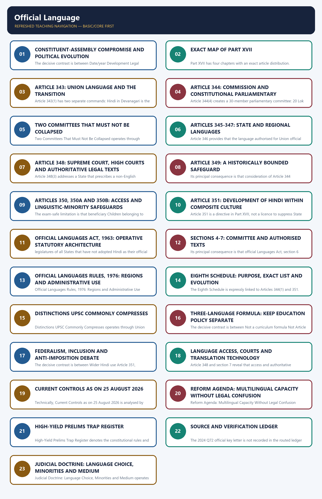

*Distinct embedded teaching-navigation image. The separate continuous Cārvāka-style flowchart package remains an independent at-a-glance artifact.*

The Foundational Distinction: Official, Not National denotes the constitutional rules and institutional links organised around Question Controlled answer.
The Foundational Distinction: Official, Not National operates through National language of India? None declared by the Constitution, connected with Official language of the Union? Hindi in Devanagari script, Article 343(1).
The operative mechanism matters because numerals for Union official purposes? International form of Indian numerals.
Its principal consequence is that did English constitutionally end in 1965? No; the transition ended, but Parliament used Article 343(3) power through statute.
The decisive contrast is between Is English called “associate official language” in the Act? No; the Act says it may continue in addition to Hindi and Are all 22 scheduled languages official languages of India? No.
The exam-safe limitation is that oFFICIAL LANGUAGE - authorised governmental use.
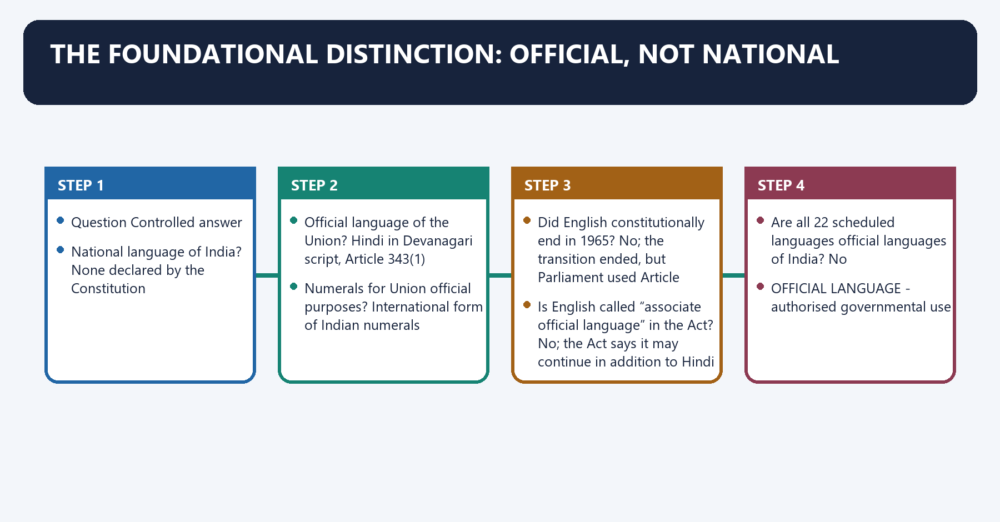
[FACT] Article 343(1) declares **Hindi in Devanagari script** to be the **official language of the Union**. It does not declare Hindi—or any other language—to be India’s “national language”.

[FACT] The Constitution does not use “associate official language” to describe English. The Official Languages Act, 1963 provides for English to continue **in addition to Hindi** for specified Union purposes and parliamentary business. “Associate official language” may appear as informal shorthand, but it is not the controlling constitutional or statutory expression.

[ANALYSIS] “National language” suggests symbolic ownership by the entire nation; “official language” identifies the language authorised for governmental functions. The framers chose functional authorisation without imposing one constitutional national-language identity on a multilingual polity.

[LIMIT] The absence of a constitutional national language does not mean language has no cultural or political symbolism. It means the legal answer must use the text’s narrower category.

#### Visual 03 — Identity Card of the Language Settlement

| Question | Controlled answer |
|---|---|
| National language of India? | None declared by the Constitution |
| Official language of the Union? | Hindi in Devanagari script, Article 343(1) |
| Numerals for Union official purposes? | International form of Indian numerals |
| Did English constitutionally end in 1965? | No; the transition ended, but Parliament used Article 343(3) power through statute |
| Is English called “associate official language” in the Act? | No; the Act says it may continue in addition to Hindi |
| Are all 22 scheduled languages official languages of India? | No |

*Caption: The most common errors arise from converting a functional legal category into a national-symbolic one.*

#### Visual 04 — Six Language Categories

```text
OFFICIAL LANGUAGE -> authorised governmental use
NATIONAL LANGUAGE -> no such constitutional declaration for India
SCHEDULED LANGUAGE -> listed in the Eighth Schedule
CLASSICAL LANGUAGE -> separate Union executive recognition
MOTHER TONGUE -> first/home linguistic identity; context-sensitive
COURT LANGUAGE -> governed especially by Article 348 and statute
MEDIUM OF INSTRUCTION -> education-policy/institutional choice, subject to law
```

*Caption: These categories overlap in real life but do not have the same legal source or consequence.*

### SESSION 1 — CONSTITUENT-ASSEMBLY COMPROMISE AND POLITICAL EVOLUTION

#### DEFINITION / WHAT THIS IS CALLED

**Plain-language definition:** Constituent-Assembly Compromise and Political Evolution denotes the constitutional rules and institutional links organised around “Munshi-Ayyangar formula” is a historical description, not terminology found in Part XVII.

**Technical definition:** The decisive contrast is between Date/year Development Legal significance and September 1949 Constituent Assembly language compromise Foundation of Articles 343-351.

#### ANSWER-GRABBING OPENING — WRITE/ADAPT IN THE EXAM

> Constituent-Assembly Compromise and Political Evolution denotes the constitutional rules and institutional links organised around “Munshi-Ayyangar formula” is a historical description, not terminology found in Part XVII.

#### MUST-WRITE KEYWORDS

- **Constituent-Assembly Compromise**
- **Political Evolution**
- **Munshi-Ayyangar compromise**
- **September 1949**
- **Constituent Assembly language compromise**
- **Foundation of Articles 343-351**

**How to use them:** Frame the answer through Constituent-Assembly Compromise; define Political Evolution, connect Munshi-Ayyangar compromise with September 1949 to explain the mechanism, and use Constituent Assembly language compromise for the decisive comparison or qualification.

Constituent-Assembly Compromise and Political Evolution denotes the constitutional rules and institutional links organised around [LIMIT] “Munshi-Ayyangar formula” is a historical description, not terminology found in Part XVII.
Constituent-Assembly Compromise and Political Evolution operates through CLAIM A: rapid replacement of English, connected with / Hindi official + English transition.
The operative mechanism matters because / + Parliament's later power.
Its principal consequence is that cLAIM B: continuity, access and non-Hindi safeguards.
The decisive contrast is between Date/year Development Legal significance and September 1949 Constituent Assembly language compromise Foundation of Articles 343-351.
The exam-safe limitation is that 26 January 1950 Constitution commenced Fifteen-year period began.
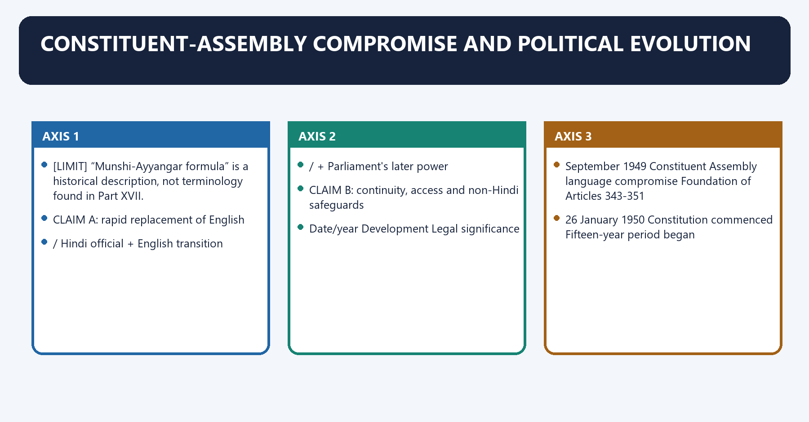
[FACT] The September 1949 Constituent Assembly settlement commonly described as the **Munshi-Ayyangar compromise** placed Hindi in Devanagari as the Union’s official language, retained English for a fifteen-year constitutional transition, selected the international form of Indian numerals, and left Parliament power to continue English thereafter.

[ANALYSIS] The settlement was not a simple victory of Hindi over English. It was an accommodation among demands for rapid linguistic decolonisation, the practical continuity of administration and law, and the claims of non-Hindi-speaking regions.

[LIMIT] “Munshi-Ayyangar formula” is a historical description, not terminology found in Part XVII.

#### Visual 05 — Constituent-Assembly Bargain

```text
CLAIM A: rapid replacement of English
                 \
                  \
                   > COMPROMISE
                  /  Hindi official + English transition
                 /   + Parliament's later power
CLAIM B: continuity, access and non-Hindi safeguards
```

*Caption: The constitutional text reflects negotiated continuity, not a language cliff-edge.*

#### Visual 06 — Constitutional-Political Timeline

| Date/year | Development | Legal significance |
|---:|---|---|
| September 1949 | Constituent Assembly language compromise | Foundation of Articles 343-351 |
| 26 January 1950 | Constitution commenced | Fifteen-year period began |
| 1955 | First Official Language Commission under Article 344, chaired by B.G. Kher | Historical constitutional review |
| 1963 | Official Languages Act enacted | Statutory continuation framework |
| 26 January 1965 | Article 343(2) transition period expired; section 3 appointed day | Statutory regime became central |
| 1965 | Strong anti-imposition mobilisation, especially in Tamil Nadu | Political pressure for federal accommodation |
| 1967 Act / 8 January 1968 effect | Official Languages (Amendment) Act substituted section 3 and inserted safeguards | English discontinuance made conditional under section 3(5) |
| 1976 | Statutory Committee and Official Languages Rules operational era | Administrative implementation |
| 2026 control | Constitution still lists 22 scheduled languages | Demands have not become additions without amendment |

*Caption: The lasting settlement emerged through Constitution, statute and federal politics together.*

#### Visual 07 — Why 1965 Was Not a Legal Switch-Off

```text
ARTICLE 343(2)
15-year transitional use of English
          |
          v
26 JANUARY 1965
transition period ends
          |
          v
ARTICLE 343(3) + OFFICIAL LANGUAGES ACT
English continues for specified purposes
          |
          v
SECTION 3(5)
discontinuance requires extraordinary State + Parliament conditions
```

*Caption: A constitutional transition expired; English did not vanish because Parliament had already legislated.*

[ANALYSIS] The 1965 agitation is best written as a bounded federal episode: opposition focused on compulsory displacement of English and perceived Hindi imposition; statutory accommodation reduced the risk of language becoming a zero-sum test of national loyalty.

[LIMIT] Regional movements were internally diverse. A UPSC answer should avoid portraying either Hindi promotion or non-Hindi resistance as uniformly secessionist, anti-national or culturally hostile.

#### CLOSING RECALL FLOW — CONSTITUENT-ASSEMBLY COMPROMISE AND POLITICAL EVOLUTION

```text
START / CONCEPT: Constituent-Assembly Compromise and Political Evolution
        |
        v
EXACT TERMS: Constituent-Assembly Compromise · Political Evolution · Munshi-Ayyangar compromise · September 1949 · Constituent Assembly language compromise · Foundation of Articles 343-351
        |
        v
MECHANISM / ARGUMENT: The decisive contrast is between Date/year Development Legal significance and September 1949 Constituent Assembly language compromise Foundation of Articles 343-351.
        |
        v
CONSEQUENCE / CONTRAST: Its principal consequence is that cLAIM B: continuity, access and non-Hindi safeguards.
        |
        v
UPSC TRAP / ANSWER-USE: The settlement was not a simple victory of Hindi over English.
        |
        v
ANSWER-GRABBING FORMULATION: Constituent-Assembly Compromise and Political Evolution denotes the constitutional rules and institutional links organised around “Munshi-Ayyangar formula” is a historical description, not terminology found in Part XVII.
```
### SESSION 2 — EXACT MAP OF PART XVII

#### DEFINITION / WHAT THIS IS CALLED

**Plain-language definition:** Exact Map of Part XVII denotes the constitutional rules and institutional links organised around Chapter Subject Articles.

**Technical definition:** Part XVII has four chapters with an exact article distribution.

#### ANSWER-GRABBING OPENING — WRITE/ADAPT IN THE EXAM

> Exact Map of Part XVII denotes the constitutional rules and institutional links organised around Chapter Subject Articles.

#### MUST-WRITE KEYWORDS

- **Exact Map of Part XVII**
- **Chapter I**
- **Language of the Union**
- **Chapter II**
- **Regional languages**
- **343-344**

**How to use them:** Frame the answer through Exact Map of Part XVII; define Chapter I, connect Language of the Union with Chapter II to explain the mechanism, and use Regional languages for the decisive comparison or qualification.

Exact Map of Part XVII denotes the constitutional rules and institutional links organised around Chapter Subject Articles.
Exact Map of Part XVII operates through Chapter I Language of the Union 343-344, connected with Chapter II Regional languages 345-347.
The operative mechanism matters because chapter III Language of the Supreme Court, High Courts, etc. 348-349.
Its principal consequence is that chapter IV Special directives 350, 350A, 350B, 351.
The decisive contrast is between WHERE IS LEGAL AUTHORITY FIXED? and SC / HC / Bills / Acts / rules - 348-349.
The exam-safe limitation is that wHO RECEIVES SPECIAL PROTECTION OR DIRECTION?.
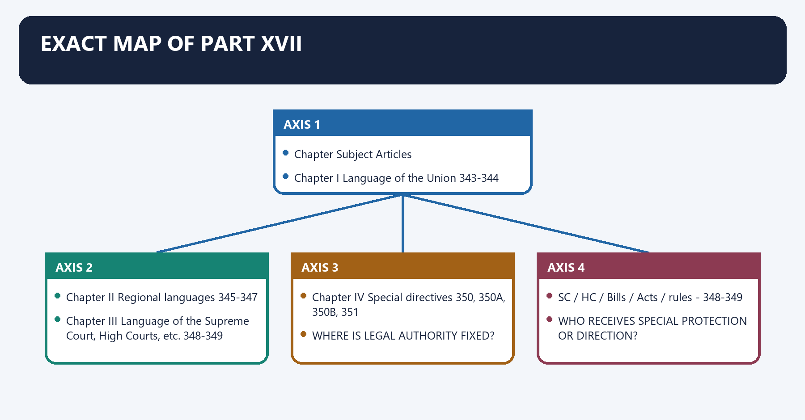
[FACT] Part XVII has four chapters with an exact article distribution. This architecture should be reproduced accurately in Prelims elimination and Mains introductions.

#### Visual 08 — Part XVII Article Map

| Chapter | Subject | Articles |
|---|---|---:|
| Chapter I | Language of the Union | 343-344 |
| Chapter II | Regional languages | 345-347 |
| Chapter III | Language of the Supreme Court, High Courts, etc. | 348-349 |
| Chapter IV | Special directives | 350, 350A, 350B, 351 |

*Caption: Article grouping is itself a high-value elimination device.*

#### Visual 09 — Part XVII Functional Flow

```text
WHO GOVERNS?
Union -> 343-344
State -> 345-347

WHERE IS LEGAL AUTHORITY FIXED?
SC / HC / Bills / Acts / rules -> 348-349

WHO RECEIVES SPECIAL PROTECTION OR DIRECTION?
grievance language -> 350
primary mother-tongue facilities -> 350A
linguistic-minority officer -> 350B
development of Hindi -> 351
```

*Caption: The Part moves from governmental level to legal text and then to safeguards.*

#### CLOSING RECALL FLOW — EXACT MAP OF PART XVII

```text
START / CONCEPT: Exact Map of Part XVII
        |
        v
EXACT TERMS: Exact Map of Part XVII · Chapter I · Language of the Union · Chapter II · Regional languages · 343-344
        |
        v
MECHANISM / ARGUMENT: Part XVII has four chapters with an exact article distribution.
        |
        v
CONSEQUENCE / CONTRAST: Its principal consequence is that chapter IV Special directives 350, 350A, 350B, 351.
        |
        v
UPSC TRAP / ANSWER-USE: Do not miss this limiting distinction: the decisive contrast is between WHERE IS LEGAL AUTHORITY FIXED? and SC / HC...
        |
        v
ANSWER-GRABBING FORMULATION: Exact Map of Part XVII denotes the constitutional rules and institutional links organised around Chapter Subject Articles.
```
### SESSION 3 — ARTICLE 343: UNION LANGUAGE AND THE TRANSITION

#### DEFINITION / WHAT THIS IS CALLED

**Plain-language definition:** Article 343: Union Language and the Transition denotes the constitutional rules and institutional links organised around Clause Rule Temporal character.

**Technical definition:** Article 343(1) has two separate commands: Hindi in Devanagari is the Union’s official language; the numerals for Union official purposes are the international form of Indian numerals.

#### ANSWER-GRABBING OPENING — WRITE/ADAPT IN THE EXAM

> Article 343: Union Language and the Transition denotes the constitutional rules and institutional links organised around Clause Rule Temporal character.

#### MUST-WRITE KEYWORDS

- **Article 343**
- **Union Language**
- **the Transition**
- **international form of Indian numerals**
- **Hindi-Devanagari; international form of Indian numerals**
- **Continuing constitutional baseline**

**How to use them:** Frame the answer through Article 343; define Union Language, connect the Transition with international form of Indian numerals to explain the mechanism, and use Hindi-Devanagari; international form of Indian numerals for the decisive comparison or qualification.

Article 343: Union Language and the Transition denotes the constitutional rules and institutional links organised around Clause Rule Temporal character.
Article 343: Union Language and the Transition operates through 343(1) Hindi-Devanagari; international form of Indian numerals Continuing constitutional baseline, connected with 343(2) English continued for fifteen years; limited presidential authorisation during that period Historical transition.
The operative mechanism matters because 343(3) Parliament may by law provide for English/Devanagari numerals after the period Enabling power used through legislation.
Its principal consequence is that 1950 ------------------------------ 1965.
The decisive contrast is between Article 343(2) transition and President may DURING THIS PERIOD authorise.
The exam-safe limitation is that hindi + English for Union purposes.
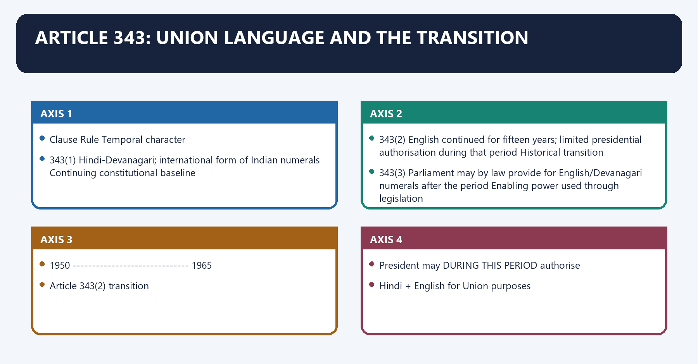
[FACT] Article 343(1) has two separate commands: Hindi in Devanagari is the Union’s official language; the numerals for Union official purposes are the **international form of Indian numerals**.

[FACT] Article 343(2) continued English for all Union official purposes for which it was used before commencement for fifteen years. During that period only, the President could authorise Hindi in addition to English and the Devanagari form of numerals in addition to the international form.

[FACT] Article 343(3) empowers Parliament by law to provide, after the fifteen-year period, for use of English or the Devanagari form of numerals for specified purposes.

#### Visual 10 — Article 343 Clause Anatomy

| Clause | Rule | Temporal character |
|---|---|---|
| 343(1) | Hindi-Devanagari; international form of Indian numerals | Continuing constitutional baseline |
| 343(2) | English continued for fifteen years; limited presidential authorisation during that period | Historical transition |
| 343(3) | Parliament may by law provide for English/Devanagari numerals after the period | Enabling power used through legislation |

*Caption: Clause (2) is transitional; clause (3) explains the lawful post-1965 regime.*

#### Visual 11 — Presidential Power: Narrow Temporal Box

```text
1950 ------------------------------ 1965
      Article 343(2) transition

President may DURING THIS PERIOD authorise:
  Hindi + English for Union purposes
  Devanagari numerals + international form

After the period:
  use depends on Article 343(3) law, not an endlessly renewed 343(2) order.
```

*Caption: Do not convert a time-bound presidential authorisation into a permanent independent power.*

#### Visual 12 — Constitutional Myth vs Legal Route

| Myth | Correction |
|---|---|
| English “expired” in 1965 | Only the Article 343(2) transition expired |
| English continues by convention | It continues through the Official Languages Act |
| The Constitution calls English associate official language | It does not |
| Hindi is the national language | Article 343 says official language of the Union |
| Devanagari numerals are the constitutional default | International form of Indian numerals is the default |

*Caption: The correct answer names the exact clause and the statute.*

#### CLOSING RECALL FLOW — ARTICLE 343: UNION LANGUAGE AND THE TRANSITION

```text
START / CONCEPT: Article 343: Union Language and the Transition
        |
        v
EXACT TERMS: Article 343 · Union Language · the Transition · international form of Indian numerals · Hindi-Devanagari; international form of Indian numerals · Continuing constitutional baseline
        |
        v
MECHANISM / ARGUMENT: Article 343(1) has two separate commands: Hindi in Devanagari is the Union’s official language; the numerals for Union official purposes are the international form of Indian numerals.
        |
        v
CONSEQUENCE / CONTRAST: The decisive contrast is between Article 343(2) transition and President may DURING THIS PERIOD authorise.
        |
        v
UPSC TRAP / ANSWER-USE: Do not miss this limiting distinction: article 343(2) continued English for all Union official purposes for which it was used...
        |
        v
ANSWER-GRABBING FORMULATION: Article 343: Union Language and the Transition denotes the constitutional rules and institutional links organised around Clause Rule Temporal character.
```
### SESSION 4 — ARTICLE 344: COMMISSION AND CONSTITUTIONAL PARLIAMENTARY COMMITTEE

#### DEFINITION / WHAT THIS IS CALLED

**Plain-language definition:** Article 344: Commission and Constitutional Parliamentary Committee denotes the constitutional rules and institutional links organised around 5 years ---- Commission milestone (1955).

**Technical definition:** Article 344(4) creates a 30-member parliamentary committee: 20 Lok Sabha + 10 Rajya Sabha, elected by each House through proportional representation by means of the single transferable vote.

#### ANSWER-GRABBING OPENING — WRITE/ADAPT IN THE EXAM

> Article 344: Commission and Constitutional Parliamentary Committee denotes the constitutional rules and institutional links organised around 5 years ---- Commission milestone (1955).

#### MUST-WRITE KEYWORDS

- **Article 344**
- **Commission**
- **Constitutional Parliamentary Committee**
- **five years**
- **ten years from commencement**
- **20 Lok Sabha + 10 Rajya Sabha**

**How to use them:** Frame the answer through Article 344; define Commission, connect Constitutional Parliamentary Committee with five years to explain the mechanism, and use ten years from commencement for the decisive comparison or qualification.

Article 344: Commission and Constitutional Parliamentary Committee denotes the constitutional rules and institutional links organised around 5 years ---- Commission milestone (1955).
Article 344: Commission and Constitutional Parliamentary Committee operates through 10 years --- second textual milestone from commencement, connected with NOT: 1955 - every ten years forever.
The operative mechanism matters because recommendation field Built-in qualification.
Its principal consequence is that progressive use of Hindi Administrative feasibility.
The decisive contrast is between Restrictions on English Non-Hindi interests and Language for Article 348 purposes Legal uniformity and access.
The exam-safe limitation is that form of numerals Practical/scientific context.
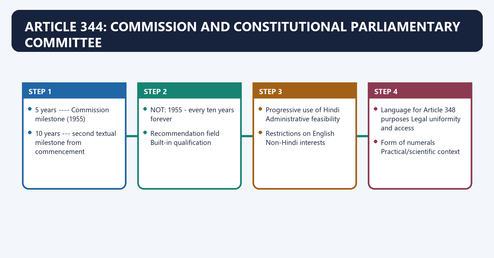
[FACT] Article 344(1) instructed the President to constitute a Commission at the expiration of **five years** from constitutional commencement and thereafter at the expiration of **ten years from commencement**. The wording identifies two historical constitutional milestones; it does not create a recurring commission every ten years.

[FACT] The Commission consists of a Chairperson and members representing the different Eighth-Schedule languages, appointed by the President. Its recommendations cover progressive Hindi use, restrictions on English, Article 348 purposes, numerals and referred language questions.

[FACT] Article 344(3) requires due regard to India’s industrial, cultural and scientific advancement and to the just claims and interests of persons from non-Hindi-speaking areas in public services.

#### Visual 13 — Article 344 Historical Clock

```text
26 Jan 1950
     |
     +---- 5 years ----> Commission milestone (1955)
     |
     +---- 10 years ---> second textual milestone from commencement

NOT: 1955 -> every ten years forever
```

*Caption: UPSC can test the difference between “at ten years” and “every ten years”.*

#### Visual 14 — Commission Recommendation Matrix

| Recommendation field | Built-in qualification |
|---|---|
| Progressive use of Hindi | Administrative feasibility |
| Restrictions on English | Non-Hindi interests |
| Language for Article 348 purposes | Legal uniformity and access |
| Form of numerals | Practical/scientific context |
| Other referred matters | Union-State and inter-State communication |

*Caption: Article 344 itself embeds a balancing duty rather than a one-direction command.*

[FACT] Article 344(4) creates a 30-member parliamentary committee: **20 Lok Sabha + 10 Rajya Sabha**, elected by each House through proportional representation by means of the single transferable vote. It examines the Commission’s recommendations and reports its opinion to the President. The President may then issue directions under Article 344(6).

#### Visual 15 — Article 344 Report Route

```text
PRESIDENT
   |
   v
ARTICLE 344 COMMISSION
   |
   | recommendations
   v
30-MEMBER PARLIAMENTARY COMMITTEE
20 LS + 10 RS | PR-STV
   |
   | opinion
   v
PRESIDENT
   |
   v
possible directions under Article 344(6)
```

*Caption: The constitutional committee reviews a constitutional commission; it is not identical to the later statutory committee.*

#### CLOSING RECALL FLOW — ARTICLE 344: COMMISSION AND CONSTITUTIONAL PARLIAMENTARY COMMITTEE

```text
START / CONCEPT: Article 344: Commission and Constitutional Parliamentary Committee
        |
        v
EXACT TERMS: Article 344 · Commission · Constitutional Parliamentary Committee · five years · ten years from commencement · 20 Lok Sabha + 10 Rajya Sabha
        |
        v
MECHANISM / ARGUMENT: Article 344(4) creates a 30-member parliamentary committee: 20 Lok Sabha + 10 Rajya Sabha, elected by each House through proportional representation by means of the single transferable vote.
        |
        v
CONSEQUENCE / CONTRAST: The wording identifies two historical constitutional milestones; it does not create a recurring commission every ten years.
        |
        v
UPSC TRAP / ANSWER-USE: Do not miss this limiting distinction: the decisive contrast is between Restrictions on English Non-Hindi interests and Language for Article...
        |
        v
ANSWER-GRABBING FORMULATION: Article 344: Commission and Constitutional Parliamentary Committee denotes the constitutional rules and institutional links organised around 5 years ---- Commission milestone (1955).
```
### SESSION 5 — TWO COMMITTEES THAT MUST NOT BE COLLAPSED

#### DEFINITION / WHAT THIS IS CALLED

**Plain-language definition:** Two Committees That Must Not Be Collapsed denotes the constitutional rules and institutional links organised around Test Article 344 committee Section 4 committee.

**Technical definition:** Two Committees That Must Not Be Collapsed operates through Source Constitution Official Languages Act, 1963, connected with Trigger Article 344 Commission recommendations Ten years after section 3 commencement + parliamentary resolution process.

#### ANSWER-GRABBING OPENING — WRITE/ADAPT IN THE EXAM

> Two Committees That Must Not Be Collapsed operates through Source Constitution Official Languages Act, 1963, connected with Trigger Article 344 Commission recommendations Ten years after section 3 commencement + parliamentary resolution process.

#### MUST-WRITE KEYWORDS

- **Committee on Official Language**
- **Constitution**
- **Official Languages Act, 1963**
- **Trigger**
- **Article 344 Commission recommendations**
- **Core work**

**How to use them:** Frame the answer through Committee on Official Language; define Constitution, connect Official Languages Act, 1963 with Trigger to explain the mechanism, and use Article 344 Commission recommendations for the decisive comparison or qualification.

Two Committees That Must Not Be Collapsed denotes the constitutional rules and institutional links organised around Test Article 344 committee Section 4 committee.
Two Committees That Must Not Be Collapsed operates through Source Constitution Official Languages Act, 1963, connected with Trigger Article 344 Commission recommendations Ten years after section 3 commencement + parliamentary resolution process.
The operative mechanism matters because core work Examine Commission recommendations Review progress of Hindi for Union official purposes.
Its principal consequence is that membership 30: 20 LS + 10 RS, PR-STV Same numeric/election structure.
The decisive contrast is between Report route President President; laid before Parliament and sent to States and Current terminology Historical constitutional mechanism Committee of Parliament on Official Language.
The exam-safe limitation is that rEPORT / RECOMMENDATION.
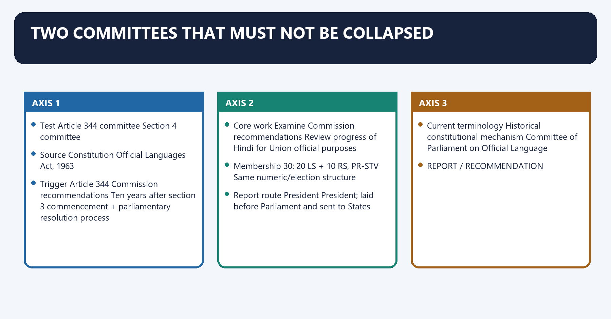
[FACT] Article 344(4) provides the constitutional committee tied to the Article 344 Commission. Section 4 of the Official Languages Act, 1963 provides a statutory **Committee on Official Language** after ten years from section 3’s commencement, upon a resolution moved with prior presidential sanction and passed by both Houses.

[FACT] The statutory committee also has 30 members—20 Lok Sabha and 10 Rajya Sabha—elected through proportional representation by single transferable vote. Its duty is to review progress in the use of Hindi for Union official purposes and report recommendations to the President; the report is laid before both Houses and sent to all State Governments.

[CURRENT] The official Committee of Parliament on Official Language portal identifies the current institutional body under the Department of Official Language and displayed the thirteenth part of its report by the control date.

[LIMIT] Committee recommendations and presidential directions cannot be described as amendments to the Constitution or Act. Section 4(4)’s proviso requires directions not to be inconsistent with section 3.

#### Visual 16 — Constitutional vs Statutory Committee

| Test | Article 344 committee | Section 4 committee |
|---|---|---|
| Source | Constitution | Official Languages Act, 1963 |
| Trigger | Article 344 Commission recommendations | Ten years after section 3 commencement + parliamentary resolution process |
| Core work | Examine Commission recommendations | Review progress of Hindi for Union official purposes |
| Membership | 30: 20 LS + 10 RS, PR-STV | Same numeric/election structure |
| Report route | President | President; laid before Parliament and sent to States |
| Current terminology | Historical constitutional mechanism | Committee of Parliament on Official Language |

*Caption: Similar composition does not erase different legal sources, triggers and functions.*

#### Visual 17 — Committee Recommendation Control

```text
REPORT / RECOMMENDATION
        |
        +--> may influence policy or presidential direction
        |
        +--> does NOT itself amend Article 343
        +--> does NOT itself discontinue English
        +--> does NOT add a language to Eighth Schedule
        +--> does NOT override section 3 safeguards
```

*Caption: Institutional influence must not be confused with constituent or legislative power.*

#### CLOSING RECALL FLOW — TWO COMMITTEES THAT MUST NOT BE COLLAPSED

```text
START / CONCEPT: Two Committees That Must Not Be Collapsed
        |
        v
EXACT TERMS: Committee on Official Language · Constitution · Official Languages Act, 1963 · Trigger · Article 344 Commission recommendations · Core work
        |
        v
MECHANISM / ARGUMENT: Two Committees That Must Not Be Collapsed denotes the constitutional rules and institutional links organised around Test Article 344 committee Section 4 committee.
        |
        v
CONSEQUENCE / CONTRAST: The decisive contrast is between Report route President President; laid before Parliament and sent to States and Current terminology Historical constitutional mechanism Committee of Parliament on Official Language.
        |
        v
UPSC TRAP / ANSWER-USE: Do not miss this limiting distinction: its principal consequence is that membership 30.
        |
        v
ANSWER-GRABBING FORMULATION: Two Committees That Must Not Be Collapsed operates through Source Constitution Official Languages Act, 1963, connected with Trigger Article 344 Commission recommendations Ten years after section 3 commencement + parliamentary resolution process.
```
### SESSION 6 — ARTICLES 345-347: STATE AND REGIONAL LANGUAGES

#### DEFINITION / WHAT THIS IS CALLED

**Plain-language definition:** Articles 345-347: State and Regional Languages denotes the constitutional rules and institutional links organised around one language in use in State.

**Technical definition:** Article 346 provides that the language authorised for Union official purposes is the official language for communication between States and between a State and the Union.

#### ANSWER-GRABBING OPENING — WRITE/ADAPT IN THE EXAM

> Articles 345-347: State and Regional Languages denotes the constitutional rules and institutional links organised around one language in use in State.

#### MUST-WRITE KEYWORDS

- **Articles 345-347**
- **Regional Languages**
- **not**
- **substantial proportion**
- **False**
- **True**

**How to use them:** Frame the answer through Articles 345-347; define Regional Languages, connect not with substantial proportion to explain the mechanism, and use False for the decisive comparison or qualification.

Articles 345-347: State and Regional Languages denotes the constitutional rules and institutional links organised around one language in use in State.
Articles 345-347: State and Regional Languages operates through more than one language in use in State, connected with may assign language(s) to all or specified official purposes.
The operative mechanism matters because until law says otherwise - prior English use continues.
Its principal consequence is that proposition Verdict.
The decisive contrast is between State must choose only an Eighth-Schedule language False and State may adopt more than one language True.
The exam-safe limitation is that state may specify different official purposes True.
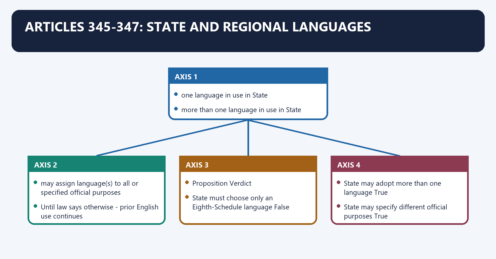
[FACT] Article 345 allows a State Legislature, subject to Articles 346 and 347, to adopt by law one or more languages in use in the State or Hindi for all or any State official purposes. Until it legislates otherwise, English continues for the State official purposes for which it was used before commencement.

[FACT] A State official language does **not** have to be in the Eighth Schedule. The constitutional test is “one or more of the languages in use in the State or Hindi”, not scheduled status.

#### Visual 18 — Article 345 Choice Tree

```text
STATE LEGISLATURE
       |
       +--> one language in use in State
       +--> more than one language in use in State
       +--> Hindi
       |
       v
may assign language(s) to all or specified official purposes

Until law says otherwise -> prior English use continues
```

*Caption: Article 345 combines legislative choice, functional differentiation and continuity.*

#### Visual 19 — Scheduled Status Is Not a Gate

| Proposition | Verdict |
|---|---:|
| State must choose only an Eighth-Schedule language | False |
| State may adopt more than one language | True |
| State may specify different official purposes | True |
| English continuity is automatic forever regardless of State law | False |
| Article 345 operates subject to Articles 346 and 347 | True |

*Caption: Scheduled recognition and State administrative adoption are separate legal questions.*

[FACT] Article 346 provides that the language authorised for Union official purposes is the official language for communication between States and between a State and the Union. Its proviso allows two or more States to agree to use Hindi between themselves.

[FACT] The Official Languages Act section 3 overlays this constitutional baseline: English shall be used for Union communication with a State that has not adopted Hindi; Hindi communication from a Hindi-adopting State to a non-Hindi State requires an English translation, unless the statutory agreement/choice proviso applies.

#### Visual 20 — Intergovernmental Communication Layers

```text
ARTICLE 346 BASELINE
language authorised for Union official purposes
          |
          v
OFFICIAL LANGUAGES ACT SECTION 3
specific English/Hindi communication safeguards
          |
          v
STATE AGREEMENT / CHOICE
Hindi may be used where constitutionally/statutorily allowed
```

*Caption: Read Article 346 with section 3 rather than in isolation.*

[FACT] Article 347 operates on a demand. If the President is satisfied that a **substantial proportion** of a State’s population desires official recognition of a language spoken by them, the President may direct recognition throughout the State or a part of it for a specified purpose.

[LIMIT] The Constitution does not prescribe a fixed percentage for “substantial proportion”. Nor does a demand automatically produce recognition; presidential satisfaction and the terms of the direction matter.

#### Visual 21 — Article 347 Trigger Test

```text
DEMAND BY LANGUAGE-SPEAKING SECTION
                |
                v
PRESIDENTIAL SATISFACTION:
substantial proportion desires recognition
                |
                v
DISCRETIONARY DIRECTION
whole State OR part of State
specified purpose
```

*Caption: Demand is necessary, but recognition is neither automatic nor percentage-defined.*

#### Visual 22 — Articles 345-347 in One Matrix

| Article | Principal actor | Core subject | Minority/federal control |
|---:|---|---|---|
| 345 | State Legislature | State official language(s) | Language in use/Hindi; subject to 346-347 |
| 346 | Union and States | Intergovernmental communication | State agreement proviso + statutory overlay |
| 347 | President | Recognition of a language spoken by a section | Demand + substantial proportion + satisfaction |

*Caption: Chapter II balances State autonomy, national communication and intra-State linguistic claims.*

#### CLOSING RECALL FLOW — ARTICLES 345-347: STATE AND REGIONAL LANGUAGES

```text
START / CONCEPT: Articles 345-347: State and Regional Languages
        |
        v
EXACT TERMS: Articles 345-347 · Regional Languages · not · substantial proportion · False · True
        |
        v
MECHANISM / ARGUMENT: Articles 345-347: State and Regional Languages operates through more than one language in use in State, connected with may assign language(s) to all or specified official purposes.
        |
        v
CONSEQUENCE / CONTRAST: The decisive contrast is between State must choose only an Eighth-Schedule language False and State may adopt more than one language True.
        |
        v
UPSC TRAP / ANSWER-USE: A State official language does not have to be in the Eighth Schedule.
        |
        v
ANSWER-GRABBING FORMULATION: Articles 345-347: State and Regional Languages denotes the constitutional rules and institutional links organised around one language in use in State.
```
### SESSION 7 — ARTICLE 348: SUPREME COURT, HIGH COURTS AND AUTHORITATIVE LEGAL TEXTS

#### DEFINITION / WHAT THIS IS CALLED

**Plain-language definition:** Article 348: Supreme Court, High Courts and Authoritative Legal Texts denotes the constitutional rules and institutional links organised around SC proceedings - English.

**Technical definition:** Article 348(3) addresses a State that prescribes a non-English language for its Bills, Acts, ordinances or delegated texts: an English translation published under the Governor’s authority in the State Gazette is deemed the authoritative English text.

#### ANSWER-GRABBING OPENING — WRITE/ADAPT IN THE EXAM

> Article 348: Supreme Court, High Courts and Authoritative Legal Texts denotes the constitutional rules and institutional links organised around SC proceedings - English.

#### MUST-WRITE KEYWORDS

- **Article 348**
- **Supreme Court**
- **High Courts**
- **Authoritative Legal Texts**
- **previous consent of the President**
- **in addition to English**

**How to use them:** Frame the answer through Article 348; define Supreme Court, connect High Courts with Authoritative Legal Texts to explain the mechanism, and use previous consent of the President for the decisive comparison or qualification.

Article 348: Supreme Court, High Courts and Authoritative Legal Texts denotes the constitutional rules and institutional links organised around SC proceedings - English.
Article 348: Supreme Court, High Courts and Authoritative Legal Texts operates through every HC proceeding - English, connected with authoritative texts.
The operative mechanism matters because bills and amendments.
Its principal consequence is that orders / rules / regulations / bye-laws.
The decisive contrast is between [FACT] The constitutional proviso expressly excludes judgments, decrees and orders from this Article 348(2) authorisation and GOVERNOR PROPOSES LANGUAGE AUTHORISATION.
The exam-safe limitation is that pREVIOUS PRESIDENTIAL CONSENT.
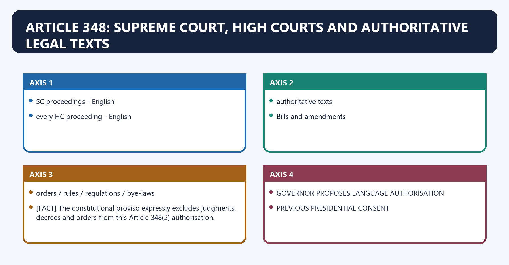
[FACT] Article 348 begins with a non-obstante clause and applies until Parliament by law otherwise provides. Article 348(1)(a) makes English the language of all proceedings in the Supreme Court and every High Court.

[FACT] Article 348(1)(b) makes English the authoritative text of parliamentary and State Bills/amendments, Acts, ordinances, and orders, rules, regulations and bye-laws issued under the Constitution or legislation.

#### Visual 23 — Article 348 Scope

```text
ARTICLE 348(1)
   |
   +--> SC proceedings -> English
   +--> every HC proceeding -> English
   |
   +--> authoritative texts:
          Bills and amendments
          Acts
          Ordinances
          orders / rules / regulations / bye-laws
```

*Caption: Article 348 governs both adjudicative proceedings and the authority of legislative/delegated texts.*

[FACT] Under Article 348(2), a Governor, with the **previous consent of the President**, may authorise Hindi or another language used for State official purposes in High Court proceedings at the High Court’s principal seat in that State.

[FACT] The constitutional proviso expressly excludes judgments, decrees and orders from this Article 348(2) authorisation.

#### Visual 24 — High Court Proceedings Gate

```text
GOVERNOR PROPOSES LANGUAGE AUTHORISATION
                |
                v
PREVIOUS PRESIDENTIAL CONSENT
                |
                v
HINDI / OTHER STATE OFFICIAL LANGUAGE
may be used in HC proceedings
                |
                X
Article 348(2) alone does not cover
judgments, decrees or orders
```

*Caption: Prior consent and the judgment exception are both essential.*

[FACT] Section 7 of the Official Languages Act is a separate statutory route. With previous presidential consent, the Governor may authorise Hindi or the State’s official language, **in addition to English**, for a High Court judgment, decree or order; any non-English judgment, decree or order must be accompanied by an English translation issued under High Court authority.

#### Visual 25 — Proceedings vs Judgments

| Question | Article 348(2) | Official Languages Act section 7 |
|---|---|---|
| Subject | High Court proceedings | Judgments, decrees and orders |
| Actor | Governor | Governor |
| Consent | Previous consent of President | Previous consent of President |
| Permitted language | Hindi/other State official language | Hindi/State official language in addition to English |
| English safeguard | Constitutional judgment exception | Authorised English translation required |

*Caption: The statute supplements the field that Article 348(2)’s proviso excludes.*

#### Visual 26 — Legal Hierarchy for a Non-English High Court Judgment

```text
ARTICLE 348(1): English baseline
          |
          v
SECTION 7 STATUTORY AUTHORISATION
Governor + previous Presidential consent
          |
          v
NON-ENGLISH JUDGMENT / DECREE / ORDER
          |
          v
ENGLISH TRANSLATION
issued under authority of High Court
```

*Caption: Language access expands, while an authoritative English bridge preserves wider legal usability.*

[FACT] Article 348(3) addresses a State that prescribes a non-English language for its Bills, Acts, ordinances or delegated texts: an English translation published under the Governor’s authority in the State Gazette is deemed the authoritative English text.

[FACT] Sections 5 and 6 of the Official Languages Act separately create authorised Hindi texts of Central instruments and, in specified State cases, State Acts/ordinances. These provisions must be read with Article 348 rather than used to erase it.

#### Visual 27 — Authoritative-Text Triangle

```text
                ARTICLE 348
          English authoritative baseline
             /                 \
            /                   \
SECTION 5: authorised       ARTICLE 348(3):
Hindi Central texts         authorised English
                            translation of State text
            \                   /
             \                 /
              SECTION 6
       authorised Hindi State translation
```

*Caption: Multilingual authoritative texts require an express constitutional or statutory route.*

#### Visual 28 — Translation-Risk Chain

```text
ORIGINAL LEGAL TEXT
      |
      v
TRANSLATION
      |
      +--> terminology mismatch
      +--> omitted qualifier
      +--> inconsistent amendment update
      +--> machine-generated ambiguity
      |
      v
HUMAN LEGAL VERIFICATION + VERSION CONTROL
      |
      v
RELIABLE MULTILINGUAL ACCESS
```

*Caption: Translation technology can expand access only if authority, version and human review remain visible.*

#### CLOSING RECALL FLOW — ARTICLE 348: SUPREME COURT, HIGH COURTS AND AUTHORITATIVE LEGAL TEXTS

```text
START / CONCEPT: Article 348: Supreme Court, High Courts and Authoritative Legal Texts
        |
        v
EXACT TERMS: Article 348 · Supreme Court · High Courts · Authoritative Legal Texts · previous consent of the President · in addition to English
        |
        v
MECHANISM / ARGUMENT: With previous presidential consent, the Governor may authorise Hindi or the State’s official language, in addition to English, for a High Court judgment, decree or order; any non-English judgment, decree or order must be accompanied by an English translation issued under High Court authority.
        |
        v
CONSEQUENCE / CONTRAST: The decisive contrast is between The constitutional proviso expressly excludes judgments, decrees and orders from this Article 348(2) authorisation and GOVERNOR PROPOSES LANGUAGE AUTHORISATION.
        |
        v
UPSC TRAP / ANSWER-USE: Do not miss this limiting distinction: article 348(3) addresses a State that prescribes a non-English language for its Bills, Acts...
        |
        v
ANSWER-GRABBING FORMULATION: Article 348: Supreme Court, High Courts and Authoritative Legal Texts denotes the constitutional rules and institutional links organised around SC proceedings - English.
```
### SESSION 8 — ARTICLE 349: A HISTORICALLY BOUNDED SAFEGUARD

#### DEFINITION / WHAT THIS IS CALLED

**Plain-language definition:** Article 349: A Historically Bounded Safeguard denotes the constitutional rules and institutional links organised around 1950 ------------------------------ 1965.

**Technical definition:** Its principal consequence is that consideration of Article 344 materials.

#### ANSWER-GRABBING OPENING — WRITE/ADAPT IN THE EXAM

> Article 349: A Historically Bounded Safeguard denotes the constitutional rules and institutional links organised around 1950 ------------------------------ 1965.

#### MUST-WRITE KEYWORDS

- **Article 349**
- **A Historically Bounded Safeguard**
- **during the first fifteen years**
- **Article 348**
- **Article 344**
- **Article 349: A Historically Bounded Safeguard**

**How to use them:** Frame the answer through Article 349; define A Historically Bounded Safeguard, connect during the first fifteen years with Article 348 to explain the mechanism, and use Article 344 for the decisive comparison or qualification.

Article 349: A Historically Bounded Safeguard denotes the constitutional rules and institutional links organised around 1950 ------------------------------ 1965.
Article 349: A Historically Bounded Safeguard operates through SPECIAL PROCEDURE OPERATIVE, connected with Bill/amendment on Article 348(1) purposes.
The operative mechanism matters because previous Presidential sanction.
Its principal consequence is that consideration of Article 344 materials.
The decisive contrast is between do not write Article 349 as a perpetual ordinary gate and 1950 ------------------------------ 1965.
The exam-safe limitation is that 1950 ------------------------------ 1965.
[FACT] Article 349 applied **during the first fifteen years** from constitutional commencement. During that period, a Bill or amendment concerning the language used for Article 348(1) purposes required previous presidential sanction, and the President had to consider the Article 344 Commission’s recommendations and committee report.

[CURRENT] The fifteen-year period ended in 1965. Article 349 remains in the constitutional text as a historical transitional provision; it is not a routine current precondition for every modern language-related Bill.

#### Visual 29 — Article 349 Time Box

```text
1950 ------------------------------ 1965
     SPECIAL PROCEDURE OPERATIVE
Bill/amendment on Article 348(1) purposes
 -> previous Presidential sanction
 -> consideration of Article 344 materials

AFTER 1965
do not write Article 349 as a perpetual ordinary gate
```

*Caption: A provision may remain printed in the Constitution while its expressly bounded period has expired.*

#### CLOSING RECALL FLOW — ARTICLE 349: A HISTORICALLY BOUNDED SAFEGUARD

```text
START / CONCEPT: Article 349: A Historically Bounded Safeguard
        |
        v
EXACT TERMS: Article 349 · A Historically Bounded Safeguard · during the first fifteen years · Article 348 · Article 344 · Article 349: A Historically Bounded Safeguard
        |
        v
MECHANISM / ARGUMENT: During that period, a Bill or amendment concerning the language used for Article 348(1) purposes required previous presidential sanction, and the President had to consider the Article 344 Commission’s recommendations and committee report.
        |
        v
CONSEQUENCE / CONTRAST: Its principal consequence is that consideration of Article 344 materials.
        |
        v
UPSC TRAP / ANSWER-USE: The decisive contrast is between do not write Article 349 as a perpetual ordinary gate and 1950 ------------------------------ 1965.
        |
        v
ANSWER-GRABBING FORMULATION: Article 349: A Historically Bounded Safeguard denotes the constitutional rules and institutional links organised around 1950 ------------------------------ 1965.
```
### SESSION 9 — ARTICLES 350, 350A AND 350B: ACCESS AND LINGUISTIC-MINORITY SAFEGUARDS

#### DEFINITION / WHAT THIS IS CALLED

**Plain-language definition:** Articles 350, 350A and 350B: Access and Linguistic-Minority Safeguards denotes the constitutional rules and institutional links organised around PERSON WITH GRIEVANCE.

**Technical definition:** The exam-safe limitation is that beneficiary Children belonging to linguistic-minority groups.

#### ANSWER-GRABBING OPENING — WRITE/ADAPT IN THE EXAM

> Articles 350, 350A and 350B: Access and Linguistic-Minority Safeguards denotes the constitutional rules and institutional links organised around PERSON WITH GRIEVANCE.

#### MUST-WRITE KEYWORDS

- **Articles 350**
- **Access**
- **Linguistic-Minority Safeguards**
- **endeavour**
- **350A**
- **350B**

**How to use them:** Frame the answer through Articles 350; define Access, connect Linguistic-Minority Safeguards with endeavour to explain the mechanism, and use 350A for the decisive comparison or qualification.

Articles 350, 350A and 350B: Access and Linguistic-Minority Safeguards denotes the constitutional rules and institutional links organised around PERSON WITH GRIEVANCE.
Articles 350, 350A and 350B: Access and Linguistic-Minority Safeguards operates through representation in any language, connected with used in Union / State, as applicable.
The operative mechanism matters because uNION OR STATE OFFICER / AUTHORITY.
Its principal consequence is that lIMIT: representation language != automatic language of every later stage.
The decisive contrast is between Element Constitutional text and Duty bearer Every State and every local authority within it.
The exam-safe limitation is that beneficiary Children belonging to linguistic-minority groups.
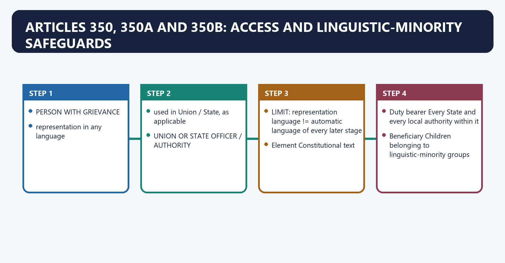
[FACT] Article 350 entitles every person to submit a representation for grievance redress to any Union or State officer/authority in any language used in the Union or State, as the case may be.

[ANALYSIS] Article 350 lowers a language barrier at the entry point of administration. It does not necessarily require every official proceeding or final order to use the representor’s chosen language.

#### Visual 30 — Article 350 Access Route

```text
PERSON WITH GRIEVANCE
        |
        | representation in any language
        | used in Union / State, as applicable
        v
UNION OR STATE OFFICER / AUTHORITY
        |
        v
REDRESS PROCESS

LIMIT: representation language != automatic language of every later stage
```

*Caption: The Article protects access to grievance submission, not an unlimited language-of-proceeding right.*

[FACT] Article 350A says it shall be the **endeavour** of every State and local authority within it to provide adequate facilities for mother-tongue instruction at the primary stage to children belonging to linguistic-minority groups. The President may issue directions considered necessary or proper to secure such facilities.

[LIMIT] The text is not framed as an absolute, self-executing Fundamental Right to a particular school, curriculum or medium in every circumstance. “Endeavour”, “adequate facilities”, institutional capacity and presidential directions must be kept visible.

#### Visual 31 — Article 350A Duty Anatomy

| Element | Constitutional text |
|---|---|
| Duty bearer | Every State and every local authority within it |
| Beneficiary | Children belonging to linguistic-minority groups |
| Stage | Primary stage of education |
| Object | Adequate facilities for mother-tongue instruction |
| Verb | “Shall be the endeavour” |
| Union control | President may issue directions |

*Caption: Accurate writing preserves both the safeguard and its qualified textual form.*

[FACT] Articles 29 and 30 provide adjacent cultural and educational protections. Article 29(1) protects the right of a section of citizens with a distinct language, script or culture to conserve it; Article 30 protects minorities based on religion or language in establishing and administering educational institutions.

[LIMIT] Article 350A should not be mechanically merged with Articles 29-30. They have different language, beneficiaries, institutional consequences and justiciability structures.

#### Visual 32 — Linguistic-Minority Safeguard Ecosystem

```text
ARTICLE 29(1) -> conserve distinct language/script/culture
ARTICLE 30    -> minority educational institutions
ARTICLE 347   -> possible official recognition on demand
ARTICLE 350   -> grievance representation language
ARTICLE 350A  -> primary mother-tongue facility endeavour
ARTICLE 350B  -> investigation and reporting officer
```

*Caption: Protection is distributed across cultural rights, education, administration and oversight.*

[FACT] Article 350B creates a Special Officer for linguistic minorities appointed by the President. The officer investigates all matters relating to constitutional safeguards for linguistic minorities and reports to the President at directed intervals. The President causes reports to be laid before each House of Parliament and sent to the concerned State Governments.

[CURRENT] The Ministry of Minority Affairs identifies the office as the Commissioner for Linguistic Minorities and confirms the reporting and State/Union Territory engagement role. Its official page also makes clear that a linguistic-minority language need not be one of the 22 scheduled languages.

#### Visual 33 — Article 350B Accountability Route

```text
PRESIDENT APPOINTS SPECIAL OFFICER
              |
              v
INVESTIGATE CONSTITUTIONAL SAFEGUARDS
              |
              v
REPORT TO PRESIDENT
              |
              +--> laid before Lok Sabha
              +--> laid before Rajya Sabha
              +--> sent to concerned State Governments
```

*Caption: The office investigates and reports; it is not a substitute legislature, court or enforcement agency.*

#### Visual 34 — Minority Is Contextual

| Level | Practical comparison |
|---|---|
| State | Mother tongue differs from the State’s principal language |
| District | Mother tongue differs from the district’s principal language |
| Taluka/tehsil | Mother tongue differs from that local unit’s principal language |
| Scheduled status | Not required for linguistic-minority character |

*Caption: Linguistic minority is relational and territorial, not confined to the Eighth Schedule.*

#### CLOSING RECALL FLOW — ARTICLES 350, 350A AND 350B: ACCESS AND LINGUISTIC-MINORITY SAFEGUARDS

```text
START / CONCEPT: Articles 350, 350A and 350B: Access and Linguistic-Minority Safeguards
        |
        v
EXACT TERMS: Articles 350 · Access · Linguistic-Minority Safeguards · endeavour · 350A · 350B
        |
        v
MECHANISM / ARGUMENT: Article 350B creates a Special Officer for linguistic minorities appointed by the President.
        |
        v
CONSEQUENCE / CONTRAST: Article 350A should not be mechanically merged with Articles 29-30.
        |
        v
UPSC TRAP / ANSWER-USE: Its principal consequence is that lIMIT: representation language != automatic language of every later stage.
        |
        v
ANSWER-GRABBING FORMULATION: Articles 350, 350A and 350B: Access and Linguistic-Minority Safeguards denotes the constitutional rules and institutional links organised around PERSON WITH GRIEVANCE.
```
### SESSION 10 — ARTICLE 351: DEVELOPMENT OF HINDI WITHIN COMPOSITE CULTURE

#### DEFINITION / WHAT THIS IS CALLED

**Plain-language definition:** Article 351: Development of Hindi Within Composite Culture denotes the constitutional rules and institutional links organised around medium for India's composite culture.

**Technical definition:** Article 351 is a directive in Part XVII, not a licence to suppress State languages, minority languages, English safeguards or other constitutional guarantees.

#### ANSWER-GRABBING OPENING — WRITE/ADAPT IN THE EXAM

> Article 351: Development of Hindi Within Composite Culture denotes the constitutional rules and institutional links organised around medium for India's composite culture.

#### MUST-WRITE KEYWORDS

- **Article 351**
- **Development of Hindi Within Composite Culture**
- **primarily from Sanskrit and secondarily from other languages**
- **Promote spread of Hindi**
- **Respect State-language autonomy**
- **Develop expressive capacity**

**How to use them:** Frame the answer through Article 351; define Development of Hindi Within Composite Culture, connect primarily from Sanskrit and secondarily from other languages with Promote spread of Hindi to explain the mechanism, and use Respect State-language autonomy for the decisive comparison or qualification.

Article 351: Development of Hindi Within Composite Culture denotes the constitutional rules and institutional links organised around medium for India's composite culture.
Article 351: Development of Hindi Within Composite Culture operates through forms/styles/expressions vocabulary, connected with Hindustani + scheduled primarily Sanskrit.
The operative mechanism matters because languages secondarily other languages.
Its principal consequence is that without interfering with Hindi's genius.
The decisive contrast is between Constitutional objective Required qualification and Promote spread of Hindi Respect State-language autonomy.
The exam-safe limitation is that develop expressive capacity Draw from composite culture.
[FACT] Article 351 makes it the Union’s duty to promote the spread of Hindi and develop it as a medium of expression for all elements of India’s composite culture.

[FACT] Enrichment is to assimilate, without interfering with Hindi’s genius, forms, styles and expressions used in Hindustani and in other Eighth-Schedule languages. Vocabulary is to be drawn, wherever necessary or desirable, **primarily from Sanskrit and secondarily from other languages**.

[LIMIT] Article 351 is a directive in Part XVII, not a licence to suppress State languages, minority languages, English safeguards or other constitutional guarantees.

#### Visual 35 — Article 351 Enrichment Tree

```text
                 DEVELOP HINDI
                      |
        medium for India's composite culture
                      |
         +------------+-------------+
         |                          |
forms/styles/expressions       vocabulary
Hindustani + scheduled         primarily Sanskrit
languages                     secondarily other languages
         |
without interfering with Hindi's genius
```

*Caption: The directive is framed as enrichment through multilingual absorption, not cultural erasure.*

#### Visual 36 — Promotion and Pluralism Balance

| Constitutional objective | Required qualification |
|---|---|
| Promote spread of Hindi | Respect State-language autonomy |
| Develop expressive capacity | Draw from composite culture |
| Enrich vocabulary | Do not erase other-language rights |
| Improve Union administration | Preserve section 3 safeguards |
| Expand access | Avoid coercive one-size-fits-all implementation |

*Caption: Article 351 must be harmonised with the rest of Part XVII and Fundamental Rights.*

#### CLOSING RECALL FLOW — ARTICLE 351: DEVELOPMENT OF HINDI WITHIN COMPOSITE CULTURE

```text
START / CONCEPT: Article 351: Development of Hindi Within Composite Culture
        |
        v
EXACT TERMS: Article 351 · Development of Hindi Within Composite Culture · primarily from Sanskrit and secondarily from other languages · Promote spread of Hindi · Respect State-language autonomy · Develop expressive capacity
        |
        v
MECHANISM / ARGUMENT: The exam-safe limitation is that develop expressive capacity Draw from composite culture.
        |
        v
CONSEQUENCE / CONTRAST: The decisive contrast is between Constitutional objective Required qualification and Promote spread of Hindi Respect State-language autonomy.
        |
        v
UPSC TRAP / ANSWER-USE: Article 351 is a directive in Part XVII, not a licence to suppress State languages, minority languages, English safeguards or other constitutional guarantees.
        |
        v
ANSWER-GRABBING FORMULATION: Article 351: Development of Hindi Within Composite Culture denotes the constitutional rules and institutional links organised around medium for India's composite culture.
```
### SESSION 11 — OFFICIAL LANGUAGES ACT, 1963: OPERATIVE STATUTORY ARCHITECTURE

#### DEFINITION / WHAT THIS IS CALLED

**Plain-language definition:** Official Languages Act, 1963: Operative Statutory Architecture denotes the constitutional rules and institutional links organised around Section Core subject.

**Technical definition:** legislatures of all States that have not adopted Hindi as their official language pass resolutions for discontinuance of English for those purposes; and after considering those resolutions, each House of Parliament passes a discontinuance resolution.

#### ANSWER-GRABBING OPENING — WRITE/ADAPT IN THE EXAM

> Official Languages Act, 1963: Operative Statutory Architecture denotes the constitutional rules and institutional links organised around Section Core subject.

#### MUST-WRITE KEYWORDS

- **Official Languages Act**
- **Operative Statutory Architecture**
- **each House of Parliament**
- **Title, commencement and definitions**
- **Committee on Official Language**
- **1-2**

**How to use them:** Frame the answer through Official Languages Act; define Operative Statutory Architecture, connect each House of Parliament with Title, commencement and definitions to explain the mechanism, and use Committee on Official Language for the decisive comparison or qualification.

Official Languages Act, 1963: Operative Statutory Architecture denotes the constitutional rules and institutional links organised around Section Core subject.
Official Languages Act, 1963: Operative Statutory Architecture operates through 1-2 Title, commencement and definitions, connected with 3 Continuance of English; communication; bilingual documents; discontinuance safeguard.
The operative mechanism matters because 4 Committee on Official Language.
Its principal consequence is that 5 Authorised Hindi translations of Central Acts etc.
The decisive contrast is between 6 Authorised Hindi translation of State Acts in certain cases and 7 Optional use in High Court judgments/decrees/orders with English translation.
The exam-safe limitation is that 8 Rule-making power.
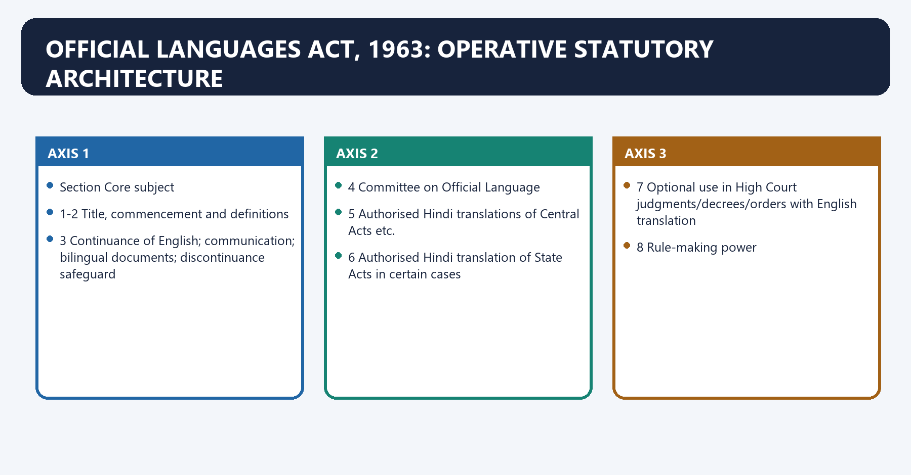
[FACT] The Act was enacted on 10 May 1963. Section 3 came into force on 26 January 1965. The consolidated official text records substitution of section 3 by the Official Languages (Amendment) Act, 1967—Act 1 of 1968—with effect from 8 January 1968.

#### Visual 37 — Act Section Map

| Section | Core subject |
|---:|---|
| 1-2 | Title, commencement and definitions |
| 3 | Continuance of English; communication; bilingual documents; discontinuance safeguard |
| 4 | Committee on Official Language |
| 5 | Authorised Hindi translations of Central Acts etc. |
| 6 | Authorised Hindi translation of State Acts in certain cases |
| 7 | Optional use in High Court judgments/decrees/orders with English translation |
| 8 | Rule-making power |

*Caption: Sections 3-7 form the practical examination core.*

[FACT] Section 3(1) says English **may continue to be used in addition to Hindi** for Union official purposes for which it was used immediately before the appointed day and for business in Parliament.

[FACT] Its first proviso requires English for communication between the Union and a State that has not adopted Hindi as its official language. Its second proviso requires an English translation where a Hindi-adopting State uses Hindi to communicate with a non-Hindi State. Its third proviso preserves a non-Hindi State’s choice to use Hindi or agreements between States.

#### Visual 38 — Section 3(1) Communication Matrix

| Sender/receiver | Statutory control |
|---|---|
| Union -> non-Hindi-official-language State | English shall be used |
| Hindi State -> non-Hindi State in Hindi | English translation accompanies Hindi |
| Non-Hindi State chooses Hindi with Union/Hindi State | Permitted; English not obligatory for that communication |
| States agree on a communication arrangement | Permitted within statutory conditions |

*Caption: Section 3 protects both a common bridge language and voluntary Hindi use.*

[FACT] Section 3(2) requires translation into the other language in specified intra-Union and government-controlled-corporation communication until the concerned staff acquire working knowledge of Hindi.

[FACT] Section 3(3) requires both Hindi and English for specified high-value instruments: resolutions, general orders, rules, notifications, reports, press communiques, parliamentary papers, contracts, agreements, licences, permits, notices and tender forms.

[FACT] Section 3(4) authorises rules for Union official work but expressly requires quick and efficient disposal, public interest and protection against disadvantage for employees proficient in either Hindi or English but not both.

#### Visual 39 — Section 3 Internal Safeguards

```text
3(2) -> translation during staff transition
3(3) -> mandatory bilingual high-value documents
3(4) -> efficiency + public interest + employee non-disadvantage
3(5) -> discontinuance lock requiring State and Parliament resolutions
```

*Caption: The section promotes Hindi while building operational and federal safeguards.*

[FACT] Section 3(5) keeps section 3(1)(a) and subsections (2), (3) and (4) in force until:

1. legislatures of **all States that have not adopted Hindi as their official language** pass resolutions for discontinuance of English for those purposes; and
2. after considering those resolutions, **each House of Parliament** passes a discontinuance resolution.

[ANALYSIS] The provision creates a high-consent federal lock. English continues because the statute commands that result until both exact conditions are met—not merely because of convention, administrative convenience or a one-time political promise.

#### Visual 40 — Section 3(5) Double Lock

```text
LOCK 1
ALL non-Hindi-official-language State Legislatures
pass discontinuance resolutions
                    |
                    v
LOCK 2
Lok Sabha AND Rajya Sabha each pass
discontinuance resolution after considering State resolutions
                    |
                    v
ONLY THEN can specified English-use provisions discontinue
```

*Caption: One State resolution, one House or an executive announcement is insufficient.*

#### Visual 41 — Statute, Not Convention

| Incorrect explanation | Correct explanation |
|---|---|
| English survives because people prefer it | Section 3 legally continues it |
| English survives because 1965 was postponed informally | Parliament acted under Article 343(3) |
| English can be ended by Union executive order | Section 3(5) requires exact legislative conditions |
| All use of English is protected by section 3(5) in identical terms | The subsection specifies 3(1)(a), 3(2), 3(3) and 3(4) |

*Caption: Exact subsection coverage matters in high-difficulty questions.*

#### CLOSING RECALL FLOW — OFFICIAL LANGUAGES ACT, 1963: OPERATIVE STATUTORY ARCHITECTURE

```text
START / CONCEPT: Official Languages Act, 1963: Operative Statutory Architecture
        |
        v
EXACT TERMS: Official Languages Act · Operative Statutory Architecture · each House of Parliament · Title, commencement and definitions · Committee on Official Language · 1-2
        |
        v
MECHANISM / ARGUMENT: legislatures of all States that have not adopted Hindi as their official language pass resolutions for discontinuance of English for those purposes; and after considering those resolutions, each House of Parliament passes a discontinuance resolution.
        |
        v
CONSEQUENCE / CONTRAST: Its first proviso requires English for communication between the Union and a State that has not adopted Hindi as its official language.
        |
        v
UPSC TRAP / ANSWER-USE: Section 3(4) authorises rules for Union official work but expressly requires quick and efficient disposal, public interest and protection against disadvantage for employees proficient in either Hindi or English but not both.
        |
        v
ANSWER-GRABBING FORMULATION: Official Languages Act, 1963: Operative Statutory Architecture denotes the constitutional rules and institutional links organised around Section Core subject.
```
### SESSION 12 — SECTIONS 4-7: COMMITTEE AND AUTHORISED TEXTS

#### DEFINITION / WHAT THIS IS CALLED

**Plain-language definition:** Sections 4-7: Committee and Authorised Texts denotes the constitutional rules and institutional links organised around Visual 42A — Four Authoritative-Text Routes.

**Technical definition:** Its principal consequence is that official Languages Act, section 6 Authorised Hindi State text in specified cases Governor's authority + Gazette.

#### ANSWER-GRABBING OPENING — WRITE/ADAPT IN THE EXAM

> Sections 4-7: Committee and Authorised Texts denotes the constitutional rules and institutional links organised around Visual 42A — Four Authoritative-Text Routes.

#### MUST-WRITE KEYWORDS

- **Sections 4-7**
- **Committee**
- **Authorised Texts**
- **Authoritative Texts (Central Laws) Act, 1973**
- **Article 348(1)**
- **English authoritative baseline**

**How to use them:** Frame the answer through Sections 4-7; define Committee, connect Authorised Texts with Authoritative Texts (Central Laws) Act, 1973 to explain the mechanism, and use Article 348(1) for the decisive comparison or qualification.

Sections 4-7: Committee and Authorised Texts denotes the constitutional rules and institutional links organised around Visual 42A — Four Authoritative-Text Routes.
Sections 4-7: Committee and Authorised Texts operates through Route Language/output Authority safeguard, connected with Article 348(1) English authoritative baseline Constitution.
The operative mechanism matters because official Languages Act, section 5 Authorised Hindi Central text Presidential authority + Gazette.
Its principal consequence is that official Languages Act, section 6 Authorised Hindi State text in specified cases Governor's authority + Gazette.
The decisive contrast is between Authoritative Texts (Central Laws) Act, 1973 Other Eighth-Schedule-language Central text Presidential authority + Gazette and Central law/instrument - authorised Hindi text.
The exam-safe limitation is that state law in non-Hindi language.
[FACT] Section 4’s statutory committee review process ends in a presidential power to issue directions after considering the report and State views; the directions cannot be inconsistent with section 3.

[FACT] Section 5 deems specified presidentially authorised Gazette translations to be authoritative Hindi texts of Central Acts, presidential ordinances and delegated instruments, and requires Hindi translations to accompany the authoritative English text of parliamentary Bills/amendments.

[FACT] Section 6 allows an authorised Hindi translation of a State Act or ordinance where the State Legislature prescribed a language other than Hindi, in addition to the Article 348(3) English translation.

[FACT] Section 7 supplies the separate route for non-English High Court judgments, decrees and orders with a High Court-authorised English translation.

[FACT] The **Authoritative Texts (Central Laws) Act, 1973** supplies a distinct route for authoritative translations of Central laws in Eighth-Schedule languages other than Hindi. A translation published in the Official Gazette under the President's authority is deemed the authoritative text in that language. This statute must not be confused with Article 348's English baseline or sections 5-6 of the 1963 Act governing authorised Hindi texts.

#### Visual 42A — Four Authoritative-Text Routes

| Route | Language/output | Authority safeguard |
|---|---|---|
| Article 348(1) | English authoritative baseline | Constitution |
| Official Languages Act, section 5 | Authorised Hindi Central text | Presidential authority + Gazette |
| Official Languages Act, section 6 | Authorised Hindi State text in specified cases | Governor's authority + Gazette |
| Authoritative Texts (Central Laws) Act, 1973 | Other Eighth-Schedule-language Central text | Presidential authority + Gazette |

*Caption: Translation becomes authoritative only through the exact constitutional or statutory route.*

#### Visual 42 — Sections 5-7 Translation Ladder

```text
SECTION 5
Central law/instrument -> authorised Hindi text

SECTION 6
State law in non-Hindi language
 -> Article 348(3) English translation
 -> optional authorised Hindi translation

SECTION 7
HC judgment/decree/order in authorised non-English language
 -> accompanying High Court-authorised English translation
```

*Caption: Each section answers a different “which text is authoritative?” question.*

#### Visual 43 — Authority Checklist for a Translation

| Check | Why it matters |
|---|---|
| Which provision authorises it? | Constitution, section 5, 6 or 7 differ |
| Who issued it? | President, Governor or High Court authority |
| Was it gazetted where required? | Publication can create authoritative status |
| Is an English translation mandatory? | Especially Article 348(3) and section 7 |
| Is the amendment version current? | Outdated translations can misstate law |

*Caption: Translation is a legal-status problem, not merely a linguistic service.*

#### CLOSING RECALL FLOW — SECTIONS 4-7: COMMITTEE AND AUTHORISED TEXTS

```text
START / CONCEPT: Sections 4-7: Committee and Authorised Texts
        |
        v
EXACT TERMS: Sections 4-7 · Committee · Authorised Texts · Authoritative Texts (Central Laws) Act, 1973 · Article 348(1) · English authoritative baseline
        |
        v
MECHANISM / ARGUMENT: Its principal consequence is that official Languages Act, section 6 Authorised Hindi State text in specified cases Governor's authority + Gazette.
        |
        v
CONSEQUENCE / CONTRAST: This statute must not be confused with Article 348's English baseline or sections 5-6 of the 1963 Act governing authorised Hindi texts.
        |
        v
UPSC TRAP / ANSWER-USE: Do not miss this limiting distinction: the decisive contrast is between Authoritative Texts (Central Laws) Act, 1973 Other Eighth-Schedule-language Central...
        |
        v
ANSWER-GRABBING FORMULATION: Sections 4-7: Committee and Authorised Texts denotes the constitutional rules and institutional links organised around Visual 42A — Four Authoritative-Text Routes.
```
### SESSION 13 — OFFICIAL LANGUAGES RULES, 1976: REGIONS AND ADMINISTRATIVE USE

#### DEFINITION / WHAT THIS IS CALLED

**Plain-language definition:** Official Languages Rules, 1976: Regions and Administrative Use denotes the constitutional rules and institutional links organised around listed Hindi-region States + listed UTs.

**Technical definition:** Official Languages Rules, 1976: Regions and Administrative Use operates through communications generally favour Hindi, connected with listed western/northern States + listed UTs.

#### ANSWER-GRABBING OPENING — WRITE/ADAPT IN THE EXAM

> Official Languages Rules, 1976: Regions and Administrative Use denotes the constitutional rules and institutional links organised around listed Hindi-region States + listed UTs.

#### MUST-WRITE KEYWORDS

- **Official Languages Rules**
- **Regions**
- **Administrative Use**
- **except Tamil Nadu**
- **Organise Union administrative communications**
- **Declare a national language**

**How to use them:** Frame the answer through Official Languages Rules; define Regions, connect Administrative Use with except Tamil Nadu to explain the mechanism, and use Organise Union administrative communications for the decisive comparison or qualification.

Official Languages Rules, 1976: Regions and Administrative Use denotes the constitutional rules and institutional links organised around listed Hindi-region States + listed UTs.
Official Languages Rules, 1976: Regions and Administrative Use operates through communications generally favour Hindi, connected with listed western/northern States + listed UTs.
The operative mechanism matters because hindi ordinarily, with specified choice/translation safeguards.
Its principal consequence is that all States/UTs outside A and B.
The decisive contrast is between communication from Central office to non-Central recipient in English and RULES' EXTENT EXCEPTION: Tamil Nadu.
The exam-safe limitation is that iDENTIFY SENDER AND RECEIVER.
[FACT] The official portal styles the instrument the **Official Languages (Use for Official Purposes of the Union) Rules, 1976**, as amended in 1987, 2007 and 2011. The Rules extend to India **except Tamil Nadu**.

[FACT] Region A contains the listed Hindi-region States and Delhi/Andaman and Nicobar Islands; Region B contains Gujarat, Maharashtra, Punjab and the listed Union Territories; Region C covers States and Union Territories not in A or B.

[CURRENT] Because territorial names have changed since the last amendment displayed on the official rule page, this package teaches the A/B/C logic and the official portal’s rule text without inventing an unofficial consolidated renaming.

#### Visual 44 — Regions A/B/C Concept Map

```text
REGION A
listed Hindi-region States + listed UTs
communications generally favour Hindi

REGION B
listed western/northern States + listed UTs
Hindi ordinarily, with specified choice/translation safeguards

REGION C
all States/UTs outside A and B
communication from Central office to non-Central recipient in English

RULES' EXTENT EXCEPTION: Tamil Nadu
```

*Caption: The regions are administrative communication categories, not constitutional language rankings.*

[FACT] Rule 3 distinguishes communications from Central Government offices to non-Central recipients in A, B and C. Rule 4 governs communications between Central Government offices. Rule 5 requires replies in Hindi to communications received in Hindi. Rule 6 requires both Hindi and English for section 3(3) documents.

[FACT] Rules 7 and 8 protect an employee’s ability to submit applications/representations and record file notes in Hindi or English, subject to the detailed provisions. Rules 9 and 10 distinguish proficiency from working knowledge.

#### Visual 45 — Administrative Implementation Flow

```text
IDENTIFY SENDER AND RECEIVER
          |
          v
IS RECIPIENT CENTRAL GOVERNMENT OFFICE?
   | yes -> Rule 4
   | no  -> Rule 3 and Region A/B/C
          |
          v
CHECK REPLY LANGUAGE / DOCUMENT TYPE
Rule 5 reply to Hindi | Rule 6 bilingual statutory documents
          |
          v
CHECK EMPLOYEE PROFICIENCY / WORKING KNOWLEDGE
Rules 7-10
```

*Caption: Region alone never answers the entire administrative-language question.*

#### Visual 46 — Rules Are Not Constitutional Status

| Rules do | Rules do not |
|---|---|
| Organise Union administrative communications | Declare a national language |
| Implement section 3 and section 8 | Add Eighth-Schedule languages |
| Require bilingual use in specified documents | Determine every State’s official language |
| Protect efficiency and staff functioning | Override Article 348 |
| Use Regions A/B/C | Rank citizens or cultures |

*Caption: Administrative categorisation must not be converted into a constitutional hierarchy.*

[LIMIT] Annual programmes can set dated operational targets for progressive Hindi use. Such targets are unstable and are intentionally not frozen in this package.

#### CLOSING RECALL FLOW — OFFICIAL LANGUAGES RULES, 1976: REGIONS AND ADMINISTRATIVE USE

```text
START / CONCEPT: Official Languages Rules, 1976: Regions and Administrative Use
        |
        v
EXACT TERMS: Official Languages Rules · Regions · Administrative Use · except Tamil Nadu · Organise Union administrative communications · Declare a national language
        |
        v
MECHANISM / ARGUMENT: Official Languages Rules, 1976: Regions and Administrative Use operates through communications generally favour Hindi, connected with listed western/northern States + listed UTs.
        |
        v
CONSEQUENCE / CONTRAST: The decisive contrast is between communication from Central office to non-Central recipient in English and RULES' EXTENT EXCEPTION: Tamil Nadu.
        |
        v
UPSC TRAP / ANSWER-USE: Do not miss this limiting distinction: the official portal styles the instrument the Official Languages (Use for Official Purposes of...
        |
        v
ANSWER-GRABBING FORMULATION: Official Languages Rules, 1976: Regions and Administrative Use denotes the constitutional rules and institutional links organised around listed Hindi-region States + listed UTs.
```
### SESSION 14 — EIGHTH SCHEDULE: PURPOSE, EXACT LIST AND EVOLUTION

#### DEFINITION / WHAT THIS IS CALLED

**Plain-language definition:** Eighth Schedule: Purpose, Exact List and Evolution denotes the constitutional rules and institutional links organised around representation in Official Language Commission.

**Technical definition:** The Eighth Schedule is expressly linked to Articles 344(1) and 351.

#### ANSWER-GRABBING OPENING — WRITE/ADAPT IN THE EXAM

> Eighth Schedule: Purpose, Exact List and Evolution denotes the constitutional rules and institutional links organised around representation in Official Language Commission.

#### MUST-WRITE KEYWORDS

- **Eighth Schedule**
- **Purpose**
- **Exact List**
- **Evolution**
- **Twenty-first Amendment Act, 1967**
- **10 April 1967**

**How to use them:** Frame the answer through Eighth Schedule; define Purpose, connect Exact List with Evolution to explain the mechanism, and use Twenty-first Amendment Act, 1967 for the decisive comparison or qualification.

Eighth Schedule: Purpose, Exact List and Evolution denotes the constitutional rules and institutional links organised around representation in Official Language Commission.
Eighth Schedule: Purpose, Exact List and Evolution operates through enrichment of Hindi through scheduled languages, connected with Union official language.
The operative mechanism matters because state official language.
Its principal consequence is that supreme Court language.
The decisive contrast is between medium of instruction and classical-language status.
The exam-safe limitation is that [CURRENT] The Legislative Department’s Constitution as on 1 May 2026 lists exactly 22 languages.
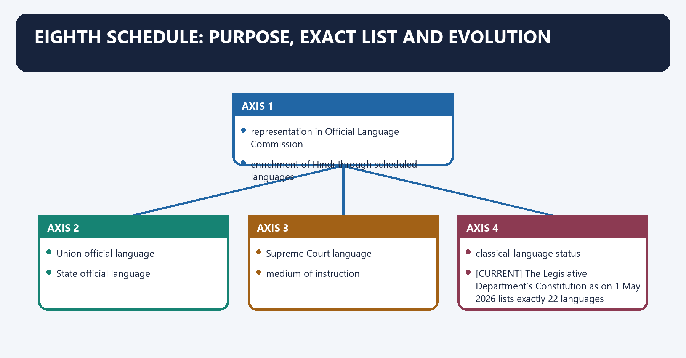
[FACT] The Eighth Schedule is expressly linked to Articles **344(1)** and **351**. It supplies language representation for the Article 344 Commission and a multilingual resource base for Article 351’s development of Hindi.

[ANALYSIS] Scheduled status also carries substantial public-policy and symbolic importance, but it does not make every listed language an “official language of India” for all administrative or judicial purposes.

#### Visual 47 — Eighth-Schedule Purpose

```text
EIGHTH SCHEDULE
      |
      +--> Article 344(1)
      |    representation in Official Language Commission
      |
      +--> Article 351
           enrichment of Hindi through scheduled languages

NOT AUTOMATICALLY:
Union official language
State official language
Supreme Court language
medium of instruction
classical-language status
```

*Caption: The constitutional cross-references define the Schedule’s core textual functions.*

[CURRENT] The Legislative Department’s Constitution as on 1 May 2026 lists exactly 22 languages:

#### Visual 48 — Exact Eighth-Schedule List

| 1-6 | 7-12 | 13-18 | 19-22 |
|---|---|---|---|
| Assamese | Kannada | Marathi | Sindhi |
| Bengali | Kashmiri | Nepali | Tamil |
| Bodo | Konkani | Odia | Telugu |
| Dogri | Maithili | Punjabi | Urdu |
| Gujarati | Malayalam | Sanskrit |  |
| Hindi | Manipuri | Santhali |  |

*Caption: The list follows the Constitution’s current order and uses Roman-script names for reliable PDF rendering.*

[FACT] The original Schedule contained 14 languages. Later evolution is exact:

- **Twenty-first Amendment Act, 1967**, effective **10 April 1967**: added Sindhi.
- **Seventy-first Amendment Act, 1992**, effective **31 August 1992**: added Konkani, Manipuri and Nepali.
- **Ninety-second Amendment Act, 2003**, effective **7 January 2004**: added Bodo, Dogri, Maithili and Santhali.
- **Ninety-sixth Amendment Act, 2011**, effective **23 September 2011**: substituted “Odia” for “Oriya”; it did not add a twenty-third language.

#### Visual 49 — Eighth-Schedule Evolution Timeline

```text
1950: 14
   |
   +-- 10 Apr 1967: + Sindhi -> 15
   |
   +-- 31 Aug 1992: + Konkani, Manipuri, Nepali -> 18
   |
   +-- 7 Jan 2004: + Bodo, Dogri, Maithili, Santhali -> 22
   |
   +-- 23 Sep 2011: Oriya renamed Odia -> still 22
   |
2026 control date: 22
```

*Caption: The Act title year and effective date can differ, especially for the 92nd Amendment.*

#### Visual 50 — Amendment Audit Matrix

| Amendment | Change | Count effect | Commencement |
|---:|---|---:|---:|
| 21st | Sindhi added | 14 -> 15 | 10-04-1967 |
| 71st | Konkani, Manipuri, Nepali added | 15 -> 18 | 31-08-1992 |
| 92nd | Bodo, Dogri, Maithili, Santhali added | 18 -> 22 | 07-01-2004 |
| 96th | Oriya renamed Odia | no change | 23-09-2011 |

*Caption: The 2024 UPSC route directly tests this amendment-language mapping.*

[FACT] Addition of a language requires a constitutional amendment under Article 368. Neither an executive notification, a committee report, a parliamentary question nor a public demand changes the Schedule.

[LIMIT] Demands for inclusion of additional languages remain proposals until enacted. This package does not freeze a disputed count of pending demands.

#### Visual 51 — Addition Route

```text
PUBLIC / STATE / POLITICAL DEMAND
             |
             v
POLICY AND LEGISLATIVE CONSIDERATION
             |
             v
CONSTITUTION AMENDMENT BILL
             |
             v
ARTICLE 368 SPECIAL-MAJORITY PROCESS
             |
             v
PRESIDENTIAL ASSENT
             |
             v
EIGHTH SCHEDULE CHANGES
```

*Caption: Recognition demand is not recognition law.*

#### CLOSING RECALL FLOW — EIGHTH SCHEDULE: PURPOSE, EXACT LIST AND EVOLUTION

```text
START / CONCEPT: Eighth Schedule: Purpose, Exact List and Evolution
        |
        v
EXACT TERMS: Eighth Schedule · Purpose · Exact List · Evolution · Twenty-first Amendment Act, 1967 · 10 April 1967
        |
        v
MECHANISM / ARGUMENT: The Eighth Schedule is expressly linked to Articles 344(1) and 351.
        |
        v
CONSEQUENCE / CONTRAST: Scheduled status also carries substantial public-policy and symbolic importance, but it does not make every listed language an “official language of India” for all administrative or judicial purposes.
        |
        v
UPSC TRAP / ANSWER-USE: Do not miss this limiting distinction: the decisive contrast is between medium of instruction and classical-language status.
        |
        v
ANSWER-GRABBING FORMULATION: Eighth Schedule: Purpose, Exact List and Evolution denotes the constitutional rules and institutional links organised around representation in Official Language Commission.
```
### SESSION 15 — DISTINCTIONS UPSC COMMONLY COMPRESSES

#### DEFINITION / WHAT THIS IS CALLED

**Plain-language definition:** Distinctions UPSC Commonly Compresses denotes the constitutional rules and institutional links organised around Category Legal/policy source What it means What it does not mean.

**Technical definition:** Distinctions UPSC Commonly Compresses operates through Union official language Article 343 Hindi-Devanagari for Union official purposes National language, connected with English continuation Official Languages Act Continued use in addition to Hindi Mere convention.

#### ANSWER-GRABBING OPENING — WRITE/ADAPT IN THE EXAM

> Distinctions UPSC Commonly Compresses denotes the constitutional rules and institutional links organised around Category Legal/policy source What it means What it does not mean.

#### MUST-WRITE KEYWORDS

- **Distinctions UPSC Commonly Compresses**
- **Union official language**
- **Article 343**
- **Hindi-Devanagari for Union official purposes**
- **National language**
- **English continuation**

**How to use them:** Frame the answer through Distinctions UPSC Commonly Compresses; define Union official language, connect Article 343 with Hindi-Devanagari for Union official purposes to explain the mechanism, and use National language for the decisive comparison or qualification.

Distinctions UPSC Commonly Compresses denotes the constitutional rules and institutional links organised around Category Legal/policy source What it means What it does not mean.
Distinctions UPSC Commonly Compresses operates through Union official language Article 343 Hindi-Devanagari for Union official purposes National language, connected with English continuation Official Languages Act Continued use in addition to Hindi Mere convention.
The operative mechanism matters because state official language Article 345 + State law Language(s) for State purposes Must be scheduled.
Its principal consequence is that scheduled language Eighth Schedule Constitutional listing linked to 344/351 Official everywhere.
The decisive contrast is between Classical language Union executive scheme Recognition of classical literary heritage Eighth-Schedule addition and Mother tongue Linguistic/educational identity Home/first-language context Automatic State official language.
The exam-safe limitation is that court language Article 348 + statute Language of proceedings and authoritative judgments/texts Same as State administration.
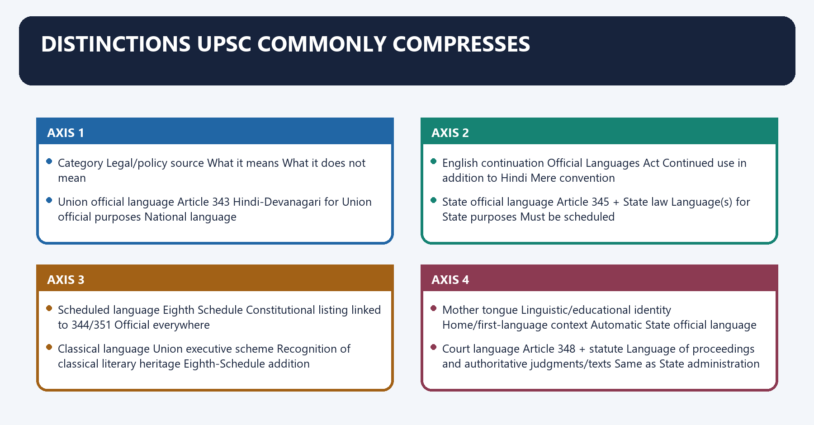
#### Visual 52 — Master Distinction Matrix

| Category | Legal/policy source | What it means | What it does not mean |
|---|---|---|---|
| Union official language | Article 343 | Hindi-Devanagari for Union official purposes | National language |
| English continuation | Official Languages Act | Continued use in addition to Hindi | Mere convention |
| State official language | Article 345 + State law | Language(s) for State purposes | Must be scheduled |
| Scheduled language | Eighth Schedule | Constitutional listing linked to 344/351 | Official everywhere |
| Classical language | Union executive scheme | Recognition of classical literary heritage | Eighth-Schedule addition |
| Mother tongue | Linguistic/educational identity | Home/first-language context | Automatic State official language |
| Court language | Article 348 + statute | Language of proceedings and authoritative judgments/texts | Same as State administration |
| Medium of instruction | Education law/policy/institution | Language used to teach | Identical to Article 343 framework |

*Caption: Every close-option question can be solved by naming the source and function.*

[CURRENT] Classical-language recognition is a separate Union executive scheme. Official PIB material records that Marathi, Pali, Prakrit, Assamese and Bengali received the status in October 2024, bringing the official total to eleven by the control date.

[LIMIT] Classical status does not itself alter Part XVII, the Eighth Schedule, State official-language law or Article 348.

#### Visual 53 — Scheduled vs Classical

| Test | Scheduled language | Classical language |
|---|---|---|
| Source | Constitution, Eighth Schedule | Executive recognition scheme |
| Change route | Constitutional amendment | Government decision under scheme |
| Core exam link | Articles 344 and 351 | Antiquity/literary heritage policy |
| Administrative effect | No universal official-language status | No automatic administrative status |
| Current count | 22 | 11 as officially reported by control date |

*Caption: A language may be both, one or neither; the categories are not a hierarchy.*

#### Visual 54 — Court Language vs State Language

```text
STATE LAW MAY ADOPT LANGUAGE X FOR ADMINISTRATION
                       |
                       X
does not automatically make X the language of:
   Supreme Court proceedings
   High Court proceedings
   High Court judgments
   authoritative Central legislation

Those questions require Article 348 and statutory authorisation.
```

*Caption: Administrative adoption does not leap across the constitutional court-language barrier.*

#### CLOSING RECALL FLOW — DISTINCTIONS UPSC COMMONLY COMPRESSES

```text
START / CONCEPT: Distinctions UPSC Commonly Compresses
        |
        v
EXACT TERMS: Distinctions UPSC Commonly Compresses · Union official language · Article 343 · Hindi-Devanagari for Union official purposes · National language · English continuation
        |
        v
MECHANISM / ARGUMENT: Distinctions UPSC Commonly Compresses operates through Union official language Article 343 Hindi-Devanagari for Union official purposes National language, connected with English continuation Official Languages Act Continued use in addition to Hindi Mere convention.
        |
        v
CONSEQUENCE / CONTRAST: Its principal consequence is that scheduled language Eighth Schedule Constitutional listing linked to 344/351 Official everywhere.
        |
        v
UPSC TRAP / ANSWER-USE: Do not miss this limiting distinction: the decisive contrast is between Classical language Union executive scheme Recognition of classical literary...
        |
        v
ANSWER-GRABBING FORMULATION: Distinctions UPSC Commonly Compresses denotes the constitutional rules and institutional links organised around Category Legal/policy source What it means What it does not mean.
```
### SESSION 16 — THREE-LANGUAGE FORMULA: KEEP EDUCATION POLICY SEPARATE

#### DEFINITION / WHAT THIS IS CALLED

**Plain-language definition:** Three-Language Formula: Keep Education Policy Separate denotes the constitutional rules and institutional links organised around Official-language framework Three-language formula.

**Technical definition:** The decisive contrast is between Not a curriculum formula Not Article 343’s legal mechanism and Official-language framework Three-language formula.

#### ANSWER-GRABBING OPENING — WRITE/ADAPT IN THE EXAM

> Three-Language Formula: Keep Education Policy Separate denotes the constitutional rules and institutional links organised around Official-language framework Three-language formula.

#### MUST-WRITE KEYWORDS

- **Three-Language Formula**
- **Keep Education Policy Separate**
- **Part XVII + 1963 Act + 1976 Rules**
- **Education policy**
- **Governmental communication and legal authority**
- **School-language learning/medium questions**

**How to use them:** Frame the answer through Three-Language Formula; define Keep Education Policy Separate, connect Part XVII + 1963 Act + 1976 Rules with Education policy to explain the mechanism, and use Governmental communication and legal authority for the decisive comparison or qualification.

Three-Language Formula: Keep Education Policy Separate denotes the constitutional rules and institutional links organised around Official-language framework Three-language formula.
Three-Language Formula: Keep Education Policy Separate operates through Part XVII + 1963 Act + 1976 Rules Education policy, connected with Governmental communication and legal authority School-language learning/medium questions.
The operative mechanism matters because constitution/statute/rules Policy + implementation.
Its principal consequence is that union, States, courts, legal texts Education systems and States.
The decisive contrast is between Not a curriculum formula Not Article 343’s legal mechanism and Official-language framework Three-language formula.
The exam-safe limitation is that official-language framework Three-language formula.
[FACT] The three-language formula belongs to education policy, historically associated with national education-policy frameworks and State implementation choices. It is not identical to Part XVII and is not a constitutional command that every State must implement in one uniform form.

[ANALYSIS] The policy debate involves educational multilingualism, student choice, mobility, national integration, teacher availability and State autonomy. It should not be reduced to “Article 343 requires three languages.”

#### Visual 55 — Two Frameworks, Different Questions

| Official-language framework | Three-language formula |
|---|---|
| Part XVII + 1963 Act + 1976 Rules | Education policy |
| Governmental communication and legal authority | School-language learning/medium questions |
| Constitution/statute/rules | Policy + implementation |
| Union, States, courts, legal texts | Education systems and States |
| Not a curriculum formula | Not Article 343’s legal mechanism |

*Caption: Conflation produces both legal and policy errors.*

[LIMIT] Education-policy details and State positions can change. This package analyses the constitutional boundary and does not freeze political allegations or implementation statistics.

#### CLOSING RECALL FLOW — THREE-LANGUAGE FORMULA: KEEP EDUCATION POLICY SEPARATE

```text
START / CONCEPT: Three-Language Formula: Keep Education Policy Separate
        |
        v
EXACT TERMS: Three-Language Formula · Keep Education Policy Separate · Part XVII + 1963 Act + 1976 Rules · Education policy · Governmental communication and legal authority · School-language learning/medium questions
        |
        v
MECHANISM / ARGUMENT: The decisive contrast is between Not a curriculum formula Not Article 343’s legal mechanism and Official-language framework Three-language formula.
        |
        v
CONSEQUENCE / CONTRAST: Its principal consequence is that union, States, courts, legal texts Education systems and States.
        |
        v
UPSC TRAP / ANSWER-USE: It is not identical to Part XVII and is not a constitutional command that every State must implement in one uniform form.
        |
        v
ANSWER-GRABBING FORMULATION: Three-Language Formula: Keep Education Policy Separate denotes the constitutional rules and institutional links organised around Official-language framework Three-language formula.
```
### SESSION 17 — FEDERALISM, INCLUSION AND ANTI-IMPOSITION DEBATE

#### DEFINITION / WHAT THIS IS CALLED

**Plain-language definition:** Federalism, Inclusion and Anti-Imposition Debate denotes the constitutional rules and institutional links organised around MINORITY / \ COMMUNICATION.

**Technical definition:** The decisive contrast is between Wider Hindi use Article 351, Act/Rules within limits Coercion/imposition and Administrative efficiency Bilingual systems, translation, training Excluding employees/citizens.

#### ANSWER-GRABBING OPENING — WRITE/ADAPT IN THE EXAM

> Federalism, Inclusion and Anti-Imposition Debate denotes the constitutional rules and institutional links organised around MINORITY / \ COMMUNICATION.

#### MUST-WRITE KEYWORDS

- **Federalism**
- **Inclusion**
- **Anti-Imposition Debate**
- **Wider Hindi use**
- **Article 351, Act/Rules within limits**
- **Coercion/imposition**

**How to use them:** Frame the answer through Federalism; define Inclusion, connect Anti-Imposition Debate with Wider Hindi use to explain the mechanism, and use Article 351, Act/Rules within limits for the decisive comparison or qualification.

Federalism, Inclusion and Anti-Imposition Debate denotes the constitutional rules and institutional links organised around MINORITY / \ COMMUNICATION.
Federalism, Inclusion and Anti-Imposition Debate operates through Arts 347,350A/B / \ section 3, connected with CONSENT LOCK \ / UNION PROMOTION.
The operative mechanism matters because section 3(5) \/ Article 351.
Its principal consequence is that goal Legitimate mechanism Risk if overstated.
The decisive contrast is between Wider Hindi use Article 351, Act/Rules within limits Coercion/imposition and Administrative efficiency Bilingual systems, translation, training Excluding employees/citizens.
The exam-safe limitation is that national legal coherence Authoritative text and translation controls English-only access barrier.
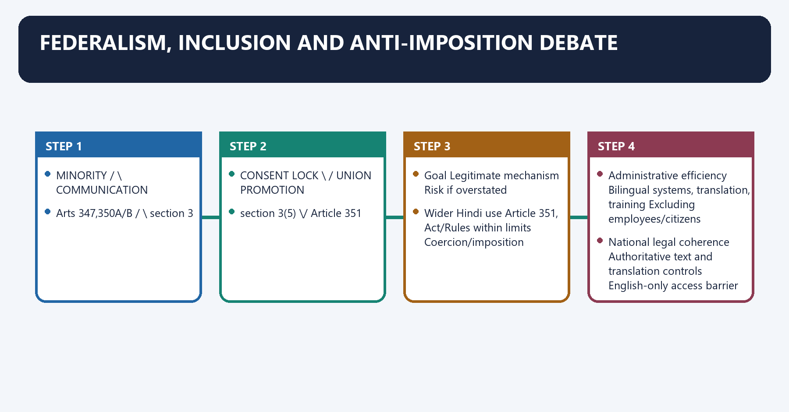
[ANALYSIS] India’s official-language system operates as a federal accommodation through five devices: State choice under Article 345; recognition potential under Article 347; English communication safeguards under section 3; minority protections under Articles 350A-350B; and a high-consent discontinuance lock under section 3(5).

[ANALYSIS] Hindi promotion can advance wider Union communication and reduce dependence on a colonial language. It becomes constitutionally and politically problematic when promotion is treated as authority to erase statutory English safeguards, State-language autonomy or equal public-service opportunity.

#### Visual 56 — Federal Accommodation Pentagon

```text
                 STATE CHOICE
                  Article 345
                      /\
                     /  \
     MINORITY       /    \       COMMUNICATION
   Arts 347,350A/B /      \      section 3
                   \      /
                    \    /
      CONSENT LOCK   \  /     UNION PROMOTION
      section 3(5)    \/       Article 351
```

*Caption: Stability comes from balancing promotion, choice, access, minority safeguards and consent.*

#### Visual 57 — Legitimate Goals and Constitutional Risks

| Goal | Legitimate mechanism | Risk if overstated |
|---|---|---|
| Wider Hindi use | Article 351, Act/Rules within limits | Coercion/imposition |
| Administrative efficiency | Bilingual systems, translation, training | Excluding employees/citizens |
| National legal coherence | Authoritative text and translation controls | English-only access barrier |
| State identity | Article 345 choice | Intra-State minority neglect |
| Language recognition | Article 368 amendment debate | Treating symbolic listing as full policy |

*Caption: The issue is not promotion versus diversity, but legally disciplined promotion within diversity.*

#### Visual 58 — Claim-Evidence-Qualification Example

```text
CLAIM:
English continuation is a federal safeguard.

NAMED EVIDENCE:
Official Languages Act, section 3(5).

ANALYSIS:
all non-Hindi-official-language State Legislatures
and both Houses must support discontinuance.

QUALIFICATION:
the subsection specifies which section 3 provisions remain in force;
do not generalise beyond its text.
```

*Caption: This four-step discipline converts a slogan into a UPSC-quality legal argument.*

#### CLOSING RECALL FLOW — FEDERALISM, INCLUSION AND ANTI-IMPOSITION DEBATE

```text
START / CONCEPT: Federalism, Inclusion and Anti-Imposition Debate
        |
        v
EXACT TERMS: Federalism · Inclusion · Anti-Imposition Debate · Wider Hindi use · Article 351, Act/Rules within limits · Coercion/imposition
        |
        v
MECHANISM / ARGUMENT: Its principal consequence is that goal Legitimate mechanism Risk if overstated.
        |
        v
CONSEQUENCE / CONTRAST: The decisive contrast is between Wider Hindi use Article 351, Act/Rules within limits Coercion/imposition and Administrative efficiency Bilingual systems, translation, training Excluding employees/citizens.
        |
        v
UPSC TRAP / ANSWER-USE: Do not miss this limiting distinction: the exam-safe limitation is that national legal coherence Authoritative text and translation controls English-only...
        |
        v
ANSWER-GRABBING FORMULATION: Federalism, Inclusion and Anti-Imposition Debate denotes the constitutional rules and institutional links organised around MINORITY / \ COMMUNICATION.
```
### SESSION 18 — LANGUAGE ACCESS, COURTS AND TRANSLATION TECHNOLOGY

#### DEFINITION / WHAT THIS IS CALLED

**Plain-language definition:** Language Access, Courts and Translation Technology denotes the constitutional rules and institutional links organised around MULTILINGUAL ACCESS.

**Technical definition:** Article 348 and section 7 reveal that access and authoritative uniformity must be solved together.

#### ANSWER-GRABBING OPENING — WRITE/ADAPT IN THE EXAM

> Language Access, Courts and Translation Technology denotes the constitutional rules and institutional links organised around MULTILINGUAL ACCESS.

#### MUST-WRITE KEYWORDS

- **Language Access**
- **Courts**
- **Translation Technology**
- **Article 348**
- **Language Access, Courts and Translation Technology**
- **MULTILINGUAL ACCESS**

**How to use them:** Frame the answer through Language Access; define Courts, connect Translation Technology with Article 348 to explain the mechanism, and use Language Access, Courts and Translation Technology for the decisive comparison or qualification.

Language Access, Courts and Translation Technology denotes the constitutional rules and institutional links organised around MULTILINGUAL ACCESS.
Language Access, Courts and Translation Technology operates through litigant comprehension, connected with regional legal participation.
The operative mechanism matters because must be balanced with.
Its principal consequence is that aUTHORITATIVE UNIFORMITY.
The decisive contrast is between precedent consistency and inter-State legal usability.
The exam-safe limitation is that amendment/version accuracy.
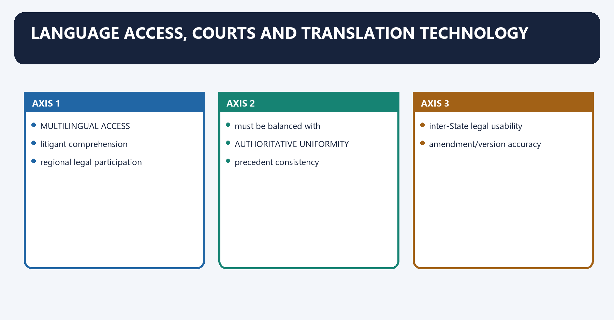
[ANALYSIS] English in higher courts supports a common precedential and inter-State legal medium, but it can distance litigants and many lawyers from the language of adjudication. Article 348 and section 7 reveal that access and authoritative uniformity must be solved together.

[ANALYSIS] Machine translation, multilingual search and speech tools can reduce access costs. They cannot independently confer authoritative legal status or safely resolve ambiguous statutory terms. Human legal review, terminology banks, version control and transparent identification of the authoritative text remain necessary.

#### Visual 59 — Access-Uniformity Balance

```text
MULTILINGUAL ACCESS
litigant comprehension
regional legal participation
        |
        | must be balanced with
        v
AUTHORITATIVE UNIFORMITY
precedent consistency
inter-State legal usability
amendment/version accuracy
        |
        v
AUTHORISED TRANSLATION + HUMAN REVIEW + DIGITAL ACCESS
```

*Caption: Access improves when translation is institutionally reliable, not merely fast.*

#### Visual 60 — Human-in-the-Loop Legal Translation

```text
SOURCE TEXT
   -> machine-assisted draft
   -> bilingual legal expert review
   -> terminology consistency check
   -> amendment/version verification
   -> authorised publication
   -> user feedback and correction log
```

*Caption: Technology should accelerate the workflow while authority and accountability remain human-institutional.*

[LIMIT] General-information translations and AI-generated summaries must never be presented as authoritative judgments or statutes unless the legally competent authority has conferred that status.

#### CLOSING RECALL FLOW — LANGUAGE ACCESS, COURTS AND TRANSLATION TECHNOLOGY

```text
START / CONCEPT: Language Access, Courts and Translation Technology
        |
        v
EXACT TERMS: Language Access · Courts · Translation Technology · Article 348 · Language Access, Courts and Translation Technology · MULTILINGUAL ACCESS
        |
        v
MECHANISM / ARGUMENT: English in higher courts supports a common precedential and inter-State legal medium, but it can distance litigants and many lawyers from the language of adjudication.
        |
        v
CONSEQUENCE / CONTRAST: The decisive contrast is between precedent consistency and inter-State legal usability.
        |
        v
UPSC TRAP / ANSWER-USE: Do not miss this limiting distinction: machine translation, multilingual search and speech tools can reduce access costs.
        |
        v
ANSWER-GRABBING FORMULATION: Language Access, Courts and Translation Technology denotes the constitutional rules and institutional links organised around MULTILINGUAL ACCESS.
```
### SESSION 19 — CURRENT CONTROLS AS ON 25 AUGUST 2026

#### DEFINITION / WHAT THIS IS CALLED

**Plain-language definition:** Current Controls as on 25 August 2026 denotes the constitutional rules and institutional links organised around Question Controlled current position.

**Technical definition:** Technically, Current Controls as on 25 August 2026 is analysed by relating No to Hindi in Devanagari, Article 343, then testing the relationship through Operative under Official Languages Act section 3 and Oriya renamed Odia by 96th Amendment, effective 23-09-2011.

#### ANSWER-GRABBING OPENING — WRITE/ADAPT IN THE EXAM

> Current Controls as on 25 August 2026 denotes the constitutional rules and institutional links organised around Question Controlled current position.

#### MUST-WRITE KEYWORDS

- **Current Controls as on 25 August 2026**
- **No**
- **Hindi in Devanagari, Article 343**
- **Operative under Official Languages Act section 3**
- **Oriya renamed Odia by 96th Amendment, effective 23-09-2011**
- **Official portal displayed thirteenth report part**

**How to use them:** Frame the answer through Current Controls as on 25 August 2026; define No, connect Hindi in Devanagari, Article 343 with Operative under Official Languages Act section 3 to explain the mechanism, and use Oriya renamed Odia by 96th Amendment, effective 23-09-2011 for the decisive comparison or qualification.

Current Controls as on 25 August 2026 denotes the constitutional rules and institutional links organised around Question Controlled current position.
Current Controls as on 25 August 2026 operates through National language declared? No, connected with Union official language? Hindi in Devanagari, Article 343.
The operative mechanism matters because english continuation? Operative under Official Languages Act section 3.
Its principal consequence is that eighth-Schedule count? 22.
The decisive contrast is between Latest listed change? Oriya renamed Odia by 96th Amendment, effective 23-09-2011 and Rules portal status? Rules shown as amended in 1987, 2007 and 2011.
The exam-safe limitation is that current parliamentary committee material? Official portal displayed thirteenth report part.
#### Visual 61 — Current-Law Dashboard

| Question | Controlled current position |
|---|---|
| National language declared? | No |
| Union official language? | Hindi in Devanagari, Article 343 |
| English continuation? | Operative under Official Languages Act section 3 |
| Eighth-Schedule count? | 22 |
| Latest listed change? | Oriya renamed Odia by 96th Amendment, effective 23-09-2011 |
| Rules portal status? | Rules shown as amended in 1987, 2007 and 2011 |
| Current parliamentary committee material? | Official portal displayed thirteenth report part |
| Additional-language demands? | Proposals unless constitutionally enacted |
| Committee recommendations? | Not law merely by publication |

*Caption: Current control means verifying operative legal status while refusing to freeze proposals as law.*

[CURRENT] The official Constitution consolidation, not a demand list or news report, controls the current Eighth Schedule.

[CURRENT] The Department of Official Language’s statutory text includes the section 3(5) double lock and the current consolidated omission of the former Jammu and Kashmir-specific section 9.

[LIMIT] The official Rules page reflects the amendment history displayed by the Department. Territorial nomenclature should be updated only through an authoritative legal consolidation, not by silently rewriting the rule text.

#### CLOSING RECALL FLOW — CURRENT CONTROLS AS ON 25 AUGUST 2026

```text
START / CONCEPT: Current Controls as on 25 August 2026
        |
        v
EXACT TERMS: Current Controls as on 25 August 2026 · No · Hindi in Devanagari, Article 343 · Operative under Official Languages Act section 3 · Oriya renamed Odia by 96th Amendment, effective 23-09-2011 · Official portal displayed thirteenth report part
        |
        v
MECHANISM / ARGUMENT: Territorial nomenclature should be updated only through an authoritative legal consolidation, not by silently rewriting the rule text.
        |
        v
CONSEQUENCE / CONTRAST: Its principal consequence is that eighth-Schedule count?
        |
        v
UPSC TRAP / ANSWER-USE: Do not miss this limiting distinction: the decisive contrast is between Latest listed change?
        |
        v
ANSWER-GRABBING FORMULATION: Current Controls as on 25 August 2026 denotes the constitutional rules and institutional links organised around Question Controlled current position.
```
### SESSION 20 — REFORM AGENDA: MULTILINGUAL CAPACITY WITHOUT LEGAL CONFUSION

#### DEFINITION / WHAT THIS IS CALLED

**Plain-language definition:** Reform Agenda: Multilingual Capacity Without Legal Confusion denotes the constitutional rules and institutional links organised around Pillar Concrete direction Guardrail.

**Technical definition:** Reform Agenda: Multilingual Capacity Without Legal Confusion operates through Multilingual citizen access Forms, portals, grievance interfaces Do not dilute legal accuracy, connected with Translation capacity Permanent terminology and translation cadres Human verification.

#### ANSWER-GRABBING OPENING — WRITE/ADAPT IN THE EXAM

> Reform Agenda: Multilingual Capacity Without Legal Confusion operates through Multilingual citizen access Forms, portals, grievance interfaces Do not dilute legal accuracy, connected with Translation capacity Permanent terminology and translation cadres Human verification.

#### MUST-WRITE KEYWORDS

- **Reform Agenda**
- **Multilingual Capacity Without Legal Confusion**
- **Multilingual citizen access**
- **Forms, portals, grievance interfaces**
- **Do not dilute legal accuracy**
- **Translation capacity**

**How to use them:** Frame the answer through Reform Agenda; define Multilingual Capacity Without Legal Confusion, connect Multilingual citizen access with Forms, portals, grievance interfaces to explain the mechanism, and use Do not dilute legal accuracy for the decisive comparison or qualification.

Reform Agenda: Multilingual Capacity Without Legal Confusion denotes the constitutional rules and institutional links organised around Pillar Concrete direction Guardrail.
Reform Agenda: Multilingual Capacity Without Legal Confusion operates through Multilingual citizen access Forms, portals, grievance interfaces Do not dilute legal accuracy, connected with Translation capacity Permanent terminology and translation cadres Human verification.
The operative mechanism matters because legal-text parity Timely authorised translations after amendments Version control.
Its principal consequence is that court access Multilingual cause lists, summaries and assistance Preserve authoritative hierarchy.
The decisive contrast is between Minority education Teacher/material support at primary stage Context-sensitive feasibility and Federal consent Consult States before major language shifts Avoid coercive uniformity.
The exam-safe limitation is that civil-service communication Training and bilingual digital tools No disadvantage for single-language proficiency protected by law.
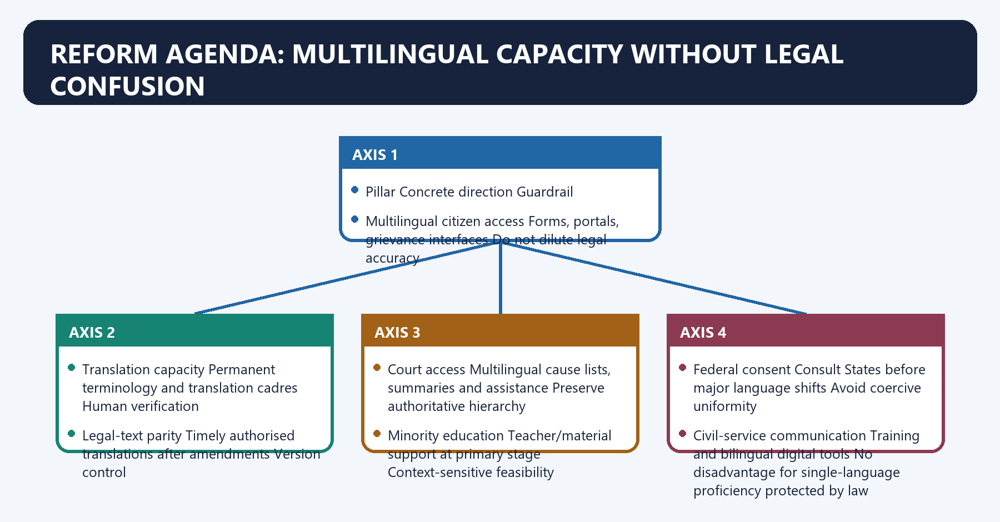
[ANALYSIS] Reform should improve access and parity without pretending that every language can immediately serve every governmental and judicial function in the same way.

#### Visual 62 — Seven Reform Pillars

| Pillar | Concrete direction | Guardrail |
|---|---|---|
| Multilingual citizen access | Forms, portals, grievance interfaces | Do not dilute legal accuracy |
| Translation capacity | Permanent terminology and translation cadres | Human verification |
| Legal-text parity | Timely authorised translations after amendments | Version control |
| Court access | Multilingual cause lists, summaries and assistance | Preserve authoritative hierarchy |
| Minority education | Teacher/material support at primary stage | Context-sensitive feasibility |
| Federal consent | Consult States before major language shifts | Avoid coercive uniformity |
| Civil-service communication | Training and bilingual digital tools | No disadvantage for single-language proficiency protected by law |

*Caption: Each proposal pairs an inclusion gain with an institutional safeguard.*

#### Visual 63 — Reform Sequence

```text
MAP USER NEED
      |
      v
IDENTIFY LEGAL AUTHORITY
      |
      v
BUILD LANGUAGE / TERMINOLOGY CAPACITY
      |
      v
PILOT WITH STATES AND USERS
      |
      v
HUMAN-VERIFY TRANSLATIONS
      |
      v
PUBLISH VERSIONED AUTHORITATIVE TEXT
      |
      v
AUDIT ACCESS, ERRORS AND EXCLUSION
```

*Caption: Reform begins with law and user need, not with an unsupported technology mandate.*

#### Visual 64 — Proposal vs Law Filter

| Statement type | Safe label |
|---|---|
| Constitution/Act/Rule presently in force | `[FACT]` |
| Official portal/status checked to control date | `[CURRENT]` |
| Recommended expansion or technology design | `[ANALYSIS]` |
| Demand, report recommendation or uncertain future change | `[LIMIT]` |

*Caption: Labelling is a substantive accuracy tool, not decorative formatting.*

#### CLOSING RECALL FLOW — REFORM AGENDA: MULTILINGUAL CAPACITY WITHOUT LEGAL CONFUSION

```text
START / CONCEPT: Reform Agenda: Multilingual Capacity Without Legal Confusion
        |
        v
EXACT TERMS: Reform Agenda · Multilingual Capacity Without Legal Confusion · Multilingual citizen access · Forms, portals, grievance interfaces · Do not dilute legal accuracy · Translation capacity
        |
        v
MECHANISM / ARGUMENT: Reform Agenda: Multilingual Capacity Without Legal Confusion denotes the constitutional rules and institutional links organised around Pillar Concrete direction Guardrail.
        |
        v
CONSEQUENCE / CONTRAST: Its principal consequence is that court access Multilingual cause lists, summaries and assistance Preserve authoritative hierarchy.
        |
        v
UPSC TRAP / ANSWER-USE: The decisive contrast is between Minority education Teacher/material support at primary stage Context-sensitive feasibility and Federal consent Consult States before major language shifts Avoid coercive uniformity.
        |
        v
ANSWER-GRABBING FORMULATION: Reform Agenda: Multilingual Capacity Without Legal Confusion operates through Multilingual citizen access Forms, portals, grievance interfaces Do not dilute legal accuracy, connected with Translation capacity Permanent terminology and translation cadres Human verification.
```
### SESSION 21 — HIGH-YIELD PRELIMS TRAP REGISTER

#### DEFINITION / WHAT THIS IS CALLED

**Plain-language definition:** High-Yield Prelims Trap Register operates through English is constitutionally “associate official language” Not the text’s term, connected with English ended in 1965 Statute continues it.

**Technical definition:** High-Yield Prelims Trap Register denotes the constitutional rules and institutional links organised around Hindi is national language Official language of Union.

#### ANSWER-GRABBING OPENING — WRITE/ADAPT IN THE EXAM

> High-Yield Prelims Trap Register operates through English is constitutionally “associate official language” Not the text’s term, connected with English ended in 1965 Statute continues it.

#### MUST-WRITE KEYWORDS

- **High-Yield Prelims Trap Register**
- **Hindi is national language**
- **Official language of Union**
- **Not the text’s term**
- **English ended in 1965**
- **Statute continues it**

**How to use them:** Frame the answer through High-Yield Prelims Trap Register; define Hindi is national language, connect Official language of Union with Not the text’s term to explain the mechanism, and use English ended in 1965 for the decisive comparison or qualification.

High-Yield Prelims Trap Register denotes the constitutional rules and institutional links organised around Hindi is national language Official language of Union.
High-Yield Prelims Trap Register operates through English is constitutionally “associate official language” Not the text’s term, connected with English ended in 1965 Statute continues it.
The operative mechanism matters because president permanently extended English under 343(2) Parliament legislated under 343(3).
Its principal consequence is that devanagari numerals are default International form of Indian numerals.
The decisive contrast is between Article 344 Commission every ten years forever Five- and ten-year historical milestones and Article 344 and section 4 committees are identical Different sources/triggers.
The exam-safe limitation is that state language must be scheduled No.
#### Visual 65 — Twenty-Four Trap Corrections

| Trap | Correction |
|---|---|
| Hindi is national language | Official language of Union |
| English is constitutionally “associate official language” | Not the text’s term |
| English ended in 1965 | Statute continues it |
| President permanently extended English under 343(2) | Parliament legislated under 343(3) |
| Devanagari numerals are default | International form of Indian numerals |
| Article 344 Commission every ten years forever | Five- and ten-year historical milestones |
| Article 344 and section 4 committees are identical | Different sources/triggers |
| State language must be scheduled | No |
| Article 347 recognition automatic on demand | Presidential satisfaction required |
| Article 348 covers only courts | Also authoritative legal texts |
| Governor alone changes HC language | Prior presidential consent |
| Article 348(2) includes judgments | Expressly excludes them |
| Section 7 eliminates English | English translation is required |
| Article 349 remains routine today | Fifteen-year historical bound |
| Article 350 guarantees all proceedings in chosen language | It protects grievance representation |
| Article 350A is an absolute school-level FR | Endeavour + directions text |
| Article 350B officer enforces like a court | Investigates and reports |
| Article 351 authorises suppression | Must be harmonised with plural safeguards |
| Act section 3 is convention | It is operative law |
| One State can end English | Section 3(5) requires all specified States + both Houses |
| Region A/B/C are constitutional rankings | Administrative Rules categories |
| All 22 are official languages of India | Scheduled languages |
| 96th Amendment added a language | Renamed Oriya as Odia |
| Three-language formula is Article 343 | Education policy, not Part XVII |

*Caption: The best elimination method is source + actor + function + qualification.*

#### CLOSING RECALL FLOW — HIGH-YIELD PRELIMS TRAP REGISTER

```text
START / CONCEPT: High-Yield Prelims Trap Register
        |
        v
EXACT TERMS: High-Yield Prelims Trap Register · Hindi is national language · Official language of Union · Not the text’s term · English ended in 1965 · Statute continues it
        |
        v
MECHANISM / ARGUMENT: High-Yield Prelims Trap Register denotes the constitutional rules and institutional links organised around Hindi is national language Official language of Union.
        |
        v
CONSEQUENCE / CONTRAST: Its principal consequence is that devanagari numerals are default International form of Indian numerals.
        |
        v
UPSC TRAP / ANSWER-USE: Do not miss this limiting distinction: the decisive contrast is between Article 344 Commission every ten years forever Five- and...
        |
        v
ANSWER-GRABBING FORMULATION: High-Yield Prelims Trap Register operates through English is constitutionally “associate official language” Not the text’s term, connected with English ended in 1965 Statute continues it.
```
### 23. Mains Answer Architecture

Mains Answer Architecture denotes the constitutional rules and institutional links organised around Marks Suggested architecture Named-evidence density.
Mains Answer Architecture operates through 10 Definition/thesis - 3 legal points - one qualification - verdict 2-3 Articles/sections, connected with 15 Constitutional map - statute - federal/minority dimension - critique - conclusion 4-6 anchors.
The operative mechanism matters because 20 History - exact law - institutions - implementation - competing values - reforms - graded verdict 5-8 anchors.
Its principal consequence is that official language is functional authority, not national identity.
The decisive contrast is between Part XVII exact architecture and Official Languages Act and section 3(5).
The exam-safe limitation is that state autonomy + linguistic-minority safeguards.
#### Visual 66 — Mark-Scaled Structure

| Marks | Suggested architecture | Named-evidence density |
|---:|---|---|
| 10 | Definition/thesis -> 3 legal points -> one qualification -> verdict | 2-3 Articles/sections |
| 15 | Constitutional map -> statute -> federal/minority dimension -> critique -> conclusion | 4-6 anchors |
| 20 | History -> exact law -> institutions -> implementation -> competing values -> reforms -> graded verdict | 5-8 anchors |

*Caption: More marks require more dimensions and evidence, not merely longer narration.*

#### Visual 67 — Reusable Answer Spine

```text
INTRO:
official language is functional authority, not national identity

BODY 1:
Part XVII exact architecture

BODY 2:
Official Languages Act and section 3(5)

BODY 3:
State autonomy + linguistic-minority safeguards

BODY 4:
court/legal-text access and translation

BODY 5:
federal debate + qualified reform

CONCLUSION:
multilingual unity through consent, access and authoritative parity
```

*Caption: Tailor the emphasis to the directive; do not reproduce every dimension mechanically.*

### SESSION 22 — SOURCE AND VERIFICATION LEDGER

#### DEFINITION / WHAT THIS IS CALLED

**Plain-language definition:** Source and Verification Ledger denotes the constitutional rules and institutional links organised around Claim family Named controlling evidence.

**Technical definition:** The 2024 Q72 official key letter is not recorded in the routed ledger and is not inferred here.

#### ANSWER-GRABBING OPENING — WRITE/ADAPT IN THE EXAM

> Source and Verification Ledger denotes the constitutional rules and institutional links organised around Claim family Named controlling evidence.

#### MUST-WRITE KEYWORDS

- **Verification Ledger**
- **Official Languages Act, 1963**
- **Commissioner for Linguistic Minorities**
- **Part XVII wording**
- **English continuation and discontinuance**
- **21st, 71st, 92nd and 96th Constitutional Amendment Acts**

**How to use them:** Frame the answer through Verification Ledger; define Official Languages Act, 1963, connect Commissioner for Linguistic Minorities with Part XVII wording to explain the mechanism, and use English continuation and discontinuance for the decisive comparison or qualification.

Source and Verification Ledger denotes the constitutional rules and institutional links organised around Claim family Named controlling evidence.
Source and Verification Ledger operates through Part XVII wording Legislative Department, Constitution of India as on 1 May 2026, connected with English continuation and discontinuance Department of Official Language, Official Languages Act, sections 3 and 4.
The operative mechanism matters because court judgments/translations Article 348 and Act section 7.
Its principal consequence is that regions A/B/C Department of Official Language, Rules 1976 page.
The decisive contrast is between Eighth-Schedule list Official Constitution, Eighth Schedule and Amendment chronology Official 21st, 71st, 92nd and 96th Amendment texts/footnotes.
The exam-safe limitation is that linguistic-minority officer Article 350B + Ministry of Minority Affairs official page.
#### Visual 68 — Claim-to-Source Ledger

| Claim family | Named controlling evidence |
|---|---|
| Part XVII wording | Legislative Department, Constitution of India as on 1 May 2026 |
| English continuation and discontinuance | Department of Official Language, Official Languages Act, sections 3 and 4 |
| Court judgments/translations | Article 348 and Act section 7 |
| Regions A/B/C | Department of Official Language, Rules 1976 page |
| Eighth-Schedule list | Official Constitution, Eighth Schedule |
| Amendment chronology | Official 21st, 71st, 92nd and 96th Amendment texts/footnotes |
| Linguistic-minority officer | Article 350B + Ministry of Minority Affairs official page |
| Committee current control | Committee of Parliament on Official Language official portal |
| 2024 PYQ | Local official UPSC 2024 GS-I Set A paper + routed audit ledger |

*Caption: Named evidence prevents a current-affairs headline from displacing legal text.*

#### Official and Local Sources Consulted

- `[FACT]` Legislative Department, **Constitution of India in English, as on 1 May 2026**, Part XVII and Eighth Schedule: `https://legislative.gov.in/document/constitution-of-india-in-english`.
- `[FACT]` Department of Official Language, Ministry of Home Affairs, **Official Languages Act, 1963** consolidated official page: `https://rajbhasha.gov.in/en/official-languages-act-1963`.
- `[FACT]` Department of Official Language, **Official Languages (Use for Official Purposes of the Union) Rules, 1976**, as displayed with amendments through 2011: `https://rajbhasha.gov.in/en/official-language-rules-1976`.
- `[CURRENT]` Committee of Parliament on Official Language official portal: `https://samiti.rajbhasha.gov.in/`.
- `[FACT]` Ministry of Minority Affairs, **Commissioner for Linguistic Minorities** official page.
- `[FACT]` Legislative Department official texts of the **21st, 71st, 92nd and 96th Constitutional Amendment Acts**.
- `[CURRENT]` Press Information Bureau official material on classical-language recognition, including the October 2024 additions.
- `[FACT]` Local owners: `Polity/basic/Official-Language.md`, `Polity/advanced/40_Official-Language.md`, and adjacent Fundamental Rights, Parliament, higher judiciary, Centre-State relations and federalism owners as needed.
- `[FACT]` Local routed PYQ and integration-audit ledgers for 2018-2023, 2024-2025 and 2026, plus the official/local 2024 Prelims GS-I Set A paper.

#### Current/Legal Limits

- `[LIMIT]` No additional Eighth-Schedule demand is treated as enacted.
- `[LIMIT]` No committee recommendation is treated as self-executing law.
- `[LIMIT]` No current officeholder or annual target is frozen.
- `[LIMIT]` “Associate official language” is not used as legal terminology for English.
- `[LIMIT]` Article 349 is treated as historically bounded, not a current routine gate.
- `[LIMIT]` Article 350A is not overstated as an absolute judicially self-executing guarantee.
- `[LIMIT]` Non-authoritative AI or general-information translations are not treated as controlling law.
- `[LIMIT]` The 2024 Q72 official key letter is not recorded in the routed ledger and is not inferred here.

#### CLOSING RECALL FLOW — SOURCE AND VERIFICATION LEDGER

```text
START / CONCEPT: Source and Verification Ledger
        |
        v
EXACT TERMS: Verification Ledger · Official Languages Act, 1963 · Commissioner for Linguistic Minorities · Part XVII wording · English continuation and discontinuance · 21st, 71st, 92nd and 96th Constitutional Amendment Acts
        |
        v
MECHANISM / ARGUMENT: Department of Official Language, Official Languages (Use for Official Purposes of the Union) Rules, 1976, as displayed with amendments through 2011: https://rajbhasha.gov.in/en/official-language-rules-1976. [CURRENT] Committee of Parliament on Official Language official portal: https://samiti.rajbhasha.gov.in/.
        |
        v
CONSEQUENCE / CONTRAST: The 2024 Q72 official key letter is not recorded in the routed ledger and is not inferred here.
        |
        v
UPSC TRAP / ANSWER-USE: Do not miss this limiting distinction: its principal consequence is that regions A/B/C Department of Official Language, Rules 1976 page.
        |
        v
ANSWER-GRABBING FORMULATION: Source and Verification Ledger denotes the constitutional rules and institutional links organised around Claim family Named controlling evidence.
```
### SESSION 23 — JUDICIAL DOCTRINE: LANGUAGE CHOICE, MINORITIES AND MEDIUM

#### DEFINITION / WHAT THIS IS CALLED

**Plain-language definition:** Judicial Doctrine: Language Choice, Minorities and Medium denotes the constitutional rules and institutional links organised around Decision Exam-safe proposition Qualification.

**Technical definition:** Judicial Doctrine: Language Choice, Minorities and Medium operates through The cases show that language policy is controlled by competence, rights,, connected with minority context and proportionality, not by a single hierarchy of "national" languages.

#### ANSWER-GRABBING OPENING — WRITE/ADAPT IN THE EXAM

> Judicial Doctrine: Language Choice, Minorities and Medium denotes the constitutional rules and institutional links organised around Decision Exam-safe proposition Qualification.

#### MUST-WRITE KEYWORDS

- **Judicial Doctrine**
- **Language Choice**
- **Minorities**
- **Medium**
- **Gujarat University v. Shri Krishna (1963)**
- **not an Article 343 national-language ruling**

**How to use them:** Frame the answer through Judicial Doctrine; define Language Choice, connect Minorities with Medium to explain the mechanism, and use Gujarat University v. Shri Krishna (1963) for the decisive comparison or qualification.

Judicial Doctrine: Language Choice, Minorities and Medium denotes the constitutional rules and institutional links organised around Decision Exam-safe proposition Qualification.
Judicial Doctrine: Language Choice, Minorities and Medium operates through [ANALYSIS] The cases show that language policy is controlled by competence, rights,, connected with minority context and proportionality, not by a single hierarchy of "national" languages.
The operative mechanism matters because solved PYQ and practice workbook.
Its principal consequence is that verified relevant PYQ corpus.
The decisive contrast is between UPSC Prelims 2024, GS Paper I, Set A, Q72 and The Constitution (71st Amendment) Act, 1992 amends the Eighth Schedule to the Constitution to include which of the following languages?.
The exam-safe limitation is that select the correct answer using the code given below.
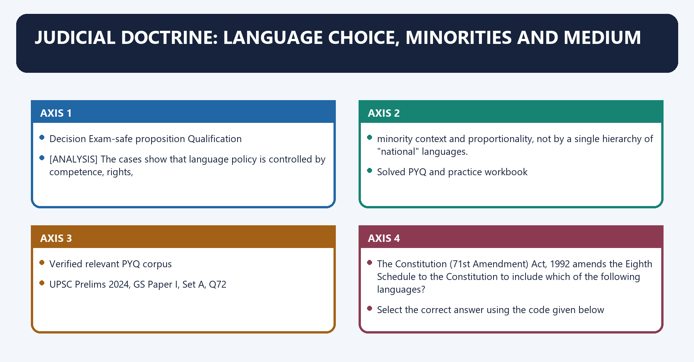
| Decision | Exam-safe proposition | Qualification |
|---|---|---|
| Gujarat University v. Shri Krishna (1963) | education-language power operates within the Union-State legislative distribution | not an Article 343 national-language ruling |
| D.A.V. College v. State of Punjab (1971) | linguistic-minority and language safeguards require contextual constitutional analysis | scheduled status is not the sole test |
| State of Karnataka v. Associated Management (2014) | the State cannot impose a mother-tongue medium in a manner that violates protected choice | Article 350A still directs facilities at the primary stage |

[ANALYSIS] The cases show that language policy is controlled by competence, rights,
minority context and proportionality, not by a single hierarchy of "national" languages.

#### CLOSING RECALL FLOW — JUDICIAL DOCTRINE: LANGUAGE CHOICE, MINORITIES AND MEDIUM

```text
START / CONCEPT: Judicial Doctrine: Language Choice, Minorities and Medium
        |
        v
EXACT TERMS: Judicial Doctrine · Language Choice · Minorities · Medium · Gujarat University v. Shri Krishna (1963) · not an Article 343 national-language ruling
        |
        v
MECHANISM / ARGUMENT: Judicial Doctrine: Language Choice, Minorities and Medium operates through The cases show that language policy is controlled by competence, rights,, connected with minority context and proportionality, not by a single hierarchy of "national" languages.
        |
        v
CONSEQUENCE / CONTRAST: The cases show that language policy is controlled by competence, rights, minority context and proportionality, not by a single hierarchy of "national" languages.
        |
        v
UPSC TRAP / ANSWER-USE: Do not miss this limiting distinction: the decisive contrast is between UPSC Prelims 2024, GS Paper I, Set A, Q72...
        |
        v
ANSWER-GRABBING FORMULATION: Judicial Doctrine: Language Choice, Minorities and Medium denotes the constitutional rules and institutional links organised around Decision Exam-safe proposition Qualification.
```
## BASIC MCQS / REMEDIATION

#### Original MCQs 1-36

##### OM1. Which statement most accurately reproduces Article 343(1)?

A. Hindi in Devanagari script is the official language of the Union.
B. English is the sole constitutional language of Union administration.
C. Hindi is the national language of India.
D. Every Eighth-Schedule language is an official language of the Union.

**Answer: A.**

[FACT] Article 343(1) uses the functional expression **official language of the Union**. [LIMIT] Neither “national language” nor a universal Union-official status for all 22 scheduled languages follows from it.

##### OM2. How does the Official Languages Act, 1963 describe post-transition use of English for specified Union purposes?

A. English becomes the national language for legal purposes.
B. English may continue to be used in addition to Hindi.
C. English survives only through executive convention.
D. English becomes a scheduled language.

**Answer: B.**

[FACT] Section 3 uses “in addition to Hindi”; it does not constitutionally label English an “associate official language”. Its continuation is statutory, not a mere convention.

##### OM3. The constitutionally specified form of numerals for the official purposes of the Union is:

A. Devanagari numerals exclusively.
B. Roman numerals.
C. The international form of Indian numerals.
D. A form selected annually by Parliament.

**Answer: C.**

[FACT] Article 343(1) separately fixes Hindi in Devanagari and the **international form of Indian numerals**. Script and numeral form must not be conflated.

##### OM4. Article 344(1) required constitution of the Official Language Commission:

A. whenever either House passed a simple resolution.
B. every five years indefinitely.
C. every ten years indefinitely.
D. at five years and at ten years from constitutional commencement.

**Answer: D.**

[FACT] The wording identifies two historical milestones measured from commencement. [LIMIT] It does not establish a commission recurring every ten years forever.

##### OM5. Which consideration is expressly built into Article 344’s recommendation process?

A. The just claims and interests of persons belonging to non-Hindi-speaking areas in public services.
B. Abolition of English in all courts.
C. Automatic preference for every Hindi-proficient employee.
D. Conversion of scheduled languages into Union official languages.

**Answer: A.**

[FACT] Article 344(3) requires regard to industrial, cultural and scientific advancement and to non-Hindi-speaking interests. The constitutional design is balancing, not one-directional replacement.

##### OM6. The parliamentary committee under Article 344(4) consists of:

A. 15 Lok Sabha and 15 Rajya Sabha members nominated by the President.
B. 20 Lok Sabha and 10 Rajya Sabha members elected by PR-STV in their Houses.
C. 20 Lok Sabha and 10 Rajya Sabha members nominated by the Home Minister.
D. 30 members drawn only from Eighth-Schedule language States.

**Answer: B.**

[FACT] Its 30 members are elected by the respective Houses through proportional representation by the single transferable vote. Similar composition does not make it identical to the later section 4 statutory committee.

##### OM7. Under Article 345, a State Legislature may adopt:

A. only a language listed in the Eighth Schedule.
B. Hindi alone.
C. one or more languages in use in the State or Hindi, for all or specified official purposes.
D. any foreign language without legislation.

**Answer: C.**

[FACT] Scheduled status is not a gate to State official-language adoption. The power is legislative and operates subject to Articles 346 and 347.

##### OM8. Article 347 becomes relevant when:

A. the Supreme Court recommends a national language.
B. a State Cabinet alone requests a new scheduled language.
C. Parliament passes an ordinary law changing a State’s official language.
D. the President is satisfied that a substantial proportion of a State’s population desires official recognition of a language spoken by them.

**Answer: D.**

[FACT] Demand plus presidential satisfaction activates a discretionary direction for the whole or part of a State and for a specified purpose. [LIMIT] No fixed constitutional percentage defines “substantial proportion”.

##### OM9. Article 348(1) principally controls:

A. Supreme Court and High Court proceedings and authoritative texts of specified legislative instruments.
B. every communication between two private citizens.
C. primary-school language throughout India.
D. inclusion in the Eighth Schedule.

**Answer: A.**

[FACT] Article 348 covers adjudicative proceedings and authoritative Bills, Acts, ordinances and delegated texts. It is wider than a “courtroom language only” provision.

##### OM10. Which is correct about Article 348(2)?

A. It automatically applies to all subordinate courts and tribunals.
B. With previous presidential consent, a Governor may authorise Hindi or another State official language in High Court proceedings, but the clause excludes judgments, decrees and orders.
C. A Governor may change Supreme Court language without consent.
D. A State Legislature may make every High Court judgment authoritative without English.

**Answer: B.**

[FACT] Both the prior-consent gate and judgment exception are express. Non-English High Court judgments require the separate statutory route in section 7.

##### OM11. Article 349’s special procedure is best understood as:

A. a current ordinary gate for every language Bill.
B. a mechanism for adding languages to the Eighth Schedule.
C. a safeguard expressly bounded to the first fifteen years after commencement.
D. a permanent referendum requirement.

**Answer: C.**

[FACT] Its operative period ended in 1965 even though the provision remains printed in the Constitution. It should not be presented as a perpetual current precondition.

##### OM12. Article 350 protects:

A. an absolute right to conduct every proceeding in any chosen language.
B. a right to receive every final order in one’s mother tongue.
C. a right limited to scheduled-language speakers.
D. submission of a grievance representation in a language used in the Union or State, as applicable.

**Answer: D.**

[FACT] Article 350 protects the language of entry into the grievance-redress process. [LIMIT] It does not automatically determine the language of every later administrative stage.

##### OM13. Article 350A is accurately described as:

A. an endeavour by States and local authorities to provide adequate mother-tongue instruction facilities at the primary stage for linguistic-minority children.
B. a rule confined to Eighth-Schedule languages.
C. a power of Parliament to prescribe one national medium.
D. an absolute Fundamental Right to a particular school.

**Answer: A.**

[FACT] The textual verb is “shall be the endeavour”, with presidential direction power. Accurate answers preserve both the protective objective and the qualified drafting.

##### OM14. The Special Officer for Linguistic Minorities under Article 350B primarily:

A. adjudicates binding language disputes.
B. investigates constitutional safeguards and reports to the President.
C. amends State official-language laws.
D. grants Eighth-Schedule status.

**Answer: B.**

[FACT] The President causes the reports to be laid before Parliament and sent to concerned States. The office investigates and reports; it is not a court or constituent authority.

##### OM15. Article 351 directs enrichment of Hindi by:

A. replacing all regional languages.
B. declaring Hindi the national language.
C. assimilating forms and expressions from Hindustani and scheduled languages, with vocabulary primarily from Sanskrit and secondarily from other languages.
D. drawing vocabulary exclusively from English.

**Answer: C.**

[FACT] Composite culture and multilingual assimilation are in the text. [LIMIT] Article 351 must be harmonised with State autonomy, minority safeguards and statutory English use.

##### OM16. Section 3(1) of the Official Languages Act provides that, after the appointed day:

A. Hindi alone shall be used for every Union purpose.
B. each State may terminate English for Parliament.
C. English can be used only in the Supreme Court.
D. English may continue in addition to Hindi for specified Union purposes and parliamentary business.

**Answer: D.**

[FACT] The statute operationalises Article 343(3). It prevents the common error that English legally vanished when the Article 343(2) transition expired.

##### OM17. Which category falls within the bilingual-document requirement of section 3(3)?

A. Union resolutions, general orders, notifications, specified reports, contracts, licences, notices and tender forms.
B. State school textbooks.
C. Every private contract in India.
D. Only oral parliamentary debate.

**Answer: A.**

[FACT] Section 3(3) targets high-value official instruments and specified government-controlled bodies. It does not impose bilingualism on every private document.

##### OM18. Section 3(4) requires rules for Union official work to protect:

A. only employees proficient in both Hindi and English.
B. efficiency, public interest and employees proficient in either Hindi or English from disadvantage merely because they lack both.
C. State power to alter Article 348.
D. one-language working regardless of delay.

**Answer: B.**

[FACT] Employee non-disadvantage is an express statutory safeguard. Promotion of Hindi is therefore legally accompanied by operational efficiency and fairness controls.

##### OM19. The discontinuance condition in section 3(5) requires:

A. a Union Cabinet decision.
B. one non-Hindi State resolution and a Lok Sabha resolution.
C. resolutions of all States that have not adopted Hindi as official language, followed by a discontinuance resolution in each House of Parliament.
D. a recommendation of the Committee of Parliament on Official Language alone.

**Answer: C.**

[FACT] The provision creates a double legislative lock. [LIMIT] It applies to the exact section 3 provisions named in subsection (5), not every possible use of English in India.

##### OM20. Which distinction between the Article 344 committee and the section 4 committee is correct?

A. The first is judicial and the second executive.
B. Both arise from the same recurring constitutional commission.
C. The first has 30 members and the second 15.
D. The first examines Article 344 Commission recommendations; the second is a statutory body reviewing progress of Hindi use for Union official purposes.

**Answer: D.**

[FACT] They share a 20:10 composition but differ in source, trigger and function. A current statutory report does not amend Part XVII.

##### OM21. Section 5 of the Official Languages Act principally concerns:

A. authorised Hindi translations of Central Acts, presidential ordinances and specified delegated instruments.
B. recognition of classical languages.
C. State choice of official language.
D. mother-tongue primary instruction.

**Answer: A.**

[FACT] Presidential authority and Gazette publication give specified Hindi translations authoritative status. Translation accuracy must still track the current amended text.

##### OM22. Section 6 permits, in specified cases:

A. executive addition to the Eighth Schedule.
B. an authorised Hindi translation of a State Act or ordinance whose prescribed language is other than Hindi.
C. deletion of the Article 348(3) English translation.
D. automatic Hindi judgments in every High Court.

**Answer: B.**

[FACT] Section 6 supplements rather than erases Article 348(3). It is a legal-authority route, not a general translation service.

##### OM23. Under section 7, a non-English High Court judgment, decree or order:

A. becomes valid only after a constitutional amendment.
B. needs no presidential consent.
C. may use authorised Hindi or a State official language in addition to English and must be accompanied by a High Court-authorised English translation.
D. displaces English for all-India precedent.

**Answer: C.**

[FACT] Section 7 fills the field excluded by Article 348(2)’s proviso. The English translation preserves wider legal usability.

##### OM24. The Official Languages (Use for Official Purposes of the Union) Rules, 1976 extend:

A. only to Union Territories.
B. only to Region A.
C. to every State without exception.
D. to India except Tamil Nadu.

**Answer: D.**

[FACT] The extent exception appears in the official Rules text. [LIMIT] Regions A/B/C are administrative categories, not constitutional rankings of languages or States.

##### OM25. Under Rule 5, a communication received in Hindi should be:

A. replied to in Hindi.
B. returned untranslated.
C. answered only in English.
D. referred automatically to Parliament.

**Answer: A.**

[FACT] Rule 5 is a reply-language rule. It must be distinguished from Rule 3’s regional communication matrix and Rule 6’s bilingual document obligation.

##### OM26. For a Central Government office communicating with a non-Central recipient in Region C, the Rules ordinarily require:

A. any scheduled language selected by the sender.
B. English.
C. the recipient’s mother tongue only.
D. Sanskrit.

**Answer: B.**

[FACT] Region C is the residual category outside Regions A and B, and the operative rule uses English for this communication route. Always identify both sender and recipient before applying a region.

##### OM27. The Rules distinguish “proficiency in Hindi” from “working knowledge of Hindi” principally in:

A. Rules 1 and 2.
B. Rules 3 and 4.
C. Rules 9 and 10.
D. Rules 11 and 12 only.

**Answer: C.**

[FACT] The distinction supports differentiated administrative implementation. It is not a constitutional classification of citizens.

##### OM28. The Eighth Schedule is expressly linked in the constitutional text to:

A. Articles 29 and 30 only.
B. Articles 345 and 348 only.
C. Articles 350A and 350B only.
D. Articles 344(1) and 351.

**Answer: D.**

[FACT] It structures representation in the Article 344 Commission and supplies a multilingual enrichment base for Article 351. Scheduled status does not itself make a language official everywhere.

##### OM29. Which language was added by the Twenty-first Amendment Act, 1967?

A. Sindhi.
B. Nepali.
C. Bodo.
D. Maithili.

**Answer: A.**

[FACT] Sindhi took the original 14-language Schedule to 15. Amendment number, language and commencement should be learned as a linked unit.

##### OM30. The Seventy-first Amendment Act, 1992 added:

A. Sindhi, Sanskrit and Urdu.
B. Konkani, Manipuri and Nepali.
C. Bodo, Dogri and Maithili.
D. Odia, Pali and Prakrit.

**Answer: B.**

[FACT] This exact triad is the legal core tested by the verified 2024 Prelims PYQ. Maithili belongs to the later Ninety-second Amendment.

##### OM31. The Ninety-second Amendment Act, 2003 added:

A. Bengali, Assamese, Tamil and Telugu.
B. Konkani, Manipuri, Nepali and Sindhi.
C. Bodo, Dogri, Maithili and Santhali.
D. Pali, Prakrit, Marathi and Odia.

**Answer: C.**

[FACT] The Act title year is 2003 and its effective date was 7 January 2004. These four additions raised the total from 18 to 22.

##### OM32. The Ninety-sixth Amendment Act, 2011:

A. removed English from Parliament.
B. added a twenty-third language.
C. moved Maithili to the Seventh Schedule.
D. substituted “Odia” for “Oriya” without changing the language count.

**Answer: D.**

[FACT] It was a nomenclature change, not a new inclusion. The current Eighth-Schedule total therefore remains 22.

##### OM33. A new language can be added to the Eighth Schedule through:

A. a constitutional amendment under Article 368.
B. a notification of the Ministry of Culture alone.
C. an Official Language Committee recommendation.
D. a resolution of one State Legislature alone.

**Answer: A.**

[FACT] Public demands and committee recommendations may initiate debate but do not alter the Schedule. Enacted constitutional text is the control.

##### OM34. Which statement correctly distinguishes scheduled and classical-language status?

A. Scheduled status automatically makes a language the Union’s official language.
B. Scheduled status is constitutional; classical status is a separate Union executive recognition scheme.
C. Both are conferred only by constitutional amendment.
D. Classical status automatically makes a language a High Court language.

**Answer: B.**

[CURRENT] Official material reported eleven classical languages after the October 2024 additions. [LIMIT] That count and scheme do not alter the 22-language Eighth Schedule or Part XVII.

##### OM35. The three-language formula is best classified as:

A. an Article 343 command.
B. a rule under section 7 of the Official Languages Act.
C. an education-policy framework implemented through federal and State choices.
D. an Eighth-Schedule amendment mechanism.

**Answer: C.**

[FACT] It belongs to education policy rather than Part XVII’s official-language law. [ANALYSIS] Its legitimacy and design must therefore be debated through multilingual learning, choice, capacity and federal autonomy.

##### OM36. Which reform principle best reconciles multilingual legal access with authoritative uniformity?

A. Abolish version control once a translation is published.
B. Permit any portal to declare an authoritative statute.
C. Treat every machine translation as legally binding.
D. Use machine assistance with bilingual legal review, terminology control, version verification and authorised publication.

**Answer: D.**

[ANALYSIS] Technology can reduce access costs, but legal authority remains institutional. [LIMIT] An AI summary or general-information translation cannot become controlling law merely because it is fluent.

#### Remedial MCQs 37-48

##### RM37. — category correction

A candidate writes, “Hindi is India’s national language under Article 343.” Which correction is exact?

A. Article 343 makes Hindi in Devanagari the official language of the Union; the Constitution declares no national language.
B. Article 343 makes English the national language.
C. Article 343 concerns only State official languages.
D. Article 343 makes all scheduled languages national languages.

**Answer: A.**

[FACT] “Official” identifies authorised governmental use, whereas “national” would make a different symbolic claim. UPSC answers should reproduce the constitutional category, not political shorthand.

##### RM38. — the 1965 trap

What legally occurred on 26 January 1965?

A. English became unconstitutional.
B. The Article 343(2) transition ended, while statutory continuation under the Official Languages Act governed specified uses.
C. The Eighth Schedule expanded to 22 languages.
D. Hindi became the language of every High Court judgment.

**Answer: B.**

[FACT] The expiry of a transition is not the disappearance of English. Article 343(3) enabled Parliament to provide the post-transition statutory regime.

##### RM39. — committee correction

Why must the Article 344 committee and section 4 committee not be collapsed?

A. One adds scheduled languages while the other appoints judges.
B. Only one reports to the President.
C. They have different legal sources, triggers and functions despite similar 30-member composition.
D. Only one includes Members of Parliament.

**Answer: C.**

[FACT] The Article 344 body examines Commission recommendations; the Act’s section 4 body reviews progress in Hindi use for Union official purposes. Neither can amend the Constitution through its report.

##### RM40. — State-language correction

Which statement is correct?

A. A State may adopt only Hindi or English.
B. A State language must be in the Eighth Schedule.
C. A State language must first receive classical status.
D. Article 345 permits one or more languages in use in the State or Hindi, subject to Articles 346-347.

**Answer: D.**

[FACT] State administrative choice and Eighth-Schedule recognition are separate legal categories. This distinction is central to India’s asymmetric linguistic federalism.

##### RM41. — judgment correction

A Governor wishes to authorise a State official language for High Court judgments. Which legal route is relevant?

A. Section 7, with previous presidential consent and an accompanying High Court-authorised English translation.
B. Article 345 alone.
C. Article 350A alone.
D. A classical-language notification.

**Answer: A.**

[FACT] Article 348(2) covers proceedings but expressly excludes judgments, decrees and orders. Section 7 supplies the separate route while retaining the English bridge.

##### RM42. — safeguard calibration

Which formulation best respects Article 350A’s text?

A. It guarantees every child a school of choice in the mother tongue.
B. It makes adequate primary-stage mother-tongue facilities for linguistic-minority children an endeavour of States and local authorities, backed by presidential direction power.
C. It applies only to languages in the Eighth Schedule.
D. It abolishes State discretion over education administration.

**Answer: B.**

[FACT] The wording is protective but qualified. [LIMIT] It should neither be reduced to a non-binding aspiration nor inflated into an unlimited school-specific Fundamental Right.

##### RM43. — amendment cluster

Which set consists entirely of languages added by the Ninety-second Amendment?

A. Konkani, Manipuri, Nepali, Sindhi.
B. Bodo, Dogri, Nepali, Santhali.
C. Bodo, Dogri, Maithili, Santhali.
D. Assamese, Bengali, Odia, Urdu.

**Answer: C.**

[FACT] Use the four-language cluster as one memory unit. The amendment was enacted in 2003 and took effect on 7 January 2004.

##### RM44. — count correction

Why did the Ninety-sixth Amendment not raise the Eighth-Schedule total above 22?

A. It concerned a non-scheduled language.
B. It was struck down.
C. It was only a parliamentary resolution.
D. It renamed “Oriya” as “Odia” rather than adding another language.

**Answer: D.**

[FACT] Nomenclature change and language addition have different count effects. The official Constitution as on 1 May 2026 still lists 22.

##### RM45. — Rules correction

Regions A, B and C under the 1976 Rules are:

A. administrative categories for Union official communications.
B. constitutional rankings of language communities.
C. categories of classical languages.
D. divisions of the Eighth Schedule.

**Answer: A.**

[FACT] Their purpose is operational implementation under the Act and Rules. They neither rank cultures nor determine every State’s own official language.

##### RM46. — report correction

The Committee of Parliament on Official Language publishes a recommendation. What is its immediate legal status?

A. It adds a language to the Eighth Schedule.
B. It is a recommendation within the statutory process, not self-executing enacted law.
C. It automatically deletes English from section 3.
D. It automatically amends Article 343.

**Answer: B.**

[FACT] The President may consider the report and State views and issue directions consistent with section 3. A report must never be described as constituent legislation.

##### RM47. — PYQ evidence discipline

The local routing ledger says the official 2024 Set-A key exists but does not record Q72’s answer letter. What may the workbook safely do?

A. Relabel a coaching key as the UPSC key.
B. Omit the constitutional concept entirely.
C. Resolve the amendment-language statements from official texts while explicitly declining to claim an unrecorded official key letter.
D. Invent the most likely official letter.

**Answer: C.**

[LIMIT] Legal reasoning may identify that the 71st Amendment added Konkani, Manipuri and Nepali and not Maithili. Evidence discipline still forbids representing an unrecorded letter as the locally verified official key.

##### RM48. — integrated constitutional design

Which statement best captures India’s official-language settlement?

A. It makes every scheduled language official for every purpose.
B. It is a single-language constitutional order temporarily tolerating diversity.
C. It leaves language entirely outside law.
D. It combines Union Hindi, statutory English, State choice, court-text controls, minority safeguards and a directive to develop Hindi within composite culture.

**Answer: D.**

[ANALYSIS] The system is layered accommodation rather than a single hierarchy. [LIMIT] Promotion, access and legal uniformity must each remain within the authority and safeguards of its own constitutional or statutory layer.

## PYQS AND ANSWER PRACTICE

#### Verified relevant PYQ corpus

[FACT] The audited local routing ledgers identify **one direct verified UPSC PYQ** for this owner: **UPSC Civil Services Preliminary Examination 2024, GS Paper I, Set A, Question 72**. No adjacent question has been relabelled as an official-language PYQ merely to enlarge the corpus.

##### UPSC Prelims 2024, GS Paper I, Set A, Q72

> The Constitution (71st Amendment) Act, 1992 amends the Eighth Schedule to the Constitution to include which of the following languages?
>
> 1. Konkani  
> 2. Manipuri  
> 3. Nepali  
> 4. Maithili
>
> Select the correct answer using the code given below:
>
> (a) 1, 2 and 3  
> (b) 1, 2 and 4  
> (c) 1, 3 and 4  
> (d) 2, 3 and 4

**Demand decode:** The question tests exact amendment-language mapping, not general awareness of the present 22-language list.

**Conceptual resolution:** [FACT] The official Seventy-first Amendment text added **Konkani, Manipuri and Nepali**. [FACT] **Maithili** was added later by the Ninety-second Amendment together with Bodo, Dogri and Santhali. Therefore statements **1, 2 and 3** match the constitutional-amendment record, while statement 4 does not belong to the 71st Amendment.

[LIMIT] The routed ledger records that an official Set-A key is locally available but does **not** record its answer letter. This package therefore teaches and resolves the legal content without claiming that any option letter is the locally recorded official key.

**Elimination lesson:** Build the sequence **21st: Sindhi -> 71st: Konkani-Manipuri-Nepali -> 92nd: Bodo-Dogri-Maithili-Santhali -> 96th: Oriya renamed Odia**. The 96th Amendment changed a name, not the total.

#### Original solved Mains practice

#### M1. Official language, not national language (10 marks, 150 words)

**Question:** “The Constitution created an official language for the Union without declaring a national language.” Explain the legal distinction and its constitutional wisdom.

**Model solution**

**Thesis:** [FACT] Article 343(1) authorises **Hindi in Devanagari** for Union official purposes; it does not confer a national-language title. The distinction separates governmental functionality from exclusive national identity.

**Claim -> evidence -> analysis -> qualification**

1. **Functional authority:** Article 343 fixes the Union’s working language and international-form numerals. This creates administrative certainty. **Qualification:** it does not make Hindi the official language of every State, court or citizen.
2. **Continuity through law:** Article 343(3) and section 3 of the Official Languages Act permit English in addition to Hindi for specified purposes. This avoids a disruptive linguistic cliff. **Qualification:** “associate official language” is not the statute’s controlling term.
3. **Plural federal design:** Article 345 allows States to adopt languages in use in the State or Hindi. This recognises territorial linguistic diversity. **Qualification:** State choice remains subject to intergovernmental and minority safeguards.

**Verdict:** [ANALYSIS] The absence of a declared national language is not a constitutional vacuum; it is a technique of unity without linguistic ownership by one community.

**Why this earns marks:** It answers the precise distinction, names Articles 343 and 345 plus section 3, and qualifies the reach of each proposition.

**How to improve this answer:** Add Article 348 only if space permits; in 150 words compress the answer to one definition, three source-based contrasts and the federal verdict.

**Compression plan:** Preserve the named legal source, one mechanism, one qualification and the reasoned verdict; remove secondary illustration first.

#### M2. Two parliamentary committees (10 marks, 150 words)

**Question:** Distinguish the parliamentary committee under Article 344 from the Committee on Official Language under section 4 of the Official Languages Act, 1963.

**Model solution**

**Thesis:** [FACT] The bodies share a 30-member, 20 Lok Sabha/10 Rajya Sabha, PR-STV design, but similarity of composition cannot erase distinct legal parentage.

| Dimension | Article 344(4) committee | Section 4 committee |
|---|---|---|
| Source | Constitution | Official Languages Act, 1963 |
| Trigger | Article 344 Commission recommendations | Ten years after section 3 commencement plus prescribed parliamentary resolution |
| Work | Examines Commission recommendations | Reviews progress of Hindi for Union official purposes |
| Output | Opinion to President | Recommendations to President; report laid before Parliament and sent to States |

**Analysis:** The constitutional committee belonged to the transition-review architecture; the statutory committee institutionalises continuing policy review. **Named safeguard:** section 4(4) prevents presidential directions from contradicting section 3.

**Qualification:** [LIMIT] Neither committee’s report amends Part XVII, discontinues English under section 3(5), or changes the Eighth Schedule.

**Verdict:** The correct UPSC method is to identify **source -> trigger -> function -> legal effect**, not rely on the shared 20:10 composition.

**Why this earns marks:** It uses a direct comparison, named provisions and an express legal-effect limitation.

**How to improve this answer:** State the different trigger and report route in the first two lines; for a 10-marker retain the comparison table logic and delete institutional history.

**Compression plan:** Preserve the named legal source, one mechanism, one qualification and the reasoned verdict; remove secondary illustration first.

#### M3. State autonomy and linguistic minorities (10 marks, 150 words)

**Question:** How do Articles 345-347 and 350-350B balance State language autonomy with protection of linguistic minorities?

**Model solution**

**Thesis:** Part XVII gives States meaningful administrative choice but surrounds majoritarian language policy with recognition, access, education and reporting safeguards.

1. **State choice:** [FACT] Article 345 permits State law to adopt one or more languages in use in the State or Hindi. This supports federal autonomy. **Qualification:** the language need not be scheduled, but the power is subject to Articles 346-347.
2. **Recognition:** Article 347 allows a presidential direction where a substantial proportion seeks recognition. It creates a route for sub-State claims. **Qualification:** demand is not automatic entitlement; satisfaction and specified purpose matter.
3. **Administrative access:** Article 350 permits grievance representation in a language used in the Union/State. It lowers the entry barrier. **Qualification:** it does not fix every later proceeding’s language.
4. **Education and oversight:** Articles 350A and 350B provide a primary-stage mother-tongue endeavour and an investigating/reporting officer.

**Verdict:** [ANALYSIS] The scheme is autonomy with internal pluralism, not unchecked State linguistic sovereignty.

**Why this earns marks:** It links four named safeguards to their mechanisms and preserves their textual limits.

**How to improve this answer:** Add one implementation gap tied to mother-tongue facilities; compress by grouping Articles 347/350 as access and 350A/350B as facility/oversight.

**Compression plan:** Preserve the named legal source, one mechanism, one qualification and the reasoned verdict; remove secondary illustration first.

#### M4. English continuation as federal accommodation (15 marks, 250 words)

**Question:** Examine how the Official Languages Act, 1963 transformed a constitutional transition into a durable federal accommodation.

**Model solution**

**Thesis:** [FACT] Article 343(2) created a fifteen-year transition, but Article 343(3) anticipated parliamentary legislation. The 1963 Act, especially substituted section 3 effective 8 January 1968, converted transition into a guarded bilingual working settlement.

**Claim 1 — continuity:** Section 3(1) allows English to continue **in addition to Hindi** for specified Union purposes and parliamentary business. **Analysis:** administration and law did not face an abrupt 1965 break. **Qualification:** the Act does not constitutionally declare English an “associate official language”.

**Claim 2 — federal communication:** The provisos require English between the Union and a State that has not adopted Hindi and require English translation where a Hindi State communicates in Hindi with a non-Hindi State. **Analysis:** English operates as a consent-sensitive bridge. **Qualification:** voluntary Hindi use and State agreements remain possible.

**Claim 3 — administrative fairness:** Section 3(2) provides translation during staff transition; section 3(3) mandates bilingual high-value documents; section 3(4) protects efficiency, public interest and employees proficient in either language. **Analysis:** language promotion is tied to service delivery and non-disadvantage.

**Claim 4 — federal lock:** Section 3(5) requires resolutions from all non-Hindi-official-language State Legislatures and then each House of Parliament before specified English-use provisions can discontinue. **Analysis:** unilateral executive termination is barred. **Qualification:** the lock covers the exact provisions named in subsection (5), not every use of English.

**Verdict:** [ANALYSIS] The Act’s durability comes not from cultural victory of English but from legislated consent, translation and employee safeguards—an accommodation that protects both progressive Hindi use and non-Hindi federal confidence.

**Why this earns marks:** It follows the directive, uses four statutory mechanisms and gives a qualified federal verdict rather than a slogan.

**How to improve this answer:** Name section 3(5) conditions exactly and avoid political generalisation; in exam length retain communication, bilingual-document, employee and consent safeguards.

**Compression plan:** Preserve the named legal source, one mechanism, one qualification and the reasoned verdict; remove secondary illustration first.

#### M5. Higher-court language and access (15 marks, 250 words)

**Question:** “Multilingual access to justice must be expanded without fragmenting authoritative legal communication.” Analyse with reference to Article 348 and the Official Languages Act.

**Model solution**

**Thesis:** Article 348 creates an English baseline for the Supreme Court, High Courts and authoritative legal texts; the Act adds controlled translation routes. The design seeks nationwide precedential usability, but it also generates an access burden for many litigants.

**Uniformity claim:** [FACT] Article 348(1) keeps higher-court proceedings and specified authoritative legislative texts in English until Parliament otherwise provides. **Evidence-to-analysis:** a common text reduces inter-State ambiguity and supports a shared appellate system. **Qualification:** legal uniformity is not the same as citizen comprehension.

**Controlled pluralisation:** Article 348(2) permits a Governor, with previous presidential consent, to authorise Hindi or another State official language in High Court proceedings, but excludes judgments, decrees and orders. Section 7 separately permits those outputs in an authorised language **in addition to English**, with a High Court-authorised English translation. **Analysis:** access expands while a common bridge text survives. **Qualification:** authorisation is not automatic merely because a State uses that language administratively.

**Authoritative translation:** Sections 5-6 and Article 348(3) identify who may authorise Hindi/English translations of Central and State legal instruments. **Analysis:** legal status depends on authority, Gazette publication and current version, not linguistic fluency alone.

**Reform:** [ANALYSIS] Multilingual cause lists, plain-language summaries, interpretation support, terminology banks and machine-assisted drafts can improve access. **Qualification:** final legal translations require bilingual expert review, amendment tracking and visible identification of the controlling text.

**Verdict:** India should pursue multilingual **access around and through** the authoritative-text framework, not replace legal certainty with unverified parallel versions.

**Why this earns marks:** It balances access and uniformity through exact constitutional/statutory routes and offers legally bounded reform.

**How to improve this answer:** Distinguish proceedings from judgments before discussing technology; compress reforms into authorised translation, human review and version control.

**Compression plan:** Preserve the named legal source, one mechanism, one qualification and the reasoned verdict; remove secondary illustration first.

#### M6. Expanding the Eighth Schedule (15 marks, 250 words)

**Question:** Should the Eighth Schedule be expanded further? Analyse the claims of linguistic recognition against constitutional and administrative concerns.

**Model solution**

**Thesis:** [FACT] The Schedule currently contains 22 languages and is textually linked to Articles 344(1) and 351. Expansion may advance recognition, but scheduled status must not be advertised as universal official-language status.

**Case for expansion**

- **Recognition and dignity:** Constitutional listing can affirm historically marginalised language communities. **Evidence:** earlier amendments admitted Sindhi; Konkani, Manipuri and Nepali; and Bodo, Dogri, Maithili and Santhali. **Analysis:** the Constitution has accommodated linguistic claims over time. **Qualification:** inclusion alone cannot secure everyday intergenerational use.
- **Development support:** Scheduled representation enters Article 344’s Commission design and Article 351’s enrichment framework. **Analysis:** it can improve visibility in public institutions. **Qualification:** actual education, publishing and digital resources require separate capacity.

**Concerns**

- **Criteria and equity:** [ANALYSIS] Selection without transparent principles may produce unequal treatment among comparable claims. **Qualification:** no fixed count of pending demands should be treated as enacted fact.
- **Administrative expectations:** More listed languages may increase translation, examination and resource expectations. **Analysis:** capacity costs are real. **Qualification:** they do not by themselves defeat a justice claim.
- **Category confusion:** Scheduled status does not automatically change Article 343, State laws, Article 348 or classical status.

**Route:** [FACT] Addition requires an Article 368 constitutional amendment; a committee report or executive notification is insufficient.

**Verdict:** Expansion should follow transparent, evidence-based and consultative criteria, paired with language-use capacity. Recognition must be honest about what the Schedule legally does and does not confer.

**Why this earns marks:** It supplies amendment history, both sides, the legal route and a graded rather than binary conclusion.

**How to improve this answer:** Prioritise Articles 344/351 and the amendment sequence; if short, omit illustrative demand names and preserve the recognition-versus-administration distinction.

**Compression plan:** Preserve the named legal source, one mechanism, one qualification and the reasoned verdict; remove secondary illustration first.

#### M7. Complete federal language settlement (20 marks, 300 words)

**Question:** Evaluate Part XVII and the Official Languages Act as an architecture of multilingual federal accommodation rather than a hierarchy of languages.

**Model solution**

**Thesis:** India’s settlement distributes language authority by function: Union administration, State choice, intergovernmental communication, courts, minority access and Hindi development. Its coherence lies in layered accommodation, not in declaring one language nationally supreme.

**Constitutional layers**

1. **Union:** [FACT] Articles 343-344 establish Hindi-Devanagari, international-form numerals and a balanced transition-review machinery. **Analysis:** Hindi receives constitutional direction without a national-language title. **Qualification:** Article 344’s Commission milestones are historical, not recurring every decade.
2. **States:** Articles 345-347 protect State legislative choice and a presidential route for substantial linguistic sections. **Analysis:** territorial autonomy is recognised. **Qualification:** Article 346 and statutory communication safeguards prevent isolation.
3. **Courts and texts:** Articles 348-349 preserve authoritative continuity. **Analysis:** common legal communication supports precedent. **Qualification:** Article 349 was time-bound and Article 348 requires controlled access reforms.
4. **Minorities and Hindi:** Articles 350, 350A and 350B protect grievance access, primary mother-tongue facilities and oversight; Article 351 directs Hindi’s development through composite culture. **Analysis:** promotion and protection coexist. **Qualification:** neither side erases the other.

**Statutory accommodation**

Section 3 continues English, mandates bilingual instruments, protects employees and creates the section 3(5) State-plus-Parliament lock. Section 4 reviews progress, while sections 5-7 authorise controlled translations. **Analysis:** the Act turns political consent into legal procedure. **Qualification:** committee recommendations are not law by themselves.

**Implementation**

The 1976 Rules organise Union communications through Regions A/B/C, reply-language and employee-knowledge provisions. **Qualification:** these are administrative categories, not cultural rankings.

**Evaluation:** [ANALYSIS] Strengths are continuity, State space, minority safeguards and legal-text discipline. Weaknesses include English-access inequality, uneven translation capacity, recurrent imposition fears and symbolic expectations around Schedule inclusion.

**Verdict:** The settlement should be deepened through consent-based multilingual services and reliable translations, while retaining exact constitutional categories. Its democratic success depends on capacity and restraint as much as text.

**Why this earns marks:** It covers every Part XVII chapter, the Act and Rules, evaluates strengths/limits and ends with a legally grounded verdict.

**How to improve this answer:** Use a four-chapter skeleton and one statutory paragraph; compress current examples before deleting constitutional exceptions or the section 3(5) qualification.

**Compression plan:** Preserve the named legal source, one mechanism, one qualification and the reasoned verdict; remove secondary illustration first.

#### M8. Technology and multilingual governance (20 marks, 300 words)

**Question:** Assess the potential and limits of digital translation technologies in implementing India’s official-language framework.

**Model solution**

**Thesis:** [ANALYSIS] Digital tools can lower the cost of multilingual administration and justice, but they cannot manufacture constitutional authority or eliminate the need for human legal accountability.

**Potential**

- **Citizen access:** multilingual forms, grievance interfaces and speech tools can operationalise the access logic of Article 350. **Analysis:** citizens can enter government systems without English dependence. **Qualification:** availability does not prove equal redress quality.
- **Administrative efficiency:** translation memory, terminology banks and bilingual search can support section 3(3) documents and Rules-based communication. **Analysis:** standardisation reduces repetitive work. **Qualification:** employee safeguards under section 3(4) still require fair workflow design and training.
- **Legal access:** machine-assisted drafts can accelerate authorised translations under Article 348 and sections 5-7. **Analysis:** faster updates improve usability after amendments. **Qualification:** a draft is not an authoritative text.
- **Minority inclusion:** digital learning resources may assist Article 350A-oriented mother-tongue facilities. **Qualification:** devices cannot substitute teachers, pedagogy or local-language content ecosystems.

**Risks**

1. **Semantic error:** legal qualifiers, negation and cross-references may be mistranslated.
2. **Version drift:** a translation may omit later amendments.
3. **Authority confusion:** users may treat an AI output as a binding statute or judgment.
4. **Bias and exclusion:** low-resource languages may receive poorer accuracy.
5. **Privacy:** speech and grievance tools may process sensitive citizen data.

**Institutional design:** [ANALYSIS] Use a pipeline of source-text identification -> machine-assisted draft -> bilingual legal expert review -> terminology and citation check -> amendment/version audit -> authorised publication -> correction log. Attach metadata identifying authority, date and controlling version.

**Current/legal control:** [CURRENT] The 22-language Schedule, section 3 safeguards and Article 348 hierarchy remain law; technology does not alter them. [LIMIT] No vendor accuracy claim should be treated as proof of legal reliability without audited domain testing.

**Verdict:** Technology should widen multilingual access **within** the constitutional chain of authority. Human responsibility, transparent versioning and federal consultation are the conditions that convert speed into trustworthy inclusion.

**Why this earns marks:** It links technology to named Articles and sections, separates benefits from legal authority, identifies concrete risks and proposes an auditable institutional workflow.

**How to improve this answer:** Open with the authority/access tension and add the 1973 Act route; in 250 words use a three-stage workflow—draft, legal verification, versioned authorised publication.

**Compression plan:** Preserve the named legal source, one mechanism, one qualification and the reasoned verdict; remove secondary illustration first.

## OPTIONAL ADVANCED DEPTH — NOT REQUIRED FOR A CORE ANSWER

> **Subject:** Polity · **Tier:** Advanced (exam depth) · **GS Paper:** GS-I / GS-II
> **Grounded in:** Indian Polity by M. Laxmikant, Ch. 65 (Part XVII; direct check of the local Sixth Revised Edition PDF) + official update.
> ✅ = from source book · ⚠️ = inference / analysis · 📰 = official-source update.
> *Companion: `basic/Official-Language.md`.*

---

### PART A — LANGUAGE OF THE UNION (Arts 343–344) ⭐⭐
- ✅ **Art 343:** **Hindi in Devanagari script** = **official language of the Union**; numerals = the **international form of Indian numerals**, not the Devanagari form.
- ✅ **English** to continue for **15 years (1950–1965)**; Parliament may extend its use beyond that.
- ✅ **Language Commissions** (5th & 10th year): first under **B.G. Kher (1955)**; examined by a parliamentary
  committee under **G.B. Pant (1957)**.
- ✅ **Official Languages Act, 1963** — continues English **in addition to Hindi** for specified Union purposes and parliamentary business;
  substituted section 3, effective in 1968 after the 1967 amendment, requires English in specified communications and creates a State-plus-Parliament discontinuance lock.

> ⭐ **Key trap:** Hindi is the **official** language — **NOT the "national language."** India has **no national
> language** (constitutionally).

---

### PART B — REGIONAL LANGUAGES (Arts 345–347) ✅
- ✅ Constitution does **not** specify states' official languages — a **state legislature** may adopt any language(s)
  in use OR Hindi; until then, **English** continues.
- ✅ ⭐ A state's choice is **NOT limited to the Eighth Schedule** (e.g., states have adopted non-8th-Schedule tongues).
- ✅ **Art 347:** On demand, if a substantial population wants it, the **President** may direct official recognition of
  a language in a state (protects linguistic minorities).

---

### PART C — LANGUAGE OF JUDICIARY & LAWS (Arts 348–349) ✅
- ✅ **SC & HC proceedings** and **authoritative texts of all bills/acts/ordinances** → **English only** (until
  Parliament provides otherwise).
- ✅ A **Governor**, with the **President's prior consent**, may authorise Hindi/another
  state official language in **High Court proceedings** under Art 348(2). Separately,
  **Official Languages Act, 1963 s.7** permits it in HC judgments/decrees/orders if an
  authorised English translation accompanies them.

---

### PART D — SPECIAL DIRECTIVES (Arts 350–351) ✅
- ✅ **Art 350:** right to represent grievances in any language used in the Union/State.
- ✅ **Art 350-A:** mother-tongue instruction at primary stage for linguistic minorities.
- ✅ **Art 350-B:** **Special Officer for Linguistic Minorities** (added by **7th
  Amendment, 1956**); headquarters moved from Allahabad to **New Delhi on 1 June 2015**.
- ✅ **Art 351:** duty of the **Union to develop Hindi** so it may serve as a medium
  of expression for all elements of India's composite culture (enriched from
  Hindustani/Sanskrit/Eighth-Schedule languages).

---

### PART E — THE EIGHTH SCHEDULE ⭐⭐
- ✅ Currently **22 languages** (originally **14**).
- ✅ Additions: **Sindhi** (21st Amdt, **1967**); **Konkani, Manipuri, Nepali** (71st Amdt, **1992**); **Bodo, Dogri,
  Maithili, Santhali** (92nd Amdt, **2003**).
- ✅ Purpose: (a) representation on the Official Language Commission; (b) enrichment of Hindi.

#### Committee of Parliament on Official Language ✅
✅ Set up under the 1963 Act (constituted **1976**); **30 members = 20 LS + 10 RS**; by convention **chaired by the
Union Home Minister**; reviews the progress of Hindi and reports to the **President**.

---

#### UPSC Traps
- ❌ Hindi is the "national language" → it is the **official language of the Union**; **India has no national language**.
- ❌ The Eighth Schedule has 18 languages → **22** (originally 14).
- ❌ States must pick an official language from the Eighth Schedule → **not restricted** to it.
- ❌ English use ended in 1965 → **Official Languages Act 1963, section 3** continues it subject to its exact statutory safeguards.
- ❌ Classical-language status is under the Eighth Schedule → it is a **separate government scheme**, unrelated to the 8th Schedule.
- ❌ Article 348(2) alone authorises non-English HC judgments → it covers proceedings but excludes judgments, decrees and orders; **section 7 of the 1963 Act** supplies a separate route with an authorised English translation.

#### 📰 CA hooks (official-source verified)
- 📰 **Classical Language** status (a **separate scheme**, not the 8th Schedule): **Oct 2024** — **Marathi, Pali,
  Prakrit, Assamese & Bengali** added, taking the total to **11** (earlier 6: Tamil-2004, Sanskrit-2005,
  Kannada & Telugu-2008, Malayalam-2013, Odia-2014).
- 📰 **NEP 2020 "three-language formula"** row — **Tamil Nadu's** opposition to alleged **Hindi imposition**;
  federal-language politics.
- 📰 Additional-language demands remain proposals unless enacted through constitutional amendment; do not freeze a disputed demand count as settled law.

#### Mains angles
- "India has an official language but no national language." Discuss the constitutional wisdom of this scheme.
- The three-language formula and the federal tension over Hindi imposition.
- Should the Eighth Schedule be expanded? Weigh linguistic justice against administrative feasibility.

## CONSOLIDATED REGISTER NOTES

### Constitutional identity card

| Rapid-recall question | Controlled answer |
|---|---|
| Does India have a constitutionally declared national language? | [FACT] No |
| Union official language | [FACT] Hindi in Devanagari, Article 343(1) |
| Union numeral form | [FACT] International form of Indian numerals |
| Legal wording for English | [FACT] May continue **in addition to Hindi** under section 3 |
| State official-language source | [FACT] Article 345 + State law |
| Higher-court/legal-text baseline | [FACT] Article 348 |
| Scheduled-language total | [CURRENT] 22 in Constitution as on 1 May 2026 |
| Classical-language relationship | [FACT] Separate executive scheme, not Eighth-Schedule status |

> **Memory line:** Official != national; scheduled != official everywhere; classical != scheduled; policy != Part XVII.

[LIMIT] Do not call English the constitutionally or statutorily defined “associate official language”. Do not call the 22 scheduled languages “the 22 official languages of India”.

### Constituent-Assembly bargain and statutory evolution

```text
SEPTEMBER 1949 COMPROMISE
Hindi-Devanagari + international numerals
        |
        +--> English transition for 15 years
        +--> Parliament empowered for post-1965 use
        |
10 MAY 1963: Official Languages Act
        |
26 JAN 1965: Article 343(2) transition expires
        |
1965: strong anti-imposition mobilisation
        |
1967 amendment / 8 JAN 1968 substituted section 3
        |
1976 Rules and statutory committee implementation
        |
2026 CONTROL: statutory bilingual safeguards remain operative
```

- [FACT] The **Munshi-Ayyangar compromise** is a historical label, not constitutional wording.
- [ANALYSIS] The bargain joined linguistic decolonisation to administrative continuity and non-Hindi federal confidence.
- [LIMIT] 1965 was not the date on which English became unlawful; only the Article 343(2) transition ended.

### Part XVII master map

| Chapter | Articles | Examination core |
|---|---:|---|
| I — Language of the Union | 343-344 | Hindi, numerals, English transition, Commission and committee |
| II — Regional languages | 345-347 | State choice, intergovernmental communication, recognition |
| III — Supreme Court, High Courts, etc. | 348-349 | Proceedings, authoritative texts, historical special procedure |
| IV — Special directives | 350, 350A, 350B, 351 | Grievance access, mother tongue, officer, Hindi development |

> **Elimination method:** identify the **actor**, **function**, **legal source** and **qualification** before selecting an option.

### Articles 343-344 — Union language machinery

#### Article 343 clause ladder

- [FACT] **343(1):** Hindi in Devanagari = Union official language; international form of Indian numerals = numeral form.
- [FACT] **343(2):** English continued for pre-commencement Union purposes for fifteen years; the President’s additional-language/numeral authorisation existed within that period.
- [FACT] **343(3):** Parliament may legislate for later English use or Devanagari-form numerals for specified purposes.
- [LIMIT] Post-1965 English does not rest on an endlessly renewed Article 343(2) presidential order; it rests on legislation enabled by 343(3).

#### Article 344 exact machinery

| Element | Recall |
|---|---|
| Commission timing | [FACT] Five years and ten years from commencement, not every ten years forever |
| Composition | [FACT] Chair + representatives of different Eighth-Schedule languages |
| Recommendation fields | [FACT] Progressive Hindi use, English restrictions, Article 348 purposes, numerals, referred matters |
| Balancing clause | [FACT] Industrial/cultural/scientific advancement + just claims of non-Hindi-speaking persons in public services |
| Parliamentary committee | [FACT] 30 = 20 LS + 10 RS, elected by PR-STV |
| Output | [FACT] Opinion to President; possible directions under Article 344(6) |

[ANALYSIS] Article 344 constitutionalises review but also constitutionalises restraint by requiring non-Hindi interests to be considered.

### Two 30-member committees — never collapse them

| Test | Article 344(4) body | Official Languages Act section 4 body |
|---|---|---|
| Parent law | Constitution | Statute |
| Trigger | Article 344 Commission | Ten years after section 3 commenced + prescribed resolution |
| Function | Examine Commission recommendations | Review progress of Hindi for Union official purposes |
| Composition | 20 LS + 10 RS, PR-STV | 20 LS + 10 RS, PR-STV |
| Legal limit | Opinion is not an amendment | Directions after report cannot contradict section 3 |

- [CURRENT] The official committee portal displayed the **thirteenth part** of its report by 25 August 2026.
- [LIMIT] A committee report cannot itself end English use, add a scheduled language or amend Article 343.

### Articles 345-347 — State autonomy, communication and recognition

#### Article 345

- [FACT] State Legislature may adopt **one or more languages in use in the State or Hindi**, for all or specified State purposes.
- [FACT] Until changed by State law, English continues for the State purposes for which it was used before commencement.
- [LIMIT] Eighth-Schedule membership is not required.

#### Article 346

- [FACT] The language authorised for Union official purposes is the constitutional baseline for State-Union and inter-State communication.
- [FACT] Two or more States may agree to use Hindi between themselves.
- [ANALYSIS] Read Article 346 with section 3’s more specific English/Hindi safeguards.

#### Article 347

- [FACT] Trigger = demand by a language-speaking section + presidential satisfaction that a **substantial proportion** desires recognition.
- [FACT] Direction may cover the whole State or a part and a specified purpose.
- [LIMIT] No constitutional percentage defines “substantial”; demand is not automatic recognition.

### Article 348 — proceedings, judgments and authoritative texts

| Legal question | Route | Guardrail |
|---|---|---|
| SC/HC proceedings | [FACT] Article 348(1): English baseline | Parliament may otherwise provide by law |
| HC proceedings in State language/Hindi | [FACT] Article 348(2): Governor + previous presidential consent | Excludes judgments, decrees and orders |
| HC judgment/decree/order in authorised non-English language | [FACT] Act section 7 | In addition to English + authorised English translation |
| State legal text in prescribed non-English language | [FACT] Article 348(3) | Governor-authorised Gazette English translation |
| Authoritative Hindi Central text | [FACT] Act section 5 | Presidential authority/Gazette route |
| Authorised Hindi State translation | [FACT] Act section 6 | Supplements Article 348(3) English text |

[ANALYSIS] English provides a common precedential bridge; multilingual services and authorised translations answer the access problem without multiplying uncontrolled legal versions.

[LIMIT] A fluent machine translation, private translation or general-language summary is not authoritative merely because it is accurate in appearance.

### Article 349 — historical time box

- [FACT] During the first fifteen years, specified Bills/amendments relating to Article 348(1) language purposes required previous presidential sanction and consideration of Article 344 materials.
- [CURRENT] The period ended in 1965.
- [LIMIT] Do not write Article 349 as a routine current requirement for every language-related Bill.

### Articles 350, 350A and 350B — access and minority protection

| Provision | Core right/duty | Essential qualification |
|---:|---|---|
| 350 | [FACT] Grievance representation in a language used in Union/State, as applicable | Does not fix every later proceeding’s language |
| 350A | [FACT] State/local-authority endeavour for adequate primary mother-tongue facilities for linguistic-minority children | Not an unlimited school-specific Fundamental Right |
| 350B | [FACT] President-appointed Special Officer investigates safeguards and reports | Investigative/reporting, not adjudicatory |

- [FACT] The President lays Article 350B reports before both Houses and sends them to concerned States.
- [FACT] Linguistic-minority character is contextual and does not require Eighth-Schedule status.
- [FACT] Articles 29(1) and 30 are adjacent cultural/educational protections but have distinct text, beneficiaries and consequences.

### Article 351 — promote Hindi through composite culture

```text
UNION DUTY
promote spread + develop Hindi
          |
          v
medium for all elements of composite culture
          |
          +--> assimilate forms/styles/expressions:
          |    Hindustani + Eighth-Schedule languages
          |
          +--> vocabulary:
               primarily Sanskrit
               secondarily other languages
```

- [FACT] Assimilation is “without interfering with the genius” of Hindi.
- [ANALYSIS] Article 351 supports development and enrichment, not cultural erasure.
- [LIMIT] It does not override Articles 345, 350A-350B, Fundamental Rights, Article 348 or section 3.

### Official Languages Act, 1963 — section-by-section recall

#### Section 3

| Subsection | Exam core |
|---:|---|
| 3(1) | [FACT] English may continue in addition to Hindi for specified Union purposes and Parliament |
| provisos | [FACT] English bridge for Union/non-Hindi State communication; translation where Hindi State sends Hindi to non-Hindi State; voluntary Hindi preserved |
| 3(2) | [FACT] Other-language translation in specified intra-Union/corporation communications until concerned staff gain working knowledge |
| 3(3) | [FACT] Both Hindi and English for resolutions, general orders, rules, notifications, reports, parliamentary papers, contracts, licences, notices, tenders, etc. |
| 3(4) | [FACT] Rules must protect efficiency, public interest and employees proficient in either Hindi or English |
| 3(5) | [FACT] Specified English-use provisions remain until all non-Hindi-official-language States and then each House pass discontinuance resolutions |

> **Double-lock mnemonic:** **All specified States -> both Houses -> only then discontinuance of the named provisions.**

[LIMIT] One State, one House, the Union executive or a committee report is insufficient.

#### Sections 4-8

- [FACT] **Section 4:** statutory Committee on Official Language; report to President; laid before Parliament and sent to States; directions cannot contradict section 3.
- [FACT] **Section 5:** authoritative Hindi translations of specified Central instruments.
- [FACT] **Section 6:** authorised Hindi translation of specified State Acts/ordinances in addition to the Article 348(3) English route.
- [FACT] **Section 7:** authorised non-English High Court judgments/decrees/orders with English translation.
- [FACT] **Section 8:** rule-making power.
- [CURRENT] Former Jammu and Kashmir-specific section 9 is omitted in the consolidated text.

### Official Languages Rules, 1976 — administrative application

- [FACT] Official title: **Official Languages (Use for Official Purposes of the Union) Rules, 1976**.
- [CURRENT] Official portal displays amendments in **1987, 2007 and 2011**.
- [FACT] Extent: India **except Tamil Nadu**.

| Rule/idea | Rapid recall |
|---|---|
| Rule 3 | Central office to non-Central recipients; apply Region A/B/C |
| Rule 4 | Central office to Central office |
| Rule 5 | Reply in Hindi to communication received in Hindi |
| Rule 6 | Both Hindi and English for section 3(3) documents |
| Rules 7-8 | Employee representations/file noting in Hindi or English subject to detail |
| Rules 9-10 | Proficiency vs working knowledge |

```text
APPLY THE RULES
sender -> recipient -> region
   -> reply language/document type
   -> employee proficiency/working knowledge
   -> efficiency and non-disadvantage safeguards
```

- [FACT] Region A/B/C classify Union administrative communications.
- [LIMIT] They do not rank cultures, add scheduled languages, determine all State law or override Article 348.
- [LIMIT] Do not silently modernise territorial names beyond the authoritative consolidated rule text.

### Eighth Schedule — exact list, purpose and amendment history

#### Exact 22 in constitutional order

| 1-6 | 7-12 | 13-18 | 19-22 |
|---|---|---|---|
| Assamese | Kannada | Marathi | Sindhi |
| Bengali | Kashmiri | Nepali | Tamil |
| Bodo | Konkani | Odia | Telugu |
| Dogri | Maithili | Punjabi | Urdu |
| Gujarati | Malayalam | Sanskrit |  |
| Hindi | Manipuri | Santhali |  |

- [FACT] Textual links: **Article 344(1)** representation and **Article 351** enrichment.
- [LIMIT] Listing does not automatically make a language the Union language, a State language, a court language, a school medium or a classical language.

#### Amendment ladder

| Amendment | Exact change | Effective date | Count |
|---:|---|---:|---:|
| 21st, 1967 | [FACT] Sindhi added | 10-04-1967 | 14 -> 15 |
| 71st, 1992 | [FACT] Konkani, Manipuri, Nepali added | 31-08-1992 | 15 -> 18 |
| 92nd, 2003 | [FACT] Bodo, Dogri, Maithili, Santhali added | 07-01-2004 | 18 -> 22 |
| 96th, 2011 | [FACT] “Oriya” replaced by “Odia” | 23-09-2011 | no change |

> **Mnemonic:** **S | K-M-N | B-D-M-S | O-name**.

- [FACT] Addition route = constitutional amendment under Article 368.
- [LIMIT] Demand, State resolution, committee recommendation, parliamentary question or executive notification does not itself amend the Schedule.

### 2024 Prelims route

- [FACT] Q72 tests which languages the **71st Amendment** added.
- [FACT] Constitutional resolution: Konkani + Manipuri + Nepali; Maithili belongs to the 92nd Amendment.
- [LIMIT] The routed ledger does not record the locally available official key’s answer letter; do not present a letter as officially verified.

### Scheduled, classical, court and education categories

| Category | Source | Effect | Classic trap |
|---|---|---|---|
| Union official | Article 343 | Union governmental function | “National language” |
| State official | Article 345 + State law | State governmental function | “Must be scheduled” |
| Scheduled | Eighth Schedule | Constitutional listing linked to 344/351 | “Official everywhere” |
| Classical | Union executive scheme | Heritage recognition | “Constitutional status” |
| Court/legal text | Article 348 + Act | Proceedings/authoritative text | “Same as State administration” |
| Medium/formula | Education law/policy | Teaching/learning design | “Article 343 command” |

- [CURRENT] Official PIB material recorded **eleven classical languages** after Marathi, Pali, Prakrit, Assamese and Bengali were recognised in October 2024.
- [LIMIT] Classical counts can change; the recognition does not amend Part XVII or the Eighth Schedule.
- [FACT] The three-language formula is an education-policy framework, not a Part XVII command.
- [ANALYSIS] Its design must balance multilingual learning, mobility, teacher capacity, student choice and State autonomy.

### Federal debate — argument balance

| Legitimate objective | Named support | Constitutional risk | Qualification |
|---|---|---|---|
| Wider Hindi use | Article 351 | Coercive imposition | Harmonise with State choice and section 3 |
| Common administration | Act/Rules bilingual system | Employee/citizen exclusion | Apply section 3(4) fairness |
| State linguistic identity | Article 345 | Intra-State minority neglect | Use 347, 350A, 350B |
| Legal coherence | Article 348 | English-access barrier | Authorised translations and assistance |
| Recognition | Eighth Schedule | Category inflation/unequal claims | Transparent Article 368 process |

[ANALYSIS] English continuation is simultaneously an administrative bridge, a federal safeguard and a source of elite/access inequality. A high-quality answer holds all three claims together.

[LIMIT] Neither Hindi promotion nor resistance to imposition should be caricatured as uniformly anti-national; political and regional positions are internally diverse.

### Translation technology and authoritative access

```text
CONTROLLING SOURCE TEXT
        |
machine-assisted draft
        |
bilingual legal review
        |
terminology + cross-reference check
        |
amendment/version audit
        |
authorised publication
        |
correction log + user access
```

- [ANALYSIS] Benefits: faster multilingual forms, grievance interfaces, search, draft translation and accessible summaries.
- [ANALYSIS] Risks: mistranslated qualifiers, version drift, authority confusion, low-resource-language bias and privacy loss.
- [LIMIT] General summaries may aid comprehension but must identify the controlling judgment/statute and cannot substitute it.

### Current control dashboard — 25 August 2026

- [CURRENT] Legislative Department Constitution consolidation checked: **as on 1 May 2026**.
- [CURRENT] Eighth Schedule: **22 languages**.
- [CURRENT] Latest scheduled-language textual change: **Oriya -> Odia**, 96th Amendment; no twenty-third language.
- [CURRENT] English continuation: operative under section 3 and its exact safeguards.
- [CURRENT] Rules portal: amendments shown through **2011**.
- [CURRENT] Committee portal: **thirteenth part** of report displayed.
- [LIMIT] Additional-language demands remain proposals unless enacted by constitutional amendment.
- [LIMIT] Annual Hindi-use targets, officeholders and recommendations are not frozen as permanent law.

### Reform priorities with guardrails

1. **Multilingual citizen interfaces** -> [ANALYSIS] expand forms and grievance access; [LIMIT] preserve accurate legal meaning.
2. **Permanent translation capacity** -> terminology banks and professional cadres; human verification mandatory.
3. **Versioned authorised legal texts** -> update promptly after amendments; identify authority/date.
4. **Court-access support** -> cause lists, summaries, interpretation and assistance; retain authoritative hierarchy.
5. **Mother-tongue capacity** -> teachers and materials at primary stage; respect Article 350A’s actual wording.
6. **Federal consultation** -> consult States before major shifts; do not treat policy preference as constitutional command.
7. **Fair civil-service implementation** -> training and digital tools; enforce section 3(4) non-disadvantage.

### Twenty-four one-line trap repairs

1. Hindi = Union official language, **not** national language.
2. English = “in addition to Hindi”, **not** a statutory “associate” label.
3. Article 343(2) transition ended in 1965; English did **not** become unlawful.
4. International-form numerals are the Article 343(1) baseline.
5. Article 344 Commission = five- and ten-year milestones, not decennial forever.
6. Article 344 and section 4 committees have different parents and jobs.
7. State official language need not be scheduled.
8. Article 347 recognition requires presidential satisfaction; no fixed percentage.
9. Article 348 covers courts **and** authoritative legal texts.
10. Governor requires previous presidential consent under Article 348(2).
11. Article 348(2) excludes judgments, decrees and orders.
12. Section 7 requires an authorised English translation.
13. Article 349 is historically time-bounded.
14. Article 350 protects grievance representation language, not every proceeding.
15. Article 350A uses “endeavour”; do not convert it into an unlimited FR.
16. Article 350B officer investigates and reports; does not adjudicate.
17. Article 351 is development through composite culture, not suppression authority.
18. Section 3 is operative law, not convention.
19. Section 3(5) requires all specified States + both Houses.
20. Regions A/B/C are Rules categories, not constitutional ranks.
21. All 22 scheduled languages are not official for all purposes.
22. 96th Amendment renamed Oriya; count stayed 22.
23. Three-language formula is education policy, not Article 343.
24. Committee recommendations and language demands are not enacted law.

### Mains answer spines

#### 10-mark spine

```text
exact definition/thesis
 -> 2-3 named Articles/sections
 -> one mechanism
 -> one qualification
 -> direct verdict
```

#### 15-mark spine

```text
constitutional rule
 -> statutory implementation
 -> federal/minority or access dimension
 -> criticism + reply
 -> qualified conclusion
```

#### 20-mark spine

```text
historical bargain
 -> Part XVII map
 -> Act + Rules
 -> institutions and translations
 -> competing values
 -> current control
 -> reforms with guardrails
 -> graded verdict
```

> **Evidence discipline:** every major paragraph should use **claim -> named Article/section/amendment -> what it proves -> limitation**.

### Last-page rapid recall

```text
343 Hindi-Devanagari + international numerals
344 Commission + constitutional committee
345 State choice
346 Union-State/inter-State communication
347 recognition on substantial demand
348 courts + authoritative texts
349 first-15-year safeguard
350 grievance language
350A primary mother-tongue endeavour
350B Special Officer
351 develop Hindi through composite culture

ACT: 3 continuation/safeguards | 4 committee | 5-7 authorised texts
RULES: sender + recipient + region + document + employee protection
SCHEDULE: 22 | 21st S | 71st KMN | 92nd BDMS | 96th Odia rename
FINAL VERDICT: multilingual unity through exact law, consent, access and reliable translation
```

### COMPLETE TOPIC ASCII MASTER FLOW DIAGRAM

**High-yield use:** Follow the panels as one topic-specific conceptual atlas: root question, classifications, processes or arguments, comparisons, objections and a final answer-writing spine. This text-native master is separate from both graphical flowchart artifacts.

#### ASCII MASTER FLOW — PANEL 1/12: Part XVII settlement: official language without a national language

```ascii-master
ROOT QUESTION
How does one Union preserve common administration without linguistic uniformity?

PART XVII
Chapter I: Articles 343-344 | Union language.
Chapter II: Articles 345-347 | regional languages.
Chapter III: Articles 348-349 | courts and authoritative legal texts.
Chapter IV: Articles 350-351 | grievances, minorities and Hindi development.

CORE DISTINCTIONS
Union official language != national language.
scheduled != official everywhere | classical != scheduled | policy != Constitution.

SETTLEMENT
Hindi in Devanagari + international form of Indian numerals
paired with statutory continuation of English and federal safeguards.
```

#### ASCII MASTER FLOW — PANEL 2/12: Articles 343-344 and the statutory continuation of English

```ascii-master
ARTICLE 343
Hindi in Devanagari = official language of Union.
International form of Indian numerals = official numeral form.
English transition period did not create an automatic 1965 switch-off.

OFFICIAL LANGUAGES ACT 1963, AS AMENDED
section 3 continues English for Union official purposes and parliamentary business.
section 3(5) uses a high-consent legislative lock for specified discontinuance.

ARTICLE 344
President's Commission at five years and ten years from commencement.
30-member constitutional parliamentary committee: 20 Lok Sabha + 10 Rajya Sabha.

DO NOT COLLAPSE
Article 344 committee != section 4 statutory Committee on Official Language.
```

#### ASCII MASTER FLOW — PANEL 3/12: Official Languages Act 1963: continuation, communication and consent lock

```ascii-master
SECTION 3
English continues in addition to Hindi for specified Union purposes and parliamentary business.

COMMUNICATION
Union to non-Hindi-official-language State -> English.
Hindi State to non-Hindi State in Hindi -> accompanying English translation.

ADMINISTRATIVE SAFEGUARDS
section 3(2) translation | 3(3) bilingual instruments
| 3(4) efficiency, public interest and employee non-disadvantage.

SECTION 3(5) LOCK
all specified State Legislatures + Lok Sabha + Rajya Sabha.
Executive preference, one State or one House cannot discontinue the protected use.
```

#### ASCII MASTER FLOW — PANEL 4/12: Articles 345-347: State choice and intergovernmental communication

```ascii-master
ARTICLE 345
State Legislature may adopt one or more languages in use in the State, or Hindi.
English continues until State law otherwise provides within the constitutional frame.

ARTICLE 346
Union-State and inter-State communication follows the authorised Union language,
subject to agreement permitting Hindi between States.

ARTICLE 347
President may recognise a language for specified State purposes on substantial-demand grounds.

TRAPS
Eighth-Schedule inclusion is not a prerequisite for State official-language choice.
Article 347 is not automatic recognition or a general national-language declaration.
```

#### ASCII MASTER FLOW — PANEL 5/12: Articles 348-349: courts, judgments and authoritative texts

```ascii-master
ARTICLE 348 BASELINE
English for Supreme Court and High Court proceedings until Parliament provides otherwise.
English authoritative texts for Bills, Acts, ordinances, orders, rules and bye-laws.

HIGH COURT PROCEEDINGS
Governor + previous presidential consent -> Hindi or State official language.
Article 348(2) expressly excludes judgments, decrees and orders.

SECTION 7 ROUTE
authorised non-English High Court judgment/decree/order in addition to English
-> High Court-authorised English translation.

ARTICLE 349
historically time-bounded special procedure; not a routine present-day gate.

LIMIT
machine or general-information translation is not automatically authoritative law.
```

#### ASCII MASTER FLOW — PANEL 6/12: Authoritative-text hierarchy across Constitution and statutes

```ascii-master
ENGLISH BASELINE
Article 348(1): court proceedings and authoritative legislative/delegated texts.

HINDI ROUTES
1963 Act section 5: authorised Hindi Central texts.
section 6: authorised Hindi State text in specified cases.

OTHER SCHEDULED LANGUAGES
Authoritative Texts (Central Laws) Act 1973:
Presidential authority + Official Gazette -> authoritative Central-law translation.

HIGH COURT JUDGMENTS
section 7: authorised non-English judgment + High Court-authorised English translation.

TRAP
translation utility, including machine output, does not itself confer authority.
```

#### ASCII MASTER FLOW — PANEL 7/12: Articles 350, 350A, 350B and 351: access and development

```ascii-master
ARTICLE 350
representation for grievance redress may use a language used in the Union or State.

ARTICLE 350A
endeavour to provide mother-tongue instruction facilities at primary stage
for children belonging to linguistic-minority groups.

ARTICLE 350B
Special Officer investigates safeguards -> reports to President
-> laid before Parliament and sent to concerned State governments.

ARTICLE 351
Union duty to promote Hindi and develop it as a medium for India's composite culture,
drawing vocabulary principally from Sanskrit and secondarily from other languages.

BALANCE
promotion of Hindi operates with, not above, plural safeguards and federal consent.
```

#### ASCII MASTER FLOW — PANEL 8/12: Official Languages Rules 1976: administrative routing without hierarchy

```ascii-master
RULES 1976
official portal shows amendments in 1987, 2007 and 2011; extent excludes Tamil Nadu.

FIRST QUESTION
Central office to non-Central recipient -> Rule 3 and Region A/B/C.
Central office to Central office -> Rule 4.

DOCUMENT CONTROLS
reply to Hindi -> Hindi | section 3(3) documents -> Hindi + English.
applications/file notes -> employee safeguards under Rules 7-8.

CURRENT CAUTION
A/B/C are administrative communication categories, not constitutional rankings.
Do not silently modernise territorial names beyond the authoritative rule text.
```

#### ASCII MASTER FLOW — PANEL 9/12: Eighth Schedule, classical status and the three-language policy boundary

```ascii-master
EIGHTH SCHEDULE
22 languages in the current official Constitution.
14 original -> Sindhi -> Konkani/Manipuri/Nepali -> Bodo/Dogri/Maithili/Santhali
-> Oriya renamed Odia.

EFFECT
constitutional recognition and Article 344/351 relevance.
No automatic Union, State, court or school-medium status follows.

CLASSICAL STATUS
separate Union executive recognition.
October 2024 additions brought the official count then reported to eleven.

THREE-LANGUAGE FORMULA
education-policy framework with State implementation variation.
It is not a constitutional national-language command.
```

#### ASCII MASTER FLOW — PANEL 10/12: Language cases: competence, minority context and protected choice

```ascii-master
Gujarat University v. Shri Krishna (1963)
medium/language power must respect the Union-State education competence boundary.

D.A.V. College v. State of Punjab (1971)
linguistic-minority safeguards require contextual constitutional analysis.

State of Karnataka v. Associated Management (2014)
compulsory mother-tongue medium cannot override protected educational choice.

DOCTRINAL TRIANGLE
legislative competence | speech/choice rights | linguistic-minority safeguards.

LIMIT
none of these decisions declares a national language or erases Article 350A.
```

#### ASCII MASTER FLOW — PANEL 11/12: Federal accommodation, court access and translation technology

```ascii-master
LEGITIMATE GOALS
administrative interoperability | citizen access | cultural recognition
| judicial usability | educational inclusion.

RISKS
imposition | exclusion from employment/services | translation error
| authoritative-text confusion | weak minority facilities | digital language divide.

TECHNOLOGY CHAIN
multilingual intake -> translation/interpretation -> human legal review
-> authority label -> version control -> accessible publication.

FEDERAL METHOD
consent + capacity + phased implementation + reciprocal communication.

LIMIT
policy targets, committee recommendations and software outputs do not amend Part XVII.
```

#### ASCII MASTER FLOW — PANEL 12/12: UPSC traps, verified PYQ and qualified answer synthesis

```ascii-master
PRELIMS FIREWALL
official != national | 22 scheduled languages | Hindi script = Devanagari
| numerals = international form | English continuation = statute
| Article 348(2) excludes judgments | section 7 supplies separate route
| Article 350 grievance right | 350A instruction facility | 350B Special Officer
| classical and three-language categories are separate.

2024 PRELIMS ROUTE
21st, 71st and 92nd Amendment language additions.

MAINS SPINE
constitutional compromise -> Part XVII -> 1963 Act
-> State autonomy -> court/text hierarchy -> minority safeguards
-> category distinctions -> access technology -> federal verdict.

CONCLUSION
multilingual unity requires exact law, consent and authoritative parity.
```
