# Public Services — Complete Uncompressed Learning Session

**Complete independent learning session + verified PYQ routing + solved practice workbook + final consolidated register notes**

**Legal/current control date:** 28 August 2026 (Asia/Kolkata)

> **Tag key:** `[FACT]` = supported by a named constitutional, statutory, official, judicial or audited local source; `[ANALYSIS]` = reasoned examination; `[CURRENT]` = checked against official material for the control date; `[LIMIT]` = qualification, unresolved issue or deliberately unfrozen fact.
>
> **Answer-writing discipline:** claim -> named evidence -> analysis -> qualification.

- [CURRENT] Status is controlled to **28 August 2026, Asia/Kolkata**.

- [CURRENT] **Live official refresh, 28 August 2026:** Part XIV, current DoPT service-rule material, Mission Karmayogi/iGOT, tribunal and civil-service reform sources were rechecked on 28 August 2026. Mission/training architecture is a dated implementation anchor; vacancies, lateral-entry advertisements and dashboard counts are not frozen.
#### How to Use This Package

[FACT] Local sources were read first: `Polity/basic/Public-Services.md`, `Polity/advanced/41_Public-Services.md`, and the related owners for UPSC/SPSC, Centre-State relations, administrative tribunals, CVC/CBI, Ministries and the Central Secretariat, civil-service values, and Mission Karmayogi. The recent routed-PYQ and integration-audit ledgers were searched for Articles 309-312, All-India Services, doctrine of pleasure, neutrality, civil-service reform and lateral entry.

[CURRENT] The operative control set was then checked against the Legislative Department's official Constitution consolidation; the India Code text of the All-India Services Act, 1951; DoPT's official CCS, AIS and cadre-rule pages; the official Mission Karmayogi page; DARPG's Second ARC reports; UPSC's previous-paper portal; Department of Justice material on the proposed All-India Judicial Service; and official Supreme Court judgment PDFs.

[LIMIT] This package does **not** freeze officeholder names, cadre strength, vacancy totals, lateral-entry advertisement status, training-platform counts, dashboard totals or unadopted reform proposals. No claimed 2026 Supreme Court ruling on public services is included because no exact official judgment establishing a new controlling service-law rule was verified for this package.

### Visual 01 — Learning Roadmap

```text
PART XIV ARCHITECTURE
        |
        +--> Article 308: interpretation
        +--> Article 309: law, rules, instructions
        +--> Article 310: pleasure + contractual compensation
        +--> Article 311: safeguards + three exceptions
        +--> Article 312: All-India Services + AIJS route
        +--> Articles 312A-314: historical/transitional closure
        |
        v
SERVICE-LAW DISTINCTIONS
punitive / non-punitive / suspension / compulsory retirement / sealed cover
        |
        v
AIS FEDERAL DESIGN + RIGHTS + ACCOUNTABILITY + TRIBUNALS
        |
        v
NEUTRALITY + REFORM + MISSION KARMAYOGI + LATERAL ENTRY
        |
        v
PYQ AUDIT -> 36 MCQs -> 12 REMEDIALS -> 8 SOLVED MAINS
        |
        v
FINAL CONSOLIDATED REGISTER NOTES
```

*Caption: The topic moves from constitutional authority to disciplinary fairness, federal personnel design and accountable reform.*

### Visual 02 — Source-Control Pyramid

```text
                    CONSTITUTION
         Articles 14, 16, 19, 309-314, 323A
                         |
                       STATUTES
      All-India Services Act 1951 / AT Act 1985
                         |
                 ARTICLE 309 / AIS RULES
 recruitment, conduct, classification, discipline, cadre
                         |
             EXECUTIVE INSTRUCTIONS / OMs
            valid only within law-and-rule space
                         |
              PRACTICE / PROPOSAL / DEBATE
        never present as enacted or universally applied
```

*Caption: A service practice is lawful only when placed at the correct constitutional and legal level.*

## BASIC LEARNING SESSION

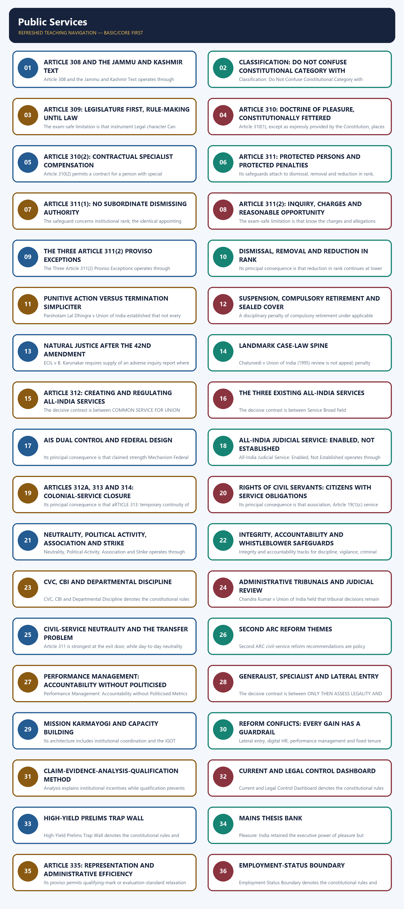

*Distinct embedded teaching-navigation image. The separate continuous Cārvāka-style flowchart package remains an independent at-a-glance artifact.*

Part XIV: Constitutionalising the Permanent Executive denotes the constitutional rules and institutional links organised around Articles Core subject Primary owner.
Part XIV: Constitutionalising the Permanent Executive operates through 308 Interpretation for Part XIV Public Services, connected with 309 Recruitment and service conditions Public Services.
The operative mechanism matters because 310 Tenure during pleasure; contractual compensation Public Services.
Its principal consequence is that 311 Dismissal, removal, reduction in rank Public Services.
The decisive contrast is between 312 All-India Services and AIJS route Public Services and 312A-314 Former Crown officers, transition and repeal Public Services.
The exam-safe limitation is that 315-323 UPSC, SPSC and Joint PSC Polity 28.
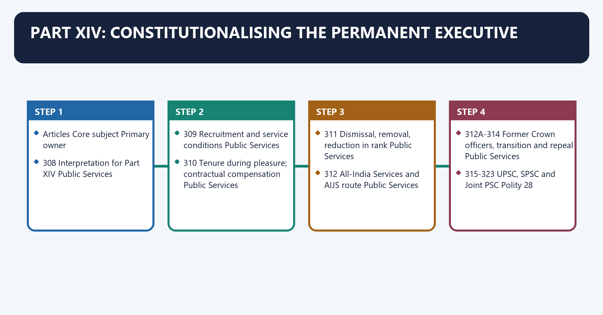
[FACT] Part XIV is titled **Services under the Union and the States**. Articles **308-314** govern the services proper; Articles **315-323** govern the Union and State Public Service Commissions. This package owns the first block and cross-links the second to Polity 28.

[ANALYSIS] A democratic Constitution needs both an elected political executive and a professional permanent executive. Elections authorise policy direction; a rule-bound civil service supplies continuity, expertise, record, implementation and institutional memory.

[LIMIT] Constitutionalising public services does not make civil servants a co-sovereign branch. They remain accountable to lawful political direction, service rules, disciplinary control, legislatures, audit, vigilance and courts.

#### Visual 03 — Part XIV Ownership Map

| Articles | Core subject | Primary owner |
|---|---|---|
| 308 | Interpretation for Part XIV | Public Services |
| 309 | Recruitment and service conditions | Public Services |
| 310 | Tenure during pleasure; contractual compensation | Public Services |
| 311 | Dismissal, removal, reduction in rank | Public Services |
| 312 | All-India Services and AIJS route | Public Services |
| 312A-314 | Former Crown officers, transition and repeal | Public Services |
| 315-323 | UPSC, SPSC and Joint PSC | Polity 28 |

*Caption: Part XIV joins personnel law with merit-recruitment institutions without making them the same subject.*

#### Visual 04 — Democratic Personnel Chain

```text
VOTERS
  |
  v
POLITICAL EXECUTIVE -> sets lawful policy and priorities
  |
  v
PERMANENT EXECUTIVE -> gives candid advice, records reasons, implements law
  |
  v
LEGISLATURE / AUDIT / VIGILANCE / COURTS -> accountability
  |
  v
CITIZENS -> service delivery, rights and remedies
```

*Caption: Neutral competence means fidelity to constitutional government, not insulation from democratic control.*

### SESSION 1 — ARTICLE 308 AND THE JAMMU AND KASHMIR TEXT

#### DEFINITION / WHAT THIS IS CALLED

**Plain-language definition:** Article 308 and the Jammu and Kashmir Text denotes the constitutional rules and institutional links organised around Layer Controlled statement.

**Technical definition:** Article 308 and the Jammu and Kashmir Text operates through Printed constitutional text “State” excludes the State of Jammu and Kashmir for Part XIV, connected with Territorial change The former State was reorganised in 2019.

#### ANSWER-GRABBING OPENING — WRITE/ADAPT IN THE EXAM

> Article 308 and the Jammu and Kashmir Text denotes the constitutional rules and institutional links organised around Layer Controlled statement.

#### MUST-WRITE KEYWORDS

- **Article 308**
- **the Jammu**
- **Kashmir Text**
- **Printed constitutional text**
- **Territorial change**
- **Present exam inference**

**How to use them:** Frame the answer through Article 308; define the Jammu, connect Kashmir Text with Printed constitutional text to explain the mechanism, and use Territorial change for the decisive comparison or qualification.

Article 308 and the Jammu and Kashmir Text denotes the constitutional rules and institutional links organised around Layer Controlled statement.
Article 308 and the Jammu and Kashmir Text operates through Printed constitutional text “State” excludes the State of Jammu and Kashmir for Part XIV, connected with Territorial change The former State was reorganised in 2019.
The operative mechanism matters because present exam inference No surviving State-level special-status exclusion should be assumed.
Its principal consequence is that safe answer Quote the text, then explain the changed territorial context.
The decisive contrast is between Layer Controlled statement and Layer Controlled statement.
The exam-safe limitation is that layer Controlled statement.
[FACT] Article 308 says that, in Part XIV and unless the context otherwise requires, the expression **“State” does not include the State of Jammu and Kashmir**. The wording remains printed in the official constitutional consolidation checked for this package.

[CURRENT] The Jammu and Kashmir Reorganisation Act, 2019 reorganised the former State into Union territories. The literal Article 308 expression therefore must not be used to revive a present “special-status exclusion” for a State that no longer exists in that form.

[ANALYSIS] Article 308 is an interpretation clause, not an independent immunity from Union service law. The correct answer distinguishes the surviving printed text from the post-2019 constitutional and territorial position.

[LIMIT] Do not write either extreme: “Article 308 was deleted” or “Part XIV still does not apply to present-day Jammu and Kashmir.” The first is textually false; the second imports a stale constitutional assumption.

#### Visual 05 — Article 308: Text and Present Context

| Layer | Controlled statement |
|---|---|
| Printed constitutional text | “State” excludes the State of Jammu and Kashmir for Part XIV |
| Territorial change | The former State was reorganised in 2019 |
| Present exam inference | No surviving State-level special-status exclusion should be assumed |
| Safe answer | Quote the text, then explain the changed territorial context |

*Caption: Constitutional literacy requires reading exact words together with later constitutional-territorial developments.*

#### CLOSING RECALL FLOW — ARTICLE 308 AND THE JAMMU AND KASHMIR TEXT

```text
START / CONCEPT: Article 308 and the Jammu and Kashmir Text
        |
        v
EXACT TERMS: Article 308 · the Jammu · Kashmir Text · Printed constitutional text · Territorial change · Present exam inference
        |
        v
MECHANISM / ARGUMENT: Article 308 and the Jammu and Kashmir Text operates through Printed constitutional text “State” excludes the State of Jammu and Kashmir for Part XIV, connected with Territorial change The former State was reorganised in 2019.
        |
        v
CONSEQUENCE / CONTRAST: Article 308 says that, in Part XIV and unless the context otherwise requires, the expression “State” does not include the State of Jammu and Kashmir.
        |
        v
UPSC TRAP / ANSWER-USE: Do not write either extreme: “Article 308 was deleted” or “Part XIV still does not apply to present-day Jammu and Kashmir.” The first is textually false; the second imports a stale constitutional assumption.
        |
        v
ANSWER-GRABBING FORMULATION: Article 308 and the Jammu and Kashmir Text denotes the constitutional rules and institutional links organised around Layer Controlled statement.
```
### SESSION 2 — CLASSIFICATION: DO NOT CONFUSE CONSTITUTIONAL CATEGORY WITH DEPARTMENTAL LABEL

#### DEFINITION / WHAT THIS IS CALLED

**Plain-language definition:** Classification: Do Not Confuse Constitutional Category with Departmental Label denotes the constitutional rules and institutional links organised around Family Examples Main legal source Federal position.

**Technical definition:** Classification: Do Not Confuse Constitutional Category with Departmental Label operates through All-India Services IAS, IPS, Indian Forest Service Article 312, AIS Act and rules Common to Union and States, connected with Central civil services Organised Group A/B services and other Union posts Article 309 laws/rules Union personnel.

#### ANSWER-GRABBING OPENING — WRITE/ADAPT IN THE EXAM

> Classification: Do Not Confuse Constitutional Category with Departmental Label operates through All-India Services IAS, IPS, Indian Forest Service Article 312, AIS Act and rules Common to Union and States, connected with Central civil services Organised Group A/B services and other Union posts Article 309 laws/rules Union personnel.

#### MUST-WRITE KEYWORDS

- **All-India Services**
- **Central civil services/posts**
- **Group A, Group B and Group C**
- **IAS, IPS, Indian Forest Service**
- **Article 312, AIS Act and rules**
- **Common to Union and States**

**How to use them:** Frame the answer through All-India Services; define Central civil services/posts, connect Group A, Group B and Group C with IAS, IPS, Indian Forest Service to explain the mechanism, and use Article 312, AIS Act and rules for the decisive comparison or qualification.

Classification: Do Not Confuse Constitutional Category with Departmental Label denotes the constitutional rules and institutional links organised around Family Examples Main legal source Federal position.
Classification: Do Not Confuse Constitutional Category with Departmental Label operates through All-India Services IAS, IPS, Indian Forest Service Article 312, AIS Act and rules Common to Union and States, connected with Central civil services Organised Group A/B services and other Union posts Article 309 laws/rules Union personnel.
The operative mechanism matters because state civil services State administrative, police and specialised services State law/rules under Article 309 State personnel.
Its principal consequence is that local/public-authority services Municipal, panchayat or statutory-body staff Governing statute/rules Authority-specific.
The decisive contrast is between ORGANISED CIVIL SERVICE and cadre + recruitment rules + career structure.
The exam-safe limitation is that pERSON HOLDS A CIVIL POST.
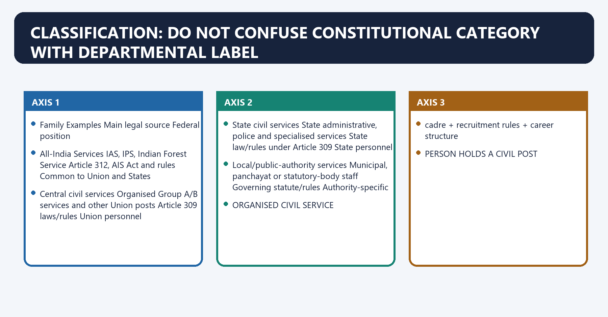
[FACT] The principal service families are **All-India Services**, **Central civil services/posts**, **State civil services/posts**, and services under local or other public authorities. The Central Secretariat is an institutional personnel system within Union administration, not a fourth constitutional All-India Service.

[FACT] Modern Union classification commonly uses **Group A, Group B and Group C**. The older “Class I-IV” terminology is historical and should not be used as the current general taxonomy.

[ANALYSIS] “Service” may describe an organised career cadre; “civil post” is wider and can bring an individual office within Article 311 even without membership of an organised service.

[LIMIT] Gazette status, pay level, constitutional protection and membership of an organised service are related but not identical tests.

#### Visual 06 — Service-Family Matrix

| Family | Examples | Main legal source | Federal position |
|---|---|---|---|
| All-India Services | IAS, IPS, Indian Forest Service | Article 312, AIS Act and rules | Common to Union and States |
| Central civil services | Organised Group A/B services and other Union posts | Article 309 laws/rules | Union personnel |
| Central Secretariat | Secretariat cadres supporting Union policy work | Article 309 rules/administrative framework | Union institutional system |
| State civil services | State administrative, police and specialised services | State law/rules under Article 309 | State personnel |
| Local/public-authority services | Municipal, panchayat or statutory-body staff | Governing statute/rules | Authority-specific |

*Caption: The source and employer determine the category; prestige or job title does not.*

#### Visual 07 — “Service” and “Civil Post”

```text
ORGANISED CIVIL SERVICE
        |
        +--> cadre + recruitment rules + career structure
        |
        v
PERSON HOLDS A CIVIL POST
        |
        +--> may be inside an organised service
        +--> may be an individual post outside one
        |
        v
ARTICLE 311 TESTS STATUS AND NATURE OF POST,
NOT MERELY THE LABEL ON THE APPOINTMENT LETTER
```

*Caption: Article 311 reaches civil posts as well as formal service membership.*

#### Visual 08 — Common Classification Traps

| Wrong shortcut | Correction |
|---|---|
| Indian Foreign Service is an AIS | It is a Central Civil Service; the AIS are IAS, IPS and Indian Forest Service |
| Every Group A officer is an AIS officer | Group A is much wider than AIS |
| Central Secretariat equals Cabinet Secretariat | The first is the collective policy-support machinery; the second is a specific coordinating institution |
| Every public employee holds a civil post under Union/State | Statutory corporations, contractors and workmen require separate legal tests |

*Caption: Similar administrative vocabulary often conceals different legal relationships.*

#### CLOSING RECALL FLOW — CLASSIFICATION: DO NOT CONFUSE CONSTITUTIONAL CATEGORY WITH DEPARTMENTAL LABEL

```text
START / CONCEPT: Classification: Do Not Confuse Constitutional Category with Departmental Label
        |
        v
EXACT TERMS: All-India Services · Central civil services/posts · Group A, Group B and Group C · IAS, IPS, Indian Forest Service · Article 312, AIS Act and rules · Common to Union and States
        |
        v
MECHANISM / ARGUMENT: Classification: Do Not Confuse Constitutional Category with Departmental Label denotes the constitutional rules and institutional links organised around Family Examples Main legal source Federal position.
        |
        v
CONSEQUENCE / CONTRAST: The Central Secretariat is an institutional personnel system within Union administration, not a fourth constitutional All-India Service.
        |
        v
UPSC TRAP / ANSWER-USE: Gazette status, pay level, constitutional protection and membership of an organised service are related but not identical tests.
        |
        v
ANSWER-GRABBING FORMULATION: Classification: Do Not Confuse Constitutional Category with Departmental Label operates through All-India Services IAS, IPS, Indian Forest Service Article 312, AIS Act and rules Common to Union and States, connected with Central civil services Organised Group A/B services and other Union posts Article 309 laws/rules Union personnel.
```
### SESSION 3 — ARTICLE 309: LEGISLATURE FIRST, RULE-MAKING UNTIL LAW

#### DEFINITION / WHAT THIS IS CALLED

**Plain-language definition:** Article 309: Legislature First, Rule-Making Until Law denotes the constitutional rules and institutional links organised around ACT OF APPROPRIATE LEGISLATURE.

**Technical definition:** The exam-safe limitation is that instrument Legal character Can override Article 309 rules?

#### ANSWER-GRABBING OPENING — WRITE/ADAPT IN THE EXAM

> Article 309: Legislature First, Rule-Making Until Law denotes the constitutional rules and institutional links organised around ACT OF APPROPRIATE LEGISLATURE.

#### MUST-WRITE KEYWORDS

- **Article 309**
- **Legislature First**
- **Rule-Making Until Law**
- **subject to the Constitution**
- **Act**
- **Primary legislation**

**How to use them:** Frame the answer through Article 309; define Legislature First, connect Rule-Making Until Law with subject to the Constitution to explain the mechanism, and use Act for the decisive comparison or qualification.

Article 309: Legislature First, Rule-Making Until Law denotes the constitutional rules and institutional links organised around ACT OF APPROPRIATE LEGISLATURE.
Article 309: Legislature First, Rule-Making Until Law operates through may itself regulate service conditions, connected with may delegate rule-making.
The operative mechanism matters because pROVISO-TO-ARTICLE-309 RULES.
Its principal consequence is that eXECUTIVE INSTRUCTIONS FILLING A VALID GAP.
The decisive contrast is between Lower level cannot override higher level and [FACT] Executive instructions may supplement a field not occupied by statutory rules, but cannot amend, override or contradict a rule.
The exam-safe limitation is that instrument Legal character Can override Article 309 rules? Example function.
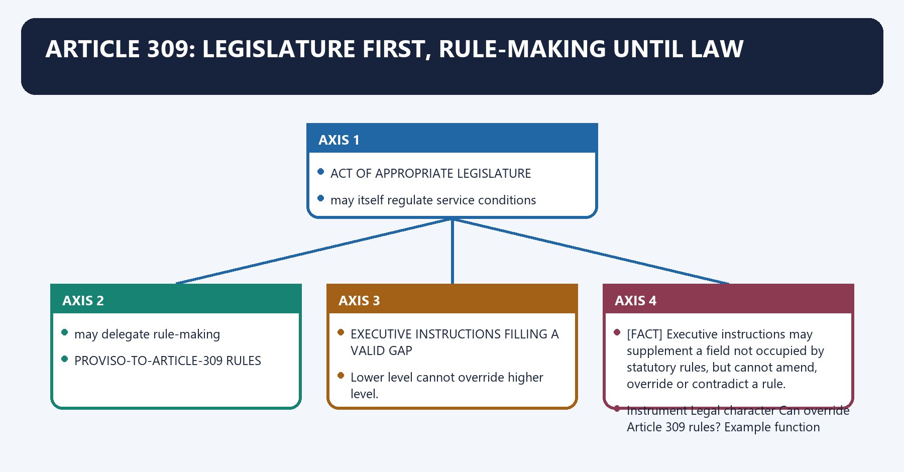
[FACT] Article 309 is expressly **subject to the Constitution**. The appropriate legislature may regulate recruitment and conditions of service of persons appointed to public services and posts connected with Union or State affairs.

[FACT] Until provision is made by or under an Act, the President for Union services, or the Governor for State services, or a person directed by either, may make rules regulating recruitment and service conditions. A later competent law may alter or repeal those rules.

[ANALYSIS] Article 309 avoids an administrative vacuum while preserving legislative supremacy within the constitutional field. The rule-making proviso is not a licence to contradict Fundamental Rights, an Act or another constitutional protection.

#### Visual 09 — Article 309 Authority Ladder

```text
CONSTITUTION
    |
    v
ACT OF APPROPRIATE LEGISLATURE
    |
    +--> may itself regulate service conditions
    +--> may delegate rule-making
    |
    v
PROVISO-TO-ARTICLE-309 RULES
    |
    v
EXECUTIVE INSTRUCTIONS FILLING A VALID GAP

Lower level cannot override higher level.
```

*Caption: Recruitment and service administration operate through a hierarchy, not free executive discretion.*

[FACT] Rules made under the proviso to Article 309 have legal force as subordinate legislation. They remain reviewable for inconsistency with the Constitution, the parent statute or a law occupying the field.

[FACT] Executive instructions may supplement a field not occupied by statutory rules, but cannot amend, override or contradict a rule.

#### Visual 10 — Rules, Instructions and Practices

| Instrument | Legal character | Can override Article 309 rules? | Example function |
|---|---|---:|---|
| Act | Primary legislation | Not applicable | broad service framework |
| Statutory rule | Subordinate legislation | — | recruitment, classification, discipline |
| Office memorandum/instruction | Executive direction | No | procedure or gap-filling |
| Departmental practice | Administrative convention | No | workflow |

*Caption: A repeated practice does not become lawful merely through repetition.*

#### Visual 11 — Three Rulebooks, Three Questions

| Rule family | Question answered | Typical consequence |
|---|---|---|
| Recruitment rules | Who may enter or be promoted to a post, and by what method? | eligibility, mode, selection |
| Conduct rules | What behaviour is required or prohibited while in service? | misconduct standard |
| Classification, control and appeal rules | Who may suspend or punish, through what process and appeal? | disciplinary procedure and penalty |

*Caption: Recruitment, conduct and discipline are connected but legally distinct.*

#### CLOSING RECALL FLOW — ARTICLE 309: LEGISLATURE FIRST, RULE-MAKING UNTIL LAW

```text
START / CONCEPT: Article 309: Legislature First, Rule-Making Until Law
        |
        v
EXACT TERMS: Article 309 · Legislature First · Rule-Making Until Law · subject to the Constitution · Act · Primary legislation
        |
        v
MECHANISM / ARGUMENT: Until provision is made by or under an Act, the President for Union services, or the Governor for State services, or a person directed by either, may make rules regulating recruitment and service conditions.
        |
        v
CONSEQUENCE / CONTRAST: The rule-making proviso is not a licence to contradict Fundamental Rights, an Act or another constitutional protection.
        |
        v
UPSC TRAP / ANSWER-USE: Do not miss this limiting distinction: its principal consequence is that eXECUTIVE INSTRUCTIONS FILLING A VALID GAP.
        |
        v
ANSWER-GRABBING FORMULATION: Article 309: Legislature First, Rule-Making Until Law denotes the constitutional rules and institutional links organised around ACT OF APPROPRIATE LEGISLATURE.
```
### SESSION 4 — ARTICLE 310: DOCTRINE OF PLEASURE, CONSTITUTIONALLY FETTERED

#### DEFINITION / WHAT THIS IS CALLED

**Plain-language definition:** Article 310: Doctrine of Pleasure, Constitutionally Fettered denotes the constitutional rules and institutional links organised around executive may end tenure.

**Technical definition:** Article 310(1), except as expressly provided by the Constitution, places members of Union defence or civil services, All-India Services, and holders of posts connected with defence or civil posts under the Union at the pleasure of the President; corresponding State civil posts are held at the pleasure of the Governor.

#### ANSWER-GRABBING OPENING — WRITE/ADAPT IN THE EXAM

> Article 310: Doctrine of Pleasure, Constitutionally Fettered denotes the constitutional rules and institutional links organised around executive may end tenure.

#### MUST-WRITE KEYWORDS

- **Article 310**
- **Doctrine of Pleasure**
- **Constitutionally Fettered**
- **Union civil service/civil post**
- **President**
- **constitutional government, not personal discretion**

**How to use them:** Frame the answer through Article 310; define Doctrine of Pleasure, connect Constitutionally Fettered with Union civil service/civil post to explain the mechanism, and use President for the decisive comparison or qualification.

Article 310: Doctrine of Pleasure, Constitutionally Fettered denotes the constitutional rules and institutional links organised around executive may end tenure.
Article 310: Doctrine of Pleasure, Constitutionally Fettered operates through FENCE 1: express constitutional office safeguards, connected with FENCE 2: Article 311.
The operative mechanism matters because fENCE 3: Articles 14 and 16.
Its principal consequence is that fENCE 4: governing statute/rules.
The decisive contrast is between FENCE 5: judicial review and Position Formal pleasure authority Qualification.
The exam-safe limitation is that union civil service/civil post President constitutional government, not personal discretion.
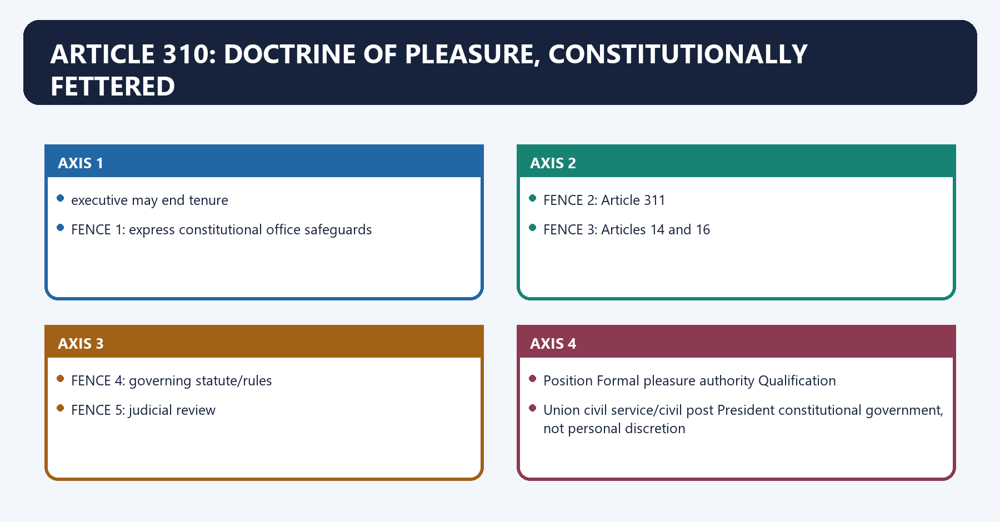
[FACT] Article 310(1), except as expressly provided by the Constitution, places members of Union defence or civil services, All-India Services, and holders of posts connected with defence or civil posts under the Union at the pleasure of the President; corresponding State civil posts are held at the pleasure of the Governor.

[ANALYSIS] “Pleasure” is a constitutional tenure rule, not the President's or Governor's personal whim. Under the parliamentary system, formal executive power ordinarily operates on ministerial aid and advice, as explained in *Shamsher Singh v State of Punjab*.

[LIMIT] The doctrine is bounded by Article 311, Fundamental Rights, special constitutional removal procedures, statutory rules and judicial review.

#### Visual 12 — Pleasure Doctrine: Power and Fences

```text
ARTICLE 310 POWER
executive may end tenure
        |
        +--> FENCE 1: express constitutional office safeguards
        +--> FENCE 2: Article 311
        +--> FENCE 3: Articles 14 and 16
        +--> FENCE 4: governing statute/rules
        +--> FENCE 5: judicial review
```

*Caption: India retained the power of pleasure but constitutionalised its exercise.*

#### Visual 13 — Who Holds at Whose Pleasure?

| Position | Formal pleasure authority | Qualification |
|---|---|---|
| Union civil service/civil post | President | constitutional government, not personal discretion |
| All-India Service member | President | service and disciplinary rules distribute operational control |
| State civil service/civil post | Governor | constitutional government, not personal discretion |
| Defence service/post connected with defence | President | Article 311 does not protect uniformed defence-service members |

*Caption: Formal tenure authority does not by itself identify every appointing, controlling or disciplinary authority.*

[FACT] Officeholders protected by special constitutional removal procedures—such as Supreme Court and High Court judges, the Comptroller and Auditor-General, the Chief Election Commissioner, and Public Service Commission members—cannot be treated as ordinary pleasure-tenure civil servants.

[LIMIT] Do not generalise all “constitutional offices” into one removal rule; each office's Article must be read separately.

#### CLOSING RECALL FLOW — ARTICLE 310: DOCTRINE OF PLEASURE, CONSTITUTIONALLY FETTERED

```text
START / CONCEPT: Article 310: Doctrine of Pleasure, Constitutionally Fettered
        |
        v
EXACT TERMS: Article 310 · Doctrine of Pleasure · Constitutionally Fettered · Union civil service/civil post · President · constitutional government, not personal discretion
        |
        v
MECHANISM / ARGUMENT: Article 310(1), except as expressly provided by the Constitution, places members of Union defence or civil services, All-India Services, and holders of posts connected with defence or civil posts under the Union at the pleasure of the President; corresponding State civil posts are held at the pleasure of the Governor.
        |
        v
CONSEQUENCE / CONTRAST: “Pleasure” is a constitutional tenure rule, not the President's or Governor's personal whim.
        |
        v
UPSC TRAP / ANSWER-USE: The exam-safe limitation is that union civil service/civil post President constitutional government, not personal discretion.
        |
        v
ANSWER-GRABBING FORMULATION: Article 310: Doctrine of Pleasure, Constitutionally Fettered denotes the constitutional rules and institutional links organised around executive may end tenure.
```
### SESSION 5 — ARTICLE 310(2): CONTRACTUAL SPECIALIST COMPENSATION

#### DEFINITION / WHAT THIS IS CALLED

**Plain-language definition:** Article 310(2): Contractual Specialist Compensation denotes the constitutional rules and institutional links organised around The clause reconciles the pleasure doctrine with the practical need to recruit scarce expertise for a defined period.

**Technical definition:** Article 310(2) permits a contract for a person with special qualifications, who is not already a member of a defence service, an All-India Service, or a Union/State civil service, to provide compensation if an agreed tenure ends early because the post is abolished or the person is required to vacate for reasons not connected with misconduct.

#### ANSWER-GRABBING OPENING — WRITE/ADAPT IN THE EXAM

> Article 310(2): Contractual Specialist Compensation denotes the constitutional rules and institutional links organised around The clause reconciles the pleasure doctrine with the practical need to recruit scarce expertise for a defined period.

#### MUST-WRITE KEYWORDS

- **Article 310(2)**
- **Contractual Specialist Compensation**
- **not connected with misconduct**
- **Article 310**
- **Article 310(2): Contractual Specialist Compensation**
- **Article**

**How to use them:** Frame the answer through Article 310(2); define Contractual Specialist Compensation, connect not connected with misconduct with Article 310 to explain the mechanism, and use Article 310(2): Contractual Specialist Compensation for the decisive comparison or qualification.

Article 310(2): Contractual Specialist Compensation denotes the constitutional rules and institutional links organised around [ANALYSIS] The clause reconciles the pleasure doctrine with the practical need to recruit scarce expertise for a defined period.
Article 310(2): Contractual Specialist Compensation operates through SPECIAL QUALIFICATIONS NEEDED?, connected with PERSON OUTSIDE DEFENCE / AIS / UNION-STATE CIVIL SERVICE?.
The operative mechanism matters because cONTRACT FOR AGREED PERIOD?.
Its principal consequence is that pOST ABOLISHED OR EARLY VACATION REQUIRED?.
The decisive contrast is between REASON UNCONNECTED WITH MISCONDUCT? and CONTRACT MAY PROVIDE COMPENSATION.
The exam-safe limitation is that [ANALYSIS] The clause reconciles the pleasure doctrine with the practical need to recruit scarce expertise for a defined period.
[FACT] Article 310(2) permits a contract for a person with special qualifications, who is not already a member of a defence service, an All-India Service, or a Union/State civil service, to provide compensation if an agreed tenure ends early because the post is abolished or the person is required to vacate for reasons **not connected with misconduct**.

[ANALYSIS] The clause reconciles the pleasure doctrine with the practical need to recruit scarce expertise for a defined period.

[LIMIT] It is not a general severance-pay guarantee for every temporary, contractual or lateral appointee. Its textual conditions—special qualifications, the specified service-status exclusions, an agreed period and a non-misconduct exit—matter.

#### Visual 14 — Article 310(2) Eligibility Flow

```text
SPECIAL QUALIFICATIONS NEEDED?
        |
        v
PERSON OUTSIDE DEFENCE / AIS / UNION-STATE CIVIL SERVICE?
        |
        v
CONTRACT FOR AGREED PERIOD?
        |
        v
POST ABOLISHED OR EARLY VACATION REQUIRED?
        |
        v
REASON UNCONNECTED WITH MISCONDUCT?
        |
        v
CONTRACT MAY PROVIDE COMPENSATION
```

*Caption: Every textual condition must be satisfied before invoking the compensation clause.*

#### CLOSING RECALL FLOW — ARTICLE 310(2): CONTRACTUAL SPECIALIST COMPENSATION

```text
START / CONCEPT: Article 310(2): Contractual Specialist Compensation
        |
        v
EXACT TERMS: Article 310(2) · Contractual Specialist Compensation · not connected with misconduct · Article 310 · Article 310(2): Contractual Specialist Compensation · Article
        |
        v
MECHANISM / ARGUMENT: Article 310(2) permits a contract for a person with special qualifications, who is not already a member of a defence service, an All-India Service, or a Union/State civil service, to provide compensation if an agreed tenure ends early because the post is abolished or the person is required to vacate for reasons not connected with misconduct.
        |
        v
CONSEQUENCE / CONTRAST: The decisive contrast is between REASON UNCONNECTED WITH MISCONDUCT? and CONTRACT MAY PROVIDE COMPENSATION.
        |
        v
UPSC TRAP / ANSWER-USE: It is not a general severance-pay guarantee for every temporary, contractual or lateral appointee.
        |
        v
ANSWER-GRABBING FORMULATION: Article 310(2): Contractual Specialist Compensation denotes the constitutional rules and institutional links organised around The clause reconciles the pleasure doctrine with the practical need to recruit scarce expertise for a defined period.
```
### SESSION 6 — ARTICLE 311: PROTECTED PERSONS AND PROTECTED PENALTIES

#### DEFINITION / WHAT THIS IS CALLED

**Plain-language definition:** Article 311 protects listed civil-service members and holders of Union or State civil posts against specified major penalties.

**Technical definition:** Its safeguards attach to dismissal, removal and reduction in rank, subject to the second-proviso exceptions.

#### ANSWER-GRABBING OPENING — WRITE/ADAPT IN THE EXAM

> Article 311 is a procedural shield against arbitrary major penalties, not general service immunity.

#### MUST-WRITE KEYWORDS

- **Article 311**
- **civil post**
- **dismissal**
- **removal**
- **reduction in rank**
- **procedural safeguard**

**How to use them:** Frame the answer through Article 311; define civil post, connect dismissal with removal to explain the mechanism, and use reduction in rank for the decisive comparison or qualification.

Article 311: Protected Persons and Protected Penalties denotes the constitutional rules and institutional links organised around Question If yes If no.
Article 311: Protected Persons and Protected Penalties operates through Is the person within a listed civil service or civil post? continue Article 311 not attracted, connected with Is the action dismissal, removal or reduction in rank? continue ordinary service-rule review.
The operative mechanism matters because is the action punitive in substance? safeguards ordinarily apply termination-simpliciter rules may apply.
Its principal consequence is that does a proviso exception apply? inquiry may be dispensed with regular inquiry required.
The decisive contrast is between Question If yes If no and Question If yes If no.
The exam-safe limitation is that question If yes If no.
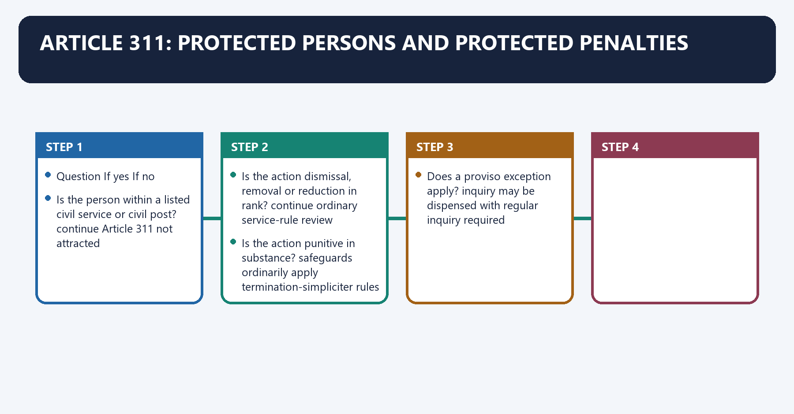
[FACT] Article 311 protects a person who is a member of a Union civil service, an All-India Service, a State civil service, or who holds a civil post under the Union or a State.

[FACT] It is triggered by **dismissal, removal or reduction in rank**. It does not constitutionalise immunity from transfer, suspension, adverse appraisal, prosecution or every service decision.

[LIMIT] Uniformed defence-service members are outside Article 311. A civilian employee in a defence establishment must be analysed by whether the person holds a civil post, not by workplace alone.

#### Visual 15 — Article 311 Trigger Grid

| Question | If yes | If no |
|---|---|---|
| Is the person within a listed civil service or civil post? | continue | Article 311 not attracted |
| Is the action dismissal, removal or reduction in rank? | continue | ordinary service-rule review |
| Is the action punitive in substance? | safeguards ordinarily apply | termination-simpliciter rules may apply |
| Does a proviso exception apply? | inquiry may be dispensed with | regular inquiry required |

*Caption: Article 311 analysis is sequential; jumping directly to “natural justice” causes errors.*

#### CLOSING RECALL FLOW — ARTICLE 311: PROTECTED PERSONS AND PROTECTED PENALTIES

```text
START / CONCEPT: Article 311: Protected Persons and Protected Penalties
        |
        v
EXACT TERMS: Article 311 · civil post · dismissal · removal · reduction in rank · procedural safeguard
        |
        v
MECHANISM / ARGUMENT: Identify protected status, punitive action, competent authority, inquiry requirement and any exact exception.
        |
        v
CONSEQUENCE / CONTRAST: The sequence preserves fair discipline without blocking transfer, suspension, vigilance or prosecution.
        |
        v
UPSC TRAP / ANSWER-USE: Do not assume every public employee or every adverse service action attracts Article 311.
        |
        v
ANSWER-GRABBING FORMULATION: Article 311 is a procedural shield against arbitrary major penalties, not general service immunity.
```
### SESSION 7 — ARTICLE 311(1): NO SUBORDINATE DISMISSING AUTHORITY

#### DEFINITION / WHAT THIS IS CALLED

**Plain-language definition:** Article 311(1) bars dismissal or removal by an authority subordinate to the appointing authority.

**Technical definition:** The safeguard concerns institutional rank; the identical appointing individual need not personally impose the penalty.

#### ANSWER-GRABBING OPENING — WRITE/ADAPT IN THE EXAM

> The authority-rank rule prevents lower-level retaliation while retaining lawful disciplinary competence.

#### MUST-WRITE KEYWORDS

- **Article 311(1)**
- **appointing authority**
- **subordinate authority**
- **dismissal**
- **removal**
- **disciplinary competence**

**How to use them:** Frame the answer through Article 311(1); define appointing authority, connect subordinate authority with dismissal to explain the mechanism, and use removal for the decisive comparison or qualification.

Article 311(1): No Subordinate Dismissing Authority denotes the constitutional rules and institutional links organised around APPOINTING AUTHORITY LEVEL = X.
Article 311(1): No Subordinate Dismissing Authority operates through disciplinary authority below X - cannot dismiss/remove, connected with authority equal to X - may act if rules confer power.
The operative mechanism matters because authority above X - may act if rules confer power.
Its principal consequence is that aPPOINTING AUTHORITY LEVEL = X.
The decisive contrast is between APPOINTING AUTHORITY LEVEL = X and APPOINTING AUTHORITY LEVEL = X.
The exam-safe limitation is that aPPOINTING AUTHORITY LEVEL = X.
[FACT] A protected person cannot be dismissed or removed by an authority subordinate to the authority by which that person was appointed.

[ANALYSIS] The safeguard protects institutional rank, not personal identity. The same individual who appointed need not decide the case; an authority of equal or superior status under the governing framework may act.

[LIMIT] Clause (1) expressly mentions dismissal and removal. Reduction in rank is principally controlled through clause (2) and the applicable disciplinary rules.

#### Visual 16 — Authority-Rank Test

```text
APPOINTING AUTHORITY LEVEL = X
        |
        +--> disciplinary authority below X -> cannot dismiss/remove
        |
        +--> authority equal to X -> may act if rules confer power
        |
        +--> authority above X -> may act if rules confer power
```

*Caption: The constitutional question is subordination; the rulebook question is competence.*

#### CLOSING RECALL FLOW — ARTICLE 311(1): NO SUBORDINATE DISMISSING AUTHORITY

```text
START / CONCEPT: Article 311(1): No Subordinate Dismissing Authority
        |
        v
EXACT TERMS: Article 311(1) · appointing authority · subordinate authority · dismissal · removal · disciplinary competence
        |
        v
MECHANISM / ARGUMENT: Compare the appointing authority level with the proposed disciplinary authority and then check the rules.
        |
        v
CONSEQUENCE / CONTRAST: An equal or superior competent authority may act without defeating the constitutional safeguard.
        |
        v
UPSC TRAP / ANSWER-USE: Do not extend clause (1) mechanically to reduction in rank or require the same named officer.
        |
        v
ANSWER-GRABBING FORMULATION: The authority-rank rule prevents lower-level retaliation while retaining lawful disciplinary competence.
```
### SESSION 8 — ARTICLE 311(2): INQUIRY, CHARGES AND REASONABLE OPPORTUNITY

#### DEFINITION / WHAT THIS IS CALLED

**Plain-language definition:** Article 311(2): Inquiry, Charges and Reasonable Opportunity denotes the constitutional rules and institutional links organised around ALLEGED MISCONDUCT.

**Technical definition:** The exam-safe limitation is that know the charges and allegations remains central.

#### ANSWER-GRABBING OPENING — WRITE/ADAPT IN THE EXAM

> Article 311(2): Inquiry, Charges and Reasonable Opportunity denotes the constitutional rules and institutional links organised around ALLEGED MISCONDUCT.

#### MUST-WRITE KEYWORDS

- **Article 311(2)**
- **Inquiry**
- **Charges**
- **Reasonable Opportunity**
- **proposed penalty**
- **Know the charges and allegations**

**How to use them:** Frame the answer through Article 311(2); define Inquiry, connect Charges with Reasonable Opportunity to explain the mechanism, and use proposed penalty for the decisive comparison or qualification.

Article 311(2): Inquiry, Charges and Reasonable Opportunity denotes the constitutional rules and institutional links organised around ALLEGED MISCONDUCT.
Article 311(2): Inquiry, Charges and Reasonable Opportunity operates through CHARGE MEMORANDUM + PARTICULARS, connected with REPLY + EVIDENCE + WITNESSES + DEFENCE.
The operative mechanism matters because rEPORT SUPPLIED / REPRESENTATION WHERE REQUIRED.
Its principal consequence is that dISCIPLINARY AUTHORITY: FINDING + PROPORTIONATE PENALTY.
The decisive contrast is between DEPARTMENTAL APPEAL / REVIEW + TRIBUNAL / JUDICIAL REVIEW and Opportunity component Present significance.
The exam-safe limitation is that know the charges and allegations remains central.
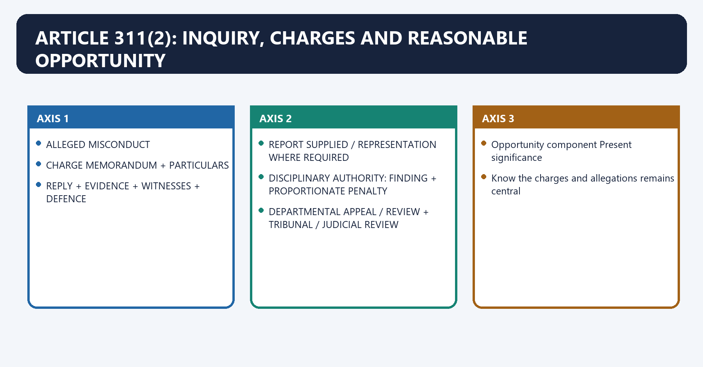
[FACT] A protected person cannot be dismissed, removed or reduced in rank except after an inquiry in which the person is informed of the charges and given a reasonable opportunity of being heard in respect of those charges.

[FACT] The 42nd Amendment removed the constitutional requirement of a separate opportunity to represent against the **proposed penalty** after the inquiry. The penalty may be based on evidence adduced during the inquiry without a second show-cause notice on punishment.

[LIMIT] The amendment did not abolish the inquiry, defence opportunity, reasoned decision or all post-inquiry fairness. *Managing Director, ECIL v B. Karunakar* requires supply of an adverse inquiry report before penalty where the inquiry officer is distinct, with relief depending on prejudice.

#### Visual 17 — Regular Disciplinary Pipeline

```text
ALLEGED MISCONDUCT
      |
      v
CHARGE MEMORANDUM + PARTICULARS
      |
      v
REPLY + EVIDENCE + WITNESSES + DEFENCE
      |
      v
INQUIRY REPORT
      |
      v
REPORT SUPPLIED / REPRESENTATION WHERE REQUIRED
      |
      v
DISCIPLINARY AUTHORITY: FINDING + PROPORTIONATE PENALTY
      |
      v
DEPARTMENTAL APPEAL / REVIEW + TRIBUNAL / JUDICIAL REVIEW
```

*Caption: The second penalty notice disappeared; the evidentiary and decisional safeguards did not.*

#### Visual 18 — *Khem Chand* Opportunity Components

| Opportunity component | Present significance |
|---|---|
| Know the charges and allegations | remains central |
| Contest evidence and cross-examine where applicable | remains central |
| Produce defence evidence | remains central |
| Represent against proposed punishment | constitutional second stage removed by 42nd Amendment |

*Caption: Historical doctrine must be updated for the 42nd Amendment rather than quoted mechanically.*

#### CLOSING RECALL FLOW — ARTICLE 311(2): INQUIRY, CHARGES AND REASONABLE OPPORTUNITY

```text
START / CONCEPT: Article 311(2): Inquiry, Charges and Reasonable Opportunity
        |
        v
EXACT TERMS: Article 311(2) · Inquiry · Charges · Reasonable Opportunity · proposed penalty · Know the charges and allegations
        |
        v
MECHANISM / ARGUMENT: A protected person cannot be dismissed, removed or reduced in rank except after an inquiry in which the person is informed of the charges and given a reasonable opportunity of being heard in respect of those charges.
        |
        v
CONSEQUENCE / CONTRAST: The decisive contrast is between DEPARTMENTAL APPEAL / REVIEW + TRIBUNAL / JUDICIAL REVIEW and Opportunity component Present significance.
        |
        v
UPSC TRAP / ANSWER-USE: Do not miss this limiting distinction: its principal consequence is that dISCIPLINARY AUTHORITY.
        |
        v
ANSWER-GRABBING FORMULATION: Article 311(2): Inquiry, Charges and Reasonable Opportunity denotes the constitutional rules and institutional links organised around ALLEGED MISCONDUCT.
```
### SESSION 9 — THE THREE ARTICLE 311(2) PROVISO EXCEPTIONS

#### DEFINITION / WHAT THIS IS CALLED

**Plain-language definition:** The Three Article 311(2) Proviso Exceptions denotes the constitutional rules and institutional links organised around The inquiry requirement does not apply in exactly three constitutional situations.

**Technical definition:** The Three Article 311(2) Proviso Exceptions operates through punishment on the ground of conduct that led to conviction on a criminal charge, connected with the competent authority is satisfied, for reasons recorded in writing, that holding the inquiry is not reasonably practicable.

#### ANSWER-GRABBING OPENING — WRITE/ADAPT IN THE EXAM

> The Three Article 311(2) Proviso Exceptions denotes the constitutional rules and institutional links organised around The inquiry requirement does not apply in exactly three constitutional situations.

#### MUST-WRITE KEYWORDS

- **The Three Article 311(2) Proviso Exceptions**
- **security of the State**
- **Conviction**
- **conduct leading to criminal conviction**
- **disciplinary authority applies penalty framework**
- **not stated in Article as the trigger condition**

**How to use them:** Frame the answer through The Three Article 311(2) Proviso Exceptions; define security of the State, connect Conviction with conduct leading to criminal conviction to explain the mechanism, and use disciplinary authority applies penalty framework for the decisive comparison or qualification.

The Three Article 311(2) Proviso Exceptions denotes the constitutional rules and institutional links organised around [FACT] The inquiry requirement does not apply in exactly three constitutional situations.
The Three Article 311(2) Proviso Exceptions operates through [FACT] punishment on the ground of conduct that led to conviction on a criminal charge, connected with [FACT] the competent authority is satisfied, for reasons recorded in writing, that holding the inquiry is not reasonably practicable.
The operative mechanism matters because exception Trigger Who is satisfied? Express writing requirement? Review focus.
Its principal consequence is that aUTHORITY SAYS "NOT PRACTICABLE".
The decisive contrast is between Were reasons recorded in writing? and Do facts rationally relate to inability to hold inquiry?.
The exam-safe limitation is that was the power used bona fide rather than for convenience?.
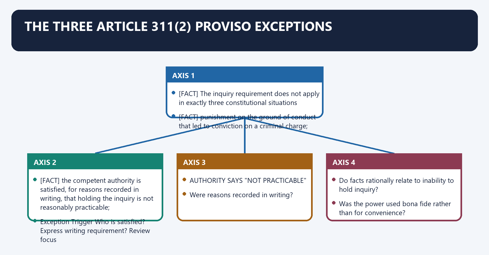
[FACT] The inquiry requirement does not apply in exactly three constitutional situations:

1. `[FACT]` punishment on the ground of conduct that led to conviction on a criminal charge;
2. `[FACT]` the competent authority is satisfied, for reasons recorded in writing, that holding the inquiry is not reasonably practicable;
3. `[FACT]` the President or Governor is satisfied that, in the interest of the security of the State, it is not expedient to hold the inquiry.

[ANALYSIS] These are exceptions to the inquiry, not a constitutional declaration that evidence, relevance, proportionality, competence and judicial review disappear.

#### Visual 19 — Three Exceptions Compared

| Exception | Trigger | Who is satisfied? | Express writing requirement? | Review focus |
|---|---|---|---:|---|
| Conviction | conduct leading to criminal conviction | disciplinary authority applies penalty framework | not stated in Article as the trigger condition | conviction nexus, competence, penalty |
| Not reasonably practicable | circumstances obstruct fair inquiry | empowered disciplinary authority | Yes | existence, relevance and bona fides of reasons |
| Security of State | inquiry not expedient in State-security interest | President or Governor formally | not textually identical to clause (b) | constitutional satisfaction, mala fides, relevance |

*Caption: “Conviction”, “practicability” and “security” are different constitutional gateways.*

#### Visual 20 — Clause (2)(b) Review Logic

```text
AUTHORITY SAYS "NOT PRACTICABLE"
        |
        v
Were reasons recorded in writing?
        |
        v
Do facts rationally relate to inability to hold inquiry?
        |
        v
Was the power used bona fide rather than for convenience?
        |
        v
ARTICLE 311(3) FINALITY DOES NOT OUST JUDICIAL REVIEW
```

*Caption: Administrative inconvenience is not the same as constitutional impracticability.*

[FACT] *Union of India v Tulsiram Patel* upheld the proviso architecture and explained that natural justice is excluded to the extent the Constitution itself authorises, while the existence and lawful use of the exception remain reviewable.

[LIMIT] Clause (2)(c) uses **security of the State**, not ordinary “public interest”, embarrassment, public criticism or routine law-and-order inconvenience.

#### CLOSING RECALL FLOW — THE THREE ARTICLE 311(2) PROVISO EXCEPTIONS

```text
START / CONCEPT: The Three Article 311(2) Proviso Exceptions
        |
        v
EXACT TERMS: The Three Article 311(2) Proviso Exceptions · security of the State · Conviction · conduct leading to criminal conviction · disciplinary authority applies penalty framework · not stated in Article as the trigger condition
        |
        v
MECHANISM / ARGUMENT: The Three Article 311(2) Proviso Exceptions operates through punishment on the ground of conduct that led to conviction on a criminal charge, connected with the competent authority is satisfied, for reasons recorded in writing, that holding the inquiry is not reasonably practicable.
        |
        v
CONSEQUENCE / CONTRAST: Union of India v Tulsiram Patel upheld the proviso architecture and explained that natural justice is excluded to the extent the Constitution itself authorises, while the existence and lawful use of the exception remain reviewable.
        |
        v
UPSC TRAP / ANSWER-USE: The inquiry requirement does not apply in exactly three constitutional situations.
        |
        v
ANSWER-GRABBING FORMULATION: The Three Article 311(2) Proviso Exceptions denotes the constitutional rules and institutional links organised around The inquiry requirement does not apply in exactly three constitutional situations.
```
### SESSION 10 — DISMISSAL, REMOVAL AND REDUCTION IN RANK

#### DEFINITION / WHAT THIS IS CALLED

**Plain-language definition:** Dismissal, Removal and Reduction in Rank denotes the constitutional rules and institutional links organised around Always check the governing service rules before asserting the exact collateral consequence of a penalty.

**Technical definition:** Its principal consequence is that reduction in rank continues at lower penal status career and pay consequence applies.

#### ANSWER-GRABBING OPENING — WRITE/ADAPT IN THE EXAM

> Dismissal, Removal and Reduction in Rank denotes the constitutional rules and institutional links organised around Always check the governing service rules before asserting the exact collateral consequence of a penalty.

#### MUST-WRITE KEYWORDS

- **Dismissal**
- **Removal**
- **Reduction in Rank**
- **ends**
- **ordinarily disqualifying**
- **applies**

**How to use them:** Frame the answer through Dismissal; define Removal, connect Reduction in Rank with ends to explain the mechanism, and use ordinarily disqualifying for the decisive comparison or qualification.

Dismissal, Removal and Reduction in Rank denotes the constitutional rules and institutional links organised around [LIMIT] Always check the governing service rules before asserting the exact collateral consequence of a penalty.
Dismissal, Removal and Reduction in Rank operates through Action Service relationship Typical future-employment effect Article 311, connected with Dismissal ends ordinarily disqualifying applies.
The operative mechanism matters because removal ends ordinarily not automatically disqualifying applies.
Its principal consequence is that reduction in rank continues at lower penal status career and pay consequence applies.
The decisive contrast is between Suspension pending inquiry continues interim restraint, subsistence framework ordinarily not a penalty and [LIMIT] Always check the governing service rules before asserting the exact collateral consequence of a penalty.
The exam-safe limitation is that [LIMIT] Always check the governing service rules before asserting the exact collateral consequence of a penalty.
[FACT] These are major adverse service consequences, but they are not synonyms. Under the ordinary disciplinary framework, dismissal generally carries the graver future-employment consequence; removal ordinarily does not carry the same automatic disqualification, subject to the applicable rules. Reduction in rank places the employee in a lower post, grade, service or penal position recognised by the rules.

[LIMIT] Always check the governing service rules before asserting the exact collateral consequence of a penalty.

#### Visual 21 — Penalty Comparison

| Action | Service relationship | Typical future-employment effect | Article 311 |
|---|---|---|---|
| Dismissal | ends | ordinarily disqualifying | applies |
| Removal | ends | ordinarily not automatically disqualifying | applies |
| Reduction in rank | continues at lower penal status | career and pay consequence | applies |
| Suspension pending inquiry | continues | interim restraint, subsistence framework | ordinarily not a penalty |

*Caption: Article 311 protects specified penalties, not every unfavourable administrative act.*

#### CLOSING RECALL FLOW — DISMISSAL, REMOVAL AND REDUCTION IN RANK

```text
START / CONCEPT: Dismissal, Removal and Reduction in Rank
        |
        v
EXACT TERMS: Dismissal · Removal · Reduction in Rank · ends · ordinarily disqualifying · applies
        |
        v
MECHANISM / ARGUMENT: Its principal consequence is that reduction in rank continues at lower penal status career and pay consequence applies.
        |
        v
CONSEQUENCE / CONTRAST: Under the ordinary disciplinary framework, dismissal generally carries the graver future-employment consequence; removal ordinarily does not carry the same automatic disqualification, subject to the applicable rules.
        |
        v
UPSC TRAP / ANSWER-USE: The decisive contrast is between Suspension pending inquiry continues interim restraint, subsistence framework ordinarily not a penalty and Always check the governing service rules before asserting the exact collateral consequence of a penalty.
        |
        v
ANSWER-GRABBING FORMULATION: Dismissal, Removal and Reduction in Rank denotes the constitutional rules and institutional links organised around Always check the governing service rules before asserting the exact collateral consequence of a penalty.
```
### SESSION 11 — PUNITIVE ACTION VERSUS TERMINATION SIMPLICITER

#### DEFINITION / WHAT THIS IS CALLED

**Plain-language definition:** Punitive Action versus Termination Simpliciter denotes the constitutional rules and institutional links organised around BACKGROUND DOUBT / UNSUITABILITY.

**Technical definition:** Parshotam Lal Dhingra v Union of India established that not every termination, reversion or end of temporary service is dismissal, removal or reduction in rank by way of punishment.

#### ANSWER-GRABBING OPENING — WRITE/ADAPT IN THE EXAM

> Punitive Action versus Termination Simpliciter denotes the constitutional rules and institutional links organised around BACKGROUND DOUBT / UNSUITABILITY.

#### MUST-WRITE KEYWORDS

- **Punitive Action versus Termination Simpliciter**
- **non-punitive**
- **temporary appointment expires by its term**
- **mala fides and discrimination remain reviewable**
- **punitive**
- **Article 311 ordinarily applies**

**How to use them:** Frame the answer through Punitive Action versus Termination Simpliciter; define non-punitive, connect temporary appointment expires by its term with mala fides and discrimination remain reviewable to explain the mechanism, and use punitive for the decisive comparison or qualification.

Punitive Action versus Termination Simpliciter denotes the constitutional rules and institutional links organised around BACKGROUND DOUBT / UNSUITABILITY.
Punitive Action versus Termination Simpliciter operates through only motive for an innocuous rule-based exit, connected with may be termination simpliciter.
The operative mechanism matters because misconduct investigated and relied on as foundation.
Its principal consequence is that punitive/stigmatic.
The decisive contrast is between Article 311 safeguards and Situation Likely character Qualification.
The exam-safe limitation is that probation ends for general unsuitability under rule, innocuous order non-punitive record must not show misconduct as foundation.
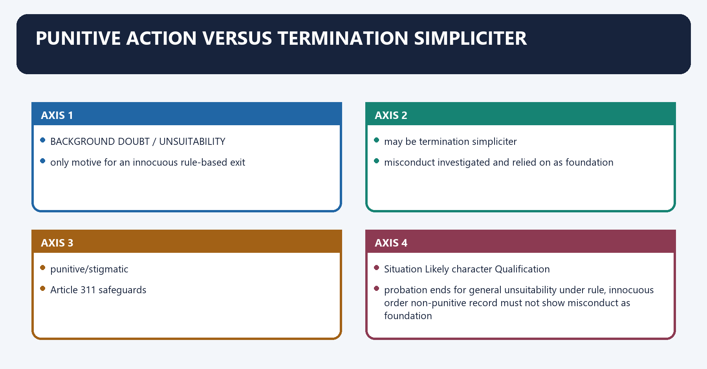
[FACT] *Parshotam Lal Dhingra v Union of India* established that not every termination, reversion or end of temporary service is dismissal, removal or reduction in rank by way of punishment. Courts examine the source of power, substance, stigma and consequences.

[FACT] *State of Punjab v Sukh Raj Bahadur* and later cases sharpened the distinction: an innocuous order under contract or service rules may be termination simpliciter; if misconduct is the foundation and the order is stigmatic or punitive, Article 311 safeguards apply.

[ANALYSIS] The administration cannot evade Article 311 merely by writing “services no longer required” if a completed misconduct inquiry is the real foundation of the adverse order.

#### Visual 22 — Motive versus Foundation

```text
BACKGROUND DOUBT / UNSUITABILITY
        |
        +--> only motive for an innocuous rule-based exit
        |       -> may be termination simpliciter
        |
        +--> misconduct investigated and relied on as foundation
                -> punitive/stigmatic
                -> Article 311 safeguards
```

*Caption: Substance controls; drafting style alone cannot launder punishment into simplicity.*

#### Visual 23 — Probation and Temporary Service Test

| Situation | Likely character | Qualification |
|---|---|---|
| probation ends for general unsuitability under rule, innocuous order | non-punitive | record must not show misconduct as foundation |
| temporary appointment expires by its term | non-punitive | mala fides and discrimination remain reviewable |
| discharge follows misconduct findings after accusatory inquiry | punitive | Article 311 ordinarily applies |
| order itself carries stigma affecting future reputation | punitive indicator | read order and surrounding record together |

*Caption: Temporary status reduces tenure expectation but does not authorise disguised punishment.*

#### CLOSING RECALL FLOW — PUNITIVE ACTION VERSUS TERMINATION SIMPLICITER

```text
START / CONCEPT: Punitive Action versus Termination Simpliciter
        |
        v
EXACT TERMS: Punitive Action versus Termination Simpliciter · non-punitive · temporary appointment expires by its term · mala fides and discrimination remain reviewable · punitive · Article 311 ordinarily applies
        |
        v
MECHANISM / ARGUMENT: Parshotam Lal Dhingra v Union of India established that not every termination, reversion or end of temporary service is dismissal, removal or reduction in rank by way of punishment.
        |
        v
CONSEQUENCE / CONTRAST: The exam-safe limitation is that probation ends for general unsuitability under rule, innocuous order non-punitive record must not show misconduct as foundation.
        |
        v
UPSC TRAP / ANSWER-USE: Do not miss this limiting distinction: its principal consequence is that punitive/stigmatic.
        |
        v
ANSWER-GRABBING FORMULATION: Punitive Action versus Termination Simpliciter denotes the constitutional rules and institutional links organised around BACKGROUND DOUBT / UNSUITABILITY.
```
### SESSION 12 — SUSPENSION, COMPULSORY RETIREMENT AND SEALED COVER

#### DEFINITION / WHAT THIS IS CALLED

**Plain-language definition:** Suspension, Compulsory Retirement and Sealed Cover denotes the constitutional rules and institutional links organised around Feature Public-interest premature retirement Disciplinary compulsory retirement.

**Technical definition:** A disciplinary penalty of compulsory retirement under applicable classification-control-appeal rules is different: it is punitive and follows the disciplinary framework.

#### ANSWER-GRABBING OPENING — WRITE/ADAPT IN THE EXAM

> Suspension, Compulsory Retirement and Sealed Cover denotes the constitutional rules and institutional links organised around Feature Public-interest premature retirement Disciplinary compulsory retirement.

#### MUST-WRITE KEYWORDS

- **Suspension**
- **Compulsory Retirement**
- **Sealed Cover**
- **Premature retirement in public interest**
- **disciplinary penalty of compulsory retirement**
- **FR 56(j)-type review provision**

**How to use them:** Frame the answer through Suspension; define Compulsory Retirement, connect Sealed Cover with Premature retirement in public interest to explain the mechanism, and use disciplinary penalty of compulsory retirement for the decisive comparison or qualification.

Suspension, Compulsory Retirement and Sealed Cover denotes the constitutional rules and institutional links organised around Feature Public-interest premature retirement Disciplinary compulsory retirement.
Suspension, Compulsory Retirement and Sealed Cover operates through Source FR 56(j)-type review provision penalty rule, connected with Character ordinarily non-punitive punitive major penalty.
The operative mechanism matters because stigma formally none follows proved misconduct.
Its principal consequence is that article 311 inquiry ordinarily not required required unless proviso applies.
The decisive contrast is between Review mala fides, no material, perversity process, evidence, proportionality and MERE COMPLAINT / PRELIMINARY INQUIRY / FIR ALONE.
The exam-safe limitation is that ordinarily insufficient by Jankiraman principle.
[FACT] Suspension under Rule 10 of the CCS (CCA) framework is ordinarily an interim measure, not one of the penalties listed in Rule 11. It is not dismissal, removal or reduction in rank.

[LIMIT] “Not a penalty” does not mean suspension is immune from legality, review, periodic reconsideration or subsistence-allowance requirements.

[FACT] **Premature retirement in public interest** under FR 56(j)-type provisions is ordinarily not punishment and carries no stigma, as explained in *Baikuntha Nath Das*. It is reviewable on limited grounds such as mala fides, absence of material or arbitrariness.

[FACT] A **disciplinary penalty of compulsory retirement** under applicable classification-control-appeal rules is different: it is punitive and follows the disciplinary framework.

#### Visual 24 — Two Compulsory Retirements

| Feature | Public-interest premature retirement | Disciplinary compulsory retirement |
|---|---|---|
| Source | FR 56(j)-type review provision | penalty rule |
| Character | ordinarily non-punitive | punitive major penalty |
| Stigma | formally none | follows proved misconduct |
| Article 311 inquiry | ordinarily not required | required unless proviso applies |
| Review | mala fides, no material, perversity | process, evidence, proportionality |

*Caption: The same everyday phrase can describe opposite legal categories.*

[FACT] The sealed-cover procedure concerns promotion consideration where specified disciplinary or criminal proceedings are pending. *Union of India v K.V. Jankiraman* located commencement at formal charge-memo issuance or filing of a criminal charge-sheet, not a mere preliminary inquiry or uncrystallised suspicion.

[CURRENT] DoPT's official sealed-cover information document continues to route the procedure through governing Office Memoranda. The exact current OM and factual trigger must be checked in a live service dispute.

#### Visual 25 — Sealed-Cover Trigger

```text
MERE COMPLAINT / PRELIMINARY INQUIRY / FIR ALONE
                    |
                    +--> ordinarily insufficient by Jankiraman principle

FORMAL DISCIPLINARY CHARGE MEMO
OR CRIMINAL CHARGE-SHEET FILED IN COURT
                    |
                    +--> sealed-cover procedure may apply under current OMs
```

*Caption: Sealed cover is a bounded promotion device, not a general presumption of guilt.*

#### CLOSING RECALL FLOW — SUSPENSION, COMPULSORY RETIREMENT AND SEALED COVER

```text
START / CONCEPT: Suspension, Compulsory Retirement and Sealed Cover
        |
        v
EXACT TERMS: Suspension · Compulsory Retirement · Sealed Cover · Premature retirement in public interest · disciplinary penalty of compulsory retirement · FR 56(j)-type review provision
        |
        v
MECHANISM / ARGUMENT: A disciplinary penalty of compulsory retirement under applicable classification-control-appeal rules is different: it is punitive and follows the disciplinary framework.
        |
        v
CONSEQUENCE / CONTRAST: Suspension under Rule 10 of the CCS (CCA) framework is ordinarily an interim measure, not one of the penalties listed in Rule 11.
        |
        v
UPSC TRAP / ANSWER-USE: “Not a penalty” does not mean suspension is immune from legality, review, periodic reconsideration or subsistence-allowance requirements.
        |
        v
ANSWER-GRABBING FORMULATION: Suspension, Compulsory Retirement and Sealed Cover denotes the constitutional rules and institutional links organised around Feature Public-interest premature retirement Disciplinary compulsory retirement.
```
### SESSION 13 — NATURAL JUSTICE AFTER THE 42ND AMENDMENT

#### DEFINITION / WHAT THIS IS CALLED

**Plain-language definition:** The 42nd Amendment removed the separate proposed-penalty hearing but retained inquiry-stage fairness.

**Technical definition:** ECIL v B. Karunakar requires supply of an adverse inquiry report where applicable, with relief depending on prejudice.

#### ANSWER-GRABBING OPENING — WRITE/ADAPT IN THE EXAM

> Post-42nd-Amendment natural justice still requires meaningful defence before a competent disciplinary decision.

#### MUST-WRITE KEYWORDS

- **natural justice**
- **42nd Amendment**
- **inquiry report**
- **ECIL Karunakar**
- **prejudice**
- **disciplinary process**

**How to use them:** Frame the answer through natural justice; define 42nd Amendment, connect inquiry report with ECIL Karunakar to explain the mechanism, and use prejudice for the decisive comparison or qualification.

Natural Justice after the 42nd Amendment denotes the constitutional rules and institutional links organised around Stage Core control Common failure.
Natural Justice after the 42nd Amendment operates through Charge specificity and competence vague omnibus allegation, connected with Evidence disclosure and testing undisclosed decisive material.
The operative mechanism matters because inquiry impartial hearing predetermined outcome.
Its principal consequence is that report evidence-linked findings conclusions without reasons.
The decisive contrast is between Penalty competent, proportionate decision mechanical or irrelevant factors and Review legality, fairness and rationality court substituting its preferred merits.
The exam-safe limitation is that stage Core control Common failure.
[FACT] The disciplinary core remains: notice of precise charges, access to relied-upon material subject to lawful limits, opportunity to contest evidence, unbiased inquiry, findings based on evidence, supply of an adverse inquiry report where required, and a reasoned decision by the competent authority.

[FACT] *B.C. Chaturvedi v Union of India* states that judicial review is directed primarily to the decision-making process, not a rehearing as an appellate disciplinary authority. Interference with penalty is exceptional, including where punishment is shockingly disproportionate.

[ANALYSIS] Article 311 protects fair accountability, not substantive innocence. A valid inquiry may end in severe punishment; an invalid inquiry may fail even against a blameworthy employee because constitutional government must punish lawfully.

#### Visual 26 — Natural-Justice Control Board

| Stage | Core control | Common failure |
|---|---|---|
| Charge | specificity and competence | vague omnibus allegation |
| Evidence | disclosure and testing | undisclosed decisive material |
| Inquiry | impartial hearing | predetermined outcome |
| Report | evidence-linked findings | conclusions without reasons |
| Penalty | competent, proportionate decision | mechanical or irrelevant factors |
| Review | legality, fairness and rationality | court substituting its preferred merits |

*Caption: Fair process and administrative discipline are mutually reinforcing, not opposites.*

#### CLOSING RECALL FLOW — NATURAL JUSTICE AFTER THE 42ND AMENDMENT

```text
START / CONCEPT: Natural Justice after the 42nd Amendment
        |
        v
EXACT TERMS: natural justice · 42nd Amendment · inquiry report · ECIL Karunakar · prejudice · disciplinary process
        |
        v
MECHANISM / ARGUMENT: Charges, evidence, defence, report supply, representation and reasoned penalty form the fair-process chain.
        |
        v
CONSEQUENCE / CONTRAST: Fairness protects reliability without restoring the deleted second show-cause stage.
        |
        v
UPSC TRAP / ANSWER-USE: Do not say the 42nd Amendment abolished the inquiry or every post-inquiry opportunity.
        |
        v
ANSWER-GRABBING FORMULATION: Post-42nd-Amendment natural justice still requires meaningful defence before a competent disciplinary decision.
```
### SESSION 14 — LANDMARK CASE-LAW SPINE

#### DEFINITION / WHAT THIS IS CALLED

**Plain-language definition:** Landmark Case-Law Spine denotes the constitutional rules and institutional links organised around Case Controlling use in an answer Do not overclaim.

**Technical definition:** Chaturvedi v Union of India (1995) review is not appeal; penalty interference is bounded courts do not routinely reweigh evidence, connected with 1957 Dhingra + Khem Chand.

#### ANSWER-GRABBING OPENING — WRITE/ADAPT IN THE EXAM

> Landmark Case-Law Spine denotes the constitutional rules and institutional links organised around Case Controlling use in an answer Do not overclaim.

#### MUST-WRITE KEYWORDS

- **Landmark Case-Law Spine**
- **Shamsher Singh v State of Punjab (1974)**
- **not every probation termination attracts Article 311**
- **Khem Chand v Union of India (1957)**
- **innocuous termination versus misconduct-founded punitive action**
- **Union of India v Tulsiram Patel (1985)**

**How to use them:** Frame the answer through Landmark Case-Law Spine; define Shamsher Singh v State of Punjab (1974), connect not every probation termination attracts Article 311 with Khem Chand v Union of India (1957) to explain the mechanism, and use innocuous termination versus misconduct-founded punitive action for the decisive comparison or qualification.

Landmark Case-Law Spine denotes the constitutional rules and institutional links organised around Case Controlling use in an answer Do not overclaim.
Landmark Case-Law Spine operates through B.C. Chaturvedi v Union of India (1995) review is not appeal; penalty interference is bounded courts do not routinely reweigh evidence, connected with 1957 Dhingra + Khem Chand.
The operative mechanism matters because 1968 Sukh Raj Bahadur.
Its principal consequence is that 1974 Shamsher Singh.
The decisive contrast is between 1985 Tulsiram Patel and 1991 K.V. Jankiraman.
The exam-safe limitation is that 1992 Baikuntha Nath Das.
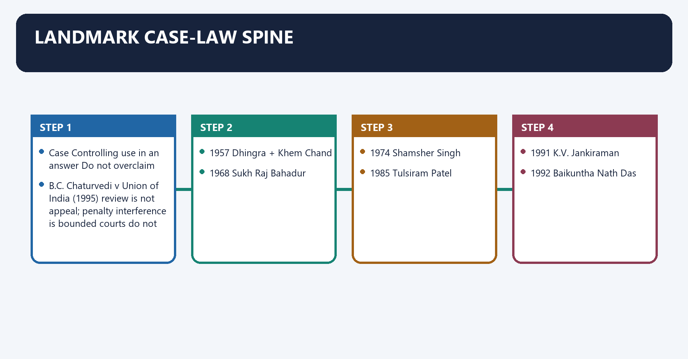
#### Visual 27 — Case-to-Principle Matrix

| Case | Controlling use in an answer | Do not overclaim |
|---|---|---|
| *Shamsher Singh v State of Punjab* (1974) | President/Governor are formal heads; ordinary satisfaction works through constitutional government | not every constitutional provision is personal discretion |
| *Parshotam Lal Dhingra v Union of India* (1957/1958 report) | punitive consequences and substance distinguish punishment from rule-based exit | not every probation termination attracts Article 311 |
| *Khem Chand v Union of India* (1957) | reasonable opportunity historically included charge, defence and then penalty representation | second penalty opportunity was later removed constitutionally |
| *State of Punjab v Sukh Raj Bahadur* (1968) | innocuous termination versus misconduct-founded punitive action | motive and foundation must be read from the record |
| *Union of India v Tulsiram Patel* (1985) | Article 311 exceptions are constitutional; clause (b) reasons and use remain reviewable | “final” does not mean judicially immune |
| *B.C. Chaturvedi v Union of India* (1995) | review is not appeal; penalty interference is bounded | courts do not routinely reweigh evidence |
| *ECIL v B. Karunakar* (1993) | adverse inquiry report must be supplied where applicable; prejudice matters | non-supply does not mechanically produce identical relief |

*Caption: A case name earns marks only when attached to a precise proposition and qualification.*

#### Visual 28 — Case-Law Chronology

```text
1957  Dhingra + Khem Chand
        |
1968  Sukh Raj Bahadur
        |
1974  Shamsher Singh
        |
1985  Tulsiram Patel
        |
1991  K.V. Jankiraman
        |
1992  Baikuntha Nath Das
        |
1993  ECIL v Karunakar
        |
1995  B.C. Chaturvedi
```

*Caption: The doctrine evolved from identifying punishment to refining process, exceptions, promotion and review.*

#### CLOSING RECALL FLOW — LANDMARK CASE-LAW SPINE

```text
START / CONCEPT: Landmark Case-Law Spine
        |
        v
EXACT TERMS: Landmark Case-Law Spine · Shamsher Singh v State of Punjab (1974) · not every probation termination attracts Article 311 · Khem Chand v Union of India (1957) · innocuous termination versus misconduct-founded punitive action · Union of India v Tulsiram Patel (1985)
        |
        v
MECHANISM / ARGUMENT: Chaturvedi v Union of India (1995) review is not appeal; penalty interference is bounded courts do not routinely reweigh evidence, connected with 1957 Dhingra + Khem Chand.
        |
        v
CONSEQUENCE / CONTRAST: The decisive contrast is between 1985 Tulsiram Patel and 1991 K.V.
        |
        v
UPSC TRAP / ANSWER-USE: Do not miss this limiting distinction: its principal consequence is that 1974 Shamsher Singh.
        |
        v
ANSWER-GRABBING FORMULATION: Landmark Case-Law Spine denotes the constitutional rules and institutional links organised around Case Controlling use in an answer Do not overclaim.
```
### SESSION 15 — ARTICLE 312: CREATING AND REGULATING ALL-INDIA SERVICES

#### DEFINITION / WHAT THIS IS CALLED

**Plain-language definition:** Article 312: Creating and Regulating All-India Services denotes the constitutional rules and institutional links organised around The Indian Foreign Service is not an All-India Service.

**Technical definition:** The decisive contrast is between COMMON SERVICE FOR UNION AND STATES and Article 312 constitutional gateway and federal resolution.

#### ANSWER-GRABBING OPENING — WRITE/ADAPT IN THE EXAM

> Article 312: Creating and Regulating All-India Services denotes the constitutional rules and institutional links organised around The Indian Foreign Service is not an All-India Service.

#### MUST-WRITE KEYWORDS

- **Article 312**
- **Creating**
- **Regulating All-India Services**
- **constitutional gateway and federal resolution**
- **AIS Act, 1951**
- **parliamentary authority for regulation**

**How to use them:** Frame the answer through Article 312; define Creating, connect Regulating All-India Services with constitutional gateway and federal resolution to explain the mechanism, and use AIS Act, 1951 for the decisive comparison or qualification.

Article 312: Creating and Regulating All-India Services denotes the constitutional rules and institutional links organised around [LIMIT] The Indian Foreign Service is not an All-India Service.
Article 312: Creating and Regulating All-India Services operates through NATIONAL-INTEREST NEED, connected with RAJYA SABHA RESOLUTION.
The operative mechanism matters because not less than 2/3 present and voting.
Its principal consequence is that rECRUITMENT + SERVICE-CONDITION RULES.
The decisive contrast is between COMMON SERVICE FOR UNION AND STATES and Article 312 constitutional gateway and federal resolution.
The exam-safe limitation is that aIS Act, 1951 parliamentary authority for regulation.
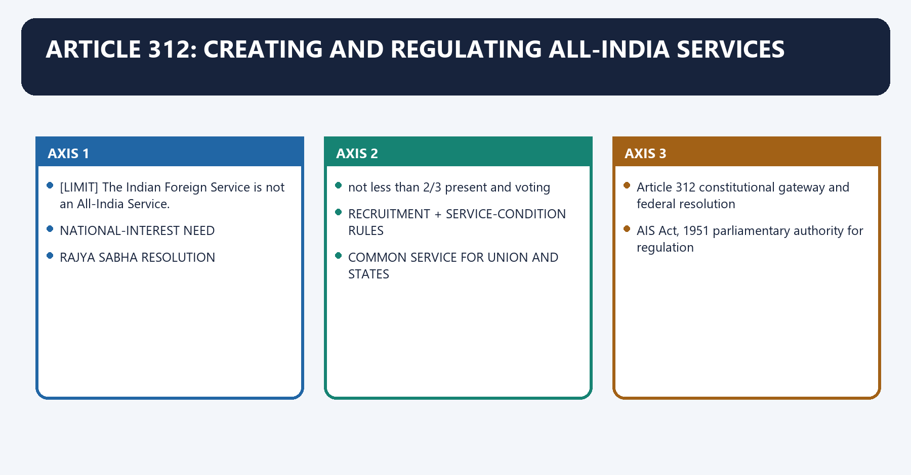
[FACT] If the Rajya Sabha declares by resolution, supported by **not less than two-thirds of members present and voting**, that it is necessary or expedient in the national interest, Parliament may by law create one or more All-India Services common to the Union and the States and regulate recruitment and service conditions.

[FACT] Article 312(2) deems the IAS and IPS to be services created by Parliament under clause (1). The Indian Forest Service was constituted under the All-India Services Act framework and is the third existing AIS.

[LIMIT] The Indian Foreign Service is not an All-India Service.

#### Visual 29 — New AIS Creation Route

```text
NATIONAL-INTEREST NEED
        |
        v
RAJYA SABHA RESOLUTION
not less than 2/3 present and voting
        |
        v
PARLIAMENTARY LAW
        |
        v
RECRUITMENT + SERVICE-CONDITION RULES
        |
        v
COMMON SERVICE FOR UNION AND STATES
```

*Caption: The States' House opens the route; Parliament creates and regulates the service.*

[FACT] Section 3 of the All-India Services Act, 1951 authorises the Central Government, after consultation with State Governments, to make rules for recruitment and service conditions, subject to statutory parliamentary control.

[ANALYSIS] Article 312 and the 1951 Act create integration through a federal bargain: national standards coexist with State-level deployment and administration.

#### Visual 30 — Article, Act and Rules

| Layer | Function |
|---|---|
| Article 312 | constitutional gateway and federal resolution |
| AIS Act, 1951 | parliamentary authority for regulation |
| recruitment rules/regulations | direct recruitment and State-service promotion routes |
| cadre rules | cadre allocation, strength and deputation architecture |
| conduct/discipline rules | behaviour, inquiry and penalties |

*Caption: No single document contains the whole AIS system.*

#### CLOSING RECALL FLOW — ARTICLE 312: CREATING AND REGULATING ALL-INDIA SERVICES

```text
START / CONCEPT: Article 312: Creating and Regulating All-India Services
        |
        v
EXACT TERMS: Article 312 · Creating · Regulating All-India Services · constitutional gateway and federal resolution · AIS Act, 1951 · parliamentary authority for regulation
        |
        v
MECHANISM / ARGUMENT: Article 312(2) deems the IAS and IPS to be services created by Parliament under clause (1).
        |
        v
CONSEQUENCE / CONTRAST: The decisive contrast is between COMMON SERVICE FOR UNION AND STATES and Article 312 constitutional gateway and federal resolution.
        |
        v
UPSC TRAP / ANSWER-USE: If the Rajya Sabha declares by resolution, supported by not less than two-thirds of members present and voting, that it is necessary or expedient in the national interest, Parliament may by law create one or more All-India Services common to the Union and the States and regulate recruitment and service conditions.
        |
        v
ANSWER-GRABBING FORMULATION: Article 312: Creating and Regulating All-India Services denotes the constitutional rules and institutional links organised around The Indian Foreign Service is not an All-India Service.
```
### SESSION 16 — THE THREE EXISTING ALL-INDIA SERVICES

#### DEFINITION / WHAT THIS IS CALLED

**Plain-language definition:** The Three Existing All-India Services denotes the constitutional rules and institutional links organised around Service Broad field Constitutional/statutory status.

**Technical definition:** The decisive contrast is between Service Broad field Constitutional/statutory status and Service Broad field Constitutional/statutory status.

#### ANSWER-GRABBING OPENING — WRITE/ADAPT IN THE EXAM

> The Three Existing All-India Services denotes the constitutional rules and institutional links organised around Service Broad field Constitutional/statutory status.

#### MUST-WRITE KEYWORDS

- **The Three Existing All-India Services**
- **Indian Administrative Service**
- **general administration and policy implementation**
- **deemed under Article 312(2)**
- **Indian Police Service**
- **policing and public order leadership**

**How to use them:** Frame the answer through The Three Existing All-India Services; define Indian Administrative Service, connect general administration and policy implementation with deemed under Article 312(2) to explain the mechanism, and use Indian Police Service for the decisive comparison or qualification.

The Three Existing All-India Services denotes the constitutional rules and institutional links organised around Service Broad field Constitutional/statutory status.
The Three Existing All-India Services operates through Indian Administrative Service general administration and policy implementation deemed under Article 312(2), connected with Indian Police Service policing and public order leadership deemed under Article 312(2).
The operative mechanism matters because indian Forest Service forest and environmental administration constituted under AIS Act framework.
Its principal consequence is that [LIMIT] This package does not freeze cadre numbers, deputation shortages, promotion quotas or current vacancy totals.
The decisive contrast is between Service Broad field Constitutional/statutory status and Service Broad field Constitutional/statutory status.
The exam-safe limitation is that service Broad field Constitutional/statutory status.
#### Visual 31 — Existing AIS Identity Card

| Service | Broad field | Constitutional/statutory status |
|---|---|---|
| Indian Administrative Service | general administration and policy implementation | deemed under Article 312(2) |
| Indian Police Service | policing and public order leadership | deemed under Article 312(2) |
| Indian Forest Service | forest and environmental administration | constituted under AIS Act framework |

*Caption: IAS, IPS and Indian Forest Service are the complete current AIS list used in this package.*

[FACT] Recruitment includes direct competitive routes through UPSC-administered processes and promotion from eligible State services under governing regulations. Cadre allocation, probation/training, State posting, Central deputation and disciplinary matters are rule-based stages rather than one undifferentiated “Central control”.

[LIMIT] This package does not freeze cadre numbers, deputation shortages, promotion quotas or current vacancy totals.

#### CLOSING RECALL FLOW — THE THREE EXISTING ALL-INDIA SERVICES

```text
START / CONCEPT: The Three Existing All-India Services
        |
        v
EXACT TERMS: The Three Existing All-India Services · Indian Administrative Service · general administration and policy implementation · deemed under Article 312(2) · Indian Police Service · policing and public order leadership
        |
        v
MECHANISM / ARGUMENT: Recruitment includes direct competitive routes through UPSC-administered processes and promotion from eligible State services under governing regulations.
        |
        v
CONSEQUENCE / CONTRAST: The decisive contrast is between Service Broad field Constitutional/statutory status and Service Broad field Constitutional/statutory status.
        |
        v
UPSC TRAP / ANSWER-USE: Its principal consequence is that This package does not freeze cadre numbers, deputation shortages, promotion quotas or current vacancy totals.
        |
        v
ANSWER-GRABBING FORMULATION: The Three Existing All-India Services denotes the constitutional rules and institutional links organised around Service Broad field Constitutional/statutory status.
```
### SESSION 17 — AIS DUAL CONTROL AND FEDERAL DESIGN

#### DEFINITION / WHAT THIS IS CALLED

**Plain-language definition:** AIS Dual Control and Federal Design denotes the constitutional rules and institutional links organised around rules / cadre architecture / deputation.

**Technical definition:** Its principal consequence is that claimed strength Mechanism Federal risk Guardrail.

#### ANSWER-GRABBING OPENING — WRITE/ADAPT IN THE EXAM

> AIS Dual Control and Federal Design denotes the constitutional rules and institutional links organised around rules / cadre architecture / deputation.

#### MUST-WRITE KEYWORDS

- **AIS Dual Control**
- **Federal Design**
- **national standards**
- **common recruitment and training**
- **excessive uniformity**
- **continuity**

**How to use them:** Frame the answer through AIS Dual Control; define Federal Design, connect national standards with common recruitment and training to explain the mechanism, and use excessive uniformity for the decisive comparison or qualification.

AIS Dual Control and Federal Design denotes the constitutional rules and institutional links organised around rules / cadre architecture / deputation.
AIS Dual Control and Federal Design operates through OFFICER <------ STATE, connected with constitutional duty posting / field supervision.
The operative mechanism matters because professional record implementation priorities.
Its principal consequence is that claimed strength Mechanism Federal risk Guardrail.
The decisive contrast is between national standards common recruitment and training excessive uniformity State consultation and local competence and continuity career service across governments insulated inertia appraisal and accountability.
The exam-safe limitation is that crisis coordination inter-governmental mobility central commandeering perception transparent rule-based deputation.
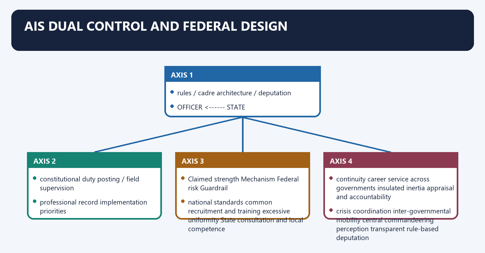
[FACT] AIS officers belong to a service common to Union and States, are allocated to cadres, and may serve State governments and the Union at different stages. The Union frames the service architecture under the 1951 Act and rules; State governments exercise substantial day-to-day administrative and posting control when officers serve in State cadres, subject to the rules.

[ANALYSIS] The design produces both integration and divided accountability. A State needs responsive officers; the Union values common standards and mobility; the officer must remain loyal to the Constitution and lawful government rather than to a political patron at either level.

#### Visual 32 — Federal Dual-Control Triangle

```text
                 UNION
     rules / cadre architecture / deputation
               /          \
              /            \
             v              v
          OFFICER <------> STATE
 constitutional duty      posting / field supervision
 professional record      implementation priorities
```

*Caption: Shared control is the design; unilateral ownership is the distortion.*

#### Visual 33 — AIS Strengths and Federal Risks

| Claimed strength | Mechanism | Federal risk | Guardrail |
|---|---|---|---|
| national standards | common recruitment and training | excessive uniformity | State consultation and local competence |
| continuity | career service across governments | insulated inertia | appraisal and accountability |
| crisis coordination | inter-governmental mobility | central commandeering perception | transparent rule-based deputation |
| integrity | tenure and service protections | divided loyalty | recorded orders and clear authority |

*Caption: The same institutional feature can integrate the federation or strain it depending on process.*

#### CLOSING RECALL FLOW — AIS DUAL CONTROL AND FEDERAL DESIGN

```text
START / CONCEPT: AIS Dual Control and Federal Design
        |
        v
EXACT TERMS: AIS Dual Control · Federal Design · national standards · common recruitment and training · excessive uniformity · continuity
        |
        v
MECHANISM / ARGUMENT: Its principal consequence is that claimed strength Mechanism Federal risk Guardrail.
        |
        v
CONSEQUENCE / CONTRAST: The decisive contrast is between national standards common recruitment and training excessive uniformity State consultation and local competence and continuity career service across governments insulated inertia appraisal and accountability.
        |
        v
UPSC TRAP / ANSWER-USE: Do not miss this limiting distinction: the design produces both integration and divided accountability.
        |
        v
ANSWER-GRABBING FORMULATION: AIS Dual Control and Federal Design denotes the constitutional rules and institutional links organised around rules / cadre architecture / deputation.
```
### SESSION 18 — ALL-INDIA JUDICIAL SERVICE: ENABLED, NOT ESTABLISHED

#### DEFINITION / WHAT THIS IS CALLED

**Plain-language definition:** All-India Judicial Service: Enabled, Not Established denotes the constitutional rules and institutional links organised around Article 312(1) expressly includes an All-India Judicial Service within the possible new AIS route.

**Technical definition:** All-India Judicial Service: Enabled, Not Established operates through AIJS is a proposal enabled by the Constitution, not a presently operating service, connected with CONSTITUTIONALLY ENABLED?

#### ANSWER-GRABBING OPENING — WRITE/ADAPT IN THE EXAM

> All-India Judicial Service: Enabled, Not Established denotes the constitutional rules and institutional links organised around Article 312(1) expressly includes an All-India Judicial Service within the possible new AIS route.

#### MUST-WRITE KEYWORDS

- **All-India Judicial Service**
- **Enabled**
- **Not Established**
- **common standards**
- **federal and High Court control**
- **wider talent pool**

**How to use them:** Frame the answer through All-India Judicial Service; define Enabled, connect Not Established with common standards to explain the mechanism, and use federal and High Court control for the decisive comparison or qualification.

All-India Judicial Service: Enabled, Not Established denotes the constitutional rules and institutional links organised around [FACT] Article 312(1) expressly includes an All-India Judicial Service within the possible new AIS route.
All-India Judicial Service: Enabled, Not Established operates through [LIMIT] AIJS is a proposal enabled by the Constitution, not a presently operating service, connected with CONSTITUTIONALLY ENABLED? YES.
The operative mechanism matters because rAJYA SABHA 2/3 PRESENT-VOTING RESOLUTION? REQUIRED.
Its principal consequence is that pARLIAMENTARY CREATING LAW? REQUIRED.
The decisive contrast is between POSTS BELOW DISTRICT JUDGE? NOT PERMITTED and ARTICLE 368 AMENDMENT? NOT REQUIRED FOR 312(4) CONSEQUENCES.
The exam-safe limitation is that eSTABLISHED TODAY? NO OFFICIAL ESTABLISHMENT VERIFIED.
[FACT] Article 312(1) expressly includes an All-India Judicial Service within the possible new AIS route.

[FACT] Article 312(3) bars inclusion of any post inferior to that of a district judge as defined in Article 236. Article 312(4) permits the creating law to make necessary changes to Chapter VI of Part VI and says that such a law is not deemed a constitutional amendment for Article 368.

[CURRENT] Official Department of Justice material checked for this package does not show an established AIJS. The proposal remains contested among Union institutions, States and High Courts.

[LIMIT] AIJS is a proposal enabled by the Constitution, not a presently operating service.

#### Visual 34 — AIJS Legal Status

```text
CONSTITUTIONALLY ENABLED?  YES
        |
RAJYA SABHA 2/3 PRESENT-VOTING RESOLUTION?  REQUIRED
        |
PARLIAMENTARY CREATING LAW?  REQUIRED
        |
POSTS BELOW DISTRICT JUDGE?  NOT PERMITTED
        |
ARTICLE 368 AMENDMENT?  NOT REQUIRED FOR 312(4) CONSEQUENCES
        |
ESTABLISHED TODAY?  NO OFFICIAL ESTABLISHMENT VERIFIED
```

*Caption: Constitutional possibility must not be converted into institutional existence.*

#### Visual 35 — AIJS Debate Matrix

| Case for AIJS | Concern | Balanced design question |
|---|---|---|
| common standards | federal and High Court control | who recruits, trains, posts and disciplines? |
| wider talent pool | language and local-law competence | how is local capacity tested? |
| diversity and inclusion | one-size national process | what reservation and representation rules apply? |
| vacancy management | service creation does not itself fill every court | what complements infrastructure and process reform? |

*Caption: AIJS is a federal-judicial design debate, not merely a recruitment examination proposal.*

#### CLOSING RECALL FLOW — ALL-INDIA JUDICIAL SERVICE: ENABLED, NOT ESTABLISHED

```text
START / CONCEPT: All-India Judicial Service: Enabled, Not Established
        |
        v
EXACT TERMS: All-India Judicial Service · Enabled · Not Established · common standards · federal and High Court control · wider talent pool
        |
        v
MECHANISM / ARGUMENT: All-India Judicial Service: Enabled, Not Established operates through AIJS is a proposal enabled by the Constitution, not a presently operating service, connected with CONSTITUTIONALLY ENABLED?
        |
        v
CONSEQUENCE / CONTRAST: AIJS is a proposal enabled by the Constitution, not a presently operating service.
        |
        v
UPSC TRAP / ANSWER-USE: Do not miss this limiting distinction: article 312(1) expressly includes an All-India Judicial Service within the possible new AIS route.
        |
        v
ANSWER-GRABBING FORMULATION: All-India Judicial Service: Enabled, Not Established denotes the constitutional rules and institutional links organised around Article 312(1) expressly includes an All-India Judicial Service within the possible new AIS route.
```
### SESSION 19 — ARTICLES 312A, 313 AND 314: COLONIAL-SERVICE CLOSURE

#### DEFINITION / WHAT THIS IS CALLED

**Plain-language definition:** Articles 312A, 313 and 314: Colonial-Service Closure denotes the constitutional rules and institutional links organised around Article 313 continues pre-Constitution service laws, so far as consistent with the Constitution, until other provision is made.

**Technical definition:** Its principal consequence is that aRTICLE 313: temporary continuity of consistent service law.

#### ANSWER-GRABBING OPENING — WRITE/ADAPT IN THE EXAM

> Articles 312A, 313 and 314: Colonial-Service Closure denotes the constitutional rules and institutional links organised around Article 313 continues pre-Constitution service laws, so far as consistent with the Constitution, until other provision is made.

#### MUST-WRITE KEYWORDS

- **Articles 312A**
- **Colonial-Service Closure**
- **Article 313**
- **Article 314**
- **Article 312A**
- **Articles 312A, 313 and 314: Colonial-Service Closure**

**How to use them:** Frame the answer through Articles 312A; define Colonial-Service Closure, connect Article 313 with Article 314 to explain the mechanism, and use Article 312A for the decisive comparison or qualification.

Articles 312A, 313 and 314: Colonial-Service Closure denotes the constitutional rules and institutional links organised around [FACT] Article 313 continues pre-Constitution service laws, so far as consistent with the Constitution, until other provision is made.
Articles 312A, 313 and 314: Colonial-Service Closure operates through [FACT] Article 314, which had protected specified former Crown-service officers, was repealed by the 28th Amendment, 1972, connected with [ANALYSIS] These provisions close the constitutional transition from imperial covenanted services to republican legislative control.
The operative mechanism matters because pRE-CONSTITUTION CROWN SERVICES.
Its principal consequence is that aRTICLE 313: temporary continuity of consistent service law.
The decisive contrast is between 28TH AMENDMENT 1972 and ARTICLE 312A inserted.
The exam-safe limitation is that aRTICLE 314 repealed.
[FACT] Article 312A, inserted by the 28th Amendment, authorises Parliament to vary or revoke specified service conditions and pension rights of persons appointed before the Constitution by the Secretary of State or Secretary of State in Council, subject to the Article's safeguards for certain constitutional offices.

[FACT] Article 313 continues pre-Constitution service laws, so far as consistent with the Constitution, until other provision is made.

[FACT] Article 314, which had protected specified former Crown-service officers, was repealed by the 28th Amendment, 1972.

[ANALYSIS] These provisions close the constitutional transition from imperial covenanted services to republican legislative control.

#### Visual 36 — Historical Closure Strip

```text
PRE-CONSTITUTION CROWN SERVICES
          |
          v
ARTICLE 313: temporary continuity of consistent service law
          |
          v
28TH AMENDMENT 1972
          |
          +--> ARTICLE 312A inserted
          +--> ARTICLE 314 repealed
          |
          v
REPUBLICAN PARLIAMENTARY CONTROL
```

*Caption: The transitional Articles matter for constitutional completeness, not daily personnel administration.*

#### CLOSING RECALL FLOW — ARTICLES 312A, 313 AND 314: COLONIAL-SERVICE CLOSURE

```text
START / CONCEPT: Articles 312A, 313 and 314: Colonial-Service Closure
        |
        v
EXACT TERMS: Articles 312A · Colonial-Service Closure · Article 313 · Article 314 · Article 312A · Articles 312A, 313 and 314: Colonial-Service Closure
        |
        v
MECHANISM / ARGUMENT: Articles 312A, 313 and 314: Colonial-Service Closure operates through Article 314, which had protected specified former Crown-service officers, was repealed by the 28th Amendment, 1972, connected with These provisions close the constitutional transition from imperial covenanted services to republican legislative control.
        |
        v
CONSEQUENCE / CONTRAST: Its principal consequence is that aRTICLE 313: temporary continuity of consistent service law.
        |
        v
UPSC TRAP / ANSWER-USE: Do not miss this limiting distinction: the decisive contrast is between 28TH AMENDMENT 1972 and ARTICLE 312A inserted.
        |
        v
ANSWER-GRABBING FORMULATION: Articles 312A, 313 and 314: Colonial-Service Closure denotes the constitutional rules and institutional links organised around Article 313 continues pre-Constitution service laws, so far as consistent with the Constitution, until other provision is made.
```
### SESSION 20 — RIGHTS OF CIVIL SERVANTS: CITIZENS WITH SERVICE OBLIGATIONS

#### DEFINITION / WHAT THIS IS CALLED

**Plain-language definition:** Rights of Civil Servants: Citizens with Service Obligations denotes the constitutional rules and institutional links organised around Right/value Service application Lawful qualification.

**Technical definition:** Its principal consequence is that association, Article 19(1)(c) service associations no automatic right to recognition, bargaining outcome or strike.

#### ANSWER-GRABBING OPENING — WRITE/ADAPT IN THE EXAM

> Rights of Civil Servants: Citizens with Service Obligations denotes the constitutional rules and institutional links organised around Right/value Service application Lawful qualification.

#### MUST-WRITE KEYWORDS

- **Rights of Civil Servants**
- **Citizens with Service Obligations**
- **Equality, Article 14**
- **non-arbitrary discipline, posting and classification**
- **reasonable service distinctions**
- **Equal opportunity, Article 16**

**How to use them:** Frame the answer through Rights of Civil Servants; define Citizens with Service Obligations, connect Equality, Article 14 with non-arbitrary discipline, posting and classification to explain the mechanism, and use reasonable service distinctions for the decisive comparison or qualification.

Rights of Civil Servants: Citizens with Service Obligations denotes the constitutional rules and institutional links organised around Right/value Service application Lawful qualification.
Rights of Civil Servants: Citizens with Service Obligations operates through Equality, Article 14 non-arbitrary discipline, posting and classification reasonable service distinctions, connected with Equal opportunity, Article 16 recruitment and promotion framework constitutional reservation and eligibility rules.
The operative mechanism matters because speech, Article 19(1)(a) personal expression conduct, confidentiality and discipline restrictions.
Its principal consequence is that association, Article 19(1)(c) service associations no automatic right to recognition, bargaining outcome or strike.
The decisive contrast is between Life and dignity, Article 21 fair procedure and humane service conditions lawful disciplinary power and Right/value Service application Lawful qualification.
The exam-safe limitation is that right/value Service application Lawful qualification.
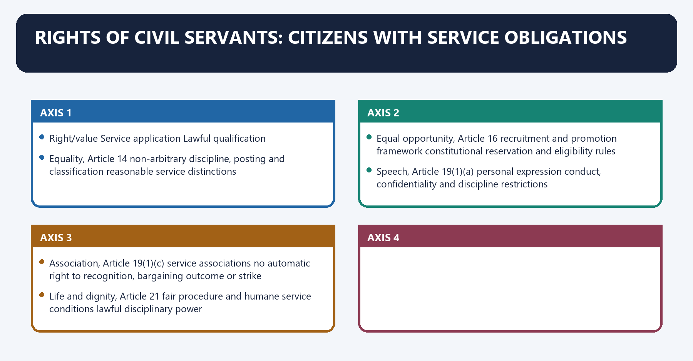
[FACT] Civil servants retain constitutional personhood and, where applicable, citizenship rights. Articles 14 and 16 constrain arbitrary service action and protect equality and equal opportunity in public employment.

[FACT] Article 19 freedoms remain subject to constitutionally valid restrictions and service-conduct rules designed for neutrality, discipline, confidentiality, integrity and effective administration.

[ANALYSIS] Entry into public service does not extinguish rights; it creates a special public-law relationship in which some forms of political activity, disclosure, outside employment and collective action may be restricted more tightly than for ordinary citizens.

#### Visual 37 — Rights and Restrictions Balance

| Right/value | Service application | Lawful qualification |
|---|---|---|
| Equality, Article 14 | non-arbitrary discipline, posting and classification | reasonable service distinctions |
| Equal opportunity, Article 16 | recruitment and promotion framework | constitutional reservation and eligibility rules |
| Speech, Article 19(1)(a) | personal expression | conduct, confidentiality and discipline restrictions |
| Association, Article 19(1)(c) | service associations | no automatic right to recognition, bargaining outcome or strike |
| Life and dignity, Article 21 | fair procedure and humane service conditions | lawful disciplinary power |

*Caption: Public employment narrows some modes of conduct without erasing constitutional review.*

#### CLOSING RECALL FLOW — RIGHTS OF CIVIL SERVANTS: CITIZENS WITH SERVICE OBLIGATIONS

```text
START / CONCEPT: Rights of Civil Servants: Citizens with Service Obligations
        |
        v
EXACT TERMS: Rights of Civil Servants · Citizens with Service Obligations · Equality, Article 14 · non-arbitrary discipline, posting and classification · reasonable service distinctions · Equal opportunity, Article 16
        |
        v
MECHANISM / ARGUMENT: Entry into public service does not extinguish rights; it creates a special public-law relationship in which some forms of political activity, disclosure, outside employment and collective action may be restricted more tightly than for ordinary citizens.
        |
        v
CONSEQUENCE / CONTRAST: Its principal consequence is that association, Article 19(1)(c) service associations no automatic right to recognition, bargaining outcome or strike.
        |
        v
UPSC TRAP / ANSWER-USE: The decisive contrast is between Life and dignity, Article 21 fair procedure and humane service conditions lawful disciplinary power and Right/value Service application Lawful qualification.
        |
        v
ANSWER-GRABBING FORMULATION: Rights of Civil Servants: Citizens with Service Obligations denotes the constitutional rules and institutional links organised around Right/value Service application Lawful qualification.
```
### SESSION 21 — NEUTRALITY, POLITICAL ACTIVITY, ASSOCIATION AND STRIKE

#### DEFINITION / WHAT THIS IS CALLED

**Plain-language definition:** Neutrality, Political Activity, Association and Strike denotes the constitutional rules and institutional links organised around T.K.

**Technical definition:** Neutrality, Political Activity, Association and Strike operates through NEUTRALITY REQUIRES, connected with candid professional advice.

#### ANSWER-GRABBING OPENING — WRITE/ADAPT IN THE EXAM

> Neutrality, Political Activity, Association and Strike denotes the constitutional rules and institutional links organised around T.K.

#### MUST-WRITE KEYWORDS

- **Neutrality**
- **Political Activity**
- **Association**
- **Strike**
- **sets lawful democratic priorities**
- **supplies facts, options and risks**

**How to use them:** Frame the answer through Neutrality; define Political Activity, connect Association with Strike to explain the mechanism, and use sets lawful democratic priorities for the decisive comparison or qualification.

Neutrality, Political Activity, Association and Strike denotes the constitutional rules and institutional links organised around [FACT] T.K. Rangarajan v Government of Tamil Nadu held that government employees have no fundamental right to strike.
Neutrality, Political Activity, Association and Strike operates through NEUTRALITY REQUIRES, connected with candid professional advice.
The operative mechanism matters because impartial implementation.
Its principal consequence is that service across changes of government.
The decisive contrast is between refusal of unlawful orders and NEUTRALITY DOES NOT MEAN.
The exam-safe limitation is that value-free indifference to rights.
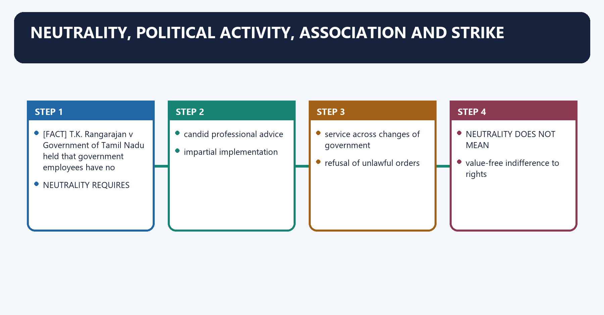
[FACT] DoPT's CCS (Conduct) Rules restrict government servants from association with political parties and participation in political movements and elections, while separately regulating associations, demonstrations and strikes.

[FACT] *T.K. Rangarajan v Government of Tamil Nadu* held that government employees have no fundamental right to strike.

[LIMIT] No fundamental right to strike does not eliminate lawful grievance, representation, association, collective consultation or statutory remedies.

#### Visual 38 — Neutrality Is Not Silence

```text
NEUTRALITY REQUIRES
  + candid professional advice
  + impartial implementation
  + service across changes of government
  + refusal of unlawful orders

NEUTRALITY DOES NOT MEAN
  - partisan loyalty
  - value-free indifference to rights
  - sabotage of elected policy
  - unaccountable permanent veto
```

*Caption: The permanent executive is politically non-partisan but constitutionally value-bound.*

#### Visual 39 — Political Executive / Permanent Executive Compact

| Political executive | Permanent executive |
|---|---|
| sets lawful democratic priorities | supplies facts, options and risks |
| decides policy after advice | records candid advice |
| remains answerable to legislature and electorate | implements the lawful decision faithfully |
| may change policy | preserves record and continuity |
| cannot demand illegality | must seek written confirmation and resist unlawful direction |

*Caption: Neutrality is a disciplined relationship, not bureaucratic supremacy.*

#### CLOSING RECALL FLOW — NEUTRALITY, POLITICAL ACTIVITY, ASSOCIATION AND STRIKE

```text
START / CONCEPT: Neutrality, Political Activity, Association and Strike
        |
        v
EXACT TERMS: Neutrality · Political Activity · Association · Strike · sets lawful democratic priorities · supplies facts, options and risks
        |
        v
MECHANISM / ARGUMENT: Neutrality, Political Activity, Association and Strike operates through NEUTRALITY REQUIRES, connected with candid professional advice.
        |
        v
CONSEQUENCE / CONTRAST: No fundamental right to strike does not eliminate lawful grievance, representation, association, collective consultation or statutory remedies.
        |
        v
UPSC TRAP / ANSWER-USE: The decisive contrast is between refusal of unlawful orders and NEUTRALITY DOES NOT MEAN.
        |
        v
ANSWER-GRABBING FORMULATION: Neutrality, Political Activity, Association and Strike denotes the constitutional rules and institutional links organised around T.K.
```
### SESSION 22 — INTEGRITY, ACCOUNTABILITY AND WHISTLEBLOWER SAFEGUARDS

#### DEFINITION / WHAT THIS IS CALLED

**Plain-language definition:** Civil-service integrity is supported by disciplinary, vigilance, criminal, audit and protected-disclosure tracks.

**Technical definition:** Integrity and accountability tracks for discipline, vigilance, criminal law, audit and protected disclosure each have a distinct trigger, authority, standard and remedy.

#### ANSWER-GRABBING OPENING — WRITE/ADAPT IN THE EXAM

> Accountability is strongest when lawful reporting and fair discipline reinforce rather than undermine candour.

#### MUST-WRITE KEYWORDS

- **integrity**
- **accountability**
- **vigilance**
- **discipline**
- **criminal law**
- **protected disclosure**

**How to use them:** Frame the answer through integrity; define accountability, connect vigilance with discipline to explain the mechanism, and use criminal law for the decisive comparison or qualification.

Integrity, Accountability and Whistleblower Safeguards denotes the constitutional rules and institutional links organised around SELF-CONTROL: integrity and professional ethics.
Integrity, Accountability and Whistleblower Safeguards operates through CONDUCT RULES: defined obligations, connected with DEPARTMENTAL VIGILANCE / CVO.
The operative mechanism matters because cVC ADVICE / SUPERVISION IN COVERED FIELD.
Its principal consequence is that cBI / POLICE INVESTIGATION FOR CRIMINAL OFFENCES.
The decisive contrast is between DISCIPLINARY AUTHORITY / COURT and APPEAL, TRIBUNAL AND JUDICIAL REVIEW.
The exam-safe limitation is that sELF-CONTROL: integrity and professional ethics.
[FACT] Conduct rules translate integrity, impartiality, devotion to duty and political neutrality into enforceable obligations. Ethics provides the value vocabulary; service law supplies specific duties and sanctions.

[CURRENT] The Whistle Blowers Protection Act, 2014 was enacted, but no official commencement notification bringing it into force was verified by the control date. The CVC's PIDPI Resolution mechanism remains the central official disclosure route for covered Union matters.

[LIMIT] Do not present the 2014 Act as fully operational without a verified commencement notification, or PIDPI as a universal mechanism for every State, private employer or grievance.

#### Visual 40 — Accountability Stack

```text
SELF-CONTROL: integrity and professional ethics
        |
CONDUCT RULES: defined obligations
        |
DEPARTMENTAL VIGILANCE / CVO
        |
CVC ADVICE / SUPERVISION IN COVERED FIELD
        |
CBI / POLICE INVESTIGATION FOR CRIMINAL OFFENCES
        |
DISCIPLINARY AUTHORITY / COURT
        |
APPEAL, TRIBUNAL AND JUDICIAL REVIEW
```

*Caption: Ethical, disciplinary and criminal accountability overlap but are not interchangeable.*

#### CLOSING RECALL FLOW — INTEGRITY, ACCOUNTABILITY AND WHISTLEBLOWER SAFEGUARDS

```text
START / CONCEPT: Integrity, Accountability and Whistleblower Safeguards
        |
        v
EXACT TERMS: integrity · accountability · vigilance · discipline · criminal law · protected disclosure
        |
        v
MECHANISM / ARGUMENT: Route misconduct to conduct rules and CCA process, corruption to vigilance or criminal law, and protected disclosure to its governing mechanism.
        |
        v
CONSEQUENCE / CONTRAST: Distinct tracks improve both enforcement and protection of honest officials.
        |
        v
UPSC TRAP / ANSWER-USE: Do not treat Article 311 as immunity from investigation or every whistleblower claim as automatically protected.
        |
        v
ANSWER-GRABBING FORMULATION: Accountability is strongest when lawful reporting and fair discipline reinforce rather than undermine candour.
```
### SESSION 23 — CVC, CBI AND DEPARTMENTAL DISCIPLINE

#### DEFINITION / WHAT THIS IS CALLED

**Plain-language definition:** CVC, CBI and Departmental Discipline operates through Departmental Was service misconduct proved under applicable standard and rules? service penalty or exoneration, connected with Vigilance Are integrity risks, complaints or sanction processes properly addressed? advice, supervision, system correction.

**Technical definition:** CVC, CBI and Departmental Discipline denotes the constitutional rules and institutional links organised around Track Core question Typical output.

#### ANSWER-GRABBING OPENING — WRITE/ADAPT IN THE EXAM

> CVC, CBI and Departmental Discipline operates through Departmental Was service misconduct proved under applicable standard and rules? service penalty or exoneration, connected with Vigilance Are integrity risks, complaints or sanction processes properly addressed? advice, supervision, system correction.

#### MUST-WRITE KEYWORDS

- **CVC**
- **CBI**
- **Departmental Discipline**
- **Departmental**
- **service penalty or exoneration**
- **Vigilance**

**How to use them:** Frame the answer through CVC; define CBI, connect Departmental Discipline with Departmental to explain the mechanism, and use service penalty or exoneration for the decisive comparison or qualification.

CVC, CBI and Departmental Discipline denotes the constitutional rules and institutional links organised around Track Core question Typical output.
CVC, CBI and Departmental Discipline operates through Departmental Was service misconduct proved under applicable standard and rules? service penalty or exoneration, connected with Vigilance Are integrity risks, complaints or sanction processes properly addressed? advice, supervision, system correction.
The operative mechanism matters because criminal Is an offence proved under criminal law? prosecution, acquittal or conviction.
Its principal consequence is that track Core question Typical output.
The decisive contrast is between Track Core question Typical output and Track Core question Typical output.
The exam-safe limitation is that track Core question Typical output.
[FACT] The CVC is a statutory vigilance, supervisory and advisory body in its defined central field. It does not itself impose every departmental penalty.

[FACT] The CBI is an executive-created organisation whose core police powers are exercised through the DSPE Act framework. Criminal investigation and departmental proceedings have different legal purposes and routes.

[ANALYSIS] Article 311 protects the method of imposing specified service penalties; it does not block vigilance inquiry, criminal investigation or prosecution.

#### Visual 41 — Three Accountability Tracks

| Track | Core question | Typical output |
|---|---|---|
| Departmental | Was service misconduct proved under applicable standard and rules? | service penalty or exoneration |
| Vigilance | Are integrity risks, complaints or sanction processes properly addressed? | advice, supervision, system correction |
| Criminal | Is an offence proved under criminal law? | prosecution, acquittal or conviction |

*Caption: One event may activate multiple tracks, but none automatically decides all the others.*

#### CLOSING RECALL FLOW — CVC, CBI AND DEPARTMENTAL DISCIPLINE

```text
START / CONCEPT: CVC, CBI and Departmental Discipline
        |
        v
EXACT TERMS: CVC · CBI · Departmental Discipline · Departmental · service penalty or exoneration · Vigilance
        |
        v
MECHANISM / ARGUMENT: CVC, CBI and Departmental Discipline denotes the constitutional rules and institutional links organised around Track Core question Typical output.
        |
        v
CONSEQUENCE / CONTRAST: It does not itself impose every departmental penalty.
        |
        v
UPSC TRAP / ANSWER-USE: Article 311 protects the method of imposing specified service penalties; it does not block vigilance inquiry, criminal investigation or prosecution.
        |
        v
ANSWER-GRABBING FORMULATION: CVC, CBI and Departmental Discipline operates through Departmental Was service misconduct proved under applicable standard and rules? service penalty or exoneration, connected with Vigilance Are integrity risks, complaints or sanction processes properly addressed? advice, supervision, system correction.
```
### SESSION 24 — ADMINISTRATIVE TRIBUNALS AND JUDICIAL REVIEW

#### DEFINITION / WHAT THIS IS CALLED

**Plain-language definition:** Administrative Tribunals and Judicial Review denotes the constitutional rules and institutional links organised around DEPARTMENTAL ORDER.

**Technical definition:** Chandra Kumar v Union of India held that tribunal decisions remain subject to scrutiny by a Division Bench of the territorial High Court under Articles 226/227; judicial review by constitutional courts is part of the basic structure.

#### ANSWER-GRABBING OPENING — WRITE/ADAPT IN THE EXAM

> Administrative Tribunals and Judicial Review denotes the constitutional rules and institutional links organised around DEPARTMENTAL ORDER.

#### MUST-WRITE KEYWORDS

- **Administrative Tribunals**
- **Judicial Review**
- **prevents subordinate dismissal/removal**
- **guarantee promotion**
- **prohibit suspension**
- **protects against disguised punitive action**

**How to use them:** Frame the answer through Administrative Tribunals; define Judicial Review, connect prevents subordinate dismissal/removal with guarantee promotion to explain the mechanism, and use prohibit suspension for the decisive comparison or qualification.

Administrative Tribunals and Judicial Review denotes the constitutional rules and institutional links organised around DEPARTMENTAL ORDER.
Administrative Tribunals and Judicial Review operates through APPEAL / REVISION / REVIEW UNDER RULES, connected with CAT / SAT / OTHER COMPETENT FORUM WHERE APPLICABLE.
The operative mechanism matters because hIGH COURT DIVISION BENCH REVIEW UNDER 226/227.
Its principal consequence is that article 311 does Article 311 does not.
The decisive contrast is between prevents subordinate dismissal/removal guarantee promotion and requires inquiry unless an exception applies prohibit suspension.
The exam-safe limitation is that protects against disguised punitive action prevent criminal prosecution.
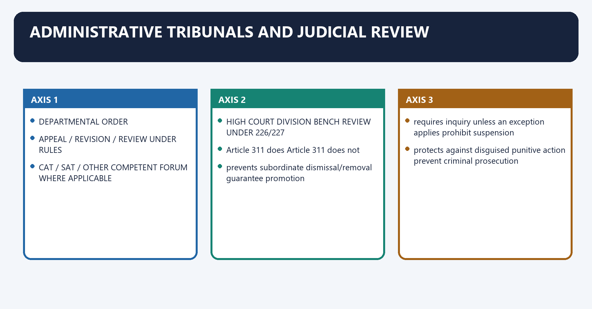
[FACT] Article 323A permits Parliament to create administrative tribunals for recruitment and service-condition disputes. Parliament enacted the Administrative Tribunals Act, 1985, establishing the Central Administrative Tribunal and enabling other tribunals within the statute.

[FACT] *L. Chandra Kumar v Union of India* held that tribunal decisions remain subject to scrutiny by a Division Bench of the territorial High Court under Articles 226/227; judicial review by constitutional courts is part of the basic structure.

[ANALYSIS] A civil servant ordinarily moves through departmental appeal/review and the applicable tribunal or court route. The precise sequence depends on jurisdiction, statute, service and remedy.

#### Visual 42 — Service-Dispute Route

```text
DEPARTMENTAL ORDER
      |
      v
APPEAL / REVISION / REVIEW UNDER RULES
      |
      v
CAT / SAT / OTHER COMPETENT FORUM WHERE APPLICABLE
      |
      v
HIGH COURT DIVISION BENCH REVIEW UNDER 226/227
      |
      v
SUPREME COURT
```

*Caption: Tribunals provide specialist first-instance adjudication without replacing constitutional courts.*

#### Visual 43 — Article 311 Is Not Immunity

| Article 311 does | Article 311 does not |
|---|---|
| prevents subordinate dismissal/removal | guarantee promotion |
| requires inquiry unless an exception applies | prohibit suspension |
| protects against disguised punitive action | prevent criminal prosecution |
| permits judicial review of exception use | make misconduct unpunishable |

*Caption: Security of tenure supports lawful accountability rather than defeating it.*

#### CLOSING RECALL FLOW — ADMINISTRATIVE TRIBUNALS AND JUDICIAL REVIEW

```text
START / CONCEPT: Administrative Tribunals and Judicial Review
        |
        v
EXACT TERMS: Administrative Tribunals · Judicial Review · prevents subordinate dismissal/removal · guarantee promotion · prohibit suspension · protects against disguised punitive action
        |
        v
MECHANISM / ARGUMENT: Chandra Kumar v Union of India held that tribunal decisions remain subject to scrutiny by a Division Bench of the territorial High Court under Articles 226/227; judicial review by constitutional courts is part of the basic structure.
        |
        v
CONSEQUENCE / CONTRAST: The decisive contrast is between prevents subordinate dismissal/removal guarantee promotion and requires inquiry unless an exception applies prohibit suspension.
        |
        v
UPSC TRAP / ANSWER-USE: Its principal consequence is that article 311 does Article 311 does not.
        |
        v
ANSWER-GRABBING FORMULATION: Administrative Tribunals and Judicial Review denotes the constitutional rules and institutional links organised around DEPARTMENTAL ORDER.
```
### SESSION 25 — CIVIL-SERVICE NEUTRALITY AND THE TRANSFER PROBLEM

#### DEFINITION / WHAT THIS IS CALLED

**Plain-language definition:** Civil-Service Neutrality and the Transfer Problem denotes the constitutional rules and institutional links organised around strong protection against punitive exit.

**Technical definition:** Article 311 is strongest at the exit door, while day-to-day neutrality may be weakened through transfers, postings, empanelment and career incentives long before dismissal is threatened.

#### ANSWER-GRABBING OPENING — WRITE/ADAPT IN THE EXAM

> Civil-Service Neutrality and the Transfer Problem operates through BUT CAREER CAN BE SHAPED THROUGH, connected with transfer + posting + appraisal + deputation + empanelment.

#### MUST-WRITE KEYWORDS

- **Civil-Service Neutrality**
- **the Transfer Problem**
- **Article 311**
- **Civil-Service Neutrality and the Transfer Problem**
- **Transfer Problem**
- **BUT CAREER CAN BE SHAPED**

**How to use them:** Frame the answer through Civil-Service Neutrality; define the Transfer Problem, connect Article 311 with Civil-Service Neutrality and the Transfer Problem to explain the mechanism, and use Transfer Problem for the decisive comparison or qualification.

Civil-Service Neutrality and the Transfer Problem denotes the constitutional rules and institutional links organised around strong protection against punitive exit.
Civil-Service Neutrality and the Transfer Problem operates through BUT CAREER CAN BE SHAPED THROUGH, connected with transfer + posting + appraisal + deputation + empanelment.
The operative mechanism matters because boards + criteria + written reasons + review + accountability.
Its principal consequence is that strong protection against punitive exit.
The decisive contrast is between strong protection against punitive exit and strong protection against punitive exit.
The exam-safe limitation is that strong protection against punitive exit.
[FACT] *T.S.R. Subramanian v Union of India* directed constitution of Civil Services Boards, minimum assured tenure and recording of oral instructions to reduce arbitrary transfers and informal political pressure.

[ANALYSIS] Article 311 is strongest at the exit door, while day-to-day neutrality may be weakened through transfers, postings, empanelment and career incentives long before dismissal is threatened.

[LIMIT] The judgment's directions and later rules do not justify a blanket claim that every service, State and post currently enjoys identical fixed tenure in practice.

#### Visual 44 — Formal Security versus Practical Vulnerability

```text
ARTICLE 311
strong protection against punitive exit
        |
        v
BUT CAREER CAN BE SHAPED THROUGH
transfer + posting + appraisal + deputation + empanelment
        |
        v
NEEDED
boards + criteria + written reasons + review + accountability
```

*Caption: Independence can be eroded without formally dismissing anyone.*

#### CLOSING RECALL FLOW — CIVIL-SERVICE NEUTRALITY AND THE TRANSFER PROBLEM

```text
START / CONCEPT: Civil-Service Neutrality and the Transfer Problem
        |
        v
EXACT TERMS: Civil-Service Neutrality · the Transfer Problem · Article 311 · Civil-Service Neutrality and the Transfer Problem · Transfer Problem · BUT CAREER CAN BE SHAPED
        |
        v
MECHANISM / ARGUMENT: Civil-Service Neutrality and the Transfer Problem denotes the constitutional rules and institutional links organised around strong protection against punitive exit.
        |
        v
CONSEQUENCE / CONTRAST: Article 311 is strongest at the exit door, while day-to-day neutrality may be weakened through transfers, postings, empanelment and career incentives long before dismissal is threatened.
        |
        v
UPSC TRAP / ANSWER-USE: Do not miss this limiting distinction: its principal consequence is that strong protection against punitive exit.
        |
        v
ANSWER-GRABBING FORMULATION: Civil-Service Neutrality and the Transfer Problem operates through BUT CAREER CAN BE SHAPED THROUGH, connected with transfer + posting + appraisal + deputation + empanelment.
```
### SESSION 26 — SECOND ARC REFORM THEMES

#### DEFINITION / WHAT THIS IS CALLED

**Plain-language definition:** Second ARC personnel reform connects tenure stability, ethics, performance, specialisation and citizen orientation.

**Technical definition:** Second ARC civil-service reform recommendations are policy evidence, not self-executing constitutional or statutory commands.

#### ANSWER-GRABBING OPENING — WRITE/ADAPT IN THE EXAM

> Civil-service reform must diagnose incentives before selecting institutional instruments.

#### MUST-WRITE KEYWORDS

- **Second ARC**
- **civil-service reform**
- **fixed tenure**
- **performance**
- **specialisation**
- **citizen orientation**

**How to use them:** Frame the answer through Second ARC; define civil-service reform, connect fixed tenure with performance to explain the mechanism, and use specialisation for the decisive comparison or qualification.

Second ARC Reform Themes denotes the constitutional rules and institutional links organised around Reform Likely legal level Main safeguard.
Second ARC Reform Themes operates through fixed tenure / transfer board rules and administrative law recorded departure reasons, connected with competency-based training programme and HR policy outcome audit.
The operative mechanism matters because recruitment-rule redesign Article 309 rule/statute equality and transparency.
Its principal consequence is that lateral specialist induction post-specific recruitment framework fair selection and accountability.
The decisive contrast is between Article 311 change constitutional amendment if text altered basic constitutional scrutiny and Reform Likely legal level Main safeguard.
The exam-safe limitation is that reform Likely legal level Main safeguard.
[FACT] The Second ARC's tenth report, *Refurbishing of Personnel Administration — Scaling New Heights*, addressed recruitment, tenure, performance, capacity, ethics and personnel management. Its themes include professionalisation, stable tenure, transparent placement, performance orientation and stronger accountability.

[ANALYSIS] Reform proposals must be separated into three categories: constitutional change, service-rule or statutory change, and administrative practice. Many useful reforms do not require weakening Article 311.

#### Visual 45 — Reform-Level Matrix

| Reform | Likely legal level | Main safeguard |
|---|---|---|
| fixed tenure / transfer board | rules and administrative law | recorded departure reasons |
| competency-based training | programme and HR policy | outcome audit |
| recruitment-rule redesign | Article 309 rule/statute | equality and transparency |
| lateral specialist induction | post-specific recruitment framework | fair selection and accountability |
| Article 311 change | constitutional amendment if text altered | basic constitutional scrutiny |

*Caption: Reform quality improves when the correct legal instrument is chosen.*

#### CLOSING RECALL FLOW — SECOND ARC REFORM THEMES

```text
START / CONCEPT: Second ARC Reform Themes
        |
        v
EXACT TERMS: Second ARC · civil-service reform · fixed tenure · performance · specialisation · citizen orientation
        |
        v
MECHANISM / ARGUMENT: Match transfer instability, capability gaps, weak accountability and silos to separate reforms and guardrails.
        |
        v
CONSEQUENCE / CONTRAST: A coordinated portfolio is more credible than one fashionable reform presented as a cure-all.
        |
        v
UPSC TRAP / ANSWER-USE: Do not cite a commission recommendation as enacted law or universal implementation.
        |
        v
ANSWER-GRABBING FORMULATION: Civil-service reform must diagnose incentives before selecting institutional instruments.
```
### SESSION 27 — PERFORMANCE MANAGEMENT: ACCOUNTABILITY WITHOUT POLITICISED METRICS

#### DEFINITION / WHAT THIS IS CALLED

**Plain-language definition:** Performance Management: Accountability without Politicised Metrics comprises Performance Management, Accountability without Politicised Metrics and legality as its core connected dimensions.

**Technical definition:** Performance Management: Accountability without Politicised Metrics operates through legality Was action within law and reasons recorded? “results at any cost”, connected with output Was the assigned task completed? quantity without quality.

#### ANSWER-GRABBING OPENING — WRITE/ADAPT IN THE EXAM

> Performance Management: Accountability without Politicised Metrics denotes the constitutional rules and institutional links organised around Dimension Example question Risk if isolated.

#### MUST-WRITE KEYWORDS

- **Performance Management**
- **Accountability without Politicised Metrics**
- **legality**
- **“results at any cost”**
- **output**
- **quantity without quality**

**How to use them:** Frame the answer through Performance Management; define Accountability without Politicised Metrics, connect legality with “results at any cost” to explain the mechanism, and use output for the decisive comparison or qualification.

Performance Management: Accountability without Politicised Metrics denotes the constitutional rules and institutional links organised around Dimension Example question Risk if isolated.
Performance Management: Accountability without Politicised Metrics operates through legality Was action within law and reasons recorded? “results at any cost”, connected with output Was the assigned task completed? quantity without quality.
The operative mechanism matters because outcome Did citizen welfare or institutional performance improve? attribution error.
Its principal consequence is that integrity Were conflicts and discretion managed? hidden corruption.
The decisive contrast is between capability Were relevant competencies built and applied? course-completion tokenism and equity Did vulnerable groups receive fair access? average hides exclusion.
The exam-safe limitation is that dimension Example question Risk if isolated.
[ANALYSIS] Performance management should connect role, resources, outputs, outcomes, integrity and citizen impact. A single numerical target can reward visible quantity while hiding legality, equity, quality or long-term capacity.

[FACT] Existing appraisal and disciplinary systems remain governed by service-specific rules and instructions. Mission Karmayogi is a capacity reform; it does not replace lawful appraisal, promotion or disciplinary frameworks.

#### Visual 46 — Balanced Performance Scorecard

| Dimension | Example question | Risk if isolated |
|---|---|---|
| legality | Was action within law and reasons recorded? | “results at any cost” |
| output | Was the assigned task completed? | quantity without quality |
| outcome | Did citizen welfare or institutional performance improve? | attribution error |
| integrity | Were conflicts and discretion managed? | hidden corruption |
| capability | Were relevant competencies built and applied? | course-completion tokenism |
| equity | Did vulnerable groups receive fair access? | average hides exclusion |

*Caption: Performance must measure constitutional administration, not merely managerial speed.*

#### CLOSING RECALL FLOW — PERFORMANCE MANAGEMENT: ACCOUNTABILITY WITHOUT POLITICISED METRICS

```text
START / CONCEPT: Performance Management: Accountability without Politicised Metrics
        |
        v
EXACT TERMS: Performance Management · Accountability without Politicised Metrics · legality · “results at any cost” · output · quantity without quality
        |
        v
MECHANISM / ARGUMENT: Performance Management: Accountability without Politicised Metrics operates through legality Was action within law and reasons recorded? “results at any cost”, connected with output Was the assigned task completed? quantity without quality.
        |
        v
CONSEQUENCE / CONTRAST: Performance management should connect role, resources, outputs, outcomes, integrity and citizen impact.
        |
        v
UPSC TRAP / ANSWER-USE: A single numerical target can reward visible quantity while hiding legality, equity, quality or long-term capacity.
        |
        v
ANSWER-GRABBING FORMULATION: Performance Management: Accountability without Politicised Metrics denotes the constitutional rules and institutional links organised around Dimension Example question Risk if isolated.
```
### SESSION 28 — GENERALIST, SPECIALIST AND LATERAL ENTRY

#### DEFINITION / WHAT THIS IS CALLED

**Plain-language definition:** Generalist, Specialist and Lateral Entry denotes the constitutional rules and institutional links organised around CHECK RECRUITMENT RULE.

**Technical definition:** The decisive contrast is between ONLY THEN ASSESS LEGALITY AND POLICY MERIT and Generalist contribution Specialist contribution Hybrid answer.

#### ANSWER-GRABBING OPENING — WRITE/ADAPT IN THE EXAM

> Generalist, Specialist and Lateral Entry denotes the constitutional rules and institutional links organised around CHECK RECRUITMENT RULE.

#### MUST-WRITE KEYWORDS

- **Generalist**
- **Specialist**
- **Lateral Entry**
- **cross-sector coordination**
- **deep technical knowledge**
- **role-based teams**

**How to use them:** Frame the answer through Generalist; define Specialist, connect Lateral Entry with cross-sector coordination to explain the mechanism, and use deep technical knowledge for the decisive comparison or qualification.

Generalist, Specialist and Lateral Entry denotes the constitutional rules and institutional links organised around CHECK RECRUITMENT RULE.
Generalist, Specialist and Lateral Entry operates through CHECK MODE: direct / contract / deputation / absorption / composite, connected with CHECK UPSC CONSULTATION OR VALID EXEMPTION.
The operative mechanism matters because cHECK RESERVATION / EQUALITY / ADVERTISEMENT RULES.
Its principal consequence is that cHECK TENURE, CONFLICT, DISCLOSURE AND APPRAISAL.
The decisive contrast is between ONLY THEN ASSESS LEGALITY AND POLICY MERIT and Generalist contribution Specialist contribution Hybrid answer.
The exam-safe limitation is that cross-sector coordination deep technical knowledge role-based teams.
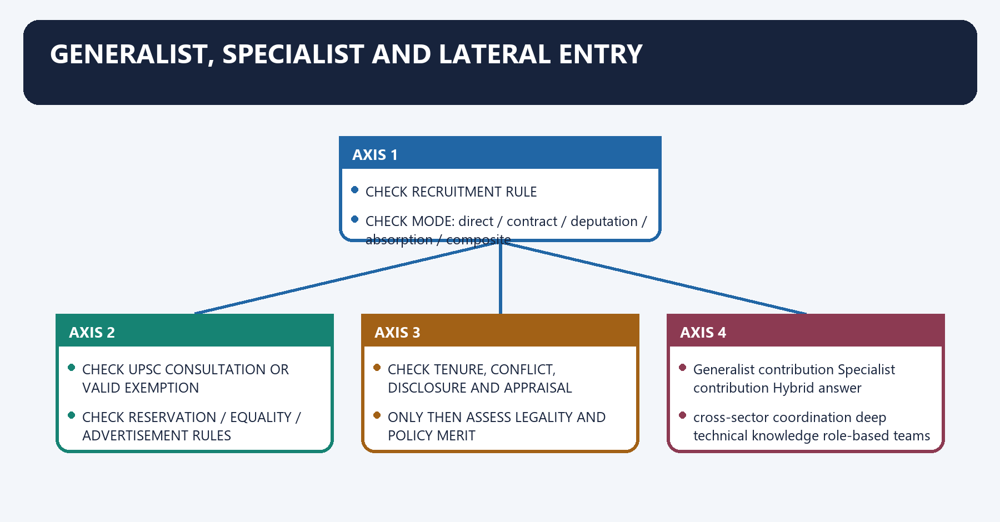
[FACT] Lateral entry is a mode of recruiting or engaging persons with outside expertise into specified public posts under the applicable recruitment and service framework. It does not constitutionally replace the UPSC, the AIS or regular career services.

[FACT] Whether UPSC consultation is required depends on Article 320, the post's recruitment rules and valid exemption regulations. DoPT's 15 March 2024 amendment exempts specified Group A and Group B posts up to the stated level when filled through named deputation, re-employment, short-term-contract, absorption or composite modes; it is not a universal “lateral entry exemption”.

[CURRENT] No claim is made here about a live advertisement, current vacancy count or present selection stage. Such status is continuously changeable and must be checked against the specific official notice.

[LIMIT] Reservation, tenure, conflict-of-interest, cooling-off, performance and accountability questions depend on the legal mode and post. There is no safe one-line rule that every lateral appointment either automatically attracts or automatically escapes every reservation and consultation requirement.

#### Visual 47 — Lateral-Entry Legality Checklist

```text
IDENTIFY THE POST
      |
CHECK RECRUITMENT RULE
      |
CHECK MODE: direct / contract / deputation / absorption / composite
      |
CHECK UPSC CONSULTATION OR VALID EXEMPTION
      |
CHECK RESERVATION / EQUALITY / ADVERTISEMENT RULES
      |
CHECK TENURE, CONFLICT, DISCLOSURE AND APPRAISAL
      |
ONLY THEN ASSESS LEGALITY AND POLICY MERIT
```

*Caption: “Lateral entry” is a policy label; legality is post- and mode-specific.*

#### Visual 48 — Generalist-Specialist Balance

| Generalist contribution | Specialist contribution | Hybrid answer |
|---|---|---|
| cross-sector coordination | deep technical knowledge | role-based teams |
| district and field perspective | domain design and regulation | mobility plus domain tenure |
| political-administrative navigation | evidence and technology depth | transparent competency mapping |
| whole-of-government integration | precision and innovation | neither monopoly nor tokenism |

*Caption: The real question is matching competence to role while preserving constitutional accountability.*

#### CLOSING RECALL FLOW — GENERALIST, SPECIALIST AND LATERAL ENTRY

```text
START / CONCEPT: Generalist, Specialist and Lateral Entry
        |
        v
EXACT TERMS: Generalist · Specialist · Lateral Entry · cross-sector coordination · deep technical knowledge · role-based teams
        |
        v
MECHANISM / ARGUMENT: DoPT's 15 March 2024 amendment exempts specified Group A and Group B posts up to the stated level when filled through named deputation, re-employment, short-term-contract, absorption or composite modes; it is not a universal “lateral entry exemption”.
        |
        v
CONSEQUENCE / CONTRAST: The decisive contrast is between ONLY THEN ASSESS LEGALITY AND POLICY MERIT and Generalist contribution Specialist contribution Hybrid answer.
        |
        v
UPSC TRAP / ANSWER-USE: Do not miss this limiting distinction: its principal consequence is that cHECK TENURE, CONFLICT, DISCLOSURE AND APPRAISAL.
        |
        v
ANSWER-GRABBING FORMULATION: Generalist, Specialist and Lateral Entry denotes the constitutional rules and institutional links organised around CHECK RECRUITMENT RULE.
```
### SESSION 29 — MISSION KARMAYOGI AND CAPACITY BUILDING

#### DEFINITION / WHAT THIS IS CALLED

**Plain-language definition:** Mission Karmayogi is the National Programme for Civil Services Capacity Building centred on role-based competencies.

**Technical definition:** Its architecture includes institutional coordination and the iGOT learning platform, while workplace outcomes remain the real test.

#### ANSWER-GRABBING OPENING — WRITE/ADAPT IN THE EXAM

> Capacity building improves administration only when learning changes role performance and citizen outcomes.

#### MUST-WRITE KEYWORDS

- **Mission Karmayogi**
- **NPCSCB**
- **competency**
- **iGOT**
- **capacity building**
- **workplace outcomes**

**How to use them:** Frame the answer through Mission Karmayogi; define NPCSCB, connect competency with iGOT to explain the mechanism, and use capacity building for the decisive comparison or qualification.

Mission Karmayogi and Capacity Building denotes the constitutional rules and institutional links organised around PM PUBLIC HUMAN RESOURCE COUNCIL.
Mission Karmayogi and Capacity Building operates through CABINET SECRETARIAT COORDINATION, connected with CAPACITY BUILDING COMMISSION.
The operative mechanism matters because standards + plans + institutional capacity.
Its principal consequence is that mINISTRIES / DEPARTMENTS.
The decisive contrast is between role and competency mapping and KARMAYOGI BHARAT - iGOT KARMAYOGI PLATFORM.
The exam-safe limitation is that wORKPLACE APPLICATION + OUTCOME EVALUATION.
[FACT] DoPT's official Mission Karmayogi page describes the National Programme for Civil Services Capacity Building as a transition from a **rules-based** to a **roles-based, competency-driven** HR and training ecosystem.

[FACT] Its official architecture includes policy, institutional, competency, digital-learning, e-HRMS and monitoring/evaluation pillars. The institutional chain includes the Prime Minister's Public Human Resource Council, Cabinet Secretariat coordination, the Capacity Building Commission, DoPT programme management and Karmayogi Bharat's operation of iGOT Karmayogi.

[FACT] The Capacity Building Commission facilitates Annual Capacity Building Plans, standards, institutional capacity and evaluation. Karmayogi Bharat operates the digital platform; the two are not the same institution.

[LIMIT] No learner, course, completion, ministry or dashboard number is reproduced because such figures change and do not by themselves prove workplace impact.

#### Visual 49 — Mission Karmayogi Architecture

```text
PM PUBLIC HUMAN RESOURCE COUNCIL
              |
CABINET SECRETARIAT COORDINATION
              |
CAPACITY BUILDING COMMISSION
standards + plans + institutional capacity
              |
MINISTRIES / DEPARTMENTS
role and competency mapping
              |
KARMAYOGI BHARAT -> iGOT KARMAYOGI PLATFORM
              |
WORKPLACE APPLICATION + OUTCOME EVALUATION
```

*Caption: Platform use is an input; changed administrative performance is the outcome.*

#### Visual 50 — Six Official Pillars

| Pillar | Exam meaning |
|---|---|
| Policy framework | competency-based HR direction |
| Institutional framework | allocation of strategic, coordination and implementation roles |
| Competency framework | roles, activities and required competencies |
| Digital learning | iGOT Karmayogi delivery ecosystem |
| e-HRMS | integration of service and HR information |
| Monitoring and evaluation | individual, organisational and programme learning |

*Caption: Mission Karmayogi is wider than an online course portal.*

#### CLOSING RECALL FLOW — MISSION KARMAYOGI AND CAPACITY BUILDING

```text
START / CONCEPT: Mission Karmayogi and Capacity Building
        |
        v
EXACT TERMS: Mission Karmayogi · NPCSCB · competency · iGOT · capacity building · workplace outcomes
        |
        v
MECHANISM / ARGUMENT: Map roles to competencies, deliver learning, apply it at work and audit outcomes.
        |
        v
CONSEQUENCE / CONTRAST: Continuous learning can improve domain competence and adaptability across services.
        |
        v
UPSC TRAP / ANSWER-USE: Do not equate platform enrolment or course completion with proved administrative improvement.
        |
        v
ANSWER-GRABBING FORMULATION: Capacity building improves administration only when learning changes role performance and citizen outcomes.
```
### SESSION 30 — REFORM CONFLICTS: EVERY GAIN HAS A GUARDRAIL

#### DEFINITION / WHAT THIS IS CALLED

**Plain-language definition:** Civil-service reforms create trade-offs involving speed, equality, expertise, privacy, tenure and accountability.

**Technical definition:** Lateral entry, digital HR, performance management and fixed tenure each require a matching legal and institutional guardrail.

#### ANSWER-GRABBING OPENING — WRITE/ADAPT IN THE EXAM

> A credible reform answer pairs every promised gain with its characteristic risk and control.

#### MUST-WRITE KEYWORDS

- **reform conflicts**
- **lateral entry**
- **digital HR**
- **fixed tenure**
- **privacy**
- **guardrails**

**How to use them:** Frame the answer through reform conflicts; define lateral entry, connect digital HR with fixed tenure to explain the mechanism, and use privacy for the decisive comparison or qualification.

Reform Conflicts: Every Gain Has a Guardrail denotes the constitutional rules and institutional links organised around Reform Benefit Risk Guardrail.
Reform Conflicts: Every Gain Has a Guardrail operates through fixed tenure candid advice and continuity protection of poor performance transparent appraisal and removal process, connected with faster discipline timely accountability shortcutting fairness charge clarity, evidence and review.
The operative mechanism matters because lateral entry domain expertise capture or unequal access open criteria, conflict rules, bounded tenure.
Its principal consequence is that performance pay/metrics outcome focus gaming and politicisation multi-dimensional, appealable assessment.
The decisive contrast is between digital HR scale and data surveillance and algorithmic bias purpose limits, audit and correction and central deputation national coordination State autonomy concerns consultation and predictable rules.
The exam-safe limitation is that reform Benefit Risk Guardrail.
#### Visual 51 — Reform Trade-Off Ledger

| Reform | Benefit | Risk | Guardrail |
|---|---|---|---|
| fixed tenure | candid advice and continuity | protection of poor performance | transparent appraisal and removal process |
| faster discipline | timely accountability | shortcutting fairness | charge clarity, evidence and review |
| lateral entry | domain expertise | capture or unequal access | open criteria, conflict rules, bounded tenure |
| performance pay/metrics | outcome focus | gaming and politicisation | multi-dimensional, appealable assessment |
| digital HR | scale and data | surveillance and algorithmic bias | purpose limits, audit and correction |
| central deputation | national coordination | State autonomy concerns | consultation and predictable rules |

*Caption: Mature reform pairs each instrument with a control against its characteristic abuse.*

#### CLOSING RECALL FLOW — REFORM CONFLICTS: EVERY GAIN HAS A GUARDRAIL

```text
START / CONCEPT: Reform Conflicts: Every Gain Has a Guardrail
        |
        v
EXACT TERMS: reform conflicts · lateral entry · digital HR · fixed tenure · privacy · guardrails
        |
        v
MECHANISM / ARGUMENT: For each proposal identify benefit, abuse risk, constitutional constraint and audit mechanism.
        |
        v
CONSEQUENCE / CONTRAST: Guardrail design converts reform rhetoric into executable public administration.
        |
        v
UPSC TRAP / ANSWER-USE: Do not present technology, lateral entry or tenure as costless and universally applicable.
        |
        v
ANSWER-GRABBING FORMULATION: A credible reform answer pairs every promised gain with its characteristic risk and control.
```
### SESSION 31 — CLAIM-EVIDENCE-ANALYSIS-QUALIFICATION METHOD

#### DEFINITION / WHAT THIS IS CALLED

**Plain-language definition:** A public-services answer should connect each claim to a named Article, rule, judgment or official reform source.

**Technical definition:** Analysis explains institutional incentives while qualification prevents overstatement of scope, status or implementation.

#### ANSWER-GRABBING OPENING — WRITE/ADAPT IN THE EXAM

> The claim-evidence-analysis-qualification method turns descriptive service notes into examiner-grade argument.

#### MUST-WRITE KEYWORDS

- **claim**
- **qualification**
- **method**
- **public services**

**How to use them:** Frame the answer through claim; define qualification, connect method with public services to explain the mechanism, and close with the decisive comparison or qualification.

Claim-Evidence-Analysis-Qualification Method denotes the constitutional rules and institutional links organised around "Article 311 protects neutral administration.".
Claim-Evidence-Analysis-Qualification Method operates through Article 311(1)-(2), Tulsiram Patel, ECIL, connected with security enables resistance to unlawful pressure.
The operative mechanism matters because three exceptions + discipline + judicial review prevent immunity.
Its principal consequence is that marks Recommended structure Evidence density.
The decisive contrast is between 10 thesis - 3 legal/analytical units - qualification - verdict 2-3 named anchors and 15 thesis - architecture - mechanisms - case/reform - counterpoint - verdict 4-6 anchors.
The exam-safe limitation is that 20 constitutional map - doctrine - cases - federal/rights/reform dimensions - graded conclusion 5-8 anchors.
#### Visual 52 — Four-Step Answer Spine

```text
CLAIM
"Article 311 protects neutral administration."
        |
NAMED EVIDENCE
Article 311(1)-(2), Tulsiram Patel, ECIL
        |
ANALYSIS
security enables resistance to unlawful pressure
        |
QUALIFICATION
three exceptions + discipline + judicial review prevent immunity
```

*Caption: Named authority must do analytical work rather than decorate the paragraph.*

#### Visual 53 — Mark-Scaled Architecture

| Marks | Recommended structure | Evidence density |
|---:|---|---|
| 10 | thesis -> 3 legal/analytical units -> qualification -> verdict | 2-3 named anchors |
| 15 | thesis -> architecture -> mechanisms -> case/reform -> counterpoint -> verdict | 4-6 anchors |
| 20 | constitutional map -> doctrine -> cases -> federal/rights/reform dimensions -> graded conclusion | 5-8 anchors |

*Caption: More marks require wider dimensions, not repetition of the same Article.*

#### CLOSING RECALL FLOW — CLAIM-EVIDENCE-ANALYSIS-QUALIFICATION METHOD

```text
START / CONCEPT: Claim-Evidence-Analysis-Qualification Method
        |
        v
EXACT TERMS: claim · qualification · method · public services
        |
        v
MECHANISM / ARGUMENT: State the proposition, cite authority, explain consequence and add the decisive limit.
        |
        v
CONSEQUENCE / CONTRAST: The method produces accurate, balanced and compressible answers.
        |
        v
UPSC TRAP / ANSWER-USE: Do not substitute case names, committee lists or slogans for an explained legal proposition.
        |
        v
ANSWER-GRABBING FORMULATION: The claim-evidence-analysis-qualification method turns descriptive service notes into examiner-grade argument.
```
### SESSION 32 — CURRENT AND LEGAL CONTROL DASHBOARD

#### DEFINITION / WHAT THIS IS CALLED

**Plain-language definition:** Current and Legal Control Dashboard operates through Part XIV text and 42nd/28th Amendment effects officeholder names, connected with AIS are IAS, IPS and Indian Forest Service cadre and vacancy counts.

**Technical definition:** Current and Legal Control Dashboard denotes the constitutional rules and institutional links organised around Safe current statement Deliberately unfrozen.

#### ANSWER-GRABBING OPENING — WRITE/ADAPT IN THE EXAM

> Current and Legal Control Dashboard operates through Part XIV text and 42nd/28th Amendment effects officeholder names, connected with AIS are IAS, IPS and Indian Forest Service cadre and vacancy counts.

#### MUST-WRITE KEYWORDS

- **Legal Control Dashboard**
- **Part XIV text and 42nd/28th Amendment effects**
- **officeholder names**
- **cadre and vacancy counts**
- **political statements on imminent creation**
- **Mission Karmayogi official architecture**

**How to use them:** Frame the answer through Legal Control Dashboard; define Part XIV text and 42nd/28th Amendment effects, connect officeholder names with cadre and vacancy counts to explain the mechanism, and use political statements on imminent creation for the decisive comparison or qualification.

Current and Legal Control Dashboard denotes the constitutional rules and institutional links organised around Safe current statement Deliberately unfrozen.
Current and Legal Control Dashboard operates through Part XIV text and 42nd/28th Amendment effects officeholder names, connected with AIS are IAS, IPS and Indian Forest Service cadre and vacancy counts.
The operative mechanism matters because aIJS constitutionally enabled but not established political statements on imminent creation.
Its principal consequence is that mission Karmayogi official architecture dashboard learner/course numbers.
The decisive contrast is between post-specific lateral-entry legality advertisement or selection status and Whistle Blowers Act enacted; commencement not verified assumption of full operational enforcement.
The exam-safe limitation is that safe current statement Deliberately unfrozen.
#### Visual 54 — What Is Frozen and What Is Not

| Safe current statement | Deliberately unfrozen |
|---|---|
| Part XIV text and 42nd/28th Amendment effects | officeholder names |
| AIS are IAS, IPS and Indian Forest Service | cadre and vacancy counts |
| AIJS constitutionally enabled but not established | political statements on imminent creation |
| Mission Karmayogi official architecture | dashboard learner/course numbers |
| post-specific lateral-entry legality | advertisement or selection status |
| Whistle Blowers Act enacted; commencement not verified | assumption of full operational enforcement |

*Caption: Current-affairs accuracy often depends on refusing to freeze volatile administrative facts.*

#### CLOSING RECALL FLOW — CURRENT AND LEGAL CONTROL DASHBOARD

```text
START / CONCEPT: Current and Legal Control Dashboard
        |
        v
EXACT TERMS: Legal Control Dashboard · Part XIV text and 42nd/28th Amendment effects · officeholder names · cadre and vacancy counts · political statements on imminent creation · Mission Karmayogi official architecture
        |
        v
MECHANISM / ARGUMENT: Current and Legal Control Dashboard denotes the constitutional rules and institutional links organised around Safe current statement Deliberately unfrozen.
        |
        v
CONSEQUENCE / CONTRAST: Its principal consequence is that mission Karmayogi official architecture dashboard learner/course numbers.
        |
        v
UPSC TRAP / ANSWER-USE: The operative mechanism matters because aIJS constitutionally enabled but not established political statements on imminent creation.
        |
        v
ANSWER-GRABBING FORMULATION: Current and Legal Control Dashboard operates through Part XIV text and 42nd/28th Amendment effects officeholder names, connected with AIS are IAS, IPS and Indian Forest Service cadre and vacancy counts.
```
### SESSION 33 — HIGH-YIELD PRELIMS TRAP WALL

#### DEFINITION / WHAT THIS IS CALLED

**Plain-language definition:** High-Yield Prelims Trap Wall operates through Article 309 rules are mere instructions they have subordinate legislative force, connected with pleasure is personal discretion it is constitutional executive power.

**Technical definition:** High-Yield Prelims Trap Wall denotes the constitutional rules and institutional links organised around Article 309 gives exclusive power to President/Governor legislature has primary power; proviso supplies interim rules.

#### ANSWER-GRABBING OPENING — WRITE/ADAPT IN THE EXAM

> High-Yield Prelims Trap Wall operates through Article 309 rules are mere instructions they have subordinate legislative force, connected with pleasure is personal discretion it is constitutional executive power.

#### MUST-WRITE KEYWORDS

- **High-Yield Prelims Trap Wall**
- **Article 309 gives exclusive power to President/Governor**
- **they have subordinate legislative force**
- **pleasure is personal discretion**
- **it is constitutional executive power**
- **Article 310(2) covers all contract staff**

**How to use them:** Frame the answer through High-Yield Prelims Trap Wall; define Article 309 gives exclusive power to President/Governor, connect they have subordinate legislative force with pleasure is personal discretion to explain the mechanism, and use it is constitutional executive power for the decisive comparison or qualification.

High-Yield Prelims Trap Wall denotes the constitutional rules and institutional links organised around Article 309 gives exclusive power to President/Governor legislature has primary power; proviso supplies interim rules.
High-Yield Prelims Trap Wall operates through Article 309 rules are mere instructions they have subordinate legislative force, connected with pleasure is personal discretion it is constitutional executive power.
The operative mechanism matters because article 310(2) covers all contract staff it has narrow textual conditions.
Its principal consequence is that article 311 covers defence services uniformed defence services are outside it.
The decisive contrast is between Article 311 covers only organised services it also covers holders of civil posts and only appointing person may dismiss authority must not be subordinate and must be rule-competent.
The exam-safe limitation is that 42nd Amendment removed every hearing it removed separate penalty representation.
#### Visual 55 — Twenty Trap Repairs

| Trap | Repair |
|---|---|
| Article 309 gives exclusive power to President/Governor | legislature has primary power; proviso supplies interim rules |
| Article 309 rules are mere instructions | they have subordinate legislative force |
| pleasure is personal discretion | it is constitutional executive power |
| Article 310(2) covers all contract staff | it has narrow textual conditions |
| Article 311 covers defence services | uniformed defence services are outside it |
| Article 311 covers only organised services | it also covers holders of civil posts |
| only appointing person may dismiss | authority must not be subordinate and must be rule-competent |
| 42nd Amendment removed every hearing | it removed separate penalty representation |
| clause (2)(b) needs no written reasons | written reasons are express |
| clause (2)(c) is ordinary public interest | it is security of the State |
| suspension is always punishment | ordinarily it is interim, not a listed penalty |
| every compulsory retirement is non-punitive | disciplinary compulsory retirement is punitive |
| mere FIR triggers sealed cover | formal triggers are required under governing law |
| Article 312 needs Lok Sabha approval first | Rajya Sabha national-interest resolution is the gateway |
| Indian Foreign Service is AIS | it is a Central Civil Service |
| AIJS exists | it is enabled but not established |
| AIJS can include junior civil judges | no post below district judge |
| CAT orders exclude High Courts | *L. Chandra Kumar* preserves review |
| neutrality means disobeying elected government | implement lawful policy after candid advice |
| lateral entry replaces UPSC/AIS | it is a post-specific recruitment mode |

*Caption: Most objective questions test a close but overbroad statement rather than a wholly absurd one.*

#### CLOSING RECALL FLOW — HIGH-YIELD PRELIMS TRAP WALL

```text
START / CONCEPT: High-Yield Prelims Trap Wall
        |
        v
EXACT TERMS: High-Yield Prelims Trap Wall · Article 309 gives exclusive power to President/Governor · they have subordinate legislative force · pleasure is personal discretion · it is constitutional executive power · Article 310(2) covers all contract staff
        |
        v
MECHANISM / ARGUMENT: High-Yield Prelims Trap Wall denotes the constitutional rules and institutional links organised around Article 309 gives exclusive power to President/Governor legislature has primary power; proviso supplies interim rules.
        |
        v
CONSEQUENCE / CONTRAST: Its principal consequence is that article 311 covers defence services uniformed defence services are outside it.
        |
        v
UPSC TRAP / ANSWER-USE: The decisive contrast is between Article 311 covers only organised services it also covers holders of civil posts and only appointing person may dismiss authority must not be subordinate and must be rule-competent.
        |
        v
ANSWER-GRABBING FORMULATION: High-Yield Prelims Trap Wall operates through Article 309 rules are mere instructions they have subordinate legislative force, connected with pleasure is personal discretion it is constitutional executive power.
```
### SESSION 34 — MAINS THESIS BANK

#### DEFINITION / WHAT THIS IS CALLED

**Plain-language definition:** Mains Thesis Bank denotes the constitutional rules and institutional links organised around Constitutional rule.

**Technical definition:** Pleasure: India retained the executive power of pleasure but converted it from royal prerogative into reviewable constitutional authority through Article 311, equality and special removal safeguards.

#### ANSWER-GRABBING OPENING — WRITE/ADAPT IN THE EXAM

> Mains Thesis Bank denotes the constitutional rules and institutional links organised around Constitutional rule.

#### MUST-WRITE KEYWORDS

- **Mains Thesis Bank**
- **Pleasure**
- **Article 311**
- **AIS**
- **Neutrality**
- **Reform**

**How to use them:** Frame the answer through Mains Thesis Bank; define Pleasure, connect Article 311 with AIS to explain the mechanism, and use Neutrality for the decisive comparison or qualification.

Mains Thesis Bank denotes the constitutional rules and institutional links organised around Constitutional rule.
Mains Thesis Bank operates through Operating mechanism, connected with Exam distinction.
The operative mechanism matters because constitutional rule.
Its principal consequence is that constitutional rule.
The decisive contrast is between Constitutional rule and Constitutional rule.
The exam-safe limitation is that constitutional rule.
- `[ANALYSIS]` **Pleasure:** India retained the executive power of pleasure but converted it from royal prerogative into reviewable constitutional authority through Article 311, equality and special removal safeguards.
- `[ANALYSIS]` **Article 311:** Security of tenure protects candid administration only when paired with timely, fair discipline; it is a shield against arbitrariness, not armour against accountability.
- `[ANALYSIS]` **AIS:** The AIS are a federal bridge whose legitimacy depends on shared personnel governance rather than either Central ownership or State capture.
- `[ANALYSIS]` **Neutrality:** A neutral civil servant is politically non-partisan, constitutionally committed and administratively responsive—not value-free, passive or unaccountable.
- `[ANALYSIS]` **Reform:** The service needs stronger tenure against arbitrary transfer, sharper accountability for misconduct, and better competency-to-role matching; weakening one protection cannot substitute for repairing all three.
- `[ANALYSIS]` **Lateral entry:** Specialist induction can complement career services only when post-specific legality, transparent selection, conflict controls and public accountability travel with expertise.
- `[ANALYSIS]` **Mission Karmayogi:** Competency-based learning is a necessary capacity reform, but course completion must be connected to workplace outcomes and cannot solve politicisation by itself.

#### CLOSING RECALL FLOW — MAINS THESIS BANK

```text
START / CONCEPT: Mains Thesis Bank
        |
        v
EXACT TERMS: Mains Thesis Bank · Pleasure · Article 311 · AIS · Neutrality · Reform
        |
        v
MECHANISM / ARGUMENT: Pleasure: India retained the executive power of pleasure but converted it from royal prerogative into reviewable constitutional authority through Article 311, equality and special removal safeguards.
        |
        v
CONSEQUENCE / CONTRAST: Article 311: Security of tenure protects candid administration only when paired with timely, fair discipline; it is a shield against arbitrariness, not armour against accountability.
        |
        v
UPSC TRAP / ANSWER-USE: Neutrality: A neutral civil servant is politically non-partisan, constitutionally committed and administratively responsive—not value-free, passive or unaccountable.
        |
        v
ANSWER-GRABBING FORMULATION: Mains Thesis Bank denotes the constitutional rules and institutional links organised around Constitutional rule.
```
### SESSION 35 — ARTICLE 335: REPRESENTATION AND ADMINISTRATIVE EFFICIENCY

#### DEFINITION / WHAT THIS IS CALLED

**Plain-language definition:** Article 335 requires SC and ST claims to be considered consistently with administrative efficiency.

**Technical definition:** Its proviso permits qualifying-mark or evaluation-standard relaxation for reservation in promotion within the constitutional framework.

#### ANSWER-GRABBING OPENING — WRITE/ADAPT IN THE EXAM

> Article 335 reconciles representative inclusion with capable administration rather than making either absolute.

#### MUST-WRITE KEYWORDS

- **Article 335**
- **SC ST claims**
- **administrative efficiency**
- **promotion**
- **qualifying marks**
- **reservation**

**How to use them:** Frame the answer through Article 335; define SC ST claims, connect administrative efficiency with promotion to explain the mechanism, and use qualifying marks for the decisive comparison or qualification.

Article 335: Representation and Administrative Efficiency denotes the constitutional rules and institutional links organised around [FACT] Article 335 requires the claims of Scheduled Castes and Scheduled Tribes to be.
Article 335: Representation and Administrative Efficiency operates through considered consistently with maintenance of efficiency of administration, subject to its, connected with constitutional proviso concerning qualifying marks and standards for promotion.
The operative mechanism matters because [ANALYSIS] The provision is a reconciliation clause. It neither erases equality-based.
Its principal consequence is that reservation authority nor licenses an undefined efficiency veto. Recruitment rules,.
The decisive contrast is between constitutional amendments and controlling reservation doctrine must be read together and [FACT] Article 335 requires the claims of Scheduled Castes and Scheduled Tribes to be.
The exam-safe limitation is that [FACT] Article 335 requires the claims of Scheduled Castes and Scheduled Tribes to be.
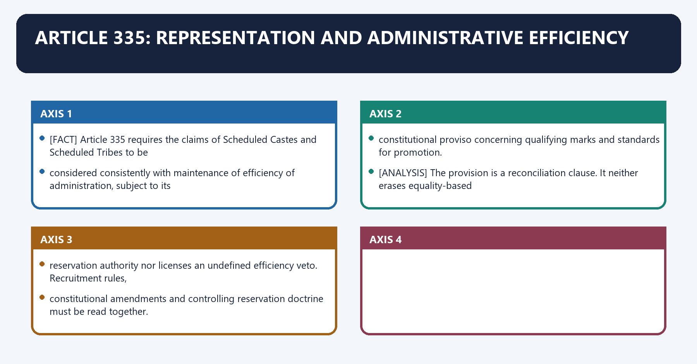
[FACT] Article 335 requires the claims of Scheduled Castes and Scheduled Tribes to be
considered consistently with maintenance of efficiency of administration, subject to its
constitutional proviso concerning qualifying marks and standards for promotion.

[ANALYSIS] The provision is a reconciliation clause. It neither erases equality-based
reservation authority nor licenses an undefined efficiency veto. Recruitment rules,
constitutional amendments and controlling reservation doctrine must be read together.

#### CLOSING RECALL FLOW — ARTICLE 335: REPRESENTATION AND ADMINISTRATIVE EFFICIENCY

```text
START / CONCEPT: Article 335: Representation and Administrative Efficiency
        |
        v
EXACT TERMS: Article 335 · SC ST claims · administrative efficiency · promotion · qualifying marks · reservation
        |
        v
MECHANISM / ARGUMENT: Read the main efficiency clause with the promotion-relaxation proviso and controlling reservation doctrine.
        |
        v
CONSEQUENCE / CONTRAST: The provision supports inclusion while retaining constitutionally reviewable standards.
        |
        v
UPSC TRAP / ANSWER-USE: Do not treat Article 335 as an unlimited reservation power or a prohibition on all relaxation.
        |
        v
ANSWER-GRABBING FORMULATION: Article 335 reconciles representative inclusion with capable administration rather than making either absolute.
```
### SESSION 36 — EMPLOYMENT-STATUS BOUNDARY

#### DEFINITION / WHAT THIS IS CALLED

**Plain-language definition:** Employment-Status Boundary operates through Union/State civil post is there a civil post under the government? may apply, connected with All-India Service is the person a member of an AIS? applies.

**Technical definition:** Employment-Status Boundary denotes the constitutional rules and institutional links organised around Category Governing question Article 311 baseline.

#### ANSWER-GRABBING OPENING — WRITE/ADAPT IN THE EXAM

> Employment-Status Boundary operates through Union/State civil post is there a civil post under the government? may apply, connected with All-India Service is the person a member of an AIS? applies.

#### MUST-WRITE KEYWORDS

- **Employment-Status Boundary**
- **Union/State civil post**
- **may apply**
- **All-India Service**
- **applies**
- **constitutional office**

**How to use them:** Frame the answer through Employment-Status Boundary; define Union/State civil post, connect may apply with All-India Service to explain the mechanism, and use applies for the decisive comparison or qualification.

Employment-Status Boundary denotes the constitutional rules and institutional links organised around Category Governing question Article 311 baseline.
Employment-Status Boundary operates through Union/State civil post is there a civil post under the government? may apply, connected with All-India Service is the person a member of an AIS? applies.
The operative mechanism matters because constitutional office does the Constitution create a special tenure/removal code? use that code first.
Its principal consequence is that statutory body employee who is the legal employer and what does the statute provide? not automatic.
The decisive contrast is between public-sector enterprise employee corporation/service rules and public-law duties not automatic and contractor/outsourced worker contract, labour law and real-control facts not automatic.
The exam-safe limitation is that lateral/short-term appointee appointment mode, post and applicable rules post-specific.
| Category | Governing question | Article 311 baseline |
|---|---|---|
| Union/State civil post | is there a civil post under the government? | may apply |
| All-India Service | is the person a member of an AIS? | applies |
| constitutional office | does the Constitution create a special tenure/removal code? | use that code first |
| statutory body employee | who is the legal employer and what does the statute provide? | not automatic |
| public-sector enterprise employee | corporation/service rules and public-law duties | not automatic |
| contractor/outsourced worker | contract, labour law and real-control facts | not automatic |
| lateral/short-term appointee | appointment mode, post and applicable rules | post-specific |

[LIMIT] "Public employment", "office under the State", "civil post" and employment by a
government-controlled company are related but non-identical constitutional categories.

#### CLOSING RECALL FLOW — EMPLOYMENT-STATUS BOUNDARY

```text
START / CONCEPT: Employment-Status Boundary
        |
        v
EXACT TERMS: Employment-Status Boundary · Union/State civil post · may apply · All-India Service · applies · constitutional office
        |
        v
MECHANISM / ARGUMENT: The operative mechanism matters because constitutional office does the Constitution create a special tenure/removal code? use that code first.
        |
        v
CONSEQUENCE / CONTRAST: Employment-Status Boundary denotes the constitutional rules and institutional links organised around Category Governing question Article 311 baseline.
        |
        v
UPSC TRAP / ANSWER-USE: Its principal consequence is that statutory body employee who is the legal employer and what does the statute provide? not automatic.
        |
        v
ANSWER-GRABBING FORMULATION: Employment-Status Boundary operates through Union/State civil post is there a civil post under the government? may apply, connected with All-India Service is the person a member of an AIS? applies.
```
## BASIC MCQS / REMEDIATION

#### Original MCQs 1-36 — Strict Continuous A -> B -> C -> D Rotation

##### OM1. Part XIV of the Constitution is correctly divided as:

A. Articles 308-314 on services and Articles 315-323 on Public Service Commissions.
B. Articles 309-316 on services and Articles 317-323 on finance.
C. Articles 308-312 on tribunals and Articles 313-323 on elections.
D. Articles 308-323 exclusively on All-India Services.

**Answer: A.**

[FACT] Articles 308-314 concern services; Articles 315-323 concern Public Service Commissions. [LIMIT] Article 323A is in Part XIV-A, not this Part XIV block.

##### OM2. Article 308 is best read today as:

A. a continuing exclusion of the present Union Territory from Part XIV.
B. a surviving interpretation text whose reference to the former State must be read with post-2019 territorial change.
C. a rule applicable only to All-India Services.
D. deleted after the Jammu and Kashmir Reorganisation Act.

**Answer: B.**

[FACT] The printed text remains. [ANALYSIS] It cannot be used to recreate a present special-status exclusion for a State that no longer exists in that form.

##### OM3. Which is an All-India Service?

A. Central Secretariat Service.
B. Indian Revenue Service.
C. Indian Forest Service.
D. Indian Foreign Service.

**Answer: C.**

[FACT] The existing AIS are IAS, IPS and Indian Forest Service.

##### OM4. Which statement about “civil post” is most accurate?

A. It applies only to gazetted posts.
B. It is identical to Group A service membership.
C. It excludes every temporary appointment.
D. It can include a post outside an organised civil service if the legal relationship is with the Union or State.

**Answer: D.**

[FACT] Article 311 protects service members and holders of civil posts. The status test is wider than cadre membership.

##### OM5. Under Article 309, the primary power to regulate recruitment and service conditions belongs to:

A. the appropriate legislature, subject to the Constitution.
B. the UPSC alone.
C. the President and Governors exclusively.
D. the Supreme Court through service jurisprudence.

**Answer: A.**

[FACT] The proviso rule-making power operates until legislative provision and remains subordinate to the Constitution and law.

##### OM6. Rules made under the proviso to Article 309 are:

A. constitutional amendments.
B. subordinate legislation with legal force.
C. non-binding advice of the Public Service Commission.
D. private contractual terms.

**Answer: B.**

[FACT] They are statutory in character but subordinate to the Constitution and competent legislation.

##### OM7. Executive instructions in a service matter may:

A. repeal an Act governing the service.
B. override Article 16 for administrative convenience.
C. fill a genuine gap not occupied by law or rule, without contradiction.
D. amend a conflicting statutory rule.

**Answer: C.**

[FACT] Instructions supplement; they do not supersede higher law.

##### OM8. Which pairing is correct?

A. CCA rules — constitutional amendment procedure.
B. Conduct rules — creation of a new AIS.
C. Recruitment rules — punishment for misconduct.
D. Recruitment rules — eligibility and mode of filling a post.

**Answer: D.**

[FACT] Recruitment, conduct and disciplinary rules answer different legal questions.

##### OM9. The Indian doctrine of pleasure under Article 310 is:

A. subject to express constitutional provisions and reviewable legal limits.
B. displaced entirely by Article 311.
C. applicable only to temporary employees.
D. an unreviewable personal power of the President.

**Answer: A.**

[FACT] Pleasure survives, but Article 311, Fundamental Rights, special office protections and judicial review fetter its use.

##### OM10. In ordinary constitutional operation, *Shamsher Singh* supports the proposition that:

A. Governors personally decide all disciplinary cases.
B. formal executive satisfaction ordinarily operates through the constitutional Council of Ministers.
C. civil servants are independent of the elected executive.
D. Article 310 was impliedly repealed.

**Answer: B.**

[FACT] President and Governor are formal constitutional heads except where the Constitution provides otherwise.

##### OM11. Article 310(2) may support contractual compensation where:

A. misconduct leads to dismissal before retirement.
B. any civil servant dislikes a transfer.
C. a specially qualified outsider's agreed post ends early by abolition or a non-misconduct vacation requirement.
D. an AIS officer is denied Central deputation.

**Answer: C.**

[FACT] The clause is narrow and conditional.

##### OM12. Article 311 applies directly to:

A. every private contractor serving government.
B. every uniformed member of the armed forces.
C. only permanent gazetted officers.
D. listed civil-service members and holders of civil posts under the Union or a State.

**Answer: D.**

[FACT] Status as a protected civil servant or civil-post holder is the first gateway.

##### OM13. Article 311(1) principally prevents:

A. dismissal or removal by an authority subordinate to the appointing authority.
B. prosecution without UPSC approval.
C. transfer without employee consent.
D. suspension during investigation.

**Answer: A.**

[FACT] The same individual need not act; the deciding authority must not be subordinate and must be competent under rules.

##### OM14. After the 42nd Amendment, Article 311(2):

A. protects only AIS officers.
B. no longer constitutionally requires a separate representation against the proposed penalty after inquiry.
C. bars supply of the inquiry report.
D. no longer requires any inquiry.

**Answer: B.**

[FACT] The inquiry-stage reasonable opportunity remains.

##### OM15. Which is expressly part of Article 311's regular inquiry protection?

A. a jury trial.
B. a mandatory second notice on penalty.
C. information about charges and reasonable opportunity to be heard on them.
D. a guaranteed promotion hearing.

**Answer: C.**

[FACT] Charge notice and defence opportunity are textual; the separate penalty opportunity was removed.

##### OM16. Which is **not** one of the three Article 311(2) proviso exceptions?

A. conduct leading to criminal conviction.
B. inquiry not reasonably practicable for recorded reasons.
C. security-of-State satisfaction of President/Governor.
D. general administrative convenience.

**Answer: D.**

[FACT] Convenience cannot be substituted for a constitutional exception.

##### OM17. Under Article 311(2)(b), the empowered authority must:

A. record in writing why inquiry is not reasonably practicable.
B. obtain a Rajya Sabha resolution.
C. secure the employee's consent.
D. prove a criminal conviction.

**Answer: A.**

[FACT] Written reasons are an express constitutional control.

##### OM18. Article 311(3), which gives finality on practicability, is best understood after *Tulsiram Patel* as:

A. requiring Supreme Court pre-clearance.
B. not excluding judicial review for lawful, relevant and bona fide exercise.
C. excluding every court.
D. converting the order into legislation.

**Answer: B.**

[FACT] Constitutional finality does not license mala fides or irrelevant satisfaction.

##### OM19. The Article 311(2)(c) exception is tied specifically to:

A. budget economy.
B. public criticism.
C. the interest of the security of the State.
D. routine law-and-order deployment.

**Answer: C.**

[FACT] The phrase must not be diluted into broad “public interest”.

##### OM20. Which statement is correct?

A. Clause (2)(c) may be invoked by any immediate supervisor.
B. Conviction automatically requires dismissal in every case.
C. Clause (2)(b) reasons need never exist on record.
D. Dispensing with inquiry does not erase competence, relevance, penalty rules or judicial review.

**Answer: D.**

[ANALYSIS] The exceptions remove the regular inquiry, not the entire rule of law.

##### OM21. Under the ordinary penalty distinction, dismissal:

A. is generally graver than removal and ordinarily carries a disqualifying future-employment consequence, subject to rules.
B. may be imposed by any subordinate officer.
C. is identical to suspension.
D. never ends service.

**Answer: A.**

[FACT] Exact collateral consequences remain rule-specific.

##### OM22. Suspension pending inquiry is ordinarily:

A. immune from review and subsistence rules.
B. an interim measure rather than a listed penalty.
C. equivalent to dismissal.
D. a constitutional amendment.

**Answer: B.**

[FACT] Rule 10 suspension and Rule 11 penalties are distinct under the CCS (CCA) structure.

##### OM23. Which distinction is correct?

A. Every compulsory retirement is punitive.
B. Compulsory retirement is prohibited by Article 310.
C. FR 56(j)-type public-interest retirement is ordinarily non-punitive, while disciplinary compulsory retirement is a penalty.
D. Every compulsory retirement requires criminal conviction.

**Answer: C.**

[FACT] The legal source and purpose control the classification.

##### OM24. The *Dhingra* line of cases requires courts to:

A. treat every temporary-service exit as punishment.
B. ignore surrounding circumstances.
C. rely only on the order's title.
D. examine substance, source of power, stigma and punitive consequences.

**Answer: D.**

[FACT] An innocuous label cannot conceal punishment, but temporary status does not itself prove punishment.

##### OM25. The sealed-cover principle in *K.V. Jankiraman* rejects use based merely on:

A. an uncrystallised preliminary inquiry or suspicion without the formal trigger.
B. a criminal charge-sheet filed in court.
C. an issued disciplinary charge memorandum.
D. current DoPT instructions applying the procedure.

**Answer: A.**

[FACT] Formal commencement, not vague pendency, is central.

##### OM26. *ECIL v B. Karunakar* is associated with:

A. the Rajya Sabha majority for Article 312.
B. supply of an adverse inquiry report and a prejudice-based remedial approach.
C. the right to strike.
D. creation of AIJS.

**Answer: B.**

[FACT] The judgment refines post-inquiry fairness after the 42nd Amendment.

##### OM27. *B.C. Chaturvedi* primarily cautions that judicial review:

A. always substitutes the court's penalty.
B. is unavailable in disciplinary cases.
C. is not an appellate rehearing, though shocking disproportionality and process illegality remain reviewable.
D. belongs only to CAT.

**Answer: C.**

[FACT] Review focuses on legality and the decision process, with bounded penalty intervention.

##### OM28. A new All-India Service may be created after:

A. a simple Lok Sabha resolution.
B. a presidential ordinance alone.
C. unanimous approval of every State legislature.
D. a Rajya Sabha national-interest resolution supported by not less than two-thirds present and voting, followed by parliamentary law.

**Answer: D.**

[FACT] The States' House supplies the constitutional gateway.

##### OM29. Article 312(2) deems which services to have been created under Article 312(1)?

A. IAS and IPS.
B. IAS and Indian Foreign Service.
C. IPS and Indian Forest Service.
D. all Group A services.

**Answer: A.**

[FACT] Indian Forest Service is an AIS constituted through the 1951 Act framework.

##### OM30. Section 3 of the All-India Services Act, 1951 principally supports:

A. conversion of IFS into AIS.
B. Central rule-making on recruitment and service conditions after State consultation, subject to the Act.
C. State legislatures unilaterally abolishing an AIS.
D. Supreme Court recruitment of IAS officers.

**Answer: B.**

[FACT] The Act operationalises Article 312 through rules and parliamentary control.

##### OM31. AIS dual control is most accurately described as:

A. complete ownership by the Union in every daily matter.
B. control by UPSC after appointment.
C. Union-framed common architecture with substantial State deployment and day-to-day control under the rules.
D. complete ownership by States.

**Answer: C.**

[ANALYSIS] “Shared personnel governance” is more accurate than a one-line ultimate/immediate-control formula.

##### OM32. Which statement about AIJS is correct?

A. It is already recruiting through UPSC.
B. It requires Article 368 amendment before Parliament can legislate.
C. It can include any subordinate judicial post.
D. It is constitutionally enabled, cannot include posts below district judge, and has not been officially established.

**Answer: D.**

[FACT] Article 312(4) expressly prevents the necessary creating law from being treated as an Article 368 amendment.

##### OM33. Article 313:

A. continues pre-Constitution service laws so far as consistent until other provision is made.
B. creates the Indian Forest Service.
C. establishes CAT.
D. governs Public Service Commission removal.

**Answer: A.**

[FACT] It is a transitional continuity provision.

##### OM34. Article 314:

A. remains the principal protection for all AIS officers.
B. was repealed by the 28th Amendment.
C. contains the AIJS proviso.
D. created the doctrine of pleasure.

**Answer: B.**

[FACT] Article 312A was inserted and Article 314 repealed as part of colonial-service closure.

##### OM35. Civil servants' Article 19 rights:

A. include an unlimited right to disclose official information.
B. override every conduct rule.
C. continue subject to constitutionally valid service restrictions, including political-neutrality obligations.
D. disappear on appointment.

**Answer: C.**

[FACT] Public service creates special lawful restrictions without extinguishing citizenship.

##### OM36. According to *T.K. Rangarajan*, government employees:

A. have an absolute fundamental right to strike.
B. may strike whenever an association votes.
C. cannot use any grievance procedure.
D. have no fundamental right to strike.

**Answer: D.**

[FACT] Association and grievance mechanisms must be distinguished from a fundamental right to strike.

#### Remedial MCQs 37-48 — Same Continuous Rotation

##### RM37. A department finds no statutory rule on a minor procedural detail. It may most defensibly:

A. issue a gap-filling instruction consistent with the Constitution, statute and existing rules.
B. contradict the recruitment rules by circular.
C. ignore Article 16.
D. amend Article 309 through an Office Memorandum.

**Answer: A.**

[ANALYSIS] This repairs the common error that every executive instruction is either void or equal to a rule.

##### RM38. A probationer's innocuous discharge order follows only a general suitability review under the rules. Article 311:

A. bars all probation review.
B. may not apply as punishment unless misconduct is the foundation or the action is stigmatic.
C. always converts it into dismissal.
D. requires a Rajya Sabha resolution.

**Answer: B.**

[FACT] Status alone does not decide; substance and foundation do.

##### RM39. An authority invokes Article 311(2)(b) because an inquiry would be “time-consuming”, recording no other reason. The best conclusion is:

A. valid because efficiency is enough.
B. automatically converted into clause (c).
C. vulnerable because inconvenience without recorded circumstances does not establish impracticability.
D. immune under Article 311(3).

**Answer: C.**

[FACT] Clause (d) is exceptional and reviewable.

##### RM40. A government says Article 311 prevents investigation of corruption. This is:

A. correct if the officer is permanent.
B. correct until UPSC consents.
C. correct for AIS officers.
D. incorrect; Article 311 regulates specified service penalties and does not bar lawful vigilance or criminal investigation.

**Answer: D.**

[FACT] Accountability tracks remain available.

##### RM41. Which statement best distinguishes removal from dismissal?

A. Both end service, but dismissal ordinarily has the graver disqualification consequence under the rules.
B. Neither attracts Article 311.
C. Dismissal leaves service intact.
D. Removal is merely suspension.

**Answer: A.**

[FACT] Rule-specific verification remains necessary.

##### RM42. Which action is most clearly a disciplinary major penalty rather than a non-punitive review measure?

A. expiry of a fixed-term contract.
B. compulsory retirement imposed after proved misconduct under the penalty rules.
C. sealed-cover consideration.
D. routine transfer.

**Answer: B.**

[FACT] The label “compulsory retirement” must be linked to its source.

##### RM43. The federal safeguard in Article 312 lies principally in:

A. High Court approval.
B. UPSC veto.
C. the special Rajya Sabha national-interest resolution before parliamentary creation.
D. gubernatorial consent from every State.

**Answer: C.**

[ANALYSIS] The States' House mediates a service common to Union and States.

##### RM44. Which claim about AIJS is unsafe?

A. posts below district judge cannot be included.
B. debate involves federalism, language and High Court control.
C. Article 312 enables it.
D. it is an existing fourth AIS.

**Answer: D.**

[FACT] No official establishment was verified.

##### RM45. Political neutrality requires a civil servant to:

A. give candid advice, record concerns and then implement lawful policy impartially.
B. avoid all constitutional values.
C. oppose every policy change.
D. serve only the government that appointed the officer.

**Answer: A.**

[ANALYSIS] Neutrality is non-partisanship plus constitutional fidelity.

##### RM46. Mission Karmayogi is best described as:

A. abolition of Article 311.
B. a competency-driven civil-services capacity-building architecture wider than the iGOT platform.
C. a judicial order on transfers.
D. a new All-India Service.

**Answer: B.**

[FACT] The official programme includes six pillars and multiple institutions.

##### RM47. Which lateral-entry statement is most accurate?

A. It automatically abolishes reservation.
B. It converts every specialist into an AIS officer.
C. Its legality depends on the post, recruitment mode, rules, consultation/exemption and equality requirements.
D. It always bypasses UPSC.

**Answer: C.**

[FACT] The policy label cannot replace a post-specific legal analysis.

##### RM48. After *L. Chandra Kumar*, CAT decisions:

A. go directly to Parliament.
B. are immune from all constitutional courts.
C. can never address constitutional issues.
D. remain reviewable by the territorial High Court's Division Bench under Articles 226/227.

**Answer: D.**

[FACT] Tribunals supplement rather than supplant constitutional courts.

## PYQS AND ANSWER PRACTICE

#### Verified PYQ Routing Audit

[FACT] The local routing and integration-audit ledgers for 2018-2023, 2024-2025 and 2026 were searched for `Article 309`, `Article 310`, `Article 311`, `Article 312`, `All-India Services`, `doctrine of pleasure`, `civil services neutrality`, `civil service reforms` and `lateral entry`.

[LIMIT] **No direct standalone recent Prelims or GS-II Polity PYQ focused on Articles 309-312 or the constitutional AIS architecture was verified in those ledgers.** This package therefore does not manufacture an official year, wording, option set or key.

[FACT] Two adjacent PYQs were verified with official-paper wording: the 2020 GS-II civil-service reform question and the 2025 GS-I civil-service ethos question. Several GS-IV/Governance demands remain cross-links. They are cross-linked below without being relabelled as direct Polity PYQs.

#### Visual 56 — PYQ Ownership Audit

| Year/paper | Audited demand | Proper route in this package |
|---|---|---|
| 2020 GS-II | institutional quality and civil-service reform for democracy | solved adjacent Governance PYQ |
| 2018 GS-IV | universal civil-service values | Ethics cross-link only |
| 2019 GS-IV | politicisation through transfers/postings | Ethics case-study cross-link only |
| 2019 GS-IV | institutional civil-service ethics reform | Ethics cross-link only |
| 2021 GS-IV | impartiality and non-partisanship | Ethics cross-link only |
| 2024 GS-IV | Mission Karmayogi | Ethics/capacity cross-link only |
| 2025 GS-I, Q9 | professionalism and nationalist consciousness in civil-service ethos | solved adjacent PYQ, 10 marks, 150 words |

*Caption: Relevance does not transfer ownership; Ethics questions remain Ethics questions.*

#### Verified Adjacent PYQ — UPSC CSE Mains 2020, GS-II

> “Institutional quality is a crucial driver of economic performance.” In this context suggest reforms in Civil Service for strengthening democracy.

**Demand decode:** `[FACT]` The directive is **suggest**. The answer must connect institutional quality to democratic performance and propose reforms; merely listing defects or narrating Mission Karmayogi is insufficient.

**Model solution**

**Thesis:** `[ANALYSIS]` Civil-service quality strengthens democracy when the permanent executive is simultaneously neutral, competent, accountable and citizen-facing. Reform must therefore protect lawful independence while improving capability and answerability.

1. **Tenure and candid advice:** `[FACT]` *T.S.R. Subramanian* directed Civil Services Boards, assured tenure and written recording of oral instructions. `[ANALYSIS]` Stable, reasoned postings reduce partisan pressure. `[LIMIT]` tenure must be paired with transparent appraisal so it does not shelter non-performance.
2. **Rule-based accountability:** `[FACT]` Articles 310-311 combine executive discipline with inquiry safeguards. `[ANALYSIS]` timely investigations, trained inquiry officers and speaking penalty orders improve credibility. `[LIMIT]` speed cannot erase charge specificity or defence opportunity.
3. **Merit and domain competence:** `[FACT]` Article 309 recruitment rules and Article 320 consultation structure the entry system. `[ANALYSIS]` domain tenure, specialist cadres and bounded lateral induction can improve complex policy design. `[LIMIT]` selection must be transparent, equal and conflict-controlled.
4. **Capacity:** `[FACT]` Mission Karmayogi shifts training toward roles and competencies through the CBC-iGOT architecture. `[ANALYSIS]` training should be linked to workplace outcomes rather than course totals. `[LIMIT]` capacity reform alone does not cure politicised transfers.
5. **Ethics and citizen accountability:** `[FACT]` conduct rules, vigilance, grievance systems, audit and judicial review constrain discretion. `[ANALYSIS]` published service standards and reasoned decisions convert bureaucratic power into public trust. `[LIMIT]` excessive compliance layers can themselves create delay.

**Verdict:** `[ANALYSIS]` The reform objective is **neutral competence under democratic control**: stable tenure, fair discipline, role-matched expertise, measurable citizen outcomes and transparent reasons.

**Why this earns marks:** It answers the reform directive, links every proposal to named constitutional or institutional evidence, and qualifies each gain against its characteristic abuse.

**How to improve this answer:** Prioritise three mutually reinforcing reforms—tenure, fair accountability and competence—and attach one measurable democratic outcome to each.

**Compression plan:** Preserve the governing Article or rule, one mechanism, one limit and the reasoned verdict; remove secondary examples first.

#### Verified Adjacent PYQ — UPSC CSE Mains 2025, GS-I, Q9 (10 marks, 150 words)

> “The ethos of civil service in India stands for the combination of professionalism with nationalistic consciousness.” Elucidate.

**Demand decode:** `Elucidate` requires explanation of how professional competence and constitutional-national commitment reinforce each other, not advocacy of partisan nationalism.

**Model solution**

**Thesis:** India's civil-service ethos joins professional competence with loyalty to the constitutional nation. Professionalism supplies merit, expertise, impartial process and reasoned administration; national consciousness directs those capacities toward unity, dignity, inclusion and public service.

1. **Professional inheritance and transformation:** The colonial services supplied administrative continuity and technical routines, but constitutional government redirected the permanent executive from imperial order to popular sovereignty. **Qualification:** professionalism cannot mean political insulation or colonial aloofness.
2. **Constitutional commitment:** Articles 14 and 16 demand equality and non-arbitrariness; Articles 309-311 place recruitment, discipline and tenure under law. National consciousness is therefore fidelity to constitutional values and India's plural integrity, not loyalty to a ruling party.
3. **Neutral competence:** A civil servant gives candid advice and implements lawful elected policy impartially. *T.S.R. Subramanian* strengthens this compact through written directions, tenure stability and Civil Services Boards. **Qualification:** neutrality is not silence before illegality.
4. **Citizen orientation:** Integrity, empathy, accountability and all-India coordination translate state capacity into equal citizenship. Mission Karmayogi's competency approach can modernise skills, but course completion is not a substitute for ethical conduct or field outcomes.

**Verdict:** The exam-safe synthesis is professional skill in the service of constitutional patriotism: non-partisan, legally accountable and responsive to India's diverse citizens.

**Why this earns marks:** It explains both halves of the quotation, supplies constitutional and judicial anchors, historicises the ethos and prevents nationalist consciousness from becoming partisan commitment.

**How to improve this answer:** Add one brief administrative example, such as impartial disaster relief across linguistic or political lines, while retaining the distinction between constitutional patriotism and party loyalty.

**Compression plan:** In 150 words retain the definition, colonial-to-constitutional transition, Articles 14/16/309-311, neutral competence and one qualified conclusion; omit programme detail first.

#### Adjacent Verified PYQ Cross-Links — Not Direct Polity PYQs

- `[FACT]` **2018 GS-IV:** the ledger routes a demand on three universal civil-service values to the Ethics foundational-values owner. Use this package only for the institutional support—conduct rules, tenure and accountability.
- `[FACT]` **2019 GS-IV:** the ledger routes the politicisation-through-transfers scenario to Ethics case-study and accountability owners. Use *T.S.R. Subramanian* as institutional evidence, but do not relabel the case as an Article 311 PYQ.
- `[FACT]` **2019 GS-IV:** the ledger routes civil-service ethics reform to Ethics codes and case-study owners. Use CVC/CVO, written orders and fair discipline as supporting institutions.
- `[FACT]` **2021 GS-IV:** impartiality and non-partisanship remain an Ethics demand. This package supplies the political-executive/permanent-executive compact.
- `[FACT]` **2024 GS-IV:** Mission Karmayogi remains an Ethics/capacity application. It is not evidence that UPSC asked the constitutional text of Article 309.

#### Original Solved Mains Practice — Exactly Eight

#### M1. Pleasure and protection (10 marks, 150 words)

**Question:** “A civil servant holds office at the pleasure of the executive, but not at its mercy.” Explain with reference to Articles 310 and 311.

**Model solution**

**Thesis:** `[FACT]` Article 310 preserves executive control over tenure; Article 311 converts that control into a rule-bound power for protected civil servants.

1. **Power:** `[FACT]` Union and AIS tenure is formally at the President's pleasure and State civil tenure at the Governor's pleasure. `[ANALYSIS]` This enables removal of the unfit and preserves executive responsibility. `[LIMIT]` *Shamsher Singh* prevents reading pleasure as personal whim.
2. **First shield:** `[FACT]` Article 311(1) bars dismissal or removal by an authority subordinate to the appointing authority. `[ANALYSIS]` Institutional rank protects against petty retaliation. `[LIMIT]` the same individual need not decide.
3. **Second shield:** `[FACT]` Article 311(2) ordinarily requires charges, inquiry and reasonable opportunity. `[ANALYSIS]` neutral administration needs confidence that adverse action will be evidence-based. `[LIMIT]` conviction, recorded impracticability and State security are express exceptions.
4. **Review:** `[FACT]` *Tulsiram Patel* and Article 14 keep exception use reviewable. `[ANALYSIS]` constitutional pleasure is therefore power under law.

**Verdict:** India retained discipline but rejected arbitrary royal prerogative; security of tenure protects lawful candour without creating immunity from misconduct.

**Why this earns marks:** It directly reconciles the two Articles, uses two cases and qualifies the protection through exact exceptions.

**How to improve this answer:** State the three Article 311 exceptions in one compressed line and distinguish protection from immunity.

**Compression plan:** Preserve the governing Article or rule, one mechanism, one limit and the reasoned verdict; remove secondary examples first.

#### M2. Article 309 hierarchy (10 marks, 150 words)

**Question:** Distinguish an Act, an Article 309 rule and an executive instruction in the regulation of public services.

**Model solution**

**Thesis:** `[FACT]` Article 309 creates a hierarchy in which legislation is primary, statutory rules administer the field, and executive instructions may only supplement lawful gaps.

| Instrument | Authority and role | Limit |
|---|---|---|
| Act | appropriate legislature regulates recruitment/service conditions | subject to Constitution |
| Article 309 rule | President/Governor or delegated rule-maker regulates until/under legislation | subordinate to Constitution and Act |
| Executive instruction | administration fills an unoccupied procedural space | cannot amend or contradict rule |

**Analysis:** `[ANALYSIS]` The hierarchy combines continuity with democratic legality. Recruitment rules decide eligibility and mode; conduct rules define obligations; CCA rules govern discipline and appeal.

**Qualification:** `[LIMIT]` A long administrative practice does not acquire statutory force by repetition, while an Article 309 rule is not “mere guidance” simply because the executive framed it.

**Verdict:** In a service-law dispute, the answer should move downward from Constitution to Act to rule to instruction; validity fails where a lower instrument contradicts a higher one.

**Why this earns marks:** It distinguishes source, function and legal effect rather than merely listing instruments.

**How to improve this answer:** Add one conflict example in which an office memorandum contradicts a recruitment rule, then apply the hierarchy.

**Compression plan:** Preserve the governing Article or rule, one mechanism, one limit and the reasoned verdict; remove secondary examples first.

#### M3. Punitive or simpliciter? (10 marks, 150 words)

**Question:** How do courts distinguish termination simpliciter from punitive termination of a probationer or temporary civil servant?

**Model solution**

**Thesis:** Temporary status permits rule-based exit, but it does not allow the State to disguise punishment and evade Article 311.

1. `[FACT]` *Parshotam Lal Dhingra* requires attention to the source of power, substantive consequences and whether the action is punishment.
2. `[FACT]` *Sukh Raj Bahadur* distinguishes misconduct as the **foundation** of the order from background material that is merely a **motive** for an innocuous suitability decision.
3. `[ANALYSIS]` Courts examine the order's language, surrounding inquiry, findings and stigma. A completed accusatory inquiry followed by discharge may be punitive even if the final order is brief.
4. `[LIMIT]` General unsuitability, expiry of term or bona fide reversion under the rules is not automatically punishment; Articles 14 and 16 still control mala fides and discrimination.

**Verdict:** Form cannot defeat substance, but suspicion cannot automatically convert every probation decision into a disciplinary penalty.

**Why this earns marks:** It identifies the precise test, gives two named cases and balances both sides.

**How to improve this answer:** Use order language, stigma and completed inquiry as the three factual indicators; delete secondary doctrine before deleting the foundation test.

**Compression plan:** Preserve the governing Article or rule, one mechanism, one limit and the reasoned verdict; remove secondary examples first.

#### M4. AIS and federalism (15 marks, 250 words)

**Question:** “The All-India Services are a federal bridge whose success depends on shared control.” Examine.

**Model solution**

**Thesis:** `[FACT]` Article 312 creates services common to Union and States only after a special Rajya Sabha national-interest resolution. The design is integrative, but its legitimacy depends on genuine personnel federalism.

**Unity gains**

- `[CLAIM]` Common standards improve administrative capacity. `[EVIDENCE]` IAS, IPS and Indian Forest Service operate under the AIS Act and common recruitment/service rules. `[ANALYSIS]` comparable professional norms aid national programmes and crisis coordination. `[LIMIT]` uniform training cannot replace State-specific language and local knowledge.
- `[CLAIM]` Mobility creates institutional linkage. `[EVIDENCE]` cadre and deputation rules permit careers across State and Union assignments. `[ANALYSIS]` officers carry field experience into national policy and national law into State implementation. `[LIMIT]` opaque deputation can appear coercive.
- `[CLAIM]` Continuity supports constitutional government. `[EVIDENCE]` service tenure and conduct rules span electoral transitions. `[ANALYSIS]` this can protect candid advice and lawful implementation. `[LIMIT]` permanence can become inertia without appraisal.

**Autonomy risks**

- State governments may face divided accountability over posting, deputation and discipline.
- Central empanelment or recall incentives may distort officer responsiveness.
- Arbitrary State transfers may equally destroy neutrality.

**Reform**

`[ANALYSIS]` Use transparent deputation criteria, predictable consultation, Civil Services Boards, recorded transfer reasons, domain and local-language competence, and joint performance frameworks. Strengthen State services rather than treating AIS as a substitute.

**Verdict:** The AIS are neither inherently centralising nor automatically federal. They integrate India when shared rules restrain both Union commandeering and State patronage.

**Why this earns marks:** It begins with Article 312, evaluates benefits and risks symmetrically, and proposes federal guardrails.

**How to improve this answer:** Differentiate IAS/IPS deemed status from later Indian Forest Service creation and make State consultation operational through cadre mechanisms.

**Compression plan:** Preserve the governing Article or rule, one mechanism, one limit and the reasoned verdict; remove secondary examples first.

#### M5. Article 311 exceptions (15 marks, 250 words)

**Question:** Critically examine the three exceptions to the inquiry requirement under Article 311(2).

**Model solution**

**Thesis:** `[FACT]` The proviso protects administration where ordinary inquiry is legally unnecessary or practically/security-wise untenable, but exceptional power remains bounded by relevance, competence and review.

**Conviction**

`[FACT]` Inquiry may be dispensed with where conduct led to conviction on a criminal charge. `[ANALYSIS]` a competent criminal trial has already adjudicated guilt beyond reasonable doubt. `[LIMIT]` conviction does not mechanically fix the service penalty; the authority must apply the governing penalty framework to the conduct and circumstances.

**Not reasonably practicable**

`[FACT]` The empowered authority must record written reasons. `[ANALYSIS]` threats to witnesses, violent conditions or a genuinely impossible hearing may justify the route. `[LIMIT]` speed, embarrassment or weak evidence is not impracticability. *Tulsiram Patel* preserves judicial review despite Article 311(3) finality.

**Security of the State**

`[FACT]` The President or Governor must be satisfied that an inquiry is not expedient in the interest of State security. `[ANALYSIS]` disclosure of sensitive sources or methods may itself cause harm. `[LIMIT]` the text is not ordinary public order; *Shamsher Singh* also prevents treating formal satisfaction as personal whim.

**Evaluation**

`[ANALYSIS]` The proviso prevents procedure from defeating administration, but its legitimacy depends on narrow construction, recorded institutional responsibility where text requires, a speaking penalty order and effective review for mala fides, irrelevance and disproportionality.

**Verdict:** The exceptions are constitutional safety valves, not administrative shortcuts.

**Why this earns marks:** It treats each exception separately, identifies different satisfaction standards and adds case-led review.

**How to improve this answer:** For clause (a), write conduct leading to conviction rather than conviction alone; for clauses (b) and (c), contrast written reasons with formal satisfaction.

**Compression plan:** Preserve the governing Article or rule, one mechanism, one limit and the reasoned verdict; remove secondary examples first.

#### M6. Rights and neutrality (15 marks, 250 words)

**Question:** Civil servants remain citizens, yet public service justifies special restrictions. Analyse with reference to equality, expression, association and political neutrality.

**Model solution**

**Thesis:** Public employment does not extinguish Fundamental Rights; it creates a public-law office whose impartial performance permits carefully tailored restrictions.

**Rights**

- `[FACT]` Articles 14 and 16 prohibit arbitrary classification and protect equal opportunity in recruitment and service progression. `[ANALYSIS]` transparent rules and reasoned discipline build legitimacy. `[LIMIT]` equality permits constitutionally authorised reservation and rational service classifications.
- `[FACT]` Article 19 freedoms continue for citizen-employees. `[ANALYSIS]` expression and association preserve dignity and professional voice. `[LIMIT]` confidentiality, discipline and the public's trust justify valid conduct restrictions.

**Neutrality obligations**

- `[FACT]` CCS/AIS conduct rules restrict party activity, election participation, prejudicial associations, demonstrations and strikes. `[ANALYSIS]` the same administration must serve changing elected governments.
- `[FACT]` *T.K. Rangarajan* denies a fundamental right to strike for government employees. `[LIMIT]` this does not erase lawful associations, representations, tribunals or grievance processes.

**Institutional balance**

`[FACT]` *T.S.R. Subramanian* supports written instructions and stable tenure. `[ANALYSIS]` rights are meaningful when officers can record illegal pressure, while democratic accountability remains because elected ministers decide lawful policy.

**Verdict:** The correct standard is proportional service discipline: politically non-partisan, constitutionally committed and fully reviewable—not a rights-free bureaucracy.

**Why this earns marks:** It integrates four rights/values, conduct rules and two judgments with clear qualifications.

**How to improve this answer:** Open with constitutional neutrality, then organise restrictions by political activity, speech, association and disclosure.

**Compression plan:** Preserve the governing Article or rule, one mechanism, one limit and the reasoned verdict; remove secondary examples first.

#### M7. Comprehensive civil-service reform (20 marks, 300 words)

**Question:** “India's civil-service problem is not a choice between independence and accountability, but a failure to institutionalise both.” Discuss and suggest reforms.

**Model solution**

**Thesis:** `[ANALYSIS]` Independence without accountability can become inertia; accountability without independence can become patronage. Constitutional administration requires neutral competence: protected candid advice, lawful political direction, measurable capability and fair discipline.

**Structural diagnosis**

1. `[CLAIM]` Exit protection is stronger than career protection. `[EVIDENCE]` Article 311 guards dismissal, while *T.S.R. Subramanian* addressed transfers, tenure and oral orders. `[ANALYSIS]` an officer can be pressured without formal punishment. `[LIMIT]` fixed tenure must not shelter poor performance.
2. `[CLAIM]` Discipline is often delayed. `[EVIDENCE]` Article 311, CCS (CCA) processes, *ECIL* and *B.C. Chaturvedi* provide fair procedure and review. `[ANALYSIS]` weak investigation and vague charges harm both integrity and innocent officials. `[LIMIT]` speed cannot replace evidence.
3. `[CLAIM]` competence is mismatched to role. `[EVIDENCE]` Mission Karmayogi's role/competency framework and CBC-led plans. `[ANALYSIS]` modern regulation needs technical depth and field coordination. `[LIMIT]` course completion is not outcome.
4. `[CLAIM]` divided federal personnel control creates friction. `[EVIDENCE]` Article 312 and AIS cadre/deputation rules. `[ANALYSIS]` shared careers can integrate policy. `[LIMIT]` unilateral control by either level undermines the bargain.

**Reform package**

- statutory/rule-based Civil Services Boards, minimum tenure and recorded deviation;
- professional investigation, time-managed inquiries, trained presenting/inquiry officers and reasoned penalties;
- competency-to-post mapping, domain tenure, specialist cadres and bounded lateral entry with open criteria and conflict safeguards;
- multi-dimensional appraisal covering legality, outcomes, integrity, equity and citizen feedback, with appeal;
- strengthen State and local services, frontline staffing and inter-governmental consultation;
- whistleblower protection through verified operational mechanisms; do not rely on an uncommenced Act;
- digital HR with privacy, bias audit and human review.

**Counterpoint:** `[ANALYSIS]` Too many boards can diffuse responsibility; excessive tenure can weaken ministerial control; metric-heavy appraisal can politicise data. `[LIMIT]` every reform therefore needs transparent criteria, reasons and review.

**Verdict:** Reform should neither dismantle Article 311 nor romanticise permanence. It should make lawful independence visible, performance evidence-based and accountability procedurally credible.

**Why this earns marks:** It diagnoses mechanisms, uses eight named anchors, proposes an integrated package and qualifies each major instrument.

**How to improve this answer:** Compress the reform list into tenure, capability, specialisation, ethics and citizen accountability, each with one institution and one guardrail.

**Compression plan:** Preserve the governing Article or rule, one mechanism, one limit and the reasoned verdict; remove secondary examples first.

#### M8. Specialist capacity and democratic control (20 marks, 300 words)

**Question:** Evaluate whether lateral entry and Mission Karmayogi can resolve the generalist-specialist problem in Indian administration.

**Model solution**

**Thesis:** `[ANALYSIS]` The problem is not “generalists versus specialists” but assigning the right mix of coordination, domain knowledge and field judgment to each role while preserving equality, neutrality and accountability.

**Lateral-entry contribution**

- `[CLAIM]` It can supply scarce expertise rapidly. `[EVIDENCE]` Article 309 recruitment frameworks permit post-specific methods; UPSC's role depends on Article 320, rules and valid exemptions. `[ANALYSIS]` experts can improve regulation, digital policy, finance or climate design. `[LIMIT]` a policy label does not settle reservation, consultation or tenure.
- `[CLAIM]` It can challenge closed career incentives. `[EVIDENCE]` transparent outside competition widens the talent pool. `[ANALYSIS]` contestability may reward domain competence. `[LIMIT]` short contracts may weaken institutional memory and neutrality.
- `[CLAIM]` It can complement, not replace, career services. `[ANALYSIS]` generalists remain valuable for federal coordination, implementation and political-administrative navigation.

**Mission Karmayogi contribution**

- `[FACT]` The official programme shifts from rules-based to roles-based, competency-driven HR and includes competency, digital learning, e-HRMS and evaluation pillars.
- `[FACT]` CBC supports standards and Annual Capacity Building Plans; Karmayogi Bharat operates iGOT.
- `[ANALYSIS]` competency mapping can identify where upskilling, specialist recruitment or mixed teams are needed. `[LIMIT]` platform activity does not prove improved decision quality.

**Combined design**

`[ANALYSIS]` Use role analysis -> decide build/buy/borrow expertise -> transparent recruitment -> conflict and cooling-off rules -> induction in constitutional administration -> mixed teams -> domain tenure -> outcome and integrity review -> knowledge transfer before exit.

**Risks**

Capture by industry, opaque selection, unequal access, data-driven surveillance, fragmented accountability and resentment between career and lateral personnel.

**Current qualification:** `[CURRENT]` No live advertisement status or vacancy count is relied on. The legal answer remains post- and mode-specific.

**Verdict:** Lateral entry supplies selected expertise and Mission Karmayogi builds internal capability; together they can improve role matching, but only a transparent constitutional HR system converts expertise into democratic capacity.

**Why this earns marks:** It compares two reforms, explains their interaction, uses official architecture and avoids volatile status claims.

**How to improve this answer:** Specify transparent selection, conflict rules and outcome-linked learning; omit dashboard counts and advertisement snapshots.

**Compression plan:** Preserve the governing Article or rule, one mechanism, one limit and the reasoned verdict; remove secondary examples first.

## OPTIONAL ADVANCED DEPTH — NOT REQUIRED FOR A CORE ANSWER

> **Subject:** Polity · **Tier:** Advanced (exam depth) · **GS Paper:** GS-II
> **Grounded in:** Indian Polity by M. Laxmikant, Ch. 66 (Part XIV) and Centre-State chapter (direct check of the local Sixth Revised Edition PDF).
> ✅ = from source book · ⚠️ = inference / case law · 📰 = current affairs.
> *Companion: `basic/Public-Services.md`.*

---

### PART A — CLASSIFICATION OF SERVICES ✅
Three categories: **All-India Services · Central Services · State Services**.
- ✅ **All-India Services (AIS):** **IAS, IPS, IFoS (Forest)** — serve **both** Centre & states by turns; **recruited &
  trained by the Centre** but **jointly controlled** (ultimate control = Centre, immediate control = states).
- ✅ Modern Union classification uses **Group A, Group B and Group C**. The older Class I-IV and Group D framework is historical; gazetted status does not itself define constitutional service or Article 311 coverage.
- ✅ **ICS → IAS** and **IP → IPS** in 1947; **IFoS created in 1966** as the third AIS.
- ✅ Up to **33⅓%** of senior AIS posts filled by **promotion from state services** (via a UPSC-chaired selection committee).

---

### PART B — CONSTITUTIONAL PROVISIONS (Arts 308–314) ⭐⭐

| Article | Provision |
|---|---|
| ✅ **309** | Parliament/state legislatures regulate **recruitment & service conditions**; till then President/Governor make rules |
| ✅ **310** | **Doctrine of Pleasure** — civil servants hold office **during the pleasure** of the President/Governor |
| ✅ **311** | **Two safeguards** against arbitrary dismissal (the key exam article) |
| ✅ **312** | **All-India Services** (incl. **All-India Judicial Service**) via a **Rajya Sabha resolution** |
| ✅ **312-A** | Parliament may vary service conditions of ex-Crown officers (28th Amdt 1972) |
| ✅ **314** | **Repealed** (28th Amdt 1972) |

#### Article 311 — the two safeguards ⭐⭐
✅ (a) A civil servant **cannot be dismissed/removed by an authority subordinate** to the appointing authority.
✅ (b) Cannot be dismissed/removed/reduced in rank **except after an inquiry** with a **reasonable opportunity of
being heard**.

⚠️ **Three exceptions** where the **inquiry** is dispensed with:
1. Penalty on the ground of conduct that led to **conviction on a criminal charge**;
2. Authority is satisfied (**reasons in writing**) that holding an inquiry is **not reasonably practicable**;
3. **President/Governor** satisfied that in the **security of the State** it is not expedient to hold an inquiry.

✅ The **42nd Amendment (1976)** abolished the **second-stage** hearing (representation against the *proposed
punishment*) — now only one opportunity (at the inquiry stage).

#### Article 312 — All-India Services ⭐
✅ Parliament may create **new AIS (incl. an All-India Judicial Service)** only if the **Rajya Sabha** passes a
resolution by a **2/3 majority of members present & voting** (a **federal safeguard**). **All-India Services Act,
1951** governs them. ✅ **AIJS** — enabled by the 42nd Amendment but **no law made so far**; its post cannot be
**inferior to a District Judge**, and its creation is **not** a constitutional amendment (no Art 368 route).

---


#### ➕ Citizens' Charter (high-yield gap)

> ✅ Grounded in M. Laxmikant *Indian Polity* + ⚠️ standard + 📰 verified. Added to close a UPSC gap.

- ✅ Laxmikant/ARC material supports Citizens' Charters by service-providing departments to state citizen entitlements.
- 📰 2nd ARC's citizen-centric administration report backed the **Sevottam** model for service standards, grievance redress and delivery enablers.
- ⚠️ A Citizens' Charter publicly states services, timelines, standards, grievance channels and responsible officials.
- 📰 It is generally **non-justiciable** unless a separate law/service-guarantee statute makes a promise enforceable.

| Sevottam component | Meaning |
|---|---|
| Citizen's Charter | Standards and commitments made visible |
| Grievance redress | Complaint handling and accountability loop |
| Service delivery capability | Process, staff and infrastructure improvements |

> 🔑 Trap: A Charter is an administrative accountability tool, not automatically a legally enforceable right.

#### ➕ e-Governance (PYQ)

> ✅ Grounded in M. Laxmikant *Indian Polity* + ⚠️ standard + 📰 verified. Added to close a UPSC gap.

- ✅ Laxmikant links responsive administration to transparency through technology and citizen participation.
- ⚠️ e-Governance is use of ICT to make government services faster, transparent, integrated and citizen-centric.
- 📰 Digital India, DBT, UMANG and DigiLocker are verified live examples of service delivery and document/platform integration.
- 📰 2nd ARC treated e-Governance as a governance reform, not merely computerisation.

| Type | Flow | Examples |
|---|---|---|
| ⚠️ G2C | Government → Citizen | DBT, DigiLocker, UMANG, Passport Seva |
| ⚠️ G2B | Government → Business | GST portal, e-tendering, company filings |
| ⚠️ G2G | Government → Government | e-Office, data sharing between departments |
| ⚠️ G2E | Government → Employee | payroll, service records, attendance/HR systems |

> 🔑 Trap: e-Governance is process re-engineering + accountability; digitising a bad manual process is not enough.

#### UPSC Traps
- ❌ Art 312 needs a Lok Sabha resolution → it is the **RAJYA SABHA** (2/3 present & voting) — a state-protecting device.
- ❌ Art 311 safeguards apply to defence personnel → **only civilians** (civil services/civil posts); **defence
  services excluded**.
- ❌ The doctrine of pleasure is absolute → it is **limited by Art 311** and **judicial review**.
- ❌ The All-India Judicial Service already exists → **enabled (42nd Amdt) but never created**.
- ❌ IFoS is a Central Service → it's the **third All-India Service** (since 1966).
- ❌ Creating an AIJS requires a constitutional amendment → **ordinary law** suffices (Art 312 says so expressly).

#### 📰 CA hooks
- 📰 **Lateral entry** into the bureaucracy (joint secretary/director level via UPSC) — the **2024 advertisement was
  withdrawn** after a reservation-in-lateral-entry row.
- 📰 **All-India Judicial Service (AIJS)** revival debate — Centre keen; many states/HCs resist (federalism, language).
- 📰 **Mission Karmayogi (2020)** & the **Capacity Building Commission** — competency-based civil-services reform.
- 📰 ⚠️ **Civil Services Board / fixed tenure** — SC in **T.S.R. Subramanian (2013)** directed minimum assured
  tenure & recording of oral instructions to curb politicised transfers.

#### Mains angles
- "The steel frame needs re-tempering." Discuss civil-services reforms (lateral entry, Mission Karmayogi, fixed tenure).
- All-India Judicial Service: a remedy for judicial vacancies or a threat to federalism?
- Doctrine of pleasure vs Article 311 — balancing administrative discipline with security of tenure.

## CONSOLIDATED REGISTER NOTES

### A. Constitutional Spine: Articles 308-314

### Visual 57 — One-Page Article Map

```text
308  interpretation; printed J&K exclusion text, read with post-2019 reality
309  legislature regulates; President/Governor rules until law
310  pleasure doctrine + narrow specialist-contract compensation
311  no subordinate dismissal + inquiry/hearing + three exceptions
312  Rajya Sabha gateway + parliamentary creation of AIS/AIJS
312A former Secretary-of-State officers; parliamentary variation power
313  transitional continuation of consistent service law
314  repealed by 28th Amendment
315-323 UPSC/SPSC cross-link
```

- `[FACT]` Part XIV does not make the permanent executive a fourth branch.
- `[FACT]` Articles 308-314 own service law; Articles 315-323 own PSC architecture.
- `[LIMIT]` Article 308's wording survives, but no stale State-level special-status exclusion should be inferred.

### B. Article 309: Source and Instrument Discipline

### Visual 58 — Authority Recall

```text
CONSTITUTION > ACT > ARTICLE 309 RULE > EXECUTIVE INSTRUCTION > PRACTICE
```

- `[FACT]` Appropriate legislature has primary regulatory power.
- `[FACT]` President/Governor or directed delegate may make provisional rules.
- `[FACT]` Rules have subordinate legislative force and may later be altered/repealed by law.
- `[FACT]` Executive instructions fill gaps but cannot contradict rules.
- `[FACT]` Recruitment rules = entry/promotion; conduct rules = behaviour; CCA rules = discipline/appeal.

### C. Article 310: Pleasure with Constitutional Fences

- `[FACT]` Union civil, defence and AIS tenure is formally at President's pleasure; State civil tenure at Governor's pleasure.
- `[FACT]` *Shamsher Singh*: formal heads ordinarily act through constitutional government.
- `[FACT]` Special constitutional officeholders follow their own removal procedures.
- `[ANALYSIS]` Pleasure supplies discipline; Article 311 and review prevent personal arbitrariness.
- `[FACT]` Article 310(2) covers a narrowly defined specially qualified outsider with an agreed term and non-misconduct early exit.

### D. Article 311: Scope, Shields and Exceptions

### Visual 59 — Article 311 Rapid Decision Tree

```text
protected civil service/post?
      |
specified penalty?
      |
punitive in substance?
      |
regular inquiry required?
      |
exception: conviction / recorded impracticability / State security?
      |
competent authority + evidence + proportionate penalty + review
```

- `[FACT]` Protected: Union civil service, AIS, State civil service and civil-post holders.
- `[LIMIT]` Uniformed defence-service members are outside; civilian civil posts require their own status analysis.
- `[FACT]` Shield 1: no dismissal/removal by an authority subordinate to appointing authority.
- `[FACT]` Shield 2: charges + inquiry + reasonable opportunity before dismissal/removal/reduction.
- `[FACT]` 42nd Amendment removed the separate proposed-penalty representation, not the inquiry.
- `[FACT]` *ECIL*: adverse inquiry report supply where applicable; prejudice matters.
- `[FACT]` Exception (a): conduct leading to criminal conviction.
- `[FACT]` Exception (b): written reasons; inquiry not reasonably practicable; judicially reviewable.
- `[FACT]` Exception (c): President/Governor satisfaction; interest of State security.
- `[LIMIT]` Security of State is not routine public interest or convenience.

### E. Service-Law Distinctions

### Visual 60 — Distinction Sheet

| Pair | Recall |
|---|---|
| dismissal / removal | both end service; dismissal ordinarily graver for future employment |
| reduction / reversion | penal reduction differs from bona fide rule-based reversion |
| punitive / simpliciter | misconduct as foundation and stigma attract Article 311 |
| suspension / penalty | suspension ordinarily interim; still reviewable |
| public-interest retirement / penalty retirement | FR 56(j)-type non-punitive versus disciplinary major penalty |
| investigation / inquiry | criminal, vigilance and departmental tracks have distinct purposes |
| sealed cover / guilt | promotion device; not presumption of guilt |

- `[FACT]` *Dhingra*: not every termination or reversion is punishment.
- `[FACT]` *Sukh Raj Bahadur*: examine motive/foundation, order and surrounding record.
- `[FACT]` *K.V. Jankiraman*: formal charge memo or criminal charge-sheet trigger, not mere preliminary suspicion.
- `[FACT]` *Baikuntha Nath Das*: public-interest premature retirement ordinarily non-punitive, with limited review.
- `[FACT]` *B.C. Chaturvedi*: review is not disciplinary appeal; shocking disproportionality remains a bounded ground.

### F. All-India Services and Federal Personnel Design

### Visual 61 — AIS Recall Card

```text
EXISTING AIS = IAS + IPS + INDIAN FOREST SERVICE
NOT AIS = INDIAN FOREIGN SERVICE

NEW AIS:
Rajya Sabha 2/3 present-voting national-interest resolution
        -> parliamentary law
        -> common Union-State service
```

- `[FACT]` Article 312(2) deems IAS and IPS created under the Article.
- `[FACT]` AIS Act section 3 supports Central rule-making after State consultation.
- `[ANALYSIS]` Union architecture + State deployment = shared control.
- `[LIMIT]` Do not freeze cadre strength, quotas, vacancy or deputation counts.
- `[ANALYSIS]` Benefits: standards, mobility, continuity and crisis coordination.
- `[ANALYSIS]` Risks: divided accountability, central pressure, State patronage and opaque career incentives.
- `[ANALYSIS]` Guardrails: transparent deputation, State consultation, fixed-tenure systems, recorded reasons and strong State services.

### G. AIJS and Historical Articles

- `[FACT]` AIJS is enabled by Article 312 but not officially established.
- `[FACT]` It cannot include posts below district judge.
- `[FACT]` Article 312(4) allows necessary Chapter VI, Part VI changes without treating the law as an Article 368 amendment.
- `[ANALYSIS]` Debate: standards/diversity versus federalism, language, local law and High Court control.
- `[FACT]` Article 312A concerns specified former Secretary-of-State officers.
- `[FACT]` Article 313 continues consistent pre-Constitution service law during transition.
- `[FACT]` Article 314 was repealed by the 28th Amendment.

### H. Rights, Duties and Accountability

### Visual 62 — Rights-to-Duties Bridge

```text
ARTICLES 14 / 16 / 19 / 21
          |
          v
PUBLIC OFFICE OBLIGATIONS
integrity + impartiality + confidentiality + political neutrality
          |
          v
CONDUCT RULES + FAIR DISCIPLINE + JUDICIAL REVIEW
```

- `[FACT]` Rights continue; service restrictions must have lawful authority and constitutional justification.
- `[FACT]` Conduct rules restrict party politics, elections, prejudicial associations, demonstrations and strikes.
- `[FACT]` *T.K. Rangarajan*: no fundamental right to strike for government employees.
- `[LIMIT]` No strike right does not erase association, grievance and adjudicatory routes.
- `[CURRENT]` Whistle Blowers Protection Act enacted; commencement notification not verified.
- `[CURRENT]` PIDPI/CVC remains the bounded central disclosure route for covered matters.
- `[FACT]` CVC advises/supervises in its field; disciplinary authority punishes; CBI/DSPE investigates crime.

### I. Tribunals and Remedies

- `[FACT]` Article 323A -> Administrative Tribunals Act, 1985 -> CAT and enabled tribunal structure.
- `[FACT]` *L. Chandra Kumar*: tribunal orders remain reviewable by High Court Division Bench under Articles 226/227.
- `[ANALYSIS]` Departmental appeal/review and tribunal routes promote specialised correction.
- `[LIMIT]` Article 311 is no defence against lawful vigilance, prosecution or evidence-based discipline.

### J. Neutrality and the Political Executive

### Visual 63 — Neutral-Competence Formula

```text
CANDID ADVICE
      +
LAWFUL POLITICAL DIRECTION
      +
IMPARTIAL IMPLEMENTATION
      +
WRITTEN RECORD
      +
ACCOUNTABILITY
      =
NEUTRAL COMPETENCE
```

- `[ANALYSIS]` Neutrality is non-partisanship, not resistance to elected government.
- `[ANALYSIS]` Constitutional commitment is not partisan commitment.
- `[FACT]` *T.S.R. Subramanian*: Civil Services Boards, tenure and written oral instructions.
- `[LIMIT]` Do not claim universal implementation of identical tenure protections.

### K. Reform Register

| Reform | Use | Qualification |
|---|---|---|
| Civil Services Boards/fixed tenure | resist arbitrary transfer | pair with performance accountability |
| faster discipline | timely integrity enforcement | preserve charges, evidence and review |
| role-based posting | match competence to work | publish criteria and appeal |
| lateral entry | selected domain expertise | post-specific law, equality, conflict controls |
| Mission Karmayogi | competency and institutional capacity | outcomes, not dashboard totals |
| performance management | legality + outcome + integrity + equity | prevent metric gaming |
| digital HR | scale and records | privacy, bias and correction |
| stronger State/local services | federal and last-mile capacity | AIS cannot substitute every cadre |

### L. Current-Control and Answer-Writing Limits

- `[CURRENT]` Control date: 28 August 2026, Asia/Kolkata.
- `[LIMIT]` No officeholder names, current cadre/vacancy numbers or lateral advertisement status.
- `[LIMIT]` No Mission Karmayogi learner/course/dashboard figures.
- `[LIMIT]` No claim of a 2026 Supreme Court public-services ruling without an exact official judgment.
- `[LIMIT]` No GS-IV Ethics question is relabelled as a direct Polity PYQ.
- `[LIMIT]` No official answer key is invented.
- `[ANALYSIS]` Write every major paragraph as **claim -> named Article/Act/case/report -> what it proves -> qualification**.

### M. Last-Page Rapid Recall

```text
309 = LAW FIRST; RULES UNTIL LAW
310 = PLEASURE, NOT PERSONAL WHIM
311 = STATUS + PENALTY + TWO SHIELDS + THREE EXCEPTIONS
312 = RAJYA SABHA 2/3 PRESENT-VOTING -> PARLIAMENT

EXCEPTIONS = CONVICTION / RECORDED IMPRACTICABILITY / STATE SECURITY
AIS = IAS / IPS / INDIAN FOREST SERVICE
AIJS = ENABLED, NOT ESTABLISHED, NO POST BELOW DISTRICT JUDGE

Dhingra = punitive test
Khem Chand = reasonable opportunity history
Shamsher = formal satisfaction
Tulsiram = exceptions + review
Karunakar = inquiry report + prejudice
Chaturvedi = review is not appeal
Jankiraman = sealed-cover formal trigger

NEUTRALITY = CANDID ADVICE + LAWFUL IMPLEMENTATION + NON-PARTISANSHIP
REFORM = TENURE + FAIR DISCIPLINE + COMPETENCY + TRANSPARENT ACCOUNTABILITY
```

### COMPLETE TOPIC ASCII MASTER FLOW DIAGRAM

**High-yield use:** Follow the panels as one topic-specific conceptual atlas: root question, classifications, processes or arguments, comparisons, objections and a final answer-writing spine. This text-native master is separate from both graphical flowchart artifacts.

#### ASCII MASTER FLOW — PANEL 1/12: Canonical scope: Part XIV services, not the PSC institution

```ascii-master
ROOT QUESTION
How can an elected executive control administration without creating partisan tenure?

OWNER SCOPE
Articles 308-314 -> recruitment, tenure, discipline and All-India Services.
Articles 315-323 -> Public Service Commissions; treated as a distinct institution topic.

ARTICLE 308
definition provision with present territorial reading after constitutional change.

ARTICLE 309
legislature regulates recruitment and service conditions.
President/Governor makes rules until competent legislation operates.

CLASSIFICATION
Union/State civil service | All-India Service | civil post | defence-connected civil post.

TRAP
departmental label does not by itself decide constitutional status.
```

#### ASCII MASTER FLOW — PANEL 2/12: Article 309 rule hierarchy and service-rule interfaces

```ascii-master
AUTHORITY LADDER
Constitution -> competent Act -> Article 309/AIS rules -> lawful executive instruction.
A lower instrument cannot amend or contradict a higher one.

RULE FAMILIES
recruitment rules -> entry, eligibility and promotion.
conduct rules -> behavioural obligations and misconduct standards.
CCA rules -> classification, suspension, penalties, inquiry and appeal.

ARTICLE 311 FLOOR
service procedure must preserve constitutional safeguards unless an exact proviso applies.

TRAP
repeated departmental practice does not acquire statutory force by repetition.
```

#### ASCII MASTER FLOW — PANEL 3/12: Doctrine of pleasure and the Article 311 protection trigger

```ascii-master
ARTICLE 310
Union/AIS/civil-post tenure at President's pleasure.
State civil tenure at Governor's pleasure.
The Constitution's express safeguards and special tenure codes limit the doctrine.

Shamsher Singh (1974)
formal executive heads ordinarily act through constitutional government.

ARTICLE 311 PERSONS
Union civil service | AIS | State civil service | holder of Union/State civil post.

ARTICLE 311 PENALTIES
dismissal | removal | reduction in rank.

ARTICLE 311(1)
no dismissal/removal by an authority subordinate to the appointing authority.

CORE RULE
pleasure is constitutional power under law, not personal whim.
```

#### ASCII MASTER FLOW — PANEL 4/12: Article 310(2) and Articles 312A-314 historical closure

```ascii-master
ARTICLE 310(2)
specially qualified outsider + agreed tenure + non-misconduct early exit
-> contract may provide compensation.
Not a general severance guarantee for every temporary or lateral appointee.

ARTICLE 312A
Parliament may vary or revoke specified former Secretary-of-State service conditions.

ARTICLE 313
pre-Constitution service law continues so far as consistent until replaced.

ARTICLE 314
repealed by the 28th Amendment, 1972.

PURPOSE
complete Part XIV without treating colonial-transition clauses as daily service rules.
```

#### ASCII MASTER FLOW — PANEL 5/12: Regular inquiry, natural justice and the three constitutional exceptions

```ascii-master
REGULAR ARTICLE 311(2) ROUTE
charges -> evidence -> reasonable opportunity -> inquiry finding -> competent penalty.

Parshotam Lal Dhingra (1957) + Khem Chand (1957)
punitive-foundation and reasonable-opportunity principles.

42ND AMENDMENT EFFECT
removed the separate constitutional opportunity on proposed penalty,
not the charge-and-inquiry safeguard.

THREE EXCEPTIONS
(a) conviction on criminal charge.
(b) inquiry not reasonably practicable; written reasons required.
(c) President/Governor satisfied inquiry not expedient in State security.

Union of India v. Tulsiram Patel (1985)
exceptions are constitutional but their jurisdictional facts and legality remain reviewable.

ECIL v. B. Karunakar (1993)
inquiry-report supply and prejudice analysis strengthen fair disciplinary process.
```

#### ASCII MASTER FLOW — PANEL 6/12: Penalty, termination and employment-status distinctions

```ascii-master
PENALTIES
dismissal may carry future-employment consequences under rules.
removal is distinct | reduction in rank is punitive demotion.

TERMINATION SIMPLICITER
form is not decisive; motive and foundation determine punitive character.

OTHER ACTIONS
suspension ordinarily interim | compulsory retirement may be punitive or non-punitive
| probation/temporary exit requires the foundation test.

STATUS SCREEN
civil post -> Article 311 may apply.
constitutional office -> special constitutional code first.
statutory-body/PSU employee -> employer, statute and rules control.
contractor/outsourced worker -> contract, labour law and real-control facts.

TRAP
public employment, office under State and civil post are not interchangeable labels.
```

#### ASCII MASTER FLOW — PANEL 7/12: Article 312 and the All-India Services federal bridge

```ascii-master
CREATION ROUTE
Rajya Sabha resolution by at least two-thirds of members present and voting
that national interest requires one or more new All-India Services
-> Parliament may create by law.

EXISTING AIS
IAS | IPS | Indian Forest Service.
Indian Foreign Service is a Central Civil Service, not AIS.

DUAL CONTROL
Union recruitment/cadre framework + State posting and field administration
-> shared career and deputation system.

AIJS
constitutionally enabled under Article 312; no post below district judge; not established.

FEDERAL GAIN
national standards and integration.
FEDERAL RISK
deputation conflict, centralisation and weak State voice.
```

#### ASCII MASTER FLOW — PANEL 8/12: Article 335, neutrality, anonymity and public-service ethics

```ascii-master
ARTICLE 335
SC/ST claims considered consistently with administrative efficiency,
subject to the constitutional proviso on qualifying marks/standards for promotion.

NEUTRALITY
non-partisanship + constitutional commitment + candid advice + lawful implementation.

ANONYMITY
ministerial responsibility protects ordinary internal advice,
but recordkeeping, courts, RTI law and accountability rules create lawful disclosure routes.

ETHICS STACK
integrity | objectivity | impartiality | political neutrality | empathy | accountability.

ACCOUNTABILITY TRACKS
departmental discipline | vigilance | criminal law | audit | legislative/judicial review.

LIMIT
neutrality is not resistance to lawful elected policy or silence about illegality.
```

#### ASCII MASTER FLOW — PANEL 9/12: Specialists, lateral entry, training and performance management

```ascii-master
GENERALIST VALUE
coordination, field experience and whole-of-government perspective.

SPECIALIST VALUE
technical depth, regulatory knowledge and domain continuity.

LATERAL ENTRY
post-specific recruitment mode -> equality, recruitment rules, UPSC-consultation question,
reservation, tenure, conflict and cooling-off controls must be checked.

MISSION KARMAYOGI
competency-based capacity building + iGOT learning infrastructure
-> role mapping -> continuous learning -> workplace application.

PERFORMANCE
outcome + legality + process quality + citizen impact + team development.

LIMIT
course completion or short contracts do not themselves prove better administration.
```

#### ASCII MASTER FLOW — PANEL 10/12: Discipline, vigilance, criminal law and remedy tracks

```ascii-master
CONDUCT BREACH
conduct rule -> CCA inquiry -> proportionate service penalty -> departmental remedy.

CORRUPTION / CRIME
vigilance or criminal investigation -> prosecution under competent law.
Article 311 does not bar investigation or trial.

SERVICE DISPUTE
CAT where jurisdiction applies -> High Court Division Bench review after L. Chandra Kumar (1997).

TRANSFER / ORAL ORDER PRESSURE
T.S.R. Subramanian (2013) -> Civil Services Boards, tenure stability and written directions.

CORE BALANCE
fair discipline protects both accountable government and honest administration.
```

#### ASCII MASTER FLOW — PANEL 11/12: Tribunals, transfer reform and the case-law accountability spine

```ascii-master
CAT INTERFACE
Article 323A/Administrative Tribunals Act route for covered service disputes.

L. Chandra Kumar (1997)
tribunal decisions remain subject to High Court judicial review.

T.S.R. Subramanian (2013)
Civil Services Boards, tenure stability and written recording of oral directions.

TRANSFER PROBLEM
formal Article 311 security may coexist with informal pressure through posting control.

REFORM PACKAGE
stable but reviewable tenure | written orders | merit and domain pathways
| fair discipline | protected disclosure | transparent appraisal | reasoned transfers.

VERDICT
security without accountability breeds insulation; control without security breeds compliance.
```

#### ASCII MASTER FLOW — PANEL 12/12: UPSC traps, supporting PYQ and qualified answer synthesis

```ascii-master
PRELIMS FIREWALL
Article 309 legislature first | rules are subordinate legislation
| pleasure not personal | Article 311 covers civil posts
| three exceptions exactly | written reasons for clause (b)
| State security for clause (c) | Rajya Sabha gateway for AIS
| IFS not AIS | AIJS enabled, not established | CAT review survives.

SUPPORTING 2020 GS-II ROUTE
institutional quality and civil-service reform for democracy.

MAINS SPINE
permanent executive purpose -> 309 rules -> 310 pleasure
-> 311 fairness/exceptions -> AIS federal bridge -> Article 335
-> neutrality/accountability -> capacity and tenure reform.

CONCLUSION
professional autonomy is legitimate only inside constitutional responsibility.
```
