# Anti Defection Law — Complete Uncompressed Learning Session

**Complete independent learning session + verified PYQ routing + solved practice workbook + final consolidated register notes**

**Legal/current control date:** 25 August 2026 (Asia/Kolkata)

> **Tag key:** `[FACT]` = supported by a named constitutional, statutory, official, judicial or audited local source; `[ANALYSIS]` = reasoned examination; `[CURRENT]` = checked against official material for the control date; `[LIMIT]` = qualification, unresolved issue or deliberately unfrozen fact.
>
> **Answer-writing discipline:** claim -> named evidence -> analysis -> qualification.

- [CURRENT] Status is controlled to **25 August 2026, Asia/Kolkata**.

- [CURRENT] **Live official refresh, 25 August 2026:** The Constitution as on 1 May 2026, 52nd/91st Amendment texts, House procedure and controlling Supreme Court cases were rechecked on 25 August 2026. Nabam Rebia remains subject to the larger-bench reference; current party alignments and reported merger litigation are not frozen.
#### How to Use This Package

[FACT] Local sources were read first: `Polity/basic/Anti-Defection-Law.md`, `Polity/advanced/42_Anti-Defection-Law.md`, the related Parliament, State Legislature, political-party, Election Commission and constitutional-amendment owners, and all available Prelims/Mains routing and PYQ-integration ledgers.

[FACT] The OCR-searchable local edition of *Indian Polity* was then checked for the Tenth Schedule chapter, grounds, exceptions, presiding-officer procedure, evaluation and the 91st Amendment.

[CURRENT] The legal control set was checked against the Legislative Department's **Constitution of India as on 1 May 2026**, the official 52nd and 91st Amendment texts, official Supreme Court judgments in *Kihoto Hollohan*, *Keisham Meghachandra Singh*, *Shrimanth Balasaheb Patil*, *Subhash Desai* and the 31 July 2025 Telangana defection matter, and official Lok Sabha/Rajya Sabha procedural material.

[LIMIT] The package does not freeze current legislators, party factions, government survival, symbol ownership or the final outcome of reported pending litigation. Reports of a 2026 challenge to the merger exception are noted only as reported litigation because no later official merits order fixing its procedural posture was independently verified. No later contempt warning in the Telangana matter is claimed.

### Visual 01 — Learning Roadmap

```text
HISTORY AND AMENDMENTS
1967 instability -> 52nd Amendment -> Tenth Schedule -> 91st Amendment
        |
        v
PARAGRAPH MAP
definitions -> grounds -> omitted split -> merger -> exemption
-> decision -> court-bar text -> rules
        |
        v
THREE MEMBER TYPES + PARTY / LEGISLATURE-PARTY DISTINCTION
        |
        v
SPEAKER PROCESS -> NATURAL JUSTICE -> JUDICIAL REVIEW
        |
        v
MERGER / WHIP / RESIGNATION / NABAM REBIA / SUBHASH DESAI
        |
        v
CONSEQUENCES + COMPARISONS + CRITIQUE + REFORM
        |
        v
VERIFIED PYQs -> 36 MCQs -> 12 REMEDIALS -> 8 ORIGINAL MAINS
        |
        v
FINAL CONSOLIDATED REGISTER NOTES
```

*Caption: The topic moves from exact constitutional text to institutional incentives and answer-writing control.*

### Visual 02 — Source-Control Pyramid

```text
             CONSTITUTION OF INDIA
 Articles 75, 101-103, 164, 190-192, 361B
                 Tenth Schedule
                       |
         CONSTITUTIONAL AMENDMENTS
             52nd (1985), 91st (2003)
                       |
          HOUSE RULES AND PROCEDURE
 Lok Sabha / Rajya Sabha / State defection rules
                       |
             SUPREME COURT DOCTRINE
 Kihoto -> Ravi S Naik -> Rajendra Singh Rana
 -> Nabam Rebia -> Shrimanth -> Keisham -> Subhash Desai
                       |
       REFORM REPORTS / ANALYSIS / CURRENT NEWS
```

*Caption: News cannot alter the bare text; a proposal cannot be written as enacted law.*

## BASIC LEARNING SESSION

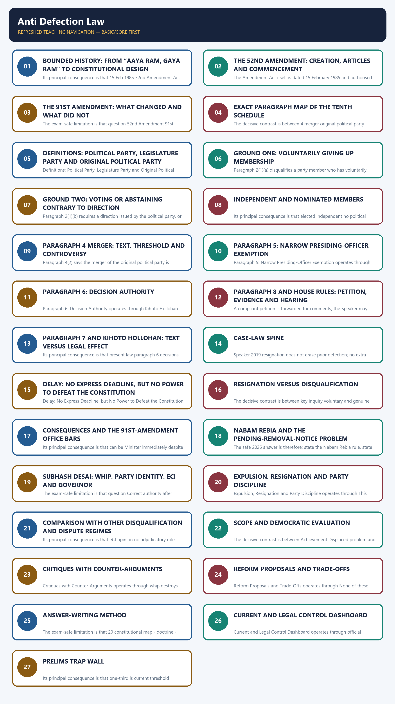

*Distinct embedded teaching-navigation image. The separate continuous Cārvāka-style flowchart package remains an independent at-a-glance artifact.*

The Constitutional Problem: Stability Without Legislative Servitude denotes the constitutional rules and institutional links organised around Stability interest Deliberative interest Constitutional challenge.
The Constitutional Problem: Stability Without Legislative Servitude operates through government must retain majority member should scrutinise policy define when party discipline justifies loss of seat, connected with mandate should not be traded dissent can improve legislation separate principled dissent from opportunistic defection.
The operative mechanism matters because floor-crossing can topple ministries every vote need not test survival avoid converting every issue into a confidence vote.
Its principal consequence is that party label shapes voter choice member also represents constituency balance party mandate and representative judgment.
The decisive contrast is between ANTI-DEFECTON LAW = and constitutional disqualification under the Tenth Schedule.
The exam-safe limitation is that for specified party-switching or direction-defying conduct,.
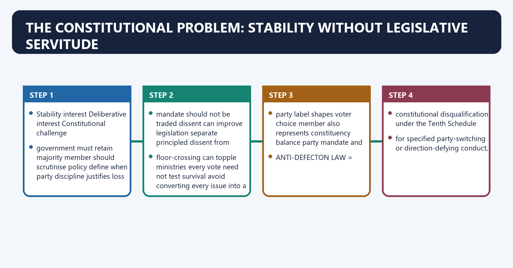
[FACT] The Tenth Schedule creates a constitutional ground of disqualification for defection. It operates through Articles **102(2)** and **191(2)** for Parliament and State legislatures respectively.

[ANALYSIS] Its central bargain is difficult: a parliamentary government needs party cohesion to survive, but a representative legislature also needs deliberation, dissent and constituency accountability.

[LIMIT] The law does not create criminal liability for changing political allegiance. It concerns continued membership of the House and linked constitutional office disabilities.

#### Visual 03 — The Core Constitutional Tension

| Stability interest | Deliberative interest | Constitutional challenge |
|---|---|---|
| government must retain majority | member should scrutinise policy | define when party discipline justifies loss of seat |
| mandate should not be traded | dissent can improve legislation | separate principled dissent from opportunistic defection |
| floor-crossing can topple ministries | every vote need not test survival | avoid converting every issue into a confidence vote |
| party label shapes voter choice | member also represents constituency | balance party mandate and representative judgment |

*Caption: Anti-defection is not simply “party versus member”; it is stability versus accountable representation.*

#### Visual 04 — Safe One-Sentence Definition

```text
ANTI-DEFECTON LAW =
constitutional disqualification under the Tenth Schedule
for specified party-switching or direction-defying conduct,
decided initially by the House's presiding officer,
subject to judicial review.
```

*Caption: This definition identifies source, grounds, decider and review without overstating the law.*

### SESSION 1 — BOUNDED HISTORY: FROM “AAYA RAM, GAYA RAM” TO CONSTITUTIONAL DESIGN
#### DEFINITION / WHAT THIS IS CALLED

**Plain-language definition:** Bounded History: From “Aaya Ram, Gaya Ram” to Constitutional Design denotes the constitutional rules and institutional links organised around Date Development Exam significance.

**Technical definition:** Its principal consequence is that 15 Feb 1985 52nd Amendment Act dated/enacted constitutional insertion authorised.

#### ANSWER-GRABBING OPENING — WRITE/ADAPT IN THE EXAM

> The 'Aaya Ram, Gaya Ram' episode symbolises how frequent defections destabilised governments and created the political demand for constitutional regulation.

#### MUST-WRITE KEYWORDS

- **Bounded History**
- **From “Aaya Ram**
- **Gaya Ram” to Constitutional Design**
- **background mischief**
- **Lok Sabha resolution for a Committee on Defections**
- **8 Dec 1967**

**How to use them:** Frame the answer through Bounded History; define From “Aaya Ram, connect Gaya Ram” to Constitutional Design with background mischief to explain the mechanism, and use Lok Sabha resolution for a Committee on Defections for the decisive comparison or qualification.

Bounded History: From “Aaya Ram, Gaya Ram” to Constitutional Design denotes the constitutional rules and institutional links organised around Date Development Exam significance.
Bounded History: From “Aaya Ram, Gaya Ram” to Constitutional Design operates through 1967 major wave of State-level defections; “Aaya Ram, Gaya Ram” political shorthand background mischief, connected with 8 Dec 1967 Lok Sabha resolution for a Committee on Defections institutional response begins.
The operative mechanism matters because 7 Jan 1969 Committee on Defections report documented instability and office incentives.
Its principal consequence is that 15 Feb 1985 52nd Amendment Act dated/enacted constitutional insertion authorised.
The decisive contrast is between 1 Mar 1985 52nd Amendment and Tenth Schedule brought into force operative commencement and 18 Feb 1992 Kihoto Hollohan judgment Schedule substantially upheld; para 7 invalid.
The exam-safe limitation is that 1 Jan 2004 91st Amendment changes effective split defence removed; office bars strengthened.
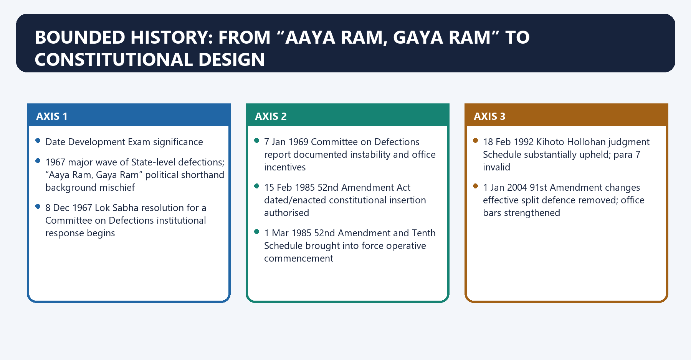
[FACT] The expression “Aaya Ram, Gaya Ram” became associated with rapid party-switching in Haryana politics in 1967. It is a political-memory anchor for the wider instability produced by frequent defections after the Fourth General Election.

[FACT] *Kihoto Hollohan* records the 8 December 1967 Lok Sabha resolution seeking a high-level Committee on Defections and quotes the Committee's 1969 report on extensive post-election changes of allegiance and the lure of office.

[LIMIT] The phrase is not the legal source of the Tenth Schedule. An answer should use it briefly, then move to the 52nd Amendment and exact provisions.

#### Visual 05 — Evolution Timeline

| Date | Development | Exam significance |
|---|---|---|
| 1967 | major wave of State-level defections; “Aaya Ram, Gaya Ram” political shorthand | background mischief |
| 8 Dec 1967 | Lok Sabha resolution for a Committee on Defections | institutional response begins |
| 7 Jan 1969 | Committee on Defections report | documented instability and office incentives |
| 15 Feb 1985 | 52nd Amendment Act dated/enacted | constitutional insertion authorised |
| 1 Mar 1985 | 52nd Amendment and Tenth Schedule brought into force | operative commencement |
| 18 Feb 1992 | *Kihoto Hollohan* judgment | Schedule substantially upheld; para 7 invalid |
| 1 Jan 2004 | 91st Amendment changes effective | split defence removed; office bars strengthened |

*Caption: Distinguish the Act's date from the date on which the 52nd Amendment came into force.*

#### Visual 06 — History-to-Design Chain

```text
FREQUENT FLOOR-CROSSING
        |
        v
MINISTRIES FALL + OFFICE INCENTIVES
        |
        v
DEMAND FOR PARTY-STABILITY RULE
        |
        v
52ND AMENDMENT: DISQUALIFICATION
        |
        v
UNINTENDED EFFECTS: BROAD WHIP + GROUP LOOPHOLES + SPEAKER DELAY
        |
        v
91ST AMENDMENT + JUDICIAL CONTROLS + REFORM DEBATE
```

*Caption: The law reduced one form of instability but generated new institutional incentives.*

#### CLOSING RECALL FLOW — BOUNDED HISTORY: FROM “AAYA RAM, GAYA RAM” TO CONSTITUTIONAL DESIGN

```closure-flow
SUBTOPIC: Bounded History: From “Aaya Ram, Gaya Ram” to Constitutional Design
KEY TERMS / DEFINITIONS: Bounded History · From “Aaya Ram · Gaya Ram” to Constitutional Design · background mischief · Lok Sabha resolution for a Committee on Defections · 8 Dec 1967
MECHANISM / ARGUMENT: It is a political-memory anchor for the wider instability produced by frequent defections after the Fourth General Election.
CONSEQUENCE / CONTRAST: Its principal consequence is that 15 Feb 1985 52nd Amendment Act dated/enacted constitutional insertion authorised.
UPSC TRAP / ANSWER-USE: Do not miss this limiting distinction: the decisive contrast is between 1 Mar 1985 52nd Amendment and Tenth Schedule brought...
ANSWER-GRABBING FORMULATION: The 'Aaya Ram, Gaya Ram' episode symbolises how frequent defections destabilised governments and created the political demand for constitutional regulation.
```
### SESSION 2 — THE 52ND AMENDMENT: CREATION, ARTICLES AND COMMENCEMENT
#### DEFINITION / WHAT THIS IS CALLED

**Plain-language definition:** The 52nd Amendment: Creation, Articles and Commencement denotes the constitutional rules and institutional links organised around The Constitution (Fifty-second Amendment) Act, 1985 amended Articles 101, 102, 190 and 191 and inserted the Tenth Schedule.

**Technical definition:** The Amendment Act itself is dated 15 February 1985 and authorised commencement by Central Government notification.

#### ANSWER-GRABBING OPENING — WRITE/ADAPT IN THE EXAM

> The 52nd Amendment linked Tenth Schedule disqualification to parliamentary and State vacancies, creating a constitutional response to defections rather than merely an internal party rule.

#### MUST-WRITE KEYWORDS

- **The 52nd Amendment**
- **Creation**
- **Articles**
- **Commencement**
- **Tenth Schedule**
- **1 March 1985**

**How to use them:** Frame the answer through The 52nd Amendment; define Creation, connect Articles with Commencement to explain the mechanism, and use Tenth Schedule for the decisive comparison or qualification.

The 52nd Amendment: Creation, Articles and Commencement denotes the constitutional rules and institutional links organised around [FACT] The Constitution (Fifty-second Amendment) Act, 1985 amended Articles 101, 102, 190 and 191 and inserted the Tenth Schedule.
The 52nd Amendment: Creation, Articles and Commencement operates through Article House level Function after 52nd Amendment, connected with 101 Parliament vacation of seat includes Article 102(2) disqualification.
The operative mechanism matters because 102(2) Parliament disqualification under Tenth Schedule.
Its principal consequence is that 190 State Legislature vacation of seat includes Article 191(2) disqualification.
The decisive contrast is between 191(2) State Legislature disqualification under Tenth Schedule and Act date: 15 February 1985.
The exam-safe limitation is that operative Tenth Schedule: 1 March 1985.
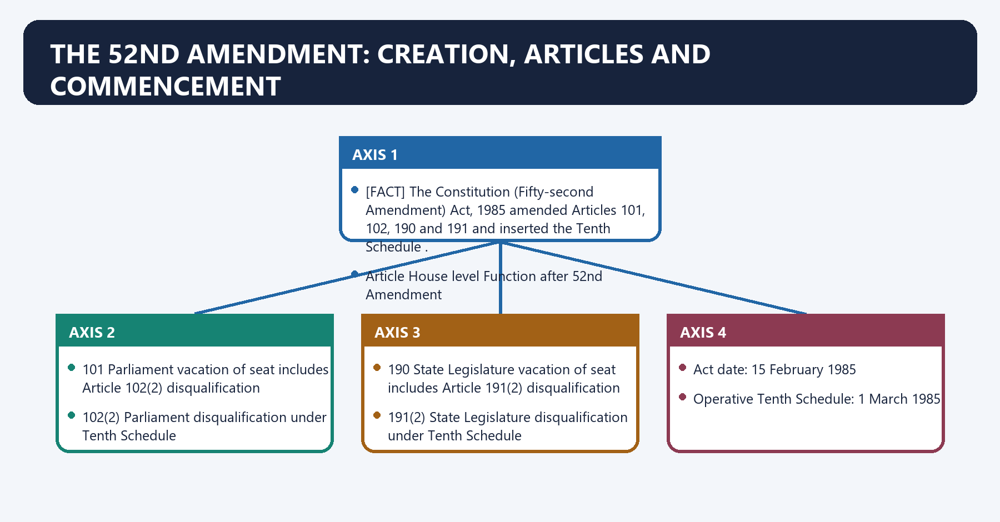
[FACT] The Constitution (Fifty-second Amendment) Act, 1985 amended Articles **101, 102, 190 and 191** and inserted the **Tenth Schedule**.

[FACT] The official consolidated Constitution records the Tenth Schedule as effective from **1 March 1985**. The Amendment Act itself is dated **15 February 1985** and authorised commencement by Central Government notification.

[ANALYSIS] Articles 101 and 190 connect disqualification with vacancy of seats; Articles 102 and 191 create the substantive constitutional disqualification route.

#### Visual 07 — Four-Article Link

| Article | House level | Function after 52nd Amendment |
|---|---|---|
| 101 | Parliament | vacation of seat includes Article 102(2) disqualification |
| 102(2) | Parliament | disqualification under Tenth Schedule |
| 190 | State Legislature | vacation of seat includes Article 191(2) disqualification |
| 191(2) | State Legislature | disqualification under Tenth Schedule |

*Caption: Articles 102/191 create the ground; Articles 101/190 connect the ground to seat vacancy.*

#### Visual 08 — Date Control Card

```text
52ND AMENDMENT
Act date: 15 February 1985
Operative Tenth Schedule: 1 March 1985

91ST AMENDMENT
Act called: Constitution (Ninety-first Amendment) Act, 2003
Assent / Gazette date: 1 January 2004
Tenth Schedule changes effective: 1 January 2004
```

*Caption: “1985” and “2003” identify the Acts; commencement still requires precise control.*

#### CLOSING RECALL FLOW — THE 52ND AMENDMENT: CREATION, ARTICLES AND COMMENCEMENT

```closure-flow
SUBTOPIC: The 52nd Amendment: Creation, Articles and Commencement
KEY TERMS / DEFINITIONS: The 52nd Amendment · Creation · Articles · Commencement · Tenth Schedule · 1 March 1985
MECHANISM / ARGUMENT: The 52nd Amendment: Creation, Articles and Commencement operates through Article House level Function after 52nd Amendment, connected with 101 Parliament vacation of seat includes Article 102(2) disqualification.
CONSEQUENCE / CONTRAST: Its principal consequence is that 190 State Legislature vacation of seat includes Article 191(2) disqualification.
UPSC TRAP / ANSWER-USE: Do not miss this limiting distinction: the decisive contrast is between 191(2) State Legislature disqualification under Tenth Schedule and Act...
ANSWER-GRABBING FORMULATION: The 52nd Amendment linked Tenth Schedule disqualification to parliamentary and State vacancies, creating a constitutional response to defections rather than merely an internal party rule.
```
### SESSION 3 — THE 91ST AMENDMENT: WHAT CHANGED AND WHAT DID NOT
#### DEFINITION / WHAT THIS IS CALLED

**Plain-language definition:** The 91st Amendment: What Changed and What Did Not denotes the constitutional rules and institutional links organised around Change Provision Effect.

**Technical definition:** The exam-safe limitation is that question 52nd Amendment 91st Amendment.

#### ANSWER-GRABBING OPENING — WRITE/ADAPT IN THE EXAM

> The 91st Amendment did not replace the Speaker with the Election Commission, create a general time limit, or restrict whips to confidence votes.

#### MUST-WRITE KEYWORDS

- **The 91st Amendment**
- **What Changed**
- **What Did Not**
- **Union ministry cap**
- **75(1A), 75(1B), 164(1A), 164(1B)**
- **361B**

**How to use them:** Frame the answer through The 91st Amendment; define What Changed, connect What Did Not with Union ministry cap to explain the mechanism, and use 75(1A), 75(1B), 164(1A), 164(1B) for the decisive comparison or qualification.

The 91st Amendment: What Changed and What Did Not denotes the constitutional rules and institutional links organised around Change Provision Effect.
The 91st Amendment: What Changed and What Did Not operates through Union ministry cap Article 75(1A) total ministers including PM not above 15% of Lok Sabha, connected with Union defector-minister bar Article 75(1B) office disability after paragraph 2 disqualification.
The operative mechanism matters because state ministry cap Article 164(1A) not above 15% of Assembly; minimum 12.
Its principal consequence is that state defector-minister bar Article 164(1B) office disability after paragraph 2 disqualification.
The decisive contrast is between remunerative political post bar Article 361B separate constitutional disability and split defence deleted Tenth Schedule paragraph 3 omitted one-third split no longer protects.
The exam-safe limitation is that question 52nd Amendment 91st Amendment.
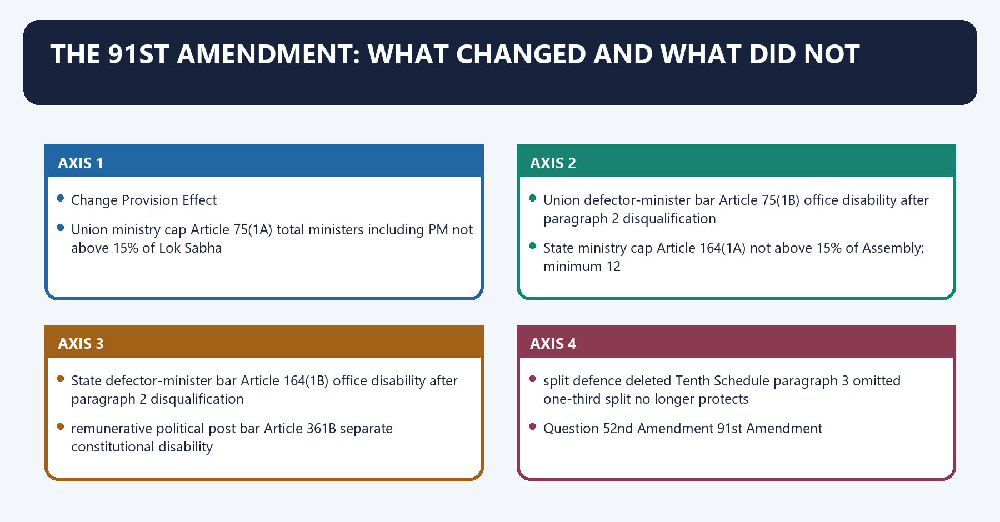
[FACT] The Constitution (Ninety-first Amendment) Act, 2003 omitted paragraph 3 of the Tenth Schedule and adjusted paragraphs 1 and 2 accordingly, with effect from 1 January 2004.

[FACT] It inserted Articles **75(1A), 75(1B), 164(1A), 164(1B)** and **361B**. These provisions cap ministry size and create ministerial/remunerative-political-post disabilities for members disqualified under paragraph 2.

[LIMIT] The 91st Amendment did not replace the Speaker with the Election Commission, create a general time limit, or restrict whips to confidence votes.

#### Visual 09 — 91st Amendment Architecture

| Change | Provision | Effect |
|---|---|---|
| Union ministry cap | Article 75(1A) | total ministers including PM not above 15% of Lok Sabha |
| Union defector-minister bar | Article 75(1B) | office disability after paragraph 2 disqualification |
| State ministry cap | Article 164(1A) | not above 15% of Assembly; minimum 12 |
| State defector-minister bar | Article 164(1B) | office disability after paragraph 2 disqualification |
| remunerative political post bar | Article 361B | separate constitutional disability |
| split defence deleted | Tenth Schedule paragraph 3 omitted | one-third split no longer protects |

*Caption: The 91st Amendment attacked both the split loophole and the reward structure of defection.*

#### Visual 10 — 52nd versus 91st

| Question | 52nd Amendment | 91st Amendment |
|---|---|---|
| main role | created anti-defection framework | tightened it |
| Schedule effect | inserted Tenth Schedule | omitted paragraph 3 |
| article focus | 101, 102, 190, 191 | 75, 164, 361B plus Schedule edits |
| office incentives | no specific new defector-office bar | minister/remunerative-post bars |
| common trap | called an ordinary Anti-Defection Act | confused with creation of ministry cap |

*Caption: Creation belongs to the 52nd; tightening and office disabilities belong to the 91st.*

#### CLOSING RECALL FLOW — THE 91ST AMENDMENT: WHAT CHANGED AND WHAT DID NOT

```closure-flow
SUBTOPIC: The 91st Amendment: What Changed and What Did Not
KEY TERMS / DEFINITIONS: The 91st Amendment · What Changed · What Did Not · Union ministry cap · 75(1A), 75(1B), 164(1A), 164(1B) · 361B
MECHANISM / ARGUMENT: The 91st Amendment did not replace the Speaker with the Election Commission, create a general time limit, or restrict whips to confidence votes.
CONSEQUENCE / CONTRAST: The decisive contrast is between remunerative political post bar Article 361B separate constitutional disability and split defence deleted Tenth Schedule paragraph 3 omitted one-third split no longer protects.
UPSC TRAP / ANSWER-USE: Do not miss this limiting distinction: its principal consequence is that state defector-minister bar Article 164(1B) office disability after paragraph...
ANSWER-GRABBING FORMULATION: The 91st Amendment did not replace the Speaker with the Election Commission, create a general time limit, or restrict whips to confidence votes.
```
### SESSION 4 — EXACT PARAGRAPH MAP OF THE TENTH SCHEDULE
#### DEFINITION / WHAT THIS IS CALLED

**Plain-language definition:** Exact Paragraph Map of the Tenth Schedule denotes the constitutional rules and institutional links organised around The current Schedule retains paragraphs 1, 2 and 4-8.

**Technical definition:** The decisive contrast is between 4 merger original political party + two-thirds deeming rule and 5 presiding-officer exemption exact listed offices and rejoining conditions.

#### ANSWER-GRABBING OPENING — WRITE/ADAPT IN THE EXAM

> The current Tenth Schedule retains disqualification, merger, decision and rule-making provisions, while the former one-third split defence remains omitted.

#### MUST-WRITE KEYWORDS

- **Exact Paragraph Map of the Tenth Schedule**
- **interpretation**
- **House, legislature party, original political party**
- **disqualification**
- **party member, independent, nominated**
- **omitted**

**How to use them:** Frame the answer through Exact Paragraph Map of the Tenth Schedule; define interpretation, connect House, legislature party, original political party with disqualification to explain the mechanism, and use party member, independent, nominated for the decisive comparison or qualification.

Exact Paragraph Map of the Tenth Schedule denotes the constitutional rules and institutional links organised around [FACT] The current Schedule retains paragraphs 1, 2 and 4-8. Paragraph 3 appears as omitted in the official text.
Exact Paragraph Map of the Tenth Schedule operates through Paragraph Subject High-yield control, connected with 1 interpretation House, legislature party, original political party.
The operative mechanism matters because 2 disqualification party member, independent, nominated.
Its principal consequence is that 3 omitted former one-third split defence.
The decisive contrast is between 4 merger original political party + two-thirds deeming rule and 5 presiding-officer exemption exact listed offices and rejoining conditions.
The exam-safe limitation is that 6 decision Speaker/Chairman; special route if the presiding officer is concerned.
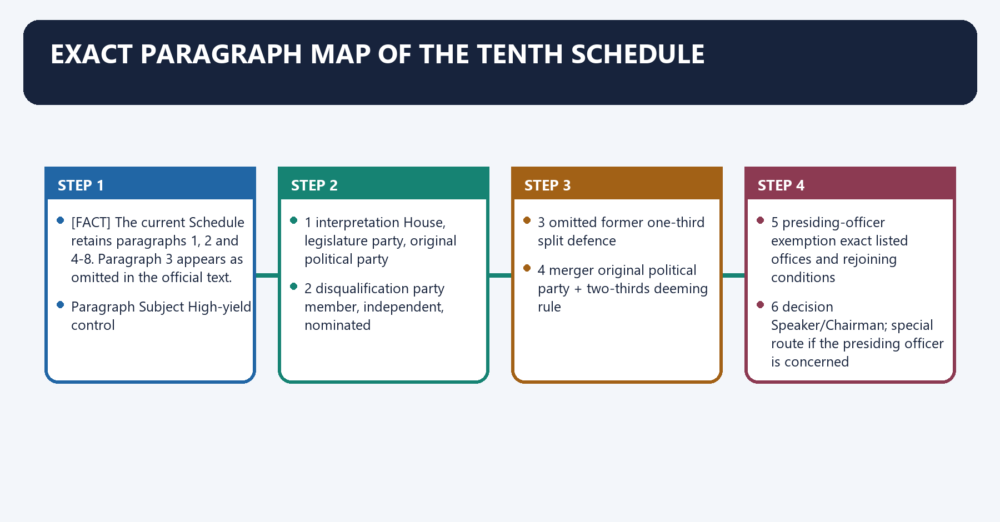
[FACT] The current Schedule retains paragraphs 1, 2 and 4-8. Paragraph 3 appears as omitted in the official text.

#### Visual 11 — Paragraph-by-Paragraph Map

| Paragraph | Subject | High-yield control |
|---:|---|---|
| 1 | interpretation | House, legislature party, original political party |
| 2 | disqualification | party member, independent, nominated |
| 3 | omitted | former one-third split defence |
| 4 | merger | original political party + two-thirds deeming rule |
| 5 | presiding-officer exemption | exact listed offices and rejoining conditions |
| 6 | decision | Speaker/Chairman; special route if the presiding officer is concerned |
| 7 | textual bar of courts | printed text survives; paragraph invalid under *Kihoto* |
| 8 | rules | records, reports, admission, procedure and laying |

*Caption: Paragraph 7 remains printed, but its constitutional legal effect is controlled by Kihoto.*

#### Visual 12 — Schedule Logic

```text
WHO IS THE MEMBER? -> paragraph 1 definitions
        |
WHAT CONDUCT OCCURRED? -> paragraph 2
        |
IS A DEFENCE CLAIMED? -> paragraph 4 or paragraph 5
        |
WHO DECIDES? -> paragraph 6
        |
WHAT PROCEDURE? -> paragraph 8 + House rules + natural justice
        |
WHAT COURT CONTROL? -> Kihoto / later cases
```

*Caption: Every problem question should be solved in this order.*

#### CLOSING RECALL FLOW — EXACT PARAGRAPH MAP OF THE TENTH SCHEDULE

```closure-flow
SUBTOPIC: Exact Paragraph Map of the Tenth Schedule
KEY TERMS / DEFINITIONS: Exact Paragraph Map of the Tenth Schedule · interpretation · House, legislature party, original political party · disqualification · party member, independent, nominated · omitted
MECHANISM / ARGUMENT: The decisive contrast is between 4 merger original political party + two-thirds deeming rule and 5 presiding-officer exemption exact listed offices and rejoining conditions.
CONSEQUENCE / CONTRAST: Its principal consequence is that 3 omitted former one-third split defence.
UPSC TRAP / ANSWER-USE: Do not miss this limiting distinction: the exam-safe limitation is that 6 decision Speaker/Chairman.
ANSWER-GRABBING FORMULATION: The current Tenth Schedule retains disqualification, merger, decision and rule-making provisions, while the former one-third split defence remains omitted.
```
### SESSION 5 — DEFINITIONS: POLITICAL PARTY, LEGISLATURE PARTY AND ORIGINAL POLITICAL PARTY
#### DEFINITION / WHAT THIS IS CALLED

**Plain-language definition:** Definitions: Political Party, Legislature Party and Original Political Party denotes the constitutional rules and institutional links organised around A legislature party is the group of all members of that House who belong to a political party under the Schedule.

**Technical definition:** Definitions: Political Party, Legislature Party and Original Political Party operates through An original political party , in relation to a member, is the political party to which that member belongs for paragraph 2(1), connected with An elected party member is deemed to belong to the political party that set the member up as a candidate.

#### ANSWER-GRABBING OPENING — WRITE/ADAPT IN THE EXAM

> The Tenth Schedule distinguishes the political party, legislature party and member's original political party, preventing organisational affiliation from being collapsed into the House group.

#### MUST-WRITE KEYWORDS

- **Definitions**
- **Political Party**
- **Legislature Party**
- **Original Political Party**
- **location**
- **organisational/electoral entity**

**How to use them:** Frame the answer through Definitions; define Political Party, connect Legislature Party with Original Political Party to explain the mechanism, and use location for the decisive comparison or qualification.

Definitions: Political Party, Legislature Party and Original Political Party denotes the constitutional rules and institutional links organised around [FACT] A legislature party is the group of all members of that House who belong to a political party under the Schedule.
Definitions: Political Party, Legislature Party and Original Political Party operates through [FACT] An original political party , in relation to a member, is the political party to which that member belongs for paragraph 2(1), connected with [FACT] An elected party member is deemed to belong to the political party that set the member up as a candidate.
The operative mechanism matters because organisation beyond the House; constitution, authorised leadership.
Its principal consequence is that sets up candidate for election.
The decisive contrast is between authorises person/authority to issue direction and all that party's members inside the particular House.
The exam-safe limitation is that subject to paragraph 2 and possible paragraph 4/5 protection.
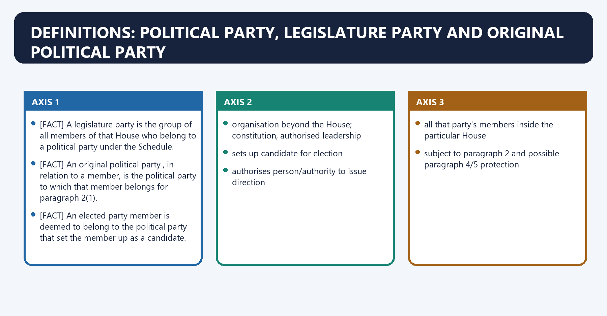
[FACT] A **legislature party** is the group of all members of that House who belong to a political party under the Schedule.

[FACT] An **original political party**, in relation to a member, is the political party to which that member belongs for paragraph 2(1).

[FACT] An elected party member is deemed to belong to the political party that set the member up as a candidate.

#### Visual 13 — Three-Level Party Map

```text
POLITICAL PARTY
organisation beyond the House; constitution, authorised leadership
        |
        +--> sets up candidate for election
        +--> authorises person/authority to issue direction
        |
        v
LEGISLATURE PARTY
all that party's members inside the particular House
        |
        v
INDIVIDUAL MEMBER
subject to paragraph 2 and possible paragraph 4/5 protection
```

*Caption: The legislature party is the House-level group; it is not the whole political party.*

#### Visual 14 — Political Party versus Legislature Party

| Dimension | Political party | Legislature party |
|---|---|---|
| location | organisational/electoral entity | group within a House |
| Tenth Schedule role | candidate-setting, membership, direction, merger reference | headcount and House grouping |
| whip after *Subhash Desai* | appoints/authorises Whip and Leader | cannot replace party authority by factional vote |
| paragraph 4 | “original political party” is the reference point | two-thirds agreement creates statutory deeming issue |
| ECI relation | may be party in Symbols Order dispute | numerical support is evidence, not automatic ownership |

*Caption: The 2025 Prelims route tests this exact distinction.*

#### Visual 15 — Why “Political Party” Is Explicit

```text
ELECTION TICKET -> deemed party belonging
PARTY MEMBERSHIP -> paragraph 2(1)(a)
PARTY DIRECTION -> paragraph 2(1)(b)
ORIGINAL PARTY -> paragraph 4
PARTY REPORTS -> paragraph 8

Therefore:
the Schedule is not merely about a temporary group of legislators.
```

*Caption: “Political party” is structurally central across the Schedule, not an incidental phrase.*

#### CLOSING RECALL FLOW — DEFINITIONS: POLITICAL PARTY, LEGISLATURE PARTY AND ORIGINAL POLITICAL PARTY

```closure-flow
SUBTOPIC: Definitions: Political Party, Legislature Party and Original Political Party
KEY TERMS / DEFINITIONS: Definitions · Political Party · Legislature Party · Original Political Party · location · organisational/electoral entity
MECHANISM / ARGUMENT: Definitions: Political Party, Legislature Party and Original Political Party operates through An original political party , in relation to a member, is the political party to which that member belongs for paragraph 2(1), connected with An elected party member is deemed to belong to the political party that set the member up as a candidate.
CONSEQUENCE / CONTRAST: A legislature party is the group of all members of that House who belong to a political party under the Schedule.
UPSC TRAP / ANSWER-USE: Do not miss this limiting distinction: an original political party, in relation to a member, is the political party to...
ANSWER-GRABBING FORMULATION: The Tenth Schedule distinguishes the political party, legislature party and member's original political party, preventing organisational affiliation from being collapsed into the House group.
```
### SESSION 6 — GROUND ONE: VOLUNTARILY GIVING UP MEMBERSHIP
#### DEFINITION / WHAT THIS IS CALLED

**Plain-language definition:** Ground One: Voluntarily Giving Up Membership denotes the constitutional rules and institutional links organised around Paragraph 2(1)(a) disqualifies a party member who has voluntarily given up membership of the political party.

**Technical definition:** Paragraph 2(1)(a) disqualifies a party member who has voluntarily given up membership of the political party.

#### ANSWER-GRABBING OPENING — WRITE/ADAPT IN THE EXAM

> Voluntarily giving up party membership extends beyond formal resignation and may be inferred from conduct, but isolated disagreement should not mechanically establish defection.

#### MUST-WRITE KEYWORDS

- **Ground One**
- **Voluntarily Giving Up Membership**
- **voluntarily given up membership**
- **resignation letter**
- **express relinquishment**
- **authenticity and timing matter**

**How to use them:** Frame the answer through Ground One; define Voluntarily Giving Up Membership, connect voluntarily given up membership with resignation letter to explain the mechanism, and use express relinquishment for the decisive comparison or qualification.

Ground One: Voluntarily Giving Up Membership denotes the constitutional rules and institutional links organised around [FACT] Paragraph 2(1)(a) disqualifies a party member who has voluntarily given up membership of the political party.
Ground One: Voluntarily Giving Up Membership operates through [FACT] Ravi S. Naik v. Union of India holds that the phrase is wider than formal resignation; an inference may be drawn from conduct, connected with FORMAL RESIGNATION FROM PARTY.
The operative mechanism matters because strongest direct evidence.
Its principal consequence is that pUBLICLY JOINING / ACCEPTING ANOTHER PARTY'S POSITION.
The decisive contrast is between strong conduct evidence and SUSTAINED ACTION AGAINST OWN PARTY + RIVAL ALIGNMENT.
The exam-safe limitation is that possible inference; examine context.
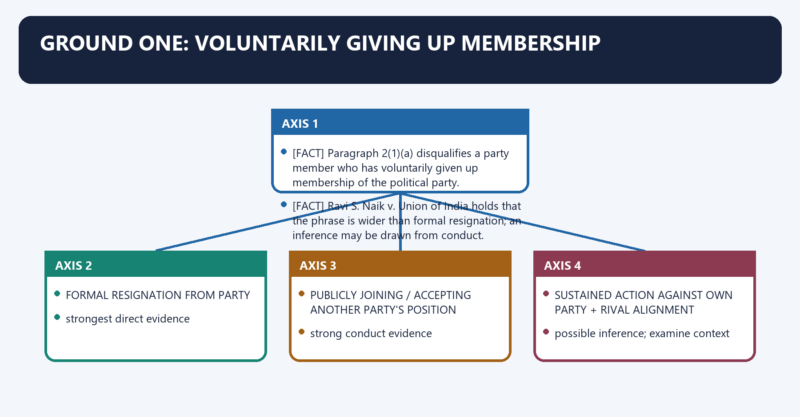
[FACT] Paragraph 2(1)(a) disqualifies a party member who has **voluntarily given up membership** of the political party.

[FACT] *Ravi S. Naik v. Union of India* holds that the phrase is wider than formal resignation; an inference may be drawn from conduct.

[ANALYSIS] The inquiry asks whether conduct, taken as a whole, objectively communicates abandonment of party allegiance. A single disagreement or speech should not mechanically be equated with departure.

[LIMIT] The law does not supply an exhaustive conduct checklist. Context, evidence, party constitution, communications and procedural fairness matter.

#### Visual 16 — Conduct-Inference Ladder

```text
FORMAL RESIGNATION FROM PARTY
        -> strongest direct evidence

PUBLICLY JOINING / ACCEPTING ANOTHER PARTY'S POSITION
        -> strong conduct evidence

SUSTAINED ACTION AGAINST OWN PARTY + RIVAL ALIGNMENT
        -> possible inference; examine context

ONE SPEECH / POLICY CRITICISM / INTERNAL DISSENT
        -> not automatically voluntary giving up
```

*Caption: The phrase is wider than resignation, but it is not a licence to punish every disagreement.*

#### Visual 17 — Evidence Checklist for Paragraph 2(1)(a)

| Evidence | What it may show | Qualification |
|---|---|---|
| resignation letter | express relinquishment | authenticity and timing matter |
| public declaration | intended abandonment | read full statement, not isolated phrase |
| rival-party membership/action | changed allegiance | require reliable proof |
| conduct during government formation | alignment against party | distinguish from legitimate procedural act |
| party expulsion | party's act, not member's voluntary act | expulsion alone is not the paragraph 2(1)(a) ground |
| later conduct after expulsion | joining/acting with another party | *G. Viswanathan* deeming principle becomes relevant |

*Caption: The Speaker adjudicates evidence, not political labels alone.*

#### CLOSING RECALL FLOW — GROUND ONE: VOLUNTARILY GIVING UP MEMBERSHIP

```closure-flow
SUBTOPIC: Ground One: Voluntarily Giving Up Membership
KEY TERMS / DEFINITIONS: Ground One · Voluntarily Giving Up Membership · voluntarily given up membership · resignation letter · express relinquishment · authenticity and timing matter
MECHANISM / ARGUMENT: Paragraph 2(1)(a) disqualifies a party member who has voluntarily given up membership of the political party.
CONSEQUENCE / CONTRAST: Its principal consequence is that pUBLICLY JOINING / ACCEPTING ANOTHER PARTY'S POSITION.
UPSC TRAP / ANSWER-USE: Do not miss this limiting distinction: the decisive contrast is between strong conduct evidence and SUSTAINED ACTION AGAINST OWN PARTY...
ANSWER-GRABBING FORMULATION: Voluntarily giving up party membership extends beyond formal resignation and may be inferred from conduct, but isolated disagreement should not mechanically establish defection.
```
### SESSION 7 — GROUND TWO: VOTING OR ABSTAINING CONTRARY TO DIRECTION
#### DEFINITION / WHAT THIS IS CALLED

**Plain-language definition:** Ground Two: Voting or Abstaining Contrary to Direction denotes the constitutional rules and institutional links organised around The text covers both voting and abstaining.

**Technical definition:** Paragraph 2(1)(b) requires a direction issued by the political party, or by a person/authority authorised by it; voting or abstention contrary to that direction; absence of prior permission; and no condonation within 15 days.

#### ANSWER-GRABBING OPENING — WRITE/ADAPT IN THE EXAM

> The law does not say that every speech, committee intervention, public disagreement or policy criticism is itself a whip breach.

#### MUST-WRITE KEYWORDS

- **Ground Two**
- **Voting or Abstaining Contrary to Direction**
- **voting**
- **abstaining**
- **criticising a Bill in debate**
- **15 days**

**How to use them:** Frame the answer through Ground Two; define Voting or Abstaining Contrary to Direction, connect voting with abstaining to explain the mechanism, and use criticising a Bill in debate for the decisive comparison or qualification.

Ground Two: Voting or Abstaining Contrary to Direction denotes the constitutional rules and institutional links organised around [FACT] The text covers both voting and abstaining.
Ground Two: Voting or Abstaining Contrary to Direction operates through political party / authorised person or authority, connected with CONTRARY VOTE OR ABSTENTION IN THE HOUSE.
The operative mechanism matters because nO PRIOR PERMISSION.
Its principal consequence is that nOT CONDONED WITHIN 15 DAYS.
The decisive contrast is between POSSIBLE DISQUALIFICATION and Conduct Tenth Schedule position.
The exam-safe limitation is that criticising a Bill in debate not by itself a paragraph 2(1)(b) breach.
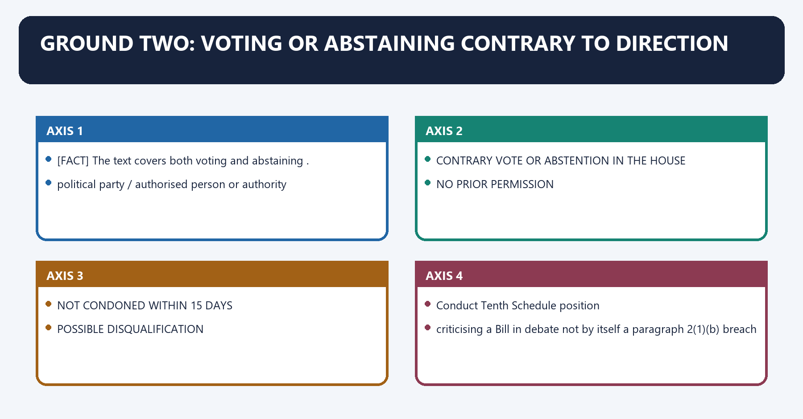
[FACT] Paragraph 2(1)(b) requires a direction issued by the political party, or by a person/authority authorised by it; voting or abstention contrary to that direction; absence of prior permission; and no condonation within **15 days**.

[FACT] The text covers both **voting** and **abstaining**.

[LIMIT] The law does not say that every speech, committee intervention, public disagreement or policy criticism is itself a whip breach.

#### Visual 18 — Four-Element Whip Test

```text
1. VALID DIRECTION
political party / authorised person or authority
        |
2. CONTRARY VOTE OR ABSTENTION IN THE HOUSE
        |
3. NO PRIOR PERMISSION
        |
4. NOT CONDONED WITHIN 15 DAYS
        |
        v
POSSIBLE DISQUALIFICATION
```

*Caption: Missing any textual element defeats the paragraph 2(1)(b) route.*

#### Visual 19 — Dissent versus Defection

| Conduct | Tenth Schedule position |
|---|---|
| criticising a Bill in debate | not by itself a paragraph 2(1)(b) breach |
| voting contrary to a valid direction | ground may arise |
| abstaining contrary to direction | ground may arise |
| prior permission obtained | textual protection |
| contrary vote later condoned within 15 days | textual protection |
| party discipline outside a House vote | may have party consequences; not automatically paragraph 2(1)(b) |

*Caption: Party discipline is broader than constitutional disqualification.*

#### Visual 20 — Current Law versus Narrow-Whip Reform

| Dimension | Current law | Reform proposal |
|---|---|---|
| votes covered | direction may extend broadly | confidence/no-confidence, money/supply or core programme |
| stability | high party control | protects survival votes |
| deliberation | individual choice reduced | greater issue-wise autonomy |
| status | enacted constitutional text | proposal, not law |

*Caption: A desirable reform must not be written as the present rule.*

#### CLOSING RECALL FLOW — GROUND TWO: VOTING OR ABSTAINING CONTRARY TO DIRECTION

```closure-flow
SUBTOPIC: Ground Two: Voting or Abstaining Contrary to Direction
KEY TERMS / DEFINITIONS: Ground Two · Voting or Abstaining Contrary to Direction · voting · abstaining · criticising a Bill in debate · 15 days
MECHANISM / ARGUMENT: Paragraph 2(1)(b) requires a direction issued by the political party, or by a person/authority authorised by it; voting or abstention contrary to that direction; absence of prior permission; and no condonation within 15 days.
CONSEQUENCE / CONTRAST: Its principal consequence is that nOT CONDONED WITHIN 15 DAYS.
UPSC TRAP / ANSWER-USE: The exam-safe limitation is that criticising a Bill in debate not by itself a paragraph 2(1)(b) breach.
ANSWER-GRABBING FORMULATION: The law does not say that every speech, committee intervention, public disagreement or policy criticism is itself a whip breach.
```
### SESSION 8 — INDEPENDENT AND NOMINATED MEMBERS
#### DEFINITION / WHAT THIS IS CALLED

**Plain-language definition:** Independent and Nominated Members denotes the constitutional rules and institutional links organised around An independently elected member is disqualified if the member joins any political party after election.

**Technical definition:** Its principal consequence is that elected independent no political party set the member up joining any political party after election.

#### ANSWER-GRABBING OPENING — WRITE/ADAPT IN THE EXAM

> The nominated member may join within the first six months without this disqualification.

#### MUST-WRITE KEYWORDS

- **Independent**
- **Nominated Members**
- **joins any political party after election**
- **after six months from taking the seat**
- **elected on party ticket**
- **voluntary giving up or contrary vote/abstention**

**How to use them:** Frame the answer through Independent; define Nominated Members, connect joins any political party after election with after six months from taking the seat to explain the mechanism, and use elected on party ticket for the decisive comparison or qualification.

Independent and Nominated Members denotes the constitutional rules and institutional links organised around [FACT] An independently elected member is disqualified if the member joins any political party after election.
Independent and Nominated Members operates through [LIMIT] The six-month freedom belongs to the nominated member, not the independent member, connected with Member type Starting position Disqualifying trigger.
The operative mechanism matters because elected on party ticket deemed to belong to party that set member up voluntary giving up or contrary vote/abstention.
Its principal consequence is that elected independent no political party set the member up joining any political party after election.
The decisive contrast is between nominated, already party member at nomination deemed to belong to that party paragraph 2(1) applies and nominated, not party member at nomination six-month choice window joining after six months.
The exam-safe limitation is that may join a political party without paragraph 2(3) disqualification.
[FACT] An independently elected member is disqualified if the member **joins any political party after election**.

[FACT] A nominated member is disqualified if the member joins a political party **after six months from taking the seat**. The nominated member may join within the first six months without this disqualification.

[LIMIT] The six-month freedom belongs to the nominated member, not the independent member.

#### Visual 21 — Member-Type Matrix

| Member type | Starting position | Disqualifying trigger |
|---|---|---|
| elected on party ticket | deemed to belong to party that set member up | voluntary giving up or contrary vote/abstention |
| elected independent | no political party set the member up | joining any political party after election |
| nominated, already party member at nomination | deemed to belong to that party | paragraph 2(1) applies |
| nominated, not party member at nomination | six-month choice window | joining after six months |

*Caption: UPSC repeatedly tests the asymmetry between independent and nominated members.*

#### Visual 22 — Nominated-Member Timeline

```text
TAKES SEAT
    |
    |------ FIRST SIX MONTHS ------|
    | may join a political party without paragraph 2(3) disqualification
    |
    v
AFTER SIX MONTHS
joining a political party -> disqualification ground
```

*Caption: Count from taking the seat after complying with Article 99 or 188, not from nomination date.*

#### Visual 23 — Independent versus Nominated Trap Card

| Statement | Correct? | Reason |
|---|---:|---|
| independent may join within six months | no | no grace period exists |
| nominated may never join a party | no | first-six-month freedom exists |
| nominated member's clock starts at taking the seat | yes | exact constitutional text |
| independent member is governed by whip of a later-joined party without disqualification | no | joining itself triggers paragraph 2(2) |

*Caption: Similar-looking categories have deliberately different rules.*

#### CLOSING RECALL FLOW — INDEPENDENT AND NOMINATED MEMBERS

```closure-flow
SUBTOPIC: Independent and Nominated Members
KEY TERMS / DEFINITIONS: Independent · Nominated Members · joins any political party after election · after six months from taking the seat · elected on party ticket · voluntary giving up or contrary vote/abstention
MECHANISM / ARGUMENT: Its principal consequence is that elected independent no political party set the member up joining any political party after election.
CONSEQUENCE / CONTRAST: The decisive contrast is between nominated, already party member at nomination deemed to belong to that party paragraph 2(1) applies and nominated, not party member at nomination six-month choice window joining after six months.
UPSC TRAP / ANSWER-USE: Do not miss this limiting distinction: a nominated member is disqualified if the member joins a political party after six...
ANSWER-GRABBING FORMULATION: The nominated member may join within the first six months without this disqualification.
```
### SESSION 9 — PARAGRAPH 4 MERGER: TEXT, THRESHOLD AND CONTROVERSY
#### DEFINITION / WHAT THIS IS CALLED

**Plain-language definition:** Paragraph 4 Merger: Text, Threshold and Controversy denotes the constitutional rules and institutional links organised around Paragraph 4(1) begins with a member's original political party merging with another political party.

**Technical definition:** Paragraph 4(2) says the merger of the original political party is deemed to have taken place if, and only if, not less than two-thirds of the legislature party concerned agree to the merger.

#### ANSWER-GRABBING OPENING — WRITE/ADAPT IN THE EXAM

> Protected persons include those who become members of the other/new party and those who do not accept the merger and opt to function as a separate group.

#### MUST-WRITE KEYWORDS

- **Paragraph 4 Merger**
- **Text**
- **Threshold**
- **Controversy**
- **original political party merging with another political party**
- **deemed**

**How to use them:** Frame the answer through Paragraph 4 Merger; define Text, connect Threshold with Controversy to explain the mechanism, and use original political party merging with another political party for the decisive comparison or qualification.

Paragraph 4 Merger: Text, Threshold and Controversy denotes the constitutional rules and institutional links organised around [FACT] Paragraph 4(1) begins with a member's original political party merging with another political party.
Paragraph 4 Merger: Text, Threshold and Controversy operates through ORIGINAL POLITICAL PARTY MERGER CLAIM, connected with AT LEAST TWO-THIRDS OF LEGISLATURE PARTY AGREE?.
The operative mechanism matters because no para 4 statutory deeming route opens.
Its principal consequence is that accept other/new party.
The decisive contrast is between reject merger and function as separate group and Category Protection.
The exam-safe limitation is that member who accepts qualifying merger protected from paragraph 2(1) disqualification.
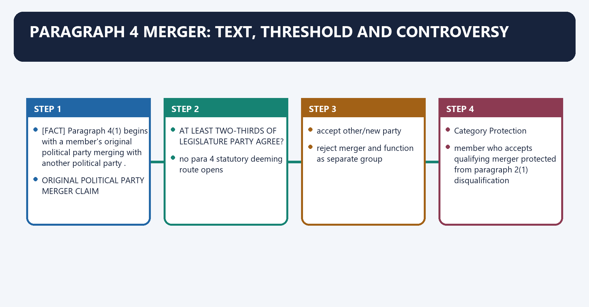
[FACT] Paragraph 4(1) begins with a member's **original political party merging with another political party**.

[FACT] Protected persons include those who become members of the other/new party and those who do not accept the merger and opt to function as a separate group.

[FACT] Paragraph 4(2) says the merger of the original political party is **deemed** to have taken place if, and only if, not less than **two-thirds of the legislature party concerned** agree to the merger.

[LIMIT] Do not reduce the rule to “two-thirds MLAs can automatically defect.” The interaction between the original-political-party language and the two-thirds deeming fiction is the central interpretive controversy.

#### Visual 24 — Paragraph 4 Textual Sequence

```text
ORIGINAL POLITICAL PARTY MERGER CLAIM
        |
        v
AT LEAST TWO-THIRDS OF LEGISLATURE PARTY AGREE?
        |
   +----+----+
   |         |
  NO        YES
   |         |
no para 4   statutory deeming route opens
protection   |
             +--> accept other/new party
             |
             +--> reject merger and function as separate group
```

*Caption: The two-thirds threshold belongs inside a merger defence; it is not a free-standing permission to switch.*

#### Visual 25 — Who Is Protected Under Paragraph 4?

| Category | Protection |
|---|---|
| member who accepts qualifying merger | protected from paragraph 2(1) disqualification |
| member who joins new party formed by qualifying merger | protected |
| member who rejects merger and functions as separate group | protected |
| individual who simply joins another party without paragraph 4 foundation | not protected |
| group below two-thirds | cannot invoke paragraph 4(2) deeming rule |

*Caption: Dissenters from a qualifying merger are protected as well as those accepting it.*

#### Visual 26 — Split versus Merger

| Feature | Former paragraph 3 split | Current paragraph 4 merger |
|---|---|---|
| threshold | one-third legislature party | not less than two-thirds |
| organisational claim | split in original political party | merger of original political party |
| current status | omitted from 1 Jan 2004 | survives |
| safe exam line | no longer a defence | only surviving group exception |

*Caption: Never write “split or merger” as two current defences.*

#### Visual 27 — Merger Interpretation Control

| Position | Supporting logic | Limitation |
|---|---|---|
| organisational-merger emphasis | paragraph 4(1) expressly says original political party merges | must explain paragraph 4(2) deeming fiction |
| legislature-headcount emphasis | paragraph 4(2) deems merger when two-thirds agree | risks converting group defection into automatic merger |
| *Rajendra Singh Rana* analogy | under former split rule, mere legislator numbers did not prove an original-party split | case interpreted omitted paragraph 3, not a final modern paragraph 4 ruling |
| present safe answer | state exact text, identify controversy, avoid claiming final 2026 settlement | official later merits ruling not verified |

*Caption: The controversy should be preserved, not prematurely resolved by assertion.*

[CURRENT] Reports in 2026 describe litigation challenging whether legislative numbers alone can support paragraph 4 protection.

[LIMIT] No official Supreme Court merits order fixing the 2026 challenge's bench, schedule or final rule was independently verified for this package. It is therefore described only as reported/pending litigation.

#### CLOSING RECALL FLOW — PARAGRAPH 4 MERGER: TEXT, THRESHOLD AND CONTROVERSY

```closure-flow
SUBTOPIC: Paragraph 4 Merger: Text, Threshold and Controversy
KEY TERMS / DEFINITIONS: Paragraph 4 Merger · Text · Threshold · Controversy · original political party merging with another political party · deemed
MECHANISM / ARGUMENT: Paragraph 4(2) says the merger of the original political party is deemed to have taken place if, and only if, not less than two-thirds of the legislature party concerned agree to the merger.
CONSEQUENCE / CONTRAST: Do not reduce the rule to “two-thirds MLAs can automatically defect.” The interaction between the original-political-party language and the two-thirds deeming fiction is the central interpretive controversy.
UPSC TRAP / ANSWER-USE: Do not miss this limiting distinction: the decisive contrast is between reject merger and function as separate group and Category...
ANSWER-GRABBING FORMULATION: Protected persons include those who become members of the other/new party and those who do not accept the merger and opt to function as a separate group.
```
### SESSION 10 — PARAGRAPH 5: NARROW PRESIDING-OFFICER EXEMPTION
#### DEFINITION / WHAT THIS IS CALLED

**Plain-language definition:** Paragraph 5: Narrow Presiding-Officer Exemption denotes the constitutional rules and institutional links organised around It does not create a general exemption for all ministers, whips, committee chairs or constitutional officeholders.

**Technical definition:** Paragraph 5: Narrow Presiding-Officer Exemption operates through House Covered offices, connected with Lok Sabha Speaker, Deputy Speaker.

#### ANSWER-GRABBING OPENING — WRITE/ADAPT IN THE EXAM

> Paragraph 5 protects only specified presiding officers under stated conditions, not ministers, whips or committee chairs generally.

#### MUST-WRITE KEYWORDS

- **Paragraph 5**
- **Narrow Presiding-Officer Exemption**
- **by reason of election to that office**
- **Lok Sabha**
- **Speaker, Deputy Speaker**
- **Rajya Sabha**

**How to use them:** Frame the answer through Paragraph 5; define Narrow Presiding-Officer Exemption, connect by reason of election to that office with Lok Sabha to explain the mechanism, and use Speaker, Deputy Speaker for the decisive comparison or qualification.

Paragraph 5: Narrow Presiding-Officer Exemption denotes the constitutional rules and institutional links organised around [LIMIT] It does not create a general exemption for all ministers, whips, committee chairs or constitutional officeholders.
Paragraph 5: Narrow Presiding-Officer Exemption operates through House Covered offices, connected with Lok Sabha Speaker, Deputy Speaker.
The operative mechanism matters because rajya Sabha Deputy Chairman.
Its principal consequence is that state Legislative Assembly Speaker, Deputy Speaker.
The decisive contrast is between State Legislative Council Chairman, Deputy Chairman and ELECTED TO LISTED PRESIDING OFFICE.
The exam-safe limitation is that gives up party membership because of that election.
[FACT] Paragraph 5 covers the Speaker or Deputy Speaker of Lok Sabha; Deputy Chairman of Rajya Sabha; Chairman or Deputy Chairman of a State Legislative Council; and Speaker or Deputy Speaker of a State Legislative Assembly.

[FACT] Protection applies when the person gives up party membership **by reason of election to that office**, does not rejoin that party or another party while holding office, and may rejoin the former party after ceasing to hold office.

[LIMIT] It does not create a general exemption for all ministers, whips, committee chairs or constitutional officeholders.

#### Visual 28 — Exact Office List

| House | Covered offices |
|---|---|
| Lok Sabha | Speaker, Deputy Speaker |
| Rajya Sabha | Deputy Chairman |
| State Legislative Assembly | Speaker, Deputy Speaker |
| State Legislative Council | Chairman, Deputy Chairman |

*Caption: The President, Vice-President as such, ministers and party whips are not added by analogy.*

#### Visual 29 — Paragraph 5 Conditions

```text
ELECTED TO LISTED PRESIDING OFFICE
        |
gives up party membership because of that election
        |
does not rejoin old party or join another while in office
        |
may rejoin old party after ceasing to hold office
```

*Caption: Office, reason, timing and rejoining conditions must all be kept exact.*

#### CLOSING RECALL FLOW — PARAGRAPH 5: NARROW PRESIDING-OFFICER EXEMPTION

```closure-flow
SUBTOPIC: Paragraph 5: Narrow Presiding-Officer Exemption
KEY TERMS / DEFINITIONS: Paragraph 5 · Narrow Presiding-Officer Exemption · by reason of election to that office · Lok Sabha · Speaker, Deputy Speaker · Rajya Sabha
MECHANISM / ARGUMENT: Paragraph 5: Narrow Presiding-Officer Exemption operates through House Covered offices, connected with Lok Sabha Speaker, Deputy Speaker.
CONSEQUENCE / CONTRAST: It does not create a general exemption for all ministers, whips, committee chairs or constitutional officeholders.
UPSC TRAP / ANSWER-USE: Do not miss this limiting distinction: its principal consequence is that state Legislative Assembly Speaker, Deputy Speaker.
ANSWER-GRABBING FORMULATION: Paragraph 5 protects only specified presiding officers under stated conditions, not ministers, whips or committee chairs generally.
```
### SESSION 11 — PARAGRAPH 6: DECISION AUTHORITY
#### DEFINITION / WHAT THIS IS CALLED

**Plain-language definition:** Paragraph 6: Decision Authority denotes the constitutional rules and institutional links organised around If the question concerns the Chairman or Speaker, the House elects a member to decide it.

**Technical definition:** Paragraph 6: Decision Authority operates through Kihoto Hollohan treats the presiding officer under paragraph 6 as a tribunal exercising adjudicatory power, connected with The Election Commission, President or Governor does not initially decide a Tenth Schedule petition under current text.

#### ANSWER-GRABBING OPENING — WRITE/ADAPT IN THE EXAM

> The Election Commission, President or Governor does not initially decide a Tenth Schedule petition under current text.

#### MUST-WRITE KEYWORDS

- **Paragraph 6**
- **Decision Authority**
- **Chairman or Speaker**
- **tribunal**
- **Speaker/Chairman**
- **first-instance adjudicator**

**How to use them:** Frame the answer through Paragraph 6; define Decision Authority, connect Chairman or Speaker with tribunal to explain the mechanism, and use Speaker/Chairman for the decisive comparison or qualification.

Paragraph 6: Decision Authority denotes the constitutional rules and institutional links organised around [FACT] If the question concerns the Chairman or Speaker, the House elects a member to decide it.
Paragraph 6: Decision Authority operates through [FACT] Kihoto Hollohan treats the presiding officer under paragraph 6 as a tribunal exercising adjudicatory power, connected with [LIMIT] The Election Commission, President or Governor does not initially decide a Tenth Schedule petition under current text.
The operative mechanism matters because qUESTION AGAINST ORDINARY MEMBER.
Its principal consequence is that speaker / Chairman decides.
The decisive contrast is between QUESTION AGAINST SPEAKER / CHAIRMAN and House elects a member to decide.
The exam-safe limitation is that judicial review, not ordinary first-instance adjudication.
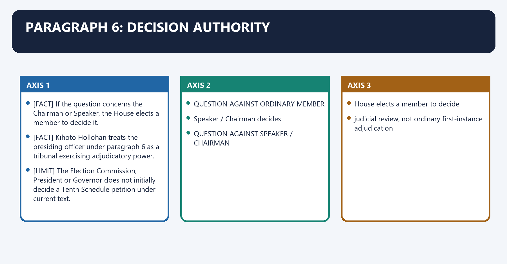
[FACT] A disqualification question is referred to the **Chairman or Speaker** of the House, whose decision is declared final by paragraph 6(1).

[FACT] If the question concerns the Chairman or Speaker, the House elects a member to decide it.

[FACT] *Kihoto Hollohan* treats the presiding officer under paragraph 6 as a **tribunal** exercising adjudicatory power.

[LIMIT] The Election Commission, President or Governor does not initially decide a Tenth Schedule petition under current text.

#### Visual 30 — Decision Tree

```text
QUESTION AGAINST ORDINARY MEMBER
        -> Speaker / Chairman decides

QUESTION AGAINST SPEAKER / CHAIRMAN
        -> House elects a member to decide

COURT ROLE
        -> judicial review, not ordinary first-instance adjudication

ECI ROLE
        -> no Tenth Schedule adjudication
```

*Caption: The decider changes only when the presiding officer is personally the subject.*

#### Visual 31 — Institutional Roles

| Institution | Anti-defection role |
|---|---|
| Speaker/Chairman | first-instance adjudicator |
| member elected by House | adjudicator when presiding officer is concerned |
| High Court/Supreme Court | judicial review within constitutional limits |
| Election Commission | no paragraph 6 adjudication; separate symbol and Article 103/192 functions |
| Governor/President | no current paragraph 6 role |
| House as a whole | elects substitute decision-maker in presiding-officer case; receives rules |

*Caption: Similar constitutional institutions perform distinct disqualification functions.*

#### CLOSING RECALL FLOW — PARAGRAPH 6: DECISION AUTHORITY

```closure-flow
SUBTOPIC: Paragraph 6: Decision Authority
KEY TERMS / DEFINITIONS: Paragraph 6 · Decision Authority · Chairman or Speaker · tribunal · Speaker/Chairman · first-instance adjudicator
MECHANISM / ARGUMENT: Paragraph 6: Decision Authority operates through Kihoto Hollohan treats the presiding officer under paragraph 6 as a tribunal exercising adjudicatory power, connected with The Election Commission, President or Governor does not initially decide a Tenth Schedule petition under current text.
CONSEQUENCE / CONTRAST: A disqualification question is referred to the Chairman or Speaker of the House, whose decision is declared final by paragraph 6(1).
UPSC TRAP / ANSWER-USE: Do not miss this limiting distinction: the decisive contrast is between QUESTION AGAINST SPEAKER / CHAIRMAN and House elects a...
ANSWER-GRABBING FORMULATION: The Election Commission, President or Governor does not initially decide a Tenth Schedule petition under current text.
```
### SESSION 12 — PARAGRAPH 8 AND HOUSE RULES: PETITION, EVIDENCE AND HEARING
#### DEFINITION / WHAT THIS IS CALLED

**Plain-language definition:** Paragraph 8 and House Rules: Petition, Evidence and Hearing denotes the constitutional rules and institutional links organised around House-specific rules differ in detail and cannot override the substantive Tenth Schedule.

**Technical definition:** A compliant petition is forwarded for comments; the Speaker may decide or refer it for preliminary inquiry; no adverse finding may be made without reasonable opportunity to represent and be heard.

#### ANSWER-GRABBING OPENING — WRITE/ADAPT IN THE EXAM

> A compliant petition is forwarded for comments; the Speaker may decide or refer it for preliminary inquiry; no adverse finding may be made without reasonable opportunity to represent and be heard.

#### MUST-WRITE KEYWORDS

- **Paragraph 8**
- **House Rules**
- **Petition**
- **Hearing**
- **notice of material case**
- **member knows allegation**

**How to use them:** Frame the answer through Paragraph 8; define House Rules, connect Petition with Hearing to explain the mechanism, and use notice of material case for the decisive comparison or qualification.

Paragraph 8 and House Rules: Petition, Evidence and Hearing denotes the constitutional rules and institutional links organised around [LIMIT] House-specific rules differ in detail and cannot override the substantive Tenth Schedule.
Paragraph 8 and House Rules: Petition, Evidence and Hearing operates through WRITTEN PETITION BY ANOTHER MEMBER, connected with material facts + documents + verification.
The operative mechanism matters because sPEAKER CHECKS COMPLIANCE.
Its principal consequence is that copies to respondent member / legislature-party leader.
The decisive contrast is between Speaker decides OR refers for preliminary inquiry and reasonable opportunity + personal hearing.
The exam-safe limitation is that written order: dismiss OR declare disqualification.
[FACT] Paragraph 8 authorises rules on party records, condonation reports, admission to political parties and the procedure for deciding paragraph 6 questions.

[FACT] The official Lok Sabha rules require a petition with material facts, documentary evidence and verification. A compliant petition is forwarded for comments; the Speaker may decide or refer it for preliminary inquiry; no adverse finding may be made without reasonable opportunity to represent and be heard.

[FACT] Rajya Sabha procedural material similarly records petition, comments, possible Privileges Committee inquiry, hearing and written order.

[LIMIT] House-specific rules differ in detail and cannot override the substantive Tenth Schedule.

#### Visual 32 — Lok Sabha Process Flow

```text
WRITTEN PETITION BY ANOTHER MEMBER
        |
material facts + documents + verification
        |
SPEAKER CHECKS COMPLIANCE
        |
copies to respondent member / legislature-party leader
        |
written comments
        |
Speaker decides OR refers for preliminary inquiry
        |
reasonable opportunity + personal hearing
        |
written order: dismiss OR declare disqualification
```

*Caption: Defection is not an automatic self-executing vacancy.*

#### Visual 33 — Natural-Justice Checklist

| Requirement | Purpose |
|---|---|
| notice of material case | member knows allegation |
| access to petition/documents | meaningful response |
| reasonable response time | avoids ambush |
| opportunity to be heard | adjudicatory fairness |
| reasoned written order | enables accountability and review |
| impartial application of rules | controls partisan procedure |

*Caption: Natural justice is both a procedural duty and a ground of judicial review.*

#### Visual 34 — Paragraph 6(2) and Articles 122/212

```text
PARAGRAPH 6(2):
proceedings are deemed proceedings in Parliament / State Legislature
        |
protects against attack for mere procedural irregularity
        |
DOES NOT:
create total immunity from jurisdictional error,
mala fides, constitutional breach, natural-justice violation or perversity
```

*Caption: Deemed legislative proceeding is not the same as unreviewable political action.*

#### CLOSING RECALL FLOW — PARAGRAPH 8 AND HOUSE RULES: PETITION, EVIDENCE AND HEARING

```closure-flow
SUBTOPIC: Paragraph 8 and House Rules: Petition, Evidence and Hearing
KEY TERMS / DEFINITIONS: Paragraph 8 · House Rules · Petition · Hearing · notice of material case · member knows allegation
MECHANISM / ARGUMENT: The decisive contrast is between Speaker decides OR refers for preliminary inquiry and reasonable opportunity + personal hearing.
CONSEQUENCE / CONTRAST: Its principal consequence is that copies to respondent member / legislature-party leader.
UPSC TRAP / ANSWER-USE: Do not miss this limiting distinction: a compliant petition is forwarded for comments.
ANSWER-GRABBING FORMULATION: A compliant petition is forwarded for comments; the Speaker may decide or refer it for preliminary inquiry; no adverse finding may be made without reasonable opportunity to represent and be heard.
```
### SESSION 13 — PARAGRAPH 7 AND KIHOTO HOLLOHAN: TEXT VERSUS LEGAL EFFECT
#### DEFINITION / WHAT THIS IS CALLED

**Plain-language definition:** Paragraph 7 and Kihoto Hollohan: Text versus Legal Effect denotes the constitutional rules and institutional links organised around The official 2026 Constitution prints paragraph 7 with a footnote recording that invalidity.

**Technical definition:** Its principal consequence is that present law paragraph 6 decisions reviewable on limited grounds.

#### ANSWER-GRABBING OPENING — WRITE/ADAPT IN THE EXAM

> Zachillhu upheld the Tenth Schedule except paragraph 7, which was invalid for want of State ratification required by the proviso to Article 368(2), because the clause affected Supreme Court/High Court jurisdiction.

#### MUST-WRITE KEYWORDS

- **Paragraph 7**
- **Kihoto Hollohan**
- **Text versus Legal Effect**
- **printed text**
- **broad court-jurisdiction bar**
- **amendment-procedure defect**

**How to use them:** Frame the answer through Paragraph 7; define Kihoto Hollohan, connect Text versus Legal Effect with printed text to explain the mechanism, and use broad court-jurisdiction bar for the decisive comparison or qualification.

Paragraph 7 and Kihoto Hollohan: Text versus Legal Effect denotes the constitutional rules and institutional links organised around [FACT] The official 2026 Constitution prints paragraph 7 with a footnote recording that invalidity.
Paragraph 7 and Kihoto Hollohan: Text versus Legal Effect operates through printed text broad court-jurisdiction bar, connected with amendment-procedure defect no required State ratification.
The operative mechanism matters because kihoto effect paragraph 7 invalid and severed.
Its principal consequence is that present law paragraph 6 decisions reviewable on limited grounds.
The decisive contrast is between SPEAKER / CHAIRMAN ORDER and JUDICIAL REVIEW FOR.
The exam-safe limitation is that violation of constitutional mandate.
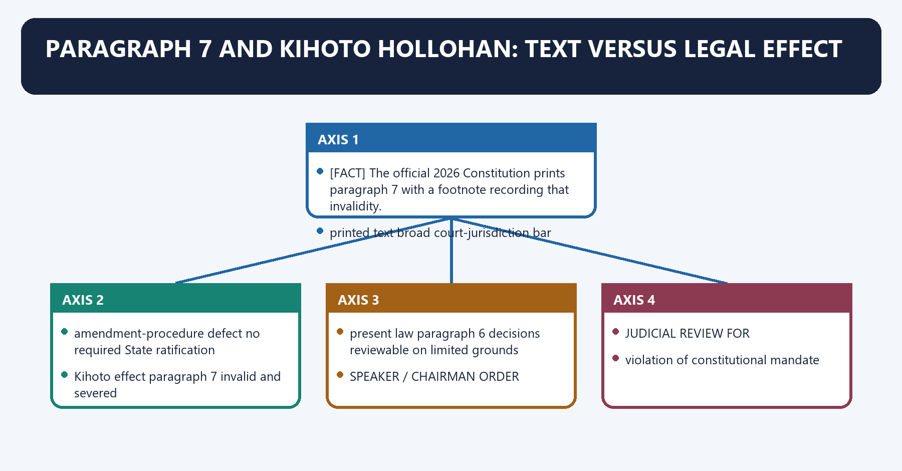
[FACT] Paragraph 7 still textually states that no court shall have jurisdiction in matters connected with Tenth Schedule disqualification.

[FACT] *Kihoto Hollohan v. Zachillhu* upheld the Tenth Schedule except paragraph 7, which was invalid for want of State ratification required by the proviso to Article 368(2), because the clause affected Supreme Court/High Court jurisdiction.

[FACT] The official 2026 Constitution prints paragraph 7 with a footnote recording that invalidity.

#### Visual 35 — Paragraph 7 Control

| Layer | Position |
|---|---|
| printed text | broad court-jurisdiction bar |
| amendment-procedure defect | no required State ratification |
| *Kihoto* effect | paragraph 7 invalid and severed |
| present law | paragraph 6 decisions reviewable on limited grounds |

*Caption: Quote the text, then immediately state its invalidity and judicial effect.*

#### Visual 36 — Kihoto Review Gates

```text
SPEAKER / CHAIRMAN ORDER
        |
        v
JUDICIAL REVIEW FOR:
1. violation of constitutional mandate
2. mala fides / colourable exercise
3. non-compliance with natural justice
4. perversity / jurisdictional infirmity
        |
        v
NOT A FULL APPEAL ON EVERY ERROR
```

*Caption: Review protects constitutional legality without converting the court into the routine first decider.*

#### Visual 37 — Timing of Judicial Intervention

| Stage | General rule after *Kihoto* | Qualification |
|---|---|---|
| before Speaker decides | no ordinary quia timet action | courts may aid prompt decision against disabling inaction |
| interlocutory stage | ordinarily no interference | grave, immediate, irreversible interlocutory disqualification/suspension exception |
| after final decision | review available | limited constitutional/jurisdictional grounds |
| prolonged non-decision | judicial direction possible | *Rajendra Singh Rana* and *Keisham* prevent frustration by delay |

*Caption: “Review after decision” is the baseline, not a licence for indefinite inaction.*

#### CLOSING RECALL FLOW — PARAGRAPH 7 AND KIHOTO HOLLOHAN: TEXT VERSUS LEGAL EFFECT

```closure-flow
SUBTOPIC: Paragraph 7 and Kihoto Hollohan: Text versus Legal Effect
KEY TERMS / DEFINITIONS: Paragraph 7 · Kihoto Hollohan · Text versus Legal Effect · printed text · broad court-jurisdiction bar · amendment-procedure defect
MECHANISM / ARGUMENT: Zachillhu upheld the Tenth Schedule except paragraph 7, which was invalid for want of State ratification required by the proviso to Article 368(2), because the clause affected Supreme Court/High Court jurisdiction.
CONSEQUENCE / CONTRAST: Its principal consequence is that present law paragraph 6 decisions reviewable on limited grounds.
UPSC TRAP / ANSWER-USE: Do not miss this limiting distinction: the decisive contrast is between SPEAKER / CHAIRMAN ORDER and JUDICIAL REVIEW FOR.
ANSWER-GRABBING FORMULATION: Zachillhu upheld the Tenth Schedule except paragraph 7, which was invalid for want of State ratification required by the proviso to Article 368(2), because the clause affected Supreme Court/High Court jurisdiction.
```
### SESSION 14 — CASE-LAW SPINE
#### DEFINITION / WHAT THIS IS CALLED

**Plain-language definition:** Case-Law Spine denotes the constitutional rules and institutional links organised around Case Year Controlled proposition.

**Technical definition:** Speaker 2019 resignation does not erase prior defection; no extra election ban.

#### ANSWER-GRABBING OPENING — WRITE/ADAPT IN THE EXAM

> Anti-defection case law subjects Speaker decisions and delay to review while clarifying voluntary resignation, expulsion, merger and the limits of remedial disqualification.

#### MUST-WRITE KEYWORDS

- **Case-Law Spine**
- **Kihoto Hollohan v. Zachillhu**
- **Ravi S. Naik v. Union of India**
- **voluntary giving up wider than formal resignation**
- **G. Viswanathan v. Speaker**
- **Rajendra Singh Rana v. Swami Prasad Maurya**

**How to use them:** Frame the answer through Case-Law Spine; define Kihoto Hollohan v. Zachillhu, connect Ravi S. Naik v. Union of India with voluntary giving up wider than formal resignation to explain the mechanism, and use G. Viswanathan v. Speaker for the decisive comparison or qualification.

Case-Law Spine denotes the constitutional rules and institutional links organised around Case Year Controlled proposition.
Case-Law Spine operates through Kihoto Hollohan v. Zachillhu 1992 Schedule upheld; para 7 invalid; Speaker tribunal; limited review, connected with Ravi S. Naik v. Union of India 1994 voluntary giving up wider than formal resignation.
The operative mechanism matters because g. Viswanathan v. Speaker 1996 expulsion does not erase deemed original-party belonging.
Its principal consequence is that rajendra Singh Rana v. Swami Prasad Maurya 2007 inaction and unsupported split recognition cannot defeat Schedule.
The decisive contrast is between Nabam Rebia v. Deputy Speaker 2016 removal-notice restriction on Speaker; correctness later referred and Shrimanth Balasaheb Patil v. Speaker 2019 resignation does not erase prior defection; no extra election ban.
The exam-safe limitation is that keisham Meghachandra Singh v. Speaker 2020 reasonable period; ordinarily three-month outer limit; tribunal proposal.
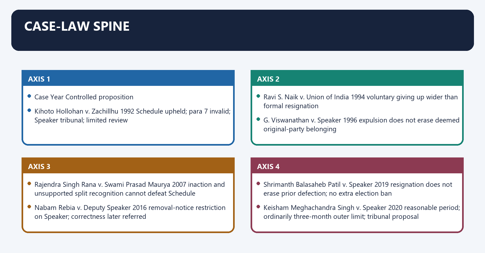
#### Visual 38 — Doctrine Timeline

| Case | Year | Controlled proposition |
|---|---:|---|
| *Kihoto Hollohan v. Zachillhu* | 1992 | Schedule upheld; para 7 invalid; Speaker tribunal; limited review |
| *Ravi S. Naik v. Union of India* | 1994 | voluntary giving up wider than formal resignation |
| *G. Viswanathan v. Speaker* | 1996 | expulsion does not erase deemed original-party belonging |
| *Rajendra Singh Rana v. Swami Prasad Maurya* | 2007 | inaction and unsupported split recognition cannot defeat Schedule |
| *Nabam Rebia v. Deputy Speaker* | 2016 | removal-notice restriction on Speaker; correctness later referred |
| *Shrimanth Balasaheb Patil v. Speaker* | 2019 | resignation does not erase prior defection; no extra election ban |
| *Keisham Meghachandra Singh v. Speaker* | 2020 | reasonable period; ordinarily three-month outer limit; tribunal proposal |
| *Subhash Desai v. Principal Secretary, Governor* | 2023 | political party appoints whip/leader; split unavailable; ECI concurrent |
| Telangana defection judgment | 2025 | official case-specific three-month direction |

*Caption: Learn each case as one precise proposition plus one qualification.*

#### Visual 39 — Case Selection by Issue

| Issue in question | First case to cite | Add if space |
|---|---|---|
| Speaker review | *Kihoto* | *Keisham* |
| conduct as giving up | *Ravi S. Naik* | *Shrimanth* |
| delay/inaction | *Rajendra Singh Rana* | *Keisham*, Telangana 2025 |
| resignation | *Shrimanth* | *Subhash Desai* |
| political versus legislature party | *Subhash Desai* | exact paragraph 1/2 text |
| removal notice | *Nabam Rebia* | seven-judge reference in *Subhash Desai* |
| expulsion | *G. Viswanathan* | paragraph 2 deeming explanation |

*Caption: Named evidence should answer the issue, not decorate the paragraph.*

#### CLOSING RECALL FLOW — CASE-LAW SPINE

```closure-flow
SUBTOPIC: Case-Law Spine
KEY TERMS / DEFINITIONS: Case-Law Spine · Kihoto Hollohan v. Zachillhu · Ravi S. Naik v. Union of India · voluntary giving up wider than formal resignation · G. Viswanathan v. Speaker · Rajendra Singh Rana v. Swami Prasad Maurya
MECHANISM / ARGUMENT: Speaker 2019 resignation does not erase prior defection; no extra election ban.
CONSEQUENCE / CONTRAST: Speaker 1996 expulsion does not erase deemed original-party belonging.
UPSC TRAP / ANSWER-USE: Do not miss this limiting distinction: its principal consequence is that rajendra Singh Rana v.
ANSWER-GRABBING FORMULATION: Anti-defection case law subjects Speaker decisions and delay to review while clarifying voluntary resignation, expulsion, merger and the limits of remedial disqualification.
```
### SESSION 15 — DELAY: NO EXPRESS DEADLINE, BUT NO POWER TO DEFEAT THE CONSTITUTION
#### DEFINITION / WHAT THIS IS CALLED

**Plain-language definition:** Delay: No Express Deadline, but No Power to Defeat the Constitution denotes the constitutional rules and institutional links organised around The Tenth Schedule contains no express decision deadline.

**Technical definition:** Delay: No Express Deadline, but No Power to Defeat the Constitution operates through The three-month norm is judicial doctrine, not text inserted by constitutional amendment or a universal statutory rule, connected with NO EXPRESS SCHEDULE DEADLINE.

#### ANSWER-GRABBING OPENING — WRITE/ADAPT IN THE EXAM

> Keisham Meghachandra Singh held that the Speaker, acting as tribunal, is bound to decide within a reasonable period; absent exceptional circumstances with good reason, three months from filing is the outer limit identified by the Court.

#### MUST-WRITE KEYWORDS

- **Delay**
- **No Express Deadline**
- **but No Power to Defeat the Constitution**
- **three months from filing**
- **Tenth Schedule**
- **none express**

**How to use them:** Frame the answer through Delay; define No Express Deadline, connect but No Power to Defeat the Constitution with three months from filing to explain the mechanism, and use Tenth Schedule for the decisive comparison or qualification.

Delay: No Express Deadline, but No Power to Defeat the Constitution denotes the constitutional rules and institutional links organised around [FACT] The Tenth Schedule contains no express decision deadline.
Delay: No Express Deadline, but No Power to Defeat the Constitution operates through [LIMIT] The three-month norm is judicial doctrine, not text inserted by constitutional amendment or a universal statutory rule, connected with NO EXPRESS SCHEDULE DEADLINE.
The operative mechanism matters because does not mean unlimited discretion.
Its principal consequence is that sPEAKER = TRIBUNAL.
The decisive contrast is between reasonable-time constitutional duty and ordinarily three months absent exceptional circumstances.
The exam-safe limitation is that source Time control Status.
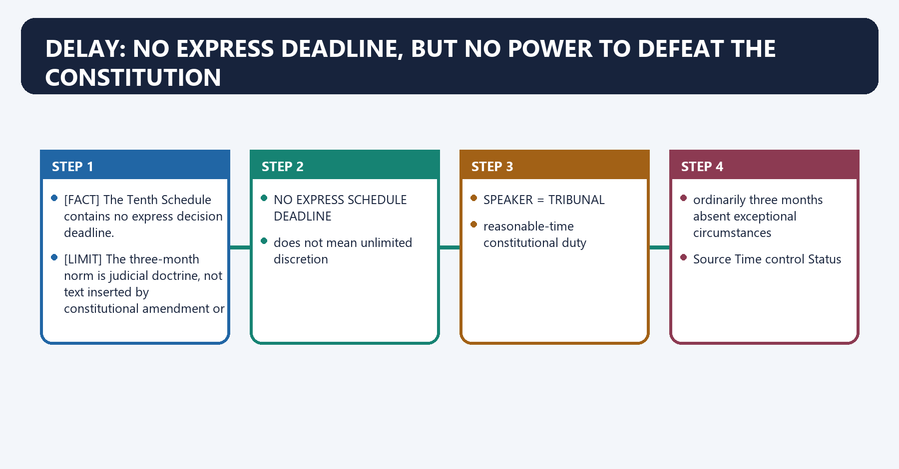
[FACT] The Tenth Schedule contains no express decision deadline.

[FACT] *Keisham Meghachandra Singh* held that the Speaker, acting as tribunal, is bound to decide within a reasonable period; absent exceptional circumstances with good reason, **three months from filing** is the outer limit identified by the Court.

[FACT] *Keisham* also urged Parliament to consider a permanent tribunal headed by a retired Supreme Court judge, retired Chief Justice of a High Court or another independent mechanism.

[LIMIT] The three-month norm is judicial doctrine, not text inserted by constitutional amendment or a universal statutory rule.

#### Visual 40 — Delay Doctrine

```text
NO EXPRESS SCHEDULE DEADLINE
        |
does not mean unlimited discretion
        |
SPEAKER = TRIBUNAL
        |
reasonable-time constitutional duty
        |
KEISHAM:
ordinarily three months absent exceptional circumstances
```

*Caption: Constitutional silence cannot be converted into a power to nullify the law by waiting.*

#### Visual 41 — Time-Control Hierarchy

| Source | Time control | Status |
|---|---|---|
| Tenth Schedule | none express | constitutional text |
| House rules | procedural periods may exist | House-specific |
| *Keisham* | ordinarily three months | judicial norm |
| individual court order | case-specific period | binding in that litigation |
| reform proposal | fixed constitutional/statutory deadline | not enacted |

*Caption: Separate general doctrine from a direction issued in a particular case.*

#### Visual 42 — Official Telangana Control, 31 July 2025

| Verified official holding | Safe use |
|---|---|
| Supreme Court restored the Single Judge's approach and directed conclusion of proceedings against ten MLAs | illustration of judicial control of delay |
| direction: as expeditiously as possible and in any case within three months from judgment | case-specific order |
| Speaker directed not to permit protraction; adverse inference if MLAs attempted delay | procedural control in that case |
| no later contempt warning verified here | do not add reported procedural claims |

*Caption: Use the official judgment's direction; do not embellish it with unverified later news.*

#### CLOSING RECALL FLOW — DELAY: NO EXPRESS DEADLINE, BUT NO POWER TO DEFEAT THE CONSTITUTION

```closure-flow
SUBTOPIC: Delay: No Express Deadline, but No Power to Defeat the Constitution
KEY TERMS / DEFINITIONS: Delay · No Express Deadline · but No Power to Defeat the Constitution · three months from filing · Tenth Schedule · none express
MECHANISM / ARGUMENT: Delay: No Express Deadline, but No Power to Defeat the Constitution operates through The three-month norm is judicial doctrine, not text inserted by constitutional amendment or a universal statutory rule, connected with NO EXPRESS SCHEDULE DEADLINE.
CONSEQUENCE / CONTRAST: Keisham Meghachandra Singh held that the Speaker, acting as tribunal, is bound to decide within a reasonable period; absent exceptional circumstances with good reason, three months from filing is the outer limit identified by the Court.
UPSC TRAP / ANSWER-USE: The operative mechanism matters because does not mean unlimited discretion.
ANSWER-GRABBING FORMULATION: Keisham Meghachandra Singh held that the Speaker, acting as tribunal, is bound to decide within a reasonable period; absent exceptional circumstances with good reason, three months from filing is the outer limit identified by the Court.
```
### SESSION 16 — RESIGNATION VERSUS DISQUALIFICATION
#### DEFINITION / WHAT THIS IS CALLED

**Plain-language definition:** Resignation versus Disqualification denotes the constitutional rules and institutional links organised around Resignation and disqualification are distinct mechanisms that can produce a vacancy.

**Technical definition:** The decisive contrast is between key inquiry voluntary and genuine resignation paragraph 2 conduct and defences and decider presiding officer for resignation acceptance presiding officer as tribunal.

#### ANSWER-GRABBING OPENING — WRITE/ADAPT IN THE EXAM

> A later resignation does not remove the Speaker's jurisdiction where the alleged defection occurred first.

#### MUST-WRITE KEYWORDS

- **Resignation versus Disqualification**
- **Articles 101/190 and House process**
- **Articles 102(2)/191(2), Tenth Schedule**
- **key inquiry**
- **voluntary and genuine resignation**
- **paragraph 2 conduct and defences**

**How to use them:** Frame the answer through Resignation versus Disqualification; define Articles 101/190 and House process, connect Articles 102(2)/191(2), Tenth Schedule with key inquiry to explain the mechanism, and use voluntary and genuine resignation for the decisive comparison or qualification.

Resignation versus Disqualification denotes the constitutional rules and institutional links organised around [FACT] Resignation and disqualification are distinct mechanisms that can produce a vacancy.
Resignation versus Disqualification operates through DISQUALIFICATION CONSEQUENCE ATTACHES TO THAT DATE, connected with does not vaporise prior taint or end Speaker jurisdiction.
The operative mechanism matters because feature Resignation Tenth Schedule disqualification.
Its principal consequence is that source Articles 101/190 and House process Articles 102(2)/191(2), Tenth Schedule.
The decisive contrast is between key inquiry voluntary and genuine resignation paragraph 2 conduct and defences and decider presiding officer for resignation acceptance presiding officer as tribunal.
The exam-safe limitation is that timing prospective vacancy on acceptance relates to defection act as adjudicated.
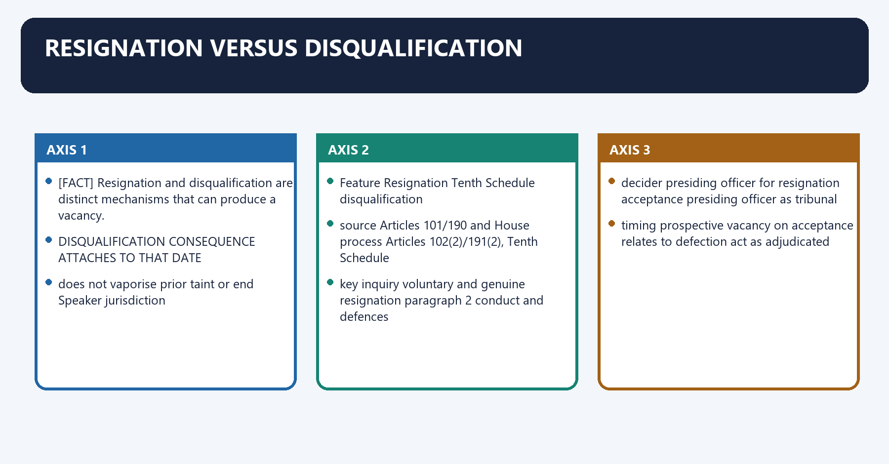
[FACT] *Shrimanth Balasaheb Patil* holds that disqualification relates to the date of the act of defection. A later resignation does not remove the Speaker's jurisdiction where the alleged defection occurred first.

[FACT] Resignation and disqualification are distinct mechanisms that can produce a vacancy.

[FACT] The Speaker cannot invent an additional bar preventing the disqualified person from contesting elections until the House term ends.

[LIMIT] Re-election does not retrospectively erase the adjudication of prior defection; it affects the duration of specified office disabilities under Articles 75(1B), 164(1B) and 361B.

#### Visual 43 — Chronology Test

```text
ACT OF DEFECTION
        |
        v
DISQUALIFICATION CONSEQUENCE ATTACHES TO THAT DATE
        |
LATER RESIGNATION
        |
does not vaporise prior taint or end Speaker jurisdiction
```

*Caption: Always identify which event occurred first.*

#### Visual 44 — Resignation and Disqualification Compared

| Feature | Resignation | Tenth Schedule disqualification |
|---|---|---|
| source | Articles 101/190 and House process | Articles 102(2)/191(2), Tenth Schedule |
| key inquiry | voluntary and genuine resignation | paragraph 2 conduct and defences |
| decider | presiding officer for resignation acceptance | presiding officer as tribunal |
| timing | prospective vacancy on acceptance | relates to defection act as adjudicated |
| office bars | no automatic 75(1B)/164(1B)/361B bar merely from resignation | constitutional bars apply after paragraph 2 disqualification |

*Caption: Resigning is not a universal escape hatch from pending defection allegations.*

#### CLOSING RECALL FLOW — RESIGNATION VERSUS DISQUALIFICATION

```closure-flow
SUBTOPIC: Resignation versus Disqualification
KEY TERMS / DEFINITIONS: Resignation versus Disqualification · Articles 101/190 and House process · Articles 102(2)/191(2), Tenth Schedule · key inquiry · voluntary and genuine resignation · paragraph 2 conduct and defences
MECHANISM / ARGUMENT: Resignation versus Disqualification operates through DISQUALIFICATION CONSEQUENCE ATTACHES TO THAT DATE, connected with does not vaporise prior taint or end Speaker jurisdiction.
CONSEQUENCE / CONTRAST: The decisive contrast is between key inquiry voluntary and genuine resignation paragraph 2 conduct and defences and decider presiding officer for resignation acceptance presiding officer as tribunal.
UPSC TRAP / ANSWER-USE: A later resignation does not remove the Speaker's jurisdiction where the alleged defection occurred first.
ANSWER-GRABBING FORMULATION: A later resignation does not remove the Speaker's jurisdiction where the alleged defection occurred first.
```
### SESSION 17 — CONSEQUENCES AND THE 91ST-AMENDMENT OFFICE BARS
#### DEFINITION / WHAT THIS IS CALLED

**Plain-language definition:** Consequences and the 91st-Amendment Office Bars denotes the constitutional rules and institutional links organised around Disqualification results in loss of the House seat.

**Technical definition:** Its principal consequence is that can be Minister immediately despite disqualification no Articles 75(1B)/164(1B).

#### ANSWER-GRABBING OPENING — WRITE/ADAPT IN THE EXAM

> Articles 75(1B) and 164(1B) prevent specified defectors from gaining ministerial reward until the original term ends or they are earlier re-elected.

#### MUST-WRITE KEYWORDS

- **Consequences**
- **the 91st-Amendment Office Bars**
- **seat becomes vacant**
- **yes**
- **Articles 101/190 read with 102(2)/191(2)**
- **no**

**How to use them:** Frame the answer through Consequences; define the 91st-Amendment Office Bars, connect seat becomes vacant with yes to explain the mechanism, and use Articles 101/190 read with 102(2)/191(2) for the decisive comparison or qualification.

Consequences and the 91st-Amendment Office Bars denotes the constitutional rules and institutional links organised around [FACT] Disqualification results in loss of the House seat.
Consequences and the 91st-Amendment Office Bars operates through [FACT] Article 361B similarly bars a remunerative political post for that period, connected with Consequence Yes/No Control.
The operative mechanism matters because seat becomes vacant yes Articles 101/190 read with 102(2)/191(2).
Its principal consequence is that can be Minister immediately despite disqualification no Articles 75(1B)/164(1B).
The decisive contrast is between remunerative political post barred for specified period Article 361B and can contest election if otherwise qualified yes Shrimanth rejects extra Speaker-imposed ban.
The exam-safe limitation is that criminal prosecution merely for defection no not created by Tenth Schedule.
[FACT] Disqualification results in loss of the House seat.

[FACT] Articles 75(1B) and 164(1B) bar appointment as Minister from disqualification until the original term would expire or until the person contests and is declared elected, whichever is earlier.

[FACT] Article 361B similarly bars a remunerative political post for that period.

[LIMIT] The Speaker cannot add a separate election-contest ban. There is no permanent political disqualification, criminal penalty or automatic lifetime ban.

#### Visual 45 — Consequence Matrix

| Consequence | Yes/No | Control |
|---|---:|---|
| seat becomes vacant | yes | Articles 101/190 read with 102(2)/191(2) |
| can be Minister immediately despite disqualification | no | Articles 75(1B)/164(1B) |
| remunerative political post | barred for specified period | Article 361B |
| can contest election if otherwise qualified | yes | *Shrimanth* rejects extra Speaker-imposed ban |
| criminal prosecution merely for defection | no | not created by Tenth Schedule |
| permanent political disability | no | Constitution supplies limited consequences |

*Caption: Political condemnation must not be converted into a non-existent legal penalty.*

#### Visual 46 — Duration of Office Disability

```text
START: DATE OF DISQUALIFICATION
        |
        +--> original term would expire
        |
        +--> person contests and is declared elected earlier
        |
END AT WHICHEVER IS EARLIER
```

*Caption: The constitutional office bar is not identical to a bar on contesting elections.*

#### CLOSING RECALL FLOW — CONSEQUENCES AND THE 91ST-AMENDMENT OFFICE BARS

```closure-flow
SUBTOPIC: Consequences and the 91st-Amendment Office Bars
KEY TERMS / DEFINITIONS: Consequences · the 91st-Amendment Office Bars · seat becomes vacant · yes · Articles 101/190 read with 102(2)/191(2) · no
MECHANISM / ARGUMENT: The exam-safe limitation is that criminal prosecution merely for defection no not created by Tenth Schedule.
CONSEQUENCE / CONTRAST: Its principal consequence is that can be Minister immediately despite disqualification no Articles 75(1B)/164(1B).
UPSC TRAP / ANSWER-USE: Do not miss this limiting distinction: the decisive contrast is between remunerative political post barred for specified period Article 361B...
ANSWER-GRABBING FORMULATION: Articles 75(1B) and 164(1B) prevent specified defectors from gaining ministerial reward until the original term ends or they are earlier re-elected.
```
### SESSION 18 — NABAM REBIA AND THE PENDING-REMOVAL-NOTICE PROBLEM
#### DEFINITION / WHAT THIS IS CALLED

**Plain-language definition:** Nabam Rebia and the Pending-Removal-Notice Problem denotes the constitutional rules and institutional links organised around Subhash Desai referred the correctness of Nabam Rebia to a larger Bench of seven judges.

**Technical definition:** The safe 2026 answer is therefore: state the Nabam Rebia rule, state the Subhash Desai reference, and do not claim that the doctrine has been finally overruled or reaffirmed.

#### ANSWER-GRABBING OPENING — WRITE/ADAPT IN THE EXAM

> Nabam Rebia held that a Speaker should not adjudicate disqualification petitions while a notice of intention to move a resolution for the Speaker's removal is pending.

#### MUST-WRITE KEYWORDS

- **Nabam Rebia**
- **the Pending-Removal-Notice Problem**
- **possible partisan adjudication affecting majority**
- **members may strategically issue removal notice**
- **prompt enforcement of Schedule possible**
- **defection decisions may be paralysed**

**How to use them:** Frame the answer through Nabam Rebia; define the Pending-Removal-Notice Problem, connect possible partisan adjudication affecting majority with members may strategically issue removal notice to explain the mechanism, and use prompt enforcement of Schedule possible for the decisive comparison or qualification.

Nabam Rebia and the Pending-Removal-Notice Problem denotes the constitutional rules and institutional links organised around [FACT] Subhash Desai referred the correctness of Nabam Rebia to a larger Bench of seven judges.
Nabam Rebia and the Pending-Removal-Notice Problem operates through removal-notice restriction on Speaker, connected with 2023 SUBHASH DESAI.
The operative mechanism matters because correctness referred to seven-judge Bench.
Its principal consequence is that 2026 CONTROL FOR THIS PACKAGE.
The decisive contrast is between no verified later merits ruling - preserve reference status and If Speaker continues If Speaker is disabled by notice.
The exam-safe limitation is that possible partisan adjudication affecting majority members may strategically issue removal notice.
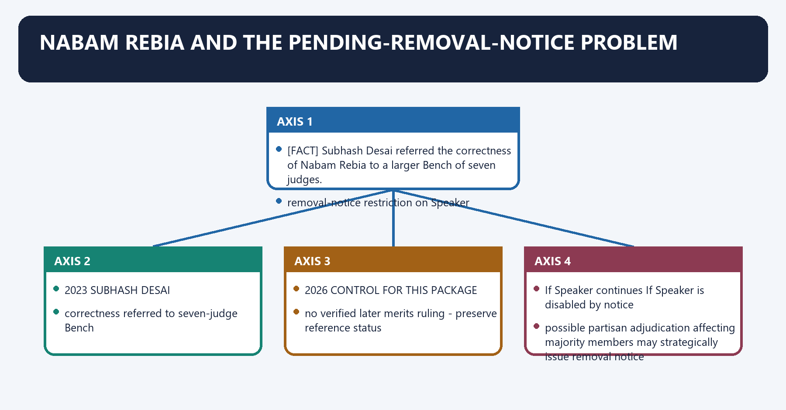
[FACT] *Nabam Rebia* held that a Speaker should not adjudicate disqualification petitions while a notice of intention to move a resolution for the Speaker's removal is pending.

[FACT] *Subhash Desai* referred the correctness of *Nabam Rebia* to a larger Bench of seven judges.

[CURRENT] Official sources checked for this package did not establish a later published seven-judge merits ruling changing that reference position.

[LIMIT] The safe 2026 answer is therefore: state the *Nabam Rebia* rule, state the *Subhash Desai* reference, and do not claim that the doctrine has been finally overruled or reaffirmed.

#### Visual 47 — Nabam Rebia Status Map

```text
2016 NABAM REBIA
removal-notice restriction on Speaker
        |
        v
2023 SUBHASH DESAI
correctness referred to seven-judge Bench
        |
        v
2026 CONTROL FOR THIS PACKAGE
no verified later merits ruling -> preserve reference status
```

*Caption: A reference creates doctrinal uncertainty; it is not itself an overruling.*

#### Visual 48 — Competing Risks

| If Speaker continues | If Speaker is disabled by notice |
|---|---|
| possible partisan adjudication affecting majority | members may strategically issue removal notice |
| prompt enforcement of Schedule possible | defection decisions may be paralysed |
| constitutional tribunal remains active | Speaker's own legitimacy is contested |

*Caption: The unresolved issue involves two competing opportunities for constitutional manipulation.*

#### CLOSING RECALL FLOW — NABAM REBIA AND THE PENDING-REMOVAL-NOTICE PROBLEM

```closure-flow
SUBTOPIC: Nabam Rebia and the Pending-Removal-Notice Problem
KEY TERMS / DEFINITIONS: Nabam Rebia · the Pending-Removal-Notice Problem · possible partisan adjudication affecting majority · members may strategically issue removal notice · prompt enforcement of Schedule possible · defection decisions may be paralysed
MECHANISM / ARGUMENT: Nabam Rebia held that a Speaker should not adjudicate disqualification petitions while a notice of intention to move a resolution for the Speaker's removal is pending.
CONSEQUENCE / CONTRAST: The safe 2026 answer is therefore: state the Nabam Rebia rule, state the Subhash Desai reference, and do not claim that the doctrine has been finally overruled or reaffirmed.
UPSC TRAP / ANSWER-USE: Do not miss this limiting distinction: its principal consequence is that 2026 CONTROL FOR THIS PACKAGE.
ANSWER-GRABBING FORMULATION: Nabam Rebia held that a Speaker should not adjudicate disqualification petitions while a notice of intention to move a resolution for the Speaker's removal is pending.
```
### SESSION 19 — SUBHASH DESAI: WHIP, PARTY IDENTITY, ECI AND GOVERNOR
#### DEFINITION / WHAT THIS IS CALLED

**Plain-language definition:** Subhash Desai: Whip, Party Identity, ECI and Governor denotes the constitutional rules and institutional links organised around The Speaker and ECI may concurrently adjudicate Tenth Schedule and Symbols Order proceedings respectively.

**Technical definition:** The exam-safe limitation is that question Correct authority after Subhash Desai.

#### ANSWER-GRABBING OPENING — WRITE/ADAPT IN THE EXAM

> The Court held the Governor's call for a floor test in the circumstances lacked objective material, but status quo ante could not be restored because the Chief Minister had resigned without facing the floor test.

#### MUST-WRITE KEYWORDS

- **Subhash Desai**
- **Whip**
- **Party Identity**
- **ECI**
- **Governor**
- **political party**

**How to use them:** Frame the answer through Subhash Desai; define Whip, connect Party Identity with ECI to explain the mechanism, and use Governor for the decisive comparison or qualification.

Subhash Desai: Whip, Party Identity, ECI and Governor denotes the constitutional rules and institutional links organised around [FACT] The Speaker and ECI may concurrently adjudicate Tenth Schedule and Symbols Order proceedings respectively.
Subhash Desai: Whip, Party Identity, ECI and Governor operates through [LIMIT] The Court did not itself disqualify the members, restore the former government, or decide the merits of the symbol dispute, connected with appoints authorised Whip / Leader.
The operative mechanism matters because identifies authorisation + decides Tenth Schedule petitions.
Its principal consequence is that separately decides Symbols Order dispute.
The decisive contrast is between cannot decide defection or treat factional claims as automatic floor-test proof and reviews constitutional legality; does not ordinarily decide first instance.
The exam-safe limitation is that question Correct authority after Subhash Desai.
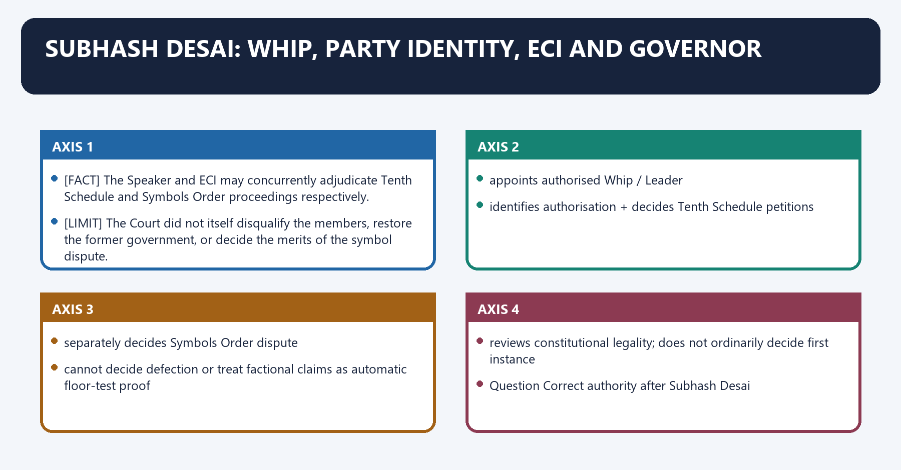
[FACT] *Subhash Desai* holds that the **political party**, not the legislature party, appoints the Whip and Leader in the House and issues the relevant voting direction.

[FACT] The Speaker must identify the authorised party position by reference to the party constitution and an inquiry, not merely accept a factional legislature headcount.

[FACT] The Speaker and ECI may concurrently adjudicate Tenth Schedule and Symbols Order proceedings respectively.

[FACT] The Court held the Governor's call for a floor test in the circumstances lacked objective material, but status quo ante could not be restored because the Chief Minister had resigned without facing the floor test. The later invitation to form government was upheld on the material then available.

[LIMIT] The Court did not itself disqualify the members, restore the former government, or decide the merits of the symbol dispute.

#### Visual 49 — Subhash Desai Institutional Map

```text
POLITICAL PARTY
appoints authorised Whip / Leader
        |
        v
SPEAKER
identifies authorisation + decides Tenth Schedule petitions

ECI
separately decides Symbols Order dispute

GOVERNOR
cannot decide defection or treat factional claims as automatic floor-test proof

COURT
reviews constitutional legality; does not ordinarily decide first instance
```

*Caption: Four institutions operate on different legal tracks.*

#### Visual 50 — Political Party Authority Chain

| Question | Correct authority after *Subhash Desai* |
|---|---|
| who appoints authorised Whip? | political party |
| can legislature faction appoint a rival whip merely by numbers? | no |
| how does Speaker identify party authority? | party constitution, leadership structure and inquiry |
| does legislator headcount alone settle real political party? | no |
| can ECI symbol case proceed? | yes, concurrently on separate legal track |

*Caption: Party identity cannot be rewritten solely inside the legislature.*

#### Visual 51 — Floor Test versus Defection

| Device | Purpose | Decider |
|---|---|---|
| floor test | tests whether ministry has House confidence | House vote, convened constitutionally |
| defection petition | tests individual member's Tenth Schedule liability | Speaker/Chairman |
| symbol dispute | determines recognised party/symbol under Symbols Order | ECI |
| government invitation | fills CM/PM vacancy based on support material | Governor/President within constitutional limits |

*Caption: A floor test cannot substitute for a defection adjudication.*

#### CLOSING RECALL FLOW — SUBHASH DESAI: WHIP, PARTY IDENTITY, ECI AND GOVERNOR

```closure-flow
SUBTOPIC: Subhash Desai: Whip, Party Identity, ECI and Governor
KEY TERMS / DEFINITIONS: Subhash Desai · Whip · Party Identity · ECI · Governor · political party
MECHANISM / ARGUMENT: Subhash Desai holds that the political party, not the legislature party, appoints the Whip and Leader in the House and issues the relevant voting direction.
CONSEQUENCE / CONTRAST: The Speaker must identify the authorised party position by reference to the party constitution and an inquiry, not merely accept a factional legislature headcount.
UPSC TRAP / ANSWER-USE: Do not miss this limiting distinction: its principal consequence is that separately decides Symbols Order dispute.
ANSWER-GRABBING FORMULATION: The Court held the Governor's call for a floor test in the circumstances lacked objective material, but status quo ante could not be restored because the Chief Minister had resigned without facing the floor test.
```
### SESSION 20 — EXPULSION, RESIGNATION AND PARTY DISCIPLINE
#### DEFINITION / WHAT THIS IS CALLED

**Plain-language definition:** Expulsion, Resignation and Party Discipline denotes the constitutional rules and institutional links organised around Expulsion from a political party is not itself a separately listed Tenth Schedule ground.

**Technical definition:** Expulsion, Resignation and Party Discipline operates through This prevents parties and members from evading the Schedule by using the label “unattached”, connected with Internal party expulsion, House expulsion and Tenth Schedule disqualification are distinct legal actions.

#### ANSWER-GRABBING OPENING — WRITE/ADAPT IN THE EXAM

> Party expulsion, House expulsion and Tenth Schedule disqualification are legally distinct, preventing members or parties from evading consequences through labels such as 'unattached'.

#### MUST-WRITE KEYWORDS

- **Expulsion**
- **Resignation**
- **Party Discipline**
- **party expulsion**
- **political party**
- **internal party discipline; deemed belonging may continue**

**How to use them:** Frame the answer through Expulsion; define Resignation, connect Party Discipline with party expulsion to explain the mechanism, and use political party for the decisive comparison or qualification.

Expulsion, Resignation and Party Discipline denotes the constitutional rules and institutional links organised around [FACT] Expulsion from a political party is not itself a separately listed Tenth Schedule ground.
Expulsion, Resignation and Party Discipline operates through [ANALYSIS] This prevents parties and members from evading the Schedule by using the label “unattached”, connected with [LIMIT] Internal party expulsion, House expulsion and Tenth Schedule disqualification are distinct legal actions.
The operative mechanism matters because event Actor Legal track.
Its principal consequence is that party expulsion political party internal party discipline; deemed belonging may continue.
The decisive contrast is between House expulsion House exercising privilege/power seat consequence under separate constitutional doctrine and resignation member, accepted through constitutional process vacancy route.
The exam-safe limitation is that anti-defection disqualification Speaker/Chairman adjudication Tenth Schedule.
[FACT] Expulsion from a political party is not itself a separately listed Tenth Schedule ground.

[FACT] Under *G. Viswanathan*, an expelled member remains deemed to belong to the original party for Tenth Schedule purposes; joining another party or other qualifying conduct can attract disqualification.

[ANALYSIS] This prevents parties and members from evading the Schedule by using the label “unattached”.

[LIMIT] Internal party expulsion, House expulsion and Tenth Schedule disqualification are distinct legal actions.

#### Visual 52 — Three Different Exits

| Event | Actor | Legal track |
|---|---|---|
| party expulsion | political party | internal party discipline; deemed belonging may continue |
| House expulsion | House exercising privilege/power | seat consequence under separate constitutional doctrine |
| resignation | member, accepted through constitutional process | vacancy route |
| anti-defection disqualification | Speaker/Chairman adjudication | Tenth Schedule |

*Caption: Similar political outcomes can arise from different constitutional sources.*

#### CLOSING RECALL FLOW — EXPULSION, RESIGNATION AND PARTY DISCIPLINE

```closure-flow
SUBTOPIC: Expulsion, Resignation and Party Discipline
KEY TERMS / DEFINITIONS: Expulsion · Resignation · Party Discipline · party expulsion · political party · internal party discipline; deemed belonging may continue
MECHANISM / ARGUMENT: Expulsion, Resignation and Party Discipline operates through This prevents parties and members from evading the Schedule by using the label “unattached”, connected with Internal party expulsion, House expulsion and Tenth Schedule disqualification are distinct legal actions.
CONSEQUENCE / CONTRAST: Its principal consequence is that party expulsion political party internal party discipline; deemed belonging may continue.
UPSC TRAP / ANSWER-USE: Do not miss this limiting distinction: the decisive contrast is between House expulsion House exercising privilege/power seat consequence under separate...
ANSWER-GRABBING FORMULATION: Party expulsion, House expulsion and Tenth Schedule disqualification are legally distinct, preventing members or parties from evading consequences through labels such as 'unattached'.
```
### SESSION 21 — COMPARISON WITH OTHER DISQUALIFICATION AND DISPUTE REGIMES
#### DEFINITION / WHAT THIS IS CALLED

**Plain-language definition:** Comparison with Other Disqualification and Dispute Regimes denotes the constitutional rules and institutional links organised around Feature Tenth Schedule Other constitutional/RPA disqualification.

**Technical definition:** Its principal consequence is that eCI opinion no adjudicatory role obtained and followed under Articles 103/192.

#### ANSWER-GRABBING OPENING — WRITE/ADAPT IN THE EXAM

> Tenth Schedule disputes concern continued House membership, unlike other disqualifications, symbol disputes or election petitions, which follow separate authorities and procedures.

#### MUST-WRITE KEYWORDS

- **Comparison with Other Disqualification**
- **Dispute Regimes**
- **constitutional hook**
- **Articles 102(2), 191(2)**
- **Articles 102(1), 191(1), RPA**
- **typical grounds**

**How to use them:** Frame the answer through Comparison with Other Disqualification; define Dispute Regimes, connect constitutional hook with Articles 102(2), 191(2) to explain the mechanism, and use Articles 102(1), 191(1), RPA for the decisive comparison or qualification.

Comparison with Other Disqualification and Dispute Regimes denotes the constitutional rules and institutional links organised around Feature Tenth Schedule Other constitutional/RPA disqualification.
Comparison with Other Disqualification and Dispute Regimes operates through constitutional hook Articles 102(2), 191(2) Articles 102(1), 191(1), RPA, connected with typical grounds defection office of profit, citizenship, conviction and statutory grounds.
The operative mechanism matters because first decider for sitting member Speaker/Chairman President/Governor.
Its principal consequence is that eCI opinion no adjudicatory role obtained and followed under Articles 103/192.
The decisive contrast is between judicial review Kihoto line ordinary constitutional review and Feature Tenth Schedule Election Symbols Order.
The exam-safe limitation is that question member's continued House membership recognised party/group and reserved symbol.
#### Visual 53 — Anti-Defection versus Articles 102(1)/191(1) and RPA

| Feature | Tenth Schedule | Other constitutional/RPA disqualification |
|---|---|---|
| constitutional hook | Articles 102(2), 191(2) | Articles 102(1), 191(1), RPA |
| typical grounds | defection | office of profit, citizenship, conviction and statutory grounds |
| first decider for sitting member | Speaker/Chairman | President/Governor |
| ECI opinion | no adjudicatory role | obtained and followed under Articles 103/192 |
| judicial review | *Kihoto* line | ordinary constitutional review |

*Caption: Do not send a Tenth Schedule petition to the Governor under Article 192.*

#### Visual 54 — Anti-Defection versus Symbol Dispute

| Feature | Tenth Schedule | Election Symbols Order |
|---|---|---|
| question | member's continued House membership | recognised party/group and reserved symbol |
| authority | Speaker/Chairman | Election Commission |
| legal source | Constitution | Symbols Order |
| can proceed concurrently? | yes | yes, per *Subhash Desai* |
| one automatically decides the other? | no | no |

*Caption: Party-symbol ownership and legislative disqualification overlap factually but not jurisdictionally.*

#### Visual 55 — Anti-Defection versus Privilege

| Feature | Defection | Breach of privilege |
|---|---|---|
| protected interest | party mandate and government stability | authority, dignity and functioning of House |
| trigger | paragraph 2 conduct | obstruction/contempt of House privilege |
| process | paragraph 6/8 and rules | House privilege procedure |
| consequence | disqualification/seat loss | admonition, suspension, imprisonment or expulsion depending law |
| automatic equivalence | none | none |

*Caption: Paragraph 8 may treat wilful rule breach like privilege, but the doctrines remain distinct.*

#### Visual 56 — Six-Way Distinction Sheet

| Issue | Correct owner |
|---|---|
| voluntary giving up / whip breach | Tenth Schedule |
| conviction under RPA | RPA and Articles 102/191 |
| party symbol | ECI under Symbols Order |
| speech obstructing House authority | privilege |
| member voluntarily leaving seat | resignation |
| party removing member from organisation | expulsion under party rules |

*Caption: UPSC close options often move a correct fact into the wrong legal regime.*

#### CLOSING RECALL FLOW — COMPARISON WITH OTHER DISQUALIFICATION AND DISPUTE REGIMES

```closure-flow
SUBTOPIC: Comparison with Other Disqualification and Dispute Regimes
KEY TERMS / DEFINITIONS: Comparison with Other Disqualification · Dispute Regimes · constitutional hook · Articles 102(2), 191(2) · Articles 102(1), 191(1), RPA · typical grounds
MECHANISM / ARGUMENT: Its principal consequence is that eCI opinion no adjudicatory role obtained and followed under Articles 103/192.
CONSEQUENCE / CONTRAST: The decisive contrast is between judicial review Kihoto line ordinary constitutional review and Feature Tenth Schedule Election Symbols Order.
UPSC TRAP / ANSWER-USE: Do not miss this limiting distinction: the exam-safe limitation is that question member's continued House membership recognised party/group and reserved...
ANSWER-GRABBING FORMULATION: Tenth Schedule disputes concern continued House membership, unlike other disqualifications, symbol disputes or election petitions, which follow separate authorities and procedures.
```
### SESSION 22 — SCOPE AND DEMOCRATIC EVALUATION
#### DEFINITION / WHAT THIS IS CALLED

**Plain-language definition:** Scope and Democratic Evaluation denotes the constitutional rules and institutional links organised around TOO LITTLE PARTY DISCIPLINE.

**Technical definition:** The decisive contrast is between Achievement Displaced problem and raised cost of individual floor-crossing encouraged coordinated group action.

#### ANSWER-GRABBING OPENING — WRITE/ADAPT IN THE EXAM

> The Tenth Schedule's central weakness is overbreadth, because an ordinary legislative vote can become a seat-risk issue whenever a valid party direction applies.

#### MUST-WRITE KEYWORDS

- **Scope**
- **Democratic Evaluation**
- **constitutional balance**
- **raised cost of individual floor-crossing**
- **encouraged coordinated group action**
- **recognised political parties constitutionally**

**How to use them:** Frame the answer through Scope; define Democratic Evaluation, connect constitutional balance with raised cost of individual floor-crossing to explain the mechanism, and use encouraged coordinated group action for the decisive comparison or qualification.

Scope and Democratic Evaluation denotes the constitutional rules and institutional links organised around TOO LITTLE PARTY DISCIPLINE.
Scope and Democratic Evaluation operates through government instability / transactional defection, connected with constitutional balance.
The operative mechanism matters because tOO MUCH PARTY DISCIPLINE.
Its principal consequence is that executive dominance / silent legislators / weak scrutiny.
The decisive contrast is between Achievement Displaced problem and raised cost of individual floor-crossing encouraged coordinated group action.
The exam-safe limitation is that recognised political parties constitutionally centralised power in party leadership.
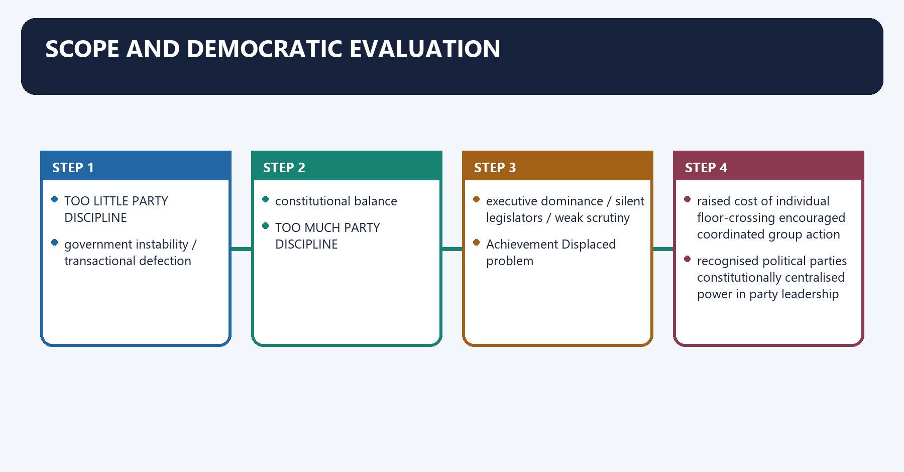
[ANALYSIS] The law's strongest defence is stability: voters choose party-linked candidates, ministries require dependable support, and office-induced floor-crossing can corrupt the mandate.

[ANALYSIS] Its strongest criticism is overbreadth: the current text can make an ordinary legislative vote a seat-risk issue whenever a valid party direction is issued.

[LIMIT] Stability and deliberation are not binary. Confidence, money and core-programme votes have stronger party-discipline justification than every clause, amendment or policy question.

#### Visual 57 — Stability–Freedom Balance

```text
TOO LITTLE PARTY DISCIPLINE
government instability / transactional defection
        |
        |---- constitutional balance ----|
        |
TOO MUCH PARTY DISCIPLINE
executive dominance / silent legislators / weak scrutiny
```

*Caption: The reform task is calibration, not abolition of all discipline.*

#### Visual 58 — What the Law Achieved and What It Displaced

| Achievement | Displaced problem |
|---|---|
| raised cost of individual floor-crossing | encouraged coordinated group action |
| recognised political parties constitutionally | centralised power in party leadership |
| stabilised confidence arithmetic | widened whip control over deliberation |
| enabled seat loss for abandonment | created incentives for resignation route |
| judicial review added legality | delay still affects political timing |

*Caption: Institutional rules redirect behaviour rather than eliminating incentives.*

#### Visual 59 — Loophole and Incentive Map

```text
INDIVIDUAL DEFECTION COSTLY
        |
        +--> assemble two-thirds merger claim
        +--> resign before/around floor test
        +--> delay Speaker decision
        +--> contest party identity / whip authority
        +--> litigate timing across institutions
```

*Caption: The law changed the technology of defection.*

#### CLOSING RECALL FLOW — SCOPE AND DEMOCRATIC EVALUATION

```closure-flow
SUBTOPIC: Scope and Democratic Evaluation
KEY TERMS / DEFINITIONS: Scope · Democratic Evaluation · constitutional balance · raised cost of individual floor-crossing · encouraged coordinated group action · recognised political parties constitutionally
MECHANISM / ARGUMENT: The decisive contrast is between Achievement Displaced problem and raised cost of individual floor-crossing encouraged coordinated group action.
CONSEQUENCE / CONTRAST: Its principal consequence is that executive dominance / silent legislators / weak scrutiny.
UPSC TRAP / ANSWER-USE: Stability and deliberation are not binary.
ANSWER-GRABBING FORMULATION: The Tenth Schedule's central weakness is overbreadth, because an ordinary legislative vote can become a seat-risk issue whenever a valid party direction applies.
```
### SESSION 23 — CRITIQUES WITH COUNTER-ARGUMENTS
#### DEFINITION / WHAT THIS IS CALLED

**Plain-language definition:** Critiques with Counter-Arguments denotes the constitutional rules and institutional links organised around Critique Named evidence Reply Qualification.

**Technical definition:** Critiques with Counter-Arguments operates through whip destroys conscience broad paragraph 2(1)(b) text confidence discipline is necessary every vote need not threaten stability, connected with delay nullifies remedy Rajendra Singh Rana , Keisham courts can direct decision no express constitutional deadline.

#### ANSWER-GRABBING OPENING — WRITE/ADAPT IN THE EXAM

> The Tenth Schedule protects governmental stability, but its broad application can convert legislative accountability into party-commanded conformity.

#### MUST-WRITE KEYWORDS

- **Critiques with Counter-Arguments**
- **“retail banned, wholesale legalised”**
- **paragraph 4 two-thirds route**
- **genuine party realignment may need protection**
- **original-party/legislature-party controversy persists**
- **Speaker is partisan**

**How to use them:** Frame the answer through Critiques with Counter-Arguments; define “retail banned, wholesale legalised”, connect paragraph 4 two-thirds route with genuine party realignment may need protection to explain the mechanism, and use original-party/legislature-party controversy persists for the decisive comparison or qualification.

Critiques with Counter-Arguments denotes the constitutional rules and institutional links organised around Critique Named evidence Reply Qualification.
Critiques with Counter-Arguments operates through whip destroys conscience broad paragraph 2(1)(b) text confidence discipline is necessary every vote need not threaten stability, connected with delay nullifies remedy Rajendra Singh Rana , Keisham courts can direct decision no express constitutional deadline.
The operative mechanism matters because stronger justification Weaker justification.
Its principal consequence is that confidence/no-confidence ordinary policy detail.
The decisive contrast is between money/supply needed for government survival committee deliberation and core manifesto/coalition commitment conscience or constituency-specific issue.
The exam-safe limitation is that constitutional survival vote routine private member matter.
#### Visual 60 — Critique–Reply Matrix

| Critique | Named evidence | Reply | Qualification |
|---|---|---|---|
| “retail banned, wholesale legalised” | paragraph 4 two-thirds route | genuine party realignment may need protection | original-party/legislature-party controversy persists |
| Speaker is partisan | *Kihoto* minority concern, *Keisham* | high office and judicial review provide safeguards | review after political event may be too late |
| whip destroys conscience | broad paragraph 2(1)(b) text | confidence discipline is necessary | every vote need not threaten stability |
| resignation defeats law | Karnataka experience | *Shrimanth* preserves prior disqualification jurisdiction | re-election remains legally possible |
| delay nullifies remedy | *Rajendra Singh Rana*, *Keisham* | courts can direct decision | no express constitutional deadline |

*Caption: A high-scoring answer gives each criticism a serious reply and a final qualification.*

#### Visual 61 — Legitimate and Overbroad Whip Uses

| Stronger justification | Weaker justification |
|---|---|
| confidence/no-confidence | ordinary policy detail |
| money/supply needed for government survival | committee deliberation |
| core manifesto/coalition commitment | conscience or constituency-specific issue |
| constitutional survival vote | routine private member matter |

*Caption: This is an analytical reform frame, not the current legal boundary.*

#### CLOSING RECALL FLOW — CRITIQUES WITH COUNTER-ARGUMENTS

```closure-flow
SUBTOPIC: Critiques with Counter-Arguments
KEY TERMS / DEFINITIONS: Critiques with Counter-Arguments · “retail banned, wholesale legalised” · paragraph 4 two-thirds route · genuine party realignment may need protection · original-party/legislature-party controversy persists · Speaker is partisan
MECHANISM / ARGUMENT: Critiques with Counter-Arguments operates through whip destroys conscience broad paragraph 2(1)(b) text confidence discipline is necessary every vote need not threaten stability, connected with delay nullifies remedy Rajendra Singh Rana , Keisham courts can direct decision no express constitutional deadline.
CONSEQUENCE / CONTRAST: The decisive contrast is between money/supply needed for government survival committee deliberation and core manifesto/coalition commitment conscience or constituency-specific issue.
UPSC TRAP / ANSWER-USE: Do not miss this limiting distinction: its principal consequence is that confidence/no-confidence ordinary policy detail.
ANSWER-GRABBING FORMULATION: The Tenth Schedule protects governmental stability, but its broad application can convert legislative accountability into party-commanded conformity.
```
### SESSION 24 — REFORM PROPOSALS AND TRADE-OFFS
#### DEFINITION / WHAT THIS IS CALLED

**Plain-language definition:** Reform Proposals and Trade-Offs denotes the constitutional rules and institutional links organised around Keisham proposed an independent permanent tribunal and supplied the ordinary three-month judicial norm.

**Technical definition:** Reform Proposals and Trade-Offs operates through None of these reforms has replaced the current Tenth Schedule decision authority or generally narrowed paragraph 2(1)(b), connected with Reform Benefit Risk/trade-off Status.

#### ANSWER-GRABBING OPENING — WRITE/ADAPT IN THE EXAM

> Internal party democracy is complementary: a narrow whip is less valuable if candidate selection and party decisions remain opaque and centralised.

#### MUST-WRITE KEYWORDS

- **Reform Proposals**
- **Trade-Offs**
- **narrow binding whips**
- **restores legislative judgment**
- **more intra-party instability**
- **proposal**

**How to use them:** Frame the answer through Reform Proposals; define Trade-Offs, connect narrow binding whips with restores legislative judgment to explain the mechanism, and use more intra-party instability for the decisive comparison or qualification.

Reform Proposals and Trade-Offs denotes the constitutional rules and institutional links organised around [FACT] Keisham proposed an independent permanent tribunal and supplied the ordinary three-month judicial norm.
Reform Proposals and Trade-Offs operates through [LIMIT] None of these reforms has replaced the current Tenth Schedule decision authority or generally narrowed paragraph 2(1)(b), connected with Reform Benefit Risk/trade-off Status.
The operative mechanism matters because narrow binding whips restores legislative judgment more intra-party instability proposal.
Its principal consequence is that independent tribunal impartiality and expertise appointment/design disputes Keisham proposal.
The decisive contrast is between President/Governor on ECI advice follows Articles 103/192 model politicisation concerns may shift to ECI Law Commission proposal and fixed decision deadline prevents strategic delay complex cases need exception proposal; judicial norms exist.
The exam-safe limitation is that merger redesign/removal closes wholesale route may obstruct genuine party realignment proposal.
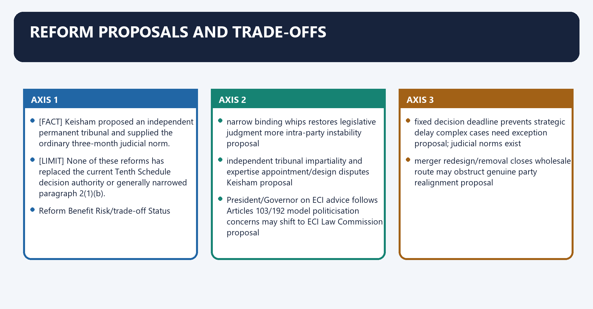
[FACT] The Dinesh Goswami Committee proposed limiting disqualification for whip defiance to specified high-stakes votes including confidence/no-confidence, Money Bills and the motion of thanks to the President's Address.

[FACT] The Law Commission's 170th Report criticised abuse of the merger/split framework and proposed stronger redesign; the 255th Report recommended President/Governor decision on ECI advice.

[FACT] *Keisham* proposed an independent permanent tribunal and supplied the ordinary three-month judicial norm.

[ANALYSIS] Internal party democracy is complementary: a narrow whip is less valuable if candidate selection and party decisions remain opaque and centralised.

[LIMIT] None of these reforms has replaced the current Tenth Schedule decision authority or generally narrowed paragraph 2(1)(b).

#### Visual 62 — Reform Menu

| Reform | Benefit | Risk/trade-off | Status |
|---|---|---|---|
| narrow binding whips | restores legislative judgment | more intra-party instability | proposal |
| independent tribunal | impartiality and expertise | appointment/design disputes | *Keisham* proposal |
| President/Governor on ECI advice | follows Articles 103/192 model | politicisation concerns may shift to ECI | Law Commission proposal |
| fixed decision deadline | prevents strategic delay | complex cases need exception | proposal; judicial norms exist |
| merger redesign/removal | closes wholesale route | may obstruct genuine party realignment | proposal |
| internal party democracy | legitimacy of directions | difficult judicial administration | political/legal reform |

*Caption: Every reform solves one failure while creating a new institutional design question.*

#### Visual 63 — Reform-Level Ladder

```text
HOUSE RULE CHANGE
petition procedure / disclosure / hearing management
        |
STATUTORY OR SYMBOLS-ORDER CHANGE
party transparency / ECI processes
        |
CONSTITUTIONAL AMENDMENT
change paragraph 2, 4 or 6; create new decider
        |
POLITICAL-PARTY PRACTICE
internal consultation, recorded whip reasons, member voice
```

*Caption: Reform credibility depends on choosing the correct legal instrument.*

#### Visual 64 — Preferred Balanced Package

```text
NARROW WHIP TO GOVERNMENT-SURVIVAL / CORE VOTES
        +
INDEPENDENT, TIME-BOUND ADJUDICATOR
        +
REASONED PARTY AUTHORISATION AND DISCLOSURE
        +
MERGER DEFENCE REDESIGN
        +
INTERNAL PARTY DEMOCRACY
```

*Caption: No single reform solves overbroad discipline, biased decision-making and group loopholes together.*

#### CLOSING RECALL FLOW — REFORM PROPOSALS AND TRADE-OFFS

```closure-flow
SUBTOPIC: Reform Proposals and Trade-Offs
KEY TERMS / DEFINITIONS: Reform Proposals · Trade-Offs · narrow binding whips · restores legislative judgment · more intra-party instability · proposal
MECHANISM / ARGUMENT: Reform Proposals and Trade-Offs operates through None of these reforms has replaced the current Tenth Schedule decision authority or generally narrowed paragraph 2(1)(b), connected with Reform Benefit Risk/trade-off Status.
CONSEQUENCE / CONTRAST: Its principal consequence is that independent tribunal impartiality and expertise appointment/design disputes Keisham proposal.
UPSC TRAP / ANSWER-USE: Do not miss this limiting distinction: the decisive contrast is between President/Governor on ECI advice follows Articles 103/192 model politicisation...
ANSWER-GRABBING FORMULATION: Internal party democracy is complementary: a narrow whip is less valuable if candidate selection and party decisions remain opaque and centralised.
```
### SESSION 25 — ANSWER-WRITING METHOD
#### DEFINITION / WHAT THIS IS CALLED

**Plain-language definition:** Answer-Writing Method denotes the constitutional rules and institutional links organised around "Speaker delay can defeat the Tenth Schedule.".

**Technical definition:** The exam-safe limitation is that 20 constitutional map - doctrine - institutional conflicts - cases - consequences - reforms - graded verdict 6-8 anchors.

#### ANSWER-GRABBING OPENING — WRITE/ADAPT IN THE EXAM

> Speaker delay can defeat anti-defection remedies because the Constitution sets no express deadline, while judicially indicated timelines remain doctrine rather than textual amendment.

#### MUST-WRITE KEYWORDS

- **Writing Method**
- **definition - exact rule - one case - one critique - verdict**
- **evolution - paragraph mechanics - cases - balance - reform**
- **2-3 named anchors**
- **4-6 anchors**
- **6-8 anchors**

**How to use them:** Frame the answer through Writing Method; define definition - exact rule - one case - one critique - verdict, connect evolution - paragraph mechanics - cases - balance - reform with 2-3 named anchors to explain the mechanism, and use 4-6 anchors for the decisive comparison or qualification.

Answer-Writing Method denotes the constitutional rules and institutional links organised around "Speaker delay can defeat the Tenth Schedule.".
Answer-Writing Method operates through Kihoto tribunal status + Rajendra Singh Rana + Keisham, connected with political majority may change before review becomes useful.
The operative mechanism matters because no express textual deadline; three months is judicial doctrine.
Its principal consequence is that marks Structure Evidence density.
The decisive contrast is between 10 definition - exact rule - one case - one critique - verdict 2-3 named anchors and 15 evolution - paragraph mechanics - cases - balance - reform 4-6 anchors.
The exam-safe limitation is that 20 constitutional map - doctrine - institutional conflicts - cases - consequences - reforms - graded verdict 6-8 anchors.
#### Visual 65 — Claim–Evidence–Analysis–Qualification

```text
CLAIM
"Speaker delay can defeat the Tenth Schedule."
        |
NAMED EVIDENCE
Kihoto tribunal status + Rajendra Singh Rana + Keisham
        |
ANALYSIS
political majority may change before review becomes useful
        |
QUALIFICATION
no express textual deadline; three months is judicial doctrine
```

*Caption: The qualification protects accuracy without weakening the thesis.*

#### Visual 66 — Mark-Scaled Architecture

| Marks | Structure | Evidence density |
|---:|---|---|
| 10 | definition -> exact rule -> one case -> one critique -> verdict | 2-3 named anchors |
| 15 | evolution -> paragraph mechanics -> cases -> balance -> reform | 4-6 anchors |
| 20 | constitutional map -> doctrine -> institutional conflicts -> cases -> consequences -> reforms -> graded verdict | 6-8 anchors |

*Caption: More marks require more dimensions, not repetition.*

#### Visual 67 — Directive Decoder

| Directive | Required move |
|---|---|
| explain | state text and mechanism |
| examine | test operation with evidence |
| critically examine | benefits, defects, counterpoints and verdict |
| discuss | organise relevant dimensions with balance |
| analyse | show causation, incentives and consequences |
| distinguish | use a controlled comparison table |

*Caption: A legally correct answer can still underperform if it ignores the directive.*

#### CLOSING RECALL FLOW — ANSWER-WRITING METHOD

```closure-flow
SUBTOPIC: Answer-Writing Method
KEY TERMS / DEFINITIONS: Writing Method · definition - exact rule - one case - one critique - verdict · evolution - paragraph mechanics - cases - balance - reform · 2-3 named anchors · 4-6 anchors · 6-8 anchors
MECHANISM / ARGUMENT: The operative mechanism matters because no express textual deadline; three months is judicial doctrine.
CONSEQUENCE / CONTRAST: The decisive contrast is between 10 definition - exact rule - one case - one critique - verdict 2-3 named anchors and 15 evolution - paragraph mechanics - cases - balance - reform 4-6 anchors.
UPSC TRAP / ANSWER-USE: Do not miss this limiting distinction: its principal consequence is that marks Structure Evidence density.
ANSWER-GRABBING FORMULATION: Speaker delay can defeat anti-defection remedies because the Constitution sets no express deadline, while judicially indicated timelines remain doctrine rather than textual amendment.
```
### SESSION 26 — CURRENT AND LEGAL CONTROL DASHBOARD
#### DEFINITION / WHAT THIS IS CALLED

**Plain-language definition:** Current and Legal Control Dashboard denotes the constitutional rules and institutional links organised around Safe current statement Deliberately unfrozen.

**Technical definition:** Current and Legal Control Dashboard operates through official Constitution as on 1 May 2026 retains current Tenth Schedule text current party strength or faction leadership, connected with paragraph 3 remains omitted final result of reported 2026 merger litigation.

#### ANSWER-GRABBING OPENING — WRITE/ADAPT IN THE EXAM

> Current anti-defection analysis must preserve the omitted split defence and verified case holdings while separating live party disputes from settled constitutional law.

#### MUST-WRITE KEYWORDS

- **Legal Control Dashboard**
- **current party strength or faction leadership**
- **paragraph 3 remains omitted**
- **final result of reported 2026 merger litigation**
- **claim of later overruling without official judgment**
- **later contempt warning not officially verified**

**How to use them:** Frame the answer through Legal Control Dashboard; define current party strength or faction leadership, connect paragraph 3 remains omitted with final result of reported 2026 merger litigation to explain the mechanism, and use claim of later overruling without official judgment for the decisive comparison or qualification.

Current and Legal Control Dashboard denotes the constitutional rules and institutional links organised around Safe current statement Deliberately unfrozen.
Current and Legal Control Dashboard operates through official Constitution as on 1 May 2026 retains current Tenth Schedule text current party strength or faction leadership, connected with paragraph 3 remains omitted final result of reported 2026 merger litigation.
The operative mechanism matters because subhash Desai referred Nabam Rebia correctness to seven judges claim of later overruling without official judgment.
Its principal consequence is that telangana judgment of 31 July 2025 gave case-specific three-month direction later contempt warning not officially verified.
The decisive contrast is between ECI and Speaker tracks may proceed concurrently current symbol ownership in any live dispute and Risky claim Controlled replacement.
The exam-safe limitation is that “Supreme Court settled the merger issue in 2026” reported litigation exists; no verified later merits rule used.
#### Visual 68 — Frozen and Unfrozen Statements

| Safe current statement | Deliberately unfrozen |
|---|---|
| official Constitution as on 1 May 2026 retains current Tenth Schedule text | current party strength or faction leadership |
| paragraph 3 remains omitted | final result of reported 2026 merger litigation |
| *Subhash Desai* referred *Nabam Rebia* correctness to seven judges | claim of later overruling without official judgment |
| Telangana judgment of 31 July 2025 gave case-specific three-month direction | later contempt warning not officially verified |
| ECI and Speaker tracks may proceed concurrently | current symbol ownership in any live dispute |

*Caption: Current-affairs accuracy often requires refusing to freeze volatile litigation or politics.*

#### Visual 69 — High-Risk Current Claims

| Risky claim | Controlled replacement |
|---|---|
| “Supreme Court settled the merger issue in 2026” | reported litigation exists; no verified later merits rule used |
| “Telangana Speaker was threatened with contempt” | official 2025 judgment directed decision within three months; no later warning claimed |
| “Nabam Rebia has been overruled” | correctness referred in 2023; no later official merits ruling verified |
| “Shiv Sena case restored the old government” | status quo was not restored |
| “ECI decides defections” | ECI decides separate symbol/other disqualification matters, not paragraph 6 petitions |

*Caption: The best legal-current answer is often a carefully bounded one.*

#### CLOSING RECALL FLOW — CURRENT AND LEGAL CONTROL DASHBOARD

```closure-flow
SUBTOPIC: Current and Legal Control Dashboard
KEY TERMS / DEFINITIONS: Legal Control Dashboard · current party strength or faction leadership · paragraph 3 remains omitted · final result of reported 2026 merger litigation · claim of later overruling without official judgment · later contempt warning not officially verified
MECHANISM / ARGUMENT: Current and Legal Control Dashboard operates through official Constitution as on 1 May 2026 retains current Tenth Schedule text current party strength or faction leadership, connected with paragraph 3 remains omitted final result of reported 2026 merger litigation.
CONSEQUENCE / CONTRAST: Its principal consequence is that telangana judgment of 31 July 2025 gave case-specific three-month direction later contempt warning not officially verified.
UPSC TRAP / ANSWER-USE: Do not miss this limiting distinction: the decisive contrast is between ECI and Speaker tracks may proceed concurrently current symbol...
ANSWER-GRABBING FORMULATION: Current anti-defection analysis must preserve the omitted split defence and verified case holdings while separating live party disputes from settled constitutional law.
```
### SESSION 27 — PRELIMS TRAP WALL
#### DEFINITION / WHAT THIS IS CALLED

**Plain-language definition:** Prelims Trap Wall denotes the constitutional rules and institutional links organised around anti-defection law is an ordinary Act it is in the Constitution's Tenth Schedule.

**Technical definition:** Its principal consequence is that one-third is current threshold two-thirds for merger.

#### ANSWER-GRABBING OPENING — WRITE/ADAPT IN THE EXAM

> Paragraph 4 protects genuine party merger, but its two-thirds deeming rule can be used to present coordinated legislative migration as constitutional realignment.

#### MUST-WRITE KEYWORDS

- **Prelims Trap Wall**
- **commenced on 15 Feb 1985**
- **Act dated then; Schedule effective 1 Mar 1985**
- **called the 2003 Act; effective 1 Jan 2004**
- **split and merger both survive**
- **91st Amendment enacted in 2004**

**How to use them:** Frame the answer through Prelims Trap Wall; define commenced on 15 Feb 1985, connect Act dated then; Schedule effective 1 Mar 1985 with called the 2003 Act; effective 1 Jan 2004 to explain the mechanism, and use split and merger both survive for the decisive comparison or qualification.

Prelims Trap Wall denotes the constitutional rules and institutional links organised around anti-defection law is an ordinary Act it is in the Constitution's Tenth Schedule.
Prelims Trap Wall operates through commenced on 15 Feb 1985 Act dated then; Schedule effective 1 Mar 1985, connected with 91st Amendment enacted in 2004 called the 2003 Act; effective 1 Jan 2004.
The operative mechanism matters because split and merger both survive split omitted; merger survives.
Its principal consequence is that one-third is current threshold two-thirds for merger.
The decisive contrast is between two-thirds legislators may simply switch paragraph 4 merger conditions and controversy must be addressed and voluntary giving up means written resignation only conduct may establish it.
The exam-safe limitation is that every dissenting speech violates whip paragraph 2(1)(b) concerns vote/abstention contrary to direction.
#### Visual 70 — Twenty-Four Trap Repairs

| Trap | Repair |
|---|---|
| anti-defection law is an ordinary Act | it is in the Constitution's Tenth Schedule |
| commenced on 15 Feb 1985 | Act dated then; Schedule effective 1 Mar 1985 |
| 91st Amendment enacted in 2004 | called the 2003 Act; effective 1 Jan 2004 |
| split and merger both survive | split omitted; merger survives |
| one-third is current threshold | two-thirds for merger |
| two-thirds legislators may simply switch | paragraph 4 merger conditions and controversy must be addressed |
| voluntary giving up means written resignation only | conduct may establish it |
| every dissenting speech violates whip | paragraph 2(1)(b) concerns vote/abstention contrary to direction |
| condonation period is 30 days | 15 days |
| prior permission is irrelevant | it is express protection |
| independent has six-month window | no window |
| nominated can never join a party | may join within six months from taking seat |
| every presiding officer is exempt | only exact paragraph 5 offices/conditions |
| ECI decides Tenth Schedule cases | Speaker/Chairman decides |
| Governor decides State MLA defection | Speaker/Chairman, not Article 192 route |
| Speaker's decision is beyond review | *Kihoto* permits limited review |
| paragraph 7 was deleted | text remains printed but is invalid |
| courts normally decide first | Speaker decides first |
| no deadline means unlimited delay | *Keisham* reasonable-time/three-month doctrine |
| resignation ends pending case | *Shrimanth* says prior taint survives |
| Speaker can bar re-election until term end | *Shrimanth* rejects extra ban |
| defection is a crime | no criminal liability under Schedule |
| symbol ruling settles defection | separate concurrent tracks |
| party expulsion automatically disqualifies | not by itself; deemed-party status remains relevant |

*Caption: These are close-option errors rather than broad conceptual mistakes.*

#### CLOSING RECALL FLOW — PRELIMS TRAP WALL

```closure-flow
SUBTOPIC: Prelims Trap Wall
KEY TERMS / DEFINITIONS: Prelims Trap Wall · commenced on 15 Feb 1985 · Act dated then; Schedule effective 1 Mar 1985 · called the 2003 Act; effective 1 Jan 2004 · split and merger both survive · 91st Amendment enacted in 2004
MECHANISM / ARGUMENT: Its principal consequence is that one-third is current threshold two-thirds for merger.
CONSEQUENCE / CONTRAST: The decisive contrast is between two-thirds legislators may simply switch paragraph 4 merger conditions and controversy must be addressed and voluntary giving up means written resignation only conduct may establish it.
UPSC TRAP / ANSWER-USE: Do not miss this limiting distinction: the exam-safe limitation is that every dissenting speech violates whip paragraph 2(1)(b) concerns vote/abstention...
ANSWER-GRABBING FORMULATION: Paragraph 4 protects genuine party merger, but its two-thirds deeming rule can be used to present coordinated legislative migration as constitutional realignment.
```
## BASIC MCQS / REMEDIATION

#### Original MCQs 1-36 — Strict Continuous A -> B -> C -> D Rotation

##### OM1. With reference to the 52nd Amendment, which statement is correct?

A. The Act is dated 15 February 1985, while the Tenth Schedule came into force on 1 March 1985.
B. It amended only Articles 102 and 191.
C. It came into force on 1 January 2004.
D. It inserted the Ninth Schedule.

**Answer: A.**

**Explanation:** `[FACT]` The 52nd Amendment amended Articles 101, 102, 190 and 191 and inserted the Tenth Schedule; the official consolidation records effect from 1 March 1985.

##### OM2. “Legislature party” under paragraph 1 most accurately means:

A. the national executive of a political party.
B. all members of that House who for the time being belong to that political party under the Schedule.
C. any faction supported by two-thirds of the House.
D. only elected members, excluding nominated members.

**Answer: B.**

**Explanation:** `[FACT]` It is a House-specific group. It is not the party organisation or any self-declared faction.

##### OM3. A nominated member who was not a party member at nomination:

A. can never join a party.
B. is treated exactly like an independent elected member.
C. may join within six months from taking the seat without paragraph 2(3) disqualification.
D. may join only after six months.

**Answer: C.**

**Explanation:** `[FACT]` The first-six-month choice window is specific to the nominated member.

##### OM4. An independently elected member is disqualified if the member:

A. declines ministerial office.
B. criticises a political party.
C. abstains on a non-whipped motion.
D. joins any political party after election.

**Answer: D.**

**Explanation:** `[FACT]` Paragraph 2(2) provides no six-month grace period.

##### OM5. Which best states *Ravi S. Naik*?

A. Voluntarily giving up membership may be inferred from conduct and is not confined to formal resignation.
B. Only a written resignation can establish defection.
C. Expulsion automatically ends Tenth Schedule membership.
D. ECI decides conduct-based defection.

**Answer: A.**

**Explanation:** `[FACT]` The phrase is wider than formal resignation, though inference remains evidence- and context-dependent.

##### OM6. Paragraph 2(1)(b) requires, among other things:

A. a criminal conviction.
B. contrary vote/abstention without prior permission and no condonation within 15 days.
C. a formal party resignation.
D. a direction only from the legislature party.

**Answer: B.**

**Explanation:** `[FACT]` Direction, contrary voting/abstention, no prior permission and no timely condonation form the textual chain.

##### OM7. After *Subhash Desai*, the authorised Whip for Tenth Schedule purposes is appointed by:

A. the largest faction in the legislature party.
B. the Governor.
C. the political party.
D. the Election Commission.

**Answer: C.**

**Explanation:** `[FACT]` The political party, not merely the legislature party, appoints the Whip and Leader.

##### OM8. Which conduct is least capable, by itself, of establishing paragraph 2(1)(b)?

A. voting without prior permission and without condonation.
B. voting contrary to a valid direction.
C. abstaining contrary to a valid direction.
D. making a dissenting speech without a contrary vote or abstention.

**Answer: D.**

**Explanation:** `[LIMIT]` The constitutional voting ground is not a general speech-control provision.

##### OM9. Paragraph 4 protection requires:

A. a merger framework and not less than two-thirds of the legislature party agreeing to the merger.
B. only a public statement by the defecting members.
C. approval by the Governor.
D. one-third of the legislature party forming a faction.

**Answer: A.**

**Explanation:** `[FACT]` Two-thirds operates within paragraph 4's merger structure.

##### OM10. Paragraph 3 of the Tenth Schedule:

A. creates judicial review.
B. was omitted by the 91st Amendment.
C. protects nominated members.
D. gives ECI jurisdiction.

**Answer: B.**

**Explanation:** `[FACT]` The former one-third split defence ceased with effect from 1 January 2004.

##### OM11. Paragraph 5 protection can apply to:

A. every minister.
B. every committee chair.
C. a listed Speaker/Deputy Speaker or Chairman/Deputy Chairman who satisfies the conditions.
D. every constitutional officeholder.

**Answer: C.**

**Explanation:** `[FACT]` It is an exact office-and-condition exemption, not a general neutrality clause.

##### OM12. If the disqualification question concerns the Speaker:

A. ECI decides.
B. the Governor decides.
C. the Deputy Speaker automatically decides.
D. a member elected by the House for that purpose decides.

**Answer: D.**

**Explanation:** `[FACT]` This is the proviso to paragraph 6(1).

##### OM13. The current legal effect of paragraph 7 is that:

A. its printed court-bar text remains, but it is invalid under *Kihoto* for want of ratification.
B. it transfers jurisdiction to ECI.
C. it fully excludes judicial review.
D. it was omitted by the 91st Amendment.

**Answer: A.**

**Explanation:** `[FACT]` The official 2026 Constitution includes the text and the invalidity footnote.

##### OM14. *Kihoto* permits review for:

A. only delay.
B. constitutional violation, mala fides, natural-justice breach and perversity.
C. only a criminal offence.
D. every factual disagreement as a full appeal.

**Answer: B.**

**Explanation:** `[FACT]` The review is limited to jurisdictional/constitutional infirmities.

##### OM15. Ordinary interlocutory court interference under *Kihoto* is:

A. identical to appellate review.
B. controlled by ECI.
C. generally excluded, subject to grave and irreversible interlocutory consequences.
D. mandatory in every petition.

**Answer: C.**

**Explanation:** `[FACT]` The baseline protects first-instance Speaker adjudication while preserving a narrow exception.

##### OM16. On decision time, the Tenth Schedule:

A. fixes 15 days.
B. fixes three months expressly.
C. fixes 30 days.
D. contains no express deadline.

**Answer: D.**

**Explanation:** `[FACT]` The three-month norm comes from *Keisham*, not the text.

##### OM17. *Keisham Meghachandra Singh* stated that, absent exceptional circumstances:

A. three months is the ordinary outer limit and Parliament should consider an independent tribunal.
B. delay is wholly non-justiciable.
C. every petition must go directly to the Supreme Court.
D. ECI must decide in 15 days.

**Answer: A.**

**Explanation:** `[FACT]` The Court tied reasonable time to the Schedule's constitutional objective.

##### OM18. The official 31 July 2025 Telangana judgment:

A. imposed criminal punishment.
B. directed conclusion of specified proceedings within three months.
C. finally settled every future timeline case.
D. abolished Speaker jurisdiction.

**Answer: B.**

**Explanation:** `[FACT]` It was a case-specific judicial direction, not a constitutional amendment.

##### OM19. Under *Shrimanth Balasaheb Patil*, a resignation tendered after the alleged defection:

A. automatically ends the petition.
B. creates a permanent election bar.
C. does not erase prior defection or the Speaker's jurisdiction.
D. transfers the case to ECI.

**Answer: C.**

**Explanation:** `[FACT]` Disqualification relates to the date of the defection act.

##### OM20. The Speaker's power after disqualification includes:

A. barring all future elections.
B. imposing any politically desirable penalty.
C. ordering imprisonment.
D. no power to add a term-long election-contest ban beyond the Constitution.

**Answer: D.**

**Explanation:** `[FACT]` *Shrimanth* struck down the extra duration/election restriction.

##### OM21. Articles 75(1B), 164(1B) and 361B:

A. create specified ministerial/remunerative-post disabilities after paragraph 2 disqualification.
B. protect a one-third split.
C. transfer defection cases to the President.
D. prohibit contesting every election.

**Answer: A.**

**Explanation:** `[FACT]` The disabilities last until term expiry or earlier declared re-election, whichever is earlier.

##### OM22. ECI's role in a Tenth Schedule petition is:

A. issuing the party whip.
B. no paragraph 6 adjudicatory role.
C. automatic appellate authority.
D. first-instance adjudication.

**Answer: B.**

**Explanation:** `[FACT]` ECI has separate symbol and Articles 103/192 functions.

##### OM23. According to *Subhash Desai*, symbol and defection proceedings:

A. are both decided by the Governor.
B. must be merged in the Supreme Court.
C. may proceed concurrently before ECI and Speaker on separate tracks.
D. cannot coexist.

**Answer: C.**

**Explanation:** `[FACT]` One proceeding does not automatically suspend the other.

##### OM24. The Governor's role in a live party split is best stated as:

A. deciding who defected.
B. appointing the party Whip.
C. deciding the symbol dispute.
D. exercising constitutional government-formation/floor-test functions without replacing Speaker or ECI jurisdictions.

**Answer: D.**

**Explanation:** `[FACT]` *Subhash Desai* keeps institutional tracks distinct and requires objective material.

##### OM25. As controlled for this package, *Nabam Rebia*:

A. remains a rule whose correctness was referred to seven judges in *Subhash Desai*, with no later verified merits ruling used here.
B. concerns nominated members.
C. was conclusively overruled in 2023.
D. abolished judicial review.

**Answer: A.**

**Explanation:** `[CURRENT][LIMIT]` A reference is not itself an overruling.

##### OM26. Which is a direct legal consequence of Tenth Schedule disqualification?

A. cancellation of party registration.
B. vacancy of the seat.
C. criminal conviction.
D. permanent ban from politics.

**Answer: B.**

**Explanation:** `[FACT]` The Schedule concerns membership, with linked constitutional office bars.

##### OM27. Party expulsion of a legislator:

A. automatically makes the person independent.
B. transfers the seat to the party.
C. does not by itself erase deemed original-party belonging for Tenth Schedule purposes.
D. automatically disqualifies under paragraph 2.

**Answer: C.**

**Explanation:** `[FACT]` *G. Viswanathan* prevents the “unattached” label from defeating the Schedule.

##### OM28. A post-election office-of-profit or RPA disqualification question for a sitting State member is ordinarily decided by:

A. ECI alone.
B. Speaker under paragraph 6.
C. Chief Minister.
D. Governor under Article 192 after obtaining and acting according to ECI opinion.

**Answer: D.**

**Explanation:** `[FACT]` This differs from the Tenth Schedule route.

##### OM29. Breach of privilege and defection:

A. are distinct constitutional regimes even though paragraph 8 rules may address wilful rule contravention like privilege.
B. are both decided by ECI.
C. are always identical.
D. always produce permanent disqualification.

**Answer: A.**

**Explanation:** `[FACT]` Their protected interests, grounds and procedures differ.

##### OM30. The strongest democratic defence of anti-defection is:

A. it makes courts unnecessary.
B. it protects government stability and the party-linked electoral mandate.
C. it eliminates all corruption.
D. party leaders should control every speech.

**Answer: B.**

**Explanation:** `[ANALYSIS]` The defence is substantial but must be balanced against deliberative freedom.

##### OM31. A narrow-whip reform would most plausibly:

A. remove all confidence discipline.
B. give ECI power to legislate.
C. confine seat-risk directions to confidence, money/supply or core matters.
D. abolish parties.

**Answer: C.**

**Explanation:** `[ANALYSIS]` The goal is calibrated party discipline, not no discipline.

##### OM32. The safest statement on paragraph 4 controversy is:

A. two-thirds can always defect freely.
B. original-party text is irrelevant.
C. the issue was conclusively settled in 2026.
D. exact text and competing interpretations must be stated; no unverified final 2026 rule should be claimed.

**Answer: D.**

**Explanation:** `[CURRENT][LIMIT]` The package preserves the unresolved interpretive question.

##### OM33. Under official Lok Sabha procedure, a compliant petition is followed by:

A. service of copies/comments and a reasonable opportunity before an adverse finding.
B. immediate automatic vacancy.
C. ECI investigation.
D. a criminal trial.

**Answer: A.**

**Explanation:** `[FACT]` The procedure reflects the adjudicatory nature recognised in *Kihoto*.

##### OM34. Paragraph 6(2)'s deeming of proceedings as legislative proceedings:

A. eliminates natural justice.
B. protects against mere procedural-irregularity attacks but not jurisdictional constitutional review.
C. removes every court power.
D. makes the Speaker a political party officer.

**Answer: B.**

**Explanation:** `[FACT]` *Kihoto* limits, rather than abolishes, review.

##### OM35. The 2025 routed concept emphasising “political party” is best answered by noting:

A. ECI becomes the defection tribunal.
B. only legislature-party numbers matter.
C. the Schedule links candidate-setting, membership and directions to the political party.
D. political parties are not mentioned in paragraph 2.

**Answer: C.**

**Explanation:** `[FACT]` The phrase is structurally central to the Schedule.

##### OM36. Which statement about a nominated member is correct?

A. a party can be joined only after six months.
B. joining at any time is prohibited.
C. the six-month period runs from nomination.
D. joining within six months from taking the seat is permitted without paragraph 2(3) disqualification.

**Answer: D.**

**Explanation:** `[FACT]` This is the exact distinction tested by the 2022 route.

#### Remedial MCQs 37-48 — Same Continuous Rotation

##### RM37. A member votes against a valid direction but receives condonation from the authorised party authority on day 12. The best conclusion is:

A. paragraph 2(1)(b) disqualification does not arise on that vote because condonation occurred within 15 days.
B. condonation must occur before voting.
C. disqualification is automatic at the moment of voting.
D. only ECI can condone.

**Answer: A.**

**Explanation:** `[FACT]` Prior permission and post-vote condonation within 15 days are separate textual protections.

##### RM38. A group containing exactly one-third of a legislature party claims a split in 2026. It is:

A. protected by old paragraph 3.
B. not protected because paragraph 3 stands omitted.
C. protected if the Governor agrees.
D. automatically a merger.

**Answer: B.**

**Explanation:** `[FACT]` The one-third split defence ended on 1 January 2004.

##### RM39. Two-thirds of a legislature party announce that they have “merged”, while the original party denies any merger. The best exam answer is:

A. ECI must disqualify them.
B. they are automatically criminals.
C. apply paragraph 4's exact original-party and deeming text and identify the unresolved interpretive controversy.
D. they are automatically protected.

**Answer: C.**

**Explanation:** `[LIMIT]` A categorical numerical shortcut would erase the legal controversy.

##### RM40. A court is asked to stop the Speaker from deciding merely because an adverse decision is feared. The *Kihoto* baseline is:

A. ECI reference.
B. Governor's permission.
C. automatic injunction.
D. no ordinary quia timet intervention before decision.

**Answer: D.**

**Explanation:** `[FACT]` Courts generally do not pre-empt the constitutionally assigned adjudicator.

##### RM41. A Speaker sits on a petition until the Assembly term is nearly over. Which chain is most relevant?

A. *Rajendra Singh Rana* -> *Keisham* -> judicial direction against disabling inaction.
B. parliamentary privilege exclusively.
C. Article 352 -> emergency.
D. ECI Symbols Order only.

**Answer: A.**

**Explanation:** `[FACT]` Delay cannot be used to frustrate the Schedule's constitutional objective.

##### RM42. A disqualified member wins a by-election before the old term ends. The 91st-Amendment office disability:

A. necessarily lasts for life.
B. ends on declared re-election if that occurs earlier than original term expiry.
C. becomes criminal punishment.
D. is decided by the party whip.

**Answer: B.**

**Explanation:** `[FACT]` Articles 75(1B), 164(1B) and 361B use the earlier-event formula.

##### RM43. An expelled member joins another political party. The most relevant authority is:

A. *Minerva Mills*.
B. *Bommai*.
C. *G. Viswanathan*.
D. *Kesavananda Bharati*.

**Answer: C.**

**Explanation:** `[FACT]` Deemed original-party belonging continues for Tenth Schedule purposes.

##### RM44. Which proposition is outside *Subhash Desai*?

A. Speaker and ECI tracks may proceed concurrently.
B. split defence is unavailable.
C. political party appoints the Whip.
D. the Supreme Court itself disqualified every disputed member.

**Answer: D.**

**Explanation:** `[LIMIT]` The Court left first-instance disqualification to the Speaker.

##### RM45. The best way to write paragraph 7 is:

A. “It textually bars courts, but *Kihoto* invalidated it for want of State ratification.”
B. “It concerns merger.”
C. “It is fully operative.”
D. “It was deleted by Parliament.”

**Answer: A.**

**Explanation:** `[FACT]` This preserves both text and legal effect.

##### RM46. A proposal to vest defection decisions in the President/Governor on ECI advice would:

A. describe existing paragraph 6.
B. require legal/constitutional change and mirrors the Articles 103/192 model.
C. be implemented by a party whip.
D. automatically solve every bias concern.

**Answer: B.**

**Explanation:** `[ANALYSIS][LIMIT]` It shifts institutional risk; it is not current law.

##### RM47. Which reform most directly addresses loss of ordinary legislative deliberation?

A. broader whips.
B. longer Speaker delay.
C. limiting binding whips to survival/core votes.
D. making defection criminal.

**Answer: C.**

**Explanation:** `[ANALYSIS]` It protects necessary stability while restoring issue-wise judgment.

##### RM48. The best final verdict on the law is:

A. wholly useless.
B. unconstitutional in its entirety.
C. perfectly effective.
D. justified in principle but weakened by broad whips, group/resignation routes and partisan delay.

**Answer: D.**

**Explanation:** `[ANALYSIS]` A graded verdict recognises both stability gains and design failures.

#### Visual 73 — Solved-Mains Evidence Bank

| Issue | Constitutional anchor | Case/reform anchor |
|---|---|---|
| grounds | paragraph 2 | *Ravi S. Naik* |
| merger | paragraph 4 | *Rajendra Singh Rana* analogy; current controversy |
| Speaker | paragraph 6 | *Kihoto*, *Keisham* |
| resignation | Articles 101/190 | *Shrimanth* |
| whip authority | paragraph 2(1)(c) | *Subhash Desai* |
| office consequence | 75(1B), 164(1B), 361B | 91st Amendment |
| reform | constitutional amendment | Goswami, Law Commission, *Keisham* |

*Caption: Each model answer should select only evidence that advances its thesis.*

## PYQS AND ANSWER PRACTICE

[FACT] Audited local routing identifies two direct Prelims demands and one cross-owned Mains demand relevant to this package.

[LIMIT] The routed ledgers preserve neutral demand summaries, not full official wording. No wording is reconstructed. No official answer letter is claimed where the ledger does not record it.

#### Visual 71 — Verified PYQ Route Map

| Year | Stage | Q | Verified neutral demand | Key/wording control |
|---:|---|---:|---|---|
| 2022 | Prelims GS-I | 16 | nominated legislators under anti-defection law | key unavailable locally |
| 2025 | Prelims GS-I | 88 | Tenth Schedule disqualification and mention of political party | official key file exists; answer letter not recorded |
| 2023 | Mains GS-II | 5 | role of State presiding officers in order and impartial conduct | 10 marks, 150 words |

*Caption: The package solves the concepts without inventing missing official keys or wording.*

#### Routed Prelims PYQ 1 — 2022 GS-I Q16

**Verified neutral demand:** Anti-defection provisions for nominated legislators.

**Source status:** Key unavailable locally; exact official wording is not reconstructed.

**Concept resolution — not an officially verified answer letter**

- `[FACT]` A nominated member who is already a party member at nomination is deemed to belong to that party.
- `[FACT]` A nominated member who is not then a party member may join a party before expiry of six months from taking the seat.
- `[FACT]` Joining after that six-month period triggers paragraph 2(3) disqualification.
- `[LIMIT]` The rule differs from an independent elected member, who is disqualified on joining any party after election.

**Elimination method:** Reject any statement saying “never”, “only after six months”, or giving an independent member the six-month window.

**Confidence:** High on the doctrine; no official option letter claimed.

#### Routed Prelims PYQ 2 — 2025 GS-I Q88

**Verified neutral demand:** Tenth Schedule disqualification and express mention of “political party”.

**Source status:** Official Set-A key file is present locally, but the routed ledger does not record the answer letter; no letter is claimed.

**Concept resolution**

- `[FACT]` Paragraph 2 repeatedly uses political party: the party that set up the elected candidate, the party membership voluntarily given up, and the party/person/authority issuing a direction.
- `[FACT]` Paragraph 1 separately defines legislature party and original political party.
- `[FACT]` *Subhash Desai* confirms that the political party, not a factional legislature party, appoints the authorised Whip and Leader.
- `[LIMIT]` The phrase “political party” does not mean the ECI becomes the paragraph 6 adjudicator.

**Elimination method:** Distinguish organisational party authority from the House-level group and from ECI's separate Symbols Order function.

#### Routed Mains PYQ — 2023 GS-II Q5

**Verified neutral demand:** Discuss the role of Presiding Officers of State legislatures in maintaining order and impartial conduct of business.  
**10 marks | 150 words**

**Model solution**

**Thesis:** `[FACT]` State presiding officers are procedural guardians whose powers over debate, discipline, voting and defection make impartiality a constitutional operating condition.

1. `[CLAIM]` They maintain orderly deliberation. `[EVIDENCE]` Articles 178-185 create the offices; House rules govern recognition, admissibility, discipline and voting. `[ANALYSIS]` fair allocation of speaking and motion time protects majority decision and opposition scrutiny. `[LIMIT]` broad procedural discretion requires consistent reasons.
2. `[CLAIM]` They perform high-impact constitutional functions. `[EVIDENCE]` Article 189 supplies the casting vote, Article 199 involves Money Bill certification, and paragraph 6 of the Tenth Schedule assigns defection adjudication. `[ANALYSIS]` these decisions can affect bicameral scrutiny and government survival. `[LIMIT]` political membership creates an appearance-of-bias risk.
3. `[CLAIM]` Judicial control supports impartiality. `[EVIDENCE]` *Kihoto Hollohan* treats the Speaker as a reviewable tribunal; *Keisham* requires reasonable-time decision-making. `[ANALYSIS]` legality and timeliness prevent procedure from becoming partisan strategy. `[LIMIT]` the proposed independent tribunal is not enacted.

**Verdict:** Impartiality should be institutionalised through reasoned rulings, equal procedure, timely decisions and neutral defection adjudication, not left to personal convention alone.

**Why this earns marks:** It connects functions to impartiality, uses Articles and cases, and avoids a generic list of Speaker powers.

#### Visual 72 — MCQ Rotation Plan

```text
Q1 A -> Q2 B -> Q3 C -> Q4 D
repeat without interruption through Q48

Original MCQs: Q1-Q36
Remedials: Q37-Q48
```

*Caption: The answer-key sequence is continuous across both practice blocks.*

#### M1. Grounds and Member Types (10 marks, 150 words)

**Question:** Explain the grounds of disqualification under the Tenth Schedule and the distinct treatment of independent and nominated members.

**Model solution**

**Thesis:** `[FACT]` Paragraph 2 uses different rules because party-ticket, independent and nominated members enter the House with different electoral relationships.

1. `[CLAIM]` A party member faces two grounds. `[EVIDENCE]` Paragraph 2(1)(a) covers voluntarily giving up membership; *Ravi S. Naik* permits inference from conduct. Paragraph 2(1)(b) covers contrary voting/abstention without prior permission and without condonation within 15 days. `[ANALYSIS]` The first protects continuing allegiance; the second enforces authorised voting discipline. `[LIMIT]` every speech or dissent is not a whip breach.
2. `[CLAIM]` An independent member has the strictest joining rule. `[EVIDENCE]` Paragraph 2(2) disqualifies on joining any party after election. `[ANALYSIS]` The voter chose a non-party candidate. `[LIMIT]` no six-month window exists.
3. `[CLAIM]` A nominated member receives a limited choice period. `[EVIDENCE]` Paragraph 2(3) disqualifies only for joining after six months from taking the seat. `[ANALYSIS]` The text permits early political alignment. `[LIMIT]` the clock does not run from nomination.

**Verdict:** The Schedule protects the electoral identity through category-specific rules rather than one universal prohibition.

**Why this earns marks:** It states every ground, supplies the 15-day and six-month controls, and uses *Ravi S. Naik* with a qualification.

#### M2. Political Party and Legislature Party (10 marks, 150 words)

**Question:** Distinguish “political party” from “legislature party” under the Tenth Schedule. Why does the distinction matter?

**Model solution**

**Thesis:** `[FACT]` A political party is the organisational/electoral entity; a legislature party is its group of members within a particular House.

- `[CLAIM]` Electoral belonging flows from the political party. `[EVIDENCE]` Paragraph 2 deems an elected member to belong to the party that set the member up. `[ANALYSIS]` Voter mandate cannot be rewritten only by House-level numbers. `[LIMIT]` membership disputes still require evidence.
- `[CLAIM]` Voting authority flows from the political party. `[EVIDENCE]` Paragraph 2(1)(b) recognises its direction or an authorised person's direction; *Subhash Desai* holds that the political party appoints the Whip and Leader. `[ANALYSIS]` A factional legislature majority cannot manufacture a rival whip. `[LIMIT]` the Speaker must identify authorisation through inquiry and party rules.
- `[CLAIM]` Legislature-party numbers matter in paragraph 4. `[EVIDENCE]` two-thirds agreement triggers the merger deeming rule. `[ANALYSIS]` This creates the present organisational-versus-numerical controversy. `[LIMIT]` two-thirds is not a free-standing right to defect.

**Verdict:** The distinction protects party mandate while exposing the unresolved tension in the merger exception.

**Why this earns marks:** It defines, applies and qualifies the distinction through both paragraph 2 and paragraph 4.

#### M3. Speaker as Adjudicator (10 marks, 150 words)

**Question:** Evaluate the constitutional position of the Speaker as the adjudicator of defection petitions.

**Model solution**

**Thesis:** `[FACT]` Paragraph 6 entrusts the Speaker/Chairman with first-instance decision, but judicial doctrine treats that role as adjudicatory rather than politically immune.

1. `[CLAIM]` The arrangement keeps the question within the House. `[EVIDENCE]` Paragraph 6 declares the decision final and provides a House-elected substitute when the Speaker is personally concerned. `[ANALYSIS]` institutional familiarity may aid speed. `[LIMIT]` continued party affiliation creates perceived bias.
2. `[CLAIM]` Finality is constitutionally controlled. `[EVIDENCE]` *Kihoto Hollohan* classifies the Speaker as a tribunal and permits review for constitutional breach, mala fides, natural-justice violation and perversity. `[ANALYSIS]` legality survives the finality clause. `[LIMIT]` review is not a full appeal.
3. `[CLAIM]` delay is a structural weakness. `[EVIDENCE]` *Keisham* identifies an ordinary three-month outer limit and proposes an independent tribunal. `[ANALYSIS]` delayed justice can alter government survival. `[LIMIT]` no express Schedule deadline or tribunal amendment exists.

**Verdict:** The current model is legally reviewable but institutionally fragile; neutral, time-bound adjudication is the stronger design.

**Why this earns marks:** It balances constitutional text, judicial control, practical bias and reform within the word limit.

#### M4. Kihoto and Judicial Review (15 marks, 250 words)

**Question:** “Kihoto Hollohan saved the anti-defection law from both invalidation and unaccountability.” Discuss.

**Model solution**

**Thesis:** `[FACT]` *Kihoto* upheld the central Tenth Schedule design while invalidating its attempted total ouster of courts, producing a controlled compromise between House adjudication and constitutional review.

**Saved from invalidation**

- `[CLAIM]` The majority rejected the argument that vesting power in the Speaker necessarily destroyed the basic structure. `[EVIDENCE]` It emphasised the high constitutional office and retained paragraph 6. `[ANALYSIS]` This preserved the 52nd Amendment's anti-defection mechanism. `[LIMIT]` the minority's bias concern later informed reform debate.

**Saved from unaccountability**

- `[CLAIM]` Paragraph 7 could not validly exclude Supreme Court/High Court jurisdiction. `[EVIDENCE]` It affected Articles 136, 226 and 227 but lacked ratification by half the States under Article 368(2). `[ANALYSIS]` amendment procedure protected federal participation and judicial review. `[LIMIT]` paragraph 7 remains printed but legally invalid.
- `[CLAIM]` The Speaker is a tribunal. `[EVIDENCE]` Review survives for constitutional mandate violation, mala fides, natural-justice breach and perversity. `[ANALYSIS]` a political office exercising judicial power must give a legally defensible order. `[LIMIT]` review is jurisdictional, not a routine merits appeal.
- `[CLAIM]` First-instance authority remains with the Speaker. `[EVIDENCE]` ordinary quia timet/interlocutory intervention is restricted. `[ANALYSIS]` this respects constitutional allocation. `[LIMIT]` *Keisham* later clarifies that courts may aid prompt decision against inaction.

**Verdict:** *Kihoto* did not perfect the law; it constitutionalised accountability around a structurally partisan decider. Later delay cases expose why judicial review is necessary but not sufficient.

**Why this earns marks:** It answers both halves of the quotation, explains ratification, review grounds and timing, and adds a measured limitation.

#### M5. Merger Exception (15 marks, 250 words)

**Question:** “The merger exception risks converting a prohibition on defection into a numerical licence for wholesale defection.” Critically examine.

**Model solution**

**Thesis:** `[FACT]` Paragraph 4 protects genuine party merger, but its two-thirds deeming rule can be used to present coordinated legislative migration as constitutional realignment.

**Why protection exists**

- `[CLAIM]` Parties may genuinely reorganise. `[EVIDENCE]` Paragraph 4 protects members accepting another/new party and those rejecting the merger and functioning separately. `[ANALYSIS]` A rigid individual-only rule could punish authentic collective realignment. `[LIMIT]` protection must remain tied to merger, not convenience.

**Why it becomes a loophole**

- `[CLAIM]` The threshold rewards group engineering. `[EVIDENCE]` not less than two-thirds of the legislature party triggers the deeming rule after the one-third split defence was deleted. `[ANALYSIS]` actors rationally aggregate numbers rather than defect individually. `[LIMIT]` threshold alone does not answer the original-political-party language.
- `[CLAIM]` Organisational mandate may be bypassed. `[EVIDENCE]` Paragraph 4(1) speaks of the original political party merging; *Subhash Desai* elsewhere stresses political-party authority over mere legislature factions. `[ANALYSIS]` voter choice is weakened if House numbers can rewrite party identity. `[LIMIT]` paragraph 4(2)'s deeming fiction creates a genuine interpretive dispute.
- `[CLAIM]` *Rajendra Singh Rana* supplies a cautionary analogy. `[EVIDENCE]` under old paragraph 3, legislator numbers did not themselves prove an original-party split. `[ANALYSIS]` organisational reality matters. `[LIMIT]` that case interpreted the now-omitted split rule, not a final modern merger rule.

**Reform:** Clarify organisational consent/evidence, redesign or remove the defence, and protect only transparent, genuine mergers followed by electoral accountability.

**Verdict:** Paragraph 4 should remain an exception proved strictly, not a numerical safe harbour presumed automatically.

**Why this earns marks:** It preserves the textual controversy, gives both rationales and avoids claiming an unverified 2026 settlement.

#### M6. Resignation and Office Bars (15 marks, 250 words)

**Question:** Analyse the relationship between resignation, defection disqualification and the office disabilities introduced by the 91st Amendment.

**Model solution**

**Thesis:** `[FACT]` Resignation and disqualification are distinct vacancy mechanisms; the 91st Amendment prevents a person adjudged a defector from immediately converting seat loss into ministerial or remunerative office.

**Resignation does not erase prior defection**

- `[CLAIM]` Liability is tied to the defection date. `[EVIDENCE]` *Shrimanth Balasaheb Patil* holds that a later resignation does not vaporise the taint or terminate Speaker jurisdiction. `[ANALYSIS]` otherwise a member could defeat paragraph 2 by timing a resignation. `[LIMIT]` the Speaker still must prove the ground through fair process.

**Disqualification does not create an unlimited election ban**

- `[CLAIM]` The Speaker's power is text-bound. `[EVIDENCE]` *Shrimanth* struck down the direction barring re-election until the Assembly term ended. `[ANALYSIS]` desirability cannot supply a qualification absent from the Constitution/RPA. `[LIMIT]` re-election does not retrospectively validate the earlier conduct.

**91st-Amendment disabilities**

- `[CLAIM]` Articles 75(1B) and 164(1B) bar ministerial appointment; Article 361B bars a remunerative political post. `[EVIDENCE]` each runs from disqualification until original term expiry or earlier declared re-election. `[ANALYSIS]` this targets the office reward that can motivate defection. `[LIMIT]` it is not criminal punishment or lifetime exclusion.

**Verdict:** The scheme now follows a calibrated sequence: adjudicate past defection despite resignation, vacate the seat, impose temporary office disability, but preserve the electorate's power to return the candidate.

**Why this earns marks:** It separates three legal mechanisms, uses the controlling case and states the exact duration formula.

#### M7. Effectiveness and Reform (20 marks, 300 words)

**Question:** Has the anti-defection law strengthened parliamentary democracy or reduced legislators to agents of party leadership? Critically examine and suggest reforms.

**Model solution**

**Thesis:** `[ANALYSIS]` The Tenth Schedule strengthened government stability and party-linked electoral accountability, but its broad whip, merger incentives and partisan adjudication weakened deliberative representation. It is a necessary principle with an overbroad and poorly enforced design.

**Democratic gains**

1. `[CLAIM]` It raises the cost of opportunistic floor-crossing. `[EVIDENCE]` the 52nd Amendment constitutionalised seat loss for voluntary abandonment and whip defiance. `[ANALYSIS]` this protects the voter from office-driven mandate trading. `[LIMIT]` it cannot eliminate incentives.
2. `[CLAIM]` It stabilises responsible government. `[EVIDENCE]` confidence arithmetic becomes more predictable. `[ANALYSIS]` ministries can implement programmes. `[LIMIT]` stability without scrutiny may become executive dominance.
3. `[CLAIM]` It recognises political parties as constitutional actors. `[EVIDENCE]` candidate-setting, membership and directions all refer to the political party. `[ANALYSIS]` party labels shape electoral choice. `[LIMIT]` party leadership may be internally undemocratic.

**Democratic costs**

1. `[CLAIM]` Broad whips chill judgment. `[EVIDENCE]` paragraph 2(1)(b) is not confined to confidence or money votes. `[ANALYSIS]` legislators become numbers rather than deliberators. `[LIMIT]` core survival votes justify stronger discipline.
2. `[CLAIM]` Group and resignation routes displace individual defection. `[EVIDENCE]` paragraph 4 and *Shrimanth* reveal merger/resignation strategies. `[ANALYSIS]` the law redirects rather than removes defections. `[LIMIT]` genuine merger and resignation remain legitimate constitutional possibilities.
3. `[CLAIM]` Speaker timing can determine political outcomes. `[EVIDENCE]` *Kihoto*, *Rajendra Singh Rana*, *Keisham* and the 2025 Telangana direction. `[ANALYSIS]` delayed adjudication can make final review hollow. `[LIMIT]` complex cases may require justified extension.

**Reforms**

- narrow binding whips to confidence/no-confidence, money/supply and clearly defined core commitments;
- create an independent tribunal or a carefully insulated President/Governor-on-ECI-advice model;
- enact a fixed deadline with reasoned exceptional extension;
- redesign paragraph 4 to require transparent proof of genuine organisational merger;
- require recorded party authorisation and strengthen internal party democracy;
- preserve judicial review and natural justice.

**Verdict:** Anti-defection should protect the mandate at moments of government survival, not extinguish representative judgment throughout legislative life.

**Why this earns marks:** It balances achievement and harm, uses eight named anchors, explains mechanisms and offers matched reforms.

#### M8. Maharashtra Institutional Conflict (20 marks, 300 words)

**Question:** Using *Subhash Desai*, analyse how the Tenth Schedule distributes authority among the political party, legislature party, Speaker, Election Commission, Governor and courts.

**Model solution**

**Thesis:** `[FACT]` *Subhash Desai* rejects a single-institution solution to a party split. It assigns each institution a legally bounded function and prevents legislative headcount from silently replacing political-party authority.

**Political party and legislature party**

- `[CLAIM]` The political party controls authorised legislative direction. `[EVIDENCE]` it appoints the Whip and Leader; paragraph 2 links the member to the party that set the candidate up. `[ANALYSIS]` a factional legislature majority cannot self-authorise a rival whip. `[LIMIT]` the Speaker must determine authentic authority through the party constitution and evidence.
- `[CLAIM]` Legislature-party numbers remain relevant but not sovereign. `[EVIDENCE]` paragraph 4 uses the two-thirds threshold. `[ANALYSIS]` numbers serve a defined constitutional defence. `[LIMIT]` they do not automatically settle party identity.

**Speaker and ECI**

- `[CLAIM]` The Speaker decides paragraph 6 petitions. `[EVIDENCE]` *Kihoto* tribunal doctrine and *Subhash Desai* first-instance rule. `[ANALYSIS]` membership liability remains House-linked. `[LIMIT]` decisions must be timely and reviewable.
- `[CLAIM]` ECI decides the separate Symbols Order dispute. `[EVIDENCE]` *Subhash Desai* permits concurrent proceedings. `[ANALYSIS]` symbol recognition and defection ask different legal questions. `[LIMIT]` neither result mechanically controls the other.

**Governor and courts**

- `[CLAIM]` The Governor may use constitutionally relevant objective material for government formation/floor test, but cannot decide defection. `[EVIDENCE]` the impugned floor-test call lacked objective material; later government invitation after vacancy was upheld. `[ANALYSIS]` majority testing cannot become an indirect party-recognition mechanism. `[LIMIT]` facts and timing matter.
- `[CLAIM]` Courts police boundaries. `[EVIDENCE]` judicial review remains; the Court did not ordinarily decide disqualifications first instance. `[ANALYSIS]` constitutional supervision preserves distributed authority. `[LIMIT]` *Nabam Rebia* correctness remains referred.

**Verdict:** The judgment's enduring principle is jurisdictional discipline: political authority, legislative grouping, membership adjudication, symbol recognition and government formation must interact without collapsing into one another.

**Why this earns marks:** It addresses all six institutions, uses exact holdings and preserves the unresolved *Nabam Rebia* issue.

## OPTIONAL ADVANCED DEPTH — NOT REQUIRED FOR A CORE ANSWER

> **Subject:** Polity · **Tier:** Advanced (exam depth) · **GS Paper:** GS-II
> **Grounded in:** Indian Polity by M. Laxmikant, Tenth Schedule/electoral-dynamics chapters (direct check of the local Sixth Revised Edition PDF).
> ✅ = from source book · ⚠️ = inference / case law · 📰 = current affairs.
> *Companion: `basic/Anti-Defection-Law.md`.*

---

### PART A — ORIGIN ✅
- ✅ **52nd Amendment Act, 1985** added the **Tenth Schedule** (amending Arts **101, 102, 190, 191**) — the
  **anti-defection law**.
- ✅ **91st Amendment Act, 2003** **deleted the "split" exception** (which had protected 1/3-strength splits).

---

### PART B — GROUNDS OF DISQUALIFICATION ⭐⭐
| Member type | Disqualified if… |
|---|---|
| ✅ **Party member** | (a) **voluntarily gives up** party membership, OR (b) **votes/abstains against the party whip** without prior permission & not condoned within **15 days** |
| ✅ **Independent** | **joins any political party** after election |
| ✅ **Nominated** | joins a party **after 6 months** of taking the seat (may join within 6 months freely) |

⚠️ "Voluntarily giving up" ≠ only formal resignation — the SC has read it to include **conduct** (e.g., attending
rival rallies).

#### Exceptions ✅ (only ONE survives)
- ✅ **Merger** — if **at least 2/3 of the legislature party** agree to the merger;
  members who do not accept it may function as a separate group without disqualification.
- ✅ Presiding officer who gives up party membership on taking office (dignity of the chair).
- ❌ ⭐ The **"split" exception (1/3 members) was REMOVED by the 91st Amendment (2003)** — so **only merger** remains.

---

### PART C — DECIDING AUTHORITY & JUDICIAL REVIEW ⭐⭐
- ✅ Decided by the **Presiding Officer** (Speaker/Chairman) of the House.
- ✅ ⭐ **Kihoto Hollohan (1992) v. Zachillhu (1992):** the SC invalidated paragraph 7's
  jurisdiction-exclusion (it lacked required state ratification) and held that the Presiding
  Officer acts as a **tribunal**, so the decision **is subject to judicial review** (on grounds of *mala fides, perversity,
  violation of natural justice*). Review is generally available **after** the decision, not before.
- ✅ Defection has **no automatic effect** — needs a complaint; member gets a hearing.

---

### PART D — 91st AMENDMENT ACT, 2003 ⭐
✅ Beyond deleting the split exception, it:
1. Capped the **Council of Ministers at 15%** of the House (Lok Sabha / Assembly); **states: minimum 12** ministers.
2. **Barred a disqualified defector** from being appointed a **Minister** (or holding a remunerative political post)
   until re-election or the term ends.
⚠️ Recommended by the **Dinesh Goswami Committee (1990)**, **Law Commission 170th Report (1999)** and **NCRWC (2002)**.

---

#### UPSC Traps
- ❌ Anti-defection law is in the Ninth Schedule → **Tenth Schedule** (52nd Amdt 1985).
- ❌ Both split (1/3) and merger (2/3) are valid defences → **only MERGER (2/3)** survives; **split was deleted (2003)**.
- ❌ The Speaker's decision is final and beyond courts → **subject to judicial review** (*Kihoto Hollohan (1992)*).
- ❌ A nominated member can never join a party → may join **within 6 months** of taking the seat.
- ❌ The CoM cap is 10% → **15%** (91st Amdt); states have a **minimum of 12**.
- ❌ Defection disqualification applies to voting on **any** issue → only against the **party whip** (voting/abstaining contrary to direction).

#### 📰 CA hooks
- 📰 ⚠️ **Speaker's delay** in deciding defection petitions — the recurring theme in the **Maharashtra Shiv Sena split
  (2022)** and similar cases; long pendency defeats the law's purpose.
- 📰 **Keisham Meghachandra Singh (2020):** SC urged Parliament to consider an **independent tribunal** (retired judge)
  to decide defection cases and suggested a **~3-month** decision timeline for Speakers.
- 📰 **"Resign-and-recontest" model** (Karnataka/MP) exploiting the law's gaps — engineered defections via mass
  resignations to topple governments.
- 📰 Debate on whether the **whip** should apply only to no-confidence/money bills (to protect legislators' dissent) —
  as many committees have recommended.

#### Mains angles
- "The anti-defection law banned retail defection but legalised wholesale defection." Critically examine.
- Should the power to decide defections be shifted from the Speaker to an independent tribunal or the ECI?
- The whip, dissent and the freedom of conscience — has the Tenth Schedule harmed intra-party democracy?

## CONSOLIDATED REGISTER NOTES

### A. Constitutional Spine and Dates

### Visual 74 — One-Page Constitutional Chain

```text
52ND AMENDMENT ACT, 1985
dated 15 Feb 1985; effective 1 Mar 1985
        |
Articles 101 / 102 / 190 / 191
        |
TENTH SCHEDULE
        |
91ST AMENDMENT ACT, 2003
effective 1 Jan 2004
        |
paragraph 3 omitted
Articles 75(1A), 75(1B), 164(1A), 164(1B), 361B
```

- `[FACT]` 52nd created the law; 91st tightened it.
- `[FACT]` Articles 102(2) and 191(2) contain the defection ground.
- `[FACT]` Articles 101 and 190 connect disqualification to vacancy.
- `[FACT]` No criminal liability or permanent political disqualification is created.

### B. Exact Paragraph Recall

### Visual 75 — Paragraph Mnemonic

```text
1 DEFINE
2 DISQUALIFY
3 DELETED
4 MERGER
5 CHAIR EXEMPTION
6 DECIDER
7 COURT-BAR TEXT, INVALID
8 RULES
```

- `[FACT]` Paragraph 1: House, legislature party, original political party.
- `[FACT]` Paragraph 2: party, independent and nominated member grounds.
- `[FACT]` Paragraph 4: original-party merger plus two-thirds deeming rule.
- `[FACT]` Paragraph 5: exact listed presiding offices and conditions.
- `[FACT]` Paragraph 6: Speaker/Chairman; House-elected member if presiding officer concerned.
- `[FACT]` Paragraph 7: printed but invalid under *Kihoto*.
- `[FACT]` Paragraph 8: records, reports and procedure.

### C. Grounds in One View

### Visual 76 — Member-Type Recall

| Member | Trigger |
|---|---|
| party member | voluntarily gives up membership |
| party member | contrary vote/abstention; no prior permission; no condonation within 15 days |
| independent | joins any party after election |
| nominated | joins after six months from taking seat |

- `[FACT]` *Ravi S. Naik*: conduct can prove voluntarily giving up.
- `[LIMIT]` one dissenting speech is not automatically defection.
- `[FACT]` political party or its authorised person/authority issues the direction.
- `[FACT]` nominated member has the six-month freedom; independent does not.

### D. Party Structure and Whip

### Visual 77 — Authority Recall

```text
POLITICAL PARTY
sets up candidate + authorises Whip/Leader + issues direction
        |
LEGISLATURE PARTY
all members of that party in the House
        |
MEMBER
votes under paragraph 2 discipline
```

- `[FACT]` *Subhash Desai*: political party, not legislature-party faction, appoints Whip and Leader.
- `[FACT]` Speaker identifies authorisation using party constitution and inquiry.
- `[LIMIT]` headcount alone does not identify the real political party.
- `[ANALYSIS]` Current law allows broad whips; narrowing them is a reform proposal.

### E. Merger and Split

### Visual 78 — Merger Control Card

```text
SPLIT: paragraph 3 omitted; one-third defence dead

MERGER:
original political party merges
        +
not less than 2/3 legislature party agree
        +
accepting members and rejecting separate group protected
```

- `[LIMIT]` Never write “two-thirds MLAs may automatically defect”.
- `[FACT]` Paragraph 4(1) and 4(2) must be read together.
- `[ANALYSIS]` Organisational-merger and deeming-fiction readings remain contested.
- `[LIMIT]` *Rajendra Singh Rana* is a cautionary analogy from former split law, not a final modern paragraph 4 settlement.
- `[CURRENT]` Reported 2026 litigation is not described with unverified bench/deadline details.

### F. Presiding Officer and Procedure

### Visual 79 — Adjudication Route

```text
petition + material facts + documents
        |
notice / comments / hearing
        |
Speaker or Chairman as tribunal
        |
reasoned order
        |
limited judicial review
```

- `[FACT]` Paragraph 5 exemption is limited to listed presiding offices.
- `[FACT]` If petition concerns Speaker/Chairman, House elects deciding member.
- `[FACT]` House rules cannot override the Schedule.
- `[FACT]` Reasonable opportunity and natural justice are compulsory.
- `[FACT]` ECI and Governor do not decide paragraph 6 petitions.

### G. Judicial Review and Delay

### Visual 80 — Kihoto–Keisham Chain

```text
KIHOTO
Speaker = tribunal
review: constitutional breach / mala fides / natural justice / perversity
paragraph 7 invalid
        |
RAJENDRA SINGH RANA
inaction cannot defeat law
        |
KEISHAM
reasonable time; ordinarily 3 months; tribunal proposed
        |
TELANGANA 2025
case-specific 3-month direction
```

- `[LIMIT]` The Schedule itself contains no express deadline.
- `[FACT]` Ordinary pre-decision/interlocutory intervention is restricted.
- `[FACT]` Courts can direct prompt decision; Speaker cannot nullify law by delay.
- `[LIMIT]` No later Telangana contempt warning is claimed without official verification.

### H. Resignation, Expulsion and Consequences

### Visual 81 — Exit-and-Consequence Sheet

| Event | Controlled rule |
|---|---|
| resignation after prior defection | does not erase Speaker jurisdiction |
| Speaker-imposed term-long election ban | invalid under *Shrimanth* |
| party expulsion | not automatic disqualification; deemed belonging continues |
| seat vacancy | direct consequence of disqualification |
| minister/remunerative post | barred until term expiry or earlier declared re-election |
| criminal/lifetime penalty | none under Tenth Schedule |

- `[FACT]` *Shrimanth*: prior taint does not vaporise on resignation.
- `[FACT]` *G. Viswanathan*: expulsion does not create independent status for Schedule purposes.
- `[FACT]` Articles 75(1B), 164(1B), 361B target office rewards.

### I. Nabam Rebia and Subhash Desai

### Visual 82 — Current Doctrine Card

```text
NABAM REBIA:
Speaker constrained during pending removal notice

SUBHASH DESAI:
correctness referred to seven judges
political party appoints Whip/Leader
Speaker + ECI may proceed concurrently
split defence unavailable
Governor floor-test call required objective material
```

- `[CURRENT][LIMIT]` No later official seven-judge merits ruling was verified for this package.
- `[LIMIT]` Do not claim *Subhash Desai* disqualified members or restored government.
- `[FACT]` Symbol and Tenth Schedule proceedings are separate.

### J. Comparison Register

### Visual 83 — Do Not Conflate

| Question | Authority |
|---|---|
| Tenth Schedule disqualification | Speaker/Chairman |
| Article 102(1)/191(1), RPA question for sitting member | President/Governor on ECI opinion |
| party-symbol dispute | ECI |
| privilege | House |
| resignation | presiding officer under constitutional process |
| party expulsion | political party |

### K. Evaluation and Reform

### Visual 84 — Final Balanced Verdict

```text
PRINCIPLE WORTH RETAINING:
protect mandate + prevent office-driven floor-crossing

DESIGN NEEDING REPAIR:
broad whip + merger ambiguity + resignation incentives
+ partisan/delayed adjudication + weak party democracy

REFORM:
narrow whip + neutral tribunal + fixed timeline
+ merger redesign + reasoned party authorisation
```

- `[ANALYSIS]` Stability is strongest on confidence, money/supply and core programme votes.
- `[ANALYSIS]` Broad whips weaken scrutiny and internal party democracy.
- `[ANALYSIS]` Independent adjudication should be time-bound and reviewable.
- `[LIMIT]` Tribunal, narrow-whip and merger-redesign proposals are not current law.

### L. PYQ and Answer-Writing Recall

### Visual 85 — Last-Page Exam Spine

```text
PRELIMS:
52nd / 91st -> paragraphs -> 15 days -> 6 months -> 2/3
-> Speaker -> Kihoto -> no ECI

MAINS:
purpose -> exact mechanism -> case doctrine -> institutional incentive
-> counter-argument -> reform -> graded verdict

CLAIM -> NAMED EVIDENCE -> ANALYSIS -> QUALIFICATION
```

- `[FACT]` 2022 routed demand: nominated member's six-month rule; key unavailable.
- `[FACT]` 2025 routed demand: political-party concept; no answer letter claimed.
- `[FACT]` 2023 cross-owned Mains: presiding officers and impartiality.
- `[ANALYSIS]` Preferred verdict: anti-defection is justified in principle but must be narrowed, neutrally adjudicated and promptly decided.

### COMPLETE TOPIC ASCII MASTER FLOW DIAGRAM


#### ASCII MASTER FLOW — PANEL 1/9: From 1967 instability to the 52nd and 91st Amendment design

```ascii-master
ROOT QUESTION
How can party-government stability be protected without extinguishing legislative judgment?

1967 defections -> Committee on Defections -> 52nd Amendment Act 1985.
Tenth Schedule effective 1 March 1985.

52ND AMENDMENT
Articles 101, 102, 190, 191 + Tenth Schedule.

91ST AMENDMENT
split defence deleted | ministry-size caps
| Articles 75(1B), 164(1B), 361B office disabilities.

CURRENT PARAGRAPH MAP
1 definitions | 2 grounds | 3 omitted | 4 merger
| 5 presiding exemption | 6 decision | 7 invalid court bar | 8 rules.
```

#### ASCII MASTER FLOW — PANEL 2/9: Grounds and member-type rules

```ascii-master
PARTY MEMBER
voluntarily gives up membership
OR votes/abstains contrary to direction without prior permission,
unless condoned within fifteen days.

INDEPENDENT MEMBER
joining a political party after election -> disqualification.
No six-month window.

NOMINATED MEMBER
may join within six months from taking the seat;
joining after that period -> disqualification.

Ravi S. Naik (1994)
voluntarily giving up is wider than formal resignation and may be inferred from conduct.

TRAP
dissenting speech alone is not automatically paragraph 2(1)(b) voting conduct.
```

#### ASCII MASTER FLOW — PANEL 3/9: Political party, legislature party and the exact whip test

```ascii-master
ORIGINAL POLITICAL PARTY
party to which the member belongs for Schedule purposes.

LEGISLATURE PARTY
House members belonging to the same political party.

WHIP TEST
authorised party direction -> vote or abstention
-> no prior permission -> no condonation within fifteen days.

Subhash Desai (2023)
the political party, not a legislature-party faction acting alone,
authorises the whip/leader for Tenth Schedule purposes.

CURRENT LAW
direction may reach ordinary votes under the text.

PROPOSAL
restrict whips to confidence, no-confidence, Money Bills or core manifesto matters.
```

#### ASCII MASTER FLOW — PANEL 4/9: Merger, deleted split and the narrow presiding-officer exemption

```ascii-master
PARAGRAPH 3
one-third split defence omitted by the 91st Amendment.

PARAGRAPH 4
original political party merger + not less than two-thirds of legislature party agree
-> protected choice to join merger or operate as separate group under the text.

INTERPRETIVE CAUTION
two-thirds legislators cannot be written as a free-standing permission to switch parties;
original-party and deeming provisions remain central and live disputes must be qualified.

PARAGRAPH 5
narrow exemption for specified presiding officers on giving up/rejoining party
subject to exact office and timing conditions.

TRAP
Speaker neutrality aspiration does not create a general exemption for every office-holder.
```

#### ASCII MASTER FLOW — PANEL 5/9: Presiding-officer process, natural justice and judicial review

```ascii-master
FIRST INSTANCE
Speaker/Chairman decides; if that officer is concerned, House elects another member.

PROCESS
petition -> maintainability/facts -> notice -> reply/evidence -> hearing
-> reasoned decision -> seat consequence.

Kihoto Hollohan (1992)
presiding officer acts as tribunal; paragraph 7 invalid for lack of ratification;
limited judicial review survives for jurisdictional error, mala fides and natural justice.

Keisham Meghachandra Singh (2020)
absent exceptional circumstances, petitions should ordinarily be decided within three months.

LIMIT
courts ordinarily do not replace the Speaker as first-instance fact finder.
```

#### ASCII MASTER FLOW — PANEL 6/9: Resignation, disqualification and the 91st-Amendment office bars

```ascii-master
CHRONOLOGY
alleged defection -> petition -> resignation -> Speaker decisions -> judicial review.

Shrimanth Balasaheb Patil (2019)
resignation does not erase antecedent disqualification;
Speaker cannot add an extra re-election ban beyond constitutional text.

DIRECT EFFECT
loss of House membership under Articles 102(2)/191(2).

OFFICE DISABILITIES
Articles 75(1B), 164(1B), 361B
-> minister/remunerative-political-post bar for the constitutionally defined period.

LIMIT
Tenth Schedule disqualification is not a criminal conviction or universal public-office ban.
```

#### ASCII MASTER FLOW — PANEL 7/9: Nabam Rebia (2016), Subhash Desai (2023) and distributed institutional authority

```ascii-master
Nabam Rebia (2016)
Speaker facing a pending removal notice was held disabled from deciding defection petitions.

PENDING QUALIFICATION
Subhash Desai (2023) referred correctness of that rule to a seven-judge bench.
Do not write Nabam Rebia (2016) as finally overruled.

Subhash Desai (2023)
political party authorises whip | Speaker determines party identity for Schedule purpose
| ECI symbol proceeding is separate | Governor cannot decide intra-party leadership.

DISTRIBUTED ROLES
Speaker -> defection | ECI -> symbol/order field
| Governor -> constitutional functions | court -> review.

TRAP
floor test, symbol dispute and defection petition answer different legal questions.
```

#### ASCII MASTER FLOW — PANEL 8/9: Democratic balance, comparison and reform choices

```ascii-master
GAINS
reduces open floor-crossing | protects mandate | supports government stability.

COSTS
broad whip suppresses deliberation | Speaker incentives | strategic delay
| merger engineering | resignation tactics | weakened committee scrutiny.

COMPARE
Tenth Schedule -> Speaker/Chairman.
Articles 102(1)/191(1) post-election question -> President/Governor on ECI opinion.
RPA -> statutory grounds/procedure | privilege -> House discipline
| symbol dispute -> ECI field.

REFORM OPTIONS
narrow whip | independent tribunal/ECI-advice model | statutory time limit
| reasoned public procedure | neutral presiding-office safeguards.

STATUS
these are proposals unless enacted or judicially ordered in a particular case.
```

#### ASCII MASTER FLOW — PANEL 9/9: UPSC traps, verified PYQs and qualified answer synthesis

```ascii-master
PRELIMS FIREWALL
52nd created | 91st tightened | split deleted | merger two-thirds
| giving up wider than resignation | independent no window
| nominated six months | condonation fifteen days
| Speaker first | judicial review survives | defection not crime.

VERIFIED ROUTES
2022 Prelims -> nominated members.
2025 Prelims -> political-party and Tenth Schedule distinction.
2023 GS-II supporting route -> presiding-officer impartiality.

MAINS SPINE
history -> grounds/member types -> party/whip
-> merger -> process/review/delay -> resignation/office bars
-> institutional conflicts -> stability-freedom balance -> bounded reform.

VERDICT
stability needs discipline, but democratic legitimacy needs a narrower whip,
neutral adjudication and enforceable decision time.
```