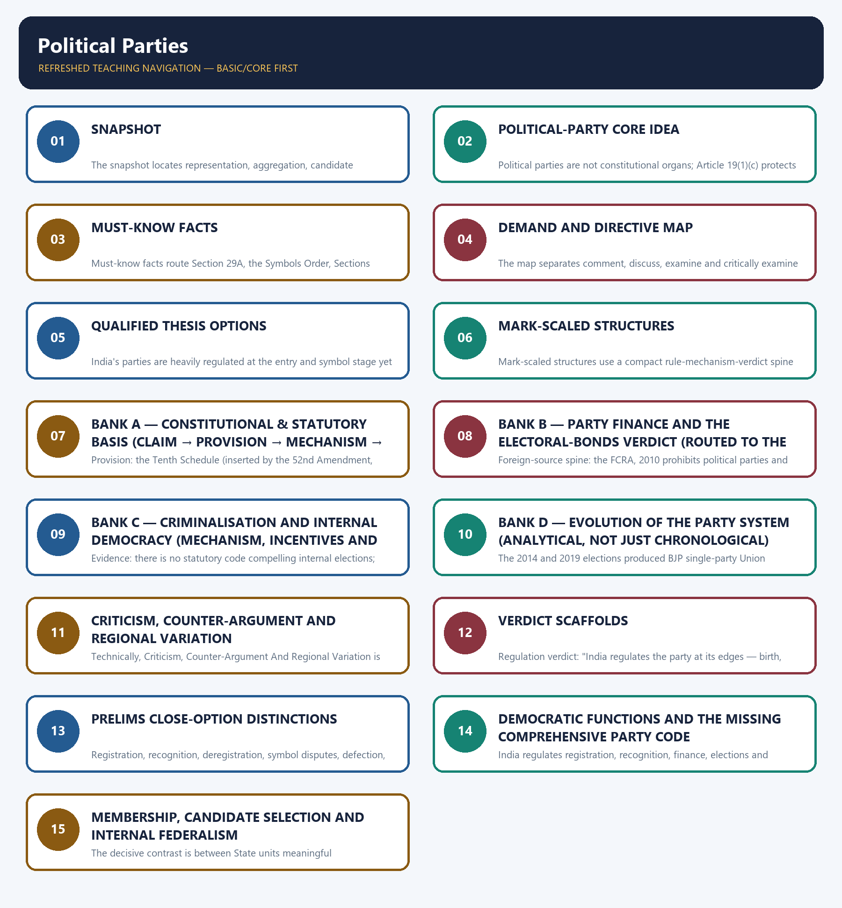
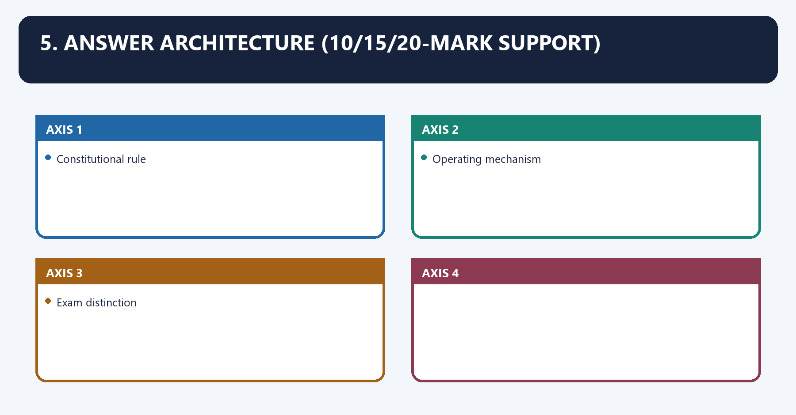
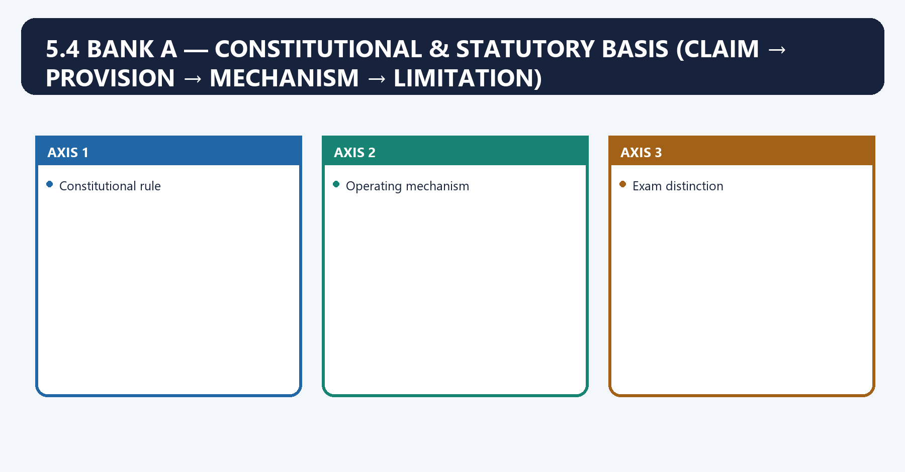
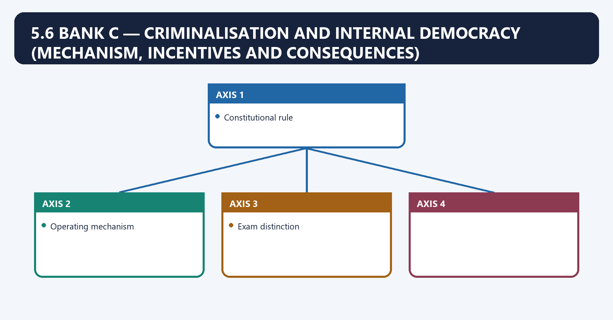
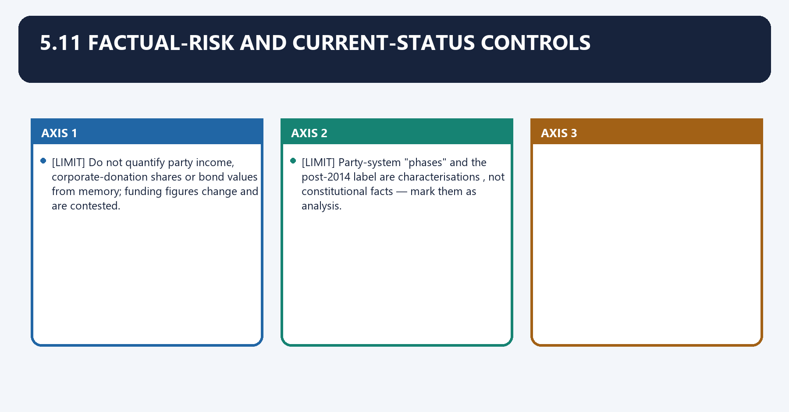
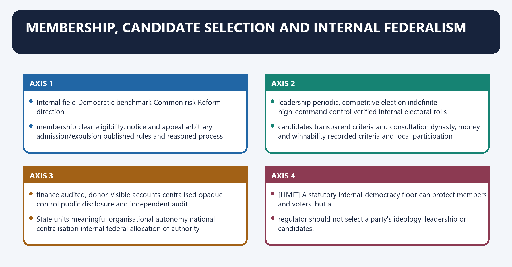

# Political Parties — Complete Uncompressed Learning Session

**Complete independent learning session + verified PYQ routing + solved practice workbook + final consolidated register notes**

**Legal/current control date:** 25 August 2026 (Asia/Kolkata)

> **Tag key:** `[FACT]` = named constitutional, statutory, official, judicial or audited local support; `[ANALYSIS]` = reasoned examination; `[CURRENT]` = checked for the control date; `[LIMIT]` = qualification.
>
> **Answer-writing discipline:** claim -> named evidence -> analysis -> qualification.

- [CURRENT] Status is controlled to **25 August 2026, Asia/Kolkata**.
- [CURRENT] **Live official refresh, 25 August 2026:** Section 29A, the Election Symbols Order, the post-electoral-bonds legal position and controlling party-registration, disclosure, criminalisation and symbol-dispute decisions were rechecked on 25 August 2026. Recognition criteria are stated as dated rules; the current list of recognised parties is deliberately not frozen.

#### How to Use This Package

[FACT] The complete Basic/Core owner is taught first in source order. Cross-topic Markdown, local OCR books and verified PYQ ledgers supplement it.

[FACT] Advanced-owner material appears only after the Core and practice sections under the required optional-depth label.

[LIMIT] India has no comprehensive constitutional party code. Registration, recognition, finance, defection and candidate disclosure arise from different legal instruments. The ECI cannot use Section 29A as a general merits-based deregistration power, and the electoral-bonds judgment did not create a complete campaign-finance code.

#### Local Owner Gateway

> **Subject:** Polity · **Tier:** Basic (foundation) · **GS-II**
> [FACT] = from book · [CURRENT] = current link · [KEY] = mnemonic. *Advanced: optional deeper detail in `advanced/43_Political-Parties.md` — not required for any mark.*

## BASIC LEARNING SESSION



*Distinct embedded teaching-navigation image. The separate continuous Cārvāka-style flowchart package remains an independent at-a-glance artifact.*
### SESSION 1 — SNAPSHOT

#### DEFINITION / WHAT THIS IS CALLED

**Plain-language definition:** The snapshot presents political parties as intermediaries connecting citizens, elections, legislatures and governments.

**Technical definition:** The snapshot locates representation, aggregation, candidate recruitment, government and opposition within a segmented statutory framework.

#### ANSWER-GRABBING OPENING — WRITE/ADAPT IN THE EXAM

> The snapshot maps democratic functions before separating registration, recognition, finance and accountability.

#### MUST-WRITE KEYWORDS

- **snapshot**
- **political parties**
- **representation**
- **aggregation**
- **government**
- **opposition**
- **registration**
- **recognition**

**How to use them:** Frame the answer through snapshot; define political parties, connect representation with aggregation to explain the mechanism, and use government for the decisive comparison or qualification.

Snapshot denotes the constitutional rules and institutional links organised around Registration Sec 29A, RPA 1951 (by the ECI).
Snapshot operates through Categories National · State · Registered-unrecognised, connected with National-party base 6% votes in 4+ states + 4 LS seats (or alternatives).
The operative mechanism matters because star campaigners Recognised 40 · unrecognised 20.
Its principal consequence is that national-party list Dated ECI list only; recheck before use. The recognition rules, not a transient list, are the examinable core.
The decisive contrast is between Registration Sec 29A, RPA 1951 (by the ECI) and Registration Sec 29A, RPA 1951 (by the ECI).
The exam-safe limitation is that registration Sec 29A, RPA 1951 (by the ECI).

| Item | Fact |
|---|---|
| Registration | **Sec 29A, RPA 1951** (by the ECI) |
| Categories | National · State · **Registered-unrecognised** |
| National-party base | 6% votes in **4+ states + 4 LS seats** (or alternatives) |
| Star campaigners | RPA Section 77: recognised **40** · other party **20** |
| National-party list | Dated ECI list only; recheck before use. The recognition rules, not a transient list, are the examinable core. |

#### CLOSING RECALL FLOW — SNAPSHOT

```text
START / CONCEPT: SNAPSHOT
        |
        v
EXACT TERMS: snapshot · political parties · representation · aggregation · government · opposition · registration · recognition
        |
        v
MECHANISM / ARGUMENT: Parties translate preferences into candidates, programmes and legislative coordination.
        |
        v
CONSEQUENCE / CONTRAST: Their internal organisation and finance affect the quality of public accountability.
        |
        v
UPSC TRAP / ANSWER-USE: Do not treat parties as constitutional organs or claim an unverifiable global party-count ranking.
        |
        v
ANSWER-GRABBING FORMULATION: The snapshot maps democratic functions before separating registration, recognition, finance and accountability.
```
### SESSION 2 — POLITICAL-PARTY CORE IDEA

#### DEFINITION / WHAT THIS IS CALLED

**Plain-language definition:** Political parties are voluntary associations that aggregate interests, contest elections, recruit leaders and coordinate government or opposition.

**Technical definition:** Political parties are not constitutional organs; Article 19(1)(c) protects association while election law regulates specified public consequences.

#### ANSWER-GRABBING OPENING — WRITE/ADAPT IN THE EXAM

> Political parties exercise public democratic power through a private associational form.

#### MUST-WRITE KEYWORDS

- **political party**
- **democratic intermediary**
- **association**
- **public power**
- **registration**
- **recognition**
- **finance**
- **accountability**

**How to use them:** Frame the answer through political party; define democratic intermediary, connect association with public power to explain the mechanism, and use registration for the decisive comparison or qualification.

**Plain-language definition:** Political parties are voluntary associations that aggregate interests, contest elections, recruit leaders and coordinate government or opposition.

**Technical definition:** They are not constitutional organs. Article 19(1)(c) protects associational freedom, while election statutes, the Symbols Order, the Tenth Schedule and judicial doctrine regulate specified public consequences.

> Parties are private associations with public democratic power; regulation must secure transparency and fair competition without State control of lawful ideology or leadership.


#### OPERATING LOGIC

Citizen preferences -> party aggregation -> programme and candidate selection -> election -> government or opposition -> legislative and public accountability.

#### CORRECT LEGAL LOCATION

- **Section 29A, RPA 1951:** registration, not recognition.
- **Election Symbols Order 1968:** performance-based recognition and reserved symbols.
- **Sections 29B-29C and connected laws:** contributions and disclosure.
- **Tenth Schedule:** legislative defection, not comprehensive party organisation.
- **Article 19(1)(c):** associational freedom subject to constitutionally valid regulation.

#### LIMIT

India has no single comprehensive political-parties code. This creates internal-democracy and coordination gaps, but it does not authorise the ECI to invent unlimited supervisory or deregistration powers.

#### CLOSING RECALL FLOW — POLITICAL-PARTY CORE IDEA

```text
START / CONCEPT: POLITICAL-PARTY CORE IDEA
        |
        v
EXACT TERMS: political party · democratic intermediary · association · public power · registration · recognition · finance · accountability
        |
        v
MECHANISM / ARGUMENT: Citizen preferences are aggregated into programmes and candidates, then translated through elections into government, opposition and legislative coordination.
        |
        v
CONSEQUENCE / CONTRAST: Party organisation and finance affect public accountability even though no comprehensive political-parties code exists.
        |
        v
UPSC TRAP / ANSWER-USE: Do not infer that public importance makes a party a constitutional organ or gives the ECI unlimited supervisory power.
        |
        v
ANSWER-GRABBING FORMULATION: Political parties exercise public democratic power through a private associational form.
```
### SESSION 3 — MUST-KNOW FACTS

#### DEFINITION / WHAT THIS IS CALLED

**Plain-language definition:** The must-know facts distinguish registration, recognition, finance disclosure, foreign-source control and disqualification.

**Technical definition:** Must-know facts route Section 29A, the Symbols Order, Sections 29B-29C, the FCRA and Tenth Schedule to separate consequences.

#### ANSWER-GRABBING OPENING — WRITE/ADAPT IN THE EXAM

> The must-know facts pair every legal source with its exact consequence and limitation.

#### MUST-WRITE KEYWORDS

- **must-know facts**
- **registration**
- **recognition**
- **party finance**
- **disclosure**
- **FCRA**
- **deregistration**
- **disqualification**

**How to use them:** Frame the answer through must-know facts; define registration, connect recognition with party finance to explain the mechanism, and use disclosure for the decisive comparison or qualification.

Must-Know Facts denotes the constitutional rules and institutional links organised around [FACT] Registered under Section 29A of the RPA, 1951.
Must-Know Facts operates through [FACT] Rajni Kothari → "one-party dominance / Congress system.", connected with [FACT] Recognition privileges: reserved symbol, broadcast time, one proposer, electoral-roll access.
The operative mechanism matters because [FACT] Registered under Section 29A of the RPA, 1951.
Its principal consequence is that [FACT] Registered under Section 29A of the RPA, 1951.
The decisive contrast is between [FACT] Registered under Section 29A of the RPA, 1951 and [FACT] Registered under Section 29A of the RPA, 1951.
The exam-safe limitation is that [FACT] Registered under Section 29A of the RPA, 1951.
- [FACT] Registered under **Section 29A of the RPA, 1951**.
- [FACT] Rajni Kothari → **"one-party dominance / Congress system."**
- [FACT] Recognition privileges: reserved symbol, broadcast time, one proposer, electoral-roll access.
#### 04. Current link

Current link denotes the constitutional rules and institutional links organised around [CURRENT] Electoral Bonds struck down by the SC ( ADR case, Feb 2024 ) as unconstitutional.
Current link operates through (right to information). ECI orders of 10 Apr 2023 made AAP a national party and withdrew, connected with [CURRENT] Electoral Bonds struck down by the SC ( ADR case, Feb 2024 ) as unconstitutional.
The operative mechanism matters because [CURRENT] Electoral Bonds struck down by the SC ( ADR case, Feb 2024 ) as unconstitutional.
Its principal consequence is that [CURRENT] Electoral Bonds struck down by the SC ( ADR case, Feb 2024 ) as unconstitutional.
The decisive contrast is between [CURRENT] Electoral Bonds struck down by the SC ( ADR case, Feb 2024 ) as unconstitutional and [CURRENT] Electoral Bonds struck down by the SC ( ADR case, Feb 2024 ) as unconstitutional.
The exam-safe limitation is that [CURRENT] Electoral Bonds struck down by the SC ( ADR case, Feb 2024 ) as unconstitutional.

[CURRENT] **Electoral Bonds struck down** by the SC (**ADR case, Feb 2024**) as unconstitutional
(right to information). **ECI orders of 10 Apr 2023** made AAP a national party and withdrew
recognition status changes through dated ECI orders; quote a current list only when necessary and cite the order/access date. The RTI and internal-democracy debate continues.

#### 05. 5. Answer architecture (10/15/20-mark support)

5. Answer architecture (10/15/20-mark support) denotes the constitutional rules and institutional links organised around Constitutional rule.
5. Answer architecture (10/15/20-mark support) operates through Operating mechanism, connected with Exam distinction.
The operative mechanism matters because constitutional rule.
Its principal consequence is that constitutional rule.
The decisive contrast is between Constitutional rule and Constitutional rule.
The exam-safe limitation is that constitutional rule.

> Purpose: make this Core file independently able to answer directive-sensitive GS-II questions on the constitutional and statutory basis of parties, party finance and the electoral-bonds verdict, criminalisation and internal democracy, and the party-system half of the centralisation debate — without opening Advanced. Party-recognition thresholds and national-party counts change by ECI order; treat every number as re-verifiable, not eternal.

#### CLOSING RECALL FLOW — MUST-KNOW FACTS

```text
START / CONCEPT: MUST-KNOW FACTS
        |
        v
EXACT TERMS: must-know facts · registration · recognition · party finance · disclosure · FCRA · deregistration · disqualification
        |
        v
MECHANISM / ARGUMENT: Correct routing prevents recognition, deregistration and defection from being conflated.
        |
        v
CONSEQUENCE / CONTRAST: Prelims close options and Mains legal analysis become more accurate.
        |
        v
UPSC TRAP / ANSWER-USE: Do not infer a general ECI deregistration power from its registration authority.
        |
        v
ANSWER-GRABBING FORMULATION: The must-know facts pair every legal source with its exact consequence and limitation.
```
### SESSION 4 — DEMAND AND DIRECTIVE MAP

#### DEFINITION / WHAT THIS IS CALLED

**Plain-language definition:** The demand and directive map connects each question word to the legal and analytical material required.

**Technical definition:** The map separates comment, discuss, examine and critically examine so that the answer uses the correct thesis, evidence, counter and verdict.

#### ANSWER-GRABBING OPENING — WRITE/ADAPT IN THE EXAM

> The demand and directive map is the first control against generic political-party answers.

#### MUST-WRITE KEYWORDS

- **demand**
- **directive map**
- **comment**
- **discuss**
- **examine**
- **critical analysis**
- **verdict**

**How to use them:** Frame the answer through demand; define directive map, connect comment with discuss to explain the mechanism, and use examine for the decisive comparison or qualification.

5.1 Demand and directive map denotes the constitutional rules and institutional links organised around Demand family Typical directive signals Answer spine to use.
5.1 Demand and directive map operates through Demand family Typical directive signals Answer spine to use, connected with Demand family Typical directive signals Answer spine to use.
The operative mechanism matters because demand family Typical directive signals Answer spine to use.
Its principal consequence is that demand family Typical directive signals Answer spine to use.
The decisive contrast is between Demand family Typical directive signals Answer spine to use and Demand family Typical directive signals Answer spine to use.
The exam-safe limitation is that demand family Typical directive signals Answer spine to use.
| Demand family | Typical directive signals | Answer spine to use |
|---|---|---|
| Constitutional/statutory basis of parties | "regulation of parties", "are parties above the law", Discuss | Silence of original text → Tenth Schedule + Sec 29A → Symbols Order + *Sadiq Ali* → gaps → reform verdict |
| Party finance & transparency | "money power", "electoral bonds", "opacity", Critically examine | Legal sources → anonymity problem → 2024 ADR verdict → residual gaps → verdict |
| Criminalisation of politics | "decriminalise", "criminal antecedents", Examine | Scale → disclosure directions → *Lily Thomas* → why laws under-bite → verdict |
| Internal democracy & dynasticism | "inner-party democracy", "high command", Comment | No statutory code → ECI/committee record → dynastic incentive → reform options |
| Party system evolution | "one-party dominance to coalition", "fourth party system", Analyse | Phase-by-phase → what changed and why → current phase → qualified label |
| Centralisation vs autonomy | "national vs regional parties", Comment | Incentive/organisation logic → both-sides evidence → institutional verdict (§5.0) |
| Regionalisation of politics | "strength or threat to federal democracy", Discuss | Deepened representation → governance costs → net assessment |

#### CLOSING RECALL FLOW — DEMAND AND DIRECTIVE MAP

```text
START / CONCEPT: DEMAND AND DIRECTIVE MAP
        |
        v
EXACT TERMS: demand · directive map · comment · discuss · examine · critical analysis · verdict
        |
        v
MECHANISM / ARGUMENT: Decode the directive, identify the owned legal field, select named evidence and reserve space for qualification and conclusion.
        |
        v
CONSEQUENCE / CONTRAST: Answer structure becomes question-specific and mark-scaled rather than a repeated topic summary.
        |
        v
UPSC TRAP / ANSWER-USE: Do not use the same answer spine for registration, party finance, criminalisation, internal democracy and coalition federalism.
        |
        v
ANSWER-GRABBING FORMULATION: The demand and directive map is the first control against generic political-party answers.
```
### SESSION 5 — QUALIFIED THESIS OPTIONS

#### DEFINITION / WHAT THIS IS CALLED

**Plain-language definition:** 5.2 Qualified thesis options denotes the constitutional rules and institutional links organised around Constitutional rule.

**Technical definition:** India's parties are heavily regulated at the entry and symbol stage yet almost unregulated internally: the Constitution names the party only to punish defection (Tenth Schedule), the statute registers it (Sec 29A), and the ECI disciplines its symbol (1968 Order) — but no law compels internal democracy, so accountability is strong outward and weak inward.

#### ANSWER-GRABBING OPENING — WRITE/ADAPT IN THE EXAM

> 5.2 Qualified thesis options denotes the constitutional rules and institutional links organised around Constitutional rule.

#### MUST-WRITE KEYWORDS

- **Qualified Thesis Options**
- **Qualified**
- **Constitutional**
- **Its principal consequence**
- **Its**
- **5.2 Qualified thesis options**

**How to use them:** Frame the answer through Qualified Thesis Options; define Qualified, connect Constitutional with Its principal consequence to explain the mechanism, and use Its for the decisive comparison or qualification.

5.2 Qualified thesis options denotes the constitutional rules and institutional links organised around Constitutional rule.
5.2 Qualified thesis options operates through Operating mechanism, connected with Exam distinction.
The operative mechanism matters because constitutional rule.
Its principal consequence is that constitutional rule.
The decisive contrast is between Constitutional rule and Constitutional rule.
The exam-safe limitation is that constitutional rule.

- *India's parties are heavily regulated at the entry and symbol stage yet almost unregulated internally: the Constitution names the party only to punish defection (Tenth Schedule), the statute registers it (Sec 29A), and the ECI disciplines its symbol (1968 Order) — but no law compels internal democracy, so accountability is strong outward and weak inward.*
- *The 2024 electoral-bonds verdict reframed party finance as a voter's right-to-know problem rather than a donor's privacy problem, but striking down one instrument did not by itself close the wider anonymity and corporate-funding gap.*
- *Criminalisation persists not for want of judicial directions but because disqualification bites only after conviction while selection incentives reward "winnability"; the binding change came from* Lily Thomas *removing the sitting-member shield, not from exhortation.*
- *Party preferences on centralisation are a function of who holds the Union and of organisational form, not of ideology, which is why the same party centralises in office and demands autonomy in opposition.*
- *Regionalisation has widened representation and made federalism a lived bargain, but it has also fragmented mandates and raised the transaction costs of national decision-making — a democratisation with a coordination price.*

#### CLOSING RECALL FLOW — QUALIFIED THESIS OPTIONS

```text
START / CONCEPT: QUALIFIED THESIS OPTIONS
        |
        v
EXACT TERMS: Qualified Thesis Options · Qualified · Constitutional · Its principal consequence · Its · 5.2 Qualified thesis options
        |
        v
MECHANISM / ARGUMENT: Its principal consequence is that constitutional rule.
        |
        v
CONSEQUENCE / CONTRAST: The decisive contrast is between Constitutional rule and Constitutional rule.
        |
        v
UPSC TRAP / ANSWER-USE: Party preferences on centralisation are a function of who holds the Union and of organisational form, not of ideology, which is why the same party centralises in office and demands autonomy in opposition.
        |
        v
ANSWER-GRABBING FORMULATION: 5.2 Qualified thesis options denotes the constitutional rules and institutional links organised around Constitutional rule.
```
### SESSION 6 — MARK-SCALED STRUCTURES

#### DEFINITION / WHAT THIS IS CALLED

**Plain-language definition:** Mark-scaled structures match answer depth to the directive, marks and word limit.

**Technical definition:** Mark-scaled structures use a compact rule-mechanism-verdict spine for ten marks and add counter-evidence and calibrated reform for fifteen marks.

#### ANSWER-GRABBING OPENING — WRITE/ADAPT IN THE EXAM

> Mark-scaled structures prevent the same generic template from being repeated across unlike political-party questions.

#### MUST-WRITE KEYWORDS

- **mark-scaled structures**
- **directive**
- **word limit**
- **thesis**
- **legal basis**
- **qualification**
- **verdict**

**How to use them:** Frame the answer through mark-scaled structures; define directive, connect word limit with thesis to explain the mechanism, and use legal basis for the decisive comparison or qualification.

5.3 Mark-scaled structures denotes the constitutional rules and institutional links organised around Marks Architecture Evidence load.
5.3 Mark-scaled structures operates through 10 Thesis → two dimensions (e.g. legal basis + one gap) → one qualification → verdict 3 units, at least one Article/Act + one case, connected with 15 Thesis → basis → the specific problem (finance / criminalisation / autonomy) → counter-evidence → qualified verdict 5–6 units.
The operative mechanism matters because marks Architecture Evidence load.
Its principal consequence is that marks Architecture Evidence load.
The decisive contrast is between Marks Architecture Evidence load and Marks Architecture Evidence load.
The exam-safe limitation is that marks Architecture Evidence load.
| Marks | Architecture | Evidence load |
|---:|---|---|
| 10 | Thesis → two dimensions (e.g. legal basis + one gap) → one qualification → verdict | 3 units, at least one Article/Act + one case |
| 15 | Thesis → basis → the specific problem (finance / criminalisation / autonomy) → counter-evidence → qualified verdict | 5–6 units |
| 20 | Thesis → constitutional-statutory frame → finance → criminalisation/internal democracy → system evolution → reform menu → graded verdict | 6–8 units + a "regulate what, and how far" paragraph |

#### CLOSING RECALL FLOW — MARK-SCALED STRUCTURES

```text
START / CONCEPT: MARK-SCALED STRUCTURES
        |
        v
EXACT TERMS: mark-scaled structures · directive · word limit · thesis · legal basis · qualification · verdict
        |
        v
MECHANISM / ARGUMENT: Demand decoding determines which party-law bank and evidence should be used.
        |
        v
CONSEQUENCE / CONTRAST: Relevant analysis replaces generic constitutional filler.
        |
        v
UPSC TRAP / ANSWER-USE: Do not use identical scaffolding for registration, finance, criminalisation and federalism questions.
        |
        v
ANSWER-GRABBING FORMULATION: Mark-scaled structures prevent the same generic template from being repeated across unlike political-party questions.
```
### SESSION 7 — BANK A — CONSTITUTIONAL & STATUTORY BASIS (CLAIM → PROVISION → MECHANISM → LIMITATION)

#### DEFINITION / WHAT THIS IS CALLED

**Plain-language definition:** 5.4 Bank A — Constitutional & statutory basis (Claim → provision → mechanism → limitation) denotes the constitutional rules and institutional links organised around Constitutional rule.

**Technical definition:** Provision: the Tenth Schedule (inserted by the 52nd Amendment, 1985) is the first constitutional text to define and empower the "political party" — for the purpose of disqualification on defection.

#### ANSWER-GRABBING OPENING — WRITE/ADAPT IN THE EXAM

> 5.4 Bank A — Constitutional & statutory basis (Claim → provision → mechanism → limitation) denotes the constitutional rules and institutional links organised around Constitutional rule.

#### MUST-WRITE KEYWORDS

- **Bank A**
- **Constitutional & Statutory Basis (Claim → Provision → Mechanism → Limitation)**
- **Claim**
- **Provision**
- **Tenth Schedule**
- **52nd Amendment, 1985**

**How to use them:** Frame the answer through Bank A; define Constitutional & Statutory Basis (Claim → Provision → Mechanism → Limitation), connect Claim with Provision to explain the mechanism, and use Tenth Schedule for the decisive comparison or qualification.

5.4 Bank A — Constitutional & statutory basis (Claim → provision → mechanism → limitation) denotes the constitutional rules and institutional links organised around Constitutional rule.
5.4 Bank A — Constitutional & statutory basis (Claim → provision → mechanism → limitation) operates through Operating mechanism, connected with Exam distinction.
The operative mechanism matters because constitutional rule.
Its principal consequence is that constitutional rule.
The decisive contrast is between Constitutional rule and Constitutional rule.
The exam-safe limitation is that constitutional rule.

- [FACT] **Claim:** the Constitution's *original* text did not mention parties; recognition entered only in 1985. **Provision:** the **Tenth Schedule** (inserted by the **52nd Amendment, 1985**) is the first constitutional text to define and empower the "political party" — for the purpose of **disqualification on defection**. **Mechanism:** it ties a legislator's seat to the party whip, converting the party into a constitutional actor. **Limitation:** it regulates loyalty, not internal democracy or finance — a narrow constitutional footing (defection interface developed in `basic/Anti-Defection-Law.md`).
- [FACT] **Legal-source control:** the **Election Symbols (Reservation and Allotment) Order, 1968** is exercised by the ECI under **Article 324**, read with **Rules 5 and 10 of the Conduct of Elections Rules, 1961**. Recognition and symbol reservation are therefore distinct from Section 29A registration.
- [FACT] **Deregistration control:** *Indian National Congress (I) v Institute of Social Welfare* (2002) rejects a general ECI power to review or cancel registration; narrow situations include fraud, foundational Section 29A(5)/(9)-type non-compliance, or a competent declaration that the party is unlawful. Mere inactivity needs legislation, not administrative invention.
- [FACT] **Claim:** registration is statutory, not constitutional. **Provision:** **Section 29A, Representation of the People Act, 1951** — every association seeking to be a party must register with the **ECI** and swear allegiance to the Constitution, socialism, secularism and democracy. **Mechanism:** registration confers registered-party status under the RPA and connects to tax/disclosure consequences, but does **not create the association itself** and does **not** confer recognition. **Limitation:** the ECI's power to *register* is not matched by an express power to *de-register* an inactive or errant party — a recognised statutory gap.
- [FACT] **Claim:** recognition and symbols are an ECI administrative-cum-quasi-judicial function. **Provision:** the **Election Symbols (Reservation and Allotment) Order, 1968** — a subordinate instrument under the RPA and Conduct of Election Rules — sets the **National / State / registered-unrecognised** categories, allots **reserved symbols** to recognised parties and free symbols to the rest, and empowers the ECI to decide disputes between rival factions claiming the party and its symbol. **Mechanism:** the categories are prescribed by the **ECI Order and revised periodically** (thresholds were relaxed in 2011; reviews recur), so they are policy, not entrenched law. **Limitation:** because it is executive-made, criteria and counts shift by order — never cite a threshold or a national-party count as fixed.
- [FACT] **Claim:** the ECI's symbol-dispute power is judicially upheld. **Case:** *Sadiq Ali v. Election Commission of India* (**1972**) — the Supreme Court sustained the ECI's authority under the 1968 Order to decide which faction is the "real" party, applying the **test of majority** across the party's organisational and legislative wings (the "*Sadiq Ali* test"). **Mechanism:** it makes the ECI a quasi-judicial arbiter of party identity, not merely a registrar. **Limitation:** the majority test can privilege the legislative/organisational count over the rank and file, and recurs in every high-profile split.
- [FACT] **Claim:** the defection interface makes the party a disciplinary authority over its own legislators. **Provision:** the **Tenth Schedule** disqualifies a member who defies the party whip or voluntarily gives up membership; the **91st Amendment (2003)** deleted the earlier one-third "**split**" exemption, so only a **two-thirds merger** now escapes disqualification, and it **barred a disqualified defector from ministerial or remunerative political office**. **Mechanism:** it converts party loyalty into a condition of holding the seat; the **Speaker/Chairman adjudicates**, subject to judicial review (*Kihoto Hollohan*, **1992**). **Limitation:** [LIMIT] it strengthens the **high command** against the individual legislator — deepening the internal-democracy problem (full treatment in `basic/Anti-Defection-Law.md`).

> [KEY] **Three legal layers:** **Constitution** (Tenth Schedule — defection) · **Statute** (Sec 29A — registration) · **ECI Order** (1968 — recognition & symbol). Distinguish them in every "how are parties regulated" answer.

#### CLOSING RECALL FLOW — BANK A — CONSTITUTIONAL & STATUTORY BASIS (CLAIM → PROVISION → MECHANISM → LIMITATION)

```text
START / CONCEPT: BANK A — CONSTITUTIONAL & STATUTORY BASIS (CLAIM → PROVISION → MECHANISM → LIMITATION)
        |
        v
EXACT TERMS: Bank A · Constitutional & Statutory Basis (Claim → Provision → Mechanism → Limitation) · Claim · Provision · Tenth Schedule · 52nd Amendment, 1985
        |
        v
MECHANISM / ARGUMENT: Provision: the Tenth Schedule (inserted by the 52nd Amendment, 1985) is the first constitutional text to define and empower the "political party" — for the purpose of disqualification on defection.
        |
        v
CONSEQUENCE / CONTRAST: Claim: registration is statutory, not constitutional.
        |
        v
UPSC TRAP / ANSWER-USE: Limitation: it regulates loyalty, not internal democracy or finance — a narrow constitutional footing (defection interface developed in basic/Anti-Defection-Law.md).
        |
        v
ANSWER-GRABBING FORMULATION: 5.4 Bank A — Constitutional & statutory basis (Claim → provision → mechanism → limitation) denotes the constitutional rules and institutional links organised around Constitutional rule.
```
### SESSION 8 — BANK B — PARTY FINANCE AND THE ELECTORAL-BONDS VERDICT (ROUTED TO THE 2024 PROPOSITION)

#### DEFINITION / WHAT THIS IS CALLED

**Plain-language definition:** 5.5 Bank B — Party finance and the electoral-bonds verdict (routed to the 2024 proposition) denotes the constitutional rules and institutional links organised around Constitutional rule.

**Technical definition:** Foreign-source spine: the FCRA, 2010 prohibits political parties and specified political actors from accepting foreign contribution; apply the current statutory definition of foreign source rather than assuming every Indian-incorporated subsidiary is foreign.

#### ANSWER-GRABBING OPENING — WRITE/ADAPT IN THE EXAM

> 5.5 Bank B — Party finance and the electoral-bonds verdict (routed to the 2024 proposition) denotes the constitutional rules and institutional links organised around Constitutional rule.

#### MUST-WRITE KEYWORDS

- **Bank B**
- **Party Finance**
- **The Electoral-Bonds Verdict (Routed To The 2024 Proposition)**
- **Claim**
- **Provisions**
- **Companies Act, 2013, Sec 182**

**How to use them:** Frame the answer through Bank B; define Party Finance, connect The Electoral-Bonds Verdict (Routed To The 2024 Proposition) with Claim to explain the mechanism, and use Provisions for the decisive comparison or qualification.

5.5 Bank B — Party finance and the electoral-bonds verdict (routed to the 2024 proposition) denotes the constitutional rules and institutional links organised around Constitutional rule.
5.5 Bank B — Party finance and the electoral-bonds verdict (routed to the 2024 proposition) operates through Operating mechanism, connected with Exam distinction.
The operative mechanism matters because constitutional rule.
Its principal consequence is that constitutional rule.
The decisive contrast is between Constitutional rule and Constitutional rule.
The exam-safe limitation is that constitutional rule.
- [FACT] **Claim:** party income is legally sourced but weakly transparent. **Provisions:** contributions are permitted (companies may donate under the **Companies Act, 2013, Sec 182**; **electoral trusts** are recognised), and **Section 29C, RPA 1951** requires a party to report to the ECI contributions **exceeding Rs 20,000** under the current statutory text; distinguish this from tax-law cash-receipt and candidate-expenditure rules. **Mechanism:** reporting is meant to expose large donors. **Limitation:** anonymous small-cash and instrument-based routes historically escaped disclosure.
- [FACT] **Disclosure spine:** **RPA Section 29B** permits party contributions subject to the statutory foreign-source prohibition. **Section 29C** requires the treasurer or authorised person to report contributions **exceeding Rs 20,000** from a person or company to the ECI before the income-tax return due date; non-compliance affects tax relief. Do not confuse this with candidate expenditure or cash-receipt rules.
- [FACT] **Foreign-source spine:** the **FCRA, 2010** prohibits political parties and specified political actors from accepting foreign contribution; apply the current statutory definition of foreign source rather than assuming every Indian-incorporated subsidiary is foreign.
- [FACT] **Claim:** the Supreme Court has recast anonymous corporate funding as a right-to-know violation. **Case (exact proposition):** *Association for Democratic Reforms v. Union of India* (**February 2024**, five-judge Constitution Bench) **struck down the Electoral Bond Scheme, 2018** and the enabling amendments (to the RPA, the Companies Act and the Income-tax Act) as **unconstitutional for violating the voter's right to information under Article 19(1)(a)**, and held that unlimited, anonymous corporate funding is not saved by donor privacy; it **directed the State Bank of India to disclose** bond purchaser and encashment data to the ECI. **Mechanism:** it re-anchored campaign-finance law in the informed vote rather than donor confidentiality. **Limitation:** [LIMIT] striking one instrument does not by itself cap corporate donations or mandate a comprehensive disclosure regime — the wider anonymity and quid-pro-quo problem remains open.
- [LIMIT] **Claim:** reform proposals predate the verdict. **Evidence:** the **Indrajit Gupta Committee (1998)** recommended partial **State funding** of elections in kind; the **Law Commission's 255th Report (2015)** proposed tighter disclosure and donation controls. **Significance:** the debate is between transparency-plus-caps and State funding. **Limitation:** none has been enacted as a complete scheme; treat as recommendations, not law.
- [FACT]/[CURRENT] **Claim:** corporate-funding transparency was diluted before 2024 and partly restored by the verdict. **Provision:** the **Finance Act, 2017** had **removed the earlier profit-linked cap** on company donations (Companies Act 2013, Sec 182) and the requirement to **name the recipient party** in company accounts; the **2024 ADR** judgment **struck those changes down** with the bond scheme. **Mechanism:** it restored the corporate-disclosure baseline. **Limitation:** [LIMIT] do **not** quote donation caps or percentages as current — the statutory position has shifted and remains contested.

#### CLOSING RECALL FLOW — BANK B — PARTY FINANCE AND THE ELECTORAL-BONDS VERDICT (ROUTED TO THE 2024 PROPOSITION)

```text
START / CONCEPT: BANK B — PARTY FINANCE AND THE ELECTORAL-BONDS VERDICT (ROUTED TO THE 2024 PROPOSITION)
        |
        v
EXACT TERMS: Bank B · Party Finance · The Electoral-Bonds Verdict (Routed To The 2024 Proposition) · Claim · Provisions · Companies Act, 2013, Sec 182
        |
        v
MECHANISM / ARGUMENT: Limitation: none has been enacted as a complete scheme; treat as recommendations, not law. /[CURRENT] Claim: corporate-funding transparency was diluted before 2024 and partly restored by the verdict.
        |
        v
CONSEQUENCE / CONTRAST: Claim: party income is legally sourced but weakly transparent.
        |
        v
UPSC TRAP / ANSWER-USE: Union of India (February 2024, five-judge Constitution Bench) struck down the Electoral Bond Scheme, 2018 and the enabling amendments (to the RPA, the Companies Act and the Income-tax Act) as unconstitutional for violating the voter's right to information under Article 19(1)(a), and held that unlimited, anonymous corporate funding is not saved by donor privacy; it directed the State Bank of India to disclose bond purchaser and encashment data to the ECI.
        |
        v
ANSWER-GRABBING FORMULATION: 5.5 Bank B — Party finance and the electoral-bonds verdict (routed to the 2024 proposition) denotes the constitutional rules and institutional links organised around Constitutional rule.
```
### SESSION 9 — BANK C — CRIMINALISATION AND INTERNAL DEMOCRACY (MECHANISM, INCENTIVES AND CONSEQUENCES)

#### DEFINITION / WHAT THIS IS CALLED

**Plain-language definition:** 5.6 Bank C — Criminalisation and internal democracy (mechanism, incentives and consequences) denotes the constitutional rules and institutional links organised around Constitutional rule.

**Technical definition:** Evidence: there is no statutory code compelling internal elections; parties file organisational-election particulars with the ECI, but compliance is formal and the high-command / dynastic model dominates candidate selection and finance.

#### ANSWER-GRABBING OPENING — WRITE/ADAPT IN THE EXAM

> 5.6 Bank C — Criminalisation and internal democracy (mechanism, incentives and consequences) denotes the constitutional rules and institutional links organised around Constitutional rule.

#### MUST-WRITE KEYWORDS

- **Bank C**
- **Criminalisation**
- **Internal Democracy (Mechanism**
- **Incentives**
- **Consequences)**
- **Claim**

**How to use them:** Frame the answer through Bank C; define Criminalisation, connect Internal Democracy (Mechanism with Incentives to explain the mechanism, and use Consequences) for the decisive comparison or qualification.

5.6 Bank C — Criminalisation and internal democracy (mechanism, incentives and consequences) denotes the constitutional rules and institutional links organised around Constitutional rule.
5.6 Bank C — Criminalisation and internal democracy (mechanism, incentives and consequences) operates through Operating mechanism, connected with Exam distinction.
The operative mechanism matters because constitutional rule.
Its principal consequence is that constitutional rule.
The decisive contrast is between Constitutional rule and Constitutional rule.
The exam-safe limitation is that constitutional rule.

- [FACT] **Claim:** disclosure of criminal antecedents is now mandatory, by judicial direction, not by a fresh statute. **Cases:** *Union of India v. Association for Democratic Reforms* (**2002**) and *PUCL v. Union of India* (**2003**) established the voter's **right to know** and the **candidate-affidavit** requirement on criminal, financial and educational background; *Rambabu Singh Thakur v. Sunil Arora* (**2020**) directed **parties** to publish candidates' criminal antecedents and reasons for selection on their websites. **Mechanism:** it works by publicity, leaving the *choice* to voters and parties. **Limitation:** disclosure has not reduced the share of candidates with cases, because selection rewards "winnability".
- [FACT] **Claim:** the one change that actually removed sitting offenders was judicial excision of a statutory shield. **Case (exact proposition):** *Lily Thomas v. Union of India* (**2013**) struck down **Section 8(4) of the RPA, 1951**, so a sitting MP or MLA **convicted** of an offence carrying the disqualifying sentence is disqualified **immediately**, without the earlier protection pending appeal. **Mechanism:** it aligned sitting members with candidates. **Limitation:** disqualification still bites only **after conviction**, and trials are slow — hence the demand for special courts and a lifetime ban (pending policy, not law).
- [FACT]/[LIMIT] **Claim:** internal democracy is the least-regulated frontier. **Evidence:** there is **no statutory code** compelling internal elections; parties file organisational-election particulars with the ECI, but compliance is formal and the **high-command / dynastic** model dominates candidate selection and finance. **Mechanism:** without an internal-democracy law, leadership succession and ticket distribution stay discretionary. **Limitation:** [LIMIT] proposals (Law Commission 170th Report, 1999; ECI's recurring pleas) to legislate inner-party democracy have not been adopted — cite them as reform demands, not existing obligations.

#### CLOSING RECALL FLOW — BANK C — CRIMINALISATION AND INTERNAL DEMOCRACY (MECHANISM, INCENTIVES AND CONSEQUENCES)

```text
START / CONCEPT: BANK C — CRIMINALISATION AND INTERNAL DEMOCRACY (MECHANISM, INCENTIVES AND CONSEQUENCES)
        |
        v
EXACT TERMS: Bank C · Criminalisation · Internal Democracy (Mechanism · Incentives · Consequences) · Claim
        |
        v
MECHANISM / ARGUMENT: Claim: disclosure of criminal antecedents is now mandatory, by judicial direction, not by a fresh statute.
        |
        v
CONSEQUENCE / CONTRAST: Limitation: disqualification still bites only after conviction, and trials are slow — hence the demand for special courts and a lifetime ban (pending policy, not law). / Claim: internal democracy is the least-regulated frontier.
        |
        v
UPSC TRAP / ANSWER-USE: Evidence: there is no statutory code compelling internal elections; parties file organisational-election particulars with the ECI, but compliance is formal and the high-command / dynastic model dominates candidate selection and finance.
        |
        v
ANSWER-GRABBING FORMULATION: 5.6 Bank C — Criminalisation and internal democracy (mechanism, incentives and consequences) denotes the constitutional rules and institutional links organised around Constitutional rule.
```
### SESSION 10 — BANK D — EVOLUTION OF THE PARTY SYSTEM (ANALYTICAL, NOT JUST CHRONOLOGICAL)

#### DEFINITION / WHAT THIS IS CALLED

**Plain-language definition:** India moved through dominance, fragmentation, coalition bargaining and renewed coalition dependence.

**Technical definition:** The 2014 and 2019 elections produced BJP single-party Union majorities, while the 2024 election produced a coalition-supported Union government.

#### ANSWER-GRABBING OPENING — WRITE/ADAPT IN THE EXAM

> Use chronology to explain changing incentives, federal bargaining and representation.

#### MUST-WRITE KEYWORDS

- **party system**
- **dominance**
- **fragmentation**
- **coalition bargaining**
- **Union majority**
- **regional parties**
- **federalism**
- **electoral competition**

**How to use them:** Frame the answer through party system; define dominance, connect fragmentation with coalition bargaining to explain the mechanism, and use Union majority for the decisive comparison or qualification.

5.7 Bank D — Evolution of the party system (analytical, not just chronological) denotes the constitutional rules and institutional links organised around Phase Character What changed and why (analysis).
5.7 Bank D — Evolution of the party system (analytical, not just chronological) operates through Phase Character What changed and why (analysis), connected with Phase Character What changed and why (analysis).
The operative mechanism matters because phase Character What changed and why (analysis).
Its principal consequence is that phase Character What changed and why (analysis).
The decisive contrast is between Phase Character What changed and why (analysis) and Phase Character What changed and why (analysis).
The exam-safe limitation is that phase Character What changed and why (analysis).
| Phase | Character | What changed and why (analysis) |
|---|---|---|
| [FACT] **One-party dominance (1952–1967)** | Rajni Kothari's **"Congress system"** | Congress was hegemonic yet internally plural — an "umbrella" that absorbed factions and functioned as a system of consensus with margins of pressure; opposition survived at the edges. |
| [FACT]/[LIMIT] **Fragmentation & first coalitions (1967–1989)** | Congress loses many States in 1967; Janata (1977) | Social coalitions broke, regional and backward-class assertion rose; the *dominance* model ended even before the Centre changed hands durably. |
| [FACT]/[LIMIT] **Coalition era (1989–2014)** | National Front / UF / NDA / UPA | No single-party Lok Sabha majority; **regional parties became pivotal**, extracting fiscal and portfolio concessions — federalism's most bargained phase. |
| [LIMIT] **Dominance and renewed coalition dependence (2014 onward)** | BJP single-party Union majorities in 2014/2019; coalition-supported government after the 2024 election | Central dominance coexists with strong State parties, while the 2024 result restored coalition dependence; treat phase labels as analysis. |

- **Analytical use:** the phases explain the centralisation debate — dominance and single-party majorities pull central; fragmentation and regional pivotality pull federal.

#### CLOSING RECALL FLOW — BANK D — EVOLUTION OF THE PARTY SYSTEM (ANALYTICAL, NOT JUST CHRONOLOGICAL)

```text
START / CONCEPT: BANK D — EVOLUTION OF THE PARTY SYSTEM (ANALYTICAL, NOT JUST CHRONOLOGICAL)
        |
        v
EXACT TERMS: party system · dominance · fragmentation · coalition bargaining · Union majority · regional parties · federalism · electoral competition
        |
        v
MECHANISM / ARGUMENT: Electoral concentration changes bargaining between national and State parties.
        |
        v
CONSEQUENCE / CONTRAST: Phase labels illuminate tendencies but do not create constitutional rules.
        |
        v
UPSC TRAP / ANSWER-USE: Do not describe the entire post-2014 period as an unchanged single-party-majority phase.
        |
        v
ANSWER-GRABBING FORMULATION: Use chronology to explain changing incentives, federal bargaining and representation.
```
### SESSION 11 — CRITICISM, COUNTER-ARGUMENT AND REGIONAL VARIATION

#### DEFINITION / WHAT THIS IS CALLED

**Plain-language definition:** 5.8 Criticism, counter-argument and regional variation denotes the constitutional rules and institutional links organised around Constitutional rule.

**Technical definition:** Technically, Criticism, Counter-Argument And Regional Variation is analysed by relating Criticism to Counter-Argument, then testing the relationship through Regional Variation and Over-regulated outside, under-regulated inside.

#### ANSWER-GRABBING OPENING — WRITE/ADAPT IN THE EXAM

> 5.8 Criticism, counter-argument and regional variation denotes the constitutional rules and institutional links organised around Constitutional rule.

#### MUST-WRITE KEYWORDS

- **Criticism**
- **Counter-Argument**
- **Regional Variation**
- **Over-regulated outside, under-regulated inside**
- **Regionalisation — the two-sided argument**
- **democratisation with a coordination cost**

**How to use them:** Frame the answer through Criticism; define Counter-Argument, connect Regional Variation with Over-regulated outside, under-regulated inside to explain the mechanism, and use Regionalisation — the two-sided argument for the decisive comparison or qualification.

5.8 Criticism, counter-argument and regional variation denotes the constitutional rules and institutional links organised around Constitutional rule.
5.8 Criticism, counter-argument and regional variation operates through Operating mechanism, connected with Exam distinction.
The operative mechanism matters because constitutional rule.
Its principal consequence is that constitutional rule.
The decisive contrast is between Constitutional rule and Constitutional rule.
The exam-safe limitation is that constitutional rule.

- **Over-regulated outside, under-regulated inside:** [LIMIT] entry (Sec 29A) and symbols (1968 Order) are tightly controlled, but internal democracy and finance are not — the central critique of the Indian party.
- **Regionalisation — the two-sided argument:** [LIMIT] *For:* regional parties deepened representation of language, region and backward groups, made federalism a lived bargain, and improved governance responsiveness in several States. *Against:* they can fragment mandates, raise coalition transaction costs, personalise and dynasticise power, and pursue sub-national rather than national interests. The honest verdict is **democratisation with a coordination cost**, not an unqualified good or ill.
- **Finance:** [LIMIT] even after the 2024 verdict, corporate and anonymous funding routes and the absence of donation caps keep the money-power critique alive.
- **Implementation constraint:** [LIMIT] the ECI can register but struggles to **de-register**, and disclosure directions depend on voter response — regulatory reach exceeds regulatory bite.
- **Documented criminalisation:** [LIMIT] the **Vohra Committee Report (1993)** officially recorded the **criminal–politician–bureaucrat nexus**; it is the standard citation for the *scale* of criminalisation, though its full findings were never published — cite it as an official acknowledgement, not a data source.
- **Old, cross-partisan reform demand:** [LIMIT] the **Dinesh Goswami Committee (1990)**, the **Indrajit Gupta Committee (1998)** on state funding, the **Law Commission 170th (1999)** and **255th (2015)** Reports, and the **NCRWC (2002)** all urged inner-party democracy, transparent finance and decriminalisation — the agenda is settled in principle and unlegislated in fact.

#### CLOSING RECALL FLOW — CRITICISM, COUNTER-ARGUMENT AND REGIONAL VARIATION

```text
START / CONCEPT: CRITICISM, COUNTER-ARGUMENT AND REGIONAL VARIATION
        |
        v
EXACT TERMS: Criticism · Counter-Argument · Regional Variation · Over-regulated outside, under-regulated inside · Regionalisation — the two-sided argument · democratisation with a coordination cost
        |
        v
MECHANISM / ARGUMENT: Implementation constraint: the ECI can register but struggles to de-register, and disclosure directions depend on voter response — regulatory reach exceeds regulatory bite.
        |
        v
CONSEQUENCE / CONTRAST: Over-regulated outside, under-regulated inside: entry (Sec 29A) and symbols (1968 Order) are tightly controlled, but internal democracy and finance are not — the central critique of the Indian party.
        |
        v
UPSC TRAP / ANSWER-USE: The honest verdict is democratisation with a coordination cost, not an unqualified good or ill.
        |
        v
ANSWER-GRABBING FORMULATION: 5.8 Criticism, counter-argument and regional variation denotes the constitutional rules and institutional links organised around Constitutional rule.
```
### SESSION 12 — VERDICT SCAFFOLDS

#### DEFINITION / WHAT THIS IS CALLED

**Plain-language definition:** 5.9 Verdict scaffolds denotes the constitutional rules and institutional links organised around Constitutional rule.

**Technical definition:** Regulation verdict: "India regulates the party at its edges — birth, symbol and defection — but leaves its interior to convention; the reform frontier is inner-party democracy and finance, not registration." Finance verdict: "The 2024 electoral-bonds judgment restored the voter's right to know, but transparency without caps is a floor, not a ceiling — the funding question is reopened, not closed." Centralisation verdict: "National and regional parties tilt central and federal not by conviction but by position and organisational form; the safeguard of autonomy is therefore institutional, not partisan." Criminalisation verdict: "The Court has forced disclosure — Lily Thomas and the candidate-antecedents directions — but disqualification still waits on conviction; the gap between known and proven criminality is where reform now sits." Reform-locus verdict: "Every major committee since 1990 has converged on the same three fixes — internal democracy, transparent finance and decriminalisation — so the deficit is political will, not institutional imagination.".

#### ANSWER-GRABBING OPENING — WRITE/ADAPT IN THE EXAM

> 5.9 Verdict scaffolds denotes the constitutional rules and institutional links organised around Constitutional rule.

#### MUST-WRITE KEYWORDS

- **Verdict Scaffolds**
- **Regulation verdict**
- **Finance verdict**
- **Centralisation verdict**
- **Criminalisation verdict**
- **Reform-locus verdict**

**How to use them:** Frame the answer through Verdict Scaffolds; define Regulation verdict, connect Finance verdict with Centralisation verdict to explain the mechanism, and use Criminalisation verdict for the decisive comparison or qualification.

5.9 Verdict scaffolds denotes the constitutional rules and institutional links organised around Constitutional rule.
5.9 Verdict scaffolds operates through Operating mechanism, connected with Exam distinction.
The operative mechanism matters because constitutional rule.
Its principal consequence is that constitutional rule.
The decisive contrast is between Constitutional rule and Constitutional rule.
The exam-safe limitation is that constitutional rule.
- **Regulation verdict:** "India regulates the party at its edges — birth, symbol and defection — but leaves its interior to convention; the reform frontier is inner-party democracy and finance, not registration."
- **Finance verdict:** "The 2024 electoral-bonds judgment restored the voter's right to know, but transparency without caps is a floor, not a ceiling — the funding question is reopened, not closed."
- **Centralisation verdict:** "National and regional parties tilt central and federal not by conviction but by position and organisational form; the safeguard of autonomy is therefore institutional, not partisan."
- **Criminalisation verdict:** "The Court has forced disclosure — *Lily Thomas* and the candidate-antecedents directions — but disqualification still waits on conviction; the gap between *known* and *proven* criminality is where reform now sits."
- **Reform-locus verdict:** "Every major committee since 1990 has converged on the same three fixes — internal democracy, transparent finance and decriminalisation — so the deficit is political will, not institutional imagination."

#### CLOSING RECALL FLOW — VERDICT SCAFFOLDS

```text
START / CONCEPT: VERDICT SCAFFOLDS
        |
        v
EXACT TERMS: Verdict Scaffolds · Regulation verdict · Finance verdict · Centralisation verdict · Criminalisation verdict · Reform-locus verdict
        |
        v
MECHANISM / ARGUMENT: Regulation verdict: "India regulates the party at its edges — birth, symbol and defection — but leaves its interior to convention; the reform frontier is inner-party democracy and finance, not registration." Finance verdict: "The 2024 electoral-bonds judgment restored the voter's right to know, but transparency without caps is a floor, not a ceiling — the funding question is reopened, not closed." Centralisation verdict: "National and regional parties tilt central and federal not by conviction but by position and organisational form; the safeguard of autonomy is therefore institutional, not partisan." Criminalisation verdict: "The Court has forced disclosure — Lily Thomas and the candidate-antecedents directions — but disqualification still waits on conviction; the gap between known and proven criminality is where reform now sits." Reform-locus verdict: "Every major committee since 1990 has converged on the same three fixes — internal democracy, transparent finance and decriminalisation — so the deficit is political will, not institutional imagination.".
        |
        v
CONSEQUENCE / CONTRAST: The decisive contrast is between Constitutional rule and Constitutional rule.
        |
        v
UPSC TRAP / ANSWER-USE: Do not miss this limiting distinction: its principal consequence is that constitutional rule.
        |
        v
ANSWER-GRABBING FORMULATION: 5.9 Verdict scaffolds denotes the constitutional rules and institutional links organised around Constitutional rule.
```
### SESSION 13 — PRELIMS CLOSE-OPTION DISTINCTIONS

#### DEFINITION / WHAT THIS IS CALLED

**Plain-language definition:** Prelims close-option distinctions separate similar political-party institutions by legal source and consequence.

**Technical definition:** Registration, recognition, deregistration, symbol disputes, defection, donation disclosure and conviction-based disqualification are governed by different tests.

#### ANSWER-GRABBING OPENING — WRITE/ADAPT IN THE EXAM

> Prelims accuracy depends on refusing attractive but legally conflated options.

#### MUST-WRITE KEYWORDS

- **registration**
- **recognition**
- **deregistration**
- **symbols**
- **defection**
- **disclosure**
- **conviction**
- **legal consequence**

**How to use them:** Frame the answer through registration; define recognition, connect deregistration with symbols to explain the mechanism, and use defection for the decisive comparison or qualification.

5.10 Prelims close-option distinctions denotes the constitutional rules and institutional links organised around Confusion pair Correct discrimination.
5.10 Prelims close-option distinctions operates through Where parties are registered Section 29A, RPA 1951 (a statute) — not the Constitution, connected with Where parties are first named in the Constitution The Tenth Schedule (52nd Amendment, 1985), for anti-defection only.
The operative mechanism matters because reserved vs free symbol Recognised parties get a reserved symbol; registered-unrecognised choose from free symbols.
Its principal consequence is that RPA Section 77 permits 40 star campaigners for a recognised political party and 20 for another political party.
The decisive contrast is between Lily Thomas (2013) Struck Sec 8(4) RPA → immediate disqualification of convicted sitting members; it is not the electoral-bonds case and Electoral-bonds case Association for Democratic Reforms v. Union of India (2024) under Art 19(1)(a) — right to information.
The exam-safe limitation is that national-party count [CURRENT] fixed by ECI order and changes — do not memorise a number as permanent.

| Confusion pair | Correct discrimination |
|---|---|
| Where parties are *registered* | **Section 29A, RPA 1951** (a statute) — **not** the Constitution |
| Where parties are first *named* in the Constitution | The **Tenth Schedule** (52nd Amendment, 1985), for **anti-defection** only |
| Recognition categories & symbols | The **Election Symbols (Reservation and Allotment) Order, 1968** (an ECI order), **not** the RPA sections directly |
| Faction/symbol disputes | Decided by the **ECI** under the 1968 Order; upheld in *Sadiq Ali* (1972) — **not** by the High Court in the first instance |
| Reserved vs free symbol | **Recognised** parties get a **reserved** symbol; **registered-unrecognised** choose from **free** symbols |
| Star campaigners | RPA Section 77: **40** for a recognised political party; **20** for another political party |
| *Lily Thomas* (2013) | Struck **Sec 8(4) RPA** → immediate disqualification of convicted sitting members; it is **not** the electoral-bonds case |
| Electoral-bonds case | *Association for Democratic Reforms v. Union of India* (**2024**) under **Art 19(1)(a)** — right to information |
| National-party count | [CURRENT] fixed by ECI order and **changes** — do not memorise a number as permanent |
| "National party" meaning | A **recognition/privilege** category — not a party that contests only national elections |
| 52nd vs 91st Amendment | **52nd (1985)** created the Tenth Schedule; **91st (2003)** deleted the one-third **split** exception and capped the Council of Ministers — do not merge the two |
| Symbol-dispute forum | The **ECI** (quasi-judicial) under the **1968 Order** decides first; courts intervene only on **review** — not the High Court in the first instance |
| Registration vs recognition | **Any** party may **register** (Sec 29A); only a party crossing prescribed poll thresholds is **recognised** (State/national) |
| Vohra Committee subject | **Criminalisation / criminal–politician nexus (1993)** — not party finance or symbols |
| NCRWC vs Vohra vs Goswami | **NCRWC (2002)** = constitutional review; **Vohra (1993)** = criminal nexus; **Goswami (1990)** = electoral reform — distinct mandates |
#### 16. 5.11 Factual-risk and current-status controls

5.11 Factual-risk and current-status controls denotes the constitutional rules and institutional links organised around [LIMIT] Do not quantify party income, corporate-donation shares or bond values from memory; funding figures change and are contested.
5.11 Factual-risk and current-status controls operates through [LIMIT] Party-system phases are analytical labels, not constitutional facts; distinguish the 2014/2019 single-party majorities from the coalition-supported Union government formed after the 2024 election — mark them as analysis, connected with [LIMIT] Do not quantify party income, corporate-donation shares or bond values from memory; funding figures change and are contested.
The operative mechanism matters because [LIMIT] Do not quantify party income, corporate-donation shares or bond values from memory; funding figures change and are contested.
Its principal consequence is that [LIMIT] Do not quantify party income, corporate-donation shares or bond values from memory; funding figures change and are contested.
The decisive contrast is between [LIMIT] Do not quantify party income, corporate-donation shares or bond values from memory; funding figures change and are contested and [LIMIT] Do not quantify party income, corporate-donation shares or bond values from memory; funding figures change and are contested.
The exam-safe limitation is that [LIMIT] Do not quantify party income, corporate-donation shares or bond values from memory; funding figures change and are contested.

- [CURRENT] **Recognition thresholds and party status change by ECI order.** State the criteria structure and cross-link `basic/Election-Commission.md`; if a count or party list is indispensable, cite the current order and access date.
- [FACT] **Distinguish the legal layers:** Tenth Schedule (Constitution) ≠ Sec 29A (statute) ≠ 1968 Symbols Order (ECI subordinate order). Do not attribute registration to the Constitution or recognition to the RPA sections alone.
- [FACT] **Electoral bonds:** the scheme was **struck down (Feb 2024)**; do not describe it as an operative funding route. Cite *ADR* as a **right-to-information (Art 19(1)(a))** holding.
- [LIMIT] **Do not quantify** party income, corporate-donation shares or bond values from memory; funding figures change and are contested.
- [FACT] *Lily Thomas* (2013) removed the **sitting-member shield (Sec 8(4))**; it did **not** create a lifetime ban — a lifetime ban remains a **proposal**, not law.
- [LIMIT] Party-system "phases" and the post-2014 label are **characterisations**, not constitutional facts — mark them as analysis.
- [LIMIT] Committee reports (Indrajit Gupta 1998; Law Commission 170th/255th) are **recommendations**; State funding and a statutory internal-democracy code are **not** enacted.
- [LIMIT] **NCRWC (2002)** proposed regulating parties' internal functioning and finances by law; treat it as a **recommendation**, not existing law.
- [CURRENT] **RPA Section 77 explanation permits 40 star campaigners for a recognised political party and 20 for another political party.** Keep this distinct from candidate-expenditure ceilings.
- [FACT] Distinguish the **52nd Amendment (1985, Tenth Schedule)** from the **91st Amendment (2003, deletion of the split exception + CoM cap)** — a common Prelims trap.

#### CLOSING RECALL FLOW — PRELIMS CLOSE-OPTION DISTINCTIONS

```text
START / CONCEPT: PRELIMS CLOSE-OPTION DISTINCTIONS
        |
        v
EXACT TERMS: registration · recognition · deregistration · symbols · defection · disclosure · conviction · legal consequence
        |
        v
MECHANISM / ARGUMENT: Match the actor and provision to the exact legal effect before evaluating qualifiers such as automatic, unlimited or binding.
        |
        v
CONSEQUENCE / CONTRAST: Close options become easier to eliminate without relying on volatile party lists or remembered slogans.
        |
        v
UPSC TRAP / ANSWER-USE: Do not confuse the electoral-bonds right-to-information holding with Lily Thomas, candidate-disclosure cases or a general ECI deregistration power.
        |
        v
ANSWER-GRABBING FORMULATION: Prelims accuracy depends on refusing attractive but legally conflated options.
```
### SESSION 14 — DEMOCRATIC FUNCTIONS AND THE MISSING COMPREHENSIVE PARTY CODE

#### DEFINITION / WHAT THIS IS CALLED

**Plain-language definition:** Political parties represent interests, recruit leaders, organise electoral choice and coordinate government and opposition.

**Technical definition:** India regulates registration, recognition, finance, elections and defection through separate instruments but lacks a comprehensive internal-party code.

#### ANSWER-GRABBING OPENING — WRITE/ADAPT IN THE EXAM

> Democratic functions make party accountability a public concern, while associational freedom limits State control.

#### MUST-WRITE KEYWORDS

- **democratic functions**
- **party code**
- **representation**
- **candidate recruitment**
- **government**
- **opposition**
- **internal democracy**
- **association**

**How to use them:** Frame the answer through democratic functions; define party code, connect representation with candidate recruitment to explain the mechanism, and use government for the decisive comparison or qualification.

Democratic functions and the missing comprehensive party code denotes the constitutional rules and institutional links organised around [FACT] Political parties link citizens to government through representation, interest aggregation, candidate recruitment and legislative coordination.
Democratic functions and the missing comprehensive party code operates through interest aggregation, policy choice, leadership recruitment, government formation,, connected with opposition, legislative coordination and electoral accountability.
The operative mechanism matters because [FACT] The Constitution's original text did not establish a general party code. The.
Its principal consequence is that tenth Schedule later constitutionalised a narrow defection relationship; Section 29A.
The decisive contrast is between governs registration, and the Symbols Order governs recognition and symbol disputes and [ANALYSIS] The result is segmented regulation: the party is strongly regulated at.
The exam-safe limitation is that entry, elections and legislative discipline but weakly regulated in its internal.

[FACT] Political parties link citizens to government through representation,
interest aggregation, policy choice, leadership recruitment, government formation,
opposition, legislative coordination and electoral accountability.

[FACT] The Constitution's original text did not establish a general party code. The
Tenth Schedule later constitutionalised a narrow defection relationship; Section 29A
governs registration, and the Symbols Order governs recognition and symbol disputes.

[ANALYSIS] The result is segmented regulation: the party is strongly regulated at
entry, elections and legislative discipline but weakly regulated in its internal
membership, leadership and candidate-selection life.

[LIMIT] Article 19(1)(c) association autonomy matters. Reform must distinguish
transparent minimum standards from State control of political ideology or leadership.

#### CLOSING RECALL FLOW — DEMOCRATIC FUNCTIONS AND THE MISSING COMPREHENSIVE PARTY CODE

```text
START / CONCEPT: DEMOCRATIC FUNCTIONS AND THE MISSING COMPREHENSIVE PARTY CODE
        |
        v
EXACT TERMS: democratic functions · party code · representation · candidate recruitment · government · opposition · internal democracy · association
        |
        v
MECHANISM / ARGUMENT: Parties connect citizens to public power, but segmented regulation leaves membership, leadership elections and candidate selection largely to party rules.
        |
        v
CONSEQUENCE / CONTRAST: The regulatory gap can weaken internal voice and public accountability without justifying State selection of lawful ideology or leaders.
        |
        v
UPSC TRAP / ANSWER-USE: Do not mistake Section 29A registration requirements for a complete statutory internal-democracy regime.
        |
        v
ANSWER-GRABBING FORMULATION: Democratic functions make party accountability a public concern, while associational freedom limits State control.
```
### SESSION 15 — MEMBERSHIP, CANDIDATE SELECTION AND INTERNAL FEDERALISM

#### DEFINITION / WHAT THIS IS CALLED

**Plain-language definition:** Membership, candidate selection and internal federalism denotes the constitutional rules and institutional links organised around Internal field Democratic benchmark Common risk Reform direction.

**Technical definition:** The decisive contrast is between State units meaningful organisational autonomy national centralisation internal federal allocation of authority and A statutory internal-democracy floor can protect members and voters, but a.

#### ANSWER-GRABBING OPENING — WRITE/ADAPT IN THE EXAM

> Membership, candidate selection and internal federalism denotes the constitutional rules and institutional links organised around Internal field Democratic benchmark Common risk Reform direction.

#### MUST-WRITE KEYWORDS

- **Membership**
- **Candidate Selection**
- **Internal Federalism**
- **clear eligibility, notice and appeal**
- **arbitrary admission/expulsion**
- **published rules and reasoned process**

**How to use them:** Frame the answer through Membership; define Candidate Selection, connect Internal Federalism with clear eligibility, notice and appeal to explain the mechanism, and use arbitrary admission/expulsion for the decisive comparison or qualification.

Membership, candidate selection and internal federalism denotes the constitutional rules and institutional links organised around Internal field Democratic benchmark Common risk Reform direction.
Membership, candidate selection and internal federalism operates through membership clear eligibility, notice and appeal arbitrary admission/expulsion published rules and reasoned process, connected with leadership periodic, competitive election indefinite high-command control verified internal electoral rolls.
The operative mechanism matters because candidates transparent criteria and consultation dynasty, money and winnability recorded criteria and local participation.
Its principal consequence is that finance audited, donor-visible accounts centralised opaque control public disclosure and independent audit.
The decisive contrast is between State units meaningful organisational autonomy national centralisation internal federal allocation of authority and [LIMIT] A statutory internal-democracy floor can protect members and voters, but a.
The exam-safe limitation is that regulator should not select a party's ideology, leadership or candidates.

| Internal field | Democratic benchmark | Common risk | Reform direction |
|---|---|---|---|
| membership | clear eligibility, notice and appeal | arbitrary admission/expulsion | published rules and reasoned process |
| leadership | periodic, competitive election | indefinite high-command control | verified internal electoral rolls |
| candidates | transparent criteria and consultation | dynasty, money and winnability | recorded criteria and local participation |
| finance | audited, donor-visible accounts | centralised opaque control | public disclosure and independent audit |
| State units | meaningful organisational autonomy | national centralisation | internal federal allocation of authority |

[LIMIT] A statutory internal-democracy floor can protect members and voters, but a
regulator should not select a party's ideology, leadership or candidates.

#### CLOSING RECALL FLOW — MEMBERSHIP, CANDIDATE SELECTION AND INTERNAL FEDERALISM

```text
START / CONCEPT: MEMBERSHIP, CANDIDATE SELECTION AND INTERNAL FEDERALISM
        |
        v
EXACT TERMS: Membership · Candidate Selection · Internal Federalism · clear eligibility, notice and appeal · arbitrary admission/expulsion · published rules and reasoned process
        |
        v
MECHANISM / ARGUMENT: The decisive contrast is between State units meaningful organisational autonomy national centralisation internal federal allocation of authority and A statutory internal-democracy floor can protect members and voters, but a.
        |
        v
CONSEQUENCE / CONTRAST: The exam-safe limitation is that regulator should not select a party's ideology, leadership or candidates.
        |
        v
UPSC TRAP / ANSWER-USE: A statutory internal-democracy floor can protect members and voters, but a regulator should not select a party's ideology, leadership or candidates.
        |
        v
ANSWER-GRABBING FORMULATION: Membership, candidate selection and internal federalism denotes the constitutional rules and institutional links organised around Internal field Democratic benchmark Common risk Reform direction.
```
## BASIC MCQS / REMEDIATION

### Original MCQs 1-36 — Broad Coverage
#### OM1. Which statement most accurately describes constitutional status of parties?

- A. The original Constitution did not create a comprehensive party code; later provisions regulate specific fields.
- B. Political parties are wholly unregulated by law.
- C. Article 324 itself registers political parties.
- D. The Tenth Schedule regulates every aspect of party organisation.

**Answer: A**

**Explanation:** Party law is segmented across the Constitution, statutes and the Symbols Order. The other options collapse distinct legal sources, institutions or consequences and therefore fail the close-option test.

#### OM2. Which statement most accurately describes Section 29A?

- A. Section 29A grants national-party recognition.
- B. Section 29A of the RPA 1951 provides the statutory registration route and allegiance declaration.
- C. Section 29A makes every registered party a public authority.
- D. Section 29A creates the anti-defection whip.

**Answer: B**

**Explanation:** Registration is distinct from recognition, defection and RTI status. The other options collapse distinct legal sources, institutions or consequences and therefore fail the close-option test.

#### OM3. Which statement most accurately describes recognition?

- A. Recognition follows Article 324 alone without an Order.
- B. Every registered party has a reserved symbol.
- C. National and State recognition follows dated criteria in the Election Symbols Order, not an immutable constitutional list.
- D. Recognition never changes after first grant.

**Answer: C**

**Explanation:** Criteria and lists must be rechecked against ECI orders. The other options collapse distinct legal sources, institutions or consequences and therefore fail the close-option test.

#### OM4. Which statement most accurately describes party functions?

- A. Parties only nominate candidates.
- B. Interest aggregation belongs only to pressure groups.
- C. Opposition is external to the party system.
- D. Parties aggregate interests, recruit leaders, form governments, organise opposition and enable electoral accountability.

**Answer: D**

**Explanation:** The democratic role extends across representation, government and accountability. The other options collapse distinct legal sources, institutions or consequences and therefore fail the close-option test.

#### OM5. Which statement most accurately describes internal democracy?

- A. India lacks a comprehensive statutory internal-democracy code despite registration and disclosure requirements.
- B. The ECI conducts all internal party elections.
- C. The Constitution prescribes candidate-selection primaries.
- D. Dynastic succession is itself a statutory disqualification.

**Answer: A**

**Explanation:** Autonomy and minimum democratic safeguards must be balanced. The other options collapse distinct legal sources, institutions or consequences and therefore fail the close-option test.

#### OM6. Which statement most accurately describes party finance?

- A. The judgment constitutionalised anonymous bonds.
- B. The 2024 electoral-bonds judgment invalidated the scheme and enabling anonymity changes on right-to-information grounds.
- C. The judgment prohibited every corporate donation.
- D. The judgment created full State funding of elections.

**Answer: B**

**Explanation:** One instrument was struck down; the wider finance framework still needs statutory analysis. The other options collapse distinct legal sources, institutions or consequences and therefore fail the close-option test.

#### OM7. Which statement most accurately describes candidate disclosure?

- A. Disclosure arises only after conviction.
- B. Candidate education is constitutionally irrelevant and cannot be disclosed.
- C. ADR (2002) and PUCL (2003) ground candidate-affidavit disclosure in the voter's right to know.
- D. The ECI may cancel an election solely for any pending case.

**Answer: C**

**Explanation:** Disclosure and disqualification are different mechanisms. The other options collapse distinct legal sources, institutions or consequences and therefore fail the close-option test.

#### OM8. Which statement most accurately describes criminalisation?

- A. Every chargesheet causes automatic disqualification.
- B. Disclosure alone equals acquittal.
- C. Political parties cannot nominate a person with pending cases.
- D. Lily Thomas (2013) removed the sitting-member protection in RPA Section 8(4), but disqualification still depends on conviction.

**Answer: D**

**Explanation:** The core gap is the delay between accusation, trial and conviction. The other options collapse distinct legal sources, institutions or consequences and therefore fail the close-option test.

#### OM9. Which statement most accurately describes NOTA?

- A. NOTA protects a negative voting choice but does not automatically cancel the election or require re-poll.
- B. NOTA votes are transferred to the runner-up.
- C. NOTA converts India to recall elections.
- D. NOTA disqualifies all listed candidates.

**Answer: A**

**Explanation:** PUCL (2013) concerns secrecy and choice, not automatic rejection of the field. The other options collapse distinct legal sources, institutions or consequences and therefore fail the close-option test.

#### OM10. Which statement most accurately describes anti-defection interface?

- A. A party whip can criminally punish a voter.
- B. The Tenth Schedule disciplines legislators; it is not a general code for party membership or finance.
- C. Every internal party dispute is decided by the Speaker.
- D. The Symbols Order and Tenth Schedule are the same proceeding.

**Answer: B**

**Explanation:** Party, legislature-party, symbol and defection questions remain distinct. The other options collapse distinct legal sources, institutions or consequences and therefore fail the close-option test.

#### OM11. Which statement most accurately describes deregistration?

- A. The ECI has an unlimited policy power to deregister inactive parties.
- B. Recognition withdrawal and registration cancellation are identical.
- C. Indian National Congress v. Institute of Social Welfare (2002) limits ECI cancellation to narrow grounds such as fraud or loss of foundational allegiance.
- D. The Supreme Court barred cancellation even for fraud.

**Answer: C**

**Explanation:** Registration power does not imply a general merits-based deregistration power. The other options collapse distinct legal sources, institutions or consequences and therefore fail the close-option test.

#### OM12. Which statement most accurately describes regional parties and coalitions?

- A. Regional parties are constitutionally confined to State elections.
- B. Coalitions are unconstitutional when no party has a majority.
- C. National parties always favour autonomy.
- D. Regional parties can deepen federal representation while also increasing bargaining and coordination costs.

**Answer: D**

**Explanation:** Effects depend on incentives, alliances and institutional context. The other options collapse distinct legal sources, institutions or consequences and therefore fail the close-option test.

#### OM13. Which is the safest UPSC distinction concerning constitutional status of parties?

- A. The original Constitution did not create a comprehensive party code; later provisions regulate specific fields.
- B. Political parties are wholly unregulated by law.
- C. Article 324 itself registers political parties.
- D. The Tenth Schedule regulates every aspect of party organisation.

**Answer: A**

**Explanation:** Party law is segmented across the Constitution, statutes and the Symbols Order. The other options collapse distinct legal sources, institutions or consequences and therefore fail the close-option test.

#### OM14. Which is the safest UPSC distinction concerning Section 29A?

- A. Section 29A grants national-party recognition.
- B. Section 29A of the RPA 1951 provides the statutory registration route and allegiance declaration.
- C. Section 29A creates the anti-defection whip.
- D. Section 29A makes every registered party a public authority.

**Answer: B**

**Explanation:** Registration is distinct from recognition, defection and RTI status. The other options collapse distinct legal sources, institutions or consequences and therefore fail the close-option test.

#### OM15. Which is the safest UPSC distinction concerning recognition?

- A. Recognition follows Article 324 alone without an Order.
- B. Every registered party has a reserved symbol.
- C. National and State recognition follows dated criteria in the Election Symbols Order, not an immutable constitutional list.
- D. Recognition never changes after first grant.

**Answer: C**

**Explanation:** Criteria and lists must be rechecked against ECI orders. The other options collapse distinct legal sources, institutions or consequences and therefore fail the close-option test.

#### OM16. Which is the safest UPSC distinction concerning party functions?

- A. Parties only nominate candidates.
- B. Opposition is external to the party system.
- C. Interest aggregation belongs only to pressure groups.
- D. Parties aggregate interests, recruit leaders, form governments, organise opposition and enable electoral accountability.

**Answer: D**

**Explanation:** The democratic role extends across representation, government and accountability. The other options collapse distinct legal sources, institutions or consequences and therefore fail the close-option test.

#### OM17. Which is the safest UPSC distinction concerning internal democracy?

- A. India lacks a comprehensive statutory internal-democracy code despite registration and disclosure requirements.
- B. The Constitution prescribes candidate-selection primaries.
- C. The ECI conducts all internal party elections.
- D. Dynastic succession is itself a statutory disqualification.

**Answer: A**

**Explanation:** Autonomy and minimum democratic safeguards must be balanced. The other options collapse distinct legal sources, institutions or consequences and therefore fail the close-option test.

#### OM18. Which is the safest UPSC distinction concerning party finance?

- A. The judgment constitutionalised anonymous bonds.
- B. The 2024 electoral-bonds judgment invalidated the scheme and enabling anonymity changes on right-to-information grounds.
- C. The judgment created full State funding of elections.
- D. The judgment prohibited every corporate donation.

**Answer: B**

**Explanation:** One instrument was struck down; the wider finance framework still needs statutory analysis. The other options collapse distinct legal sources, institutions or consequences and therefore fail the close-option test.

#### OM19. Which is the safest UPSC distinction concerning candidate disclosure?

- A. Disclosure arises only after conviction.
- B. The ECI may cancel an election solely for any pending case.
- C. ADR (2002) and PUCL (2003) ground candidate-affidavit disclosure in the voter's right to know.
- D. Candidate education is constitutionally irrelevant and cannot be disclosed.

**Answer: C**

**Explanation:** Disclosure and disqualification are different mechanisms. The other options collapse distinct legal sources, institutions or consequences and therefore fail the close-option test.

#### OM20. Which is the safest UPSC distinction concerning criminalisation?

- A. Every chargesheet causes automatic disqualification.
- B. Political parties cannot nominate a person with pending cases.
- C. Disclosure alone equals acquittal.
- D. Lily Thomas (2013) removed the sitting-member protection in RPA Section 8(4), but disqualification still depends on conviction.

**Answer: D**

**Explanation:** The core gap is the delay between accusation, trial and conviction. The other options collapse distinct legal sources, institutions or consequences and therefore fail the close-option test.

#### OM21. Which is the safest UPSC distinction concerning NOTA?

- A. NOTA protects a negative voting choice but does not automatically cancel the election or require re-poll.
- B. NOTA converts India to recall elections.
- C. NOTA votes are transferred to the runner-up.
- D. NOTA disqualifies all listed candidates.

**Answer: A**

**Explanation:** PUCL (2013) concerns secrecy and choice, not automatic rejection of the field. The other options collapse distinct legal sources, institutions or consequences and therefore fail the close-option test.

#### OM22. Which is the safest UPSC distinction concerning anti-defection interface?

- A. A party whip can criminally punish a voter.
- B. The Tenth Schedule disciplines legislators; it is not a general code for party membership or finance.
- C. Every internal party dispute is decided by the Speaker.
- D. The Symbols Order and Tenth Schedule are the same proceeding.

**Answer: B**

**Explanation:** Party, legislature-party, symbol and defection questions remain distinct. The other options collapse distinct legal sources, institutions or consequences and therefore fail the close-option test.

#### OM23. Which is the safest UPSC distinction concerning deregistration?

- A. The ECI has an unlimited policy power to deregister inactive parties.
- B. Recognition withdrawal and registration cancellation are identical.
- C. Indian National Congress v. Institute of Social Welfare (2002) limits ECI cancellation to narrow grounds such as fraud or loss of foundational allegiance.
- D. The Supreme Court barred cancellation even for fraud.

**Answer: C**

**Explanation:** Registration power does not imply a general merits-based deregistration power. The other options collapse distinct legal sources, institutions or consequences and therefore fail the close-option test.

#### OM24. Which is the safest UPSC distinction concerning regional parties and coalitions?

- A. Regional parties are constitutionally confined to State elections.
- B. National parties always favour autonomy.
- C. Coalitions are unconstitutional when no party has a majority.
- D. Regional parties can deepen federal representation while also increasing bargaining and coordination costs.

**Answer: D**

**Explanation:** Effects depend on incentives, alliances and institutional context. The other options collapse distinct legal sources, institutions or consequences and therefore fail the close-option test.

#### OM25. A candidate makes a close-option error about constitutional status of parties. Which correction is most accurate?

- A. The original Constitution did not create a comprehensive party code; later provisions regulate specific fields.
- B. Political parties are wholly unregulated by law.
- C. Article 324 itself registers political parties.
- D. The Tenth Schedule regulates every aspect of party organisation.

**Answer: A**

**Explanation:** Party law is segmented across the Constitution, statutes and the Symbols Order. The other options collapse distinct legal sources, institutions or consequences and therefore fail the close-option test.

#### OM26. A candidate makes a close-option error about Section 29A. Which correction is most accurate?

- A. Section 29A makes every registered party a public authority.
- B. Section 29A of the RPA 1951 provides the statutory registration route and allegiance declaration.
- C. Section 29A creates the anti-defection whip.
- D. Section 29A grants national-party recognition.

**Answer: B**

**Explanation:** Registration is distinct from recognition, defection and RTI status. The other options collapse distinct legal sources, institutions or consequences and therefore fail the close-option test.

#### OM27. A candidate makes a close-option error about recognition. Which correction is most accurate?

- A. Recognition follows Article 324 alone without an Order.
- B. Recognition never changes after first grant.
- C. National and State recognition follows dated criteria in the Election Symbols Order, not an immutable constitutional list.
- D. Every registered party has a reserved symbol.

**Answer: C**

**Explanation:** Criteria and lists must be rechecked against ECI orders. The other options collapse distinct legal sources, institutions or consequences and therefore fail the close-option test.

#### OM28. A candidate makes a close-option error about party functions. Which correction is most accurate?

- A. Parties only nominate candidates.
- B. Opposition is external to the party system.
- C. Interest aggregation belongs only to pressure groups.
- D. Parties aggregate interests, recruit leaders, form governments, organise opposition and enable electoral accountability.

**Answer: D**

**Explanation:** The democratic role extends across representation, government and accountability. The other options collapse distinct legal sources, institutions or consequences and therefore fail the close-option test.

#### OM29. A candidate makes a close-option error about internal democracy. Which correction is most accurate?

- A. India lacks a comprehensive statutory internal-democracy code despite registration and disclosure requirements.
- B. The ECI conducts all internal party elections.
- C. The Constitution prescribes candidate-selection primaries.
- D. Dynastic succession is itself a statutory disqualification.

**Answer: A**

**Explanation:** Autonomy and minimum democratic safeguards must be balanced. The other options collapse distinct legal sources, institutions or consequences and therefore fail the close-option test.

#### OM30. A candidate makes a close-option error about party finance. Which correction is most accurate?

- A. The judgment prohibited every corporate donation.
- B. The 2024 electoral-bonds judgment invalidated the scheme and enabling anonymity changes on right-to-information grounds.
- C. The judgment constitutionalised anonymous bonds.
- D. The judgment created full State funding of elections.

**Answer: B**

**Explanation:** One instrument was struck down; the wider finance framework still needs statutory analysis. The other options collapse distinct legal sources, institutions or consequences and therefore fail the close-option test.

#### OM31. A candidate makes a close-option error about candidate disclosure. Which correction is most accurate?

- A. Disclosure arises only after conviction.
- B. The ECI may cancel an election solely for any pending case.
- C. ADR (2002) and PUCL (2003) ground candidate-affidavit disclosure in the voter's right to know.
- D. Candidate education is constitutionally irrelevant and cannot be disclosed.

**Answer: C**

**Explanation:** Disclosure and disqualification are different mechanisms. The other options collapse distinct legal sources, institutions or consequences and therefore fail the close-option test.

#### OM32. A candidate makes a close-option error about criminalisation. Which correction is most accurate?

- A. Every chargesheet causes automatic disqualification.
- B. Disclosure alone equals acquittal.
- C. Political parties cannot nominate a person with pending cases.
- D. Lily Thomas (2013) removed the sitting-member protection in RPA Section 8(4), but disqualification still depends on conviction.

**Answer: D**

**Explanation:** The core gap is the delay between accusation, trial and conviction. The other options collapse distinct legal sources, institutions or consequences and therefore fail the close-option test.

#### OM33. A candidate makes a close-option error about NOTA. Which correction is most accurate?

- A. NOTA protects a negative voting choice but does not automatically cancel the election or require re-poll.
- B. NOTA disqualifies all listed candidates.
- C. NOTA votes are transferred to the runner-up.
- D. NOTA converts India to recall elections.

**Answer: A**

**Explanation:** PUCL (2013) concerns secrecy and choice, not automatic rejection of the field. The other options collapse distinct legal sources, institutions or consequences and therefore fail the close-option test.

#### OM34. A candidate makes a close-option error about anti-defection interface. Which correction is most accurate?

- A. The Symbols Order and Tenth Schedule are the same proceeding.
- B. The Tenth Schedule disciplines legislators; it is not a general code for party membership or finance.
- C. Every internal party dispute is decided by the Speaker.
- D. A party whip can criminally punish a voter.

**Answer: B**

**Explanation:** Party, legislature-party, symbol and defection questions remain distinct. The other options collapse distinct legal sources, institutions or consequences and therefore fail the close-option test.

#### OM35. A candidate makes a close-option error about deregistration. Which correction is most accurate?

- A. The ECI has an unlimited policy power to deregister inactive parties.
- B. Recognition withdrawal and registration cancellation are identical.
- C. Indian National Congress v. Institute of Social Welfare (2002) limits ECI cancellation to narrow grounds such as fraud or loss of foundational allegiance.
- D. The Supreme Court barred cancellation even for fraud.

**Answer: C**

**Explanation:** Registration power does not imply a general merits-based deregistration power. The other options collapse distinct legal sources, institutions or consequences and therefore fail the close-option test.

#### OM36. A candidate makes a close-option error about regional parties and coalitions. Which correction is most accurate?

- A. Regional parties are constitutionally confined to State elections.
- B. National parties always favour autonomy.
- C. Coalitions are unconstitutional when no party has a majority.
- D. Regional parties can deepen federal representation while also increasing bargaining and coordination costs.

**Answer: D**

**Explanation:** Effects depend on incentives, alliances and institutional context. The other options collapse distinct legal sources, institutions or consequences and therefore fail the close-option test.

### Remedial MCQs 1-12 — Common Error Repair
#### RM1. Which statement best repairs a recurring error about constitutional status of parties?

- A. The original Constitution did not create a comprehensive party code; later provisions regulate specific fields.
- B. Article 324 itself registers political parties.
- C. The Tenth Schedule regulates every aspect of party organisation.
- D. Political parties are wholly unregulated by law.

**Answer: A**

**Remedial explanation:** Party law is segmented across the Constitution, statutes and the Symbols Order. Write the governing source, then the mechanism, and finally the limitation before choosing an option.

#### RM2. Which statement best repairs a recurring error about Section 29A?

- A. Section 29A creates the anti-defection whip.
- B. Section 29A of the RPA 1951 provides the statutory registration route and allegiance declaration.
- C. Section 29A makes every registered party a public authority.
- D. Section 29A grants national-party recognition.

**Answer: B**

**Remedial explanation:** Registration is distinct from recognition, defection and RTI status. Write the governing source, then the mechanism, and finally the limitation before choosing an option.

#### RM3. Which statement best repairs a recurring error about recognition?

- A. Every registered party has a reserved symbol.
- B. Recognition follows Article 324 alone without an Order.
- C. National and State recognition follows dated criteria in the Election Symbols Order, not an immutable constitutional list.
- D. Recognition never changes after first grant.

**Answer: C**

**Remedial explanation:** Criteria and lists must be rechecked against ECI orders. Write the governing source, then the mechanism, and finally the limitation before choosing an option.

#### RM4. Which statement best repairs a recurring error about party functions?

- A. Opposition is external to the party system.
- B. Parties only nominate candidates.
- C. Interest aggregation belongs only to pressure groups.
- D. Parties aggregate interests, recruit leaders, form governments, organise opposition and enable electoral accountability.

**Answer: D**

**Remedial explanation:** The democratic role extends across representation, government and accountability. Write the governing source, then the mechanism, and finally the limitation before choosing an option.

#### RM5. Which statement best repairs a recurring error about internal democracy?

- A. India lacks a comprehensive statutory internal-democracy code despite registration and disclosure requirements.
- B. Dynastic succession is itself a statutory disqualification.
- C. The Constitution prescribes candidate-selection primaries.
- D. The ECI conducts all internal party elections.

**Answer: A**

**Remedial explanation:** Autonomy and minimum democratic safeguards must be balanced. Write the governing source, then the mechanism, and finally the limitation before choosing an option.

#### RM6. Which statement best repairs a recurring error about party finance?

- A. The judgment prohibited every corporate donation.
- B. The 2024 electoral-bonds judgment invalidated the scheme and enabling anonymity changes on right-to-information grounds.
- C. The judgment created full State funding of elections.
- D. The judgment constitutionalised anonymous bonds.

**Answer: B**

**Remedial explanation:** One instrument was struck down; the wider finance framework still needs statutory analysis. Write the governing source, then the mechanism, and finally the limitation before choosing an option.

#### RM7. Which statement best repairs a recurring error about candidate disclosure?

- A. Disclosure arises only after conviction.
- B. Candidate education is constitutionally irrelevant and cannot be disclosed.
- C. ADR (2002) and PUCL (2003) ground candidate-affidavit disclosure in the voter's right to know.
- D. The ECI may cancel an election solely for any pending case.

**Answer: C**

**Remedial explanation:** Disclosure and disqualification are different mechanisms. Write the governing source, then the mechanism, and finally the limitation before choosing an option.

#### RM8. Which statement best repairs a recurring error about criminalisation?

- A. Every chargesheet causes automatic disqualification.
- B. Political parties cannot nominate a person with pending cases.
- C. Disclosure alone equals acquittal.
- D. Lily Thomas (2013) removed the sitting-member protection in RPA Section 8(4), but disqualification still depends on conviction.

**Answer: D**

**Remedial explanation:** The core gap is the delay between accusation, trial and conviction. Write the governing source, then the mechanism, and finally the limitation before choosing an option.

#### RM9. Which statement best repairs a recurring error about NOTA?

- A. NOTA protects a negative voting choice but does not automatically cancel the election or require re-poll.
- B. NOTA votes are transferred to the runner-up.
- C. NOTA disqualifies all listed candidates.
- D. NOTA converts India to recall elections.

**Answer: A**

**Remedial explanation:** PUCL (2013) concerns secrecy and choice, not automatic rejection of the field. Write the governing source, then the mechanism, and finally the limitation before choosing an option.

#### RM10. Which statement best repairs a recurring error about anti-defection interface?

- A. The Symbols Order and Tenth Schedule are the same proceeding.
- B. The Tenth Schedule disciplines legislators; it is not a general code for party membership or finance.
- C. Every internal party dispute is decided by the Speaker.
- D. A party whip can criminally punish a voter.

**Answer: B**

**Remedial explanation:** Party, legislature-party, symbol and defection questions remain distinct. Write the governing source, then the mechanism, and finally the limitation before choosing an option.

#### RM11. Which statement best repairs a recurring error about deregistration?

- A. The Supreme Court barred cancellation even for fraud.
- B. Recognition withdrawal and registration cancellation are identical.
- C. Indian National Congress v. Institute of Social Welfare (2002) limits ECI cancellation to narrow grounds such as fraud or loss of foundational allegiance.
- D. The ECI has an unlimited policy power to deregister inactive parties.

**Answer: C**

**Remedial explanation:** Registration power does not imply a general merits-based deregistration power. Write the governing source, then the mechanism, and finally the limitation before choosing an option.

#### RM12. Which statement best repairs a recurring error about regional parties and coalitions?

- A. Regional parties are constitutionally confined to State elections.
- B. National parties always favour autonomy.
- C. Coalitions are unconstitutional when no party has a majority.
- D. Regional parties can deepen federal representation while also increasing bargaining and coordination costs.

**Answer: D**

**Remedial explanation:** Effects depend on incentives, alliances and institutional context. Write the governing source, then the mechanism, and finally the limitation before choosing an option.

## PYQS AND ANSWER PRACTICE

### DIRECT UPSC PYQ — 2022 GS-II Q13 — 15 marks — 250 words

**Question (exact):** “While the national political parties in India favour centralisation, the regional parties are in favour of State autonomy.” Comment.

**Demand decode:** test the proposition, explain incentives and organisation, provide counter-evidence, and end with institutional safeguards rather than a partisan stereotype.

**Model answer:**

The proposition captures a recurring tendency, but not an immutable ideological divide. A national party that governs or seeks to govern the Union internalises the advantages of uniform programmes, centrally sponsored schemes, Union control over national institutions and a centralised high command. Regional parties, whose support is territorially concentrated, more often demand fiscal space, linguistic and cultural autonomy, a restrained Governor and greater consultation in Union law-making.

The coalition era of 1989-2014 strengthened this bargaining federalism: State parties used parliamentary leverage to obtain portfolios, grants and policy concessions. Their role also widened national representation by carrying sub-State and regional claims into the Union executive.

Yet position often matters more than label. A national party in State opposition may defend State autonomy; a regional party may centralise power within its own State or support centralising Union measures as a coalition partner. The 2014 and 2019 single-party majorities strengthened central coordination, while the coalition-supported government formed after the 2024 election again increased ally bargaining. Federalism is also constitutionally protected, not gifted by parties: *S.R. Bommai* treats it as part of the basic structure, while the Finance Commission, GST Council, Inter-State Council and judicial review institutionalise negotiation.

Thus, the statement is a useful political tendency, not a law. Durable State autonomy requires rule-bound institutions, transparent fiscal federalism and internally federal party organisations.

**Why this earns marks:** It comments rather than merely agrees, explains causal mechanisms, uses chronology and constitutional institutions, and supplies counter-evidence.

**How to improve this answer:** Add one dated State-specific example only if it demonstrates reversal of party position; do not replace analysis with a list of regional parties.

**Compression guidance:** In 150 words retain the thesis, two causal reasons, one coalition-era counter, *Bommai*, and the institutional conclusion.

### SUPPORTING UPSC PYQ — 2023 GS-II Q5 — 10 marks — 150 words — cross-owned with Parliament

**Question (exact):** “Discuss the role of Presiding Officers of state legislatures in maintaining order and impartiality in conducting legislative work and in facilitating best democratic practices.”

**Model answer:**

Presiding Officers convert partisan assemblies into rule-governed legislatures. They admit questions and motions, allocate speaking time, maintain order, interpret procedure, protect minority participation and authenticate legislative business. Impartial scheduling and reasoned rulings permit scrutiny rather than executive domination.

Their party background nevertheless creates pressure points. Defection petitions under the Tenth Schedule, recognition of legislative groups, suspensions, money-bill certification and committee referrals can affect government survival. *Kihoto Hollohan* subjected defection decisions to judicial review, while *Keisham Meghachandra* stressed timely disposal, illustrating why neutrality must be visible as well as claimed.

Best practice requires resignation from active party posts, published reasons, proportionate discipline, adequate Opposition time, live proceedings, strong committees and a binding time norm for defection cases. The office should be protected by convention and procedure so that the House, not the governing party, remains its institutional client.

**Why this earns marks:** It directly links functions, party pressure, case law and executable reforms within the word limit.

**How to improve this answer:** Name a particular State episode only when accurately recalled; the marks come from institutional analysis, not political allegation.

**Compression guidance:** Retain four functions, two pressure points, one case and three reforms.

### ORIGINAL MAINS PRACTICE 1 — 15 marks — 250 words

**Question:** “India regulates political parties at their edges but not in their interior.” Critically examine.

**Model answer:**

India's legal framework controls a party's public interfaces more strongly than its internal constitution. Section 29A of the RPA regulates registration and constitutional allegiance. The Symbols Order regulates recognition and reserved symbols. The Tenth Schedule disciplines legislators, election law governs contributions and expenditure interfaces, and candidate-disclosure judgments protect voter information.

The organisational interior is thinner. There is no comprehensive statute prescribing transparent membership rolls, periodic leadership elections, candidate-selection procedures, audit independence or internal appeals. Section 29A registration is not equivalent to continuing democratic supervision. *Indian National Congress v Institute of Social Welfare* also denies the ECI a general power to deregister parties, except in narrow situations. As a result, dynastic succession, opaque nominations and high-command control can persist despite formally democratic party constitutions.

Over-regulation, however, could let the executive or ECI intrude into association under Article 19(1)(c), freeze diverse party forms and weaponise compliance against opposition. Reform should therefore focus on verifiable public-law minima: audited membership and finance disclosures, regular organisational elections, reasoned candidate selection, internal grievance mechanisms, proportionate sanctions and independent adjudication.

The objective is not State-managed parties but democratically accountable gatekeepers. Since parties select candidates and organise governments, constitutional democracy cannot remain agnostic to their internal concentration of power.

**Why this earns marks:** It proves the metaphor with statutes and a judgment, acknowledges associational freedom, and proposes calibrated regulation.

**How to improve this answer:** Distinguish ECI oversight from an independent adjudicatory mechanism; avoid saying the ECI can freely deregister non-compliant parties.

**Compression guidance:** Use a two-column mental frame: regulated edge / unregulated interior, followed by one liberty caveat and four safeguards.

### ORIGINAL MAINS PRACTICE 2 — 10 marks — 150 words

**Question:** Distinguish registration, recognition and deregistration of political parties in India.

**Model answer:**

Registration under RPA Section 29A gives an association registered-party status after application to the ECI and an undertaking of allegiance to the Constitution and specified democratic principles. It does not by itself reserve a symbol or establish electoral performance.

Recognition is performance-based status under the Election Symbols Order, 1968, exercised under Article 324 read with Rules 5 and 10 of the Conduct of Elections Rules. A recognised national or State party receives a reserved symbol and related electoral facilities; criteria and status can change by ECI order.

Deregistration is not the mirror image of registration. In *Indian National Congress v Institute of Social Welfare* (2002), the Supreme Court held that the ECI lacks a general review or cancellation power. Cancellation is confined to narrow grounds such as fraud, foundational statutory non-compliance or a competent declaration of unlawfulness. Persistent inactivity may justify legislative reform, but not an invented administrative power.

**Why this earns marks:** It separates three frequently conflated concepts and anchors each in its correct legal source.

**How to improve this answer:** If space permits, add that derecognition affects symbols/facilities without necessarily cancelling Section 29A registration.

**Compression guidance:** Write three headed paragraphs: Section 29A; Symbols Order; narrow judicial exceptions.

### ORIGINAL MAINS PRACTICE 3 — 10 marks — 150 words

**Question:** Explain how political parties perform both representative and governmental functions in a parliamentary democracy.

**Model answer:**

Political parties aggregate dispersed interests into programmes, recruit candidates, simplify electoral choice and mobilise citizens. These representative functions convert social cleavages and regional demands into negotiable legislative claims rather than extra-constitutional conflict.

After elections, the majority party or coalition forms the executive, coordinates ministers and legislators, frames budgets and legislation, and claims a mandate for policy. Opposition parties scrutinise expenditure, lead committees, expose alternatives and make peaceful alternation credible. Party whips supply stability, but excessive control can weaken deliberation and individual legislative judgment.

Parties also connect Union and State arenas. National organisations may coordinate nationwide policy; regional parties articulate territorial autonomy and improve federal bargaining. Yet opaque funding, criminalised selection and weak internal democracy can distort both representation and government.

Thus parties are not merely election machines. They are the operating institutions of parliamentary government, and their internal accountability affects the quality of public accountability.

**Why this earns marks:** The answer classifies functions, adds parliamentary and federal mechanisms, and ends with a democratic-quality link.

**How to improve this answer:** Use one precise example of Opposition committee scrutiny rather than naming many parties.

**Compression guidance:** Retain aggregation, recruitment, government formation, opposition scrutiny, federal linkage and one dysfunction.

### ORIGINAL MAINS PRACTICE 4 — 15 marks — 250 words

**Question:** Examine the democratic deficit within Indian political parties and suggest constitutionally proportionate reforms.

**Model answer:**

Political parties are the principal gatekeepers of candidacy and government, yet their internal processes are often less democratic than the institutions they control. Leadership succession can be personalised; membership rolls and organisational elections may be unverifiable; candidate selection is centralised; finance and disciplinary decisions are opaque; and women and marginal groups remain under-represented in decision-making.

This deficit has external effects. Safe nominations can reward loyalty or winnability over integrity, centralised leadership weakens legislative deliberation, and opaque money can translate private access into public policy. Registration under Section 29A requires constitutional allegiance, but it does not provide a continuing internal-democracy code. Nor does the ECI possess a general deregistration power.

Reform must respect Article 19(1)(c) and political pluralism. Parliament should prescribe minimum, not uniform, standards: verified membership records; periodic and independently monitored organisational elections; published constitutions and candidate-selection criteria; audited accounts in open formats; internal appeals; gender-inclusive leadership targets; and graded sanctions tied to public benefits such as tax relief or recognition facilities. Disputes should receive independent, time-bound adjudication and judicial review.

The balance is between laissez-faire and bureaucratic capture. Public-law duties are justified because parties exercise public power, but ideology and lawful organisational diversity must remain free.

**Why this earns marks:** It links internal defects to constitutional consequences and designs proportionate rather than maximalist regulation.

**How to improve this answer:** Explain who verifies each disclosure; avoid a reform list with no enforcement architecture.

**Compression guidance:** Use defect -> democratic harm -> liberty caveat -> six minimum standards -> calibrated conclusion.

### ORIGINAL MAINS PRACTICE 5 — 15 marks — 250 words

**Question:** Critically examine India's political-finance framework after the 2024 electoral-bonds judgment.

**Model answer:**

Political finance must enable participation without permitting concealed influence. The RPA allows contributions through Section 29B and requires reporting under Section 29C of contributions exceeding Rs 20,000, while tax, company and foreign-contribution laws create parallel controls. Electoral trusts and ordinary banking channels can provide traceable routes, but fragmented disclosure, third-party spending and enforcement delays remain concerns.

In *Association for Democratic Reforms v Union of India* (2024 INSC 113), a five-judge Bench struck down the Electoral Bond Scheme and enabling anonymity/unlimited-corporate-funding changes. It located political-donation information within voters' Article 19(1)(a) right to know, rejected blanket donor anonymity and ordered SBI-ECI disclosure. The judgment restored constitutional transparency and checked quid-pro-quo risks.

It did not create a complete finance code. Disclosure thresholds can fragment donations; audit quality varies; party and candidate accounts are not fully integrated; enforcement institutions face capacity and independence concerns; and lawful donor privacy or retaliation risks still require narrowly tailored protection.

Reform should require timely machine-readable donor reports, beneficial-ownership disclosure, independent audits, coordinated ECI-tax-company enforcement, transparent electoral-trust reporting, proportionate donation/spending rules and rapid adjudication. Any privacy exception should be evidence-based and reviewable.

The verdict removed an unconstitutional opacity mechanism; Parliament must now build a coherent transparency-and-fair-competition architecture.

**Why this earns marks:** It states surviving law, the exact constitutional holding, residual gaps and implementable reforms without treating the verdict as a complete code.

**How to improve this answer:** Never claim all anonymous funding ended; distinguish party receipts from candidate expenditure.

**Compression guidance:** Use law -> 2024 holding -> what remains unresolved -> five reforms -> verdict.

### ORIGINAL MAINS PRACTICE 6 — 15 marks — 250 words

**Question:** Disclosure has exposed criminalisation in politics but has not displaced it. Analyse.

**Model answer:**

Judicial intervention has made criminal antecedents increasingly visible. *ADR* (2002) and *PUCL* (2003) protected voter access to candidate information. *Public Interest Foundation* (2018) refused to judicially create a pre-conviction disqualification but required wider publicity. *Rambabu Singh Thakur* (2020) directed parties to publish pending cases and reasons for selecting such candidates, based on qualifications rather than mere winnability. *Lily Thomas* (2013) removed Section 8(4)'s special protection after conviction.

Yet disclosure does not alter selection incentives. Parties may prefer candidates with money, local networks or coercive influence; voters may discount cases viewed as political; trials are delayed; and publicity can become a formal checkbox. A blanket pre-conviction ban would also conflict with presumption of innocence and could invite strategic prosecutions.

The response should target both delay and party accountability: fast-track serious cases framed by courts sufficiently before elections; uniform, prominent and searchable disclosures; reasoned selection records; financial or electoral consequences for non-compliance; witness protection; and clean-candidate incentives within parties. Disqualification should remain conviction-linked unless Parliament enacts a narrowly defined, safeguarded rule for grave offences.

Transparency is necessary for informed choice, but deterrence requires timely adjudication and changed party incentives.

**Why this earns marks:** The answer gives the full judgment chain, identifies causal incentives, protects due process and proposes safeguards.

**How to improve this answer:** State that a stay of conviction may affect disqualification; suspension of sentence alone is not the same.

**Compression guidance:** Four cases in one line, three persistence causes, due-process caveat and four remedies.

### ORIGINAL MAINS PRACTICE 7 — 10 marks — 150 words

**Question:** Why are India's controls over political parties described as fragmented? Suggest an institutional design response.

**Model answer:**

Party regulation is distributed across the RPA, Symbols Order, Conduct of Elections Rules, Income-tax Act, Companies Act, FCRA, Tenth Schedule and judicial directions. Different bodies supervise different fragments: the ECI handles registration, recognition and disclosures; tax and corporate authorities inspect financial compliance; courts enforce voter information and constitutional limits; Presiding Officers decide defection initially.

Fragmentation creates gaps between party receipts and candidate spending, delayed data matching, weak audit comparability and uncertain sanctions. It also encourages forum-shifting and compliance without substantive accountability.

A response should not make one body omnipotent. Parliament can create interoperable disclosure standards, a common machine-readable portal, risk-based independent audits, statutory information-sharing, time-bound penalties and an appellate forum insulated from government and party control. The ECI should retain electoral functions while specialised regulators enforce tax, company and foreign-source rules.

**Why this earns marks:** It identifies sources, institutions, concrete coordination failures and a checks-and-balances solution.

**How to improve this answer:** Add one example of a mismatched data set, not a generic call for “strong ECI powers.”

**Compression guidance:** Sources -> coordination gaps -> shared data/audit/adjudication, while preserving institutional specialisation.

### ORIGINAL MAINS PRACTICE 8 — 15 marks — 250 words

**Question:** Assess the contribution of regional parties to coalition governance and federalism in India.

**Model answer:**

Regional parties territorialise representation. They place language, identity, uneven development and State-specific fiscal claims on the national agenda. During the coalition era from 1989 to 2014, their parliamentary leverage widened executive participation, moderated unilateral central policy and converted Centre-State conflict into bargaining within government. They also made alternation possible beyond a single national pole.

Their contribution is not automatically federal or democratic. Coalition bargaining can become portfolio or grant particularism; small allies may exercise influence disproportionate to votes; regional parties may centralise power within their States; and opportunistic alliances can blur accountability. Conversely, national parties sometimes champion State autonomy when out of power, showing that institutional position matters more than party label.

The 2014 and 2019 Union majorities reduced coalition dependence but did not eliminate strong State-party competition. The coalition-supported government after the 2024 election again increased the relevance of allies. A durable federal role requires transparent coalition agreements, regular intergovernmental forums, predictable fiscal transfers, parliamentary scrutiny of bargains and internal democracy within regional parties.

Regional parties have therefore deepened India's representative federalism, but their bargaining must be constitutionalised through institutions rather than depend on electoral arithmetic alone.

**Why this earns marks:** It combines chronology, mechanisms, counter-arguments, current phase control and reforms.

**How to improve this answer:** Distinguish territorial representation from every instance of transactional coalition bargaining.

**Compression guidance:** Use contribution / limitations / post-2014 transition / institutional conclusion.

## OPTIONAL ADVANCED DEPTH — NOT REQUIRED FOR A CORE ANSWER

> **Subject:** Polity · **Tier:** Advanced (exam depth) · **GS Paper:** GS-II
> **Grounded in:** Indian Polity by M. Laxmikant, Ch. 69 and electoral-reforms section (direct check of the local Sixth Revised Edition PDF) + ECI update.
> ✅ = from source book · ⚠️ = inference / analysis · 📰 = ECI/court-verified update.
> *Companion: `basic/Political-Parties.md`.*

---

### PART A — FEATURES OF THE INDIAN PARTY SYSTEM ✅
- ✅ **Multi-party system** — national, State and registered-unrecognised parties operate at multiple territorial scales; avoid unverifiable global superlatives.
- ✅ **One-dominant-party system** — Rajni Kothari's **"Congress system"** (declined post-1967).
- ✅ **Lack of clear ideology** (except BJP, CPI, CPM); **personality cult**; parties based on **religion/caste/language**.
- ✅ **Emergence of regional parties**; **factions & defections**; **lack of an effective Opposition**.

---

### PART B — RECOGNITION: NATIONAL vs STATE PARTIES ⭐⭐
✅ The **Election Commission** registers parties (**Sec 29A, RPA 1951**) and grants **national/state** recognition on
**poll performance**; the rest are **registered-unrecognised**.

#### Privileges of recognition ✅
- **Reserved symbol**; **one proposer** for nomination; **broadcast time** on state media; access to electoral rolls.
- **Star campaigners:** recognised = **40**, registered-unrecognised = **20** (their travel not counted in candidate expenditure).

#### National party — any ONE condition ✅
1. **6%** valid votes in **4+ states** (LS or Assembly) **+ 4 LS seats** (from any states); **OR**
2. **2% of LS seats**, with members from **3 states**; **OR**
3. Recognised as a **state party in 4 states**.

#### State party — any ONE condition ✅
1. **6%** votes in the state (Assembly) **+ 2 Assembly seats**; **OR**
2. **6%** votes (LS from state) **+ 1 LS seat**; **OR**
3. **3% of Assembly seats or 3 seats** (whichever more); **OR**
4. **1 LS seat per 25** LS seats allotted to the state; **OR**
5. **8%** of total valid votes in the state (LS or Assembly) — *added in 2011*.

---

#### UPSC Traps
- ❌ Parties are registered under the Constitution → registered under **Sec 29A, RPA 1951** (a statute).
- ❌ National-party status needs 6% votes in all states → **6% in any 4+ states + 4 LS seats** (or the alternatives).
- ❌ Recognised & unrecognised parties get the same star campaigners → **40 vs 20**.
- ❌ A "national party" contests only national elections → the label is about **recognition/privileges**, not where it contests.
- ❌ The EC allots a symbol to unrecognised parties too → they pick from **free symbols**; only recognised parties get **reserved** symbols.

#### 📰 CA hooks (ECI/court-verified)
- 📰 ⭐ **Electoral Bonds struck down** — SC in **Association for Democratic Reforms (Feb 2024)** held the 2018
  Electoral Bond Scheme **unconstitutional** (violates the **right to information, Art 19(1)(a)**); ordered the SBI to
  disclose donor data.
- 📰 ✅ **Recognition status is date-sensitive:** ECI orders revise status after electoral performance. Quote current names or counts only when necessary and cite the order/access date.
- 📰 Debate on bringing parties under the **RTI Act** (CIC held 6 national parties are "public authorities," 2013 — not
  complied with) and **inner-party democracy** / criminalisation of politics.

#### Mains angles
- "Money power and opacity threaten Indian democracy." Discuss in light of the Electoral Bonds verdict.
- Should political parties be brought under the RTI Act? Examine transparency vs autonomy.
- Regionalisation of the party system: a strength of federal democracy or a source of instability?

<!-- BEGIN GENERATED PYQ INTEGRATION: 2018-2023 -->
#### Historical PYQ Integration (2018-2023)

> **Status:** Question-level PYQ demand is integrated into this owner.
> **Provenance:** Audited local official-paper routing ledgers: `_PYQ-ROUTING-MAINS-GS1-GS2-ESSAY-2018-2023.md`.

- **Years represented:** 2022
- **Paper(s):** GS-II
- **Routed question demands:** 1

| Year | Paper | Q | PYQ demand (neutral rendering) | Directive / format | Source status | Owner requirement |
|---:|---|---:|---|---|---|---|
| 2022 | GS-II | 13 | National parties favouring centralisation and regional parties State autonomy | Comment · 15 marks · 250 words | Cross-cutting; party system and federal balance both named in the stem | Prepare context, core dimensions, evidence/examples, counterpoint and a concise conclusion. |

##### What this owner must now support

- National parties favouring centralisation and regional parties State autonomy

> The table integrates the examinable demand and paper metadata. It does not turn an unkeyed objective question into a solved answer, and it does not claim that lexical presence alone proves full conceptual sufficiency.
<!-- END GENERATED PYQ INTEGRATION: 2018-2023 -->

## CONSOLIDATED REGISTER NOTES

### Political Parties: Rapid Constitutional Recall

- **Current-control rule:** Section 29A, the Election Symbols Order, the post-electoral-bonds legal position and controlling party-registration, disclosure, criminalisation and symbol-dispute decisions were rechecked on 25 August 2026. Recognition criteria are stated as dated rules; the current list of recognised parties is deliberately not frozen.
- **Factual caveat:** India has no comprehensive constitutional party code. Registration, recognition, finance, defection and candidate disclosure arise from different legal instruments. The ECI cannot use Section 29A as a general merits-based deregistration power, and the electoral-bonds judgment did not create a complete campaign-finance code.

#### Snapshot

- Registration Sec 29A, RPA 1951 (by the ECI)
- Categories National · State · Registered-unrecognised
- National-party base 6% votes in 4+ states + 4 LS seats (or alternatives)

#### Core idea

- India has a multi-party system shaped by dominance, fragmentation, coalition bargaining and renewed coalition dependence
- coalition politics. The ECI grants national/state recognition based on poll performance , which brings a
- reserved symbol and other privileges.

#### Must-Know Facts

- [FACT] Registered under Section 29A of the RPA, 1951 .
- [FACT] Rajni Kothari → "one-party dominance / Congress system."
- [FACT] Recognition privileges: reserved symbol, broadcast time, one proposer, electoral-roll access.

#### Current link

- [CURRENT] Electoral Bonds struck down by the SC ( ADR case, Feb 2024 ) as unconstitutional
- (right to information). ECI orders of 10 Apr 2023 made AAP a national party and withdrew
- recognition status changes by dated ECI order; current names or counts require a cited order/access date. The RTI and internal-democracy debate continues.

#### 5. Answer architecture (10/15/20-mark support)


#### 5.1 Demand and directive map

- Demand family Typical directive signals Answer spine to use
- Constitutional/statutory basis of parties "regulation of parties", "are parties above the law", Discuss Silence of original text → Tenth Schedule + Sec 29A → Symbols Order + Sadiq Ali → gaps → reform verdict
- Party finance & transparency "money power", "electoral bonds", "opacity", Critically examine Legal sources → anonymity problem → 2024 ADR verdict → residual gaps → verdict

#### 5.2 Qualified thesis options

- The 2024 electoral-bonds verdict reframed party finance as a voter's right-to-know problem rather than a donor's privacy problem, but striking down one instrument did not by itself close the wider anonymity and corporate-funding gap.
- Party preferences on centralisation are a function of who holds the Union and of organisational form, not of ideology, which is why the same party centralises in office and demands autonomy in opposition.
- Regionalisation has widened representation and made federalism a lived bargain, but it has also fragmented mandates and raised the transaction costs of national decision-making — a democratisation with a coordination price.

#### 5.3 Mark-scaled structures

- Marks Architecture Evidence load
- 10 Thesis → two dimensions (e.g. legal basis + one gap) → one qualification → verdict 3 units, at least one Article/Act + one case
- 15 Thesis → basis → the specific problem (finance / criminalisation / autonomy) → counter-evidence → qualified verdict 5–6 units

#### 5.4 Bank A — Constitutional & statutory basis (Claim → provision → mechanism → limitation)

- [KEY] Three legal layers: Constitution (Tenth Schedule — defection) · Statute (Sec 29A — registration) · ECI Order (1968 — recognition & symbol). Distinguish them in every "how are parties regulated" answer.

#### 5.5 Bank B — Party finance and the electoral-bonds verdict (routed to the 2024 proposition)


#### 5.6 Bank C — Criminalisation and internal democracy (mechanism, incentives and consequences)


#### 5.7 Bank D — Evolution of the party system (analytical, not just chronological)

- Phase Character What changed and why (analysis)
- [FACT] One-party dominance (1952–1967) Rajni Kothari's "Congress system" Congress was hegemonic yet internally plural — an "umbrella" that absorbed factions and functioned as a system of consensus with margins of pressure; opposition survived at the edges.
- [FACT]/[LIMIT] Fragmentation & first coalitions (1967–1989) Congress loses many States in 1967; Janata (1977) Social coalitions broke, regional and backward-class assertion rose; the dominance model ended even before the Centre changed hands durably.

#### 5.8 Criticism, counter-argument and regional variation

- Over-regulated outside, under-regulated inside: [LIMIT] entry (Sec 29A) and symbols (1968 Order) are tightly controlled, but internal democracy and finance are not — the central critique of the Indian party.
- Finance: [LIMIT] even after the 2024 verdict, corporate and anonymous funding routes and the absence of donation caps keep the money-power critique alive.
- Implementation constraint: [LIMIT] the ECI can register but struggles to de-register , and disclosure directions depend on voter response — regulatory reach exceeds regulatory bite.

#### 5.9 Verdict scaffolds

- Regulation verdict: "India regulates the party at its edges — birth, symbol and defection — but leaves its interior to convention; the reform frontier is inner-party democracy and finance, not registration."
- Finance verdict: "The 2024 electoral-bonds judgment restored the voter's right to know, but transparency without caps is a floor, not a ceiling — the funding question is reopened, not closed."
- Centralisation verdict: "National and regional parties tilt central and federal not by conviction but by position and organisational form; the safeguard of autonomy is therefore institutional, not partisan."

#### 5.10 Prelims close-option distinctions

- Confusion pair Correct discrimination
- Where parties are registered Section 29A, RPA 1951 (a statute) — not the Constitution
- Where parties are first named in the Constitution The Tenth Schedule (52nd Amendment, 1985), for anti-defection only

#### 5.11 Factual-risk and current-status controls

- [FACT] Distinguish the legal layers: Tenth Schedule (Constitution) ≠ Sec 29A (statute) ≠ 1968 Symbols Order (ECI subordinate order). Do not attribute registration to the Constitution or recognition to the RPA sections alone.
- [FACT] Electoral bonds: the scheme was struck down (Feb 2024) ; do not describe it as an operative funding route. Cite ADR as a right-to-information (Art 19(1)(a)) holding.
- [LIMIT] Do not quantify party income, corporate-donation shares or bond values from memory; funding figures change and are contested.

#### Democratic functions and the missing comprehensive party code

- [FACT] Political parties link citizens to government through representation,
- interest aggregation, policy choice, leadership recruitment, government formation,
- opposition, legislative coordination and electoral accountability.

#### Membership, candidate selection and internal federalism

- Internal field Democratic benchmark Common risk Reform direction
- membership clear eligibility, notice and appeal arbitrary admission/expulsion published rules and reasoned process
- leadership periodic, competitive election indefinite high-command control verified internal electoral rolls

### Final Answer Spine

- Define the institution or design in plain and technical language.
- State the exact constitutional, statutory, order-based or policy source.
- Explain the operating mechanism with named Indian evidence.
- Separate settled law from recommendation, policy, pending litigation and dated status.
- Present the strongest democratic, federal, independence or accountability counterpoint.
- Conclude with a calibrated reform or comparative verdict.

### COMPLETE TOPIC ASCII MASTER FLOW DIAGRAM

**High-yield use:** Follow the panels as one topic-specific conceptual atlas: root question, classifications, processes or arguments, comparisons, objections and a final answer-writing spine. This text-native master is separate from both graphical flowchart artifacts.

#### ASCII MASTER FLOW — PANEL 1/12: Party as democratic intermediary, not constitutional sovereign

```ascii-master
ROOT QUESTION
How can parties aggregate citizens and govern without becoming private constitutional sovereigns?

DEMOCRATIC FUNCTIONS
representation | aggregation | recruitment | programme choice
| government | opposition | legislative coordination | accountability.

LEGAL LOCATION
original Constitution: no comprehensive party code.
Tenth Schedule: defection only.
RPA 1951: registration, contribution and disclosure fields.
Symbols Order 1968: recognition and symbol disputes.

TENSION
public democratic power <-> Article 19(1)(c) associational autonomy.
```

#### ASCII MASTER FLOW — PANEL 2/12: Section 29A registration and ECI's bounded cancellation power

```ascii-master
SECTION 29A
association applies to ECI -> memorandum/rules -> allegiance declaration
to Constitution, socialism, secularism, democracy, sovereignty, unity and integrity.

REGISTRATION != RECOGNITION
registration creates statutory party status;
recognition follows Symbols Order performance criteria.

Indian National Congress v. Institute of Social Welfare (2002)
ECI has no general review/deregistration power;
narrow cancellation survives for fraud, foundational disqualification or analogous grounds.

TRAP
loss of recognition, symbol consequence and deregistration are different legal events.
```

#### ASCII MASTER FLOW — PANEL 3/12: Recognition and symbol architecture without freezing party lists

```ascii-master
SYMBOLS ORDER 1968
recognised National party | recognised State party | registered-unrecognised party.

NATIONAL: ANY ONE DATED ROUTE
6% valid votes in four or more States + four Lok Sabha seats
| 2% Lok Sabha seats from at least three States
| State-party recognition in four States.

STATE: ANY ONE DATED ROUTE
vote-plus-seat tests | 3% or three Assembly seats | Lok Sabha ratio route | 8% vote route.

PRIVILEGE
reserved symbol and specified electoral facilities.

CONTROL
criteria are Order-based and re-verifiable; do not freeze the current party list.
```

#### ASCII MASTER FLOW — PANEL 4/12: Party system evolution, regionalisation and coalition federalism

```ascii-master
EVOLUTION
1952-1967 Congress system -> 1967 fragmentation
-> 1977 alternation -> 1989-2014 coalition bargaining
-> 2014/2019 single-party Union majorities
-> coalition-supported Union government after the 2024 election
-> continued strong State-party competition.

PARTY-SYSTEM TYPES
one-party dominance | two-party tendency | multi-party competition | coalition system.

REGIONAL PARTIES
identity representation + State autonomy + policy innovation
<-> personalisation + fragmentation + bargaining cost.

2022 GS-II
centralisation/autonomy preference follows organisational position and power incentives,
not a permanent ideological law.
```

#### ASCII MASTER FLOW — PANEL 5/12: Internal democracy, membership, candidates and dynastic control

```ascii-master
MEMBERSHIP
published eligibility -> reliable roll -> notice/hearing for discipline -> appeal.

LEADERSHIP
periodic election -> real competition -> transparent counting -> State-unit voice.

CANDIDATES
local consultation + published criteria + integrity + representativeness
<-> dynasty + money + winnability + central nomination.

CURRENT GAP
ECI receives organisational particulars but no comprehensive statutory
internal-democracy code exists.

REFORM LIMIT
minimum process safeguards must not authorise State selection of ideology or leaders.
```

#### ASCII MASTER FLOW — PANEL 6/12: Finance and the electoral-bonds constitutional reset

```ascii-master
STATUTORY SPINE
RPA Section 29B: contributions subject to foreign-source prohibition.
Section 29C: report contributions exceeding Rs 20,000; tax-relief consequence.
FCRA 2010: political parties cannot accept foreign contribution.

Association for Democratic Reforms v. Union of India (2024)
Electoral Bond Scheme and enabling anonymity/unlimited-corporate changes struck down;
voter Article 19(1)(a) right to information protected; SBI-ECI disclosure ordered.

LIMIT
The verdict removed one opacity mechanism; it did not enact a complete finance code.
```

#### ASCII MASTER FLOW — PANEL 7/12: Whips, anti-defection and party-symbol identity

```ascii-master
PARTY ORGANISATION
membership, leadership and candidate selection.

LEGISLATURE PARTY
members of the House belonging to the political party.

TENTH SCHEDULE
voluntary giving up | vote/abstention direction | merger | presiding-officer decision.

SYMBOLS ORDER
ECI decides rival-faction symbol/recognition questions.

Sadiq Ali v. Election Commission of India (1972)
majority in organisational and legislative wings informs symbol identity.

TRAP
symbol dispute, internal leadership, whip authorisation and defection are related
but legally separate proceedings.
```

#### ASCII MASTER FLOW — PANEL 8/12: Criminalisation, disclosure and NOTA limits

```ascii-master
Union of India v. Association for Democratic Reforms (2002) + PUCL (2003)
candidate criminal, financial and educational disclosure protects informed voting.

Public Interest Foundation (2018)
no judicially invented pre-conviction ban; wider publicity ordered.

Rambabu Singh Thakur v. Sunil Arora (2020)
parties publish pending cases and qualification-based selection reasons.

Lily Thomas v. Union of India (2013)
Section 8(4) shield invalid; disqualification follows conviction.
A stay of conviction differs from suspension of sentence.

LIMIT
due process and speedy trials must accompany disclosure.

People's Union for Civil Liberties (2013)
NOTA protects negative secret choice but does not trigger automatic re-poll.
```

#### ASCII MASTER FLOW — PANEL 9/12: Donations, disclosure and foreign-source controls

```ascii-master
RECEIPT
Section 29B permission -> company/tax controls -> FCRA foreign-source prohibition.

DISCLOSURE
Section 29C: contributions exceeding Rs 20,000
-> treasurer report to ECI before income-tax return due date
-> non-compliance affects tax relief.

TRACEABLE ROUTES
banking channel | electoral trust | audited party account | beneficial ownership.

DO NOT CONFLATE
party contribution reporting != candidate expenditure
| tax cash limit != Section 29C threshold
| lawful privacy != blanket donor anonymity.
```

#### ASCII MASTER FLOW — PANEL 10/12: Judgment chain and bounded institutional powers

```ascii-master
Sadiq Ali v. Election Commission of India (1972) -> symbol identity uses organisational and
  legislative support.
Union of India v. Association for Democratic Reforms (2002)
-> candidate information and informed voting.
PUCL (2003) -> disclosure safeguards sustained.
Institute of Social Welfare (2002) -> no general ECI deregistration power.
Lily Thomas v. Union of India (2013) -> Section 8(4) protection invalid.
Public Interest Foundation (2018) -> no court-created pre-conviction ban.
Rambabu Singh Thakur v. Sunil Arora (2020) -> party publicity and selection reasons.
Association for Democratic Reforms v. Union of India (2024)
-> electoral-bond anonymity struck down.

CONTROL
State the exact proposition; do not turn a direction or narrow exception into a general power.
People's Union for Civil Liberties (2013) -> NOTA as negative secret choice.
```

#### ASCII MASTER FLOW — PANEL 11/12: PYQ demand decoding and executable answer spine

```ascii-master
2022 GS-II Q13
test centralisation/autonomy proposition -> incentives and organisation
-> coalition chronology -> counter-evidence -> institutional federal safeguards -> verdict.

OTHER HIGH-YIELD DEMANDS
internal democracy | regulation at edges/interior | finance after 2024
| criminalisation | coalition federalism | fragmented oversight.

ANSWER METHOD
opening thesis -> correct legal source -> mechanism -> named evidence
-> limitation/counter -> proportionate reform -> one-line verdict.

QUALITY CONTROL
exact year/paper/marks/words | no party-list padding | answer-specific compression.
```

#### ASCII MASTER FLOW — PANEL 12/12: UPSC answer synthesis and reform balance

```ascii-master
PRELIMS FIREWALL
29A registration != recognition | reserved != free symbol
| recognition loss != deregistration | disclosure != disqualification
| NOTA != re-poll | party != legislature party | bonds verdict != finance code.

MAINS SPINE
democratic role -> segmented legal basis -> party-system evolution
-> internal democracy -> finance -> criminalisation -> whip/symbol interfaces
-> autonomy-transparency balance -> reform.

REFORM PACKAGE
verified internal elections | candidate criteria | donation transparency
| independent audit | trial expedition | narrow deregistration amendment
| proportionate ECI power + judicial review.

VERDICT
regulate the party's public consequences while preserving its legitimate associational core.
```
