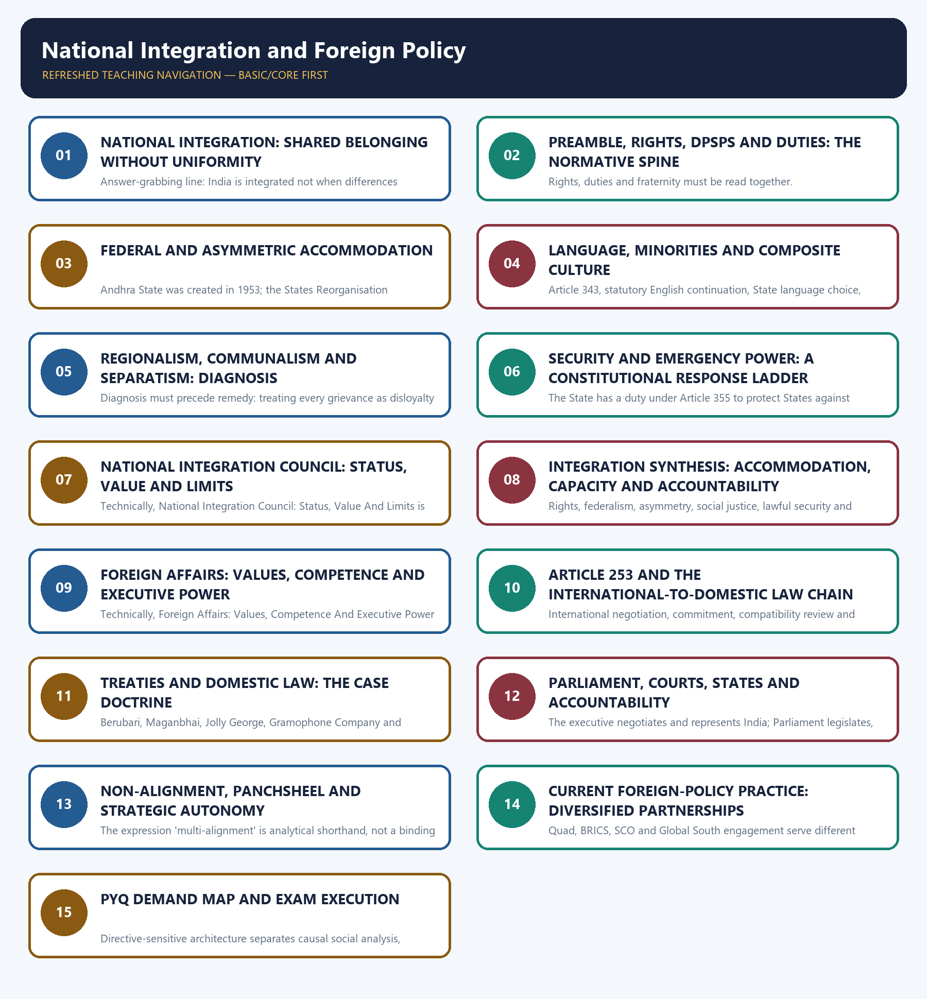

# National Integration and Foreign Policy — Complete Uncompressed Learning Session

**Complete independent Core + verified PYQs + solved practice + optional Advanced + consolidated register notes**

**Legal/current control date:** 28 August 2026 (Asia/Kolkata)

> `[FACT]` marks constitutional, judicial, official or audited-PYQ anchors. `[ANALYSIS]` marks reasoned evaluation.

## BASIC LEARNING SESSION



*Distinct embedded teaching-navigation image. The separate continuous Cārvāka-style flowchart package remains an independent at-a-glance artifact.*

### SESSION 1 — NATIONAL INTEGRATION: SHARED BELONGING WITHOUT UNIFORMITY

#### DEFINITION / WHAT THIS IS CALLED

**Plain-language definition:** National integration is the continuing construction of equal citizenship, shared constitutional loyalty and peaceful political membership across India's religious, linguistic, regional, caste and tribal diversity.

**Technical definition:** Answer-grabbing line: India is integrated not when differences disappear, but when differences can be expressed within a common constitutional order.

#### ANSWER-GRABBING OPENING — WRITE/ADAPT IN THE EXAM

> National integration is the continuing construction of equal citizenship, shared constitutional loyalty and peaceful political membership across India's religious, linguistic, regional, caste and tribal diversity.

#### MUST-WRITE KEYWORDS

- **National Integration**
- **Shared Belonging Without Uniformity**
- **grabbing line**
- **National**
- **India's**
- **It**

**How to use them:** Frame the answer through National Integration; define Shared Belonging Without Uniformity, connect grabbing line with National to explain the mechanism, and use India's for the decisive comparison or qualification.

National integration is the continuing construction of equal citizenship, shared constitutional loyalty and peaceful political membership across India's religious, linguistic, regional, caste and tribal diversity. It is not the erasure of legitimate identities.

```text
diversity -> equal citizenship -> accommodation -> participation -> shared belonging
       \-> exclusion or coercive uniformity -> alienation -> integration stress
```

The exam-safe distinctions are decisive: regional identity is not secessionism; religious identity is not communal mobilisation; migration is not collective guilt; and dissent is not disloyalty. Integration asks whether institutions convert difference into democratic bargaining rather than violence.

**Answer-grabbing line:** India is integrated not when differences disappear, but when differences can be expressed within a common constitutional order.

#### CLOSING RECALL FLOW — NATIONAL INTEGRATION: SHARED BELONGING WITHOUT UNIFORMITY

```text
START / CONCEPT: NATIONAL INTEGRATION: SHARED BELONGING WITHOUT UNIFORMITY
        |
        v
EXACT TERMS: National Integration · Shared Belonging Without Uniformity · grabbing line · National · India's · It
        |
        v
MECHANISM / ARGUMENT: Answer-grabbing line: India is integrated not when differences disappear, but when differences can be expressed within a common constitutional order.
        |
        v
CONSEQUENCE / CONTRAST: The exam-safe distinctions are decisive: regional identity is not secessionism; religious identity is not communal mobilisation; migration is not collective guilt; and dissent is not disloyalty.
        |
        v
UPSC TRAP / ANSWER-USE: It is not the erasure of legitimate identities.
        |
        v
ANSWER-GRABBING FORMULATION: National integration is the continuing construction of equal citizenship, shared constitutional loyalty and peaceful political membership across India's religious, linguistic, regional, caste and tribal diversity.
```
### SESSION 2 — PREAMBLE, RIGHTS, DPSPS AND DUTIES: THE NORMATIVE SPINE

#### DEFINITION / WHAT THIS IS CALLED

**Plain-language definition:** Fundamental Duties are non-justiciable civic standards, not free-standing authority to suppress rights.

**Technical definition:** Rights, duties and fraternity must be read together.

#### ANSWER-GRABBING OPENING — WRITE/ADAPT IN THE EXAM

> Fundamental Duties are non-justiciable civic standards, not free-standing authority to suppress rights.

#### MUST-WRITE KEYWORDS

- **Preamble**
- **Rights**
- **Dpsps**
- **Duties**
- **The Normative Spine**
- **Articles 14-16**

**How to use them:** Frame the answer through Preamble; define Rights, connect Dpsps with Duties to explain the mechanism, and use The Normative Spine for the decisive comparison or qualification.

The Preamble joins fraternity and individual dignity to the unity and integrity of the nation. Equality, liberty and constitutional remedies make membership credible; social and economic justice reduces exclusion-driven alienation.

| Layer | Integration contribution |
|---|---|
| Articles 14-16 | equal status and non-discrimination |
| Article 19 | democratic voice, association and mobility |
| Articles 25-28 | religious liberty within constitutional limits |
| Articles 29-30 | cultural and educational protection |
| DPSPs | distributive justice and reduction of inequality |
| 51A(c), (e), (f), (i) | unity, harmony, composite culture, non-violence |

Fundamental Duties are non-justiciable civic standards, not free-standing authority to suppress rights. Rights, duties and fraternity must be read together.

#### CLOSING RECALL FLOW — PREAMBLE, RIGHTS, DPSPS AND DUTIES: THE NORMATIVE SPINE

```text
START / CONCEPT: PREAMBLE, RIGHTS, DPSPS AND DUTIES: THE NORMATIVE SPINE
        |
        v
EXACT TERMS: Preamble · Rights · Dpsps · Duties · The Normative Spine · Articles 14-16
        |
        v
MECHANISM / ARGUMENT: Rights, duties and fraternity must be read together.
        |
        v
CONSEQUENCE / CONTRAST: The resulting consequence is that fundamental Duties are non-justiciable civic standards, not free-standing authority to suppress rights.
        |
        v
UPSC TRAP / ANSWER-USE: Do not miss this limiting distinction: fundamental Duties are non-justiciable civic standards, not free-standing authority to suppress rights.
        |
        v
ANSWER-GRABBING FORMULATION: Fundamental Duties are non-justiciable civic standards, not free-standing authority to suppress rights.
```
### SESSION 3 — FEDERAL AND ASYMMETRIC ACCOMMODATION

#### DEFINITION / WHAT THIS IS CALLED

**Plain-language definition:** Federal And Asymmetric Accommodation comprises Federal, Asymmetric Accommodation and Andhra State as its core connected dimensions.

**Technical definition:** Andhra State was created in 1953; the States Reorganisation Commission reported in 1955; the States Reorganisation Act and Seventh Amendment followed in 1956.

#### ANSWER-GRABBING OPENING — WRITE/ADAPT IN THE EXAM

> Federal And Asymmetric Accommodation comprises Federal, Asymmetric Accommodation and Andhra State as its core connected dimensions.

#### MUST-WRITE KEYWORDS

- **Federal**
- **Asymmetric Accommodation**
- **Andhra State**
- **States Reorganisation Commission**
- **States Reorganisation Act**
- **Seventh Amendment**

**How to use them:** Frame the answer through Federal; define Asymmetric Accommodation, connect Andhra State with States Reorganisation Commission to explain the mechanism, and use States Reorganisation Act for the decisive comparison or qualification.

India combines a strong Union with mechanisms that recognise territorial and cultural difference: linguistic States, the Fifth and Sixth Schedules, Articles 371-371J, fiscal transfers, the Inter-State Council and local self-government.

Linguistic reorganisation demonstrates accommodation. Andhra State was created in 1953; the States Reorganisation Commission reported in 1955; the States Reorganisation Act and Seventh Amendment followed in 1956. Redrawing internal borders brought language claims inside the Union, though it did not end every sub-regional demand.

Federalism and secularism are basic-structure commitments under *S. R. Bommai v Union of India* (1994). Central action therefore remains bounded by constitutional purpose and judicial review.

#### CLOSING RECALL FLOW — FEDERAL AND ASYMMETRIC ACCOMMODATION

```text
START / CONCEPT: FEDERAL AND ASYMMETRIC ACCOMMODATION
        |
        v
EXACT TERMS: Federal · Asymmetric Accommodation · Andhra State · States Reorganisation Commission · States Reorganisation Act · Seventh Amendment
        |
        v
MECHANISM / ARGUMENT: Andhra State was created in 1953; the States Reorganisation Commission reported in 1955; the States Reorganisation Act and Seventh Amendment followed in 1956.
        |
        v
CONSEQUENCE / CONTRAST: Federalism and secularism are basic-structure commitments under S.
        |
        v
UPSC TRAP / ANSWER-USE: Do not miss this limiting distinction: central action therefore remains bounded by constitutional purpose and judicial review.
        |
        v
ANSWER-GRABBING FORMULATION: Federal And Asymmetric Accommodation comprises Federal, Asymmetric Accommodation and Andhra State as its core connected dimensions.
```
### SESSION 4 — LANGUAGE, MINORITIES AND COMPOSITE CULTURE

#### DEFINITION / WHAT THIS IS CALLED

**Plain-language definition:** Language policy balances Union communication with constitutional protection of linguistic and cultural diversity.

**Technical definition:** Article 343, statutory English continuation, State language choice, Articles 29-30 and 350A-350B form a plural language architecture.

#### ANSWER-GRABBING OPENING — WRITE/ADAPT IN THE EXAM

> The Constitution provides an official-language framework without declaring one national language.

#### MUST-WRITE KEYWORDS

- **Union official language**
- **English continuation**
- **minority safeguards**
- **Article 343**
- **Article 350B**

**How to use them:** Frame the answer through Union official language; define English continuation, connect minority safeguards with Article 343 to explain the mechanism, and use Article 350B for the decisive comparison or qualification.

The Constitution avoids a national-language declaration. Hindi in Devanagari script is the official language of the Union under Article 343, while English continues by statute. States may adopt official languages; Articles 350A and 350B protect linguistic-minority interests; the Eighth Schedule is distinct from Union official-language status.

Articles 29 and 30 protect cultural and educational interests. Article 51A(f) asks citizens to value and preserve the rich heritage of India's composite culture.

**Trap:** promotion of Hindi under Article 351 does not authorise forced cultural homogenisation or erase statutory and federal language arrangements.

#### CLOSING RECALL FLOW — LANGUAGE, MINORITIES AND COMPOSITE CULTURE

```text
START / CONCEPT: LANGUAGE, MINORITIES AND COMPOSITE CULTURE
        |
        v
EXACT TERMS: Union official language · English continuation · minority safeguards · Article 343 · Article 350B
        |
        v
MECHANISM / ARGUMENT: Identify the governing rule, trace its institutional operation and test it against evidence and constitutional limits.
        |
        v
CONSEQUENCE / CONTRAST: The result is a qualified account of inclusion, implementation or strategic choice.
        |
        v
UPSC TRAP / ANSWER-USE: Do not miss this limiting distinction: article 351 promotion operates within this plural framework.
        |
        v
ANSWER-GRABBING FORMULATION: The Constitution provides an official-language framework without declaring one national language.
```
### SESSION 5 — REGIONALISM, COMMUNALISM AND SEPARATISM: DIAGNOSIS

#### DEFINITION / WHAT THIS IS CALLED

**Plain-language definition:** Regionalism may express legitimate claims for recognition, resources or autonomy; it becomes a threat when exclusionary mobilisation rejects equal citizenship or constitutional methods.

**Technical definition:** Diagnosis must precede remedy: treating every grievance as disloyalty can deepen the alienation that security policy seeks to reduce.

#### ANSWER-GRABBING OPENING — WRITE/ADAPT IN THE EXAM

> Regionalism may express legitimate claims for recognition, resources or autonomy; it becomes a threat when exclusionary mobilisation rejects equal citizenship or constitutional methods.

#### MUST-WRITE KEYWORDS

- **Regionalism**
- **Communalism**
- **Separatism**
- **Diagnosis**
- **unequal development**
- **fiscal justice, services, representation**

**How to use them:** Frame the answer through Regionalism; define Communalism, connect Separatism with Diagnosis to explain the mechanism, and use unequal development for the decisive comparison or qualification.

Regionalism may express legitimate claims for recognition, resources or autonomy; it becomes a threat when exclusionary mobilisation rejects equal citizenship or constitutional methods. Communalism politicises religious identity through antagonistic group claims. Separatism seeks withdrawal from the constitutional community.

| Driver | Constitutional response |
|---|---|
| unequal development | fiscal justice, services, representation |
| cultural insecurity | minority rights, language protection, autonomy |
| political exclusion | devolution, dialogue, fair elections |
| violence | lawful investigation and proportionate security |
| hate and disinformation | rights-compatible law, counterspeech, accountability |

Diagnosis must precede remedy: treating every grievance as disloyalty can deepen the alienation that security policy seeks to reduce.

#### CLOSING RECALL FLOW — REGIONALISM, COMMUNALISM AND SEPARATISM: DIAGNOSIS

```text
START / CONCEPT: REGIONALISM, COMMUNALISM AND SEPARATISM: DIAGNOSIS
        |
        v
EXACT TERMS: Regionalism · Communalism · Separatism · Diagnosis · unequal development · fiscal justice, services, representation
        |
        v
MECHANISM / ARGUMENT: Diagnosis must precede remedy: treating every grievance as disloyalty can deepen the alienation that security policy seeks to reduce.
        |
        v
CONSEQUENCE / CONTRAST: The resulting consequence is that regionalism may express legitimate claims for recognition, resources or autonomy.
        |
        v
UPSC TRAP / ANSWER-USE: Do not miss this limiting distinction: regionalism may express legitimate claims for recognition, resources or autonomy.
        |
        v
ANSWER-GRABBING FORMULATION: Regionalism may express legitimate claims for recognition, resources or autonomy; it becomes a threat when exclusionary mobilisation rejects equal citizenship or constitutional methods.
```
### SESSION 6 — SECURITY AND EMERGENCY POWER: A CONSTITUTIONAL RESPONSE LADDER

#### DEFINITION / WHAT THIS IS CALLED

**Plain-language definition:** Article 356 is a remedy for breakdown of constitutional machinery, not a routine instrument against political disagreement; S.

**Technical definition:** The State has a duty under Article 355 to protect States against external aggression and internal disturbance and to ensure constitutional government.

#### ANSWER-GRABBING OPENING — WRITE/ADAPT IN THE EXAM

> Emergency and security powers do not create a law-free zone.

#### MUST-WRITE KEYWORDS

- **Security**
- **Emergency Power**
- **A Constitutional Response Ladder**
- **Article 355**
- **Article 356**
- **The State**

**How to use them:** Frame the answer through Security; define Emergency Power, connect A Constitutional Response Ladder with Article 355 to explain the mechanism, and use Article 356 for the decisive comparison or qualification.

The State has a duty under Article 355 to protect States against external aggression and internal disturbance and to ensure constitutional government. Article 356 is a remedy for breakdown of constitutional machinery, not a routine instrument against political disagreement; *S. R. Bommai* subjects proclamations to judicial review.

```text
prevention -> representation -> negotiation -> targeted policing -> exceptional power
     every stage: legality + necessity + proportionality + review + remedy
```

Emergency and security powers do not create a law-free zone. Collective punishment, indefinite exception and the equation of dissent with disloyalty weaken constitutional integration.

#### CLOSING RECALL FLOW — SECURITY AND EMERGENCY POWER: A CONSTITUTIONAL RESPONSE LADDER

```text
START / CONCEPT: SECURITY AND EMERGENCY POWER: A CONSTITUTIONAL RESPONSE LADDER
        |
        v
EXACT TERMS: Security · Emergency Power · A Constitutional Response Ladder · Article 355 · Article 356 · The State
        |
        v
MECHANISM / ARGUMENT: The State has a duty under Article 355 to protect States against external aggression and internal disturbance and to ensure constitutional government.
        |
        v
CONSEQUENCE / CONTRAST: Article 356 is a remedy for breakdown of constitutional machinery, not a routine instrument against political disagreement; S.
        |
        v
UPSC TRAP / ANSWER-USE: Do not miss this limiting distinction: emergency and security powers do not create a law-free zone.
        |
        v
ANSWER-GRABBING FORMULATION: Emergency and security powers do not create a law-free zone.
```
### SESSION 7 — NATIONAL INTEGRATION COUNCIL: STATUS, VALUE AND LIMITS

#### DEFINITION / WHAT THIS IS CALLED

**Plain-language definition:** The National Integration Council is extra-constitutional, non-statutory and advisory.

**Technical definition:** Technically, National Integration Council: Status, Value And Limits is analysed by relating National Integration Council to Status, then testing the relationship through Value and Limits.

#### ANSWER-GRABBING OPENING — WRITE/ADAPT IN THE EXAM

> The National Integration Council is extra-constitutional, non-statutory and advisory.

#### MUST-WRITE KEYWORDS

- **National Integration Council**
- **Status**
- **Value**
- **Limits**
- **The National Integration Council**
- **It**

**How to use them:** Frame the answer through National Integration Council; define Status, connect Value with Limits to explain the mechanism, and use The National Integration Council for the decisive comparison or qualification.

The National Integration Council is extra-constitutional, non-statutory and advisory. It was established in 1961 and chaired by the Prime Minister. It offered Union, State, party and civil-society deliberation on communalism and integration.

The latest official meeting located for this review is the sixteenth meeting on 23 September 2013. This package does not label the Council legally abolished or formally defunct because no primary instrument establishing that status was located.

Irregular meetings and non-binding recommendations limit follow-through. A defensible reform is either regular reconstitution with an evidence-based agenda and published action-taken reports, or equivalent cooperative-federal consultation with clear accountability.

#### CLOSING RECALL FLOW — NATIONAL INTEGRATION COUNCIL: STATUS, VALUE AND LIMITS

```text
START / CONCEPT: NATIONAL INTEGRATION COUNCIL: STATUS, VALUE AND LIMITS
        |
        v
EXACT TERMS: National Integration Council · Status · Value · Limits · The National Integration Council · It
        |
        v
MECHANISM / ARGUMENT: This package does not label the Council legally abolished or formally defunct because no primary instrument establishing that status was located.
        |
        v
CONSEQUENCE / CONTRAST: Irregular meetings and non-binding recommendations limit follow-through.
        |
        v
UPSC TRAP / ANSWER-USE: Do not miss this limiting distinction: it was established in 1961 and chaired by the Prime Minister.
        |
        v
ANSWER-GRABBING FORMULATION: The National Integration Council is extra-constitutional, non-statutory and advisory.
```
### SESSION 8 — INTEGRATION SYNTHESIS: ACCOMMODATION, CAPACITY AND ACCOUNTABILITY

#### DEFINITION / WHAT THIS IS CALLED

**Plain-language definition:** Integration combines common citizenship with differentiated accommodation and accountable state capacity.

**Technical definition:** Rights, federalism, asymmetry, social justice, lawful security and review convert diversity into democratic membership.

#### ANSWER-GRABBING OPENING — WRITE/ADAPT IN THE EXAM

> India sustains unity through common institutions and protected difference rather than compulsory sameness.

#### MUST-WRITE KEYWORDS

- **common citizenship**
- **accommodation**
- **capacity**
- **accountability**
- **rights**
- **federalism**

**How to use them:** Frame the answer through common citizenship; define accommodation, connect capacity with accountability to explain the mechanism, and use rights for the decisive comparison or qualification.

India's design mixes common institutions with differentiated accommodation.

```text
common citizenship + national institutions
                +
minority rights + federalism + asymmetry
                +
social justice + lawful security + judicial review
                =
resilient constitutional integration
```

Assimilation may promise administrative simplicity but can convert cultural difference into political insecurity. Accommodation without state capacity can entrench elite brokerage. The qualified answer is calibrated accommodation backed by equal rights, public capacity and accountable security.

#### CLOSING RECALL FLOW — INTEGRATION SYNTHESIS: ACCOMMODATION, CAPACITY AND ACCOUNTABILITY

```text
START / CONCEPT: INTEGRATION SYNTHESIS: ACCOMMODATION, CAPACITY AND ACCOUNTABILITY
        |
        v
EXACT TERMS: common citizenship · accommodation · capacity · accountability · rights · federalism
        |
        v
MECHANISM / ARGUMENT: Identify the governing rule, trace its institutional operation and test it against evidence and constitutional limits.
        |
        v
CONSEQUENCE / CONTRAST: The result is a qualified account of inclusion, implementation or strategic choice.
        |
        v
UPSC TRAP / ANSWER-USE: Do not miss this limiting distinction: accommodation without equality or capacity can entrench gatekeepers.
        |
        v
ANSWER-GRABBING FORMULATION: India sustains unity through common institutions and protected difference rather than compulsory sameness.
```
### SESSION 9 — FOREIGN AFFAIRS: VALUES, COMPETENCE AND EXECUTIVE POWER

#### DEFINITION / WHAT THIS IS CALLED

**Plain-language definition:** Article 51 is a DPSP value foundation: international peace, honourable relations, respect for international law and treaty obligations, and arbitration.

**Technical definition:** Technically, Foreign Affairs: Values, Competence And Executive Power is analysed by relating Foreign Affairs to Values, then testing the relationship through Competence and Executive Power.

#### ANSWER-GRABBING OPENING — WRITE/ADAPT IN THE EXAM

> Article 51 is a DPSP value foundation: international peace, honourable relations, respect for international law and treaty obligations, and arbitration.

#### MUST-WRITE KEYWORDS

- **Foreign Affairs**
- **Values**
- **Competence**
- **Executive Power**
- **Article 51**
- **Article 246**

**How to use them:** Frame the answer through Foreign Affairs; define Values, connect Competence with Executive Power to explain the mechanism, and use Article 51 for the decisive comparison or qualification.

Article 51 is a DPSP value foundation: international peace, honourable relations, respect for international law and treaty obligations, and arbitration. It is not the complete source of foreign-affairs power.

Article 246 read with Union List Entries 10-21 centralises foreign affairs, diplomacy, the UN, treaties, war and peace, citizenship and aliens, extradition, passports and offences against international law. Article 73 extends Union executive power to parliamentary subjects and to rights, authority and jurisdiction exercisable by treaty or agreement.

**Trap:** Article 73 is broader than a shorthand 'treaty-making article', while Article 51 remains non-justiciable.

#### CLOSING RECALL FLOW — FOREIGN AFFAIRS: VALUES, COMPETENCE AND EXECUTIVE POWER

```text
START / CONCEPT: FOREIGN AFFAIRS: VALUES, COMPETENCE AND EXECUTIVE POWER
        |
        v
EXACT TERMS: Foreign Affairs · Values · Competence · Executive Power · Article 51 · Article 246
        |
        v
MECHANISM / ARGUMENT: Trap: Article 73 is broader than a shorthand 'treaty-making article', while Article 51 remains non-justiciable.
        |
        v
CONSEQUENCE / CONTRAST: It is not the complete source of foreign-affairs power.
        |
        v
UPSC TRAP / ANSWER-USE: Do not miss this limiting distinction: article 73 is broader than a shorthand 'treaty-making article'.
        |
        v
ANSWER-GRABBING FORMULATION: Article 51 is a DPSP value foundation: international peace, honourable relations, respect for international law and treaty obligations, and arbitration.
```
### SESSION 10 — ARTICLE 253 AND THE INTERNATIONAL-TO-DOMESTIC LAW CHAIN

#### DEFINITION / WHAT THIS IS CALLED

**Plain-language definition:** Article 253 gives Parliament implementation power while domestic legal effect remains a separate question.

**Technical definition:** International negotiation, commitment, compatibility review and domestic implementation are distinct stages.

#### ANSWER-GRABBING OPENING — WRITE/ADAPT IN THE EXAM

> Treaty authority must be analysed as a chain rather than collapsed into automatic self-execution.

#### MUST-WRITE KEYWORDS

- **Article 253**
- **implementation**
- **domestic law**
- **international commitment**
- **federal consultation**

**How to use them:** Frame the answer through Article 253; define implementation, connect domestic law with international commitment to explain the mechanism, and use federal consultation for the decisive comparison or qualification.

Article 253 authorises Parliament, notwithstanding ordinary federal distribution, to legislate for implementing a treaty, agreement, convention or decision of an international conference, association or other body.

```text
negotiation -> international commitment -> domestic-law compatibility test
          -> existing law sufficient: executive implementation
          -> law or rights must change: legislation or constitutional amendment
```

India has no general constitutional or statutory rule requiring parliamentary ratification of every treaty. Parliament nevertheless retains legislative, financial, deliberative and committee scrutiny. Article 253 can reach State subjects, so consultation is institutionally prudent where implementation burdens States.

#### CLOSING RECALL FLOW — ARTICLE 253 AND THE INTERNATIONAL-TO-DOMESTIC LAW CHAIN

```text
START / CONCEPT: ARTICLE 253 AND THE INTERNATIONAL-TO-DOMESTIC LAW CHAIN
        |
        v
EXACT TERMS: Article 253 · implementation · domestic law · international commitment · federal consultation
        |
        v
MECHANISM / ARGUMENT: Identify the governing rule, trace its institutional operation and test it against evidence and constitutional limits.
        |
        v
CONSEQUENCE / CONTRAST: The result is a qualified account of inclusion, implementation or strategic choice.
        |
        v
UPSC TRAP / ANSWER-USE: Do not miss this limiting distinction: consultation is prudent when implementation burdens States.
        |
        v
ANSWER-GRABBING FORMULATION: Treaty authority must be analysed as a chain rather than collapsed into automatic self-execution.
```
### SESSION 11 — TREATIES AND DOMESTIC LAW: THE CASE DOCTRINE

#### DEFINITION / WHAT THIS IS CALLED

**Plain-language definition:** Indian case law separates territorial cession, executive implementation and the interpretive use of international norms.

**Technical definition:** Berubari, Maganbhai, Jolly George, Gramophone Company and Vishaka define different domestic-law consequences.

#### ANSWER-GRABBING OPENING — WRITE/ADAPT IN THE EXAM

> The cases form a doctrine map, not a rule that every treaty automatically becomes enforceable law.

#### MUST-WRITE KEYWORDS

- **Berubari**
- **Maganbhai**
- **Jolly George**
- **Gramophone**
- **Vishaka**
- **domestic law**
- **international norms**

**How to use them:** Frame the answer through Berubari; define Maganbhai, connect Jolly George with Gramophone to explain the mechanism, and use Vishaka for the decisive comparison or qualification.

*In re Berubari Union* (1960) held that cession of Indian territory requires constitutional amendment. *Maganbhai Ishwarbhai Patel v Union of India* (1969) distinguished a boundary settlement executable under existing law from action that changes law or rights and therefore needs legislation.

*Jolly George Varghese v Bank of Cochin* (1980) rejected automatic displacement of inconsistent domestic law by an international covenant. *Gramophone Company v Birendra Bahadur Pandey* (1984) accepted harmonious interpretation with international law where municipal law is not contrary. *Vishaka v State of Rajasthan* (1997) used international norms consistently with Fundamental Rights to fill a domestic-law vacuum.

**Recall:** international binding force is not the same as automatic self-execution in Indian courts.

#### CLOSING RECALL FLOW — TREATIES AND DOMESTIC LAW: THE CASE DOCTRINE

```text
START / CONCEPT: TREATIES AND DOMESTIC LAW: THE CASE DOCTRINE
        |
        v
EXACT TERMS: Berubari · Maganbhai · Jolly George · Gramophone · Vishaka · domestic law · international norms
        |
        v
MECHANISM / ARGUMENT: Identify the governing rule, trace its institutional operation and test it against evidence and constitutional limits.
        |
        v
CONSEQUENCE / CONTRAST: The result is a qualified account of inclusion, implementation or strategic choice.
        |
        v
UPSC TRAP / ANSWER-USE: International obligation does not automatically override contrary municipal law.
        |
        v
ANSWER-GRABBING FORMULATION: The cases form a doctrine map, not a rule that every treaty automatically becomes enforceable law.
```
### SESSION 12 — PARLIAMENT, COURTS, STATES AND ACCOUNTABILITY

#### DEFINITION / WHAT THIS IS CALLED

**Plain-language definition:** Answer line: flexibility in negotiation and accountability in domestic implementation are complements, not alternatives.

**Technical definition:** The executive negotiates and represents India; Parliament legislates, controls finance, debates policy and can use committees; courts review constitutionality and interpret domestic law; States implement many obligations affecting health, agriculture, policing, water and local administration.

#### ANSWER-GRABBING OPENING — WRITE/ADAPT IN THE EXAM

> The executive negotiates and represents India; Parliament legislates, controls finance, debates policy and can use committees; courts review constitutionality and interpret domestic law; States implement many obligations affecting health, agriculture, policing, water and local administration.

#### MUST-WRITE KEYWORDS

- **Parliament**
- **Courts**
- **States**
- **Accountability**
- **line**
- **India**

**How to use them:** Frame the answer through Parliament; define Courts, connect States with Accountability to explain the mechanism, and use line for the decisive comparison or qualification.

The executive negotiates and represents India; Parliament legislates, controls finance, debates policy and can use committees; courts review constitutionality and interpret domestic law; States implement many obligations affecting health, agriculture, policing, water and local administration.

Democratic accountability improves when government publishes treaty texts, impact assessments and implementation needs, and consults affected States before commitments with substantial federal consequences. Judicial review cannot replace political scrutiny, and State consultation cannot become a veto over Union foreign competence.

**Answer line:** flexibility in negotiation and accountability in domestic implementation are complements, not alternatives.

#### CLOSING RECALL FLOW — PARLIAMENT, COURTS, STATES AND ACCOUNTABILITY

```text
START / CONCEPT: PARLIAMENT, COURTS, STATES AND ACCOUNTABILITY
        |
        v
EXACT TERMS: Parliament · Courts · States · Accountability · line · India
        |
        v
MECHANISM / ARGUMENT: Answer line: flexibility in negotiation and accountability in domestic implementation are complements, not alternatives.
        |
        v
CONSEQUENCE / CONTRAST: The resulting consequence is that the executive negotiates and represents India.
        |
        v
UPSC TRAP / ANSWER-USE: Do not miss this limiting distinction: the executive negotiates and represents India.
        |
        v
ANSWER-GRABBING FORMULATION: The executive negotiates and represents India; Parliament legislates, controls finance, debates policy and can use committees; courts review constitutionality and interpret domestic law; States implement many obligations affecting health, agriculture, policing, water and local administration.
```
### SESSION 13 — NON-ALIGNMENT, PANCHSHEEL AND STRATEGIC AUTONOMY

#### DEFINITION / WHAT THIS IS CALLED

**Plain-language definition:** Non-Alignment, Panchsheel And Strategic Autonomy comprises Non-Alignment, Panchsheel and Strategic Autonomy as its core connected dimensions.

**Technical definition:** The expression 'multi-alignment' is analytical shorthand, not a binding constitutional doctrine.

#### ANSWER-GRABBING OPENING — WRITE/ADAPT IN THE EXAM

> Use the officially grounded formulation of strategic autonomy.

#### MUST-WRITE KEYWORDS

- **Non-Alignment**
- **Panchsheel**
- **Strategic Autonomy**
- **The expression 'multi-alignment'**
- **Non-Alignment, Panchsheel And Strategic Autonomy**

**How to use them:** Frame the answer through Non-Alignment; define Panchsheel, connect Strategic Autonomy with The expression 'multi-alignment' to explain the mechanism, and use Non-Alignment, Panchsheel And Strategic Autonomy for the decisive comparison or qualification.

The 1954 India-China agreement concerning the Tibet region placed the five Panchsheel principles in its preamble: mutual respect for territorial integrity and sovereignty, non-aggression, non-interference, equality and mutual benefit, and peaceful coexistence.

Non-alignment meant independent judgment amid bloc rivalry, not legal neutrality, isolation or equal distance on every issue. Strategic autonomy carries forward decision independence in a more interdependent order through diversified partnerships, domestic capability and issue-based cooperation.

The expression 'multi-alignment' is analytical shorthand, not a binding constitutional doctrine. Use the officially grounded formulation of strategic autonomy.

#### CLOSING RECALL FLOW — NON-ALIGNMENT, PANCHSHEEL AND STRATEGIC AUTONOMY

```text
START / CONCEPT: NON-ALIGNMENT, PANCHSHEEL AND STRATEGIC AUTONOMY
        |
        v
EXACT TERMS: Non-Alignment · Panchsheel · Strategic Autonomy · The expression 'multi-alignment' · Non-Alignment, Panchsheel And Strategic Autonomy
        |
        v
MECHANISM / ARGUMENT: The expression 'multi-alignment' is analytical shorthand, not a binding constitutional doctrine.
        |
        v
CONSEQUENCE / CONTRAST: The resulting consequence is that the expression 'multi-alignment' is analytical shorthand, not a binding constitutional doctrine.
        |
        v
UPSC TRAP / ANSWER-USE: Do not miss this limiting distinction: the expression 'multi-alignment' is analytical shorthand, not a binding constitutional doctrine.
        |
        v
ANSWER-GRABBING FORMULATION: Use the officially grounded formulation of strategic autonomy.
```
### SESSION 14 — CURRENT FOREIGN-POLICY PRACTICE: DIVERSIFIED PARTNERSHIPS

#### DEFINITION / WHAT THIS IS CALLED

**Plain-language definition:** Diversified partnership is cooperation through different institutions on distinct issues while retaining independent national judgment.

**Technical definition:** Quad, BRICS, SCO and Global South engagement serve different purposes within a flexible external strategy.

#### ANSWER-GRABBING OPENING — WRITE/ADAPT IN THE EXAM

> Current examples are evidence of policy themes and must not be converted into permanent doctrine.

#### MUST-WRITE KEYWORDS

- **MEA 2024**
- **Quad**
- **BRICS**
- **SCO**
- **Global South**
- **strategic autonomy**
- **dated evidence**

**How to use them:** Frame the answer through MEA 2024; define Quad, connect BRICS with SCO to explain the mechanism, and use Global South for the decisive comparison or qualification.

The MEA Annual Report 2024 describes India as expanding strategic autonomy, seeking multilateral reform, addressing Global South priorities and protecting security. Quad, BRICS and SCO participation illustrates issue-based cooperation across different memberships rather than membership in one military bloc.

India hosted the third Voice of Global South Summit virtually on 17 August 2024 under the theme 'An Empowered Global South for a Sustainable Future'. Current examples must be dated and used as evidence of a theme, not as proof that every grouping shares identical purposes.

Neighbourhood policy, Indo-Pacific cooperation, energy security, diaspora engagement and UN reform all test the same balance: interests, values, capacity and autonomy.

#### CLOSING RECALL FLOW — CURRENT FOREIGN-POLICY PRACTICE: DIVERSIFIED PARTNERSHIPS

```text
START / CONCEPT: CURRENT FOREIGN-POLICY PRACTICE: DIVERSIFIED PARTNERSHIPS
        |
        v
EXACT TERMS: MEA 2024 · Quad · BRICS · SCO · Global South · strategic autonomy · dated evidence
        |
        v
MECHANISM / ARGUMENT: Identify the governing rule, trace its institutional operation and test it against evidence and constitutional limits.
        |
        v
CONSEQUENCE / CONTRAST: The result is a qualified account of inclusion, implementation or strategic choice.
        |
        v
UPSC TRAP / ANSWER-USE: Use dated official evidence and avoid frozen membership or status claims.
        |
        v
ANSWER-GRABBING FORMULATION: Current examples are evidence of policy themes and must not be converted into permanent doctrine.
```
### SESSION 15 — PYQ DEMAND MAP AND EXAM EXECUTION

#### DEFINITION / WHAT THIS IS CALLED

**Plain-language definition:** The demand map aligns four verified questions with the exact analytical task each asks.

**Technical definition:** Directive-sensitive architecture separates causal social analysis, institutional comparison, political economy and diaspora benefits.

#### ANSWER-GRABBING OPENING — WRITE/ADAPT IN THE EXAM

> The PYQ demand map connects verified communalism, BIMSTEC, ethnic-identity and diaspora questions to distinct answer structures.

#### MUST-WRITE KEYWORDS

- **2018 communalism**
- **2022 BIMSTEC**
- **2023 ethnic identity**
- **2023 diaspora**
- **directive**
- **marks**
- **word limit**

**How to use them:** Frame the answer through 2018 communalism; define 2022 BIMSTEC, connect 2023 ethnic identity with 2023 diaspora to explain the mechanism, and use directive for the decisive comparison or qualification.

Four verified questions provide the direct and supporting practice architecture.

| Year/Paper | Demand |
|---|---|
| 2018 GS-I, 10/150 | power struggle or relative deprivation as causes of communalism |
| 2022 GS-II, 10/150 | compare BIMSTEC and SAARC and connect BIMSTEC to Indian objectives |
| 2023 GS-I, 15/250 | post-liberal economy, ethnic identity and communalism |
| 2023 GS-II, 10/150 | economic and political benefits of the Indian diaspora in the West |

Integration answers require diagnosis, constitutional mechanism, evidence, limits and a qualified verdict. Foreign-policy answers require interests, institutional mechanism, current evidence, constraints and a strategic-autonomy conclusion. Never substitute a generic doctrine essay for the directive asked.

#### CLOSING RECALL FLOW — PYQ DEMAND MAP AND EXAM EXECUTION

```text
START / CONCEPT: PYQ DEMAND MAP AND EXAM EXECUTION
        |
        v
EXACT TERMS: 2018 communalism · 2022 BIMSTEC · 2023 ethnic identity · 2023 diaspora · directive · marks · word limit
        |
        v
MECHANISM / ARGUMENT: Decode the directive, select the owned doctrine and arrange evidence to the mark and word limit.
        |
        v
CONSEQUENCE / CONTRAST: The answer addresses every limb and reserves space for qualification and verdict.
        |
        v
UPSC TRAP / ANSWER-USE: Do not present paraphrased practice as an exact PYQ or reuse one doctrine template for unlike demands.
        |
        v
ANSWER-GRABBING FORMULATION: The PYQ demand map connects verified communalism, BIMSTEC, ethnic-identity and diaspora questions to distinct answer structures.
```
## BASIC MCQS / REMEDIATION

### Original MCQs 1-36 — Broad Coverage

#### OM1. National integration is best understood as

- A. equal constitutional membership across legitimate diversity
- B. only territorial control
- C. absence of regional identities
- D. cultural uniformity imposed by law

**Answer: A**

**Explanation:** Integration combines shared belonging with protected diversity.

#### OM2. Which Preamble value expressly links dignity with national cohesion?

- A. republic
- B. fraternity
- C. adult suffrage
- D. socialism

**Answer: B**

**Explanation:** Fraternity assures dignity and the unity and integrity of the nation.

#### OM3. Which provision protects a distinct language, script or culture?

- A. Article 23
- B. Article 360
- C. Article 29
- D. Article 17

**Answer: C**

**Explanation:** Article 29 protects cultural interests.

#### OM4. Which duty concerns harmony and common brotherhood?

- A. Article 51A(a)
- B. Article 51A(j)
- C. Article 51A(h)
- D. Article 51A(e)

**Answer: D**

**Explanation:** Article 51A(e) addresses harmony across diversities.

#### OM5. Linguistic reorganisation primarily illustrates

- A. integration by accommodation
- B. judicial legislation
- C. constitutional emergency
- D. external cession

**Answer: A**

**Explanation:** Internal borders accommodated language claims within the Union.

#### OM6. Which mechanism gives autonomous district arrangements in parts of the North-East?

- A. Twelfth Schedule
- B. Sixth Schedule
- C. Tenth Schedule
- D. Ninth Schedule

**Answer: B**

**Explanation:** The Sixth Schedule provides autonomous district and regional councils.

#### OM7. Which is an exam-safe distinction?

- A. dissent is disloyalty
- B. religious identity is communalism
- C. regional identity is not necessarily secessionism
- D. migration proves collective guilt

**Answer: C**

**Explanation:** Identity and unconstitutional mobilisation must not be conflated.

#### OM8. Article 355 concerns the Union's duty to

- A. appoint the NIC
- B. create linguistic minorities
- C. ratify treaties
- D. protect States and ensure constitutional government

**Answer: D**

**Explanation:** Article 355 states the protective and constitutional-government duty.

#### OM9. The National Integration Council is

- A. extra-constitutional, non-statutory and advisory
- B. a constitutional commission
- C. a parliamentary committee
- D. a statutory tribunal

**Answer: A**

**Explanation:** The NIC has no constitutional or statutory status.

#### OM10. The latest officially located NIC meeting used in this package occurred in

- A. 2024
- B. 2013
- C. 1961
- D. 1990

**Answer: B**

**Explanation:** The sixteenth meeting was held on 23 September 2013.

#### OM11. Which claim is most defensible?

- A. NIC was constitutionally abolished
- B. NIC controls State police
- C. irregular advisory follow-up limits the NIC
- D. NIC directions bind courts

**Answer: C**

**Explanation:** Its advisory nature and irregularity limit implementation.

#### OM12. Which response best supports durable integration?

- A. suppression of every regional demand
- B. permanent emergency
- C. collective punishment
- D. graded accommodation, development, lawful security and review

**Answer: D**

**Explanation:** A differentiated constitutional response avoids overbreadth.

#### OM13. Article 51 is located among the

- A. Directive Principles of State Policy
- B. Fundamental Rights
- C. Fundamental Duties
- D. Emergency Provisions

**Answer: A**

**Explanation:** Article 51 is a non-justiciable DPSP.

#### OM14. Union foreign-affairs competence is detailed chiefly through

- A. Article 324
- B. Article 246 and Union List Entries 10-21
- C. State List Entries 1-5
- D. Article 280 alone

**Answer: B**

**Explanation:** Foreign affairs and related subjects are in the Union List.

#### OM15. Article 73 extends Union executive power to

- A. every municipal subject without limit
- B. judicial review alone
- C. parliamentary fields and treaty-derived rights or jurisdiction
- D. constitutional amendment

**Answer: C**

**Explanation:** This is the textually accurate scope.

#### OM16. Article 253 empowers

- A. States alone to ratify treaties
- B. the NIC to legislate
- C. courts to sign agreements
- D. Parliament to implement international obligations notwithstanding ordinary distribution

**Answer: D**

**Explanation:** Article 253 is an overriding implementation competence.

#### OM17. Which statement about treaties is accurate?

- A. international commitment and domestic legal effect are distinct
- B. every treaty automatically overrides statutes
- C. all treaties require State ratification
- D. Article 51 self-executes treaties

**Answer: A**

**Explanation:** Domestic implementation depends on constitutional and legal compatibility.

#### OM18. Berubari is authority for the proposition that

- A. all boundary surveys need amendment
- B. cession of Indian territory requires constitutional amendment
- C. courts negotiate treaties
- D. Article 3 governs foreign cession

**Answer: B**

**Explanation:** External cession is distinct from internal boundary alteration.

#### OM19. Maganbhai chiefly helps distinguish

- A. religion from language
- B. DPSPs from duties
- C. executive implementation under existing law from law-changing action
- D. NIC from ISC

**Answer: C**

**Explanation:** It addresses implementation and need for legislation.

#### OM20. Jolly George Varghese rejected

- A. all use of international law
- B. parliamentary treaty legislation
- C. judicial review
- D. automatic override of inconsistent domestic law by a covenant

**Answer: D**

**Explanation:** International covenants do not automatically displace municipal law.

#### OM21. Gramophone Company supports

- A. harmonious use of international law where domestic law is not contrary
- B. automatic treaty supremacy
- C. foreign judicial control
- D. State treaty veto

**Answer: A**

**Explanation:** Municipal law prevails where conflict exists.

#### OM22. Vishaka used international norms to

- A. cede territory
- B. fill a domestic-law vacuum consistently with Fundamental Rights
- C. suspend Article 14
- D. create the NIC

**Answer: B**

**Explanation:** International norms aided rights-consistent gap filling.

#### OM23. Parliament's foreign-affairs role includes

- A. no constitutional function
- B. treaty negotiation exclusively
- C. legislation, finance, debate and committees
- D. only ceremonial addresses

**Answer: C**

**Explanation:** Executive primacy does not erase legislative functions.

#### OM24. Where treaties substantially affect State administration, the best reform is

- A. secret implementation
- B. automatic nullity
- C. judicial treaty negotiation
- D. structured consultation without a State veto

**Answer: D**

**Explanation:** Consultation supports federal implementation while preserving Union competence.

#### OM25. Panchsheel was placed in the preamble of a 1954 agreement concerning

- A. trade and intercourse with the Tibet region of China
- B. the UN Charter
- C. the Commonwealth
- D. SAARC

**Answer: A**

**Explanation:** This is the historical instrument.

#### OM26. Non-alignment means

- A. membership in no organisation
- B. independent judgment rather than bloc subordination
- C. neutrality in every conflict
- D. international isolation

**Answer: B**

**Explanation:** NAM was a policy of decision independence.

#### OM27. Strategic autonomy is best described as

- A. equal distance from every State
- B. constitutional neutrality
- C. decision independence supported by diversified partnerships and capability
- D. withdrawal from trade

**Answer: C**

**Explanation:** Autonomy is compatible with partnerships.

#### OM28. The phrase multi-alignment should be treated as

- A. a UN treaty
- B. a constitutional amendment
- C. a judicial command
- D. analytical shorthand rather than binding doctrine

**Answer: D**

**Explanation:** Officially grounded strategic autonomy is safer.

#### OM29. Quad, BRICS and SCO together illustrate

- A. issue-based cooperation across different groupings
- B. abandonment of autonomy
- C. one collective-defence alliance
- D. identical memberships

**Answer: A**

**Explanation:** Their different purposes demonstrate diversified engagement.

#### OM30. The third Voice of Global South Summit was hosted in

- A. December 2022
- B. August 2024
- C. March 2026
- D. January 2020

**Answer: B**

**Explanation:** India hosted it virtually on 17 August 2024.

#### OM31. Which is a sound current-affairs practice?

- A. omit the source
- B. freeze every membership count
- C. date and source the example and connect it to a theme
- D. treat rhetoric as law

**Answer: C**

**Explanation:** Dated primary evidence avoids stale claims.

#### OM32. Which statement about Article 51 is false?

- A. it mentions arbitration
- B. it promotes international peace
- C. it is a DPSP
- D. it is the sole enforceable source of treaty power

**Answer: D**

**Explanation:** Article 51 is a value directive, not enforceable treaty competence.

#### OM33. Article 351 concerns

- A. development and promotion of Hindi
- B. foreign cession
- C. treaty implementation
- D. NIC meetings

**Answer: A**

**Explanation:** It must be read with plural language arrangements.

#### OM34. Article 350B provides for

- A. Inter-State Council
- B. Special Officer for Linguistic Minorities
- C. Attorney General
- D. CAG

**Answer: B**

**Explanation:** The office reports on linguistic-minority safeguards.

#### OM35. Secularism and federalism were emphasised as basic features in

- A. Berubari
- B. Jolly George
- C. S. R. Bommai
- D. Vishaka

**Answer: C**

**Explanation:** Bommai is central to emergency and federal review.

#### OM36. A sound integration answer should avoid

- A. distinguishing identity from mobilisation
- B. using a qualified verdict
- C. linking rights and duties
- D. equating dissent with disloyalty

**Answer: D**

**Explanation:** Conflation produces constitutional and analytical error.

### Remedial MCQs 37-48 — Close-Option Control

#### RM1. The 2018 communalism PYQ demands

- A. argument using power struggle or relative deprivation with illustrations
- B. only a definition of NIC
- C. a diaspora balance sheet
- D. a list of treaties

**Answer: A**

**Explanation:** The directive requires causal argument and examples.

#### RM2. The 2022 BIMSTEC PYQ requires

- A. only expansion of acronyms
- B. comparison with SAARC and linkage to Indian objectives
- C. constitutional cession doctrine
- D. a NAM history

**Answer: B**

**Explanation:** All three components must be answered.

#### RM3. The 2023 ethnic-identity PYQ connects communalism to

- A. the 1954 treaty alone
- B. NIC composition
- C. the post-liberal economy
- D. Article 253 only

**Answer: C**

**Explanation:** It requires a political-economy mechanism.

#### RM4. The 2023 diaspora PYQ asks for

- A. a critique of SAARC
- B. only remittance figures
- C. only consular crises
- D. economic and political benefits for India

**Answer: D**

**Explanation:** Both dimensions must be covered.

#### RM5. Which answer structure is strongest for communalism?

- A. define, causal mechanisms, illustrations, qualification and remedy
- B. unqualified slogan
- C. constitutional articles without mechanism
- D. chronology only

**Answer: A**

**Explanation:** Directive-sensitive causal analysis earns marks.

#### RM6. Which answer structure is strongest for strategic autonomy?

- A. one current event without analysis
- B. interests, instruments, dated evidence, constraints and verdict
- C. grouping names only
- D. Nehru quotations only

**Answer: B**

**Explanation:** It connects doctrine to executable evidence.

#### RM7. Diaspora influence should be qualified by

- A. absence of political risk
- B. constitutional voting in India by all diaspora
- C. host-State law and diverse diaspora interests
- D. automatic control of foreign governments

**Answer: C**

**Explanation:** Diasporas are plural and operate under host-country institutions.

#### RM8. Energy security affects foreign policy through

- A. linguistic reorganisation
- B. Article 51A alone
- C. NIC membership
- D. supplier diversification, logistics, prices and strategic choices

**Answer: D**

**Explanation:** Energy dependence creates external-policy constraints.

#### RM9. Which reform best addresses treaty accountability?

- A. publication, impact assessment and parliamentary scrutiny
- B. abolish Article 253
- C. State unanimity for all talks
- D. automatic judicial ratification

**Answer: A**

**Explanation:** Scrutiny can coexist with executive negotiation.

#### RM10. Which claim about Article 253 is wrong?

- A. it can reach State subjects
- B. it gives each State a veto over treaty implementation
- C. it covers international decisions
- D. it empowers Parliament

**Answer: B**

**Explanation:** The provision overrides ordinary federal distribution.

#### RM11. The strongest synthesis is

- A. foreign policy has no domestic foundation
- B. uniformity guarantees unity
- C. domestic inclusion builds resilience while strategic autonomy protects external choice
- D. security removes accountability

**Answer: C**

**Explanation:** Integration and foreign policy are mutually reinforcing.

#### RM12. A qualified final verdict should emphasise

- A. unreviewable executive power
- B. cultural erasure
- C. permanent exception
- D. constitutional inclusion, capable institutions and accountable flexibility

**Answer: D**

**Explanation:** The package's central evaluative standard joins legitimacy and capacity.


## PYQS AND ANSWER PRACTICE

### VERIFIED DIRECT PYQ 1 — 2018 GS-I — 10 marks — 150 words

**Question (exact):** “‘Communalism arises either due to power struggle or relative deprivation.’ Argue by giving suitable illustrations.”

**Model answer:** Communalism is the political mobilisation of religious identity through antagonistic group claims. Power struggle explains it when elites use polarisation to consolidate votes, displace rivals or control institutions. Competitive religious appeals, hate campaigns and local contest over offices can convert ordinary difference into a zero-sum conflict.

Relative deprivation explains mobilisation when a group perceives that its status, security or access has declined compared with another group or with its own expectations. Economic transition, uneven urbanisation and rumours about preferential treatment can supply such perceptions even when objective deprivation is mixed.

The two mechanisms interact: political entrepreneurs frame employment, land or representation anxieties as religious injury. Communalism is therefore neither an automatic product of faith nor reducible to poverty.

The remedy must combine impartial law enforcement, equal opportunity, civic education, local dialogue and accountability for incitement. Constitutional fraternity requires transforming distributive and political conflict into democratic bargaining rather than collective blame.

**Why this earns marks:** It defines the phenomenon, argues both stated causes, explains interaction and supplies a constitutional remedy.

**How to improve this answer:** Add one precisely recalled Indian illustration for each mechanism; do not treat every religious dispute as communalism.

**Compression guidance:** Keep definition, two causal paragraphs, interaction, two remedies and verdict.

### VERIFIED SUPPORTING PYQ 2 — 2022 GS-II — 10 marks — 150 words

**Question (exact):** “Do you think that BIMSTEC is a parallel organisation like the SAARC? What are the similarities and dissimilarities between the two? How are Indian foreign policy objectives realized by forming this new organisation?”

**Model answer:** BIMSTEC and SAARC are regional cooperation organisations, but BIMSTEC is not merely a parallel copy. Both seek functional cooperation, development and connectivity and include South Asian members. SAARC is South Asia-wide and includes Pakistan and Afghanistan; BIMSTEC links South and Southeast Asia around the Bay of Bengal and excludes Pakistan.

BIMSTEC supports India's Neighbourhood First and Act East policies by connecting its eastern and north-eastern regions to Bay of Bengal economies. Sectoral cooperation can advance connectivity, trade, energy, disaster management, security and people-to-people ties. It also offers a forum less constrained by India-Pakistan deadlock.

However, weak institutional capacity, delayed agreements, connectivity deficits and political instability limit delivery. BIMSTEC should complement rather than mechanically replace SAARC.

Thus, its value lies in a distinct geography and functional agenda that widens India's strategic options while requiring stronger implementation.

**Why this earns marks:** It answers similarity, dissimilarity and Indian objectives, then qualifies institutional performance.

**How to improve this answer:** Add one dated summit or agreement only if accurately recalled; avoid saying BIMSTEC was created solely to isolate Pakistan.

**Compression guidance:** Use two similarities, three differences, four objectives, two limits and verdict.

### VERIFIED DIRECT PYQ 3 — 2023 GS-I — 15 marks — 250 words

**Question (exact):** “Discuss the impact of post-liberal economy on ethnic identity and communalism.”

**Model answer:** Economic liberalisation widened mobility, markets, media and aspirational consumption. It also produced uneven gains across regions, occupations and social groups. These changes reshape ethnic identity and communalism through contradictory mechanisms.

First, migration and urbanisation create mixed workplaces and networks that can weaken inherited boundaries. New middle classes, digital communication and national markets can support identities based on profession, consumption and citizenship.

Second, uneven development intensifies relative deprivation. Competition over jobs, land, housing, welfare and political representation may be framed through regional, caste, linguistic or religious identities. Local elites can convert distributive conflict into ethnic or communal mobilisation.

Third, commercial media and social platforms allow rapid cultural assertion but also profitable polarisation, rumours and targeted hate. Fourth, market-led displacement and insecure informal work can produce anxieties that exclusionary movements redirect against migrants or minorities.

The outcome is not economically predetermined. Inclusive growth, portable welfare, fair urban governance, anti-discrimination, regional fiscal balance, credible policing and platform accountability mediate it.

Therefore, the post-liberal economy simultaneously creates cross-cutting integration and new identity insecurity. Constitutional policy must distribute opportunity and provide democratic channels so that economic competition does not become collective blame.

**Why this earns marks:** It presents both integrating and fragmenting mechanisms and identifies mediating institutions.

**How to improve this answer:** Add one regional or urban example and explicitly separate ethnicity from communalism if space permits.

**Compression guidance:** Retain four mechanisms, two counter-effects, policy mediation and the qualified verdict.

### VERIFIED DIRECT PYQ 4 — 2023 GS-II — 10 marks — 150 words

**Question (exact):** “Indian diaspora has scaled new heights in the West. Describe its economic and political benefits for India.”

**Model answer:** The Indian diaspora in Western countries benefits India economically through remittances, investment, entrepreneurship, technology and professional networks. It connects Indian firms and institutions to capital, skills, research ecosystems and markets and can support philanthropy and crisis relief.

Politically, elected representatives, professionals and civic organisations can improve knowledge of India, support closer bilateral ties and create constituencies for cooperation in education, technology, security and mobility. Diaspora achievement also contributes to India's reputation and soft power.

These benefits are neither automatic nor uniform. Diaspora communities have diverse political views, operate under host-country law and may face racism, visa insecurity or conflicts over homeland politics. India should therefore prioritise consular protection, skills and investment channels and respectful cultural engagement rather than expect political loyalty.

The diaspora is best treated as a bridge of people and capability, not an instrument controlled by the Indian State.

**Why this earns marks:** It covers both named dimensions, provides mechanisms and adds a realistic qualification.

**How to improve this answer:** Include one precise sectoral example rather than an uncertain aggregate statistic.

**Compression guidance:** Use five economic benefits, three political benefits, one caveat and verdict.

### ORIGINAL MAINS PRACTICE 1 — 10 marks — 150 words

**Question:** National integration in India is better understood as accommodation than assimilation. Examine.

**Model answer:** Begin with a precise thesis responsive to the directive. Define both models; use linguistic States, minority rights, asymmetric federalism and common citizenship; conclude that calibrated accommodation needs equal rights and state capacity. Use constitutional provisions or dated evidence only where they advance the demand. End with a qualified verdict joining legitimacy, institutional capacity and accountability.

**Why this earns marks:** The answer has a directive-sensitive thesis, an executable evidence order, a limitation and a qualified conclusion.

**How to improve this answer:** Convert the stated spine into mark-scaled paragraphs and add one precisely recalled authority; do not substitute a generic foreign-policy or unity essay.

**Compression guidance:** Preserve the thesis, four strongest evidence units, one counterpoint and the verdict.

### ORIGINAL MAINS PRACTICE 2 — 15 marks — 250 words

**Question:** Examine the constitutional architecture through which India manages regionalism, communalism and separatism.

**Model answer:** Begin with a precise thesis responsive to the directive. Organise by diagnosis, rights, federal accommodation, development, security limits, Articles 355-356 and judicial review; separate legitimate identity from violence. Use constitutional provisions or dated evidence only where they advance the demand. End with a qualified verdict joining legitimacy, institutional capacity and accountability.

**Why this earns marks:** The answer has a directive-sensitive thesis, an executable evidence order, a limitation and a qualified conclusion.

**How to improve this answer:** Convert the stated spine into mark-scaled paragraphs and add one precisely recalled authority; do not substitute a generic foreign-policy or unity essay.

**Compression guidance:** Preserve the thesis, four strongest evidence units, one counterpoint and the verdict.

### ORIGINAL MAINS PRACTICE 3 — 10 marks — 150 words

**Question:** Is the National Integration Council still institutionally relevant? Comment.

**Model answer:** Begin with a precise thesis responsive to the directive. State its non-statutory advisory status and 2013 latest located meeting; assess deliberative value and weak follow-up; propose reconstitution or equivalent accountable federal consultation. Use constitutional provisions or dated evidence only where they advance the demand. End with a qualified verdict joining legitimacy, institutional capacity and accountability.

**Why this earns marks:** The answer has a directive-sensitive thesis, an executable evidence order, a limitation and a qualified conclusion.

**How to improve this answer:** Convert the stated spine into mark-scaled paragraphs and add one precisely recalled authority; do not substitute a generic foreign-policy or unity essay.

**Compression guidance:** Preserve the thesis, four strongest evidence units, one counterpoint and the verdict.

### ORIGINAL MAINS PRACTICE 4 — 15 marks — 250 words

**Question:** Article 51 states values but does not exhaust the constitutional foundations of Indian foreign policy. Discuss.

**Model answer:** Begin with a precise thesis responsive to the directive. Pair Article 51 with Articles 73, 246 and 253 and Union List Entries 10-21; distinguish value, competence, executive action and implementation. Use constitutional provisions or dated evidence only where they advance the demand. End with a qualified verdict joining legitimacy, institutional capacity and accountability.

**Why this earns marks:** The answer has a directive-sensitive thesis, an executable evidence order, a limitation and a qualified conclusion.

**How to improve this answer:** Convert the stated spine into mark-scaled paragraphs and add one precisely recalled authority; do not substitute a generic foreign-policy or unity essay.

**Compression guidance:** Preserve the thesis, four strongest evidence units, one counterpoint and the verdict.

### ORIGINAL MAINS PRACTICE 5 — 15 marks — 250 words

**Question:** India's treaty practice combines executive flexibility with a democratic-accountability gap. Critically examine.

**Model answer:** Begin with a precise thesis responsive to the directive. Explain negotiation, international obligation, domestic-law test, Parliament's legislative and financial roles, case doctrine, federal effects and scrutiny reforms. Use constitutional provisions or dated evidence only where they advance the demand. End with a qualified verdict joining legitimacy, institutional capacity and accountability.

**Why this earns marks:** The answer has a directive-sensitive thesis, an executable evidence order, a limitation and a qualified conclusion.

**How to improve this answer:** Convert the stated spine into mark-scaled paragraphs and add one precisely recalled authority; do not substitute a generic foreign-policy or unity essay.

**Compression guidance:** Preserve the thesis, four strongest evidence units, one counterpoint and the verdict.

### ORIGINAL MAINS PRACTICE 6 — 10 marks — 150 words

**Question:** Distinguish non-alignment, neutrality and strategic autonomy.

**Model answer:** Begin with a precise thesis responsive to the directive. Define all three; show continuity of independent judgment and change in partnerships and capability; avoid calling multi-alignment a binding doctrine. Use constitutional provisions or dated evidence only where they advance the demand. End with a qualified verdict joining legitimacy, institutional capacity and accountability.

**Why this earns marks:** The answer has a directive-sensitive thesis, an executable evidence order, a limitation and a qualified conclusion.

**How to improve this answer:** Convert the stated spine into mark-scaled paragraphs and add one precisely recalled authority; do not substitute a generic foreign-policy or unity essay.

**Compression guidance:** Preserve the thesis, four strongest evidence units, one counterpoint and the verdict.

### ORIGINAL MAINS PRACTICE 7 — 15 marks — 250 words

**Question:** How do domestic inclusion and federal consultation strengthen India's external policy?

**Model answer:** Begin with a precise thesis responsive to the directive. Link legitimacy, border regions, State implementation, diaspora, climate and trade to consultation; preserve Union competence while arguing for structured participation. Use constitutional provisions or dated evidence only where they advance the demand. End with a qualified verdict joining legitimacy, institutional capacity and accountability.

**Why this earns marks:** The answer has a directive-sensitive thesis, an executable evidence order, a limitation and a qualified conclusion.

**How to improve this answer:** Convert the stated spine into mark-scaled paragraphs and add one precisely recalled authority; do not substitute a generic foreign-policy or unity essay.

**Compression guidance:** Preserve the thesis, four strongest evidence units, one counterpoint and the verdict.

### ORIGINAL MAINS PRACTICE 8 — 20 marks — 250 words

**Question:** Unity without uniformity and autonomy without isolation are complementary principles of Indian statecraft. Analyse.

**Model answer:** Begin with a precise thesis responsive to the directive. Build two halves: constitutional integration and strategic autonomy; connect them through legitimacy, capability and accountable power; test security and geopolitical constraints. Use constitutional provisions or dated evidence only where they advance the demand. End with a qualified verdict joining legitimacy, institutional capacity and accountability.

**Why this earns marks:** The answer has a directive-sensitive thesis, an executable evidence order, a limitation and a qualified conclusion.

**How to improve this answer:** Convert the stated spine into mark-scaled paragraphs and add one precisely recalled authority; do not substitute a generic foreign-policy or unity essay.

**Compression guidance:** Preserve the thesis, four strongest evidence units, one counterpoint and the verdict.

## OPTIONAL ADVANCED DEPTH — NOT REQUIRED FOR A CORE ANSWER

### Advanced refinement 1 — Integration as constitutional negotiation

Integration is an outcome variable shaped by recognition, redistribution, representation, security and trust. Accommodation can reduce exit incentives, but poorly designed asymmetry can empower gatekeepers. The evaluative test is equal citizenship plus accountable self-government.

### Advanced refinement 2 — Treaty design and federal effects

A treaty can be internationally binding before it is judicially enforceable domestically. Article 253 solves implementation capacity but may centralise subjects ordinarily administered by States. Publication, ex ante consultation and legislative scrutiny can reduce this democratic and federal deficit without giving every State a foreign-policy veto.

### Advanced refinement 3 — Strategic autonomy under interdependence

Autonomy is not autarky. Dependence on energy, technology, finance, logistics and defence supply can constrain choices, so diversified partnerships must be joined to domestic capability. Group participation is an instrument judged against interests and values, not an identity to which every position is subordinated.

## CONSOLIDATED REGISTER NOTES

### One-screen recall

- Integration means equal shared belonging across protected diversity, not cultural erasure.
- Preamble: fraternity, dignity, unity and integrity; rights make common membership credible.
- Articles 29-30, language pluralism, Fifth/Sixth Schedules and Articles 371-371J enable accommodation.
- Duties 51A(c), (e), (f), (i) support unity, harmony, composite culture and non-violence.
- Regional identity is not secessionism; dissent is not disloyalty; security remains review-bounded.
- NIC: extra-constitutional, non-statutory, advisory, established 1961; latest located meeting 23 September 2013.
- Article 51 supplies foreign-policy values, not the complete competence.
- Article 246 plus Union List 10-21 centralises foreign affairs; Article 73 covers executive power.
- Article 253 enables Parliament to implement international obligations notwithstanding distribution.
- Treaty binding force, domestic effect and parliamentary implementation are separate questions.
- Berubari: cession needs amendment; Maganbhai: existing-law implementation versus law change.
- Jolly George, Gramophone and Vishaka define careful use of international norms.
- Non-alignment means independent judgment; strategic autonomy combines choice, partnerships and capability.
- MEA 2024 evidence: strategic autonomy, multilateral reform and Global South priorities.
- Final synthesis: unity without uniformity; autonomy without isolation; power with accountability.

### Answer spine

```text
define demand -> constitutional or strategic rule -> mechanism -> evidence
             -> counterpoint or limit -> reform -> qualified verdict
```

### COMPLETE TOPIC ASCII MASTER FLOW DIAGRAM

**High-yield use:** Follow the panels as one topic-specific conceptual atlas: root question, classifications, processes or arguments, comparisons, objections and a final answer-writing spine. This text-native master is separate from both graphical flowchart artifacts.

#### ASCII MASTER FLOW — PANEL 1/12: Constitutional belonging without uniformity

```ascii-master
diversity -> equal citizenship -> accommodation -> participation -> shared belonging

TRAPS
regional identity != secessionism | dissent != disloyalty | migration != collective guilt

CASE CONTROL
S.R. Bommai (1994): federalism, secularism and review.
In Re: Section 6A (2024): migration and regional protection require constitutional review.
Berubari Union (1960): territorial cession requires amendment.
Maganbhai Ishwarbhai Patel (1969): existing-law implementation differs from law change.
Jolly George Varghese v. Bank of Cochin (1980): covenant does not automatically override law.
Gramophone Company of India v. Birendra Bahadur Pandey (1984): harmonious interpretation
absent conflict.
Vishaka (1997): international norms may fill a rights-consistent domestic vacuum.
```

#### ASCII MASTER FLOW — PANEL 2/12: Preamble, rights, DPSPs and duties

```ascii-master
PREAMBLE
fraternity + dignity + unity and integrity

RIGHTS
14-16 equality | 19 voice | 25-30 religious and cultural freedom

DPSPs + DUTIES
social justice | 51A(c), (e), (f), (i)

CASE CONTROL
S.R. Bommai (1994): federalism, secularism and review.
In Re: Section 6A (2024): migration and regional protection require constitutional review.
Berubari Union (1960): territorial cession requires amendment.
Maganbhai Ishwarbhai Patel (1969): existing-law implementation differs from law change.
Jolly George Varghese v. Bank of Cochin (1980): covenant does not automatically override law.
Gramophone Company of India v. Birendra Bahadur Pandey (1984): harmonious interpretation
absent conflict.
Vishaka (1997): international norms may fill a rights-consistent domestic vacuum.
```

#### ASCII MASTER FLOW — PANEL 3/12: Federal accommodation

```ascii-master
COMMON SPINE
single citizenship | integrated institutions | Union capacity

ACCOMMODATION
linguistic States | Fifth/Sixth Schedules | 371-371J | fiscal federalism

VERDICT
unity is built by recognising legitimate difference

CASE CONTROL
S.R. Bommai (1994): federalism, secularism and review.
In Re: Section 6A (2024): migration and regional protection require constitutional review.
Berubari Union (1960): territorial cession requires amendment.
Maganbhai Ishwarbhai Patel (1969): existing-law implementation differs from law change.
Jolly George Varghese v. Bank of Cochin (1980): covenant does not automatically override law.
Gramophone Company of India v. Birendra Bahadur Pandey (1984): harmonious interpretation
absent conflict.
Vishaka (1997): international norms may fill a rights-consistent domestic vacuum.
```

#### ASCII MASTER FLOW — PANEL 4/12: Language and minority safeguards

```ascii-master
ARTICLE 343
Union official language, not a national-language declaration

PLURAL FRAME
English by statute | State official languages | Eighth Schedule
| Articles 29-30 | 350A-350B | composite culture

CASE CONTROL
S.R. Bommai (1994): federalism, secularism and review.
In Re: Section 6A (2024): migration and regional protection require constitutional review.
Berubari Union (1960): territorial cession requires amendment.
Maganbhai Ishwarbhai Patel (1969): existing-law implementation differs from law change.
Jolly George Varghese v. Bank of Cochin (1980): covenant does not automatically override law.
Gramophone Company of India v. Birendra Bahadur Pandey (1984): harmonious interpretation
absent conflict.
Vishaka (1997): international norms may fill a rights-consistent domestic vacuum.
```

#### ASCII MASTER FLOW — PANEL 5/12: Challenge-response ladder

```ascii-master
CHALLENGES
regionalism | communalism | separatism | inequality | disinformation

RESPONSE
recognition -> representation -> development -> dialogue
-> targeted lawful security -> review -> reconciliation

CASE CONTROL
S.R. Bommai (1994): federalism, secularism and review.
In Re: Section 6A (2024): migration and regional protection require constitutional review.
Berubari Union (1960): territorial cession requires amendment.
Maganbhai Ishwarbhai Patel (1969): existing-law implementation differs from law change.
Jolly George Varghese v. Bank of Cochin (1980): covenant does not automatically override law.
Gramophone Company of India v. Birendra Bahadur Pandey (1984): harmonious interpretation
absent conflict.
Vishaka (1997): international norms may fill a rights-consistent domestic vacuum.
```

#### ASCII MASTER FLOW — PANEL 6/12: Emergency and security limits

```ascii-master
ARTICLE 355 duty -> ARTICLE 356 exceptional remedy

S. R. S.R. BOMMAI (1994)
federalism + secularism + judicial review

FIREWALL
legality | necessity | proportionality | remedy

CASE CONTROL
S.R. Bommai (1994): federalism, secularism and review.
In Re: Section 6A (2024): migration and regional protection require constitutional review.
Berubari Union (1960): territorial cession requires amendment.
Maganbhai Ishwarbhai Patel (1969): existing-law implementation differs from law change.
Jolly George Varghese v. Bank of Cochin (1980): covenant does not automatically override law.
Gramophone Company of India v. Birendra Bahadur Pandey (1984): harmonious interpretation
absent conflict.
Vishaka (1997): international norms may fill a rights-consistent domestic vacuum.
```

#### ASCII MASTER FLOW — PANEL 7/12: National Integration Council

```ascii-master
NIC
1961 | extra-constitutional | non-statutory | advisory | PM chair

EVIDENCE
latest official meeting located: 23 September 2013

REFORM
regular agenda + State voice + action-taken reporting

CASE CONTROL
S.R. Bommai (1994): federalism, secularism and review.
In Re: Section 6A (2024): migration and regional protection require constitutional review.
Berubari Union (1960): territorial cession requires amendment.
Maganbhai Ishwarbhai Patel (1969): existing-law implementation differs from law change.
Jolly George Varghese v. Bank of Cochin (1980): covenant does not automatically override law.
Gramophone Company of India v. Birendra Bahadur Pandey (1984): harmonious interpretation
absent conflict.
Vishaka (1997): international norms may fill a rights-consistent domestic vacuum.
```

#### ASCII MASTER FLOW — PANEL 8/12: Foreign-affairs competence

```ascii-master
ARTICLE 51 values
peace | honourable relations | international law | arbitration

ARTICLE 246 + UNION LIST 10-21 competence
ARTICLE 73 executive power
ARTICLE 253 implementation legislation

CASE CONTROL
S.R. Bommai (1994): federalism, secularism and review.
In Re: Section 6A (2024): migration and regional protection require constitutional review.
Berubari Union (1960): territorial cession requires amendment.
Maganbhai Ishwarbhai Patel (1969): existing-law implementation differs from law change.
Jolly George Varghese v. Bank of Cochin (1980): covenant does not automatically override law.
Gramophone Company of India v. Birendra Bahadur Pandey (1984): harmonious interpretation
absent conflict.
Vishaka (1997): international norms may fill a rights-consistent domestic vacuum.
```

#### ASCII MASTER FLOW — PANEL 9/12: International-to-domestic chain

```ascii-master
negotiation -> international commitment -> domestic-law test

existing law sufficient -> executive implementation
law or rights change -> legislation
territorial cession -> constitutional amendment

CASE CONTROL
S.R. Bommai (1994): federalism, secularism and review.
In Re: Section 6A (2024): migration and regional protection require constitutional review.
Berubari Union (1960): territorial cession requires amendment.
Maganbhai Ishwarbhai Patel (1969): existing-law implementation differs from law change.
Jolly George Varghese v. Bank of Cochin (1980): covenant does not automatically override law.
Gramophone Company of India v. Birendra Bahadur Pandey (1984): harmonious interpretation
absent conflict.
Vishaka (1997): international norms may fill a rights-consistent domestic vacuum.
```

#### ASCII MASTER FLOW — PANEL 10/12: Treaty case doctrine

```ascii-master
BERUBARI UNION (1960): cession requires amendment
MAGANBHAI: existing law versus law-changing action
JOLLY GEORGE: no automatic covenant override
GRAMOPHONE: harmony absent conflict
VISHAKA (1997): rights-consistent gap filling

CASE CONTROL
S.R. Bommai (1994): federalism, secularism and review.
In Re: Section 6A (2024): migration and regional protection require constitutional review.
Berubari Union (1960): territorial cession requires amendment.
Maganbhai Ishwarbhai Patel (1969): existing-law implementation differs from law change.
Jolly George Varghese v. Bank of Cochin (1980): covenant does not automatically override law.
Gramophone Company of India v. Birendra Bahadur Pandey (1984): harmonious interpretation
absent conflict.
Vishaka (1997): international norms may fill a rights-consistent domestic vacuum.
```

#### ASCII MASTER FLOW — PANEL 11/12: Non-alignment to strategic autonomy

```ascii-master
PANCHSHEEL 1954 -> NON-ALIGNMENT -> STRATEGIC AUTONOMY

independent judgment | diversified partnerships | domestic capability

NAM != neutrality | autonomy != isolation

AUTONOMY TEST
decision independence | diversified partners | domestic capability | issue-based coalitions
LIMIT
autonomy is not isolation, neutrality or freedom from material dependence.

CASE CONTROL
S.R. Bommai (1994): federalism, secularism and review.
In Re: Section 6A (2024): migration and regional protection require constitutional review.
Berubari Union (1960): territorial cession requires amendment.
Maganbhai Ishwarbhai Patel (1969): existing-law implementation differs from law change.
Jolly George Varghese v. Bank of Cochin (1980): covenant does not automatically override law.
Gramophone Company of India v. Birendra Bahadur Pandey (1984): harmonious interpretation
absent conflict.
Vishaka (1997): international norms may fill a rights-consistent domestic vacuum.
```

#### ASCII MASTER FLOW — PANEL 12/12: UPSC synthesis and PYQ map

```ascii-master
2018 communalism | 2022 BIMSTEC-SAARC
2023 ethnic identity | 2023 diaspora

ANSWER SPINE
define -> rule -> mechanism -> evidence -> limit -> verdict

UNITY WITHOUT UNIFORMITY
AUTONOMY WITHOUT ISOLATION

CASE CONTROL
S.R. Bommai (1994): federalism, secularism and review.
In Re: Section 6A (2024): migration and regional protection require constitutional review.
Berubari Union (1960): territorial cession requires amendment.
Maganbhai Ishwarbhai Patel (1969): existing-law implementation differs from law change.
Jolly George Varghese v. Bank of Cochin (1980): covenant does not automatically override law.
Gramophone Company of India v. Birendra Bahadur Pandey (1984): harmonious interpretation
absent conflict.
Vishaka (1997): international norms may fill a rights-consistent domestic vacuum.
```
