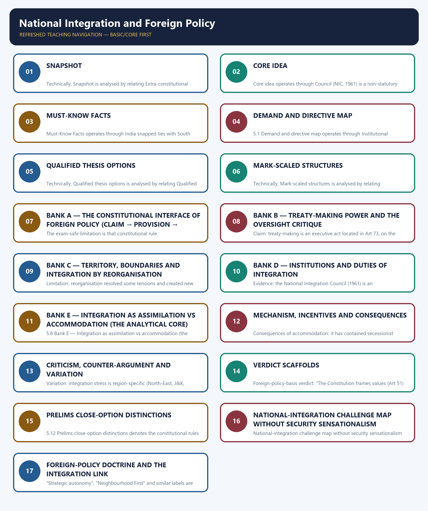
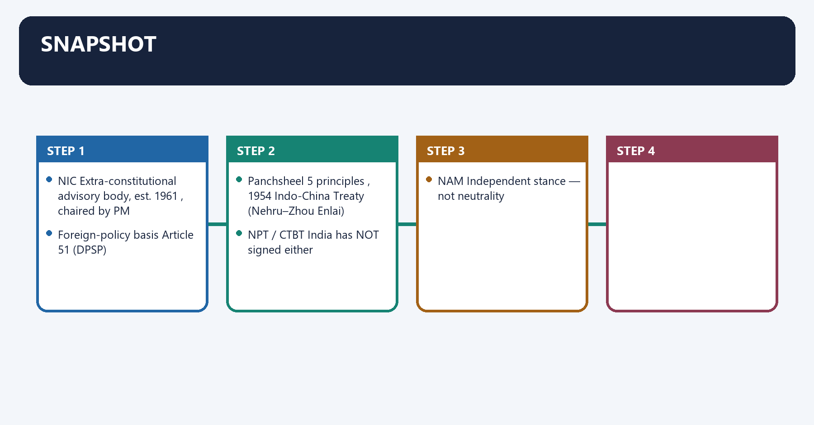
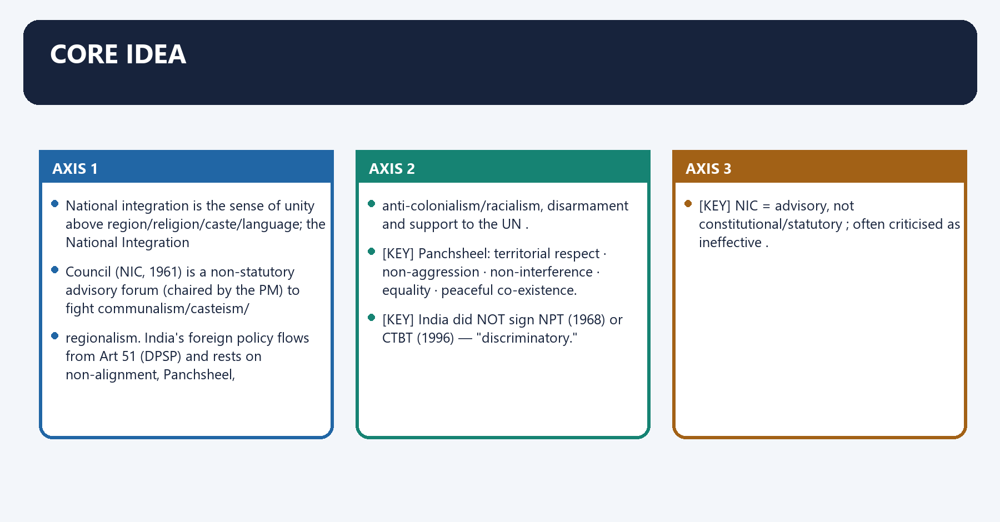
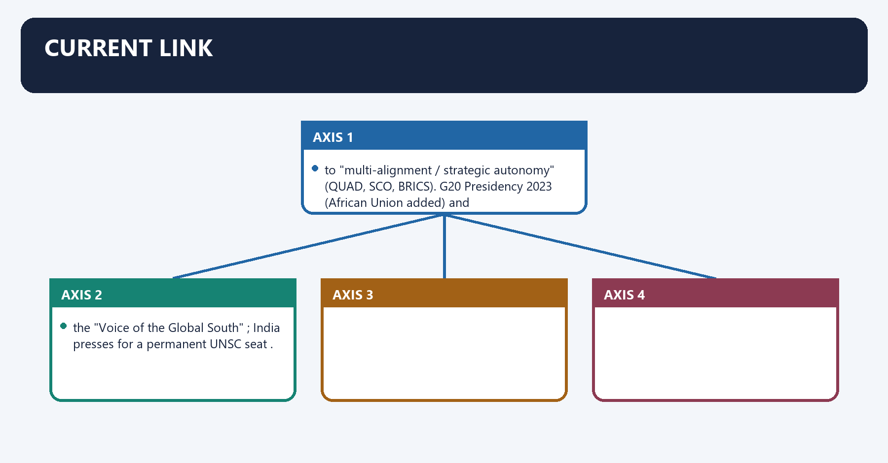
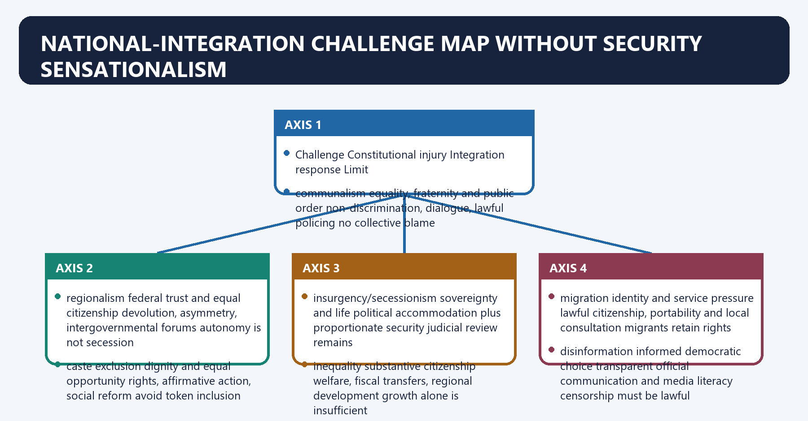
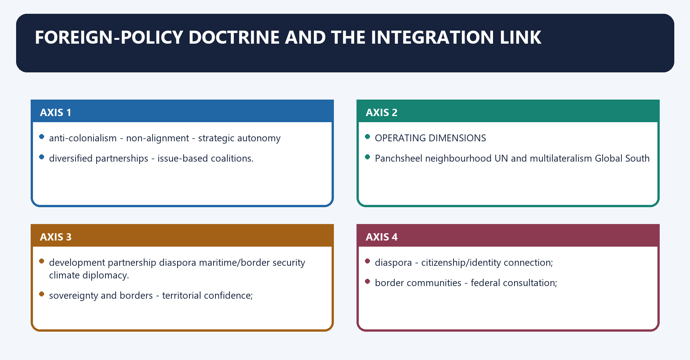

# National Integration and Foreign Policy — Complete Uncompressed Learning Session

**Complete independent learning session + verified PYQ routing + solved practice workbook + final consolidated register notes**

**Legal/current control date:** 25 August 2026 (Asia/Kolkata)

> **Tag key:** `[FACT]` = named constitutional, statutory, official, judicial or audited local support; `[ANALYSIS]` = reasoned examination; `[CURRENT]` = checked for the control date; `[LIMIT]` = qualification.
>
> **Answer-writing discipline:** claim -> named evidence -> analysis -> qualification.

- [CURRENT] Status is controlled to **25 August 2026, Asia/Kolkata**.
- [CURRENT] **Live official refresh, 25 August 2026:** The Constitution, MEA and MHA portals and controlling treaty/territory decisions were rechecked on 25 August 2026. The latest located National Integration Council meeting remains the 2013 meeting; no later official reconstitution or meeting is asserted. Strategic autonomy and current diplomatic initiatives are dated policy anchors, not binding law.

#### How to Use This Package

[FACT] The complete Basic/Core owner is taught first in source order. Cross-topic Markdown, local OCR books and verified PYQ ledgers supplement it.

[FACT] Advanced-owner material appears only after the Core and practice sections under the required optional-depth label.

[LIMIT] National integration is constitutional accommodation, equal citizenship and civic fraternity, not cultural uniformity or unrestricted coercion. Article 51 is a non-justiciable directive; treaty-making and foreign-policy doctrines remain executive policy unless domestic law gives them legal effect.

#### Local Owner Gateway

> **Subject:** Polity · **Tier:** Basic (foundation) · **GS-II (IR) / GS-I**
> [FACT] = from book · [CURRENT] = current link · [KEY] = mnemonic. *Advanced: optional deeper detail in `advanced/45_National-Integration-and-Foreign-Policy.md` — not required for any mark.*

## BASIC LEARNING SESSION



*Distinct embedded teaching-navigation image. The separate continuous Cārvāka-style flowchart package remains an independent at-a-glance artifact.*

### SESSION 1 — SNAPSHOT
#### DEFINITION / WHAT THIS IS CALLED

**Plain-language definition:** Snapshot denotes the constitutional rules and institutional links organised around NIC Extra-constitutional advisory body, est.

**Technical definition:** Technically, Snapshot is analysed by relating Extra-constitutional advisory to PM, then testing the relationship through Article 51 (DPSP) and Indo-China.

#### ANSWER-GRABBING OPENING — WRITE/ADAPT IN THE EXAM

> National integration relies on constitutional inclusion and federal accommodation, while Article 51 supplies foreign-policy principles without converting advisory bodies or strategic doctrines into law.

#### MUST-WRITE KEYWORDS

- **Snapshot**
- **Extra-constitutional advisory**
- **PM**
- **Article 51 (DPSP)**
- **Indo-China**
- **5 principles**

**How to use them:** Frame the answer through Snapshot; define Extra-constitutional advisory, connect PM with Article 51 (DPSP) to explain the mechanism, and use Indo-China for the decisive comparison or qualification.

Snapshot denotes the constitutional rules and institutional links organised around NIC Extra-constitutional advisory body, est. 1961 , chaired by PM.
Snapshot operates through Foreign-policy basis Article 51 (DPSP), connected with Panchsheel 5 principles , 1954 Indo-China Treaty (Nehru–Zhou Enlai).
The operative mechanism matters because nPT / CTBT India has NOT signed either.
Its principal consequence is that nAM Independent stance — not neutrality.
The decisive contrast is between NIC Extra-constitutional advisory body, est. 1961 , chaired by PM and NIC Extra-constitutional advisory body, est. 1961 , chaired by PM.
The exam-safe limitation is that nIC Extra-constitutional advisory body, est. 1961 , chaired by PM.

| Item | Fact |
|---|---|
| NIC | **Extra-constitutional advisory** body, est. **1961**, chaired by **PM** |
| Foreign-policy basis | **Article 51 (DPSP)** |
| Panchsheel | **5 principles**, 1954 **Indo-China** Treaty (Nehru–Zhou Enlai) |
| NPT / CTBT | India has **NOT signed** either |
| NAM | Independent stance — **not** neutrality |

#### CLOSING RECALL FLOW — SNAPSHOT

```closure-flow
SUBTOPIC: Snapshot
KEY TERMS / DEFINITIONS: Snapshot · Extra-constitutional advisory · PM · Article 51 (DPSP) · Indo-China · 5 principles
MECHANISM / ARGUMENT: The operative mechanism matters because nPT / CTBT India has NOT signed either.
CONSEQUENCE / CONTRAST: The decisive contrast is between NIC Extra-constitutional advisory body, est.
UPSC TRAP / ANSWER-USE: Its principal consequence is that nAM Independent stance — not neutrality.
ANSWER-GRABBING FORMULATION: National integration relies on constitutional inclusion and federal accommodation, while Article 51 supplies foreign-policy principles without converting advisory bodies or strategic doctrines into law.
```
### SESSION 2 — CORE IDEA
#### DEFINITION / WHAT THIS IS CALLED

**Plain-language definition:** Core idea denotes the constitutional rules and institutional links organised around National integration is the sense of unity above region/religion/caste/language; the National Integration.

**Technical definition:** Core idea operates through Council (NIC, 1961) is a non-statutory advisory forum (chaired by the PM) to fight communalism/casteism/, connected with regionalism.

#### ANSWER-GRABBING OPENING — WRITE/ADAPT IN THE EXAM

> India pursues unity through accommodation and external autonomy through non-alignment and Panchsheel, but neither principle eliminates the need for changing strategic choices.

#### MUST-WRITE KEYWORDS

- **National integration**
- **National Integration Council (NIC, 1961)**
- **non-statutory advisory**
- **India's foreign policy**
- **Art 51 (DPSP)**
- **Panchsheel**

**How to use them:** Frame the answer through National integration; define National Integration Council (NIC, 1961), connect non-statutory advisory with India's foreign policy to explain the mechanism, and use Art 51 (DPSP) for the decisive comparison or qualification.

Core idea denotes the constitutional rules and institutional links organised around National integration is the sense of unity above region/religion/caste/language; the National Integration.
Core idea operates through Council (NIC, 1961) is a non-statutory advisory forum (chaired by the PM) to fight communalism/casteism/, connected with regionalism. India's foreign policy flows from Art 51 (DPSP) and rests on non-alignment, Panchsheel,.
The operative mechanism matters because anti-colonialism/racialism, disarmament and support to the UN.
Its principal consequence is that [KEY] Panchsheel: territorial respect · non-aggression · non-interference · equality · peaceful co-existence.
The decisive contrast is between [KEY] India did NOT sign NPT (1968) or CTBT (1996) — "discriminatory." and [KEY] NIC = advisory, not constitutional/statutory ; often criticised as ineffective.
The exam-safe limitation is that national integration is the sense of unity above region/religion/caste/language; the National Integration.

**National integration** is the sense of unity above region/religion/caste/language; the **National Integration
Council (NIC, 1961)** is a **non-statutory advisory** forum (chaired by the PM) to fight communalism/casteism/
regionalism. **India's foreign policy** flows from **Art 51 (DPSP)** and rests on **non-alignment, Panchsheel,
anti-colonialism/racialism, disarmament and support to the UN**.

> [KEY] **Panchsheel:** territorial respect · non-aggression · non-interference · equality · peaceful co-existence.
> [KEY] India **did NOT sign NPT (1968) or CTBT (1996)** — "discriminatory."
> [KEY] NIC = **advisory, not constitutional/statutory**; often criticised as **ineffective**.

#### CLOSING RECALL FLOW — CORE IDEA

```closure-flow
SUBTOPIC: Core idea
KEY TERMS / DEFINITIONS: National integration · National Integration Council (NIC, 1961) · non-statutory advisory · India's foreign policy · Art 51 (DPSP) · Panchsheel
MECHANISM / ARGUMENT: Core idea operates through Council (NIC, 1961) is a non-statutory advisory forum (chaired by the PM) to fight communalism/casteism/, connected with regionalism.
CONSEQUENCE / CONTRAST: Its principal consequence is that [KEY] Panchsheel: territorial respect · non-aggression · non-interference · equality · peaceful co-existence.
UPSC TRAP / ANSWER-USE: The decisive contrast is between [KEY] India did NOT sign NPT (1968) or CTBT (1996) — "discriminatory." and [KEY] NIC = advisory, not constitutional/statutory ; often criticised as ineffective.
ANSWER-GRABBING FORMULATION: India pursues unity through accommodation and external autonomy through non-alignment and Panchsheel, but neither principle eliminates the need for changing strategic choices.
```
### SESSION 3 — MUST-KNOW FACTS
#### DEFINITION / WHAT THIS IS CALLED

**Plain-language definition:** Must-Know Facts denotes the constitutional rules and institutional links organised around Panchsheel = 1954 , with China (Tibet Treaty).

**Technical definition:** Must-Know Facts operates through India snapped ties with South Africa (1954) over apartheid, connected with India joined the UN in 1945 ; Vijaya Lakshmi Pandit was UNGA President (1953).

#### ANSWER-GRABBING OPENING — WRITE/ADAPT IN THE EXAM

> India's foreign-policy practice has evolved toward strategic autonomy across multiple groupings, while constitutional competence and national-integration institutions remain distinct analytical questions.

#### MUST-WRITE KEYWORDS

- **Must-Know Facts**
- **China**
- **South Africa (1954)**
- **UN in 1945**
- **Vijaya Lakshmi Pandit**
- **SAARC (1985)**

**How to use them:** Frame the answer through Must-Know Facts; define China, connect South Africa (1954) with UN in 1945 to explain the mechanism, and use Vijaya Lakshmi Pandit for the decisive comparison or qualification.

Must-Know Facts denotes the constitutional rules and institutional links organised around [FACT] Panchsheel = 1954 , with China (Tibet Treaty).
Must-Know Facts operates through [FACT] India snapped ties with South Africa (1954) over apartheid, connected with [FACT] India joined the UN in 1945 ; Vijaya Lakshmi Pandit was UNGA President (1953).
The operative mechanism matters because [FACT] India helped form SAARC (1985) , G-77, BIMSTEC.
Its principal consequence is that [FACT] Panchsheel = 1954 , with China (Tibet Treaty).
The decisive contrast is between [FACT] Panchsheel = 1954 , with China (Tibet Treaty) and [FACT] Panchsheel = 1954 , with China (Tibet Treaty).
The exam-safe limitation is that [FACT] Panchsheel = 1954 , with China (Tibet Treaty).
- [FACT] Panchsheel = **1954**, with **China** (Tibet Treaty).
- [FACT] India snapped ties with **South Africa (1954)** over apartheid.
- [FACT] India joined the **UN in 1945**; **Vijaya Lakshmi Pandit** was UNGA President (1953).
- [FACT] India helped form **SAARC (1985)**, G-77, BIMSTEC.

#### CLOSING RECALL FLOW — MUST-KNOW FACTS

```closure-flow
SUBTOPIC: Must-Know Facts
KEY TERMS / DEFINITIONS: Must-Know Facts · China · South Africa (1954) · UN in 1945 · Vijaya Lakshmi Pandit · SAARC (1985)
MECHANISM / ARGUMENT: Must-Know Facts operates through India snapped ties with South Africa (1954) over apartheid, connected with India joined the UN in 1945 ; Vijaya Lakshmi Pandit was UNGA President (1953).
CONSEQUENCE / CONTRAST: Its principal consequence is that Panchsheel = 1954 , with China (Tibet Treaty).
UPSC TRAP / ANSWER-USE: Do not miss this limiting distinction: the decisive contrast is between Panchsheel = 1954 , with China (Tibet Treaty) and...
ANSWER-GRABBING FORMULATION: India's foreign-policy practice has evolved toward strategic autonomy across multiple groupings, while constitutional competence and national-integration institutions remain distinct analytical questions.
```
### 04. Current link

Current link denotes the constitutional rules and institutional links organised around to "multi-alignment / strategic autonomy" (QUAD, SCO, BRICS). G20 Presidency 2023 (African Union added) and.
Current link operates through the "Voice of the Global South" ; India presses for a permanent UNSC seat, connected with to "multi-alignment / strategic autonomy" (QUAD, SCO, BRICS). G20 Presidency 2023 (African Union added) and.
The operative mechanism matters because to "multi-alignment / strategic autonomy" (QUAD, SCO, BRICS). G20 Presidency 2023 (African Union added) and.
Its principal consequence is that to "multi-alignment / strategic autonomy" (QUAD, SCO, BRICS). G20 Presidency 2023 (African Union added) and.
The decisive contrast is between to "multi-alignment / strategic autonomy" (QUAD, SCO, BRICS). G20 Presidency 2023 (African Union added) and and to "multi-alignment / strategic autonomy" (QUAD, SCO, BRICS). G20 Presidency 2023 (African Union added) and.
The exam-safe limitation is that to "multi-alignment / strategic autonomy" (QUAD, SCO, BRICS). G20 Presidency 2023 (African Union added) and.

[CURRENT] The latest located **NIC** meeting was in **2013**; no later official reconstitution or meeting is asserted. India has shifted from **non-alignment
to "multi-alignment / strategic autonomy"** (QUAD, SCO, BRICS). **G20 Presidency 2023** (African Union added) and
the **"Voice of the Global South"**; India presses for a **permanent UNSC seat**.

### 05. 5. Answer architecture (10/15/20-mark support)

5. Answer architecture (10/15/20-mark support) denotes the constitutional rules and institutional links organised around Constitutional rule.
5. Answer architecture (10/15/20-mark support) operates through Operating mechanism, connected with Exam distinction.
The operative mechanism matters because constitutional rule.
Its principal consequence is that constitutional rule.
The decisive contrast is between Constitutional rule and Constitutional rule.
The exam-safe limitation is that constitutional rule.
> Purpose: make this Core file independently able to answer directive-sensitive GS-II questions on the **constitutional interface** of national integration and foreign policy — treaty-making, territorial change, integration instruments and the assimilation-vs-accommodation debate — without opening Advanced. The substance of IR (specific bilateral/multilateral policy) belongs to GS-II International Relations; the **constitutional/institutional half is complete here**.

### SESSION 4 — DEMAND AND DIRECTIVE MAP
#### DEFINITION / WHAT THIS IS CALLED

**Plain-language definition:** 5.1 Demand and directive map denotes the constitutional rules and institutional links organised around Demand family Typical directive signals Answer spine to use.

**Technical definition:** 5.1 Demand and directive map operates through Institutional integration "is the NIC still relevant", Comment NIC nature → record → alternatives → reform, connected with Fundamental Duties & unity "duties promoting integration", Discuss 51A(c)/(e)/(i) → non-justiciable status → civic value.

#### ANSWER-GRABBING OPENING — WRITE/ADAPT IN THE EXAM

> Foreign-policy analysis must connect Article 51 values, Union competence and executive treaty power to the democratic deficit created by limited parliamentary scrutiny.

#### MUST-WRITE KEYWORDS

- **Demand**
- **directive map**
- **Constitutional basis of foreign policy**
- **"constitutional foundation of India's foreign policy", Discuss**
- **Treaty-making & oversight**
- **"executive treaty power", "parliamentary scrutiny of treaties", Examine**

**How to use them:** Frame the answer through Demand; define directive map, connect Constitutional basis of foreign policy with "constitutional foundation of India's foreign policy", Discuss to explain the mechanism, and use Treaty-making & oversight for the decisive comparison or qualification.

5.1 Demand and directive map denotes the constitutional rules and institutional links organised around Demand family Typical directive signals Answer spine to use.
5.1 Demand and directive map operates through Institutional integration "is the NIC still relevant", Comment NIC nature → record → alternatives → reform, connected with Fundamental Duties & unity "duties promoting integration", Discuss 51A(c)/(e)/(i) → non-justiciable status → civic value.
The operative mechanism matters because demand family Typical directive signals Answer spine to use.
Its principal consequence is that demand family Typical directive signals Answer spine to use.
The decisive contrast is between Demand family Typical directive signals Answer spine to use and Demand family Typical directive signals Answer spine to use.
The exam-safe limitation is that demand family Typical directive signals Answer spine to use.

| Demand family | Typical directive signals | Answer spine to use |
|---|---|---|
| Constitutional basis of foreign policy | "constitutional foundation of India's foreign policy", Discuss | Art 51 → Union List entries 10–21 → Art 73/253 → verdict on directive-but-flexible design |
| Treaty-making & oversight | "executive treaty power", "parliamentary scrutiny of treaties", Examine | Art 73 executive power → Art 253 implementation → no-ratification critique → reform |
| Territorial change / cession | "alteration of State boundaries", "cession of territory", Analyse | Art 3 (internal) vs *Berubari* (external cession) → 100th Amendment → verdict |
| National integration | "unity in diversity", "assimilation vs accommodation", Critically examine | Instruments of accommodation → assimilation strands → Indian evidence both sides → verdict |
| Institutional integration | "is the NIC still relevant", Comment | NIC nature → record → alternatives → reform |
| Fundamental Duties & unity | "duties promoting integration", Discuss | 51A(c)/(e)/(i) → non-justiciable status → civic value |

#### CLOSING RECALL FLOW — DEMAND AND DIRECTIVE MAP

```closure-flow
SUBTOPIC: Demand and directive map
KEY TERMS / DEFINITIONS: Demand · directive map · Constitutional basis of foreign policy · "constitutional foundation of India's foreign policy", Discuss · Treaty-making & oversight · "executive treaty power", "parliamentary scrutiny of treaties", Examine
MECHANISM / ARGUMENT: The operative mechanism matters because demand family Typical directive signals Answer spine to use.
CONSEQUENCE / CONTRAST: Its principal consequence is that demand family Typical directive signals Answer spine to use.
UPSC TRAP / ANSWER-USE: Do not miss this limiting distinction: the decisive contrast is between Demand family Typical directive signals Answer spine to use...
ANSWER-GRABBING FORMULATION: Foreign-policy analysis must connect Article 51 values, Union competence and executive treaty power to the democratic deficit created by limited parliamentary scrutiny.
```
### SESSION 5 — QUALIFIED THESIS OPTIONS
#### DEFINITION / WHAT THIS IS CALLED

**Plain-language definition:** 5.2 Qualified thesis options denotes the constitutional rules and institutional links organised around Constitutional rule.

**Technical definition:** Technically, Qualified thesis options is analysed by relating Qualified to Constitutional, then testing the relationship through Its principal consequence and Its.

#### ANSWER-GRABBING OPENING — WRITE/ADAPT IN THE EXAM

> The executive's near-monopoly on treaty-making, unchecked by any ratification requirement, is efficient but democratically thin: Parliament enters only to legislate implementation under Art 253, not to approve the treaty itself.

#### MUST-WRITE KEYWORDS

- **Qualified thesis options**
- **Qualified**
- **Constitutional**
- **Its principal consequence**
- **Its**
- **5.2 Qualified thesis options**

**How to use them:** Frame the answer through Qualified thesis options; define Qualified, connect Constitutional with Its principal consequence to explain the mechanism, and use Its for the decisive comparison or qualification.

5.2 Qualified thesis options denotes the constitutional rules and institutional links organised around Constitutional rule.
5.2 Qualified thesis options operates through Operating mechanism, connected with Exam distinction.
The operative mechanism matters because constitutional rule.
Its principal consequence is that constitutional rule.
The decisive contrast is between Constitutional rule and Constitutional rule.
The exam-safe limitation is that constitutional rule.
- *India's Constitution does not dictate a foreign policy; it supplies a directive value (Art 51), a competence map (Union List 10–21) and an implementation mechanism (Arts 73, 253) — leaving strategy to the executive and thereby prizing flexibility over legislative control.*
- *The executive's near-monopoly on treaty-making, unchecked by any ratification requirement, is efficient but democratically thin: Parliament enters only to legislate implementation under Art 253, not to approve the treaty itself.*
- *India integrates primarily by accommodation, not assimilation: single citizenship and a strong Centre coexist with linguistic States, Art 371 asymmetry and the Sixth Schedule, so unity is built by recognising diversity rather than erasing it.*
- *The constitutional distinction between altering a State's boundary (Art 3) and ceding territory to a foreign country (a constitutional amendment, per* Berubari*) is the load-bearing rule of India's territorial law.*
- *National-integration institutions like the NIC have withered, but the integrative work has shifted to constitutional design and courts — so the machinery matters less than the accommodationist architecture it was meant to service.*

#### CLOSING RECALL FLOW — QUALIFIED THESIS OPTIONS

```closure-flow
SUBTOPIC: Qualified thesis options
KEY TERMS / DEFINITIONS: Qualified thesis options · Qualified · Constitutional · Its principal consequence · Its · 5.2 Qualified thesis options
MECHANISM / ARGUMENT: The executive's near-monopoly on treaty-making, unchecked by any ratification requirement, is efficient but democratically thin: Parliament enters only to legislate implementation under Art 253, not to approve the treaty itself.
CONSEQUENCE / CONTRAST: Its principal consequence is that constitutional rule.
UPSC TRAP / ANSWER-USE: Do not miss this limiting distinction: the decisive contrast is between Constitutional rule and Constitutional rule.
ANSWER-GRABBING FORMULATION: The executive's near-monopoly on treaty-making, unchecked by any ratification requirement, is efficient but democratically thin: Parliament enters only to legislate implementation under Art 253, not to approve the treaty itself.
```
### SESSION 6 — MARK-SCALED STRUCTURES
#### DEFINITION / WHAT THIS IS CALLED

**Plain-language definition:** 5.3 Mark-scaled structures denotes the constitutional rules and institutional links organised around Marks Architecture Evidence load.

**Technical definition:** Technically, Mark-scaled structures is analysed by relating Mark-scaled to 3 units, at least two exact Articles, then testing the relationship through 5–6 units and 6–8 units + a "design choice" paragraph.

#### ANSWER-GRABBING OPENING — WRITE/ADAPT IN THE EXAM

> A strong constitutional analysis scales evidence to the question while preserving the core tension between executive flexibility, legislative oversight and national interest.

#### MUST-WRITE KEYWORDS

- **Mark-scaled structures**
- **Mark-scaled**
- **3 units, at least two exact Articles**
- **5–6 units**
- **6–8 units + a "design choice" paragraph**
- **5.3 Mark-scaled structures**

**How to use them:** Frame the answer through Mark-scaled structures; define Mark-scaled, connect 3 units, at least two exact Articles with 5–6 units to explain the mechanism, and use 6–8 units + a "design choice" paragraph for the decisive comparison or qualification.

5.3 Mark-scaled structures denotes the constitutional rules and institutional links organised around Marks Architecture Evidence load.
5.3 Mark-scaled structures operates through 10 Thesis → the constitutional provision(s) demanded → one qualification/critique → verdict 3 units, at least two exact Articles, connected with 15 Thesis → constitutional basis → mechanism (treaty/territory/integration) → critique → qualified verdict 5–6 units.
The operative mechanism matters because marks Architecture Evidence load.
Its principal consequence is that marks Architecture Evidence load.
The decisive contrast is between Marks Architecture Evidence load and Marks Architecture Evidence load.
The exam-safe limitation is that marks Architecture Evidence load.

| Marks | Architecture | Evidence load |
|---:|---|---|
| 10 | Thesis → the constitutional provision(s) demanded → one qualification/critique → verdict | 3 units, at least two exact Articles |
| 15 | Thesis → constitutional basis → mechanism (treaty/territory/integration) → critique → qualified verdict | 5–6 units |
| 20 | Thesis → competence & directive → treaty-making → territory → integration instruments → assimilation/accommodation → graded verdict | 6–8 units + a "design choice" paragraph |

#### CLOSING RECALL FLOW — MARK-SCALED STRUCTURES

```closure-flow
SUBTOPIC: Mark-scaled structures
KEY TERMS / DEFINITIONS: Mark-scaled structures · Mark-scaled · 3 units, at least two exact Articles · 5–6 units · 6–8 units + a "design choice" paragraph · 5.3 Mark-scaled structures
MECHANISM / ARGUMENT: The decisive contrast is between Marks Architecture Evidence load and Marks Architecture Evidence load.
CONSEQUENCE / CONTRAST: Its principal consequence is that marks Architecture Evidence load.
UPSC TRAP / ANSWER-USE: Do not miss this limiting distinction: the exam-safe limitation is that marks Architecture Evidence load.
ANSWER-GRABBING FORMULATION: A strong constitutional analysis scales evidence to the question while preserving the core tension between executive flexibility, legislative oversight and national interest.
```
### SESSION 7 — BANK A — THE CONSTITUTIONAL INTERFACE OF FOREIGN POLICY (CLAIM → PROVISION → MECHANISM → LIMITATION)
#### DEFINITION / WHAT THIS IS CALLED

**Plain-language definition:** 5.4 Bank A — The constitutional interface of foreign policy (Claim → provision → mechanism → limitation) denotes the constitutional rules and institutional links organised around Constitutional rule.

**Technical definition:** The exam-safe limitation is that constitutional rule.

#### ANSWER-GRABBING OPENING — WRITE/ADAPT IN THE EXAM

> Union treaty competence follows executive authority over external affairs, but treaties affecting State subjects can create federal friction when legislative consultation is weak.

#### MUST-WRITE KEYWORDS

- **Bank A**
- **Claim**
- **Provision**
- **Art 51 (DPSP)**
- **promote international peace and security**
- **international law and treaty obligations**

**How to use them:** Frame the answer through Bank A; define Claim, connect Provision with Art 51 (DPSP) to explain the mechanism, and use promote international peace and security for the decisive comparison or qualification.

5.4 Bank A — The constitutional interface of foreign policy (Claim → provision → mechanism → limitation) denotes the constitutional rules and institutional links organised around Constitutional rule.
5.4 Bank A — The constitutional interface of foreign policy (Claim → provision → mechanism → limitation) operates through Operating mechanism, connected with Exam distinction.
The operative mechanism matters because constitutional rule.
Its principal consequence is that constitutional rule.
The decisive contrast is between Constitutional rule and Constitutional rule.
The exam-safe limitation is that constitutional rule.
- [FACT] **Claim:** foreign policy has a directive constitutional foundation. **Provision:** **Art 51 (DPSP)** — the State shall **promote international peace and security**, maintain just and honourable relations, foster respect for **international law and treaty obligations**, and encourage **settlement of disputes by arbitration**. **Mechanism:** it sets values, not commands. **Limitation:** as a DPSP it is **non-justiciable** — a guide, not an enforceable mandate.
- [FACT] **Claim:** external affairs are a Union competence in detail. **Provision:** **Art 246 + the Union List (Seventh Schedule), Entries 10–21** — foreign affairs (10), diplomatic/consular representation (11), the UN (12), international conferences and implementation of their decisions (13), **entering into and implementing treaties (14)**, war and peace (15), citizenship and aliens (17), extradition (18), passports/visas (19), and offences against the law of nations (21). **Mechanism:** it centralises foreign relations wholly in the Union. **Limitation:** States have **no treaty competence**, which creates federal friction when treaties touch State subjects (e.g., agriculture, water, trade).
- [FACT] **Claim:** the executive power tracks that competence, including treaties. **Provision:** **Art 73** — the Union's **executive power** extends to all matters on which Parliament can legislate **and** to rights and jurisdiction exercisable **by virtue of any treaty or agreement**. **Mechanism:** the executive can act on the international plane without prior legislation. **Limitation:** [LIMIT] executive treaty action does not, by itself, change domestic law.
- [FACT] **Claim:** Parliament can legislate to implement any international obligation, overriding the federal division. **Provision:** **Art 253** — Parliament may make law **for the whole or any part of India** to implement any **treaty, agreement, convention or international decision**, **notwithstanding** the distribution of legislative powers. **Mechanism:** it lets the Centre legislate even on **State-List** subjects to honour an international commitment — e.g., the **Environment (Protection) Act, 1986** (implementing the 1972 Stockholm Conference decisions). **Limitation:** [LIMIT] this is a powerful centralising tool that can bypass State competence in the name of an international obligation.

#### CLOSING RECALL FLOW — BANK A — THE CONSTITUTIONAL INTERFACE OF FOREIGN POLICY (CLAIM → PROVISION → MECHANISM → LIMITATION)

```closure-flow
SUBTOPIC: Bank A — The constitutional interface of foreign policy (Claim → provision → mechanism → limitation)
KEY TERMS / DEFINITIONS: Bank A · Claim · Provision · Art 51 (DPSP) · promote international peace and security · international law and treaty obligations
MECHANISM / ARGUMENT: Provision: Art 73 — the Union's executive power extends to all matters on which Parliament can legislate and to rights and jurisdiction exercisable by virtue of any treaty or agreement.
CONSEQUENCE / CONTRAST: Claim: foreign policy has a directive constitutional foundation.
UPSC TRAP / ANSWER-USE: Do not miss this limiting distinction: the decisive contrast is between Constitutional rule and Constitutional rule.
ANSWER-GRABBING FORMULATION: Union treaty competence follows executive authority over external affairs, but treaties affecting State subjects can create federal friction when legislative consultation is weak.
```
### SESSION 8 — BANK B — TREATY-MAKING POWER AND THE OVERSIGHT CRITIQUE
#### DEFINITION / WHAT THIS IS CALLED

**Plain-language definition:** 5.5 Bank B — Treaty-making power and the oversight critique denotes the constitutional rules and institutional links organised around Constitutional rule.

**Technical definition:** Claim: treaty-making is an executive act located in Art 73, on the British model.

#### ANSWER-GRABBING OPENING — WRITE/ADAPT IN THE EXAM

> Article 73 supports executive treaty-making, while Article 253 enables domestic implementation; the absence of general ratification leaves a significant parliamentary-oversight gap.

#### MUST-WRITE KEYWORDS

- **Bank B**
- **Treaty-making power**
- **the oversight critique**
- **Claim**
- **executive**
- **Limitation/critique**

**How to use them:** Frame the answer through Bank B; define Treaty-making power, connect the oversight critique with Claim to explain the mechanism, and use executive for the decisive comparison or qualification.

5.5 Bank B — Treaty-making power and the oversight critique denotes the constitutional rules and institutional links organised around Constitutional rule.
5.5 Bank B — Treaty-making power and the oversight critique operates through Operating mechanism, connected with Exam distinction.
The operative mechanism matters because constitutional rule.
Its principal consequence is that constitutional rule.
The decisive contrast is between Constitutional rule and Constitutional rule.
The exam-safe limitation is that constitutional rule.

- [FACT] **Claim:** treaty-making is an **executive** act located in Art 73, on the British model. **Mechanism:** the Union executive negotiates and enters treaties; **no parliamentary ratification is constitutionally required** for a treaty to bind India internationally. **Limitation/critique:** [LIMIT] the absence of a ratification requirement means **weak parliamentary oversight** — Parliament enters only *after the fact*, via Art 253 legislation, and only where the treaty needs a change in domestic law; treaties that do not require legislation escape legislative scrutiny altogether. Contrast the **US Senate's advice-and-consent** requirement.
- [LIMIT] **Analytical use:** any "executive dominance in foreign affairs" or "parliamentary scrutiny of treaties" question is answered by pairing **Art 73 (power)** against the **Art 253 (implementation-only) gap** and calling for pre-ratification legislative consultation as a reform.

#### CLOSING RECALL FLOW — BANK B — TREATY-MAKING POWER AND THE OVERSIGHT CRITIQUE

```closure-flow
SUBTOPIC: Bank B — Treaty-making power and the oversight critique
KEY TERMS / DEFINITIONS: Bank B · Treaty-making power · the oversight critique · Claim · executive · Limitation/critique
MECHANISM / ARGUMENT: Analytical use: any "executive dominance in foreign affairs" or "parliamentary scrutiny of treaties" question is answered by pairing Art 73 (power) against the Art 253 (implementation-only) gap and calling for pre-ratification legislative consultation as a reform.
CONSEQUENCE / CONTRAST: Limitation/critique: the absence of a ratification requirement means weak parliamentary oversight — Parliament enters only after the fact, via Art 253 legislation, and only where the treaty needs a change in domestic law; treaties that do not require legislation escape legislative scrutiny altogether.
UPSC TRAP / ANSWER-USE: Do not miss this limiting distinction: the decisive contrast is between Constitutional rule and Constitutional rule.
ANSWER-GRABBING FORMULATION: Article 73 supports executive treaty-making, while Article 253 enables domestic implementation; the absence of general ratification leaves a significant parliamentary-oversight gap.
```
### SESSION 9 — BANK C — TERRITORY, BOUNDARIES AND INTEGRATION BY REORGANISATION
#### DEFINITION / WHAT THIS IS CALLED

**Plain-language definition:** 5.6 Bank C — Territory, boundaries and integration by reorganisation denotes the constitutional rules and institutional links organised around Constitutional rule.

**Technical definition:** Limitation: reorganisation resolved some tensions and created new sub-regional demands. / Claim: linguistic reorganisation is the clearest Indian case of integration-by-accommodation.

#### ANSWER-GRABBING OPENING — WRITE/ADAPT IN THE EXAM

> Distinction: mere settlement/ascertainment of a boundary does not need an amendment, but transfer of territory does.

#### MUST-WRITE KEYWORDS

- **Bank C**
- **Territory**
- **boundaries**
- **integration by reorganisation**
- **Claim**
- **Provisions**

**How to use them:** Frame the answer through Bank C; define Territory, connect boundaries with integration by reorganisation to explain the mechanism, and use Claim for the decisive comparison or qualification.

5.6 Bank C — Territory, boundaries and integration by reorganisation denotes the constitutional rules and institutional links organised around Constitutional rule.
5.6 Bank C — Territory, boundaries and integration by reorganisation operates through Operating mechanism, connected with Exam distinction.
The operative mechanism matters because constitutional rule.
Its principal consequence is that constitutional rule.
The decisive contrast is between Constitutional rule and Constitutional rule.
The exam-safe limitation is that constitutional rule.
- [FACT] **Claim:** internal reorganisation is easy; external cession is hard. **Provisions:** **Art 1** ("**Union of States**"); **Art 2** (admission/establishment of new States); **Art 3** (Parliament may, by ordinary law with the **President's recommendation** and after **referring the Bill to the State legislature for its views**, form new States and **alter areas, boundaries or names**); **Art 4** (consequential changes are **not** Art 368 amendments). **Mechanism:** States are territorially **destructible** by simple parliamentary majority. **Limitation:** the State legislature's view is **not binding** on Parliament.
- [FACT] **Claim:** ceding territory to a foreign country needs a constitutional amendment. **Case (exact proposition):** *In re Berubari Union* (**1960**) — the Supreme Court held that **cession of Indian territory to another country cannot be done by ordinary law or executive act; it requires a constitutional amendment under Art 368** (the case arose from the 1958 Nehru–Noon Agreement with Pakistan). **Application:** the **India–Bangladesh Land Boundary Agreement** was given effect by the **100th Constitutional Amendment (2015)**. **Distinction:** [LIMIT] mere **settlement/ascertainment of a boundary** does not need an amendment, but **transfer of territory** does. **Limitation:** the rule governs cession, not routine boundary demarcation.
- [FACT]/[LIMIT] **Claim:** territorial and asymmetric design are integration instruments. **Evidence:** **linguistic reorganisation** (States Reorganisation Act, **1956**) accommodated language identity within the Union, and **Art 371–371J** special provisions accommodate regional and tribal distinctiveness (cross-link `basic/Special-Provisions.md`, `basic/Federal-System.md`). **Significance:** integration achieved by **recognising** diversity, not suppressing it. **Limitation:** [LIMIT] reorganisation resolved some tensions and created new sub-regional demands.
- [FACT]/[LIMIT] **Claim:** linguistic reorganisation is the clearest Indian case of integration-by-accommodation. **Evidence:** the **Dhar Commission (1948)** and the **JVP Committee (1948–49: Nehru, Patel, Pattabhi Sitaramayya)** initially counselled against purely linguistic States; after **Andhra's creation (1953)** the **Fazl Ali States Reorganisation Commission (1953–55)** recommended reorganisation, implemented by the **States Reorganisation Act, 1956** and the **7th Amendment (1956)**. **Significance:** the Union defused a potentially secessionist language question by **redrawing internal boundaries to fit identity** — accommodation, not suppression. **Limitation:** [LIMIT] it settled the linguistic question but generated fresh sub-regional and border demands (cross-link `basic/Union-and-Territory.md`).
- [FACT]/[LIMIT] **Claim:** the foundational act of integration was the merger of the princely states. **Evidence:** on the lapse of British paramountcy (**Indian Independence Act, 1947**) the princely states — commonly cited as **~565** ([LIMIT] counts vary) — acceded through **Instruments of Accession** ceding only **defence, external affairs and communications**, a process steered by **Sardar Patel** and **V.P. Menon** through the States Department and completed by **Merger Agreements**, the accession of **Junagadh** and police action in **Hyderabad (Operation Polo, 1948)**; the result is reflected in **Art 1 read with the First Schedule**. **Significance:** territorial integration preceded and enabled constitutional integration. **Limitation:** [LIMIT] **J&K**'s accession (the Art 370 context) stayed contested — cross-link `basic/Union-and-Territory.md`, `basic/Special-Provisions.md`.

#### CLOSING RECALL FLOW — BANK C — TERRITORY, BOUNDARIES AND INTEGRATION BY REORGANISATION

```closure-flow
SUBTOPIC: Bank C — Territory, boundaries and integration by reorganisation
KEY TERMS / DEFINITIONS: Bank C · Territory · boundaries · integration by reorganisation · Claim · Provisions
MECHANISM / ARGUMENT: Limitation: reorganisation resolved some tensions and created new sub-regional demands. / Claim: linguistic reorganisation is the clearest Indian case of integration-by-accommodation.
CONSEQUENCE / CONTRAST: Distinction: mere settlement/ascertainment of a boundary does not need an amendment, but transfer of territory does.
UPSC TRAP / ANSWER-USE: Limitation: the rule governs cession, not routine boundary demarcation. / Claim: territorial and asymmetric design are integration instruments.
ANSWER-GRABBING FORMULATION: Distinction: mere settlement/ascertainment of a boundary does not need an amendment, but transfer of territory does.
```
### SESSION 10 — BANK D — INSTITUTIONS AND DUTIES OF INTEGRATION
#### DEFINITION / WHAT THIS IS CALLED

**Plain-language definition:** 5.7 Bank D — Institutions and duties of integration denotes the constitutional rules and institutional links organised around Constitutional rule.

**Technical definition:** Evidence: the National Integration Council (1961) is an extra-constitutional, non-statutory advisory body chaired by the PM; [CURRENT] its latest located meeting was in 2013, and no later official reconstitution or meeting is asserted and was long criticised as ineffective.

#### ANSWER-GRABBING OPENING — WRITE/ADAPT IN THE EXAM

> Articles 51A(c), (e) and (i) link national integration to sovereignty, fraternity, women's dignity, public property and rejection of violence, making citizenship an active constitutional ethic.

#### MUST-WRITE KEYWORDS

- **Bank D**
- **Institutions**
- **duties of integration**
- **Claim**
- **Provision**
- **Fundamental Duties, Art 51A**

**How to use them:** Frame the answer through Bank D; define Institutions, connect duties of integration with Claim to explain the mechanism, and use Provision for the decisive comparison or qualification.

5.7 Bank D — Institutions and duties of integration denotes the constitutional rules and institutional links organised around Constitutional rule.
5.7 Bank D — Institutions and duties of integration operates through Operating mechanism, connected with Exam distinction.
The operative mechanism matters because constitutional rule.
Its principal consequence is that constitutional rule.
The decisive contrast is between Constitutional rule and Constitutional rule.
The exam-safe limitation is that constitutional rule.

- [FACT] **Claim:** the Constitution enlists citizens in integration through duties. **Provision:** **Fundamental Duties, Art 51A** (Part IVA, **42nd Amendment, 1976**) — **51A(c)** uphold and protect the **sovereignty, unity and integrity** of India; **51A(e)** promote **harmony and common brotherhood** transcending religious, linguistic, regional and sectional diversities and renounce practices derogatory to women; **51A(i)** safeguard **public property** and abjure **violence**. **Mechanism:** they set a civic standard for national unity. **Limitation:** [FACT] Fundamental Duties are **non-justiciable** — moral and educative, not directly enforceable.
- [FACT]/[LIMIT] **Claim:** the flagship integration forum has lapsed. **Evidence:** the **National Integration Council (1961)** is an **extra-constitutional, non-statutory advisory** body chaired by the **PM**; [CURRENT] its latest located meeting was in **2013**, and no later official reconstitution or meeting is asserted and was long criticised as ineffective. **Significance:** institutional integration has thinned even as constitutional integration endures. **Limitation:** cite the NIC's **advisory, non-binding** character before criticising it.
- [LIMIT] **Cross-links only:** the **anti-defection** frame (Tenth Schedule) is owned by `basic/Anti-Defection-Law.md`, and the **unlawful-activities/security** frame (UAPA) is owned outside Polity (Internal Security/Governance) — cite them for the coercive edge of integration; do not develop them here.
- [FACT] **Claim:** the Constitution provides a standing forum for Union–State coordination. **Provision:** **Art 263** empowers the President to establish an **Inter-State Council** to inquire into and advise on disputes and subjects of common interest; it was constituted in **1990** on the **Sarkaria Commission**'s recommendation. **Mechanism:** cooperative federalism as an integration device — dialogue over diktat. **Limitation:** [LIMIT] it is **advisory** and has met only infrequently (cross-link `basic/Centre-State-Relations.md`).

#### CLOSING RECALL FLOW — BANK D — INSTITUTIONS AND DUTIES OF INTEGRATION

```closure-flow
SUBTOPIC: Bank D — Institutions and duties of integration
KEY TERMS / DEFINITIONS: Bank D · Institutions · duties of integration · Claim · Provision · Fundamental Duties, Art 51A
MECHANISM / ARGUMENT: Cross-links only: the anti-defection frame (Tenth Schedule) is owned by basic/Anti-Defection-Law.md, and the unlawful-activities/security frame (UAPA) is owned outside Polity (Internal Security/Governance) — cite them for the coercive edge of integration; do not develop them here.
CONSEQUENCE / CONTRAST: Limitation: Fundamental Duties are non-justiciable — moral and educative, not directly enforceable. / Claim: the flagship integration forum has lapsed.
UPSC TRAP / ANSWER-USE: Do not miss this limiting distinction: the decisive contrast is between Constitutional rule and Constitutional rule.
ANSWER-GRABBING FORMULATION: Articles 51A(c), (e) and (i) link national integration to sovereignty, fraternity, women's dignity, public property and rejection of violence, making citizenship an active constitutional ethic.
```
### SESSION 11 — BANK E — INTEGRATION AS ASSIMILATION VS ACCOMMODATION (THE ANALYTICAL CORE)
#### DEFINITION / WHAT THIS IS CALLED

**Plain-language definition:** 5.8 Bank E — Integration as assimilation vs accommodation (the analytical core) denotes the constitutional rules and institutional links organised around Model What it means Indian evidence.

**Technical definition:** 5.8 Bank E — Integration as assimilation vs accommodation (the analytical core) operates through Model What it means Indian evidence, connected with Model What it means Indian evidence.

#### ANSWER-GRABBING OPENING — WRITE/ADAPT IN THE EXAM

> India's predominantly accommodationist model builds unity by recognising multiple identities rather than demanding assimilation into a single national form.

#### MUST-WRITE KEYWORDS

- **Bank E**
- **Integration as assimilation vs accommodation (the analytical core)**
- **Assimilation**
- **Accommodation**
- **Art 371–371J**
- **Fifth/Sixth Schedules**

**How to use them:** Frame the answer through Bank E; define Integration as assimilation vs accommodation (the analytical core), connect Assimilation with Accommodation to explain the mechanism, and use Art 371–371J for the decisive comparison or qualification.

5.8 Bank E — Integration as assimilation vs accommodation (the analytical core) denotes the constitutional rules and institutional links organised around Model What it means Indian evidence.
5.8 Bank E — Integration as assimilation vs accommodation (the analytical core) operates through Model What it means Indian evidence, connected with Model What it means Indian evidence.
The operative mechanism matters because model What it means Indian evidence.
Its principal consequence is that model What it means Indian evidence.
The decisive contrast is between Model What it means Indian evidence and Model What it means Indian evidence.
The exam-safe limitation is that model What it means Indian evidence.
| Model | What it means | Indian evidence |
|---|---|---|
| [LIMIT] **Assimilation** (unify by uniformity) | Absorb diversity into one national identity | Single citizenship (Arts 5–11), integrated judiciary, all-India services, promotion of Hindi (Art 351), a common criminal law |
| [LIMIT] **Accommodation** (unify by recognition) | Protect diversity within one Union | Linguistic States, **Art 371–371J** asymmetry, the **Fifth/Sixth Schedules**, official-language federalism, protection of minority and personal-law diversity (Art 29–30) |
| [LIMIT] **Blend in practice** | Most Indian integration mixes both | Single citizenship *with* linguistic States; one flag and army *with* Fifth/Sixth-Schedule autonomy; uniform Fundamental Duties *with* Art 29–30 minority rights |

- **Analytical verdict device:** [LIMIT] India is best read as predominantly **accommodationist** — a "**state-nation**" (Linz–Stepan–Yadav framing) that builds unity by recognising multiple identities, rather than a "nation-state" that demands a single one. Use both columns to answer any "unity in diversity" question with balance.

#### CLOSING RECALL FLOW — BANK E — INTEGRATION AS ASSIMILATION VS ACCOMMODATION (THE ANALYTICAL CORE)

```closure-flow
SUBTOPIC: Bank E — Integration as assimilation vs accommodation (the analytical core)
KEY TERMS / DEFINITIONS: Bank E · Integration as assimilation vs accommodation (the analytical core) · Assimilation · Accommodation · Art 371–371J · Fifth/Sixth Schedules
MECHANISM / ARGUMENT: 5.8 Bank E — Integration as assimilation vs accommodation (the analytical core) operates through Model What it means Indian evidence, connected with Model What it means Indian evidence.
CONSEQUENCE / CONTRAST: Its principal consequence is that model What it means Indian evidence.
UPSC TRAP / ANSWER-USE: Do not miss this limiting distinction: the decisive contrast is between Model What it means Indian evidence and Model What...
ANSWER-GRABBING FORMULATION: India's predominantly accommodationist model builds unity by recognising multiple identities rather than demanding assimilation into a single national form.
```
### SESSION 12 — MECHANISM, INCENTIVES AND CONSEQUENCES
#### DEFINITION / WHAT THIS IS CALLED

**Plain-language definition:** 5.9 Mechanism, incentives and consequences denotes the constitutional rules and institutional links organised around Constitutional rule.

**Technical definition:** Consequences of accommodation: it has contained secessionist pressure (linguistic States, Art 371) but institutionalised recurring demands for further recognition — integration is a continuous negotiation, not a finished settlement.

#### ANSWER-GRABBING OPENING — WRITE/ADAPT IN THE EXAM

> Consequences of accommodation: it has contained secessionist pressure (linguistic States, Art 371) but institutionalised recurring demands for further recognition — integration is a continuous negotiation, not a finished settlement.

#### MUST-WRITE KEYWORDS

- **incentives**
- **consequences**
- **Why the executive dominates foreign affairs**
- **Why Art 253 centralises**
- **Consequences of accommodation**
- **continuous negotiation**

**How to use them:** Frame the answer through incentives; define consequences, connect Why the executive dominates foreign affairs with Why Art 253 centralises to explain the mechanism, and use Consequences of accommodation for the decisive comparison or qualification.

5.9 Mechanism, incentives and consequences denotes the constitutional rules and institutional links organised around Constitutional rule.
5.9 Mechanism, incentives and consequences operates through Operating mechanism, connected with Exam distinction.
The operative mechanism matters because constitutional rule.
Its principal consequence is that constitutional rule.
The decisive contrast is between Constitutional rule and Constitutional rule.
The exam-safe limitation is that constitutional rule.

- [LIMIT] **Why the executive dominates foreign affairs:** speed, secrecy and single-voice representation favour executive control; the Constitution accordingly gives Parliament an *implementation*, not an *approval*, role.
- [LIMIT] **Why Art 253 centralises:** international obligations would be unenforceable if any State could veto implementation, so the framers let the Centre override the division of powers — at the cost of federal balance.
- [LIMIT] **Consequences of accommodation:** it has contained secessionist pressure (linguistic States, Art 371) but institutionalised recurring demands for further recognition — integration is a **continuous negotiation**, not a finished settlement.
- [LIMIT] **Why merger needed both consent and coercion:** accession by Instrument secured most states, but the holdouts (Junagadh, Hyderabad) show integration ultimately rested on a mix of **bargain, plebiscite and force** — unity was engineered, not automatic.

#### CLOSING RECALL FLOW — MECHANISM, INCENTIVES AND CONSEQUENCES

```closure-flow
SUBTOPIC: Mechanism, incentives and consequences
KEY TERMS / DEFINITIONS: incentives · consequences · Why the executive dominates foreign affairs · Why Art 253 centralises · Consequences of accommodation · continuous negotiation
MECHANISM / ARGUMENT: Why merger needed both consent and coercion: accession by Instrument secured most states, but the holdouts (Junagadh, Hyderabad) show integration ultimately rested on a mix of bargain, plebiscite and force — unity was engineered, not automatic.
CONSEQUENCE / CONTRAST: Consequences of accommodation: it has contained secessionist pressure (linguistic States, Art 371) but institutionalised recurring demands for further recognition — integration is a continuous negotiation, not a finished settlement.
UPSC TRAP / ANSWER-USE: Do not miss this limiting distinction: its principal consequence is that constitutional rule.
ANSWER-GRABBING FORMULATION: Consequences of accommodation: it has contained secessionist pressure (linguistic States, Art 371) but institutionalised recurring demands for further recognition — integration is a continuous negotiation, not a finished settlement.
```
### SESSION 13 — CRITICISM, COUNTER-ARGUMENT AND VARIATION
#### DEFINITION / WHAT THIS IS CALLED

**Plain-language definition:** 5.10 Criticism, counter-argument and variation denotes the constitutional rules and institutional links organised around Constitutional rule.

**Technical definition:** Variation: integration stress is region-specific (North-East, J&K, linguistic borders); one model does not fit all, which is why asymmetry, not uniformity, is the Indian answer.

#### ANSWER-GRABBING OPENING — WRITE/ADAPT IN THE EXAM

> National-integration pressures vary across regions, making asymmetric accommodation and context-specific federal responses more durable than uniform assimilation.

#### MUST-WRITE KEYWORDS

- **Criticism**
- **counter-argument**
- **variation**
- **Democratic-deficit critique**
- **Federal critique**
- **Counter (design strength)**

**How to use them:** Frame the answer through Criticism; define counter-argument, connect variation with Democratic-deficit critique to explain the mechanism, and use Federal critique for the decisive comparison or qualification.

5.10 Criticism, counter-argument and variation denotes the constitutional rules and institutional links organised around Constitutional rule.
5.10 Criticism, counter-argument and variation operates through Operating mechanism, connected with Exam distinction.
The operative mechanism matters because constitutional rule.
Its principal consequence is that constitutional rule.
The decisive contrast is between Constitutional rule and Constitutional rule.
The exam-safe limitation is that constitutional rule.
- **Democratic-deficit critique:** [LIMIT] no ratification requirement means major treaties (trade, security, environment) bind India with minimal legislative debate — a case for a treaty-scrutiny mechanism.
- **Federal critique:** [LIMIT] Art 253 lets the Centre legislate on State subjects via international commitments, which States contest when agriculture, water or trade are affected.
- **Counter (design strength):** [LIMIT] flexibility let India pursue non-alignment then multi-alignment without constitutional amendment, and accommodation has held a plural federation together.
- **Variation:** [LIMIT] integration stress is region-specific (North-East, J&K, linguistic borders); one model does not fit all, which is why asymmetry, not uniformity, is the Indian answer.
- **Assimilation critique:** [LIMIT] promotion of Hindi (Art 351), a uniform-civil-code push and centralising tendencies are read by some as assimilationist pressures that can **provoke** rather than dissolve identity assertion — accommodation, handled clumsily, becomes its opposite.

#### CLOSING RECALL FLOW — CRITICISM, COUNTER-ARGUMENT AND VARIATION

```closure-flow
SUBTOPIC: Criticism, counter-argument and variation
KEY TERMS / DEFINITIONS: Criticism · counter-argument · variation · Democratic-deficit critique · Federal critique · Counter (design strength)
MECHANISM / ARGUMENT: Democratic-deficit critique: no ratification requirement means major treaties (trade, security, environment) bind India with minimal legislative debate — a case for a treaty-scrutiny mechanism.
CONSEQUENCE / CONTRAST: Variation: integration stress is region-specific (North-East, J&K, linguistic borders); one model does not fit all, which is why asymmetry, not uniformity, is the Indian answer.
UPSC TRAP / ANSWER-USE: Do not miss this limiting distinction: the decisive contrast is between Constitutional rule and Constitutional rule.
ANSWER-GRABBING FORMULATION: National-integration pressures vary across regions, making asymmetric accommodation and context-specific federal responses more durable than uniform assimilation.
```
### SESSION 14 — VERDICT SCAFFOLDS
#### DEFINITION / WHAT THIS IS CALLED

**Plain-language definition:** 5.11 Verdict scaffolds denotes the constitutional rules and institutional links organised around Constitutional rule.

**Technical definition:** Foreign-policy-basis verdict: "The Constitution frames values (Art 51) and competence (Union List 10–21) but leaves strategy to the executive — a design that trades legislative control for diplomatic flexibility." Territory verdict: "Art 3 makes internal boundaries fluid while Berubari makes external cession rigid — the Constitution guards the nation's outer edge far more strictly than its internal map." Integration verdict: "India integrates by accommodation more than assimilation; its unity is the product of recognised diversity, which is a strength to be maintained rather than a weakness to be resolved." Princely-integration verdict: "The Union opened as an act of consolidation — some 550-odd states folded in within a year — but it endures because that consolidation was completed by constitutional accommodation rather than left as conquest.".

#### ANSWER-GRABBING OPENING — WRITE/ADAPT IN THE EXAM

> India's constitutional design keeps internal boundaries flexible, external cession demanding and national unity accommodation-based, while foreign strategy remains largely executive-led.

#### MUST-WRITE KEYWORDS

- **Verdict scaffolds**
- **Foreign-policy-basis verdict**
- **Territory verdict**
- **Integration verdict**
- **Princely-integration verdict**
- **5.11 Verdict scaffolds**

**How to use them:** Frame the answer through Verdict scaffolds; define Foreign-policy-basis verdict, connect Territory verdict with Integration verdict to explain the mechanism, and use Princely-integration verdict for the decisive comparison or qualification.

5.11 Verdict scaffolds denotes the constitutional rules and institutional links organised around Constitutional rule.
5.11 Verdict scaffolds operates through Operating mechanism, connected with Exam distinction.
The operative mechanism matters because constitutional rule.
Its principal consequence is that constitutional rule.
The decisive contrast is between Constitutional rule and Constitutional rule.
The exam-safe limitation is that constitutional rule.

- **Foreign-policy-basis verdict:** "The Constitution frames values (Art 51) and competence (Union List 10–21) but leaves strategy to the executive — a design that trades legislative control for diplomatic flexibility."
- **Territory verdict:** "Art 3 makes internal boundaries fluid while *Berubari* makes external cession rigid — the Constitution guards the nation's outer edge far more strictly than its internal map."
- **Integration verdict:** "India integrates by accommodation more than assimilation; its unity is the product of recognised diversity, which is a strength to be maintained rather than a weakness to be resolved."
- **Princely-integration verdict:** "The Union opened as an act of consolidation — some 550-odd states folded in within a year — but it endures because that consolidation was completed by constitutional accommodation rather than left as conquest."

#### CLOSING RECALL FLOW — VERDICT SCAFFOLDS

```closure-flow
SUBTOPIC: Verdict scaffolds
KEY TERMS / DEFINITIONS: Verdict scaffolds · Foreign-policy-basis verdict · Territory verdict · Integration verdict · Princely-integration verdict · 5.11 Verdict scaffolds
MECHANISM / ARGUMENT: Foreign-policy-basis verdict: "The Constitution frames values (Art 51) and competence (Union List 10–21) but leaves strategy to the executive — a design that trades legislative control for diplomatic flexibility." Territory verdict: "Art 3 makes internal boundaries fluid while Berubari makes external cession rigid — the Constitution guards the nation's outer edge far more strictly than its internal map." Integration verdict: "India integrates by accommodation more than assimilation; its unity is the product of recognised diversity, which is a strength to be maintained rather than a weakness to be resolved." Princely-integration verdict: "The Union opened as an act of consolidation — some 550-odd states folded in within a year — but it endures because that consolidation was completed by constitutional accommodation rather than left as conquest.".
CONSEQUENCE / CONTRAST: The decisive contrast is between Constitutional rule and Constitutional rule.
UPSC TRAP / ANSWER-USE: Do not miss this limiting distinction: its principal consequence is that constitutional rule.
ANSWER-GRABBING FORMULATION: India's constitutional design keeps internal boundaries flexible, external cession demanding and national unity accommodation-based, while foreign strategy remains largely executive-led.
```
### SESSION 15 — PRELIMS CLOSE-OPTION DISTINCTIONS
#### DEFINITION / WHAT THIS IS CALLED

**Plain-language definition:** 5.12 Prelims close-option distinctions operates through Art 253 vs Art 246 Art 253 lets Parliament legislate even on State subjects to implement a treaty; Art 246 is the ordinary distribution, connected with Foreign-policy basis Art 51 (DPSP) — a directive , non-justiciable.

**Technical definition:** 5.12 Prelims close-option distinctions denotes the constitutional rules and institutional links organised around Confusion pair Correct discrimination.

#### ANSWER-GRABBING OPENING — WRITE/ADAPT IN THE EXAM

> Integration involved more than 550 princely States, but varying counts make the institutional process more reliable than a single exact number.

#### MUST-WRITE KEYWORDS

- **Prelims close-option distinctions**
- **Art 253**
- **even on State subjects**
- **Art 3**
- **Art 51 (DPSP)**
- **directive**

**How to use them:** Frame the answer through Prelims close-option distinctions; define Art 253, connect even on State subjects with Art 3 to explain the mechanism, and use Art 51 (DPSP) for the decisive comparison or qualification.

5.12 Prelims close-option distinctions denotes the constitutional rules and institutional links organised around Confusion pair Correct discrimination.
5.12 Prelims close-option distinctions operates through Art 253 vs Art 246 Art 253 lets Parliament legislate even on State subjects to implement a treaty; Art 246 is the ordinary distribution, connected with Foreign-policy basis Art 51 (DPSP) — a directive , non-justiciable.
The operative mechanism matters because treaty-making An executive power (Art 73); no parliamentary ratification is constitutionally required.
Its principal consequence is that nIC nature Extra-constitutional, non-statutory advisory body (1961), not a constitutional body.
The decisive contrast is between Panchsheel Signed with China (1954, Tibet Treaty) , Nehru–Zhou Enlai and Fundamental Duties on unity 51A(c) sovereignty/unity/integrity, 51A(e) harmony, 51A(i) public property/non-violence — non-justiciable.
The exam-safe limitation is that state's role in Art 3 Its legislature's view is sought but not binding.
| Confusion pair | Correct discrimination |
|---|---|
| Art 253 vs Art 246 | **Art 253** lets Parliament legislate **even on State subjects** to implement a treaty; Art 246 is the ordinary distribution |
| Altering a boundary vs ceding territory | **Art 3** (ordinary law) alters internal boundaries; **cession to a foreign country needs a constitutional amendment** (*Berubari*, 100th Amendment) |
| Foreign-policy basis | **Art 51 (DPSP)** — a **directive**, non-justiciable |
| Treaty-making | An **executive** power (Art 73); **no parliamentary ratification** is constitutionally required |
| NIC nature | **Extra-constitutional, non-statutory advisory** body (1961), **not** a constitutional body |
| Panchsheel | Signed with **China (1954, Tibet Treaty)**, Nehru–Zhou Enlai |
| Fundamental Duties on unity | **51A(c)** sovereignty/unity/integrity, **51A(e)** harmony, **51A(i)** public property/non-violence — **non-justiciable** |
| State's role in Art 3 | Its legislature's view is **sought but not binding** |
| Union List foreign-affairs entries | Entries **10–21** (treaties = **Entry 14**) |
| NPT/CTBT | India has **not signed** either |
| Instruments of Accession subjects | **Defence, external affairs, communications** — the three surrendered to the Union |
| Art 1 vs Art 3 | **Art 1** names India a **Union of States**; **Art 3** lets Parliament **redraw** them — an "indestructible Union of destructible States" |
| Inter-State Council basis | **Art 263** (constitutional provision), **constituted 1990** by presidential order — not a separate statute |
| NIC vs Inter-State Council | **NIC** = extra-constitutional advisory (1961, defunct); **Inter-State Council** = **Art 263** body (1990) |
| Princely-states architect | **Sardar Patel** with **V.P. Menon** (States Department) — not the Drafting Committee |

#### CLOSING RECALL FLOW — PRELIMS CLOSE-OPTION DISTINCTIONS

```closure-flow
SUBTOPIC: Prelims close-option distinctions
KEY TERMS / DEFINITIONS: Prelims close-option distinctions · Art 253 · even on State subjects · Art 3 · Art 51 (DPSP) · directive
MECHANISM / ARGUMENT: 5.12 Prelims close-option distinctions denotes the constitutional rules and institutional links organised around Confusion pair Correct discrimination.
CONSEQUENCE / CONTRAST: The exam-safe limitation is that state's role in Art 3 Its legislature's view is sought but not binding.
UPSC TRAP / ANSWER-USE: Its principal consequence is that nIC nature Extra-constitutional, non-statutory advisory body (1961), not a constitutional body.
ANSWER-GRABBING FORMULATION: Integration involved more than 550 princely States, but varying counts make the institutional process more reliable than a single exact number.
```
### 18. 5.13 Factual-risk and current-status controls

5.13 Factual-risk and current-status controls denotes the constitutional rules and institutional links organised around [FACT] Art 51 is a DPSP (non-justiciable); do not present it as a binding foreign-policy mandate.
5.13 Factual-risk and current-status controls operates through [FACT] Treaty-making is executive (Art 73) with no ratification requirement ; implementation on State subjects is via Art 253, connected with [FACT] The NIC is extra-constitutional and advisory ; [CURRENT] it is defunct (last met 2013) — state the status with the date.
The operative mechanism matters because [FACT] Fundamental Duties (Art 51A) are non-justiciable ; cite 51A(c)/(e)/(i) precisely.
Its principal consequence is that [LIMIT] "Assimilation vs accommodation" and "state-nation" are analytical frames , not constitutional text — mark them as analysis.
The decisive contrast is between [FACT] Art 51 is a DPSP (non-justiciable); do not present it as a binding foreign-policy mandate and [FACT] Art 51 is a DPSP (non-justiciable); do not present it as a binding foreign-policy mandate.
The exam-safe limitation is that [FACT] Art 51 is a DPSP (non-justiciable); do not present it as a binding foreign-policy mandate.

- [FACT] **Art 51 is a DPSP** (non-justiciable); do not present it as a binding foreign-policy mandate.
- [FACT] **Cession of territory needs a constitutional amendment** (*Berubari* 1960; India–Bangladesh LBA via the **100th Amendment, 2015**); **Art 3** covers only **internal** boundary changes.
- [FACT] **Treaty-making is executive** (Art 73) with **no ratification requirement**; implementation on State subjects is via **Art 253**.
- [FACT] The **NIC** is **extra-constitutional and advisory**; [CURRENT] it is **defunct** (last met 2013) — state the status with the date.
- [FACT] **Fundamental Duties (Art 51A)** are **non-justiciable**; cite 51A(c)/(e)/(i) precisely.
- [LIMIT] "Assimilation vs accommodation" and "state-nation" are **analytical frames**, not constitutional text — mark them as analysis.
- [LIMIT] Keep IR substance (specific treaties, groupings, bilateral policy) in **GS-II International Relations**; this file owns the **constitutional** half and cross-links the rest.
- [LIMIT] The **princely-state count** is commonly cited as **~565** but figures vary — state "over 550" or mark the number [LIMIT] rather than asserting an exact one.
- [FACT] **Instruments of Accession** ceded only **defence, external affairs and communications**; do not overstate the initial surrender of powers.
- [FACT] The **Inter-State Council (Art 263)** is a **constitutional-provision-based** advisory body **constituted in 1990**; distinguish it from the extra-constitutional **NIC (1961)**.

### SESSION 16 — NATIONAL-INTEGRATION CHALLENGE MAP WITHOUT SECURITY SENSATIONALISM
#### DEFINITION / WHAT THIS IS CALLED

**Plain-language definition:** National-integration challenge map without security sensationalism operates through communalism equality, fraternity and public order non-discrimination, dialogue, lawful policing no collective blame, connected with regionalism federal trust and equal citizenship devolution, asymmetry, intergovernmental forums autonomy is not secession.

**Technical definition:** National-integration challenge map without security sensationalism denotes the constitutional rules and institutional links organised around Challenge Constitutional injury Integration response Limit.

#### ANSWER-GRABBING OPENING — WRITE/ADAPT IN THE EXAM

> Durable national integration places proportionate security within a wider framework of rights, development, representation and federal trust rather than treating coercion as the sole instrument.

#### MUST-WRITE KEYWORDS

- **National-integration challenge map without security sensationalism**
- **communalism**
- **equality, fraternity and public order**
- **non-discrimination, dialogue, lawful policing**
- **no collective blame**
- **regionalism**

**How to use them:** Frame the answer through National-integration challenge map without security sensationalism; define communalism, connect equality, fraternity and public order with non-discrimination, dialogue, lawful policing to explain the mechanism, and use no collective blame for the decisive comparison or qualification.

National-integration challenge map without security sensationalism denotes the constitutional rules and institutional links organised around Challenge Constitutional injury Integration response Limit.
National-integration challenge map without security sensationalism operates through communalism equality, fraternity and public order non-discrimination, dialogue, lawful policing no collective blame, connected with regionalism federal trust and equal citizenship devolution, asymmetry, intergovernmental forums autonomy is not secession.
The operative mechanism matters because caste exclusion dignity and equal opportunity rights, affirmative action, social reform avoid token inclusion.
Its principal consequence is that insurgency/secessionism sovereignty and life political accommodation plus proportionate security judicial review remains.
The decisive contrast is between inequality substantive citizenship welfare, fiscal transfers, regional development growth alone is insufficient and migration identity and service pressure lawful citizenship, portability and local consultation migrants retain rights.
The exam-safe limitation is that disinformation informed democratic choice transparent official communication and media literacy censorship must be lawful.

| Challenge | Constitutional injury | Integration response | Limit |
|---|---|---|---|
| communalism | equality, fraternity and public order | non-discrimination, dialogue, lawful policing | no collective blame |
| regionalism | federal trust and equal citizenship | devolution, asymmetry, intergovernmental forums | autonomy is not secession |
| caste exclusion | dignity and equal opportunity | rights, affirmative action, social reform | avoid token inclusion |
| insurgency/secessionism | sovereignty and life | political accommodation plus proportionate security | judicial review remains |
| inequality | substantive citizenship | welfare, fiscal transfers, regional development | growth alone is insufficient |
| migration | identity and service pressure | lawful citizenship, portability and local consultation | migrants retain rights |
| disinformation | informed democratic choice | transparent official communication and media literacy | censorship must be lawful |

[ANALYSIS] Durable integration treats security as one bounded instrument inside a
larger architecture of rights, development, representation and federal accommodation.

#### CLOSING RECALL FLOW — NATIONAL-INTEGRATION CHALLENGE MAP WITHOUT SECURITY SENSATIONALISM

```closure-flow
SUBTOPIC: National-integration challenge map without security sensationalism
KEY TERMS / DEFINITIONS: National-integration challenge map without security sensationalism · communalism · equality, fraternity and public order · non-discrimination, dialogue, lawful policing · no collective blame · regionalism
MECHANISM / ARGUMENT: National-integration challenge map without security sensationalism denotes the constitutional rules and institutional links organised around Challenge Constitutional injury Integration response Limit.
CONSEQUENCE / CONTRAST: Its principal consequence is that insurgency/secessionism sovereignty and life political accommodation plus proportionate security judicial review remains.
UPSC TRAP / ANSWER-USE: Do not miss this limiting distinction: the decisive contrast is between inequality substantive citizenship welfare, fiscal transfers, regional development growth...
ANSWER-GRABBING FORMULATION: Durable national integration places proportionate security within a wider framework of rights, development, representation and federal trust rather than treating coercion as the sole instrument.
```
### SESSION 17 — FOREIGN-POLICY DOCTRINE AND THE INTEGRATION LINK
#### DEFINITION / WHAT THIS IS CALLED

**Plain-language definition:** Foreign-policy doctrine and the integration link denotes the constitutional rules and institutional links organised around anti-colonialism - non-alignment - strategic autonomy.

**Technical definition:** "Strategic autonomy", "Neighbourhood First" and similar labels are policy doctrines.

#### ANSWER-GRABBING OPENING — WRITE/ADAPT IN THE EXAM

> Article 51 is a non-justiciable directive; treaty-making and foreign-policy doctrines remain executive policy unless domestic law gives them legal effect.

#### MUST-WRITE KEYWORDS

- **Foreign-policy doctrine**
- **the integration link**
- **Foreign-policy doctrine and the integration link**
- **Foreign-policy**
- **Its principal consequence**
- **Its**

**How to use them:** Frame the answer through Foreign-policy doctrine; define the integration link, connect Foreign-policy doctrine and the integration link with Foreign-policy to explain the mechanism, and use Its principal consequence for the decisive comparison or qualification.

Foreign-policy doctrine and the integration link denotes the constitutional rules and institutional links organised around anti-colonialism - non-alignment - strategic autonomy.
Foreign-policy doctrine and the integration link operates through diversified partnerships - issue-based coalitions, connected with OPERATING DIMENSIONS.
The operative mechanism matters because panchsheel neighbourhood UN and multilateralism Global South.
Its principal consequence is that development partnership diaspora maritime/border security climate diplomacy.
The decisive contrast is between sovereignty and borders - territorial confidence and diaspora - citizenship/identity connection.
The exam-safe limitation is that border communities - federal consultation.

DOCTRINE RAIL
anti-colonialism -> non-alignment -> strategic autonomy
-> diversified partnerships -> issue-based coalitions.

OPERATING DIMENSIONS
Panchsheel | neighbourhood | UN and multilateralism | Global South
| development partnership | diaspora | maritime/border security | climate diplomacy.

INTEGRATION LINK
sovereignty and borders -> territorial confidence;
diaspora -> citizenship/identity connection;
border communities -> federal consultation;
trade/climate treaties -> domestic State-subject effects;
external disinformation -> civic resilience.

[LIMIT] "Strategic autonomy", "Neighbourhood First" and similar labels are policy
doctrines. They are not self-executing constitutional rules.

#### CLOSING RECALL FLOW — FOREIGN-POLICY DOCTRINE AND THE INTEGRATION LINK

```closure-flow
SUBTOPIC: Foreign-policy doctrine and the integration link
KEY TERMS / DEFINITIONS: Foreign-policy doctrine · the integration link · Foreign-policy doctrine and the integration link · Foreign-policy · Its principal consequence · Its
MECHANISM / ARGUMENT: "Strategic autonomy", "Neighbourhood First" and similar labels are policy doctrines.
CONSEQUENCE / CONTRAST: Its principal consequence is that development partnership diaspora maritime/border security climate diplomacy.
UPSC TRAP / ANSWER-USE: Do not miss this limiting distinction: the decisive contrast is between sovereignty and borders - territorial confidence and diaspora...
ANSWER-GRABBING FORMULATION: Article 51 is a non-justiciable directive; treaty-making and foreign-policy doctrines remain executive policy unless domestic law gives them legal effect.
```
## BASIC MCQS / REMEDIATION

### Original MCQs 1-36 — Broad Coverage
#### OM1. Which statement most accurately describes national integration?

- A. National integration combines equal citizenship, constitutional loyalty, fraternity and accommodation of diversity.
- B. It requires cultural uniformity.
- C. It is identical to territorial conquest.
- D. It suspends minority rights.

**Answer: A**

**Explanation:** Unity is constitutional and plural rather than assimilationist. The other options collapse distinct legal sources, institutions or consequences and therefore fail the close-option test.

#### OM2. Which statement most accurately describes Preamble?

- A. The Preamble creates emergency power by itself.
- B. Unity and integrity operate with justice, liberty, equality and fraternity.
- C. Integrity overrides every Fundamental Right.
- D. Fraternity is only a foreign-policy doctrine.

**Answer: B**

**Explanation:** Values must be read together, not hierarchically isolated. The other options collapse distinct legal sources, institutions or consequences and therefore fail the close-option test.

#### OM3. Which statement most accurately describes single citizenship and federalism?

- A. State boundaries are constitutionally indestructible.
- B. Federalism requires dual citizenship.
- C. Single citizenship coexists with federal distribution, linguistic States and asymmetric provisions.
- D. Asymmetry is necessarily anti-national.

**Answer: C**

**Explanation:** India combines common citizenship with differentiated territorial accommodation. The other options collapse distinct legal sources, institutions or consequences and therefore fail the close-option test.

#### OM4. Which statement most accurately describes minority safeguards?

- A. Minority rights are exceptions to citizenship.
- B. Article 30 creates secession rights.
- C. Only linguistic majorities can establish institutions.
- D. Articles 29 and 30 protect cultural and educational interests within the integrative constitutional order.

**Answer: D**

**Explanation:** Safeguards integrate by recognition, subject to constitutional regulation. The other options collapse distinct legal sources, institutions or consequences and therefore fail the close-option test.

#### OM5. Which statement most accurately describes NIC status?

- A. The National Integration Council is an extra-constitutional advisory forum; no post-2013 meeting is asserted on the checked record.
- B. It is a permanent constitutional commission.
- C. Its recommendations bind States.
- D. It exercises emergency powers.

**Answer: A**

**Explanation:** Status and recent activity must be stated separately. The other options collapse distinct legal sources, institutions or consequences and therefore fail the close-option test.

#### OM6. Which statement most accurately describes Article 51?

- A. It gives courts a power to ratify treaties.
- B. Article 51 is a non-justiciable DPSP on peace, international law and arbitration.
- C. It is a Fundamental Right.
- D. It fixes India's alliances.

**Answer: B**

**Explanation:** It supplies values, not a complete foreign-policy doctrine. The other options collapse distinct legal sources, institutions or consequences and therefore fail the close-option test.

#### OM7. Which statement most accurately describes Articles 73 and 253?

- A. Treaties automatically amend every domestic law.
- B. States ratify Union treaties under Article 253.
- C. Article 73 supports Union executive action; Article 253 enables Parliament to implement international obligations even in State fields.
- D. Article 73 abolishes parliamentary accountability.

**Answer: C**

**Explanation:** International commitment and domestic legal effect are distinct. The other options collapse distinct legal sources, institutions or consequences and therefore fail the close-option test.

#### OM8. Which statement most accurately describes territorial cession?

- A. Article 3 alone cedes territory abroad.
- B. Every boundary clarification needs Article 368.
- C. The executive may cede territory by press release.
- D. Berubari Union (1960) requires constitutional amendment for cession, while boundary settlement without cession is distinct.

**Answer: D**

**Explanation:** Internal reorganisation and external cession follow different routes. The other options collapse distinct legal sources, institutions or consequences and therefore fail the close-option test.

#### OM9. Which statement most accurately describes strategic autonomy?

- A. Strategic autonomy means independent choice through diversified partnerships, not neutrality or isolation.
- B. It constitutionally bars every alliance.
- C. It is another name for non-participation.
- D. It makes treaties non-binding.

**Answer: A**

**Explanation:** It is a policy doctrine whose content changes with circumstances. The other options collapse distinct legal sources, institutions or consequences and therefore fail the close-option test.

#### OM10. Which statement most accurately describes Panchsheel and non-alignment?

- A. NAM requires neutrality in every conflict.
- B. Panchsheel and non-alignment are historical policy principles, not enforceable constitutional commands.
- C. Article 51 lists the five Panchsheel principles verbatim.
- D. Panchsheel is in the Seventh Schedule.

**Answer: B**

**Explanation:** Historical doctrine should be linked to current strategy with qualification. The other options collapse distinct legal sources, institutions or consequences and therefore fail the close-option test.

#### OM11. Which statement most accurately describes diaspora and climate?

- A. States have treaty-making competence.
- B. Diaspora members are governed only by Indian law abroad.
- C. Diaspora, development and climate diplomacy connect external policy with domestic rights, economy and federal implementation.
- D. Climate commitments automatically override statutes.

**Answer: C**

**Explanation:** External goals often need domestic legislation and consultation. The other options collapse distinct legal sources, institutions or consequences and therefore fail the close-option test.

#### OM12. Which statement most accurately describes integration-policy link?

- A. Foreign policy is unrelated to federalism.
- B. National integration is only an internal-security subject.
- C. Border communities have no constitutional interests.
- D. Borders, sovereignty, diaspora and treaty effects make national integration and foreign policy mutually connected.

**Answer: D**

**Explanation:** The connection is strongest where external choices create internal distributional effects. The other options collapse distinct legal sources, institutions or consequences and therefore fail the close-option test.

#### OM13. Which is the safest UPSC distinction concerning national integration?

- A. National integration combines equal citizenship, constitutional loyalty, fraternity and accommodation of diversity.
- B. It requires cultural uniformity.
- C. It is identical to territorial conquest.
- D. It suspends minority rights.

**Answer: A**

**Explanation:** Unity is constitutional and plural rather than assimilationist. The other options collapse distinct legal sources, institutions or consequences and therefore fail the close-option test.

#### OM14. Which is the safest UPSC distinction concerning Preamble?

- A. Integrity overrides every Fundamental Right.
- B. Unity and integrity operate with justice, liberty, equality and fraternity.
- C. Fraternity is only a foreign-policy doctrine.
- D. The Preamble creates emergency power by itself.

**Answer: B**

**Explanation:** Values must be read together, not hierarchically isolated. The other options collapse distinct legal sources, institutions or consequences and therefore fail the close-option test.

#### OM15. Which is the safest UPSC distinction concerning single citizenship and federalism?

- A. Federalism requires dual citizenship.
- B. Asymmetry is necessarily anti-national.
- C. Single citizenship coexists with federal distribution, linguistic States and asymmetric provisions.
- D. State boundaries are constitutionally indestructible.

**Answer: C**

**Explanation:** India combines common citizenship with differentiated territorial accommodation. The other options collapse distinct legal sources, institutions or consequences and therefore fail the close-option test.

#### OM16. Which is the safest UPSC distinction concerning minority safeguards?

- A. Minority rights are exceptions to citizenship.
- B. Article 30 creates secession rights.
- C. Only linguistic majorities can establish institutions.
- D. Articles 29 and 30 protect cultural and educational interests within the integrative constitutional order.

**Answer: D**

**Explanation:** Safeguards integrate by recognition, subject to constitutional regulation. The other options collapse distinct legal sources, institutions or consequences and therefore fail the close-option test.

#### OM17. Which is the safest UPSC distinction concerning NIC status?

- A. The National Integration Council is an extra-constitutional advisory forum; no post-2013 meeting is asserted on the checked record.
- B. It is a permanent constitutional commission.
- C. Its recommendations bind States.
- D. It exercises emergency powers.

**Answer: A**

**Explanation:** Status and recent activity must be stated separately. The other options collapse distinct legal sources, institutions or consequences and therefore fail the close-option test.

#### OM18. Which is the safest UPSC distinction concerning Article 51?

- A. It gives courts a power to ratify treaties.
- B. Article 51 is a non-justiciable DPSP on peace, international law and arbitration.
- C. It is a Fundamental Right.
- D. It fixes India's alliances.

**Answer: B**

**Explanation:** It supplies values, not a complete foreign-policy doctrine. The other options collapse distinct legal sources, institutions or consequences and therefore fail the close-option test.

#### OM19. Which is the safest UPSC distinction concerning Articles 73 and 253?

- A. Treaties automatically amend every domestic law.
- B. States ratify Union treaties under Article 253.
- C. Article 73 supports Union executive action; Article 253 enables Parliament to implement international obligations even in State fields.
- D. Article 73 abolishes parliamentary accountability.

**Answer: C**

**Explanation:** International commitment and domestic legal effect are distinct. The other options collapse distinct legal sources, institutions or consequences and therefore fail the close-option test.

#### OM20. Which is the safest UPSC distinction concerning territorial cession?

- A. Article 3 alone cedes territory abroad.
- B. Every boundary clarification needs Article 368.
- C. The executive may cede territory by press release.
- D. Berubari Union (1960) requires constitutional amendment for cession, while boundary settlement without cession is distinct.

**Answer: D**

**Explanation:** Internal reorganisation and external cession follow different routes. The other options collapse distinct legal sources, institutions or consequences and therefore fail the close-option test.

#### OM21. Which is the safest UPSC distinction concerning strategic autonomy?

- A. Strategic autonomy means independent choice through diversified partnerships, not neutrality or isolation.
- B. It constitutionally bars every alliance.
- C. It is another name for non-participation.
- D. It makes treaties non-binding.

**Answer: A**

**Explanation:** It is a policy doctrine whose content changes with circumstances. The other options collapse distinct legal sources, institutions or consequences and therefore fail the close-option test.

#### OM22. Which is the safest UPSC distinction concerning Panchsheel and non-alignment?

- A. Panchsheel is in the Seventh Schedule.
- B. Panchsheel and non-alignment are historical policy principles, not enforceable constitutional commands.
- C. NAM requires neutrality in every conflict.
- D. Article 51 lists the five Panchsheel principles verbatim.

**Answer: B**

**Explanation:** Historical doctrine should be linked to current strategy with qualification. The other options collapse distinct legal sources, institutions or consequences and therefore fail the close-option test.

#### OM23. Which is the safest UPSC distinction concerning diaspora and climate?

- A. Diaspora members are governed only by Indian law abroad.
- B. Climate commitments automatically override statutes.
- C. Diaspora, development and climate diplomacy connect external policy with domestic rights, economy and federal implementation.
- D. States have treaty-making competence.

**Answer: C**

**Explanation:** External goals often need domestic legislation and consultation. The other options collapse distinct legal sources, institutions or consequences and therefore fail the close-option test.

#### OM24. Which is the safest UPSC distinction concerning integration-policy link?

- A. Foreign policy is unrelated to federalism.
- B. National integration is only an internal-security subject.
- C. Border communities have no constitutional interests.
- D. Borders, sovereignty, diaspora and treaty effects make national integration and foreign policy mutually connected.

**Answer: D**

**Explanation:** The connection is strongest where external choices create internal distributional effects. The other options collapse distinct legal sources, institutions or consequences and therefore fail the close-option test.

#### OM25. A candidate makes a close-option error about national integration. Which correction is most accurate?

- A. National integration combines equal citizenship, constitutional loyalty, fraternity and accommodation of diversity.
- B. It suspends minority rights.
- C. It requires cultural uniformity.
- D. It is identical to territorial conquest.

**Answer: A**

**Explanation:** Unity is constitutional and plural rather than assimilationist. The other options collapse distinct legal sources, institutions or consequences and therefore fail the close-option test.

#### OM26. A candidate makes a close-option error about Preamble. Which correction is most accurate?

- A. Fraternity is only a foreign-policy doctrine.
- B. Unity and integrity operate with justice, liberty, equality and fraternity.
- C. The Preamble creates emergency power by itself.
- D. Integrity overrides every Fundamental Right.

**Answer: B**

**Explanation:** Values must be read together, not hierarchically isolated. The other options collapse distinct legal sources, institutions or consequences and therefore fail the close-option test.

#### OM27. A candidate makes a close-option error about single citizenship and federalism. Which correction is most accurate?

- A. Federalism requires dual citizenship.
- B. Asymmetry is necessarily anti-national.
- C. Single citizenship coexists with federal distribution, linguistic States and asymmetric provisions.
- D. State boundaries are constitutionally indestructible.

**Answer: C**

**Explanation:** India combines common citizenship with differentiated territorial accommodation. The other options collapse distinct legal sources, institutions or consequences and therefore fail the close-option test.

#### OM28. A candidate makes a close-option error about minority safeguards. Which correction is most accurate?

- A. Minority rights are exceptions to citizenship.
- B. Article 30 creates secession rights.
- C. Only linguistic majorities can establish institutions.
- D. Articles 29 and 30 protect cultural and educational interests within the integrative constitutional order.

**Answer: D**

**Explanation:** Safeguards integrate by recognition, subject to constitutional regulation. The other options collapse distinct legal sources, institutions or consequences and therefore fail the close-option test.

#### OM29. A candidate makes a close-option error about NIC status. Which correction is most accurate?

- A. The National Integration Council is an extra-constitutional advisory forum; no post-2013 meeting is asserted on the checked record.
- B. Its recommendations bind States.
- C. It exercises emergency powers.
- D. It is a permanent constitutional commission.

**Answer: A**

**Explanation:** Status and recent activity must be stated separately. The other options collapse distinct legal sources, institutions or consequences and therefore fail the close-option test.

#### OM30. A candidate makes a close-option error about Article 51. Which correction is most accurate?

- A. It fixes India's alliances.
- B. Article 51 is a non-justiciable DPSP on peace, international law and arbitration.
- C. It gives courts a power to ratify treaties.
- D. It is a Fundamental Right.

**Answer: B**

**Explanation:** It supplies values, not a complete foreign-policy doctrine. The other options collapse distinct legal sources, institutions or consequences and therefore fail the close-option test.

#### OM31. A candidate makes a close-option error about Articles 73 and 253. Which correction is most accurate?

- A. States ratify Union treaties under Article 253.
- B. Article 73 abolishes parliamentary accountability.
- C. Article 73 supports Union executive action; Article 253 enables Parliament to implement international obligations even in State fields.
- D. Treaties automatically amend every domestic law.

**Answer: C**

**Explanation:** International commitment and domestic legal effect are distinct. The other options collapse distinct legal sources, institutions or consequences and therefore fail the close-option test.

#### OM32. A candidate makes a close-option error about territorial cession. Which correction is most accurate?

- A. Article 3 alone cedes territory abroad.
- B. Every boundary clarification needs Article 368.
- C. The executive may cede territory by press release.
- D. Berubari Union (1960) requires constitutional amendment for cession, while boundary settlement without cession is distinct.

**Answer: D**

**Explanation:** Internal reorganisation and external cession follow different routes. The other options collapse distinct legal sources, institutions or consequences and therefore fail the close-option test.

#### OM33. A candidate makes a close-option error about strategic autonomy. Which correction is most accurate?

- A. Strategic autonomy means independent choice through diversified partnerships, not neutrality or isolation.
- B. It constitutionally bars every alliance.
- C. It is another name for non-participation.
- D. It makes treaties non-binding.

**Answer: A**

**Explanation:** It is a policy doctrine whose content changes with circumstances. The other options collapse distinct legal sources, institutions or consequences and therefore fail the close-option test.

#### OM34. A candidate makes a close-option error about Panchsheel and non-alignment. Which correction is most accurate?

- A. NAM requires neutrality in every conflict.
- B. Panchsheel and non-alignment are historical policy principles, not enforceable constitutional commands.
- C. Article 51 lists the five Panchsheel principles verbatim.
- D. Panchsheel is in the Seventh Schedule.

**Answer: B**

**Explanation:** Historical doctrine should be linked to current strategy with qualification. The other options collapse distinct legal sources, institutions or consequences and therefore fail the close-option test.

#### OM35. A candidate makes a close-option error about diaspora and climate. Which correction is most accurate?

- A. Diaspora members are governed only by Indian law abroad.
- B. Climate commitments automatically override statutes.
- C. Diaspora, development and climate diplomacy connect external policy with domestic rights, economy and federal implementation.
- D. States have treaty-making competence.

**Answer: C**

**Explanation:** External goals often need domestic legislation and consultation. The other options collapse distinct legal sources, institutions or consequences and therefore fail the close-option test.

#### OM36. A candidate makes a close-option error about integration-policy link. Which correction is most accurate?

- A. Foreign policy is unrelated to federalism.
- B. National integration is only an internal-security subject.
- C. Border communities have no constitutional interests.
- D. Borders, sovereignty, diaspora and treaty effects make national integration and foreign policy mutually connected.

**Answer: D**

**Explanation:** The connection is strongest where external choices create internal distributional effects. The other options collapse distinct legal sources, institutions or consequences and therefore fail the close-option test.

### Remedial MCQs 1-12 — Common Error Repair
#### RM1. Which statement best repairs a recurring error about national integration?

- A. National integration combines equal citizenship, constitutional loyalty, fraternity and accommodation of diversity.
- B. It requires cultural uniformity.
- C. It is identical to territorial conquest.
- D. It suspends minority rights.

**Answer: A**

**Remedial explanation:** Unity is constitutional and plural rather than assimilationist. Write the governing source, then the mechanism, and finally the limitation before choosing an option.

#### RM2. Which statement best repairs a recurring error about Preamble?

- A. Fraternity is only a foreign-policy doctrine.
- B. Unity and integrity operate with justice, liberty, equality and fraternity.
- C. The Preamble creates emergency power by itself.
- D. Integrity overrides every Fundamental Right.

**Answer: B**

**Remedial explanation:** Values must be read together, not hierarchically isolated. Write the governing source, then the mechanism, and finally the limitation before choosing an option.

#### RM3. Which statement best repairs a recurring error about single citizenship and federalism?

- A. Asymmetry is necessarily anti-national.
- B. State boundaries are constitutionally indestructible.
- C. Single citizenship coexists with federal distribution, linguistic States and asymmetric provisions.
- D. Federalism requires dual citizenship.

**Answer: C**

**Remedial explanation:** India combines common citizenship with differentiated territorial accommodation. Write the governing source, then the mechanism, and finally the limitation before choosing an option.

#### RM4. Which statement best repairs a recurring error about minority safeguards?

- A. Only linguistic majorities can establish institutions.
- B. Minority rights are exceptions to citizenship.
- C. Article 30 creates secession rights.
- D. Articles 29 and 30 protect cultural and educational interests within the integrative constitutional order.

**Answer: D**

**Remedial explanation:** Safeguards integrate by recognition, subject to constitutional regulation. Write the governing source, then the mechanism, and finally the limitation before choosing an option.

#### RM5. Which statement best repairs a recurring error about NIC status?

- A. The National Integration Council is an extra-constitutional advisory forum; no post-2013 meeting is asserted on the checked record.
- B. Its recommendations bind States.
- C. It exercises emergency powers.
- D. It is a permanent constitutional commission.

**Answer: A**

**Remedial explanation:** Status and recent activity must be stated separately. Write the governing source, then the mechanism, and finally the limitation before choosing an option.

#### RM6. Which statement best repairs a recurring error about Article 51?

- A. It fixes India's alliances.
- B. Article 51 is a non-justiciable DPSP on peace, international law and arbitration.
- C. It gives courts a power to ratify treaties.
- D. It is a Fundamental Right.

**Answer: B**

**Remedial explanation:** It supplies values, not a complete foreign-policy doctrine. Write the governing source, then the mechanism, and finally the limitation before choosing an option.

#### RM7. Which statement best repairs a recurring error about Articles 73 and 253?

- A. States ratify Union treaties under Article 253.
- B. Article 73 abolishes parliamentary accountability.
- C. Article 73 supports Union executive action; Article 253 enables Parliament to implement international obligations even in State fields.
- D. Treaties automatically amend every domestic law.

**Answer: C**

**Remedial explanation:** International commitment and domestic legal effect are distinct. Write the governing source, then the mechanism, and finally the limitation before choosing an option.

#### RM8. Which statement best repairs a recurring error about territorial cession?

- A. The executive may cede territory by press release.
- B. Article 3 alone cedes territory abroad.
- C. Every boundary clarification needs Article 368.
- D. Berubari Union (1960) requires constitutional amendment for cession, while boundary settlement without cession is distinct.

**Answer: D**

**Remedial explanation:** Internal reorganisation and external cession follow different routes. Write the governing source, then the mechanism, and finally the limitation before choosing an option.

#### RM9. Which statement best repairs a recurring error about strategic autonomy?

- A. Strategic autonomy means independent choice through diversified partnerships, not neutrality or isolation.
- B. It is another name for non-participation.
- C. It makes treaties non-binding.
- D. It constitutionally bars every alliance.

**Answer: A**

**Remedial explanation:** It is a policy doctrine whose content changes with circumstances. Write the governing source, then the mechanism, and finally the limitation before choosing an option.

#### RM10. Which statement best repairs a recurring error about Panchsheel and non-alignment?

- A. Panchsheel is in the Seventh Schedule.
- B. Panchsheel and non-alignment are historical policy principles, not enforceable constitutional commands.
- C. NAM requires neutrality in every conflict.
- D. Article 51 lists the five Panchsheel principles verbatim.

**Answer: B**

**Remedial explanation:** Historical doctrine should be linked to current strategy with qualification. Write the governing source, then the mechanism, and finally the limitation before choosing an option.

#### RM11. Which statement best repairs a recurring error about diaspora and climate?

- A. Climate commitments automatically override statutes.
- B. States have treaty-making competence.
- C. Diaspora, development and climate diplomacy connect external policy with domestic rights, economy and federal implementation.
- D. Diaspora members are governed only by Indian law abroad.

**Answer: C**

**Remedial explanation:** External goals often need domestic legislation and consultation. Write the governing source, then the mechanism, and finally the limitation before choosing an option.

#### RM12. Which statement best repairs a recurring error about integration-policy link?

- A. National integration is only an internal-security subject.
- B. Border communities have no constitutional interests.
- C. Foreign policy is unrelated to federalism.
- D. Borders, sovereignty, diaspora and treaty effects make national integration and foreign policy mutually connected.

**Answer: D**

**Remedial explanation:** The connection is strongest where external choices create internal distributional effects. Write the governing source, then the mechanism, and finally the limitation before choosing an option.

## PYQS AND ANSWER PRACTICE

### Verified and Supporting PYQs with Model Solutions
#### Supporting routed PYQ 1 — 2021 GS-II

**Question:** Examine the significance of new security partnerships in the Indo-Pacific for India's strategic autonomy.

**Directive:** Examine · **Marks:** 15 · **Word limit:** 250

**Model solution**

**Opening:** Examine the significance of new security partnerships in the Indo-Pacific for India's strategic autonomy. The answer must respond to the directive **Examine** rather than merely describe the topic.

- **Claim -> evidence -> analysis -> qualification:** Strategic autonomy is independent choice, not equidistance or isolation.
- **Claim -> evidence -> analysis -> qualification:** Issue-based partnerships can supply maritime capacity without creating automatic alliance obligations.
- **Claim -> evidence -> analysis -> qualification:** Article 73 locates external executive action while Parliament retains financial and legislative accountability.
- **Claim -> evidence -> analysis -> qualification:** India balances partnerships with BRICS, SCO, UN and neighbourhood engagement.
- **Claim -> evidence -> analysis -> qualification:** The answer must separate policy doctrine from binding constitutional or treaty law.

**Conclusion:** The strongest answer identifies the governing design, shows how it operates with named evidence, tests the counter-position and ends with a qualified institutional verdict.

#### Supporting routed PYQ 2 — 2022 GS-II

**Question:** Compare the regional roles of SAARC and BIMSTEC and assess their relevance to India's neighbourhood policy.

**Directive:** Compare and assess · **Marks:** 10 · **Word limit:** 150

**Model solution**

**Opening:** Compare the regional roles of SAARC and BIMSTEC and assess their relevance to India's neighbourhood policy. The answer must respond to the directive **Compare and assess** rather than merely describe the topic.

- **Claim -> evidence -> analysis -> qualification:** SAARC and BIMSTEC have different membership, geography and functional scope.
- **Claim -> evidence -> analysis -> qualification:** Neighbourhood policy links connectivity, development partnership and security with regional institutions.
- **Claim -> evidence -> analysis -> qualification:** Institutional performance depends on political relations and implementation capacity.
- **Claim -> evidence -> analysis -> qualification:** Membership in a forum is policy practice, not a constitutional obligation.

**Conclusion:** The strongest answer identifies the governing design, shows how it operates with named evidence, tests the counter-position and ends with a qualified institutional verdict.

#### Supporting routed PYQ 3 — 2023 GS-II

**Question:** Discuss the role of the Indian diaspora in advancing India's interests while identifying the limits of diaspora diplomacy.

**Directive:** Discuss · **Marks:** 15 · **Word limit:** 250

**Model solution**

**Opening:** Discuss the role of the Indian diaspora in advancing India's interests while identifying the limits of diaspora diplomacy. The answer must respond to the directive **Discuss** rather than merely describe the topic.

- **Claim -> evidence -> analysis -> qualification:** Diaspora networks support investment, knowledge, reputation and crisis assistance.
- **Claim -> evidence -> analysis -> qualification:** Consular protection and overseas engagement operate within host-State law and international relations.
- **Claim -> evidence -> analysis -> qualification:** Diaspora identity also links foreign policy to plural national integration.
- **Claim -> evidence -> analysis -> qualification:** The State must not treat diverse overseas communities as a single political instrument.

**Conclusion:** The strongest answer identifies the governing design, shows how it operates with named evidence, tests the counter-position and ends with a qualified institutional verdict.

### Original Solved Mains Practice
#### M1. Explain constitutional patriotism as a basis of national integration.

**Directive:** Explain · **Marks:** 10 · **Suggested words:** 150

**Demand decode:** Define the exact institutional or doctrinal issue, answer the directive, use named constitutional/statutory/judicial evidence, include the strongest counterpoint and reach a qualified verdict.

**Examiner opening:** Explain constitutional patriotism as a basis of national integration. The issue should be analysed through constitutional purpose, operating mechanism and enforceable limitation.

- **Preamble — claim -> evidence -> analysis -> qualification:** Unity and integrity operate with justice, liberty, equality and fraternity. Values must be read together, not hierarchically isolated.
- **Single Citizenship And Federalism — claim -> evidence -> analysis -> qualification:** Single citizenship coexists with federal distribution, linguistic States and asymmetric provisions. India combines common citizenship with differentiated territorial accommodation.
- **Minority Safeguards — claim -> evidence -> analysis -> qualification:** Articles 29 and 30 protect cultural and educational interests within the integrative constitutional order. Safeguards integrate by recognition, subject to constitutional regulation.
- **Nic Status — claim -> evidence -> analysis -> qualification:** The National Integration Council is an extra-constitutional advisory forum; no post-2013 meeting is asserted on the checked record. Status and recent activity must be stated separately.
- **Article 51 — claim -> evidence -> analysis -> qualification:** Article 51 is a non-justiciable DPSP on peace, international law and arbitration. It supplies values, not a complete foreign-policy doctrine.

**Counter-position:** Institutional reform can improve accountability, but overbroad regulation may displace autonomy, federal choice, expertise or access. The answer must identify the exact trade-off rather than offer a generic reform list.

**Conclusion:** Prefer a calibrated design that preserves the institution's constitutional purpose while adding transparency, independence, reason-giving and judicially reviewable safeguards.

#### M2. Distinguish Article 73 treaty power from Article 253 implementation power.

**Directive:** Distinguish · **Marks:** 10 · **Suggested words:** 150

**Demand decode:** Define the exact institutional or doctrinal issue, answer the directive, use named constitutional/statutory/judicial evidence, include the strongest counterpoint and reach a qualified verdict.

**Examiner opening:** Distinguish Article 73 treaty power from Article 253 implementation power. The issue should be analysed through constitutional purpose, operating mechanism and enforceable limitation.

- **Single Citizenship And Federalism — claim -> evidence -> analysis -> qualification:** Single citizenship coexists with federal distribution, linguistic States and asymmetric provisions. India combines common citizenship with differentiated territorial accommodation.
- **Minority Safeguards — claim -> evidence -> analysis -> qualification:** Articles 29 and 30 protect cultural and educational interests within the integrative constitutional order. Safeguards integrate by recognition, subject to constitutional regulation.
- **Nic Status — claim -> evidence -> analysis -> qualification:** The National Integration Council is an extra-constitutional advisory forum; no post-2013 meeting is asserted on the checked record. Status and recent activity must be stated separately.
- **Article 51 — claim -> evidence -> analysis -> qualification:** Article 51 is a non-justiciable DPSP on peace, international law and arbitration. It supplies values, not a complete foreign-policy doctrine.
- **Articles 73 And 253 — claim -> evidence -> analysis -> qualification:** Article 73 supports Union executive action; Article 253 enables Parliament to implement international obligations even in State fields. International commitment and domestic legal effect are distinct.

**Counter-position:** Institutional reform can improve accountability, but overbroad regulation may displace autonomy, federal choice, expertise or access. The answer must identify the exact trade-off rather than offer a generic reform list.

**Conclusion:** Prefer a calibrated design that preserves the institution's constitutional purpose while adding transparency, independence, reason-giving and judicially reviewable safeguards.

#### M3. Examine the constitutional status and present relevance of the National Integration Council.

**Directive:** Examine · **Marks:** 10 · **Suggested words:** 150

**Demand decode:** Define the exact institutional or doctrinal issue, answer the directive, use named constitutional/statutory/judicial evidence, include the strongest counterpoint and reach a qualified verdict.

**Examiner opening:** Examine the constitutional status and present relevance of the National Integration Council. The issue should be analysed through constitutional purpose, operating mechanism and enforceable limitation.

- **Minority Safeguards — claim -> evidence -> analysis -> qualification:** Articles 29 and 30 protect cultural and educational interests within the integrative constitutional order. Safeguards integrate by recognition, subject to constitutional regulation.
- **Nic Status — claim -> evidence -> analysis -> qualification:** The National Integration Council is an extra-constitutional advisory forum; no post-2013 meeting is asserted on the checked record. Status and recent activity must be stated separately.
- **Article 51 — claim -> evidence -> analysis -> qualification:** Article 51 is a non-justiciable DPSP on peace, international law and arbitration. It supplies values, not a complete foreign-policy doctrine.
- **Articles 73 And 253 — claim -> evidence -> analysis -> qualification:** Article 73 supports Union executive action; Article 253 enables Parliament to implement international obligations even in State fields. International commitment and domestic legal effect are distinct.
- **Territorial Cession — claim -> evidence -> analysis -> qualification:** Berubari Union (1960) requires constitutional amendment for cession, while boundary settlement without cession is distinct. Internal reorganisation and external cession follow different routes.

**Counter-position:** Institutional reform can improve accountability, but overbroad regulation may displace autonomy, federal choice, expertise or access. The answer must identify the exact trade-off rather than offer a generic reform list.

**Conclusion:** Prefer a calibrated design that preserves the institution's constitutional purpose while adding transparency, independence, reason-giving and judicially reviewable safeguards.

#### M4. National integration in India is sustained more by accommodation than assimilation. Discuss.

**Directive:** Discuss · **Marks:** 15 · **Suggested words:** 250

**Demand decode:** Define the exact institutional or doctrinal issue, answer the directive, use named constitutional/statutory/judicial evidence, include the strongest counterpoint and reach a qualified verdict.

**Examiner opening:** National integration in India is sustained more by accommodation than assimilation. Discuss. The issue should be analysed through constitutional purpose, operating mechanism and enforceable limitation.

- **Nic Status — claim -> evidence -> analysis -> qualification:** The National Integration Council is an extra-constitutional advisory forum; no post-2013 meeting is asserted on the checked record. Status and recent activity must be stated separately.
- **Article 51 — claim -> evidence -> analysis -> qualification:** Article 51 is a non-justiciable DPSP on peace, international law and arbitration. It supplies values, not a complete foreign-policy doctrine.
- **Articles 73 And 253 — claim -> evidence -> analysis -> qualification:** Article 73 supports Union executive action; Article 253 enables Parliament to implement international obligations even in State fields. International commitment and domestic legal effect are distinct.
- **Territorial Cession — claim -> evidence -> analysis -> qualification:** Berubari Union (1960) requires constitutional amendment for cession, while boundary settlement without cession is distinct. Internal reorganisation and external cession follow different routes.
- **Strategic Autonomy — claim -> evidence -> analysis -> qualification:** Strategic autonomy means independent choice through diversified partnerships, not neutrality or isolation. It is a policy doctrine whose content changes with circumstances.

**Counter-position:** Institutional reform can improve accountability, but overbroad regulation may displace autonomy, federal choice, expertise or access. The answer must identify the exact trade-off rather than offer a generic reform list.

**Conclusion:** Prefer a calibrated design that preserves the institution's constitutional purpose while adding transparency, independence, reason-giving and judicially reviewable safeguards.

#### M5. Assess executive dominance and parliamentary accountability in treaty-making.

**Directive:** Assess · **Marks:** 15 · **Suggested words:** 250

**Demand decode:** Define the exact institutional or doctrinal issue, answer the directive, use named constitutional/statutory/judicial evidence, include the strongest counterpoint and reach a qualified verdict.

**Examiner opening:** Assess executive dominance and parliamentary accountability in treaty-making. The issue should be analysed through constitutional purpose, operating mechanism and enforceable limitation.

- **Article 51 — claim -> evidence -> analysis -> qualification:** Article 51 is a non-justiciable DPSP on peace, international law and arbitration. It supplies values, not a complete foreign-policy doctrine.
- **Articles 73 And 253 — claim -> evidence -> analysis -> qualification:** Article 73 supports Union executive action; Article 253 enables Parliament to implement international obligations even in State fields. International commitment and domestic legal effect are distinct.
- **Territorial Cession — claim -> evidence -> analysis -> qualification:** Berubari Union (1960) requires constitutional amendment for cession, while boundary settlement without cession is distinct. Internal reorganisation and external cession follow different routes.
- **Strategic Autonomy — claim -> evidence -> analysis -> qualification:** Strategic autonomy means independent choice through diversified partnerships, not neutrality or isolation. It is a policy doctrine whose content changes with circumstances.
- **Panchsheel And Non-Alignment — claim -> evidence -> analysis -> qualification:** Panchsheel and non-alignment are historical policy principles, not enforceable constitutional commands. Historical doctrine should be linked to current strategy with qualification.

**Counter-position:** Institutional reform can improve accountability, but overbroad regulation may displace autonomy, federal choice, expertise or access. The answer must identify the exact trade-off rather than offer a generic reform list.

**Conclusion:** Prefer a calibrated design that preserves the institution's constitutional purpose while adding transparency, independence, reason-giving and judicially reviewable safeguards.

#### M6. Analyse strategic autonomy as the contemporary evolution of non-alignment.

**Directive:** Analyse · **Marks:** 15 · **Suggested words:** 250

**Demand decode:** Define the exact institutional or doctrinal issue, answer the directive, use named constitutional/statutory/judicial evidence, include the strongest counterpoint and reach a qualified verdict.

**Examiner opening:** Analyse strategic autonomy as the contemporary evolution of non-alignment. The issue should be analysed through constitutional purpose, operating mechanism and enforceable limitation.

- **Articles 73 And 253 — claim -> evidence -> analysis -> qualification:** Article 73 supports Union executive action; Article 253 enables Parliament to implement international obligations even in State fields. International commitment and domestic legal effect are distinct.
- **Territorial Cession — claim -> evidence -> analysis -> qualification:** Berubari Union (1960) requires constitutional amendment for cession, while boundary settlement without cession is distinct. Internal reorganisation and external cession follow different routes.
- **Strategic Autonomy — claim -> evidence -> analysis -> qualification:** Strategic autonomy means independent choice through diversified partnerships, not neutrality or isolation. It is a policy doctrine whose content changes with circumstances.
- **Panchsheel And Non-Alignment — claim -> evidence -> analysis -> qualification:** Panchsheel and non-alignment are historical policy principles, not enforceable constitutional commands. Historical doctrine should be linked to current strategy with qualification.
- **Diaspora And Climate — claim -> evidence -> analysis -> qualification:** Diaspora, development and climate diplomacy connect external policy with domestic rights, economy and federal implementation. External goals often need domestic legislation and consultation.

**Counter-position:** Institutional reform can improve accountability, but overbroad regulation may displace autonomy, federal choice, expertise or access. The answer must identify the exact trade-off rather than offer a generic reform list.

**Conclusion:** Prefer a calibrated design that preserves the institution's constitutional purpose while adding transparency, independence, reason-giving and judicially reviewable safeguards.

#### M7. Evaluate the constitutional architecture for national integration against communalism, regionalism, inequality and disinformation.

**Directive:** Evaluate · **Marks:** 20 · **Suggested words:** 300

**Demand decode:** Define the exact institutional or doctrinal issue, answer the directive, use named constitutional/statutory/judicial evidence, include the strongest counterpoint and reach a qualified verdict.

**Examiner opening:** Evaluate the constitutional architecture for national integration against communalism, regionalism, inequality and disinformation. The issue should be analysed through constitutional purpose, operating mechanism and enforceable limitation.

- **Territorial Cession — claim -> evidence -> analysis -> qualification:** Berubari Union (1960) requires constitutional amendment for cession, while boundary settlement without cession is distinct. Internal reorganisation and external cession follow different routes.
- **Strategic Autonomy — claim -> evidence -> analysis -> qualification:** Strategic autonomy means independent choice through diversified partnerships, not neutrality or isolation. It is a policy doctrine whose content changes with circumstances.
- **Panchsheel And Non-Alignment — claim -> evidence -> analysis -> qualification:** Panchsheel and non-alignment are historical policy principles, not enforceable constitutional commands. Historical doctrine should be linked to current strategy with qualification.
- **Diaspora And Climate — claim -> evidence -> analysis -> qualification:** Diaspora, development and climate diplomacy connect external policy with domestic rights, economy and federal implementation. External goals often need domestic legislation and consultation.
- **Integration-Policy Link — claim -> evidence -> analysis -> qualification:** Borders, sovereignty, diaspora and treaty effects make national integration and foreign policy mutually connected. The connection is strongest where external choices create internal distributional effects.

**Counter-position:** Institutional reform can improve accountability, but overbroad regulation may displace autonomy, federal choice, expertise or access. The answer must identify the exact trade-off rather than offer a generic reform list.

**Conclusion:** Prefer a calibrated design that preserves the institution's constitutional purpose while adding transparency, independence, reason-giving and judicially reviewable safeguards.

#### M8. National integration and foreign policy meet at sovereignty, borders, diaspora and federal consultation. Discuss.

**Directive:** Discuss · **Marks:** 20 · **Suggested words:** 300

**Demand decode:** Define the exact institutional or doctrinal issue, answer the directive, use named constitutional/statutory/judicial evidence, include the strongest counterpoint and reach a qualified verdict.

**Examiner opening:** National integration and foreign policy meet at sovereignty, borders, diaspora and federal consultation. Discuss. The issue should be analysed through constitutional purpose, operating mechanism and enforceable limitation.

- **Strategic Autonomy — claim -> evidence -> analysis -> qualification:** Strategic autonomy means independent choice through diversified partnerships, not neutrality or isolation. It is a policy doctrine whose content changes with circumstances.
- **Panchsheel And Non-Alignment — claim -> evidence -> analysis -> qualification:** Panchsheel and non-alignment are historical policy principles, not enforceable constitutional commands. Historical doctrine should be linked to current strategy with qualification.
- **Diaspora And Climate — claim -> evidence -> analysis -> qualification:** Diaspora, development and climate diplomacy connect external policy with domestic rights, economy and federal implementation. External goals often need domestic legislation and consultation.
- **Integration-Policy Link — claim -> evidence -> analysis -> qualification:** Borders, sovereignty, diaspora and treaty effects make national integration and foreign policy mutually connected. The connection is strongest where external choices create internal distributional effects.
- **National Integration — claim -> evidence -> analysis -> qualification:** National integration combines equal citizenship, constitutional loyalty, fraternity and accommodation of diversity. Unity is constitutional and plural rather than assimilationist.

**Counter-position:** Institutional reform can improve accountability, but overbroad regulation may displace autonomy, federal choice, expertise or access. The answer must identify the exact trade-off rather than offer a generic reform list.

**Conclusion:** Prefer a calibrated design that preserves the institution's constitutional purpose while adding transparency, independence, reason-giving and judicially reviewable safeguards.

## OPTIONAL ADVANCED DEPTH — NOT REQUIRED FOR A CORE ANSWER

> **Subject:** Polity · **Tier:** Advanced (exam depth) · **GS Paper:** GS-II (IR) / GS-I (society)
> **Grounded in:** Indian Polity by M. Laxmikant, Ch. 78–79 (direct check of the local Sixth Revised Edition PDF) + official update.
> ✅ = from source book · ⚠️ = inference / analysis · 📰 = official-source update.
> *Companion: `basic/National-Integration-and-Foreign-Policy.md`.*

---

### PART A — NATIONAL INTEGRATION ✅
- ✅ **Meaning:** a sense of **oneness/unity** overriding divisive identities (region, religion, caste, language).
- ✅ **Obstacles:** regionalism, communalism, casteism, linguism, and extremism/insurgency.

#### National Integration Council (NIC) ⭐
| Point | Detail |
|---|---|
| ✅ Nature | **Extra-constitutional, non-statutory advisory** body (⚠️ NOT constitutional/statutory) |
| ✅ Born | **1961** (after a "unity in diversity" conference under Nehru) |
| ✅ Chair | **Prime Minister** |
| ✅ Members (2010) | **147** — Union Ministers, LoPs, all CMs, party leaders, commission chairs, eminent public figures |
| ✅ Mandate | Combat **communalism, casteism, regionalism**; recommend measures for national unity |

⚠️ Reconstituted repeatedly (1968 → 55, 1990 → 101, 2005 → 103, 2010 → 147). ⚠️ Consistently criticised as
**ineffective** — "recommendations remained only on paper."

---

### PART B — PRINCIPLES OF INDIAN FOREIGN POLICY ⭐⭐
- ✅ **Constitutional basis:** **Article 51 (DPSP)** — promote international peace, honourable inter-state relations,
  respect for international law/treaties, and **settlement of disputes by arbitration**.

| # | Principle | Key point ✅ |
|---|---|---|
| 1 | **World Peace** | Rooted in **Art 51**; Nehru: "peace is an emergent necessity" |
| 2 | **Anti-Colonialism** | Supported Afro-Asian liberation movements |
| 3 | **Anti-Racialism** | Opposed **apartheid**; snapped ties with South Africa in **1954** |
| 4 | **Non-Alignment** | No military bloc; independent foreign policy; friendship with all |
| 5 | **Panchsheel** | **Five principles**, in the **1954 Indo-China Treaty on Tibet** (Nehru–Zhou Enlai) |
| 6 | **Afro-Asian Bias** | Bandung 1955; G-77, G-15, IOR-ARC, BIMSTEC, **SAARC (1985)** |
| 7 | **Commonwealth** | Voluntary member since 1949 (doesn't affect republican status) |
| 8 | **Support to the UN** | Member since **1945**; peacekeeping; **demands a permanent UNSC seat** |
| 9 | **Disarmament** | Did **NOT sign the NPT (1968) or CTBT (1996)** — "discriminatory" |

#### Panchsheel — the five principles ✅
1. Mutual respect for **territorial integrity & sovereignty**; 2. **Non-aggression**; 3. **Non-interference** in
internal affairs; 4. **Equality & mutual benefit**; 5. **Peaceful co-existence**.

---

#### UPSC Traps
- ❌ The NIC is a constitutional/statutory body → **extra-constitutional, non-statutory** advisory body (est. 1961).
- ❌ Foreign policy has no constitutional basis → **Article 51 (DPSP)** provides the directive foundation.
- ❌ Panchsheel was signed with the USSR → with **China (1954, Tibet Treaty)**, Nehru–Zhou Enlai.
- ❌ India signed the NPT/CTBT → India has **not signed either** (calls them discriminatory).
- ❌ NAM means neutrality/isolation → it means an **independent** stance, **not** neutrality or non-involvement.
- ❌ India cut ties with South Africa in 1947 → in **1954** (over apartheid).

#### 📰 CA hooks (official-source verified)
- 📰 ⚠️ **NIC is effectively defunct** — its **last (16th) meeting was in 2013**; it has **not been reconstituted since 2014**.
- 📰 **From Non-Alignment to "Multi-alignment / Strategic Autonomy"** — India engages QUAD, SCO, BRICS, I2U2
  simultaneously (S. Jaishankar's framing).
- 📰 **G20 Presidency 2023** (New Delhi Declaration; **African Union** made a permanent G20 member) & the **"Voice
  of the Global South"** summits — India as a bridge power.
- 📰 Continued push for **UNSC permanent membership** and UN reform.

#### Mains angles
- "Non-alignment to multi-alignment" — trace the evolution of India's foreign policy and its strategic autonomy.
- Is the National Integration Council still relevant? Suggest institutional reforms for managing India's diversity.
- India as the "Voice of the Global South": opportunities and constraints in a multipolar world.

## CONSOLIDATED REGISTER NOTES

### National Integration and Foreign Policy: Rapid Constitutional Recall

- **Current-control rule:** The Constitution, MEA and MHA portals and controlling treaty/territory decisions were rechecked on 25 August 2026. The latest located National Integration Council meeting remains the 2013 meeting; no later official reconstitution or meeting is asserted. Strategic autonomy and current diplomatic initiatives are dated policy anchors, not binding law.
- **Factual caveat:** National integration is constitutional accommodation, equal citizenship and civic fraternity, not cultural uniformity or unrestricted coercion. Article 51 is a non-justiciable directive; treaty-making and foreign-policy doctrines remain executive policy unless domestic law gives them legal effect.

#### Snapshot

- NIC Extra-constitutional advisory body, est. 1961 , chaired by PM
- Foreign-policy basis Article 51 (DPSP)
- Panchsheel 5 principles , 1954 Indo-China Treaty (Nehru–Zhou Enlai)

#### Core idea

- National integration is the sense of unity above region/religion/caste/language; the National Integration
- Council (NIC, 1961) is a non-statutory advisory forum (chaired by the PM) to fight communalism/casteism/
- regionalism. India's foreign policy flows from Art 51 (DPSP) and rests on non-alignment, Panchsheel,

#### Must-Know Facts

- [FACT] Panchsheel = 1954 , with China (Tibet Treaty).
- [FACT] India snapped ties with South Africa (1954) over apartheid.
- [FACT] India joined the UN in 1945 ; Vijaya Lakshmi Pandit was UNGA President (1953).

#### Current link

- [CURRENT] The latest located NIC meeting was in 2013 ; no later official reconstitution or meeting is asserted. India has shifted from non-alignment
- to "multi-alignment / strategic autonomy" (QUAD, SCO, BRICS). G20 Presidency 2023 (African Union added) and
- the "Voice of the Global South" ; India presses for a permanent UNSC seat .

#### 5. Answer architecture (10/15/20-mark support)


#### 5.1 Demand and directive map

- Demand family Typical directive signals Answer spine to use
- Constitutional basis of foreign policy "constitutional foundation of India's foreign policy", Discuss Art 51 → Union List entries 10–21 → Art 73/253 → verdict on directive-but-flexible design
- Treaty-making & oversight "executive treaty power", "parliamentary scrutiny of treaties", Examine Art 73 executive power → Art 253 implementation → no-ratification critique → reform

#### 5.2 Qualified thesis options

- The executive's near-monopoly on treaty-making, unchecked by any ratification requirement, is efficient but democratically thin: Parliament enters only to legislate implementation under Art 253, not to approve the treaty itself.
- India integrates primarily by accommodation, not assimilation: single citizenship and a strong Centre coexist with linguistic States, Art 371 asymmetry and the Sixth Schedule, so unity is built by recognising diversity rather than erasing it.
- The constitutional distinction between altering a State's boundary (Art 3) and ceding territory to a foreign country (a constitutional amendment, per Berubari ) is the load-bearing rule of India's territorial law.

#### 5.3 Mark-scaled structures

- Marks Architecture Evidence load
- 10 Thesis → the constitutional provision(s) demanded → one qualification/critique → verdict 3 units, at least two exact Articles
- 15 Thesis → constitutional basis → mechanism (treaty/territory/integration) → critique → qualified verdict 5–6 units

#### 5.4 Bank A — The constitutional interface of foreign policy (Claim → provision → mechanism → limitation)


#### 5.5 Bank B — Treaty-making power and the oversight critique


#### 5.6 Bank C — Territory, boundaries and integration by reorganisation


#### 5.7 Bank D — Institutions and duties of integration


#### 5.8 Bank E — Integration as assimilation vs accommodation (the analytical core)

- Model What it means Indian evidence
- [LIMIT] Assimilation (unify by uniformity) Absorb diversity into one national identity Single citizenship (Arts 5–11), integrated judiciary, all-India services, promotion of Hindi (Art 351), a common criminal law
- [LIMIT] Accommodation (unify by recognition) Protect diversity within one Union Linguistic States, Art 371–371J asymmetry, the Fifth/Sixth Schedules , official-language federalism, protection of minority and personal-law diversity (Art 29–30)

#### 5.9 Mechanism, incentives and consequences

- [LIMIT] Why the executive dominates foreign affairs: speed, secrecy and single-voice representation favour executive control; the Constitution accordingly gives Parliament an implementation , not an approval , role.
- [LIMIT] Why Art 253 centralises: international obligations would be unenforceable if any State could veto implementation, so the framers let the Centre override the division of powers — at the cost of federal balance.
- [LIMIT] Consequences of accommodation: it has contained secessionist pressure (linguistic States, Art 371) but institutionalised recurring demands for further recognition — integration is a continuous negotiation , not a finished settlement.

#### 5.10 Criticism, counter-argument and variation

- Democratic-deficit critique: [LIMIT] no ratification requirement means major treaties (trade, security, environment) bind India with minimal legislative debate — a case for a treaty-scrutiny mechanism.
- Federal critique: [LIMIT] Art 253 lets the Centre legislate on State subjects via international commitments, which States contest when agriculture, water or trade are affected.
- Counter (design strength): [LIMIT] flexibility let India pursue non-alignment then multi-alignment without constitutional amendment, and accommodation has held a plural federation together.

#### 5.11 Verdict scaffolds

- Foreign-policy-basis verdict: "The Constitution frames values (Art 51) and competence (Union List 10–21) but leaves strategy to the executive — a design that trades legislative control for diplomatic flexibility."
- Territory verdict: "Art 3 makes internal boundaries fluid while Berubari makes external cession rigid — the Constitution guards the nation's outer edge far more strictly than its internal map."
- Integration verdict: "India integrates by accommodation more than assimilation; its unity is the product of recognised diversity, which is a strength to be maintained rather than a weakness to be resolved."

#### 5.12 Prelims close-option distinctions

- Confusion pair Correct discrimination
- Art 253 vs Art 246 Art 253 lets Parliament legislate even on State subjects to implement a treaty; Art 246 is the ordinary distribution
- Altering a boundary vs ceding territory Art 3 (ordinary law) alters internal boundaries; cession to a foreign country needs a constitutional amendment ( Berubari , 100th Amendment)

#### 5.13 Factual-risk and current-status controls

- [FACT] Art 51 is a DPSP (non-justiciable); do not present it as a binding foreign-policy mandate.
- [FACT] Cession of territory needs a constitutional amendment ( Berubari 1960; India–Bangladesh LBA via the 100th Amendment, 2015 ); Art 3 covers only internal boundary changes.
- [FACT] Treaty-making is executive (Art 73) with no ratification requirement ; implementation on State subjects is via Art 253 .

#### National-integration challenge map without security sensationalism

- Challenge Constitutional injury Integration response Limit
- communalism equality, fraternity and public order non-discrimination, dialogue, lawful policing no collective blame
- regionalism federal trust and equal citizenship devolution, asymmetry, intergovernmental forums autonomy is not secession

#### Foreign-policy doctrine and the integration link

- anti-colonialism - non-alignment - strategic autonomy
- diversified partnerships - issue-based coalitions.
- Panchsheel neighbourhood UN and multilateralism Global South

### Final Answer Spine

- Define the institution or design in plain and technical language.
- State the exact constitutional, statutory, order-based or policy source.
- Explain the operating mechanism with named Indian evidence.
- Separate settled law from recommendation, policy, pending litigation and dated status.
- Present the strongest democratic, federal, independence or accountability counterpoint.
- Conclude with a calibrated reform or comparative verdict.

### COMPLETE TOPIC ASCII MASTER FLOW DIAGRAM


#### ASCII MASTER FLOW — PANEL 1/9: Constitutional patriotism and integration by accommodation

```ascii-master
ROOT QUESTION
How can a plural federation sustain common citizenship without cultural uniformity?

PREAMBLE
unity and integrity + fraternity + dignity + justice + liberty + equality.

CONSTITUTIONAL PATRIOTISM
loyalty to constitutional values and equal citizenship, not compulsory cultural sameness.

ACCOMMODATION
linguistic States | Articles 29-30 | Fifth/Sixth Schedules
| Articles 371-371J | official-language pluralism.

COMMON SPINE
single citizenship | integrated judiciary | All-India Services | national institutions.

VERDICT
India integrates through a calibrated blend, predominantly accommodationist.
```

#### ASCII MASTER FLOW — PANEL 2/9: Rights, DPSPs, Duties and cooperative-federal mechanisms

```ascii-master
RIGHTS
equality | freedoms | religious liberty | cultural/educational protection | remedies.

DPSP
social justice and reduction of inequality reduce exclusion-driven alienation.

DUTIES
51A(c) sovereignty, unity and integrity;
51A(e) harmony and common brotherhood;
51A(i) public property and non-violence.

S.R. Bommai (1994)
federalism and secularism operate as basic-structure limits on central power.

FEDERAL MECHANISMS
Finance Commission | Inter-State Council | linguistic reorganisation
| asymmetric autonomy | local self-government.

LIMIT
duties are non-justiciable; emergency/security power remains rights- and review-bounded.
```

#### ASCII MASTER FLOW — PANEL 3/9: Integration challenge-response map

```ascii-master
CHALLENGES
communalism | regionalism | caste exclusion | secessionism/insurgency
| inequality | migration stress | disinformation.

        In Re: Section 6A (2024)
        citizenship, migration and regional protection require text, evidence and equality review.

RESPONSE LADDER
equal citizenship -> representation -> devolution/asymmetry
-> development/fiscal justice -> dialogue -> lawful proportionate security
-> judicial review -> reconciliation.

CAUTION
regional identity != secession;
migration != collective guilt;
dissent != disloyalty;
security necessity != unrestricted power.

OUTCOME
integration is a continuing constitutional negotiation, not a completed event.
```

#### ASCII MASTER FLOW — PANEL 4/9: National Integration Council and the shift from forum to architecture

```ascii-master
NIC
extra-constitutional | non-statutory | advisory | chaired by Prime Minister | created 1961.

LOCATED STATUS
latest located meeting: 2013.
No later official reconstitution or meeting is asserted through 25 August 2026.

WHY IT MATTERED
cross-party, Union-State and civil-society deliberation on communalism and integration.

WHY IT WEAKENED
irregular meetings | non-binding output | politicisation | alternative forums.

REFORM CHOICE
reconstitute with agenda, evidence, State voice and published follow-up
or strengthen equivalent cooperative-federal mechanisms.
```

#### ASCII MASTER FLOW — PANEL 5/9: Foreign-policy constitutional competence

```ascii-master
ARTICLE 51
peace and security | honourable relations | international law/treaties | arbitration.

ARTICLE 246 + UNION LIST 10-21
foreign affairs | diplomacy | UN | treaties | war/peace | citizenship/aliens | extradition.

ARTICLE 73
Union executive power extends to parliamentary fields and treaty-derived rights/jurisdiction.

ARTICLE 253
Parliament may implement treaty/convention/international decisions
notwithstanding ordinary legislative distribution.

CHAIN
international negotiation -> executive commitment -> domestic-law test
-> legislation if rights/duties/law must change -> judicial review.
```

#### ASCII MASTER FLOW — PANEL 6/9: Treaties, territory and domestic-law cases

```ascii-master
Berubari Union (1960)
cession of Indian territory requires constitutional amendment.

Maganbhai Ishwarbhai Patel (1969)
executive may implement a boundary settlement if existing domestic law need not change;
legislation is required where law or rights must be altered.

Jolly George Varghese v. Bank of Cochin (1980)
international covenant does not automatically override inconsistent domestic law.

Gramophone Company of India v. Birendra Bahadur Pandey (1984)
international law may guide interpretation where domestic law is not contrary.

Vishaka (1997)
international norms can fill a domestic-law vacuum consistently with Fundamental Rights.

TRAP
treaty binding internationally != automatic self-execution domestically.
```

#### ASCII MASTER FLOW — PANEL 7/9: From non-alignment to strategic autonomy

```ascii-master
FOUNDATIONAL PRINCIPLES
anti-colonialism | sovereign equality | peaceful coexistence | disarmament | UN support.

PANCHSHEEL 1954
territorial integrity/sovereignty | non-aggression | non-interference
| equality/mutual benefit | peaceful coexistence.

NON-ALIGNMENT
independent judgment in bloc rivalry; not neutrality in every conflict.

STRATEGIC AUTONOMY
diversified partnerships + issue-based coalitions + defence/economic capacity.

CURRENT DIMENSIONS
neighbourhood | Indo-Pacific | BRICS/SCO/Quad | Global South | UN reform.

LIMIT
these are policy doctrines, not judicially enforceable constitutional commands.
```

#### ASCII MASTER FLOW — PANEL 8/9: Diaspora, development, climate and federal consultation

```ascii-master
DIASPORA
consular support | investment | knowledge | reputation | crisis assistance
<-> host-State law and plural overseas interests.

DEVELOPMENT PARTNERSHIP
capacity, credit, infrastructure and humanitarian cooperation
<-> debt, local ownership and delivery concerns.

CLIMATE
equity and common-but-differentiated responsibility
-> national commitments -> domestic energy/agriculture/industry policy.

FEDERAL CONSULTATION
treaty effects on State subjects, border communities, trade and water
require information-sharing and implementation cooperation.

INTEGRATION LINK
external policy is durable when domestic regions and citizens see legitimate inclusion.
```

#### ASCII MASTER FLOW — PANEL 9/9: UPSC synthesis: unity without uniformity, autonomy without isolation

```ascii-master
PRELIMS FIREWALL
NIC advisory, not constitutional | Article 51 DPSP
| Article 73 executive != Article 253 legislation
| Article 3 internal boundary != foreign cession
| NAM != neutrality | policy doctrine != binding law.

MAINS SPINE
Preamble -> rights/DPSP/duties -> federal accommodation
-> challenge-response -> NIC -> competence/treaties
-> strategic autonomy -> diaspora/climate/federal consultation.

QUALIFIED VERDICT
national integration supplies domestic legitimacy and resilience;
foreign policy protects sovereignty and expands national capability.
Both succeed through constitutional inclusion, strategic flexibility and accountable power.
```