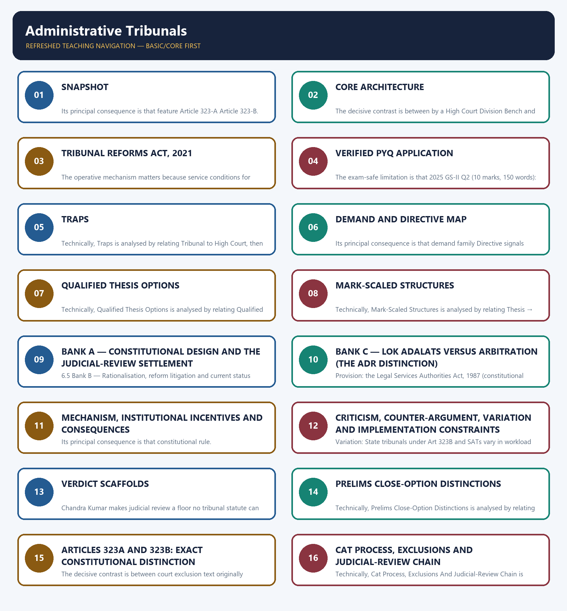

# Administrative Tribunals — Complete Uncompressed Learning Session

**Complete independent learning session + verified PYQ routing + solved practice workbook + final consolidated register notes**

**Legal/current control date:** 28 August 2026 (Asia/Kolkata)

> **Tag key:** `[FACT]` = named constitutional, statutory, official, judicial or audited local support; `[ANALYSIS]` = reasoned examination; `[CURRENT]` = checked for the control date; `[LIMIT]` = qualification.
>
> **Answer-writing discipline:** claim -> named evidence -> analysis -> qualification.

- [CURRENT] Status is controlled to **25 August 2026, Asia/Kolkata**.
- [CURRENT] **Live official refresh, 25 August 2026:** Articles 323A/323B, the Administrative Tribunals Act 1985, CAT material and the Supreme Court's tribunal-independence line through the judgment reported as 2025 INSC 1330 were rechecked on 25 August 2026. Appointment, tenure and service-condition statements carry an exact dated caveat because the common tribunal framework remains litigation- and implementation-sensitive.

#### How to Use This Package

[FACT] The complete Basic/Core owner is taught first in source order. Cross-topic Markdown, local OCR books and verified PYQ ledgers supplement it.

[FACT] Advanced-owner material appears only after the Core and practice sections under the required optional-depth label.

[LIMIT] Tribunals supplement specialist adjudication; they do not replace High Courts or the Supreme Court. L. Chandra Kumar preserves Articles 226/227 review. CAT, SATs, other Article 323B tribunals, commissions, courts and Lok Adalats must not be collapsed into one institutional category.

#### Local Owner Gateway

> **Subject:** Polity | **Tier:** Basic | **GS Paper:** GS-II  
> **Grounded in:** Articles 323-A and 323-B; Administrative Tribunals Act, 1985;
> *L. Chandra Kumar v. Union of India* (1997); Tribunal Reforms Act, 2021;
> *Madras Bar Association v. Union of India*, 2025 INSC 1330; Supreme Court order
> dated 9 March 2026.
> [FACT] = official/case-grounded | [LIMIT] = analysis | [CURRENT] = current/PYQ anchor.  
> *Advanced: optional deeper detail in `advanced/46_Administrative-Tribunals.md` — not required for any mark.*

## BASIC LEARNING SESSION



*Distinct embedded teaching-navigation image. The separate continuous Cārvāka-style flowchart package remains an independent at-a-glance artifact.*


*Distinct embedded teaching-navigation image. The separate continuous Cārvāka-style flowchart package remains an independent at-a-glance artifact.*

### SESSION 1 — SNAPSHOT

#### DEFINITION / WHAT THIS IS CALLED

**Plain-language definition:** Snapshot denotes the constitutional rules and institutional links organised around Feature Article 323-A Article 323-B.

**Technical definition:** Its principal consequence is that feature Article 323-A Article 323-B.

#### ANSWER-GRABBING OPENING — WRITE/ADAPT IN THE EXAM

> Snapshot denotes the constitutional rules and institutional links organised around Feature Article 323-A Article 323-B.

#### MUST-WRITE KEYWORDS

- **Snapshot**
- **Subject**
- **Recruitment and service conditions of public servants**
- **Law-maker**
- **Parliament only**
- **Parliament or a State Legislature within its competence**

**How to use them:** Frame the answer through Snapshot; define Subject, connect Recruitment and service conditions of public servants with Law-maker to explain the mechanism, and use Parliament only for the decisive comparison or qualification.

Snapshot denotes the constitutional rules and institutional links organised around Feature Article 323-A Article 323-B.
Snapshot operates through Law-maker Parliament only Parliament or a State Legislature within its competence, connected with Tribunal pattern One administrative-tribunal field Multiple specified subject fields.
The operative mechanism matters because feature Article 323-A Article 323-B.
Its principal consequence is that feature Article 323-A Article 323-B.
The decisive contrast is between Feature Article 323-A Article 323-B and Feature Article 323-A Article 323-B.
The exam-safe limitation is that feature Article 323-A Article 323-B.
| Feature | Article 323-A | Article 323-B |
|---|---|---|
| Subject | Recruitment and service conditions of public servants | Specified fields such as tax, foreign exchange, labour, land reform and elections |
| Law-maker | Parliament only | Parliament or a State Legislature within its competence |
| Tribunal pattern | One administrative-tribunal field | Multiple specified subject fields |

#### CLOSING RECALL FLOW — SNAPSHOT

```text
START / CONCEPT: SNAPSHOT
        |
        v
EXACT TERMS: Snapshot · Subject · Recruitment and service conditions of public servants · Law-maker · Parliament only · Parliament or a State Legislature within its competence
        |
        v
MECHANISM / ARGUMENT: Its principal consequence is that feature Article 323-A Article 323-B.
        |
        v
CONSEQUENCE / CONTRAST: The decisive contrast is between Feature Article 323-A Article 323-B and Feature Article 323-A Article 323-B.
        |
        v
UPSC TRAP / ANSWER-USE: Do not miss this limiting distinction: the exam-safe limitation is that feature Article 323-A Article 323-B.
        |
        v
ANSWER-GRABBING FORMULATION: Snapshot denotes the constitutional rules and institutional links organised around Feature Article 323-A Article 323-B.
```
### SESSION 2 — CORE ARCHITECTURE

#### DEFINITION / WHAT THIS IS CALLED

**Plain-language definition:** Core architecture denotes the constitutional rules and institutional links organised around SPECIALISED, FASTER FORUM.

**Technical definition:** The decisive contrast is between by a High Court Division Bench and under Articles 226/227.

#### ANSWER-GRABBING OPENING — WRITE/ADAPT IN THE EXAM

> Core architecture denotes the constitutional rules and institutional links organised around SPECIALISED, FASTER FORUM.

#### MUST-WRITE KEYWORDS

- **Core Architecture**
- **SPECIALISED**
- **FASTER FORUM**
- **Its principal consequence**
- **Its**
- **The decisive contrast**

**How to use them:** Frame the answer through Core Architecture; define SPECIALISED, connect FASTER FORUM with Its principal consequence to explain the mechanism, and use Its for the decisive comparison or qualification.

Core architecture denotes the constitutional rules and institutional links organised around SPECIALISED, FASTER FORUM.
Core architecture operates through Administrative tribunal, connected with expertise + flexible procedure.
The operative mechanism matters because l. Chandra Kumar safeguard.
Its principal consequence is that tribunal decisions remain reviewable.
The decisive contrast is between by a High Court Division Bench and under Articles 226/227.
The exam-safe limitation is that [FACT] The Administrative Tribunals Act, 1985 provides for the Central Administrative.
```text
SPECIALISED, FASTER FORUM
        |
        v
Administrative tribunal
expertise + flexible procedure
        |
        v
*L. Chandra Kumar* safeguard
tribunal decisions remain reviewable
by a High Court Division Bench
under Articles 226/227
```

- [FACT] The Administrative Tribunals Act, 1985 provides for the Central Administrative
  Tribunal (CAT) and enables State/Joint Administrative Tribunals.
- [FACT] CAT deals principally with recruitment and service matters of covered Union public
  servants; its jurisdiction is statutory and has exclusions.
- [FACT] Tribunals are supplemental to, not substitutes for, constitutional courts.
- [FACT] Judicial review under Articles 32 and 226/227 is part of the basic structure.

#### CLOSING RECALL FLOW — CORE ARCHITECTURE

```text
START / CONCEPT: CORE ARCHITECTURE
        |
        v
EXACT TERMS: Core Architecture · SPECIALISED · FASTER FORUM · Its principal consequence · Its · The decisive contrast
        |
        v
MECHANISM / ARGUMENT: The decisive contrast is between by a High Court Division Bench and under Articles 226/227.
        |
        v
CONSEQUENCE / CONTRAST: Its principal consequence is that tribunal decisions remain reviewable.
        |
        v
UPSC TRAP / ANSWER-USE: Tribunals are supplemental to, not substitutes for, constitutional courts.
        |
        v
ANSWER-GRABBING FORMULATION: Core architecture denotes the constitutional rules and institutional links organised around SPECIALISED, FASTER FORUM.
```
### SESSION 3 — TRIBUNAL REFORMS ACT, 2021

#### DEFINITION / WHAT THIS IS CALLED

**Plain-language definition:** Tribunal Reforms Act, 2021 denotes the constitutional rules and institutional links organised around The 2021 rationalisation abolished specified appellate bodies and transferred their.

**Technical definition:** The operative mechanism matters because service conditions for members of covered tribunals.

#### ANSWER-GRABBING OPENING — WRITE/ADAPT IN THE EXAM

> Tribunal Reforms Act, 2021 denotes the constitutional rules and institutional links organised around The 2021 rationalisation abolished specified appellate bodies and transferred their.

#### MUST-WRITE KEYWORDS

- **Tribunal Reforms Act**
- **Current legal baseline**
- **19 Nov 2025**
- **2025 INSC 1330**
- **9 Mar 2026**
- **8 Sep 2026**

**How to use them:** Frame the answer through Tribunal Reforms Act; define Current legal baseline, connect 19 Nov 2025 with 2025 INSC 1330 to explain the mechanism, and use 9 Mar 2026 for the decisive comparison or qualification.

Tribunal Reforms Act, 2021 denotes the constitutional rules and institutional links organised around [FACT] The 2021 rationalisation abolished specified appellate bodies and transferred their.
Tribunal Reforms Act, 2021 operates through functions to existing judicial or administrative forums, connected with [FACT] It also prescribed a common framework for qualifications, appointment, tenure and.
The operative mechanism matters because service conditions for members of covered tribunals.
Its principal consequence is that [CURRENT] [FACT] Current legal baseline: on 19 Nov 2025 , the Supreme Court in.
The decisive contrast is between 2025 INSC 1330 struck down the re-enacted appointment/service-condition provisions and that repeated defects already invalidated in earlier Madras Bar Association rulings.
The exam-safe limitation is that these included the fifty-year minimum age, two-name recommendation panel and merely.
- [FACT] The 2021 rationalisation abolished specified appellate bodies and transferred their
  functions to existing judicial or administrative forums.
- [FACT] It also prescribed a common framework for qualifications, appointment, tenure and
  service conditions for members of covered tribunals.
- [CURRENT] [FACT] **Current legal baseline:** on **19 Nov 2025**, the Supreme Court in
  **2025 INSC 1330** struck down the re-enacted appointment/service-condition provisions
  that repeated defects already invalidated in earlier *Madras Bar Association* rulings.
  These included the fifty-year minimum age, two-name recommendation panel and merely
  preferable appointment timeline, four-year tenure, and impugned allowance framework.
  The Court made *MBA (IV)* and *MBA (V)* the controlling framework and directed creation
  of a National Tribunals Commission within four months.
- [CURRENT] [FACT] A **9 Mar 2026** interim order separately permitted temporary extensions for
  specified serving tribunal incumbents until **8 Sep 2026** or the applicable maximum
  age, whichever was earlier, to prevent tribunals becoming defunct. It was a continuity
  arrangement, not a reopening of the November 2025 constitutional ruling.
- [LIMIT] Rationalisation can reduce institutional duplication, but transferring specialised
  work to already burdened courts may weaken the promised gains in speed and expertise.
- [LIMIT] Executive influence over appointments, short tenure, vacancies and infrastructure
  remain the central independence/capacity concerns.

#### CLOSING RECALL FLOW — TRIBUNAL REFORMS ACT, 2021

```text
START / CONCEPT: TRIBUNAL REFORMS ACT, 2021
        |
        v
EXACT TERMS: Tribunal Reforms Act · Current legal baseline · 19 Nov 2025 · 2025 INSC 1330 · 9 Mar 2026 · 8 Sep 2026
        |
        v
MECHANISM / ARGUMENT: The operative mechanism matters because service conditions for members of covered tribunals.
        |
        v
CONSEQUENCE / CONTRAST: Its principal consequence is that [CURRENT] Current legal baseline: on 19 Nov 2025 , the Supreme Court in.
        |
        v
UPSC TRAP / ANSWER-USE: Do not miss this limiting distinction: the decisive contrast is between 2025 INSC 1330 struck down the re-enacted appointment/service-condition provisions...
        |
        v
ANSWER-GRABBING FORMULATION: Tribunal Reforms Act, 2021 denotes the constitutional rules and institutional links organised around The 2021 rationalisation abolished specified appellate bodies and transferred their.
```
### SESSION 4 — VERIFIED PYQ APPLICATION

#### DEFINITION / WHAT THIS IS CALLED

**Plain-language definition:** Verified PYQ application denotes the constitutional rules and institutional links organised around 2025 GS-II Q2 (10 marks, 150 words): “Comment on the need of administrative.

**Technical definition:** The exam-safe limitation is that 2025 GS-II Q2 (10 marks, 150 words): “Comment on the need of administrative. tribunals as compared to the court system.

#### ANSWER-GRABBING OPENING — WRITE/ADAPT IN THE EXAM

> Verified PYQ application denotes the constitutional rules and institutional links organised around 2025 GS-II Q2 (10 marks, 150 words): “Comment on the need of administrative.

#### MUST-WRITE KEYWORDS

- **Verified Pyq Application**
- **route**
- **Verified PYQ**
- **GS-II**
- **Comment**
- **2025 GS-II Q2 (10 marks, 150 words)**

**How to use them:** Frame the answer through Verified Pyq Application; define route, connect Verified PYQ with GS-II to explain the mechanism, and use Comment for the decisive comparison or qualification.

Verified PYQ application denotes the constitutional rules and institutional links organised around [FACT] 2025 GS-II Q2 (10 marks, 150 words): “Comment on the need of administrative.
Verified PYQ application operates through tribunals as compared to the court system. Assess the impact of the recent tribunal, connected with reforms through rationalization of tribunals made in 2021.”.
The operative mechanism matters because answer route: need (expertise, speed, flexible procedure) - safeguards.
Its principal consequence is that ( L. Chandra Kumar , independence) - 2021 gains (consolidation) - risks.
The decisive contrast is between (court burden, vacancies, executive control) - independent appointments and capacity and [FACT] 2025 GS-II Q2 (10 marks, 150 words): “Comment on the need of administrative.
The exam-safe limitation is that [FACT] 2025 GS-II Q2 (10 marks, 150 words): “Comment on the need of administrative.
- [FACT] **2025 GS-II Q2 (10 marks, 150 words):** “Comment on the need of administrative
  tribunals as compared to the court system. Assess the impact of the recent tribunal
  reforms through rationalization of tribunals made in 2021.”
- **Answer route:** need (expertise, speed, flexible procedure) -> safeguards
  (*L. Chandra Kumar*, independence) -> 2021 gains (consolidation) -> risks
  (court burden, vacancies, executive control) -> independent appointments and capacity.

#### CLOSING RECALL FLOW — VERIFIED PYQ APPLICATION

```text
START / CONCEPT: VERIFIED PYQ APPLICATION
        |
        v
EXACT TERMS: Verified Pyq Application · route · Verified PYQ · GS-II · Comment · 2025 GS-II Q2 (10 marks, 150 words)
        |
        v
MECHANISM / ARGUMENT: The decisive contrast is between (court burden, vacancies, executive control) - independent appointments and capacity and 2025 GS-II Q2 (10 marks, 150 words): “Comment on the need of administrative.
        |
        v
CONSEQUENCE / CONTRAST: Its principal consequence is that ( L.
        |
        v
UPSC TRAP / ANSWER-USE: Do not miss this limiting distinction: the exam-safe limitation is that 2025 GS-II Q2 (10 marks, 150 words).
        |
        v
ANSWER-GRABBING FORMULATION: Verified PYQ application denotes the constitutional rules and institutional links organised around 2025 GS-II Q2 (10 marks, 150 words): “Comment on the need of administrative.
```
### SESSION 5 — TRAPS

#### DEFINITION / WHAT THIS IS CALLED

**Plain-language definition:** Traps denotes the constitutional rules and institutional links organised around Wrong: Tribunal decisions are immune from High Court review. - They are reviewable under.

**Technical definition:** Technically, Traps is analysed by relating Tribunal to High Court, then testing the relationship through They and Chandra Kumar.

#### ANSWER-GRABBING OPENING — WRITE/ADAPT IN THE EXAM

> Traps denotes the constitutional rules and institutional links organised around Wrong: Tribunal decisions are immune from High Court review. - They are reviewable under.

#### MUST-WRITE KEYWORDS

- **Traps**
- **Tribunal**
- **High Court**
- **They**
- **Chandra Kumar**
- **Articles**

**How to use them:** Frame the answer through Traps; define Tribunal, connect High Court with They to explain the mechanism, and use Chandra Kumar for the decisive comparison or qualification.

Traps denotes the constitutional rules and institutional links organised around Wrong: Tribunal decisions are immune from High Court review. - They are reviewable under.
Traps operates through Articles 226/227 after L. Chandra Kumar, connected with Wrong: Articles 323-A and 323-B are identical. - They differ in subject, law-maker and scope.
The operative mechanism matters because wrong: Rationalisation automatically reduces pendency. - Forum transfer can merely shift.
Its principal consequence is that pendency unless judges, benches and infrastructure follow.
The decisive contrast is between Wrong: The March 2026 extension restored the invalidated four-year-tenure rule. - It only and protected specified serving incumbents temporarily; the November 2025 constitutional.
The exam-safe limitation is that ruling and the MBA (IV)/(V) controlling standards remained the legal baseline.
- Wrong: Tribunal decisions are immune from High Court review. -> They are reviewable under
  Articles 226/227 after *L. Chandra Kumar*.
- Wrong: Articles 323-A and 323-B are identical. -> They differ in subject, law-maker and scope.
- Wrong: Rationalisation automatically reduces pendency. -> Forum transfer can merely shift
  pendency unless judges, benches and infrastructure follow.
- Wrong: The March 2026 extension restored the invalidated four-year-tenure rule. -> It only
  protected specified serving incumbents temporarily; the November 2025 constitutional
  ruling and the *MBA (IV)/(V)* controlling standards remained the legal baseline.

See also: For the complete tribunal-versus-regulator taxonomy, natural justice and cross-sector appellate
map, use `Statutory-Regulatory-and-Quasi-Judicial-Bodies.md`.
#### 06. 6. Answer architecture (10/15/20-mark support)

6. Answer architecture (10/15/20-mark support) denotes the constitutional rules and institutional links organised around Constitutional rule.
6. Answer architecture (10/15/20-mark support) operates through Operating mechanism, connected with Exam distinction.
The operative mechanism matters because constitutional rule.
Its principal consequence is that constitutional rule.
The decisive contrast is between Constitutional rule and Constitutional rule.
The exam-safe limitation is that constitutional rule.
> Purpose: make this Core file independently answer directive-sensitive GS-II questions on tribunals versus ordinary courts, CAT's adjudicatory independence, the 2021 rationalisation, and Lok Adalats versus arbitration — without opening Advanced. Tenure, age, vacancy and pecuniary-limit numbers change with each amendment and judgment; treat every such figure as [CURRENT] and re-verify.

#### CLOSING RECALL FLOW — TRAPS

```text
START / CONCEPT: TRAPS
        |
        v
EXACT TERMS: Traps · Tribunal · High Court · They · Chandra Kumar · Articles
        |
        v
MECHANISM / ARGUMENT: The operative mechanism matters because wrong: Rationalisation automatically reduces pendency. - Forum transfer can merely shift.
        |
        v
CONSEQUENCE / CONTRAST: Its principal consequence is that pendency unless judges, benches and infrastructure follow.
        |
        v
UPSC TRAP / ANSWER-USE: Do not miss this limiting distinction: s denotes the constitutional rules and institutional links organised around Wrong.
        |
        v
ANSWER-GRABBING FORMULATION: Traps denotes the constitutional rules and institutional links organised around Wrong: Tribunal decisions are immune from High Court review. - They are reviewable under.
```
### SESSION 6 — DEMAND AND DIRECTIVE MAP

#### DEFINITION / WHAT THIS IS CALLED

**Plain-language definition:** 6.1 Demand and directive map denotes the constitutional rules and institutional links organised around Demand family Directive signals Answer spine.

**Technical definition:** Its principal consequence is that demand family Directive signals Answer spine.

#### ANSWER-GRABBING OPENING — WRITE/ADAPT IN THE EXAM

> 6.1 Demand and directive map denotes the constitutional rules and institutional links organised around Demand family Directive signals Answer spine.

#### MUST-WRITE KEYWORDS

- **Demand**
- **Directive Map**
- **Tribunals vs ordinary courts**
- **"curtail jurisdiction", How far, Discuss**
- **CAT's adjudicatory independence**
- **"independent judicial authority", Explain**

**How to use them:** Frame the answer through Demand; define Directive Map, connect Tribunals vs ordinary courts with "curtail jurisdiction", How far, Discuss to explain the mechanism, and use CAT's adjudicatory independence for the decisive comparison or qualification.

6.1 Demand and directive map denotes the constitutional rules and institutional links organised around Demand family Directive signals Answer spine.
6.1 Demand and directive map operates through Need + 2021 rationalisation "need", "assess reforms", Comment need → safeguards → 2021 Act → gains vs displacement → verdict, connected with Lok Adalat vs arbitration "distinguish", Explain ADR framing → LSA Act 1987 → A&C Act 1996 → distinctions → verdict.
The operative mechanism matters because demand family Directive signals Answer spine.
Its principal consequence is that demand family Directive signals Answer spine.
The decisive contrast is between Demand family Directive signals Answer spine and Demand family Directive signals Answer spine.
The exam-safe limitation is that demand family Directive signals Answer spine.
| Demand family | Directive signals | Answer spine |
|---|---|---|
| Tribunals vs ordinary courts | "curtail jurisdiction", How far, Discuss | supplement-not-supplant → 323A/B exclusion → *L. Chandra Kumar* → NTT/*R. Gandhi* → verdict |
| CAT's adjudicatory independence | "independent judicial authority", Explain | AT Act 1985 → independence markers → executive-influence limit → HC review → verdict |
| Need + 2021 rationalisation | "need", "assess reforms", Comment | need → safeguards → 2021 Act → gains vs displacement → verdict |
| Lok Adalat vs arbitration | "distinguish", Explain | ADR framing → LSA Act 1987 → A&C Act 1996 → distinctions → verdict |
| Independence/accountability of tribunals | "appointments", "tenure", Critically examine | MBA line → Finance Act 2017/*Rojer Mathew* → 2021 Act → NTC → verdict |

#### CLOSING RECALL FLOW — DEMAND AND DIRECTIVE MAP

```text
START / CONCEPT: DEMAND AND DIRECTIVE MAP
        |
        v
EXACT TERMS: Demand · Directive Map · Tribunals vs ordinary courts · "curtail jurisdiction", How far, Discuss · CAT's adjudicatory independence · "independent judicial authority", Explain
        |
        v
MECHANISM / ARGUMENT: 6.1 Demand and directive map operates through Need + 2021 rationalisation "need", "assess reforms", Comment need → safeguards → 2021 Act → gains vs displacement → verdict, connected with Lok Adalat vs arbitration "distinguish", Explain ADR framing → LSA Act 1987 → A&C Act 1996 → distinctions → verdict.
        |
        v
CONSEQUENCE / CONTRAST: Its principal consequence is that demand family Directive signals Answer spine.
        |
        v
UPSC TRAP / ANSWER-USE: Do not miss this limiting distinction: the decisive contrast is between Demand family Directive signals Answer spine and Demand family...
        |
        v
ANSWER-GRABBING FORMULATION: 6.1 Demand and directive map denotes the constitutional rules and institutional links organised around Demand family Directive signals Answer spine.
```
### SESSION 7 — QUALIFIED THESIS OPTIONS

#### DEFINITION / WHAT THIS IS CALLED

**Plain-language definition:** 6.2 Qualified thesis options denotes the constitutional rules and institutional links organised around Constitutional rule.

**Technical definition:** Technically, Qualified Thesis Options is analysed by relating Qualified to Constitutional, then testing the relationship through Its principal consequence and Its.

#### ANSWER-GRABBING OPENING — WRITE/ADAPT IN THE EXAM

> 6.2 Qualified thesis options denotes the constitutional rules and institutional links organised around Constitutional rule.

#### MUST-WRITE KEYWORDS

- **Qualified Thesis Options**
- **Qualified**
- **Constitutional**
- **Its principal consequence**
- **Its**
- **6.2 Qualified thesis options**

**How to use them:** Frame the answer through Qualified Thesis Options; define Qualified, connect Constitutional with Its principal consequence to explain the mechanism, and use Its for the decisive comparison or qualification.

6.2 Qualified thesis options denotes the constitutional rules and institutional links organised around Constitutional rule.
6.2 Qualified thesis options operates through Operating mechanism, connected with Exam distinction.
The operative mechanism matters because constitutional rule.
Its principal consequence is that constitutional rule.
The decisive contrast is between Constitutional rule and Constitutional rule.
The exam-safe limitation is that constitutional rule.
- *Tribunals are a functional supplement to the courts, not a substitute for them: they may take the first bite of a dispute, but the High Court's supervisory jurisdiction is a basic-structure floor they cannot displace.*
- *The promise of tribunals — expertise, speed and access — is delivered only when their independence is secured; the recurring constitutional litigation since 2010 shows that appointment and tenure design, not jurisdiction, is the real battleground.*
- *Lok Adalats and arbitration answer two different justice deficits — one of access for the poor, one of autonomy for commerce — so they are complementary limbs of an alternative-dispute-resolution architecture, not rivals.*

#### CLOSING RECALL FLOW — QUALIFIED THESIS OPTIONS

```text
START / CONCEPT: QUALIFIED THESIS OPTIONS
        |
        v
EXACT TERMS: Qualified Thesis Options · Qualified · Constitutional · Its principal consequence · Its · 6.2 Qualified thesis options
        |
        v
MECHANISM / ARGUMENT: Its principal consequence is that constitutional rule.
        |
        v
CONSEQUENCE / CONTRAST: The decisive contrast is between Constitutional rule and Constitutional rule.
        |
        v
UPSC TRAP / ANSWER-USE: The promise of tribunals — expertise, speed and access — is delivered only when their independence is secured; the recurring constitutional litigation since 2010 shows that appointment and tenure design, not jurisdiction, is the real battleground.
        |
        v
ANSWER-GRABBING FORMULATION: 6.2 Qualified thesis options denotes the constitutional rules and institutional links organised around Constitutional rule.
```
### SESSION 8 — MARK-SCALED STRUCTURES

#### DEFINITION / WHAT THIS IS CALLED

**Plain-language definition:** 6.3 Mark-scaled structures denotes the constitutional rules and institutional links organised around Marks Architecture Evidence load.

**Technical definition:** Technically, Mark-Scaled Structures is analysed by relating Thesis → two anchors (Article/Act + case) → one qualification → verdict to 3 units, then testing the relationship through 5–6 units and 7–8 units + an "independence vs capacity" paragraph.

#### ANSWER-GRABBING OPENING — WRITE/ADAPT IN THE EXAM

> 6.3 Mark-scaled structures denotes the constitutional rules and institutional links organised around Marks Architecture Evidence load.

#### MUST-WRITE KEYWORDS

- **Mark-Scaled Structures**
- **Thesis → two anchors (Article/Act + case) → one qualification → verdict**
- **3 units**
- **5–6 units**
- **7–8 units + an "independence vs capacity" paragraph**
- **6.3 Mark-scaled structures**

**How to use them:** Frame the answer through Mark-Scaled Structures; define Thesis → two anchors (Article/Act + case) → one qualification → verdict, connect 3 units with 5–6 units to explain the mechanism, and use 7–8 units + an "independence vs capacity" paragraph for the decisive comparison or qualification.

6.3 Mark-scaled structures denotes the constitutional rules and institutional links organised around Marks Architecture Evidence load.
6.3 Mark-scaled structures operates through 10 Thesis → two anchors (Article/Act + case) → one qualification → verdict 3 units, connected with 15 Thesis → constitutional design → case-law settlement → counter-risk (independence/burden) → graded verdict 5–6 units.
The operative mechanism matters because marks Architecture Evidence load.
Its principal consequence is that marks Architecture Evidence load.
The decisive contrast is between Marks Architecture Evidence load and Marks Architecture Evidence load.
The exam-safe limitation is that marks Architecture Evidence load.
| Marks | Architecture | Evidence load |
|---:|---|---|
| 10 | Thesis → two anchors (Article/Act + case) → one qualification → verdict | 3 units |
| 15 | Thesis → constitutional design → case-law settlement → counter-risk (independence/burden) → graded verdict | 5–6 units |
| 20 | Thesis → design → judicial-review settlement → reform (2017/2021) → Lok Adalat/ADR comparison → graded verdict | 7–8 units + an "independence vs capacity" paragraph |

#### CLOSING RECALL FLOW — MARK-SCALED STRUCTURES

```text
START / CONCEPT: MARK-SCALED STRUCTURES
        |
        v
EXACT TERMS: Mark-Scaled Structures · Thesis → two anchors (Article/Act + case) → one qualification → verdict · 3 units · 5–6 units · 7–8 units + an "independence vs capacity" paragraph · 6.3 Mark-scaled structures
        |
        v
MECHANISM / ARGUMENT: The decisive contrast is between Marks Architecture Evidence load and Marks Architecture Evidence load.
        |
        v
CONSEQUENCE / CONTRAST: Its principal consequence is that marks Architecture Evidence load.
        |
        v
UPSC TRAP / ANSWER-USE: Do not miss this limiting distinction: the exam-safe limitation is that marks Architecture Evidence load.
        |
        v
ANSWER-GRABBING FORMULATION: 6.3 Mark-scaled structures denotes the constitutional rules and institutional links organised around Marks Architecture Evidence load.
```
### SESSION 9 — BANK A — CONSTITUTIONAL DESIGN AND THE JUDICIAL-REVIEW SETTLEMENT

#### DEFINITION / WHAT THIS IS CALLED

**Plain-language definition:** 6.4 Bank A — Constitutional design and the judicial-review settlement denotes the constitutional rules and institutional links organised around Constitutional rule.

**Technical definition:** 6.5 Bank B — Rationalisation, reform litigation and current status denotes the constitutional rules and institutional links organised around Constitutional rule.

#### ANSWER-GRABBING OPENING — WRITE/ADAPT IN THE EXAM

> 6.4 Bank A — Constitutional design and the judicial-review settlement denotes the constitutional rules and institutional links organised around Constitutional rule.

#### MUST-WRITE KEYWORDS

- **Bank A**
- **Constitutional Design**
- **The Judicial-Review Settlement**
- **Claim**
- **Provisions**
- **Art 323A**

**How to use them:** Frame the answer through Bank A; define Constitutional Design, connect The Judicial-Review Settlement with Claim to explain the mechanism, and use Provisions for the decisive comparison or qualification.

6.4 Bank A — Constitutional design and the judicial-review settlement denotes the constitutional rules and institutional links organised around Constitutional rule.
6.4 Bank A — Constitutional design and the judicial-review settlement operates through Operating mechanism, connected with Exam distinction.
The operative mechanism matters because constitutional rule.
Its principal consequence is that constitutional rule.
The decisive contrast is between Constitutional rule and Constitutional rule.
The exam-safe limitation is that constitutional rule.
- **Claim:** the two tribunal Articles differ in subject and law-maker. **Provisions:** **Art 323A** (public-service recruitment/service conditions; **Parliament only**; one field) vs **Art 323B** (enumerated fields — taxation, foreign exchange, labour, land reform, elections, etc.; **Parliament or State Legislature**; multiple fields); both inserted by the **42nd Amendment, 1976** (Part XIV-A). **Mechanism:** enables a specialised, exclusive adjudicatory channel. **Limitation:** [FACT] they are *not* identical — the exclusion-of-review clauses in both were read down by *L. Chandra Kumar*.
- **Claim:** CAT is a creature of statute, not the Constitution. **Provision:** the **Administrative Tribunals Act, 1985** created the **Central Administrative Tribunal** and enables **State (SAT)** and **Joint** tribunals; CAT covers recruitment and service matters of covered Union public servants. **Mechanism:** specialist members + simpler procedure. **Limitation:** [LIMIT] statutory jurisdiction with exclusions (e.g., defence personnel, Supreme Court staff, parliamentary secretariat staff).
- **Claim:** tribunal substitution was accepted only if the alternative is effective. **Case:** *S.P. Sampath Kumar v. Union of India (1987)* upheld the 1985 Act on condition that tribunals are an **"effective alternative institutional mechanism"** with the efficacy of the High Court. **Mechanism:** set the independence/efficacy test. **Limitation:** [LIMIT] it initially excluded HC review (leaving only the SC) — corrected in 1997.
- **Claim:** judicial review of tribunals cannot be excluded. **Case:** *L. Chandra Kumar v. Union of India (1997)* (seven-judge bench) — review under **Art 226/227 and 32 is basic structure**; the exclusion clauses in **Art 323A(2)(d)/323B(3)(d)** are **unconstitutional** to that extent; tribunal orders lie to a **HC Division Bench**. **Mechanism:** tribunals became supplemental, not substitutes. **Limitation:** [LIMIT] it adds a tier — speed then depends on first-instance quality.
- **Claim:** tribunalising a court's core function needs independence guarantees. **Case:** *Union of India v. R. Gandhi (2010)* (NCLT/NCLAT) upheld transferring company-law jurisdiction to tribunals **only if** members' qualifications, selection and service conditions preserve **independence and separation of powers**. **Mechanism:** the template for every later tribunal-reform challenge. **Limitation:** [FACT] a rule violating these standards is struck down, as repeatedly since.
- **Claim:** courts will strike down tribunals that usurp their constitutional role. **Case:** *Madras Bar Association v. Union of India (2014)* struck down the **National Tax Tribunal Act, 2005** because vesting the HC's power over substantial questions of law in an executive-controlled tribunal violated **separation of powers/basic structure**. **Mechanism:** an outer limit on tribunalisation. **Limitation:** [LIMIT] the objection was to the *design*, not to tax adjudication as such.
#### 11. 6.5 Bank B — Rationalisation, reform litigation and current status

6.5 Bank B — Rationalisation, reform litigation and current status denotes the constitutional rules and institutional links organised around Constitutional rule.
6.5 Bank B — Rationalisation, reform litigation and current status operates through Operating mechanism, connected with Exam distinction.
The operative mechanism matters because constitutional rule.
Its principal consequence is that constitutional rule.
The decisive contrast is between Constitutional rule and Constitutional rule.
The exam-safe limitation is that constitutional rule.
- **Claim:** rationalisation began before 2021. **Provision:** the **Finance Act, 2017** (Part XIV) merged/abolished several tribunals and empowered the Centre to frame rules on members' qualifications, appointment and tenure. **Mechanism:** consolidation + executive rule-making power. **Limitation:** [LIMIT] it was passed as a **Money Bill** — a contested route.
- **Claim:** the 2017 rules were struck down for compromising independence. **Case:** *Rojer Mathew v. South Indian Bank Ltd (2019)* invalidated the **Tribunal Rules 2017** as contrary to judicial independence, ordered re-framing, and **referred the Money-Bill question to a larger bench**. **Mechanism:** judicial policing of appointment design. **Limitation:** [CURRENT] the Money-Bill reference remained pending — do not state it as settled.
- **Claim:** the 2021 Act repeated defects and was repeatedly corrected. **Provision/status:** the **Tribunals Reforms Act, 2021** abolished several appellate tribunals (transferring work to HCs/commercial courts) and prescribed a **four-year tenure, minimum age of 50 and a search-cum-selection committee**. [CURRENT] [FACT] On **19 Nov 2025 (2025 INSC 1330)** the SC struck down the re-enacted age/panel/tenure/allowance provisions, made **MBA (IV)/(V)** controlling, and directed a **National Tribunals Commission** within four months; a **9 Mar 2026** order gave temporary continuity to specified serving incumbents until **8 Sep 2026** or the maximum age. **Limitation:** [CURRENT] these dated holdings move — re-verify before citing; a struck-down provision is not the law.

#### CLOSING RECALL FLOW — BANK A — CONSTITUTIONAL DESIGN AND THE JUDICIAL-REVIEW SETTLEMENT

```text
START / CONCEPT: BANK A — CONSTITUTIONAL DESIGN AND THE JUDICIAL-REVIEW SETTLEMENT
        |
        v
EXACT TERMS: Bank A · Constitutional Design · The Judicial-Review Settlement · Claim · Provisions · Art 323A
        |
        v
MECHANISM / ARGUMENT: Limitation: they are not identical — the exclusion-of-review clauses in both were read down by L.
        |
        v
CONSEQUENCE / CONTRAST: The decisive contrast is between Constitutional rule and Constitutional rule.
        |
        v
UPSC TRAP / ANSWER-USE: Limitation: the objection was to the design, not to tax adjudication as such.
        |
        v
ANSWER-GRABBING FORMULATION: 6.4 Bank A — Constitutional design and the judicial-review settlement denotes the constitutional rules and institutional links organised around Constitutional rule.
```
### SESSION 10 — BANK C — LOK ADALATS VERSUS ARBITRATION (THE ADR DISTINCTION)

#### DEFINITION / WHAT THIS IS CALLED

**Plain-language definition:** 6.6 Bank C — Lok Adalats versus arbitration (the ADR distinction) denotes the constitutional rules and institutional links organised around Axis Lok Adalat Arbitration.

**Technical definition:** Provision: the Legal Services Authorities Act, 1987 (constitutional anchor Art 39A) gives Lok Adalats statutory status; they settle pending or pre-litigation disputes by compromise; the award is deemed a decree of a civil court, is final and binding, and no appeal lies (§21).

#### ANSWER-GRABBING OPENING — WRITE/ADAPT IN THE EXAM

> 6.6 Bank C — Lok Adalats versus arbitration (the ADR distinction) denotes the constitutional rules and institutional links organised around Axis Lok Adalat Arbitration.

#### MUST-WRITE KEYWORDS

- **Bank C**
- **Lok Adalats Versus Arbitration (The Adr Distinction)**
- **Claim**
- **Provision**
- **Legal Services Authorities Act, 1987**
- **Art 39A**

**How to use them:** Frame the answer through Bank C; define Lok Adalats Versus Arbitration (The Adr Distinction), connect Claim with Provision to explain the mechanism, and use Legal Services Authorities Act, 1987 for the decisive comparison or qualification.

6.6 Bank C — Lok Adalats versus arbitration (the ADR distinction) denotes the constitutional rules and institutional links organised around Axis Lok Adalat Arbitration.
6.6 Bank C — Lok Adalats versus arbitration (the ADR distinction) operates through Source Statutory — LSA Act 1987 (Art 39A) Contractual — A&C Act 1996, connected with Nature Court-annexed conciliation/compromise Private adjudication.
The operative mechanism matters because consent Referral or consent; PLA decides merits for public utilities Consent via arbitration agreement.
Its principal consequence is that cost Free; court fee refunded Parties bear arbitrator/institutional fees.
The decisive contrast is between Outcome Award = civil decree, final, no appeal Award enforceable as decree; §34 challenge only and Axis Lok Adalat Arbitration.
The exam-safe limitation is that axis Lok Adalat Arbitration.
- **Claim:** Lok Adalats are a statutory access-to-justice mechanism. **Provision:** the **Legal Services Authorities Act, 1987** (constitutional anchor **Art 39A**) gives Lok Adalats statutory status; they settle pending or pre-litigation disputes by **compromise**; the **award is deemed a decree of a civil court, is final and binding, and no appeal lies** (§21). **Permanent Lok Adalats (§22B)** can decide the **merits** of **public-utility-service** disputes if conciliation fails. **Mechanism:** free, quick, conciliatory closure. **Limitation:** [LIMIT] ordinary Lok Adalats need the parties' consent to settle, and cannot try an offence.
- **Claim:** arbitration is a contractual, adjudicatory ADR. **Provision:** the **Arbitration and Conciliation Act, 1996** (based on the UNCITRAL Model Law) lets parties, by an **arbitration agreement**, have a **private tribunal adjudicate**; the **award is final and enforceable as a decree (§36)** and challengeable only on limited **§34** grounds. **Mechanism:** party autonomy over forum, procedure and seat. **Limitation:** [LIMIT] costs fall on the parties; courts do not re-hear the merits.

| Axis | **Lok Adalat** | **Arbitration** |
|---|---|---|
| Source | Statutory — **LSA Act 1987** (Art 39A) | Contractual — **A&C Act 1996** |
| Nature | Court-annexed **conciliation/compromise** | Private **adjudication** |
| Consent | Referral or consent; **PLA decides merits** for public utilities | Consent via **arbitration agreement** |
| Cost | Free; court fee refunded | Parties bear arbitrator/institutional fees |
| Outcome | Award = **civil decree, final, no appeal** | Award enforceable as decree; **§34** challenge only |

#### CLOSING RECALL FLOW — BANK C — LOK ADALATS VERSUS ARBITRATION (THE ADR DISTINCTION)

```text
START / CONCEPT: BANK C — LOK ADALATS VERSUS ARBITRATION (THE ADR DISTINCTION)
        |
        v
EXACT TERMS: Bank C · Lok Adalats Versus Arbitration (The Adr Distinction) · Claim · Provision · Legal Services Authorities Act, 1987 · Art 39A
        |
        v
MECHANISM / ARGUMENT: Provision: the Legal Services Authorities Act, 1987 (constitutional anchor Art 39A) gives Lok Adalats statutory status; they settle pending or pre-litigation disputes by compromise; the award is deemed a decree of a civil court, is final and binding, and no appeal lies (§21).
        |
        v
CONSEQUENCE / CONTRAST: The decisive contrast is between Outcome Award = civil decree, final, no appeal Award enforceable as decree; §34 challenge only and Axis Lok Adalat Arbitration.
        |
        v
UPSC TRAP / ANSWER-USE: Do not miss this limiting distinction: its principal consequence is that cost Free.
        |
        v
ANSWER-GRABBING FORMULATION: 6.6 Bank C — Lok Adalats versus arbitration (the ADR distinction) denotes the constitutional rules and institutional links organised around Axis Lok Adalat Arbitration.
```
### SESSION 11 — MECHANISM, INSTITUTIONAL INCENTIVES AND CONSEQUENCES

#### DEFINITION / WHAT THIS IS CALLED

**Plain-language definition:** 6.7 Mechanism, institutional incentives and consequences denotes the constitutional rules and institutional links organised around Constitutional rule.

**Technical definition:** Its principal consequence is that constitutional rule.

#### ANSWER-GRABBING OPENING — WRITE/ADAPT IN THE EXAM

> 6.7 Mechanism, institutional incentives and consequences denotes the constitutional rules and institutional links organised around Constitutional rule.

#### MUST-WRITE KEYWORDS

- **Institutional Incentives**
- **Consequences**
- **Why tribunals were created**
- **National Tribunals Commission logic**
- **Constitutional**
- **6.7 Mechanism, institutional incentives and consequences**

**How to use them:** Frame the answer through Institutional Incentives; define Consequences, connect Why tribunals were created with National Tribunals Commission logic to explain the mechanism, and use Constitutional for the decisive comparison or qualification.

6.7 Mechanism, institutional incentives and consequences denotes the constitutional rules and institutional links organised around Constitutional rule.
6.7 Mechanism, institutional incentives and consequences operates through Operating mechanism, connected with Exam distinction.
The operative mechanism matters because constitutional rule.
Its principal consequence is that constitutional rule.
The decisive contrast is between Constitutional rule and Constitutional rule.
The exam-safe limitation is that constitutional rule.
- **Why tribunals were created:** to move technical, high-volume disputes to expert members under simpler procedure, easing the constitutional courts.
- **Why independence is the pressure point:** [LIMIT] because the government is the largest litigant before service and regulatory tribunals, executive control over appointments, tenure and finances creates an incentive to weaken the very forum that judges it — which is why the courts keep intervening.
- **Consequence of the *L. Chandra Kumar* tier:** [FACT] tribunal → HC Division Bench → SC preserves supervision but can *lengthen* the chain, so first-instance quality, not jurisdiction-stripping, is the real efficiency lever.
- **National Tribunals Commission logic:** [LIMIT] an independent umbrella body for appointments, infrastructure and oversight is the standing judicial prescription for breaking the appoint-and-strike-down cycle.

#### CLOSING RECALL FLOW — MECHANISM, INSTITUTIONAL INCENTIVES AND CONSEQUENCES

```text
START / CONCEPT: MECHANISM, INSTITUTIONAL INCENTIVES AND CONSEQUENCES
        |
        v
EXACT TERMS: Institutional Incentives · Consequences · Why tribunals were created · National Tribunals Commission logic · Constitutional · 6.7 Mechanism, institutional incentives and consequences
        |
        v
MECHANISM / ARGUMENT: Why tribunals were created: to move technical, high-volume disputes to expert members under simpler procedure, easing the constitutional courts.
        |
        v
CONSEQUENCE / CONTRAST: Its principal consequence is that constitutional rule.
        |
        v
UPSC TRAP / ANSWER-USE: Do not miss this limiting distinction: the decisive contrast is between Constitutional rule and Constitutional rule.
        |
        v
ANSWER-GRABBING FORMULATION: 6.7 Mechanism, institutional incentives and consequences denotes the constitutional rules and institutional links organised around Constitutional rule.
```
### SESSION 12 — CRITICISM, COUNTER-ARGUMENT, VARIATION AND IMPLEMENTATION CONSTRAINTS

#### DEFINITION / WHAT THIS IS CALLED

**Plain-language definition:** 6.8 Criticism, counter-argument, variation and implementation constraints denotes the constitutional rules and institutional links organised around Constitutional rule.

**Technical definition:** Variation: State tribunals under Art 323B and SATs vary in workload and independence, so uniform claims about "tribunals" must be qualified.

#### ANSWER-GRABBING OPENING — WRITE/ADAPT IN THE EXAM

> 6.8 Criticism, counter-argument, variation and implementation constraints denotes the constitutional rules and institutional links organised around Constitutional rule.

#### MUST-WRITE KEYWORDS

- **Criticism**
- **Counter-Argument**
- **Variation**
- **Implementation Constraints**
- **Curtailment critique**
- **Rationalisation critique**

**How to use them:** Frame the answer through Criticism; define Counter-Argument, connect Variation with Implementation Constraints to explain the mechanism, and use Curtailment critique for the decisive comparison or qualification.

6.8 Criticism, counter-argument, variation and implementation constraints denotes the constitutional rules and institutional links organised around Constitutional rule.
6.8 Criticism, counter-argument, variation and implementation constraints operates through Operating mechanism, connected with Exam distinction.
The operative mechanism matters because constitutional rule.
Its principal consequence is that constitutional rule.
The decisive contrast is between Constitutional rule and Constitutional rule.
The exam-safe limitation is that constitutional rule.
- **Curtailment critique:** tribunals reduce direct access to the HC and fragment appeals; counter — *L. Chandra Kumar* preserves supervisory review, so the curtailment is of original, not supervisory, jurisdiction.
- **Rationalisation critique:** [LIMIT] abolishing appellate tribunals can merely **shift pendency** to already-burdened HCs/commercial courts unless benches, staff and records follow.
- **Independence critique:** the recurring strike-downs (*R. Gandhi* → *Rojer Mathew* → *MBA (IV)/(V)* → 2025 INSC 1330) show a pattern of executive-tilted rules being re-enacted; counter — persistent judicial correction is itself the safeguard working.
- **Variation:** State tribunals under Art 323B and SATs vary in workload and independence, so uniform claims about "tribunals" must be qualified.

#### CLOSING RECALL FLOW — CRITICISM, COUNTER-ARGUMENT, VARIATION AND IMPLEMENTATION CONSTRAINTS

```text
START / CONCEPT: CRITICISM, COUNTER-ARGUMENT, VARIATION AND IMPLEMENTATION CONSTRAINTS
        |
        v
EXACT TERMS: Criticism · Counter-Argument · Variation · Implementation Constraints · Curtailment critique · Rationalisation critique
        |
        v
MECHANISM / ARGUMENT: Variation: State tribunals under Art 323B and SATs vary in workload and independence, so uniform claims about "tribunals" must be qualified.
        |
        v
CONSEQUENCE / CONTRAST: The decisive contrast is between Constitutional rule and Constitutional rule.
        |
        v
UPSC TRAP / ANSWER-USE: Chandra Kumar preserves supervisory review, so the curtailment is of original, not supervisory, jurisdiction.
        |
        v
ANSWER-GRABBING FORMULATION: 6.8 Criticism, counter-argument, variation and implementation constraints denotes the constitutional rules and institutional links organised around Constitutional rule.
```
### SESSION 13 — VERDICT SCAFFOLDS

#### DEFINITION / WHAT THIS IS CALLED

**Plain-language definition:** 6.9 Verdict scaffolds denotes the constitutional rules and institutional links organised around Constitutional rule.

**Technical definition:** Chandra Kumar makes judicial review a floor no tribunal statute can sink below." CAT-independence verdict: "The Central Administrative Tribunal exercises real adjudicatory authority, but an authority that remains supervised by the High Court and dependent on executive-set service conditions — independent in function, qualified in structure." Rationalisation verdict: "The 2021 rationalisation is sound in aim and suspect in execution; it delivers only where consolidation is matched by independent appointments and real capacity, as the 2025 judgment insists." ADR verdict: "Lok Adalats and arbitration solve different problems — access for the citizen, autonomy for commerce — and India's justice system needs both, not a choice between them.".

#### ANSWER-GRABBING OPENING — WRITE/ADAPT IN THE EXAM

> 6.9 Verdict scaffolds denotes the constitutional rules and institutional links organised around Constitutional rule.

#### MUST-WRITE KEYWORDS

- **Verdict Scaffolds**
- **Tribunals-vs-courts verdict**
- **CAT-independence verdict**
- **Rationalisation verdict**
- **ADR verdict**
- **6.9 Verdict scaffolds**

**How to use them:** Frame the answer through Verdict Scaffolds; define Tribunals-vs-courts verdict, connect CAT-independence verdict with Rationalisation verdict to explain the mechanism, and use ADR verdict for the decisive comparison or qualification.

6.9 Verdict scaffolds denotes the constitutional rules and institutional links organised around Constitutional rule.
6.9 Verdict scaffolds operates through Operating mechanism, connected with Exam distinction.
The operative mechanism matters because constitutional rule.
Its principal consequence is that constitutional rule.
The decisive contrast is between Constitutional rule and Constitutional rule.
The exam-safe limitation is that constitutional rule.
- **Tribunals-vs-courts verdict:** "Tribunals curtail the ordinary courts' first-instance reach but not their constitutional supervision; *L. Chandra Kumar* makes judicial review a floor no tribunal statute can sink below."
- **CAT-independence verdict:** "The Central Administrative Tribunal exercises real adjudicatory authority, but an authority that remains supervised by the High Court and dependent on executive-set service conditions — independent in function, qualified in structure."
- **Rationalisation verdict:** "The 2021 rationalisation is sound in aim and suspect in execution; it delivers only where consolidation is matched by independent appointments and real capacity, as the 2025 judgment insists."
- **ADR verdict:** "Lok Adalats and arbitration solve different problems — access for the citizen, autonomy for commerce — and India's justice system needs both, not a choice between them."

#### CLOSING RECALL FLOW — VERDICT SCAFFOLDS

```text
START / CONCEPT: VERDICT SCAFFOLDS
        |
        v
EXACT TERMS: Verdict Scaffolds · Tribunals-vs-courts verdict · CAT-independence verdict · Rationalisation verdict · ADR verdict · 6.9 Verdict scaffolds
        |
        v
MECHANISM / ARGUMENT: Chandra Kumar makes judicial review a floor no tribunal statute can sink below." CAT-independence verdict: "The Central Administrative Tribunal exercises real adjudicatory authority, but an authority that remains supervised by the High Court and dependent on executive-set service conditions — independent in function, qualified in structure." Rationalisation verdict: "The 2021 rationalisation is sound in aim and suspect in execution; it delivers only where consolidation is matched by independent appointments and real capacity, as the 2025 judgment insists." ADR verdict: "Lok Adalats and arbitration solve different problems — access for the citizen, autonomy for commerce — and India's justice system needs both, not a choice between them.".
        |
        v
CONSEQUENCE / CONTRAST: The decisive contrast is between Constitutional rule and Constitutional rule.
        |
        v
UPSC TRAP / ANSWER-USE: Do not miss this limiting distinction: its principal consequence is that constitutional rule.
        |
        v
ANSWER-GRABBING FORMULATION: 6.9 Verdict scaffolds denotes the constitutional rules and institutional links organised around Constitutional rule.
```
### SESSION 14 — PRELIMS CLOSE-OPTION DISTINCTIONS

#### DEFINITION / WHAT THIS IS CALLED

**Plain-language definition:** 6.10 Prelims close-option distinctions denotes the constitutional rules and institutional links organised around Confusion pair Correct discrimination.

**Technical definition:** Technically, Prelims Close-Option Distinctions is analysed by relating Parliament only to Parliament or State, then testing the relationship through effective and basic structure.

#### ANSWER-GRABBING OPENING — WRITE/ADAPT IN THE EXAM

> 6.10 Prelims close-option distinctions denotes the constitutional rules and institutional links organised around Confusion pair Correct discrimination.

#### MUST-WRITE KEYWORDS

- **Prelims Close-Option Distinctions**
- **Parliament only**
- **Parliament or State**
- **effective**
- **basic structure**
- **42nd Amendment 1976**

**How to use them:** Frame the answer through Prelims Close-Option Distinctions; define Parliament only, connect Parliament or State with effective to explain the mechanism, and use basic structure for the decisive comparison or qualification.

6.10 Prelims close-option distinctions denotes the constitutional rules and institutional links organised around Confusion pair Correct discrimination.
6.10 Prelims close-option distinctions operates through L. Chandra Kumar vs R. Gandhi 1997 = review cannot be excluded ; 2010 = tribunal composition/independence standards, connected with Permanent Lok Adalat Can decide the merits of public-utility disputes if settlement fails (§22B) — an exception to pure conciliation.
The operative mechanism matters because tribunal statute vs current law The 2021 tenure/age/panel rules were struck down — do not cite them as operative.
Its principal consequence is that confusion pair Correct discrimination.
The decisive contrast is between Confusion pair Correct discrimination and Confusion pair Correct discrimination.
The exam-safe limitation is that confusion pair Correct discrimination.
| Confusion pair | Correct discrimination |
|---|---|
| Art 323A vs 323B | 323A = service matters, **Parliament only**; 323B = enumerated fields, **Parliament or State** — both by the **42nd Amendment 1976** |
| Sampath Kumar vs L. Chandra Kumar | 1987 accepted substitution if **effective**; 1997 held HC review is **basic structure** and exclusion **unconstitutional** |
| L. Chandra Kumar vs R. Gandhi | 1997 = **review cannot be excluded**; 2010 = tribunal **composition/independence** standards |
| Lok Adalat award vs arbitral award | Lok Adalat award = **civil decree, no appeal (§21)**; arbitral award = enforceable as decree but **§34 challenge** available |
| Permanent Lok Adalat | Can decide the **merits** of **public-utility** disputes if settlement fails (§22B) — an exception to pure conciliation |
| Finance Act 2017 vs Tribunals Reforms Act 2021 | 2017 = first rationalisation + rule-making power; 2021 = abolition of listed appellate tribunals + service framework |
| Tribunal statute vs current law | The 2021 tenure/age/panel rules were **struck down** — do not cite them as operative |
#### 17. 6.11 Factual-risk and current-status controls

6.11 Factual-risk and current-status controls denotes the constitutional rules and institutional links organised around <!-- BEGIN GENERATED PYQ INTEGRATION: 2024-2025.
6.11 Factual-risk and current-status controls operates through <!-- BEGIN GENERATED PYQ INTEGRATION: 2024-2025, connected with <!-- BEGIN GENERATED PYQ INTEGRATION: 2024-2025.
The operative mechanism matters because <!-- BEGIN GENERATED PYQ INTEGRATION: 2024-2025.
Its principal consequence is that <!-- BEGIN GENERATED PYQ INTEGRATION: 2024-2025.
The decisive contrast is between <!-- BEGIN GENERATED PYQ INTEGRATION: 2024-2025 and <!-- BEGIN GENERATED PYQ INTEGRATION: 2024-2025.
The exam-safe limitation is that <!-- BEGIN GENERATED PYQ INTEGRATION: 2024-2025.
- [FACT] Art 323A/323B were inserted by the **42nd Amendment (1976)**; the **AT Act is 1985**, the **LSA Act is 1987**, the **A&C Act is 1996** — keep the years exact.
- [FACT] *L. Chandra Kumar* (1997) preserved **HC Art 226/227 review**; it did **not** abolish tribunals or bar CAT from deciding constitutional questions at first instance.
- [LIMIT]/[CURRENT] Do **not** state tribunal **tenure, minimum age, pecuniary limits, vacancy counts or the Money-Bill reference** as settled — mark [CURRENT] and re-verify; a **struck-down** provision or a **Bill/Ordinance** is not the law.
- [FACT] The **National Tribunals Commission** is a **judicially directed** body — describe it as directed/pending, not as an operating institution, unless verified.
- [LIMIT] Distinguish Constitution text (Art 323A/B, 226/227, 39A) from statute (AT Act 1985, LSA Act 1987, A&C Act 1996, Finance Act 2017, Tribunals Reforms Act 2021) from judicial interpretation (*Sampath Kumar*, *L. Chandra Kumar*, *R. Gandhi*, *MBA*, *Rojer Mathew*) — never blur the categories.

<!-- BEGIN GENERATED PYQ INTEGRATION: 2024-2025 -->

#### CLOSING RECALL FLOW — PRELIMS CLOSE-OPTION DISTINCTIONS

```text
START / CONCEPT: PRELIMS CLOSE-OPTION DISTINCTIONS
        |
        v
EXACT TERMS: Prelims Close-Option Distinctions · Parliament only · Parliament or State · effective · basic structure · 42nd Amendment 1976
        |
        v
MECHANISM / ARGUMENT: The operative mechanism matters because tribunal statute vs current law The 2021 tenure/age/panel rules were struck down — do not cite them as operative.
        |
        v
CONSEQUENCE / CONTRAST: The decisive contrast is between Confusion pair Correct discrimination and Confusion pair Correct discrimination.
        |
        v
UPSC TRAP / ANSWER-USE: Do not miss this limiting distinction: its principal consequence is that <!-- BEGIN GENERATED PYQ INTEGRATION.
        |
        v
ANSWER-GRABBING FORMULATION: 6.10 Prelims close-option distinctions denotes the constitutional rules and institutional links organised around Confusion pair Correct discrimination.
```
### SESSION 15 — ARTICLES 323A AND 323B: EXACT CONSTITUTIONAL DISTINCTION

#### DEFINITION / WHAT THIS IS CALLED

**Plain-language definition:** Articles 323A and 323B: exact constitutional distinction denotes the constitutional rules and institutional links organised around Axis Article 323A Article 323B.

**Technical definition:** The decisive contrast is between court exclusion text originally contemplated exclusion except Article 136 similar exclusion possibility and current control High Court review survives under L.

#### ANSWER-GRABBING OPENING — WRITE/ADAPT IN THE EXAM

> Articles 323A and 323B: exact constitutional distinction denotes the constitutional rules and institutional links organised around Axis Article 323A Article 323B.

#### MUST-WRITE KEYWORDS

- **Articles 323A**
- **Exact Constitutional Distinction**
- **subject**
- **recruitment and service conditions of public servants**
- **law-maker**
- **323B**

**How to use them:** Frame the answer through Articles 323A; define Exact Constitutional Distinction, connect subject with recruitment and service conditions of public servants to explain the mechanism, and use law-maker for the decisive comparison or qualification.

Articles 323A and 323B: exact constitutional distinction denotes the constitutional rules and institutional links organised around Axis Article 323A Article 323B.
Articles 323A and 323B: exact constitutional distinction operates through subject recruitment and service conditions of public servants specified fields such as tax, labour, land reforms and elections, connected with law-maker Parliament appropriate legislature within competence.
The operative mechanism matters because tribunal pattern administrative tribunals subject-specific tribunals.
Its principal consequence is that hierarchy may provide a structured administrative-tribunal system may provide a hierarchy for listed matters.
The decisive contrast is between court exclusion text originally contemplated exclusion except Article 136 similar exclusion possibility and current control High Court review survives under L. Chandra Kumar (1997) same basic-structure floor.
The exam-safe limitation is that [LIMIT] The two Articles are enabling provisions. They do not themselves create CAT,.
| Axis | Article 323A | Article 323B |
|---|---|---|
| subject | recruitment and service conditions of public servants | specified fields such as tax, labour, land reforms and elections |
| law-maker | Parliament | appropriate legislature within competence |
| tribunal pattern | administrative tribunals | subject-specific tribunals |
| hierarchy | may provide a structured administrative-tribunal system | may provide a hierarchy for listed matters |
| court exclusion text | originally contemplated exclusion except Article 136 | similar exclusion possibility |
| current control | High Court review survives under L. Chandra Kumar (1997) | same basic-structure floor |

[LIMIT] The two Articles are enabling provisions. They do not themselves create CAT,
every State tribunal or every subject tribunal.

#### CLOSING RECALL FLOW — ARTICLES 323A AND 323B: EXACT CONSTITUTIONAL DISTINCTION

```text
START / CONCEPT: ARTICLES 323A AND 323B: EXACT CONSTITUTIONAL DISTINCTION
        |
        v
EXACT TERMS: Articles 323A · Exact Constitutional Distinction · subject · recruitment and service conditions of public servants · law-maker · 323B
        |
        v
MECHANISM / ARGUMENT: The decisive contrast is between court exclusion text originally contemplated exclusion except Article 136 similar exclusion possibility and current control High Court review survives under L.
        |
        v
CONSEQUENCE / CONTRAST: They do not themselves create CAT, every State tribunal or every subject tribunal.
        |
        v
UPSC TRAP / ANSWER-USE: Do not miss this limiting distinction: its principal consequence is that hierarchy may provide a structured administrative-tribunal system may provide...
        |
        v
ANSWER-GRABBING FORMULATION: Articles 323A and 323B: exact constitutional distinction denotes the constitutional rules and institutional links organised around Axis Article 323A Article 323B.
```
### SESSION 16 — CAT PROCESS, EXCLUSIONS AND JUDICIAL-REVIEW CHAIN

#### DEFINITION / WHAT THIS IS CALLED

**Plain-language definition:** CAT process, exclusions and judicial-review chain denotes the constitutional rules and institutional links organised around covered recruitment/service matter - Original Application before competent CAT bench.

**Technical definition:** Technically, Cat Process, Exclusions And Judicial-Review Chain is analysed by relating Cat Process to Exclusions, then testing the relationship through Judicial-Review Chain and Official primary baseline.

#### ANSWER-GRABBING OPENING — WRITE/ADAPT IN THE EXAM

> CAT process, exclusions and judicial-review chain denotes the constitutional rules and institutional links organised around covered recruitment/service matter - Original Application before competent CAT bench.

#### MUST-WRITE KEYWORDS

- **Cat Process**
- **Exclusions**
- **Judicial-Review Chain**
- **Official primary baseline**
- **Continuity order**
- **Legislative caution**

**How to use them:** Frame the answer through Cat Process; define Exclusions, connect Judicial-Review Chain with Official primary baseline to explain the mechanism, and use Continuity order for the decisive comparison or qualification.

CAT process, exclusions and judicial-review chain denotes the constitutional rules and institutional links organised around covered recruitment/service matter - Original Application before competent CAT bench.
CAT process, exclusions and judicial-review chain operates through notice, pleadings, records, hearing - reasoned tribunal order, connected with High Court Division Bench under Articles 226/227.
The operative mechanism matters because supreme Court route under the Constitution.
Its principal consequence is that natural justice not rigidly bound by CPC civil-court-type statutory powers.
The decisive contrast is between contempt power as provided interim relief within jurisdiction and specified constitutional officeholders and excluded services follow the Act's exact text.
The exam-safe limitation is that criminal prosecution, ordinary civil disputes and every public-employment question do not.
SERVICE GRIEVANCE
covered recruitment/service matter -> Original Application before competent CAT bench
-> notice, pleadings, records, hearing -> reasoned tribunal order
-> High Court Division Bench under Articles 226/227
-> Supreme Court route under the Constitution.

PROCEDURE
natural justice | not rigidly bound by CPC | civil-court-type statutory powers
| contempt power as provided | interim relief within jurisdiction.

BOUNDARIES
specified constitutional officeholders and excluded services follow the Act's exact text;
criminal prosecution, ordinary civil disputes and every public-employment question do not
automatically become CAT matters.

[LIMIT] Article 136 is not a substitute for the L. Chandra Kumar High Court review chain.
#### CURRENT STATUS CONTROL — 28 AUGUST 2026

- **Official primary baseline:** 2025 INSC 1330 (19 November 2025) invalidated specified re-enacted service-condition provisions and directed a National Tribunals Commission within four months.
- **Continuity order:** the Supreme Court order of 9 March 2026 extended specified incumbents whose terms expired in the following six months until 8 September 2026 or maximum age, whichever came first.
- **Legislative caution:** reports and the published 2026 Bill indicate assent to a new tribunal-reform enactment in August 2026, but an operative commencement notification was not located on India Code during this review. The package therefore does not treat the proposed National Tribunals Commission as operational without the Gazette commencement instrument.
- **Exam rule:** distinguish enactment, commencement, constitution of the body and actual appointments; never collapse them into one status claim.

#### CLOSING RECALL FLOW — CAT PROCESS, EXCLUSIONS AND JUDICIAL-REVIEW CHAIN

```text
START / CONCEPT: CAT PROCESS, EXCLUSIONS AND JUDICIAL-REVIEW CHAIN
        |
        v
EXACT TERMS: Cat Process · Exclusions · Judicial-Review Chain · Official primary baseline · Continuity order · Legislative caution
        |
        v
MECHANISM / ARGUMENT: Its principal consequence is that natural justice not rigidly bound by CPC civil-court-type statutory powers.
        |
        v
CONSEQUENCE / CONTRAST: Legislative caution: reports and the published 2026 Bill indicate assent to a new tribunal-reform enactment in August 2026, but an operative commencement notification was not located on India Code during this review.
        |
        v
UPSC TRAP / ANSWER-USE: Do not miss this limiting distinction: the decisive contrast is between contempt power as provided interim relief within jurisdiction and...
        |
        v
ANSWER-GRABBING FORMULATION: CAT process, exclusions and judicial-review chain denotes the constitutional rules and institutional links organised around covered recruitment/service matter - Original Application before competent CAT bench.
```
## BASIC MCQS / REMEDIATION

### Original MCQs 1-36 — Broad Coverage
#### OM1. Which statement most accurately describes Article 323A?

- A. Article 323A concerns administrative tribunals for public-service recruitment and service conditions and can be legislated by Parliament.
- B. It creates every tax tribunal.
- C. States alone legislate under Article 323A.
- D. It abolishes High Courts.

**Answer: A**

**Explanation:** The Article is enabling and subject to the judicial-review basic structure. The other options collapse distinct legal sources, institutions or consequences and therefore fail the close-option test.

#### OM2. Which statement most accurately describes Article 323B?

- A. It is limited to Union civil servants.
- B. Article 323B covers specified subject fields and allows the appropriate legislature to create tribunals within competence.
- C. It is identical to Article 323A.
- D. It automatically creates a national appellate tribunal.

**Answer: B**

**Explanation:** Subject, law-maker and scope distinguish the two Articles. The other options collapse distinct legal sources, institutions or consequences and therefore fail the close-option test.

#### OM3. Which statement most accurately describes Administrative Tribunals Act 1985?

- A. It makes CAT a High Court.
- B. It governs all private employment.
- C. The 1985 Act establishes CAT and enables SAT arrangements for covered service matters.
- D. It is a constitutional amendment.

**Answer: C**

**Explanation:** Statutory jurisdiction depends on the Act's coverage and exclusions. The other options collapse distinct legal sources, institutions or consequences and therefore fail the close-option test.

#### OM4. Which statement most accurately describes CAT jurisdiction?

- A. CAT reviews constitutional amendments.
- B. CAT tries corruption offences.
- C. Every PSU employee automatically falls within CAT.
- D. CAT hears covered recruitment and service disputes, not every public-law or criminal matter.

**Answer: D**

**Explanation:** Employer, post and statutory notification matter. The other options collapse distinct legal sources, institutions or consequences and therefore fail the close-option test.

#### OM5. Which statement most accurately describes procedure and powers?

- A. CAT follows natural justice and statutory powers without being rigidly bound by the CPC.
- B. CAT has no power to summon evidence.
- C. Natural justice never applies to tribunals.
- D. Flexible procedure means arbitrary procedure.

**Answer: A**

**Explanation:** Flexibility remains bounded by jurisdiction, fairness and reasoned orders. The other options collapse distinct legal sources, institutions or consequences and therefore fail the close-option test.

#### OM6. Which statement most accurately describes judicial review?

- A. Tribunal orders go only by direct Article 136 appeal.
- B. L. Chandra Kumar (1997) preserves High Court Division Bench review under Articles 226/227.
- C. High Court review was permanently excluded.
- D. CAT can overrule the Supreme Court.

**Answer: B**

**Explanation:** Tribunals are first-instance substitutes, not constitutional-court replacements. The other options collapse distinct legal sources, institutions or consequences and therefore fail the close-option test.

#### OM7. Which statement most accurately describes independence?

- A. Expert members alone guarantee independence.
- B. Executive funding is legally irrelevant.
- C. Appointments, tenure, removal, infrastructure and administrative control determine tribunal independence.
- D. Short tenure always improves neutrality.

**Answer: C**

**Explanation:** Institutional design must match the judicial work transferred. The other options collapse distinct legal sources, institutions or consequences and therefore fail the close-option test.

#### OM8. Which statement most accurately describes rationalisation?

- A. Rationalisation automatically reduces delay.
- B. Every merger is unconstitutional.
- C. Abolition removes judicial review.
- D. Abolishing or merging tribunals can reduce duplication but can also shift specialised work and pendency to courts.

**Answer: D**

**Explanation:** Capacity and transition design determine outcomes. The other options collapse distinct legal sources, institutions or consequences and therefore fail the close-option test.

#### OM9. Which statement most accurately describes R. Gandhi?

- A. Union of India v. R. Gandhi (2010) accepts tribunalisation only with independence safeguards equivalent to transferred judicial functions.
- B. It made administrative members constitutional judges.
- C. It abolished all tribunals.
- D. It removed qualification standards.

**Answer: A**

**Explanation:** The functional-equivalence principle controls institutional design. The other options collapse distinct legal sources, institutions or consequences and therefore fail the close-option test.

#### OM10. Which statement most accurately describes Madras Bar Association?

- A. It bars Parliament from creating specialist forums.
- B. The Madras Bar Association line invalidates executive-dominated or insecure tribunal arrangements.
- C. It removes court review of appointments.
- D. It treats tenure as purely executive policy.

**Answer: B**

**Explanation:** Tribunal validity and particular service-condition defects must be separated. The other options collapse distinct legal sources, institutions or consequences and therefore fail the close-option test.

#### OM11. Which statement most accurately describes Rojer Mathew?

- A. It made tribunal recommendations binding legislation.
- B. It held every Finance Act invalid.
- C. Rojer Mathew (2019) challenged the rules framework and reinforced scrutiny of tribunal independence.
- D. It removed judicial members.

**Answer: C**

**Explanation:** The decision belongs to a continuing line rather than a single final settlement. The other options collapse distinct legal sources, institutions or consequences and therefore fail the close-option test.

#### OM12. Which statement most accurately describes CAT comparison?

- A. CAT and UPSC perform the same role.
- B. A commission's recommendation is a judicial decree.
- C. A Lok Adalat is an Article 323A tribunal.
- D. CAT is an adjudicatory tribunal; commissions investigate or advise, and constitutional courts retain supervisory review.

**Answer: D**

**Explanation:** Institutional taxonomy prevents close-option errors. The other options collapse distinct legal sources, institutions or consequences and therefore fail the close-option test.

#### OM13. Which is the safest UPSC distinction concerning Article 323A?

- A. Article 323A concerns administrative tribunals for public-service recruitment and service conditions and can be legislated by Parliament.
- B. States alone legislate under Article 323A.
- C. It creates every tax tribunal.
- D. It abolishes High Courts.

**Answer: A**

**Explanation:** The Article is enabling and subject to the judicial-review basic structure. The other options collapse distinct legal sources, institutions or consequences and therefore fail the close-option test.

#### OM14. Which is the safest UPSC distinction concerning Article 323B?

- A. It is limited to Union civil servants.
- B. Article 323B covers specified subject fields and allows the appropriate legislature to create tribunals within competence.
- C. It is identical to Article 323A.
- D. It automatically creates a national appellate tribunal.

**Answer: B**

**Explanation:** Subject, law-maker and scope distinguish the two Articles. The other options collapse distinct legal sources, institutions or consequences and therefore fail the close-option test.

#### OM15. Which is the safest UPSC distinction concerning Administrative Tribunals Act 1985?

- A. It is a constitutional amendment.
- B. It governs all private employment.
- C. The 1985 Act establishes CAT and enables SAT arrangements for covered service matters.
- D. It makes CAT a High Court.

**Answer: C**

**Explanation:** Statutory jurisdiction depends on the Act's coverage and exclusions. The other options collapse distinct legal sources, institutions or consequences and therefore fail the close-option test.

#### OM16. Which is the safest UPSC distinction concerning CAT jurisdiction?

- A. CAT tries corruption offences.
- B. CAT reviews constitutional amendments.
- C. Every PSU employee automatically falls within CAT.
- D. CAT hears covered recruitment and service disputes, not every public-law or criminal matter.

**Answer: D**

**Explanation:** Employer, post and statutory notification matter. The other options collapse distinct legal sources, institutions or consequences and therefore fail the close-option test.

#### OM17. Which is the safest UPSC distinction concerning procedure and powers?

- A. CAT follows natural justice and statutory powers without being rigidly bound by the CPC.
- B. CAT has no power to summon evidence.
- C. Flexible procedure means arbitrary procedure.
- D. Natural justice never applies to tribunals.

**Answer: A**

**Explanation:** Flexibility remains bounded by jurisdiction, fairness and reasoned orders. The other options collapse distinct legal sources, institutions or consequences and therefore fail the close-option test.

#### OM18. Which is the safest UPSC distinction concerning judicial review?

- A. Tribunal orders go only by direct Article 136 appeal.
- B. L. Chandra Kumar (1997) preserves High Court Division Bench review under Articles 226/227.
- C. High Court review was permanently excluded.
- D. CAT can overrule the Supreme Court.

**Answer: B**

**Explanation:** Tribunals are first-instance substitutes, not constitutional-court replacements. The other options collapse distinct legal sources, institutions or consequences and therefore fail the close-option test.

#### OM19. Which is the safest UPSC distinction concerning independence?

- A. Expert members alone guarantee independence.
- B. Executive funding is legally irrelevant.
- C. Appointments, tenure, removal, infrastructure and administrative control determine tribunal independence.
- D. Short tenure always improves neutrality.

**Answer: C**

**Explanation:** Institutional design must match the judicial work transferred. The other options collapse distinct legal sources, institutions or consequences and therefore fail the close-option test.

#### OM20. Which is the safest UPSC distinction concerning rationalisation?

- A. Rationalisation automatically reduces delay.
- B. Abolition removes judicial review.
- C. Every merger is unconstitutional.
- D. Abolishing or merging tribunals can reduce duplication but can also shift specialised work and pendency to courts.

**Answer: D**

**Explanation:** Capacity and transition design determine outcomes. The other options collapse distinct legal sources, institutions or consequences and therefore fail the close-option test.

#### OM21. Which is the safest UPSC distinction concerning R. Gandhi?

- A. Union of India v. R. Gandhi (2010) accepts tribunalisation only with independence safeguards equivalent to transferred judicial functions.
- B. It abolished all tribunals.
- C. It made administrative members constitutional judges.
- D. It removed qualification standards.

**Answer: A**

**Explanation:** The functional-equivalence principle controls institutional design. The other options collapse distinct legal sources, institutions or consequences and therefore fail the close-option test.

#### OM22. Which is the safest UPSC distinction concerning Madras Bar Association?

- A. It bars Parliament from creating specialist forums.
- B. The Madras Bar Association line invalidates executive-dominated or insecure tribunal arrangements.
- C. It treats tenure as purely executive policy.
- D. It removes court review of appointments.

**Answer: B**

**Explanation:** Tribunal validity and particular service-condition defects must be separated. The other options collapse distinct legal sources, institutions or consequences and therefore fail the close-option test.

#### OM23. Which is the safest UPSC distinction concerning Rojer Mathew?

- A. It made tribunal recommendations binding legislation.
- B. It held every Finance Act invalid.
- C. Rojer Mathew (2019) challenged the rules framework and reinforced scrutiny of tribunal independence.
- D. It removed judicial members.

**Answer: C**

**Explanation:** The decision belongs to a continuing line rather than a single final settlement. The other options collapse distinct legal sources, institutions or consequences and therefore fail the close-option test.

#### OM24. Which is the safest UPSC distinction concerning CAT comparison?

- A. CAT and UPSC perform the same role.
- B. A commission's recommendation is a judicial decree.
- C. A Lok Adalat is an Article 323A tribunal.
- D. CAT is an adjudicatory tribunal; commissions investigate or advise, and constitutional courts retain supervisory review.

**Answer: D**

**Explanation:** Institutional taxonomy prevents close-option errors. The other options collapse distinct legal sources, institutions or consequences and therefore fail the close-option test.

#### OM25. A candidate makes a close-option error about Article 323A. Which correction is most accurate?

- A. Article 323A concerns administrative tribunals for public-service recruitment and service conditions and can be legislated by Parliament.
- B. It creates every tax tribunal.
- C. States alone legislate under Article 323A.
- D. It abolishes High Courts.

**Answer: A**

**Explanation:** The Article is enabling and subject to the judicial-review basic structure. The other options collapse distinct legal sources, institutions or consequences and therefore fail the close-option test.

#### OM26. A candidate makes a close-option error about Article 323B. Which correction is most accurate?

- A. It automatically creates a national appellate tribunal.
- B. Article 323B covers specified subject fields and allows the appropriate legislature to create tribunals within competence.
- C. It is identical to Article 323A.
- D. It is limited to Union civil servants.

**Answer: B**

**Explanation:** Subject, law-maker and scope distinguish the two Articles. The other options collapse distinct legal sources, institutions or consequences and therefore fail the close-option test.

#### OM27. A candidate makes a close-option error about Administrative Tribunals Act 1985. Which correction is most accurate?

- A. It governs all private employment.
- B. It is a constitutional amendment.
- C. The 1985 Act establishes CAT and enables SAT arrangements for covered service matters.
- D. It makes CAT a High Court.

**Answer: C**

**Explanation:** Statutory jurisdiction depends on the Act's coverage and exclusions. The other options collapse distinct legal sources, institutions or consequences and therefore fail the close-option test.

#### OM28. A candidate makes a close-option error about CAT jurisdiction. Which correction is most accurate?

- A. CAT tries corruption offences.
- B. Every PSU employee automatically falls within CAT.
- C. CAT reviews constitutional amendments.
- D. CAT hears covered recruitment and service disputes, not every public-law or criminal matter.

**Answer: D**

**Explanation:** Employer, post and statutory notification matter. The other options collapse distinct legal sources, institutions or consequences and therefore fail the close-option test.

#### OM29. A candidate makes a close-option error about procedure and powers. Which correction is most accurate?

- A. CAT follows natural justice and statutory powers without being rigidly bound by the CPC.
- B. CAT has no power to summon evidence.
- C. Flexible procedure means arbitrary procedure.
- D. Natural justice never applies to tribunals.

**Answer: A**

**Explanation:** Flexibility remains bounded by jurisdiction, fairness and reasoned orders. The other options collapse distinct legal sources, institutions or consequences and therefore fail the close-option test.

#### OM30. A candidate makes a close-option error about judicial review. Which correction is most accurate?

- A. Tribunal orders go only by direct Article 136 appeal.
- B. L. Chandra Kumar (1997) preserves High Court Division Bench review under Articles 226/227.
- C. High Court review was permanently excluded.
- D. CAT can overrule the Supreme Court.

**Answer: B**

**Explanation:** Tribunals are first-instance substitutes, not constitutional-court replacements. The other options collapse distinct legal sources, institutions or consequences and therefore fail the close-option test.

#### OM31. A candidate makes a close-option error about independence. Which correction is most accurate?

- A. Short tenure always improves neutrality.
- B. Executive funding is legally irrelevant.
- C. Appointments, tenure, removal, infrastructure and administrative control determine tribunal independence.
- D. Expert members alone guarantee independence.

**Answer: C**

**Explanation:** Institutional design must match the judicial work transferred. The other options collapse distinct legal sources, institutions or consequences and therefore fail the close-option test.

#### OM32. A candidate makes a close-option error about rationalisation. Which correction is most accurate?

- A. Rationalisation automatically reduces delay.
- B. Every merger is unconstitutional.
- C. Abolition removes judicial review.
- D. Abolishing or merging tribunals can reduce duplication but can also shift specialised work and pendency to courts.

**Answer: D**

**Explanation:** Capacity and transition design determine outcomes. The other options collapse distinct legal sources, institutions or consequences and therefore fail the close-option test.

#### OM33. A candidate makes a close-option error about R. Gandhi. Which correction is most accurate?

- A. Union of India v. R. Gandhi (2010) accepts tribunalisation only with independence safeguards equivalent to transferred judicial functions.
- B. It abolished all tribunals.
- C. It removed qualification standards.
- D. It made administrative members constitutional judges.

**Answer: A**

**Explanation:** The functional-equivalence principle controls institutional design. The other options collapse distinct legal sources, institutions or consequences and therefore fail the close-option test.

#### OM34. A candidate makes a close-option error about Madras Bar Association. Which correction is most accurate?

- A. It bars Parliament from creating specialist forums.
- B. The Madras Bar Association line invalidates executive-dominated or insecure tribunal arrangements.
- C. It treats tenure as purely executive policy.
- D. It removes court review of appointments.

**Answer: B**

**Explanation:** Tribunal validity and particular service-condition defects must be separated. The other options collapse distinct legal sources, institutions or consequences and therefore fail the close-option test.

#### OM35. A candidate makes a close-option error about Rojer Mathew. Which correction is most accurate?

- A. It made tribunal recommendations binding legislation.
- B. It held every Finance Act invalid.
- C. Rojer Mathew (2019) challenged the rules framework and reinforced scrutiny of tribunal independence.
- D. It removed judicial members.

**Answer: C**

**Explanation:** The decision belongs to a continuing line rather than a single final settlement. The other options collapse distinct legal sources, institutions or consequences and therefore fail the close-option test.

#### OM36. A candidate makes a close-option error about CAT comparison. Which correction is most accurate?

- A. A Lok Adalat is an Article 323A tribunal.
- B. A commission's recommendation is a judicial decree.
- C. CAT and UPSC perform the same role.
- D. CAT is an adjudicatory tribunal; commissions investigate or advise, and constitutional courts retain supervisory review.

**Answer: D**

**Explanation:** Institutional taxonomy prevents close-option errors. The other options collapse distinct legal sources, institutions or consequences and therefore fail the close-option test.

### Remedial MCQs 1-12 — Common Error Repair
#### RM1. Which statement best repairs a recurring error about Article 323A?

- A. Article 323A concerns administrative tribunals for public-service recruitment and service conditions and can be legislated by Parliament.
- B. It abolishes High Courts.
- C. States alone legislate under Article 323A.
- D. It creates every tax tribunal.

**Answer: A**

**Remedial explanation:** The Article is enabling and subject to the judicial-review basic structure. Write the governing source, then the mechanism, and finally the limitation before choosing an option.

#### RM2. Which statement best repairs a recurring error about Article 323B?

- A. It is identical to Article 323A.
- B. Article 323B covers specified subject fields and allows the appropriate legislature to create tribunals within competence.
- C. It automatically creates a national appellate tribunal.
- D. It is limited to Union civil servants.

**Answer: B**

**Remedial explanation:** Subject, law-maker and scope distinguish the two Articles. Write the governing source, then the mechanism, and finally the limitation before choosing an option.

#### RM3. Which statement best repairs a recurring error about Administrative Tribunals Act 1985?

- A. It governs all private employment.
- B. It makes CAT a High Court.
- C. The 1985 Act establishes CAT and enables SAT arrangements for covered service matters.
- D. It is a constitutional amendment.

**Answer: C**

**Remedial explanation:** Statutory jurisdiction depends on the Act's coverage and exclusions. Write the governing source, then the mechanism, and finally the limitation before choosing an option.

#### RM4. Which statement best repairs a recurring error about CAT jurisdiction?

- A. CAT tries corruption offences.
- B. Every PSU employee automatically falls within CAT.
- C. CAT reviews constitutional amendments.
- D. CAT hears covered recruitment and service disputes, not every public-law or criminal matter.

**Answer: D**

**Remedial explanation:** Employer, post and statutory notification matter. Write the governing source, then the mechanism, and finally the limitation before choosing an option.

#### RM5. Which statement best repairs a recurring error about procedure and powers?

- A. CAT follows natural justice and statutory powers without being rigidly bound by the CPC.
- B. Natural justice never applies to tribunals.
- C. Flexible procedure means arbitrary procedure.
- D. CAT has no power to summon evidence.

**Answer: A**

**Remedial explanation:** Flexibility remains bounded by jurisdiction, fairness and reasoned orders. Write the governing source, then the mechanism, and finally the limitation before choosing an option.

#### RM6. Which statement best repairs a recurring error about judicial review?

- A. CAT can overrule the Supreme Court.
- B. L. Chandra Kumar (1997) preserves High Court Division Bench review under Articles 226/227.
- C. High Court review was permanently excluded.
- D. Tribunal orders go only by direct Article 136 appeal.

**Answer: B**

**Remedial explanation:** Tribunals are first-instance substitutes, not constitutional-court replacements. Write the governing source, then the mechanism, and finally the limitation before choosing an option.

#### RM7. Which statement best repairs a recurring error about independence?

- A. Short tenure always improves neutrality.
- B. Executive funding is legally irrelevant.
- C. Appointments, tenure, removal, infrastructure and administrative control determine tribunal independence.
- D. Expert members alone guarantee independence.

**Answer: C**

**Remedial explanation:** Institutional design must match the judicial work transferred. Write the governing source, then the mechanism, and finally the limitation before choosing an option.

#### RM8. Which statement best repairs a recurring error about rationalisation?

- A. Every merger is unconstitutional.
- B. Abolition removes judicial review.
- C. Rationalisation automatically reduces delay.
- D. Abolishing or merging tribunals can reduce duplication but can also shift specialised work and pendency to courts.

**Answer: D**

**Remedial explanation:** Capacity and transition design determine outcomes. Write the governing source, then the mechanism, and finally the limitation before choosing an option.

#### RM9. Which statement best repairs a recurring error about R. Gandhi?

- A. Union of India v. R. Gandhi (2010) accepts tribunalisation only with independence safeguards equivalent to transferred judicial functions.
- B. It made administrative members constitutional judges.
- C. It removed qualification standards.
- D. It abolished all tribunals.

**Answer: A**

**Remedial explanation:** The functional-equivalence principle controls institutional design. Write the governing source, then the mechanism, and finally the limitation before choosing an option.

#### RM10. Which statement best repairs a recurring error about Madras Bar Association?

- A. It treats tenure as purely executive policy.
- B. The Madras Bar Association line invalidates executive-dominated or insecure tribunal arrangements.
- C. It bars Parliament from creating specialist forums.
- D. It removes court review of appointments.

**Answer: B**

**Remedial explanation:** Tribunal validity and particular service-condition defects must be separated. Write the governing source, then the mechanism, and finally the limitation before choosing an option.

#### RM11. Which statement best repairs a recurring error about Rojer Mathew?

- A. It held every Finance Act invalid.
- B. It made tribunal recommendations binding legislation.
- C. Rojer Mathew (2019) challenged the rules framework and reinforced scrutiny of tribunal independence.
- D. It removed judicial members.

**Answer: C**

**Remedial explanation:** The decision belongs to a continuing line rather than a single final settlement. Write the governing source, then the mechanism, and finally the limitation before choosing an option.

#### RM12. Which statement best repairs a recurring error about CAT comparison?

- A. CAT and UPSC perform the same role.
- B. A Lok Adalat is an Article 323A tribunal.
- C. A commission's recommendation is a judicial decree.
- D. CAT is an adjudicatory tribunal; commissions investigate or advise, and constitutional courts retain supervisory review.

**Answer: D**

**Remedial explanation:** Institutional taxonomy prevents close-option errors. Write the governing source, then the mechanism, and finally the limitation before choosing an option.

## PYQS AND ANSWER PRACTICE

### VERIFIED DIRECT PYQ 1 — 2018 GS-II Q12 — 15 marks — 250 words

**Question (exact):** “How far do you agree with the view that tribunals curtail the jurisdiction of ordinary courts? In view of the above, discuss the constitutional validity and competency of the tribunals in India.”

**Model answer:** Tribunals curtail the ordinary courts' first-instance jurisdiction in assigned fields, but they cannot extinguish constitutional supervision.

Articles 323A and 323B, inserted by the Forty-second Amendment, authorise specialised adjudication. The Administrative Tribunals Act, 1985 accordingly channels covered service disputes to CAT or a competent State or Joint Tribunal. Expertise, flexible procedure and high-volume disposal support constitutional validity.

The original exclusion model went too far. In *L. Chandra Kumar v Union of India* (1997), the Supreme Court held judicial review under Articles 226/227 and 32 to be part of the basic structure. Tribunal decisions are therefore scrutinised by a Division Bench of the territorial High Court. Tribunals may decide constitutional questions at first instance, but cannot test the parent statute that creates them.

Competency also depends on institutional design. *Union of India v R. Gandhi* and the *Madras Bar Association* line require qualifications, selection, tenure and administration equivalent to the judicial work transferred.

Thus, tribunals constitutionally narrow original court access but remain supplemental, not substitutive. Their legitimacy rests on specialisation, independence, natural justice and unexcluded judicial review.

**Why this earns marks:** It concedes first-instance curtailment, states the constitutional source, applies the controlling holding and tests institutional competency.

**How to improve this answer:** Add one subject-specific tribunal illustration only if accurate; do not imply that Article 136 is the ordinary route after CAT.

**Compression guidance:** Keep the qualified thesis, Articles 323A/323B, CAT example, *L. Chandra Kumar*, independence doctrine and verdict.

### VERIFIED DIRECT PYQ 2 — 2019 GS-II Q2 — 10 marks — 150 words

**Question (exact):** “The Central Administrative Tribunal which was established for redressal of grievances and complaints by or against central government employees, nowadays is exercising its powers as an independent judicial authority.” Explain.

**Model answer:** CAT is a statutory adjudicatory body created under the Administrative Tribunals Act, 1985 pursuant to Article 323A. It decides recruitment and service-condition disputes within Section 14 coverage through reasoned orders.

Its judicial character appears in adversarial hearing, natural justice, powers concerning evidence and documents, interim relief, review and contempt. It is not rigidly bound by the Code of Civil Procedure. Judicial and administrative expertise can improve service-law adjudication.

Independence, however, is qualified. Jurisdiction depends on the Act and notifications; excluded categories remain outside it; appointments, tenure, vacancies and administrative support can generate executive dependence. Under *L. Chandra Kumar* (1997), CAT is the court of first instance, but its decisions remain reviewable by a High Court Division Bench under Articles 226/227.

CAT therefore exercises genuine independent judicial authority in function, but not the unreviewable status or institutional security of a constitutional court.

**Why this earns marks:** It explains CAT's source, adjudicatory powers, structural qualification and correct High Court review chain.

**How to improve this answer:** Name Sections 14 and 22 if confidently recalled; avoid saying CAT issues constitutional writs equivalent to a High Court.

**Compression guidance:** Use source, four judicial markers, two limits, *L. Chandra Kumar* and the qualified verdict.

### VERIFIED SUPPORTING PYQ 3 — 2024 GS-II Q2 — 10 marks — 150 words

**Question (exact):** “Explain and distinguish between Lok Adalats and Arbitration Tribunals. Whether they entertain civil as well as criminal cases?”

**Model answer:** Lok Adalats are statutory settlement forums under the Legal Services Authorities Act, 1987 and Article 39A. They secure compromise in pending or pre-litigation disputes; an award is deemed a civil-court decree, is final and ordinarily carries no appeal. They may handle civil disputes and compoundable criminal matters, but not non-compoundable offences.

An arbitral tribunal is a private adjudicatory forum constituted by agreement under the Arbitration and Conciliation Act, 1996. It decides arbitrable civil and commercial disputes and gives an award enforceable as a decree, subject to limited Section 34 challenge. Criminal liability is not arbitrable.

Thus, Lok Adalat is statutory, conciliatory and access-oriented; arbitration is consensual, adjudicatory and party-financed. A Permanent Lok Adalat may decide specified public-utility disputes on merits after conciliation fails, but it remains distinct from an Article 323A administrative tribunal.

**Why this earns marks:** It answers both comparison and civil/criminal jurisdiction, including the Permanent Lok Adalat qualification.

**How to improve this answer:** Do not say every criminal case reaches Lok Adalat or that an ordinary Lok Adalat adjudicates without settlement.

**Compression guidance:** Retain legal bases, method, outcome, civil/criminal rule and one Permanent Lok Adalat caveat.

### VERIFIED DIRECT PYQ 4 — 2025 GS-II Q2 — 10 marks — 150 words

**Question (exact):** “Comment on the need of administrative tribunals as compared to the court system. Assess the impact of the recent tribunal reforms through rationalization of tribunals made in 2021.”

**Model answer:** Administrative tribunals remain necessary where technical, repetitive and high-volume disputes benefit from specialist members, flexible procedure, regional benches and lower formality. They can relieve courts, but only if vacancies, infrastructure and independence are addressed.

The Tribunals Reforms Act, 2021 abolished specified appellate bodies, transferred functions to courts or other forums and attempted a common appointments and service-condition framework. Rationalisation may reduce duplication and clarify appeals. Conversely, transfer to burdened High Courts can shift rather than cure pendency and may sacrifice expertise or local access.

Constitutional validity requires *L. Chandra Kumar* review and the independence standards of the *Madras Bar Association* cases. On 19 November 2025, 2025 INSC 1330 invalidated re-enacted age, panel, tenure and allowance features and directed an institutional commission; the 9 March 2026 order gave limited incumbent continuity.

Rationalisation succeeds only when consolidation is matched by independent appointments, adequate benches, data, staff and transition planning.

**Why this earns marks:** It comments on need, assesses gains and displacement costs, and gives the dated controlling Supreme Court position.

**How to improve this answer:** Mention the 2026 continuity order only as temporary; do not treat invalidated 2021 service conditions as operative.

**Compression guidance:** Keep three needs, two gains, two costs, judicial control and the capacity-based verdict.

### ORIGINAL MAINS PRACTICE 1 — 10 marks — 150 words

**Question:** Distinguish Articles 323A and 323B.

**Directive:** Distinguish

**Model answer:** Begin with a one-sentence thesis responsive to distinguish. Compare subject, competent legislature, tribunal hierarchy, exclusion text and the post-*L. Chandra Kumar* review floor. Develop each limb as claim, authority, mechanism and limitation. End with a qualified verdict that joins specialisation, access, independence and constitutional supervision.

**Why this earns marks:** It gives an executable paragraph order, controlling authority, a counterpoint and a demand-specific conclusion.

**How to improve this answer:** Add one accurate statutory section or institutional example to the specified spine; avoid a generic tribunal-reform list.

**Compression guidance:** Preserve the thesis, four strongest evidence units, one implementation constraint and the verdict.

### ORIGINAL MAINS PRACTICE 2 — 10 marks — 150 words

**Question:** Explain CAT's jurisdiction, statutory exclusions, procedure and review chain.

**Directive:** Explain

**Model answer:** Begin with a one-sentence thesis responsive to explain. Use Sections 2, 14, 20-22, natural justice, statutory powers and High Court Division Bench review. Develop each limb as claim, authority, mechanism and limitation. End with a qualified verdict that joins specialisation, access, independence and constitutional supervision.

**Why this earns marks:** It gives an executable paragraph order, controlling authority, a counterpoint and a demand-specific conclusion.

**How to improve this answer:** Add one accurate statutory section or institutional example to the specified spine; avoid a generic tribunal-reform list.

**Compression guidance:** Preserve the thesis, four strongest evidence units, one implementation constraint and the verdict.

### ORIGINAL MAINS PRACTICE 3 — 10 marks — 150 words

**Question:** Why are tribunals supplemental rather than substitutes for constitutional courts?

**Directive:** Explain

**Model answer:** Begin with a one-sentence thesis responsive to explain. Connect specialised first instance with basic-structure review, parent-statute limits and constitutional-court remedies. Develop each limb as claim, authority, mechanism and limitation. End with a qualified verdict that joins specialisation, access, independence and constitutional supervision.

**Why this earns marks:** It gives an executable paragraph order, controlling authority, a counterpoint and a demand-specific conclusion.

**How to improve this answer:** Add one accurate statutory section or institutional example to the specified spine; avoid a generic tribunal-reform list.

**Compression guidance:** Preserve the thesis, four strongest evidence units, one implementation constraint and the verdict.

### ORIGINAL MAINS PRACTICE 4 — 15 marks — 250 words

**Question:** Assess administrative tribunals as instruments of expertise, speed and access.

**Directive:** Assess

**Model answer:** Begin with a one-sentence thesis responsive to assess. Test claimed benefits against vacancies, additional review tier, regional access, infrastructure and decision quality. Develop each limb as claim, authority, mechanism and limitation. End with a qualified verdict that joins specialisation, access, independence and constitutional supervision.

**Why this earns marks:** It gives an executable paragraph order, controlling authority, a counterpoint and a demand-specific conclusion.

**How to improve this answer:** Add one accurate statutory section or institutional example to the specified spine; avoid a generic tribunal-reform list.

**Compression guidance:** Preserve the thesis, four strongest evidence units, one implementation constraint and the verdict.

### ORIGINAL MAINS PRACTICE 5 — 15 marks — 250 words

**Question:** Examine appointments, tenure and administrative control as threats to tribunal independence.

**Directive:** Examine

**Model answer:** Begin with a one-sentence thesis responsive to examine. Trace *R. Gandhi*, *Rojer Mathew*, *Madras Bar Association* and the government-as-largest-litigant conflict. Develop each limb as claim, authority, mechanism and limitation. End with a qualified verdict that joins specialisation, access, independence and constitutional supervision.

**Why this earns marks:** It gives an executable paragraph order, controlling authority, a counterpoint and a demand-specific conclusion.

**How to improve this answer:** Add one accurate statutory section or institutional example to the specified spine; avoid a generic tribunal-reform list.

**Compression guidance:** Preserve the thesis, four strongest evidence units, one implementation constraint and the verdict.

### ORIGINAL MAINS PRACTICE 6 — 15 marks — 250 words

**Question:** Evaluate tribunal rationalisation and abolition as pendency reforms.

**Directive:** Evaluate

**Model answer:** Begin with a one-sentence thesis responsive to evaluate. Compare consolidation gains with transfer costs, expertise loss, court burden, records, staff and transitional design. Develop each limb as claim, authority, mechanism and limitation. End with a qualified verdict that joins specialisation, access, independence and constitutional supervision.

**Why this earns marks:** It gives an executable paragraph order, controlling authority, a counterpoint and a demand-specific conclusion.

**How to improve this answer:** Add one accurate statutory section or institutional example to the specified spine; avoid a generic tribunal-reform list.

**Compression guidance:** Preserve the thesis, four strongest evidence units, one implementation constraint and the verdict.

### ORIGINAL MAINS PRACTICE 7 — 20 marks — 300 words

**Question:** Trace tribunal judicial review from the Forty-second Amendment to *L. Chandra Kumar* and later cases.

**Directive:** Trace and analyse

**Model answer:** Begin with a one-sentence thesis responsive to trace and analyse. Move chronologically from exclusion, *Sampath Kumar*, restoration of High Court review and later independence cases. Develop each limb as claim, authority, mechanism and limitation. End with a qualified verdict that joins specialisation, access, independence and constitutional supervision.

**Why this earns marks:** It gives an executable paragraph order, controlling authority, a counterpoint and a demand-specific conclusion.

**How to improve this answer:** Add one accurate statutory section or institutional example to the specified spine; avoid a generic tribunal-reform list.

**Compression guidance:** Preserve the thesis, four strongest evidence units, one implementation constraint and the verdict.

### ORIGINAL MAINS PRACTICE 8 — 20 marks — 300 words

**Question:** Design an accountable tribunal system that preserves specialisation and judicial independence.

**Directive:** Propose and justify

**Model answer:** Begin with a one-sentence thesis responsive to propose and justify. Use an independent administration body, judicially balanced selection, adequate tenure, transparent vacancies, data, budgets and coherent appeals. Develop each limb as claim, authority, mechanism and limitation. End with a qualified verdict that joins specialisation, access, independence and constitutional supervision.

**Why this earns marks:** It gives an executable paragraph order, controlling authority, a counterpoint and a demand-specific conclusion.

**How to improve this answer:** Add one accurate statutory section or institutional example to the specified spine; avoid a generic tribunal-reform list.

**Compression guidance:** Preserve the thesis, four strongest evidence units, one implementation constraint and the verdict.


## OPTIONAL ADVANCED DEPTH — NOT REQUIRED FOR A CORE ANSWER

> **Subject:** Polity | **Tier:** Advanced | **GS Paper:** GS-II  
> **Grounded in:** Laxmikanth's Tribunals chapter (direct check of the local Sixth Revised Edition PDF);
> Articles 323-A and 323-B; Administrative Tribunals Act, 1985;
> *S.P. Sampath Kumar* (1987); *L. Chandra Kumar (1997)* (1997); *Madras Bar Association*
> tribunal cases; Tribunal Reforms Act, 2021; verified 2025 GS-II Q2.  
> ✅ = official/case-grounded | ⚠️ = analysis | 📰 = current/PYQ anchor.  
> *Companion: `basic/Administrative-Tribunals.md`.*

#### 1. Constitutional design

| Axis | Article 323-A | Article 323-B |
|---|---|---|
| Field | Public-service recruitment and service conditions | Enumerated fields including taxation, labour, land reform and elections |
| Competent legislature | Parliament | Parliament or State Legislature within legislative competence |
| Design implication | Specialised administrative-justice system | Sector-specific tribunalisation |

Parliament enacted the Administrative Tribunals Act, 1985 under Article 323-A. CAT is a
specialised adjudicatory forum, not an executive department and not a constitutional court.

#### 2. Need compared with ordinary courts

```text
TECHNICAL / HIGH-VOLUME DISPUTE
        |
        +--> specialist members and domain familiarity
        +--> simpler procedure and lower formality
        +--> potentially faster disposal
        |
        v
RISKS
vacancies + executive dependence + fragmented appeals
+ weak infrastructure + transfer of delay
```

⚠️ The case for tribunals is functional, not a claim that ordinary courts are
dispensable. A tribunal succeeds only if specialisation and speed are matched by
independence, stable tenure, adequate benches and constitutional-court supervision.

#### 3. Judicial-review settlement

- ✅ *S.P. Sampath Kumar* initially accepted tribunal substitution if the alternative
  mechanism was effective.
- ✅ *L. Chandra Kumar (1997)* held that exclusion of High Court/Supreme Court judicial review
  under Articles 226/227 and 32 was unconstitutional because judicial review is part of
  the basic structure.
- ✅ Tribunals may decide constitutional questions in the first instance, but their
  decisions are subject to scrutiny by a Division Bench of the territorial High Court.
- ⚠️ This protects constitutional supervision but adds another tier; speed therefore
  depends on sound first-instance adjudication, not jurisdiction stripping.

#### 4. Tribunal Reforms Act, 2021

- ✅ The Act rationalised the tribunal landscape by abolishing specified appellate
  bodies and transferring their work to existing courts or other forums.
- ✅ It established a common service-condition framework for covered tribunal
  chairpersons and members.
- ✅ The Supreme Court's *Madras Bar Association* line insists that tribunal
  appointments, tenure and conditions must preserve judicial independence and
  separation of powers.
- 📰 ✅ On **19 Nov 2025**, the Supreme Court in **2025 INSC 1330** struck down the
  re-enacted provisions covering the fifty-year minimum age, two-name recommendation
  panel and merely preferable appointment timeline, four-year tenure, and impugned
  allowance framework. It made *MBA (IV)* and *MBA (V)* the controlling standards and
  directed a National Tribunals Commission within four months.
- 📰 ✅ On **9 Mar 2026**, the Court made a separate continuity arrangement extending
  specified serving incumbents until **8 Sep 2026** or the applicable maximum age,
  whichever was earlier, because non-extension could make tribunals defunct. The order
  did not revive the provisions invalidated in November 2025.

| Claimed gain | Counter-risk | Surgical reform |
|---|---|---|
| Fewer overlapping bodies | Specialised work shifted to burdened courts | Dedicated rosters and transferred staff/records |
| Uniform appointment rules | Executive dominance or delayed selection | Independent search-selection process and binding timelines |
| Administrative economy | Vacancies and weak regional access | Bench planning, budgets and public vacancy dashboards |
| Faster finality | An additional High Court-review stage remains | Better first-instance quality; do not remove judicial review |

#### 5. Verified PYQ application

- ✅ **2025 GS-II Q2 (10 marks, 150 words):** “Comment on the need of administrative
  tribunals as compared to the court system. Assess the impact of the recent tribunal
  reforms through rationalization of tribunals made in 2021.”
- **Thesis:** Tribunals remain justified by specialisation, accessibility and potential
  speed, but the 2021 rationalisation is beneficial only where consolidation is
  accompanied by capacity and independence; otherwise it transfers rather than resolves
  delay.
- **Structure:** need -> constitutional limits -> 2021 rationalisation -> gains and
  displacement costs -> independent appointments, tenure, benches and infrastructure.

#### 6. Prelims traps

- ❌ Only Parliament may legislate under both Articles. -> States may legislate within
  their competence under Article 323-B; Article 323-A is Parliament-only.
- ❌ CAT is outside all High Court supervision. -> *L. Chandra Kumar (1997)* preserves review
  under Articles 226/227.
- ❌ Tribunalisation permits Parliament to remove the basic structure. -> Constituent
  and legislative power remain subject to basic-structure judicial review.
- ❌ The March 2026 extensions revived the 2021 four-year-tenure framework. -> They were
  temporary incumbent-specific continuity measures; *MBA (IV)/(V)* remained controlling
  after the November 2025 judgment.

#### 7. Study links

- `advanced/18_Supreme-Court.md` - judicial review and basic structure.
- `advanced/21_High-Court-and-Subordinate-Courts.md` - Articles 226/227 and court burden.
- `Governance/advanced/11_Regulatory-Governance-and-Independent-Regulators.md` -
  independence/accountability design for specialist bodies.

## CONSOLIDATED REGISTER NOTES

### Administrative Tribunals: Rapid Constitutional Recall

- **Current-control rule:** Articles 323A/323B, the Administrative Tribunals Act 1985, CAT material and the Supreme Court's tribunal-independence line through the judgment reported as 2025 INSC 1330 were rechecked on 25 August 2026. Appointment, tenure and service-condition statements carry an exact dated caveat because the common tribunal framework remains litigation- and implementation-sensitive.
- **Factual caveat:** Tribunals supplement specialist adjudication; they do not replace High Courts or the Supreme Court. L. Chandra Kumar preserves Articles 226/227 review. CAT, SATs, other Article 323B tribunals, commissions, courts and Lok Adalats must not be collapsed into one institutional category.

#### Snapshot

- Feature Article 323-A Article 323-B
- Subject Recruitment and service conditions of public servants Specified fields such as tax, foreign exchange, labour, land reform and elections
- Law-maker Parliament only Parliament or a State Legislature within its competence

#### Core architecture

- expertise + flexible procedure
- tribunal decisions remain reviewable
- by a High Court Division Bench

#### Tribunal Reforms Act, 2021

- [FACT] The 2021 rationalisation abolished specified appellate bodies and transferred their
- functions to existing judicial or administrative forums.
- [FACT] It also prescribed a common framework for qualifications, appointment, tenure and

#### Verified PYQ application

- [FACT] 2025 GS-II Q2 (10 marks, 150 words): “Comment on the need of administrative
- tribunals as compared to the court system. Assess the impact of the recent tribunal
- reforms through rationalization of tribunals made in 2021.”

#### Traps

- Wrong: Tribunal decisions are immune from High Court review. - They are reviewable under
- Articles 226/227 after L. Chandra Kumar .
- Wrong: Articles 323-A and 323-B are identical. - They differ in subject, law-maker and scope.

#### 6. Answer architecture (10/15/20-mark support)


#### 6.1 Demand and directive map

- Demand family Directive signals Answer spine
- Tribunals vs ordinary courts "curtail jurisdiction", How far, Discuss supplement-not-supplant → 323A/B exclusion → L. Chandra Kumar → NTT/ R. Gandhi → verdict
- CAT's adjudicatory independence "independent judicial authority", Explain AT Act 1985 → independence markers → executive-influence limit → HC review → verdict

#### 6.2 Qualified thesis options

- Tribunals are a functional supplement to the courts, not a substitute for them: they may take the first bite of a dispute, but the High Court's supervisory jurisdiction is a basic-structure floor they cannot displace.
- The promise of tribunals — expertise, speed and access — is delivered only when their independence is secured; the recurring constitutional litigation since 2010 shows that appointment and tenure design, not jurisdiction, is the real battleground.
- Lok Adalats and arbitration answer two different justice deficits — one of access for the poor, one of autonomy for commerce — so they are complementary limbs of an alternative-dispute-resolution architecture, not rivals.

#### 6.3 Mark-scaled structures

- Marks Architecture Evidence load
- 10 Thesis → two anchors (Article/Act + case) → one qualification → verdict 3 units
- 15 Thesis → constitutional design → case-law settlement → counter-risk (independence/burden) → graded verdict 5–6 units

#### 6.4 Bank A — Constitutional design and the judicial-review settlement


#### 6.5 Bank B — Rationalisation, reform litigation and current status


#### 6.6 Bank C — Lok Adalats versus arbitration (the ADR distinction)

- Source Statutory — LSA Act 1987 (Art 39A) Contractual — A&C Act 1996
- Nature Court-annexed conciliation/compromise Private adjudication
- Consent Referral or consent; PLA decides merits for public utilities Consent via arbitration agreement

#### 6.7 Mechanism, institutional incentives and consequences

- Why tribunals were created: to move technical, high-volume disputes to expert members under simpler procedure, easing the constitutional courts.
- Consequence of the L. Chandra Kumar tier: [FACT] tribunal → HC Division Bench → SC preserves supervision but can lengthen the chain, so first-instance quality, not jurisdiction-stripping, is the real efficiency lever.
- National Tribunals Commission logic: [LIMIT] an independent umbrella body for appointments, infrastructure and oversight is the standing judicial prescription for breaking the appoint-and-strike-down cycle.

#### 6.8 Criticism, counter-argument, variation and implementation constraints

- Curtailment critique: tribunals reduce direct access to the HC and fragment appeals; counter — L. Chandra Kumar preserves supervisory review, so the curtailment is of original, not supervisory, jurisdiction.
- Rationalisation critique: [LIMIT] abolishing appellate tribunals can merely shift pendency to already-burdened HCs/commercial courts unless benches, staff and records follow.
- Independence critique: the recurring strike-downs ( R. Gandhi → Rojer Mathew → MBA (IV)/(V) → 2025 INSC 1330) show a pattern of executive-tilted rules being re-enacted; counter — persistent judicial correction is itself the safeguard working.

#### 6.9 Verdict scaffolds

- Tribunals-vs-courts verdict: "Tribunals curtail the ordinary courts' first-instance reach but not their constitutional supervision; L. Chandra Kumar makes judicial review a floor no tribunal statute can sink below."
- Rationalisation verdict: "The 2021 rationalisation is sound in aim and suspect in execution; it delivers only where consolidation is matched by independent appointments and real capacity, as the 2025 judgment insists."
- ADR verdict: "Lok Adalats and arbitration solve different problems — access for the citizen, autonomy for commerce — and India's justice system needs both, not a choice between them."

#### 6.10 Prelims close-option distinctions

- Confusion pair Correct discrimination
- Art 323A vs 323B 323A = service matters, Parliament only ; 323B = enumerated fields, Parliament or State — both by the 42nd Amendment 1976
- Sampath Kumar vs L. Chandra Kumar 1987 accepted substitution if effective ; 1997 held HC review is basic structure and exclusion unconstitutional

#### 6.11 Factual-risk and current-status controls

- [FACT] Art 323A/323B were inserted by the 42nd Amendment (1976) ; the AT Act is 1985 , the LSA Act is 1987 , the A&C Act is 1996 — keep the years exact.
- [FACT] L. Chandra Kumar (1997) preserved HC Art 226/227 review ; it did not abolish tribunals or bar CAT from deciding constitutional questions at first instance.
- [LIMIT]/[CURRENT] Do not state tribunal tenure, minimum age, pecuniary limits, vacancy counts or the Money-Bill reference as settled — mark [CURRENT] and re-verify; a struck-down provision or a Bill/Ordinance is not the law.

#### Articles 323A and 323B: exact constitutional distinction

- Axis Article 323A Article 323B
- subject recruitment and service conditions of public servants specified fields such as tax, labour, land reforms and elections
- law-maker Parliament appropriate legislature within competence

#### CAT process, exclusions and judicial-review chain

- covered recruitment/service matter - Original Application before competent CAT bench
- notice, pleadings, records, hearing - reasoned tribunal order
- High Court Division Bench under Articles 226/227

### Final Answer Spine

- Define the institution or design in plain and technical language.
- State the exact constitutional, statutory, order-based or policy source.
- Explain the operating mechanism with named Indian evidence.
- Separate settled law from recommendation, policy, pending litigation and dated status.
- Present the strongest democratic, federal, independence or accountability counterpoint.
- Conclude with a calibrated reform or comparative verdict.

### COMPLETE TOPIC ASCII MASTER FLOW DIAGRAM

**High-yield use:** Follow the panels as one topic-specific conceptual atlas: root question, classifications, processes or arguments, comparisons, objections and a final answer-writing spine. This text-native master is separate from both graphical flowchart artifacts.

#### ASCII MASTER FLOW — PANEL 1/12: Tribunalisation: specialist justice under constitutional supervision

```ascii-master
ROOT QUESTION
Can specialist adjudication improve access and speed without creating executive-controlled courts?

RATIONALE
expertise | flexible procedure | high-volume disposal | geographical access | lower cost.

CONSTITUTIONAL SOURCE
42nd Amendment 1976 -> Part XIVA -> Articles 323A and 323B.

STATUTORY SOURCE
Administrative Tribunals Act 1985 -> CAT and enabled SAT arrangements.

NON-NEGOTIABLE FLOOR
judicial independence + natural justice + reasoned order
+ High Court/Supreme Court constitutional review.
```

#### ASCII MASTER FLOW — PANEL 2/12: Articles 323A and 323B compared

```ascii-master
ARTICLE 323A
public-service recruitment and service conditions.
law-maker: Parliament.
administrative-tribunal design.

ARTICLE 323B
listed subjects: tax, labour, land reform, elections and others in text.
law-maker: appropriate legislature within competence.
subject-specific tribunal/hierarchy.

COMMON HISTORY
text allowed court exclusion.

CURRENT LAW
L. Chandra Kumar (1997): Articles 226/227 and 32 judicial review is basic structure.

TRAP
enabling Article != automatic creation of a tribunal.
```

#### ASCII MASTER FLOW — PANEL 3/12: CAT jurisdiction and statutory exclusions

```ascii-master
SECTION 14 COVERAGE
Union recruitment and service matters | notified authorities and bodies.

SECTION 2 EXCLUSIONS
armed forces | Supreme Court or High Court staff
| secretarial staff of Parliament and State legislatures.

PROCESS GATE
coverage -> departmental-remedy rule -> limitation -> Original Application.

TRAP
public employment does not automatically create CAT jurisdiction.
```

#### ASCII MASTER FLOW — PANEL 4/12: CAT and SAT institutional architecture

```ascii-master
CAT
Principal Bench + notified benches;
Chairperson + Judicial Members + Administrative Members under current law.

JURISDICTION
covered Union recruitment/service matters and notified bodies.

SAT
State service tribunal may exist through statutory arrangement;
States vary and some SATs have been abolished or not constituted.

EXCLUSIONS
follow exact Administrative Tribunals Act text and notifications;
not every public employee or constitutional office enters CAT.

CONTROL
appointments, tenure and service conditions must be stated with the 25 August 2026 caveat.
```

#### ASCII MASTER FLOW — PANEL 5/12: Application, procedure, powers and contempt

```ascii-master
PROCESS
jurisdiction check -> Original Application -> notice/reply/record
-> interim issue -> hearing -> reasoned final order.

PROCEDURE
natural justice | flexible procedure | not rigidly bound by CPC.

POWERS
summons | documents | affidavits | commissions | review/other statutory powers.

CONTEMPT
statutory power subject to governing law and constitutional review.

LIMIT
procedural flexibility is not freedom from evidence, fairness, reasons or limitation rules.
```

#### ASCII MASTER FLOW — PANEL 6/12: L. Chandra Kumar (1997) and the correct review chain

```ascii-master
ORIGINAL CONSTITUTIONAL DESIGN
tribunal as substitute first-instance forum + exclusion clauses.

L. Chandra Kumar (1997)
High Court Articles 226/227 and Supreme Court Article 32 review are basic structure;
exclusion clauses invalid;
tribunals may test vires of subordinate legislation and statutes except parent legislation limits.

OPERATIVE CHAIN
tribunal order -> territorial High Court Division Bench -> Supreme Court constitutional route.

TRAP
routine direct appeal from CAT to Supreme Court
is not the ordinary substitute for High Court review.
```

#### ASCII MASTER FLOW — PANEL 7/12: Tribunal-independence doctrine across five decisions

```ascii-master
Union of India v. R. Gandhi (2010)
transferred judicial work requires equivalent independence, qualifications and safeguards.

Madras Bar Association NTT (2014)
National Tax Tribunal design invalidated; core judicial functions cannot be executive-dominated.

Madras Bar Association IV (2020)
Tribunal Rules scrutinised; selection and tenure safeguards reinforced.

Madras Bar Association V (2021)
short tenure, age and executive override defects invalidated in the 2021 ordinance/Act line.

Rojer Mathew v. South Indian Bank (2019)
Finance Act/rules route and tribunal independence examined.

Madras Bar Association tribunal reforms (2025)
reported 2025 INSC 1330 continues the constitutional control and directs institutional reform.

LIMIT
service-condition detail remains date-sensitive; doctrine is stable, implementation is not.
```

#### ASCII MASTER FLOW — PANEL 8/12: Rationalisation, abolition and access-to-justice consequences

```ascii-master
2021 RATIONALISATION
abolish specified appellate bodies -> transfer functions to courts/other forums
-> common service framework.

POSSIBLE GAIN
less fragmentation | fewer duplicative bodies | clearer appeal path.

POSSIBLE COST
specialised expertise lost | burden shifted to High Courts
| vacancies and transition delay | access becomes geographically harder.

SAT VARIATION
abolition/merger differs by State and statute; no uniform live SAT map should be invented.

TEST
pendency outcome + bench capacity + independence + user cost + transitional clarity.
```

#### ASCII MASTER FLOW — PANEL 9/12: CAT, courts, commissions and ADR distinguished

```ascii-master
CAT
statutory service adjudication -> binding reasoned order -> High Court review.

HIGH COURT
constitutional court -> writ/supervisory jurisdiction -> broad public-law control.

COMMISSION
investigation/advice/report unless statute grants adjudicatory power.

LOK ADALAT
statutory settlement/conciliation -> award based on compromise.

ARBITRATION
consensual private adjudication -> limited statutory challenge.

DEPARTMENTAL APPEAL
administrative reconsideration -> not independent judicial adjudication.

TRAP
specialised does not automatically mean tribunal; binding does not automatically mean court.
```

#### ASCII MASTER FLOW — PANEL 10/12: Current judicial and legislative status control

```ascii-master
19 NOVEMBER 2025
2025 INSC 1330 invalidated specified re-enacted service-condition defects
and directed a National Tribunals Commission.

9 MARCH 2026 ORDER
specified incumbent continuity until 8 September 2026 or maximum age.

AUGUST 2026 CAUTION
enactment != commencement != operational commission.
Use Gazette commencement and appointment records before claiming operation.
```

#### ASCII MASTER FLOW — PANEL 11/12: Exact PYQ demand and answer architecture

```ascii-master
2018 GS-II 15/250
court-jurisdiction curtailment + validity + competency.

2019 GS-II 10/150
CAT as independent judicial authority.

2024 GS-II 10/150
Lok Adalat versus arbitration + civil/criminal jurisdiction.

2025 GS-II 10/150
need for tribunals + assess 2021 rationalisation.

EXECUTION
thesis -> law -> mechanism -> case -> constraint -> verdict.
```

#### ASCII MASTER FLOW — PANEL 12/12: UPSC synthesis and reform architecture

```ascii-master
PRELIMS FIREWALL
323A service != 323B listed subjects | enabling != creating
| CAT != constitutional court | flexible != arbitrary
| first instance != final constitutional word | rationalisation != pendency cure.

MAINS SPINE
rationale -> constitutional/statutory source -> structure/jurisdiction
-> procedure/powers -> L. Chandra Kumar (1997) chain
-> independence cases -> rationalisation/access -> reform.

REFORM
independent appointments body | secure adequate tenure | transparent vacancies
| administrative autonomy | national data/standards | regional benches
| coherent appeals | periodic performance review without decisional interference.

VERDICT
tribunals are justified only as independent, accessible specialist courts
under constitutional supervision.
```
