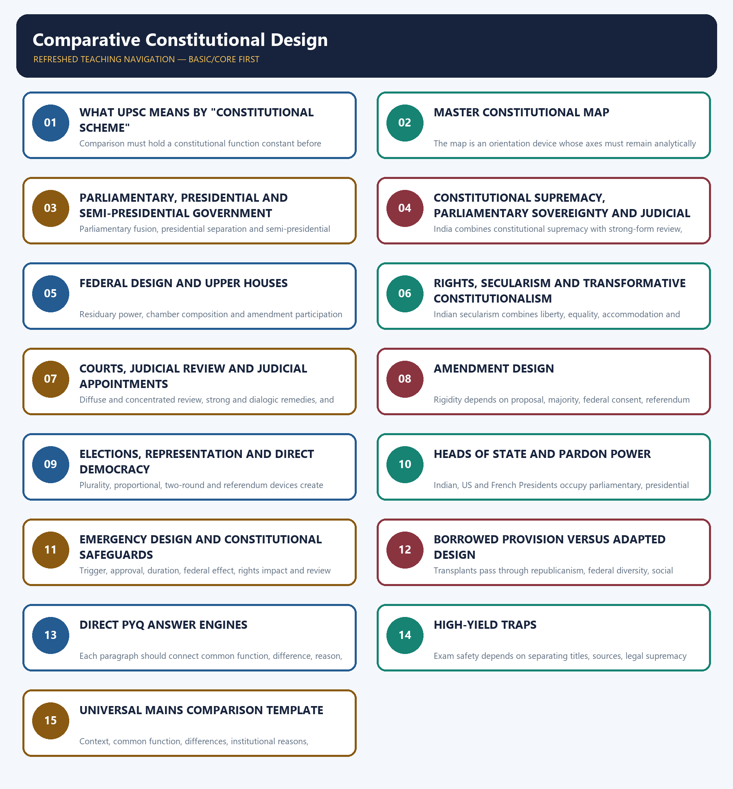

# Comparative Constitutional Schemes — CORE / EXAM-COMPLETE

> **Subject:** Polity · **Tier:** Core · **GS Paper:** GS-II
> **Official clause:** "Comparison of the Indian constitutional scheme with that of other countries."
> **Rule:** This file contains every comparison needed for examination performance. The Advanced
> companion adds theory and evaluation, but is not required to answer a PYQ.
> **Advanced (optional):** `../advanced/47_Comparative-Constitutional-Design.md` — optional deeper detail; not required for any mark.

---

## BASIC LEARNING SESSION



*Distinct embedded teaching-navigation image. The separate continuous Cārvāka-style flowchart package remains an independent at-a-glance artifact.*

### SESSION 1 — WHAT UPSC MEANS BY "CONSTITUTIONAL SCHEME"

#### DEFINITION / WHAT THIS IS CALLED

**Plain-language definition:** A constitutional scheme is the connected design of authority, institutions, rights and accountability.

**Technical definition:** Comparison must hold a constitutional function constant before testing text, context and consequence.

#### ANSWER-GRABBING OPENING — WRITE/ADAPT IN THE EXAM

> A constitutional scheme is the connected design of authority, institutions, rights and accountability.

#### MUST-WRITE KEYWORDS

- **constitutional scheme**
- **function**
- **institution**
- **rights**
- **accountability**

**How to use them:** Frame the answer through constitutional scheme; define function, connect institution with rights to explain the mechanism, and use accountability for the decisive comparison or qualification.

A constitutional scheme is not a list of borrowed provisions. It is the connected design through
which a country:

1. locates sovereignty and constitutional supremacy;
2. structures the executive-legislature relationship;
3. divides territorial power;
4. protects rights and regulates religion;
5. appoints and empowers courts;
6. amends the Constitution and handles emergencies; and
7. converts votes into representation and public accountability.

> **Core method:** compare the same institution across countries in the sequence
> **context -> similarity -> difference -> constitutional consequence**.

#### Context warning

The same institution can operate differently because of party systems, conventions, federal
structure, political history and judicial doctrine. India borrowed mechanisms but adapted them to a
written, republican, federal and socially transformative Constitution. **Source is not operational
identity.**

---

#### CLOSING RECALL FLOW — WHAT UPSC MEANS BY "CONSTITUTIONAL SCHEME"

```text
START / CONCEPT: What UPSC means by "constitutional scheme"
        |
        v
EXACT TERMS: constitutional scheme · function · institution · rights · accountability
        |
        v
MECHANISM / ARGUMENT: Constitutional rules interact rather than operate as an isolated borrowed-provisions list.
        |
        v
CONSEQUENCE / CONTRAST: The same label can produce different constitutional effects.
        |
        v
UPSC TRAP / ANSWER-USE: Do not substitute a source-country list for institutional comparison.
        |
        v
ANSWER-GRABBING FORMULATION: A constitutional scheme is the connected design of authority, institutions, rights and accountability.
```
### SESSION 2 — MASTER CONSTITUTIONAL MAP

#### DEFINITION / WHAT THIS IS CALLED

**Plain-language definition:** A master constitutional map locates each system by constitutional form, executive design, territorial structure and control.

**Technical definition:** The map is an orientation device whose axes must remain analytically separate.

#### ANSWER-GRABBING OPENING — WRITE/ADAPT IN THE EXAM

> A master constitutional map locates each system by constitutional form, executive design, territorial structure and control.

#### MUST-WRITE KEYWORDS

- **constitutional form**
- **executive model**
- **territorial design**
- **judicial control**
- **supremacy**
- **comparison**

**How to use them:** Frame the answer through constitutional form; define executive model, connect territorial design with judicial control to explain the mechanism, and use supremacy for the decisive comparison or qualification.

| Country | Constitutional form | Executive model | Territorial form | Constitutional control |
|---|---|---|---|---|
| **India** | Written, supreme Constitution; republic | Parliamentary; nominal President and responsible Council of Ministers | Holding-together federation with a strong Union | Supreme Court/High Courts; judicial review plus basic structure |
| **United Kingdom** | **Uncodified**, evolutionary constitution; constitutional monarchy | Westminster parliamentary government | Legally unitary with political devolution | Parliamentary sovereignty; courts generally cannot invalidate an Act of Parliament |
| **United States** | Written, rigid, supreme Constitution; republic | Presidential; separately elected fixed executive | Coming-together federation | Diffuse judicial review; federal and state court systems |
| **Canada** | Written federal constitution plus conventions; constitutional monarchy | Responsible parliamentary government | Federation designed with a comparatively strong centre | Supreme Court and constitutional review |
| **Australia** | Written federal constitution; constitutional monarchy | Federal Westminster system | Coming-together federation | High Court; constitutionally divided powers |
| **France** | Written Constitution of the Fifth Republic; republic | Semi-presidential: President plus Prime Minister | Unitary, decentralised state | Constitutional Council and other courts within a specialised system |
| **Switzerland** | Written federal constitution; republic | Plural Federal Council; collegial executive | Confederation by name, federation in law | Strong direct democracy; limited review of federal statutes |
| **South Africa** | Written, supreme and transformative Constitution; republic | Parliamentary executive; President elected by National Assembly | Unitary state with constitutionally protected provinces and cooperative government | Constitutional Court; enforceable civil-political and socio-economic rights |
| **Germany** | Written Basic Law; parliamentary federal republic | Chancellor-led parliamentary government | Federation with direct Land-government participation through Bundesrat | Separate Federal Constitutional Court; textual eternity clause |
| **Japan** | Written, supreme Constitution; constitutional monarchy | Parliamentary cabinet; symbolic Emperor | Unitary state | Supreme Court judicial review; rigid amendment plus referendum |

---

#### CLOSING RECALL FLOW — MASTER CONSTITUTIONAL MAP

```text
START / CONCEPT: Master constitutional map
        |
        v
EXACT TERMS: constitutional form · executive model · territorial design · judicial control · supremacy · comparison
        |
        v
MECHANISM / ARGUMENT: Mapping common axes makes country comparisons like-for-like.
        |
        v
CONSEQUENCE / CONTRAST: It reveals hybrids and prevents label-based equivalence.
        |
        v
UPSC TRAP / ANSWER-USE: Do not infer rigidity from codification or federalism from bicameralism alone.
        |
        v
ANSWER-GRABBING FORMULATION: A master constitutional map locates each system by constitutional form, executive design, territorial structure and control.
```
### SESSION 3 — PARLIAMENTARY, PRESIDENTIAL AND SEMI-PRESIDENTIAL GOVERNMENT

#### DEFINITION / WHAT THIS IS CALLED

**Plain-language definition:** Executive systems differ in mandate, tenure and responsibility to the legislature.

**Technical definition:** Parliamentary fusion, presidential separation and semi-presidential dual authority allocate accountability differently.

#### ANSWER-GRABBING OPENING — WRITE/ADAPT IN THE EXAM

> Executive systems differ in mandate, tenure and responsibility to the legislature.

#### MUST-WRITE KEYWORDS

- **parliamentary**
- **presidential**
- **semi-presidential**
- **collective responsibility**
- **fixed tenure**
- **cohabitation**

**How to use them:** Frame the answer through parliamentary; define presidential, connect semi-presidential with collective responsibility to explain the mechanism, and use fixed tenure for the decisive comparison or qualification.

| Test | India / UK parliamentary model | US presidential model | French semi-presidential model |
|---|---|---|---|
| Executive | Dual: nominal head plus real cabinet | Single President is head of state and government | Dual: President plus Prime Minister |
| Selection | Government emerges from legislature | President chosen separately through electoral college | President directly elected; PM appointed by President |
| Legislative confidence | Cabinet survives only with lower-house confidence | Executive does not depend on congressional confidence | PM/government responsible to National Assembly |
| Tenure | Politically variable; lower house can be dissolved | Fixed presidential and congressional terms | President fixed term; Assembly can be dissolved under constitutional conditions |
| Power relationship | Fusion with responsibility | Separation with checks and balances | Power balance varies with legislative majority |
| Central trade-off | Accountability, representation and replaceability | Stability and decisional independence | Flexible dual legitimacy but possible executive rivalry |

#### India versus the United Kingdom

| Dimension | India | United Kingdom | Consequence |
|---|---|---|---|
| Head of state | Elected President; republic | Hereditary monarch | India rejects hereditary public office |
| Constitutional authority | Written supreme Constitution | Uncodified constitution; parliamentary sovereignty | Indian Parliament is legally limited and reviewable |
| Federalism | Constitutionally divided Union-state powers | Legally unitary despite devolution | UK devolved bodies do not possess Indian-style coordinate constitutional sovereignty |
| Prime Minister | May belong to either House, subject to parliamentary membership rules | By convention from House of Commons | British democratic responsibility is tied more tightly to Commons leadership |
| Rights | Entrenched Fundamental Rights | Statute, common law and convention, including Human Rights Act framework | Indian courts can invalidate inconsistent legislation |
| Courts | Strong-form review of legislation | Courts interpret and review executive action but ordinarily cannot strike down primary Westminster legislation | Different meaning of "judicial supremacy" |

> **Trap:** The UK Constitution is better called **uncodified**, not literally unwritten. Statutes,
> judgments, conventions and authoritative works are among its sources.

#### India versus the United States

| Dimension | India | United States |
|---|---|---|
| Executive | Parliamentary; President normally acts on ministerial advice | Presidential; President personally exercises executive authority |
| Responsibility | Council of Ministers collectively responsible to Lok Sabha | President and secretaries not collectively responsible to Congress |
| Legislature membership | Ministers are or become legislators | Executive officers cannot simultaneously sit in Congress |
| Dissolution | Lok Sabha may be dissolved | President cannot dissolve Congress |
| Removal | Government may fall through loss of confidence; President by impeachment | President removable only through impeachment and conviction |
| Party-government relation | Party majority often joins executive and legislature | Institutional separation persists even under unified party control |

#### France and cohabitation

France combines a directly elected President with a Prime Minister responsible to the National
Assembly. When President and Assembly majority align, the President is usually dominant. During
**cohabitation**, the Prime Minister and parliamentary majority gain greater control over domestic
government. Thus "semi-presidential" does not mean a permanently equal dual executive.

#### Stability lessons from Germany and Switzerland

- Germany's Bundestag may remove a Chancellor only by electing a successor: the **constructive vote
  of no confidence**. It combines responsibility with continuity.
- Switzerland's seven-member Federal Council is a collegial executive. Its annually rotating
  President is not equivalent to a powerful presidential executive.

---

#### CLOSING RECALL FLOW — PARLIAMENTARY, PRESIDENTIAL AND SEMI-PRESIDENTIAL GOVERNMENT

```text
START / CONCEPT: Parliamentary, presidential and semi-presidential government
        |
        v
EXACT TERMS: parliamentary · presidential · semi-presidential · collective responsibility · fixed tenure · cohabitation
        |
        v
MECHANISM / ARGUMENT: Selection and removal rules shape executive-legislative incentives.
        |
        v
CONSEQUENCE / CONTRAST: The designs trade responsive removal against stability and possible deadlock.
        |
        v
UPSC TRAP / ANSWER-USE: Do not equate every office titled President.
        |
        v
ANSWER-GRABBING FORMULATION: Executive systems differ in mandate, tenure and responsibility to the legislature.
```
### SESSION 4 — CONSTITUTIONAL SUPREMACY, PARLIAMENTARY SOVEREIGNTY AND JUDICIAL POWER

#### DEFINITION / WHAT THIS IS CALLED

**Plain-language definition:** Supremacy identifies the highest legal authority and the remedial power of courts.

**Technical definition:** India combines constitutional supremacy with strong-form review, unlike orthodox UK parliamentary sovereignty.

#### ANSWER-GRABBING OPENING — WRITE/ADAPT IN THE EXAM

> Supremacy identifies the highest legal authority and the remedial power of courts.

#### MUST-WRITE KEYWORDS

- **constitutional supremacy**
- **parliamentary sovereignty**
- **judicial review**
- **invalidation**
- **basic structure**
- **incompatibility**

**How to use them:** Frame the answer through constitutional supremacy; define parliamentary sovereignty, connect judicial review with invalidation to explain the mechanism, and use basic structure for the decisive comparison or qualification.

| Model | Core principle | Legislative limit |
|---|---|---|
| **India** | Constitutional supremacy with limited constituent power | Courts may invalidate ordinary law and amendments violating the basic structure |
| **UK** | Parliamentary sovereignty | Courts ordinarily cannot invalidate a Westminster Act; a declaration of incompatibility under the Human Rights Act does not itself nullify the Act |
| **USA** | Constitutional supremacy | Courts may invalidate federal/state law; amendment is governed by Article V |
| **Germany** | Basic Law supremacy | Constitutional Court review plus textual protection under Article 79(3) |
| **South Africa** | Express constitutional supremacy | Invalid law or conduct must be controlled through constitutional adjudication |

#### India's synthesis

India is neither:

- **British-sovereign**, because Parliament is limited by the Constitution, federal division,
  Fundamental Rights and judicial review; nor
- an example of unlimited **judicial supremacy**, because courts also derive authority from the
  Constitution and cannot rewrite policy merely because another choice appears preferable.

Parliament exercises **constituent power**, but *Kesavananda Bharati* makes it limited by the basic
structure. Germany reaches a comparable protective objective through an express **eternity clause**;
India's limit is judicially developed.

---

#### CLOSING RECALL FLOW — CONSTITUTIONAL SUPREMACY, PARLIAMENTARY SOVEREIGNTY AND JUDICIAL POWER

```text
START / CONCEPT: Constitutional supremacy, parliamentary sovereignty and judicial power
        |
        v
EXACT TERMS: constitutional supremacy · parliamentary sovereignty · judicial review · invalidation · basic structure · incompatibility
        |
        v
MECHANISM / ARGUMENT: Text and institutional remedies determine whether courts can disapply or invalidate legislation.
        |
        v
CONSEQUENCE / CONTRAST: Similar rights language may yield different judicial remedies.
        |
        v
UPSC TRAP / ANSWER-USE: A UK incompatibility declaration does not itself annul an Act.
        |
        v
ANSWER-GRABBING FORMULATION: Supremacy identifies the highest legal authority and the remedial power of courts.
```
### SESSION 5 — FEDERAL DESIGN AND UPPER HOUSES

#### DEFINITION / WHAT THIS IS CALLED

**Plain-language definition:** Federal design combines territorial self-rule with institutions for shared rule.

**Technical definition:** Residuary power, chamber composition and amendment participation reveal the depth of territorial influence.

#### ANSWER-GRABBING OPENING — WRITE/ADAPT IN THE EXAM

> Federal design combines territorial self-rule with institutions for shared rule.

#### MUST-WRITE KEYWORDS

- **federalism**
- **self-rule**
- **shared rule**
- **residuary power**
- **upper house**
- **territorial representation**

**How to use them:** Frame the answer through federalism; define self-rule, connect shared rule with residuary power to explain the mechanism, and use upper house for the decisive comparison or qualification.

**Federal design — India, USA and Canada**

| Dimension | India | USA | Canada |
|---|---|---|---|
| Formation tendency | Holding together | Coming together | Holding together/strong-centre design |
| Residuary power | Union | States/people under Tenth Amendment | Federal Parliament |
| Upper house | Population-linked variation | Equal State representation | Appointed regional representation |
| Judiciary | Integrated | Federal and State systems | Federal-provincial structure; Supreme Court at apex |
| Unit alteration | Parliament can alter State areas/boundaries under the Constitution | Required State consent protects States | Provinces are constitutionally protected |

**Federal design — Australia, Germany and Switzerland**

| Dimension | Australia | Germany | Switzerland |
|---|---|---|---|
| Formation tendency | Coming together | Federal reconstruction | Coming together |
| Residuary power | States | Länder unless assigned | Cantons unless assigned |
| Upper house | Equal State representation | Land governments with weighted votes | Cantonal representation, reduced for former half-cantons |
| Judiciary | Federal and State systems | Ordinary courts plus Federal Constitutional Court | Federal and cantonal systems |
| Unit protection | States constitutionally protected | Länder participate through Bundesrat | Cantonal autonomy strongly protected |

#### Indian distinctiveness

India combines federal division with:

- Union residuary power;
- single citizenship;
- an integrated judiciary;
- unequal Rajya Sabha representation;
- emergency centralisation;
- centrally appointed Governors; and
- Parliament's power to alter state boundaries.

Therefore, calling India simply "federal like the USA" misses the design. It is a federation adapted
to unity, diversity and post-Partition state-building.

#### Rajya Sabha is not the US Senate

- US states receive equal Senate representation; Indian states do not.
- Rajya Sabha members are generally elected indirectly by state legislators; US Senators are
  directly elected.
- The US Senate has distinctive confirmation and treaty roles; Rajya Sabha has special Indian
  federal powers under Articles 249 and 312.

#### Bundesrat lesson

Germany's Bundesrat represents **Land governments**, not an independently elected second chamber.
It therefore inserts state executives directly into federal legislation. Rajya Sabha represents
states constitutionally, but its members do not vote as instructed delegations of state governments.

---

#### CLOSING RECALL FLOW — FEDERAL DESIGN AND UPPER HOUSES

```text
START / CONCEPT: Federal design and upper houses
        |
        v
EXACT TERMS: federalism · self-rule · shared rule · residuary power · upper house · territorial representation
        |
        v
MECHANISM / ARGUMENT: Constitutions distribute competences and represent units through differently selected chambers.
        |
        v
CONSEQUENCE / CONTRAST: Upper houses vary in equality, legitimacy and capacity to protect units.
        |
        v
UPSC TRAP / ANSWER-USE: Rajya Sabha is not the US Senate or the Bundesrat.
        |
        v
ANSWER-GRABBING FORMULATION: Federal design combines territorial self-rule with institutions for shared rule.
```
### SESSION 6 — RIGHTS, SECULARISM AND TRANSFORMATIVE CONSTITUTIONALISM

#### DEFINITION / WHAT THIS IS CALLED

**Plain-language definition:** Rights systems differ in text, restriction, remedy and the state's reform role.

**Technical definition:** Indian secularism combines liberty, equality, accommodation and reform rather than absolute separation.

#### ANSWER-GRABBING OPENING — WRITE/ADAPT IN THE EXAM

> Rights systems differ in text, restriction, remedy and the state's reform role.

#### MUST-WRITE KEYWORDS

- **fundamental rights**
- **secularism**
- **non-establishment**
- **religious freedom**
- **DPSP**
- **socio-economic rights**

**How to use them:** Frame the answer through fundamental rights; define secularism, connect non-establishment with religious freedom to explain the mechanism, and use DPSP for the decisive comparison or qualification.

#### India and the United States: secularism

| Dimension | India | United States |
|---|---|---|
| Textual basis | Preamble, equality provisions and Articles 25-28 | First Amendment: Establishment and Free Exercise Clauses |
| General orientation | Equal citizenship, religious freedom and **principled state engagement** | Non-establishment plus protection of free exercise |
| State intervention | May regulate secular activities, pursue social reform and protect equal access | Government may regulate under neutral constitutional rules but cannot establish religion |
| Institutional metaphor | Principled distance/equal concern, not complete separation | "Wall of separation" is influential but not absolute constitutional isolation |
| Shared core | No theocratic state, religious liberty, equality and limits on coercive state preference | Same |

> **Trap:** Indian secularism is not permission for arbitrary state interference, and US secularism
> is not a perfectly sealed wall. In both systems the result depends on rights, equality and doctrine.

#### India and France: principled engagement versus laicite

| Dimension | India | France |
|---|---|---|
| Historical concern | Managing deep religious diversity while reforming hierarchy and protecting equal citizenship | Protecting republican public authority and citizenship from clerical domination |
| Orientation | Principled distance: engagement, accommodation or reform depending on equality and liberty | **Laicite** stresses state neutrality and a religion-independent public sphere |
| Public expression | Constitution protects practice subject to public order, morality, health and reform/equality provisions | Regulation often places stronger emphasis on common republican rules in public institutions |
| Transferable lesson | Accommodation must remain bounded by equality, dignity and non-discrimination | Neutrality should not become disproportionate exclusion of individual believers |

India cannot export a formula mechanically, but it demonstrates that secularism can protect common
citizenship while permitting context-sensitive accommodation. France's lesson for India is the
importance of state neutrality; India's lesson for France is proportionality and inclusion in a
religiously diverse society.

#### Rights models

| Country | High-yield feature |
|---|---|
| **India** | Justiciable Fundamental Rights plus non-justiciable DPSPs; express reasonable-restriction architecture; positive obligations developed through doctrine |
| **USA** | Bill of Rights and Fourteenth Amendment; due process and equal protection; rights applied through constitutional adjudication |
| **South Africa** | Transformative Bill of Rights expressly includes enforceable socio-economic rights subject to constitutional standards |
| **UK** | Rights protected through statutes, common law and conventions; parliamentary sovereignty remains central |
| **Japan** | Entrenched rights and "procedure established by law"; Indian Article 21 later acquired substantive fairness through judicial interpretation |

#### Procedure established by law versus due process

India borrowed the phrase **procedure established by law** from Japan. *Maneka Gandhi* transformed
Article 21 by requiring procedure to be just, fair and reasonable, bringing Indian protection closer
to substantive due-process reasoning without replacing the constitutional text.

---

#### CLOSING RECALL FLOW — RIGHTS, SECULARISM AND TRANSFORMATIVE CONSTITUTIONALISM

```text
START / CONCEPT: Rights, secularism and transformative constitutionalism
        |
        v
EXACT TERMS: fundamental rights · secularism · non-establishment · religious freedom · DPSP · socio-economic rights
        |
        v
MECHANISM / ARGUMENT: Rights become effective through justiciability, limitation doctrine and remedies.
        |
        v
CONSEQUENCE / CONTRAST: India, the USA and South Africa protect related values through different techniques.
        |
        v
UPSC TRAP / ANSWER-USE: Do not treat DPSPs as identical to enforceable South African rights.
        |
        v
ANSWER-GRABBING FORMULATION: Rights systems differ in text, restriction, remedy and the state's reform role.
```
### SESSION 7 — COURTS, JUDICIAL REVIEW AND JUDICIAL APPOINTMENTS

#### DEFINITION / WHAT THIS IS CALLED

**Plain-language definition:** Court design determines access, appointment, independence and constitutional remedies.

**Technical definition:** Diffuse and concentrated review, strong and dialogic remedies, and appointment systems require separate comparison.

#### ANSWER-GRABBING OPENING — WRITE/ADAPT IN THE EXAM

> Court design determines access, appointment, independence and constitutional remedies.

#### MUST-WRITE KEYWORDS

- **courts**
- **judicial review**
- **appointments**
- **collegium**
- **Senate confirmation**
- **constitutional court**

**How to use them:** Frame the answer through courts; define judicial review, connect appointments with collegium to explain the mechanism, and use Senate confirmation for the decisive comparison or qualification.

#### Judicial systems

| Dimension | India | UK | USA |
|---|---|---|---|
| Court structure | Integrated hierarchy | Unified UK jurisdictions with distinct legal systems | Dual federal and state court systems |
| Review of primary legislation | Yes, for constitutional validity | Westminster primary legislation ordinarily not invalidated | Yes |
| Constitutional court | Supreme Court has constitutional and general appellate roles | UK Supreme Court is not a supreme constitutional invalidation court over Parliament | Supreme Court has constitutional and general federal jurisdiction |
| Rights remedy | Strong-form constitutional remedies | Interpretation/declaration mechanisms under statutory framework | Strong-form constitutional review |

#### India versus USA: Supreme Court appointments

| Stage | India | USA |
|---|---|---|
| Formal appointment | President | President |
| Decisive selection mechanism | Collegium recommendations under the Judges Cases; executive participates in processing and may seek reconsideration | Presidential nomination plus Senate advice and consent |
| Public legislative hearing | No constitutionally required confirmation hearing | Senate confirmation process is public and political |
| Tenure | Until age 65 for Supreme Court judges | During good behaviour, effectively life tenure unless resignation, retirement, death or removal |
| Central value protected | Judicial independence from executive dominance | Democratic checks through separated institutions |
| Central risk | Opacity, weak external accountability and delay | Partisan polarisation and ideological confirmation battles |

**Balanced conclusion:** India needs transparent, reasoned and timely appointments without restoring
executive primacy; the US model supplies public accountability but also demonstrates the danger of
partisan capture. The objective is **accountable independence**, not mechanical transplantation.

---

#### CLOSING RECALL FLOW — COURTS, JUDICIAL REVIEW AND JUDICIAL APPOINTMENTS

```text
START / CONCEPT: Courts, judicial review and judicial appointments
        |
        v
EXACT TERMS: courts · judicial review · appointments · collegium · Senate confirmation · constitutional court
        |
        v
MECHANISM / ARGUMENT: Appointment and remedial rules distribute independence and accountability.
        |
        v
CONSEQUENCE / CONTRAST: No appointment model eliminates opacity, politicisation or delay.
        |
        v
UPSC TRAP / ANSWER-USE: Do not compare appointments without tenure and party context.
        |
        v
ANSWER-GRABBING FORMULATION: Court design determines access, appointment, independence and constitutional remedies.
```
### SESSION 8 — AMENDMENT DESIGN

#### DEFINITION / WHAT THIS IS CALLED

**Plain-language definition:** Amendment design balances constitutional continuity with democratic adaptation.

**Technical definition:** Rigidity depends on proposal, majority, federal consent, referendum and substantive limits.

#### ANSWER-GRABBING OPENING — WRITE/ADAPT IN THE EXAM

> Amendment design balances constitutional continuity with democratic adaptation.

#### MUST-WRITE KEYWORDS

- **amendment**
- **Article 368**
- **Article V**
- **section 128**
- **referendum**
- **basic structure**

**How to use them:** Frame the answer through amendment; define Article 368, connect Article V with section 128 to explain the mechanism, and use referendum for the decisive comparison or qualification.

| Country | Main route | Special protection |
|---|---|---|
| **India** | Simple majority for some provisions; special majority for Article 368 amendments; half-state ratification for specified federal provisions | Basic structure limits constituent power |
| **UK** | Ordinary parliamentary legislation can alter constitutional rules, subject to political constraints | No single entrenched amendment procedure |
| **USA** | Two-thirds proposal route plus ratification by three-fourths of states under Article V | Very high rigidity; equal Senate suffrage specially protected |
| **Australia** | Parliamentary supermajority followed by referendum with national majority and majority in a majority of states | "Double majority" |
| **Switzerland** | Mandatory referendum for constitutional amendment | Majority of voters plus majority of cantons |
| **Germany** | Two-thirds in Bundestag and Bundesrat | Article 79(3) eternity clause |
| **Japan** | Two-thirds of each Diet house plus popular referendum | Very rigid political threshold |
| **South Africa** | Differentiated legislative supermajorities; provincial participation for protected matters | Founding values receive the highest threshold |

#### Core evaluation

- Flexibility supports democratic adaptation.
- Rigidity protects stability and federal consent.
- Referendums add popular legitimacy but can reduce complex constitutional choices to a binary vote.
- India's graded method is more flexible than the US/Australian/Japanese routes, but the basic
  structure supplies a substantive judicial limit.

---

#### CLOSING RECALL FLOW — AMENDMENT DESIGN

```text
START / CONCEPT: Amendment design
        |
        v
EXACT TERMS: amendment · Article 368 · Article V · section 128 · referendum · basic structure
        |
        v
MECHANISM / ARGUMENT: Multiple veto points raise the cost of formal constitutional change.
        |
        v
CONSEQUENCE / CONTRAST: Textual eternity clauses and judicial basic-structure limits protect identity differently.
        |
        v
UPSC TRAP / ANSWER-USE: Do not describe India's amendment process as a copy of one country.
        |
        v
ANSWER-GRABBING FORMULATION: Amendment design balances constitutional continuity with democratic adaptation.
```
### SESSION 9 — ELECTIONS, REPRESENTATION AND DIRECT DEMOCRACY

#### DEFINITION / WHAT THIS IS CALLED

**Plain-language definition:** Electoral design converts votes into offices and territorial or political representation.

**Technical definition:** Plurality, proportional, two-round and referendum devices create distinct mandates and incentives.

#### ANSWER-GRABBING OPENING — WRITE/ADAPT IN THE EXAM

> Electoral design converts votes into offices and territorial or political representation.

#### MUST-WRITE KEYWORDS

- **elections**
- **representation**
- **plurality**
- **proportional representation**
- **two-round**
- **referendum**

**How to use them:** Frame the answer through elections; define representation, connect plurality with proportional representation to explain the mechanism, and use two-round for the decisive comparison or qualification.

| Model | Main feature | Constitutional effect |
|---|---|---|
| India | Parliamentary government; first-past-the-post for Lok Sabha; indirect elected President | Usually produces territorial representation and a responsible cabinet |
| USA | Presidential electoral college; separately elected Congress | Dual democratic mandates and institutional deadlock are possible |
| France | Direct presidential election plus legislative elections | President may claim a strong personal mandate; cohabitation remains possible |
| South Africa | Proportional representation; President elected by National Assembly | Strong party proportionality with a parliamentary executive |
| Switzerland | Referendums and popular initiatives alongside representative institutions | Citizens participate directly in constitutional and policy veto/agenda setting |

#### India and France: presidential elections

| Dimension | India | France |
|---|---|---|
| Role | Normally nominal constitutional head | Powerful head within a semi-presidential system |
| Electorate | Electoral college of elected MPs and elected state/eligible UT assembly members | Direct popular election |
| Voting design | Proportional representation by single transferable vote; weighted votes | Two-round majority system if no first-round majority |
| Political logic | Federal balance and parliamentary executive | Independent nationwide presidential mandate |

The election method follows office design: India's indirect method suits a nominal federal head;
France's direct method legitimises a politically active President.

---

#### CLOSING RECALL FLOW — ELECTIONS, REPRESENTATION AND DIRECT DEMOCRACY

```text
START / CONCEPT: Elections, representation and direct democracy
        |
        v
EXACT TERMS: elections · representation · plurality · proportional representation · two-round · referendum
        |
        v
MECHANISM / ARGUMENT: Rules shape party competition, mandate breadth and minority representation.
        |
        v
CONSEQUENCE / CONTRAST: The same democratic principle can support different electoral mechanisms.
        |
        v
UPSC TRAP / ANSWER-USE: Do not compare election formulae without the office being elected.
        |
        v
ANSWER-GRABBING FORMULATION: Electoral design converts votes into offices and territorial or political representation.
```
### SESSION 10 — HEADS OF STATE AND PARDON POWER

#### DEFINITION / WHAT THIS IS CALLED

**Plain-language definition:** Heads of state differ in selection, advice, authority and accountability.

**Technical definition:** Indian, US and French Presidents occupy parliamentary, presidential and semi-presidential structures respectively.

#### ANSWER-GRABBING OPENING — WRITE/ADAPT IN THE EXAM

> Heads of state differ in selection, advice, authority and accountability.

#### MUST-WRITE KEYWORDS

- **head of state**
- **President**
- **Article 72**
- **pardon**
- **ministerial advice**
- **preemptive pardon**

**How to use them:** Frame the answer through head of state; define President, connect Article 72 with pardon to explain the mechanism, and use ministerial advice for the decisive comparison or qualification.

#### India versus USA: presidential pardon

| Dimension | India: Article 72 | USA: Article II |
|---|---|---|
| Office context | Nominal President in parliamentary government | Real executive President |
| Advice | Exercised on binding ministerial advice | Personal constitutional executive power |
| Subject scope | Union-law offences, court-martial cases and death sentences | Federal offences against the United States |
| Express/external limits | Constitutional scope; cannot replace judicial process arbitrarily; limited judicial review for mala fides, arbitrariness and relevant defects | Does not reach state offences; exception for impeachment; applies only after conduct constituting an offence has occurred |
| Pre-emptive pardon | Indian analysis remains tied to Article 72, advice and review; do not import the US doctrine automatically | May cover completed conduct before charge or conviction; cannot pardon future conduct |

> **Trap:** A US pre-emptive pardon is not a pardon for a future crime. It operates after the conduct
> has occurred even if prosecution has not begun.

---

#### CLOSING RECALL FLOW — HEADS OF STATE AND PARDON POWER

```text
START / CONCEPT: Heads of state and pardon power
        |
        v
EXACT TERMS: head of state · President · Article 72 · pardon · ministerial advice · preemptive pardon
        |
        v
MECHANISM / ARGUMENT: Office design controls whether formal powers are personal, advised or shared.
        |
        v
CONSEQUENCE / CONTRAST: Clemency jurisdiction and limits differ even when the power serves mercy.
        |
        v
UPSC TRAP / ANSWER-USE: Preemptive pardon doctrine must not be mechanically imported into India.
        |
        v
ANSWER-GRABBING FORMULATION: Heads of state differ in selection, advice, authority and accountability.
```
### SESSION 11 — EMERGENCY DESIGN AND CONSTITUTIONAL SAFEGUARDS

#### DEFINITION / WHAT THIS IS CALLED

**Plain-language definition:** Emergency constitutions temporarily alter ordinary allocations of power and rights.

**Technical definition:** Trigger, approval, duration, federal effect, rights impact and review are the controlling axes.

#### ANSWER-GRABBING OPENING — WRITE/ADAPT IN THE EXAM

> Emergency constitutions temporarily alter ordinary allocations of power and rights.

#### MUST-WRITE KEYWORDS

- **emergency**
- **rights**
- **federalism**
- **parliamentary approval**
- **duration**
- **judicial review**

**How to use them:** Frame the answer through emergency; define rights, connect federalism with parliamentary approval to explain the mechanism, and use duration for the decisive comparison or qualification.

| Country | Design lesson |
|---|---|
| **India** | National, state and financial emergencies permit major centralisation; post-44th Amendment safeguards constrain repetition of 1975-77 abuse |
| **USA** | No Indian-style single constitutional emergency code; emergency authority is dispersed across Constitution and statutes and remains subject to federal checks |
| **Germany** | Emergency design must be read with federal participation and the unamendable democratic-constitutional core |
| **South Africa** | A declared state of emergency is constitutionally time-bound, reviewable and rights-limited |

Comparative use should identify the safeguard, not merely announce that another country has or lacks
an "Emergency." Compare declaration, duration, legislative control, judicial review, federal effect
and rights derogation.

---

#### CLOSING RECALL FLOW — EMERGENCY DESIGN AND CONSTITUTIONAL SAFEGUARDS

```text
START / CONCEPT: Emergency design and constitutional safeguards
        |
        v
EXACT TERMS: emergency · rights · federalism · parliamentary approval · duration · judicial review
        |
        v
MECHANISM / ARGUMENT: Exceptional powers expand executive or central authority under specified controls.
        |
        v
CONSEQUENCE / CONTRAST: Weak safeguards risk normalising exceptional government.
        |
        v
UPSC TRAP / ANSWER-USE: Do not infer identical safeguards from a common emergency label.
        |
        v
ANSWER-GRABBING FORMULATION: Emergency constitutions temporarily alter ordinary allocations of power and rights.
```
### SESSION 12 — BORROWED PROVISION VERSUS ADAPTED DESIGN

#### DEFINITION / WHAT THIS IS CALLED

**Plain-language definition:** Constitutional borrowing identifies influence; adaptation explains Indian text and operation.

**Technical definition:** Transplants pass through republicanism, federal diversity, social transformation and judicial doctrine.

#### ANSWER-GRABBING OPENING — WRITE/ADAPT IN THE EXAM

> Constitutional borrowing identifies influence; adaptation explains Indian text and operation.

#### MUST-WRITE KEYWORDS

- **borrowed provision**
- **adapted design**
- **constitutional borrowing**
- **transplant**
- **Indian Constitution**
- **institutional context**

**How to use them:** Frame the answer through borrowed provision; define adapted design, connect constitutional borrowing with transplant to explain the mechanism, and use Indian Constitution for the decisive comparison or qualification.

| Indian feature | Often-linked source | Indian adaptation |
|---|---|---|
| Parliamentary government | UK | Written Constitution, republican head, judicial review and federalism |
| Fundamental Rights and judicial review | USA | Express restrictions, writs, DPSP interaction and basic structure |
| Strong-centre federation/residuary power | Canada | Union of constitutionally organised states plus asymmetric devices |
| Concurrent List/joint sitting | Australia | Different upper-house representation and amendment system |
| DPSPs | Ireland | Indian social-revolution programme; non-justiciable but fundamental in governance |
| Amendment elements | South Africa | Three Indian amendment routes plus basic-structure limitation |
| Procedure established by law | Japan | Expanded by Indian due-process-like fairness doctrine |
| Fundamental Duties | former USSR | Non-justiciable civic duties in Part IVA |

> **Prelims rule:** Learn the source.
> **Mains rule:** Explain how India changed the source to fit its own constitutional objectives.

---

#### CLOSING RECALL FLOW — BORROWED PROVISION VERSUS ADAPTED DESIGN

```text
START / CONCEPT: Borrowed provision versus adapted design
        |
        v
EXACT TERMS: borrowed provision · adapted design · constitutional borrowing · transplant · Indian Constitution · institutional context
        |
        v
MECHANISM / ARGUMENT: Selection, textual change and interaction with local institutions transform the source model.
        |
        v
CONSEQUENCE / CONTRAST: An adapted mechanism may perform a new constitutional function.
        |
        v
UPSC TRAP / ANSWER-USE: Borrowed from never means copied unchanged.
        |
        v
ANSWER-GRABBING FORMULATION: Constitutional borrowing identifies influence; adaptation explains Indian text and operation.
```
### SESSION 13 — DIRECT PYQ ANSWER ENGINES

#### DEFINITION / WHAT THIS IS CALLED

**Plain-language definition:** A PYQ answer engine converts the directive into controlled comparative axes.

**Technical definition:** Each paragraph should connect common function, difference, reason, consequence and qualification.

#### ANSWER-GRABBING OPENING — WRITE/ADAPT IN THE EXAM

> A PYQ answer engine converts the directive into controlled comparative axes.

#### MUST-WRITE KEYWORDS

- **PYQ**
- **directive**
- **comparison**
- **consequence**
- **qualification**

**How to use them:** Frame the answer through PYQ; define directive, connect comparison with consequence to explain the mechanism, and use qualification for the decisive comparison or qualification.

#### 13.1 2018 GS-II: basic tenets of Indian and US political systems

**Thesis:** Both are constitutional, democratic, republican and federal systems with judicial review,
but India combines parliamentary responsibility and a strong-centre federation while the USA uses
presidential separation and coordinate-state federalism.

**Body order:**
1. shared constitutionalism, rights, bicameralism, federalism and courts;
2. parliamentary versus presidential executive;
3. fusion versus separation;
4. federal asymmetry: residuary power, citizenship, courts, Senate/Rajya Sabha;
5. rights and amendment differences;
6. consequence: Indian accountability/flexibility versus US stability/checks.

#### 13.2 2019 GS-II: what France can learn from Indian secularism

Define the different histories of Indian secularism and French laicite. Explain India's principled
distance, accommodation and reform; identify equality and public-order limits; suggest
proportionality, non-discrimination and protection of individual religious freedom as transferable
lessons; qualify that French republican history prevents mechanical transplantation.

#### 13.3 2020 GS-II: Indian and UK judicial systems

**Thesis:** Both share common-law reasoning, judicial independence and precedent, but the Indian
judiciary operates under constitutional supremacy and can invalidate legislation, whereas the UK
system operates within parliamentary sovereignty.

**Body order:** common law and precedent -> court structure -> constitutional review -> rights
remedies -> judicial appointments/independence -> reasoned conclusion.

#### 13.4 2022 GS-II: election of Presidents of India and France

Start with the different office designs. Compare electorate, direct/indirect character, voting system,
federal weighting, majority logic and political mandate. Conclude that procedure follows function:
nominal federal head versus active semi-presidential head.

#### 13.5 2023 GS-II: British and Indian parliamentary practice

Because the locally held scan has a manual-verification warning on the final noun, prepare the stable
comparative spine: responsible government, cabinet leadership, lower-house confidence, head of state,
PM's chamber, constitutional/parliamentary supremacy, federalism, conventions, rights and judicial
review. Do not reconstruct uncertain printed wording.

#### 13.6 2024 GS-II: Indian and US secularism

Define secular constitutionalism; compare Indian principled engagement/social reform with US
non-establishment and free exercise; state shared commitments to liberty and equality; avoid the
"India supports all religions, USA completely separates" caricature.

#### 13.7 2025 GS-II: pardon power

Compare office context, advice, jurisdiction, express limits, judicial review and pre-emptive pardon.
Define pre-emptive pardon precisely as completed conduct pardoned before prosecution/conviction, not
future conduct.

#### 13.8 2025 GS-II: judicial appointments

Trace India's First-Second-Third Judges cases and NJAC; compare collegium with US nomination and
Senate confirmation; evaluate independence, transparency, delay, accountability and politicisation;
conclude with accountable independence.

---


#### COMPARATIVE METHOD FIREWALL

```text
same function -> each constitutional source -> institutional mechanism
             -> political and social context -> consequence -> qualified lesson for India
```

- **Codified/uncodified** and **rigid/flexible** are separate axes.
- A common institutional title does not prove common power.
- “Borrowed from” identifies a source influence, not operational identity.
- Electoral, emergency and constitutional-office comparisons must include appointment, power, accountability and review.
- South Africa's cooperative provincial design and enforceable socio-economic rights are comparisons, not one-to-one Indian equivalents.

#### CLOSING RECALL FLOW — DIRECT PYQ ANSWER ENGINES

```text
START / CONCEPT: Direct PYQ answer engines
        |
        v
EXACT TERMS: PYQ · directive · comparison · consequence · qualification
        |
        v
MECHANISM / ARGUMENT: Demand decoding determines which countries, institutions and consequences receive space.
        |
        v
CONSEQUENCE / CONTRAST: Structured comparison prevents two disconnected country descriptions.
        |
        v
UPSC TRAP / ANSWER-USE: Do not omit a question limb or exact metadata.
        |
        v
ANSWER-GRABBING FORMULATION: A PYQ answer engine converts the directive into controlled comparative axes.
```
### SESSION 14 — HIGH-YIELD TRAPS

#### DEFINITION / WHAT THIS IS CALLED

**Plain-language definition:** High-yield traps are plausible equivalences defeated by precise institutional distinctions.

**Technical definition:** Exam safety depends on separating titles, sources, legal supremacy and remedies.

#### ANSWER-GRABBING OPENING — WRITE/ADAPT IN THE EXAM

> High-yield traps are plausible equivalences defeated by precise institutional distinctions.

#### MUST-WRITE KEYWORDS

- **high-yield traps**
- **false equivalence**
- **source country**
- **institutional operation**
- **constitutional supremacy**
- **judicial remedy**

**How to use them:** Frame the answer through high-yield traps; define false equivalence, connect source country with institutional operation to explain the mechanism, and use constitutional supremacy for the decisive comparison or qualification.

- UK Constitution is **uncodified**, not wholly unwritten.
- Parliamentary sovereignty in the UK is not the Indian position.
- Indian Parliament has limited constituent power; it is not an ordinary subordinate legislature.
- Indian and US Presidents are not functional equivalents.
- Both countries use electoral colleges, but the electorates, voting rules and office designs differ.
- Rajya Sabha does not give equal representation to states like the US or Australian Senates.
- Canadian and Indian strong-centre features do not make the two federations identical.
- France is semi-presidential, and cohabitation changes the internal balance.
- Switzerland's annually rotating President is not a US-style executive President.
- Germany's eternity clause is textual; India's basic structure is judicially developed.
- US judicial appointments are not made by the President alone: Senate advice and consent is required.
- US presidential pardon does not cover state offences or impeachment and cannot pardon future acts.
- Indian secularism is not theocracy-friendly state patronage; US secularism is not absolute isolation.
- Borrowing identifies ancestry, not the present constitutional operation.

---

#### CLOSING RECALL FLOW — HIGH-YIELD TRAPS

```text
START / CONCEPT: High-yield traps
        |
        v
EXACT TERMS: high-yield traps · false equivalence · source country · institutional operation · constitutional supremacy · judicial remedy
        |
        v
MECHANISM / ARGUMENT: Close-option questions exploit shared vocabulary across unlike systems.
        |
        v
CONSEQUENCE / CONTRAST: A single qualification can distinguish correct constitutional analysis.
        |
        v
UPSC TRAP / ANSWER-USE: Avoid absolute claims about unwritten constitutions or judicial power.
        |
        v
ANSWER-GRABBING FORMULATION: High-yield traps are plausible equivalences defeated by precise institutional distinctions.
```
### SESSION 15 — UNIVERSAL MAINS COMPARISON TEMPLATE

#### DEFINITION / WHAT THIS IS CALLED

**Plain-language definition:** The comparison template is a repeatable architecture for constitutional answers.

**Technical definition:** Context, common function, differences, institutional reasons, consequences and qualification form the answer chain.

#### ANSWER-GRABBING OPENING — WRITE/ADAPT IN THE EXAM

> The comparison template is a repeatable architecture for constitutional answers.

#### MUST-WRITE KEYWORDS

- **template**
- **thesis**
- **axis**
- **consequence**
- **verdict**

**How to use them:** Frame the answer through template; define thesis, connect axis with consequence to explain the mechanism, and use verdict for the decisive comparison or qualification.

**Introduction:** identify both constitutional contexts and the institution being compared.

**Body matrix:**
1. source of authority;
2. composition/selection;
3. power and legal limits;
4. accountability/removal;
5. rights/federal consequence;
6. actual operation and one qualification.

**Conclusion:** state the design trade-off and whether India should adapt a principle rather than copy
an institution.

> **Core firewall:** If Advanced is skipped, this file still closes the official clause and every
> verified 2018-2025 comparative PYQ identified in the local knowledge base.

#### CLOSING RECALL FLOW — UNIVERSAL MAINS COMPARISON TEMPLATE

```text
START / CONCEPT: Universal Mains comparison template
        |
        v
EXACT TERMS: template · thesis · axis · consequence · verdict
        |
        v
MECHANISM / ARGUMENT: A constant axis allows compact paragraph-by-paragraph comparison.
        |
        v
CONSEQUENCE / CONTRAST: The template supports 10, 15 and 20-mark demands without generic filler.
        |
        v
UPSC TRAP / ANSWER-USE: Do not rank countries without a criterion tied to the question.
        |
        v
ANSWER-GRABBING FORMULATION: The comparison template is a repeatable architecture for constitutional answers.
```
### Answer architecture (10/15/20-mark support)

> Purpose: sections 1–15 already hold the facts, the master map, the trap list and per-PYQ answer engines. This layer adds the **reusable machinery** those sections do not carry in one place — a demand-type router, comparative theses, mark-scaled comparative structures, a **selectable country evidence bank with an India anchor**, the rule against shallow feature-lists, the "why a transplant behaves differently" principle, limits of comparison, verdict scaffolds and factual-risk controls. It does **not** repeat sections 1–15.

#### 16.1 Comparative demand and directive map (route by demand-type, not by year)

| Demand type | Directive signals | Answer spine |
|---|---|---|
| **Feature comparison** | "compare and contrast", "convergence and divergence", "basic tenets" | Shared frame → similarities → differences → **constitutional consequence** of the difference |
| **Lesson-drawing** | "what can X learn from India", "transferable lessons" | Identify India's working principle → isolate the transferable *principle* → state the limit that blocks a mechanical transplant |
| **Evaluation** | "critically examine", "evaluate", "assess" | Design A vs design B on named axes → trade-offs → graded verdict tied to purpose |
| **Transplant-critique** | "borrowed but adapted", "does the foreign feature fit India" | Source → Indian adaptation → **why behaviour differs** → fit verdict |
| **Single-institution match** | "election of Presidents", "pardon power", "judicial appointments" | Hold the function constant → composition/selection/power/limits/review → "procedure follows function" |
| **Secularism/rights model** | "Indian vs US/French model" | Define each model precisely → shared commitment → structural difference → avoid the caricature |
| **Source-attribution** | "which features were borrowed and from where" | Name the conventionally cited source → the **Indian modification** → the consequence (attribution is ancestry, not operation; keep the borrowed-features detail in §12) |

#### 16.2 Qualified thesis options for comparative answers

- *India did not copy a constitution; it synthesised one — parliamentary from the UK, rights and review from the USA, a strong-centre federation from Canada, and directive goals from Ireland — fused inside a written, rigid, transformative charter, so ancestry never equals operation.*
- *The comparative question is almost always won on the* consequence *of a difference, not the difference itself: the point is not that the UK is sovereign-Parliament and India is supreme-Constitution, but what that does to rights protection and judicial power.*
- *Lesson-drawing runs one way in the exam — India exports* principles *(principled secular engagement, PIL access, basic-structure limits) but rarely* mechanisms *, because founding history and party systems block mechanical transplant.*
- *Labels deceive: "President", "Senate", "federation" and "secular" name different functions in India, the USA, France, Germany and Switzerland, so a valid comparison must compare functions, not nouns.*
- *India's design choices privilege accountability and adaptability (fusion of powers, three amendment routes, judicial review) over the stability-through-separation that the US model prizes — a defensible trade-off, not a defect.*
- *A fair comparison matches like with like — India's constitutional* text *against another's text and India's working* practice *against another's practice; pitting an idealised foreign text against messy Indian practice (or the reverse) is the commonest distortion.*
- *The strongest comparative answers isolate a single* operating variable *— party system, federal form or judicial doctrine — and show how it makes the same borrowed design behave differently in India.*

#### 16.3 Mark-scaled comparative structures

| Marks | Architecture | Country load |
|---:|---|---|
| 10 | Frame → 2–3 sharp similarity/difference pairs → **one consequence** → verdict | India + **one** comparator, tightly |
| 15 | Thesis → shared constitutionalism → 3–4 differences on named axes → consequence + one qualification → verdict | India + 1 (occasionally 2) comparators |
| 20 | Thesis → design frame → executive/federal/rights/review axes → transplant-adaptation point → trade-off → graded verdict | India + 1–2 primary comparators, others as one-line reinforcements |

> 🔑 **Depth over breadth:** a 15-marker comparing India and *one* country well beats a shallow tour of five. Add a third country only as a **one-line** reinforcement.

#### 16.4 The no-shallow-feature-list rule (non-negotiable)

- ⚠️ A feature list ("UK is uncodified, US is written, India is written…") is **not** an answer. Every compared feature must run to its **constitutional consequence** — what the difference *does* to rights, accountability, federal balance or stability.
- ⚠️ Compare the **same function** across systems (how each *selects judges*, *limits the executive*, *protects rights*), never an Indian court against a foreign legislature because both sit in the same chapter.
- ⚠️ Name the **operating variable** (party system, convention, federal form, judicial doctrine) that makes the same design behave differently — this is where marks are earned.
- ⚠️ **End every comparison at India:** a passage on a foreign system that never returns to the Indian consequence earns description marks, not analysis marks.

#### 16.5 Country-by-country selectable evidence bank (with India anchor)

> Use one comparator well. "Sourcing depth" flags how richly this repository actually supports each country, so you deploy the strong ones and keep the thin ones to a single line.

| Country | Design feature this repo sources | India anchor / contrast (the consequence) | Sourcing depth here |
|---|---|---|---|
| ✅ **United Kingdom** | Uncodified constitution; **parliamentary sovereignty** (courts cannot strike down an Act); Westminster responsible government; Human Rights Act = **weak-form/dialogic** review | India took the cabinet model but placed it under a **written, supreme, justiciable** Constitution with **judicial review + basic structure** — so rights bind Parliament here, unlike Westminster | Rich (exec, judiciary, sovereignty) |
| ✅ **United States** | Written, rigid, supreme Constitution; **presidential separation of powers**; coming-together federalism, **residuary powers to States**; **Senate advice-and-consent** on judges; pardon excludes State offences/impeachment/future acts; **non-establishment + free exercise** secularism; due process | India fused executive and legislature, kept **residuary with the Centre**, borrowed rights/review but with **express restrictions, writs and "procedure established by law"** — accountability over separation | Rich (exec, federalism, rights, courts, pardon) |
| ✅ **Canada** | **Holding-together, strong-centre** federation; **residuary power with the centre** | The chief source of India's **strong Union + residuary to the Centre**; India adds single citizenship and asymmetric devices | Moderate (federal design) |
| ✅ **Australia** | Coming-together federation; **Concurrent List** and **joint-sitting** mechanism; equal-State Senate | India adopted the **Concurrent List and joint sitting** but with a **population-weighted, indirectly elected** Rajya Sabha and its own amendment routes | Moderate (federal mechanics) |
| ✅ **France** | **Semi-presidential** Fifth Republic; President + PM dual executive; **cohabitation**; **laïcité**; directly elected President; Constitutional Council | India's President is a **nominal, indirectly elected** head (not semi-presidential); Indian secularism is **principled engagement**, not strict laïcité | Rich (executive, secularism, presidential election) |
| ✅ **Germany** | Basic Law; Chancellor-led federal republic; **Bundesrat** = Land-government delegation (shared rule); **textual eternity clause (Art 79(3))**; concentrated **Federal Constitutional Court** | India's **basic structure is judicially developed**, not a textual eternity clause; **Rajya Sabha ≠ Bundesrat** (no Land-government delegation) | Moderate (amendment, upper house) |
| ✅ **South Africa** | Written, supreme, **transformative** Constitution; Constitutional Court; **textually enforceable socio-economic rights** | India pursues transformation via **DPSPs + expanded Article 21 + legislation**, not textual socio-economic rights — enforceable text vs doctrinal development | Moderate (transformative, amendment) |
| ✅ **Japan** | Symbolic Emperor; **"procedure established by law"**; rigid amendment **plus referendum** | India borrowed the phrase **"procedure established by law"** but the SC **expanded it toward due-process fairness** | Thin (single-point use) |
| ✅ **Switzerland** | **Collegial plural Federal Council**; annually **rotating President**; strong **direct democracy** (referendums) | India rejected a collegial executive for a **single cabinet under a PM** and chose **representative**, not direct, democracy | Thin (single-point use) |

- **India anchor rule:** ⚠️ every comparison must end at India — the marks are for what the foreign design teaches about, or contrasts with, the Indian scheme, not for foreign description.
- **Pick-your-comparator by theme (what this repo sources best):** *executive type* → **UK / US / France**; *federal formation & residuary* → **US / Canada / Australia / Germany**; *upper-house model* → **US & Australia (equal-State) / Germany (Bundesrat) / India (population-weighted)**; *judicial-review model* → **UK (weak-form) / Germany (concentrated) / US (diffuse)**; *rights & transformation* → **US (non-establishment) / South Africa (socio-economic rights)**; *amendment & unamendability* → **Germany (Art 79(3)) / South Africa / Japan (rigid + referendum)**; *secularism* → **US / France**; *direct democracy* → **Switzerland**. ⚠️ Build the spine on the **rich** comparators (UK, US, France) and use the **thin** ones (Japan, Switzerland) only as single-line reinforcements.

#### 16.6 Borrowing versus adaptation — why a transplant behaves differently in India

- ⚠️ **The reusable principle (deploy in every transplant-critique):** a borrowed feature is filtered through India's (1) **written, rigid, supreme** Constitution and **judicial review/basic structure**; (2) **party system** (one-dominant, coalition, regionalised by turns); (3) **holding-together, strong-Union federalism**; (4) **deep social cleavages and a transformative purpose**; (5) **conventions overlaid on codification**; and (6) **state-capacity/implementation** limits. The output is **adaptation, hybridisation or functional substitution — never replication.**
- 🔑 **Answer line:** "India imported the *mechanism* but re-tuned it to a written, federal, transformative order, so the same institution performs a different constitutional job." (This is the analytical claim section 12 lists as *examples*; here it is the *rule* you apply to an unfamiliar feature.)

#### 16.7 Criticism and limits of comparison

- ⚠️ **False equivalence:** shared labels ("President", "Senate", "secular", "federation") hide different functions — the commonest way a comparative answer goes wrong.
- ⚠️ **Source ≠ operation:** identifying ancestry (UK, US, Canada…) explains origin, not present working; over-stating borrowing flattens India's synthesis.
- ⚠️ **Context-stripping:** transplanting a foreign fix without its founding conditions, party system and capacity ignores why it worked *there*.
- ⚠️ **Selective idealisation:** comparing India's real practice with a foreign system's textbook ideal (or vice-versa) is not a fair comparison — compare like with like (text with text, practice with practice).
- ⚠️ **Convergence illusion:** shared constitutionalism (courts, rights, elections) is easily over-read as similarity; the marks lie in the **structural divergence** beneath the shared vocabulary.

#### 16.8 Verdict scaffolds for comparative demands

- **Feature-comparison verdict:** "The systems converge on constitutionalism and courts but diverge on where power is fused or separated; that single difference — fusion vs separation — cascades into their contrasting logics of accountability and stability."
- **Lesson-drawing verdict:** "What travels is the *principle* — principled secular engagement, broad rights access, a basic-structure floor — not the *mechanism*, because founding history and party incentives resist mechanical transplant."
- **Transplant-critique verdict:** "India borrowed the institution and re-purposed it; judged by fit rather than by fidelity to the source, the adaptation, not the copy, is the achievement."
- **Evaluation verdict:** "Judged by purpose rather than symmetry, India's fusion-plus-review design buys accountability and adaptability at some cost to the tidy separation the US prizes — a coherent trade-off, not an incoherence."

#### 16.9 Objective-style distinctions (future-Prelims safety)

> The generated blocks below route **only Mains GS-II** demands (2018 Q13, 2019 Q5, 2020 Q4, 2022 Q14, 2023 Q4, 2024 Q15) — **no objective/Prelims PYQ is routed here**. These discriminations guard the same facts against an unfamiliar objective question.

| Confusion pair | Correct discrimination |
|---|---|
| UK "unwritten" vs "uncodified" | The UK constitution is **uncodified** (scattered across statutes, conventions, cases), **not** wholly unwritten |
| Parliamentary sovereignty vs constitutional supremacy | **UK Parliament is sovereign**; **India's Constitution is supreme** and Parliament's power is limited (basic structure) |
| Residuary powers | **Centre** in India and **Canada**; **States** in the **USA** and **Australia** |
| Rajya Sabha vs US/Australian Senate vs Bundesrat | RS = **population-weighted, indirectly elected**; US/Australian Senate = **equal-State**; Bundesrat = **Land-government delegation** — not interchangeable |
| Eternity clause vs basic structure | Germany's **Art 79(3)** is **textual**; India's **basic structure** is **judicially developed** |
| Indian vs French secularism | India = **principled engagement/accommodation**; France = **laïcité** (strict separation) |
| US judicial appointment | President nominates **with Senate advice and consent** — not the President alone |
| US pardon limits | **No State offences, no impeachment, no future acts** |
| Swiss President | **Annually rotating** head of a collegial Council — **not** a US-style executive President |
| "Procedure established by law" | Borrowed from **Japan**; India is **not** the US "due process" wording (though later expanded by fairness doctrine) |
| Judicial-review strength | **UK (Human Rights Act)** issues a **declaration of incompatibility** (weak-form; Parliament stays supreme); **India and the USA** can **strike down** unconstitutional laws (strong-form) |
| Collective responsibility | A **UK convention**; in India it is **textual — Art 75(3)** (Council collectively responsible to the Lok Sabha) |
| Cabinet's legal basis | India's cabinet system is **constitutionally entrenched (Arts 74–75)**; the UK's rests on **convention** — India codified what Britain leaves unwritten |
| Amendment routes | India has **multiple routes under Art 368** (special majority; some needing ratification by half the States; a few matters by simple majority) — **not** a single uniform procedure |
| Impeachment of the President | India (**Art 61**) = for **"violation of the Constitution"** by Parliament — do **not** import the US "high crimes and misdemeanours" ground |
| Judges' removal ground | India = **"proved misbehaviour or incapacity"** via parliamentary **address** (Art 124(4)) — not a US-style criminal impeachment |

#### 16.10 Factual-risk and current-status controls

- ⚠️ **Do not invent foreign constitutional text, amendment procedures, court sizes or appointment rules.** State only what sections 1–15 source; if a foreign detail (e.g., a specific term length, bench strength or referendum threshold) is not held here, **argue the design principle instead of quoting a number**.
- ✅ **US Supreme Court size is set by statute, not the Constitution** — never assert a constitutionally fixed number of Justices.
- ✅ Germany's eternity clause is **Art 79(3)**; do not attribute an identical textual clause to India.
- ⚠️ Keep **secularism** precise: India ≠ "supports all religions equally as State policy"; USA ≠ "absolute isolation" — avoid both caricatures (the 2019/2024 secularism demands turn on this).
- ⚠️ Treat **cohabitation, semi-presidentialism and direct democracy** as **design descriptions**, not events — don't narrate contested foreign political history.
- ✅ **Borrowing identifies ancestry, not present operation** — the master factual-discipline line for this whole topic.
- ⚠️ **Attribution is contested at the edges:** DPSPs are conventionally cited from **Ireland** (which itself drew on Spain), and emergency/rights-suspension ideas from the **Weimar/German** and **Government of India Act 1935** lineage — present these as **conventional attributions**, not as the Constitution's own statements (detail lives in §12).
- ✅ **India's amendment procedure is *sui generis*** (multiple routes under Art 368) — never describe it as a copy of any single foreign model, and do not quote foreign amendment fractions from memory.
## BASIC MCQS / REMEDIATION

### MCQ 1

Which statement is most constitutionally accurate about constitutional scheme?
A. A constitutional scheme connects institutions, rights, territorial power and accountability.
B. It is only a list of foreign sources.
C. A common title proves identical power.
D. Political context is irrelevant to constitutional operation.

**Answer: A.** A constitutional scheme connects institutions, rights, territorial power and accountability.

### MCQ 2

Which proposition best supports a disciplined comparison of constitutional scheme?
A. It is only a list of foreign sources.
B. A constitutional scheme connects institutions, rights, territorial power and accountability.
C. Political context is irrelevant to constitutional operation.
D. A common title proves identical power.

**Answer: B.** A constitutional scheme connects institutions, rights, territorial power and accountability.

### MCQ 3

Select the least vulnerable claim concerning constitutional scheme.
A. Political context is irrelevant to constitutional operation.
B. A common title proves identical power.
C. A constitutional scheme connects institutions, rights, territorial power and accountability.
D. It is only a list of foreign sources.

**Answer: C.** A constitutional scheme connects institutions, rights, territorial power and accountability.

### MCQ 4

Which statement is most constitutionally accurate about codification and rigidity?
A. Every written constitution is rigid.
B. Flexibility necessarily eliminates constitutionalism.
C. An uncodified constitution contains no written law.
D. Codification and amendment rigidity are analytically separate variables.

**Answer: D.** Codification and amendment rigidity are analytically separate variables.

### MCQ 5

Which proposition best supports a disciplined comparison of codification and rigidity?
A. Codification and amendment rigidity are analytically separate variables.
B. Every written constitution is rigid.
C. Flexibility necessarily eliminates constitutionalism.
D. An uncodified constitution contains no written law.

**Answer: A.** Codification and amendment rigidity are analytically separate variables.

### MCQ 6

Select the least vulnerable claim concerning codification and rigidity.
A. An uncodified constitution contains no written law.
B. Codification and amendment rigidity are analytically separate variables.
C. Every written constitution is rigid.
D. Flexibility necessarily eliminates constitutionalism.

**Answer: B.** Codification and amendment rigidity are analytically separate variables.

### MCQ 7

Which statement is most constitutionally accurate about executive systems?
A. A parliamentary executive has a constitutionally fixed tenure immune from confidence.
B. Every President exercises personal executive power.
C. Parliamentary responsibility and presidential separation create different tenure and accountability incentives.
D. Semi-presidentialism contains no legislative responsibility.

**Answer: C.** Parliamentary responsibility and presidential separation create different tenure and accountability incentives.

### MCQ 8

Which proposition best supports a disciplined comparison of executive systems?
A. Every President exercises personal executive power.
B. A parliamentary executive has a constitutionally fixed tenure immune from confidence.
C. Semi-presidentialism contains no legislative responsibility.
D. Parliamentary responsibility and presidential separation create different tenure and accountability incentives.

**Answer: D.** Parliamentary responsibility and presidential separation create different tenure and accountability incentives.

### MCQ 9

Select the least vulnerable claim concerning executive systems.
A. Parliamentary responsibility and presidential separation create different tenure and accountability incentives.
B. Semi-presidentialism contains no legislative responsibility.
C. Every President exercises personal executive power.
D. A parliamentary executive has a constitutionally fixed tenure immune from confidence.

**Answer: A.** Parliamentary responsibility and presidential separation create different tenure and accountability incentives.

### MCQ 10

Which statement is most constitutionally accurate about parliamentary sovereignty?
A. UK courts routinely invalidate Westminster primary legislation.
B. India adopted parliamentary government within a supreme written Constitution.
C. India adopted unlimited British parliamentary sovereignty.
D. Basic structure limits ordinary UK legislation.

**Answer: B.** India adopted parliamentary government within a supreme written Constitution.

### MCQ 11

Which proposition best supports a disciplined comparison of parliamentary sovereignty?
A. UK courts routinely invalidate Westminster primary legislation.
B. India adopted unlimited British parliamentary sovereignty.
C. India adopted parliamentary government within a supreme written Constitution.
D. Basic structure limits ordinary UK legislation.

**Answer: C.** India adopted parliamentary government within a supreme written Constitution.

### MCQ 12

Select the least vulnerable claim concerning parliamentary sovereignty.
A. UK courts routinely invalidate Westminster primary legislation.
B. India adopted unlimited British parliamentary sovereignty.
C. Basic structure limits ordinary UK legislation.
D. India adopted parliamentary government within a supreme written Constitution.

**Answer: D.** India adopted parliamentary government within a supreme written Constitution.

### MCQ 13

Which statement is most constitutionally accurate about federal residuary power?
A. Residuary power lies with the Union in India and the federal Parliament in Canada.
B. Australia assigns all unenumerated power to its Commonwealth Parliament.
C. Residuary allocation is identical in all federations.
D. The US Tenth Amendment assigns residuary power to Congress.

**Answer: A.** Residuary power lies with the Union in India and the federal Parliament in Canada.

### MCQ 14

Which proposition best supports a disciplined comparison of federal residuary power?
A. Residuary allocation is identical in all federations.
B. Residuary power lies with the Union in India and the federal Parliament in Canada.
C. The US Tenth Amendment assigns residuary power to Congress.
D. Australia assigns all unenumerated power to its Commonwealth Parliament.

**Answer: B.** Residuary power lies with the Union in India and the federal Parliament in Canada.

### MCQ 15

Select the least vulnerable claim concerning federal residuary power.
A. The US Tenth Amendment assigns residuary power to Congress.
B. Australia assigns all unenumerated power to its Commonwealth Parliament.
C. Residuary power lies with the Union in India and the federal Parliament in Canada.
D. Residuary allocation is identical in all federations.

**Answer: C.** Residuary power lies with the Union in India and the federal Parliament in Canada.

### MCQ 16

Which statement is most constitutionally accurate about territorial chambers?
A. Canada's Senate consists of provincial-government delegates.
B. The US Senate uses population-weighted State representation.
C. Rajya Sabha gives every State equal seats.
D. The Bundesrat represents Land governments, unlike Rajya Sabha's indirectly elected membership.

**Answer: D.** The Bundesrat represents Land governments, unlike Rajya Sabha's indirectly elected membership.

### MCQ 17

Which proposition best supports a disciplined comparison of territorial chambers?
A. The Bundesrat represents Land governments, unlike Rajya Sabha's indirectly elected membership.
B. Rajya Sabha gives every State equal seats.
C. The US Senate uses population-weighted State representation.
D. Canada's Senate consists of provincial-government delegates.

**Answer: A.** The Bundesrat represents Land governments, unlike Rajya Sabha's indirectly elected membership.

### MCQ 18

Select the least vulnerable claim concerning territorial chambers.
A. The US Senate uses population-weighted State representation.
B. The Bundesrat represents Land governments, unlike Rajya Sabha's indirectly elected membership.
C. Canada's Senate consists of provincial-government delegates.
D. Rajya Sabha gives every State equal seats.

**Answer: B.** The Bundesrat represents Land governments, unlike Rajya Sabha's indirectly elected membership.

### MCQ 19

Which statement is most constitutionally accurate about judicial remedies?
A. Indian courts cannot invalidate legislation.
B. UK parliamentary sovereignty is identical to Indian constitutional supremacy.
C. A UK Human Rights Act declaration of incompatibility does not itself invalidate an Act.
D. US judicial review is a parliamentary remedy.

**Answer: C.** A UK Human Rights Act declaration of incompatibility does not itself invalidate an Act.

### MCQ 20

Which proposition best supports a disciplined comparison of judicial remedies?
A. US judicial review is a parliamentary remedy.
B. UK parliamentary sovereignty is identical to Indian constitutional supremacy.
C. Indian courts cannot invalidate legislation.
D. A UK Human Rights Act declaration of incompatibility does not itself invalidate an Act.

**Answer: D.** A UK Human Rights Act declaration of incompatibility does not itself invalidate an Act.

### MCQ 21

Select the least vulnerable claim concerning judicial remedies.
A. A UK Human Rights Act declaration of incompatibility does not itself invalidate an Act.
B. US judicial review is a parliamentary remedy.
C. Indian courts cannot invalidate legislation.
D. UK parliamentary sovereignty is identical to Indian constitutional supremacy.

**Answer: A.** A UK Human Rights Act declaration of incompatibility does not itself invalidate an Act.

### MCQ 22

Which statement is most constitutionally accurate about rights and directives?
A. Indian DPSPs are ordinary individual writ claims.
B. South Africa textually protects justiciable socio-economic rights, unlike Indian DPSPs.
C. The US Constitution contains India's DPSP chapter.
D. Irish directive principles are enforced exactly like South African rights.

**Answer: B.** South Africa textually protects justiciable socio-economic rights, unlike Indian DPSPs.

### MCQ 23

Which proposition best supports a disciplined comparison of rights and directives?
A. Indian DPSPs are ordinary individual writ claims.
B. Irish directive principles are enforced exactly like South African rights.
C. South Africa textually protects justiciable socio-economic rights, unlike Indian DPSPs.
D. The US Constitution contains India's DPSP chapter.

**Answer: C.** South Africa textually protects justiciable socio-economic rights, unlike Indian DPSPs.

### MCQ 24

Select the least vulnerable claim concerning rights and directives.
A. Indian DPSPs are ordinary individual writ claims.
B. The US Constitution contains India's DPSP chapter.
C. Irish directive principles are enforced exactly like South African rights.
D. South Africa textually protects justiciable socio-economic rights, unlike Indian DPSPs.

**Answer: D.** South Africa textually protects justiciable socio-economic rights, unlike Indian DPSPs.

### MCQ 25

Which statement is most constitutionally accurate about secularism?
A. Indian secularism combines liberty, equality, accommodation and constitutionally permitted reform.
B. US non-establishment requires absolute state isolation from religion.
C. French laicite and Indian secularism are operationally identical.
D. Indian secularism authorises religious preference without equality review.

**Answer: A.** Indian secularism combines liberty, equality, accommodation and constitutionally permitted reform.

### MCQ 26

Which proposition best supports a disciplined comparison of secularism?
A. Indian secularism authorises religious preference without equality review.
B. Indian secularism combines liberty, equality, accommodation and constitutionally permitted reform.
C. French laicite and Indian secularism are operationally identical.
D. US non-establishment requires absolute state isolation from religion.

**Answer: B.** Indian secularism combines liberty, equality, accommodation and constitutionally permitted reform.

### MCQ 27

Select the least vulnerable claim concerning secularism.
A. French laicite and Indian secularism are operationally identical.
B. US non-establishment requires absolute state isolation from religion.
C. Indian secularism combines liberty, equality, accommodation and constitutionally permitted reform.
D. Indian secularism authorises religious preference without equality review.

**Answer: C.** Indian secularism combines liberty, equality, accommodation and constitutionally permitted reform.

### MCQ 28

Which statement is most constitutionally accurate about judicial appointments?
A. Public hearings automatically eliminate partisan selection.
B. The US President appoints Supreme Court judges without Senate participation.
C. India's Constitution expressly names the collegium.
D. India's collegium and US Senate-confirmation system expose different independence-accountability risks.

**Answer: D.** India's collegium and US Senate-confirmation system expose different independence-accountability risks.

### MCQ 29

Which proposition best supports a disciplined comparison of judicial appointments?
A. India's collegium and US Senate-confirmation system expose different independence-accountability risks.
B. India's Constitution expressly names the collegium.
C. Public hearings automatically eliminate partisan selection.
D. The US President appoints Supreme Court judges without Senate participation.

**Answer: A.** India's collegium and US Senate-confirmation system expose different independence-accountability risks.

### MCQ 30

Select the least vulnerable claim concerning judicial appointments.
A. The US President appoints Supreme Court judges without Senate participation.
B. India's collegium and US Senate-confirmation system expose different independence-accountability risks.
C. Public hearings automatically eliminate partisan selection.
D. India's Constitution expressly names the collegium.

**Answer: B.** India's collegium and US Senate-confirmation system expose different independence-accountability risks.

### MCQ 31

Which statement is most constitutionally accurate about amendment?
A. Article V allows the US President to amend the Constitution.
B. Germany's Article 79(3) and India's basic structure have the same textual source.
C. India uses multiple amendment routes and a judicially developed basic-structure limit.
D. Australia's section 128 requires no referendum.

**Answer: C.** India uses multiple amendment routes and a judicially developed basic-structure limit.

### MCQ 32

Which proposition best supports a disciplined comparison of amendment?
A. Germany's Article 79(3) and India's basic structure have the same textual source.
B. Australia's section 128 requires no referendum.
C. Article V allows the US President to amend the Constitution.
D. India uses multiple amendment routes and a judicially developed basic-structure limit.

**Answer: D.** India uses multiple amendment routes and a judicially developed basic-structure limit.

### MCQ 33

Select the least vulnerable claim concerning amendment.
A. India uses multiple amendment routes and a judicially developed basic-structure limit.
B. Article V allows the US President to amend the Constitution.
C. Australia's section 128 requires no referendum.
D. Germany's Article 79(3) and India's basic structure have the same textual source.

**Answer: A.** India uses multiple amendment routes and a judicially developed basic-structure limit.

### MCQ 34

Which statement is most constitutionally accurate about elections?
A. France elects its President through Indian-style weighted State voting.
B. India's indirect presidential election fits a parliamentary and federal office design.
C. An identical electoral formula is suitable for every head of state.
D. The office's power is irrelevant to its election method.

**Answer: B.** India's indirect presidential election fits a parliamentary and federal office design.

### MCQ 35

Which proposition best supports a disciplined comparison of elections?
A. France elects its President through Indian-style weighted State voting.
B. The office's power is irrelevant to its election method.
C. India's indirect presidential election fits a parliamentary and federal office design.
D. An identical electoral formula is suitable for every head of state.

**Answer: C.** India's indirect presidential election fits a parliamentary and federal office design.

### MCQ 36

Select the least vulnerable claim concerning elections.
A. The office's power is irrelevant to its election method.
B. An identical electoral formula is suitable for every head of state.
C. France elects its President through Indian-style weighted State voting.
D. India's indirect presidential election fits a parliamentary and federal office design.

**Answer: D.** India's indirect presidential election fits a parliamentary and federal office design.

### MCQ 37

Which statement is most constitutionally accurate about pardon?
A. The US federal pardon does not reach State offences and cannot license future offences.
B. The US pardon power covers impeachment.
C. India's President exercises Article 72 without ministerial advice.
D. Preemptive pardon means permission for future crimes.

**Answer: A.** The US federal pardon does not reach State offences and cannot license future offences.

### MCQ 38

Which proposition best supports a disciplined comparison of pardon?
A. The US pardon power covers impeachment.
B. The US federal pardon does not reach State offences and cannot license future offences.
C. Preemptive pardon means permission for future crimes.
D. India's President exercises Article 72 without ministerial advice.

**Answer: B.** The US federal pardon does not reach State offences and cannot license future offences.

### MCQ 39

Select the least vulnerable claim concerning pardon.
A. India's President exercises Article 72 without ministerial advice.
B. The US pardon power covers impeachment.
C. The US federal pardon does not reach State offences and cannot license future offences.
D. Preemptive pardon means permission for future crimes.

**Answer: C.** The US federal pardon does not reach State offences and cannot license future offences.

### MCQ 40

Which statement is most constitutionally accurate about emergency design?
A. Exceptional power has no effect on federal relations.
B. Judicial review is irrelevant to emergency design.
C. A common emergency label proves identical safeguards.
D. Emergency comparison must cover trigger, approval, duration, rights, federal effect and review.

**Answer: D.** Emergency comparison must cover trigger, approval, duration, rights, federal effect and review.

### MCQ 41

Which proposition best supports a disciplined comparison of emergency design?
A. Emergency comparison must cover trigger, approval, duration, rights, federal effect and review.
B. Judicial review is irrelevant to emergency design.
C. Exceptional power has no effect on federal relations.
D. A common emergency label proves identical safeguards.

**Answer: A.** Emergency comparison must cover trigger, approval, duration, rights, federal effect and review.

### MCQ 42

Select the least vulnerable claim concerning emergency design.
A. A common emergency label proves identical safeguards.
B. Emergency comparison must cover trigger, approval, duration, rights, federal effect and review.
C. Exceptional power has no effect on federal relations.
D. Judicial review is irrelevant to emergency design.

**Answer: B.** Emergency comparison must cover trigger, approval, duration, rights, federal effect and review.

### MCQ 43

Which statement is most constitutionally accurate about constitutional borrowing?
A. Foreign origin establishes present constitutional identity.
B. Institutional transplantation is independent of party systems.
C. Source influence is transformed by Indian text, structure, doctrine and practice.
D. Borrowed from means copied unchanged.

**Answer: C.** Source influence is transformed by Indian text, structure, doctrine and practice.

### MCQ 44

Which proposition best supports a disciplined comparison of constitutional borrowing?
A. Foreign origin establishes present constitutional identity.
B. Borrowed from means copied unchanged.
C. Institutional transplantation is independent of party systems.
D. Source influence is transformed by Indian text, structure, doctrine and practice.

**Answer: D.** Source influence is transformed by Indian text, structure, doctrine and practice.

### MCQ 45

Select the least vulnerable claim concerning constitutional borrowing.
A. Source influence is transformed by Indian text, structure, doctrine and practice.
B. Institutional transplantation is independent of party systems.
C. Foreign origin establishes present constitutional identity.
D. Borrowed from means copied unchanged.

**Answer: A.** Source influence is transformed by Indian text, structure, doctrine and practice.

### MCQ 46

Which statement is most constitutionally accurate about comparative answer method?
A. Exact PYQ limbs may be omitted if examples are numerous.
B. A strong comparison moves from common function to difference, reason, consequence and qualification.
C. The best conclusion ranks countries without criteria.
D. Two separate country descriptions are sufficient comparison.

**Answer: B.** A strong comparison moves from common function to difference, reason, consequence and qualification.

### MCQ 47

Which proposition best supports a disciplined comparison of comparative answer method?
A. Two separate country descriptions are sufficient comparison.
B. The best conclusion ranks countries without criteria.
C. A strong comparison moves from common function to difference, reason, consequence and qualification.
D. Exact PYQ limbs may be omitted if examples are numerous.

**Answer: C.** A strong comparison moves from common function to difference, reason, consequence and qualification.

### MCQ 48

Select the least vulnerable claim concerning comparative answer method.
A. Two separate country descriptions are sufficient comparison.
B. Exact PYQ limbs may be omitted if examples are numerous.
C. The best conclusion ranks countries without criteria.
D. A strong comparison moves from common function to difference, reason, consequence and qualification.

**Answer: D.** A strong comparison moves from common function to difference, reason, consequence and qualification.

## PYQS AND ANSWER PRACTICE

### VERIFIED DIRECT PYQ 1 — 2018 GS-II Q13 — 15 marks — 250 words

**Question (exact):** “India and USA are two large democracies. Examine the basic tenets on which the two political systems are based.”

**Model answer:** India and the United States share popular sovereignty, written constitutional supremacy, elected government, federalism, bicameralism, enforceable rights and judicial review. Their institutional tenets nevertheless differ.

India has a parliamentary executive: the President is the constitutional head, while the Council of Ministers is collectively responsible to the Lok Sabha. The United States has a presidential executive with a separately elected, fixed-tenure President and institutional separation from Congress.

Indian federalism gives residuary power to the Union, single citizenship, an integrated judiciary and unequal State representation in Rajya Sabha. The US Tenth Amendment reserves undelegated powers to States or the people, each State has equal Senate representation, and federal and State courts coexist.

Both protect rights, but India combines Fundamental Rights with DPSPs, affirmative constitutional commitments and express reasonable restrictions. The US Bill of Rights and Fourteenth Amendment operate through due process and equal protection. Both courts review legislation, while India's amendment power is additionally limited by basic structure.

Thus, the systems share democratic constitutionalism but choose different accountability, stability and federal-representation mechanisms. Similar labels must be compared through powers and consequences, not treated as equivalence.

**Why this earns marks:** It covers common foundations and four institutional contrasts, then links design to consequences.

**How to improve this answer:** Add one exact constitutional provision per country; avoid calling India or the USA purely separated or purely unitary.

**Compression guidance:** Keep the common core, executive, federal, rights and review contrasts, and the qualified synthesis.

### VERIFIED DIRECT PYQ 2 — 2019 GS-II Q5 — 10 marks — 150 words

**Question (exact):** “What can France learn from the Indian Constitution’s approach to secularism?”

**Model answer:** French laicite protects republican public authority through state neutrality and a religion-independent civic sphere. India's Constitution instead combines equal citizenship with religious freedom, denominational rights and principled state engagement for social reform.

France can draw three lessons. First, neutrality should be tested through proportionality so that common rules do not unnecessarily exclude individual believers. Second, minority cultural and educational protection can support integration in a diverse society. Third, state engagement may be legitimate when directed to equality, dignity and reform rather than religious preference.

The transfer cannot be mechanical. French secularism arose from conflict with clerical authority, while India's model addresses deep religious plurality and social hierarchy. India itself also struggles with selective intervention and majoritarian pressure.

The valid lesson is therefore a rights-centred balance: preserve state neutrality while accommodating diversity where accommodation is compatible with liberty, equality and public order.

**Why this earns marks:** It answers what France can learn, identifies mechanisms and limits transplantation.

**How to improve this answer:** Use Articles 25-30 as Indian anchors; avoid slogans such as equal distance unless their institutional meaning is explained.

**Compression guidance:** Retain laicite, three lessons, historical-context caveat and rights-centred verdict.

### VERIFIED DIRECT PYQ 3 — 2020 GS-II Q4 — 10 marks — 150 words

**Question (exact):** “The judicial systems in India and the UK seem to be converging as well as diverging in recent times. Highlight the key points of convergence and divergence between the two nations in terms of their judicial practices.”

**Model answer:** India and the United Kingdom share common-law reasoning, precedent, open justice, adversarial procedure and institutional concern for judicial independence. The UK Supreme Court's separation from the House of Lords and modern appointments machinery also create visible institutional convergence.

Divergence begins with constitutional authority. India's written supreme Constitution permits the Supreme Court and High Courts to invalidate legislation and issue constitutional writs. Under orthodox UK parliamentary sovereignty, courts ordinarily cannot invalidate a Westminster Act; a Human Rights Act declaration of incompatibility does not itself annul it.

India has an integrated national hierarchy and broad public-interest constitutional access. The UK contains distinct legal jurisdictions and relies more heavily on statutory and common-law remedies. Judicial appointments also differ in constitutional source and accountability structure.

Therefore, professional practices may converge, while the source and remedial force of judicial power continue to diverge.

**Why this earns marks:** It highlights both convergence and divergence and identifies the controlling supremacy distinction.

**How to improve this answer:** Add one appointment or rights-remedy example; do not call the UK Constitution unwritten or the UK Supreme Court a legislative invalidation court.

**Compression guidance:** Use two convergence points, three divergence points and the authority-based conclusion.

### VERIFIED DIRECT PYQ 4 — 2022 GS-II Q14 — 15 marks — 250 words

**Question (exact):** “Critically examine the procedures through which the Presidents of India and France are elected.”

**Model answer:** Election procedure reflects the different offices occupied by the two Presidents.

India elects its President indirectly through an electoral college of elected Members of Parliament and elected members of State and specified Union Territory legislative assemblies. Votes are weighted to balance Union-State and population considerations, and the single transferable vote with proportional representation and secret ballot seeks broad federal acceptability. The office ordinarily functions on ministerial advice.

France elects its President by direct universal suffrage. A two-round majority system permits a second ballot between leading candidates if no candidate secures the required first-round majority. Direct election supplies a personal national mandate appropriate to a semi-presidential system in which the President has substantial powers, while the Prime Minister and Government remain responsible to the National Assembly.

India's method promotes federal inclusion and a non-majoritarian constitutional head but is remote from voters and mathematically complex. France's method provides direct legitimacy and majority endorsement but may personalise politics and create dual legitimacy or cohabitation when the parliamentary majority differs.

The procedures should not be ranked in isolation. India's indirect federal election fits a parliamentary republic; France's direct two-round election fits a politically active semi-presidential presidency.

**Why this earns marks:** It accurately explains both procedures and critically evaluates why each fits its office.

**How to improve this answer:** Mention vote-value mechanics only if exact; do not infer comparable powers merely from the shared title President.

**Compression guidance:** Keep both procedures, two advantages, two risks and the office-design verdict.

### VERIFIED DIRECT PYQ 5 — 2023 GS-II Q4 — 10 marks — 150 words

**Question (exact):** “Compare and contrast the British and Indian approaches to Parliamentary sovereignty.”

**Model answer:** Both systems developed responsible cabinet government, legislative privilege and executive accountability to the lower House. Their location of ultimate legal authority differs.

The orthodox British doctrine treats Parliament as the supreme law-maker: it may enact or repeal any law, courts ordinarily cannot invalidate a Westminster Act, and one Parliament cannot entrench law against successors. Political constraints, devolution and rights review qualify practice without creating Indian-style constitutional supremacy.

Indian Parliament is constituted and limited by a written supreme Constitution. Federal distribution, Fundamental Rights, bicameral procedures and judicial review bind ordinary legislation. Constitutional amendment under Article 368 is also limited by the basic-structure doctrine.

Thus, Britain centres legal sovereignty in Parliament, whereas India centres it in the Constitution. India borrowed parliamentary government but transformed it through republicanism, federalism, entrenched rights and constitutional adjudication.

**Why this earns marks:** It compares shared parliamentary practice but contrasts the different legal sovereignty foundations.

**How to improve this answer:** Use the Human Rights Act declaration carefully; it does not itself invalidate primary legislation.

**Compression guidance:** Retain commonality, British rule, Indian limits, basic structure and adaptation verdict.

### VERIFIED DIRECT PYQ 6 — 2024 GS-II Q15 — 15 marks — 250 words

**Question (exact):** “Discuss India as a secular state and compare it with the secular principles of the US Constitution.”

**Model answer:** India and the United States reject an established theocratic state and protect religious liberty, but their constitutional techniques reflect different histories.

The US First Amendment prohibits establishment and protects free exercise. Government must not establish religion, and religious exercise receives constitutional protection subject to generally applicable constitutional limits. The separation metaphor is influential but not absolute.

India's secularism arises from the Preamble, equality provisions and Articles 25-30. It protects conscience and practice, permits denominational institutions and minority education, and authorises regulation of secular activities and social reform. The State may engage with religious institutions, but engagement must satisfy equality, dignity, liberty and non-discrimination. Secularism is part of the basic structure under *S. R. Bommai*.

Both systems therefore protect freedom and resist state preference. The US places stronger textual emphasis on non-establishment; India combines religious liberty with reform and accommodation in a deeply plural society. Both face disputes over neutrality, exemptions and majoritarian influence.

India is secular not because the State never encounters religion, but because constitutional engagement must preserve equal citizenship. Comparison should avoid caricaturing either model as complete separation or unlimited intervention.

**Why this earns marks:** It supplies textual foundations, shared aims, differences, limits and an Indian basic-structure anchor.

**How to improve this answer:** Add one doctrine or institutional example only if exact; distinguish denominational rights from state preference.

**Compression guidance:** Use common core, US clauses, Indian Articles, reform/accommodation contrast and qualified verdict.

### VERIFIED SUPPORTING PYQ 7 — 2025 GS-II Q3 — 10 marks — 150 words

**Question (exact):** “Compare and contrast the President's power to pardon in India and in the USA. Are there any limits to it in both the countries? What are ‘preemptive pardons’?”

**Model answer:** Article 72 empowers India's President to grant clemency in court-martial cases, offences concerning Union executive power and death sentences. The President acts on ministerial advice, and the decision is judicially reviewable on limited grounds such as mala fides, arbitrariness or irrelevant considerations.

Article II, section 2 gives the US President clemency power for federal offences, except impeachment. It does not reach State offences and is exercised personally rather than on cabinet advice. Constitutional and political accountability remain despite broad discretion.

A preemptive pardon protects against federal prosecution for already committed conduct before charge or conviction; it cannot license future offences. US practice recognises such pardons. Indian Article 72 is ordinarily framed around conviction and sentence, so the US doctrine should not be mechanically imported.

Both powers temper justice with mercy, but differ in advice, jurisdiction, express limits and review.

**Why this earns marks:** It answers comparison, limits and the distinct preemptive-pardon limb.

**How to improve this answer:** Avoid the absolute claim that all US pardons are unreviewable or that a preemptive pardon covers future conduct.

**Compression guidance:** Keep constitutional sources, advice, jurisdiction, limits, definition and verdict.

### VERIFIED SUPPORTING PYQ 8 — 2025 GS-II Q13 — 15 marks — 250 words

**Question (exact):** “Discuss the evolution of collegium system in India. Critically examine the advantages and disadvantages of the system of appointment of the Judges of the Supreme Court of India and that of the USA.”

**Model answer:** India's Constitution formally vests Supreme Court appointments in the President after consultation. The First Judges Case favoured executive primacy; the Second Judges Case created judicial primacy through the collegium; the Third Judges Case expanded the consultative collegium. The NJAC amendment was invalidated in 2015 for violating judicial independence.

India's collegium insulates appointments from direct party control and protects decisional independence. Its disadvantages are opacity, limited published criteria, weak diversity accountability, delay and an unclear responsibility chain.

The United States uses presidential nomination and Senate advice and consent. Public hearings and separated institutional participation create visible democratic accountability and a clear record. Yet partisan polarisation, strategic vacancies and ideological confirmation can make appointments openly political. Life tenure raises the stakes further.

Neither model resolves the independence-accountability tension. India should retain judicial independence while publishing selection criteria, reasons, diversity data and timelines and improving secretariat capacity. The US comparison warns against converting transparency into party capture.

The lesson is accountable independence, not transplantation: appointment design must be evaluated with tenure, political parties, conventions and the wider constitutional structure.

**Why this earns marks:** It traces collegium evolution, critically assesses both systems and derives a context-sensitive reform lesson.

**How to improve this answer:** Name the Judges Cases and NJAC without inventing vote details; distinguish public accountability from partisan control.

**Compression guidance:** Preserve chronology, two merits and defects per system, and accountable-independence reform.

### ORIGINAL MAINS PRACTICE 1 — 10 marks — 150 words

**Question:** Distinguish constitutional borrowing from constitutional adaptation.

**Directive:** Distinguish

**Model answer:** Begin with a demand-specific comparative thesis. Define borrowing as source influence and adaptation as altered text, institution and operation. Use parliamentary government, federal residuary power, DPSPs and judicial review as examples. For every axis, state the common function, each design, the reason for difference and its consequence. End with a qualified Indian adaptation verdict.

**Why this earns marks:** It uses controlled comparison rather than feature listing and supplies an executable evidence order.

**How to improve this answer:** Add one exact provision or institutional practice for each compared system; remove any country fact that does not change the conclusion.

**Compression guidance:** Retain the thesis, four decisive axes, two consequences, one context caveat and the verdict.

### ORIGINAL MAINS PRACTICE 2 — 15 marks — 250 words

**Question:** Compare Rajya Sabha, the US Senate, Canadian Senate and German Bundesrat.

**Directive:** Compare

**Model answer:** Begin with a demand-specific comparative thesis. Hold territorial representation constant; compare selection, equality, government representation, special powers and democratic legitimacy. For every axis, state the common function, each design, the reason for difference and its consequence. End with a qualified Indian adaptation verdict.

**Why this earns marks:** It uses controlled comparison rather than feature listing and supplies an executable evidence order.

**How to improve this answer:** Add one exact provision or institutional practice for each compared system; remove any country fact that does not change the conclusion.

**Compression guidance:** Retain the thesis, four decisive axes, two consequences, one context caveat and the verdict.

### ORIGINAL MAINS PRACTICE 3 — 10 marks — 150 words

**Question:** Compare written/uncodified and rigid/flexible constitutions without treating the pairs as synonyms.

**Directive:** Analyse

**Model answer:** Begin with a demand-specific comparative thesis. Separate codification from amendment difficulty and legal from political constraint, using India, UK, USA and Australia. For every axis, state the common function, each design, the reason for difference and its consequence. End with a qualified Indian adaptation verdict.

**Why this earns marks:** It uses controlled comparison rather than feature listing and supplies an executable evidence order.

**How to improve this answer:** Add one exact provision or institutional practice for each compared system; remove any country fact that does not change the conclusion.

**Compression guidance:** Retain the thesis, four decisive axes, two consequences, one context caveat and the verdict.

### ORIGINAL MAINS PRACTICE 4 — 15 marks — 250 words

**Question:** Assess India's parliamentary-federal hybrid against the UK, Canada and Australia.

**Directive:** Assess

**Model answer:** Begin with a demand-specific comparative thesis. Compare responsible government, constitutional supremacy, residuary power, upper houses, judiciary and amendment, then explain India's synthesis. For every axis, state the common function, each design, the reason for difference and its consequence. End with a qualified Indian adaptation verdict.

**Why this earns marks:** It uses controlled comparison rather than feature listing and supplies an executable evidence order.

**How to improve this answer:** Add one exact provision or institutional practice for each compared system; remove any country fact that does not change the conclusion.

**Compression guidance:** Retain the thesis, four decisive axes, two consequences, one context caveat and the verdict.

### ORIGINAL MAINS PRACTICE 5 — 20 marks — 300 words

**Question:** Compare judicial review in India, USA, UK, France and South Africa.

**Directive:** Compare and evaluate

**Model answer:** Begin with a demand-specific comparative thesis. Distinguish diffuse/concentrated review, strong/dialogic remedies, constitutional supremacy, access and rights text. For every axis, state the common function, each design, the reason for difference and its consequence. End with a qualified Indian adaptation verdict.

**Why this earns marks:** It uses controlled comparison rather than feature listing and supplies an executable evidence order.

**How to improve this answer:** Add one exact provision or institutional practice for each compared system; remove any country fact that does not change the conclusion.

**Compression guidance:** Retain the thesis, four decisive axes, two consequences, one context caveat and the verdict.

### ORIGINAL MAINS PRACTICE 6 — 15 marks — 250 words

**Question:** Compare Indian DPSPs with Irish directive principles and South African socio-economic rights.

**Directive:** Compare

**Model answer:** Begin with a demand-specific comparative thesis. Trace source influence but distinguish justiciability, textual rights, legislative guidance, remedies and Indian judicial harmonisation. For every axis, state the common function, each design, the reason for difference and its consequence. End with a qualified Indian adaptation verdict.

**Why this earns marks:** It uses controlled comparison rather than feature listing and supplies an executable evidence order.

**How to improve this answer:** Add one exact provision or institutional practice for each compared system; remove any country fact that does not change the conclusion.

**Compression guidance:** Retain the thesis, four decisive axes, two consequences, one context caveat and the verdict.

### ORIGINAL MAINS PRACTICE 7 — 15 marks — 250 words

**Question:** Evaluate emergency constitutionalism in India through comparative safeguards.

**Directive:** Evaluate

**Model answer:** Begin with a demand-specific comparative thesis. Use declaration threshold, approval, duration, rights, federal effect, judicial review and anti-normalisation safeguards; avoid one-to-one borrowing claims. For every axis, state the common function, each design, the reason for difference and its consequence. End with a qualified Indian adaptation verdict.

**Why this earns marks:** It uses controlled comparison rather than feature listing and supplies an executable evidence order.

**How to improve this answer:** Add one exact provision or institutional practice for each compared system; remove any country fact that does not change the conclusion.

**Compression guidance:** Retain the thesis, four decisive axes, two consequences, one context caveat and the verdict.

### ORIGINAL MAINS PRACTICE 8 — 20 marks — 300 words

**Question:** Design a method for deciding whether India should adopt a foreign constitutional institution.

**Directive:** Propose

**Model answer:** Begin with a demand-specific comparative thesis. Apply functional, structural, incentive, capacity, rights, transition and accountability fit before recommending adaptation. For every axis, state the common function, each design, the reason for difference and its consequence. End with a qualified Indian adaptation verdict.

**Why this earns marks:** It uses controlled comparison rather than feature listing and supplies an executable evidence order.

**How to improve this answer:** Add one exact provision or institutional practice for each compared system; remove any country fact that does not change the conclusion.

**Compression guidance:** Retain the thesis, four decisive axes, two consequences, one context caveat and the verdict.

## OPTIONAL ADVANCED DEPTH — NOT REQUIRED FOR A CORE ANSWER


> Complete Core is in `basic/Comparative-Constitutional-Schemes.md`. This file adds analytical vocabulary only.

### Controlled comparison
Hold the public function constant and compare text, selection, power, accountability, context and outcome. Similar titles conceal different institutions; different legal forms may serve similar functions.

### Transplantation
Borrowing passes through founding conditions, social cleavages, party incentives, legal culture and judicial development. The result may be adaptation, hybridisation or functional substitution rather than replication.

### Design trade-offs
Parliamentary responsibility can clarify removal but concentrate majority power. Presidential separation adds veto players but may create deadlock. Federal self-rule protects diversity; shared rule enables common action. Judicial review protects constitutional commitments but can shift policy responsibility.

### Rigidity and identity
Rigidity is multidimensional: proposal, supermajority, federal consent, referendum, time and substantive limits. Germany's textual eternity clause and India's doctrinal basic structure pursue related protective purposes through different legal sources.

### Reform test
Before recommending a foreign mechanism, test functional fit, structural fit, incentives, implementation capacity, rights, transition cost and accountability. Comparative law is a laboratory, not a shopping catalogue.

## CONSOLIDATED REGISTER NOTES

- Compare a constant function, not country labels.
- Separate codification from amendment rigidity.
- India borrowed parliamentary government, not British parliamentary sovereignty.
- The US President, French President and Indian President occupy different executive designs.
- Rajya Sabha, the US Senate, Canadian Senate and Bundesrat differ in selection, equality, mandate and power.
- UK courts ordinarily cannot invalidate Westminster primary legislation; India and the USA have strong-form constitutional review.
- Indian rights, Irish directive principles and South African socio-economic rights differ in text, justiciability and remedy.
- Article 368 is a multi-route Indian amendment design; basic structure is doctrinal, unlike Germany's textual Article 79(3).
- Emergency systems require comparison of trigger, approval, duration, rights effect, federal effect and review.
- Constitutional borrowing becomes Indian adaptation through text, context, doctrine and political practice.
- Use exact PYQ metadata and answer every comparative limb.
- End with a qualified institutional consequence, not a best-country ranking.

### COMPLETE TOPIC ASCII MASTER FLOW DIAGRAM

**High-yield use:** Follow the panels as one topic-specific conceptual atlas: root question, classifications, processes or arguments, comparisons, objections and a final answer-writing spine. This text-native master is separate from both graphical flowchart artifacts.

#### ASCII MASTER FLOW — PANEL 1/12: Compare functions and contexts, not country labels

```ascii-master
ROOT QUESTION
Why does the same constitutional institution behave differently after transplantation?

COMPARATIVE METHOD
function -> source model -> Indian text -> social/federal context
-> judicial interpretation -> political practice -> consequence.

AXES
codification/rigidity | executive-legislative relation | federal distribution
| rights/remedies | courts | amendment | emergency | elections | accountability.

TRAP
"borrowed from" without adaptation and purpose is a memory list, not constitutional analysis.
```

#### ASCII MASTER FLOW — PANEL 2/12: Borrowing becomes adaptation in Indian context

```ascii-master
SOURCE INFLUENCE
UK responsibility | US rights/review | Canada residuary power
| Ireland directives | Australia federal techniques.

INDIAN FILTER
written supremacy | republic | social transformation
| federal diversity | judicial doctrine | party practice.

RESULT
selection -> textual change -> institutional interaction -> new consequence.

TRAP
borrowed from != copied unchanged.
```

#### ASCII MASTER FLOW — PANEL 3/12: Written, unwritten, rigid and flexible constitutional forms

```ascii-master
UK
uncodified: statutes + common law + conventions + authoritative practice;
politically flexible under parliamentary sovereignty.

USA
codified, supreme and comparatively rigid.

INDIA
codified and supreme; amendment routes range from simple majority
to special majority and State ratification.

SOUTH AFRICA / GERMANY
written transformative/post-authoritarian constitutions with entrenched principles.

CONTROL
written != rigid; unwritten != lawless; flexibility and supremacy are separate variables.
```

#### ASCII MASTER FLOW — PANEL 4/12: Parliamentary, presidential and semi-presidential executives

```ascii-master
INDIA / UK
parliamentary fusion | collective responsibility | confidence | nominal/formal head distinction.

USA
presidential separation | fixed tenure | separately elected executive | legislative checks.

FRANCE
semi-presidential dual executive | directly elected President | responsible Prime Minister
| cohabitation when parliamentary majority differs.

GERMANY
constructive vote of no confidence strengthens parliamentary stability.

SWITZERLAND
collegial Federal Council and direct-democratic context.

TRAP
Indian President != US President; parliamentary fusion != absence of checks.
```

#### ASCII MASTER FLOW — PANEL 5/12: Federal, unitary and hybrid design with upper houses

```ascii-master
USA
coordinate federalism | State equality in Senate | dual citizenship/court features.

CANADA
federal with strong-centre and residuary federal power influences.

AUSTRALIA
federal division + strong elected Senate + concurrent/trade inspirations.

INDIA
Union/State/Concurrent Lists | Union residuary power | single citizenship
| integrated judiciary | emergency centralisation | asymmetry.

UPPER HOUSES
Rajya Sabha population-weighted, indirectly elected and unequal;
US Senate State-equal and appointment-confirming;
German Bundesrat represents Land governments.

TRAP
bicameral label does not imply identical federal representation.
```

#### ASCII MASTER FLOW — PANEL 6/12: Supremacy, judicial review and constitutional courts

```ascii-master
UK
parliamentary sovereignty with rights and devolution qualifications.

USA
written supremacy + diffuse judicial review through ordinary courts.

GERMANY
specialised Federal Constitutional Court.

INDIA
Supreme Court + High Courts exercise diffuse review, writs and federal adjudication;
Parliament remains Constitution-limited.

CASES
Kesavananda Bharati (1973) -> basic structure.
Minerva Mills (1980) -> limited amendment and FR-DPSP harmony.
First Judges Case (1981) -> initial executive primacy.
Second Judges Case (1993) -> collegium and judicial primacy.
Third Judges Case (1998) -> collegium consultation enlarged.
Fourth Judges Case (2015) -> judicial-independence control of NJAC.
S.R. Bommai (1994) -> federalism and secularism as basic-structure controls.

TRAP
Indian judicial review is not borrowed as an unlimited US copy.
```

#### ASCII MASTER FLOW — PANEL 7/12: Rights, due process and socio-economic directives

```ascii-master
USA
rights tradition + due process + strong judicial enforcement.

INDIA
Fundamental Rights + Article 32/226 remedies
+ Directive Principles + duties + reasonable-restriction architecture.

IRELAND
directive-principle inspiration, adapted to Indian transformative governance.

SOUTH AFRICA
express justiciable socio-economic rights and proportionality context.

JAPAN / INDIA
"procedure established by law" textual influence.
Maneka Gandhi (1978) adds fairness, non-arbitrariness and reasonableness.

TRAP
Indian DPSPs are not operationally identical to Ireland;
procedure is not post-Maneka Gandhi (1978) formalism.
```

#### ASCII MASTER FLOW — PANEL 8/12: Amendment, emergency and electoral design

```ascii-master
AMENDMENT
UK political flexibility | USA high rigidity | India multi-track Article 368
| Germany eternity clause | Switzerland referendum routes.

INDIAN CONTROL
Kesavananda Bharati (1973) basic structure;
I.R. Coelho (2007) post-1973 Ninth Schedule review.

EMERGENCY
India: Articles 352/356/360 with 44th-Amendment safeguards and review.
Germany: post-authoritarian safeguards.
France: distinct presidential emergency design.

ELECTIONS
India/UK FPTP legislatures | US electoral college Presidency
| France two-round Presidency | Germany mixed-member
| Switzerland referendums/initiatives.

TRAP
electoral system follows office and party-system context; no model is universally superior.
```

#### ASCII MASTER FLOW — PANEL 9/12: Secularism and accountability institutions

```ascii-master
SECULARISM
India: principled engagement, equality and reform.
USA: non-establishment + free exercise.
France: laicite and republican public sphere.
Germany: cooperative church-State arrangements.

ACCOUNTABILITY
India CAG: constitutional Westminster adaptation.
Lokpal: statutory ombudsman, not constitutional court.
Finance Commission: periodic expert federal-transfer body.
ECI: central constitutional election management.

COMPARATIVE LESSON
appointment, jurisdiction, remedy and political context matter more than institutional label.
```

#### ASCII MASTER FLOW — PANEL 10/12: Constitutional offices and accountability compared

```ascii-master
COMPARE EACH OFFICE THROUGH
appointment | tenure | power | advice | removal | reporting | review.

INDIAN PRESIDENT != US PRESIDENT != FRENCH PRESIDENT.
RAJYA SABHA != US SENATE != CANADIAN SENATE != BUNDESRAT.
CAG, ECI, FINANCE COMMISSION AND LOKPAL
adapt audit, election, federal-transfer and ombudsman functions.

RULE
title similarity never proves power equivalence.
```

#### ASCII MASTER FLOW — PANEL 11/12: Verified PYQs and comparative answer execution

```ascii-master
2018 India-USA systems | 2019 France-secularism lesson
2020 India-UK judiciary | 2022 India-France Presidents
2023 parliamentary sovereignty | 2024 India-US secularism
2025 pardon | 2025 judicial appointments.

ANSWER MATRIX
function -> commonality -> difference -> context -> consequence -> lesson.

FIREWALL
answer every limb; do not replace comparison with country-wise description.
```

#### ASCII MASTER FLOW — PANEL 12/12: India's hybrid adaptation and UPSC synthesis

```ascii-master
INDIAN HYBRID
British responsible government + written supremacy
| US rights/review + Canadian strong-centre federation
| Irish directives + Australian federal techniques
| German emergency lessons + South African transformative comparison.

PRELIMS FIREWALL
uncodified != unwritten | parliamentary != legislative supremacy in India
| federal != equal upper-house seats | President titles != powers
| borrowed != copied | DPSP != enforceable right | Rajya Sabha != US Senate.

MAINS MATRIX
design -> commonality -> difference -> reason -> consequence -> qualification.

VERDICT
India's Constitution is original in synthesis: foreign techniques were re-engineered
for democratic responsibility, social transformation, federal diversity
and judicially limited power.
```
