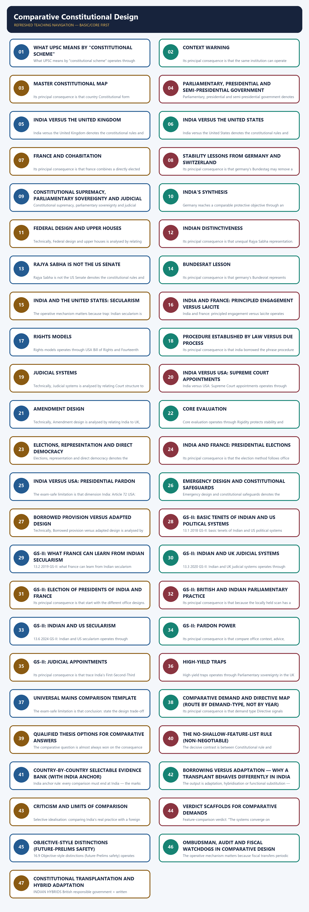
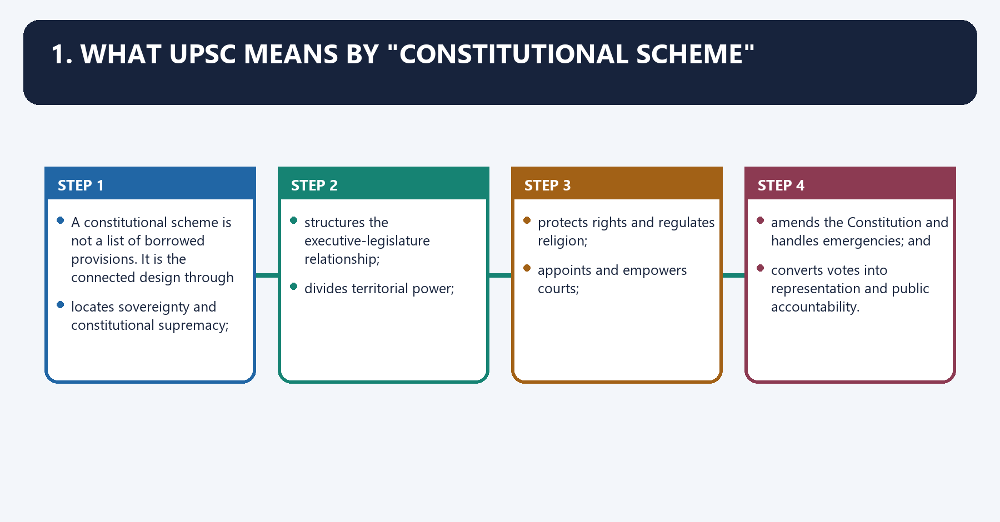
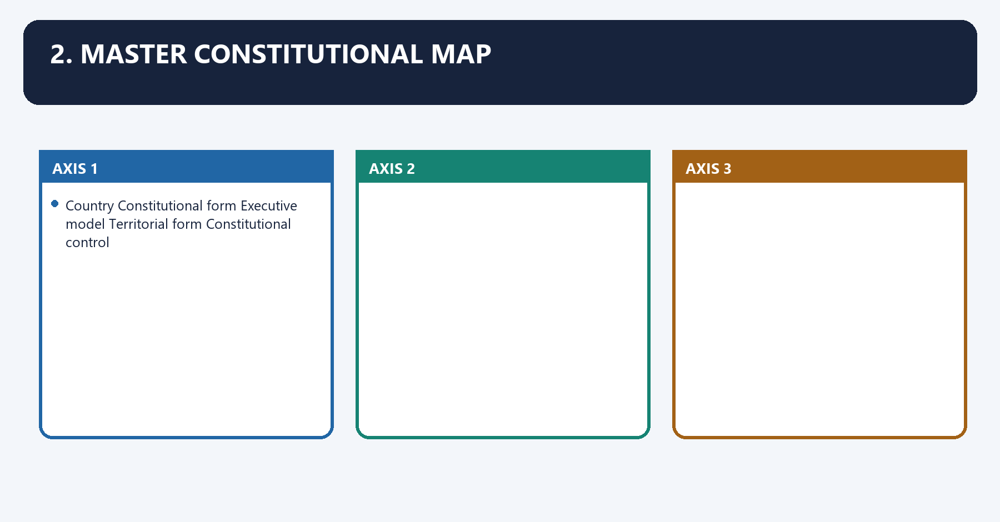
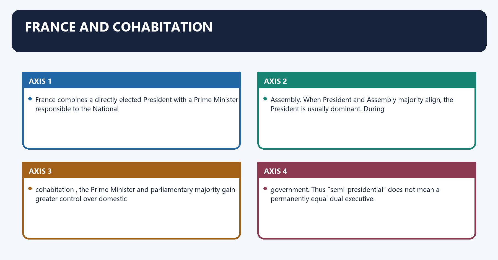
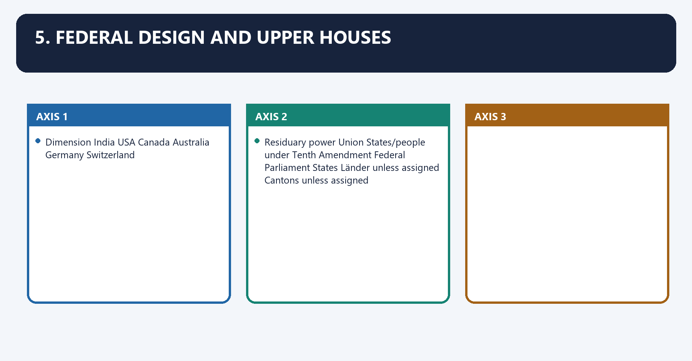
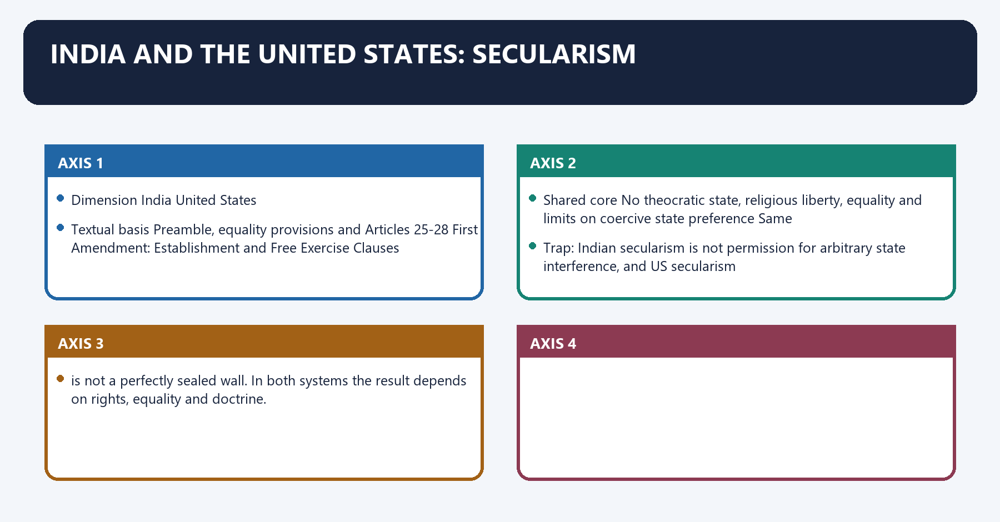
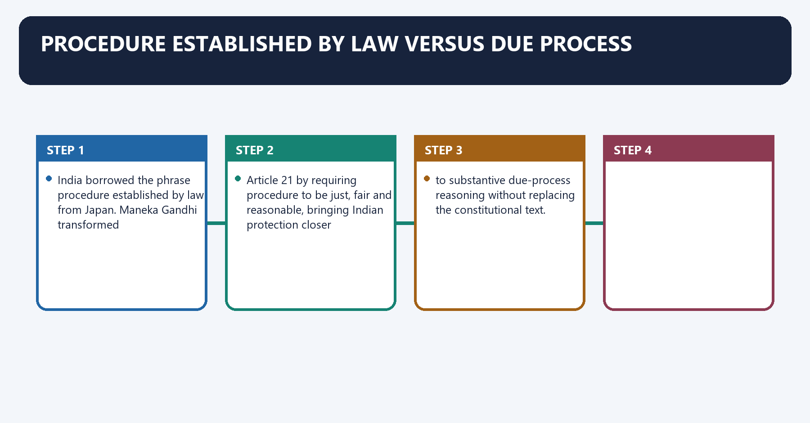
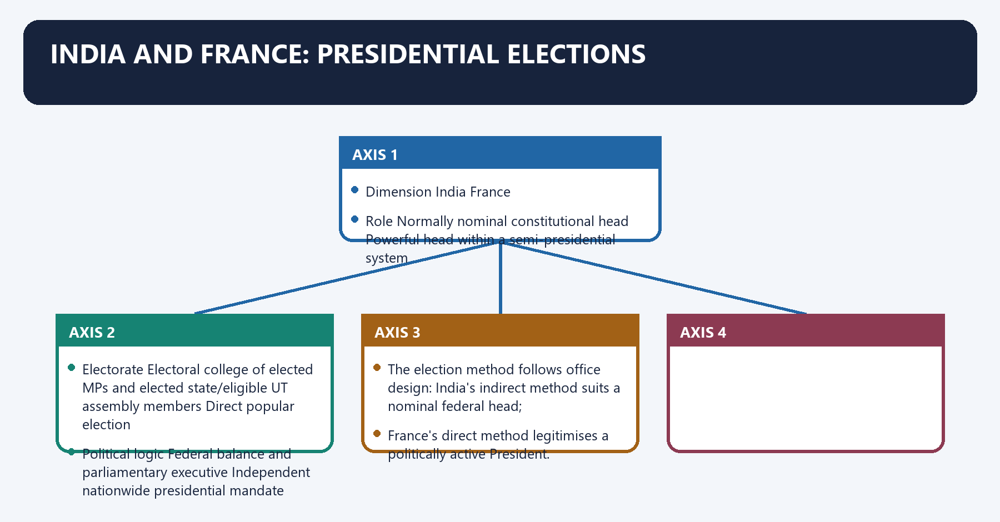
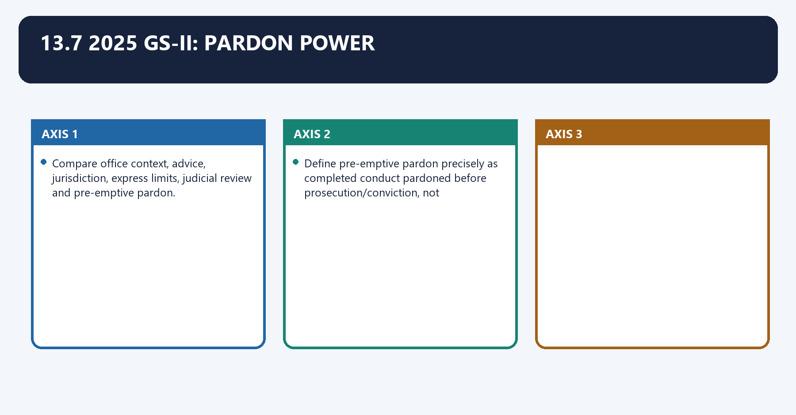

# Comparative Constitutional Design — Complete Uncompressed Learning Session

**Complete independent learning session + verified PYQ routing + solved practice workbook + final consolidated register notes**

**Legal/current control date:** 25 August 2026 (Asia/Kolkata)

> **Tag key:** `[FACT]` = named constitutional, statutory, official, judicial or audited local support; `[ANALYSIS]` = reasoned examination; `[CURRENT]` = checked for the control date; `[LIMIT]` = qualification.
>
> **Answer-writing discipline:** claim -> named evidence -> analysis -> qualification.

- [CURRENT] Status is controlled to **25 August 2026, Asia/Kolkata**.
- [CURRENT] **Live official refresh, 25 August 2026:** The official Constitution and the controlling Indian comparison cases were rechecked on 25 August 2026. Foreign systems are used as stable design comparators rather than as volatile political snapshots; no current officeholder, party majority or transient reform proposal is frozen.

#### How to Use This Package

[FACT] The complete Basic/Core owner is taught first in source order. Cross-topic Markdown, local OCR books and verified PYQ ledgers supplement it.

[FACT] Advanced-owner material appears only after the Core and practice sections under the required optional-depth label.

[LIMIT] India borrowed constitutional techniques but adapted them to a written, supreme, federal-parliamentary and judicially reviewable Constitution. Comparison must identify function, context and Indian adaptation; the Indian President is not a US President, Rajya Sabha is not a US Senate, and Directive Principles are not an operational copy of Ireland.

#### Local Owner Gateway

> **Subject:** Polity · **Tier:** Core · **GS Paper:** GS-II
> **Official clause:** "Comparison of the Indian constitutional scheme with that of other countries."
> **Rule:** This file contains every comparison needed for examination performance. The Advanced
> companion adds theory and evaluation, but is not required to answer a PYQ.
> **Advanced (optional):** `../advanced/47_Comparative-Constitutional-Design.md` — optional deeper detail; not required for any mark.

---

## BASIC LEARNING SESSION



*Distinct embedded teaching-navigation image. The separate continuous Cārvāka-style flowchart package remains an independent at-a-glance artifact.*

### SESSION 1 — WHAT UPSC MEANS BY "CONSTITUTIONAL SCHEME"
#### DEFINITION / WHAT THIS IS CALLED

**Plain-language definition:** What UPSC means by "constitutional scheme" denotes the constitutional rules and institutional links organised around A constitutional scheme is not a list of borrowed provisions.

**Technical definition:** What UPSC means by "constitutional scheme" operates through locates sovereignty and constitutional supremacy, connected with structures the executive-legislature relationship.

#### ANSWER-GRABBING OPENING — WRITE/ADAPT IN THE EXAM

> A constitutional scheme organises sovereignty, institutions, rights, territorial power and accountability, rather than merely listing provisions borrowed from foreign constitutions.

#### MUST-WRITE KEYWORDS

- **Core method**
- **context - similarity - difference - constitutional consequence**
- **It**
- **Its principal consequence**
- **Its**
- **The decisive contrast**

**How to use them:** Frame the answer through Core method; define context - similarity - difference - constitutional consequence, connect It with Its principal consequence to explain the mechanism, and use Its for the decisive comparison or qualification.

1. What UPSC means by "constitutional scheme" denotes the constitutional rules and institutional links organised around A constitutional scheme is not a list of borrowed provisions. It is the connected design through.
1. What UPSC means by "constitutional scheme" operates through locates sovereignty and constitutional supremacy, connected with structures the executive-legislature relationship.
The operative mechanism matters because divides territorial power.
Its principal consequence is that protects rights and regulates religion.
The decisive contrast is between appoints and empowers courts and amends the Constitution and handles emergencies; and.
The exam-safe limitation is that converts votes into representation and public accountability.

A constitutional scheme is not a list of borrowed provisions. It is the connected design through
which a country:

1. locates sovereignty and constitutional supremacy;
2. structures the executive-legislature relationship;
3. divides territorial power;
4. protects rights and regulates religion;
5. appoints and empowers courts;
6. amends the Constitution and handles emergencies; and
7. converts votes into representation and public accountability.

> **Core method:** compare the same institution across countries in the sequence
> **context -> similarity -> difference -> constitutional consequence**.

#### CLOSING RECALL FLOW — WHAT UPSC MEANS BY "CONSTITUTIONAL SCHEME"

```closure-flow
SUBTOPIC: What UPSC means by "constitutional scheme"
KEY TERMS / DEFINITIONS: Core method · context - similarity - difference - constitutional consequence · It · Its principal consequence · Its · The decisive contrast
MECHANISM / ARGUMENT: What UPSC means by "constitutional scheme" operates through locates sovereignty and constitutional supremacy, connected with structures the executive-legislature relationship.
CONSEQUENCE / CONTRAST: A constitutional scheme is not a list of borrowed provisions.
UPSC TRAP / ANSWER-USE: Do not miss this limiting distinction: its principal consequence is that protects rights and regulates religion.
ANSWER-GRABBING FORMULATION: A constitutional scheme organises sovereignty, institutions, rights, territorial power and accountability, rather than merely listing provisions borrowed from foreign constitutions.
```
### SESSION 2 — CONTEXT WARNING
#### DEFINITION / WHAT THIS IS CALLED

**Plain-language definition:** Context warning denotes the constitutional rules and institutional links organised around The same institution can operate differently because of party systems, conventions, federal.

**Technical definition:** Its principal consequence is that the same institution can operate differently because of party systems, conventions, federal.

#### ANSWER-GRABBING OPENING — WRITE/ADAPT IN THE EXAM

> The same institution can operate differently because of party systems, conventions, federal structure, political history and judicial doctrine.

#### MUST-WRITE KEYWORDS

- **Context warning**
- **Its principal consequence**
- **Its**
- **The decisive contrast**
- **The exam-safe limitation**

**How to use them:** Frame the answer through Context warning; define Its principal consequence, connect Its with The decisive contrast to explain the mechanism, and use The exam-safe limitation for the decisive comparison or qualification.

Context warning denotes the constitutional rules and institutional links organised around The same institution can operate differently because of party systems, conventions, federal.
Context warning operates through structure, political history and judicial doctrine. India borrowed mechanisms but adapted them to a, connected with written, republican, federal and socially transformative Constitution. Source is not operational.
The operative mechanism matters because the same institution can operate differently because of party systems, conventions, federal.
Its principal consequence is that the same institution can operate differently because of party systems, conventions, federal.
The decisive contrast is between The same institution can operate differently because of party systems, conventions, federal and The same institution can operate differently because of party systems, conventions, federal.
The exam-safe limitation is that the same institution can operate differently because of party systems, conventions, federal.
The same institution can operate differently because of party systems, conventions, federal
structure, political history and judicial doctrine. India borrowed mechanisms but adapted them to a
written, republican, federal and socially transformative Constitution. **Source is not operational
identity.**

---

#### CLOSING RECALL FLOW — CONTEXT WARNING

```closure-flow
SUBTOPIC: Context warning
KEY TERMS / DEFINITIONS: Context warning · Its principal consequence · Its · The decisive contrast · The exam-safe limitation
MECHANISM / ARGUMENT: Its principal consequence is that the same institution can operate differently because of party systems, conventions, federal.
CONSEQUENCE / CONTRAST: The decisive contrast is between The same institution can operate differently because of party systems, conventions, federal and The same institution can operate differently because of party systems, conventions, federal.
UPSC TRAP / ANSWER-USE: Do not miss this limiting distinction: the exam-safe limitation is that the same institution can operate differently because of party...
ANSWER-GRABBING FORMULATION: The same institution can operate differently because of party systems, conventions, federal structure, political history and judicial doctrine.
```
### SESSION 3 — MASTER CONSTITUTIONAL MAP
#### DEFINITION / WHAT THIS IS CALLED

**Plain-language definition:** Master constitutional map denotes the constitutional rules and institutional links organised around Country Constitutional form Executive model Territorial form Constitutional control.

**Technical definition:** Its principal consequence is that country Constitutional form Executive model Territorial form Constitutional control.

#### ANSWER-GRABBING OPENING — WRITE/ADAPT IN THE EXAM

> Comparative constitutional analysis is meaningful only when systems are compared across common dimensions such as executive design, territorial power, rights, courts and amendment.

#### MUST-WRITE KEYWORDS

- **Master constitutional map**
- **India**
- **United Kingdom**
- **Uncodified**
- **United States**
- **Canada**

**How to use them:** Frame the answer through Master constitutional map; define India, connect United Kingdom with Uncodified to explain the mechanism, and use United States for the decisive comparison or qualification.

2. Master constitutional map denotes the constitutional rules and institutional links organised around Country Constitutional form Executive model Territorial form Constitutional control.
2. Master constitutional map operates through Country Constitutional form Executive model Territorial form Constitutional control, connected with Country Constitutional form Executive model Territorial form Constitutional control.
The operative mechanism matters because country Constitutional form Executive model Territorial form Constitutional control.
Its principal consequence is that country Constitutional form Executive model Territorial form Constitutional control.
The decisive contrast is between Country Constitutional form Executive model Territorial form Constitutional control and Country Constitutional form Executive model Territorial form Constitutional control.
The exam-safe limitation is that country Constitutional form Executive model Territorial form Constitutional control.

| Country | Constitutional form | Executive model | Territorial form | Constitutional control |
|---|---|---|---|---|
| **India** | Written, supreme Constitution; republic | Parliamentary; nominal President and responsible Council of Ministers | Holding-together federation with a strong Union | Supreme Court/High Courts; judicial review plus basic structure |
| **United Kingdom** | **Uncodified**, evolutionary constitution; constitutional monarchy | Westminster parliamentary government | Legally unitary with political devolution | Parliamentary sovereignty; courts generally cannot invalidate an Act of Parliament |
| **United States** | Written, rigid, supreme Constitution; republic | Presidential; separately elected fixed executive | Coming-together federation | Diffuse judicial review; federal and state court systems |
| **Canada** | Written federal constitution plus conventions; constitutional monarchy | Responsible parliamentary government | Federation designed with a comparatively strong centre | Supreme Court and constitutional review |
| **Australia** | Written federal constitution; constitutional monarchy | Federal Westminster system | Coming-together federation | High Court; constitutionally divided powers |
| **France** | Written Constitution of the Fifth Republic; republic | Semi-presidential: President plus Prime Minister | Unitary, decentralised state | Constitutional Council and other courts within a specialised system |
| **Switzerland** | Written federal constitution; republic | Plural Federal Council; collegial executive | Confederation by name, federation in law | Strong direct democracy; limited review of federal statutes |
| **South Africa** | Written, supreme and transformative Constitution; republic | Parliamentary executive; President elected by National Assembly | Unitary state with constitutionally protected provinces and cooperative government | Constitutional Court; enforceable civil-political and socio-economic rights |
| **Germany** | Written Basic Law; parliamentary federal republic | Chancellor-led parliamentary government | Federation with direct Land-government participation through Bundesrat | Separate Federal Constitutional Court; textual eternity clause |
| **Japan** | Written, supreme Constitution; constitutional monarchy | Parliamentary cabinet; symbolic Emperor | Unitary state | Supreme Court judicial review; rigid amendment plus referendum |

---

#### CLOSING RECALL FLOW — MASTER CONSTITUTIONAL MAP

```closure-flow
SUBTOPIC: Master constitutional map
KEY TERMS / DEFINITIONS: Master constitutional map · India · United Kingdom · Uncodified · United States · Canada
MECHANISM / ARGUMENT: Its principal consequence is that country Constitutional form Executive model Territorial form Constitutional control.
CONSEQUENCE / CONTRAST: The decisive contrast is between Country Constitutional form Executive model Territorial form Constitutional control and Country Constitutional form Executive model Territorial form Constitutional control.
UPSC TRAP / ANSWER-USE: Do not miss this limiting distinction: the exam-safe limitation is that country Constitutional form Executive model Territorial form Constitutional control.
ANSWER-GRABBING FORMULATION: Comparative constitutional analysis is meaningful only when systems are compared across common dimensions such as executive design, territorial power, rights, courts and amendment.
```
### SESSION 4 — PARLIAMENTARY, PRESIDENTIAL AND SEMI-PRESIDENTIAL GOVERNMENT
#### DEFINITION / WHAT THIS IS CALLED

**Plain-language definition:** Parliamentary, presidential and semi-presidential government operates through Executive Dual: nominal head plus real cabinet Single President is head of state and government Dual: President plus Prime Minister, connected with Power relationship Fusion with responsibility Separation with checks and balances Power balance varies with legislative majority.

**Technical definition:** Parliamentary, presidential and semi-presidential government denotes the constitutional rules and institutional links organised around Test India / UK parliamentary model US presidential model French semi-presidential model.

#### ANSWER-GRABBING OPENING — WRITE/ADAPT IN THE EXAM

> Parliamentary, presidential and semi-presidential systems distribute executive legitimacy and legislative responsibility differently, producing distinct risks of instability, deadlock or dual authority.

#### MUST-WRITE KEYWORDS

- **Parliamentary**
- **presidential**
- **semi-presidential government**
- **Executive**
- **Dual: nominal head plus real cabinet**
- **Dual: President plus Prime Minister**

**How to use them:** Frame the answer through Parliamentary; define presidential, connect semi-presidential government with Executive to explain the mechanism, and use Dual: nominal head plus real cabinet for the decisive comparison or qualification.

3. Parliamentary, presidential and semi-presidential government denotes the constitutional rules and institutional links organised around Test India / UK parliamentary model US presidential model French semi-presidential model.
3. Parliamentary, presidential and semi-presidential government operates through Executive Dual: nominal head plus real cabinet Single President is head of state and government Dual: President plus Prime Minister, connected with Power relationship Fusion with responsibility Separation with checks and balances Power balance varies with legislative majority.
The operative mechanism matters because test India / UK parliamentary model US presidential model French semi-presidential model.
Its principal consequence is that test India / UK parliamentary model US presidential model French semi-presidential model.
The decisive contrast is between Test India / UK parliamentary model US presidential model French semi-presidential model and Test India / UK parliamentary model US presidential model French semi-presidential model.
The exam-safe limitation is that test India / UK parliamentary model US presidential model French semi-presidential model.
| Test | India / UK parliamentary model | US presidential model | French semi-presidential model |
|---|---|---|---|
| Executive | Dual: nominal head plus real cabinet | Single President is head of state and government | Dual: President plus Prime Minister |
| Selection | Government emerges from legislature | President chosen separately through electoral college | President directly elected; PM appointed by President |
| Legislative confidence | Cabinet survives only with lower-house confidence | Executive does not depend on congressional confidence | PM/government responsible to National Assembly |
| Tenure | Politically variable; lower house can be dissolved | Fixed presidential and congressional terms | President fixed term; Assembly can be dissolved under constitutional conditions |
| Power relationship | Fusion with responsibility | Separation with checks and balances | Power balance varies with legislative majority |
| Central trade-off | Accountability, representation and replaceability | Stability and decisional independence | Flexible dual legitimacy but possible executive rivalry |

#### CLOSING RECALL FLOW — PARLIAMENTARY, PRESIDENTIAL AND SEMI-PRESIDENTIAL GOVERNMENT

```closure-flow
SUBTOPIC: Parliamentary, presidential and semi-presidential government
KEY TERMS / DEFINITIONS: Parliamentary · presidential · semi-presidential government · Executive · Dual: nominal head plus real cabinet · Dual: President plus Prime Minister
MECHANISM / ARGUMENT: Parliamentary, presidential and semi-presidential government denotes the constitutional rules and institutional links organised around Test India / UK parliamentary model US presidential model French semi-presidential model.
CONSEQUENCE / CONTRAST: Its principal consequence is that test India / UK parliamentary model US presidential model French semi-presidential model.
UPSC TRAP / ANSWER-USE: Do not miss this limiting distinction: the decisive contrast is between Test India / UK parliamentary model US presidential model...
ANSWER-GRABBING FORMULATION: Parliamentary, presidential and semi-presidential systems distribute executive legitimacy and legislative responsibility differently, producing distinct risks of instability, deadlock or dual authority.
```
### SESSION 5 — INDIA VERSUS THE UNITED KINGDOM
#### DEFINITION / WHAT THIS IS CALLED

**Plain-language definition:** India versus the United Kingdom operates through Head of state Elected President; republic Hereditary monarch India rejects hereditary public office, connected with Trap: The UK Constitution is better called uncodified , not literally unwritten.

**Technical definition:** India versus the United Kingdom denotes the constitutional rules and institutional links organised around Dimension India United Kingdom Consequence.

#### ANSWER-GRABBING OPENING — WRITE/ADAPT IN THE EXAM

> India adapted Westminster responsibility within a written supreme Constitution, replacing the United Kingdom's hereditary Crown and parliamentary sovereignty with republican and judicial limits.

#### MUST-WRITE KEYWORDS

- **India versus the United Kingdom**
- **uncodified**
- **Head of state**
- **Elected President; republic**
- **Hereditary monarch**
- **India rejects hereditary public office**

**How to use them:** Frame the answer through India versus the United Kingdom; define uncodified, connect Head of state with Elected President; republic to explain the mechanism, and use Hereditary monarch for the decisive comparison or qualification.

India versus the United Kingdom denotes the constitutional rules and institutional links organised around Dimension India United Kingdom Consequence.
India versus the United Kingdom operates through Head of state Elected President; republic Hereditary monarch India rejects hereditary public office, connected with Trap: The UK Constitution is better called uncodified , not literally unwritten. Statutes,.
The operative mechanism matters because judgments, conventions and authoritative works are among its sources.
Its principal consequence is that dimension India United Kingdom Consequence.
The decisive contrast is between Dimension India United Kingdom Consequence and Dimension India United Kingdom Consequence.
The exam-safe limitation is that dimension India United Kingdom Consequence.

| Dimension | India | United Kingdom | Consequence |
|---|---|---|---|
| Head of state | Elected President; republic | Hereditary monarch | India rejects hereditary public office |
| Constitutional authority | Written supreme Constitution | Uncodified constitution; parliamentary sovereignty | Indian Parliament is legally limited and reviewable |
| Federalism | Constitutionally divided Union-state powers | Legally unitary despite devolution | UK devolved bodies do not possess Indian-style coordinate constitutional sovereignty |
| Prime Minister | May belong to either House, subject to parliamentary membership rules | By convention from House of Commons | British democratic responsibility is tied more tightly to Commons leadership |
| Rights | Entrenched Fundamental Rights | Statute, common law and convention, including Human Rights Act framework | Indian courts can invalidate inconsistent legislation |
| Courts | Strong-form review of legislation | Courts interpret and review executive action but ordinarily cannot strike down primary Westminster legislation | Different meaning of "judicial supremacy" |

> **Trap:** The UK Constitution is better called **uncodified**, not literally unwritten. Statutes,
> judgments, conventions and authoritative works are among its sources.

#### CLOSING RECALL FLOW — INDIA VERSUS THE UNITED KINGDOM

```closure-flow
SUBTOPIC: India versus the United Kingdom
KEY TERMS / DEFINITIONS: India versus the United Kingdom · uncodified · Head of state · Elected President; republic · Hereditary monarch · India rejects hereditary public office
MECHANISM / ARGUMENT: India versus the United Kingdom denotes the constitutional rules and institutional links organised around Dimension India United Kingdom Consequence.
CONSEQUENCE / CONTRAST: Its principal consequence is that dimension India United Kingdom Consequence.
UPSC TRAP / ANSWER-USE: The UK Constitution is better called uncodified, not literally unwritten. Statutes,.
ANSWER-GRABBING FORMULATION: India adapted Westminster responsibility within a written supreme Constitution, replacing the United Kingdom's hereditary Crown and parliamentary sovereignty with republican and judicial limits.
```
### SESSION 6 — INDIA VERSUS THE UNITED STATES
#### DEFINITION / WHAT THIS IS CALLED

**Plain-language definition:** India versus the United States operates through Executive Parliamentary; President normally acts on ministerial advice Presidential; President personally exercises executive authority, connected with Legislature membership Ministers are or become legislators Executive officers cannot simultaneously sit in Congress.

**Technical definition:** India versus the United States denotes the constitutional rules and institutional links organised around Dimension India United States.

#### ANSWER-GRABBING OPENING — WRITE/ADAPT IN THE EXAM

> India fuses executive and legislative responsibility, whereas the United States separates mandates and personnel, trading easier accountability for stronger institutional checks and possible deadlock.

#### MUST-WRITE KEYWORDS

- **India versus the United States**
- **Executive**
- **Parliamentary; President normally acts on ministerial advice**
- **Presidential; President personally exercises executive authority**
- **Responsibility**
- **Council of Ministers collectively responsible to Lok Sabha**

**How to use them:** Frame the answer through India versus the United States; define Executive, connect Parliamentary; President normally acts on ministerial advice with Presidential; President personally exercises executive authority to explain the mechanism, and use Responsibility for the decisive comparison or qualification.

India versus the United States denotes the constitutional rules and institutional links organised around Dimension India United States.
India versus the United States operates through Executive Parliamentary; President normally acts on ministerial advice Presidential; President personally exercises executive authority, connected with Legislature membership Ministers are or become legislators Executive officers cannot simultaneously sit in Congress.
The operative mechanism matters because dissolution Lok Sabha may be dissolved President cannot dissolve Congress.
Its principal consequence is that dimension India United States.
The decisive contrast is between Dimension India United States and Dimension India United States.
The exam-safe limitation is that dimension India United States.
| Dimension | India | United States |
|---|---|---|
| Executive | Parliamentary; President normally acts on ministerial advice | Presidential; President personally exercises executive authority |
| Responsibility | Council of Ministers collectively responsible to Lok Sabha | President and secretaries not collectively responsible to Congress |
| Legislature membership | Ministers are or become legislators | Executive officers cannot simultaneously sit in Congress |
| Dissolution | Lok Sabha may be dissolved | President cannot dissolve Congress |
| Removal | Government may fall through loss of confidence; President by impeachment | President removable only through impeachment and conviction |
| Party-government relation | Party majority often joins executive and legislature | Institutional separation persists even under unified party control |

#### CLOSING RECALL FLOW — INDIA VERSUS THE UNITED STATES

```closure-flow
SUBTOPIC: India versus the United States
KEY TERMS / DEFINITIONS: India versus the United States · Executive · Parliamentary; President normally acts on ministerial advice · Presidential; President personally exercises executive authority · Responsibility · Council of Ministers collectively responsible to Lok Sabha
MECHANISM / ARGUMENT: India versus the United States denotes the constitutional rules and institutional links organised around Dimension India United States.
CONSEQUENCE / CONTRAST: The decisive contrast is between Dimension India United States and Dimension India United States.
UPSC TRAP / ANSWER-USE: Do not miss this limiting distinction: its principal consequence is that dimension India United States.
ANSWER-GRABBING FORMULATION: India fuses executive and legislative responsibility, whereas the United States separates mandates and personnel, trading easier accountability for stronger institutional checks and possible deadlock.
```
### SESSION 7 — FRANCE AND COHABITATION
#### DEFINITION / WHAT THIS IS CALLED

**Plain-language definition:** France and cohabitation denotes the constitutional rules and institutional links organised around France combines a directly elected President with a Prime Minister responsible to the National.

**Technical definition:** Its principal consequence is that france combines a directly elected President with a Prime Minister responsible to the National.

#### ANSWER-GRABBING OPENING — WRITE/ADAPT IN THE EXAM

> France's semi-presidential Constitution divides executive authority between a directly elected President and an Assembly-responsible Prime Minister, with cohabitation shifting their practical balance.

#### MUST-WRITE KEYWORDS

- **France**
- **cohabitation**
- **France and cohabitation**
- **President**
- **Prime Minister**
- **National**

**How to use them:** Frame the answer through France; define cohabitation, connect France and cohabitation with President to explain the mechanism, and use Prime Minister for the decisive comparison or qualification.

France and cohabitation denotes the constitutional rules and institutional links organised around France combines a directly elected President with a Prime Minister responsible to the National.
France and cohabitation operates through Assembly. When President and Assembly majority align, the President is usually dominant. During, connected with cohabitation , the Prime Minister and parliamentary majority gain greater control over domestic.
The operative mechanism matters because government. Thus "semi-presidential" does not mean a permanently equal dual executive.
Its principal consequence is that france combines a directly elected President with a Prime Minister responsible to the National.
The decisive contrast is between France combines a directly elected President with a Prime Minister responsible to the National and France combines a directly elected President with a Prime Minister responsible to the National.
The exam-safe limitation is that france combines a directly elected President with a Prime Minister responsible to the National.

France combines a directly elected President with a Prime Minister responsible to the National
Assembly. When President and Assembly majority align, the President is usually dominant. During
**cohabitation**, the Prime Minister and parliamentary majority gain greater control over domestic
government. Thus "semi-presidential" does not mean a permanently equal dual executive.

#### CLOSING RECALL FLOW — FRANCE AND COHABITATION

```closure-flow
SUBTOPIC: France and cohabitation
KEY TERMS / DEFINITIONS: France · cohabitation · France and cohabitation · President · Prime Minister · National
MECHANISM / ARGUMENT: Its principal consequence is that france combines a directly elected President with a Prime Minister responsible to the National.
CONSEQUENCE / CONTRAST: The decisive contrast is between France combines a directly elected President with a Prime Minister responsible to the National and France combines a directly elected President with a Prime Minister responsible to the National.
UPSC TRAP / ANSWER-USE: Thus "semi-presidential" does not mean a permanently equal dual executive.
ANSWER-GRABBING FORMULATION: France's semi-presidential Constitution divides executive authority between a directly elected President and an Assembly-responsible Prime Minister, with cohabitation shifting their practical balance.
```
### SESSION 8 — STABILITY LESSONS FROM GERMANY AND SWITZERLAND
#### DEFINITION / WHAT THIS IS CALLED

**Plain-language definition:** Stability lessons from Germany and Switzerland denotes the constitutional rules and institutional links organised around Germany's Bundestag may remove a Chancellor only by electing a successor: the constructive vote.

**Technical definition:** Its principal consequence is that germany's Bundestag may remove a Chancellor only by electing a successor: the constructive vote.

#### ANSWER-GRABBING OPENING — WRITE/ADAPT IN THE EXAM

> Germany's constructive no-confidence rule and Switzerland's collegial executive show that stability can arise through replacement safeguards or shared authority rather than concentrated presidential power.

#### MUST-WRITE KEYWORDS

- **Stability lessons from Germany**
- **Switzerland**
- **constructive vote of no confidence**
- **Stability lessons from Germany and Switzerland**
- **Stability**
- **Germany**

**How to use them:** Frame the answer through Stability lessons from Germany; define Switzerland, connect constructive vote of no confidence with Stability lessons from Germany and Switzerland to explain the mechanism, and use Stability for the decisive comparison or qualification.

Stability lessons from Germany and Switzerland denotes the constitutional rules and institutional links organised around Germany's Bundestag may remove a Chancellor only by electing a successor: the constructive vote.
Stability lessons from Germany and Switzerland operates through of no confidence . It combines responsibility with continuity, connected with Switzerland's seven-member Federal Council is a collegial executive. Its annually rotating.
The operative mechanism matters because president is not equivalent to a powerful presidential executive.
Its principal consequence is that germany's Bundestag may remove a Chancellor only by electing a successor: the constructive vote.
The decisive contrast is between Germany's Bundestag may remove a Chancellor only by electing a successor: the constructive vote and Germany's Bundestag may remove a Chancellor only by electing a successor: the constructive vote.
The exam-safe limitation is that germany's Bundestag may remove a Chancellor only by electing a successor: the constructive vote.
- Germany's Bundestag may remove a Chancellor only by electing a successor: the **constructive vote
  of no confidence**. It combines responsibility with continuity.
- Switzerland's seven-member Federal Council is a collegial executive. Its annually rotating
  President is not equivalent to a powerful presidential executive.

---

#### CLOSING RECALL FLOW — STABILITY LESSONS FROM GERMANY AND SWITZERLAND

```closure-flow
SUBTOPIC: Stability lessons from Germany and Switzerland
KEY TERMS / DEFINITIONS: Stability lessons from Germany · Switzerland · constructive vote of no confidence · Stability lessons from Germany and Switzerland · Stability · Germany
MECHANISM / ARGUMENT: Its principal consequence is that germany's Bundestag may remove a Chancellor only by electing a successor: the constructive vote.
CONSEQUENCE / CONTRAST: The decisive contrast is between Germany's Bundestag may remove a Chancellor only by electing a successor: the constructive vote and Germany's Bundestag may remove a Chancellor only by electing a successor: the constructive vote.
UPSC TRAP / ANSWER-USE: The operative mechanism matters because president is not equivalent to a powerful presidential executive.
ANSWER-GRABBING FORMULATION: Germany's constructive no-confidence rule and Switzerland's collegial executive show that stability can arise through replacement safeguards or shared authority rather than concentrated presidential power.
```
### SESSION 9 — CONSTITUTIONAL SUPREMACY, PARLIAMENTARY SOVEREIGNTY AND JUDICIAL POWER
#### DEFINITION / WHAT THIS IS CALLED

**Plain-language definition:** Constitutional supremacy, parliamentary sovereignty and judicial power operates through USA Constitutional supremacy Courts may invalidate federal/state law; amendment is governed by Article V, connected with Germany Basic Law supremacy Constitutional Court review plus textual protection under Article 79(3).

**Technical definition:** Constitutional supremacy, parliamentary sovereignty and judicial power denotes the constitutional rules and institutional links organised around Model Core principle Legislative limit.

#### ANSWER-GRABBING OPENING — WRITE/ADAPT IN THE EXAM

> Constitutional supremacy subjects legislation to higher law and judicial review, whereas parliamentary sovereignty locates final ordinary law-making authority in the legislature.

#### MUST-WRITE KEYWORDS

- **Constitutional supremacy**
- **parliamentary sovereignty**
- **judicial power**
- **India**
- **UK**
- **USA**

**How to use them:** Frame the answer through Constitutional supremacy; define parliamentary sovereignty, connect judicial power with India to explain the mechanism, and use UK for the decisive comparison or qualification.

4. Constitutional supremacy, parliamentary sovereignty and judicial power denotes the constitutional rules and institutional links organised around Model Core principle Legislative limit.
4. Constitutional supremacy, parliamentary sovereignty and judicial power operates through USA Constitutional supremacy Courts may invalidate federal/state law; amendment is governed by Article V, connected with Germany Basic Law supremacy Constitutional Court review plus textual protection under Article 79(3).
The operative mechanism matters because south Africa Express constitutional supremacy Invalid law or conduct must be controlled through constitutional adjudication.
Its principal consequence is that model Core principle Legislative limit.
The decisive contrast is between Model Core principle Legislative limit and Model Core principle Legislative limit.
The exam-safe limitation is that model Core principle Legislative limit.

| Model | Core principle | Legislative limit |
|---|---|---|
| **India** | Constitutional supremacy with limited constituent power | Courts may invalidate ordinary law and amendments violating the basic structure |
| **UK** | Parliamentary sovereignty | Courts ordinarily cannot invalidate a Westminster Act; a declaration of incompatibility under the Human Rights Act does not itself nullify the Act |
| **USA** | Constitutional supremacy | Courts may invalidate federal/state law; amendment is governed by Article V |
| **Germany** | Basic Law supremacy | Constitutional Court review plus textual protection under Article 79(3) |
| **South Africa** | Express constitutional supremacy | Invalid law or conduct must be controlled through constitutional adjudication |

#### CLOSING RECALL FLOW — CONSTITUTIONAL SUPREMACY, PARLIAMENTARY SOVEREIGNTY AND JUDICIAL POWER

```closure-flow
SUBTOPIC: Constitutional supremacy, parliamentary sovereignty and judicial power
KEY TERMS / DEFINITIONS: Constitutional supremacy · parliamentary sovereignty · judicial power · India · UK · USA
MECHANISM / ARGUMENT: Constitutional supremacy, parliamentary sovereignty and judicial power denotes the constitutional rules and institutional links organised around Model Core principle Legislative limit.
CONSEQUENCE / CONTRAST: The operative mechanism matters because south Africa Express constitutional supremacy Invalid law or conduct must be controlled through constitutional adjudication.
UPSC TRAP / ANSWER-USE: Its principal consequence is that model Core principle Legislative limit.
ANSWER-GRABBING FORMULATION: Constitutional supremacy subjects legislation to higher law and judicial review, whereas parliamentary sovereignty locates final ordinary law-making authority in the legislature.
```
### SESSION 10 — INDIA'S SYNTHESIS
#### DEFINITION / WHAT THIS IS CALLED

**Plain-language definition:** India's synthesis denotes the constitutional rules and institutional links organised around British-sovereign , because Parliament is limited by the Constitution, federal division,.

**Technical definition:** Germany reaches a comparable protective objective through an express eternity clause and India's limit is judicially developed.

#### ANSWER-GRABBING OPENING — WRITE/ADAPT IN THE EXAM

> Germany reaches a comparable protective objective through an express eternity clause; India's limit is judicially developed.

#### MUST-WRITE KEYWORDS

- **India's synthesis**
- **British-sovereign**
- **judicial supremacy**
- **constituent power**
- **eternity clause**
- **India's**

**How to use them:** Frame the answer through India's synthesis; define British-sovereign, connect judicial supremacy with constituent power to explain the mechanism, and use eternity clause for the decisive comparison or qualification.

India's synthesis denotes the constitutional rules and institutional links organised around British-sovereign , because Parliament is limited by the Constitution, federal division,.
India's synthesis operates through Fundamental Rights and judicial review; nor, connected with an example of unlimited judicial supremacy , because courts also derive authority from the.
The operative mechanism matters because constitution and cannot rewrite policy merely because another choice appears preferable.
Its principal consequence is that parliament exercises constituent power , but Kesavananda Bharati makes it limited by the basic.
The decisive contrast is between structure. Germany reaches a comparable protective objective through an express eternity clause and India's limit is judicially developed.
The exam-safe limitation is that british-sovereign , because Parliament is limited by the Constitution, federal division,.
India is neither:

- **British-sovereign**, because Parliament is limited by the Constitution, federal division,
  Fundamental Rights and judicial review; nor
- an example of unlimited **judicial supremacy**, because courts also derive authority from the
  Constitution and cannot rewrite policy merely because another choice appears preferable.

Parliament exercises **constituent power**, but *Kesavananda Bharati* makes it limited by the basic
structure. Germany reaches a comparable protective objective through an express **eternity clause**;
India's limit is judicially developed.

---

#### CLOSING RECALL FLOW — INDIA'S SYNTHESIS

```closure-flow
SUBTOPIC: India's synthesis
KEY TERMS / DEFINITIONS: India's synthesis · British-sovereign · judicial supremacy · constituent power · eternity clause · India's
MECHANISM / ARGUMENT: Germany reaches a comparable protective objective through an express eternity clause and India's limit is judicially developed.
CONSEQUENCE / CONTRAST: Its principal consequence is that parliament exercises constituent power , but Kesavananda Bharati makes it limited by the basic.
UPSC TRAP / ANSWER-USE: Do not miss this limiting distinction: the decisive contrast is between structure.
ANSWER-GRABBING FORMULATION: Germany reaches a comparable protective objective through an express eternity clause; India's limit is judicially developed.
```
### SESSION 11 — FEDERAL DESIGN AND UPPER HOUSES
#### DEFINITION / WHAT THIS IS CALLED

**Plain-language definition:** Federal design and upper houses denotes the constitutional rules and institutional links organised around Dimension India USA Canada Australia Germany Switzerland.

**Technical definition:** Technically, Federal design and upper houses is analysed by relating Federal design to upper houses, then testing the relationship through Formation tendency and Holding together.

#### ANSWER-GRABBING OPENING — WRITE/ADAPT IN THE EXAM

> Upper Houses express federalism differently through unequal or equal State representation, selection methods and powers, so bicameralism alone does not establish federal equivalence.

#### MUST-WRITE KEYWORDS

- **Federal design**
- **upper houses**
- **Formation tendency**
- **Holding together**
- **Coming together**
- **Holding together/strong-centre design**

**How to use them:** Frame the answer through Federal design; define upper houses, connect Formation tendency with Holding together to explain the mechanism, and use Coming together for the decisive comparison or qualification.

5. Federal design and upper houses denotes the constitutional rules and institutional links organised around Dimension India USA Canada Australia Germany Switzerland.
5. Federal design and upper houses operates through Residuary power Union States/people under Tenth Amendment Federal Parliament States Länder unless assigned Cantons unless assigned, connected with Dimension India USA Canada Australia Germany Switzerland.
The operative mechanism matters because dimension India USA Canada Australia Germany Switzerland.
Its principal consequence is that dimension India USA Canada Australia Germany Switzerland.
The decisive contrast is between Dimension India USA Canada Australia Germany Switzerland and Dimension India USA Canada Australia Germany Switzerland.
The exam-safe limitation is that dimension India USA Canada Australia Germany Switzerland.

| Dimension | India | USA | Canada | Australia | Germany | Switzerland |
|---|---|---|---|---|---|---|
| Formation tendency | Holding together | Coming together | Holding together/strong-centre design | Coming together | Federal reconstruction | Coming together |
| Residuary power | Union | States/people under Tenth Amendment | Federal Parliament | States | Länder unless assigned | Cantons unless assigned |
| State equality in upper house | No; representation varies broadly by population | Yes; two Senators per state | No equal provincial representation; Senate is appointed | Yes; equal state representation in Senate | Länder governments represented with weighted votes | Equal cantonal representation, with reduced representation for former half-cantons |
| Judiciary | Integrated | Federal and state systems | Federal-provincial structure with Supreme Court at apex | Federal and state systems | Ordinary courts plus specialised Constitutional Court | Federal and cantonal systems |
| State alteration | Parliament can alter state areas/boundaries under Constitution | States are constitutionally indestructible without required consent | Provinces constitutionally protected | States constitutionally protected | Länder participate through Bundesrat | Cantonal autonomy strongly protected |

#### CLOSING RECALL FLOW — FEDERAL DESIGN AND UPPER HOUSES

```closure-flow
SUBTOPIC: Federal design and upper houses
KEY TERMS / DEFINITIONS: Federal design · upper houses · Formation tendency · Holding together · Coming together · Holding together/strong-centre design
MECHANISM / ARGUMENT: Its principal consequence is that dimension India USA Canada Australia Germany Switzerland.
CONSEQUENCE / CONTRAST: The decisive contrast is between Dimension India USA Canada Australia Germany Switzerland and Dimension India USA Canada Australia Germany Switzerland.
UPSC TRAP / ANSWER-USE: Do not miss this limiting distinction: the exam-safe limitation is that dimension India USA Canada Australia Germany Switzerland.
ANSWER-GRABBING FORMULATION: Upper Houses express federalism differently through unequal or equal State representation, selection methods and powers, so bicameralism alone does not establish federal equivalence.
```
### SESSION 12 — INDIAN DISTINCTIVENESS
#### DEFINITION / WHAT THIS IS CALLED

**Plain-language definition:** Indian distinctiveness denotes the constitutional rules and institutional links organised around India combines federal division with.

**Technical definition:** Its principal consequence is that unequal Rajya Sabha representation.

#### ANSWER-GRABBING OPENING — WRITE/ADAPT IN THE EXAM

> India's federal design combines Union residuary power, single citizenship, unequal Rajya Sabha representation and boundary flexibility, distinguishing it from classical coordinate federalism.

#### MUST-WRITE KEYWORDS

- **Indian distinctiveness**
- **Indian**
- **India**
- **Its principal consequence**
- **Its**
- **Rajya Sabha**

**How to use them:** Frame the answer through Indian distinctiveness; define Indian, connect India with Its principal consequence to explain the mechanism, and use Its for the decisive comparison or qualification.

Indian distinctiveness denotes the constitutional rules and institutional links organised around India combines federal division with.
Indian distinctiveness operates through Union residuary power, connected with single citizenship.
The operative mechanism matters because an integrated judiciary.
Its principal consequence is that unequal Rajya Sabha representation.
The decisive contrast is between emergency centralisation and centrally appointed Governors; and.
The exam-safe limitation is that parliament's power to alter state boundaries.
India combines federal division with:

- Union residuary power;
- single citizenship;
- an integrated judiciary;
- unequal Rajya Sabha representation;
- emergency centralisation;
- centrally appointed Governors; and
- Parliament's power to alter state boundaries.

Therefore, calling India simply "federal like the USA" misses the design. It is a federation adapted
to unity, diversity and post-Partition state-building.

#### CLOSING RECALL FLOW — INDIAN DISTINCTIVENESS

```closure-flow
SUBTOPIC: Indian distinctiveness
KEY TERMS / DEFINITIONS: Indian distinctiveness · Indian · India · Its principal consequence · Its · Rajya Sabha
MECHANISM / ARGUMENT: Its principal consequence is that unequal Rajya Sabha representation.
CONSEQUENCE / CONTRAST: The decisive contrast is between emergency centralisation and centrally appointed Governors; and.
UPSC TRAP / ANSWER-USE: Do not miss this limiting distinction: the exam-safe limitation is that parliament's power to alter state boundaries.
ANSWER-GRABBING FORMULATION: India's federal design combines Union residuary power, single citizenship, unequal Rajya Sabha representation and boundary flexibility, distinguishing it from classical coordinate federalism.
```
### SESSION 13 — RAJYA SABHA IS NOT THE US SENATE
#### DEFINITION / WHAT THIS IS CALLED

**Plain-language definition:** Rajya Sabha is not the US Senate operates through Rajya Sabha members are generally elected indirectly by state legislators; US Senators are, connected with The US Senate has distinctive confirmation and treaty roles; Rajya Sabha has special Indian.

**Technical definition:** Rajya Sabha is not the US Senate denotes the constitutional rules and institutional links organised around US states receive equal Senate representation; Indian states do not.

#### ANSWER-GRABBING OPENING — WRITE/ADAPT IN THE EXAM

> Rajya Sabha represents States unequally and is indirectly elected, unlike the US Senate, while its distinctive federal powers arise under Articles 249 and 312.

#### MUST-WRITE KEYWORDS

- **Rajya Sabha**
- **US Senate**
- **US**
- **Senate**
- **Indian**
- **US Senators**

**How to use them:** Frame the answer through Rajya Sabha; define US Senate, connect US with Senate to explain the mechanism, and use Indian for the decisive comparison or qualification.

Rajya Sabha is not the US Senate denotes the constitutional rules and institutional links organised around US states receive equal Senate representation; Indian states do not.
Rajya Sabha is not the US Senate operates through Rajya Sabha members are generally elected indirectly by state legislators; US Senators are, connected with The US Senate has distinctive confirmation and treaty roles; Rajya Sabha has special Indian.
The operative mechanism matters because federal powers under Articles 249 and 312.
Its principal consequence is that uS states receive equal Senate representation; Indian states do not.
The decisive contrast is between US states receive equal Senate representation; Indian states do not and US states receive equal Senate representation; Indian states do not.
The exam-safe limitation is that uS states receive equal Senate representation; Indian states do not.

- US states receive equal Senate representation; Indian states do not.
- Rajya Sabha members are generally elected indirectly by state legislators; US Senators are
  directly elected.
- The US Senate has distinctive confirmation and treaty roles; Rajya Sabha has special Indian
  federal powers under Articles 249 and 312.

#### CLOSING RECALL FLOW — RAJYA SABHA IS NOT THE US SENATE

```closure-flow
SUBTOPIC: Rajya Sabha is not the US Senate
KEY TERMS / DEFINITIONS: Rajya Sabha · US Senate · US · Senate · Indian · US Senators
MECHANISM / ARGUMENT: Rajya Sabha members are generally elected indirectly by state legislators; US Senators are directly elected.
CONSEQUENCE / CONTRAST: Rajya Sabha is not the US Senate denotes the constitutional rules and institutional links organised around US states receive equal Senate representation; Indian states do not.
UPSC TRAP / ANSWER-USE: Do not miss this limiting distinction: the US Senate has distinctive confirmation and treaty roles.
ANSWER-GRABBING FORMULATION: Rajya Sabha represents States unequally and is indirectly elected, unlike the US Senate, while its distinctive federal powers arise under Articles 249 and 312.
```
### SESSION 14 — BUNDESRAT LESSON
#### DEFINITION / WHAT THIS IS CALLED

**Plain-language definition:** Bundesrat lesson denotes the constitutional rules and institutional links organised around Germany's Bundesrat represents Land governments , not an independently elected second chamber.

**Technical definition:** Its principal consequence is that germany's Bundesrat represents Land governments , not an independently elected second chamber.

#### ANSWER-GRABBING OPENING — WRITE/ADAPT IN THE EXAM

> Rajya Sabha represents states constitutionally, but its members do not vote as instructed delegations of state governments.

#### MUST-WRITE KEYWORDS

- **Bundesrat lesson**
- **Land governments**
- **Bundesrat**
- **Germany's Bundesrat**
- **Land**
- **Rajya Sabha**

**How to use them:** Frame the answer through Bundesrat lesson; define Land governments, connect Bundesrat with Germany's Bundesrat to explain the mechanism, and use Land for the decisive comparison or qualification.

Bundesrat lesson denotes the constitutional rules and institutional links organised around Germany's Bundesrat represents Land governments , not an independently elected second chamber.
Bundesrat lesson operates through It therefore inserts state executives directly into federal legislation. Rajya Sabha represents, connected with states constitutionally, but its members do not vote as instructed delegations of state governments.
The operative mechanism matters because germany's Bundesrat represents Land governments , not an independently elected second chamber.
Its principal consequence is that germany's Bundesrat represents Land governments , not an independently elected second chamber.
The decisive contrast is between Germany's Bundesrat represents Land governments , not an independently elected second chamber and Germany's Bundesrat represents Land governments , not an independently elected second chamber.
The exam-safe limitation is that germany's Bundesrat represents Land governments , not an independently elected second chamber.
Germany's Bundesrat represents **Land governments**, not an independently elected second chamber.
It therefore inserts state executives directly into federal legislation. Rajya Sabha represents
states constitutionally, but its members do not vote as instructed delegations of state governments.

---

#### CLOSING RECALL FLOW — BUNDESRAT LESSON

```closure-flow
SUBTOPIC: Bundesrat lesson
KEY TERMS / DEFINITIONS: Bundesrat lesson · Land governments · Bundesrat · Germany's Bundesrat · Land · Rajya Sabha
MECHANISM / ARGUMENT: Its principal consequence is that germany's Bundesrat represents Land governments , not an independently elected second chamber.
CONSEQUENCE / CONTRAST: The decisive contrast is between Germany's Bundesrat represents Land governments , not an independently elected second chamber and Germany's Bundesrat represents Land governments , not an independently elected second chamber.
UPSC TRAP / ANSWER-USE: The exam-safe limitation is that germany's Bundesrat represents Land governments , not an independently elected second chamber.
ANSWER-GRABBING FORMULATION: Rajya Sabha represents states constitutionally, but its members do not vote as instructed delegations of state governments.
```
### SESSION 15 — INDIA AND THE UNITED STATES: SECULARISM
#### DEFINITION / WHAT THIS IS CALLED

**Plain-language definition:** India and the United States: secularism denotes the constitutional rules and institutional links organised around Dimension India United States.

**Technical definition:** The operative mechanism matters because trap: Indian secularism is not permission for arbitrary state interference, and US secularism.

#### ANSWER-GRABBING OPENING — WRITE/ADAPT IN THE EXAM

> Indian secularism permits principled engagement and social reform, while the American model emphasises non-establishment and free exercise; neither system creates an absolute wall.

#### MUST-WRITE KEYWORDS

- **India**
- **the United States**
- **secularism**
- **principled state engagement**
- **Textual basis**
- **Preamble, equality provisions and Articles 25-28**

**How to use them:** Frame the answer through India; define the United States, connect secularism with principled state engagement to explain the mechanism, and use Textual basis for the decisive comparison or qualification.

India and the United States: secularism denotes the constitutional rules and institutional links organised around Dimension India United States.
India and the United States: secularism operates through Textual basis Preamble, equality provisions and Articles 25-28 First Amendment: Establishment and Free Exercise Clauses, connected with Shared core No theocratic state, religious liberty, equality and limits on coercive state preference Same.
The operative mechanism matters because trap: Indian secularism is not permission for arbitrary state interference, and US secularism.
Its principal consequence is that is not a perfectly sealed wall. In both systems the result depends on rights, equality and doctrine.
The decisive contrast is between Dimension India United States and Dimension India United States.
The exam-safe limitation is that dimension India United States.

| Dimension | India | United States |
|---|---|---|
| Textual basis | Preamble, equality provisions and Articles 25-28 | First Amendment: Establishment and Free Exercise Clauses |
| General orientation | Equal citizenship, religious freedom and **principled state engagement** | Non-establishment plus protection of free exercise |
| State intervention | May regulate secular activities, pursue social reform and protect equal access | Government may regulate under neutral constitutional rules but cannot establish religion |
| Institutional metaphor | Principled distance/equal concern, not complete separation | "Wall of separation" is influential but not absolute constitutional isolation |
| Shared core | No theocratic state, religious liberty, equality and limits on coercive state preference | Same |

> **Trap:** Indian secularism is not permission for arbitrary state interference, and US secularism
> is not a perfectly sealed wall. In both systems the result depends on rights, equality and doctrine.

#### CLOSING RECALL FLOW — INDIA AND THE UNITED STATES: SECULARISM

```closure-flow
SUBTOPIC: India and the United States: secularism
KEY TERMS / DEFINITIONS: India · the United States · secularism · principled state engagement · Textual basis · Preamble, equality provisions and Articles 25-28
MECHANISM / ARGUMENT: The operative mechanism matters because trap: Indian secularism is not permission for arbitrary state interference, and US secularism.
CONSEQUENCE / CONTRAST: The decisive contrast is between Dimension India United States and Dimension India United States.
UPSC TRAP / ANSWER-USE: Indian secularism is not permission for arbitrary state interference, and US secularism.
ANSWER-GRABBING FORMULATION: Indian secularism permits principled engagement and social reform, while the American model emphasises non-establishment and free exercise; neither system creates an absolute wall.
```
### SESSION 16 — INDIA AND FRANCE: PRINCIPLED ENGAGEMENT VERSUS LAICITE
#### DEFINITION / WHAT THIS IS CALLED

**Plain-language definition:** India and France: principled engagement versus laicite denotes the constitutional rules and institutional links organised around Dimension India France.

**Technical definition:** India and France: principled engagement versus laicite operates through India cannot export a formula mechanically, but it demonstrates that secularism can protect common, connected with citizenship while permitting context-sensitive accommodation.

#### ANSWER-GRABBING OPENING — WRITE/ADAPT IN THE EXAM

> India cannot export a formula mechanically, but it demonstrates that secularism can protect common citizenship while permitting context-sensitive accommodation.

#### MUST-WRITE KEYWORDS

- **India**
- **France**
- **principled engagement versus laicite**
- **Laicite**
- **Historical concern**
- **Orientation**

**How to use them:** Frame the answer through India; define France, connect principled engagement versus laicite with Laicite to explain the mechanism, and use Historical concern for the decisive comparison or qualification.

India and France: principled engagement versus laicite denotes the constitutional rules and institutional links organised around Dimension India France.
India and France: principled engagement versus laicite operates through India cannot export a formula mechanically, but it demonstrates that secularism can protect common, connected with citizenship while permitting context-sensitive accommodation. France's lesson for India is the.
The operative mechanism matters because importance of state neutrality; India's lesson for France is proportionality and inclusion in a.
Its principal consequence is that religiously diverse society.
The decisive contrast is between Dimension India France and Dimension India France.
The exam-safe limitation is that dimension India France.
| Dimension | India | France |
|---|---|---|
| Historical concern | Managing deep religious diversity while reforming hierarchy and protecting equal citizenship | Protecting republican public authority and citizenship from clerical domination |
| Orientation | Principled distance: engagement, accommodation or reform depending on equality and liberty | **Laicite** stresses state neutrality and a religion-independent public sphere |
| Public expression | Constitution protects practice subject to public order, morality, health and reform/equality provisions | Regulation often places stronger emphasis on common republican rules in public institutions |
| Transferable lesson | Accommodation must remain bounded by equality, dignity and non-discrimination | Neutrality should not become disproportionate exclusion of individual believers |

India cannot export a formula mechanically, but it demonstrates that secularism can protect common
citizenship while permitting context-sensitive accommodation. France's lesson for India is the
importance of state neutrality; India's lesson for France is proportionality and inclusion in a
religiously diverse society.

#### CLOSING RECALL FLOW — INDIA AND FRANCE: PRINCIPLED ENGAGEMENT VERSUS LAICITE

```closure-flow
SUBTOPIC: India and France: principled engagement versus laicite
KEY TERMS / DEFINITIONS: India · France · principled engagement versus laicite · Laicite · Historical concern · Orientation
MECHANISM / ARGUMENT: India and France: principled engagement versus laicite operates through India cannot export a formula mechanically, but it demonstrates that secularism can protect common, connected with citizenship while permitting context-sensitive accommodation.
CONSEQUENCE / CONTRAST: The decisive contrast is between Dimension India France and Dimension India France.
UPSC TRAP / ANSWER-USE: India cannot export a formula mechanically, but it demonstrates that secularism can protect common citizenship while permitting context-sensitive accommodation.
ANSWER-GRABBING FORMULATION: India cannot export a formula mechanically, but it demonstrates that secularism can protect common citizenship while permitting context-sensitive accommodation.
```
### SESSION 17 — RIGHTS MODELS
#### DEFINITION / WHAT THIS IS CALLED

**Plain-language definition:** Rights models denotes the constitutional rules and institutional links organised around Country High-yield feature.

**Technical definition:** Rights models operates through USA Bill of Rights and Fourteenth Amendment; due process and equal protection; rights applied through constitutional adjudication, connected with South Africa Transformative Bill of Rights expressly includes enforceable socio-economic rights subject to constitutional standards.

#### ANSWER-GRABBING OPENING — WRITE/ADAPT IN THE EXAM

> Rights systems differ in text and enforceability, but comparative assessment must examine remedies, limitations and judicial doctrine rather than count enumerated rights alone.

#### MUST-WRITE KEYWORDS

- **Rights models**
- **India**
- **USA**
- **South Africa**
- **UK**
- **Japan**

**How to use them:** Frame the answer through Rights models; define India, connect USA with South Africa to explain the mechanism, and use UK for the decisive comparison or qualification.

Rights models denotes the constitutional rules and institutional links organised around Country High-yield feature.
Rights models operates through USA Bill of Rights and Fourteenth Amendment; due process and equal protection; rights applied through constitutional adjudication, connected with South Africa Transformative Bill of Rights expressly includes enforceable socio-economic rights subject to constitutional standards.
The operative mechanism matters because uK Rights protected through statutes, common law and conventions; parliamentary sovereignty remains central.
Its principal consequence is that country High-yield feature.
The decisive contrast is between Country High-yield feature and Country High-yield feature.
The exam-safe limitation is that country High-yield feature.
| Country | High-yield feature |
|---|---|
| **India** | Justiciable Fundamental Rights plus non-justiciable DPSPs; express reasonable-restriction architecture; positive obligations developed through doctrine |
| **USA** | Bill of Rights and Fourteenth Amendment; due process and equal protection; rights applied through constitutional adjudication |
| **South Africa** | Transformative Bill of Rights expressly includes enforceable socio-economic rights subject to constitutional standards |
| **UK** | Rights protected through statutes, common law and conventions; parliamentary sovereignty remains central |
| **Japan** | Entrenched rights and "procedure established by law"; Indian Article 21 later acquired substantive fairness through judicial interpretation |

#### CLOSING RECALL FLOW — RIGHTS MODELS

```closure-flow
SUBTOPIC: Rights models
KEY TERMS / DEFINITIONS: Rights models · India · USA · South Africa · UK · Japan
MECHANISM / ARGUMENT: Rights models operates through USA Bill of Rights and Fourteenth Amendment; due process and equal protection; rights applied through constitutional adjudication, connected with South Africa Transformative Bill of Rights expressly includes enforceable socio-economic rights subject to constitutional standards.
CONSEQUENCE / CONTRAST: The decisive contrast is between Country High-yield feature and Country High-yield feature.
UPSC TRAP / ANSWER-USE: Do not miss this limiting distinction: its principal consequence is that country High-yield feature.
ANSWER-GRABBING FORMULATION: Rights systems differ in text and enforceability, but comparative assessment must examine remedies, limitations and judicial doctrine rather than count enumerated rights alone.
```
### SESSION 18 — PROCEDURE ESTABLISHED BY LAW VERSUS DUE PROCESS
#### DEFINITION / WHAT THIS IS CALLED

**Plain-language definition:** Procedure established by law versus due process denotes the constitutional rules and institutional links organised around India borrowed the phrase procedure established by law from Japan.

**Technical definition:** Its principal consequence is that india borrowed the phrase procedure established by law from Japan.

#### ANSWER-GRABBING OPENING — WRITE/ADAPT IN THE EXAM

> India borrowed 'procedure established by law' from Japan, but Maneka Gandhi required fairness and reasonableness, producing due-process-like protection without rewriting Article 21.

#### MUST-WRITE KEYWORDS

- **Procedure established by law versus due process**
- **procedure established by law**
- **Article 21**
- **Procedure**
- **India**
- **Japan**

**How to use them:** Frame the answer through Procedure established by law versus due process; define procedure established by law, connect Article 21 with Procedure to explain the mechanism, and use India for the decisive comparison or qualification.

Procedure established by law versus due process denotes the constitutional rules and institutional links organised around India borrowed the phrase procedure established by law from Japan. Maneka Gandhi transformed.
Procedure established by law versus due process operates through Article 21 by requiring procedure to be just, fair and reasonable, bringing Indian protection closer, connected with to substantive due-process reasoning without replacing the constitutional text.
The operative mechanism matters because india borrowed the phrase procedure established by law from Japan. Maneka Gandhi transformed.
Its principal consequence is that india borrowed the phrase procedure established by law from Japan. Maneka Gandhi transformed.
The decisive contrast is between India borrowed the phrase procedure established by law from Japan. Maneka Gandhi transformed and India borrowed the phrase procedure established by law from Japan. Maneka Gandhi transformed.
The exam-safe limitation is that india borrowed the phrase procedure established by law from Japan. Maneka Gandhi transformed.

India borrowed the phrase **procedure established by law** from Japan. *Maneka Gandhi* transformed
Article 21 by requiring procedure to be just, fair and reasonable, bringing Indian protection closer
to substantive due-process reasoning without replacing the constitutional text.

---

#### CLOSING RECALL FLOW — PROCEDURE ESTABLISHED BY LAW VERSUS DUE PROCESS

```closure-flow
SUBTOPIC: Procedure established by law versus due process
KEY TERMS / DEFINITIONS: Procedure established by law versus due process · procedure established by law · Article 21 · Procedure · India · Japan
MECHANISM / ARGUMENT: Its principal consequence is that india borrowed the phrase procedure established by law from Japan.
CONSEQUENCE / CONTRAST: The decisive contrast is between India borrowed the phrase procedure established by law from Japan.
UPSC TRAP / ANSWER-USE: Do not miss this limiting distinction: the exam-safe limitation is that india borrowed the phrase procedure established by law from...
ANSWER-GRABBING FORMULATION: India borrowed 'procedure established by law' from Japan, but Maneka Gandhi required fairness and reasonableness, producing due-process-like protection without rewriting Article 21.
```
### SESSION 19 — JUDICIAL SYSTEMS
#### DEFINITION / WHAT THIS IS CALLED

**Plain-language definition:** Judicial systems denotes the constitutional rules and institutional links organised around Dimension India UK USA.

**Technical definition:** Technically, Judicial systems is analysed by relating Court structure to Integrated hierarchy, then testing the relationship through Unified UK jurisdictions with distinct legal systems and Dual federal and state court systems.

#### ANSWER-GRABBING OPENING — WRITE/ADAPT IN THE EXAM

> Judicial systems vary in court structure, appointments and review powers, so institutional independence must be assessed together with access, accountability and constitutional supremacy.

#### MUST-WRITE KEYWORDS

- **Judicial systems**
- **Court structure**
- **Integrated hierarchy**
- **Unified UK jurisdictions with distinct legal systems**
- **Dual federal and state court systems**
- **Review of primary legislation**

**How to use them:** Frame the answer through Judicial systems; define Court structure, connect Integrated hierarchy with Unified UK jurisdictions with distinct legal systems to explain the mechanism, and use Dual federal and state court systems for the decisive comparison or qualification.

Judicial systems denotes the constitutional rules and institutional links organised around Dimension India UK USA.
Judicial systems operates through Court structure Integrated hierarchy Unified UK jurisdictions with distinct legal systems Dual federal and state court systems, connected with Review of primary legislation Yes, for constitutional validity Westminster primary legislation ordinarily not invalidated Yes.
The operative mechanism matters because dimension India UK USA.
Its principal consequence is that dimension India UK USA.
The decisive contrast is between Dimension India UK USA and Dimension India UK USA.
The exam-safe limitation is that dimension India UK USA.
| Dimension | India | UK | USA |
|---|---|---|---|
| Court structure | Integrated hierarchy | Unified UK jurisdictions with distinct legal systems | Dual federal and state court systems |
| Review of primary legislation | Yes, for constitutional validity | Westminster primary legislation ordinarily not invalidated | Yes |
| Constitutional court | Supreme Court has constitutional and general appellate roles | UK Supreme Court is not a supreme constitutional invalidation court over Parliament | Supreme Court has constitutional and general federal jurisdiction |
| Rights remedy | Strong-form constitutional remedies | Interpretation/declaration mechanisms under statutory framework | Strong-form constitutional review |

#### CLOSING RECALL FLOW — JUDICIAL SYSTEMS

```closure-flow
SUBTOPIC: Judicial systems
KEY TERMS / DEFINITIONS: Judicial systems · Court structure · Integrated hierarchy · Unified UK jurisdictions with distinct legal systems · Dual federal and state court systems · Review of primary legislation
MECHANISM / ARGUMENT: The decisive contrast is between Dimension India UK USA and Dimension India UK USA.
CONSEQUENCE / CONTRAST: Its principal consequence is that dimension India UK USA.
UPSC TRAP / ANSWER-USE: Do not miss this limiting distinction: the exam-safe limitation is that dimension India UK USA.
ANSWER-GRABBING FORMULATION: Judicial systems vary in court structure, appointments and review powers, so institutional independence must be assessed together with access, accountability and constitutional supremacy.
```
### SESSION 20 — INDIA VERSUS USA: SUPREME COURT APPOINTMENTS
#### DEFINITION / WHAT THIS IS CALLED

**Plain-language definition:** India versus USA: Supreme Court appointments denotes the constitutional rules and institutional links organised around Formal appointment President President.

**Technical definition:** India versus USA: Supreme Court appointments operates through Public legislative hearing No constitutionally required confirmation hearing Senate confirmation process is public and political, connected with Central value protected Judicial independence from executive dominance Democratic checks through separated institutions.

#### ANSWER-GRABBING OPENING — WRITE/ADAPT IN THE EXAM

> India's collegium prioritises insulation from executive dominance, while US confirmation adds public accountability but risks partisan capture; neither model should be transplanted mechanically.

#### MUST-WRITE KEYWORDS

- **India versus USA**
- **Supreme Court appointments**
- **Balanced conclusion**
- **accountable independence**
- **Formal appointment**
- **President**

**How to use them:** Frame the answer through India versus USA; define Supreme Court appointments, connect Balanced conclusion with accountable independence to explain the mechanism, and use Formal appointment for the decisive comparison or qualification.

India versus USA: Supreme Court appointments denotes the constitutional rules and institutional links organised around Formal appointment President President.
India versus USA: Supreme Court appointments operates through Public legislative hearing No constitutionally required confirmation hearing Senate confirmation process is public and political, connected with Central value protected Judicial independence from executive dominance Democratic checks through separated institutions.
The operative mechanism matters because central risk Opacity, weak external accountability and delay Partisan polarisation and ideological confirmation battles.
Its principal consequence is that balanced conclusion: India needs transparent, reasoned and timely appointments without restoring.
The decisive contrast is between executive primacy; the US model supplies public accountability but also demonstrates the danger of and partisan capture. The objective is accountable independence , not mechanical transplantation.
The exam-safe limitation is that formal appointment President President.
| Stage | India | USA |
|---|---|---|
| Formal appointment | President | President |
| Decisive selection mechanism | Collegium recommendations under the Judges Cases; executive participates in processing and may seek reconsideration | Presidential nomination plus Senate advice and consent |
| Public legislative hearing | No constitutionally required confirmation hearing | Senate confirmation process is public and political |
| Tenure | Until age 65 for Supreme Court judges | During good behaviour, effectively life tenure unless resignation, retirement, death or removal |
| Central value protected | Judicial independence from executive dominance | Democratic checks through separated institutions |
| Central risk | Opacity, weak external accountability and delay | Partisan polarisation and ideological confirmation battles |

**Balanced conclusion:** India needs transparent, reasoned and timely appointments without restoring
executive primacy; the US model supplies public accountability but also demonstrates the danger of
partisan capture. The objective is **accountable independence**, not mechanical transplantation.

---

#### CLOSING RECALL FLOW — INDIA VERSUS USA: SUPREME COURT APPOINTMENTS

```closure-flow
SUBTOPIC: India versus USA: Supreme Court appointments
KEY TERMS / DEFINITIONS: India versus USA · Supreme Court appointments · Balanced conclusion · accountable independence · Formal appointment · President
MECHANISM / ARGUMENT: India versus USA: Supreme Court appointments operates through Public legislative hearing No constitutionally required confirmation hearing Senate confirmation process is public and political, connected with Central value protected Judicial independence from executive dominance Democratic checks through separated institutions.
CONSEQUENCE / CONTRAST: Its principal consequence is that balanced conclusion: India needs transparent, reasoned and timely appointments without restoring.
UPSC TRAP / ANSWER-USE: Balanced conclusion: India needs transparent, reasoned and timely appointments without restoring executive primacy; the US model supplies public accountability but also demonstrates the danger of partisan capture.
ANSWER-GRABBING FORMULATION: India's collegium prioritises insulation from executive dominance, while US confirmation adds public accountability but risks partisan capture; neither model should be transplanted mechanically.
```
### SESSION 21 — AMENDMENT DESIGN
#### DEFINITION / WHAT THIS IS CALLED

**Plain-language definition:** Amendment design denotes the constitutional rules and institutional links organised around Country Main route Special protection.

**Technical definition:** Technically, Amendment design is analysed by relating India to UK, then testing the relationship through USA and Australia.

#### ANSWER-GRABBING OPENING — WRITE/ADAPT IN THE EXAM

> Amendment design balances adaptability with constitutional identity through different thresholds, while India's basic-structure doctrine adds a judicial limit beyond formal procedure.

#### MUST-WRITE KEYWORDS

- **Amendment design**
- **India**
- **UK**
- **USA**
- **Australia**
- **Switzerland**

**How to use them:** Frame the answer through Amendment design; define India, connect UK with USA to explain the mechanism, and use Australia for the decisive comparison or qualification.

8. Amendment design denotes the constitutional rules and institutional links organised around Country Main route Special protection.
8. Amendment design operates through Switzerland Mandatory referendum for constitutional amendment Majority of voters plus majority of cantons, connected with Germany Two-thirds in Bundestag and Bundesrat Article 79(3) eternity clause.
The operative mechanism matters because japan Two-thirds of each Diet house plus popular referendum Very rigid political threshold.
Its principal consequence is that country Main route Special protection.
The decisive contrast is between Country Main route Special protection and Country Main route Special protection.
The exam-safe limitation is that country Main route Special protection.

| Country | Main route | Special protection |
|---|---|---|
| **India** | Simple majority for some provisions; special majority for Article 368 amendments; half-state ratification for specified federal provisions | Basic structure limits constituent power |
| **UK** | Ordinary parliamentary legislation can alter constitutional rules, subject to political constraints | No single entrenched amendment procedure |
| **USA** | Two-thirds proposal route plus ratification by three-fourths of states under Article V | Very high rigidity; equal Senate suffrage specially protected |
| **Australia** | Parliamentary supermajority followed by referendum with national majority and majority in a majority of states | "Double majority" |
| **Switzerland** | Mandatory referendum for constitutional amendment | Majority of voters plus majority of cantons |
| **Germany** | Two-thirds in Bundestag and Bundesrat | Article 79(3) eternity clause |
| **Japan** | Two-thirds of each Diet house plus popular referendum | Very rigid political threshold |
| **South Africa** | Differentiated legislative supermajorities; provincial participation for protected matters | Founding values receive the highest threshold |

#### CLOSING RECALL FLOW — AMENDMENT DESIGN

```closure-flow
SUBTOPIC: Amendment design
KEY TERMS / DEFINITIONS: Amendment design · India · UK · USA · Australia · Switzerland
MECHANISM / ARGUMENT: Its principal consequence is that country Main route Special protection.
CONSEQUENCE / CONTRAST: The decisive contrast is between Country Main route Special protection and Country Main route Special protection.
UPSC TRAP / ANSWER-USE: Do not miss this limiting distinction: the exam-safe limitation is that country Main route Special protection.
ANSWER-GRABBING FORMULATION: Amendment design balances adaptability with constitutional identity through different thresholds, while India's basic-structure doctrine adds a judicial limit beyond formal procedure.
```
### SESSION 22 — CORE EVALUATION
#### DEFINITION / WHAT THIS IS CALLED

**Plain-language definition:** Core evaluation denotes the constitutional rules and institutional links organised around Flexibility supports democratic adaptation.

**Technical definition:** Core evaluation operates through Rigidity protects stability and federal consent, connected with Referendums add popular legitimacy but can reduce complex constitutional choices to a binary vote.

#### ANSWER-GRABBING OPENING — WRITE/ADAPT IN THE EXAM

> India's graded method is more flexible than the US/Australian/Japanese routes, but the basic structure supplies a substantive judicial limit.

#### MUST-WRITE KEYWORDS

- **Core evaluation**
- **Flexibility**
- **Rigidity**
- **Referendums**
- **The operative mechanism matters because india's graded method**
- **US**

**How to use them:** Frame the answer through Core evaluation; define Flexibility, connect Rigidity with Referendums to explain the mechanism, and use The operative mechanism matters because india's graded method for the decisive comparison or qualification.

Core evaluation denotes the constitutional rules and institutional links organised around Flexibility supports democratic adaptation.
Core evaluation operates through Rigidity protects stability and federal consent, connected with Referendums add popular legitimacy but can reduce complex constitutional choices to a binary vote.
The operative mechanism matters because india's graded method is more flexible than the US/Australian/Japanese routes, but the basic.
Its principal consequence is that structure supplies a substantive judicial limit.
The decisive contrast is between Flexibility supports democratic adaptation and Flexibility supports democratic adaptation.
The exam-safe limitation is that flexibility supports democratic adaptation.
- Flexibility supports democratic adaptation.
- Rigidity protects stability and federal consent.
- Referendums add popular legitimacy but can reduce complex constitutional choices to a binary vote.
- India's graded method is more flexible than the US/Australian/Japanese routes, but the basic
  structure supplies a substantive judicial limit.

---

#### CLOSING RECALL FLOW — CORE EVALUATION

```closure-flow
SUBTOPIC: Core evaluation
KEY TERMS / DEFINITIONS: Core evaluation · Flexibility · Rigidity · Referendums · The operative mechanism matters because india's graded method · US
MECHANISM / ARGUMENT: The operative mechanism matters because india's graded method is more flexible than the US/Australian/Japanese routes, but the basic.
CONSEQUENCE / CONTRAST: The decisive contrast is between Flexibility supports democratic adaptation and Flexibility supports democratic adaptation.
UPSC TRAP / ANSWER-USE: Referendums add popular legitimacy but can reduce complex constitutional choices to a binary vote.
ANSWER-GRABBING FORMULATION: India's graded method is more flexible than the US/Australian/Japanese routes, but the basic structure supplies a substantive judicial limit.
```
### SESSION 23 — ELECTIONS, REPRESENTATION AND DIRECT DEMOCRACY
#### DEFINITION / WHAT THIS IS CALLED

**Plain-language definition:** Elections, representation and direct democracy operates through USA Presidential electoral college; separately elected Congress Dual democratic mandates and institutional deadlock are possible, connected with Model Main feature Constitutional effect.

**Technical definition:** Elections, representation and direct democracy denotes the constitutional rules and institutional links organised around Model Main feature Constitutional effect.

#### ANSWER-GRABBING OPENING — WRITE/ADAPT IN THE EXAM

> Electoral systems translate votes into authority through different representative and direct-democratic devices, shaping party competition, mandate clarity and institutional deadlock.

#### MUST-WRITE KEYWORDS

- **Elections**
- **representation**
- **direct democracy**
- **India**
- **USA**
- **Presidential electoral college; separately elected Congress**

**How to use them:** Frame the answer through Elections; define representation, connect direct democracy with India to explain the mechanism, and use USA for the decisive comparison or qualification.

9. Elections, representation and direct democracy denotes the constitutional rules and institutional links organised around Model Main feature Constitutional effect.
9. Elections, representation and direct democracy operates through USA Presidential electoral college; separately elected Congress Dual democratic mandates and institutional deadlock are possible, connected with Model Main feature Constitutional effect.
The operative mechanism matters because model Main feature Constitutional effect.
Its principal consequence is that model Main feature Constitutional effect.
The decisive contrast is between Model Main feature Constitutional effect and Model Main feature Constitutional effect.
The exam-safe limitation is that model Main feature Constitutional effect.
| Model | Main feature | Constitutional effect |
|---|---|---|
| India | Parliamentary government; first-past-the-post for Lok Sabha; indirect elected President | Usually produces territorial representation and a responsible cabinet |
| USA | Presidential electoral college; separately elected Congress | Dual democratic mandates and institutional deadlock are possible |
| France | Direct presidential election plus legislative elections | President may claim a strong personal mandate; cohabitation remains possible |
| South Africa | Proportional representation; President elected by National Assembly | Strong party proportionality with a parliamentary executive |
| Switzerland | Referendums and popular initiatives alongside representative institutions | Citizens participate directly in constitutional and policy veto/agenda setting |

#### CLOSING RECALL FLOW — ELECTIONS, REPRESENTATION AND DIRECT DEMOCRACY

```closure-flow
SUBTOPIC: Elections, representation and direct democracy
KEY TERMS / DEFINITIONS: Elections · representation · direct democracy · India · USA · Presidential electoral college; separately elected Congress
MECHANISM / ARGUMENT: Elections, representation and direct democracy denotes the constitutional rules and institutional links organised around Model Main feature Constitutional effect.
CONSEQUENCE / CONTRAST: Its principal consequence is that model Main feature Constitutional effect.
UPSC TRAP / ANSWER-USE: Do not miss this limiting distinction: the decisive contrast is between Model Main feature Constitutional effect and Model Main feature...
ANSWER-GRABBING FORMULATION: Electoral systems translate votes into authority through different representative and direct-democratic devices, shaping party competition, mandate clarity and institutional deadlock.
```
### SESSION 24 — INDIA AND FRANCE: PRESIDENTIAL ELECTIONS
#### DEFINITION / WHAT THIS IS CALLED

**Plain-language definition:** India and France: presidential elections denotes the constitutional rules and institutional links organised around Dimension India France.

**Technical definition:** Its principal consequence is that the election method follows office design: India's indirect method suits a nominal federal head.

#### ANSWER-GRABBING OPENING — WRITE/ADAPT IN THE EXAM

> India's indirect presidential election suits a nominal federal head, whereas France's direct election supports a politically active President within a semi-presidential system.

#### MUST-WRITE KEYWORDS

- **India**
- **France**
- **presidential elections**
- **Role**
- **Normally nominal constitutional head**
- **Powerful head within a semi-presidential system**

**How to use them:** Frame the answer through India; define France, connect presidential elections with Role to explain the mechanism, and use Normally nominal constitutional head for the decisive comparison or qualification.

India and France: presidential elections denotes the constitutional rules and institutional links organised around Dimension India France.
India and France: presidential elections operates through Role Normally nominal constitutional head Powerful head within a semi-presidential system, connected with Electorate Electoral college of elected MPs and elected state/eligible UT assembly members Direct popular election.
The operative mechanism matters because political logic Federal balance and parliamentary executive Independent nationwide presidential mandate.
Its principal consequence is that the election method follows office design: India's indirect method suits a nominal federal head.
The decisive contrast is between France's direct method legitimises a politically active President and Dimension India France.
The exam-safe limitation is that dimension India France.

| Dimension | India | France |
|---|---|---|
| Role | Normally nominal constitutional head | Powerful head within a semi-presidential system |
| Electorate | Electoral college of elected MPs and elected state/eligible UT assembly members | Direct popular election |
| Voting design | Proportional representation by single transferable vote; weighted votes | Two-round majority system if no first-round majority |
| Political logic | Federal balance and parliamentary executive | Independent nationwide presidential mandate |

The election method follows office design: India's indirect method suits a nominal federal head;
France's direct method legitimises a politically active President.

---

#### CLOSING RECALL FLOW — INDIA AND FRANCE: PRESIDENTIAL ELECTIONS

```closure-flow
SUBTOPIC: India and France: presidential elections
KEY TERMS / DEFINITIONS: India · France · presidential elections · Role · Normally nominal constitutional head · Powerful head within a semi-presidential system
MECHANISM / ARGUMENT: The decisive contrast is between France's direct method legitimises a politically active President and Dimension India France.
CONSEQUENCE / CONTRAST: Its principal consequence is that the election method follows office design: India's indirect method suits a nominal federal head.
UPSC TRAP / ANSWER-USE: Do not miss this limiting distinction: the exam-safe limitation is that dimension India France.
ANSWER-GRABBING FORMULATION: India's indirect presidential election suits a nominal federal head, whereas France's direct election supports a politically active President within a semi-presidential system.
```
### SESSION 25 — INDIA VERSUS USA: PRESIDENTIAL PARDON
#### DEFINITION / WHAT THIS IS CALLED

**Plain-language definition:** India versus USA: presidential pardon denotes the constitutional rules and institutional links organised around Dimension India: Article 72 USA: Article II.

**Technical definition:** The exam-safe limitation is that dimension India: Article 72 USA: Article II.

#### ANSWER-GRABBING OPENING — WRITE/ADAPT IN THE EXAM

> Indian and American pardon powers arise in different executive systems and legal fields, while both remain bounded by constitutional purpose and review against abuse.

#### MUST-WRITE KEYWORDS

- **India versus USA**
- **presidential pardon**
- **Office context**
- **Nominal President in parliamentary government**
- **Real executive President**
- **Advice**

**How to use them:** Frame the answer through India versus USA; define presidential pardon, connect Office context with Nominal President in parliamentary government to explain the mechanism, and use Real executive President for the decisive comparison or qualification.

India versus USA: presidential pardon denotes the constitutional rules and institutional links organised around Dimension India: Article 72 USA: Article II.
India versus USA: presidential pardon operates through Office context Nominal President in parliamentary government Real executive President, connected with Advice Exercised on binding ministerial advice Personal constitutional executive power.
The operative mechanism matters because subject scope Union-law offences, court-martial cases and death sentences Federal offences against the United States.
Its principal consequence is that trap: A US pre-emptive pardon is not a pardon for a future crime. It operates after the conduct.
The decisive contrast is between has occurred even if prosecution has not begun and Dimension India: Article 72 USA: Article II.
The exam-safe limitation is that dimension India: Article 72 USA: Article II.
| Dimension | India: Article 72 | USA: Article II |
|---|---|---|
| Office context | Nominal President in parliamentary government | Real executive President |
| Advice | Exercised on binding ministerial advice | Personal constitutional executive power |
| Subject scope | Union-law offences, court-martial cases and death sentences | Federal offences against the United States |
| Express/external limits | Constitutional scope; cannot replace judicial process arbitrarily; limited judicial review for mala fides, arbitrariness and relevant defects | Does not reach state offences; exception for impeachment; applies only after conduct constituting an offence has occurred |
| Pre-emptive pardon | Indian analysis remains tied to Article 72, advice and review; do not import the US doctrine automatically | May cover completed conduct before charge or conviction; cannot pardon future conduct |

> **Trap:** A US pre-emptive pardon is not a pardon for a future crime. It operates after the conduct
> has occurred even if prosecution has not begun.

---

#### CLOSING RECALL FLOW — INDIA VERSUS USA: PRESIDENTIAL PARDON

```closure-flow
SUBTOPIC: India versus USA: presidential pardon
KEY TERMS / DEFINITIONS: India versus USA · presidential pardon · Office context · Nominal President in parliamentary government · Real executive President · Advice
MECHANISM / ARGUMENT: Its principal consequence is that trap: A US pre-emptive pardon is not a pardon for a future crime.
CONSEQUENCE / CONTRAST: The decisive contrast is between has occurred even if prosecution has not begun and Dimension India: Article 72 USA: Article II.
UPSC TRAP / ANSWER-USE: A US pre-emptive pardon is not a pardon for a future crime. It operates after the conduct.
ANSWER-GRABBING FORMULATION: Indian and American pardon powers arise in different executive systems and legal fields, while both remain bounded by constitutional purpose and review against abuse.
```
### SESSION 26 — EMERGENCY DESIGN AND CONSTITUTIONAL SAFEGUARDS
#### DEFINITION / WHAT THIS IS CALLED

**Plain-language definition:** Emergency design and constitutional safeguards operates through Germany Emergency design must be read with federal participation and the unamendable democratic-constitutional core, connected with South Africa A declared state of emergency is constitutionally time-bound, reviewable and rights-limited.

**Technical definition:** Emergency design and constitutional safeguards denotes the constitutional rules and institutional links organised around Country Design lesson.

#### ANSWER-GRABBING OPENING — WRITE/ADAPT IN THE EXAM

> Comparing emergencies requires attention to grounds, duration, legislative control, judicial review, federal effects and rights derogation rather than a binary claim that emergency power exists.

#### MUST-WRITE KEYWORDS

- **Emergency design**
- **constitutional safeguards**
- **India**
- **USA**
- **Germany**
- **South Africa**

**How to use them:** Frame the answer through Emergency design; define constitutional safeguards, connect India with USA to explain the mechanism, and use Germany for the decisive comparison or qualification.

11. Emergency design and constitutional safeguards denotes the constitutional rules and institutional links organised around Country Design lesson.
11. Emergency design and constitutional safeguards operates through Germany Emergency design must be read with federal participation and the unamendable democratic-constitutional core, connected with South Africa A declared state of emergency is constitutionally time-bound, reviewable and rights-limited.
The operative mechanism matters because comparative use should identify the safeguard, not merely announce that another country has or lacks.
Its principal consequence is that an "Emergency." Compare declaration, duration, legislative control, judicial review, federal effect.
The decisive contrast is between and rights derogation and Country Design lesson.
The exam-safe limitation is that country Design lesson.
| Country | Design lesson |
|---|---|
| **India** | National, state and financial emergencies permit major centralisation; post-44th Amendment safeguards constrain repetition of 1975-77 abuse |
| **USA** | No Indian-style single constitutional emergency code; emergency authority is dispersed across Constitution and statutes and remains subject to federal checks |
| **Germany** | Emergency design must be read with federal participation and the unamendable democratic-constitutional core |
| **South Africa** | A declared state of emergency is constitutionally time-bound, reviewable and rights-limited |

Comparative use should identify the safeguard, not merely announce that another country has or lacks
an "Emergency." Compare declaration, duration, legislative control, judicial review, federal effect
and rights derogation.

---

#### CLOSING RECALL FLOW — EMERGENCY DESIGN AND CONSTITUTIONAL SAFEGUARDS

```closure-flow
SUBTOPIC: Emergency design and constitutional safeguards
KEY TERMS / DEFINITIONS: Emergency design · constitutional safeguards · India · USA · Germany · South Africa
MECHANISM / ARGUMENT: Emergency design and constitutional safeguards denotes the constitutional rules and institutional links organised around Country Design lesson.
CONSEQUENCE / CONTRAST: Comparative use should identify the safeguard, not merely announce that another country has or lacks an "Emergency." Compare declaration, duration, legislative control, judicial review, federal effect and rights derogation.
UPSC TRAP / ANSWER-USE: The operative mechanism matters because comparative use should identify the safeguard, not merely announce that another country has or lacks.
ANSWER-GRABBING FORMULATION: Comparing emergencies requires attention to grounds, duration, legislative control, judicial review, federal effects and rights derogation rather than a binary claim that emergency power exists.
```
### SESSION 27 — BORROWED PROVISION VERSUS ADAPTED DESIGN
#### DEFINITION / WHAT THIS IS CALLED

**Plain-language definition:** Borrowed provision versus adapted design denotes the constitutional rules and institutional links organised around Indian feature Often-linked source Indian adaptation.

**Technical definition:** Technically, Borrowed provision versus adapted design is analysed by relating Prelims rule to Mains rule, then testing the relationship through Parliamentary government and UK.

#### ANSWER-GRABBING OPENING — WRITE/ADAPT IN THE EXAM

> Borrowed provisions acquire new meaning through India's institutional context, making adaptation and constitutional function more important than memorising a foreign source.

#### MUST-WRITE KEYWORDS

- **Borrowed provision versus adapted design**
- **Prelims rule**
- **Mains rule**
- **Parliamentary government**
- **UK**
- **Written Constitution, republican head, judicial review and federalism**

**How to use them:** Frame the answer through Borrowed provision versus adapted design; define Prelims rule, connect Mains rule with Parliamentary government to explain the mechanism, and use UK for the decisive comparison or qualification.

12. Borrowed provision versus adapted design denotes the constitutional rules and institutional links organised around Indian feature Often-linked source Indian adaptation.
12. Borrowed provision versus adapted design operates through Parliamentary government UK Written Constitution, republican head, judicial review and federalism, connected with Fundamental Rights and judicial review USA Express restrictions, writs, DPSP interaction and basic structure.
The operative mechanism matters because strong-centre federation/residuary power Canada Union of constitutionally organised states plus asymmetric devices.
Its principal consequence is that concurrent List/joint sitting Australia Different upper-house representation and amendment system.
The decisive contrast is between DPSPs Ireland Indian social-revolution programme; non-justiciable but fundamental in governance and Amendment elements South Africa Three Indian amendment routes plus basic-structure limitation.
The exam-safe limitation is that procedure established by law Japan Expanded by Indian due-process-like fairness doctrine.

| Indian feature | Often-linked source | Indian adaptation |
|---|---|---|
| Parliamentary government | UK | Written Constitution, republican head, judicial review and federalism |
| Fundamental Rights and judicial review | USA | Express restrictions, writs, DPSP interaction and basic structure |
| Strong-centre federation/residuary power | Canada | Union of constitutionally organised states plus asymmetric devices |
| Concurrent List/joint sitting | Australia | Different upper-house representation and amendment system |
| DPSPs | Ireland | Indian social-revolution programme; non-justiciable but fundamental in governance |
| Amendment elements | South Africa | Three Indian amendment routes plus basic-structure limitation |
| Procedure established by law | Japan | Expanded by Indian due-process-like fairness doctrine |
| Fundamental Duties | former USSR | Non-justiciable civic duties in Part IVA |

> **Prelims rule:** Learn the source.
> **Mains rule:** Explain how India changed the source to fit its own constitutional objectives.

---

#### CLOSING RECALL FLOW — BORROWED PROVISION VERSUS ADAPTED DESIGN

```closure-flow
SUBTOPIC: Borrowed provision versus adapted design
KEY TERMS / DEFINITIONS: Borrowed provision versus adapted design · Prelims rule · Mains rule · Parliamentary government · UK · Written Constitution, republican head, judicial review and federalism
MECHANISM / ARGUMENT: The exam-safe limitation is that procedure established by law Japan Expanded by Indian due-process-like fairness doctrine.
CONSEQUENCE / CONTRAST: Its principal consequence is that concurrent List/joint sitting Australia Different upper-house representation and amendment system.
UPSC TRAP / ANSWER-USE: The decisive contrast is between DPSPs Ireland Indian social-revolution programme; non-justiciable but fundamental in governance and Amendment elements South Africa Three Indian amendment routes plus basic-structure limitation.
ANSWER-GRABBING FORMULATION: Borrowed provisions acquire new meaning through India's institutional context, making adaptation and constitutional function more important than memorising a foreign source.
```
### SESSION 28 — GS-II: BASIC TENETS OF INDIAN AND US POLITICAL SYSTEMS
#### DEFINITION / WHAT THIS IS CALLED

**Plain-language definition:** 13.1 2018 GS-II: basic tenets of Indian and US political systems denotes the constitutional rules and institutional links organised around Thesis: Both are constitutional, democratic, republican and federal systems with judicial review,.

**Technical definition:** 13.1 2018 GS-II: basic tenets of Indian and US political systems operates through but India combines parliamentary responsibility and a strong-centre federation while the USA uses, connected with presidential separation and coordinate-state federalism.

#### ANSWER-GRABBING OPENING — WRITE/ADAPT IN THE EXAM

> Both are constitutional, democratic, republican and federal systems with judicial review, but India combines parliamentary responsibility and a strong-centre federation while the USA uses presidential separation and coordinate-state federalism.

#### MUST-WRITE KEYWORDS

- **GS-II**
- **basic tenets of Indian**
- **US political systems**
- **Thesis**
- **Body order**
- **Indian**

**How to use them:** Frame the answer through GS-II; define basic tenets of Indian, connect US political systems with Thesis to explain the mechanism, and use Body order for the decisive comparison or qualification.

13.1 2018 GS-II: basic tenets of Indian and US political systems denotes the constitutional rules and institutional links organised around Thesis: Both are constitutional, democratic, republican and federal systems with judicial review,.
13.1 2018 GS-II: basic tenets of Indian and US political systems operates through but India combines parliamentary responsibility and a strong-centre federation while the USA uses, connected with presidential separation and coordinate-state federalism.
The operative mechanism matters because shared constitutionalism, rights, bicameralism, federalism and courts.
Its principal consequence is that parliamentary versus presidential executive.
The decisive contrast is between fusion versus separation and federal asymmetry: residuary power, citizenship, courts, Senate/Rajya Sabha.
The exam-safe limitation is that rights and amendment differences.
**Thesis:** Both are constitutional, democratic, republican and federal systems with judicial review,
but India combines parliamentary responsibility and a strong-centre federation while the USA uses
presidential separation and coordinate-state federalism.

**Body order:**
1. shared constitutionalism, rights, bicameralism, federalism and courts;
2. parliamentary versus presidential executive;
3. fusion versus separation;
4. federal asymmetry: residuary power, citizenship, courts, Senate/Rajya Sabha;
5. rights and amendment differences;
6. consequence: Indian accountability/flexibility versus US stability/checks.

#### CLOSING RECALL FLOW — GS-II: BASIC TENETS OF INDIAN AND US POLITICAL SYSTEMS

```closure-flow
SUBTOPIC: GS-II: basic tenets of Indian and US political systems
KEY TERMS / DEFINITIONS: GS-II · basic tenets of Indian · US political systems · Thesis · Body order · Indian
MECHANISM / ARGUMENT: 13.1 2018 GS-II: basic tenets of Indian and US political systems operates through but India combines parliamentary responsibility and a strong-centre federation while the USA uses, connected with presidential separation and coordinate-state federalism.
CONSEQUENCE / CONTRAST: Thesis: Both are constitutional, democratic, republican and federal systems with judicial review, but India combines parliamentary responsibility and a strong-centre federation while the USA uses presidential separation and coordinate-state federalism.
UPSC TRAP / ANSWER-USE: Do not miss this limiting distinction: the decisive contrast is between fusion versus separation and federal asymmetry.
ANSWER-GRABBING FORMULATION: Both are constitutional, democratic, republican and federal systems with judicial review, but India combines parliamentary responsibility and a strong-centre federation while the USA uses presidential separation and coordinate-state federalism.
```
### SESSION 29 — GS-II: WHAT FRANCE CAN LEARN FROM INDIAN SECULARISM
#### DEFINITION / WHAT THIS IS CALLED

**Plain-language definition:** 13.2 2019 GS-II: what France can learn from Indian secularism denotes the constitutional rules and institutional links organised around Define the different histories of Indian secularism and French laicite.

**Technical definition:** 13.2 2019 GS-II: what France can learn from Indian secularism operates through distance, accommodation and reform; identify equality and public-order limits; suggest, connected with proportionality, non-discrimination and protection of individual religious freedom as transferable.

#### ANSWER-GRABBING OPENING — WRITE/ADAPT IN THE EXAM

> Indian secularism offers France a model of proportionate accommodation and reform, but transferable lessons must respect France's distinct history of laïcité.

#### MUST-WRITE KEYWORDS

- **GS-II**
- **France**
- **Indian**
- **French**
- **Its principal consequence**
- **Its**

**How to use them:** Frame the answer through GS-II; define France, connect Indian with French to explain the mechanism, and use Its principal consequence for the decisive comparison or qualification.

13.2 2019 GS-II: what France can learn from Indian secularism denotes the constitutional rules and institutional links organised around Define the different histories of Indian secularism and French laicite. Explain India's principled.
13.2 2019 GS-II: what France can learn from Indian secularism operates through distance, accommodation and reform; identify equality and public-order limits; suggest, connected with proportionality, non-discrimination and protection of individual religious freedom as transferable.
The operative mechanism matters because lessons; qualify that French republican history prevents mechanical transplantation.
Its principal consequence is that define the different histories of Indian secularism and French laicite. Explain India's principled.
The decisive contrast is between Define the different histories of Indian secularism and French laicite. Explain India's principled and Define the different histories of Indian secularism and French laicite. Explain India's principled.
The exam-safe limitation is that define the different histories of Indian secularism and French laicite. Explain India's principled.
Define the different histories of Indian secularism and French laicite. Explain India's principled
distance, accommodation and reform; identify equality and public-order limits; suggest
proportionality, non-discrimination and protection of individual religious freedom as transferable
lessons; qualify that French republican history prevents mechanical transplantation.

#### CLOSING RECALL FLOW — GS-II: WHAT FRANCE CAN LEARN FROM INDIAN SECULARISM

```closure-flow
SUBTOPIC: GS-II: what France can learn from Indian secularism
KEY TERMS / DEFINITIONS: GS-II · France · Indian · French · Its principal consequence · Its
MECHANISM / ARGUMENT: 13.2 2019 GS-II: what France can learn from Indian secularism operates through distance, accommodation and reform; identify equality and public-order limits; suggest, connected with proportionality, non-discrimination and protection of individual religious freedom as transferable.
CONSEQUENCE / CONTRAST: Its principal consequence is that define the different histories of Indian secularism and French laicite.
UPSC TRAP / ANSWER-USE: Do not miss this limiting distinction: the decisive contrast is between Define the different histories of Indian secularism and French...
ANSWER-GRABBING FORMULATION: Indian secularism offers France a model of proportionate accommodation and reform, but transferable lessons must respect France's distinct history of laïcité.
```
### SESSION 30 — GS-II: INDIAN AND UK JUDICIAL SYSTEMS
#### DEFINITION / WHAT THIS IS CALLED

**Plain-language definition:** 13.3 2020 GS-II: Indian and UK judicial systems denotes the constitutional rules and institutional links organised around Thesis: Both share common-law reasoning, judicial independence and precedent, but the Indian.

**Technical definition:** 13.3 2020 GS-II: Indian and UK judicial systems operates through judiciary operates under constitutional supremacy and can invalidate legislation, whereas the UK, connected with system operates within parliamentary sovereignty.

#### ANSWER-GRABBING OPENING — WRITE/ADAPT IN THE EXAM

> Both share common-law reasoning, judicial independence and precedent, but the Indian judiciary operates under constitutional supremacy and can invalidate legislation, whereas the UK system operates within parliamentary sovereignty.

#### MUST-WRITE KEYWORDS

- **GS-II**
- **Indian**
- **UK judicial systems**
- **Thesis**
- **Body order**
- **13.3 2020 GS-II: Indian and UK judicial systems**

**How to use them:** Frame the answer through GS-II; define Indian, connect UK judicial systems with Thesis to explain the mechanism, and use Body order for the decisive comparison or qualification.

13.3 2020 GS-II: Indian and UK judicial systems denotes the constitutional rules and institutional links organised around Thesis: Both share common-law reasoning, judicial independence and precedent, but the Indian.
13.3 2020 GS-II: Indian and UK judicial systems operates through judiciary operates under constitutional supremacy and can invalidate legislation, whereas the UK, connected with system operates within parliamentary sovereignty.
The operative mechanism matters because body order: common law and precedent - court structure - constitutional review - rights.
Its principal consequence is that remedies - judicial appointments/independence - reasoned conclusion.
The decisive contrast is between Thesis: Both share common-law reasoning, judicial independence and precedent, but the Indian and Thesis: Both share common-law reasoning, judicial independence and precedent, but the Indian.
The exam-safe limitation is that thesis: Both share common-law reasoning, judicial independence and precedent, but the Indian.

**Thesis:** Both share common-law reasoning, judicial independence and precedent, but the Indian
judiciary operates under constitutional supremacy and can invalidate legislation, whereas the UK
system operates within parliamentary sovereignty.

**Body order:** common law and precedent -> court structure -> constitutional review -> rights
remedies -> judicial appointments/independence -> reasoned conclusion.

#### CLOSING RECALL FLOW — GS-II: INDIAN AND UK JUDICIAL SYSTEMS

```closure-flow
SUBTOPIC: GS-II: Indian and UK judicial systems
KEY TERMS / DEFINITIONS: GS-II · Indian · UK judicial systems · Thesis · Body order · 13.3 2020 GS-II: Indian and UK judicial systems
MECHANISM / ARGUMENT: 13.3 2020 GS-II: Indian and UK judicial systems operates through judiciary operates under constitutional supremacy and can invalidate legislation, whereas the UK, connected with system operates within parliamentary sovereignty.
CONSEQUENCE / CONTRAST: Thesis: Both share common-law reasoning, judicial independence and precedent, but the Indian judiciary operates under constitutional supremacy and can invalidate legislation, whereas the UK system operates within parliamentary sovereignty.
UPSC TRAP / ANSWER-USE: The decisive contrast is between Thesis: Both share common-law reasoning, judicial independence and precedent, but the Indian and Thesis: Both share common-law reasoning, judicial independence and precedent, but the Indian.
ANSWER-GRABBING FORMULATION: Both share common-law reasoning, judicial independence and precedent, but the Indian judiciary operates under constitutional supremacy and can invalidate legislation, whereas the UK system operates within parliamentary sovereignty.
```
### SESSION 31 — GS-II: ELECTION OF PRESIDENTS OF INDIA AND FRANCE
#### DEFINITION / WHAT THIS IS CALLED

**Plain-language definition:** 13.4 2022 GS-II: election of Presidents of India and France denotes the constitutional rules and institutional links organised around Start with the different office designs.

**Technical definition:** Its principal consequence is that start with the different office designs.

#### ANSWER-GRABBING OPENING — WRITE/ADAPT IN THE EXAM

> Presidential election procedures reflect office design: India's indirect federal college supports a nominal head, while France's direct vote legitimises an active executive role.

#### MUST-WRITE KEYWORDS

- **GS-II**
- **election of Presidents of India**
- **France**
- **Presidents**
- **India**
- **Start**

**How to use them:** Frame the answer through GS-II; define election of Presidents of India, connect France with Presidents to explain the mechanism, and use India for the decisive comparison or qualification.

13.4 2022 GS-II: election of Presidents of India and France denotes the constitutional rules and institutional links organised around Start with the different office designs. Compare electorate, direct/indirect character, voting system,.
13.4 2022 GS-II: election of Presidents of India and France operates through federal weighting, majority logic and political mandate. Conclude that procedure follows function, connected with nominal federal head versus active semi-presidential head.
The operative mechanism matters because start with the different office designs. Compare electorate, direct/indirect character, voting system,.
Its principal consequence is that start with the different office designs. Compare electorate, direct/indirect character, voting system,.
The decisive contrast is between Start with the different office designs. Compare electorate, direct/indirect character, voting system, and Start with the different office designs. Compare electorate, direct/indirect character, voting system,.
The exam-safe limitation is that start with the different office designs. Compare electorate, direct/indirect character, voting system,.
Start with the different office designs. Compare electorate, direct/indirect character, voting system,
federal weighting, majority logic and political mandate. Conclude that procedure follows function:
nominal federal head versus active semi-presidential head.

#### CLOSING RECALL FLOW — GS-II: ELECTION OF PRESIDENTS OF INDIA AND FRANCE

```closure-flow
SUBTOPIC: GS-II: election of Presidents of India and France
KEY TERMS / DEFINITIONS: GS-II · election of Presidents of India · France · Presidents · India · Start
MECHANISM / ARGUMENT: Its principal consequence is that start with the different office designs.
CONSEQUENCE / CONTRAST: The decisive contrast is between Start with the different office designs.
UPSC TRAP / ANSWER-USE: Do not miss this limiting distinction: the exam-safe limitation is that start with the different office designs.
ANSWER-GRABBING FORMULATION: Presidential election procedures reflect office design: India's indirect federal college supports a nominal head, while France's direct vote legitimises an active executive role.
```
### SESSION 32 — GS-II: BRITISH AND INDIAN PARLIAMENTARY PRACTICE
#### DEFINITION / WHAT THIS IS CALLED

**Plain-language definition:** 13.5 2023 GS-II: British and Indian parliamentary practice denotes the constitutional rules and institutional links organised around Because the locally held scan has a manual-verification warning on the final noun, prepare the stable.

**Technical definition:** Its principal consequence is that because the locally held scan has a manual-verification warning on the final noun, prepare the stable.

#### ANSWER-GRABBING OPENING — WRITE/ADAPT IN THE EXAM

> Because the locally held scan has a manual-verification warning on the final noun, prepare the stable comparative spine: responsible government, cabinet leadership, lower-house confidence, head of state, PM's chamber, constitutional/parliamentary supremacy, federalism, conventions, rights and judicial review.

#### MUST-WRITE KEYWORDS

- **GS-II**
- **British**
- **Indian parliamentary practice**
- **Indian**
- **Because**
- **13.5 2023 GS-II: British and Indian parliamentary practice**

**How to use them:** Frame the answer through GS-II; define British, connect Indian parliamentary practice with Indian to explain the mechanism, and use Because for the decisive comparison or qualification.

13.5 2023 GS-II: British and Indian parliamentary practice denotes the constitutional rules and institutional links organised around Because the locally held scan has a manual-verification warning on the final noun, prepare the stable.
13.5 2023 GS-II: British and Indian parliamentary practice operates through comparative spine: responsible government, cabinet leadership, lower-house confidence, head of state,, connected with PM's chamber, constitutional/parliamentary supremacy, federalism, conventions, rights and judicial.
The operative mechanism matters because review. Do not reconstruct uncertain printed wording.
Its principal consequence is that because the locally held scan has a manual-verification warning on the final noun, prepare the stable.
The decisive contrast is between Because the locally held scan has a manual-verification warning on the final noun, prepare the stable and Because the locally held scan has a manual-verification warning on the final noun, prepare the stable.
The exam-safe limitation is that because the locally held scan has a manual-verification warning on the final noun, prepare the stable.
Because the locally held scan has a manual-verification warning on the final noun, prepare the stable
comparative spine: responsible government, cabinet leadership, lower-house confidence, head of state,
PM's chamber, constitutional/parliamentary supremacy, federalism, conventions, rights and judicial
review. Do not reconstruct uncertain printed wording.

#### CLOSING RECALL FLOW — GS-II: BRITISH AND INDIAN PARLIAMENTARY PRACTICE

```closure-flow
SUBTOPIC: GS-II: British and Indian parliamentary practice
KEY TERMS / DEFINITIONS: GS-II · British · Indian parliamentary practice · Indian · Because · 13.5 2023 GS-II: British and Indian parliamentary practice
MECHANISM / ARGUMENT: Because the locally held scan has a manual-verification warning on the final noun, prepare the stable comparative spine: responsible government, cabinet leadership, lower-house confidence, head of state, PM's chamber, constitutional/parliamentary supremacy, federalism, conventions, rights and judicial review.
CONSEQUENCE / CONTRAST: Its principal consequence is that because the locally held scan has a manual-verification warning on the final noun, prepare the stable.
UPSC TRAP / ANSWER-USE: Do not miss this limiting distinction: the decisive contrast is between Because the locally held scan has a manual-verification warning...
ANSWER-GRABBING FORMULATION: Because the locally held scan has a manual-verification warning on the final noun, prepare the stable comparative spine: responsible government, cabinet leadership, lower-house confidence, head of state, PM's chamber, constitutional/parliamentary supremacy, federalism, conventions, rights and judicial review.
```
### SESSION 33 — GS-II: INDIAN AND US SECULARISM
#### DEFINITION / WHAT THIS IS CALLED

**Plain-language definition:** 13.6 2024 GS-II: Indian and US secularism denotes the constitutional rules and institutional links organised around Define secular constitutionalism; compare Indian principled engagement/social reform with US.

**Technical definition:** 13.6 2024 GS-II: Indian and US secularism operates through non-establishment and free exercise; state shared commitments to liberty and equality; avoid the, connected with "India supports all religions, USA completely separates" caricature.

#### ANSWER-GRABBING OPENING — WRITE/ADAPT IN THE EXAM

> Indian and American secularism share liberty and equality commitments, but differ in how non-establishment, free exercise and State engagement with religion are reconciled.

#### MUST-WRITE KEYWORDS

- **GS-II**
- **Indian**
- **US secularism**
- **US**
- **India**
- **13.6 2024 GS-II: Indian and US secularism**

**How to use them:** Frame the answer through GS-II; define Indian, connect US secularism with US to explain the mechanism, and use India for the decisive comparison or qualification.

13.6 2024 GS-II: Indian and US secularism denotes the constitutional rules and institutional links organised around Define secular constitutionalism; compare Indian principled engagement/social reform with US.
13.6 2024 GS-II: Indian and US secularism operates through non-establishment and free exercise; state shared commitments to liberty and equality; avoid the, connected with "India supports all religions, USA completely separates" caricature.
The operative mechanism matters because define secular constitutionalism; compare Indian principled engagement/social reform with US.
Its principal consequence is that define secular constitutionalism; compare Indian principled engagement/social reform with US.
The decisive contrast is between Define secular constitutionalism; compare Indian principled engagement/social reform with US and Define secular constitutionalism; compare Indian principled engagement/social reform with US.
The exam-safe limitation is that define secular constitutionalism; compare Indian principled engagement/social reform with US.
Define secular constitutionalism; compare Indian principled engagement/social reform with US
non-establishment and free exercise; state shared commitments to liberty and equality; avoid the
"India supports all religions, USA completely separates" caricature.

#### CLOSING RECALL FLOW — GS-II: INDIAN AND US SECULARISM

```closure-flow
SUBTOPIC: GS-II: Indian and US secularism
KEY TERMS / DEFINITIONS: GS-II · Indian · US secularism · US · India · 13.6 2024 GS-II: Indian and US secularism
MECHANISM / ARGUMENT: 13.6 2024 GS-II: Indian and US secularism operates through non-establishment and free exercise; state shared commitments to liberty and equality; avoid the, connected with "India supports all religions, USA completely separates" caricature.
CONSEQUENCE / CONTRAST: Its principal consequence is that define secular constitutionalism; compare Indian principled engagement/social reform with US.
UPSC TRAP / ANSWER-USE: Do not miss this limiting distinction: the decisive contrast is between Define secular constitutionalism.
ANSWER-GRABBING FORMULATION: Indian and American secularism share liberty and equality commitments, but differ in how non-establishment, free exercise and State engagement with religion are reconciled.
```
### SESSION 34 — GS-II: PARDON POWER
#### DEFINITION / WHAT THIS IS CALLED

**Plain-language definition:** 13.7 2025 GS-II: pardon power denotes the constitutional rules and institutional links organised around Compare office context, advice, jurisdiction, express limits, judicial review and pre-emptive pardon.

**Technical definition:** Its principal consequence is that compare office context, advice, jurisdiction, express limits, judicial review and pre-emptive pardon.

#### ANSWER-GRABBING OPENING — WRITE/ADAPT IN THE EXAM

> Pardon powers must be compared through office structure, advice, offence coverage and review, because superficially similar clemency can operate under different constitutional controls.

#### MUST-WRITE KEYWORDS

- **GS-II**
- **pardon power**
- **Its principal consequence**
- **Its**
- **The decisive contrast**
- **13.7 2025 GS-II: pardon power**

**How to use them:** Frame the answer through GS-II; define pardon power, connect Its principal consequence with Its to explain the mechanism, and use The decisive contrast for the decisive comparison or qualification.

13.7 2025 GS-II: pardon power denotes the constitutional rules and institutional links organised around Compare office context, advice, jurisdiction, express limits, judicial review and pre-emptive pardon.
13.7 2025 GS-II: pardon power operates through Define pre-emptive pardon precisely as completed conduct pardoned before prosecution/conviction, not, connected with Compare office context, advice, jurisdiction, express limits, judicial review and pre-emptive pardon.
The operative mechanism matters because compare office context, advice, jurisdiction, express limits, judicial review and pre-emptive pardon.
Its principal consequence is that compare office context, advice, jurisdiction, express limits, judicial review and pre-emptive pardon.
The decisive contrast is between Compare office context, advice, jurisdiction, express limits, judicial review and pre-emptive pardon and Compare office context, advice, jurisdiction, express limits, judicial review and pre-emptive pardon.
The exam-safe limitation is that compare office context, advice, jurisdiction, express limits, judicial review and pre-emptive pardon.

Compare office context, advice, jurisdiction, express limits, judicial review and pre-emptive pardon.
Define pre-emptive pardon precisely as completed conduct pardoned before prosecution/conviction, not
future conduct.

#### CLOSING RECALL FLOW — GS-II: PARDON POWER

```closure-flow
SUBTOPIC: GS-II: pardon power
KEY TERMS / DEFINITIONS: GS-II · pardon power · Its principal consequence · Its · The decisive contrast · 13.7 2025 GS-II: pardon power
MECHANISM / ARGUMENT: Its principal consequence is that compare office context, advice, jurisdiction, express limits, judicial review and pre-emptive pardon.
CONSEQUENCE / CONTRAST: The decisive contrast is between Compare office context, advice, jurisdiction, express limits, judicial review and pre-emptive pardon and Compare office context, advice, jurisdiction, express limits, judicial review and pre-emptive pardon.
UPSC TRAP / ANSWER-USE: Do not miss this limiting distinction: the exam-safe limitation is that compare office context, advice, jurisdiction, express limits, judicial review...
ANSWER-GRABBING FORMULATION: Pardon powers must be compared through office structure, advice, offence coverage and review, because superficially similar clemency can operate under different constitutional controls.
```
### SESSION 35 — GS-II: JUDICIAL APPOINTMENTS
#### DEFINITION / WHAT THIS IS CALLED

**Plain-language definition:** 13.8 2025 GS-II: judicial appointments denotes the constitutional rules and institutional links organised around Trace India's First-Second-Third Judges cases and NJAC; compare collegium with US nomination and.

**Technical definition:** Its principal consequence is that trace India's First-Second-Third Judges cases and NJAC; compare collegium with US nomination and.

#### ANSWER-GRABBING OPENING — WRITE/ADAPT IN THE EXAM

> Judicial-appointment comparison exposes a common challenge: securing decisional independence without allowing either opaque self-selection or partisan political capture.

#### MUST-WRITE KEYWORDS

- **GS-II**
- **judicial appointments**
- **Trace India's First-Second-Third Judges**
- **NJAC**
- **US**
- **13.8 2025 GS-II: judicial appointments**

**How to use them:** Frame the answer through GS-II; define judicial appointments, connect Trace India's First-Second-Third Judges with NJAC to explain the mechanism, and use US for the decisive comparison or qualification.

13.8 2025 GS-II: judicial appointments denotes the constitutional rules and institutional links organised around Trace India's First-Second-Third Judges cases and NJAC; compare collegium with US nomination and.
13.8 2025 GS-II: judicial appointments operates through Senate confirmation; evaluate independence, transparency, delay, accountability and politicisation, connected with conclude with accountable independence.
The operative mechanism matters because trace India's First-Second-Third Judges cases and NJAC; compare collegium with US nomination and.
Its principal consequence is that trace India's First-Second-Third Judges cases and NJAC; compare collegium with US nomination and.
The decisive contrast is between Trace India's First-Second-Third Judges cases and NJAC; compare collegium with US nomination and and Trace India's First-Second-Third Judges cases and NJAC; compare collegium with US nomination and.
The exam-safe limitation is that trace India's First-Second-Third Judges cases and NJAC; compare collegium with US nomination and.
Trace India's First-Second-Third Judges cases and NJAC; compare collegium with US nomination and
Senate confirmation; evaluate independence, transparency, delay, accountability and politicisation;
conclude with accountable independence.

---

#### CLOSING RECALL FLOW — GS-II: JUDICIAL APPOINTMENTS

```closure-flow
SUBTOPIC: GS-II: judicial appointments
KEY TERMS / DEFINITIONS: GS-II · judicial appointments · Trace India's First-Second-Third Judges · NJAC · US · 13.8 2025 GS-II: judicial appointments
MECHANISM / ARGUMENT: Its principal consequence is that trace India's First-Second-Third Judges cases and NJAC; compare collegium with US nomination and.
CONSEQUENCE / CONTRAST: The decisive contrast is between Trace India's First-Second-Third Judges cases and NJAC; compare collegium with US nomination and and Trace India's First-Second-Third Judges cases and NJAC; compare collegium with US nomination and.
UPSC TRAP / ANSWER-USE: Do not miss this limiting distinction: the exam-safe limitation is that trace India's First-Second-Third Judges cases and NJAC.
ANSWER-GRABBING FORMULATION: Judicial-appointment comparison exposes a common challenge: securing decisional independence without allowing either opaque self-selection or partisan political capture.
```
### SESSION 36 — HIGH-YIELD TRAPS
#### DEFINITION / WHAT THIS IS CALLED

**Plain-language definition:** High-yield traps denotes the constitutional rules and institutional links organised around UK Constitution is uncodified , not wholly unwritten.

**Technical definition:** High-yield traps operates through Parliamentary sovereignty in the UK is not the Indian position, connected with Indian Parliament has limited constituent power; it is not an ordinary subordinate legislature.

#### ANSWER-GRABBING OPENING — WRITE/ADAPT IN THE EXAM

> Rajya Sabha does not give equal representation to states like the US or Australian Senates.

#### MUST-WRITE KEYWORDS

- **High-yield traps**
- **uncodified**
- **High-yield**
- **UK Constitution**
- **Parliamentary**
- **UK**

**How to use them:** Frame the answer through High-yield traps; define uncodified, connect High-yield with UK Constitution to explain the mechanism, and use Parliamentary for the decisive comparison or qualification.

14. High-yield traps denotes the constitutional rules and institutional links organised around UK Constitution is uncodified , not wholly unwritten.
14. High-yield traps operates through Parliamentary sovereignty in the UK is not the Indian position, connected with Indian Parliament has limited constituent power; it is not an ordinary subordinate legislature.
The operative mechanism matters because indian and US Presidents are not functional equivalents.
Its principal consequence is that both countries use electoral colleges, but the electorates, voting rules and office designs differ.
The decisive contrast is between Rajya Sabha does not give equal representation to states like the US or Australian Senates and Canadian and Indian strong-centre features do not make the two federations identical.
The exam-safe limitation is that france is semi-presidential, and cohabitation changes the internal balance.
- UK Constitution is **uncodified**, not wholly unwritten.
- Parliamentary sovereignty in the UK is not the Indian position.
- Indian Parliament has limited constituent power; it is not an ordinary subordinate legislature.
- Indian and US Presidents are not functional equivalents.
- Both countries use electoral colleges, but the electorates, voting rules and office designs differ.
- Rajya Sabha does not give equal representation to states like the US or Australian Senates.
- Canadian and Indian strong-centre features do not make the two federations identical.
- France is semi-presidential, and cohabitation changes the internal balance.
- Switzerland's annually rotating President is not a US-style executive President.
- Germany's eternity clause is textual; India's basic structure is judicially developed.
- US judicial appointments are not made by the President alone: Senate advice and consent is required.
- US presidential pardon does not cover state offences or impeachment and cannot pardon future acts.
- Indian secularism is not theocracy-friendly state patronage; US secularism is not absolute isolation.
- Borrowing identifies ancestry, not the present constitutional operation.

---

#### CLOSING RECALL FLOW — HIGH-YIELD TRAPS

```closure-flow
SUBTOPIC: High-yield traps
KEY TERMS / DEFINITIONS: High-yield traps · uncodified · High-yield · UK Constitution · Parliamentary · UK
MECHANISM / ARGUMENT: High-yield traps operates through Parliamentary sovereignty in the UK is not the Indian position, connected with Indian Parliament has limited constituent power; it is not an ordinary subordinate legislature.
CONSEQUENCE / CONTRAST: Parliamentary sovereignty in the UK is not the Indian position.
UPSC TRAP / ANSWER-USE: UK Constitution is uncodified, not wholly unwritten.
ANSWER-GRABBING FORMULATION: Rajya Sabha does not give equal representation to states like the US or Australian Senates.
```
### SESSION 37 — UNIVERSAL MAINS COMPARISON TEMPLATE
#### DEFINITION / WHAT THIS IS CALLED

**Plain-language definition:** Universal Mains comparison template denotes the constitutional rules and institutional links organised around Introduction: identify both constitutional contexts and the institution being compared.

**Technical definition:** The exam-safe limitation is that conclusion: state the design trade-off and whether India should adapt a principle rather than copy.

#### ANSWER-GRABBING OPENING — WRITE/ADAPT IN THE EXAM

> Comparative constitutional design requires a stated trade-off and a reason why India should adapt a principle rather than copy an institution.

#### MUST-WRITE KEYWORDS

- **Universal Mains comparison template**
- **Body matrix**
- **Conclusion**
- **Core firewall**
- **Universal Mains**
- **2018-2025**

**How to use them:** Frame the answer through Universal Mains comparison template; define Body matrix, connect Conclusion with Core firewall to explain the mechanism, and use Universal Mains for the decisive comparison or qualification.

15. Universal Mains comparison template denotes the constitutional rules and institutional links organised around Introduction: identify both constitutional contexts and the institution being compared.
15. Universal Mains comparison template operates through source of authority, connected with composition/selection.
The operative mechanism matters because power and legal limits.
Its principal consequence is that accountability/removal.
The decisive contrast is between rights/federal consequence and actual operation and one qualification.
The exam-safe limitation is that conclusion: state the design trade-off and whether India should adapt a principle rather than copy.
**Introduction:** identify both constitutional contexts and the institution being compared.

**Body matrix:**
1. source of authority;
2. composition/selection;
3. power and legal limits;
4. accountability/removal;
5. rights/federal consequence;
6. actual operation and one qualification.

**Conclusion:** state the design trade-off and whether India should adapt a principle rather than copy
an institution.

> **Core firewall:** If Advanced is skipped, this file still closes the official clause and every
> verified 2018-2025 comparative PYQ identified in the local knowledge base.

#### CLOSING RECALL FLOW — UNIVERSAL MAINS COMPARISON TEMPLATE

```closure-flow
SUBTOPIC: Universal Mains comparison template
KEY TERMS / DEFINITIONS: Universal Mains comparison template · Body matrix · Conclusion · Core firewall · Universal Mains · 2018-2025
MECHANISM / ARGUMENT: Core firewall: If Advanced is skipped, this file still closes the official clause and every verified 2018-2025 comparative PYQ identified in the local knowledge base.
CONSEQUENCE / CONTRAST: The decisive contrast is between rights/federal consequence and actual operation and one qualification.
UPSC TRAP / ANSWER-USE: Do not miss this limiting distinction: its principal consequence is that accountability/removal.
ANSWER-GRABBING FORMULATION: Comparative constitutional design requires a stated trade-off and a reason why India should adapt a principle rather than copy an institution.
```
### 38. 16. Answer architecture (10/15/20-mark support)

16. Answer architecture (10/15/20-mark support) denotes the constitutional rules and institutional links organised around Constitutional rule.
16. Answer architecture (10/15/20-mark support) operates through Operating mechanism, connected with Exam distinction.
The operative mechanism matters because constitutional rule.
Its principal consequence is that constitutional rule.
The decisive contrast is between Constitutional rule and Constitutional rule.
The exam-safe limitation is that constitutional rule.
> Purpose: sections 1–15 already hold the facts, the master map, the trap list and per-PYQ answer engines. This layer adds the **reusable machinery** those sections do not carry in one place — a demand-type router, comparative theses, mark-scaled comparative structures, a **selectable country evidence bank with an India anchor**, the rule against shallow feature-lists, the "why a transplant behaves differently" principle, limits of comparison, verdict scaffolds and factual-risk controls. It does **not** repeat sections 1–15.

### SESSION 38 — COMPARATIVE DEMAND AND DIRECTIVE MAP (ROUTE BY DEMAND-TYPE, NOT BY YEAR)
#### DEFINITION / WHAT THIS IS CALLED

**Plain-language definition:** 16.1 Comparative demand and directive map (route by demand-type, not by year) denotes the constitutional rules and institutional links organised around Demand type Directive signals Answer spine.

**Technical definition:** Its principal consequence is that demand type Directive signals Answer spine.

#### ANSWER-GRABBING OPENING — WRITE/ADAPT IN THE EXAM

> Comparative analysis begins with institutional function and tests design, consequence and limitation rather than cataloguing foreign provisions.

#### MUST-WRITE KEYWORDS

- **Comparative demand**
- **directive map (route by demand-type**
- **not by year)**
- **Feature comparison**
- **constitutional consequence**
- **Lesson-drawing**

**How to use them:** Frame the answer through Comparative demand; define directive map (route by demand-type, connect not by year) with Feature comparison to explain the mechanism, and use constitutional consequence for the decisive comparison or qualification.

16.1 Comparative demand and directive map (route by demand-type, not by year) denotes the constitutional rules and institutional links organised around Demand type Directive signals Answer spine.
16.1 Comparative demand and directive map (route by demand-type, not by year) operates through Evaluation "critically examine", "evaluate", "assess" Design A vs design B on named axes → trade-offs → graded verdict tied to purpose, connected with Demand type Directive signals Answer spine.
The operative mechanism matters because demand type Directive signals Answer spine.
Its principal consequence is that demand type Directive signals Answer spine.
The decisive contrast is between Demand type Directive signals Answer spine and Demand type Directive signals Answer spine.
The exam-safe limitation is that demand type Directive signals Answer spine.
| Demand type | Directive signals | Answer spine |
|---|---|---|
| **Feature comparison** | "compare and contrast", "convergence and divergence", "basic tenets" | Shared frame → similarities → differences → **constitutional consequence** of the difference |
| **Lesson-drawing** | "what can X learn from India", "transferable lessons" | Identify India's working principle → isolate the transferable *principle* → state the limit that blocks a mechanical transplant |
| **Evaluation** | "critically examine", "evaluate", "assess" | Design A vs design B on named axes → trade-offs → graded verdict tied to purpose |
| **Transplant-critique** | "borrowed but adapted", "does the foreign feature fit India" | Source → Indian adaptation → **why behaviour differs** → fit verdict |
| **Single-institution match** | "election of Presidents", "pardon power", "judicial appointments" | Hold the function constant → composition/selection/power/limits/review → "procedure follows function" |
| **Secularism/rights model** | "Indian vs US/French model" | Define each model precisely → shared commitment → structural difference → avoid the caricature |
| **Source-attribution** | "which features were borrowed and from where" | Name the conventionally cited source → the **Indian modification** → the consequence (attribution is ancestry, not operation; keep the borrowed-features detail in §12) |

#### CLOSING RECALL FLOW — COMPARATIVE DEMAND AND DIRECTIVE MAP (ROUTE BY DEMAND-TYPE, NOT BY YEAR)

```closure-flow
SUBTOPIC: Comparative demand and directive map (route by demand-type, not by year)
KEY TERMS / DEFINITIONS: Comparative demand · directive map (route by demand-type · not by year) · Feature comparison · constitutional consequence · Lesson-drawing
MECHANISM / ARGUMENT: Its principal consequence is that demand type Directive signals Answer spine.
CONSEQUENCE / CONTRAST: The decisive contrast is between Demand type Directive signals Answer spine and Demand type Directive signals Answer spine.
UPSC TRAP / ANSWER-USE: Do not miss this limiting distinction: the exam-safe limitation is that demand type Directive signals Answer spine.
ANSWER-GRABBING FORMULATION: Comparative analysis begins with institutional function and tests design, consequence and limitation rather than cataloguing foreign provisions.
```
### SESSION 39 — QUALIFIED THESIS OPTIONS FOR COMPARATIVE ANSWERS
#### DEFINITION / WHAT THIS IS CALLED

**Plain-language definition:** 16.2 Qualified thesis options for comparative answers denotes the constitutional rules and institutional links organised around Constitutional rule.

**Technical definition:** The comparative question is almost always won on the consequence of a difference, not the difference itself: the point is not that the UK is sovereign-Parliament and India is supreme-Constitution, but what that does to rights protection and judicial power.

#### ANSWER-GRABBING OPENING — WRITE/ADAPT IN THE EXAM

> Comparative analysis is strongest when one operating variable—party system, federal form or judicial doctrine—explains why a borrowed design functions differently in India.

#### MUST-WRITE KEYWORDS

- **Qualified thesis options for comparative answers**
- **Qualified**
- **Constitutional**
- **Its principal consequence**
- **Its**
- **16.2 Qualified thesis options for comparative answers**

**How to use them:** Frame the answer through Qualified thesis options for comparative answers; define Qualified, connect Constitutional with Its principal consequence to explain the mechanism, and use Its for the decisive comparison or qualification.

16.2 Qualified thesis options for comparative answers denotes the constitutional rules and institutional links organised around Constitutional rule.
16.2 Qualified thesis options for comparative answers operates through Operating mechanism, connected with Exam distinction.
The operative mechanism matters because constitutional rule.
Its principal consequence is that constitutional rule.
The decisive contrast is between Constitutional rule and Constitutional rule.
The exam-safe limitation is that constitutional rule.
- *India did not copy a constitution; it synthesised one — parliamentary from the UK, rights and review from the USA, a strong-centre federation from Canada, and directive goals from Ireland — fused inside a written, rigid, transformative charter, so ancestry never equals operation.*
- *The comparative question is almost always won on the* consequence *of a difference, not the difference itself: the point is not that the UK is sovereign-Parliament and India is supreme-Constitution, but what that does to rights protection and judicial power.*
- *Lesson-drawing runs one way in the exam — India exports* principles *(principled secular engagement, PIL access, basic-structure limits) but rarely* mechanisms *, because founding history and party systems block mechanical transplant.*
- *Labels deceive: "President", "Senate", "federation" and "secular" name different functions in India, the USA, France, Germany and Switzerland, so a valid comparison must compare functions, not nouns.*
- *India's design choices privilege accountability and adaptability (fusion of powers, three amendment routes, judicial review) over the stability-through-separation that the US model prizes — a defensible trade-off, not a defect.*
- *A fair comparison matches like with like — India's constitutional* text *against another's text and India's working* practice *against another's practice; pitting an idealised foreign text against messy Indian practice (or the reverse) is the commonest distortion.*
- *The strongest comparative answers isolate a single* operating variable *— party system, federal form or judicial doctrine — and show how it makes the same borrowed design behave differently in India.*

#### CLOSING RECALL FLOW — QUALIFIED THESIS OPTIONS FOR COMPARATIVE ANSWERS

```closure-flow
SUBTOPIC: Qualified thesis options for comparative answers
KEY TERMS / DEFINITIONS: Qualified thesis options for comparative answers · Qualified · Constitutional · Its principal consequence · Its · 16.2 Qualified thesis options for comparative answers
MECHANISM / ARGUMENT: The strongest comparative answers isolate a single operating variable — party system, federal form or judicial doctrine — and show how it makes the same borrowed design behave differently in India.
CONSEQUENCE / CONTRAST: The comparative question is almost always won on the consequence of a difference, not the difference itself: the point is not that the UK is sovereign-Parliament and India is supreme-Constitution, but what that does to rights protection and judicial power.
UPSC TRAP / ANSWER-USE: Do not miss this limiting distinction: its principal consequence is that constitutional rule.
ANSWER-GRABBING FORMULATION: Comparative analysis is strongest when one operating variable—party system, federal form or judicial doctrine—explains why a borrowed design functions differently in India.
```
### SESSION 40 — THE NO-SHALLOW-FEATURE-LIST RULE (NON-NEGOTIABLE)
#### DEFINITION / WHAT THIS IS CALLED

**Plain-language definition:** 16.4 The no-shallow-feature-list rule (non-negotiable) denotes the constitutional rules and institutional links organised around Constitutional rule.

**Technical definition:** The decisive contrast is between Constitutional rule and Constitutional rule.

#### ANSWER-GRABBING OPENING — WRITE/ADAPT IN THE EXAM

> Party systems, conventions, federal form and judicial doctrine explain why the same borrowed design can operate differently in India.

#### MUST-WRITE KEYWORDS

- **The no-shallow-feature-list rule (non-negotiable)**
- **not**
- **constitutional consequence**
- **same function**
- **operating variable**
- **End every comparison at India**

**How to use them:** Frame the answer through The no-shallow-feature-list rule (non-negotiable); define not, connect constitutional consequence with same function to explain the mechanism, and use operating variable for the decisive comparison or qualification.

16.4 The no-shallow-feature-list rule (non-negotiable) denotes the constitutional rules and institutional links organised around Constitutional rule.
16.4 The no-shallow-feature-list rule (non-negotiable) operates through Operating mechanism, connected with Exam distinction.
The operative mechanism matters because constitutional rule.
Its principal consequence is that constitutional rule.
The decisive contrast is between Constitutional rule and Constitutional rule.
The exam-safe limitation is that constitutional rule.
- [LIMIT] A feature list ("UK is uncodified, US is written, India is written.") is **not** an answer. Every compared feature must run to its **constitutional consequence** — what the difference *does* to rights, accountability, federal balance or stability.
- [LIMIT] Compare the **same function** across systems (how each *selects judges*, *limits the executive*, *protects rights*), never an Indian court against a foreign legislature because both sit in the same chapter.
- [LIMIT] Name the **operating variable** (party system, convention, federal form, judicial doctrine) that makes the same design behave differently — this is where marks are earned.
- [LIMIT] **End every comparison at India:** a passage on a foreign system that never returns to the Indian consequence earns description marks, not analysis marks.

#### CLOSING RECALL FLOW — THE NO-SHALLOW-FEATURE-LIST RULE (NON-NEGOTIABLE)

```closure-flow
SUBTOPIC: The no-shallow-feature-list rule (non-negotiable)
KEY TERMS / DEFINITIONS: The no-shallow-feature-list rule (non-negotiable) · not · constitutional consequence · same function · operating variable · End every comparison at India
MECHANISM / ARGUMENT: The decisive contrast is between Constitutional rule and Constitutional rule.
CONSEQUENCE / CONTRAST: A feature list ("UK is uncodified, US is written, India is written.") is not an answer.
UPSC TRAP / ANSWER-USE: Do not miss this limiting distinction: every compared feature must run to its constitutional consequence — what the difference does...
ANSWER-GRABBING FORMULATION: Party systems, conventions, federal form and judicial doctrine explain why the same borrowed design can operate differently in India.
```
### SESSION 41 — COUNTRY-BY-COUNTRY SELECTABLE EVIDENCE BANK (WITH INDIA ANCHOR)
#### DEFINITION / WHAT THIS IS CALLED

**Plain-language definition:** 16.5 Country-by-country selectable evidence bank (with India anchor) denotes the constitutional rules and institutional links organised around Country Design feature this repo sources India anchor / contrast (the consequence) Sourcing depth here.

**Technical definition:** India anchor rule: every comparison must end at India — the marks are for what the foreign design teaches about, or contrasts with, the Indian scheme, not for foreign description.

#### ANSWER-GRABBING OPENING — WRITE/ADAPT IN THE EXAM

> India anchor rule: every comparison must end at India — the marks are for what the foreign design teaches about, or contrasts with, the Indian scheme, not for foreign description.

#### MUST-WRITE KEYWORDS

- **Country-by-country selectable evidence bank (with India anchor)**
- **United Kingdom**
- **parliamentary sovereignty**
- **weak-form/dialogic**
- **written, supreme, justiciable**
- **judicial review + basic structure**

**How to use them:** Frame the answer through Country-by-country selectable evidence bank (with India anchor); define United Kingdom, connect parliamentary sovereignty with weak-form/dialogic to explain the mechanism, and use written, supreme, justiciable for the decisive comparison or qualification.

16.5 Country-by-country selectable evidence bank (with India anchor) denotes the constitutional rules and institutional links organised around Country Design feature this repo sources India anchor / contrast (the consequence) Sourcing depth here.
16.5 Country-by-country selectable evidence bank (with India anchor) operates through Country Design feature this repo sources India anchor / contrast (the consequence) Sourcing depth here, connected with Country Design feature this repo sources India anchor / contrast (the consequence) Sourcing depth here.
The operative mechanism matters because country Design feature this repo sources India anchor / contrast (the consequence) Sourcing depth here.
Its principal consequence is that country Design feature this repo sources India anchor / contrast (the consequence) Sourcing depth here.
The decisive contrast is between Country Design feature this repo sources India anchor / contrast (the consequence) Sourcing depth here and Country Design feature this repo sources India anchor / contrast (the consequence) Sourcing depth here.
The exam-safe limitation is that country Design feature this repo sources India anchor / contrast (the consequence) Sourcing depth here.
> Use one comparator well. "Sourcing depth" flags how richly this repository actually supports each country, so you deploy the strong ones and keep the thin ones to a single line.

| Country | Design feature this repo sources | India anchor / contrast (the consequence) | Sourcing depth here |
|---|---|---|---|
| [FACT] **United Kingdom** | Uncodified constitution; **parliamentary sovereignty** (courts cannot strike down an Act); Westminster responsible government; Human Rights Act = **weak-form/dialogic** review | India took the cabinet model but placed it under a **written, supreme, justiciable** Constitution with **judicial review + basic structure** — so rights bind Parliament here, unlike Westminster | Rich (exec, judiciary, sovereignty) |
| [FACT] **United States** | Written, rigid, supreme Constitution; **presidential separation of powers**; coming-together federalism, **residuary powers to States**; **Senate advice-and-consent** on judges; pardon excludes State offences/impeachment/future acts; **non-establishment + free exercise** secularism; due process | India fused executive and legislature, kept **residuary with the Centre**, borrowed rights/review but with **express restrictions, writs and "procedure established by law"** — accountability over separation | Rich (exec, federalism, rights, courts, pardon) |
| [FACT] **Canada** | **Holding-together, strong-centre** federation; **residuary power with the centre** | The chief source of India's **strong Union + residuary to the Centre**; India adds single citizenship and asymmetric devices | Moderate (federal design) |
| [FACT] **Australia** | Coming-together federation; **Concurrent List** and **joint-sitting** mechanism; equal-State Senate | India adopted the **Concurrent List and joint sitting** but with a **population-weighted, indirectly elected** Rajya Sabha and its own amendment routes | Moderate (federal mechanics) |
| [FACT] **France** | **Semi-presidential** Fifth Republic; President + PM dual executive; **cohabitation**; **laïcité**; directly elected President; Constitutional Council | India's President is a **nominal, indirectly elected** head (not semi-presidential); Indian secularism is **principled engagement**, not strict laïcité | Rich (executive, secularism, presidential election) |
| [FACT] **Germany** | Basic Law; Chancellor-led federal republic; **Bundesrat** = Land-government delegation (shared rule); **textual eternity clause (Art 79(3))**; concentrated **Federal Constitutional Court** | India's **basic structure is judicially developed**, not a textual eternity clause; **Rajya Sabha ≠ Bundesrat** (no Land-government delegation) | Moderate (amendment, upper house) |
| [FACT] **South Africa** | Written, supreme, **transformative** Constitution; Constitutional Court; **textually enforceable socio-economic rights** | India pursues transformation via **DPSPs + expanded Article 21 + legislation**, not textual socio-economic rights — enforceable text vs doctrinal development | Moderate (transformative, amendment) |
| [FACT] **Japan** | Symbolic Emperor; **"procedure established by law"**; rigid amendment **plus referendum** | India borrowed the phrase **"procedure established by law"** but the SC **expanded it toward due-process fairness** | Thin (single-point use) |
| [FACT] **Switzerland** | **Collegial plural Federal Council**; annually **rotating President**; strong **direct democracy** (referendums) | India rejected a collegial executive for a **single cabinet under a PM** and chose **representative**, not direct, democracy | Thin (single-point use) |

- **India anchor rule:** [LIMIT] every comparison must end at India — the marks are for what the foreign design teaches about, or contrasts with, the Indian scheme, not for foreign description.
- **Pick-your-comparator by theme (what this repo sources best):** *executive type* → **UK / US / France**; *federal formation & residuary* → **US / Canada / Australia / Germany**; *upper-house model* → **US & Australia (equal-State) / Germany (Bundesrat) / India (population-weighted)**; *judicial-review model* → **UK (weak-form) / Germany (concentrated) / US (diffuse)**; *rights & transformation* → **US (non-establishment) / South Africa (socio-economic rights)**; *amendment & unamendability* → **Germany (Art 79(3)) / South Africa / Japan (rigid + referendum)**; *secularism* → **US / France**; *direct democracy* → **Switzerland**. [LIMIT] Build the spine on the **rich** comparators (UK, US, France) and use the **thin** ones (Japan, Switzerland) only as single-line reinforcements.

#### CLOSING RECALL FLOW — COUNTRY-BY-COUNTRY SELECTABLE EVIDENCE BANK (WITH INDIA ANCHOR)

```closure-flow
SUBTOPIC: Country-by-country selectable evidence bank (with India anchor)
KEY TERMS / DEFINITIONS: Country-by-country selectable evidence bank (with India anchor) · United Kingdom · parliamentary sovereignty · weak-form/dialogic · written, supreme, justiciable · judicial review + basic structure
MECHANISM / ARGUMENT: India anchor rule: every comparison must end at India — the marks are for what the foreign design teaches about, or contrasts with, the Indian scheme, not for foreign description.
CONSEQUENCE / CONTRAST: Its principal consequence is that country Design feature this repo sources India anchor / contrast (the consequence) Sourcing depth here.
UPSC TRAP / ANSWER-USE: Do not miss this limiting distinction: the decisive contrast is between Country Design feature this repo sources India anchor /...
ANSWER-GRABBING FORMULATION: India anchor rule: every comparison must end at India — the marks are for what the foreign design teaches about, or contrasts with, the Indian scheme, not for foreign description.
```
### SESSION 42 — BORROWING VERSUS ADAPTATION — WHY A TRANSPLANT BEHAVES DIFFERENTLY IN INDIA
#### DEFINITION / WHAT THIS IS CALLED

**Plain-language definition:** 16.6 Borrowing versus adaptation — why a transplant behaves differently in India denotes the constitutional rules and institutional links organised around Constitutional rule.

**Technical definition:** The output is adaptation, hybridisation or functional substitution — never replication. [KEY] Answer line: "India imported the mechanism but re-tuned it to a written, federal, transformative order, so the same institution performs a different constitutional job." (This is the analytical claim section 12 lists as examples; here it is the rule you apply to an unfamiliar feature.).

#### ANSWER-GRABBING OPENING — WRITE/ADAPT IN THE EXAM

> A constitutional transplant changes when filtered through India's federalism, parliamentary system, rights jurisprudence and political practice, so borrowing does not guarantee identical operation.

#### MUST-WRITE KEYWORDS

- **Borrowing versus adaptation**
- **why a transplant behaves differently in India**
- **The reusable principle (deploy in every transplant-critique)**
- **written, rigid, supreme**
- **judicial review/basic structure**
- **party system**

**How to use them:** Frame the answer through Borrowing versus adaptation; define why a transplant behaves differently in India, connect The reusable principle (deploy in every transplant-critique) with written, rigid, supreme to explain the mechanism, and use judicial review/basic structure for the decisive comparison or qualification.

16.6 Borrowing versus adaptation — why a transplant behaves differently in India denotes the constitutional rules and institutional links organised around Constitutional rule.
16.6 Borrowing versus adaptation — why a transplant behaves differently in India operates through Operating mechanism, connected with Exam distinction.
The operative mechanism matters because constitutional rule.
Its principal consequence is that constitutional rule.
The decisive contrast is between Constitutional rule and Constitutional rule.
The exam-safe limitation is that constitutional rule.
- [LIMIT] **The reusable principle (deploy in every transplant-critique):** a borrowed feature is filtered through India's (1) **written, rigid, supreme** Constitution and **judicial review/basic structure**; (2) **party system** (one-dominant, coalition, regionalised by turns); (3) **holding-together, strong-Union federalism**; (4) **deep social cleavages and a transformative purpose**; (5) **conventions overlaid on codification**; and (6) **state-capacity/implementation** limits. The output is **adaptation, hybridisation or functional substitution — never replication.**
- [KEY] **Answer line:** "India imported the *mechanism* but re-tuned it to a written, federal, transformative order, so the same institution performs a different constitutional job." (This is the analytical claim section 12 lists as *examples*; here it is the *rule* you apply to an unfamiliar feature.)

#### CLOSING RECALL FLOW — BORROWING VERSUS ADAPTATION — WHY A TRANSPLANT BEHAVES DIFFERENTLY IN INDIA

```closure-flow
SUBTOPIC: Borrowing versus adaptation — why a transplant behaves differently in India
KEY TERMS / DEFINITIONS: Borrowing versus adaptation · why a transplant behaves differently in India · The reusable principle (deploy in every transplant-critique) · written, rigid, supreme · judicial review/basic structure · party system
MECHANISM / ARGUMENT: The output is adaptation, hybridisation or functional substitution — never replication. [KEY] Answer line: "India imported the mechanism but re-tuned it to a written, federal, transformative order, so the same institution performs a different constitutional job." (This is the analytical claim section 12 lists as examples; here it is the rule you apply to an unfamiliar feature.).
CONSEQUENCE / CONTRAST: The decisive contrast is between Constitutional rule and Constitutional rule.
UPSC TRAP / ANSWER-USE: Do not miss this limiting distinction: its principal consequence is that constitutional rule.
ANSWER-GRABBING FORMULATION: A constitutional transplant changes when filtered through India's federalism, parliamentary system, rights jurisprudence and political practice, so borrowing does not guarantee identical operation.
```
### SESSION 43 — CRITICISM AND LIMITS OF COMPARISON
#### DEFINITION / WHAT THIS IS CALLED

**Plain-language definition:** 16.7 Criticism and limits of comparison denotes the constitutional rules and institutional links organised around Constitutional rule.

**Technical definition:** Selective idealisation: comparing India's real practice with a foreign system's textbook ideal (or vice-versa) is not a fair comparison — compare like with like (text with text, practice with practice).

#### ANSWER-GRABBING OPENING — WRITE/ADAPT IN THE EXAM

> Comparative examples illuminate design choices but can mislead when histories, conventions, party systems and enforcement capacities are treated as interchangeable.

#### MUST-WRITE KEYWORDS

- **Criticism**
- **limits of comparison**
- **False equivalence**
- **Source ≠ operation**
- **Context-stripping**
- **Selective idealisation**

**How to use them:** Frame the answer through Criticism; define limits of comparison, connect False equivalence with Source ≠ operation to explain the mechanism, and use Context-stripping for the decisive comparison or qualification.

16.7 Criticism and limits of comparison denotes the constitutional rules and institutional links organised around Constitutional rule.
16.7 Criticism and limits of comparison operates through Operating mechanism, connected with Exam distinction.
The operative mechanism matters because constitutional rule.
Its principal consequence is that constitutional rule.
The decisive contrast is between Constitutional rule and Constitutional rule.
The exam-safe limitation is that constitutional rule.
- [LIMIT] **False equivalence:** shared labels ("President", "Senate", "secular", "federation") hide different functions — the commonest way a comparative answer goes wrong.
- [LIMIT] **Source ≠ operation:** identifying ancestry (UK, US, Canada.) explains origin, not present working; over-stating borrowing flattens India's synthesis.
- [LIMIT] **Context-stripping:** transplanting a foreign fix without its founding conditions, party system and capacity ignores why it worked *there*.
- [LIMIT] **Selective idealisation:** comparing India's real practice with a foreign system's textbook ideal (or vice-versa) is not a fair comparison — compare like with like (text with text, practice with practice).
- [LIMIT] **Convergence illusion:** shared constitutionalism (courts, rights, elections) is easily over-read as similarity; the marks lie in the **structural divergence** beneath the shared vocabulary.

#### CLOSING RECALL FLOW — CRITICISM AND LIMITS OF COMPARISON

```closure-flow
SUBTOPIC: Criticism and limits of comparison
KEY TERMS / DEFINITIONS: Criticism · limits of comparison · False equivalence · Source ≠ operation · Context-stripping · Selective idealisation
MECHANISM / ARGUMENT: Selective idealisation: comparing India's real practice with a foreign system's textbook ideal (or vice-versa) is not a fair comparison — compare like with like (text with text, practice with practice).
CONSEQUENCE / CONTRAST: Source ≠ operation: identifying ancestry (UK, US, Canada.) explains origin, not present working; over-stating borrowing flattens India's synthesis.
UPSC TRAP / ANSWER-USE: Do not miss this limiting distinction: the decisive contrast is between Constitutional rule and Constitutional rule.
ANSWER-GRABBING FORMULATION: Comparative examples illuminate design choices but can mislead when histories, conventions, party systems and enforcement capacities are treated as interchangeable.
```
### SESSION 44 — VERDICT SCAFFOLDS FOR COMPARATIVE DEMANDS
#### DEFINITION / WHAT THIS IS CALLED

**Plain-language definition:** 16.8 Verdict scaffolds for comparative demands denotes the constitutional rules and institutional links organised around Constitutional rule.

**Technical definition:** Feature-comparison verdict: "The systems converge on constitutionalism and courts but diverge on where power is fused or separated; that single difference — fusion vs separation — cascades into their contrasting logics of accountability and stability." Lesson-drawing verdict: "What travels is the principle — principled secular engagement, broad rights access, a basic-structure floor — not the mechanism, because founding history and party incentives resist mechanical transplant." Transplant-critique verdict: "India borrowed the institution and re-purposed it; judged by fit rather than by fidelity to the source, the adaptation, not the copy, is the achievement." Evaluation verdict: "Judged by purpose rather than symmetry, India's fusion-plus-review design buys accountability and adaptability at some cost to the tidy separation the US prizes — a coherent trade-off, not an incoherence.".

#### ANSWER-GRABBING OPENING — WRITE/ADAPT IN THE EXAM

> The strongest comparative verdict identifies the value gained, the institutional cost incurred and why India's adapted balance differs from the source model.

#### MUST-WRITE KEYWORDS

- **Verdict scaffolds for comparative demands**
- **Feature-comparison verdict**
- **Lesson-drawing verdict**
- **Transplant-critique verdict**
- **Evaluation verdict**
- **16.8 Verdict scaffolds for comparative demands**

**How to use them:** Frame the answer through Verdict scaffolds for comparative demands; define Feature-comparison verdict, connect Lesson-drawing verdict with Transplant-critique verdict to explain the mechanism, and use Evaluation verdict for the decisive comparison or qualification.

16.8 Verdict scaffolds for comparative demands denotes the constitutional rules and institutional links organised around Constitutional rule.
16.8 Verdict scaffolds for comparative demands operates through Operating mechanism, connected with Exam distinction.
The operative mechanism matters because constitutional rule.
Its principal consequence is that constitutional rule.
The decisive contrast is between Constitutional rule and Constitutional rule.
The exam-safe limitation is that constitutional rule.
- **Feature-comparison verdict:** "The systems converge on constitutionalism and courts but diverge on where power is fused or separated; that single difference — fusion vs separation — cascades into their contrasting logics of accountability and stability."
- **Lesson-drawing verdict:** "What travels is the *principle* — principled secular engagement, broad rights access, a basic-structure floor — not the *mechanism*, because founding history and party incentives resist mechanical transplant."
- **Transplant-critique verdict:** "India borrowed the institution and re-purposed it; judged by fit rather than by fidelity to the source, the adaptation, not the copy, is the achievement."
- **Evaluation verdict:** "Judged by purpose rather than symmetry, India's fusion-plus-review design buys accountability and adaptability at some cost to the tidy separation the US prizes — a coherent trade-off, not an incoherence."

#### CLOSING RECALL FLOW — VERDICT SCAFFOLDS FOR COMPARATIVE DEMANDS

```closure-flow
SUBTOPIC: Verdict scaffolds for comparative demands
KEY TERMS / DEFINITIONS: Verdict scaffolds for comparative demands · Feature-comparison verdict · Lesson-drawing verdict · Transplant-critique verdict · Evaluation verdict · 16.8 Verdict scaffolds for comparative demands
MECHANISM / ARGUMENT: Feature-comparison verdict: "The systems converge on constitutionalism and courts but diverge on where power is fused or separated; that single difference — fusion vs separation — cascades into their contrasting logics of accountability and stability." Lesson-drawing verdict: "What travels is the principle — principled secular engagement, broad rights access, a basic-structure floor — not the mechanism, because founding history and party incentives resist mechanical transplant." Transplant-critique verdict: "India borrowed the institution and re-purposed it; judged by fit rather than by fidelity to the source, the adaptation, not the copy, is the achievement." Evaluation verdict: "Judged by purpose rather than symmetry, India's fusion-plus-review design buys accountability and adaptability at some cost to the tidy separation the US prizes — a coherent trade-off, not an incoherence.".
CONSEQUENCE / CONTRAST: The decisive contrast is between Constitutional rule and Constitutional rule.
UPSC TRAP / ANSWER-USE: Do not miss this limiting distinction: its principal consequence is that constitutional rule.
ANSWER-GRABBING FORMULATION: The strongest comparative verdict identifies the value gained, the institutional cost incurred and why India's adapted balance differs from the source model.
```
### SESSION 45 — OBJECTIVE-STYLE DISTINCTIONS (FUTURE-PRELIMS SAFETY)
#### DEFINITION / WHAT THIS IS CALLED

**Plain-language definition:** 16.9 Objective-style distinctions (future-Prelims safety) denotes the constitutional rules and institutional links organised around Confusion pair Correct discrimination.

**Technical definition:** 16.9 Objective-style distinctions (future-Prelims safety) operates through UK "unwritten" vs "uncodified" The UK constitution is uncodified (scattered across statutes, conventions, cases), not wholly unwritten, connected with Residuary powers Centre in India and Canada ; States in the USA and Australia.

#### ANSWER-GRABBING OPENING — WRITE/ADAPT IN THE EXAM

> Objective comparisons require exact distinctions in executive responsibility, upper-House powers, amendment thresholds, judicial review and emergency safeguards rather than broad regime labels.

#### MUST-WRITE KEYWORDS

- **Objective-style distinctions (future-Prelims safety)**
- **only Mains GS-II**
- **uncodified**
- **not**
- **UK Parliament is sovereign**
- **India's Constitution is supreme**

**How to use them:** Frame the answer through Objective-style distinctions (future-Prelims safety); define only Mains GS-II, connect uncodified with not to explain the mechanism, and use UK Parliament is sovereign for the decisive comparison or qualification.

16.9 Objective-style distinctions (future-Prelims safety) denotes the constitutional rules and institutional links organised around Confusion pair Correct discrimination.
16.9 Objective-style distinctions (future-Prelims safety) operates through UK "unwritten" vs "uncodified" The UK constitution is uncodified (scattered across statutes, conventions, cases), not wholly unwritten, connected with Residuary powers Centre in India and Canada ; States in the USA and Australia.
The operative mechanism matters because eternity clause vs basic structure Germany's Art 79(3) is textual ; India's basic structure is judicially developed.
Its principal consequence is that indian vs French secularism India = principled engagement/accommodation ; France = laïcité (strict separation).
The decisive contrast is between US judicial appointment President nominates with Senate advice and consent — not the President alone and US pardon limits No State offences, no impeachment, no future acts.
The exam-safe limitation is that swiss President Annually rotating head of a collegial Council — not a US-style executive President.
> The generated blocks below route **only Mains GS-II** demands (2018 Q13, 2019 Q5, 2020 Q4, 2022 Q14, 2023 Q4, 2024 Q15) — **no objective/Prelims PYQ is routed here**. These discriminations guard the same facts against an unfamiliar objective question.

| Confusion pair | Correct discrimination |
|---|---|
| UK "unwritten" vs "uncodified" | The UK constitution is **uncodified** (scattered across statutes, conventions, cases), **not** wholly unwritten |
| Parliamentary sovereignty vs constitutional supremacy | **UK Parliament is sovereign**; **India's Constitution is supreme** and Parliament's power is limited (basic structure) |
| Residuary powers | **Centre** in India and **Canada**; **States** in the **USA** and **Australia** |
| Rajya Sabha vs US/Australian Senate vs Bundesrat | RS = **population-weighted, indirectly elected**; US/Australian Senate = **equal-State**; Bundesrat = **Land-government delegation** — not interchangeable |
| Eternity clause vs basic structure | Germany's **Art 79(3)** is **textual**; India's **basic structure** is **judicially developed** |
| Indian vs French secularism | India = **principled engagement/accommodation**; France = **laïcité** (strict separation) |
| US judicial appointment | President nominates **with Senate advice and consent** — not the President alone |
| US pardon limits | **No State offences, no impeachment, no future acts** |
| Swiss President | **Annually rotating** head of a collegial Council — **not** a US-style executive President |
| "Procedure established by law" | Borrowed from **Japan**; India is **not** the US "due process" wording (though later expanded by fairness doctrine) |
| Judicial-review strength | **UK (Human Rights Act)** issues a **declaration of incompatibility** (weak-form; Parliament stays supreme); **India and the USA** can **strike down** unconstitutional laws (strong-form) |
| Collective responsibility | A **UK convention**; in India it is **textual — Art 75(3)** (Council collectively responsible to the Lok Sabha) |
| Cabinet's legal basis | India's cabinet system is **constitutionally entrenched (Arts 74–75)**; the UK's rests on **convention** — India codified what Britain leaves unwritten |
| Amendment routes | India has **multiple routes under Art 368** (special majority; some needing ratification by half the States; a few matters by simple majority) — **not** a single uniform procedure |
| Impeachment of the President | India (**Art 61**) = for **"violation of the Constitution"** by Parliament — do **not** import the US "high crimes and misdemeanours" ground |
| Judges' removal ground | India = **"proved misbehaviour or incapacity"** via parliamentary **address** (Art 124(4)) — not a US-style criminal impeachment |

#### CLOSING RECALL FLOW — OBJECTIVE-STYLE DISTINCTIONS (FUTURE-PRELIMS SAFETY)

```closure-flow
SUBTOPIC: Objective-style distinctions (future-Prelims safety)
KEY TERMS / DEFINITIONS: Objective-style distinctions (future-Prelims safety) · only Mains GS-II · uncodified · not · UK Parliament is sovereign · India's Constitution is supreme
MECHANISM / ARGUMENT: 16.9 Objective-style distinctions (future-Prelims safety) operates through UK "unwritten" vs "uncodified" The UK constitution is uncodified (scattered across statutes, conventions, cases), not wholly unwritten, connected with Residuary powers Centre in India and Canada ; States in the USA and Australia.
CONSEQUENCE / CONTRAST: The decisive contrast is between US judicial appointment President nominates with Senate advice and consent — not the President alone and US pardon limits No State offences, no impeachment, no future acts.
UPSC TRAP / ANSWER-USE: The exam-safe limitation is that swiss President Annually rotating head of a collegial Council — not a US-style executive President.
ANSWER-GRABBING FORMULATION: Objective comparisons require exact distinctions in executive responsibility, upper-House powers, amendment thresholds, judicial review and emergency safeguards rather than broad regime labels.
```
### 47. 16.10 Factual-risk and current-status controls

16.10 Factual-risk and current-status controls denotes the constitutional rules and institutional links organised around [FACT] US Supreme Court size is set by statute, not the Constitution — never assert a constitutionally fixed number of Justices.
16.10 Factual-risk and current-status controls operates through [FACT] Germany's eternity clause is Art 79(3) ; do not attribute an identical textual clause to India, connected with [FACT] Borrowing identifies ancestry, not present operation — the master factual-discipline line for this whole topic.
The operative mechanism matters because <!-- BEGIN GENERATED PYQ INTEGRATION: 2024-2025.
Its principal consequence is that [FACT] US Supreme Court size is set by statute, not the Constitution — never assert a constitutionally fixed number of Justices.
The decisive contrast is between [FACT] US Supreme Court size is set by statute, not the Constitution — never assert a constitutionally fixed number of Justices and [FACT] US Supreme Court size is set by statute, not the Constitution — never assert a constitutionally fixed number of Justices.
The exam-safe limitation is that [FACT] US Supreme Court size is set by statute, not the Constitution — never assert a constitutionally fixed number of Justices.
- [LIMIT] **Do not invent foreign constitutional text, amendment procedures, court sizes or appointment rules.** State only what sections 1–15 source; if a foreign detail (e.g., a specific term length, bench strength or referendum threshold) is not held here, **argue the design principle instead of quoting a number**.
- [FACT] **US Supreme Court size is set by statute, not the Constitution** — never assert a constitutionally fixed number of Justices.
- [FACT] Germany's eternity clause is **Art 79(3)**; do not attribute an identical textual clause to India.
- [LIMIT] Keep **secularism** precise: India ≠ "supports all religions equally as State policy"; USA ≠ "absolute isolation" — avoid both caricatures (the 2019/2024 secularism demands turn on this).
- [LIMIT] Treat **cohabitation, semi-presidentialism and direct democracy** as **design descriptions**, not events — don't narrate contested foreign political history.
- [FACT] **Borrowing identifies ancestry, not present operation** — the master factual-discipline line for this whole topic.
- [LIMIT] **Attribution is contested at the edges:** DPSPs are conventionally cited from **Ireland** (which itself drew on Spain), and emergency/rights-suspension ideas from the **Weimar/German** and **Government of India Act 1935** lineage — present these as **conventional attributions**, not as the Constitution's own statements (detail lives in §12).
- [FACT] **India's amendment procedure is *sui generis*** (multiple routes under Art 368) — never describe it as a copy of any single foreign model, and do not quote foreign amendment fractions from memory.

<!-- BEGIN GENERATED PYQ INTEGRATION: 2024-2025 -->

### SESSION 46 — OMBUDSMAN, AUDIT AND FISCAL WATCHDOGS IN COMPARATIVE DESIGN
#### DEFINITION / WHAT THIS IS CALLED

**Plain-language definition:** Ombudsman, audit and fiscal watchdogs in comparative design denotes the constitutional rules and institutional links organised around Function India Comparative design lesson.

**Technical definition:** The operative mechanism matters because fiscal transfers periodic Finance Commission expert federal equalisation is adapted to Indian vertical/horizontal imbalance.

#### ANSWER-GRABBING OPENING — WRITE/ADAPT IN THE EXAM

> Borrowing an institution's name does not import its appointment method, jurisdiction, remedial force or political context.

#### MUST-WRITE KEYWORDS

- **Ombudsman**
- **audit**
- **fiscal watchdogs in comparative design**
- **statutory Lokpal; State-law Lokayuktas**
- **legal force and appointment design vary across systems**
- **public audit**

**How to use them:** Frame the answer through Ombudsman; define audit, connect fiscal watchdogs in comparative design with statutory Lokpal; State-law Lokayuktas to explain the mechanism, and use legal force and appointment design vary across systems for the decisive comparison or qualification.

Ombudsman, audit and fiscal watchdogs in comparative design denotes the constitutional rules and institutional links organised around Function India Comparative design lesson.
Ombudsman, audit and fiscal watchdogs in comparative design operates through ombudsman statutory Lokpal; State-law Lokayuktas legal force and appointment design vary across systems, connected with public audit constitutional CAG reporting to legislatures Westminster-derived audit becomes constitutionally entrenched in India.
The operative mechanism matters because fiscal transfers periodic Finance Commission expert federal equalisation is adapted to Indian vertical/horizontal imbalance.
Its principal consequence is that election management independent constitutional ECI central professional administration differs from decentralised models.
The decisive contrast is between rights enforcement Supreme Court/High Courts with writs diffuse review plus constitutional remedies, not a separate Kelsenian court and [ANALYSIS] Borrowing an institution's name does not import its appointment method,.
The exam-safe limitation is that jurisdiction, remedial force or political context.
| Function | India | Comparative design lesson |
|---|---|---|
| ombudsman | statutory Lokpal; State-law Lokayuktas | legal force and appointment design vary across systems |
| public audit | constitutional CAG reporting to legislatures | Westminster-derived audit becomes constitutionally entrenched in India |
| fiscal transfers | periodic Finance Commission | expert federal equalisation is adapted to Indian vertical/horizontal imbalance |
| election management | independent constitutional ECI | central professional administration differs from decentralised models |
| rights enforcement | Supreme Court/High Courts with writs | diffuse review plus constitutional remedies, not a separate Kelsenian court |

[ANALYSIS] Borrowing an institution's name does not import its appointment method,
jurisdiction, remedial force or political context.

#### CLOSING RECALL FLOW — OMBUDSMAN, AUDIT AND FISCAL WATCHDOGS IN COMPARATIVE DESIGN

```closure-flow
SUBTOPIC: Ombudsman, audit and fiscal watchdogs in comparative design
KEY TERMS / DEFINITIONS: Ombudsman · audit · fiscal watchdogs in comparative design · statutory Lokpal; State-law Lokayuktas · legal force and appointment design vary across systems · public audit
MECHANISM / ARGUMENT: The operative mechanism matters because fiscal transfers periodic Finance Commission expert federal equalisation is adapted to Indian vertical/horizontal imbalance.
CONSEQUENCE / CONTRAST: Its principal consequence is that election management independent constitutional ECI central professional administration differs from decentralised models.
UPSC TRAP / ANSWER-USE: The decisive contrast is between rights enforcement Supreme Court/High Courts with writs diffuse review plus constitutional remedies, not a separate Kelsenian court and Borrowing an institution's name does not import its appointment method,.
ANSWER-GRABBING FORMULATION: Borrowing an institution's name does not import its appointment method, jurisdiction, remedial force or political context.
```
### SESSION 47 — CONSTITUTIONAL TRANSPLANTATION AND HYBRID ADAPTATION
#### DEFINITION / WHAT THIS IS CALLED

**Plain-language definition:** Constitutional transplantation and hybrid adaptation denotes the constitutional rules and institutional links organised around origin - original function - Indian textual adaptation - Indian social/federal context.

**Technical definition:** INDIAN HYBRIDS British responsible government + written constitutional supremacy; US-style rights/review + parliamentary executive; Canadian strong-centre federation + elected State governments; Irish directives + Indian judicially developed harmony with rights; Australian concurrent-list and trade ideas + Indian emergency centralisation; German emergency safeguards and South African transformative comparison as later lessons.

#### ANSWER-GRABBING OPENING — WRITE/ADAPT IN THE EXAM

> India and the United Kingdom share common-law reasoning and precedent, but Indian courts may invalidate legislation under a supreme written Constitution.

#### MUST-WRITE KEYWORDS

- **Constitutional transplantation**
- **hybrid adaptation**
- **Firewall confirmation**
- **Constitutional transplantation and hybrid adaptation**
- **Constitutional**
- **Indian**

**How to use them:** Frame the answer through Constitutional transplantation; define hybrid adaptation, connect Firewall confirmation with Constitutional transplantation and hybrid adaptation to explain the mechanism, and use Constitutional for the decisive comparison or qualification.

Constitutional transplantation and hybrid adaptation denotes the constitutional rules and institutional links organised around origin - original function - Indian textual adaptation - Indian social/federal context.
Constitutional transplantation and hybrid adaptation operates through judicial interpretation - operating consequence, connected with British responsible government + written constitutional supremacy.
The operative mechanism matters because uS-style rights/review + parliamentary executive.
Its principal consequence is that canadian strong-centre federation + elected State governments.
The decisive contrast is between Irish directives + Indian judicially developed harmony with rights and Australian concurrent-list and trade ideas + Indian emergency centralisation.
The exam-safe limitation is that german emergency safeguards and South African transformative comparison as later lessons.
TRANSPLANT TEST
origin -> original function -> Indian textual adaptation -> Indian social/federal context
-> judicial interpretation -> operating consequence.

INDIAN HYBRIDS
British responsible government + written constitutional supremacy;
US-style rights/review + parliamentary executive;
Canadian strong-centre federation + elected State governments;
Irish directives + Indian judicially developed harmony with rights;
Australian concurrent-list and trade ideas + Indian emergency centralisation;
German emergency safeguards and South African transformative comparison as later lessons.

[LIMIT] "Borrowed from" is an origin clue, not an answer. UPSC comparison requires
function, adaptation, reason and consequence.

[FACT] Verified PYQ routes cover India-USA political systems, France and Indian
secularism, India-UK judicial systems, India-France presidential elections,
British-Indian parliamentary practice, India-USA secularism, pardon power and
judicial appointments.

> **Firewall confirmation:** The Core already contains every indispensable
comparison, trap and verified PYQ answer engine; Advanced is enrichment only.

#### CLOSING RECALL FLOW — CONSTITUTIONAL TRANSPLANTATION AND HYBRID ADAPTATION

```closure-flow
SUBTOPIC: Constitutional transplantation and hybrid adaptation
KEY TERMS / DEFINITIONS: Constitutional transplantation · hybrid adaptation · Firewall confirmation · Constitutional transplantation and hybrid adaptation · Constitutional · Indian
MECHANISM / ARGUMENT: INDIAN HYBRIDS British responsible government + written constitutional supremacy; US-style rights/review + parliamentary executive; Canadian strong-centre federation + elected State governments; Irish directives + Indian judicially developed harmony with rights; Australian concurrent-list and trade ideas + Indian emergency centralisation; German emergency safeguards and South African transformative comparison as later lessons.
CONSEQUENCE / CONTRAST: The decisive contrast is between Irish directives + Indian judicially developed harmony with rights and Australian concurrent-list and trade ideas + Indian emergency centralisation.
UPSC TRAP / ANSWER-USE: Do not miss this limiting distinction: uPSC comparison requires function, adaptation, reason and consequence.
ANSWER-GRABBING FORMULATION: India and the United Kingdom share common-law reasoning and precedent, but Indian courts may invalidate legislation under a supreme written Constitution.
```
## BASIC MCQS / REMEDIATION

### Original MCQs 1-36 — Broad Coverage
#### OM1. Which statement most accurately describes written and unwritten?

- A. India has a written supreme Constitution; the UK has an uncodified constitution formed by statutes, cases and conventions.
- B. The UK has no constitutional law.
- C. Every written constitution is rigid.
- D. India relies only on convention.

**Answer: A**

**Explanation:** Codification, supremacy and rigidity are separate axes. The other options collapse distinct legal sources, institutions or consequences and therefore fail the close-option test.

#### OM2. Which statement most accurately describes parliamentary and presidential?

- A. The Indian President governs like the US President.
- B. India's executive is responsible to the Lok Sabha; the US executive has a separate electoral mandate and fixed tenure.
- C. The US Cabinet is collectively responsible to Congress.
- D. Parliamentary government means no separation of powers.

**Answer: B**

**Explanation:** Executive-legislative relationship is the decisive comparison. The other options collapse distinct legal sources, institutions or consequences and therefore fail the close-option test.

#### OM3. Which statement most accurately describes semi-presidential?

- A. France is identical to the US model.
- B. Cohabitation is constitutionally impossible.
- C. France combines a directly elected President with a Prime Minister responsible to Parliament.
- D. The French President is only ceremonial.

**Answer: C**

**Explanation:** Dual executive authority changes with legislative majority. The other options collapse distinct legal sources, institutions or consequences and therefore fail the close-option test.

#### OM4. Which statement most accurately describes federal design?

- A. India is unitary because residuary power lies with the Union.
- B. Every federation gives equal upper-house representation.
- C. Federalism forbids asymmetry.
- D. India is federal with strong-centre and unitary features; Canada and Australia supply useful but non-identical comparisons.

**Answer: D**

**Explanation:** Federal character depends on distribution, institutions and amendment, not one feature. The other options collapse distinct legal sources, institutions or consequences and therefore fail the close-option test.

#### OM5. Which statement most accurately describes bicameralism?

- A. Rajya Sabha represents States unequally by population and has special but not Senate-identical powers.
- B. Every State has equal Rajya Sabha seats.
- C. Rajya Sabha confirms Supreme Court judges like the US Senate.
- D. Rajya Sabha can remove the Union government by no-confidence.

**Answer: A**

**Explanation:** Upper houses reflect different federal bargains. The other options collapse distinct legal sources, institutions or consequences and therefore fail the close-option test.

#### OM6. Which statement most accurately describes parliamentary sovereignty?

- A. India copied unlimited British sovereignty.
- B. Indian Parliament is limited by the Constitution, rights, federalism, judicial review and basic structure.
- C. Judicial review is merely a convention.
- D. A constitutional amendment is immune from review.

**Answer: B**

**Explanation:** British origin does not erase Indian constitutional supremacy. The other options collapse distinct legal sources, institutions or consequences and therefore fail the close-option test.

#### OM7. Which statement most accurately describes rights models?

- A. DPSPs operate exactly like Irish law in India.
- B. Socio-economic rights are wholly absent from Indian doctrine.
- C. India combines enforceable Fundamental Rights with non-justiciable Directive Principles and constitutional remedies.
- D. Fundamental Rights are absolute.

**Answer: C**

**Explanation:** Text, remedies and judicial harmonisation matter. The other options collapse distinct legal sources, institutions or consequences and therefore fail the close-option test.

#### OM8. Which statement most accurately describes procedure and due process?

- A. Any enacted procedure is valid after Maneka.
- B. Article 21 protects only physical detention.
- C. India constitutionally copied the US phrase due process.
- D. Article 21's 'procedure established by law' acquired fairness and reasonableness through Maneka Gandhi (1978).

**Answer: D**

**Explanation:** Indian doctrine moved beyond formal legality without rewriting the text. The other options collapse distinct legal sources, institutions or consequences and therefore fail the close-option test.

#### OM9. Which statement most accurately describes amendment and basic structure?

- A. Article 368 permits broad amendment, but Kesavananda Bharati (1973) preserves the basic structure.
- B. India follows an entirely unamendable constitution.
- C. Parliament can destroy constitutional identity.
- D. The UK basic-structure doctrine binds Westminster.

**Answer: A**

**Explanation:** India occupies a middle position between rigidity and unlimited amendment. The other options collapse distinct legal sources, institutions or consequences and therefore fail the close-option test.

#### OM10. Which statement most accurately describes emergency design?

- A. Emergency automatically suspends every right.
- B. Indian emergency provisions centralise power but are bounded by text, amendments and judicial review.
- C. Germany and India have identical emergency constitutions.
- D. Federalism permanently ends during any emergency.

**Answer: B**

**Explanation:** Comparative borrowing must include post-abuse safeguards. The other options collapse distinct legal sources, institutions or consequences and therefore fail the close-option test.

#### OM11. Which statement most accurately describes secularism?

- A. India has an official religion.
- B. The USA constitutionally funds all religions equally.
- C. Indian principled engagement differs from US non-establishment and French laicite while sharing liberty and equality commitments.
- D. French laicite can be transplanted without context.

**Answer: C**

**Explanation:** Historical context shapes the institutional form of secularism. The other options collapse distinct legal sources, institutions or consequences and therefore fail the close-option test.

#### OM12. Which statement most accurately describes institutional borrowing?

- A. Borrowing imports identical powers.
- B. The Finance Commission is copied from the US Senate.
- C. Lokpal is a constitutional court.
- D. The CAG, Finance Commission, ECI and Lokpal show adaptation of audit, federal and ombudsman functions to Indian needs.

**Answer: D**

**Explanation:** Origin is only the first step of a comparative answer. The other options collapse distinct legal sources, institutions or consequences and therefore fail the close-option test.

#### OM13. Which is the safest UPSC distinction concerning written and unwritten?

- A. India has a written supreme Constitution; the UK has an uncodified constitution formed by statutes, cases and conventions.
- B. India relies only on convention.
- C. The UK has no constitutional law.
- D. Every written constitution is rigid.

**Answer: A**

**Explanation:** Codification, supremacy and rigidity are separate axes. The other options collapse distinct legal sources, institutions or consequences and therefore fail the close-option test.

#### OM14. Which is the safest UPSC distinction concerning parliamentary and presidential?

- A. Parliamentary government means no separation of powers.
- B. India's executive is responsible to the Lok Sabha; the US executive has a separate electoral mandate and fixed tenure.
- C. The Indian President governs like the US President.
- D. The US Cabinet is collectively responsible to Congress.

**Answer: B**

**Explanation:** Executive-legislative relationship is the decisive comparison. The other options collapse distinct legal sources, institutions or consequences and therefore fail the close-option test.

#### OM15. Which is the safest UPSC distinction concerning semi-presidential?

- A. The French President is only ceremonial.
- B. France is identical to the US model.
- C. France combines a directly elected President with a Prime Minister responsible to Parliament.
- D. Cohabitation is constitutionally impossible.

**Answer: C**

**Explanation:** Dual executive authority changes with legislative majority. The other options collapse distinct legal sources, institutions or consequences and therefore fail the close-option test.

#### OM16. Which is the safest UPSC distinction concerning federal design?

- A. Federalism forbids asymmetry.
- B. India is unitary because residuary power lies with the Union.
- C. Every federation gives equal upper-house representation.
- D. India is federal with strong-centre and unitary features; Canada and Australia supply useful but non-identical comparisons.

**Answer: D**

**Explanation:** Federal character depends on distribution, institutions and amendment, not one feature. The other options collapse distinct legal sources, institutions or consequences and therefore fail the close-option test.

#### OM17. Which is the safest UPSC distinction concerning bicameralism?

- A. Rajya Sabha represents States unequally by population and has special but not Senate-identical powers.
- B. Every State has equal Rajya Sabha seats.
- C. Rajya Sabha confirms Supreme Court judges like the US Senate.
- D. Rajya Sabha can remove the Union government by no-confidence.

**Answer: A**

**Explanation:** Upper houses reflect different federal bargains. The other options collapse distinct legal sources, institutions or consequences and therefore fail the close-option test.

#### OM18. Which is the safest UPSC distinction concerning parliamentary sovereignty?

- A. India copied unlimited British sovereignty.
- B. Indian Parliament is limited by the Constitution, rights, federalism, judicial review and basic structure.
- C. Judicial review is merely a convention.
- D. A constitutional amendment is immune from review.

**Answer: B**

**Explanation:** British origin does not erase Indian constitutional supremacy. The other options collapse distinct legal sources, institutions or consequences and therefore fail the close-option test.

#### OM19. Which is the safest UPSC distinction concerning rights models?

- A. DPSPs operate exactly like Irish law in India.
- B. Socio-economic rights are wholly absent from Indian doctrine.
- C. India combines enforceable Fundamental Rights with non-justiciable Directive Principles and constitutional remedies.
- D. Fundamental Rights are absolute.

**Answer: C**

**Explanation:** Text, remedies and judicial harmonisation matter. The other options collapse distinct legal sources, institutions or consequences and therefore fail the close-option test.

#### OM20. Which is the safest UPSC distinction concerning procedure and due process?

- A. India constitutionally copied the US phrase due process.
- B. Any enacted procedure is valid after Maneka.
- C. Article 21 protects only physical detention.
- D. Article 21's 'procedure established by law' acquired fairness and reasonableness through Maneka Gandhi (1978).

**Answer: D**

**Explanation:** Indian doctrine moved beyond formal legality without rewriting the text. The other options collapse distinct legal sources, institutions or consequences and therefore fail the close-option test.

#### OM21. Which is the safest UPSC distinction concerning amendment and basic structure?

- A. Article 368 permits broad amendment, but Kesavananda Bharati (1973) preserves the basic structure.
- B. India follows an entirely unamendable constitution.
- C. Parliament can destroy constitutional identity.
- D. The UK basic-structure doctrine binds Westminster.

**Answer: A**

**Explanation:** India occupies a middle position between rigidity and unlimited amendment. The other options collapse distinct legal sources, institutions or consequences and therefore fail the close-option test.

#### OM22. Which is the safest UPSC distinction concerning emergency design?

- A. Federalism permanently ends during any emergency.
- B. Indian emergency provisions centralise power but are bounded by text, amendments and judicial review.
- C. Emergency automatically suspends every right.
- D. Germany and India have identical emergency constitutions.

**Answer: B**

**Explanation:** Comparative borrowing must include post-abuse safeguards. The other options collapse distinct legal sources, institutions or consequences and therefore fail the close-option test.

#### OM23. Which is the safest UPSC distinction concerning secularism?

- A. India has an official religion.
- B. The USA constitutionally funds all religions equally.
- C. Indian principled engagement differs from US non-establishment and French laicite while sharing liberty and equality commitments.
- D. French laicite can be transplanted without context.

**Answer: C**

**Explanation:** Historical context shapes the institutional form of secularism. The other options collapse distinct legal sources, institutions or consequences and therefore fail the close-option test.

#### OM24. Which is the safest UPSC distinction concerning institutional borrowing?

- A. The Finance Commission is copied from the US Senate.
- B. Lokpal is a constitutional court.
- C. Borrowing imports identical powers.
- D. The CAG, Finance Commission, ECI and Lokpal show adaptation of audit, federal and ombudsman functions to Indian needs.

**Answer: D**

**Explanation:** Origin is only the first step of a comparative answer. The other options collapse distinct legal sources, institutions or consequences and therefore fail the close-option test.

#### OM25. A candidate makes a close-option error about written and unwritten. Which correction is most accurate?

- A. India has a written supreme Constitution; the UK has an uncodified constitution formed by statutes, cases and conventions.
- B. The UK has no constitutional law.
- C. Every written constitution is rigid.
- D. India relies only on convention.

**Answer: A**

**Explanation:** Codification, supremacy and rigidity are separate axes. The other options collapse distinct legal sources, institutions or consequences and therefore fail the close-option test.

#### OM26. A candidate makes a close-option error about parliamentary and presidential. Which correction is most accurate?

- A. The Indian President governs like the US President.
- B. India's executive is responsible to the Lok Sabha; the US executive has a separate electoral mandate and fixed tenure.
- C. The US Cabinet is collectively responsible to Congress.
- D. Parliamentary government means no separation of powers.

**Answer: B**

**Explanation:** Executive-legislative relationship is the decisive comparison. The other options collapse distinct legal sources, institutions or consequences and therefore fail the close-option test.

#### OM27. A candidate makes a close-option error about semi-presidential. Which correction is most accurate?

- A. France is identical to the US model.
- B. Cohabitation is constitutionally impossible.
- C. France combines a directly elected President with a Prime Minister responsible to Parliament.
- D. The French President is only ceremonial.

**Answer: C**

**Explanation:** Dual executive authority changes with legislative majority. The other options collapse distinct legal sources, institutions or consequences and therefore fail the close-option test.

#### OM28. A candidate makes a close-option error about federal design. Which correction is most accurate?

- A. Every federation gives equal upper-house representation.
- B. Federalism forbids asymmetry.
- C. India is unitary because residuary power lies with the Union.
- D. India is federal with strong-centre and unitary features; Canada and Australia supply useful but non-identical comparisons.

**Answer: D**

**Explanation:** Federal character depends on distribution, institutions and amendment, not one feature. The other options collapse distinct legal sources, institutions or consequences and therefore fail the close-option test.

#### OM29. A candidate makes a close-option error about bicameralism. Which correction is most accurate?

- A. Rajya Sabha represents States unequally by population and has special but not Senate-identical powers.
- B. Every State has equal Rajya Sabha seats.
- C. Rajya Sabha confirms Supreme Court judges like the US Senate.
- D. Rajya Sabha can remove the Union government by no-confidence.

**Answer: A**

**Explanation:** Upper houses reflect different federal bargains. The other options collapse distinct legal sources, institutions or consequences and therefore fail the close-option test.

#### OM30. A candidate makes a close-option error about parliamentary sovereignty. Which correction is most accurate?

- A. India copied unlimited British sovereignty.
- B. Indian Parliament is limited by the Constitution, rights, federalism, judicial review and basic structure.
- C. Judicial review is merely a convention.
- D. A constitutional amendment is immune from review.

**Answer: B**

**Explanation:** British origin does not erase Indian constitutional supremacy. The other options collapse distinct legal sources, institutions or consequences and therefore fail the close-option test.

#### OM31. A candidate makes a close-option error about rights models. Which correction is most accurate?

- A. DPSPs operate exactly like Irish law in India.
- B. Socio-economic rights are wholly absent from Indian doctrine.
- C. India combines enforceable Fundamental Rights with non-justiciable Directive Principles and constitutional remedies.
- D. Fundamental Rights are absolute.

**Answer: C**

**Explanation:** Text, remedies and judicial harmonisation matter. The other options collapse distinct legal sources, institutions or consequences and therefore fail the close-option test.

#### OM32. A candidate makes a close-option error about procedure and due process. Which correction is most accurate?

- A. India constitutionally copied the US phrase due process.
- B. Any enacted procedure is valid after Maneka.
- C. Article 21 protects only physical detention.
- D. Article 21's 'procedure established by law' acquired fairness and reasonableness through Maneka Gandhi (1978).

**Answer: D**

**Explanation:** Indian doctrine moved beyond formal legality without rewriting the text. The other options collapse distinct legal sources, institutions or consequences and therefore fail the close-option test.

#### OM33. A candidate makes a close-option error about amendment and basic structure. Which correction is most accurate?

- A. Article 368 permits broad amendment, but Kesavananda Bharati (1973) preserves the basic structure.
- B. Parliament can destroy constitutional identity.
- C. The UK basic-structure doctrine binds Westminster.
- D. India follows an entirely unamendable constitution.

**Answer: A**

**Explanation:** India occupies a middle position between rigidity and unlimited amendment. The other options collapse distinct legal sources, institutions or consequences and therefore fail the close-option test.

#### OM34. A candidate makes a close-option error about emergency design. Which correction is most accurate?

- A. Emergency automatically suspends every right.
- B. Indian emergency provisions centralise power but are bounded by text, amendments and judicial review.
- C. Germany and India have identical emergency constitutions.
- D. Federalism permanently ends during any emergency.

**Answer: B**

**Explanation:** Comparative borrowing must include post-abuse safeguards. The other options collapse distinct legal sources, institutions or consequences and therefore fail the close-option test.

#### OM35. A candidate makes a close-option error about secularism. Which correction is most accurate?

- A. India has an official religion.
- B. The USA constitutionally funds all religions equally.
- C. Indian principled engagement differs from US non-establishment and French laicite while sharing liberty and equality commitments.
- D. French laicite can be transplanted without context.

**Answer: C**

**Explanation:** Historical context shapes the institutional form of secularism. The other options collapse distinct legal sources, institutions or consequences and therefore fail the close-option test.

#### OM36. A candidate makes a close-option error about institutional borrowing. Which correction is most accurate?

- A. Borrowing imports identical powers.
- B. The Finance Commission is copied from the US Senate.
- C. Lokpal is a constitutional court.
- D. The CAG, Finance Commission, ECI and Lokpal show adaptation of audit, federal and ombudsman functions to Indian needs.

**Answer: D**

**Explanation:** Origin is only the first step of a comparative answer. The other options collapse distinct legal sources, institutions or consequences and therefore fail the close-option test.

### Remedial MCQs 1-12 — Common Error Repair
#### RM1. Which statement best repairs a recurring error about written and unwritten?

- A. India has a written supreme Constitution; the UK has an uncodified constitution formed by statutes, cases and conventions.
- B. Every written constitution is rigid.
- C. India relies only on convention.
- D. The UK has no constitutional law.

**Answer: A**

**Remedial explanation:** Codification, supremacy and rigidity are separate axes. Write the governing source, then the mechanism, and finally the limitation before choosing an option.

#### RM2. Which statement best repairs a recurring error about parliamentary and presidential?

- A. The US Cabinet is collectively responsible to Congress.
- B. India's executive is responsible to the Lok Sabha; the US executive has a separate electoral mandate and fixed tenure.
- C. Parliamentary government means no separation of powers.
- D. The Indian President governs like the US President.

**Answer: B**

**Remedial explanation:** Executive-legislative relationship is the decisive comparison. Write the governing source, then the mechanism, and finally the limitation before choosing an option.

#### RM3. Which statement best repairs a recurring error about semi-presidential?

- A. France is identical to the US model.
- B. Cohabitation is constitutionally impossible.
- C. France combines a directly elected President with a Prime Minister responsible to Parliament.
- D. The French President is only ceremonial.

**Answer: C**

**Remedial explanation:** Dual executive authority changes with legislative majority. Write the governing source, then the mechanism, and finally the limitation before choosing an option.

#### RM4. Which statement best repairs a recurring error about federal design?

- A. India is unitary because residuary power lies with the Union.
- B. Every federation gives equal upper-house representation.
- C. Federalism forbids asymmetry.
- D. India is federal with strong-centre and unitary features; Canada and Australia supply useful but non-identical comparisons.

**Answer: D**

**Remedial explanation:** Federal character depends on distribution, institutions and amendment, not one feature. Write the governing source, then the mechanism, and finally the limitation before choosing an option.

#### RM5. Which statement best repairs a recurring error about bicameralism?

- A. Rajya Sabha represents States unequally by population and has special but not Senate-identical powers.
- B. Rajya Sabha confirms Supreme Court judges like the US Senate.
- C. Rajya Sabha can remove the Union government by no-confidence.
- D. Every State has equal Rajya Sabha seats.

**Answer: A**

**Remedial explanation:** Upper houses reflect different federal bargains. Write the governing source, then the mechanism, and finally the limitation before choosing an option.

#### RM6. Which statement best repairs a recurring error about parliamentary sovereignty?

- A. India copied unlimited British sovereignty.
- B. Indian Parliament is limited by the Constitution, rights, federalism, judicial review and basic structure.
- C. Judicial review is merely a convention.
- D. A constitutional amendment is immune from review.

**Answer: B**

**Remedial explanation:** British origin does not erase Indian constitutional supremacy. Write the governing source, then the mechanism, and finally the limitation before choosing an option.

#### RM7. Which statement best repairs a recurring error about rights models?

- A. Socio-economic rights are wholly absent from Indian doctrine.
- B. Fundamental Rights are absolute.
- C. India combines enforceable Fundamental Rights with non-justiciable Directive Principles and constitutional remedies.
- D. DPSPs operate exactly like Irish law in India.

**Answer: C**

**Remedial explanation:** Text, remedies and judicial harmonisation matter. Write the governing source, then the mechanism, and finally the limitation before choosing an option.

#### RM8. Which statement best repairs a recurring error about procedure and due process?

- A. India constitutionally copied the US phrase due process.
- B. Any enacted procedure is valid after Maneka.
- C. Article 21 protects only physical detention.
- D. Article 21's 'procedure established by law' acquired fairness and reasonableness through Maneka Gandhi (1978).

**Answer: D**

**Remedial explanation:** Indian doctrine moved beyond formal legality without rewriting the text. Write the governing source, then the mechanism, and finally the limitation before choosing an option.

#### RM9. Which statement best repairs a recurring error about amendment and basic structure?

- A. Article 368 permits broad amendment, but Kesavananda Bharati (1973) preserves the basic structure.
- B. The UK basic-structure doctrine binds Westminster.
- C. India follows an entirely unamendable constitution.
- D. Parliament can destroy constitutional identity.

**Answer: A**

**Remedial explanation:** India occupies a middle position between rigidity and unlimited amendment. Write the governing source, then the mechanism, and finally the limitation before choosing an option.

#### RM10. Which statement best repairs a recurring error about emergency design?

- A. Germany and India have identical emergency constitutions.
- B. Indian emergency provisions centralise power but are bounded by text, amendments and judicial review.
- C. Federalism permanently ends during any emergency.
- D. Emergency automatically suspends every right.

**Answer: B**

**Remedial explanation:** Comparative borrowing must include post-abuse safeguards. Write the governing source, then the mechanism, and finally the limitation before choosing an option.

#### RM11. Which statement best repairs a recurring error about secularism?

- A. French laicite can be transplanted without context.
- B. India has an official religion.
- C. Indian principled engagement differs from US non-establishment and French laicite while sharing liberty and equality commitments.
- D. The USA constitutionally funds all religions equally.

**Answer: C**

**Remedial explanation:** Historical context shapes the institutional form of secularism. Write the governing source, then the mechanism, and finally the limitation before choosing an option.

#### RM12. Which statement best repairs a recurring error about institutional borrowing?

- A. The Finance Commission is copied from the US Senate.
- B. Lokpal is a constitutional court.
- C. Borrowing imports identical powers.
- D. The CAG, Finance Commission, ECI and Lokpal show adaptation of audit, federal and ombudsman functions to Indian needs.

**Answer: D**

**Remedial explanation:** Origin is only the first step of a comparative answer. Write the governing source, then the mechanism, and finally the limitation before choosing an option.

## PYQS AND ANSWER PRACTICE

### Verified and Supporting PYQs with Model Solutions
#### Verified direct PYQ 1 — 2018 GS-II Q13

**Question:** Examine the basic tenets of the Indian and United States political systems.

**Directive:** Examine · **Marks:** 15 · **Word limit:** 250

**Model solution**

**Opening:** Examine the basic tenets of the Indian and United States political systems. The answer must respond to the directive **Examine** rather than merely describe the topic.

- **Claim -> evidence -> analysis -> qualification:** Both are constitutional democracies with federalism, rights, bicameralism and judicial review.
- **Claim -> evidence -> analysis -> qualification:** India uses parliamentary responsibility; the USA uses presidential separation.
- **Claim -> evidence -> analysis -> qualification:** Indian federalism has residuary Union power, single citizenship and an integrated judiciary.
- **Claim -> evidence -> analysis -> qualification:** Comparison must connect design to accountability, stability and federal representation.

**Conclusion:** The strongest answer identifies the governing design, shows how it operates with named evidence, tests the counter-position and ends with a qualified institutional verdict.

#### Verified direct PYQ 2 — 2019 GS-II Q5

**Question:** What can France learn from the Indian approach to secularism?

**Directive:** What can it learn? · **Marks:** 10 · **Word limit:** 150

**Model solution**

**Opening:** What can France learn from the Indian approach to secularism?. The answer must respond to the directive **What can it learn?** rather than merely describe the topic.

- **Claim -> evidence -> analysis -> qualification:** Indian secularism permits principled engagement and social reform rather than strict institutional separation.
- **Claim -> evidence -> analysis -> qualification:** Equality, liberty and proportionality can protect individuals within religious communities.
- **Claim -> evidence -> analysis -> qualification:** French laicite arises from a different republican history.
- **Claim -> evidence -> analysis -> qualification:** Transplantation must therefore be selective, contextual and rights-centred.

**Conclusion:** The strongest answer identifies the governing design, shows how it operates with named evidence, tests the counter-position and ends with a qualified institutional verdict.

#### Verified direct PYQ 3 — 2020 GS-II Q4

**Question:** Highlight the points of convergence and divergence between the judicial systems of India and the United Kingdom.

**Directive:** Highlight · **Marks:** 10 · **Word limit:** 150

**Model solution**

**Opening:** Highlight the points of convergence and divergence between the judicial systems of India and the United Kingdom. The answer must respond to the directive **Highlight** rather than merely describe the topic.

- **Claim -> evidence -> analysis -> qualification:** Both share common-law reasoning, precedent and institutional independence.
- **Claim -> evidence -> analysis -> qualification:** India operates under written constitutional supremacy and strong-form judicial review.
- **Claim -> evidence -> analysis -> qualification:** The UK remains shaped by parliamentary sovereignty and an uncodified constitution.
- **Claim -> evidence -> analysis -> qualification:** Court structure, rights remedies and appointments require separate comparison.

**Conclusion:** The strongest answer identifies the governing design, shows how it operates with named evidence, tests the counter-position and ends with a qualified institutional verdict.

#### Verified direct PYQ 4 — 2022 GS-II Q14

**Question:** Critically examine the election procedures for the Presidents of India and France.

**Directive:** Critically examine · **Marks:** 15 · **Word limit:** 250

**Model solution**

**Opening:** Critically examine the election procedures for the Presidents of India and France. The answer must respond to the directive **Critically examine** rather than merely describe the topic.

- **Claim -> evidence -> analysis -> qualification:** India elects an indirectly chosen constitutional head through a weighted federal electoral college.
- **Claim -> evidence -> analysis -> qualification:** France directly elects a politically active semi-presidential head through majority voting.
- **Claim -> evidence -> analysis -> qualification:** Procedure follows office design, mandate and relation with the legislature.
- **Claim -> evidence -> analysis -> qualification:** The comparison should not equate formal title with constitutional power.

**Conclusion:** The strongest answer identifies the governing design, shows how it operates with named evidence, tests the counter-position and ends with a qualified institutional verdict.

#### Verified direct PYQ 5 — 2023 GS-II Q4

**Question:** Compare and contrast British and Indian parliamentary practice.

**Directive:** Compare and contrast · **Marks:** 10 · **Word limit:** 150

**Model solution**

**Opening:** Compare and contrast British and Indian parliamentary practice. The answer must respond to the directive **Compare and contrast** rather than merely describe the topic.

- **Claim -> evidence -> analysis -> qualification:** Both use responsible cabinet government and lower-house confidence.
- **Claim -> evidence -> analysis -> qualification:** India constitutionalises rules that Britain often leaves to convention.
- **Claim -> evidence -> analysis -> qualification:** Written supremacy, federalism, rights and judicial review limit Indian Parliament.
- **Claim -> evidence -> analysis -> qualification:** The British source is adapted rather than copied.

**Conclusion:** The strongest answer identifies the governing design, shows how it operates with named evidence, tests the counter-position and ends with a qualified institutional verdict.

#### Verified direct PYQ 6 — 2024 GS-II Q15

**Question:** Discuss India as a secular State in comparison with the secular principles of the United States.

**Directive:** Discuss · **Marks:** 15 · **Word limit:** 250

**Model solution**

**Opening:** Discuss India as a secular State in comparison with the secular principles of the United States. The answer must respond to the directive **Discuss** rather than merely describe the topic.

- **Claim -> evidence -> analysis -> qualification:** Both protect religious liberty and equality but use different institutional techniques.
- **Claim -> evidence -> analysis -> qualification:** The US combines non-establishment and free exercise.
- **Claim -> evidence -> analysis -> qualification:** India permits principled engagement, reform and denominational protection.
- **Claim -> evidence -> analysis -> qualification:** Neither system is captured by a complete-separation caricature.

**Conclusion:** The strongest answer identifies the governing design, shows how it operates with named evidence, tests the counter-position and ends with a qualified institutional verdict.

#### Verified direct PYQ 7 — 2025 GS-II

**Question:** Compare the pardon powers of the Presidents of India and the United States.

**Directive:** Compare · **Marks:** 10 · **Word limit:** 150

**Model solution**

**Opening:** Compare the pardon powers of the Presidents of India and the United States. The answer must respond to the directive **Compare** rather than merely describe the topic.

- **Claim -> evidence -> analysis -> qualification:** Compare constitutional source, advice, offence jurisdiction, express limits and judicial review.
- **Claim -> evidence -> analysis -> qualification:** India's President ordinarily acts on ministerial advice.
- **Claim -> evidence -> analysis -> qualification:** The US President has a personal federal pardon power subject to textual limits.
- **Claim -> evidence -> analysis -> qualification:** Pre-emptive pardon concerns completed conduct, not future illegality.

**Conclusion:** The strongest answer identifies the governing design, shows how it operates with named evidence, tests the counter-position and ends with a qualified institutional verdict.

#### Verified direct PYQ 8 — 2025 GS-II

**Question:** Compare judicial appointments in India and the United States and assess the accountability-independence balance.

**Directive:** Compare and assess · **Marks:** 15 · **Word limit:** 250

**Model solution**

**Opening:** Compare judicial appointments in India and the United States and assess the accountability-independence balance. The answer must respond to the directive **Compare and assess** rather than merely describe the topic.

- **Claim -> evidence -> analysis -> qualification:** India's collegium emerged through the Judges Cases and the NJAC judgment.
- **Claim -> evidence -> analysis -> qualification:** The US uses presidential nomination and Senate confirmation.
- **Claim -> evidence -> analysis -> qualification:** India prioritises judicial primacy; the US model makes political accountability explicit.
- **Claim -> evidence -> analysis -> qualification:** Both face transparency, delay and politicisation concerns in different forms.

**Conclusion:** The strongest answer identifies the governing design, shows how it operates with named evidence, tests the counter-position and ends with a qualified institutional verdict.

### Original Solved Mains Practice
#### M1. Distinguish constitutional borrowing from constitutional adaptation.

**Directive:** Distinguish · **Marks:** 10 · **Suggested words:** 150

**Demand decode:** Define the exact institutional or doctrinal issue, answer the directive, use named constitutional/statutory/judicial evidence, include the strongest counterpoint and reach a qualified verdict.

**Examiner opening:** Distinguish constitutional borrowing from constitutional adaptation. The issue should be analysed through constitutional purpose, operating mechanism and enforceable limitation.

- **Parliamentary And Presidential — claim -> evidence -> analysis -> qualification:** India's executive is responsible to the Lok Sabha; the US executive has a separate electoral mandate and fixed tenure. Executive-legislative relationship is the decisive comparison.
- **Semi-Presidential — claim -> evidence -> analysis -> qualification:** France combines a directly elected President with a Prime Minister responsible to Parliament. Dual executive authority changes with legislative majority.
- **Federal Design — claim -> evidence -> analysis -> qualification:** India is federal with strong-centre and unitary features; Canada and Australia supply useful but non-identical comparisons. Federal character depends on distribution, institutions and amendment, not one feature.
- **Bicameralism — claim -> evidence -> analysis -> qualification:** Rajya Sabha represents States unequally by population and has special but not Senate-identical powers. Upper houses reflect different federal bargains.
- **Parliamentary Sovereignty — claim -> evidence -> analysis -> qualification:** Indian Parliament is limited by the Constitution, rights, federalism, judicial review and basic structure. British origin does not erase Indian constitutional supremacy.

**Counter-position:** Institutional reform can improve accountability, but overbroad regulation may displace autonomy, federal choice, expertise or access. The answer must identify the exact trade-off rather than offer a generic reform list.

**Conclusion:** Prefer a calibrated design that preserves the institution's constitutional purpose while adding transparency, independence, reason-giving and judicially reviewable safeguards.

#### M2. Compare Rajya Sabha with the United States Senate.

**Directive:** Compare · **Marks:** 10 · **Suggested words:** 150

**Demand decode:** Define the exact institutional or doctrinal issue, answer the directive, use named constitutional/statutory/judicial evidence, include the strongest counterpoint and reach a qualified verdict.

**Examiner opening:** Compare Rajya Sabha with the United States Senate. The issue should be analysed through constitutional purpose, operating mechanism and enforceable limitation.

- **Semi-Presidential — claim -> evidence -> analysis -> qualification:** France combines a directly elected President with a Prime Minister responsible to Parliament. Dual executive authority changes with legislative majority.
- **Federal Design — claim -> evidence -> analysis -> qualification:** India is federal with strong-centre and unitary features; Canada and Australia supply useful but non-identical comparisons. Federal character depends on distribution, institutions and amendment, not one feature.
- **Bicameralism — claim -> evidence -> analysis -> qualification:** Rajya Sabha represents States unequally by population and has special but not Senate-identical powers. Upper houses reflect different federal bargains.
- **Parliamentary Sovereignty — claim -> evidence -> analysis -> qualification:** Indian Parliament is limited by the Constitution, rights, federalism, judicial review and basic structure. British origin does not erase Indian constitutional supremacy.
- **Rights Models — claim -> evidence -> analysis -> qualification:** India combines enforceable Fundamental Rights with non-justiciable Directive Principles and constitutional remedies. Text, remedies and judicial harmonisation matter.

**Counter-position:** Institutional reform can improve accountability, but overbroad regulation may displace autonomy, federal choice, expertise or access. The answer must identify the exact trade-off rather than offer a generic reform list.

**Conclusion:** Prefer a calibrated design that preserves the institution's constitutional purpose while adding transparency, independence, reason-giving and judicially reviewable safeguards.

#### M3. Explain why the Indian President is not comparable to the United States President merely by title.

**Directive:** Explain · **Marks:** 10 · **Suggested words:** 150

**Demand decode:** Define the exact institutional or doctrinal issue, answer the directive, use named constitutional/statutory/judicial evidence, include the strongest counterpoint and reach a qualified verdict.

**Examiner opening:** Explain why the Indian President is not comparable to the United States President merely by title. The issue should be analysed through constitutional purpose, operating mechanism and enforceable limitation.

- **Federal Design — claim -> evidence -> analysis -> qualification:** India is federal with strong-centre and unitary features; Canada and Australia supply useful but non-identical comparisons. Federal character depends on distribution, institutions and amendment, not one feature.
- **Bicameralism — claim -> evidence -> analysis -> qualification:** Rajya Sabha represents States unequally by population and has special but not Senate-identical powers. Upper houses reflect different federal bargains.
- **Parliamentary Sovereignty — claim -> evidence -> analysis -> qualification:** Indian Parliament is limited by the Constitution, rights, federalism, judicial review and basic structure. British origin does not erase Indian constitutional supremacy.
- **Rights Models — claim -> evidence -> analysis -> qualification:** India combines enforceable Fundamental Rights with non-justiciable Directive Principles and constitutional remedies. Text, remedies and judicial harmonisation matter.
- **Procedure And Due Process — claim -> evidence -> analysis -> qualification:** Article 21's 'procedure established by law' acquired fairness and reasonableness through Maneka Gandhi (1978). Indian doctrine moved beyond formal legality without rewriting the text.

**Counter-position:** Institutional reform can improve accountability, but overbroad regulation may displace autonomy, federal choice, expertise or access. The answer must identify the exact trade-off rather than offer a generic reform list.

**Conclusion:** Prefer a calibrated design that preserves the institution's constitutional purpose while adding transparency, independence, reason-giving and judicially reviewable safeguards.

#### M4. Compare parliamentary sovereignty in the United Kingdom with constitutional supremacy in India.

**Directive:** Compare · **Marks:** 15 · **Suggested words:** 250

**Demand decode:** Define the exact institutional or doctrinal issue, answer the directive, use named constitutional/statutory/judicial evidence, include the strongest counterpoint and reach a qualified verdict.

**Examiner opening:** Compare parliamentary sovereignty in the United Kingdom with constitutional supremacy in India. The issue should be analysed through constitutional purpose, operating mechanism and enforceable limitation.

- **Bicameralism — claim -> evidence -> analysis -> qualification:** Rajya Sabha represents States unequally by population and has special but not Senate-identical powers. Upper houses reflect different federal bargains.
- **Parliamentary Sovereignty — claim -> evidence -> analysis -> qualification:** Indian Parliament is limited by the Constitution, rights, federalism, judicial review and basic structure. British origin does not erase Indian constitutional supremacy.
- **Rights Models — claim -> evidence -> analysis -> qualification:** India combines enforceable Fundamental Rights with non-justiciable Directive Principles and constitutional remedies. Text, remedies and judicial harmonisation matter.
- **Procedure And Due Process — claim -> evidence -> analysis -> qualification:** Article 21's 'procedure established by law' acquired fairness and reasonableness through Maneka Gandhi (1978). Indian doctrine moved beyond formal legality without rewriting the text.
- **Amendment And Basic Structure — claim -> evidence -> analysis -> qualification:** Article 368 permits broad amendment, but Kesavananda Bharati (1973) preserves the basic structure. India occupies a middle position between rigidity and unlimited amendment.

**Counter-position:** Institutional reform can improve accountability, but overbroad regulation may displace autonomy, federal choice, expertise or access. The answer must identify the exact trade-off rather than offer a generic reform list.

**Conclusion:** Prefer a calibrated design that preserves the institution's constitutional purpose while adding transparency, independence, reason-giving and judicially reviewable safeguards.

#### M5. Assess India's hybrid federal-parliamentary constitutional design.

**Directive:** Assess · **Marks:** 15 · **Suggested words:** 250

**Demand decode:** Define the exact institutional or doctrinal issue, answer the directive, use named constitutional/statutory/judicial evidence, include the strongest counterpoint and reach a qualified verdict.

**Examiner opening:** Assess India's hybrid federal-parliamentary constitutional design. The issue should be analysed through constitutional purpose, operating mechanism and enforceable limitation.

- **Parliamentary Sovereignty — claim -> evidence -> analysis -> qualification:** Indian Parliament is limited by the Constitution, rights, federalism, judicial review and basic structure. British origin does not erase Indian constitutional supremacy.
- **Rights Models — claim -> evidence -> analysis -> qualification:** India combines enforceable Fundamental Rights with non-justiciable Directive Principles and constitutional remedies. Text, remedies and judicial harmonisation matter.
- **Procedure And Due Process — claim -> evidence -> analysis -> qualification:** Article 21's 'procedure established by law' acquired fairness and reasonableness through Maneka Gandhi (1978). Indian doctrine moved beyond formal legality without rewriting the text.
- **Amendment And Basic Structure — claim -> evidence -> analysis -> qualification:** Article 368 permits broad amendment, but Kesavananda Bharati (1973) preserves the basic structure. India occupies a middle position between rigidity and unlimited amendment.
- **Emergency Design — claim -> evidence -> analysis -> qualification:** Indian emergency provisions centralise power but are bounded by text, amendments and judicial review. Comparative borrowing must include post-abuse safeguards.

**Counter-position:** Institutional reform can improve accountability, but overbroad regulation may displace autonomy, federal choice, expertise or access. The answer must identify the exact trade-off rather than offer a generic reform list.

**Conclusion:** Prefer a calibrated design that preserves the institution's constitutional purpose while adding transparency, independence, reason-giving and judicially reviewable safeguards.

#### M6. Compare Indian secularism with the United States and France.

**Directive:** Compare · **Marks:** 15 · **Suggested words:** 250

**Demand decode:** Define the exact institutional or doctrinal issue, answer the directive, use named constitutional/statutory/judicial evidence, include the strongest counterpoint and reach a qualified verdict.

**Examiner opening:** Compare Indian secularism with the United States and France. The issue should be analysed through constitutional purpose, operating mechanism and enforceable limitation.

- **Rights Models — claim -> evidence -> analysis -> qualification:** India combines enforceable Fundamental Rights with non-justiciable Directive Principles and constitutional remedies. Text, remedies and judicial harmonisation matter.
- **Procedure And Due Process — claim -> evidence -> analysis -> qualification:** Article 21's 'procedure established by law' acquired fairness and reasonableness through Maneka Gandhi (1978). Indian doctrine moved beyond formal legality without rewriting the text.
- **Amendment And Basic Structure — claim -> evidence -> analysis -> qualification:** Article 368 permits broad amendment, but Kesavananda Bharati (1973) preserves the basic structure. India occupies a middle position between rigidity and unlimited amendment.
- **Emergency Design — claim -> evidence -> analysis -> qualification:** Indian emergency provisions centralise power but are bounded by text, amendments and judicial review. Comparative borrowing must include post-abuse safeguards.
- **Secularism — claim -> evidence -> analysis -> qualification:** Indian principled engagement differs from US non-establishment and French laicite while sharing liberty and equality commitments. Historical context shapes the institutional form of secularism.

**Counter-position:** Institutional reform can improve accountability, but overbroad regulation may displace autonomy, federal choice, expertise or access. The answer must identify the exact trade-off rather than offer a generic reform list.

**Conclusion:** Prefer a calibrated design that preserves the institution's constitutional purpose while adding transparency, independence, reason-giving and judicially reviewable safeguards.

#### M7. Evaluate how India adapted foreign constitutional features to its social and federal context.

**Directive:** Evaluate · **Marks:** 20 · **Suggested words:** 300

**Demand decode:** Define the exact institutional or doctrinal issue, answer the directive, use named constitutional/statutory/judicial evidence, include the strongest counterpoint and reach a qualified verdict.

**Examiner opening:** Evaluate how India adapted foreign constitutional features to its social and federal context. The issue should be analysed through constitutional purpose, operating mechanism and enforceable limitation.

- **Procedure And Due Process — claim -> evidence -> analysis -> qualification:** Article 21's 'procedure established by law' acquired fairness and reasonableness through Maneka Gandhi (1978). Indian doctrine moved beyond formal legality without rewriting the text.
- **Amendment And Basic Structure — claim -> evidence -> analysis -> qualification:** Article 368 permits broad amendment, but Kesavananda Bharati (1973) preserves the basic structure. India occupies a middle position between rigidity and unlimited amendment.
- **Emergency Design — claim -> evidence -> analysis -> qualification:** Indian emergency provisions centralise power but are bounded by text, amendments and judicial review. Comparative borrowing must include post-abuse safeguards.
- **Secularism — claim -> evidence -> analysis -> qualification:** Indian principled engagement differs from US non-establishment and French laicite while sharing liberty and equality commitments. Historical context shapes the institutional form of secularism.
- **Institutional Borrowing — claim -> evidence -> analysis -> qualification:** The CAG, Finance Commission, ECI and Lokpal show adaptation of audit, federal and ombudsman functions to Indian needs. Origin is only the first step of a comparative answer.

**Counter-position:** Institutional reform can improve accountability, but overbroad regulation may displace autonomy, federal choice, expertise or access. The answer must identify the exact trade-off rather than offer a generic reform list.

**Conclusion:** Prefer a calibrated design that preserves the institution's constitutional purpose while adding transparency, independence, reason-giving and judicially reviewable safeguards.

#### M8. Design an India-centred comparative matrix covering executive, federalism, rights, courts, amendment, emergency and accountability institutions.

**Directive:** Design and evaluate · **Marks:** 20 · **Suggested words:** 300

**Demand decode:** Define the exact institutional or doctrinal issue, answer the directive, use named constitutional/statutory/judicial evidence, include the strongest counterpoint and reach a qualified verdict.

**Examiner opening:** Design an India-centred comparative matrix covering executive, federalism, rights, courts, amendment, emergency and accountability institutions. The issue should be analysed through constitutional purpose, operating mechanism and enforceable limitation.

- **Amendment And Basic Structure — claim -> evidence -> analysis -> qualification:** Article 368 permits broad amendment, but Kesavananda Bharati (1973) preserves the basic structure. India occupies a middle position between rigidity and unlimited amendment.
- **Emergency Design — claim -> evidence -> analysis -> qualification:** Indian emergency provisions centralise power but are bounded by text, amendments and judicial review. Comparative borrowing must include post-abuse safeguards.
- **Secularism — claim -> evidence -> analysis -> qualification:** Indian principled engagement differs from US non-establishment and French laicite while sharing liberty and equality commitments. Historical context shapes the institutional form of secularism.
- **Institutional Borrowing — claim -> evidence -> analysis -> qualification:** The CAG, Finance Commission, ECI and Lokpal show adaptation of audit, federal and ombudsman functions to Indian needs. Origin is only the first step of a comparative answer.
- **Written And Unwritten — claim -> evidence -> analysis -> qualification:** India has a written supreme Constitution; the UK has an uncodified constitution formed by statutes, cases and conventions. Codification, supremacy and rigidity are separate axes.

**Counter-position:** Institutional reform can improve accountability, but overbroad regulation may displace autonomy, federal choice, expertise or access. The answer must identify the exact trade-off rather than offer a generic reform list.

**Conclusion:** Prefer a calibrated design that preserves the institution's constitutional purpose while adding transparency, independence, reason-giving and judicially reviewable safeguards.

## OPTIONAL ADVANCED DEPTH — NOT REQUIRED FOR A CORE ANSWER

> **Subject:** Polity · **Tier:** Advanced enrichment · **GS Paper:** GS-II
> **Companion:** `../basic/Comparative-Constitutional-Schemes.md`
> **Firewall:** The Core companion contains all indispensable facts, traps and PYQ answer engines.
> This file adds analytical vocabulary and deeper evaluation only.

---

#### 1. Comparison as controlled institutional analysis

A valid comparison holds the function constant and varies the design. For example, compare how two
systems select judges, preserve independence and impose accountability. Do not compare an Indian
court with a foreign legislature merely because both appear in the same chapter.

##### Four levels of comparison

1. **Text:** what the constitution/statute says.
2. **Institution:** appointment, power, tenure, removal and review.
3. **Political system:** parties, conventions, federalism and electoral incentives.
4. **Outcome:** accountability, stability, rights, inclusion and governability.

The analytical error called **false equivalence** occurs when similar labels conceal different
functions, such as "President" in India, USA, France and Switzerland.

---

#### 2. Institutional transplantation

Borrowed institutions are filtered through:

- founding conditions;
- social cleavages and state capacity;
- party-system incentives;
- legal culture and conventions;
- interaction with other constitutional institutions; and
- later judicial and political development.

This produces **adaptation**, **hybridisation** or **functional substitution**, not replication.
India's parliamentary federal republic is therefore a constitutional synthesis.

##### Path dependence

Early choices create institutions, expectations and veto points that make later change costly.
British responsible government influenced India's preference for a cabinet system; Partition and
integration strengthened the case for a powerful Union; later judicial doctrine created the basic
structure limit.

---

#### 3. Veto players and the accountability-stability trade-off

A **veto player** is an actor whose agreement is necessary to change policy.

| Design | Fewer/softer vetoes may produce | More/stronger vetoes may produce |
|---|---|---|
| Advantage | Decisiveness, policy coherence, easy correction | Stability, minority/federal protection, deliberation |
| Risk | Majoritarian concentration and abrupt policy reversal | Gridlock, blame shifting and status-quo bias |

Parliamentary majority government can concentrate agenda control. Presidential bicameralism creates
separate mandates and more veto points. Federal second chambers and constitutional courts add
territorial or legal vetoes. Neither maximum decisiveness nor maximum restraint is universally best.

##### Responsibility chain

Assess whether voters can identify who governs, remove that actor and distinguish policy failure from
institutional obstruction. India's cabinet responsibility gives a comparatively clear removal route,
but party discipline can weaken legislative scrutiny. US separation strengthens inter-branch checks
but can diffuse responsibility during divided government.

---

#### 4. Federalism beyond the unitary/federal binary

##### Formation

- **Coming together:** previously autonomous units pool sovereignty, often retaining strong
  safeguards (USA, Australia, Switzerland).
- **Holding together:** a larger polity constitutionally distributes power to manage diversity
  (India; Canada is often discussed as a strong-centre design).

##### Symmetry

- **Symmetric federalism:** units have broadly similar constitutional powers.
- **Asymmetric federalism:** selected units receive differentiated arrangements because of history,
  identity, geography or conflict management.

##### Representation models

1. population-weighted territorial chamber;
2. equal-state chamber;
3. appointed regional chamber;
4. state-government delegation chamber.

Each answers a different question: representation of citizens, constituent units, regions or
governments. Rajya Sabha, US Senate, Canadian Senate and German Bundesrat should not be treated as
interchangeable second chambers.

##### Self-rule and shared rule

Federal quality depends on both:

- **self-rule:** constitutionally protected policy space of units; and
- **shared rule:** meaningful unit participation in national decisions.

India's Inter-State Council, GST Council and Rajya Sabha provide forms of shared rule, but none is a
functional copy of the Bundesrat.

---

#### 5. Judicial review models

| Axis | Model A | Model B |
|---|---|---|
| Distribution | Diffuse: many ordinary courts may consider constitutionality | Concentrated: specialised constitutional court |
| Timing | Concrete review arising from litigation | Abstract review of a measure without an ordinary dispute |
| Strength | Strong-form invalidation | Weak-form declaration/dialogue mechanism |
| Access | Individual complaint/PIL/writ | Institutional referral or restricted standing |

India mixes diffuse ordinary adjudication with strong constitutional remedies and unusually broad
public-interest access. Germany concentrates constitutional authority in a specialised court. The UK
Human Rights Act illustrates a dialogic remedy because incompatibility does not itself invalidate the
Act of Parliament.

##### Judicialisation risk

Strong review protects minorities and constitutional commitments but may:

- shift distributive choices from elected branches;
- incentivise political actors to avoid responsibility;
- create implementation deficits; and
- turn appointment systems into high-stakes political contests.

The answer is institutional justification, reasoned remedies and accountability, not abolition of
review.

---

#### 6. Amendment theory

##### Design variables

- proposal gate;
- legislative threshold;
- federal-unit consent;
- referendum;
- temporal delay;
- subject-matter entrenchment; and
- judicial review of amendments.

##### Rigidity is multidimensional

A constitution may be legally rigid but politically amendable under dominant consensus, or legally
flexible but constrained by convention and public legitimacy. Amendment counts alone do not prove
constitutional adaptability.

##### Textual versus doctrinal unamendability

Germany expressly protects core principles through Article 79(3). India's Constitution contains no
identical eternity clause; the Supreme Court derived the basic structure from limited constituent
power and constitutional identity. The comparison is useful, but describing the doctrines as
identical would erase their different legal sources.

---

#### 7. Constitutional identity and transformative purpose

**Constitutional identity** asks which commitments make an order recognisably itself. In India these
include constitutional supremacy, republican democracy, secularism, federalism, judicial review and
the dignity-liberty-equality project.

**Transformative constitutionalism** uses constitutional law to change entrenched social hierarchy
and material exclusion. India and South Africa are especially useful comparisons:

- both combine rights with social transformation;
- South Africa textually constitutionalises several socio-economic rights;
- India often pursues welfare through DPSPs, legislation and expanded Article 21 doctrine.

Comparison should distinguish enforceable text from judicial or policy development.

---

#### 8. Electoral systems and constitutional incentives

Electoral rules shape constitutional operation:

- first-past-the-post may convert pluralities into legislative majorities;
- proportional representation improves vote-seat correspondence but may increase coalition
  bargaining;
- separate presidential elections create an independent executive mandate;
- federal malapportionment may protect small units but weaken one-person-one-vote equality;
- referendums create direct legitimacy but can empower misinformation, majority passion or binary
  framing.

Institutional reform must therefore test not only legal compatibility but likely party and voter
incentives.

---

#### 9. Emergency constitutionalism

Emergency comparison should use six questions:

1. Who declares?
2. What factual threshold applies?
3. Who approves and renews?
4. Which rights may be limited?
5. What happens to federal distribution?
6. What judicial review survives?

The deeper danger is **normalisation**: temporary exceptional power migrates into ordinary
government. Sunset clauses, legislative renewal, reason-giving, judicial access and non-derogable
rights reduce that risk.

---

#### 10. Evaluation framework for reform proposals

Before recommending that India adopt a foreign mechanism, test:

| Test | Question |
|---|---|
| Functional fit | Does it solve the same problem in India? |
| Structural fit | Is it compatible with parliamentary government, federalism and basic structure? |
| Incentive fit | How will Indian parties, executives and institutions use it? |
| Capacity fit | Can institutions implement and enforce it? |
| Rights fit | Does it protect dignity, equality, liberty and minorities? |
| Transition fit | What happens during conversion from the present system? |
| Accountability fit | Who answers for failure and how can abuse be corrected? |

##### High-value conclusion

Comparative constitutional law offers a laboratory, not a catalogue. India should borrow the
**principle** that solves a demonstrated problem, adapt it to Indian constitutional identity and
retain safeguards against new concentrations of power.

---

#### 11. Advanced answer vocabulary

- institutional transplantation;
- constitutional synthesis;
- path dependence;
- veto player;
- dual democratic legitimacy;
- self-rule and shared rule;
- symmetric/asymmetric federalism;
- diffuse/concentrated review;
- strong-form/weak-form review;
- dialogic constitutionalism;
- transformative constitutionalism;
- constitutional identity;
- textual/doctrinal unamendability;
- accountability-stability trade-off.

> **Firewall confirmation:** No historical or recent PYQ is routed here. Skipping this file cannot
> remove any indispensable comparison, fact or answer structure from preparation.

## CONSOLIDATED REGISTER NOTES

### Comparative Constitutional Design: Rapid Constitutional Recall

- **Current-control rule:** The official Constitution and the controlling Indian comparison cases were rechecked on 25 August 2026. Foreign systems are used as stable design comparators rather than as volatile political snapshots; no current officeholder, party majority or transient reform proposal is frozen.
- **Factual caveat:** India borrowed constitutional techniques but adapted them to a written, supreme, federal-parliamentary and judicially reviewable Constitution. Comparison must identify function, context and Indian adaptation; the Indian President is not a US President, Rajya Sabha is not a US Senate, and Directive Principles are not an operational copy of Ireland.

#### 1. What UPSC means by "constitutional scheme"

- A constitutional scheme is not a list of borrowed provisions. It is the connected design through
- locates sovereignty and constitutional supremacy;
- structures the executive-legislature relationship;

#### Context warning

- The same institution can operate differently because of party systems, conventions, federal
- structure, political history and judicial doctrine. India borrowed mechanisms but adapted them to a
- written, republican, federal and socially transformative Constitution. Source is not operational

#### 2. Master constitutional map

- Country Constitutional form Executive model Territorial form Constitutional control
- India Written, supreme Constitution; republic Parliamentary; nominal President and responsible Council of Ministers Holding-together federation with a strong Union Supreme Court/High Courts; judicial review plus basic structure
- United Kingdom Uncodified , evolutionary constitution; constitutional monarchy Westminster parliamentary government Legally unitary with political devolution Parliamentary sovereignty; courts generally cannot invalidate an Act of Parliament

#### 3. Parliamentary, presidential and semi-presidential government

- Test India / UK parliamentary model US presidential model French semi-presidential model
- Executive Dual: nominal head plus real cabinet Single President is head of state and government Dual: President plus Prime Minister
- Selection Government emerges from legislature President chosen separately through electoral college President directly elected; PM appointed by President

#### India versus the United Kingdom

- Dimension India United Kingdom Consequence
- Head of state Elected President; republic Hereditary monarch India rejects hereditary public office
- Constitutional authority Written supreme Constitution Uncodified constitution; parliamentary sovereignty Indian Parliament is legally limited and reviewable

#### India versus the United States

- Dimension India United States
- Executive Parliamentary; President normally acts on ministerial advice Presidential; President personally exercises executive authority
- Responsibility Council of Ministers collectively responsible to Lok Sabha President and secretaries not collectively responsible to Congress

#### France and cohabitation

- France combines a directly elected President with a Prime Minister responsible to the National
- Assembly. When President and Assembly majority align, the President is usually dominant. During
- cohabitation , the Prime Minister and parliamentary majority gain greater control over domestic

#### Stability lessons from Germany and Switzerland

- Germany's Bundestag may remove a Chancellor only by electing a successor: the constructive vote
- of no confidence . It combines responsibility with continuity.
- Switzerland's seven-member Federal Council is a collegial executive. Its annually rotating

#### 4. Constitutional supremacy, parliamentary sovereignty and judicial power

- Model Core principle Legislative limit
- India Constitutional supremacy with limited constituent power Courts may invalidate ordinary law and amendments violating the basic structure
- UK Parliamentary sovereignty Courts ordinarily cannot invalidate a Westminster Act; a declaration of incompatibility under the Human Rights Act does not itself nullify the Act

#### India's synthesis

- British-sovereign , because Parliament is limited by the Constitution, federal division,
- Fundamental Rights and judicial review; nor
- an example of unlimited judicial supremacy , because courts also derive authority from the

#### 5. Federal design and upper houses

- Dimension India USA Canada Australia Germany Switzerland
- Formation tendency Holding together Coming together Holding together/strong-centre design Coming together Federal reconstruction Coming together
- Residuary power Union States/people under Tenth Amendment Federal Parliament States Länder unless assigned Cantons unless assigned

#### Indian distinctiveness

- India combines federal division with
- unequal Rajya Sabha representation;
- centrally appointed Governors; and

#### Rajya Sabha is not the US Senate

- US states receive equal Senate representation; Indian states do not.
- Rajya Sabha members are generally elected indirectly by state legislators; US Senators are
- The US Senate has distinctive confirmation and treaty roles; Rajya Sabha has special Indian

#### Bundesrat lesson

- Germany's Bundesrat represents Land governments , not an independently elected second chamber.
- It therefore inserts state executives directly into federal legislation. Rajya Sabha represents
- states constitutionally, but its members do not vote as instructed delegations of state governments.

#### India and the United States: secularism

- Dimension India United States
- Textual basis Preamble, equality provisions and Articles 25-28 First Amendment: Establishment and Free Exercise Clauses
- General orientation Equal citizenship, religious freedom and principled state engagement Non-establishment plus protection of free exercise

#### India and France: principled engagement versus laicite

- Historical concern Managing deep religious diversity while reforming hierarchy and protecting equal citizenship Protecting republican public authority and citizenship from clerical domination
- Orientation Principled distance: engagement, accommodation or reform depending on equality and liberty Laicite stresses state neutrality and a religion-independent public sphere
- Public expression Constitution protects practice subject to public order, morality, health and reform/equality provisions Regulation often places stronger emphasis on common republican rules in public institutions

#### Rights models

- India Justiciable Fundamental Rights plus non-justiciable DPSPs; express reasonable-restriction architecture; positive obligations developed through doctrine
- USA Bill of Rights and Fourteenth Amendment; due process and equal protection; rights applied through constitutional adjudication
- South Africa Transformative Bill of Rights expressly includes enforceable socio-economic rights subject to constitutional standards

#### Procedure established by law versus due process

- India borrowed the phrase procedure established by law from Japan. Maneka Gandhi transformed
- Article 21 by requiring procedure to be just, fair and reasonable, bringing Indian protection closer
- to substantive due-process reasoning without replacing the constitutional text.

#### Judicial systems

- Court structure Integrated hierarchy Unified UK jurisdictions with distinct legal systems Dual federal and state court systems
- Review of primary legislation Yes, for constitutional validity Westminster primary legislation ordinarily not invalidated Yes
- Constitutional court Supreme Court has constitutional and general appellate roles UK Supreme Court is not a supreme constitutional invalidation court over Parliament Supreme Court has constitutional and general federal jurisdiction

#### India versus USA: Supreme Court appointments

- Formal appointment President President
- Decisive selection mechanism Collegium recommendations under the Judges Cases; executive participates in processing and may seek reconsideration Presidential nomination plus Senate advice and consent
- Public legislative hearing No constitutionally required confirmation hearing Senate confirmation process is public and political

#### 8. Amendment design

- Country Main route Special protection
- India Simple majority for some provisions; special majority for Article 368 amendments; half-state ratification for specified federal provisions Basic structure limits constituent power
- UK Ordinary parliamentary legislation can alter constitutional rules, subject to political constraints No single entrenched amendment procedure

#### Core evaluation

- Flexibility supports democratic adaptation.
- Rigidity protects stability and federal consent.
- Referendums add popular legitimacy but can reduce complex constitutional choices to a binary vote.

#### 9. Elections, representation and direct democracy

- Model Main feature Constitutional effect
- India Parliamentary government; first-past-the-post for Lok Sabha; indirect elected President Usually produces territorial representation and a responsible cabinet
- USA Presidential electoral college; separately elected Congress Dual democratic mandates and institutional deadlock are possible

#### India and France: presidential elections

- Role Normally nominal constitutional head Powerful head within a semi-presidential system
- Electorate Electoral college of elected MPs and elected state/eligible UT assembly members Direct popular election
- Voting design Proportional representation by single transferable vote; weighted votes Two-round majority system if no first-round majority

#### India versus USA: presidential pardon

- Dimension India: Article 72 USA: Article II
- Office context Nominal President in parliamentary government Real executive President
- Advice Exercised on binding ministerial advice Personal constitutional executive power

#### 11. Emergency design and constitutional safeguards

- India National, state and financial emergencies permit major centralisation; post-44th Amendment safeguards constrain repetition of 1975-77 abuse
- USA No Indian-style single constitutional emergency code; emergency authority is dispersed across Constitution and statutes and remains subject to federal checks
- Germany Emergency design must be read with federal participation and the unamendable democratic-constitutional core

#### 12. Borrowed provision versus adapted design

- Indian feature Often-linked source Indian adaptation
- Parliamentary government UK Written Constitution, republican head, judicial review and federalism
- Fundamental Rights and judicial review USA Express restrictions, writs, DPSP interaction and basic structure

#### 13.1 2018 GS-II: basic tenets of Indian and US political systems

- Thesis: Both are constitutional, democratic, republican and federal systems with judicial review,
- but India combines parliamentary responsibility and a strong-centre federation while the USA uses
- presidential separation and coordinate-state federalism.

#### 13.2 2019 GS-II: what France can learn from Indian secularism

- Define the different histories of Indian secularism and French laicite. Explain India's principled
- distance, accommodation and reform; identify equality and public-order limits; suggest
- proportionality, non-discrimination and protection of individual religious freedom as transferable

#### 13.3 2020 GS-II: Indian and UK judicial systems

- Thesis: Both share common-law reasoning, judicial independence and precedent, but the Indian
- judiciary operates under constitutional supremacy and can invalidate legislation, whereas the UK
- system operates within parliamentary sovereignty.

#### 13.4 2022 GS-II: election of Presidents of India and France

- Start with the different office designs. Compare electorate, direct/indirect character, voting system,
- federal weighting, majority logic and political mandate. Conclude that procedure follows function
- nominal federal head versus active semi-presidential head.

#### 13.5 2023 GS-II: British and Indian parliamentary practice

- Because the locally held scan has a manual-verification warning on the final noun, prepare the stable
- comparative spine: responsible government, cabinet leadership, lower-house confidence, head of state,
- PM's chamber, constitutional/parliamentary supremacy, federalism, conventions, rights and judicial

#### 13.6 2024 GS-II: Indian and US secularism

- Define secular constitutionalism; compare Indian principled engagement/social reform with US
- non-establishment and free exercise; state shared commitments to liberty and equality; avoid the
- "India supports all religions, USA completely separates" caricature.

#### 13.7 2025 GS-II: pardon power

- Compare office context, advice, jurisdiction, express limits, judicial review and pre-emptive pardon.
- Define pre-emptive pardon precisely as completed conduct pardoned before prosecution/conviction, not

#### 13.8 2025 GS-II: judicial appointments

- Trace India's First-Second-Third Judges cases and NJAC; compare collegium with US nomination and
- Senate confirmation; evaluate independence, transparency, delay, accountability and politicisation;
- conclude with accountable independence.

#### 14. High-yield traps

- UK Constitution is uncodified , not wholly unwritten.
- Parliamentary sovereignty in the UK is not the Indian position.
- Indian Parliament has limited constituent power; it is not an ordinary subordinate legislature.

#### 15. Universal Mains comparison template

- Introduction: identify both constitutional contexts and the institution being compared.
- actual operation and one qualification.
- Conclusion: state the design trade-off and whether India should adapt a principle rather than copy

#### 16. Answer architecture (10/15/20-mark support)


#### 16.1 Comparative demand and directive map (route by demand-type, not by year)

- Demand type Directive signals Answer spine
- Feature comparison "compare and contrast", "convergence and divergence", "basic tenets" Shared frame → similarities → differences → constitutional consequence of the difference
- Lesson-drawing "what can X learn from India", "transferable lessons" Identify India's working principle → isolate the transferable principle → state the limit that blocks a mechanical transplant

#### 16.2 Qualified thesis options for comparative answers

- The comparative question is almost always won on the consequence of a difference, not the difference itself: the point is not that the UK is sovereign-Parliament and India is supreme-Constitution, but what that does to rights protection and judicial power.
- Lesson-drawing runs one way in the exam — India exports principles (principled secular engagement, PIL access, basic-structure limits) but rarely mechanisms , because founding history and party systems block mechanical transplant.
- Labels deceive: "President", "Senate", "federation" and "secular" name different functions in India, the USA, France, Germany and Switzerland, so a valid comparison must compare functions, not nouns.

#### 16.4 The no-shallow-feature-list rule (non-negotiable)

- [LIMIT] A feature list ("UK is uncodified, US is written, India is written.") is not an answer. Every compared feature must run to its constitutional consequence — what the difference does to rights, accountability, federal balance or stability.
- [LIMIT] Compare the same function across systems (how each selects judges , limits the executive , protects rights ), never an Indian court against a foreign legislature because both sit in the same chapter.
- [LIMIT] Name the operating variable (party system, convention, federal form, judicial doctrine) that makes the same design behave differently — this is where marks are earned.

#### 16.5 Country-by-country selectable evidence bank (with India anchor)

- Use one comparator well. "Sourcing depth" flags how richly this repository actually supports each country, so you deploy the strong ones and keep the thin ones to a single line.
- Country Design feature this repo sources India anchor / contrast (the consequence) Sourcing depth here
- [FACT] Canada Holding-together, strong-centre federation; residuary power with the centre The chief source of India's strong Union + residuary to the Centre ; India adds single citizenship and asymmetric devices Moderate (federal design)

#### 16.6 Borrowing versus adaptation — why a transplant behaves differently in India


#### 16.7 Criticism and limits of comparison

- [LIMIT] False equivalence: shared labels ("President", "Senate", "secular", "federation") hide different functions — the commonest way a comparative answer goes wrong.
- [LIMIT] Source ≠ operation: identifying ancestry (UK, US, Canada.) explains origin, not present working; over-stating borrowing flattens India's synthesis.
- [LIMIT] Context-stripping: transplanting a foreign fix without its founding conditions, party system and capacity ignores why it worked there .

#### 16.8 Verdict scaffolds for comparative demands

- Feature-comparison verdict: "The systems converge on constitutionalism and courts but diverge on where power is fused or separated; that single difference — fusion vs separation — cascades into their contrasting logics of accountability and stability."
- Lesson-drawing verdict: "What travels is the principle — principled secular engagement, broad rights access, a basic-structure floor — not the mechanism , because founding history and party incentives resist mechanical transplant."
- Transplant-critique verdict: "India borrowed the institution and re-purposed it; judged by fit rather than by fidelity to the source, the adaptation, not the copy, is the achievement."

#### 16.9 Objective-style distinctions (future-Prelims safety)

- The generated blocks below route only Mains GS-II demands (2018 Q13, 2019 Q5, 2020 Q4, 2022 Q14, 2023 Q4, 2024 Q15) — no objective/Prelims PYQ is routed here . These discriminations guard the same facts against an unfamiliar objective question.
- Confusion pair Correct discrimination
- UK "unwritten" vs "uncodified" The UK constitution is uncodified (scattered across statutes, conventions, cases), not wholly unwritten

#### 16.10 Factual-risk and current-status controls

- [FACT] US Supreme Court size is set by statute, not the Constitution — never assert a constitutionally fixed number of Justices.
- [FACT] Germany's eternity clause is Art 79(3) ; do not attribute an identical textual clause to India.
- [LIMIT] Keep secularism precise: India ≠ "supports all religions equally as State policy"; USA ≠ "absolute isolation" — avoid both caricatures (the 2019/2024 secularism demands turn on this).

#### Ombudsman, audit and fiscal watchdogs in comparative design

- Function India Comparative design lesson
- ombudsman statutory Lokpal; State-law Lokayuktas legal force and appointment design vary across systems
- public audit constitutional CAG reporting to legislatures Westminster-derived audit becomes constitutionally entrenched in India

#### Constitutional transplantation and hybrid adaptation

- origin - original function - Indian textual adaptation - Indian social/federal context
- judicial interpretation - operating consequence.
- British responsible government + written constitutional supremacy;

### Final Answer Spine

- Define the institution or design in plain and technical language.
- State the exact constitutional, statutory, order-based or policy source.
- Explain the operating mechanism with named Indian evidence.
- Separate settled law from recommendation, policy, pending litigation and dated status.
- Present the strongest democratic, federal, independence or accountability counterpoint.
- Conclude with a calibrated reform or comparative verdict.

### COMPLETE TOPIC ASCII MASTER FLOW DIAGRAM


#### ASCII MASTER FLOW — PANEL 1/9: Compare functions and contexts, not country labels

```ascii-master
ROOT QUESTION
Why does the same constitutional institution behave differently after transplantation?

COMPARATIVE METHOD
function -> source model -> Indian text -> social/federal context
-> judicial interpretation -> political practice -> consequence.

AXES
codification/rigidity | executive-legislative relation | federal distribution
| rights/remedies | courts | amendment | emergency | elections | accountability.

TRAP
"borrowed from" without adaptation and purpose is a memory list, not constitutional analysis.
```

#### ASCII MASTER FLOW — PANEL 2/9: Written, unwritten, rigid and flexible constitutional forms

```ascii-master
UK
uncodified: statutes + common law + conventions + authoritative practice;
politically flexible under parliamentary sovereignty.

USA
codified, supreme and comparatively rigid.

INDIA
codified and supreme; amendment routes range from simple majority
to special majority and State ratification.

SOUTH AFRICA / GERMANY
written transformative/post-authoritarian constitutions with entrenched principles.

CONTROL
written != rigid; unwritten != lawless; flexibility and supremacy are separate variables.
```

#### ASCII MASTER FLOW — PANEL 3/9: Parliamentary, presidential and semi-presidential executives

```ascii-master
INDIA / UK
parliamentary fusion | collective responsibility | confidence | nominal/formal head distinction.

USA
presidential separation | fixed tenure | separately elected executive | legislative checks.

FRANCE
semi-presidential dual executive | directly elected President | responsible Prime Minister
| cohabitation when parliamentary majority differs.

GERMANY
constructive vote of no confidence strengthens parliamentary stability.

SWITZERLAND
collegial Federal Council and direct-democratic context.

TRAP
Indian President != US President; parliamentary fusion != absence of checks.
```

#### ASCII MASTER FLOW — PANEL 4/9: Federal, unitary and hybrid design with upper houses

```ascii-master
USA
coordinate federalism | State equality in Senate | dual citizenship/court features.

CANADA
federal with strong-centre and residuary federal power influences.

AUSTRALIA
federal division + strong elected Senate + concurrent/trade inspirations.

INDIA
Union/State/Concurrent Lists | Union residuary power | single citizenship
| integrated judiciary | emergency centralisation | asymmetry.

UPPER HOUSES
Rajya Sabha population-weighted, indirectly elected and unequal;
US Senate State-equal and appointment-confirming;
German Bundesrat represents Land governments.

TRAP
bicameral label does not imply identical federal representation.
```

#### ASCII MASTER FLOW — PANEL 5/9: Supremacy, judicial review and constitutional courts

```ascii-master
UK
parliamentary sovereignty with rights and devolution qualifications.

USA
written supremacy + diffuse judicial review through ordinary courts.

GERMANY
specialised Federal Constitutional Court.

INDIA
Supreme Court + High Courts exercise diffuse review, writs and federal adjudication;
Parliament remains Constitution-limited.

CASES
Kesavananda Bharati (1973) -> basic structure.
Minerva Mills (1980) -> limited amendment and FR-DPSP harmony.
First Judges Case (1981) -> initial executive primacy.
Second Judges Case (1993) -> collegium and judicial primacy.
Third Judges Case (1998) -> collegium consultation enlarged.
Fourth Judges Case (2015) -> judicial-independence control of NJAC.
S.R. Bommai (1994) -> federalism and secularism as basic-structure controls.

TRAP
Indian judicial review is not borrowed as an unlimited US copy.
```

#### ASCII MASTER FLOW — PANEL 6/9: Rights, due process and socio-economic directives

```ascii-master
USA
rights tradition + due process + strong judicial enforcement.

INDIA
Fundamental Rights + Article 32/226 remedies
+ Directive Principles + duties + reasonable-restriction architecture.

IRELAND
directive-principle inspiration, adapted to Indian transformative governance.

SOUTH AFRICA
express justiciable socio-economic rights and proportionality context.

JAPAN / INDIA
"procedure established by law" textual influence.
Maneka Gandhi (1978) adds fairness, non-arbitrariness and reasonableness.

TRAP
Indian DPSPs are not operationally identical to Ireland;
procedure is not post-Maneka Gandhi (1978) formalism.
```

#### ASCII MASTER FLOW — PANEL 7/9: Amendment, emergency and electoral design

```ascii-master
AMENDMENT
UK political flexibility | USA high rigidity | India multi-track Article 368
| Germany eternity clause | Switzerland referendum routes.

INDIAN CONTROL
Kesavananda Bharati (1973) basic structure;
I.R. Coelho (2007) post-1973 Ninth Schedule review.

EMERGENCY
India: Articles 352/356/360 with 44th-Amendment safeguards and review.
Germany: post-authoritarian safeguards.
France: distinct presidential emergency design.

ELECTIONS
India/UK FPTP legislatures | US electoral college Presidency
| France two-round Presidency | Germany mixed-member
| Switzerland referendums/initiatives.

TRAP
electoral system follows office and party-system context; no model is universally superior.
```

#### ASCII MASTER FLOW — PANEL 8/9: Secularism and accountability institutions

```ascii-master
SECULARISM
India: principled engagement, equality and reform.
USA: non-establishment + free exercise.
France: laicite and republican public sphere.
Germany: cooperative church-State arrangements.

ACCOUNTABILITY
India CAG: constitutional Westminster adaptation.
Lokpal: statutory ombudsman, not constitutional court.
Finance Commission: periodic expert federal-transfer body.
ECI: central constitutional election management.

COMPARATIVE LESSON
appointment, jurisdiction, remedy and political context matter more than institutional label.
```

#### ASCII MASTER FLOW — PANEL 9/9: India's hybrid adaptation and UPSC synthesis

```ascii-master
INDIAN HYBRID
British responsible government + written supremacy
| US rights/review + Canadian strong-centre federation
| Irish directives + Australian federal techniques
| German emergency lessons + South African transformative comparison.

PRELIMS FIREWALL
uncodified != unwritten | parliamentary != legislative supremacy in India
| federal != equal upper-house seats | President titles != powers
| borrowed != copied | DPSP != enforceable right | Rajya Sabha != US Senate.

MAINS MATRIX
design -> commonality -> difference -> reason -> consequence -> qualification.

VERDICT
India's Constitution is original in synthesis: foreign techniques were re-engineered
for democratic responsibility, social transformation, federal diversity
and judicially limited power.
```