# Ministries Departments and Central Secretariat — Complete Uncompressed Learning Session

**Complete independent learning session + verified PYQ routing + solved practice workbook + final consolidated register notes**

**Legal/current control date:** 25 August 2026 (Asia/Kolkata)

> **Tag key:** `[FACT]` = named constitutional, statutory, official, judicial or audited local support; `[ANALYSIS]` = reasoned examination; `[CURRENT]` = checked for the control date; `[LIMIT]` = qualification.
>
> **Answer-writing discipline:** claim -> named evidence -> analysis -> qualification.

- [CURRENT] Status is controlled to **25 August 2026, Asia/Kolkata**.
- [CURRENT] **Live official refresh, 25 August 2026:** The Cabinet Secretariat's official description of the Allocation and Transaction of Business Rules, Cabinet/Cabinet Committee assistance, inter-ministerial coordination and crisis coordination was rechecked on 25 August 2026. Ministry, department, office and committee names remain notification-sensitive and no permanent count is frozen.

#### How to Use This Package

[FACT] The complete Basic/Core owner is taught first in source order. Cross-topic Markdown, local OCR books and verified PYQ ledgers supplement it.

[FACT] Advanced-owner material appears only after the Core and practice sections under the required optional-depth label.

[LIMIT] Articles 73, 74, 77 and 78 establish the executive framework, while the 1961 business rules allocate and route work. The Central Secretariat is the collective policy machinery, not the Cabinet Secretariat or PMO. Attached offices, autonomous bodies, CPSEs and statutory regulators retain distinct legal identities; reorganisation is a dated executive-rule fact.

#### Local Owner Gateway

> **Subject:** Polity · **Tier:** Core · **GS Paper:** GS-II
> **Official clause:** "Structure, organization and functioning of the Executive and the
> Judiciary-Ministries and Departments of the Government..."
> **Grounded in:** Constitution Articles 73-78; Government of India (Allocation of Business)
> Rules, 1961; Government of India (Transaction of Business) Rules, 1961; Cabinet Secretariat;
> Central Secretariat Manual of Office Procedure.
> **Advanced (optional):** `../advanced/48_Ministries-Departments-and-Central-Secretariat.md` — optional deeper detail; not required for any mark.

---

## BASIC LEARNING SESSION

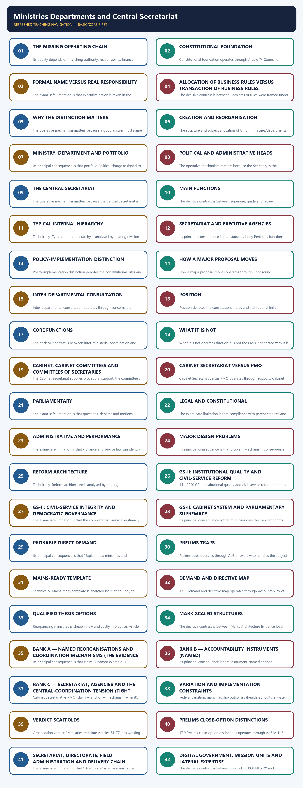

*Distinct embedded teaching-navigation image. The separate continuous Cārvāka-style flowchart package remains an independent at-a-glance artifact.*

### SESSION 1 — THE MISSING OPERATING CHAIN
#### DEFINITION / WHAT THIS IS CALLED

**Plain-language definition:** The missing operating chain denotes the constitutional rules and institutional links organised around PARLIAMENT <---- political and financial accountability.

**Technical definition:** Its quality depends on matching authority, responsibility, finance, personnel, coordination and accountability.

#### ANSWER-GRABBING OPENING — WRITE/ADAPT IN THE EXAM

> A ministry joins democratic authority, ministerial responsibility and permanent expertise, while its effectiveness depends on aligning policy, finance, personnel, coordination and accountability.

#### MUST-WRITE KEYWORDS

- **The missing operating chain**
- **Core proposition**
- **authority, responsibility, finance, personnel, coordination and accountability**
- **PARLIAMENT**
- **Its principal consequence**
- **Its**

**How to use them:** Frame the answer through The missing operating chain; define Core proposition, connect authority, responsibility, finance, personnel, coordination and accountability with PARLIAMENT to explain the mechanism, and use Its principal consequence for the decisive comparison or qualification.

1. The missing operating chain denotes the constitutional rules and institutional links organised around PARLIAMENT <---- political and financial accountability.
1. The missing operating chain operates through PRESIDENT (formal Union executive action), connected with PRIME MINISTER + COUNCIL OF MINISTERS.
The operative mechanism matters because portfolios and political direction.
Its principal consequence is that mINISTRIES / DEPARTMENTS.
The decisive contrast is between Minister = political head and Secretary = administrative head and principal official adviser.
The exam-safe limitation is that cENTRAL SECRETARIAT: policy, rules, legislation, budget, coordination, supervision.
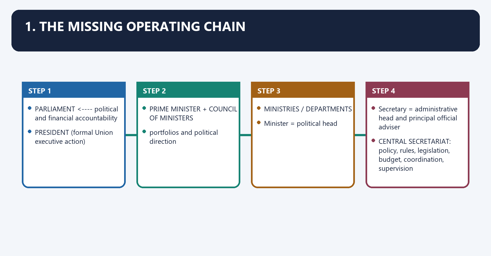
```text
PEOPLE
  |
  v
PARLIAMENT <---- political and financial accountability
  |
  v
PRESIDENT (formal Union executive action)
  |
  v
PRIME MINISTER + COUNCIL OF MINISTERS
  |
  |  portfolios and political direction
  v
MINISTRIES / DEPARTMENTS
  |
  |  Minister = political head
  |  Secretary = administrative head and principal official adviser
  v
CENTRAL SECRETARIAT: policy, rules, legislation, budget, coordination, supervision
  |
  v
ATTACHED / SUBORDINATE / FIELD OFFICES, STATUTORY BODIES, AUTONOMOUS BODIES, CPSEs
  |
  v
IMPLEMENTATION, REGULATION AND SERVICE DELIVERY
```

**Core proposition:** A ministry is where democratic authority, ministerial responsibility and
permanent administrative expertise are joined. Its quality depends on matching **authority,
responsibility, finance, personnel, coordination and accountability**.

---

#### CLOSING RECALL FLOW — THE MISSING OPERATING CHAIN

```closure-flow
SUBTOPIC: The missing operating chain
KEY TERMS / DEFINITIONS: The missing operating chain · Core proposition · authority, responsibility, finance, personnel, coordination and accountability · PARLIAMENT · Its principal consequence · Its
MECHANISM / ARGUMENT: Its quality depends on matching authority, responsibility, finance, personnel, coordination and accountability.
CONSEQUENCE / CONTRAST: Its principal consequence is that mINISTRIES / DEPARTMENTS.
UPSC TRAP / ANSWER-USE: Do not miss this limiting distinction: the decisive contrast is between Minister = political head and Secretary = administrative head...
ANSWER-GRABBING FORMULATION: A ministry joins democratic authority, ministerial responsibility and permanent expertise, while its effectiveness depends on aligning policy, finance, personnel, coordination and accountability.
```
### SESSION 2 — CONSTITUTIONAL FOUNDATION
#### DEFINITION / WHAT THIS IS CALLED

**Plain-language definition:** Constitutional foundation denotes the constitutional rules and institutional links organised around Provision Exam-ready meaning.

**Technical definition:** Constitutional foundation operates through Article 74 Council of Ministers headed by the Prime Minister aids and advises the President, connected with Article 75 Ministers are appointed by the President on the Prime Minister's advice and are collectively responsible to Lok Sabha.

#### ANSWER-GRABBING OPENING — WRITE/ADAPT IN THE EXAM

> Articles 74, 75, 77 and 88 connect advice, responsibility, business rules and parliamentary participation, thereby linking Union administration to democratic accountability.

#### MUST-WRITE KEYWORDS

- **Constitutional foundation**
- **Article 73**
- **Article 74**
- **Article 75**
- **Article 77(1)**
- **Article 77(2)**

**How to use them:** Frame the answer through Constitutional foundation; define Article 73, connect Article 74 with Article 75 to explain the mechanism, and use Article 77(1) for the decisive comparison or qualification.

2. Constitutional foundation denotes the constitutional rules and institutional links organised around Provision Exam-ready meaning.
2. Constitutional foundation operates through Article 74 Council of Ministers headed by the Prime Minister aids and advises the President, connected with Article 75 Ministers are appointed by the President on the Prime Minister's advice and are collectively responsible to Lok Sabha.
The operative mechanism matters because article 77(1) All executive action of the Government of India is expressed to be taken in the President's name.
Its principal consequence is that article 77(3) President makes rules for convenient transaction of Union business and allocation of that business among ministers.
The decisive contrast is between Article 88 Ministers may speak and participate in either House and its committees, but vote only where they are members and Provision Exam-ready meaning.
The exam-safe limitation is that provision Exam-ready meaning.
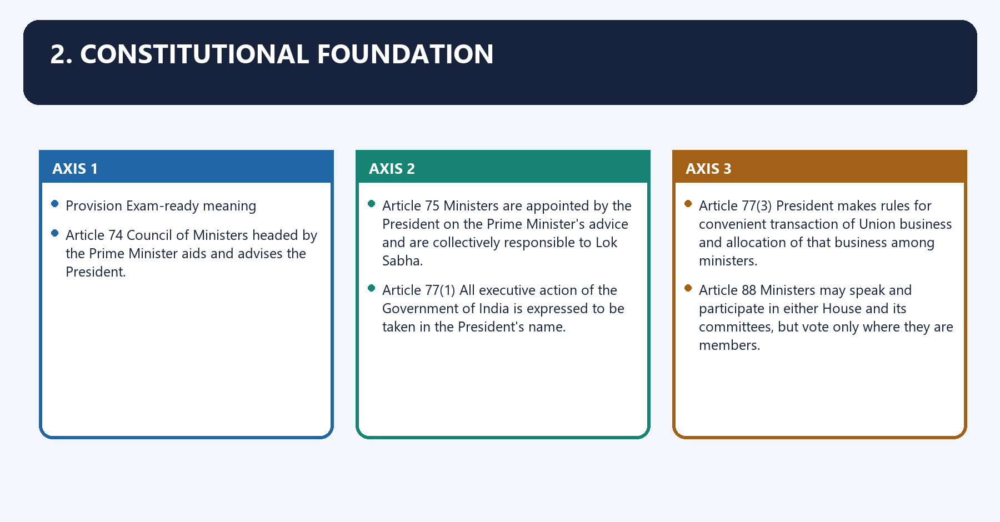
| Provision | Exam-ready meaning |
|---|---|
| **Article 73** | Union executive power extends broadly to matters on which Parliament may legislate and to rights/authority exercisable under treaties, subject to the constitutional federal distribution. |
| **Article 74** | Council of Ministers headed by the Prime Minister aids and advises the President. |
| **Article 75** | Ministers are appointed by the President on the Prime Minister's advice and are collectively responsible to Lok Sabha. |
| **Article 77(1)** | All executive action of the Government of India is expressed to be taken in the President's name. |
| **Article 77(2)** | Orders/instruments are authenticated according to presidential rules; properly authenticated action is not invalid merely because it was not personally made by the President. |
| **Article 77(3)** | President makes rules for convenient transaction of Union business and allocation of that business among ministers. |
| **Article 78** | Prime Minister communicates Council decisions and administration/legislation proposals to the President and supplies information sought. |
| **Article 88** | Ministers may speak and participate in either House and its committees, but vote only where they are members. |

#### CLOSING RECALL FLOW — CONSTITUTIONAL FOUNDATION

```closure-flow
SUBTOPIC: Constitutional foundation
KEY TERMS / DEFINITIONS: Constitutional foundation · Article 73 · Article 74 · Article 75 · Article 77(1) · Article 77(2)
MECHANISM / ARGUMENT: Constitutional foundation operates through Article 74 Council of Ministers headed by the Prime Minister aids and advises the President, connected with Article 75 Ministers are appointed by the President on the Prime Minister's advice and are collectively responsible to Lok Sabha.
CONSEQUENCE / CONTRAST: Its principal consequence is that article 77(3) President makes rules for convenient transaction of Union business and allocation of that business among ministers.
UPSC TRAP / ANSWER-USE: The decisive contrast is between Article 88 Ministers may speak and participate in either House and its committees, but vote only where they are members and Provision Exam-ready meaning.
ANSWER-GRABBING FORMULATION: Articles 74, 75, 77 and 88 connect advice, responsibility, business rules and parliamentary participation, thereby linking Union administration to democratic accountability.
```
### SESSION 3 — FORMAL NAME VERSUS REAL RESPONSIBILITY
#### DEFINITION / WHAT THIS IS CALLED

**Plain-language definition:** Formal name versus real responsibility denotes the constitutional rules and institutional links organised around Executive action is taken in the President's name, but the President does not personally administer.

**Technical definition:** The exam-safe limitation is that executive action is taken in the President's name, but the President does not personally administer.

#### ANSWER-GRABBING OPENING — WRITE/ADAPT IN THE EXAM

> Executive action is taken in the President's name, but the President does not personally administer each department.

#### MUST-WRITE KEYWORDS

- **Formal name versus real responsibility**
- **Minister-in-charge**
- **Council of Ministers**
- **Formal**
- **Executive**
- **President's**

**How to use them:** Frame the answer through Formal name versus real responsibility; define Minister-in-charge, connect Council of Ministers with Formal to explain the mechanism, and use Executive for the decisive comparison or qualification.

Formal name versus real responsibility denotes the constitutional rules and institutional links organised around Executive action is taken in the President's name, but the President does not personally administer.
Formal name versus real responsibility operates through each department. Under parliamentary government, connected with the Minister-in-charge bears political responsibility.
The operative mechanism matters because the Council of Ministers bears collective responsibility.
Its principal consequence is that civil servants process, advise and implement under lawful authority; and.
The decisive contrast is between business rules allocate competence and prescribe the decision route and Trap: "In the President's name" does not mean "personally decided by the President.".
The exam-safe limitation is that executive action is taken in the President's name, but the President does not personally administer.
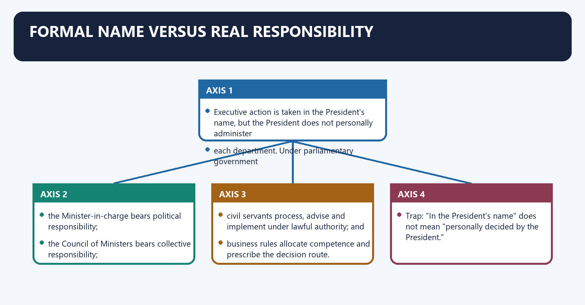
Executive action is taken in the President's name, but the President does not personally administer
each department. Under parliamentary government:

- the **Minister-in-charge** bears political responsibility;
- the **Council of Ministers** bears collective responsibility;
- civil servants process, advise and implement under lawful authority; and
- business rules allocate competence and prescribe the decision route.

> **Trap:** "In the President's name" does not mean "personally decided by the President."

---

#### CLOSING RECALL FLOW — FORMAL NAME VERSUS REAL RESPONSIBILITY

```closure-flow
SUBTOPIC: Formal name versus real responsibility
KEY TERMS / DEFINITIONS: Formal name versus real responsibility · Minister-in-charge · Council of Ministers · Formal · Executive · President's
MECHANISM / ARGUMENT: The decisive contrast is between business rules allocate competence and prescribe the decision route and Trap: "In the President's name" does not mean "personally decided by the President.".
CONSEQUENCE / CONTRAST: The exam-safe limitation is that executive action is taken in the President's name, but the President does not personally administer.
UPSC TRAP / ANSWER-USE: "In the President's name" does not mean "personally decided by the President.".
ANSWER-GRABBING FORMULATION: Executive action is taken in the President's name, but the President does not personally administer each department.
```
### SESSION 4 — ALLOCATION OF BUSINESS RULES VERSUS TRANSACTION OF BUSINESS RULES
#### DEFINITION / WHAT THIS IS CALLED

**Plain-language definition:** Allocation of Business Rules versus Transaction of Business Rules denotes the constitutional rules and institutional links organised around Both sets of rules were framed under Article 77(3).

**Technical definition:** The decisive contrast is between Both sets of rules were framed under Article 77(3) and Both sets of rules were framed under Article 77(3).

#### ANSWER-GRABBING OPENING — WRITE/ADAPT IN THE EXAM

> Allocation of Business Rules assign departmental ownership, whereas Transaction of Business Rules govern consultation and decision movement; both derive from Article 77(3).

#### MUST-WRITE KEYWORDS

- **Article 77(3)**
- **Mnemonic**
- **AoB = Address of Business**
- **ToB = Travel of Business**
- **Core purpose**
- **Main content**

**How to use them:** Frame the answer through Article 77(3); define Mnemonic, connect AoB = Address of Business with ToB = Travel of Business to explain the mechanism, and use Core purpose for the decisive comparison or qualification.

3. Allocation of Business Rules versus Transaction of Business Rules denotes the constitutional rules and institutional links organised around Both sets of rules were framed under Article 77(3).
3. Allocation of Business Rules versus Transaction of Business Rules operates through Question Allocation of Business Rules, 1961 Transaction of Business Rules, 1961, connected with Core purpose Who handles what? How is it decided?.
The operative mechanism matters because coordination Defines subject ownership Requires consultation where another department's business or responsibility is affected.
Its principal consequence is that mnemonic: AoB = Address of Business ; ToB = Travel of Business.
The decisive contrast is between Both sets of rules were framed under Article 77(3) and Both sets of rules were framed under Article 77(3).
The exam-safe limitation is that both sets of rules were framed under Article 77(3).
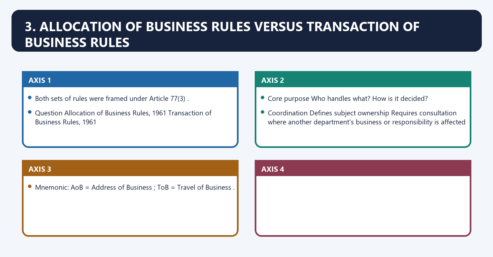
Both sets of rules were framed under **Article 77(3)**.

| Question | Allocation of Business Rules, 1961 | Transaction of Business Rules, 1961 |
|---|---|---|
| Core purpose | **Who handles what?** | **How is it decided?** |
| Main content | Organises Government business among ministries/departments/offices/secretariats and allocates subjects | Prescribes disposal, consultation, escalation and approval procedures |
| Schedules | First Schedule identifies governmental units; Second Schedule distributes subjects/business | Schedules identify matters requiring Cabinet/Cabinet Committee, PM or President-level submission |
| Political allocation | President allocates business among ministers on Prime Minister's advice | Business is disposed of by or under directions of the Minister-in-charge |
| Coordination | Defines subject ownership | Requires consultation where another department's business or responsibility is affected |

> **Mnemonic:** **AoB = Address of Business**; **ToB = Travel of Business**.

#### CLOSING RECALL FLOW — ALLOCATION OF BUSINESS RULES VERSUS TRANSACTION OF BUSINESS RULES

```closure-flow
SUBTOPIC: Allocation of Business Rules versus Transaction of Business Rules
KEY TERMS / DEFINITIONS: Article 77(3) · Mnemonic · AoB = Address of Business · ToB = Travel of Business · Core purpose · Main content
MECHANISM / ARGUMENT: The operative mechanism matters because coordination Defines subject ownership Requires consultation where another department's business or responsibility is affected.
CONSEQUENCE / CONTRAST: Its principal consequence is that mnemonic: AoB = Address of Business ; ToB = Travel of Business.
UPSC TRAP / ANSWER-USE: Do not miss this limiting distinction: the decisive contrast is between Both sets of rules were framed under Article 77(3)...
ANSWER-GRABBING FORMULATION: Allocation of Business Rules assign departmental ownership, whereas Transaction of Business Rules govern consultation and decision movement; both derive from Article 77(3).
```
### SESSION 5 — WHY THE DISTINCTION MATTERS
#### DEFINITION / WHAT THIS IS CALLED

**Plain-language definition:** Why the distinction matters denotes the constitutional rules and institutional links organised around Without AoB, two departments may claim or deny ownership.

**Technical definition:** The operative mechanism matters because a good answer must name both, not use them interchangeably.

#### ANSWER-GRABBING OPENING — WRITE/ADAPT IN THE EXAM

> Clear allocation prevents responsibility gaps, while transaction rules prevent cross-government decisions from bypassing mandatory consultation and higher approval.

#### MUST-WRITE KEYWORDS

- **Why the distinction matters**
- **jurisdiction**
- **procedure**
- **Why**
- **Without AoB**
- **Its principal consequence**

**How to use them:** Frame the answer through Why the distinction matters; define jurisdiction, connect procedure with Why to explain the mechanism, and use Without AoB for the decisive comparison or qualification.

Why the distinction matters denotes the constitutional rules and institutional links organised around Without AoB, two departments may claim or deny ownership.
Why the distinction matters operates through Without ToB, a department may decide a cross-government issue without required consultation, connected with Allocation gives jurisdiction ; transaction gives procedure.
The operative mechanism matters because a good answer must name both, not use them interchangeably.
Its principal consequence is that without AoB, two departments may claim or deny ownership.
The decisive contrast is between Without AoB, two departments may claim or deny ownership and Without AoB, two departments may claim or deny ownership.
The exam-safe limitation is that without AoB, two departments may claim or deny ownership.
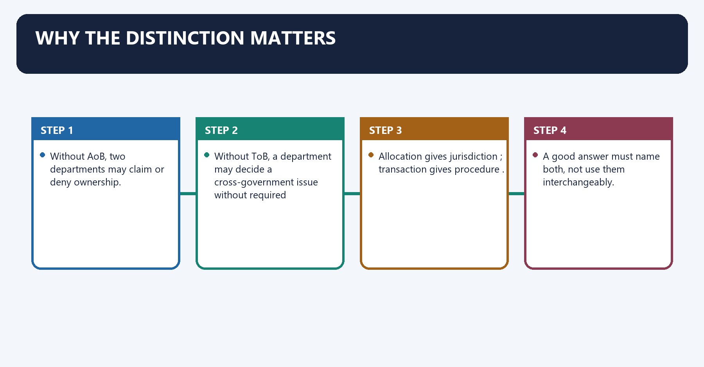
- Without AoB, two departments may claim or deny ownership.
- Without ToB, a department may decide a cross-government issue without required consultation.
- Allocation gives **jurisdiction**; transaction gives **procedure**.
- A good answer must name both, not use them interchangeably.

#### CLOSING RECALL FLOW — WHY THE DISTINCTION MATTERS

```closure-flow
SUBTOPIC: Why the distinction matters
KEY TERMS / DEFINITIONS: Why the distinction matters · jurisdiction · procedure · Why · Without AoB · Its principal consequence
MECHANISM / ARGUMENT: The operative mechanism matters because a good answer must name both, not use them interchangeably.
CONSEQUENCE / CONTRAST: Its principal consequence is that without AoB, two departments may claim or deny ownership.
UPSC TRAP / ANSWER-USE: Do not miss this limiting distinction: the decisive contrast is between Without AoB, two departments may claim or deny ownership...
ANSWER-GRABBING FORMULATION: Clear allocation prevents responsibility gaps, while transaction rules prevent cross-government decisions from bypassing mandatory consultation and higher approval.
```
### SESSION 6 — CREATION AND REORGANISATION
#### DEFINITION / WHAT THIS IS CALLED

**Plain-language definition:** Creation and reorganisation denotes the constitutional rules and institutional links organised around The structure and subject allocation of Union ministries/departments can be reorganised through the.

**Technical definition:** The structure and subject allocation of Union ministries/departments can be reorganised through the Article 77(3) business-rule framework.

#### ANSWER-GRABBING OPENING — WRITE/ADAPT IN THE EXAM

> A constitutional amendment is not ordinarily required merely to rename, combine or divide administrative departments, although statutory functions must continue to comply with the governing law.

#### MUST-WRITE KEYWORDS

- **Creation**
- **reorganisation**
- **Article 77**
- **Creation and reorganisation**
- **Union**
- **A constitutional amendment**

**How to use them:** Frame the answer through Creation; define reorganisation, connect Article 77 with Creation and reorganisation to explain the mechanism, and use Union for the decisive comparison or qualification.

Creation and reorganisation denotes the constitutional rules and institutional links organised around The structure and subject allocation of Union ministries/departments can be reorganised through the.
Creation and reorganisation operates through Article 77(3) business-rule framework. A constitutional amendment is not ordinarily required merely, connected with to rename, combine or divide administrative departments, although statutory functions must continue.
The operative mechanism matters because to comply with the governing law.
Its principal consequence is that avoid memorising a permanent number of ministries: the First and Second Schedules are amended as.
The decisive contrast is between government priorities and portfolios change and The structure and subject allocation of Union ministries/departments can be reorganised through the.
The exam-safe limitation is that the structure and subject allocation of Union ministries/departments can be reorganised through the.
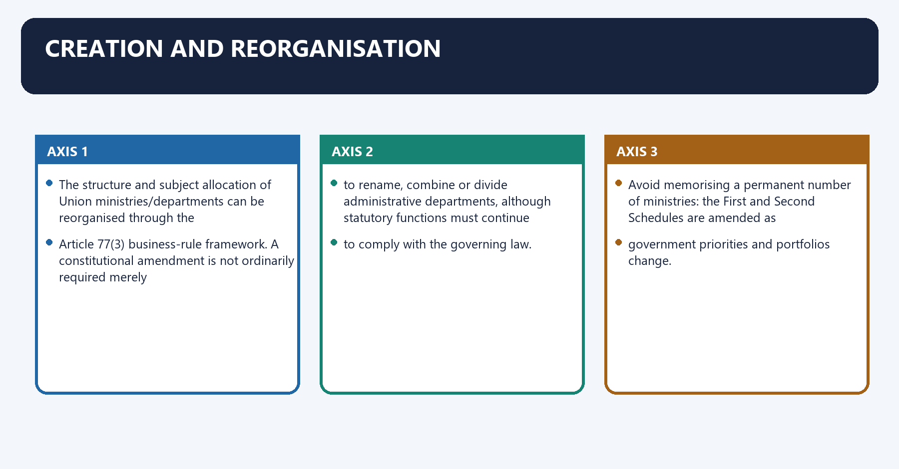
The structure and subject allocation of Union ministries/departments can be reorganised through the
Article 77(3) business-rule framework. A constitutional amendment is not ordinarily required merely
to rename, combine or divide administrative departments, although statutory functions must continue
to comply with the governing law.

Avoid memorising a permanent number of ministries: the First and Second Schedules are amended as
government priorities and portfolios change.

---

#### CLOSING RECALL FLOW — CREATION AND REORGANISATION

```closure-flow
SUBTOPIC: Creation and reorganisation
KEY TERMS / DEFINITIONS: Creation · reorganisation · Article 77 · Creation and reorganisation · Union · A constitutional amendment
MECHANISM / ARGUMENT: The structure and subject allocation of Union ministries/departments can be reorganised through the Article 77(3) business-rule framework.
CONSEQUENCE / CONTRAST: A constitutional amendment is not ordinarily required merely, connected with to rename, combine or divide administrative departments, although statutory functions must continue.
UPSC TRAP / ANSWER-USE: Do not miss this limiting distinction: the decisive contrast is between government priorities and portfolios change and The structure and...
ANSWER-GRABBING FORMULATION: A constitutional amendment is not ordinarily required merely to rename, combine or divide administrative departments, although statutory functions must continue to comply with the governing law.
```
### SESSION 7 — MINISTRY, DEPARTMENT AND PORTFOLIO
#### DEFINITION / WHAT THIS IS CALLED

**Plain-language definition:** Ministry, department and portfolio denotes the constitutional rules and institutional links organised around Portfolio Political charge assigned to a minister; one minister may hold more than one portfolio.

**Technical definition:** Its principal consequence is that portfolio Political charge assigned to a minister; one minister may hold more than one portfolio.

#### ANSWER-GRABBING OPENING — WRITE/ADAPT IN THE EXAM

> Distinguishing a minister's portfolio from the ministry and its departments clarifies where political charge ends and administrative responsibility is allocated.

#### MUST-WRITE KEYWORDS

- **Ministry**
- **department**
- **portfolio**
- **Secretariat**
- **Ministry, department and portfolio**
- **Portfolio Political**

**How to use them:** Frame the answer through Ministry; define department, connect portfolio with Secretariat to explain the mechanism, and use Ministry, department and portfolio for the decisive comparison or qualification.

4. Ministry, department and portfolio denotes the constitutional rules and institutional links organised around Portfolio Political charge assigned to a minister; one minister may hold more than one portfolio.
4. Ministry, department and portfolio operates through Ministry Broad political-administrative unit under a minister; it may contain one or several departments, connected with Secretariat Policy and coordination machinery supporting the minister and government decision process.
The operative mechanism matters because portfolio Political charge assigned to a minister; one minister may hold more than one portfolio.
Its principal consequence is that portfolio Political charge assigned to a minister; one minister may hold more than one portfolio.
The decisive contrast is between Portfolio Political charge assigned to a minister; one minister may hold more than one portfolio and Portfolio Political charge assigned to a minister; one minister may hold more than one portfolio.
The exam-safe limitation is that portfolio Political charge assigned to a minister; one minister may hold more than one portfolio.
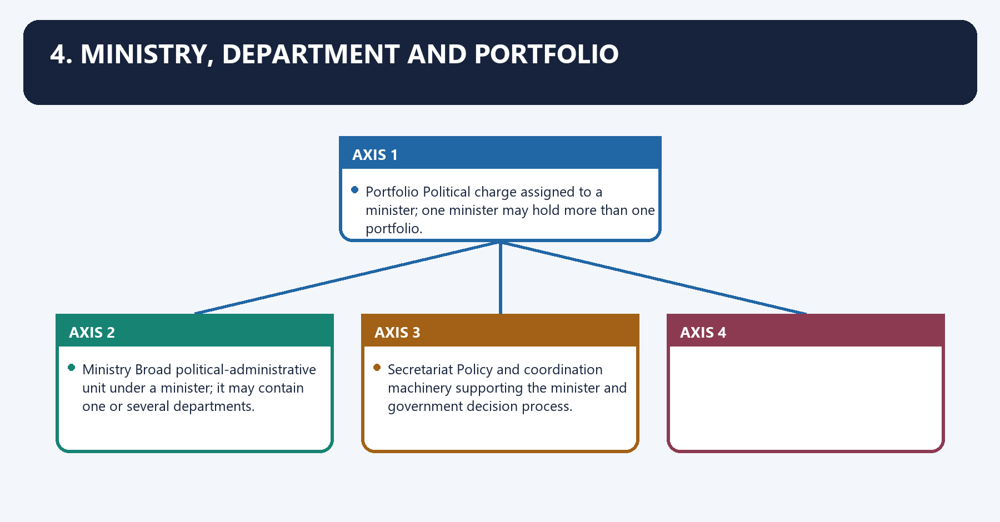
| Term | Meaning |
|---|---|
| **Portfolio** | Political charge assigned to a minister; one minister may hold more than one portfolio. |
| **Ministry** | Broad political-administrative unit under a minister; it may contain one or several departments. |
| **Department** | Subject-based administrative unit under a Secretary or an equivalent officer; business is specifically allocated to it under the AoB Rules. |
| **Secretariat** | Policy and coordination machinery supporting the minister and government decision process. |

#### CLOSING RECALL FLOW — MINISTRY, DEPARTMENT AND PORTFOLIO

```closure-flow
SUBTOPIC: Ministry, department and portfolio
KEY TERMS / DEFINITIONS: Ministry · department · portfolio · Secretariat · Ministry, department and portfolio · Portfolio Political
MECHANISM / ARGUMENT: Its principal consequence is that portfolio Political charge assigned to a minister; one minister may hold more than one portfolio.
CONSEQUENCE / CONTRAST: The decisive contrast is between Portfolio Political charge assigned to a minister; one minister may hold more than one portfolio and Portfolio Political charge assigned to a minister; one minister may hold more than one portfolio.
UPSC TRAP / ANSWER-USE: Do not miss this limiting distinction: the exam-safe limitation is that portfolio Political charge assigned to a minister.
ANSWER-GRABBING FORMULATION: Distinguishing a minister's portfolio from the ministry and its departments clarifies where political charge ends and administrative responsibility is allocated.
```
### SESSION 8 — POLITICAL AND ADMINISTRATIVE HEADS
#### DEFINITION / WHAT THIS IS CALLED

**Plain-language definition:** Political and administrative heads denotes the constitutional rules and institutional links organised around Political executive Permanent executive.

**Technical definition:** The operative mechanism matters because the Secretary is the department's administrative head and principal official adviser to the.

#### ANSWER-GRABBING OPENING — WRITE/ADAPT IN THE EXAM

> The Minister supplies political direction and answers to Parliament, while the Secretary leads administration and professional advice without becoming a parallel political authority.

#### MUST-WRITE KEYWORDS

- **Political**
- **administrative heads**
- **administrative head**
- **Responsibility rule**
- **s publicly and in Parliament**
- **May change with government/reshuffle**

**How to use them:** Frame the answer through Political; define administrative heads, connect administrative head with Responsibility rule to explain the mechanism, and use s publicly and in Parliament for the decisive comparison or qualification.

Political and administrative heads denotes the constitutional rules and institutional links organised around Political executive Permanent executive.
Political and administrative heads operates through Answers publicly and in Parliament Ensures proper transaction of departmental business and compliance with rules, connected with May change with government/reshuffle Continues across governments subject to service/tenure arrangements.
The operative mechanism matters because the Secretary is the department's administrative head and principal official adviser to the.
Its principal consequence is that minister. This does not make the Secretary a parallel political authority. The Minister decides.
The decisive contrast is between lawful policy; the Secretary must provide frank, evidence-based advice, record material concerns and and implement the final lawful decision.
The exam-safe limitation is that responsibility rule: Policy advice may be confidential, but administration is not.
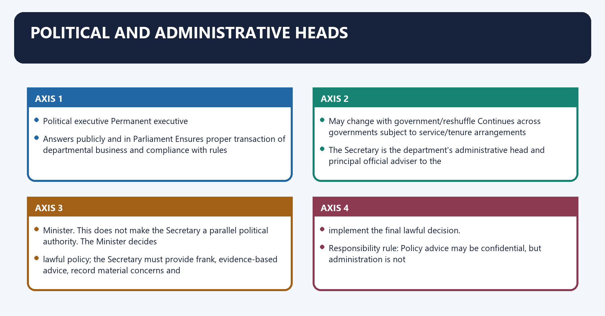
| Political executive | Permanent executive |
|---|---|
| Minister provides democratic mandate, policy direction and political judgment | Secretary supplies continuity, institutional memory and professional advice |
| Answers publicly and in Parliament | Ensures proper transaction of departmental business and compliance with rules |
| Approves matters within delegated competence or sends them higher | Organises examination of proposals and places material/options before the competent authority |
| May change with government/reshuffle | Continues across governments subject to service/tenure arrangements |

The Secretary is the department's **administrative head** and principal official adviser to the
Minister. This does not make the Secretary a parallel political authority. The Minister decides
lawful policy; the Secretary must provide frank, evidence-based advice, record material concerns and
implement the final lawful decision.

> **Responsibility rule:** Policy advice may be confidential, but administration is not
> accountability-free. Ministerial responsibility coexists with civil-service responsibility under
> service rules, audit, vigilance, law and departmental hierarchy.

---

#### CLOSING RECALL FLOW — POLITICAL AND ADMINISTRATIVE HEADS

```closure-flow
SUBTOPIC: Political and administrative heads
KEY TERMS / DEFINITIONS: Political · administrative heads · administrative head · Responsibility rule · s publicly and in Parliament · May change with government/reshuffle
MECHANISM / ARGUMENT: The operative mechanism matters because the Secretary is the department's administrative head and principal official adviser to the.
CONSEQUENCE / CONTRAST: This does not make the Secretary a parallel political authority.
UPSC TRAP / ANSWER-USE: The exam-safe limitation is that responsibility rule: Policy advice may be confidential, but administration is not.
ANSWER-GRABBING FORMULATION: The Minister supplies political direction and answers to Parliament, while the Secretary leads administration and professional advice without becoming a parallel political authority.
```
### SESSION 9 — THE CENTRAL SECRETARIAT
#### DEFINITION / WHAT THIS IS CALLED

**Plain-language definition:** The Central Secretariat denotes the constitutional rules and institutional links organised around The Central Secretariat is the collective policy-support machinery of Union.

**Technical definition:** The operative mechanism matters because the Central Secretariat is the collective policy-support machinery of Union.

#### ANSWER-GRABBING OPENING — WRITE/ADAPT IN THE EXAM

> The Central Secretariat is the collective policy-support machinery of Union ministries, not a single building and not a synonym for the Cabinet Secretariat.

#### MUST-WRITE KEYWORDS

- **The Central Secretariat**
- **Central Secretariat**
- **Cabinet Secretariat**
- **Union**
- **It**
- **Cabinet**

**How to use them:** Frame the answer through The Central Secretariat; define Central Secretariat, connect Cabinet Secretariat with Union to explain the mechanism, and use It for the decisive comparison or qualification.

5. The Central Secretariat denotes the constitutional rules and institutional links organised around The Central Secretariat is the collective policy-support machinery of Union.
5. The Central Secretariat operates through ministries/departments. It is not a single building and must not be confused with the Cabinet, connected with Secretariat , which is a particular coordinating institution.
The operative mechanism matters because the Central Secretariat is the collective policy-support machinery of Union.
Its principal consequence is that the Central Secretariat is the collective policy-support machinery of Union.
The decisive contrast is between The Central Secretariat is the collective policy-support machinery of Union and The Central Secretariat is the collective policy-support machinery of Union.
The exam-safe limitation is that the Central Secretariat is the collective policy-support machinery of Union.
The **Central Secretariat** is the collective policy-support machinery of Union
ministries/departments. It is not a single building and must not be confused with the **Cabinet
Secretariat**, which is a particular coordinating institution.

#### CLOSING RECALL FLOW — THE CENTRAL SECRETARIAT

```closure-flow
SUBTOPIC: The Central Secretariat
KEY TERMS / DEFINITIONS: The Central Secretariat · Central Secretariat · Cabinet Secretariat · Union · It · Cabinet
MECHANISM / ARGUMENT: The operative mechanism matters because the Central Secretariat is the collective policy-support machinery of Union.
CONSEQUENCE / CONTRAST: Its principal consequence is that the Central Secretariat is the collective policy-support machinery of Union.
UPSC TRAP / ANSWER-USE: Do not miss this limiting distinction: the decisive contrast is between The Central Secretariat is the collective policy-support machinery of...
ANSWER-GRABBING FORMULATION: The Central Secretariat is the collective policy-support machinery of Union ministries, not a single building and not a synonym for the Cabinet Secretariat.
```
### SESSION 10 — MAIN FUNCTIONS
#### DEFINITION / WHAT THIS IS CALLED

**Plain-language definition:** Main functions denotes the constitutional rules and institutional links organised around assist the political executive in policy formulation.

**Technical definition:** The decisive contrast is between supervise, guide and review implementing organisations and monitor results, expenditure and compliance.

#### ANSWER-GRABBING OPENING — WRITE/ADAPT IN THE EXAM

> Secretariat work converts political priorities into policy, law, budgets, coordination and oversight, while preserving records and answerability across government.

#### MUST-WRITE KEYWORDS

- **Main functions**
- **Main**
- **Its principal consequence**
- **Its**
- **Union**
- **The decisive contrast**

**How to use them:** Frame the answer through Main functions; define Main, connect Its principal consequence with Its to explain the mechanism, and use Union for the decisive comparison or qualification.

Main functions denotes the constitutional rules and institutional links organised around assist the political executive in policy formulation.
Main functions operates through draft legislation, rules, regulations and executive instructions, connected with prepare plans, programmes and budget proposals.
The operative mechanism matters because obtain financial, legal and inter-departmental consultation.
Its principal consequence is that coordinate with other Union ministries and state governments.
The decisive contrast is between supervise, guide and review implementing organisations and monitor results, expenditure and compliance.
The exam-safe limitation is that answer Parliament, audit, courts, RTI and public-grievance institutions; and.
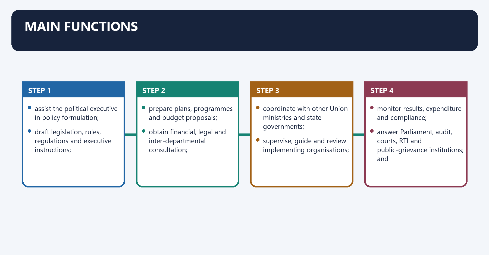
1. assist the political executive in policy formulation;
2. draft legislation, rules, regulations and executive instructions;
3. prepare plans, programmes and budget proposals;
4. obtain financial, legal and inter-departmental consultation;
5. coordinate with other Union ministries and state governments;
6. supervise, guide and review implementing organisations;
7. monitor results, expenditure and compliance;
8. answer Parliament, audit, courts, RTI and public-grievance institutions; and
9. preserve records, precedent and institutional memory.

#### CLOSING RECALL FLOW — MAIN FUNCTIONS

```closure-flow
SUBTOPIC: Main functions
KEY TERMS / DEFINITIONS: Main functions · Main · Its principal consequence · Its · Union · The decisive contrast
MECHANISM / ARGUMENT: The decisive contrast is between supervise, guide and review implementing organisations and monitor results, expenditure and compliance.
CONSEQUENCE / CONTRAST: Its principal consequence is that coordinate with other Union ministries and state governments.
UPSC TRAP / ANSWER-USE: Do not miss this limiting distinction: the exam-safe limitation is that answer Parliament, audit, courts, RTI and public-grievance institutions.
ANSWER-GRABBING FORMULATION: Secretariat work converts political priorities into policy, law, budgets, coordination and oversight, while preserving records and answerability across government.
```
### SESSION 11 — TYPICAL INTERNAL HIERARCHY
#### DEFINITION / WHAT THIS IS CALLED

**Plain-language definition:** Typical internal hierarchy denotes the constitutional rules and institutional links organised around The exact arrangement varies by department, but a common chain is.

**Technical definition:** Technically, Typical internal hierarchy is analysed by relating division to Typical, then testing the relationship through Its principal consequence and Its.

#### ANSWER-GRABBING OPENING — WRITE/ADAPT IN THE EXAM

> The internal hierarchy assigns subject groups at Joint Secretary level, but rank alone cannot replace clear allocation of authority and responsibility.

#### MUST-WRITE KEYWORDS

- **Typical internal hierarchy**
- **division**
- **Typical**
- **Its principal consequence**
- **Its**
- **Joint Secretary**

**How to use them:** Frame the answer through Typical internal hierarchy; define division, connect Typical with Its principal consequence to explain the mechanism, and use Its for the decisive comparison or qualification.

Typical internal hierarchy denotes the constitutional rules and institutional links organised around The exact arrangement varies by department, but a common chain is.
Typical internal hierarchy operates through Special / Additional Secretary, connected with Director / Deputy Secretary.
The operative mechanism matters because section Officer and Section.
Its principal consequence is that a division or group of subjects is commonly managed at Joint Secretary level.
The decisive contrast is between Directors/Deputy Secretaries and Under Secretaries dispose of work under delegated authority and A Section is the basic work unit for receipt, examination, noting, drafting, record and issue.
The exam-safe limitation is that trap: Every file need not travel to the Secretary or Minister. Delegation and level-based.
The exact arrangement varies by department, but a common chain is:

```text
Secretary
  -> Special / Additional Secretary
    -> Joint Secretary
      -> Director / Deputy Secretary
        -> Under Secretary
          -> Section Officer and Section
```

- A **division** or group of subjects is commonly managed at Joint Secretary level.
- Directors/Deputy Secretaries and Under Secretaries dispose of work under delegated authority.
- A Section is the basic work unit for receipt, examination, noting, drafting, record and issue.

> **Trap:** Every file need not travel to the Secretary or Minister. Delegation and level-based
> disposal are essential to prevent delay and apex overload.

---

#### CLOSING RECALL FLOW — TYPICAL INTERNAL HIERARCHY

```closure-flow
SUBTOPIC: Typical internal hierarchy
KEY TERMS / DEFINITIONS: Typical internal hierarchy · division · Typical · Its principal consequence · Its · Joint Secretary
MECHANISM / ARGUMENT: The exact arrangement varies by department, but a common chain is.
CONSEQUENCE / CONTRAST: Its principal consequence is that a division or group of subjects is commonly managed at Joint Secretary level.
UPSC TRAP / ANSWER-USE: Do not miss this limiting distinction: the decisive contrast is between Directors/Deputy Secretaries and Under Secretaries dispose of work under...
ANSWER-GRABBING FORMULATION: The internal hierarchy assigns subject groups at Joint Secretary level, but rank alone cannot replace clear allocation of authority and responsibility.
```
### SESSION 12 — SECRETARIAT AND EXECUTIVE AGENCIES
#### DEFINITION / WHAT THIS IS CALLED

**Plain-language definition:** Secretariat and executive agencies denotes the constitutional rules and institutional links organised around Organisation Primary role Relationship.

**Technical definition:** Its principal consequence is that statutory body Performs functions under a statute Powers and independence depend on parent law.

#### ANSWER-GRABBING OPENING — WRITE/ADAPT IN THE EXAM

> Secretariats primarily formulate and supervise policy while executive agencies deliver it, but delegation never removes departmental stewardship or ministerial accountability.

#### MUST-WRITE KEYWORDS

- **Secretariat**
- **executive agencies**
- **Secretariat department**
- **Attached office**
- **Subordinate office**
- **Statutory body**

**How to use them:** Frame the answer through Secretariat; define executive agencies, connect Secretariat department with Attached office to explain the mechanism, and use Subordinate office for the decisive comparison or qualification.

6. Secretariat and executive agencies denotes the constitutional rules and institutional links organised around Organisation Primary role Relationship.
6. Secretariat and executive agencies operates through Secretariat department Policy, rules, legislation, budget, coordination, oversight Directly supports Minister, connected with Attached office Detailed executive direction, technical support and information needed to execute policy Attached to a department.
The operative mechanism matters because subordinate office Field execution, enforcement or service-delivery work Operates under departmental/attached-office control.
Its principal consequence is that statutory body Performs functions under a statute Powers and independence depend on parent law.
The decisive contrast is between Organisation Primary role Relationship and Organisation Primary role Relationship.
The exam-safe limitation is that organisation Primary role Relationship.
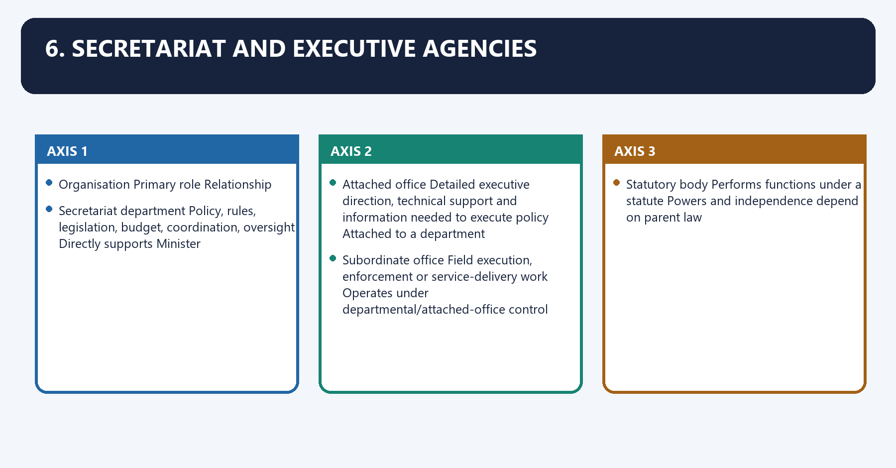
| Organisation | Primary role | Relationship |
|---|---|---|
| **Secretariat department** | Policy, rules, legislation, budget, coordination, oversight | Directly supports Minister |
| **Attached office** | Detailed executive direction, technical support and information needed to execute policy | Attached to a department |
| **Subordinate office** | Field execution, enforcement or service-delivery work | Operates under departmental/attached-office control |
| **Statutory body** | Performs functions under a statute | Powers and independence depend on parent law |
| **Autonomous body** | Specialised function with administrative/financial autonomy defined by its instrument | Usually grant-supported and overseen by a ministry |
| **Regulatory body** | Sets/enforces sector rules, adjudicates or supervises according to statute | Ministerial oversight cannot override statutory independence |
| **Central Public Sector Enterprise** | Commercial/strategic production or service through a government-controlled company/corporation | Ownership ministry exercises shareholder/administrative oversight |

#### CLOSING RECALL FLOW — SECRETARIAT AND EXECUTIVE AGENCIES

```closure-flow
SUBTOPIC: Secretariat and executive agencies
KEY TERMS / DEFINITIONS: Secretariat · executive agencies · Secretariat department · Attached office · Subordinate office · Statutory body
MECHANISM / ARGUMENT: Its principal consequence is that statutory body Performs functions under a statute Powers and independence depend on parent law.
CONSEQUENCE / CONTRAST: The decisive contrast is between Organisation Primary role Relationship and Organisation Primary role Relationship.
UPSC TRAP / ANSWER-USE: Do not miss this limiting distinction: the exam-safe limitation is that organisation Primary role Relationship.
ANSWER-GRABBING FORMULATION: Secretariats primarily formulate and supervise policy while executive agencies deliver it, but delegation never removes departmental stewardship or ministerial accountability.
```
### SESSION 13 — POLICY-IMPLEMENTATION DISTINCTION
#### DEFINITION / WHAT THIS IS CALLED

**Plain-language definition:** Policy-implementation distinction operates through the line is not absolute, connected with implementation evidence should reshape policy.

**Technical definition:** Policy-implementation distinction denotes the constitutional rules and institutional links organised around The traditional model separates policy in the secretariat from execution in agencies.

#### ANSWER-GRABBING OPENING — WRITE/ADAPT IN THE EXAM

> The policy-implementation distinction aids responsibility mapping, yet implementation evidence must reshape policy and some regulators require operational distance from ministries.

#### MUST-WRITE KEYWORDS

- **Policy-implementation distinction**
- **Policy-implementation**
- **Policy-implementation distinction operates through the line**
- **Its principal consequence**
- **Its**
- **The decisive contrast**

**How to use them:** Frame the answer through Policy-implementation distinction; define Policy-implementation, connect Policy-implementation distinction operates through the line with Its principal consequence to explain the mechanism, and use Its for the decisive comparison or qualification.

Policy-implementation distinction denotes the constitutional rules and institutional links organised around The traditional model separates policy in the secretariat from execution in agencies. In practice,.
Policy-implementation distinction operates through the line is not absolute, connected with implementation evidence should reshape policy.
The operative mechanism matters because missions and digital platforms often integrate policy and delivery teams.
Its principal consequence is that regulators require autonomy from day-to-day ministerial direction; and.
The decisive contrast is between a department remains answerable for stewardship even when delivery is delegated and Trap: Delegating implementation does not eliminate ministerial or departmental accountability.
The exam-safe limitation is that the traditional model separates policy in the secretariat from execution in agencies. In practice,.
The traditional model separates policy in the secretariat from execution in agencies. In practice,
the line is not absolute:

- implementation evidence should reshape policy;
- missions and digital platforms often integrate policy and delivery teams;
- regulators require autonomy from day-to-day ministerial direction; and
- a department remains answerable for stewardship even when delivery is delegated.

> **Trap:** Delegating implementation does not eliminate ministerial or departmental accountability.

---

#### CLOSING RECALL FLOW — POLICY-IMPLEMENTATION DISTINCTION

```closure-flow
SUBTOPIC: Policy-implementation distinction
KEY TERMS / DEFINITIONS: Policy-implementation distinction · Policy-implementation · Policy-implementation distinction operates through the line · Its principal consequence · Its · The decisive contrast
MECHANISM / ARGUMENT: Policy-implementation distinction denotes the constitutional rules and institutional links organised around The traditional model separates policy in the secretariat from execution in agencies.
CONSEQUENCE / CONTRAST: Its principal consequence is that regulators require autonomy from day-to-day ministerial direction; and.
UPSC TRAP / ANSWER-USE: Delegating implementation does not eliminate ministerial or departmental accountability.
ANSWER-GRABBING FORMULATION: The policy-implementation distinction aids responsibility mapping, yet implementation evidence must reshape policy and some regulators require operational distance from ministries.
```
### SESSION 14 — HOW A MAJOR PROPOSAL MOVES
#### DEFINITION / WHAT THIS IS CALLED

**Plain-language definition:** How a major proposal moves denotes the constitutional rules and institutional links organised around Problem / political commitment / field evidence.

**Technical definition:** How a major proposal moves operates through Sponsoring department examines facts, law, finance and alternatives, connected with Consultation with affected departments and mandatory authorities.

#### ANSWER-GRABBING OPENING — WRITE/ADAPT IN THE EXAM

> A major proposal moves from evidence and departmental appraisal through mandatory consultation and delegated or Cabinet approval, making process central to lawful collective decision-making.

#### MUST-WRITE KEYWORDS

- **How a major proposal moves**
- **Problem**
- **Sponsoring**
- **Consultation**
- **Its principal consequence**
- **Its**

**How to use them:** Frame the answer through How a major proposal moves; define Problem, connect Sponsoring with Consultation to explain the mechanism, and use Its principal consequence for the decisive comparison or qualification.

7. How a major proposal moves denotes the constitutional rules and institutional links organised around Problem / political commitment / field evidence.
7. How a major proposal moves operates through Sponsoring department examines facts, law, finance and alternatives, connected with Consultation with affected departments and mandatory authorities.
The operative mechanism matters because unresolved difference --- Cabinet Secretariat / Committee of Secretaries.
Its principal consequence is that decision at delegated departmental level.
The decisive contrast is between Submission to Minister / PM / Cabinet Committee / Cabinet / President and Authenticated order, legislation, scheme or executive instruction.
The exam-safe limitation is that implementation by department/agencies/states.
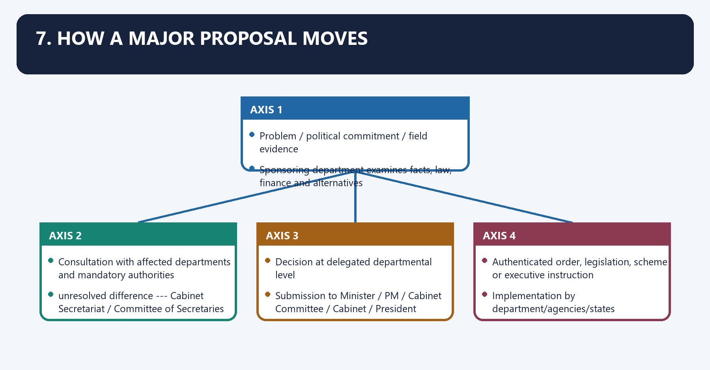
```text
Problem / political commitment / field evidence
          |
          v
Sponsoring department examines facts, law, finance and alternatives
          |
          v
Consultation with affected departments and mandatory authorities
          |
          +---- unresolved difference ---> Cabinet Secretariat / Committee of Secretaries
          |
          v
Decision at delegated departmental level
          OR
Submission to Minister / PM / Cabinet Committee / Cabinet / President
          |
          v
Authenticated order, legislation, scheme or executive instruction
          |
          v
Implementation by department/agencies/states
          |
          v
Monitoring, audit, parliamentary scrutiny and course correction
```

#### CLOSING RECALL FLOW — HOW A MAJOR PROPOSAL MOVES

```closure-flow
SUBTOPIC: How a major proposal moves
KEY TERMS / DEFINITIONS: How a major proposal moves · Problem · Sponsoring · Consultation · Its principal consequence · Its
MECHANISM / ARGUMENT: How a major proposal moves operates through Sponsoring department examines facts, law, finance and alternatives, connected with Consultation with affected departments and mandatory authorities.
CONSEQUENCE / CONTRAST: Its principal consequence is that decision at delegated departmental level.
UPSC TRAP / ANSWER-USE: Do not miss this limiting distinction: the decisive contrast is between Submission to Minister / PM / Cabinet Committee /...
ANSWER-GRABBING FORMULATION: A major proposal moves from evidence and departmental appraisal through mandatory consultation and delegated or Cabinet approval, making process central to lawful collective decision-making.
```
### SESSION 15 — INTER-DEPARTMENTAL CONSULTATION
#### DEFINITION / WHAT THIS IS CALLED

**Plain-language definition:** Inter-departmental consultation denotes the constitutional rules and institutional links organised around Consultation is required when a proposal.

**Technical definition:** Inter-departmental consultation operates through concerns the allocated business of another department, connected with has financial implications requiring finance consultation.

#### ANSWER-GRABBING OPENING — WRITE/ADAPT IN THE EXAM

> Inter-departmental consultation reconciles overlapping business, finance, law, personnel and federal effects before executive approval, reducing siloed or unauthorised decisions.

#### MUST-WRITE KEYWORDS

- **Inter-departmental consultation**
- **Inter-departmental**
- **Consultation**
- **Its principal consequence**
- **Its**
- **The decisive contrast**

**How to use them:** Frame the answer through Inter-departmental consultation; define Inter-departmental, connect Consultation with Its principal consequence to explain the mechanism, and use Its for the decisive comparison or qualification.

Inter-departmental consultation denotes the constitutional rules and institutional links organised around Consultation is required when a proposal.
Inter-departmental consultation operates through concerns the allocated business of another department, connected with has financial implications requiring finance consultation.
The operative mechanism matters because raises legal/drafting issues requiring legal consultation.
Its principal consequence is that affects personnel or service conditions.
The decisive contrast is between requires state participation or has federal consequences; or and belongs to a class reserved for higher approval.
The exam-safe limitation is that if departments disagree, the issue should be resolved through consultation, Committees of.
Consultation is required when a proposal:

- concerns the allocated business of another department;
- has financial implications requiring finance consultation;
- raises legal/drafting issues requiring legal consultation;
- affects personnel or service conditions;
- requires state participation or has federal consequences; or
- belongs to a class reserved for higher approval.

If departments disagree, the issue should be resolved through consultation, Committees of
Secretaries, the Cabinet Secretariat, the concerned ministers, a Cabinet Committee or Cabinet as
required. One department cannot settle another department's allocated responsibility unilaterally.

---

#### CLOSING RECALL FLOW — INTER-DEPARTMENTAL CONSULTATION

```closure-flow
SUBTOPIC: Inter-departmental consultation
KEY TERMS / DEFINITIONS: Inter-departmental consultation · Inter-departmental · Consultation · Its principal consequence · Its · The decisive contrast
MECHANISM / ARGUMENT: Inter-departmental consultation operates through concerns the allocated business of another department, connected with has financial implications requiring finance consultation.
CONSEQUENCE / CONTRAST: Its principal consequence is that affects personnel or service conditions.
UPSC TRAP / ANSWER-USE: Do not miss this limiting distinction: the decisive contrast is between requires state participation or has federal consequences.
ANSWER-GRABBING FORMULATION: Inter-departmental consultation reconciles overlapping business, finance, law, personnel and federal effects before executive approval, reducing siloed or unauthorised decisions.
```
### SESSION 16 — POSITION
#### DEFINITION / WHAT THIS IS CALLED

**Plain-language definition:** Position operates through administratively headed by the Cabinet Secretary, connected with Cabinet Secretary is ex-officio Chairman of the Civil Services Board and heads the civil.

**Technical definition:** Position denotes the constitutional rules and institutional links organised around functions directly under the Prime Minister.

#### ANSWER-GRABBING OPENING — WRITE/ADAPT IN THE EXAM

> The Cabinet Secretariat works directly under the Prime Minister and is administratively headed by the Cabinet Secretary, coordinating rather than replacing ministries.

#### MUST-WRITE KEYWORDS

- **Position**
- **Prime Minister**
- **Cabinet Secretary**
- **Civil Services Board**
- **Chairman**
- **Its principal consequence**

**How to use them:** Frame the answer through Position; define Prime Minister, connect Cabinet Secretary with Civil Services Board to explain the mechanism, and use Chairman for the decisive comparison or qualification.

Position denotes the constitutional rules and institutional links organised around functions directly under the Prime Minister.
Position operates through administratively headed by the Cabinet Secretary, connected with Cabinet Secretary is ex-officio Chairman of the Civil Services Board and heads the civil.
The operative mechanism matters because services coordination system.
Its principal consequence is that administers the AoB and ToB Rules.
The decisive contrast is between functions directly under the Prime Minister and functions directly under the Prime Minister.
The exam-safe limitation is that functions directly under the Prime Minister.
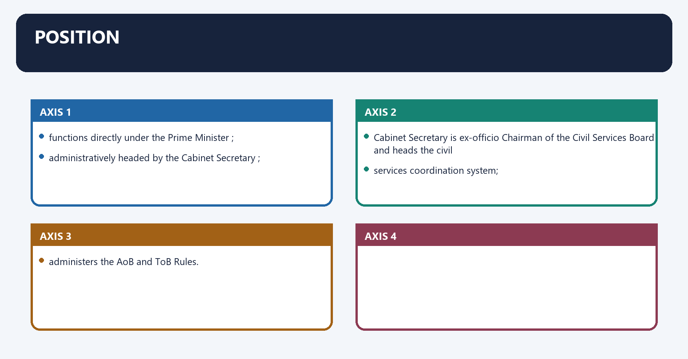
- functions directly under the **Prime Minister**;
- administratively headed by the **Cabinet Secretary**;
- Cabinet Secretary is ex-officio Chairman of the **Civil Services Board** and heads the civil
  services coordination system;
- administers the AoB and ToB Rules.

#### CLOSING RECALL FLOW — POSITION

```closure-flow
SUBTOPIC: Position
KEY TERMS / DEFINITIONS: Position · Prime Minister · Cabinet Secretary · Civil Services Board · Chairman · Its principal consequence
MECHANISM / ARGUMENT: The exam-safe limitation is that functions directly under the Prime Minister. functions directly under the Prime Minister; administratively headed by the Cabinet Secretary; Cabinet Secretary is ex-officio Chairman of the Civil Services Board and heads the civil services coordination system; administers the AoB and ToB Rules.
CONSEQUENCE / CONTRAST: Its principal consequence is that administers the AoB and ToB Rules.
UPSC TRAP / ANSWER-USE: Do not miss this limiting distinction: the decisive contrast is between functions directly under the Prime Minister and functions directly...
ANSWER-GRABBING FORMULATION: The Cabinet Secretariat works directly under the Prime Minister and is administratively headed by the Cabinet Secretary, coordinating rather than replacing ministries.
```
### SESSION 17 — CORE FUNCTIONS
#### DEFINITION / WHAT THIS IS CALLED

**Plain-language definition:** Core functions denotes the constitutional rules and institutional links organised around secretarial assistance to Cabinet and Cabinet Committees.

**Technical definition:** The decisive contrast is between inter-ministerial coordination and consensus-building and Committees of Secretaries for resolving differences/bottlenecks.

#### ANSWER-GRABBING OPENING — WRITE/ADAPT IN THE EXAM

> Cabinet Secretariat functions connect agendas, records, implementation monitoring and inter-ministerial dispute resolution, converting Cabinet decisions into coordinated governmental action.

#### MUST-WRITE KEYWORDS

- **Core functions**
- **Cabinet**
- **Cabinet Committees**
- **Its principal consequence**
- **Its**
- **The decisive contrast**

**How to use them:** Frame the answer through Core functions; define Cabinet, connect Cabinet Committees with Its principal consequence to explain the mechanism, and use Its for the decisive comparison or qualification.

Core functions denotes the constitutional rules and institutional links organised around secretarial assistance to Cabinet and Cabinet Committees.
Core functions operates through convening meetings on the Prime Minister's orders, connected with preparing/circulating agenda and papers.
The operative mechanism matters because recording and circulating approved decisions.
Its principal consequence is that monitoring implementation of decisions.
The decisive contrast is between inter-ministerial coordination and consensus-building and Committees of Secretaries for resolving differences/bottlenecks.
The exam-safe limitation is that major-crisis coordination; and.
1. secretarial assistance to Cabinet and Cabinet Committees;
2. convening meetings on the Prime Minister's orders;
3. preparing/circulating agenda and papers;
4. recording and circulating approved decisions;
5. monitoring implementation of decisions;
6. inter-ministerial coordination and consensus-building;
7. Committees of Secretaries for resolving differences/bottlenecks;
8. major-crisis coordination; and
9. promoting and monitoring cross-government policy initiatives.

The Cabinet Secretariat is custodian of Cabinet meeting papers and records.

#### CLOSING RECALL FLOW — CORE FUNCTIONS

```closure-flow
SUBTOPIC: Core functions
KEY TERMS / DEFINITIONS: Core functions · Cabinet · Cabinet Committees · Its principal consequence · Its · The decisive contrast
MECHANISM / ARGUMENT: The decisive contrast is between inter-ministerial coordination and consensus-building and Committees of Secretaries for resolving differences/bottlenecks.
CONSEQUENCE / CONTRAST: Its principal consequence is that monitoring implementation of decisions.
UPSC TRAP / ANSWER-USE: Do not miss this limiting distinction: the Cabinet Secretariat is custodian of Cabinet meeting papers and records.
ANSWER-GRABBING FORMULATION: Cabinet Secretariat functions connect agendas, records, implementation monitoring and inter-ministerial dispute resolution, converting Cabinet decisions into coordinated governmental action.
```
### SESSION 18 — WHAT IT IS NOT
#### DEFINITION / WHAT THIS IS CALLED

**Plain-language definition:** What it is not denotes the constitutional rules and institutional links organised around It is not the same as the Cabinet.

**Technical definition:** What it is not operates through It is not the PMO, connected with It is not a "super-ministry" with general power to take over every department's statutory.

#### ANSWER-GRABBING OPENING — WRITE/ADAPT IN THE EXAM

> The Cabinet Secretary is not a political minister and does not replace collective ministerial decision-making.

#### MUST-WRITE KEYWORDS

- **What it is not**
- **What it**
- **It**
- **Cabinet**
- **PMO**
- **The operative mechanism matters because the Cabinet Secretary**

**How to use them:** Frame the answer through What it is not; define What it, connect It with Cabinet to explain the mechanism, and use PMO for the decisive comparison or qualification.

What it is not denotes the constitutional rules and institutional links organised around It is not the same as the Cabinet.
What it is not operates through It is not the PMO, connected with It is not a "super-ministry" with general power to take over every department's statutory.
The operative mechanism matters because the Cabinet Secretary is not a political minister and does not replace collective ministerial.
Its principal consequence is that it is not the same as the Cabinet.
The decisive contrast is between It is not the same as the Cabinet and It is not the same as the Cabinet.
The exam-safe limitation is that it is not the same as the Cabinet.
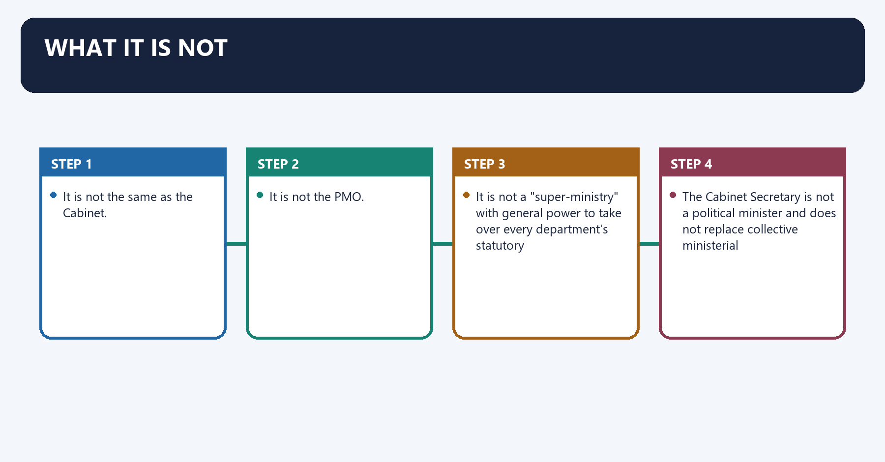
- It is not the same as the Cabinet.
- It is not the PMO.
- It is not a "super-ministry" with general power to take over every department's statutory
  functions.
- The Cabinet Secretary is not a political minister and does not replace collective ministerial
  decision-making.

---

#### CLOSING RECALL FLOW — WHAT IT IS NOT

```closure-flow
SUBTOPIC: What it is not
KEY TERMS / DEFINITIONS: What it is not · What it · It · Cabinet · PMO · The operative mechanism matters because the Cabinet Secretary
MECHANISM / ARGUMENT: What it is not operates through It is not the PMO, connected with It is not a "super-ministry" with general power to take over every department's statutory.
CONSEQUENCE / CONTRAST: The operative mechanism matters because the Cabinet Secretary is not a political minister and does not replace collective ministerial.
UPSC TRAP / ANSWER-USE: Its principal consequence is that it is not the same as the Cabinet.
ANSWER-GRABBING FORMULATION: The Cabinet Secretary is not a political minister and does not replace collective ministerial decision-making.
```
### SESSION 19 — CABINET, CABINET COMMITTEES AND COMMITTEES OF SECRETARIES
#### DEFINITION / WHAT THIS IS CALLED

**Plain-language definition:** Cabinet, Cabinet Committees and Committees of Secretaries denotes the constitutional rules and institutional links organised around Body Composition Nature Main use.

**Technical definition:** The Cabinet Secretariat supplies procedural support; the committee's ministers take the.

#### ANSWER-GRABBING OPENING — WRITE/ADAPT IN THE EXAM

> The Cabinet makes collective political decisions, Cabinet Committees handle delegated political work, and Committees of Secretaries coordinate administration without acquiring ministerial authority.

#### MUST-WRITE KEYWORDS

- **Cabinet**
- **Cabinet Committees**
- **Committees of Secretaries**
- **Cabinet Committee**
- **Committee of Secretaries**
- **Senior ministers**

**How to use them:** Frame the answer through Cabinet; define Cabinet Committees, connect Committees of Secretaries with Cabinet Committee to explain the mechanism, and use Committee of Secretaries for the decisive comparison or qualification.

9. Cabinet, Cabinet Committees and Committees of Secretaries denotes the constitutional rules and institutional links organised around Body Composition Nature Main use.
9. Cabinet, Cabinet Committees and Committees of Secretaries operates through Cabinet Senior ministers Political decision body; inner part of Council of Ministers Highest collective policy decisions, connected with Cabinet Committee names, composition and number may change. Learn the mechanism , not a frozen.
The operative mechanism matters because count. The Cabinet Secretariat supplies procedural support; the committee's ministers take the.
Its principal consequence is that political decision.
The decisive contrast is between Body Composition Nature Main use and Body Composition Nature Main use.
The exam-safe limitation is that body Composition Nature Main use.
| Body | Composition | Nature | Main use |
|---|---|---|---|
| **Cabinet** | Senior ministers | Political decision body; inner part of Council of Ministers | Highest collective policy decisions |
| **Cabinet Committee** | Selected ministers | Extra-constitutional; standing or ad hoc under business rules | Specialised political consideration and faster decisions |
| **Committee of Secretaries** | Senior civil servants, generally chaired by Cabinet Secretary | Administrative coordination mechanism | Resolve inter-departmental differences and prepare coordinated advice |

Cabinet Committee names, composition and number may change. Learn the **mechanism**, not a frozen
count. The Cabinet Secretariat supplies procedural support; the committee's ministers take the
political decision.

---

#### CLOSING RECALL FLOW — CABINET, CABINET COMMITTEES AND COMMITTEES OF SECRETARIES

```closure-flow
SUBTOPIC: Cabinet, Cabinet Committees and Committees of Secretaries
KEY TERMS / DEFINITIONS: Cabinet · Cabinet Committees · Committees of Secretaries · Cabinet Committee · Committee of Secretaries · Senior ministers
MECHANISM / ARGUMENT: The Cabinet Secretariat supplies procedural support; the committee's ministers take the.
CONSEQUENCE / CONTRAST: The decisive contrast is between Body Composition Nature Main use and Body Composition Nature Main use.
UPSC TRAP / ANSWER-USE: Do not miss this limiting distinction: its principal consequence is that political decision.
ANSWER-GRABBING FORMULATION: The Cabinet makes collective political decisions, Cabinet Committees handle delegated political work, and Committees of Secretaries coordinate administration without acquiring ministerial authority.
```
### SESSION 20 — CABINET SECRETARIAT VERSUS PMO
#### DEFINITION / WHAT THIS IS CALLED

**Plain-language definition:** Cabinet Secretariat versus PMO denotes the constitutional rules and institutional links organised around Cabinet Secretariat Prime Minister's Office.

**Technical definition:** Cabinet Secretariat versus PMO operates through Supports Cabinet government and cross-ministry procedure Supports the Prime Minister in discharging responsibilities, connected with Administers AoB/ToB Rules Processes matters requiring PM's attention and provides policy/administrative assistance.

#### ANSWER-GRABBING OPENING — WRITE/ADAPT IN THE EXAM

> Over-centralisation in either can weaken departmental initiative; weak central coordination can produce silos and contradictory policies.

#### MUST-WRITE KEYWORDS

- **Cabinet Secretariat versus PMO**
- **Supports Cabinet government and cross-ministry procedure**
- **Supports the Prime Minister in discharging responsibilities**
- **Administers AoB/ToB Rules**
- **Coordinates through Cabinet Secretary and Committees of Secretaries**
- **Custodian of Cabinet papers and decisions**

**How to use them:** Frame the answer through Cabinet Secretariat versus PMO; define Supports Cabinet government and cross-ministry procedure, connect Supports the Prime Minister in discharging responsibilities with Administers AoB/ToB Rules to explain the mechanism, and use Coordinates through Cabinet Secretary and Committees of Secretaries for the decisive comparison or qualification.

10. Cabinet Secretariat versus PMO denotes the constitutional rules and institutional links organised around Cabinet Secretariat Prime Minister's Office.
10. Cabinet Secretariat versus PMO operates through Supports Cabinet government and cross-ministry procedure Supports the Prime Minister in discharging responsibilities, connected with Administers AoB/ToB Rules Processes matters requiring PM's attention and provides policy/administrative assistance.
The operative mechanism matters because custodian of Cabinet papers and decisions Not the custodian of Cabinet records merely because it serves the PM.
Its principal consequence is that both function under the Prime Minister's overall authority but perform different institutional.
The decisive contrast is between roles. Over-centralisation in either can weaken departmental initiative; weak central coordination and can produce silos and contradictory policies.
The exam-safe limitation is that cabinet Secretariat Prime Minister's Office.
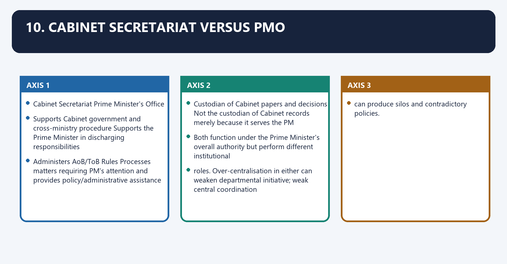
| Cabinet Secretariat | Prime Minister's Office |
|---|---|
| Supports Cabinet government and cross-ministry procedure | Supports the Prime Minister in discharging responsibilities |
| Administers AoB/ToB Rules | Processes matters requiring PM's attention and provides policy/administrative assistance |
| Coordinates through Cabinet Secretary and Committees of Secretaries | Works through Principal Secretary/other PMO officers and direct PM-level channels |
| Custodian of Cabinet papers and decisions | Not the custodian of Cabinet records merely because it serves the PM |

Both function under the Prime Minister's overall authority but perform different institutional
roles. Over-centralisation in either can weaken departmental initiative; weak central coordination
can produce silos and contradictory policies.

---

#### CLOSING RECALL FLOW — CABINET SECRETARIAT VERSUS PMO

```closure-flow
SUBTOPIC: Cabinet Secretariat versus PMO
KEY TERMS / DEFINITIONS: Cabinet Secretariat versus PMO · Supports Cabinet government and cross-ministry procedure · Supports the Prime Minister in discharging responsibilities · Administers AoB/ToB Rules · Coordinates through Cabinet Secretary and Committees of Secretaries · Custodian of Cabinet papers and decisions
MECHANISM / ARGUMENT: Cabinet Secretariat versus PMO operates through Supports Cabinet government and cross-ministry procedure Supports the Prime Minister in discharging responsibilities, connected with Administers AoB/ToB Rules Processes matters requiring PM's attention and provides policy/administrative assistance.
CONSEQUENCE / CONTRAST: Its principal consequence is that both function under the Prime Minister's overall authority but perform different institutional.
UPSC TRAP / ANSWER-USE: Do not miss this limiting distinction: the exam-safe limitation is that cabinet Secretariat Prime Minister's Office.
ANSWER-GRABBING FORMULATION: Over-centralisation in either can weaken departmental initiative; weak central coordination can produce silos and contradictory policies.
```
### SESSION 21 — PARLIAMENTARY
#### DEFINITION / WHAT THIS IS CALLED

**Plain-language definition:** Parliamentary denotes the constitutional rules and institutional links organised around questions, debates and motions.

**Technical definition:** The exam-safe limitation is that questions, debates and motions. questions, debates and motions; demands for grants and appropriation; Department-related Parliamentary Standing Committees; Public Accounts, Estimates and Public Undertakings Committees; laying of reports, rules and notifications; and collective and individual ministerial responsibility.

#### ANSWER-GRABBING OPENING — WRITE/ADAPT IN THE EXAM

> Questions, grants, committees and ministerial responsibility allow Parliament to scrutinise departments, although executive information and party discipline can weaken that control.

#### MUST-WRITE KEYWORDS

- **Parliamentary**
- **Its principal consequence**
- **Its**
- **The decisive contrast**
- **The exam-safe limitation**
- **Department-related Parliamentary Standing Committees**

**How to use them:** Frame the answer through Parliamentary; define Its principal consequence, connect Its with The decisive contrast to explain the mechanism, and use The exam-safe limitation for the decisive comparison or qualification.

Parliamentary denotes the constitutional rules and institutional links organised around questions, debates and motions.
Parliamentary operates through demands for grants and appropriation, connected with Department-related Parliamentary Standing Committees.
The operative mechanism matters because public Accounts, Estimates and Public Undertakings Committees.
Its principal consequence is that laying of reports, rules and notifications; and.
The decisive contrast is between collective and individual ministerial responsibility and questions, debates and motions.
The exam-safe limitation is that questions, debates and motions.
- questions, debates and motions;
- demands for grants and appropriation;
- Department-related Parliamentary Standing Committees;
- Public Accounts, Estimates and Public Undertakings Committees;
- laying of reports, rules and notifications; and
- collective and individual ministerial responsibility.

#### CLOSING RECALL FLOW — PARLIAMENTARY

```closure-flow
SUBTOPIC: Parliamentary
KEY TERMS / DEFINITIONS: Parliamentary · Its principal consequence · Its · The decisive contrast · The exam-safe limitation · Department-related Parliamentary Standing Committees
MECHANISM / ARGUMENT: The exam-safe limitation is that questions, debates and motions. questions, debates and motions; demands for grants and appropriation; Department-related Parliamentary Standing Committees; Public Accounts, Estimates and Public Undertakings Committees; laying of reports, rules and notifications; and collective and individual ministerial responsibility.
CONSEQUENCE / CONTRAST: Its principal consequence is that laying of reports, rules and notifications; and.
UPSC TRAP / ANSWER-USE: Do not miss this limiting distinction: the decisive contrast is between collective and individual ministerial responsibility and questions, debates and...
ANSWER-GRABBING FORMULATION: Questions, grants, committees and ministerial responsibility allow Parliament to scrutinise departments, although executive information and party discipline can weaken that control.
```
### SESSION 22 — LEGAL AND CONSTITUTIONAL
#### DEFINITION / WHAT THIS IS CALLED

**Plain-language definition:** Legal and constitutional denotes the constitutional rules and institutional links organised around compliance with parent statutes and delegated-legislation limits.

**Technical definition:** The exam-safe limitation is that compliance with parent statutes and delegated-legislation limits. judicial review; compliance with parent statutes and delegated-legislation limits; CAG audit and legislative examination; constitutional bodies and statutory regulators; RTI subject to lawful exemptions; and vigilance, anti-corruption and disciplinary mechanisms.

#### ANSWER-GRABBING OPENING — WRITE/ADAPT IN THE EXAM

> Departments remain bounded by statutes, delegated-legislation limits, judicial review, audit, RTI and vigilance even when executive action carries presidential form.

#### MUST-WRITE KEYWORDS

- **Legal**
- **constitutional**
- **Legal and constitutional**
- **Its principal consequence**
- **Its**
- **The decisive contrast**

**How to use them:** Frame the answer through Legal; define constitutional, connect Legal and constitutional with Its principal consequence to explain the mechanism, and use Its for the decisive comparison or qualification.

Legal and constitutional denotes the constitutional rules and institutional links organised around compliance with parent statutes and delegated-legislation limits.
Legal and constitutional operates through CAG audit and legislative examination, connected with constitutional bodies and statutory regulators.
The operative mechanism matters because rTI subject to lawful exemptions; and.
Its principal consequence is that vigilance, anti-corruption and disciplinary mechanisms.
The decisive contrast is between compliance with parent statutes and delegated-legislation limits and compliance with parent statutes and delegated-legislation limits.
The exam-safe limitation is that compliance with parent statutes and delegated-legislation limits.
- judicial review;
- compliance with parent statutes and delegated-legislation limits;
- CAG audit and legislative examination;
- constitutional bodies and statutory regulators;
- RTI subject to lawful exemptions; and
- vigilance, anti-corruption and disciplinary mechanisms.

#### CLOSING RECALL FLOW — LEGAL AND CONSTITUTIONAL

```closure-flow
SUBTOPIC: Legal and constitutional
KEY TERMS / DEFINITIONS: Legal · constitutional · Legal and constitutional · Its principal consequence · Its · The decisive contrast
MECHANISM / ARGUMENT: The exam-safe limitation is that compliance with parent statutes and delegated-legislation limits. judicial review; compliance with parent statutes and delegated-legislation limits; CAG audit and legislative examination; constitutional bodies and statutory regulators; RTI subject to lawful exemptions; and vigilance, anti-corruption and disciplinary mechanisms.
CONSEQUENCE / CONTRAST: Its principal consequence is that vigilance, anti-corruption and disciplinary mechanisms.
UPSC TRAP / ANSWER-USE: Do not miss this limiting distinction: the decisive contrast is between compliance with parent statutes and delegated-legislation limits and compliance...
ANSWER-GRABBING FORMULATION: Departments remain bounded by statutes, delegated-legislation limits, judicial review, audit, RTI and vigilance even when executive action carries presidential form.
```
### SESSION 23 — ADMINISTRATIVE AND PERFORMANCE
#### DEFINITION / WHAT THIS IS CALLED

**Plain-language definition:** Administrative and performance denotes the constitutional rules and institutional links organised around outcome/output monitoring.

**Technical definition:** The exam-safe limitation is that vigilance and service law can identify administrative or personal responsibility within the. outcome/output monitoring; expenditure and procurement controls; internal audit and inspection; citizen charters and grievance redress; evaluation and social accountability; and recorded responsibility through file/e-office systems.

#### ANSWER-GRABBING OPENING — WRITE/ADAPT IN THE EXAM

> Performance systems track outputs and responsibility, but administrative monitoring complements rather than replaces parliamentary, legal and financial accountability.

#### MUST-WRITE KEYWORDS

- **Administrative**
- **performance**
- **Core distinction**
- **Administrative and performance**
- **Its principal consequence**
- **Its**

**How to use them:** Frame the answer through Administrative; define performance, connect Core distinction with Administrative and performance to explain the mechanism, and use Its principal consequence for the decisive comparison or qualification.

Administrative and performance denotes the constitutional rules and institutional links organised around outcome/output monitoring.
Administrative and performance operates through expenditure and procurement controls, connected with internal audit and inspection.
The operative mechanism matters because citizen charters and grievance redress.
Its principal consequence is that evaluation and social accountability; and.
The decisive contrast is between recorded responsibility through file/e-office systems and Core distinction: Parliament holds the Minister politically accountable; audit, courts,.
The exam-safe limitation is that vigilance and service law can identify administrative or personal responsibility within the.
- outcome/output monitoring;
- expenditure and procurement controls;
- internal audit and inspection;
- citizen charters and grievance redress;
- evaluation and social accountability; and
- recorded responsibility through file/e-office systems.

> **Core distinction:** Parliament holds the Minister politically accountable; audit, courts,
> vigilance and service law can identify administrative or personal responsibility within the
> department.

---

#### CLOSING RECALL FLOW — ADMINISTRATIVE AND PERFORMANCE

```closure-flow
SUBTOPIC: Administrative and performance
KEY TERMS / DEFINITIONS: Administrative · performance · Core distinction · Administrative and performance · Its principal consequence · Its
MECHANISM / ARGUMENT: The exam-safe limitation is that vigilance and service law can identify administrative or personal responsibility within the. outcome/output monitoring; expenditure and procurement controls; internal audit and inspection; citizen charters and grievance redress; evaluation and social accountability; and recorded responsibility through file/e-office systems.
CONSEQUENCE / CONTRAST: Its principal consequence is that evaluation and social accountability; and.
UPSC TRAP / ANSWER-USE: Do not miss this limiting distinction: the decisive contrast is between recorded responsibility through file/e-office systems and Core distinction.
ANSWER-GRABBING FORMULATION: Performance systems track outputs and responsibility, but administrative monitoring complements rather than replaces parliamentary, legal and financial accountability.
```
### SESSION 24 — MAJOR DESIGN PROBLEMS
#### DEFINITION / WHAT THIS IS CALLED

**Plain-language definition:** Major design problems denotes the constitutional rules and institutional links organised around Problem Mechanism Consequence Corrective direction.

**Technical definition:** Its principal consequence is that problem Mechanism Consequence Corrective direction.

#### ANSWER-GRABBING OPENING — WRITE/ADAPT IN THE EXAM

> Departmental silos, overlapping mandates, weak consultation and blurred ownership reduce implementation quality, making clearer responsibility and coordinated review essential.

#### MUST-WRITE KEYWORDS

- **Major design problems**
- **Departmental silos**
- **Overlapping allocation**
- **Excessive centralisation**
- **Fragmentation**
- **Generalist-specialist mismatch**

**How to use them:** Frame the answer through Major design problems; define Departmental silos, connect Overlapping allocation with Excessive centralisation to explain the mechanism, and use Fragmentation for the decisive comparison or qualification.

12. Major design problems denotes the constitutional rules and institutional links organised around Problem Mechanism Consequence Corrective direction.
12. Major design problems operates through Excessive centralisation Routine files escalate upward Delay and risk aversion Delegation, clear financial/administrative powers, connected with Problem Mechanism Consequence Corrective direction.
The operative mechanism matters because problem Mechanism Consequence Corrective direction.
Its principal consequence is that problem Mechanism Consequence Corrective direction.
The decisive contrast is between Problem Mechanism Consequence Corrective direction and Problem Mechanism Consequence Corrective direction.
The exam-safe limitation is that problem Mechanism Consequence Corrective direction.
| Problem | Mechanism | Consequence | Corrective direction |
|---|---|---|---|
| **Departmental silos** | Narrow mandates and information hoarding | Contradictory schemes and gaps | Joint outcomes, interoperable data, empowered coordination |
| **Overlapping allocation** | Ambiguous subjects/new technologies | Turf conflict or accountability evasion | Periodic AoB review and named lead department |
| **Excessive centralisation** | Routine files escalate upward | Delay and risk aversion | Delegation, clear financial/administrative powers |
| **Fragmentation** | Too many units for connected outcomes | Coordination cost and duplicated capacity | Cluster related functions while preserving checks |
| **Generalist-specialist mismatch** | Post not matched to domain competence | Weak technical design | Competency-based staffing, specialist cadres, selective lateral entry |
| **Policy-delivery disconnect** | Secretariat insulated from field feedback | Schemes look sound but fail operationally | Field consultation, pilots, evaluation and feedback loops |
| **Transfer instability** | Short/uncertain tenure | Weak ownership and institutional memory | Minimum tenure, Civil Services Board and reasoned transfers |
| **Coordination overload** | Every issue sent to Cabinet/PMO/Cabinet Secretariat | Apex bottleneck | Resolve at lowest competent level; escalate only genuine conflicts |
| **Weak accountability mapping** | Shared schemes without named responsibility | Blame shifting | Lead ministry, outcome owner and public dashboard |

---

#### CLOSING RECALL FLOW — MAJOR DESIGN PROBLEMS

```closure-flow
SUBTOPIC: Major design problems
KEY TERMS / DEFINITIONS: Major design problems · Departmental silos · Overlapping allocation · Excessive centralisation · Fragmentation · Generalist-specialist mismatch
MECHANISM / ARGUMENT: Its principal consequence is that problem Mechanism Consequence Corrective direction.
CONSEQUENCE / CONTRAST: The decisive contrast is between Problem Mechanism Consequence Corrective direction and Problem Mechanism Consequence Corrective direction.
UPSC TRAP / ANSWER-USE: Do not miss this limiting distinction: the exam-safe limitation is that problem Mechanism Consequence Corrective direction.
ANSWER-GRABBING FORMULATION: Departmental silos, overlapping mandates, weak consultation and blurred ownership reduce implementation quality, making clearer responsibility and coordinated review essential.
```
### SESSION 25 — REFORM ARCHITECTURE
#### DEFINITION / WHAT THIS IS CALLED

**Plain-language definition:** Reform architecture denotes the constitutional rules and institutional links organised around Whole-of-government outcomes: organise cross-ministry work around measurable public outcomes,.

**Technical definition:** Technically, Reform architecture is analysed by relating Whole-of-government outcomes to Clear allocation, then testing the relationship through Subsidiarity in decisions and Integrated consultation.

#### ANSWER-GRABBING OPENING — WRITE/ADAPT IN THE EXAM

> Preserve institutional balance: coordination by Cabinet Secretariat/PMO must enable, not erase, ministerial responsibility and departmental expertise.

#### MUST-WRITE KEYWORDS

- **Reform architecture**
- **Whole-of-government outcomes**
- **Clear allocation**
- **Subsidiarity in decisions**
- **Integrated consultation**
- **Policy capability**

**How to use them:** Frame the answer through Reform architecture; define Whole-of-government outcomes, connect Clear allocation with Subsidiarity in decisions to explain the mechanism, and use Integrated consultation for the decisive comparison or qualification.

13. Reform architecture denotes the constitutional rules and institutional links organised around Whole-of-government outcomes: organise cross-ministry work around measurable public outcomes,.
13. Reform architecture operates through not only departmental expenditure, connected with Clear allocation: regularly update AoB entries for emerging areas such as AI, data, climate and.
The operative mechanism matters because platform regulation.
Its principal consequence is that subsidiarity in decisions: dispose routine cases at the lowest competent level.
The decisive contrast is between Integrated consultation: time-bound digital consultation with recorded disagreement and and Policy capability: strengthen economics, law, technology, statistics and evaluation inside.
The exam-safe limitation is that delivery feedback: connect district/state/agency evidence to secretariat redesign.
1. **Whole-of-government outcomes:** organise cross-ministry work around measurable public outcomes,
   not only departmental expenditure.
2. **Clear allocation:** regularly update AoB entries for emerging areas such as AI, data, climate and
   platform regulation.
3. **Subsidiarity in decisions:** dispose routine cases at the lowest competent level.
4. **Integrated consultation:** time-bound digital consultation with recorded disagreement and
   escalation.
5. **Policy capability:** strengthen economics, law, technology, statistics and evaluation inside
   departments.
6. **Delivery feedback:** connect district/state/agency evidence to secretariat redesign.
7. **Stable accountable leadership:** reasonable tenure linked to outcomes, without making officials
   unaccountable.
8. **Transparent rule-making:** consultation, impact assessment and post-implementation review where
   appropriate.
9. **Parliamentary support:** timely data and serious engagement with standing-committee findings.
10. **Preserve institutional balance:** coordination by Cabinet Secretariat/PMO must enable, not erase,
    ministerial responsibility and departmental expertise.

---

#### CLOSING RECALL FLOW — REFORM ARCHITECTURE

```closure-flow
SUBTOPIC: Reform architecture
KEY TERMS / DEFINITIONS: Reform architecture · Whole-of-government outcomes · Clear allocation · Subsidiarity in decisions · Integrated consultation · Policy capability
MECHANISM / ARGUMENT: Preserve institutional balance: coordination by Cabinet Secretariat/PMO must enable, not erase, ministerial responsibility and departmental expertise.
CONSEQUENCE / CONTRAST: The decisive contrast is between Integrated consultation: time-bound digital consultation with recorded disagreement and and Policy capability: strengthen economics, law, technology, statistics and evaluation inside.
UPSC TRAP / ANSWER-USE: Do not miss this limiting distinction: its principal consequence is that subsidiarity in decisions.
ANSWER-GRABBING FORMULATION: Preserve institutional balance: coordination by Cabinet Secretariat/PMO must enable, not erase, ministerial responsibility and departmental expertise.
```
### SESSION 26 — GS-II: INSTITUTIONAL QUALITY AND CIVIL-SERVICE REFORM
#### DEFINITION / WHAT THIS IS CALLED

**Plain-language definition:** 14.1 2020 GS-II: institutional quality and civil-service reform denotes the constitutional rules and institutional links organised around This historical question is principally owned by Governance's civil-service file, but ministries are.

**Technical definition:** 14.1 2020 GS-II: institutional quality and civil-service reform operates through the organisational setting in which civil-service quality becomes policy quality, connected with institutional quality means predictable rules, competence, coordination and accountability.

#### ANSWER-GRABBING OPENING — WRITE/ADAPT IN THE EXAM

> Civil-service quality becomes policy quality within ministries, but the wider reform architecture remains governed by service law and accountability institutions.

#### MUST-WRITE KEYWORDS

- **GS-II**
- **institutional quality**
- **civil-service reform**
- **chain**
- **This**
- **14.1 2020 GS-II: institutional quality and civil-service reform**

**How to use them:** Frame the answer through GS-II; define institutional quality, connect civil-service reform with chain to explain the mechanism, and use This for the decisive comparison or qualification.

14.1 2020 GS-II: institutional quality and civil-service reform denotes the constitutional rules and institutional links organised around This historical question is principally owned by Governance's civil-service file, but ministries are.
14.1 2020 GS-II: institutional quality and civil-service reform operates through the organisational setting in which civil-service quality becomes policy quality, connected with institutional quality means predictable rules, competence, coordination and accountability.
The operative mechanism matters because explain Minister-Secretary complementarity.
Its principal consequence is that identify silo, tenure, specialisation, delegation and policy-delivery problems.
The decisive contrast is between propose stable tenure, competency-based staffing, Mission Karmayogi, specialist support, and e-office, transparent consultation and outcome evaluation; and.
The exam-safe limitation is that conclude that personnel reform fails unless departmental processes and incentives also change.
This historical question is principally owned by Governance's civil-service file, but ministries are
the organisational setting in which civil-service quality becomes policy quality.

**Answer chain:**

1. institutional quality means predictable rules, competence, coordination and accountability;
2. explain Minister-Secretary complementarity;
3. identify silo, tenure, specialisation, delegation and policy-delivery problems;
4. propose stable tenure, competency-based staffing, Mission Karmayogi, specialist support,
   e-office, transparent consultation and outcome evaluation; and
5. conclude that personnel reform fails unless departmental processes and incentives also change.

#### CLOSING RECALL FLOW — GS-II: INSTITUTIONAL QUALITY AND CIVIL-SERVICE REFORM

```closure-flow
SUBTOPIC: GS-II: institutional quality and civil-service reform
KEY TERMS / DEFINITIONS: GS-II · institutional quality · civil-service reform · chain · This · 14.1 2020 GS-II: institutional quality and civil-service reform
MECHANISM / ARGUMENT: 14.1 2020 GS-II: institutional quality and civil-service reform operates through the organisational setting in which civil-service quality becomes policy quality, connected with institutional quality means predictable rules, competence, coordination and accountability.
CONSEQUENCE / CONTRAST: This historical question is principally owned by Governance's civil-service file, but ministries are the organisational setting in which civil-service quality becomes policy quality.
UPSC TRAP / ANSWER-USE: Do not miss this limiting distinction: institutional quality means predictable rules, competence, coordination and accountability.
ANSWER-GRABBING FORMULATION: Civil-service quality becomes policy quality within ministries, but the wider reform architecture remains governed by service law and accountability institutions.
```
### SESSION 27 — GS-II: CIVIL-SERVICE INTEGRITY AND DEMOCRATIC GOVERNANCE
#### DEFINITION / WHAT THIS IS CALLED

**Plain-language definition:** 14.2 2024 GS-II: civil-service integrity and democratic governance denotes the constitutional rules and institutional links organised around Use this Core for the organisational dimension.

**Technical definition:** The exam-safe limitation is that the complete civil-service legitimacy answer remains with.

#### ANSWER-GRABBING OPENING — WRITE/ADAPT IN THE EXAM

> Civil-service integrity requires candid professional advice, lawful political direction and traceable responsibility, linking neutrality to democratic rather than bureaucratic supremacy.

#### MUST-WRITE KEYWORDS

- **GS-II**
- **civil-service integrity**
- **democratic governance**
- **Its principal consequence**
- **Its**
- **14.2 2024 GS-II: civil-service integrity and democratic governance**

**How to use them:** Frame the answer through GS-II; define civil-service integrity, connect democratic governance with Its principal consequence to explain the mechanism, and use Its for the decisive comparison or qualification.

14.2 2024 GS-II: civil-service integrity and democratic governance denotes the constitutional rules and institutional links organised around Use this Core for the organisational dimension.
14.2 2024 GS-II: civil-service integrity and democratic governance operates through recorded, reasoned advice, connected with lawful ministerial direction.
The operative mechanism matters because transparent allocation of responsibility.
Its principal consequence is that institutional protection for neutral professional advice.
The decisive contrast is between audit, legislative scrutiny and grievance redress; and and visible service outcomes.
The exam-safe limitation is that the complete civil-service legitimacy answer remains with.
Use this Core for the organisational dimension:

- recorded, reasoned advice;
- lawful ministerial direction;
- transparent allocation of responsibility;
- institutional protection for neutral professional advice;
- audit, legislative scrutiny and grievance redress; and
- visible service outcomes.

The complete civil-service legitimacy answer remains with
`../../Governance/basic/09_Civil-Services-and-Mission-Karmayogi.md`.

#### CLOSING RECALL FLOW — GS-II: CIVIL-SERVICE INTEGRITY AND DEMOCRATIC GOVERNANCE

```closure-flow
SUBTOPIC: GS-II: civil-service integrity and democratic governance
KEY TERMS / DEFINITIONS: GS-II · civil-service integrity · democratic governance · Its principal consequence · Its · 14.2 2024 GS-II: civil-service integrity and democratic governance
MECHANISM / ARGUMENT: The complete civil-service legitimacy answer remains with ../../Governance/basic/09Civil-Services-and-Mission-Karmayogi.md.
CONSEQUENCE / CONTRAST: Its principal consequence is that institutional protection for neutral professional advice.
UPSC TRAP / ANSWER-USE: Do not miss this limiting distinction: the decisive contrast is between audit, legislative scrutiny and grievance redress.
ANSWER-GRABBING FORMULATION: Civil-service integrity requires candid professional advice, lawful political direction and traceable responsibility, linking neutrality to democratic rather than bureaucratic supremacy.
```
### SESSION 28 — GS-II: CABINET SYSTEM AND PARLIAMENTARY SUPREMACY
#### DEFINITION / WHAT THIS IS CALLED

**Plain-language definition:** 14.3 2024 GS-II: cabinet system and parliamentary supremacy denotes the constitutional rules and institutional links organised around Ministries give the Cabinet control over policy information, legislative drafting, delegated.

**Technical definition:** Its principal consequence is that ministries give the Cabinet control over policy information, legislative drafting, delegated.

#### ANSWER-GRABBING OPENING — WRITE/ADAPT IN THE EXAM

> Ministries give the Cabinet control over information, drafting, budgets and agenda-setting, which can marginalise Parliament when scrutiny and committee capacity are weak.

#### MUST-WRITE KEYWORDS

- **GS-II**
- **cabinet system**
- **parliamentary supremacy**
- **Ministries**
- **Cabinet**
- **14.3 2024 GS-II: cabinet system and parliamentary supremacy**

**How to use them:** Frame the answer through GS-II; define cabinet system, connect parliamentary supremacy with Ministries to explain the mechanism, and use Cabinet for the decisive comparison or qualification.

14.3 2024 GS-II: cabinet system and parliamentary supremacy denotes the constitutional rules and institutional links organised around Ministries give the Cabinet control over policy information, legislative drafting, delegated.
14.3 2024 GS-II: cabinet system and parliamentary supremacy operates through legislation, budget preparation and the parliamentary agenda. This can marginalise Parliament when, connected with party discipline and weak scrutiny combine with executive information advantage. Balance with.
The operative mechanism matters because questions, committees, financial control, audit and judicial review.
Its principal consequence is that ministries give the Cabinet control over policy information, legislative drafting, delegated.
The decisive contrast is between Ministries give the Cabinet control over policy information, legislative drafting, delegated and Ministries give the Cabinet control over policy information, legislative drafting, delegated.
The exam-safe limitation is that ministries give the Cabinet control over policy information, legislative drafting, delegated.
Ministries give the Cabinet control over policy information, legislative drafting, delegated
legislation, budget preparation and the parliamentary agenda. This can marginalise Parliament when
party discipline and weak scrutiny combine with executive information advantage. Balance with
questions, committees, financial control, audit and judicial review.

#### CLOSING RECALL FLOW — GS-II: CABINET SYSTEM AND PARLIAMENTARY SUPREMACY

```closure-flow
SUBTOPIC: GS-II: cabinet system and parliamentary supremacy
KEY TERMS / DEFINITIONS: GS-II · cabinet system · parliamentary supremacy · Ministries · Cabinet · 14.3 2024 GS-II: cabinet system and parliamentary supremacy
MECHANISM / ARGUMENT: Its principal consequence is that ministries give the Cabinet control over policy information, legislative drafting, delegated.
CONSEQUENCE / CONTRAST: The decisive contrast is between Ministries give the Cabinet control over policy information, legislative drafting, delegated and Ministries give the Cabinet control over policy information, legislative drafting, delegated.
UPSC TRAP / ANSWER-USE: Do not miss this limiting distinction: the exam-safe limitation is that ministries give the Cabinet control over policy information, legislative...
ANSWER-GRABBING FORMULATION: Ministries give the Cabinet control over information, drafting, budgets and agenda-setting, which can marginalise Parliament when scrutiny and committee capacity are weak.
```
### SESSION 29 — PROBABLE DIRECT DEMAND
#### DEFINITION / WHAT THIS IS CALLED

**Plain-language definition:** Probable direct demand denotes the constitutional rules and institutional links organised around "Explain how ministries and departments of the Union Government are organised and how the Cabinet.

**Technical definition:** Its principal consequence is that "Explain how ministries and departments of the Union Government are organised and how the Cabinet.

#### ANSWER-GRABBING OPENING — WRITE/ADAPT IN THE EXAM

> The organisation of ministries links departmental ownership to Cabinet Secretariat coordination, making inter-ministerial process central to collective responsibility.

#### MUST-WRITE KEYWORDS

- **Probable direct demand**
- **Article 77**
- **Probable**
- **Union Government**
- **Cabinet**
- **Its principal consequence**

**How to use them:** Frame the answer through Probable direct demand; define Article 77, connect Probable with Union Government to explain the mechanism, and use Cabinet for the decisive comparison or qualification.

Probable direct demand denotes the constitutional rules and institutional links organised around "Explain how ministries and departments of the Union Government are organised and how the Cabinet.
Probable direct demand operates through Secretariat ensures inter-ministerial coordination.", connected with Answer: Article 77(3) - AoB versus ToB - Minister/Secretary - Secretariat/agencies - consultation.
The operative mechanism matters because and escalation - Cabinet Secretariat/Cabinet Committees - parliamentary and legal accountability.
Its principal consequence is that "Explain how ministries and departments of the Union Government are organised and how the Cabinet.
The decisive contrast is between "Explain how ministries and departments of the Union Government are organised and how the Cabinet and "Explain how ministries and departments of the Union Government are organised and how the Cabinet.
The exam-safe limitation is that "Explain how ministries and departments of the Union Government are organised and how the Cabinet.
**"Explain how ministries and departments of the Union Government are organised and how the Cabinet
Secretariat ensures inter-ministerial coordination."**

Answer: Article 77(3) -> AoB versus ToB -> Minister/Secretary -> Secretariat/agencies -> consultation
and escalation -> Cabinet Secretariat/Cabinet Committees -> parliamentary and legal accountability.

---

#### CLOSING RECALL FLOW — PROBABLE DIRECT DEMAND

```closure-flow
SUBTOPIC: Probable direct demand
KEY TERMS / DEFINITIONS: Probable direct demand · Article 77 · Probable · Union Government · Cabinet · Its principal consequence
MECHANISM / ARGUMENT: Its principal consequence is that "Explain how ministries and departments of the Union Government are organised and how the Cabinet.
CONSEQUENCE / CONTRAST: The decisive contrast is between "Explain how ministries and departments of the Union Government are organised and how the Cabinet and "Explain how ministries and departments of the Union Government are organised and how the Cabinet.
UPSC TRAP / ANSWER-USE: Do not miss this limiting distinction: the exam-safe limitation is that "Explain how ministries and departments of the Union Government...
ANSWER-GRABBING FORMULATION: The organisation of ministries links departmental ownership to Cabinet Secretariat coordination, making inter-ministerial process central to collective responsibility.
```
### SESSION 30 — PRELIMS TRAPS
#### DEFINITION / WHAT THIS IS CALLED

**Plain-language definition:** Prelims traps denotes the constitutional rules and institutional links organised around AoB Rules and ToB Rules are framed under Article 77(3) , not Article 309.

**Technical definition:** Prelims traps operates through AoB answers who handles the subject ; ToB answers how the decision moves, connected with All executive action is expressed in the President's name; it is not all personally decided by the.

#### ANSWER-GRABBING OPENING — WRITE/ADAPT IN THE EXAM

> Allocation and transaction rules, the Central and Cabinet Secretariats, and presidential form versus ministerial decision are legally distinct features of Union administration.

#### MUST-WRITE KEYWORDS

- **Prelims traps**
- **Article 77(3)**
- **who handles the subject**
- **how the decision moves**
- **Article 77**
- **Article 309**

**How to use them:** Frame the answer through Prelims traps; define Article 77(3), connect who handles the subject with how the decision moves to explain the mechanism, and use Article 77 for the decisive comparison or qualification.

15. Prelims traps denotes the constitutional rules and institutional links organised around AoB Rules and ToB Rules are framed under Article 77(3) , not Article 309.
15. Prelims traps operates through AoB answers who handles the subject ; ToB answers how the decision moves, connected with All executive action is expressed in the President's name; it is not all personally decided by the.
The operative mechanism matters because the Minister is political head; the Secretary is administrative head/principal official adviser.
Its principal consequence is that central Secretariat and Cabinet Secretariat are not synonyms.
The decisive contrast is between Cabinet Secretariat and PMO are not synonyms and Cabinet Committees are extra-constitutional mechanisms under business rules.
The exam-safe limitation is that a Committee of Secretaries is not a committee of ministers.
- AoB Rules and ToB Rules are framed under **Article 77(3)**, not Article 309.
- AoB answers **who handles the subject**; ToB answers **how the decision moves**.
- All executive action is expressed in the President's name; it is not all personally decided by the
  President.
- The Minister is political head; the Secretary is administrative head/principal official adviser.
- Central Secretariat and Cabinet Secretariat are not synonyms.
- Cabinet Secretariat and PMO are not synonyms.
- Cabinet Committees are extra-constitutional mechanisms under business rules.
- A Committee of Secretaries is not a committee of ministers.
- Attached and subordinate offices are not independent constitutional bodies.
- A statutory regulator's legal autonomy cannot be displaced by ordinary ministerial instruction.
- Reorganisation of ministries does not ordinarily require a constitutional amendment.
- Do not memorise a permanent number of ministries, departments or Cabinet Committees.
- Delegation of delivery does not remove ministerial/departmental accountability.

---

#### CLOSING RECALL FLOW — PRELIMS TRAPS

```closure-flow
SUBTOPIC: Prelims traps
KEY TERMS / DEFINITIONS: Prelims traps · Article 77(3) · who handles the subject · how the decision moves · Article 77 · Article 309
MECHANISM / ARGUMENT: Prelims traps operates through AoB answers who handles the subject ; ToB answers how the decision moves, connected with All executive action is expressed in the President's name; it is not all personally decided by the.
CONSEQUENCE / CONTRAST: AoB Rules and ToB Rules are framed under Article 77(3), not Article 309.
UPSC TRAP / ANSWER-USE: Its principal consequence is that central Secretariat and Cabinet Secretariat are not synonyms.
ANSWER-GRABBING FORMULATION: Allocation and transaction rules, the Central and Cabinet Secretariats, and presidential form versus ministerial decision are legally distinct features of Union administration.
```
### SESSION 31 — MAINS-READY TEMPLATE
#### DEFINITION / WHAT THIS IS CALLED

**Plain-language definition:** Mains-ready template denotes the constitutional rules and institutional links organised around Introduction: Articles 74-77 translate the parliamentary executive into organised government.

**Technical definition:** Technically, Mains-ready template is analysed by relating Body to Conclusion, then testing the relationship through Core firewall and Mains-ready.

#### ANSWER-GRABBING OPENING — WRITE/ADAPT IN THE EXAM

> Efficient ministries require neither uncoordinated departmental autonomy nor apex micromanagement, but coordinated responsibility at the lowest competent level.

#### MUST-WRITE KEYWORDS

- **Mains-ready template**
- **Body**
- **Conclusion**
- **Core firewall**
- **Mains-ready**
- **Articles**

**How to use them:** Frame the answer through Mains-ready template; define Body, connect Conclusion with Core firewall to explain the mechanism, and use Mains-ready for the decisive comparison or qualification.

16. Mains-ready template denotes the constitutional rules and institutional links organised around Introduction: Articles 74-77 translate the parliamentary executive into organised government.
16. Mains-ready template operates through AoB allocates subjects and ToB regulates decision procedure, connected with Minister-Secretary dual structure.
The operative mechanism matters because central Secretariat and implementing organisations.
Its principal consequence is that inter-departmental consultation and Cabinet Secretariat.
The decisive contrast is between parliamentary, legal and administrative accountability and problems: silos, overlap, centralisation, weak specialisation and delivery disconnect.
The exam-safe limitation is that reforms: clear allocation, delegation, stable competency, whole-of-government coordination and.
**Introduction:** Articles 74-77 translate the parliamentary executive into organised government;
AoB allocates subjects and ToB regulates decision procedure.

**Body:**

1. Minister-Secretary dual structure;
2. Central Secretariat and implementing organisations;
3. inter-departmental consultation and Cabinet Secretariat;
4. parliamentary, legal and administrative accountability;
5. problems: silos, overlap, centralisation, weak specialisation and delivery disconnect;
6. reforms: clear allocation, delegation, stable competency, whole-of-government coordination and
   outcome review.

**Conclusion:** Efficient ministries require neither uncoordinated departmental autonomy nor
PMO/Cabinet Secretariat micromanagement, but coordinated responsibility at the lowest competent
level.

> **Core firewall:** Skipping Advanced does not remove any indispensable definition, institution,
> distinction, trap or PYQ application needed for this syllabus area.

#### CLOSING RECALL FLOW — MAINS-READY TEMPLATE

```closure-flow
SUBTOPIC: Mains-ready template
KEY TERMS / DEFINITIONS: Mains-ready template · Body · Conclusion · Core firewall · Mains-ready · Articles
MECHANISM / ARGUMENT: Core firewall: Skipping Advanced does not remove any indispensable definition, institution, distinction, trap or PYQ application needed for this syllabus area.
CONSEQUENCE / CONTRAST: Its principal consequence is that inter-departmental consultation and Cabinet Secretariat.
UPSC TRAP / ANSWER-USE: Do not miss this limiting distinction: the decisive contrast is between parliamentary, legal and administrative accountability and problems.
ANSWER-GRABBING FORMULATION: Efficient ministries require neither uncoordinated departmental autonomy nor apex micromanagement, but coordinated responsibility at the lowest competent level.
```
### 32. 17. Answer architecture (10/15/20-mark support)

17. Answer architecture (10/15/20-mark support) denotes the constitutional rules and institutional links organised around Constitutional rule.
17. Answer architecture (10/15/20-mark support) operates through Operating mechanism, connected with Exam distinction.
The operative mechanism matters because constitutional rule.
Its principal consequence is that constitutional rule.
The decisive contrast is between Constitutional rule and Constitutional rule.
The exam-safe limitation is that constitutional rule.
> Purpose: this file already carries the full institutional spine (sections 1–13), PYQ answer engines (section 14), Prelims traps (section 15) and a Mains template (section 16). This section adds **only the directive-sensitive answer layer** — a demand map, thesis options, mark-scaled structures, **named-example evidence banks** the earlier sections do not hold, and verdict/Prelims/fact-risk controls. It does **not** repeat sections 1–16.

### SESSION 32 — DEMAND AND DIRECTIVE MAP
#### DEFINITION / WHAT THIS IS CALLED

**Plain-language definition:** 17.1 Demand and directive map denotes the constitutional rules and institutional links organised around Demand family Typical directive signals Answer spine to use (owned sections).

**Technical definition:** 17.1 Demand and directive map operates through Accountability of departments "who is answerable", Discuss Parliamentary + legal + administrative (§11) → named instruments (§17.5), connected with Demand family Typical directive signals Answer spine to use (owned sections).

#### ANSWER-GRABBING OPENING — WRITE/ADAPT IN THE EXAM

> Questions about central administration turn on who owns a subject, how collective decisions move and which parliamentary, legal or administrative mechanism enforces responsibility.

#### MUST-WRITE KEYWORDS

- **Demand**
- **directive map**
- **How government is organised**
- **Inter-ministerial coordination**
- **"silos", "whole-of-government", Examine**
- **Central coordination vs overreach**

**How to use them:** Frame the answer through Demand; define directive map, connect How government is organised with Inter-ministerial coordination to explain the mechanism, and use "silos", "whole-of-government", Examine for the decisive comparison or qualification.

17.1 Demand and directive map denotes the constitutional rules and institutional links organised around Demand family Typical directive signals Answer spine to use (owned sections).
17.1 Demand and directive map operates through Accountability of departments "who is answerable", Discuss Parliamentary + legal + administrative (§11) → named instruments (§17.5), connected with Demand family Typical directive signals Answer spine to use (owned sections).
The operative mechanism matters because demand family Typical directive signals Answer spine to use (owned sections).
Its principal consequence is that demand family Typical directive signals Answer spine to use (owned sections).
The decisive contrast is between Demand family Typical directive signals Answer spine to use (owned sections) and Demand family Typical directive signals Answer spine to use (owned sections).
The exam-safe limitation is that demand family Typical directive signals Answer spine to use (owned sections).
| Demand family | Typical directive signals | Answer spine to use (owned sections) |
|---|---|---|
| How government is organised | "structure and functioning of the executive", Explain | Art 77(3) → AoB vs ToB (§3) → Minister/Secretary (§4) → Secretariat/agencies (§5–6) |
| Inter-ministerial coordination | "silos", "whole-of-government", Examine | Consultation/escalation (§7) → Cabinet Secretariat/CoS (§8–9) → named mechanisms (§17.4) |
| Central coordination vs overreach | "PMO dominance", "court government", Critically examine | Cabinet Secretariat vs PMO (§10) → enablement-vs-centralisation → verdict |
| Accountability of departments | "who is answerable", Discuss | Parliamentary + legal + administrative (§11) → named instruments (§17.5) |
| Reorganisation of ministries | "machinery of government", "restructuring", Analyse | Art 77(3) flexibility (§3) → named reorganisations (§17.4) → transition-cost caution |
| Regulator/agency autonomy | "arm's-length", "statutory independence", Evaluate | Secretariat–agency distinction (§6, §17.6) → autonomy-accountability balance |

#### CLOSING RECALL FLOW — DEMAND AND DIRECTIVE MAP

```closure-flow
SUBTOPIC: Demand and directive map
KEY TERMS / DEFINITIONS: Demand · directive map · How government is organised · Inter-ministerial coordination · "silos", "whole-of-government", Examine · Central coordination vs overreach
MECHANISM / ARGUMENT: 17.1 Demand and directive map operates through Accountability of departments "who is answerable", Discuss Parliamentary + legal + administrative (§11) → named instruments (§17.5), connected with Demand family Typical directive signals Answer spine to use (owned sections).
CONSEQUENCE / CONTRAST: Its principal consequence is that demand family Typical directive signals Answer spine to use (owned sections).
UPSC TRAP / ANSWER-USE: Do not miss this limiting distinction: the decisive contrast is between Demand family Typical directive signals Answer spine to use...
ANSWER-GRABBING FORMULATION: Questions about central administration turn on who owns a subject, how collective decisions move and which parliamentary, legal or administrative mechanism enforces responsibility.
```
### SESSION 33 — QUALIFIED THESIS OPTIONS
#### DEFINITION / WHAT THIS IS CALLED

**Plain-language definition:** 17.2 Qualified thesis options denotes the constitutional rules and institutional links organised around Constitutional rule.

**Technical definition:** Reorganising ministries is cheap in law and costly in practice: Article 77(3) lets the executive rename, merge or split departments without amendment, but records, cadres, budgets and committee mapping do not move as fast as the organogram.

#### ANSWER-GRABBING OPENING — WRITE/ADAPT IN THE EXAM

> A ministry is where democratic mandate, ministerial responsibility and permanent expertise are fused; its quality is not a matter of size but of whether authority, funds and functionaries are aligned on one accountable owner.

#### MUST-WRITE KEYWORDS

- **Qualified thesis options**
- **Article 77**
- **Qualified**
- **Constitutional**
- **Its principal consequence**
- **17.2 Qualified thesis options**

**How to use them:** Frame the answer through Qualified thesis options; define Article 77, connect Qualified with Constitutional to explain the mechanism, and use Its principal consequence for the decisive comparison or qualification.

17.2 Qualified thesis options denotes the constitutional rules and institutional links organised around Constitutional rule.
17.2 Qualified thesis options operates through Operating mechanism, connected with Exam distinction.
The operative mechanism matters because constitutional rule.
Its principal consequence is that constitutional rule.
The decisive contrast is between Constitutional rule and Constitutional rule.
The exam-safe limitation is that constitutional rule.
- *A ministry is where democratic mandate, ministerial responsibility and permanent expertise are fused; its quality is not a matter of size but of whether authority, funds and functionaries are aligned on one accountable owner.*
- *Coordination, not creation, is the hard problem of Indian government — the Cabinet Secretariat and PMO exist to stitch departmental silos together, but the same central machinery can slide from enablement into "court government" when routine decisions migrate upward.*
- *Reorganising ministries is cheap in law and costly in practice: Article 77(3) lets the executive rename, merge or split departments without amendment, but records, cadres, budgets and committee mapping do not move as fast as the organogram.*
- *The Minister–Secretary relationship is the constitutional hinge of neutral competence: political direction is legitimate, frank recorded advice is indispensable, and accountability fails when either the advice is politicised or the responsibility is hidden behind anonymity.*

#### CLOSING RECALL FLOW — QUALIFIED THESIS OPTIONS

```closure-flow
SUBTOPIC: Qualified thesis options
KEY TERMS / DEFINITIONS: Qualified thesis options · Article 77 · Qualified · Constitutional · Its principal consequence · 17.2 Qualified thesis options
MECHANISM / ARGUMENT: Reorganising ministries is cheap in law and costly in practice: Article 77(3) lets the executive rename, merge or split departments without amendment, but records, cadres, budgets and committee mapping do not move as fast as the organogram.
CONSEQUENCE / CONTRAST: The decisive contrast is between Constitutional rule and Constitutional rule.
UPSC TRAP / ANSWER-USE: Do not miss this limiting distinction: its principal consequence is that constitutional rule.
ANSWER-GRABBING FORMULATION: A ministry is where democratic mandate, ministerial responsibility and permanent expertise are fused; its quality is not a matter of size but of whether authority, funds and functionaries are aligned on one accountable owner.
```
### SESSION 34 — MARK-SCALED STRUCTURES
#### DEFINITION / WHAT THIS IS CALLED

**Plain-language definition:** 17.3 Mark-scaled structures denotes the constitutional rules and institutional links organised around Marks Architecture Evidence load.

**Technical definition:** The decisive contrast is between Marks Architecture Evidence load and Marks Architecture Evidence load.

#### ANSWER-GRABBING OPENING — WRITE/ADAPT IN THE EXAM

> Constitutional rules, business procedures and oversight mechanisms strengthen administrative accountability only when connected to a traceable causal claim.

#### MUST-WRITE KEYWORDS

- **Mark-scaled structures**
- **Mark-scaled**
- **Marks Architecture Evidence**
- **5–6 units**
- **6–8 units + a functions-funds-functionaries paragraph**
- **17.3 Mark-scaled structures**

**How to use them:** Frame the answer through Mark-scaled structures; define Mark-scaled, connect Marks Architecture Evidence with 5–6 units to explain the mechanism, and use 6–8 units + a functions-funds-functionaries paragraph for the decisive comparison or qualification.

17.3 Mark-scaled structures denotes the constitutional rules and institutional links organised around Marks Architecture Evidence load.
17.3 Mark-scaled structures operates through 15 Thesis → organisation → coordination machinery → named instruments/reorganisations → one design problem → verdict 5–6 units, connected with Marks Architecture Evidence load.
The operative mechanism matters because marks Architecture Evidence load.
Its principal consequence is that marks Architecture Evidence load.
The decisive contrast is between Marks Architecture Evidence load and Marks Architecture Evidence load.
The exam-safe limitation is that marks Architecture Evidence load.
| Marks | Architecture | Evidence load |
|---:|---|---|
| 10 | Thesis → Art 77(3)/AoB-ToB → one mechanism (Minister-Secretary or Cabinet Secretariat) → one limitation → verdict | 2–3 units, at least one provision + one named body |
| 15 | Thesis → organisation → coordination machinery → named instruments/reorganisations → one design problem → verdict | 5–6 units |
| 20 | Thesis → constitutional base (Art 74–78) → Secretariat/agency structure → coordination and central-government tension → accountability → reform/variation → graded verdict | 6–8 units + a functions-funds-functionaries paragraph |

#### CLOSING RECALL FLOW — MARK-SCALED STRUCTURES

```closure-flow
SUBTOPIC: Mark-scaled structures
KEY TERMS / DEFINITIONS: Mark-scaled structures · Mark-scaled · Marks Architecture Evidence · 5–6 units · 6–8 units + a functions-funds-functionaries paragraph · 17.3 Mark-scaled structures
MECHANISM / ARGUMENT: The decisive contrast is between Marks Architecture Evidence load and Marks Architecture Evidence load.
CONSEQUENCE / CONTRAST: Its principal consequence is that marks Architecture Evidence load.
UPSC TRAP / ANSWER-USE: Do not miss this limiting distinction: the exam-safe limitation is that marks Architecture Evidence load.
ANSWER-GRABBING FORMULATION: Constitutional rules, business procedures and oversight mechanisms strengthen administrative accountability only when connected to a traceable causal claim.
```
### SESSION 35 — BANK A — NAMED REORGANISATIONS AND COORDINATION MECHANISMS (THE EVIDENCE THE EARLIER SECTIONS LACK)
#### DEFINITION / WHAT THIS IS CALLED

**Plain-language definition:** Bank A — Named reorganisations and coordination mechanisms (the evidence the earlier sections lack) comprises Bank A, Named reorganisations and coordination mechanisms (the evidence the earlier sections lack) as its core connected dimensions.

**Technical definition:** Its principal consequence is that claim → named example → mechanism → caution.

#### ANSWER-GRABBING OPENING — WRITE/ADAPT IN THE EXAM

> Reorganisation, Cabinet Committees and coordination mechanisms matter because administrative structure must adapt without obscuring constitutional responsibility for decisions.

#### MUST-WRITE KEYWORDS

- **Bank A**
- **Named reorganisations**
- **coordination mechanisms (the evidence the earlier sections lack)**
- **Claim → named example → mechanism → caution**
- **Ministry of Jal Shakti (2019)**
- **Art 77(3)**

**How to use them:** Frame the answer through Bank A; define Named reorganisations, connect coordination mechanisms (the evidence the earlier sections lack) with Claim → named example → mechanism → caution to explain the mechanism, and use Ministry of Jal Shakti (2019) for the decisive comparison or qualification.

17.4 Bank A — Named reorganisations and coordination mechanisms (the evidence the earlier sections lack) denotes the constitutional rules and institutional links organised around Claim → named example → mechanism → caution.
17.4 Bank A — Named reorganisations and coordination mechanisms (the evidence the earlier sections lack) operates through Claim Named example Mechanism / significance Caution / status, connected with Claim → named example → mechanism → caution.
The operative mechanism matters because claim → named example → mechanism → caution.
Its principal consequence is that claim → named example → mechanism → caution.
The decisive contrast is between Claim → named example → mechanism → caution and Claim → named example → mechanism → caution.
The exam-safe limitation is that claim → named example → mechanism → caution.
**Claim → named example → mechanism → caution:**

| Claim | Named example | Mechanism / significance | Caution / status |
|---|---|---|---|
| Ministries are reorganised by executive rule, not amendment | [FACT] **Ministry of Jal Shakti (2019)** — merged Water Resources + Drinking Water & Sanitation | Signals priority (integrated water governance) via the **Art 77(3)** business-rule framework | [CURRENT] illustrative; the First/Second Schedules change — do not memorise a permanent count |
| A new subject can get a dedicated owner | [FACT] **Ministry of Cooperation (2021)** — carved out of Agriculture | Gives cooperatives a named lead department and accountable owner | [CURRENT] verify current allocation before dating |
| A department can be upgraded to a ministry | [FACT] **Ministry of AYUSH (2014)** — upgraded from a department under Health | Raises administrative status, budget head and secretary-level ownership | [FACT] a status change, not a constitutional event |
| A specialised wing can be added inside a ministry | [FACT] **Department of Military Affairs (2019)** in Defence, headed by the **Chief of Defence Staff** | Adds a tri-services integration channel within an existing ministry | [FACT] a department, not a separate ministry |
| A think-tank can replace an executive body | [FACT] **NITI Aayog (2015)** replaced the **Planning Commission** | Shifts from allocative planning to advisory, cooperative-federal coordination | [FACT] an executive resolution — **not** a statutory/constitutional body |
| Budget machinery can be consolidated | [FACT] **Railway Budget merged with the Union Budget (2017)** | Ends a separate budget, integrating financial accountability | [FACT] a fiscal-procedure change |
| Differences are resolved by named coordination bodies | [FACT] **Committees of Secretaries (CoS)** and **Groups of Ministers (GoMs)** | Administrative/political coordination that clears inter-departmental deadlock before Cabinet | [LIMIT] CoS/GoMs are business-rule mechanisms, not constitutional bodies |
| Implementation is tracked centrally | [CURRENT] **PRAGATI** (PM's monitoring platform, since 2015) and **e-Office** file systems | Real-time review of stuck projects and paperless decision trails | [CURRENT] administrative practice; verify current usage |

#### CLOSING RECALL FLOW — BANK A — NAMED REORGANISATIONS AND COORDINATION MECHANISMS (THE EVIDENCE THE EARLIER SECTIONS LACK)

```closure-flow
SUBTOPIC: Bank A — Named reorganisations and coordination mechanisms (the evidence the earlier sections lack)
KEY TERMS / DEFINITIONS: Bank A · Named reorganisations · coordination mechanisms (the evidence the earlier sections lack) · Claim → named example → mechanism → caution · Ministry of Jal Shakti (2019) · Art 77(3)
MECHANISM / ARGUMENT: Its principal consequence is that claim → named example → mechanism → caution.
CONSEQUENCE / CONTRAST: The decisive contrast is between Claim → named example → mechanism → caution and Claim → named example → mechanism → caution.
UPSC TRAP / ANSWER-USE: Do not miss this limiting distinction: the exam-safe limitation is that claim → named example → mechanism → caution.
ANSWER-GRABBING FORMULATION: Reorganisation, Cabinet Committees and coordination mechanisms matter because administrative structure must adapt without obscuring constitutional responsibility for decisions.
```
### SESSION 36 — BANK B — ACCOUNTABILITY INSTRUMENTS (NAMED)
#### DEFINITION / WHAT THIS IS CALLED

**Plain-language definition:** 17.5 Bank B — Accountability instruments (named) denotes the constitutional rules and institutional links organised around Instrument Named anchor Mechanism Limitation.

**Technical definition:** Its principal consequence is that instrument Named anchor Mechanism Limitation.

#### ANSWER-GRABBING OPENING — WRITE/ADAPT IN THE EXAM

> Parliamentary questions, audit, RTI, vigilance and recorded files expose different dimensions of departmental responsibility, preventing one accountability instrument from substituting for all others.

#### MUST-WRITE KEYWORDS

- **Bank B**
- **Accountability instruments (named)**
- **Department-related Standing Committees (DRSCs)**
- **PAC, Estimates and Public Undertakings**
- **17 constituted in 1993**
- **24 with effect from 2004**

**How to use them:** Frame the answer through Bank B; define Accountability instruments (named), connect Department-related Standing Committees (DRSCs) with PAC, Estimates and Public Undertakings to explain the mechanism, and use 17 constituted in 1993 for the decisive comparison or qualification.

17.5 Bank B — Accountability instruments (named) denotes the constitutional rules and institutional links organised around Instrument Named anchor Mechanism Limitation.
17.5 Bank B — Accountability instruments (named) operates through Transparency [FACT] RTI Act, 2005 Citizen access to departmental records, subject to exemptions Exemptions and delays limit reach, connected with Instrument Named anchor Mechanism Limitation.
The operative mechanism matters because instrument Named anchor Mechanism Limitation.
Its principal consequence is that instrument Named anchor Mechanism Limitation.
The decisive contrast is between Instrument Named anchor Mechanism Limitation and Instrument Named anchor Mechanism Limitation.
The exam-safe limitation is that instrument Named anchor Mechanism Limitation.
| Instrument | Named anchor | Mechanism | Limitation |
|---|---|---|---|
| Legislative scrutiny of departments | [FACT] **Department-related Standing Committees (DRSCs)** — **17 constituted in 1993**, restructured to **24 with effect from 2004**; **31 members each = 21 Lok Sabha + 10 Rajya Sabha** (16 serviced by the Lok Sabha Secretariat, 8 by the Rajya Sabha Secretariat); ministers barred; one-year term. Plus the **PAC, Estimates and Public Undertakings** committees | Examine demands for grants, expenditure and performance | Recommendations are **advisory**, not binding. [LIMIT] "24 committees since 1993" is the standard error — **17 in 1993, 24 from 2004**; cross-checked with `Parliament.md` §7.9 |
| Audit | [FACT] **CAG (Art 148–151)** | Audits Union expenditure; reports laid before Parliament and examined by the PAC | Post-facto; enforcement depends on Parliament |
| Political accountability | [FACT] **Art 75 collective/individual responsibility**; questions, motions, cut motions | The Minister answers for the department in Parliament | Weakened by party discipline and information asymmetry |
| Transparency | [FACT] **RTI Act, 2005** | Citizen access to departmental records, subject to exemptions | Exemptions and delays limit reach |
| Integrity/vigilance | [FACT] **CVC**, departmental vigilance, **Lokpal** | Anti-corruption oversight of officials and public servants | Statutory bodies; effectiveness varies |
| Formal action-in-name | [FACT] **Art 77(1)–(2)** authentication | Executive action is expressed in the **President's name** and **authenticated** per presidential rules; validity is not lost merely because the President did not personally make it | "In the President's name" ≠ personally decided by the President |

- **Rules-of-Business mechanism (answer-unit):** [FACT] both the **Allocation of Business Rules, 1961** (who handles what) and the **Transaction of Business Rules, 1961** (how it is decided) are framed under **Art 77(3)**; allocation gives **jurisdiction**, transaction gives **procedure** — name both, never interchangeably (full treatment in §3).

#### CLOSING RECALL FLOW — BANK B — ACCOUNTABILITY INSTRUMENTS (NAMED)

```closure-flow
SUBTOPIC: Bank B — Accountability instruments (named)
KEY TERMS / DEFINITIONS: Bank B · Accountability instruments (named) · Department-related Standing Committees (DRSCs) · PAC, Estimates and Public Undertakings · 17 constituted in 1993 · 24 with effect from 2004
MECHANISM / ARGUMENT: Its principal consequence is that instrument Named anchor Mechanism Limitation.
CONSEQUENCE / CONTRAST: The decisive contrast is between Instrument Named anchor Mechanism Limitation and Instrument Named anchor Mechanism Limitation.
UPSC TRAP / ANSWER-USE: Do not miss this limiting distinction: the exam-safe limitation is that instrument Named anchor Mechanism Limitation.
ANSWER-GRABBING FORMULATION: Parliamentary questions, audit, RTI, vigilance and recorded files expose different dimensions of departmental responsibility, preventing one accountability instrument from substituting for all others.
```
### SESSION 37 — BANK C — SECRETARIAT, AGENCIES AND THE CENTRAL-COORDINATION TENSION (TIGHT ANSWER-UNITS)
#### DEFINITION / WHAT THIS IS CALLED

**Plain-language definition:** 17.6 Bank C — Secretariat, agencies and the central-coordination tension (tight answer-units) denotes the constitutional rules and institutional links organised around Constitutional rule.

**Technical definition:** Cabinet Secretariat vs PMO (claim → anchor → mechanism → limit): the Cabinet Secretariat (under the PM, headed by the Cabinet Secretary) services the Cabinet, administers the AoB/ToB Rules and runs the Committees of Secretaries; the PMO (headed by the Principal Secretary to the PM) supports the PM personally; neither is the Cabinet, and the PMO is a non-constitutional/non-statutory staff agency, not a super-ministry (full contrast in §10).

#### ANSWER-GRABBING OPENING — WRITE/ADAPT IN THE EXAM

> Central coordination is justified for cross-government priorities and crises, but becomes costly when routine decisions migrate away from accountable departments.

#### MUST-WRITE KEYWORDS

- **Bank C**
- **Secretariat**
- **agencies**
- **the central-coordination tension (tight answer-units)**
- **Secretariat vs executive agency (claim → anchor → mechanism → limit)**
- **Central Secretariat**

**How to use them:** Frame the answer through Bank C; define Secretariat, connect agencies with the central-coordination tension (tight answer-units) to explain the mechanism, and use Secretariat vs executive agency (claim → anchor → mechanism → limit) for the decisive comparison or qualification.

17.6 Bank C — Secretariat, agencies and the central-coordination tension (tight answer-units) denotes the constitutional rules and institutional links organised around Constitutional rule.
17.6 Bank C — Secretariat, agencies and the central-coordination tension (tight answer-units) operates through Operating mechanism, connected with Exam distinction.
The operative mechanism matters because constitutional rule.
Its principal consequence is that constitutional rule.
The decisive contrast is between Constitutional rule and Constitutional rule.
The exam-safe limitation is that constitutional rule.
- **Secretariat vs executive agency (claim → anchor → mechanism → limit):** [FACT] the **Central Secretariat** formulates policy, drafts law and coordinates, while **attached/subordinate offices, statutory/autonomous/regulatory bodies and CPSEs** execute; [LIMIT] delegating delivery does **not** remove ministerial/departmental accountability, and a **statutory regulator's legal autonomy cannot be displaced by ordinary ministerial instruction** (full table in §6).
- **Cabinet Secretariat vs PMO (claim → anchor → mechanism → limit):** [FACT] the **Cabinet Secretariat** (under the PM, headed by the **Cabinet Secretary**) services the Cabinet, administers the AoB/ToB Rules and runs the Committees of Secretaries; the **PMO** (headed by the **Principal Secretary to the PM**) supports the PM personally; [LIMIT] neither is the Cabinet, and the **PMO is a non-constitutional/non-statutory staff agency**, not a super-ministry (full contrast in §10).
- **Enablement vs "court government":** [LIMIT] central coordination is justified for cross-government priority, crisis or unresolved conflict, but is costly when routine files migrate to the apex; the test is whether decisions are taken **at the lowest competent level** and whether **the Minister-in-charge remains answerable**.

#### CLOSING RECALL FLOW — BANK C — SECRETARIAT, AGENCIES AND THE CENTRAL-COORDINATION TENSION (TIGHT ANSWER-UNITS)

```closure-flow
SUBTOPIC: Bank C — Secretariat, agencies and the central-coordination tension (tight answer-units)
KEY TERMS / DEFINITIONS: Bank C · Secretariat · agencies · the central-coordination tension (tight answer-units) · Secretariat vs executive agency (claim → anchor → mechanism → limit) · Central Secretariat
MECHANISM / ARGUMENT: Secretariat vs executive agency (claim → anchor → mechanism → limit): the Central Secretariat formulates policy, drafts law and coordinates, while attached/subordinate offices, statutory/autonomous/regulatory bodies and CPSEs execute; delegating delivery does not remove ministerial/departmental accountability, and a statutory regulator's legal autonomy cannot be displaced by ordinary ministerial instruction (full table in §6).
CONSEQUENCE / CONTRAST: Cabinet Secretariat vs PMO (claim → anchor → mechanism → limit): the Cabinet Secretariat (under the PM, headed by the Cabinet Secretary) services the Cabinet, administers the AoB/ToB Rules and runs the Committees of Secretaries; the PMO (headed by the Principal Secretary to the PM) supports the PM personally; neither is the Cabinet, and the PMO is a non-constitutional/non-statutory staff agency, not a super-ministry (full contrast in §10).
UPSC TRAP / ANSWER-USE: Do not miss this limiting distinction: the decisive contrast is between Constitutional rule and Constitutional rule.
ANSWER-GRABBING FORMULATION: Central coordination is justified for cross-government priorities and crises, but becomes costly when routine decisions migrate away from accountable departments.
```
### SESSION 38 — VARIATION AND IMPLEMENTATION CONSTRAINTS
#### DEFINITION / WHAT THIS IS CALLED

**Plain-language definition:** 17.7 Variation and implementation constraints denotes the constitutional rules and institutional links organised around Constitutional rule.

**Technical definition:** Federal variation: many flagship outcomes (health, agriculture, water, policing) depend on State implementation, so Union ministries own policy and funds but not delivery — coordination failure is often a Centre–State, not an intra-Union, problem.

#### ANSWER-GRABBING OPENING — WRITE/ADAPT IN THE EXAM

> Federal variation: many flagship outcomes (health, agriculture, water, policing) depend on State implementation, so Union ministries own policy and funds but not delivery — coordination failure is often a Centre–State, not an intra-Union, problem.

#### MUST-WRITE KEYWORDS

- **Variation**
- **implementation constraints**
- **Federal variation**
- **Matrix problem**
- **Transition cost**
- **changed organogram from improved outcomes**

**How to use them:** Frame the answer through Variation; define implementation constraints, connect Federal variation with Matrix problem to explain the mechanism, and use Transition cost for the decisive comparison or qualification.

17.7 Variation and implementation constraints denotes the constitutional rules and institutional links organised around Constitutional rule.
17.7 Variation and implementation constraints operates through Operating mechanism, connected with Exam distinction.
The operative mechanism matters because constitutional rule.
Its principal consequence is that constitutional rule.
The decisive contrast is between Constitutional rule and Constitutional rule.
The exam-safe limitation is that constitutional rule.
- [LIMIT] **Federal variation:** many flagship outcomes (health, agriculture, water, policing) depend on **State implementation**, so Union ministries own policy and funds but not delivery — coordination failure is often a Centre–State, not an intra-Union, problem.
- [LIMIT] **Matrix problem:** cross-cutting missions (climate, digital, skilling) span many ministries; if each optimises only its own target, the government can fail even when every department "succeeds".
- [LIMIT] **Transition cost:** reorganisation disrupts cadres, budget heads, delegated legislation, statutory references and standing-committee mapping — judge a reform after a settling period, and distinguish a **changed organogram from improved outcomes**.
- [LIMIT] **Functions–funds–functionaries:** a "lead" ministry is weak if another controls finance, personnel or field machinery; real reform aligns all three.

#### CLOSING RECALL FLOW — VARIATION AND IMPLEMENTATION CONSTRAINTS

```closure-flow
SUBTOPIC: Variation and implementation constraints
KEY TERMS / DEFINITIONS: Variation · implementation constraints · Federal variation · Matrix problem · Transition cost · changed organogram from improved outcomes
MECHANISM / ARGUMENT: Federal variation: many flagship outcomes (health, agriculture, water, policing) depend on State implementation, so Union ministries own policy and funds but not delivery — coordination failure is often a Centre–State, not an intra-Union, problem.
CONSEQUENCE / CONTRAST: The decisive contrast is between Constitutional rule and Constitutional rule.
UPSC TRAP / ANSWER-USE: Do not miss this limiting distinction: its principal consequence is that constitutional rule.
ANSWER-GRABBING FORMULATION: Federal variation: many flagship outcomes (health, agriculture, water, policing) depend on State implementation, so Union ministries own policy and funds but not delivery — coordination failure is often a Centre–State, not an intra-Union, problem.
```
### SESSION 39 — VERDICT SCAFFOLDS
#### DEFINITION / WHAT THIS IS CALLED

**Plain-language definition:** 17.8 Verdict scaffolds denotes the constitutional rules and institutional links organised around Constitutional rule.

**Technical definition:** Organisation verdict: "Ministries translate Articles 74–77 into working government; their effectiveness depends less on how many they are than on whether jurisdiction (AoB), procedure (ToB) and responsibility sit on one accountable owner." Coordination verdict: "The Cabinet Secretariat and PMO are the answer to silos and the risk of court government at once; the constitutional balance is coordination that enables departments without erasing ministerial responsibility." Reform verdict: "Machinery-of-government reform succeeds when functions, funds and functionaries move together and fails when only the organogram changes.".

#### ANSWER-GRABBING OPENING — WRITE/ADAPT IN THE EXAM

> Efficient administration requires specialised departments and delegated delivery, but constitutional legitimacy depends on retained ministerial responsibility and reviewable decision processes.

#### MUST-WRITE KEYWORDS

- **Verdict scaffolds**
- **Organisation verdict**
- **Coordination verdict**
- **Reform verdict**
- **Verdict**
- **17.8 Verdict scaffolds**

**How to use them:** Frame the answer through Verdict scaffolds; define Organisation verdict, connect Coordination verdict with Reform verdict to explain the mechanism, and use Verdict for the decisive comparison or qualification.

17.8 Verdict scaffolds denotes the constitutional rules and institutional links organised around Constitutional rule.
17.8 Verdict scaffolds operates through Operating mechanism, connected with Exam distinction.
The operative mechanism matters because constitutional rule.
Its principal consequence is that constitutional rule.
The decisive contrast is between Constitutional rule and Constitutional rule.
The exam-safe limitation is that constitutional rule.
- **Organisation verdict:** "Ministries translate Articles 74–77 into working government; their effectiveness depends less on how many they are than on whether jurisdiction (AoB), procedure (ToB) and responsibility sit on one accountable owner."
- **Coordination verdict:** "The Cabinet Secretariat and PMO are the answer to silos and the risk of court government at once; the constitutional balance is coordination that enables departments without erasing ministerial responsibility."
- **Reform verdict:** "Machinery-of-government reform succeeds when functions, funds and functionaries move together and fails when only the organogram changes."

#### CLOSING RECALL FLOW — VERDICT SCAFFOLDS

```closure-flow
SUBTOPIC: Verdict scaffolds
KEY TERMS / DEFINITIONS: Verdict scaffolds · Organisation verdict · Coordination verdict · Reform verdict · Verdict · 17.8 Verdict scaffolds
MECHANISM / ARGUMENT: Organisation verdict: "Ministries translate Articles 74–77 into working government; their effectiveness depends less on how many they are than on whether jurisdiction (AoB), procedure (ToB) and responsibility sit on one accountable owner." Coordination verdict: "The Cabinet Secretariat and PMO are the answer to silos and the risk of court government at once; the constitutional balance is coordination that enables departments without erasing ministerial responsibility." Reform verdict: "Machinery-of-government reform succeeds when functions, funds and functionaries move together and fails when only the organogram changes.".
CONSEQUENCE / CONTRAST: The decisive contrast is between Constitutional rule and Constitutional rule.
UPSC TRAP / ANSWER-USE: Do not miss this limiting distinction: its principal consequence is that constitutional rule.
ANSWER-GRABBING FORMULATION: Efficient administration requires specialised departments and delegated delivery, but constitutional legitimacy depends on retained ministerial responsibility and reviewable decision processes.
```
### SESSION 40 — PRELIMS CLOSE-OPTION DISTINCTIONS
#### DEFINITION / WHAT THIS IS CALLED

**Plain-language definition:** 17.9 Prelims close-option distinctions denotes the constitutional rules and institutional links organised around Confusion pair / routed demand Correct discrimination.

**Technical definition:** 17.9 Prelims close-option distinctions operates through AoB vs ToB Both under Art 77(3) ; AoB = who handles the subject , ToB = how the decision moves, connected with "In the President's name" Formal authentication (Art 77(1)–(2)); not personally decided by the President.

#### ANSWER-GRABBING OPENING — WRITE/ADAPT IN THE EXAM

> Reorganising, renaming, merging or splitting ministries does not ordinarily need a constitutional amendment; statutory functions must still comply with the governing law.

#### MUST-WRITE KEYWORDS

- **Prelims close-option distinctions**
- **Organisation–Ministry pairs**
- **Coir Board → Ministry of MSME**
- **National Automotive Board → Ministry of Heavy Industries**
- **Institutional quality / civil-service reform**
- **Art 77(3)**

**How to use them:** Frame the answer through Prelims close-option distinctions; define Organisation–Ministry pairs, connect Coir Board → Ministry of MSME with National Automotive Board → Ministry of Heavy Industries to explain the mechanism, and use Institutional quality / civil-service reform for the decisive comparison or qualification.

17.9 Prelims close-option distinctions denotes the constitutional rules and institutional links organised around Confusion pair / routed demand Correct discrimination.
17.9 Prelims close-option distinctions operates through AoB vs ToB [FACT] Both under Art 77(3) ; AoB = who handles the subject , ToB = how the decision moves, connected with "In the President's name" [FACT] Formal authentication (Art 77(1)–(2)); not personally decided by the President.
The operative mechanism matters because cabinet Secretariat vs PMO [FACT] Not synonyms — different institutional roles under the PM.
Its principal consequence is that confusion pair / routed demand Correct discrimination.
The decisive contrast is between Confusion pair / routed demand Correct discrimination and Confusion pair / routed demand Correct discrimination.
The exam-safe limitation is that confusion pair / routed demand Correct discrimination.
| Confusion pair / routed demand | Correct discrimination |
|---|---|
| **Organisation–Ministry pairs** (2025 Q57) | [FACT] **Coir Board → Ministry of MSME**; [FACT] **National Automotive Board → Ministry of Heavy Industries**; [FACT] **National Centre for Trade Information (NCTI) → Ministry of Commerce and Industry** — reason from the parent statute/subject, do not guess |
| **Institutional quality / civil-service reform** (2020 GS-II Q7) | Organisational dimension owned here (§14.1); the full civil-service answer sits with `../../Governance/basic/09_Civil-Services-and-Mission-Karmayogi.md` |
| AoB vs ToB | [FACT] Both under **Art 77(3)**; AoB = **who handles the subject**, ToB = **how the decision moves** |
| "In the President's name" | [FACT] Formal authentication (Art 77(1)–(2)); **not** personally decided by the President |
| Central Secretariat vs Cabinet Secretariat | [FACT] Not synonyms — the first is the collective policy machinery, the second a specific coordinating institution |
| Cabinet Secretariat vs PMO | [FACT] Not synonyms — different institutional roles under the PM |
| Cabinet Committee vs Committee of Secretaries | [FACT] Ministers vs civil servants; committees are **extra-constitutional** business-rule bodies |

#### CLOSING RECALL FLOW — PRELIMS CLOSE-OPTION DISTINCTIONS

```closure-flow
SUBTOPIC: Prelims close-option distinctions
KEY TERMS / DEFINITIONS: Prelims close-option distinctions · Organisation–Ministry pairs · Coir Board → Ministry of MSME · National Automotive Board → Ministry of Heavy Industries · Institutional quality / civil-service reform · Art 77(3)
MECHANISM / ARGUMENT: 17.9 Prelims close-option distinctions operates through AoB vs ToB Both under Art 77(3) ; AoB = who handles the subject , ToB = how the decision moves, connected with "In the President's name" Formal authentication (Art 77(1)–(2)); not personally decided by the President.
CONSEQUENCE / CONTRAST: Its principal consequence is that confusion pair / routed demand Correct discrimination.
UPSC TRAP / ANSWER-USE: Do not miss this limiting distinction: the decisive contrast is between Confusion pair / routed demand Correct discrimination and Confusion...
ANSWER-GRABBING FORMULATION: Reorganising, renaming, merging or splitting ministries does not ordinarily need a constitutional amendment; statutory functions must still comply with the governing law.
```
### 42. 17.10 Factual-risk and current-status controls

17.10 Factual-risk and current-status controls denotes the constitutional rules and institutional links organised around [FACT] AoB/ToB Rules are under Art 77(3) , not Article 309.
17.10 Factual-risk and current-status controls operates through [FACT] Do not memorise a permanent number of ministries, departments or Cabinet Committees, connected with <!-- BEGIN GENERATED PYQ INTEGRATION: 2024-2025.
The operative mechanism matters because [FACT] AoB/ToB Rules are under Art 77(3) , not Article 309.
Its principal consequence is that [FACT] AoB/ToB Rules are under Art 77(3) , not Article 309.
The decisive contrast is between [FACT] AoB/ToB Rules are under Art 77(3) , not Article 309 and [FACT] AoB/ToB Rules are under Art 77(3) , not Article 309.
The exam-safe limitation is that [FACT] AoB/ToB Rules are under Art 77(3) , not Article 309.
- [FACT] AoB/ToB Rules are under **Art 77(3)**, not Article 309.
- [FACT] Reorganising, renaming, merging or splitting ministries **does not ordinarily need a constitutional amendment**; statutory functions must still comply with the governing law.
- [FACT] **NITI Aayog and the PMO are non-constitutional/non-statutory**; the Cabinet Secretariat and Cabinet Committees are **extra-constitutional** business-rule bodies — none is "created by the Constitution".
- [CURRENT] Named reorganisations (Jal Shakti 2019, Cooperation 2021, AYUSH 2014, DMA 2019, NITI Aayog 2015, Railway-Budget merger 2017) are **illustrative and dated**; verify current allocation against the latest **Allocation of Business Rules** before asserting a present-day pairing.
- [FACT] Do **not** memorise a permanent number of ministries, departments or Cabinet Committees.
- [FACT] A **statutory regulator's** legal autonomy cannot be overridden by ordinary ministerial instruction; delegation of delivery does **not** remove ministerial/departmental accountability.

<!-- BEGIN GENERATED PYQ INTEGRATION: 2024-2025 -->

### SESSION 41 — SECRETARIAT, DIRECTORATE, FIELD ADMINISTRATION AND DELIVERY CHAIN
#### DEFINITION / WHAT THIS IS CALLED

**Plain-language definition:** Secretariat, directorate, field administration and delivery chain denotes the constitutional rules and institutional links organised around Level Governing purpose Typical output Accountability.

**Technical definition:** The exam-safe limitation is that "Directorate" is an administrative label, not a single constitutional category.

#### ANSWER-GRABBING OPENING — WRITE/ADAPT IN THE EXAM

> The delivery chain runs from ministerial policy through Secretariat coordination to directorates and field agencies, while feedback and accountability must travel back upward.

#### MUST-WRITE KEYWORDS

- **Secretariat**
- **directorate**
- **field administration**
- **delivery chain**
- **policy, law, budget and coordination**
- **decision, rule, scheme, review**

**How to use them:** Frame the answer through Secretariat; define directorate, connect field administration with delivery chain to explain the mechanism, and use policy, law, budget and coordination for the decisive comparison or qualification.

Secretariat, directorate, field administration and delivery chain denotes the constitutional rules and institutional links organised around Level Governing purpose Typical output Accountability.
Secretariat, directorate, field administration and delivery chain operates through Secretariat policy, law, budget and coordination decision, rule, scheme, review Minister, Parliament, audit and court, connected with Directorate/attached office technical executive direction standards, technical supervision department plus governing instrument.
The operative mechanism matters because subordinate/field office territorial execution and enforcement inspection, service or field order hierarchy, citizen remedy and audit.
Its principal consequence is that autonomous body specialised programme/research/service grant-based or chartered output instrument, governing body and ministry.
The decisive contrast is between CPSE commercial or strategic operation goods/services and commercial return company/statute, ownership and CAG regime and Regulator arm's-length statutory governance rule, licence, supervision or order parent Act, appeal, Parliament and court.
The exam-safe limitation is that [LIMIT] "Directorate" is an administrative label, not a single constitutional category.
| Level | Governing purpose | Typical output | Accountability |
|---|---|---|---|
| Secretariat | policy, law, budget and coordination | decision, rule, scheme, review | Minister, Parliament, audit and court |
| Directorate/attached office | technical executive direction | standards, technical supervision | department plus governing instrument |
| Subordinate/field office | territorial execution and enforcement | inspection, service or field order | hierarchy, citizen remedy and audit |
| Autonomous body | specialised programme/research/service | grant-based or chartered output | instrument, governing body and ministry |
| CPSE | commercial or strategic operation | goods/services and commercial return | company/statute, ownership and CAG regime |
| Regulator | arm's-length statutory governance | rule, licence, supervision or order | parent Act, appeal, Parliament and court |

[LIMIT] "Directorate" is an administrative label, not a single constitutional category.
The source instrument and allocated function determine control and accountability.

#### CLOSING RECALL FLOW — SECRETARIAT, DIRECTORATE, FIELD ADMINISTRATION AND DELIVERY CHAIN

```closure-flow
SUBTOPIC: Secretariat, directorate, field administration and delivery chain
KEY TERMS / DEFINITIONS: Secretariat · directorate · field administration · delivery chain · policy, law, budget and coordination · decision, rule, scheme, review
MECHANISM / ARGUMENT: The exam-safe limitation is that "Directorate" is an administrative label, not a single constitutional category.
CONSEQUENCE / CONTRAST: "Directorate" is an administrative label, not a single constitutional category.
UPSC TRAP / ANSWER-USE: Do not miss this limiting distinction: its principal consequence is that autonomous body specialised programme/research/service grant-based or chartered output instrument...
ANSWER-GRABBING FORMULATION: The delivery chain runs from ministerial policy through Secretariat coordination to directorates and field agencies, while feedback and accountability must travel back upward.
```
### SESSION 42 — DIGITAL GOVERNMENT, MISSION UNITS AND LATERAL EXPERTISE
#### DEFINITION / WHAT THIS IS CALLED

**Plain-language definition:** Digital government, mission units and lateral expertise denotes the constitutional rules and institutional links organised around DIGITAL FILE CHAIN.

**Technical definition:** The decisive contrast is between EXPERTISE BOUNDARY and specialist advice and lateral recruitment can improve competency-to-post fit.

#### ANSWER-GRABBING OPENING — WRITE/ADAPT IN THE EXAM

> Excessive concentration can produce court government: decisions depend on access to a small central circle rather than regular cabinet and departmental processes.

#### MUST-WRITE KEYWORDS

- **Digital government**
- **mission units**
- **lateral expertise**
- **Digital government, mission units and lateral expertise**
- **Digital**
- **DIGITAL FILE CHAIN**

**How to use them:** Frame the answer through Digital government; define mission units, connect lateral expertise with Digital government, mission units and lateral expertise to explain the mechanism, and use Digital for the decisive comparison or qualification.

Digital government, mission units and lateral expertise denotes the constitutional rules and institutional links organised around DIGITAL FILE CHAIN.
Digital government, mission units and lateral expertise operates through receipt/e-file - metadata and allocation - noting/options - consultation, connected with authenticated approval - digital issue - record retention - audit/RTI retrieval.
The operative mechanism matters because cross-department outcome - named lead - time-bound multidisciplinary team.
Its principal consequence is that shared data/milestones - escalation - sunset or mainstreaming.
The decisive contrast is between EXPERTISE BOUNDARY and specialist advice and lateral recruitment can improve competency-to-post fit.
The exam-safe limitation is that selection must remain fair, conflicts disclosed, tenure sufficient and authority recorded.
DIGITAL FILE CHAIN
receipt/e-file -> metadata and allocation -> noting/options -> consultation
-> authenticated approval -> digital issue -> record retention -> audit/RTI retrieval.

MISSION-MODE UNIT
cross-department outcome -> named lead -> time-bound multidisciplinary team
-> shared data/milestones -> escalation -> sunset or mainstreaming.

EXPERTISE BOUNDARY
specialist advice and lateral recruitment can improve competency-to-post fit;
selection must remain fair, conflicts disclosed, tenure sufficient and authority recorded.

[LIMIT] A dashboard or project-management unit cannot silently replace the department,
statutory authority, financial sanction, Cabinet route or parliamentary answerability.

#### CLOSING RECALL FLOW — DIGITAL GOVERNMENT, MISSION UNITS AND LATERAL EXPERTISE

```closure-flow
SUBTOPIC: Digital government, mission units and lateral expertise
KEY TERMS / DEFINITIONS: Digital government · mission units · lateral expertise · Digital government, mission units and lateral expertise · Digital · DIGITAL FILE CHAIN
MECHANISM / ARGUMENT: The decisive contrast is between EXPERTISE BOUNDARY and specialist advice and lateral recruitment can improve competency-to-post fit.
CONSEQUENCE / CONTRAST: Its principal consequence is that shared data/milestones - escalation - sunset or mainstreaming.
UPSC TRAP / ANSWER-USE: Do not miss this limiting distinction: eXPERTISE BOUNDARY specialist advice and lateral recruitment can improve competency-to-post fit.
ANSWER-GRABBING FORMULATION: Excessive concentration can produce court government: decisions depend on access to a small central circle rather than regular cabinet and departmental processes.
```
## BASIC MCQS / REMEDIATION

### Original MCQs 1-36 — Broad Coverage
#### OM1. Which statement most accurately describes Article 73?

- A. Union executive power broadly follows Parliament's legislative field, subject to constitutional federal limits.
- B. It personally vests every decision in the President.
- C. It is the rule-making source for civil-service recruitment.
- D. It creates the Cabinet Secretariat.

**Answer: A**

**Explanation:** Article 73 defines executive reach, not the complete internal machinery. The other options collapse distinct legal sources, institutions or consequences and therefore fail the close-option test.

#### OM2. Which statement most accurately describes Articles 74 and 78?

- A. Article 78 allocates departments among Secretaries.
- B. Article 74 establishes aid and advice; Article 78 imposes Prime Ministerial communication and information duties to the President.
- C. Article 78 creates Cabinet Committees.
- D. Article 74 makes the PMO a constitutional body.

**Answer: B**

**Explanation:** The provisions govern the parliamentary executive relationship. The other options collapse distinct legal sources, institutions or consequences and therefore fail the close-option test.

#### OM3. Which statement most accurately describes Allocation versus Transaction Rules?

- A. AoB prescribes only Cabinet meeting procedure.
- B. AoB and ToB are rules under Article 309.
- C. AoB identifies who handles a subject; ToB prescribes how consultation, disposal and escalation occur.
- D. ToB permanently fixes ministry names.

**Answer: C**

**Explanation:** Both arise under Article 77(3) but answer different questions. The other options collapse distinct legal sources, institutions or consequences and therefore fail the close-option test.

#### OM4. Which statement most accurately describes ministry and department?

- A. A department is always a statutory corporation.
- B. A portfolio and department are synonyms.
- C. Every ministry has exactly one department.
- D. A ministry is the broader political-administrative unit; a department is an allocated subject unit generally headed administratively by a Secretary.

**Answer: D**

**Explanation:** Political charge, allocated business and administrative structure must be separated. The other options collapse distinct legal sources, institutions or consequences and therefore fail the close-option test.

#### OM5. Which statement most accurately describes Minister and Secretary?

- A. The Minister supplies democratic direction and parliamentary answerability; the Secretary supplies administration, advice, legality and continuity.
- B. The Secretary is a parallel political executive.
- C. Ministerial responsibility erases official accountability.
- D. The Minister cannot seek professional advice.

**Answer: A**

**Explanation:** Responsive neutrality requires candid advice and lawful implementation. The other options collapse distinct legal sources, institutions or consequences and therefore fail the close-option test.

#### OM6. Which statement most accurately describes Central Secretariat?

- A. It is another name for the Cabinet Secretariat.
- B. The Central Secretariat collectively supports policy, legislation, budgeting, coordination, monitoring and institutional memory.
- C. It performs only field delivery.
- D. It is a single constitutional office.

**Answer: B**

**Explanation:** It is collective policy machinery across departments. The other options collapse distinct legal sources, institutions or consequences and therefore fail the close-option test.

#### OM7. Which statement most accurately describes Cabinet Secretariat and PMO?

- A. Both are constitutional commissions.
- B. The PMO is custodian of Cabinet records by definition.
- C. The Cabinet Secretariat services collective Cabinet government; the PMO supports the Prime Minister directly.
- D. The Cabinet Secretary is a political minister.

**Answer: C**

**Explanation:** Different centre-of-government roles must not be collapsed. The other options collapse distinct legal sources, institutions or consequences and therefore fail the close-option test.

#### OM8. Which statement most accurately describes delegation and files?

- A. Every file must reach the Secretary.
- B. Oral approval permanently replaces record.
- C. Delegation removes ministerial accountability.
- D. Routine work should be disposed at the lowest competent delegated level with recorded authority, consultation and reasons.

**Answer: D**

**Explanation:** Delegation prevents apex overload while retaining traceability. The other options collapse distinct legal sources, institutions or consequences and therefore fail the close-option test.

#### OM9. Which statement most accurately describes attached and subordinate offices?

- A. Attached offices provide detailed executive/technical direction; subordinate offices commonly execute in the field.
- B. Both are independent constitutional bodies.
- C. Subordinate offices cannot exercise delegated statutory power.
- D. Attached offices necessarily adjudicate.

**Answer: A**

**Explanation:** Labels indicate administrative relation, not identical legal power. The other options collapse distinct legal sources, institutions or consequences and therefore fail the close-option test.

#### OM10. Which statement most accurately describes autonomous bodies CPSEs regulators?

- A. A CPSE is automatically a constitutional body.
- B. Autonomous bodies, CPSEs and regulators have distinct instruments, purposes and accountability regimes.
- C. All are departments under Article 77.
- D. A ministry may override any statutory regulator order.

**Answer: B**

**Explanation:** Stewardship and ownership do not erase legal autonomy. The other options collapse distinct legal sources, institutions or consequences and therefore fail the close-option test.

#### OM11. Which statement most accurately describes oversight?

- A. Committee recommendations are judicial decrees.
- B. RTI removes every lawful exemption.
- C. Parliamentary committees, demands for grants, CAG, RTI, courts and vigilance provide different accountability routes.
- D. CAG directly dismisses officials.

**Answer: C**

**Explanation:** Political, financial, transparency and legal controls are complementary. The other options collapse distinct legal sources, institutions or consequences and therefore fail the close-option test.

#### OM12. Which statement most accurately describes reorganisation?

- A. Every reorganisation needs Article 368.
- B. The number of ministries is constitutionally fixed.
- C. A renamed ministry automatically amends all statutes.
- D. Ministries and departments may be renamed, merged or split through the business-rule framework, subject to statutes and transition requirements.

**Answer: D**

**Explanation:** Current organisation is notification-sensitive and must be dated. The other options collapse distinct legal sources, institutions or consequences and therefore fail the close-option test.

#### OM13. Which is the safest UPSC distinction concerning Article 73?

- A. Union executive power broadly follows Parliament's legislative field, subject to constitutional federal limits.
- B. It personally vests every decision in the President.
- C. It creates the Cabinet Secretariat.
- D. It is the rule-making source for civil-service recruitment.

**Answer: A**

**Explanation:** Article 73 defines executive reach, not the complete internal machinery. The other options collapse distinct legal sources, institutions or consequences and therefore fail the close-option test.

#### OM14. Which is the safest UPSC distinction concerning Articles 74 and 78?

- A. Article 78 allocates departments among Secretaries.
- B. Article 74 establishes aid and advice; Article 78 imposes Prime Ministerial communication and information duties to the President.
- C. Article 78 creates Cabinet Committees.
- D. Article 74 makes the PMO a constitutional body.

**Answer: B**

**Explanation:** The provisions govern the parliamentary executive relationship. The other options collapse distinct legal sources, institutions or consequences and therefore fail the close-option test.

#### OM15. Which is the safest UPSC distinction concerning Allocation versus Transaction Rules?

- A. ToB permanently fixes ministry names.
- B. AoB prescribes only Cabinet meeting procedure.
- C. AoB identifies who handles a subject; ToB prescribes how consultation, disposal and escalation occur.
- D. AoB and ToB are rules under Article 309.

**Answer: C**

**Explanation:** Both arise under Article 77(3) but answer different questions. The other options collapse distinct legal sources, institutions or consequences and therefore fail the close-option test.

#### OM16. Which is the safest UPSC distinction concerning ministry and department?

- A. Every ministry has exactly one department.
- B. A department is always a statutory corporation.
- C. A portfolio and department are synonyms.
- D. A ministry is the broader political-administrative unit; a department is an allocated subject unit generally headed administratively by a Secretary.

**Answer: D**

**Explanation:** Political charge, allocated business and administrative structure must be separated. The other options collapse distinct legal sources, institutions or consequences and therefore fail the close-option test.

#### OM17. Which is the safest UPSC distinction concerning Minister and Secretary?

- A. The Minister supplies democratic direction and parliamentary answerability; the Secretary supplies administration, advice, legality and continuity.
- B. The Minister cannot seek professional advice.
- C. Ministerial responsibility erases official accountability.
- D. The Secretary is a parallel political executive.

**Answer: A**

**Explanation:** Responsive neutrality requires candid advice and lawful implementation. The other options collapse distinct legal sources, institutions or consequences and therefore fail the close-option test.

#### OM18. Which is the safest UPSC distinction concerning Central Secretariat?

- A. It performs only field delivery.
- B. The Central Secretariat collectively supports policy, legislation, budgeting, coordination, monitoring and institutional memory.
- C. It is a single constitutional office.
- D. It is another name for the Cabinet Secretariat.

**Answer: B**

**Explanation:** It is collective policy machinery across departments. The other options collapse distinct legal sources, institutions or consequences and therefore fail the close-option test.

#### OM19. Which is the safest UPSC distinction concerning Cabinet Secretariat and PMO?

- A. The PMO is custodian of Cabinet records by definition.
- B. Both are constitutional commissions.
- C. The Cabinet Secretariat services collective Cabinet government; the PMO supports the Prime Minister directly.
- D. The Cabinet Secretary is a political minister.

**Answer: C**

**Explanation:** Different centre-of-government roles must not be collapsed. The other options collapse distinct legal sources, institutions or consequences and therefore fail the close-option test.

#### OM20. Which is the safest UPSC distinction concerning delegation and files?

- A. Oral approval permanently replaces record.
- B. Delegation removes ministerial accountability.
- C. Every file must reach the Secretary.
- D. Routine work should be disposed at the lowest competent delegated level with recorded authority, consultation and reasons.

**Answer: D**

**Explanation:** Delegation prevents apex overload while retaining traceability. The other options collapse distinct legal sources, institutions or consequences and therefore fail the close-option test.

#### OM21. Which is the safest UPSC distinction concerning attached and subordinate offices?

- A. Attached offices provide detailed executive/technical direction; subordinate offices commonly execute in the field.
- B. Both are independent constitutional bodies.
- C. Subordinate offices cannot exercise delegated statutory power.
- D. Attached offices necessarily adjudicate.

**Answer: A**

**Explanation:** Labels indicate administrative relation, not identical legal power. The other options collapse distinct legal sources, institutions or consequences and therefore fail the close-option test.

#### OM22. Which is the safest UPSC distinction concerning autonomous bodies CPSEs regulators?

- A. A ministry may override any statutory regulator order.
- B. Autonomous bodies, CPSEs and regulators have distinct instruments, purposes and accountability regimes.
- C. All are departments under Article 77.
- D. A CPSE is automatically a constitutional body.

**Answer: B**

**Explanation:** Stewardship and ownership do not erase legal autonomy. The other options collapse distinct legal sources, institutions or consequences and therefore fail the close-option test.

#### OM23. Which is the safest UPSC distinction concerning oversight?

- A. Committee recommendations are judicial decrees.
- B. RTI removes every lawful exemption.
- C. Parliamentary committees, demands for grants, CAG, RTI, courts and vigilance provide different accountability routes.
- D. CAG directly dismisses officials.

**Answer: C**

**Explanation:** Political, financial, transparency and legal controls are complementary. The other options collapse distinct legal sources, institutions or consequences and therefore fail the close-option test.

#### OM24. Which is the safest UPSC distinction concerning reorganisation?

- A. A renamed ministry automatically amends all statutes.
- B. Every reorganisation needs Article 368.
- C. The number of ministries is constitutionally fixed.
- D. Ministries and departments may be renamed, merged or split through the business-rule framework, subject to statutes and transition requirements.

**Answer: D**

**Explanation:** Current organisation is notification-sensitive and must be dated. The other options collapse distinct legal sources, institutions or consequences and therefore fail the close-option test.

#### OM25. A candidate makes a close-option error about Article 73. Which correction is most accurate?

- A. Union executive power broadly follows Parliament's legislative field, subject to constitutional federal limits.
- B. It is the rule-making source for civil-service recruitment.
- C. It creates the Cabinet Secretariat.
- D. It personally vests every decision in the President.

**Answer: A**

**Explanation:** Article 73 defines executive reach, not the complete internal machinery. The other options collapse distinct legal sources, institutions or consequences and therefore fail the close-option test.

#### OM26. A candidate makes a close-option error about Articles 74 and 78. Which correction is most accurate?

- A. Article 78 creates Cabinet Committees.
- B. Article 74 establishes aid and advice; Article 78 imposes Prime Ministerial communication and information duties to the President.
- C. Article 78 allocates departments among Secretaries.
- D. Article 74 makes the PMO a constitutional body.

**Answer: B**

**Explanation:** The provisions govern the parliamentary executive relationship. The other options collapse distinct legal sources, institutions or consequences and therefore fail the close-option test.

#### OM27. A candidate makes a close-option error about Allocation versus Transaction Rules. Which correction is most accurate?

- A. ToB permanently fixes ministry names.
- B. AoB prescribes only Cabinet meeting procedure.
- C. AoB identifies who handles a subject; ToB prescribes how consultation, disposal and escalation occur.
- D. AoB and ToB are rules under Article 309.

**Answer: C**

**Explanation:** Both arise under Article 77(3) but answer different questions. The other options collapse distinct legal sources, institutions or consequences and therefore fail the close-option test.

#### OM28. A candidate makes a close-option error about ministry and department. Which correction is most accurate?

- A. Every ministry has exactly one department.
- B. A portfolio and department are synonyms.
- C. A department is always a statutory corporation.
- D. A ministry is the broader political-administrative unit; a department is an allocated subject unit generally headed administratively by a Secretary.

**Answer: D**

**Explanation:** Political charge, allocated business and administrative structure must be separated. The other options collapse distinct legal sources, institutions or consequences and therefore fail the close-option test.

#### OM29. A candidate makes a close-option error about Minister and Secretary. Which correction is most accurate?

- A. The Minister supplies democratic direction and parliamentary answerability; the Secretary supplies administration, advice, legality and continuity.
- B. Ministerial responsibility erases official accountability.
- C. The Secretary is a parallel political executive.
- D. The Minister cannot seek professional advice.

**Answer: A**

**Explanation:** Responsive neutrality requires candid advice and lawful implementation. The other options collapse distinct legal sources, institutions or consequences and therefore fail the close-option test.

#### OM30. A candidate makes a close-option error about Central Secretariat. Which correction is most accurate?

- A. It performs only field delivery.
- B. The Central Secretariat collectively supports policy, legislation, budgeting, coordination, monitoring and institutional memory.
- C. It is a single constitutional office.
- D. It is another name for the Cabinet Secretariat.

**Answer: B**

**Explanation:** It is collective policy machinery across departments. The other options collapse distinct legal sources, institutions or consequences and therefore fail the close-option test.

#### OM31. A candidate makes a close-option error about Cabinet Secretariat and PMO. Which correction is most accurate?

- A. Both are constitutional commissions.
- B. The Cabinet Secretary is a political minister.
- C. The Cabinet Secretariat services collective Cabinet government; the PMO supports the Prime Minister directly.
- D. The PMO is custodian of Cabinet records by definition.

**Answer: C**

**Explanation:** Different centre-of-government roles must not be collapsed. The other options collapse distinct legal sources, institutions or consequences and therefore fail the close-option test.

#### OM32. A candidate makes a close-option error about delegation and files. Which correction is most accurate?

- A. Every file must reach the Secretary.
- B. Oral approval permanently replaces record.
- C. Delegation removes ministerial accountability.
- D. Routine work should be disposed at the lowest competent delegated level with recorded authority, consultation and reasons.

**Answer: D**

**Explanation:** Delegation prevents apex overload while retaining traceability. The other options collapse distinct legal sources, institutions or consequences and therefore fail the close-option test.

#### OM33. A candidate makes a close-option error about attached and subordinate offices. Which correction is most accurate?

- A. Attached offices provide detailed executive/technical direction; subordinate offices commonly execute in the field.
- B. Both are independent constitutional bodies.
- C. Subordinate offices cannot exercise delegated statutory power.
- D. Attached offices necessarily adjudicate.

**Answer: A**

**Explanation:** Labels indicate administrative relation, not identical legal power. The other options collapse distinct legal sources, institutions or consequences and therefore fail the close-option test.

#### OM34. A candidate makes a close-option error about autonomous bodies CPSEs regulators. Which correction is most accurate?

- A. A CPSE is automatically a constitutional body.
- B. Autonomous bodies, CPSEs and regulators have distinct instruments, purposes and accountability regimes.
- C. All are departments under Article 77.
- D. A ministry may override any statutory regulator order.

**Answer: B**

**Explanation:** Stewardship and ownership do not erase legal autonomy. The other options collapse distinct legal sources, institutions or consequences and therefore fail the close-option test.

#### OM35. A candidate makes a close-option error about oversight. Which correction is most accurate?

- A. RTI removes every lawful exemption.
- B. Committee recommendations are judicial decrees.
- C. Parliamentary committees, demands for grants, CAG, RTI, courts and vigilance provide different accountability routes.
- D. CAG directly dismisses officials.

**Answer: C**

**Explanation:** Political, financial, transparency and legal controls are complementary. The other options collapse distinct legal sources, institutions or consequences and therefore fail the close-option test.

#### OM36. A candidate makes a close-option error about reorganisation. Which correction is most accurate?

- A. A renamed ministry automatically amends all statutes.
- B. The number of ministries is constitutionally fixed.
- C. Every reorganisation needs Article 368.
- D. Ministries and departments may be renamed, merged or split through the business-rule framework, subject to statutes and transition requirements.

**Answer: D**

**Explanation:** Current organisation is notification-sensitive and must be dated. The other options collapse distinct legal sources, institutions or consequences and therefore fail the close-option test.

### Remedial MCQs 1-12 — Common Error Repair
#### RM1. Which statement best repairs a recurring error about Article 73?

- A. Union executive power broadly follows Parliament's legislative field, subject to constitutional federal limits.
- B. It personally vests every decision in the President.
- C. It creates the Cabinet Secretariat.
- D. It is the rule-making source for civil-service recruitment.

**Answer: A**

**Remedial explanation:** Article 73 defines executive reach, not the complete internal machinery. Write the governing source, then the mechanism, and finally the limitation before choosing an option.

#### RM2. Which statement best repairs a recurring error about Articles 74 and 78?

- A. Article 78 allocates departments among Secretaries.
- B. Article 74 establishes aid and advice; Article 78 imposes Prime Ministerial communication and information duties to the President.
- C. Article 74 makes the PMO a constitutional body.
- D. Article 78 creates Cabinet Committees.

**Answer: B**

**Remedial explanation:** The provisions govern the parliamentary executive relationship. Write the governing source, then the mechanism, and finally the limitation before choosing an option.

#### RM3. Which statement best repairs a recurring error about Allocation versus Transaction Rules?

- A. AoB and ToB are rules under Article 309.
- B. ToB permanently fixes ministry names.
- C. AoB identifies who handles a subject; ToB prescribes how consultation, disposal and escalation occur.
- D. AoB prescribes only Cabinet meeting procedure.

**Answer: C**

**Remedial explanation:** Both arise under Article 77(3) but answer different questions. Write the governing source, then the mechanism, and finally the limitation before choosing an option.

#### RM4. Which statement best repairs a recurring error about ministry and department?

- A. A department is always a statutory corporation.
- B. A portfolio and department are synonyms.
- C. Every ministry has exactly one department.
- D. A ministry is the broader political-administrative unit; a department is an allocated subject unit generally headed administratively by a Secretary.

**Answer: D**

**Remedial explanation:** Political charge, allocated business and administrative structure must be separated. Write the governing source, then the mechanism, and finally the limitation before choosing an option.

#### RM5. Which statement best repairs a recurring error about Minister and Secretary?

- A. The Minister supplies democratic direction and parliamentary answerability; the Secretary supplies administration, advice, legality and continuity.
- B. Ministerial responsibility erases official accountability.
- C. The Minister cannot seek professional advice.
- D. The Secretary is a parallel political executive.

**Answer: A**

**Remedial explanation:** Responsive neutrality requires candid advice and lawful implementation. Write the governing source, then the mechanism, and finally the limitation before choosing an option.

#### RM6. Which statement best repairs a recurring error about Central Secretariat?

- A. It is another name for the Cabinet Secretariat.
- B. The Central Secretariat collectively supports policy, legislation, budgeting, coordination, monitoring and institutional memory.
- C. It performs only field delivery.
- D. It is a single constitutional office.

**Answer: B**

**Remedial explanation:** It is collective policy machinery across departments. Write the governing source, then the mechanism, and finally the limitation before choosing an option.

#### RM7. Which statement best repairs a recurring error about Cabinet Secretariat and PMO?

- A. The Cabinet Secretary is a political minister.
- B. Both are constitutional commissions.
- C. The Cabinet Secretariat services collective Cabinet government; the PMO supports the Prime Minister directly.
- D. The PMO is custodian of Cabinet records by definition.

**Answer: C**

**Remedial explanation:** Different centre-of-government roles must not be collapsed. Write the governing source, then the mechanism, and finally the limitation before choosing an option.

#### RM8. Which statement best repairs a recurring error about delegation and files?

- A. Delegation removes ministerial accountability.
- B. Every file must reach the Secretary.
- C. Oral approval permanently replaces record.
- D. Routine work should be disposed at the lowest competent delegated level with recorded authority, consultation and reasons.

**Answer: D**

**Remedial explanation:** Delegation prevents apex overload while retaining traceability. Write the governing source, then the mechanism, and finally the limitation before choosing an option.

#### RM9. Which statement best repairs a recurring error about attached and subordinate offices?

- A. Attached offices provide detailed executive/technical direction; subordinate offices commonly execute in the field.
- B. Attached offices necessarily adjudicate.
- C. Both are independent constitutional bodies.
- D. Subordinate offices cannot exercise delegated statutory power.

**Answer: A**

**Remedial explanation:** Labels indicate administrative relation, not identical legal power. Write the governing source, then the mechanism, and finally the limitation before choosing an option.

#### RM10. Which statement best repairs a recurring error about autonomous bodies CPSEs regulators?

- A. A CPSE is automatically a constitutional body.
- B. Autonomous bodies, CPSEs and regulators have distinct instruments, purposes and accountability regimes.
- C. All are departments under Article 77.
- D. A ministry may override any statutory regulator order.

**Answer: B**

**Remedial explanation:** Stewardship and ownership do not erase legal autonomy. Write the governing source, then the mechanism, and finally the limitation before choosing an option.

#### RM11. Which statement best repairs a recurring error about oversight?

- A. RTI removes every lawful exemption.
- B. Committee recommendations are judicial decrees.
- C. Parliamentary committees, demands for grants, CAG, RTI, courts and vigilance provide different accountability routes.
- D. CAG directly dismisses officials.

**Answer: C**

**Remedial explanation:** Political, financial, transparency and legal controls are complementary. Write the governing source, then the mechanism, and finally the limitation before choosing an option.

#### RM12. Which statement best repairs a recurring error about reorganisation?

- A. The number of ministries is constitutionally fixed.
- B. A renamed ministry automatically amends all statutes.
- C. Every reorganisation needs Article 368.
- D. Ministries and departments may be renamed, merged or split through the business-rule framework, subject to statutes and transition requirements.

**Answer: D**

**Remedial explanation:** Current organisation is notification-sensitive and must be dated. Write the governing source, then the mechanism, and finally the limitation before choosing an option.

## PYQS AND ANSWER PRACTICE

### Verified and Supporting PYQs with Model Solutions
#### Verified direct PYQ 1 — 2025 Prelims GS-I Q57

**Question:** With reference to India, consider the pairs: National Automotive Board-Ministry of Commerce and Industry; Coir Board-Ministry of Heavy Industries; National Centre for Trade Information-Ministry of Micro, Small and Medium Enterprises. How many are correctly matched?

**Directive:** Objective close-option classification · **Marks:** 2 · **Word limit:** objective

**Model solution**

**Opening:** With reference to India, consider the pairs: National Automotive Board-Ministry of Commerce and Industry; Coir Board-Ministry of Heavy Industries; National Centre for Trade Information-Ministry of Micro, Small and Medium Enterprises. The answer must respond to the directive **Objective close-option classification** rather than merely describe the topic.

- **Claim -> evidence -> analysis -> qualification:** The official Set-A key is D: none of the three displayed pairings is correct.
- **Claim -> evidence -> analysis -> qualification:** National Automotive Board belongs to the Heavy Industries subject field.
- **Claim -> evidence -> analysis -> qualification:** Coir Board belongs to the MSME subject field under its statutory/allocated business.
- **Claim -> evidence -> analysis -> qualification:** NCTI belongs to the Commerce and Industry subject field.
- **Claim -> evidence -> analysis -> qualification:** The method is to identify the parent statute/allocated subject, not infer from the name.

**Conclusion:** The strongest answer identifies the governing design, shows how it operates with named evidence, tests the counter-position and ends with a qualified institutional verdict.

#### Supporting routed PYQ 2 — 2020 GS-II Q7

**Question:** Suggest civil-service reforms required to strengthen democracy by improving institutional quality.

**Directive:** Suggest reforms · **Marks:** 10 · **Word limit:** 150

**Model solution**

**Opening:** Suggest civil-service reforms required to strengthen democracy by improving institutional quality. The answer must respond to the directive **Suggest reforms** rather than merely describe the topic.

- **Claim -> evidence -> analysis -> qualification:** Institutional quality depends on competent departments, recorded advice and lawful responsibility.
- **Claim -> evidence -> analysis -> qualification:** Minister-Secretary complementarity joins democratic direction to professional continuity.
- **Claim -> evidence -> analysis -> qualification:** Stable tenure, domain capability, delegation and field feedback reduce policy failure.
- **Claim -> evidence -> analysis -> qualification:** Digital files improve traceability only when authority and reasons remain clear.
- **Claim -> evidence -> analysis -> qualification:** Civil-service reform must be linked to departmental process, outcomes and parliamentary scrutiny.

**Conclusion:** The strongest answer identifies the governing design, shows how it operates with named evidence, tests the counter-position and ends with a qualified institutional verdict.

#### Supporting routed PYQ 3 — 2024 GS-II Q3

**Question:** The growth of cabinet system has practically resulted in the marginalisation of parliamentary supremacy. Elucidate.

**Directive:** Elucidate · **Marks:** 10 · **Word limit:** 150

**Model solution**

**Opening:** The growth of cabinet system has practically resulted in the marginalisation of parliamentary supremacy. The answer must respond to the directive **Elucidate** rather than merely describe the topic.

- **Claim -> evidence -> analysis -> qualification:** Ministries control policy information, drafting, delegated legislation and budget preparation.
- **Claim -> evidence -> analysis -> qualification:** Cabinet solidarity and party discipline can reduce independent legislative influence.
- **Claim -> evidence -> analysis -> qualification:** Questions, committees, demands for grants and audit remain constitutional correctives.
- **Claim -> evidence -> analysis -> qualification:** The claim concerns executive dominance, not British-style legal parliamentary sovereignty in India.
- **Claim -> evidence -> analysis -> qualification:** A balanced answer seeks stronger scrutiny without disabling responsible government.

**Conclusion:** The strongest answer identifies the governing design, shows how it operates with named evidence, tests the counter-position and ends with a qualified institutional verdict.

### Original Solved Mains Practice
#### M1. Distinguish a ministry, department, secretariat and attached office in the Union Government.

**Directive:** Distinguish · **Marks:** 10 · **Suggested words:** 150

**Demand decode:** Define the exact institutional or doctrinal issue, answer the directive, use named constitutional/statutory/judicial evidence, include the strongest counterpoint and reach a qualified verdict.

**Examiner opening:** Distinguish a ministry, department, secretariat and attached office in the Union Government. The issue should be analysed through constitutional purpose, operating mechanism and enforceable limitation.

- **Articles 74 And 78 — claim -> evidence -> analysis -> qualification:** Article 74 establishes aid and advice; Article 78 imposes Prime Ministerial communication and information duties to the President. The provisions govern the parliamentary executive relationship.
- **Allocation Versus Transaction Rules — claim -> evidence -> analysis -> qualification:** AoB identifies who handles a subject; ToB prescribes how consultation, disposal and escalation occur. Both arise under Article 77(3) but answer different questions.
- **Ministry And Department — claim -> evidence -> analysis -> qualification:** A ministry is the broader political-administrative unit; a department is an allocated subject unit generally headed administratively by a Secretary. Political charge, allocated business and administrative structure must be separated.
- **Minister And Secretary — claim -> evidence -> analysis -> qualification:** The Minister supplies democratic direction and parliamentary answerability; the Secretary supplies administration, advice, legality and continuity. Responsive neutrality requires candid advice and lawful implementation.
- **Central Secretariat — claim -> evidence -> analysis -> qualification:** The Central Secretariat collectively supports policy, legislation, budgeting, coordination, monitoring and institutional memory. It is collective policy machinery across departments.

**Counter-position:** Institutional reform can improve accountability, but overbroad regulation may displace autonomy, federal choice, expertise or access. The answer must identify the exact trade-off rather than offer a generic reform list.

**Conclusion:** Prefer a calibrated design that preserves the institution's constitutional purpose while adding transparency, independence, reason-giving and judicially reviewable safeguards.

#### M2. Explain the constitutional and rules-of-business basis of Union ministries and departments.

**Directive:** Explain · **Marks:** 10 · **Suggested words:** 150

**Demand decode:** Define the exact institutional or doctrinal issue, answer the directive, use named constitutional/statutory/judicial evidence, include the strongest counterpoint and reach a qualified verdict.

**Examiner opening:** Explain the constitutional and rules-of-business basis of Union ministries and departments. The issue should be analysed through constitutional purpose, operating mechanism and enforceable limitation.

- **Allocation Versus Transaction Rules — claim -> evidence -> analysis -> qualification:** AoB identifies who handles a subject; ToB prescribes how consultation, disposal and escalation occur. Both arise under Article 77(3) but answer different questions.
- **Ministry And Department — claim -> evidence -> analysis -> qualification:** A ministry is the broader political-administrative unit; a department is an allocated subject unit generally headed administratively by a Secretary. Political charge, allocated business and administrative structure must be separated.
- **Minister And Secretary — claim -> evidence -> analysis -> qualification:** The Minister supplies democratic direction and parliamentary answerability; the Secretary supplies administration, advice, legality and continuity. Responsive neutrality requires candid advice and lawful implementation.
- **Central Secretariat — claim -> evidence -> analysis -> qualification:** The Central Secretariat collectively supports policy, legislation, budgeting, coordination, monitoring and institutional memory. It is collective policy machinery across departments.
- **Cabinet Secretariat And Pmo — claim -> evidence -> analysis -> qualification:** The Cabinet Secretariat services collective Cabinet government; the PMO supports the Prime Minister directly. Different centre-of-government roles must not be collapsed.

**Counter-position:** Institutional reform can improve accountability, but overbroad regulation may displace autonomy, federal choice, expertise or access. The answer must identify the exact trade-off rather than offer a generic reform list.

**Conclusion:** Prefer a calibrated design that preserves the institution's constitutional purpose while adding transparency, independence, reason-giving and judicially reviewable safeguards.

#### M3. Examine the Minister-Secretary relationship as the hinge between democratic control and administrative continuity.

**Directive:** Examine · **Marks:** 15 · **Suggested words:** 250

**Demand decode:** Define the exact institutional or doctrinal issue, answer the directive, use named constitutional/statutory/judicial evidence, include the strongest counterpoint and reach a qualified verdict.

**Examiner opening:** Examine the Minister-Secretary relationship as the hinge between democratic control and administrative continuity. The issue should be analysed through constitutional purpose, operating mechanism and enforceable limitation.

- **Ministry And Department — claim -> evidence -> analysis -> qualification:** A ministry is the broader political-administrative unit; a department is an allocated subject unit generally headed administratively by a Secretary. Political charge, allocated business and administrative structure must be separated.
- **Minister And Secretary — claim -> evidence -> analysis -> qualification:** The Minister supplies democratic direction and parliamentary answerability; the Secretary supplies administration, advice, legality and continuity. Responsive neutrality requires candid advice and lawful implementation.
- **Central Secretariat — claim -> evidence -> analysis -> qualification:** The Central Secretariat collectively supports policy, legislation, budgeting, coordination, monitoring and institutional memory. It is collective policy machinery across departments.
- **Cabinet Secretariat And Pmo — claim -> evidence -> analysis -> qualification:** The Cabinet Secretariat services collective Cabinet government; the PMO supports the Prime Minister directly. Different centre-of-government roles must not be collapsed.
- **Delegation And Files — claim -> evidence -> analysis -> qualification:** Routine work should be disposed at the lowest competent delegated level with recorded authority, consultation and reasons. Delegation prevents apex overload while retaining traceability.

**Counter-position:** Institutional reform can improve accountability, but overbroad regulation may displace autonomy, federal choice, expertise or access. The answer must identify the exact trade-off rather than offer a generic reform list.

**Conclusion:** Prefer a calibrated design that preserves the institution's constitutional purpose while adding transparency, independence, reason-giving and judicially reviewable safeguards.

#### M4. Analyse how the Cabinet Secretariat secures inter-ministerial coordination without becoming a super-ministry.

**Directive:** Analyse · **Marks:** 15 · **Suggested words:** 250

**Demand decode:** Define the exact institutional or doctrinal issue, answer the directive, use named constitutional/statutory/judicial evidence, include the strongest counterpoint and reach a qualified verdict.

**Examiner opening:** Analyse how the Cabinet Secretariat secures inter-ministerial coordination without becoming a super-ministry. The issue should be analysed through constitutional purpose, operating mechanism and enforceable limitation.

- **Minister And Secretary — claim -> evidence -> analysis -> qualification:** The Minister supplies democratic direction and parliamentary answerability; the Secretary supplies administration, advice, legality and continuity. Responsive neutrality requires candid advice and lawful implementation.
- **Central Secretariat — claim -> evidence -> analysis -> qualification:** The Central Secretariat collectively supports policy, legislation, budgeting, coordination, monitoring and institutional memory. It is collective policy machinery across departments.
- **Cabinet Secretariat And Pmo — claim -> evidence -> analysis -> qualification:** The Cabinet Secretariat services collective Cabinet government; the PMO supports the Prime Minister directly. Different centre-of-government roles must not be collapsed.
- **Delegation And Files — claim -> evidence -> analysis -> qualification:** Routine work should be disposed at the lowest competent delegated level with recorded authority, consultation and reasons. Delegation prevents apex overload while retaining traceability.
- **Attached And Subordinate Offices — claim -> evidence -> analysis -> qualification:** Attached offices provide detailed executive/technical direction; subordinate offices commonly execute in the field. Labels indicate administrative relation, not identical legal power.

**Counter-position:** Institutional reform can improve accountability, but overbroad regulation may displace autonomy, federal choice, expertise or access. The answer must identify the exact trade-off rather than offer a generic reform list.

**Conclusion:** Prefer a calibrated design that preserves the institution's constitutional purpose while adding transparency, independence, reason-giving and judicially reviewable safeguards.

#### M5. Discuss the functions, internal process and accountability architecture of the Central Secretariat.

**Directive:** Discuss · **Marks:** 20 · **Suggested words:** 300

**Demand decode:** Define the exact institutional or doctrinal issue, answer the directive, use named constitutional/statutory/judicial evidence, include the strongest counterpoint and reach a qualified verdict.

**Examiner opening:** Discuss the functions, internal process and accountability architecture of the Central Secretariat. The issue should be analysed through constitutional purpose, operating mechanism and enforceable limitation.

- **Central Secretariat — claim -> evidence -> analysis -> qualification:** The Central Secretariat collectively supports policy, legislation, budgeting, coordination, monitoring and institutional memory. It is collective policy machinery across departments.
- **Cabinet Secretariat And Pmo — claim -> evidence -> analysis -> qualification:** The Cabinet Secretariat services collective Cabinet government; the PMO supports the Prime Minister directly. Different centre-of-government roles must not be collapsed.
- **Delegation And Files — claim -> evidence -> analysis -> qualification:** Routine work should be disposed at the lowest competent delegated level with recorded authority, consultation and reasons. Delegation prevents apex overload while retaining traceability.
- **Attached And Subordinate Offices — claim -> evidence -> analysis -> qualification:** Attached offices provide detailed executive/technical direction; subordinate offices commonly execute in the field. Labels indicate administrative relation, not identical legal power.
- **Autonomous Bodies Cpses Regulators — claim -> evidence -> analysis -> qualification:** Autonomous bodies, CPSEs and regulators have distinct instruments, purposes and accountability regimes. Stewardship and ownership do not erase legal autonomy.

**Counter-position:** Institutional reform can improve accountability, but overbroad regulation may displace autonomy, federal choice, expertise or access. The answer must identify the exact trade-off rather than offer a generic reform list.

**Conclusion:** Prefer a calibrated design that preserves the institution's constitutional purpose while adding transparency, independence, reason-giving and judicially reviewable safeguards.

#### M6. Critically evaluate centralisation, silos and delegation in the Union machinery of government.

**Directive:** Critically evaluate · **Marks:** 20 · **Suggested words:** 300

**Demand decode:** Define the exact institutional or doctrinal issue, answer the directive, use named constitutional/statutory/judicial evidence, include the strongest counterpoint and reach a qualified verdict.

**Examiner opening:** Critically evaluate centralisation, silos and delegation in the Union machinery of government. The issue should be analysed through constitutional purpose, operating mechanism and enforceable limitation.

- **Cabinet Secretariat And Pmo — claim -> evidence -> analysis -> qualification:** The Cabinet Secretariat services collective Cabinet government; the PMO supports the Prime Minister directly. Different centre-of-government roles must not be collapsed.
- **Delegation And Files — claim -> evidence -> analysis -> qualification:** Routine work should be disposed at the lowest competent delegated level with recorded authority, consultation and reasons. Delegation prevents apex overload while retaining traceability.
- **Attached And Subordinate Offices — claim -> evidence -> analysis -> qualification:** Attached offices provide detailed executive/technical direction; subordinate offices commonly execute in the field. Labels indicate administrative relation, not identical legal power.
- **Autonomous Bodies Cpses Regulators — claim -> evidence -> analysis -> qualification:** Autonomous bodies, CPSEs and regulators have distinct instruments, purposes and accountability regimes. Stewardship and ownership do not erase legal autonomy.
- **Oversight — claim -> evidence -> analysis -> qualification:** Parliamentary committees, demands for grants, CAG, RTI, courts and vigilance provide different accountability routes. Political, financial, transparency and legal controls are complementary.

**Counter-position:** Institutional reform can improve accountability, but overbroad regulation may displace autonomy, federal choice, expertise or access. The answer must identify the exact trade-off rather than offer a generic reform list.

**Conclusion:** Prefer a calibrated design that preserves the institution's constitutional purpose while adding transparency, independence, reason-giving and judicially reviewable safeguards.

#### M7. Assess the role and limits of mission-mode units, digital files and lateral expertise in departmental government.

**Directive:** Assess · **Marks:** 15 · **Suggested words:** 250

**Demand decode:** Define the exact institutional or doctrinal issue, answer the directive, use named constitutional/statutory/judicial evidence, include the strongest counterpoint and reach a qualified verdict.

**Examiner opening:** Assess the role and limits of mission-mode units, digital files and lateral expertise in departmental government. The issue should be analysed through constitutional purpose, operating mechanism and enforceable limitation.

- **Delegation And Files — claim -> evidence -> analysis -> qualification:** Routine work should be disposed at the lowest competent delegated level with recorded authority, consultation and reasons. Delegation prevents apex overload while retaining traceability.
- **Attached And Subordinate Offices — claim -> evidence -> analysis -> qualification:** Attached offices provide detailed executive/technical direction; subordinate offices commonly execute in the field. Labels indicate administrative relation, not identical legal power.
- **Autonomous Bodies Cpses Regulators — claim -> evidence -> analysis -> qualification:** Autonomous bodies, CPSEs and regulators have distinct instruments, purposes and accountability regimes. Stewardship and ownership do not erase legal autonomy.
- **Oversight — claim -> evidence -> analysis -> qualification:** Parliamentary committees, demands for grants, CAG, RTI, courts and vigilance provide different accountability routes. Political, financial, transparency and legal controls are complementary.
- **Reorganisation — claim -> evidence -> analysis -> qualification:** Ministries and departments may be renamed, merged or split through the business-rule framework, subject to statutes and transition requirements. Current organisation is notification-sensitive and must be dated.

**Counter-position:** Institutional reform can improve accountability, but overbroad regulation may displace autonomy, federal choice, expertise or access. The answer must identify the exact trade-off rather than offer a generic reform list.

**Conclusion:** Prefer a calibrated design that preserves the institution's constitutional purpose while adding transparency, independence, reason-giving and judicially reviewable safeguards.

#### M8. Propose a reform framework for reorganising ministries while preserving statutory continuity and accountability.

**Directive:** Propose · **Marks:** 20 · **Suggested words:** 300

**Demand decode:** Define the exact institutional or doctrinal issue, answer the directive, use named constitutional/statutory/judicial evidence, include the strongest counterpoint and reach a qualified verdict.

**Examiner opening:** Propose a reform framework for reorganising ministries while preserving statutory continuity and accountability. The issue should be analysed through constitutional purpose, operating mechanism and enforceable limitation.

- **Attached And Subordinate Offices — claim -> evidence -> analysis -> qualification:** Attached offices provide detailed executive/technical direction; subordinate offices commonly execute in the field. Labels indicate administrative relation, not identical legal power.
- **Autonomous Bodies Cpses Regulators — claim -> evidence -> analysis -> qualification:** Autonomous bodies, CPSEs and regulators have distinct instruments, purposes and accountability regimes. Stewardship and ownership do not erase legal autonomy.
- **Oversight — claim -> evidence -> analysis -> qualification:** Parliamentary committees, demands for grants, CAG, RTI, courts and vigilance provide different accountability routes. Political, financial, transparency and legal controls are complementary.
- **Reorganisation — claim -> evidence -> analysis -> qualification:** Ministries and departments may be renamed, merged or split through the business-rule framework, subject to statutes and transition requirements. Current organisation is notification-sensitive and must be dated.
- **Article 73 — claim -> evidence -> analysis -> qualification:** Union executive power broadly follows Parliament's legislative field, subject to constitutional federal limits. Article 73 defines executive reach, not the complete internal machinery.

**Counter-position:** Institutional reform can improve accountability, but overbroad regulation may displace autonomy, federal choice, expertise or access. The answer must identify the exact trade-off rather than offer a generic reform list.

**Conclusion:** Prefer a calibrated design that preserves the institution's constitutional purpose while adding transparency, independence, reason-giving and judicially reviewable safeguards.

## OPTIONAL ADVANCED DEPTH — NOT REQUIRED FOR A CORE ANSWER

> **Subject:** Polity · **Tier:** Advanced enrichment · **GS Paper:** GS-II
> **Companion:** `../basic/Ministries-and-Departments-of-Government.md`
> **Firewall:** Core contains the complete examinable institutional spine and all PYQ applications.

---

#### 1. Machinery of government as organisational design

The machinery of government asks how public authority is divided into portfolios, departments,
agencies and coordinating centres. Departmental boundaries are not neutral: they determine which
problems are visible, who controls information and budget, and who can be held responsible.

##### Five design objectives

1. **specialisation** - concentrate domain knowledge;
2. **coordination** - integrate connected policies;
3. **control** - keep action within democratic and legal authority;
4. **accountability** - identify an answerable owner; and
5. **adaptability** - reorganise when public problems cross old boundaries.

These goals conflict. Greater specialisation can increase silos; consolidation can overload a
ministry and weaken focused accountability.

---

#### 2. Bases of departmentalisation

Government work may be organised by:

| Basis | Example logic | Strength | Risk |
|---|---|---|---|
| **Purpose** | health, education, defence | Clear outcome identity | Cross-cutting inputs fragmented |
| **Process** | finance, law, personnel, procurement | Professional consistency | Process ministry may dominate outcome owner |
| **Clientele** | tribal affairs, minority affairs, women/children | Focus on vulnerable group | Policy fragmentation and identity silos |
| **Territory** | regional/area administration | Place-sensitive coordination | Duplication with sector ministries |
| **Commodity/sector** | steel, coal, textiles | Domain expertise | Producer capture and obsolete boundaries |

India uses a hybrid. Reorganisation should begin with the public problem, not with a presumption that
larger or smaller government is automatically better.

---

#### 3. Principal-agent chain

```text
Citizens -> Parliament -> Minister -> Secretary -> Department -> Agency -> Frontline provider
```

At each link:

- the principal delegates authority;
- the agent possesses information the principal may lack;
- goals may diverge;
- monitoring is incomplete; and
- responsibility can be shifted down or sideways.

This creates:

- **adverse selection:** appointing an agent without knowing capability/integrity;
- **moral hazard:** agent acts differently after receiving discretion;
- **information asymmetry:** ministry/agency knows more than Parliament/citizen;
- **multiple principals:** an agency answers to ministry, finance, regulator, court and legislature;
- **blame avoidance:** success is claimed centrally while failure is attributed to field offices.

Correctives include clear mandates, transparent appointments, audit, open data, performance
agreements, grievance redress and reasoned decisions.

---

#### 4. Minister-Secretary relationship

##### Productive model

- Minister states objectives, political priorities and acceptable trade-offs.
- Secretary supplies options, legality, evidence, implementation constraints and institutional
  memory.
- Disagreement is recorded professionally.
- Final lawful policy is implemented loyally.
- Parliament sees the Minister as politically answerable; internal mechanisms identify official
  responsibility.

##### Failure models

| Failure | Result |
|---|---|
| Politicised compliance | Advice becomes what leadership wants to hear |
| Bureaucratic veto | Officials use procedure to frustrate elected policy |
| Oral/unrecorded direction | Responsibility becomes untraceable |
| Frequent transfer | Short horizons and weak ownership |
| Excessive anonymity | Genuine administrative fault is hidden behind ministerial responsibility |

The constitutional objective is **responsive neutrality**: responsiveness to lawful democratic
direction without partisan capture.

---

#### 5. Vertical and horizontal coordination

##### Vertical

Within a ministry, authority flows through hierarchy and delegation. Strong vertical control creates
consistency but may suppress local information and initiative.

##### Horizontal

Cross-ministry problems require:

- inter-departmental consultation;
- joint task forces/mission structures;
- empowered groups or Committees of Secretaries;
- Cabinet Committees;
- shared digital/data standards; and
- joint outcome/accountability frameworks.

##### Matrix problem

A climate-transition programme may involve power, coal, finance, environment, labour, skill,
industry and states. If each ministry optimises only its own target, the government can fail even
when every department reports success.

This is the difference between **departmental output** and **whole-of-government outcome**.

---

#### 6. Central coordination: enablement versus court government

The Cabinet Secretariat and PMO can correct fragmentation by setting priorities and resolving
conflict. Excessive concentration can produce **court government**: decisions depend on access to a
small central circle rather than regular cabinet and departmental processes.

##### Evaluation tests

1. Is the decision taken at the lowest competent level?
2. Are relevant ministries consulted before escalation?
3. Is disagreement recorded rather than suppressed?
4. Does central direction preserve the answerability of the Minister-in-charge?
5. Can Parliament and audit reconstruct who decided what?

Centralisation is justified for cross-government priority, crisis or unresolved conflict; it is
costly when used for routine administration.

---

#### 7. Regulatory and delivery autonomy

##### Why create an agency?

- specialised expertise;
- operational flexibility;
- credible long-term commitment;
- insulation from daily political intervention;
- commercial discipline; or
- independent adjudication/regulation.

##### Autonomy-accountability dilemma

Too little autonomy makes an agency an ordinary department in disguise. Too much autonomy can create
an unaccountable technocracy.

Use:

- precise statutory mandate;
- transparent selection/removal;
- financial and performance audit;
- reasoned rule-making;
- legislative reporting;
- judicial review; and
- outcome evaluation.

Ministerial stewardship means ensuring the system works; it does not permit overriding a regulator's
statutory decision merely because the ministry disagrees.

---

#### 8. Policy capability

A capable department needs:

- domain specialists;
- economics and public-finance analysis;
- law and rule-drafting;
- data/statistics;
- technology and cybersecurity;
- stakeholder consultation;
- programme management;
- monitoring and evaluation; and
- knowledge management.

##### Generalist-specialist synthesis

Generalists are useful for coordination, constitutional process and cross-sector management.
Specialists are essential for technical quality. The design problem is **competency-to-post fit**,
not victory of one cadre over another.

Mission Karmayogi, domain tenure, specialist cadres, knowledge partnerships and selective lateral
entry are complementary tools. None substitutes for clear accountability and fair public
recruitment.

---

#### 9. Budget as organisational power

Formal subject allocation is incomplete without:

- expenditure control;
- staff and cadre authority;
- procurement power;
- scheme guidelines;
- data ownership; and
- implementation channels.

A ministry labelled the "lead" may remain weak if another controls finance, personnel or field
machinery. Reform must align **functions, funds and functionaries**.

Budgeting can also entrench silos because appropriations follow departmental heads while outcomes
cross boundaries. Cross-cutting outcome budgeting should supplement, not erase, appropriation-based
legislative control.

---

#### 10. Reorganisation and transition costs

Merging/splitting ministries can:

- signal priority;
- reduce overlap;
- create a stronger policy centre; or
- improve political accountability.

But transition can disrupt:

- staff/cadre allocation;
- records and data systems;
- contracts and delegated legislation;
- budget heads;
- parliamentary committee mapping;
- statutory references; and
- institutional memory.

Therefore evaluate reorganisation after a settling period and distinguish a changed organogram from
improved outcomes.

---

#### 11. Crisis administration

Crises expose the tension between speed and consultation.

##### Needed features

- named lead ministry/incident authority;
- unified data and situation reporting;
- pre-defined escalation;
- Cabinet Secretariat coordination;
- state-government participation;
- emergency procurement with audit trail;
- public communication; and
- sunset/review of exceptional arrangements.

The Cabinet Secretariat coordinates major national crises but does not erase the legal powers of
line ministries, states or statutory authorities.

---

#### 12. Digital-era departmental government

Digital platforms can dissolve old boundaries by creating shared identity, payments, data and
service layers. They also create new risks:

- unclear data controller/accountability;
- cybersecurity interdependence;
- algorithmic opacity;
- exclusion from authentication failures;
- vendor lock-in; and
- concentration of informational power.

AoB clarity must extend to data stewardship, incident response, standards, grievance redress and
regulatory responsibility.

---

#### 13. Comparative analytical lenses

| Model | Central characteristic | Lesson for India |
|---|---|---|
| Westminster department | Ministerial responsibility supported by permanent officials | Preserve candid advice and parliamentary answerability |
| Executive agency | Operational separation from policy department | Use performance autonomy with audit |
| Independent regulator | Statutory insulation for credible rule enforcement | Protect legal independence while requiring reasons/reporting |
| Mission/task-force model | Temporary cross-departmental focus | Avoid permanent parallel structures and unclear accountability |
| Centre-of-government model | PM/Cabinet coordination of priorities | Enable departments without routine micromanagement |

Institutional form should follow function and risk, not administrative fashion.

---

#### 14. Advanced evaluation framework

Assess any ministry/department reform through:

1. **mandate clarity** - is ownership unambiguous?
2. **authority alignment** - do funds/personnel match responsibility?
3. **coordination cost** - how many veto/consultation points exist?
4. **expertise** - does the unit possess required capability?
5. **delegation** - are routine decisions kept below the apex?
6. **accountability traceability** - can responsibility be reconstructed?
7. **federal fit** - are states partners where implementation depends on them?
8. **citizen interface** - is grievance and service accountability visible?
9. **adaptability** - can emerging problems be absorbed without turf conflict?
10. **constitutional balance** - are ministerial responsibility, legality and parliamentary control
    preserved?

## CONSOLIDATED REGISTER NOTES

### Ministries Departments and Central Secretariat: Rapid Constitutional Recall

- **Current-control rule:** The Cabinet Secretariat's official description of the Allocation and Transaction of Business Rules, Cabinet/Cabinet Committee assistance, inter-ministerial coordination and crisis coordination was rechecked on 25 August 2026. Ministry, department, office and committee names remain notification-sensitive and no permanent count is frozen.
- **Factual caveat:** Articles 73, 74, 77 and 78 establish the executive framework, while the 1961 business rules allocate and route work. The Central Secretariat is the collective policy machinery, not the Cabinet Secretariat or PMO. Attached offices, autonomous bodies, CPSEs and statutory regulators retain distinct legal identities; reorganisation is a dated executive-rule fact.

#### 1. The missing operating chain

- PARLIAMENT <---- political and financial accountability
- PRESIDENT (formal Union executive action)
- PRIME MINISTER + COUNCIL OF MINISTERS

#### 2. Constitutional foundation

- Provision Exam-ready meaning
- Article 73 Union executive power extends broadly to matters on which Parliament may legislate and to rights/authority exercisable under treaties, subject to the constitutional federal distribution.
- Article 74 Council of Ministers headed by the Prime Minister aids and advises the President.

#### Formal name versus real responsibility

- Executive action is taken in the President's name, but the President does not personally administer
- each department. Under parliamentary government
- the Minister-in-charge bears political responsibility;

#### 3. Allocation of Business Rules versus Transaction of Business Rules

- Both sets of rules were framed under Article 77(3) .
- Question Allocation of Business Rules, 1961 Transaction of Business Rules, 1961
- Core purpose Who handles what? How is it decided?

#### Why the distinction matters

- Without AoB, two departments may claim or deny ownership.
- Without ToB, a department may decide a cross-government issue without required consultation.
- Allocation gives jurisdiction ; transaction gives procedure .

#### Creation and reorganisation

- The structure and subject allocation of Union ministries/departments can be reorganised through the
- Article 77(3) business-rule framework. A constitutional amendment is not ordinarily required merely
- to rename, combine or divide administrative departments, although statutory functions must continue

#### 4. Ministry, department and portfolio

- Portfolio Political charge assigned to a minister; one minister may hold more than one portfolio.
- Ministry Broad political-administrative unit under a minister; it may contain one or several departments.
- Department Subject-based administrative unit under a Secretary or an equivalent officer; business is specifically allocated to it under the AoB Rules.

#### Political and administrative heads

- Political executive Permanent executive
- Minister provides democratic mandate, policy direction and political judgment Secretary supplies continuity, institutional memory and professional advice
- Answers publicly and in Parliament Ensures proper transaction of departmental business and compliance with rules

#### 5. The Central Secretariat

- The Central Secretariat is the collective policy-support machinery of Union
- ministries/departments. It is not a single building and must not be confused with the Cabinet
- Secretariat , which is a particular coordinating institution.

#### Main functions

- assist the political executive in policy formulation;
- draft legislation, rules, regulations and executive instructions;
- prepare plans, programmes and budget proposals;

#### Typical internal hierarchy

- The exact arrangement varies by department, but a common chain is
- Special / Additional Secretary
- A division or group of subjects is commonly managed at Joint Secretary level.

#### 6. Secretariat and executive agencies

- Organisation Primary role Relationship
- Secretariat department Policy, rules, legislation, budget, coordination, oversight Directly supports Minister
- Attached office Detailed executive direction, technical support and information needed to execute policy Attached to a department

#### Policy-implementation distinction

- The traditional model separates policy in the secretariat from execution in agencies. In practice,
- implementation evidence should reshape policy;
- missions and digital platforms often integrate policy and delivery teams;

#### 7. How a major proposal moves

- Problem / political commitment / field evidence
- Sponsoring department examines facts, law, finance and alternatives
- Consultation with affected departments and mandatory authorities

#### Inter-departmental consultation

- Consultation is required when a proposal
- concerns the allocated business of another department;
- has financial implications requiring finance consultation;

#### Position

- functions directly under the Prime Minister ;
- administratively headed by the Cabinet Secretary ;
- Cabinet Secretary is ex-officio Chairman of the Civil Services Board and heads the civil

#### Core functions

- secretarial assistance to Cabinet and Cabinet Committees;
- convening meetings on the Prime Minister's orders;
- preparing/circulating agenda and papers;

#### What it is not

- It is not the same as the Cabinet.
- It is not a "super-ministry" with general power to take over every department's statutory
- The Cabinet Secretary is not a political minister and does not replace collective ministerial

#### 9. Cabinet, Cabinet Committees and Committees of Secretaries

- Body Composition Nature Main use
- Cabinet Senior ministers Political decision body; inner part of Council of Ministers Highest collective policy decisions
- Cabinet Committee Selected ministers Extra-constitutional; standing or ad hoc under business rules Specialised political consideration and faster decisions

#### 10. Cabinet Secretariat versus PMO

- Cabinet Secretariat Prime Minister's Office
- Supports Cabinet government and cross-ministry procedure Supports the Prime Minister in discharging responsibilities
- Administers AoB/ToB Rules Processes matters requiring PM's attention and provides policy/administrative assistance

#### Parliamentary

- questions, debates and motions;
- demands for grants and appropriation;
- Department-related Parliamentary Standing Committees;

#### Legal and constitutional

- compliance with parent statutes and delegated-legislation limits;
- CAG audit and legislative examination;
- constitutional bodies and statutory regulators;

#### Administrative and performance

- expenditure and procurement controls;
- internal audit and inspection;
- citizen charters and grievance redress;

#### 12. Major design problems

- Problem Mechanism Consequence Corrective direction
- Departmental silos Narrow mandates and information hoarding Contradictory schemes and gaps Joint outcomes, interoperable data, empowered coordination
- Overlapping allocation Ambiguous subjects/new technologies Turf conflict or accountability evasion Periodic AoB review and named lead department

#### 13. Reform architecture

- Whole-of-government outcomes: organise cross-ministry work around measurable public outcomes,
- not only departmental expenditure.
- Clear allocation: regularly update AoB entries for emerging areas such as AI, data, climate and

#### 14.1 2020 GS-II: institutional quality and civil-service reform

- This historical question is principally owned by Governance's civil-service file, but ministries are
- the organisational setting in which civil-service quality becomes policy quality.
- institutional quality means predictable rules, competence, coordination and accountability;

#### 14.2 2024 GS-II: civil-service integrity and democratic governance

- Use this Core for the organisational dimension
- lawful ministerial direction;
- transparent allocation of responsibility;

#### 14.3 2024 GS-II: cabinet system and parliamentary supremacy

- Ministries give the Cabinet control over policy information, legislative drafting, delegated
- legislation, budget preparation and the parliamentary agenda. This can marginalise Parliament when
- party discipline and weak scrutiny combine with executive information advantage. Balance with

#### Probable direct demand

- "Explain how ministries and departments of the Union Government are organised and how the Cabinet
- Secretariat ensures inter-ministerial coordination."
- Answer: Article 77(3) - AoB versus ToB - Minister/Secretary - Secretariat/agencies - consultation

#### 15. Prelims traps

- AoB Rules and ToB Rules are framed under Article 77(3) , not Article 309.
- AoB answers who handles the subject ; ToB answers how the decision moves .
- All executive action is expressed in the President's name; it is not all personally decided by the

#### 16. Mains-ready template

- Introduction: Articles 74-77 translate the parliamentary executive into organised government;
- AoB allocates subjects and ToB regulates decision procedure.
- Minister-Secretary dual structure;

#### 17. Answer architecture (10/15/20-mark support)


#### 17.1 Demand and directive map

- Demand family Typical directive signals Answer spine to use (owned sections)
- How government is organised "structure and functioning of the executive", Explain Art 77(3) → AoB vs ToB (§3) → Minister/Secretary (§4) → Secretariat/agencies (§5–6)
- Inter-ministerial coordination "silos", "whole-of-government", Examine Consultation/escalation (§7) → Cabinet Secretariat/CoS (§8–9) → named mechanisms (§17.4)

#### 17.2 Qualified thesis options

- A ministry is where democratic mandate, ministerial responsibility and permanent expertise are fused; its quality is not a matter of size but of whether authority, funds and functionaries are aligned on one accountable owner.
- Reorganising ministries is cheap in law and costly in practice: Article 77(3) lets the executive rename, merge or split departments without amendment, but records, cadres, budgets and committee mapping do not move as fast as the organogram.

#### 17.3 Mark-scaled structures

- Marks Architecture Evidence load
- 10 Thesis → Art 77(3)/AoB-ToB → one mechanism (Minister-Secretary or Cabinet Secretariat) → one limitation → verdict 2–3 units, at least one provision + one named body
- 15 Thesis → organisation → coordination machinery → named instruments/reorganisations → one design problem → verdict 5–6 units

#### 17.4 Bank A — Named reorganisations and coordination mechanisms (the evidence the earlier sections lack)

- Claim → named example → mechanism → caution
- Claim Named example Mechanism / significance Caution / status
- A new subject can get a dedicated owner [FACT] Ministry of Cooperation (2021) — carved out of Agriculture Gives cooperatives a named lead department and accountable owner [CURRENT] verify current allocation before dating

#### 17.5 Bank B — Accountability instruments (named)

- Instrument Named anchor Mechanism Limitation
- Audit [FACT] CAG (Art 148–151) Audits Union expenditure; reports laid before Parliament and examined by the PAC Post-facto; enforcement depends on Parliament
- Political accountability [FACT] Art 75 collective/individual responsibility ; questions, motions, cut motions The Minister answers for the department in Parliament Weakened by party discipline and information asymmetry

#### 17.6 Bank C — Secretariat, agencies and the central-coordination tension (tight answer-units)


#### 17.7 Variation and implementation constraints

- [LIMIT] Federal variation: many flagship outcomes (health, agriculture, water, policing) depend on State implementation , so Union ministries own policy and funds but not delivery — coordination failure is often a Centre–State, not an intra-Union, problem.
- [LIMIT] Matrix problem: cross-cutting missions (climate, digital, skilling) span many ministries; if each optimises only its own target, the government can fail even when every department "succeeds".
- [LIMIT] Transition cost: reorganisation disrupts cadres, budget heads, delegated legislation, statutory references and standing-committee mapping — judge a reform after a settling period, and distinguish a changed organogram from improved outcomes .

#### 17.8 Verdict scaffolds

- Organisation verdict: "Ministries translate Articles 74–77 into working government; their effectiveness depends less on how many they are than on whether jurisdiction (AoB), procedure (ToB) and responsibility sit on one accountable owner."
- Coordination verdict: "The Cabinet Secretariat and PMO are the answer to silos and the risk of court government at once; the constitutional balance is coordination that enables departments without erasing ministerial responsibility."
- Reform verdict: "Machinery-of-government reform succeeds when functions, funds and functionaries move together and fails when only the organogram changes."

#### 17.9 Prelims close-option distinctions

- Confusion pair / routed demand Correct discrimination
- Institutional quality / civil-service reform (2020 GS-II Q7) Organisational dimension owned here (§14.1); the full civil-service answer sits with ../../Governance/basic/09 Civil-Services-and-Mission-Karmayogi.md
- AoB vs ToB [FACT] Both under Art 77(3) ; AoB = who handles the subject , ToB = how the decision moves

#### 17.10 Factual-risk and current-status controls

- [FACT] AoB/ToB Rules are under Art 77(3) , not Article 309.
- [FACT] Reorganising, renaming, merging or splitting ministries does not ordinarily need a constitutional amendment ; statutory functions must still comply with the governing law.
- [FACT] NITI Aayog and the PMO are non-constitutional/non-statutory ; the Cabinet Secretariat and Cabinet Committees are extra-constitutional business-rule bodies — none is "created by the Constitution".

#### Secretariat, directorate, field administration and delivery chain

- Level Governing purpose Typical output Accountability
- Secretariat policy, law, budget and coordination decision, rule, scheme, review Minister, Parliament, audit and court
- Directorate/attached office technical executive direction standards, technical supervision department plus governing instrument

#### Digital government, mission units and lateral expertise

- receipt/e-file - metadata and allocation - noting/options - consultation
- authenticated approval - digital issue - record retention - audit/RTI retrieval.
- cross-department outcome - named lead - time-bound multidisciplinary team

### Final Answer Spine

- Define the institution or design in plain and technical language.
- State the exact constitutional, statutory, order-based or policy source.
- Explain the operating mechanism with named Indian evidence.
- Separate settled law from recommendation, policy, pending litigation and dated status.
- Present the strongest democratic, federal, independence or accountability counterpoint.
- Conclude with a calibrated reform or comparative verdict.

### COMPLETE TOPIC ASCII MASTER FLOW DIAGRAM


#### ASCII MASTER FLOW — PANEL 1/9: Constitutional root and the operating chain

```ascii-master
ROOT QUESTION
How does parliamentary executive authority become organised governmental action?

+-- ARTICLES 73 + 74 --+-- Union executive field and ministerial advice
|                     +-- political authority remains Constitution-bounded
+-- ARTICLE 77 --------+-- action in President's name and authentication
|                     +-- Article 77(3) business-allocation and transaction rules
+-- ARTICLE 78 ----------- PM communication and information duties to President
                              |
                              v
Ministerial direction -> Secretariat advice/process -> agency delivery -> accountability.
```

#### ASCII MASTER FLOW — PANEL 2/9: AoB and ToB: jurisdiction before procedure

```ascii-master
                    ARTICLE 77(3)
                         +----------+----------+
                         v                     v
ALLOCATION OF BUSINESS RULES             TRANSACTION OF BUSINESS RULES
who handles what                         how a proposal is decided
ministry/department + subjects           disposal + consultation + escalation
                         +----------+----------+
                                    v
                 lawful owner + lawful decision route

TRAP RAIL
AoB != ToB | both != Article 309 | schedule can change | statute still controls.

ANSWER STRIP
Allocation supplies jurisdiction; transaction supplies procedure and collective discipline.
```

#### ASCII MASTER FLOW — PANEL 3/9: Institution map: political head to field delivery

```ascii-master
PORTFOLIO -> MINISTRY -> DEPARTMENT -> SECRETARIAT
     |           |             |              |
 political      broad          allocated       policy/law/budget/
 charge         unit           subject unit    coordination/memory
                                    |
                    +---------------+----------------+
                    v               v                v
              ATTACHED OFFICE  SUBORDINATE OFFICE  FIELD/DIRECTORATE
              technical lead   execution/service   territorial chain

SEPARATE LEGAL FORMS
statutory body | autonomous body | CPSE | regulator.

TRAP
administrative association does not erase the source instrument or statutory independence.
```

#### ASCII MASTER FLOW — PANEL 4/9: Minister, Minister of State and Secretary

```ascii-master
POLITICAL EXECUTIVE
Cabinet Minister -> portfolio leadership, Cabinet participation, Parliament.
Minister of State -> independent charge or assigned assistance, as formally allocated.

PERMANENT EXECUTIVE
Secretary -> administrative head + principal official adviser + transaction compliance.

                     PRODUCTIVE RELATION
elected priority -> candid options/legality -> recorded decision -> loyal implementation.

FAILURE BRANCHES
politicised advice | bureaucratic veto | oral direction | short tenure | hidden responsibility.

ANSWER STRIP
Responsive neutrality joins lawful democratic control to professional institutional memory.
```

#### ASCII MASTER FLOW — PANEL 5/9: Central Secretariat functions and file process

```ascii-master
CENTRAL SECRETARIAT
policy | legislation/rules | budget | Parliament | coordination | monitoring | records.

FILE RAIL
receipt -> section examination -> facts/law/finance -> noting/options
-> inter-department consultation -> delegated or higher approval
-> authentication/issue -> implementation -> monitoring/audit/RTI.

HIERARCHY
Section Officer -> Under Secretary -> Deputy Secretary/Director
-> Joint Secretary -> Additional/Special Secretary -> Secretary.

TRAP
not every file reaches Minister/Secretary; delegation is an accountability design, not evasion.
```

#### ASCII MASTER FLOW — PANEL 6/9: Cabinet Secretariat, PMO and coordination

```ascii-master
CABINET SECRETARIAT
Cabinet papers/decisions | AoB-ToB administration | CoS | crisis and consensus.

PMO
direct assistance to Prime Minister | priority review | matters requiring PM attention.

                     UNRESOLVED DIFFERENCE
department consultation -> Committee of Secretaries -> concerned ministers
-> Cabinet Committee/Cabinet under the prescribed route.

BOUNDARY
Cabinet Secretariat != Cabinet | PMO != super-ministry | Cabinet Secretary != minister.

ANSWER STRIP
Central coordination should enable departments without erasing ministerial answerability.
```

#### ASCII MASTER FLOW — PANEL 7/9: Agencies, autonomy and whole-of-government outcomes

```ascii-master
DEPARTMENTAL POLICY OWNER
      +-- attached/subordinate office -> technical/field execution
      +-- autonomous body -> chartered special function
      +-- CPSE -> commercial/strategic operation
      +-- regulator -> statute-based arm's-length governance

WHOLE-OF-GOVERNMENT PROBLEM
climate/data/skills/water -> many departments -> silo optimisation -> outcome failure.

CORRECTIVE
named lead + shared milestones/data + funds/functionaries + State/field feedback.

LIMIT
mission unit or dashboard cannot displace statute, sanction, Cabinet route or audit.
```

#### ASCII MASTER FLOW — PANEL 8/9: Oversight, reform and notification-sensitive change

```ascii-master
ACCOUNTABILITY GRID
Parliament/questions/DRSCs -> political and policy scrutiny.
budget/demands/CAG/PAC -> financial legality, propriety and performance.
RTI/courts/vigilance -> transparency, legality and personal responsibility.

REFORM
2nd ARC principles | delegation | competency-to-post fit | Mission Karmayogi
| digital record | impact evaluation | stable tenure | specialist/lateral support.

REORGANISATION
Article 77(3) rule change -> cadres/budgets/records/contracts/statutory references transition.

TRAP
renamed organogram != improved outcome; ministry/committee counts must be dated.
```

#### ASCII MASTER FLOW — PANEL 9/9: UPSC synthesis: organised authority with traceable responsibility

```ascii-master
PRELIMS FIREWALL
AoB=owner | ToB=route | President's name != personal decision
| Secretariat != Cabinet Secretariat | Cabinet Committee != Committee of Secretaries
| attached office != autonomous body | regulator autonomy survives ordinary instruction.

MAINS SPINE
Articles 73/74/77/78 -> AoB-ToB -> ministry/department
-> Minister-Secretary -> Secretariat/file -> coordination
-> agencies/outcomes -> oversight -> reform.

PYQ SPINE
2025 organisation-ministry pairs -> verify allocated subject and parent law.

VERDICT
effective machinery aligns functions, funds, functionaries, expertise and answerability.
```