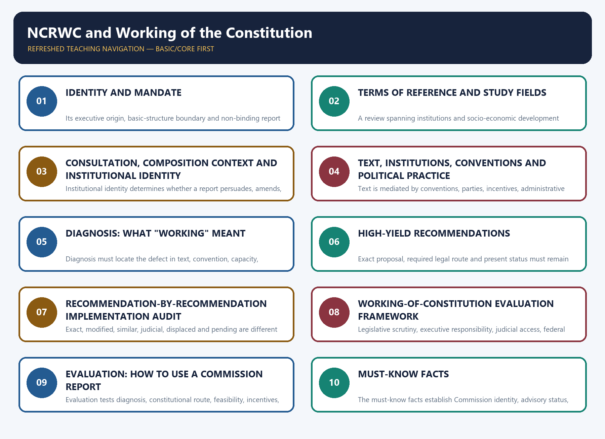

# NCRWC and Working of the Constitution — Complete Uncompressed Learning Session

**Complete Core-first learning session + verified practice + optional Advanced + register notes**

**Legal/current control date:** 28 August 2026 (Asia/Kolkata)

> **Evidence discipline:** NCRWC recommendations, constitutional text, later law, judgments and
> analytical inference are separately labelled. Chronology or similarity is never treated as proof
> that a later reform implemented the Commission.

## BASIC LEARNING SESSION



*Distinct embedded teaching-navigation image. The separate continuous Cārvāka-style flowchart package remains an independent at-a-glance artifact.*

### SESSION 1 — IDENTITY AND MANDATE

#### DEFINITION / WHAT THIS IS CALLED

**Plain-language definition:** The NCRWC was a temporary advisory commission created to review constitutional performance.

**Technical definition:** Its executive origin, basic-structure boundary and non-binding report distinguish review from constituent power.

#### ANSWER-GRABBING OPENING — WRITE/ADAPT IN THE EXAM

> The NCRWC was a temporary advisory commission created to review constitutional performance. Its executive origin, basic-structure boundary and non-binding report distinguish review from constituent power.

#### MUST-WRITE KEYWORDS

- **constitutional review**
- **advisory commission**
- **Government resolution**
- **Venkatachaliah**
- **basic structure**
- **parliamentary democracy**

**How to use them:** Frame the answer through constitutional review; define advisory commission, connect Government resolution with Venkatachaliah to explain the mechanism, and use basic structure for the decisive comparison or qualification.

| Attribute | Position |
|---|---|
| Creation | Set up by a **Government of India resolution dated 22 February 2000** |
| Legal status | Executive, temporary and advisory; neither constitutional nor statutory |
| Chair | M.N. Venkatachaliah, former Chief Justice of India |
| Composition | 11-member commission |
| Report | Adopted and signed on **11 March 2002**; presented to the Prime Minister on **31 March 2002** |
| Task | Review how the Constitution had worked over fifty years and recommend changes for effective governance and socio-economic development |
| Express limit | Work within parliamentary democracy and **without disturbing the basic structure/basic features** |

> **Master distinction:** The NCRWC reviewed the **working** of the Constitution; it was not a
> constituent assembly and did not claim power to rewrite the Constitution.

#### 1.1 Initial composition

✅ The eleven-member Commission comprised Chairperson **Justice M.N. Venkatachaliah** and
**Justice B.P. Jeevan Reddy, Justice R.S. Sarkaria, Justice Kottapalli Punnayya, P.A. Sangma,
Soli J. Sorabjee, K. Parasaran, Dr Subhash C. Kashyap, C.R. Irani, Dr Abid Hussain and
Sumitra G. Kulkarni**. The signed report records that **P.A. Sangma had resigned**. Dr Raghbir
Singh served the Commission as secretary; he was not a twelfth Commission member.

> **Composition trap:** “Eleven members” includes the Chairperson. Do not add the secretary or
> advisory-panel participants to the Commission's membership.

---

---

#### CLOSING RECALL FLOW — IDENTITY AND MANDATE

```text
START / CONCEPT: IDENTITY AND MANDATE
        |
        v
EXACT TERMS: constitutional review · advisory commission · Government resolution · Venkatachaliah · basic structure · parliamentary democracy
        |
        v
MECHANISM / ARGUMENT: Identify the institutional defect, match it to the competent reform route, and verify the later legal effect independently.
        |
        v
CONSEQUENCE / CONTRAST: The answer can distinguish constitutional diagnosis from recommendation, implementation and current law.
        |
        v
UPSC TRAP / ANSWER-USE: Do not infer binding force or implementation merely from expertise, chronology or thematic similarity.
        |
        v
ANSWER-GRABBING FORMULATION: The NCRWC was a temporary advisory commission created to review constitutional performance. Its executive origin, basic-structure boundary and non-binding report distinguish review from constituent power.
```
### SESSION 2 — TERMS OF REFERENCE AND STUDY FIELDS

#### DEFINITION / WHAT THIS IS CALLED

**Plain-language definition:** The terms of reference defined both a broad performance audit and a firm constitutional boundary.

**Technical definition:** A review spanning institutions and socio-economic development remained subject to parliamentary democracy and basic structure.

#### ANSWER-GRABBING OPENING — WRITE/ADAPT IN THE EXAM

> The terms of reference defined both a broad performance audit and a firm constitutional boundary. A review spanning institutions and socio-economic development remained subject to parliamentary democracy and basic structure.

#### MUST-WRITE KEYWORDS

- **terms of reference**
- **performance audit**
- **governance**
- **socio-economic development**
- **parliamentary democracy**
- **basic structure**

**How to use them:** Frame the answer through terms of reference; define performance audit, connect governance with socio-economic development to explain the mechanism, and use parliamentary democracy for the decisive comparison or qualification.

The Commission examined whether existing constitutional provisions could respond to modern needs
of efficient, smooth and effective government and socio-economic development. It organised the
review around eleven broad fields:

1. parliamentary institutions and political stability;
2. electoral reform and standards in public life;
3. socio-economic change;
4. literacy, employment, social security and poverty;
5. Union–State relations;
6. decentralisation and local government;
7. enlargement of Fundamental Rights;
8. effectuation of Fundamental Duties;
9. DPSPs and Preambular objectives;
10. fiscal/monetary control and public audit; and
11. administration and standards in public life.

✅ The Commission made **249 recommendations**: the eighth-edition source classifies **58** as
requiring constitutional amendment, **86** as requiring legislation and **105** as capable of
executive action.

⚠️ This classification describes the Commission's proposed implementation route. It does not prove
that any proposal was accepted.

---

---

#### CLOSING RECALL FLOW — TERMS OF REFERENCE AND STUDY FIELDS

```text
START / CONCEPT: TERMS OF REFERENCE AND STUDY FIELDS
        |
        v
EXACT TERMS: terms of reference · performance audit · governance · socio-economic development · parliamentary democracy · basic structure
        |
        v
MECHANISM / ARGUMENT: Identify the institutional defect, match it to the competent reform route, and verify the later legal effect independently.
        |
        v
CONSEQUENCE / CONTRAST: The answer can distinguish constitutional diagnosis from recommendation, implementation and current law.
        |
        v
UPSC TRAP / ANSWER-USE: Do not infer binding force or implementation merely from expertise, chronology or thematic similarity.
        |
        v
ANSWER-GRABBING FORMULATION: The terms of reference defined both a broad performance audit and a firm constitutional boundary. A review spanning institutions and socio-economic development remained subject to parliamentary democracy and basic structure.
```
### SESSION 3 — CONSULTATION, COMPOSITION CONTEXT AND INSTITUTIONAL IDENTITY

#### DEFINITION / WHAT THIS IS CALLED

**Plain-language definition:** Expert membership and consultation strengthened evidence without creating legal force.

**Technical definition:** Institutional identity determines whether a report persuades, amends, adjudicates or merely recommends.

#### ANSWER-GRABBING OPENING — WRITE/ADAPT IN THE EXAM

> Expert membership and consultation strengthened evidence without creating legal force. Institutional identity determines whether a report persuades, amends, adjudicates or merely recommends.

#### MUST-WRITE KEYWORDS

- **eleven members**
- **consultation papers**
- **advisory report**
- **institutional identity**
- **legal force**
- **public responses**

**How to use them:** Frame the answer through eleven members; define consultation papers, connect advisory report with institutional identity to explain the mechanism, and use legal force for the decisive comparison or qualification.

The Commission worked through consultation papers, expert studies, public responses and thematic
deliberation before submitting its report. That method matters because a constitutional review
commission has persuasive legitimacy only when it states the problem, receives competing views,
explains the legal route and leaves the final choice to constitutionally authorised institutions.

| Body/process | Constitutive source | Principal task | Why it is not the NCRWC |
|---|---|---|---|
| Constituent Assembly | Constituent process, 1946–49 | Framed and adopted the Constitution | Exercised founding constituent authority |
| Parliament under Art 368 | Constitution | Formally amends the Constitution | Legislative constituent power subject to procedure/basic structure |
| Law Commission | Executive resolution | Law-reform research and reports | Usually examines statutes/legal doctrine, not the whole constitutional system |
| Sarkaria/Punchhi Commissions | Executive commissions | Centre–State relations | Sectoral federal reviews |
| Administrative Reforms Commissions | Executive commissions | Public-administration reform | Administrative rather than comprehensive constitutional review |
| NCRWC | Government resolution, 2000 | Reviewed fifty years of constitutional working | Temporary, advisory and expressly basic-structure bounded |

> **Composition caution:** Membership gave the Commission legal, parliamentary, administrative and
> public-policy experience, but expertise did not convert its report into law or constituent power.

---

---

#### CLOSING RECALL FLOW — CONSULTATION, COMPOSITION CONTEXT AND INSTITUTIONAL IDENTITY

```text
START / CONCEPT: CONSULTATION, COMPOSITION CONTEXT AND INSTITUTIONAL IDENTITY
        |
        v
EXACT TERMS: eleven members · consultation papers · advisory report · institutional identity · legal force · public responses
        |
        v
MECHANISM / ARGUMENT: Identify the institutional defect, match it to the competent reform route, and verify the later legal effect independently.
        |
        v
CONSEQUENCE / CONTRAST: The answer can distinguish constitutional diagnosis from recommendation, implementation and current law.
        |
        v
UPSC TRAP / ANSWER-USE: Do not infer binding force or implementation merely from expertise, chronology or thematic similarity.
        |
        v
ANSWER-GRABBING FORMULATION: Expert membership and consultation strengthened evidence without creating legal force. Institutional identity determines whether a report persuades, amends, adjudicates or merely recommends.
```
### SESSION 4 — TEXT, INSTITUTIONS, CONVENTIONS AND POLITICAL PRACTICE

#### DEFINITION / WHAT THIS IS CALLED

**Plain-language definition:** Constitutional working extends beyond written rules to institutional behaviour and outcomes.

**Technical definition:** Text is mediated by conventions, parties, incentives, administrative capacity and corrective institutions.

#### ANSWER-GRABBING OPENING — WRITE/ADAPT IN THE EXAM

> Constitutional working extends beyond written rules to institutional behaviour and outcomes. Text is mediated by conventions, parties, incentives, administrative capacity and corrective institutions.

#### MUST-WRITE KEYWORDS

- **constitutional text**
- **institutions**
- **conventions**
- **political incentives**
- **administrative capacity**
- **outcomes**

**How to use them:** Frame the answer through constitutional text; define institutions, connect conventions with political incentives to explain the mechanism, and use administrative capacity for the decisive comparison or qualification.

The **working of the Constitution** is wider than compliance with its written Articles.

```text
CONSTITUTIONAL TEXT
        ↓ implemented through
institutions + statutes + rules + conventions + political parties + administration
        ↓ tested by
rights outcomes + accountability + federal trust + legislative deliberation + remedies
```

| Dimension | Constitutional question | Failure mode | Reform route |
|---|---|---|---|
| Text | Is power or right clearly allocated? | ambiguity, obsolete design or remedial gap | amendment within basic structure |
| Institution | Does the authorised body have independence/capacity? | vacancy, capture, delay, weak expertise | statute, finance, appointments, procedure |
| Convention | Do actors respect unwritten role restraints? | technically lawful but constitutionally corrosive conduct | political accountability, reason-giving, codification where needed |
| Political practice | Do parties and majorities preserve opposition and deliberation? | centralisation, criminalisation, opaque finance, weak committees | electoral/party and parliamentary reform |
| Federal practice | Are consultation and autonomy real? | unilateralism, delayed assent, fiscal mistrust | councils, negotiated federalism, judicial review |
| Rights enforcement | Can a right-holder obtain an effective remedy? | cost, delay, weak investigation, unequal access | courts, legal aid, administration and compliance |

⚖️ *Kesavananda Bharati* (1973) supplies the basic-structure boundary; *Minerva Mills* (1980)
emphasises limited amending power and Part III–Part IV harmony; *S.R. Bommai* (1994) demonstrates
that federalism and secularism are enforceable structural commitments. These later cases are
governing law, not NCRWC recommendations.

> **Examiner line:** Constitutional working is the conversion of text into restrained power,
> accountable institutions, effective rights and cooperative political practice.

---

---

#### CLOSING RECALL FLOW — TEXT, INSTITUTIONS, CONVENTIONS AND POLITICAL PRACTICE

```text
START / CONCEPT: TEXT, INSTITUTIONS, CONVENTIONS AND POLITICAL PRACTICE
        |
        v
EXACT TERMS: constitutional text · institutions · conventions · political incentives · administrative capacity · outcomes
        |
        v
MECHANISM / ARGUMENT: Identify the institutional defect, match it to the competent reform route, and verify the later legal effect independently.
        |
        v
CONSEQUENCE / CONTRAST: The answer can distinguish constitutional diagnosis from recommendation, implementation and current law.
        |
        v
UPSC TRAP / ANSWER-USE: Do not infer binding force or implementation merely from expertise, chronology or thematic similarity.
        |
        v
ANSWER-GRABBING FORMULATION: Constitutional working extends beyond written rules to institutional behaviour and outcomes. Text is mediated by conventions, parties, incentives, administrative capacity and corrective institutions.
```
### SESSION 5 — DIAGNOSIS: WHAT "WORKING" MEANT

#### DEFINITION / WHAT THIS IS CALLED

**Plain-language definition:** A working review asks why formally valid institutions underperform in practice.

**Technical definition:** Diagnosis must locate the defect in text, convention, capacity, incentive or remedy before selecting reform.

#### ANSWER-GRABBING OPENING — WRITE/ADAPT IN THE EXAM

> A working review asks why formally valid institutions underperform in practice. Diagnosis must locate the defect in text, convention, capacity, incentive or remedy before selecting reform.

#### MUST-WRITE KEYWORDS

- **institutional diagnosis**
- **text gap**
- **convention failure**
- **capacity deficit**
- **incentive failure**
- **remedy gap**

**How to use them:** Frame the answer through institutional diagnosis; define text gap, connect convention failure with capacity deficit to explain the mechanism, and use incentive failure for the decisive comparison or qualification.

The NCRWC's report treated constitutional failure mainly as a problem of **institutional practice**,
not absence of a constitutional text. Its principal concern clusters were:

| Concern cluster | NCRWC diagnosis (historical, 2002) | Analytical use |
|---|---|---|
| Democratic trust | Government and public services had become detached from popular sovereignty and dignity | Constitution can fail through behaviour without textual collapse |
| Political integrity | Criminalisation, corruption, defections and opaque party finance | Electoral/party reform is constitutional maintenance |
| Institutional performance | Legislature, executive, administration and justice suffered delay, cost and weak accountability | Efficiency and constitutionalism must be reconciled |
| Social transformation | Rights, education, employment and welfare commitments were under-realised | Formal guarantees require institutions and resources |
| Federal/local design | Consultation and devolution were inadequate | Constitutional division needs cooperative practice |
| Justice delivery | Delay, weak investigation/prosecution and limited access undermined rule of law | Remedies are part of constitutional effectiveness |

> **Status caution:** These were the Commission's assessments at the time of its report. Do not
> present its historical data or rhetoric as a verified 2026 condition.

---

---

#### CLOSING RECALL FLOW — DIAGNOSIS: WHAT "WORKING" MEANT

```text
START / CONCEPT: DIAGNOSIS: WHAT "WORKING" MEANT
        |
        v
EXACT TERMS: institutional diagnosis · text gap · convention failure · capacity deficit · incentive failure · remedy gap
        |
        v
MECHANISM / ARGUMENT: Identify the institutional defect, match it to the competent reform route, and verify the later legal effect independently.
        |
        v
CONSEQUENCE / CONTRAST: The answer can distinguish constitutional diagnosis from recommendation, implementation and current law.
        |
        v
UPSC TRAP / ANSWER-USE: Do not infer binding force or implementation merely from expertise, chronology or thematic similarity.
        |
        v
ANSWER-GRABBING FORMULATION: A working review asks why formally valid institutions underperform in practice. Diagnosis must locate the defect in text, convention, capacity, incentive or remedy before selecting reform.
```
### SESSION 6 — HIGH-YIELD RECOMMENDATIONS

#### DEFINITION / WHAT THIS IS CALLED

**Plain-language definition:** The NCRWC organised reform across rights, elections, legislatures, courts, federalism and administration.

**Technical definition:** Exact proposal, required legal route and present status must remain distinct in every cluster.

#### ANSWER-GRABBING OPENING — WRITE/ADAPT IN THE EXAM

> The NCRWC organised reform across rights, elections, legislatures, courts, federalism and administration. Exact proposal, required legal route and present status must remain distinct in every cluster.

#### MUST-WRITE KEYWORDS

- **rights**
- **elections**
- **Parliament**
- **judiciary**
- **federalism**
- **decentralisation**
- **recommendation clusters**

**How to use them:** Frame the answer through rights; define elections, connect Parliament with judiciary to explain the mechanism, and use federalism for the decisive comparison or qualification.

#### 6.1 Fundamental Rights, property, DPSPs and Duties

| Area | 🧾 Recommendation | Current-law caution |
|---|---|---|
| Rights | Add express rights against torture, to compensation for unlawful deprivation of life/liberty, privacy/family life, access to courts/speedy justice, equal justice/legal aid and environmental necessities | Some subjects later developed through judgments/statutes; that does not make the NCRWC wording constitutional text |
| Speech/equality | Expand express discrimination and speech/media formulations | Not enacted merely because similar values appear in case law |
| Education | Enlarge the proposed education guarantee for specified groups | Check current ✅ Art 21A, not the NCRWC draft |
| Emergency | Protect additional rights from suspension beyond Arts 20 and 21 | Current law remains governed by ✅ Arts 358–359 |
| Property | Recast Art 300A to require public purpose, non-arbitrariness and rehabilitation protection for specified SC/ST land | 🧾 Proposal, not the text of Art 300A |
| DPSPs | Rename Part IV and create implementation-review mechanisms | Non-binding |
| Duties | Add voting, tax and family-responsibility duties; implement the Verma Committee's operationalisation proposals | Non-binding |

#### 6.2 Parliament and the executive

- 🧾 define and delimit legislative privileges;
- 🧾 create standing committees for constitutional amendments/legislative planning;
- 🧾 prescribe minimum annual sitting days: **Lok Sabha 120, Rajya Sabha 100, larger State
  Houses 90 and State Houses with fewer than 70 members 50**;
- 🧾 use a **constructive vote of no confidence**, requiring notice by at least **20 per cent**
  of the House and a simultaneously proposed alternative leader;
- 🧾 cap the Council of Ministers at **10 per cent** of the popular House;
- 🧾 establish Lokpal/Lokayuktas within the proposed design;
- 🧾 create statutory civil-service boards, promote lateral entry at senior levels and replace
  secrecy culture with transparency;
- 🧾 enact public-interest-disclosure and anti-benami-corruption measures.

> **Trap:** The later 91st Amendment used a **15 per cent** ceiling for Union/State ministries
> (with a minimum for States), not the NCRWC's 10 per cent recommendation. Similar subject does not
> mean identical adoption.

#### 6.3 Federal and inter-State relations

- 🧾 specify subjects requiring Inter-State Council consultation;
- 🧾 place disaster/emergency management in the Concurrent List;
- 🧾 establish an Inter-State Trade and Commerce Commission;
- 🧾 consult the Chief Minister before appointing a Governor;
- 🧾 retain Article 356 but use it only as a last resort and test majority on the floor;
- 🧾 avoid dissolving a State Assembly before parliamentary approval of the proclamation;
- 🧾 reform river-water adjudication; and
- 🧾 prescribe a time-limit for Presidential action on a reserved State Bill.

The report proposed about **six months** for the Governor to decide whether to assent or reserve
a State Bill and about **three months** for the President to assent, direct return or seek the
Supreme Court's Article 143 opinion. These suggested periods never became the text of Articles
200–201.

⚠️ Some recommendations overlap with judicial doctrines or later debates. Cite the governing
Article/judgment for current law and NCRWC only for the reform case.

#### 6.4 Judiciary and justice delivery

- 🧾 create a constitutional National Judicial Commission for Supreme Court appointments and a
  mechanism for judicial complaints;
- 🧾 raise High Court judges' retirement age to **65** and Supreme Court judges' age to **68**;
- 🧾 confine constitutional invalidation and contempt powers as proposed;
- 🧾 establish judicial councils for planning/budgets;
- 🧾 deliver higher-court judgments ordinarily within a specified time and clear arrears; and
- 🧾 simplify the subordinate-court hierarchy and use plea bargaining/ADR.

> **Trap:** NCRWC's National Judicial Commission is not the later NJAC constitutional scheme and is
> not the current collegium. Keep commission proposal, later amendment and case law separate.

The proposed Supreme Court appointments commission comprised the **Chief Justice of India as
Chairperson, the two senior-most Supreme Court judges, the Union Law Minister and one eminent
person nominated by the President after consulting the CJI**. The NCRWC treated its composition
and establishment as integral to judicial independence.

#### 6.5 Local government and weaker sections

- 🧾 give Panchayats/Municipalities clearer exclusive functions and fiscal domains;
- 🧾 strengthen audit, dissolution safeguards and election-law uniformity;
- 🧾 separate delimitation/reservation/rotation from State Election Commissions;
- 🧾 improve SC/ST/BC representation, education and reservation administration;
- 🧾 strengthen atrocity-law enforcement and institutions for bonded-labour rehabilitation; and
- 🧾 adapt local-government reforms to North-East constitutional traditions.

#### 6.6 Elections, parties and anti-defection

| Field | 🧾 Recommendation |
|---|---|
| Criminalisation | Disqualify specified serious accused/convicted persons and create speedy special courts/benches |
| Election disputes | Dedicated election benches/special courts |
| Multiple seats | Prevent one candidate contesting the same office from more than one constituency |
| Model Code | Give the Model Code statutory force |
| ECI appointment | Multi-office selection body including government, opposition and presiding officers |
| Political parties | Comprehensive law on internal functioning, accounts, candidate integrity and funding disclosure |
| Anti-defection | Defectors resign and recontest; bar remunerative office; vest decision in ECI rather than Speaker/Chairman |

⚠️ The current law may differ on every row. Use `Election-Commission.md`,
`Political-Parties.md` and `Anti-Defection-Law.md` for the operative position.

> **Exact ECI recommendation:** Prime Minister, Leaders of Opposition in both Houses, Lok Sabha
> Speaker and Rajya Sabha Deputy Chairman. This is an NCRWC proposal, not the current appointment
> law.

---

---

#### CLOSING RECALL FLOW — HIGH-YIELD RECOMMENDATIONS

```text
START / CONCEPT: HIGH-YIELD RECOMMENDATIONS
        |
        v
EXACT TERMS: rights · elections · Parliament · judiciary · federalism · decentralisation · recommendation clusters
        |
        v
MECHANISM / ARGUMENT: Identify the institutional defect, match it to the competent reform route, and verify the later legal effect independently.
        |
        v
CONSEQUENCE / CONTRAST: The answer can distinguish constitutional diagnosis from recommendation, implementation and current law.
        |
        v
UPSC TRAP / ANSWER-USE: Do not infer binding force or implementation merely from expertise, chronology or thematic similarity.
        |
        v
ANSWER-GRABBING FORMULATION: The NCRWC organised reform across rights, elections, legislatures, courts, federalism and administration. Exact proposal, required legal route and present status must remain distinct in every cluster.
```
### SESSION 7 — RECOMMENDATION-BY-RECOMMENDATION IMPLEMENTATION AUDIT

#### DEFINITION / WHAT THIS IS CALLED

**Plain-language definition:** Implementation is proved by legal route, wording and effect rather than chronology alone.

**Technical definition:** Exact, modified, similar, judicial, displaced and pending are different status conclusions.

#### ANSWER-GRABBING OPENING — WRITE/ADAPT IN THE EXAM

> Implementation is proved by legal route, wording and effect rather than chronology alone. Exact, modified, similar, judicial, displaced and pending are different status conclusions.

#### MUST-WRITE KEYWORDS

- **implementation audit**
- **legal instrument**
- **wording comparison**
- **legal effect**
- **attribution**
- **current status**

**How to use them:** Frame the answer through implementation audit; define legal instrument, connect wording comparison with legal effect to explain the mechanism, and use attribution for the decisive comparison or qualification.

Implementation must be tested against the exact proposal, later instrument and legal result.

| NCRWC proposal area | Later development | Audit verdict |
|---|---|---|
| Council of Ministers ceiling at 10% | 91st Amendment (2003) adopted a 15% ceiling, with a State minimum | Related reform, **not exact adoption** |
| Stronger transparency/open government | Right to Information Act 2005 | Broadly convergent subject; do not claim causal implementation without official evidence |
| Education guarantee | 86th Amendment inserted Art 21A in 2002 | Overlapping constitutional reform chronology; wording/scope must be compared separately |
| Lokpal/Lokayukta framework | Lokpal and Lokayuktas Act 2013 | Later statute with its own design; NCRWC recommendation was not self-executing |
| Judicial appointments commission | 99th Amendment/NJAC enacted in 2014 and invalidated in 2015 | Proposal did not become the current appointments system |
| Plea bargaining/ADR expansion | Criminal-procedure and legal-services reforms developed later | Functional follow-through varies by instrument; not proof of wholesale acceptance |
| Political-party law/internal democracy | No comprehensive party law implementing the proposed code | Substantially pending as a reform field |
| Anti-defection decision by ECI and narrow whip | Tenth Schedule continues to place decision with presiding officer, subject to review | Core proposal not implemented |
| Governor appointment through a plural committee | Arts 155–156 framework remains | Proposal not enacted |
| Moving disaster management to Concurrent List | Disaster Management Act 2005 created a statutory framework without that List transfer | Statutory response, not the recommended constitutional relocation |

> **Audit rule:** Similarity, sequence and common policy language do not establish implementation.
> Write “implemented”, “partly reflected”, “modified”, “rejected”, “overtaken” or “pending” only
> after comparing the exact recommendation with the later legal instrument.

---

---

#### CLOSING RECALL FLOW — RECOMMENDATION-BY-RECOMMENDATION IMPLEMENTATION AUDIT

```text
START / CONCEPT: RECOMMENDATION-BY-RECOMMENDATION IMPLEMENTATION AUDIT
        |
        v
EXACT TERMS: implementation audit · legal instrument · wording comparison · legal effect · attribution · current status
        |
        v
MECHANISM / ARGUMENT: Identify the institutional defect, match it to the competent reform route, and verify the later legal effect independently.
        |
        v
CONSEQUENCE / CONTRAST: The answer can distinguish constitutional diagnosis from recommendation, implementation and current law.
        |
        v
UPSC TRAP / ANSWER-USE: Do not infer binding force or implementation merely from expertise, chronology or thematic similarity.
        |
        v
ANSWER-GRABBING FORMULATION: Implementation is proved by legal route, wording and effect rather than chronology alone. Exact, modified, similar, judicial, displaced and pending are different status conclusions.
```
### SESSION 8 — WORKING-OF-CONSTITUTION EVALUATION FRAMEWORK

#### DEFINITION / WHAT THIS IS CALLED

**Plain-language definition:** A performance dashboard converts broad constitutional values into testable institutional questions.

**Technical definition:** Legislative scrutiny, executive responsibility, judicial access, federal trust and effective rights require separate indicators.

#### ANSWER-GRABBING OPENING — WRITE/ADAPT IN THE EXAM

> A performance dashboard converts broad constitutional values into testable institutional questions. Legislative scrutiny, executive responsibility, judicial access, federal trust and effective rights require separate indicators.

#### MUST-WRITE KEYWORDS

- **performance dashboard**
- **legislative scrutiny**
- **executive accountability**
- **judicial access**
- **federal trust**
- **rights enforcement**

**How to use them:** Frame the answer through performance dashboard; define legislative scrutiny, connect executive accountability with judicial access to explain the mechanism, and use federal trust for the decisive comparison or qualification.

#### Constitutional morality

Constitutional morality means fidelity to constitutional forms, equal citizenship, institutional
roles, reasoned procedure and limits on power. It is not personal morality. *Navtej Singh Johar*
(2018) used constitutional morality and transformative constitutionalism in a rights setting;
the doctrine remains bounded by text, structure and precedent.

#### Accountability and legislative functioning

- political accountability: elections, confidence, opposition and public reason;
- legal accountability: judicial review, rights and statutory remedies;
- financial accountability: legislative control, CAG and audit;
- administrative accountability: records, reasons, transparency and grievance redress;
- parliamentary quality: sitting time, committees, scrutiny of Bills and delegated legislation.

#### Coalition, majority and centralisation

Coalitions may enlarge bargaining and federal voice but also fragment responsibility. Stable
single-party majorities may improve decisiveness but can centralise agenda control. The
constitutional test is not the party configuration; it is whether deliberation, opposition,
federal consultation, rights and institutional autonomy survive.

#### Reform-method ladder

```text
diagnose exact failure
      ↓
practice/convention repair
      ↓ if insufficient
executive rule or institutional capacity
      ↓ if legal authority needed
ordinary legislation
      ↓ if constitutional text must change
Article 368 amendment
      ↓ always
basic structure + rights + federalism + implementation review
```

---

---

#### CLOSING RECALL FLOW — WORKING-OF-CONSTITUTION EVALUATION FRAMEWORK

```text
START / CONCEPT: WORKING-OF-CONSTITUTION EVALUATION FRAMEWORK
        |
        v
EXACT TERMS: performance dashboard · legislative scrutiny · executive accountability · judicial access · federal trust · rights enforcement
        |
        v
MECHANISM / ARGUMENT: Identify the institutional defect, match it to the competent reform route, and verify the later legal effect independently.
        |
        v
CONSEQUENCE / CONTRAST: The answer can distinguish constitutional diagnosis from recommendation, implementation and current law.
        |
        v
UPSC TRAP / ANSWER-USE: Do not infer binding force or implementation merely from expertise, chronology or thematic similarity.
        |
        v
ANSWER-GRABBING FORMULATION: A performance dashboard converts broad constitutional values into testable institutional questions. Legislative scrutiny, executive responsibility, judicial access, federal trust and effective rights require separate indicators.
```
### SESSION 9 — EVALUATION: HOW TO USE A COMMISSION REPORT

#### DEFINITION / WHAT THIS IS CALLED

**Plain-language definition:** A commission report is evidence and a reform menu, not operative law.

**Technical definition:** Evaluation tests diagnosis, constitutional route, feasibility, incentives, implementation and reviewability.

#### ANSWER-GRABBING OPENING — WRITE/ADAPT IN THE EXAM

> A commission report is evidence and a reform menu, not operative law. Evaluation tests diagnosis, constitutional route, feasibility, incentives, implementation and reviewability.

#### MUST-WRITE KEYWORDS

- **commission report**
- **reform menu**
- **feasibility**
- **political incentives**
- **implementation**
- **reviewability**

**How to use them:** Frame the answer through commission report; define reform menu, connect feasibility with political incentives to explain the mechanism, and use implementation for the decisive comparison or qualification.

#### Strengths

- comprehensive, cross-institutional review rather than isolated amendment;
- expressly respected parliamentary democracy and basic structure;
- separated constitutional, legislative and executive routes;
- connected rights with governance capacity, federalism and accountability.

#### Limitations

- advisory status meant no self-executing force;
- breadth produced proposals of uneven precision and political feasibility;
- some recommendations sought constitutionalising solutions where practice/capacity was the deeper
  problem;
- later law may resemble, modify or reject a proposal without formally "implementing the NCRWC".

⚠️ The best assessment is **selective constitutional maintenance**, not wholesale implementation.
Test each proposal against basic structure, federalism, rights, democratic accountability and the
current legal position.

---

---

#### CLOSING RECALL FLOW — EVALUATION: HOW TO USE A COMMISSION REPORT

```text
START / CONCEPT: EVALUATION: HOW TO USE A COMMISSION REPORT
        |
        v
EXACT TERMS: commission report · reform menu · feasibility · political incentives · implementation · reviewability
        |
        v
MECHANISM / ARGUMENT: Identify the institutional defect, match it to the competent reform route, and verify the later legal effect independently.
        |
        v
CONSEQUENCE / CONTRAST: The answer can distinguish constitutional diagnosis from recommendation, implementation and current law.
        |
        v
UPSC TRAP / ANSWER-USE: Do not infer binding force or implementation merely from expertise, chronology or thematic similarity.
        |
        v
ANSWER-GRABBING FORMULATION: A commission report is evidence and a reform menu, not operative law. Evaluation tests diagnosis, constitutional route, feasibility, incentives, implementation and reviewability.
```
### ANSWER ARCHITECTURE (10/15/20-MARK SUPPORT)

#### 10.1 Demand map

| Demand | Answer spine |
|---|---|
| Mandate/status | Resolution → review-not-rewrite → basic-structure limit → advisory report |
| Major recommendations | Cluster by rights, institutions, federalism, justice and elections; do not list randomly |
| Relevance today | Institutional diagnosis → independently verify later law → selective reform |
| Commission reports and constitutional change | Expertise/consultation gains → democratic/non-binding limit → Parliament/courts control |
| Working versus text | Formal adequacy → behavioural/capacity failures → targeted reforms |

#### 10.2 Thesis options

- *The NCRWC's central insight was that India's constitutional deficit lay less in the text than in
  the working of parties, legislatures, administration and justice.*
- *Its recommendations are a reform menu, not a parallel Constitution: each must pass through the
  proper amendment, legislative or executive route and remain subject to basic structure.*
- *The Commission is most useful when cited diagnostically—linking a reform to a named
  institutional failure—not as authority that the reform is already law.*

#### 10.3 Mark-scaled structures

| Marks | Structure | Evidence |
|---:|---|---|
| 10 | Identity/mandate → 3 recommendation clusters → non-binding verdict | 3–4 named proposals |
| 15 | Terms → diagnosis → rights/institutions/federal/election reforms → status caution | 5–6 proposals |
| 20 | Mandate → concern map → thematic recommendations → implementation test → balanced conclusion | 7–9 proposals with current-law qualifications |

#### 10.4 Evidence units

- **Claim:** the NCRWC was constitutionally self-limited. **Evidence:** 🧾 terms required
  parliamentary democracy and non-interference with basic structure. **Analysis:** review was
  reformist, not constituent. **Qualification:** the Commission itself had no legal veto over later
  amendment.
- **Claim:** its anti-defection proposal separated adjudication from partisan presiding officers.
  **Evidence:** 🧾 vest decision in the ECI. **Analysis:** targets conflict of interest.
  **Qualification:** current Tenth Schedule still controls.
- **Claim:** its federal recommendations emphasised consultation. **Evidence:** 🧾 CM consultation
  for Governors and a stronger Inter-State Council. **Analysis:** addresses legitimacy and trust.
  **Qualification:** recommendation is not constitutional convention or law by itself.

---

---
### SESSION 10 — MUST-KNOW FACTS

#### DEFINITION / WHAT THIS IS CALLED

**Plain-language definition:** Exact chronology, route counts and recommendation figures anchor a reliable NCRWC answer.

**Technical definition:** The must-know facts establish Commission identity, advisory status, report chronology, recommendation routes and high-yield institutional proposals.

#### ANSWER-GRABBING OPENING — WRITE/ADAPT IN THE EXAM

> Exact chronology, route counts and recommendation figures anchor a reliable NCRWC answer. The must-know facts establish Commission identity, advisory status, report chronology, recommendation routes and high-yield institutional proposals.

#### MUST-WRITE KEYWORDS

- **must know facts**
- **NCRWC facts**
- **Commission chronology**
- **advisory status**
- **report presentation**
- **recommendation routes**
- **legislative sittings**
- **constructive no confidence**

**How to use them:** Frame the answer through must know facts; define NCRWC facts, connect Commission chronology with advisory status to explain the mechanism, and use report presentation for the decisive comparison or qualification.

- ✅ Government resolution, 2000; report, 2002.
- ✅ 11 members; chaired by M.N. Venkatachaliah.
- ✅ Review of **working**, not rewriting.
- ✅ Parliamentary democracy/basic structure were express limits.
- ✅ 249 recommendations: 58 constitutional, 86 legislative, 105 executive in the eighth-edition
  classification.
- 🧾 Every substantive proposal remains a recommendation unless separately enacted/recognised.
- ⚠️ Later similarity is not proof of causal implementation.

---

---

#### CLOSING RECALL FLOW — MUST-KNOW FACTS

```text
START / CONCEPT: MUST-KNOW FACTS
        |
        v
EXACT TERMS: must know facts · NCRWC facts · Commission chronology · advisory status · report presentation · recommendation routes · legislative sittings · constructive no confidence
        |
        v
MECHANISM / ARGUMENT: Identify the institutional defect, match it to the competent reform route, and verify the later legal effect independently.
        |
        v
CONSEQUENCE / CONTRAST: The answer can distinguish constitutional diagnosis from recommendation, implementation and current law.
        |
        v
UPSC TRAP / ANSWER-USE: Do not infer binding force or implementation merely from expertise, chronology or thematic similarity.
        |
        v
ANSWER-GRABBING FORMULATION: Exact chronology, route counts and recommendation figures anchor a reliable NCRWC answer. The must-know facts establish Commission identity, advisory status, report chronology, recommendation routes and high-yield institutional proposals.
```
### UPSC TRAPS AND SOURCE DISCIPLINE

- Do not call NCRWC a constitutional or statutory body.
- Do not call the Venkatachaliah Commission a constituent assembly.
- Do not merge NCRWC, Sarkaria, Punchhi, Law Commission or Administrative Reforms Commission.
- Do not present a proposed right, ministry ceiling, appointment panel or MCC status as current law.
- Do not say a later statute adopted NCRWC unless an official source establishes that link.
- Write separately: ✅ current text · 📜 enacted law · ⚖️ holding · 🧾 NCRWC proposal ·
  ⚠️ evaluation.

#### Routing

- Parliament/executive: `Parliament.md`, `PM-and-Council-of-Ministers.md`
- Federalism/Governor: `Centre-State-Relations.md`, `Governor-and-CM.md`
- Elections/parties/defection: `Election-Commission.md`, `Political-Parties.md`,
  `Anti-Defection-Law.md`
- Judiciary: `Supreme-Court.md`, `High-Court.md`
- Rights/DPSP/Duties: `Fundamental-Rights.md`, `Directive-Principles.md`,
  `Fundamental-Duties.md`
## BASIC MCQS / REMEDIATION

### Original MCQs 1–48 — hard, varied and source-controlled

#### OM1. Which description of the NCRWC is constitutionally accurate?

- A. A temporary executive advisory commission constituted by Union government resolution.
- B. A parliamentary joint committee with power to amend the Constitution.
- C. A permanent constitutional commission created by the 42nd Amendment.
- D. A constituent body elected under Article 368.

**Answer: A**

**Explanation:** Its Government-resolution origin made its report advisory; amendment still required the constitutionally competent route.

#### OM2. The NCRWC was constituted and its report presented on which dates?

- A. 22 February 2001 and 31 March 2003.
- B. 22 February 2000 and 31 March 2002.
- C. 15 August 2000 and 26 November 2002.
- D. 26 January 2000 and 11 March 2002.

**Answer: B**

**Explanation:** The resolution is dated 22 February 2000; the signed report records presentation to the Prime Minister on 31 March 2002.

#### OM3. Who chaired the NCRWC?

- A. Justice R.S. Sarkaria.
- B. Dr Subhash C. Kashyap.
- C. Justice M.N. Venkatachaliah.
- D. Justice B.P. Jeevan Reddy.

**Answer: C**

**Explanation:** Justice M.N. Venkatachaliah was Chairperson; the other named persons were members.

#### OM4. The official NCRWC report records which membership fact?

- A. The Commission had only representatives of political parties.
- B. The secretary was counted as a twelfth member.
- C. All members were serving Supreme Court judges.
- D. The eleven-member count included the Chairperson, and P.A. Sangma had resigned.

**Answer: D**

**Explanation:** The report lists the Chairperson plus ten initial members and marks P.A. Sangma as having resigned.

#### OM5. Which proposition formed an express boundary of the terms of reference?

- A. Parliamentary democracy and the Constitution's basic structure or features were not to be interfered with.
- B. The Commission could replace parliamentary government with presidential government.
- C. Every recommendation would automatically amend the Constitution.
- D. Judicial review was outside the review mandate.

**Answer: A**

**Explanation:** The review was expressly bounded by parliamentary democracy and basic-structure/basic-feature preservation.

#### OM6. What was the NCRWC's central object?

- A. To prepare a new Constitution outside the existing amendment process.
- B. To review fifty years of constitutional working for efficient, smooth and effective governance and socio-economic development.
- C. To codify only election law.
- D. To adjudicate constitutional disputes between Union and States.

**Answer: B**

**Explanation:** The mandate was a comprehensive performance review, not adjudication or constituent replacement.

#### OM7. Which statement best distinguishes the NCRWC from the Constituent Assembly?

- A. Both exercised original constituent power.
- B. The Assembly was an executive advisory body.
- C. The Assembly framed the Constitution; the NCRWC later offered non-binding reforms on its working.
- D. The NCRWC ratified the Constitution drafted by Parliament.

**Answer: C**

**Explanation:** Founding authority and later advisory review are distinct institutional functions.

#### OM8. Consultation papers, expert studies and public responses primarily gave the NCRWC what kind of force?

- A. Automatic statutory force after publication.
- B. Constituent force superior to Article 368.
- C. Binding force equal to a Supreme Court judgment.
- D. Persuasive and evidentiary force, not legal enforceability.

**Answer: D**

**Explanation:** Consultation can improve quality and legitimacy without changing the report's advisory legal status.

#### OM9. The report's 249 recommendations were officially grouped by route as:

- A. 58 constitutional amendment, 86 legislation and 105 executive action.
- B. 86 constitutional amendment, 105 legislation and 58 judicial action.
- C. 105 constitutional amendment, 58 legislation and 86 referendum.
- D. 249 constitutional amendments only.

**Answer: A**

**Explanation:** The official Chapter 11 summary identifies 58 amendment and 86 legislative routes; the remaining 105 were executive-action routes.

#### OM10. Which NCRWC proposal concerned Fundamental Duties?

- A. Transfer all duties to Part III as absolute rights.
- B. Add duties to vote, participate democratically and pay taxes, among other proposals.
- C. Make only property ownership a constitutional duty.
- D. Delete every duty because it is non-justiciable.

**Answer: B**

**Explanation:** The report proposed additional civic duties; it did not recommend abolishing or converting the entire duties chapter.

#### OM11. Which rights proposal belongs to the NCRWC report?

- A. Abolition of access to courts.
- B. Removal of privacy from constitutional protection.
- C. Express protection against torture and a right to compensation for unlawful deprivation of life or liberty.
- D. A constitutional right to preventive detention without review.

**Answer: C**

**Explanation:** The report proposed stronger rights and remedies, including torture protection and compensation.

#### OM12. What did the NCRWC propose for Article 300A?

- A. Permit deprivation by executive instruction without law.
- B. Delete property protection entirely.
- C. Restore an unrestricted Fundamental Right to property in its pre-1978 form.
- D. Recast it around public purpose, non-arbitrariness and special rehabilitation protection for SC/ST land deprivation.

**Answer: D**

**Explanation:** The proposal strengthened lawful, non-arbitrary acquisition safeguards without simply restoring the former Part III right.

#### OM13. Which annual sitting-day minima did the NCRWC recommend?

- A. Lok Sabha 120 and Rajya Sabha 100.
- B. Lok Sabha 100 and Rajya Sabha 120.
- C. No numerical minima.
- D. Both Houses 60.

**Answer: A**

**Explanation:** The report recommended 120 days for Lok Sabha and 100 for Rajya Sabha.

#### OM14. For State legislatures, the NCRWC proposed:

- A. 120 days for every House regardless of size.
- B. 90 days for larger Houses and 50 days for Houses with fewer than 70 members.
- C. 30 days for Assemblies and no sittings for Councils.
- D. A numerical rule only for Union Parliament.

**Answer: B**

**Explanation:** The differentiated proposal used 90 days generally and 50 for Houses below 70 members.

#### OM15. What is a constructive vote of no confidence?

- A. A confidence vote decided by the Governor without the House.
- B. A judicial proceeding to remove the Prime Minister.
- C. A removal motion that simultaneously identifies an alternative leader capable of forming government.
- D. A party whip on every legislative matter.

**Answer: C**

**Explanation:** Constructive no-confidence joins displacement with replacement to reduce government-free instability.

#### OM16. The NCRWC's constructive no-confidence proposal required notice by at least:

- A. Two-thirds of the Council of States.
- B. One member.
- C. Half of all State legislatures.
- D. 20 per cent of the House.

**Answer: D**

**Explanation:** The report specified a 20 per cent notice threshold and an alternative leader.

#### OM17. The NCRWC recommended that the size of a Council of Ministers should ordinarily not exceed:

- A. 10 per cent of the strength of the popular House.
- B. 20 per cent of the electorate.
- C. 15 per cent of both Houses combined.
- D. One-third of the popular House.

**Answer: A**

**Explanation:** Its proposed ceiling was 10 per cent; this must not be confused with the later constitutional 15 per cent ceiling.

#### OM18. Why is the 91st Amendment not exact adoption of the NCRWC ministry-size proposal?

- A. It abolished every ceiling.
- B. It constitutionalised a 15 per cent ceiling, whereas NCRWC proposed 10 per cent.
- C. It applied only to the Rajya Sabha.
- D. It created the NCRWC as a constitutional body.

**Answer: B**

**Explanation:** A later related reform with a materially different threshold is modified or similar reform, not exact adoption.

#### OM19. Which anti-defection reform did the NCRWC recommend?

- A. Give party presidents final judicial power.
- B. Abolish every vote of conscience including issues outside confidence and money matters.
- C. Defectors should resign and recontest, with disqualification questions decided by the Election Commission.
- D. Restore the deleted one-third split exception.

**Answer: C**

**Explanation:** The report sought stricter electoral consequences and a different decision-maker.

#### OM20. Which whip reform is associated with the NCRWC?

- A. Give courts power to issue party whips.
- B. Prohibit parties from communicating voting positions.
- C. Constitutionally require whips on every amendment and private member's bill.
- D. Restrict binding whips substantially to confidence and money matters.

**Answer: D**

**Explanation:** Narrowing the whip was meant to restore deliberation while preserving government survival votes.

#### OM21. The NCRWC proposed appointing the Election Commission through a body including:

- A. Prime Minister, opposition leaders in both Houses, Lok Sabha Speaker and Rajya Sabha Deputy Chairman.
- B. The Supreme Court collegium alone.
- C. All Chief Ministers through the Inter-State Council.
- D. Only the Chief Election Commissioner.

**Answer: A**

**Explanation:** This was the report's recommendation; it must not be presented as current appointment law.

#### OM22. What was the NCRWC's position on political parties?

- A. Political parties should remain wholly outside legal disclosure.
- B. A comprehensive law should address registration, internal democracy, accounts and candidate selection.
- C. Party registration under Section 29A should be abolished without replacement.
- D. Only recognised national parties should be permitted.

**Answer: B**

**Explanation:** The report linked representative democracy to transparent, internally accountable party organisation.

#### OM23. Which statement about the NCRWC's judicial commission proposal is correct?

- A. It was created by the 99th Amendment before the NCRWC existed.
- B. It is the institution currently making appointments.
- C. It was distinct from the later NJAC and from the current collegium.
- D. It excluded the Chief Justice of India.

**Answer: C**

**Explanation:** NCRWC proposal, later NJAC enactment and current collegium are separate legal states.

#### OM24. For Supreme Court appointments, the proposed NCRWC commission included:

- A. President acting alone without consultation.
- B. Prime Minister and all Chief Ministers only.
- C. CJI and Attorney General only.
- D. CJI, two senior-most Supreme Court judges, Union Law Minister and one eminent person.

**Answer: D**

**Explanation:** The exact proposed design mixed judicial members, the Law Minister and one eminent person.

#### OM25. What retirement ages did NCRWC recommend?

- A. 65 for High Court judges and 68 for Supreme Court judges.
- B. 70 for every constitutional office.
- C. 68 for High Courts and 65 for the Supreme Court.
- D. 62 for both courts.

**Answer: A**

**Explanation:** The proposal raised both ages while retaining a higher Supreme Court age.

#### OM26. Which Governor-related recommendation is correctly stated?

- A. Governors should hold office without constitutional removal.
- B. The Chief Minister should be consulted before gubernatorial appointment.
- C. Governors should be directly elected nationwide.
- D. The Chief Minister should appoint the Governor unilaterally.

**Answer: B**

**Explanation:** The report sought consultation and restraint, not direct election or unilateral State appointment.

#### OM27. For action on State Bills, NCRWC suggested approximately:

- A. Three years for both offices.
- B. Seven days for the Governor and no period for the President.
- C. Six months for the Governor and three months for the President.
- D. No decision periods.

**Answer: C**

**Explanation:** The suggested timelines were recommendations and did not become the text of Articles 200–201.

#### OM28. Which body did NCRWC recommend operationalising for inter-State commerce?

- A. The Finance Commission under Article 280 as a commercial court.
- B. The GST Council before its constitutional creation.
- C. A new constituent assembly.
- D. An Inter-State Trade and Commerce Commission under Article 307.

**Answer: D**

**Explanation:** The report linked Article 307 to an institutional mechanism for inter-State trade and commerce.

#### OM29. How should the Disaster Management Act, 2005 be classified against NCRWC's proposal?

- A. A statutory response in the field, not proof that disaster management moved to the Concurrent List.
- B. A constitutional amendment to Article 368.
- C. Judicial invalidation of the NCRWC.
- D. Exact constitutional adoption of a Concurrent List transfer.

**Answer: A**

**Explanation:** The Act did not amend the Seventh Schedule, so functional similarity cannot establish exact adoption.

#### OM30. What is the correct implementation label for the 86th Amendment in relation to NCRWC's education proposals?

- A. A repeal of the Commission's report.
- B. A later reform requiring text-and-timing comparison, not automatic attribution from chronology.
- C. An executive action requiring no constitutional amendment.
- D. Conclusive proof that all NCRWC rights proposals were enacted.

**Answer: B**

**Explanation:** Implementation analysis must compare exact wording, route and independent reform history.

#### OM31. Which sequence is the most rigorous implementation audit?

- A. Date -> similarity -> claimed causation.
- B. Commission name -> political approval -> current law.
- C. Recommendation -> later instrument -> wording -> legal effect -> implementation verdict.
- D. Headline -> inference -> enacted status.

**Answer: C**

**Explanation:** A route-sensitive audit prevents chronology from being mistaken for causation.

#### OM32. A later reform resembles an NCRWC recommendation but official materials do not attribute it to NCRWC. The safest label is:

- A. Constitutional convention created by the Commission.
- B. Exact implementation.
- C. Judicial enforcement of the report.
- D. Functionally similar later reform without proven attribution.

**Answer: D**

**Explanation:** Similarity may be analytically relevant but does not prove causal implementation.

#### OM33. Which is an example of a substantially pending recommendation?

- A. A comprehensive political-parties law with internal-democracy architecture.
- B. The existence of Article 368.
- C. The Constitution's adoption in 1950.
- D. The Supreme Court's original jurisdiction.

**Answer: A**

**Explanation:** No comprehensive law embodying the report's full party-regulation architecture has been enacted.

#### OM34. Which reform was enacted and later judicially invalidated?

- A. The 91st Amendment ministry ceiling.
- B. The 99th Amendment/NJAC scheme.
- C. The 86th Amendment.
- D. The RTI Act.

**Answer: B**

**Explanation:** The NJAC episode is a distinct later design and cannot be described as the current NCRWC commission.

#### OM35. 'Working of the Constitution' is best evaluated through:

- A. The age of the Constitution alone.
- B. Election results alone.
- C. Text, institutions, conventions, political incentives and outcomes.
- D. Text alone.

**Answer: C**

**Explanation:** Constitutional performance depends on how formal rules interact with institutional and political practice.

#### OM36. Which indicator most directly tests legislative working?

- A. Only the length of the constitutional text.
- B. Only the number of government bills passed.
- C. Only the size of the ruling majority.
- D. Sitting time, committee scrutiny, financial control and reasoned debate.

**Answer: D**

**Explanation:** Legislative quality requires scrutiny and accountability, not merely output volume.

#### OM37. Which indicator most directly tests federal working?

- A. Consultation, fiscal predictability, council use, Governor restraint and dispute resolution.
- B. Abolition of intergovernmental negotiation.
- C. Uniformity of every State policy.
- D. Union legislation in every field.

**Answer: A**

**Explanation:** Federal performance combines autonomy, coordination and fair dispute management.

#### OM38. Which statement best captures constitutional morality?

- A. Automatic obedience to every political majority.
- B. Role fidelity, reason-giving, restraint and equal citizenship rooted in constitutional norms.
- C. Unreviewable judicial discretion.
- D. Personal moral preferences of office-holders.

**Answer: B**

**Explanation:** Constitutional morality disciplines public power through constitutional roles and values.

#### OM39. What does basic structure contribute to NCRWC analysis?

- A. A rule that no constitutional provision can ever change.
- B. A doctrine applicable only to ordinary statutes.
- C. A substantive limit on permissible amendment, not a ban on every institutional reform.
- D. A power for the Commission to amend the Constitution.

**Answer: C**

**Explanation:** The doctrine protects constitutional identity while permitting reforms that remain within it.

#### OM40. Which statement about Kesavananda Bharati is safest here?

- A. It abolished Article 368.
- B. It enacted the Commission's election proposals.
- C. It created the NCRWC.
- D. It supplies the basic-structure boundary for amendment, not evidence that NCRWC proposals became law.

**Answer: D**

**Explanation:** A judicial doctrine can constrain implementation without implementing an advisory report.

#### OM41. What is the proper relation between Fundamental Rights and DPSPs in reform analysis?

- A. Harmonise rights and social transformation without destroying either constitutional commitment.
- B. Use NCRWC recommendations to suspend both.
- C. Treat DPSPs as automatically superior to every Fundamental Right.
- D. Treat Fundamental Rights as barring all welfare legislation.

**Answer: A**

**Explanation:** Minerva Mills supports balance rather than absolute primacy of one constitutional part.

#### OM42. Which reform route should be preferred first?

- A. Constitutional amendment for every administrative defect.
- B. The least legally sufficient and institutionally workable route.
- C. Judicial direction for every political choice.
- D. Executive instruction even where the Constitution requires amendment.

**Answer: B**

**Explanation:** Route selection should follow diagnosis: convention, capacity, statute or constitutional text.

#### OM43. A problem caused primarily by poor administrative capacity should ordinarily begin with:

- A. A referendum outside the constitutional scheme.
- B. Immediate replacement of parliamentary democracy.
- C. Rules, staffing, technology, process and accountability repair.
- D. A constitutional amendment regardless of the legal text.

**Answer: C**

**Explanation:** Constitutional text cannot by itself cure every capacity and implementation failure.

#### OM44. Which question most improves feasibility analysis?

- A. Was it printed in a commission report?
- B. Does the proposal sound desirable in the abstract?
- C. Can its status be inferred from chronological proximity?
- D. Who implements, funds, monitors and reviews the reform?

**Answer: D**

**Explanation:** Executable reform requires actor, resource, metric, review and correction design.

#### OM45. What is the strongest criticism of treating NCRWC as a blueprint?

- A. Its recommendations differ in route, precision, political acceptability and later legal status.
- B. Commission reports can never contain useful evidence.
- C. The report concerned only judicial appointments.
- D. Every recommendation violated basic structure.

**Answer: A**

**Explanation:** A menu of heterogeneous proposals requires selective, current-law evaluation.

#### OM46. What is the strongest defence of NCRWC's continuing relevance?

- A. Every proposal has already been adopted exactly.
- B. It supplies a structured diagnosis and reform vocabulary for recurring institutional-performance problems.
- C. It is a court of final appeal.
- D. Its recommendations automatically override statutes.

**Answer: B**

**Explanation:** Its enduring value is analytical and evidentiary, not self-executing legal authority.

#### OM47. In an answer on NCRWC, which source label is essential?

- A. Call every proposal a constitutional provision.
- B. Use later judgments as proof of Commission authorship.
- C. Mark a report item as a recommendation and separately state current law or status.
- D. Avoid dates and legal routes.

**Answer: C**

**Explanation:** The recommendation-law firewall prevents a central factual error.

#### OM48. Which conclusion best evaluates the Commission?

- A. An obsolete document because not every proposal was enacted.
- B. A second Constituent Assembly whose whole report is binding.
- C. A judicial precedent controlling all public authorities.
- D. A valuable diagnostic reform menu whose proposals require independent constitutional route, feasibility and status verification.

**Answer: D**

**Explanation:** A balanced conclusion recognises value without confusing advice, causation and operative law.

## PYQS AND ANSWER PRACTICE

### Verified supporting Mains PYQs

> **PYQ boundary:** No direct NCRWC-specific GS-II Mains question was located in the verified
> ledgers. The four questions below are reproduced as supporting/cross-owned routes; NCRWC evidence
> is used only where it answers the exact demand.

#### PYQ 1 — 2021 GS-II Q1 — supporting/cross-owned

**Question:** “Constitutional Morality” is rooted in the Constitution itself and is founded on its essential facets. Explain the doctrine of “Constitutional Morality” with the help of relevant judicial decisions.

**Demand decoding:** Answer the directive directly, distinguish recommendation from current law,
use named evidence, assign precise implementation status and end with a qualified verdict.

**Model solution:** Constitutional morality is fidelity to the Constitution's text, structure, values and the restraints of
public office, rather than compliance with transient social or political morality. It requires equal
citizenship, reasoned power and respect for institutional roles. In *Government of NCT of Delhi v.
Union of India* (2018), the Supreme Court linked it to constitutional trust, collaborative federalism
and responsible government. *Navtej Singh Johar* (2018) held that constitutional morality must protect
liberty and equality against exclusionary social morality. *Indian Young Lawyers Association* (2018)
used equality and dignity to test religious exclusion, while later opinions demonstrate that the
concept requires disciplined legal reasoning rather than personal preference. The NCRWC's focus on
accountability, restraint and effective rights illustrates the same performance question: does
institutional conduct realise constitutional commitments? Constitutional morality therefore makes a
written Constitution a lived discipline of limited, answerable government.

**Why this earns marks:** It answers the exact demand through constitutional concepts, named authority and a controlled link to NCRWC.

**How to improve this answer:** Keep the NCRWC reference subordinate where the PYQ is owned by another topic; the exact question remains the organising demand.

**Compression:** Directive → constitutional rule → evidence → analysis → qualification → verdict within 150 words.
#### PYQ 2 — 2019 GS-II Q12 — supporting/cross-owned

**Question:** “Parliament's power to amend the Constitution is a limited power and it cannot be enlarged into absolute power.” In the light of this statement explain whether Parliament under Article 368 of the Constitution can destroy the Basic Structure of the Constitution by expanding its amending power.

**Demand decoding:** Answer the directive directly, distinguish recommendation from current law,
use named evidence, assign precise implementation status and end with a qualified verdict.

**Model solution:** Article 368 gives Parliament a wide constituent power, but not authority to destroy the Constitution's
identity. *Kesavananda Bharati* (1973) held that every provision may be amended while the basic
structure cannot be damaged or destroyed. The limitation is substantive: democracy, rule of law,
judicial review, federalism, separation of powers and other foundational features cannot be abrogated
through the amendment procedure. *Indira Nehru Gandhi v. Raj Narain* applied the doctrine to invalidate
an amendment damaging free elections and judicial review. *Minerva Mills* (1980) struck clauses that
sought unlimited amending power and excluded review, reasoning that limited amending power and judicial
review are themselves basic features. Parliament therefore cannot use Article 368 to convert a limited
power into an absolute one; a self-validating amendment would erase the distinction between a
constituted amending body and original constituent power. This boundary also controlled NCRWC's express
mandate: review could recommend reform within parliamentary democracy but could not authorise rewriting
basic structure. Adaptability survives, but constitutional continuity sets its outer limit.

**Why this earns marks:** It answers the exact demand through constitutional concepts, named authority and a controlled link to NCRWC.

**How to improve this answer:** Keep the NCRWC reference subordinate where the PYQ is owned by another topic; the exact question remains the organising demand.

**Compression:** Directive → constitutional rule → evidence → analysis → qualification → verdict within 250 words.
#### PYQ 3 — 2024 GS-II Q1 — supporting/cross-owned

**Question:** Examine the need for electoreal reforms as suggested by various commities with particular reference to ‘one nation–one election’ principle. *(Spellings as printed.)*

**Demand decoding:** Answer the directive directly, distinguish recommendation from current law,
use named evidence, assign precise implementation status and end with a qualified verdict.

**Model solution:** Electoral reform is needed to reduce opaque finance, criminalisation, weak internal democracy,
defection incentives and repeated disruption by election cycles. The NCRWC recommended transparent
party accounts, internal-democracy law, narrower whips, stricter consequences for defection and a
broader Election Commission appointment process. Simultaneous elections may reduce recurring Model
Code interruptions and campaign expenditure and could create predictable governance windows. However,
they also raise federal and accountability risks: premature dissolution, constructive-confidence
design, synchronisation, caretaker conventions and constitutional amendments need broad agreement.
Regional issues may be crowded out by national campaigns, and expenditure savings are not enough to
justify weakened legislative responsibility. Reform should therefore begin with political-finance
transparency, ECI independence, clean candidates and party democracy. Any simultaneous-election design
must preserve confidence of the House, federal choice, feasible transition and independent election
administration rather than pursue calendar uniformity as an end in itself.

**Why this earns marks:** It answers the exact demand through constitutional concepts, named authority and a controlled link to NCRWC.

**How to improve this answer:** Keep the NCRWC reference subordinate where the PYQ is owned by another topic; the exact question remains the organising demand.

**Compression:** Directive → constitutional rule → evidence → analysis → qualification → verdict within 150 words.
#### PYQ 4 — 2025 GS-II Q11 — supporting/cross-owned

**Question:** “Constitutional morality is the fulcrum which acts as an essential check upon the high functionaries and citizens alike....” In view of the above observation of the Supreme Court, explain the concept of constitutional morality and its application to ensure balance between judicial independence and judicial accountability in India.

**Demand decoding:** Answer the directive directly, distinguish recommendation from current law,
use named evidence, assign precise implementation status and end with a qualified verdict.

**Model solution:** Constitutional morality means fidelity to constitutional values, procedures and institutional limits.
For judges, it protects decisional independence from executive, legislative and popular retaliation:
security of tenure, protected conditions of service, judicial review and institutional control support
this function. *Kesavananda Bharati* and the NJAC judgment locate judicial independence within basic
structure. Yet independence is not insulation from standards. The same morality demands transparent
selection criteria, reasoned judgments, consistent recusal, ethical disclosure, fair complaint
procedures and timely discipline. *Government of NCT of Delhi* and *Navtej Singh Johar* show that public
power must be exercised through role fidelity, equality and reason-giving.

Removal under Articles 124(4)–(5) is an exceptional parliamentary safeguard, while the Restatement of
Values and in-house procedure operate below that threshold. Their non-statutory and opaque features
leave an accountability gap. Reform should preserve judicial primacy against executive capture while
adding a permanent appointments secretariat, published criteria, recorded reasons, diversity data and
an independent, fair complaints process. Constitutional morality thus requires independence in
adjudication and accountability in the constitution and exercise of judicial office; neither executive
control nor corporate judicial secrecy satisfies it.

**Why this earns marks:** It answers the exact demand through constitutional concepts, named authority and a controlled link to NCRWC.

**How to improve this answer:** Keep the NCRWC reference subordinate where the PYQ is owned by another topic; the exact question remains the organising demand.

**Compression:** Directive → constitutional rule → evidence → analysis → qualification → verdict within 250 words.


### Original solved Mains practice

#### M1 — 10 marks, 150 words

**Question:** Explain the mandate, composition and legal status of the NCRWC.

**Demand decoding:** Answer the directive directly, distinguish recommendation from current law,
use named evidence, assign precise implementation status and end with a qualified verdict.

**Model solution:** The Union Government constituted the National Commission to Review the Working of the Constitution
by resolution dated 22 February 2000. Justice M.N. Venkatachaliah chaired an eleven-member body drawing
on judicial, parliamentary, legal, administrative and public-policy experience; the report records
P.A. Sangma as having resigned. The report was adopted on 11 March and presented to the Prime Minister
on 31 March 2002. Its mandate was to review fifty years of constitutional working and recommend changes
for efficient governance and socio-economic development. The terms expressly preserved parliamentary
democracy and the Constitution's basic structure or features. The Commission was neither a constituent
assembly nor a constitutional or adjudicatory body. Its 249 recommendations were advisory and required
separate amendment, legislation, executive action or institutional practice. Its authority was
persuasive: evidence and expertise could guide reform, but neither publication nor executive acceptance
made a proposal operative law.

**Why this earns marks:** It combines exact identity, full legal-status firewall, dates and route consequence.

**How to improve this answer:** If space is tight, list only Chairperson plus eleven-member character, but retain both dates and the basic-structure limit.

**Compression:** Resolution/date → chair/composition → mandate → boundary → advisory consequence.
#### M2 — 15 marks, 250 words

**Question:** Assess the NCRWC's principal recommendations for Parliament and the political process.

**Demand decoding:** Answer the directive directly, distinguish recommendation from current law,
use named evidence, assign precise implementation status and end with a qualified verdict.

**Model solution:** The NCRWC diagnosed a gap between representative institutions and effective accountability. For
Parliament, it proposed minimum annual sittings of 120 days for Lok Sabha and 100 for Rajya Sabha,
stronger committee scrutiny, defined privileges and better legislative planning. A constructive vote
of no confidence, moved with 20 per cent notice and an alternative leader, sought stability without
removing House responsibility. It recommended a Council of Ministers ceiling of 10 per cent of the
popular House.

For the political process, it advocated a comprehensive party law covering registration, internal
democracy, accounts and candidate selection; stricter disqualification of defectors, resignation and
recontest; Election Commission decision on disqualification; and a whip substantially confined to
confidence and money matters. It also proposed a broad appointments body for the Election Commission.
These recommendations form a coherent chain: democratic parties produce candidates, elections confer
authority, Parliament scrutinises government and confidence rules maintain responsibility.

Implementation is uneven. The 91st Amendment created a different 15 per cent ministry ceiling, so it
is related rather than exact adoption. A comprehensive political-parties law and narrow-whip design
remain substantially pending. The report remains useful because today's problems of low deliberation,
opaque finance and defection persist, but feasibility, federal effects and current law must be tested
proposal by proposal.

**Why this earns marks:** It organises proposals into an institutional chain and performs a precise implementation audit.

**How to improve this answer:** Add one current parliamentary-performance indicator only from a dated official source; do not replace doctrinal analysis with statistics.

**Compression:** Parliament proposals → party/election proposals → institutional chain → status audit → balanced verdict.
#### M3 — 15 marks, 250 words

**Question:** Critically examine the NCRWC's recommendations on judicial reform.

**Demand decoding:** Answer the directive directly, distinguish recommendation from current law,
use named evidence, assign precise implementation status and end with a qualified verdict.

**Model solution:** The NCRWC sought to reconcile judicial independence with appointment quality, access and accountability.
For Supreme Court appointments it proposed a National Judicial Commission comprising the Chief Justice
of India, two senior-most Supreme Court judges, the Union Law Minister and an eminent person nominated
after consulting the CJI. It also envisaged a complaints mechanism, stronger court administration,
access to justice and retirement ages of 65 for High Court and 68 for Supreme Court judges.

The design's strength was to treat independence and accountability as connected rather than opposing
values. Multi-institutional input could broaden information; complaint handling below removal could
address the accountability gap; higher retirement ages could reduce differential incentives. Yet
membership, transparency, decisive voice and protection from executive bargaining determine whether a
commission actually preserves independence.

The proposal must not be equated with the later 99th Amendment/NJAC scheme, which the Supreme Court
invalidated in 2015, or with the current collegium. That history shows that a reform's label cannot
answer the basic-structure question. A durable model needs judicial insulation, published criteria,
reasoned selections, diversity reporting, a permanent secretariat and fair independent complaints
process. NCRWC supplies a reform architecture, not the present law.

**Why this earns marks:** It states the exact proposed design, evaluates both values and prevents NCRWC/NJAC/collegium conflation.

**How to improve this answer:** Name the NJAC judgment only to explain the basic-structure constraint; avoid turning the answer into a full collegium history.

**Compression:** Exact design → benefits → capture risks → current-law firewall → calibrated reform.
#### M4 — 10 marks, 150 words

**Question:** Why is implementation of commission recommendations a question of causation as well as chronology?

**Demand decoding:** Answer the directive directly, distinguish recommendation from current law,
use named evidence, assign precise implementation status and end with a qualified verdict.

**Model solution:** A later reform occurring after a commission report is not necessarily its implementation. A rigorous
audit first states the exact recommendation, then identifies the later legal instrument, compares
wording and route, examines legal effect and finally assigns a status. The NCRWC proposed a 10 per cent
ministry ceiling; the 91st Amendment adopted 15 per cent, making it a modified related reform rather
than exact adoption. It proposed moving disaster management to the Concurrent List; the Disaster
Management Act, 2005 created a statutory framework but did not amend that List. Its judicial commission
was distinct from the later NJAC, which was enacted and invalidated. Proper labels therefore include
exact adoption, modified adoption, functionally similar later reform without proven attribution,
judicial development, rejected or displaced, and pending. This method preserves both historical
influence and present-law accuracy.

**Why this earns marks:** It converts an abstract causation warning into a repeatable five-step audit with three examples.

**How to improve this answer:** If evidence of attribution exists, cite the official statement; otherwise use a neutral similarity label.

**Compression:** Proposal → instrument → wording → legal effect → status; use three contrast examples.
#### M5 — 15 marks, 250 words

**Question:** Evaluate the working of the Constitution beyond its formal text.

**Demand decoding:** Answer the directive directly, distinguish recommendation from current law,
use named evidence, assign precise implementation status and end with a qualified verdict.

**Model solution:** A Constitution works through an interaction of text, institutions, conventions, incentives, capacity
and outcomes. Formal provisions allocate authority, but institutions translate them into decisions;
parties and conventions shape restraint; administration supplies implementation; courts and audit
institutions provide correction. The NCRWC therefore examined electoral integrity, legislative
scrutiny, executive accountability, judicial access, federal consultation, decentralisation and
rights enforcement rather than merely drafting amendments.

Performance should be measured through a dashboard. Legislature: sitting time, committee scrutiny,
financial control and reasoned debate. Executive: cabinet responsibility, legality, transparency and
delivery. Judiciary: access, pendency, independence and compliance. Federalism: consultation, fiscal
predictability, Governor restraint and dispute resolution. Local government: devolution of functions,
funds and functionaries. Rights: affordability of remedies and implementation of orders.

The approach avoids textual fetishism: a sound provision can underperform through bad incentives or
weak capacity. It also avoids political impressionism because each claim must be tied to a
constitutional function and evidence. Reform should diagnose whether the defect lies in text,
convention, capacity, incentive or remedy, then choose the least legally sufficient route. Constitutional
success is sustained role fidelity and corrective capacity, not merely institutional survival.

**Why this earns marks:** It defines constitutional working, supplies measurable dimensions and links diagnosis to the reform route.

**How to improve this answer:** Use a two-column dashboard in the exam and add one concrete institutional example under the dimension named in the question.

**Compression:** Six-factor definition → five-part dashboard → two analytical cautions → route-sensitive verdict.
#### M6 — 15 marks, 250 words

**Question:** Discuss the NCRWC's federal recommendations and their constitutional significance.

**Demand decoding:** Answer the directive directly, distinguish recommendation from current law,
use named evidence, assign precise implementation status and end with a qualified verdict.

**Model solution:** The NCRWC treated federalism as a continuing practice of autonomy, consultation and restraint. It
recommended consulting the Chief Minister before appointing a Governor, objective handling of Article
356 situations, stronger intergovernmental forums and an Inter-State Trade and Commerce Commission
under Article 307. For State Bills it suggested roughly six months for gubernatorial action and three
months for Presidential action. It also linked decentralisation to effective transfer of functions,
funds and functionaries.

These proposals address recurring friction at institutional junctions: an appointed Governor and an
elected ministry, Union emergency power and State autonomy, legislative reservation and democratic
delay, or common-market needs and State regulation. Their constitutional significance lies less in
centralisation than in proceduralising discretion through consultation, reasons, time and review.
*S.R. Bommai* independently supplies a judicial control on Article 356; it is not evidence that the
Court implemented NCRWC.

Most exact proposals remain dependent on constitutional or legislative action and convention. The
suggested Bill timelines did not enter Articles 200–201, and Article 307's commission architecture is
not operative as proposed. The durable lesson is that federal trust requires predictable procedure,
not merely allocation of subjects.

**Why this earns marks:** It links each proposal to a concrete federal friction and separates judicial development from report implementation.

**How to improve this answer:** Do not state the proposed Bill periods as current constitutional deadlines; label them expressly as NCRWC suggestions.

**Compression:** Four proposals → four friction points → Bommai firewall → status → procedural-federalism verdict.
#### M7 — 10 marks, 150 words

**Question:** Explain the least-legally-sufficient-route principle in constitutional reform.

**Demand decoding:** Answer the directive directly, distinguish recommendation from current law,
use named evidence, assign precise implementation status and end with a qualified verdict.

**Model solution:** Institutional failure does not always prove defective constitutional text. The reformer should diagnose
whether the gap concerns convention, administrative capacity, incentives, ordinary law, constitutional
allocation or remedies. A practice failure may need transparency, reasons and convention; a capacity
failure may need staffing, finance and process; a statutory gap needs legislation; only a constitutional
barrier requires Article 368. Each route must then be tested for basic structure, rights, federalism,
democratic legitimacy, implementability and review. The NCRWC's 249 recommendations themselves used
different routes—58 constitutional amendments, 86 legislative measures and 105 executive actions.
Using amendment for every problem rigidifies administration; using executive action where higher law
is required evades legality. The least sufficient route preserves constitutional economy while making
the responsible actor, resource, metric and corrective mechanism visible.

**Why this earns marks:** It gives a diagnostic ladder, exact route figures and the consequences of both over- and under-constitutionalisation.

**How to improve this answer:** Illustrate one capacity reform and one amendment-only reform if the question supplies a sector.

**Compression:** Diagnose five gaps → choose route → test limits → route counts → two-error warning.
#### M8 — 20 marks, 250 words

**Question:** Has the NCRWC succeeded as a review of the working of the Constitution? Give a reasoned assessment.

**Demand decoding:** Answer the directive directly, distinguish recommendation from current law,
use named evidence, assign precise implementation status and end with a qualified verdict.

**Model solution:** Success must be judged at three levels: diagnosis, reform design and verified institutional effect.
The NCRWC succeeded diagnostically by reviewing fifty years of practice across rights, elections,
Parliament, executive government, judiciary, federalism, decentralisation and administration. Its
consultation papers and 249 recommendations created a durable map linking constitutional values to
institutional performance. It also respected an express boundary: parliamentary democracy and basic
structure were not to be rewritten.

Its design contribution was substantial. Minimum sitting days, constructive no-confidence, party
democracy, narrower whips, judicial appointments and complaints, Governor consultation, reserved-Bill
timelines and route-sensitive reform remain usable proposals. Some later reforms are related: the 91st
Amendment imposed a different ministry ceiling; rights, transparency and local-governance measures
developed through separate processes. Other proposals, such as a comprehensive party law and the
specific National Judicial Commission, remain pending, displaced or transformed.

However, implementation cannot be credited by chronology alone. Political incentives, federal consent,
basic-structure limits, fiscal capacity and institutional ownership filter every proposal. A report
without a public recommendation-status dashboard also weakens accountability.

The NCRWC therefore succeeded more as a constitutional diagnostic and reform menu than as an
implemented programme. Its present value lies in disciplined comparison: recommendation, route, later
instrument, legal effect, evidence of attribution and current status.

**Why this earns marks:** It uses explicit success criteria, representative proposals, implementation qualifications and a graded verdict.

**How to improve this answer:** A 20-mark answer should preserve the three-level test and at least four different status labels rather than list recommendations.

**Compression:** Three success criteria → achievements → mixed status → implementation filters → graded verdict.


## OPTIONAL ADVANCED DEPTH — NOT REQUIRED FOR A CORE ANSWER

> **Firewall:** The Core independently supplies identity, mandate, exact recommendation anchors,
> implementation auditing, evaluation and answer execution. The material below is optional.

> Companion to `basic/NCRWC-and-Working-of-the-Constitution.md`.
> Use only after the complete Core. Recommendations remain non-binding unless a later legal
> instrument is separately identified.

### Institutional-performance framework

Constitutional working can be evaluated through four linked capacities:

| Capacity | Question | Evidence route |
|---|---|---|
| Authorisation | Is the actor constitutionally empowered? | text, statute, rule |
| Restraint | Are rights, federalism and role limits respected? | reasons, review, conventions |
| Delivery | Can the institution convert authority into timely outcomes? | staffing, procedure, finance |
| Correction | Can failure be exposed and remedied? | Parliament, audit, courts, elections |

The framework prevents two opposite errors: assuming that valid text guarantees good government,
and assuming that performance failure always requires constitutional amendment.

### Reform sequencing and implementation causation

A commission recommendation should be coded as:

1. exact adoption;
2. modified adoption;
3. functionally similar later reform without proven attribution;
4. judicial development in a related field;
5. rejected or constitutionally displaced proposal; or
6. pending/unimplemented proposal.

Chronology alone cannot prove causation. Compare wording, institution, route, legal effect and
official explanatory material before attributing implementation to the NCRWC.

### Constitutional maintenance versus constitutional replacement

Maintenance preserves the founding settlement while repairing procedure, accountability and
capacity. Replacement claims a new constituent mandate. The NCRWC's express basic-structure and
parliamentary-democracy limits place it in the maintenance category.

### Comparative evaluation

Commission-based review can aggregate expertise and public consultation, but elected institutions
must choose among contested designs. Courts police constitutional limits; they do not approve an
entire reform report in the abstract. A sound answer therefore evaluates each recommendation
through democratic legitimacy, federal impact, rights cost, administrative feasibility and
reviewability.

## CONSOLIDATED REGISTER NOTES

### One-screen identity

- ✅ Resolution: **22 February 2000**.
- ✅ Chairperson: **Justice M.N. Venkatachaliah**.
- ✅ Initial composition: **eleven members including the Chairperson**; P.A. Sangma later resigned.
- ✅ Report: adopted **11 March 2002**; presented to Prime Minister **31 March 2002**.
- ✅ Legal status: temporary executive advisory commission; recommendations were non-binding.
- ✅ Boundary: parliamentary democracy and basic structure/basic features preserved.

### Recommendation memory grid

| Cluster | Exam anchors |
|---|---|
| Route count | 249 total = 58 amendment + 86 legislation + 105 executive action |
| Parliament | LS 120 days; RS 100; State Houses 90 or 50; committees; privileges |
| Government | constructive no-confidence; 20% notice; alternative leader; 10% ministry ceiling |
| Elections/parties | party law; transparent accounts; narrow whip; defectors resign/recontest; ECI decides |
| Judiciary | distinct National Judicial Commission; complaints; HC 65; SC 68 |
| Federalism | CM consultation for Governor; Art 356 restraint; Bill timelines; Art 307 commission |
| Rights | torture protection; compensation; privacy; access/speedy justice; stronger Art 300A |

### Implementation status algorithm

```text
EXACT RECOMMENDATION
        |
        v
LATER INSTRUMENT + ROUTE
        |
        v
WORDING + LEGAL EFFECT
        |
        v
ATTRIBUTION EVIDENCE
        |
        v
exact | modified | similar/unproven | judicial | displaced | pending
```

### Working-of-Constitution dashboard

- Legislature: sittings, scrutiny, finance, opposition, debate.
- Executive: responsibility, legality, transparency, delivery.
- Judiciary: access, independence, pendency, compliance, accountability.
- Federalism: consultation, fiscal predictability, Governor restraint, dispute settlement.
- Local government: functions, funds, functionaries, local accountability.
- Rights: remedy access, implementation, equality and reason-giving.

### Answer-grabbing lines

- *The NCRWC reviewed constitutional performance; it did not exercise constituent power.*
- *A recommendation becomes law only through the constitutionally competent route.*
- *Chronology plus similarity is not proof of implementation.*
- *Constitutional working is the interaction of text, institutions, conventions, incentives,
  capacity and outcomes.*
- *Reform should use the least legally sufficient and institutionally workable route.*

### Final traps

- NCRWC proposal ≠ current law.
- NCRWC National Judicial Commission ≠ later NJAC ≠ current collegium.
- 10% NCRWC ministry proposal ≠ 15% 91st Amendment ceiling.
- Disaster Management Act, 2005 ≠ Seventh Schedule transfer.
- Supporting PYQ ≠ direct NCRWC PYQ.

### COMPLETE TOPIC ASCII MASTER FLOW DIAGRAM

**High-yield use:** Follow the panels as one topic-specific conceptual atlas: root question, classifications, processes or arguments, comparisons, objections and a final answer-writing spine. This text-native master is separate from both graphical flowchart artifacts.

#### ASCII MASTER FLOW — PANEL 1/12: NCRWC identity, mandate and constitutional boundary

```ascii-master
ROOT QUESTION
How can constitutional performance be reviewed without claiming constituent power?

2000 Government resolution -> temporary executive advisory commission.
Justice M.N. Venkatachaliah -> chair | 11 members | report submitted in 2002.

MANDATE
review fifty years of working -> effective governance + socio-economic development.

BOUNDARY
parliamentary democracy + basic structure preserved.

VERDICT
review of working != rewriting the Constitution.
```

#### ASCII MASTER FLOW — PANEL 2/12: Consultation and institutional identity firewall

```ascii-master
CONSULTATION
papers + expert studies + public responses + thematic deliberation -> advisory report.

CONSTITUENT ASSEMBLY -> framed Constitution.
PARLIAMENT/ART 368 -> amends through constitutional procedure.
LAW COMMISSION -> law-reform reports.
SARKARIA/PUNCHHI -> Centre-State review.
NCRWC -> comprehensive working review, no constituent authority.

TRAP
expertise and consultation create persuasion, not legal force.
```

#### ASCII MASTER FLOW — PANEL 3/12: Working of the Constitution: text to lived performance

```ascii-master
TEXT
Articles + Parts + Schedules
   |
   v
INSTITUTIONS
Parliament + executive + courts + federal units + bodies
   |
   v
PRACTICE
conventions + parties + administration + political incentives
   |
   v
OUTCOMES
rights + accountability + deliberation + federal trust + remedies.

Kesavananda Bharati (1973) -> structural boundary.
Minerva Mills (1980) -> limited amendment + rights-DPSP harmony.
```

#### ASCII MASTER FLOW — PANEL 4/12: Recommendation clusters without law-status contamination

```ascii-master
RIGHTS / DPSP / DUTIES
new rights, stronger implementation and proposed duties.

ELECTIONS / PARTIES
criminalisation, finance, ECI selection, party law and anti-defection.

PARLIAMENT / EXECUTIVE / ADMINISTRATION
sittings, committees, privileges, ministry size, civil services and integrity.

JUDICIARY / FEDERALISM / LOCAL GOVERNMENT
appointments, access, Governor, Art 356, councils and devolution.

STATUS
every node = NCRWC recommendation until separately enacted.
```

#### ASCII MASTER FLOW — PANEL 5/12: Implementation audit: exact, modified, similar or pending

```ascii-master
PROPOSAL -> LATER INSTRUMENT -> WORDING -> LEGAL EFFECT -> VERDICT

10% ministry ceiling
-> 91st Amendment (2003) uses 15% -> modified related reform, not exact adoption.

judicial commission
-> NJAC enacted 2014, invalidated 2015 -> not current NCRWC design.

party law + narrow whip
-> no comprehensive enactment -> substantially pending.

disaster to Concurrent List
-> Disaster Management Act 2005, no List transfer -> statutory response, not adoption.

RULE
chronology + similarity != proven implementation.
```

#### ASCII MASTER FLOW — PANEL 6/12: Accountability, federalism and legislative practice

```ascii-master
ACCOUNTABILITY
elections | confidence | committees | CAG | transparency | reasons | judicial review.

LEGISLATURE
sitting time -> scrutiny -> delegated law -> opposition -> financial control.

FEDERAL PRACTICE
consultation -> councils -> Governor restraint -> floor test -> negotiated implementation.

S.R. Bommai (1994) -> federal and secular structural enforcement.

TRAP
majority strength or coalition form does not itself prove good constitutional working.
```

#### ASCII MASTER FLOW — PANEL 7/12: Constitutional morality and rights enforcement

```ascii-master
CONSTITUTIONAL MORALITY
text + procedure + equal citizenship + institutional role restraint.

K.S. Puttaswamy (2017)
privacy + dignity in modern governance.

Navtej Singh Johar v. Union of India (2018)
constitutional morality + transformative rights.

RIGHTS WORKING
guarantee -> institution -> affordable remedy -> compliance -> public justification.

LIMIT
morality is not personal preference; later cases are not NCRWC implementation evidence.
```

#### ASCII MASTER FLOW — PANEL 8/12: Reform-method ladder and feasibility test

```ascii-master
DIAGNOSE
text gap? convention failure? capacity deficit? incentive failure? remedy gap?
   |
   +-- practice/convention repair
   +-- executive rule or capacity
   +-- ordinary legislation
   +-- Article 368 amendment
   |
   v
TEST
basic structure + rights + federalism + democratic legitimacy
+ finance + implementation + review.

VERDICT
use the least legally sufficient and institutionally workable route.
```

#### ASCII MASTER FLOW — PANEL 9/12: Verified provenance and eleven-member composition

```ascii-master
22 FEBRUARY 2000
Government resolution constitutes NCRWC.
   |
   v
CHAIR + INITIAL MEMBERSHIP
M.N. Venkatachaliah + ten members = eleven; P.A. Sangma later resigned.
Secretary Raghbir Singh was not a Commission member.
   |
   v
11 MARCH 2002
Report adopted and signed.
   |
   v
31 MARCH 2002
Report presented to the Prime Minister.

VERDICT
Executive origin + expert composition produced advice, not constituent authority.
```

#### ASCII MASTER FLOW — PANEL 10/12: Recommendation metrics and exact high-yield proposals

```ascii-master
249 RECOMMENDATIONS
58 constitutional amendment | 86 legislation | 105 executive action.

LEGISLATURE
LS 120 days | RS 100 | State Houses 90 or 50.

GOVERNMENT
constructive no-confidence | 20% notice | alternative leader | 10% ministry ceiling.

JUDICIARY / FEDERALISM
HC age 65 | SC age 68 | Governor about 6 months | President about 3 months.

RULE
Each number is a report proposal unless a later legal instrument is separately proved.
```

#### ASCII MASTER FLOW — PANEL 11/12: Performance dashboard and executable answer audit

```ascii-master
PERFORMANCE DASHBOARD
Legislature -> sittings + scrutiny + finance + debate.
Executive -> responsibility + legality + transparency + delivery.
Judiciary -> access + independence + pendency + accountability.
Federalism -> consultation + fiscal trust + restraint + dispute resolution.
Local government -> functions + funds + functionaries.
Rights -> affordable remedy + compliance + equal citizenship.

ANSWER EXECUTION
identify demand -> recommendation -> route -> current status -> feasibility -> graded verdict.
```

#### ASCII MASTER FLOW — PANEL 12/12: UPSC synthesis: commission report to constitutional answer

```ascii-master
PRELIMS FIREWALL
2000 resolution | Venkatachaliah | 11 members | 2002 report
| advisory | review, not rewrite | recommendations, not law.

MAINS SPINE
identity -> mandate -> working beyond text -> recommendation clusters
-> implementation audit -> morality/accountability/federal practice -> reform ladder.

PYQ ROUTE
constitutional morality | electoral reform | judicial accountability | basic structure.

CONCLUSION
NCRWC is a diagnostic reform menu subject to constitutional route and present-law verification.
```
