# NCRWC and Working of the Constitution — Complete Uncompressed Learning Session

**Complete independent learning session + verified PYQ routing + solved practice workbook + final consolidated register notes**

**Legal/current control date:** 25 August 2026 (Asia/Kolkata)

> **Tag key:** `[FACT]` = named constitutional, statutory, official, judicial or audited local support; `[ANALYSIS]` = reasoned examination; `[CURRENT]` = checked for the control date; `[LIMIT]` = qualification.
>
> **Answer-writing discipline:** claim -> named evidence -> analysis -> qualification.

- [CURRENT] Status is controlled to **25 August 2026, Asia/Kolkata**.
- [CURRENT] **Live official refresh, 25 August 2026:** The Department of Legal Affairs NCRWC report gateway, the official Constitution/Supreme Court and Parliament portals, and the later legal instruments used in the implementation matrix were rechecked on 25 August 2026. The official report is a 2002 recommendation source; later similarity is not labelled implementation without instrument-specific support.

#### How to Use This Package

[FACT] The complete Basic/Core owner is taught first in source order. Cross-topic Markdown, local OCR books and verified PYQ ledgers supplement it.

[FACT] Advanced-owner material appears only after the Core and practice sections under the required optional-depth label.

[LIMIT] The NCRWC was an executive, temporary, advisory commission established in 2000 under Justice M.N. Venkatachaliah. Its 2002 recommendations are not law. Every implementation claim is proposal-specific; working of the Constitution includes institutions, conventions, political practice, capacity and remedies.

#### Local Owner Gateway

> **Subject:** Polity · **Tier:** Core · **GS Paper:** GS-II
> **Official clause:** "Indian Constitution—historical underpinnings, evolution, features,
> amendments, significant provisions and basic structure."
> **Grounded in:** National Commission to Review the Working of the Constitution Report (2002);
> M. Laxmikanth, *Courseware on Indian Polity*, Eighth Edition (2026), Ch. 90.
> **Status legend:** [FACT] constitutional/textual or settled static fact · 📜 statute/rule ·
> ⚖️ judicial holding · 🧾 NCRWC recommendation (non-binding) · [LIMIT] analytical inference.
> **Rule:** Every NCRWC proposal in this file is a recommendation, not current law unless a separate
> constitutional/statutory source is expressly identified. This owner is independently sufficient
> for Prelims and 10/15/20-mark Mains; no Advanced companion is required.

---

## BASIC LEARNING SESSION

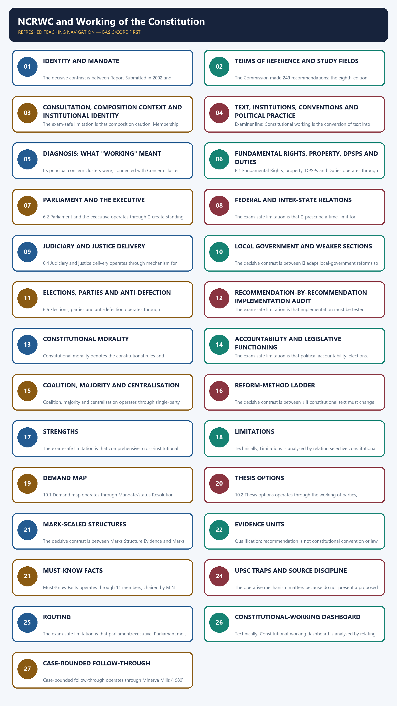

*Distinct embedded teaching-navigation image. The separate continuous Cārvāka-style flowchart package remains an independent at-a-glance artifact.*

### SESSION 1 — IDENTITY AND MANDATE
#### DEFINITION / WHAT THIS IS CALLED

**Plain-language definition:** Identity and mandate denotes the constitutional rules and institutional links organised around Attribute Position.

**Technical definition:** The decisive contrast is between Report Submitted in 2002 and Express limit Work within parliamentary democracy and without disturbing the basic structure/basic features.

#### ANSWER-GRABBING OPENING — WRITE/ADAPT IN THE EXAM

> The NCRWC reviewed constitutional working within parliamentary democracy and basic-structure limits, making it an advisory reform commission rather than a constituent assembly.

#### MUST-WRITE KEYWORDS

- **Identity**
- **mandate**
- **Government of India resolution**
- **without disturbing the basic structure/basic features**
- **Master distinction**
- **working**

**How to use them:** Frame the answer through Identity; define mandate, connect Government of India resolution with without disturbing the basic structure/basic features to explain the mechanism, and use Master distinction for the decisive comparison or qualification.

1. Identity and mandate denotes the constitutional rules and institutional links organised around Attribute Position.
1. Identity and mandate operates through Creation Set up by a Government of India resolution in 2000, connected with Legal status Executive, temporary and advisory; neither constitutional nor statutory.
The operative mechanism matters because chair M.N. Venkatachaliah, former Chief Justice of India.
Its principal consequence is that composition 11-member commission.
The decisive contrast is between Report Submitted in 2002 and Express limit Work within parliamentary democracy and without disturbing the basic structure/basic features.
The exam-safe limitation is that master distinction: The NCRWC reviewed the working of the Constitution; it was not a.
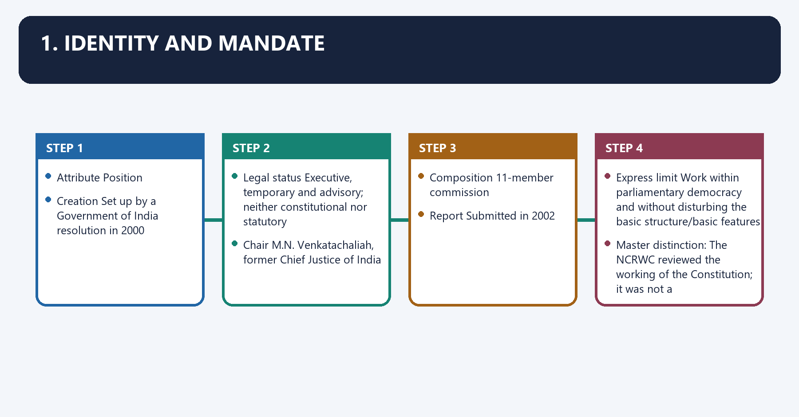
| Attribute | Position |
|---|---|
| Creation | Set up by a **Government of India resolution** in 2000 |
| Legal status | Executive, temporary and advisory; neither constitutional nor statutory |
| Chair | M.N. Venkatachaliah, former Chief Justice of India |
| Composition | 11-member commission |
| Report | Submitted in 2002 |
| Task | Review how the Constitution had worked over fifty years and recommend changes for effective governance and socio-economic development |
| Express limit | Work within parliamentary democracy and **without disturbing the basic structure/basic features** |

> **Master distinction:** The NCRWC reviewed the **working** of the Constitution; it was not a
> constituent assembly and did not claim power to rewrite the Constitution.

---

#### CLOSING RECALL FLOW — IDENTITY AND MANDATE

```closure-flow
SUBTOPIC: Identity and mandate
KEY TERMS / DEFINITIONS: Identity · mandate · Government of India resolution · without disturbing the basic structure/basic features · Master distinction · working
MECHANISM / ARGUMENT: The exam-safe limitation is that master distinction: The NCRWC reviewed the working of the Constitution; it was not a.
CONSEQUENCE / CONTRAST: Master distinction: The NCRWC reviewed the working of the Constitution; it was not a constituent assembly and did not claim power to rewrite the Constitution.
UPSC TRAP / ANSWER-USE: The decisive contrast is between Report Submitted in 2002 and Express limit Work within parliamentary democracy and without disturbing the basic structure/basic features.
ANSWER-GRABBING FORMULATION: The NCRWC reviewed constitutional working within parliamentary democracy and basic-structure limits, making it an advisory reform commission rather than a constituent assembly.
```
### SESSION 2 — TERMS OF REFERENCE AND STUDY FIELDS
#### DEFINITION / WHAT THIS IS CALLED

**Plain-language definition:** Terms of reference and study fields denotes the constitutional rules and institutional links organised around The Commission examined whether existing constitutional provisions could respond to modern needs.

**Technical definition:** The Commission made 249 recommendations: the eighth-edition source classifies 58 as requiring constitutional amendment, 86 as requiring legislation and 105 as capable of executive action.

#### ANSWER-GRABBING OPENING — WRITE/ADAPT IN THE EXAM

> The NCRWC examined modern governance across rights, institutions, federalism and development, but its 249 recommendations required different constitutional, legislative or executive routes.

#### MUST-WRITE KEYWORDS

- **Terms of reference**
- **study fields**
- **Terms of reference and study fields**
- **Terms**
- **The Commission**
- **249 recommendations**

**How to use them:** Frame the answer through Terms of reference; define study fields, connect Terms of reference and study fields with Terms to explain the mechanism, and use The Commission for the decisive comparison or qualification.

2. Terms of reference and study fields denotes the constitutional rules and institutional links organised around The Commission examined whether existing constitutional provisions could respond to modern needs.
2. Terms of reference and study fields operates through of efficient, smooth and effective government and socio-economic development. It organised the, connected with review around eleven broad fields.
The operative mechanism matters because parliamentary institutions and political stability.
Its principal consequence is that electoral reform and standards in public life.
The decisive contrast is between socio-economic change and literacy, employment, social security and poverty.
The exam-safe limitation is that union–State relations.
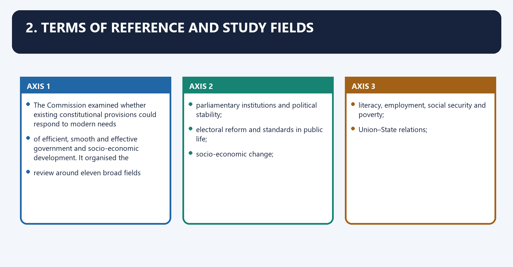
The Commission examined whether existing constitutional provisions could respond to modern needs
of efficient, smooth and effective government and socio-economic development. It organised the
review around eleven broad fields:

1. parliamentary institutions and political stability;
2. electoral reform and standards in public life;
3. socio-economic change;
4. literacy, employment, social security and poverty;
5. Union–State relations;
6. decentralisation and local government;
7. enlargement of Fundamental Rights;
8. effectuation of Fundamental Duties;
9. DPSPs and Preambular objectives;
10. fiscal/monetary control and public audit; and
11. administration and standards in public life.

[FACT] The Commission made **249 recommendations**: the eighth-edition source classifies **58** as
requiring constitutional amendment, **86** as requiring legislation and **105** as capable of
executive action.

[LIMIT] This classification describes the Commission's proposed implementation route. It does not prove
that any proposal was accepted.

---

#### CLOSING RECALL FLOW — TERMS OF REFERENCE AND STUDY FIELDS

```closure-flow
SUBTOPIC: Terms of reference and study fields
KEY TERMS / DEFINITIONS: Terms of reference · study fields · Terms of reference and study fields · Terms · The Commission · 249 recommendations
MECHANISM / ARGUMENT: The Commission made 249 recommendations: the eighth-edition source classifies 58 as requiring constitutional amendment, 86 as requiring legislation and 105 as capable of executive action.
CONSEQUENCE / CONTRAST: Its principal consequence is that electoral reform and standards in public life.
UPSC TRAP / ANSWER-USE: Do not miss this limiting distinction: the decisive contrast is between socio-economic change and literacy, employment, social security and poverty.
ANSWER-GRABBING FORMULATION: The NCRWC examined modern governance across rights, institutions, federalism and development, but its 249 recommendations required different constitutional, legislative or executive routes.
```
### SESSION 3 — CONSULTATION, COMPOSITION CONTEXT AND INSTITUTIONAL IDENTITY
#### DEFINITION / WHAT THIS IS CALLED

**Plain-language definition:** Consultation, composition context and institutional identity denotes the constitutional rules and institutional links organised around The Commission worked through consultation papers, expert studies, public responses and thematic.

**Technical definition:** The exam-safe limitation is that composition caution: Membership gave the Commission legal, parliamentary, administrative and.

#### ANSWER-GRABBING OPENING — WRITE/ADAPT IN THE EXAM

> Composition caution: Membership gave the Commission legal, parliamentary, administrative and public-policy experience, but expertise did not convert its report into law or constituent power.

#### MUST-WRITE KEYWORDS

- **Consultation**
- **composition context**
- **institutional identity**
- **Composition caution**
- **Constituent Assembly**
- **Constituent process, 1946–49**

**How to use them:** Frame the answer through Consultation; define composition context, connect institutional identity with Composition caution to explain the mechanism, and use Constituent Assembly for the decisive comparison or qualification.

3. Consultation, composition context and institutional identity denotes the constitutional rules and institutional links organised around The Commission worked through consultation papers, expert studies, public responses and thematic.
3. Consultation, composition context and institutional identity operates through deliberation before submitting its report. That method matters because a constitutional review, connected with commission has persuasive legitimacy only when it states the problem, receives competing views,.
The operative mechanism matters because explains the legal route and leaves the final choice to constitutionally authorised institutions.
Its principal consequence is that body/process Constitutive source Principal task Why it is not the NCRWC.
The decisive contrast is between Constituent Assembly Constituent process, 1946–49 Framed and adopted the Constitution Exercised founding constituent authority and Sarkaria/Punchhi Commissions Executive commissions Centre–State relations Sectoral federal reviews.
The exam-safe limitation is that composition caution: Membership gave the Commission legal, parliamentary, administrative and.
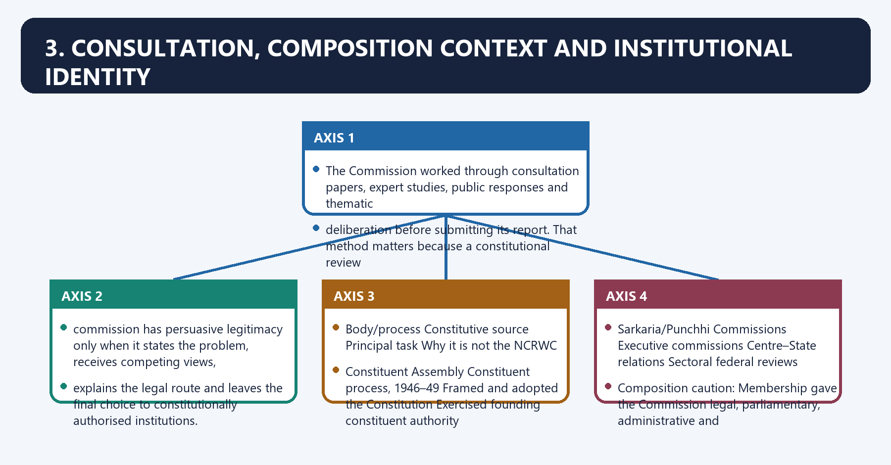
The Commission worked through consultation papers, expert studies, public responses and thematic
deliberation before submitting its report. That method matters because a constitutional review
commission has persuasive legitimacy only when it states the problem, receives competing views,
explains the legal route and leaves the final choice to constitutionally authorised institutions.

| Body/process | Constitutive source | Principal task | Why it is not the NCRWC |
|---|---|---|---|
| Constituent Assembly | Constituent process, 1946–49 | Framed and adopted the Constitution | Exercised founding constituent authority |
| Parliament under Art 368 | Constitution | Formally amends the Constitution | Legislative constituent power subject to procedure/basic structure |
| Law Commission | Executive resolution | Law-reform research and reports | Usually examines statutes/legal doctrine, not the whole constitutional system |
| Sarkaria/Punchhi Commissions | Executive commissions | Centre–State relations | Sectoral federal reviews |
| Administrative Reforms Commissions | Executive commissions | Public-administration reform | Administrative rather than comprehensive constitutional review |
| NCRWC | Government resolution, 2000 | Reviewed fifty years of constitutional working | Temporary, advisory and expressly basic-structure bounded |

> **Composition caution:** Membership gave the Commission legal, parliamentary, administrative and
> public-policy experience, but expertise did not convert its report into law or constituent power.

---

#### CLOSING RECALL FLOW — CONSULTATION, COMPOSITION CONTEXT AND INSTITUTIONAL IDENTITY

```closure-flow
SUBTOPIC: Consultation, composition context and institutional identity
KEY TERMS / DEFINITIONS: Consultation · composition context · institutional identity · Composition caution · Constituent Assembly · Constituent process, 1946–49
MECHANISM / ARGUMENT: That method matters because a constitutional review, connected with commission has persuasive legitimacy only when it states the problem, receives competing views,.
CONSEQUENCE / CONTRAST: The decisive contrast is between Constituent Assembly Constituent process, 1946–49 Framed and adopted the Constitution Exercised founding constituent authority and Sarkaria/Punchhi Commissions Executive commissions Centre–State relations Sectoral federal reviews.
UPSC TRAP / ANSWER-USE: Its principal consequence is that body/process Constitutive source Principal task Why it is not the NCRWC.
ANSWER-GRABBING FORMULATION: Composition caution: Membership gave the Commission legal, parliamentary, administrative and public-policy experience, but expertise did not convert its report into law or constituent power.
```
### SESSION 4 — TEXT, INSTITUTIONS, CONVENTIONS AND POLITICAL PRACTICE
#### DEFINITION / WHAT THIS IS CALLED

**Plain-language definition:** Text, institutions, conventions and political practice denotes the constitutional rules and institutional links organised around The working of the Constitution is wider than compliance with its written Articles.

**Technical definition:** Examiner line: Constitutional working is the conversion of text into restrained power, accountable institutions, effective rights and cooperative political practice.

#### ANSWER-GRABBING OPENING — WRITE/ADAPT IN THE EXAM

> Constitutional working converts text into restrained power, effective rights, accountable institutions and cooperative practice, so formal compliance alone cannot establish constitutional success.

#### MUST-WRITE KEYWORDS

- **Text**
- **institutions**
- **conventions**
- **political practice**
- **working of the Constitution**
- **Examiner line**

**How to use them:** Frame the answer through Text; define institutions, connect conventions with political practice to explain the mechanism, and use working of the Constitution for the decisive comparison or qualification.

4. Text, institutions, conventions and political practice denotes the constitutional rules and institutional links organised around The working of the Constitution is wider than compliance with its written Articles.
4. Text, institutions, conventions and political practice operates through CONSTITUTIONAL TEXT, connected with ↓ implemented through.
The operative mechanism matters because institutions + statutes + rules + conventions + political parties + administration.
Its principal consequence is that rights outcomes + accountability + federal trust + legislative deliberation + remedies.
The decisive contrast is between Dimension Constitutional question Failure mode Reform route and Text Is power or right clearly allocated? ambiguity, obsolete design or remedial gap amendment within basic structure.
The exam-safe limitation is that ⚖️ Kesavananda Bharati (1973) supplies the basic-structure boundary; Minerva Mills (1980).
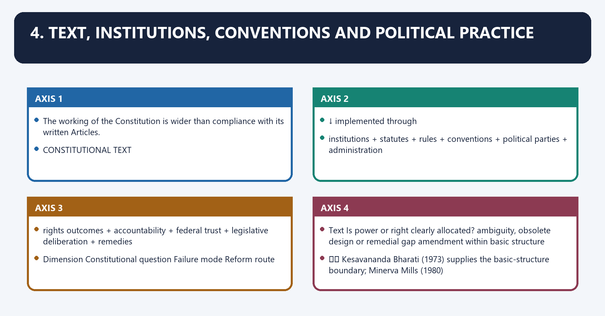
The **working of the Constitution** is wider than compliance with its written Articles.

```text
CONSTITUTIONAL TEXT
        ↓ implemented through
institutions + statutes + rules + conventions + political parties + administration
        ↓ tested by
rights outcomes + accountability + federal trust + legislative deliberation + remedies
```

| Dimension | Constitutional question | Failure mode | Reform route |
|---|---|---|---|
| Text | Is power or right clearly allocated? | ambiguity, obsolete design or remedial gap | amendment within basic structure |
| Institution | Does the authorised body have independence/capacity? | vacancy, capture, delay, weak expertise | statute, finance, appointments, procedure |
| Convention | Do actors respect unwritten role restraints? | technically lawful but constitutionally corrosive conduct | political accountability, reason-giving, codification where needed |
| Political practice | Do parties and majorities preserve opposition and deliberation? | centralisation, criminalisation, opaque finance, weak committees | electoral/party and parliamentary reform |
| Federal practice | Are consultation and autonomy real? | unilateralism, delayed assent, fiscal mistrust | councils, negotiated federalism, judicial review |
| Rights enforcement | Can a right-holder obtain an effective remedy? | cost, delay, weak investigation, unequal access | courts, legal aid, administration and compliance |

⚖️ *Kesavananda Bharati* (1973) supplies the basic-structure boundary; *Minerva Mills* (1980)
emphasises limited amending power and Part III–Part IV harmony; *S.R. Bommai* (1994) demonstrates
that federalism and secularism are enforceable structural commitments. These later cases are
governing law, not NCRWC recommendations.

> **Examiner line:** Constitutional working is the conversion of text into restrained power,
> accountable institutions, effective rights and cooperative political practice.

---

#### CLOSING RECALL FLOW — TEXT, INSTITUTIONS, CONVENTIONS AND POLITICAL PRACTICE

```closure-flow
SUBTOPIC: Text, institutions, conventions and political practice
KEY TERMS / DEFINITIONS: Text · institutions · conventions · political practice · working of the Constitution · Examiner line
MECHANISM / ARGUMENT: Examiner line: Constitutional working is the conversion of text into restrained power, accountable institutions, effective rights and cooperative political practice.
CONSEQUENCE / CONTRAST: The decisive contrast is between Dimension Constitutional question Failure mode Reform route and Text Is power or right clearly allocated? ambiguity, obsolete design or remedial gap amendment within basic structure.
UPSC TRAP / ANSWER-USE: Do not miss this limiting distinction: its principal consequence is that rights outcomes + accountability + federal trust + legislative...
ANSWER-GRABBING FORMULATION: Constitutional working converts text into restrained power, effective rights, accountable institutions and cooperative practice, so formal compliance alone cannot establish constitutional success.
```
### SESSION 5 — DIAGNOSIS: WHAT "WORKING" MEANT
#### DEFINITION / WHAT THIS IS CALLED

**Plain-language definition:** Diagnosis: what "working" meant denotes the constitutional rules and institutional links organised around The NCRWC's report treated constitutional failure mainly as a problem of institutional practice ,.

**Technical definition:** Its principal concern clusters were, connected with Concern cluster NCRWC diagnosis (historical, 2002) Analytical use.

#### ANSWER-GRABBING OPENING — WRITE/ADAPT IN THE EXAM

> The NCRWC diagnosed many failures as defects of incentives, capacity and political practice rather than simple absence of constitutional provisions.

#### MUST-WRITE KEYWORDS

- **Diagnosis**
- **what "working" meant**
- **institutional practice**
- **Status caution**
- **Democratic trust**
- **Political integrity**

**How to use them:** Frame the answer through Diagnosis; define what "working" meant, connect institutional practice with Status caution to explain the mechanism, and use Democratic trust for the decisive comparison or qualification.

5. Diagnosis: what "working" meant denotes the constitutional rules and institutional links organised around The NCRWC's report treated constitutional failure mainly as a problem of institutional practice ,.
5. Diagnosis: what "working" meant operates through not absence of a constitutional text. Its principal concern clusters were, connected with Concern cluster NCRWC diagnosis (historical, 2002) Analytical use.
The operative mechanism matters because federal/local design Consultation and devolution were inadequate Constitutional division needs cooperative practice.
Its principal consequence is that status caution: These were the Commission's assessments at the time of its report. Do not.
The decisive contrast is between present its historical data or rhetoric as a verified 2026 condition and The NCRWC's report treated constitutional failure mainly as a problem of institutional practice ,.
The exam-safe limitation is that the NCRWC's report treated constitutional failure mainly as a problem of institutional practice ,.
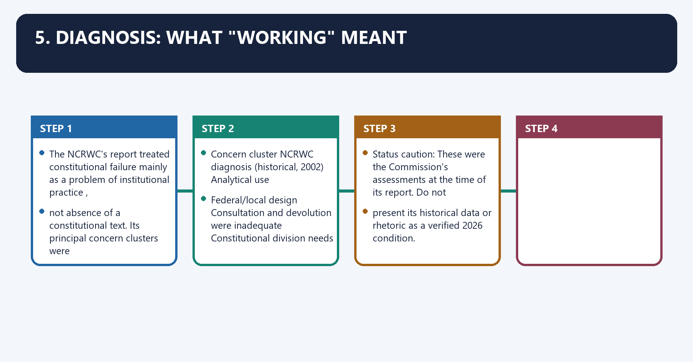
The NCRWC's report treated constitutional failure mainly as a problem of **institutional practice**,
not absence of a constitutional text. Its principal concern clusters were:

| Concern cluster | NCRWC diagnosis (historical, 2002) | Analytical use |
|---|---|---|
| Democratic trust | Government and public services had become detached from popular sovereignty and dignity | Constitution can fail through behaviour without textual collapse |
| Political integrity | Criminalisation, corruption, defections and opaque party finance | Electoral/party reform is constitutional maintenance |
| Institutional performance | Legislature, executive, administration and justice suffered delay, cost and weak accountability | Efficiency and constitutionalism must be reconciled |
| Social transformation | Rights, education, employment and welfare commitments were under-realised | Formal guarantees require institutions and resources |
| Federal/local design | Consultation and devolution were inadequate | Constitutional division needs cooperative practice |
| Justice delivery | Delay, weak investigation/prosecution and limited access undermined rule of law | Remedies are part of constitutional effectiveness |

> **Status caution:** These were the Commission's assessments at the time of its report. Do not
> present its historical data or rhetoric as a verified 2026 condition.

---

#### CLOSING RECALL FLOW — DIAGNOSIS: WHAT "WORKING" MEANT

```closure-flow
SUBTOPIC: Diagnosis: what "working" meant
KEY TERMS / DEFINITIONS: Diagnosis · what "working" meant · institutional practice · Status caution · Democratic trust · Political integrity
MECHANISM / ARGUMENT: The operative mechanism matters because federal/local design Consultation and devolution were inadequate Constitutional division needs cooperative practice.
CONSEQUENCE / CONTRAST: Its principal consequence is that status caution: These were the Commission's assessments at the time of its report.
UPSC TRAP / ANSWER-USE: Do not miss this limiting distinction: the decisive contrast is between present its historical data or rhetoric as a verified...
ANSWER-GRABBING FORMULATION: The NCRWC diagnosed many failures as defects of incentives, capacity and political practice rather than simple absence of constitutional provisions.
```
### SESSION 6 — FUNDAMENTAL RIGHTS, PROPERTY, DPSPS AND DUTIES
#### DEFINITION / WHAT THIS IS CALLED

**Plain-language definition:** 6.1 Fundamental Rights, property, DPSPs and Duties denotes the constitutional rules and institutional links organised around Area 🧾 Recommendation Current-law caution.

**Technical definition:** 6.1 Fundamental Rights, property, DPSPs and Duties operates through Education Enlarge the proposed education guarantee for specified groups Check current Art 21A, not the NCRWC draft, connected with Emergency Protect additional rights from suspension beyond Arts 20 and 21 Current law remains governed by Arts 358–359.

#### ANSWER-GRABBING OPENING — WRITE/ADAPT IN THE EXAM

> NCRWC proposals on rights, property, Directive Principles and duties remain recommendations whose current status must be tested against later constitutional text and law.

#### MUST-WRITE KEYWORDS

- **Fundamental Rights**
- **property**
- **DPSPs**
- **Duties**
- **Rights**
- **Speech/equality**

**How to use them:** Frame the answer through Fundamental Rights; define property, connect DPSPs with Duties to explain the mechanism, and use Rights for the decisive comparison or qualification.

6.1 Fundamental Rights, property, DPSPs and Duties denotes the constitutional rules and institutional links organised around Area 🧾 Recommendation Current-law caution.
6.1 Fundamental Rights, property, DPSPs and Duties operates through Education Enlarge the proposed education guarantee for specified groups Check current [FACT] Art 21A, not the NCRWC draft, connected with Emergency Protect additional rights from suspension beyond Arts 20 and 21 Current law remains governed by [FACT] Arts 358–359.
The operative mechanism matters because dPSPs Rename Part IV and create implementation-review mechanisms Non-binding.
Its principal consequence is that duties Add voting, tax and family-responsibility duties; implement the Verma Committee's operationalisation proposals Non-binding.
The decisive contrast is between Area 🧾 Recommendation Current-law caution and Area 🧾 Recommendation Current-law caution.
The exam-safe limitation is that area 🧾 Recommendation Current-law caution.
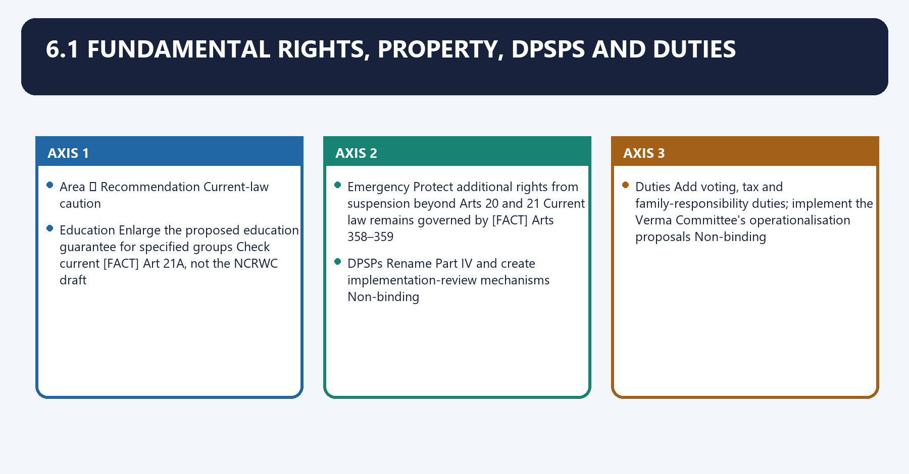
| Area | 🧾 Recommendation | Current-law caution |
|---|---|---|
| Rights | Add express rights against torture, to compensation for unlawful deprivation of life/liberty, privacy/family life, access to courts/speedy justice, equal justice/legal aid and environmental necessities | Some subjects later developed through judgments/statutes; that does not make the NCRWC wording constitutional text |
| Speech/equality | Expand express discrimination and speech/media formulations | Not enacted merely because similar values appear in case law |
| Education | Enlarge the proposed education guarantee for specified groups | Check current [FACT] Art 21A, not the NCRWC draft |
| Emergency | Protect additional rights from suspension beyond Arts 20 and 21 | Current law remains governed by [FACT] Arts 358–359 |
| Property | Recast Art 300A to require public purpose, non-arbitrariness and rehabilitation protection for specified SC/ST land | 🧾 Proposal, not the text of Art 300A |
| DPSPs | Rename Part IV and create implementation-review mechanisms | Non-binding |
| Duties | Add voting, tax and family-responsibility duties; implement the Verma Committee's operationalisation proposals | Non-binding |

#### CLOSING RECALL FLOW — FUNDAMENTAL RIGHTS, PROPERTY, DPSPS AND DUTIES

```closure-flow
SUBTOPIC: Fundamental Rights, property, DPSPs and Duties
KEY TERMS / DEFINITIONS: Fundamental Rights · property · DPSPs · Duties · Rights · Speech/equality
MECHANISM / ARGUMENT: 6.1 Fundamental Rights, property, DPSPs and Duties operates through Education Enlarge the proposed education guarantee for specified groups Check current Art 21A, not the NCRWC draft, connected with Emergency Protect additional rights from suspension beyond Arts 20 and 21 Current law remains governed by Arts 358–359.
CONSEQUENCE / CONTRAST: Its principal consequence is that duties Add voting, tax and family-responsibility duties; implement the Verma Committee's operationalisation proposals Non-binding.
UPSC TRAP / ANSWER-USE: Do not miss this limiting distinction: the decisive contrast is between Area 🧾 Recommendation Current-law caution and Area 🧾 Recommendation...
ANSWER-GRABBING FORMULATION: NCRWC proposals on rights, property, Directive Principles and duties remain recommendations whose current status must be tested against later constitutional text and law.
```
### SESSION 7 — PARLIAMENT AND THE EXECUTIVE
#### DEFINITION / WHAT THIS IS CALLED

**Plain-language definition:** 6.2 Parliament and the executive denotes the constitutional rules and institutional links organised around 🧾 define and delimit legislative privileges.

**Technical definition:** 6.2 Parliament and the executive operates through 🧾 create standing committees for constitutional amendments/legislative planning, connected with 🧾 prescribe minimum sitting days.

#### ANSWER-GRABBING OPENING — WRITE/ADAPT IN THE EXAM

> NCRWC parliamentary and executive reforms sought stronger deliberation and professional administration, but later law adopted only selected and modified elements.

#### MUST-WRITE KEYWORDS

- **Parliament**
- **the executive**
- **constructive vote of no confidence**
- **10 per cent**
- **15 per cent**
- **6.2 Parliament and the executive**

**How to use them:** Frame the answer through Parliament; define the executive, connect constructive vote of no confidence with 10 per cent to explain the mechanism, and use 15 per cent for the decisive comparison or qualification.

6.2 Parliament and the executive denotes the constitutional rules and institutional links organised around 🧾 define and delimit legislative privileges.
6.2 Parliament and the executive operates through 🧾 create standing committees for constitutional amendments/legislative planning, connected with 🧾 prescribe minimum sitting days.
The operative mechanism matters because 🧾 use a constructive vote of no confidence.
Its principal consequence is that 🧾 cap the Council of Ministers at 10 per cent of the popular House.
The decisive contrast is between 🧾 establish Lokpal/Lokayuktas within the proposed design and 🧾 create statutory civil-service boards, promote lateral entry at senior levels and replace.
The exam-safe limitation is that secrecy culture with transparency.
- 🧾 define and delimit legislative privileges;
- 🧾 create standing committees for constitutional amendments/legislative planning;
- 🧾 prescribe minimum sitting days;
- 🧾 use a **constructive vote of no confidence**;
- 🧾 cap the Council of Ministers at **10 per cent** of the popular House;
- 🧾 establish Lokpal/Lokayuktas within the proposed design;
- 🧾 create statutory civil-service boards, promote lateral entry at senior levels and replace
  secrecy culture with transparency;
- 🧾 enact public-interest-disclosure and anti-benami-corruption measures.

> **Trap:** The later 91st Amendment used a **15 per cent** ceiling for Union/State ministries
> (with a minimum for States), not the NCRWC's 10 per cent recommendation. Similar subject does not
> mean identical adoption.

#### CLOSING RECALL FLOW — PARLIAMENT AND THE EXECUTIVE

```closure-flow
SUBTOPIC: Parliament and the executive
KEY TERMS / DEFINITIONS: Parliament · the executive · constructive vote of no confidence · 10 per cent · 15 per cent · 6.2 Parliament and the executive
MECHANISM / ARGUMENT: 6.2 Parliament and the executive operates through 🧾 create standing committees for constitutional amendments/legislative planning, connected with 🧾 prescribe minimum sitting days.
CONSEQUENCE / CONTRAST: Its principal consequence is that 🧾 cap the Council of Ministers at 10 per cent of the popular House.
UPSC TRAP / ANSWER-USE: Do not miss this limiting distinction: the decisive contrast is between 🧾 establish Lokpal/Lokayuktas within the proposed design and 🧾...
ANSWER-GRABBING FORMULATION: NCRWC parliamentary and executive reforms sought stronger deliberation and professional administration, but later law adopted only selected and modified elements.
```
### SESSION 8 — FEDERAL AND INTER-STATE RELATIONS
#### DEFINITION / WHAT THIS IS CALLED

**Plain-language definition:** 6.3 Federal and inter-State relations denotes the constitutional rules and institutional links organised around 🧾 specify subjects requiring Inter-State Council consultation.

**Technical definition:** The exam-safe limitation is that 🧾 prescribe a time-limit for Presidential action on a reserved State Bill. 🧾 specify subjects requiring Inter-State Council consultation; 🧾 place disaster/emergency management in the Concurrent List; 🧾 establish an Inter-State Trade and Commerce Commission; 🧾 consult the Chief Minister before appointing a Governor; 🧾 retain Article 356 but use it only as a last resort and test majority on the floor; 🧾 avoid dissolving a State Assembly before parliamentary approval of the proclamation; 🧾 reform river-water adjudication; and 🧾 prescribe a time-limit for Presidential action on a reserved State Bill.

#### ANSWER-GRABBING OPENING — WRITE/ADAPT IN THE EXAM

> NCRWC federal proposals emphasised consultation, restrained Article 356 use and timely intergovernmental processes, while current law continues to depend on governing Articles and judgments.

#### MUST-WRITE KEYWORDS

- **Federal**
- **inter-State relations**
- **Article 356**
- **Inter-State Council**
- **Its principal consequence**
- **6.3 Federal and inter-State relations**

**How to use them:** Frame the answer through Federal; define inter-State relations, connect Article 356 with Inter-State Council to explain the mechanism, and use Its principal consequence for the decisive comparison or qualification.

6.3 Federal and inter-State relations denotes the constitutional rules and institutional links organised around 🧾 specify subjects requiring Inter-State Council consultation.
6.3 Federal and inter-State relations operates through 🧾 place disaster/emergency management in the Concurrent List, connected with 🧾 establish an Inter-State Trade and Commerce Commission.
The operative mechanism matters because 🧾 consult the Chief Minister before appointing a Governor.
Its principal consequence is that 🧾 retain Article 356 but use it only as a last resort and test majority on the floor.
The decisive contrast is between 🧾 avoid dissolving a State Assembly before parliamentary approval of the proclamation and 🧾 reform river-water adjudication; and.
The exam-safe limitation is that 🧾 prescribe a time-limit for Presidential action on a reserved State Bill.
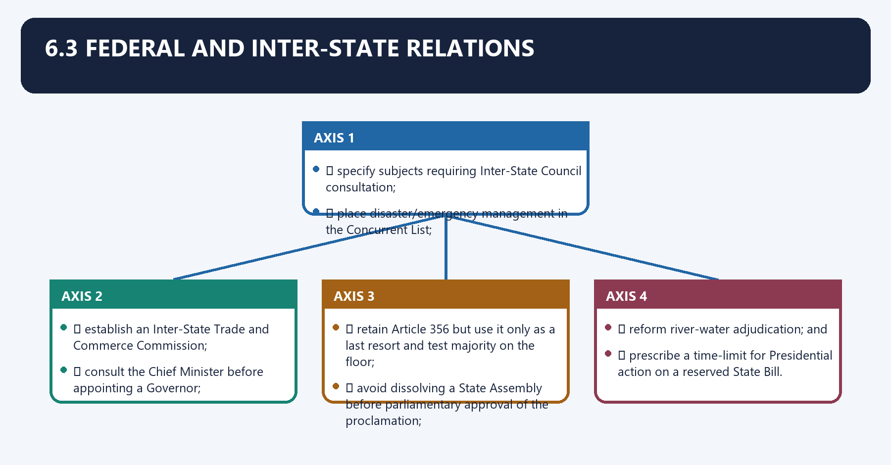
- 🧾 specify subjects requiring Inter-State Council consultation;
- 🧾 place disaster/emergency management in the Concurrent List;
- 🧾 establish an Inter-State Trade and Commerce Commission;
- 🧾 consult the Chief Minister before appointing a Governor;
- 🧾 retain Article 356 but use it only as a last resort and test majority on the floor;
- 🧾 avoid dissolving a State Assembly before parliamentary approval of the proclamation;
- 🧾 reform river-water adjudication; and
- 🧾 prescribe a time-limit for Presidential action on a reserved State Bill.

[LIMIT] Some recommendations overlap with judicial doctrines or later debates. Cite the governing
Article/judgment for current law and NCRWC only for the reform case.

#### CLOSING RECALL FLOW — FEDERAL AND INTER-STATE RELATIONS

```closure-flow
SUBTOPIC: Federal and inter-State relations
KEY TERMS / DEFINITIONS: Federal · inter-State relations · Article 356 · Inter-State Council · Its principal consequence · 6.3 Federal and inter-State relations
MECHANISM / ARGUMENT: The exam-safe limitation is that 🧾 prescribe a time-limit for Presidential action on a reserved State Bill. 🧾 specify subjects requiring Inter-State Council consultation; 🧾 place disaster/emergency management in the Concurrent List; 🧾 establish an Inter-State Trade and Commerce Commission; 🧾 consult the Chief Minister before appointing a Governor; 🧾 retain Article 356 but use it only as a last resort and test majority on the floor; 🧾 avoid dissolving a State Assembly before parliamentary approval of the proclamation; 🧾 reform river-water adjudication; and 🧾 prescribe a time-limit for Presidential action on a reserved State Bill.
CONSEQUENCE / CONTRAST: Its principal consequence is that 🧾 retain Article 356 but use it only as a last resort and test majority on the floor.
UPSC TRAP / ANSWER-USE: The decisive contrast is between 🧾 avoid dissolving a State Assembly before parliamentary approval of the proclamation and 🧾 reform river-water adjudication; and.
ANSWER-GRABBING FORMULATION: NCRWC federal proposals emphasised consultation, restrained Article 356 use and timely intergovernmental processes, while current law continues to depend on governing Articles and judgments.
```
### SESSION 9 — JUDICIARY AND JUSTICE DELIVERY
#### DEFINITION / WHAT THIS IS CALLED

**Plain-language definition:** 6.4 Judiciary and justice delivery denotes the constitutional rules and institutional links organised around 🧾 create a constitutional National Judicial Commission for Supreme Court appointments and a.

**Technical definition:** 6.4 Judiciary and justice delivery operates through mechanism for judicial complaints, connected with 🧾 raise retirement ages.

#### ANSWER-GRABBING OPENING — WRITE/ADAPT IN THE EXAM

> The NCRWC proposed appointment, complaint and capacity reforms for courts, but its National Judicial Commission was neither the later NJAC nor the current collegium.

#### MUST-WRITE KEYWORDS

- **Judiciary**
- **justice delivery**
- **National Judicial Commission**
- **Supreme Court**
- **Its principal consequence**
- **6.4 Judiciary and justice delivery**

**How to use them:** Frame the answer through Judiciary; define justice delivery, connect National Judicial Commission with Supreme Court to explain the mechanism, and use Its principal consequence for the decisive comparison or qualification.

6.4 Judiciary and justice delivery denotes the constitutional rules and institutional links organised around 🧾 create a constitutional National Judicial Commission for Supreme Court appointments and a.
6.4 Judiciary and justice delivery operates through mechanism for judicial complaints, connected with 🧾 raise retirement ages.
The operative mechanism matters because 🧾 confine constitutional invalidation and contempt powers as proposed.
Its principal consequence is that 🧾 establish judicial councils for planning/budgets.
The decisive contrast is between 🧾 deliver higher-court judgments ordinarily within a specified time and clear arrears; and and 🧾 simplify the subordinate-court hierarchy and use plea bargaining/ADR.
The exam-safe limitation is that trap: NCRWC's National Judicial Commission is not the later NJAC constitutional scheme and is.
- 🧾 create a constitutional National Judicial Commission for Supreme Court appointments and a
  mechanism for judicial complaints;
- 🧾 raise retirement ages;
- 🧾 confine constitutional invalidation and contempt powers as proposed;
- 🧾 establish judicial councils for planning/budgets;
- 🧾 deliver higher-court judgments ordinarily within a specified time and clear arrears; and
- 🧾 simplify the subordinate-court hierarchy and use plea bargaining/ADR.

> **Trap:** NCRWC's National Judicial Commission is not the later NJAC constitutional scheme and is
> not the current collegium. Keep commission proposal, later amendment and case law separate.

#### CLOSING RECALL FLOW — JUDICIARY AND JUSTICE DELIVERY

```closure-flow
SUBTOPIC: Judiciary and justice delivery
KEY TERMS / DEFINITIONS: Judiciary · justice delivery · National Judicial Commission · Supreme Court · Its principal consequence · 6.4 Judiciary and justice delivery
MECHANISM / ARGUMENT: 6.4 Judiciary and justice delivery operates through mechanism for judicial complaints, connected with 🧾 raise retirement ages.
CONSEQUENCE / CONTRAST: Its principal consequence is that 🧾 establish judicial councils for planning/budgets.
UPSC TRAP / ANSWER-USE: NCRWC's National Judicial Commission is not the later NJAC constitutional scheme and is.
ANSWER-GRABBING FORMULATION: The NCRWC proposed appointment, complaint and capacity reforms for courts, but its National Judicial Commission was neither the later NJAC nor the current collegium.
```
### SESSION 10 — LOCAL GOVERNMENT AND WEAKER SECTIONS
#### DEFINITION / WHAT THIS IS CALLED

**Plain-language definition:** 6.5 Local government and weaker sections denotes the constitutional rules and institutional links organised around 🧾 give Panchayats/Municipalities clearer exclusive functions and fiscal domains.

**Technical definition:** The decisive contrast is between 🧾 adapt local-government reforms to North-East constitutional traditions and 🧾 give Panchayats/Municipalities clearer exclusive functions and fiscal domains.

#### ANSWER-GRABBING OPENING — WRITE/ADAPT IN THE EXAM

> NCRWC proposals linked clearer local functions and fiscal powers with stronger inclusion and North-East adaptation, but remained non-binding recommendations requiring competent implementation.

#### MUST-WRITE KEYWORDS

- **Local government**
- **weaker sections**
- **Local**
- **Panchayats**
- **Municipalities**
- **6.5 Local government and weaker sections**

**How to use them:** Frame the answer through Local government; define weaker sections, connect Local with Panchayats to explain the mechanism, and use Municipalities for the decisive comparison or qualification.

6.5 Local government and weaker sections denotes the constitutional rules and institutional links organised around 🧾 give Panchayats/Municipalities clearer exclusive functions and fiscal domains.
6.5 Local government and weaker sections operates through 🧾 strengthen audit, dissolution safeguards and election-law uniformity, connected with 🧾 separate delimitation/reservation/rotation from State Election Commissions.
The operative mechanism matters because 🧾 improve SC/ST/BC representation, education and reservation administration.
Its principal consequence is that 🧾 strengthen atrocity-law enforcement and institutions for bonded-labour rehabilitation; and.
The decisive contrast is between 🧾 adapt local-government reforms to North-East constitutional traditions and 🧾 give Panchayats/Municipalities clearer exclusive functions and fiscal domains.
The exam-safe limitation is that 🧾 give Panchayats/Municipalities clearer exclusive functions and fiscal domains.
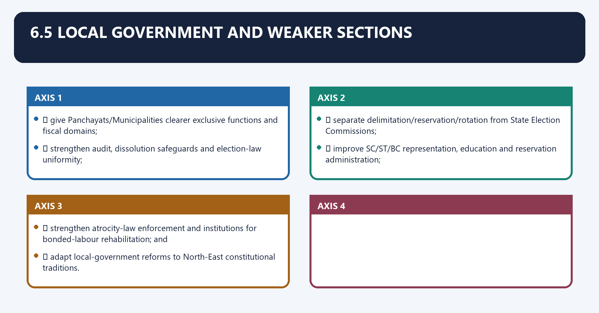
- 🧾 give Panchayats/Municipalities clearer exclusive functions and fiscal domains;
- 🧾 strengthen audit, dissolution safeguards and election-law uniformity;
- 🧾 separate delimitation/reservation/rotation from State Election Commissions;
- 🧾 improve SC/ST/BC representation, education and reservation administration;
- 🧾 strengthen atrocity-law enforcement and institutions for bonded-labour rehabilitation; and
- 🧾 adapt local-government reforms to North-East constitutional traditions.

#### CLOSING RECALL FLOW — LOCAL GOVERNMENT AND WEAKER SECTIONS

```closure-flow
SUBTOPIC: Local government and weaker sections
KEY TERMS / DEFINITIONS: Local government · weaker sections · Local · Panchayats · Municipalities · 6.5 Local government and weaker sections
MECHANISM / ARGUMENT: The decisive contrast is between 🧾 adapt local-government reforms to North-East constitutional traditions and 🧾 give Panchayats/Municipalities clearer exclusive functions and fiscal domains.
CONSEQUENCE / CONTRAST: Its principal consequence is that 🧾 strengthen atrocity-law enforcement and institutions for bonded-labour rehabilitation; and.
UPSC TRAP / ANSWER-USE: Do not miss this limiting distinction: the exam-safe limitation is that 🧾 give Panchayats/Municipalities clearer exclusive functions and fiscal domains....
ANSWER-GRABBING FORMULATION: NCRWC proposals linked clearer local functions and fiscal powers with stronger inclusion and North-East adaptation, but remained non-binding recommendations requiring competent implementation.
```
### SESSION 11 — ELECTIONS, PARTIES AND ANTI-DEFECTION
#### DEFINITION / WHAT THIS IS CALLED

**Plain-language definition:** 6.6 Elections, parties and anti-defection denotes the constitutional rules and institutional links organised around Field 🧾 Recommendation.

**Technical definition:** 6.6 Elections, parties and anti-defection operates through Criminalisation Disqualify specified serious accused/convicted persons and create speedy special courts/benches, connected with Election disputes Dedicated election benches/special courts.

#### ANSWER-GRABBING OPENING — WRITE/ADAPT IN THE EXAM

> NCRWC electoral proposals linked criminalisation, party regulation, Election Commission appointments and anti-defection reform, but remained advisory without later enactment.

#### MUST-WRITE KEYWORDS

- **Elections**
- **parties**
- **anti-defection**
- **Criminalisation**
- **Election disputes**
- **Dedicated election benches/special courts**

**How to use them:** Frame the answer through Elections; define parties, connect anti-defection with Criminalisation to explain the mechanism, and use Election disputes for the decisive comparison or qualification.

6.6 Elections, parties and anti-defection denotes the constitutional rules and institutional links organised around Field 🧾 Recommendation.
6.6 Elections, parties and anti-defection operates through Criminalisation Disqualify specified serious accused/convicted persons and create speedy special courts/benches, connected with Election disputes Dedicated election benches/special courts.
The operative mechanism matters because multiple seats Prevent one candidate contesting the same office from more than one constituency.
Its principal consequence is that model Code Give the Model Code statutory force.
The decisive contrast is between ECI appointment Multi-office selection body including government, opposition and presiding officers and Political parties Comprehensive law on internal functioning, accounts, candidate integrity and funding disclosure.
The exam-safe limitation is that anti-defection Defectors resign and recontest; bar remunerative office; vest decision in ECI rather than Speaker/Chairman.
| Field | 🧾 Recommendation |
|---|---|
| Criminalisation | Disqualify specified serious accused/convicted persons and create speedy special courts/benches |
| Election disputes | Dedicated election benches/special courts |
| Multiple seats | Prevent one candidate contesting the same office from more than one constituency |
| Model Code | Give the Model Code statutory force |
| ECI appointment | Multi-office selection body including government, opposition and presiding officers |
| Political parties | Comprehensive law on internal functioning, accounts, candidate integrity and funding disclosure |
| Anti-defection | Defectors resign and recontest; bar remunerative office; vest decision in ECI rather than Speaker/Chairman |

[LIMIT] The current law may differ on every row. Use `Election-Commission.md`,
`Political-Parties.md` and `Anti-Defection-Law.md` for the operative position.

---

#### CLOSING RECALL FLOW — ELECTIONS, PARTIES AND ANTI-DEFECTION

```closure-flow
SUBTOPIC: Elections, parties and anti-defection
KEY TERMS / DEFINITIONS: Elections · parties · anti-defection · Criminalisation · Election disputes · Dedicated election benches/special courts
MECHANISM / ARGUMENT: 6.6 Elections, parties and anti-defection operates through Criminalisation Disqualify specified serious accused/convicted persons and create speedy special courts/benches, connected with Election disputes Dedicated election benches/special courts.
CONSEQUENCE / CONTRAST: The decisive contrast is between ECI appointment Multi-office selection body including government, opposition and presiding officers and Political parties Comprehensive law on internal functioning, accounts, candidate integrity and funding disclosure.
UPSC TRAP / ANSWER-USE: Do not miss this limiting distinction: its principal consequence is that model Code Give the Model Code statutory force.
ANSWER-GRABBING FORMULATION: NCRWC electoral proposals linked criminalisation, party regulation, Election Commission appointments and anti-defection reform, but remained advisory without later enactment.
```
### SESSION 12 — RECOMMENDATION-BY-RECOMMENDATION IMPLEMENTATION AUDIT
#### DEFINITION / WHAT THIS IS CALLED

**Plain-language definition:** Recommendation-by-recommendation implementation audit denotes the constitutional rules and institutional links organised around Implementation must be tested against the exact proposal, later instrument and legal result.

**Technical definition:** The exam-safe limitation is that implementation must be tested against the exact proposal, later instrument and legal result.

#### ANSWER-GRABBING OPENING — WRITE/ADAPT IN THE EXAM

> Implementation must match the exact recommendation to a later legal instrument and result, because thematic similarity does not prove formal adoption.

#### MUST-WRITE KEYWORDS

- **Recommendation-by-recommendation implementation audit**
- **not exact adoption**
- **Audit rule**
- **Council of Ministers ceiling at 10%**
- **Related reform, not exact adoption**
- **Stronger transparency/open government**

**How to use them:** Frame the answer through Recommendation-by-recommendation implementation audit; define not exact adoption, connect Audit rule with Council of Ministers ceiling at 10% to explain the mechanism, and use Related reform, not exact adoption for the decisive comparison or qualification.

7. Recommendation-by-recommendation implementation audit denotes the constitutional rules and institutional links organised around Implementation must be tested against the exact proposal, later instrument and legal result.
7. Recommendation-by-recommendation implementation audit operates through NCRWC proposal area Later development Audit verdict, connected with Governor appointment through a plural committee Arts 155–156 framework remains Proposal not enacted.
The operative mechanism matters because audit rule: Similarity, sequence and common policy language do not establish implementation.
Its principal consequence is that write “implemented”, “partly reflected”, “modified”, “rejected”, “overtaken” or “pending” only.
The decisive contrast is between after comparing the exact recommendation with the later legal instrument and Implementation must be tested against the exact proposal, later instrument and legal result.
The exam-safe limitation is that implementation must be tested against the exact proposal, later instrument and legal result.
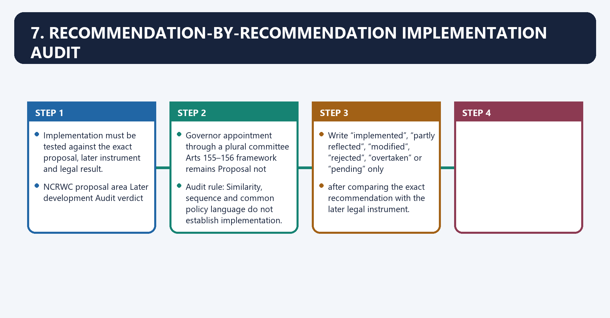
Implementation must be tested against the exact proposal, later instrument and legal result.

| NCRWC proposal area | Later development | Audit verdict |
|---|---|---|
| Council of Ministers ceiling at 10% | 91st Amendment (2003) adopted a 15% ceiling, with a State minimum | Related reform, **not exact adoption** |
| Stronger transparency/open government | Right to Information Act 2005 | Broadly convergent subject; do not claim causal implementation without official evidence |
| Education guarantee | 86th Amendment inserted Art 21A in 2002 | Overlapping constitutional reform chronology; wording/scope must be compared separately |
| Lokpal/Lokayukta framework | Lokpal and Lokayuktas Act 2013 | Later statute with its own design; NCRWC recommendation was not self-executing |
| Judicial appointments commission | 99th Amendment/NJAC enacted in 2014 and invalidated in 2015 | Proposal did not become the current appointments system |
| Plea bargaining/ADR expansion | Criminal-procedure and legal-services reforms developed later | Functional follow-through varies by instrument; not proof of wholesale acceptance |
| Political-party law/internal democracy | No comprehensive party law implementing the proposed code | Substantially pending as a reform field |
| Anti-defection decision by ECI and narrow whip | Tenth Schedule continues to place decision with presiding officer, subject to review | Core proposal not implemented |
| Governor appointment through a plural committee | Arts 155–156 framework remains | Proposal not enacted |
| Moving disaster management to Concurrent List | Disaster Management Act 2005 created a statutory framework without that List transfer | Statutory response, not the recommended constitutional relocation |

> **Audit rule:** Similarity, sequence and common policy language do not establish implementation.
> Write “implemented”, “partly reflected”, “modified”, “rejected”, “overtaken” or “pending” only
> after comparing the exact recommendation with the later legal instrument.

---

#### CLOSING RECALL FLOW — RECOMMENDATION-BY-RECOMMENDATION IMPLEMENTATION AUDIT

```closure-flow
SUBTOPIC: Recommendation-by-recommendation implementation audit
KEY TERMS / DEFINITIONS: Recommendation-by-recommendation implementation audit · not exact adoption · Audit rule · Council of Ministers ceiling at 10% · Related reform, not exact adoption · Stronger transparency/open government
MECHANISM / ARGUMENT: Recommendation-by-recommendation implementation audit operates through NCRWC proposal area Later development Audit verdict, connected with Governor appointment through a plural committee Arts 155–156 framework remains Proposal not enacted.
CONSEQUENCE / CONTRAST: The operative mechanism matters because audit rule: Similarity, sequence and common policy language do not establish implementation.
UPSC TRAP / ANSWER-USE: Audit rule: Similarity, sequence and common policy language do not establish implementation.
ANSWER-GRABBING FORMULATION: Implementation must match the exact recommendation to a later legal instrument and result, because thematic similarity does not prove formal adoption.
```
### SESSION 13 — CONSTITUTIONAL MORALITY
#### DEFINITION / WHAT THIS IS CALLED

**Plain-language definition:** Its principal consequence is that constitutional morality means fidelity to constitutional forms, equal citizenship, institutional.

**Technical definition:** Constitutional morality denotes the constitutional rules and institutional links organised around Constitutional morality means fidelity to constitutional forms, equal citizenship, institutional.

#### ANSWER-GRABBING OPENING — WRITE/ADAPT IN THE EXAM

> Constitutional morality means fidelity to constitutional forms, equal citizenship, institutional roles, reasoned procedure and limits on power.

#### MUST-WRITE KEYWORDS

- **Constitutional morality**
- **Constitutional**
- **Its principal consequence**
- **Its**
- **The decisive contrast**
- **The exam-safe limitation**

**How to use them:** Frame the answer through Constitutional morality; define Constitutional, connect Its principal consequence with Its to explain the mechanism, and use The decisive contrast for the decisive comparison or qualification.

Constitutional morality denotes the constitutional rules and institutional links organised around Constitutional morality means fidelity to constitutional forms, equal citizenship, institutional.
Constitutional morality operates through roles, reasoned procedure and limits on power. It is not personal morality. Navtej Singh Johar, connected with (2018) used constitutional morality and transformative constitutionalism in a rights setting.
The operative mechanism matters because the doctrine remains bounded by text, structure and precedent.
Its principal consequence is that constitutional morality means fidelity to constitutional forms, equal citizenship, institutional.
The decisive contrast is between Constitutional morality means fidelity to constitutional forms, equal citizenship, institutional and Constitutional morality means fidelity to constitutional forms, equal citizenship, institutional.
The exam-safe limitation is that constitutional morality means fidelity to constitutional forms, equal citizenship, institutional.
Constitutional morality means fidelity to constitutional forms, equal citizenship, institutional
roles, reasoned procedure and limits on power. It is not personal morality. *Navtej Singh Johar*
(2018) used constitutional morality and transformative constitutionalism in a rights setting;
the doctrine remains bounded by text, structure and precedent.

#### CLOSING RECALL FLOW — CONSTITUTIONAL MORALITY

```closure-flow
SUBTOPIC: Constitutional morality
KEY TERMS / DEFINITIONS: Constitutional morality · Constitutional · Its principal consequence · Its · The decisive contrast · The exam-safe limitation
MECHANISM / ARGUMENT: Navtej Singh Johar (2018) used constitutional morality and transformative constitutionalism in a rights setting; the doctrine remains bounded by text, structure and precedent.
CONSEQUENCE / CONTRAST: The decisive contrast is between Constitutional morality means fidelity to constitutional forms, equal citizenship, institutional and Constitutional morality means fidelity to constitutional forms, equal citizenship, institutional.
UPSC TRAP / ANSWER-USE: Do not miss this limiting distinction: the exam-safe limitation is that constitutional morality means fidelity to constitutional forms, equal citizenship...
ANSWER-GRABBING FORMULATION: Constitutional morality means fidelity to constitutional forms, equal citizenship, institutional roles, reasoned procedure and limits on power.
```
### SESSION 14 — ACCOUNTABILITY AND LEGISLATIVE FUNCTIONING
#### DEFINITION / WHAT THIS IS CALLED

**Plain-language definition:** Accountability and legislative functioning denotes the constitutional rules and institutional links organised around political accountability: elections, confidence, opposition and public reason.

**Technical definition:** The exam-safe limitation is that political accountability: elections, confidence, opposition and public reason. political accountability: elections, confidence, opposition and public reason; legal accountability: judicial review, rights and statutory remedies; financial accountability: legislative control, CAG and audit; administrative accountability: records, reasons, transparency and grievance redress; parliamentary quality: sitting time, committees, scrutiny of Bills and delegated legislation.

#### ANSWER-GRABBING OPENING — WRITE/ADAPT IN THE EXAM

> Constitutional accountability combines electoral, legal, financial and administrative controls, while legislative quality depends on time, committees, scrutiny and public reasons.

#### MUST-WRITE KEYWORDS

- **Accountability**
- **legislative functioning**
- **Accountability and legislative functioning**
- **Its principal consequence**
- **Its**
- **Bills**

**How to use them:** Frame the answer through Accountability; define legislative functioning, connect Accountability and legislative functioning with Its principal consequence to explain the mechanism, and use Its for the decisive comparison or qualification.

Accountability and legislative functioning denotes the constitutional rules and institutional links organised around political accountability: elections, confidence, opposition and public reason.
Accountability and legislative functioning operates through legal accountability: judicial review, rights and statutory remedies, connected with financial accountability: legislative control, CAG and audit.
The operative mechanism matters because administrative accountability: records, reasons, transparency and grievance redress.
Its principal consequence is that parliamentary quality: sitting time, committees, scrutiny of Bills and delegated legislation.
The decisive contrast is between political accountability: elections, confidence, opposition and public reason and political accountability: elections, confidence, opposition and public reason.
The exam-safe limitation is that political accountability: elections, confidence, opposition and public reason.
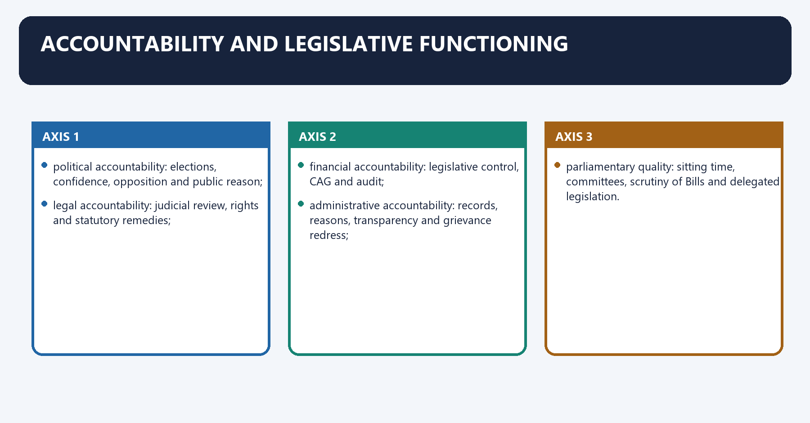
- political accountability: elections, confidence, opposition and public reason;
- legal accountability: judicial review, rights and statutory remedies;
- financial accountability: legislative control, CAG and audit;
- administrative accountability: records, reasons, transparency and grievance redress;
- parliamentary quality: sitting time, committees, scrutiny of Bills and delegated legislation.

#### CLOSING RECALL FLOW — ACCOUNTABILITY AND LEGISLATIVE FUNCTIONING

```closure-flow
SUBTOPIC: Accountability and legislative functioning
KEY TERMS / DEFINITIONS: Accountability · legislative functioning · Accountability and legislative functioning · Its principal consequence · Its · Bills
MECHANISM / ARGUMENT: The exam-safe limitation is that political accountability: elections, confidence, opposition and public reason. political accountability: elections, confidence, opposition and public reason; legal accountability: judicial review, rights and statutory remedies; financial accountability: legislative control, CAG and audit; administrative accountability: records, reasons, transparency and grievance redress; parliamentary quality: sitting time, committees, scrutiny of Bills and delegated legislation.
CONSEQUENCE / CONTRAST: The decisive contrast is between political accountability: elections, confidence, opposition and public reason and political accountability: elections, confidence, opposition and public reason.
UPSC TRAP / ANSWER-USE: Do not miss this limiting distinction: its principal consequence is that parliamentary quality.
ANSWER-GRABBING FORMULATION: Constitutional accountability combines electoral, legal, financial and administrative controls, while legislative quality depends on time, committees, scrutiny and public reasons.
```
### SESSION 15 — COALITION, MAJORITY AND CENTRALISATION
#### DEFINITION / WHAT THIS IS CALLED

**Plain-language definition:** Coalition, majority and centralisation denotes the constitutional rules and institutional links organised around Coalitions may enlarge bargaining and federal voice but also fragment responsibility.

**Technical definition:** Coalition, majority and centralisation operates through single-party majorities may improve decisiveness but can centralise agenda control.

#### ANSWER-GRABBING OPENING — WRITE/ADAPT IN THE EXAM

> Coalitions can widen bargaining and federal voice but fragment responsibility, whereas stable majorities can improve decisiveness while centralising agenda control.

#### MUST-WRITE KEYWORDS

- **Coalition**
- **majority**
- **centralisation**
- **Coalition, majority and centralisation**
- **Coalitions**
- **The, connected with constitutional test**

**How to use them:** Frame the answer through Coalition; define majority, connect centralisation with Coalition, majority and centralisation to explain the mechanism, and use Coalitions for the decisive comparison or qualification.

Coalition, majority and centralisation denotes the constitutional rules and institutional links organised around Coalitions may enlarge bargaining and federal voice but also fragment responsibility. Stable.
Coalition, majority and centralisation operates through single-party majorities may improve decisiveness but can centralise agenda control. The, connected with constitutional test is not the party configuration; it is whether deliberation, opposition,.
The operative mechanism matters because federal consultation, rights and institutional autonomy survive.
Its principal consequence is that coalitions may enlarge bargaining and federal voice but also fragment responsibility. Stable.
The decisive contrast is between Coalitions may enlarge bargaining and federal voice but also fragment responsibility. Stable and Coalitions may enlarge bargaining and federal voice but also fragment responsibility. Stable.
The exam-safe limitation is that coalitions may enlarge bargaining and federal voice but also fragment responsibility. Stable.
Coalitions may enlarge bargaining and federal voice but also fragment responsibility. Stable
single-party majorities may improve decisiveness but can centralise agenda control. The
constitutional test is not the party configuration; it is whether deliberation, opposition,
federal consultation, rights and institutional autonomy survive.

#### CLOSING RECALL FLOW — COALITION, MAJORITY AND CENTRALISATION

```closure-flow
SUBTOPIC: Coalition, majority and centralisation
KEY TERMS / DEFINITIONS: Coalition · majority · centralisation · Coalition, majority and centralisation · Coalitions · The, connected with constitutional test
MECHANISM / ARGUMENT: Coalition, majority and centralisation operates through single-party majorities may improve decisiveness but can centralise agenda control.
CONSEQUENCE / CONTRAST: Its principal consequence is that coalitions may enlarge bargaining and federal voice but also fragment responsibility.
UPSC TRAP / ANSWER-USE: The decisive contrast is between Coalitions may enlarge bargaining and federal voice but also fragment responsibility.
ANSWER-GRABBING FORMULATION: Coalitions can widen bargaining and federal voice but fragment responsibility, whereas stable majorities can improve decisiveness while centralising agenda control.
```
### SESSION 16 — REFORM-METHOD LADDER
#### DEFINITION / WHAT THIS IS CALLED

**Plain-language definition:** Reform-method ladder denotes the constitutional rules and institutional links organised around diagnose exact failure.

**Technical definition:** The decisive contrast is between ↓ if constitutional text must change and Article 368 amendment.

#### ANSWER-GRABBING OPENING — WRITE/ADAPT IN THE EXAM

> Reform should follow the diagnosed failure through administrative, statutory or constitutional routes, using amendment only where text rather than implementation is deficient.

#### MUST-WRITE KEYWORDS

- **Reform-method ladder**
- **Article 368**
- **Reform-method**
- **Its principal consequence**
- **Its**
- **The decisive contrast**

**How to use them:** Frame the answer through Reform-method ladder; define Article 368, connect Reform-method with Its principal consequence to explain the mechanism, and use Its for the decisive comparison or qualification.

Reform-method ladder denotes the constitutional rules and institutional links organised around diagnose exact failure.
Reform-method ladder operates through practice/convention repair, connected with executive rule or institutional capacity.
The operative mechanism matters because ↓ if legal authority needed.
Its principal consequence is that ordinary legislation.
The decisive contrast is between ↓ if constitutional text must change and Article 368 amendment.
The exam-safe limitation is that basic structure + rights + federalism + implementation review.
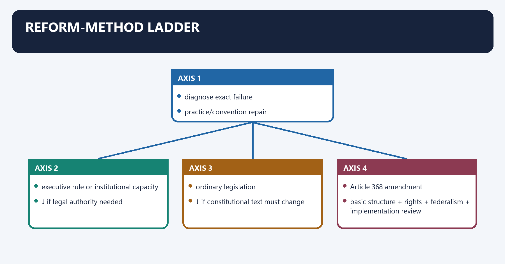
```text
diagnose exact failure
      ↓
practice/convention repair
      ↓ if insufficient
executive rule or institutional capacity
      ↓ if legal authority needed
ordinary legislation
      ↓ if constitutional text must change
Article 368 amendment
      ↓ always
basic structure + rights + federalism + implementation review
```

---

#### CLOSING RECALL FLOW — REFORM-METHOD LADDER

```closure-flow
SUBTOPIC: Reform-method ladder
KEY TERMS / DEFINITIONS: Reform-method ladder · Article 368 · Reform-method · Its principal consequence · Its · The decisive contrast
MECHANISM / ARGUMENT: The decisive contrast is between ↓ if constitutional text must change and Article 368 amendment.
CONSEQUENCE / CONTRAST: Its principal consequence is that ordinary legislation.
UPSC TRAP / ANSWER-USE: Do not miss this limiting distinction: the exam-safe limitation is that basic structure + rights + federalism + implementation review.
ANSWER-GRABBING FORMULATION: Reform should follow the diagnosed failure through administrative, statutory or constitutional routes, using amendment only where text rather than implementation is deficient.
```
### SESSION 17 — STRENGTHS
#### DEFINITION / WHAT THIS IS CALLED

**Plain-language definition:** Strengths denotes the constitutional rules and institutional links organised around comprehensive, cross-institutional review rather than isolated amendment.

**Technical definition:** The exam-safe limitation is that comprehensive, cross-institutional review rather than isolated amendment. comprehensive, cross-institutional review rather than isolated amendment; expressly respected parliamentary democracy and basic structure; separated constitutional, legislative and executive routes; connected rights with governance capacity, federalism and accountability.

#### ANSWER-GRABBING OPENING — WRITE/ADAPT IN THE EXAM

> The NCRWC's strength lay in comprehensive, basic-structure-conscious review that linked rights and institutions to governance capacity rather than proposing indiscriminate constitutional replacement.

#### MUST-WRITE KEYWORDS

- **Strengths**
- **Its principal consequence**
- **Its**
- **The decisive contrast**
- **The exam-safe limitation**

**How to use them:** Frame the answer through Strengths; define Its principal consequence, connect Its with The decisive contrast to explain the mechanism, and use The exam-safe limitation for the decisive comparison or qualification.

Strengths denotes the constitutional rules and institutional links organised around comprehensive, cross-institutional review rather than isolated amendment.
Strengths operates through expressly respected parliamentary democracy and basic structure, connected with separated constitutional, legislative and executive routes.
The operative mechanism matters because connected rights with governance capacity, federalism and accountability.
Its principal consequence is that comprehensive, cross-institutional review rather than isolated amendment.
The decisive contrast is between comprehensive, cross-institutional review rather than isolated amendment and comprehensive, cross-institutional review rather than isolated amendment.
The exam-safe limitation is that comprehensive, cross-institutional review rather than isolated amendment.
- comprehensive, cross-institutional review rather than isolated amendment;
- expressly respected parliamentary democracy and basic structure;
- separated constitutional, legislative and executive routes;
- connected rights with governance capacity, federalism and accountability.

#### CLOSING RECALL FLOW — STRENGTHS

```closure-flow
SUBTOPIC: Strengths
KEY TERMS / DEFINITIONS: Strengths · Its principal consequence · Its · The decisive contrast · The exam-safe limitation
MECHANISM / ARGUMENT: Its principal consequence is that comprehensive, cross-institutional review rather than isolated amendment.
CONSEQUENCE / CONTRAST: The decisive contrast is between comprehensive, cross-institutional review rather than isolated amendment and comprehensive, cross-institutional review rather than isolated amendment.
UPSC TRAP / ANSWER-USE: The exam-safe limitation is that comprehensive, cross-institutional review rather than isolated amendment. comprehensive, cross-institutional review rather than isolated amendment; expressly respected parliamentary democracy and basic structure; separated constitutional, legislative and executive routes; connected rights with governance capacity, federalism and accountability.
ANSWER-GRABBING FORMULATION: The NCRWC's strength lay in comprehensive, basic-structure-conscious review that linked rights and institutions to governance capacity rather than proposing indiscriminate constitutional replacement.
```
### SESSION 18 — LIMITATIONS
#### DEFINITION / WHAT THIS IS CALLED

**Plain-language definition:** The exam-safe limitation is that advisory status meant no self-executing force. advisory status meant no self-executing force; breadth produced proposals of uneven precision and political feasibility; some recommendations sought constitutionalising solutions where practice/capacity was the deeper problem; later law may resemble, modify or reject a proposal without formally "implementing the NCRWC".

**Technical definition:** Technically, Limitations is analysed by relating selective constitutional maintenance to Close-option source discipline, then testing the relationship through Close-option and Its principal consequence.

#### ANSWER-GRABBING OPENING — WRITE/ADAPT IN THE EXAM

> The NCRWC's breadth enabled comprehensive review but produced proposals of uneven precision, making selective maintenance preferable to wholesale implementation.

#### MUST-WRITE KEYWORDS

- **Limitations**
- **selective constitutional maintenance**
- **Close-option source discipline**
- **Close-option**
- **Its principal consequence**
- **Its**

**How to use them:** Frame the answer through Limitations; define selective constitutional maintenance, connect Close-option source discipline with Close-option to explain the mechanism, and use Its principal consequence for the decisive comparison or qualification.

Close-option source discipline means the systematic verification of legal source, institutional category, status and exception before choosing a close option.
Technically, close-option source discipline comprises source attribution, doctrinal classification, date control and remedy-specific qualification.
The operative mechanism matters because later law may resemble, modify or reject a proposal without formally "implementing the NCRWC".
Its principal consequence is that [LIMIT] The best assessment is selective constitutional maintenance , not wholesale implementation.
The decisive contrast is between Test each proposal against basic structure, federalism, rights, democratic accountability and the and current legal position.
The exam-safe limitation is that advisory status meant no self-executing force.
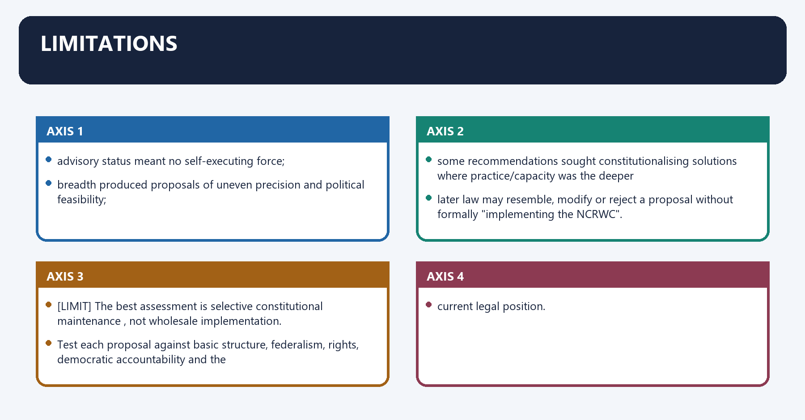
- advisory status meant no self-executing force;
- breadth produced proposals of uneven precision and political feasibility;
- some recommendations sought constitutionalising solutions where practice/capacity was the deeper
  problem;
- later law may resemble, modify or reject a proposal without formally "implementing the NCRWC".

[LIMIT] The best assessment is **selective constitutional maintenance**, not wholesale implementation.
Test each proposal against basic structure, federalism, rights, democratic accountability and the
current legal position.

---

#### CLOSING RECALL FLOW — LIMITATIONS

```closure-flow
SUBTOPIC: Limitations
KEY TERMS / DEFINITIONS: Limitations · selective constitutional maintenance · Close-option source discipline · Close-option · Its principal consequence · Its
MECHANISM / ARGUMENT: Its principal consequence is that The best assessment is selective constitutional maintenance , not wholesale implementation.
CONSEQUENCE / CONTRAST: The best assessment is selective constitutional maintenance, not wholesale implementation.
UPSC TRAP / ANSWER-USE: Do not miss this limiting distinction: the decisive contrast is between Test each proposal against basic structure, federalism, rights, democratic...
ANSWER-GRABBING FORMULATION: The NCRWC's breadth enabled comprehensive review but produced proposals of uneven precision, making selective maintenance preferable to wholesale implementation.
```
### SESSION 19 — DEMAND MAP
#### DEFINITION / WHAT THIS IS CALLED

**Plain-language definition:** 10.1 Demand map denotes the constitutional rules and institutional links organised around Demand Answer spine.

**Technical definition:** 10.1 Demand map operates through Mandate/status Resolution → review-not-rewrite → basic-structure limit → advisory report, connected with Major recommendations Cluster by rights, institutions, federalism, justice and elections; do not list randomly.

#### ANSWER-GRABBING OPENING — WRITE/ADAPT IN THE EXAM

> NCRWC analysis must separate mandate, diagnosis, recommendations and implementation status, preventing a reform proposal from being presented as current law.

#### MUST-WRITE KEYWORDS

- **Demand map**
- **Mandate/status**
- **Resolution → review-not-rewrite → basic-structure limit → advisory report**
- **Major recommendations**
- **Relevance today**
- **Institutional diagnosis → independently verify later law → selective reform**

**How to use them:** Frame the answer through Demand map; define Mandate/status, connect Resolution → review-not-rewrite → basic-structure limit → advisory report with Major recommendations to explain the mechanism, and use Relevance today for the decisive comparison or qualification.

10.1 Demand map denotes the constitutional rules and institutional links organised around Demand Answer spine.
10.1 Demand map operates through Mandate/status Resolution → review-not-rewrite → basic-structure limit → advisory report, connected with Major recommendations Cluster by rights, institutions, federalism, justice and elections; do not list randomly.
The operative mechanism matters because relevance today Institutional diagnosis → independently verify later law → selective reform.
Its principal consequence is that commission reports and constitutional change Expertise/consultation gains → democratic/non-binding limit → Parliament/courts control.
The decisive contrast is between Working versus text Formal adequacy → behavioural/capacity failures → targeted reforms and Demand Answer spine.
The exam-safe limitation is that demand Answer spine.
| Demand | Answer spine |
|---|---|
| Mandate/status | Resolution → review-not-rewrite → basic-structure limit → advisory report |
| Major recommendations | Cluster by rights, institutions, federalism, justice and elections; do not list randomly |
| Relevance today | Institutional diagnosis → independently verify later law → selective reform |
| Commission reports and constitutional change | Expertise/consultation gains → democratic/non-binding limit → Parliament/courts control |
| Working versus text | Formal adequacy → behavioural/capacity failures → targeted reforms |

#### CLOSING RECALL FLOW — DEMAND MAP

```closure-flow
SUBTOPIC: Demand map
KEY TERMS / DEFINITIONS: Demand map · Mandate/status · Resolution → review-not-rewrite → basic-structure limit → advisory report · Major recommendations · Relevance today · Institutional diagnosis → independently verify later law → selective reform
MECHANISM / ARGUMENT: 10.1 Demand map denotes the constitutional rules and institutional links organised around Demand Answer spine.
CONSEQUENCE / CONTRAST: The decisive contrast is between Working versus text Formal adequacy → behavioural/capacity failures → targeted reforms and Demand Answer spine.
UPSC TRAP / ANSWER-USE: Its principal consequence is that commission reports and constitutional change Expertise/consultation gains → democratic/non-binding limit → Parliament/courts control.
ANSWER-GRABBING FORMULATION: NCRWC analysis must separate mandate, diagnosis, recommendations and implementation status, preventing a reform proposal from being presented as current law.
```
### SESSION 20 — THESIS OPTIONS
#### DEFINITION / WHAT THIS IS CALLED

**Plain-language definition:** 10.2 Thesis options denotes the constitutional rules and institutional links organised around The NCRWC's central insight was that India's constitutional deficit lay less in the text than in.

**Technical definition:** 10.2 Thesis options operates through the working of parties, legislatures, administration and justice, connected with Its recommendations are a reform menu, not a parallel Constitution: each must pass through the.

#### ANSWER-GRABBING OPENING — WRITE/ADAPT IN THE EXAM

> NCRWC recommendations form a reform menu rather than a parallel Constitution, requiring adoption through the competent legal route and compliance with basic structure.

#### MUST-WRITE KEYWORDS

- **Thesis options**
- **Thesis**
- **The NCRWC's**
- **India's**
- **Its**
- **10.2 Thesis options**

**How to use them:** Frame the answer through Thesis options; define Thesis, connect The NCRWC's with India's to explain the mechanism, and use Its for the decisive comparison or qualification.

10.2 Thesis options denotes the constitutional rules and institutional links organised around The NCRWC's central insight was that India's constitutional deficit lay less in the text than in.
10.2 Thesis options operates through the working of parties, legislatures, administration and justice, connected with Its recommendations are a reform menu, not a parallel Constitution: each must pass through the.
The operative mechanism matters because proper amendment, legislative or executive route and remain subject to basic structure.
Its principal consequence is that the Commission is most useful when cited diagnostically—linking a reform to a named.
The decisive contrast is between institutional failure—not as authority that the reform is already law and The NCRWC's central insight was that India's constitutional deficit lay less in the text than in.
The exam-safe limitation is that the NCRWC's central insight was that India's constitutional deficit lay less in the text than in.
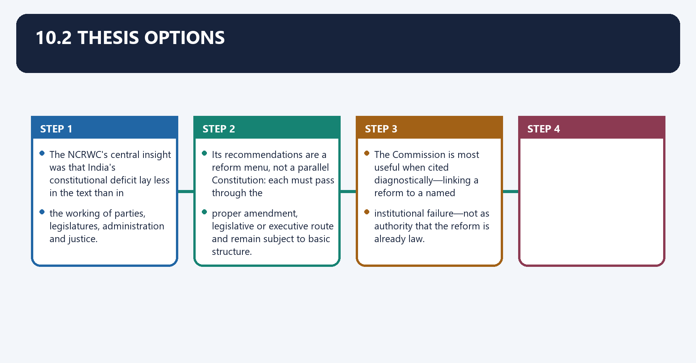
- *The NCRWC's central insight was that India's constitutional deficit lay less in the text than in
  the working of parties, legislatures, administration and justice.*
- *Its recommendations are a reform menu, not a parallel Constitution: each must pass through the
  proper amendment, legislative or executive route and remain subject to basic structure.*
- *The Commission is most useful when cited diagnostically—linking a reform to a named
  institutional failure—not as authority that the reform is already law.*

#### CLOSING RECALL FLOW — THESIS OPTIONS

```closure-flow
SUBTOPIC: Thesis options
KEY TERMS / DEFINITIONS: Thesis options · Thesis · The NCRWC's · India's · Its · 10.2 Thesis options
MECHANISM / ARGUMENT: 10.2 Thesis options operates through the working of parties, legislatures, administration and justice, connected with Its recommendations are a reform menu, not a parallel Constitution: each must pass through the.
CONSEQUENCE / CONTRAST: The decisive contrast is between institutional failure—not as authority that the reform is already law and The NCRWC's central insight was that India's constitutional deficit lay less in the text than in.
UPSC TRAP / ANSWER-USE: Do not miss this limiting distinction: its principal consequence is that the Commission is most useful when cited diagnostically—linking a...
ANSWER-GRABBING FORMULATION: NCRWC recommendations form a reform menu rather than a parallel Constitution, requiring adoption through the competent legal route and compliance with basic structure.
```
### SESSION 21 — MARK-SCALED STRUCTURES
#### DEFINITION / WHAT THIS IS CALLED

**Plain-language definition:** 10.3 Mark-scaled structures denotes the constitutional rules and institutional links organised around Marks Structure Evidence.

**Technical definition:** The decisive contrast is between Marks Structure Evidence and Marks Structure Evidence.

#### ANSWER-GRABBING OPENING — WRITE/ADAPT IN THE EXAM

> NCRWC proposals gain analytical value when compared with current law and implementation, because recommendation, adoption and practical effect are separate stages.

#### MUST-WRITE KEYWORDS

- **Mark-scaled structures**
- **Identity/mandate → 3 recommendation clusters → non-binding verdict**
- **3–4 named proposals**
- **5–6 proposals**
- **7–9 proposals with current-law qualifications**
- **10.3 Mark-scaled structures**

**How to use them:** Frame the answer through Mark-scaled structures; define Identity/mandate → 3 recommendation clusters → non-binding verdict, connect 3–4 named proposals with 5–6 proposals to explain the mechanism, and use 7–9 proposals with current-law qualifications for the decisive comparison or qualification.

10.3 Mark-scaled structures denotes the constitutional rules and institutional links organised around Marks Structure Evidence.
10.3 Mark-scaled structures operates through 10 Identity/mandate → 3 recommendation clusters → non-binding verdict 3–4 named proposals, connected with 15 Terms → diagnosis → rights/institutions/federal/election reforms → status caution 5–6 proposals.
The operative mechanism matters because marks Structure Evidence.
Its principal consequence is that marks Structure Evidence.
The decisive contrast is between Marks Structure Evidence and Marks Structure Evidence.
The exam-safe limitation is that marks Structure Evidence.
| Marks | Structure | Evidence |
|---:|---|---|
| 10 | Identity/mandate → 3 recommendation clusters → non-binding verdict | 3–4 named proposals |
| 15 | Terms → diagnosis → rights/institutions/federal/election reforms → status caution | 5–6 proposals |
| 20 | Mandate → concern map → thematic recommendations → implementation test → balanced conclusion | 7–9 proposals with current-law qualifications |

#### CLOSING RECALL FLOW — MARK-SCALED STRUCTURES

```closure-flow
SUBTOPIC: Mark-scaled structures
KEY TERMS / DEFINITIONS: Mark-scaled structures · Identity/mandate → 3 recommendation clusters → non-binding verdict · 3–4 named proposals · 5–6 proposals · 7–9 proposals with current-law qualifications · 10.3 Mark-scaled structures
MECHANISM / ARGUMENT: The decisive contrast is between Marks Structure Evidence and Marks Structure Evidence.
CONSEQUENCE / CONTRAST: Its principal consequence is that marks Structure Evidence.
UPSC TRAP / ANSWER-USE: Do not miss this limiting distinction: the exam-safe limitation is that marks Structure Evidence.
ANSWER-GRABBING FORMULATION: NCRWC proposals gain analytical value when compared with current law and implementation, because recommendation, adoption and practical effect are separate stages.
```
### SESSION 22 — EVIDENCE UNITS
#### DEFINITION / WHAT THIS IS CALLED

**Plain-language definition:** 10.4 Evidence units denotes the constitutional rules and institutional links organised around Claim: the NCRWC was constitutionally self-limited.

**Technical definition:** Qualification: recommendation is not constitutional convention or law by itself.

#### ANSWER-GRABBING OPENING — WRITE/ADAPT IN THE EXAM

> NCRWC recommendations provide evidence for institutional reform, but retain advisory status unless adopted through the constitutionally competent legal route.

#### MUST-WRITE KEYWORDS

- **Evidence units**
- **Claim**
- **Qualification**
- **NCRWC**
- **Commission**
- **10.4 Evidence units**

**How to use them:** Frame the answer through Evidence units; define Claim, connect Qualification with NCRWC to explain the mechanism, and use Commission for the decisive comparison or qualification.

10.4 Evidence units denotes the constitutional rules and institutional links organised around Claim: the NCRWC was constitutionally self-limited. Evidence: 🧾 terms required.
10.4 Evidence units operates through parliamentary democracy and non-interference with basic structure. Analysis: review was, connected with reformist, not constituent. Qualification: the Commission itself had no legal veto over later.
The operative mechanism matters because claim: its anti-defection proposal separated adjudication from partisan presiding officers.
Its principal consequence is that evidence: 🧾 vest decision in the ECI. Analysis: targets conflict of interest.
The decisive contrast is between Qualification: current Tenth Schedule still controls and Claim: its federal recommendations emphasised consultation. Evidence: 🧾 CM consultation.
The exam-safe limitation is that for Governors and a stronger Inter-State Council. Analysis: addresses legitimacy and trust.
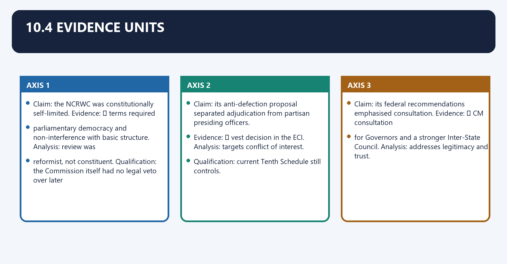
- **Claim:** the NCRWC was constitutionally self-limited. **Evidence:** 🧾 terms required
  parliamentary democracy and non-interference with basic structure. **Analysis:** review was
  reformist, not constituent. **Qualification:** the Commission itself had no legal veto over later
  amendment.
- **Claim:** its anti-defection proposal separated adjudication from partisan presiding officers.
  **Evidence:** 🧾 vest decision in the ECI. **Analysis:** targets conflict of interest.
  **Qualification:** current Tenth Schedule still controls.
- **Claim:** its federal recommendations emphasised consultation. **Evidence:** 🧾 CM consultation
  for Governors and a stronger Inter-State Council. **Analysis:** addresses legitimacy and trust.
  **Qualification:** recommendation is not constitutional convention or law by itself.

---

#### CLOSING RECALL FLOW — EVIDENCE UNITS

```closure-flow
SUBTOPIC: Evidence units
KEY TERMS / DEFINITIONS: Evidence units · Claim · Qualification · NCRWC · Commission · 10.4 Evidence units
MECHANISM / ARGUMENT: Qualification: recommendation is not constitutional convention or law by itself.
CONSEQUENCE / CONTRAST: The decisive contrast is between Qualification: current Tenth Schedule still controls and Claim: its federal recommendations emphasised consultation.
UPSC TRAP / ANSWER-USE: Do not miss this limiting distinction: its principal consequence is that evidence.
ANSWER-GRABBING FORMULATION: NCRWC recommendations provide evidence for institutional reform, but retain advisory status unless adopted through the constitutionally competent legal route.
```
### SESSION 23 — MUST-KNOW FACTS
#### DEFINITION / WHAT THIS IS CALLED

**Plain-language definition:** Must-Know Facts denotes the constitutional rules and institutional links organised around Government resolution, 2000; report, 2002.

**Technical definition:** Must-Know Facts operates through 11 members; chaired by M.N.

#### ANSWER-GRABBING OPENING — WRITE/ADAPT IN THE EXAM

> The NCRWC classified 249 recommendations across constitutional, legislative and executive routes, but each remained advisory unless separately adopted.

#### MUST-WRITE KEYWORDS

- **Must-Know Facts**
- **working**
- **Government**
- **M.N**
- **Parliamentary**
- **Its principal consequence**

**How to use them:** Frame the answer through Must-Know Facts; define working, connect Government with M.N to explain the mechanism, and use Parliamentary for the decisive comparison or qualification.

11. Must-Know Facts denotes the constitutional rules and institutional links organised around [FACT] Government resolution, 2000; report, 2002.
11. Must-Know Facts operates through [FACT] 11 members; chaired by M.N. Venkatachaliah, connected with [FACT] Review of working , not rewriting.
The operative mechanism matters because [FACT] Parliamentary democracy/basic structure were express limits.
Its principal consequence is that [FACT] 249 recommendations: 58 constitutional, 86 legislative, 105 executive in the eighth-edition.
The decisive contrast is between 🧾 Every substantive proposal remains a recommendation unless separately enacted/recognised and [LIMIT] Later similarity is not proof of causal implementation.
The exam-safe limitation is that [FACT] Government resolution, 2000; report, 2002.
- [FACT] Government resolution, 2000; report, 2002.
- [FACT] 11 members; chaired by M.N. Venkatachaliah.
- [FACT] Review of **working**, not rewriting.
- [FACT] Parliamentary democracy/basic structure were express limits.
- [FACT] 249 recommendations: 58 constitutional, 86 legislative, 105 executive in the eighth-edition
  classification.
- 🧾 Every substantive proposal remains a recommendation unless separately enacted/recognised.
- [LIMIT] Later similarity is not proof of causal implementation.

---

#### CLOSING RECALL FLOW — MUST-KNOW FACTS

```closure-flow
SUBTOPIC: Must-Know Facts
KEY TERMS / DEFINITIONS: Must-Know Facts · working · Government · M.N · Parliamentary · Its principal consequence
MECHANISM / ARGUMENT: Must-Know Facts operates through 11 members; chaired by M.N.
CONSEQUENCE / CONTRAST: Its principal consequence is that 249 recommendations: 58 constitutional, 86 legislative, 105 executive in the eighth-edition.
UPSC TRAP / ANSWER-USE: The decisive contrast is between 🧾 Every substantive proposal remains a recommendation unless separately enacted/recognised and Later similarity is not proof of causal implementation.
ANSWER-GRABBING FORMULATION: The NCRWC classified 249 recommendations across constitutional, legislative and executive routes, but each remained advisory unless separately adopted.
```
### SESSION 24 — UPSC TRAPS AND SOURCE DISCIPLINE
#### DEFINITION / WHAT THIS IS CALLED

**Plain-language definition:** Close-option source discipline means the systematic verification of legal source, institutional category, status and exception before choosing a close option.

**Technical definition:** The operative mechanism matters because do not present a proposed right, ministry ceiling, appointment panel or MCC status as current law.

#### ANSWER-GRABBING OPENING — WRITE/ADAPT IN THE EXAM

> NCRWC proposals must remain distinct from later law, judicial doctrine and convention, especially on rights, ministry size, appointments and the Model Code.

#### MUST-WRITE KEYWORDS

- **s**
- **source discipline**
- **Close-option source discipline**
- **Close-option**
- **MCC**
- **Its principal consequence**

**How to use them:** Frame the answer through s; define source discipline, connect Close-option source discipline with Close-option to explain the mechanism, and use MCC for the decisive comparison or qualification.

Close-option source discipline means the systematic verification of legal source, institutional category, status and exception before choosing a close option.
Technically, close-option source discipline comprises source attribution, doctrinal classification, date control and remedy-specific qualification.
The operative mechanism matters because do not present a proposed right, ministry ceiling, appointment panel or MCC status as current law.
Its principal consequence is that do not say a later statute adopted NCRWC unless an official source establishes that link.
The decisive contrast is between Write separately: [FACT] current text · 📜 enacted law · ⚖️ holding · 🧾 NCRWC proposal · and [LIMIT] evaluation.
The exam-safe limitation is that do not call NCRWC a constitutional or statutory body.
- Do not call NCRWC a constitutional or statutory body.
- Do not call the Venkatachaliah Commission a constituent assembly.
- Do not merge NCRWC, Sarkaria, Punchhi, Law Commission or Administrative Reforms Commission.
- Do not present a proposed right, ministry ceiling, appointment panel or MCC status as current law.
- Do not say a later statute adopted NCRWC unless an official source establishes that link.
- Write separately: [FACT] current text · 📜 enacted law · ⚖️ holding · 🧾 NCRWC proposal ·
  [LIMIT] evaluation.

#### CLOSING RECALL FLOW — UPSC TRAPS AND SOURCE DISCIPLINE

```closure-flow
SUBTOPIC: UPSC traps and source discipline
KEY TERMS / DEFINITIONS: s · source discipline · Close-option source discipline · Close-option · MCC · Its principal consequence
MECHANISM / ARGUMENT: The operative mechanism matters because do not present a proposed right, ministry ceiling, appointment panel or MCC status as current law.
CONSEQUENCE / CONTRAST: Its principal consequence is that do not say a later statute adopted NCRWC unless an official source establishes that link.
UPSC TRAP / ANSWER-USE: Do not present a proposed right, ministry ceiling, appointment panel or MCC status as current law.
ANSWER-GRABBING FORMULATION: NCRWC proposals must remain distinct from later law, judicial doctrine and convention, especially on rights, ministry size, appointments and the Model Code.
```
### SESSION 25 — ROUTING
#### DEFINITION / WHAT THIS IS CALLED

**Plain-language definition:** Routing denotes the constitutional rules and institutional links organised around Parliament/executive: Parliament.md , PM-and-Council-of-Ministers.md.

**Technical definition:** The exam-safe limitation is that parliament/executive: Parliament.md , PM-and-Council-of-Ministers.md.

#### ANSWER-GRABBING OPENING — WRITE/ADAPT IN THE EXAM

> The NCRWC is a reform source for multiple institutions, but the operative rule must always be taken from the relevant Constitution, statute or judgment.

#### MUST-WRITE KEYWORDS

- **Routing**
- **Parliament**
- **Parliament.md**
- **PM-and-Council-of-Ministers.md**
- **Its principal consequence**
- **Its**

**How to use them:** Frame the answer through Routing; define Parliament, connect Parliament.md with PM-and-Council-of-Ministers.md to explain the mechanism, and use Its principal consequence for the decisive comparison or qualification.

Routing denotes the constitutional rules and institutional links organised around Parliament/executive: Parliament.md , PM-and-Council-of-Ministers.md.
Routing operates through Federalism/Governor: Centre-State-Relations.md , Governor-and-CM.md, connected with Elections/parties/defection: Election-Commission.md , Political-Parties.md ,.
The operative mechanism matters because anti-Defection-Law.md.
Its principal consequence is that judiciary: Supreme-Court.md , High-Court.md.
The decisive contrast is between Rights/DPSP/Duties: Fundamental-Rights.md , Directive-Principles.md , and Fundamental-Duties.md.
The exam-safe limitation is that parliament/executive: Parliament.md , PM-and-Council-of-Ministers.md.
- Parliament/executive: `Parliament.md`, `PM-and-Council-of-Ministers.md`
- Federalism/Governor: `Centre-State-Relations.md`, `Governor-and-CM.md`
- Elections/parties/defection: `Election-Commission.md`, `Political-Parties.md`,
  `Anti-Defection-Law.md`
- Judiciary: `Supreme-Court.md`, `High-Court.md`
- Rights/DPSP/Duties: `Fundamental-Rights.md`, `Directive-Principles.md`,
  `Fundamental-Duties.md`

#### CLOSING RECALL FLOW — ROUTING

```closure-flow
SUBTOPIC: Routing
KEY TERMS / DEFINITIONS: Routing · Parliament · Parliament.md · PM-and-Council-of-Ministers.md · Its principal consequence · Its
MECHANISM / ARGUMENT: The exam-safe limitation is that parliament/executive: Parliament.md , PM-and-Council-of-Ministers.md.
CONSEQUENCE / CONTRAST: Its principal consequence is that judiciary: Supreme-Court.md , High-Court.md.
UPSC TRAP / ANSWER-USE: Do not miss this limiting distinction: the decisive contrast is between Rights/DPSP/Duties.
ANSWER-GRABBING FORMULATION: The NCRWC is a reform source for multiple institutions, but the operative rule must always be taken from the relevant Constitution, statute or judgment.
```
### 26. Recommendation clusters and correct current-law route

Recommendation clusters and correct current-law route denotes the constitutional rules and institutional links organised around Cluster NCRWC use Current-law route.
Recommendation clusters and correct current-law route operates through Rights/DPSP/Duties reform diagnosis and proposed text Constitution + controlling cases/statutes, connected with Elections/parties decriminalisation, finance, ECI and party-law proposals RPA, Symbols Order, Tenth Schedule, case law.
The operative mechanism matters because parliament/executive sittings, committees, privileges, ministry size Constitution, rules, later amendments.
Its principal consequence is that judiciary appointments, complaints, delay and access current collegium, statutes and judgments.
The decisive contrast is between Federalism Governor, Art 356, ISC, water and reserved Bills constitutional text + later cases and Decentralisation functions, finance, audit, elections Parts IX/IXA and State law.
The exam-safe limitation is that administration/integrity civil services, disclosure, Lokpal and audit later statutes/rules, not report alone.
| Cluster | NCRWC use | Current-law route |
|---|---|---|
| Rights/DPSP/Duties | reform diagnosis and proposed text | Constitution + controlling cases/statutes |
| Elections/parties | decriminalisation, finance, ECI and party-law proposals | RPA, Symbols Order, Tenth Schedule, case law |
| Parliament/executive | sittings, committees, privileges, ministry size | Constitution, rules, later amendments |
| Judiciary | appointments, complaints, delay and access | current collegium, statutes and judgments |
| Federalism | Governor, Art 356, ISC, water and reserved Bills | constitutional text + later cases |
| Decentralisation | functions, finance, audit, elections | Parts IX/IXA and State law |
| Administration/integrity | civil services, disclosure, Lokpal and audit | later statutes/rules, not report alone |

[LIMIT] The report is reform evidence. It is never the operative source for a later legal rule.

### SESSION 26 — CONSTITUTIONAL-WORKING DASHBOARD
#### DEFINITION / WHAT THIS IS CALLED

**Plain-language definition:** Constitutional-working dashboard denotes the constitutional rules and institutional links organised around authority - restraint - deliberation - implementation - remedy - public justification.

**Technical definition:** Technically, Constitutional-working dashboard is analysed by relating Constitutional-working to Its principal consequence, then testing the relationship through Its and The decisive contrast.

#### ANSWER-GRABBING OPENING — WRITE/ADAPT IN THE EXAM

> Constitutional working can be judged through authority, restraint, deliberation, implementation, remedy and public justification, directing reform toward the actual point of failure.

#### MUST-WRITE KEYWORDS

- **Constitutional-working dashboard**
- **Constitutional-working**
- **Its principal consequence**
- **Its**
- **The decisive contrast**
- **The exam-safe limitation**

**How to use them:** Frame the answer through Constitutional-working dashboard; define Constitutional-working, connect Its principal consequence with Its to explain the mechanism, and use The decisive contrast for the decisive comparison or qualification.

Constitutional-working dashboard denotes the constitutional rules and institutional links organised around authority - restraint - deliberation - implementation - remedy - public justification.
Constitutional-working dashboard operates through unclear allocation or missing safeguard - amendment may be considered, connected with adequate text + weak convention/capacity - procedure, staffing, transparency or accountability.
The operative mechanism matters because text and incentives interact - calibrated constitutional + legislative + institutional reform.
Its principal consequence is that [LIMIT] Do not constitutionalise every administrative problem or treat every convention as law.
The decisive contrast is between authority - restraint - deliberation - implementation - remedy - public justification and authority - restraint - deliberation - implementation - remedy - public justification.
The exam-safe limitation is that authority - restraint - deliberation - implementation - remedy - public justification.
WORKING TEST
authority -> restraint -> deliberation -> implementation -> remedy -> public justification.

TEXT FAILURE
unclear allocation or missing safeguard -> amendment may be considered.

PRACTICE FAILURE
adequate text + weak convention/capacity -> procedure, staffing, transparency or accountability.

MIXED FAILURE
text and incentives interact -> calibrated constitutional + legislative + institutional reform.

[LIMIT] Do not constitutionalise every administrative problem or treat every convention as law.

#### CLOSING RECALL FLOW — CONSTITUTIONAL-WORKING DASHBOARD

```closure-flow
SUBTOPIC: Constitutional-working dashboard
KEY TERMS / DEFINITIONS: Constitutional-working dashboard · Constitutional-working · Its principal consequence · Its · The decisive contrast · The exam-safe limitation
MECHANISM / ARGUMENT: The operative mechanism matters because text and incentives interact - calibrated constitutional + legislative + institutional reform.
CONSEQUENCE / CONTRAST: Its principal consequence is that Do not constitutionalise every administrative problem or treat every convention as law.
UPSC TRAP / ANSWER-USE: Do not miss this limiting distinction: the decisive contrast is between authority - restraint - deliberation - implementation - remedy...
ANSWER-GRABBING FORMULATION: Constitutional working can be judged through authority, restraint, deliberation, implementation, remedy and public justification, directing reform toward the actual point of failure.
```
### SESSION 27 — CASE-BOUNDED FOLLOW-THROUGH
#### DEFINITION / WHAT THIS IS CALLED

**Plain-language definition:** Case-bounded follow-through denotes the constitutional rules and institutional links organised around Kesavananda Bharati (1973) - basic-structure boundary.

**Technical definition:** Case-bounded follow-through operates through Minerva Mills (1980) - limited amendment + rights-DPSP harmony, connected with S.R.

#### ANSWER-GRABBING OPENING — WRITE/ADAPT IN THE EXAM

> NCRWC proposals gain persuasive legitimacy when they identify the problem, consider competing views and remain bounded by basic structure and governing case law.

#### MUST-WRITE KEYWORDS

- **Case-bounded follow-through**
- **Case-bounded**
- **Kesavananda Bharati**
- **Minerva Mills**
- **DPSP**
- **S.R**

**How to use them:** Frame the answer through Case-bounded follow-through; define Case-bounded, connect Kesavananda Bharati with Minerva Mills to explain the mechanism, and use DPSP for the decisive comparison or qualification.

Case-bounded follow-through denotes the constitutional rules and institutional links organised around Kesavananda Bharati (1973) - basic-structure boundary.
Case-bounded follow-through operates through Minerva Mills (1980) - limited amendment + rights-DPSP harmony, connected with S.R. Bommai (1994) - federal/secular structural enforcement.
The operative mechanism matters because k.S. Puttaswamy (2017) - privacy/dignity in modern governance.
Its principal consequence is that navtej Singh Johar (2018) - constitutional morality and transformation.
The decisive contrast is between [LIMIT] These are governing judicial developments, not proof that the Court implemented NCRWC and Kesavananda Bharati (1973) - basic-structure boundary.
The exam-safe limitation is that kesavananda Bharati (1973) - basic-structure boundary.
Kesavananda Bharati (1973) -> basic-structure boundary.
Minerva Mills (1980) -> limited amendment + rights-DPSP harmony.
S.R. Bommai (1994) -> federal/secular structural enforcement.
K.S. Puttaswamy (2017) -> privacy/dignity in modern governance.
Navtej Singh Johar (2018) -> constitutional morality and transformation.

[LIMIT] These are governing judicial developments, not proof that the Court implemented NCRWC.

#### CLOSING RECALL FLOW — CASE-BOUNDED FOLLOW-THROUGH

```closure-flow
SUBTOPIC: Case-bounded follow-through
KEY TERMS / DEFINITIONS: Case-bounded follow-through · Case-bounded · Kesavananda Bharati · Minerva Mills · DPSP · S.R
MECHANISM / ARGUMENT: Case-bounded follow-through operates through Minerva Mills (1980) - limited amendment + rights-DPSP harmony, connected with S.R.
CONSEQUENCE / CONTRAST: The decisive contrast is between These are governing judicial developments, not proof that the Court implemented NCRWC and Kesavananda Bharati (1973) - basic-structure boundary.
UPSC TRAP / ANSWER-USE: Do not miss this limiting distinction: its principal consequence is that navtej Singh Johar (2018) - constitutional morality and transformation.
ANSWER-GRABBING FORMULATION: NCRWC proposals gain persuasive legitimacy when they identify the problem, consider competing views and remain bounded by basic structure and governing case law.
```
## BASIC MCQS / REMEDIATION

### Original MCQs 1-36 — Broad Coverage
#### OM1. Which statement most accurately describes NCRWC status?

- A. It exercised constituent power.
- B. It was a statutory Law Commission.
- C. It was a temporary executive advisory commission created by a 2000 resolution.
- D. It was a constitutional body under Article 368.

**Answer: C**

**Explanation:** Legal status controls the force of every recommendation. The other options collapse distinct legal sources, institutions or consequences and therefore fail the close-option test.

#### OM2. Which statement most accurately describes review boundary?

- A. Its mandate reviewed working within parliamentary democracy and without disturbing basic structure.
- B. It bound Parliament.
- C. It excluded institutional practice.
- D. It could replace the Constitution.

**Answer: A**

**Explanation:** Review was maintenance-oriented, not a constituent rewrite. The other options collapse distinct legal sources, institutions or consequences and therefore fail the close-option test.

#### OM3. Which statement most accurately describes report timing?

- A. Justice M.N. Venkatachaliah chaired the Commission and the report was submitted in 2002.
- B. The report was submitted in 1950.
- C. It remains a pending court case.
- D. Sarkaria chaired it.

**Answer: A**

**Explanation:** Identity and year are foundational facts. The other options collapse distinct legal sources, institutions or consequences and therefore fail the close-option test.

#### OM4. Which statement most accurately describes recommendation status?

- A. A later similar law proves adoption.
- B. Each proposal remains non-binding unless separately enacted or judicially recognised.
- C. All 249 proposals became law.
- D. None can ever influence reform.

**Answer: B**

**Explanation:** Implementation requires instrument-specific comparison. The other options collapse distinct legal sources, institutions or consequences and therefore fail the close-option test.

#### OM5. Which statement most accurately describes working concept?

- A. It means amendments alone.
- B. It excludes political practice.
- C. It is identical to judicial review.
- D. Constitutional working includes text, institutions, conventions, parties, administration and remedies.

**Answer: D**

**Explanation:** Performance may fail without textual collapse. The other options collapse distinct legal sources, institutions or consequences and therefore fail the close-option test.

#### OM6. Which statement most accurately describes implementation audit?

- A. Chronology proves causation.
- B. Exact adoption, modified adoption and functional similarity are different findings.
- C. Global implementation claims are sufficient.
- D. A common subject proves adoption.

**Answer: B**

**Explanation:** Recommendation-by-recommendation audit prevents overclaim. The other options collapse distinct legal sources, institutions or consequences and therefore fail the close-option test.

#### OM7. Which statement most accurately describes ministry ceiling?

- A. The NCRWC proposed 10%; the 91st Amendment adopted a different 15% ceiling.
- B. Both used 10%.
- C. There is no ministry ceiling.
- D. The NCRWC enacted the ceiling.

**Answer: A**

**Explanation:** Related reform is not exact implementation. The other options collapse distinct legal sources, institutions or consequences and therefore fail the close-option test.

#### OM8. Which statement most accurately describes judicial commission?

- A. The 2015 decision approved NJAC.
- B. The NCRWC proposal, later NJAC scheme and current collegium are distinct.
- C. NCRWC created NJAC.
- D. They are the same institution.

**Answer: B**

**Explanation:** Source, design and legal status differ. The other options collapse distinct legal sources, institutions or consequences and therefore fail the close-option test.

#### OM9. Which statement most accurately describes federal reform?

- A. They amended Articles 155-156.
- B. They repealed Article 356.
- C. Governor, Article 356 and Inter-State Council proposals were recommendations, not current text.
- D. They bind every Governor.

**Answer: C**

**Explanation:** Use current Articles and cases for operative law. The other options collapse distinct legal sources, institutions or consequences and therefore fail the close-option test.

#### OM10. Which statement most accurately describes constitutional morality?

- A. It replaces constitutional text.
- B. It is personal judicial ethics only.
- C. It means fidelity to constitutional forms, equality and institutional role limits.
- D. It means majority morality.

**Answer: C**

**Explanation:** The doctrine must be textually and structurally anchored. The other options collapse distinct legal sources, institutions or consequences and therefore fail the close-option test.

#### OM11. Which statement most accurately describes reform ladder?

- A. Commission advice itself changes law.
- B. Executive action can amend Part III.
- C. Every problem needs amendment.
- D. Practice, executive action, legislation and amendment are distinct reform routes.

**Answer: D**

**Explanation:** Choose the least legally sufficient route. The other options collapse distinct legal sources, institutions or consequences and therefore fail the close-option test.

#### OM12. Which statement most accurately describes answer method?

- A. Ignore basic structure.
- B. Cluster recommendations, state status, compare later law and give a qualified verdict.
- C. List proposals without status.
- D. Call every later reform implementation.

**Answer: B**

**Explanation:** This converts a report into an analytical answer. The other options collapse distinct legal sources, institutions or consequences and therefore fail the close-option test.

#### OM13. Which is the safest UPSC distinction concerning NCRWC status?

- A. It was a constitutional body under Article 368.
- B. It exercised constituent power.
- C. It was a statutory Law Commission.
- D. It was a temporary executive advisory commission created by a 2000 resolution.

**Answer: D**

**Explanation:** Legal status controls the force of every recommendation. The other options collapse distinct legal sources, institutions or consequences and therefore fail the close-option test.

#### OM14. Which is the safest UPSC distinction concerning review boundary?

- A. It could replace the Constitution.
- B. Its mandate reviewed working within parliamentary democracy and without disturbing basic structure.
- C. It excluded institutional practice.
- D. It bound Parliament.

**Answer: B**

**Explanation:** Review was maintenance-oriented, not a constituent rewrite. The other options collapse distinct legal sources, institutions or consequences and therefore fail the close-option test.

#### OM15. Which is the safest UPSC distinction concerning report timing?

- A. The report was submitted in 1950.
- B. Sarkaria chaired it.
- C. Justice M.N. Venkatachaliah chaired the Commission and the report was submitted in 2002.
- D. It remains a pending court case.

**Answer: C**

**Explanation:** Identity and year are foundational facts. The other options collapse distinct legal sources, institutions or consequences and therefore fail the close-option test.

#### OM16. Which is the safest UPSC distinction concerning recommendation status?

- A. Each proposal remains non-binding unless separately enacted or judicially recognised.
- B. A later similar law proves adoption.
- C. All 249 proposals became law.
- D. None can ever influence reform.

**Answer: A**

**Explanation:** Implementation requires instrument-specific comparison. The other options collapse distinct legal sources, institutions or consequences and therefore fail the close-option test.

#### OM17. Which is the safest UPSC distinction concerning working concept?

- A. Constitutional working includes text, institutions, conventions, parties, administration and remedies.
- B. It excludes political practice.
- C. It means amendments alone.
- D. It is identical to judicial review.

**Answer: A**

**Explanation:** Performance may fail without textual collapse. The other options collapse distinct legal sources, institutions or consequences and therefore fail the close-option test.

#### OM18. Which is the safest UPSC distinction concerning implementation audit?

- A. Chronology proves causation.
- B. A common subject proves adoption.
- C. Exact adoption, modified adoption and functional similarity are different findings.
- D. Global implementation claims are sufficient.

**Answer: C**

**Explanation:** Recommendation-by-recommendation audit prevents overclaim. The other options collapse distinct legal sources, institutions or consequences and therefore fail the close-option test.

#### OM19. Which is the safest UPSC distinction concerning ministry ceiling?

- A. The NCRWC enacted the ceiling.
- B. There is no ministry ceiling.
- C. Both used 10%.
- D. The NCRWC proposed 10%; the 91st Amendment adopted a different 15% ceiling.

**Answer: D**

**Explanation:** Related reform is not exact implementation. The other options collapse distinct legal sources, institutions or consequences and therefore fail the close-option test.

#### OM20. Which is the safest UPSC distinction concerning judicial commission?

- A. NCRWC created NJAC.
- B. The 2015 decision approved NJAC.
- C. The NCRWC proposal, later NJAC scheme and current collegium are distinct.
- D. They are the same institution.

**Answer: C**

**Explanation:** Source, design and legal status differ. The other options collapse distinct legal sources, institutions or consequences and therefore fail the close-option test.

#### OM21. Which is the safest UPSC distinction concerning federal reform?

- A. They bind every Governor.
- B. They repealed Article 356.
- C. Governor, Article 356 and Inter-State Council proposals were recommendations, not current text.
- D. They amended Articles 155-156.

**Answer: C**

**Explanation:** Use current Articles and cases for operative law. The other options collapse distinct legal sources, institutions or consequences and therefore fail the close-option test.

#### OM22. Which is the safest UPSC distinction concerning constitutional morality?

- A. It means fidelity to constitutional forms, equality and institutional role limits.
- B. It means majority morality.
- C. It replaces constitutional text.
- D. It is personal judicial ethics only.

**Answer: A**

**Explanation:** The doctrine must be textually and structurally anchored. The other options collapse distinct legal sources, institutions or consequences and therefore fail the close-option test.

#### OM23. Which is the safest UPSC distinction concerning reform ladder?

- A. Practice, executive action, legislation and amendment are distinct reform routes.
- B. Executive action can amend Part III.
- C. Every problem needs amendment.
- D. Commission advice itself changes law.

**Answer: A**

**Explanation:** Choose the least legally sufficient route. The other options collapse distinct legal sources, institutions or consequences and therefore fail the close-option test.

#### OM24. Which is the safest UPSC distinction concerning answer method?

- A. Ignore basic structure.
- B. Cluster recommendations, state status, compare later law and give a qualified verdict.
- C. List proposals without status.
- D. Call every later reform implementation.

**Answer: B**

**Explanation:** This converts a report into an analytical answer. The other options collapse distinct legal sources, institutions or consequences and therefore fail the close-option test.

#### OM25. A candidate makes a close-option error about NCRWC status. Which correction is most accurate?

- A. It exercised constituent power.
- B. It was a statutory Law Commission.
- C. It was a temporary executive advisory commission created by a 2000 resolution.
- D. It was a constitutional body under Article 368.

**Answer: C**

**Explanation:** Legal status controls the force of every recommendation. The other options collapse distinct legal sources, institutions or consequences and therefore fail the close-option test.

#### OM26. A candidate makes a close-option error about review boundary. Which correction is most accurate?

- A. Its mandate reviewed working within parliamentary democracy and without disturbing basic structure.
- B. It excluded institutional practice.
- C. It could replace the Constitution.
- D. It bound Parliament.

**Answer: A**

**Explanation:** Review was maintenance-oriented, not a constituent rewrite. The other options collapse distinct legal sources, institutions or consequences and therefore fail the close-option test.

#### OM27. A candidate makes a close-option error about report timing. Which correction is most accurate?

- A. The report was submitted in 1950.
- B. Sarkaria chaired it.
- C. Justice M.N. Venkatachaliah chaired the Commission and the report was submitted in 2002.
- D. It remains a pending court case.

**Answer: C**

**Explanation:** Identity and year are foundational facts. The other options collapse distinct legal sources, institutions or consequences and therefore fail the close-option test.

#### OM28. A candidate makes a close-option error about recommendation status. Which correction is most accurate?

- A. All 249 proposals became law.
- B. None can ever influence reform.
- C. A later similar law proves adoption.
- D. Each proposal remains non-binding unless separately enacted or judicially recognised.

**Answer: D**

**Explanation:** Implementation requires instrument-specific comparison. The other options collapse distinct legal sources, institutions or consequences and therefore fail the close-option test.

#### OM29. A candidate makes a close-option error about working concept. Which correction is most accurate?

- A. It is identical to judicial review.
- B. Constitutional working includes text, institutions, conventions, parties, administration and remedies.
- C. It excludes political practice.
- D. It means amendments alone.

**Answer: B**

**Explanation:** Performance may fail without textual collapse. The other options collapse distinct legal sources, institutions or consequences and therefore fail the close-option test.

#### OM30. A candidate makes a close-option error about implementation audit. Which correction is most accurate?

- A. A common subject proves adoption.
- B. Exact adoption, modified adoption and functional similarity are different findings.
- C. Global implementation claims are sufficient.
- D. Chronology proves causation.

**Answer: B**

**Explanation:** Recommendation-by-recommendation audit prevents overclaim. The other options collapse distinct legal sources, institutions or consequences and therefore fail the close-option test.

#### OM31. A candidate makes a close-option error about ministry ceiling. Which correction is most accurate?

- A. The NCRWC proposed 10%; the 91st Amendment adopted a different 15% ceiling.
- B. Both used 10%.
- C. The NCRWC enacted the ceiling.
- D. There is no ministry ceiling.

**Answer: A**

**Explanation:** Related reform is not exact implementation. The other options collapse distinct legal sources, institutions or consequences and therefore fail the close-option test.

#### OM32. A candidate makes a close-option error about judicial commission. Which correction is most accurate?

- A. The 2015 decision approved NJAC.
- B. They are the same institution.
- C. NCRWC created NJAC.
- D. The NCRWC proposal, later NJAC scheme and current collegium are distinct.

**Answer: D**

**Explanation:** Source, design and legal status differ. The other options collapse distinct legal sources, institutions or consequences and therefore fail the close-option test.

#### OM33. A candidate makes a close-option error about federal reform. Which correction is most accurate?

- A. They amended Articles 155-156.
- B. They repealed Article 356.
- C. Governor, Article 356 and Inter-State Council proposals were recommendations, not current text.
- D. They bind every Governor.

**Answer: C**

**Explanation:** Use current Articles and cases for operative law. The other options collapse distinct legal sources, institutions or consequences and therefore fail the close-option test.

#### OM34. A candidate makes a close-option error about constitutional morality. Which correction is most accurate?

- A. It means majority morality.
- B. It replaces constitutional text.
- C. It means fidelity to constitutional forms, equality and institutional role limits.
- D. It is personal judicial ethics only.

**Answer: C**

**Explanation:** The doctrine must be textually and structurally anchored. The other options collapse distinct legal sources, institutions or consequences and therefore fail the close-option test.

#### OM35. A candidate makes a close-option error about reform ladder. Which correction is most accurate?

- A. Commission advice itself changes law.
- B. Practice, executive action, legislation and amendment are distinct reform routes.
- C. Executive action can amend Part III.
- D. Every problem needs amendment.

**Answer: B**

**Explanation:** Choose the least legally sufficient route. The other options collapse distinct legal sources, institutions or consequences and therefore fail the close-option test.

#### OM36. A candidate makes a close-option error about answer method. Which correction is most accurate?

- A. Ignore basic structure.
- B. List proposals without status.
- C. Call every later reform implementation.
- D. Cluster recommendations, state status, compare later law and give a qualified verdict.

**Answer: D**

**Explanation:** This converts a report into an analytical answer. The other options collapse distinct legal sources, institutions or consequences and therefore fail the close-option test.

### Remedial MCQs 1-12 — Common Error Repair
#### RM1. Which statement best repairs a recurring error about NCRWC status?

- A. It was a temporary executive advisory commission created by a 2000 resolution.
- B. It exercised constituent power.
- C. It was a statutory Law Commission.
- D. It was a constitutional body under Article 368.

**Answer: A**

**Remedial explanation:** Legal status controls the force of every recommendation. Write the governing source, then the mechanism, and finally the limitation before choosing an option.

#### RM2. Which statement best repairs a recurring error about review boundary?

- A. It could replace the Constitution.
- B. It bound Parliament.
- C. It excluded institutional practice.
- D. Its mandate reviewed working within parliamentary democracy and without disturbing basic structure.

**Answer: D**

**Remedial explanation:** Review was maintenance-oriented, not a constituent rewrite. Write the governing source, then the mechanism, and finally the limitation before choosing an option.

#### RM3. Which statement best repairs a recurring error about report timing?

- A. It remains a pending court case.
- B. The report was submitted in 1950.
- C. Sarkaria chaired it.
- D. Justice M.N. Venkatachaliah chaired the Commission and the report was submitted in 2002.

**Answer: D**

**Remedial explanation:** Identity and year are foundational facts. Write the governing source, then the mechanism, and finally the limitation before choosing an option.

#### RM4. Which statement best repairs a recurring error about recommendation status?

- A. Each proposal remains non-binding unless separately enacted or judicially recognised.
- B. All 249 proposals became law.
- C. A later similar law proves adoption.
- D. None can ever influence reform.

**Answer: A**

**Remedial explanation:** Implementation requires instrument-specific comparison. Write the governing source, then the mechanism, and finally the limitation before choosing an option.

#### RM5. Which statement best repairs a recurring error about working concept?

- A. It means amendments alone.
- B. It excludes political practice.
- C. It is identical to judicial review.
- D. Constitutional working includes text, institutions, conventions, parties, administration and remedies.

**Answer: D**

**Remedial explanation:** Performance may fail without textual collapse. Write the governing source, then the mechanism, and finally the limitation before choosing an option.

#### RM6. Which statement best repairs a recurring error about implementation audit?

- A. A common subject proves adoption.
- B. Exact adoption, modified adoption and functional similarity are different findings.
- C. Global implementation claims are sufficient.
- D. Chronology proves causation.

**Answer: B**

**Remedial explanation:** Recommendation-by-recommendation audit prevents overclaim. Write the governing source, then the mechanism, and finally the limitation before choosing an option.

#### RM7. Which statement best repairs a recurring error about ministry ceiling?

- A. Both used 10%.
- B. The NCRWC proposed 10%; the 91st Amendment adopted a different 15% ceiling.
- C. The NCRWC enacted the ceiling.
- D. There is no ministry ceiling.

**Answer: B**

**Remedial explanation:** Related reform is not exact implementation. Write the governing source, then the mechanism, and finally the limitation before choosing an option.

#### RM8. Which statement best repairs a recurring error about judicial commission?

- A. The 2015 decision approved NJAC.
- B. NCRWC created NJAC.
- C. They are the same institution.
- D. The NCRWC proposal, later NJAC scheme and current collegium are distinct.

**Answer: D**

**Remedial explanation:** Source, design and legal status differ. Write the governing source, then the mechanism, and finally the limitation before choosing an option.

#### RM9. Which statement best repairs a recurring error about federal reform?

- A. They repealed Article 356.
- B. They amended Articles 155-156.
- C. They bind every Governor.
- D. Governor, Article 356 and Inter-State Council proposals were recommendations, not current text.

**Answer: D**

**Remedial explanation:** Use current Articles and cases for operative law. Write the governing source, then the mechanism, and finally the limitation before choosing an option.

#### RM10. Which statement best repairs a recurring error about constitutional morality?

- A. It means majority morality.
- B. It replaces constitutional text.
- C. It means fidelity to constitutional forms, equality and institutional role limits.
- D. It is personal judicial ethics only.

**Answer: C**

**Remedial explanation:** The doctrine must be textually and structurally anchored. Write the governing source, then the mechanism, and finally the limitation before choosing an option.

#### RM11. Which statement best repairs a recurring error about reform ladder?

- A. Executive action can amend Part III.
- B. Practice, executive action, legislation and amendment are distinct reform routes.
- C. Commission advice itself changes law.
- D. Every problem needs amendment.

**Answer: B**

**Remedial explanation:** Choose the least legally sufficient route. Write the governing source, then the mechanism, and finally the limitation before choosing an option.

#### RM12. Which statement best repairs a recurring error about answer method?

- A. Cluster recommendations, state status, compare later law and give a qualified verdict.
- B. Ignore basic structure.
- C. Call every later reform implementation.
- D. List proposals without status.

**Answer: A**

**Remedial explanation:** This converts a report into an analytical answer. Write the governing source, then the mechanism, and finally the limitation before choosing an option.

## PYQS AND ANSWER PRACTICE

### Verified and Supporting PYQs with Model Solutions
#### Supporting routed PYQ 1 — 2021 GS-II Q1

**Question:** Explain the doctrine of constitutional morality with illustrations.

**Directive:** Explain with illustrations · **Marks:** 10 · **Word limit:** 150

**Model solution**

**Opening:** Explain the doctrine of constitutional morality with illustrations. The answer must respond to the directive **Explain with illustrations** rather than merely describe the topic.

- **Claim -> evidence -> analysis -> qualification:** Define constitutional morality as fidelity to constitutional forms, equal citizenship and role limits.
- **Claim -> evidence -> analysis -> qualification:** Connect text with institutions, conventions and public justification.
- **Claim -> evidence -> analysis -> qualification:** Use Navtej Singh Johar (2018) only as a bounded rights illustration.
- **Claim -> evidence -> analysis -> qualification:** Distinguish constitutional morality from social or personal morality.
- **Claim -> evidence -> analysis -> qualification:** Conclude that constitutional working depends on conduct as well as text.

**Conclusion:** The strongest answer identifies the governing design, shows how it operates with named evidence, tests the counter-position and ends with a qualified institutional verdict.

#### Supporting routed PYQ 2 — 2024 GS-II Q1

**Question:** Examine electoral reforms with reference to the debate on simultaneous elections.

**Directive:** Examine · **Marks:** 10 · **Word limit:** 150

**Model solution**

**Opening:** Examine electoral reforms with reference to the debate on simultaneous elections. The answer must respond to the directive **Examine** rather than merely describe the topic.

- **Claim -> evidence -> analysis -> qualification:** Locate electoral reform within stability, accountability and federal choice.
- **Claim -> evidence -> analysis -> qualification:** Use NCRWC party, ECI and constructive-confidence proposals as recommendations.
- **Claim -> evidence -> analysis -> qualification:** Separate later proposals from enacted constitutional law.
- **Claim -> evidence -> analysis -> qualification:** Assess representation, campaign finance, legislatures and federal schedules.
- **Claim -> evidence -> analysis -> qualification:** Prefer proposal-specific constitutional and implementation scrutiny.

**Conclusion:** The strongest answer identifies the governing design, shows how it operates with named evidence, tests the counter-position and ends with a qualified institutional verdict.

#### Supporting routed PYQ 3 — 2025 GS-II Q11

**Question:** Explain constitutional morality in relation to judicial independence and accountability.

**Directive:** Explain · **Marks:** 15 · **Word limit:** 250

**Model solution**

**Opening:** Explain constitutional morality in relation to judicial independence and accountability. The answer must respond to the directive **Explain** rather than merely describe the topic.

- **Claim -> evidence -> analysis -> qualification:** Independence protects adjudication from improper influence.
- **Claim -> evidence -> analysis -> qualification:** Accountability requires reasons, ethics, complaints and constitutional process.
- **Claim -> evidence -> analysis -> qualification:** NCRWC judicial proposals are historical recommendations, not current design.
- **Claim -> evidence -> analysis -> qualification:** Basic structure protects judicial review without eliminating accountability.
- **Claim -> evidence -> analysis -> qualification:** Institutional legitimacy requires both autonomy and transparent restraint.

**Conclusion:** The strongest answer identifies the governing design, shows how it operates with named evidence, tests the counter-position and ends with a qualified institutional verdict.

#### Supporting routed PYQ 4 — 2019 GS-II Q12

**Question:** Explain whether Parliament's Article 368 power can destroy the basic structure.

**Directive:** Explain · **Marks:** 15 · **Word limit:** 250

**Model solution**

**Opening:** Explain whether Parliament's Article 368 power can destroy the basic structure. The answer must respond to the directive **Explain** rather than merely describe the topic.

- **Claim -> evidence -> analysis -> qualification:** Article 368 provides broad but limited constituent power.
- **Claim -> evidence -> analysis -> qualification:** Kesavananda Bharati (1973) is the controlling boundary.
- **Claim -> evidence -> analysis -> qualification:** NCRWC expressly worked without disturbing basic structure.
- **Claim -> evidence -> analysis -> qualification:** A commission report cannot amend or authorise unconstitutional amendment.
- **Claim -> evidence -> analysis -> qualification:** Reform must choose the proper legal route and survive structural review.

**Conclusion:** The strongest answer identifies the governing design, shows how it operates with named evidence, tests the counter-position and ends with a qualified institutional verdict.

### Original Solved Mains Practice
#### M1. Explain the constitutional status and mandate of the NCRWC.

**Directive:** Explain · **Marks:** 10 · **Suggested words:** 150

**Demand decode:** Define the exact institutional or doctrinal issue, answer the directive, use named constitutional/statutory/judicial evidence, include the strongest counterpoint and reach a qualified verdict.

**Examiner opening:** Explain the constitutional status and mandate of the NCRWC. The issue should be analysed through constitutional purpose, operating mechanism and enforceable limitation.

- **Review Boundary — claim -> evidence -> analysis -> qualification:** Its mandate reviewed working within parliamentary democracy and without disturbing basic structure. Review was maintenance-oriented, not a constituent rewrite.
- **Report Timing — claim -> evidence -> analysis -> qualification:** Justice M.N. Venkatachaliah chaired the Commission and the report was submitted in 2002. Identity and year are foundational facts.
- **Recommendation Status — claim -> evidence -> analysis -> qualification:** Each proposal remains non-binding unless separately enacted or judicially recognised. Implementation requires instrument-specific comparison.
- **Working Concept — claim -> evidence -> analysis -> qualification:** Constitutional working includes text, institutions, conventions, parties, administration and remedies. Performance may fail without textual collapse.
- **Implementation Audit — claim -> evidence -> analysis -> qualification:** Exact adoption, modified adoption and functional similarity are different findings. Recommendation-by-recommendation audit prevents overclaim.

**Counter-position:** Institutional reform can improve accountability, but overbroad regulation may displace autonomy, federal choice, expertise or access. The answer must identify the exact trade-off rather than offer a generic reform list.

**Conclusion:** Prefer a calibrated design that preserves the institution's constitutional purpose while adding transparency, independence, reason-giving and judicially reviewable safeguards.

#### M2. Distinguish review of constitutional working from constitutional rewriting.

**Directive:** Distinguish · **Marks:** 10 · **Suggested words:** 150

**Demand decode:** Define the exact institutional or doctrinal issue, answer the directive, use named constitutional/statutory/judicial evidence, include the strongest counterpoint and reach a qualified verdict.

**Examiner opening:** Distinguish review of constitutional working from constitutional rewriting. The issue should be analysed through constitutional purpose, operating mechanism and enforceable limitation.

- **Report Timing — claim -> evidence -> analysis -> qualification:** Justice M.N. Venkatachaliah chaired the Commission and the report was submitted in 2002. Identity and year are foundational facts.
- **Recommendation Status — claim -> evidence -> analysis -> qualification:** Each proposal remains non-binding unless separately enacted or judicially recognised. Implementation requires instrument-specific comparison.
- **Working Concept — claim -> evidence -> analysis -> qualification:** Constitutional working includes text, institutions, conventions, parties, administration and remedies. Performance may fail without textual collapse.
- **Implementation Audit — claim -> evidence -> analysis -> qualification:** Exact adoption, modified adoption and functional similarity are different findings. Recommendation-by-recommendation audit prevents overclaim.
- **Ministry Ceiling — claim -> evidence -> analysis -> qualification:** The NCRWC proposed 10%; the 91st Amendment adopted a different 15% ceiling. Related reform is not exact implementation.

**Counter-position:** Institutional reform can improve accountability, but overbroad regulation may displace autonomy, federal choice, expertise or access. The answer must identify the exact trade-off rather than offer a generic reform list.

**Conclusion:** Prefer a calibrated design that preserves the institution's constitutional purpose while adding transparency, independence, reason-giving and judicially reviewable safeguards.

#### M3. Examine the NCRWC recommendations on elections, parties and legislative functioning.

**Directive:** Examine · **Marks:** 15 · **Suggested words:** 250

**Demand decode:** Define the exact institutional or doctrinal issue, answer the directive, use named constitutional/statutory/judicial evidence, include the strongest counterpoint and reach a qualified verdict.

**Examiner opening:** Examine the NCRWC recommendations on elections, parties and legislative functioning. The issue should be analysed through constitutional purpose, operating mechanism and enforceable limitation.

- **Recommendation Status — claim -> evidence -> analysis -> qualification:** Each proposal remains non-binding unless separately enacted or judicially recognised. Implementation requires instrument-specific comparison.
- **Working Concept — claim -> evidence -> analysis -> qualification:** Constitutional working includes text, institutions, conventions, parties, administration and remedies. Performance may fail without textual collapse.
- **Implementation Audit — claim -> evidence -> analysis -> qualification:** Exact adoption, modified adoption and functional similarity are different findings. Recommendation-by-recommendation audit prevents overclaim.
- **Ministry Ceiling — claim -> evidence -> analysis -> qualification:** The NCRWC proposed 10%; the 91st Amendment adopted a different 15% ceiling. Related reform is not exact implementation.
- **Judicial Commission — claim -> evidence -> analysis -> qualification:** The NCRWC proposal, later NJAC scheme and current collegium are distinct. Source, design and legal status differ.

**Counter-position:** Institutional reform can improve accountability, but overbroad regulation may displace autonomy, federal choice, expertise or access. The answer must identify the exact trade-off rather than offer a generic reform list.

**Conclusion:** Prefer a calibrated design that preserves the institution's constitutional purpose while adding transparency, independence, reason-giving and judicially reviewable safeguards.

#### M4. Assess the NCRWC's federalism and decentralisation reform agenda.

**Directive:** Assess · **Marks:** 15 · **Suggested words:** 250

**Demand decode:** Define the exact institutional or doctrinal issue, answer the directive, use named constitutional/statutory/judicial evidence, include the strongest counterpoint and reach a qualified verdict.

**Examiner opening:** Assess the NCRWC's federalism and decentralisation reform agenda. The issue should be analysed through constitutional purpose, operating mechanism and enforceable limitation.

- **Working Concept — claim -> evidence -> analysis -> qualification:** Constitutional working includes text, institutions, conventions, parties, administration and remedies. Performance may fail without textual collapse.
- **Implementation Audit — claim -> evidence -> analysis -> qualification:** Exact adoption, modified adoption and functional similarity are different findings. Recommendation-by-recommendation audit prevents overclaim.
- **Ministry Ceiling — claim -> evidence -> analysis -> qualification:** The NCRWC proposed 10%; the 91st Amendment adopted a different 15% ceiling. Related reform is not exact implementation.
- **Judicial Commission — claim -> evidence -> analysis -> qualification:** The NCRWC proposal, later NJAC scheme and current collegium are distinct. Source, design and legal status differ.
- **Federal Reform — claim -> evidence -> analysis -> qualification:** Governor, Article 356 and Inter-State Council proposals were recommendations, not current text. Use current Articles and cases for operative law.

**Counter-position:** Institutional reform can improve accountability, but overbroad regulation may displace autonomy, federal choice, expertise or access. The answer must identify the exact trade-off rather than offer a generic reform list.

**Conclusion:** Prefer a calibrated design that preserves the institution's constitutional purpose while adding transparency, independence, reason-giving and judicially reviewable safeguards.

#### M5. Analyse why implementation must be audited recommendation by recommendation.

**Directive:** Analyse · **Marks:** 15 · **Suggested words:** 250

**Demand decode:** Define the exact institutional or doctrinal issue, answer the directive, use named constitutional/statutory/judicial evidence, include the strongest counterpoint and reach a qualified verdict.

**Examiner opening:** Analyse why implementation must be audited recommendation by recommendation. The issue should be analysed through constitutional purpose, operating mechanism and enforceable limitation.

- **Implementation Audit — claim -> evidence -> analysis -> qualification:** Exact adoption, modified adoption and functional similarity are different findings. Recommendation-by-recommendation audit prevents overclaim.
- **Ministry Ceiling — claim -> evidence -> analysis -> qualification:** The NCRWC proposed 10%; the 91st Amendment adopted a different 15% ceiling. Related reform is not exact implementation.
- **Judicial Commission — claim -> evidence -> analysis -> qualification:** The NCRWC proposal, later NJAC scheme and current collegium are distinct. Source, design and legal status differ.
- **Federal Reform — claim -> evidence -> analysis -> qualification:** Governor, Article 356 and Inter-State Council proposals were recommendations, not current text. Use current Articles and cases for operative law.
- **Constitutional Morality — claim -> evidence -> analysis -> qualification:** It means fidelity to constitutional forms, equality and institutional role limits. The doctrine must be textually and structurally anchored.

**Counter-position:** Institutional reform can improve accountability, but overbroad regulation may displace autonomy, federal choice, expertise or access. The answer must identify the exact trade-off rather than offer a generic reform list.

**Conclusion:** Prefer a calibrated design that preserves the institution's constitutional purpose while adding transparency, independence, reason-giving and judicially reviewable safeguards.

#### M6. The Constitution may fail in practice without failing in text. Discuss.

**Directive:** Discuss · **Marks:** 20 · **Suggested words:** 300

**Demand decode:** Define the exact institutional or doctrinal issue, answer the directive, use named constitutional/statutory/judicial evidence, include the strongest counterpoint and reach a qualified verdict.

**Examiner opening:** The Constitution may fail in practice without failing in text. Discuss. The issue should be analysed through constitutional purpose, operating mechanism and enforceable limitation.

- **Ministry Ceiling — claim -> evidence -> analysis -> qualification:** The NCRWC proposed 10%; the 91st Amendment adopted a different 15% ceiling. Related reform is not exact implementation.
- **Judicial Commission — claim -> evidence -> analysis -> qualification:** The NCRWC proposal, later NJAC scheme and current collegium are distinct. Source, design and legal status differ.
- **Federal Reform — claim -> evidence -> analysis -> qualification:** Governor, Article 356 and Inter-State Council proposals were recommendations, not current text. Use current Articles and cases for operative law.
- **Constitutional Morality — claim -> evidence -> analysis -> qualification:** It means fidelity to constitutional forms, equality and institutional role limits. The doctrine must be textually and structurally anchored.
- **Reform Ladder — claim -> evidence -> analysis -> qualification:** Practice, executive action, legislation and amendment are distinct reform routes. Choose the least legally sufficient route.

**Counter-position:** Institutional reform can improve accountability, but overbroad regulation may displace autonomy, federal choice, expertise or access. The answer must identify the exact trade-off rather than offer a generic reform list.

**Conclusion:** Prefer a calibrated design that preserves the institution's constitutional purpose while adding transparency, independence, reason-giving and judicially reviewable safeguards.

#### M7. Evaluate the NCRWC as a model of constitutional maintenance rather than replacement.

**Directive:** Evaluate · **Marks:** 20 · **Suggested words:** 300

**Demand decode:** Define the exact institutional or doctrinal issue, answer the directive, use named constitutional/statutory/judicial evidence, include the strongest counterpoint and reach a qualified verdict.

**Examiner opening:** Evaluate the NCRWC as a model of constitutional maintenance rather than replacement. The issue should be analysed through constitutional purpose, operating mechanism and enforceable limitation.

- **Judicial Commission — claim -> evidence -> analysis -> qualification:** The NCRWC proposal, later NJAC scheme and current collegium are distinct. Source, design and legal status differ.
- **Federal Reform — claim -> evidence -> analysis -> qualification:** Governor, Article 356 and Inter-State Council proposals were recommendations, not current text. Use current Articles and cases for operative law.
- **Constitutional Morality — claim -> evidence -> analysis -> qualification:** It means fidelity to constitutional forms, equality and institutional role limits. The doctrine must be textually and structurally anchored.
- **Reform Ladder — claim -> evidence -> analysis -> qualification:** Practice, executive action, legislation and amendment are distinct reform routes. Choose the least legally sufficient route.
- **Answer Method — claim -> evidence -> analysis -> qualification:** Cluster recommendations, state status, compare later law and give a qualified verdict. This converts a report into an analytical answer.

**Counter-position:** Institutional reform can improve accountability, but overbroad regulation may displace autonomy, federal choice, expertise or access. The answer must identify the exact trade-off rather than offer a generic reform list.

**Conclusion:** Prefer a calibrated design that preserves the institution's constitutional purpose while adding transparency, independence, reason-giving and judicially reviewable safeguards.

#### M8. Design a calibrated reform method for improving the working of the Constitution.

**Directive:** Design · **Marks:** 20 · **Suggested words:** 300

**Demand decode:** Define the exact institutional or doctrinal issue, answer the directive, use named constitutional/statutory/judicial evidence, include the strongest counterpoint and reach a qualified verdict.

**Examiner opening:** Design a calibrated reform method for improving the working of the Constitution. The issue should be analysed through constitutional purpose, operating mechanism and enforceable limitation.

- **Federal Reform — claim -> evidence -> analysis -> qualification:** Governor, Article 356 and Inter-State Council proposals were recommendations, not current text. Use current Articles and cases for operative law.
- **Constitutional Morality — claim -> evidence -> analysis -> qualification:** It means fidelity to constitutional forms, equality and institutional role limits. The doctrine must be textually and structurally anchored.
- **Reform Ladder — claim -> evidence -> analysis -> qualification:** Practice, executive action, legislation and amendment are distinct reform routes. Choose the least legally sufficient route.
- **Answer Method — claim -> evidence -> analysis -> qualification:** Cluster recommendations, state status, compare later law and give a qualified verdict. This converts a report into an analytical answer.
- **Ncrwc Status — claim -> evidence -> analysis -> qualification:** It was a temporary executive advisory commission created by a 2000 resolution. Legal status controls the force of every recommendation.

**Counter-position:** Institutional reform can improve accountability, but overbroad regulation may displace autonomy, federal choice, expertise or access. The answer must identify the exact trade-off rather than offer a generic reform list.

**Conclusion:** Prefer a calibrated design that preserves the institution's constitutional purpose while adding transparency, independence, reason-giving and judicially reviewable safeguards.

## OPTIONAL ADVANCED DEPTH — NOT REQUIRED FOR A CORE ANSWER

> Companion to `basic/NCRWC-and-Working-of-the-Constitution.md`.
> Use only after the complete Core. Recommendations remain non-binding unless a later legal
> instrument is separately identified.

#### Institutional-performance framework

Constitutional working can be evaluated through four linked capacities:

| Capacity | Question | Evidence route |
|---|---|---|
| Authorisation | Is the actor constitutionally empowered? | text, statute, rule |
| Restraint | Are rights, federalism and role limits respected? | reasons, review, conventions |
| Delivery | Can the institution convert authority into timely outcomes? | staffing, procedure, finance |
| Correction | Can failure be exposed and remedied? | Parliament, audit, courts, elections |

The framework prevents two opposite errors: assuming that valid text guarantees good government,
and assuming that performance failure always requires constitutional amendment.

#### Reform sequencing and implementation causation

A commission recommendation should be coded as:

1. exact adoption;
2. modified adoption;
3. functionally similar later reform without proven attribution;
4. judicial development in a related field;
5. rejected or constitutionally displaced proposal; or
6. pending/unimplemented proposal.

Chronology alone cannot prove causation. Compare wording, institution, route, legal effect and
official explanatory material before attributing implementation to the NCRWC.

#### Constitutional maintenance versus constitutional replacement

Maintenance preserves the founding settlement while repairing procedure, accountability and
capacity. Replacement claims a new constituent mandate. The NCRWC's express basic-structure and
parliamentary-democracy limits place it in the maintenance category.

#### Comparative evaluation

Commission-based review can aggregate expertise and public consultation, but elected institutions
must choose among contested designs. Courts police constitutional limits; they do not approve an
entire reform report in the abstract. A sound answer therefore evaluates each recommendation
through democratic legitimacy, federal impact, rights cost, administrative feasibility and
reviewability.

## CONSOLIDATED REGISTER NOTES

### NCRWC and Working of the Constitution: Rapid Constitutional Recall

- **Current-control rule:** The Department of Legal Affairs NCRWC report gateway, the official Constitution/Supreme Court and Parliament portals, and the later legal instruments used in the implementation matrix were rechecked on 25 August 2026. The official report is a 2002 recommendation source; later similarity is not labelled implementation without instrument-specific support.
- **Factual caveat:** The NCRWC was an executive, temporary, advisory commission established in 2000 under Justice M.N. Venkatachaliah. Its 2002 recommendations are not law. Every implementation claim is proposal-specific; working of the Constitution includes institutions, conventions, political practice, capacity and remedies.

#### 1. Identity and mandate

- Creation Set up by a Government of India resolution in 2000
- Legal status Executive, temporary and advisory; neither constitutional nor statutory
- Chair M.N. Venkatachaliah, former Chief Justice of India

#### 2. Terms of reference and study fields

- The Commission examined whether existing constitutional provisions could respond to modern needs
- of efficient, smooth and effective government and socio-economic development. It organised the
- review around eleven broad fields

#### 3. Consultation, composition context and institutional identity

- The Commission worked through consultation papers, expert studies, public responses and thematic
- deliberation before submitting its report. That method matters because a constitutional review
- commission has persuasive legitimacy only when it states the problem, receives competing views,

#### 4. Text, institutions, conventions and political practice

- The working of the Constitution is wider than compliance with its written Articles.
- institutions + statutes + rules + conventions + political parties + administration
- rights outcomes + accountability + federal trust + legislative deliberation + remedies

#### 5. Diagnosis: what "working" meant

- The NCRWC's report treated constitutional failure mainly as a problem of institutional practice ,
- not absence of a constitutional text. Its principal concern clusters were
- Concern cluster NCRWC diagnosis (historical, 2002) Analytical use

#### 6.1 Fundamental Rights, property, DPSPs and Duties

- Area 🧾 Recommendation Current-law caution
- Speech/equality Expand express discrimination and speech/media formulations Not enacted merely because similar values appear in case law
- Education Enlarge the proposed education guarantee for specified groups Check current [FACT] Art 21A, not the NCRWC draft

#### 6.2 Parliament and the executive

- 🧾 define and delimit legislative privileges;
- 🧾 create standing committees for constitutional amendments/legislative planning;
- 🧾 prescribe minimum sitting days;

#### 6.3 Federal and inter-State relations

- 🧾 specify subjects requiring Inter-State Council consultation;
- 🧾 place disaster/emergency management in the Concurrent List;
- 🧾 establish an Inter-State Trade and Commerce Commission;

#### 6.4 Judiciary and justice delivery

- 🧾 create a constitutional National Judicial Commission for Supreme Court appointments and a
- mechanism for judicial complaints;
- 🧾 confine constitutional invalidation and contempt powers as proposed;

#### 6.5 Local government and weaker sections

- 🧾 give Panchayats/Municipalities clearer exclusive functions and fiscal domains;
- 🧾 strengthen audit, dissolution safeguards and election-law uniformity;
- 🧾 separate delimitation/reservation/rotation from State Election Commissions;

#### 6.6 Elections, parties and anti-defection

- Criminalisation Disqualify specified serious accused/convicted persons and create speedy special courts/benches
- Election disputes Dedicated election benches/special courts
- Multiple seats Prevent one candidate contesting the same office from more than one constituency

#### 7. Recommendation-by-recommendation implementation audit

- Implementation must be tested against the exact proposal, later instrument and legal result.
- NCRWC proposal area Later development Audit verdict
- Council of Ministers ceiling at 10% 91st Amendment (2003) adopted a 15% ceiling, with a State minimum Related reform, not exact adoption

#### Constitutional morality

- Constitutional morality means fidelity to constitutional forms, equal citizenship, institutional
- roles, reasoned procedure and limits on power. It is not personal morality. Navtej Singh Johar
- (2018) used constitutional morality and transformative constitutionalism in a rights setting;

#### Accountability and legislative functioning

- political accountability: elections, confidence, opposition and public reason;
- legal accountability: judicial review, rights and statutory remedies;
- financial accountability: legislative control, CAG and audit;

#### Coalition, majority and centralisation

- Coalitions may enlarge bargaining and federal voice but also fragment responsibility. Stable
- single-party majorities may improve decisiveness but can centralise agenda control. The
- constitutional test is not the party configuration; it is whether deliberation, opposition,

#### Reform-method ladder

- executive rule or institutional capacity
- ↓ if constitutional text must change
- basic structure + rights + federalism + implementation review

#### Strengths

- comprehensive, cross-institutional review rather than isolated amendment;
- expressly respected parliamentary democracy and basic structure;
- separated constitutional, legislative and executive routes;

#### Limitations

- advisory status meant no self-executing force;
- breadth produced proposals of uneven precision and political feasibility;
- some recommendations sought constitutionalising solutions where practice/capacity was the deeper

#### 10.1 Demand map

- Mandate/status Resolution → review-not-rewrite → basic-structure limit → advisory report
- Major recommendations Cluster by rights, institutions, federalism, justice and elections; do not list randomly
- Relevance today Institutional diagnosis → independently verify later law → selective reform

#### 10.2 Thesis options

- The NCRWC's central insight was that India's constitutional deficit lay less in the text than in
- the working of parties, legislatures, administration and justice.
- Its recommendations are a reform menu, not a parallel Constitution: each must pass through the

#### 10.3 Mark-scaled structures

- 10 Identity/mandate → 3 recommendation clusters → non-binding verdict 3–4 named proposals
- 15 Terms → diagnosis → rights/institutions/federal/election reforms → status caution 5–6 proposals
- 20 Mandate → concern map → thematic recommendations → implementation test → balanced conclusion 7–9 proposals with current-law qualifications

#### 10.4 Evidence units

- Claim: the NCRWC was constitutionally self-limited. Evidence: 🧾 terms required
- parliamentary democracy and non-interference with basic structure. Analysis: review was
- reformist, not constituent. Qualification: the Commission itself had no legal veto over later

#### 11. Must-Know Facts

- [FACT] Government resolution, 2000; report, 2002.
- [FACT] 11 members; chaired by M.N. Venkatachaliah.
- [FACT] Review of working , not rewriting.

#### 12. UPSC traps and source discipline

- Do not call NCRWC a constitutional or statutory body.
- Do not call the Venkatachaliah Commission a constituent assembly.
- Do not merge NCRWC, Sarkaria, Punchhi, Law Commission or Administrative Reforms Commission.

#### Routing

- Parliament/executive: Parliament.md , PM-and-Council-of-Ministers.md
- Federalism/Governor: Centre-State-Relations.md , Governor-and-CM.md
- Elections/parties/defection: Election-Commission.md , Political-Parties.md ,

#### Recommendation clusters and correct current-law route

- Cluster NCRWC use Current-law route
- Rights/DPSP/Duties reform diagnosis and proposed text Constitution + controlling cases/statutes
- Elections/parties decriminalisation, finance, ECI and party-law proposals RPA, Symbols Order, Tenth Schedule, case law

#### Constitutional-working dashboard

- authority - restraint - deliberation - implementation - remedy - public justification.
- unclear allocation or missing safeguard - amendment may be considered.
- adequate text + weak convention/capacity - procedure, staffing, transparency or accountability.

#### Case-bounded follow-through

- Kesavananda Bharati (1973) - basic-structure boundary.
- Minerva Mills (1980) - limited amendment + rights-DPSP harmony.
- S.R. Bommai (1994) - federal/secular structural enforcement.

### Final Answer Spine

- Define the institution or design in plain and technical language.
- State the exact constitutional, statutory, order-based or policy source.
- Explain the operating mechanism with named Indian evidence.
- Separate settled law from recommendation, policy, pending litigation and dated status.
- Present the strongest democratic, federal, independence or accountability counterpoint.
- Conclude with a calibrated reform or comparative verdict.

### COMPLETE TOPIC ASCII MASTER FLOW DIAGRAM


#### ASCII MASTER FLOW — PANEL 1/9: NCRWC identity, mandate and constitutional boundary

```ascii-master
ROOT QUESTION
How can constitutional performance be reviewed without claiming constituent power?

2000 Government resolution -> temporary executive advisory commission.
Justice M.N. Venkatachaliah -> chair | 11 members | report submitted in 2002.

MANDATE
review fifty years of working -> effective governance + socio-economic development.

BOUNDARY
parliamentary democracy + basic structure preserved.

VERDICT
review of working != rewriting the Constitution.
```

#### ASCII MASTER FLOW — PANEL 2/9: Consultation and institutional identity firewall

```ascii-master
CONSULTATION
papers + expert studies + public responses + thematic deliberation -> advisory report.

CONSTITUENT ASSEMBLY -> framed Constitution.
PARLIAMENT/ART 368 -> amends through constitutional procedure.
LAW COMMISSION -> law-reform reports.
SARKARIA/PUNCHHI -> Centre-State review.
NCRWC -> comprehensive working review, no constituent authority.

TRAP
expertise and consultation create persuasion, not legal force.
```

#### ASCII MASTER FLOW — PANEL 3/9: Working of the Constitution: text to lived performance

```ascii-master
TEXT
Articles + Parts + Schedules
   |
   v
INSTITUTIONS
Parliament + executive + courts + federal units + bodies
   |
   v
PRACTICE
conventions + parties + administration + political incentives
   |
   v
OUTCOMES
rights + accountability + deliberation + federal trust + remedies.

Kesavananda Bharati (1973) -> structural boundary.
Minerva Mills (1980) -> limited amendment + rights-DPSP harmony.
```

#### ASCII MASTER FLOW — PANEL 4/9: Recommendation clusters without law-status contamination

```ascii-master
RIGHTS / DPSP / DUTIES
new rights, stronger implementation and proposed duties.

ELECTIONS / PARTIES
criminalisation, finance, ECI selection, party law and anti-defection.

PARLIAMENT / EXECUTIVE / ADMINISTRATION
sittings, committees, privileges, ministry size, civil services and integrity.

JUDICIARY / FEDERALISM / LOCAL GOVERNMENT
appointments, access, Governor, Art 356, councils and devolution.

STATUS
every node = NCRWC recommendation until separately enacted.
```

#### ASCII MASTER FLOW — PANEL 5/9: Implementation audit: exact, modified, similar or pending

```ascii-master
PROPOSAL -> LATER INSTRUMENT -> WORDING -> LEGAL EFFECT -> VERDICT

10% ministry ceiling
-> 91st Amendment (2003) uses 15% -> modified related reform, not exact adoption.

judicial commission
-> NJAC enacted 2014, invalidated 2015 -> not current NCRWC design.

party law + narrow whip
-> no comprehensive enactment -> substantially pending.

disaster to Concurrent List
-> Disaster Management Act 2005, no List transfer -> statutory response, not adoption.

RULE
chronology + similarity != proven implementation.
```

#### ASCII MASTER FLOW — PANEL 6/9: Accountability, federalism and legislative practice

```ascii-master
ACCOUNTABILITY
elections | confidence | committees | CAG | transparency | reasons | judicial review.

LEGISLATURE
sitting time -> scrutiny -> delegated law -> opposition -> financial control.

FEDERAL PRACTICE
consultation -> councils -> Governor restraint -> floor test -> negotiated implementation.

S.R. Bommai (1994) -> federal and secular structural enforcement.

TRAP
majority strength or coalition form does not itself prove good constitutional working.
```

#### ASCII MASTER FLOW — PANEL 7/9: Constitutional morality and rights enforcement

```ascii-master
CONSTITUTIONAL MORALITY
text + procedure + equal citizenship + institutional role restraint.

K.S. Puttaswamy (2017)
privacy + dignity in modern governance.

Navtej Singh Johar v. Union of India (2018)
constitutional morality + transformative rights.

RIGHTS WORKING
guarantee -> institution -> affordable remedy -> compliance -> public justification.

LIMIT
morality is not personal preference; later cases are not NCRWC implementation evidence.
```

#### ASCII MASTER FLOW — PANEL 8/9: Reform-method ladder and feasibility test

```ascii-master
DIAGNOSE
text gap? convention failure? capacity deficit? incentive failure? remedy gap?
   |
   +-- practice/convention repair
   +-- executive rule or capacity
   +-- ordinary legislation
   +-- Article 368 amendment
   |
   v
TEST
basic structure + rights + federalism + democratic legitimacy
+ finance + implementation + review.

VERDICT
use the least legally sufficient and institutionally workable route.
```

#### ASCII MASTER FLOW — PANEL 9/9: UPSC synthesis: commission report to constitutional answer

```ascii-master
PRELIMS FIREWALL
2000 resolution | Venkatachaliah | 11 members | 2002 report
| advisory | review, not rewrite | recommendations, not law.

MAINS SPINE
identity -> mandate -> working beyond text -> recommendation clusters
-> implementation audit -> morality/accountability/federal practice -> reform ladder.

PYQ ROUTE
constitutional morality | electoral reform | judicial accountability | basic structure.

CONCLUSION
NCRWC is a diagnostic reform menu subject to constitutional route and present-law verification.
```