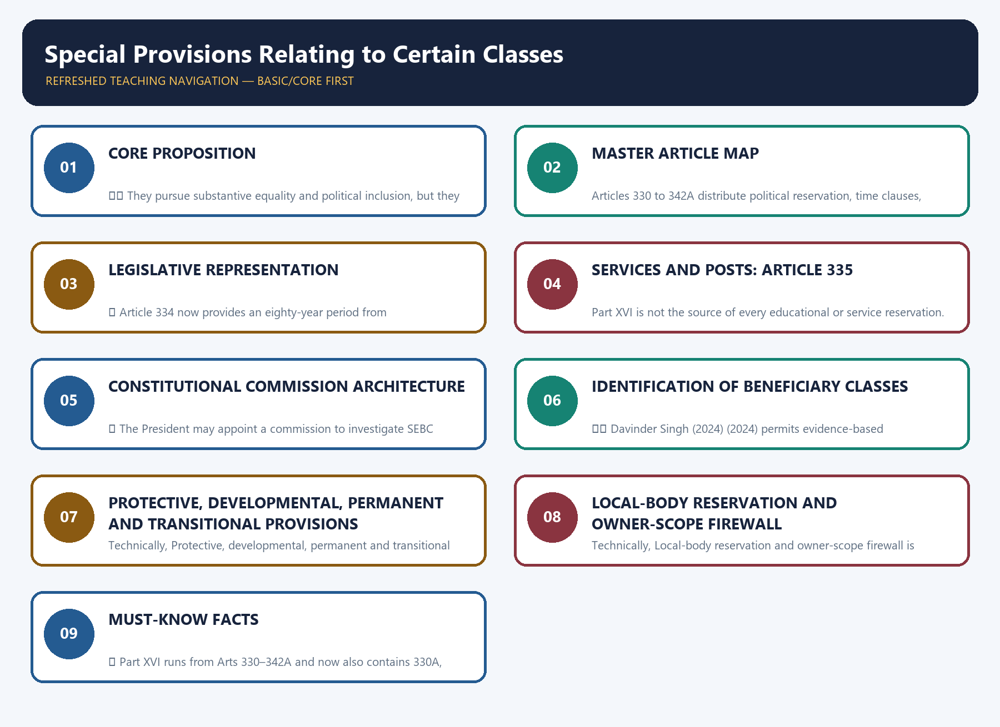

# Special Provisions Relating to Certain Classes — Complete Deep-Reviewed Learning Session

**Legal/current control date:** 29 August 2026 (Asia/Kolkata)

> **Source discipline:** Constitutional text, amendment commencement, electoral operation,
> judgments, policy and analytical inference are separately identified. The reviewed g2 generation
> remains immutable and its score is not carried forward.

## BASIC LEARNING SESSION



*Distinct embedded teaching-navigation image. The separate continuous Cārvāka-style flowchart package remains an independent at-a-glance artifact.*

> **Subject:** Polity · **Tier:** Core · **GS Paper:** GS-II
> **Official clauses:** "Rights Issues" and "Appointment to various Constitutional posts, powers,
> functions and responsibilities of various Constitutional Bodies."
> **Grounded in:** Constitution of India, Part XVI, Arts 330–342A; M. Laxmikanth,
> *Courseware on Indian Polity*, Eighth Edition (2026), Ch. 77.
> **Status legend:** ✅ constitutional/textual fact · 📜 statute/rule · ⚖️ judicial holding ·
> 🧾 non-binding recommendation · ⚠️ analytical inference.
> **Rule:** This owner supplies the consolidated map. Specialist owners retain detailed reservation
> doctrine and commission design. It is independently sufficient for Prelims and 10/15/20-mark
> Mains; no Advanced companion is required.

---

### SESSION 1 — CORE PROPOSITION

#### DEFINITION / WHAT THIS IS CALLED

**Plain-language definition:** A reserved seat, a service claim, a commission's recommendation and a Presidential list are legally distinct.

**Technical definition:** ⚠️ They pursue substantive equality and political inclusion, but they do not operate in the same way.

#### ANSWER-GRABBING OPENING — WRITE/ADAPT IN THE EXAM

> ⚠️ They pursue substantive equality and political inclusion, but they do not operate in the same way.

#### MUST-WRITE KEYWORDS

- **Core proposition**
- **They**
- **Presidential**
- **330–334**
- **338–340**

**How to use them:** Frame the answer through Core proposition; define They, connect Presidential with 330–334 to explain the mechanism, and use 338–340 for the decisive comparison or qualification.

Part XVI combines four different constitutional techniques:

```text
REPRESENTATION        SERVICES             SAFEGUARDS            IDENTIFICATION
Arts 330–334          Art 335              Arts 338–340          Arts 341–342A
reserved seats        claims + efficiency  commissions/reports   constitutional lists
```

⚠️ They pursue substantive equality and political inclusion, but they do not operate in the same
way. A reserved seat, a service claim, a commission's recommendation and a Presidential list are
legally distinct.

---

#### CLOSING RECALL FLOW — CORE PROPOSITION

```text
START / CONCEPT: Core proposition
        |
        v
EXACT TERMS: Core proposition · They · Presidential · 330–334 · 338–340
        |
        v
MECHANISM / ARGUMENT: A reserved seat, a service claim, a commission's recommendation and a Presidential list are legally distinct.
        |
        v
CONSEQUENCE / CONTRAST: The resulting consequence is that ⚠️ They pursue substantive equality and political inclusion.
        |
        v
UPSC TRAP / ANSWER-USE: Do not miss this limiting distinction: ⚠️ They pursue substantive equality and political inclusion.
        |
        v
ANSWER-GRABBING FORMULATION: ⚠️ They pursue substantive equality and political inclusion, but they do not operate in the same way.
```
### SESSION 2 — MASTER ARTICLE MAP

#### DEFINITION / WHAT THIS IS CALLED

**Plain-language definition:** Part XVI is a constitutional map that separates legislative representation, service claims, safeguard institutions and class-identification lists.

**Technical definition:** Articles 330 to 342A distribute political reservation, time clauses, Article 335 service claims, Articles 338 to 340 monitoring and Articles 341 to 342A specification powers among distinct constitutional mechanisms.

#### ANSWER-GRABBING OPENING — WRITE/ADAPT IN THE EXAM

> Part XVI is not one reservation rule; it is a layered architecture linking representation, service equality, constitutional oversight and legally controlled beneficiary identification.

#### MUST-WRITE KEYWORDS

- **Part XVI**
- **Article 330**
- **Article 334**
- **Article 335**
- **Articles 338 to 340**
- **Articles 341 to 342A**

**How to use them:** Define Part XVI as the master map; use Article 330 for representation, Article 334 for duration, Article 335 for service claims, Articles 338 to 340 for safeguards and Articles 341 to 342A for constitutional-list identification.

| Provision | Subject | Status/trap |
|---:|---|---|
| **330** | SC/ST reservation in Lok Sabha | Population-linked constitutional reservation |
| **330A** | Women's reservation in Lok Sabha, including within SC/ST seats | Inserted by the 106th Amendment; commencement notification and the Art 334A electoral trigger remain distinct legal gates |
| **331** | Anglo-Indian nomination to Lok Sabha | Text remains, but Art 334's nomination period was not extended beyond seventy years |
| **332** | SC/ST reservation in State Assemblies | Population-linked, with special Assam/NE provisions |
| **332A** | Women's reservation in State Assemblies | Same census-publication-delimitation activation chain |
| **333** | Anglo-Indian nomination to State Assemblies | Same Art 334 expiry distinction |
| **334** | Time limit for SC/ST seat reservation and Anglo-Indian nomination | 104th Amendment extended SC/ST reservation to eighty years; did not extend nomination |
| **334A** | Commencement/duration/rotation framework for women's reservation | **Amendment in force ≠ reservation operational** |
| **335** | SC/ST claims in services/posts, consistently with administrative efficiency | Not a self-executing quota |
| **336–337** | Transitional Anglo-Indian services and educational-grant protections | Historical; ended after ten years |
| **338** | NCSC | Constitutional commission; Art 338(10) retains an Anglo-Indian reference |
| **338A** | NCST | Constitutional commission |
| **338B** | NCBC | Constitutional since 102nd Amendment |
| **339** | Union control/commission concerning Scheduled Areas and ST welfare | Distinct from Fifth/Sixth Schedule institutions |
| **340** | Commission to investigate backward-class conditions | Source of Kalelkar/Mandal commissions |
| **341** | Scheduled Castes | President specifies; Parliament alone includes/excludes |
| **342** | Scheduled Tribes | Same list architecture |
| **342A** | Socially and educationally backward classes | Central List plus State/UT lists after 105th Amendment |

---

#### CLOSING RECALL FLOW — MASTER ARTICLE MAP

```text
START / CONCEPT: Master Article map
        |
        v
EXACT TERMS: Part XVI · Article 330 · Article 334 · Article 335 · Articles 338 to 340 · Articles 341 to 342A
        |
        v
MECHANISM / ARGUMENT: The Part first allocates reserved legislative representation and its time framework, then states the service-claim balance, creates monitoring and inquiry routes, and controls constitutional-list specification.
        |
        v
CONSEQUENCE / CONTRAST: The architecture advances substantive equality while ensuring that a reserved seat, a service claim, a commission report and a constitutional list retain different legal effects.
        |
        v
UPSC TRAP / ANSWER-USE: Do not treat Part XVI as a universal quota code, use Article 335 to identify a class, or confuse commission inquiry powers with Parliament's list-alteration role.
        |
        v
ANSWER-GRABBING FORMULATION: Part XVI is not one reservation rule; it is a layered architecture linking representation, service equality, constitutional oversight and legally controlled beneficiary identification.
```
### SESSION 3 — LEGISLATIVE REPRESENTATION

#### DEFINITION / WHAT THIS IS CALLED

**Plain-language definition:** The 106th Amendment covers the Lok Sabha, State Legislative Assemblies and the Legislative Assembly of the NCT of Delhi; it does not reserve seats in the Rajya Sabha or State Legislative Councils.

**Technical definition:** ✅ Article 334 now provides an eighty-year period from commencement for SC/ST legislative-seat reservation—ending on 25 January 2030, subject to the existing-House proviso.

#### ANSWER-GRABBING OPENING — WRITE/ADAPT IN THE EXAM

> The 106th Amendment covers the Lok Sabha, State Legislative Assemblies and the Legislative Assembly of the NCT of Delhi; it does not reserve seats in the Rajya Sabha or State Legislative Councils.

#### MUST-WRITE KEYWORDS

- **Legislative representation**
- **eighty-year**
- **not**
- **electoral operation**
- **25 January 2030**
- **29 August 2026**

**How to use them:** Frame the answer through Legislative representation; define eighty-year, connect not with electoral operation to explain the mechanism, and use 25 January 2030 for the decisive comparison or qualification.

#### 3.1 SC/ST seats

✅ Articles 330 and 332 reserve seats in the Lok Sabha and State Legislative Assemblies broadly in
proportion to the relevant SC/ST population. Reservation identifies constituencies/seats; it does
not create a separate electorate—voters in the constituency vote in the ordinary territorial
election.

✅ Article 334 now provides an **eighty-year** period from commencement for SC/ST legislative-seat
reservation—ending on **25 January 2030**, subject to the existing-House proviso. The 104th
Amendment made this extension while leaving the Anglo-Indian nomination period at seventy years.

#### 3.2 Anglo-Indian nomination

✅ Articles 331 and 333 remain printed in the constitutional text, but the special nomination
period under Article 334 was not extended beyond seventy years and ceased in 2020.

> **Trap:** "Article omitted" and "provision ceased to operate through the time clause" are not the
> same statement.

#### 3.3 Women's reservation cross-route

✅ Arts 330A, 332A and 334A are part of Part XVI. They are not a "certain class" list mechanism like
Arts 341/342. The 106th Amendment covers the Lok Sabha, State Legislative Assemblies and the
Legislative Assembly of the NCT of Delhi; it does **not** reserve seats in the Rajya Sabha or State
Legislative Councils. It reserves one-third of seats, including one-third within seats reserved for
SCs/STs.

✅ The official consolidated Constitution incorporates the 106th Amendment, but incorporation in
an updated constitutional edition is not a commencement notification under section 1(2) of the
Amendment Act. As at **29 August 2026**, no verified Central Government Gazette notification
appointing a commencement date has been located. Even after commencement, Article 334A separately
postpones **electoral operation** until:

```text
first census after commencement of the 106th Amendment
        -> relevant figures published
        -> delimitation undertaken for this purpose
        -> women's legislative reservation takes effect
```

📜 Census 2027 was officially notified on **16 June 2025**. Its general reference date is
1 March 2027, with 1 October 2026 for specified snow-bound areas. As at **28 August 2026**, the
relevant population figures have not been published and the Article 334A delimitation trigger has
not been completed. The reservation is therefore in constitutional text but not yet operational in
elections.

✅ Article 334A links the fifteen-year period to the commencement of the reservation provisions
under clause (1), permits Parliament by law to determine continuation, and ties rotation to each
subsequent delimitation as Parliament by law determines. Existing Houses remain unaffected until
dissolution.

> **Current-status trap:** enactment/incorporation, commencement notification, publication of
> census figures, delimitation and electoral operation are five different legal events.

#### 3.4 Current delimitation boundary

✅ Articles **82** and **170** retain a separate general delimitation framework. Until the relevant
figures of the first census taken after 2026 are published, the allocation/total-seat freeze rests
on the **1971 Census**, while territorial constituencies may remain readjusted on the **2001
Census** basis. The Delimitation Order, 2008 currently supplies the constituency and reserved-seat
map in the ordinary covered States/UTs.

> **Trap:** publication of Census 2027 figures will not by itself draw constituencies or activate
> women's reservation. The constitutionally and statutorily competent delimitation process must
> still occur.

---

#### CLOSING RECALL FLOW — LEGISLATIVE REPRESENTATION

```text
START / CONCEPT: Legislative representation
        |
        v
EXACT TERMS: Legislative representation · eighty-year · not · electoral operation · 25 January 2030 · 29 August 2026
        |
        v
MECHANISM / ARGUMENT: Trap: "Article omitted" and "provision ceased to operate through the time clause" are not the same statement.
        |
        v
CONSEQUENCE / CONTRAST: Reservation identifies constituencies/seats; it does not create a separate electorate—voters in the constituency vote in the ordinary territorial election.
        |
        v
UPSC TRAP / ANSWER-USE: "Article omitted" and "provision ceased to operate through the time clause" are not the.
        |
        v
ANSWER-GRABBING FORMULATION: The 106th Amendment covers the Lok Sabha, State Legislative Assemblies and the Legislative Assembly of the NCT of Delhi; it does not reserve seats in the Rajya Sabha or State Legislative Councils.
```
### SESSION 4 — SERVICES AND POSTS: ARTICLE 335

#### DEFINITION / WHAT THIS IS CALLED

**Plain-language definition:** Owner firewall: EWS is not an Article 342A SEBC list and not an Article 335 SC/ST service claim.

**Technical definition:** Part XVI is not the source of every educational or service reservation.

#### ANSWER-GRABBING OPENING — WRITE/ADAPT IN THE EXAM

> Owner firewall: EWS is not an Article 342A SEBC list and not an Article 335 SC/ST service claim.

#### MUST-WRITE KEYWORDS

- **Services**
- **posts**
- **Article 335**
- **Owner firewall**
- **16(4A)**
- **16(4B)**

**How to use them:** Frame the answer through Services; define posts, connect Article 335 with Owner firewall to explain the mechanism, and use 16(4A) for the decisive comparison or qualification.

✅ SC/ST claims must be considered in public appointments consistently with the maintenance of
administrative efficiency. The 82nd Amendment inserted a proviso allowing provisions for relaxation
of qualifying marks or lowering evaluation standards for reservation in promotion.

| Correct proposition | Incorrect shortcut |
|---|---|
| Art 335 supplies an efficiency consideration and relaxation authority | "Art 335 itself grants a fixed percentage quota" |
| It concerns SC/ST claims in Union/State services | "It is the source of all reservation, including OBC/EWS" |
| It works with Arts 16(4A)/(4B) and case law | "Efficiency automatically defeats reservation" |

⚖️ Detailed promotion, data, creamy-layer and efficiency doctrine belongs in
`Fundamental-Rights.md`.

#### 4.1 Equality-enabling clauses and EWS cross-route

Part XVI is not the source of every educational or service reservation:

| Provision | Enabling field | Essential limit |
|---|---|---|
| **15(4)** | Special provisions for SEBCs, SCs and STs | Enabling equality clause |
| **15(5)** | Admission measures, including aided/unaided private institutions | Excludes Article 30(1) minority institutions |
| **16(4)** | Appointment reservation for a backward class inadequately represented in State services | Not a guaranteed individual quota |
| **16(4A)** | Promotion reservation for SC/ST | Subject to controlling promotion doctrine |
| **16(4B)** | Carry-forward reserved vacancies | Separate class of vacancies for ceiling analysis within its text |
| **15(6), 16(6)** | EWS advancement/admission and appointment reservation | Inserted by 103rd Amendment; additional reservation capped at 10% in each category |

✅ Article 15(6) can reach aided and unaided private educational institutions but excludes
Article 30(1) minority institutions. Articles 15(6) and 16(6) exclude the classes already covered
by the clauses they identify; the State notifies EWS using family income and other indicators of
economic disadvantage.

⚖️ *Janhit Abhiyan v. Union of India* (2022), by **3:2**, upheld the 103rd Amendment, including
economic criteria, the exclusion of classes covered by existing reservation clauses and the
additional ten-per-cent design. It does not erase the ordinary *Indra Sawhney* 50% framework for
other reservation routes.

> **Owner firewall:** EWS is not an Article 342A SEBC list and not an Article 335 SC/ST service
> claim. Its constitutional source is Articles 15(6) and 16(6).

---

#### CLOSING RECALL FLOW — SERVICES AND POSTS: ARTICLE 335

```text
START / CONCEPT: Services and posts: Article 335
        |
        v
EXACT TERMS: Services · posts · Article 335 · Owner firewall · 16(4A) · 16(4B)
        |
        v
MECHANISM / ARGUMENT: Articles 15(6) and 16(6) exclude the classes already covered by the clauses they identify; the State notifies EWS using family income and other indicators of economic disadvantage.
        |
        v
CONSEQUENCE / CONTRAST: Part XVI is not the source of every educational or service reservation.
        |
        v
UPSC TRAP / ANSWER-USE: ✅ Article 15(6) can reach aided and unaided private educational institutions but excludes Article 30(1) minority institutions.
        |
        v
ANSWER-GRABBING FORMULATION: Owner firewall: EWS is not an Article 342A SEBC list and not an Article 335 SC/ST service claim.
```
### SESSION 5 — CONSTITUTIONAL COMMISSION ARCHITECTURE

#### DEFINITION / WHAT THIS IS CALLED

**Plain-language definition:** Trap: An Article 340 commission is temporary/investigative; the NCBC under Art 338B is the standing constitutional commission.

**Technical definition:** ✅ The President may appoint a commission to investigate SEBC conditions and recommend measures and grants; its report and an action memorandum are laid before Parliament.

#### ANSWER-GRABBING OPENING — WRITE/ADAPT IN THE EXAM

> Trap: An Article 340 commission is temporary/investigative; the NCBC under Art 338B is the standing constitutional commission.

#### MUST-WRITE KEYWORDS

- **Constitutional commission architecture**
- **NCSC**
- **National-Commissions-SC-ST-BC.md**
- **NCST**
- **338A**
- **338B**

**How to use them:** Frame the answer through Constitutional commission architecture; define NCSC, connect National-Commissions-SC-ST-BC.md with NCST to explain the mechanism, and use 338A for the decisive comparison or qualification.

| Body | Article | Shared core | Specialist route |
|---|---:|---|---|
| NCSC | **338** | Chair + Vice-Chair + 3 members; President appoints; safeguards, complaints, planning advice, reports, civil-court inquiry powers | `National-Commissions-SC-ST-BC.md` |
| NCST | **338A** | Same broad architecture plus tribal-specific mandate | Same |
| NCBC | **338B** | Constitutional SEBC commission since 102nd Amendment | Same |

✅ Their reports go to the President and Parliament with action-taken/non-acceptance explanations;
State-related material routes through the Governor to the State legislature.

> **Trap:** Civil-court powers during investigation do not make recommendations binding or convert
> the commissions into courts.

#### Article 339

✅ The President may appoint a commission on Scheduled Areas administration and ST welfare and had
to do so after ten years from commencement. Union executive power also extends to directions to a
State concerning schemes essential for ST welfare.

⚠️ Article 339 is a Union-supervision mechanism. Fifth/Sixth Schedule institutions and PESA/FRA
detail belong in `Scheduled-and-Tribal-Areas.md`.

#### Article 275 welfare-grant cross-link

✅ Article 275(1), outside Part XVI, authorises grants-in-aid to States in need and contains a
specific route for schemes promoting Scheduled Tribe welfare and raising the administration of
Scheduled Areas. It is a fiscal support provision, not a power to alter an Art 342 list or replace
the Fifth/Sixth Schedules.

#### Article 340

✅ The President may appoint a commission to investigate SEBC conditions and recommend measures and
grants; its report and an action memorandum are laid before Parliament. The Kalelkar and Mandal
Commissions are the standard examples.

> **Trap:** An Article 340 commission is temporary/investigative; the NCBC under Art 338B is the
> standing constitutional commission.

---

#### CLOSING RECALL FLOW — CONSTITUTIONAL COMMISSION ARCHITECTURE

```text
START / CONCEPT: Constitutional commission architecture
        |
        v
EXACT TERMS: Constitutional commission architecture · NCSC · National-Commissions-SC-ST-BC.md · NCST · 338A · 338B
        |
        v
MECHANISM / ARGUMENT: Trap: Civil-court powers during investigation do not make recommendations binding or convert the commissions into courts.
        |
        v
CONSEQUENCE / CONTRAST: It is a fiscal support provision, not a power to alter an Art 342 list or replace the Fifth/Sixth Schedules.
        |
        v
UPSC TRAP / ANSWER-USE: Civil-court powers during investigation do not make recommendations binding or convert.
        |
        v
ANSWER-GRABBING FORMULATION: Trap: An Article 340 commission is temporary/investigative; the NCBC under Art 338B is the standing constitutional commission.
```
### SESSION 6 — IDENTIFICATION OF BENEFICIARY CLASSES

#### DEFINITION / WHAT THIS IS CALLED

**Plain-language definition:** Master trap: "Which community is on a constitutional list?" and "What reservation/benefit does it receive?" are separate questions.

**Technical definition:** ⚖️ Davinder Singh (2024) (2024) permits evidence-based sub-classification within the Scheduled Castes for distribution of benefits, but does not transfer Article 341 list-alteration power to a State or require sub-classification.

#### ANSWER-GRABBING OPENING — WRITE/ADAPT IN THE EXAM

> Master trap: "Which community is on a constitutional list?" and "What reservation/benefit does it receive?" are separate questions.

#### MUST-WRITE KEYWORDS

- **Identification of beneficiary classes**
- **Parliament by law**
- **Davinder firewall**
- **Central List**
- **by law**
- **Master trap**

**How to use them:** Frame the answer through Identification of beneficiary classes; define Parliament by law, connect Davinder firewall with Central List to explain the mechanism, and use by law for the decisive comparison or qualification.

#### 6.1 Scheduled Castes and Scheduled Tribes

| Stage | Arts 341/342 rule |
|---|---|
| Initial specification | President, by public notification; consultation with Governor where a State is concerned |
| Inclusion/exclusion | **Parliament by law** |
| State power | A State cannot independently alter the Presidential SC/ST list |
| Territorial character | Lists are State/UT-specific; status is not automatically identical across India |

⚖️ *Davinder Singh (2024)* (2024) permits evidence-based sub-classification within the
Scheduled Castes for distribution of benefits, but does not transfer Article 341 list-alteration
power to a State or require sub-classification.

#### 6.3 List, benefit and sub-classification case matrix

| Decision | Decision year | Safe proposition |
|---|---:|---|
| *Indra Sawhney v. Union of India* | 1992 | Backward-class reservation doctrine, creamy layer and the ordinary 50% framework arise under equality provisions, not Part XVI list alteration |
| *E.V. Chinnaiah v. State of Andhra Pradesh (2004)* | 2004 | Earlier decision treated notified SCs as an indivisible class for sub-classification |
| *M. Nagaraj (2006) v. Union of India* | 2006 | Promotion-reservation enabling provisions were upheld subject to constitutional conditions |
| *Jarnail Singh (2018) v. Lachhmi Narain Gupta* | 2018 | Modified the *M. Nagaraj (2006)* data rule and applied creamy-layer exclusion logic in the promotion context |
| *Jaishri Laxmanrao Patil (2021)* | 2021 | Interpreted the 102nd Amendment before the 105th Amendment restored express State/UT list competence |
| *Davinder Singh (2024)* | 2024 | Overruled *E.V. Chinnaiah v. State of Andhra Pradesh (2004)* on this point and permitted evidence-based SC sub-classification for fair distribution of benefits |
| *Janhit Abhiyan v. Union of India* | 2022 | Upheld the 103rd Amendment's EWS architecture by 3:2; does not convert EWS into an SEBC list |

> **Davinder firewall:** A State may sub-classify for distribution on a constitutionally defensible
> evidentiary basis; it may not add to or delete from the Presidential SC list. The decision does
> not command every State to sub-classify, and a scheme cannot use sub-classification to exclude a
> listed caste completely from the benefit. Separate opinions discussing a creamy-layer principle
> must not be converted into a universal list-deletion power or an automatic nationwide rule.

#### 6.2 Socially and educationally backward classes

✅ The 102nd Amendment inserted Arts 338B and 342A. After the 105th Amendment:

- **Central List:** President specifies for Central-Government purposes; Parliament includes or
  excludes.
- **State/UT List:** each State/UT may **by law** prepare and maintain its own list for its own
  purposes; entries may differ from the Central List.

> **Master trap:** "Which community is on a constitutional list?" and "What reservation/benefit does
> it receive?" are separate questions. A list identifies a class; the benefit requires its own
> constitutional, statutory or policy authority.

---

#### CLOSING RECALL FLOW — IDENTIFICATION OF BENEFICIARY CLASSES

```text
START / CONCEPT: Identification of beneficiary classes
        |
        v
EXACT TERMS: Identification of beneficiary classes · Parliament by law · Davinder firewall · Central List · by law · Master trap
        |
        v
MECHANISM / ARGUMENT: Central List: President specifies for Central-Government purposes; Parliament includes or excludes.
        |
        v
CONSEQUENCE / CONTRAST: ⚖️ Davinder Singh (2024) (2024) permits evidence-based sub-classification within the Scheduled Castes for distribution of benefits, but does not transfer Article 341 list-alteration power to a State or require sub-classification.
        |
        v
UPSC TRAP / ANSWER-USE: The decision does not command every State to sub-classify, and a scheme cannot use sub-classification to exclude a listed caste completely from the benefit.
        |
        v
ANSWER-GRABBING FORMULATION: Master trap: "Which community is on a constitutional list?" and "What reservation/benefit does it receive?" are separate questions.
```
### SESSION 7 — PROTECTIVE, DEVELOPMENTAL, PERMANENT AND TRANSITIONAL PROVISIONS

#### DEFINITION / WHAT THIS IS CALLED

**Plain-language definition:** Protective, developmental, permanent and transitional provisions comprises Protective, developmental and permanent as its core connected dimensions.

**Technical definition:** Technically, Protective, developmental, permanent and transitional provisions is analysed by relating Protective to developmental, then testing the relationship through permanent and transitional provisions.

#### ANSWER-GRABBING OPENING — WRITE/ADAPT IN THE EXAM

> Protective, developmental, permanent and transitional provisions comprises Protective, developmental and permanent as its core connected dimensions.

#### MUST-WRITE KEYWORDS

- **Protective**
- **developmental**
- **permanent**
- **transitional provisions**
- **102nd (2018)**
- **103rd (2019)**

**How to use them:** Frame the answer through Protective; define developmental, connect permanent with transitional provisions to explain the mechanism, and use 102nd (2018) for the decisive comparison or qualification.

| Axis | Examples |
|---|---|
| Protective | Commission inquiries, service safeguards, Union directions |
| Developmental | Planning advice, Article 340 recommendations, welfare measures |
| Continuing | Arts 335, 338–342A |
| Time-bound/transitional | Arts 334, 336 and 337 |

⚠️ This classification is analytical; the Constitution does not label every Article with these
categories.

#### 7.1 Amendment boundary map

| Amendment | Exact Part XVI/equality effect | What it did not do |
|---:|---|---|
| **102nd (2018)** | Constitutionalised NCBC through Art 338B; inserted Art 342A and Art 366(26C) | Did not create an EWS quota |
| **103rd (2019)** | Inserted Arts 15(6) and 16(6) for EWS | Did not amend SC/ST/SEBC identification lists |
| **104th (2019; effective 2020)** | Extended SC/ST legislative-seat reservation to eighty years; Anglo-Indian nomination remained at seventy | Did not necessarily delete the printed text of Arts 331/333 |
| **105th (2021)** | Restored express State/UT power, by law, to maintain own-purpose SEBC lists; Central List retained | Did not give States power to alter Arts 341/342 SC/ST lists |
| **106th (2023; commencement not verified as at 29 August 2026)** | Inserted Arts 330A, 332A, 334A and Delhi-Assembly clauses; section 1(2) requires a Gazette-appointed commencement date | Did not make women's reservation immediately operational or extend it to Rajya Sabha/Legislative Councils |

---

#### CLOSING RECALL FLOW — PROTECTIVE, DEVELOPMENTAL, PERMANENT AND TRANSITIONAL PROVISIONS

```text
START / CONCEPT: Protective, developmental, permanent and transitional provisions
        |
        v
EXACT TERMS: Protective · developmental · permanent · transitional provisions · 102nd (2018) · 103rd (2019)
        |
        v
MECHANISM / ARGUMENT: ⚠️ This classification is analytical; the Constitution does not label every Article with these categories.
        |
        v
CONSEQUENCE / CONTRAST: The resulting consequence is that the Constitution does not label every Article with these categories.
        |
        v
UPSC TRAP / ANSWER-USE: Do not miss this limiting distinction: the Constitution does not label every Article with these categories.
        |
        v
ANSWER-GRABBING FORMULATION: Protective, developmental, permanent and transitional provisions comprises Protective, developmental and permanent as its core connected dimensions.
```
### SESSION 8 — LOCAL-BODY RESERVATION AND OWNER-SCOPE FIREWALL

#### DEFINITION / WHAT THIS IS CALLED

**Plain-language definition:** Master distinction: A constitutional list identifies a class; a reservation provision authorises a representational benefit; a welfare scheme supplies a dated programme; and area administration allocates territorial governance.

**Technical definition:** Technically, Local-body reservation and owner-scope firewall is analysed by relating Local-body reservation to owner-scope firewall, then testing the relationship through Master distinction and Arts 341, 342 and 342A.

#### ANSWER-GRABBING OPENING — WRITE/ADAPT IN THE EXAM

> Master distinction: A constitutional list identifies a class; a reservation provision authorises a representational benefit; a welfare scheme supplies a dated programme; and area administration allocates territorial governance.

#### MUST-WRITE KEYWORDS

- **Local-body reservation**
- **owner-scope firewall**
- **Master distinction**
- **Arts 341, 342 and 342A**
- **Arts 330–334A**
- **Arts 243D and 243T**

**How to use them:** Frame the answer through Local-body reservation; define owner-scope firewall, connect Master distinction with Arts 341, 342 and 342A to explain the mechanism, and use Arts 330–334A for the decisive comparison or qualification.

✅ Articles 243D and 243T separately govern reservation in Panchayats and Municipalities, including
SC/ST seats and offices and women's reservation. They are cross-references, not Part XVI
legislative-seat provisions.

| Question asked | Correct owner |
|---|---|
| Who is constitutionally specified as SC/ST/SEBC? | Arts 341, 342 and 342A |
| What is the parliamentary/assembly representation architecture? | Arts 330–334A |
| What is the local-body reservation architecture? | Arts 243D and 243T |
| What reservation is available in education/employment? | Arts 15–16, law/policy and controlling case law |
| How are Scheduled Areas administered? | Fifth/Sixth Schedules, PESA and specialist owner |
| What welfare scheme applies? | The exact statute, rule, budget or scheme—not constitutional-list status alone |

> **Master distinction:** A constitutional list identifies a class; a reservation provision
> authorises a representational benefit; a welfare scheme supplies a dated programme; and area
> administration allocates territorial governance. None is a synonym for the others.

---

#### CLOSING RECALL FLOW — LOCAL-BODY RESERVATION AND OWNER-SCOPE FIREWALL

```text
START / CONCEPT: Local-body reservation and owner-scope firewall
        |
        v
EXACT TERMS: Local-body reservation · owner-scope firewall · Master distinction · Arts 341, 342 and 342A · Arts 330–334A · Arts 243D and 243T
        |
        v
MECHANISM / ARGUMENT: They are cross-references, not Part XVI legislative-seat provisions.
        |
        v
CONSEQUENCE / CONTRAST: None is a synonym for the others.
        |
        v
UPSC TRAP / ANSWER-USE: Do not miss this limiting distinction: they are cross-references, not Part XVI legislative-seat provisions.
        |
        v
ANSWER-GRABBING FORMULATION: Master distinction: A constitutional list identifies a class; a reservation provision authorises a representational benefit; a welfare scheme supplies a dated programme; and area administration allocates territorial governance.
```
### 9. Answer architecture (10/15/20-mark support)

#### 9.1 Demand map

| Demand | Answer spine |
|---|---|
| Part XVI overview | Representation → services → commissions → lists → equality verdict |
| SC/ST list versus sub-classification | Arts 341/342 → Parliament's list power → *Davinder Singh (2024)* distribution distinction |
| Backward-class architecture | Art 340 → NCBC/338B → 102nd → 105th → Central/State lists |
| Commission effectiveness | Constitutional design → civil-court powers/report route → advisory limit |
| Reservation and efficiency | Art 335 → Art 16 route → case-law discipline → substantive-equality verdict |

#### 9.2 Thesis options

- *Part XVI is not a single reservation code; it combines political representation, service claims,
  constitutional monitoring and list identification through legally distinct mechanisms.*
- *The constitutional lists answer who belongs to a protected class, while Articles 15, 16, 330,
  332 and ordinary law answer what benefit follows.*
- *The 102nd–105th Amendment sequence constitutionalised the NCBC while restoring a federal division
  between the Central SEBC List and State lists.*

#### 9.3 Mark-scaled structures

| Marks | Structure | Evidence |
|---:|---|---|
| 10 | Define issue → 3–4 Articles → one distinction → verdict | 3–4 anchors |
| 15 | Representation/services/commission/list map → amendment/case → limit → verdict | 5–6 anchors |
| 20 | Part XVI architecture → equality rationale → SC/ST/SEBC mechanisms → federal/implementation critique → graded conclusion | 7–9 anchors |

#### 9.4 Evidence units

- **Claim:** list power is constitutionally centralised for SC/STs. **Evidence:** ✅ Arts 341/342.
  **Analysis:** uniform legal alteration through Parliament protects list integrity.
  **Qualification:** ⚖️ States may design evidence-based distribution within a list under
  *Davinder Singh (2024)* without changing it.
- **Claim:** Article 335 balances representation and administration. **Evidence:** ✅ text plus 82nd
  Amendment proviso. **Analysis:** efficiency is integrated into, not placed above, substantive
  equality. **Qualification:** exact promotion conditions arise from Arts 16 and case law.
- **Claim:** commission status does not equal binding power. **Evidence:** ✅ Arts 338–338B reporting
  and inquiry design. **Analysis:** leverage is parliamentary visibility and consultation.
  **Qualification:** governments retain final policy authority subject to review.

---

### SESSION 9 — MUST-KNOW FACTS

#### DEFINITION / WHAT THIS IS CALLED

**Plain-language definition:** ✅ Part XVI runs from Arts 330–342A and now also contains 330A, 332A and 334A. ✅ SC/ST seat reservation and Anglo-Indian nomination have different Article 334 time positions. ✅ SC/ST legislative reservation currently runs to 25 January 2030; Anglo-Indian nomination ceased from 25 January 2020. ✅ The 106th Amendment is enacted and incorporated in updated official constitutional text, but a section 1(2) commencement notification was not verified as at 29 August 2026; after commencement, electoral operation still awaits publication of the first post-commencement census figures and a purpose-specific delimitation. ✅ Art 335 is a service-claim/efficiency provision, not a universal reservation clause. ✅ EWS reservation arises from Arts 15(6)/16(6), not Part XVI or the SEBC list. ✅ NCSC/NCST/NCBC are constitutional; Article 340 commissions are separately appointed. ✅ President specifies SC/ST lists; Parliament alone includes/excludes. ✅ After the 105th Amendment, Central and State/UT SEBC lists are distinct. ✅ Arts 336–337 are exhausted transitional provisions. ✅ Arts 243D/243T and Art 275 are cross-links, not substitutes for Part XVI. ⚖️ Davinder Singh (2024) (2024) distinguishes benefit distribution through sub-classification from alteration of the Art 341 list.

**Technical definition:** ✅ Part XVI runs from Arts 330–342A and now also contains 330A, 332A and 334A. ✅ SC/ST seat reservation and Anglo-Indian nomination have different Article 334 time positions. ✅ SC/ST legislative reservation currently runs to 25 January 2030; Anglo-Indian nomination ceased from 25 January 2020. ✅ The 106th Amendment is enacted and incorporated in updated official constitutional text, but a section 1(2) commencement notification was not verified as at 29 August 2026; after commencement, electoral operation still awaits publication of the first post-commencement census figures and a purpose-specific delimitation. ✅ Art 335 is a service-claim/efficiency provision, not a universal reservation clause. ✅ EWS reservation arises from Arts 15(6)/16(6), not Part XVI or the SEBC list. ✅ NCSC/NCST/NCBC are constitutional; Article 340 commissions are separately appointed. ✅ President specifies SC/ST lists; Parliament alone includes/excludes. ✅ After the 105th Amendment, Central and State/UT SEBC lists are distinct. ✅ Arts 336–337 are exhausted transitional provisions. ✅ Arts 243D/243T and Art 275 are cross-links, not substitutes for Part XVI. ⚖️ Davinder Singh (2024) (2024) distinguishes benefit distribution through sub-classification from alteration of the Art 341 list.

#### ANSWER-GRABBING OPENING — WRITE/ADAPT IN THE EXAM

> ✅ Part XVI runs from Arts 330–342A and now also contains 330A, 332A and 334A. ✅ SC/ST seat reservation and Anglo-Indian nomination have different Article 334 time positions. ✅ SC/ST legislative reservation currently runs to 25 January 2030; Anglo-Indian nomination ceased from 25 January 2020. ✅ The 106th Amendment is enacted and incorporated in updated official constitutional text, but a section 1(2) commencement notification was not verified as at 29 August 2026; after commencement, electoral operation still awaits publication of the first post-commencement census figures and a purpose-specific delimitation. ✅ Art 335 is a service-claim/efficiency provision, not a universal reservation clause. ✅ EWS reservation arises from Arts 15(6)/16(6), not Part XVI or the SEBC list. ✅ NCSC/NCST/NCBC are constitutional; Article 340 commissions are separately appointed. ✅ President specifies SC/ST lists; Parliament alone includes/excludes. ✅ After the 105th Amendment, Central and State/UT SEBC lists are distinct. ✅ Arts 336–337 are exhausted transitional provisions. ✅ Arts 243D/243T and Art 275 are cross-links, not substitutes for Part XVI. ⚖️ Davinder Singh (2024) (2024) distinguishes benefit distribution through sub-classification from alteration of the Art 341 list.

#### MUST-WRITE KEYWORDS

- **Must-Know Facts**
- **Article 334**
- **Article 340**
- **Part XVI**
- **330–342A**
- **336–337**

**How to use them:** Frame the answer through Must-Know Facts; define Article 334, connect Article 340 with Part XVI to explain the mechanism, and use 330–342A for the decisive comparison or qualification.

- ✅ Part XVI runs from Arts **330–342A** and now also contains 330A, 332A and 334A.
- ✅ SC/ST seat reservation and Anglo-Indian nomination have different Article 334 time positions.
- ✅ SC/ST legislative reservation currently runs to 25 January 2030; Anglo-Indian nomination
  ceased from 25 January 2020.
- ✅ The 106th Amendment is enacted and incorporated in updated official constitutional text, but
  a section 1(2) commencement notification was not verified as at 29 August 2026; after
  commencement, electoral operation still awaits publication of the first post-commencement
  census figures and a purpose-specific delimitation.
- ✅ Art 335 is a service-claim/efficiency provision, not a universal reservation clause.
- ✅ EWS reservation arises from Arts 15(6)/16(6), not Part XVI or the SEBC list.
- ✅ NCSC/NCST/NCBC are constitutional; Article 340 commissions are separately appointed.
- ✅ President specifies SC/ST lists; Parliament alone includes/excludes.
- ✅ After the 105th Amendment, Central and State/UT SEBC lists are distinct.
- ✅ Arts 336–337 are exhausted transitional provisions.
- ✅ Arts 243D/243T and Art 275 are cross-links, not substitutes for Part XVI.
- ⚖️ *Davinder Singh (2024)* (2024) distinguishes benefit distribution through sub-classification from
  alteration of the Art 341 list.

---

#### CLOSING RECALL FLOW — MUST-KNOW FACTS

```text
START / CONCEPT: Must-Know Facts
        |
        v
EXACT TERMS: Must-Know Facts · Article 334 · Article 340 · Part XVI · 330–342A · 336–337
        |
        v
MECHANISM / ARGUMENT: The operative mechanism is that ✅ Part XVI runs from Arts 330–342A and now also contains 330A, 332A and...
        |
        v
CONSEQUENCE / CONTRAST: The resulting consequence is that ✅ Part XVI runs from Arts 330–342A and now also contains 330A, 332A and...
        |
        v
UPSC TRAP / ANSWER-USE: Do not miss this limiting distinction: ✅ Part XVI runs from Arts 330–342A and now also contains 330A, 332A and...
        |
        v
ANSWER-GRABBING FORMULATION: ✅ Part XVI runs from Arts 330–342A and now also contains 330A, 332A and 334A. ✅ SC/ST seat reservation and Anglo-Indian nomination have different Article 334 time positions. ✅ SC/ST legislative reservation currently runs to 25 January 2030; Anglo-Indian nomination ceased from 25 January 2020. ✅ The 106th Amendment is enacted and incorporated in updated official constitutional text, but a section 1(2) commencement notification was not verified as at 29 August 2026; after commencement, electoral operation still awaits publication of the first post-commencement census figures and a purpose-specific delimitation. ✅ Art 335 is a service-claim/efficiency provision, not a universal reservation clause. ✅ EWS reservation arises from Arts 15(6)/16(6), not Part XVI or the SEBC list. ✅ NCSC/NCST/NCBC are constitutional; Article 340 commissions are separately appointed. ✅ President specifies SC/ST lists; Parliament alone includes/excludes. ✅ After the 105th Amendment, Central and State/UT SEBC lists are distinct. ✅ Arts 336–337 are exhausted transitional provisions. ✅ Arts 243D/243T and Art 275 are cross-links, not substitutes for Part XVI. ⚖️ Davinder Singh (2024) (2024) distinguishes benefit distribution through sub-classification from alteration of the Art 341 list.
```
### 11. UPSC traps and source discipline

- Do not equate SC/ST legislative reservation with separate electorates.
- Do not say States can add a caste/tribe to Arts 341/342 lists by executive order.
- Do not say the 105th Amendment abolished the Central SEBC List.
- Do not present a commission's civil-court powers as binding adjudication.
- Do not calculate or simplify women's-reservation dates here; route to `Parliament.md`.
- Do not treat Articles 336–337 as current benefits.
- Keep ✅ constitutional text, 📜 implementing law, ⚖️ case holding, 🧾 recommendation and
  ⚠️ inference separate.

#### Cross-links

- Reservation/equality cases: `Fundamental-Rights.md`
- Commission detail: `National-Commissions-SC-ST-BC.md`
- Scheduled/tribal administration: `Scheduled-and-Tribal-Areas.md`
- Women's reservation and delimitation status: `Parliament.md`
- Election administration: `Election-Commission.md`

## BASIC MCQS / REMEDIATION

#### MCQ 1. Which statement best describes the constitutional architecture of Part XVI?

- A. It separates legislative representation, service claims, constitutional safeguards and beneficiary-list identification.
- B. It transfers administration of all Scheduled Areas to the commissions under Articles 338-338B.
- C. It is a self-contained code for every educational and employment quota.
- D. It makes inclusion in a constitutional list an automatic entitlement to every welfare benefit.

**Answer: A**

**Explanation:** Articles 330-334A, 335, 338-340 and 341-342A create legally different techniques. The other options confuse the legal source, institution, beneficiary-identification rule, benefit-conferral rule or current-status gate.

#### MCQ 2. Which statement about Articles 330 and 332 is correct?

- A. They permit State executives to determine the SC/ST lists.
- B. They reserve seats for SCs/STs while the constituency continues to vote through the ordinary territorial electorate.
- C. They revive separate electorates for SCs/STs.
- D. They reserve seats in the Rajya Sabha and Legislative Councils.

**Answer: B**

**Explanation:** Seat/candidacy reservation is not a communal or separate electorate. The other options confuse the legal source, institution, beneficiary-identification rule, benefit-conferral rule or current-status gate.

#### MCQ 3. Which statement correctly distinguishes the two clocks in Article 334?

- A. The 104th Amendment deleted Articles 331 and 333 from the printed Constitution.
- B. Both SC/ST reservation and Anglo-Indian nomination were extended to 2030.
- C. The 104th Amendment extended SC/ST legislative-seat reservation to eighty years but did not extend Anglo-Indian nomination beyond seventy years.
- D. Article 334 permanently entrenches every political reservation.

**Answer: C**

**Explanation:** Textual presence and continued operation under a time clause are separate questions. The other options confuse the legal source, institution, beneficiary-identification rule, benefit-conferral rule or current-status gate.

#### MCQ 4. Which is the safest current-status statement on the 106th Amendment?

- A. It reserves one-third of Rajya Sabha and Legislative Council seats.
- B. Publication of census figures alone activates the reservation without delimitation.
- C. The reservation automatically applied to the eighteenth Lok Sabha.
- D. Enactment and incorporation are distinct from a Gazette-appointed commencement date; after commencement, Article 334A still requires published census figures and delimitation before electoral operation.

**Answer: D**

**Explanation:** Section 1(2), Article 334A and electoral implementation must be analysed as separate gates. The other options confuse the legal source, institution, beneficiary-identification rule, benefit-conferral rule or current-status gate.

#### MCQ 5. Which proposition about Article 335 is correct?

- A. It requires SC/ST claims in services to be considered consistently with administrative efficiency and permits specified promotion-related relaxation by proviso.
- B. It creates the OBC and EWS reservation quotas.
- C. It fixes a uniform percentage for SC/ST appointments.
- D. It defines administrative efficiency exhaustively.

**Answer: A**

**Explanation:** Article 335 is neither a universal quota clause nor a statutory definition of efficiency. The other options confuse the legal source, institution, beneficiary-identification rule, benefit-conferral rule or current-status gate.

#### MCQ 6. Which institutional mapping is correct?

- A. Article 340 permanently establishes all three commissions.
- B. Articles 338, 338A and 338B establish the NCSC, NCST and NCBC respectively.
- C. Civil-court inquiry powers make commission reports binding decrees.
- D. The commissions can amend the constitutional lists by notification.

**Answer: B**

**Explanation:** Constitutional status, inquiry powers, reporting and final policy authority must remain distinct. The other options confuse the legal source, institution, beneficiary-identification rule, benefit-conferral rule or current-status gate.

#### MCQ 7. Which statement correctly distinguishes Articles 339 and 340?

- A. Article 339 authorises States to alter the ST list.
- B. Both provisions create permanent constitutional commissions.
- C. Article 339 concerns Scheduled Areas/ST welfare supervision, while Article 340 authorises a temporary commission to investigate backward-class conditions.
- D. Article 340 itself grants reservation without further law or policy.

**Answer: C**

**Explanation:** Union supervision and an investigative commission perform different constitutional functions. The other options confuse the legal source, institution, beneficiary-identification rule, benefit-conferral rule or current-status gate.

#### MCQ 8. Which statement reflects Articles 341 and 342?

- A. The lists are identical throughout India.
- B. The NCSC or NCST may finally add a community after inquiry.
- C. A State cabinet may alter the list by executive order.
- D. The President initially specifies the State/UT-specific list, while Parliament alone may include or exclude communities by law.

**Answer: D**

**Explanation:** The constitutional list is territorial and its alteration is reserved to Parliament. The other options confuse the legal source, institution, beneficiary-identification rule, benefit-conferral rule or current-status gate.

#### MCQ 9. Which account of the SEBC-list architecture is correct?

- A. The 102nd Amendment constitutionalised the NCBC and Article 342A; the 105th expressly preserved a Central List and restored State/UT own-purpose list competence by law.
- B. The 102nd created the EWS quota.
- C. The 105th abolished the Central List.
- D. The 105th authorised States to alter SC/ST lists.

**Answer: A**

**Explanation:** Central-purpose and State-purpose SEBC lists coexist after the 105th Amendment. The other options confuse the legal source, institution, beneficiary-identification rule, benefit-conferral rule or current-status gate.

#### MCQ 10. Which statement about EWS is constitutionally accurate?

- A. Janhit Abhiyan invalidated the exclusion of classes covered by existing reservation clauses.
- B. Its enabling provisions are Articles 15(6) and 16(6), inserted by the 103rd Amendment and upheld by a 3:2 majority in Janhit Abhiyan.
- C. Article 335 is the source of EWS reservation.
- D. EWS is a category within the Article 342A Central SEBC List.

**Answer: B**

**Explanation:** EWS has a separate equality-clause source and is not a Part XVI identification list. The other options confuse the legal source, institution, beneficiary-identification rule, benefit-conferral rule or current-status gate.

#### MCQ 11. What is the narrow constitutional holding relevant from Davinder Singh (2024)?

- A. States may add and delete Scheduled Castes.
- B. Every State is constitutionally compelled to introduce sub-classification.
- C. A State may design evidence-based sub-classification within notified Scheduled Castes for fair distribution, without altering the Article 341 list or wholly excluding a listed caste.
- D. The judgment converted separate-opinion creamy-layer observations into automatic nationwide list deletion.

**Answer: C**

**Explanation:** Benefit distribution, list alteration and mandatory nationwide policy are separate propositions. The other options confuse the legal source, institution, beneficiary-identification rule, benefit-conferral rule or current-status gate.

#### MCQ 12. Which cross-owner distinction is correct?

- A. Article 334 governs Panchayat and municipal reservation.
- B. Article 275 authorises the President to amend the ST list.
- C. Part XVI exhaustively administers Fifth and Sixth Schedule areas.
- D. Articles 243D/243T govern local-body reservation, while Article 275 supplies a fiscal grant route; neither alters a constitutional list.

**Answer: D**

**Explanation:** Representation, fiscal support, list identification and area administration have separate sources. The other options confuse the legal source, institution, beneficiary-identification rule, benefit-conferral rule or current-status gate.

#### MCQ 13. Which close-option distinction is constitutionally accurate concerning Part XVI?

- A. It separates legislative representation, service claims, constitutional safeguards and beneficiary-list identification.
- B. It makes inclusion in a constitutional list an automatic entitlement to every welfare benefit.
- C. It transfers administration of all Scheduled Areas to the commissions under Articles 338-338B.
- D. It is a self-contained code for every educational and employment quota.

**Answer: A**

**Explanation:** Articles 330-334A, 335, 338-340 and 341-342A create legally different techniques. The other options confuse the legal source, institution, beneficiary-identification rule, benefit-conferral rule or current-status gate.

#### MCQ 14. Which close-option distinction is constitutionally accurate concerning SC/ST legislative reservation?

- A. They reserve seats in the Rajya Sabha and Legislative Councils.
- B. They reserve seats for SCs/STs while the constituency continues to vote through the ordinary territorial electorate.
- C. They revive separate electorates for SCs/STs.
- D. They permit State executives to determine the SC/ST lists.

**Answer: B**

**Explanation:** Seat/candidacy reservation is not a communal or separate electorate. The other options confuse the legal source, institution, beneficiary-identification rule, benefit-conferral rule or current-status gate.

#### MCQ 15. Which close-option distinction is constitutionally accurate concerning Article 334?

- A. Both SC/ST reservation and Anglo-Indian nomination were extended to 2030.
- B. The 104th Amendment deleted Articles 331 and 333 from the printed Constitution.
- C. The 104th Amendment extended SC/ST legislative-seat reservation to eighty years but did not extend Anglo-Indian nomination beyond seventy years.
- D. Article 334 permanently entrenches every political reservation.

**Answer: C**

**Explanation:** Textual presence and continued operation under a time clause are separate questions. The other options confuse the legal source, institution, beneficiary-identification rule, benefit-conferral rule or current-status gate.

#### MCQ 16. Which close-option distinction is constitutionally accurate concerning the 106th Amendment?

- A. It reserves one-third of Rajya Sabha and Legislative Council seats.
- B. The reservation automatically applied to the eighteenth Lok Sabha.
- C. Publication of census figures alone activates the reservation without delimitation.
- D. Enactment and incorporation are distinct from a Gazette-appointed commencement date; after commencement, Article 334A still requires published census figures and delimitation before electoral operation.

**Answer: D**

**Explanation:** Section 1(2), Article 334A and electoral implementation must be analysed as separate gates. The other options confuse the legal source, institution, beneficiary-identification rule, benefit-conferral rule or current-status gate.

#### MCQ 17. Which close-option distinction is constitutionally accurate concerning Article 335?

- A. It requires SC/ST claims in services to be considered consistently with administrative efficiency and permits specified promotion-related relaxation by proviso.
- B. It defines administrative efficiency exhaustively.
- C. It fixes a uniform percentage for SC/ST appointments.
- D. It creates the OBC and EWS reservation quotas.

**Answer: A**

**Explanation:** Article 335 is neither a universal quota clause nor a statutory definition of efficiency. The other options confuse the legal source, institution, beneficiary-identification rule, benefit-conferral rule or current-status gate.

#### MCQ 18. Which close-option distinction is constitutionally accurate concerning constitutional commissions?

- A. Civil-court inquiry powers make commission reports binding decrees.
- B. Articles 338, 338A and 338B establish the NCSC, NCST and NCBC respectively.
- C. Article 340 permanently establishes all three commissions.
- D. The commissions can amend the constitutional lists by notification.

**Answer: B**

**Explanation:** Constitutional status, inquiry powers, reporting and final policy authority must remain distinct. The other options confuse the legal source, institution, beneficiary-identification rule, benefit-conferral rule or current-status gate.

#### MCQ 19. Which close-option distinction is constitutionally accurate concerning Articles 339 and 340?

- A. Both provisions create permanent constitutional commissions.
- B. Article 340 itself grants reservation without further law or policy.
- C. Article 339 concerns Scheduled Areas/ST welfare supervision, while Article 340 authorises a temporary commission to investigate backward-class conditions.
- D. Article 339 authorises States to alter the ST list.

**Answer: C**

**Explanation:** Union supervision and an investigative commission perform different constitutional functions. The other options confuse the legal source, institution, beneficiary-identification rule, benefit-conferral rule or current-status gate.

#### MCQ 20. Which close-option distinction is constitutionally accurate concerning SC/ST list authority?

- A. The lists are identical throughout India.
- B. The NCSC or NCST may finally add a community after inquiry.
- C. A State cabinet may alter the list by executive order.
- D. The President initially specifies the State/UT-specific list, while Parliament alone may include or exclude communities by law.

**Answer: D**

**Explanation:** The constitutional list is territorial and its alteration is reserved to Parliament. The other options confuse the legal source, institution, beneficiary-identification rule, benefit-conferral rule or current-status gate.

#### MCQ 21. Which close-option distinction is constitutionally accurate concerning the 102nd-105th Amendment sequence?

- A. The 102nd Amendment constitutionalised the NCBC and Article 342A; the 105th expressly preserved a Central List and restored State/UT own-purpose list competence by law.
- B. The 105th authorised States to alter SC/ST lists.
- C. The 102nd created the EWS quota.
- D. The 105th abolished the Central List.

**Answer: A**

**Explanation:** Central-purpose and State-purpose SEBC lists coexist after the 105th Amendment. The other options confuse the legal source, institution, beneficiary-identification rule, benefit-conferral rule or current-status gate.

#### MCQ 22. Which close-option distinction is constitutionally accurate concerning EWS reservation?

- A. Janhit Abhiyan invalidated the exclusion of classes covered by existing reservation clauses.
- B. Its enabling provisions are Articles 15(6) and 16(6), inserted by the 103rd Amendment and upheld by a 3:2 majority in Janhit Abhiyan.
- C. Article 335 is the source of EWS reservation.
- D. EWS is a category within the Article 342A Central SEBC List.

**Answer: B**

**Explanation:** EWS has a separate equality-clause source and is not a Part XVI identification list. The other options confuse the legal source, institution, beneficiary-identification rule, benefit-conferral rule or current-status gate.

#### MCQ 23. Which close-option distinction is constitutionally accurate concerning Davinder Singh (2024)?

- A. The judgment converted separate-opinion creamy-layer observations into automatic nationwide list deletion.
- B. States may add and delete Scheduled Castes.
- C. A State may design evidence-based sub-classification within notified Scheduled Castes for fair distribution, without altering the Article 341 list or wholly excluding a listed caste.
- D. Every State is constitutionally compelled to introduce sub-classification.

**Answer: C**

**Explanation:** Benefit distribution, list alteration and mandatory nationwide policy are separate propositions. The other options confuse the legal source, institution, beneficiary-identification rule, benefit-conferral rule or current-status gate.

#### MCQ 24. Which close-option distinction is constitutionally accurate concerning local bodies and Article 275?

- A. Article 275 authorises the President to amend the ST list.
- B. Part XVI exhaustively administers Fifth and Sixth Schedule areas.
- C. Article 334 governs Panchayat and municipal reservation.
- D. Articles 243D/243T govern local-body reservation, while Article 275 supplies a fiscal grant route; neither alters a constitutional list.

**Answer: D**

**Explanation:** Representation, fiscal support, list identification and area administration have separate sources. The other options confuse the legal source, institution, beneficiary-identification rule, benefit-conferral rule or current-status gate.

#### MCQ 25. A State authority adopts the following proposition. Which correction is legally safest?

- A. It separates legislative representation, service claims, constitutional safeguards and beneficiary-list identification.
- B. It transfers administration of all Scheduled Areas to the commissions under Articles 338-338B.
- C. It makes inclusion in a constitutional list an automatic entitlement to every welfare benefit.
- D. The proposition is valid because all affirmative-action powers are interchangeable.

**Answer: A**

**Explanation:** Articles 330-334A, 335, 338-340 and 341-342A create legally different techniques. The other options confuse the legal source, institution, beneficiary-identification rule, benefit-conferral rule or current-status gate.

#### MCQ 26. A State authority adopts the following proposition. Which correction is legally safest?

- A. The proposition is valid because all affirmative-action powers are interchangeable.
- B. They reserve seats for SCs/STs while the constituency continues to vote through the ordinary territorial electorate.
- C. They permit State executives to determine the SC/ST lists.
- D. They reserve seats in the Rajya Sabha and Legislative Councils.

**Answer: B**

**Explanation:** Seat/candidacy reservation is not a communal or separate electorate. The other options confuse the legal source, institution, beneficiary-identification rule, benefit-conferral rule or current-status gate.

#### MCQ 27. A State authority adopts the following proposition. Which correction is legally safest?

- A. The 104th Amendment deleted Articles 331 and 333 from the printed Constitution.
- B. The proposition is valid because all affirmative-action powers are interchangeable.
- C. The 104th Amendment extended SC/ST legislative-seat reservation to eighty years but did not extend Anglo-Indian nomination beyond seventy years.
- D. Article 334 permanently entrenches every political reservation.

**Answer: C**

**Explanation:** Textual presence and continued operation under a time clause are separate questions. The other options confuse the legal source, institution, beneficiary-identification rule, benefit-conferral rule or current-status gate.

#### MCQ 28. A State authority adopts the following proposition. Which correction is legally safest?

- A. The proposition is valid because all affirmative-action powers are interchangeable.
- B. It reserves one-third of Rajya Sabha and Legislative Council seats.
- C. Publication of census figures alone activates the reservation without delimitation.
- D. Enactment and incorporation are distinct from a Gazette-appointed commencement date; after commencement, Article 334A still requires published census figures and delimitation before electoral operation.

**Answer: D**

**Explanation:** Section 1(2), Article 334A and electoral implementation must be analysed as separate gates. The other options confuse the legal source, institution, beneficiary-identification rule, benefit-conferral rule or current-status gate.

#### MCQ 29. A State authority adopts the following proposition. Which correction is legally safest?

- A. It requires SC/ST claims in services to be considered consistently with administrative efficiency and permits specified promotion-related relaxation by proviso.
- B. It fixes a uniform percentage for SC/ST appointments.
- C. It creates the OBC and EWS reservation quotas.
- D. The proposition is valid because all affirmative-action powers are interchangeable.

**Answer: A**

**Explanation:** Article 335 is neither a universal quota clause nor a statutory definition of efficiency. The other options confuse the legal source, institution, beneficiary-identification rule, benefit-conferral rule or current-status gate.

#### MCQ 30. A State authority adopts the following proposition. Which correction is legally safest?

- A. Civil-court inquiry powers make commission reports binding decrees.
- B. Articles 338, 338A and 338B establish the NCSC, NCST and NCBC respectively.
- C. The proposition is valid because all affirmative-action powers are interchangeable.
- D. The commissions can amend the constitutional lists by notification.

**Answer: B**

**Explanation:** Constitutional status, inquiry powers, reporting and final policy authority must remain distinct. The other options confuse the legal source, institution, beneficiary-identification rule, benefit-conferral rule or current-status gate.

#### MCQ 31. A State authority adopts the following proposition. Which correction is legally safest?

- A. The proposition is valid because all affirmative-action powers are interchangeable.
- B. Article 340 itself grants reservation without further law or policy.
- C. Article 339 concerns Scheduled Areas/ST welfare supervision, while Article 340 authorises a temporary commission to investigate backward-class conditions.
- D. Article 339 authorises States to alter the ST list.

**Answer: C**

**Explanation:** Union supervision and an investigative commission perform different constitutional functions. The other options confuse the legal source, institution, beneficiary-identification rule, benefit-conferral rule or current-status gate.

#### MCQ 32. A State authority adopts the following proposition. Which correction is legally safest?

- A. The lists are identical throughout India.
- B. The NCSC or NCST may finally add a community after inquiry.
- C. The proposition is valid because all affirmative-action powers are interchangeable.
- D. The President initially specifies the State/UT-specific list, while Parliament alone may include or exclude communities by law.

**Answer: D**

**Explanation:** The constitutional list is territorial and its alteration is reserved to Parliament. The other options confuse the legal source, institution, beneficiary-identification rule, benefit-conferral rule or current-status gate.

#### MCQ 33. A State authority adopts the following proposition. Which correction is legally safest?

- A. The 102nd Amendment constitutionalised the NCBC and Article 342A; the 105th expressly preserved a Central List and restored State/UT own-purpose list competence by law.
- B. The proposition is valid because all affirmative-action powers are interchangeable.
- C. The 105th authorised States to alter SC/ST lists.
- D. The 102nd created the EWS quota.

**Answer: A**

**Explanation:** Central-purpose and State-purpose SEBC lists coexist after the 105th Amendment. The other options confuse the legal source, institution, beneficiary-identification rule, benefit-conferral rule or current-status gate.

#### MCQ 34. A State authority adopts the following proposition. Which correction is legally safest?

- A. The proposition is valid because all affirmative-action powers are interchangeable.
- B. Its enabling provisions are Articles 15(6) and 16(6), inserted by the 103rd Amendment and upheld by a 3:2 majority in Janhit Abhiyan.
- C. Article 335 is the source of EWS reservation.
- D. Janhit Abhiyan invalidated the exclusion of classes covered by existing reservation clauses.

**Answer: B**

**Explanation:** EWS has a separate equality-clause source and is not a Part XVI identification list. The other options confuse the legal source, institution, beneficiary-identification rule, benefit-conferral rule or current-status gate.

#### MCQ 35. A State authority adopts the following proposition. Which correction is legally safest?

- A. The judgment converted separate-opinion creamy-layer observations into automatic nationwide list deletion.
- B. Every State is constitutionally compelled to introduce sub-classification.
- C. A State may design evidence-based sub-classification within notified Scheduled Castes for fair distribution, without altering the Article 341 list or wholly excluding a listed caste.
- D. The proposition is valid because all affirmative-action powers are interchangeable.

**Answer: C**

**Explanation:** Benefit distribution, list alteration and mandatory nationwide policy are separate propositions. The other options confuse the legal source, institution, beneficiary-identification rule, benefit-conferral rule or current-status gate.

#### MCQ 36. A State authority adopts the following proposition. Which correction is legally safest?

- A. Part XVI exhaustively administers Fifth and Sixth Schedule areas.
- B. The proposition is valid because all affirmative-action powers are interchangeable.
- C. Article 275 authorises the President to amend the ST list.
- D. Articles 243D/243T govern local-body reservation, while Article 275 supplies a fiscal grant route; neither alters a constitutional list.

**Answer: D**

**Explanation:** Representation, fiscal support, list identification and area administration have separate sources. The other options confuse the legal source, institution, beneficiary-identification rule, benefit-conferral rule or current-status gate.

#### MCQ 37. For a UPSC answer on Part XVI, which proposition should anchor the analysis?

- A. It separates legislative representation, service claims, constitutional safeguards and beneficiary-list identification.
- B. The issue is controlled only by executive policy and not constitutional text.
- C. It is a self-contained code for every educational and employment quota.
- D. It makes inclusion in a constitutional list an automatic entitlement to every welfare benefit.

**Answer: A**

**Explanation:** Articles 330-334A, 335, 338-340 and 341-342A create legally different techniques. The other options confuse the legal source, institution, beneficiary-identification rule, benefit-conferral rule or current-status gate.

#### MCQ 38. For a UPSC answer on SC/ST legislative reservation, which proposition should anchor the analysis?

- A. They reserve seats in the Rajya Sabha and Legislative Councils.
- B. They reserve seats for SCs/STs while the constituency continues to vote through the ordinary territorial electorate.
- C. They revive separate electorates for SCs/STs.
- D. The issue is controlled only by executive policy and not constitutional text.

**Answer: B**

**Explanation:** Seat/candidacy reservation is not a communal or separate electorate. The other options confuse the legal source, institution, beneficiary-identification rule, benefit-conferral rule or current-status gate.

#### MCQ 39. For a UPSC answer on Article 334, which proposition should anchor the analysis?

- A. Both SC/ST reservation and Anglo-Indian nomination were extended to 2030.
- B. The issue is controlled only by executive policy and not constitutional text.
- C. The 104th Amendment extended SC/ST legislative-seat reservation to eighty years but did not extend Anglo-Indian nomination beyond seventy years.
- D. Article 334 permanently entrenches every political reservation.

**Answer: C**

**Explanation:** Textual presence and continued operation under a time clause are separate questions. The other options confuse the legal source, institution, beneficiary-identification rule, benefit-conferral rule or current-status gate.

#### MCQ 40. For a UPSC answer on the 106th Amendment, which proposition should anchor the analysis?

- A. It reserves one-third of Rajya Sabha and Legislative Council seats.
- B. The reservation automatically applied to the eighteenth Lok Sabha.
- C. The issue is controlled only by executive policy and not constitutional text.
- D. Enactment and incorporation are distinct from a Gazette-appointed commencement date; after commencement, Article 334A still requires published census figures and delimitation before electoral operation.

**Answer: D**

**Explanation:** Section 1(2), Article 334A and electoral implementation must be analysed as separate gates. The other options confuse the legal source, institution, beneficiary-identification rule, benefit-conferral rule or current-status gate.

#### MCQ 41. For a UPSC answer on Article 335, which proposition should anchor the analysis?

- A. It requires SC/ST claims in services to be considered consistently with administrative efficiency and permits specified promotion-related relaxation by proviso.
- B. It fixes a uniform percentage for SC/ST appointments.
- C. The issue is controlled only by executive policy and not constitutional text.
- D. It defines administrative efficiency exhaustively.

**Answer: A**

**Explanation:** Article 335 is neither a universal quota clause nor a statutory definition of efficiency. The other options confuse the legal source, institution, beneficiary-identification rule, benefit-conferral rule or current-status gate.

#### MCQ 42. For a UPSC answer on constitutional commissions, which proposition should anchor the analysis?

- A. The commissions can amend the constitutional lists by notification.
- B. Articles 338, 338A and 338B establish the NCSC, NCST and NCBC respectively.
- C. The issue is controlled only by executive policy and not constitutional text.
- D. Article 340 permanently establishes all three commissions.

**Answer: B**

**Explanation:** Constitutional status, inquiry powers, reporting and final policy authority must remain distinct. The other options confuse the legal source, institution, beneficiary-identification rule, benefit-conferral rule or current-status gate.

#### MCQ 43. For a UPSC answer on Articles 339 and 340, which proposition should anchor the analysis?

- A. The issue is controlled only by executive policy and not constitutional text.
- B. Both provisions create permanent constitutional commissions.
- C. Article 339 concerns Scheduled Areas/ST welfare supervision, while Article 340 authorises a temporary commission to investigate backward-class conditions.
- D. Article 340 itself grants reservation without further law or policy.

**Answer: C**

**Explanation:** Union supervision and an investigative commission perform different constitutional functions. The other options confuse the legal source, institution, beneficiary-identification rule, benefit-conferral rule or current-status gate.

#### MCQ 44. For a UPSC answer on SC/ST list authority, which proposition should anchor the analysis?

- A. A State cabinet may alter the list by executive order.
- B. The NCSC or NCST may finally add a community after inquiry.
- C. The issue is controlled only by executive policy and not constitutional text.
- D. The President initially specifies the State/UT-specific list, while Parliament alone may include or exclude communities by law.

**Answer: D**

**Explanation:** The constitutional list is territorial and its alteration is reserved to Parliament. The other options confuse the legal source, institution, beneficiary-identification rule, benefit-conferral rule or current-status gate.

#### MCQ 45. For a UPSC answer on the 102nd-105th Amendment sequence, which proposition should anchor the analysis?

- A. The 102nd Amendment constitutionalised the NCBC and Article 342A; the 105th expressly preserved a Central List and restored State/UT own-purpose list competence by law.
- B. The 105th authorised States to alter SC/ST lists.
- C. The 105th abolished the Central List.
- D. The issue is controlled only by executive policy and not constitutional text.

**Answer: A**

**Explanation:** Central-purpose and State-purpose SEBC lists coexist after the 105th Amendment. The other options confuse the legal source, institution, beneficiary-identification rule, benefit-conferral rule or current-status gate.

#### MCQ 46. For a UPSC answer on EWS reservation, which proposition should anchor the analysis?

- A. The issue is controlled only by executive policy and not constitutional text.
- B. Its enabling provisions are Articles 15(6) and 16(6), inserted by the 103rd Amendment and upheld by a 3:2 majority in Janhit Abhiyan.
- C. EWS is a category within the Article 342A Central SEBC List.
- D. Janhit Abhiyan invalidated the exclusion of classes covered by existing reservation clauses.

**Answer: B**

**Explanation:** EWS has a separate equality-clause source and is not a Part XVI identification list. The other options confuse the legal source, institution, beneficiary-identification rule, benefit-conferral rule or current-status gate.

#### MCQ 47. For a UPSC answer on Davinder Singh (2024), which proposition should anchor the analysis?

- A. The issue is controlled only by executive policy and not constitutional text.
- B. The judgment converted separate-opinion creamy-layer observations into automatic nationwide list deletion.
- C. A State may design evidence-based sub-classification within notified Scheduled Castes for fair distribution, without altering the Article 341 list or wholly excluding a listed caste.
- D. States may add and delete Scheduled Castes.

**Answer: C**

**Explanation:** Benefit distribution, list alteration and mandatory nationwide policy are separate propositions. The other options confuse the legal source, institution, beneficiary-identification rule, benefit-conferral rule or current-status gate.

#### MCQ 48. For a UPSC answer on local bodies and Article 275, which proposition should anchor the analysis?

- A. Part XVI exhaustively administers Fifth and Sixth Schedule areas.
- B. Article 334 governs Panchayat and municipal reservation.
- C. The issue is controlled only by executive policy and not constitutional text.
- D. Articles 243D/243T govern local-body reservation, while Article 275 supplies a fiscal grant route; neither alters a constitutional list.

**Answer: D**

**Explanation:** Representation, fiscal support, list identification and area administration have separate sources. The other options confuse the legal source, institution, beneficiary-identification rule, benefit-conferral rule or current-status gate.


## PYQS AND ANSWER PRACTICE

### Verified PYQ 1 — UPSC Prelims 2023, GS Paper I, Question 40

**Exact question:** Consider the following statements:

**Statement-I:** The Supreme Court of India has held in some judgements that the reservation
policies made under Article 16(4) of the Constitution of India would be limited by Article 335 for
maintenance of efficiency of administration.

**Statement-II:** Article 335 of the Constitution of India defines the term 'efficiency of
administration'.

Which one of the following is correct in respect of the above statements?

- A. Both Statement-I and Statement-II are correct and Statement-II is the correct explanation for Statement-I
- B. Both Statement-I and Statement-II are correct and Statement-II is not the correct explanation for Statement-I
- C. Statement-I is correct but Statement-II is incorrect
- D. Statement-I is incorrect but Statement-II is correct

**Official answer:** C.

**Demand decode and solution:** Statement-I reflects the judicial relationship between reservation
under Article 16(4) and the efficiency consideration in Article 335. Statement-II is false because
Article 335 does not define efficiency. The question tests the difference between a constitutional
standard and an exhaustive statutory definition.

### Verified PYQ 2 — UPSC Prelims 2024, GS Paper I, Question 81

**Exact question:** Consider the following statements regarding 'Nari Shakti Vandan Adhiniyam':

1. Provisions will come into effect from the 18th Lok Sabha.
2. This will be in force for 15 years after becoming an Act.
3. There are provisions for the reservation of seats for Scheduled Castes Women within the quota
   reserved for the Scheduled Castes.

Which of the statements given above are correct?

- A. 1, 2 and 3
- B. 1 and 2 only
- C. 2 and 3 only
- D. 1 and 3 only

**Official Set-A answer:** C.

**Demand decode and solution:** Statement 1 is incorrect because Article 334A ties electoral effect
to the post-commencement census-publication-delimitation chain, not merely to the number of a Lok
Sabha. Statements 2 and 3 state the enacted duration design and women-within-SC-seat design. The
current-status answer must additionally distinguish enactment, commencement and operation.

### Supporting cross-owned PYQ 3 — UPSC Mains 2018, GS Paper II, Question 2

**Exact question:** "Whether National Commission for Scheduled Castes (NCSC) can enforce the
implementation of constitutional reservation for the Scheduled Castes in the religious minority
institutions? Examine." **10 marks, 150 words.**

**Demand decode:** Separate the NCSC's Article 338 monitoring/inquiry/reporting role from the legal
source and limits of admission reservation, especially Article 15(5)'s Article 30(1) exclusion.

**Model answer:** Article 338 authorises the NCSC to investigate safeguards, inquire into complaints,
advise on planning and report to the President. Its civil-court powers assist investigation; they
do not convert recommendations into binding judicial decrees. Educational reservation must rest on
the equality provisions and valid law. Article 15(5) expressly excludes minority educational
institutions protected by Article 30(1). Therefore, the NCSC can investigate discrimination,
recommend corrective action and place non-acceptance before democratic institutions, but it cannot
by itself compel a religious minority institution to implement a reservation that the governing
constitutional provision excludes. Judicial remedies remain available for violations falling
within enforceable law. The correct conclusion is institutional: a commission strengthens
accountability, but cannot enlarge its jurisdiction beyond the Constitution.

**Why this earns marks:** It answers "can enforce", identifies Articles 338, 15(5) and 30(1), and
distinguishes inquiry from adjudication. **How to improve:** Add one line on action-taken memoranda
and avoid a generic discussion of all NCSC functions. **Compression:** 20-word introduction,
90-word legal analysis and 25-word qualified conclusion.

### Supporting cross-owned PYQ 4 — UPSC Mains 2022, GS Paper II, Question 5

**Exact question:** "Discuss the role of the National Commission for Backward Classes in the wake
of its transformation from a statutory body to a constitutional body." **10 marks, 150 words.**

**Model answer:** The 102nd Amendment inserted Article 338B and transformed the NCBC from a statutory
body under the 1993 Act into a constitutional commission. This strengthened permanence,
independence of mandate, complaint inquiry, safeguard monitoring, planning advice and reporting to
the President and Parliament. Civil-court powers improve fact-finding, while consultation duties
can expose the distributional impact of policy. Yet constitutional status does not make its advice
binding, confer list-amending power, or merge it with an Article 340 commission. The 2021 Maratha
reservation decision interpreted the pre-105th text; the 105th Amendment then expressly restored
State/UT competence to maintain own-purpose SEBC lists while retaining the Central List. Thus, the
NCBC's transformation deepened constitutional accountability, but effective inclusion still
depends on reliable data, reasoned government response and judicially reviewable law.

**Why this earns marks:** It links institutional transformation to powers, federal list authority
and limits. **How to improve:** Name Articles 338B and 342A in the first two sentences and do not
claim the Commission itself legislates list entries. **Compression:** 25-word introduction,
95-word role-and-limit body and 25-word conclusion.

### Original solved Mains practice

#### M1. Explain why Part XVI cannot be described as a single reservation code.

**Directive:** Explain | **Marks:** 10 | **Answer in:** 150 words.

**Demand decode:** Define the exact constitutional issue, organise by legal source and effect, use named evidence, confront the strongest limit and reach a qualified verdict.

**Model answer:** Part XVI uses four techniques: Articles 330-334A provide political representation; Article 335 integrates SC/ST service claims with administrative efficiency; Articles 338-340 create monitoring, supervision and investigation; and Articles 341-342A identify protected classes. These provisions do not themselves supply every benefit. Educational and service reservations primarily use Articles 15 and 16; local-body seats use Articles 243D and 243T; Scheduled Area administration uses the Fifth and Sixth Schedules; and welfare grants may use Article 275. Therefore a list answers who is constitutionally recognised, while another provision or law answers what benefit follows. This distinction prevents the common error of treating commission advice, list status, quota authority and area governance as interchangeable. Part XVI is best understood as an architecture of substantive equality whose components have different decision-makers, procedures and legal effects.

**Why this earns marks:** The answer follows claim -> named Article/amendment/case -> analysis -> qualification and directly obeys the directive.

**How to improve:** Convert the first sentence into a precise thesis, underline the controlling Articles/cases and reserve the final two sentences for a graded conclusion.

**Compression plan:** 20-25 words of introduction, 85 words of organised analysis and 25-35 words of qualified conclusion.

#### M2. Analyse the constitutional safeguards governing SC/ST legislative representation.

**Directive:** Analyse | **Marks:** 15 | **Answer in:** 250 words.

**Demand decode:** Define the exact constitutional issue, organise by legal source and effect, use named evidence, confront the strongest limit and reach a qualified verdict.

**Model answer:** Articles 330 and 332 reserve Lok Sabha and Assembly seats broadly by population while retaining ordinary territorial voting, so reservation does not recreate separate electorates. Article 334 time-frames the arrangement: the 104th Amendment extended SC/ST seats to eighty years from commencement, presently reaching 25 January 2030, while Anglo-Indian nomination was not similarly extended. Delimitation law translates population and constitutional rules into constituency boundaries. The 106th Amendment adds women-within-SC/ST seat design, but enactment, commencement, census publication, delimitation and electoral operation remain separate gates under section 1(2) and Article 334A. Political reservation improves descriptive representation but cannot alone guarantee substantive voice, party autonomy or constituency accountability. A sound reform assessment therefore combines constitutional continuity, evidence of exclusion, fair delimitation and periodic democratic review.

**Why this earns marks:** The answer follows claim -> named Article/amendment/case -> analysis -> qualification and directly obeys the directive.

**How to improve:** Convert the first sentence into a precise thesis, underline the controlling Articles/cases and reserve the final two sentences for a graded conclusion.

**Compression plan:** 20-25 words of introduction, 175 words of organised analysis and 25-35 words of qualified conclusion.

#### M3. Distinguish identification of Scheduled Castes from sub-classification for distribution of benefits.

**Directive:** Distinguish | **Marks:** 15 | **Answer in:** 250 words.

**Demand decode:** Define the exact constitutional issue, organise by legal source and effect, use named evidence, confront the strongest limit and reach a qualified verdict.

**Model answer:** Article 341 establishes a State/UT-specific identification process: the President initially specifies Scheduled Castes and Parliament alone may include or exclude communities by law. Sub-classification asks a different question—how an otherwise valid benefit should be distributed within the notified class. In Davinder Singh (2024), the Supreme Court overruled E.V. Chinnaiah v. State of Andhra Pradesh (2004) on this point and permitted evidence-based sub-classification to advance substantive equality. The State still cannot alter the Article 341 list, use political labels without data, or wholly exclude a listed caste from the benefit. Nor did the judgment constitutionally compel every State to adopt one uniform model. Identification protects list integrity; sub-classification addresses unequal benefit capture. The constitutional balance is therefore parliamentary control over membership plus judicially reviewable State design over distribution.

**Why this earns marks:** The answer follows claim -> named Article/amendment/case -> analysis -> qualification and directly obeys the directive.

**How to improve:** Convert the first sentence into a precise thesis, underline the controlling Articles/cases and reserve the final two sentences for a graded conclusion.

**Compression plan:** 20-25 words of introduction, 175 words of organised analysis and 25-35 words of qualified conclusion.

#### M4. Critically examine Article 335 as a bridge between representation and administrative efficiency.

**Directive:** Critically examine | **Marks:** 15 | **Answer in:** 250 words.

**Demand decode:** Define the exact constitutional issue, organise by legal source and effect, use named evidence, confront the strongest limit and reach a qualified verdict.

**Model answer:** Article 335 requires SC/ST claims in Union and State services to be considered consistently with administrative efficiency. It neither fixes a quota nor defines efficiency. The 82nd Amendment proviso permits relaxation of qualifying marks or evaluation standards for promotion reservation. Read with Articles 16(4A) and 16(4B), M. Nagaraj (2006) and Jarnail Singh (2018), the provision requires a constitutionally disciplined balance rather than a presumption that equality and efficiency are opposites. Inclusive administration can improve legitimacy and institutional knowledge, but reservation design must remain evidence-based and attentive to cadre, representation and service requirements. Conversely, an undefined appeal to efficiency cannot become a device for preserving historical exclusion. The strongest interpretation treats Article 335 as an integration clause: substantive representation is pursued within a reasoned, reviewable account of administrative performance.

**Why this earns marks:** The answer follows claim -> named Article/amendment/case -> analysis -> qualification and directly obeys the directive.

**How to improve:** Convert the first sentence into a precise thesis, underline the controlling Articles/cases and reserve the final two sentences for a graded conclusion.

**Compression plan:** 20-25 words of introduction, 175 words of organised analysis and 25-35 words of qualified conclusion.

#### M5. Discuss the federal consequences of the 102nd and 105th Amendments.

**Directive:** Discuss | **Marks:** 15 | **Answer in:** 250 words.

**Demand decode:** Define the exact constitutional issue, organise by legal source and effect, use named evidence, confront the strongest limit and reach a qualified verdict.

**Model answer:** The 102nd Amendment constitutionalised the NCBC through Article 338B, inserted Article 342A and defined socially and educationally backward classes in Article 366(26C). In Jaishri Laxmanrao Patil (2021), the Supreme Court interpreted the pre-105th text as centralising identification for the constitutional list. The 105th Amendment responded by expressly distinguishing the Central List for Central purposes from State/UT lists prepared by law for their own purposes. The result is cooperative but differentiated federalism: national institutions retain a Central-purpose architecture while States can respond to local disadvantage. Limits remain. State SEBC-list competence does not extend to Articles 341 and 342 SC/ST lists, and list inclusion does not itself validate any quota percentage. Transparent criteria, current data and judicial review remain necessary to prevent political over-inclusion and arbitrary exclusion.

**Why this earns marks:** The answer follows claim -> named Article/amendment/case -> analysis -> qualification and directly obeys the directive.

**How to improve:** Convert the first sentence into a precise thesis, underline the controlling Articles/cases and reserve the final two sentences for a graded conclusion.

**Compression plan:** 20-25 words of introduction, 175 words of organised analysis and 25-35 words of qualified conclusion.

#### M6. Evaluate the constitutional commissions for SCs, STs and backward classes as accountability institutions.

**Directive:** Evaluate | **Marks:** 20 | **Answer in:** 250 words.

**Demand decode:** Define the exact constitutional issue, organise by legal source and effect, use named evidence, confront the strongest limit and reach a qualified verdict.

**Model answer:** Articles 338, 338A and 338B give the NCSC, NCST and NCBC constitutional permanence, complaint inquiry, safeguard monitoring, planning advice, reporting duties and specified civil-court powers. Reports routed through the President, Parliament, Governors and State legislatures make governmental response visible. Their specialised mandates can identify systemic exclusion that ordinary administration overlooks. Yet they are not courts: recommendations generally remain advisory, civil-court powers relate to inquiry, and list alteration follows separate constitutional procedures. Effectiveness also depends on appointments, research capacity, data access, follow-up and reasoned action-taken memoranda. Article 339 Union supervision and Article 340 temporary commissions perform neighbouring but distinct functions. Reform should strengthen timely appointments, public dashboards, compliance tracking and institutional consultation without falsely converting expert advice into binding adjudication. These bodies are best judged as constitutional accountability multipliers rather than substitute governments.

**Why this earns marks:** The answer follows claim -> named Article/amendment/case -> analysis -> qualification and directly obeys the directive.

**How to improve:** Convert the first sentence into a precise thesis, underline the controlling Articles/cases and reserve the final two sentences for a graded conclusion.

**Compression plan:** 20-25 words of introduction, 175 words of organised analysis and 25-35 words of qualified conclusion.

#### M7. Assess EWS reservation within the wider constitutional design of substantive equality.

**Directive:** Assess | **Marks:** 20 | **Answer in:** 250 words.

**Demand decode:** Define the exact constitutional issue, organise by legal source and effect, use named evidence, confront the strongest limit and reach a qualified verdict.

**Model answer:** The 103rd Amendment inserted Articles 15(6) and 16(6), enabling additional reservation up to ten per cent for economically weaker sections outside the classes covered by specified existing reservation clauses. Janhit Abhiyan upheld the amendment by 3:2, including economic criteria, exclusion of already covered classes and the additional design. The measure broadens affirmative action beyond traditional social-backwardness categories, but it does not convert EWS into an Article 342A list or derive from Article 335. Its legitimacy rests on constitutional text, valid identification criteria and non-arbitrary implementation. Critics stress the relationship between economic disadvantage, structural discrimination and the ordinary Indra Sawhney ceiling; the majority nevertheless found no basic-structure violation. A balanced assessment recognises EWS as a distinct equality route while insisting that income/asset criteria, access outcomes and institutional exclusions be periodically evaluated.

**Why this earns marks:** The answer follows claim -> named Article/amendment/case -> analysis -> qualification and directly obeys the directive.

**How to improve:** Convert the first sentence into a precise thesis, underline the controlling Articles/cases and reserve the final two sentences for a graded conclusion.

**Compression plan:** 20-25 words of introduction, 175 words of organised analysis and 25-35 words of qualified conclusion.

#### M8. Design a constitutional decision tree for any reservation-related problem.

**Directive:** Design | **Marks:** 10 | **Answer in:** 150 words.

**Demand decode:** Define the exact constitutional issue, organise by legal source and effect, use named evidence, confront the strongest limit and reach a qualified verdict.

**Model answer:** First identify the field: Parliament/Assembly seats use Articles 330-334A; local bodies use Articles 243D/243T; education and services use Articles 15-16 plus law; service efficiency adds Article 335. Second identify the class: SC/ST lists use Articles 341-342; Central and State SEBC lists use Article 342A after the 105th Amendment; EWS uses Articles 15(6)/16(6). Third identify the competent actor—President, Parliament, State legislature, commission, delimitation authority or appointing authority. Fourth distinguish identification, benefit design, monitoring and adjudication. Fifth add the controlling amendment/case and current-status date. This sequence prevents category errors and produces an answer that moves from source to power, procedure, limit and remedy.

**Why this earns marks:** The answer follows claim -> named Article/amendment/case -> analysis -> qualification and directly obeys the directive.

**How to improve:** Convert the first sentence into a precise thesis, underline the controlling Articles/cases and reserve the final two sentences for a graded conclusion.

**Compression plan:** 20-25 words of introduction, 85 words of organised analysis and 25-35 words of qualified conclusion.

## OPTIONAL ADVANCED DEPTH — NOT REQUIRED FOR A CORE ANSWER

> Companion to `basic/Special-Provisions-Relating-to-Certain-Classes.md`.
> The Core owns Part XVI. This file adds analytical depth without replacing specialist commission,
> reservation-doctrine or Scheduled-Area owners.

### Representation, recognition and redistribution

Part XVI can be read as three constitutional moves:

- recognition through Arts 341, 342 and 342A;
- representation through Arts 330–334A; and
- oversight/claims through Arts 335 and 338–340.

Redistributive outcomes, however, also depend on Arts 15–16, legislation, budget, delimitation,
service rules and welfare programmes. This explains why list status does not itself determine the
kind or quantum of benefit.

### Federal differentiation

SC/ST list alteration remains parliamentary under Arts 341–342. SEBC architecture is expressly
dual after the 105th Amendment: a Central List for Central purposes and State/UT lists for their
purposes. Federal differentiation may improve local responsiveness but demands transparent
criteria and reliable data.

### Sub-classification after Davinder Singh (2024)

The constitutional issue is distribution within a notified class, not list alteration. A defensible
scheme should identify inadequate representation or unequal benefit capture through evidence,
retain the integrity of the protected class, avoid political labelling without data and remain
open to judicial review.

### Duration and democratic renewal

Repeated Article 334 extensions show that political reservation is constitutionally time-framed
but periodically renewed through amendment. Evaluation should combine continuing structural
exclusion, representative gains, constituency accountability and the danger of treating a
time-limit clause as proof that the underlying disadvantage has ended.

## CONSOLIDATED REGISTER NOTES

### Rapid constitutional map

- **Part XVI:** It separates legislative representation, service claims, constitutional safeguards and beneficiary-list identification.
- **SC/ST legislative reservation:** They reserve seats for SCs/STs while the constituency continues to vote through the ordinary territorial electorate.
- **Article 334:** The 104th Amendment extended SC/ST legislative-seat reservation to eighty years but did not extend Anglo-Indian nomination beyond seventy years.
- **the 106th Amendment:** Enactment and incorporation are distinct from a Gazette-appointed commencement date; after commencement, Article 334A still requires published census figures and delimitation before electoral operation.
- **Article 335:** It requires SC/ST claims in services to be considered consistently with administrative efficiency and permits specified promotion-related relaxation by proviso.
- **constitutional commissions:** Articles 338, 338A and 338B establish the NCSC, NCST and NCBC respectively.
- **Articles 339 and 340:** Article 339 concerns Scheduled Areas/ST welfare supervision, while Article 340 authorises a temporary commission to investigate backward-class conditions.
- **SC/ST list authority:** The President initially specifies the State/UT-specific list, while Parliament alone may include or exclude communities by law.
- **the 102nd-105th Amendment sequence:** The 102nd Amendment constitutionalised the NCBC and Article 342A; the 105th expressly preserved a Central List and restored State/UT own-purpose list competence by law.
- **EWS reservation:** Its enabling provisions are Articles 15(6) and 16(6), inserted by the 103rd Amendment and upheld by a 3:2 majority in Janhit Abhiyan.
- **Davinder Singh (2024):** A State may design evidence-based sub-classification within notified Scheduled Castes for fair distribution, without altering the Article 341 list or wholly excluding a listed caste.
- **local bodies and Article 275:** Articles 243D/243T govern local-body reservation, while Article 275 supplies a fiscal grant route; neither alters a constitutional list.

### Answer spine

Field -> beneficiary class -> constitutional source -> competent authority -> procedure -> legal effect -> limitation -> current-status date -> qualified substantive-equality verdict.

### COMPLETE TOPIC ASCII MASTER FLOW DIAGRAM

**High-yield use:** Follow the panels as one topic-specific conceptual atlas: root question, classifications, processes or arguments, comparisons, objections and a final answer-writing spine. This text-native master is separate from both graphical flowchart artifacts.

#### ASCII MASTER FLOW — PANEL 1/12: Part XVI: four distinct constitutional techniques

```ascii-master
ROOT: inclusion is pursued through different legal effects.

REPRESENTATION -> Arts 330-334A.
SERVICES -> Art 335 with Arts 15-16 cross-route.
SAFEGUARDS -> Arts 338-340.
IDENTIFICATION -> Arts 341-342A.

FIREWALL: list != quota != commission report != welfare scheme.
```

#### ASCII MASTER FLOW — PANEL 2/12: SC/ST legislative seats and territorial electorate

```ascii-master
ART 330 -> Lok Sabha SC/ST seats.
ART 332 -> Assembly SC/ST seats plus specified North-East rules.
SEAT/CANDIDACY RESERVED -> all constituency electors vote ordinarily.

LIMIT: no Rajya Sabha or Legislative Council reservation under these Articles.
TRAP: political reservation != separate electorate.
```

#### ASCII MASTER FLOW — PANEL 3/12: Article 334 clocks and Anglo-Indian transition

```ascii-master
104TH AMENDMENT
SC/ST seat reservation -> eighty years from commencement -> 25 January 2030.
Anglo-Indian nomination -> seventy-year clock not extended -> ceased in 2020.

ARTS 336-337 -> ten-year transitional protections exhausted.
TRAP: cessation through time clause != automatic textual deletion.
```

#### ASCII MASTER FLOW — PANEL 4/12: 106th Amendment: five-gate status chain

```ascii-master
ENACTMENT / INCORPORATION
        -> Gazette-appointed COMMENCEMENT under section 1(2)
        -> first post-commencement census
        -> relevant figures published
        -> delimitation for this purpose
        -> electoral operation under Art 334A.

SCOPE: Lok Sabha, State Assemblies and Delhi Assembly; not Rajya Sabha/Councils.
```

#### ASCII MASTER FLOW — PANEL 5/12: Delimitation and women-within-SC/ST seats

```ascii-master
ARTS 330A / 332A -> one-third design, including one-third within SC/ST reserved seats.
ART 334A -> fifteen-year duration from operational commencement; later continuation by law.
ROTATION -> after subsequent delimitation as Parliament provides.

TRAP: census publication alone does not draw constituencies.
```

#### ASCII MASTER FLOW — PANEL 6/12: Article 335 and the equality-service bridge

```ascii-master
SC/ST CLAIMS IN SERVICES
        + maintenance of administrative efficiency.
82ND AMENDMENT PROVISO -> qualifying-mark/evaluation relaxation for promotion reservation.
M. Nagaraj (2006) + Jarnail Singh (2018) -> controlling promotion doctrine.

TRAP: no fixed quota and no definition of efficiency.
```

#### ASCII MASTER FLOW — PANEL 7/12: NCSC, NCST, NCBC and neighbouring powers

```ascii-master
ART 338 -> NCSC | 338A -> NCST | 338B -> NCBC.
INQUIRY + REPORT + ADVICE + CIVIL-COURT POWERS -> accountability, not binding decree.
ART 339 -> Scheduled Areas/ST welfare supervision.
ART 340 -> temporary backward-class investigation commission.
ART 275 -> separate welfare-grant route.
```

#### ASCII MASTER FLOW — PANEL 8/12: SC/ST list authority under Articles 341-342

```ascii-master
PRESIDENT -> initial State/UT-specific specification after required consultation.
PARLIAMENT BY LAW -> inclusion/exclusion.
STATE -> cannot alter list by executive or legislation.

TERRITORIALITY: status is not automatically pan-India.
TRAP: commission recommendation does not amend the list.
```

#### ASCII MASTER FLOW — PANEL 9/12: SEBC federalism: 102nd to 105th Amendments

```ascii-master
102ND -> Arts 338B + 342A + Art 366(26C).
Jaishri Laxmanrao Patil (2021) -> pre-105th interpretation.
105TH -> Central List for Central purposes + State/UT own-purpose list by law.

LIMIT: State SEBC power does not alter SC/ST lists.
```

#### ASCII MASTER FLOW — PANEL 10/12: EWS as a separate equality route

```ascii-master
103RD AMENDMENT -> Arts 15(6) and 16(6).
ADDITIONAL RESERVATION -> up to 10% in each clause's field.
JANHIT ABHIYAN (2022) -> upheld 3:2.

FIREWALL: EWS != Article 342A SEBC list != Article 335 SC/ST service claim.
```

#### ASCII MASTER FLOW — PANEL 11/12: Davinder Singh (2024): distribution, not list alteration

```ascii-master
E.V. Chinnaiah v. State of Andhra Pradesh (2004) -> earlier indivisibility rule.
Davinder Singh (2024) -> overruled it on sub-classification.
STATE MAY -> use evidence for fair distribution within notified SC class.
STATE MAY NOT -> alter Art 341 list or wholly exclude a listed caste.

No automatic nationwide mandate.
```

#### ASCII MASTER FLOW — PANEL 12/12: UPSC decision tree and qualified verdict

```ascii-master
1 FIELD -> legislature/local body/education/service.
2 CLASS -> SC/ST/SEBC/EWS.
3 AUTHORITY -> President/Parliament/State/commission/delimitation body.
4 EFFECT -> identify/benefit/monitor/adjudicate.
5 STATUS -> amendment, case, notification and date.

VERDICT: substantive equality requires exact-source discipline.
```
