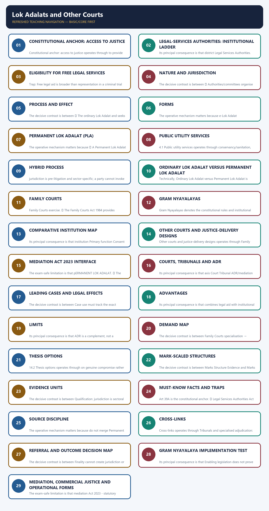
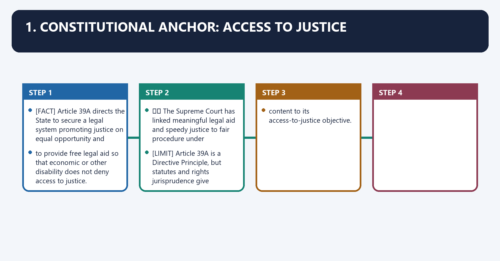
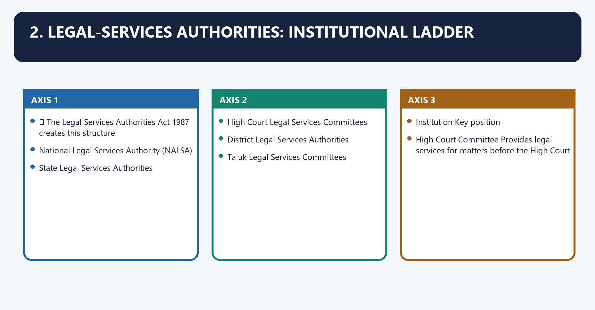
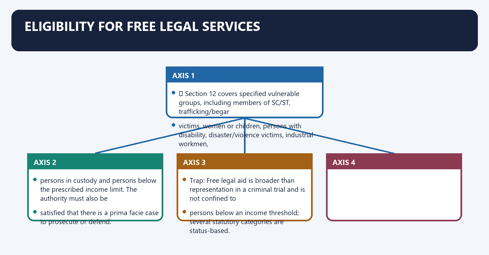
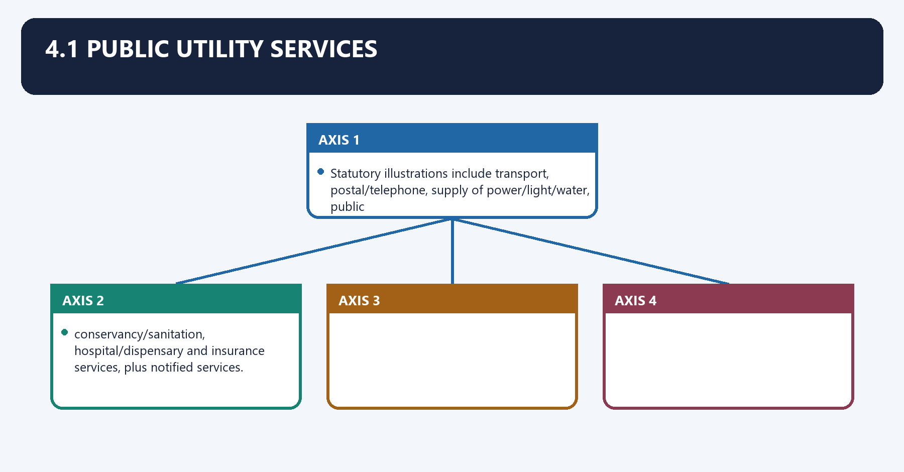
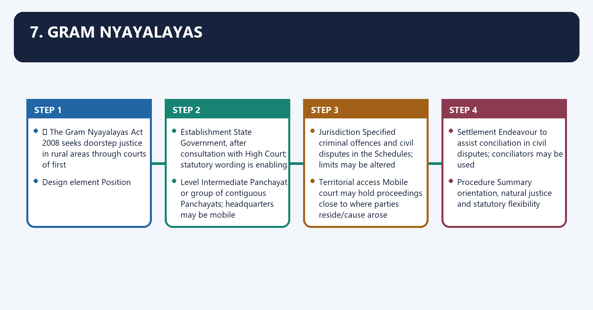
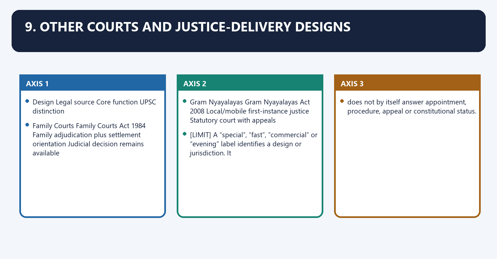
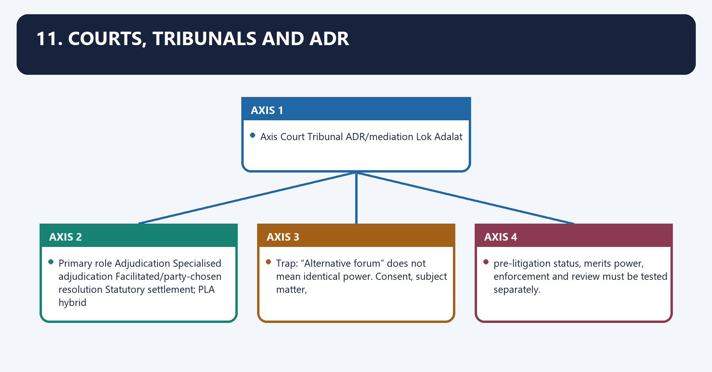
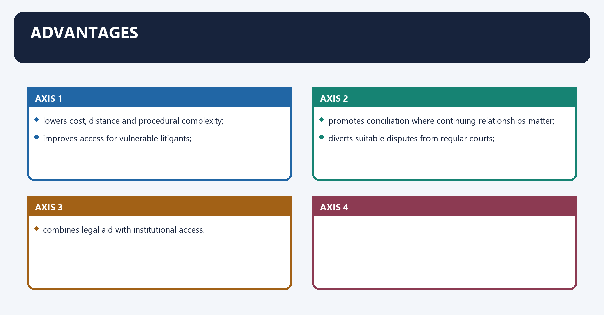

# Lok Adalats and Other Courts — Complete Uncompressed Learning Session

**Complete independent learning session + verified PYQ routing + solved practice workbook + final consolidated register notes**

**Legal/current control date:** 25 August 2026 (Asia/Kolkata)

> **Tag key:** `[FACT]` = named constitutional, statutory, official, judicial or audited local support; `[ANALYSIS]` = reasoned examination; `[CURRENT]` = checked for the control date; `[LIMIT]` = qualification.
>
> **Answer-writing discipline:** claim -> named evidence -> analysis -> qualification.

- [CURRENT] Status is controlled to **25 August 2026, Asia/Kolkata**.
- [CURRENT] **Live official refresh, 25 August 2026:** NALSA, the Department of Justice and India Code sources for the Legal Services Authorities Act 1987, Gram Nyayalayas Act 2008 and Mediation Act 2023 were rechecked on 25 August 2026. No notification-sensitive pecuniary ceiling, operational court count or commencement assumption is frozen.

#### How to Use This Package

[FACT] The complete Basic/Core owner is taught first in source order. Cross-topic Markdown, local OCR books and verified PYQ ledgers supplement it.

[FACT] Advanced-owner material appears only after the Core and practice sections under the required optional-depth label.

[LIMIT] Ordinary Lok Adalats settle only by compromise and cannot decide merits. Permanent Lok Adalats are pre-litigation public-utility bodies that conciliate first and may then decide an eligible dispute. Courts, tribunals, mediation, schemes and operational Lok Adalat formats remain legally distinct.

#### Local Owner Gateway

> **Subject:** Polity · **Tier:** Core · **GS Paper:** GS-II
> **Official clause:** "Structure, organization and functioning of the Executive and the Judiciary"
> and "mechanisms, laws, institutions and Bodies constituted for the protection and betterment of
> these vulnerable sections."
> **Grounded in:** Constitution of India, Art 39A; Legal Services Authorities Act 1987; Family
> Courts Act 1984; Gram Nyayalayas Act 2008; M. Laxmikanth, *Courseware on Indian Polity*, Eighth
> Edition (2026), Ch. 38.
> **Status legend:** [FACT] constitutional/settled static fact · 📜 statute/rule · ⚖️ judicial holding ·
> [LIMIT] analytical inference/current implementation caveat.
> **Core firewall:** This is the consolidated owner for legal-services institutions, ordinary and
> Permanent Lok Adalats, Family Courts and Gram Nyayalayas. Judiciary/body owners should cross-link,
> not reproduce these capsules. It is independently sufficient for Prelims and 10/15/20-mark
> Mains; no Advanced companion is required.

---

## BASIC LEARNING SESSION



*Distinct embedded teaching-navigation image. The separate continuous Cārvāka-style flowchart package remains an independent at-a-glance artifact.*

### SESSION 1 — CONSTITUTIONAL ANCHOR: ACCESS TO JUSTICE
#### DEFINITION / WHAT THIS IS CALLED

**Plain-language definition:** Constitutional anchor: access to justice denotes the constitutional rules and institutional links organised around Article 39A directs the State to secure a legal system promoting justice on equal opportunity and.

**Technical definition:** Constitutional anchor: access to justice operates through to provide free legal aid so that economic or other disability does not deny access to justice, connected with ⚖️ The Supreme Court has linked meaningful legal aid and speedy justice to fair procedure under.

#### ANSWER-GRABBING OPENING — WRITE/ADAPT IN THE EXAM

> Article 39A directs the State to secure a legal system promoting justice on equal opportunity and to provide free legal aid so that economic or other disability does not deny access to justice.

#### MUST-WRITE KEYWORDS

- **Constitutional anchor**
- **access to justice**
- **Article 39A**
- **Article 21**
- **Constitutional anchor: access to justice**
- **Constitutional**

**How to use them:** Frame the answer through Constitutional anchor; define access to justice, connect Article 39A with Article 21 to explain the mechanism, and use Constitutional anchor: access to justice for the decisive comparison or qualification.

1. Constitutional anchor: access to justice denotes the constitutional rules and institutional links organised around [FACT] Article 39A directs the State to secure a legal system promoting justice on equal opportunity and.
1. Constitutional anchor: access to justice operates through to provide free legal aid so that economic or other disability does not deny access to justice, connected with ⚖️ The Supreme Court has linked meaningful legal aid and speedy justice to fair procedure under.
The operative mechanism matters because [LIMIT] Article 39A is a Directive Principle, but statutes and rights jurisprudence give operational.
Its principal consequence is that content to its access-to-justice objective.
The decisive contrast is between [FACT] Article 39A directs the State to secure a legal system promoting justice on equal opportunity and and [FACT] Article 39A directs the State to secure a legal system promoting justice on equal opportunity and.
The exam-safe limitation is that [FACT] Article 39A directs the State to secure a legal system promoting justice on equal opportunity and.

[FACT] Article 39A directs the State to secure a legal system promoting justice on equal opportunity and
to provide free legal aid so that economic or other disability does not deny access to justice.

⚖️ The Supreme Court has linked meaningful legal aid and speedy justice to fair procedure under
Article 21.

[LIMIT] Article 39A is a Directive Principle, but statutes and rights jurisprudence give operational
content to its access-to-justice objective.

---

#### CLOSING RECALL FLOW — CONSTITUTIONAL ANCHOR: ACCESS TO JUSTICE

```closure-flow
SUBTOPIC: Constitutional anchor: access to justice
KEY TERMS / DEFINITIONS: Constitutional anchor · access to justice · Article 39A · Article 21 · Constitutional anchor: access to justice · Constitutional
MECHANISM / ARGUMENT: Constitutional anchor: access to justice operates through to provide free legal aid so that economic or other disability does not deny access to justice, connected with ⚖️ The Supreme Court has linked meaningful legal aid and speedy justice to fair procedure under.
CONSEQUENCE / CONTRAST: Article 39A directs the State to secure a legal system promoting justice on equal opportunity and to provide free legal aid so that economic or other disability does not deny access to justice.
UPSC TRAP / ANSWER-USE: Do not miss this limiting distinction: the decisive contrast is between Article 39A directs the State to secure a legal...
ANSWER-GRABBING FORMULATION: Article 39A directs the State to secure a legal system promoting justice on equal opportunity and to provide free legal aid so that economic or other disability does not deny access to justice.
```
### SESSION 2 — LEGAL-SERVICES AUTHORITIES: INSTITUTIONAL LADDER
#### DEFINITION / WHAT THIS IS CALLED

**Plain-language definition:** Legal-services authorities: institutional ladder denotes the constitutional rules and institutional links organised around 📜 The Legal Services Authorities Act 1987 creates this structure.

**Technical definition:** Its principal consequence is that district Legal Services Authorities.

#### ANSWER-GRABBING OPENING — WRITE/ADAPT IN THE EXAM

> The Legal Services Authorities Act creates a national-to-taluka institutional ladder, thereby linking legal-aid administration with Lok Adalat access.

#### MUST-WRITE KEYWORDS

- **Legal-services authorities**
- **institutional ladder**
- **NALSA**
- **High Court Committee**
- **District Authority**
- **Taluk Committee**

**How to use them:** Frame the answer through Legal-services authorities; define institutional ladder, connect NALSA with High Court Committee to explain the mechanism, and use District Authority for the decisive comparison or qualification.

2. Legal-services authorities: institutional ladder denotes the constitutional rules and institutional links organised around 📜 The Legal Services Authorities Act 1987 creates this structure.
2. Legal-services authorities: institutional ladder operates through National Legal Services Authority (NALSA), connected with State Legal Services Authorities.
The operative mechanism matters because high Court Legal Services Committees.
Its principal consequence is that district Legal Services Authorities.
The decisive contrast is between Taluk Legal Services Committees and Institution Key position.
The exam-safe limitation is that high Court Committee Provides legal services for matters before the High Court.

📜 The Legal Services Authorities Act 1987 creates this structure:

```text
National Legal Services Authority (NALSA)
                 │
      State Legal Services Authorities
                 │
     High Court Legal Services Committees
                 │
      District Legal Services Authorities
                 │
      Taluk Legal Services Committees
```

| Institution | Key position |
|---|---|
| NALSA | Lays down policy/principles and frames effective/economical legal-services schemes; Patron-in-Chief is the CJI; Executive Chairman is a serving/retired Supreme Court judge nominated in the statutory manner |
| State Authority | Implements Central policy and coordinates State legal services/Lok Adalats; Patron-in-Chief is the Chief Justice of the High Court |
| High Court Committee | Provides legal services for matters before the High Court |
| District Authority | Implements programmes and coordinates Taluk activity; District Judge is chairman |
| Taluk Committee | Coordinates services and Lok Adalats at taluk/mandal level |

#### CLOSING RECALL FLOW — LEGAL-SERVICES AUTHORITIES: INSTITUTIONAL LADDER

```closure-flow
SUBTOPIC: Legal-services authorities: institutional ladder
KEY TERMS / DEFINITIONS: Legal-services authorities · institutional ladder · NALSA · High Court Committee · District Authority · Taluk Committee
MECHANISM / ARGUMENT: The exam-safe limitation is that high Court Committee Provides legal services for matters before the High Court. 📜 The Legal Services Authorities Act 1987 creates this structure.
CONSEQUENCE / CONTRAST: Its principal consequence is that district Legal Services Authorities.
UPSC TRAP / ANSWER-USE: Do not miss this limiting distinction: the decisive contrast is between Taluk Legal Services Committees and Institution Key position.
ANSWER-GRABBING FORMULATION: The Legal Services Authorities Act creates a national-to-taluka institutional ladder, thereby linking legal-aid administration with Lok Adalat access.
```
### SESSION 3 — ELIGIBILITY FOR FREE LEGAL SERVICES
#### DEFINITION / WHAT THIS IS CALLED

**Plain-language definition:** Eligibility for free legal services denotes the constitutional rules and institutional links organised around 📜 Section 12 covers specified vulnerable groups, including members of SC/ST, trafficking/begar.

**Technical definition:** Trap: Free legal aid is broader than representation in a criminal trial and is not confined to persons below an income threshold; several statutory categories are status-based.

#### ANSWER-GRABBING OPENING — WRITE/ADAPT IN THE EXAM

> Section 12 covers specified vulnerable groups, including members of SC/ST, trafficking/begar victims, women or children, persons with disability, disaster/violence victims, industrial workmen, persons in custody and persons below the prescribed income limit.

#### MUST-WRITE KEYWORDS

- **Eligibility for free legal services**
- **Eligibility**
- **Section**
- **SC**
- **ST**
- **The operative mechanism matters because satisfied that there**

**How to use them:** Frame the answer through Eligibility for free legal services; define Eligibility, connect Section with SC to explain the mechanism, and use ST for the decisive comparison or qualification.

Eligibility for free legal services denotes the constitutional rules and institutional links organised around 📜 Section 12 covers specified vulnerable groups, including members of SC/ST, trafficking/begar.
Eligibility for free legal services operates through victims, women or children, persons with disability, disaster/violence victims, industrial workmen,, connected with persons in custody and persons below the prescribed income limit. The authority must also be.
The operative mechanism matters because satisfied that there is a prima facie case to prosecute or defend.
Its principal consequence is that trap: Free legal aid is broader than representation in a criminal trial and is not confined to.
The decisive contrast is between persons below an income threshold; several statutory categories are status-based and 📜 Section 12 covers specified vulnerable groups, including members of SC/ST, trafficking/begar.
The exam-safe limitation is that 📜 Section 12 covers specified vulnerable groups, including members of SC/ST, trafficking/begar.

📜 Section 12 covers specified vulnerable groups, including members of SC/ST, trafficking/begar
victims, women or children, persons with disability, disaster/violence victims, industrial workmen,
persons in custody and persons below the prescribed income limit. The authority must also be
satisfied that there is a prima facie case to prosecute or defend.

> **Trap:** Free legal aid is broader than representation in a criminal trial and is not confined to
> persons below an income threshold; several statutory categories are status-based.

---

#### CLOSING RECALL FLOW — ELIGIBILITY FOR FREE LEGAL SERVICES

```closure-flow
SUBTOPIC: Eligibility for free legal services
KEY TERMS / DEFINITIONS: Eligibility for free legal services · Eligibility · Section · SC · ST · The operative mechanism matters because satisfied that there
MECHANISM / ARGUMENT: The operative mechanism matters because satisfied that there is a prima facie case to prosecute or defend.
CONSEQUENCE / CONTRAST: Trap: Free legal aid is broader than representation in a criminal trial and is not confined to persons below an income threshold; several statutory categories are status-based.
UPSC TRAP / ANSWER-USE: Free legal aid is broader than representation in a criminal trial and is not confined to.
ANSWER-GRABBING FORMULATION: Section 12 covers specified vulnerable groups, including members of SC/ST, trafficking/begar victims, women or children, persons with disability, disaster/violence victims, industrial workmen, persons in custody and persons below the prescribed income limit.
```
### SESSION 4 — NATURE AND JURISDICTION
#### DEFINITION / WHAT THIS IS CALLED

**Plain-language definition:** 3.1 Nature and jurisdiction denotes the constitutional rules and institutional links organised around 📜 Authorities/committees organise Lok Adalats with serving/retired judicial officers and other.

**Technical definition:** The decisive contrast is between 📜 Authorities/committees organise Lok Adalats with serving/retired judicial officers and other and 📜 Authorities/committees organise Lok Adalats with serving/retired judicial officers and other.

#### ANSWER-GRABBING OPENING — WRITE/ADAPT IN THE EXAM

> Ordinary Lok Adalats may settle pending and pre-litigation disputes within jurisdiction, but cannot compromise legally non-compoundable offences.

#### MUST-WRITE KEYWORDS

- **Nature**
- **jurisdiction**
- **Authorities**
- **Lok Adalats**
- **Its principal consequence**
- **3.1 Nature and jurisdiction**

**How to use them:** Frame the answer through Nature; define jurisdiction, connect Authorities with Lok Adalats to explain the mechanism, and use Its principal consequence for the decisive comparison or qualification.

3.1 Nature and jurisdiction denotes the constitutional rules and institutional links organised around 📜 Authorities/committees organise Lok Adalats with serving/retired judicial officers and other.
3.1 Nature and jurisdiction operates through prescribed persons. They may handle, connected with a pending case; or.
The operative mechanism matters because a pre-litigation matter falling within a court's jurisdiction,.
Its principal consequence is that but not an offence that is legally non-compoundable.
The decisive contrast is between 📜 Authorities/committees organise Lok Adalats with serving/retired judicial officers and other and 📜 Authorities/committees organise Lok Adalats with serving/retired judicial officers and other.
The exam-safe limitation is that 📜 Authorities/committees organise Lok Adalats with serving/retired judicial officers and other.

📜 Authorities/committees organise Lok Adalats with serving/retired judicial officers and other
prescribed persons. They may handle:

- a pending case; or
- a pre-litigation matter falling within a court's jurisdiction,

but not an offence that is legally non-compoundable.

#### CLOSING RECALL FLOW — NATURE AND JURISDICTION

```closure-flow
SUBTOPIC: Nature and jurisdiction
KEY TERMS / DEFINITIONS: Nature · jurisdiction · Authorities · Lok Adalats · Its principal consequence · 3.1 Nature and jurisdiction
MECHANISM / ARGUMENT: The decisive contrast is between 📜 Authorities/committees organise Lok Adalats with serving/retired judicial officers and other and 📜 Authorities/committees organise Lok Adalats with serving/retired judicial officers and other.
CONSEQUENCE / CONTRAST: Its principal consequence is that but not an offence that is legally non-compoundable.
UPSC TRAP / ANSWER-USE: but not an offence that is legally non-compoundable.
ANSWER-GRABBING FORMULATION: Ordinary Lok Adalats may settle pending and pre-litigation disputes within jurisdiction, but cannot compromise legally non-compoundable offences.
```
### SESSION 5 — PROCESS AND EFFECT
#### DEFINITION / WHAT THIS IS CALLED

**Plain-language definition:** 3.2 Process and effect denotes the constitutional rules and institutional links organised around Referral / joint pre-litigation application.

**Technical definition:** The decisive contrast is between 📜 The ordinary Lok Adalat and seeks an amicable settlement and is guided by justice, equity, fair play and legal principles.

#### ANSWER-GRABBING OPENING — WRITE/ADAPT IN THE EXAM

> An ordinary Lok Adalat award derives finality from genuine compromise, so failed settlement returns parties to ordinary remedies rather than authorising imposed merits adjudication.

#### MUST-WRITE KEYWORDS

- **Master trap**
- **Referral**
- **Its principal consequence**
- **Its**
- **The decisive contrast**
- **3.2 Process and effect**

**How to use them:** Frame the answer through Master trap; define Referral, connect Its principal consequence with Its to explain the mechanism, and use The decisive contrast for the decisive comparison or qualification.

3.2 Process and effect denotes the constitutional rules and institutional links organised around Referral / joint pre-litigation application.
3.2 Process and effect operates through conciliation and compromise effort, connected with settlement no settlement.
The operative mechanism matters because award = civil- pending case returns.
Its principal consequence is that court decree parties pursue normal remedy.
The decisive contrast is between 📜 The ordinary Lok Adalat and seeks an amicable settlement and is guided by justice, equity, fair play and legal principles.
The exam-safe limitation is that cannot compel a compromise or adjudicate the dispute on merits.

```text
Referral / joint pre-litigation application
                 ↓
     conciliation and compromise effort
          ┌──────┴────────┐
          ↓               ↓
     settlement      no settlement
          ↓               ↓
 award = civil-      pending case returns;
 court decree        parties pursue normal remedy
```

📜 The ordinary Lok Adalat:

- seeks an amicable settlement and is guided by justice, equity, fair play and legal principles;
- **cannot compel a compromise or adjudicate the dispute on merits**;
- makes an award when parties settle;
- gives the award the status of a civil-court decree;
- makes the award final and binding, with no statutory appeal; and
- enables refund of court fee in a referred case.

⚖️ An award based on compromise is ordinarily challengeable only through constitutional review on
limited grounds such as absence of genuine consent/fraud—not by a statutory appeal.

> **Master trap:** Finality of an agreed award does not authorise a Lok Adalat to impose a merits
> decision when compromise fails.

#### CLOSING RECALL FLOW — PROCESS AND EFFECT

```closure-flow
SUBTOPIC: Process and effect
KEY TERMS / DEFINITIONS: Master trap · Referral · Its principal consequence · Its · The decisive contrast · 3.2 Process and effect
MECHANISM / ARGUMENT: The decisive contrast is between 📜 The ordinary Lok Adalat and seeks an amicable settlement and is guided by justice, equity, fair play and legal principles.
CONSEQUENCE / CONTRAST: Its principal consequence is that court decree parties pursue normal remedy.
UPSC TRAP / ANSWER-USE: Master trap: Finality of an agreed award does not authorise a Lok Adalat to impose a merits decision when compromise fails.
ANSWER-GRABBING FORMULATION: An ordinary Lok Adalat award derives finality from genuine compromise, so failed settlement returns parties to ordinary remedies rather than authorising imposed merits adjudication.
```
### SESSION 6 — FORMS
#### DEFINITION / WHAT THIS IS CALLED

**Plain-language definition:** 3.3 Forms denotes the constitutional rules and institutional links organised around National/State/District Lok Adalat General sittings across jurisdictions.

**Technical definition:** The operative mechanism matters because e-Lok Adalat Technology-enabled settlement format.

#### ANSWER-GRABBING OPENING — WRITE/ADAPT IN THE EXAM

> National, State, district, mobile and electronic Lok Adalat formats widen access, but do not alter the institution's consent-based legal character.

#### MUST-WRITE KEYWORDS

- **Forms**
- **National/State/District Lok Adalat**
- **General sittings across jurisdictions**
- **Mobile Lok Adalat**
- **Travels to improve access**
- **Mega/continuous/daily Lok Adalat**

**How to use them:** Frame the answer through Forms; define National/State/District Lok Adalat, connect General sittings across jurisdictions with Mobile Lok Adalat to explain the mechanism, and use Travels to improve access for the decisive comparison or qualification.

3.3 Forms denotes the constitutional rules and institutional links organised around National/State/District Lok Adalat General sittings across jurisdictions.
3.3 Forms operates through Mobile Lok Adalat Travels to improve access, connected with Mega/continuous/daily Lok Adalat Administrative formats for volume or regular settlement.
The operative mechanism matters because e-Lok Adalat Technology-enabled settlement format.
Its principal consequence is that [LIMIT] These formats do not alter the ordinary Lok Adalat's consent-based legal character.
The decisive contrast is between National/State/District Lok Adalat General sittings across jurisdictions and National/State/District Lok Adalat General sittings across jurisdictions.
The exam-safe limitation is that national/State/District Lok Adalat General sittings across jurisdictions.

| Form | Feature |
|---|---|
| National/State/District Lok Adalat | General sittings across jurisdictions |
| Mobile Lok Adalat | Travels to improve access |
| Mega/continuous/daily Lok Adalat | Administrative formats for volume or regular settlement |
| E-Lok Adalat | Technology-enabled settlement format |

[LIMIT] These formats do not alter the ordinary Lok Adalat's consent-based legal character.

---

#### CLOSING RECALL FLOW — FORMS

```closure-flow
SUBTOPIC: Forms
KEY TERMS / DEFINITIONS: Forms · National/State/District Lok Adalat · General sittings across jurisdictions · Mobile Lok Adalat · Travels to improve access · Mega/continuous/daily Lok Adalat
MECHANISM / ARGUMENT: The operative mechanism matters because e-Lok Adalat Technology-enabled settlement format.
CONSEQUENCE / CONTRAST: The decisive contrast is between National/State/District Lok Adalat General sittings across jurisdictions and National/State/District Lok Adalat General sittings across jurisdictions.
UPSC TRAP / ANSWER-USE: Its principal consequence is that These formats do not alter the ordinary Lok Adalat's consent-based legal character.
ANSWER-GRABBING FORMULATION: National, State, district, mobile and electronic Lok Adalat formats widen access, but do not alter the institution's consent-based legal character.
```
### SESSION 7 — PERMANENT LOK ADALAT (PLA)
#### DEFINITION / WHAT THIS IS CALLED

**Plain-language definition:** Permanent Lok Adalat (PLA) denotes the constitutional rules and institutional links organised around 📜 A Permanent Lok Adalat is established under the Legal Services Authorities Act for one or more.

**Technical definition:** The operative mechanism matters because 📜 A Permanent Lok Adalat is established under the Legal Services Authorities Act for one or more.

#### ANSWER-GRABBING OPENING — WRITE/ADAPT IN THE EXAM

> A Permanent Lok Adalat is a standing pre-litigation forum for specified public utility services, with limited merits power only after conciliation fails.

#### MUST-WRITE KEYWORDS

- **Permanent Lok Adalat (PLA)**
- **public utility services**
- **Permanent Lok Adalat**
- **PLA**
- **Legal Services Authorities Act**
- **It**

**How to use them:** Frame the answer through Permanent Lok Adalat (PLA); define public utility services, connect Permanent Lok Adalat with PLA to explain the mechanism, and use Legal Services Authorities Act for the decisive comparison or qualification.

4. Permanent Lok Adalat (PLA) denotes the constitutional rules and institutional links organised around 📜 A Permanent Lok Adalat is established under the Legal Services Authorities Act for one or more.
4. Permanent Lok Adalat (PLA) operates through public utility services . It is permanent in institution and works principally at the, connected with pre-litigation stage.
The operative mechanism matters because 📜 A Permanent Lok Adalat is established under the Legal Services Authorities Act for one or more.
Its principal consequence is that 📜 A Permanent Lok Adalat is established under the Legal Services Authorities Act for one or more.
The decisive contrast is between 📜 A Permanent Lok Adalat is established under the Legal Services Authorities Act for one or more and 📜 A Permanent Lok Adalat is established under the Legal Services Authorities Act for one or more.
The exam-safe limitation is that 📜 A Permanent Lok Adalat is established under the Legal Services Authorities Act for one or more.
📜 A Permanent Lok Adalat is established under the Legal Services Authorities Act for one or more
**public utility services**. It is permanent in institution and works principally at the
pre-litigation stage.

#### CLOSING RECALL FLOW — PERMANENT LOK ADALAT (PLA)

```closure-flow
SUBTOPIC: Permanent Lok Adalat (PLA)
KEY TERMS / DEFINITIONS: Permanent Lok Adalat (PLA) · public utility services · Permanent Lok Adalat · PLA · Legal Services Authorities Act · It
MECHANISM / ARGUMENT: The operative mechanism matters because 📜 A Permanent Lok Adalat is established under the Legal Services Authorities Act for one or more.
CONSEQUENCE / CONTRAST: Its principal consequence is that 📜 A Permanent Lok Adalat is established under the Legal Services Authorities Act for one or more.
UPSC TRAP / ANSWER-USE: Do not miss this limiting distinction: the decisive contrast is between 📜 A Permanent Lok Adalat is established under the...
ANSWER-GRABBING FORMULATION: A Permanent Lok Adalat is a standing pre-litigation forum for specified public utility services, with limited merits power only after conciliation fails.
```
### SESSION 8 — PUBLIC UTILITY SERVICES
#### DEFINITION / WHAT THIS IS CALLED

**Plain-language definition:** 4.1 Public utility services denotes the constitutional rules and institutional links organised around Statutory illustrations include transport, postal/telephone, supply of power/light/water, public.

**Technical definition:** 4.1 Public utility services operates through conservancy/sanitation, hospital/dispensary and insurance services, plus notified services, connected with Statutory illustrations include transport, postal/telephone, supply of power/light/water, public.

#### ANSWER-GRABBING OPENING — WRITE/ADAPT IN THE EXAM

> Public utility services under the Act cover specified essential sectors and notified additions, making jurisdiction statutory rather than dependent on ordinary-language importance.

#### MUST-WRITE KEYWORDS

- **Public utility services**
- **Statutory**
- **Its principal consequence**
- **Its**
- **The decisive contrast**
- **4.1 Public utility services**

**How to use them:** Frame the answer through Public utility services; define Statutory, connect Its principal consequence with Its to explain the mechanism, and use The decisive contrast for the decisive comparison or qualification.

4.1 Public utility services denotes the constitutional rules and institutional links organised around Statutory illustrations include transport, postal/telephone, supply of power/light/water, public.
4.1 Public utility services operates through conservancy/sanitation, hospital/dispensary and insurance services, plus notified services, connected with Statutory illustrations include transport, postal/telephone, supply of power/light/water, public.
The operative mechanism matters because statutory illustrations include transport, postal/telephone, supply of power/light/water, public.
Its principal consequence is that statutory illustrations include transport, postal/telephone, supply of power/light/water, public.
The decisive contrast is between Statutory illustrations include transport, postal/telephone, supply of power/light/water, public and Statutory illustrations include transport, postal/telephone, supply of power/light/water, public.
The exam-safe limitation is that statutory illustrations include transport, postal/telephone, supply of power/light/water, public.

Statutory illustrations include transport, postal/telephone, supply of power/light/water, public
conservancy/sanitation, hospital/dispensary and insurance services, plus notified services.

#### CLOSING RECALL FLOW — PUBLIC UTILITY SERVICES

```closure-flow
SUBTOPIC: Public utility services
KEY TERMS / DEFINITIONS: Public utility services · Statutory · Its principal consequence · Its · The decisive contrast · 4.1 Public utility services
MECHANISM / ARGUMENT: 4.1 Public utility services operates through conservancy/sanitation, hospital/dispensary and insurance services, plus notified services, connected with Statutory illustrations include transport, postal/telephone, supply of power/light/water, public.
CONSEQUENCE / CONTRAST: Its principal consequence is that statutory illustrations include transport, postal/telephone, supply of power/light/water, public.
UPSC TRAP / ANSWER-USE: Do not miss this limiting distinction: the decisive contrast is between Statutory illustrations include transport, postal/telephone, supply of power/light/water, public...
ANSWER-GRABBING FORMULATION: Public utility services under the Act cover specified essential sectors and notified additions, making jurisdiction statutory rather than dependent on ordinary-language importance.
```
### SESSION 9 — HYBRID PROCESS
#### DEFINITION / WHAT THIS IS CALLED

**Plain-language definition:** 4.2 Hybrid process denotes the constitutional rules and institutional links organised around Party applies before dispute reaches a court.

**Technical definition:** jurisdiction is pre-litigation and sector-specific; a party cannot invoke another court for that dispute after applying while PLA proceedings continue; PLA first conducts conciliation; if conciliation fails, it may decide the dispute on merits, subject to statutory exclusions and the Central Government's notified pecuniary limit; its award is final, binding, deemed a civil-court decree and not to be called in question in an original suit/application/execution proceeding; it is guided by natural justice, objectivity, fair play, equity and other principles of justice, and is not bound by the CPC or Evidence Act.

#### ANSWER-GRABBING OPENING — WRITE/ADAPT IN THE EXAM

> A Permanent Lok Adalat may adjudicate only eligible public-utility disputes within the currently notified monetary limit, which remains subject to lawful revision.

#### MUST-WRITE KEYWORDS

- **Hybrid process**
- **Hybrid**
- **Party**
- **Its principal consequence**
- **Its**
- **4.2 Hybrid process**

**How to use them:** Frame the answer through Hybrid process; define Hybrid, connect Party with Its principal consequence to explain the mechanism, and use Its for the decisive comparison or qualification.

4.2 Hybrid process denotes the constitutional rules and institutional links organised around Party applies before dispute reaches a court.
4.2 Hybrid process operates through PLA conciliates first, connected with ┌────────────┴────────────┐.
The operative mechanism matters because settlement conciliation fails.
Its principal consequence is that award on settlement PLA may decide merits.
The decisive contrast is between (unless non-compoundable offence) and 📜 Key distinctions.
The exam-safe limitation is that jurisdiction is pre-litigation and sector-specific.
```text
Party applies before dispute reaches a court
                    ↓
          PLA conciliates first
       ┌────────────┴────────────┐
       ↓                         ↓
 settlement                 conciliation fails
       ↓                         ↓
 award on settlement     PLA may decide merits
                          (unless non-compoundable offence)
```

📜 Key distinctions:

- jurisdiction is pre-litigation and sector-specific;
- a party cannot invoke another court for that dispute after applying while PLA proceedings
  continue;
- PLA first conducts conciliation;
- if conciliation fails, it may decide the dispute on merits, subject to statutory exclusions and
  the Central Government's notified pecuniary limit;
- its award is final, binding, deemed a civil-court decree and not to be called in question in an
  original suit/application/execution proceeding;
- it is guided by natural justice, objectivity, fair play, equity and other principles of justice,
  and is not bound by the CPC or Evidence Act.

> **Trap:** Do not attach a stale rupee ceiling to the Act. The Central Government may revise the
> limit by notification; verify the current notification for a current-affairs answer.

---

#### CLOSING RECALL FLOW — HYBRID PROCESS

```closure-flow
SUBTOPIC: Hybrid process
KEY TERMS / DEFINITIONS: Hybrid process · Hybrid · Party · Its principal consequence · Its · 4.2 Hybrid process
MECHANISM / ARGUMENT: jurisdiction is pre-litigation and sector-specific; a party cannot invoke another court for that dispute after applying while PLA proceedings continue; PLA first conducts conciliation; if conciliation fails, it may decide the dispute on merits, subject to statutory exclusions and the Central Government's notified pecuniary limit; its award is final, binding, deemed a civil-court decree and not to be called in question in an original suit/application/execution proceeding; it is guided by natural justice, objectivity, fair play, equity and other principles of justice, and is not bound by the CPC or Evidence Act.
CONSEQUENCE / CONTRAST: Its principal consequence is that award on settlement PLA may decide merits.
UPSC TRAP / ANSWER-USE: Do not attach a stale rupee ceiling to the Act. The Central Government may revise the.
ANSWER-GRABBING FORMULATION: A Permanent Lok Adalat may adjudicate only eligible public-utility disputes within the currently notified monetary limit, which remains subject to lawful revision.
```
### SESSION 10 — ORDINARY LOK ADALAT VERSUS PERMANENT LOK ADALAT
#### DEFINITION / WHAT THIS IS CALLED

**Plain-language definition:** Ordinary Lok Adalat versus Permanent Lok Adalat denotes the constitutional rules and institutional links organised around Axis Ordinary Lok Adalat Permanent Lok Adalat.

**Technical definition:** Technically, Ordinary Lok Adalat versus Permanent Lok Adalat is analysed by relating Statutory route to Ch. VI, 1987 Act, then testing the relationship through Ch. VI-A, inserted in 2002 and Institution.

#### ANSWER-GRABBING OPENING — WRITE/ADAPT IN THE EXAM

> Ordinary Lok Adalats end with settlement or return, whereas Permanent Lok Adalats may adjudicate eligible public-utility disputes after unsuccessful conciliation.

#### MUST-WRITE KEYWORDS

- **Ordinary Lok Adalat versus Permanent Lok Adalat**
- **Statutory route**
- **Ch. VI, 1987 Act**
- **Ch. VI-A, inserted in 2002**
- **Institution**
- **Organised sittings**

**How to use them:** Frame the answer through Ordinary Lok Adalat versus Permanent Lok Adalat; define Statutory route, connect Ch. VI, 1987 Act with Ch. VI-A, inserted in 2002 to explain the mechanism, and use Institution for the decisive comparison or qualification.

5. Ordinary Lok Adalat versus Permanent Lok Adalat denotes the constitutional rules and institutional links organised around Axis Ordinary Lok Adalat Permanent Lok Adalat.
5. Ordinary Lok Adalat versus Permanent Lok Adalat operates through Statutory route Ch. VI, 1987 Act Ch. VI-A, inserted in 2002, connected with Institution Organised sittings Standing body.
The operative mechanism matters because disputes Pending or pre-litigation within court jurisdiction Pre-litigation public-utility disputes.
Its principal consequence is that settlement method Conciliation/compromise only Conciliation first.
The decisive contrast is between If settlement fails No merits adjudication May adjudicate merits and Criminal bar Non-compoundable offences excluded Same exclusion.
The exam-safe limitation is that award Deemed decree; final and binding Deemed decree; final and binding.

| Axis | Ordinary Lok Adalat | Permanent Lok Adalat |
|---|---|---|
| Statutory route | Ch. VI, 1987 Act | Ch. VI-A, inserted in 2002 |
| Institution | Organised sittings | Standing body |
| Disputes | Pending or pre-litigation within court jurisdiction | Pre-litigation public-utility disputes |
| Settlement method | Conciliation/compromise only | Conciliation first |
| If settlement fails | No merits adjudication | May adjudicate merits |
| Criminal bar | Non-compoundable offences excluded | Same exclusion |
| Award | Deemed decree; final and binding | Deemed decree; final and binding |

---

#### CLOSING RECALL FLOW — ORDINARY LOK ADALAT VERSUS PERMANENT LOK ADALAT

```closure-flow
SUBTOPIC: Ordinary Lok Adalat versus Permanent Lok Adalat
KEY TERMS / DEFINITIONS: Ordinary Lok Adalat versus Permanent Lok Adalat · Statutory route · Ch. VI, 1987 Act · Ch. VI-A, inserted in 2002 · Institution · Organised sittings
MECHANISM / ARGUMENT: Its principal consequence is that settlement method Conciliation/compromise only Conciliation first.
CONSEQUENCE / CONTRAST: The decisive contrast is between If settlement fails No merits adjudication May adjudicate merits and Criminal bar Non-compoundable offences excluded Same exclusion.
UPSC TRAP / ANSWER-USE: Do not miss this limiting distinction: the exam-safe limitation is that award Deemed decree.
ANSWER-GRABBING FORMULATION: Ordinary Lok Adalats end with settlement or return, whereas Permanent Lok Adalats may adjudicate eligible public-utility disputes after unsuccessful conciliation.
```
### SESSION 11 — FAMILY COURTS
#### DEFINITION / WHAT THIS IS CALLED

**Plain-language definition:** Family Courts denotes the constitutional rules and institutional links organised around 📜 The Family Courts Act 1984 provides specialised courts for conciliation and speedy settlement of.

**Technical definition:** Family Courts exercise. 📜 The Family Courts Act 1984 provides specialised courts for conciliation and speedy settlement of family/matrimonial disputes.

#### ANSWER-GRABBING OPENING — WRITE/ADAPT IN THE EXAM

> Family Courts combine specialised adjudication with conciliation and privacy, but procedural flexibility does not displace judicial fairness or statutory appeal rules.

#### MUST-WRITE KEYWORDS

- **Family Courts**
- **Establishment**
- **Jurisdiction**
- **Primary approach**
- **Procedure**
- **Privacy**

**How to use them:** Frame the answer through Family Courts; define Establishment, connect Jurisdiction with Primary approach to explain the mechanism, and use Procedure for the decisive comparison or qualification.

6. Family Courts denotes the constitutional rules and institutional links organised around 📜 The Family Courts Act 1984 provides specialised courts for conciliation and speedy settlement of.
6. Family Courts operates through family/matrimonial disputes, connected with Primary approach Endeavour toward settlement before adjudication where consistent with the case.
The operative mechanism matters because procedure Flexible statutory procedure; may receive material that assists effective resolution.
Its principal consequence is that privacy Proceedings may be held in camera and must be so held if either party desires.
The decisive contrast is between Lawyers No right as of course to legal representation; court may seek legal-expert assistance and Appeal To High Court from a non-interlocutory judgment/order, subject to statutory exclusions.
The exam-safe limitation is that [LIMIT] Specialisation and conciliation do not remove judicial fairness. Family Courts exercise.
📜 The Family Courts Act 1984 provides specialised courts for conciliation and speedy settlement of
family/matrimonial disputes.

| Feature | Position |
|---|---|
| Establishment | State Government, after consultation with High Court; mandatory for specified cities/towns above the statutory population threshold and discretionary elsewhere |
| Jurisdiction | Matrimonial status, property between spouses, legitimacy, maintenance, guardianship/custody/access and connected family disputes |
| Primary approach | Endeavour toward settlement before adjudication where consistent with the case |
| Procedure | Flexible statutory procedure; may receive material that assists effective resolution |
| Privacy | Proceedings may be held in camera and must be so held if either party desires |
| Lawyers | No right as of course to legal representation; court may seek legal-expert assistance |
| Appeal | To High Court from a non-interlocutory judgment/order, subject to statutory exclusions |

[LIMIT] Specialisation and conciliation do not remove judicial fairness. Family Courts exercise
statutory judicial power and differ from compromise-only ordinary Lok Adalats.

---

#### CLOSING RECALL FLOW — FAMILY COURTS

```closure-flow
SUBTOPIC: Family Courts
KEY TERMS / DEFINITIONS: Family Courts · Establishment · Jurisdiction · Primary approach · Procedure · Privacy
MECHANISM / ARGUMENT: Family Courts exercise. 📜 The Family Courts Act 1984 provides specialised courts for conciliation and speedy settlement of family/matrimonial disputes.
CONSEQUENCE / CONTRAST: The decisive contrast is between Lawyers No right as of course to legal representation; court may seek legal-expert assistance and Appeal To High Court from a non-interlocutory judgment/order, subject to statutory exclusions.
UPSC TRAP / ANSWER-USE: Do not miss this limiting distinction: its principal consequence is that privacy Proceedings may be held in camera and must...
ANSWER-GRABBING FORMULATION: Family Courts combine specialised adjudication with conciliation and privacy, but procedural flexibility does not displace judicial fairness or statutory appeal rules.
```
### SESSION 12 — GRAM NYAYALAYAS
#### DEFINITION / WHAT THIS IS CALLED

**Plain-language definition:** Gram Nyayalayas operates through Design element Position, connected with Establishment State Government, after consultation with High Court; statutory wording is enabling and implementation is State-dependent.

**Technical definition:** Gram Nyayalayas denotes the constitutional rules and institutional links organised around 📜 The Gram Nyayalayas Act 2008 seeks doorstep justice in rural areas through courts of first.

#### ANSWER-GRABBING OPENING — WRITE/ADAPT IN THE EXAM

> Gram Nyayalayas are State-established statutory courts for local first-instance justice, not Panchayat bodies, mediation camps or Lok Adalats.

#### MUST-WRITE KEYWORDS

- **Gram Nyayalayas**
- **Establishment**
- **Level**
- **Presiding officer**
- **Jurisdiction**
- **Territorial access**

**How to use them:** Frame the answer through Gram Nyayalayas; define Establishment, connect Level with Presiding officer to explain the mechanism, and use Jurisdiction for the decisive comparison or qualification.

7. Gram Nyayalayas denotes the constitutional rules and institutional links organised around 📜 The Gram Nyayalayas Act 2008 seeks doorstep justice in rural areas through courts of first.
7. Gram Nyayalayas operates through Design element Position, connected with Establishment State Government, after consultation with High Court; statutory wording is enabling and implementation is State-dependent.
The operative mechanism matters because level Intermediate Panchayat or group of contiguous Panchayats; headquarters may be mobile.
Its principal consequence is that jurisdiction Specified criminal offences and civil disputes in the Schedules; limits may be altered through statutory process.
The decisive contrast is between Territorial access Mobile court may hold proceedings close to where parties reside/cause arose and Settlement Endeavour to assist conciliation in civil disputes; conciliators may be used.
The exam-safe limitation is that procedure Summary orientation, natural justice and statutory flexibility.

📜 The Gram Nyayalayas Act 2008 seeks doorstep justice in rural areas through courts of first
instance.

| Design element | Position |
|---|---|
| Establishment | State Government, after consultation with High Court; statutory wording is enabling and implementation is State-dependent |
| Level | Intermediate Panchayat or group of contiguous Panchayats; headquarters may be mobile |
| Presiding officer | Nyayadhikari, appointed by State Government in consultation with High Court; qualified for appointment as Judicial Magistrate First Class |
| Jurisdiction | Specified criminal offences and civil disputes in the Schedules; limits may be altered through statutory process |
| Territorial access | Mobile court may hold proceedings close to where parties reside/cause arose |
| Settlement | Endeavour to assist conciliation in civil disputes; conciliators may be used |
| Procedure | Summary orientation, natural justice and statutory flexibility |
| Appeals | Criminal appeal to Court of Session; civil appeal to District Court, subject to statutory exceptions |

[LIMIT] A Gram Nyayalaya is a statutory court—not a village panchayat, khap, mediation camp or Lok
Adalat. Current counts and operational coverage vary and require dated official verification.

---

#### CLOSING RECALL FLOW — GRAM NYAYALAYAS

```closure-flow
SUBTOPIC: Gram Nyayalayas
KEY TERMS / DEFINITIONS: Gram Nyayalayas · Establishment · Level · Presiding officer · Jurisdiction · Territorial access
MECHANISM / ARGUMENT: Gram Nyayalayas denotes the constitutional rules and institutional links organised around 📜 The Gram Nyayalayas Act 2008 seeks doorstep justice in rural areas through courts of first.
CONSEQUENCE / CONTRAST: A Gram Nyayalaya is a statutory court—not a village panchayat, khap, mediation camp or Lok Adalat.
UPSC TRAP / ANSWER-USE: Do not miss this limiting distinction: its principal consequence is that jurisdiction Specified criminal offences and civil disputes in the...
ANSWER-GRABBING FORMULATION: Gram Nyayalayas are State-established statutory courts for local first-instance justice, not Panchayat bodies, mediation camps or Lok Adalats.
```
### SESSION 13 — COMPARATIVE INSTITUTION MAP
#### DEFINITION / WHAT THIS IS CALLED

**Plain-language definition:** Comparative institution map denotes the constitutional rules and institutional links organised around Institution Primary function Consent needed for outcome?

**Technical definition:** Its principal consequence is that institution Primary function Consent needed for outcome?

#### ANSWER-GRABBING OPENING — WRITE/ADAPT IN THE EXAM

> Justice-delivery institutions differ in consent, adjudicatory power, legal source, subject matter and review, making a common 'alternative court' label misleading.

#### MUST-WRITE KEYWORDS

- **Comparative institution map**
- **Ordinary Lok Adalat**
- **Settlement**
- **Yes**
- **No**
- **No statutory appeal; limited judicial review**

**How to use them:** Frame the answer through Comparative institution map; define Ordinary Lok Adalat, connect Settlement with Yes to explain the mechanism, and use No for the decisive comparison or qualification.

8. Comparative institution map denotes the constitutional rules and institutional links organised around Institution Primary function Consent needed for outcome? Can decide merits? Appeal/control.
8. Comparative institution map operates through Ordinary Lok Adalat Settlement Yes No No statutory appeal; limited judicial review, connected with Family Court Specialised family adjudication + conciliation Not for judgment Yes Statutory High Court appeal with exclusions.
The operative mechanism matters because gram Nyayalaya Rural first-instance court Not for judgment Yes Session/District appellate routes.
Its principal consequence is that institution Primary function Consent needed for outcome? Can decide merits? Appeal/control.
The decisive contrast is between Institution Primary function Consent needed for outcome? Can decide merits? Appeal/control and Institution Primary function Consent needed for outcome? Can decide merits? Appeal/control.
The exam-safe limitation is that institution Primary function Consent needed for outcome? Can decide merits? Appeal/control.
| Institution | Primary function | Consent needed for outcome? | Can decide merits? | Appeal/control |
|---|---|---:|---:|---|
| Ordinary Lok Adalat | Settlement | Yes | No | No statutory appeal; limited judicial review |
| Permanent Lok Adalat | Public-utility pre-litigation conciliation/adjudication | Not for post-failure merits award | Yes | Statutory finality; constitutional review remains |
| Family Court | Specialised family adjudication + conciliation | Not for judgment | Yes | Statutory High Court appeal with exclusions |
| Gram Nyayalaya | Rural first-instance court | Not for judgment | Yes | Session/District appellate routes |

---

#### CLOSING RECALL FLOW — COMPARATIVE INSTITUTION MAP

```closure-flow
SUBTOPIC: Comparative institution map
KEY TERMS / DEFINITIONS: Comparative institution map · Ordinary Lok Adalat · Settlement · Yes · No · No statutory appeal; limited judicial review
MECHANISM / ARGUMENT: Its principal consequence is that institution Primary function Consent needed for outcome?
CONSEQUENCE / CONTRAST: The decisive contrast is between Institution Primary function Consent needed for outcome?
UPSC TRAP / ANSWER-USE: Do not miss this limiting distinction: the exam-safe limitation is that institution Primary function Consent needed for outcome?
ANSWER-GRABBING FORMULATION: Justice-delivery institutions differ in consent, adjudicatory power, legal source, subject matter and review, making a common 'alternative court' label misleading.
```
### SESSION 14 — OTHER COURTS AND JUSTICE-DELIVERY DESIGNS
#### DEFINITION / WHAT THIS IS CALLED

**Plain-language definition:** Other courts and justice-delivery designs denotes the constitutional rules and institutional links organised around Design Legal source Core function UPSC distinction.

**Technical definition:** Other courts and justice-delivery designs operates through Family Courts Family Courts Act 1984 Family adjudication plus settlement orientation Judicial decision remains available, connected with Gram Nyayalayas Gram Nyayalayas Act 2008 Local/mobile first-instance justice Statutory court with appeals.

#### ANSWER-GRABBING OPENING — WRITE/ADAPT IN THE EXAM

> Family Courts, Gram Nyayalayas and specialist courts derive authority from separate statutes, so their labels do not determine appointment, procedure or appeal.

#### MUST-WRITE KEYWORDS

- **Other courts**
- **justice-delivery designs**
- **Fast Track Courts**
- **Government/finance-supported scheme implemented through States and High Courts**
- **Additional capacity for selected pending cases**
- **Special Courts**

**How to use them:** Frame the answer through Other courts; define justice-delivery designs, connect Fast Track Courts with Government/finance-supported scheme implemented through States and High Courts to explain the mechanism, and use Additional capacity for selected pending cases for the decisive comparison or qualification.

9. Other courts and justice-delivery designs denotes the constitutional rules and institutional links organised around Design Legal source Core function UPSC distinction.
9. Other courts and justice-delivery designs operates through Family Courts Family Courts Act 1984 Family adjudication plus settlement orientation Judicial decision remains available, connected with Gram Nyayalayas Gram Nyayalayas Act 2008 Local/mobile first-instance justice Statutory court with appeals.
The operative mechanism matters because [LIMIT] A “special”, “fast”, “commercial” or “evening” label identifies a design or jurisdiction. It.
Its principal consequence is that does not by itself answer appointment, procedure, appeal or constitutional status.
The decisive contrast is between Design Legal source Core function UPSC distinction and Design Legal source Core function UPSC distinction.
The exam-safe limitation is that design Legal source Core function UPSC distinction.

| Design | Legal source | Core function | UPSC distinction |
|---|---|---|---|
| Fast Track Courts | Government/finance-supported scheme implemented through States and High Courts | Additional capacity for selected pending cases | Not a separate constitutional species or uniform permanent court |
| Special Courts | Particular statute or valid notification | Trial/adjudication of a defined offence, person or subject | Jurisdiction depends on the parent law |
| Commercial Courts | Commercial Courts Act 2015, as amended | Specified-value commercial disputes with case-management and pre-institution processes | Statutory civil courts, not tribunals or Lok Adalats |
| Evening/Morning Courts | High Court/State administrative design under ordinary court authority | Extend hearing hours for suitable minor matters | Administrative format, not a new constitutional hierarchy |
| Family Courts | Family Courts Act 1984 | Family adjudication plus settlement orientation | Judicial decision remains available |
| Gram Nyayalayas | Gram Nyayalayas Act 2008 | Local/mobile first-instance justice | Statutory court with appeals |

[LIMIT] A “special”, “fast”, “commercial” or “evening” label identifies a design or jurisdiction. It
does not by itself answer appointment, procedure, appeal or constitutional status.

---

#### CLOSING RECALL FLOW — OTHER COURTS AND JUSTICE-DELIVERY DESIGNS

```closure-flow
SUBTOPIC: Other courts and justice-delivery designs
KEY TERMS / DEFINITIONS: Other courts · justice-delivery designs · Fast Track Courts · Government/finance-supported scheme implemented through States and High Courts · Additional capacity for selected pending cases · Special Courts
MECHANISM / ARGUMENT: Other courts and justice-delivery designs operates through Family Courts Family Courts Act 1984 Family adjudication plus settlement orientation Judicial decision remains available, connected with Gram Nyayalayas Gram Nyayalayas Act 2008 Local/mobile first-instance justice Statutory court with appeals.
CONSEQUENCE / CONTRAST: The decisive contrast is between Design Legal source Core function UPSC distinction and Design Legal source Core function UPSC distinction.
UPSC TRAP / ANSWER-USE: Its principal consequence is that does not by itself answer appointment, procedure, appeal or constitutional status.
ANSWER-GRABBING FORMULATION: Family Courts, Gram Nyayalayas and specialist courts derive authority from separate statutes, so their labels do not determine appointment, procedure or appeal.
```
### SESSION 15 — MEDIATION ACT 2023 INTERFACE
#### DEFINITION / WHAT THIS IS CALLED

**Plain-language definition:** Mediation Act 2023 interface denotes the constitutional rules and institutional links organised around 📜 The Mediation Act 2023 supplies a general statutory framework for mediation, including.

**Technical definition:** The exam-safe limitation is that pERMANENT LOK ADALAT. 📜 The Mediation Act 2023 supplies a general statutory framework for mediation, including pre-litigation, institutional, online and community-mediation concepts, mediated-settlement agreements, confidentiality and enforcement/challenge rules.

#### ANSWER-GRABBING OPENING — WRITE/ADAPT IN THE EXAM

> Mediation produces a party-made settlement, ordinary Lok Adalats record compromise, and Permanent Lok Adalats possess limited adjudication; their statutory regimes must remain distinct.

#### MUST-WRITE KEYWORDS

- **Mediation Act 2023 interface**
- **Mediation Act 2023**
- **The Mediation Act 2023**
- **Mediation Act**
- **The Mediation Act**
- **Its principal consequence**

**How to use them:** Frame the answer through Mediation Act 2023 interface; define Mediation Act 2023, connect The Mediation Act 2023 with Mediation Act to explain the mechanism, and use The Mediation Act for the decisive comparison or qualification.

10. Mediation Act 2023 interface denotes the constitutional rules and institutional links organised around 📜 The Mediation Act 2023 supplies a general statutory framework for mediation, including.
10. Mediation Act 2023 interface operates through pre-litigation, institutional, online and community-mediation concepts, mediated-settlement, connected with agreements, confidentiality and enforcement/challenge rules. Its commencement, rules and any.
The operative mechanism matters because sectoral exclusions must be checked provision by provision on the control date.
Its principal consequence is that neutral facilitates party-made settlement.
The decisive contrast is between ORDINARY LOK ADALAT and statutory forum records compromise as award/deemed decree.
The exam-safe limitation is that pERMANENT LOK ADALAT.
📜 The Mediation Act 2023 supplies a general statutory framework for mediation, including
pre-litigation, institutional, online and community-mediation concepts, mediated-settlement
agreements, confidentiality and enforcement/challenge rules. Its commencement, rules and any
sectoral exclusions must be checked provision by provision on the control date.

```text
MEDIATION
neutral facilitates party-made settlement
        ≠
ORDINARY LOK ADALAT
statutory forum records compromise as award/deemed decree
        ≠
PERMANENT LOK ADALAT
conciliation first; eligible public-utility dispute may then be decided on merits
        ≠
COURT / TRIBUNAL
authoritative adjudication under jurisdiction and appeal/review rules
```

The Commercial Courts Act's pre-institution mediation route and the Mediation Act must not be
collapsed into the Lok Adalat regime. Settlement remains party-made in mediation; an ordinary Lok
Adalat award follows compromise; a PLA has a limited post-conciliation adjudicatory power.

---

#### CLOSING RECALL FLOW — MEDIATION ACT 2023 INTERFACE

```closure-flow
SUBTOPIC: Mediation Act 2023 interface
KEY TERMS / DEFINITIONS: Mediation Act 2023 interface · Mediation Act 2023 · The Mediation Act 2023 · Mediation Act · The Mediation Act · Its principal consequence
MECHANISM / ARGUMENT: The exam-safe limitation is that pERMANENT LOK ADALAT. 📜 The Mediation Act 2023 supplies a general statutory framework for mediation, including pre-litigation, institutional, online and community-mediation concepts, mediated-settlement agreements, confidentiality and enforcement/challenge rules.
CONSEQUENCE / CONTRAST: The Commercial Courts Act's pre-institution mediation route and the Mediation Act must not be collapsed into the Lok Adalat regime.
UPSC TRAP / ANSWER-USE: Do not miss this limiting distinction: the decisive contrast is between ORDINARY LOK ADALAT and statutory forum records compromise as...
ANSWER-GRABBING FORMULATION: Mediation produces a party-made settlement, ordinary Lok Adalats record compromise, and Permanent Lok Adalats possess limited adjudication; their statutory regimes must remain distinct.
```
### SESSION 16 — COURTS, TRIBUNALS AND ADR
#### DEFINITION / WHAT THIS IS CALLED

**Plain-language definition:** Courts, tribunals and ADR denotes the constitutional rules and institutional links organised around Axis Court Tribunal ADR/mediation Lok Adalat.

**Technical definition:** Its principal consequence is that axis Court Tribunal ADR/mediation Lok Adalat.

#### ANSWER-GRABBING OPENING — WRITE/ADAPT IN THE EXAM

> Courts, tribunals and ADR differ in consent, subject matter, merits power, enforcement and review, so the forum determines the legal consequence.

#### MUST-WRITE KEYWORDS

- **Courts**
- **tribunals**
- **ADR**
- **Constitution/statute and judicial hierarchy**
- **Statute under constitutional limits**
- **Contract/statute/court referral**

**How to use them:** Frame the answer through Courts; define tribunals, connect ADR with Constitution/statute and judicial hierarchy to explain the mechanism, and use Statute under constitutional limits for the decisive comparison or qualification.

11. Courts, tribunals and ADR denotes the constitutional rules and institutional links organised around Axis Court Tribunal ADR/mediation Lok Adalat.
11. Courts, tribunals and ADR operates through Primary role Adjudication Specialised adjudication Facilitated/party-chosen resolution Statutory settlement; PLA hybrid, connected with Trap: “Alternative forum” does not mean identical power. Consent, subject matter,.
The operative mechanism matters because pre-litigation status, merits power, enforcement and review must be tested separately.
Its principal consequence is that axis Court Tribunal ADR/mediation Lok Adalat.
The decisive contrast is between Axis Court Tribunal ADR/mediation Lok Adalat and Axis Court Tribunal ADR/mediation Lok Adalat.
The exam-safe limitation is that axis Court Tribunal ADR/mediation Lok Adalat.

| Axis | Court | Tribunal | ADR/mediation | Lok Adalat |
|---|---|---|---|---|
| Source | Constitution/statute and judicial hierarchy | Statute under constitutional limits | Contract/statute/court referral | Legal Services Authorities Act |
| Primary role | Adjudication | Specialised adjudication | Facilitated/party-chosen resolution | Statutory settlement; PLA hybrid |
| Binding outcome without consent | Yes | Yes | Generally no mediated settlement without consent | Ordinary: no; PLA: yes after failed conciliation within scope |
| Appeal/review | Hierarchical/statutory | Statutory appeal plus constitutional review | Enforcement/challenge under governing law | Statutory finality plus limited constitutional review |

> **Trap:** “Alternative forum” does not mean identical power. Consent, subject matter,
> pre-litigation status, merits power, enforcement and review must be tested separately.

---

#### CLOSING RECALL FLOW — COURTS, TRIBUNALS AND ADR

```closure-flow
SUBTOPIC: Courts, tribunals and ADR
KEY TERMS / DEFINITIONS: Courts · tribunals · ADR · Constitution/statute and judicial hierarchy · Statute under constitutional limits · Contract/statute/court referral
MECHANISM / ARGUMENT: Courts, tribunals and ADR operates through Primary role Adjudication Specialised adjudication Facilitated/party-chosen resolution Statutory settlement; PLA hybrid, connected with Trap: “Alternative forum” does not mean identical power.
CONSEQUENCE / CONTRAST: Its principal consequence is that axis Court Tribunal ADR/mediation Lok Adalat.
UPSC TRAP / ANSWER-USE: “Alternative forum” does not mean identical power. Consent, subject matter,.
ANSWER-GRABBING FORMULATION: Courts, tribunals and ADR differ in consent, subject matter, merits power, enforcement and review, so the forum determines the legal consequence.
```
### SESSION 17 — LEADING CASES AND LEGAL EFFECTS
#### DEFINITION / WHAT THIS IS CALLED

**Plain-language definition:** Leading cases and legal effects denotes the constitutional rules and institutional links organised around Decision Decision year Exam-safe holding/use.

**Technical definition:** The decisive contrast is between Case use must track the exact statutory mechanism.

#### ANSWER-GRABBING OPENING — WRITE/ADAPT IN THE EXAM

> A decision about commercial mediation, ordinary Lok Adalat or PLA cannot be applied as if all three were the same forum.

#### MUST-WRITE KEYWORDS

- **Leading cases**
- **legal effects**
- **Hussainara Khatoon v. State of Bihar**
- **Afcons Infrastructure v. Cherian Varkey Construction**
- **Structured guidance on court referral to ADR processes**
- **InterGlobe Aviation v. N. Satchidanand**

**How to use them:** Frame the answer through Leading cases; define legal effects, connect Hussainara Khatoon v. State of Bihar with Afcons Infrastructure v. Cherian Varkey Construction to explain the mechanism, and use Structured guidance on court referral to ADR processes for the decisive comparison or qualification.

12. Leading cases and legal effects denotes the constitutional rules and institutional links organised around Decision Decision year Exam-safe holding/use.
12. Leading cases and legal effects operates through Hussainara Khatoon v. State of Bihar 1979 Speedy justice and legal assistance are integral to fair procedure under Art 21, connected with State of Punjab v. Jalour Singh 2008 Ordinary Lok Adalat has no adjudicatory role; award must rest on compromise.
The operative mechanism matters because afcons Infrastructure v. Cherian Varkey Construction 2010 Structured guidance on court referral to ADR processes.
Its principal consequence is that bar Council of India v. Union of India 2012 Upheld the PLA public-utility conciliation-cum-adjudication design.
The decisive contrast is between [LIMIT] Case use must track the exact statutory mechanism. A decision about commercial mediation, and ordinary Lok Adalat or PLA cannot be applied as if all three were the same forum.
The exam-safe limitation is that decision Decision year Exam-safe holding/use.
| Decision | Decision year | Exam-safe holding/use |
|---|---:|---|
| *Hussainara Khatoon v. State of Bihar* | 1979 | Speedy justice and legal assistance are integral to fair procedure under Art 21 |
| *State of Punjab v. Jalour Singh* | 2008 | Ordinary Lok Adalat has no adjudicatory role; award must rest on compromise |
| *Afcons Infrastructure v. Cherian Varkey Construction* | 2010 | Structured guidance on court referral to ADR processes |
| *InterGlobe Aviation v. N. Satchidanand* | 2011 | Ordinary Lok Adalat and Permanent Lok Adalat are legally distinct; merits power cannot be casually transferred |
| *Bar Council of India v. Union of India* | 2012 | Upheld the PLA public-utility conciliation-cum-adjudication design |
| *Patil Automation v. Rakheja Engineers* | 2022 | Commercial pre-institution mediation requirement is mandatory where the statutory urgent-relief exception does not apply |
| *Canara Bank v. G.S. Jayarama* | 2022 | Clarified PLA conciliation procedure and its limited power to decide an eligible dispute after conciliation fails |

[LIMIT] Case use must track the exact statutory mechanism. A decision about commercial mediation,
ordinary Lok Adalat or PLA cannot be applied as if all three were the same forum.

---

#### CLOSING RECALL FLOW — LEADING CASES AND LEGAL EFFECTS

```closure-flow
SUBTOPIC: Leading cases and legal effects
KEY TERMS / DEFINITIONS: Leading cases · legal effects · Hussainara Khatoon v. State of Bihar · Afcons Infrastructure v. Cherian Varkey Construction · Structured guidance on court referral to ADR processes · InterGlobe Aviation v. N. Satchidanand
MECHANISM / ARGUMENT: The decisive contrast is between Case use must track the exact statutory mechanism.
CONSEQUENCE / CONTRAST: Its principal consequence is that bar Council of India v.
UPSC TRAP / ANSWER-USE: Do not miss this limiting distinction: state of Bihar 1979 Speedy justice and legal assistance are integral to fair procedure...
ANSWER-GRABBING FORMULATION: A decision about commercial mediation, ordinary Lok Adalat or PLA cannot be applied as if all three were the same forum.
```
### SESSION 18 — ADVANTAGES
#### DEFINITION / WHAT THIS IS CALLED

**Plain-language definition:** Advantages denotes the constitutional rules and institutional links organised around lowers cost, distance and procedural complexity.

**Technical definition:** Its principal consequence is that combines legal aid with institutional access.

#### ANSWER-GRABBING OPENING — WRITE/ADAPT IN THE EXAM

> Legal-services institutions can reduce cost and distance and preserve relationships, but access gains depend on awareness, staffing, voluntariness and enforceable outcomes.

#### MUST-WRITE KEYWORDS

- **Advantages**
- **Its principal consequence**
- **Its**
- **The decisive contrast**
- **The exam-safe limitation**

**How to use them:** Frame the answer through Advantages; define Its principal consequence, connect Its with The decisive contrast to explain the mechanism, and use The exam-safe limitation for the decisive comparison or qualification.

Advantages denotes the constitutional rules and institutional links organised around lowers cost, distance and procedural complexity.
Advantages operates through improves access for vulnerable litigants, connected with promotes conciliation where continuing relationships matter.
The operative mechanism matters because diverts suitable disputes from regular courts.
Its principal consequence is that combines legal aid with institutional access.
The decisive contrast is between lowers cost, distance and procedural complexity and lowers cost, distance and procedural complexity.
The exam-safe limitation is that lowers cost, distance and procedural complexity.

- lowers cost, distance and procedural complexity;
- improves access for vulnerable litigants;
- promotes conciliation where continuing relationships matter;
- diverts suitable disputes from regular courts;
- combines legal aid with institutional access.

#### CLOSING RECALL FLOW — ADVANTAGES

```closure-flow
SUBTOPIC: Advantages
KEY TERMS / DEFINITIONS: Advantages · Its principal consequence · Its · The decisive contrast · The exam-safe limitation
MECHANISM / ARGUMENT: Its principal consequence is that combines legal aid with institutional access.
CONSEQUENCE / CONTRAST: The decisive contrast is between lowers cost, distance and procedural complexity and lowers cost, distance and procedural complexity.
UPSC TRAP / ANSWER-USE: Do not miss this limiting distinction: the exam-safe limitation is that lowers cost, distance and procedural complexity. lowers cost, distance...
ANSWER-GRABBING FORMULATION: Legal-services institutions can reduce cost and distance and preserve relationships, but access gains depend on awareness, staffing, voluntariness and enforceable outcomes.
```
### SESSION 19 — LIMITS
#### DEFINITION / WHAT THIS IS CALLED

**Plain-language definition:** Close-option source discipline means the systematic verification of legal source, institutional category, status and exception before choosing a close option.

**Technical definition:** Its principal consequence is that ADR is a complement, not a wholesale substitute, for independent courts.

#### ANSWER-GRABBING OPENING — WRITE/ADAPT IN THE EXAM

> Alternative dispute resolution complements independent courts because unequal bargaining, jurisdictional error and weak capacity can make apparent settlement inconsistent with justice.

#### MUST-WRITE KEYWORDS

- **Limits**
- **with**
- **Close-option source discipline**
- **Close-option**
- **Its principal consequence**
- **Its**

**How to use them:** Frame the answer through Limits; define with, connect Close-option source discipline with Close-option to explain the mechanism, and use Its principal consequence for the decisive comparison or qualification.

Close-option source discipline means the systematic verification of legal source, institutional category, status and exception before choosing a close option.
Technically, close-option source discipline comprises source attribution, doctrinal classification, date control and remedy-specific qualification.
The operative mechanism matters because low utilisation or uneven State implementation may prevent designed access from becoming actual.
Its principal consequence is that [LIMIT] ADR is a complement, not a wholesale substitute, for independent courts. The constitutional.
The decisive contrast is between test is affordable access with voluntariness, fairness and review against illegality and settlement systems risk pressure or unequal bargaining if consent is not real.
The exam-safe limitation is that settlement systems risk pressure or unequal bargaining if consent is not real.
- settlement systems risk pressure or unequal bargaining if consent is not real;
- specialised/local institutions need judges, staff, awareness and infrastructure;
- statutory finality cannot cure jurisdictional error or denial of natural justice;
- low utilisation or uneven State implementation may prevent designed access from becoming actual
  access.

[LIMIT] ADR is a complement, not a wholesale substitute, for independent courts. The constitutional
test is affordable access **with** voluntariness, fairness and review against illegality.

---

#### CLOSING RECALL FLOW — LIMITS

```closure-flow
SUBTOPIC: Limits
KEY TERMS / DEFINITIONS: Limits · with · Close-option source discipline · Close-option · Its principal consequence · Its
MECHANISM / ARGUMENT: Close-option source discipline means the systematic verification of legal source, institutional category, status and exception before choosing a close option.
CONSEQUENCE / CONTRAST: The decisive contrast is between test is affordable access with voluntariness, fairness and review against illegality and settlement systems risk pressure or unequal bargaining if consent is not real.
UPSC TRAP / ANSWER-USE: ADR is a complement, not a wholesale substitute, for independent courts.
ANSWER-GRABBING FORMULATION: Alternative dispute resolution complements independent courts because unequal bargaining, jurisdictional error and weak capacity can make apparent settlement inconsistent with justice.
```
### SESSION 20 — DEMAND MAP
#### DEFINITION / WHAT THIS IS CALLED

**Plain-language definition:** 14.1 Demand map denotes the constitutional rules and institutional links organised around Demand Answer spine.

**Technical definition:** The decisive contrast is between Family Courts specialisation → conciliation/privacy/flexibility → fairness/capacity and Demand Answer spine.

#### ANSWER-GRABBING OPENING — WRITE/ADAPT IN THE EXAM

> Justice-delivery questions should distinguish settlement, specialised adjudication and local courts before evaluating access, fairness, finality and implementation.

#### MUST-WRITE KEYWORDS

- **Demand map**
- **Lok Adalat significance**
- **Art 39A → statutory design → consent/finality → access gains → safeguards**
- **Ordinary versus PLA**
- **jurisdiction → stage → conciliation → merits power → award**
- **Alternative justice institutions**

**How to use them:** Frame the answer through Demand map; define Lok Adalat significance, connect Art 39A → statutory design → consent/finality → access gains → safeguards with Ordinary versus PLA to explain the mechanism, and use jurisdiction → stage → conciliation → merits power → award for the decisive comparison or qualification.

14.1 Demand map denotes the constitutional rules and institutional links organised around Demand Answer spine.
14.1 Demand map operates through Lok Adalat significance Art 39A → statutory design → consent/finality → access gains → safeguards, connected with Ordinary versus PLA jurisdiction → stage → conciliation → merits power → award.
The operative mechanism matters because alternative justice institutions legal-services ladder → four institutions → comparative matrix → implementation.
Its principal consequence is that gram Nyayalayas statutory design → mobile/local jurisdiction → appellate safeguard → operational gaps.
The decisive contrast is between Family Courts specialisation → conciliation/privacy/flexibility → fairness/capacity and Demand Answer spine.
The exam-safe limitation is that demand Answer spine.

| Demand | Answer spine |
|---|---|
| Lok Adalat significance | Art 39A → statutory design → consent/finality → access gains → safeguards |
| Ordinary versus PLA | jurisdiction → stage → conciliation → merits power → award |
| Alternative justice institutions | legal-services ladder → four institutions → comparative matrix → implementation |
| Gram Nyayalayas | statutory design → mobile/local jurisdiction → appellate safeguard → operational gaps |
| Family Courts | specialisation → conciliation/privacy/flexibility → fairness/capacity |

#### CLOSING RECALL FLOW — DEMAND MAP

```closure-flow
SUBTOPIC: Demand map
KEY TERMS / DEFINITIONS: Demand map · Lok Adalat significance · Art 39A → statutory design → consent/finality → access gains → safeguards · Ordinary versus PLA · jurisdiction → stage → conciliation → merits power → award · Alternative justice institutions
MECHANISM / ARGUMENT: The decisive contrast is between Family Courts specialisation → conciliation/privacy/flexibility → fairness/capacity and Demand Answer spine.
CONSEQUENCE / CONTRAST: Its principal consequence is that gram Nyayalayas statutory design → mobile/local jurisdiction → appellate safeguard → operational gaps.
UPSC TRAP / ANSWER-USE: Do not miss this limiting distinction: the exam-safe limitation is that demand Answer spine.
ANSWER-GRABBING FORMULATION: Justice-delivery questions should distinguish settlement, specialised adjudication and local courts before evaluating access, fairness, finality and implementation.
```
### SESSION 21 — THESIS OPTIONS
#### DEFINITION / WHAT THIS IS CALLED

**Plain-language definition:** 14.2 Thesis options denotes the constitutional rules and institutional links organised around Lok Adalats constitutionalise access through consensual settlement, but their legitimacy depends.

**Technical definition:** 14.2 Thesis options operates through on genuine compromise rather than docket disposal, connected with The Permanent Lok Adalat is a hybrid: conciliation remains first, but limited statutory.

#### ANSWER-GRABBING OPENING — WRITE/ADAPT IN THE EXAM

> The Permanent Lok Adalat is a hybrid: conciliation remains first, but limited statutory adjudication follows failure in public-utility disputes.

#### MUST-WRITE KEYWORDS

- **Thesis options**
- **Thesis**
- **Lok Adalats**
- **The Permanent Lok Adalat**
- **Its principal consequence**
- **14.2 Thesis options**

**How to use them:** Frame the answer through Thesis options; define Thesis, connect Lok Adalats with The Permanent Lok Adalat to explain the mechanism, and use Its principal consequence for the decisive comparison or qualification.

14.2 Thesis options denotes the constitutional rules and institutional links organised around Lok Adalats constitutionalise access through consensual settlement, but their legitimacy depends.
14.2 Thesis options operates through on genuine compromise rather than docket disposal, connected with The Permanent Lok Adalat is a hybrid: conciliation remains first, but limited statutory.
The operative mechanism matters because adjudication follows failure in public-utility disputes.
Its principal consequence is that india's access-to-justice architecture is plural, yet statutory proximity must be matched by.
The decisive contrast is between personnel, awareness and procedural fairness and Lok Adalats constitutionalise access through consensual settlement, but their legitimacy depends.
The exam-safe limitation is that lok Adalats constitutionalise access through consensual settlement, but their legitimacy depends.
- *Lok Adalats constitutionalise access through consensual settlement, but their legitimacy depends
  on genuine compromise rather than docket disposal.*
- *The Permanent Lok Adalat is a hybrid: conciliation remains first, but limited statutory
  adjudication follows failure in public-utility disputes.*
- *India's access-to-justice architecture is plural, yet statutory proximity must be matched by
  personnel, awareness and procedural fairness.*

#### CLOSING RECALL FLOW — THESIS OPTIONS

```closure-flow
SUBTOPIC: Thesis options
KEY TERMS / DEFINITIONS: Thesis options · Thesis · Lok Adalats · The Permanent Lok Adalat · Its principal consequence · 14.2 Thesis options
MECHANISM / ARGUMENT: 14.2 Thesis options operates through on genuine compromise rather than docket disposal, connected with The Permanent Lok Adalat is a hybrid: conciliation remains first, but limited statutory.
CONSEQUENCE / CONTRAST: Its principal consequence is that india's access-to-justice architecture is plural, yet statutory proximity must be matched by.
UPSC TRAP / ANSWER-USE: The decisive contrast is between personnel, awareness and procedural fairness and Lok Adalats constitutionalise access through consensual settlement, but their legitimacy depends.
ANSWER-GRABBING FORMULATION: The Permanent Lok Adalat is a hybrid: conciliation remains first, but limited statutory adjudication follows failure in public-utility disputes.
```
### SESSION 22 — MARK-SCALED STRUCTURES
#### DEFINITION / WHAT THIS IS CALLED

**Plain-language definition:** 14.3 Mark-scaled structures denotes the constitutional rules and institutional links organised around Marks Structure Evidence.

**Technical definition:** The decisive contrast is between Marks Structure Evidence and Marks Structure Evidence.

#### ANSWER-GRABBING OPENING — WRITE/ADAPT IN THE EXAM

> Analytical depth comes from linking the institution's source, jurisdiction, consent rule and remedy to one concrete access-to-justice limitation.

#### MUST-WRITE KEYWORDS

- **Mark-scaled structures**
- **Art 39A → design → 2 distinctions → verdict**
- **Institutional ladder → ordinary/PLA comparison → benefits/limits**
- **3–4 statutory features**
- **5–6 anchors**
- **7–9 anchors**

**How to use them:** Frame the answer through Mark-scaled structures; define Art 39A → design → 2 distinctions → verdict, connect Institutional ladder → ordinary/PLA comparison → benefits/limits with 3–4 statutory features to explain the mechanism, and use 5–6 anchors for the decisive comparison or qualification.

14.3 Mark-scaled structures denotes the constitutional rules and institutional links organised around Marks Structure Evidence.
14.3 Mark-scaled structures operates through 10 Art 39A → design → 2 distinctions → verdict 3–4 statutory features, connected with 15 Institutional ladder → ordinary/PLA comparison → benefits/limits 5–6 anchors.
The operative mechanism matters because 20 Constitutional anchor → four-institution matrix → safeguards → implementation reform → conclusion 7–9 anchors.
Its principal consequence is that marks Structure Evidence.
The decisive contrast is between Marks Structure Evidence and Marks Structure Evidence.
The exam-safe limitation is that marks Structure Evidence.

| Marks | Structure | Evidence |
|---:|---|---|
| 10 | Art 39A → design → 2 distinctions → verdict | 3–4 statutory features |
| 15 | Institutional ladder → ordinary/PLA comparison → benefits/limits | 5–6 anchors |
| 20 | Constitutional anchor → four-institution matrix → safeguards → implementation reform → conclusion | 7–9 anchors |

#### CLOSING RECALL FLOW — MARK-SCALED STRUCTURES

```closure-flow
SUBTOPIC: Mark-scaled structures
KEY TERMS / DEFINITIONS: Mark-scaled structures · Art 39A → design → 2 distinctions → verdict · Institutional ladder → ordinary/PLA comparison → benefits/limits · 3–4 statutory features · 5–6 anchors · 7–9 anchors
MECHANISM / ARGUMENT: The decisive contrast is between Marks Structure Evidence and Marks Structure Evidence.
CONSEQUENCE / CONTRAST: Its principal consequence is that marks Structure Evidence.
UPSC TRAP / ANSWER-USE: Do not miss this limiting distinction: the exam-safe limitation is that marks Structure Evidence.
ANSWER-GRABBING FORMULATION: Analytical depth comes from linking the institution's source, jurisdiction, consent rule and remedy to one concrete access-to-justice limitation.
```
### SESSION 23 — EVIDENCE UNITS
#### DEFINITION / WHAT THIS IS CALLED

**Plain-language definition:** 14.4 Evidence units denotes the constitutional rules and institutional links organised around Claim: an ordinary Lok Adalat is conciliatory, not adjudicatory.

**Technical definition:** The decisive contrast is between Qualification: jurisdiction is sectoral and notification-sensitive and Claim: proximity alone does not ensure justice.

#### ANSWER-GRABBING OPENING — WRITE/ADAPT IN THE EXAM

> Ordinary Lok Adalats are conciliatory, Permanent Lok Adalats add limited merits powers, and proximity alone does not guarantee fair or usable justice.

#### MUST-WRITE KEYWORDS

- **Evidence units**
- **Claim**
- **Qualification**
- **Lok Adalat**
- **Its principal consequence**
- **14.4 Evidence units**

**How to use them:** Frame the answer through Evidence units; define Claim, connect Qualification with Lok Adalat to explain the mechanism, and use Its principal consequence for the decisive comparison or qualification.

14.4 Evidence units denotes the constitutional rules and institutional links organised around Claim: an ordinary Lok Adalat is conciliatory, not adjudicatory. Evidence: 📜 compromise.
14.4 Evidence units operates through design and award provisions. Analysis: consent legitimises finality. Qualification: limited, connected with constitutional challenge remains.
The operative mechanism matters because claim: PLA fills a pre-litigation public-service gap. Evidence: 📜 public-utility and.
Its principal consequence is that post-conciliation merits powers. Analysis: combines settlement with enforceable resolution.
The decisive contrast is between Qualification: jurisdiction is sectoral and notification-sensitive and Claim: proximity alone does not ensure justice. Evidence: 📜 mobile Gram Nyayalaya design.
The exam-safe limitation is that analysis: reduces distance. Qualification: State establishment, staffing and awareness.
- **Claim:** an ordinary Lok Adalat is conciliatory, not adjudicatory. **Evidence:** 📜 compromise
  design and award provisions. **Analysis:** consent legitimises finality. **Qualification:** limited
  constitutional challenge remains.
- **Claim:** PLA fills a pre-litigation public-service gap. **Evidence:** 📜 public-utility and
  post-conciliation merits powers. **Analysis:** combines settlement with enforceable resolution.
  **Qualification:** jurisdiction is sectoral and notification-sensitive.
- **Claim:** proximity alone does not ensure justice. **Evidence:** 📜 mobile Gram Nyayalaya design.
  **Analysis:** reduces distance. **Qualification:** State establishment, staffing and awareness
  determine actual access.

---

#### CLOSING RECALL FLOW — EVIDENCE UNITS

```closure-flow
SUBTOPIC: Evidence units
KEY TERMS / DEFINITIONS: Evidence units · Claim · Qualification · Lok Adalat · Its principal consequence · 14.4 Evidence units
MECHANISM / ARGUMENT: The decisive contrast is between Qualification: jurisdiction is sectoral and notification-sensitive and Claim: proximity alone does not ensure justice.
CONSEQUENCE / CONTRAST: Claim: an ordinary Lok Adalat is conciliatory, not adjudicatory.
UPSC TRAP / ANSWER-USE: Do not miss this limiting distinction: its principal consequence is that post-conciliation merits powers.
ANSWER-GRABBING FORMULATION: Ordinary Lok Adalats are conciliatory, Permanent Lok Adalats add limited merits powers, and proximity alone does not guarantee fair or usable justice.
```
### SESSION 24 — MUST-KNOW FACTS AND TRAPS
#### DEFINITION / WHAT THIS IS CALLED

**Plain-language definition:** Close-option source discipline means the systematic verification of legal source, institutional category, status and exception before choosing a close option.

**Technical definition:** Art 39A is the constitutional anchor. 📜 Legal Services Authorities Act 1987 creates the authority ladder and Lok Adalats. 📜 Ordinary Lok Adalat cannot decide merits after failed compromise. 📜 PLA may decide merits after failed conciliation in eligible public-utility disputes. 📜 Both awards are treated as civil-court decrees and are final/binding. 📜 Family Courts and Gram Nyayalayas are statutory courts with adjudicatory power. 📜 Fast Track Courts and evening courts are designs/schemes; special and commercial courts derive jurisdiction from their governing law. 📜 Mediation, ordinary Lok Adalat and PLA have different consent and merits-decision rules.

#### ANSWER-GRABBING OPENING — WRITE/ADAPT IN THE EXAM

> Lok Adalat awards, Family Courts, Gram Nyayalayas and special courts possess different legal effects, despite sharing an objective of more accessible justice.

#### MUST-WRITE KEYWORDS

- **Must-Know Facts**
- **traps**
- **Legal Services Authorities Act 1987**
- **Close-option source discipline**
- **Close-option**
- **Its principal consequence**

**How to use them:** Frame the answer through Must-Know Facts; define traps, connect Legal Services Authorities Act 1987 with Close-option source discipline to explain the mechanism, and use Close-option for the decisive comparison or qualification.

Close-option source discipline means the systematic verification of legal source, institutional category, status and exception before choosing a close option.
Technically, close-option source discipline comprises source attribution, doctrinal classification, date control and remedy-specific qualification.
The operative mechanism matters because 📜 PLA may decide merits after failed conciliation in eligible public-utility disputes.
Its principal consequence is that 📜 Both awards are treated as civil-court decrees and are final/binding.
The decisive contrast is between 📜 Family Courts and Gram Nyayalayas are statutory courts with adjudicatory power and 📜 Fast Track Courts and evening courts are designs/schemes; special and commercial courts.
The exam-safe limitation is that derive jurisdiction from their governing law.
- [FACT] Art 39A is the constitutional anchor.
- 📜 Legal Services Authorities Act 1987 creates the authority ladder and Lok Adalats.
- 📜 Ordinary Lok Adalat cannot decide merits after failed compromise.
- 📜 PLA may decide merits after failed conciliation in eligible public-utility disputes.
- 📜 Both awards are treated as civil-court decrees and are final/binding.
- 📜 Family Courts and Gram Nyayalayas are statutory courts with adjudicatory power.
- 📜 Fast Track Courts and evening courts are designs/schemes; special and commercial courts
  derive jurisdiction from their governing law.
- 📜 Mediation, ordinary Lok Adalat and PLA have different consent and merits-decision rules.
- [LIMIT] Current pecuniary limits, notified services and operational counts require dated official
  verification.

#### CLOSING RECALL FLOW — MUST-KNOW FACTS AND TRAPS

```closure-flow
SUBTOPIC: Must-Know Facts and traps
KEY TERMS / DEFINITIONS: Must-Know Facts · traps · Legal Services Authorities Act 1987 · Close-option source discipline · Close-option · Its principal consequence
MECHANISM / ARGUMENT: Close-option source discipline means the systematic verification of legal source, institutional category, status and exception before choosing a close option.
CONSEQUENCE / CONTRAST: The decisive contrast is between 📜 Family Courts and Gram Nyayalayas are statutory courts with adjudicatory power and 📜 Fast Track Courts and evening courts are designs/schemes; special and commercial courts.
UPSC TRAP / ANSWER-USE: Do not miss this limiting distinction: the exam-safe limitation is that derive jurisdiction from their governing law.
ANSWER-GRABBING FORMULATION: Lok Adalat awards, Family Courts, Gram Nyayalayas and special courts possess different legal effects, despite sharing an objective of more accessible justice.
```
### SESSION 25 — SOURCE DISCIPLINE
#### DEFINITION / WHAT THIS IS CALLED

**Plain-language definition:** Close-option source discipline means the systematic verification of legal source, institutional category, status and exception before choosing a close option.

**Technical definition:** The operative mechanism matters because do not merge Permanent Lok Adalat with an ordinary permanent sitting.

#### ANSWER-GRABBING OPENING — WRITE/ADAPT IN THE EXAM

> Precise source control prevents Permanent Lok Adalats from becoming ordinary permanent sittings and Gram Nyayalayas from becoming Panchayat institutions.

#### MUST-WRITE KEYWORDS

- **Source discipline**
- **Close-option source discipline**
- **Close-option**
- **Permanent Lok Adalat**
- **Its principal consequence**
- **Its**

**How to use them:** Frame the answer through Source discipline; define Close-option source discipline, connect Close-option with Permanent Lok Adalat to explain the mechanism, and use Its principal consequence for the decisive comparison or qualification.

Close-option source discipline means the systematic verification of legal source, institutional category, status and exception before choosing a close option.
Technically, close-option source discipline comprises source attribution, doctrinal classification, date control and remedy-specific qualification.
The operative mechanism matters because do not merge Permanent Lok Adalat with an ordinary permanent sitting.
Its principal consequence is that do not call Gram Nyayalaya a Panchayat institution.
The decisive contrast is between Never use "people's court" to imply absence of law or fairness and Never use "people's court" to imply absence of law or fairness.
The exam-safe limitation is that never use "people's court" to imply absence of law or fairness.
- Never use "people's court" to imply absence of law or fairness.
- Do not say all Lok Adalat disputes are pre-litigation.
- Do not say no legal challenge of any kind can ever lie against an award.
- Do not merge Permanent Lok Adalat with an ordinary permanent sitting.
- Do not call Gram Nyayalaya a Panchayat institution.

#### CLOSING RECALL FLOW — SOURCE DISCIPLINE

```closure-flow
SUBTOPIC: Source discipline
KEY TERMS / DEFINITIONS: Source discipline · Close-option source discipline · Close-option · Permanent Lok Adalat · Its principal consequence · Its
MECHANISM / ARGUMENT: The operative mechanism matters because do not merge Permanent Lok Adalat with an ordinary permanent sitting.
CONSEQUENCE / CONTRAST: Its principal consequence is that do not call Gram Nyayalaya a Panchayat institution.
UPSC TRAP / ANSWER-USE: Do not merge Permanent Lok Adalat with an ordinary permanent sitting.
ANSWER-GRABBING FORMULATION: Precise source control prevents Permanent Lok Adalats from becoming ordinary permanent sittings and Gram Nyayalayas from becoming Panchayat institutions.
```
### SESSION 26 — CROSS-LINKS
#### DEFINITION / WHAT THIS IS CALLED

**Plain-language definition:** Cross-links denotes the constitutional rules and institutional links organised around High Court supervision/review: High-Court.md.

**Technical definition:** Cross-links operates through Tribunals and specialised adjudication: Administrative-Tribunals.md, connected with Statutory/quasi-judicial bodies: Statutory-Regulatory-and-Quasi-Judicial-Bodies.md.

#### ANSWER-GRABBING OPENING — WRITE/ADAPT IN THE EXAM

> Lok Adalats sit within a wider justice system of High Court review, tribunals, statutory bodies and Directive Principle commitments to equal access.

#### MUST-WRITE KEYWORDS

- **Cross-links**
- **High Court**
- **High-Court.md**
- **Tribunals**
- **Administrative-Tribunals.md**
- **Statutory**

**How to use them:** Frame the answer through Cross-links; define High Court, connect High-Court.md with Tribunals to explain the mechanism, and use Administrative-Tribunals.md for the decisive comparison or qualification.

Cross-links denotes the constitutional rules and institutional links organised around High Court supervision/review: High-Court.md.
Cross-links operates through Tribunals and specialised adjudication: Administrative-Tribunals.md, connected with Statutory/quasi-judicial bodies: Statutory-Regulatory-and-Quasi-Judicial-Bodies.md.
The operative mechanism matters because dPSP context: Directive-Principles.md.
Its principal consequence is that high Court supervision/review: High-Court.md.
The decisive contrast is between High Court supervision/review: High-Court.md and High Court supervision/review: High-Court.md.
The exam-safe limitation is that high Court supervision/review: High-Court.md.
- High Court supervision/review: `High-Court.md`
- Tribunals and specialised adjudication: `Administrative-Tribunals.md`
- Statutory/quasi-judicial bodies: `Statutory-Regulatory-and-Quasi-Judicial-Bodies.md`
- DPSP context: `Directive-Principles.md`

#### CLOSING RECALL FLOW — CROSS-LINKS

```closure-flow
SUBTOPIC: Cross-links
KEY TERMS / DEFINITIONS: Cross-links · High Court · High-Court.md · Tribunals · Administrative-Tribunals.md · Statutory
MECHANISM / ARGUMENT: Cross-links operates through Tribunals and specialised adjudication: Administrative-Tribunals.md, connected with Statutory/quasi-judicial bodies: Statutory-Regulatory-and-Quasi-Judicial-Bodies.md.
CONSEQUENCE / CONTRAST: The decisive contrast is between High Court supervision/review: High-Court.md and High Court supervision/review: High-Court.md.
UPSC TRAP / ANSWER-USE: Do not miss this limiting distinction: its principal consequence is that high Court supervision/review.
ANSWER-GRABBING FORMULATION: Lok Adalats sit within a wider justice system of High Court review, tribunals, statutory bodies and Directive Principle commitments to equal access.
```
### SESSION 27 — REFERRAL AND OUTCOME DECISION MAP
#### DEFINITION / WHAT THIS IS CALLED

**Plain-language definition:** Referral and outcome decision map denotes the constitutional rules and institutional links organised around PENDING/PRE-LITIGATION DISPUTE.

**Technical definition:** The decisive contrast is between Finality cannot create jurisdiction or genuine consent where none existed and PENDING/PRE-LITIGATION DISPUTE.

#### ANSWER-GRABBING OPENING — WRITE/ADAPT IN THE EXAM

> The proper forum follows the dispute and desired outcome: consensual settlement, limited public-utility adjudication, mediation or authoritative judicial decision.

#### MUST-WRITE KEYWORDS

- **Referral**
- **outcome decision map**
- **Referral and outcome decision map**
- **PENDING**
- **PRE-LITIGATION DISPUTE**
- **Its principal consequence**

**How to use them:** Frame the answer through Referral; define outcome decision map, connect Referral and outcome decision map with PENDING to explain the mechanism, and use PRE-LITIGATION DISPUTE for the decisive comparison or qualification.

Referral and outcome decision map denotes the constitutional rules and institutional links organised around PENDING/PRE-LITIGATION DISPUTE.
Referral and outcome decision map operates through ordinary Lok Adalat - compromise? yes: award; no: return/normal remedy, connected with PLA public utility - conciliate; fail: eligible merits decision.
The operative mechanism matters because mediation - party-made settlement; no settlement: chosen legal route.
Its principal consequence is that court/tribunal - authoritative adjudication under jurisdiction.
The decisive contrast is between [LIMIT] Finality cannot create jurisdiction or genuine consent where none existed and PENDING/PRE-LITIGATION DISPUTE.
The exam-safe limitation is that pENDING/PRE-LITIGATION DISPUTE.
PENDING/PRE-LITIGATION DISPUTE
        |
        +-- ordinary Lok Adalat -> compromise? yes: award; no: return/normal remedy.
        |
        +-- PLA public utility -> conciliate; fail: eligible merits decision.
        |
        +-- mediation -> party-made settlement; no settlement: chosen legal route.
        |
        +-- court/tribunal -> authoritative adjudication under jurisdiction.

[LIMIT] Finality cannot create jurisdiction or genuine consent where none existed.

#### CLOSING RECALL FLOW — REFERRAL AND OUTCOME DECISION MAP

```closure-flow
SUBTOPIC: Referral and outcome decision map
KEY TERMS / DEFINITIONS: Referral · outcome decision map · Referral and outcome decision map · PENDING · PRE-LITIGATION DISPUTE · Its principal consequence
MECHANISM / ARGUMENT: The decisive contrast is between Finality cannot create jurisdiction or genuine consent where none existed and PENDING/PRE-LITIGATION DISPUTE.
CONSEQUENCE / CONTRAST: Its principal consequence is that court/tribunal - authoritative adjudication under jurisdiction.
UPSC TRAP / ANSWER-USE: Do not miss this limiting distinction: the exam-safe limitation is that pENDING/PRE-LITIGATION DISPUTE.
ANSWER-GRABBING FORMULATION: The proper forum follows the dispute and desired outcome: consensual settlement, limited public-utility adjudication, mediation or authoritative judicial decision.
```
### SESSION 28 — GRAM NYAYALAYA IMPLEMENTATION TEST
#### DEFINITION / WHAT THIS IS CALLED

**Plain-language definition:** Gram Nyayalaya implementation test denotes the constitutional rules and institutional links organised around State establishment + High Court consultation + Nyayadhikari + mobile sittings.

**Technical definition:** Its principal consequence is that Enabling legislation does not prove uniform establishment or utilisation.

#### ANSWER-GRABBING OPENING — WRITE/ADAPT IN THE EXAM

> Gram Nyayalaya effectiveness depends on notified jurisdiction, judges, staff, mobile access and legal aid, while statutory appeals preserve correction of adjudicatory error.

#### MUST-WRITE KEYWORDS

- **Gram Nyayalaya implementation test**
- **Gram Nyayalaya**
- **High Court**
- **Nyayadhikari**
- **Its principal consequence**
- **Its**

**How to use them:** Frame the answer through Gram Nyayalaya implementation test; define Gram Nyayalaya, connect High Court with Nyayadhikari to explain the mechanism, and use Its principal consequence for the decisive comparison or qualification.

Gram Nyayalaya implementation test denotes the constitutional rules and institutional links organised around State establishment + High Court consultation + Nyayadhikari + mobile sittings.
Gram Nyayalaya implementation test operates through scheduled civil/criminal matters + local procedure + settlement effort, connected with Sessions Court criminal District Court civil, subject to statutory exceptions.
The operative mechanism matters because notifications + judges + staff + buildings + awareness + legal aid.
Its principal consequence is that [LIMIT] Enabling legislation does not prove uniform establishment or utilisation.
The decisive contrast is between State establishment + High Court consultation + Nyayadhikari + mobile sittings and State establishment + High Court consultation + Nyayadhikari + mobile sittings.
The exam-safe limitation is that state establishment + High Court consultation + Nyayadhikari + mobile sittings.
STATUTORY DESIGN
State establishment + High Court consultation + Nyayadhikari + mobile sittings.
        |
        v
JURISDICTION
scheduled civil/criminal matters + local procedure + settlement effort.
        |
        v
APPEAL
Sessions Court criminal | District Court civil, subject to statutory exceptions.
        |
        v
REAL ACCESS
notifications + judges + staff + buildings + awareness + legal aid.

[LIMIT] Enabling legislation does not prove uniform establishment or utilisation.

#### CLOSING RECALL FLOW — GRAM NYAYALAYA IMPLEMENTATION TEST

```closure-flow
SUBTOPIC: Gram Nyayalaya implementation test
KEY TERMS / DEFINITIONS: Gram Nyayalaya implementation test · Gram Nyayalaya · High Court · Nyayadhikari · Its principal consequence · Its
MECHANISM / ARGUMENT: Its principal consequence is that Enabling legislation does not prove uniform establishment or utilisation.
CONSEQUENCE / CONTRAST: The decisive contrast is between State establishment + High Court consultation + Nyayadhikari + mobile sittings and State establishment + High Court consultation + Nyayadhikari + mobile sittings.
UPSC TRAP / ANSWER-USE: Enabling legislation does not prove uniform establishment or utilisation.
ANSWER-GRABBING FORMULATION: Gram Nyayalaya effectiveness depends on notified jurisdiction, judges, staff, mobile access and legal aid, while statutory appeals preserve correction of adjudicatory error.
```
### SESSION 29 — MEDIATION, COMMERCIAL JUSTICE AND OPERATIONAL FORMS
#### DEFINITION / WHAT THIS IS CALLED

**Plain-language definition:** Mediation, commercial justice and operational forms denotes the constitutional rules and institutional links organised around Mediation Act 2023 - statutory mediation framework; verify commencement/rules.

**Technical definition:** The exam-safe limitation is that mediation Act 2023 - statutory mediation framework; verify commencement/rules.

#### ANSWER-GRABBING OPENING — WRITE/ADAPT IN THE EXAM

> Article 39A links equal justice and free legal aid, while mediation and specialised forums remain instruments rather than substitutes for that constitutional commitment.

#### MUST-WRITE KEYWORDS

- **Mediation**
- **commercial justice**
- **operational forms**
- **Mediation Act 2023**
- **Mediation, commercial justice and operational forms**
- **Mediation Act**

**How to use them:** Frame the answer through Mediation; define commercial justice, connect operational forms with Mediation Act 2023 to explain the mechanism, and use Mediation, commercial justice and operational forms for the decisive comparison or qualification.

Mediation, commercial justice and operational forms denotes the constitutional rules and institutional links organised around Mediation Act 2023 - statutory mediation framework; verify commencement/rules.
Mediation, commercial justice and operational forms operates through Commercial Courts Act - pre-institution mediation subject to statutory exception, connected with National/Mega/Mobile/E-Lok Adalat - operational modes under existing legal character.
The operative mechanism matters because fast Track/Evening Courts - capacity or scheduling designs, not new constitutional levels.
Its principal consequence is that special Court - exact parent statute controls jurisdiction and appeal.
The decisive contrast is between [LIMIT] A label never answers consent, merits power, appeal or review by itself and Mediation Act 2023 - statutory mediation framework; verify commencement/rules.
The exam-safe limitation is that mediation Act 2023 - statutory mediation framework; verify commencement/rules.
Mediation Act 2023 -> statutory mediation framework; verify commencement/rules.
Commercial Courts Act -> pre-institution mediation subject to statutory exception.
National/Mega/Mobile/E-Lok Adalat -> operational modes under existing legal character.
Fast Track/Evening Courts -> capacity or scheduling designs, not new constitutional levels.
Special Court -> exact parent statute controls jurisdiction and appeal.

[LIMIT] A label never answers consent, merits power, appeal or review by itself.

#### CLOSING RECALL FLOW — MEDIATION, COMMERCIAL JUSTICE AND OPERATIONAL FORMS

```closure-flow
SUBTOPIC: Mediation, commercial justice and operational forms
KEY TERMS / DEFINITIONS: Mediation · commercial justice · operational forms · Mediation Act 2023 · Mediation, commercial justice and operational forms · Mediation Act
MECHANISM / ARGUMENT: The decisive contrast is between A label never answers consent, merits power, appeal or review by itself and Mediation Act 2023 - statutory mediation framework; verify commencement/rules.
CONSEQUENCE / CONTRAST: Its principal consequence is that special Court - exact parent statute controls jurisdiction and appeal.
UPSC TRAP / ANSWER-USE: Do not miss this limiting distinction: the exam-safe limitation is that mediation Act 2023 - statutory mediation framework.
ANSWER-GRABBING FORMULATION: Article 39A links equal justice and free legal aid, while mediation and specialised forums remain instruments rather than substitutes for that constitutional commitment.
```
## BASIC MCQS / REMEDIATION

### Original MCQs 1-36 — Broad Coverage
#### OM1. Which statement most accurately describes Article 39A?

- A. It abolishes court fees.
- B. It is a Fundamental Right text.
- C. It directs equal-opportunity justice and free legal aid.
- D. It creates every Lok Adalat directly.

**Answer: C**

**Explanation:** Statutes and Article 21 doctrine operationalise the directive. The other options collapse distinct legal sources, institutions or consequences and therefore fail the close-option test.

#### OM2. Which statement most accurately describes authority ladder?

- A. NALSA is a trial court.
- B. Only income-based persons qualify.
- C. The 1987 Act links NALSA, State, High Court, District and Taluk bodies.
- D. DLSA is constitutional.

**Answer: C**

**Explanation:** The ladder combines policy and delivery. The other options collapse distinct legal sources, institutions or consequences and therefore fail the close-option test.

#### OM3. Which statement most accurately describes ordinary Lok Adalat?

- A. It is an arbitral tribunal.
- B. It settles pending or pre-litigation disputes only through compromise.
- C. It hears non-compoundable offences.
- D. It always decides merits.

**Answer: B**

**Explanation:** Consent is the source of the award. The other options collapse distinct legal sources, institutions or consequences and therefore fail the close-option test.

#### OM4. Which statement most accurately describes failed settlement?

- A. PLA rules automatically apply.
- B. The Lok Adalat imposes judgment.
- C. A pending case returns to court when ordinary Lok Adalat settlement fails.
- D. The claim is extinguished.

**Answer: C**

**Explanation:** No compromise means no ordinary award. The other options collapse distinct legal sources, institutions or consequences and therefore fail the close-option test.

#### OM5. Which statement most accurately describes award effect?

- A. It requires arbitral enforcement.
- B. A compromise award is final, binding and deemed a civil-court decree with no statutory appeal.
- C. It is merely advice.
- D. No review is conceivable.

**Answer: B**

**Explanation:** Limited constitutional challenge survives fraud/consent/jurisdiction defects. The other options collapse distinct legal sources, institutions or consequences and therefore fail the close-option test.

#### OM6. Which statement most accurately describes Permanent Lok Adalat?

- A. PLA is pre-litigation, public-utility specific and conciliates before eligible merits adjudication.
- B. It hears every civil dispute.
- C. Consent is always required for the final merits award.
- D. It is an ordinary permanent sitting.

**Answer: A**

**Explanation:** Its hybrid power is statutory and limited. The other options collapse distinct legal sources, institutions or consequences and therefore fail the close-option test.

#### OM7. Which statement most accurately describes operational forms?

- A. Each is a new constitutional court.
- B. National, Mega, Mobile and E-Lok Adalats do not change the underlying legal character.
- C. E-Lok Adalat can compel settlement.
- D. Mobile format creates appeal.

**Answer: B**

**Explanation:** Format is not jurisdiction. The other options collapse distinct legal sources, institutions or consequences and therefore fail the close-option test.

#### OM8. Which statement most accurately describes Gram Nyayalaya?

- A. It has no adjudicatory power.
- B. It is a Lok Adalat.
- C. It is a statutory local/mobile first-instance court with scheduled jurisdiction and appeals.
- D. It is a Panchayat.

**Answer: C**

**Explanation:** Establishment and utilisation remain State-dependent. The other options collapse distinct legal sources, institutions or consequences and therefore fail the close-option test.

#### OM9. Which statement most accurately describes Family Court?

- A. It is a statutory court combining family adjudication with settlement orientation.
- B. Lawyers always have an absolute right of appearance.
- C. It is a tribunal under Article 323B.
- D. It is compromise-only.

**Answer: A**

**Explanation:** Specialisation does not remove fairness or appeal rules. The other options collapse distinct legal sources, institutions or consequences and therefore fail the close-option test.

#### OM10. Which statement most accurately describes other courts?

- A. Every label creates a constitutional level.
- B. All have identical appeals.
- C. All are ADR.
- D. Fast Track/evening courts are designs; special/commercial courts depend on governing law.

**Answer: D**

**Explanation:** Source determines power. The other options collapse distinct legal sources, institutions or consequences and therefore fail the close-option test.

#### OM11. Which statement most accurately describes mediation?

- A. Every mediation is Lok Adalat.
- B. Mediation produces a party-made settlement and differs from PLA merits adjudication.
- C. Mediator imposes a decree.
- D. The 2023 Act erases sectoral laws.

**Answer: B**

**Explanation:** Check commencement, rules and exclusions. The other options collapse distinct legal sources, institutions or consequences and therefore fail the close-option test.

#### OM12. Which statement most accurately describes fairness?

- A. Disposal volume alone proves justice.
- B. Online access has no exclusion risk.
- C. Finality cures coercion.
- D. Access gains must be tested against consent quality, power asymmetry and digital exclusion.

**Answer: D**

**Explanation:** Access requires affordability and procedural fairness. The other options collapse distinct legal sources, institutions or consequences and therefore fail the close-option test.

#### OM13. Which is the safest UPSC distinction concerning Article 39A?

- A. It creates every Lok Adalat directly.
- B. It is a Fundamental Right text.
- C. It directs equal-opportunity justice and free legal aid.
- D. It abolishes court fees.

**Answer: C**

**Explanation:** Statutes and Article 21 doctrine operationalise the directive. The other options collapse distinct legal sources, institutions or consequences and therefore fail the close-option test.

#### OM14. Which is the safest UPSC distinction concerning authority ladder?

- A. Only income-based persons qualify.
- B. The 1987 Act links NALSA, State, High Court, District and Taluk bodies.
- C. NALSA is a trial court.
- D. DLSA is constitutional.

**Answer: B**

**Explanation:** The ladder combines policy and delivery. The other options collapse distinct legal sources, institutions or consequences and therefore fail the close-option test.

#### OM15. Which is the safest UPSC distinction concerning ordinary Lok Adalat?

- A. It is an arbitral tribunal.
- B. It settles pending or pre-litigation disputes only through compromise.
- C. It hears non-compoundable offences.
- D. It always decides merits.

**Answer: B**

**Explanation:** Consent is the source of the award. The other options collapse distinct legal sources, institutions or consequences and therefore fail the close-option test.

#### OM16. Which is the safest UPSC distinction concerning failed settlement?

- A. The claim is extinguished.
- B. The Lok Adalat imposes judgment.
- C. PLA rules automatically apply.
- D. A pending case returns to court when ordinary Lok Adalat settlement fails.

**Answer: D**

**Explanation:** No compromise means no ordinary award. The other options collapse distinct legal sources, institutions or consequences and therefore fail the close-option test.

#### OM17. Which is the safest UPSC distinction concerning award effect?

- A. No review is conceivable.
- B. It is merely advice.
- C. It requires arbitral enforcement.
- D. A compromise award is final, binding and deemed a civil-court decree with no statutory appeal.

**Answer: D**

**Explanation:** Limited constitutional challenge survives fraud/consent/jurisdiction defects. The other options collapse distinct legal sources, institutions or consequences and therefore fail the close-option test.

#### OM18. Which is the safest UPSC distinction concerning Permanent Lok Adalat?

- A. It is an ordinary permanent sitting.
- B. PLA is pre-litigation, public-utility specific and conciliates before eligible merits adjudication.
- C. Consent is always required for the final merits award.
- D. It hears every civil dispute.

**Answer: B**

**Explanation:** Its hybrid power is statutory and limited. The other options collapse distinct legal sources, institutions or consequences and therefore fail the close-option test.

#### OM19. Which is the safest UPSC distinction concerning operational forms?

- A. Each is a new constitutional court.
- B. E-Lok Adalat can compel settlement.
- C. Mobile format creates appeal.
- D. National, Mega, Mobile and E-Lok Adalats do not change the underlying legal character.

**Answer: D**

**Explanation:** Format is not jurisdiction. The other options collapse distinct legal sources, institutions or consequences and therefore fail the close-option test.

#### OM20. Which is the safest UPSC distinction concerning Gram Nyayalaya?

- A. It has no adjudicatory power.
- B. It is a statutory local/mobile first-instance court with scheduled jurisdiction and appeals.
- C. It is a Panchayat.
- D. It is a Lok Adalat.

**Answer: B**

**Explanation:** Establishment and utilisation remain State-dependent. The other options collapse distinct legal sources, institutions or consequences and therefore fail the close-option test.

#### OM21. Which is the safest UPSC distinction concerning Family Court?

- A. It is a statutory court combining family adjudication with settlement orientation.
- B. It is compromise-only.
- C. It is a tribunal under Article 323B.
- D. Lawyers always have an absolute right of appearance.

**Answer: A**

**Explanation:** Specialisation does not remove fairness or appeal rules. The other options collapse distinct legal sources, institutions or consequences and therefore fail the close-option test.

#### OM22. Which is the safest UPSC distinction concerning other courts?

- A. Fast Track/evening courts are designs; special/commercial courts depend on governing law.
- B. All are ADR.
- C. Every label creates a constitutional level.
- D. All have identical appeals.

**Answer: A**

**Explanation:** Source determines power. The other options collapse distinct legal sources, institutions or consequences and therefore fail the close-option test.

#### OM23. Which is the safest UPSC distinction concerning mediation?

- A. The 2023 Act erases sectoral laws.
- B. Mediation produces a party-made settlement and differs from PLA merits adjudication.
- C. Mediator imposes a decree.
- D. Every mediation is Lok Adalat.

**Answer: B**

**Explanation:** Check commencement, rules and exclusions. The other options collapse distinct legal sources, institutions or consequences and therefore fail the close-option test.

#### OM24. Which is the safest UPSC distinction concerning fairness?

- A. Disposal volume alone proves justice.
- B. Finality cures coercion.
- C. Access gains must be tested against consent quality, power asymmetry and digital exclusion.
- D. Online access has no exclusion risk.

**Answer: C**

**Explanation:** Access requires affordability and procedural fairness. The other options collapse distinct legal sources, institutions or consequences and therefore fail the close-option test.

#### OM25. A candidate makes a close-option error about Article 39A. Which correction is most accurate?

- A. It directs equal-opportunity justice and free legal aid.
- B. It is a Fundamental Right text.
- C. It creates every Lok Adalat directly.
- D. It abolishes court fees.

**Answer: A**

**Explanation:** Statutes and Article 21 doctrine operationalise the directive. The other options collapse distinct legal sources, institutions or consequences and therefore fail the close-option test.

#### OM26. A candidate makes a close-option error about authority ladder. Which correction is most accurate?

- A. NALSA is a trial court.
- B. Only income-based persons qualify.
- C. DLSA is constitutional.
- D. The 1987 Act links NALSA, State, High Court, District and Taluk bodies.

**Answer: D**

**Explanation:** The ladder combines policy and delivery. The other options collapse distinct legal sources, institutions or consequences and therefore fail the close-option test.

#### OM27. A candidate makes a close-option error about ordinary Lok Adalat. Which correction is most accurate?

- A. It settles pending or pre-litigation disputes only through compromise.
- B. It is an arbitral tribunal.
- C. It hears non-compoundable offences.
- D. It always decides merits.

**Answer: A**

**Explanation:** Consent is the source of the award. The other options collapse distinct legal sources, institutions or consequences and therefore fail the close-option test.

#### OM28. A candidate makes a close-option error about failed settlement. Which correction is most accurate?

- A. The claim is extinguished.
- B. A pending case returns to court when ordinary Lok Adalat settlement fails.
- C. PLA rules automatically apply.
- D. The Lok Adalat imposes judgment.

**Answer: B**

**Explanation:** No compromise means no ordinary award. The other options collapse distinct legal sources, institutions or consequences and therefore fail the close-option test.

#### OM29. A candidate makes a close-option error about award effect. Which correction is most accurate?

- A. No review is conceivable.
- B. It requires arbitral enforcement.
- C. It is merely advice.
- D. A compromise award is final, binding and deemed a civil-court decree with no statutory appeal.

**Answer: D**

**Explanation:** Limited constitutional challenge survives fraud/consent/jurisdiction defects. The other options collapse distinct legal sources, institutions or consequences and therefore fail the close-option test.

#### OM30. A candidate makes a close-option error about Permanent Lok Adalat. Which correction is most accurate?

- A. Consent is always required for the final merits award.
- B. It hears every civil dispute.
- C. PLA is pre-litigation, public-utility specific and conciliates before eligible merits adjudication.
- D. It is an ordinary permanent sitting.

**Answer: C**

**Explanation:** Its hybrid power is statutory and limited. The other options collapse distinct legal sources, institutions or consequences and therefore fail the close-option test.

#### OM31. A candidate makes a close-option error about operational forms. Which correction is most accurate?

- A. E-Lok Adalat can compel settlement.
- B. Mobile format creates appeal.
- C. National, Mega, Mobile and E-Lok Adalats do not change the underlying legal character.
- D. Each is a new constitutional court.

**Answer: C**

**Explanation:** Format is not jurisdiction. The other options collapse distinct legal sources, institutions or consequences and therefore fail the close-option test.

#### OM32. A candidate makes a close-option error about Gram Nyayalaya. Which correction is most accurate?

- A. It is a Panchayat.
- B. It is a statutory local/mobile first-instance court with scheduled jurisdiction and appeals.
- C. It is a Lok Adalat.
- D. It has no adjudicatory power.

**Answer: B**

**Explanation:** Establishment and utilisation remain State-dependent. The other options collapse distinct legal sources, institutions or consequences and therefore fail the close-option test.

#### OM33. A candidate makes a close-option error about Family Court. Which correction is most accurate?

- A. It is compromise-only.
- B. Lawyers always have an absolute right of appearance.
- C. It is a statutory court combining family adjudication with settlement orientation.
- D. It is a tribunal under Article 323B.

**Answer: C**

**Explanation:** Specialisation does not remove fairness or appeal rules. The other options collapse distinct legal sources, institutions or consequences and therefore fail the close-option test.

#### OM34. A candidate makes a close-option error about other courts. Which correction is most accurate?

- A. Fast Track/evening courts are designs; special/commercial courts depend on governing law.
- B. All have identical appeals.
- C. All are ADR.
- D. Every label creates a constitutional level.

**Answer: A**

**Explanation:** Source determines power. The other options collapse distinct legal sources, institutions or consequences and therefore fail the close-option test.

#### OM35. A candidate makes a close-option error about mediation. Which correction is most accurate?

- A. Every mediation is Lok Adalat.
- B. Mediation produces a party-made settlement and differs from PLA merits adjudication.
- C. Mediator imposes a decree.
- D. The 2023 Act erases sectoral laws.

**Answer: B**

**Explanation:** Check commencement, rules and exclusions. The other options collapse distinct legal sources, institutions or consequences and therefore fail the close-option test.

#### OM36. A candidate makes a close-option error about fairness. Which correction is most accurate?

- A. Online access has no exclusion risk.
- B. Disposal volume alone proves justice.
- C. Finality cures coercion.
- D. Access gains must be tested against consent quality, power asymmetry and digital exclusion.

**Answer: D**

**Explanation:** Access requires affordability and procedural fairness. The other options collapse distinct legal sources, institutions or consequences and therefore fail the close-option test.

### Remedial MCQs 1-12 — Common Error Repair
#### RM1. Which statement best repairs a recurring error about Article 39A?

- A. It directs equal-opportunity justice and free legal aid.
- B. It creates every Lok Adalat directly.
- C. It abolishes court fees.
- D. It is a Fundamental Right text.

**Answer: A**

**Remedial explanation:** Statutes and Article 21 doctrine operationalise the directive. Write the governing source, then the mechanism, and finally the limitation before choosing an option.

#### RM2. Which statement best repairs a recurring error about authority ladder?

- A. DLSA is constitutional.
- B. Only income-based persons qualify.
- C. The 1987 Act links NALSA, State, High Court, District and Taluk bodies.
- D. NALSA is a trial court.

**Answer: C**

**Remedial explanation:** The ladder combines policy and delivery. Write the governing source, then the mechanism, and finally the limitation before choosing an option.

#### RM3. Which statement best repairs a recurring error about ordinary Lok Adalat?

- A. It hears non-compoundable offences.
- B. It always decides merits.
- C. It is an arbitral tribunal.
- D. It settles pending or pre-litigation disputes only through compromise.

**Answer: D**

**Remedial explanation:** Consent is the source of the award. Write the governing source, then the mechanism, and finally the limitation before choosing an option.

#### RM4. Which statement best repairs a recurring error about failed settlement?

- A. A pending case returns to court when ordinary Lok Adalat settlement fails.
- B. The Lok Adalat imposes judgment.
- C. PLA rules automatically apply.
- D. The claim is extinguished.

**Answer: A**

**Remedial explanation:** No compromise means no ordinary award. Write the governing source, then the mechanism, and finally the limitation before choosing an option.

#### RM5. Which statement best repairs a recurring error about award effect?

- A. No review is conceivable.
- B. It is merely advice.
- C. It requires arbitral enforcement.
- D. A compromise award is final, binding and deemed a civil-court decree with no statutory appeal.

**Answer: D**

**Remedial explanation:** Limited constitutional challenge survives fraud/consent/jurisdiction defects. Write the governing source, then the mechanism, and finally the limitation before choosing an option.

#### RM6. Which statement best repairs a recurring error about Permanent Lok Adalat?

- A. It is an ordinary permanent sitting.
- B. Consent is always required for the final merits award.
- C. It hears every civil dispute.
- D. PLA is pre-litigation, public-utility specific and conciliates before eligible merits adjudication.

**Answer: D**

**Remedial explanation:** Its hybrid power is statutory and limited. Write the governing source, then the mechanism, and finally the limitation before choosing an option.

#### RM7. Which statement best repairs a recurring error about operational forms?

- A. E-Lok Adalat can compel settlement.
- B. Each is a new constitutional court.
- C. National, Mega, Mobile and E-Lok Adalats do not change the underlying legal character.
- D. Mobile format creates appeal.

**Answer: C**

**Remedial explanation:** Format is not jurisdiction. Write the governing source, then the mechanism, and finally the limitation before choosing an option.

#### RM8. Which statement best repairs a recurring error about Gram Nyayalaya?

- A. It is a statutory local/mobile first-instance court with scheduled jurisdiction and appeals.
- B. It is a Panchayat.
- C. It has no adjudicatory power.
- D. It is a Lok Adalat.

**Answer: A**

**Remedial explanation:** Establishment and utilisation remain State-dependent. Write the governing source, then the mechanism, and finally the limitation before choosing an option.

#### RM9. Which statement best repairs a recurring error about Family Court?

- A. It is compromise-only.
- B. Lawyers always have an absolute right of appearance.
- C. It is a tribunal under Article 323B.
- D. It is a statutory court combining family adjudication with settlement orientation.

**Answer: D**

**Remedial explanation:** Specialisation does not remove fairness or appeal rules. Write the governing source, then the mechanism, and finally the limitation before choosing an option.

#### RM10. Which statement best repairs a recurring error about other courts?

- A. Fast Track/evening courts are designs; special/commercial courts depend on governing law.
- B. All are ADR.
- C. All have identical appeals.
- D. Every label creates a constitutional level.

**Answer: A**

**Remedial explanation:** Source determines power. Write the governing source, then the mechanism, and finally the limitation before choosing an option.

#### RM11. Which statement best repairs a recurring error about mediation?

- A. Every mediation is Lok Adalat.
- B. The 2023 Act erases sectoral laws.
- C. Mediation produces a party-made settlement and differs from PLA merits adjudication.
- D. Mediator imposes a decree.

**Answer: C**

**Remedial explanation:** Check commencement, rules and exclusions. Write the governing source, then the mechanism, and finally the limitation before choosing an option.

#### RM12. Which statement best repairs a recurring error about fairness?

- A. Access gains must be tested against consent quality, power asymmetry and digital exclusion.
- B. Disposal volume alone proves justice.
- C. Online access has no exclusion risk.
- D. Finality cures coercion.

**Answer: A**

**Remedial explanation:** Access requires affordability and procedural fairness. Write the governing source, then the mechanism, and finally the limitation before choosing an option.

## PYQS AND ANSWER PRACTICE

### Verified and Supporting PYQs with Model Solutions
#### Verified direct PYQ 1 — 2020 Prelims GS-I Q9

**Question:** Evaluate eligibility categories for free legal services under the Legal Services Authorities framework.

**Directive:** Objective statement evaluation · **Marks:** 2 · **Word limit:** objective

**Model solution**

**Opening:** Evaluate eligibility categories for free legal services under the Legal Services Authorities framework. The answer must respond to the directive **Objective statement evaluation** rather than merely describe the topic.

- **Claim -> evidence -> analysis -> qualification:** Section 12 contains status-based and income-based categories.
- **Claim -> evidence -> analysis -> qualification:** SC/ST members, women/children, custody and specified vulnerability may qualify.
- **Claim -> evidence -> analysis -> qualification:** Free legal services are broader than criminal-trial representation.
- **Claim -> evidence -> analysis -> qualification:** The authority also considers whether a prima facie case exists.

**Conclusion:** The strongest answer identifies the governing design, shows how it operates with named evidence, tests the counter-position and ends with a qualified institutional verdict.

#### Verified direct PYQ 2 — 2023 GS-II Q2

**Question:** Assess entitlement to free legal aid and the role of NALSA.

**Directive:** Assess · **Marks:** 10 · **Word limit:** 150

**Model solution**

**Opening:** Assess entitlement to free legal aid and the role of NALSA. The answer must respond to the directive **Assess** rather than merely describe the topic.

- **Claim -> evidence -> analysis -> qualification:** Article 39A supplies the constitutional access-to-justice anchor.
- **Claim -> evidence -> analysis -> qualification:** NALSA sets policy and schemes under the 1987 Act.
- **Claim -> evidence -> analysis -> qualification:** State, District and Taluk institutions deliver legal services.
- **Claim -> evidence -> analysis -> qualification:** Hussainara Khatoon (1979) links legal aid and speed to fair procedure.
- **Claim -> evidence -> analysis -> qualification:** Quality, awareness and continuity qualify formal entitlement.

**Conclusion:** The strongest answer identifies the governing design, shows how it operates with named evidence, tests the counter-position and ends with a qualified institutional verdict.

#### Verified direct PYQ 3 — 2024 GS-II Q2

**Question:** Explain and distinguish Lok Adalats and Arbitration Tribunals.

**Directive:** Explain and distinguish · **Marks:** 10 · **Word limit:** 150

**Model solution**

**Opening:** Explain and distinguish Lok Adalats and Arbitration Tribunals. The answer must respond to the directive **Explain and distinguish** rather than merely describe the topic.

- **Claim -> evidence -> analysis -> qualification:** Ordinary Lok Adalat is statutory compromise-based settlement.
- **Claim -> evidence -> analysis -> qualification:** An arbitral tribunal derives adjudicatory authority from agreement and statute.
- **Claim -> evidence -> analysis -> qualification:** Lok Adalat award is a deemed decree; arbitral award follows the arbitration enforcement route.
- **Claim -> evidence -> analysis -> qualification:** Ordinary Lok Adalat cannot impose a merits result after settlement fails.
- **Claim -> evidence -> analysis -> qualification:** PLA is a separate public-utility hybrid and must not be used to define every Lok Adalat.

**Conclusion:** The strongest answer identifies the governing design, shows how it operates with named evidence, tests the counter-position and ends with a qualified institutional verdict.

### Original Solved Mains Practice
#### M1. Distinguish an ordinary Lok Adalat from a Permanent Lok Adalat.

**Directive:** Distinguish · **Marks:** 10 · **Suggested words:** 150

**Demand decode:** Define the exact institutional or doctrinal issue, answer the directive, use named constitutional/statutory/judicial evidence, include the strongest counterpoint and reach a qualified verdict.

**Examiner opening:** Distinguish an ordinary Lok Adalat from a Permanent Lok Adalat. The issue should be analysed through constitutional purpose, operating mechanism and enforceable limitation.

- **Authority Ladder — claim -> evidence -> analysis -> qualification:** The 1987 Act links NALSA, State, High Court, District and Taluk bodies. The ladder combines policy and delivery.
- **Ordinary Lok Adalat — claim -> evidence -> analysis -> qualification:** It settles pending or pre-litigation disputes only through compromise. Consent is the source of the award.
- **Failed Settlement — claim -> evidence -> analysis -> qualification:** A pending case returns to court when ordinary Lok Adalat settlement fails. No compromise means no ordinary award.
- **Award Effect — claim -> evidence -> analysis -> qualification:** A compromise award is final, binding and deemed a civil-court decree with no statutory appeal. Limited constitutional challenge survives fraud/consent/jurisdiction defects.
- **Permanent Lok Adalat — claim -> evidence -> analysis -> qualification:** PLA is pre-litigation, public-utility specific and conciliates before eligible merits adjudication. Its hybrid power is statutory and limited.

**Counter-position:** Institutional reform can improve accountability, but overbroad regulation may displace autonomy, federal choice, expertise or access. The answer must identify the exact trade-off rather than offer a generic reform list.

**Conclusion:** Prefer a calibrated design that preserves the institution's constitutional purpose while adding transparency, independence, reason-giving and judicially reviewable safeguards.

#### M2. Explain the constitutional and statutory basis of free legal aid.

**Directive:** Explain · **Marks:** 10 · **Suggested words:** 150

**Demand decode:** Define the exact institutional or doctrinal issue, answer the directive, use named constitutional/statutory/judicial evidence, include the strongest counterpoint and reach a qualified verdict.

**Examiner opening:** Explain the constitutional and statutory basis of free legal aid. The issue should be analysed through constitutional purpose, operating mechanism and enforceable limitation.

- **Ordinary Lok Adalat — claim -> evidence -> analysis -> qualification:** It settles pending or pre-litigation disputes only through compromise. Consent is the source of the award.
- **Failed Settlement — claim -> evidence -> analysis -> qualification:** A pending case returns to court when ordinary Lok Adalat settlement fails. No compromise means no ordinary award.
- **Award Effect — claim -> evidence -> analysis -> qualification:** A compromise award is final, binding and deemed a civil-court decree with no statutory appeal. Limited constitutional challenge survives fraud/consent/jurisdiction defects.
- **Permanent Lok Adalat — claim -> evidence -> analysis -> qualification:** PLA is pre-litigation, public-utility specific and conciliates before eligible merits adjudication. Its hybrid power is statutory and limited.
- **Operational Forms — claim -> evidence -> analysis -> qualification:** National, Mega, Mobile and E-Lok Adalats do not change the underlying legal character. Format is not jurisdiction.

**Counter-position:** Institutional reform can improve accountability, but overbroad regulation may displace autonomy, federal choice, expertise or access. The answer must identify the exact trade-off rather than offer a generic reform list.

**Conclusion:** Prefer a calibrated design that preserves the institution's constitutional purpose while adding transparency, independence, reason-giving and judicially reviewable safeguards.

#### M3. Assess Gram Nyayalayas as instruments of doorstep justice.

**Directive:** Assess · **Marks:** 15 · **Suggested words:** 250

**Demand decode:** Define the exact institutional or doctrinal issue, answer the directive, use named constitutional/statutory/judicial evidence, include the strongest counterpoint and reach a qualified verdict.

**Examiner opening:** Assess Gram Nyayalayas as instruments of doorstep justice. The issue should be analysed through constitutional purpose, operating mechanism and enforceable limitation.

- **Failed Settlement — claim -> evidence -> analysis -> qualification:** A pending case returns to court when ordinary Lok Adalat settlement fails. No compromise means no ordinary award.
- **Award Effect — claim -> evidence -> analysis -> qualification:** A compromise award is final, binding and deemed a civil-court decree with no statutory appeal. Limited constitutional challenge survives fraud/consent/jurisdiction defects.
- **Permanent Lok Adalat — claim -> evidence -> analysis -> qualification:** PLA is pre-litigation, public-utility specific and conciliates before eligible merits adjudication. Its hybrid power is statutory and limited.
- **Operational Forms — claim -> evidence -> analysis -> qualification:** National, Mega, Mobile and E-Lok Adalats do not change the underlying legal character. Format is not jurisdiction.
- **Gram Nyayalaya — claim -> evidence -> analysis -> qualification:** It is a statutory local/mobile first-instance court with scheduled jurisdiction and appeals. Establishment and utilisation remain State-dependent.

**Counter-position:** Institutional reform can improve accountability, but overbroad regulation may displace autonomy, federal choice, expertise or access. The answer must identify the exact trade-off rather than offer a generic reform list.

**Conclusion:** Prefer a calibrated design that preserves the institution's constitutional purpose while adding transparency, independence, reason-giving and judicially reviewable safeguards.

#### M4. Compare Family Courts, Commercial Courts and Fast Track Courts.

**Directive:** Compare · **Marks:** 15 · **Suggested words:** 250

**Demand decode:** Define the exact institutional or doctrinal issue, answer the directive, use named constitutional/statutory/judicial evidence, include the strongest counterpoint and reach a qualified verdict.

**Examiner opening:** Compare Family Courts, Commercial Courts and Fast Track Courts. The issue should be analysed through constitutional purpose, operating mechanism and enforceable limitation.

- **Award Effect — claim -> evidence -> analysis -> qualification:** A compromise award is final, binding and deemed a civil-court decree with no statutory appeal. Limited constitutional challenge survives fraud/consent/jurisdiction defects.
- **Permanent Lok Adalat — claim -> evidence -> analysis -> qualification:** PLA is pre-litigation, public-utility specific and conciliates before eligible merits adjudication. Its hybrid power is statutory and limited.
- **Operational Forms — claim -> evidence -> analysis -> qualification:** National, Mega, Mobile and E-Lok Adalats do not change the underlying legal character. Format is not jurisdiction.
- **Gram Nyayalaya — claim -> evidence -> analysis -> qualification:** It is a statutory local/mobile first-instance court with scheduled jurisdiction and appeals. Establishment and utilisation remain State-dependent.
- **Family Court — claim -> evidence -> analysis -> qualification:** It is a statutory court combining family adjudication with settlement orientation. Specialisation does not remove fairness or appeal rules.

**Counter-position:** Institutional reform can improve accountability, but overbroad regulation may displace autonomy, federal choice, expertise or access. The answer must identify the exact trade-off rather than offer a generic reform list.

**Conclusion:** Prefer a calibrated design that preserves the institution's constitutional purpose while adding transparency, independence, reason-giving and judicially reviewable safeguards.

#### M5. Analyse the Mediation Act 2023 interface with Lok Adalats and commercial justice.

**Directive:** Analyse · **Marks:** 15 · **Suggested words:** 250

**Demand decode:** Define the exact institutional or doctrinal issue, answer the directive, use named constitutional/statutory/judicial evidence, include the strongest counterpoint and reach a qualified verdict.

**Examiner opening:** Analyse the Mediation Act 2023 interface with Lok Adalats and commercial justice. The issue should be analysed through constitutional purpose, operating mechanism and enforceable limitation.

- **Permanent Lok Adalat — claim -> evidence -> analysis -> qualification:** PLA is pre-litigation, public-utility specific and conciliates before eligible merits adjudication. Its hybrid power is statutory and limited.
- **Operational Forms — claim -> evidence -> analysis -> qualification:** National, Mega, Mobile and E-Lok Adalats do not change the underlying legal character. Format is not jurisdiction.
- **Gram Nyayalaya — claim -> evidence -> analysis -> qualification:** It is a statutory local/mobile first-instance court with scheduled jurisdiction and appeals. Establishment and utilisation remain State-dependent.
- **Family Court — claim -> evidence -> analysis -> qualification:** It is a statutory court combining family adjudication with settlement orientation. Specialisation does not remove fairness or appeal rules.
- **Other Courts — claim -> evidence -> analysis -> qualification:** Fast Track/evening courts are designs; special/commercial courts depend on governing law. Source determines power.

**Counter-position:** Institutional reform can improve accountability, but overbroad regulation may displace autonomy, federal choice, expertise or access. The answer must identify the exact trade-off rather than offer a generic reform list.

**Conclusion:** Prefer a calibrated design that preserves the institution's constitutional purpose while adding transparency, independence, reason-giving and judicially reviewable safeguards.

#### M6. Evaluate India's plural access-to-justice architecture.

**Directive:** Evaluate · **Marks:** 20 · **Suggested words:** 300

**Demand decode:** Define the exact institutional or doctrinal issue, answer the directive, use named constitutional/statutory/judicial evidence, include the strongest counterpoint and reach a qualified verdict.

**Examiner opening:** Evaluate India's plural access-to-justice architecture. The issue should be analysed through constitutional purpose, operating mechanism and enforceable limitation.

- **Operational Forms — claim -> evidence -> analysis -> qualification:** National, Mega, Mobile and E-Lok Adalats do not change the underlying legal character. Format is not jurisdiction.
- **Gram Nyayalaya — claim -> evidence -> analysis -> qualification:** It is a statutory local/mobile first-instance court with scheduled jurisdiction and appeals. Establishment and utilisation remain State-dependent.
- **Family Court — claim -> evidence -> analysis -> qualification:** It is a statutory court combining family adjudication with settlement orientation. Specialisation does not remove fairness or appeal rules.
- **Other Courts — claim -> evidence -> analysis -> qualification:** Fast Track/evening courts are designs; special/commercial courts depend on governing law. Source determines power.
- **Mediation — claim -> evidence -> analysis -> qualification:** Mediation produces a party-made settlement and differs from PLA merits adjudication. Check commencement, rules and exclusions.

**Counter-position:** Institutional reform can improve accountability, but overbroad regulation may displace autonomy, federal choice, expertise or access. The answer must identify the exact trade-off rather than offer a generic reform list.

**Conclusion:** Prefer a calibrated design that preserves the institution's constitutional purpose while adding transparency, independence, reason-giving and judicially reviewable safeguards.

#### M7. Consent is the legitimacy boundary of settlement justice. Discuss.

**Directive:** Discuss · **Marks:** 20 · **Suggested words:** 300

**Demand decode:** Define the exact institutional or doctrinal issue, answer the directive, use named constitutional/statutory/judicial evidence, include the strongest counterpoint and reach a qualified verdict.

**Examiner opening:** Consent is the legitimacy boundary of settlement justice. Discuss. The issue should be analysed through constitutional purpose, operating mechanism and enforceable limitation.

- **Gram Nyayalaya — claim -> evidence -> analysis -> qualification:** It is a statutory local/mobile first-instance court with scheduled jurisdiction and appeals. Establishment and utilisation remain State-dependent.
- **Family Court — claim -> evidence -> analysis -> qualification:** It is a statutory court combining family adjudication with settlement orientation. Specialisation does not remove fairness or appeal rules.
- **Other Courts — claim -> evidence -> analysis -> qualification:** Fast Track/evening courts are designs; special/commercial courts depend on governing law. Source determines power.
- **Mediation — claim -> evidence -> analysis -> qualification:** Mediation produces a party-made settlement and differs from PLA merits adjudication. Check commencement, rules and exclusions.
- **Fairness — claim -> evidence -> analysis -> qualification:** Access gains must be tested against consent quality, power asymmetry and digital exclusion. Access requires affordability and procedural fairness.

**Counter-position:** Institutional reform can improve accountability, but overbroad regulation may displace autonomy, federal choice, expertise or access. The answer must identify the exact trade-off rather than offer a generic reform list.

**Conclusion:** Prefer a calibrated design that preserves the institution's constitutional purpose while adding transparency, independence, reason-giving and judicially reviewable safeguards.

#### M8. Suggest reforms for accessible, fair and digitally inclusive dispute resolution.

**Directive:** Suggest · **Marks:** 20 · **Suggested words:** 300

**Demand decode:** Define the exact institutional or doctrinal issue, answer the directive, use named constitutional/statutory/judicial evidence, include the strongest counterpoint and reach a qualified verdict.

**Examiner opening:** Suggest reforms for accessible, fair and digitally inclusive dispute resolution. The issue should be analysed through constitutional purpose, operating mechanism and enforceable limitation.

- **Family Court — claim -> evidence -> analysis -> qualification:** It is a statutory court combining family adjudication with settlement orientation. Specialisation does not remove fairness or appeal rules.
- **Other Courts — claim -> evidence -> analysis -> qualification:** Fast Track/evening courts are designs; special/commercial courts depend on governing law. Source determines power.
- **Mediation — claim -> evidence -> analysis -> qualification:** Mediation produces a party-made settlement and differs from PLA merits adjudication. Check commencement, rules and exclusions.
- **Fairness — claim -> evidence -> analysis -> qualification:** Access gains must be tested against consent quality, power asymmetry and digital exclusion. Access requires affordability and procedural fairness.
- **Article 39A — claim -> evidence -> analysis -> qualification:** It directs equal-opportunity justice and free legal aid. Statutes and Article 21 doctrine operationalise the directive.

**Counter-position:** Institutional reform can improve accountability, but overbroad regulation may displace autonomy, federal choice, expertise or access. The answer must identify the exact trade-off rather than offer a generic reform list.

**Conclusion:** Prefer a calibrated design that preserves the institution's constitutional purpose while adding transparency, independence, reason-giving and judicially reviewable safeguards.

## OPTIONAL ADVANCED DEPTH — NOT REQUIRED FOR A CORE ANSWER

> Companion to `basic/Lok-Adalats-and-Other-Courts.md`.
> Apply only after the complete statutory and comparative Core.

#### Dispute-system design

A justice system should match forum to dispute:

| Dispute characteristic | Suitable design consideration |
|---|---|
| Continuing relationship | conciliation/mediation with consent safeguards |
| Urgent coercive relief | court with enforceable interim jurisdiction |
| Technical recurring field | specialised court/tribunal with review |
| Low-value local claim | accessible first-instance forum and simplified procedure |
| Public-utility pre-litigation dispute | PLA only within statutory jurisdiction |

No forum should be chosen merely to improve disposal statistics.

#### Consent quality and power asymmetry

Settlement legitimacy requires informed consent, access to advice, absence of intimidation,
understanding of consequences and neutral facilitation. Women, workers, accident victims,
consumers and persons with limited digital access may face unequal bargaining power. A signed
settlement is therefore not the end of the fairness inquiry where fraud, coercion or jurisdictional
defect is credibly alleged.

#### Digital justice

E-Lok Adalats and online mediation can reduce travel and scheduling cost, but require identity
assurance, private communication, document access, language support, disability access and an
offline alternative. Digital convenience must not become a condition for accessing justice.

#### Reform metrics

Evaluate access institutions by:

- time and cost saved;
- representation and informed-consent quality;
- settlement durability and compliance;
- geographic and social reach;
- reasoned handling of failed settlement;
- staffing, infrastructure and legal-aid quality; and
- review of jurisdictional or natural-justice error.

## CONSOLIDATED REGISTER NOTES

### Lok Adalats and Other Courts: Rapid Constitutional Recall

- **Current-control rule:** NALSA, the Department of Justice and India Code sources for the Legal Services Authorities Act 1987, Gram Nyayalayas Act 2008 and Mediation Act 2023 were rechecked on 25 August 2026. No notification-sensitive pecuniary ceiling, operational court count or commencement assumption is frozen.
- **Factual caveat:** Ordinary Lok Adalats settle only by compromise and cannot decide merits. Permanent Lok Adalats are pre-litigation public-utility bodies that conciliate first and may then decide an eligible dispute. Courts, tribunals, mediation, schemes and operational Lok Adalat formats remain legally distinct.

#### 1. Constitutional anchor: access to justice

- [FACT] Article 39A directs the State to secure a legal system promoting justice on equal opportunity and
- to provide free legal aid so that economic or other disability does not deny access to justice.
- ⚖️ The Supreme Court has linked meaningful legal aid and speedy justice to fair procedure under

#### 2. Legal-services authorities: institutional ladder

- 📜 The Legal Services Authorities Act 1987 creates this structure
- National Legal Services Authority (NALSA)
- State Legal Services Authorities

#### Eligibility for free legal services

- 📜 Section 12 covers specified vulnerable groups, including members of SC/ST, trafficking/begar
- victims, women or children, persons with disability, disaster/violence victims, industrial workmen,
- persons in custody and persons below the prescribed income limit. The authority must also be

#### 3.1 Nature and jurisdiction

- 📜 Authorities/committees organise Lok Adalats with serving/retired judicial officers and other
- prescribed persons. They may handle
- a pre-litigation matter falling within a court's jurisdiction,

#### 3.2 Process and effect

- Referral / joint pre-litigation application
- conciliation and compromise effort
- award = civil- pending case returns;

#### 3.3 Forms

- National/State/District Lok Adalat General sittings across jurisdictions
- Mobile Lok Adalat Travels to improve access
- Mega/continuous/daily Lok Adalat Administrative formats for volume or regular settlement

#### 4. Permanent Lok Adalat (PLA)

- 📜 A Permanent Lok Adalat is established under the Legal Services Authorities Act for one or more
- public utility services . It is permanent in institution and works principally at the

#### 4.1 Public utility services

- Statutory illustrations include transport, postal/telephone, supply of power/light/water, public
- conservancy/sanitation, hospital/dispensary and insurance services, plus notified services.

#### 4.2 Hybrid process

- Party applies before dispute reaches a court
- settlement conciliation fails
- award on settlement PLA may decide merits

#### 5. Ordinary Lok Adalat versus Permanent Lok Adalat

- Axis Ordinary Lok Adalat Permanent Lok Adalat
- Statutory route Ch. VI, 1987 Act Ch. VI-A, inserted in 2002
- Institution Organised sittings Standing body

#### 6. Family Courts

- 📜 The Family Courts Act 1984 provides specialised courts for conciliation and speedy settlement of
- family/matrimonial disputes.
- Establishment State Government, after consultation with High Court; mandatory for specified cities/towns above the statutory population threshold and discretionary elsewhere

#### 7. Gram Nyayalayas

- 📜 The Gram Nyayalayas Act 2008 seeks doorstep justice in rural areas through courts of first
- Establishment State Government, after consultation with High Court; statutory wording is enabling and implementation is State-dependent
- Level Intermediate Panchayat or group of contiguous Panchayats; headquarters may be mobile

#### 8. Comparative institution map

- Institution Primary function Consent needed for outcome? Can decide merits? Appeal/control
- Ordinary Lok Adalat Settlement Yes No No statutory appeal; limited judicial review
- Permanent Lok Adalat Public-utility pre-litigation conciliation/adjudication Not for post-failure merits award Yes Statutory finality; constitutional review remains

#### 9. Other courts and justice-delivery designs

- Design Legal source Core function UPSC distinction
- Fast Track Courts Government/finance-supported scheme implemented through States and High Courts Additional capacity for selected pending cases Not a separate constitutional species or uniform permanent court
- Special Courts Particular statute or valid notification Trial/adjudication of a defined offence, person or subject Jurisdiction depends on the parent law

#### 10. Mediation Act 2023 interface

- 📜 The Mediation Act 2023 supplies a general statutory framework for mediation, including
- pre-litigation, institutional, online and community-mediation concepts, mediated-settlement
- agreements, confidentiality and enforcement/challenge rules. Its commencement, rules and any

#### 11. Courts, tribunals and ADR

- Axis Court Tribunal ADR/mediation Lok Adalat
- Source Constitution/statute and judicial hierarchy Statute under constitutional limits Contract/statute/court referral Legal Services Authorities Act
- Primary role Adjudication Specialised adjudication Facilitated/party-chosen resolution Statutory settlement; PLA hybrid

#### 12. Leading cases and legal effects

- Decision Decision year Exam-safe holding/use
- Hussainara Khatoon v. State of Bihar 1979 Speedy justice and legal assistance are integral to fair procedure under Art 21
- State of Punjab v. Jalour Singh 2008 Ordinary Lok Adalat has no adjudicatory role; award must rest on compromise

#### Advantages

- lowers cost, distance and procedural complexity;
- improves access for vulnerable litigants;
- promotes conciliation where continuing relationships matter;

#### Limits

- settlement systems risk pressure or unequal bargaining if consent is not real;
- specialised/local institutions need judges, staff, awareness and infrastructure;
- statutory finality cannot cure jurisdictional error or denial of natural justice;

#### 14.1 Demand map

- Lok Adalat significance Art 39A → statutory design → consent/finality → access gains → safeguards
- Ordinary versus PLA jurisdiction → stage → conciliation → merits power → award
- Alternative justice institutions legal-services ladder → four institutions → comparative matrix → implementation

#### 14.2 Thesis options

- Lok Adalats constitutionalise access through consensual settlement, but their legitimacy depends
- on genuine compromise rather than docket disposal.
- The Permanent Lok Adalat is a hybrid: conciliation remains first, but limited statutory

#### 14.3 Mark-scaled structures

- 10 Art 39A → design → 2 distinctions → verdict 3–4 statutory features
- 15 Institutional ladder → ordinary/PLA comparison → benefits/limits 5–6 anchors
- 20 Constitutional anchor → four-institution matrix → safeguards → implementation reform → conclusion 7–9 anchors

#### 14.4 Evidence units

- Claim: an ordinary Lok Adalat is conciliatory, not adjudicatory. Evidence: 📜 compromise
- design and award provisions. Analysis: consent legitimises finality. Qualification: limited
- constitutional challenge remains.

#### 15. Must-Know Facts and traps

- [FACT] Art 39A is the constitutional anchor.
- 📜 Legal Services Authorities Act 1987 creates the authority ladder and Lok Adalats.
- 📜 Ordinary Lok Adalat cannot decide merits after failed compromise.

#### Source discipline

- Never use "people's court" to imply absence of law or fairness.
- Do not say all Lok Adalat disputes are pre-litigation.
- Do not say no legal challenge of any kind can ever lie against an award.

#### Cross-links

- High Court supervision/review: High-Court.md
- Tribunals and specialised adjudication: Administrative-Tribunals.md
- Statutory/quasi-judicial bodies: Statutory-Regulatory-and-Quasi-Judicial-Bodies.md

#### Referral and outcome decision map

- PENDING/PRE-LITIGATION DISPUTE
- ordinary Lok Adalat - compromise? yes: award; no: return/normal remedy.
- PLA public utility - conciliate; fail: eligible merits decision.

#### Gram Nyayalaya implementation test

- State establishment + High Court consultation + Nyayadhikari + mobile sittings.
- scheduled civil/criminal matters + local procedure + settlement effort.
- Sessions Court criminal District Court civil, subject to statutory exceptions.

#### Mediation, commercial justice and operational forms

- Mediation Act 2023 - statutory mediation framework; verify commencement/rules.
- Commercial Courts Act - pre-institution mediation subject to statutory exception.
- National/Mega/Mobile/E-Lok Adalat - operational modes under existing legal character.

### Final Answer Spine

- Define the institution or design in plain and technical language.
- State the exact constitutional, statutory, order-based or policy source.
- Explain the operating mechanism with named Indian evidence.
- Separate settled law from recommendation, policy, pending litigation and dated status.
- Present the strongest democratic, federal, independence or accountability counterpoint.
- Conclude with a calibrated reform or comparative verdict.

### COMPLETE TOPIC ASCII MASTER FLOW DIAGRAM


#### ASCII MASTER FLOW — PANEL 1/9: Article 39A and the legal-services ladder

```ascii-master
ROOT QUESTION
How can justice become affordable and proximate without sacrificing fairness?

ARTICLE 39A
equal-opportunity legal system + free legal aid.

1987 ACT LADDER
NALSA -> State Authority -> High Court Committee
-> District Authority -> Taluk Committee.

ARTICLE 21 LINK
Hussainara Khatoon (1979) -> legal aid and speedy justice support fair procedure.

TRAP
Directive Principle anchor != direct creation of every forum.
```

#### ASCII MASTER FLOW — PANEL 2/9: Ordinary Lok Adalat: compromise is the jurisdictional core

```ascii-master
PENDING CASE / PRE-LITIGATION MATTER
        |
        v
conciliation + justice/equity/fair play
   +----+----+
   |         |
settlement  no settlement
   |         |
award       pending case returns / normal remedy continues.

State of Punjab v. Jalour Singh (2008)
ordinary Lok Adalat cannot adjudicate merits.

NON-COMPOUNDABLE OFFENCE -> excluded.
```

#### ASCII MASTER FLOW — PANEL 3/9: Award finality, consent and limited control

```ascii-master
GENUINE COMPROMISE
        |
        v
award -> deemed civil-court decree -> final and binding -> no statutory appeal.

COURT FEE
refund route for referred case under governing law.

LIMITED CONSTITUTIONAL CONTROL
fraud | no genuine consent | jurisdictional defect | natural-justice failure.

Afcons Infrastructure v. Cherian Varkey Construction (2010) -> structured ADR referral guidance.

TRAP
finality does not create consent or jurisdiction.
```

#### ASCII MASTER FLOW — PANEL 4/9: Permanent Lok Adalat: public-utility hybrid

```ascii-master
PRE-LITIGATION PUBLIC-UTILITY DISPUTE
        |
        v
PLA conciliation
   +----+----+
settlement  failure
   |         |
award       eligible merits decision within statute.

InterGlobe Aviation v. N. Satchidanand (2011) -> ordinary/PLA distinction.
Bar Council of India v. Union of India (2012) -> PLA design upheld.
Canara Bank v. G.S. Jayarama (2022) -> conciliation then limited adjudication.

LIMIT
sector + offence bar + current notified pecuniary scope.
```

#### ASCII MASTER FLOW — PANEL 5/9: Operational Lok Adalat forms and digital access

```ascii-master
NATIONAL | MEGA | MOBILE | CONTINUOUS/DAILY | E-LOK ADALAT
        |
administrative mode, scale, mobility or technology
        |
underlying ordinary/PLA legal character remains unchanged.

DIGITAL TEST
identity + private communication + language + disability access
+ document access + offline alternative.

TRAP
online format does not authorise compelled settlement.
```

#### ASCII MASTER FLOW — PANEL 6/9: Gram Nyayalaya: doorstep court with appellate safeguards

```ascii-master
GRAM NYAYALAYAS ACT 2008
State establishment + High Court consultation.

NYAYADHIKARI
qualified as Judicial Magistrate First Class.

JURISDICTION
scheduled civil/criminal matters -> local/mobile sittings -> flexible procedure.

APPEAL
criminal -> Sessions Court | civil -> District Court, subject to exceptions.

TRAP
Gram Nyayalaya != Panchayat | khap | mediation camp | Lok Adalat.
```

#### ASCII MASTER FLOW — PANEL 7/9: Family, Commercial, Fast Track, Special and evening courts

```ascii-master
FAMILY COURT
1984 Act -> adjudication + settlement + privacy.

COMMERCIAL COURT
2015 Act -> specified-value commercial disputes + case management.

FAST TRACK / EVENING COURT
capacity or scheduling design under ordinary judicial authority.

SPECIAL COURT
exact parent statute -> subject/person/offence jurisdiction.

Patil Automation v. Rakheja Engineers (2022)
commercial pre-institution mediation mandatory absent statutory urgent-relief exception.

TRAP
label != constitutional status or common appeal route.
```

#### ASCII MASTER FLOW — PANEL 8/9: Mediation, tribunals and fairness reform

```ascii-master
MEDIATION ACT 2023
neutral facilitation -> party-made settlement; verify commencement/rules.

TRIBUNAL
specialised statutory adjudication + constitutional review.

COURT
authoritative judicial hierarchy and appeal.

REFORM TEST
cost + time + consent quality + advice + staff + reasons
+ digital inclusion + compliance + review.

VERDICT
forum must match dispute; disposal volume alone is not justice.
```

#### ASCII MASTER FLOW — PANEL 9/9: UPSC synthesis: access with consent, competence and review

```ascii-master
PRELIMS FIREWALL
Art 39A | 1987 Act | ordinary compromise-only | PLA public-utility hybrid
| deemed decree/finality | Gram/Family statutory courts | forms != new courts.

MAINS SPINE
anchor -> ladder -> ordinary process -> PLA distinction -> other courts
-> mediation/tribunal firewall -> fairness/digital implementation -> reform.

PYQ ROUTE
legal-aid eligibility | NALSA | Lok Adalats versus arbitration.

CONCLUSION
access is constitutional only when proximity is joined to voluntariness and legality.
```