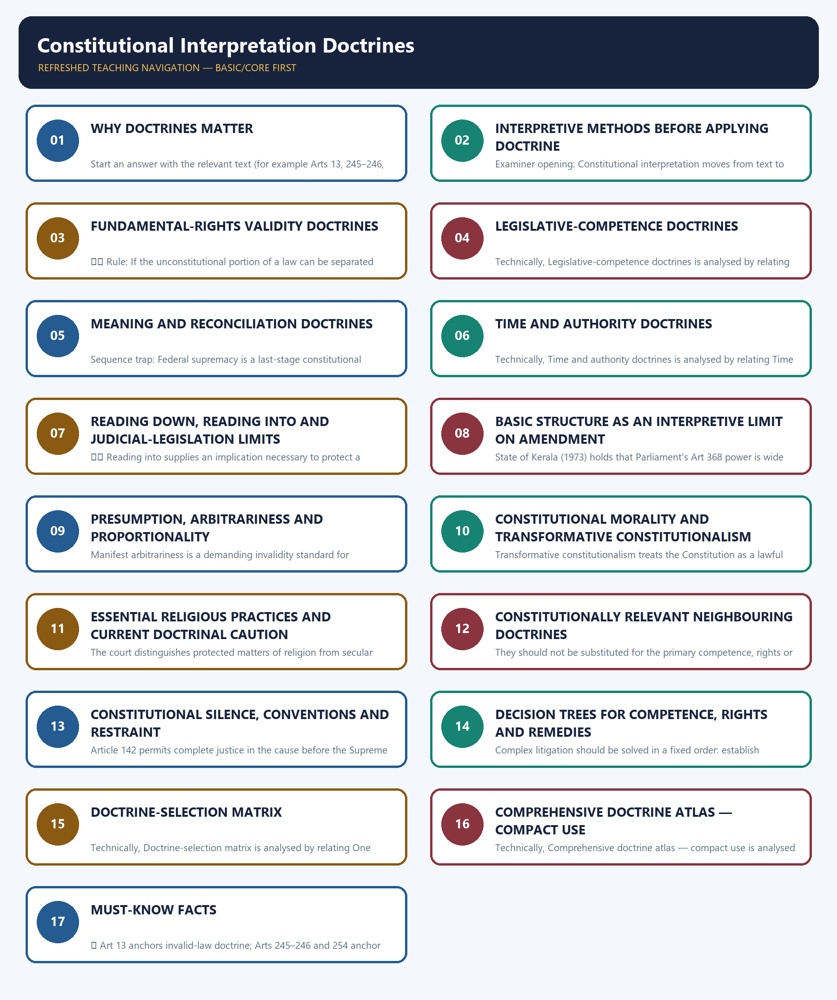

# Constitutional Interpretation Doctrines — Complete Deep-Reviewed Learning Session

**Legal/current control date:** 29 August 2026 (Asia/Kolkata)

> **Source discipline:** A case name without its governing Article, operative test, legal effect,
> limitation and decision year is not treated as doctrine. Pending review or reference proceedings
> do not alter a larger-bench holding.

## BASIC LEARNING SESSION



*Distinct embedded teaching-navigation image. The separate continuous Cārvāka-style flowchart package remains an independent at-a-glance artifact.*

> **Subject:** Polity · **Tier:** Core · **GS Paper:** GS-II
> **Official clause:** "Indian Constitution—historical underpinnings, evolution, features,
> amendments, significant provisions and basic structure" and "Functions and responsibilities of
> the Union and the States ... federal structure."
> **Grounded in:** Constitution of India; leading Supreme Court doctrine; M. Laxmikanth,
> *Courseware on Indian Polity*, Eighth Edition (2026), Ch. 94.
> **Status legend:** ✅ constitutional/textual proposition · ⚖️ judicial doctrine/holding ·
> 📜 statute/rule · ⚠️ analytical synthesis.
> **Core firewall:** This is the routing map for interpretive doctrines. `Fundamental-Rights.md` and
> `Centre-State-Relations.md` retain detailed cases in their fields; use links rather than duplicate
> long case narratives. It is independently sufficient for Prelims and 10/15/20-mark Mains; no
> Advanced companion is required.

---

### SESSION 1 — WHY DOCTRINES MATTER

#### DEFINITION / WHAT THIS IS CALLED

**Plain-language definition:** ⚠️ A doctrine is a structured judicial test, not a free-standing constitutional Article.

**Technical definition:** Start an answer with the relevant text (for example Arts 13, 245–246, 254, 141), then use the doctrine.

#### ANSWER-GRABBING OPENING — WRITE/ADAPT IN THE EXAM

> ⚠️ A doctrine is a structured judicial test, not a free-standing constitutional Article.

#### MUST-WRITE KEYWORDS

- **Why doctrines matter**
- **⚠️ A doctrine**
- **Article**
- **Start**
- **Arts**
- **245–246**

**How to use them:** Frame the answer through Why doctrines matter; define ⚠️ A doctrine, connect Article with Start to explain the mechanism, and use Arts for the decisive comparison or qualification.

Constitutional adjudication asks three different questions:

```text
VALIDITY OF THE LAW        LEGISLATIVE COMPETENCE       MEANING / REMEDY
severability               pith and substance           harmonious construction
eclipse / waiver           colourable legislation       purposive interpretation
prospective overruling     territorial nexus            precedent
                           repugnancy / incidental power
```

⚠️ A doctrine is a structured judicial test, not a free-standing constitutional Article. Start an
answer with the relevant text (for example Arts 13, 245–246, 254, 141), then use the doctrine.

---

#### CLOSING RECALL FLOW — WHY DOCTRINES MATTER

```text
START / CONCEPT: Why doctrines matter
        |
        v
EXACT TERMS: Why doctrines matter · ⚠️ A doctrine · Article · Start · Arts · 245–246
        |
        v
MECHANISM / ARGUMENT: Start an answer with the relevant text (for example Arts 13, 245–246, 254, 141), then use the doctrine.
        |
        v
CONSEQUENCE / CONTRAST: The resulting consequence is that ⚠️ A doctrine is a structured judicial test, not a free-standing constitutional Article.
        |
        v
UPSC TRAP / ANSWER-USE: Do not miss this limiting distinction: ⚠️ A doctrine is a structured judicial test, not a free-standing constitutional Article.
        |
        v
ANSWER-GRABBING FORMULATION: ⚠️ A doctrine is a structured judicial test, not a free-standing constitutional Article.
```
### SESSION 2 — INTERPRETIVE METHODS BEFORE APPLYING DOCTRINE

#### DEFINITION / WHAT THIS IS CALLED

**Plain-language definition:** Examiner opening: Constitutional interpretation moves from text to structure, purpose, history and binding precedent; it is not a choice between literalism and judicial preference.

**Technical definition:** Examiner opening: Constitutional interpretation moves from text to structure, purpose, history and binding precedent; it is not a choice between literalism and judicial preference.

#### ANSWER-GRABBING OPENING — WRITE/ADAPT IN THE EXAM

> Examiner opening: Constitutional interpretation moves from text to structure, purpose, history and binding precedent; it is not a choice between literalism and judicial preference.

#### MUST-WRITE KEYWORDS

- **Interpretive methods before applying doctrine**
- **Examiner opening**
- **Textual**
- **Starting point for every issue**
- **Structural**
- **Resolves relationships and constitutional silence**

**How to use them:** Frame the answer through Interpretive methods before applying doctrine; define Examiner opening, connect Textual with Starting point for every issue to explain the mechanism, and use Structural for the decisive comparison or qualification.

| Method | Central question | Legitimate use | Limit |
|---|---|---|---|
| Textual | What do the enacted words, definitions and grammar permit? | Starting point for every issue | A word cannot be isolated from its Part, proviso or structure |
| Structural | What arrangement follows from institutions, fields, rights and checks? | Resolves relationships and constitutional silence | Structure cannot contradict express text |
| Historical | What problem, drafting history or constitutional background explains the clause? | Clarifies context and rejected alternatives | History informs; it does not freeze future application |
| Purposive | What constitutional object makes the guarantee or power effective? | Rights, remedies and institutional design | Purpose remains anchored in text and competence |
| Precedent-based | What binding ratio and bench-strength rule controls? | Equality, certainty and disciplined development | Obiter and smaller benches do not overrule |

> **Examiner opening:** Constitutional interpretation moves from text to structure, purpose,
> history and binding precedent; it is not a choice between literalism and judicial preference.

---

#### CLOSING RECALL FLOW — INTERPRETIVE METHODS BEFORE APPLYING DOCTRINE

```text
START / CONCEPT: Interpretive methods before applying doctrine
        |
        v
EXACT TERMS: Interpretive methods before applying doctrine · Examiner opening · Textual · Starting point for every issue · Structural · Resolves relationships and constitutional silence
        |
        v
MECHANISM / ARGUMENT: The operative mechanism is that constitutional interpretation moves from text to structure, purpose, history and binding precedent.
        |
        v
CONSEQUENCE / CONTRAST: The resulting consequence is that constitutional interpretation moves from text to structure, purpose, history and binding precedent.
        |
        v
UPSC TRAP / ANSWER-USE: Do not miss this limiting distinction: constitutional interpretation moves from text to structure, purpose, history and binding precedent.
        |
        v
ANSWER-GRABBING FORMULATION: Examiner opening: Constitutional interpretation moves from text to structure, purpose, history and binding precedent; it is not a choice between literalism and judicial preference.
```
### SESSION 3 — FUNDAMENTAL-RIGHTS VALIDITY DOCTRINES

#### DEFINITION / WHAT THIS IS CALLED

**Plain-language definition:** ⚖️ Rule: A pre-Constitution law inconsistent with Fundamental Rights is generally not erased from the statute book; it becomes unenforceable to the extent of inconsistency and may revive if the constitutional impediment is removed.

**Technical definition:** ⚖️ Rule: If the unconstitutional portion of a law can be separated from the valid portion and the legislature would have enacted the valid remainder independently, the court invalidates only the offending part.

#### ANSWER-GRABBING OPENING — WRITE/ADAPT IN THE EXAM

> ⚖️ Rule: A pre-Constitution law inconsistent with Fundamental Rights is generally not erased from the statute book; it becomes unenforceable to the extent of inconsistency and may revive if the constitutional impediment is removed.

#### MUST-WRITE KEYWORDS

- **Fundamental-rights validity doctrines**
- **Rule**
- **Textual separation**
- **Legislative intent**
- **Functional completeness**
- **Scheme unity**

**How to use them:** Frame the answer through Fundamental-rights validity doctrines; define Rule, connect Textual separation with Legislative intent to explain the mechanism, and use Functional completeness for the decisive comparison or qualification.

#### 2.1 Severability

⚖️ **Rule:** If the unconstitutional portion of a law can be separated from the valid portion and
the legislature would have enacted the valid remainder independently, the court invalidates only
the offending part.

| Test | Question |
|---|---|
| Textual separation | Can valid and invalid parts be separated? |
| Legislative intent | Would the valid part have been enacted alone? |
| Functional completeness | Can the remainder operate coherently? |
| Scheme unity | Are the parts so mixed that the whole must fail? |

⚖️ Standard anchor: *R.M.D. Chamarbaugwala v. Union of India (1957)* (1957).

> **Trap:** Severability preserves a workable valid remainder; courts do not rewrite the legislative
> scheme.

#### 2.2 Eclipse

⚖️ **Rule:** A pre-Constitution law inconsistent with Fundamental Rights is generally not erased
from the statute book; it becomes unenforceable to the extent of inconsistency and may revive if
the constitutional impediment is removed.

- classical field: pre-Constitution laws under Art 13(1);
- standard anchor: *Bhikaji Narain Dhakras (1955) v. State of Madhya Pradesh* (1955);
- the law may remain relevant to past transactions/non-protected persons.

> **Trap:** Eclipse is not the same as repeal, and its classical operation should not be casually
> extended to every post-Constitution invalid law.

#### 2.3 Waiver of Fundamental Rights

⚖️ **Rule:** An individual cannot generally waive a Fundamental Right in a manner that validates
State action contrary to the Constitution. Fundamental Rights express public constitutional policy,
not merely private benefits.

⚖️ Standard anchor: *Basheshar Nath (1958)* (1958).

> **Trap:** This is not a rule that every private legal right or procedural protection is
> non-waivable.

---

#### CLOSING RECALL FLOW — FUNDAMENTAL-RIGHTS VALIDITY DOCTRINES

```text
START / CONCEPT: Fundamental-rights validity doctrines
        |
        v
EXACT TERMS: Fundamental-rights validity doctrines · Rule · Textual separation · Legislative intent · Functional completeness · Scheme unity
        |
        v
MECHANISM / ARGUMENT: ⚖️ Rule: If the unconstitutional portion of a law can be separated from the valid portion and the legislature would have enacted the valid remainder independently, the court invalidates only the offending part.
        |
        v
CONSEQUENCE / CONTRAST: Trap: This is not a rule that every private legal right or procedural protection is non-waivable.
        |
        v
UPSC TRAP / ANSWER-USE: Severability preserves a workable valid remainder; courts do not rewrite the legislative.
        |
        v
ANSWER-GRABBING FORMULATION: ⚖️ Rule: A pre-Constitution law inconsistent with Fundamental Rights is generally not erased from the statute book; it becomes unenforceable to the extent of inconsistency and may revive if the constitutional impediment is removed.
```
### SESSION 4 — LEGISLATIVE-COMPETENCE DOCTRINES

#### DEFINITION / WHAT THIS IS CALLED

**Plain-language definition:** The doctrine supports incidental provisions but cannot create competence over an independent, forbidden field.

**Technical definition:** Technically, Legislative-competence doctrines is analysed by relating Rule to competence, then testing the relationship through Concurrent List and Traps.

#### ANSWER-GRABBING OPENING — WRITE/ADAPT IN THE EXAM

> The doctrine supports incidental provisions but cannot create competence over an independent, forbidden field.

#### MUST-WRITE KEYWORDS

- **Legislative-competence doctrines**
- **Rule**
- **competence**
- **Concurrent List**
- **Traps**
- **Occupied field**

**How to use them:** Frame the answer through Legislative-competence doctrines; define Rule, connect competence with Concurrent List to explain the mechanism, and use Traps for the decisive comparison or qualification.

#### 3.1 Pith and substance

⚖️ **Rule:** To identify the legislative field, examine the law's true nature and character—its
purpose, scope and effects. Incidental encroachment on another list does not invalidate a law whose
dominant subject falls within the enacting legislature's competence.

⚖️ Anchors: *Prafulla Kumar Mukherjee (1947)* (1947); *State of Bombay v. F.N. Balsara (1951)*
(1951).

#### 3.2 Incidental and ancillary powers

⚖️ **Rule:** A legislative entry includes powers reasonably necessary to make the granted subject
effective. The doctrine supports incidental provisions but cannot create competence over an
independent, forbidden field.

⚠️ It often works with pith and substance: first locate the dominant field, then assess whether the
additional measure is genuinely ancillary.

#### 3.3 Colourable legislation

⚖️ **Rule:** What cannot be done directly cannot be done indirectly. The court examines legislative
**competence**, not the legislature's political motive: form cannot disguise a law whose substance
lies outside power.

⚖️ Anchor: *K.C. Gajapati Narayan Deo (1953)* (1953).

> **Trap:** A bad motive does not by itself make a competent law colourable.

#### 3.4 Territorial nexus

✅ Arts 245–246 structure territorial and subject-matter competence. ⚖️ A State law affecting
matters beyond its territory can survive where the connection between the State and the subject is
real and sufficient and the liability/operation is relevant to that connection.

⚖️ Anchor: *State of Bombay v. R.M.D. Chamarbaugwala (1957)* (1957).

#### 3.5 Repugnancy

✅ Article 254 addresses inconsistency between Parliamentary and State laws on a **Concurrent List**
matter.

```text
Same Concurrent field?
       ↓ yes
Is simultaneous obedience possible / does Parliament occupy the field?
       ↓ conflict
Union law prevails; State law void to extent of repugnancy
       ↓ exception
State law reserved for and assented to by President prevails in that State,
but Parliament may later override it
```

⚖️ Anchors include *Deep Chand v. State of Uttar Pradesh (1959)* (1959) and *M. Karunanidhi v. Union of India (1979)* (1979).

> **Traps:** Art 254 is not the default answer for Union-List versus State-List overlap; use
> pith-and-substance/harmonious construction first. Presidential assent is neither permanent
> immunity nor a cure for lack of State legislative competence.

**Occupied field** is an inference that Parliament intended its law to cover the relevant
Concurrent field so completely that inconsistent State supplementation cannot co-exist. Mere
existence of a Union law is insufficient: identify the same field, statutory scheme and actual
conflict.

---

#### CLOSING RECALL FLOW — LEGISLATIVE-COMPETENCE DOCTRINES

```text
START / CONCEPT: Legislative-competence doctrines
        |
        v
EXACT TERMS: Legislative-competence doctrines · Rule · competence · Concurrent List · Traps · Occupied field
        |
        v
MECHANISM / ARGUMENT: Trap: A bad motive does not by itself make a competent law colourable.
        |
        v
CONSEQUENCE / CONTRAST: Incidental encroachment on another list does not invalidate a law whose dominant subject falls within the enacting legislature's competence.
        |
        v
UPSC TRAP / ANSWER-USE: Do not miss this limiting distinction: a bad motive does not by itself make a competent law colourable.
        |
        v
ANSWER-GRABBING FORMULATION: The doctrine supports incidental provisions but cannot create competence over an independent, forbidden field.
```
### SESSION 5 — MEANING AND RECONCILIATION DOCTRINES

#### DEFINITION / WHAT THIS IS CALLED

**Plain-language definition:** ⚖️ Rule: Read apparently conflicting provisions so each has meaningful operation and neither is rendered redundant where a reasonable reconciliation is possible.

**Technical definition:** Sequence trap: Federal supremacy is a last-stage constitutional resolution, not a reason to skip the attempt to assign each entry a meaningful field.

#### ANSWER-GRABBING OPENING — WRITE/ADAPT IN THE EXAM

> ⚖️ Rule: Read apparently conflicting provisions so each has meaningful operation and neither is rendered redundant where a reasonable reconciliation is possible.

#### MUST-WRITE KEYWORDS

- **Meaning**
- **reconciliation doctrines**
- **Rule**
- **Sequence trap**
- **Distinction**
- **Read**

**How to use them:** Frame the answer through Meaning; define reconciliation doctrines, connect Rule with Sequence trap to explain the mechanism, and use Distinction for the decisive comparison or qualification.

#### 4.1 Harmonious construction

⚖️ **Rule:** Read apparently conflicting provisions so each has meaningful operation and neither is
rendered redundant where a reasonable reconciliation is possible.

Uses:

- reconciling Fundamental Rights and Directive Principles;
- interpreting entries in the Seventh Schedule;
- reading powers, limitations and institutional provisions together.

⚖️ Anchor: *In re Kerala Education Bill (1958)* (1958); the broader Part III–Part IV balance is developed
through later constitutional cases.

#### 4.2 Federal supremacy

✅ Where a genuine and irreconcilable conflict remains after harmonious construction, the
Constitution's supremacy clauses operate—especially Union priority in Art 246 and repugnancy under
Art 254 in its proper field.

> **Sequence trap:** Federal supremacy is a last-stage constitutional resolution, not a reason to
> skip the attempt to assign each entry a meaningful field.

#### 4.3 Purposive and liberal interpretation

⚖️ **Rule:** Constitutional language is read in light of its object, structure, history and
transformative purpose rather than as an isolated literal code. Rights provisions commonly receive
a generous interpretation that makes the guarantee effective.

⚠️ Purpose constrains interpretation; it does not authorise a judge to replace clear text or create
an unlimited power. Text, structure, precedent and institutional competence remain controls.

#### 4.4 Implied powers

⚖️ **Rule:** A constitutionally conferred power may carry powers necessarily implied for its
effective exercise. "Implied" cannot contradict an express prohibition or alter the constitutional
allocation.

> **Distinction:** Incidental/ancillary powers are commonly used in legislative-entry analysis;
> implied powers is the broader institutional proposition.

---

#### CLOSING RECALL FLOW — MEANING AND RECONCILIATION DOCTRINES

```text
START / CONCEPT: Meaning and reconciliation doctrines
        |
        v
EXACT TERMS: Meaning · reconciliation doctrines · Rule · Sequence trap · Distinction · Read
        |
        v
MECHANISM / ARGUMENT: ⚖️ Anchor: In re Kerala Education Bill (1958) (1958); the broader Part III–Part IV balance is developed through later constitutional cases.
        |
        v
CONSEQUENCE / CONTRAST: Sequence trap: Federal supremacy is a last-stage constitutional resolution, not a reason to skip the attempt to assign each entry a meaningful field.
        |
        v
UPSC TRAP / ANSWER-USE: ⚠️ Purpose constrains interpretation; it does not authorise a judge to replace clear text or create an unlimited power.
        |
        v
ANSWER-GRABBING FORMULATION: ⚖️ Rule: Read apparently conflicting provisions so each has meaningful operation and neither is rendered redundant where a reasonable reconciliation is possible.
```
### SESSION 6 — TIME AND AUTHORITY DOCTRINES

#### DEFINITION / WHAT THIS IS CALLED

**Plain-language definition:** Trap: It is not automatic whenever precedent changes; the court must deliberately shape the temporal effect.

**Technical definition:** Technically, Time and authority doctrines is analysed by relating Time to authority doctrines, then testing the relationship through Rule and Ratio decidendi.

#### ANSWER-GRABBING OPENING — WRITE/ADAPT IN THE EXAM

> Trap: It is not automatic whenever precedent changes; the court must deliberately shape the temporal effect.

#### MUST-WRITE KEYWORDS

- **Time**
- **authority doctrines**
- **Rule**
- **Ratio decidendi**
- **Obiter dicta**
- **Persuasive observation not necessary to the result**

**How to use them:** Frame the answer through Time; define authority doctrines, connect Rule with Ratio decidendi to explain the mechanism, and use Obiter dicta for the decisive comparison or qualification.

#### 5.1 Prospective overruling

⚖️ **Rule:** The court may declare a new rule for the future while preserving specified past
transactions or existing effects to avoid disruptive injustice.

⚖️ Introduced into Indian constitutional adjudication in *I.C. Golaknath (1967) v. State of Punjab*
(1967), with later use tailored to the case.

> **Trap:** It is not automatic whenever precedent changes; the court must deliberately shape the
> temporal effect.

#### 5.2 Precedent and Article 141

✅ The law declared by the Supreme Court is binding on all courts within India under Art 141.

| Concept | Meaning |
|---|---|
| Ratio decidendi | Legal principle necessary to decide the case; binding component |
| Obiter dicta | Persuasive observation not necessary to the result |
| Distinguishing | Earlier ratio does not control because materially relevant facts/legal context differ |
| Per incuriam | Decision rendered in ignorance of binding law; narrowly used |
| Bench strength | Smaller bench cannot overrule a larger-bench ruling; coordinate conflict routes to larger bench |
| Art 142 | Power to do complete justice in a cause; not a replacement for Art 141 doctrine |

⚖️ Constitutional courts may reconsider their own precedents through proper bench procedure.
Precedent promotes equality, certainty and institutional legitimacy while allowing reasoned change.

---

#### CLOSING RECALL FLOW — TIME AND AUTHORITY DOCTRINES

```text
START / CONCEPT: Time and authority doctrines
        |
        v
EXACT TERMS: Time · authority doctrines · Rule · Ratio decidendi · Obiter dicta · Persuasive observation not necessary to the result
        |
        v
MECHANISM / ARGUMENT: ✅ The law declared by the Supreme Court is binding on all courts within India under Art 141.
        |
        v
CONSEQUENCE / CONTRAST: State of Punjab (1967), with later use tailored to the case.
        |
        v
UPSC TRAP / ANSWER-USE: It is not automatic whenever precedent changes; the court must deliberately shape the.
        |
        v
ANSWER-GRABBING FORMULATION: Trap: It is not automatic whenever precedent changes; the court must deliberately shape the temporal effect.
```
### SESSION 7 — READING DOWN, READING INTO AND JUDICIAL-LEGISLATION LIMITS

#### DEFINITION / WHAT THIS IS CALLED

**Plain-language definition:** ⚖️ Reading down chooses a constitutionally valid meaning that the statutory text can reasonably bear.

**Technical definition:** ⚖️ Reading into supplies an implication necessary to protect a constitutional guarantee in a defined setting.

#### ANSWER-GRABBING OPENING — WRITE/ADAPT IN THE EXAM

> ⚖️ Reading down chooses a constitutionally valid meaning that the statutory text can reasonably bear.

#### MUST-WRITE KEYWORDS

- **Reading down**
- **reading into**
- **judicial-legislation limits**
- **Preserves a provision through a narrower valid construction**
- **Text must reasonably support it**
- **Recognises a necessary implication or safeguard**

**How to use them:** Frame the answer through Reading down; define reading into, connect judicial-legislation limits with Preserves a provision through a narrower valid construction to explain the mechanism, and use Text must reasonably support it for the decisive comparison or qualification.

⚖️ **Reading down** chooses a constitutionally valid meaning that the statutory text can reasonably
bear. *Kedar Nath Singh (1962) v. State of Bihar* (1962) is a standard narrowing example.

⚖️ **Reading into** supplies an implication necessary to protect a constitutional guarantee in a
defined setting. It is more interventionist and requires a strong textual or structural basis.

⚖️ *Shreya Singhal v. Union of India* (2015) refused to save an incurably vague provision through
judicial rewriting. A court may interpret but cannot enact a new legislative scheme.

| Tool | Legal effect | Limit |
|---|---|---|
| Reading down | Preserves a provision through a narrower valid construction | Text must reasonably support it |
| Reading into | Recognises a necessary implication or safeguard | Cannot contradict express exclusion or create a complete code |
| Severability | Removes separable invalid matter | Remainder must be workable and intended |
| Striking down | Invalidates the unconstitutional provision/law | Used when no valid saving construction exists |

---

#### CLOSING RECALL FLOW — READING DOWN, READING INTO AND JUDICIAL-LEGISLATION LIMITS

```text
START / CONCEPT: Reading down, reading into and judicial-legislation limits
        |
        v
EXACT TERMS: Reading down · reading into · judicial-legislation limits · Preserves a provision through a narrower valid construction · Text must reasonably support it · Recognises a necessary implication or safeguard
        |
        v
MECHANISM / ARGUMENT: ⚖️ Reading into supplies an implication necessary to protect a constitutional guarantee in a defined setting.
        |
        v
CONSEQUENCE / CONTRAST: It is more interventionist and requires a strong textual or structural basis.
        |
        v
UPSC TRAP / ANSWER-USE: Do not miss this limiting distinction: state of Bihar (1962) is a standard narrowing example.
        |
        v
ANSWER-GRABBING FORMULATION: ⚖️ Reading down chooses a constitutionally valid meaning that the statutory text can reasonably bear.
```
### SESSION 8 — BASIC STRUCTURE AS AN INTERPRETIVE LIMIT ON AMENDMENT

#### DEFINITION / WHAT THIS IS CALLED

**Plain-language definition:** The doctrine is interpretive because the Constitution does not enumerate a closed list.

**Technical definition:** State of Kerala (1973) holds that Parliament's Art 368 power is wide but cannot damage the Constitution's basic structure.

#### ANSWER-GRABBING OPENING — WRITE/ADAPT IN THE EXAM

> State of Kerala (1973) holds that Parliament's Art 368 power is wide but cannot damage the Constitution's basic structure.

#### MUST-WRITE KEYWORDS

- **Basic structure as an interpretive limit on amendment**
- **Constitutional amendment challenged**
- **Art 368 read with constitutional structure**
- **Doctrine reviews amendments, not every policy disagreement**
- **Kerala**
- **Parliament's Art**

**How to use them:** Frame the answer through Basic structure as an interpretive limit on amendment; define Constitutional amendment challenged, connect Art 368 read with constitutional structure with Doctrine reviews amendments, not every policy disagreement to explain the mechanism, and use Kerala for the decisive comparison or qualification.

⚖️ *Kesavananda Bharati (1973) v. State of Kerala* (1973) holds that Parliament's Art 368 power is wide
but cannot damage the Constitution's basic structure. *Minerva Mills (1980) v. Union of India* (1980)
confirms limited amending power and harmony between Fundamental Rights and DPSPs.

| Trigger | Provision | Effect | Limit/trap |
|---|---|---|---|
| Constitutional amendment challenged | Art 368 read with constitutional structure | Amendment may be invalidated for damaging a basic feature | Doctrine reviews amendments, not every policy disagreement |

The doctrine is interpretive because the Constitution does not enumerate a closed list. It is not
an independent judicial amendment power.

---

#### CLOSING RECALL FLOW — BASIC STRUCTURE AS AN INTERPRETIVE LIMIT ON AMENDMENT

```text
START / CONCEPT: Basic structure as an interpretive limit on amendment
        |
        v
EXACT TERMS: Basic structure as an interpretive limit on amendment · Constitutional amendment challenged · Art 368 read with constitutional structure · Doctrine reviews amendments, not every policy disagreement · Kerala · Parliament's Art
        |
        v
MECHANISM / ARGUMENT: The doctrine is interpretive because the Constitution does not enumerate a closed list.
        |
        v
CONSEQUENCE / CONTRAST: It is not an independent judicial amendment power.
        |
        v
UPSC TRAP / ANSWER-USE: Do not miss this limiting distinction: state of Kerala (1973) holds that Parliament's Art 368 power is wide but cannot...
        |
        v
ANSWER-GRABBING FORMULATION: State of Kerala (1973) holds that Parliament's Art 368 power is wide but cannot damage the Constitution's basic structure.
```
### SESSION 9 — PRESUMPTION, ARBITRARINESS AND PROPORTIONALITY

#### DEFINITION / WHAT THIS IS CALLED

**Plain-language definition:** Distinction: Administrative arbitrariness, unreasonable classification and manifest arbitrariness of legislation overlap under Art 14 but are not interchangeable labels.

**Technical definition:** Manifest arbitrariness is a demanding invalidity standard for legislation that is capricious, irrational or without an adequate determining principle; Shayara Bano v.

#### ANSWER-GRABBING OPENING — WRITE/ADAPT IN THE EXAM

> Distinction: Administrative arbitrariness, unreasonable classification and manifest arbitrariness of legislation overlap under Art 14 but are not interchangeable labels.

#### MUST-WRITE KEYWORDS

- **Presumption**
- **arbitrariness**
- **proportionality**
- **Manifest arbitrariness**
- **Distinction**
- **Ram Krishna Dalmia (1958) (1958)**

**How to use them:** Frame the answer through Presumption; define arbitrariness, connect proportionality with Manifest arbitrariness to explain the mechanism, and use Distinction for the decisive comparison or qualification.

#### Presumption of constitutionality

Courts ordinarily presume legislation valid and place an initial burden on the challenger, while
the intensity of justification varies with the right, classification and available evidence.
*Ram Krishna Dalmia (1958)* (1958) is a standard classification anchor.

> **Trap:** The presumption is rebuttable and cannot cure lack of competence, explicit
> discrimination or a disproportionate rights restriction.

#### Arbitrariness and manifest arbitrariness

⚖️ *E.P. Royappa (1973) v. State of Tamil Nadu* (1973) linked arbitrariness and equality. **Manifest
arbitrariness** is a demanding invalidity standard for legislation that is capricious, irrational
or without an adequate determining principle; *Shayara Bano v. Union of India (2017)* (2017) is a leading
anchor.

> **Distinction:** Administrative arbitrariness, unreasonable classification and manifest
> arbitrariness of legislation overlap under Art 14 but are not interchangeable labels.

#### Proportionality

⚖️ Proportionality tests lawful authority, legitimate aim, rational connection, necessity or a
less restrictive alternative, and balance between rights harm and public benefit.

*Modern Dental College (2016)* (2016), *K.S. Puttaswamy (2017) v. Union of India*
(2017) and *Anuradha Bhasin (2020) v. Union of India* (2020) are major anchors.

> **Trap:** Proportionality is structured review, not judicial substitution of a preferred policy.

---

#### CLOSING RECALL FLOW — PRESUMPTION, ARBITRARINESS AND PROPORTIONALITY

```text
START / CONCEPT: Presumption, arbitrariness and proportionality
        |
        v
EXACT TERMS: Presumption · arbitrariness · proportionality · Manifest arbitrariness · Distinction · Ram Krishna Dalmia (1958) (1958)
        |
        v
MECHANISM / ARGUMENT: Manifest arbitrariness is a demanding invalidity standard for legislation that is capricious, irrational or without an adequate determining principle; Shayara Bano v.
        |
        v
CONSEQUENCE / CONTRAST: Trap: Proportionality is structured review, not judicial substitution of a preferred policy.
        |
        v
UPSC TRAP / ANSWER-USE: The presumption is rebuttable and cannot cure lack of competence, explicit.
        |
        v
ANSWER-GRABBING FORMULATION: Distinction: Administrative arbitrariness, unreasonable classification and manifest arbitrariness of legislation overlap under Art 14 but are not interchangeable labels.
```
### SESSION 10 — CONSTITUTIONAL MORALITY AND TRANSFORMATIVE CONSTITUTIONALISM

#### DEFINITION / WHAT THIS IS CALLED

**Plain-language definition:** Constitutional morality requires fidelity to the Constitution's text, procedures, equal citizenship and institutional role morality rather than social or personal morality.

**Technical definition:** Transformative constitutionalism treats the Constitution as a lawful project for dismantling status hierarchy and realising liberty, equality, dignity and fraternity.

#### ANSWER-GRABBING OPENING — WRITE/ADAPT IN THE EXAM

> Constitutional morality requires fidelity to the Constitution's text, procedures, equal citizenship and institutional role morality rather than social or personal morality.

#### MUST-WRITE KEYWORDS

- **Constitutional morality**
- **transformative constitutionalism**
- **Constitutional**
- **Constitution's**
- **Transformative**
- **Constitution**

**How to use them:** Frame the answer through Constitutional morality; define transformative constitutionalism, connect Constitutional with Constitution's to explain the mechanism, and use Transformative for the decisive comparison or qualification.

**Constitutional morality** requires fidelity to the Constitution's text, procedures, equal
citizenship and institutional role morality rather than social or personal morality.

**Transformative constitutionalism** treats the Constitution as a lawful project for dismantling
status hierarchy and realising liberty, equality, dignity and fraternity.

⚖️ *Navtej Singh Johar v. Union of India (2018)* (2018) is a leading rights application. Each use must be
connected to an identifiable provision, structure and remedy.

> **Trap:** Neither doctrine authorises free-standing moral review or permits a court to ignore
> democratic competence and precedent.

---

#### CLOSING RECALL FLOW — CONSTITUTIONAL MORALITY AND TRANSFORMATIVE CONSTITUTIONALISM

```text
START / CONCEPT: Constitutional morality and transformative constitutionalism
        |
        v
EXACT TERMS: Constitutional morality · transformative constitutionalism · Constitutional · Constitution's · Transformative · Constitution
        |
        v
MECHANISM / ARGUMENT: Transformative constitutionalism treats the Constitution as a lawful project for dismantling status hierarchy and realising liberty, equality, dignity and fraternity.
        |
        v
CONSEQUENCE / CONTRAST: Union of India (2018) (2018) is a leading rights application.
        |
        v
UPSC TRAP / ANSWER-USE: Do not miss this limiting distinction: each use must be connected to an identifiable provision, structure and remedy.
        |
        v
ANSWER-GRABBING FORMULATION: Constitutional morality requires fidelity to the Constitution's text, procedures, equal citizenship and institutional role morality rather than social or personal morality.
```
### SESSION 11 — ESSENTIAL RELIGIOUS PRACTICES AND CURRENT DOCTRINAL CAUTION

#### DEFINITION / WHAT THIS IS CALLED

**Plain-language definition:** ⚖️ Shirur Mutt (1954) (1954) is the classic source of the essential-religious-practices inquiry.

**Technical definition:** The court distinguishes protected matters of religion from secular activities associated with religion, while applying public-order, morality, health and other Fundamental Rights limits.

#### ANSWER-GRABBING OPENING — WRITE/ADAPT IN THE EXAM

> ⚖️ Shirur Mutt (1954) (1954) is the classic source of the essential-religious-practices inquiry.

#### MUST-WRITE KEYWORDS

- **Essential religious practices**
- **current doctrinal caution**
- **⚖️ Shirur Mutt (1954) (1954)**
- **Shirur Mutt**
- **Fundamental Rights**
- **Any**

**How to use them:** Frame the answer through Essential religious practices; define current doctrinal caution, connect ⚖️ Shirur Mutt (1954) (1954) with Shirur Mutt to explain the mechanism, and use Fundamental Rights for the decisive comparison or qualification.

⚖️ *Shirur Mutt (1954)*
(1954) is the classic source of the essential-religious-practices inquiry. The court distinguishes
protected matters of religion from secular activities associated with religion, while applying
public-order, morality, health and other Fundamental Rights limits.

The doctrine may draw courts into theology, freeze internal diversity and obscure a direct
rights-conflict analysis. *Indian Young Lawyers Association (2018)* (2018) illustrates
the interaction among religious freedom, equality, dignity and constitutional morality. Any
pending larger-bench or review question must be labelled pending, not a fresh final holding.

---

#### CLOSING RECALL FLOW — ESSENTIAL RELIGIOUS PRACTICES AND CURRENT DOCTRINAL CAUTION

```text
START / CONCEPT: Essential religious practices and current doctrinal caution
        |
        v
EXACT TERMS: Essential religious practices · current doctrinal caution · ⚖️ Shirur Mutt (1954) (1954) · Shirur Mutt · Fundamental Rights · Any
        |
        v
MECHANISM / ARGUMENT: The court distinguishes protected matters of religion from secular activities associated with religion, while applying public-order, morality, health and other Fundamental Rights limits.
        |
        v
CONSEQUENCE / CONTRAST: Any pending larger-bench or review question must be labelled pending, not a fresh final holding.
        |
        v
UPSC TRAP / ANSWER-USE: Do not miss this limiting distinction: the court distinguishes protected matters of religion from secular activities associated with religion.
        |
        v
ANSWER-GRABBING FORMULATION: ⚖️ Shirur Mutt (1954) (1954) is the classic source of the essential-religious-practices inquiry.
```
### SESSION 12 — CONSTITUTIONALLY RELEVANT NEIGHBOURING DOCTRINES

#### DEFINITION / WHAT THIS IS CALLED

**Plain-language definition:** Constitutionally relevant neighbouring doctrines comprises Firewall, Pleasure and Arts 310–311 and responsible government as its core connected dimensions.

**Technical definition:** They should not be substituted for the primary competence, rights or invalidity doctrine merely because they also invoke rule-of-law values.

#### ANSWER-GRABBING OPENING — WRITE/ADAPT IN THE EXAM

> They should not be substituted for the primary competence, rights or invalidity doctrine merely because they also invoke rule-of-law values.

#### MUST-WRITE KEYWORDS

- **Constitutionally relevant neighbouring doctrines**
- **Firewall**
- **Pleasure**
- **Arts 310–311 and responsible government**
- **Shamsher Singh (1974) v. State of Punjab (1974)**
- **Controlled by express safeguards and constitutional-head conventions**

**How to use them:** Frame the answer through Constitutionally relevant neighbouring doctrines; define Firewall, connect Pleasure with Arts 310–311 and responsible government to explain the mechanism, and use Shamsher Singh (1974) v. State of Punjab (1974) for the decisive comparison or qualification.

These neighbouring doctrines solve narrower problems of tenure, administrative fairness,
governmental reliance and textual omission. They should not be substituted for the primary
competence, rights or invalidity doctrine merely because they also invoke rule-of-law values.

| Doctrine | Constitutional relevance | Leading anchor | Distinction/limit |
|---|---|---|---|
| Pleasure | Arts 310–311 and responsible government | *Shamsher Singh (1974) v. State of Punjab* (1974) | Controlled by express safeguards and constitutional-head conventions |
| Legitimate expectation | Fair, non-arbitrary administration under Art 14 | *Navjyoti Cooperative Group Housing (1992)* (1992) | Usually protects fair consideration/procedure, not automatic entitlement |
| Promissory estoppel | Rule-of-law control of governmental representation | *Motilal Padampat Sugar Mills (1978)* (1978) | Cannot compel violation of statute, duty or overriding public interest |
| Casus omissus | Judicial restraint where text has a gap | *Padma Sundara Rao (2002)* (2002) | Court ordinarily cannot supply an omission because the result is inconvenient |
| Constitutional silence | Text leaves an institutional matter unstated | Structure, convention and precedent | Silence is not unlimited power |

> **Firewall:** Pleasure concerns tenure; legitimate expectation concerns fair administrative
> treatment; promissory estoppel concerns reliance; casus omissus concerns an omitted textual case.

---

#### CLOSING RECALL FLOW — CONSTITUTIONALLY RELEVANT NEIGHBOURING DOCTRINES

```text
START / CONCEPT: Constitutionally relevant neighbouring doctrines
        |
        v
EXACT TERMS: Constitutionally relevant neighbouring doctrines · Firewall · Pleasure · Arts 310–311 and responsible government · Shamsher Singh (1974) v. State of Punjab (1974) · Controlled by express safeguards and constitutional-head conventions
        |
        v
MECHANISM / ARGUMENT: The operative mechanism is that they should not be substituted for the primary competence, rights or invalidity doctrine merely...
        |
        v
CONSEQUENCE / CONTRAST: The resulting consequence is that they should not be substituted for the primary competence, rights or invalidity doctrine merely...
        |
        v
UPSC TRAP / ANSWER-USE: Do not miss this limiting distinction: they should not be substituted for the primary competence, rights or invalidity doctrine merely...
        |
        v
ANSWER-GRABBING FORMULATION: They should not be substituted for the primary competence, rights or invalidity doctrine merely because they also invoke rule-of-law values.
```
### SESSION 13 — CONSTITUTIONAL SILENCE, CONVENTIONS AND RESTRAINT

#### DEFINITION / WHAT THIS IS CALLED

**Plain-language definition:** Courts may protect the legal structure within which conventions operate, but should not constitutionalise every political expectation.

**Technical definition:** Article 142 permits complete justice in the cause before the Supreme Court but does not authorise disregard of substantive law.

#### ANSWER-GRABBING OPENING — WRITE/ADAPT IN THE EXAM

> Courts may protect the legal structure within which conventions operate, but should not constitutionalise every political expectation.

#### MUST-WRITE KEYWORDS

- **Constitutional silence**
- **conventions**
- **restraint**
- **Article 142**
- **Courts**
- **Article**

**How to use them:** Frame the answer through Constitutional silence; define conventions, connect restraint with Article 142 to explain the mechanism, and use Courts for the decisive comparison or qualification.

```text
express text and prohibitions
        ↓
constitutional structure and responsible-government logic
        ↓
binding precedent and established legal practice
        ↓
political convention, comparative aid and history
        ↓
minimum rule necessary to preserve accountability
```

A convention may guide political conduct without becoming judicially enforceable law. Courts may
protect the legal structure within which conventions operate, but should not constitutionalise
every political expectation.

Article 142 permits complete justice in the cause before the Supreme Court but does not authorise
disregard of substantive law. *Supreme Court Bar Association (1998) v. Union of India* (1998) is the
standard limitation anchor. A coordinate or smaller bench that doubts controlling law should seek
a proper reference rather than silently disregard the larger bench.

---

#### CLOSING RECALL FLOW — CONSTITUTIONAL SILENCE, CONVENTIONS AND RESTRAINT

```text
START / CONCEPT: Constitutional silence, conventions and restraint
        |
        v
EXACT TERMS: Constitutional silence · conventions · restraint · Article 142 · Courts · Article
        |
        v
MECHANISM / ARGUMENT: Article 142 permits complete justice in the cause before the Supreme Court but does not authorise disregard of substantive law.
        |
        v
CONSEQUENCE / CONTRAST: A coordinate or smaller bench that doubts controlling law should seek a proper reference rather than silently disregard the larger bench.
        |
        v
UPSC TRAP / ANSWER-USE: Do not miss this limiting distinction: union of India (1998) is the standard limitation anchor.
        |
        v
ANSWER-GRABBING FORMULATION: Courts may protect the legal structure within which conventions operate, but should not constitutionalise every political expectation.
```
### SESSION 14 — DECISION TREES FOR COMPETENCE, RIGHTS AND REMEDIES

#### DEFINITION / WHAT THIS IS CALLED

**Plain-language definition:** The following trees prevent a remedy doctrine from being applied before the underlying constitutional violation is identified.

**Technical definition:** Complex litigation should be solved in a fixed order: establish competence and meaning, apply the relevant rights standard, determine the minimum invalidity consequence, and then respect temporal and precedential limits.

#### ANSWER-GRABBING OPENING — WRITE/ADAPT IN THE EXAM

> The following trees prevent a remedy doctrine from being applied before the underlying constitutional violation is identified.

#### MUST-WRITE KEYWORDS

- **Decision trees for competence**
- **rights**
- **remedies**
- **Complex**
- **Decision trees for competence, rights and remedies**

**How to use them:** Frame the answer through Decision trees for competence; define rights, connect remedies with Complex to explain the mechanism, and use Decision trees for competence, rights and remedies for the decisive comparison or qualification.

Complex litigation should be solved in a fixed order: establish competence and meaning, apply the
relevant rights standard, determine the minimum invalidity consequence, and then respect temporal
and precedential limits. The following trees prevent a remedy doctrine from being applied before
the underlying constitutional violation is identified.

#### Legislative competence

```text
enacting legislature + entry
        ↓
pith and substance
        ↓
incidental overlap? → ancillary power
        ↓
disguised lack of power? → colourable legislation
        ↓
State extra-territorial reach? → territorial nexus
        ↓
same Concurrent field + actual conflict? → Art 254 repugnancy/assent
```

#### Rights review

```text
State action + affected right
        ↓
authority of law + legitimate aim
        ↓
classification/arbitrariness
        ↓
proportionality: connection → necessity → balance
        ↓
valid saving meaning? → read down
        ↓ no
sever / strike; shape time only through reasoned prospective overruling
```

#### Remedy and precedent

```text
controlling Article + larger-bench ratio
        ↓
apply or distinguish
        ↓
doubt remains? → proper reference, not silent overruling
        ↓
declaration / severability / reading down / injunction / compensation
        ↓
Art 142 remains case-bound and substantively limited
```

---

#### CLOSING RECALL FLOW — DECISION TREES FOR COMPETENCE, RIGHTS AND REMEDIES

```text
START / CONCEPT: Decision trees for competence, rights and remedies
        |
        v
EXACT TERMS: Decision trees for competence · rights · remedies · Complex · Decision trees for competence, rights and remedies
        |
        v
MECHANISM / ARGUMENT: Complex litigation should be solved in a fixed order: establish competence and meaning, apply the relevant rights standard, determine the minimum invalidity consequence, and then respect temporal and precedential limits.
        |
        v
CONSEQUENCE / CONTRAST: The resulting consequence is that complex litigation should be solved in a fixed order.
        |
        v
UPSC TRAP / ANSWER-USE: Do not miss this limiting distinction: complex litigation should be solved in a fixed order.
        |
        v
ANSWER-GRABBING FORMULATION: The following trees prevent a remedy doctrine from being applied before the underlying constitutional violation is identified.
```
### SESSION 15 — DOCTRINE-SELECTION MATRIX

#### DEFINITION / WHAT THIS IS CALLED

**Plain-language definition:** Doctrine-selection matrix comprises One provision of a law violates a right, Art 13 and Severability as its core connected dimensions.

**Technical definition:** Technically, Doctrine-selection matrix is analysed by relating One provision of a law violates a right to Art 13, then testing the relationship through Severability and Old law conflicts with a Fundamental Right.

#### ANSWER-GRABBING OPENING — WRITE/ADAPT IN THE EXAM

> Doctrine-selection matrix comprises One provision of a law violates a right, Art 13 and Severability as its core connected dimensions.

#### MUST-WRITE KEYWORDS

- **Doctrine-selection matrix**
- **One provision of a law violates a right**
- **Art 13**
- **Severability**
- **Old law conflicts with a Fundamental Right**
- **Art 13(1)**

**How to use them:** Frame the answer through Doctrine-selection matrix; define One provision of a law violates a right, connect Art 13 with Severability to explain the mechanism, and use Old law conflicts with a Fundamental Right for the decisive comparison or qualification.

Selection depends on the legal defect alleged, not on the popularity of a doctrine. Match the
problem to its governing text, then apply the narrowest test capable of deciding competence,
meaning, validity, time or remedy.

| Problem in question | Start with | Then test |
|---|---|---|
| One provision of a law violates a right | Art 13 | Severability |
| Old law conflicts with a Fundamental Right | Art 13(1) | Eclipse |
| Person consented to rights-infringing State action | Relevant FR | Non-waiver |
| Union/State field overlap | Arts 245–246, Seventh Schedule | Pith and substance → ancillary power → harmonious construction |
| Legislature disguises lack of competence | Competence provision | Colourable legislation |
| State law has extra-territorial effect | Art 245 | Territorial nexus |
| Union and State laws clash in Concurrent field | Art 254 | Repugnancy and assent |
| Two constitutional provisions appear inconsistent | Text/structure | Harmonious construction; supremacy only if irreconcilable |
| New constitutional interpretation threatens settled transactions | Relevant judgment | Prospective overruling |
| Lower court faces Supreme Court statement | Art 141 | Ratio, bench strength, distinguishing |
| Text is broad/open-ended | Text + constitutional purpose | Purposive/liberal interpretation within structural limits |
| Law restricts a right for a public objective | Rights text + authority | Proportionality |
| Legislation is attacked as capricious | Art 14 | Manifest arbitrariness, with a demanding threshold |
| Statute has two plausible meanings | Governing text/right | Reading down if the valid meaning is textually available |
| Amendment damages constitutional identity | Art 368 | Basic structure |
| Religious-practice claim conflicts with equality/dignity | Arts 25–26 plus other rights | ERP inquiry with current doctrinal caution |
| Constitutional text is silent | Text + structure + precedent | Convention only as a bounded aid |

---

#### CLOSING RECALL FLOW — DOCTRINE-SELECTION MATRIX

```text
START / CONCEPT: Doctrine-selection matrix
        |
        v
EXACT TERMS: Doctrine-selection matrix · One provision of a law violates a right · Art 13 · Severability · Old law conflicts with a Fundamental Right · Art 13(1)
        |
        v
MECHANISM / ARGUMENT: Selection depends on the legal defect alleged, not on the popularity of a doctrine.
        |
        v
CONSEQUENCE / CONTRAST: The resulting consequence is that selection depends on the legal defect alleged, not on the popularity of a doctrine.
        |
        v
UPSC TRAP / ANSWER-USE: Do not miss this limiting distinction: selection depends on the legal defect alleged, not on the popularity of a doctrine.
        |
        v
ANSWER-GRABBING FORMULATION: Doctrine-selection matrix comprises One provision of a law violates a right, Art 13 and Severability as its core connected dimensions.
```
### 7. Cross-topic routing map

```text
FUNDAMENTAL RIGHTS                    FEDERALISM / LEGISLATION
severability ───────────────┐         pith and substance ────────┐
eclipse                     ├─► THIS OWNER ◄─ colourable law     │
waiver                      │              territorial nexus     ├─►
prospective overruling      │              repugnancy            │
rights-liberal reading ─────┘              ancillary power ──────┘
                                     │
                       harmonious construction / supremacy
```

- Rights case detail and Article 13: `Fundamental-Rights.md`
- Legislative relations and federal cases: `Centre-State-Relations.md`
- Basic structure/amending power: `Amendment-and-Basic-Structure.md`
- Judicial review/precedent institutions: `Supreme-Court.md`, `High-Court.md`

---

### 8. Answer architecture (10/15/20-mark support)

#### 8.1 Demand map

| Demand | Answer spine |
|---|---|
| Explain one doctrine | Textual anchor → rule/test → case → application → limit |
| Compare doctrines | Trigger → legal effect → scope → case → trap |
| Doctrines and federalism | competence map → pith/substance → reconciliation → repugnancy/supremacy |
| Judicial creativity | purposive reading + implied powers → precedent/limits → legitimacy verdict |
| Invalidity and remedies | severability/eclipse → temporal effect/prospective overruling → rule-of-law balance |

#### 8.2 Thesis options

- *Interpretive doctrines translate a terse constitutional text into predictable tests, but their
  legitimacy depends on anchoring each test in text, structure and precedent.*
- *Federal doctrines first seek to preserve both legislative fields; Union supremacy resolves only
  the irreducible conflict authorised by the Constitution.*
- *Severability, eclipse and prospective overruling all moderate invalidity, but operate on
  different objects—the law's parts, its enforceability and the judgment's temporal effect.*

#### 8.3 Mark-scaled structures

| Marks | Structure | Evidence |
|---:|---|---|
| 10 | Define → textual anchor → test → one case → limit | 2–3 authorities |
| 15 | Doctrine cluster → compare operation/effect → cases → constitutional rationale | 4–5 authorities |
| 20 | Textual framework → multiple doctrine sequence → institutional/equality rationale → critiques → balanced conclusion | 6–8 authorities |

#### 8.4 Evidence units

- **Claim:** pith and substance protects workable federalism. **Evidence:** ⚖️ dominant-character
  test. **Analysis:** allows incidental overlap in a detailed regulatory state. **Qualification:**
  cannot rescue a disguised law whose true subject is outside competence.
- **Claim:** severability favours constitutional restraint. **Evidence:** ⚖️ invalid part alone may
  fall. **Analysis:** respects the valid legislative choice. **Qualification:** remainder must be
  independent and workable.
- **Claim:** precedent is structured, not mechanical. **Evidence:** ✅ Art 141 and bench hierarchy.
  **Analysis:** creates certainty/equality. **Qualification:** distinguishing and larger-bench
  reconsideration permit principled development.

---

### SESSION 16 — COMPREHENSIVE DOCTRINE ATLAS — COMPACT USE

#### DEFINITION / WHAT THIS IS CALLED

**Plain-language definition:** Judicial legislation begins where a court abandons available text/structure and creates a policy code.

**Technical definition:** Technically, Comprehensive doctrine atlas — compact use is analysed by relating Comprehensive doctrine atlas to compact use, then testing the relationship through Interpretation–amendment firewall and Judicial.

#### ANSWER-GRABBING OPENING — WRITE/ADAPT IN THE EXAM

> Judicial legislation begins where a court abandons available text/structure and creates a policy code.

#### MUST-WRITE KEYWORDS

- **Comprehensive doctrine atlas**
- **compact use**
- **Interpretation–amendment firewall**
- **Judicial**
- **Comprehensive doctrine atlas — compact use**

**How to use them:** Frame the answer through Comprehensive doctrine atlas; define compact use, connect Interpretation–amendment firewall with Judicial to explain the mechanism, and use Comprehensive doctrine atlas — compact use for the decisive comparison or qualification.

Use the doctrine-selection matrix and the full operative sections above. For each answer, write: **trigger -> governing Article -> elements -> leading case/year -> legal effect -> limit**. This compact route preserves the atlas without an unreadable six-column table.

> **Interpretation–amendment firewall:** Interpretation resolves meaning and remedy within the
> enacted Constitution. Amendment changes constitutional text through Art 368. Judicial
> legislation begins where a court abandons available text/structure and creates a policy code.

---

#### CLOSING RECALL FLOW — COMPREHENSIVE DOCTRINE ATLAS — COMPACT USE

```text
START / CONCEPT: Comprehensive doctrine atlas — compact use
        |
        v
EXACT TERMS: Comprehensive doctrine atlas · compact use · Interpretation–amendment firewall · Judicial · Comprehensive doctrine atlas — compact use
        |
        v
MECHANISM / ARGUMENT: Use the doctrine-selection matrix and the full operative sections above.
        |
        v
CONSEQUENCE / CONTRAST: The resulting consequence is that judicial legislation begins where a court abandons available text/structure and creates a policy code.
        |
        v
UPSC TRAP / ANSWER-USE: Do not miss this limiting distinction: judicial legislation begins where a court abandons available text/structure and creates a policy code.
        |
        v
ANSWER-GRABBING FORMULATION: Judicial legislation begins where a court abandons available text/structure and creates a policy code.
```
### SESSION 17 — MUST-KNOW FACTS

#### DEFINITION / WHAT THIS IS CALLED

**Plain-language definition:** ✅ Art 13 anchors invalid-law doctrine; Arts 245–246 and 254 anchor federal competence/conflict; Art 141 anchors binding Supreme Court law. ⚖️ Severability removes the separable invalid portion. ⚖️ Eclipse classically makes an inconsistent pre-Constitution law dormant to that extent. ⚖️ Fundamental Rights generally cannot be waived to validate unconstitutional State action. ⚖️ Pith and substance tolerates genuine incidental encroachment. ⚖️ Colourability concerns competence, not motive. ⚖️ Repugnancy is centred on the Concurrent field and is only to the extent of conflict. ⚖️ Prospective overruling controls temporal effect; precedent controls authoritative effect. ⚖️ Reading down preserves only a meaning the text can reasonably bear. ⚖️ Proportionality tests authority, aim, rational connection, necessity and balance. ⚖️ Basic structure limits amendment, while rights doctrines review ordinary State action through their own provisions and standards.

**Technical definition:** ✅ Art 13 anchors invalid-law doctrine; Arts 245–246 and 254 anchor federal competence/conflict; Art 141 anchors binding Supreme Court law. ⚖️ Severability removes the separable invalid portion. ⚖️ Eclipse classically makes an inconsistent pre-Constitution law dormant to that extent. ⚖️ Fundamental Rights generally cannot be waived to validate unconstitutional State action. ⚖️ Pith and substance tolerates genuine incidental encroachment. ⚖️ Colourability concerns competence, not motive. ⚖️ Repugnancy is centred on the Concurrent field and is only to the extent of conflict. ⚖️ Prospective overruling controls temporal effect; precedent controls authoritative effect. ⚖️ Reading down preserves only a meaning the text can reasonably bear. ⚖️ Proportionality tests authority, aim, rational connection, necessity and balance. ⚖️ Basic structure limits amendment, while rights doctrines review ordinary State action through their own provisions and standards.

#### ANSWER-GRABBING OPENING — WRITE/ADAPT IN THE EXAM

> ✅ Art 13 anchors invalid-law doctrine; Arts 245–246 and 254 anchor federal competence/conflict; Art 141 anchors binding Supreme Court law. ⚖️ Severability removes the separable invalid portion. ⚖️ Eclipse classically makes an inconsistent pre-Constitution law dormant to that extent. ⚖️ Fundamental Rights generally cannot be waived to validate unconstitutional State action. ⚖️ Pith and substance tolerates genuine incidental encroachment. ⚖️ Colourability concerns competence, not motive. ⚖️ Repugnancy is centred on the Concurrent field and is only to the extent of conflict. ⚖️ Prospective overruling controls temporal effect; precedent controls authoritative effect. ⚖️ Reading down preserves only a meaning the text can reasonably bear. ⚖️ Proportionality tests authority, aim, rational connection, necessity and balance. ⚖️ Basic structure limits amendment, while rights doctrines review ordinary State action through their own provisions and standards.

#### MUST-WRITE KEYWORDS

- **Must-Know Facts**
- **Art**
- **Arts**
- **Supreme Court**
- **Severability**
- **245–246**

**How to use them:** Frame the answer through Must-Know Facts; define Art, connect Arts with Supreme Court to explain the mechanism, and use Severability for the decisive comparison or qualification.

- ✅ Art 13 anchors invalid-law doctrine; Arts 245–246 and 254 anchor federal competence/conflict;
  Art 141 anchors binding Supreme Court law.
- ⚖️ Severability removes the separable invalid portion.
- ⚖️ Eclipse classically makes an inconsistent pre-Constitution law dormant to that extent.
- ⚖️ Fundamental Rights generally cannot be waived to validate unconstitutional State action.
- ⚖️ Pith and substance tolerates genuine incidental encroachment.
- ⚖️ Colourability concerns competence, not motive.
- ⚖️ Repugnancy is centred on the Concurrent field and is only to the extent of conflict.
- ⚖️ Prospective overruling controls temporal effect; precedent controls authoritative effect.
- ⚖️ Reading down preserves only a meaning the text can reasonably bear.
- ⚖️ Proportionality tests authority, aim, rational connection, necessity and balance.
- ⚖️ Basic structure limits amendment, while rights doctrines review ordinary State action through
  their own provisions and standards.

---

#### CLOSING RECALL FLOW — MUST-KNOW FACTS

```text
START / CONCEPT: Must-Know Facts
        |
        v
EXACT TERMS: Must-Know Facts · Art · Arts · Supreme Court · Severability · 245–246
        |
        v
MECHANISM / ARGUMENT: The operative mechanism is that arts 245–246 and 254 anchor federal competence/conflict.
        |
        v
CONSEQUENCE / CONTRAST: The resulting consequence is that arts 245–246 and 254 anchor federal competence/conflict.
        |
        v
UPSC TRAP / ANSWER-USE: Do not miss this limiting distinction: arts 245–246 and 254 anchor federal competence/conflict.
        |
        v
ANSWER-GRABBING FORMULATION: ✅ Art 13 anchors invalid-law doctrine; Arts 245–246 and 254 anchor federal competence/conflict; Art 141 anchors binding Supreme Court law. ⚖️ Severability removes the separable invalid portion. ⚖️ Eclipse classically makes an inconsistent pre-Constitution law dormant to that extent. ⚖️ Fundamental Rights generally cannot be waived to validate unconstitutional State action. ⚖️ Pith and substance tolerates genuine incidental encroachment. ⚖️ Colourability concerns competence, not motive. ⚖️ Repugnancy is centred on the Concurrent field and is only to the extent of conflict. ⚖️ Prospective overruling controls temporal effect; precedent controls authoritative effect. ⚖️ Reading down preserves only a meaning the text can reasonably bear. ⚖️ Proportionality tests authority, aim, rational connection, necessity and balance. ⚖️ Basic structure limits amendment, while rights doctrines review ordinary State action through their own provisions and standards.
```
### 10. UPSC traps and source discipline

- Do not cite a doctrine without the governing Article/constitutional allocation.
- Do not treat every overlap as repugnancy.
- Do not equate colourable legislation with political bad faith.
- Do not say eclipse repeals the law.
- Do not say purposive interpretation permits ignoring text.
- Do not equate every Supreme Court sentence with binding ratio.
- Do not use harmonious construction to erase an express priority clause.
- Do not collapse reading down into judicial legislation.
- Do not use constitutional morality without a textual or structural anchor.
- Do not present a pending review/reference as a decided doctrinal change.
- Separate ✅ text, ⚖️ doctrine/holding, 📜 statutory modification and ⚠️ evaluation.

## BASIC MCQS / REMEDIATION

#### MCQ 1. What is the correct first step before invoking a constitutional doctrine?

- A. Identify the governing Article, legal trigger, competent institution and requested legal effect.
- B. Begin with the desired policy result.
- C. Choose the most famous case regardless of the issue.
- D. Treat every doctrine as an independent constitutional provision.

**Answer: A**

**Explanation:** Doctrine follows text, trigger and remedy; it does not replace them. The other options confuse the legal source, institution, beneficiary-identification rule, benefit-conferral rule or current-status gate.

#### MCQ 2. When may a court sever an unconstitutional part?

- A. Even when the remainder becomes a new scheme.
- B. When the valid remainder is textually separable, workable and consistent with legislative intent.
- C. Whenever deletion produces a preferred policy.
- D. Only for pre-Constitution laws.

**Answer: B**

**Explanation:** R.M.D. Chamarbaugwala v. Union of India (1957) requires separability and viability. The other options confuse the legal source, institution, beneficiary-identification rule, benefit-conferral rule or current-status gate.

#### MCQ 3. Which statement correctly distinguishes eclipse and waiver?

- A. Eclipse automatically validates every post-Constitution void law.
- B. Both doctrines repeal the law.
- C. Eclipse classically suspends inconsistent pre-Constitution law to the extent of conflict; non-waiver prevents consent from validating unconstitutional State action.
- D. Waiver applies identically to every private procedural right.

**Answer: C**

**Explanation:** Bhikaji Narain Dhakras (1955) and Basheshar Nath (1958) address different objects and effects. The other options confuse the legal source, institution, beneficiary-identification rule, benefit-conferral rule or current-status gate.

#### MCQ 4. What does pith and substance test?

- A. The political motive of individual legislators.
- B. Repugnancy in every Union-State overlap.
- C. Only literal wording of the title.
- D. The law's true nature and character, allowing genuine incidental overlap when the dominant field is competent.

**Answer: D**

**Explanation:** Purpose, scope and effects locate the dominant legislative field. The other options confuse the legal source, institution, beneficiary-identification rule, benefit-conferral rule or current-status gate.

#### MCQ 5. Which statement on colourable legislation is correct?

- A. It exposes a disguised lack of legislative competence; bad motive alone is insufficient.
- B. It applies only after Presidential assent under Article 254(2).
- C. It is identical to manifest arbitrariness.
- D. It invalidates any unpopular law.

**Answer: A**

**Explanation:** K.C. Gajapati Narayan Deo (1953) is a competence doctrine, not a motive inquiry. The other options confuse the legal source, institution, beneficiary-identification rule, benefit-conferral rule or current-status gate.

#### MCQ 6. When can a State law have effects beyond the State?

- A. Whenever the State declares a national interest.
- B. When a real and sufficient territorial connection links the State, subject and imposed liability or operation.
- C. Only after Parliament delegates Article 245(2).
- D. A remote or illusory connection is enough.

**Answer: B**

**Explanation:** State of Bombay v. R.M.D. Chamarbaugwala (1957) requires a relevant nexus. The other options confuse the legal source, institution, beneficiary-identification rule, benefit-conferral rule or current-status gate.

#### MCQ 7. Which sequence correctly applies Article 254?

- A. Treat any Union law as automatically occupying every related field.
- B. Apply Article 254 to every List I-List II overlap.
- C. Find the same Concurrent field, compare schemes and actual conflict, then apply Union priority subject to the Article 254(2) assent route and later parliamentary override.
- D. Use Presidential assent to cure lack of State competence.

**Answer: C**

**Explanation:** Deep Chand v. State of Uttar Pradesh (1959) and M. Karunanidhi v. Union of India (1979) demand field and conflict analysis. The other options confuse the legal source, institution, beneficiary-identification rule, benefit-conferral rule or current-status gate.

#### MCQ 8. What is the operative aim of harmonious construction?

- A. Erase the less preferred provision.
- B. Automatically make Union law supreme.
- C. Override clear text with abstract purpose.
- D. Give meaningful operation to apparently conflicting provisions before invoking an express constitutional priority.

**Answer: D**

**Explanation:** In re Kerala Education Bill (1958) illustrates reconciliation within constitutional structure. The other options confuse the legal source, institution, beneficiary-identification rule, benefit-conferral rule or current-status gate.

#### MCQ 9. Which proposition on prospective overruling is correct?

- A. A court must expressly shape the temporal effect of a new rule to preserve identified past transactions or effects.
- B. Every overruled case automatically survives prospectively.
- C. It applies only to legislation and never precedent.
- D. It changes constitutional text.

**Answer: A**

**Explanation:** I.C. Golaknath (1967) introduced the technique in Indian constitutional adjudication. The other options confuse the legal source, institution, beneficiary-identification rule, benefit-conferral rule or current-status gate.

#### MCQ 10. What does the basic-structure doctrine review?

- A. Whether every ordinary statute is desirable.
- B. Whether an Article 368 amendment damages constitutional identity or an essential feature, despite formal procedural validity.
- C. A closed textual list printed in the Constitution.
- D. Whether courts may amend the Constitution by judgment.

**Answer: B**

**Explanation:** Kesavananda Bharati (1973) and Minerva Mills (1980) limit the amending power. The other options confuse the legal source, institution, beneficiary-identification rule, benefit-conferral rule or current-status gate.

#### MCQ 11. Which use of constitutional morality is legitimate?

- A. Social popularity without constitutional source.
- B. A judge's personal morality as a free-standing veto.
- C. Reasoning anchored in constitutional text, procedures, equal citizenship and institutional role morality.
- D. Automatic displacement of legislative competence.

**Answer: C**

**Explanation:** Navtej Singh Johar v. Union of India (2018) links transformative reasoning to rights and structure. The other options confuse the legal source, institution, beneficiary-identification rule, benefit-conferral rule or current-status gate.

#### MCQ 12. Which proposition correctly connects Articles 141 and 142?

- A. A smaller bench may silently overrule a larger bench.
- B. Every judicial sentence is binding ratio.
- C. Article 142 is an unlimited source of legislative power.
- D. Binding ratio and bench strength control precedent; Article 142 supplies case-bound complete justice but cannot disregard substantive law.

**Answer: D**

**Explanation:** Supreme Court Bar Association (1998) marks the substantive-law limit. The other options confuse the legal source, institution, beneficiary-identification rule, benefit-conferral rule or current-status gate.

#### MCQ 13. Which close-option distinction is constitutionally accurate concerning doctrine selection?

- A. Identify the governing Article, legal trigger, competent institution and requested legal effect.
- B. Begin with the desired policy result.
- C. Treat every doctrine as an independent constitutional provision.
- D. Choose the most famous case regardless of the issue.

**Answer: A**

**Explanation:** Doctrine follows text, trigger and remedy; it does not replace them. The other options confuse the legal source, institution, beneficiary-identification rule, benefit-conferral rule or current-status gate.

#### MCQ 14. Which close-option distinction is constitutionally accurate concerning severability?

- A. Only for pre-Constitution laws.
- B. When the valid remainder is textually separable, workable and consistent with legislative intent.
- C. Whenever deletion produces a preferred policy.
- D. Even when the remainder becomes a new scheme.

**Answer: B**

**Explanation:** R.M.D. Chamarbaugwala v. Union of India (1957) requires separability and viability. The other options confuse the legal source, institution, beneficiary-identification rule, benefit-conferral rule or current-status gate.

#### MCQ 15. Which close-option distinction is constitutionally accurate concerning eclipse and waiver?

- A. Eclipse automatically validates every post-Constitution void law.
- B. Waiver applies identically to every private procedural right.
- C. Eclipse classically suspends inconsistent pre-Constitution law to the extent of conflict; non-waiver prevents consent from validating unconstitutional State action.
- D. Both doctrines repeal the law.

**Answer: C**

**Explanation:** Bhikaji Narain Dhakras (1955) and Basheshar Nath (1958) address different objects and effects. The other options confuse the legal source, institution, beneficiary-identification rule, benefit-conferral rule or current-status gate.

#### MCQ 16. Which close-option distinction is constitutionally accurate concerning pith and substance?

- A. The political motive of individual legislators.
- B. Repugnancy in every Union-State overlap.
- C. Only literal wording of the title.
- D. The law's true nature and character, allowing genuine incidental overlap when the dominant field is competent.

**Answer: D**

**Explanation:** Purpose, scope and effects locate the dominant legislative field. The other options confuse the legal source, institution, beneficiary-identification rule, benefit-conferral rule or current-status gate.

#### MCQ 17. Which close-option distinction is constitutionally accurate concerning colourable legislation?

- A. It exposes a disguised lack of legislative competence; bad motive alone is insufficient.
- B. It invalidates any unpopular law.
- C. It applies only after Presidential assent under Article 254(2).
- D. It is identical to manifest arbitrariness.

**Answer: A**

**Explanation:** K.C. Gajapati Narayan Deo (1953) is a competence doctrine, not a motive inquiry. The other options confuse the legal source, institution, beneficiary-identification rule, benefit-conferral rule or current-status gate.

#### MCQ 18. Which close-option distinction is constitutionally accurate concerning territorial nexus?

- A. Whenever the State declares a national interest.
- B. When a real and sufficient territorial connection links the State, subject and imposed liability or operation.
- C. Only after Parliament delegates Article 245(2).
- D. A remote or illusory connection is enough.

**Answer: B**

**Explanation:** State of Bombay v. R.M.D. Chamarbaugwala (1957) requires a relevant nexus. The other options confuse the legal source, institution, beneficiary-identification rule, benefit-conferral rule or current-status gate.

#### MCQ 19. Which close-option distinction is constitutionally accurate concerning repugnancy and occupied field?

- A. Treat any Union law as automatically occupying every related field.
- B. Use Presidential assent to cure lack of State competence.
- C. Find the same Concurrent field, compare schemes and actual conflict, then apply Union priority subject to the Article 254(2) assent route and later parliamentary override.
- D. Apply Article 254 to every List I-List II overlap.

**Answer: C**

**Explanation:** Deep Chand v. State of Uttar Pradesh (1959) and M. Karunanidhi v. Union of India (1979) demand field and conflict analysis. The other options confuse the legal source, institution, beneficiary-identification rule, benefit-conferral rule or current-status gate.

#### MCQ 20. Which close-option distinction is constitutionally accurate concerning harmonious construction?

- A. Override clear text with abstract purpose.
- B. Automatically make Union law supreme.
- C. Erase the less preferred provision.
- D. Give meaningful operation to apparently conflicting provisions before invoking an express constitutional priority.

**Answer: D**

**Explanation:** In re Kerala Education Bill (1958) illustrates reconciliation within constitutional structure. The other options confuse the legal source, institution, beneficiary-identification rule, benefit-conferral rule or current-status gate.

#### MCQ 21. Which close-option distinction is constitutionally accurate concerning prospective overruling?

- A. A court must expressly shape the temporal effect of a new rule to preserve identified past transactions or effects.
- B. Every overruled case automatically survives prospectively.
- C. It changes constitutional text.
- D. It applies only to legislation and never precedent.

**Answer: A**

**Explanation:** I.C. Golaknath (1967) introduced the technique in Indian constitutional adjudication. The other options confuse the legal source, institution, beneficiary-identification rule, benefit-conferral rule or current-status gate.

#### MCQ 22. Which close-option distinction is constitutionally accurate concerning basic structure?

- A. Whether every ordinary statute is desirable.
- B. Whether an Article 368 amendment damages constitutional identity or an essential feature, despite formal procedural validity.
- C. A closed textual list printed in the Constitution.
- D. Whether courts may amend the Constitution by judgment.

**Answer: B**

**Explanation:** Kesavananda Bharati (1973) and Minerva Mills (1980) limit the amending power. The other options confuse the legal source, institution, beneficiary-identification rule, benefit-conferral rule or current-status gate.

#### MCQ 23. Which close-option distinction is constitutionally accurate concerning constitutional morality and transformation?

- A. A judge's personal morality as a free-standing veto.
- B. Automatic displacement of legislative competence.
- C. Reasoning anchored in constitutional text, procedures, equal citizenship and institutional role morality.
- D. Social popularity without constitutional source.

**Answer: C**

**Explanation:** Navtej Singh Johar v. Union of India (2018) links transformative reasoning to rights and structure. The other options confuse the legal source, institution, beneficiary-identification rule, benefit-conferral rule or current-status gate.

#### MCQ 24. Which close-option distinction is constitutionally accurate concerning precedent and remedy?

- A. Every judicial sentence is binding ratio.
- B. A smaller bench may silently overrule a larger bench.
- C. Article 142 is an unlimited source of legislative power.
- D. Binding ratio and bench strength control precedent; Article 142 supplies case-bound complete justice but cannot disregard substantive law.

**Answer: D**

**Explanation:** Supreme Court Bar Association (1998) marks the substantive-law limit. The other options confuse the legal source, institution, beneficiary-identification rule, benefit-conferral rule or current-status gate.

#### MCQ 25. A State authority adopts the following proposition. Which correction is legally safest?

- A. Identify the governing Article, legal trigger, competent institution and requested legal effect.
- B. Treat every doctrine as an independent constitutional provision.
- C. Begin with the desired policy result.
- D. The proposition is valid because all affirmative-action powers are interchangeable.

**Answer: A**

**Explanation:** Doctrine follows text, trigger and remedy; it does not replace them. The other options confuse the legal source, institution, beneficiary-identification rule, benefit-conferral rule or current-status gate.

#### MCQ 26. A State authority adopts the following proposition. Which correction is legally safest?

- A. Only for pre-Constitution laws.
- B. When the valid remainder is textually separable, workable and consistent with legislative intent.
- C. Even when the remainder becomes a new scheme.
- D. The proposition is valid because all affirmative-action powers are interchangeable.

**Answer: B**

**Explanation:** R.M.D. Chamarbaugwala v. Union of India (1957) requires separability and viability. The other options confuse the legal source, institution, beneficiary-identification rule, benefit-conferral rule or current-status gate.

#### MCQ 27. A State authority adopts the following proposition. Which correction is legally safest?

- A. The proposition is valid because all affirmative-action powers are interchangeable.
- B. Waiver applies identically to every private procedural right.
- C. Eclipse classically suspends inconsistent pre-Constitution law to the extent of conflict; non-waiver prevents consent from validating unconstitutional State action.
- D. Eclipse automatically validates every post-Constitution void law.

**Answer: C**

**Explanation:** Bhikaji Narain Dhakras (1955) and Basheshar Nath (1958) address different objects and effects. The other options confuse the legal source, institution, beneficiary-identification rule, benefit-conferral rule or current-status gate.

#### MCQ 28. A State authority adopts the following proposition. Which correction is legally safest?

- A. Only literal wording of the title.
- B. The proposition is valid because all affirmative-action powers are interchangeable.
- C. Repugnancy in every Union-State overlap.
- D. The law's true nature and character, allowing genuine incidental overlap when the dominant field is competent.

**Answer: D**

**Explanation:** Purpose, scope and effects locate the dominant legislative field. The other options confuse the legal source, institution, beneficiary-identification rule, benefit-conferral rule or current-status gate.

#### MCQ 29. A State authority adopts the following proposition. Which correction is legally safest?

- A. It exposes a disguised lack of legislative competence; bad motive alone is insufficient.
- B. It applies only after Presidential assent under Article 254(2).
- C. It is identical to manifest arbitrariness.
- D. The proposition is valid because all affirmative-action powers are interchangeable.

**Answer: A**

**Explanation:** K.C. Gajapati Narayan Deo (1953) is a competence doctrine, not a motive inquiry. The other options confuse the legal source, institution, beneficiary-identification rule, benefit-conferral rule or current-status gate.

#### MCQ 30. A State authority adopts the following proposition. Which correction is legally safest?

- A. The proposition is valid because all affirmative-action powers are interchangeable.
- B. When a real and sufficient territorial connection links the State, subject and imposed liability or operation.
- C. Only after Parliament delegates Article 245(2).
- D. A remote or illusory connection is enough.

**Answer: B**

**Explanation:** State of Bombay v. R.M.D. Chamarbaugwala (1957) requires a relevant nexus. The other options confuse the legal source, institution, beneficiary-identification rule, benefit-conferral rule or current-status gate.

#### MCQ 31. A State authority adopts the following proposition. Which correction is legally safest?

- A. Use Presidential assent to cure lack of State competence.
- B. Treat any Union law as automatically occupying every related field.
- C. Find the same Concurrent field, compare schemes and actual conflict, then apply Union priority subject to the Article 254(2) assent route and later parliamentary override.
- D. The proposition is valid because all affirmative-action powers are interchangeable.

**Answer: C**

**Explanation:** Deep Chand v. State of Uttar Pradesh (1959) and M. Karunanidhi v. Union of India (1979) demand field and conflict analysis. The other options confuse the legal source, institution, beneficiary-identification rule, benefit-conferral rule or current-status gate.

#### MCQ 32. A State authority adopts the following proposition. Which correction is legally safest?

- A. Automatically make Union law supreme.
- B. The proposition is valid because all affirmative-action powers are interchangeable.
- C. Override clear text with abstract purpose.
- D. Give meaningful operation to apparently conflicting provisions before invoking an express constitutional priority.

**Answer: D**

**Explanation:** In re Kerala Education Bill (1958) illustrates reconciliation within constitutional structure. The other options confuse the legal source, institution, beneficiary-identification rule, benefit-conferral rule or current-status gate.

#### MCQ 33. A State authority adopts the following proposition. Which correction is legally safest?

- A. A court must expressly shape the temporal effect of a new rule to preserve identified past transactions or effects.
- B. It applies only to legislation and never precedent.
- C. The proposition is valid because all affirmative-action powers are interchangeable.
- D. It changes constitutional text.

**Answer: A**

**Explanation:** I.C. Golaknath (1967) introduced the technique in Indian constitutional adjudication. The other options confuse the legal source, institution, beneficiary-identification rule, benefit-conferral rule or current-status gate.

#### MCQ 34. A State authority adopts the following proposition. Which correction is legally safest?

- A. The proposition is valid because all affirmative-action powers are interchangeable.
- B. Whether an Article 368 amendment damages constitutional identity or an essential feature, despite formal procedural validity.
- C. Whether courts may amend the Constitution by judgment.
- D. A closed textual list printed in the Constitution.

**Answer: B**

**Explanation:** Kesavananda Bharati (1973) and Minerva Mills (1980) limit the amending power. The other options confuse the legal source, institution, beneficiary-identification rule, benefit-conferral rule or current-status gate.

#### MCQ 35. A State authority adopts the following proposition. Which correction is legally safest?

- A. The proposition is valid because all affirmative-action powers are interchangeable.
- B. Automatic displacement of legislative competence.
- C. Reasoning anchored in constitutional text, procedures, equal citizenship and institutional role morality.
- D. Social popularity without constitutional source.

**Answer: C**

**Explanation:** Navtej Singh Johar v. Union of India (2018) links transformative reasoning to rights and structure. The other options confuse the legal source, institution, beneficiary-identification rule, benefit-conferral rule or current-status gate.

#### MCQ 36. A State authority adopts the following proposition. Which correction is legally safest?

- A. Article 142 is an unlimited source of legislative power.
- B. A smaller bench may silently overrule a larger bench.
- C. The proposition is valid because all affirmative-action powers are interchangeable.
- D. Binding ratio and bench strength control precedent; Article 142 supplies case-bound complete justice but cannot disregard substantive law.

**Answer: D**

**Explanation:** Supreme Court Bar Association (1998) marks the substantive-law limit. The other options confuse the legal source, institution, beneficiary-identification rule, benefit-conferral rule or current-status gate.

#### MCQ 37. For a UPSC answer on doctrine selection, which proposition should anchor the analysis?

- A. Identify the governing Article, legal trigger, competent institution and requested legal effect.
- B. Begin with the desired policy result.
- C. The issue is controlled only by executive policy and not constitutional text.
- D. Choose the most famous case regardless of the issue.

**Answer: A**

**Explanation:** Doctrine follows text, trigger and remedy; it does not replace them. The other options confuse the legal source, institution, beneficiary-identification rule, benefit-conferral rule or current-status gate.

#### MCQ 38. For a UPSC answer on severability, which proposition should anchor the analysis?

- A. The issue is controlled only by executive policy and not constitutional text.
- B. When the valid remainder is textually separable, workable and consistent with legislative intent.
- C. Whenever deletion produces a preferred policy.
- D. Even when the remainder becomes a new scheme.

**Answer: B**

**Explanation:** R.M.D. Chamarbaugwala v. Union of India (1957) requires separability and viability. The other options confuse the legal source, institution, beneficiary-identification rule, benefit-conferral rule or current-status gate.

#### MCQ 39. For a UPSC answer on eclipse and waiver, which proposition should anchor the analysis?

- A. Both doctrines repeal the law.
- B. The issue is controlled only by executive policy and not constitutional text.
- C. Eclipse classically suspends inconsistent pre-Constitution law to the extent of conflict; non-waiver prevents consent from validating unconstitutional State action.
- D. Eclipse automatically validates every post-Constitution void law.

**Answer: C**

**Explanation:** Bhikaji Narain Dhakras (1955) and Basheshar Nath (1958) address different objects and effects. The other options confuse the legal source, institution, beneficiary-identification rule, benefit-conferral rule or current-status gate.

#### MCQ 40. For a UPSC answer on pith and substance, which proposition should anchor the analysis?

- A. The political motive of individual legislators.
- B. Repugnancy in every Union-State overlap.
- C. The issue is controlled only by executive policy and not constitutional text.
- D. The law's true nature and character, allowing genuine incidental overlap when the dominant field is competent.

**Answer: D**

**Explanation:** Purpose, scope and effects locate the dominant legislative field. The other options confuse the legal source, institution, beneficiary-identification rule, benefit-conferral rule or current-status gate.

#### MCQ 41. For a UPSC answer on colourable legislation, which proposition should anchor the analysis?

- A. It exposes a disguised lack of legislative competence; bad motive alone is insufficient.
- B. The issue is controlled only by executive policy and not constitutional text.
- C. It applies only after Presidential assent under Article 254(2).
- D. It invalidates any unpopular law.

**Answer: A**

**Explanation:** K.C. Gajapati Narayan Deo (1953) is a competence doctrine, not a motive inquiry. The other options confuse the legal source, institution, beneficiary-identification rule, benefit-conferral rule or current-status gate.

#### MCQ 42. For a UPSC answer on territorial nexus, which proposition should anchor the analysis?

- A. The issue is controlled only by executive policy and not constitutional text.
- B. When a real and sufficient territorial connection links the State, subject and imposed liability or operation.
- C. A remote or illusory connection is enough.
- D. Whenever the State declares a national interest.

**Answer: B**

**Explanation:** State of Bombay v. R.M.D. Chamarbaugwala (1957) requires a relevant nexus. The other options confuse the legal source, institution, beneficiary-identification rule, benefit-conferral rule or current-status gate.

#### MCQ 43. For a UPSC answer on repugnancy and occupied field, which proposition should anchor the analysis?

- A. Apply Article 254 to every List I-List II overlap.
- B. Use Presidential assent to cure lack of State competence.
- C. Find the same Concurrent field, compare schemes and actual conflict, then apply Union priority subject to the Article 254(2) assent route and later parliamentary override.
- D. The issue is controlled only by executive policy and not constitutional text.

**Answer: C**

**Explanation:** Deep Chand v. State of Uttar Pradesh (1959) and M. Karunanidhi v. Union of India (1979) demand field and conflict analysis. The other options confuse the legal source, institution, beneficiary-identification rule, benefit-conferral rule or current-status gate.

#### MCQ 44. For a UPSC answer on harmonious construction, which proposition should anchor the analysis?

- A. Automatically make Union law supreme.
- B. Erase the less preferred provision.
- C. The issue is controlled only by executive policy and not constitutional text.
- D. Give meaningful operation to apparently conflicting provisions before invoking an express constitutional priority.

**Answer: D**

**Explanation:** In re Kerala Education Bill (1958) illustrates reconciliation within constitutional structure. The other options confuse the legal source, institution, beneficiary-identification rule, benefit-conferral rule or current-status gate.

#### MCQ 45. For a UPSC answer on prospective overruling, which proposition should anchor the analysis?

- A. A court must expressly shape the temporal effect of a new rule to preserve identified past transactions or effects.
- B. It applies only to legislation and never precedent.
- C. Every overruled case automatically survives prospectively.
- D. The issue is controlled only by executive policy and not constitutional text.

**Answer: A**

**Explanation:** I.C. Golaknath (1967) introduced the technique in Indian constitutional adjudication. The other options confuse the legal source, institution, beneficiary-identification rule, benefit-conferral rule or current-status gate.

#### MCQ 46. For a UPSC answer on basic structure, which proposition should anchor the analysis?

- A. Whether every ordinary statute is desirable.
- B. Whether an Article 368 amendment damages constitutional identity or an essential feature, despite formal procedural validity.
- C. Whether courts may amend the Constitution by judgment.
- D. The issue is controlled only by executive policy and not constitutional text.

**Answer: B**

**Explanation:** Kesavananda Bharati (1973) and Minerva Mills (1980) limit the amending power. The other options confuse the legal source, institution, beneficiary-identification rule, benefit-conferral rule or current-status gate.

#### MCQ 47. For a UPSC answer on constitutional morality and transformation, which proposition should anchor the analysis?

- A. A judge's personal morality as a free-standing veto.
- B. Automatic displacement of legislative competence.
- C. Reasoning anchored in constitutional text, procedures, equal citizenship and institutional role morality.
- D. The issue is controlled only by executive policy and not constitutional text.

**Answer: C**

**Explanation:** Navtej Singh Johar v. Union of India (2018) links transformative reasoning to rights and structure. The other options confuse the legal source, institution, beneficiary-identification rule, benefit-conferral rule or current-status gate.

#### MCQ 48. For a UPSC answer on precedent and remedy, which proposition should anchor the analysis?

- A. Every judicial sentence is binding ratio.
- B. Article 142 is an unlimited source of legislative power.
- C. The issue is controlled only by executive policy and not constitutional text.
- D. Binding ratio and bench strength control precedent; Article 142 supplies case-bound complete justice but cannot disregard substantive law.

**Answer: D**

**Explanation:** Supreme Court Bar Association (1998) marks the substantive-law limit. The other options confuse the legal source, institution, beneficiary-identification rule, benefit-conferral rule or current-status gate.


## PYQS AND ANSWER PRACTICE

### Verified direct PYQ 1 — UPSC Mains 2019, GS Paper II, Question 4

**Exact question:** "From the resolution of contentious issues regarding distribution of
legislative powers by the courts, 'Principle of Federal Supremacy' and 'Harmonious Construction'
have emerged. Explain." **10 marks, 150 words.**

**Model answer:** Courts first identify the true field through pith and substance and interpret
entries broadly so incidental overlap does not disable government. Harmonious construction then
assigns meaningful operation to both fields or provisions. Only an irreconcilable conflict triggers
the Constitution's priority rules: Article 246 gives Union-list priority, while Article 254 governs
repugnancy in the same Concurrent field. M. Karunanidhi v. Union of India (1979) requires actual
inconsistency; mere overlap is insufficient. Federal supremacy is therefore a final constitutional
rule, not a shortcut that erases State competence.

### Verified direct PYQ 2 — UPSC Mains 2021, GS Paper II, Question 1

**Exact question:** "'Constitutional Morality' is rooted in the Constitution itself and is founded
on its essential facets. Explain the doctrine of 'Constitutional Morality' with the help of relevant
judicial decisions." **10 marks, 150 words.**

**Model answer:** Constitutional morality means fidelity to constitutional text, procedure, equal
citizenship and the role morality of institutions rather than social or personal morality.
Kesavananda Bharati (1973) protects structural limits; Government of NCT of Delhi and Navtej Singh
Johar v. Union of India (2018) connect constitutional conduct with accountable government, dignity
and equality. The doctrine can test exclusion and abuse of office, but must identify the governing
Article, precedent and remedy. It is thus disciplined constitutional reasoning, not a free-standing
judicial power to impose moral preference.

### Supporting PYQ 3 — UPSC Mains 2019, GS Paper II, Question 12

**Exact question:** "'Parliament's power to amend the Constitution is a limited power and it cannot
be enlarged into absolute power.' In the light of this statement, explain whether Parliament under
Article 368 of the Constitution can destroy the Basic Structure of the Constitution by expanding
its amending power." **15 marks, 250 words.**

**Solution spine:** Article 368 power and procedure -> Kesavananda Bharati (1973) -> limited amending
power -> Minerva Mills (1980) -> judicial review/basic features -> no self-enlargement into
unlimited constituent power -> qualified conclusion distinguishing amendment from interpretation.

### Supporting PYQ 4 — UPSC Prelims 2020, GS Paper I, Question 13

**Exact question:** Consider the following statements:

1. The Constitution of India defines its 'basic structure' in terms of federalism, secularism,
   fundamental rights and democracy.
2. The Constitution of India provides for 'judicial review' to safeguard the citizens' liberties
   and to preserve the ideals on which the Constitution is based.

- A. 1 only
- B. 2 only
- C. Both 1 and 2
- D. Neither 1 nor 2

**Official-key answer:** D. Statement 1 falsely attributes a judicially evolved, non-exhaustive
doctrine to an express constitutional definition. The official key also rejects Statement 2's
specific attribution; the Constitution creates judicial-review powers through provisions such as
Articles 13, 32 and 226, while the quoted purpose is doctrinal description rather than enacted text.

### Supporting PYQ 5 — UPSC Prelims 2023, GS Paper I, Question 34

**Exact question:** In India, which one of the following Constitutional Amendments was widely
believed to be enacted to overcome the judicial interpretations of the Fundamental Rights?

- A. 1st Amendment
- B. 42nd Amendment
- C. 44th Amendment
- D. 86th Amendment

**Official status:** The question was dropped. No scored official answer is attributed. The First
Amendment is the historical route commonly discussed, but a dropped question must remain labelled
as such.

### Supporting PYQ 6 — UPSC Mains 2025, GS Paper II, Question 11

**Exact question:** "'Constitutional morality is the fulcrum which acts as an essential check upon
the high functionaries and citizens alike....' In view of the above observation of the Supreme
Court, explain the concept of constitutional morality and its application to ensure balance between
judicial independence and judicial accountability in India." **15 marks, 250 words.**

**Solution spine:** Define text/role morality -> independence as structural guarantee -> reasons,
recusal, ethics, open justice and review as accountability -> no political control over decisions
and no personal immunity -> institutional balance and public confidence.

**Why these answers earn marks:** Each begins with the controlling text, states the operative test,
uses a leading case and specifies legal effect and limitation. **How to improve:** Never cite a
doctrine as a slogan; apply its elements to the facts and distinguish holding, obiter and pending
questions.

### Original solved Mains practice

#### M1. Compare severability, eclipse and prospective overruling as techniques that moderate invalidity.

**Directive:** Compare | **Marks:** 15 | **Answer in:** 250 words.

**Demand decode:** Define the exact constitutional issue, organise by legal source and effect, use named evidence, confront the strongest limit and reach a qualified verdict.

**Model answer:** Severability concerns parts of a law: under Article 13 the court removes only the unconstitutional portion when the remainder is separable, workable and intended, as in R.M.D. Chamarbaugwala v. Union of India (1957). Eclipse concerns enforceability: Bhikaji Narain Dhakras (1955) classically treats inconsistent pre-Constitution law as dormant to the extent of conflict, capable of revival if the impediment disappears. Prospective overruling concerns time: I.C. Golaknath (1967) allows a new judicial rule to operate prospectively while preserving specified past effects. None is automatic. Severability cannot rewrite a scheme, eclipse is not repeal, and prospective effect must be expressly reasoned. Together they protect constitutional supremacy while avoiding unnecessarily destructive remedies.

**Why this earns marks:** The answer follows claim -> named Article/amendment/case -> analysis -> qualification and directly obeys the directive.

**How to improve:** Convert the first sentence into a precise thesis, underline the controlling Articles/cases and reserve the final two sentences for a graded conclusion.

**Compression plan:** 20-25 words of introduction, 175 words of organised analysis and 25-35 words of qualified conclusion.

#### M2. Analyse pith and substance, ancillary power and colourable legislation as a competence sequence.

**Directive:** Analyse | **Marks:** 15 | **Answer in:** 250 words.

**Demand decode:** Define the exact constitutional issue, organise by legal source and effect, use named evidence, confront the strongest limit and reach a qualified verdict.

**Model answer:** The court first asks the true nature and character of the law—its purpose, scope and effects. If its dominant field lies within competence, pith and substance tolerates incidental overlap. Ancillary power then supports provisions reasonably necessary to make the granted entry effective. Colourable legislation supplies the negative check: K.C. Gajapati Narayan Deo (1953) prevents form from disguising a law whose substance lies outside power, though bad motive alone is insufficient. The sequence preserves workable federal regulation without permitting indirect usurpation. A strong answer therefore moves from dominant field, to genuine auxiliary measure, to disguised incompetence.

**Why this earns marks:** The answer follows claim -> named Article/amendment/case -> analysis -> qualification and directly obeys the directive.

**How to improve:** Convert the first sentence into a precise thesis, underline the controlling Articles/cases and reserve the final two sentences for a graded conclusion.

**Compression plan:** 20-25 words of introduction, 175 words of organised analysis and 25-35 words of qualified conclusion.

#### M3. Explain the complete Article 254 repugnancy test and the limits of Presidential assent.

**Directive:** Explain | **Marks:** 15 | **Answer in:** 250 words.

**Demand decode:** Define the exact constitutional issue, organise by legal source and effect, use named evidence, confront the strongest limit and reach a qualified verdict.

**Model answer:** Repugnancy begins only when Parliamentary and State laws occupy the same Concurrent field. The court compares their commands and schemes: can both be obeyed, did Parliament intend exhaustive coverage, or does one law frustrate the other? Deep Chand v. State of Uttar Pradesh (1959) and M. Karunanidhi v. Union of India (1979) require actual inconsistency; mere existence of a Union law is not enough. Under Article 254(1), Union law prevails and State law is void only to the extent of repugnancy. A State law reserved for and assented to by the President may prevail in that State under Article 254(2), but assent cannot cure lack of State competence and Parliament may later override it.

**Why this earns marks:** The answer follows claim -> named Article/amendment/case -> analysis -> qualification and directly obeys the directive.

**How to improve:** Convert the first sentence into a precise thesis, underline the controlling Articles/cases and reserve the final two sentences for a graded conclusion.

**Compression plan:** 20-25 words of introduction, 175 words of organised analysis and 25-35 words of qualified conclusion.

#### M4. Critically evaluate harmonious construction as a doctrine of constitutional restraint.

**Directive:** Critically evaluate | **Marks:** 10 | **Answer in:** 150 words.

**Demand decode:** Define the exact constitutional issue, organise by legal source and effect, use named evidence, confront the strongest limit and reach a qualified verdict.

**Model answer:** Harmonious construction seeks a reading that gives meaningful operation to apparently conflicting provisions, entries or values. In re Kerala Education Bill (1958) illustrates reconciliation rather than mechanical destruction of one norm. The doctrine supports federal balance and Part III-Part IV coherence by requiring courts to test text, context and structural purpose before invoking supremacy. Its restraint lies in preserving enacted choices. Its limit is equally important: harmony cannot contradict express words, erase a proviso or neutralise a constitutionally declared priority. It is therefore a disciplined first response to apparent conflict, not a device for rewriting the Constitution.

**Why this earns marks:** The answer follows claim -> named Article/amendment/case -> analysis -> qualification and directly obeys the directive.

**How to improve:** Convert the first sentence into a precise thesis, underline the controlling Articles/cases and reserve the final two sentences for a graded conclusion.

**Compression plan:** 20-25 words of introduction, 85 words of organised analysis and 25-35 words of qualified conclusion.

#### M5. Assess the legitimacy and limits of prospective overruling in constitutional adjudication.

**Directive:** Assess | **Marks:** 15 | **Answer in:** 250 words.

**Demand decode:** Define the exact constitutional issue, organise by legal source and effect, use named evidence, confront the strongest limit and reach a qualified verdict.

**Model answer:** Prospective overruling separates the declaration of a new legal rule from its temporal consequences. Introduced in I.C. Golaknath (1967), it can protect settled transactions, administrative reliance and legal certainty when immediate retrospectivity would cause disruptive injustice. Yet it creates unequal temporal treatment and may resemble judicial legislation if used without clear reasons. The court should identify the old rule, new rule, protected class of past effects and constitutional justification for the cut-off. It is not automatic whenever precedent changes. Properly reasoned, the doctrine balances constitutional correction with rule-of-law stability; casually invoked, it weakens equality and predictability.

**Why this earns marks:** The answer follows claim -> named Article/amendment/case -> analysis -> qualification and directly obeys the directive.

**How to improve:** Convert the first sentence into a precise thesis, underline the controlling Articles/cases and reserve the final two sentences for a graded conclusion.

**Compression plan:** 20-25 words of introduction, 175 words of organised analysis and 25-35 words of qualified conclusion.

#### M6. Distinguish constitutional morality from transformative constitutionalism and personal morality.

**Directive:** Distinguish | **Marks:** 15 | **Answer in:** 250 words.

**Demand decode:** Define the exact constitutional issue, organise by legal source and effect, use named evidence, confront the strongest limit and reach a qualified verdict.

**Model answer:** Constitutional morality concerns fidelity to constitutional text, procedures, equal citizenship and institutional roles. Transformative constitutionalism describes the Constitution's lawful project of dismantling status hierarchy and realising liberty, equality, dignity and fraternity. Navtej Singh Johar v. Union of India (2018) illustrates their interaction in rights adjudication. Personal or social morality, by contrast, has no independent power to override constitutional guarantees. Both constitutional concepts must identify an Article, structure, precedent and remedy; neither authorises judges to ignore competence or invent a complete policy code. Constitutional morality disciplines institutions, while transformation supplies direction within those disciplines.

**Why this earns marks:** The answer follows claim -> named Article/amendment/case -> analysis -> qualification and directly obeys the directive.

**How to improve:** Convert the first sentence into a precise thesis, underline the controlling Articles/cases and reserve the final two sentences for a graded conclusion.

**Compression plan:** 20-25 words of introduction, 175 words of organised analysis and 25-35 words of qualified conclusion.

#### M7. Construct a doctrine-selection method for a complex constitutional challenge.

**Directive:** Construct | **Marks:** 20 | **Answer in:** 250 words.

**Demand decode:** Define the exact constitutional issue, organise by legal source and effect, use named evidence, confront the strongest limit and reach a qualified verdict.

**Model answer:** Begin with jurisdiction and text. Identify the enacting institution, Article and legislative entry. For field overlap, apply pith and substance, ancillary power, colourability and territorial nexus; use Article 254 only for the same Concurrent field and actual conflict. Next identify the affected right and apply classification, arbitrariness or proportionality as appropriate. Then choose the invalidity tool: read down if text bears a valid meaning, sever if the remainder is workable, otherwise strike down. Decide temporal effect through reasoned prospective overruling. Finally apply Article 141 bench hierarchy and choose a remedy no broader than necessary, remembering Article 142 cannot disregard substantive law. This sequence converts slogans into a reviewable legal method.

**Why this earns marks:** The answer follows claim -> named Article/amendment/case -> analysis -> qualification and directly obeys the directive.

**How to improve:** Convert the first sentence into a precise thesis, underline the controlling Articles/cases and reserve the final two sentences for a graded conclusion.

**Compression plan:** 20-25 words of introduction, 175 words of organised analysis and 25-35 words of qualified conclusion.

#### M8. Examine how precedent and bench strength constrain constitutional creativity.

**Directive:** Examine | **Marks:** 10 | **Answer in:** 150 words.

**Demand decode:** Define the exact constitutional issue, organise by legal source and effect, use named evidence, confront the strongest limit and reach a qualified verdict.

**Model answer:** Article 141 binds courts to the law declared by the Supreme Court, principally the ratio necessary to the decision. Obiter may persuade but does not carry the same force. A smaller bench cannot overrule a larger one; a coordinate bench should distinguish on material grounds or refer the conflict. This hierarchy promotes equal treatment and legal certainty while allowing principled change through a proper larger bench. Article 142 permits complete justice in the cause before the Court, but Supreme Court Bar Association (1998) confirms that it cannot displace substantive law. Constitutional creativity is therefore legitimate when transparent about text, ratio, bench strength and remedy.

**Why this earns marks:** The answer follows claim -> named Article/amendment/case -> analysis -> qualification and directly obeys the directive.

**How to improve:** Convert the first sentence into a precise thesis, underline the controlling Articles/cases and reserve the final two sentences for a graded conclusion.

**Compression plan:** 20-25 words of introduction, 85 words of organised analysis and 25-35 words of qualified conclusion.

## OPTIONAL ADVANCED DEPTH — NOT REQUIRED FOR A CORE ANSWER

> Companion to `basic/Constitutional-Interpretation-Doctrines.md`.
> The Core doctrine atlas is independently sufficient. This file adds synthesis and criticism.

### Doctrine stacking

Real constitutional disputes commonly require a sequence rather than one doctrine:

```text
jurisdiction/competence
    -> meaning
    -> rights standard
    -> invalidity scope
    -> temporal effect
    -> remedy and precedent
```

For example, a State law may first require pith-and-substance analysis, then Art 254 repugnancy,
then proportionality under a Fundamental Right, followed by severability and a reasoned remedy.

### Standards of review

Not every doctrine applies with equal intensity. Classification review, manifest arbitrariness,
proportionality and institutional-deference questions differ in trigger and burden. An examiner
should identify the right, nature of State action, evidence available, institutional competence
and remedial consequence before naming a standard.

### Democratic legitimacy and judicial restraint

Interpretation is legitimate when the court:

- identifies enacted text and binding precedent;
- explains the doctrinal trigger;
- gives reasons for the standard of review;
- distinguishes interpretation from policy choice;
- chooses a remedy no broader than necessary; and
- leaves genuine legislative gaps to the competent institution unless an enforceable
  constitutional duty requires minimum protection.

### Doctrinal uncertainty

Pending reviews, reference questions and conflicting smaller-bench observations must be described
as unresolved. A later hearing, interim order or reference does not itself erase a larger-bench
ratio. Current doctrinal status should therefore be stated through decision year, bench strength,
operative holding and pending qualification.

### Answer synthesis

The strongest doctrine answer follows:

`constitutional text -> trigger -> test -> leading case and decision year -> application ->
legal effect -> institutional limitation -> qualified remedy`.

## CONSOLIDATED REGISTER NOTES

### Doctrine trigger map

- **doctrine selection:** Identify the governing Article, legal trigger, competent institution and requested legal effect.
- **severability:** When the valid remainder is textually separable, workable and consistent with legislative intent.
- **eclipse and waiver:** Eclipse classically suspends inconsistent pre-Constitution law to the extent of conflict; non-waiver prevents consent from validating unconstitutional State action.
- **pith and substance:** The law's true nature and character, allowing genuine incidental overlap when the dominant field is competent.
- **colourable legislation:** It exposes a disguised lack of legislative competence; bad motive alone is insufficient.
- **territorial nexus:** When a real and sufficient territorial connection links the State, subject and imposed liability or operation.
- **repugnancy and occupied field:** Find the same Concurrent field, compare schemes and actual conflict, then apply Union priority subject to the Article 254(2) assent route and later parliamentary override.
- **harmonious construction:** Give meaningful operation to apparently conflicting provisions before invoking an express constitutional priority.
- **prospective overruling:** A court must expressly shape the temporal effect of a new rule to preserve identified past transactions or effects.
- **basic structure:** Whether an Article 368 amendment damages constitutional identity or an essential feature, despite formal procedural validity.
- **constitutional morality and transformation:** Reasoning anchored in constitutional text, procedures, equal citizenship and institutional role morality.
- **precedent and remedy:** Binding ratio and bench strength control precedent; Article 142 supplies case-bound complete justice but cannot disregard substantive law.

### Answer spine

Text and competence -> doctrinal trigger -> operative elements -> leading holding/year -> application -> legal effect -> institutional limit -> proportionate remedy.

### COMPLETE TOPIC ASCII MASTER FLOW DIAGRAM

**High-yield use:** Follow the panels as one topic-specific conceptual atlas: root question, classifications, processes or arguments, comparisons, objections and a final answer-writing spine. This text-native master is separate from both graphical flowchart artifacts.

#### ASCII MASTER FLOW — PANEL 1/12: Method before doctrine

```ascii-master
TEXT -> STRUCTURE -> HISTORY -> PURPOSE -> BINDING PRECEDENT.
TRIGGER -> TEST -> CASE/YEAR -> EFFECT -> LIMIT -> REMEDY.
APPLICATION -> facts must satisfy every operative element.
DOCTRINE != free-standing Article or slogan.
```

#### ASCII MASTER FLOW — PANEL 2/12: Severability, eclipse and waiver

```ascii-master
R.M.D. Chamarbaugwala v. Union of India (1957) -> separable workable remainder.
Bhikaji Narain Dhakras (1955) -> pre-Constitution law dormant to conflict extent.
Basheshar Nath (1958) -> consent cannot validate unconstitutional State action.
OBJECT CHECK -> part of law / enforceability / individual consent.
```

#### ASCII MASTER FLOW — PANEL 3/12: Pith, ancillary power and colourability

```ascii-master
Prafulla Kumar Mukherjee (1947) -> true nature and character.
State of Bombay v. F.N. Balsara (1951) -> incidental overlap / effective entry.
K.C. Gajapati Narayan Deo (1953) -> disguised lack of competence.

MOTIVE alone is insufficient.
```

#### ASCII MASTER FLOW — PANEL 4/12: Territorial nexus

```ascii-master
ART 245 -> territorial competence.
State of Bombay v. R.M.D. Chamarbaugwala (1957) -> real and sufficient nexus.
TEST: connection between State, subject and imposed liability/operation.

REMOTE OR ILLUSORY nexus fails.
```

#### ASCII MASTER FLOW — PANEL 5/12: Article 254 repugnancy and occupied field

```ascii-master
Deep Chand v. State of Uttar Pradesh (1959) + M. Karunanidhi v. Union of India (1979).
SAME CONCURRENT FIELD -> actual inconsistency / exhaustive scheme -> Union priority.
ART 254(1) EFFECT -> State law void only to the extent of repugnancy.
ART 254(2) ASSENT -> State prevalence; no cure for incompetence; Parliament may override.
```

#### ASCII MASTER FLOW — PANEL 6/12: Harmony, reading and invalidity

```ascii-master
In re Kerala Education Bill (1958) -> meaningful reconciliation.
Kedar Nath Singh (1962) -> reading down within text.
READING INTO -> strong constitutional basis; cannot create a complete code.
SEVER / STRIKE -> only after saving construction fails.
```

#### ASCII MASTER FLOW — PANEL 7/12: Time, amendment and basic structure

```ascii-master
I.C. Golaknath (1967) -> reasoned prospective overruling.
Kesavananda Bharati (1973) -> Article 368 cannot damage basic structure.
Minerva Mills (1980) -> limited amending power + Part III/IV harmony.

INTERPRETATION != AMENDMENT.
```

#### ASCII MASTER FLOW — PANEL 8/12: Equality standards and proportionality

```ascii-master
Ram Krishna Dalmia (1958) -> rebuttable validity presumption.
E.P. Royappa (1973) -> arbitrariness/equality.
Modern Dental College (2016) -> structured proportionality.
Shayara Bano v. Union of India (2017) -> manifest arbitrariness.
K.S. Puttaswamy (2017) + Anuradha Bhasin (2020) -> rights justification.
```

#### ASCII MASTER FLOW — PANEL 9/12: Morality, transformation and religion

```ascii-master
Navtej Singh Johar v. Union of India (2018) -> constitutional morality + transformation.
Shirur Mutt (1954) -> religious/secular distinction.
Indian Young Lawyers Association (2018) -> equality, dignity and religion conflict.

PENDING review/reference != changed holding.
```

#### ASCII MASTER FLOW — PANEL 10/12: Administration and textual restraint

```ascii-master
Shamsher Singh (1974) -> pleasure/responsible government.
Motilal Padampat Sugar Mills (1978) -> promissory estoppel limits.
Navjyoti Cooperative Group Housing (1992) -> legitimate expectation.
Padma Sundara Rao (2002) -> casus omissus restraint.
```

#### ASCII MASTER FLOW — PANEL 11/12: Precedent, bench strength and Article 142

```ascii-master
ARTICLE 141 -> binding ratio; distinguish or refer.
Supreme Court Bar Association (1998) -> Article 142 cannot disregard substantive law.
SMALLER BENCH -> no silent overruling.
OBITER -> persuasive, not automatically binding.
```

#### ASCII MASTER FLOW — PANEL 12/12: UPSC integrated decision tree

```ascii-master
1 COMPETENCE -> pith / colour / nexus / Art 254.
2 MEANING -> harmony / purpose / precedent.
3 RIGHTS -> equality / proportionality.
4 INVALIDITY -> read down / sever / strike.
5 TIME + AUTHORITY -> prospective effect / Article 141.

VERDICT: exact tests constrain judicial choice.
```
