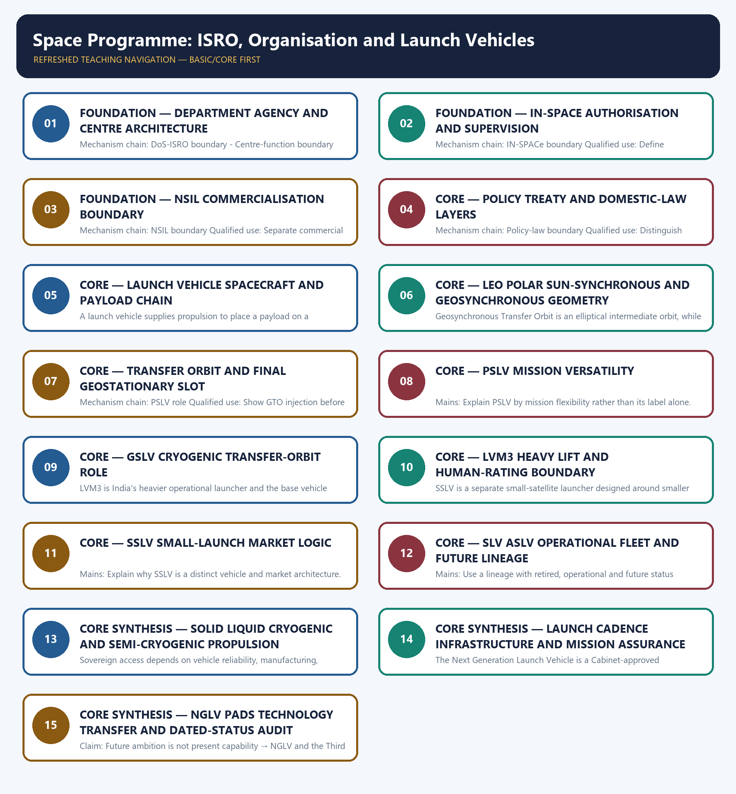

# Space Programme: ISRO, Organisation and Launch Vehicles — Learner-v2 Complete Learning Session

> **Authoring-only generation:** 2026-09-03. No PDF was rendered and no tracker or index was mutated.

### SOURCE, PROGRESSION AND CURRENT-LINKAGE AUDIT

- **Generation date:** 2026-09-03.
- **Repository-first evidence:** the Basic owner is taught first and preserved in full; the Advanced owner is retained only in the optional final teaching block.
- **OCR evidence:** Repository Markdown was primary. OCR-searchable official UPSC papers were supplementary only for printed routed demands. No answer key, payload capacity, mission result, constellation health, reactor output, isotope value or fusion milestone was inferred.
- **Qdrant:** not used; repository Markdown and available OCR context were sufficient.
- **PYQ integrity:** Audited ledgers route the 2018 PSLV-GSLV objective concept and a provisional 2026 IN-SPACe/private-participation concept here. No unverified objective key or direct Mains demand is invented.
- **Live-link boundary:** ISRO launcher retrieval was title-only on 2026-09-03. The dated repository owners remain the source for fleet and programme status; every capacity, cost, schedule, launch result and anomaly requires fresh official verification.
- **Fact/inference discipline:** no current-affairs item, PYQ wording, figure or quotation is invented.

### LIVE OFFICIAL-SOURCE ATTEMPT LOG

The checks below were made on 2026-09-03. Substantive official text is used only for the proposition it supports; title-only, blocked or thin pages are recorded and supply no factual claim.

- https://www.isro.gov.in/Launchers.html — attempted 2026-09-03; direct retrieval returned only the page title, so no vehicle status, stage, propellant or payload-capacity claim was imported.
- https://www.isro.gov.in/Navigation.html — attempted 2026-09-03; direct retrieval returned only the page title, so no constellation, signal, coverage, accuracy or operational-status claim was imported.
- https://www.isro.gov.in/Gaganyaan.html — attempted 2026-09-03; direct retrieval returned only the page title, so no crew, schedule, test or mission-status claim was imported.

## BASIC LEARNING SESSION

### DEEP-REVIEW LEARNING CONTRACT

| Control | Binding rule for this package |
|---|---|
| Syllabus boundary | Complete Science and Technology Basic/Core is easy-first and answer-complete before optional Advanced depth. |
| System boundary | Organisation, platform, subsystem, payload, process, application, institution and outcome remain distinct. |
| Technical boundary | Physical mechanism, classification, stage, platform, unit, range/capacity and limiting condition are explicit. |
| Status boundary | Announcement, approval, development, test, deployment, induction, commercial operation and observed outcome remain distinct. |
| Data boundary | Every mission, launch, target, capacity, budget, range, timeline, rule and regulatory claim keeps source, date, unit and status. |
| Governance boundary | Funder, developer, operator, authoriser, regulator, procurer, settlement actor and adjudicator are not conflated. |
| Practice contract | Every solved item has demand decoding, detailed examiner-grade model, executable timed/compression plan, marks rationale and answer-specific improvement. |
| PYQ contract | Official wording and keys are asserted only when verified; routed or reconstructed demands remain labelled. |
| Dual-flow contract | Graphical and ASCII masters independently reconstruct the same complete Basic-to-optional-Advanced evidence spine. |
| Approval | This immutable successor remains `approved: false` pending explicit approval. |

**Canonical Basic/Core owner:** `upsc-ai-kit\knowledge\Science-and-Technology\basic\01_Space-Programme-ISRO-Launch-Vehicles.md`  
**Substantive canonical provenance owner:** `upsc-ai-kit\knowledge\Science-and-Technology\learning-sessions\v2\subject-wide-syllabus\science-and-technology-01_Learning-Session.md`  
**Optional Advanced owner:** `upsc-ai-kit\knowledge\Science-and-Technology\advanced\01_Space-Programme-ISRO-Launch-Vehicles.md`  
**Official syllabus mapping:** `upsc-ai-kit\knowledge\Science-and-Technology\OFFICIAL-UPSC-SYLLABUS-MAPPING.md`

### EVIDENCE, PYQ AND CURRENT-STATUS CONTROL

- ISRO organisation, launcher stages, payload and orbit claims retain their exact object and mission date.
- NavIC, GAGAN, human-spaceflight, planetary, nuclear, fusion, missile and procurement claims retain category and status.
- Aadhaar/UPI, AI, quantum and semiconductor claims retain actor, layer, metric, maturity and governance boundaries.
- DPDP/cybersecurity, biotechnology and genetic-engineering claims retain legal/regulatory stage and competent institution.
- Targets, budgets, capacities, ranges and timelines are never promoted into achieved outcomes without dated evidence.
- **Current-status note, rechecked 2026-09-06:** volatile claims retain source/date/status; failed official fetches remain explicit and supply no invented fact.

**Generation-local live/current sources:**
- `https://www.isro.gov.in/Launchers.html — attempted 2026-09-03; direct retrieval returned only the page title, so no vehicle status, stage, propellant or payload-capacity claim was imported.`
- `https://www.isro.gov.in/Navigation.html — attempted 2026-09-03; direct retrieval returned only the page title, so no constellation, signal, coverage, accuracy or operational-status claim was imported.`
- `https://www.isro.gov.in/Gaganyaan.html — attempted 2026-09-03; direct retrieval returned only the page title, so no crew, schedule, test or mission-status claim was imported.`

**Topic-routed verified PYQ owners:**
- No topic-local official question file is claimed; repository PYQ routing ledgers control wording and status.




*Distinct embedded teaching-navigation image. The separate continuous Cārvāka-style flowchart package remains an independent at-a-glance artifact.*

### SESSION 1 — FOUNDATION — DEPARTMENT AGENCY AND CENTRE ARCHITECTURE

#### DEFINITION / WHAT THIS IS CALLED

**Plain-language definition:** The Department of Space is the Union-government policy umbrella, while ISRO is the public space agency that develops launch vehicles, spacecraft, applications and missions; the department and agency are not interchangeable.

**Technical definition:** Mechanism chain: DoS-ISRO boundary - Centre-function boundary Qualified use: Map DoS, ISRO and centres before discussing capability.

#### ANSWER-GRABBING OPENING — WRITE/ADAPT IN THE EXAM

> The Department of Space is the Union-government policy umbrella, while ISRO is the public space agency that develops launch vehicles, spacecraft, applications and missions; the department and agency are not interchangeable.

#### MUST-WRITE KEYWORDS

- **FOUNDATION**
- **Department agency**
- **centre architecture**
- **Mechanism chain**
- **Qualified use**
- **The Department of Space**

**How to use them:** Frame the answer through FOUNDATION; define Department agency, connect centre architecture with Mechanism chain to explain the mechanism, and use Qualified use for the decisive comparison or qualification.

#### VISUAL FIRST

```text
DEPARTMENT AGENCY AND CENTRE ARCHITECTURE
01. DoS-ISRO boundary
    |
    v
02. Centre-function boundary
STATUS / CATEGORY FIREWALL -> Do not merge the Department of Space with ISRO.
```

*The rail fixes the technical sequence and the claim boundary before explanation.*

#### CORE EXPLANATION

The Department of Space is the Union-government policy umbrella, while ISRO is the public space agency that develops launch vehicles, spacecraft, applications and missions; the department and agency are not interchangeable. VSSC leads launch-vehicle development, liquid-propulsion work is distributed across LPSC and IPRC, and SDSC-SHAR integrates and conducts launches; naming a centre does not transfer the mandate of the whole agency to it.

#### NAMED EVIDENCE AND MECHANISM

- The Department of Space is the Union-government policy umbrella, while ISRO is the public space agency that develops launch vehicles, spacecraft, applications and missions; the department and agency are not interchangeable.
- VSSC leads launch-vehicle development, liquid-propulsion work is distributed across LPSC and IPRC, and SDSC-SHAR integrates and conducts launches; naming a centre does not transfer the mandate of the whole agency to it.

#### EXAMINER CAUTION

- Do not merge the Department of Space with ISRO.

#### EXAM LINK

- **Prelims:** Keep institution, vehicle/spacecraft, orbit, service, signal, reactor, fuel, process, unit and status in their exact category.
- **Mains:** Map DoS, ISRO and centres before discussing capability.

#### MINI RECAP

- **Mechanism chain:** DoS-ISRO boundary -> Centre-function boundary
- **Qualified use:** Map DoS, ISRO and centres before discussing capability.

#### CLOSING RECALL FLOW — FOUNDATION — DEPARTMENT AGENCY AND CENTRE ARCHITECTURE

```text
START / CONCEPT: FOUNDATION — Department agency and centre architecture
        |
        v
EXACT TERMS: FOUNDATION · Department agency · centre architecture · Mechanism chain · Qualified use · The Department of Space
        |
        v
MECHANISM / ARGUMENT: VSSC leads launch-vehicle development, liquid-propulsion work is distributed across LPSC and IPRC, and SDSC-SHAR integrates and conducts launches; naming a centre does not transfer the mandate of the whole agency to it.
        |
        v
CONSEQUENCE / CONTRAST: Do not merge the Department of Space with ISRO.
        |
        v
UPSC TRAP / ANSWER-USE: Do not miss this limiting distinction: doS-ISRO boundary - Centre-function boundary Qualified use.
        |
        v
ANSWER-GRABBING FORMULATION: The Department of Space is the Union-government policy umbrella, while ISRO is the public space agency that develops launch vehicles, spacecraft, applications and missions; the department and agency are not interchangeable.
```
### SESSION 2 — FOUNDATION — IN-SPACE AUTHORISATION AND SUPERVISION

#### DEFINITION / WHAT THIS IS CALLED

**Plain-language definition:** IN-SPACe is the single-window nodal agency under the Department of Space for promoting, authorising and supervising non-government space activity; it is not ISRO's commercial sales arm.

**Technical definition:** Mechanism chain: IN-SPACe boundary Qualified use: Define promotion, authorisation and continuing supervision precisely.

#### ANSWER-GRABBING OPENING — WRITE/ADAPT IN THE EXAM

> Mechanism chain: IN-SPACe boundary Qualified use: Define promotion, authorisation and continuing supervision precisely.

#### MUST-WRITE KEYWORDS

- **FOUNDATION**
- **IN-SPACe authorisation**
- **supervision**
- **Mechanism chain**
- **Qualified use**
- **IN-SPACe**

**How to use them:** Frame the answer through FOUNDATION; define IN-SPACe authorisation, connect supervision with Mechanism chain to explain the mechanism, and use Qualified use for the decisive comparison or qualification.

#### VISUAL FIRST

```text
IN-SPACE AUTHORISATION AND SUPERVISION
01. IN-SPACe boundary
STATUS / CATEGORY FIREWALL -> Do not assign IN-SPACe's authorisation role to NSIL.
```

*The rail fixes the technical sequence and the claim boundary before explanation.*

#### CORE EXPLANATION

IN-SPACe is the single-window nodal agency under the Department of Space for promoting, authorising and supervising non-government space activity; it is not ISRO's commercial sales arm.

#### NAMED EVIDENCE AND MECHANISM

- IN-SPACe is the single-window nodal agency under the Department of Space for promoting, authorising and supervising non-government space activity; it is not ISRO's commercial sales arm.

#### EXAMINER CAUTION

- Do not assign IN-SPACe's authorisation role to NSIL.

#### EXAM LINK

- **Prelims:** Keep institution, vehicle/spacecraft, orbit, service, signal, reactor, fuel, process, unit and status in their exact category.
- **Mains:** Define promotion, authorisation and continuing supervision precisely.

#### MINI RECAP

- **Mechanism chain:** IN-SPACe boundary
- **Qualified use:** Define promotion, authorisation and continuing supervision precisely.

#### CLOSING RECALL FLOW — FOUNDATION — IN-SPACE AUTHORISATION AND SUPERVISION

```text
START / CONCEPT: FOUNDATION — IN-SPACe authorisation and supervision
        |
        v
EXACT TERMS: FOUNDATION · IN-SPACe authorisation · supervision · Mechanism chain · Qualified use · IN-SPACe
        |
        v
MECHANISM / ARGUMENT: IN-SPACe is the single-window nodal agency under the Department of Space for promoting, authorising and supervising non-government space activity; it is not ISRO's commercial sales arm.
        |
        v
CONSEQUENCE / CONTRAST: Do not assign IN-SPACe's authorisation role to NSIL.
        |
        v
UPSC TRAP / ANSWER-USE: Do not miss this limiting distinction: define promotion, authorisation and continuing supervision precisely.
        |
        v
ANSWER-GRABBING FORMULATION: Mechanism chain: IN-SPACe boundary Qualified use: Define promotion, authorisation and continuing supervision precisely.
```
### SESSION 3 — FOUNDATION — NSIL COMMERCIALISATION BOUNDARY

#### DEFINITION / WHAT THIS IS CALLED

**Plain-language definition:** NSIL is the public-sector commercial arm for launch, satellite, service and technology-transfer arrangements; commercial contracting is distinct from authorisation and supervision.

**Technical definition:** Mechanism chain: NSIL boundary Qualified use: Separate commercial execution from public regulation and R&D.

#### ANSWER-GRABBING OPENING — WRITE/ADAPT IN THE EXAM

> NSIL is the public-sector commercial arm for launch, satellite, service and technology-transfer arrangements; commercial contracting is distinct from authorisation and supervision.

#### MUST-WRITE KEYWORDS

- **FOUNDATION**
- **NSIL commercialisation boundary**
- **Mechanism chain**
- **Qualified use**
- **NSIL**
- **NSIL's**

**How to use them:** Frame the answer through FOUNDATION; define NSIL commercialisation boundary, connect Mechanism chain with Qualified use to explain the mechanism, and use NSIL for the decisive comparison or qualification.

#### VISUAL FIRST

```text
NSIL COMMERCIALISATION BOUNDARY
01. NSIL boundary
STATUS / CATEGORY FIREWALL -> Do not assign NSIL's commercial role to IN-SPACe.
```

*The rail fixes the technical sequence and the claim boundary before explanation.*

#### CORE EXPLANATION

NSIL is the public-sector commercial arm for launch, satellite, service and technology-transfer arrangements; commercial contracting is distinct from authorisation and supervision.

#### NAMED EVIDENCE AND MECHANISM

- NSIL is the public-sector commercial arm for launch, satellite, service and technology-transfer arrangements; commercial contracting is distinct from authorisation and supervision.

#### EXAMINER CAUTION

- Do not assign NSIL's commercial role to IN-SPACe.

#### EXAM LINK

- **Prelims:** Keep institution, vehicle/spacecraft, orbit, service, signal, reactor, fuel, process, unit and status in their exact category.
- **Mains:** Separate commercial execution from public regulation and R&D.

#### MINI RECAP

- **Mechanism chain:** NSIL boundary
- **Qualified use:** Separate commercial execution from public regulation and R&D.

#### CLOSING RECALL FLOW — FOUNDATION — NSIL COMMERCIALISATION BOUNDARY

```text
START / CONCEPT: FOUNDATION — NSIL commercialisation boundary
        |
        v
EXACT TERMS: FOUNDATION · NSIL commercialisation boundary · Mechanism chain · Qualified use · NSIL · NSIL's
        |
        v
MECHANISM / ARGUMENT: Mechanism chain: NSIL boundary Qualified use: Separate commercial execution from public regulation and R&D.
        |
        v
CONSEQUENCE / CONTRAST: Do not assign NSIL's commercial role to IN-SPACe.
        |
        v
UPSC TRAP / ANSWER-USE: Do not miss this limiting distinction: separate commercial execution from public regulation and R&D.
        |
        v
ANSWER-GRABBING FORMULATION: NSIL is the public-sector commercial arm for launch, satellite, service and technology-transfer arrangements; commercial contracting is distinct from authorisation and supervision.
```
### SESSION 4 — CORE — POLICY TREATY AND DOMESTIC-LAW LAYERS

#### DEFINITION / WHAT THIS IS CALLED

**Plain-language definition:** Indian Space Policy 2023 allocates institutional roles and opens participation, but it is executive policy rather than a comprehensive domestic space statute.

**Technical definition:** Mechanism chain: Policy-law boundary Qualified use: Distinguish executive policy from treaty obligations and statute.

#### ANSWER-GRABBING OPENING — WRITE/ADAPT IN THE EXAM

> Indian Space Policy 2023 allocates institutional roles and opens participation, but it is executive policy rather than a comprehensive domestic space statute.

#### MUST-WRITE KEYWORDS

- **Policy treaty**
- **domestic-law layers**
- **Mechanism chain**
- **Qualified use**
- **Indian Space Policy**
- **Policy-law**

**How to use them:** Frame the answer through Policy treaty; define domestic-law layers, connect Mechanism chain with Qualified use to explain the mechanism, and use Indian Space Policy for the decisive comparison or qualification.

#### VISUAL FIRST

```text
POLICY TREATY AND DOMESTIC-LAW LAYERS
01. Policy-law boundary
STATUS / CATEGORY FIREWALL -> Do not call Indian Space Policy 2023 a statute.
```

*The rail fixes the technical sequence and the claim boundary before explanation.*

#### CORE EXPLANATION

Indian Space Policy 2023 allocates institutional roles and opens participation, but it is executive policy rather than a comprehensive domestic space statute.

#### NAMED EVIDENCE AND MECHANISM

- Indian Space Policy 2023 allocates institutional roles and opens participation, but it is executive policy rather than a comprehensive domestic space statute.

#### EXAMINER CAUTION

- Do not call Indian Space Policy 2023 a statute.

#### EXAM LINK

- **Prelims:** Keep institution, vehicle/spacecraft, orbit, service, signal, reactor, fuel, process, unit and status in their exact category.
- **Mains:** Distinguish executive policy from treaty obligations and statute.

#### MINI RECAP

- **Mechanism chain:** Policy-law boundary
- **Qualified use:** Distinguish executive policy from treaty obligations and statute.

#### CLOSING RECALL FLOW — CORE — POLICY TREATY AND DOMESTIC-LAW LAYERS

```text
START / CONCEPT: CORE — Policy treaty and domestic-law layers
        |
        v
EXACT TERMS: Policy treaty · domestic-law layers · Mechanism chain · Qualified use · Indian Space Policy · Policy-law
        |
        v
MECHANISM / ARGUMENT: Mechanism chain: Policy-law boundary Qualified use: Distinguish executive policy from treaty obligations and statute.
        |
        v
CONSEQUENCE / CONTRAST: Do not call Indian Space Policy 2023 a statute.
        |
        v
UPSC TRAP / ANSWER-USE: Do not miss this limiting distinction: indian Space Policy 2023 allocates institutional roles and opens participation.
        |
        v
ANSWER-GRABBING FORMULATION: Indian Space Policy 2023 allocates institutional roles and opens participation, but it is executive policy rather than a comprehensive domestic space statute.
```
### SESSION 5 — CORE — LAUNCH VEHICLE SPACECRAFT AND PAYLOAD CHAIN

#### DEFINITION / WHAT THIS IS CALLED

**Plain-language definition:** Mechanism chain: Launcher-spacecraft boundary Qualified use: Trace launcher, separation, spacecraft and mission payload.

**Technical definition:** A launch vehicle supplies propulsion to place a payload on a trajectory or into an orbit, whereas the spacecraft or satellite carries the mission payload and may use its own propulsion after separation.

#### ANSWER-GRABBING OPENING — WRITE/ADAPT IN THE EXAM

> Do not merge a launch vehicle with its payload spacecraft.

#### MUST-WRITE KEYWORDS

- **Launch vehicle spacecraft**
- **payload chain**
- **Mechanism chain**
- **Qualified use**
- **Launcher-spacecraft**
- **Qualified**

**How to use them:** Frame the answer through Launch vehicle spacecraft; define payload chain, connect Mechanism chain with Qualified use to explain the mechanism, and use Launcher-spacecraft for the decisive comparison or qualification.

#### VISUAL FIRST

```text
LAUNCH VEHICLE SPACECRAFT AND PAYLOAD CHAIN
01. Launcher-spacecraft boundary
STATUS / CATEGORY FIREWALL -> Do not merge a launch vehicle with its payload spacecraft.
```

*The rail fixes the technical sequence and the claim boundary before explanation.*

#### CORE EXPLANATION

A launch vehicle supplies propulsion to place a payload on a trajectory or into an orbit, whereas the spacecraft or satellite carries the mission payload and may use its own propulsion after separation.

#### NAMED EVIDENCE AND MECHANISM

- A launch vehicle supplies propulsion to place a payload on a trajectory or into an orbit, whereas the spacecraft or satellite carries the mission payload and may use its own propulsion after separation.

#### EXAMINER CAUTION

- Do not merge a launch vehicle with its payload spacecraft.

#### EXAM LINK

- **Prelims:** Keep institution, vehicle/spacecraft, orbit, service, signal, reactor, fuel, process, unit and status in their exact category.
- **Mains:** Trace launcher, separation, spacecraft and mission payload.

#### MINI RECAP

- **Mechanism chain:** Launcher-spacecraft boundary
- **Qualified use:** Trace launcher, separation, spacecraft and mission payload.

#### CLOSING RECALL FLOW — CORE — LAUNCH VEHICLE SPACECRAFT AND PAYLOAD CHAIN

```text
START / CONCEPT: CORE — Launch vehicle spacecraft and payload chain
        |
        v
EXACT TERMS: Launch vehicle spacecraft · payload chain · Mechanism chain · Qualified use · Launcher-spacecraft · Qualified
        |
        v
MECHANISM / ARGUMENT: Mechanism chain: Launcher-spacecraft boundary Qualified use: Trace launcher, separation, spacecraft and mission payload.
        |
        v
CONSEQUENCE / CONTRAST: A launch vehicle supplies propulsion to place a payload on a trajectory or into an orbit, whereas the spacecraft or satellite carries the mission payload and may use its own propulsion after separation.
        |
        v
UPSC TRAP / ANSWER-USE: Do not miss this limiting distinction: a launch vehicle supplies propulsion to place a payload on a trajectory or into...
        |
        v
ANSWER-GRABBING FORMULATION: Do not merge a launch vehicle with its payload spacecraft.
```
### SESSION 6 — CORE — LEO POLAR SUN-SYNCHRONOUS AND GEOSYNCHRONOUS GEOMETRY

#### DEFINITION / WHAT THIS IS CALLED

**Plain-language definition:** LEO, polar orbit, sun-synchronous orbit, geosynchronous orbit and geostationary orbit describe different geometry, altitude or timing properties; polar and sun-synchronous are not synonyms for every low orbit.

**Technical definition:** Geosynchronous Transfer Orbit is an elliptical intermediate orbit, while geostationary orbit is circular and equatorial; a launcher injection into GTO does not by itself place the spacecraft in its final geostationary slot.

#### ANSWER-GRABBING OPENING — WRITE/ADAPT IN THE EXAM

> LEO, polar orbit, sun-synchronous orbit, geosynchronous orbit and geostationary orbit describe different geometry, altitude or timing properties; polar and sun-synchronous are not synonyms for every low orbit.

#### MUST-WRITE KEYWORDS

- **LEO polar sun-synchronous**
- **geosynchronous geometry**
- **Mechanism chain**
- **Qualified use**
- **LEO**
- **Geosynchronous Transfer Orbit**

**How to use them:** Frame the answer through LEO polar sun-synchronous; define geosynchronous geometry, connect Mechanism chain with Qualified use to explain the mechanism, and use LEO for the decisive comparison or qualification.

#### VISUAL FIRST

```text
LEO POLAR SUN-SYNCHRONOUS AND GEOSYNCHRONOUS GEOMETRY
01. Orbit-family boundary
    |
    v
02. GTO-GEO boundary
STATUS / CATEGORY FIREWALL -> Do not treat GTO as the final geostationary orbit.
```

*The rail fixes the technical sequence and the claim boundary before explanation.*

#### CORE EXPLANATION

LEO, polar orbit, sun-synchronous orbit, geosynchronous orbit and geostationary orbit describe different geometry, altitude or timing properties; polar and sun-synchronous are not synonyms for every low orbit. Geosynchronous Transfer Orbit is an elliptical intermediate orbit, while geostationary orbit is circular and equatorial; a launcher injection into GTO does not by itself place the spacecraft in its final geostationary slot.

#### NAMED EVIDENCE AND MECHANISM

- LEO, polar orbit, sun-synchronous orbit, geosynchronous orbit and geostationary orbit describe different geometry, altitude or timing properties; polar and sun-synchronous are not synonyms for every low orbit.
- Geosynchronous Transfer Orbit is an elliptical intermediate orbit, while geostationary orbit is circular and equatorial; a launcher injection into GTO does not by itself place the spacecraft in its final geostationary slot.

#### EXAMINER CAUTION

- Do not treat GTO as the final geostationary orbit.

#### EXAM LINK

- **Prelims:** Keep institution, vehicle/spacecraft, orbit, service, signal, reactor, fuel, process, unit and status in their exact category.
- **Mains:** Classify orbit by altitude, inclination, period and solar geometry.

#### MINI RECAP

- **Mechanism chain:** Orbit-family boundary -> GTO-GEO boundary
- **Qualified use:** Classify orbit by altitude, inclination, period and solar geometry.

#### CLOSING RECALL FLOW — CORE — LEO POLAR SUN-SYNCHRONOUS AND GEOSYNCHRONOUS GEOMETRY

```text
START / CONCEPT: CORE — LEO polar sun-synchronous and geosynchronous geometry
        |
        v
EXACT TERMS: LEO polar sun-synchronous · geosynchronous geometry · Mechanism chain · Qualified use · LEO · Geosynchronous Transfer Orbit
        |
        v
MECHANISM / ARGUMENT: Mechanism chain: Orbit-family boundary - GTO-GEO boundary Qualified use: Classify orbit by altitude, inclination, period and solar geometry.
        |
        v
CONSEQUENCE / CONTRAST: Geosynchronous Transfer Orbit is an elliptical intermediate orbit, while geostationary orbit is circular and equatorial; a launcher injection into GTO does not by itself place the spacecraft in its final geostationary slot.
        |
        v
UPSC TRAP / ANSWER-USE: Do not treat GTO as the final geostationary orbit.
        |
        v
ANSWER-GRABBING FORMULATION: LEO, polar orbit, sun-synchronous orbit, geosynchronous orbit and geostationary orbit describe different geometry, altitude or timing properties; polar and sun-synchronous are not synonyms for every low orbit.
```
### SESSION 7 — CORE — TRANSFER ORBIT AND FINAL GEOSTATIONARY SLOT

#### DEFINITION / WHAT THIS IS CALLED

**Plain-language definition:** PSLV is the versatile operational workhorse used across Earth-observation, navigation and multi-payload missions; its name does not confine every mission to a polar orbit.

**Technical definition:** Mechanism chain: PSLV role Qualified use: Show GTO injection before spacecraft-led circularisation.

#### ANSWER-GRABBING OPENING — WRITE/ADAPT IN THE EXAM

> PSLV is the versatile operational workhorse used across Earth-observation, navigation and multi-payload missions; its name does not confine every mission to a polar orbit.

#### MUST-WRITE KEYWORDS

- **Transfer orbit**
- **final geostationary slot**
- **Mechanism chain**
- **Qualified use**
- **PSLV**
- **Earth-observation**

**How to use them:** Frame the answer through Transfer orbit; define final geostationary slot, connect Mechanism chain with Qualified use to explain the mechanism, and use PSLV for the decisive comparison or qualification.

#### VISUAL FIRST

```text
TRANSFER ORBIT AND FINAL GEOSTATIONARY SLOT
01. PSLV role
STATUS / CATEGORY FIREWALL -> Do not infer PSLV mission orbit only from its name.
```

*The rail fixes the technical sequence and the claim boundary before explanation.*

#### CORE EXPLANATION

PSLV is the versatile operational workhorse used across Earth-observation, navigation and multi-payload missions; its name does not confine every mission to a polar orbit.

#### NAMED EVIDENCE AND MECHANISM

- PSLV is the versatile operational workhorse used across Earth-observation, navigation and multi-payload missions; its name does not confine every mission to a polar orbit.

#### EXAMINER CAUTION

- Do not infer PSLV mission orbit only from its name.

#### EXAM LINK

- **Prelims:** Keep institution, vehicle/spacecraft, orbit, service, signal, reactor, fuel, process, unit and status in their exact category.
- **Mains:** Show GTO injection before spacecraft-led circularisation.

#### MINI RECAP

- **Mechanism chain:** PSLV role
- **Qualified use:** Show GTO injection before spacecraft-led circularisation.

#### CLOSING RECALL FLOW — CORE — TRANSFER ORBIT AND FINAL GEOSTATIONARY SLOT

```text
START / CONCEPT: CORE — Transfer orbit and final geostationary slot
        |
        v
EXACT TERMS: Transfer orbit · final geostationary slot · Mechanism chain · Qualified use · PSLV · Earth-observation
        |
        v
MECHANISM / ARGUMENT: Mechanism chain: PSLV role Qualified use: Show GTO injection before spacecraft-led circularisation.
        |
        v
CONSEQUENCE / CONTRAST: Do not infer PSLV mission orbit only from its name.
        |
        v
UPSC TRAP / ANSWER-USE: Do not miss this limiting distinction: show GTO injection before spacecraft-led circularisation.
        |
        v
ANSWER-GRABBING FORMULATION: PSLV is the versatile operational workhorse used across Earth-observation, navigation and multi-payload missions; its name does not confine every mission to a polar orbit.
```
### SESSION 8 — CORE — PSLV MISSION VERSATILITY

#### DEFINITION / WHAT THIS IS CALLED

**Plain-language definition:** Mechanism chain: GSLV role Qualified use: Explain PSLV by mission flexibility rather than its label alone.

**Technical definition:** Mains: Explain PSLV by mission flexibility rather than its label alone.

#### ANSWER-GRABBING OPENING — WRITE/ADAPT IN THE EXAM

> Mechanism chain: GSLV role Qualified use: Explain PSLV by mission flexibility rather than its label alone.

#### MUST-WRITE KEYWORDS

- **PSLV mission versatility**
- **Mechanism chain**
- **Qualified use**
- **GSLV**
- **SSLV**
- **PSLV**

**How to use them:** Frame the answer through PSLV mission versatility; define Mechanism chain, connect Qualified use with GSLV to explain the mechanism, and use SSLV for the decisive comparison or qualification.

#### VISUAL FIRST

```text
PSLV MISSION VERSATILITY
01. GSLV role
STATUS / CATEGORY FIREWALL -> Do not call SSLV a PSLV variant.
```

*The rail fixes the technical sequence and the claim boundary before explanation.*

#### CORE EXPLANATION

GSLV uses an indigenous cryogenic upper stage for heavier communication-class missions to transfer orbit; cryogenic capability, orbit and payload class must be stated together.

#### NAMED EVIDENCE AND MECHANISM

- GSLV uses an indigenous cryogenic upper stage for heavier communication-class missions to transfer orbit; cryogenic capability, orbit and payload class must be stated together.

#### EXAMINER CAUTION

- Do not call SSLV a PSLV variant.

#### EXAM LINK

- **Prelims:** Keep institution, vehicle/spacecraft, orbit, service, signal, reactor, fuel, process, unit and status in their exact category.
- **Mains:** Explain PSLV by mission flexibility rather than its label alone.

#### MINI RECAP

- **Mechanism chain:** GSLV role
- **Qualified use:** Explain PSLV by mission flexibility rather than its label alone.

#### CLOSING RECALL FLOW — CORE — PSLV MISSION VERSATILITY

```text
START / CONCEPT: CORE — PSLV mission versatility
        |
        v
EXACT TERMS: PSLV mission versatility · Mechanism chain · Qualified use · GSLV · SSLV · PSLV
        |
        v
MECHANISM / ARGUMENT: Mains: Explain PSLV by mission flexibility rather than its label alone.
        |
        v
CONSEQUENCE / CONTRAST: Do not call SSLV a PSLV variant.
        |
        v
UPSC TRAP / ANSWER-USE: Do not miss this limiting distinction: gSLV uses an indigenous cryogenic upper stage for heavier communication-class missions to transfer orbit.
        |
        v
ANSWER-GRABBING FORMULATION: Mechanism chain: GSLV role Qualified use: Explain PSLV by mission flexibility rather than its label alone.
```
### SESSION 9 — CORE — GSLV CRYOGENIC TRANSFER-ORBIT ROLE

#### DEFINITION / WHAT THIS IS CALLED

**Plain-language definition:** Mechanism chain: LVM3 role Qualified use: Link GSLV's cryogenic upper stage to transfer-orbit missions.

**Technical definition:** LVM3 is India's heavier operational launcher and the base vehicle selected for human rating for Gaganyaan; an operational launcher and its human-rated configuration are distinct statuses.

#### ANSWER-GRABBING OPENING — WRITE/ADAPT IN THE EXAM

> Mechanism chain: LVM3 role Qualified use: Link GSLV's cryogenic upper stage to transfer-orbit missions.

#### MUST-WRITE KEYWORDS

- **GSLV cryogenic transfer-orbit role**
- **Mechanism chain**
- **Qualified use**
- **LVM3**
- **India's**
- **Gaganyaan**

**How to use them:** Frame the answer through GSLV cryogenic transfer-orbit role; define Mechanism chain, connect Qualified use with LVM3 to explain the mechanism, and use India's for the decisive comparison or qualification.

#### VISUAL FIRST

```text
GSLV CRYOGENIC TRANSFER-ORBIT ROLE
01. LVM3 role
STATUS / CATEGORY FIREWALL -> Do not list retired, operational and future vehicles together.
```

*The rail fixes the technical sequence and the claim boundary before explanation.*

#### CORE EXPLANATION

LVM3 is India's heavier operational launcher and the base vehicle selected for human rating for Gaganyaan; an operational launcher and its human-rated configuration are distinct statuses.

#### NAMED EVIDENCE AND MECHANISM

- LVM3 is India's heavier operational launcher and the base vehicle selected for human rating for Gaganyaan; an operational launcher and its human-rated configuration are distinct statuses.

#### EXAMINER CAUTION

- Do not list retired, operational and future vehicles together.

#### EXAM LINK

- **Prelims:** Keep institution, vehicle/spacecraft, orbit, service, signal, reactor, fuel, process, unit and status in their exact category.
- **Mains:** Link GSLV's cryogenic upper stage to transfer-orbit missions.

#### MINI RECAP

- **Mechanism chain:** LVM3 role
- **Qualified use:** Link GSLV's cryogenic upper stage to transfer-orbit missions.

#### CLOSING RECALL FLOW — CORE — GSLV CRYOGENIC TRANSFER-ORBIT ROLE

```text
START / CONCEPT: CORE — GSLV cryogenic transfer-orbit role
        |
        v
EXACT TERMS: GSLV cryogenic transfer-orbit role · Mechanism chain · Qualified use · LVM3 · India's · Gaganyaan
        |
        v
MECHANISM / ARGUMENT: LVM3 is India's heavier operational launcher and the base vehicle selected for human rating for Gaganyaan; an operational launcher and its human-rated configuration are distinct statuses.
        |
        v
CONSEQUENCE / CONTRAST: Do not list retired, operational and future vehicles together.
        |
        v
UPSC TRAP / ANSWER-USE: Do not miss this limiting distinction: link GSLV's cryogenic upper stage to transfer-orbit missions.
        |
        v
ANSWER-GRABBING FORMULATION: Mechanism chain: LVM3 role Qualified use: Link GSLV's cryogenic upper stage to transfer-orbit missions.
```
### SESSION 10 — CORE — LVM3 HEAVY LIFT AND HUMAN-RATING BOUNDARY

#### DEFINITION / WHAT THIS IS CALLED

**Plain-language definition:** Mechanism chain: SSLV role Qualified use: Separate operational LVM3 from the human-rating process.

**Technical definition:** SSLV is a separate small-satellite launcher designed around smaller payloads and quicker, lower-infrastructure launch demand; it is not a PSLV variant.

#### ANSWER-GRABBING OPENING — WRITE/ADAPT IN THE EXAM

> Mechanism chain: SSLV role Qualified use: Separate operational LVM3 from the human-rating process.

#### MUST-WRITE KEYWORDS

- **LVM3 heavy lift**
- **human-rating boundary**
- **Mechanism chain**
- **Qualified use**
- **SSLV**
- **PSLV**

**How to use them:** Frame the answer through LVM3 heavy lift; define human-rating boundary, connect Mechanism chain with Qualified use to explain the mechanism, and use SSLV for the decisive comparison or qualification.

#### VISUAL FIRST

```text
LVM3 HEAVY LIFT AND HUMAN-RATING BOUNDARY
01. SSLV role
STATUS / CATEGORY FIREWALL -> Do not merge cryogenic and semi-cryogenic propulsion.
```

*The rail fixes the technical sequence and the claim boundary before explanation.*

#### CORE EXPLANATION

SSLV is a separate small-satellite launcher designed around smaller payloads and quicker, lower-infrastructure launch demand; it is not a PSLV variant.

#### NAMED EVIDENCE AND MECHANISM

- SSLV is a separate small-satellite launcher designed around smaller payloads and quicker, lower-infrastructure launch demand; it is not a PSLV variant.

#### EXAMINER CAUTION

- Do not merge cryogenic and semi-cryogenic propulsion.

#### EXAM LINK

- **Prelims:** Keep institution, vehicle/spacecraft, orbit, service, signal, reactor, fuel, process, unit and status in their exact category.
- **Mains:** Separate operational LVM3 from the human-rating process.

#### MINI RECAP

- **Mechanism chain:** SSLV role
- **Qualified use:** Separate operational LVM3 from the human-rating process.

#### CLOSING RECALL FLOW — CORE — LVM3 HEAVY LIFT AND HUMAN-RATING BOUNDARY

```text
START / CONCEPT: CORE — LVM3 heavy lift and human-rating boundary
        |
        v
EXACT TERMS: LVM3 heavy lift · human-rating boundary · Mechanism chain · Qualified use · SSLV · PSLV
        |
        v
MECHANISM / ARGUMENT: SSLV is a separate small-satellite launcher designed around smaller payloads and quicker, lower-infrastructure launch demand; it is not a PSLV variant.
        |
        v
CONSEQUENCE / CONTRAST: Do not merge cryogenic and semi-cryogenic propulsion.
        |
        v
UPSC TRAP / ANSWER-USE: Do not miss this limiting distinction: sSLV is a separate small-satellite launcher designed around smaller payloads and quicker, lower-infrastructure launch...
        |
        v
ANSWER-GRABBING FORMULATION: Mechanism chain: SSLV role Qualified use: Separate operational LVM3 from the human-rating process.
```
### SESSION 11 — CORE — SSLV SMALL-LAUNCH MARKET LOGIC

#### DEFINITION / WHAT THIS IS CALLED

**Plain-language definition:** Mechanism chain: Lineage-status boundary - Propulsion-class boundary Qualified use: Explain why SSLV is a distinct vehicle and market architecture.

**Technical definition:** Mains: Explain why SSLV is a distinct vehicle and market architecture.

#### ANSWER-GRABBING OPENING — WRITE/ADAPT IN THE EXAM

> Mechanism chain: Lineage-status boundary - Propulsion-class boundary Qualified use: Explain why SSLV is a distinct vehicle and market architecture.

#### MUST-WRITE KEYWORDS

- **SSLV small-launch market logic**
- **Mechanism chain**
- **Qualified use**
- **SLV-3 and ASLV**
- **SLV**
- **ASLV**

**How to use them:** Frame the answer through SSLV small-launch market logic; define Mechanism chain, connect Qualified use with SLV-3 and ASLV to explain the mechanism, and use SLV for the decisive comparison or qualification.

#### VISUAL FIRST

```text
SSLV SMALL-LAUNCH MARKET LOGIC
01. Lineage-status boundary
    |
    v
02. Propulsion-class boundary
STATUS / CATEGORY FIREWALL -> Do not infer human rating from an ordinary success record.
```

*The rail fixes the technical sequence and the claim boundary before explanation.*

#### CORE EXPLANATION

SLV-3 and ASLV are historical technology-learning vehicles, PSLV, GSLV and LVM3 are identified in the repository owner as operational, and approved future systems must not be placed in the same status column. Solid, earth-storable liquid, cryogenic liquid-hydrogen and semi-cryogenic kerosene systems differ in propellants and operating role; a semi-cryogenic development programme is not a flying cryogenic stage.

#### NAMED EVIDENCE AND MECHANISM

- SLV-3 and ASLV are historical technology-learning vehicles, PSLV, GSLV and LVM3 are identified in the repository owner as operational, and approved future systems must not be placed in the same status column.
- Solid, earth-storable liquid, cryogenic liquid-hydrogen and semi-cryogenic kerosene systems differ in propellants and operating role; a semi-cryogenic development programme is not a flying cryogenic stage.

#### EXAMINER CAUTION

- Do not infer human rating from an ordinary success record.

#### EXAM LINK

- **Prelims:** Keep institution, vehicle/spacecraft, orbit, service, signal, reactor, fuel, process, unit and status in their exact category.
- **Mains:** Explain why SSLV is a distinct vehicle and market architecture.

#### MINI RECAP

- **Mechanism chain:** Lineage-status boundary -> Propulsion-class boundary
- **Qualified use:** Explain why SSLV is a distinct vehicle and market architecture.

#### CLOSING RECALL FLOW — CORE — SSLV SMALL-LAUNCH MARKET LOGIC

```text
START / CONCEPT: CORE — SSLV small-launch market logic
        |
        v
EXACT TERMS: SSLV small-launch market logic · Mechanism chain · Qualified use · SLV-3 and ASLV · SLV · ASLV
        |
        v
MECHANISM / ARGUMENT: Mains: Explain why SSLV is a distinct vehicle and market architecture.
        |
        v
CONSEQUENCE / CONTRAST: SLV-3 and ASLV are historical technology-learning vehicles, PSLV, GSLV and LVM3 are identified in the repository owner as operational, and approved future systems must not be placed in the same status column.
        |
        v
UPSC TRAP / ANSWER-USE: Solid, earth-storable liquid, cryogenic liquid-hydrogen and semi-cryogenic kerosene systems differ in propellants and operating role; a semi-cryogenic development programme is not a flying cryogenic stage.
        |
        v
ANSWER-GRABBING FORMULATION: Mechanism chain: Lineage-status boundary - Propulsion-class boundary Qualified use: Explain why SSLV is a distinct vehicle and market architecture.
```
### SESSION 12 — CORE — SLV ASLV OPERATIONAL FLEET AND FUTURE LINEAGE

#### DEFINITION / WHAT THIS IS CALLED

**Plain-language definition:** Mechanism chain: Human-rating boundary Qualified use: Use a lineage with retired, operational and future status columns.

**Technical definition:** Mains: Use a lineage with retired, operational and future status columns.

#### ANSWER-GRABBING OPENING — WRITE/ADAPT IN THE EXAM

> Mechanism chain: Human-rating boundary Qualified use: Use a lineage with retired, operational and future status columns.

#### MUST-WRITE KEYWORDS

- **SLV ASLV operational fleet**
- **future lineage**
- **Mechanism chain**
- **Qualified use**
- **Human**
- **Human-rating**

**How to use them:** Frame the answer through SLV ASLV operational fleet; define future lineage, connect Mechanism chain with Qualified use to explain the mechanism, and use Human for the decisive comparison or qualification.

#### VISUAL FIRST

```text
SLV ASLV OPERATIONAL FLEET AND FUTURE LINEAGE
01. Human-rating boundary
STATUS / CATEGORY FIREWALL -> Do not infer cadence from vehicle design alone.
```

*The rail fixes the technical sequence and the claim boundary before explanation.*

#### CORE EXPLANATION

Human rating adds margins, redundancy, health monitoring, benign failure behaviour and abort capability to a launcher system; it is a qualification process, not merely a strong flight record.

#### NAMED EVIDENCE AND MECHANISM

- Human rating adds margins, redundancy, health monitoring, benign failure behaviour and abort capability to a launcher system; it is a qualification process, not merely a strong flight record.

#### EXAMINER CAUTION

- Do not infer cadence from vehicle design alone.

#### EXAM LINK

- **Prelims:** Keep institution, vehicle/spacecraft, orbit, service, signal, reactor, fuel, process, unit and status in their exact category.
- **Mains:** Use a lineage with retired, operational and future status columns.

#### MINI RECAP

- **Mechanism chain:** Human-rating boundary
- **Qualified use:** Use a lineage with retired, operational and future status columns.

#### CLOSING RECALL FLOW — CORE — SLV ASLV OPERATIONAL FLEET AND FUTURE LINEAGE

```text
START / CONCEPT: CORE — SLV ASLV operational fleet and future lineage
        |
        v
EXACT TERMS: SLV ASLV operational fleet · future lineage · Mechanism chain · Qualified use · Human · Human-rating
        |
        v
MECHANISM / ARGUMENT: Mains: Use a lineage with retired, operational and future status columns.
        |
        v
CONSEQUENCE / CONTRAST: Human rating adds margins, redundancy, health monitoring, benign failure behaviour and abort capability to a launcher system; it is a qualification process, not merely a strong flight record.
        |
        v
UPSC TRAP / ANSWER-USE: Do not infer cadence from vehicle design alone.
        |
        v
ANSWER-GRABBING FORMULATION: Mechanism chain: Human-rating boundary Qualified use: Use a lineage with retired, operational and future status columns.
```
### SESSION 13 — CORE SYNTHESIS — SOLID LIQUID CRYOGENIC AND SEMI-CRYOGENIC PROPULSION

#### DEFINITION / WHAT THIS IS CALLED

**Plain-language definition:** Mechanism chain: Launch-system boundary Qualified use: Compare propellants and development status before claiming performance.

**Technical definition:** Sovereign access depends on vehicle reliability, manufacturing, integration bays, pads, range safety, propellant logistics and mission assurance; a rocket design alone does not establish launch cadence.

#### ANSWER-GRABBING OPENING — WRITE/ADAPT IN THE EXAM

> Sovereign access depends on vehicle reliability, manufacturing, integration bays, pads, range safety, propellant logistics and mission assurance; a rocket design alone does not establish launch cadence.

#### MUST-WRITE KEYWORDS

- **CORE SYNTHESIS**
- **Solid liquid cryogenic**
- **semi-cryogenic propulsion**
- **Mechanism chain**
- **Qualified use**
- **Sovereign**

**How to use them:** Frame the answer through CORE SYNTHESIS; define Solid liquid cryogenic, connect semi-cryogenic propulsion with Mechanism chain to explain the mechanism, and use Qualified use for the decisive comparison or qualification.

#### VISUAL FIRST

```text
SOLID LIQUID CRYOGENIC AND SEMI-CRYOGENIC PROPULSION
01. Launch-system boundary
STATUS / CATEGORY FIREWALL -> Do not turn NGLV approval into demonstrated capability.
```

*The rail fixes the technical sequence and the claim boundary before explanation.*

#### CORE EXPLANATION

Sovereign access depends on vehicle reliability, manufacturing, integration bays, pads, range safety, propellant logistics and mission assurance; a rocket design alone does not establish launch cadence.

#### NAMED EVIDENCE AND MECHANISM

- Sovereign access depends on vehicle reliability, manufacturing, integration bays, pads, range safety, propellant logistics and mission assurance; a rocket design alone does not establish launch cadence.

#### EXAMINER CAUTION

- Do not turn NGLV approval into demonstrated capability.

#### EXAM LINK

- **Prelims:** Keep institution, vehicle/spacecraft, orbit, service, signal, reactor, fuel, process, unit and status in their exact category.
- **Mains:** Compare propellants and development status before claiming performance.

#### MINI RECAP

- **Mechanism chain:** Launch-system boundary
- **Qualified use:** Compare propellants and development status before claiming performance.

#### CLOSING RECALL FLOW — CORE SYNTHESIS — SOLID LIQUID CRYOGENIC AND SEMI-CRYOGENIC PROPULSION

```text
START / CONCEPT: CORE SYNTHESIS — Solid liquid cryogenic and semi-cryogenic propulsion
        |
        v
EXACT TERMS: CORE SYNTHESIS · Solid liquid cryogenic · semi-cryogenic propulsion · Mechanism chain · Qualified use · Sovereign
        |
        v
MECHANISM / ARGUMENT: Mechanism chain: Launch-system boundary Qualified use: Compare propellants and development status before claiming performance.
        |
        v
CONSEQUENCE / CONTRAST: Do not turn NGLV approval into demonstrated capability.
        |
        v
UPSC TRAP / ANSWER-USE: Do not miss this limiting distinction: sovereign access depends on vehicle reliability, manufacturing, integration bays, pads, range safety, propellant logistics...
        |
        v
ANSWER-GRABBING FORMULATION: Sovereign access depends on vehicle reliability, manufacturing, integration bays, pads, range safety, propellant logistics and mission assurance; a rocket design alone does not establish launch cadence.
```
### SESSION 14 — CORE SYNTHESIS — LAUNCH CADENCE INFRASTRUCTURE AND MISSION ASSURANCE

#### DEFINITION / WHAT THIS IS CALLED

**Plain-language definition:** The Third Launch Pad and Kulasekarapattinam launch complex belong to future capacity expansion; approved or under-construction infrastructure is not commissioned infrastructure.

**Technical definition:** The Next Generation Launch Vehicle is a Cabinet-approved development programme with a planned reusable or recoverable first-stage architecture; approval is not a flight, operational service or demonstrated payload performance.

#### ANSWER-GRABBING OPENING — WRITE/ADAPT IN THE EXAM

> The Third Launch Pad and Kulasekarapattinam launch complex belong to future capacity expansion; approved or under-construction infrastructure is not commissioned infrastructure.

#### MUST-WRITE KEYWORDS

- **CORE SYNTHESIS**
- **Launch cadence infrastructure**
- **mission assurance**
- **Mechanism chain**
- **Qualified use**
- **The Next Generation Launch Vehicle**

**How to use them:** Frame the answer through CORE SYNTHESIS; define Launch cadence infrastructure, connect mission assurance with Mechanism chain to explain the mechanism, and use Qualified use for the decisive comparison or qualification.

#### VISUAL FIRST

```text
LAUNCH CADENCE INFRASTRUCTURE AND MISSION ASSURANCE
01. NGLV status boundary
    |
    v
02. Infrastructure-status boundary
STATUS / CATEGORY FIREWALL -> Do not turn a launch-pad approval into commissioning.
```

*The rail fixes the technical sequence and the claim boundary before explanation.*

#### CORE EXPLANATION

The Next Generation Launch Vehicle is a Cabinet-approved development programme with a planned reusable or recoverable first-stage architecture; approval is not a flight, operational service or demonstrated payload performance. The Third Launch Pad and Kulasekarapattinam launch complex belong to future capacity expansion; approved or under-construction infrastructure is not commissioned infrastructure.

#### NAMED EVIDENCE AND MECHANISM

- The Next Generation Launch Vehicle is a Cabinet-approved development programme with a planned reusable or recoverable first-stage architecture; approval is not a flight, operational service or demonstrated payload performance.
- The Third Launch Pad and Kulasekarapattinam launch complex belong to future capacity expansion; approved or under-construction infrastructure is not commissioned infrastructure.

#### EXAMINER CAUTION

- Do not turn a launch-pad approval into commissioning.

#### EXAM LINK

- **Prelims:** Keep institution, vehicle/spacecraft, orbit, service, signal, reactor, fuel, process, unit and status in their exact category.
- **Mains:** Treat access to space as a vehicle-plus-infrastructure system.

#### MINI RECAP

- **Mechanism chain:** NGLV status boundary -> Infrastructure-status boundary
- **Qualified use:** Treat access to space as a vehicle-plus-infrastructure system.

#### CLOSING RECALL FLOW — CORE SYNTHESIS — LAUNCH CADENCE INFRASTRUCTURE AND MISSION ASSURANCE

```text
START / CONCEPT: CORE SYNTHESIS — Launch cadence infrastructure and mission assurance
        |
        v
EXACT TERMS: CORE SYNTHESIS · Launch cadence infrastructure · mission assurance · Mechanism chain · Qualified use · The Next Generation Launch Vehicle
        |
        v
MECHANISM / ARGUMENT: Mechanism chain: NGLV status boundary - Infrastructure-status boundary Qualified use: Treat access to space as a vehicle-plus-infrastructure system.
        |
        v
CONSEQUENCE / CONTRAST: The Next Generation Launch Vehicle is a Cabinet-approved development programme with a planned reusable or recoverable first-stage architecture; approval is not a flight, operational service or demonstrated payload performance.
        |
        v
UPSC TRAP / ANSWER-USE: Do not turn a launch-pad approval into commissioning.
        |
        v
ANSWER-GRABBING FORMULATION: The Third Launch Pad and Kulasekarapattinam launch complex belong to future capacity expansion; approved or under-construction infrastructure is not commissioned infrastructure.
```
### SESSION 15 — CORE SYNTHESIS — NGLV PADS TECHNOLOGY TRANSFER AND DATED-STATUS AUDIT

#### DEFINITION / WHAT THIS IS CALLED

**Plain-language definition:** Transfer of SSLV technology to HAL is an industrial production and commercialisation arrangement; it does not mean that ISRO, IN-SPACe, NSIL and the State's safety responsibilities disappear.

**Technical definition:** Claim: Future ambition is not present capability → NGLV and the Third Launch Pad are approved future-capacity projects; SSLV transfer to HAL is an agreement → shows the pipeline for scale and industry learning → qualification: approval/transfer does not prove a flown industrial vehicle, commissioning or commercial market share.

#### ANSWER-GRABBING OPENING — WRITE/ADAPT IN THE EXAM

> Transfer of SSLV technology to HAL is an industrial production and commercialisation arrangement; it does not mean that ISRO, IN-SPACe, NSIL and the State's safety responsibilities disappear.

#### MUST-WRITE KEYWORDS

- **CORE SYNTHESIS**
- **NGLV pads technology transfer**
- **dated-status audit**
- **Mechanism chain**
- **Qualified use**
- **Subject**

**How to use them:** Frame the answer through CORE SYNTHESIS; define NGLV pads technology transfer, connect dated-status audit with Mechanism chain to explain the mechanism, and use Qualified use for the decisive comparison or qualification.

#### VISUAL FIRST

```text
NGLV PADS TECHNOLOGY TRANSFER AND DATED-STATUS AUDIT
01. Technology-transfer boundary
    |
    v
02. Volatile launch-data boundary
STATUS / CATEGORY FIREWALL -> Do not rewrite technology transfer as complete privatisation.
```

*The rail fixes the technical sequence and the claim boundary before explanation.*

#### CORE EXPLANATION

Transfer of SSLV technology to HAL is an industrial production and commercialisation arrangement; it does not mean that ISRO, IN-SPACe, NSIL and the State's safety responsibilities disappear. Payload capacity, configuration, launch outcome, fleet status, project cost, schedule and anomaly findings require a dated official ISRO, Department of Space or Cabinet source and must never be carried forward without that date.

#### NAMED EVIDENCE AND MECHANISM

- Transfer of SSLV technology to HAL is an industrial production and commercialisation arrangement; it does not mean that ISRO, IN-SPACe, NSIL and the State's safety responsibilities disappear.
- Payload capacity, configuration, launch outcome, fleet status, project cost, schedule and anomaly findings require a dated official ISRO, Department of Space or Cabinet source and must never be carried forward without that date.

#### EXAMINER CAUTION

- Do not rewrite technology transfer as complete privatisation.

#### EXAM LINK

- **Prelims:** Keep institution, vehicle/spacecraft, orbit, service, signal, reactor, fuel, process, unit and status in their exact category.
- **Mains:** Close with approval, construction, transfer, flight and operation dates.

#### MINI RECAP

- **Mechanism chain:** Technology-transfer boundary -> Volatile launch-data boundary
- **Qualified use:** Close with approval, construction, transfer, flight and operation dates.
#### COMPLETE BASIC OWNER EVIDENCE BANK

> **Subject:** Science & Technology | **Tier:** Must-Do (foundation) | **GS Paper:** GS-III + GS-II (governance) + Prelims.
> **Core area:** ISRO structure, launch-vehicle families, commercialisation and policy reform.
> **Grounded in:** ISRO Launchers (https://www.isro.gov.in/Launchers.html); ISRO PSLV/GSLV/LVM3/SSLV pages (https://www.isro.gov.in/PSLV_CON.html ; https://www.isro.gov.in/GSLV_CON.html ; https://www.isro.gov.in/GSLVmk3_CON.html ; https://www.isro.gov.in/sslv_CON.html); ISRO SLV and ASLV history (https://www.isro.gov.in/SLV.html ; https://www.isro.gov.in/ASLV.html); IN-SPACe portal (https://www.inspace.gov.in/inspace); NSIL portal (https://www.nsilindia.co.in/); Indian Space Policy 2023 PIB release (https://www.pib.gov.in/PressReleaseIframePage.aspx?PRID=1947442); NGLV Cabinet approval 18 Sep 2024 (https://www.pib.gov.in/PressReleasePage.aspx?PRID=2055979) and configuration reply 27 Mar 2025 (https://pib.gov.in/PressReleasePage.aspx?PRID=2115885); Third Launch Pad Cabinet approval 16 Jan 2025 (https://pib.gov.in/PressReleasePage.aspx?PRID=2093358); SSLV technology transfer to HAL (https://www.isro.gov.in/Technology_Transfer_Agreement_SSLV.html ; https://pib.gov.in/PressReleasePage.aspx?PRID=2226236); Kulasekarapattinam SSLV complex (https://www.isro.gov.in/SSLVLaunchComplexKulasekarapattinam.html ; https://pib.gov.in/PressReleasePage.aspx?PRID=2276117); DoS status reply 17 Dec 2025 (https://pib.gov.in/PressReleasePage.aspx?PRID=2205291) — re-verified 2 Aug 2026.
> ✅ = source-grounded | ⚠️ = analytical inference | 📰 = current/dated development.
> *Companion: `advanced/01_Space-Programme-ISRO-Launch-Vehicles.md`.*

#### 1. Visual foundation

```text
HISTORICAL LINEAGE
SLV-3 -> ASLV -> PSLV -> GSLV -> LVM3
                   \-> SSLV (small payloads)
                   \-> NGLV (approved future family)

INSTITUTIONAL STACK
DoS (policy umbrella)
  |
  +-- ISRO -> R&D, missions, launch systems, national capability
  +-- IN-SPACe -> authorises/promotes/supervises non-government space activity
  +-- NSIL -> commercial arm for launch, satellite and technology services
```

| Vehicle | Core exam cue | Typical use-case |
|---|---|---|
| PSLV | Workhorse, versatile, multiple orbit profiles | Earth observation, navigation, mixed payload launches |
| GSLV | Cryogenic upper stage | Heavier communication payloads to GTO |
| LVM3 | Heavier lift than GSLV; human-rated derivative for Gaganyaan | Heavy LEO/GTO missions |
| SSLV | Small-satellite launch vehicle | On-demand small payload market |

**Orbit vocabulary (a standing Prelims trap — learn the destination, not just the rocket):**

| Orbit | Meaning | Typical payload |
|---|---|---|
| ⚠️ **LEO** | Low Earth Orbit, a few hundred km altitude; short period, low launch energy | Remote sensing, crewed missions, small-satellite constellations |
| ⚠️ **SSO / polar** | A near-polar, sun-synchronous LEO that crosses a latitude at the same local solar time | Earth-observation imagery with consistent illumination |
| ⚠️ **GTO** | Geosynchronous **Transfer** Orbit — a highly elliptical *intermediate* orbit; the launcher stops here | Communication satellites, which then raise themselves |
| ⚠️ **GEO / GSO** | Circular orbit ~35,786 km above the equator, period equal to one sidereal day; a GEO satellite appears fixed over a point | Communication, meteorology, navigation augmentation |

> 🔑 GSLV/LVM3 deliver a communication satellite to **GTO**, not to GEO. The spacecraft's own apogee motor raises it to the final geostationary slot — so "GSLV places satellites in geostationary orbit" is loosely worded.

**Propulsion vocabulary:**

| Class | Propellants | Where used |
|---|---|---|
| ⚠️ Solid | Composite solid propellant, cannot be throttled/shut down at will | PSLV/GSLV/LVM3 boosters and first stages, SSLV stages |
| ⚠️ Earth-storable liquid | UDMH/UH25 with N₂O₄; storable at ambient temperature | PSLV second stage, LVM3 L110 core |
| ⚠️ Cryogenic | Liquid oxygen + liquid **hydrogen** at very low temperature; highest specific impulse | GSLV and LVM3 upper stages |
| ⚠️ Semi-cryogenic | Liquid oxygen + refined **kerosene**; denser, less complex, higher thrust per stage volume | Under development (SE2000/SC120) as an LVM3 payload-enhancement upgrade |

#### 2. Essential definitions

| Concept | Exam-ready meaning |
|---|---|
| ✅ **Department of Space (DoS)** | Union-government umbrella for India’s civilian space programme and institutional architecture. |
| ✅ **ISRO** | India’s public space agency responsible for launch vehicles, spacecraft, applications and missions. |
| ✅ **IN-SPACe** | Single-window nodal agency in DoS that promotes, authorises and supervises space activities of non-government entities. |
| ✅ **NSIL** | Public-sector commercial arm that offers launch, satellite and technology-related services using Indian space assets. |
| ✅ **PSLV** | Polar Satellite Launch Vehicle; India’s versatile multi-mission workhorse launcher. |
| ✅ **GSLV** | Geosynchronous Satellite Launch Vehicle with cryogenic upper stage for heavier communication missions. |
| ✅ **LVM3** | Heavier launch vehicle (earlier GSLV Mk III), identified as the base launcher for Gaganyaan after human rating. |
| ✅ **SSLV** | Small Satellite Launch Vehicle designed for low-cost, quick-turnaround launch of smaller payloads. |
| ✅ **Indian Space Policy 2023** | Policy framework that separates state roles in research, regulation/promotion and commercialisation while opening more room to private players. |
| ✅ **NGLV** | Next Generation Launch Vehicle: a Cabinet-approved future three-stage launcher with a recoverable/reusable first stage, intended for far heavier payloads than the present fleet. |
| ⚠️ **Human-rating** | Re-qualification of a launcher and its systems to crew-survival standards (added margins, redundancy, health monitoring, abort capability) — a *process*, not a new rocket. |

**Space law and policy layer (do not confuse a policy with a statute):**

| Instrument | What it is |
|---|---|
| ⚠️ **Outer Space Treaty, 1967** | Foundational treaty: outer space is free for exploration/use by all, not subject to national appropriation, to be used for peaceful purposes; States bear **international responsibility** for national activities including those of non-government entities, which require **authorisation and continuing supervision** by the State. |
| ⚠️ **Liability Convention, 1972** | The **launching State** is absolutely liable for damage caused on the Earth's surface or to aircraft in flight — which is precisely why private launch needs State authorisation and indemnity arrangements. |
| ⚠️ **Registration Convention, 1975** | Objects launched into outer space must be entered in a national register and notified to the UN Secretary-General. |
| ✅ **Indian Space Policy 2023** | A **policy**, not an Act. India has no comprehensive domestic space statute; authorisation currently runs through IN-SPACe under this policy framework and DoS norms/guidelines. |

#### 3. Mechanism / how it works

1. DoS provides the policy umbrella, budgetary direction and overall governmental backing for the civilian programme.
2. ISRO develops and tests vehicles, stages, spacecraft and mission systems; the launcher family evolved from SLV-3 and ASLV to PSLV, GSLV and LVM3.
3. Launcher choice depends on payload mass and mission profile: PSLV for versatile deployment, GSLV for heavier cryogenic-assisted communication missions, and LVM3 for still heavier or crew-linked missions.
4. SDSC-SHAR integrates and launches the vehicles; for physical launch-site geography, revise the Geography companion instead of duplicating it here.
5. IN-SPACe authorises/facilitates non-government participation, while NSIL converts Indian space capability into commercial services and technology-transfer models.

#### 4. Institutions and programmes

- ✅ **ISRO:** develops launch vehicles, spacecraft, national applications and flagship missions through centres such as VSSC, LPSC/IPRC and SDSC-SHAR.
- ✅ **SDSC-SHAR:** ISRO’s spaceport and launcher-integration complex; the Launchers page describes it as responsible for launcher integration and operations.
- ✅ **IN-SPACe:** autonomous single-window nodal agency under DoS for enabling, authorising and supervising non-government space activities.
- ✅ **NSIL:** commercial PSU handling launch services, satellite-building services, satellite-based services and technology transfer/commercial production models.
- ✅ **Indian Space Policy 2023:** officially delineates roles of DoS, ISRO, IN-SPACe and NSIL rather than treating them as interchangeable entities.
- ✅ **Future-capacity projects referenced officially:** NGLV, Third Launch Pad and the Kulasekarapattinam spaceport belong to the next transport-infrastructure layer.

#### 5. Indian applications, examples and limitations

- ✅ PSLV has served Earth observation, navigation and other multi-payload missions; its exam value lies in versatility, not only in the word “polar.”
- ✅ GSLV enabled launch of heavier communication payloads through an indigenous cryogenic upper stage.
- ✅ LVM3 is the heavy-lift platform for high-mass missions and the base launcher chosen for the human-spaceflight stack after human rating.
- ✅ NSIL creates commercial pathways for Indian industry participation in launcher production and launch services without replacing ISRO’s public-science role.
- ⚠️ Reform has widened room for Indian private firms in manufacturing, launch support, downstream analytics and services, but the state still anchors safety and strategic capability.
- ⚠️ Limitation: launch cadence depends on testing, range safety, stage manufacturing, propellant logistics and integration capacity, not only on rocket design.
- ⚠️ Limitation: new projects such as SSLV scale-up, NGLV and additional pads demand long gestation, high capital expenditure and sustained industrial quality control.
- ⚠️ Limitation: India competes in a price-sensitive global launch market where reuse, scale and customer confidence matter as much as technical success.

#### 6. Must-Know Facts for Prelims

- ✅ SLV-3 was India’s first experimental satellite launch vehicle; ASLV served as an intermediate technology-learning step before PSLV.
- ✅ ISRO’s Launchers page lists PSLV, GSLV and LVM3 as active operational launch vehicles.
- ✅ PSLV is described by ISRO as the workhorse launcher with multiple variants and a strong success record.
- ✅ GSLV’s indigenous cryogenic upper stage is the key distinction that enabled heavier communication payload launches.
- ✅ LVM3 is capable of heavier lift than GSLV and is the identified base launch vehicle for Gaganyaan after human rating.
- ✅ SSLV is meant for small satellites and low-turnaround, low-infrastructure launch demand.
- ✅ IN-SPACe is the authorisation/promotional body for private players, whereas NSIL is the commercial arm; they are not synonyms.
- ✅ Indian Space Policy 2023 opened the value chain to non-government entities while clarifying institutional roles.
- ✅ **Space-sector FDI (amended 2024):** up to **74%** automatic route for satellite manufacturing/operation, satellite data products and ground/user segment; up to **49%** automatic for launch vehicles, spaceports and associated systems; up to **100%** automatic for manufacture of components and sub-systems for satellites/ground and user segment — with government approval required beyond those automatic-route limits.
- ✅ **NGLV (approved 18 Sep 2024):** ₹8,240 crore sanctioned; three-stage vehicle with a **recoverable/reusable first stage**, capability stated as up to **~30 tonnes to LEO**. Approval, not availability.
- ✅ **Third Launch Pad, Sriharikota (approved 16 Jan 2025):** ₹3,984.86 crore, targeted realisation in **48 months**; intended to support NGLV and to act as standby for the Second Launch Pad.
- ✅ **SSLV technology transfer:** ISRO signed the SSLV technology-transfer agreement with **Hindustan Aeronautics Limited (HAL)** on **10 Sep 2025** — the first full transfer of an Indian launch vehicle to industry (₹511 crore, 10-year term). This, not "privatisation," is the concrete meaning of the reform.

> 🔑 Mnemonic for the institutional split: **R-A-C** — ISRO **R**esearches, IN-SPACe **A**uthorises, NSIL **C**ommercialises; DoS sits above all three.

#### 7. UPSC traps

- ❌ ISRO, NSIL and IN-SPACe are just three names for the same organisation. -> ISRO is the public agency; NSIL is the commercial PSU; IN-SPACe is the authorisation/promotional interface for private activity.
- ❌ PSLV, GSLV and LVM3 differ only by payload size. -> Payload matters, but orbit profile, cryogenic capability and mission architecture also differentiate them.
- ❌ SSLV is simply a renamed PSLV variant. -> SSLV is a separate small-satellite launcher concept with different market logic and infrastructure needs.
- ❌ Space Policy 2023 means the government has withdrawn from the space sector. -> The policy separates public, regulatory and commercial roles; it does not abolish state leadership.
- ❌ NGLV or the Third Launch Pad should be described as already operational. -> They are approved/future-capacity items, not current operational launch vehicles.
- ❌ "GSLV puts satellites into geostationary orbit." -> It injects them into **geosynchronous transfer orbit**; the satellite's own propulsion completes the circularisation.
- ❌ "Cryogenic and semi-cryogenic are the same thing." -> Cryogenic = LOX + liquid **hydrogen** (flying on GSLV/LVM3 upper stages); semi-cryogenic = LOX + **kerosene**, still under development in India.
- ❌ "Indian Space Policy 2023 is India's space law." -> It is executive policy. India's binding obligations flow from the Outer Space Treaty family; there is no comprehensive domestic space statute yet.

#### 8. 📰 Current anchor

- 📰 **10 Aug 2023 | Indian Space Policy 2023 - approved/published.** PIB said the policy was approved and released in the public domain, and that it clearly delineates the roles of IN-SPACe, ISRO, NSIL and DoS.
- 📰 **18 Sep 2024 | Next Generation Launch Vehicle (NGLV) - approved.** Union Cabinet approved NGLV development with an outlay of ₹8,240 crore, a partially reusable configuration and a stated ~30-tonne LEO class. **Status: approved / under development — no NGLV has flown.**
- 📰 **16 Jan 2025 | Third Launch Pad at Sriharikota - approved.** Cabinet approval at ₹3,984.86 crore with a 48-month realisation target, tied to NGLV and future human-spaceflight support needs. **Status: approved; not commissioned.**
- 📰 **10 Sep 2025 | SSLV technology transfer to HAL - signed.** ISRO transferred SSLV technology to HAL for ₹511 crore over ten years; HAL is to build and market SSLVs. **Status: agreement executed; industry-built SSLV yet to fly (as of the source date).**
- 📰 **21 Jun 2026 | Kulasekarapattinam launch complex - under construction.** PIB material indicated construction under way with the first SSLV launch from the new complex targeted in **FY 2026-27**. **Status: under development, not operational.**
- 📰 **17 Dec 2025 | Operational fleet - stated officially.** PSLV, GSLV and LVM3 were described as India's operational launch vehicles; SSLV had completed its development flights.
- 📰 **2025-26 launch record (use for a balanced answer, not for triumphalism):** GSLV-F16/NISAR succeeded on **30 Jul 2025** and LVM3-M5/CMS-03 on **2 Nov 2025**; **PSLV-C61/EOS-09 (18 May 2025) was unsuccessful** after a third-stage observation, and **PSLV-C62 (Jan 2026)** also saw an end-of-PS3 anomaly with expert review under way. Reliability is a live engineering variable, not a settled fact.

⚠️ **Currentness note:** The dated statuses above are accurate to the cited source date (latest re-verification 2 Aug 2026); verify later updates before exam use.

#### 10. Mains framework / angles

- ⚠️ Use a three-part answer frame: institutional design, launch capability ladder and reform/commercialisation logic.
- ⚠️ Explain why India needs both public strategic capability and private-sector scaling; do not reduce reform to privatisation rhetoric.
- ⚠️ Bring in infrastructure expansion - new pad, new spaceport, future NGLV - as capacity multipliers for the next phase rather than as present achievements.
- ⚠️ Distinguish mission capability from market success: a technically capable launcher still needs cadence, reliability, insurance confidence and customers.

> **Answer thesis:** India’s space-transport architecture is no longer just an ISRO-only launch story; it is a deliberately separated ecosystem in which ISRO builds capability, IN-SPACe governs and enables non-government participation, NSIL commercialises assets, and new infrastructure/projects prepare the system for heavier, more frequent and more diversified access to space.

#### 11. Probable questions

- ⚠️ **Prelims (practice):** With reference to Indian launch vehicles, which one of the following correctly distinguishes PSLV, GSLV and LVM3 in terms of mission role and propulsion architecture?
- ⚠️ **Mains (10 marks, practice):** Why was Indian Space Policy 2023 a structural reform in the space sector, and not merely a policy statement? Answer in 150 words.
- ⚠️ **Mains (15 marks, practice):** Discuss the evolution of India’s launch-vehicle family from SLV/ASLV to PSLV, GSLV, LVM3 and future NGLV, highlighting the institutional reforms that now accompany technological growth.

#### 12. Study links

- ✅ Advanced companion: `advanced/01_Space-Programme-ISRO-Launch-Vehicles.md`.
- ✅ `02_Satellites-NavIC-GAGAN-and-Applications.md` - downstream use of launch capability through satellite services and navigation systems.
- ✅ `03_Human-Spaceflight-Gaganyaan-and-Planetary-Missions.md` - where HLVM3, human-rating and future infrastructure feed directly into mission planning.
- ✅ `06_Defence-RandD-DRDO-and-Missile-Systems.md` - dual-use technology, propulsion and strategic autonomy debates.
- ✅ Geography cross-link: `../Geography/basic/33_Transport-Trade-and-Indian-Space-Programme.md`.

#### Core answer architecture — space-transport and governance

**Thesis choice.** Judge India’s launch programme as an ecosystem of sovereign access, differentiated institutions and industrial scale-up—not as a list of rockets or a claim that every approved project is operational.

**10-mark spine.** State the mission problem and distinguish PSLV/GSLV/LVM3/SSLV by role; map DoS–ISRO–IN-SPACe–NSIL; use one current capacity example and one readiness caution; close on why cadence and reliability convert a launch into national capability.

**15/20-mark spine.** Build the answer as **capability ladder → institutional reform → economic/strategic payoff → implementation and governance limits**. Add infrastructure and commercialisation only after distinguishing approval, construction, technology transfer and operational service.

**Evidence units.**
- **Claim:** Role separation can widen capacity without abandoning sovereign capability → **Indian Space Policy 2023; ISRO develops, IN-SPACe authorises/supervises, NSIL commercialises** → this explains reform as institutional differentiation rather than privatisation → **qualification:** policy is not a comprehensive domestic space statute and State authorisation/supervision remains necessary.
- **Claim:** Transport autonomy depends on mission-matched vehicles → **PSLV's versatile workhorse role, GSLV's cryogenic upper stage and LVM3's heavier/human-rated base** → one fleet can serve Earth observation, GTO-class and crew-linked needs → **qualification:** a launcher injected to GTO has not placed a payload directly in GEO.
- **Claim:** Future ambition is not present capability → **NGLV and the Third Launch Pad are approved future-capacity projects; SSLV transfer to HAL is an agreement** → shows the pipeline for scale and industry learning → **qualification:** approval/transfer does not prove a flown industrial vehicle, commissioning or commercial market share.

**Verdict.** A credible answer supports more private and industrial participation only alongside range safety, liability, debris responsibility, quality assurance and demonstrated launch reliability.

#### CLOSING RECALL FLOW — CORE SYNTHESIS — NGLV PADS TECHNOLOGY TRANSFER AND DATED-STATUS AUDIT

```text
START / CONCEPT: CORE SYNTHESIS — NGLV pads technology transfer and dated-status audit
        |
        v
EXACT TERMS: CORE SYNTHESIS · NGLV pads technology transfer · dated-status audit · Mechanism chain · Qualified use · Subject
        |
        v
MECHANISM / ARGUMENT: ✅ ISRO: develops launch vehicles, spacecraft, national applications and flagship missions through centres such as VSSC, LPSC/IPRC and SDSC-SHAR. ✅ SDSC-SHAR: ISRO’s spaceport and launcher-integration complex; the Launchers page describes it as responsible for launcher integration and operations. ✅ IN-SPACe: autonomous single-window nodal agency under DoS for enabling, authorising and supervising non-government space activities. ✅ NSIL: commercial PSU handling launch services, satellite-building services, satellite-based services and technology transfer/commercial production models. ✅ Indian Space Policy 2023: officially delineates roles of DoS, ISRO, IN-SPACe and NSIL rather than treating them as interchangeable entities. ✅ Future-capacity projects referenced officially: NGLV, Third Launch Pad and the Kulasekarapattinam spaceport belong to the next transport-infrastructure layer.
        |
        v
CONSEQUENCE / CONTRAST: Do not rewrite technology transfer as complete privatisation.
        |
        v
UPSC TRAP / ANSWER-USE: ✅ PSLV has served Earth observation, navigation and other multi-payload missions; its exam value lies in versatility, not only in the word “polar.” ✅ GSLV enabled launch of heavier communication payloads through an indigenous cryogenic upper stage. ✅ LVM3 is the heavy-lift platform for high-mass missions and the base launcher chosen for the human-spaceflight stack after human rating. ✅ NSIL creates commercial pathways for Indian industry participation in launcher production and launch services without replacing ISRO’s public-science role. ⚠️ Reform has widened room for Indian private firms in manufacturing, launch support, downstream analytics and services, but the state still anchors safety and strategic capability. ⚠️ Limitation: launch cadence depends on testing, range safety, stage manufacturing, propellant logistics and integration capacity, not only on rocket design. ⚠️ Limitation: new projects such as SSLV scale-up, NGLV and additional pads demand long gestation, high capital expenditure and sustained industrial quality control. ⚠️ Limitation: India competes in a price-sensitive global launch market where reuse, scale and customer confidence matter as much as technical success.
        |
        v
ANSWER-GRABBING FORMULATION: Transfer of SSLV technology to HAL is an industrial production and commercialisation arrangement; it does not mean that ISRO, IN-SPACe, NSIL and the State's safety responsibilities disappear.
```
### SCIENCE AND TECHNOLOGY DEEP-REVIEW CORE CONTROL

- **Must remember:** India's space architecture separates the Department of Space, ISRO centres, IN-SPACe authorisation/promotion and NSIL commercial functions; launchers must be traced by family, stages, propellants, payload class and target orbit.
- **Close distinction:** Organisation is not operation, launcher is not spacecraft, stage is not engine, payload mass is not mission outcome, and LEO, polar/SSO, GTO and GEO are not interchangeable destinations.
- **Mechanism / status / evidence limit:** Date every mission and capability claim; distinguish announcement, development, qualification, flight test, operational service and observed mission outcome without inventing payload figures.


## BASIC MCQS / REMEDIATION

### Q1. Which statement correctly identifies DoS-ISRO boundary?

A. The Department of Space is the Union-government policy umbrella, while ISRO is the public space agency that develops launch vehicles, spacecraft, applications and missions; the department and agency are not interchangeable.
B. IN-SPACe is the single-window nodal agency under the Department of Space for promoting, authorising and supervising non-government space activity; it is not ISRO's commercial sales arm.
C. VSSC leads launch-vehicle development, liquid-propulsion work is distributed across LPSC and IPRC, and SDSC-SHAR integrates and conducts launches; naming a centre does not transfer the mandate of the whole agency to it.
D. NSIL is the public-sector commercial arm for launch, satellite, service and technology-transfer arrangements; commercial contracting is distinct from authorisation and supervision.

**Answer: A.**
**Explanation:** The Department of Space is the Union-government policy umbrella, while ISRO is the public space agency that develops launch vehicles, spacecraft, applications and missions; the department and agency are not interchangeable. The other options change the scientific category, institutional owner, measurement, mission rung or operating status.

### Q2. Which option preserves the technical boundary of DoS-ISRO boundary?

A. NSIL is the public-sector commercial arm for launch, satellite, service and technology-transfer arrangements; commercial contracting is distinct from authorisation and supervision.
B. The Department of Space is the Union-government policy umbrella, while ISRO is the public space agency that develops launch vehicles, spacecraft, applications and missions; the department and agency are not interchangeable.
C. IN-SPACe is the single-window nodal agency under the Department of Space for promoting, authorising and supervising non-government space activity; it is not ISRO's commercial sales arm.
D. Indian Space Policy 2023 allocates institutional roles and opens participation, but it is executive policy rather than a comprehensive domestic space statute.

**Answer: B.**
**Explanation:** The Department of Space is the Union-government policy umbrella, while ISRO is the public space agency that develops launch vehicles, spacecraft, applications and missions; the department and agency are not interchangeable. The other options change the scientific category, institutional owner, measurement, mission rung or operating status.

### Q3. Which statement uses DoS-ISRO boundary without changing its institution, unit or status?

A. A launch vehicle supplies propulsion to place a payload on a trajectory or into an orbit, whereas the spacecraft or satellite carries the mission payload and may use its own propulsion after separation.
B. NSIL is the public-sector commercial arm for launch, satellite, service and technology-transfer arrangements; commercial contracting is distinct from authorisation and supervision.
C. The Department of Space is the Union-government policy umbrella, while ISRO is the public space agency that develops launch vehicles, spacecraft, applications and missions; the department and agency are not interchangeable.
D. Indian Space Policy 2023 allocates institutional roles and opens participation, but it is executive policy rather than a comprehensive domestic space statute.

**Answer: C.**
**Explanation:** The Department of Space is the Union-government policy umbrella, while ISRO is the public space agency that develops launch vehicles, spacecraft, applications and missions; the department and agency are not interchangeable. The other options change the scientific category, institutional owner, measurement, mission rung or operating status.

### Q4. Which option avoids the standard UPSC close-option trap about DoS-ISRO boundary?

A. Indian Space Policy 2023 allocates institutional roles and opens participation, but it is executive policy rather than a comprehensive domestic space statute.
B. A launch vehicle supplies propulsion to place a payload on a trajectory or into an orbit, whereas the spacecraft or satellite carries the mission payload and may use its own propulsion after separation.
C. LEO, polar orbit, sun-synchronous orbit, geosynchronous orbit and geostationary orbit describe different geometry, altitude or timing properties; polar and sun-synchronous are not synonyms for every low orbit.
D. The Department of Space is the Union-government policy umbrella, while ISRO is the public space agency that develops launch vehicles, spacecraft, applications and missions; the department and agency are not interchangeable.

**Answer: D.**
**Explanation:** The Department of Space is the Union-government policy umbrella, while ISRO is the public space agency that develops launch vehicles, spacecraft, applications and missions; the department and agency are not interchangeable. The other options change the scientific category, institutional owner, measurement, mission rung or operating status.

### Q5. Which statement correctly identifies Centre-function boundary?

A. VSSC leads launch-vehicle development, liquid-propulsion work is distributed across LPSC and IPRC, and SDSC-SHAR integrates and conducts launches; naming a centre does not transfer the mandate of the whole agency to it.
B. Indian Space Policy 2023 allocates institutional roles and opens participation, but it is executive policy rather than a comprehensive domestic space statute.
C. IN-SPACe is the single-window nodal agency under the Department of Space for promoting, authorising and supervising non-government space activity; it is not ISRO's commercial sales arm.
D. NSIL is the public-sector commercial arm for launch, satellite, service and technology-transfer arrangements; commercial contracting is distinct from authorisation and supervision.

**Answer: A.**
**Explanation:** VSSC leads launch-vehicle development, liquid-propulsion work is distributed across LPSC and IPRC, and SDSC-SHAR integrates and conducts launches; naming a centre does not transfer the mandate of the whole agency to it. The other options change the scientific category, institutional owner, measurement, mission rung or operating status.

### Q6. Which option preserves the technical boundary of Centre-function boundary?

A. Indian Space Policy 2023 allocates institutional roles and opens participation, but it is executive policy rather than a comprehensive domestic space statute.
B. VSSC leads launch-vehicle development, liquid-propulsion work is distributed across LPSC and IPRC, and SDSC-SHAR integrates and conducts launches; naming a centre does not transfer the mandate of the whole agency to it.
C. A launch vehicle supplies propulsion to place a payload on a trajectory or into an orbit, whereas the spacecraft or satellite carries the mission payload and may use its own propulsion after separation.
D. NSIL is the public-sector commercial arm for launch, satellite, service and technology-transfer arrangements; commercial contracting is distinct from authorisation and supervision.

**Answer: B.**
**Explanation:** VSSC leads launch-vehicle development, liquid-propulsion work is distributed across LPSC and IPRC, and SDSC-SHAR integrates and conducts launches; naming a centre does not transfer the mandate of the whole agency to it. The other options change the scientific category, institutional owner, measurement, mission rung or operating status.

### Q7. Which statement uses Centre-function boundary without changing its institution, unit or status?

A. LEO, polar orbit, sun-synchronous orbit, geosynchronous orbit and geostationary orbit describe different geometry, altitude or timing properties; polar and sun-synchronous are not synonyms for every low orbit.
B. A launch vehicle supplies propulsion to place a payload on a trajectory or into an orbit, whereas the spacecraft or satellite carries the mission payload and may use its own propulsion after separation.
C. VSSC leads launch-vehicle development, liquid-propulsion work is distributed across LPSC and IPRC, and SDSC-SHAR integrates and conducts launches; naming a centre does not transfer the mandate of the whole agency to it.
D. Indian Space Policy 2023 allocates institutional roles and opens participation, but it is executive policy rather than a comprehensive domestic space statute.

**Answer: C.**
**Explanation:** VSSC leads launch-vehicle development, liquid-propulsion work is distributed across LPSC and IPRC, and SDSC-SHAR integrates and conducts launches; naming a centre does not transfer the mandate of the whole agency to it. The other options change the scientific category, institutional owner, measurement, mission rung or operating status.

### Q8. Which option avoids the standard UPSC close-option trap about Centre-function boundary?

A. LEO, polar orbit, sun-synchronous orbit, geosynchronous orbit and geostationary orbit describe different geometry, altitude or timing properties; polar and sun-synchronous are not synonyms for every low orbit.
B. A launch vehicle supplies propulsion to place a payload on a trajectory or into an orbit, whereas the spacecraft or satellite carries the mission payload and may use its own propulsion after separation.
C. Geosynchronous Transfer Orbit is an elliptical intermediate orbit, while geostationary orbit is circular and equatorial; a launcher injection into GTO does not by itself place the spacecraft in its final geostationary slot.
D. VSSC leads launch-vehicle development, liquid-propulsion work is distributed across LPSC and IPRC, and SDSC-SHAR integrates and conducts launches; naming a centre does not transfer the mandate of the whole agency to it.

**Answer: D.**
**Explanation:** VSSC leads launch-vehicle development, liquid-propulsion work is distributed across LPSC and IPRC, and SDSC-SHAR integrates and conducts launches; naming a centre does not transfer the mandate of the whole agency to it. The other options change the scientific category, institutional owner, measurement, mission rung or operating status.

### Q9. Which statement correctly identifies IN-SPACe boundary?

A. IN-SPACe is the single-window nodal agency under the Department of Space for promoting, authorising and supervising non-government space activity; it is not ISRO's commercial sales arm.
B. NSIL is the public-sector commercial arm for launch, satellite, service and technology-transfer arrangements; commercial contracting is distinct from authorisation and supervision.
C. A launch vehicle supplies propulsion to place a payload on a trajectory or into an orbit, whereas the spacecraft or satellite carries the mission payload and may use its own propulsion after separation.
D. Indian Space Policy 2023 allocates institutional roles and opens participation, but it is executive policy rather than a comprehensive domestic space statute.

**Answer: A.**
**Explanation:** IN-SPACe is the single-window nodal agency under the Department of Space for promoting, authorising and supervising non-government space activity; it is not ISRO's commercial sales arm. The other options change the scientific category, institutional owner, measurement, mission rung or operating status.

### Q10. Which option preserves the technical boundary of IN-SPACe boundary?

A. LEO, polar orbit, sun-synchronous orbit, geosynchronous orbit and geostationary orbit describe different geometry, altitude or timing properties; polar and sun-synchronous are not synonyms for every low orbit.
B. IN-SPACe is the single-window nodal agency under the Department of Space for promoting, authorising and supervising non-government space activity; it is not ISRO's commercial sales arm.
C. Indian Space Policy 2023 allocates institutional roles and opens participation, but it is executive policy rather than a comprehensive domestic space statute.
D. A launch vehicle supplies propulsion to place a payload on a trajectory or into an orbit, whereas the spacecraft or satellite carries the mission payload and may use its own propulsion after separation.

**Answer: B.**
**Explanation:** IN-SPACe is the single-window nodal agency under the Department of Space for promoting, authorising and supervising non-government space activity; it is not ISRO's commercial sales arm. The other options change the scientific category, institutional owner, measurement, mission rung or operating status.

### Q11. Which statement uses IN-SPACe boundary without changing its institution, unit or status?

A. LEO, polar orbit, sun-synchronous orbit, geosynchronous orbit and geostationary orbit describe different geometry, altitude or timing properties; polar and sun-synchronous are not synonyms for every low orbit.
B. A launch vehicle supplies propulsion to place a payload on a trajectory or into an orbit, whereas the spacecraft or satellite carries the mission payload and may use its own propulsion after separation.
C. IN-SPACe is the single-window nodal agency under the Department of Space for promoting, authorising and supervising non-government space activity; it is not ISRO's commercial sales arm.
D. Geosynchronous Transfer Orbit is an elliptical intermediate orbit, while geostationary orbit is circular and equatorial; a launcher injection into GTO does not by itself place the spacecraft in its final geostationary slot.

**Answer: C.**
**Explanation:** IN-SPACe is the single-window nodal agency under the Department of Space for promoting, authorising and supervising non-government space activity; it is not ISRO's commercial sales arm. The other options change the scientific category, institutional owner, measurement, mission rung or operating status.

### Q12. Which option avoids the standard UPSC close-option trap about IN-SPACe boundary?

A. LEO, polar orbit, sun-synchronous orbit, geosynchronous orbit and geostationary orbit describe different geometry, altitude or timing properties; polar and sun-synchronous are not synonyms for every low orbit.
B. PSLV is the versatile operational workhorse used across Earth-observation, navigation and multi-payload missions; its name does not confine every mission to a polar orbit.
C. Geosynchronous Transfer Orbit is an elliptical intermediate orbit, while geostationary orbit is circular and equatorial; a launcher injection into GTO does not by itself place the spacecraft in its final geostationary slot.
D. IN-SPACe is the single-window nodal agency under the Department of Space for promoting, authorising and supervising non-government space activity; it is not ISRO's commercial sales arm.

**Answer: D.**
**Explanation:** IN-SPACe is the single-window nodal agency under the Department of Space for promoting, authorising and supervising non-government space activity; it is not ISRO's commercial sales arm. The other options change the scientific category, institutional owner, measurement, mission rung or operating status.

### Q13. Which statement correctly identifies NSIL boundary?

A. NSIL is the public-sector commercial arm for launch, satellite, service and technology-transfer arrangements; commercial contracting is distinct from authorisation and supervision.
B. Indian Space Policy 2023 allocates institutional roles and opens participation, but it is executive policy rather than a comprehensive domestic space statute.
C. LEO, polar orbit, sun-synchronous orbit, geosynchronous orbit and geostationary orbit describe different geometry, altitude or timing properties; polar and sun-synchronous are not synonyms for every low orbit.
D. A launch vehicle supplies propulsion to place a payload on a trajectory or into an orbit, whereas the spacecraft or satellite carries the mission payload and may use its own propulsion after separation.

**Answer: A.**
**Explanation:** NSIL is the public-sector commercial arm for launch, satellite, service and technology-transfer arrangements; commercial contracting is distinct from authorisation and supervision. The other options change the scientific category, institutional owner, measurement, mission rung or operating status.

### Q14. Which option preserves the technical boundary of NSIL boundary?

A. LEO, polar orbit, sun-synchronous orbit, geosynchronous orbit and geostationary orbit describe different geometry, altitude or timing properties; polar and sun-synchronous are not synonyms for every low orbit.
B. NSIL is the public-sector commercial arm for launch, satellite, service and technology-transfer arrangements; commercial contracting is distinct from authorisation and supervision.
C. A launch vehicle supplies propulsion to place a payload on a trajectory or into an orbit, whereas the spacecraft or satellite carries the mission payload and may use its own propulsion after separation.
D. Geosynchronous Transfer Orbit is an elliptical intermediate orbit, while geostationary orbit is circular and equatorial; a launcher injection into GTO does not by itself place the spacecraft in its final geostationary slot.

**Answer: B.**
**Explanation:** NSIL is the public-sector commercial arm for launch, satellite, service and technology-transfer arrangements; commercial contracting is distinct from authorisation and supervision. The other options change the scientific category, institutional owner, measurement, mission rung or operating status.

### Q15. Which statement uses NSIL boundary without changing its institution, unit or status?

A. Geosynchronous Transfer Orbit is an elliptical intermediate orbit, while geostationary orbit is circular and equatorial; a launcher injection into GTO does not by itself place the spacecraft in its final geostationary slot.
B. PSLV is the versatile operational workhorse used across Earth-observation, navigation and multi-payload missions; its name does not confine every mission to a polar orbit.
C. NSIL is the public-sector commercial arm for launch, satellite, service and technology-transfer arrangements; commercial contracting is distinct from authorisation and supervision.
D. LEO, polar orbit, sun-synchronous orbit, geosynchronous orbit and geostationary orbit describe different geometry, altitude or timing properties; polar and sun-synchronous are not synonyms for every low orbit.

**Answer: C.**
**Explanation:** NSIL is the public-sector commercial arm for launch, satellite, service and technology-transfer arrangements; commercial contracting is distinct from authorisation and supervision. The other options change the scientific category, institutional owner, measurement, mission rung or operating status.

### Q16. Which option avoids the standard UPSC close-option trap about NSIL boundary?

A. Geosynchronous Transfer Orbit is an elliptical intermediate orbit, while geostationary orbit is circular and equatorial; a launcher injection into GTO does not by itself place the spacecraft in its final geostationary slot.
B. PSLV is the versatile operational workhorse used across Earth-observation, navigation and multi-payload missions; its name does not confine every mission to a polar orbit.
C. GSLV uses an indigenous cryogenic upper stage for heavier communication-class missions to transfer orbit; cryogenic capability, orbit and payload class must be stated together.
D. NSIL is the public-sector commercial arm for launch, satellite, service and technology-transfer arrangements; commercial contracting is distinct from authorisation and supervision.

**Answer: D.**
**Explanation:** NSIL is the public-sector commercial arm for launch, satellite, service and technology-transfer arrangements; commercial contracting is distinct from authorisation and supervision. The other options change the scientific category, institutional owner, measurement, mission rung or operating status.

### Q17. Which statement correctly identifies Policy-law boundary?

A. Indian Space Policy 2023 allocates institutional roles and opens participation, but it is executive policy rather than a comprehensive domestic space statute.
B. LEO, polar orbit, sun-synchronous orbit, geosynchronous orbit and geostationary orbit describe different geometry, altitude or timing properties; polar and sun-synchronous are not synonyms for every low orbit.
C. Geosynchronous Transfer Orbit is an elliptical intermediate orbit, while geostationary orbit is circular and equatorial; a launcher injection into GTO does not by itself place the spacecraft in its final geostationary slot.
D. A launch vehicle supplies propulsion to place a payload on a trajectory or into an orbit, whereas the spacecraft or satellite carries the mission payload and may use its own propulsion after separation.

**Answer: A.**
**Explanation:** Indian Space Policy 2023 allocates institutional roles and opens participation, but it is executive policy rather than a comprehensive domestic space statute. The other options change the scientific category, institutional owner, measurement, mission rung or operating status.

### Q18. Which option preserves the technical boundary of Policy-law boundary?

A. PSLV is the versatile operational workhorse used across Earth-observation, navigation and multi-payload missions; its name does not confine every mission to a polar orbit.
B. Indian Space Policy 2023 allocates institutional roles and opens participation, but it is executive policy rather than a comprehensive domestic space statute.
C. LEO, polar orbit, sun-synchronous orbit, geosynchronous orbit and geostationary orbit describe different geometry, altitude or timing properties; polar and sun-synchronous are not synonyms for every low orbit.
D. Geosynchronous Transfer Orbit is an elliptical intermediate orbit, while geostationary orbit is circular and equatorial; a launcher injection into GTO does not by itself place the spacecraft in its final geostationary slot.

**Answer: B.**
**Explanation:** Indian Space Policy 2023 allocates institutional roles and opens participation, but it is executive policy rather than a comprehensive domestic space statute. The other options change the scientific category, institutional owner, measurement, mission rung or operating status.

### Q19. Which statement uses Policy-law boundary without changing its institution, unit or status?

A. Geosynchronous Transfer Orbit is an elliptical intermediate orbit, while geostationary orbit is circular and equatorial; a launcher injection into GTO does not by itself place the spacecraft in its final geostationary slot.
B. GSLV uses an indigenous cryogenic upper stage for heavier communication-class missions to transfer orbit; cryogenic capability, orbit and payload class must be stated together.
C. Indian Space Policy 2023 allocates institutional roles and opens participation, but it is executive policy rather than a comprehensive domestic space statute.
D. PSLV is the versatile operational workhorse used across Earth-observation, navigation and multi-payload missions; its name does not confine every mission to a polar orbit.

**Answer: C.**
**Explanation:** Indian Space Policy 2023 allocates institutional roles and opens participation, but it is executive policy rather than a comprehensive domestic space statute. The other options change the scientific category, institutional owner, measurement, mission rung or operating status.

### Q20. Which option avoids the standard UPSC close-option trap about Policy-law boundary?

A. LVM3 is India's heavier operational launcher and the base vehicle selected for human rating for Gaganyaan; an operational launcher and its human-rated configuration are distinct statuses.
B. PSLV is the versatile operational workhorse used across Earth-observation, navigation and multi-payload missions; its name does not confine every mission to a polar orbit.
C. GSLV uses an indigenous cryogenic upper stage for heavier communication-class missions to transfer orbit; cryogenic capability, orbit and payload class must be stated together.
D. Indian Space Policy 2023 allocates institutional roles and opens participation, but it is executive policy rather than a comprehensive domestic space statute.

**Answer: D.**
**Explanation:** Indian Space Policy 2023 allocates institutional roles and opens participation, but it is executive policy rather than a comprehensive domestic space statute. The other options change the scientific category, institutional owner, measurement, mission rung or operating status.

### Q21. Which statement correctly identifies Launcher-spacecraft boundary?

A. A launch vehicle supplies propulsion to place a payload on a trajectory or into an orbit, whereas the spacecraft or satellite carries the mission payload and may use its own propulsion after separation.
B. LEO, polar orbit, sun-synchronous orbit, geosynchronous orbit and geostationary orbit describe different geometry, altitude or timing properties; polar and sun-synchronous are not synonyms for every low orbit.
C. PSLV is the versatile operational workhorse used across Earth-observation, navigation and multi-payload missions; its name does not confine every mission to a polar orbit.
D. Geosynchronous Transfer Orbit is an elliptical intermediate orbit, while geostationary orbit is circular and equatorial; a launcher injection into GTO does not by itself place the spacecraft in its final geostationary slot.

**Answer: A.**
**Explanation:** A launch vehicle supplies propulsion to place a payload on a trajectory or into an orbit, whereas the spacecraft or satellite carries the mission payload and may use its own propulsion after separation. The other options change the scientific category, institutional owner, measurement, mission rung or operating status.

### Q22. Which option preserves the technical boundary of Launcher-spacecraft boundary?

A. Geosynchronous Transfer Orbit is an elliptical intermediate orbit, while geostationary orbit is circular and equatorial; a launcher injection into GTO does not by itself place the spacecraft in its final geostationary slot.
B. A launch vehicle supplies propulsion to place a payload on a trajectory or into an orbit, whereas the spacecraft or satellite carries the mission payload and may use its own propulsion after separation.
C. PSLV is the versatile operational workhorse used across Earth-observation, navigation and multi-payload missions; its name does not confine every mission to a polar orbit.
D. GSLV uses an indigenous cryogenic upper stage for heavier communication-class missions to transfer orbit; cryogenic capability, orbit and payload class must be stated together.

**Answer: B.**
**Explanation:** A launch vehicle supplies propulsion to place a payload on a trajectory or into an orbit, whereas the spacecraft or satellite carries the mission payload and may use its own propulsion after separation. The other options change the scientific category, institutional owner, measurement, mission rung or operating status.

### Q23. Which statement uses Launcher-spacecraft boundary without changing its institution, unit or status?

A. PSLV is the versatile operational workhorse used across Earth-observation, navigation and multi-payload missions; its name does not confine every mission to a polar orbit.
B. LVM3 is India's heavier operational launcher and the base vehicle selected for human rating for Gaganyaan; an operational launcher and its human-rated configuration are distinct statuses.
C. A launch vehicle supplies propulsion to place a payload on a trajectory or into an orbit, whereas the spacecraft or satellite carries the mission payload and may use its own propulsion after separation.
D. GSLV uses an indigenous cryogenic upper stage for heavier communication-class missions to transfer orbit; cryogenic capability, orbit and payload class must be stated together.

**Answer: C.**
**Explanation:** A launch vehicle supplies propulsion to place a payload on a trajectory or into an orbit, whereas the spacecraft or satellite carries the mission payload and may use its own propulsion after separation. The other options change the scientific category, institutional owner, measurement, mission rung or operating status.

### Q24. Which option avoids the standard UPSC close-option trap about Launcher-spacecraft boundary?

A. GSLV uses an indigenous cryogenic upper stage for heavier communication-class missions to transfer orbit; cryogenic capability, orbit and payload class must be stated together.
B. LVM3 is India's heavier operational launcher and the base vehicle selected for human rating for Gaganyaan; an operational launcher and its human-rated configuration are distinct statuses.
C. SSLV is a separate small-satellite launcher designed around smaller payloads and quicker, lower-infrastructure launch demand; it is not a PSLV variant.
D. A launch vehicle supplies propulsion to place a payload on a trajectory or into an orbit, whereas the spacecraft or satellite carries the mission payload and may use its own propulsion after separation.

**Answer: D.**
**Explanation:** A launch vehicle supplies propulsion to place a payload on a trajectory or into an orbit, whereas the spacecraft or satellite carries the mission payload and may use its own propulsion after separation. The other options change the scientific category, institutional owner, measurement, mission rung or operating status.

### Q25. Which statement correctly identifies Orbit-family boundary?

A. LEO, polar orbit, sun-synchronous orbit, geosynchronous orbit and geostationary orbit describe different geometry, altitude or timing properties; polar and sun-synchronous are not synonyms for every low orbit.
B. GSLV uses an indigenous cryogenic upper stage for heavier communication-class missions to transfer orbit; cryogenic capability, orbit and payload class must be stated together.
C. PSLV is the versatile operational workhorse used across Earth-observation, navigation and multi-payload missions; its name does not confine every mission to a polar orbit.
D. Geosynchronous Transfer Orbit is an elliptical intermediate orbit, while geostationary orbit is circular and equatorial; a launcher injection into GTO does not by itself place the spacecraft in its final geostationary slot.

**Answer: A.**
**Explanation:** LEO, polar orbit, sun-synchronous orbit, geosynchronous orbit and geostationary orbit describe different geometry, altitude or timing properties; polar and sun-synchronous are not synonyms for every low orbit. The other options change the scientific category, institutional owner, measurement, mission rung or operating status.

### Q26. Which option preserves the technical boundary of Orbit-family boundary?

A. GSLV uses an indigenous cryogenic upper stage for heavier communication-class missions to transfer orbit; cryogenic capability, orbit and payload class must be stated together.
B. LEO, polar orbit, sun-synchronous orbit, geosynchronous orbit and geostationary orbit describe different geometry, altitude or timing properties; polar and sun-synchronous are not synonyms for every low orbit.
C. PSLV is the versatile operational workhorse used across Earth-observation, navigation and multi-payload missions; its name does not confine every mission to a polar orbit.
D. LVM3 is India's heavier operational launcher and the base vehicle selected for human rating for Gaganyaan; an operational launcher and its human-rated configuration are distinct statuses.

**Answer: B.**
**Explanation:** LEO, polar orbit, sun-synchronous orbit, geosynchronous orbit and geostationary orbit describe different geometry, altitude or timing properties; polar and sun-synchronous are not synonyms for every low orbit. The other options change the scientific category, institutional owner, measurement, mission rung or operating status.

### Q27. Which statement uses Orbit-family boundary without changing its institution, unit or status?

A. LVM3 is India's heavier operational launcher and the base vehicle selected for human rating for Gaganyaan; an operational launcher and its human-rated configuration are distinct statuses.
B. GSLV uses an indigenous cryogenic upper stage for heavier communication-class missions to transfer orbit; cryogenic capability, orbit and payload class must be stated together.
C. LEO, polar orbit, sun-synchronous orbit, geosynchronous orbit and geostationary orbit describe different geometry, altitude or timing properties; polar and sun-synchronous are not synonyms for every low orbit.
D. SSLV is a separate small-satellite launcher designed around smaller payloads and quicker, lower-infrastructure launch demand; it is not a PSLV variant.

**Answer: C.**
**Explanation:** LEO, polar orbit, sun-synchronous orbit, geosynchronous orbit and geostationary orbit describe different geometry, altitude or timing properties; polar and sun-synchronous are not synonyms for every low orbit. The other options change the scientific category, institutional owner, measurement, mission rung or operating status.

### Q28. Which option avoids the standard UPSC close-option trap about Orbit-family boundary?

A. SSLV is a separate small-satellite launcher designed around smaller payloads and quicker, lower-infrastructure launch demand; it is not a PSLV variant.
B. LVM3 is India's heavier operational launcher and the base vehicle selected for human rating for Gaganyaan; an operational launcher and its human-rated configuration are distinct statuses.
C. SLV-3 and ASLV are historical technology-learning vehicles, PSLV, GSLV and LVM3 are identified in the repository owner as operational, and approved future systems must not be placed in the same status column.
D. LEO, polar orbit, sun-synchronous orbit, geosynchronous orbit and geostationary orbit describe different geometry, altitude or timing properties; polar and sun-synchronous are not synonyms for every low orbit.

**Answer: D.**
**Explanation:** LEO, polar orbit, sun-synchronous orbit, geosynchronous orbit and geostationary orbit describe different geometry, altitude or timing properties; polar and sun-synchronous are not synonyms for every low orbit. The other options change the scientific category, institutional owner, measurement, mission rung or operating status.

### Q29. Which statement correctly identifies GTO-GEO boundary?

A. Geosynchronous Transfer Orbit is an elliptical intermediate orbit, while geostationary orbit is circular and equatorial; a launcher injection into GTO does not by itself place the spacecraft in its final geostationary slot.
B. PSLV is the versatile operational workhorse used across Earth-observation, navigation and multi-payload missions; its name does not confine every mission to a polar orbit.
C. LVM3 is India's heavier operational launcher and the base vehicle selected for human rating for Gaganyaan; an operational launcher and its human-rated configuration are distinct statuses.
D. GSLV uses an indigenous cryogenic upper stage for heavier communication-class missions to transfer orbit; cryogenic capability, orbit and payload class must be stated together.

**Answer: A.**
**Explanation:** Geosynchronous Transfer Orbit is an elliptical intermediate orbit, while geostationary orbit is circular and equatorial; a launcher injection into GTO does not by itself place the spacecraft in its final geostationary slot. The other options change the scientific category, institutional owner, measurement, mission rung or operating status.

### Q30. Which option preserves the technical boundary of GTO-GEO boundary?

A. GSLV uses an indigenous cryogenic upper stage for heavier communication-class missions to transfer orbit; cryogenic capability, orbit and payload class must be stated together.
B. Geosynchronous Transfer Orbit is an elliptical intermediate orbit, while geostationary orbit is circular and equatorial; a launcher injection into GTO does not by itself place the spacecraft in its final geostationary slot.
C. SSLV is a separate small-satellite launcher designed around smaller payloads and quicker, lower-infrastructure launch demand; it is not a PSLV variant.
D. LVM3 is India's heavier operational launcher and the base vehicle selected for human rating for Gaganyaan; an operational launcher and its human-rated configuration are distinct statuses.

**Answer: B.**
**Explanation:** Geosynchronous Transfer Orbit is an elliptical intermediate orbit, while geostationary orbit is circular and equatorial; a launcher injection into GTO does not by itself place the spacecraft in its final geostationary slot. The other options change the scientific category, institutional owner, measurement, mission rung or operating status.

### Q31. Which statement uses GTO-GEO boundary without changing its institution, unit or status?

A. SSLV is a separate small-satellite launcher designed around smaller payloads and quicker, lower-infrastructure launch demand; it is not a PSLV variant.
B. SLV-3 and ASLV are historical technology-learning vehicles, PSLV, GSLV and LVM3 are identified in the repository owner as operational, and approved future systems must not be placed in the same status column.
C. Geosynchronous Transfer Orbit is an elliptical intermediate orbit, while geostationary orbit is circular and equatorial; a launcher injection into GTO does not by itself place the spacecraft in its final geostationary slot.
D. LVM3 is India's heavier operational launcher and the base vehicle selected for human rating for Gaganyaan; an operational launcher and its human-rated configuration are distinct statuses.

**Answer: C.**
**Explanation:** Geosynchronous Transfer Orbit is an elliptical intermediate orbit, while geostationary orbit is circular and equatorial; a launcher injection into GTO does not by itself place the spacecraft in its final geostationary slot. The other options change the scientific category, institutional owner, measurement, mission rung or operating status.

### Q32. Which option avoids the standard UPSC close-option trap about GTO-GEO boundary?

A. SLV-3 and ASLV are historical technology-learning vehicles, PSLV, GSLV and LVM3 are identified in the repository owner as operational, and approved future systems must not be placed in the same status column.
B. Solid, earth-storable liquid, cryogenic liquid-hydrogen and semi-cryogenic kerosene systems differ in propellants and operating role; a semi-cryogenic development programme is not a flying cryogenic stage.
C. SSLV is a separate small-satellite launcher designed around smaller payloads and quicker, lower-infrastructure launch demand; it is not a PSLV variant.
D. Geosynchronous Transfer Orbit is an elliptical intermediate orbit, while geostationary orbit is circular and equatorial; a launcher injection into GTO does not by itself place the spacecraft in its final geostationary slot.

**Answer: D.**
**Explanation:** Geosynchronous Transfer Orbit is an elliptical intermediate orbit, while geostationary orbit is circular and equatorial; a launcher injection into GTO does not by itself place the spacecraft in its final geostationary slot. The other options change the scientific category, institutional owner, measurement, mission rung or operating status.

### Q33. Which statement correctly identifies PSLV role?

A. PSLV is the versatile operational workhorse used across Earth-observation, navigation and multi-payload missions; its name does not confine every mission to a polar orbit.
B. SSLV is a separate small-satellite launcher designed around smaller payloads and quicker, lower-infrastructure launch demand; it is not a PSLV variant.
C. LVM3 is India's heavier operational launcher and the base vehicle selected for human rating for Gaganyaan; an operational launcher and its human-rated configuration are distinct statuses.
D. GSLV uses an indigenous cryogenic upper stage for heavier communication-class missions to transfer orbit; cryogenic capability, orbit and payload class must be stated together.

**Answer: A.**
**Explanation:** PSLV is the versatile operational workhorse used across Earth-observation, navigation and multi-payload missions; its name does not confine every mission to a polar orbit. The other options change the scientific category, institutional owner, measurement, mission rung or operating status.

### Q34. Which option preserves the technical boundary of PSLV role?

A. LVM3 is India's heavier operational launcher and the base vehicle selected for human rating for Gaganyaan; an operational launcher and its human-rated configuration are distinct statuses.
B. PSLV is the versatile operational workhorse used across Earth-observation, navigation and multi-payload missions; its name does not confine every mission to a polar orbit.
C. SLV-3 and ASLV are historical technology-learning vehicles, PSLV, GSLV and LVM3 are identified in the repository owner as operational, and approved future systems must not be placed in the same status column.
D. SSLV is a separate small-satellite launcher designed around smaller payloads and quicker, lower-infrastructure launch demand; it is not a PSLV variant.

**Answer: B.**
**Explanation:** PSLV is the versatile operational workhorse used across Earth-observation, navigation and multi-payload missions; its name does not confine every mission to a polar orbit. The other options change the scientific category, institutional owner, measurement, mission rung or operating status.

### Q35. Which statement uses PSLV role without changing its institution, unit or status?

A. SSLV is a separate small-satellite launcher designed around smaller payloads and quicker, lower-infrastructure launch demand; it is not a PSLV variant.
B. Solid, earth-storable liquid, cryogenic liquid-hydrogen and semi-cryogenic kerosene systems differ in propellants and operating role; a semi-cryogenic development programme is not a flying cryogenic stage.
C. PSLV is the versatile operational workhorse used across Earth-observation, navigation and multi-payload missions; its name does not confine every mission to a polar orbit.
D. SLV-3 and ASLV are historical technology-learning vehicles, PSLV, GSLV and LVM3 are identified in the repository owner as operational, and approved future systems must not be placed in the same status column.

**Answer: C.**
**Explanation:** PSLV is the versatile operational workhorse used across Earth-observation, navigation and multi-payload missions; its name does not confine every mission to a polar orbit. The other options change the scientific category, institutional owner, measurement, mission rung or operating status.

### Q36. Which option avoids the standard UPSC close-option trap about PSLV role?

A. Solid, earth-storable liquid, cryogenic liquid-hydrogen and semi-cryogenic kerosene systems differ in propellants and operating role; a semi-cryogenic development programme is not a flying cryogenic stage.
B. SLV-3 and ASLV are historical technology-learning vehicles, PSLV, GSLV and LVM3 are identified in the repository owner as operational, and approved future systems must not be placed in the same status column.
C. Human rating adds margins, redundancy, health monitoring, benign failure behaviour and abort capability to a launcher system; it is a qualification process, not merely a strong flight record.
D. PSLV is the versatile operational workhorse used across Earth-observation, navigation and multi-payload missions; its name does not confine every mission to a polar orbit.

**Answer: D.**
**Explanation:** PSLV is the versatile operational workhorse used across Earth-observation, navigation and multi-payload missions; its name does not confine every mission to a polar orbit. The other options change the scientific category, institutional owner, measurement, mission rung or operating status.

### Q37. Which statement correctly identifies GSLV role?

A. GSLV uses an indigenous cryogenic upper stage for heavier communication-class missions to transfer orbit; cryogenic capability, orbit and payload class must be stated together.
B. SSLV is a separate small-satellite launcher designed around smaller payloads and quicker, lower-infrastructure launch demand; it is not a PSLV variant.
C. LVM3 is India's heavier operational launcher and the base vehicle selected for human rating for Gaganyaan; an operational launcher and its human-rated configuration are distinct statuses.
D. SLV-3 and ASLV are historical technology-learning vehicles, PSLV, GSLV and LVM3 are identified in the repository owner as operational, and approved future systems must not be placed in the same status column.

**Answer: A.**
**Explanation:** GSLV uses an indigenous cryogenic upper stage for heavier communication-class missions to transfer orbit; cryogenic capability, orbit and payload class must be stated together. The other options change the scientific category, institutional owner, measurement, mission rung or operating status.

### Q38. Which option preserves the technical boundary of GSLV role?

A. SLV-3 and ASLV are historical technology-learning vehicles, PSLV, GSLV and LVM3 are identified in the repository owner as operational, and approved future systems must not be placed in the same status column.
B. GSLV uses an indigenous cryogenic upper stage for heavier communication-class missions to transfer orbit; cryogenic capability, orbit and payload class must be stated together.
C. SSLV is a separate small-satellite launcher designed around smaller payloads and quicker, lower-infrastructure launch demand; it is not a PSLV variant.
D. Solid, earth-storable liquid, cryogenic liquid-hydrogen and semi-cryogenic kerosene systems differ in propellants and operating role; a semi-cryogenic development programme is not a flying cryogenic stage.

**Answer: B.**
**Explanation:** GSLV uses an indigenous cryogenic upper stage for heavier communication-class missions to transfer orbit; cryogenic capability, orbit and payload class must be stated together. The other options change the scientific category, institutional owner, measurement, mission rung or operating status.

### Q39. Which statement uses GSLV role without changing its institution, unit or status?

A. SLV-3 and ASLV are historical technology-learning vehicles, PSLV, GSLV and LVM3 are identified in the repository owner as operational, and approved future systems must not be placed in the same status column.
B. Solid, earth-storable liquid, cryogenic liquid-hydrogen and semi-cryogenic kerosene systems differ in propellants and operating role; a semi-cryogenic development programme is not a flying cryogenic stage.
C. GSLV uses an indigenous cryogenic upper stage for heavier communication-class missions to transfer orbit; cryogenic capability, orbit and payload class must be stated together.
D. Human rating adds margins, redundancy, health monitoring, benign failure behaviour and abort capability to a launcher system; it is a qualification process, not merely a strong flight record.

**Answer: C.**
**Explanation:** GSLV uses an indigenous cryogenic upper stage for heavier communication-class missions to transfer orbit; cryogenic capability, orbit and payload class must be stated together. The other options change the scientific category, institutional owner, measurement, mission rung or operating status.

### Q40. Which option avoids the standard UPSC close-option trap about GSLV role?

A. Solid, earth-storable liquid, cryogenic liquid-hydrogen and semi-cryogenic kerosene systems differ in propellants and operating role; a semi-cryogenic development programme is not a flying cryogenic stage.
B. Sovereign access depends on vehicle reliability, manufacturing, integration bays, pads, range safety, propellant logistics and mission assurance; a rocket design alone does not establish launch cadence.
C. Human rating adds margins, redundancy, health monitoring, benign failure behaviour and abort capability to a launcher system; it is a qualification process, not merely a strong flight record.
D. GSLV uses an indigenous cryogenic upper stage for heavier communication-class missions to transfer orbit; cryogenic capability, orbit and payload class must be stated together.

**Answer: D.**
**Explanation:** GSLV uses an indigenous cryogenic upper stage for heavier communication-class missions to transfer orbit; cryogenic capability, orbit and payload class must be stated together. The other options change the scientific category, institutional owner, measurement, mission rung or operating status.

### Q41. Which statement correctly identifies LVM3 role?

A. LVM3 is India's heavier operational launcher and the base vehicle selected for human rating for Gaganyaan; an operational launcher and its human-rated configuration are distinct statuses.
B. Solid, earth-storable liquid, cryogenic liquid-hydrogen and semi-cryogenic kerosene systems differ in propellants and operating role; a semi-cryogenic development programme is not a flying cryogenic stage.
C. SSLV is a separate small-satellite launcher designed around smaller payloads and quicker, lower-infrastructure launch demand; it is not a PSLV variant.
D. SLV-3 and ASLV are historical technology-learning vehicles, PSLV, GSLV and LVM3 are identified in the repository owner as operational, and approved future systems must not be placed in the same status column.

**Answer: A.**
**Explanation:** LVM3 is India's heavier operational launcher and the base vehicle selected for human rating for Gaganyaan; an operational launcher and its human-rated configuration are distinct statuses. The other options change the scientific category, institutional owner, measurement, mission rung or operating status.

### Q42. Which option preserves the technical boundary of LVM3 role?

A. SLV-3 and ASLV are historical technology-learning vehicles, PSLV, GSLV and LVM3 are identified in the repository owner as operational, and approved future systems must not be placed in the same status column.
B. LVM3 is India's heavier operational launcher and the base vehicle selected for human rating for Gaganyaan; an operational launcher and its human-rated configuration are distinct statuses.
C. Solid, earth-storable liquid, cryogenic liquid-hydrogen and semi-cryogenic kerosene systems differ in propellants and operating role; a semi-cryogenic development programme is not a flying cryogenic stage.
D. Human rating adds margins, redundancy, health monitoring, benign failure behaviour and abort capability to a launcher system; it is a qualification process, not merely a strong flight record.

**Answer: B.**
**Explanation:** LVM3 is India's heavier operational launcher and the base vehicle selected for human rating for Gaganyaan; an operational launcher and its human-rated configuration are distinct statuses. The other options change the scientific category, institutional owner, measurement, mission rung or operating status.

### Q43. Which statement uses LVM3 role without changing its institution, unit or status?

A. Human rating adds margins, redundancy, health monitoring, benign failure behaviour and abort capability to a launcher system; it is a qualification process, not merely a strong flight record.
B. Sovereign access depends on vehicle reliability, manufacturing, integration bays, pads, range safety, propellant logistics and mission assurance; a rocket design alone does not establish launch cadence.
C. LVM3 is India's heavier operational launcher and the base vehicle selected for human rating for Gaganyaan; an operational launcher and its human-rated configuration are distinct statuses.
D. Solid, earth-storable liquid, cryogenic liquid-hydrogen and semi-cryogenic kerosene systems differ in propellants and operating role; a semi-cryogenic development programme is not a flying cryogenic stage.

**Answer: C.**
**Explanation:** LVM3 is India's heavier operational launcher and the base vehicle selected for human rating for Gaganyaan; an operational launcher and its human-rated configuration are distinct statuses. The other options change the scientific category, institutional owner, measurement, mission rung or operating status.

### Q44. Which option avoids the standard UPSC close-option trap about LVM3 role?

A. Sovereign access depends on vehicle reliability, manufacturing, integration bays, pads, range safety, propellant logistics and mission assurance; a rocket design alone does not establish launch cadence.
B. The Next Generation Launch Vehicle is a Cabinet-approved development programme with a planned reusable or recoverable first-stage architecture; approval is not a flight, operational service or demonstrated payload performance.
C. Human rating adds margins, redundancy, health monitoring, benign failure behaviour and abort capability to a launcher system; it is a qualification process, not merely a strong flight record.
D. LVM3 is India's heavier operational launcher and the base vehicle selected for human rating for Gaganyaan; an operational launcher and its human-rated configuration are distinct statuses.

**Answer: D.**
**Explanation:** LVM3 is India's heavier operational launcher and the base vehicle selected for human rating for Gaganyaan; an operational launcher and its human-rated configuration are distinct statuses. The other options change the scientific category, institutional owner, measurement, mission rung or operating status.

### Q45. Which statement correctly identifies SSLV role?

A. SSLV is a separate small-satellite launcher designed around smaller payloads and quicker, lower-infrastructure launch demand; it is not a PSLV variant.
B. Human rating adds margins, redundancy, health monitoring, benign failure behaviour and abort capability to a launcher system; it is a qualification process, not merely a strong flight record.
C. Solid, earth-storable liquid, cryogenic liquid-hydrogen and semi-cryogenic kerosene systems differ in propellants and operating role; a semi-cryogenic development programme is not a flying cryogenic stage.
D. SLV-3 and ASLV are historical technology-learning vehicles, PSLV, GSLV and LVM3 are identified in the repository owner as operational, and approved future systems must not be placed in the same status column.

**Answer: A.**
**Explanation:** SSLV is a separate small-satellite launcher designed around smaller payloads and quicker, lower-infrastructure launch demand; it is not a PSLV variant. The other options change the scientific category, institutional owner, measurement, mission rung or operating status.

### Q46. Which option preserves the technical boundary of SSLV role?

A. Solid, earth-storable liquid, cryogenic liquid-hydrogen and semi-cryogenic kerosene systems differ in propellants and operating role; a semi-cryogenic development programme is not a flying cryogenic stage.
B. SSLV is a separate small-satellite launcher designed around smaller payloads and quicker, lower-infrastructure launch demand; it is not a PSLV variant.
C. Human rating adds margins, redundancy, health monitoring, benign failure behaviour and abort capability to a launcher system; it is a qualification process, not merely a strong flight record.
D. Sovereign access depends on vehicle reliability, manufacturing, integration bays, pads, range safety, propellant logistics and mission assurance; a rocket design alone does not establish launch cadence.

**Answer: B.**
**Explanation:** SSLV is a separate small-satellite launcher designed around smaller payloads and quicker, lower-infrastructure launch demand; it is not a PSLV variant. The other options change the scientific category, institutional owner, measurement, mission rung or operating status.

### Q47. Which statement uses SSLV role without changing its institution, unit or status?

A. Sovereign access depends on vehicle reliability, manufacturing, integration bays, pads, range safety, propellant logistics and mission assurance; a rocket design alone does not establish launch cadence.
B. Human rating adds margins, redundancy, health monitoring, benign failure behaviour and abort capability to a launcher system; it is a qualification process, not merely a strong flight record.
C. SSLV is a separate small-satellite launcher designed around smaller payloads and quicker, lower-infrastructure launch demand; it is not a PSLV variant.
D. The Next Generation Launch Vehicle is a Cabinet-approved development programme with a planned reusable or recoverable first-stage architecture; approval is not a flight, operational service or demonstrated payload performance.

**Answer: C.**
**Explanation:** SSLV is a separate small-satellite launcher designed around smaller payloads and quicker, lower-infrastructure launch demand; it is not a PSLV variant. The other options change the scientific category, institutional owner, measurement, mission rung or operating status.

### Q48. Which option avoids the standard UPSC close-option trap about SSLV role?

A. Sovereign access depends on vehicle reliability, manufacturing, integration bays, pads, range safety, propellant logistics and mission assurance; a rocket design alone does not establish launch cadence.
B. The Third Launch Pad and Kulasekarapattinam launch complex belong to future capacity expansion; approved or under-construction infrastructure is not commissioned infrastructure.
C. The Next Generation Launch Vehicle is a Cabinet-approved development programme with a planned reusable or recoverable first-stage architecture; approval is not a flight, operational service or demonstrated payload performance.
D. SSLV is a separate small-satellite launcher designed around smaller payloads and quicker, lower-infrastructure launch demand; it is not a PSLV variant.

**Answer: D.**
**Explanation:** SSLV is a separate small-satellite launcher designed around smaller payloads and quicker, lower-infrastructure launch demand; it is not a PSLV variant. The other options change the scientific category, institutional owner, measurement, mission rung or operating status.

### Q49. Which statement correctly identifies Lineage-status boundary?

A. SLV-3 and ASLV are historical technology-learning vehicles, PSLV, GSLV and LVM3 are identified in the repository owner as operational, and approved future systems must not be placed in the same status column.
B. Sovereign access depends on vehicle reliability, manufacturing, integration bays, pads, range safety, propellant logistics and mission assurance; a rocket design alone does not establish launch cadence.
C. Solid, earth-storable liquid, cryogenic liquid-hydrogen and semi-cryogenic kerosene systems differ in propellants and operating role; a semi-cryogenic development programme is not a flying cryogenic stage.
D. Human rating adds margins, redundancy, health monitoring, benign failure behaviour and abort capability to a launcher system; it is a qualification process, not merely a strong flight record.

**Answer: A.**
**Explanation:** SLV-3 and ASLV are historical technology-learning vehicles, PSLV, GSLV and LVM3 are identified in the repository owner as operational, and approved future systems must not be placed in the same status column. The other options change the scientific category, institutional owner, measurement, mission rung or operating status.

### Q50. Which option preserves the technical boundary of Lineage-status boundary?

A. The Next Generation Launch Vehicle is a Cabinet-approved development programme with a planned reusable or recoverable first-stage architecture; approval is not a flight, operational service or demonstrated payload performance.
B. SLV-3 and ASLV are historical technology-learning vehicles, PSLV, GSLV and LVM3 are identified in the repository owner as operational, and approved future systems must not be placed in the same status column.
C. Sovereign access depends on vehicle reliability, manufacturing, integration bays, pads, range safety, propellant logistics and mission assurance; a rocket design alone does not establish launch cadence.
D. Human rating adds margins, redundancy, health monitoring, benign failure behaviour and abort capability to a launcher system; it is a qualification process, not merely a strong flight record.

**Answer: B.**
**Explanation:** SLV-3 and ASLV are historical technology-learning vehicles, PSLV, GSLV and LVM3 are identified in the repository owner as operational, and approved future systems must not be placed in the same status column. The other options change the scientific category, institutional owner, measurement, mission rung or operating status.

### Q51. Which statement uses Lineage-status boundary without changing its institution, unit or status?

A. The Third Launch Pad and Kulasekarapattinam launch complex belong to future capacity expansion; approved or under-construction infrastructure is not commissioned infrastructure.
B. Sovereign access depends on vehicle reliability, manufacturing, integration bays, pads, range safety, propellant logistics and mission assurance; a rocket design alone does not establish launch cadence.
C. SLV-3 and ASLV are historical technology-learning vehicles, PSLV, GSLV and LVM3 are identified in the repository owner as operational, and approved future systems must not be placed in the same status column.
D. The Next Generation Launch Vehicle is a Cabinet-approved development programme with a planned reusable or recoverable first-stage architecture; approval is not a flight, operational service or demonstrated payload performance.

**Answer: C.**
**Explanation:** SLV-3 and ASLV are historical technology-learning vehicles, PSLV, GSLV and LVM3 are identified in the repository owner as operational, and approved future systems must not be placed in the same status column. The other options change the scientific category, institutional owner, measurement, mission rung or operating status.

### Q52. Which option avoids the standard UPSC close-option trap about Lineage-status boundary?

A. The Next Generation Launch Vehicle is a Cabinet-approved development programme with a planned reusable or recoverable first-stage architecture; approval is not a flight, operational service or demonstrated payload performance.
B. Transfer of SSLV technology to HAL is an industrial production and commercialisation arrangement; it does not mean that ISRO, IN-SPACe, NSIL and the State's safety responsibilities disappear.
C. The Third Launch Pad and Kulasekarapattinam launch complex belong to future capacity expansion; approved or under-construction infrastructure is not commissioned infrastructure.
D. SLV-3 and ASLV are historical technology-learning vehicles, PSLV, GSLV and LVM3 are identified in the repository owner as operational, and approved future systems must not be placed in the same status column.

**Answer: D.**
**Explanation:** SLV-3 and ASLV are historical technology-learning vehicles, PSLV, GSLV and LVM3 are identified in the repository owner as operational, and approved future systems must not be placed in the same status column. The other options change the scientific category, institutional owner, measurement, mission rung or operating status.

### Q53. Which statement correctly identifies Propulsion-class boundary?

A. Solid, earth-storable liquid, cryogenic liquid-hydrogen and semi-cryogenic kerosene systems differ in propellants and operating role; a semi-cryogenic development programme is not a flying cryogenic stage.
B. The Next Generation Launch Vehicle is a Cabinet-approved development programme with a planned reusable or recoverable first-stage architecture; approval is not a flight, operational service or demonstrated payload performance.
C. Human rating adds margins, redundancy, health monitoring, benign failure behaviour and abort capability to a launcher system; it is a qualification process, not merely a strong flight record.
D. Sovereign access depends on vehicle reliability, manufacturing, integration bays, pads, range safety, propellant logistics and mission assurance; a rocket design alone does not establish launch cadence.

**Answer: A.**
**Explanation:** Solid, earth-storable liquid, cryogenic liquid-hydrogen and semi-cryogenic kerosene systems differ in propellants and operating role; a semi-cryogenic development programme is not a flying cryogenic stage. The other options change the scientific category, institutional owner, measurement, mission rung or operating status.

### Q54. Which option preserves the technical boundary of Propulsion-class boundary?

A. Sovereign access depends on vehicle reliability, manufacturing, integration bays, pads, range safety, propellant logistics and mission assurance; a rocket design alone does not establish launch cadence.
B. Solid, earth-storable liquid, cryogenic liquid-hydrogen and semi-cryogenic kerosene systems differ in propellants and operating role; a semi-cryogenic development programme is not a flying cryogenic stage.
C. The Next Generation Launch Vehicle is a Cabinet-approved development programme with a planned reusable or recoverable first-stage architecture; approval is not a flight, operational service or demonstrated payload performance.
D. The Third Launch Pad and Kulasekarapattinam launch complex belong to future capacity expansion; approved or under-construction infrastructure is not commissioned infrastructure.

**Answer: B.**
**Explanation:** Solid, earth-storable liquid, cryogenic liquid-hydrogen and semi-cryogenic kerosene systems differ in propellants and operating role; a semi-cryogenic development programme is not a flying cryogenic stage. The other options change the scientific category, institutional owner, measurement, mission rung or operating status.

### Q55. Which statement uses Propulsion-class boundary without changing its institution, unit or status?

A. The Next Generation Launch Vehicle is a Cabinet-approved development programme with a planned reusable or recoverable first-stage architecture; approval is not a flight, operational service or demonstrated payload performance.
B. Transfer of SSLV technology to HAL is an industrial production and commercialisation arrangement; it does not mean that ISRO, IN-SPACe, NSIL and the State's safety responsibilities disappear.
C. Solid, earth-storable liquid, cryogenic liquid-hydrogen and semi-cryogenic kerosene systems differ in propellants and operating role; a semi-cryogenic development programme is not a flying cryogenic stage.
D. The Third Launch Pad and Kulasekarapattinam launch complex belong to future capacity expansion; approved or under-construction infrastructure is not commissioned infrastructure.

**Answer: C.**
**Explanation:** Solid, earth-storable liquid, cryogenic liquid-hydrogen and semi-cryogenic kerosene systems differ in propellants and operating role; a semi-cryogenic development programme is not a flying cryogenic stage. The other options change the scientific category, institutional owner, measurement, mission rung or operating status.

### Q56. Which option avoids the standard UPSC close-option trap about Propulsion-class boundary?

A. Payload capacity, configuration, launch outcome, fleet status, project cost, schedule and anomaly findings require a dated official ISRO, Department of Space or Cabinet source and must never be carried forward without that date.
B. The Third Launch Pad and Kulasekarapattinam launch complex belong to future capacity expansion; approved or under-construction infrastructure is not commissioned infrastructure.
C. Transfer of SSLV technology to HAL is an industrial production and commercialisation arrangement; it does not mean that ISRO, IN-SPACe, NSIL and the State's safety responsibilities disappear.
D. Solid, earth-storable liquid, cryogenic liquid-hydrogen and semi-cryogenic kerosene systems differ in propellants and operating role; a semi-cryogenic development programme is not a flying cryogenic stage.

**Answer: D.**
**Explanation:** Solid, earth-storable liquid, cryogenic liquid-hydrogen and semi-cryogenic kerosene systems differ in propellants and operating role; a semi-cryogenic development programme is not a flying cryogenic stage. The other options change the scientific category, institutional owner, measurement, mission rung or operating status.

### Q57. Which statement correctly identifies Human-rating boundary?

A. Human rating adds margins, redundancy, health monitoring, benign failure behaviour and abort capability to a launcher system; it is a qualification process, not merely a strong flight record.
B. The Next Generation Launch Vehicle is a Cabinet-approved development programme with a planned reusable or recoverable first-stage architecture; approval is not a flight, operational service or demonstrated payload performance.
C. Sovereign access depends on vehicle reliability, manufacturing, integration bays, pads, range safety, propellant logistics and mission assurance; a rocket design alone does not establish launch cadence.
D. The Third Launch Pad and Kulasekarapattinam launch complex belong to future capacity expansion; approved or under-construction infrastructure is not commissioned infrastructure.

**Answer: A.**
**Explanation:** Human rating adds margins, redundancy, health monitoring, benign failure behaviour and abort capability to a launcher system; it is a qualification process, not merely a strong flight record. The other options change the scientific category, institutional owner, measurement, mission rung or operating status.

### Q58. Which option preserves the technical boundary of Human-rating boundary?

A. The Third Launch Pad and Kulasekarapattinam launch complex belong to future capacity expansion; approved or under-construction infrastructure is not commissioned infrastructure.
B. Human rating adds margins, redundancy, health monitoring, benign failure behaviour and abort capability to a launcher system; it is a qualification process, not merely a strong flight record.
C. The Next Generation Launch Vehicle is a Cabinet-approved development programme with a planned reusable or recoverable first-stage architecture; approval is not a flight, operational service or demonstrated payload performance.
D. Transfer of SSLV technology to HAL is an industrial production and commercialisation arrangement; it does not mean that ISRO, IN-SPACe, NSIL and the State's safety responsibilities disappear.

**Answer: B.**
**Explanation:** Human rating adds margins, redundancy, health monitoring, benign failure behaviour and abort capability to a launcher system; it is a qualification process, not merely a strong flight record. The other options change the scientific category, institutional owner, measurement, mission rung or operating status.

### Q59. Which statement uses Human-rating boundary without changing its institution, unit or status?

A. The Third Launch Pad and Kulasekarapattinam launch complex belong to future capacity expansion; approved or under-construction infrastructure is not commissioned infrastructure.
B. Transfer of SSLV technology to HAL is an industrial production and commercialisation arrangement; it does not mean that ISRO, IN-SPACe, NSIL and the State's safety responsibilities disappear.
C. Human rating adds margins, redundancy, health monitoring, benign failure behaviour and abort capability to a launcher system; it is a qualification process, not merely a strong flight record.
D. Payload capacity, configuration, launch outcome, fleet status, project cost, schedule and anomaly findings require a dated official ISRO, Department of Space or Cabinet source and must never be carried forward without that date.

**Answer: C.**
**Explanation:** Human rating adds margins, redundancy, health monitoring, benign failure behaviour and abort capability to a launcher system; it is a qualification process, not merely a strong flight record. The other options change the scientific category, institutional owner, measurement, mission rung or operating status.

### Q60. Which option avoids the standard UPSC close-option trap about Human-rating boundary?

A. The Department of Space is the Union-government policy umbrella, while ISRO is the public space agency that develops launch vehicles, spacecraft, applications and missions; the department and agency are not interchangeable.
B. Transfer of SSLV technology to HAL is an industrial production and commercialisation arrangement; it does not mean that ISRO, IN-SPACe, NSIL and the State's safety responsibilities disappear.
C. Payload capacity, configuration, launch outcome, fleet status, project cost, schedule and anomaly findings require a dated official ISRO, Department of Space or Cabinet source and must never be carried forward without that date.
D. Human rating adds margins, redundancy, health monitoring, benign failure behaviour and abort capability to a launcher system; it is a qualification process, not merely a strong flight record.

**Answer: D.**
**Explanation:** Human rating adds margins, redundancy, health monitoring, benign failure behaviour and abort capability to a launcher system; it is a qualification process, not merely a strong flight record. The other options change the scientific category, institutional owner, measurement, mission rung or operating status.

### Q61. Which statement correctly identifies Launch-system boundary?

A. Sovereign access depends on vehicle reliability, manufacturing, integration bays, pads, range safety, propellant logistics and mission assurance; a rocket design alone does not establish launch cadence.
B. The Third Launch Pad and Kulasekarapattinam launch complex belong to future capacity expansion; approved or under-construction infrastructure is not commissioned infrastructure.
C. Transfer of SSLV technology to HAL is an industrial production and commercialisation arrangement; it does not mean that ISRO, IN-SPACe, NSIL and the State's safety responsibilities disappear.
D. The Next Generation Launch Vehicle is a Cabinet-approved development programme with a planned reusable or recoverable first-stage architecture; approval is not a flight, operational service or demonstrated payload performance.

**Answer: A.**
**Explanation:** Sovereign access depends on vehicle reliability, manufacturing, integration bays, pads, range safety, propellant logistics and mission assurance; a rocket design alone does not establish launch cadence. The other options change the scientific category, institutional owner, measurement, mission rung or operating status.

### Q62. Which option preserves the technical boundary of Launch-system boundary?

A. The Third Launch Pad and Kulasekarapattinam launch complex belong to future capacity expansion; approved or under-construction infrastructure is not commissioned infrastructure.
B. Sovereign access depends on vehicle reliability, manufacturing, integration bays, pads, range safety, propellant logistics and mission assurance; a rocket design alone does not establish launch cadence.
C. Payload capacity, configuration, launch outcome, fleet status, project cost, schedule and anomaly findings require a dated official ISRO, Department of Space or Cabinet source and must never be carried forward without that date.
D. Transfer of SSLV technology to HAL is an industrial production and commercialisation arrangement; it does not mean that ISRO, IN-SPACe, NSIL and the State's safety responsibilities disappear.

**Answer: B.**
**Explanation:** Sovereign access depends on vehicle reliability, manufacturing, integration bays, pads, range safety, propellant logistics and mission assurance; a rocket design alone does not establish launch cadence. The other options change the scientific category, institutional owner, measurement, mission rung or operating status.

### Q63. Which statement uses Launch-system boundary without changing its institution, unit or status?

A. Payload capacity, configuration, launch outcome, fleet status, project cost, schedule and anomaly findings require a dated official ISRO, Department of Space or Cabinet source and must never be carried forward without that date.
B. Transfer of SSLV technology to HAL is an industrial production and commercialisation arrangement; it does not mean that ISRO, IN-SPACe, NSIL and the State's safety responsibilities disappear.
C. Sovereign access depends on vehicle reliability, manufacturing, integration bays, pads, range safety, propellant logistics and mission assurance; a rocket design alone does not establish launch cadence.
D. The Department of Space is the Union-government policy umbrella, while ISRO is the public space agency that develops launch vehicles, spacecraft, applications and missions; the department and agency are not interchangeable.

**Answer: C.**
**Explanation:** Sovereign access depends on vehicle reliability, manufacturing, integration bays, pads, range safety, propellant logistics and mission assurance; a rocket design alone does not establish launch cadence. The other options change the scientific category, institutional owner, measurement, mission rung or operating status.

### Q64. Which option avoids the standard UPSC close-option trap about Launch-system boundary?

A. VSSC leads launch-vehicle development, liquid-propulsion work is distributed across LPSC and IPRC, and SDSC-SHAR integrates and conducts launches; naming a centre does not transfer the mandate of the whole agency to it.
B. Payload capacity, configuration, launch outcome, fleet status, project cost, schedule and anomaly findings require a dated official ISRO, Department of Space or Cabinet source and must never be carried forward without that date.
C. The Department of Space is the Union-government policy umbrella, while ISRO is the public space agency that develops launch vehicles, spacecraft, applications and missions; the department and agency are not interchangeable.
D. Sovereign access depends on vehicle reliability, manufacturing, integration bays, pads, range safety, propellant logistics and mission assurance; a rocket design alone does not establish launch cadence.

**Answer: D.**
**Explanation:** Sovereign access depends on vehicle reliability, manufacturing, integration bays, pads, range safety, propellant logistics and mission assurance; a rocket design alone does not establish launch cadence. The other options change the scientific category, institutional owner, measurement, mission rung or operating status.

### Q65. Which statement correctly identifies NGLV status boundary?

A. The Next Generation Launch Vehicle is a Cabinet-approved development programme with a planned reusable or recoverable first-stage architecture; approval is not a flight, operational service or demonstrated payload performance.
B. Transfer of SSLV technology to HAL is an industrial production and commercialisation arrangement; it does not mean that ISRO, IN-SPACe, NSIL and the State's safety responsibilities disappear.
C. Payload capacity, configuration, launch outcome, fleet status, project cost, schedule and anomaly findings require a dated official ISRO, Department of Space or Cabinet source and must never be carried forward without that date.
D. The Third Launch Pad and Kulasekarapattinam launch complex belong to future capacity expansion; approved or under-construction infrastructure is not commissioned infrastructure.

**Answer: A.**
**Explanation:** The Next Generation Launch Vehicle is a Cabinet-approved development programme with a planned reusable or recoverable first-stage architecture; approval is not a flight, operational service or demonstrated payload performance. The other options change the scientific category, institutional owner, measurement, mission rung or operating status.

### Q66. Which option preserves the technical boundary of NGLV status boundary?

A. Payload capacity, configuration, launch outcome, fleet status, project cost, schedule and anomaly findings require a dated official ISRO, Department of Space or Cabinet source and must never be carried forward without that date.
B. The Next Generation Launch Vehicle is a Cabinet-approved development programme with a planned reusable or recoverable first-stage architecture; approval is not a flight, operational service or demonstrated payload performance.
C. The Department of Space is the Union-government policy umbrella, while ISRO is the public space agency that develops launch vehicles, spacecraft, applications and missions; the department and agency are not interchangeable.
D. Transfer of SSLV technology to HAL is an industrial production and commercialisation arrangement; it does not mean that ISRO, IN-SPACe, NSIL and the State's safety responsibilities disappear.

**Answer: B.**
**Explanation:** The Next Generation Launch Vehicle is a Cabinet-approved development programme with a planned reusable or recoverable first-stage architecture; approval is not a flight, operational service or demonstrated payload performance. The other options change the scientific category, institutional owner, measurement, mission rung or operating status.

### Q67. Which statement uses NGLV status boundary without changing its institution, unit or status?

A. VSSC leads launch-vehicle development, liquid-propulsion work is distributed across LPSC and IPRC, and SDSC-SHAR integrates and conducts launches; naming a centre does not transfer the mandate of the whole agency to it.
B. The Department of Space is the Union-government policy umbrella, while ISRO is the public space agency that develops launch vehicles, spacecraft, applications and missions; the department and agency are not interchangeable.
C. The Next Generation Launch Vehicle is a Cabinet-approved development programme with a planned reusable or recoverable first-stage architecture; approval is not a flight, operational service or demonstrated payload performance.
D. Payload capacity, configuration, launch outcome, fleet status, project cost, schedule and anomaly findings require a dated official ISRO, Department of Space or Cabinet source and must never be carried forward without that date.

**Answer: C.**
**Explanation:** The Next Generation Launch Vehicle is a Cabinet-approved development programme with a planned reusable or recoverable first-stage architecture; approval is not a flight, operational service or demonstrated payload performance. The other options change the scientific category, institutional owner, measurement, mission rung or operating status.

### Q68. Which option avoids the standard UPSC close-option trap about NGLV status boundary?

A. VSSC leads launch-vehicle development, liquid-propulsion work is distributed across LPSC and IPRC, and SDSC-SHAR integrates and conducts launches; naming a centre does not transfer the mandate of the whole agency to it.
B. IN-SPACe is the single-window nodal agency under the Department of Space for promoting, authorising and supervising non-government space activity; it is not ISRO's commercial sales arm.
C. The Department of Space is the Union-government policy umbrella, while ISRO is the public space agency that develops launch vehicles, spacecraft, applications and missions; the department and agency are not interchangeable.
D. The Next Generation Launch Vehicle is a Cabinet-approved development programme with a planned reusable or recoverable first-stage architecture; approval is not a flight, operational service or demonstrated payload performance.

**Answer: D.**
**Explanation:** The Next Generation Launch Vehicle is a Cabinet-approved development programme with a planned reusable or recoverable first-stage architecture; approval is not a flight, operational service or demonstrated payload performance. The other options change the scientific category, institutional owner, measurement, mission rung or operating status.

### Q69. Which statement correctly identifies Infrastructure-status boundary?

A. The Third Launch Pad and Kulasekarapattinam launch complex belong to future capacity expansion; approved or under-construction infrastructure is not commissioned infrastructure.
B. Payload capacity, configuration, launch outcome, fleet status, project cost, schedule and anomaly findings require a dated official ISRO, Department of Space or Cabinet source and must never be carried forward without that date.
C. Transfer of SSLV technology to HAL is an industrial production and commercialisation arrangement; it does not mean that ISRO, IN-SPACe, NSIL and the State's safety responsibilities disappear.
D. The Department of Space is the Union-government policy umbrella, while ISRO is the public space agency that develops launch vehicles, spacecraft, applications and missions; the department and agency are not interchangeable.

**Answer: A.**
**Explanation:** The Third Launch Pad and Kulasekarapattinam launch complex belong to future capacity expansion; approved or under-construction infrastructure is not commissioned infrastructure. The other options change the scientific category, institutional owner, measurement, mission rung or operating status.

### Q70. Which option preserves the technical boundary of Infrastructure-status boundary?

A. The Department of Space is the Union-government policy umbrella, while ISRO is the public space agency that develops launch vehicles, spacecraft, applications and missions; the department and agency are not interchangeable.
B. The Third Launch Pad and Kulasekarapattinam launch complex belong to future capacity expansion; approved or under-construction infrastructure is not commissioned infrastructure.
C. VSSC leads launch-vehicle development, liquid-propulsion work is distributed across LPSC and IPRC, and SDSC-SHAR integrates and conducts launches; naming a centre does not transfer the mandate of the whole agency to it.
D. Payload capacity, configuration, launch outcome, fleet status, project cost, schedule and anomaly findings require a dated official ISRO, Department of Space or Cabinet source and must never be carried forward without that date.

**Answer: B.**
**Explanation:** The Third Launch Pad and Kulasekarapattinam launch complex belong to future capacity expansion; approved or under-construction infrastructure is not commissioned infrastructure. The other options change the scientific category, institutional owner, measurement, mission rung or operating status.

### Q71. Which statement uses Infrastructure-status boundary without changing its institution, unit or status?

A. The Department of Space is the Union-government policy umbrella, while ISRO is the public space agency that develops launch vehicles, spacecraft, applications and missions; the department and agency are not interchangeable.
B. VSSC leads launch-vehicle development, liquid-propulsion work is distributed across LPSC and IPRC, and SDSC-SHAR integrates and conducts launches; naming a centre does not transfer the mandate of the whole agency to it.
C. The Third Launch Pad and Kulasekarapattinam launch complex belong to future capacity expansion; approved or under-construction infrastructure is not commissioned infrastructure.
D. IN-SPACe is the single-window nodal agency under the Department of Space for promoting, authorising and supervising non-government space activity; it is not ISRO's commercial sales arm.

**Answer: C.**
**Explanation:** The Third Launch Pad and Kulasekarapattinam launch complex belong to future capacity expansion; approved or under-construction infrastructure is not commissioned infrastructure. The other options change the scientific category, institutional owner, measurement, mission rung or operating status.

### Q72. Which option avoids the standard UPSC close-option trap about Infrastructure-status boundary?

A. VSSC leads launch-vehicle development, liquid-propulsion work is distributed across LPSC and IPRC, and SDSC-SHAR integrates and conducts launches; naming a centre does not transfer the mandate of the whole agency to it.
B. IN-SPACe is the single-window nodal agency under the Department of Space for promoting, authorising and supervising non-government space activity; it is not ISRO's commercial sales arm.
C. NSIL is the public-sector commercial arm for launch, satellite, service and technology-transfer arrangements; commercial contracting is distinct from authorisation and supervision.
D. The Third Launch Pad and Kulasekarapattinam launch complex belong to future capacity expansion; approved or under-construction infrastructure is not commissioned infrastructure.

**Answer: D.**
**Explanation:** The Third Launch Pad and Kulasekarapattinam launch complex belong to future capacity expansion; approved or under-construction infrastructure is not commissioned infrastructure. The other options change the scientific category, institutional owner, measurement, mission rung or operating status.

### Q73. Which statement correctly identifies Technology-transfer boundary?

A. Transfer of SSLV technology to HAL is an industrial production and commercialisation arrangement; it does not mean that ISRO, IN-SPACe, NSIL and the State's safety responsibilities disappear.
B. VSSC leads launch-vehicle development, liquid-propulsion work is distributed across LPSC and IPRC, and SDSC-SHAR integrates and conducts launches; naming a centre does not transfer the mandate of the whole agency to it.
C. The Department of Space is the Union-government policy umbrella, while ISRO is the public space agency that develops launch vehicles, spacecraft, applications and missions; the department and agency are not interchangeable.
D. Payload capacity, configuration, launch outcome, fleet status, project cost, schedule and anomaly findings require a dated official ISRO, Department of Space or Cabinet source and must never be carried forward without that date.

**Answer: A.**
**Explanation:** Transfer of SSLV technology to HAL is an industrial production and commercialisation arrangement; it does not mean that ISRO, IN-SPACe, NSIL and the State's safety responsibilities disappear. The other options change the scientific category, institutional owner, measurement, mission rung or operating status.

### Q74. Which option preserves the technical boundary of Technology-transfer boundary?

A. The Department of Space is the Union-government policy umbrella, while ISRO is the public space agency that develops launch vehicles, spacecraft, applications and missions; the department and agency are not interchangeable.
B. Transfer of SSLV technology to HAL is an industrial production and commercialisation arrangement; it does not mean that ISRO, IN-SPACe, NSIL and the State's safety responsibilities disappear.
C. IN-SPACe is the single-window nodal agency under the Department of Space for promoting, authorising and supervising non-government space activity; it is not ISRO's commercial sales arm.
D. VSSC leads launch-vehicle development, liquid-propulsion work is distributed across LPSC and IPRC, and SDSC-SHAR integrates and conducts launches; naming a centre does not transfer the mandate of the whole agency to it.

**Answer: B.**
**Explanation:** Transfer of SSLV technology to HAL is an industrial production and commercialisation arrangement; it does not mean that ISRO, IN-SPACe, NSIL and the State's safety responsibilities disappear. The other options change the scientific category, institutional owner, measurement, mission rung or operating status.

### Q75. Which statement uses Technology-transfer boundary without changing its institution, unit or status?

A. IN-SPACe is the single-window nodal agency under the Department of Space for promoting, authorising and supervising non-government space activity; it is not ISRO's commercial sales arm.
B. VSSC leads launch-vehicle development, liquid-propulsion work is distributed across LPSC and IPRC, and SDSC-SHAR integrates and conducts launches; naming a centre does not transfer the mandate of the whole agency to it.
C. Transfer of SSLV technology to HAL is an industrial production and commercialisation arrangement; it does not mean that ISRO, IN-SPACe, NSIL and the State's safety responsibilities disappear.
D. NSIL is the public-sector commercial arm for launch, satellite, service and technology-transfer arrangements; commercial contracting is distinct from authorisation and supervision.

**Answer: C.**
**Explanation:** Transfer of SSLV technology to HAL is an industrial production and commercialisation arrangement; it does not mean that ISRO, IN-SPACe, NSIL and the State's safety responsibilities disappear. The other options change the scientific category, institutional owner, measurement, mission rung or operating status.

### Q76. Which option avoids the standard UPSC close-option trap about Technology-transfer boundary?

A. IN-SPACe is the single-window nodal agency under the Department of Space for promoting, authorising and supervising non-government space activity; it is not ISRO's commercial sales arm.
B. Indian Space Policy 2023 allocates institutional roles and opens participation, but it is executive policy rather than a comprehensive domestic space statute.
C. NSIL is the public-sector commercial arm for launch, satellite, service and technology-transfer arrangements; commercial contracting is distinct from authorisation and supervision.
D. Transfer of SSLV technology to HAL is an industrial production and commercialisation arrangement; it does not mean that ISRO, IN-SPACe, NSIL and the State's safety responsibilities disappear.

**Answer: D.**
**Explanation:** Transfer of SSLV technology to HAL is an industrial production and commercialisation arrangement; it does not mean that ISRO, IN-SPACe, NSIL and the State's safety responsibilities disappear. The other options change the scientific category, institutional owner, measurement, mission rung or operating status.

### Q77. Which statement correctly identifies Volatile launch-data boundary?

A. Payload capacity, configuration, launch outcome, fleet status, project cost, schedule and anomaly findings require a dated official ISRO, Department of Space or Cabinet source and must never be carried forward without that date.
B. The Department of Space is the Union-government policy umbrella, while ISRO is the public space agency that develops launch vehicles, spacecraft, applications and missions; the department and agency are not interchangeable.
C. VSSC leads launch-vehicle development, liquid-propulsion work is distributed across LPSC and IPRC, and SDSC-SHAR integrates and conducts launches; naming a centre does not transfer the mandate of the whole agency to it.
D. IN-SPACe is the single-window nodal agency under the Department of Space for promoting, authorising and supervising non-government space activity; it is not ISRO's commercial sales arm.

**Answer: A.**
**Explanation:** Payload capacity, configuration, launch outcome, fleet status, project cost, schedule and anomaly findings require a dated official ISRO, Department of Space or Cabinet source and must never be carried forward without that date. The other options change the scientific category, institutional owner, measurement, mission rung or operating status.

### Q78. Which option preserves the technical boundary of Volatile launch-data boundary?

A. IN-SPACe is the single-window nodal agency under the Department of Space for promoting, authorising and supervising non-government space activity; it is not ISRO's commercial sales arm.
B. Payload capacity, configuration, launch outcome, fleet status, project cost, schedule and anomaly findings require a dated official ISRO, Department of Space or Cabinet source and must never be carried forward without that date.
C. VSSC leads launch-vehicle development, liquid-propulsion work is distributed across LPSC and IPRC, and SDSC-SHAR integrates and conducts launches; naming a centre does not transfer the mandate of the whole agency to it.
D. NSIL is the public-sector commercial arm for launch, satellite, service and technology-transfer arrangements; commercial contracting is distinct from authorisation and supervision.

**Answer: B.**
**Explanation:** Payload capacity, configuration, launch outcome, fleet status, project cost, schedule and anomaly findings require a dated official ISRO, Department of Space or Cabinet source and must never be carried forward without that date. The other options change the scientific category, institutional owner, measurement, mission rung or operating status.

### Q79. Which statement uses Volatile launch-data boundary without changing its institution, unit or status?

A. Indian Space Policy 2023 allocates institutional roles and opens participation, but it is executive policy rather than a comprehensive domestic space statute.
B. IN-SPACe is the single-window nodal agency under the Department of Space for promoting, authorising and supervising non-government space activity; it is not ISRO's commercial sales arm.
C. Payload capacity, configuration, launch outcome, fleet status, project cost, schedule and anomaly findings require a dated official ISRO, Department of Space or Cabinet source and must never be carried forward without that date.
D. NSIL is the public-sector commercial arm for launch, satellite, service and technology-transfer arrangements; commercial contracting is distinct from authorisation and supervision.

**Answer: C.**
**Explanation:** Payload capacity, configuration, launch outcome, fleet status, project cost, schedule and anomaly findings require a dated official ISRO, Department of Space or Cabinet source and must never be carried forward without that date. The other options change the scientific category, institutional owner, measurement, mission rung or operating status.

### Q80. Which option avoids the standard UPSC close-option trap about Volatile launch-data boundary?

A. A launch vehicle supplies propulsion to place a payload on a trajectory or into an orbit, whereas the spacecraft or satellite carries the mission payload and may use its own propulsion after separation.
B. NSIL is the public-sector commercial arm for launch, satellite, service and technology-transfer arrangements; commercial contracting is distinct from authorisation and supervision.
C. Indian Space Policy 2023 allocates institutional roles and opens participation, but it is executive policy rather than a comprehensive domestic space statute.
D. Payload capacity, configuration, launch outcome, fleet status, project cost, schedule and anomaly findings require a dated official ISRO, Department of Space or Cabinet source and must never be carried forward without that date.

**Answer: D.**
**Explanation:** Payload capacity, configuration, launch outcome, fleet status, project cost, schedule and anomaly findings require a dated official ISRO, Department of Space or Cabinet source and must never be carried forward without that date. The other options change the scientific category, institutional owner, measurement, mission rung or operating status.

## PYQS AND ANSWER PRACTICE

### AUDITED TOPIC-SPECIFIC PYQ OWNERSHIP

Audited ledgers route the 2018 PSLV-GSLV objective concept and a provisional 2026 IN-SPACe/private-participation concept here. No unverified objective key or direct Mains demand is invented.

### PYQ DEMAND CARD 1 — 2018 Prelims GS-I

**Demand:** Compare PSLV and GSLV as Indian satellite launch vehicles.

**Status:** Verified routed objective concept; the official key was unavailable locally, so no answer letter is asserted.

**Model solution:** **Launcher-spacecraft boundary:** A launch vehicle supplies propulsion to place a payload on a trajectory or into an orbit, whereas the spacecraft or satellite carries the mission payload and may use its own propulsion after separation. **GTO-GEO boundary:** Geosynchronous Transfer Orbit is an elliptical intermediate orbit, while geostationary orbit is circular and equatorial; a launcher injection into GTO does not by itself place the spacecraft in its final geostationary slot. **PSLV role:** PSLV is the versatile operational workhorse used across Earth-observation, navigation and multi-payload missions; its name does not confine every mission to a polar orbit. **GSLV role:** GSLV uses an indigenous cryogenic upper stage for heavier communication-class missions to transfer orbit; cryogenic capability, orbit and payload class must be stated together. The solution therefore answers the routed demand without inventing an official model answer or an objective answer key.

**Demand decoding:** Treat “PYQ DEMAND CARD 1 — 2018 Prelims GS-I” as a mechanism, category, institution, unit, date and status problem.

**Detailed examiner-grade model answer:**

**Introduction and thesis:** **Launcher-spacecraft boundary:** A launch vehicle supplies propulsion to place a payload on a trajectory or into an orbit, whereas the spacecraft or satellite carries the mission payload and may use its own propulsion after separation. **GTO-GEO boundary:** Geosynchronous Transfer Orbit is an elliptical intermediate orbit, while geostationary orbit is circular and equatorial; a launcher injection into GTO does not by itself place the spacecraft in its final geostationary slot. **PSLV role:** PSLV is the versatile operational workhorse used across Earth-observation, navigation and multi-payload missions; its name does not confine every mission to a polar orbit. **GSLV role:** GSLV uses an indigenous cryogenic upper stage for heavier communication-class missions to transfer orbit; cryogenic capability, orbit and payload class must be stated together. The solution therefore answers the routed demand without inventing an official model answer or an objective answer key.

**Analytical body:**

1. **Claim and named evidence:** Demand: Compare PSLV and GSLV as Indian satellite launch vehicles. **Analysis:** Connect mechanism → named system/institution → application or implementation pathway → public or strategic consequence. **Qualification:** State platform, unit, source/date/status, maturity, regulatory limit, uncertainty, exception or residual risk.
2. **Claim and named evidence:** Status: Verified routed objective concept; the official key was unavailable locally, so no answer letter is asserted. **Analysis:** Connect mechanism → named system/institution → application or implementation pathway → public or strategic consequence. **Qualification:** State platform, unit, source/date/status, maturity, regulatory limit, uncertainty, exception or residual risk.

**Counter-position / limit:** A launch, test, target, budget, capacity, approval, contract, dataset, benchmark or prototype cannot alone establish deployment, induction, commercial operation, safety, inclusion or observed outcome; test mechanism, status, scale and evidence.

**Qualified conclusion:** **Launcher-spacecraft boundary:** A launch vehicle supplies propulsion to place a payload on a trajectory or into an orbit, whereas the spacecraft or satellite carries the mission payload and may use its own propulsion after separation. **GTO-GEO boundary:** Geosynchronous Transfer Orbit is an elliptical intermediate orbit, while geostationary orbit is circular and equatorial; a launcher injection into GTO does not by itself place the spacecraft in its final geostationary slot. **PSLV role:** PSLV is the versatile operational workhorse used across Earth-observation, navigation and multi-payload missions; its name does not confine every mission to a polar orbit. **GSLV role:** GSLV uses an indigenous cryogenic upper stage for heavier communication-class missions to transfer orbit; cryogenic capability, orbit and payload class must be stated together. The solution therefore answers the routed demand without inventing an official model answer or an objective answer key.

**Executable exam-length answer / compression plan:** Identify the object and actor; trace the technical mechanism; fix the measurement and platform; test each statement against source date, status rung and closest exception.

**Why this earns marks:** It prevents organisation, platform, process, application, regulatory role, target and observed outcome from being conflated.

**How to improve this answer:** For “PYQ DEMAND CARD 1 — 2018 Prelims GS-I”, explain why the nearest distractor fails on mechanism, platform, unit, institution, legal status, maturity or date.

### PYQ DEMAND CARD 2 — 2026 Prelims GS-I

**Demand:** Private-sector participation, IN-SPACe mandate and Indian space-startup achievements.

**Status:** Verified provisional routed concept; the local key is provisional and no answer letter is recorded or inferred.

**Model solution:** **DoS-ISRO boundary:** The Department of Space is the Union-government policy umbrella, while ISRO is the public space agency that develops launch vehicles, spacecraft, applications and missions; the department and agency are not interchangeable. **IN-SPACe boundary:** IN-SPACe is the single-window nodal agency under the Department of Space for promoting, authorising and supervising non-government space activity; it is not ISRO's commercial sales arm. **NSIL boundary:** NSIL is the public-sector commercial arm for launch, satellite, service and technology-transfer arrangements; commercial contracting is distinct from authorisation and supervision. **Policy-law boundary:** Indian Space Policy 2023 allocates institutional roles and opens participation, but it is executive policy rather than a comprehensive domestic space statute. **Technology-transfer boundary:** Transfer of SSLV technology to HAL is an industrial production and commercialisation arrangement; it does not mean that ISRO, IN-SPACe, NSIL and the State's safety responsibilities disappear. The solution therefore answers the routed demand without inventing an official model answer or an objective answer key.

**Demand decoding:** Treat “PYQ DEMAND CARD 2 — 2026 Prelims GS-I” as a mechanism, category, institution, unit, date and status problem.

**Detailed examiner-grade model answer:**

**Introduction and thesis:** **DoS-ISRO boundary:** The Department of Space is the Union-government policy umbrella, while ISRO is the public space agency that develops launch vehicles, spacecraft, applications and missions; the department and agency are not interchangeable. **IN-SPACe boundary:** IN-SPACe is the single-window nodal agency under the Department of Space for promoting, authorising and supervising non-government space activity; it is not ISRO's commercial sales arm. **NSIL boundary:** NSIL is the public-sector commercial arm for launch, satellite, service and technology-transfer arrangements; commercial contracting is distinct from authorisation and supervision. **Policy-law boundary:** Indian Space Policy 2023 allocates institutional roles and opens participation, but it is executive policy rather than a comprehensive domestic space statute. **Technology-transfer boundary:** Transfer of SSLV technology to HAL is an industrial production and commercialisation arrangement; it does not mean that ISRO, IN-SPACe, NSIL and the State's safety responsibilities disappear. The solution therefore answers the routed demand without inventing an official model answer or an objective answer key.

**Analytical body:**

1. **Claim and named evidence:** Demand: Private-sector participation, IN-SPACe mandate and Indian space-startup achievements. **Analysis:** Connect mechanism → named system/institution → application or implementation pathway → public or strategic consequence. **Qualification:** State platform, unit, source/date/status, maturity, regulatory limit, uncertainty, exception or residual risk.
2. **Claim and named evidence:** Status: Verified provisional routed concept; the local key is provisional and no answer letter is recorded or inferred. **Analysis:** Connect mechanism → named system/institution → application or implementation pathway → public or strategic consequence. **Qualification:** State platform, unit, source/date/status, maturity, regulatory limit, uncertainty, exception or residual risk.

**Counter-position / limit:** A launch, test, target, budget, capacity, approval, contract, dataset, benchmark or prototype cannot alone establish deployment, induction, commercial operation, safety, inclusion or observed outcome; test mechanism, status, scale and evidence.

**Qualified conclusion:** **DoS-ISRO boundary:** The Department of Space is the Union-government policy umbrella, while ISRO is the public space agency that develops launch vehicles, spacecraft, applications and missions; the department and agency are not interchangeable. **IN-SPACe boundary:** IN-SPACe is the single-window nodal agency under the Department of Space for promoting, authorising and supervising non-government space activity; it is not ISRO's commercial sales arm. **NSIL boundary:** NSIL is the public-sector commercial arm for launch, satellite, service and technology-transfer arrangements; commercial contracting is distinct from authorisation and supervision. **Policy-law boundary:** Indian Space Policy 2023 allocates institutional roles and opens participation, but it is executive policy rather than a comprehensive domestic space statute. **Technology-transfer boundary:** Transfer of SSLV technology to HAL is an industrial production and commercialisation arrangement; it does not mean that ISRO, IN-SPACe, NSIL and the State's safety responsibilities disappear. The solution therefore answers the routed demand without inventing an official model answer or an objective answer key.

**Executable exam-length answer / compression plan:** Identify the object and actor; trace the technical mechanism; fix the measurement and platform; test each statement against source date, status rung and closest exception.

**Why this earns marks:** It prevents organisation, platform, process, application, regulatory role, target and observed outcome from being conflated.

**How to improve this answer:** For “PYQ DEMAND CARD 2 — 2026 Prelims GS-I”, explain why the nearest distractor fails on mechanism, platform, unit, institution, legal status, maturity or date.

### ORIGINAL MAINS 1 — 10 MARKS

**Question:** Distinguish the roles of DoS, ISRO, IN-SPACe and NSIL. Answer in about 150 words.

**Model thesis:** **Claim:** DoS-ISRO boundary. **Named evidence/example:** The Department of Space is the Union-government policy umbrella, while ISRO is the public space agency that develops launch vehicles, spacecraft, applications and missions; the department and agency are not interchangeable. **Analysis:** This fixes the scientific process, system boundary, institution, application and verified capability rung before drawing the policy implication. **Qualification:** The conclusion retains the owner's date, unit, orbit, signal, mission, reactor, fuel-cycle or experimental-status boundary. **Claim:** Centre-function boundary. **Named evidence/example:** VSSC leads launch-vehicle development, liquid-propulsion work is distributed across LPSC and IPRC, and SDSC-SHAR integrates and conducts launches; naming a centre does not transfer the mandate of the whole agency to it. **Analysis:** This fixes the scientific process, system boundary, institution, application and verified capability rung before drawing the policy implication. **Qualification:** The conclusion retains the owner's date, unit, orbit, signal, mission, reactor, fuel-cycle or experimental-status boundary. **Claim:** IN-SPACe boundary. **Named evidence/example:** IN-SPACe is the single-window nodal agency under the Department of Space for promoting, authorising and supervising non-government space activity; it is not ISRO's commercial sales arm. **Analysis:** This fixes the scientific process, system boundary, institution, application and verified capability rung before drawing the policy implication. **Qualification:** The conclusion retains the owner's date, unit, orbit, signal, mission, reactor, fuel-cycle or experimental-status boundary. **Claim:** NSIL boundary. **Named evidence/example:** NSIL is the public-sector commercial arm for launch, satellite, service and technology-transfer arrangements; commercial contracting is distinct from authorisation and supervision. **Analysis:** This fixes the scientific process, system boundary, institution, application and verified capability rung before drawing the policy implication. **Qualification:** The conclusion retains the owner's date, unit, orbit, signal, mission, reactor, fuel-cycle or experimental-status boundary. **Claim:** Policy-law boundary. **Named evidence/example:** Indian Space Policy 2023 allocates institutional roles and opens participation, but it is executive policy rather than a comprehensive domestic space statute. **Analysis:** This fixes the scientific process, system boundary, institution, application and verified capability rung before drawing the policy implication. **Qualification:** The conclusion retains the owner's date, unit, orbit, signal, mission, reactor, fuel-cycle or experimental-status boundary.

**Claim → named evidence → analysis → qualification:**

- The Department of Space is the Union-government policy umbrella, while ISRO is the public space agency that develops launch vehicles, spacecraft, applications and missions; the department and agency are not interchangeable.
- VSSC leads launch-vehicle development, liquid-propulsion work is distributed across LPSC and IPRC, and SDSC-SHAR integrates and conducts launches; naming a centre does not transfer the mandate of the whole agency to it.
- IN-SPACe is the single-window nodal agency under the Department of Space for promoting, authorising and supervising non-government space activity; it is not ISRO's commercial sales arm.
- NSIL is the public-sector commercial arm for launch, satellite, service and technology-transfer arrangements; commercial contracting is distinct from authorisation and supervision.
- Indian Space Policy 2023 allocates institutional roles and opens participation, but it is executive policy rather than a comprehensive domestic space statute.

**Qualified conclusion:** **Claim:** DoS-ISRO boundary. **Named evidence/example:** The Department of Space is the Union-government policy umbrella, while ISRO is the public space agency that develops launch vehicles, spacecraft, applications and missions; the department and agency are not interchangeable. **Analysis:** This fixes the scientific process, system boundary, institution, application and verified capability rung before drawing the policy implication. **Qualification:** The conclusion retains the owner's date, unit, orbit, signal, mission, reactor, fuel-cycle or experimental-status boundary. **Claim:** Centre-function boundary. **Named evidence/example:** VSSC leads launch-vehicle development, liquid-propulsion work is distributed across LPSC and IPRC, and SDSC-SHAR integrates and conducts launches; naming a centre does not transfer the mandate of the whole agency to it. **Analysis:** This fixes the scientific process, system boundary, institution, application and verified capability rung before drawing the policy implication. **Qualification:** The conclusion retains the owner's date, unit, orbit, signal, mission, reactor, fuel-cycle or experimental-status boundary. **Claim:** IN-SPACe boundary. **Named evidence/example:** IN-SPACe is the single-window nodal agency under the Department of Space for promoting, authorising and supervising non-government space activity; it is not ISRO's commercial sales arm. **Analysis:** This fixes the scientific process, system boundary, institution, application and verified capability rung before drawing the policy implication. **Qualification:** The conclusion retains the owner's date, unit, orbit, signal, mission, reactor, fuel-cycle or experimental-status boundary. **Claim:** NSIL boundary. **Named evidence/example:** NSIL is the public-sector commercial arm for launch, satellite, service and technology-transfer arrangements; commercial contracting is distinct from authorisation and supervision. **Analysis:** This fixes the scientific process, system boundary, institution, application and verified capability rung before drawing the policy implication. **Qualification:** The conclusion retains the owner's date, unit, orbit, signal, mission, reactor, fuel-cycle or experimental-status boundary. **Claim:** Policy-law boundary. **Named evidence/example:** Indian Space Policy 2023 allocates institutional roles and opens participation, but it is executive policy rather than a comprehensive domestic space statute. **Analysis:** This fixes the scientific process, system boundary, institution, application and verified capability rung before drawing the policy implication. **Qualification:** The conclusion retains the owner's date, unit, orbit, signal, mission, reactor, fuel-cycle or experimental-status boundary.

**Demand decoding:** The directive **answer** requires a direct position on “Distinguish the roles of DoS, ISRO, IN-SPACe and NSIL. Answer in about 150 words.”, each clause, the exact technical mechanism, named Indian institution, dated status, application, risk and qualification.

**Detailed examiner-grade model answer:**

**Introduction and thesis:** **Claim:** DoS-ISRO boundary. **Named evidence/example:** The Department of Space is the Union-government policy umbrella, while ISRO is the public space agency that develops launch vehicles, spacecraft, applications and missions; the department and agency are not interchangeable. **Analysis:** This fixes the scientific process, system boundary, institution, application and verified capability rung before drawing the policy implication. **Qualification:** The conclusion retains the owner's date, unit, orbit, signal, mission, reactor, fuel-cycle or experimental-status boundary. **Claim:** Centre-function boundary. **Named evidence/example:** VSSC leads launch-vehicle development, liquid-propulsion work is distributed across LPSC and IPRC, and SDSC-SHAR integrates and conducts launches; naming a centre does not transfer the mandate of the whole agency to it. **Analysis:** This fixes the scientific process, system boundary, institution, application and verified capability rung before drawing the policy implication. **Qualification:** The conclusion retains the owner's date, unit, orbit, signal, mission, reactor, fuel-cycle or experimental-status boundary. **Claim:** IN-SPACe boundary. **Named evidence/example:** IN-SPACe is the single-window nodal agency under the Department of Space for promoting, authorising and supervising non-government space activity; it is not ISRO's commercial sales arm. **Analysis:** This fixes the scientific process, system boundary, institution, application and verified capability rung before drawing the policy implication. **Qualification:** The conclusion retains the owner's date, unit, orbit, signal, mission, reactor, fuel-cycle or experimental-status boundary. **Claim:** NSIL boundary. **Named evidence/example:** NSIL is the public-sector commercial arm for launch, satellite, service and technology-transfer arrangements; commercial contracting is distinct from authorisation and supervision. **Analysis:** This fixes the scientific process, system boundary, institution, application and verified capability rung before drawing the policy implication. **Qualification:** The conclusion retains the owner's date, unit, orbit, signal, mission, reactor, fuel-cycle or experimental-status boundary. **Claim:** Policy-law boundary. **Named evidence/example:** Indian Space Policy 2023 allocates institutional roles and opens participation, but it is executive policy rather than a comprehensive domestic space statute. **Analysis:** This fixes the scientific process, system boundary, institution, application and verified capability rung before drawing the policy implication. **Qualification:** The conclusion retains the owner's date, unit, orbit, signal, mission, reactor, fuel-cycle or experimental-status boundary.

**Analytical body:**

1. **Claim and named evidence:** The Department of Space is the Union-government policy umbrella, while ISRO is the public space agency that develops launch vehicles, spacecraft, applications and missions; the department and agency are not interchangeable. **Analysis:** Connect mechanism → named system/institution → application or implementation pathway → public or strategic consequence. **Qualification:** State platform, unit, source/date/status, maturity, regulatory limit, uncertainty, exception or residual risk.
2. **Claim and named evidence:** VSSC leads launch-vehicle development, liquid-propulsion work is distributed across LPSC and IPRC, and SDSC-SHAR integrates and conducts launches; naming a centre does not transfer the mandate of the whole agency to it. **Analysis:** Connect mechanism → named system/institution → application or implementation pathway → public or strategic consequence. **Qualification:** State platform, unit, source/date/status, maturity, regulatory limit, uncertainty, exception or residual risk.
3. **Claim and named evidence:** IN-SPACe is the single-window nodal agency under the Department of Space for promoting, authorising and supervising non-government space activity; it is not ISRO's commercial sales arm. **Analysis:** Connect mechanism → named system/institution → application or implementation pathway → public or strategic consequence. **Qualification:** State platform, unit, source/date/status, maturity, regulatory limit, uncertainty, exception or residual risk.
4. **Claim and named evidence:** NSIL is the public-sector commercial arm for launch, satellite, service and technology-transfer arrangements; commercial contracting is distinct from authorisation and supervision. **Analysis:** Connect mechanism → named system/institution → application or implementation pathway → public or strategic consequence. **Qualification:** State platform, unit, source/date/status, maturity, regulatory limit, uncertainty, exception or residual risk.
5. **Claim and named evidence:** Indian Space Policy 2023 allocates institutional roles and opens participation, but it is executive policy rather than a comprehensive domestic space statute. **Analysis:** Connect mechanism → named system/institution → application or implementation pathway → public or strategic consequence. **Qualification:** State platform, unit, source/date/status, maturity, regulatory limit, uncertainty, exception or residual risk.

**Counter-position / limit:** A launch, test, target, budget, capacity, approval, contract, dataset, benchmark or prototype cannot alone establish deployment, induction, commercial operation, safety, inclusion or observed outcome; test mechanism, status, scale and evidence.

**Qualified conclusion:** **Claim:** DoS-ISRO boundary. **Named evidence/example:** The Department of Space is the Union-government policy umbrella, while ISRO is the public space agency that develops launch vehicles, spacecraft, applications and missions; the department and agency are not interchangeable. **Analysis:** This fixes the scientific process, system boundary, institution, application and verified capability rung before drawing the policy implication. **Qualification:** The conclusion retains the owner's date, unit, orbit, signal, mission, reactor, fuel-cycle or experimental-status boundary. **Claim:** Centre-function boundary. **Named evidence/example:** VSSC leads launch-vehicle development, liquid-propulsion work is distributed across LPSC and IPRC, and SDSC-SHAR integrates and conducts launches; naming a centre does not transfer the mandate of the whole agency to it. **Analysis:** This fixes the scientific process, system boundary, institution, application and verified capability rung before drawing the policy implication. **Qualification:** The conclusion retains the owner's date, unit, orbit, signal, mission, reactor, fuel-cycle or experimental-status boundary. **Claim:** IN-SPACe boundary. **Named evidence/example:** IN-SPACe is the single-window nodal agency under the Department of Space for promoting, authorising and supervising non-government space activity; it is not ISRO's commercial sales arm. **Analysis:** This fixes the scientific process, system boundary, institution, application and verified capability rung before drawing the policy implication. **Qualification:** The conclusion retains the owner's date, unit, orbit, signal, mission, reactor, fuel-cycle or experimental-status boundary. **Claim:** NSIL boundary. **Named evidence/example:** NSIL is the public-sector commercial arm for launch, satellite, service and technology-transfer arrangements; commercial contracting is distinct from authorisation and supervision. **Analysis:** This fixes the scientific process, system boundary, institution, application and verified capability rung before drawing the policy implication. **Qualification:** The conclusion retains the owner's date, unit, orbit, signal, mission, reactor, fuel-cycle or experimental-status boundary. **Claim:** Policy-law boundary. **Named evidence/example:** Indian Space Policy 2023 allocates institutional roles and opens participation, but it is executive policy rather than a comprehensive domestic space statute. **Analysis:** This fixes the scientific process, system boundary, institution, application and verified capability rung before drawing the policy implication. **Qualification:** The conclusion retains the owner's date, unit, orbit, signal, mission, reactor, fuel-cycle or experimental-status boundary.

**Executable exam-length answer / compression plan:** For 10 marks, spend one-sixth of the time decoding the directive and drawing definition → mechanism → system/institution → application/status → risk/outcome; write four to seven claim → named evidence → analysis → qualification points; reserve the final minute for unit, date, actor, platform, approval/test/deployment rung and residual-risk checks.

**Why this earns marks:** The answer obeys the directive, explains science rather than listing schemes, uses India-centric evidence and preserves technical, institutional, regulatory and maturity distinctions.

**How to improve this answer:** For “Distinguish the roles of DoS, ISRO, IN-SPACe and NSIL. Answer in about 150 words.”, replace the weakest catalogue point with one exact mechanism, named mission/institution/platform, dated status, measurable boundary, implementation constraint and answer-specific qualification.

### ORIGINAL MAINS 2 — 10 MARKS

**Question:** Differentiate PSLV, GSLV, LVM3 and SSLV without reducing the comparison to payload size. Answer in about 150 words.

**Model thesis:** **Claim:** Launcher-spacecraft boundary. **Named evidence/example:** A launch vehicle supplies propulsion to place a payload on a trajectory or into an orbit, whereas the spacecraft or satellite carries the mission payload and may use its own propulsion after separation. **Analysis:** This fixes the scientific process, system boundary, institution, application and verified capability rung before drawing the policy implication. **Qualification:** The conclusion retains the owner's date, unit, orbit, signal, mission, reactor, fuel-cycle or experimental-status boundary. **Claim:** GTO-GEO boundary. **Named evidence/example:** Geosynchronous Transfer Orbit is an elliptical intermediate orbit, while geostationary orbit is circular and equatorial; a launcher injection into GTO does not by itself place the spacecraft in its final geostationary slot. **Analysis:** This fixes the scientific process, system boundary, institution, application and verified capability rung before drawing the policy implication. **Qualification:** The conclusion retains the owner's date, unit, orbit, signal, mission, reactor, fuel-cycle or experimental-status boundary. **Claim:** PSLV role. **Named evidence/example:** PSLV is the versatile operational workhorse used across Earth-observation, navigation and multi-payload missions; its name does not confine every mission to a polar orbit. **Analysis:** This fixes the scientific process, system boundary, institution, application and verified capability rung before drawing the policy implication. **Qualification:** The conclusion retains the owner's date, unit, orbit, signal, mission, reactor, fuel-cycle or experimental-status boundary. **Claim:** GSLV role. **Named evidence/example:** GSLV uses an indigenous cryogenic upper stage for heavier communication-class missions to transfer orbit; cryogenic capability, orbit and payload class must be stated together. **Analysis:** This fixes the scientific process, system boundary, institution, application and verified capability rung before drawing the policy implication. **Qualification:** The conclusion retains the owner's date, unit, orbit, signal, mission, reactor, fuel-cycle or experimental-status boundary. **Claim:** LVM3 role. **Named evidence/example:** LVM3 is India's heavier operational launcher and the base vehicle selected for human rating for Gaganyaan; an operational launcher and its human-rated configuration are distinct statuses. **Analysis:** This fixes the scientific process, system boundary, institution, application and verified capability rung before drawing the policy implication. **Qualification:** The conclusion retains the owner's date, unit, orbit, signal, mission, reactor, fuel-cycle or experimental-status boundary. **Claim:** SSLV role. **Named evidence/example:** SSLV is a separate small-satellite launcher designed around smaller payloads and quicker, lower-infrastructure launch demand; it is not a PSLV variant. **Analysis:** This fixes the scientific process, system boundary, institution, application and verified capability rung before drawing the policy implication. **Qualification:** The conclusion retains the owner's date, unit, orbit, signal, mission, reactor, fuel-cycle or experimental-status boundary.

**Claim → named evidence → analysis → qualification:**

- A launch vehicle supplies propulsion to place a payload on a trajectory or into an orbit, whereas the spacecraft or satellite carries the mission payload and may use its own propulsion after separation.
- Geosynchronous Transfer Orbit is an elliptical intermediate orbit, while geostationary orbit is circular and equatorial; a launcher injection into GTO does not by itself place the spacecraft in its final geostationary slot.
- PSLV is the versatile operational workhorse used across Earth-observation, navigation and multi-payload missions; its name does not confine every mission to a polar orbit.
- GSLV uses an indigenous cryogenic upper stage for heavier communication-class missions to transfer orbit; cryogenic capability, orbit and payload class must be stated together.
- LVM3 is India's heavier operational launcher and the base vehicle selected for human rating for Gaganyaan; an operational launcher and its human-rated configuration are distinct statuses.
- SSLV is a separate small-satellite launcher designed around smaller payloads and quicker, lower-infrastructure launch demand; it is not a PSLV variant.

**Qualified conclusion:** **Claim:** Launcher-spacecraft boundary. **Named evidence/example:** A launch vehicle supplies propulsion to place a payload on a trajectory or into an orbit, whereas the spacecraft or satellite carries the mission payload and may use its own propulsion after separation. **Analysis:** This fixes the scientific process, system boundary, institution, application and verified capability rung before drawing the policy implication. **Qualification:** The conclusion retains the owner's date, unit, orbit, signal, mission, reactor, fuel-cycle or experimental-status boundary. **Claim:** GTO-GEO boundary. **Named evidence/example:** Geosynchronous Transfer Orbit is an elliptical intermediate orbit, while geostationary orbit is circular and equatorial; a launcher injection into GTO does not by itself place the spacecraft in its final geostationary slot. **Analysis:** This fixes the scientific process, system boundary, institution, application and verified capability rung before drawing the policy implication. **Qualification:** The conclusion retains the owner's date, unit, orbit, signal, mission, reactor, fuel-cycle or experimental-status boundary. **Claim:** PSLV role. **Named evidence/example:** PSLV is the versatile operational workhorse used across Earth-observation, navigation and multi-payload missions; its name does not confine every mission to a polar orbit. **Analysis:** This fixes the scientific process, system boundary, institution, application and verified capability rung before drawing the policy implication. **Qualification:** The conclusion retains the owner's date, unit, orbit, signal, mission, reactor, fuel-cycle or experimental-status boundary. **Claim:** GSLV role. **Named evidence/example:** GSLV uses an indigenous cryogenic upper stage for heavier communication-class missions to transfer orbit; cryogenic capability, orbit and payload class must be stated together. **Analysis:** This fixes the scientific process, system boundary, institution, application and verified capability rung before drawing the policy implication. **Qualification:** The conclusion retains the owner's date, unit, orbit, signal, mission, reactor, fuel-cycle or experimental-status boundary. **Claim:** LVM3 role. **Named evidence/example:** LVM3 is India's heavier operational launcher and the base vehicle selected for human rating for Gaganyaan; an operational launcher and its human-rated configuration are distinct statuses. **Analysis:** This fixes the scientific process, system boundary, institution, application and verified capability rung before drawing the policy implication. **Qualification:** The conclusion retains the owner's date, unit, orbit, signal, mission, reactor, fuel-cycle or experimental-status boundary. **Claim:** SSLV role. **Named evidence/example:** SSLV is a separate small-satellite launcher designed around smaller payloads and quicker, lower-infrastructure launch demand; it is not a PSLV variant. **Analysis:** This fixes the scientific process, system boundary, institution, application and verified capability rung before drawing the policy implication. **Qualification:** The conclusion retains the owner's date, unit, orbit, signal, mission, reactor, fuel-cycle or experimental-status boundary.

**Demand decoding:** The directive **answer** requires a direct position on “Differentiate PSLV, GSLV, LVM3 and SSLV without reducing the comparison to payload size.…”, each clause, the exact technical mechanism, named Indian institution, dated status, application, risk and qualification.

**Detailed examiner-grade model answer:**

**Introduction and thesis:** **Claim:** Launcher-spacecraft boundary. **Named evidence/example:** A launch vehicle supplies propulsion to place a payload on a trajectory or into an orbit, whereas the spacecraft or satellite carries the mission payload and may use its own propulsion after separation. **Analysis:** This fixes the scientific process, system boundary, institution, application and verified capability rung before drawing the policy implication. **Qualification:** The conclusion retains the owner's date, unit, orbit, signal, mission, reactor, fuel-cycle or experimental-status boundary. **Claim:** GTO-GEO boundary. **Named evidence/example:** Geosynchronous Transfer Orbit is an elliptical intermediate orbit, while geostationary orbit is circular and equatorial; a launcher injection into GTO does not by itself place the spacecraft in its final geostationary slot. **Analysis:** This fixes the scientific process, system boundary, institution, application and verified capability rung before drawing the policy implication. **Qualification:** The conclusion retains the owner's date, unit, orbit, signal, mission, reactor, fuel-cycle or experimental-status boundary. **Claim:** PSLV role. **Named evidence/example:** PSLV is the versatile operational workhorse used across Earth-observation, navigation and multi-payload missions; its name does not confine every mission to a polar orbit. **Analysis:** This fixes the scientific process, system boundary, institution, application and verified capability rung before drawing the policy implication. **Qualification:** The conclusion retains the owner's date, unit, orbit, signal, mission, reactor, fuel-cycle or experimental-status boundary. **Claim:** GSLV role. **Named evidence/example:** GSLV uses an indigenous cryogenic upper stage for heavier communication-class missions to transfer orbit; cryogenic capability, orbit and payload class must be stated together. **Analysis:** This fixes the scientific process, system boundary, institution, application and verified capability rung before drawing the policy implication. **Qualification:** The conclusion retains the owner's date, unit, orbit, signal, mission, reactor, fuel-cycle or experimental-status boundary. **Claim:** LVM3 role. **Named evidence/example:** LVM3 is India's heavier operational launcher and the base vehicle selected for human rating for Gaganyaan; an operational launcher and its human-rated configuration are distinct statuses. **Analysis:** This fixes the scientific process, system boundary, institution, application and verified capability rung before drawing the policy implication. **Qualification:** The conclusion retains the owner's date, unit, orbit, signal, mission, reactor, fuel-cycle or experimental-status boundary. **Claim:** SSLV role. **Named evidence/example:** SSLV is a separate small-satellite launcher designed around smaller payloads and quicker, lower-infrastructure launch demand; it is not a PSLV variant. **Analysis:** This fixes the scientific process, system boundary, institution, application and verified capability rung before drawing the policy implication. **Qualification:** The conclusion retains the owner's date, unit, orbit, signal, mission, reactor, fuel-cycle or experimental-status boundary.

**Analytical body:**

1. **Claim and named evidence:** A launch vehicle supplies propulsion to place a payload on a trajectory or into an orbit, whereas the spacecraft or satellite carries the mission payload and may use its own propulsion after separation. **Analysis:** Connect mechanism → named system/institution → application or implementation pathway → public or strategic consequence. **Qualification:** State platform, unit, source/date/status, maturity, regulatory limit, uncertainty, exception or residual risk.
2. **Claim and named evidence:** Geosynchronous Transfer Orbit is an elliptical intermediate orbit, while geostationary orbit is circular and equatorial; a launcher injection into GTO does not by itself place the spacecraft in its final geostationary slot. **Analysis:** Connect mechanism → named system/institution → application or implementation pathway → public or strategic consequence. **Qualification:** State platform, unit, source/date/status, maturity, regulatory limit, uncertainty, exception or residual risk.
3. **Claim and named evidence:** PSLV is the versatile operational workhorse used across Earth-observation, navigation and multi-payload missions; its name does not confine every mission to a polar orbit. **Analysis:** Connect mechanism → named system/institution → application or implementation pathway → public or strategic consequence. **Qualification:** State platform, unit, source/date/status, maturity, regulatory limit, uncertainty, exception or residual risk.
4. **Claim and named evidence:** GSLV uses an indigenous cryogenic upper stage for heavier communication-class missions to transfer orbit; cryogenic capability, orbit and payload class must be stated together. **Analysis:** Connect mechanism → named system/institution → application or implementation pathway → public or strategic consequence. **Qualification:** State platform, unit, source/date/status, maturity, regulatory limit, uncertainty, exception or residual risk.
5. **Claim and named evidence:** LVM3 is India's heavier operational launcher and the base vehicle selected for human rating for Gaganyaan; an operational launcher and its human-rated configuration are distinct statuses. **Analysis:** Connect mechanism → named system/institution → application or implementation pathway → public or strategic consequence. **Qualification:** State platform, unit, source/date/status, maturity, regulatory limit, uncertainty, exception or residual risk.
6. **Claim and named evidence:** SSLV is a separate small-satellite launcher designed around smaller payloads and quicker, lower-infrastructure launch demand; it is not a PSLV variant. **Analysis:** Connect mechanism → named system/institution → application or implementation pathway → public or strategic consequence. **Qualification:** State platform, unit, source/date/status, maturity, regulatory limit, uncertainty, exception or residual risk.

**Counter-position / limit:** A launch, test, target, budget, capacity, approval, contract, dataset, benchmark or prototype cannot alone establish deployment, induction, commercial operation, safety, inclusion or observed outcome; test mechanism, status, scale and evidence.

**Qualified conclusion:** **Claim:** Launcher-spacecraft boundary. **Named evidence/example:** A launch vehicle supplies propulsion to place a payload on a trajectory or into an orbit, whereas the spacecraft or satellite carries the mission payload and may use its own propulsion after separation. **Analysis:** This fixes the scientific process, system boundary, institution, application and verified capability rung before drawing the policy implication. **Qualification:** The conclusion retains the owner's date, unit, orbit, signal, mission, reactor, fuel-cycle or experimental-status boundary. **Claim:** GTO-GEO boundary. **Named evidence/example:** Geosynchronous Transfer Orbit is an elliptical intermediate orbit, while geostationary orbit is circular and equatorial; a launcher injection into GTO does not by itself place the spacecraft in its final geostationary slot. **Analysis:** This fixes the scientific process, system boundary, institution, application and verified capability rung before drawing the policy implication. **Qualification:** The conclusion retains the owner's date, unit, orbit, signal, mission, reactor, fuel-cycle or experimental-status boundary. **Claim:** PSLV role. **Named evidence/example:** PSLV is the versatile operational workhorse used across Earth-observation, navigation and multi-payload missions; its name does not confine every mission to a polar orbit. **Analysis:** This fixes the scientific process, system boundary, institution, application and verified capability rung before drawing the policy implication. **Qualification:** The conclusion retains the owner's date, unit, orbit, signal, mission, reactor, fuel-cycle or experimental-status boundary. **Claim:** GSLV role. **Named evidence/example:** GSLV uses an indigenous cryogenic upper stage for heavier communication-class missions to transfer orbit; cryogenic capability, orbit and payload class must be stated together. **Analysis:** This fixes the scientific process, system boundary, institution, application and verified capability rung before drawing the policy implication. **Qualification:** The conclusion retains the owner's date, unit, orbit, signal, mission, reactor, fuel-cycle or experimental-status boundary. **Claim:** LVM3 role. **Named evidence/example:** LVM3 is India's heavier operational launcher and the base vehicle selected for human rating for Gaganyaan; an operational launcher and its human-rated configuration are distinct statuses. **Analysis:** This fixes the scientific process, system boundary, institution, application and verified capability rung before drawing the policy implication. **Qualification:** The conclusion retains the owner's date, unit, orbit, signal, mission, reactor, fuel-cycle or experimental-status boundary. **Claim:** SSLV role. **Named evidence/example:** SSLV is a separate small-satellite launcher designed around smaller payloads and quicker, lower-infrastructure launch demand; it is not a PSLV variant. **Analysis:** This fixes the scientific process, system boundary, institution, application and verified capability rung before drawing the policy implication. **Qualification:** The conclusion retains the owner's date, unit, orbit, signal, mission, reactor, fuel-cycle or experimental-status boundary.

**Executable exam-length answer / compression plan:** For 10 marks, spend one-sixth of the time decoding the directive and drawing definition → mechanism → system/institution → application/status → risk/outcome; write four to seven claim → named evidence → analysis → qualification points; reserve the final minute for unit, date, actor, platform, approval/test/deployment rung and residual-risk checks.

**Why this earns marks:** The answer obeys the directive, explains science rather than listing schemes, uses India-centric evidence and preserves technical, institutional, regulatory and maturity distinctions.

**How to improve this answer:** For “Differentiate PSLV, GSLV, LVM3 and SSLV without reducing the comparison to payload size.…”, replace the weakest catalogue point with one exact mechanism, named mission/institution/platform, dated status, measurable boundary, implementation constraint and answer-specific qualification.

### ORIGINAL MAINS 3 — 15 MARKS

**Question:** Explain how propulsion and orbit requirements shape launcher choice. Answer in about 250 words.

**Model thesis:** **Claim:** Launcher-spacecraft boundary. **Named evidence/example:** A launch vehicle supplies propulsion to place a payload on a trajectory or into an orbit, whereas the spacecraft or satellite carries the mission payload and may use its own propulsion after separation. **Analysis:** This fixes the scientific process, system boundary, institution, application and verified capability rung before drawing the policy implication. **Qualification:** The conclusion retains the owner's date, unit, orbit, signal, mission, reactor, fuel-cycle or experimental-status boundary. **Claim:** Orbit-family boundary. **Named evidence/example:** LEO, polar orbit, sun-synchronous orbit, geosynchronous orbit and geostationary orbit describe different geometry, altitude or timing properties; polar and sun-synchronous are not synonyms for every low orbit. **Analysis:** This fixes the scientific process, system boundary, institution, application and verified capability rung before drawing the policy implication. **Qualification:** The conclusion retains the owner's date, unit, orbit, signal, mission, reactor, fuel-cycle or experimental-status boundary. **Claim:** GTO-GEO boundary. **Named evidence/example:** Geosynchronous Transfer Orbit is an elliptical intermediate orbit, while geostationary orbit is circular and equatorial; a launcher injection into GTO does not by itself place the spacecraft in its final geostationary slot. **Analysis:** This fixes the scientific process, system boundary, institution, application and verified capability rung before drawing the policy implication. **Qualification:** The conclusion retains the owner's date, unit, orbit, signal, mission, reactor, fuel-cycle or experimental-status boundary. **Claim:** PSLV role. **Named evidence/example:** PSLV is the versatile operational workhorse used across Earth-observation, navigation and multi-payload missions; its name does not confine every mission to a polar orbit. **Analysis:** This fixes the scientific process, system boundary, institution, application and verified capability rung before drawing the policy implication. **Qualification:** The conclusion retains the owner's date, unit, orbit, signal, mission, reactor, fuel-cycle or experimental-status boundary. **Claim:** GSLV role. **Named evidence/example:** GSLV uses an indigenous cryogenic upper stage for heavier communication-class missions to transfer orbit; cryogenic capability, orbit and payload class must be stated together. **Analysis:** This fixes the scientific process, system boundary, institution, application and verified capability rung before drawing the policy implication. **Qualification:** The conclusion retains the owner's date, unit, orbit, signal, mission, reactor, fuel-cycle or experimental-status boundary. **Claim:** LVM3 role. **Named evidence/example:** LVM3 is India's heavier operational launcher and the base vehicle selected for human rating for Gaganyaan; an operational launcher and its human-rated configuration are distinct statuses. **Analysis:** This fixes the scientific process, system boundary, institution, application and verified capability rung before drawing the policy implication. **Qualification:** The conclusion retains the owner's date, unit, orbit, signal, mission, reactor, fuel-cycle or experimental-status boundary. **Claim:** Propulsion-class boundary. **Named evidence/example:** Solid, earth-storable liquid, cryogenic liquid-hydrogen and semi-cryogenic kerosene systems differ in propellants and operating role; a semi-cryogenic development programme is not a flying cryogenic stage. **Analysis:** This fixes the scientific process, system boundary, institution, application and verified capability rung before drawing the policy implication. **Qualification:** The conclusion retains the owner's date, unit, orbit, signal, mission, reactor, fuel-cycle or experimental-status boundary.

**Claim → named evidence → analysis → qualification:**

- A launch vehicle supplies propulsion to place a payload on a trajectory or into an orbit, whereas the spacecraft or satellite carries the mission payload and may use its own propulsion after separation.
- LEO, polar orbit, sun-synchronous orbit, geosynchronous orbit and geostationary orbit describe different geometry, altitude or timing properties; polar and sun-synchronous are not synonyms for every low orbit.
- Geosynchronous Transfer Orbit is an elliptical intermediate orbit, while geostationary orbit is circular and equatorial; a launcher injection into GTO does not by itself place the spacecraft in its final geostationary slot.
- PSLV is the versatile operational workhorse used across Earth-observation, navigation and multi-payload missions; its name does not confine every mission to a polar orbit.
- GSLV uses an indigenous cryogenic upper stage for heavier communication-class missions to transfer orbit; cryogenic capability, orbit and payload class must be stated together.
- LVM3 is India's heavier operational launcher and the base vehicle selected for human rating for Gaganyaan; an operational launcher and its human-rated configuration are distinct statuses.
- Solid, earth-storable liquid, cryogenic liquid-hydrogen and semi-cryogenic kerosene systems differ in propellants and operating role; a semi-cryogenic development programme is not a flying cryogenic stage.

**Qualified conclusion:** **Claim:** Launcher-spacecraft boundary. **Named evidence/example:** A launch vehicle supplies propulsion to place a payload on a trajectory or into an orbit, whereas the spacecraft or satellite carries the mission payload and may use its own propulsion after separation. **Analysis:** This fixes the scientific process, system boundary, institution, application and verified capability rung before drawing the policy implication. **Qualification:** The conclusion retains the owner's date, unit, orbit, signal, mission, reactor, fuel-cycle or experimental-status boundary. **Claim:** Orbit-family boundary. **Named evidence/example:** LEO, polar orbit, sun-synchronous orbit, geosynchronous orbit and geostationary orbit describe different geometry, altitude or timing properties; polar and sun-synchronous are not synonyms for every low orbit. **Analysis:** This fixes the scientific process, system boundary, institution, application and verified capability rung before drawing the policy implication. **Qualification:** The conclusion retains the owner's date, unit, orbit, signal, mission, reactor, fuel-cycle or experimental-status boundary. **Claim:** GTO-GEO boundary. **Named evidence/example:** Geosynchronous Transfer Orbit is an elliptical intermediate orbit, while geostationary orbit is circular and equatorial; a launcher injection into GTO does not by itself place the spacecraft in its final geostationary slot. **Analysis:** This fixes the scientific process, system boundary, institution, application and verified capability rung before drawing the policy implication. **Qualification:** The conclusion retains the owner's date, unit, orbit, signal, mission, reactor, fuel-cycle or experimental-status boundary. **Claim:** PSLV role. **Named evidence/example:** PSLV is the versatile operational workhorse used across Earth-observation, navigation and multi-payload missions; its name does not confine every mission to a polar orbit. **Analysis:** This fixes the scientific process, system boundary, institution, application and verified capability rung before drawing the policy implication. **Qualification:** The conclusion retains the owner's date, unit, orbit, signal, mission, reactor, fuel-cycle or experimental-status boundary. **Claim:** GSLV role. **Named evidence/example:** GSLV uses an indigenous cryogenic upper stage for heavier communication-class missions to transfer orbit; cryogenic capability, orbit and payload class must be stated together. **Analysis:** This fixes the scientific process, system boundary, institution, application and verified capability rung before drawing the policy implication. **Qualification:** The conclusion retains the owner's date, unit, orbit, signal, mission, reactor, fuel-cycle or experimental-status boundary. **Claim:** LVM3 role. **Named evidence/example:** LVM3 is India's heavier operational launcher and the base vehicle selected for human rating for Gaganyaan; an operational launcher and its human-rated configuration are distinct statuses. **Analysis:** This fixes the scientific process, system boundary, institution, application and verified capability rung before drawing the policy implication. **Qualification:** The conclusion retains the owner's date, unit, orbit, signal, mission, reactor, fuel-cycle or experimental-status boundary. **Claim:** Propulsion-class boundary. **Named evidence/example:** Solid, earth-storable liquid, cryogenic liquid-hydrogen and semi-cryogenic kerosene systems differ in propellants and operating role; a semi-cryogenic development programme is not a flying cryogenic stage. **Analysis:** This fixes the scientific process, system boundary, institution, application and verified capability rung before drawing the policy implication. **Qualification:** The conclusion retains the owner's date, unit, orbit, signal, mission, reactor, fuel-cycle or experimental-status boundary.

**Demand decoding:** The directive **explain** requires a direct position on “Explain how propulsion and orbit requirements shape launcher choice. Answer in about 250…”, each clause, the exact technical mechanism, named Indian institution, dated status, application, risk and qualification.

**Detailed examiner-grade model answer:**

**Introduction and thesis:** **Claim:** Launcher-spacecraft boundary. **Named evidence/example:** A launch vehicle supplies propulsion to place a payload on a trajectory or into an orbit, whereas the spacecraft or satellite carries the mission payload and may use its own propulsion after separation. **Analysis:** This fixes the scientific process, system boundary, institution, application and verified capability rung before drawing the policy implication. **Qualification:** The conclusion retains the owner's date, unit, orbit, signal, mission, reactor, fuel-cycle or experimental-status boundary. **Claim:** Orbit-family boundary. **Named evidence/example:** LEO, polar orbit, sun-synchronous orbit, geosynchronous orbit and geostationary orbit describe different geometry, altitude or timing properties; polar and sun-synchronous are not synonyms for every low orbit. **Analysis:** This fixes the scientific process, system boundary, institution, application and verified capability rung before drawing the policy implication. **Qualification:** The conclusion retains the owner's date, unit, orbit, signal, mission, reactor, fuel-cycle or experimental-status boundary. **Claim:** GTO-GEO boundary. **Named evidence/example:** Geosynchronous Transfer Orbit is an elliptical intermediate orbit, while geostationary orbit is circular and equatorial; a launcher injection into GTO does not by itself place the spacecraft in its final geostationary slot. **Analysis:** This fixes the scientific process, system boundary, institution, application and verified capability rung before drawing the policy implication. **Qualification:** The conclusion retains the owner's date, unit, orbit, signal, mission, reactor, fuel-cycle or experimental-status boundary. **Claim:** PSLV role. **Named evidence/example:** PSLV is the versatile operational workhorse used across Earth-observation, navigation and multi-payload missions; its name does not confine every mission to a polar orbit. **Analysis:** This fixes the scientific process, system boundary, institution, application and verified capability rung before drawing the policy implication. **Qualification:** The conclusion retains the owner's date, unit, orbit, signal, mission, reactor, fuel-cycle or experimental-status boundary. **Claim:** GSLV role. **Named evidence/example:** GSLV uses an indigenous cryogenic upper stage for heavier communication-class missions to transfer orbit; cryogenic capability, orbit and payload class must be stated together. **Analysis:** This fixes the scientific process, system boundary, institution, application and verified capability rung before drawing the policy implication. **Qualification:** The conclusion retains the owner's date, unit, orbit, signal, mission, reactor, fuel-cycle or experimental-status boundary. **Claim:** LVM3 role. **Named evidence/example:** LVM3 is India's heavier operational launcher and the base vehicle selected for human rating for Gaganyaan; an operational launcher and its human-rated configuration are distinct statuses. **Analysis:** This fixes the scientific process, system boundary, institution, application and verified capability rung before drawing the policy implication. **Qualification:** The conclusion retains the owner's date, unit, orbit, signal, mission, reactor, fuel-cycle or experimental-status boundary. **Claim:** Propulsion-class boundary. **Named evidence/example:** Solid, earth-storable liquid, cryogenic liquid-hydrogen and semi-cryogenic kerosene systems differ in propellants and operating role; a semi-cryogenic development programme is not a flying cryogenic stage. **Analysis:** This fixes the scientific process, system boundary, institution, application and verified capability rung before drawing the policy implication. **Qualification:** The conclusion retains the owner's date, unit, orbit, signal, mission, reactor, fuel-cycle or experimental-status boundary.

**Analytical body:**

1. **Claim and named evidence:** A launch vehicle supplies propulsion to place a payload on a trajectory or into an orbit, whereas the spacecraft or satellite carries the mission payload and may use its own propulsion after separation. **Analysis:** Connect mechanism → named system/institution → application or implementation pathway → public or strategic consequence. **Qualification:** State platform, unit, source/date/status, maturity, regulatory limit, uncertainty, exception or residual risk.
2. **Claim and named evidence:** LEO, polar orbit, sun-synchronous orbit, geosynchronous orbit and geostationary orbit describe different geometry, altitude or timing properties; polar and sun-synchronous are not synonyms for every low orbit. **Analysis:** Connect mechanism → named system/institution → application or implementation pathway → public or strategic consequence. **Qualification:** State platform, unit, source/date/status, maturity, regulatory limit, uncertainty, exception or residual risk.
3. **Claim and named evidence:** Geosynchronous Transfer Orbit is an elliptical intermediate orbit, while geostationary orbit is circular and equatorial; a launcher injection into GTO does not by itself place the spacecraft in its final geostationary slot. **Analysis:** Connect mechanism → named system/institution → application or implementation pathway → public or strategic consequence. **Qualification:** State platform, unit, source/date/status, maturity, regulatory limit, uncertainty, exception or residual risk.
4. **Claim and named evidence:** PSLV is the versatile operational workhorse used across Earth-observation, navigation and multi-payload missions; its name does not confine every mission to a polar orbit. **Analysis:** Connect mechanism → named system/institution → application or implementation pathway → public or strategic consequence. **Qualification:** State platform, unit, source/date/status, maturity, regulatory limit, uncertainty, exception or residual risk.
5. **Claim and named evidence:** GSLV uses an indigenous cryogenic upper stage for heavier communication-class missions to transfer orbit; cryogenic capability, orbit and payload class must be stated together. **Analysis:** Connect mechanism → named system/institution → application or implementation pathway → public or strategic consequence. **Qualification:** State platform, unit, source/date/status, maturity, regulatory limit, uncertainty, exception or residual risk.
6. **Claim and named evidence:** LVM3 is India's heavier operational launcher and the base vehicle selected for human rating for Gaganyaan; an operational launcher and its human-rated configuration are distinct statuses. **Analysis:** Connect mechanism → named system/institution → application or implementation pathway → public or strategic consequence. **Qualification:** State platform, unit, source/date/status, maturity, regulatory limit, uncertainty, exception or residual risk.
7. **Claim and named evidence:** Solid, earth-storable liquid, cryogenic liquid-hydrogen and semi-cryogenic kerosene systems differ in propellants and operating role; a semi-cryogenic development programme is not a flying cryogenic stage. **Analysis:** Connect mechanism → named system/institution → application or implementation pathway → public or strategic consequence. **Qualification:** State platform, unit, source/date/status, maturity, regulatory limit, uncertainty, exception or residual risk.

**Counter-position / limit:** A launch, test, target, budget, capacity, approval, contract, dataset, benchmark or prototype cannot alone establish deployment, induction, commercial operation, safety, inclusion or observed outcome; test mechanism, status, scale and evidence.

**Qualified conclusion:** **Claim:** Launcher-spacecraft boundary. **Named evidence/example:** A launch vehicle supplies propulsion to place a payload on a trajectory or into an orbit, whereas the spacecraft or satellite carries the mission payload and may use its own propulsion after separation. **Analysis:** This fixes the scientific process, system boundary, institution, application and verified capability rung before drawing the policy implication. **Qualification:** The conclusion retains the owner's date, unit, orbit, signal, mission, reactor, fuel-cycle or experimental-status boundary. **Claim:** Orbit-family boundary. **Named evidence/example:** LEO, polar orbit, sun-synchronous orbit, geosynchronous orbit and geostationary orbit describe different geometry, altitude or timing properties; polar and sun-synchronous are not synonyms for every low orbit. **Analysis:** This fixes the scientific process, system boundary, institution, application and verified capability rung before drawing the policy implication. **Qualification:** The conclusion retains the owner's date, unit, orbit, signal, mission, reactor, fuel-cycle or experimental-status boundary. **Claim:** GTO-GEO boundary. **Named evidence/example:** Geosynchronous Transfer Orbit is an elliptical intermediate orbit, while geostationary orbit is circular and equatorial; a launcher injection into GTO does not by itself place the spacecraft in its final geostationary slot. **Analysis:** This fixes the scientific process, system boundary, institution, application and verified capability rung before drawing the policy implication. **Qualification:** The conclusion retains the owner's date, unit, orbit, signal, mission, reactor, fuel-cycle or experimental-status boundary. **Claim:** PSLV role. **Named evidence/example:** PSLV is the versatile operational workhorse used across Earth-observation, navigation and multi-payload missions; its name does not confine every mission to a polar orbit. **Analysis:** This fixes the scientific process, system boundary, institution, application and verified capability rung before drawing the policy implication. **Qualification:** The conclusion retains the owner's date, unit, orbit, signal, mission, reactor, fuel-cycle or experimental-status boundary. **Claim:** GSLV role. **Named evidence/example:** GSLV uses an indigenous cryogenic upper stage for heavier communication-class missions to transfer orbit; cryogenic capability, orbit and payload class must be stated together. **Analysis:** This fixes the scientific process, system boundary, institution, application and verified capability rung before drawing the policy implication. **Qualification:** The conclusion retains the owner's date, unit, orbit, signal, mission, reactor, fuel-cycle or experimental-status boundary. **Claim:** LVM3 role. **Named evidence/example:** LVM3 is India's heavier operational launcher and the base vehicle selected for human rating for Gaganyaan; an operational launcher and its human-rated configuration are distinct statuses. **Analysis:** This fixes the scientific process, system boundary, institution, application and verified capability rung before drawing the policy implication. **Qualification:** The conclusion retains the owner's date, unit, orbit, signal, mission, reactor, fuel-cycle or experimental-status boundary. **Claim:** Propulsion-class boundary. **Named evidence/example:** Solid, earth-storable liquid, cryogenic liquid-hydrogen and semi-cryogenic kerosene systems differ in propellants and operating role; a semi-cryogenic development programme is not a flying cryogenic stage. **Analysis:** This fixes the scientific process, system boundary, institution, application and verified capability rung before drawing the policy implication. **Qualification:** The conclusion retains the owner's date, unit, orbit, signal, mission, reactor, fuel-cycle or experimental-status boundary.

**Executable exam-length answer / compression plan:** For 15 marks, spend one-sixth of the time decoding the directive and drawing definition → mechanism → system/institution → application/status → risk/outcome; write four to seven claim → named evidence → analysis → qualification points; reserve the final minute for unit, date, actor, platform, approval/test/deployment rung and residual-risk checks.

**Why this earns marks:** The answer obeys the directive, explains science rather than listing schemes, uses India-centric evidence and preserves technical, institutional, regulatory and maturity distinctions.

**How to improve this answer:** For “Explain how propulsion and orbit requirements shape launcher choice. Answer in about 250…”, replace the weakest catalogue point with one exact mechanism, named mission/institution/platform, dated status, measurable boundary, implementation constraint and answer-specific qualification.

### ORIGINAL MAINS 4 — 15 MARKS

**Question:** Assess Indian space reform as institutional differentiation rather than privatisation. Answer in about 250 words.

**Model thesis:** **Claim:** DoS-ISRO boundary. **Named evidence/example:** The Department of Space is the Union-government policy umbrella, while ISRO is the public space agency that develops launch vehicles, spacecraft, applications and missions; the department and agency are not interchangeable. **Analysis:** This fixes the scientific process, system boundary, institution, application and verified capability rung before drawing the policy implication. **Qualification:** The conclusion retains the owner's date, unit, orbit, signal, mission, reactor, fuel-cycle or experimental-status boundary. **Claim:** IN-SPACe boundary. **Named evidence/example:** IN-SPACe is the single-window nodal agency under the Department of Space for promoting, authorising and supervising non-government space activity; it is not ISRO's commercial sales arm. **Analysis:** This fixes the scientific process, system boundary, institution, application and verified capability rung before drawing the policy implication. **Qualification:** The conclusion retains the owner's date, unit, orbit, signal, mission, reactor, fuel-cycle or experimental-status boundary. **Claim:** NSIL boundary. **Named evidence/example:** NSIL is the public-sector commercial arm for launch, satellite, service and technology-transfer arrangements; commercial contracting is distinct from authorisation and supervision. **Analysis:** This fixes the scientific process, system boundary, institution, application and verified capability rung before drawing the policy implication. **Qualification:** The conclusion retains the owner's date, unit, orbit, signal, mission, reactor, fuel-cycle or experimental-status boundary. **Claim:** Policy-law boundary. **Named evidence/example:** Indian Space Policy 2023 allocates institutional roles and opens participation, but it is executive policy rather than a comprehensive domestic space statute. **Analysis:** This fixes the scientific process, system boundary, institution, application and verified capability rung before drawing the policy implication. **Qualification:** The conclusion retains the owner's date, unit, orbit, signal, mission, reactor, fuel-cycle or experimental-status boundary. **Claim:** Technology-transfer boundary. **Named evidence/example:** Transfer of SSLV technology to HAL is an industrial production and commercialisation arrangement; it does not mean that ISRO, IN-SPACe, NSIL and the State's safety responsibilities disappear. **Analysis:** This fixes the scientific process, system boundary, institution, application and verified capability rung before drawing the policy implication. **Qualification:** The conclusion retains the owner's date, unit, orbit, signal, mission, reactor, fuel-cycle or experimental-status boundary.

**Claim → named evidence → analysis → qualification:**

- The Department of Space is the Union-government policy umbrella, while ISRO is the public space agency that develops launch vehicles, spacecraft, applications and missions; the department and agency are not interchangeable.
- IN-SPACe is the single-window nodal agency under the Department of Space for promoting, authorising and supervising non-government space activity; it is not ISRO's commercial sales arm.
- NSIL is the public-sector commercial arm for launch, satellite, service and technology-transfer arrangements; commercial contracting is distinct from authorisation and supervision.
- Indian Space Policy 2023 allocates institutional roles and opens participation, but it is executive policy rather than a comprehensive domestic space statute.
- Transfer of SSLV technology to HAL is an industrial production and commercialisation arrangement; it does not mean that ISRO, IN-SPACe, NSIL and the State's safety responsibilities disappear.

**Qualified conclusion:** **Claim:** DoS-ISRO boundary. **Named evidence/example:** The Department of Space is the Union-government policy umbrella, while ISRO is the public space agency that develops launch vehicles, spacecraft, applications and missions; the department and agency are not interchangeable. **Analysis:** This fixes the scientific process, system boundary, institution, application and verified capability rung before drawing the policy implication. **Qualification:** The conclusion retains the owner's date, unit, orbit, signal, mission, reactor, fuel-cycle or experimental-status boundary. **Claim:** IN-SPACe boundary. **Named evidence/example:** IN-SPACe is the single-window nodal agency under the Department of Space for promoting, authorising and supervising non-government space activity; it is not ISRO's commercial sales arm. **Analysis:** This fixes the scientific process, system boundary, institution, application and verified capability rung before drawing the policy implication. **Qualification:** The conclusion retains the owner's date, unit, orbit, signal, mission, reactor, fuel-cycle or experimental-status boundary. **Claim:** NSIL boundary. **Named evidence/example:** NSIL is the public-sector commercial arm for launch, satellite, service and technology-transfer arrangements; commercial contracting is distinct from authorisation and supervision. **Analysis:** This fixes the scientific process, system boundary, institution, application and verified capability rung before drawing the policy implication. **Qualification:** The conclusion retains the owner's date, unit, orbit, signal, mission, reactor, fuel-cycle or experimental-status boundary. **Claim:** Policy-law boundary. **Named evidence/example:** Indian Space Policy 2023 allocates institutional roles and opens participation, but it is executive policy rather than a comprehensive domestic space statute. **Analysis:** This fixes the scientific process, system boundary, institution, application and verified capability rung before drawing the policy implication. **Qualification:** The conclusion retains the owner's date, unit, orbit, signal, mission, reactor, fuel-cycle or experimental-status boundary. **Claim:** Technology-transfer boundary. **Named evidence/example:** Transfer of SSLV technology to HAL is an industrial production and commercialisation arrangement; it does not mean that ISRO, IN-SPACe, NSIL and the State's safety responsibilities disappear. **Analysis:** This fixes the scientific process, system boundary, institution, application and verified capability rung before drawing the policy implication. **Qualification:** The conclusion retains the owner's date, unit, orbit, signal, mission, reactor, fuel-cycle or experimental-status boundary.

**Demand decoding:** The directive **assess** requires a direct position on “Assess Indian space reform as institutional differentiation rather than privatisation. Answer…”, each clause, the exact technical mechanism, named Indian institution, dated status, application, risk and qualification.

**Detailed examiner-grade model answer:**

**Introduction and thesis:** **Claim:** DoS-ISRO boundary. **Named evidence/example:** The Department of Space is the Union-government policy umbrella, while ISRO is the public space agency that develops launch vehicles, spacecraft, applications and missions; the department and agency are not interchangeable. **Analysis:** This fixes the scientific process, system boundary, institution, application and verified capability rung before drawing the policy implication. **Qualification:** The conclusion retains the owner's date, unit, orbit, signal, mission, reactor, fuel-cycle or experimental-status boundary. **Claim:** IN-SPACe boundary. **Named evidence/example:** IN-SPACe is the single-window nodal agency under the Department of Space for promoting, authorising and supervising non-government space activity; it is not ISRO's commercial sales arm. **Analysis:** This fixes the scientific process, system boundary, institution, application and verified capability rung before drawing the policy implication. **Qualification:** The conclusion retains the owner's date, unit, orbit, signal, mission, reactor, fuel-cycle or experimental-status boundary. **Claim:** NSIL boundary. **Named evidence/example:** NSIL is the public-sector commercial arm for launch, satellite, service and technology-transfer arrangements; commercial contracting is distinct from authorisation and supervision. **Analysis:** This fixes the scientific process, system boundary, institution, application and verified capability rung before drawing the policy implication. **Qualification:** The conclusion retains the owner's date, unit, orbit, signal, mission, reactor, fuel-cycle or experimental-status boundary. **Claim:** Policy-law boundary. **Named evidence/example:** Indian Space Policy 2023 allocates institutional roles and opens participation, but it is executive policy rather than a comprehensive domestic space statute. **Analysis:** This fixes the scientific process, system boundary, institution, application and verified capability rung before drawing the policy implication. **Qualification:** The conclusion retains the owner's date, unit, orbit, signal, mission, reactor, fuel-cycle or experimental-status boundary. **Claim:** Technology-transfer boundary. **Named evidence/example:** Transfer of SSLV technology to HAL is an industrial production and commercialisation arrangement; it does not mean that ISRO, IN-SPACe, NSIL and the State's safety responsibilities disappear. **Analysis:** This fixes the scientific process, system boundary, institution, application and verified capability rung before drawing the policy implication. **Qualification:** The conclusion retains the owner's date, unit, orbit, signal, mission, reactor, fuel-cycle or experimental-status boundary.

**Analytical body:**

1. **Claim and named evidence:** The Department of Space is the Union-government policy umbrella, while ISRO is the public space agency that develops launch vehicles, spacecraft, applications and missions; the department and agency are not interchangeable. **Analysis:** Connect mechanism → named system/institution → application or implementation pathway → public or strategic consequence. **Qualification:** State platform, unit, source/date/status, maturity, regulatory limit, uncertainty, exception or residual risk.
2. **Claim and named evidence:** IN-SPACe is the single-window nodal agency under the Department of Space for promoting, authorising and supervising non-government space activity; it is not ISRO's commercial sales arm. **Analysis:** Connect mechanism → named system/institution → application or implementation pathway → public or strategic consequence. **Qualification:** State platform, unit, source/date/status, maturity, regulatory limit, uncertainty, exception or residual risk.
3. **Claim and named evidence:** NSIL is the public-sector commercial arm for launch, satellite, service and technology-transfer arrangements; commercial contracting is distinct from authorisation and supervision. **Analysis:** Connect mechanism → named system/institution → application or implementation pathway → public or strategic consequence. **Qualification:** State platform, unit, source/date/status, maturity, regulatory limit, uncertainty, exception or residual risk.
4. **Claim and named evidence:** Indian Space Policy 2023 allocates institutional roles and opens participation, but it is executive policy rather than a comprehensive domestic space statute. **Analysis:** Connect mechanism → named system/institution → application or implementation pathway → public or strategic consequence. **Qualification:** State platform, unit, source/date/status, maturity, regulatory limit, uncertainty, exception or residual risk.
5. **Claim and named evidence:** Transfer of SSLV technology to HAL is an industrial production and commercialisation arrangement; it does not mean that ISRO, IN-SPACe, NSIL and the State's safety responsibilities disappear. **Analysis:** Connect mechanism → named system/institution → application or implementation pathway → public or strategic consequence. **Qualification:** State platform, unit, source/date/status, maturity, regulatory limit, uncertainty, exception or residual risk.

**Counter-position / limit:** A launch, test, target, budget, capacity, approval, contract, dataset, benchmark or prototype cannot alone establish deployment, induction, commercial operation, safety, inclusion or observed outcome; test mechanism, status, scale and evidence.

**Qualified conclusion:** **Claim:** DoS-ISRO boundary. **Named evidence/example:** The Department of Space is the Union-government policy umbrella, while ISRO is the public space agency that develops launch vehicles, spacecraft, applications and missions; the department and agency are not interchangeable. **Analysis:** This fixes the scientific process, system boundary, institution, application and verified capability rung before drawing the policy implication. **Qualification:** The conclusion retains the owner's date, unit, orbit, signal, mission, reactor, fuel-cycle or experimental-status boundary. **Claim:** IN-SPACe boundary. **Named evidence/example:** IN-SPACe is the single-window nodal agency under the Department of Space for promoting, authorising and supervising non-government space activity; it is not ISRO's commercial sales arm. **Analysis:** This fixes the scientific process, system boundary, institution, application and verified capability rung before drawing the policy implication. **Qualification:** The conclusion retains the owner's date, unit, orbit, signal, mission, reactor, fuel-cycle or experimental-status boundary. **Claim:** NSIL boundary. **Named evidence/example:** NSIL is the public-sector commercial arm for launch, satellite, service and technology-transfer arrangements; commercial contracting is distinct from authorisation and supervision. **Analysis:** This fixes the scientific process, system boundary, institution, application and verified capability rung before drawing the policy implication. **Qualification:** The conclusion retains the owner's date, unit, orbit, signal, mission, reactor, fuel-cycle or experimental-status boundary. **Claim:** Policy-law boundary. **Named evidence/example:** Indian Space Policy 2023 allocates institutional roles and opens participation, but it is executive policy rather than a comprehensive domestic space statute. **Analysis:** This fixes the scientific process, system boundary, institution, application and verified capability rung before drawing the policy implication. **Qualification:** The conclusion retains the owner's date, unit, orbit, signal, mission, reactor, fuel-cycle or experimental-status boundary. **Claim:** Technology-transfer boundary. **Named evidence/example:** Transfer of SSLV technology to HAL is an industrial production and commercialisation arrangement; it does not mean that ISRO, IN-SPACe, NSIL and the State's safety responsibilities disappear. **Analysis:** This fixes the scientific process, system boundary, institution, application and verified capability rung before drawing the policy implication. **Qualification:** The conclusion retains the owner's date, unit, orbit, signal, mission, reactor, fuel-cycle or experimental-status boundary.

**Executable exam-length answer / compression plan:** For 15 marks, spend one-sixth of the time decoding the directive and drawing definition → mechanism → system/institution → application/status → risk/outcome; write four to seven claim → named evidence → analysis → qualification points; reserve the final minute for unit, date, actor, platform, approval/test/deployment rung and residual-risk checks.

**Why this earns marks:** The answer obeys the directive, explains science rather than listing schemes, uses India-centric evidence and preserves technical, institutional, regulatory and maturity distinctions.

**How to improve this answer:** For “Assess Indian space reform as institutional differentiation rather than privatisation. Answer…”, replace the weakest catalogue point with one exact mechanism, named mission/institution/platform, dated status, measurable boundary, implementation constraint and answer-specific qualification.

### ORIGINAL MAINS 5 — 20 MARKS

**Question:** Evaluate India's access-to-space ecosystem through vehicles, infrastructure, industry and mission assurance. Answer in about 300 words.

**Model thesis:** **Claim:** PSLV role. **Named evidence/example:** PSLV is the versatile operational workhorse used across Earth-observation, navigation and multi-payload missions; its name does not confine every mission to a polar orbit. **Analysis:** This fixes the scientific process, system boundary, institution, application and verified capability rung before drawing the policy implication. **Qualification:** The conclusion retains the owner's date, unit, orbit, signal, mission, reactor, fuel-cycle or experimental-status boundary. **Claim:** GSLV role. **Named evidence/example:** GSLV uses an indigenous cryogenic upper stage for heavier communication-class missions to transfer orbit; cryogenic capability, orbit and payload class must be stated together. **Analysis:** This fixes the scientific process, system boundary, institution, application and verified capability rung before drawing the policy implication. **Qualification:** The conclusion retains the owner's date, unit, orbit, signal, mission, reactor, fuel-cycle or experimental-status boundary. **Claim:** LVM3 role. **Named evidence/example:** LVM3 is India's heavier operational launcher and the base vehicle selected for human rating for Gaganyaan; an operational launcher and its human-rated configuration are distinct statuses. **Analysis:** This fixes the scientific process, system boundary, institution, application and verified capability rung before drawing the policy implication. **Qualification:** The conclusion retains the owner's date, unit, orbit, signal, mission, reactor, fuel-cycle or experimental-status boundary. **Claim:** SSLV role. **Named evidence/example:** SSLV is a separate small-satellite launcher designed around smaller payloads and quicker, lower-infrastructure launch demand; it is not a PSLV variant. **Analysis:** This fixes the scientific process, system boundary, institution, application and verified capability rung before drawing the policy implication. **Qualification:** The conclusion retains the owner's date, unit, orbit, signal, mission, reactor, fuel-cycle or experimental-status boundary. **Claim:** Launch-system boundary. **Named evidence/example:** Sovereign access depends on vehicle reliability, manufacturing, integration bays, pads, range safety, propellant logistics and mission assurance; a rocket design alone does not establish launch cadence. **Analysis:** This fixes the scientific process, system boundary, institution, application and verified capability rung before drawing the policy implication. **Qualification:** The conclusion retains the owner's date, unit, orbit, signal, mission, reactor, fuel-cycle or experimental-status boundary. **Claim:** Infrastructure-status boundary. **Named evidence/example:** The Third Launch Pad and Kulasekarapattinam launch complex belong to future capacity expansion; approved or under-construction infrastructure is not commissioned infrastructure. **Analysis:** This fixes the scientific process, system boundary, institution, application and verified capability rung before drawing the policy implication. **Qualification:** The conclusion retains the owner's date, unit, orbit, signal, mission, reactor, fuel-cycle or experimental-status boundary. **Claim:** Technology-transfer boundary. **Named evidence/example:** Transfer of SSLV technology to HAL is an industrial production and commercialisation arrangement; it does not mean that ISRO, IN-SPACe, NSIL and the State's safety responsibilities disappear. **Analysis:** This fixes the scientific process, system boundary, institution, application and verified capability rung before drawing the policy implication. **Qualification:** The conclusion retains the owner's date, unit, orbit, signal, mission, reactor, fuel-cycle or experimental-status boundary. **Claim:** Volatile launch-data boundary. **Named evidence/example:** Payload capacity, configuration, launch outcome, fleet status, project cost, schedule and anomaly findings require a dated official ISRO, Department of Space or Cabinet source and must never be carried forward without that date. **Analysis:** This fixes the scientific process, system boundary, institution, application and verified capability rung before drawing the policy implication. **Qualification:** The conclusion retains the owner's date, unit, orbit, signal, mission, reactor, fuel-cycle or experimental-status boundary.

**Claim → named evidence → analysis → qualification:**

- PSLV is the versatile operational workhorse used across Earth-observation, navigation and multi-payload missions; its name does not confine every mission to a polar orbit.
- GSLV uses an indigenous cryogenic upper stage for heavier communication-class missions to transfer orbit; cryogenic capability, orbit and payload class must be stated together.
- LVM3 is India's heavier operational launcher and the base vehicle selected for human rating for Gaganyaan; an operational launcher and its human-rated configuration are distinct statuses.
- SSLV is a separate small-satellite launcher designed around smaller payloads and quicker, lower-infrastructure launch demand; it is not a PSLV variant.
- Sovereign access depends on vehicle reliability, manufacturing, integration bays, pads, range safety, propellant logistics and mission assurance; a rocket design alone does not establish launch cadence.
- The Third Launch Pad and Kulasekarapattinam launch complex belong to future capacity expansion; approved or under-construction infrastructure is not commissioned infrastructure.
- Transfer of SSLV technology to HAL is an industrial production and commercialisation arrangement; it does not mean that ISRO, IN-SPACe, NSIL and the State's safety responsibilities disappear.
- Payload capacity, configuration, launch outcome, fleet status, project cost, schedule and anomaly findings require a dated official ISRO, Department of Space or Cabinet source and must never be carried forward without that date.

**Qualified conclusion:** **Claim:** PSLV role. **Named evidence/example:** PSLV is the versatile operational workhorse used across Earth-observation, navigation and multi-payload missions; its name does not confine every mission to a polar orbit. **Analysis:** This fixes the scientific process, system boundary, institution, application and verified capability rung before drawing the policy implication. **Qualification:** The conclusion retains the owner's date, unit, orbit, signal, mission, reactor, fuel-cycle or experimental-status boundary. **Claim:** GSLV role. **Named evidence/example:** GSLV uses an indigenous cryogenic upper stage for heavier communication-class missions to transfer orbit; cryogenic capability, orbit and payload class must be stated together. **Analysis:** This fixes the scientific process, system boundary, institution, application and verified capability rung before drawing the policy implication. **Qualification:** The conclusion retains the owner's date, unit, orbit, signal, mission, reactor, fuel-cycle or experimental-status boundary. **Claim:** LVM3 role. **Named evidence/example:** LVM3 is India's heavier operational launcher and the base vehicle selected for human rating for Gaganyaan; an operational launcher and its human-rated configuration are distinct statuses. **Analysis:** This fixes the scientific process, system boundary, institution, application and verified capability rung before drawing the policy implication. **Qualification:** The conclusion retains the owner's date, unit, orbit, signal, mission, reactor, fuel-cycle or experimental-status boundary. **Claim:** SSLV role. **Named evidence/example:** SSLV is a separate small-satellite launcher designed around smaller payloads and quicker, lower-infrastructure launch demand; it is not a PSLV variant. **Analysis:** This fixes the scientific process, system boundary, institution, application and verified capability rung before drawing the policy implication. **Qualification:** The conclusion retains the owner's date, unit, orbit, signal, mission, reactor, fuel-cycle or experimental-status boundary. **Claim:** Launch-system boundary. **Named evidence/example:** Sovereign access depends on vehicle reliability, manufacturing, integration bays, pads, range safety, propellant logistics and mission assurance; a rocket design alone does not establish launch cadence. **Analysis:** This fixes the scientific process, system boundary, institution, application and verified capability rung before drawing the policy implication. **Qualification:** The conclusion retains the owner's date, unit, orbit, signal, mission, reactor, fuel-cycle or experimental-status boundary. **Claim:** Infrastructure-status boundary. **Named evidence/example:** The Third Launch Pad and Kulasekarapattinam launch complex belong to future capacity expansion; approved or under-construction infrastructure is not commissioned infrastructure. **Analysis:** This fixes the scientific process, system boundary, institution, application and verified capability rung before drawing the policy implication. **Qualification:** The conclusion retains the owner's date, unit, orbit, signal, mission, reactor, fuel-cycle or experimental-status boundary. **Claim:** Technology-transfer boundary. **Named evidence/example:** Transfer of SSLV technology to HAL is an industrial production and commercialisation arrangement; it does not mean that ISRO, IN-SPACe, NSIL and the State's safety responsibilities disappear. **Analysis:** This fixes the scientific process, system boundary, institution, application and verified capability rung before drawing the policy implication. **Qualification:** The conclusion retains the owner's date, unit, orbit, signal, mission, reactor, fuel-cycle or experimental-status boundary. **Claim:** Volatile launch-data boundary. **Named evidence/example:** Payload capacity, configuration, launch outcome, fleet status, project cost, schedule and anomaly findings require a dated official ISRO, Department of Space or Cabinet source and must never be carried forward without that date. **Analysis:** This fixes the scientific process, system boundary, institution, application and verified capability rung before drawing the policy implication. **Qualification:** The conclusion retains the owner's date, unit, orbit, signal, mission, reactor, fuel-cycle or experimental-status boundary.

**Demand decoding:** The directive **evaluate** requires a direct position on “Evaluate India's access-to-space ecosystem through vehicles, infrastructure, industry and…”, each clause, the exact technical mechanism, named Indian institution, dated status, application, risk and qualification.

**Detailed examiner-grade model answer:**

**Introduction and thesis:** **Claim:** PSLV role. **Named evidence/example:** PSLV is the versatile operational workhorse used across Earth-observation, navigation and multi-payload missions; its name does not confine every mission to a polar orbit. **Analysis:** This fixes the scientific process, system boundary, institution, application and verified capability rung before drawing the policy implication. **Qualification:** The conclusion retains the owner's date, unit, orbit, signal, mission, reactor, fuel-cycle or experimental-status boundary. **Claim:** GSLV role. **Named evidence/example:** GSLV uses an indigenous cryogenic upper stage for heavier communication-class missions to transfer orbit; cryogenic capability, orbit and payload class must be stated together. **Analysis:** This fixes the scientific process, system boundary, institution, application and verified capability rung before drawing the policy implication. **Qualification:** The conclusion retains the owner's date, unit, orbit, signal, mission, reactor, fuel-cycle or experimental-status boundary. **Claim:** LVM3 role. **Named evidence/example:** LVM3 is India's heavier operational launcher and the base vehicle selected for human rating for Gaganyaan; an operational launcher and its human-rated configuration are distinct statuses. **Analysis:** This fixes the scientific process, system boundary, institution, application and verified capability rung before drawing the policy implication. **Qualification:** The conclusion retains the owner's date, unit, orbit, signal, mission, reactor, fuel-cycle or experimental-status boundary. **Claim:** SSLV role. **Named evidence/example:** SSLV is a separate small-satellite launcher designed around smaller payloads and quicker, lower-infrastructure launch demand; it is not a PSLV variant. **Analysis:** This fixes the scientific process, system boundary, institution, application and verified capability rung before drawing the policy implication. **Qualification:** The conclusion retains the owner's date, unit, orbit, signal, mission, reactor, fuel-cycle or experimental-status boundary. **Claim:** Launch-system boundary. **Named evidence/example:** Sovereign access depends on vehicle reliability, manufacturing, integration bays, pads, range safety, propellant logistics and mission assurance; a rocket design alone does not establish launch cadence. **Analysis:** This fixes the scientific process, system boundary, institution, application and verified capability rung before drawing the policy implication. **Qualification:** The conclusion retains the owner's date, unit, orbit, signal, mission, reactor, fuel-cycle or experimental-status boundary. **Claim:** Infrastructure-status boundary. **Named evidence/example:** The Third Launch Pad and Kulasekarapattinam launch complex belong to future capacity expansion; approved or under-construction infrastructure is not commissioned infrastructure. **Analysis:** This fixes the scientific process, system boundary, institution, application and verified capability rung before drawing the policy implication. **Qualification:** The conclusion retains the owner's date, unit, orbit, signal, mission, reactor, fuel-cycle or experimental-status boundary. **Claim:** Technology-transfer boundary. **Named evidence/example:** Transfer of SSLV technology to HAL is an industrial production and commercialisation arrangement; it does not mean that ISRO, IN-SPACe, NSIL and the State's safety responsibilities disappear. **Analysis:** This fixes the scientific process, system boundary, institution, application and verified capability rung before drawing the policy implication. **Qualification:** The conclusion retains the owner's date, unit, orbit, signal, mission, reactor, fuel-cycle or experimental-status boundary. **Claim:** Volatile launch-data boundary. **Named evidence/example:** Payload capacity, configuration, launch outcome, fleet status, project cost, schedule and anomaly findings require a dated official ISRO, Department of Space or Cabinet source and must never be carried forward without that date. **Analysis:** This fixes the scientific process, system boundary, institution, application and verified capability rung before drawing the policy implication. **Qualification:** The conclusion retains the owner's date, unit, orbit, signal, mission, reactor, fuel-cycle or experimental-status boundary.

**Analytical body:**

1. **Claim and named evidence:** PSLV is the versatile operational workhorse used across Earth-observation, navigation and multi-payload missions; its name does not confine every mission to a polar orbit. **Analysis:** Connect mechanism → named system/institution → application or implementation pathway → public or strategic consequence. **Qualification:** State platform, unit, source/date/status, maturity, regulatory limit, uncertainty, exception or residual risk.
2. **Claim and named evidence:** GSLV uses an indigenous cryogenic upper stage for heavier communication-class missions to transfer orbit; cryogenic capability, orbit and payload class must be stated together. **Analysis:** Connect mechanism → named system/institution → application or implementation pathway → public or strategic consequence. **Qualification:** State platform, unit, source/date/status, maturity, regulatory limit, uncertainty, exception or residual risk.
3. **Claim and named evidence:** LVM3 is India's heavier operational launcher and the base vehicle selected for human rating for Gaganyaan; an operational launcher and its human-rated configuration are distinct statuses. **Analysis:** Connect mechanism → named system/institution → application or implementation pathway → public or strategic consequence. **Qualification:** State platform, unit, source/date/status, maturity, regulatory limit, uncertainty, exception or residual risk.
4. **Claim and named evidence:** SSLV is a separate small-satellite launcher designed around smaller payloads and quicker, lower-infrastructure launch demand; it is not a PSLV variant. **Analysis:** Connect mechanism → named system/institution → application or implementation pathway → public or strategic consequence. **Qualification:** State platform, unit, source/date/status, maturity, regulatory limit, uncertainty, exception or residual risk.
5. **Claim and named evidence:** Sovereign access depends on vehicle reliability, manufacturing, integration bays, pads, range safety, propellant logistics and mission assurance; a rocket design alone does not establish launch cadence. **Analysis:** Connect mechanism → named system/institution → application or implementation pathway → public or strategic consequence. **Qualification:** State platform, unit, source/date/status, maturity, regulatory limit, uncertainty, exception or residual risk.
6. **Claim and named evidence:** The Third Launch Pad and Kulasekarapattinam launch complex belong to future capacity expansion; approved or under-construction infrastructure is not commissioned infrastructure. **Analysis:** Connect mechanism → named system/institution → application or implementation pathway → public or strategic consequence. **Qualification:** State platform, unit, source/date/status, maturity, regulatory limit, uncertainty, exception or residual risk.
7. **Claim and named evidence:** Transfer of SSLV technology to HAL is an industrial production and commercialisation arrangement; it does not mean that ISRO, IN-SPACe, NSIL and the State's safety responsibilities disappear. **Analysis:** Connect mechanism → named system/institution → application or implementation pathway → public or strategic consequence. **Qualification:** State platform, unit, source/date/status, maturity, regulatory limit, uncertainty, exception or residual risk.
8. **Claim and named evidence:** Payload capacity, configuration, launch outcome, fleet status, project cost, schedule and anomaly findings require a dated official ISRO, Department of Space or Cabinet source and must never be carried forward without that date. **Analysis:** Connect mechanism → named system/institution → application or implementation pathway → public or strategic consequence. **Qualification:** State platform, unit, source/date/status, maturity, regulatory limit, uncertainty, exception or residual risk.

**Counter-position / limit:** A launch, test, target, budget, capacity, approval, contract, dataset, benchmark or prototype cannot alone establish deployment, induction, commercial operation, safety, inclusion or observed outcome; test mechanism, status, scale and evidence.

**Qualified conclusion:** **Claim:** PSLV role. **Named evidence/example:** PSLV is the versatile operational workhorse used across Earth-observation, navigation and multi-payload missions; its name does not confine every mission to a polar orbit. **Analysis:** This fixes the scientific process, system boundary, institution, application and verified capability rung before drawing the policy implication. **Qualification:** The conclusion retains the owner's date, unit, orbit, signal, mission, reactor, fuel-cycle or experimental-status boundary. **Claim:** GSLV role. **Named evidence/example:** GSLV uses an indigenous cryogenic upper stage for heavier communication-class missions to transfer orbit; cryogenic capability, orbit and payload class must be stated together. **Analysis:** This fixes the scientific process, system boundary, institution, application and verified capability rung before drawing the policy implication. **Qualification:** The conclusion retains the owner's date, unit, orbit, signal, mission, reactor, fuel-cycle or experimental-status boundary. **Claim:** LVM3 role. **Named evidence/example:** LVM3 is India's heavier operational launcher and the base vehicle selected for human rating for Gaganyaan; an operational launcher and its human-rated configuration are distinct statuses. **Analysis:** This fixes the scientific process, system boundary, institution, application and verified capability rung before drawing the policy implication. **Qualification:** The conclusion retains the owner's date, unit, orbit, signal, mission, reactor, fuel-cycle or experimental-status boundary. **Claim:** SSLV role. **Named evidence/example:** SSLV is a separate small-satellite launcher designed around smaller payloads and quicker, lower-infrastructure launch demand; it is not a PSLV variant. **Analysis:** This fixes the scientific process, system boundary, institution, application and verified capability rung before drawing the policy implication. **Qualification:** The conclusion retains the owner's date, unit, orbit, signal, mission, reactor, fuel-cycle or experimental-status boundary. **Claim:** Launch-system boundary. **Named evidence/example:** Sovereign access depends on vehicle reliability, manufacturing, integration bays, pads, range safety, propellant logistics and mission assurance; a rocket design alone does not establish launch cadence. **Analysis:** This fixes the scientific process, system boundary, institution, application and verified capability rung before drawing the policy implication. **Qualification:** The conclusion retains the owner's date, unit, orbit, signal, mission, reactor, fuel-cycle or experimental-status boundary. **Claim:** Infrastructure-status boundary. **Named evidence/example:** The Third Launch Pad and Kulasekarapattinam launch complex belong to future capacity expansion; approved or under-construction infrastructure is not commissioned infrastructure. **Analysis:** This fixes the scientific process, system boundary, institution, application and verified capability rung before drawing the policy implication. **Qualification:** The conclusion retains the owner's date, unit, orbit, signal, mission, reactor, fuel-cycle or experimental-status boundary. **Claim:** Technology-transfer boundary. **Named evidence/example:** Transfer of SSLV technology to HAL is an industrial production and commercialisation arrangement; it does not mean that ISRO, IN-SPACe, NSIL and the State's safety responsibilities disappear. **Analysis:** This fixes the scientific process, system boundary, institution, application and verified capability rung before drawing the policy implication. **Qualification:** The conclusion retains the owner's date, unit, orbit, signal, mission, reactor, fuel-cycle or experimental-status boundary. **Claim:** Volatile launch-data boundary. **Named evidence/example:** Payload capacity, configuration, launch outcome, fleet status, project cost, schedule and anomaly findings require a dated official ISRO, Department of Space or Cabinet source and must never be carried forward without that date. **Analysis:** This fixes the scientific process, system boundary, institution, application and verified capability rung before drawing the policy implication. **Qualification:** The conclusion retains the owner's date, unit, orbit, signal, mission, reactor, fuel-cycle or experimental-status boundary.

**Executable exam-length answer / compression plan:** For 20 marks, spend one-sixth of the time decoding the directive and drawing definition → mechanism → system/institution → application/status → risk/outcome; write four to seven claim → named evidence → analysis → qualification points; reserve the final minute for unit, date, actor, platform, approval/test/deployment rung and residual-risk checks.

**Why this earns marks:** The answer obeys the directive, explains science rather than listing schemes, uses India-centric evidence and preserves technical, institutional, regulatory and maturity distinctions.

**How to improve this answer:** For “Evaluate India's access-to-space ecosystem through vehicles, infrastructure, industry and…”, replace the weakest catalogue point with one exact mechanism, named mission/institution/platform, dated status, measurable boundary, implementation constraint and answer-specific qualification.

### ORIGINAL MAINS 6 — 20 MARKS

**Question:** Design a status-disciplined roadmap from the current fleet to future launch capacity. Answer in about 300 words.

**Model thesis:** **Claim:** Lineage-status boundary. **Named evidence/example:** SLV-3 and ASLV are historical technology-learning vehicles, PSLV, GSLV and LVM3 are identified in the repository owner as operational, and approved future systems must not be placed in the same status column. **Analysis:** This fixes the scientific process, system boundary, institution, application and verified capability rung before drawing the policy implication. **Qualification:** The conclusion retains the owner's date, unit, orbit, signal, mission, reactor, fuel-cycle or experimental-status boundary. **Claim:** Propulsion-class boundary. **Named evidence/example:** Solid, earth-storable liquid, cryogenic liquid-hydrogen and semi-cryogenic kerosene systems differ in propellants and operating role; a semi-cryogenic development programme is not a flying cryogenic stage. **Analysis:** This fixes the scientific process, system boundary, institution, application and verified capability rung before drawing the policy implication. **Qualification:** The conclusion retains the owner's date, unit, orbit, signal, mission, reactor, fuel-cycle or experimental-status boundary. **Claim:** Human-rating boundary. **Named evidence/example:** Human rating adds margins, redundancy, health monitoring, benign failure behaviour and abort capability to a launcher system; it is a qualification process, not merely a strong flight record. **Analysis:** This fixes the scientific process, system boundary, institution, application and verified capability rung before drawing the policy implication. **Qualification:** The conclusion retains the owner's date, unit, orbit, signal, mission, reactor, fuel-cycle or experimental-status boundary. **Claim:** Launch-system boundary. **Named evidence/example:** Sovereign access depends on vehicle reliability, manufacturing, integration bays, pads, range safety, propellant logistics and mission assurance; a rocket design alone does not establish launch cadence. **Analysis:** This fixes the scientific process, system boundary, institution, application and verified capability rung before drawing the policy implication. **Qualification:** The conclusion retains the owner's date, unit, orbit, signal, mission, reactor, fuel-cycle or experimental-status boundary. **Claim:** NGLV status boundary. **Named evidence/example:** The Next Generation Launch Vehicle is a Cabinet-approved development programme with a planned reusable or recoverable first-stage architecture; approval is not a flight, operational service or demonstrated payload performance. **Analysis:** This fixes the scientific process, system boundary, institution, application and verified capability rung before drawing the policy implication. **Qualification:** The conclusion retains the owner's date, unit, orbit, signal, mission, reactor, fuel-cycle or experimental-status boundary. **Claim:** Infrastructure-status boundary. **Named evidence/example:** The Third Launch Pad and Kulasekarapattinam launch complex belong to future capacity expansion; approved or under-construction infrastructure is not commissioned infrastructure. **Analysis:** This fixes the scientific process, system boundary, institution, application and verified capability rung before drawing the policy implication. **Qualification:** The conclusion retains the owner's date, unit, orbit, signal, mission, reactor, fuel-cycle or experimental-status boundary. **Claim:** Technology-transfer boundary. **Named evidence/example:** Transfer of SSLV technology to HAL is an industrial production and commercialisation arrangement; it does not mean that ISRO, IN-SPACe, NSIL and the State's safety responsibilities disappear. **Analysis:** This fixes the scientific process, system boundary, institution, application and verified capability rung before drawing the policy implication. **Qualification:** The conclusion retains the owner's date, unit, orbit, signal, mission, reactor, fuel-cycle or experimental-status boundary. **Claim:** Volatile launch-data boundary. **Named evidence/example:** Payload capacity, configuration, launch outcome, fleet status, project cost, schedule and anomaly findings require a dated official ISRO, Department of Space or Cabinet source and must never be carried forward without that date. **Analysis:** This fixes the scientific process, system boundary, institution, application and verified capability rung before drawing the policy implication. **Qualification:** The conclusion retains the owner's date, unit, orbit, signal, mission, reactor, fuel-cycle or experimental-status boundary.

**Claim → named evidence → analysis → qualification:**

- SLV-3 and ASLV are historical technology-learning vehicles, PSLV, GSLV and LVM3 are identified in the repository owner as operational, and approved future systems must not be placed in the same status column.
- Solid, earth-storable liquid, cryogenic liquid-hydrogen and semi-cryogenic kerosene systems differ in propellants and operating role; a semi-cryogenic development programme is not a flying cryogenic stage.
- Human rating adds margins, redundancy, health monitoring, benign failure behaviour and abort capability to a launcher system; it is a qualification process, not merely a strong flight record.
- Sovereign access depends on vehicle reliability, manufacturing, integration bays, pads, range safety, propellant logistics and mission assurance; a rocket design alone does not establish launch cadence.
- The Next Generation Launch Vehicle is a Cabinet-approved development programme with a planned reusable or recoverable first-stage architecture; approval is not a flight, operational service or demonstrated payload performance.
- The Third Launch Pad and Kulasekarapattinam launch complex belong to future capacity expansion; approved or under-construction infrastructure is not commissioned infrastructure.
- Transfer of SSLV technology to HAL is an industrial production and commercialisation arrangement; it does not mean that ISRO, IN-SPACe, NSIL and the State's safety responsibilities disappear.
- Payload capacity, configuration, launch outcome, fleet status, project cost, schedule and anomaly findings require a dated official ISRO, Department of Space or Cabinet source and must never be carried forward without that date.

**Qualified conclusion:** **Claim:** Lineage-status boundary. **Named evidence/example:** SLV-3 and ASLV are historical technology-learning vehicles, PSLV, GSLV and LVM3 are identified in the repository owner as operational, and approved future systems must not be placed in the same status column. **Analysis:** This fixes the scientific process, system boundary, institution, application and verified capability rung before drawing the policy implication. **Qualification:** The conclusion retains the owner's date, unit, orbit, signal, mission, reactor, fuel-cycle or experimental-status boundary. **Claim:** Propulsion-class boundary. **Named evidence/example:** Solid, earth-storable liquid, cryogenic liquid-hydrogen and semi-cryogenic kerosene systems differ in propellants and operating role; a semi-cryogenic development programme is not a flying cryogenic stage. **Analysis:** This fixes the scientific process, system boundary, institution, application and verified capability rung before drawing the policy implication. **Qualification:** The conclusion retains the owner's date, unit, orbit, signal, mission, reactor, fuel-cycle or experimental-status boundary. **Claim:** Human-rating boundary. **Named evidence/example:** Human rating adds margins, redundancy, health monitoring, benign failure behaviour and abort capability to a launcher system; it is a qualification process, not merely a strong flight record. **Analysis:** This fixes the scientific process, system boundary, institution, application and verified capability rung before drawing the policy implication. **Qualification:** The conclusion retains the owner's date, unit, orbit, signal, mission, reactor, fuel-cycle or experimental-status boundary. **Claim:** Launch-system boundary. **Named evidence/example:** Sovereign access depends on vehicle reliability, manufacturing, integration bays, pads, range safety, propellant logistics and mission assurance; a rocket design alone does not establish launch cadence. **Analysis:** This fixes the scientific process, system boundary, institution, application and verified capability rung before drawing the policy implication. **Qualification:** The conclusion retains the owner's date, unit, orbit, signal, mission, reactor, fuel-cycle or experimental-status boundary. **Claim:** NGLV status boundary. **Named evidence/example:** The Next Generation Launch Vehicle is a Cabinet-approved development programme with a planned reusable or recoverable first-stage architecture; approval is not a flight, operational service or demonstrated payload performance. **Analysis:** This fixes the scientific process, system boundary, institution, application and verified capability rung before drawing the policy implication. **Qualification:** The conclusion retains the owner's date, unit, orbit, signal, mission, reactor, fuel-cycle or experimental-status boundary. **Claim:** Infrastructure-status boundary. **Named evidence/example:** The Third Launch Pad and Kulasekarapattinam launch complex belong to future capacity expansion; approved or under-construction infrastructure is not commissioned infrastructure. **Analysis:** This fixes the scientific process, system boundary, institution, application and verified capability rung before drawing the policy implication. **Qualification:** The conclusion retains the owner's date, unit, orbit, signal, mission, reactor, fuel-cycle or experimental-status boundary. **Claim:** Technology-transfer boundary. **Named evidence/example:** Transfer of SSLV technology to HAL is an industrial production and commercialisation arrangement; it does not mean that ISRO, IN-SPACe, NSIL and the State's safety responsibilities disappear. **Analysis:** This fixes the scientific process, system boundary, institution, application and verified capability rung before drawing the policy implication. **Qualification:** The conclusion retains the owner's date, unit, orbit, signal, mission, reactor, fuel-cycle or experimental-status boundary. **Claim:** Volatile launch-data boundary. **Named evidence/example:** Payload capacity, configuration, launch outcome, fleet status, project cost, schedule and anomaly findings require a dated official ISRO, Department of Space or Cabinet source and must never be carried forward without that date. **Analysis:** This fixes the scientific process, system boundary, institution, application and verified capability rung before drawing the policy implication. **Qualification:** The conclusion retains the owner's date, unit, orbit, signal, mission, reactor, fuel-cycle or experimental-status boundary.

**Demand decoding:** The directive **answer** requires a direct position on “Design a status-disciplined roadmap from the current fleet to future launch capacity. Answer…”, each clause, the exact technical mechanism, named Indian institution, dated status, application, risk and qualification.

**Detailed examiner-grade model answer:**

**Introduction and thesis:** **Claim:** Lineage-status boundary. **Named evidence/example:** SLV-3 and ASLV are historical technology-learning vehicles, PSLV, GSLV and LVM3 are identified in the repository owner as operational, and approved future systems must not be placed in the same status column. **Analysis:** This fixes the scientific process, system boundary, institution, application and verified capability rung before drawing the policy implication. **Qualification:** The conclusion retains the owner's date, unit, orbit, signal, mission, reactor, fuel-cycle or experimental-status boundary. **Claim:** Propulsion-class boundary. **Named evidence/example:** Solid, earth-storable liquid, cryogenic liquid-hydrogen and semi-cryogenic kerosene systems differ in propellants and operating role; a semi-cryogenic development programme is not a flying cryogenic stage. **Analysis:** This fixes the scientific process, system boundary, institution, application and verified capability rung before drawing the policy implication. **Qualification:** The conclusion retains the owner's date, unit, orbit, signal, mission, reactor, fuel-cycle or experimental-status boundary. **Claim:** Human-rating boundary. **Named evidence/example:** Human rating adds margins, redundancy, health monitoring, benign failure behaviour and abort capability to a launcher system; it is a qualification process, not merely a strong flight record. **Analysis:** This fixes the scientific process, system boundary, institution, application and verified capability rung before drawing the policy implication. **Qualification:** The conclusion retains the owner's date, unit, orbit, signal, mission, reactor, fuel-cycle or experimental-status boundary. **Claim:** Launch-system boundary. **Named evidence/example:** Sovereign access depends on vehicle reliability, manufacturing, integration bays, pads, range safety, propellant logistics and mission assurance; a rocket design alone does not establish launch cadence. **Analysis:** This fixes the scientific process, system boundary, institution, application and verified capability rung before drawing the policy implication. **Qualification:** The conclusion retains the owner's date, unit, orbit, signal, mission, reactor, fuel-cycle or experimental-status boundary. **Claim:** NGLV status boundary. **Named evidence/example:** The Next Generation Launch Vehicle is a Cabinet-approved development programme with a planned reusable or recoverable first-stage architecture; approval is not a flight, operational service or demonstrated payload performance. **Analysis:** This fixes the scientific process, system boundary, institution, application and verified capability rung before drawing the policy implication. **Qualification:** The conclusion retains the owner's date, unit, orbit, signal, mission, reactor, fuel-cycle or experimental-status boundary. **Claim:** Infrastructure-status boundary. **Named evidence/example:** The Third Launch Pad and Kulasekarapattinam launch complex belong to future capacity expansion; approved or under-construction infrastructure is not commissioned infrastructure. **Analysis:** This fixes the scientific process, system boundary, institution, application and verified capability rung before drawing the policy implication. **Qualification:** The conclusion retains the owner's date, unit, orbit, signal, mission, reactor, fuel-cycle or experimental-status boundary. **Claim:** Technology-transfer boundary. **Named evidence/example:** Transfer of SSLV technology to HAL is an industrial production and commercialisation arrangement; it does not mean that ISRO, IN-SPACe, NSIL and the State's safety responsibilities disappear. **Analysis:** This fixes the scientific process, system boundary, institution, application and verified capability rung before drawing the policy implication. **Qualification:** The conclusion retains the owner's date, unit, orbit, signal, mission, reactor, fuel-cycle or experimental-status boundary. **Claim:** Volatile launch-data boundary. **Named evidence/example:** Payload capacity, configuration, launch outcome, fleet status, project cost, schedule and anomaly findings require a dated official ISRO, Department of Space or Cabinet source and must never be carried forward without that date. **Analysis:** This fixes the scientific process, system boundary, institution, application and verified capability rung before drawing the policy implication. **Qualification:** The conclusion retains the owner's date, unit, orbit, signal, mission, reactor, fuel-cycle or experimental-status boundary.

**Analytical body:**

1. **Claim and named evidence:** SLV-3 and ASLV are historical technology-learning vehicles, PSLV, GSLV and LVM3 are identified in the repository owner as operational, and approved future systems must not be placed in the same status column. **Analysis:** Connect mechanism → named system/institution → application or implementation pathway → public or strategic consequence. **Qualification:** State platform, unit, source/date/status, maturity, regulatory limit, uncertainty, exception or residual risk.
2. **Claim and named evidence:** Solid, earth-storable liquid, cryogenic liquid-hydrogen and semi-cryogenic kerosene systems differ in propellants and operating role; a semi-cryogenic development programme is not a flying cryogenic stage. **Analysis:** Connect mechanism → named system/institution → application or implementation pathway → public or strategic consequence. **Qualification:** State platform, unit, source/date/status, maturity, regulatory limit, uncertainty, exception or residual risk.
3. **Claim and named evidence:** Human rating adds margins, redundancy, health monitoring, benign failure behaviour and abort capability to a launcher system; it is a qualification process, not merely a strong flight record. **Analysis:** Connect mechanism → named system/institution → application or implementation pathway → public or strategic consequence. **Qualification:** State platform, unit, source/date/status, maturity, regulatory limit, uncertainty, exception or residual risk.
4. **Claim and named evidence:** Sovereign access depends on vehicle reliability, manufacturing, integration bays, pads, range safety, propellant logistics and mission assurance; a rocket design alone does not establish launch cadence. **Analysis:** Connect mechanism → named system/institution → application or implementation pathway → public or strategic consequence. **Qualification:** State platform, unit, source/date/status, maturity, regulatory limit, uncertainty, exception or residual risk.
5. **Claim and named evidence:** The Next Generation Launch Vehicle is a Cabinet-approved development programme with a planned reusable or recoverable first-stage architecture; approval is not a flight, operational service or demonstrated payload performance. **Analysis:** Connect mechanism → named system/institution → application or implementation pathway → public or strategic consequence. **Qualification:** State platform, unit, source/date/status, maturity, regulatory limit, uncertainty, exception or residual risk.
6. **Claim and named evidence:** The Third Launch Pad and Kulasekarapattinam launch complex belong to future capacity expansion; approved or under-construction infrastructure is not commissioned infrastructure. **Analysis:** Connect mechanism → named system/institution → application or implementation pathway → public or strategic consequence. **Qualification:** State platform, unit, source/date/status, maturity, regulatory limit, uncertainty, exception or residual risk.
7. **Claim and named evidence:** Transfer of SSLV technology to HAL is an industrial production and commercialisation arrangement; it does not mean that ISRO, IN-SPACe, NSIL and the State's safety responsibilities disappear. **Analysis:** Connect mechanism → named system/institution → application or implementation pathway → public or strategic consequence. **Qualification:** State platform, unit, source/date/status, maturity, regulatory limit, uncertainty, exception or residual risk.
8. **Claim and named evidence:** Payload capacity, configuration, launch outcome, fleet status, project cost, schedule and anomaly findings require a dated official ISRO, Department of Space or Cabinet source and must never be carried forward without that date. **Analysis:** Connect mechanism → named system/institution → application or implementation pathway → public or strategic consequence. **Qualification:** State platform, unit, source/date/status, maturity, regulatory limit, uncertainty, exception or residual risk.

**Counter-position / limit:** A launch, test, target, budget, capacity, approval, contract, dataset, benchmark or prototype cannot alone establish deployment, induction, commercial operation, safety, inclusion or observed outcome; test mechanism, status, scale and evidence.

**Qualified conclusion:** **Claim:** Lineage-status boundary. **Named evidence/example:** SLV-3 and ASLV are historical technology-learning vehicles, PSLV, GSLV and LVM3 are identified in the repository owner as operational, and approved future systems must not be placed in the same status column. **Analysis:** This fixes the scientific process, system boundary, institution, application and verified capability rung before drawing the policy implication. **Qualification:** The conclusion retains the owner's date, unit, orbit, signal, mission, reactor, fuel-cycle or experimental-status boundary. **Claim:** Propulsion-class boundary. **Named evidence/example:** Solid, earth-storable liquid, cryogenic liquid-hydrogen and semi-cryogenic kerosene systems differ in propellants and operating role; a semi-cryogenic development programme is not a flying cryogenic stage. **Analysis:** This fixes the scientific process, system boundary, institution, application and verified capability rung before drawing the policy implication. **Qualification:** The conclusion retains the owner's date, unit, orbit, signal, mission, reactor, fuel-cycle or experimental-status boundary. **Claim:** Human-rating boundary. **Named evidence/example:** Human rating adds margins, redundancy, health monitoring, benign failure behaviour and abort capability to a launcher system; it is a qualification process, not merely a strong flight record. **Analysis:** This fixes the scientific process, system boundary, institution, application and verified capability rung before drawing the policy implication. **Qualification:** The conclusion retains the owner's date, unit, orbit, signal, mission, reactor, fuel-cycle or experimental-status boundary. **Claim:** Launch-system boundary. **Named evidence/example:** Sovereign access depends on vehicle reliability, manufacturing, integration bays, pads, range safety, propellant logistics and mission assurance; a rocket design alone does not establish launch cadence. **Analysis:** This fixes the scientific process, system boundary, institution, application and verified capability rung before drawing the policy implication. **Qualification:** The conclusion retains the owner's date, unit, orbit, signal, mission, reactor, fuel-cycle or experimental-status boundary. **Claim:** NGLV status boundary. **Named evidence/example:** The Next Generation Launch Vehicle is a Cabinet-approved development programme with a planned reusable or recoverable first-stage architecture; approval is not a flight, operational service or demonstrated payload performance. **Analysis:** This fixes the scientific process, system boundary, institution, application and verified capability rung before drawing the policy implication. **Qualification:** The conclusion retains the owner's date, unit, orbit, signal, mission, reactor, fuel-cycle or experimental-status boundary. **Claim:** Infrastructure-status boundary. **Named evidence/example:** The Third Launch Pad and Kulasekarapattinam launch complex belong to future capacity expansion; approved or under-construction infrastructure is not commissioned infrastructure. **Analysis:** This fixes the scientific process, system boundary, institution, application and verified capability rung before drawing the policy implication. **Qualification:** The conclusion retains the owner's date, unit, orbit, signal, mission, reactor, fuel-cycle or experimental-status boundary. **Claim:** Technology-transfer boundary. **Named evidence/example:** Transfer of SSLV technology to HAL is an industrial production and commercialisation arrangement; it does not mean that ISRO, IN-SPACe, NSIL and the State's safety responsibilities disappear. **Analysis:** This fixes the scientific process, system boundary, institution, application and verified capability rung before drawing the policy implication. **Qualification:** The conclusion retains the owner's date, unit, orbit, signal, mission, reactor, fuel-cycle or experimental-status boundary. **Claim:** Volatile launch-data boundary. **Named evidence/example:** Payload capacity, configuration, launch outcome, fleet status, project cost, schedule and anomaly findings require a dated official ISRO, Department of Space or Cabinet source and must never be carried forward without that date. **Analysis:** This fixes the scientific process, system boundary, institution, application and verified capability rung before drawing the policy implication. **Qualification:** The conclusion retains the owner's date, unit, orbit, signal, mission, reactor, fuel-cycle or experimental-status boundary.

**Executable exam-length answer / compression plan:** For 20 marks, spend one-sixth of the time decoding the directive and drawing definition → mechanism → system/institution → application/status → risk/outcome; write four to seven claim → named evidence → analysis → qualification points; reserve the final minute for unit, date, actor, platform, approval/test/deployment rung and residual-risk checks.

**Why this earns marks:** The answer obeys the directive, explains science rather than listing schemes, uses India-centric evidence and preserves technical, institutional, regulatory and maturity distinctions.

**How to improve this answer:** For “Design a status-disciplined roadmap from the current fleet to future launch capacity. Answer…”, replace the weakest catalogue point with one exact mechanism, named mission/institution/platform, dated status, measurable boundary, implementation constraint and answer-specific qualification.

## OPTIONAL ADVANCED DEPTH — NOT REQUIRED FOR A CORE ANSWER

> **Subject:** Science & Technology | **Tier:** Advanced | **GS Paper:** GS-III + GS-II (governance) + Prelims.
> **Core area:** Institutional separation, launch-economics, private participation and future transport infrastructure.
> **Grounded in:** ISRO Launchers (https://www.isro.gov.in/Launchers.html); ISRO PSLV/GSLV/LVM3/SSLV pages (https://www.isro.gov.in/PSLV_CON.html ; https://www.isro.gov.in/GSLV_CON.html ; https://www.isro.gov.in/GSLVmk3_CON.html ; https://www.isro.gov.in/sslv_CON.html); ISRO SLV and ASLV history (https://www.isro.gov.in/SLV.html ; https://www.isro.gov.in/ASLV.html); IN-SPACe portal (https://www.inspace.gov.in/inspace); NSIL portal (https://www.nsilindia.co.in/); Indian Space Policy 2023 PIB release (https://www.pib.gov.in/PressReleaseIframePage.aspx?PRID=1947442); NGLV Cabinet approval 18 Sep 2024 (https://www.pib.gov.in/PressReleasePage.aspx?PRID=2055979) and 27 Mar 2025 configuration reply (https://pib.gov.in/PressReleasePage.aspx?PRID=2115885); semi-cryogenic engine development note (https://www.isro.gov.in/ISRO_achieves_breakthrough_in_Semicryo_engine_development_Mar_2025_Final.html); Third Launch Pad approval 16 Jan 2025 (https://pib.gov.in/PressReleasePage.aspx?PRID=2093358 ; https://www.isro.gov.in/CabinetapprovesThirdLaunchPad.html); SSLV technology transfer to HAL (https://www.isro.gov.in/Technology_Transfer_Agreement_SSLV.html ; https://pib.gov.in/PressReleasePage.aspx?PRID=2226236); Kulasekarapattinam complex (https://www.isro.gov.in/SSLVLaunchComplexKulasekarapattinam.html ; https://pib.gov.in/PressReleasePage.aspx?PRID=2276117); DoS status reply 17 Dec 2025 (https://pib.gov.in/PressReleasePage.aspx?PRID=2205291) — re-verified 2 Aug 2026.
> ✅ = source-grounded | ⚠️ = analytical inference | 📰 = current/dated development.
> *Companion: `basic/01_Space-Programme-ISRO-Launch-Vehicles.md`.*

#### 1. Analytical frame

⚠️ India’s launch story is routinely written as a list of rockets. The analytically useful question is different: **access to space is a system, not a vehicle.** Four variables decide whether a launcher programme becomes strategic and commercial capability — (i) *propulsion class* (solid/earth-storable liquid → cryogenic → semi-cryogenic → reusable), (ii) *orbit reach* (LEO/SSO vs GTO vs escape trajectories), (iii) *throughput* (pads, integration bays, stage manufacturing, range slots), and (iv) *institutional clarity* (who researches, who authorises, who sells). India solved (i) and (ii) first, is now investing in (iii), and used Indian Space Policy 2023 to settle (iv). Judge every claim of "space power" against all four, and never treat a Cabinet approval for a future vehicle or pad as present capability.

#### 2. Visual foundation

```text
STATE SEPARATION AFTER REFORMS
DoS -> policy umbrella and sovereign direction
ISRO -> research, strategic capability, flagship missions, national infrastructure
IN-SPACe -> permissioning, promotion, supervision, private-sector interface
NSIL -> commercial contracting, launch/satellite services, production partnerships

CAPABILITY LADDER
SLV/ASLV (technology learning)
    -> PSLV (reliable multi-mission workhorse)
    -> GSLV (cryogenic capability)
    -> LVM3 (heavy lift / human-spaceflight base)
    -> SSLV + NGLV + new pads/spaceports (scale/diversification)
```

| Strategic layer | Advanced reading |
|---|---|
| Vehicle lineage | Technology progression from basic orbital access to cryogenic and heavy-lift capability |
| Institutional reform | Separation of R&D, regulation/promotion and commercialisation reduces role confusion |
| Infrastructure | Third Launch Pad and Kulasekarapattinam matter because launch capacity is an ecosystem problem |
| Market logic | Reliability, cadence, insurance and customer confidence determine commercial competitiveness |

#### 3. Essential definitions

| Concept | Exam-ready meaning |
|---|---|
| ✅ **Authorisation architecture** | The rule-and-clearance framework through which non-government players are permitted and supervised in space activities. |
| ✅ **Commercialisation** | Conversion of public space capability into market-facing launch, satellite or technology services. |
| ✅ **Cryogenic capability** | Ability to use high-performance cryogenic propulsion (LOX + liquid hydrogen) for heavier missions, central to GSLV/LVM3 evolution. |
| ⚠️ **Semi-cryogenic propulsion** | LOX + refined kerosene: denser and less cryogenically demanding than LH₂, giving more thrust per stage volume. In India it is under development (SE2000 engine / SC120 stage) as an **LVM3 payload-enhancement upgrade**, not as a flying stage. |
| ✅ **Human-rating** | Process of redesigning and certifying a launcher/system for crew safety and reliability. |
| ✅ **Launch cadence** | Frequency at which a system can repeatedly support missions with acceptable cost and safety. |
| ✅ **NGLV** | Approved next-generation launch-vehicle line (18 Sep 2024, ₹8,240 crore) — three-stage, **partially reusable first stage**, ~30 t to LEO class. Approved and under development; nothing has flown. |
| ⚠️ **Reusability** | Recovery and reflight of a stage. It lowers marginal cost only if refurbishment cost and turnaround time are low and cadence is high — otherwise it raises programme cost. |
| ⚠️ **Launching State liability** | Under the 1972 Liability Convention the launching State bears **absolute** liability for surface damage; this is the legal reason private launch requires State authorisation, insurance and indemnity chains, not merely a licence. |
| ✅ **Sovereign capability** | Strategic national control over critical technologies and mission-enabling infrastructure. |

#### 4. Mechanism / how it works

1. India’s space architecture now separates sovereign R&D from market execution and regulatory enablement rather than treating one institution as the owner of every function.
2. ISRO still anchors core launch-vehicle design, testing, mission assurance and strategic capability, because rockets are dual-use and high-consequence systems.
3. IN-SPACe lowers entry barriers for non-government entities by providing a formal authorisation/supervision interface, which is crucial when private players want access to facilities, range support or technology transfer pathways.
4. NSIL monetises mature capability through launch services, production partnerships and satellite-service offerings, creating a bridge between public infrastructure and market demand.
5. Infrastructure expansion matters because technical capability without pad availability, manufacturing depth, integration slots and regulatory throughput cannot produce true commercial scale.

#### 5. Institutions and programmes

##### Core institutions
- ✅ **ISRO:** strategic R&D anchor and technology owner for launch-vehicle families and major missions.
- ✅ **IN-SPACe:** single-window nodal mechanism for promoting, authorising and supervising space activities of non-government entities.
- ✅ **NSIL:** commercial PSU handling launch services, satellite services and industry-linked production/commercial arrangements.
- ✅ **DoS:** sovereign policy umbrella that still keeps space as a strategic national capability domain.

##### Governance / regulatory debates
- ⚠️ The reform question is not “state versus private” but “which function must remain sovereign, which can be commercially scaled, and how risk is supervised.”
- ⚠️ Launch authorisation involves liability, range safety, export-control sensitivity, spectrum/orbital coordination and national-security oversight; it cannot be treated like ordinary industrial licensing.
- ⚠️ Over-centralisation can slow innovation, but under-regulation can create safety and strategic vulnerabilities in a dual-use domain.
- ⚠️ The real success metric is not merely new entrants but whether the ecosystem can scale manufacturing, quality assurance and globally credible launch service delivery.
- ⚠️ **The unfinished legal question:** India regulates private space activity through **executive policy (Indian Space Policy 2023) and IN-SPACe norms, not through a space statute.** Under the Outer Space Treaty (Art. VI) States bear international responsibility for non-government activity and must authorise and continuously supervise it; under the Liability Convention the launching State is absolutely liable for surface damage. A policy-based authorisation regime therefore leaves open how liability is apportioned between the State and an Indian private launch operator, how insurance floors are fixed, and how appeals against IN-SPACe decisions are adjudicated — a genuine "regulatory gap" argument that scores well in Mains.
- ⚠️ **Ownership vs control:** the 2024 FDI liberalisation (74% automatic for satellite manufacture/operation; 49% automatic for launch vehicles and spaceports; 100% automatic for components/sub-systems) opens capital but keeps launch-vehicle control tighter than downstream segments — evidence that India treats *access to space* as more strategically sensitive than *use of space*.
- ⚠️ **Technology transfer as the real test:** the SSLV transfer to HAL (10 Sep 2025, ₹511 crore, 10 years) is a sharper indicator of reform than any policy announcement, because it moves an entire launch system from the state agency to an industrial producer — but it also transfers the burden of quality assurance, which is where launcher programmes usually fail.

#### 6. Indian applications, strategic significance and limitations

##### Strategic and economic significance
- ✅ Independent launch capability prevents dependence on foreign launch windows for critical national missions.
- ✅ Space transportation supports communication, navigation, Earth observation, human-spaceflight and strategic signalling in one integrated technological stack.
- ✅ Private participation can deepen supply chains, reduce state bottlenecks and widen downstream innovation if public standards remain credible.
- ⚠️ A mature launch ecosystem creates spillovers in materials, electronics, precision manufacturing, insurance, analytics and export services.

##### Implementation constraints
- ⚠️ Launch-market competition is intense; reliability and cadence matter as much as propulsion capability.
- ⚠️ Heavy-lift and future reusable/semi-cryogenic systems require long capital cycles and sustained testing discipline.
- ⚠️ Additional pads and a new spaceport reduce infrastructure risk, but only if accompanied by manufacturing depth and operational staffing.
- ⚠️ A commercial arm cannot manufacture trust instantly; customers also watch mission history, turnaround time and regulatory predictability.

##### Safety / ethics / governance caution
- ⚠️ Launch systems are dual-use technologies, so transparency and commercial openness must still be balanced with strategic secrecy.
- ⚠️ Rapid market opening without strong liability norms, debris consciousness and range safety would create public-risk externalities.

#### 7. Must-Know Facts for Prelims

- ✅ ISRO’s active operational launch vehicles are PSLV, GSLV and LVM3.
- ✅ PSLV represents mature reliability and versatility; GSLV’s major distinction is cryogenic upper-stage capability; LVM3 is the heavier-lift base for Gaganyaan after human rating.
- ✅ IN-SPACe is the authorisation/promotional body, while NSIL is the commercial arm; UPSC can test this distinction directly.
- ✅ SLV-3 and ASLV belong to the historical lineage, not the current operational frontline.
- ✅ Third Launch Pad and Kulasekarapattinam belong to the infrastructure-expansion story, not to the list of current operational launch vehicles.
- ✅ Space Policy 2023 separates roles; it does not erase the state’s strategic role in space.

#### 8. UPSC traps

- ❌ Reforms mean ISRO is withdrawing from launch capability. -> Reforms separate roles; they do not remove the sovereign R&D anchor.
- ❌ NSIL regulates private players. -> No; commercialisation is NSIL’s role, while authorisation/supervision belongs to IN-SPACe.
- ❌ A new spaceport automatically means commercial dominance. -> Capacity matters, but market success also needs reliability, scale and customer trust.
- ❌ Human spaceflight and commercial launch are unrelated. -> They share infrastructure, propulsion maturity, safety systems and heavy-lift development logic.
- ❌ Launch-vehicle history is only chronological trivia. -> It represents technological learning from basic orbital access to cryogenic and heavy-lift competence.

#### 9. 📰 Current anchor

- 📰 **10 Aug 2023 | Indian Space Policy 2023 - approved.** PIB formally placed the policy in the public domain and clarified institutional roles.
- 📰 **18 Sep 2024 | NGLV - approved.** Cabinet sanctioned ₹8,240 crore for a three-stage, partially reusable vehicle of the ~30-tonne-to-LEO class. **Status: approved / under development.**
- 📰 **16 Jan 2025 | Third Launch Pad - approved.** ₹3,984.86 crore, 48-month realisation target; tied to NGLV and to standby cover for the Second Launch Pad. **Status: approved, not commissioned.**
- 📰 **10 Sep 2025 | SSLV technology transfer to HAL - executed.** ₹511 crore, ten-year term; the first transfer of a complete Indian launch vehicle to industry. **Status: agreement signed.**
- 📰 **21 Jun 2026 | Kulasekarapattinam SSLV complex - under construction.** First SSLV launch from the site targeted in FY 2026-27. **Status: under development.**
- 📰 **2025-26 mission record.** GSLV-F16/NISAR (30 Jul 2025) and LVM3-M5/CMS-03 (2 Nov 2025) succeeded; **PSLV-C61/EOS-09 (18 May 2025) failed** after a PS3-stage observation and **PSLV-C62 (Jan 2026)** saw an end-of-PS3 anomaly under expert review.

| Verified current anchor | Analytical use in answers |
|---|---|
| Indian Space Policy 2023 clarifies roles of DoS, ISRO, IN-SPACe and NSIL — but is executive policy, not a statute. | Use to argue that reform is institutional differentiation, not simple privatisation, and that a domestic space law remains the unfinished agenda under Outer Space Treaty Art. VI obligations. |
| Third Launch Pad approval shows future missions are infrastructure-constrained, not only rocket-constrained. | Use to explain why launch capacity is an ecosystem of pads, integration, logistics and safety, not merely propulsion technology. |
| Kulasekarapattinam progress highlights small-satellite/polar-orbit support ambitions. | Use to connect space reform with regional industrialisation and launch-market diversification. |
| NGLV approval (₹8,240 crore, partially reusable) indicates India's roadmap has moved from maintaining access to expanding mission class. | Use to frame India's transition from workhorse access to next-generation strategic/commercial ambition — while noting that reusability pays only at high cadence. |
| SSLV technology transfer to HAL converts policy into an actual industrial handover. | Use as the concrete evidence that "commercialisation" now means transferring build responsibility, and that the binding risk shifts to industrial quality assurance. |
| Two PSLV anomalies inside twelve months alongside two clean heavy-lift successes. | Use to keep the answer balanced: reliability is an engineering variable that must be re-earned every flight, and it directly governs insurance cost and customer confidence. |

⚠️ **Currentness note:** The dated statuses above are accurate to the cited source date (latest re-verification 2 Aug 2026); verify later updates before exam use.

#### 11. Mains framework / angles

- ⚠️ Use a “capability-state-market” triangle: strategic R&D, regulated private access, commercial scaling.
- ⚠️ Add economic logic: lower bottlenecks, higher launch cadence, domestic manufacturing depth and exportable services.
- ⚠️ Add strategic logic: sovereign access to space, mission assurance, dual-use capability and autonomy under geopolitical stress.
- ⚠️ Mention safety and debris governance to show a balanced reform answer.

> **Answer thesis:** India’s space reform is analytically significant because it converts a single-agency model into a layered ecosystem in which sovereign R&D stays with ISRO, commercial scaling is channelled through NSIL, private activity is enabled and supervised through IN-SPACe, and infrastructure expansion seeks to turn technological competence into sustained strategic and economic capacity.

#### 12. Probable questions

- ⚠️ **Prelims (practice):** Which one of the following correctly matches ISRO, IN-SPACe and NSIL with their principal institutional roles?
- ⚠️ **Mains (10 marks, practice):** Why is institutional separation as important as launch-vehicle technology in India’s space reforms? Answer in 150 words.
- ⚠️ **Mains (15 marks, practice):** Evaluate India’s emerging launch ecosystem in terms of strategic autonomy, private participation, infrastructure bottlenecks and future commercial competitiveness.

#### 13. Study links

- ✅ Foundation companion: `basic/01_Space-Programme-ISRO-Launch-Vehicles.md`.
- ✅ `02_Satellites-NavIC-GAGAN-and-Applications.md` - downstream service value created by launch capability.
- ✅ `03_Human-Spaceflight-Gaganyaan-and-Planetary-Missions.md` - heavy-lift and human-rating implications.
- ✅ `06_Defence-RandD-DRDO-and-Missile-Systems.md` - dual-use and strategic-technology parallels.
- ✅ Geography cross-link: `../Geography/basic/33_Transport-Trade-and-Indian-Space-Programme.md`.

<!-- BEGIN GENERATED PYQ INTEGRATION: 2018-2023 -->

## CONSOLIDATED REGISTER NOTES

### Space Programme: ISRO, Organisation and Launch Vehicles: SYSTEM, MISSION AND INSTITUTION MAP

1. **DoS-ISRO boundary:** The Department of Space is the Union-government policy umbrella, while ISRO is the public space agency that develops launch vehicles, spacecraft, applications and missions; the department and agency are not interchangeable.
2. **Centre-function boundary:** VSSC leads launch-vehicle development, liquid-propulsion work is distributed across LPSC and IPRC, and SDSC-SHAR integrates and conducts launches; naming a centre does not transfer the mandate of the whole agency to it.
3. **IN-SPACe boundary:** IN-SPACe is the single-window nodal agency under the Department of Space for promoting, authorising and supervising non-government space activity; it is not ISRO's commercial sales arm.
4. **NSIL boundary:** NSIL is the public-sector commercial arm for launch, satellite, service and technology-transfer arrangements; commercial contracting is distinct from authorisation and supervision.
5. **Policy-law boundary:** Indian Space Policy 2023 allocates institutional roles and opens participation, but it is executive policy rather than a comprehensive domestic space statute.
6. **Launcher-spacecraft boundary:** A launch vehicle supplies propulsion to place a payload on a trajectory or into an orbit, whereas the spacecraft or satellite carries the mission payload and may use its own propulsion after separation.
7. **Orbit-family boundary:** LEO, polar orbit, sun-synchronous orbit, geosynchronous orbit and geostationary orbit describe different geometry, altitude or timing properties; polar and sun-synchronous are not synonyms for every low orbit.
8. **GTO-GEO boundary:** Geosynchronous Transfer Orbit is an elliptical intermediate orbit, while geostationary orbit is circular and equatorial; a launcher injection into GTO does not by itself place the spacecraft in its final geostationary slot.
9. **PSLV role:** PSLV is the versatile operational workhorse used across Earth-observation, navigation and multi-payload missions; its name does not confine every mission to a polar orbit.
10. **GSLV role:** GSLV uses an indigenous cryogenic upper stage for heavier communication-class missions to transfer orbit; cryogenic capability, orbit and payload class must be stated together.
11. **LVM3 role:** LVM3 is India's heavier operational launcher and the base vehicle selected for human rating for Gaganyaan; an operational launcher and its human-rated configuration are distinct statuses.
12. **SSLV role:** SSLV is a separate small-satellite launcher designed around smaller payloads and quicker, lower-infrastructure launch demand; it is not a PSLV variant.
13. **Lineage-status boundary:** SLV-3 and ASLV are historical technology-learning vehicles, PSLV, GSLV and LVM3 are identified in the repository owner as operational, and approved future systems must not be placed in the same status column.
14. **Propulsion-class boundary:** Solid, earth-storable liquid, cryogenic liquid-hydrogen and semi-cryogenic kerosene systems differ in propellants and operating role; a semi-cryogenic development programme is not a flying cryogenic stage.
15. **Human-rating boundary:** Human rating adds margins, redundancy, health monitoring, benign failure behaviour and abort capability to a launcher system; it is a qualification process, not merely a strong flight record.
16. **Launch-system boundary:** Sovereign access depends on vehicle reliability, manufacturing, integration bays, pads, range safety, propellant logistics and mission assurance; a rocket design alone does not establish launch cadence.
17. **NGLV status boundary:** The Next Generation Launch Vehicle is a Cabinet-approved development programme with a planned reusable or recoverable first-stage architecture; approval is not a flight, operational service or demonstrated payload performance.
18. **Infrastructure-status boundary:** The Third Launch Pad and Kulasekarapattinam launch complex belong to future capacity expansion; approved or under-construction infrastructure is not commissioned infrastructure.
19. **Technology-transfer boundary:** Transfer of SSLV technology to HAL is an industrial production and commercialisation arrangement; it does not mean that ISRO, IN-SPACe, NSIL and the State's safety responsibilities disappear.
20. **Volatile launch-data boundary:** Payload capacity, configuration, launch outcome, fleet status, project cost, schedule and anomaly findings require a dated official ISRO, Department of Space or Cabinet source and must never be carried forward without that date.

### Space Programme: ISRO, Organisation and Launch Vehicles: CATEGORY, STATUS AND NUMBER FIREWALLS

- Do not merge the Department of Space with ISRO.
- Do not assign IN-SPACe's authorisation role to NSIL.
- Do not assign NSIL's commercial role to IN-SPACe.
- Do not call Indian Space Policy 2023 a statute.
- Do not merge a launch vehicle with its payload spacecraft.
- Do not treat GTO as the final geostationary orbit.
- Do not infer PSLV mission orbit only from its name.
- Do not call SSLV a PSLV variant.
- Do not list retired, operational and future vehicles together.
- Do not merge cryogenic and semi-cryogenic propulsion.
- Do not infer human rating from an ordinary success record.
- Do not infer cadence from vehicle design alone.
- Do not turn NGLV approval into demonstrated capability.
- Do not turn a launch-pad approval into commissioning.
- Do not rewrite technology transfer as complete privatisation.
- Do not invent or stale-date payload, cost, schedule or anomaly claims.

### Space Programme: ISRO, Organisation and Launch Vehicles: ANSWER-WRITING SPINE

```text
MAP DOS ISRO CENTRES IN-SPACE AND NSIL
-> SEPARATE LAUNCH VEHICLE SPACECRAFT PAYLOAD AND ORBIT
-> CLASSIFY PSLV GSLV LVM3 SSLV BY ROLE PROPULSION AND STATUS
-> TRACE FACTORY PAD RANGE INTEGRATION AND MISSION ASSURANCE
-> SEPARATE POLICY AUTHORISATION COMMERCIALISATION AND LAW
-> DATE-STAMP APPROVAL CONSTRUCTION TRANSFER FLIGHT AND OPERATION
-> CONCLUDE ON SOVEREIGN ACCESS PLUS RELIABLE INDUSTRIAL SCALE
```

### Space Programme: ISRO, Organisation and Launch Vehicles: LIVE-SOURCE AND VOLATILE-CLAIM BOUNDARY

ISRO launcher retrieval was title-only on 2026-09-03. The dated repository owners remain the source for fleet and programme status; every capacity, cost, schedule, launch result and anomaly requires fresh official verification.

### COMPLETE TOPIC ASCII MASTER FLOW DIAGRAM

#### ASCII MASTER FLOW — PANEL 1/12: Institutional command map

```ascii-master
DEPARTMENT OF SPACE -> policy umbrella and sovereign direction
ISRO -> public R&D, launch vehicles, spacecraft and missions
IN-SPACe -> promote, authorise and supervise non-government activity
NSIL -> commercial contracts, services and technology transfer
RULE -> institution names are not interchangeable
```

#### ASCII MASTER FLOW — PANEL 2/12: Centre-to-launch chain

```ascii-master
VSSC -> launch-vehicle design and development
LPSC / IPRC -> liquid propulsion and propulsion testing roles
SDSC-SHAR -> integration, range and launch operations
MISSION CONTROL -> flight monitoring and decision chain
RULE -> a centre function is not the whole ISRO mandate
```

#### ASCII MASTER FLOW — PANEL 3/12: Policy and law stack

```ascii-master
OUTER-SPACE TREATIES -> international State obligations
INDIAN SPACE POLICY 2023 -> executive role allocation
IN-SPACe NORMS -> authorisation and supervision interface
COMMERCIAL CONTRACT -> service and risk allocation
GAP -> policy is not a comprehensive domestic space statute
```

#### ASCII MASTER FLOW — PANEL 4/12: Launcher-payload separation

```ascii-master
LAUNCH VEHICLE -> supplies ascent energy and guidance
PAYLOAD FAIRING -> protects the mission payload
SEPARATION -> launcher task and spacecraft task diverge
SPACECRAFT -> carries payload and may raise or maintain orbit
RULE -> rocket success and spacecraft service entry are separate
```

#### ASCII MASTER FLOW — PANEL 5/12: Orbit vocabulary matrix

```ascii-master
LEO -> altitude class, often used by crew and Earth observation
POLAR -> high-inclination ground-track geometry
SUN-SYNCHRONOUS -> repeated local-solar-time crossing
GSO -> orbital period tied to Earth's rotation
GEO -> circular equatorial geosynchronous special case
```

#### ASCII MASTER FLOW — PANEL 6/12: GTO-to-GEO rail

```ascii-master
LAUNCHER ASCENT -> reaches transfer conditions
GTO INJECTION -> elliptical intermediate orbit
SPACECRAFT PROPULSION -> raises perigee and circularises
GEO SLOT -> circular equatorial final service orbit
TRAP -> GTO delivery is not direct GEO placement
```

#### ASCII MASTER FLOW — PANEL 7/12: Operational launcher matrix

```ascii-master
PSLV -> versatile workhorse and mixed mission profiles
GSLV -> cryogenic upper stage and transfer-orbit role
LVM3 -> heavier operational class and human-rating base
SSLV -> separate small-satellite launch architecture
RULE -> role, propulsion, orbit and status must travel together
```

#### ASCII MASTER FLOW — PANEL 8/12: Lineage and status ladder

```ascii-master
SLV-3 -> experimental orbital-access learning
ASLV -> intermediate technology-learning step
PSLV / GSLV / LVM3 -> operational families in owner
SSLV -> developed small-launch family with dated status needed
NGLV -> approved future development, not an operational launcher
```

#### ASCII MASTER FLOW — PANEL 9/12: Propulsion comparison

```ascii-master
SOLID -> stored propellant and limited throttle control
EARTH-STORABLE LIQUID -> ambient-temperature liquid pair
CRYOGENIC -> liquid oxygen plus liquid hydrogen
SEMI-CRYOGENIC -> liquid oxygen plus kerosene
RULE -> propellant class does not prove flight status
```

#### ASCII MASTER FLOW — PANEL 10/12: Human-rating gate

```ascii-master
RELIABLE LAUNCHER -> necessary but insufficient base
MARGINS AND REDUNDANCY -> tolerate selected failures
HEALTH MONITORING -> detect unsafe conditions
ABORT CAPABILITY -> protect crew across ascent phases
CERTIFICATION -> separate human-rated configuration
MUST REMEMBER: India's space architecture separates the Department of Space, ISRO...
MUST REMEMBER: India's space architecture separates the Department of Space, ISRO...
```

#### ASCII MASTER FLOW — PANEL 11/12: Access-to-space system

```ascii-master
VEHICLE -> propulsion, structure, avionics and guidance
FACTORY -> repeatable stage and subsystem quality
PAD / RANGE -> integration, safety and launch window
MISSION ASSURANCE -> verification and anomaly closure
OUTPUT -> cadence and customer confidence
CLOSE DISTINCTION: Organisation is not operation, launcher is not spacecraft, stage is...
CLOSE DISTINCTION: Organisation is not operation, launcher is not spacecraft, stage is...
```

#### ASCII MASTER FLOW — PANEL 12/12: Future-claim firewall

```ascii-master
DEFINE -> institution, vehicle, spacecraft, orbit and service
CLASSIFY -> retired, operational, approved or under construction
TRACE -> propulsion, infrastructure, integration and assurance
SEPARATE -> technology transfer from authorisation and safety
VERIFY -> dated official capacity, schedule and outcome source
EVIDENCE LIMIT: MECHANISM / STATUS / CAUSATION: Date every mission and capability claim;...
EVIDENCE LIMIT: MECHANISM / STATUS / CAUSATION: Date every mission and capability claim;...
```
