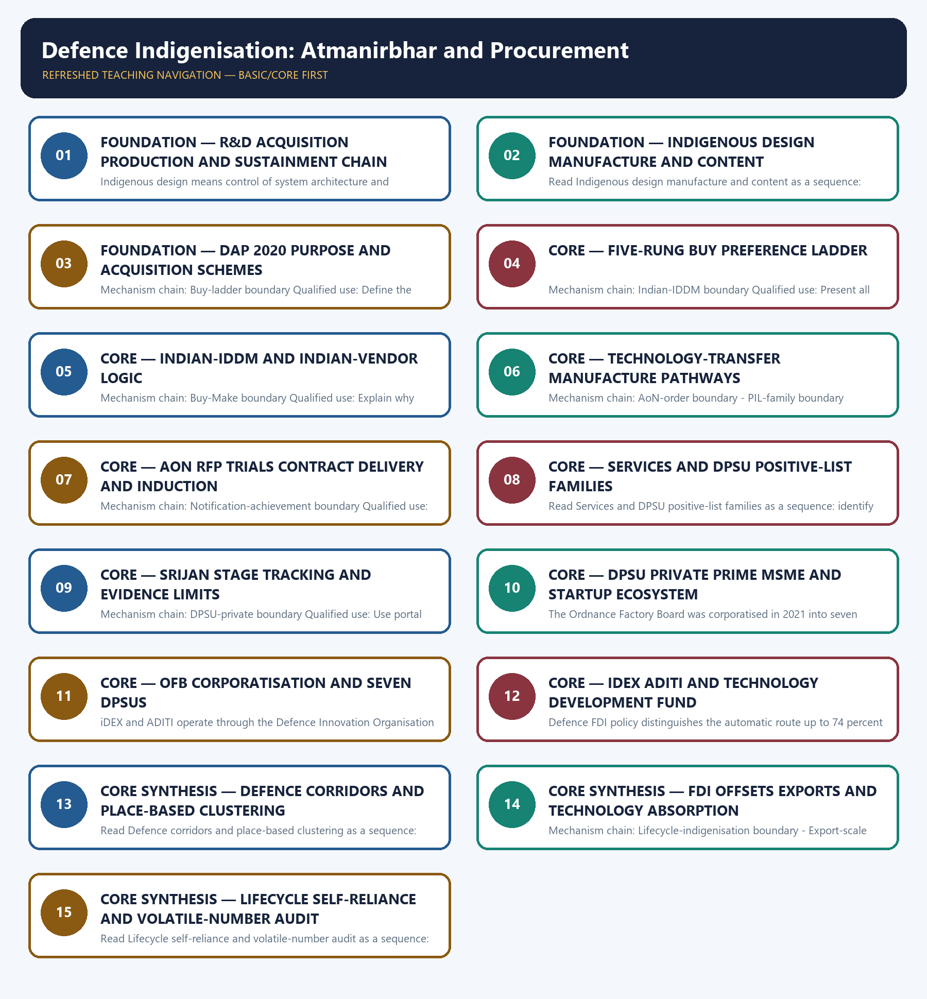

# Defence Indigenisation: Atmanirbhar and Procurement — Learner-v2 Complete Learning Session

> **Authoring-only generation:** 2026-09-03. No PDF was rendered and no tracker or index was mutated.

### SOURCE, PROGRESSION AND CURRENT-LINKAGE AUDIT

- **Generation date:** 2026-09-03.
- **Repository-first evidence:** the Basic owner is taught first and preserved in full; the Advanced owner is retained only in the optional final teaching block.
- **OCR evidence:** Repository Markdown was primary. OCR-searchable official UPSC papers were supplementary only for printed routed demands. No answer key, performance value, procurement outcome, operational deployment, programme target or technology milestone was inferred.
- **Qdrant:** not used; repository Markdown and available OCR context were sufficient.
- **PYQ integrity:** Audited ledgers route recent fighter-generation, aircraft-role and Indian-manufacture objective concepts here. They are used to teach design, manufacture and status discrimination; no answer letter, production figure or operational claim is invented.
- **Live-link boundary:** The official DDP DAP node was attempted on 2026-09-03 but yielded a stylesheet-heavy body. Repository owners remain primary for category wording. Every procurement value, delivery schedule, indigenous-content percentage, positive-list count, production total and export total requires a fresh dated official source.
- **Fact/inference discipline:** no current-affairs item, PYQ wording, figure or quotation is invented.

### LIVE OFFICIAL-SOURCE ATTEMPT LOG

The checks below were made on 2026-09-03. Substantive official text is used only for the proposition it supports; title-only, blocked or thin pages are recorded and supply no factual claim.

- https://www.ddpmod.gov.in/node/355 — attempted 2026-09-03; the page redirected to the Hindi DDP node and exposed the official Defence Acquisition Procedure 2020 title and language alternate, but the retrieved body was stylesheet-heavy. No category threshold, contract value, positive-list item or implementation timeline was imported.

## BASIC LEARNING SESSION

### DEEP-REVIEW LEARNING CONTRACT

| Control | Binding rule for this package |
|---|---|
| Syllabus boundary | Complete Science and Technology Basic/Core is easy-first and answer-complete before optional Advanced depth. |
| System boundary | Organisation, platform, subsystem, payload, process, application, institution and outcome remain distinct. |
| Technical boundary | Physical mechanism, classification, stage, platform, unit, range/capacity and limiting condition are explicit. |
| Status boundary | Announcement, approval, development, test, deployment, induction, commercial operation and observed outcome remain distinct. |
| Data boundary | Every mission, launch, target, capacity, budget, range, timeline, rule and regulatory claim keeps source, date, unit and status. |
| Governance boundary | Funder, developer, operator, authoriser, regulator, procurer, settlement actor and adjudicator are not conflated. |
| Practice contract | Every solved item has demand decoding, detailed examiner-grade model, executable timed/compression plan, marks rationale and answer-specific improvement. |
| PYQ contract | Official wording and keys are asserted only when verified; routed or reconstructed demands remain labelled. |
| Dual-flow contract | Graphical and ASCII masters independently reconstruct the same complete Basic-to-optional-Advanced evidence spine. |
| Approval | This immutable successor remains `approved: false` pending explicit approval. |

**Canonical Basic/Core owner:** `upsc-ai-kit\knowledge\Science-and-Technology\basic\07_Defence-Indigenization-Atmanirbhar-and-Procurement.md`  
**Substantive canonical provenance owner:** `upsc-ai-kit\knowledge\Science-and-Technology\learning-sessions\v2\subject-wide-syllabus\science-and-technology-07_Learning-Session.md`  
**Optional Advanced owner:** `upsc-ai-kit\knowledge\Science-and-Technology\advanced\07_Defence-Indigenization-Atmanirbhar-and-Procurement.md`  
**Official syllabus mapping:** `upsc-ai-kit\knowledge\Science-and-Technology\OFFICIAL-UPSC-SYLLABUS-MAPPING.md`

### EVIDENCE, PYQ AND CURRENT-STATUS CONTROL

- ISRO organisation, launcher stages, payload and orbit claims retain their exact object and mission date.
- NavIC, GAGAN, human-spaceflight, planetary, nuclear, fusion, missile and procurement claims retain category and status.
- Aadhaar/UPI, AI, quantum and semiconductor claims retain actor, layer, metric, maturity and governance boundaries.
- DPDP/cybersecurity, biotechnology and genetic-engineering claims retain legal/regulatory stage and competent institution.
- Targets, budgets, capacities, ranges and timelines are never promoted into achieved outcomes without dated evidence.
- **Current-status note, rechecked 2026-09-06:** volatile claims retain source/date/status; failed official fetches remain explicit and supply no invented fact.

**Generation-local live/current sources:**
- `https://www.ddpmod.gov.in/node/355 — attempted 2026-09-03; the page redirected to the Hindi DDP node and exposed the official Defence Acquisition Procedure 2020 title and language alternate, but the retrieved body was stylesheet-heavy. No category threshold, contract value, positive-list item or implementation timeline was imported.`

**Topic-routed verified PYQ owners:**
- No topic-local official question file is claimed; repository PYQ routing ledgers control wording and status.




*Distinct embedded teaching-navigation image. The separate continuous Cārvāka-style flowchart package remains an independent at-a-glance artifact.*

### SESSION 1 — FOUNDATION — R&D ACQUISITION PRODUCTION AND SUSTAINMENT CHAIN

#### DEFINITION / WHAT THIS IS CALLED

**Plain-language definition:** The decisive boundary is Do not merge defence R&D with acquisition or production.

**Technical definition:** Indigenous design means control of system architecture and intellectual property, domestic manufacture means production in India, and indigenous content is a contract-value share; none automatically proves the other two.

#### ANSWER-GRABBING OPENING — WRITE/ADAPT IN THE EXAM

> Defence R&D creates and validates technology, while procurement selects a category, vendor and contract route and production converts the design into repeatable serviceable equipment; these are linked but distinct policy chains.

#### MUST-WRITE KEYWORDS

- **FOUNDATION**
- **R&D acquisition production**
- **sustainment chain**
- **Mechanism chain**
- **Qualified use**
- **Defence**

**How to use them:** Frame the answer through FOUNDATION; define R&D acquisition production, connect sustainment chain with Mechanism chain to explain the mechanism, and use Qualified use for the decisive comparison or qualification.

#### VISUAL FIRST

```text
R&D ACQUISITION PRODUCTION AND SUSTAINMENT CHAIN
01. R&D-procurement boundary
    |
    v
02. Design-manufacture-content boundary
STATUS / CATEGORY FIREWALL -> Do not merge defence R&D with acquisition or production.
```

*The rail fixes the technical sequence and the claim boundary before explanation.*

#### CORE EXPLANATION

Defence R&D creates and validates technology, while procurement selects a category, vendor and contract route and production converts the design into repeatable serviceable equipment; these are linked but distinct policy chains. Indigenous design means control of system architecture and intellectual property, domestic manufacture means production in India, and indigenous content is a contract-value share; none automatically proves the other two.

#### SIMPLE SYSTEM EXAMPLE

Read R&D acquisition production and sustainment chain as a sequence: identify R&D-procurement boundary, follow the named mechanism to its user or output, and stop at the last verified status rather than assuming the next stage.

#### TECHNICAL DISTINCTION

The decisive boundary is Do not merge defence R&D with acquisition or production. This keeps R&D-procurement boundary and Design-manufacture-content boundary in the correct scientific category, institution and unit of measurement.

#### NAMED EVIDENCE AND MECHANISM

- Defence R&D creates and validates technology, while procurement selects a category, vendor and contract route and production converts the design into repeatable serviceable equipment; these are linked but distinct policy chains.
- Indigenous design means control of system architecture and intellectual property, domestic manufacture means production in India, and indigenous content is a contract-value share; none automatically proves the other two.

#### EXAMINER CAUTION

- Do not merge defence R&D with acquisition or production.

#### EXAM LINK

- **Prelims:** Keep institution, system, platform, service, process, legal instrument, unit and status in their exact category.
- **Mains:** Open with the develop-procure-produce-sustain distinction.

#### MINI RECAP

- **Mechanism chain:** R&D-procurement boundary -> Design-manufacture-content boundary
- **Qualified use:** Open with the develop-procure-produce-sustain distinction.

#### CLOSING RECALL FLOW — FOUNDATION — R&D ACQUISITION PRODUCTION AND SUSTAINMENT CHAIN

```text
START / CONCEPT: FOUNDATION — R&D acquisition production and sustainment chain
        |
        v
EXACT TERMS: FOUNDATION · R&D acquisition production · sustainment chain · Mechanism chain · Qualified use · Defence
        |
        v
MECHANISM / ARGUMENT: Read R&D acquisition production and sustainment chain as a sequence: identify R&D-procurement boundary, follow the named mechanism to its user or output, and stop at the last verified status rather than assuming the next stage.
        |
        v
CONSEQUENCE / CONTRAST: The decisive boundary is Do not merge defence R&D with acquisition or production.
        |
        v
UPSC TRAP / ANSWER-USE: Do not merge defence R&D with acquisition or production.
        |
        v
ANSWER-GRABBING FORMULATION: Defence R&D creates and validates technology, while procurement selects a category, vendor and contract route and production converts the design into repeatable serviceable equipment; these are linked but distinct policy chains.
```
### SESSION 2 — FOUNDATION — INDIGENOUS DESIGN MANUFACTURE AND CONTENT

#### DEFINITION / WHAT THIS IS CALLED

**Plain-language definition:** The decisive boundary is Do not equate indigenous content with indigenous design.

**Technical definition:** Read Indigenous design manufacture and content as a sequence: identify DAP-procedure boundary, follow the named mechanism to its user or output, and stop at the last verified status rather than assuming the next stage.

#### ANSWER-GRABBING OPENING — WRITE/ADAPT IN THE EXAM

> The decisive boundary is Do not equate indigenous content with indigenous design.

#### MUST-WRITE KEYWORDS

- **FOUNDATION**
- **Indigenous design manufacture**
- **content**
- **Mechanism chain**
- **Qualified use**
- **Defence Acquisition Procedure**

**How to use them:** Frame the answer through FOUNDATION; define Indigenous design manufacture, connect content with Mechanism chain to explain the mechanism, and use Qualified use for the decisive comparison or qualification.

#### VISUAL FIRST

```text
INDIGENOUS DESIGN MANUFACTURE AND CONTENT
01. DAP-procedure boundary
STATUS / CATEGORY FIREWALL -> Do not equate indigenous content with indigenous design.
```

*The rail fixes the technical sequence and the claim boundary before explanation.*

#### CORE EXPLANATION

Defence Acquisition Procedure 2020 structures capital-acquisition categories and process; it is a procurement rulebook, not a weapon programme, contract, budget appropriation or proof of delivery.

#### SIMPLE SYSTEM EXAMPLE

Read Indigenous design manufacture and content as a sequence: identify DAP-procedure boundary, follow the named mechanism to its user or output, and stop at the last verified status rather than assuming the next stage.

#### TECHNICAL DISTINCTION

The decisive boundary is Do not equate indigenous content with indigenous design. This keeps DAP-procedure boundary in the correct scientific category, institution and unit of measurement.

#### NAMED EVIDENCE AND MECHANISM

- Defence Acquisition Procedure 2020 structures capital-acquisition categories and process; it is a procurement rulebook, not a weapon programme, contract, budget appropriation or proof of delivery.

#### EXAMINER CAUTION

- Do not equate indigenous content with indigenous design.

#### EXAM LINK

- **Prelims:** Keep institution, system, platform, service, process, legal instrument, unit and status in their exact category.
- **Mains:** Test design control, production location and value share separately.

#### MINI RECAP

- **Mechanism chain:** DAP-procedure boundary
- **Qualified use:** Test design control, production location and value share separately.

#### CLOSING RECALL FLOW — FOUNDATION — INDIGENOUS DESIGN MANUFACTURE AND CONTENT

```text
START / CONCEPT: FOUNDATION — Indigenous design manufacture and content
        |
        v
EXACT TERMS: FOUNDATION · Indigenous design manufacture · content · Mechanism chain · Qualified use · Defence Acquisition Procedure
        |
        v
MECHANISM / ARGUMENT: Read Indigenous design manufacture and content as a sequence: identify DAP-procedure boundary, follow the named mechanism to its user or output, and stop at the last verified status rather than assuming the next stage.
        |
        v
CONSEQUENCE / CONTRAST: Do not equate indigenous content with indigenous design.
        |
        v
UPSC TRAP / ANSWER-USE: Defence Acquisition Procedure 2020 structures capital-acquisition categories and process; it is a procurement rulebook, not a weapon programme, contract, budget appropriation or proof of delivery.
        |
        v
ANSWER-GRABBING FORMULATION: The decisive boundary is Do not equate indigenous content with indigenous design.
```
### SESSION 3 — FOUNDATION — DAP 2020 PURPOSE AND ACQUISITION SCHEMES

#### DEFINITION / WHAT THIS IS CALLED

**Plain-language definition:** Read DAP 2020 purpose and acquisition schemes as a sequence: identify Buy-ladder boundary, follow the named mechanism to its user or output, and stop at the last verified status rather than assuming the next stage.

**Technical definition:** Mechanism chain: Buy-ladder boundary Qualified use: Define the rulebook before citing a category.

#### ANSWER-GRABBING OPENING — WRITE/ADAPT IN THE EXAM

> Read DAP 2020 purpose and acquisition schemes as a sequence: identify Buy-ladder boundary, follow the named mechanism to its user or output, and stop at the last verified status rather than assuming the next stage.

#### MUST-WRITE KEYWORDS

- **FOUNDATION**
- **DAP 2020 purpose**
- **acquisition schemes**
- **Mechanism chain**
- **Qualified use**
- **The DAP**

**How to use them:** Frame the answer through FOUNDATION; define DAP 2020 purpose, connect acquisition schemes with Mechanism chain to explain the mechanism, and use Qualified use for the decisive comparison or qualification.

#### VISUAL FIRST

```text
DAP 2020 PURPOSE AND ACQUISITION SCHEMES
01. Buy-ladder boundary
STATUS / CATEGORY FIREWALL -> Do not turn DAP into a contract or weapon programme.
```

*The rail fixes the technical sequence and the claim boundary before explanation.*

#### CORE EXPLANATION

The DAP preference ladder includes Buy Indian-IDDM, Buy Indian, Buy and Make Indian, Buy Global-Manufacture in India and Buy Global; each category creates a different design, vendor and local-production pathway.

#### SIMPLE SYSTEM EXAMPLE

Read DAP 2020 purpose and acquisition schemes as a sequence: identify Buy-ladder boundary, follow the named mechanism to its user or output, and stop at the last verified status rather than assuming the next stage.

#### TECHNICAL DISTINCTION

The decisive boundary is Do not turn DAP into a contract or weapon programme. This keeps Buy-ladder boundary in the correct scientific category, institution and unit of measurement.

#### NAMED EVIDENCE AND MECHANISM

- The DAP preference ladder includes Buy Indian-IDDM, Buy Indian, Buy and Make Indian, Buy Global-Manufacture in India and Buy Global; each category creates a different design, vendor and local-production pathway.

#### EXAMINER CAUTION

- Do not turn DAP into a contract or weapon programme.

#### EXAM LINK

- **Prelims:** Keep institution, system, platform, service, process, legal instrument, unit and status in their exact category.
- **Mains:** Define the rulebook before citing a category.

#### MINI RECAP

- **Mechanism chain:** Buy-ladder boundary
- **Qualified use:** Define the rulebook before citing a category.

#### CLOSING RECALL FLOW — FOUNDATION — DAP 2020 PURPOSE AND ACQUISITION SCHEMES

```text
START / CONCEPT: FOUNDATION — DAP 2020 purpose and acquisition schemes
        |
        v
EXACT TERMS: FOUNDATION · DAP 2020 purpose · acquisition schemes · Mechanism chain · Qualified use · The DAP
        |
        v
MECHANISM / ARGUMENT: Mechanism chain: Buy-ladder boundary Qualified use: Define the rulebook before citing a category.
        |
        v
CONSEQUENCE / CONTRAST: The decisive boundary is Do not turn DAP into a contract or weapon programme.
        |
        v
UPSC TRAP / ANSWER-USE: Do not turn DAP into a contract or weapon programme.
        |
        v
ANSWER-GRABBING FORMULATION: Read DAP 2020 purpose and acquisition schemes as a sequence: identify Buy-ladder boundary, follow the named mechanism to its user or output, and stop at the last verified status rather than assuming the next stage.
```
### SESSION 4 — CORE — FIVE-RUNG BUY PREFERENCE LADDER

#### DEFINITION / WHAT THIS IS CALLED

**Plain-language definition:** Read Five-rung Buy preference ladder as a sequence: identify Indian-IDDM boundary, follow the named mechanism to its user or output, and stop at the last verified status rather than assuming the next stage.

**Technical definition:** Mechanism chain: Indian-IDDM boundary Qualified use: Present all five Buy pathways in preference order.

#### ANSWER-GRABBING OPENING — WRITE/ADAPT IN THE EXAM

> Read Five-rung Buy preference ladder as a sequence: identify Indian-IDDM boundary, follow the named mechanism to its user or output, and stop at the last verified status rather than assuming the next stage.

#### MUST-WRITE KEYWORDS

- **Five-rung Buy preference ladder**
- **Mechanism chain**
- **Qualified use**
- **Buy Indian-IDDM**
- **Indian**
- **India**

**How to use them:** Frame the answer through Five-rung Buy preference ladder; define Mechanism chain, connect Qualified use with Buy Indian-IDDM to explain the mechanism, and use Indian for the decisive comparison or qualification.

#### VISUAL FIRST

```text
FIVE-RUNG BUY PREFERENCE LADDER
01. Indian-IDDM boundary
STATUS / CATEGORY FIREWALL -> Do not omit the two technology-transfer manufacture categories.
```

*The rail fixes the technical sequence and the claim boundary before explanation.*

#### CORE EXPLANATION

Buy Indian-IDDM gives priority to an Indian vendor offering an indigenously designed, developed and manufactured product with prescribed indigenous content; the label must not be reduced to assembly in India.

#### SIMPLE SYSTEM EXAMPLE

Read Five-rung Buy preference ladder as a sequence: identify Indian-IDDM boundary, follow the named mechanism to its user or output, and stop at the last verified status rather than assuming the next stage.

#### TECHNICAL DISTINCTION

The decisive boundary is Do not omit the two technology-transfer manufacture categories. This keeps Indian-IDDM boundary in the correct scientific category, institution and unit of measurement.

#### NAMED EVIDENCE AND MECHANISM

- Buy Indian-IDDM gives priority to an Indian vendor offering an indigenously designed, developed and manufactured product with prescribed indigenous content; the label must not be reduced to assembly in India.

#### EXAMINER CAUTION

- Do not omit the two technology-transfer manufacture categories.

#### EXAM LINK

- **Prelims:** Keep institution, system, platform, service, process, legal instrument, unit and status in their exact category.
- **Mains:** Present all five Buy pathways in preference order.

#### MINI RECAP

- **Mechanism chain:** Indian-IDDM boundary
- **Qualified use:** Present all five Buy pathways in preference order.

#### CLOSING RECALL FLOW — CORE — FIVE-RUNG BUY PREFERENCE LADDER

```text
START / CONCEPT: CORE — Five-rung Buy preference ladder
        |
        v
EXACT TERMS: Five-rung Buy preference ladder · Mechanism chain · Qualified use · Buy Indian-IDDM · Indian · India
        |
        v
MECHANISM / ARGUMENT: Mechanism chain: Indian-IDDM boundary Qualified use: Present all five Buy pathways in preference order.
        |
        v
CONSEQUENCE / CONTRAST: Buy Indian-IDDM gives priority to an Indian vendor offering an indigenously designed, developed and manufactured product with prescribed indigenous content; the label must not be reduced to assembly in India.
        |
        v
UPSC TRAP / ANSWER-USE: The decisive boundary is Do not omit the two technology-transfer manufacture categories.
        |
        v
ANSWER-GRABBING FORMULATION: Read Five-rung Buy preference ladder as a sequence: identify Indian-IDDM boundary, follow the named mechanism to its user or output, and stop at the last verified status rather than assuming the next stage.
```
### SESSION 5 — CORE — INDIAN-IDDM AND INDIAN-VENDOR LOGIC

#### DEFINITION / WHAT THIS IS CALLED

**Plain-language definition:** Read Indian-IDDM and Indian-vendor logic as a sequence: identify Buy-Make boundary, follow the named mechanism to its user or output, and stop at the last verified status rather than assuming the next stage.

**Technical definition:** Mechanism chain: Buy-Make boundary Qualified use: Explain why IDDM adds design ownership to Indian supply.

#### ANSWER-GRABBING OPENING — WRITE/ADAPT IN THE EXAM

> Read Indian-IDDM and Indian-vendor logic as a sequence: identify Buy-Make boundary, follow the named mechanism to its user or output, and stop at the last verified status rather than assuming the next stage.

#### MUST-WRITE KEYWORDS

- **Indian-IDDM**
- **Indian-vendor logic**
- **Mechanism chain**
- **Qualified use**
- **Buy**
- **Make Indian**

**How to use them:** Frame the answer through Indian-IDDM; define Indian-vendor logic, connect Mechanism chain with Qualified use to explain the mechanism, and use Buy for the decisive comparison or qualification.

#### VISUAL FIRST

```text
INDIAN-IDDM AND INDIAN-VENDOR LOGIC
01. Buy-Make boundary
STATUS / CATEGORY FIREWALL -> Do not turn AoN into an order, delivery or induction.
```

*The rail fixes the technical sequence and the claim boundary before explanation.*

#### CORE EXPLANATION

Buy and Make Indian uses an Indian vendor with production after transfer of technology from a foreign original-equipment manufacturer, while Buy Global-Manufacture in India begins with a global vendor and specified manufacture in India.

#### SIMPLE SYSTEM EXAMPLE

Read Indian-IDDM and Indian-vendor logic as a sequence: identify Buy-Make boundary, follow the named mechanism to its user or output, and stop at the last verified status rather than assuming the next stage.

#### TECHNICAL DISTINCTION

The decisive boundary is Do not turn AoN into an order, delivery or induction. This keeps Buy-Make boundary in the correct scientific category, institution and unit of measurement.

#### NAMED EVIDENCE AND MECHANISM

- Buy and Make Indian uses an Indian vendor with production after transfer of technology from a foreign original-equipment manufacturer, while Buy Global-Manufacture in India begins with a global vendor and specified manufacture in India.

#### EXAMINER CAUTION

- Do not turn AoN into an order, delivery or induction.

#### EXAM LINK

- **Prelims:** Keep institution, system, platform, service, process, legal instrument, unit and status in their exact category.
- **Mains:** Explain why IDDM adds design ownership to Indian supply.

#### MINI RECAP

- **Mechanism chain:** Buy-Make boundary
- **Qualified use:** Explain why IDDM adds design ownership to Indian supply.

#### CLOSING RECALL FLOW — CORE — INDIAN-IDDM AND INDIAN-VENDOR LOGIC

```text
START / CONCEPT: CORE — Indian-IDDM and Indian-vendor logic
        |
        v
EXACT TERMS: Indian-IDDM · Indian-vendor logic · Mechanism chain · Qualified use · Buy · Make Indian
        |
        v
MECHANISM / ARGUMENT: Mechanism chain: Buy-Make boundary Qualified use: Explain why IDDM adds design ownership to Indian supply.
        |
        v
CONSEQUENCE / CONTRAST: Buy and Make Indian uses an Indian vendor with production after transfer of technology from a foreign original-equipment manufacturer, while Buy Global-Manufacture in India begins with a global vendor and specified manufacture in India.
        |
        v
UPSC TRAP / ANSWER-USE: The decisive boundary is Do not turn AoN into an order, delivery or induction.
        |
        v
ANSWER-GRABBING FORMULATION: Read Indian-IDDM and Indian-vendor logic as a sequence: identify Buy-Make boundary, follow the named mechanism to its user or output, and stop at the last verified status rather than assuming the next stage.
```
### SESSION 6 — CORE — TECHNOLOGY-TRANSFER MANUFACTURE PATHWAYS

#### DEFINITION / WHAT THIS IS CALLED

**Plain-language definition:** Read Technology-transfer manufacture pathways as a sequence: identify AoN-order boundary, follow the named mechanism to its user or output, and stop at the last verified status rather than assuming the next stage.

**Technical definition:** Mechanism chain: AoN-order boundary - PIL-family boundary Qualified use: Compare Indian-vendor and global-vendor manufacture routes.

#### ANSWER-GRABBING OPENING — WRITE/ADAPT IN THE EXAM

> Read Technology-transfer manufacture pathways as a sequence: identify AoN-order boundary, follow the named mechanism to its user or output, and stop at the last verified status rather than assuming the next stage.

#### MUST-WRITE KEYWORDS

- **Technology-transfer manufacture pathways**
- **Mechanism chain**
- **Qualified use**
- **Acceptance of Necessity**
- **Acceptance**
- **Necessity**

**How to use them:** Frame the answer through Technology-transfer manufacture pathways; define Mechanism chain, connect Qualified use with Acceptance of Necessity to explain the mechanism, and use Acceptance for the decisive comparison or qualification.

#### VISUAL FIRST

```text
TECHNOLOGY-TRANSFER MANUFACTURE PATHWAYS
01. AoN-order boundary
    |
    v
02. PIL-family boundary
STATUS / CATEGORY FIREWALL -> Do not merge Services and DPSU positive lists.
```

*The rail fixes the technical sequence and the claim boundary before explanation.*

#### CORE EXPLANATION

Acceptance of Necessity is Defence Acquisition Council in-principle approval of the requirement and categorisation; request for proposal, trials, negotiation, contract, delivery and induction remain later stages. Services Positive Indigenisation Lists concern platforms and equipment restricted for import after notified dates, while DPSU lists concern components, subsystems and materials for domestic sourcing and are tracked through SRIJAN.

#### SIMPLE SYSTEM EXAMPLE

Read Technology-transfer manufacture pathways as a sequence: identify AoN-order boundary, follow the named mechanism to its user or output, and stop at the last verified status rather than assuming the next stage.

#### TECHNICAL DISTINCTION

The decisive boundary is Do not merge Services and DPSU positive lists. This keeps AoN-order boundary and PIL-family boundary in the correct scientific category, institution and unit of measurement.

#### NAMED EVIDENCE AND MECHANISM

- Acceptance of Necessity is Defence Acquisition Council in-principle approval of the requirement and categorisation; request for proposal, trials, negotiation, contract, delivery and induction remain later stages.
- Services Positive Indigenisation Lists concern platforms and equipment restricted for import after notified dates, while DPSU lists concern components, subsystems and materials for domestic sourcing and are tracked through SRIJAN.

#### EXAMINER CAUTION

- Do not merge Services and DPSU positive lists.

#### EXAM LINK

- **Prelims:** Keep institution, system, platform, service, process, legal instrument, unit and status in their exact category.
- **Mains:** Compare Indian-vendor and global-vendor manufacture routes.

#### MINI RECAP

- **Mechanism chain:** AoN-order boundary -> PIL-family boundary
- **Qualified use:** Compare Indian-vendor and global-vendor manufacture routes.

#### CLOSING RECALL FLOW — CORE — TECHNOLOGY-TRANSFER MANUFACTURE PATHWAYS

```text
START / CONCEPT: CORE — Technology-transfer manufacture pathways
        |
        v
EXACT TERMS: Technology-transfer manufacture pathways · Mechanism chain · Qualified use · Acceptance of Necessity · Acceptance · Necessity
        |
        v
MECHANISM / ARGUMENT: Mechanism chain: AoN-order boundary - PIL-family boundary Qualified use: Compare Indian-vendor and global-vendor manufacture routes.
        |
        v
CONSEQUENCE / CONTRAST: Services Positive Indigenisation Lists concern platforms and equipment restricted for import after notified dates, while DPSU lists concern components, subsystems and materials for domestic sourcing and are tracked through SRIJAN.
        |
        v
UPSC TRAP / ANSWER-USE: The decisive boundary is Do not merge Services and DPSU positive lists.
        |
        v
ANSWER-GRABBING FORMULATION: Read Technology-transfer manufacture pathways as a sequence: identify AoN-order boundary, follow the named mechanism to its user or output, and stop at the last verified status rather than assuming the next stage.
```
### SESSION 7 — CORE — AON RFP TRIALS CONTRACT DELIVERY AND INDUCTION

#### DEFINITION / WHAT THIS IS CALLED

**Plain-language definition:** Read AoN RFP trials contract delivery and induction as a sequence: identify Notification-achievement boundary, follow the named mechanism to its user or output, and stop at the last verified status rather than assuming the next stage.

**Technical definition:** Mechanism chain: Notification-achievement boundary Qualified use: Trace every formal stage without status inflation.

#### ANSWER-GRABBING OPENING — WRITE/ADAPT IN THE EXAM

> Read AoN RFP trials contract delivery and induction as a sequence: identify Notification-achievement boundary, follow the named mechanism to its user or output, and stop at the last verified status rather than assuming the next stage.

#### MUST-WRITE KEYWORDS

- **AoN RFP trials contract delivery**
- **induction**
- **Mechanism chain**
- **Qualified use**
- **Read AoN RFP**
- **Notification-achievement**

**How to use them:** Frame the answer through AoN RFP trials contract delivery; define induction, connect Mechanism chain with Qualified use to explain the mechanism, and use Read AoN RFP for the decisive comparison or qualification.

#### VISUAL FIRST

```text
AON RFP TRIALS CONTRACT DELIVERY AND INDUCTION
01. Notification-achievement boundary
STATUS / CATEGORY FIREWALL -> Do not turn a notified item into achieved indigenisation.
```

*The rail fixes the technical sequence and the claim boundary before explanation.*

#### CORE EXPLANATION

A positive-list notification creates a demand signal and item-specific deadline; it is not proof that every listed item has been indigenised, ordered, delivered or produced with complete domestic content.

#### SIMPLE SYSTEM EXAMPLE

Read AoN RFP trials contract delivery and induction as a sequence: identify Notification-achievement boundary, follow the named mechanism to its user or output, and stop at the last verified status rather than assuming the next stage.

#### TECHNICAL DISTINCTION

The decisive boundary is Do not turn a notified item into achieved indigenisation. This keeps Notification-achievement boundary in the correct scientific category, institution and unit of measurement.

#### NAMED EVIDENCE AND MECHANISM

- A positive-list notification creates a demand signal and item-specific deadline; it is not proof that every listed item has been indigenised, ordered, delivered or produced with complete domestic content.

#### EXAMINER CAUTION

- Do not turn a notified item into achieved indigenisation.

#### EXAM LINK

- **Prelims:** Keep institution, system, platform, service, process, legal instrument, unit and status in their exact category.
- **Mains:** Trace every formal stage without status inflation.

#### MINI RECAP

- **Mechanism chain:** Notification-achievement boundary
- **Qualified use:** Trace every formal stage without status inflation.

#### CLOSING RECALL FLOW — CORE — AON RFP TRIALS CONTRACT DELIVERY AND INDUCTION

```text
START / CONCEPT: CORE — AoN RFP trials contract delivery and induction
        |
        v
EXACT TERMS: AoN RFP trials contract delivery · induction · Mechanism chain · Qualified use · Read AoN RFP · Notification-achievement
        |
        v
MECHANISM / ARGUMENT: Mechanism chain: Notification-achievement boundary Qualified use: Trace every formal stage without status inflation.
        |
        v
CONSEQUENCE / CONTRAST: A positive-list notification creates a demand signal and item-specific deadline; it is not proof that every listed item has been indigenised, ordered, delivered or produced with complete domestic content.
        |
        v
UPSC TRAP / ANSWER-USE: The decisive boundary is Do not turn a notified item into achieved indigenisation.
        |
        v
ANSWER-GRABBING FORMULATION: Read AoN RFP trials contract delivery and induction as a sequence: identify Notification-achievement boundary, follow the named mechanism to its user or output, and stop at the last verified status rather than assuming the next stage.
```
### SESSION 8 — CORE — SERVICES AND DPSU POSITIVE-LIST FAMILIES

#### DEFINITION / WHAT THIS IS CALLED

**Plain-language definition:** SRIJAN is a public implementation portal for DPSU indigenisation items and stages such as expression of interest, request for proposal, trials and indigenised status; a portal stage is not a contract or service induction.

**Technical definition:** Read Services and DPSU positive-list families as a sequence: identify SRIJAN-stage boundary, follow the named mechanism to its user or output, and stop at the last verified status rather than assuming the next stage.

#### ANSWER-GRABBING OPENING — WRITE/ADAPT IN THE EXAM

> Read Services and DPSU positive-list families as a sequence: identify SRIJAN-stage boundary, follow the named mechanism to its user or output, and stop at the last verified status rather than assuming the next stage.

#### MUST-WRITE KEYWORDS

- **Services**
- **DPSU positive-list families**
- **Mechanism chain**
- **Qualified use**
- **SRIJAN**
- **DPSU**

**How to use them:** Frame the answer through Services; define DPSU positive-list families, connect Mechanism chain with Qualified use to explain the mechanism, and use SRIJAN for the decisive comparison or qualification.

#### VISUAL FIRST

```text
SERVICES AND DPSU POSITIVE-LIST FAMILIES
01. SRIJAN-stage boundary
STATUS / CATEGORY FIREWALL -> Do not make SRIJAN a procurement authority.
```

*The rail fixes the technical sequence and the claim boundary before explanation.*

#### CORE EXPLANATION

SRIJAN is a public implementation portal for DPSU indigenisation items and stages such as expression of interest, request for proposal, trials and indigenised status; a portal stage is not a contract or service induction.

#### SIMPLE SYSTEM EXAMPLE

Read Services and DPSU positive-list families as a sequence: identify SRIJAN-stage boundary, follow the named mechanism to its user or output, and stop at the last verified status rather than assuming the next stage.

#### TECHNICAL DISTINCTION

The decisive boundary is Do not make SRIJAN a procurement authority. This keeps SRIJAN-stage boundary in the correct scientific category, institution and unit of measurement.

#### NAMED EVIDENCE AND MECHANISM

- SRIJAN is a public implementation portal for DPSU indigenisation items and stages such as expression of interest, request for proposal, trials and indigenised status; a portal stage is not a contract or service induction.

#### EXAMINER CAUTION

- Do not make SRIJAN a procurement authority.

#### EXAM LINK

- **Prelims:** Keep institution, system, platform, service, process, legal instrument, unit and status in their exact category.
- **Mains:** Separate platform embargoes from component localisation.

#### MINI RECAP

- **Mechanism chain:** SRIJAN-stage boundary
- **Qualified use:** Separate platform embargoes from component localisation.

#### CLOSING RECALL FLOW — CORE — SERVICES AND DPSU POSITIVE-LIST FAMILIES

```text
START / CONCEPT: CORE — Services and DPSU positive-list families
        |
        v
EXACT TERMS: Services · DPSU positive-list families · Mechanism chain · Qualified use · SRIJAN · DPSU
        |
        v
MECHANISM / ARGUMENT: Mechanism chain: SRIJAN-stage boundary Qualified use: Separate platform embargoes from component localisation.
        |
        v
CONSEQUENCE / CONTRAST: SRIJAN is a public implementation portal for DPSU indigenisation items and stages such as expression of interest, request for proposal, trials and indigenised status; a portal stage is not a contract or service induction.
        |
        v
UPSC TRAP / ANSWER-USE: The decisive boundary is Do not make SRIJAN a procurement authority.
        |
        v
ANSWER-GRABBING FORMULATION: Read Services and DPSU positive-list families as a sequence: identify SRIJAN-stage boundary, follow the named mechanism to its user or output, and stop at the last verified status rather than assuming the next stage.
```
### SESSION 9 — CORE — SRIJAN STAGE TRACKING AND EVIDENCE LIMITS

#### DEFINITION / WHAT THIS IS CALLED

**Plain-language definition:** Read SRIJAN stage tracking and evidence limits as a sequence: identify DPSU-private boundary, follow the named mechanism to its user or output, and stop at the last verified status rather than assuming the next stage.

**Technical definition:** Mechanism chain: DPSU-private boundary Qualified use: Use portal stages only as implementation evidence.

#### ANSWER-GRABBING OPENING — WRITE/ADAPT IN THE EXAM

> Read SRIJAN stage tracking and evidence limits as a sequence: identify DPSU-private boundary, follow the named mechanism to its user or output, and stop at the last verified status rather than assuming the next stage.

#### MUST-WRITE KEYWORDS

- **SRIJAN stage tracking**
- **evidence limits**
- **Mechanism chain**
- **Qualified use**
- **DPSUs**
- **MSMEs**

**How to use them:** Frame the answer through SRIJAN stage tracking; define evidence limits, connect Mechanism chain with Qualified use to explain the mechanism, and use DPSUs for the decisive comparison or qualification.

#### VISUAL FIRST

```text
SRIJAN STAGE TRACKING AND EVIDENCE LIMITS
01. DPSU-private boundary
STATUS / CATEGORY FIREWALL -> Do not frame DPSU and private industry as automatic substitutes.
```

*The rail fixes the technical sequence and the claim boundary before explanation.*

#### CORE EXPLANATION

DPSUs can provide sovereign integration and legacy production depth while private firms, startups and MSMEs add competition and specialised innovation; indigenisation is not an either-or choice between them.

#### SIMPLE SYSTEM EXAMPLE

Read SRIJAN stage tracking and evidence limits as a sequence: identify DPSU-private boundary, follow the named mechanism to its user or output, and stop at the last verified status rather than assuming the next stage.

#### TECHNICAL DISTINCTION

The decisive boundary is Do not frame DPSU and private industry as automatic substitutes. This keeps DPSU-private boundary in the correct scientific category, institution and unit of measurement.

#### NAMED EVIDENCE AND MECHANISM

- DPSUs can provide sovereign integration and legacy production depth while private firms, startups and MSMEs add competition and specialised innovation; indigenisation is not an either-or choice between them.

#### EXAMINER CAUTION

- Do not frame DPSU and private industry as automatic substitutes.

#### EXAM LINK

- **Prelims:** Keep institution, system, platform, service, process, legal instrument, unit and status in their exact category.
- **Mains:** Use portal stages only as implementation evidence.

#### MINI RECAP

- **Mechanism chain:** DPSU-private boundary
- **Qualified use:** Use portal stages only as implementation evidence.

#### CLOSING RECALL FLOW — CORE — SRIJAN STAGE TRACKING AND EVIDENCE LIMITS

```text
START / CONCEPT: CORE — SRIJAN stage tracking and evidence limits
        |
        v
EXACT TERMS: SRIJAN stage tracking · evidence limits · Mechanism chain · Qualified use · DPSUs · MSMEs
        |
        v
MECHANISM / ARGUMENT: Mechanism chain: DPSU-private boundary Qualified use: Use portal stages only as implementation evidence.
        |
        v
CONSEQUENCE / CONTRAST: DPSUs can provide sovereign integration and legacy production depth while private firms, startups and MSMEs add competition and specialised innovation; indigenisation is not an either-or choice between them.
        |
        v
UPSC TRAP / ANSWER-USE: The decisive boundary is Do not frame DPSU and private industry as automatic substitutes.
        |
        v
ANSWER-GRABBING FORMULATION: Read SRIJAN stage tracking and evidence limits as a sequence: identify DPSU-private boundary, follow the named mechanism to its user or output, and stop at the last verified status rather than assuming the next stage.
```
### SESSION 10 — CORE — DPSU PRIVATE PRIME MSME AND STARTUP ECOSYSTEM

#### DEFINITION / WHAT THIS IS CALLED

**Plain-language definition:** Read DPSU private prime MSME and startup ecosystem as a sequence: identify OFB-corporatisation boundary, follow the named mechanism to its user or output, and stop at the last verified status rather than assuming the next stage.

**Technical definition:** The Ordnance Factory Board was corporatised in 2021 into seven DPSUs; organisational restructuring changes accountability architecture but does not by itself prove higher productivity, quality or order execution.

#### ANSWER-GRABBING OPENING — WRITE/ADAPT IN THE EXAM

> Read DPSU private prime MSME and startup ecosystem as a sequence: identify OFB-corporatisation boundary, follow the named mechanism to its user or output, and stop at the last verified status rather than assuming the next stage.

#### MUST-WRITE KEYWORDS

- **DPSU private prime MSME**
- **startup ecosystem**
- **Mechanism chain**
- **Qualified use**
- **The Ordnance Factory Board**
- **DPSUs**

**How to use them:** Frame the answer through DPSU private prime MSME; define startup ecosystem, connect Mechanism chain with Qualified use to explain the mechanism, and use The Ordnance Factory Board for the decisive comparison or qualification.

#### VISUAL FIRST

```text
DPSU PRIVATE PRIME MSME AND STARTUP ECOSYSTEM
01. OFB-corporatisation boundary
STATUS / CATEGORY FIREWALL -> Do not treat corridors or innovation funds as DAP categories.
```

*The rail fixes the technical sequence and the claim boundary before explanation.*

#### CORE EXPLANATION

The Ordnance Factory Board was corporatised in 2021 into seven DPSUs; organisational restructuring changes accountability architecture but does not by itself prove higher productivity, quality or order execution.

#### SIMPLE SYSTEM EXAMPLE

Read DPSU private prime MSME and startup ecosystem as a sequence: identify OFB-corporatisation boundary, follow the named mechanism to its user or output, and stop at the last verified status rather than assuming the next stage.

#### TECHNICAL DISTINCTION

The decisive boundary is Do not treat corridors or innovation funds as DAP categories. This keeps OFB-corporatisation boundary in the correct scientific category, institution and unit of measurement.

#### NAMED EVIDENCE AND MECHANISM

- The Ordnance Factory Board was corporatised in 2021 into seven DPSUs; organisational restructuring changes accountability architecture but does not by itself prove higher productivity, quality or order execution.

#### EXAMINER CAUTION

- Do not treat corridors or innovation funds as DAP categories.

#### EXAM LINK

- **Prelims:** Keep institution, system, platform, service, process, legal instrument, unit and status in their exact category.
- **Mains:** Build a mixed public-private supplier architecture.

#### MINI RECAP

- **Mechanism chain:** OFB-corporatisation boundary
- **Qualified use:** Build a mixed public-private supplier architecture.

#### CLOSING RECALL FLOW — CORE — DPSU PRIVATE PRIME MSME AND STARTUP ECOSYSTEM

```text
START / CONCEPT: CORE — DPSU private prime MSME and startup ecosystem
        |
        v
EXACT TERMS: DPSU private prime MSME · startup ecosystem · Mechanism chain · Qualified use · The Ordnance Factory Board · DPSUs
        |
        v
MECHANISM / ARGUMENT: The Ordnance Factory Board was corporatised in 2021 into seven DPSUs; organisational restructuring changes accountability architecture but does not by itself prove higher productivity, quality or order execution.
        |
        v
CONSEQUENCE / CONTRAST: The decisive boundary is Do not treat corridors or innovation funds as DAP categories.
        |
        v
UPSC TRAP / ANSWER-USE: Do not treat corridors or innovation funds as DAP categories.
        |
        v
ANSWER-GRABBING FORMULATION: Read DPSU private prime MSME and startup ecosystem as a sequence: identify OFB-corporatisation boundary, follow the named mechanism to its user or output, and stop at the last verified status rather than assuming the next stage.
```
### SESSION 11 — CORE — OFB CORPORATISATION AND SEVEN DPSUS

#### DEFINITION / WHAT THIS IS CALLED

**Plain-language definition:** Read OFB corporatisation and seven DPSUs as a sequence: identify iDEX-TDF boundary, follow the named mechanism to its user or output, and stop at the last verified status rather than assuming the next stage.

**Technical definition:** iDEX and ADITI operate through the Defence Innovation Organisation for startups and deep-tech challenges, while the DRDO Technology Development Fund supports industry-led technology development; neither is a procurement category.

#### ANSWER-GRABBING OPENING — WRITE/ADAPT IN THE EXAM

> Read OFB corporatisation and seven DPSUs as a sequence: identify iDEX-TDF boundary, follow the named mechanism to its user or output, and stop at the last verified status rather than assuming the next stage.

#### MUST-WRITE KEYWORDS

- **OFB corporatisation**
- **seven DPSUs**
- **Mechanism chain**
- **Qualified use**
- **ADITI**
- **Defence Innovation Organisation**

**How to use them:** Frame the answer through OFB corporatisation; define seven DPSUs, connect Mechanism chain with Qualified use to explain the mechanism, and use ADITI for the decisive comparison or qualification.

#### VISUAL FIRST

```text
OFB CORPORATISATION AND SEVEN DPSUS
01. iDEX-TDF boundary
    |
    v
02. Corridor-category boundary
STATUS / CATEGORY FIREWALL -> Do not convert FDI or offsets into proven technology absorption.
```

*The rail fixes the technical sequence and the claim boundary before explanation.*

#### CORE EXPLANATION

iDEX and ADITI operate through the Defence Innovation Organisation for startups and deep-tech challenges, while the DRDO Technology Development Fund supports industry-led technology development; neither is a procurement category. The Uttar Pradesh and Tamil Nadu defence industrial corridors are place-based cluster and investment instruments, not DAP acquisition categories, positive lists or contracts.

#### SIMPLE SYSTEM EXAMPLE

Read OFB corporatisation and seven DPSUs as a sequence: identify iDEX-TDF boundary, follow the named mechanism to its user or output, and stop at the last verified status rather than assuming the next stage.

#### TECHNICAL DISTINCTION

The decisive boundary is Do not convert FDI or offsets into proven technology absorption. This keeps iDEX-TDF boundary and Corridor-category boundary in the correct scientific category, institution and unit of measurement.

#### NAMED EVIDENCE AND MECHANISM

- iDEX and ADITI operate through the Defence Innovation Organisation for startups and deep-tech challenges, while the DRDO Technology Development Fund supports industry-led technology development; neither is a procurement category.
- The Uttar Pradesh and Tamil Nadu defence industrial corridors are place-based cluster and investment instruments, not DAP acquisition categories, positive lists or contracts.

#### EXAMINER CAUTION

- Do not convert FDI or offsets into proven technology absorption.

#### EXAM LINK

- **Prelims:** Keep institution, system, platform, service, process, legal instrument, unit and status in their exact category.
- **Mains:** Judge restructuring by outcomes rather than announcement.

#### MINI RECAP

- **Mechanism chain:** iDEX-TDF boundary -> Corridor-category boundary
- **Qualified use:** Judge restructuring by outcomes rather than announcement.

#### CLOSING RECALL FLOW — CORE — OFB CORPORATISATION AND SEVEN DPSUS

```text
START / CONCEPT: CORE — OFB corporatisation and seven DPSUs
        |
        v
EXACT TERMS: OFB corporatisation · seven DPSUs · Mechanism chain · Qualified use · ADITI · Defence Innovation Organisation
        |
        v
MECHANISM / ARGUMENT: iDEX and ADITI operate through the Defence Innovation Organisation for startups and deep-tech challenges, while the DRDO Technology Development Fund supports industry-led technology development; neither is a procurement category.
        |
        v
CONSEQUENCE / CONTRAST: The Uttar Pradesh and Tamil Nadu defence industrial corridors are place-based cluster and investment instruments, not DAP acquisition categories, positive lists or contracts.
        |
        v
UPSC TRAP / ANSWER-USE: The decisive boundary is Do not convert FDI or offsets into proven technology absorption.
        |
        v
ANSWER-GRABBING FORMULATION: Read OFB corporatisation and seven DPSUs as a sequence: identify iDEX-TDF boundary, follow the named mechanism to its user or output, and stop at the last verified status rather than assuming the next stage.
```
### SESSION 12 — CORE — IDEX ADITI AND TECHNOLOGY DEVELOPMENT FUND

#### DEFINITION / WHAT THIS IS CALLED

**Plain-language definition:** Read iDEX ADITI and Technology Development Fund as a sequence: identify FDI-route boundary, follow the named mechanism to its user or output, and stop at the last verified status rather than assuming the next stage.

**Technical definition:** Defence FDI policy distinguishes the automatic route up to 74 percent from government approval beyond 74 percent up to 100 percent under stated conditions; foreign investment does not automatically equal technology absorption.

#### ANSWER-GRABBING OPENING — WRITE/ADAPT IN THE EXAM

> Read iDEX ADITI and Technology Development Fund as a sequence: identify FDI-route boundary, follow the named mechanism to its user or output, and stop at the last verified status rather than assuming the next stage.

#### MUST-WRITE KEYWORDS

- **iDEX ADITI**
- **Technology Development Fund**
- **Mechanism chain**
- **Qualified use**
- **Defence FDI**
- **Read**

**How to use them:** Frame the answer through iDEX ADITI; define Technology Development Fund, connect Mechanism chain with Qualified use to explain the mechanism, and use Defence FDI for the decisive comparison or qualification.

#### VISUAL FIRST

```text
IDEX ADITI AND TECHNOLOGY DEVELOPMENT FUND
01. FDI-route boundary
STATUS / CATEGORY FIREWALL -> Do not invent current values, counts, timelines or content shares.
```

*The rail fixes the technical sequence and the claim boundary before explanation.*

#### CORE EXPLANATION

Defence FDI policy distinguishes the automatic route up to 74 percent from government approval beyond 74 percent up to 100 percent under stated conditions; foreign investment does not automatically equal technology absorption.

#### SIMPLE SYSTEM EXAMPLE

Read iDEX ADITI and Technology Development Fund as a sequence: identify FDI-route boundary, follow the named mechanism to its user or output, and stop at the last verified status rather than assuming the next stage.

#### TECHNICAL DISTINCTION

The decisive boundary is Do not invent current values, counts, timelines or content shares. This keeps FDI-route boundary in the correct scientific category, institution and unit of measurement.

#### NAMED EVIDENCE AND MECHANISM

- Defence FDI policy distinguishes the automatic route up to 74 percent from government approval beyond 74 percent up to 100 percent under stated conditions; foreign investment does not automatically equal technology absorption.

#### EXAMINER CAUTION

- Do not invent current values, counts, timelines or content shares.

#### EXAM LINK

- **Prelims:** Keep institution, system, platform, service, process, legal instrument, unit and status in their exact category.
- **Mains:** Separate innovation support from acquisition procedure.

#### MINI RECAP

- **Mechanism chain:** FDI-route boundary
- **Qualified use:** Separate innovation support from acquisition procedure.

#### CLOSING RECALL FLOW — CORE — IDEX ADITI AND TECHNOLOGY DEVELOPMENT FUND

```text
START / CONCEPT: CORE — iDEX ADITI and Technology Development Fund
        |
        v
EXACT TERMS: iDEX ADITI · Technology Development Fund · Mechanism chain · Qualified use · Defence FDI · Read
        |
        v
MECHANISM / ARGUMENT: Mechanism chain: FDI-route boundary Qualified use: Separate innovation support from acquisition procedure.
        |
        v
CONSEQUENCE / CONTRAST: Defence FDI policy distinguishes the automatic route up to 74 percent from government approval beyond 74 percent up to 100 percent under stated conditions; foreign investment does not automatically equal technology absorption.
        |
        v
UPSC TRAP / ANSWER-USE: The decisive boundary is Do not invent current values, counts, timelines or content shares.
        |
        v
ANSWER-GRABBING FORMULATION: Read iDEX ADITI and Technology Development Fund as a sequence: identify FDI-route boundary, follow the named mechanism to its user or output, and stop at the last verified status rather than assuming the next stage.
```
### SESSION 13 — CORE SYNTHESIS — DEFENCE CORRIDORS AND PLACE-BASED CLUSTERING

#### DEFINITION / WHAT THIS IS CALLED

**Plain-language definition:** The decisive boundary is Do not merge defence R&D with acquisition or production.

**Technical definition:** Read Defence corridors and place-based clustering as a sequence: identify Offsets-boundary, follow the named mechanism to its user or output, and stop at the last verified status rather than assuming the next stage.

#### ANSWER-GRABBING OPENING — WRITE/ADAPT IN THE EXAM

> Read Defence corridors and place-based clustering as a sequence: identify Offsets-boundary, follow the named mechanism to its user or output, and stop at the last verified status rather than assuming the next stage.

#### MUST-WRITE KEYWORDS

- **CORE SYNTHESIS**
- **Defence corridors**
- **place-based clustering**
- **Mechanism chain**
- **Qualified use**
- **Offsets**

**How to use them:** Frame the answer through CORE SYNTHESIS; define Defence corridors, connect place-based clustering with Mechanism chain to explain the mechanism, and use Qualified use for the decisive comparison or qualification.

#### VISUAL FIRST

```text
DEFENCE CORRIDORS AND PLACE-BASED CLUSTERING
01. Offsets-boundary
STATUS / CATEGORY FIREWALL -> Do not merge defence R&D with acquisition or production.
```

*The rail fixes the technical sequence and the claim boundary before explanation.*

#### CORE EXPLANATION

Offsets are reciprocal industrial obligations on foreign vendors, but DAP 2020 narrowed their use for specified government-to-government, inter-governmental and single-vendor routes; offset discharge is not proof of critical technology transfer.

#### SIMPLE SYSTEM EXAMPLE

Read Defence corridors and place-based clustering as a sequence: identify Offsets-boundary, follow the named mechanism to its user or output, and stop at the last verified status rather than assuming the next stage.

#### TECHNICAL DISTINCTION

The decisive boundary is Do not merge defence R&D with acquisition or production. This keeps Offsets-boundary in the correct scientific category, institution and unit of measurement.

#### NAMED EVIDENCE AND MECHANISM

- Offsets are reciprocal industrial obligations on foreign vendors, but DAP 2020 narrowed their use for specified government-to-government, inter-governmental and single-vendor routes; offset discharge is not proof of critical technology transfer.

#### EXAMINER CAUTION

- Do not merge defence R&D with acquisition or production.

#### EXAM LINK

- **Prelims:** Keep institution, system, platform, service, process, legal instrument, unit and status in their exact category.
- **Mains:** Explain cluster economics without calling it procurement.

#### MINI RECAP

- **Mechanism chain:** Offsets-boundary
- **Qualified use:** Explain cluster economics without calling it procurement.

#### CLOSING RECALL FLOW — CORE SYNTHESIS — DEFENCE CORRIDORS AND PLACE-BASED CLUSTERING

```text
START / CONCEPT: CORE SYNTHESIS — Defence corridors and place-based clustering
        |
        v
EXACT TERMS: CORE SYNTHESIS · Defence corridors · place-based clustering · Mechanism chain · Qualified use · Offsets
        |
        v
MECHANISM / ARGUMENT: Mechanism chain: Offsets-boundary Qualified use: Explain cluster economics without calling it procurement.
        |
        v
CONSEQUENCE / CONTRAST: The decisive boundary is Do not merge defence R&D with acquisition or production.
        |
        v
UPSC TRAP / ANSWER-USE: Offsets are reciprocal industrial obligations on foreign vendors, but DAP 2020 narrowed their use for specified government-to-government, inter-governmental and single-vendor routes; offset discharge is not proof of critical technology transfer.
        |
        v
ANSWER-GRABBING FORMULATION: Read Defence corridors and place-based clustering as a sequence: identify Offsets-boundary, follow the named mechanism to its user or output, and stop at the last verified status rather than assuming the next stage.
```
### SESSION 14 — CORE SYNTHESIS — FDI OFFSETS EXPORTS AND TECHNOLOGY ABSORPTION

#### DEFINITION / WHAT THIS IS CALLED

**Plain-language definition:** Read FDI offsets exports and technology absorption as a sequence: identify Lifecycle-indigenisation boundary, follow the named mechanism to its user or output, and stop at the last verified status rather than assuming the next stage.

**Technical definition:** Mechanism chain: Lifecycle-indigenisation boundary - Export-scale boundary Qualified use: Assess whether capital and obligations create absorption.

#### ANSWER-GRABBING OPENING — WRITE/ADAPT IN THE EXAM

> Read FDI offsets exports and technology absorption as a sequence: identify Lifecycle-indigenisation boundary, follow the named mechanism to its user or output, and stop at the last verified status rather than assuming the next stage.

#### MUST-WRITE KEYWORDS

- **CORE SYNTHESIS**
- **FDI offsets exports**
- **technology absorption**
- **Mechanism chain**
- **Qualified use**
- **Real**

**How to use them:** Frame the answer through CORE SYNTHESIS; define FDI offsets exports, connect technology absorption with Mechanism chain to explain the mechanism, and use Qualified use for the decisive comparison or qualification.

#### VISUAL FIRST

```text
FDI OFFSETS EXPORTS AND TECHNOLOGY ABSORPTION
01. Lifecycle-indigenisation boundary
    |
    v
02. Export-scale boundary
STATUS / CATEGORY FIREWALL -> Do not equate indigenous content with indigenous design.
```

*The rail fixes the technical sequence and the claim boundary before explanation.*

#### CORE EXPLANATION

Real self-reliance includes maintenance, repair, overhaul, spares, upgrades, testing standards and configuration control after delivery; domestic assembly without lifecycle capability leaves strategic dependence. Defence exports can widen production runs, learning and diplomatic reach, but export value does not by itself prove indigenous design, imported-subsystem independence or lifecycle support quality.

#### SIMPLE SYSTEM EXAMPLE

Read FDI offsets exports and technology absorption as a sequence: identify Lifecycle-indigenisation boundary, follow the named mechanism to its user or output, and stop at the last verified status rather than assuming the next stage.

#### TECHNICAL DISTINCTION

The decisive boundary is Do not equate indigenous content with indigenous design. This keeps Lifecycle-indigenisation boundary and Export-scale boundary in the correct scientific category, institution and unit of measurement.

#### NAMED EVIDENCE AND MECHANISM

- Real self-reliance includes maintenance, repair, overhaul, spares, upgrades, testing standards and configuration control after delivery; domestic assembly without lifecycle capability leaves strategic dependence.
- Defence exports can widen production runs, learning and diplomatic reach, but export value does not by itself prove indigenous design, imported-subsystem independence or lifecycle support quality.

#### EXAMINER CAUTION

- Do not equate indigenous content with indigenous design.

#### EXAM LINK

- **Prelims:** Keep institution, system, platform, service, process, legal instrument, unit and status in their exact category.
- **Mains:** Assess whether capital and obligations create absorption.

#### MINI RECAP

- **Mechanism chain:** Lifecycle-indigenisation boundary -> Export-scale boundary
- **Qualified use:** Assess whether capital and obligations create absorption.

#### CLOSING RECALL FLOW — CORE SYNTHESIS — FDI OFFSETS EXPORTS AND TECHNOLOGY ABSORPTION

```text
START / CONCEPT: CORE SYNTHESIS — FDI offsets exports and technology absorption
        |
        v
EXACT TERMS: CORE SYNTHESIS · FDI offsets exports · technology absorption · Mechanism chain · Qualified use · Real
        |
        v
MECHANISM / ARGUMENT: Mechanism chain: Lifecycle-indigenisation boundary - Export-scale boundary Qualified use: Assess whether capital and obligations create absorption.
        |
        v
CONSEQUENCE / CONTRAST: Defence exports can widen production runs, learning and diplomatic reach, but export value does not by itself prove indigenous design, imported-subsystem independence or lifecycle support quality.
        |
        v
UPSC TRAP / ANSWER-USE: The decisive boundary is Do not equate indigenous content with indigenous design.
        |
        v
ANSWER-GRABBING FORMULATION: Read FDI offsets exports and technology absorption as a sequence: identify Lifecycle-indigenisation boundary, follow the named mechanism to its user or output, and stop at the last verified status rather than assuming the next stage.
```
### SESSION 15 — CORE SYNTHESIS — LIFECYCLE SELF-RELIANCE AND VOLATILE-NUMBER AUDIT

#### DEFINITION / WHAT THIS IS CALLED

**Plain-language definition:** Defence self-reliance is not proved by a domestic assembly line, an import-ban list or an approval; it requires design control, domestic value addition, predictable procurement and lifecycle support.

**Technical definition:** Read Lifecycle self-reliance and volatile-number audit as a sequence: identify Platform-status boundary, follow the named mechanism to its user or output, and stop at the last verified status rather than assuming the next stage.

#### ANSWER-GRABBING OPENING — WRITE/ADAPT IN THE EXAM

> Read Lifecycle self-reliance and volatile-number audit as a sequence: identify Platform-status boundary, follow the named mechanism to its user or output, and stop at the last verified status rather than assuming the next stage.

#### MUST-WRITE KEYWORDS

- **CORE SYNTHESIS**
- **Lifecycle self-reliance**
- **volatile-number audit**
- **Mechanism chain**
- **Qualified use**
- **Subject**

**How to use them:** Frame the answer through CORE SYNTHESIS; define Lifecycle self-reliance, connect volatile-number audit with Mechanism chain to explain the mechanism, and use Qualified use for the decisive comparison or qualification.

#### VISUAL FIRST

```text
LIFECYCLE SELF-RELIANCE AND VOLATILE-NUMBER AUDIT
01. Platform-status boundary
    |
    v
02. Volatile-number boundary
STATUS / CATEGORY FIREWALL -> Do not turn DAP into a contract or weapon programme.
```

*The rail fixes the technical sequence and the claim boundary before explanation.*

#### CORE EXPLANATION

An indigenous programme, domestic production line, signed contract, delivered unit and operational service fleet are different claims; fighter, tank and submarine examples must preserve design origin and status. Procurement values, delivery schedules, indigenous-content percentages, positive-list counts, production totals and export totals require dated official sources and cannot be carried forward from headlines.

#### SIMPLE SYSTEM EXAMPLE

Read Lifecycle self-reliance and volatile-number audit as a sequence: identify Platform-status boundary, follow the named mechanism to its user or output, and stop at the last verified status rather than assuming the next stage.

#### TECHNICAL DISTINCTION

The decisive boundary is Do not turn DAP into a contract or weapon programme. This keeps Platform-status boundary and Volatile-number boundary in the correct scientific category, institution and unit of measurement.

#### NAMED EVIDENCE AND MECHANISM

- An indigenous programme, domestic production line, signed contract, delivered unit and operational service fleet are different claims; fighter, tank and submarine examples must preserve design origin and status.
- Procurement values, delivery schedules, indigenous-content percentages, positive-list counts, production totals and export totals require dated official sources and cannot be carried forward from headlines.

#### EXAMINER CAUTION

- Do not turn DAP into a contract or weapon programme.

#### EXAM LINK

- **Prelims:** Keep institution, system, platform, service, process, legal instrument, unit and status in their exact category.
- **Mains:** Conclude with lifecycle control and dated metrics.

#### MINI RECAP

- **Mechanism chain:** Platform-status boundary -> Volatile-number boundary
- **Qualified use:** Conclude with lifecycle control and dated metrics.
#### COMPLETE BASIC OWNER EVIDENCE BANK

> **Subject:** Science & Technology | **Tier:** Must-Do (foundation) | **GS Paper:** GS-III + GS-II + Prelims.
> **Core area:** Defence industrial policy, procurement architecture and indigenisation.
> **Grounded in:** DDPMoD DAP 2020 node (https://www.ddpmod.gov.in/node/355 — verified 16 Jul 2026); DAP attachment link surfaced on official node (`/sites/default/files/2024-02/dap-2020-11-nov-21_0_0.pdf`); DDPMoD products page (https://www.ddpmod.gov.in/resources/products — verified 16 Jul 2026); SRIJAN dashboard (https://srijandefence.gov.in/DashboardForPublic — verified 16 Jul 2026); PIB defence-growth release (https://www.pib.gov.in/PressReleasePage.aspx?PRID=2114546 — 24 Mar 2025); Tamil Nadu Defence Corridor portal (https://tndefencecorridor.in/ — verified 16 Jul 2026); Defence Exim portal (https://defenceexim.gov.in/ — official URL verified through web search 16 Jul 2026); DPIIT FDI policy URL surfaced through official-source search on 16 Jul 2026.
> ✅ = source-grounded | ⚠️ = analytical linkage | 📰 = current/dated development.
> *Companion: `advanced/07_Defence-Indigenization-Atmanirbhar-and-Procurement.md`.*

#### 1. Visual foundation

```text
topic 06: develop / test / validate technology
                 |
                 v
DAP 2020 category choice + AoN + vendor route
                 |
                 v
production by DPSU / private industry / JV / ecosystem partners
                 |
                 v
indigenisation lists + corridors + exports + lifecycle support
```

**Core proposition:** Topic 06 asks **what India develops and tests**; topic 07 asks **how India procures, manufactures, scales and indigenises it**.

#### 2. Essential definitions

| Concept | Exam-ready meaning |
|---|---|
| ✅ **Atmanirbhar Bharat in defence** | Policy push for greater domestic design, development, production and supply-chain depth in defence. |
| ✅ **DAP 2020** | Defence Acquisition Procedure governing capital-acquisition pathways and categories. |
| ✅ **Buy (Indian-IDDM)** | The **highest-priority** DAP category: Indian vendor supplying a product **indigenously designed, developed and manufactured** with the prescribed minimum indigenous content. |
| ⚠️ **DAP 'Buy' sub-categories in priority order** | **Buy (Indian-IDDM) → Buy (Indian) → Buy (Indian - IDDM/Indian) with Buy & Make (Indian) → Buy (Global - Manufacture in India) → Buy (Global)**. Two categories the file previously omitted are essential: **Buy & Make (Indian)** (Indian vendor manufactures after transfer of technology from a foreign OEM) and **Buy (Global - Manufacture in India)** (foreign vendor buys in, but a minimum share must be manufactured in India through a subsidiary/JV). |
| ⚠️ **Indigenous content (IC)** | The percentage of contract value that must be Indian. It is the **operative measure** of every DAP category — "indigenous" in DAP is a *value-share test*, not a claim about who designed the system. This is why **design indigenisation, manufacturing indigenisation and value-addition indigenisation are three different things**. |
| ⚠️ **Offsets** | An obligation on a foreign vendor in large contracts to plough back a share of contract value into Indian defence/aerospace/internal-security industry via purchases, investment or technology transfer. Offsets were narrowed in DAP 2020 (notably dropped for government-to-government and single-vendor routes) after criticism that they had produced limited genuine technology absorption. |
| ✅ **Positive Indigenisation List** | Official list of items to be procured from Indian industry after notified timelines. ⚠️ Two distinct families exist: **Services PILs** (platforms/weapons the armed forces may import only up to a notified date) and **DPSU PILs** (sub-systems, components and raw materials that DPSUs must source domestically, tracked on SRIJAN). |
| ✅ **DPSU** | Defence Public Sector Undertaking such as HAL, BEL, BDL, MDL or GRSE. ⚠️ The **Ordnance Factory Board was corporatised in 2021 into seven new DPSUs** (Munitions India, Armoured Vehicles Nigam, Advanced Weapons and Equipment India, Troop Comforts, Yantra India, India Optel and Gliders India) — an important structural reform, not a renaming. |
| ✅ **Strategic Partnership Model** | DAP route aimed at building long-term domestic capacity in major defence segments through selected private partners. |
| ⚠️ **iDEX / ADITI** | Innovations for Defence Excellence — the MoD-DIO route that funds startups, MSMEs and individual innovators against defence problem statements; ADITI supports deep-tech within it. Its significance is that it opens defence R&D to entrants **outside** the DRDO-DPSU duopoly. |
| ⚠️ **Technology Development Fund (TDF)** | DRDO-executed fund financing Indian industry (especially MSMEs/startups) to develop defence technologies not yet available domestically. |
| ✅ **Defence corridor** | Cluster-based industrial ecosystem intended to attract investment, ancillaries, testing and supply chains — **two corridors: Uttar Pradesh and Tamil Nadu**. |

#### 3. Mechanism / how procurement and indigenisation work

1. ✅ A service requirement moves into acquisition planning and an appropriate category under DAP 2020 is chosen.
2. ✅ DAP 2020, as reflected in the official node and PDF table-of-contents structure, organises capital procurement under ‘Buy’, ‘Buy and Make’, ‘Leasing’, ‘Make’, ‘Design and Development’ and the Strategic Partnership Model.
3. ✅ Under the ‘Buy’ scheme, DAP text classifies procurement into **Buy (Indian-IDDM), Buy (Indian), Buy & Make (Indian), Buy (Global - Manufacture in India) and Buy (Global)** — a five-fold priority ladder, not a three-fold one.
4. ⚠️ The approval chain runs: services' requirement → **DAC Acceptance of Necessity (in-principle approval only)** → RFP/tender → technical and field evaluation → commercial negotiation → **contract** → delivery → induction. Confusing an AoN with a purchase is the single commonest factual error in defence-procurement answers.
5. ✅ Positive indigenisation lists and the SRIJAN system create a demand-side push by saying specified items should be sourced domestically after notified timelines.
6. ✅ Corridors, DPSUs, private firms, MSME suppliers and export-promotion systems try to turn policy intent into manufacturing scale.
7. ⚠️ Supply-side instruments (iDEX/ADITI, TDF, defence-industrial corridors, DRDO technology transfer, FDI liberalisation) and demand-side instruments (PILs, IC requirements, DAP priority ladder, defence budget's domestic-capital-procurement earmark) must both work; an answer that mentions only one side is incomplete.

#### 4. Institutions and programmes

- ✅ **Department of Defence Production (DDP), Ministry of Defence:** core institutional anchor for industrial-policy side.
- ✅ **Defence Acquisition Council (DAC)**, chaired by the Raksha Mantri: grants Acceptance of Necessity and approves categorisation — distinct from DDP (production) and from DRDO (R&D).
- ✅ **DAP 2020:** official DDP document for acquisition categories and procedures.
- ✅ **SRIJAN portal:** official dashboard for DPSU positive-indigenisation items and their stage of progress.
- ✅ **Defence Innovation Organisation (DIO) / iDEX and ADITI:** startup-and-MSME innovation route under MoD.
- ✅ **Technology Development Fund (TDF):** DRDO-run funding line for industry-led development of defence technologies.
- ✅ **DPSU-linked product filters on DDP site:** HAL, BEL, BDL, MDL, GRSE and GSL are visible on the official products page; the seven OFB-successor DPSUs created in 2021 sit alongside them.
- ✅ **Tamil Nadu Defence Industrial Corridor portal:** official corridor vision is to build a global defence-manufacturing destination and A&D ecosystem.
- ✅ **UP defence-corridor institutional route:** official-state-corridor architecture exists under the Uttar Pradesh government ecosystem (web-searched official source).
- ✅ **Defence Exim portal:** official digital platform for defence export/import authorisation processes.
- ✅ **DPIIT / FDI policy framework:** official policy source for FDI route rules in defence.

#### 5. Indian applications, examples and limitations

- ✅ **DPSU role:** HAL, BEL, BDL, MDL and GRSE remain important anchors for aerospace, electronics, missiles, shipbuilding and allied systems.
- ✅ **Private-sector role:** increasingly relevant in components, subsystems, final integration, MRO, software, drones and niche platforms.
- ✅ **Positive indigenisation lists:** help convert import-substitution intent into item-specific procurement behaviour.
- ✅ **Defence corridors:** aim to deepen local vendor ecosystems, logistics, skilling and testing infrastructure.
- ⚠️ **Lifecycle significance:** repair, overhaul, spares and upgrade capacity are part of indigenisation; they are not afterthoughts.
- ⚠️ **Design-control significance:** manufacturing at home matters more strategically when India also controls drawings, testing standards and future upgrades.
- ⚠️ **Limitation 1:** a notified item on a positive list does not automatically mean full domestic value addition in every subsystem.
- ⚠️ **Limitation 2:** procurement timelines, certification burden and low order certainty can slow private-sector scaling.
- ⚠️ **Limitation 3:** India may achieve assembly and platform integration faster than deep materials/electronics/self-reliance.

#### 6. Must-Know Facts for Prelims

- ✅ The official DDP node shows DAP 2020 as a published government document dated 14 Dec 2020.
- ✅ DAP 2020 broadly classifies capital-acquisition schemes as Buy, Buy and Make, Leasing, Make, Design and Development, and Strategic Partnership Model.
- ✅ Under the Buy scheme, DAP 2020 recognises **Buy (Indian-IDDM), Buy (Indian), Buy & Make (Indian), Buy (Global - Manufacture in India) and Buy (Global)**, in descending order of indigenisation preference.
- ✅ The SRIJAN dashboard is the official public-facing portal for DPSU positive-indigenisation items.
- ✅ The official DDP products page exposes manufacturer filters for HAL, BEL, BDL, MDL, GRSE and GSL.
- ✅ The Tamil Nadu corridor portal frames the corridor as a global defence-manufacturing destination.
- ✅ Defence exports and authorisation workflows are handled through an official Defence Exim portal under the defence-production ecosystem.
- ✅ Official policy-search results continue to describe defence FDI as permitted up to 74% under the automatic route and beyond 74% up to 100% under the government route — the latter **where it is likely to result in access to modern technology, or for other reasons to be recorded**.
- ✅ The **Ordnance Factory Board was corporatised in 2021 into seven DPSUs**; DPSU-plus-private is now the production base, alongside HAL, BEL, BDL, MDL, GRSE, GSL, BEML and MIDHANI.
- ✅ **iDEX/ADITI (MoD Defence Innovation Organisation)** and the **Technology Development Fund (DRDO)** are the two standard supply-side innovation instruments; defence-industrial corridors exist in **Uttar Pradesh and Tamil Nadu**.
- ✅ **Offsets** were significantly narrowed in DAP 2020 — notably removed for government-to-government, inter-governmental and single-vendor procurements — following criticism about weak technology absorption.

#### 7. UPSC traps

- ❌ **If DRDO developed a system, procurement is automatically complete.** -> Development/testing belongs mainly to topic 06; procurement/manufacturing/indigenisation belongs mainly to topic 07.
- ❌ **A positive indigenisation list proves complete self-reliance in every component.** -> It is a procurement and localisation tool, not proof of full supply-chain autonomy.
- ❌ **DPSUs and private firms are substitutes in an either-or battle.** -> In practice, scaling often requires both anchor integrators and supplier networks.
- ❌ **A defence corridor is itself an acquisition category under DAP.** -> It is an industrial-cluster policy instrument, not a procurement category.
- ❌ **FDI automatically means loss of self-reliance.** -> The real issue is whether technology absorption, domestic capacity and value addition deepen.
- ❌ **Exports alone prove indigenous design capability.** -> Some exports may still depend on imported subsystems or limited domestic depth.
- ❌ **"Buy (Indian-IDDM), Buy (Indian) and Buy (Global)" is the complete DAP 'Buy' ladder.** -> **Buy & Make (Indian)** and **Buy (Global - Manufacture in India)** are also core categories, and they are exactly where technology transfer and local manufacture are negotiated.
- ❌ **Indigenous content percentage = indigenous design.** -> IC is a *value-share* test. A system can meet a high IC threshold while its critical design, engines, seekers or semiconductors remain foreign. Distinguish **indigenous design, indigenous manufacture and indigenous value addition**.
- ❌ **The Ordnance Factory Board still exists.** -> OFB was corporatised in **2021 into seven DPSUs**; answers referring to "OFB" as a current producer are outdated.
- ❌ **FDI up to 100% in defence is automatic.** -> Up to **74% is automatic**; **beyond 74% and up to 100% requires government approval**, and is considered where it is **likely to result in access to modern technology** or for other reasons to be recorded.

#### 8. 📰 Current anchor

- 📰 **2021 | Ordnance Factory Board corporatisation | Status: implemented.** OFB was restructured into seven DPSUs — the biggest structural change in India's defence-production base in decades.
- 📰 **25 Jun 2024 | DDP / SRIJAN-linked official list | Status: notified.** The fifth Positive Indigenisation List for DPSUs added another notified set of items for domestic sourcing after scheduled timelines. ⚠️ Each item carries its own indigenisation deadline, so "in force" applies item-by-item, not to the list as a whole.
- 📰 **24 Mar 2025 | PIB | Status: ongoing policy push.** The defence-growth release reported record production and exports while linking indigenisation, SRIJAN and Make in India.
- 📰 **16 Jan 2025 | MRSAM contract with BDL (₹2,960 crore) | Status: contracted.** A useful, dated illustration of the DRDO-design → DPSU-production → services-induction chain actually closing.
- 📰 **03 Jul 2026 | MoD/PIB | Status: in-principle approval.** MoD material reiterates that a DAC **Acceptance of Necessity is in-principle approval only** — not a contract, delivery or induction. Use this to date-stamp the distinction.
- 📰 **16 Jul 2026 | DDPMoD products page | Status: operational resource.** The official products page continues to expose DPSU manufacturer filters such as HAL, BEL, BDL, MDL, GRSE and GSL.
- 📰 **16 Jul 2026 | SRIJAN dashboard access date | Status: ongoing implementation.** The public dashboard continues to track item stages such as EOI, RFP, trials and indigenised progress.

*Current as of 16 Jul 2026, re-verified 2 Aug 2026; verify for later updates — especially production/export totals, which change every financial year.*

#### 10. Mains framework / angles

- ⚠️ Start with the distinction between **technology creation** and **acquisition-production scaling**.
- ⚠️ Then explain DAP, positive lists, corridors, DPSUs/private firms and export promotion as interconnected layers.
- ⚠️ Add debate points: technology absorption, vendor depth, quality assurance, cost competitiveness and export credibility.
- ⚠️ Mention FDI and strategic partnership model as tools, not ends in themselves.
- ⚠️ A sharper answer also distinguishes **mere assembly**, **licensed production** and **genuine indigenous manufacturing depth**.

> **Answer thesis:** India’s defence indigenisation story succeeds only when indigenous R&D is matched by procurement reform, predictable orders, supplier development, corridor-led ecosystem building and export-capable manufacturing depth.

##### Rapid revision capsule

- ⚠️ Topic 06 = develop/test; topic 07 = procure/manufacture/indigenise.
- ⚠️ Positive list is a sourcing tool, not automatic proof of full value addition.
- ⚠️ DAP category choice shapes the downstream procurement pathway.
- ⚠️ DPSUs, private firms, corridors and exports are complementary layers of the same ecosystem.

#### 11. Probable questions

- ⚠️ **Practice Prelims:** With reference to India’s defence procurement, consider the following statements about DAP 2020 and positive indigenisation lists. Which of the statements given above is/are correct?
- ⚠️ **Practice Mains (10 marks):** Distinguish between defence R&D and defence indigenisation-at-scale. *Answer in 150 words.*
- ⚠️ **Practice Mains (15 marks):** Examine how DAP 2020, positive indigenisation lists, defence corridors and export promotion together shape India’s Atmanirbhar defence strategy.

#### 12. Study links

- ✅ Advanced companion: `advanced/07_Defence-Indigenization-Atmanirbhar-and-Procurement.md`.
- ✅ `06_Defence-RandD-DRDO-and-Missile-Systems.md` — platform and R&D side.
- ✅ `11_Semiconductor-Mission-and-Electronics-Manufacturing.md` — manufacturing ecosystems and strategic electronics.
- ✅ `19_Drones-UAVs-and-Robotics-Policy.md` — fast-growing production and procurement segment.

#### Core answer architecture — procurement, indigenisation and industrial depth

**Thesis choice.** Defence self-reliance is not proved by a domestic assembly line, an import-ban list or an approval; it requires design control, domestic value addition, predictable procurement and lifecycle support.

**10-mark spine.** Separate Topic 06 development from Topic 07 acquisition/production; explain the DAP category or demand-side tool; attach one evidence unit on industrial scaling; finish with the design-versus-value-addition qualification.

**15/20-mark spine.** Use **requirement and DAP route → demand and supply instruments → industrial ecosystem/lifecycle/export effects → technology absorption, order certainty, quality and strategic limits**.

**Evidence units.**
- **Claim:** Procurement category affects the depth of localisation → **Buy (Indian-IDDM), Buy (Indian), Buy & Make (Indian), Buy (Global–Manufacture in India) and Buy (Global)** → the ladder distinguishes indigenous design from manufacture and technology transfer → **qualification:** indigenous-content percentage is a value-share test, not automatic proof that critical design, engines or electronics are Indian.
- **Claim:** Policy needs both assured demand and supplier capability → **Positive Indigenisation Lists/SRIJAN alongside iDEX/ADITI, TDF and the two defence corridors** → lists create a market while innovation and clusters help firms meet it → **qualification:** a listed item, an EOI or an AoN remains short of a contract, production run and service induction.
- **Claim:** capability must survive beyond delivery → **DPSUs/private firms and MRO/spares/upgrades** → domestic lifecycle support reduces vulnerability and enables iterative upgrades → **qualification:** assembly can scale faster than deep materials, seeker, engine or semiconductor control.

**Verdict.** A defensible conclusion supports mixed public-private capability building, measured by controlled design, certification, serviceability and export credibility rather than headline production alone.

#### CLOSING RECALL FLOW — CORE SYNTHESIS — LIFECYCLE SELF-RELIANCE AND VOLATILE-NUMBER AUDIT

```text
START / CONCEPT: CORE SYNTHESIS — Lifecycle self-reliance and volatile-number audit
        |
        v
EXACT TERMS: CORE SYNTHESIS · Lifecycle self-reliance · volatile-number audit · Mechanism chain · Qualified use · Subject
        |
        v
MECHANISM / ARGUMENT: Mechanism chain: Platform-status boundary - Volatile-number boundary Qualified use: Conclude with lifecycle control and dated metrics.
        |
        v
CONSEQUENCE / CONTRAST: Defence self-reliance is not proved by a domestic assembly line, an import-ban list or an approval; it requires design control, domestic value addition, predictable procurement and lifecycle support.
        |
        v
UPSC TRAP / ANSWER-USE: ✅ DPSU role: HAL, BEL, BDL, MDL and GRSE remain important anchors for aerospace, electronics, missiles, shipbuilding and allied systems. ✅ Private-sector role: increasingly relevant in components, subsystems, final integration, MRO, software, drones and niche platforms. ✅ Positive indigenisation lists: help convert import-substitution intent into item-specific procurement behaviour. ✅ Defence corridors: aim to deepen local vendor ecosystems, logistics, skilling and testing infrastructure. ⚠️ Lifecycle significance: repair, overhaul, spares and upgrade capacity are part of indigenisation; they are not afterthoughts. ⚠️ Design-control significance: manufacturing at home matters more strategically when India also controls drawings, testing standards and future upgrades. ⚠️ Limitation 1: a notified item on a positive list does not automatically mean full domestic value addition in every subsystem. ⚠️ Limitation 2: procurement timelines, certification burden and low order certainty can slow private-sector scaling. ⚠️ Limitation 3: India may achieve assembly and platform integration faster than deep materials/electronics/self-reliance.
        |
        v
ANSWER-GRABBING FORMULATION: Read Lifecycle self-reliance and volatile-number audit as a sequence: identify Platform-status boundary, follow the named mechanism to its user or output, and stop at the last verified status rather than assuming the next stage.
```
### SCIENCE AND TECHNOLOGY DEEP-REVIEW CORE CONTROL

- **Must remember:** Defence indigenisation spans design authority, intellectual property, domestic value addition, manufacturing, testing, procurement category, positive lists, contract, delivery, maintenance and lifecycle capability.
- **Close distinction:** Indian manufacture is not Indian design, announced value is not contracted value, AoN is not contract, contract is not delivery, delivery is not operationalisation, and list inclusion is not production outcome.
- **Mechanism / status / evidence limit:** Date policy/list/contract claims and define each metric's numerator, denominator and scope; preserve announcement, approval, tender, contract, production, delivery, induction and serviceability stages.


## BASIC MCQS / REMEDIATION

### Q1. Which statement correctly identifies R&D-procurement boundary?

A. Defence R&D creates and validates technology, while procurement selects a category, vendor and contract route and production converts the design into repeatable serviceable equipment; these are linked but distinct policy chains.
B. Indigenous design means control of system architecture and intellectual property, domestic manufacture means production in India, and indigenous content is a contract-value share; none automatically proves the other two.
C. The DAP preference ladder includes Buy Indian-IDDM, Buy Indian, Buy and Make Indian, Buy Global-Manufacture in India and Buy Global; each category creates a different design, vendor and local-production pathway.
D. Defence Acquisition Procedure 2020 structures capital-acquisition categories and process; it is a procurement rulebook, not a weapon programme, contract, budget appropriation or proof of delivery.

**Answer: A.**
**Explanation:** Defence R&D creates and validates technology, while procurement selects a category, vendor and contract route and production converts the design into repeatable serviceable equipment; these are linked but distinct policy chains. The other options change the scientific category, institutional owner, measurement, mission rung or operating status.

### Q2. Which option preserves the technical boundary of R&D-procurement boundary?

A. The DAP preference ladder includes Buy Indian-IDDM, Buy Indian, Buy and Make Indian, Buy Global-Manufacture in India and Buy Global; each category creates a different design, vendor and local-production pathway.
B. Defence R&D creates and validates technology, while procurement selects a category, vendor and contract route and production converts the design into repeatable serviceable equipment; these are linked but distinct policy chains.
C. Buy Indian-IDDM gives priority to an Indian vendor offering an indigenously designed, developed and manufactured product with prescribed indigenous content; the label must not be reduced to assembly in India.
D. Defence Acquisition Procedure 2020 structures capital-acquisition categories and process; it is a procurement rulebook, not a weapon programme, contract, budget appropriation or proof of delivery.

**Answer: B.**
**Explanation:** Defence R&D creates and validates technology, while procurement selects a category, vendor and contract route and production converts the design into repeatable serviceable equipment; these are linked but distinct policy chains. The other options change the scientific category, institutional owner, measurement, mission rung or operating status.

### Q3. Which statement uses R&D-procurement boundary without changing its institution, unit or status?

A. The DAP preference ladder includes Buy Indian-IDDM, Buy Indian, Buy and Make Indian, Buy Global-Manufacture in India and Buy Global; each category creates a different design, vendor and local-production pathway.
B. Buy Indian-IDDM gives priority to an Indian vendor offering an indigenously designed, developed and manufactured product with prescribed indigenous content; the label must not be reduced to assembly in India.
C. Defence R&D creates and validates technology, while procurement selects a category, vendor and contract route and production converts the design into repeatable serviceable equipment; these are linked but distinct policy chains.
D. Buy and Make Indian uses an Indian vendor with production after transfer of technology from a foreign original-equipment manufacturer, while Buy Global-Manufacture in India begins with a global vendor and specified manufacture in India.

**Answer: C.**
**Explanation:** Defence R&D creates and validates technology, while procurement selects a category, vendor and contract route and production converts the design into repeatable serviceable equipment; these are linked but distinct policy chains. The other options change the scientific category, institutional owner, measurement, mission rung or operating status.

### Q4. Which option avoids the standard UPSC close-option trap about R&D-procurement boundary?

A. Buy and Make Indian uses an Indian vendor with production after transfer of technology from a foreign original-equipment manufacturer, while Buy Global-Manufacture in India begins with a global vendor and specified manufacture in India.
B. Buy Indian-IDDM gives priority to an Indian vendor offering an indigenously designed, developed and manufactured product with prescribed indigenous content; the label must not be reduced to assembly in India.
C. Acceptance of Necessity is Defence Acquisition Council in-principle approval of the requirement and categorisation; request for proposal, trials, negotiation, contract, delivery and induction remain later stages.
D. Defence R&D creates and validates technology, while procurement selects a category, vendor and contract route and production converts the design into repeatable serviceable equipment; these are linked but distinct policy chains.

**Answer: D.**
**Explanation:** Defence R&D creates and validates technology, while procurement selects a category, vendor and contract route and production converts the design into repeatable serviceable equipment; these are linked but distinct policy chains. The other options change the scientific category, institutional owner, measurement, mission rung or operating status.

### Q5. Which statement correctly identifies Design-manufacture-content boundary?

A. Indigenous design means control of system architecture and intellectual property, domestic manufacture means production in India, and indigenous content is a contract-value share; none automatically proves the other two.
B. The DAP preference ladder includes Buy Indian-IDDM, Buy Indian, Buy and Make Indian, Buy Global-Manufacture in India and Buy Global; each category creates a different design, vendor and local-production pathway.
C. Buy Indian-IDDM gives priority to an Indian vendor offering an indigenously designed, developed and manufactured product with prescribed indigenous content; the label must not be reduced to assembly in India.
D. Defence Acquisition Procedure 2020 structures capital-acquisition categories and process; it is a procurement rulebook, not a weapon programme, contract, budget appropriation or proof of delivery.

**Answer: A.**
**Explanation:** Indigenous design means control of system architecture and intellectual property, domestic manufacture means production in India, and indigenous content is a contract-value share; none automatically proves the other two. The other options change the scientific category, institutional owner, measurement, mission rung or operating status.

### Q6. Which option preserves the technical boundary of Design-manufacture-content boundary?

A. Buy and Make Indian uses an Indian vendor with production after transfer of technology from a foreign original-equipment manufacturer, while Buy Global-Manufacture in India begins with a global vendor and specified manufacture in India.
B. Indigenous design means control of system architecture and intellectual property, domestic manufacture means production in India, and indigenous content is a contract-value share; none automatically proves the other two.
C. Buy Indian-IDDM gives priority to an Indian vendor offering an indigenously designed, developed and manufactured product with prescribed indigenous content; the label must not be reduced to assembly in India.
D. The DAP preference ladder includes Buy Indian-IDDM, Buy Indian, Buy and Make Indian, Buy Global-Manufacture in India and Buy Global; each category creates a different design, vendor and local-production pathway.

**Answer: B.**
**Explanation:** Indigenous design means control of system architecture and intellectual property, domestic manufacture means production in India, and indigenous content is a contract-value share; none automatically proves the other two. The other options change the scientific category, institutional owner, measurement, mission rung or operating status.

### Q7. Which statement uses Design-manufacture-content boundary without changing its institution, unit or status?

A. Buy Indian-IDDM gives priority to an Indian vendor offering an indigenously designed, developed and manufactured product with prescribed indigenous content; the label must not be reduced to assembly in India.
B. Buy and Make Indian uses an Indian vendor with production after transfer of technology from a foreign original-equipment manufacturer, while Buy Global-Manufacture in India begins with a global vendor and specified manufacture in India.
C. Indigenous design means control of system architecture and intellectual property, domestic manufacture means production in India, and indigenous content is a contract-value share; none automatically proves the other two.
D. Acceptance of Necessity is Defence Acquisition Council in-principle approval of the requirement and categorisation; request for proposal, trials, negotiation, contract, delivery and induction remain later stages.

**Answer: C.**
**Explanation:** Indigenous design means control of system architecture and intellectual property, domestic manufacture means production in India, and indigenous content is a contract-value share; none automatically proves the other two. The other options change the scientific category, institutional owner, measurement, mission rung or operating status.

### Q8. Which option avoids the standard UPSC close-option trap about Design-manufacture-content boundary?

A. Buy and Make Indian uses an Indian vendor with production after transfer of technology from a foreign original-equipment manufacturer, while Buy Global-Manufacture in India begins with a global vendor and specified manufacture in India.
B. Acceptance of Necessity is Defence Acquisition Council in-principle approval of the requirement and categorisation; request for proposal, trials, negotiation, contract, delivery and induction remain later stages.
C. Services Positive Indigenisation Lists concern platforms and equipment restricted for import after notified dates, while DPSU lists concern components, subsystems and materials for domestic sourcing and are tracked through SRIJAN.
D. Indigenous design means control of system architecture and intellectual property, domestic manufacture means production in India, and indigenous content is a contract-value share; none automatically proves the other two.

**Answer: D.**
**Explanation:** Indigenous design means control of system architecture and intellectual property, domestic manufacture means production in India, and indigenous content is a contract-value share; none automatically proves the other two. The other options change the scientific category, institutional owner, measurement, mission rung or operating status.

### Q9. Which statement correctly identifies DAP-procedure boundary?

A. Defence Acquisition Procedure 2020 structures capital-acquisition categories and process; it is a procurement rulebook, not a weapon programme, contract, budget appropriation or proof of delivery.
B. The DAP preference ladder includes Buy Indian-IDDM, Buy Indian, Buy and Make Indian, Buy Global-Manufacture in India and Buy Global; each category creates a different design, vendor and local-production pathway.
C. Buy and Make Indian uses an Indian vendor with production after transfer of technology from a foreign original-equipment manufacturer, while Buy Global-Manufacture in India begins with a global vendor and specified manufacture in India.
D. Buy Indian-IDDM gives priority to an Indian vendor offering an indigenously designed, developed and manufactured product with prescribed indigenous content; the label must not be reduced to assembly in India.

**Answer: A.**
**Explanation:** Defence Acquisition Procedure 2020 structures capital-acquisition categories and process; it is a procurement rulebook, not a weapon programme, contract, budget appropriation or proof of delivery. The other options change the scientific category, institutional owner, measurement, mission rung or operating status.

### Q10. Which option preserves the technical boundary of DAP-procedure boundary?

A. Buy and Make Indian uses an Indian vendor with production after transfer of technology from a foreign original-equipment manufacturer, while Buy Global-Manufacture in India begins with a global vendor and specified manufacture in India.
B. Defence Acquisition Procedure 2020 structures capital-acquisition categories and process; it is a procurement rulebook, not a weapon programme, contract, budget appropriation or proof of delivery.
C. Acceptance of Necessity is Defence Acquisition Council in-principle approval of the requirement and categorisation; request for proposal, trials, negotiation, contract, delivery and induction remain later stages.
D. Buy Indian-IDDM gives priority to an Indian vendor offering an indigenously designed, developed and manufactured product with prescribed indigenous content; the label must not be reduced to assembly in India.

**Answer: B.**
**Explanation:** Defence Acquisition Procedure 2020 structures capital-acquisition categories and process; it is a procurement rulebook, not a weapon programme, contract, budget appropriation or proof of delivery. The other options change the scientific category, institutional owner, measurement, mission rung or operating status.

### Q11. Which statement uses DAP-procedure boundary without changing its institution, unit or status?

A. Acceptance of Necessity is Defence Acquisition Council in-principle approval of the requirement and categorisation; request for proposal, trials, negotiation, contract, delivery and induction remain later stages.
B. Services Positive Indigenisation Lists concern platforms and equipment restricted for import after notified dates, while DPSU lists concern components, subsystems and materials for domestic sourcing and are tracked through SRIJAN.
C. Defence Acquisition Procedure 2020 structures capital-acquisition categories and process; it is a procurement rulebook, not a weapon programme, contract, budget appropriation or proof of delivery.
D. Buy and Make Indian uses an Indian vendor with production after transfer of technology from a foreign original-equipment manufacturer, while Buy Global-Manufacture in India begins with a global vendor and specified manufacture in India.

**Answer: C.**
**Explanation:** Defence Acquisition Procedure 2020 structures capital-acquisition categories and process; it is a procurement rulebook, not a weapon programme, contract, budget appropriation or proof of delivery. The other options change the scientific category, institutional owner, measurement, mission rung or operating status.

### Q12. Which option avoids the standard UPSC close-option trap about DAP-procedure boundary?

A. A positive-list notification creates a demand signal and item-specific deadline; it is not proof that every listed item has been indigenised, ordered, delivered or produced with complete domestic content.
B. Services Positive Indigenisation Lists concern platforms and equipment restricted for import after notified dates, while DPSU lists concern components, subsystems and materials for domestic sourcing and are tracked through SRIJAN.
C. Acceptance of Necessity is Defence Acquisition Council in-principle approval of the requirement and categorisation; request for proposal, trials, negotiation, contract, delivery and induction remain later stages.
D. Defence Acquisition Procedure 2020 structures capital-acquisition categories and process; it is a procurement rulebook, not a weapon programme, contract, budget appropriation or proof of delivery.

**Answer: D.**
**Explanation:** Defence Acquisition Procedure 2020 structures capital-acquisition categories and process; it is a procurement rulebook, not a weapon programme, contract, budget appropriation or proof of delivery. The other options change the scientific category, institutional owner, measurement, mission rung or operating status.

### Q13. Which statement correctly identifies Buy-ladder boundary?

A. The DAP preference ladder includes Buy Indian-IDDM, Buy Indian, Buy and Make Indian, Buy Global-Manufacture in India and Buy Global; each category creates a different design, vendor and local-production pathway.
B. Buy and Make Indian uses an Indian vendor with production after transfer of technology from a foreign original-equipment manufacturer, while Buy Global-Manufacture in India begins with a global vendor and specified manufacture in India.
C. Buy Indian-IDDM gives priority to an Indian vendor offering an indigenously designed, developed and manufactured product with prescribed indigenous content; the label must not be reduced to assembly in India.
D. Acceptance of Necessity is Defence Acquisition Council in-principle approval of the requirement and categorisation; request for proposal, trials, negotiation, contract, delivery and induction remain later stages.

**Answer: A.**
**Explanation:** The DAP preference ladder includes Buy Indian-IDDM, Buy Indian, Buy and Make Indian, Buy Global-Manufacture in India and Buy Global; each category creates a different design, vendor and local-production pathway. The other options change the scientific category, institutional owner, measurement, mission rung or operating status.

### Q14. Which option preserves the technical boundary of Buy-ladder boundary?

A. Services Positive Indigenisation Lists concern platforms and equipment restricted for import after notified dates, while DPSU lists concern components, subsystems and materials for domestic sourcing and are tracked through SRIJAN.
B. The DAP preference ladder includes Buy Indian-IDDM, Buy Indian, Buy and Make Indian, Buy Global-Manufacture in India and Buy Global; each category creates a different design, vendor and local-production pathway.
C. Acceptance of Necessity is Defence Acquisition Council in-principle approval of the requirement and categorisation; request for proposal, trials, negotiation, contract, delivery and induction remain later stages.
D. Buy and Make Indian uses an Indian vendor with production after transfer of technology from a foreign original-equipment manufacturer, while Buy Global-Manufacture in India begins with a global vendor and specified manufacture in India.

**Answer: B.**
**Explanation:** The DAP preference ladder includes Buy Indian-IDDM, Buy Indian, Buy and Make Indian, Buy Global-Manufacture in India and Buy Global; each category creates a different design, vendor and local-production pathway. The other options change the scientific category, institutional owner, measurement, mission rung or operating status.

### Q15. Which statement uses Buy-ladder boundary without changing its institution, unit or status?

A. Services Positive Indigenisation Lists concern platforms and equipment restricted for import after notified dates, while DPSU lists concern components, subsystems and materials for domestic sourcing and are tracked through SRIJAN.
B. A positive-list notification creates a demand signal and item-specific deadline; it is not proof that every listed item has been indigenised, ordered, delivered or produced with complete domestic content.
C. The DAP preference ladder includes Buy Indian-IDDM, Buy Indian, Buy and Make Indian, Buy Global-Manufacture in India and Buy Global; each category creates a different design, vendor and local-production pathway.
D. Acceptance of Necessity is Defence Acquisition Council in-principle approval of the requirement and categorisation; request for proposal, trials, negotiation, contract, delivery and induction remain later stages.

**Answer: C.**
**Explanation:** The DAP preference ladder includes Buy Indian-IDDM, Buy Indian, Buy and Make Indian, Buy Global-Manufacture in India and Buy Global; each category creates a different design, vendor and local-production pathway. The other options change the scientific category, institutional owner, measurement, mission rung or operating status.

### Q16. Which option avoids the standard UPSC close-option trap about Buy-ladder boundary?

A. SRIJAN is a public implementation portal for DPSU indigenisation items and stages such as expression of interest, request for proposal, trials and indigenised status; a portal stage is not a contract or service induction.
B. A positive-list notification creates a demand signal and item-specific deadline; it is not proof that every listed item has been indigenised, ordered, delivered or produced with complete domestic content.
C. Services Positive Indigenisation Lists concern platforms and equipment restricted for import after notified dates, while DPSU lists concern components, subsystems and materials for domestic sourcing and are tracked through SRIJAN.
D. The DAP preference ladder includes Buy Indian-IDDM, Buy Indian, Buy and Make Indian, Buy Global-Manufacture in India and Buy Global; each category creates a different design, vendor and local-production pathway.

**Answer: D.**
**Explanation:** The DAP preference ladder includes Buy Indian-IDDM, Buy Indian, Buy and Make Indian, Buy Global-Manufacture in India and Buy Global; each category creates a different design, vendor and local-production pathway. The other options change the scientific category, institutional owner, measurement, mission rung or operating status.

### Q17. Which statement correctly identifies Indian-IDDM boundary?

A. Buy Indian-IDDM gives priority to an Indian vendor offering an indigenously designed, developed and manufactured product with prescribed indigenous content; the label must not be reduced to assembly in India.
B. Acceptance of Necessity is Defence Acquisition Council in-principle approval of the requirement and categorisation; request for proposal, trials, negotiation, contract, delivery and induction remain later stages.
C. Services Positive Indigenisation Lists concern platforms and equipment restricted for import after notified dates, while DPSU lists concern components, subsystems and materials for domestic sourcing and are tracked through SRIJAN.
D. Buy and Make Indian uses an Indian vendor with production after transfer of technology from a foreign original-equipment manufacturer, while Buy Global-Manufacture in India begins with a global vendor and specified manufacture in India.

**Answer: A.**
**Explanation:** Buy Indian-IDDM gives priority to an Indian vendor offering an indigenously designed, developed and manufactured product with prescribed indigenous content; the label must not be reduced to assembly in India. The other options change the scientific category, institutional owner, measurement, mission rung or operating status.

### Q18. Which option preserves the technical boundary of Indian-IDDM boundary?

A. A positive-list notification creates a demand signal and item-specific deadline; it is not proof that every listed item has been indigenised, ordered, delivered or produced with complete domestic content.
B. Buy Indian-IDDM gives priority to an Indian vendor offering an indigenously designed, developed and manufactured product with prescribed indigenous content; the label must not be reduced to assembly in India.
C. Acceptance of Necessity is Defence Acquisition Council in-principle approval of the requirement and categorisation; request for proposal, trials, negotiation, contract, delivery and induction remain later stages.
D. Services Positive Indigenisation Lists concern platforms and equipment restricted for import after notified dates, while DPSU lists concern components, subsystems and materials for domestic sourcing and are tracked through SRIJAN.

**Answer: B.**
**Explanation:** Buy Indian-IDDM gives priority to an Indian vendor offering an indigenously designed, developed and manufactured product with prescribed indigenous content; the label must not be reduced to assembly in India. The other options change the scientific category, institutional owner, measurement, mission rung or operating status.

### Q19. Which statement uses Indian-IDDM boundary without changing its institution, unit or status?

A. Services Positive Indigenisation Lists concern platforms and equipment restricted for import after notified dates, while DPSU lists concern components, subsystems and materials for domestic sourcing and are tracked through SRIJAN.
B. SRIJAN is a public implementation portal for DPSU indigenisation items and stages such as expression of interest, request for proposal, trials and indigenised status; a portal stage is not a contract or service induction.
C. Buy Indian-IDDM gives priority to an Indian vendor offering an indigenously designed, developed and manufactured product with prescribed indigenous content; the label must not be reduced to assembly in India.
D. A positive-list notification creates a demand signal and item-specific deadline; it is not proof that every listed item has been indigenised, ordered, delivered or produced with complete domestic content.

**Answer: C.**
**Explanation:** Buy Indian-IDDM gives priority to an Indian vendor offering an indigenously designed, developed and manufactured product with prescribed indigenous content; the label must not be reduced to assembly in India. The other options change the scientific category, institutional owner, measurement, mission rung or operating status.

### Q20. Which option avoids the standard UPSC close-option trap about Indian-IDDM boundary?

A. SRIJAN is a public implementation portal for DPSU indigenisation items and stages such as expression of interest, request for proposal, trials and indigenised status; a portal stage is not a contract or service induction.
B. DPSUs can provide sovereign integration and legacy production depth while private firms, startups and MSMEs add competition and specialised innovation; indigenisation is not an either-or choice between them.
C. A positive-list notification creates a demand signal and item-specific deadline; it is not proof that every listed item has been indigenised, ordered, delivered or produced with complete domestic content.
D. Buy Indian-IDDM gives priority to an Indian vendor offering an indigenously designed, developed and manufactured product with prescribed indigenous content; the label must not be reduced to assembly in India.

**Answer: D.**
**Explanation:** Buy Indian-IDDM gives priority to an Indian vendor offering an indigenously designed, developed and manufactured product with prescribed indigenous content; the label must not be reduced to assembly in India. The other options change the scientific category, institutional owner, measurement, mission rung or operating status.

### Q21. Which statement correctly identifies Buy-Make boundary?

A. Buy and Make Indian uses an Indian vendor with production after transfer of technology from a foreign original-equipment manufacturer, while Buy Global-Manufacture in India begins with a global vendor and specified manufacture in India.
B. Services Positive Indigenisation Lists concern platforms and equipment restricted for import after notified dates, while DPSU lists concern components, subsystems and materials for domestic sourcing and are tracked through SRIJAN.
C. Acceptance of Necessity is Defence Acquisition Council in-principle approval of the requirement and categorisation; request for proposal, trials, negotiation, contract, delivery and induction remain later stages.
D. A positive-list notification creates a demand signal and item-specific deadline; it is not proof that every listed item has been indigenised, ordered, delivered or produced with complete domestic content.

**Answer: A.**
**Explanation:** Buy and Make Indian uses an Indian vendor with production after transfer of technology from a foreign original-equipment manufacturer, while Buy Global-Manufacture in India begins with a global vendor and specified manufacture in India. The other options change the scientific category, institutional owner, measurement, mission rung or operating status.

### Q22. Which option preserves the technical boundary of Buy-Make boundary?

A. Services Positive Indigenisation Lists concern platforms and equipment restricted for import after notified dates, while DPSU lists concern components, subsystems and materials for domestic sourcing and are tracked through SRIJAN.
B. Buy and Make Indian uses an Indian vendor with production after transfer of technology from a foreign original-equipment manufacturer, while Buy Global-Manufacture in India begins with a global vendor and specified manufacture in India.
C. A positive-list notification creates a demand signal and item-specific deadline; it is not proof that every listed item has been indigenised, ordered, delivered or produced with complete domestic content.
D. SRIJAN is a public implementation portal for DPSU indigenisation items and stages such as expression of interest, request for proposal, trials and indigenised status; a portal stage is not a contract or service induction.

**Answer: B.**
**Explanation:** Buy and Make Indian uses an Indian vendor with production after transfer of technology from a foreign original-equipment manufacturer, while Buy Global-Manufacture in India begins with a global vendor and specified manufacture in India. The other options change the scientific category, institutional owner, measurement, mission rung or operating status.

### Q23. Which statement uses Buy-Make boundary without changing its institution, unit or status?

A. A positive-list notification creates a demand signal and item-specific deadline; it is not proof that every listed item has been indigenised, ordered, delivered or produced with complete domestic content.
B. SRIJAN is a public implementation portal for DPSU indigenisation items and stages such as expression of interest, request for proposal, trials and indigenised status; a portal stage is not a contract or service induction.
C. Buy and Make Indian uses an Indian vendor with production after transfer of technology from a foreign original-equipment manufacturer, while Buy Global-Manufacture in India begins with a global vendor and specified manufacture in India.
D. DPSUs can provide sovereign integration and legacy production depth while private firms, startups and MSMEs add competition and specialised innovation; indigenisation is not an either-or choice between them.

**Answer: C.**
**Explanation:** Buy and Make Indian uses an Indian vendor with production after transfer of technology from a foreign original-equipment manufacturer, while Buy Global-Manufacture in India begins with a global vendor and specified manufacture in India. The other options change the scientific category, institutional owner, measurement, mission rung or operating status.

### Q24. Which option avoids the standard UPSC close-option trap about Buy-Make boundary?

A. The Ordnance Factory Board was corporatised in 2021 into seven DPSUs; organisational restructuring changes accountability architecture but does not by itself prove higher productivity, quality or order execution.
B. DPSUs can provide sovereign integration and legacy production depth while private firms, startups and MSMEs add competition and specialised innovation; indigenisation is not an either-or choice between them.
C. SRIJAN is a public implementation portal for DPSU indigenisation items and stages such as expression of interest, request for proposal, trials and indigenised status; a portal stage is not a contract or service induction.
D. Buy and Make Indian uses an Indian vendor with production after transfer of technology from a foreign original-equipment manufacturer, while Buy Global-Manufacture in India begins with a global vendor and specified manufacture in India.

**Answer: D.**
**Explanation:** Buy and Make Indian uses an Indian vendor with production after transfer of technology from a foreign original-equipment manufacturer, while Buy Global-Manufacture in India begins with a global vendor and specified manufacture in India. The other options change the scientific category, institutional owner, measurement, mission rung or operating status.

### Q25. Which statement correctly identifies AoN-order boundary?

A. Acceptance of Necessity is Defence Acquisition Council in-principle approval of the requirement and categorisation; request for proposal, trials, negotiation, contract, delivery and induction remain later stages.
B. Services Positive Indigenisation Lists concern platforms and equipment restricted for import after notified dates, while DPSU lists concern components, subsystems and materials for domestic sourcing and are tracked through SRIJAN.
C. A positive-list notification creates a demand signal and item-specific deadline; it is not proof that every listed item has been indigenised, ordered, delivered or produced with complete domestic content.
D. SRIJAN is a public implementation portal for DPSU indigenisation items and stages such as expression of interest, request for proposal, trials and indigenised status; a portal stage is not a contract or service induction.

**Answer: A.**
**Explanation:** Acceptance of Necessity is Defence Acquisition Council in-principle approval of the requirement and categorisation; request for proposal, trials, negotiation, contract, delivery and induction remain later stages. The other options change the scientific category, institutional owner, measurement, mission rung or operating status.

### Q26. Which option preserves the technical boundary of AoN-order boundary?

A. SRIJAN is a public implementation portal for DPSU indigenisation items and stages such as expression of interest, request for proposal, trials and indigenised status; a portal stage is not a contract or service induction.
B. Acceptance of Necessity is Defence Acquisition Council in-principle approval of the requirement and categorisation; request for proposal, trials, negotiation, contract, delivery and induction remain later stages.
C. A positive-list notification creates a demand signal and item-specific deadline; it is not proof that every listed item has been indigenised, ordered, delivered or produced with complete domestic content.
D. DPSUs can provide sovereign integration and legacy production depth while private firms, startups and MSMEs add competition and specialised innovation; indigenisation is not an either-or choice between them.

**Answer: B.**
**Explanation:** Acceptance of Necessity is Defence Acquisition Council in-principle approval of the requirement and categorisation; request for proposal, trials, negotiation, contract, delivery and induction remain later stages. The other options change the scientific category, institutional owner, measurement, mission rung or operating status.

### Q27. Which statement uses AoN-order boundary without changing its institution, unit or status?

A. The Ordnance Factory Board was corporatised in 2021 into seven DPSUs; organisational restructuring changes accountability architecture but does not by itself prove higher productivity, quality or order execution.
B. SRIJAN is a public implementation portal for DPSU indigenisation items and stages such as expression of interest, request for proposal, trials and indigenised status; a portal stage is not a contract or service induction.
C. Acceptance of Necessity is Defence Acquisition Council in-principle approval of the requirement and categorisation; request for proposal, trials, negotiation, contract, delivery and induction remain later stages.
D. DPSUs can provide sovereign integration and legacy production depth while private firms, startups and MSMEs add competition and specialised innovation; indigenisation is not an either-or choice between them.

**Answer: C.**
**Explanation:** Acceptance of Necessity is Defence Acquisition Council in-principle approval of the requirement and categorisation; request for proposal, trials, negotiation, contract, delivery and induction remain later stages. The other options change the scientific category, institutional owner, measurement, mission rung or operating status.

### Q28. Which option avoids the standard UPSC close-option trap about AoN-order boundary?

A. iDEX and ADITI operate through the Defence Innovation Organisation for startups and deep-tech challenges, while the DRDO Technology Development Fund supports industry-led technology development; neither is a procurement category.
B. DPSUs can provide sovereign integration and legacy production depth while private firms, startups and MSMEs add competition and specialised innovation; indigenisation is not an either-or choice between them.
C. The Ordnance Factory Board was corporatised in 2021 into seven DPSUs; organisational restructuring changes accountability architecture but does not by itself prove higher productivity, quality or order execution.
D. Acceptance of Necessity is Defence Acquisition Council in-principle approval of the requirement and categorisation; request for proposal, trials, negotiation, contract, delivery and induction remain later stages.

**Answer: D.**
**Explanation:** Acceptance of Necessity is Defence Acquisition Council in-principle approval of the requirement and categorisation; request for proposal, trials, negotiation, contract, delivery and induction remain later stages. The other options change the scientific category, institutional owner, measurement, mission rung or operating status.

### Q29. Which statement correctly identifies PIL-family boundary?

A. Services Positive Indigenisation Lists concern platforms and equipment restricted for import after notified dates, while DPSU lists concern components, subsystems and materials for domestic sourcing and are tracked through SRIJAN.
B. DPSUs can provide sovereign integration and legacy production depth while private firms, startups and MSMEs add competition and specialised innovation; indigenisation is not an either-or choice between them.
C. A positive-list notification creates a demand signal and item-specific deadline; it is not proof that every listed item has been indigenised, ordered, delivered or produced with complete domestic content.
D. SRIJAN is a public implementation portal for DPSU indigenisation items and stages such as expression of interest, request for proposal, trials and indigenised status; a portal stage is not a contract or service induction.

**Answer: A.**
**Explanation:** Services Positive Indigenisation Lists concern platforms and equipment restricted for import after notified dates, while DPSU lists concern components, subsystems and materials for domestic sourcing and are tracked through SRIJAN. The other options change the scientific category, institutional owner, measurement, mission rung or operating status.

### Q30. Which option preserves the technical boundary of PIL-family boundary?

A. The Ordnance Factory Board was corporatised in 2021 into seven DPSUs; organisational restructuring changes accountability architecture but does not by itself prove higher productivity, quality or order execution.
B. Services Positive Indigenisation Lists concern platforms and equipment restricted for import after notified dates, while DPSU lists concern components, subsystems and materials for domestic sourcing and are tracked through SRIJAN.
C. DPSUs can provide sovereign integration and legacy production depth while private firms, startups and MSMEs add competition and specialised innovation; indigenisation is not an either-or choice between them.
D. SRIJAN is a public implementation portal for DPSU indigenisation items and stages such as expression of interest, request for proposal, trials and indigenised status; a portal stage is not a contract or service induction.

**Answer: B.**
**Explanation:** Services Positive Indigenisation Lists concern platforms and equipment restricted for import after notified dates, while DPSU lists concern components, subsystems and materials for domestic sourcing and are tracked through SRIJAN. The other options change the scientific category, institutional owner, measurement, mission rung or operating status.

### Q31. Which statement uses PIL-family boundary without changing its institution, unit or status?

A. iDEX and ADITI operate through the Defence Innovation Organisation for startups and deep-tech challenges, while the DRDO Technology Development Fund supports industry-led technology development; neither is a procurement category.
B. The Ordnance Factory Board was corporatised in 2021 into seven DPSUs; organisational restructuring changes accountability architecture but does not by itself prove higher productivity, quality or order execution.
C. Services Positive Indigenisation Lists concern platforms and equipment restricted for import after notified dates, while DPSU lists concern components, subsystems and materials for domestic sourcing and are tracked through SRIJAN.
D. DPSUs can provide sovereign integration and legacy production depth while private firms, startups and MSMEs add competition and specialised innovation; indigenisation is not an either-or choice between them.

**Answer: C.**
**Explanation:** Services Positive Indigenisation Lists concern platforms and equipment restricted for import after notified dates, while DPSU lists concern components, subsystems and materials for domestic sourcing and are tracked through SRIJAN. The other options change the scientific category, institutional owner, measurement, mission rung or operating status.

### Q32. Which option avoids the standard UPSC close-option trap about PIL-family boundary?

A. The Ordnance Factory Board was corporatised in 2021 into seven DPSUs; organisational restructuring changes accountability architecture but does not by itself prove higher productivity, quality or order execution.
B. The Uttar Pradesh and Tamil Nadu defence industrial corridors are place-based cluster and investment instruments, not DAP acquisition categories, positive lists or contracts.
C. iDEX and ADITI operate through the Defence Innovation Organisation for startups and deep-tech challenges, while the DRDO Technology Development Fund supports industry-led technology development; neither is a procurement category.
D. Services Positive Indigenisation Lists concern platforms and equipment restricted for import after notified dates, while DPSU lists concern components, subsystems and materials for domestic sourcing and are tracked through SRIJAN.

**Answer: D.**
**Explanation:** Services Positive Indigenisation Lists concern platforms and equipment restricted for import after notified dates, while DPSU lists concern components, subsystems and materials for domestic sourcing and are tracked through SRIJAN. The other options change the scientific category, institutional owner, measurement, mission rung or operating status.

### Q33. Which statement correctly identifies Notification-achievement boundary?

A. A positive-list notification creates a demand signal and item-specific deadline; it is not proof that every listed item has been indigenised, ordered, delivered or produced with complete domestic content.
B. DPSUs can provide sovereign integration and legacy production depth while private firms, startups and MSMEs add competition and specialised innovation; indigenisation is not an either-or choice between them.
C. SRIJAN is a public implementation portal for DPSU indigenisation items and stages such as expression of interest, request for proposal, trials and indigenised status; a portal stage is not a contract or service induction.
D. The Ordnance Factory Board was corporatised in 2021 into seven DPSUs; organisational restructuring changes accountability architecture but does not by itself prove higher productivity, quality or order execution.

**Answer: A.**
**Explanation:** A positive-list notification creates a demand signal and item-specific deadline; it is not proof that every listed item has been indigenised, ordered, delivered or produced with complete domestic content. The other options change the scientific category, institutional owner, measurement, mission rung or operating status.

### Q34. Which option preserves the technical boundary of Notification-achievement boundary?

A. iDEX and ADITI operate through the Defence Innovation Organisation for startups and deep-tech challenges, while the DRDO Technology Development Fund supports industry-led technology development; neither is a procurement category.
B. A positive-list notification creates a demand signal and item-specific deadline; it is not proof that every listed item has been indigenised, ordered, delivered or produced with complete domestic content.
C. DPSUs can provide sovereign integration and legacy production depth while private firms, startups and MSMEs add competition and specialised innovation; indigenisation is not an either-or choice between them.
D. The Ordnance Factory Board was corporatised in 2021 into seven DPSUs; organisational restructuring changes accountability architecture but does not by itself prove higher productivity, quality or order execution.

**Answer: B.**
**Explanation:** A positive-list notification creates a demand signal and item-specific deadline; it is not proof that every listed item has been indigenised, ordered, delivered or produced with complete domestic content. The other options change the scientific category, institutional owner, measurement, mission rung or operating status.

### Q35. Which statement uses Notification-achievement boundary without changing its institution, unit or status?

A. iDEX and ADITI operate through the Defence Innovation Organisation for startups and deep-tech challenges, while the DRDO Technology Development Fund supports industry-led technology development; neither is a procurement category.
B. The Ordnance Factory Board was corporatised in 2021 into seven DPSUs; organisational restructuring changes accountability architecture but does not by itself prove higher productivity, quality or order execution.
C. A positive-list notification creates a demand signal and item-specific deadline; it is not proof that every listed item has been indigenised, ordered, delivered or produced with complete domestic content.
D. The Uttar Pradesh and Tamil Nadu defence industrial corridors are place-based cluster and investment instruments, not DAP acquisition categories, positive lists or contracts.

**Answer: C.**
**Explanation:** A positive-list notification creates a demand signal and item-specific deadline; it is not proof that every listed item has been indigenised, ordered, delivered or produced with complete domestic content. The other options change the scientific category, institutional owner, measurement, mission rung or operating status.

### Q36. Which option avoids the standard UPSC close-option trap about Notification-achievement boundary?

A. iDEX and ADITI operate through the Defence Innovation Organisation for startups and deep-tech challenges, while the DRDO Technology Development Fund supports industry-led technology development; neither is a procurement category.
B. The Uttar Pradesh and Tamil Nadu defence industrial corridors are place-based cluster and investment instruments, not DAP acquisition categories, positive lists or contracts.
C. Defence FDI policy distinguishes the automatic route up to 74 percent from government approval beyond 74 percent up to 100 percent under stated conditions; foreign investment does not automatically equal technology absorption.
D. A positive-list notification creates a demand signal and item-specific deadline; it is not proof that every listed item has been indigenised, ordered, delivered or produced with complete domestic content.

**Answer: D.**
**Explanation:** A positive-list notification creates a demand signal and item-specific deadline; it is not proof that every listed item has been indigenised, ordered, delivered or produced with complete domestic content. The other options change the scientific category, institutional owner, measurement, mission rung or operating status.

### Q37. Which statement correctly identifies SRIJAN-stage boundary?

A. SRIJAN is a public implementation portal for DPSU indigenisation items and stages such as expression of interest, request for proposal, trials and indigenised status; a portal stage is not a contract or service induction.
B. iDEX and ADITI operate through the Defence Innovation Organisation for startups and deep-tech challenges, while the DRDO Technology Development Fund supports industry-led technology development; neither is a procurement category.
C. The Ordnance Factory Board was corporatised in 2021 into seven DPSUs; organisational restructuring changes accountability architecture but does not by itself prove higher productivity, quality or order execution.
D. DPSUs can provide sovereign integration and legacy production depth while private firms, startups and MSMEs add competition and specialised innovation; indigenisation is not an either-or choice between them.

**Answer: A.**
**Explanation:** SRIJAN is a public implementation portal for DPSU indigenisation items and stages such as expression of interest, request for proposal, trials and indigenised status; a portal stage is not a contract or service induction. The other options change the scientific category, institutional owner, measurement, mission rung or operating status.

### Q38. Which option preserves the technical boundary of SRIJAN-stage boundary?

A. The Uttar Pradesh and Tamil Nadu defence industrial corridors are place-based cluster and investment instruments, not DAP acquisition categories, positive lists or contracts.
B. SRIJAN is a public implementation portal for DPSU indigenisation items and stages such as expression of interest, request for proposal, trials and indigenised status; a portal stage is not a contract or service induction.
C. iDEX and ADITI operate through the Defence Innovation Organisation for startups and deep-tech challenges, while the DRDO Technology Development Fund supports industry-led technology development; neither is a procurement category.
D. The Ordnance Factory Board was corporatised in 2021 into seven DPSUs; organisational restructuring changes accountability architecture but does not by itself prove higher productivity, quality or order execution.

**Answer: B.**
**Explanation:** SRIJAN is a public implementation portal for DPSU indigenisation items and stages such as expression of interest, request for proposal, trials and indigenised status; a portal stage is not a contract or service induction. The other options change the scientific category, institutional owner, measurement, mission rung or operating status.

### Q39. Which statement uses SRIJAN-stage boundary without changing its institution, unit or status?

A. Defence FDI policy distinguishes the automatic route up to 74 percent from government approval beyond 74 percent up to 100 percent under stated conditions; foreign investment does not automatically equal technology absorption.
B. iDEX and ADITI operate through the Defence Innovation Organisation for startups and deep-tech challenges, while the DRDO Technology Development Fund supports industry-led technology development; neither is a procurement category.
C. SRIJAN is a public implementation portal for DPSU indigenisation items and stages such as expression of interest, request for proposal, trials and indigenised status; a portal stage is not a contract or service induction.
D. The Uttar Pradesh and Tamil Nadu defence industrial corridors are place-based cluster and investment instruments, not DAP acquisition categories, positive lists or contracts.

**Answer: C.**
**Explanation:** SRIJAN is a public implementation portal for DPSU indigenisation items and stages such as expression of interest, request for proposal, trials and indigenised status; a portal stage is not a contract or service induction. The other options change the scientific category, institutional owner, measurement, mission rung or operating status.

### Q40. Which option avoids the standard UPSC close-option trap about SRIJAN-stage boundary?

A. Defence FDI policy distinguishes the automatic route up to 74 percent from government approval beyond 74 percent up to 100 percent under stated conditions; foreign investment does not automatically equal technology absorption.
B. The Uttar Pradesh and Tamil Nadu defence industrial corridors are place-based cluster and investment instruments, not DAP acquisition categories, positive lists or contracts.
C. Offsets are reciprocal industrial obligations on foreign vendors, but DAP 2020 narrowed their use for specified government-to-government, inter-governmental and single-vendor routes; offset discharge is not proof of critical technology transfer.
D. SRIJAN is a public implementation portal for DPSU indigenisation items and stages such as expression of interest, request for proposal, trials and indigenised status; a portal stage is not a contract or service induction.

**Answer: D.**
**Explanation:** SRIJAN is a public implementation portal for DPSU indigenisation items and stages such as expression of interest, request for proposal, trials and indigenised status; a portal stage is not a contract or service induction. The other options change the scientific category, institutional owner, measurement, mission rung or operating status.

### Q41. Which statement correctly identifies DPSU-private boundary?

A. DPSUs can provide sovereign integration and legacy production depth while private firms, startups and MSMEs add competition and specialised innovation; indigenisation is not an either-or choice between them.
B. iDEX and ADITI operate through the Defence Innovation Organisation for startups and deep-tech challenges, while the DRDO Technology Development Fund supports industry-led technology development; neither is a procurement category.
C. The Ordnance Factory Board was corporatised in 2021 into seven DPSUs; organisational restructuring changes accountability architecture but does not by itself prove higher productivity, quality or order execution.
D. The Uttar Pradesh and Tamil Nadu defence industrial corridors are place-based cluster and investment instruments, not DAP acquisition categories, positive lists or contracts.

**Answer: A.**
**Explanation:** DPSUs can provide sovereign integration and legacy production depth while private firms, startups and MSMEs add competition and specialised innovation; indigenisation is not an either-or choice between them. The other options change the scientific category, institutional owner, measurement, mission rung or operating status.

### Q42. Which option preserves the technical boundary of DPSU-private boundary?

A. The Uttar Pradesh and Tamil Nadu defence industrial corridors are place-based cluster and investment instruments, not DAP acquisition categories, positive lists or contracts.
B. DPSUs can provide sovereign integration and legacy production depth while private firms, startups and MSMEs add competition and specialised innovation; indigenisation is not an either-or choice between them.
C. Defence FDI policy distinguishes the automatic route up to 74 percent from government approval beyond 74 percent up to 100 percent under stated conditions; foreign investment does not automatically equal technology absorption.
D. iDEX and ADITI operate through the Defence Innovation Organisation for startups and deep-tech challenges, while the DRDO Technology Development Fund supports industry-led technology development; neither is a procurement category.

**Answer: B.**
**Explanation:** DPSUs can provide sovereign integration and legacy production depth while private firms, startups and MSMEs add competition and specialised innovation; indigenisation is not an either-or choice between them. The other options change the scientific category, institutional owner, measurement, mission rung or operating status.

### Q43. Which statement uses DPSU-private boundary without changing its institution, unit or status?

A. Defence FDI policy distinguishes the automatic route up to 74 percent from government approval beyond 74 percent up to 100 percent under stated conditions; foreign investment does not automatically equal technology absorption.
B. Offsets are reciprocal industrial obligations on foreign vendors, but DAP 2020 narrowed their use for specified government-to-government, inter-governmental and single-vendor routes; offset discharge is not proof of critical technology transfer.
C. DPSUs can provide sovereign integration and legacy production depth while private firms, startups and MSMEs add competition and specialised innovation; indigenisation is not an either-or choice between them.
D. The Uttar Pradesh and Tamil Nadu defence industrial corridors are place-based cluster and investment instruments, not DAP acquisition categories, positive lists or contracts.

**Answer: C.**
**Explanation:** DPSUs can provide sovereign integration and legacy production depth while private firms, startups and MSMEs add competition and specialised innovation; indigenisation is not an either-or choice between them. The other options change the scientific category, institutional owner, measurement, mission rung or operating status.

### Q44. Which option avoids the standard UPSC close-option trap about DPSU-private boundary?

A. Real self-reliance includes maintenance, repair, overhaul, spares, upgrades, testing standards and configuration control after delivery; domestic assembly without lifecycle capability leaves strategic dependence.
B. Defence FDI policy distinguishes the automatic route up to 74 percent from government approval beyond 74 percent up to 100 percent under stated conditions; foreign investment does not automatically equal technology absorption.
C. Offsets are reciprocal industrial obligations on foreign vendors, but DAP 2020 narrowed their use for specified government-to-government, inter-governmental and single-vendor routes; offset discharge is not proof of critical technology transfer.
D. DPSUs can provide sovereign integration and legacy production depth while private firms, startups and MSMEs add competition and specialised innovation; indigenisation is not an either-or choice between them.

**Answer: D.**
**Explanation:** DPSUs can provide sovereign integration and legacy production depth while private firms, startups and MSMEs add competition and specialised innovation; indigenisation is not an either-or choice between them. The other options change the scientific category, institutional owner, measurement, mission rung or operating status.

### Q45. Which statement correctly identifies OFB-corporatisation boundary?

A. The Ordnance Factory Board was corporatised in 2021 into seven DPSUs; organisational restructuring changes accountability architecture but does not by itself prove higher productivity, quality or order execution.
B. The Uttar Pradesh and Tamil Nadu defence industrial corridors are place-based cluster and investment instruments, not DAP acquisition categories, positive lists or contracts.
C. Defence FDI policy distinguishes the automatic route up to 74 percent from government approval beyond 74 percent up to 100 percent under stated conditions; foreign investment does not automatically equal technology absorption.
D. iDEX and ADITI operate through the Defence Innovation Organisation for startups and deep-tech challenges, while the DRDO Technology Development Fund supports industry-led technology development; neither is a procurement category.

**Answer: A.**
**Explanation:** The Ordnance Factory Board was corporatised in 2021 into seven DPSUs; organisational restructuring changes accountability architecture but does not by itself prove higher productivity, quality or order execution. The other options change the scientific category, institutional owner, measurement, mission rung or operating status.

### Q46. Which option preserves the technical boundary of OFB-corporatisation boundary?

A. Defence FDI policy distinguishes the automatic route up to 74 percent from government approval beyond 74 percent up to 100 percent under stated conditions; foreign investment does not automatically equal technology absorption.
B. The Ordnance Factory Board was corporatised in 2021 into seven DPSUs; organisational restructuring changes accountability architecture but does not by itself prove higher productivity, quality or order execution.
C. The Uttar Pradesh and Tamil Nadu defence industrial corridors are place-based cluster and investment instruments, not DAP acquisition categories, positive lists or contracts.
D. Offsets are reciprocal industrial obligations on foreign vendors, but DAP 2020 narrowed their use for specified government-to-government, inter-governmental and single-vendor routes; offset discharge is not proof of critical technology transfer.

**Answer: B.**
**Explanation:** The Ordnance Factory Board was corporatised in 2021 into seven DPSUs; organisational restructuring changes accountability architecture but does not by itself prove higher productivity, quality or order execution. The other options change the scientific category, institutional owner, measurement, mission rung or operating status.

### Q47. Which statement uses OFB-corporatisation boundary without changing its institution, unit or status?

A. Defence FDI policy distinguishes the automatic route up to 74 percent from government approval beyond 74 percent up to 100 percent under stated conditions; foreign investment does not automatically equal technology absorption.
B. Real self-reliance includes maintenance, repair, overhaul, spares, upgrades, testing standards and configuration control after delivery; domestic assembly without lifecycle capability leaves strategic dependence.
C. The Ordnance Factory Board was corporatised in 2021 into seven DPSUs; organisational restructuring changes accountability architecture but does not by itself prove higher productivity, quality or order execution.
D. Offsets are reciprocal industrial obligations on foreign vendors, but DAP 2020 narrowed their use for specified government-to-government, inter-governmental and single-vendor routes; offset discharge is not proof of critical technology transfer.

**Answer: C.**
**Explanation:** The Ordnance Factory Board was corporatised in 2021 into seven DPSUs; organisational restructuring changes accountability architecture but does not by itself prove higher productivity, quality or order execution. The other options change the scientific category, institutional owner, measurement, mission rung or operating status.

### Q48. Which option avoids the standard UPSC close-option trap about OFB-corporatisation boundary?

A. Real self-reliance includes maintenance, repair, overhaul, spares, upgrades, testing standards and configuration control after delivery; domestic assembly without lifecycle capability leaves strategic dependence.
B. Defence exports can widen production runs, learning and diplomatic reach, but export value does not by itself prove indigenous design, imported-subsystem independence or lifecycle support quality.
C. Offsets are reciprocal industrial obligations on foreign vendors, but DAP 2020 narrowed their use for specified government-to-government, inter-governmental and single-vendor routes; offset discharge is not proof of critical technology transfer.
D. The Ordnance Factory Board was corporatised in 2021 into seven DPSUs; organisational restructuring changes accountability architecture but does not by itself prove higher productivity, quality or order execution.

**Answer: D.**
**Explanation:** The Ordnance Factory Board was corporatised in 2021 into seven DPSUs; organisational restructuring changes accountability architecture but does not by itself prove higher productivity, quality or order execution. The other options change the scientific category, institutional owner, measurement, mission rung or operating status.

### Q49. Which statement correctly identifies iDEX-TDF boundary?

A. iDEX and ADITI operate through the Defence Innovation Organisation for startups and deep-tech challenges, while the DRDO Technology Development Fund supports industry-led technology development; neither is a procurement category.
B. Offsets are reciprocal industrial obligations on foreign vendors, but DAP 2020 narrowed their use for specified government-to-government, inter-governmental and single-vendor routes; offset discharge is not proof of critical technology transfer.
C. Defence FDI policy distinguishes the automatic route up to 74 percent from government approval beyond 74 percent up to 100 percent under stated conditions; foreign investment does not automatically equal technology absorption.
D. The Uttar Pradesh and Tamil Nadu defence industrial corridors are place-based cluster and investment instruments, not DAP acquisition categories, positive lists or contracts.

**Answer: A.**
**Explanation:** iDEX and ADITI operate through the Defence Innovation Organisation for startups and deep-tech challenges, while the DRDO Technology Development Fund supports industry-led technology development; neither is a procurement category. The other options change the scientific category, institutional owner, measurement, mission rung or operating status.

### Q50. Which option preserves the technical boundary of iDEX-TDF boundary?

A. Offsets are reciprocal industrial obligations on foreign vendors, but DAP 2020 narrowed their use for specified government-to-government, inter-governmental and single-vendor routes; offset discharge is not proof of critical technology transfer.
B. iDEX and ADITI operate through the Defence Innovation Organisation for startups and deep-tech challenges, while the DRDO Technology Development Fund supports industry-led technology development; neither is a procurement category.
C. Defence FDI policy distinguishes the automatic route up to 74 percent from government approval beyond 74 percent up to 100 percent under stated conditions; foreign investment does not automatically equal technology absorption.
D. Real self-reliance includes maintenance, repair, overhaul, spares, upgrades, testing standards and configuration control after delivery; domestic assembly without lifecycle capability leaves strategic dependence.

**Answer: B.**
**Explanation:** iDEX and ADITI operate through the Defence Innovation Organisation for startups and deep-tech challenges, while the DRDO Technology Development Fund supports industry-led technology development; neither is a procurement category. The other options change the scientific category, institutional owner, measurement, mission rung or operating status.

### Q51. Which statement uses iDEX-TDF boundary without changing its institution, unit or status?

A. Defence exports can widen production runs, learning and diplomatic reach, but export value does not by itself prove indigenous design, imported-subsystem independence or lifecycle support quality.
B. Real self-reliance includes maintenance, repair, overhaul, spares, upgrades, testing standards and configuration control after delivery; domestic assembly without lifecycle capability leaves strategic dependence.
C. iDEX and ADITI operate through the Defence Innovation Organisation for startups and deep-tech challenges, while the DRDO Technology Development Fund supports industry-led technology development; neither is a procurement category.
D. Offsets are reciprocal industrial obligations on foreign vendors, but DAP 2020 narrowed their use for specified government-to-government, inter-governmental and single-vendor routes; offset discharge is not proof of critical technology transfer.

**Answer: C.**
**Explanation:** iDEX and ADITI operate through the Defence Innovation Organisation for startups and deep-tech challenges, while the DRDO Technology Development Fund supports industry-led technology development; neither is a procurement category. The other options change the scientific category, institutional owner, measurement, mission rung or operating status.

### Q52. Which option avoids the standard UPSC close-option trap about iDEX-TDF boundary?

A. Defence exports can widen production runs, learning and diplomatic reach, but export value does not by itself prove indigenous design, imported-subsystem independence or lifecycle support quality.
B. An indigenous programme, domestic production line, signed contract, delivered unit and operational service fleet are different claims; fighter, tank and submarine examples must preserve design origin and status.
C. Real self-reliance includes maintenance, repair, overhaul, spares, upgrades, testing standards and configuration control after delivery; domestic assembly without lifecycle capability leaves strategic dependence.
D. iDEX and ADITI operate through the Defence Innovation Organisation for startups and deep-tech challenges, while the DRDO Technology Development Fund supports industry-led technology development; neither is a procurement category.

**Answer: D.**
**Explanation:** iDEX and ADITI operate through the Defence Innovation Organisation for startups and deep-tech challenges, while the DRDO Technology Development Fund supports industry-led technology development; neither is a procurement category. The other options change the scientific category, institutional owner, measurement, mission rung or operating status.

### Q53. Which statement correctly identifies Corridor-category boundary?

A. The Uttar Pradesh and Tamil Nadu defence industrial corridors are place-based cluster and investment instruments, not DAP acquisition categories, positive lists or contracts.
B. Real self-reliance includes maintenance, repair, overhaul, spares, upgrades, testing standards and configuration control after delivery; domestic assembly without lifecycle capability leaves strategic dependence.
C. Defence FDI policy distinguishes the automatic route up to 74 percent from government approval beyond 74 percent up to 100 percent under stated conditions; foreign investment does not automatically equal technology absorption.
D. Offsets are reciprocal industrial obligations on foreign vendors, but DAP 2020 narrowed their use for specified government-to-government, inter-governmental and single-vendor routes; offset discharge is not proof of critical technology transfer.

**Answer: A.**
**Explanation:** The Uttar Pradesh and Tamil Nadu defence industrial corridors are place-based cluster and investment instruments, not DAP acquisition categories, positive lists or contracts. The other options change the scientific category, institutional owner, measurement, mission rung or operating status.

### Q54. Which option preserves the technical boundary of Corridor-category boundary?

A. Offsets are reciprocal industrial obligations on foreign vendors, but DAP 2020 narrowed their use for specified government-to-government, inter-governmental and single-vendor routes; offset discharge is not proof of critical technology transfer.
B. The Uttar Pradesh and Tamil Nadu defence industrial corridors are place-based cluster and investment instruments, not DAP acquisition categories, positive lists or contracts.
C. Real self-reliance includes maintenance, repair, overhaul, spares, upgrades, testing standards and configuration control after delivery; domestic assembly without lifecycle capability leaves strategic dependence.
D. Defence exports can widen production runs, learning and diplomatic reach, but export value does not by itself prove indigenous design, imported-subsystem independence or lifecycle support quality.

**Answer: B.**
**Explanation:** The Uttar Pradesh and Tamil Nadu defence industrial corridors are place-based cluster and investment instruments, not DAP acquisition categories, positive lists or contracts. The other options change the scientific category, institutional owner, measurement, mission rung or operating status.

### Q55. Which statement uses Corridor-category boundary without changing its institution, unit or status?

A. Real self-reliance includes maintenance, repair, overhaul, spares, upgrades, testing standards and configuration control after delivery; domestic assembly without lifecycle capability leaves strategic dependence.
B. Defence exports can widen production runs, learning and diplomatic reach, but export value does not by itself prove indigenous design, imported-subsystem independence or lifecycle support quality.
C. The Uttar Pradesh and Tamil Nadu defence industrial corridors are place-based cluster and investment instruments, not DAP acquisition categories, positive lists or contracts.
D. An indigenous programme, domestic production line, signed contract, delivered unit and operational service fleet are different claims; fighter, tank and submarine examples must preserve design origin and status.

**Answer: C.**
**Explanation:** The Uttar Pradesh and Tamil Nadu defence industrial corridors are place-based cluster and investment instruments, not DAP acquisition categories, positive lists or contracts. The other options change the scientific category, institutional owner, measurement, mission rung or operating status.

### Q56. Which option avoids the standard UPSC close-option trap about Corridor-category boundary?

A. Procurement values, delivery schedules, indigenous-content percentages, positive-list counts, production totals and export totals require dated official sources and cannot be carried forward from headlines.
B. An indigenous programme, domestic production line, signed contract, delivered unit and operational service fleet are different claims; fighter, tank and submarine examples must preserve design origin and status.
C. Defence exports can widen production runs, learning and diplomatic reach, but export value does not by itself prove indigenous design, imported-subsystem independence or lifecycle support quality.
D. The Uttar Pradesh and Tamil Nadu defence industrial corridors are place-based cluster and investment instruments, not DAP acquisition categories, positive lists or contracts.

**Answer: D.**
**Explanation:** The Uttar Pradesh and Tamil Nadu defence industrial corridors are place-based cluster and investment instruments, not DAP acquisition categories, positive lists or contracts. The other options change the scientific category, institutional owner, measurement, mission rung or operating status.

### Q57. Which statement correctly identifies FDI-route boundary?

A. Defence FDI policy distinguishes the automatic route up to 74 percent from government approval beyond 74 percent up to 100 percent under stated conditions; foreign investment does not automatically equal technology absorption.
B. Defence exports can widen production runs, learning and diplomatic reach, but export value does not by itself prove indigenous design, imported-subsystem independence or lifecycle support quality.
C. Real self-reliance includes maintenance, repair, overhaul, spares, upgrades, testing standards and configuration control after delivery; domestic assembly without lifecycle capability leaves strategic dependence.
D. Offsets are reciprocal industrial obligations on foreign vendors, but DAP 2020 narrowed their use for specified government-to-government, inter-governmental and single-vendor routes; offset discharge is not proof of critical technology transfer.

**Answer: A.**
**Explanation:** Defence FDI policy distinguishes the automatic route up to 74 percent from government approval beyond 74 percent up to 100 percent under stated conditions; foreign investment does not automatically equal technology absorption. The other options change the scientific category, institutional owner, measurement, mission rung or operating status.

### Q58. Which option preserves the technical boundary of FDI-route boundary?

A. An indigenous programme, domestic production line, signed contract, delivered unit and operational service fleet are different claims; fighter, tank and submarine examples must preserve design origin and status.
B. Defence FDI policy distinguishes the automatic route up to 74 percent from government approval beyond 74 percent up to 100 percent under stated conditions; foreign investment does not automatically equal technology absorption.
C. Defence exports can widen production runs, learning and diplomatic reach, but export value does not by itself prove indigenous design, imported-subsystem independence or lifecycle support quality.
D. Real self-reliance includes maintenance, repair, overhaul, spares, upgrades, testing standards and configuration control after delivery; domestic assembly without lifecycle capability leaves strategic dependence.

**Answer: B.**
**Explanation:** Defence FDI policy distinguishes the automatic route up to 74 percent from government approval beyond 74 percent up to 100 percent under stated conditions; foreign investment does not automatically equal technology absorption. The other options change the scientific category, institutional owner, measurement, mission rung or operating status.

### Q59. Which statement uses FDI-route boundary without changing its institution, unit or status?

A. Defence exports can widen production runs, learning and diplomatic reach, but export value does not by itself prove indigenous design, imported-subsystem independence or lifecycle support quality.
B. Procurement values, delivery schedules, indigenous-content percentages, positive-list counts, production totals and export totals require dated official sources and cannot be carried forward from headlines.
C. Defence FDI policy distinguishes the automatic route up to 74 percent from government approval beyond 74 percent up to 100 percent under stated conditions; foreign investment does not automatically equal technology absorption.
D. An indigenous programme, domestic production line, signed contract, delivered unit and operational service fleet are different claims; fighter, tank and submarine examples must preserve design origin and status.

**Answer: C.**
**Explanation:** Defence FDI policy distinguishes the automatic route up to 74 percent from government approval beyond 74 percent up to 100 percent under stated conditions; foreign investment does not automatically equal technology absorption. The other options change the scientific category, institutional owner, measurement, mission rung or operating status.

### Q60. Which option avoids the standard UPSC close-option trap about FDI-route boundary?

A. Defence R&D creates and validates technology, while procurement selects a category, vendor and contract route and production converts the design into repeatable serviceable equipment; these are linked but distinct policy chains.
B. Procurement values, delivery schedules, indigenous-content percentages, positive-list counts, production totals and export totals require dated official sources and cannot be carried forward from headlines.
C. An indigenous programme, domestic production line, signed contract, delivered unit and operational service fleet are different claims; fighter, tank and submarine examples must preserve design origin and status.
D. Defence FDI policy distinguishes the automatic route up to 74 percent from government approval beyond 74 percent up to 100 percent under stated conditions; foreign investment does not automatically equal technology absorption.

**Answer: D.**
**Explanation:** Defence FDI policy distinguishes the automatic route up to 74 percent from government approval beyond 74 percent up to 100 percent under stated conditions; foreign investment does not automatically equal technology absorption. The other options change the scientific category, institutional owner, measurement, mission rung or operating status.

### Q61. Which statement correctly identifies Offsets-boundary?

A. Offsets are reciprocal industrial obligations on foreign vendors, but DAP 2020 narrowed their use for specified government-to-government, inter-governmental and single-vendor routes; offset discharge is not proof of critical technology transfer.
B. Defence exports can widen production runs, learning and diplomatic reach, but export value does not by itself prove indigenous design, imported-subsystem independence or lifecycle support quality.
C. Real self-reliance includes maintenance, repair, overhaul, spares, upgrades, testing standards and configuration control after delivery; domestic assembly without lifecycle capability leaves strategic dependence.
D. An indigenous programme, domestic production line, signed contract, delivered unit and operational service fleet are different claims; fighter, tank and submarine examples must preserve design origin and status.

**Answer: A.**
**Explanation:** Offsets are reciprocal industrial obligations on foreign vendors, but DAP 2020 narrowed their use for specified government-to-government, inter-governmental and single-vendor routes; offset discharge is not proof of critical technology transfer. The other options change the scientific category, institutional owner, measurement, mission rung or operating status.

### Q62. Which option preserves the technical boundary of Offsets-boundary?

A. Procurement values, delivery schedules, indigenous-content percentages, positive-list counts, production totals and export totals require dated official sources and cannot be carried forward from headlines.
B. Offsets are reciprocal industrial obligations on foreign vendors, but DAP 2020 narrowed their use for specified government-to-government, inter-governmental and single-vendor routes; offset discharge is not proof of critical technology transfer.
C. An indigenous programme, domestic production line, signed contract, delivered unit and operational service fleet are different claims; fighter, tank and submarine examples must preserve design origin and status.
D. Defence exports can widen production runs, learning and diplomatic reach, but export value does not by itself prove indigenous design, imported-subsystem independence or lifecycle support quality.

**Answer: B.**
**Explanation:** Offsets are reciprocal industrial obligations on foreign vendors, but DAP 2020 narrowed their use for specified government-to-government, inter-governmental and single-vendor routes; offset discharge is not proof of critical technology transfer. The other options change the scientific category, institutional owner, measurement, mission rung or operating status.

### Q63. Which statement uses Offsets-boundary without changing its institution, unit or status?

A. Procurement values, delivery schedules, indigenous-content percentages, positive-list counts, production totals and export totals require dated official sources and cannot be carried forward from headlines.
B. An indigenous programme, domestic production line, signed contract, delivered unit and operational service fleet are different claims; fighter, tank and submarine examples must preserve design origin and status.
C. Offsets are reciprocal industrial obligations on foreign vendors, but DAP 2020 narrowed their use for specified government-to-government, inter-governmental and single-vendor routes; offset discharge is not proof of critical technology transfer.
D. Defence R&D creates and validates technology, while procurement selects a category, vendor and contract route and production converts the design into repeatable serviceable equipment; these are linked but distinct policy chains.

**Answer: C.**
**Explanation:** Offsets are reciprocal industrial obligations on foreign vendors, but DAP 2020 narrowed their use for specified government-to-government, inter-governmental and single-vendor routes; offset discharge is not proof of critical technology transfer. The other options change the scientific category, institutional owner, measurement, mission rung or operating status.

### Q64. Which option avoids the standard UPSC close-option trap about Offsets-boundary?

A. Indigenous design means control of system architecture and intellectual property, domestic manufacture means production in India, and indigenous content is a contract-value share; none automatically proves the other two.
B. Procurement values, delivery schedules, indigenous-content percentages, positive-list counts, production totals and export totals require dated official sources and cannot be carried forward from headlines.
C. Defence R&D creates and validates technology, while procurement selects a category, vendor and contract route and production converts the design into repeatable serviceable equipment; these are linked but distinct policy chains.
D. Offsets are reciprocal industrial obligations on foreign vendors, but DAP 2020 narrowed their use for specified government-to-government, inter-governmental and single-vendor routes; offset discharge is not proof of critical technology transfer.

**Answer: D.**
**Explanation:** Offsets are reciprocal industrial obligations on foreign vendors, but DAP 2020 narrowed their use for specified government-to-government, inter-governmental and single-vendor routes; offset discharge is not proof of critical technology transfer. The other options change the scientific category, institutional owner, measurement, mission rung or operating status.

### Q65. Which statement correctly identifies Lifecycle-indigenisation boundary?

A. Real self-reliance includes maintenance, repair, overhaul, spares, upgrades, testing standards and configuration control after delivery; domestic assembly without lifecycle capability leaves strategic dependence.
B. Procurement values, delivery schedules, indigenous-content percentages, positive-list counts, production totals and export totals require dated official sources and cannot be carried forward from headlines.
C. Defence exports can widen production runs, learning and diplomatic reach, but export value does not by itself prove indigenous design, imported-subsystem independence or lifecycle support quality.
D. An indigenous programme, domestic production line, signed contract, delivered unit and operational service fleet are different claims; fighter, tank and submarine examples must preserve design origin and status.

**Answer: A.**
**Explanation:** Real self-reliance includes maintenance, repair, overhaul, spares, upgrades, testing standards and configuration control after delivery; domestic assembly without lifecycle capability leaves strategic dependence. The other options change the scientific category, institutional owner, measurement, mission rung or operating status.

### Q66. Which option preserves the technical boundary of Lifecycle-indigenisation boundary?

A. An indigenous programme, domestic production line, signed contract, delivered unit and operational service fleet are different claims; fighter, tank and submarine examples must preserve design origin and status.
B. Real self-reliance includes maintenance, repair, overhaul, spares, upgrades, testing standards and configuration control after delivery; domestic assembly without lifecycle capability leaves strategic dependence.
C. Procurement values, delivery schedules, indigenous-content percentages, positive-list counts, production totals and export totals require dated official sources and cannot be carried forward from headlines.
D. Defence R&D creates and validates technology, while procurement selects a category, vendor and contract route and production converts the design into repeatable serviceable equipment; these are linked but distinct policy chains.

**Answer: B.**
**Explanation:** Real self-reliance includes maintenance, repair, overhaul, spares, upgrades, testing standards and configuration control after delivery; domestic assembly without lifecycle capability leaves strategic dependence. The other options change the scientific category, institutional owner, measurement, mission rung or operating status.

### Q67. Which statement uses Lifecycle-indigenisation boundary without changing its institution, unit or status?

A. Procurement values, delivery schedules, indigenous-content percentages, positive-list counts, production totals and export totals require dated official sources and cannot be carried forward from headlines.
B. Indigenous design means control of system architecture and intellectual property, domestic manufacture means production in India, and indigenous content is a contract-value share; none automatically proves the other two.
C. Real self-reliance includes maintenance, repair, overhaul, spares, upgrades, testing standards and configuration control after delivery; domestic assembly without lifecycle capability leaves strategic dependence.
D. Defence R&D creates and validates technology, while procurement selects a category, vendor and contract route and production converts the design into repeatable serviceable equipment; these are linked but distinct policy chains.

**Answer: C.**
**Explanation:** Real self-reliance includes maintenance, repair, overhaul, spares, upgrades, testing standards and configuration control after delivery; domestic assembly without lifecycle capability leaves strategic dependence. The other options change the scientific category, institutional owner, measurement, mission rung or operating status.

### Q68. Which option avoids the standard UPSC close-option trap about Lifecycle-indigenisation boundary?

A. Defence Acquisition Procedure 2020 structures capital-acquisition categories and process; it is a procurement rulebook, not a weapon programme, contract, budget appropriation or proof of delivery.
B. Defence R&D creates and validates technology, while procurement selects a category, vendor and contract route and production converts the design into repeatable serviceable equipment; these are linked but distinct policy chains.
C. Indigenous design means control of system architecture and intellectual property, domestic manufacture means production in India, and indigenous content is a contract-value share; none automatically proves the other two.
D. Real self-reliance includes maintenance, repair, overhaul, spares, upgrades, testing standards and configuration control after delivery; domestic assembly without lifecycle capability leaves strategic dependence.

**Answer: D.**
**Explanation:** Real self-reliance includes maintenance, repair, overhaul, spares, upgrades, testing standards and configuration control after delivery; domestic assembly without lifecycle capability leaves strategic dependence. The other options change the scientific category, institutional owner, measurement, mission rung or operating status.

### Q69. Which statement correctly identifies Export-scale boundary?

A. Defence exports can widen production runs, learning and diplomatic reach, but export value does not by itself prove indigenous design, imported-subsystem independence or lifecycle support quality.
B. An indigenous programme, domestic production line, signed contract, delivered unit and operational service fleet are different claims; fighter, tank and submarine examples must preserve design origin and status.
C. Procurement values, delivery schedules, indigenous-content percentages, positive-list counts, production totals and export totals require dated official sources and cannot be carried forward from headlines.
D. Defence R&D creates and validates technology, while procurement selects a category, vendor and contract route and production converts the design into repeatable serviceable equipment; these are linked but distinct policy chains.

**Answer: A.**
**Explanation:** Defence exports can widen production runs, learning and diplomatic reach, but export value does not by itself prove indigenous design, imported-subsystem independence or lifecycle support quality. The other options change the scientific category, institutional owner, measurement, mission rung or operating status.

### Q70. Which option preserves the technical boundary of Export-scale boundary?

A. Procurement values, delivery schedules, indigenous-content percentages, positive-list counts, production totals and export totals require dated official sources and cannot be carried forward from headlines.
B. Defence exports can widen production runs, learning and diplomatic reach, but export value does not by itself prove indigenous design, imported-subsystem independence or lifecycle support quality.
C. Defence R&D creates and validates technology, while procurement selects a category, vendor and contract route and production converts the design into repeatable serviceable equipment; these are linked but distinct policy chains.
D. Indigenous design means control of system architecture and intellectual property, domestic manufacture means production in India, and indigenous content is a contract-value share; none automatically proves the other two.

**Answer: B.**
**Explanation:** Defence exports can widen production runs, learning and diplomatic reach, but export value does not by itself prove indigenous design, imported-subsystem independence or lifecycle support quality. The other options change the scientific category, institutional owner, measurement, mission rung or operating status.

### Q71. Which statement uses Export-scale boundary without changing its institution, unit or status?

A. Indigenous design means control of system architecture and intellectual property, domestic manufacture means production in India, and indigenous content is a contract-value share; none automatically proves the other two.
B. Defence Acquisition Procedure 2020 structures capital-acquisition categories and process; it is a procurement rulebook, not a weapon programme, contract, budget appropriation or proof of delivery.
C. Defence exports can widen production runs, learning and diplomatic reach, but export value does not by itself prove indigenous design, imported-subsystem independence or lifecycle support quality.
D. Defence R&D creates and validates technology, while procurement selects a category, vendor and contract route and production converts the design into repeatable serviceable equipment; these are linked but distinct policy chains.

**Answer: C.**
**Explanation:** Defence exports can widen production runs, learning and diplomatic reach, but export value does not by itself prove indigenous design, imported-subsystem independence or lifecycle support quality. The other options change the scientific category, institutional owner, measurement, mission rung or operating status.

### Q72. Which option avoids the standard UPSC close-option trap about Export-scale boundary?

A. The DAP preference ladder includes Buy Indian-IDDM, Buy Indian, Buy and Make Indian, Buy Global-Manufacture in India and Buy Global; each category creates a different design, vendor and local-production pathway.
B. Indigenous design means control of system architecture and intellectual property, domestic manufacture means production in India, and indigenous content is a contract-value share; none automatically proves the other two.
C. Defence Acquisition Procedure 2020 structures capital-acquisition categories and process; it is a procurement rulebook, not a weapon programme, contract, budget appropriation or proof of delivery.
D. Defence exports can widen production runs, learning and diplomatic reach, but export value does not by itself prove indigenous design, imported-subsystem independence or lifecycle support quality.

**Answer: D.**
**Explanation:** Defence exports can widen production runs, learning and diplomatic reach, but export value does not by itself prove indigenous design, imported-subsystem independence or lifecycle support quality. The other options change the scientific category, institutional owner, measurement, mission rung or operating status.

### Q73. Which statement correctly identifies Platform-status boundary?

A. An indigenous programme, domestic production line, signed contract, delivered unit and operational service fleet are different claims; fighter, tank and submarine examples must preserve design origin and status.
B. Procurement values, delivery schedules, indigenous-content percentages, positive-list counts, production totals and export totals require dated official sources and cannot be carried forward from headlines.
C. Defence R&D creates and validates technology, while procurement selects a category, vendor and contract route and production converts the design into repeatable serviceable equipment; these are linked but distinct policy chains.
D. Indigenous design means control of system architecture and intellectual property, domestic manufacture means production in India, and indigenous content is a contract-value share; none automatically proves the other two.

**Answer: A.**
**Explanation:** An indigenous programme, domestic production line, signed contract, delivered unit and operational service fleet are different claims; fighter, tank and submarine examples must preserve design origin and status. The other options change the scientific category, institutional owner, measurement, mission rung or operating status.

### Q74. Which option preserves the technical boundary of Platform-status boundary?

A. Indigenous design means control of system architecture and intellectual property, domestic manufacture means production in India, and indigenous content is a contract-value share; none automatically proves the other two.
B. An indigenous programme, domestic production line, signed contract, delivered unit and operational service fleet are different claims; fighter, tank and submarine examples must preserve design origin and status.
C. Defence Acquisition Procedure 2020 structures capital-acquisition categories and process; it is a procurement rulebook, not a weapon programme, contract, budget appropriation or proof of delivery.
D. Defence R&D creates and validates technology, while procurement selects a category, vendor and contract route and production converts the design into repeatable serviceable equipment; these are linked but distinct policy chains.

**Answer: B.**
**Explanation:** An indigenous programme, domestic production line, signed contract, delivered unit and operational service fleet are different claims; fighter, tank and submarine examples must preserve design origin and status. The other options change the scientific category, institutional owner, measurement, mission rung or operating status.

### Q75. Which statement uses Platform-status boundary without changing its institution, unit or status?

A. Defence Acquisition Procedure 2020 structures capital-acquisition categories and process; it is a procurement rulebook, not a weapon programme, contract, budget appropriation or proof of delivery.
B. The DAP preference ladder includes Buy Indian-IDDM, Buy Indian, Buy and Make Indian, Buy Global-Manufacture in India and Buy Global; each category creates a different design, vendor and local-production pathway.
C. An indigenous programme, domestic production line, signed contract, delivered unit and operational service fleet are different claims; fighter, tank and submarine examples must preserve design origin and status.
D. Indigenous design means control of system architecture and intellectual property, domestic manufacture means production in India, and indigenous content is a contract-value share; none automatically proves the other two.

**Answer: C.**
**Explanation:** An indigenous programme, domestic production line, signed contract, delivered unit and operational service fleet are different claims; fighter, tank and submarine examples must preserve design origin and status. The other options change the scientific category, institutional owner, measurement, mission rung or operating status.

### Q76. Which option avoids the standard UPSC close-option trap about Platform-status boundary?

A. Defence Acquisition Procedure 2020 structures capital-acquisition categories and process; it is a procurement rulebook, not a weapon programme, contract, budget appropriation or proof of delivery.
B. The DAP preference ladder includes Buy Indian-IDDM, Buy Indian, Buy and Make Indian, Buy Global-Manufacture in India and Buy Global; each category creates a different design, vendor and local-production pathway.
C. Buy Indian-IDDM gives priority to an Indian vendor offering an indigenously designed, developed and manufactured product with prescribed indigenous content; the label must not be reduced to assembly in India.
D. An indigenous programme, domestic production line, signed contract, delivered unit and operational service fleet are different claims; fighter, tank and submarine examples must preserve design origin and status.

**Answer: D.**
**Explanation:** An indigenous programme, domestic production line, signed contract, delivered unit and operational service fleet are different claims; fighter, tank and submarine examples must preserve design origin and status. The other options change the scientific category, institutional owner, measurement, mission rung or operating status.

### Q77. Which statement correctly identifies Volatile-number boundary?

A. Procurement values, delivery schedules, indigenous-content percentages, positive-list counts, production totals and export totals require dated official sources and cannot be carried forward from headlines.
B. Defence Acquisition Procedure 2020 structures capital-acquisition categories and process; it is a procurement rulebook, not a weapon programme, contract, budget appropriation or proof of delivery.
C. Indigenous design means control of system architecture and intellectual property, domestic manufacture means production in India, and indigenous content is a contract-value share; none automatically proves the other two.
D. Defence R&D creates and validates technology, while procurement selects a category, vendor and contract route and production converts the design into repeatable serviceable equipment; these are linked but distinct policy chains.

**Answer: A.**
**Explanation:** Procurement values, delivery schedules, indigenous-content percentages, positive-list counts, production totals and export totals require dated official sources and cannot be carried forward from headlines. The other options change the scientific category, institutional owner, measurement, mission rung or operating status.

### Q78. Which option preserves the technical boundary of Volatile-number boundary?

A. The DAP preference ladder includes Buy Indian-IDDM, Buy Indian, Buy and Make Indian, Buy Global-Manufacture in India and Buy Global; each category creates a different design, vendor and local-production pathway.
B. Procurement values, delivery schedules, indigenous-content percentages, positive-list counts, production totals and export totals require dated official sources and cannot be carried forward from headlines.
C. Indigenous design means control of system architecture and intellectual property, domestic manufacture means production in India, and indigenous content is a contract-value share; none automatically proves the other two.
D. Defence Acquisition Procedure 2020 structures capital-acquisition categories and process; it is a procurement rulebook, not a weapon programme, contract, budget appropriation or proof of delivery.

**Answer: B.**
**Explanation:** Procurement values, delivery schedules, indigenous-content percentages, positive-list counts, production totals and export totals require dated official sources and cannot be carried forward from headlines. The other options change the scientific category, institutional owner, measurement, mission rung or operating status.

### Q79. Which statement uses Volatile-number boundary without changing its institution, unit or status?

A. Buy Indian-IDDM gives priority to an Indian vendor offering an indigenously designed, developed and manufactured product with prescribed indigenous content; the label must not be reduced to assembly in India.
B. The DAP preference ladder includes Buy Indian-IDDM, Buy Indian, Buy and Make Indian, Buy Global-Manufacture in India and Buy Global; each category creates a different design, vendor and local-production pathway.
C. Procurement values, delivery schedules, indigenous-content percentages, positive-list counts, production totals and export totals require dated official sources and cannot be carried forward from headlines.
D. Defence Acquisition Procedure 2020 structures capital-acquisition categories and process; it is a procurement rulebook, not a weapon programme, contract, budget appropriation or proof of delivery.

**Answer: C.**
**Explanation:** Procurement values, delivery schedules, indigenous-content percentages, positive-list counts, production totals and export totals require dated official sources and cannot be carried forward from headlines. The other options change the scientific category, institutional owner, measurement, mission rung or operating status.

### Q80. Which option avoids the standard UPSC close-option trap about Volatile-number boundary?

A. Buy Indian-IDDM gives priority to an Indian vendor offering an indigenously designed, developed and manufactured product with prescribed indigenous content; the label must not be reduced to assembly in India.
B. The DAP preference ladder includes Buy Indian-IDDM, Buy Indian, Buy and Make Indian, Buy Global-Manufacture in India and Buy Global; each category creates a different design, vendor and local-production pathway.
C. Buy and Make Indian uses an Indian vendor with production after transfer of technology from a foreign original-equipment manufacturer, while Buy Global-Manufacture in India begins with a global vendor and specified manufacture in India.
D. Procurement values, delivery schedules, indigenous-content percentages, positive-list counts, production totals and export totals require dated official sources and cannot be carried forward from headlines.

**Answer: D.**
**Explanation:** Procurement values, delivery schedules, indigenous-content percentages, positive-list counts, production totals and export totals require dated official sources and cannot be carried forward from headlines. The other options change the scientific category, institutional owner, measurement, mission rung or operating status.

## PYQS AND ANSWER PRACTICE

### AUDITED TOPIC-SPECIFIC PYQ OWNERSHIP

Audited ledgers route recent fighter-generation, aircraft-role and Indian-manufacture objective concepts here. They are used to teach design, manufacture and status discrimination; no answer letter, production figure or operational claim is invented.

### PYQ DEMAND CARD 1 — 2024 Prelims GS-I

**Demand:** Assess claims that Rafale, MiG-29 and Tejas Mk1 are fifth-generation fighters.

**Status:** Verified routed objective concept; no answer letter is asserted in this package.

**Model solution:** **Platform-status boundary:** An indigenous programme, domestic production line, signed contract, delivered unit and operational service fleet are different claims; fighter, tank and submarine examples must preserve design origin and status. **Volatile-number boundary:** Procurement values, delivery schedules, indigenous-content percentages, positive-list counts, production totals and export totals require dated official sources and cannot be carried forward from headlines. The solution therefore answers the routed demand without inventing an official model answer or an objective answer key.

**Demand decoding:** Treat “PYQ DEMAND CARD 1 — 2024 Prelims GS-I” as a mechanism, category, institution, unit, date and status problem.

**Detailed examiner-grade model answer:**

**Introduction and thesis:** **Platform-status boundary:** An indigenous programme, domestic production line, signed contract, delivered unit and operational service fleet are different claims; fighter, tank and submarine examples must preserve design origin and status. **Volatile-number boundary:** Procurement values, delivery schedules, indigenous-content percentages, positive-list counts, production totals and export totals require dated official sources and cannot be carried forward from headlines. The solution therefore answers the routed demand without inventing an official model answer or an objective answer key.

**Analytical body:**

1. **Claim and named evidence:** Demand: Assess claims that Rafale, MiG-29 and Tejas Mk1 are fifth-generation fighters. **Analysis:** Connect mechanism → named system/institution → application or implementation pathway → public or strategic consequence. **Qualification:** State platform, unit, source/date/status, maturity, regulatory limit, uncertainty, exception or residual risk.
2. **Claim and named evidence:** Status: Verified routed objective concept; no answer letter is asserted in this package. **Analysis:** Connect mechanism → named system/institution → application or implementation pathway → public or strategic consequence. **Qualification:** State platform, unit, source/date/status, maturity, regulatory limit, uncertainty, exception or residual risk.

**Counter-position / limit:** A launch, test, target, budget, capacity, approval, contract, dataset, benchmark or prototype cannot alone establish deployment, induction, commercial operation, safety, inclusion or observed outcome; test mechanism, status, scale and evidence.

**Qualified conclusion:** **Platform-status boundary:** An indigenous programme, domestic production line, signed contract, delivered unit and operational service fleet are different claims; fighter, tank and submarine examples must preserve design origin and status. **Volatile-number boundary:** Procurement values, delivery schedules, indigenous-content percentages, positive-list counts, production totals and export totals require dated official sources and cannot be carried forward from headlines. The solution therefore answers the routed demand without inventing an official model answer or an objective answer key.

**Executable exam-length answer / compression plan:** Identify the object and actor; trace the technical mechanism; fix the measurement and platform; test each statement against source date, status rung and closest exception.

**Why this earns marks:** It prevents organisation, platform, process, application, regulatory role, target and observed outcome from being conflated.

**How to improve this answer:** For “PYQ DEMAND CARD 1 — 2024 Prelims GS-I”, explain why the nearest distractor fails on mechanism, platform, unit, institution, legal status, maturity or date.

### PYQ DEMAND CARD 2 — 2025 Prelims GS-I

**Demand:** Match Dornier-228, IL-76 and C-17 with aircraft roles.

**Status:** Verified routed objective concept; the solution preserves role labels and does not invent payload figures.

**Model solution:** **Platform-status boundary:** An indigenous programme, domestic production line, signed contract, delivered unit and operational service fleet are different claims; fighter, tank and submarine examples must preserve design origin and status. **Volatile-number boundary:** Procurement values, delivery schedules, indigenous-content percentages, positive-list counts, production totals and export totals require dated official sources and cannot be carried forward from headlines. The solution therefore answers the routed demand without inventing an official model answer or an objective answer key.

**Demand decoding:** Treat “PYQ DEMAND CARD 2 — 2025 Prelims GS-I” as a mechanism, category, institution, unit, date and status problem.

**Detailed examiner-grade model answer:**

**Introduction and thesis:** **Platform-status boundary:** An indigenous programme, domestic production line, signed contract, delivered unit and operational service fleet are different claims; fighter, tank and submarine examples must preserve design origin and status. **Volatile-number boundary:** Procurement values, delivery schedules, indigenous-content percentages, positive-list counts, production totals and export totals require dated official sources and cannot be carried forward from headlines. The solution therefore answers the routed demand without inventing an official model answer or an objective answer key.

**Analytical body:**

1. **Claim and named evidence:** Demand: Match Dornier-228, IL-76 and C-17 with aircraft roles. **Analysis:** Connect mechanism → named system/institution → application or implementation pathway → public or strategic consequence. **Qualification:** State platform, unit, source/date/status, maturity, regulatory limit, uncertainty, exception or residual risk.
2. **Claim and named evidence:** Status: Verified routed objective concept; the solution preserves role labels and does not invent payload figures. **Analysis:** Connect mechanism → named system/institution → application or implementation pathway → public or strategic consequence. **Qualification:** State platform, unit, source/date/status, maturity, regulatory limit, uncertainty, exception or residual risk.

**Counter-position / limit:** A launch, test, target, budget, capacity, approval, contract, dataset, benchmark or prototype cannot alone establish deployment, induction, commercial operation, safety, inclusion or observed outcome; test mechanism, status, scale and evidence.

**Qualified conclusion:** **Platform-status boundary:** An indigenous programme, domestic production line, signed contract, delivered unit and operational service fleet are different claims; fighter, tank and submarine examples must preserve design origin and status. **Volatile-number boundary:** Procurement values, delivery schedules, indigenous-content percentages, positive-list counts, production totals and export totals require dated official sources and cannot be carried forward from headlines. The solution therefore answers the routed demand without inventing an official model answer or an objective answer key.

**Executable exam-length answer / compression plan:** Identify the object and actor; trace the technical mechanism; fix the measurement and platform; test each statement against source date, status rung and closest exception.

**Why this earns marks:** It prevents organisation, platform, process, application, regulatory role, target and observed outcome from being conflated.

**How to improve this answer:** For “PYQ DEMAND CARD 2 — 2025 Prelims GS-I”, explain why the nearest distractor fails on mechanism, platform, unit, institution, legal status, maturity or date.

### PYQ DEMAND CARD 3 — 2026 Prelims GS-I

**Demand:** Assess Indian manufacture of fighter aircraft, tanks and submarines.

**Status:** Provisional routed concept; no answer letter or platform-status claim is inferred.

**Model solution:** **Design-manufacture-content boundary:** Indigenous design means control of system architecture and intellectual property, domestic manufacture means production in India, and indigenous content is a contract-value share; none automatically proves the other two. **Lifecycle-indigenisation boundary:** Real self-reliance includes maintenance, repair, overhaul, spares, upgrades, testing standards and configuration control after delivery; domestic assembly without lifecycle capability leaves strategic dependence. **Platform-status boundary:** An indigenous programme, domestic production line, signed contract, delivered unit and operational service fleet are different claims; fighter, tank and submarine examples must preserve design origin and status. **Volatile-number boundary:** Procurement values, delivery schedules, indigenous-content percentages, positive-list counts, production totals and export totals require dated official sources and cannot be carried forward from headlines. The solution therefore answers the routed demand without inventing an official model answer or an objective answer key.

**Demand decoding:** Treat “PYQ DEMAND CARD 3 — 2026 Prelims GS-I” as a mechanism, category, institution, unit, date and status problem.

**Detailed examiner-grade model answer:**

**Introduction and thesis:** **Design-manufacture-content boundary:** Indigenous design means control of system architecture and intellectual property, domestic manufacture means production in India, and indigenous content is a contract-value share; none automatically proves the other two. **Lifecycle-indigenisation boundary:** Real self-reliance includes maintenance, repair, overhaul, spares, upgrades, testing standards and configuration control after delivery; domestic assembly without lifecycle capability leaves strategic dependence. **Platform-status boundary:** An indigenous programme, domestic production line, signed contract, delivered unit and operational service fleet are different claims; fighter, tank and submarine examples must preserve design origin and status. **Volatile-number boundary:** Procurement values, delivery schedules, indigenous-content percentages, positive-list counts, production totals and export totals require dated official sources and cannot be carried forward from headlines. The solution therefore answers the routed demand without inventing an official model answer or an objective answer key.

**Analytical body:**

1. **Claim and named evidence:** Demand: Assess Indian manufacture of fighter aircraft, tanks and submarines. **Analysis:** Connect mechanism → named system/institution → application or implementation pathway → public or strategic consequence. **Qualification:** State platform, unit, source/date/status, maturity, regulatory limit, uncertainty, exception or residual risk.
2. **Claim and named evidence:** Status: Provisional routed concept; no answer letter or platform-status claim is inferred. **Analysis:** Connect mechanism → named system/institution → application or implementation pathway → public or strategic consequence. **Qualification:** State platform, unit, source/date/status, maturity, regulatory limit, uncertainty, exception or residual risk.

**Counter-position / limit:** A launch, test, target, budget, capacity, approval, contract, dataset, benchmark or prototype cannot alone establish deployment, induction, commercial operation, safety, inclusion or observed outcome; test mechanism, status, scale and evidence.

**Qualified conclusion:** **Design-manufacture-content boundary:** Indigenous design means control of system architecture and intellectual property, domestic manufacture means production in India, and indigenous content is a contract-value share; none automatically proves the other two. **Lifecycle-indigenisation boundary:** Real self-reliance includes maintenance, repair, overhaul, spares, upgrades, testing standards and configuration control after delivery; domestic assembly without lifecycle capability leaves strategic dependence. **Platform-status boundary:** An indigenous programme, domestic production line, signed contract, delivered unit and operational service fleet are different claims; fighter, tank and submarine examples must preserve design origin and status. **Volatile-number boundary:** Procurement values, delivery schedules, indigenous-content percentages, positive-list counts, production totals and export totals require dated official sources and cannot be carried forward from headlines. The solution therefore answers the routed demand without inventing an official model answer or an objective answer key.

**Executable exam-length answer / compression plan:** Identify the object and actor; trace the technical mechanism; fix the measurement and platform; test each statement against source date, status rung and closest exception.

**Why this earns marks:** It prevents organisation, platform, process, application, regulatory role, target and observed outcome from being conflated.

**How to improve this answer:** For “PYQ DEMAND CARD 3 — 2026 Prelims GS-I”, explain why the nearest distractor fails on mechanism, platform, unit, institution, legal status, maturity or date.

### ORIGINAL MAINS 1 — 10 MARKS

**Question:** Distinguish indigenous design, domestic manufacture and indigenous content. Answer in about 150 words.

**Model thesis:** **Claim:** R&D-procurement boundary. **Named evidence/example:** Defence R&D creates and validates technology, while procurement selects a category, vendor and contract route and production converts the design into repeatable serviceable equipment; these are linked but distinct policy chains. **Analysis:** This fixes the scientific process, system boundary, institution, application and verified capability rung before drawing the policy implication. **Qualification:** The conclusion retains the owner's date, unit, institution, system category, legal character and development-to-deployment status boundary. **Claim:** Design-manufacture-content boundary. **Named evidence/example:** Indigenous design means control of system architecture and intellectual property, domestic manufacture means production in India, and indigenous content is a contract-value share; none automatically proves the other two. **Analysis:** This fixes the scientific process, system boundary, institution, application and verified capability rung before drawing the policy implication. **Qualification:** The conclusion retains the owner's date, unit, institution, system category, legal character and development-to-deployment status boundary. **Claim:** Lifecycle-indigenisation boundary. **Named evidence/example:** Real self-reliance includes maintenance, repair, overhaul, spares, upgrades, testing standards and configuration control after delivery; domestic assembly without lifecycle capability leaves strategic dependence. **Analysis:** This fixes the scientific process, system boundary, institution, application and verified capability rung before drawing the policy implication. **Qualification:** The conclusion retains the owner's date, unit, institution, system category, legal character and development-to-deployment status boundary.

**Claim → named evidence → analysis → qualification:**

- Defence R&D creates and validates technology, while procurement selects a category, vendor and contract route and production converts the design into repeatable serviceable equipment; these are linked but distinct policy chains.
- Indigenous design means control of system architecture and intellectual property, domestic manufacture means production in India, and indigenous content is a contract-value share; none automatically proves the other two.
- Real self-reliance includes maintenance, repair, overhaul, spares, upgrades, testing standards and configuration control after delivery; domestic assembly without lifecycle capability leaves strategic dependence.

**Qualified conclusion:** **Claim:** R&D-procurement boundary. **Named evidence/example:** Defence R&D creates and validates technology, while procurement selects a category, vendor and contract route and production converts the design into repeatable serviceable equipment; these are linked but distinct policy chains. **Analysis:** This fixes the scientific process, system boundary, institution, application and verified capability rung before drawing the policy implication. **Qualification:** The conclusion retains the owner's date, unit, institution, system category, legal character and development-to-deployment status boundary. **Claim:** Design-manufacture-content boundary. **Named evidence/example:** Indigenous design means control of system architecture and intellectual property, domestic manufacture means production in India, and indigenous content is a contract-value share; none automatically proves the other two. **Analysis:** This fixes the scientific process, system boundary, institution, application and verified capability rung before drawing the policy implication. **Qualification:** The conclusion retains the owner's date, unit, institution, system category, legal character and development-to-deployment status boundary. **Claim:** Lifecycle-indigenisation boundary. **Named evidence/example:** Real self-reliance includes maintenance, repair, overhaul, spares, upgrades, testing standards and configuration control after delivery; domestic assembly without lifecycle capability leaves strategic dependence. **Analysis:** This fixes the scientific process, system boundary, institution, application and verified capability rung before drawing the policy implication. **Qualification:** The conclusion retains the owner's date, unit, institution, system category, legal character and development-to-deployment status boundary.

**Demand decoding:** The directive **answer** requires a direct position on “Distinguish indigenous design, domestic manufacture and indigenous content. Answer in about…”, each clause, the exact technical mechanism, named Indian institution, dated status, application, risk and qualification.

**Detailed examiner-grade model answer:**

**Introduction and thesis:** **Claim:** R&D-procurement boundary. **Named evidence/example:** Defence R&D creates and validates technology, while procurement selects a category, vendor and contract route and production converts the design into repeatable serviceable equipment; these are linked but distinct policy chains. **Analysis:** This fixes the scientific process, system boundary, institution, application and verified capability rung before drawing the policy implication. **Qualification:** The conclusion retains the owner's date, unit, institution, system category, legal character and development-to-deployment status boundary. **Claim:** Design-manufacture-content boundary. **Named evidence/example:** Indigenous design means control of system architecture and intellectual property, domestic manufacture means production in India, and indigenous content is a contract-value share; none automatically proves the other two. **Analysis:** This fixes the scientific process, system boundary, institution, application and verified capability rung before drawing the policy implication. **Qualification:** The conclusion retains the owner's date, unit, institution, system category, legal character and development-to-deployment status boundary. **Claim:** Lifecycle-indigenisation boundary. **Named evidence/example:** Real self-reliance includes maintenance, repair, overhaul, spares, upgrades, testing standards and configuration control after delivery; domestic assembly without lifecycle capability leaves strategic dependence. **Analysis:** This fixes the scientific process, system boundary, institution, application and verified capability rung before drawing the policy implication. **Qualification:** The conclusion retains the owner's date, unit, institution, system category, legal character and development-to-deployment status boundary.

**Analytical body:**

1. **Claim and named evidence:** Defence R&D creates and validates technology, while procurement selects a category, vendor and contract route and production converts the design into repeatable serviceable equipment; these are linked but distinct policy chains. **Analysis:** Connect mechanism → named system/institution → application or implementation pathway → public or strategic consequence. **Qualification:** State platform, unit, source/date/status, maturity, regulatory limit, uncertainty, exception or residual risk.
2. **Claim and named evidence:** Indigenous design means control of system architecture and intellectual property, domestic manufacture means production in India, and indigenous content is a contract-value share; none automatically proves the other two. **Analysis:** Connect mechanism → named system/institution → application or implementation pathway → public or strategic consequence. **Qualification:** State platform, unit, source/date/status, maturity, regulatory limit, uncertainty, exception or residual risk.
3. **Claim and named evidence:** Real self-reliance includes maintenance, repair, overhaul, spares, upgrades, testing standards and configuration control after delivery; domestic assembly without lifecycle capability leaves strategic dependence. **Analysis:** Connect mechanism → named system/institution → application or implementation pathway → public or strategic consequence. **Qualification:** State platform, unit, source/date/status, maturity, regulatory limit, uncertainty, exception or residual risk.

**Counter-position / limit:** A launch, test, target, budget, capacity, approval, contract, dataset, benchmark or prototype cannot alone establish deployment, induction, commercial operation, safety, inclusion or observed outcome; test mechanism, status, scale and evidence.

**Qualified conclusion:** **Claim:** R&D-procurement boundary. **Named evidence/example:** Defence R&D creates and validates technology, while procurement selects a category, vendor and contract route and production converts the design into repeatable serviceable equipment; these are linked but distinct policy chains. **Analysis:** This fixes the scientific process, system boundary, institution, application and verified capability rung before drawing the policy implication. **Qualification:** The conclusion retains the owner's date, unit, institution, system category, legal character and development-to-deployment status boundary. **Claim:** Design-manufacture-content boundary. **Named evidence/example:** Indigenous design means control of system architecture and intellectual property, domestic manufacture means production in India, and indigenous content is a contract-value share; none automatically proves the other two. **Analysis:** This fixes the scientific process, system boundary, institution, application and verified capability rung before drawing the policy implication. **Qualification:** The conclusion retains the owner's date, unit, institution, system category, legal character and development-to-deployment status boundary. **Claim:** Lifecycle-indigenisation boundary. **Named evidence/example:** Real self-reliance includes maintenance, repair, overhaul, spares, upgrades, testing standards and configuration control after delivery; domestic assembly without lifecycle capability leaves strategic dependence. **Analysis:** This fixes the scientific process, system boundary, institution, application and verified capability rung before drawing the policy implication. **Qualification:** The conclusion retains the owner's date, unit, institution, system category, legal character and development-to-deployment status boundary.

**Executable exam-length answer / compression plan:** For 10 marks, spend one-sixth of the time decoding the directive and drawing definition → mechanism → system/institution → application/status → risk/outcome; write four to seven claim → named evidence → analysis → qualification points; reserve the final minute for unit, date, actor, platform, approval/test/deployment rung and residual-risk checks.

**Why this earns marks:** The answer obeys the directive, explains science rather than listing schemes, uses India-centric evidence and preserves technical, institutional, regulatory and maturity distinctions.

**How to improve this answer:** For “Distinguish indigenous design, domestic manufacture and indigenous content. Answer in about…”, replace the weakest catalogue point with one exact mechanism, named mission/institution/platform, dated status, measurable boundary, implementation constraint and answer-specific qualification.

### ORIGINAL MAINS 2 — 10 MARKS

**Question:** Explain why Acceptance of Necessity is not a defence order. Answer in about 150 words.

**Model thesis:** **Claim:** DAP-procedure boundary. **Named evidence/example:** Defence Acquisition Procedure 2020 structures capital-acquisition categories and process; it is a procurement rulebook, not a weapon programme, contract, budget appropriation or proof of delivery. **Analysis:** This fixes the scientific process, system boundary, institution, application and verified capability rung before drawing the policy implication. **Qualification:** The conclusion retains the owner's date, unit, institution, system category, legal character and development-to-deployment status boundary. **Claim:** AoN-order boundary. **Named evidence/example:** Acceptance of Necessity is Defence Acquisition Council in-principle approval of the requirement and categorisation; request for proposal, trials, negotiation, contract, delivery and induction remain later stages. **Analysis:** This fixes the scientific process, system boundary, institution, application and verified capability rung before drawing the policy implication. **Qualification:** The conclusion retains the owner's date, unit, institution, system category, legal character and development-to-deployment status boundary.

**Claim → named evidence → analysis → qualification:**

- Defence Acquisition Procedure 2020 structures capital-acquisition categories and process; it is a procurement rulebook, not a weapon programme, contract, budget appropriation or proof of delivery.
- Acceptance of Necessity is Defence Acquisition Council in-principle approval of the requirement and categorisation; request for proposal, trials, negotiation, contract, delivery and induction remain later stages.

**Qualified conclusion:** **Claim:** DAP-procedure boundary. **Named evidence/example:** Defence Acquisition Procedure 2020 structures capital-acquisition categories and process; it is a procurement rulebook, not a weapon programme, contract, budget appropriation or proof of delivery. **Analysis:** This fixes the scientific process, system boundary, institution, application and verified capability rung before drawing the policy implication. **Qualification:** The conclusion retains the owner's date, unit, institution, system category, legal character and development-to-deployment status boundary. **Claim:** AoN-order boundary. **Named evidence/example:** Acceptance of Necessity is Defence Acquisition Council in-principle approval of the requirement and categorisation; request for proposal, trials, negotiation, contract, delivery and induction remain later stages. **Analysis:** This fixes the scientific process, system boundary, institution, application and verified capability rung before drawing the policy implication. **Qualification:** The conclusion retains the owner's date, unit, institution, system category, legal character and development-to-deployment status boundary.

**Demand decoding:** The directive **explain** requires a direct position on “Explain why Acceptance of Necessity is not a defence order. Answer in about 150 words.”, each clause, the exact technical mechanism, named Indian institution, dated status, application, risk and qualification.

**Detailed examiner-grade model answer:**

**Introduction and thesis:** **Claim:** DAP-procedure boundary. **Named evidence/example:** Defence Acquisition Procedure 2020 structures capital-acquisition categories and process; it is a procurement rulebook, not a weapon programme, contract, budget appropriation or proof of delivery. **Analysis:** This fixes the scientific process, system boundary, institution, application and verified capability rung before drawing the policy implication. **Qualification:** The conclusion retains the owner's date, unit, institution, system category, legal character and development-to-deployment status boundary. **Claim:** AoN-order boundary. **Named evidence/example:** Acceptance of Necessity is Defence Acquisition Council in-principle approval of the requirement and categorisation; request for proposal, trials, negotiation, contract, delivery and induction remain later stages. **Analysis:** This fixes the scientific process, system boundary, institution, application and verified capability rung before drawing the policy implication. **Qualification:** The conclusion retains the owner's date, unit, institution, system category, legal character and development-to-deployment status boundary.

**Analytical body:**

1. **Claim and named evidence:** Defence Acquisition Procedure 2020 structures capital-acquisition categories and process; it is a procurement rulebook, not a weapon programme, contract, budget appropriation or proof of delivery. **Analysis:** Connect mechanism → named system/institution → application or implementation pathway → public or strategic consequence. **Qualification:** State platform, unit, source/date/status, maturity, regulatory limit, uncertainty, exception or residual risk.
2. **Claim and named evidence:** Acceptance of Necessity is Defence Acquisition Council in-principle approval of the requirement and categorisation; request for proposal, trials, negotiation, contract, delivery and induction remain later stages. **Analysis:** Connect mechanism → named system/institution → application or implementation pathway → public or strategic consequence. **Qualification:** State platform, unit, source/date/status, maturity, regulatory limit, uncertainty, exception or residual risk.

**Counter-position / limit:** A launch, test, target, budget, capacity, approval, contract, dataset, benchmark or prototype cannot alone establish deployment, induction, commercial operation, safety, inclusion or observed outcome; test mechanism, status, scale and evidence.

**Qualified conclusion:** **Claim:** DAP-procedure boundary. **Named evidence/example:** Defence Acquisition Procedure 2020 structures capital-acquisition categories and process; it is a procurement rulebook, not a weapon programme, contract, budget appropriation or proof of delivery. **Analysis:** This fixes the scientific process, system boundary, institution, application and verified capability rung before drawing the policy implication. **Qualification:** The conclusion retains the owner's date, unit, institution, system category, legal character and development-to-deployment status boundary. **Claim:** AoN-order boundary. **Named evidence/example:** Acceptance of Necessity is Defence Acquisition Council in-principle approval of the requirement and categorisation; request for proposal, trials, negotiation, contract, delivery and induction remain later stages. **Analysis:** This fixes the scientific process, system boundary, institution, application and verified capability rung before drawing the policy implication. **Qualification:** The conclusion retains the owner's date, unit, institution, system category, legal character and development-to-deployment status boundary.

**Executable exam-length answer / compression plan:** For 10 marks, spend one-sixth of the time decoding the directive and drawing definition → mechanism → system/institution → application/status → risk/outcome; write four to seven claim → named evidence → analysis → qualification points; reserve the final minute for unit, date, actor, platform, approval/test/deployment rung and residual-risk checks.

**Why this earns marks:** The answer obeys the directive, explains science rather than listing schemes, uses India-centric evidence and preserves technical, institutional, regulatory and maturity distinctions.

**How to improve this answer:** For “Explain why Acceptance of Necessity is not a defence order. Answer in about 150 words.”, replace the weakest catalogue point with one exact mechanism, named mission/institution/platform, dated status, measurable boundary, implementation constraint and answer-specific qualification.

### ORIGINAL MAINS 3 — 15 MARKS

**Question:** Compare the five DAP Buy pathways and their localisation logic. Answer in about 250 words.

**Model thesis:** **Claim:** Buy-ladder boundary. **Named evidence/example:** The DAP preference ladder includes Buy Indian-IDDM, Buy Indian, Buy and Make Indian, Buy Global-Manufacture in India and Buy Global; each category creates a different design, vendor and local-production pathway. **Analysis:** This fixes the scientific process, system boundary, institution, application and verified capability rung before drawing the policy implication. **Qualification:** The conclusion retains the owner's date, unit, institution, system category, legal character and development-to-deployment status boundary. **Claim:** Indian-IDDM boundary. **Named evidence/example:** Buy Indian-IDDM gives priority to an Indian vendor offering an indigenously designed, developed and manufactured product with prescribed indigenous content; the label must not be reduced to assembly in India. **Analysis:** This fixes the scientific process, system boundary, institution, application and verified capability rung before drawing the policy implication. **Qualification:** The conclusion retains the owner's date, unit, institution, system category, legal character and development-to-deployment status boundary. **Claim:** Buy-Make boundary. **Named evidence/example:** Buy and Make Indian uses an Indian vendor with production after transfer of technology from a foreign original-equipment manufacturer, while Buy Global-Manufacture in India begins with a global vendor and specified manufacture in India. **Analysis:** This fixes the scientific process, system boundary, institution, application and verified capability rung before drawing the policy implication. **Qualification:** The conclusion retains the owner's date, unit, institution, system category, legal character and development-to-deployment status boundary.

**Claim → named evidence → analysis → qualification:**

- The DAP preference ladder includes Buy Indian-IDDM, Buy Indian, Buy and Make Indian, Buy Global-Manufacture in India and Buy Global; each category creates a different design, vendor and local-production pathway.
- Buy Indian-IDDM gives priority to an Indian vendor offering an indigenously designed, developed and manufactured product with prescribed indigenous content; the label must not be reduced to assembly in India.
- Buy and Make Indian uses an Indian vendor with production after transfer of technology from a foreign original-equipment manufacturer, while Buy Global-Manufacture in India begins with a global vendor and specified manufacture in India.

**Qualified conclusion:** **Claim:** Buy-ladder boundary. **Named evidence/example:** The DAP preference ladder includes Buy Indian-IDDM, Buy Indian, Buy and Make Indian, Buy Global-Manufacture in India and Buy Global; each category creates a different design, vendor and local-production pathway. **Analysis:** This fixes the scientific process, system boundary, institution, application and verified capability rung before drawing the policy implication. **Qualification:** The conclusion retains the owner's date, unit, institution, system category, legal character and development-to-deployment status boundary. **Claim:** Indian-IDDM boundary. **Named evidence/example:** Buy Indian-IDDM gives priority to an Indian vendor offering an indigenously designed, developed and manufactured product with prescribed indigenous content; the label must not be reduced to assembly in India. **Analysis:** This fixes the scientific process, system boundary, institution, application and verified capability rung before drawing the policy implication. **Qualification:** The conclusion retains the owner's date, unit, institution, system category, legal character and development-to-deployment status boundary. **Claim:** Buy-Make boundary. **Named evidence/example:** Buy and Make Indian uses an Indian vendor with production after transfer of technology from a foreign original-equipment manufacturer, while Buy Global-Manufacture in India begins with a global vendor and specified manufacture in India. **Analysis:** This fixes the scientific process, system boundary, institution, application and verified capability rung before drawing the policy implication. **Qualification:** The conclusion retains the owner's date, unit, institution, system category, legal character and development-to-deployment status boundary.

**Demand decoding:** The directive **compare** requires a direct position on “Compare the five DAP Buy pathways and their localisation logic. Answer in about 250 words.”, each clause, the exact technical mechanism, named Indian institution, dated status, application, risk and qualification.

**Detailed examiner-grade model answer:**

**Introduction and thesis:** **Claim:** Buy-ladder boundary. **Named evidence/example:** The DAP preference ladder includes Buy Indian-IDDM, Buy Indian, Buy and Make Indian, Buy Global-Manufacture in India and Buy Global; each category creates a different design, vendor and local-production pathway. **Analysis:** This fixes the scientific process, system boundary, institution, application and verified capability rung before drawing the policy implication. **Qualification:** The conclusion retains the owner's date, unit, institution, system category, legal character and development-to-deployment status boundary. **Claim:** Indian-IDDM boundary. **Named evidence/example:** Buy Indian-IDDM gives priority to an Indian vendor offering an indigenously designed, developed and manufactured product with prescribed indigenous content; the label must not be reduced to assembly in India. **Analysis:** This fixes the scientific process, system boundary, institution, application and verified capability rung before drawing the policy implication. **Qualification:** The conclusion retains the owner's date, unit, institution, system category, legal character and development-to-deployment status boundary. **Claim:** Buy-Make boundary. **Named evidence/example:** Buy and Make Indian uses an Indian vendor with production after transfer of technology from a foreign original-equipment manufacturer, while Buy Global-Manufacture in India begins with a global vendor and specified manufacture in India. **Analysis:** This fixes the scientific process, system boundary, institution, application and verified capability rung before drawing the policy implication. **Qualification:** The conclusion retains the owner's date, unit, institution, system category, legal character and development-to-deployment status boundary.

**Analytical body:**

1. **Claim and named evidence:** The DAP preference ladder includes Buy Indian-IDDM, Buy Indian, Buy and Make Indian, Buy Global-Manufacture in India and Buy Global; each category creates a different design, vendor and local-production pathway. **Analysis:** Connect mechanism → named system/institution → application or implementation pathway → public or strategic consequence. **Qualification:** State platform, unit, source/date/status, maturity, regulatory limit, uncertainty, exception or residual risk.
2. **Claim and named evidence:** Buy Indian-IDDM gives priority to an Indian vendor offering an indigenously designed, developed and manufactured product with prescribed indigenous content; the label must not be reduced to assembly in India. **Analysis:** Connect mechanism → named system/institution → application or implementation pathway → public or strategic consequence. **Qualification:** State platform, unit, source/date/status, maturity, regulatory limit, uncertainty, exception or residual risk.
3. **Claim and named evidence:** Buy and Make Indian uses an Indian vendor with production after transfer of technology from a foreign original-equipment manufacturer, while Buy Global-Manufacture in India begins with a global vendor and specified manufacture in India. **Analysis:** Connect mechanism → named system/institution → application or implementation pathway → public or strategic consequence. **Qualification:** State platform, unit, source/date/status, maturity, regulatory limit, uncertainty, exception or residual risk.

**Counter-position / limit:** A launch, test, target, budget, capacity, approval, contract, dataset, benchmark or prototype cannot alone establish deployment, induction, commercial operation, safety, inclusion or observed outcome; test mechanism, status, scale and evidence.

**Qualified conclusion:** **Claim:** Buy-ladder boundary. **Named evidence/example:** The DAP preference ladder includes Buy Indian-IDDM, Buy Indian, Buy and Make Indian, Buy Global-Manufacture in India and Buy Global; each category creates a different design, vendor and local-production pathway. **Analysis:** This fixes the scientific process, system boundary, institution, application and verified capability rung before drawing the policy implication. **Qualification:** The conclusion retains the owner's date, unit, institution, system category, legal character and development-to-deployment status boundary. **Claim:** Indian-IDDM boundary. **Named evidence/example:** Buy Indian-IDDM gives priority to an Indian vendor offering an indigenously designed, developed and manufactured product with prescribed indigenous content; the label must not be reduced to assembly in India. **Analysis:** This fixes the scientific process, system boundary, institution, application and verified capability rung before drawing the policy implication. **Qualification:** The conclusion retains the owner's date, unit, institution, system category, legal character and development-to-deployment status boundary. **Claim:** Buy-Make boundary. **Named evidence/example:** Buy and Make Indian uses an Indian vendor with production after transfer of technology from a foreign original-equipment manufacturer, while Buy Global-Manufacture in India begins with a global vendor and specified manufacture in India. **Analysis:** This fixes the scientific process, system boundary, institution, application and verified capability rung before drawing the policy implication. **Qualification:** The conclusion retains the owner's date, unit, institution, system category, legal character and development-to-deployment status boundary.

**Executable exam-length answer / compression plan:** For 15 marks, spend one-sixth of the time decoding the directive and drawing definition → mechanism → system/institution → application/status → risk/outcome; write four to seven claim → named evidence → analysis → qualification points; reserve the final minute for unit, date, actor, platform, approval/test/deployment rung and residual-risk checks.

**Why this earns marks:** The answer obeys the directive, explains science rather than listing schemes, uses India-centric evidence and preserves technical, institutional, regulatory and maturity distinctions.

**How to improve this answer:** For “Compare the five DAP Buy pathways and their localisation logic. Answer in about 250 words.”, replace the weakest catalogue point with one exact mechanism, named mission/institution/platform, dated status, measurable boundary, implementation constraint and answer-specific qualification.

### ORIGINAL MAINS 4 — 15 MARKS

**Question:** Explain how positive lists and SRIJAN shape demand without proving achievement. Answer in about 250 words.

**Model thesis:** **Claim:** PIL-family boundary. **Named evidence/example:** Services Positive Indigenisation Lists concern platforms and equipment restricted for import after notified dates, while DPSU lists concern components, subsystems and materials for domestic sourcing and are tracked through SRIJAN. **Analysis:** This fixes the scientific process, system boundary, institution, application and verified capability rung before drawing the policy implication. **Qualification:** The conclusion retains the owner's date, unit, institution, system category, legal character and development-to-deployment status boundary. **Claim:** Notification-achievement boundary. **Named evidence/example:** A positive-list notification creates a demand signal and item-specific deadline; it is not proof that every listed item has been indigenised, ordered, delivered or produced with complete domestic content. **Analysis:** This fixes the scientific process, system boundary, institution, application and verified capability rung before drawing the policy implication. **Qualification:** The conclusion retains the owner's date, unit, institution, system category, legal character and development-to-deployment status boundary. **Claim:** SRIJAN-stage boundary. **Named evidence/example:** SRIJAN is a public implementation portal for DPSU indigenisation items and stages such as expression of interest, request for proposal, trials and indigenised status; a portal stage is not a contract or service induction. **Analysis:** This fixes the scientific process, system boundary, institution, application and verified capability rung before drawing the policy implication. **Qualification:** The conclusion retains the owner's date, unit, institution, system category, legal character and development-to-deployment status boundary.

**Claim → named evidence → analysis → qualification:**

- Services Positive Indigenisation Lists concern platforms and equipment restricted for import after notified dates, while DPSU lists concern components, subsystems and materials for domestic sourcing and are tracked through SRIJAN.
- A positive-list notification creates a demand signal and item-specific deadline; it is not proof that every listed item has been indigenised, ordered, delivered or produced with complete domestic content.
- SRIJAN is a public implementation portal for DPSU indigenisation items and stages such as expression of interest, request for proposal, trials and indigenised status; a portal stage is not a contract or service induction.

**Qualified conclusion:** **Claim:** PIL-family boundary. **Named evidence/example:** Services Positive Indigenisation Lists concern platforms and equipment restricted for import after notified dates, while DPSU lists concern components, subsystems and materials for domestic sourcing and are tracked through SRIJAN. **Analysis:** This fixes the scientific process, system boundary, institution, application and verified capability rung before drawing the policy implication. **Qualification:** The conclusion retains the owner's date, unit, institution, system category, legal character and development-to-deployment status boundary. **Claim:** Notification-achievement boundary. **Named evidence/example:** A positive-list notification creates a demand signal and item-specific deadline; it is not proof that every listed item has been indigenised, ordered, delivered or produced with complete domestic content. **Analysis:** This fixes the scientific process, system boundary, institution, application and verified capability rung before drawing the policy implication. **Qualification:** The conclusion retains the owner's date, unit, institution, system category, legal character and development-to-deployment status boundary. **Claim:** SRIJAN-stage boundary. **Named evidence/example:** SRIJAN is a public implementation portal for DPSU indigenisation items and stages such as expression of interest, request for proposal, trials and indigenised status; a portal stage is not a contract or service induction. **Analysis:** This fixes the scientific process, system boundary, institution, application and verified capability rung before drawing the policy implication. **Qualification:** The conclusion retains the owner's date, unit, institution, system category, legal character and development-to-deployment status boundary.

**Demand decoding:** The directive **explain** requires a direct position on “Explain how positive lists and SRIJAN shape demand without proving achievement. Answer in…”, each clause, the exact technical mechanism, named Indian institution, dated status, application, risk and qualification.

**Detailed examiner-grade model answer:**

**Introduction and thesis:** **Claim:** PIL-family boundary. **Named evidence/example:** Services Positive Indigenisation Lists concern platforms and equipment restricted for import after notified dates, while DPSU lists concern components, subsystems and materials for domestic sourcing and are tracked through SRIJAN. **Analysis:** This fixes the scientific process, system boundary, institution, application and verified capability rung before drawing the policy implication. **Qualification:** The conclusion retains the owner's date, unit, institution, system category, legal character and development-to-deployment status boundary. **Claim:** Notification-achievement boundary. **Named evidence/example:** A positive-list notification creates a demand signal and item-specific deadline; it is not proof that every listed item has been indigenised, ordered, delivered or produced with complete domestic content. **Analysis:** This fixes the scientific process, system boundary, institution, application and verified capability rung before drawing the policy implication. **Qualification:** The conclusion retains the owner's date, unit, institution, system category, legal character and development-to-deployment status boundary. **Claim:** SRIJAN-stage boundary. **Named evidence/example:** SRIJAN is a public implementation portal for DPSU indigenisation items and stages such as expression of interest, request for proposal, trials and indigenised status; a portal stage is not a contract or service induction. **Analysis:** This fixes the scientific process, system boundary, institution, application and verified capability rung before drawing the policy implication. **Qualification:** The conclusion retains the owner's date, unit, institution, system category, legal character and development-to-deployment status boundary.

**Analytical body:**

1. **Claim and named evidence:** Services Positive Indigenisation Lists concern platforms and equipment restricted for import after notified dates, while DPSU lists concern components, subsystems and materials for domestic sourcing and are tracked through SRIJAN. **Analysis:** Connect mechanism → named system/institution → application or implementation pathway → public or strategic consequence. **Qualification:** State platform, unit, source/date/status, maturity, regulatory limit, uncertainty, exception or residual risk.
2. **Claim and named evidence:** A positive-list notification creates a demand signal and item-specific deadline; it is not proof that every listed item has been indigenised, ordered, delivered or produced with complete domestic content. **Analysis:** Connect mechanism → named system/institution → application or implementation pathway → public or strategic consequence. **Qualification:** State platform, unit, source/date/status, maturity, regulatory limit, uncertainty, exception or residual risk.
3. **Claim and named evidence:** SRIJAN is a public implementation portal for DPSU indigenisation items and stages such as expression of interest, request for proposal, trials and indigenised status; a portal stage is not a contract or service induction. **Analysis:** Connect mechanism → named system/institution → application or implementation pathway → public or strategic consequence. **Qualification:** State platform, unit, source/date/status, maturity, regulatory limit, uncertainty, exception or residual risk.

**Counter-position / limit:** A launch, test, target, budget, capacity, approval, contract, dataset, benchmark or prototype cannot alone establish deployment, induction, commercial operation, safety, inclusion or observed outcome; test mechanism, status, scale and evidence.

**Qualified conclusion:** **Claim:** PIL-family boundary. **Named evidence/example:** Services Positive Indigenisation Lists concern platforms and equipment restricted for import after notified dates, while DPSU lists concern components, subsystems and materials for domestic sourcing and are tracked through SRIJAN. **Analysis:** This fixes the scientific process, system boundary, institution, application and verified capability rung before drawing the policy implication. **Qualification:** The conclusion retains the owner's date, unit, institution, system category, legal character and development-to-deployment status boundary. **Claim:** Notification-achievement boundary. **Named evidence/example:** A positive-list notification creates a demand signal and item-specific deadline; it is not proof that every listed item has been indigenised, ordered, delivered or produced with complete domestic content. **Analysis:** This fixes the scientific process, system boundary, institution, application and verified capability rung before drawing the policy implication. **Qualification:** The conclusion retains the owner's date, unit, institution, system category, legal character and development-to-deployment status boundary. **Claim:** SRIJAN-stage boundary. **Named evidence/example:** SRIJAN is a public implementation portal for DPSU indigenisation items and stages such as expression of interest, request for proposal, trials and indigenised status; a portal stage is not a contract or service induction. **Analysis:** This fixes the scientific process, system boundary, institution, application and verified capability rung before drawing the policy implication. **Qualification:** The conclusion retains the owner's date, unit, institution, system category, legal character and development-to-deployment status boundary.

**Executable exam-length answer / compression plan:** For 15 marks, spend one-sixth of the time decoding the directive and drawing definition → mechanism → system/institution → application/status → risk/outcome; write four to seven claim → named evidence → analysis → qualification points; reserve the final minute for unit, date, actor, platform, approval/test/deployment rung and residual-risk checks.

**Why this earns marks:** The answer obeys the directive, explains science rather than listing schemes, uses India-centric evidence and preserves technical, institutional, regulatory and maturity distinctions.

**How to improve this answer:** For “Explain how positive lists and SRIJAN shape demand without proving achievement. Answer in…”, replace the weakest catalogue point with one exact mechanism, named mission/institution/platform, dated status, measurable boundary, implementation constraint and answer-specific qualification.

### ORIGINAL MAINS 5 — 20 MARKS

**Question:** Evaluate India's defence-indigenisation ecosystem through procurement, firms, innovation and corridors. Answer in about 300 words.

**Model thesis:** **Claim:** R&D-procurement boundary. **Named evidence/example:** Defence R&D creates and validates technology, while procurement selects a category, vendor and contract route and production converts the design into repeatable serviceable equipment; these are linked but distinct policy chains. **Analysis:** This fixes the scientific process, system boundary, institution, application and verified capability rung before drawing the policy implication. **Qualification:** The conclusion retains the owner's date, unit, institution, system category, legal character and development-to-deployment status boundary. **Claim:** Buy-ladder boundary. **Named evidence/example:** The DAP preference ladder includes Buy Indian-IDDM, Buy Indian, Buy and Make Indian, Buy Global-Manufacture in India and Buy Global; each category creates a different design, vendor and local-production pathway. **Analysis:** This fixes the scientific process, system boundary, institution, application and verified capability rung before drawing the policy implication. **Qualification:** The conclusion retains the owner's date, unit, institution, system category, legal character and development-to-deployment status boundary. **Claim:** PIL-family boundary. **Named evidence/example:** Services Positive Indigenisation Lists concern platforms and equipment restricted for import after notified dates, while DPSU lists concern components, subsystems and materials for domestic sourcing and are tracked through SRIJAN. **Analysis:** This fixes the scientific process, system boundary, institution, application and verified capability rung before drawing the policy implication. **Qualification:** The conclusion retains the owner's date, unit, institution, system category, legal character and development-to-deployment status boundary. **Claim:** DPSU-private boundary. **Named evidence/example:** DPSUs can provide sovereign integration and legacy production depth while private firms, startups and MSMEs add competition and specialised innovation; indigenisation is not an either-or choice between them. **Analysis:** This fixes the scientific process, system boundary, institution, application and verified capability rung before drawing the policy implication. **Qualification:** The conclusion retains the owner's date, unit, institution, system category, legal character and development-to-deployment status boundary. **Claim:** iDEX-TDF boundary. **Named evidence/example:** iDEX and ADITI operate through the Defence Innovation Organisation for startups and deep-tech challenges, while the DRDO Technology Development Fund supports industry-led technology development; neither is a procurement category. **Analysis:** This fixes the scientific process, system boundary, institution, application and verified capability rung before drawing the policy implication. **Qualification:** The conclusion retains the owner's date, unit, institution, system category, legal character and development-to-deployment status boundary. **Claim:** Corridor-category boundary. **Named evidence/example:** The Uttar Pradesh and Tamil Nadu defence industrial corridors are place-based cluster and investment instruments, not DAP acquisition categories, positive lists or contracts. **Analysis:** This fixes the scientific process, system boundary, institution, application and verified capability rung before drawing the policy implication. **Qualification:** The conclusion retains the owner's date, unit, institution, system category, legal character and development-to-deployment status boundary. **Claim:** Lifecycle-indigenisation boundary. **Named evidence/example:** Real self-reliance includes maintenance, repair, overhaul, spares, upgrades, testing standards and configuration control after delivery; domestic assembly without lifecycle capability leaves strategic dependence. **Analysis:** This fixes the scientific process, system boundary, institution, application and verified capability rung before drawing the policy implication. **Qualification:** The conclusion retains the owner's date, unit, institution, system category, legal character and development-to-deployment status boundary.

**Claim → named evidence → analysis → qualification:**

- Defence R&D creates and validates technology, while procurement selects a category, vendor and contract route and production converts the design into repeatable serviceable equipment; these are linked but distinct policy chains.
- The DAP preference ladder includes Buy Indian-IDDM, Buy Indian, Buy and Make Indian, Buy Global-Manufacture in India and Buy Global; each category creates a different design, vendor and local-production pathway.
- Services Positive Indigenisation Lists concern platforms and equipment restricted for import after notified dates, while DPSU lists concern components, subsystems and materials for domestic sourcing and are tracked through SRIJAN.
- DPSUs can provide sovereign integration and legacy production depth while private firms, startups and MSMEs add competition and specialised innovation; indigenisation is not an either-or choice between them.
- iDEX and ADITI operate through the Defence Innovation Organisation for startups and deep-tech challenges, while the DRDO Technology Development Fund supports industry-led technology development; neither is a procurement category.
- The Uttar Pradesh and Tamil Nadu defence industrial corridors are place-based cluster and investment instruments, not DAP acquisition categories, positive lists or contracts.
- Real self-reliance includes maintenance, repair, overhaul, spares, upgrades, testing standards and configuration control after delivery; domestic assembly without lifecycle capability leaves strategic dependence.

**Qualified conclusion:** **Claim:** R&D-procurement boundary. **Named evidence/example:** Defence R&D creates and validates technology, while procurement selects a category, vendor and contract route and production converts the design into repeatable serviceable equipment; these are linked but distinct policy chains. **Analysis:** This fixes the scientific process, system boundary, institution, application and verified capability rung before drawing the policy implication. **Qualification:** The conclusion retains the owner's date, unit, institution, system category, legal character and development-to-deployment status boundary. **Claim:** Buy-ladder boundary. **Named evidence/example:** The DAP preference ladder includes Buy Indian-IDDM, Buy Indian, Buy and Make Indian, Buy Global-Manufacture in India and Buy Global; each category creates a different design, vendor and local-production pathway. **Analysis:** This fixes the scientific process, system boundary, institution, application and verified capability rung before drawing the policy implication. **Qualification:** The conclusion retains the owner's date, unit, institution, system category, legal character and development-to-deployment status boundary. **Claim:** PIL-family boundary. **Named evidence/example:** Services Positive Indigenisation Lists concern platforms and equipment restricted for import after notified dates, while DPSU lists concern components, subsystems and materials for domestic sourcing and are tracked through SRIJAN. **Analysis:** This fixes the scientific process, system boundary, institution, application and verified capability rung before drawing the policy implication. **Qualification:** The conclusion retains the owner's date, unit, institution, system category, legal character and development-to-deployment status boundary. **Claim:** DPSU-private boundary. **Named evidence/example:** DPSUs can provide sovereign integration and legacy production depth while private firms, startups and MSMEs add competition and specialised innovation; indigenisation is not an either-or choice between them. **Analysis:** This fixes the scientific process, system boundary, institution, application and verified capability rung before drawing the policy implication. **Qualification:** The conclusion retains the owner's date, unit, institution, system category, legal character and development-to-deployment status boundary. **Claim:** iDEX-TDF boundary. **Named evidence/example:** iDEX and ADITI operate through the Defence Innovation Organisation for startups and deep-tech challenges, while the DRDO Technology Development Fund supports industry-led technology development; neither is a procurement category. **Analysis:** This fixes the scientific process, system boundary, institution, application and verified capability rung before drawing the policy implication. **Qualification:** The conclusion retains the owner's date, unit, institution, system category, legal character and development-to-deployment status boundary. **Claim:** Corridor-category boundary. **Named evidence/example:** The Uttar Pradesh and Tamil Nadu defence industrial corridors are place-based cluster and investment instruments, not DAP acquisition categories, positive lists or contracts. **Analysis:** This fixes the scientific process, system boundary, institution, application and verified capability rung before drawing the policy implication. **Qualification:** The conclusion retains the owner's date, unit, institution, system category, legal character and development-to-deployment status boundary. **Claim:** Lifecycle-indigenisation boundary. **Named evidence/example:** Real self-reliance includes maintenance, repair, overhaul, spares, upgrades, testing standards and configuration control after delivery; domestic assembly without lifecycle capability leaves strategic dependence. **Analysis:** This fixes the scientific process, system boundary, institution, application and verified capability rung before drawing the policy implication. **Qualification:** The conclusion retains the owner's date, unit, institution, system category, legal character and development-to-deployment status boundary.

**Demand decoding:** The directive **evaluate** requires a direct position on “Evaluate India's defence-indigenisation ecosystem through procurement, firms, innovation and…”, each clause, the exact technical mechanism, named Indian institution, dated status, application, risk and qualification.

**Detailed examiner-grade model answer:**

**Introduction and thesis:** **Claim:** R&D-procurement boundary. **Named evidence/example:** Defence R&D creates and validates technology, while procurement selects a category, vendor and contract route and production converts the design into repeatable serviceable equipment; these are linked but distinct policy chains. **Analysis:** This fixes the scientific process, system boundary, institution, application and verified capability rung before drawing the policy implication. **Qualification:** The conclusion retains the owner's date, unit, institution, system category, legal character and development-to-deployment status boundary. **Claim:** Buy-ladder boundary. **Named evidence/example:** The DAP preference ladder includes Buy Indian-IDDM, Buy Indian, Buy and Make Indian, Buy Global-Manufacture in India and Buy Global; each category creates a different design, vendor and local-production pathway. **Analysis:** This fixes the scientific process, system boundary, institution, application and verified capability rung before drawing the policy implication. **Qualification:** The conclusion retains the owner's date, unit, institution, system category, legal character and development-to-deployment status boundary. **Claim:** PIL-family boundary. **Named evidence/example:** Services Positive Indigenisation Lists concern platforms and equipment restricted for import after notified dates, while DPSU lists concern components, subsystems and materials for domestic sourcing and are tracked through SRIJAN. **Analysis:** This fixes the scientific process, system boundary, institution, application and verified capability rung before drawing the policy implication. **Qualification:** The conclusion retains the owner's date, unit, institution, system category, legal character and development-to-deployment status boundary. **Claim:** DPSU-private boundary. **Named evidence/example:** DPSUs can provide sovereign integration and legacy production depth while private firms, startups and MSMEs add competition and specialised innovation; indigenisation is not an either-or choice between them. **Analysis:** This fixes the scientific process, system boundary, institution, application and verified capability rung before drawing the policy implication. **Qualification:** The conclusion retains the owner's date, unit, institution, system category, legal character and development-to-deployment status boundary. **Claim:** iDEX-TDF boundary. **Named evidence/example:** iDEX and ADITI operate through the Defence Innovation Organisation for startups and deep-tech challenges, while the DRDO Technology Development Fund supports industry-led technology development; neither is a procurement category. **Analysis:** This fixes the scientific process, system boundary, institution, application and verified capability rung before drawing the policy implication. **Qualification:** The conclusion retains the owner's date, unit, institution, system category, legal character and development-to-deployment status boundary. **Claim:** Corridor-category boundary. **Named evidence/example:** The Uttar Pradesh and Tamil Nadu defence industrial corridors are place-based cluster and investment instruments, not DAP acquisition categories, positive lists or contracts. **Analysis:** This fixes the scientific process, system boundary, institution, application and verified capability rung before drawing the policy implication. **Qualification:** The conclusion retains the owner's date, unit, institution, system category, legal character and development-to-deployment status boundary. **Claim:** Lifecycle-indigenisation boundary. **Named evidence/example:** Real self-reliance includes maintenance, repair, overhaul, spares, upgrades, testing standards and configuration control after delivery; domestic assembly without lifecycle capability leaves strategic dependence. **Analysis:** This fixes the scientific process, system boundary, institution, application and verified capability rung before drawing the policy implication. **Qualification:** The conclusion retains the owner's date, unit, institution, system category, legal character and development-to-deployment status boundary.

**Analytical body:**

1. **Claim and named evidence:** Defence R&D creates and validates technology, while procurement selects a category, vendor and contract route and production converts the design into repeatable serviceable equipment; these are linked but distinct policy chains. **Analysis:** Connect mechanism → named system/institution → application or implementation pathway → public or strategic consequence. **Qualification:** State platform, unit, source/date/status, maturity, regulatory limit, uncertainty, exception or residual risk.
2. **Claim and named evidence:** The DAP preference ladder includes Buy Indian-IDDM, Buy Indian, Buy and Make Indian, Buy Global-Manufacture in India and Buy Global; each category creates a different design, vendor and local-production pathway. **Analysis:** Connect mechanism → named system/institution → application or implementation pathway → public or strategic consequence. **Qualification:** State platform, unit, source/date/status, maturity, regulatory limit, uncertainty, exception or residual risk.
3. **Claim and named evidence:** Services Positive Indigenisation Lists concern platforms and equipment restricted for import after notified dates, while DPSU lists concern components, subsystems and materials for domestic sourcing and are tracked through SRIJAN. **Analysis:** Connect mechanism → named system/institution → application or implementation pathway → public or strategic consequence. **Qualification:** State platform, unit, source/date/status, maturity, regulatory limit, uncertainty, exception or residual risk.
4. **Claim and named evidence:** DPSUs can provide sovereign integration and legacy production depth while private firms, startups and MSMEs add competition and specialised innovation; indigenisation is not an either-or choice between them. **Analysis:** Connect mechanism → named system/institution → application or implementation pathway → public or strategic consequence. **Qualification:** State platform, unit, source/date/status, maturity, regulatory limit, uncertainty, exception or residual risk.
5. **Claim and named evidence:** iDEX and ADITI operate through the Defence Innovation Organisation for startups and deep-tech challenges, while the DRDO Technology Development Fund supports industry-led technology development; neither is a procurement category. **Analysis:** Connect mechanism → named system/institution → application or implementation pathway → public or strategic consequence. **Qualification:** State platform, unit, source/date/status, maturity, regulatory limit, uncertainty, exception or residual risk.
6. **Claim and named evidence:** The Uttar Pradesh and Tamil Nadu defence industrial corridors are place-based cluster and investment instruments, not DAP acquisition categories, positive lists or contracts. **Analysis:** Connect mechanism → named system/institution → application or implementation pathway → public or strategic consequence. **Qualification:** State platform, unit, source/date/status, maturity, regulatory limit, uncertainty, exception or residual risk.
7. **Claim and named evidence:** Real self-reliance includes maintenance, repair, overhaul, spares, upgrades, testing standards and configuration control after delivery; domestic assembly without lifecycle capability leaves strategic dependence. **Analysis:** Connect mechanism → named system/institution → application or implementation pathway → public or strategic consequence. **Qualification:** State platform, unit, source/date/status, maturity, regulatory limit, uncertainty, exception or residual risk.

**Counter-position / limit:** A launch, test, target, budget, capacity, approval, contract, dataset, benchmark or prototype cannot alone establish deployment, induction, commercial operation, safety, inclusion or observed outcome; test mechanism, status, scale and evidence.

**Qualified conclusion:** **Claim:** R&D-procurement boundary. **Named evidence/example:** Defence R&D creates and validates technology, while procurement selects a category, vendor and contract route and production converts the design into repeatable serviceable equipment; these are linked but distinct policy chains. **Analysis:** This fixes the scientific process, system boundary, institution, application and verified capability rung before drawing the policy implication. **Qualification:** The conclusion retains the owner's date, unit, institution, system category, legal character and development-to-deployment status boundary. **Claim:** Buy-ladder boundary. **Named evidence/example:** The DAP preference ladder includes Buy Indian-IDDM, Buy Indian, Buy and Make Indian, Buy Global-Manufacture in India and Buy Global; each category creates a different design, vendor and local-production pathway. **Analysis:** This fixes the scientific process, system boundary, institution, application and verified capability rung before drawing the policy implication. **Qualification:** The conclusion retains the owner's date, unit, institution, system category, legal character and development-to-deployment status boundary. **Claim:** PIL-family boundary. **Named evidence/example:** Services Positive Indigenisation Lists concern platforms and equipment restricted for import after notified dates, while DPSU lists concern components, subsystems and materials for domestic sourcing and are tracked through SRIJAN. **Analysis:** This fixes the scientific process, system boundary, institution, application and verified capability rung before drawing the policy implication. **Qualification:** The conclusion retains the owner's date, unit, institution, system category, legal character and development-to-deployment status boundary. **Claim:** DPSU-private boundary. **Named evidence/example:** DPSUs can provide sovereign integration and legacy production depth while private firms, startups and MSMEs add competition and specialised innovation; indigenisation is not an either-or choice between them. **Analysis:** This fixes the scientific process, system boundary, institution, application and verified capability rung before drawing the policy implication. **Qualification:** The conclusion retains the owner's date, unit, institution, system category, legal character and development-to-deployment status boundary. **Claim:** iDEX-TDF boundary. **Named evidence/example:** iDEX and ADITI operate through the Defence Innovation Organisation for startups and deep-tech challenges, while the DRDO Technology Development Fund supports industry-led technology development; neither is a procurement category. **Analysis:** This fixes the scientific process, system boundary, institution, application and verified capability rung before drawing the policy implication. **Qualification:** The conclusion retains the owner's date, unit, institution, system category, legal character and development-to-deployment status boundary. **Claim:** Corridor-category boundary. **Named evidence/example:** The Uttar Pradesh and Tamil Nadu defence industrial corridors are place-based cluster and investment instruments, not DAP acquisition categories, positive lists or contracts. **Analysis:** This fixes the scientific process, system boundary, institution, application and verified capability rung before drawing the policy implication. **Qualification:** The conclusion retains the owner's date, unit, institution, system category, legal character and development-to-deployment status boundary. **Claim:** Lifecycle-indigenisation boundary. **Named evidence/example:** Real self-reliance includes maintenance, repair, overhaul, spares, upgrades, testing standards and configuration control after delivery; domestic assembly without lifecycle capability leaves strategic dependence. **Analysis:** This fixes the scientific process, system boundary, institution, application and verified capability rung before drawing the policy implication. **Qualification:** The conclusion retains the owner's date, unit, institution, system category, legal character and development-to-deployment status boundary.

**Executable exam-length answer / compression plan:** For 20 marks, spend one-sixth of the time decoding the directive and drawing definition → mechanism → system/institution → application/status → risk/outcome; write four to seven claim → named evidence → analysis → qualification points; reserve the final minute for unit, date, actor, platform, approval/test/deployment rung and residual-risk checks.

**Why this earns marks:** The answer obeys the directive, explains science rather than listing schemes, uses India-centric evidence and preserves technical, institutional, regulatory and maturity distinctions.

**How to improve this answer:** For “Evaluate India's defence-indigenisation ecosystem through procurement, firms, innovation and…”, replace the weakest catalogue point with one exact mechanism, named mission/institution/platform, dated status, measurable boundary, implementation constraint and answer-specific qualification.

### ORIGINAL MAINS 6 — 20 MARKS

**Question:** Assess Atmanirbhar defence through design control, technology absorption, lifecycle support and exports. Answer in about 300 words.

**Model thesis:** **Claim:** Design-manufacture-content boundary. **Named evidence/example:** Indigenous design means control of system architecture and intellectual property, domestic manufacture means production in India, and indigenous content is a contract-value share; none automatically proves the other two. **Analysis:** This fixes the scientific process, system boundary, institution, application and verified capability rung before drawing the policy implication. **Qualification:** The conclusion retains the owner's date, unit, institution, system category, legal character and development-to-deployment status boundary. **Claim:** Buy-Make boundary. **Named evidence/example:** Buy and Make Indian uses an Indian vendor with production after transfer of technology from a foreign original-equipment manufacturer, while Buy Global-Manufacture in India begins with a global vendor and specified manufacture in India. **Analysis:** This fixes the scientific process, system boundary, institution, application and verified capability rung before drawing the policy implication. **Qualification:** The conclusion retains the owner's date, unit, institution, system category, legal character and development-to-deployment status boundary. **Claim:** FDI-route boundary. **Named evidence/example:** Defence FDI policy distinguishes the automatic route up to 74 percent from government approval beyond 74 percent up to 100 percent under stated conditions; foreign investment does not automatically equal technology absorption. **Analysis:** This fixes the scientific process, system boundary, institution, application and verified capability rung before drawing the policy implication. **Qualification:** The conclusion retains the owner's date, unit, institution, system category, legal character and development-to-deployment status boundary. **Claim:** Offsets-boundary. **Named evidence/example:** Offsets are reciprocal industrial obligations on foreign vendors, but DAP 2020 narrowed their use for specified government-to-government, inter-governmental and single-vendor routes; offset discharge is not proof of critical technology transfer. **Analysis:** This fixes the scientific process, system boundary, institution, application and verified capability rung before drawing the policy implication. **Qualification:** The conclusion retains the owner's date, unit, institution, system category, legal character and development-to-deployment status boundary. **Claim:** Lifecycle-indigenisation boundary. **Named evidence/example:** Real self-reliance includes maintenance, repair, overhaul, spares, upgrades, testing standards and configuration control after delivery; domestic assembly without lifecycle capability leaves strategic dependence. **Analysis:** This fixes the scientific process, system boundary, institution, application and verified capability rung before drawing the policy implication. **Qualification:** The conclusion retains the owner's date, unit, institution, system category, legal character and development-to-deployment status boundary. **Claim:** Export-scale boundary. **Named evidence/example:** Defence exports can widen production runs, learning and diplomatic reach, but export value does not by itself prove indigenous design, imported-subsystem independence or lifecycle support quality. **Analysis:** This fixes the scientific process, system boundary, institution, application and verified capability rung before drawing the policy implication. **Qualification:** The conclusion retains the owner's date, unit, institution, system category, legal character and development-to-deployment status boundary. **Claim:** Platform-status boundary. **Named evidence/example:** An indigenous programme, domestic production line, signed contract, delivered unit and operational service fleet are different claims; fighter, tank and submarine examples must preserve design origin and status. **Analysis:** This fixes the scientific process, system boundary, institution, application and verified capability rung before drawing the policy implication. **Qualification:** The conclusion retains the owner's date, unit, institution, system category, legal character and development-to-deployment status boundary. **Claim:** Volatile-number boundary. **Named evidence/example:** Procurement values, delivery schedules, indigenous-content percentages, positive-list counts, production totals and export totals require dated official sources and cannot be carried forward from headlines. **Analysis:** This fixes the scientific process, system boundary, institution, application and verified capability rung before drawing the policy implication. **Qualification:** The conclusion retains the owner's date, unit, institution, system category, legal character and development-to-deployment status boundary.

**Claim → named evidence → analysis → qualification:**

- Indigenous design means control of system architecture and intellectual property, domestic manufacture means production in India, and indigenous content is a contract-value share; none automatically proves the other two.
- Buy and Make Indian uses an Indian vendor with production after transfer of technology from a foreign original-equipment manufacturer, while Buy Global-Manufacture in India begins with a global vendor and specified manufacture in India.
- Defence FDI policy distinguishes the automatic route up to 74 percent from government approval beyond 74 percent up to 100 percent under stated conditions; foreign investment does not automatically equal technology absorption.
- Offsets are reciprocal industrial obligations on foreign vendors, but DAP 2020 narrowed their use for specified government-to-government, inter-governmental and single-vendor routes; offset discharge is not proof of critical technology transfer.
- Real self-reliance includes maintenance, repair, overhaul, spares, upgrades, testing standards and configuration control after delivery; domestic assembly without lifecycle capability leaves strategic dependence.
- Defence exports can widen production runs, learning and diplomatic reach, but export value does not by itself prove indigenous design, imported-subsystem independence or lifecycle support quality.
- An indigenous programme, domestic production line, signed contract, delivered unit and operational service fleet are different claims; fighter, tank and submarine examples must preserve design origin and status.
- Procurement values, delivery schedules, indigenous-content percentages, positive-list counts, production totals and export totals require dated official sources and cannot be carried forward from headlines.

**Qualified conclusion:** **Claim:** Design-manufacture-content boundary. **Named evidence/example:** Indigenous design means control of system architecture and intellectual property, domestic manufacture means production in India, and indigenous content is a contract-value share; none automatically proves the other two. **Analysis:** This fixes the scientific process, system boundary, institution, application and verified capability rung before drawing the policy implication. **Qualification:** The conclusion retains the owner's date, unit, institution, system category, legal character and development-to-deployment status boundary. **Claim:** Buy-Make boundary. **Named evidence/example:** Buy and Make Indian uses an Indian vendor with production after transfer of technology from a foreign original-equipment manufacturer, while Buy Global-Manufacture in India begins with a global vendor and specified manufacture in India. **Analysis:** This fixes the scientific process, system boundary, institution, application and verified capability rung before drawing the policy implication. **Qualification:** The conclusion retains the owner's date, unit, institution, system category, legal character and development-to-deployment status boundary. **Claim:** FDI-route boundary. **Named evidence/example:** Defence FDI policy distinguishes the automatic route up to 74 percent from government approval beyond 74 percent up to 100 percent under stated conditions; foreign investment does not automatically equal technology absorption. **Analysis:** This fixes the scientific process, system boundary, institution, application and verified capability rung before drawing the policy implication. **Qualification:** The conclusion retains the owner's date, unit, institution, system category, legal character and development-to-deployment status boundary. **Claim:** Offsets-boundary. **Named evidence/example:** Offsets are reciprocal industrial obligations on foreign vendors, but DAP 2020 narrowed their use for specified government-to-government, inter-governmental and single-vendor routes; offset discharge is not proof of critical technology transfer. **Analysis:** This fixes the scientific process, system boundary, institution, application and verified capability rung before drawing the policy implication. **Qualification:** The conclusion retains the owner's date, unit, institution, system category, legal character and development-to-deployment status boundary. **Claim:** Lifecycle-indigenisation boundary. **Named evidence/example:** Real self-reliance includes maintenance, repair, overhaul, spares, upgrades, testing standards and configuration control after delivery; domestic assembly without lifecycle capability leaves strategic dependence. **Analysis:** This fixes the scientific process, system boundary, institution, application and verified capability rung before drawing the policy implication. **Qualification:** The conclusion retains the owner's date, unit, institution, system category, legal character and development-to-deployment status boundary. **Claim:** Export-scale boundary. **Named evidence/example:** Defence exports can widen production runs, learning and diplomatic reach, but export value does not by itself prove indigenous design, imported-subsystem independence or lifecycle support quality. **Analysis:** This fixes the scientific process, system boundary, institution, application and verified capability rung before drawing the policy implication. **Qualification:** The conclusion retains the owner's date, unit, institution, system category, legal character and development-to-deployment status boundary. **Claim:** Platform-status boundary. **Named evidence/example:** An indigenous programme, domestic production line, signed contract, delivered unit and operational service fleet are different claims; fighter, tank and submarine examples must preserve design origin and status. **Analysis:** This fixes the scientific process, system boundary, institution, application and verified capability rung before drawing the policy implication. **Qualification:** The conclusion retains the owner's date, unit, institution, system category, legal character and development-to-deployment status boundary. **Claim:** Volatile-number boundary. **Named evidence/example:** Procurement values, delivery schedules, indigenous-content percentages, positive-list counts, production totals and export totals require dated official sources and cannot be carried forward from headlines. **Analysis:** This fixes the scientific process, system boundary, institution, application and verified capability rung before drawing the policy implication. **Qualification:** The conclusion retains the owner's date, unit, institution, system category, legal character and development-to-deployment status boundary.

**Demand decoding:** The directive **assess** requires a direct position on “Assess Atmanirbhar defence through design control, technology absorption, lifecycle support…”, each clause, the exact technical mechanism, named Indian institution, dated status, application, risk and qualification.

**Detailed examiner-grade model answer:**

**Introduction and thesis:** **Claim:** Design-manufacture-content boundary. **Named evidence/example:** Indigenous design means control of system architecture and intellectual property, domestic manufacture means production in India, and indigenous content is a contract-value share; none automatically proves the other two. **Analysis:** This fixes the scientific process, system boundary, institution, application and verified capability rung before drawing the policy implication. **Qualification:** The conclusion retains the owner's date, unit, institution, system category, legal character and development-to-deployment status boundary. **Claim:** Buy-Make boundary. **Named evidence/example:** Buy and Make Indian uses an Indian vendor with production after transfer of technology from a foreign original-equipment manufacturer, while Buy Global-Manufacture in India begins with a global vendor and specified manufacture in India. **Analysis:** This fixes the scientific process, system boundary, institution, application and verified capability rung before drawing the policy implication. **Qualification:** The conclusion retains the owner's date, unit, institution, system category, legal character and development-to-deployment status boundary. **Claim:** FDI-route boundary. **Named evidence/example:** Defence FDI policy distinguishes the automatic route up to 74 percent from government approval beyond 74 percent up to 100 percent under stated conditions; foreign investment does not automatically equal technology absorption. **Analysis:** This fixes the scientific process, system boundary, institution, application and verified capability rung before drawing the policy implication. **Qualification:** The conclusion retains the owner's date, unit, institution, system category, legal character and development-to-deployment status boundary. **Claim:** Offsets-boundary. **Named evidence/example:** Offsets are reciprocal industrial obligations on foreign vendors, but DAP 2020 narrowed their use for specified government-to-government, inter-governmental and single-vendor routes; offset discharge is not proof of critical technology transfer. **Analysis:** This fixes the scientific process, system boundary, institution, application and verified capability rung before drawing the policy implication. **Qualification:** The conclusion retains the owner's date, unit, institution, system category, legal character and development-to-deployment status boundary. **Claim:** Lifecycle-indigenisation boundary. **Named evidence/example:** Real self-reliance includes maintenance, repair, overhaul, spares, upgrades, testing standards and configuration control after delivery; domestic assembly without lifecycle capability leaves strategic dependence. **Analysis:** This fixes the scientific process, system boundary, institution, application and verified capability rung before drawing the policy implication. **Qualification:** The conclusion retains the owner's date, unit, institution, system category, legal character and development-to-deployment status boundary. **Claim:** Export-scale boundary. **Named evidence/example:** Defence exports can widen production runs, learning and diplomatic reach, but export value does not by itself prove indigenous design, imported-subsystem independence or lifecycle support quality. **Analysis:** This fixes the scientific process, system boundary, institution, application and verified capability rung before drawing the policy implication. **Qualification:** The conclusion retains the owner's date, unit, institution, system category, legal character and development-to-deployment status boundary. **Claim:** Platform-status boundary. **Named evidence/example:** An indigenous programme, domestic production line, signed contract, delivered unit and operational service fleet are different claims; fighter, tank and submarine examples must preserve design origin and status. **Analysis:** This fixes the scientific process, system boundary, institution, application and verified capability rung before drawing the policy implication. **Qualification:** The conclusion retains the owner's date, unit, institution, system category, legal character and development-to-deployment status boundary. **Claim:** Volatile-number boundary. **Named evidence/example:** Procurement values, delivery schedules, indigenous-content percentages, positive-list counts, production totals and export totals require dated official sources and cannot be carried forward from headlines. **Analysis:** This fixes the scientific process, system boundary, institution, application and verified capability rung before drawing the policy implication. **Qualification:** The conclusion retains the owner's date, unit, institution, system category, legal character and development-to-deployment status boundary.

**Analytical body:**

1. **Claim and named evidence:** Indigenous design means control of system architecture and intellectual property, domestic manufacture means production in India, and indigenous content is a contract-value share; none automatically proves the other two. **Analysis:** Connect mechanism → named system/institution → application or implementation pathway → public or strategic consequence. **Qualification:** State platform, unit, source/date/status, maturity, regulatory limit, uncertainty, exception or residual risk.
2. **Claim and named evidence:** Buy and Make Indian uses an Indian vendor with production after transfer of technology from a foreign original-equipment manufacturer, while Buy Global-Manufacture in India begins with a global vendor and specified manufacture in India. **Analysis:** Connect mechanism → named system/institution → application or implementation pathway → public or strategic consequence. **Qualification:** State platform, unit, source/date/status, maturity, regulatory limit, uncertainty, exception or residual risk.
3. **Claim and named evidence:** Defence FDI policy distinguishes the automatic route up to 74 percent from government approval beyond 74 percent up to 100 percent under stated conditions; foreign investment does not automatically equal technology absorption. **Analysis:** Connect mechanism → named system/institution → application or implementation pathway → public or strategic consequence. **Qualification:** State platform, unit, source/date/status, maturity, regulatory limit, uncertainty, exception or residual risk.
4. **Claim and named evidence:** Offsets are reciprocal industrial obligations on foreign vendors, but DAP 2020 narrowed their use for specified government-to-government, inter-governmental and single-vendor routes; offset discharge is not proof of critical technology transfer. **Analysis:** Connect mechanism → named system/institution → application or implementation pathway → public or strategic consequence. **Qualification:** State platform, unit, source/date/status, maturity, regulatory limit, uncertainty, exception or residual risk.
5. **Claim and named evidence:** Real self-reliance includes maintenance, repair, overhaul, spares, upgrades, testing standards and configuration control after delivery; domestic assembly without lifecycle capability leaves strategic dependence. **Analysis:** Connect mechanism → named system/institution → application or implementation pathway → public or strategic consequence. **Qualification:** State platform, unit, source/date/status, maturity, regulatory limit, uncertainty, exception or residual risk.
6. **Claim and named evidence:** Defence exports can widen production runs, learning and diplomatic reach, but export value does not by itself prove indigenous design, imported-subsystem independence or lifecycle support quality. **Analysis:** Connect mechanism → named system/institution → application or implementation pathway → public or strategic consequence. **Qualification:** State platform, unit, source/date/status, maturity, regulatory limit, uncertainty, exception or residual risk.
7. **Claim and named evidence:** An indigenous programme, domestic production line, signed contract, delivered unit and operational service fleet are different claims; fighter, tank and submarine examples must preserve design origin and status. **Analysis:** Connect mechanism → named system/institution → application or implementation pathway → public or strategic consequence. **Qualification:** State platform, unit, source/date/status, maturity, regulatory limit, uncertainty, exception or residual risk.
8. **Claim and named evidence:** Procurement values, delivery schedules, indigenous-content percentages, positive-list counts, production totals and export totals require dated official sources and cannot be carried forward from headlines. **Analysis:** Connect mechanism → named system/institution → application or implementation pathway → public or strategic consequence. **Qualification:** State platform, unit, source/date/status, maturity, regulatory limit, uncertainty, exception or residual risk.

**Counter-position / limit:** A launch, test, target, budget, capacity, approval, contract, dataset, benchmark or prototype cannot alone establish deployment, induction, commercial operation, safety, inclusion or observed outcome; test mechanism, status, scale and evidence.

**Qualified conclusion:** **Claim:** Design-manufacture-content boundary. **Named evidence/example:** Indigenous design means control of system architecture and intellectual property, domestic manufacture means production in India, and indigenous content is a contract-value share; none automatically proves the other two. **Analysis:** This fixes the scientific process, system boundary, institution, application and verified capability rung before drawing the policy implication. **Qualification:** The conclusion retains the owner's date, unit, institution, system category, legal character and development-to-deployment status boundary. **Claim:** Buy-Make boundary. **Named evidence/example:** Buy and Make Indian uses an Indian vendor with production after transfer of technology from a foreign original-equipment manufacturer, while Buy Global-Manufacture in India begins with a global vendor and specified manufacture in India. **Analysis:** This fixes the scientific process, system boundary, institution, application and verified capability rung before drawing the policy implication. **Qualification:** The conclusion retains the owner's date, unit, institution, system category, legal character and development-to-deployment status boundary. **Claim:** FDI-route boundary. **Named evidence/example:** Defence FDI policy distinguishes the automatic route up to 74 percent from government approval beyond 74 percent up to 100 percent under stated conditions; foreign investment does not automatically equal technology absorption. **Analysis:** This fixes the scientific process, system boundary, institution, application and verified capability rung before drawing the policy implication. **Qualification:** The conclusion retains the owner's date, unit, institution, system category, legal character and development-to-deployment status boundary. **Claim:** Offsets-boundary. **Named evidence/example:** Offsets are reciprocal industrial obligations on foreign vendors, but DAP 2020 narrowed their use for specified government-to-government, inter-governmental and single-vendor routes; offset discharge is not proof of critical technology transfer. **Analysis:** This fixes the scientific process, system boundary, institution, application and verified capability rung before drawing the policy implication. **Qualification:** The conclusion retains the owner's date, unit, institution, system category, legal character and development-to-deployment status boundary. **Claim:** Lifecycle-indigenisation boundary. **Named evidence/example:** Real self-reliance includes maintenance, repair, overhaul, spares, upgrades, testing standards and configuration control after delivery; domestic assembly without lifecycle capability leaves strategic dependence. **Analysis:** This fixes the scientific process, system boundary, institution, application and verified capability rung before drawing the policy implication. **Qualification:** The conclusion retains the owner's date, unit, institution, system category, legal character and development-to-deployment status boundary. **Claim:** Export-scale boundary. **Named evidence/example:** Defence exports can widen production runs, learning and diplomatic reach, but export value does not by itself prove indigenous design, imported-subsystem independence or lifecycle support quality. **Analysis:** This fixes the scientific process, system boundary, institution, application and verified capability rung before drawing the policy implication. **Qualification:** The conclusion retains the owner's date, unit, institution, system category, legal character and development-to-deployment status boundary. **Claim:** Platform-status boundary. **Named evidence/example:** An indigenous programme, domestic production line, signed contract, delivered unit and operational service fleet are different claims; fighter, tank and submarine examples must preserve design origin and status. **Analysis:** This fixes the scientific process, system boundary, institution, application and verified capability rung before drawing the policy implication. **Qualification:** The conclusion retains the owner's date, unit, institution, system category, legal character and development-to-deployment status boundary. **Claim:** Volatile-number boundary. **Named evidence/example:** Procurement values, delivery schedules, indigenous-content percentages, positive-list counts, production totals and export totals require dated official sources and cannot be carried forward from headlines. **Analysis:** This fixes the scientific process, system boundary, institution, application and verified capability rung before drawing the policy implication. **Qualification:** The conclusion retains the owner's date, unit, institution, system category, legal character and development-to-deployment status boundary.

**Executable exam-length answer / compression plan:** For 20 marks, spend one-sixth of the time decoding the directive and drawing definition → mechanism → system/institution → application/status → risk/outcome; write four to seven claim → named evidence → analysis → qualification points; reserve the final minute for unit, date, actor, platform, approval/test/deployment rung and residual-risk checks.

**Why this earns marks:** The answer obeys the directive, explains science rather than listing schemes, uses India-centric evidence and preserves technical, institutional, regulatory and maturity distinctions.

**How to improve this answer:** For “Assess Atmanirbhar defence through design control, technology absorption, lifecycle support…”, replace the weakest catalogue point with one exact mechanism, named mission/institution/platform, dated status, measurable boundary, implementation constraint and answer-specific qualification.

## OPTIONAL ADVANCED DEPTH — NOT REQUIRED FOR A CORE ANSWER

> **Subject:** Science & Technology | **Tier:** Advanced | **GS Paper:** GS-III + GS-II + Prelims.
> **Core area:** Defence-industrial strategy, procurement design and strategic manufacturing.
> **Grounded in:** DDPMoD DAP 2020 node (https://www.ddpmod.gov.in/node/355 — verified 16 Jul 2026); DAP attachment link surfaced on official node; DDPMoD products page (https://www.ddpmod.gov.in/resources/products — verified 16 Jul 2026); SRIJAN dashboard (https://srijandefence.gov.in/DashboardForPublic — verified 16 Jul 2026); PIB defence-growth release (https://www.pib.gov.in/PressReleasePage.aspx?PRID=2114546 — 24 Mar 2025); Tamil Nadu Defence Corridor portal (https://tndefencecorridor.in/ — verified 16 Jul 2026); Defence Exim portal (https://defenceexim.gov.in/ — official URL verified 16 Jul 2026); official-source search on defence FDI policy and 5th Positive Indigenisation List (16 Jul 2026).
> ✅ = source-grounded | ⚠️ = inference/analysis | 📰 = current/dated development.
> *Companion: `basic/07_Defence-Indigenization-Atmanirbhar-and-Procurement.md`.*

#### 1. Architecture

```text
technology need
     |
     v
DAP category + domestic preference + vendor pathway
     |
     v
anchor integrator (DPSU / private prime / JV)
     |
     v
MSME suppliers + testing + certification + logistics + skills
     |
     v
induction, sustainment, exports and ecosystem learning
```

**Analytical claim:** Defence self-reliance is not just an invention problem; it is an acquisition-design, production-scale, vendor-development and export-credibility problem.

#### 2. Concepts and distinctions

| Concept | Precise meaning |
|---|---|
| ✅ **Atmanirbhar defence** | Push for domestic capacity across design, development, production and sustainment. |
| ✅ **DAP 2020** | Official acquisition procedure structuring how capital defence procurement is processed (published 14 Dec 2020). |
| ⚠️ **The five-rung 'Buy' ladder** | **Buy (Indian-IDDM) → Buy (Indian) → Buy & Make (Indian) → Buy (Global - Manufacture in India) → Buy (Global)**. Each rung trades speed of capability induction against depth of domestic value capture; the middle two rungs are where technology transfer is actually negotiated. |
| ⚠️ **Three senses of "indigenous"** | (a) **Indigenous design** — the intellectual property and system architecture are Indian; (b) **indigenous manufacture** — assembly/production occurs in India, possibly under licence; (c) **indigenous value addition** — the DAP indigenous-content percentage. A country can score highly on (c) and (b) while remaining dependent on (a), which is precisely India's aero-engine, seeker and semiconductor problem. |
| ⚠️ **Offsets** | Reciprocal industrial obligations on foreign vendors. DAP 2020 removed offsets for government-to-government, inter-governmental and single-vendor procurements after criticism that discharged offsets rarely produced critical technology transfer. A good answer treats offsets as a **cautionary case study in policy design**, not as a success story. |
| ✅ **Positive Indigenisation List** | Demand-side restriction and signalling device for domestic sourcing. ⚠️ Distinguish **Services PILs** (import embargo on listed platforms after notified dates) from **DPSU PILs** (component/sub-system localisation tracked on SRIJAN). |
| ✅ **Strategic Partnership Model** | Capacity-building route for major defence segments using selected private-sector long-term partners. |
| ✅ **DPSU** | Public-sector defence manufacturer or integrator. ⚠️ The **2021 corporatisation of the Ordnance Factory Board into seven DPSUs** converted a departmental production organisation into corporate entities with balance-sheet accountability — a structural reform whose success must be judged on order books and productivity, not on the reorganisation itself. |
| ⚠️ **iDEX / ADITI and TDF** | Supply-side innovation instruments that fund non-traditional entrants (startups, MSMEs, academia). Their analytical importance is that they attack the *entry barrier* problem, which PILs and IC rules do not. |
| ✅ **Defence corridor** | Place-based industrial policy instrument to deepen supplier ecosystems and investment (Uttar Pradesh and Tamil Nadu). |
| ⚠️ **Acceptance of Necessity (AoN)** | In-principle DAC approval of a requirement and its categorisation. It is **not** an order. Tracking AoN-to-contract conversion rates and lapse rates is the honest way to assess procurement performance. |

#### 3. Detailed mechanism / how it works

1. ✅ Acquisition architecture starts with category choice; that choice shapes domestic preference, vendor eligibility and production pathway.
2. ✅ DAP 2020’s chapter structure shows that India treats procurement, strategic partnership, leasing and innovation/make routes as distinct but related channels.
3. ✅ Positive lists alter market expectations by creating time-bound demand for domestic sourcing.
4. ✅ DPSUs remain key anchors in missiles, electronics, shipbuilding and aerospace, but private firms increasingly matter in subsystems, integration, software and emerging technologies.
5. ✅ Corridors and export platforms try to turn isolated contracts into ecosystems with ancillaries, skills and logistics.

##### Deeper analytical layer

- ⚠️ A procurement rule can encourage localisation but cannot itself create deep technology absorption.
- ⚠️ Scale matters: without regular orders, domestic firms cannot amortise capital investment or build supplier confidence.
- ⚠️ Export competitiveness requires quality, certification credibility, after-sales support and diplomatic-market access, not just a domestic “Make in India” slogan.
- ⚠️ The hardest step is often from prototype or limited-series production to reliable, repeatable industrial throughput.

#### 4. Institutions and programmes

- ✅ **Department of Defence Production:** central administrative anchor for production and DPSUs — distinct from the **Department of Defence R&D/DRDO** (technology creation) and from the **Defence Acquisition Council** (approval of necessity and categorisation).
- ✅ **DAP 2020:** formal acquisition rulebook.
- ✅ **Defence Innovation Organisation — iDEX and ADITI:** startup/MSME innovation channel; **Technology Development Fund (DRDO):** industry-led development funding.
- ✅ **SRIJAN:** public-facing implementation dashboard for positive-indigenisation items.
- ✅ **DPSU product filters on official DDP page:** HAL, BEL, BDL, MDL, GRSE and GSL are visible categories; the **seven OFB-successor DPSUs** created in 2021 form the erstwhile ordnance-factory base.
- ✅ **Defence Exim portal:** official export/import authorisation workflow platform.
- ✅ **Tamil Nadu Defence Corridor** and ✅ **Uttar Pradesh Defence Corridor:** state-linked cluster ecosystems under broader indigenisation strategy.
- ✅ **DPIIT FDI framework:** defines route structure for foreign investment in the defence sector — automatic up to 74%, government route beyond 74% and up to 100% where likely to give access to modern technology or for reasons to be recorded.

#### 5. Indian applications, examples and economic significance

- ✅ Corridors seek agglomeration benefits: vendor clustering, land access, logistics, skilling and proximity to primes.
- ✅ DPSUs remain crucial where large capital integration, sovereign capability and legacy production capacity matter.
- ✅ Private-sector participation is especially important in dual-use electronics, drones, software-defined systems, components and agile innovation segments.
- ✅ Defence exports matter because they expand production runs, stabilise order books and create learning effects.
- ⚠️ Strategically, indigenisation lowers vulnerability to sanctions or external supply disruptions.
- ⚠️ Economically, it can generate spillovers into advanced materials, precision engineering, embedded electronics and high-skill manufacturing.

#### 6. Governance debates, safety concerns and implementation constraints

- ⚠️ **Procurement-speed vs scrutiny trade-off:** faster buying is desirable, but opaque shortcuts can weaken competition or lifecycle assessment.
- ⚠️ **Public vs private debate:** over-centralising in DPSUs may reduce agility; over-romanticising private entry may ignore sovereign-capacity needs.
- ⚠️ **FDI debate:** foreign capital can deepen capability if accompanied by technology absorption; otherwise it may remain shallow assembly.
- ⚠️ **Certification bottlenecks:** quality assurance, standards and user trials can become chokepoints.
- ⚠️ **Ecosystem constraint:** indigenisation is weaker when critical electronics, engines, seekers or special alloys remain externally dependent.
- ⚠️ **Export constraint:** international credibility depends on support packages, training, maintenance and diplomatic trust.

#### 7. Must-Know Facts for Advanced Prelims

- ✅ The official DAP node records publication of DAP 2020 on 14 Dec 2020.
- ✅ DAP 2020’s opening structure classifies capital-acquisition schemes into Buy, Buy and Make, Leasing, Make, Design and Development and Strategic Partnership Model; within 'Buy' the ladder runs **Buy (Indian-IDDM) → Buy (Indian) → Buy & Make (Indian) → Buy (Global - Manufacture in India) → Buy (Global)**.
- ✅ Official DAP text places Buy (Indian-IDDM), Buy (Indian) and Buy (Global) inside the broader Buy scheme.
- ✅ The SRIJAN dashboard is the official public stage-tracker for DPSU positive-indigenisation items.
- ✅ The DDP products page publicly exposes filters for major DPSUs including HAL, BEL, BDL, MDL, GRSE and GSL.
- ✅ The Tamil Nadu corridor portal explicitly states a vision of becoming a global defence-manufacturing destination.
- ✅ Official policy-search results continue to describe defence FDI as automatic-route up to 74% and government-route beyond 74% up to 100%, the latter being considered where the investment is **likely to result in access to modern technology** or for other reasons to be recorded.
- ✅ The **Ordnance Factory Board was corporatised into seven DPSUs in 2021**; DAP 2020 narrowed **offsets** by removing them for government-to-government, inter-governmental and single-vendor procurements.
- ✅ **iDEX/ADITI** (MoD's Defence Innovation Organisation) and the DRDO-run **Technology Development Fund** are the standard supply-side innovation instruments; the two **defence industrial corridors** are in Uttar Pradesh and Tamil Nadu.

#### 8. Advanced UPSC traps

- ❌ **Indigenisation means banning imports everywhere immediately.** -> Real policy mixes localisation, technology partnerships, phased substitution and strategic imports.
- ❌ **A positive list measures domestic value addition precisely.** -> It mostly shapes procurement eligibility and localisation direction.
- ❌ **Strategic partnership model and DPSUs are mutually exclusive approaches.** -> They can coexist in a mixed ecosystem.
- ❌ **Defence exports are only a diplomatic story.** -> They are also an industrial-economics story about scale and learning-by-doing.
- ❌ **R&D success and procurement success are the same metric.** -> Topic 06 is about development/testing; topic 07 is about acquisition/manufacturing/indigenisation.

#### 9. 📰 Current anchor -> analytical use

| Verified current anchor | Topic-specific analytical use |
|---|---|
| 📰 **25 Jun 2024:** fifth Positive Indigenisation List for DPSUs notified through official defence-production ecosystem. **Status:** notified, with item-wise indigenisation deadlines. | Use it to explain demand-side localisation and the signalling function of procurement restrictions — while noting that a notified list is a *commitment device*, and its success must be measured by items actually indigenised on SRIJAN, not by list length. |
| 📰 **24 Mar 2025:** PIB reported record defence production and exports while linking outcomes to Make in India, SRIJAN and indigenous systems. **Status:** ongoing policy push. | Use it to show that production, exports and vendor development are the measurable outcomes of procurement reform. |
| 📰 **16 Jul 2026:** DDPMoD products page remains live with DPSU manufacturer filters. **Status:** operational institutional resource. | Use it to show the continuing centrality of DPSUs even within a broader private-sector and export narrative. |
| 📰 **16 Jul 2026:** SRIJAN dashboard remains active. **Status:** ongoing implementation. | Use it to discuss how indigenisation is monitored through staged progression rather than one-time announcement politics. |

*Current as of 16 Jul 2026; verify for later updates.*

#### 11. Mains framework / angles

- ⚠️ Define Atmanirbhar defence as a spectrum: design -> development -> acquisition -> production -> sustainment -> exports.
- ⚠️ Explain DAP 2020 as the procurement skeleton and positive lists/corridors as supporting policy muscles.
- ⚠️ Contrast DPSUs’ anchor role with private-sector agility and MSME supplier depth.
- ⚠️ Add FDI, strategic partnership and export ecosystem as strategic-enablement tools.

> **Answer thesis:** India’s defence indigenisation project will be durable only when procurement categories, positive lists, corridor-led ecosystem building, public-private manufacturing depth and export capability reinforce one another rather than operate as isolated policy slogans.

#### 12. Probable questions

- ⚠️ **Practice Prelims:** Which of the following correctly distinguishes DAP categories, positive indigenisation lists and defence corridors?
- ⚠️ **Practice Mains (10 marks):** Why is defence indigenisation more than a question of domestic R&D? *Answer in 150 words.*
- ⚠️ **Practice Mains (15 marks):** Evaluate the role of DAP 2020, DPSUs, private participation, FDI and defence exports in India’s Atmanirbhar defence strategy.

#### 13. Study links

- ✅ Foundation companion: `basic/07_Defence-Indigenization-Atmanirbhar-and-Procurement.md`.
- ✅ `06_Defence-RandD-DRDO-and-Missile-Systems.md` — platform-development side.
- ✅ `11_Semiconductor-Mission-and-Electronics-Manufacturing.md` — strategic manufacturing capabilities.
- ✅ `19_Drones-UAVs-and-Robotics-Policy.md` — fast-moving segment for public-private defence production.

## CONSOLIDATED REGISTER NOTES

### Defence Indigenisation: Atmanirbhar and Procurement: SYSTEM, MISSION AND INSTITUTION MAP

1. **R&D-procurement boundary:** Defence R&D creates and validates technology, while procurement selects a category, vendor and contract route and production converts the design into repeatable serviceable equipment; these are linked but distinct policy chains.
2. **Design-manufacture-content boundary:** Indigenous design means control of system architecture and intellectual property, domestic manufacture means production in India, and indigenous content is a contract-value share; none automatically proves the other two.
3. **DAP-procedure boundary:** Defence Acquisition Procedure 2020 structures capital-acquisition categories and process; it is a procurement rulebook, not a weapon programme, contract, budget appropriation or proof of delivery.
4. **Buy-ladder boundary:** The DAP preference ladder includes Buy Indian-IDDM, Buy Indian, Buy and Make Indian, Buy Global-Manufacture in India and Buy Global; each category creates a different design, vendor and local-production pathway.
5. **Indian-IDDM boundary:** Buy Indian-IDDM gives priority to an Indian vendor offering an indigenously designed, developed and manufactured product with prescribed indigenous content; the label must not be reduced to assembly in India.
6. **Buy-Make boundary:** Buy and Make Indian uses an Indian vendor with production after transfer of technology from a foreign original-equipment manufacturer, while Buy Global-Manufacture in India begins with a global vendor and specified manufacture in India.
7. **AoN-order boundary:** Acceptance of Necessity is Defence Acquisition Council in-principle approval of the requirement and categorisation; request for proposal, trials, negotiation, contract, delivery and induction remain later stages.
8. **PIL-family boundary:** Services Positive Indigenisation Lists concern platforms and equipment restricted for import after notified dates, while DPSU lists concern components, subsystems and materials for domestic sourcing and are tracked through SRIJAN.
9. **Notification-achievement boundary:** A positive-list notification creates a demand signal and item-specific deadline; it is not proof that every listed item has been indigenised, ordered, delivered or produced with complete domestic content.
10. **SRIJAN-stage boundary:** SRIJAN is a public implementation portal for DPSU indigenisation items and stages such as expression of interest, request for proposal, trials and indigenised status; a portal stage is not a contract or service induction.
11. **DPSU-private boundary:** DPSUs can provide sovereign integration and legacy production depth while private firms, startups and MSMEs add competition and specialised innovation; indigenisation is not an either-or choice between them.
12. **OFB-corporatisation boundary:** The Ordnance Factory Board was corporatised in 2021 into seven DPSUs; organisational restructuring changes accountability architecture but does not by itself prove higher productivity, quality or order execution.
13. **iDEX-TDF boundary:** iDEX and ADITI operate through the Defence Innovation Organisation for startups and deep-tech challenges, while the DRDO Technology Development Fund supports industry-led technology development; neither is a procurement category.
14. **Corridor-category boundary:** The Uttar Pradesh and Tamil Nadu defence industrial corridors are place-based cluster and investment instruments, not DAP acquisition categories, positive lists or contracts.
15. **FDI-route boundary:** Defence FDI policy distinguishes the automatic route up to 74 percent from government approval beyond 74 percent up to 100 percent under stated conditions; foreign investment does not automatically equal technology absorption.
16. **Offsets-boundary:** Offsets are reciprocal industrial obligations on foreign vendors, but DAP 2020 narrowed their use for specified government-to-government, inter-governmental and single-vendor routes; offset discharge is not proof of critical technology transfer.
17. **Lifecycle-indigenisation boundary:** Real self-reliance includes maintenance, repair, overhaul, spares, upgrades, testing standards and configuration control after delivery; domestic assembly without lifecycle capability leaves strategic dependence.
18. **Export-scale boundary:** Defence exports can widen production runs, learning and diplomatic reach, but export value does not by itself prove indigenous design, imported-subsystem independence or lifecycle support quality.
19. **Platform-status boundary:** An indigenous programme, domestic production line, signed contract, delivered unit and operational service fleet are different claims; fighter, tank and submarine examples must preserve design origin and status.
20. **Volatile-number boundary:** Procurement values, delivery schedules, indigenous-content percentages, positive-list counts, production totals and export totals require dated official sources and cannot be carried forward from headlines.

### Defence Indigenisation: Atmanirbhar and Procurement: CATEGORY, STATUS AND NUMBER FIREWALLS

- Do not merge defence R&D with acquisition or production.
- Do not equate indigenous content with indigenous design.
- Do not turn DAP into a contract or weapon programme.
- Do not omit the two technology-transfer manufacture categories.
- Do not turn AoN into an order, delivery or induction.
- Do not merge Services and DPSU positive lists.
- Do not turn a notified item into achieved indigenisation.
- Do not make SRIJAN a procurement authority.
- Do not frame DPSU and private industry as automatic substitutes.
- Do not treat corridors or innovation funds as DAP categories.
- Do not convert FDI or offsets into proven technology absorption.
- Do not invent current values, counts, timelines or content shares.

### Defence Indigenisation: Atmanirbhar and Procurement: ANSWER-WRITING SPINE

```text
SEPARATE R&D PROCUREMENT PRODUCTION INDUCTION AND SUSTAINMENT
-> DEFINE INDIGENOUS DESIGN MANUFACTURE CONTENT AND LIFECYCLE
-> PRESENT THE COMPLETE FIVE-RUNG DAP BUY LADDER
-> TRACE REQUIREMENT AoN RFP TRIAL CONTRACT DELIVERY INDUCTION
-> SEPARATE SERVICES PIL DPSU PIL SRIJAN AND ACHIEVEMENT
-> MAP DPSUs PRIVATE FIRMS MSMEs STARTUPS CORRIDORS FDI AND OFFSETS
-> CONCLUDE ON DESIGN CONTROL RELIABLE SCALE AND EXPORT SUPPORT
```

### Defence Indigenisation: Atmanirbhar and Procurement: LIVE-SOURCE AND VOLATILE-CLAIM BOUNDARY

The official DDP DAP node was attempted on 2026-09-03 but yielded a stylesheet-heavy body. Repository owners remain primary for category wording. Every procurement value, delivery schedule, indigenous-content percentage, positive-list count, production total and export total requires a fresh dated official source.

### COMPLETE TOPIC ASCII MASTER FLOW DIAGRAM

#### ASCII MASTER FLOW — PANEL 1/12: Capability conversion chain

```ascii-master
SERVICE REQUIREMENT -> operational need
R&D / PROTOTYPE -> design and validation
DAP ROUTE / AoN -> category and in-principle approval
CONTRACT / PRODUCTION -> repeatable industrial output
DELIVERY / INDUCTION / SUSTAINMENT -> usable capability
```

#### ASCII MASTER FLOW — PANEL 2/12: Three meanings of indigenous

```ascii-master
DESIGN -> Indian control of architecture and intellectual property
MANUFACTURE -> production occurs in India
INDIGENOUS CONTENT -> Indian share of contract value
LIFECYCLE CONTROL -> spares, repairs, upgrades and standards
RULE -> test each dimension independently
```

#### ASCII MASTER FLOW — PANEL 3/12: DAP purpose map

```ascii-master
DAP 2020 -> capital-acquisition rulebook
CATEGORY -> vendor and localisation pathway
PROCEDURE -> RFP, evaluation and negotiation
CONTRACT -> legally binding procurement event
TRAP -> procedure is not purchase or delivery
```

#### ASCII MASTER FLOW — PANEL 4/12: Five-rung Buy ladder

```ascii-master
1 BUY INDIAN-IDDM -> Indian design, development and manufacture
2 BUY INDIAN -> Indian vendor with prescribed content
3 BUY AND MAKE INDIAN -> Indian vendor plus foreign transfer
4 BUY GLOBAL-MANUFACTURE IN INDIA -> global vendor plus local build
5 BUY GLOBAL -> global procurement route
```

#### ASCII MASTER FLOW — PANEL 5/12: Approval-to-service ladder

```ascii-master
SERVICES REQUIREMENT -> stated need
DAC AoN -> in-principle approval and category
RFP / TRIALS -> competition and technical evaluation
CONTRACT / DELIVERY -> order and physical supply
INDUCTION -> service acceptance, not inferred deployment scale
```

#### ASCII MASTER FLOW — PANEL 6/12: Positive-list split

```ascii-master
SERVICES PIL -> platforms and equipment import restriction
DPSU PIL -> components, subsystems and materials
NOTIFIED DATE -> item-specific sourcing boundary
SRIJAN -> DPSU implementation stage tracker
TRAP -> list length is not achieved domestic depth
```

#### ASCII MASTER FLOW — PANEL 7/12: Industrial actor map

```ascii-master
DPSU -> sovereign integrator and legacy production base
PRIVATE PRIME -> integration, competition and investment
MSME / STARTUP -> specialised subsystem and rapid innovation
USER / QA -> trials, standards and acceptance
RULE -> ecosystem depth matters more than ownership slogan
```

#### ASCII MASTER FLOW — PANEL 8/12: OFB restructuring card

```ascii-master
BEFORE 2021 -> departmental Ordnance Factory Board structure
2021 -> corporatisation implemented
SEVEN DPSUs -> corporate production entities
TEST -> order books, quality, productivity and delivery
TRAP -> restructuring itself is not performance proof
```

#### ASCII MASTER FLOW — PANEL 9/12: Innovation instrument matrix

```ascii-master
iDEX -> challenge-based startup and MSME innovation
ADITI -> deep-technology support within innovation ecosystem
TDF -> DRDO-supported industry technology development
DAP -> acquisition rulebook
RULE -> funding route is not procurement category
```

#### ASCII MASTER FLOW — PANEL 10/12: Corridor and FDI map

```ascii-master
UP + TAMIL NADU CORRIDORS -> place-based supplier clustering
FDI UP TO 74 PERCENT -> automatic route
BEYOND 74 TO 100 PERCENT -> government route conditions
OFFSETS -> reciprocal obligations with narrowed coverage
TEST -> actual absorption, certification and supplier depth
MUST REMEMBER: Defence indigenisation spans design authority, intellectual property,...
MUST REMEMBER: Defence indigenisation spans design authority, intellectual property,...
```

#### ASCII MASTER FLOW — PANEL 11/12: Lifecycle and export loop

```ascii-master
PREDICTABLE ORDERS -> investment and production learning
MRO / SPARES -> availability after delivery
UPGRADES / CONFIGURATION CONTROL -> design autonomy
EXPORTS -> scale, learning and support obligations
QUALIFICATION -> totals do not prove indigenous design
CLOSE DISTINCTION: Indian manufacture is not Indian design, announced value is not...
CLOSE DISTINCTION: Indian manufacture is not Indian design, announced value is not...
```

#### ASCII MASTER FLOW — PANEL 12/12: Procurement-claim firewall

```ascii-master
DEFINE -> design, manufacture, content and lifecycle
CLASSIFY -> DAP route and positive-list family
TRACE -> AoN, RFP, trial, contract, delivery and induction
SEPARATE -> programme, production line and operational fleet
VERIFY -> values, counts, timelines and content shares by date
EVIDENCE LIMIT: MECHANISM / STATUS / CAUSATION: Date policy/list/contract claims and...
EVIDENCE LIMIT: MECHANISM / STATUS / CAUSATION: Date policy/list/contract claims and...
```
