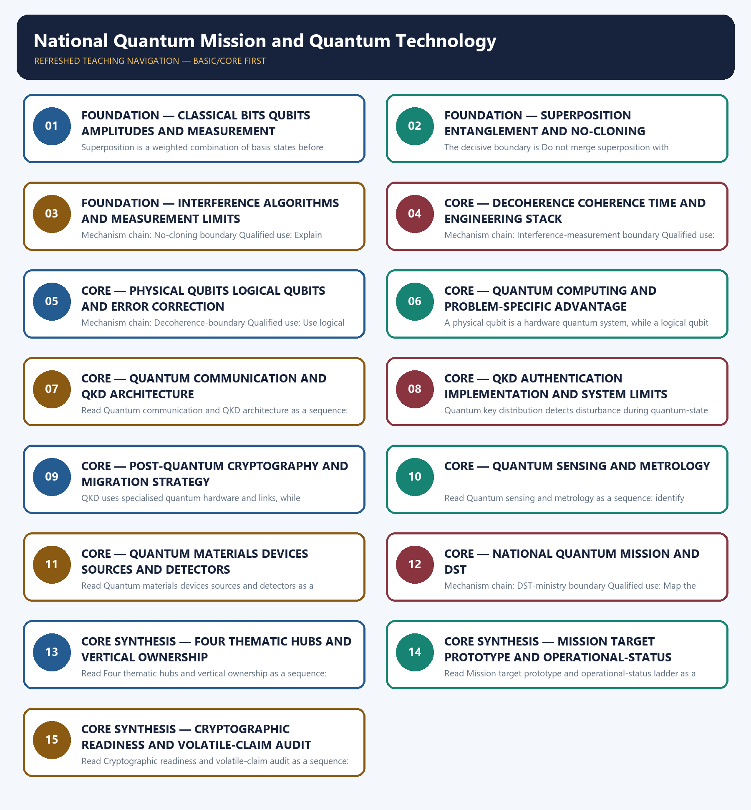

# National Quantum Mission and Quantum Technology — Learner-v2 Complete Learning Session

> **Authoring-only generation:** 2026-09-03. No PDF was rendered and no tracker or index was mutated.

### SOURCE, PROGRESSION AND CURRENT-LINKAGE AUDIT

- **Generation date:** 2026-09-03.
- **Repository-first evidence:** the Basic owner is taught first and preserved in full; the Advanced owner is retained only in the optional final teaching block.
- **OCR evidence:** Repository Markdown was primary. OCR-searchable official UPSC papers were supplementary only for printed routed demands. No answer key, performance value, procurement outcome, operational deployment, programme target or technology milestone was inferred.
- **Qdrant:** not used; repository Markdown and available OCR context were sufficient.
- **PYQ integrity:** Audited ledgers route the 2022 qubit concept, the 2025 Majorana-company-claim taxonomy and a provisional 2026 NQM-target concept here. No objective key, achieved qubit count, communication distance or operational capability is invented.
- **Live-link boundary:** The DST NQM page returned only its title on direct retrieval on 2026-09-03. Official-domain search confirmed the authoritative mission pages but supplied no new achievement claim. Mission targets, physical-qubit counts, communication distances, prototypes and deployment status remain dated DST-source facts.
- **Fact/inference discipline:** no current-affairs item, PYQ wording, figure or quotation is invented.

### LIVE OFFICIAL-SOURCE ATTEMPT LOG

The checks below were made on 2026-09-03. Substantive official text is used only for the proposition it supports; title-only, blocked or thin pages are recorded and supply no factual claim.

- https://dst.gov.in/national-quantum-mission-nqm — attempted 2026-09-03; direct retrieval returned only the official page title. Official-domain search surfaced the mission page and Cabinet page, but no new qubit achievement, communication distance, operational system or revised timeline was inferred from search snippets.

## BASIC LEARNING SESSION

### DEEP-REVIEW LEARNING CONTRACT

| Control | Binding rule for this package |
|---|---|
| Syllabus boundary | Complete Science and Technology Basic/Core is easy-first and answer-complete before optional Advanced depth. |
| System boundary | Organisation, platform, subsystem, payload, process, application, institution and outcome remain distinct. |
| Technical boundary | Physical mechanism, classification, stage, platform, unit, range/capacity and limiting condition are explicit. |
| Status boundary | Announcement, approval, development, test, deployment, induction, commercial operation and observed outcome remain distinct. |
| Data boundary | Every mission, launch, target, capacity, budget, range, timeline, rule and regulatory claim keeps source, date, unit and status. |
| Governance boundary | Funder, developer, operator, authoriser, regulator, procurer, settlement actor and adjudicator are not conflated. |
| Practice contract | Every solved item has demand decoding, detailed examiner-grade model, executable timed/compression plan, marks rationale and answer-specific improvement. |
| PYQ contract | Official wording and keys are asserted only when verified; routed or reconstructed demands remain labelled. |
| Dual-flow contract | Graphical and ASCII masters independently reconstruct the same complete Basic-to-optional-Advanced evidence spine. |
| Approval | This immutable successor remains `approved: false` pending explicit approval. |

**Canonical Basic/Core owner:** `upsc-ai-kit\knowledge\Science-and-Technology\basic\10_National-Quantum-Mission-and-Quantum-Tech.md`  
**Substantive canonical provenance owner:** `upsc-ai-kit\knowledge\Science-and-Technology\learning-sessions\v2\subject-wide-syllabus\science-and-technology-10_Learning-Session.md`  
**Optional Advanced owner:** `upsc-ai-kit\knowledge\Science-and-Technology\advanced\10_National-Quantum-Mission-and-Quantum-Tech.md`  
**Official syllabus mapping:** `upsc-ai-kit\knowledge\Science-and-Technology\OFFICIAL-UPSC-SYLLABUS-MAPPING.md`

### EVIDENCE, PYQ AND CURRENT-STATUS CONTROL

- ISRO organisation, launcher stages, payload and orbit claims retain their exact object and mission date.
- NavIC, GAGAN, human-spaceflight, planetary, nuclear, fusion, missile and procurement claims retain category and status.
- Aadhaar/UPI, AI, quantum and semiconductor claims retain actor, layer, metric, maturity and governance boundaries.
- DPDP/cybersecurity, biotechnology and genetic-engineering claims retain legal/regulatory stage and competent institution.
- Targets, budgets, capacities, ranges and timelines are never promoted into achieved outcomes without dated evidence.
- **Current-status note, rechecked 2026-09-06:** volatile claims retain source/date/status; failed official fetches remain explicit and supply no invented fact.

**Generation-local live/current sources:**
- `https://dst.gov.in/national-quantum-mission-nqm — attempted 2026-09-03; direct retrieval returned only the official page title. Official-domain search surfaced the mission page and Cabinet page, but no new qubit achievement, communication distance, operational system or revised timeline was inferred from search snippets.`

**Topic-routed verified PYQ owners:**
- No topic-local official question file is claimed; repository PYQ routing ledgers control wording and status.




*Distinct embedded teaching-navigation image. The separate continuous Cārvāka-style flowchart package remains an independent at-a-glance artifact.*

### SESSION 1 — FOUNDATION — CLASSICAL BITS QUBITS AMPLITUDES AND MEASUREMENT

#### DEFINITION / WHAT THIS IS CALLED

**Plain-language definition:** A classical bit is recorded as 0 or 1, while a qubit is a quantum state described by amplitudes over basis states and yields a classical outcome on measurement; it is not simply a faster bit.

**Technical definition:** Superposition is a weighted combination of basis states before measurement; saying a qubit is two ordinary classical values at once obscures amplitudes, probability and measurement.

#### ANSWER-GRABBING OPENING — WRITE/ADAPT IN THE EXAM

> A classical bit is recorded as 0 or 1, while a qubit is a quantum state described by amplitudes over basis states and yields a classical outcome on measurement; it is not simply a faster bit.

#### MUST-WRITE KEYWORDS

- **FOUNDATION**
- **Classical bits qubits amplitudes**
- **measurement**
- **Mechanism chain**
- **Qualified use**
- **A classical bit**

**How to use them:** Frame the answer through FOUNDATION; define Classical bits qubits amplitudes, connect measurement with Mechanism chain to explain the mechanism, and use Qualified use for the decisive comparison or qualification.

#### VISUAL FIRST

```text
CLASSICAL BITS QUBITS AMPLITUDES AND MEASUREMENT
01. Bit-qubit boundary
    |
    v
02. Superposition-boundary
STATUS / CATEGORY FIREWALL -> Do not call a qubit a faster classical bit or two stored bits.
```

*The rail fixes the technical sequence and the claim boundary before explanation.*

#### CORE EXPLANATION

A classical bit is recorded as 0 or 1, while a qubit is a quantum state described by amplitudes over basis states and yields a classical outcome on measurement; it is not simply a faster bit. Superposition is a weighted combination of basis states before measurement; saying a qubit is two ordinary classical values at once obscures amplitudes, probability and measurement.

#### SIMPLE SYSTEM EXAMPLE

Read Classical bits qubits amplitudes and measurement as a sequence: identify Bit-qubit boundary, follow the named mechanism to its user or output, and stop at the last verified status rather than assuming the next stage.

#### TECHNICAL DISTINCTION

The decisive boundary is Do not call a qubit a faster classical bit or two stored bits. This keeps Bit-qubit boundary and Superposition-boundary in the correct scientific category, institution and unit of measurement.

#### NAMED EVIDENCE AND MECHANISM

- A classical bit is recorded as 0 or 1, while a qubit is a quantum state described by amplitudes over basis states and yields a classical outcome on measurement; it is not simply a faster bit.
- Superposition is a weighted combination of basis states before measurement; saying a qubit is two ordinary classical values at once obscures amplitudes, probability and measurement.

#### EXAMINER CAUTION

- Do not call a qubit a faster classical bit or two stored bits.

#### EXAM LINK

- **Prelims:** Keep institution, system, platform, service, process, legal instrument, unit and status in their exact category.
- **Mains:** Define state amplitudes and measurement before applications.

#### MINI RECAP

- **Mechanism chain:** Bit-qubit boundary -> Superposition-boundary
- **Qualified use:** Define state amplitudes and measurement before applications.

#### CLOSING RECALL FLOW — FOUNDATION — CLASSICAL BITS QUBITS AMPLITUDES AND MEASUREMENT

```text
START / CONCEPT: FOUNDATION — Classical bits qubits amplitudes and measurement
        |
        v
EXACT TERMS: FOUNDATION · Classical bits qubits amplitudes · measurement · Mechanism chain · Qualified use · A classical bit
        |
        v
MECHANISM / ARGUMENT: Read Classical bits qubits amplitudes and measurement as a sequence: identify Bit-qubit boundary, follow the named mechanism to its user or output, and stop at the last verified status rather than assuming the next stage.
        |
        v
CONSEQUENCE / CONTRAST: The decisive boundary is Do not call a qubit a faster classical bit or two stored bits.
        |
        v
UPSC TRAP / ANSWER-USE: Do not call a qubit a faster classical bit or two stored bits.
        |
        v
ANSWER-GRABBING FORMULATION: A classical bit is recorded as 0 or 1, while a qubit is a quantum state described by amplitudes over basis states and yields a classical outcome on measurement; it is not simply a faster bit.
```
### SESSION 2 — FOUNDATION — SUPERPOSITION ENTANGLEMENT AND NO-CLONING

#### DEFINITION / WHAT THIS IS CALLED

**Plain-language definition:** Entanglement is a joint non-factorisable state of two or more quantum systems; a single qubit can be in superposition but cannot be entangled with itself, and entanglement enables no faster-than-light signalling.

**Technical definition:** The decisive boundary is Do not merge superposition with entanglement.

#### ANSWER-GRABBING OPENING — WRITE/ADAPT IN THE EXAM

> Entanglement is a joint non-factorisable state of two or more quantum systems; a single qubit can be in superposition but cannot be entangled with itself, and entanglement enables no faster-than-light signalling.

#### MUST-WRITE KEYWORDS

- **FOUNDATION**
- **Superposition entanglement**
- **no-cloning**
- **Mechanism chain**
- **Qualified use**
- **Entanglement**

**How to use them:** Frame the answer through FOUNDATION; define Superposition entanglement, connect no-cloning with Mechanism chain to explain the mechanism, and use Qualified use for the decisive comparison or qualification.

#### VISUAL FIRST

```text
SUPERPOSITION ENTANGLEMENT AND NO-CLONING
01. Entanglement-boundary
STATUS / CATEGORY FIREWALL -> Do not merge superposition with entanglement.
```

*The rail fixes the technical sequence and the claim boundary before explanation.*

#### CORE EXPLANATION

Entanglement is a joint non-factorisable state of two or more quantum systems; a single qubit can be in superposition but cannot be entangled with itself, and entanglement enables no faster-than-light signalling.

#### SIMPLE SYSTEM EXAMPLE

Read Superposition entanglement and no-cloning as a sequence: identify Entanglement-boundary, follow the named mechanism to its user or output, and stop at the last verified status rather than assuming the next stage.

#### TECHNICAL DISTINCTION

The decisive boundary is Do not merge superposition with entanglement. This keeps Entanglement-boundary in the correct scientific category, institution and unit of measurement.

#### NAMED EVIDENCE AND MECHANISM

- Entanglement is a joint non-factorisable state of two or more quantum systems; a single qubit can be in superposition but cannot be entangled with itself, and entanglement enables no faster-than-light signalling.

#### EXAMINER CAUTION

- Do not merge superposition with entanglement.

#### EXAM LINK

- **Prelims:** Keep institution, system, platform, service, process, legal instrument, unit and status in their exact category.
- **Mains:** Separate one-system superposition from multi-system entanglement.

#### MINI RECAP

- **Mechanism chain:** Entanglement-boundary
- **Qualified use:** Separate one-system superposition from multi-system entanglement.

#### CLOSING RECALL FLOW — FOUNDATION — SUPERPOSITION ENTANGLEMENT AND NO-CLONING

```text
START / CONCEPT: FOUNDATION — Superposition entanglement and no-cloning
        |
        v
EXACT TERMS: FOUNDATION · Superposition entanglement · no-cloning · Mechanism chain · Qualified use · Entanglement
        |
        v
MECHANISM / ARGUMENT: Read Superposition entanglement and no-cloning as a sequence: identify Entanglement-boundary, follow the named mechanism to its user or output, and stop at the last verified status rather than assuming the next stage.
        |
        v
CONSEQUENCE / CONTRAST: The decisive boundary is Do not merge superposition with entanglement.
        |
        v
UPSC TRAP / ANSWER-USE: Do not merge superposition with entanglement.
        |
        v
ANSWER-GRABBING FORMULATION: Entanglement is a joint non-factorisable state of two or more quantum systems; a single qubit can be in superposition but cannot be entangled with itself, and entanglement enables no faster-than-light signalling.
```
### SESSION 3 — FOUNDATION — INTERFERENCE ALGORITHMS AND MEASUREMENT LIMITS

#### DEFINITION / WHAT THIS IS CALLED

**Plain-language definition:** Read Interference algorithms and measurement limits as a sequence: identify No-cloning boundary, follow the named mechanism to its user or output, and stop at the last verified status rather than assuming the next stage.

**Technical definition:** Mechanism chain: No-cloning boundary Qualified use: Explain interference without parallel-answer mythology.

#### ANSWER-GRABBING OPENING — WRITE/ADAPT IN THE EXAM

> Read Interference algorithms and measurement limits as a sequence: identify No-cloning boundary, follow the named mechanism to its user or output, and stop at the last verified status rather than assuming the next stage.

#### MUST-WRITE KEYWORDS

- **FOUNDATION**
- **Interference algorithms**
- **measurement limits**
- **Mechanism chain**
- **Qualified use**
- **Read Interference**

**How to use them:** Frame the answer through FOUNDATION; define Interference algorithms, connect measurement limits with Mechanism chain to explain the mechanism, and use Qualified use for the decisive comparison or qualification.

#### VISUAL FIRST

```text
INTERFERENCE ALGORITHMS AND MEASUREMENT LIMITS
01. No-cloning boundary
STATUS / CATEGORY FIREWALL -> Do not use entanglement for faster-than-light signalling.
```

*The rail fixes the technical sequence and the claim boundary before explanation.*

#### CORE EXPLANATION

The no-cloning principle forbids perfect copying of an arbitrary unknown quantum state; it helps explain quantum-communication security but does not prevent all copying of classical information or known basis states.

#### SIMPLE SYSTEM EXAMPLE

Read Interference algorithms and measurement limits as a sequence: identify No-cloning boundary, follow the named mechanism to its user or output, and stop at the last verified status rather than assuming the next stage.

#### TECHNICAL DISTINCTION

The decisive boundary is Do not use entanglement for faster-than-light signalling. This keeps No-cloning boundary in the correct scientific category, institution and unit of measurement.

#### NAMED EVIDENCE AND MECHANISM

- The no-cloning principle forbids perfect copying of an arbitrary unknown quantum state; it helps explain quantum-communication security but does not prevent all copying of classical information or known basis states.

#### EXAMINER CAUTION

- Do not use entanglement for faster-than-light signalling.

#### EXAM LINK

- **Prelims:** Keep institution, system, platform, service, process, legal instrument, unit and status in their exact category.
- **Mains:** Explain interference without parallel-answer mythology.

#### MINI RECAP

- **Mechanism chain:** No-cloning boundary
- **Qualified use:** Explain interference without parallel-answer mythology.

#### CLOSING RECALL FLOW — FOUNDATION — INTERFERENCE ALGORITHMS AND MEASUREMENT LIMITS

```text
START / CONCEPT: FOUNDATION — Interference algorithms and measurement limits
        |
        v
EXACT TERMS: FOUNDATION · Interference algorithms · measurement limits · Mechanism chain · Qualified use · Read Interference
        |
        v
MECHANISM / ARGUMENT: Mechanism chain: No-cloning boundary Qualified use: Explain interference without parallel-answer mythology.
        |
        v
CONSEQUENCE / CONTRAST: The no-cloning principle forbids perfect copying of an arbitrary unknown quantum state; it helps explain quantum-communication security but does not prevent all copying of classical information or known basis states.
        |
        v
UPSC TRAP / ANSWER-USE: The decisive boundary is Do not use entanglement for faster-than-light signalling.
        |
        v
ANSWER-GRABBING FORMULATION: Read Interference algorithms and measurement limits as a sequence: identify No-cloning boundary, follow the named mechanism to its user or output, and stop at the last verified status rather than assuming the next stage.
```
### SESSION 4 — CORE — DECOHERENCE COHERENCE TIME AND ENGINEERING STACK

#### DEFINITION / WHAT THIS IS CALLED

**Plain-language definition:** Read Decoherence coherence time and engineering stack as a sequence: identify Interference-measurement boundary, follow the named mechanism to its user or output, and stop at the last verified status rather than assuming the next stage.

**Technical definition:** Mechanism chain: Interference-measurement boundary Qualified use: Show why control hardware and materials matter.

#### ANSWER-GRABBING OPENING — WRITE/ADAPT IN THE EXAM

> Read Decoherence coherence time and engineering stack as a sequence: identify Interference-measurement boundary, follow the named mechanism to its user or output, and stop at the last verified status rather than assuming the next stage.

#### MUST-WRITE KEYWORDS

- **Decoherence coherence time**
- **engineering stack**
- **Mechanism chain**
- **Qualified use**
- **Quantum**
- **Read Decoherence**

**How to use them:** Frame the answer through Decoherence coherence time; define engineering stack, connect Mechanism chain with Qualified use to explain the mechanism, and use Quantum for the decisive comparison or qualification.

#### VISUAL FIRST

```text
DECOHERENCE COHERENCE TIME AND ENGINEERING STACK
01. Interference-measurement boundary
STATUS / CATEGORY FIREWALL -> Do not claim no-cloning prevents every form of copying.
```

*The rail fixes the technical sequence and the claim boundary before explanation.*

#### CORE EXPLANATION

Quantum algorithms manipulate amplitudes so interference can suppress unwanted paths and reinforce useful outcomes before measurement; superposition alone does not test every answer and reveal all results.

#### SIMPLE SYSTEM EXAMPLE

Read Decoherence coherence time and engineering stack as a sequence: identify Interference-measurement boundary, follow the named mechanism to its user or output, and stop at the last verified status rather than assuming the next stage.

#### TECHNICAL DISTINCTION

The decisive boundary is Do not claim no-cloning prevents every form of copying. This keeps Interference-measurement boundary in the correct scientific category, institution and unit of measurement.

#### NAMED EVIDENCE AND MECHANISM

- Quantum algorithms manipulate amplitudes so interference can suppress unwanted paths and reinforce useful outcomes before measurement; superposition alone does not test every answer and reveal all results.

#### EXAMINER CAUTION

- Do not claim no-cloning prevents every form of copying.

#### EXAM LINK

- **Prelims:** Keep institution, system, platform, service, process, legal instrument, unit and status in their exact category.
- **Mains:** Show why control hardware and materials matter.

#### MINI RECAP

- **Mechanism chain:** Interference-measurement boundary
- **Qualified use:** Show why control hardware and materials matter.

#### CLOSING RECALL FLOW — CORE — DECOHERENCE COHERENCE TIME AND ENGINEERING STACK

```text
START / CONCEPT: CORE — Decoherence coherence time and engineering stack
        |
        v
EXACT TERMS: Decoherence coherence time · engineering stack · Mechanism chain · Qualified use · Quantum · Read Decoherence
        |
        v
MECHANISM / ARGUMENT: Mechanism chain: Interference-measurement boundary Qualified use: Show why control hardware and materials matter.
        |
        v
CONSEQUENCE / CONTRAST: Quantum algorithms manipulate amplitudes so interference can suppress unwanted paths and reinforce useful outcomes before measurement; superposition alone does not test every answer and reveal all results.
        |
        v
UPSC TRAP / ANSWER-USE: The decisive boundary is Do not claim no-cloning prevents every form of copying.
        |
        v
ANSWER-GRABBING FORMULATION: Read Decoherence coherence time and engineering stack as a sequence: identify Interference-measurement boundary, follow the named mechanism to its user or output, and stop at the last verified status rather than assuming the next stage.
```
### SESSION 5 — CORE — PHYSICAL QUBITS LOGICAL QUBITS AND ERROR CORRECTION

#### DEFINITION / WHAT THIS IS CALLED

**Plain-language definition:** Read Physical qubits logical qubits and error correction as a sequence: identify Decoherence-boundary, follow the named mechanism to its user or output, and stop at the last verified status rather than assuming the next stage.

**Technical definition:** Mechanism chain: Decoherence-boundary Qualified use: Use logical qubits when discussing useful fault tolerance.

#### ANSWER-GRABBING OPENING — WRITE/ADAPT IN THE EXAM

> Read Physical qubits logical qubits and error correction as a sequence: identify Decoherence-boundary, follow the named mechanism to its user or output, and stop at the last verified status rather than assuming the next stage.

#### MUST-WRITE KEYWORDS

- **Physical qubits logical qubits**
- **error correction**
- **Mechanism chain**
- **Qualified use**
- **Decoherence**
- **Read Physical**

**How to use them:** Frame the answer through Physical qubits logical qubits; define error correction, connect Mechanism chain with Qualified use to explain the mechanism, and use Decoherence for the decisive comparison or qualification.

#### VISUAL FIRST

```text
PHYSICAL QUBITS LOGICAL QUBITS AND ERROR CORRECTION
01. Decoherence-boundary
STATUS / CATEGORY FIREWALL -> Do not infer useful computation from superposition alone.
```

*The rail fixes the technical sequence and the claim boundary before explanation.*

#### CORE EXPLANATION

Decoherence is loss of usable quantum coherence through environmental interaction, making isolation, cryogenics, vacuum, shielding, control and materials central engineering constraints.

#### SIMPLE SYSTEM EXAMPLE

Read Physical qubits logical qubits and error correction as a sequence: identify Decoherence-boundary, follow the named mechanism to its user or output, and stop at the last verified status rather than assuming the next stage.

#### TECHNICAL DISTINCTION

The decisive boundary is Do not infer useful computation from superposition alone. This keeps Decoherence-boundary in the correct scientific category, institution and unit of measurement.

#### NAMED EVIDENCE AND MECHANISM

- Decoherence is loss of usable quantum coherence through environmental interaction, making isolation, cryogenics, vacuum, shielding, control and materials central engineering constraints.

#### EXAMINER CAUTION

- Do not infer useful computation from superposition alone.

#### EXAM LINK

- **Prelims:** Keep institution, system, platform, service, process, legal instrument, unit and status in their exact category.
- **Mains:** Use logical qubits when discussing useful fault tolerance.

#### MINI RECAP

- **Mechanism chain:** Decoherence-boundary
- **Qualified use:** Use logical qubits when discussing useful fault tolerance.

#### CLOSING RECALL FLOW — CORE — PHYSICAL QUBITS LOGICAL QUBITS AND ERROR CORRECTION

```text
START / CONCEPT: CORE — Physical qubits logical qubits and error correction
        |
        v
EXACT TERMS: Physical qubits logical qubits · error correction · Mechanism chain · Qualified use · Decoherence · Read Physical
        |
        v
MECHANISM / ARGUMENT: Mechanism chain: Decoherence-boundary Qualified use: Use logical qubits when discussing useful fault tolerance.
        |
        v
CONSEQUENCE / CONTRAST: The decisive boundary is Do not infer useful computation from superposition alone.
        |
        v
UPSC TRAP / ANSWER-USE: Do not infer useful computation from superposition alone.
        |
        v
ANSWER-GRABBING FORMULATION: Read Physical qubits logical qubits and error correction as a sequence: identify Decoherence-boundary, follow the named mechanism to its user or output, and stop at the last verified status rather than assuming the next stage.
```
### SESSION 6 — CORE — QUANTUM COMPUTING AND PROBLEM-SPECIFIC ADVANTAGE

#### DEFINITION / WHAT THIS IS CALLED

**Plain-language definition:** Quantum computing offers different algorithms for selected problem classes such as simulation, factoring, search or optimisation; it is not universally faster and does not replace ordinary classical computing.

**Technical definition:** A physical qubit is a hardware quantum system, while a logical qubit is error-corrected information encoded across many physical qubits; a physical-qubit count is not a fault-tolerant capability count.

#### ANSWER-GRABBING OPENING — WRITE/ADAPT IN THE EXAM

> Quantum computing offers different algorithms for selected problem classes such as simulation, factoring, search or optimisation; it is not universally faster and does not replace ordinary classical computing.

#### MUST-WRITE KEYWORDS

- **Quantum computing**
- **problem-specific advantage**
- **Mechanism chain**
- **Qualified use**
- **A physical qubit**
- **Quantum**

**How to use them:** Frame the answer through Quantum computing; define problem-specific advantage, connect Mechanism chain with Qualified use to explain the mechanism, and use A physical qubit for the decisive comparison or qualification.

#### VISUAL FIRST

```text
QUANTUM COMPUTING AND PROBLEM-SPECIFIC ADVANTAGE
01. Physical-logical boundary
    |
    v
02. Computing-boundary
STATUS / CATEGORY FIREWALL -> Do not merge physical and logical qubits.
```

*The rail fixes the technical sequence and the claim boundary before explanation.*

#### CORE EXPLANATION

A physical qubit is a hardware quantum system, while a logical qubit is error-corrected information encoded across many physical qubits; a physical-qubit count is not a fault-tolerant capability count. Quantum computing offers different algorithms for selected problem classes such as simulation, factoring, search or optimisation; it is not universally faster and does not replace ordinary classical computing.

#### SIMPLE SYSTEM EXAMPLE

Read Quantum computing and problem-specific advantage as a sequence: identify Physical-logical boundary, follow the named mechanism to its user or output, and stop at the last verified status rather than assuming the next stage.

#### TECHNICAL DISTINCTION

The decisive boundary is Do not merge physical and logical qubits. This keeps Physical-logical boundary and Computing-boundary in the correct scientific category, institution and unit of measurement.

#### NAMED EVIDENCE AND MECHANISM

- A physical qubit is a hardware quantum system, while a logical qubit is error-corrected information encoded across many physical qubits; a physical-qubit count is not a fault-tolerant capability count.
- Quantum computing offers different algorithms for selected problem classes such as simulation, factoring, search or optimisation; it is not universally faster and does not replace ordinary classical computing.

#### EXAMINER CAUTION

- Do not merge physical and logical qubits.

#### EXAM LINK

- **Prelims:** Keep institution, system, platform, service, process, legal instrument, unit and status in their exact category.
- **Mains:** Limit advantage claims to specific algorithms and tasks.

#### MINI RECAP

- **Mechanism chain:** Physical-logical boundary -> Computing-boundary
- **Qualified use:** Limit advantage claims to specific algorithms and tasks.

#### CLOSING RECALL FLOW — CORE — QUANTUM COMPUTING AND PROBLEM-SPECIFIC ADVANTAGE

```text
START / CONCEPT: CORE — Quantum computing and problem-specific advantage
        |
        v
EXACT TERMS: Quantum computing · problem-specific advantage · Mechanism chain · Qualified use · A physical qubit · Quantum
        |
        v
MECHANISM / ARGUMENT: Read Quantum computing and problem-specific advantage as a sequence: identify Physical-logical boundary, follow the named mechanism to its user or output, and stop at the last verified status rather than assuming the next stage.
        |
        v
CONSEQUENCE / CONTRAST: A physical qubit is a hardware quantum system, while a logical qubit is error-corrected information encoded across many physical qubits; a physical-qubit count is not a fault-tolerant capability count.
        |
        v
UPSC TRAP / ANSWER-USE: Mechanism chain: Physical-logical boundary - Computing-boundary Qualified use: Limit advantage claims to specific algorithms and tasks.
        |
        v
ANSWER-GRABBING FORMULATION: Quantum computing offers different algorithms for selected problem classes such as simulation, factoring, search or optimisation; it is not universally faster and does not replace ordinary classical computing.
```
### SESSION 7 — CORE — QUANTUM COMMUNICATION AND QKD ARCHITECTURE

#### DEFINITION / WHAT THIS IS CALLED

**Plain-language definition:** Quantum communication uses quantum states and protocols for tasks such as key distribution, while quantum computing processes information; a secure link is not a quantum computer.

**Technical definition:** Read Quantum communication and QKD architecture as a sequence: identify Communication-boundary, follow the named mechanism to its user or output, and stop at the last verified status rather than assuming the next stage.

#### ANSWER-GRABBING OPENING — WRITE/ADAPT IN THE EXAM

> Quantum communication uses quantum states and protocols for tasks such as key distribution, while quantum computing processes information; a secure link is not a quantum computer.

#### MUST-WRITE KEYWORDS

- **Quantum communication**
- **QKD architecture**
- **Mechanism chain**
- **Qualified use**
- **Quantum**
- **Read Quantum**

**How to use them:** Frame the answer through Quantum communication; define QKD architecture, connect Mechanism chain with Qualified use to explain the mechanism, and use Quantum for the decisive comparison or qualification.

#### VISUAL FIRST

```text
QUANTUM COMMUNICATION AND QKD ARCHITECTURE
01. Communication-boundary
STATUS / CATEGORY FIREWALL -> Do not claim quantum computers accelerate every problem.
```

*The rail fixes the technical sequence and the claim boundary before explanation.*

#### CORE EXPLANATION

Quantum communication uses quantum states and protocols for tasks such as key distribution, while quantum computing processes information; a secure link is not a quantum computer.

#### SIMPLE SYSTEM EXAMPLE

Read Quantum communication and QKD architecture as a sequence: identify Communication-boundary, follow the named mechanism to its user or output, and stop at the last verified status rather than assuming the next stage.

#### TECHNICAL DISTINCTION

The decisive boundary is Do not claim quantum computers accelerate every problem. This keeps Communication-boundary in the correct scientific category, institution and unit of measurement.

#### NAMED EVIDENCE AND MECHANISM

- Quantum communication uses quantum states and protocols for tasks such as key distribution, while quantum computing processes information; a secure link is not a quantum computer.

#### EXAMINER CAUTION

- Do not claim quantum computers accelerate every problem.

#### EXAM LINK

- **Prelims:** Keep institution, system, platform, service, process, legal instrument, unit and status in their exact category.
- **Mains:** Keep secure communication outside computing.

#### MINI RECAP

- **Mechanism chain:** Communication-boundary
- **Qualified use:** Keep secure communication outside computing.

#### CLOSING RECALL FLOW — CORE — QUANTUM COMMUNICATION AND QKD ARCHITECTURE

```text
START / CONCEPT: CORE — Quantum communication and QKD architecture
        |
        v
EXACT TERMS: Quantum communication · QKD architecture · Mechanism chain · Qualified use · Quantum · Read Quantum
        |
        v
MECHANISM / ARGUMENT: Read Quantum communication and QKD architecture as a sequence: identify Communication-boundary, follow the named mechanism to its user or output, and stop at the last verified status rather than assuming the next stage.
        |
        v
CONSEQUENCE / CONTRAST: The decisive boundary is Do not claim quantum computers accelerate every problem.
        |
        v
UPSC TRAP / ANSWER-USE: Do not claim quantum computers accelerate every problem.
        |
        v
ANSWER-GRABBING FORMULATION: Quantum communication uses quantum states and protocols for tasks such as key distribution, while quantum computing processes information; a secure link is not a quantum computer.
```
### SESSION 8 — CORE — QKD AUTHENTICATION IMPLEMENTATION AND SYSTEM LIMITS

#### DEFINITION / WHAT THIS IS CALLED

**Plain-language definition:** Read QKD authentication implementation and system limits as a sequence: identify QKD-boundary, follow the named mechanism to its user or output, and stop at the last verified status rather than assuming the next stage.

**Technical definition:** Quantum key distribution detects disturbance during quantum-state exchange for key establishment, but still needs authenticated endpoints, implementation security and a wider encryption system; QKD does not encrypt all data by itself.

#### ANSWER-GRABBING OPENING — WRITE/ADAPT IN THE EXAM

> Quantum key distribution detects disturbance during quantum-state exchange for key establishment, but still needs authenticated endpoints, implementation security and a wider encryption system; QKD does not encrypt all data by itself.

#### MUST-WRITE KEYWORDS

- **QKD authentication implementation**
- **system limits**
- **Mechanism chain**
- **Qualified use**
- **Quantum**
- **QKD**

**How to use them:** Frame the answer through QKD authentication implementation; define system limits, connect Mechanism chain with Qualified use to explain the mechanism, and use Quantum for the decisive comparison or qualification.

#### VISUAL FIRST

```text
QKD AUTHENTICATION IMPLEMENTATION AND SYSTEM LIMITS
01. QKD-boundary
STATUS / CATEGORY FIREWALL -> Do not merge computing, communication, sensing and materials.
```

*The rail fixes the technical sequence and the claim boundary before explanation.*

#### CORE EXPLANATION

Quantum key distribution detects disturbance during quantum-state exchange for key establishment, but still needs authenticated endpoints, implementation security and a wider encryption system; QKD does not encrypt all data by itself.

#### SIMPLE SYSTEM EXAMPLE

Read QKD authentication implementation and system limits as a sequence: identify QKD-boundary, follow the named mechanism to its user or output, and stop at the last verified status rather than assuming the next stage.

#### TECHNICAL DISTINCTION

The decisive boundary is Do not merge computing, communication, sensing and materials. This keeps QKD-boundary in the correct scientific category, institution and unit of measurement.

#### NAMED EVIDENCE AND MECHANISM

- Quantum key distribution detects disturbance during quantum-state exchange for key establishment, but still needs authenticated endpoints, implementation security and a wider encryption system; QKD does not encrypt all data by itself.

#### EXAMINER CAUTION

- Do not merge computing, communication, sensing and materials.

#### EXAM LINK

- **Prelims:** Keep institution, system, platform, service, process, legal instrument, unit and status in their exact category.
- **Mains:** Treat QKD as one component in a security system.

#### MINI RECAP

- **Mechanism chain:** QKD-boundary
- **Qualified use:** Treat QKD as one component in a security system.

#### CLOSING RECALL FLOW — CORE — QKD AUTHENTICATION IMPLEMENTATION AND SYSTEM LIMITS

```text
START / CONCEPT: CORE — QKD authentication implementation and system limits
        |
        v
EXACT TERMS: QKD authentication implementation · system limits · Mechanism chain · Qualified use · Quantum · QKD
        |
        v
MECHANISM / ARGUMENT: Read QKD authentication implementation and system limits as a sequence: identify QKD-boundary, follow the named mechanism to its user or output, and stop at the last verified status rather than assuming the next stage.
        |
        v
CONSEQUENCE / CONTRAST: The decisive boundary is Do not merge computing, communication, sensing and materials.
        |
        v
UPSC TRAP / ANSWER-USE: Do not miss this limiting distinction: treat QKD as one component in a security system.
        |
        v
ANSWER-GRABBING FORMULATION: Quantum key distribution detects disturbance during quantum-state exchange for key establishment, but still needs authenticated endpoints, implementation security and a wider encryption system; QKD does not encrypt all data by itself.
```
### SESSION 9 — CORE — POST-QUANTUM CRYPTOGRAPHY AND MIGRATION STRATEGY

#### DEFINITION / WHAT THIS IS CALLED

**Plain-language definition:** Read Post-quantum cryptography and migration strategy as a sequence: identify QKD-PQC boundary, follow the named mechanism to its user or output, and stop at the last verified status rather than assuming the next stage.

**Technical definition:** QKD uses specialised quantum hardware and links, while post-quantum cryptography uses classical mathematical algorithms designed to resist quantum attack and can be deployed through software and standards migration.

#### ANSWER-GRABBING OPENING — WRITE/ADAPT IN THE EXAM

> QKD uses specialised quantum hardware and links, while post-quantum cryptography uses classical mathematical algorithms designed to resist quantum attack and can be deployed through software and standards migration.

#### MUST-WRITE KEYWORDS

- **Post-quantum cryptography**
- **migration strategy**
- **Mechanism chain**
- **Qualified use**
- **QKD**
- **Read Post-quantum**

**How to use them:** Frame the answer through Post-quantum cryptography; define migration strategy, connect Mechanism chain with Qualified use to explain the mechanism, and use QKD for the decisive comparison or qualification.

#### VISUAL FIRST

```text
POST-QUANTUM CRYPTOGRAPHY AND MIGRATION STRATEGY
01. QKD-PQC boundary
STATUS / CATEGORY FIREWALL -> Do not claim QKD encrypts all data or replaces authentication.
```

*The rail fixes the technical sequence and the claim boundary before explanation.*

#### CORE EXPLANATION

QKD uses specialised quantum hardware and links, while post-quantum cryptography uses classical mathematical algorithms designed to resist quantum attack and can be deployed through software and standards migration.

#### SIMPLE SYSTEM EXAMPLE

Read Post-quantum cryptography and migration strategy as a sequence: identify QKD-PQC boundary, follow the named mechanism to its user or output, and stop at the last verified status rather than assuming the next stage.

#### TECHNICAL DISTINCTION

The decisive boundary is Do not claim QKD encrypts all data or replaces authentication. This keeps QKD-PQC boundary in the correct scientific category, institution and unit of measurement.

#### NAMED EVIDENCE AND MECHANISM

- QKD uses specialised quantum hardware and links, while post-quantum cryptography uses classical mathematical algorithms designed to resist quantum attack and can be deployed through software and standards migration.

#### EXAMINER CAUTION

- Do not claim QKD encrypts all data or replaces authentication.

#### EXAM LINK

- **Prelims:** Keep institution, system, platform, service, process, legal instrument, unit and status in their exact category.
- **Mains:** Compare hardware links with classical algorithm migration.

#### MINI RECAP

- **Mechanism chain:** QKD-PQC boundary
- **Qualified use:** Compare hardware links with classical algorithm migration.

#### CLOSING RECALL FLOW — CORE — POST-QUANTUM CRYPTOGRAPHY AND MIGRATION STRATEGY

```text
START / CONCEPT: CORE — Post-quantum cryptography and migration strategy
        |
        v
EXACT TERMS: Post-quantum cryptography · migration strategy · Mechanism chain · Qualified use · QKD · Read Post-quantum
        |
        v
MECHANISM / ARGUMENT: Read Post-quantum cryptography and migration strategy as a sequence: identify QKD-PQC boundary, follow the named mechanism to its user or output, and stop at the last verified status rather than assuming the next stage.
        |
        v
CONSEQUENCE / CONTRAST: The decisive boundary is Do not claim QKD encrypts all data or replaces authentication.
        |
        v
UPSC TRAP / ANSWER-USE: Do not claim QKD encrypts all data or replaces authentication.
        |
        v
ANSWER-GRABBING FORMULATION: QKD uses specialised quantum hardware and links, while post-quantum cryptography uses classical mathematical algorithms designed to resist quantum attack and can be deployed through software and standards migration.
```
### SESSION 10 — CORE — QUANTUM SENSING AND METROLOGY

#### DEFINITION / WHAT THIS IS CALLED

**Plain-language definition:** Quantum sensing and metrology exploit quantum sensitivity for precise measurement such as clocks, magnetic or gravitational fields; a quantum sensor is not a smaller general-purpose quantum computer.

**Technical definition:** Read Quantum sensing and metrology as a sequence: identify Sensing-metrology boundary, follow the named mechanism to its user or output, and stop at the last verified status rather than assuming the next stage.

#### ANSWER-GRABBING OPENING — WRITE/ADAPT IN THE EXAM

> Quantum sensing and metrology exploit quantum sensitivity for precise measurement such as clocks, magnetic or gravitational fields; a quantum sensor is not a smaller general-purpose quantum computer.

#### MUST-WRITE KEYWORDS

- **Quantum sensing**
- **metrology**
- **Mechanism chain**
- **Qualified use**
- **Quantum**
- **Read Quantum**

**How to use them:** Frame the answer through Quantum sensing; define metrology, connect Mechanism chain with Qualified use to explain the mechanism, and use Quantum for the decisive comparison or qualification.

#### VISUAL FIRST

```text
QUANTUM SENSING AND METROLOGY
01. Sensing-metrology boundary
STATUS / CATEGORY FIREWALL -> Do not merge QKD and post-quantum cryptography.
```

*The rail fixes the technical sequence and the claim boundary before explanation.*

#### CORE EXPLANATION

Quantum sensing and metrology exploit quantum sensitivity for precise measurement such as clocks, magnetic or gravitational fields; a quantum sensor is not a smaller general-purpose quantum computer.

#### SIMPLE SYSTEM EXAMPLE

Read Quantum sensing and metrology as a sequence: identify Sensing-metrology boundary, follow the named mechanism to its user or output, and stop at the last verified status rather than assuming the next stage.

#### TECHNICAL DISTINCTION

The decisive boundary is Do not merge QKD and post-quantum cryptography. This keeps Sensing-metrology boundary in the correct scientific category, institution and unit of measurement.

#### NAMED EVIDENCE AND MECHANISM

- Quantum sensing and metrology exploit quantum sensitivity for precise measurement such as clocks, magnetic or gravitational fields; a quantum sensor is not a smaller general-purpose quantum computer.

#### EXAMINER CAUTION

- Do not merge QKD and post-quantum cryptography.

#### EXAM LINK

- **Prelims:** Keep institution, system, platform, service, process, legal instrument, unit and status in their exact category.
- **Mains:** Explain precision measurement rather than computation.

#### MINI RECAP

- **Mechanism chain:** Sensing-metrology boundary
- **Qualified use:** Explain precision measurement rather than computation.

#### CLOSING RECALL FLOW — CORE — QUANTUM SENSING AND METROLOGY

```text
START / CONCEPT: CORE — Quantum sensing and metrology
        |
        v
EXACT TERMS: Quantum sensing · metrology · Mechanism chain · Qualified use · Quantum · Read Quantum
        |
        v
MECHANISM / ARGUMENT: Read Quantum sensing and metrology as a sequence: identify Sensing-metrology boundary, follow the named mechanism to its user or output, and stop at the last verified status rather than assuming the next stage.
        |
        v
CONSEQUENCE / CONTRAST: The decisive boundary is Do not merge QKD and post-quantum cryptography.
        |
        v
UPSC TRAP / ANSWER-USE: Do not merge QKD and post-quantum cryptography.
        |
        v
ANSWER-GRABBING FORMULATION: Quantum sensing and metrology exploit quantum sensitivity for precise measurement such as clocks, magnetic or gravitational fields; a quantum sensor is not a smaller general-purpose quantum computer.
```
### SESSION 11 — CORE — QUANTUM MATERIALS DEVICES SOURCES AND DETECTORS

#### DEFINITION / WHAT THIS IS CALLED

**Plain-language definition:** Quantum materials and devices provide sources, detectors, control components and hardware substrates for computing, communication and sensing; the vertical is not a synonym for quantum computing.

**Technical definition:** Read Quantum materials devices sources and detectors as a sequence: identify Materials-devices boundary, follow the named mechanism to its user or output, and stop at the last verified status rather than assuming the next stage.

#### ANSWER-GRABBING OPENING — WRITE/ADAPT IN THE EXAM

> Quantum materials and devices provide sources, detectors, control components and hardware substrates for computing, communication and sensing; the vertical is not a synonym for quantum computing.

#### MUST-WRITE KEYWORDS

- **Quantum materials devices sources**
- **detectors**
- **Mechanism chain**
- **Qualified use**
- **Quantum**
- **The National Quantum Mission**

**How to use them:** Frame the answer through Quantum materials devices sources; define detectors, connect Mechanism chain with Qualified use to explain the mechanism, and use Quantum for the decisive comparison or qualification.

#### VISUAL FIRST

```text
QUANTUM MATERIALS DEVICES SOURCES AND DETECTORS
01. Materials-devices boundary
    |
    v
02. NQM-mission boundary
STATUS / CATEGORY FIREWALL -> Do not turn a mission target or hub into an achievement.
```

*The rail fixes the technical sequence and the claim boundary before explanation.*

#### CORE EXPLANATION

Quantum materials and devices provide sources, detectors, control components and hardware substrates for computing, communication and sensing; the vertical is not a synonym for quantum computing. The National Quantum Mission is a DST-led capability mission across computing, communication, sensing and metrology, and materials and devices; it is not one machine, laboratory or company product.

#### SIMPLE SYSTEM EXAMPLE

Read Quantum materials devices sources and detectors as a sequence: identify Materials-devices boundary, follow the named mechanism to its user or output, and stop at the last verified status rather than assuming the next stage.

#### TECHNICAL DISTINCTION

The decisive boundary is Do not turn a mission target or hub into an achievement. This keeps Materials-devices boundary and NQM-mission boundary in the correct scientific category, institution and unit of measurement.

#### NAMED EVIDENCE AND MECHANISM

- Quantum materials and devices provide sources, detectors, control components and hardware substrates for computing, communication and sensing; the vertical is not a synonym for quantum computing.
- The National Quantum Mission is a DST-led capability mission across computing, communication, sensing and metrology, and materials and devices; it is not one machine, laboratory or company product.

#### EXAMINER CAUTION

- Do not turn a mission target or hub into an achievement.

#### EXAM LINK

- **Prelims:** Keep institution, system, platform, service, process, legal instrument, unit and status in their exact category.
- **Mains:** Place enabling hardware in its own mission vertical.

#### MINI RECAP

- **Mechanism chain:** Materials-devices boundary -> NQM-mission boundary
- **Qualified use:** Place enabling hardware in its own mission vertical.

#### CLOSING RECALL FLOW — CORE — QUANTUM MATERIALS DEVICES SOURCES AND DETECTORS

```text
START / CONCEPT: CORE — Quantum materials devices sources and detectors
        |
        v
EXACT TERMS: Quantum materials devices sources · detectors · Mechanism chain · Qualified use · Quantum · The National Quantum Mission
        |
        v
MECHANISM / ARGUMENT: Read Quantum materials devices sources and detectors as a sequence: identify Materials-devices boundary, follow the named mechanism to its user or output, and stop at the last verified status rather than assuming the next stage.
        |
        v
CONSEQUENCE / CONTRAST: The National Quantum Mission is a DST-led capability mission across computing, communication, sensing and metrology, and materials and devices; it is not one machine, laboratory or company product.
        |
        v
UPSC TRAP / ANSWER-USE: The decisive boundary is Do not turn a mission target or hub into an achievement.
        |
        v
ANSWER-GRABBING FORMULATION: Quantum materials and devices provide sources, detectors, control components and hardware substrates for computing, communication and sensing; the vertical is not a synonym for quantum computing.
```
### SESSION 12 — CORE — NATIONAL QUANTUM MISSION AND DST

#### DEFINITION / WHAT THIS IS CALLED

**Plain-language definition:** Read National Quantum Mission and DST as a sequence: identify DST-ministry boundary, follow the named mechanism to its user or output, and stop at the last verified status rather than assuming the next stage.

**Technical definition:** Mechanism chain: DST-ministry boundary Qualified use: Map the department, mission and four domains.

#### ANSWER-GRABBING OPENING — WRITE/ADAPT IN THE EXAM

> Read National Quantum Mission and DST as a sequence: identify DST-ministry boundary, follow the named mechanism to its user or output, and stop at the last verified status rather than assuming the next stage.

#### MUST-WRITE KEYWORDS

- **National Quantum Mission**
- **DST**
- **Mechanism chain**
- **Qualified use**
- **The Department of Science and Technology**
- **The Department**

**How to use them:** Frame the answer through National Quantum Mission; define DST, connect Mechanism chain with Qualified use to explain the mechanism, and use The Department of Science and Technology for the decisive comparison or qualification.

#### VISUAL FIRST

```text
NATIONAL QUANTUM MISSION AND DST
01. DST-ministry boundary
STATUS / CATEGORY FIREWALL -> Do not invent qubit, distance, prototype or operational claims.
```

*The rail fixes the technical sequence and the claim boundary before explanation.*

#### CORE EXPLANATION

The Department of Science and Technology is a department under the Ministry of Science and Technology and implements NQM; DST should not be called a separate ministry.

#### SIMPLE SYSTEM EXAMPLE

Read National Quantum Mission and DST as a sequence: identify DST-ministry boundary, follow the named mechanism to its user or output, and stop at the last verified status rather than assuming the next stage.

#### TECHNICAL DISTINCTION

The decisive boundary is Do not invent qubit, distance, prototype or operational claims. This keeps DST-ministry boundary in the correct scientific category, institution and unit of measurement.

#### NAMED EVIDENCE AND MECHANISM

- The Department of Science and Technology is a department under the Ministry of Science and Technology and implements NQM; DST should not be called a separate ministry.

#### EXAMINER CAUTION

- Do not invent qubit, distance, prototype or operational claims.

#### EXAM LINK

- **Prelims:** Keep institution, system, platform, service, process, legal instrument, unit and status in their exact category.
- **Mains:** Map the department, mission and four domains.

#### MINI RECAP

- **Mechanism chain:** DST-ministry boundary
- **Qualified use:** Map the department, mission and four domains.

#### CLOSING RECALL FLOW — CORE — NATIONAL QUANTUM MISSION AND DST

```text
START / CONCEPT: CORE — National Quantum Mission and DST
        |
        v
EXACT TERMS: National Quantum Mission · DST · Mechanism chain · Qualified use · The Department of Science and Technology · The Department
        |
        v
MECHANISM / ARGUMENT: Mechanism chain: DST-ministry boundary Qualified use: Map the department, mission and four domains.
        |
        v
CONSEQUENCE / CONTRAST: The Department of Science and Technology is a department under the Ministry of Science and Technology and implements NQM; DST should not be called a separate ministry.
        |
        v
UPSC TRAP / ANSWER-USE: The decisive boundary is Do not invent qubit, distance, prototype or operational claims.
        |
        v
ANSWER-GRABBING FORMULATION: Read National Quantum Mission and DST as a sequence: identify DST-ministry boundary, follow the named mechanism to its user or output, and stop at the last verified status rather than assuming the next stage.
```
### SESSION 13 — CORE SYNTHESIS — FOUR THEMATIC HUBS AND VERTICAL OWNERSHIP

#### DEFINITION / WHAT THIS IS CALLED

**Plain-language definition:** NQM uses four thematic hubs hosted at IISc Bengaluru, IIT Madras with C-DOT, IIT Bombay and IIT Delhi for the four distinct verticals; a hub is an ecosystem institution, not proof of an operational system.

**Technical definition:** Read Four thematic hubs and vertical ownership as a sequence: identify Four-hub boundary, follow the named mechanism to its user or output, and stop at the last verified status rather than assuming the next stage.

#### ANSWER-GRABBING OPENING — WRITE/ADAPT IN THE EXAM

> NQM uses four thematic hubs hosted at IISc Bengaluru, IIT Madras with C-DOT, IIT Bombay and IIT Delhi for the four distinct verticals; a hub is an ecosystem institution, not proof of an operational system.

#### MUST-WRITE KEYWORDS

- **CORE SYNTHESIS**
- **Four thematic hubs**
- **vertical ownership**
- **Mechanism chain**
- **Qualified use**
- **NQM**

**How to use them:** Frame the answer through CORE SYNTHESIS; define Four thematic hubs, connect vertical ownership with Mechanism chain to explain the mechanism, and use Qualified use for the decisive comparison or qualification.

#### VISUAL FIRST

```text
FOUR THEMATIC HUBS AND VERTICAL OWNERSHIP
01. Four-hub boundary
STATUS / CATEGORY FIREWALL -> Do not call a qubit a faster classical bit or two stored bits.
```

*The rail fixes the technical sequence and the claim boundary before explanation.*

#### CORE EXPLANATION

NQM uses four thematic hubs hosted at IISc Bengaluru, IIT Madras with C-DOT, IIT Bombay and IIT Delhi for the four distinct verticals; a hub is an ecosystem institution, not proof of an operational system.

#### SIMPLE SYSTEM EXAMPLE

Read Four thematic hubs and vertical ownership as a sequence: identify Four-hub boundary, follow the named mechanism to its user or output, and stop at the last verified status rather than assuming the next stage.

#### TECHNICAL DISTINCTION

The decisive boundary is Do not call a qubit a faster classical bit or two stored bits. This keeps Four-hub boundary in the correct scientific category, institution and unit of measurement.

#### NAMED EVIDENCE AND MECHANISM

- NQM uses four thematic hubs hosted at IISc Bengaluru, IIT Madras with C-DOT, IIT Bombay and IIT Delhi for the four distinct verticals; a hub is an ecosystem institution, not proof of an operational system.

#### EXAMINER CAUTION

- Do not call a qubit a faster classical bit or two stored bits.

#### EXAM LINK

- **Prelims:** Keep institution, system, platform, service, process, legal instrument, unit and status in their exact category.
- **Mains:** Match each hub to one vertical without capability inflation.

#### MINI RECAP

- **Mechanism chain:** Four-hub boundary
- **Qualified use:** Match each hub to one vertical without capability inflation.

#### CLOSING RECALL FLOW — CORE SYNTHESIS — FOUR THEMATIC HUBS AND VERTICAL OWNERSHIP

```text
START / CONCEPT: CORE SYNTHESIS — Four thematic hubs and vertical ownership
        |
        v
EXACT TERMS: CORE SYNTHESIS · Four thematic hubs · vertical ownership · Mechanism chain · Qualified use · NQM
        |
        v
MECHANISM / ARGUMENT: Read Four thematic hubs and vertical ownership as a sequence: identify Four-hub boundary, follow the named mechanism to its user or output, and stop at the last verified status rather than assuming the next stage.
        |
        v
CONSEQUENCE / CONTRAST: The decisive boundary is Do not call a qubit a faster classical bit or two stored bits.
        |
        v
UPSC TRAP / ANSWER-USE: Do not call a qubit a faster classical bit or two stored bits.
        |
        v
ANSWER-GRABBING FORMULATION: NQM uses four thematic hubs hosted at IISc Bengaluru, IIT Madras with C-DOT, IIT Bombay and IIT Delhi for the four distinct verticals; a hub is an ecosystem institution, not proof of an operational system.
```
### SESSION 14 — CORE SYNTHESIS — MISSION TARGET PROTOTYPE AND OPERATIONAL-STATUS LADDER

#### DEFINITION / WHAT THIS IS CALLED

**Plain-language definition:** A mission target states intended capability within a period, while approved funding, a hub, a research prototype, a laboratory demonstration and an operational system are separate evidence rungs.

**Technical definition:** Read Mission target prototype and operational-status ladder as a sequence: identify Target-achievement boundary, follow the named mechanism to its user or output, and stop at the last verified status rather than assuming the next stage.

#### ANSWER-GRABBING OPENING — WRITE/ADAPT IN THE EXAM

> Read Mission target prototype and operational-status ladder as a sequence: identify Target-achievement boundary, follow the named mechanism to its user or output, and stop at the last verified status rather than assuming the next stage.

#### MUST-WRITE KEYWORDS

- **CORE SYNTHESIS**
- **Mission target prototype**
- **operational-status ladder**
- **Mechanism chain**
- **Qualified use**
- **The NQM physical-qubit target**

**How to use them:** Frame the answer through CORE SYNTHESIS; define Mission target prototype, connect operational-status ladder with Mechanism chain to explain the mechanism, and use Qualified use for the decisive comparison or qualification.

#### VISUAL FIRST

```text
MISSION TARGET PROTOTYPE AND OPERATIONAL-STATUS LADDER
01. Target-achievement boundary
    |
    v
02. Qubit-target boundary
STATUS / CATEGORY FIREWALL -> Do not merge superposition with entanglement.
```

*The rail fixes the technical sequence and the claim boundary before explanation.*

#### CORE EXPLANATION

A mission target states intended capability within a period, while approved funding, a hub, a research prototype, a laboratory demonstration and an operational system are separate evidence rungs. The NQM physical-qubit target is a hardware-scaling objective, not a claim that logical error-corrected qubits, useful quantum advantage or fault-tolerant computing have been achieved.

#### SIMPLE SYSTEM EXAMPLE

Read Mission target prototype and operational-status ladder as a sequence: identify Target-achievement boundary, follow the named mechanism to its user or output, and stop at the last verified status rather than assuming the next stage.

#### TECHNICAL DISTINCTION

The decisive boundary is Do not merge superposition with entanglement. This keeps Target-achievement boundary and Qubit-target boundary in the correct scientific category, institution and unit of measurement.

#### NAMED EVIDENCE AND MECHANISM

- A mission target states intended capability within a period, while approved funding, a hub, a research prototype, a laboratory demonstration and an operational system are separate evidence rungs.
- The NQM physical-qubit target is a hardware-scaling objective, not a claim that logical error-corrected qubits, useful quantum advantage or fault-tolerant computing have been achieved.

#### EXAMINER CAUTION

- Do not merge superposition with entanglement.

#### EXAM LINK

- **Prelims:** Keep institution, system, platform, service, process, legal instrument, unit and status in their exact category.
- **Mains:** Label approval, target, prototype and operation separately.

#### MINI RECAP

- **Mechanism chain:** Target-achievement boundary -> Qubit-target boundary
- **Qualified use:** Label approval, target, prototype and operation separately.

#### CLOSING RECALL FLOW — CORE SYNTHESIS — MISSION TARGET PROTOTYPE AND OPERATIONAL-STATUS LADDER

```text
START / CONCEPT: CORE SYNTHESIS — Mission target prototype and operational-status ladder
        |
        v
EXACT TERMS: CORE SYNTHESIS · Mission target prototype · operational-status ladder · Mechanism chain · Qualified use · The NQM physical-qubit target
        |
        v
MECHANISM / ARGUMENT: Mechanism chain: Target-achievement boundary - Qubit-target boundary Qualified use: Label approval, target, prototype and operation separately.
        |
        v
CONSEQUENCE / CONTRAST: A mission target states intended capability within a period, while approved funding, a hub, a research prototype, a laboratory demonstration and an operational system are separate evidence rungs.
        |
        v
UPSC TRAP / ANSWER-USE: The NQM physical-qubit target is a hardware-scaling objective, not a claim that logical error-corrected qubits, useful quantum advantage or fault-tolerant computing have been achieved.
        |
        v
ANSWER-GRABBING FORMULATION: Read Mission target prototype and operational-status ladder as a sequence: identify Target-achievement boundary, follow the named mechanism to its user or output, and stop at the last verified status rather than assuming the next stage.
```
### SESSION 15 — CORE SYNTHESIS — CRYPTOGRAPHIC READINESS AND VOLATILE-CLAIM AUDIT

#### DEFINITION / WHAT THIS IS CALLED

**Plain-language definition:** Quantum risk includes harvest-now-decrypt-later exposure, so cryptographic inventory and post-quantum migration are present governance tasks even before a cryptographically relevant quantum computer exists.

**Technical definition:** Read Cryptographic readiness and volatile-claim audit as a sequence: identify Cryptographic-readiness boundary, follow the named mechanism to its user or output, and stop at the last verified status rather than assuming the next stage.

#### ANSWER-GRABBING OPENING — WRITE/ADAPT IN THE EXAM

> Read Cryptographic readiness and volatile-claim audit as a sequence: identify Cryptographic-readiness boundary, follow the named mechanism to its user or output, and stop at the last verified status rather than assuming the next stage.

#### MUST-WRITE KEYWORDS

- **CORE SYNTHESIS**
- **Cryptographic readiness**
- **volatile-claim audit**
- **Mechanism chain**
- **Qualified use**
- **Subject**

**How to use them:** Frame the answer through CORE SYNTHESIS; define Cryptographic readiness, connect volatile-claim audit with Mechanism chain to explain the mechanism, and use Qualified use for the decisive comparison or qualification.

#### VISUAL FIRST

```text
CRYPTOGRAPHIC READINESS AND VOLATILE-CLAIM AUDIT
01. Cryptographic-readiness boundary
    |
    v
02. Volatile-claim boundary
STATUS / CATEGORY FIREWALL -> Do not use entanglement for faster-than-light signalling.
```

*The rail fixes the technical sequence and the claim boundary before explanation.*

#### CORE EXPLANATION

Quantum risk includes harvest-now-decrypt-later exposure, so cryptographic inventory and post-quantum migration are present governance tasks even before a cryptographically relevant quantum computer exists. Mission outlay, dates, target qubits, communication distance, startup count, prototype performance and operational status require dated official DST or mission sources and cannot be upgraded from announcements.

#### SIMPLE SYSTEM EXAMPLE

Read Cryptographic readiness and volatile-claim audit as a sequence: identify Cryptographic-readiness boundary, follow the named mechanism to its user or output, and stop at the last verified status rather than assuming the next stage.

#### TECHNICAL DISTINCTION

The decisive boundary is Do not use entanglement for faster-than-light signalling. This keeps Cryptographic-readiness boundary and Volatile-claim boundary in the correct scientific category, institution and unit of measurement.

#### NAMED EVIDENCE AND MECHANISM

- Quantum risk includes harvest-now-decrypt-later exposure, so cryptographic inventory and post-quantum migration are present governance tasks even before a cryptographically relevant quantum computer exists.
- Mission outlay, dates, target qubits, communication distance, startup count, prototype performance and operational status require dated official DST or mission sources and cannot be upgraded from announcements.

#### EXAMINER CAUTION

- Do not use entanglement for faster-than-light signalling.

#### EXAM LINK

- **Prelims:** Keep institution, system, platform, service, process, legal instrument, unit and status in their exact category.
- **Mains:** Conclude with PQC readiness and dated official evidence.

#### MINI RECAP

- **Mechanism chain:** Cryptographic-readiness boundary -> Volatile-claim boundary
- **Qualified use:** Conclude with PQC readiness and dated official evidence.
#### COMPLETE BASIC OWNER EVIDENCE BANK

> **Subject:** Science & Technology | **Tier:** Must-Do (foundation) | **GS Paper:** GS-III + Prelims.
> **Core area:** Quantum fundamentals and India’s mission architecture.
> **Grounded in:** DST National Quantum Mission page (https://dst.gov.in/national-quantum-mission-nqm — verified 16 Jul 2026; page last updated 21 May 2026); DST T-Hub announcement page (https://dst.gov.in/nqm-landmark-t-hubs-announced-lead-indias-quantum-revolution — verified 16 Jul 2026; page last updated 01 Oct 2024); PIB parliamentary answer on Quantum Technology (https://www.pib.gov.in/PressReleasePage.aspx?PRID=2150820 — 31 Jul 2025); official NQM hub links cited on DST page: qcinnovation.co.in, samgnya.in, qmettech.com, qmdhub.co.in.
> **Additionally verified 2 Aug 2026:** DST National Quantum Mission page (approval 19 Apr 2023; outlay Rs 6,003.65 crore; 2023-24 to 2030-31; four verticals; four T-Hubs; stated targets; progress figures), last updated 21 May 2026 (https://dst.gov.in/national-quantum-mission-nqm).
> ✅ = source-grounded | ⚠️ = analytical linkage | 📰 = current/dated development.
> *Companion: `advanced/10_National-Quantum-Mission-and-Quantum-Tech.md`.*

#### 1. Visual foundation

```text
classical bit -> deterministically 0 or 1
quantum bit (qubit) -> a superposition state a|0> + b|1>;
                       measurement yields 0 or 1 with probability |a|^2 or |b|^2
                       (the qubit is NOT "both values at once" in the classical sense)
                 |
                 +--> entanglement: a joint state of TWO OR MORE qubits that
                 |    cannot be described as separate individual states
                 +--> decoherence: loss of quantum behaviour through interaction
                 |    with the environment -- the central engineering enemy
                 +--> quantum computing: information processing
                 +--> quantum communication: secure key exchange / networks
                 +--> quantum sensing & metrology: precise measurement
                 +--> quantum materials & devices: the hardware substrate
```

**Core proposition:** Quantum computing, quantum communication, quantum sensing and quantum materials/devices are related but distinct verticals; UPSC rewards candidates who keep them separate.

#### 2. Essential definitions

| Concept | Exam-ready meaning |
|---|---|
| ✅ **Qubit** | Basic unit of quantum information: a two-level quantum system whose state is a **weighted combination (amplitudes) of |0⟩ and |1⟩**, collapsing to one classical value on measurement. It is not a classical bit that is "faster." |
| ✅ **Superposition** | Quantum property that allows a qubit to exist in a combination of basis states until measurement. ⚠️ A single qubit can be in superposition; **entanglement needs at least two systems**. |
| ✅ **Entanglement** | A joint state of **two or more** quantum systems that cannot be factorised into independent states — measuring one instantly constrains the other's statistics. It carries **no faster-than-light signalling**. |
| ⚠️ **Decoherence** | Loss of quantum coherence through unwanted interaction with the environment (heat, vibration, stray fields). It sets **coherence time**, and is the reason quantum processors need dilution refrigerators, vacuum and shielding. |
| ⚠️ **Quantum error correction** | Encoding one reliable **logical qubit** across many noisy **physical qubits**. This is why "number of qubits" headlines are misleading: useful computation needs logical, error-corrected qubits, of which very few exist anywhere. |
| ⚠️ **Qubit modalities** | **Superconducting** (fast gates, millikelvin cryogenics), **trapped ion** (long coherence, slower gates), **photonic** (natural for communication, hard for memory), **neutral atom**, and **topological** (theoretically robust, least mature). No modality has won; NQM deliberately does not bet on one. |
| ✅ **Quantum computing** | Use of quantum states to perform certain computations differently from classical computers. It is **not** universally faster — the advantage is confined to specific problem classes (factoring, unstructured search, quantum simulation, some optimisation). |
| ⚠️ **Quantum advantage vs quantum supremacy** | **Supremacy** = a quantum device performs *some* task, however contrived, beyond practical classical reach. **Advantage** = a quantum device solves a *useful* problem better/cheaper than the best classical method. Supremacy claims have been made and contested; **practical advantage has not been established**. |
| ✅ **Quantum communication** | Use of quantum principles for secure communication, including QKD-type systems. |
| ⚠️ **QKD vs post-quantum cryptography (PQC)** | **QKD** distributes encryption keys using quantum states, so eavesdropping disturbs them detectably — it needs **new hardware and physical links** and mainly protects key exchange. **PQC** is *classical* mathematics believed hard for quantum computers, deployable as a **software/standards upgrade** on existing networks. They are complements; PQC migration is the near-term practical response to "harvest now, decrypt later" risk. |
| ✅ **Quantum sensing** | Use of quantum effects for highly precise measurement of physical quantities. |
| ✅ **Metrology** | Science of measurement; in quantum tech, this includes ultra-precise clocks and sensors — with direct spillovers into navigation resilient to GNSS denial, gravimetry and medical imaging. |

#### 3. Mechanism / how it works

1. ✅ Classical computers process classical bits; quantum systems manipulate qubits using quantum states and controlled operations, exploiting **interference** so that wrong answers cancel and right answers reinforce.
2. ✅ Quantum communication uses quantum states for secure key exchange and tamper detection in communication links; in fibre, loss limits range, which is why **trusted nodes, quantum repeaters and satellite links** are active research problems.
3. ✅ Quantum sensing and metrology use quantum-state sensitivity for high-precision measurement.
4. ✅ The DST NQM page structures India’s mission into four verticals with one T-Hub each: **Quantum Computing, Quantum Communication, Quantum Sensing & Metrology, and Quantum Materials & Devices**.
5. ⚠️ For UPSC, the simplest safe distinction is: **computing = processing**, **communication = secure transmission/key exchange**, **sensing/metrology = precision measurement**, **materials & devices = the hardware substrate for all three**.

#### 4. Institutions and programmes

- ✅ **Department of Science and Technology (DST):** the **Department under the Ministry of Science and Technology** that implements NQM. (DST is a Department, not a ministry.)
- ✅ **National Quantum Mission (NQM):** approved by the Union Cabinet on **19 April 2023** with an outlay of **₹6,003.65 crore** for **2023-24 to 2030-31**.
- ✅ **T-Hub 1:** Foundation for QC Innovation at IISc Bengaluru for Quantum Computing.
- ✅ **T-Hub 2:** IITM C-DOT Samgnya Technologies Foundation at IIT Madras for Quantum Communication.
- ✅ **T-Hub 3:** Qmet Tech Foundation at IIT Bombay for Quantum Sensing & Metrology.
- ✅ **T-Hub 4:** QMD Foundation at IIT Delhi for Quantum Materials & Devices.
- ✅ **Stated NQM targets:** intermediate-scale quantum computers of **50-1000 physical qubits within eight years**; **satellite-based secure quantum communication over 2,000 km within India**; long-distance and inter-city QKD; multi-node quantum networks with quantum memories; and development of quantum sensors, atomic clocks, quantum materials, single-photon sources and detectors.
- ✅ **PIB parliamentary answer (31 Jul 2025):** says the T-Hubs comprise 14 Technical Groups spanning 17 States and 2 Union Territories.
- ✅ **DST progress statement (page last updated 21 May 2026):** **152 researchers across 43 institutions**, 17 States and 2 UTs, in **14 technical groups**, with **eight** startups supported and rolling startup calls continuing.

#### 5. Indian applications, examples and limitations

- ✅ **Quantum computing:** useful for frontier problems in optimisation, materials, simulation and advanced computation.
- ✅ **Quantum communication:** relevant for secure networks and key distribution.
- ✅ **Quantum sensing/metrology:** relevant for clocks, navigation, field sensing and precision instrumentation.
- ✅ **Quantum materials/devices:** hardware base needed to make the rest of the ecosystem viable.
- ⚠️ **Strategic value:** quantum communication and sensing matter even before full-scale fault-tolerant quantum computing becomes practical.
- ⚠️ **Mission-design value:** a four-hub structure prevents the topic from being reduced to “how many qubits India has”.
- ⚠️ **Limitation 1:** quantum systems are highly sensitive to noise and engineering instability.
- ⚠️ **Limitation 2:** building hardware, cryogenic/control systems, fabrication capabilities and talent pipelines is expensive and difficult.
- ⚠️ **Limitation 3:** not every classical problem needs or benefits from a quantum approach.

#### 6. Must-Know Facts for Prelims

- ✅ DST’s official NQM page says the mission has four Thematic Hubs.
- ✅ The four hubs are for Quantum Computing, Quantum Communication, Quantum Sensing & Metrology, and Quantum Materials & Devices.
- ✅ DST’s T-Hub announcement page names IISc Bengaluru, IIT Madras with C-DOT, IIT Bombay and IIT Delhi as the four hub institutions.
- ✅ The 31 Jul 2025 PIB parliamentary answer says the T-Hubs comprise 14 Technical Groups across 17 States and 2 UTs.
- ✅ DST’s NQM page says the mission supports technology development, human-resource development, entrepreneurship, industry engagement and international collaboration.
- ✅ Quantum communication and quantum computing are not the same application vertical.
- ✅ QKD belongs conceptually to quantum communication, not to quantum computing.

#### 7. UPSC traps

- ❌ **Quantum computing and quantum communication mean the same thing.** -> Computing is about processing; communication is about secure information exchange/key distribution.
- ❌ **QKD is just another quantum-computing algorithm.** -> QKD belongs to secure communication.
- ❌ **Quantum sensors are merely smaller computers.** -> Their value lies in high-precision measurement.
- ❌ **A qubit is simply a faster classical bit.** -> A qubit is a qualitatively different information unit: its state is a **superposition with amplitudes**, and quantum speed-ups come from interference across many computational paths, not from clock speed.
- ❌ **NQM is only about building a quantum computer.** -> Officially it covers four verticals, not just computing.
- ❌ **A single qubit is entangled.** -> Superposition applies to one qubit; **entanglement requires two or more** systems.
- ❌ **More qubits automatically means a more capable machine.** -> Without **error correction**, adding noisy physical qubits adds error. Logical (error-corrected) qubits are the meaningful unit.
- ❌ **Quantum computers will make all computation faster.** -> Advantage is problem-specific (factoring, search, quantum simulation, some optimisation); most everyday computing gains nothing.
- ❌ **QKD and post-quantum cryptography are the same defence.** -> QKD is a **hardware/physics** approach to key distribution; PQC is a **software/mathematics** upgrade deployable on existing networks. Most near-term national security migration is PQC-led.
- ❌ **Quantum entanglement allows faster-than-light communication.** -> It does not; classical communication is still required to make correlations useful.
- ❌ **"Quantum supremacy" means quantum computers are now better than classical ones.** -> Supremacy claims involve contrived benchmark tasks and have been contested; **practical quantum advantage on a useful problem has not been established**.
- ❌ **DST is a ministry.** -> DST is a **Department** under the Ministry of Science and Technology.

#### 8. 📰 Current anchor

- 📰 **19 Apr 2023 | Cabinet | Status: approved.** National Quantum Mission approved with an outlay of **₹6,003.65 crore** for **2023-24 to 2030-31**, structured around four verticals.
- 📰 **01 Oct 2024 | DST T-Hub announcement page last-updated stamp | Status: announced / structured.** DST’s landmark page publicly set out the four T-Hubs and their host institutions.
- 📰 **31 Jul 2025 | PIB | Status: implementation update.** The parliamentary answer reported that four T-Hubs had been established with 14 Technical Groups across 17 States and 2 UTs.
- 📰 **21 May 2026 | DST NQM page last-updated stamp | Status: implementation update.** DST reported **152 researchers across 43 institutions** in 17 States and 2 UTs, **14 technical groups**, and **eight startups** supported, with rolling startup calls. ⚠️ These are **input and participation metrics**, not demonstrated qubit counts, key-distribution distances or deployed sensors — do not upgrade them into capability claims.

*Current as of 16 Jul 2026, re-verified 2 Aug 2026; verify for later updates.*

#### 10. Mains framework / angles

- ⚠️ Define the basics simply: qubit, superposition, entanglement.
- ⚠️ Then separate applications into computing, communication, sensing/metrology and materials/devices.
- ⚠️ Use NQM to show that India’s approach is mission-led and institutionally distributed through T-Hubs.
- ⚠️ Add constraints: hardware difficulty, talent, standards and translation from research to applications.
- ⚠️ Explicitly perform the mandatory distinction: **quantum computing** is not the same thing as **quantum communication/QKD**.

> **Answer thesis:** India’s National Quantum Mission matters because it treats quantum technology as a four-vertical capability ecosystem—computing, communication, sensing/metrology and materials/devices—rather than as a single glamorous race to build one machine.

##### Rapid revision capsule

- ⚠️ Qubit ≠ classical bit.
- ⚠️ QKD belongs to communication, not computing.
- ⚠️ NQM is a four-hub mission, not a one-machine mission.
- ⚠️ Hardware, skills and standards matter as much as headline research announcements.
- ⚠️ Quantum communication and quantum computing solve different classes of problems.
- ⚠️ Precision measurement is the key idea behind sensing and metrology.
- ⚠️ Use mission structure, not hype headlines, as the backbone of the answer.

#### 11. Probable questions

- ⚠️ **Practice Prelims:** Which of the following correctly distinguishes quantum computing, quantum communication and quantum sensing?
- ⚠️ **Practice Mains (10 marks):** Explain the structure of the National Quantum Mission and its four thematic hubs. *Answer in 150 words.*
- ⚠️ **Practice Mains (15 marks):** Discuss the strategic significance and implementation challenges of India’s quantum mission while clearly separating computing, communication and sensing applications.

#### 12. Study links

- ✅ Advanced companion: `../advanced/10_National-Quantum-Mission-and-Quantum-Tech.md`.
- ✅ `25_Computing-Fundamentals-Hardware-Software-Networks-and-Cloud.md` — classical
  computing baseline and classical-versus-quantum distinction.
- ✅ `09_Artificial-Intelligence-Governance-and-IndiaAI.md` — another frontier-technology mission area.
- ✅ `01_Space-Programme-ISRO-Launch-Vehicles.md` — strategic science/technology mission comparison.
- ✅ `11_Semiconductor-Mission-and-Electronics-Manufacturing.md` — hardware and advanced electronics ecosystem context.

#### Core answer architecture — quantum technology and readiness boundaries

**Thesis choice.** Quantum technology is a portfolio of sensing, communication, computing and materials; physical qubits, a laboratory claim and useful fault-tolerant computation are not interchangeable milestones.

**10-mark spine.** Explain the relevant quantum principle (superposition, entanglement, measurement or decoherence); identify the application family; state NQM’s institutional aim and the readiness limit.

**15/20-mark spine.** Structure **quantum mechanism → application-specific architecture → Indian research/mission capability → strategic/economic payoff → error correction, hardware, standards, cryptography and scale constraints**.

**Evidence units.**
- **Claim:** quantum computing’s promise is selective rather than universal → **qubits use superposition/interference but decohere through environmental interaction** → explains potential advantages for selected algorithms → **qualification:** more physical qubits do not automatically make logical, error-corrected or useful machines.
- **Claim:** different quantum applications solve different problems → **QKD distributes keys with quantum states, post-quantum cryptography uses classical algorithms, and sensing exploits quantum sensitivity** → prevents a catch-all “quantum security” claim → **qualification:** QKD needs specialised links; PQC migration is a standards and implementation task, not a quantum network.
- **Claim:** NQM is a capability-building mission → **the Mission’s thematic hubs and physical-qubit target framing** → links research to communications, sensing, computing and materials ecosystems → **qualification:** mission approval or a company Majorana/topological hardware announcement is not proof of deployed fault-tolerant quantum capability.

**Verdict.** Reward frontier research and cryptographic preparedness while using careful readiness language and resisting product-announcement hype.

#### CLOSING RECALL FLOW — CORE SYNTHESIS — CRYPTOGRAPHIC READINESS AND VOLATILE-CLAIM AUDIT

```text
START / CONCEPT: CORE SYNTHESIS — Cryptographic readiness and volatile-claim audit
        |
        v
EXACT TERMS: CORE SYNTHESIS · Cryptographic readiness · volatile-claim audit · Mechanism chain · Qualified use · Subject
        |
        v
MECHANISM / ARGUMENT: Mechanism chain: Cryptographic-readiness boundary - Volatile-claim boundary Qualified use: Conclude with PQC readiness and dated official evidence.
        |
        v
CONSEQUENCE / CONTRAST: Explain the relevant quantum principle (superposition, entanglement, measurement or decoherence); identify the application family; state NQM’s institutional aim and the readiness limit.
        |
        v
UPSC TRAP / ANSWER-USE: The decisive boundary is Do not use entanglement for faster-than-light signalling.
        |
        v
ANSWER-GRABBING FORMULATION: Read Cryptographic readiness and volatile-claim audit as a sequence: identify Cryptographic-readiness boundary, follow the named mechanism to its user or output, and stop at the last verified status rather than assuming the next stage.
```
### SCIENCE AND TECHNOLOGY DEEP-REVIEW CORE CONTROL

- **Must remember:** Quantum technology covers computing, communication and sensing: qubits support superposition and probabilistic measurement, entanglement creates correlations, and noise/error control determines maturity.
- **Close distinction:** Qubit is not a faster classical bit, gate count is not useful advantage, QKD is not post-quantum cryptography, teleportation is not matter transfer, and a mission target is not scalable deployment.
- **Mechanism / status / evidence limit:** Identify platform, qubit/measurement unit, coherence/error boundary, link distance or sensitivity, institution, mission component, date and maturity from research through operational service.


## BASIC MCQS / REMEDIATION

### Q1. Which statement correctly identifies Bit-qubit boundary?

A. A classical bit is recorded as 0 or 1, while a qubit is a quantum state described by amplitudes over basis states and yields a classical outcome on measurement; it is not simply a faster bit.
B. Superposition is a weighted combination of basis states before measurement; saying a qubit is two ordinary classical values at once obscures amplitudes, probability and measurement.
C. The no-cloning principle forbids perfect copying of an arbitrary unknown quantum state; it helps explain quantum-communication security but does not prevent all copying of classical information or known basis states.
D. Entanglement is a joint non-factorisable state of two or more quantum systems; a single qubit can be in superposition but cannot be entangled with itself, and entanglement enables no faster-than-light signalling.

**Answer: A.**
**Explanation:** A classical bit is recorded as 0 or 1, while a qubit is a quantum state described by amplitudes over basis states and yields a classical outcome on measurement; it is not simply a faster bit. The other options change the scientific category, institutional owner, measurement, mission rung or operating status.

### Q2. Which option preserves the technical boundary of Bit-qubit boundary?

A. Entanglement is a joint non-factorisable state of two or more quantum systems; a single qubit can be in superposition but cannot be entangled with itself, and entanglement enables no faster-than-light signalling.
B. A classical bit is recorded as 0 or 1, while a qubit is a quantum state described by amplitudes over basis states and yields a classical outcome on measurement; it is not simply a faster bit.
C. The no-cloning principle forbids perfect copying of an arbitrary unknown quantum state; it helps explain quantum-communication security but does not prevent all copying of classical information or known basis states.
D. Quantum algorithms manipulate amplitudes so interference can suppress unwanted paths and reinforce useful outcomes before measurement; superposition alone does not test every answer and reveal all results.

**Answer: B.**
**Explanation:** A classical bit is recorded as 0 or 1, while a qubit is a quantum state described by amplitudes over basis states and yields a classical outcome on measurement; it is not simply a faster bit. The other options change the scientific category, institutional owner, measurement, mission rung or operating status.

### Q3. Which statement uses Bit-qubit boundary without changing its institution, unit or status?

A. Decoherence is loss of usable quantum coherence through environmental interaction, making isolation, cryogenics, vacuum, shielding, control and materials central engineering constraints.
B. The no-cloning principle forbids perfect copying of an arbitrary unknown quantum state; it helps explain quantum-communication security but does not prevent all copying of classical information or known basis states.
C. A classical bit is recorded as 0 or 1, while a qubit is a quantum state described by amplitudes over basis states and yields a classical outcome on measurement; it is not simply a faster bit.
D. Quantum algorithms manipulate amplitudes so interference can suppress unwanted paths and reinforce useful outcomes before measurement; superposition alone does not test every answer and reveal all results.

**Answer: C.**
**Explanation:** A classical bit is recorded as 0 or 1, while a qubit is a quantum state described by amplitudes over basis states and yields a classical outcome on measurement; it is not simply a faster bit. The other options change the scientific category, institutional owner, measurement, mission rung or operating status.

### Q4. Which option avoids the standard UPSC close-option trap about Bit-qubit boundary?

A. Decoherence is loss of usable quantum coherence through environmental interaction, making isolation, cryogenics, vacuum, shielding, control and materials central engineering constraints.
B. Quantum algorithms manipulate amplitudes so interference can suppress unwanted paths and reinforce useful outcomes before measurement; superposition alone does not test every answer and reveal all results.
C. A physical qubit is a hardware quantum system, while a logical qubit is error-corrected information encoded across many physical qubits; a physical-qubit count is not a fault-tolerant capability count.
D. A classical bit is recorded as 0 or 1, while a qubit is a quantum state described by amplitudes over basis states and yields a classical outcome on measurement; it is not simply a faster bit.

**Answer: D.**
**Explanation:** A classical bit is recorded as 0 or 1, while a qubit is a quantum state described by amplitudes over basis states and yields a classical outcome on measurement; it is not simply a faster bit. The other options change the scientific category, institutional owner, measurement, mission rung or operating status.

### Q5. Which statement correctly identifies Superposition-boundary?

A. Superposition is a weighted combination of basis states before measurement; saying a qubit is two ordinary classical values at once obscures amplitudes, probability and measurement.
B. Quantum algorithms manipulate amplitudes so interference can suppress unwanted paths and reinforce useful outcomes before measurement; superposition alone does not test every answer and reveal all results.
C. Entanglement is a joint non-factorisable state of two or more quantum systems; a single qubit can be in superposition but cannot be entangled with itself, and entanglement enables no faster-than-light signalling.
D. The no-cloning principle forbids perfect copying of an arbitrary unknown quantum state; it helps explain quantum-communication security but does not prevent all copying of classical information or known basis states.

**Answer: A.**
**Explanation:** Superposition is a weighted combination of basis states before measurement; saying a qubit is two ordinary classical values at once obscures amplitudes, probability and measurement. The other options change the scientific category, institutional owner, measurement, mission rung or operating status.

### Q6. Which option preserves the technical boundary of Superposition-boundary?

A. The no-cloning principle forbids perfect copying of an arbitrary unknown quantum state; it helps explain quantum-communication security but does not prevent all copying of classical information or known basis states.
B. Superposition is a weighted combination of basis states before measurement; saying a qubit is two ordinary classical values at once obscures amplitudes, probability and measurement.
C. Decoherence is loss of usable quantum coherence through environmental interaction, making isolation, cryogenics, vacuum, shielding, control and materials central engineering constraints.
D. Quantum algorithms manipulate amplitudes so interference can suppress unwanted paths and reinforce useful outcomes before measurement; superposition alone does not test every answer and reveal all results.

**Answer: B.**
**Explanation:** Superposition is a weighted combination of basis states before measurement; saying a qubit is two ordinary classical values at once obscures amplitudes, probability and measurement. The other options change the scientific category, institutional owner, measurement, mission rung or operating status.

### Q7. Which statement uses Superposition-boundary without changing its institution, unit or status?

A. Decoherence is loss of usable quantum coherence through environmental interaction, making isolation, cryogenics, vacuum, shielding, control and materials central engineering constraints.
B. Quantum algorithms manipulate amplitudes so interference can suppress unwanted paths and reinforce useful outcomes before measurement; superposition alone does not test every answer and reveal all results.
C. Superposition is a weighted combination of basis states before measurement; saying a qubit is two ordinary classical values at once obscures amplitudes, probability and measurement.
D. A physical qubit is a hardware quantum system, while a logical qubit is error-corrected information encoded across many physical qubits; a physical-qubit count is not a fault-tolerant capability count.

**Answer: C.**
**Explanation:** Superposition is a weighted combination of basis states before measurement; saying a qubit is two ordinary classical values at once obscures amplitudes, probability and measurement. The other options change the scientific category, institutional owner, measurement, mission rung or operating status.

### Q8. Which option avoids the standard UPSC close-option trap about Superposition-boundary?

A. Decoherence is loss of usable quantum coherence through environmental interaction, making isolation, cryogenics, vacuum, shielding, control and materials central engineering constraints.
B. A physical qubit is a hardware quantum system, while a logical qubit is error-corrected information encoded across many physical qubits; a physical-qubit count is not a fault-tolerant capability count.
C. Quantum computing offers different algorithms for selected problem classes such as simulation, factoring, search or optimisation; it is not universally faster and does not replace ordinary classical computing.
D. Superposition is a weighted combination of basis states before measurement; saying a qubit is two ordinary classical values at once obscures amplitudes, probability and measurement.

**Answer: D.**
**Explanation:** Superposition is a weighted combination of basis states before measurement; saying a qubit is two ordinary classical values at once obscures amplitudes, probability and measurement. The other options change the scientific category, institutional owner, measurement, mission rung or operating status.

### Q9. Which statement correctly identifies Entanglement-boundary?

A. Entanglement is a joint non-factorisable state of two or more quantum systems; a single qubit can be in superposition but cannot be entangled with itself, and entanglement enables no faster-than-light signalling.
B. The no-cloning principle forbids perfect copying of an arbitrary unknown quantum state; it helps explain quantum-communication security but does not prevent all copying of classical information or known basis states.
C. Decoherence is loss of usable quantum coherence through environmental interaction, making isolation, cryogenics, vacuum, shielding, control and materials central engineering constraints.
D. Quantum algorithms manipulate amplitudes so interference can suppress unwanted paths and reinforce useful outcomes before measurement; superposition alone does not test every answer and reveal all results.

**Answer: A.**
**Explanation:** Entanglement is a joint non-factorisable state of two or more quantum systems; a single qubit can be in superposition but cannot be entangled with itself, and entanglement enables no faster-than-light signalling. The other options change the scientific category, institutional owner, measurement, mission rung or operating status.

### Q10. Which option preserves the technical boundary of Entanglement-boundary?

A. Decoherence is loss of usable quantum coherence through environmental interaction, making isolation, cryogenics, vacuum, shielding, control and materials central engineering constraints.
B. Entanglement is a joint non-factorisable state of two or more quantum systems; a single qubit can be in superposition but cannot be entangled with itself, and entanglement enables no faster-than-light signalling.
C. A physical qubit is a hardware quantum system, while a logical qubit is error-corrected information encoded across many physical qubits; a physical-qubit count is not a fault-tolerant capability count.
D. Quantum algorithms manipulate amplitudes so interference can suppress unwanted paths and reinforce useful outcomes before measurement; superposition alone does not test every answer and reveal all results.

**Answer: B.**
**Explanation:** Entanglement is a joint non-factorisable state of two or more quantum systems; a single qubit can be in superposition but cannot be entangled with itself, and entanglement enables no faster-than-light signalling. The other options change the scientific category, institutional owner, measurement, mission rung or operating status.

### Q11. Which statement uses Entanglement-boundary without changing its institution, unit or status?

A. Decoherence is loss of usable quantum coherence through environmental interaction, making isolation, cryogenics, vacuum, shielding, control and materials central engineering constraints.
B. Quantum computing offers different algorithms for selected problem classes such as simulation, factoring, search or optimisation; it is not universally faster and does not replace ordinary classical computing.
C. Entanglement is a joint non-factorisable state of two or more quantum systems; a single qubit can be in superposition but cannot be entangled with itself, and entanglement enables no faster-than-light signalling.
D. A physical qubit is a hardware quantum system, while a logical qubit is error-corrected information encoded across many physical qubits; a physical-qubit count is not a fault-tolerant capability count.

**Answer: C.**
**Explanation:** Entanglement is a joint non-factorisable state of two or more quantum systems; a single qubit can be in superposition but cannot be entangled with itself, and entanglement enables no faster-than-light signalling. The other options change the scientific category, institutional owner, measurement, mission rung or operating status.

### Q12. Which option avoids the standard UPSC close-option trap about Entanglement-boundary?

A. Quantum computing offers different algorithms for selected problem classes such as simulation, factoring, search or optimisation; it is not universally faster and does not replace ordinary classical computing.
B. A physical qubit is a hardware quantum system, while a logical qubit is error-corrected information encoded across many physical qubits; a physical-qubit count is not a fault-tolerant capability count.
C. Quantum communication uses quantum states and protocols for tasks such as key distribution, while quantum computing processes information; a secure link is not a quantum computer.
D. Entanglement is a joint non-factorisable state of two or more quantum systems; a single qubit can be in superposition but cannot be entangled with itself, and entanglement enables no faster-than-light signalling.

**Answer: D.**
**Explanation:** Entanglement is a joint non-factorisable state of two or more quantum systems; a single qubit can be in superposition but cannot be entangled with itself, and entanglement enables no faster-than-light signalling. The other options change the scientific category, institutional owner, measurement, mission rung or operating status.

### Q13. Which statement correctly identifies No-cloning boundary?

A. The no-cloning principle forbids perfect copying of an arbitrary unknown quantum state; it helps explain quantum-communication security but does not prevent all copying of classical information or known basis states.
B. A physical qubit is a hardware quantum system, while a logical qubit is error-corrected information encoded across many physical qubits; a physical-qubit count is not a fault-tolerant capability count.
C. Decoherence is loss of usable quantum coherence through environmental interaction, making isolation, cryogenics, vacuum, shielding, control and materials central engineering constraints.
D. Quantum algorithms manipulate amplitudes so interference can suppress unwanted paths and reinforce useful outcomes before measurement; superposition alone does not test every answer and reveal all results.

**Answer: A.**
**Explanation:** The no-cloning principle forbids perfect copying of an arbitrary unknown quantum state; it helps explain quantum-communication security but does not prevent all copying of classical information or known basis states. The other options change the scientific category, institutional owner, measurement, mission rung or operating status.

### Q14. Which option preserves the technical boundary of No-cloning boundary?

A. Decoherence is loss of usable quantum coherence through environmental interaction, making isolation, cryogenics, vacuum, shielding, control and materials central engineering constraints.
B. The no-cloning principle forbids perfect copying of an arbitrary unknown quantum state; it helps explain quantum-communication security but does not prevent all copying of classical information or known basis states.
C. A physical qubit is a hardware quantum system, while a logical qubit is error-corrected information encoded across many physical qubits; a physical-qubit count is not a fault-tolerant capability count.
D. Quantum computing offers different algorithms for selected problem classes such as simulation, factoring, search or optimisation; it is not universally faster and does not replace ordinary classical computing.

**Answer: B.**
**Explanation:** The no-cloning principle forbids perfect copying of an arbitrary unknown quantum state; it helps explain quantum-communication security but does not prevent all copying of classical information or known basis states. The other options change the scientific category, institutional owner, measurement, mission rung or operating status.

### Q15. Which statement uses No-cloning boundary without changing its institution, unit or status?

A. A physical qubit is a hardware quantum system, while a logical qubit is error-corrected information encoded across many physical qubits; a physical-qubit count is not a fault-tolerant capability count.
B. Quantum communication uses quantum states and protocols for tasks such as key distribution, while quantum computing processes information; a secure link is not a quantum computer.
C. The no-cloning principle forbids perfect copying of an arbitrary unknown quantum state; it helps explain quantum-communication security but does not prevent all copying of classical information or known basis states.
D. Quantum computing offers different algorithms for selected problem classes such as simulation, factoring, search or optimisation; it is not universally faster and does not replace ordinary classical computing.

**Answer: C.**
**Explanation:** The no-cloning principle forbids perfect copying of an arbitrary unknown quantum state; it helps explain quantum-communication security but does not prevent all copying of classical information or known basis states. The other options change the scientific category, institutional owner, measurement, mission rung or operating status.

### Q16. Which option avoids the standard UPSC close-option trap about No-cloning boundary?

A. Quantum computing offers different algorithms for selected problem classes such as simulation, factoring, search or optimisation; it is not universally faster and does not replace ordinary classical computing.
B. Quantum communication uses quantum states and protocols for tasks such as key distribution, while quantum computing processes information; a secure link is not a quantum computer.
C. Quantum key distribution detects disturbance during quantum-state exchange for key establishment, but still needs authenticated endpoints, implementation security and a wider encryption system; QKD does not encrypt all data by itself.
D. The no-cloning principle forbids perfect copying of an arbitrary unknown quantum state; it helps explain quantum-communication security but does not prevent all copying of classical information or known basis states.

**Answer: D.**
**Explanation:** The no-cloning principle forbids perfect copying of an arbitrary unknown quantum state; it helps explain quantum-communication security but does not prevent all copying of classical information or known basis states. The other options change the scientific category, institutional owner, measurement, mission rung or operating status.

### Q17. Which statement correctly identifies Interference-measurement boundary?

A. Quantum algorithms manipulate amplitudes so interference can suppress unwanted paths and reinforce useful outcomes before measurement; superposition alone does not test every answer and reveal all results.
B. Decoherence is loss of usable quantum coherence through environmental interaction, making isolation, cryogenics, vacuum, shielding, control and materials central engineering constraints.
C. Quantum computing offers different algorithms for selected problem classes such as simulation, factoring, search or optimisation; it is not universally faster and does not replace ordinary classical computing.
D. A physical qubit is a hardware quantum system, while a logical qubit is error-corrected information encoded across many physical qubits; a physical-qubit count is not a fault-tolerant capability count.

**Answer: A.**
**Explanation:** Quantum algorithms manipulate amplitudes so interference can suppress unwanted paths and reinforce useful outcomes before measurement; superposition alone does not test every answer and reveal all results. The other options change the scientific category, institutional owner, measurement, mission rung or operating status.

### Q18. Which option preserves the technical boundary of Interference-measurement boundary?

A. Quantum communication uses quantum states and protocols for tasks such as key distribution, while quantum computing processes information; a secure link is not a quantum computer.
B. Quantum algorithms manipulate amplitudes so interference can suppress unwanted paths and reinforce useful outcomes before measurement; superposition alone does not test every answer and reveal all results.
C. A physical qubit is a hardware quantum system, while a logical qubit is error-corrected information encoded across many physical qubits; a physical-qubit count is not a fault-tolerant capability count.
D. Quantum computing offers different algorithms for selected problem classes such as simulation, factoring, search or optimisation; it is not universally faster and does not replace ordinary classical computing.

**Answer: B.**
**Explanation:** Quantum algorithms manipulate amplitudes so interference can suppress unwanted paths and reinforce useful outcomes before measurement; superposition alone does not test every answer and reveal all results. The other options change the scientific category, institutional owner, measurement, mission rung or operating status.

### Q19. Which statement uses Interference-measurement boundary without changing its institution, unit or status?

A. Quantum communication uses quantum states and protocols for tasks such as key distribution, while quantum computing processes information; a secure link is not a quantum computer.
B. Quantum key distribution detects disturbance during quantum-state exchange for key establishment, but still needs authenticated endpoints, implementation security and a wider encryption system; QKD does not encrypt all data by itself.
C. Quantum algorithms manipulate amplitudes so interference can suppress unwanted paths and reinforce useful outcomes before measurement; superposition alone does not test every answer and reveal all results.
D. Quantum computing offers different algorithms for selected problem classes such as simulation, factoring, search or optimisation; it is not universally faster and does not replace ordinary classical computing.

**Answer: C.**
**Explanation:** Quantum algorithms manipulate amplitudes so interference can suppress unwanted paths and reinforce useful outcomes before measurement; superposition alone does not test every answer and reveal all results. The other options change the scientific category, institutional owner, measurement, mission rung or operating status.

### Q20. Which option avoids the standard UPSC close-option trap about Interference-measurement boundary?

A. Quantum communication uses quantum states and protocols for tasks such as key distribution, while quantum computing processes information; a secure link is not a quantum computer.
B. QKD uses specialised quantum hardware and links, while post-quantum cryptography uses classical mathematical algorithms designed to resist quantum attack and can be deployed through software and standards migration.
C. Quantum key distribution detects disturbance during quantum-state exchange for key establishment, but still needs authenticated endpoints, implementation security and a wider encryption system; QKD does not encrypt all data by itself.
D. Quantum algorithms manipulate amplitudes so interference can suppress unwanted paths and reinforce useful outcomes before measurement; superposition alone does not test every answer and reveal all results.

**Answer: D.**
**Explanation:** Quantum algorithms manipulate amplitudes so interference can suppress unwanted paths and reinforce useful outcomes before measurement; superposition alone does not test every answer and reveal all results. The other options change the scientific category, institutional owner, measurement, mission rung or operating status.

### Q21. Which statement correctly identifies Decoherence-boundary?

A. Decoherence is loss of usable quantum coherence through environmental interaction, making isolation, cryogenics, vacuum, shielding, control and materials central engineering constraints.
B. Quantum communication uses quantum states and protocols for tasks such as key distribution, while quantum computing processes information; a secure link is not a quantum computer.
C. Quantum computing offers different algorithms for selected problem classes such as simulation, factoring, search or optimisation; it is not universally faster and does not replace ordinary classical computing.
D. A physical qubit is a hardware quantum system, while a logical qubit is error-corrected information encoded across many physical qubits; a physical-qubit count is not a fault-tolerant capability count.

**Answer: A.**
**Explanation:** Decoherence is loss of usable quantum coherence through environmental interaction, making isolation, cryogenics, vacuum, shielding, control and materials central engineering constraints. The other options change the scientific category, institutional owner, measurement, mission rung or operating status.

### Q22. Which option preserves the technical boundary of Decoherence-boundary?

A. Quantum computing offers different algorithms for selected problem classes such as simulation, factoring, search or optimisation; it is not universally faster and does not replace ordinary classical computing.
B. Decoherence is loss of usable quantum coherence through environmental interaction, making isolation, cryogenics, vacuum, shielding, control and materials central engineering constraints.
C. Quantum communication uses quantum states and protocols for tasks such as key distribution, while quantum computing processes information; a secure link is not a quantum computer.
D. Quantum key distribution detects disturbance during quantum-state exchange for key establishment, but still needs authenticated endpoints, implementation security and a wider encryption system; QKD does not encrypt all data by itself.

**Answer: B.**
**Explanation:** Decoherence is loss of usable quantum coherence through environmental interaction, making isolation, cryogenics, vacuum, shielding, control and materials central engineering constraints. The other options change the scientific category, institutional owner, measurement, mission rung or operating status.

### Q23. Which statement uses Decoherence-boundary without changing its institution, unit or status?

A. QKD uses specialised quantum hardware and links, while post-quantum cryptography uses classical mathematical algorithms designed to resist quantum attack and can be deployed through software and standards migration.
B. Quantum communication uses quantum states and protocols for tasks such as key distribution, while quantum computing processes information; a secure link is not a quantum computer.
C. Decoherence is loss of usable quantum coherence through environmental interaction, making isolation, cryogenics, vacuum, shielding, control and materials central engineering constraints.
D. Quantum key distribution detects disturbance during quantum-state exchange for key establishment, but still needs authenticated endpoints, implementation security and a wider encryption system; QKD does not encrypt all data by itself.

**Answer: C.**
**Explanation:** Decoherence is loss of usable quantum coherence through environmental interaction, making isolation, cryogenics, vacuum, shielding, control and materials central engineering constraints. The other options change the scientific category, institutional owner, measurement, mission rung or operating status.

### Q24. Which option avoids the standard UPSC close-option trap about Decoherence-boundary?

A. QKD uses specialised quantum hardware and links, while post-quantum cryptography uses classical mathematical algorithms designed to resist quantum attack and can be deployed through software and standards migration.
B. Quantum key distribution detects disturbance during quantum-state exchange for key establishment, but still needs authenticated endpoints, implementation security and a wider encryption system; QKD does not encrypt all data by itself.
C. Quantum sensing and metrology exploit quantum sensitivity for precise measurement such as clocks, magnetic or gravitational fields; a quantum sensor is not a smaller general-purpose quantum computer.
D. Decoherence is loss of usable quantum coherence through environmental interaction, making isolation, cryogenics, vacuum, shielding, control and materials central engineering constraints.

**Answer: D.**
**Explanation:** Decoherence is loss of usable quantum coherence through environmental interaction, making isolation, cryogenics, vacuum, shielding, control and materials central engineering constraints. The other options change the scientific category, institutional owner, measurement, mission rung or operating status.

### Q25. Which statement correctly identifies Physical-logical boundary?

A. A physical qubit is a hardware quantum system, while a logical qubit is error-corrected information encoded across many physical qubits; a physical-qubit count is not a fault-tolerant capability count.
B. Quantum key distribution detects disturbance during quantum-state exchange for key establishment, but still needs authenticated endpoints, implementation security and a wider encryption system; QKD does not encrypt all data by itself.
C. Quantum computing offers different algorithms for selected problem classes such as simulation, factoring, search or optimisation; it is not universally faster and does not replace ordinary classical computing.
D. Quantum communication uses quantum states and protocols for tasks such as key distribution, while quantum computing processes information; a secure link is not a quantum computer.

**Answer: A.**
**Explanation:** A physical qubit is a hardware quantum system, while a logical qubit is error-corrected information encoded across many physical qubits; a physical-qubit count is not a fault-tolerant capability count. The other options change the scientific category, institutional owner, measurement, mission rung or operating status.

### Q26. Which option preserves the technical boundary of Physical-logical boundary?

A. QKD uses specialised quantum hardware and links, while post-quantum cryptography uses classical mathematical algorithms designed to resist quantum attack and can be deployed through software and standards migration.
B. A physical qubit is a hardware quantum system, while a logical qubit is error-corrected information encoded across many physical qubits; a physical-qubit count is not a fault-tolerant capability count.
C. Quantum communication uses quantum states and protocols for tasks such as key distribution, while quantum computing processes information; a secure link is not a quantum computer.
D. Quantum key distribution detects disturbance during quantum-state exchange for key establishment, but still needs authenticated endpoints, implementation security and a wider encryption system; QKD does not encrypt all data by itself.

**Answer: B.**
**Explanation:** A physical qubit is a hardware quantum system, while a logical qubit is error-corrected information encoded across many physical qubits; a physical-qubit count is not a fault-tolerant capability count. The other options change the scientific category, institutional owner, measurement, mission rung or operating status.

### Q27. Which statement uses Physical-logical boundary without changing its institution, unit or status?

A. QKD uses specialised quantum hardware and links, while post-quantum cryptography uses classical mathematical algorithms designed to resist quantum attack and can be deployed through software and standards migration.
B. Quantum key distribution detects disturbance during quantum-state exchange for key establishment, but still needs authenticated endpoints, implementation security and a wider encryption system; QKD does not encrypt all data by itself.
C. A physical qubit is a hardware quantum system, while a logical qubit is error-corrected information encoded across many physical qubits; a physical-qubit count is not a fault-tolerant capability count.
D. Quantum sensing and metrology exploit quantum sensitivity for precise measurement such as clocks, magnetic or gravitational fields; a quantum sensor is not a smaller general-purpose quantum computer.

**Answer: C.**
**Explanation:** A physical qubit is a hardware quantum system, while a logical qubit is error-corrected information encoded across many physical qubits; a physical-qubit count is not a fault-tolerant capability count. The other options change the scientific category, institutional owner, measurement, mission rung or operating status.

### Q28. Which option avoids the standard UPSC close-option trap about Physical-logical boundary?

A. QKD uses specialised quantum hardware and links, while post-quantum cryptography uses classical mathematical algorithms designed to resist quantum attack and can be deployed through software and standards migration.
B. Quantum materials and devices provide sources, detectors, control components and hardware substrates for computing, communication and sensing; the vertical is not a synonym for quantum computing.
C. Quantum sensing and metrology exploit quantum sensitivity for precise measurement such as clocks, magnetic or gravitational fields; a quantum sensor is not a smaller general-purpose quantum computer.
D. A physical qubit is a hardware quantum system, while a logical qubit is error-corrected information encoded across many physical qubits; a physical-qubit count is not a fault-tolerant capability count.

**Answer: D.**
**Explanation:** A physical qubit is a hardware quantum system, while a logical qubit is error-corrected information encoded across many physical qubits; a physical-qubit count is not a fault-tolerant capability count. The other options change the scientific category, institutional owner, measurement, mission rung or operating status.

### Q29. Which statement correctly identifies Computing-boundary?

A. Quantum computing offers different algorithms for selected problem classes such as simulation, factoring, search or optimisation; it is not universally faster and does not replace ordinary classical computing.
B. QKD uses specialised quantum hardware and links, while post-quantum cryptography uses classical mathematical algorithms designed to resist quantum attack and can be deployed through software and standards migration.
C. Quantum communication uses quantum states and protocols for tasks such as key distribution, while quantum computing processes information; a secure link is not a quantum computer.
D. Quantum key distribution detects disturbance during quantum-state exchange for key establishment, but still needs authenticated endpoints, implementation security and a wider encryption system; QKD does not encrypt all data by itself.

**Answer: A.**
**Explanation:** Quantum computing offers different algorithms for selected problem classes such as simulation, factoring, search or optimisation; it is not universally faster and does not replace ordinary classical computing. The other options change the scientific category, institutional owner, measurement, mission rung or operating status.

### Q30. Which option preserves the technical boundary of Computing-boundary?

A. Quantum sensing and metrology exploit quantum sensitivity for precise measurement such as clocks, magnetic or gravitational fields; a quantum sensor is not a smaller general-purpose quantum computer.
B. Quantum computing offers different algorithms for selected problem classes such as simulation, factoring, search or optimisation; it is not universally faster and does not replace ordinary classical computing.
C. Quantum key distribution detects disturbance during quantum-state exchange for key establishment, but still needs authenticated endpoints, implementation security and a wider encryption system; QKD does not encrypt all data by itself.
D. QKD uses specialised quantum hardware and links, while post-quantum cryptography uses classical mathematical algorithms designed to resist quantum attack and can be deployed through software and standards migration.

**Answer: B.**
**Explanation:** Quantum computing offers different algorithms for selected problem classes such as simulation, factoring, search or optimisation; it is not universally faster and does not replace ordinary classical computing. The other options change the scientific category, institutional owner, measurement, mission rung or operating status.

### Q31. Which statement uses Computing-boundary without changing its institution, unit or status?

A. Quantum sensing and metrology exploit quantum sensitivity for precise measurement such as clocks, magnetic or gravitational fields; a quantum sensor is not a smaller general-purpose quantum computer.
B. Quantum materials and devices provide sources, detectors, control components and hardware substrates for computing, communication and sensing; the vertical is not a synonym for quantum computing.
C. Quantum computing offers different algorithms for selected problem classes such as simulation, factoring, search or optimisation; it is not universally faster and does not replace ordinary classical computing.
D. QKD uses specialised quantum hardware and links, while post-quantum cryptography uses classical mathematical algorithms designed to resist quantum attack and can be deployed through software and standards migration.

**Answer: C.**
**Explanation:** Quantum computing offers different algorithms for selected problem classes such as simulation, factoring, search or optimisation; it is not universally faster and does not replace ordinary classical computing. The other options change the scientific category, institutional owner, measurement, mission rung or operating status.

### Q32. Which option avoids the standard UPSC close-option trap about Computing-boundary?

A. Quantum sensing and metrology exploit quantum sensitivity for precise measurement such as clocks, magnetic or gravitational fields; a quantum sensor is not a smaller general-purpose quantum computer.
B. The National Quantum Mission is a DST-led capability mission across computing, communication, sensing and metrology, and materials and devices; it is not one machine, laboratory or company product.
C. Quantum materials and devices provide sources, detectors, control components and hardware substrates for computing, communication and sensing; the vertical is not a synonym for quantum computing.
D. Quantum computing offers different algorithms for selected problem classes such as simulation, factoring, search or optimisation; it is not universally faster and does not replace ordinary classical computing.

**Answer: D.**
**Explanation:** Quantum computing offers different algorithms for selected problem classes such as simulation, factoring, search or optimisation; it is not universally faster and does not replace ordinary classical computing. The other options change the scientific category, institutional owner, measurement, mission rung or operating status.

### Q33. Which statement correctly identifies Communication-boundary?

A. Quantum communication uses quantum states and protocols for tasks such as key distribution, while quantum computing processes information; a secure link is not a quantum computer.
B. Quantum sensing and metrology exploit quantum sensitivity for precise measurement such as clocks, magnetic or gravitational fields; a quantum sensor is not a smaller general-purpose quantum computer.
C. Quantum key distribution detects disturbance during quantum-state exchange for key establishment, but still needs authenticated endpoints, implementation security and a wider encryption system; QKD does not encrypt all data by itself.
D. QKD uses specialised quantum hardware and links, while post-quantum cryptography uses classical mathematical algorithms designed to resist quantum attack and can be deployed through software and standards migration.

**Answer: A.**
**Explanation:** Quantum communication uses quantum states and protocols for tasks such as key distribution, while quantum computing processes information; a secure link is not a quantum computer. The other options change the scientific category, institutional owner, measurement, mission rung or operating status.

### Q34. Which option preserves the technical boundary of Communication-boundary?

A. Quantum materials and devices provide sources, detectors, control components and hardware substrates for computing, communication and sensing; the vertical is not a synonym for quantum computing.
B. Quantum communication uses quantum states and protocols for tasks such as key distribution, while quantum computing processes information; a secure link is not a quantum computer.
C. Quantum sensing and metrology exploit quantum sensitivity for precise measurement such as clocks, magnetic or gravitational fields; a quantum sensor is not a smaller general-purpose quantum computer.
D. QKD uses specialised quantum hardware and links, while post-quantum cryptography uses classical mathematical algorithms designed to resist quantum attack and can be deployed through software and standards migration.

**Answer: B.**
**Explanation:** Quantum communication uses quantum states and protocols for tasks such as key distribution, while quantum computing processes information; a secure link is not a quantum computer. The other options change the scientific category, institutional owner, measurement, mission rung or operating status.

### Q35. Which statement uses Communication-boundary without changing its institution, unit or status?

A. Quantum materials and devices provide sources, detectors, control components and hardware substrates for computing, communication and sensing; the vertical is not a synonym for quantum computing.
B. The National Quantum Mission is a DST-led capability mission across computing, communication, sensing and metrology, and materials and devices; it is not one machine, laboratory or company product.
C. Quantum communication uses quantum states and protocols for tasks such as key distribution, while quantum computing processes information; a secure link is not a quantum computer.
D. Quantum sensing and metrology exploit quantum sensitivity for precise measurement such as clocks, magnetic or gravitational fields; a quantum sensor is not a smaller general-purpose quantum computer.

**Answer: C.**
**Explanation:** Quantum communication uses quantum states and protocols for tasks such as key distribution, while quantum computing processes information; a secure link is not a quantum computer. The other options change the scientific category, institutional owner, measurement, mission rung or operating status.

### Q36. Which option avoids the standard UPSC close-option trap about Communication-boundary?

A. The Department of Science and Technology is a department under the Ministry of Science and Technology and implements NQM; DST should not be called a separate ministry.
B. Quantum materials and devices provide sources, detectors, control components and hardware substrates for computing, communication and sensing; the vertical is not a synonym for quantum computing.
C. The National Quantum Mission is a DST-led capability mission across computing, communication, sensing and metrology, and materials and devices; it is not one machine, laboratory or company product.
D. Quantum communication uses quantum states and protocols for tasks such as key distribution, while quantum computing processes information; a secure link is not a quantum computer.

**Answer: D.**
**Explanation:** Quantum communication uses quantum states and protocols for tasks such as key distribution, while quantum computing processes information; a secure link is not a quantum computer. The other options change the scientific category, institutional owner, measurement, mission rung or operating status.

### Q37. Which statement correctly identifies QKD-boundary?

A. Quantum key distribution detects disturbance during quantum-state exchange for key establishment, but still needs authenticated endpoints, implementation security and a wider encryption system; QKD does not encrypt all data by itself.
B. QKD uses specialised quantum hardware and links, while post-quantum cryptography uses classical mathematical algorithms designed to resist quantum attack and can be deployed through software and standards migration.
C. Quantum materials and devices provide sources, detectors, control components and hardware substrates for computing, communication and sensing; the vertical is not a synonym for quantum computing.
D. Quantum sensing and metrology exploit quantum sensitivity for precise measurement such as clocks, magnetic or gravitational fields; a quantum sensor is not a smaller general-purpose quantum computer.

**Answer: A.**
**Explanation:** Quantum key distribution detects disturbance during quantum-state exchange for key establishment, but still needs authenticated endpoints, implementation security and a wider encryption system; QKD does not encrypt all data by itself. The other options change the scientific category, institutional owner, measurement, mission rung or operating status.

### Q38. Which option preserves the technical boundary of QKD-boundary?

A. Quantum sensing and metrology exploit quantum sensitivity for precise measurement such as clocks, magnetic or gravitational fields; a quantum sensor is not a smaller general-purpose quantum computer.
B. Quantum key distribution detects disturbance during quantum-state exchange for key establishment, but still needs authenticated endpoints, implementation security and a wider encryption system; QKD does not encrypt all data by itself.
C. The National Quantum Mission is a DST-led capability mission across computing, communication, sensing and metrology, and materials and devices; it is not one machine, laboratory or company product.
D. Quantum materials and devices provide sources, detectors, control components and hardware substrates for computing, communication and sensing; the vertical is not a synonym for quantum computing.

**Answer: B.**
**Explanation:** Quantum key distribution detects disturbance during quantum-state exchange for key establishment, but still needs authenticated endpoints, implementation security and a wider encryption system; QKD does not encrypt all data by itself. The other options change the scientific category, institutional owner, measurement, mission rung or operating status.

### Q39. Which statement uses QKD-boundary without changing its institution, unit or status?

A. The Department of Science and Technology is a department under the Ministry of Science and Technology and implements NQM; DST should not be called a separate ministry.
B. The National Quantum Mission is a DST-led capability mission across computing, communication, sensing and metrology, and materials and devices; it is not one machine, laboratory or company product.
C. Quantum key distribution detects disturbance during quantum-state exchange for key establishment, but still needs authenticated endpoints, implementation security and a wider encryption system; QKD does not encrypt all data by itself.
D. Quantum materials and devices provide sources, detectors, control components and hardware substrates for computing, communication and sensing; the vertical is not a synonym for quantum computing.

**Answer: C.**
**Explanation:** Quantum key distribution detects disturbance during quantum-state exchange for key establishment, but still needs authenticated endpoints, implementation security and a wider encryption system; QKD does not encrypt all data by itself. The other options change the scientific category, institutional owner, measurement, mission rung or operating status.

### Q40. Which option avoids the standard UPSC close-option trap about QKD-boundary?

A. The Department of Science and Technology is a department under the Ministry of Science and Technology and implements NQM; DST should not be called a separate ministry.
B. The National Quantum Mission is a DST-led capability mission across computing, communication, sensing and metrology, and materials and devices; it is not one machine, laboratory or company product.
C. NQM uses four thematic hubs hosted at IISc Bengaluru, IIT Madras with C-DOT, IIT Bombay and IIT Delhi for the four distinct verticals; a hub is an ecosystem institution, not proof of an operational system.
D. Quantum key distribution detects disturbance during quantum-state exchange for key establishment, but still needs authenticated endpoints, implementation security and a wider encryption system; QKD does not encrypt all data by itself.

**Answer: D.**
**Explanation:** Quantum key distribution detects disturbance during quantum-state exchange for key establishment, but still needs authenticated endpoints, implementation security and a wider encryption system; QKD does not encrypt all data by itself. The other options change the scientific category, institutional owner, measurement, mission rung or operating status.

### Q41. Which statement correctly identifies QKD-PQC boundary?

A. QKD uses specialised quantum hardware and links, while post-quantum cryptography uses classical mathematical algorithms designed to resist quantum attack and can be deployed through software and standards migration.
B. Quantum materials and devices provide sources, detectors, control components and hardware substrates for computing, communication and sensing; the vertical is not a synonym for quantum computing.
C. The National Quantum Mission is a DST-led capability mission across computing, communication, sensing and metrology, and materials and devices; it is not one machine, laboratory or company product.
D. Quantum sensing and metrology exploit quantum sensitivity for precise measurement such as clocks, magnetic or gravitational fields; a quantum sensor is not a smaller general-purpose quantum computer.

**Answer: A.**
**Explanation:** QKD uses specialised quantum hardware and links, while post-quantum cryptography uses classical mathematical algorithms designed to resist quantum attack and can be deployed through software and standards migration. The other options change the scientific category, institutional owner, measurement, mission rung or operating status.

### Q42. Which option preserves the technical boundary of QKD-PQC boundary?

A. The National Quantum Mission is a DST-led capability mission across computing, communication, sensing and metrology, and materials and devices; it is not one machine, laboratory or company product.
B. QKD uses specialised quantum hardware and links, while post-quantum cryptography uses classical mathematical algorithms designed to resist quantum attack and can be deployed through software and standards migration.
C. Quantum materials and devices provide sources, detectors, control components and hardware substrates for computing, communication and sensing; the vertical is not a synonym for quantum computing.
D. The Department of Science and Technology is a department under the Ministry of Science and Technology and implements NQM; DST should not be called a separate ministry.

**Answer: B.**
**Explanation:** QKD uses specialised quantum hardware and links, while post-quantum cryptography uses classical mathematical algorithms designed to resist quantum attack and can be deployed through software and standards migration. The other options change the scientific category, institutional owner, measurement, mission rung or operating status.

### Q43. Which statement uses QKD-PQC boundary without changing its institution, unit or status?

A. The Department of Science and Technology is a department under the Ministry of Science and Technology and implements NQM; DST should not be called a separate ministry.
B. The National Quantum Mission is a DST-led capability mission across computing, communication, sensing and metrology, and materials and devices; it is not one machine, laboratory or company product.
C. QKD uses specialised quantum hardware and links, while post-quantum cryptography uses classical mathematical algorithms designed to resist quantum attack and can be deployed through software and standards migration.
D. NQM uses four thematic hubs hosted at IISc Bengaluru, IIT Madras with C-DOT, IIT Bombay and IIT Delhi for the four distinct verticals; a hub is an ecosystem institution, not proof of an operational system.

**Answer: C.**
**Explanation:** QKD uses specialised quantum hardware and links, while post-quantum cryptography uses classical mathematical algorithms designed to resist quantum attack and can be deployed through software and standards migration. The other options change the scientific category, institutional owner, measurement, mission rung or operating status.

### Q44. Which option avoids the standard UPSC close-option trap about QKD-PQC boundary?

A. A mission target states intended capability within a period, while approved funding, a hub, a research prototype, a laboratory demonstration and an operational system are separate evidence rungs.
B. NQM uses four thematic hubs hosted at IISc Bengaluru, IIT Madras with C-DOT, IIT Bombay and IIT Delhi for the four distinct verticals; a hub is an ecosystem institution, not proof of an operational system.
C. The Department of Science and Technology is a department under the Ministry of Science and Technology and implements NQM; DST should not be called a separate ministry.
D. QKD uses specialised quantum hardware and links, while post-quantum cryptography uses classical mathematical algorithms designed to resist quantum attack and can be deployed through software and standards migration.

**Answer: D.**
**Explanation:** QKD uses specialised quantum hardware and links, while post-quantum cryptography uses classical mathematical algorithms designed to resist quantum attack and can be deployed through software and standards migration. The other options change the scientific category, institutional owner, measurement, mission rung or operating status.

### Q45. Which statement correctly identifies Sensing-metrology boundary?

A. Quantum sensing and metrology exploit quantum sensitivity for precise measurement such as clocks, magnetic or gravitational fields; a quantum sensor is not a smaller general-purpose quantum computer.
B. The Department of Science and Technology is a department under the Ministry of Science and Technology and implements NQM; DST should not be called a separate ministry.
C. The National Quantum Mission is a DST-led capability mission across computing, communication, sensing and metrology, and materials and devices; it is not one machine, laboratory or company product.
D. Quantum materials and devices provide sources, detectors, control components and hardware substrates for computing, communication and sensing; the vertical is not a synonym for quantum computing.

**Answer: A.**
**Explanation:** Quantum sensing and metrology exploit quantum sensitivity for precise measurement such as clocks, magnetic or gravitational fields; a quantum sensor is not a smaller general-purpose quantum computer. The other options change the scientific category, institutional owner, measurement, mission rung or operating status.

### Q46. Which option preserves the technical boundary of Sensing-metrology boundary?

A. The National Quantum Mission is a DST-led capability mission across computing, communication, sensing and metrology, and materials and devices; it is not one machine, laboratory or company product.
B. Quantum sensing and metrology exploit quantum sensitivity for precise measurement such as clocks, magnetic or gravitational fields; a quantum sensor is not a smaller general-purpose quantum computer.
C. The Department of Science and Technology is a department under the Ministry of Science and Technology and implements NQM; DST should not be called a separate ministry.
D. NQM uses four thematic hubs hosted at IISc Bengaluru, IIT Madras with C-DOT, IIT Bombay and IIT Delhi for the four distinct verticals; a hub is an ecosystem institution, not proof of an operational system.

**Answer: B.**
**Explanation:** Quantum sensing and metrology exploit quantum sensitivity for precise measurement such as clocks, magnetic or gravitational fields; a quantum sensor is not a smaller general-purpose quantum computer. The other options change the scientific category, institutional owner, measurement, mission rung or operating status.

### Q47. Which statement uses Sensing-metrology boundary without changing its institution, unit or status?

A. A mission target states intended capability within a period, while approved funding, a hub, a research prototype, a laboratory demonstration and an operational system are separate evidence rungs.
B. The Department of Science and Technology is a department under the Ministry of Science and Technology and implements NQM; DST should not be called a separate ministry.
C. Quantum sensing and metrology exploit quantum sensitivity for precise measurement such as clocks, magnetic or gravitational fields; a quantum sensor is not a smaller general-purpose quantum computer.
D. NQM uses four thematic hubs hosted at IISc Bengaluru, IIT Madras with C-DOT, IIT Bombay and IIT Delhi for the four distinct verticals; a hub is an ecosystem institution, not proof of an operational system.

**Answer: C.**
**Explanation:** Quantum sensing and metrology exploit quantum sensitivity for precise measurement such as clocks, magnetic or gravitational fields; a quantum sensor is not a smaller general-purpose quantum computer. The other options change the scientific category, institutional owner, measurement, mission rung or operating status.

### Q48. Which option avoids the standard UPSC close-option trap about Sensing-metrology boundary?

A. A mission target states intended capability within a period, while approved funding, a hub, a research prototype, a laboratory demonstration and an operational system are separate evidence rungs.
B. The NQM physical-qubit target is a hardware-scaling objective, not a claim that logical error-corrected qubits, useful quantum advantage or fault-tolerant computing have been achieved.
C. NQM uses four thematic hubs hosted at IISc Bengaluru, IIT Madras with C-DOT, IIT Bombay and IIT Delhi for the four distinct verticals; a hub is an ecosystem institution, not proof of an operational system.
D. Quantum sensing and metrology exploit quantum sensitivity for precise measurement such as clocks, magnetic or gravitational fields; a quantum sensor is not a smaller general-purpose quantum computer.

**Answer: D.**
**Explanation:** Quantum sensing and metrology exploit quantum sensitivity for precise measurement such as clocks, magnetic or gravitational fields; a quantum sensor is not a smaller general-purpose quantum computer. The other options change the scientific category, institutional owner, measurement, mission rung or operating status.

### Q49. Which statement correctly identifies Materials-devices boundary?

A. Quantum materials and devices provide sources, detectors, control components and hardware substrates for computing, communication and sensing; the vertical is not a synonym for quantum computing.
B. The Department of Science and Technology is a department under the Ministry of Science and Technology and implements NQM; DST should not be called a separate ministry.
C. NQM uses four thematic hubs hosted at IISc Bengaluru, IIT Madras with C-DOT, IIT Bombay and IIT Delhi for the four distinct verticals; a hub is an ecosystem institution, not proof of an operational system.
D. The National Quantum Mission is a DST-led capability mission across computing, communication, sensing and metrology, and materials and devices; it is not one machine, laboratory or company product.

**Answer: A.**
**Explanation:** Quantum materials and devices provide sources, detectors, control components and hardware substrates for computing, communication and sensing; the vertical is not a synonym for quantum computing. The other options change the scientific category, institutional owner, measurement, mission rung or operating status.

### Q50. Which option preserves the technical boundary of Materials-devices boundary?

A. The Department of Science and Technology is a department under the Ministry of Science and Technology and implements NQM; DST should not be called a separate ministry.
B. Quantum materials and devices provide sources, detectors, control components and hardware substrates for computing, communication and sensing; the vertical is not a synonym for quantum computing.
C. NQM uses four thematic hubs hosted at IISc Bengaluru, IIT Madras with C-DOT, IIT Bombay and IIT Delhi for the four distinct verticals; a hub is an ecosystem institution, not proof of an operational system.
D. A mission target states intended capability within a period, while approved funding, a hub, a research prototype, a laboratory demonstration and an operational system are separate evidence rungs.

**Answer: B.**
**Explanation:** Quantum materials and devices provide sources, detectors, control components and hardware substrates for computing, communication and sensing; the vertical is not a synonym for quantum computing. The other options change the scientific category, institutional owner, measurement, mission rung or operating status.

### Q51. Which statement uses Materials-devices boundary without changing its institution, unit or status?

A. The NQM physical-qubit target is a hardware-scaling objective, not a claim that logical error-corrected qubits, useful quantum advantage or fault-tolerant computing have been achieved.
B. A mission target states intended capability within a period, while approved funding, a hub, a research prototype, a laboratory demonstration and an operational system are separate evidence rungs.
C. Quantum materials and devices provide sources, detectors, control components and hardware substrates for computing, communication and sensing; the vertical is not a synonym for quantum computing.
D. NQM uses four thematic hubs hosted at IISc Bengaluru, IIT Madras with C-DOT, IIT Bombay and IIT Delhi for the four distinct verticals; a hub is an ecosystem institution, not proof of an operational system.

**Answer: C.**
**Explanation:** Quantum materials and devices provide sources, detectors, control components and hardware substrates for computing, communication and sensing; the vertical is not a synonym for quantum computing. The other options change the scientific category, institutional owner, measurement, mission rung or operating status.

### Q52. Which option avoids the standard UPSC close-option trap about Materials-devices boundary?

A. Quantum risk includes harvest-now-decrypt-later exposure, so cryptographic inventory and post-quantum migration are present governance tasks even before a cryptographically relevant quantum computer exists.
B. The NQM physical-qubit target is a hardware-scaling objective, not a claim that logical error-corrected qubits, useful quantum advantage or fault-tolerant computing have been achieved.
C. A mission target states intended capability within a period, while approved funding, a hub, a research prototype, a laboratory demonstration and an operational system are separate evidence rungs.
D. Quantum materials and devices provide sources, detectors, control components and hardware substrates for computing, communication and sensing; the vertical is not a synonym for quantum computing.

**Answer: D.**
**Explanation:** Quantum materials and devices provide sources, detectors, control components and hardware substrates for computing, communication and sensing; the vertical is not a synonym for quantum computing. The other options change the scientific category, institutional owner, measurement, mission rung or operating status.

### Q53. Which statement correctly identifies NQM-mission boundary?

A. The National Quantum Mission is a DST-led capability mission across computing, communication, sensing and metrology, and materials and devices; it is not one machine, laboratory or company product.
B. NQM uses four thematic hubs hosted at IISc Bengaluru, IIT Madras with C-DOT, IIT Bombay and IIT Delhi for the four distinct verticals; a hub is an ecosystem institution, not proof of an operational system.
C. The Department of Science and Technology is a department under the Ministry of Science and Technology and implements NQM; DST should not be called a separate ministry.
D. A mission target states intended capability within a period, while approved funding, a hub, a research prototype, a laboratory demonstration and an operational system are separate evidence rungs.

**Answer: A.**
**Explanation:** The National Quantum Mission is a DST-led capability mission across computing, communication, sensing and metrology, and materials and devices; it is not one machine, laboratory or company product. The other options change the scientific category, institutional owner, measurement, mission rung or operating status.

### Q54. Which option preserves the technical boundary of NQM-mission boundary?

A. NQM uses four thematic hubs hosted at IISc Bengaluru, IIT Madras with C-DOT, IIT Bombay and IIT Delhi for the four distinct verticals; a hub is an ecosystem institution, not proof of an operational system.
B. The National Quantum Mission is a DST-led capability mission across computing, communication, sensing and metrology, and materials and devices; it is not one machine, laboratory or company product.
C. A mission target states intended capability within a period, while approved funding, a hub, a research prototype, a laboratory demonstration and an operational system are separate evidence rungs.
D. The NQM physical-qubit target is a hardware-scaling objective, not a claim that logical error-corrected qubits, useful quantum advantage or fault-tolerant computing have been achieved.

**Answer: B.**
**Explanation:** The National Quantum Mission is a DST-led capability mission across computing, communication, sensing and metrology, and materials and devices; it is not one machine, laboratory or company product. The other options change the scientific category, institutional owner, measurement, mission rung or operating status.

### Q55. Which statement uses NQM-mission boundary without changing its institution, unit or status?

A. The NQM physical-qubit target is a hardware-scaling objective, not a claim that logical error-corrected qubits, useful quantum advantage or fault-tolerant computing have been achieved.
B. A mission target states intended capability within a period, while approved funding, a hub, a research prototype, a laboratory demonstration and an operational system are separate evidence rungs.
C. The National Quantum Mission is a DST-led capability mission across computing, communication, sensing and metrology, and materials and devices; it is not one machine, laboratory or company product.
D. Quantum risk includes harvest-now-decrypt-later exposure, so cryptographic inventory and post-quantum migration are present governance tasks even before a cryptographically relevant quantum computer exists.

**Answer: C.**
**Explanation:** The National Quantum Mission is a DST-led capability mission across computing, communication, sensing and metrology, and materials and devices; it is not one machine, laboratory or company product. The other options change the scientific category, institutional owner, measurement, mission rung or operating status.

### Q56. Which option avoids the standard UPSC close-option trap about NQM-mission boundary?

A. The NQM physical-qubit target is a hardware-scaling objective, not a claim that logical error-corrected qubits, useful quantum advantage or fault-tolerant computing have been achieved.
B. Mission outlay, dates, target qubits, communication distance, startup count, prototype performance and operational status require dated official DST or mission sources and cannot be upgraded from announcements.
C. Quantum risk includes harvest-now-decrypt-later exposure, so cryptographic inventory and post-quantum migration are present governance tasks even before a cryptographically relevant quantum computer exists.
D. The National Quantum Mission is a DST-led capability mission across computing, communication, sensing and metrology, and materials and devices; it is not one machine, laboratory or company product.

**Answer: D.**
**Explanation:** The National Quantum Mission is a DST-led capability mission across computing, communication, sensing and metrology, and materials and devices; it is not one machine, laboratory or company product. The other options change the scientific category, institutional owner, measurement, mission rung or operating status.

### Q57. Which statement correctly identifies DST-ministry boundary?

A. The Department of Science and Technology is a department under the Ministry of Science and Technology and implements NQM; DST should not be called a separate ministry.
B. A mission target states intended capability within a period, while approved funding, a hub, a research prototype, a laboratory demonstration and an operational system are separate evidence rungs.
C. The NQM physical-qubit target is a hardware-scaling objective, not a claim that logical error-corrected qubits, useful quantum advantage or fault-tolerant computing have been achieved.
D. NQM uses four thematic hubs hosted at IISc Bengaluru, IIT Madras with C-DOT, IIT Bombay and IIT Delhi for the four distinct verticals; a hub is an ecosystem institution, not proof of an operational system.

**Answer: A.**
**Explanation:** The Department of Science and Technology is a department under the Ministry of Science and Technology and implements NQM; DST should not be called a separate ministry. The other options change the scientific category, institutional owner, measurement, mission rung or operating status.

### Q58. Which option preserves the technical boundary of DST-ministry boundary?

A. Quantum risk includes harvest-now-decrypt-later exposure, so cryptographic inventory and post-quantum migration are present governance tasks even before a cryptographically relevant quantum computer exists.
B. The Department of Science and Technology is a department under the Ministry of Science and Technology and implements NQM; DST should not be called a separate ministry.
C. A mission target states intended capability within a period, while approved funding, a hub, a research prototype, a laboratory demonstration and an operational system are separate evidence rungs.
D. The NQM physical-qubit target is a hardware-scaling objective, not a claim that logical error-corrected qubits, useful quantum advantage or fault-tolerant computing have been achieved.

**Answer: B.**
**Explanation:** The Department of Science and Technology is a department under the Ministry of Science and Technology and implements NQM; DST should not be called a separate ministry. The other options change the scientific category, institutional owner, measurement, mission rung or operating status.

### Q59. Which statement uses DST-ministry boundary without changing its institution, unit or status?

A. Mission outlay, dates, target qubits, communication distance, startup count, prototype performance and operational status require dated official DST or mission sources and cannot be upgraded from announcements.
B. Quantum risk includes harvest-now-decrypt-later exposure, so cryptographic inventory and post-quantum migration are present governance tasks even before a cryptographically relevant quantum computer exists.
C. The Department of Science and Technology is a department under the Ministry of Science and Technology and implements NQM; DST should not be called a separate ministry.
D. The NQM physical-qubit target is a hardware-scaling objective, not a claim that logical error-corrected qubits, useful quantum advantage or fault-tolerant computing have been achieved.

**Answer: C.**
**Explanation:** The Department of Science and Technology is a department under the Ministry of Science and Technology and implements NQM; DST should not be called a separate ministry. The other options change the scientific category, institutional owner, measurement, mission rung or operating status.

### Q60. Which option avoids the standard UPSC close-option trap about DST-ministry boundary?

A. Mission outlay, dates, target qubits, communication distance, startup count, prototype performance and operational status require dated official DST or mission sources and cannot be upgraded from announcements.
B. Quantum risk includes harvest-now-decrypt-later exposure, so cryptographic inventory and post-quantum migration are present governance tasks even before a cryptographically relevant quantum computer exists.
C. A classical bit is recorded as 0 or 1, while a qubit is a quantum state described by amplitudes over basis states and yields a classical outcome on measurement; it is not simply a faster bit.
D. The Department of Science and Technology is a department under the Ministry of Science and Technology and implements NQM; DST should not be called a separate ministry.

**Answer: D.**
**Explanation:** The Department of Science and Technology is a department under the Ministry of Science and Technology and implements NQM; DST should not be called a separate ministry. The other options change the scientific category, institutional owner, measurement, mission rung or operating status.

### Q61. Which statement correctly identifies Four-hub boundary?

A. NQM uses four thematic hubs hosted at IISc Bengaluru, IIT Madras with C-DOT, IIT Bombay and IIT Delhi for the four distinct verticals; a hub is an ecosystem institution, not proof of an operational system.
B. A mission target states intended capability within a period, while approved funding, a hub, a research prototype, a laboratory demonstration and an operational system are separate evidence rungs.
C. Quantum risk includes harvest-now-decrypt-later exposure, so cryptographic inventory and post-quantum migration are present governance tasks even before a cryptographically relevant quantum computer exists.
D. The NQM physical-qubit target is a hardware-scaling objective, not a claim that logical error-corrected qubits, useful quantum advantage or fault-tolerant computing have been achieved.

**Answer: A.**
**Explanation:** NQM uses four thematic hubs hosted at IISc Bengaluru, IIT Madras with C-DOT, IIT Bombay and IIT Delhi for the four distinct verticals; a hub is an ecosystem institution, not proof of an operational system. The other options change the scientific category, institutional owner, measurement, mission rung or operating status.

### Q62. Which option preserves the technical boundary of Four-hub boundary?

A. Quantum risk includes harvest-now-decrypt-later exposure, so cryptographic inventory and post-quantum migration are present governance tasks even before a cryptographically relevant quantum computer exists.
B. NQM uses four thematic hubs hosted at IISc Bengaluru, IIT Madras with C-DOT, IIT Bombay and IIT Delhi for the four distinct verticals; a hub is an ecosystem institution, not proof of an operational system.
C. The NQM physical-qubit target is a hardware-scaling objective, not a claim that logical error-corrected qubits, useful quantum advantage or fault-tolerant computing have been achieved.
D. Mission outlay, dates, target qubits, communication distance, startup count, prototype performance and operational status require dated official DST or mission sources and cannot be upgraded from announcements.

**Answer: B.**
**Explanation:** NQM uses four thematic hubs hosted at IISc Bengaluru, IIT Madras with C-DOT, IIT Bombay and IIT Delhi for the four distinct verticals; a hub is an ecosystem institution, not proof of an operational system. The other options change the scientific category, institutional owner, measurement, mission rung or operating status.

### Q63. Which statement uses Four-hub boundary without changing its institution, unit or status?

A. Quantum risk includes harvest-now-decrypt-later exposure, so cryptographic inventory and post-quantum migration are present governance tasks even before a cryptographically relevant quantum computer exists.
B. A classical bit is recorded as 0 or 1, while a qubit is a quantum state described by amplitudes over basis states and yields a classical outcome on measurement; it is not simply a faster bit.
C. NQM uses four thematic hubs hosted at IISc Bengaluru, IIT Madras with C-DOT, IIT Bombay and IIT Delhi for the four distinct verticals; a hub is an ecosystem institution, not proof of an operational system.
D. Mission outlay, dates, target qubits, communication distance, startup count, prototype performance and operational status require dated official DST or mission sources and cannot be upgraded from announcements.

**Answer: C.**
**Explanation:** NQM uses four thematic hubs hosted at IISc Bengaluru, IIT Madras with C-DOT, IIT Bombay and IIT Delhi for the four distinct verticals; a hub is an ecosystem institution, not proof of an operational system. The other options change the scientific category, institutional owner, measurement, mission rung or operating status.

### Q64. Which option avoids the standard UPSC close-option trap about Four-hub boundary?

A. Mission outlay, dates, target qubits, communication distance, startup count, prototype performance and operational status require dated official DST or mission sources and cannot be upgraded from announcements.
B. A classical bit is recorded as 0 or 1, while a qubit is a quantum state described by amplitudes over basis states and yields a classical outcome on measurement; it is not simply a faster bit.
C. Superposition is a weighted combination of basis states before measurement; saying a qubit is two ordinary classical values at once obscures amplitudes, probability and measurement.
D. NQM uses four thematic hubs hosted at IISc Bengaluru, IIT Madras with C-DOT, IIT Bombay and IIT Delhi for the four distinct verticals; a hub is an ecosystem institution, not proof of an operational system.

**Answer: D.**
**Explanation:** NQM uses four thematic hubs hosted at IISc Bengaluru, IIT Madras with C-DOT, IIT Bombay and IIT Delhi for the four distinct verticals; a hub is an ecosystem institution, not proof of an operational system. The other options change the scientific category, institutional owner, measurement, mission rung or operating status.

### Q65. Which statement correctly identifies Target-achievement boundary?

A. A mission target states intended capability within a period, while approved funding, a hub, a research prototype, a laboratory demonstration and an operational system are separate evidence rungs.
B. Quantum risk includes harvest-now-decrypt-later exposure, so cryptographic inventory and post-quantum migration are present governance tasks even before a cryptographically relevant quantum computer exists.
C. The NQM physical-qubit target is a hardware-scaling objective, not a claim that logical error-corrected qubits, useful quantum advantage or fault-tolerant computing have been achieved.
D. Mission outlay, dates, target qubits, communication distance, startup count, prototype performance and operational status require dated official DST or mission sources and cannot be upgraded from announcements.

**Answer: A.**
**Explanation:** A mission target states intended capability within a period, while approved funding, a hub, a research prototype, a laboratory demonstration and an operational system are separate evidence rungs. The other options change the scientific category, institutional owner, measurement, mission rung or operating status.

### Q66. Which option preserves the technical boundary of Target-achievement boundary?

A. Quantum risk includes harvest-now-decrypt-later exposure, so cryptographic inventory and post-quantum migration are present governance tasks even before a cryptographically relevant quantum computer exists.
B. A mission target states intended capability within a period, while approved funding, a hub, a research prototype, a laboratory demonstration and an operational system are separate evidence rungs.
C. Mission outlay, dates, target qubits, communication distance, startup count, prototype performance and operational status require dated official DST or mission sources and cannot be upgraded from announcements.
D. A classical bit is recorded as 0 or 1, while a qubit is a quantum state described by amplitudes over basis states and yields a classical outcome on measurement; it is not simply a faster bit.

**Answer: B.**
**Explanation:** A mission target states intended capability within a period, while approved funding, a hub, a research prototype, a laboratory demonstration and an operational system are separate evidence rungs. The other options change the scientific category, institutional owner, measurement, mission rung or operating status.

### Q67. Which statement uses Target-achievement boundary without changing its institution, unit or status?

A. Mission outlay, dates, target qubits, communication distance, startup count, prototype performance and operational status require dated official DST or mission sources and cannot be upgraded from announcements.
B. Superposition is a weighted combination of basis states before measurement; saying a qubit is two ordinary classical values at once obscures amplitudes, probability and measurement.
C. A mission target states intended capability within a period, while approved funding, a hub, a research prototype, a laboratory demonstration and an operational system are separate evidence rungs.
D. A classical bit is recorded as 0 or 1, while a qubit is a quantum state described by amplitudes over basis states and yields a classical outcome on measurement; it is not simply a faster bit.

**Answer: C.**
**Explanation:** A mission target states intended capability within a period, while approved funding, a hub, a research prototype, a laboratory demonstration and an operational system are separate evidence rungs. The other options change the scientific category, institutional owner, measurement, mission rung or operating status.

### Q68. Which option avoids the standard UPSC close-option trap about Target-achievement boundary?

A. Superposition is a weighted combination of basis states before measurement; saying a qubit is two ordinary classical values at once obscures amplitudes, probability and measurement.
B. Entanglement is a joint non-factorisable state of two or more quantum systems; a single qubit can be in superposition but cannot be entangled with itself, and entanglement enables no faster-than-light signalling.
C. A classical bit is recorded as 0 or 1, while a qubit is a quantum state described by amplitudes over basis states and yields a classical outcome on measurement; it is not simply a faster bit.
D. A mission target states intended capability within a period, while approved funding, a hub, a research prototype, a laboratory demonstration and an operational system are separate evidence rungs.

**Answer: D.**
**Explanation:** A mission target states intended capability within a period, while approved funding, a hub, a research prototype, a laboratory demonstration and an operational system are separate evidence rungs. The other options change the scientific category, institutional owner, measurement, mission rung or operating status.

### Q69. Which statement correctly identifies Qubit-target boundary?

A. The NQM physical-qubit target is a hardware-scaling objective, not a claim that logical error-corrected qubits, useful quantum advantage or fault-tolerant computing have been achieved.
B. A classical bit is recorded as 0 or 1, while a qubit is a quantum state described by amplitudes over basis states and yields a classical outcome on measurement; it is not simply a faster bit.
C. Mission outlay, dates, target qubits, communication distance, startup count, prototype performance and operational status require dated official DST or mission sources and cannot be upgraded from announcements.
D. Quantum risk includes harvest-now-decrypt-later exposure, so cryptographic inventory and post-quantum migration are present governance tasks even before a cryptographically relevant quantum computer exists.

**Answer: A.**
**Explanation:** The NQM physical-qubit target is a hardware-scaling objective, not a claim that logical error-corrected qubits, useful quantum advantage or fault-tolerant computing have been achieved. The other options change the scientific category, institutional owner, measurement, mission rung or operating status.

### Q70. Which option preserves the technical boundary of Qubit-target boundary?

A. Superposition is a weighted combination of basis states before measurement; saying a qubit is two ordinary classical values at once obscures amplitudes, probability and measurement.
B. The NQM physical-qubit target is a hardware-scaling objective, not a claim that logical error-corrected qubits, useful quantum advantage or fault-tolerant computing have been achieved.
C. Mission outlay, dates, target qubits, communication distance, startup count, prototype performance and operational status require dated official DST or mission sources and cannot be upgraded from announcements.
D. A classical bit is recorded as 0 or 1, while a qubit is a quantum state described by amplitudes over basis states and yields a classical outcome on measurement; it is not simply a faster bit.

**Answer: B.**
**Explanation:** The NQM physical-qubit target is a hardware-scaling objective, not a claim that logical error-corrected qubits, useful quantum advantage or fault-tolerant computing have been achieved. The other options change the scientific category, institutional owner, measurement, mission rung or operating status.

### Q71. Which statement uses Qubit-target boundary without changing its institution, unit or status?

A. Superposition is a weighted combination of basis states before measurement; saying a qubit is two ordinary classical values at once obscures amplitudes, probability and measurement.
B. A classical bit is recorded as 0 or 1, while a qubit is a quantum state described by amplitudes over basis states and yields a classical outcome on measurement; it is not simply a faster bit.
C. The NQM physical-qubit target is a hardware-scaling objective, not a claim that logical error-corrected qubits, useful quantum advantage or fault-tolerant computing have been achieved.
D. Entanglement is a joint non-factorisable state of two or more quantum systems; a single qubit can be in superposition but cannot be entangled with itself, and entanglement enables no faster-than-light signalling.

**Answer: C.**
**Explanation:** The NQM physical-qubit target is a hardware-scaling objective, not a claim that logical error-corrected qubits, useful quantum advantage or fault-tolerant computing have been achieved. The other options change the scientific category, institutional owner, measurement, mission rung or operating status.

### Q72. Which option avoids the standard UPSC close-option trap about Qubit-target boundary?

A. Entanglement is a joint non-factorisable state of two or more quantum systems; a single qubit can be in superposition but cannot be entangled with itself, and entanglement enables no faster-than-light signalling.
B. The no-cloning principle forbids perfect copying of an arbitrary unknown quantum state; it helps explain quantum-communication security but does not prevent all copying of classical information or known basis states.
C. Superposition is a weighted combination of basis states before measurement; saying a qubit is two ordinary classical values at once obscures amplitudes, probability and measurement.
D. The NQM physical-qubit target is a hardware-scaling objective, not a claim that logical error-corrected qubits, useful quantum advantage or fault-tolerant computing have been achieved.

**Answer: D.**
**Explanation:** The NQM physical-qubit target is a hardware-scaling objective, not a claim that logical error-corrected qubits, useful quantum advantage or fault-tolerant computing have been achieved. The other options change the scientific category, institutional owner, measurement, mission rung or operating status.

### Q73. Which statement correctly identifies Cryptographic-readiness boundary?

A. Quantum risk includes harvest-now-decrypt-later exposure, so cryptographic inventory and post-quantum migration are present governance tasks even before a cryptographically relevant quantum computer exists.
B. Mission outlay, dates, target qubits, communication distance, startup count, prototype performance and operational status require dated official DST or mission sources and cannot be upgraded from announcements.
C. Superposition is a weighted combination of basis states before measurement; saying a qubit is two ordinary classical values at once obscures amplitudes, probability and measurement.
D. A classical bit is recorded as 0 or 1, while a qubit is a quantum state described by amplitudes over basis states and yields a classical outcome on measurement; it is not simply a faster bit.

**Answer: A.**
**Explanation:** Quantum risk includes harvest-now-decrypt-later exposure, so cryptographic inventory and post-quantum migration are present governance tasks even before a cryptographically relevant quantum computer exists. The other options change the scientific category, institutional owner, measurement, mission rung or operating status.

### Q74. Which option preserves the technical boundary of Cryptographic-readiness boundary?

A. Entanglement is a joint non-factorisable state of two or more quantum systems; a single qubit can be in superposition but cannot be entangled with itself, and entanglement enables no faster-than-light signalling.
B. Quantum risk includes harvest-now-decrypt-later exposure, so cryptographic inventory and post-quantum migration are present governance tasks even before a cryptographically relevant quantum computer exists.
C. A classical bit is recorded as 0 or 1, while a qubit is a quantum state described by amplitudes over basis states and yields a classical outcome on measurement; it is not simply a faster bit.
D. Superposition is a weighted combination of basis states before measurement; saying a qubit is two ordinary classical values at once obscures amplitudes, probability and measurement.

**Answer: B.**
**Explanation:** Quantum risk includes harvest-now-decrypt-later exposure, so cryptographic inventory and post-quantum migration are present governance tasks even before a cryptographically relevant quantum computer exists. The other options change the scientific category, institutional owner, measurement, mission rung or operating status.

### Q75. Which statement uses Cryptographic-readiness boundary without changing its institution, unit or status?

A. Superposition is a weighted combination of basis states before measurement; saying a qubit is two ordinary classical values at once obscures amplitudes, probability and measurement.
B. The no-cloning principle forbids perfect copying of an arbitrary unknown quantum state; it helps explain quantum-communication security but does not prevent all copying of classical information or known basis states.
C. Quantum risk includes harvest-now-decrypt-later exposure, so cryptographic inventory and post-quantum migration are present governance tasks even before a cryptographically relevant quantum computer exists.
D. Entanglement is a joint non-factorisable state of two or more quantum systems; a single qubit can be in superposition but cannot be entangled with itself, and entanglement enables no faster-than-light signalling.

**Answer: C.**
**Explanation:** Quantum risk includes harvest-now-decrypt-later exposure, so cryptographic inventory and post-quantum migration are present governance tasks even before a cryptographically relevant quantum computer exists. The other options change the scientific category, institutional owner, measurement, mission rung or operating status.

### Q76. Which option avoids the standard UPSC close-option trap about Cryptographic-readiness boundary?

A. The no-cloning principle forbids perfect copying of an arbitrary unknown quantum state; it helps explain quantum-communication security but does not prevent all copying of classical information or known basis states.
B. Quantum algorithms manipulate amplitudes so interference can suppress unwanted paths and reinforce useful outcomes before measurement; superposition alone does not test every answer and reveal all results.
C. Entanglement is a joint non-factorisable state of two or more quantum systems; a single qubit can be in superposition but cannot be entangled with itself, and entanglement enables no faster-than-light signalling.
D. Quantum risk includes harvest-now-decrypt-later exposure, so cryptographic inventory and post-quantum migration are present governance tasks even before a cryptographically relevant quantum computer exists.

**Answer: D.**
**Explanation:** Quantum risk includes harvest-now-decrypt-later exposure, so cryptographic inventory and post-quantum migration are present governance tasks even before a cryptographically relevant quantum computer exists. The other options change the scientific category, institutional owner, measurement, mission rung or operating status.

### Q77. Which statement correctly identifies Volatile-claim boundary?

A. Mission outlay, dates, target qubits, communication distance, startup count, prototype performance and operational status require dated official DST or mission sources and cannot be upgraded from announcements.
B. Entanglement is a joint non-factorisable state of two or more quantum systems; a single qubit can be in superposition but cannot be entangled with itself, and entanglement enables no faster-than-light signalling.
C. Superposition is a weighted combination of basis states before measurement; saying a qubit is two ordinary classical values at once obscures amplitudes, probability and measurement.
D. A classical bit is recorded as 0 or 1, while a qubit is a quantum state described by amplitudes over basis states and yields a classical outcome on measurement; it is not simply a faster bit.

**Answer: A.**
**Explanation:** Mission outlay, dates, target qubits, communication distance, startup count, prototype performance and operational status require dated official DST or mission sources and cannot be upgraded from announcements. The other options change the scientific category, institutional owner, measurement, mission rung or operating status.

### Q78. Which option preserves the technical boundary of Volatile-claim boundary?

A. Superposition is a weighted combination of basis states before measurement; saying a qubit is two ordinary classical values at once obscures amplitudes, probability and measurement.
B. Mission outlay, dates, target qubits, communication distance, startup count, prototype performance and operational status require dated official DST or mission sources and cannot be upgraded from announcements.
C. The no-cloning principle forbids perfect copying of an arbitrary unknown quantum state; it helps explain quantum-communication security but does not prevent all copying of classical information or known basis states.
D. Entanglement is a joint non-factorisable state of two or more quantum systems; a single qubit can be in superposition but cannot be entangled with itself, and entanglement enables no faster-than-light signalling.

**Answer: B.**
**Explanation:** Mission outlay, dates, target qubits, communication distance, startup count, prototype performance and operational status require dated official DST or mission sources and cannot be upgraded from announcements. The other options change the scientific category, institutional owner, measurement, mission rung or operating status.

### Q79. Which statement uses Volatile-claim boundary without changing its institution, unit or status?

A. Quantum algorithms manipulate amplitudes so interference can suppress unwanted paths and reinforce useful outcomes before measurement; superposition alone does not test every answer and reveal all results.
B. The no-cloning principle forbids perfect copying of an arbitrary unknown quantum state; it helps explain quantum-communication security but does not prevent all copying of classical information or known basis states.
C. Mission outlay, dates, target qubits, communication distance, startup count, prototype performance and operational status require dated official DST or mission sources and cannot be upgraded from announcements.
D. Entanglement is a joint non-factorisable state of two or more quantum systems; a single qubit can be in superposition but cannot be entangled with itself, and entanglement enables no faster-than-light signalling.

**Answer: C.**
**Explanation:** Mission outlay, dates, target qubits, communication distance, startup count, prototype performance and operational status require dated official DST or mission sources and cannot be upgraded from announcements. The other options change the scientific category, institutional owner, measurement, mission rung or operating status.

### Q80. Which option avoids the standard UPSC close-option trap about Volatile-claim boundary?

A. Decoherence is loss of usable quantum coherence through environmental interaction, making isolation, cryogenics, vacuum, shielding, control and materials central engineering constraints.
B. The no-cloning principle forbids perfect copying of an arbitrary unknown quantum state; it helps explain quantum-communication security but does not prevent all copying of classical information or known basis states.
C. Quantum algorithms manipulate amplitudes so interference can suppress unwanted paths and reinforce useful outcomes before measurement; superposition alone does not test every answer and reveal all results.
D. Mission outlay, dates, target qubits, communication distance, startup count, prototype performance and operational status require dated official DST or mission sources and cannot be upgraded from announcements.

**Answer: D.**
**Explanation:** Mission outlay, dates, target qubits, communication distance, startup count, prototype performance and operational status require dated official DST or mission sources and cannot be upgraded from announcements. The other options change the scientific category, institutional owner, measurement, mission rung or operating status.

## PYQS AND ANSWER PRACTICE

### AUDITED TOPIC-SPECIFIC PYQ OWNERSHIP

Audited ledgers route the 2022 qubit concept, the 2025 Majorana-company-claim taxonomy and a provisional 2026 NQM-target concept here. No objective key, achieved qubit count, communication distance or operational capability is invented.

### PYQ DEMAND CARD 1 — 2022 Prelims GS-I

**Demand:** Identify the qubit concept in a quantum-computing context.

**Status:** Verified routed objective concept; the official key was unavailable locally, so no answer letter is asserted.

**Model solution:** **Bit-qubit boundary:** A classical bit is recorded as 0 or 1, while a qubit is a quantum state described by amplitudes over basis states and yields a classical outcome on measurement; it is not simply a faster bit. **Superposition-boundary:** Superposition is a weighted combination of basis states before measurement; saying a qubit is two ordinary classical values at once obscures amplitudes, probability and measurement. **Entanglement-boundary:** Entanglement is a joint non-factorisable state of two or more quantum systems; a single qubit can be in superposition but cannot be entangled with itself, and entanglement enables no faster-than-light signalling. **Interference-measurement boundary:** Quantum algorithms manipulate amplitudes so interference can suppress unwanted paths and reinforce useful outcomes before measurement; superposition alone does not test every answer and reveal all results. The solution therefore answers the routed demand without inventing an official model answer or an objective answer key.

**Demand decoding:** Treat “PYQ DEMAND CARD 1 — 2022 Prelims GS-I” as a mechanism, category, institution, unit, date and status problem.

**Detailed examiner-grade model answer:**

**Introduction and thesis:** **Bit-qubit boundary:** A classical bit is recorded as 0 or 1, while a qubit is a quantum state described by amplitudes over basis states and yields a classical outcome on measurement; it is not simply a faster bit. **Superposition-boundary:** Superposition is a weighted combination of basis states before measurement; saying a qubit is two ordinary classical values at once obscures amplitudes, probability and measurement. **Entanglement-boundary:** Entanglement is a joint non-factorisable state of two or more quantum systems; a single qubit can be in superposition but cannot be entangled with itself, and entanglement enables no faster-than-light signalling. **Interference-measurement boundary:** Quantum algorithms manipulate amplitudes so interference can suppress unwanted paths and reinforce useful outcomes before measurement; superposition alone does not test every answer and reveal all results. The solution therefore answers the routed demand without inventing an official model answer or an objective answer key.

**Analytical body:**

1. **Claim and named evidence:** Demand: Identify the qubit concept in a quantum-computing context. **Analysis:** Connect mechanism → named system/institution → application or implementation pathway → public or strategic consequence. **Qualification:** State platform, unit, source/date/status, maturity, regulatory limit, uncertainty, exception or residual risk.
2. **Claim and named evidence:** Status: Verified routed objective concept; the official key was unavailable locally, so no answer letter is asserted. **Analysis:** Connect mechanism → named system/institution → application or implementation pathway → public or strategic consequence. **Qualification:** State platform, unit, source/date/status, maturity, regulatory limit, uncertainty, exception or residual risk.

**Counter-position / limit:** A launch, test, target, budget, capacity, approval, contract, dataset, benchmark or prototype cannot alone establish deployment, induction, commercial operation, safety, inclusion or observed outcome; test mechanism, status, scale and evidence.

**Qualified conclusion:** **Bit-qubit boundary:** A classical bit is recorded as 0 or 1, while a qubit is a quantum state described by amplitudes over basis states and yields a classical outcome on measurement; it is not simply a faster bit. **Superposition-boundary:** Superposition is a weighted combination of basis states before measurement; saying a qubit is two ordinary classical values at once obscures amplitudes, probability and measurement. **Entanglement-boundary:** Entanglement is a joint non-factorisable state of two or more quantum systems; a single qubit can be in superposition but cannot be entangled with itself, and entanglement enables no faster-than-light signalling. **Interference-measurement boundary:** Quantum algorithms manipulate amplitudes so interference can suppress unwanted paths and reinforce useful outcomes before measurement; superposition alone does not test every answer and reveal all results. The solution therefore answers the routed demand without inventing an official model answer or an objective answer key.

**Executable exam-length answer / compression plan:** Identify the object and actor; trace the technical mechanism; fix the measurement and platform; test each statement against source date, status rung and closest exception.

**Why this earns marks:** It prevents organisation, platform, process, application, regulatory role, target and observed outcome from being conflated.

**How to improve this answer:** For “PYQ DEMAND CARD 1 — 2022 Prelims GS-I”, explain why the nearest distractor fails on mechanism, platform, unit, institution, legal status, maturity or date.

### PYQ DEMAND CARD 2 — 2025 Prelims GS-I

**Demand:** Assess claims about the Majorana 1 chip, quantum computing and deep learning.

**Status:** Verified routed objective concept; the package preserves company-claim and technology-taxonomy boundaries without asserting an answer letter.

**Model solution:** **Physical-logical boundary:** A physical qubit is a hardware quantum system, while a logical qubit is error-corrected information encoded across many physical qubits; a physical-qubit count is not a fault-tolerant capability count. **Computing-boundary:** Quantum computing offers different algorithms for selected problem classes such as simulation, factoring, search or optimisation; it is not universally faster and does not replace ordinary classical computing. **Target-achievement boundary:** A mission target states intended capability within a period, while approved funding, a hub, a research prototype, a laboratory demonstration and an operational system are separate evidence rungs. **Volatile-claim boundary:** Mission outlay, dates, target qubits, communication distance, startup count, prototype performance and operational status require dated official DST or mission sources and cannot be upgraded from announcements. The solution therefore answers the routed demand without inventing an official model answer or an objective answer key.

**Demand decoding:** Treat “PYQ DEMAND CARD 2 — 2025 Prelims GS-I” as a mechanism, category, institution, unit, date and status problem.

**Detailed examiner-grade model answer:**

**Introduction and thesis:** **Physical-logical boundary:** A physical qubit is a hardware quantum system, while a logical qubit is error-corrected information encoded across many physical qubits; a physical-qubit count is not a fault-tolerant capability count. **Computing-boundary:** Quantum computing offers different algorithms for selected problem classes such as simulation, factoring, search or optimisation; it is not universally faster and does not replace ordinary classical computing. **Target-achievement boundary:** A mission target states intended capability within a period, while approved funding, a hub, a research prototype, a laboratory demonstration and an operational system are separate evidence rungs. **Volatile-claim boundary:** Mission outlay, dates, target qubits, communication distance, startup count, prototype performance and operational status require dated official DST or mission sources and cannot be upgraded from announcements. The solution therefore answers the routed demand without inventing an official model answer or an objective answer key.

**Analytical body:**

1. **Claim and named evidence:** Demand: Assess claims about the Majorana 1 chip, quantum computing and deep learning. **Analysis:** Connect mechanism → named system/institution → application or implementation pathway → public or strategic consequence. **Qualification:** State platform, unit, source/date/status, maturity, regulatory limit, uncertainty, exception or residual risk.
2. **Claim and named evidence:** Status: Verified routed objective concept; the package preserves company-claim and technology-taxonomy boundaries without asserting an answer letter. **Analysis:** Connect mechanism → named system/institution → application or implementation pathway → public or strategic consequence. **Qualification:** State platform, unit, source/date/status, maturity, regulatory limit, uncertainty, exception or residual risk.

**Counter-position / limit:** A launch, test, target, budget, capacity, approval, contract, dataset, benchmark or prototype cannot alone establish deployment, induction, commercial operation, safety, inclusion or observed outcome; test mechanism, status, scale and evidence.

**Qualified conclusion:** **Physical-logical boundary:** A physical qubit is a hardware quantum system, while a logical qubit is error-corrected information encoded across many physical qubits; a physical-qubit count is not a fault-tolerant capability count. **Computing-boundary:** Quantum computing offers different algorithms for selected problem classes such as simulation, factoring, search or optimisation; it is not universally faster and does not replace ordinary classical computing. **Target-achievement boundary:** A mission target states intended capability within a period, while approved funding, a hub, a research prototype, a laboratory demonstration and an operational system are separate evidence rungs. **Volatile-claim boundary:** Mission outlay, dates, target qubits, communication distance, startup count, prototype performance and operational status require dated official DST or mission sources and cannot be upgraded from announcements. The solution therefore answers the routed demand without inventing an official model answer or an objective answer key.

**Executable exam-length answer / compression plan:** Identify the object and actor; trace the technical mechanism; fix the measurement and platform; test each statement against source date, status rung and closest exception.

**Why this earns marks:** It prevents organisation, platform, process, application, regulatory role, target and observed outcome from being conflated.

**How to improve this answer:** For “PYQ DEMAND CARD 2 — 2025 Prelims GS-I”, explain why the nearest distractor fails on mechanism, platform, unit, institution, legal status, maturity or date.

### PYQ DEMAND CARD 3 — 2026 Prelims GS-I

**Demand:** Assess National Quantum Mission targets and thematic hubs.

**Status:** Provisional routed concept; no option letter, achieved qubit count or operational system is inferred.

**Model solution:** **NQM-mission boundary:** The National Quantum Mission is a DST-led capability mission across computing, communication, sensing and metrology, and materials and devices; it is not one machine, laboratory or company product. **DST-ministry boundary:** The Department of Science and Technology is a department under the Ministry of Science and Technology and implements NQM; DST should not be called a separate ministry. **Four-hub boundary:** NQM uses four thematic hubs hosted at IISc Bengaluru, IIT Madras with C-DOT, IIT Bombay and IIT Delhi for the four distinct verticals; a hub is an ecosystem institution, not proof of an operational system. **Target-achievement boundary:** A mission target states intended capability within a period, while approved funding, a hub, a research prototype, a laboratory demonstration and an operational system are separate evidence rungs. **Qubit-target boundary:** The NQM physical-qubit target is a hardware-scaling objective, not a claim that logical error-corrected qubits, useful quantum advantage or fault-tolerant computing have been achieved. **Volatile-claim boundary:** Mission outlay, dates, target qubits, communication distance, startup count, prototype performance and operational status require dated official DST or mission sources and cannot be upgraded from announcements. The solution therefore answers the routed demand without inventing an official model answer or an objective answer key.

**Demand decoding:** Treat “PYQ DEMAND CARD 3 — 2026 Prelims GS-I” as a mechanism, category, institution, unit, date and status problem.

**Detailed examiner-grade model answer:**

**Introduction and thesis:** **NQM-mission boundary:** The National Quantum Mission is a DST-led capability mission across computing, communication, sensing and metrology, and materials and devices; it is not one machine, laboratory or company product. **DST-ministry boundary:** The Department of Science and Technology is a department under the Ministry of Science and Technology and implements NQM; DST should not be called a separate ministry. **Four-hub boundary:** NQM uses four thematic hubs hosted at IISc Bengaluru, IIT Madras with C-DOT, IIT Bombay and IIT Delhi for the four distinct verticals; a hub is an ecosystem institution, not proof of an operational system. **Target-achievement boundary:** A mission target states intended capability within a period, while approved funding, a hub, a research prototype, a laboratory demonstration and an operational system are separate evidence rungs. **Qubit-target boundary:** The NQM physical-qubit target is a hardware-scaling objective, not a claim that logical error-corrected qubits, useful quantum advantage or fault-tolerant computing have been achieved. **Volatile-claim boundary:** Mission outlay, dates, target qubits, communication distance, startup count, prototype performance and operational status require dated official DST or mission sources and cannot be upgraded from announcements. The solution therefore answers the routed demand without inventing an official model answer or an objective answer key.

**Analytical body:**

1. **Claim and named evidence:** Demand: Assess National Quantum Mission targets and thematic hubs. **Analysis:** Connect mechanism → named system/institution → application or implementation pathway → public or strategic consequence. **Qualification:** State platform, unit, source/date/status, maturity, regulatory limit, uncertainty, exception or residual risk.
2. **Claim and named evidence:** Status: Provisional routed concept; no option letter, achieved qubit count or operational system is inferred. **Analysis:** Connect mechanism → named system/institution → application or implementation pathway → public or strategic consequence. **Qualification:** State platform, unit, source/date/status, maturity, regulatory limit, uncertainty, exception or residual risk.

**Counter-position / limit:** A launch, test, target, budget, capacity, approval, contract, dataset, benchmark or prototype cannot alone establish deployment, induction, commercial operation, safety, inclusion or observed outcome; test mechanism, status, scale and evidence.

**Qualified conclusion:** **NQM-mission boundary:** The National Quantum Mission is a DST-led capability mission across computing, communication, sensing and metrology, and materials and devices; it is not one machine, laboratory or company product. **DST-ministry boundary:** The Department of Science and Technology is a department under the Ministry of Science and Technology and implements NQM; DST should not be called a separate ministry. **Four-hub boundary:** NQM uses four thematic hubs hosted at IISc Bengaluru, IIT Madras with C-DOT, IIT Bombay and IIT Delhi for the four distinct verticals; a hub is an ecosystem institution, not proof of an operational system. **Target-achievement boundary:** A mission target states intended capability within a period, while approved funding, a hub, a research prototype, a laboratory demonstration and an operational system are separate evidence rungs. **Qubit-target boundary:** The NQM physical-qubit target is a hardware-scaling objective, not a claim that logical error-corrected qubits, useful quantum advantage or fault-tolerant computing have been achieved. **Volatile-claim boundary:** Mission outlay, dates, target qubits, communication distance, startup count, prototype performance and operational status require dated official DST or mission sources and cannot be upgraded from announcements. The solution therefore answers the routed demand without inventing an official model answer or an objective answer key.

**Executable exam-length answer / compression plan:** Identify the object and actor; trace the technical mechanism; fix the measurement and platform; test each statement against source date, status rung and closest exception.

**Why this earns marks:** It prevents organisation, platform, process, application, regulatory role, target and observed outcome from being conflated.

**How to improve this answer:** For “PYQ DEMAND CARD 3 — 2026 Prelims GS-I”, explain why the nearest distractor fails on mechanism, platform, unit, institution, legal status, maturity or date.

### ORIGINAL MAINS 1 — 10 MARKS

**Question:** Distinguish a classical bit from a qubit and explain measurement. Answer in about 150 words.

**Model thesis:** **Claim:** Bit-qubit boundary. **Named evidence/example:** A classical bit is recorded as 0 or 1, while a qubit is a quantum state described by amplitudes over basis states and yields a classical outcome on measurement; it is not simply a faster bit. **Analysis:** This fixes the scientific process, system boundary, institution, application and verified capability rung before drawing the policy implication. **Qualification:** The conclusion retains the owner's date, unit, institution, system category, legal character and development-to-deployment status boundary. **Claim:** Superposition-boundary. **Named evidence/example:** Superposition is a weighted combination of basis states before measurement; saying a qubit is two ordinary classical values at once obscures amplitudes, probability and measurement. **Analysis:** This fixes the scientific process, system boundary, institution, application and verified capability rung before drawing the policy implication. **Qualification:** The conclusion retains the owner's date, unit, institution, system category, legal character and development-to-deployment status boundary. **Claim:** Interference-measurement boundary. **Named evidence/example:** Quantum algorithms manipulate amplitudes so interference can suppress unwanted paths and reinforce useful outcomes before measurement; superposition alone does not test every answer and reveal all results. **Analysis:** This fixes the scientific process, system boundary, institution, application and verified capability rung before drawing the policy implication. **Qualification:** The conclusion retains the owner's date, unit, institution, system category, legal character and development-to-deployment status boundary.

**Claim → named evidence → analysis → qualification:**

- A classical bit is recorded as 0 or 1, while a qubit is a quantum state described by amplitudes over basis states and yields a classical outcome on measurement; it is not simply a faster bit.
- Superposition is a weighted combination of basis states before measurement; saying a qubit is two ordinary classical values at once obscures amplitudes, probability and measurement.
- Quantum algorithms manipulate amplitudes so interference can suppress unwanted paths and reinforce useful outcomes before measurement; superposition alone does not test every answer and reveal all results.

**Qualified conclusion:** **Claim:** Bit-qubit boundary. **Named evidence/example:** A classical bit is recorded as 0 or 1, while a qubit is a quantum state described by amplitudes over basis states and yields a classical outcome on measurement; it is not simply a faster bit. **Analysis:** This fixes the scientific process, system boundary, institution, application and verified capability rung before drawing the policy implication. **Qualification:** The conclusion retains the owner's date, unit, institution, system category, legal character and development-to-deployment status boundary. **Claim:** Superposition-boundary. **Named evidence/example:** Superposition is a weighted combination of basis states before measurement; saying a qubit is two ordinary classical values at once obscures amplitudes, probability and measurement. **Analysis:** This fixes the scientific process, system boundary, institution, application and verified capability rung before drawing the policy implication. **Qualification:** The conclusion retains the owner's date, unit, institution, system category, legal character and development-to-deployment status boundary. **Claim:** Interference-measurement boundary. **Named evidence/example:** Quantum algorithms manipulate amplitudes so interference can suppress unwanted paths and reinforce useful outcomes before measurement; superposition alone does not test every answer and reveal all results. **Analysis:** This fixes the scientific process, system boundary, institution, application and verified capability rung before drawing the policy implication. **Qualification:** The conclusion retains the owner's date, unit, institution, system category, legal character and development-to-deployment status boundary.

**Demand decoding:** The directive **explain** requires a direct position on “Distinguish a classical bit from a qubit and explain measurement. Answer in about 150 words.”, each clause, the exact technical mechanism, named Indian institution, dated status, application, risk and qualification.

**Detailed examiner-grade model answer:**

**Introduction and thesis:** **Claim:** Bit-qubit boundary. **Named evidence/example:** A classical bit is recorded as 0 or 1, while a qubit is a quantum state described by amplitudes over basis states and yields a classical outcome on measurement; it is not simply a faster bit. **Analysis:** This fixes the scientific process, system boundary, institution, application and verified capability rung before drawing the policy implication. **Qualification:** The conclusion retains the owner's date, unit, institution, system category, legal character and development-to-deployment status boundary. **Claim:** Superposition-boundary. **Named evidence/example:** Superposition is a weighted combination of basis states before measurement; saying a qubit is two ordinary classical values at once obscures amplitudes, probability and measurement. **Analysis:** This fixes the scientific process, system boundary, institution, application and verified capability rung before drawing the policy implication. **Qualification:** The conclusion retains the owner's date, unit, institution, system category, legal character and development-to-deployment status boundary. **Claim:** Interference-measurement boundary. **Named evidence/example:** Quantum algorithms manipulate amplitudes so interference can suppress unwanted paths and reinforce useful outcomes before measurement; superposition alone does not test every answer and reveal all results. **Analysis:** This fixes the scientific process, system boundary, institution, application and verified capability rung before drawing the policy implication. **Qualification:** The conclusion retains the owner's date, unit, institution, system category, legal character and development-to-deployment status boundary.

**Analytical body:**

1. **Claim and named evidence:** A classical bit is recorded as 0 or 1, while a qubit is a quantum state described by amplitudes over basis states and yields a classical outcome on measurement; it is not simply a faster bit. **Analysis:** Connect mechanism → named system/institution → application or implementation pathway → public or strategic consequence. **Qualification:** State platform, unit, source/date/status, maturity, regulatory limit, uncertainty, exception or residual risk.
2. **Claim and named evidence:** Superposition is a weighted combination of basis states before measurement; saying a qubit is two ordinary classical values at once obscures amplitudes, probability and measurement. **Analysis:** Connect mechanism → named system/institution → application or implementation pathway → public or strategic consequence. **Qualification:** State platform, unit, source/date/status, maturity, regulatory limit, uncertainty, exception or residual risk.
3. **Claim and named evidence:** Quantum algorithms manipulate amplitudes so interference can suppress unwanted paths and reinforce useful outcomes before measurement; superposition alone does not test every answer and reveal all results. **Analysis:** Connect mechanism → named system/institution → application or implementation pathway → public or strategic consequence. **Qualification:** State platform, unit, source/date/status, maturity, regulatory limit, uncertainty, exception or residual risk.

**Counter-position / limit:** A launch, test, target, budget, capacity, approval, contract, dataset, benchmark or prototype cannot alone establish deployment, induction, commercial operation, safety, inclusion or observed outcome; test mechanism, status, scale and evidence.

**Qualified conclusion:** **Claim:** Bit-qubit boundary. **Named evidence/example:** A classical bit is recorded as 0 or 1, while a qubit is a quantum state described by amplitudes over basis states and yields a classical outcome on measurement; it is not simply a faster bit. **Analysis:** This fixes the scientific process, system boundary, institution, application and verified capability rung before drawing the policy implication. **Qualification:** The conclusion retains the owner's date, unit, institution, system category, legal character and development-to-deployment status boundary. **Claim:** Superposition-boundary. **Named evidence/example:** Superposition is a weighted combination of basis states before measurement; saying a qubit is two ordinary classical values at once obscures amplitudes, probability and measurement. **Analysis:** This fixes the scientific process, system boundary, institution, application and verified capability rung before drawing the policy implication. **Qualification:** The conclusion retains the owner's date, unit, institution, system category, legal character and development-to-deployment status boundary. **Claim:** Interference-measurement boundary. **Named evidence/example:** Quantum algorithms manipulate amplitudes so interference can suppress unwanted paths and reinforce useful outcomes before measurement; superposition alone does not test every answer and reveal all results. **Analysis:** This fixes the scientific process, system boundary, institution, application and verified capability rung before drawing the policy implication. **Qualification:** The conclusion retains the owner's date, unit, institution, system category, legal character and development-to-deployment status boundary.

**Executable exam-length answer / compression plan:** For 10 marks, spend one-sixth of the time decoding the directive and drawing definition → mechanism → system/institution → application/status → risk/outcome; write four to seven claim → named evidence → analysis → qualification points; reserve the final minute for unit, date, actor, platform, approval/test/deployment rung and residual-risk checks.

**Why this earns marks:** The answer obeys the directive, explains science rather than listing schemes, uses India-centric evidence and preserves technical, institutional, regulatory and maturity distinctions.

**How to improve this answer:** For “Distinguish a classical bit from a qubit and explain measurement. Answer in about 150 words.”, replace the weakest catalogue point with one exact mechanism, named mission/institution/platform, dated status, measurable boundary, implementation constraint and answer-specific qualification.

### ORIGINAL MAINS 2 — 10 MARKS

**Question:** Differentiate superposition, entanglement and no-cloning. Answer in about 150 words.

**Model thesis:** **Claim:** Superposition-boundary. **Named evidence/example:** Superposition is a weighted combination of basis states before measurement; saying a qubit is two ordinary classical values at once obscures amplitudes, probability and measurement. **Analysis:** This fixes the scientific process, system boundary, institution, application and verified capability rung before drawing the policy implication. **Qualification:** The conclusion retains the owner's date, unit, institution, system category, legal character and development-to-deployment status boundary. **Claim:** Entanglement-boundary. **Named evidence/example:** Entanglement is a joint non-factorisable state of two or more quantum systems; a single qubit can be in superposition but cannot be entangled with itself, and entanglement enables no faster-than-light signalling. **Analysis:** This fixes the scientific process, system boundary, institution, application and verified capability rung before drawing the policy implication. **Qualification:** The conclusion retains the owner's date, unit, institution, system category, legal character and development-to-deployment status boundary. **Claim:** No-cloning boundary. **Named evidence/example:** The no-cloning principle forbids perfect copying of an arbitrary unknown quantum state; it helps explain quantum-communication security but does not prevent all copying of classical information or known basis states. **Analysis:** This fixes the scientific process, system boundary, institution, application and verified capability rung before drawing the policy implication. **Qualification:** The conclusion retains the owner's date, unit, institution, system category, legal character and development-to-deployment status boundary.

**Claim → named evidence → analysis → qualification:**

- Superposition is a weighted combination of basis states before measurement; saying a qubit is two ordinary classical values at once obscures amplitudes, probability and measurement.
- Entanglement is a joint non-factorisable state of two or more quantum systems; a single qubit can be in superposition but cannot be entangled with itself, and entanglement enables no faster-than-light signalling.
- The no-cloning principle forbids perfect copying of an arbitrary unknown quantum state; it helps explain quantum-communication security but does not prevent all copying of classical information or known basis states.

**Qualified conclusion:** **Claim:** Superposition-boundary. **Named evidence/example:** Superposition is a weighted combination of basis states before measurement; saying a qubit is two ordinary classical values at once obscures amplitudes, probability and measurement. **Analysis:** This fixes the scientific process, system boundary, institution, application and verified capability rung before drawing the policy implication. **Qualification:** The conclusion retains the owner's date, unit, institution, system category, legal character and development-to-deployment status boundary. **Claim:** Entanglement-boundary. **Named evidence/example:** Entanglement is a joint non-factorisable state of two or more quantum systems; a single qubit can be in superposition but cannot be entangled with itself, and entanglement enables no faster-than-light signalling. **Analysis:** This fixes the scientific process, system boundary, institution, application and verified capability rung before drawing the policy implication. **Qualification:** The conclusion retains the owner's date, unit, institution, system category, legal character and development-to-deployment status boundary. **Claim:** No-cloning boundary. **Named evidence/example:** The no-cloning principle forbids perfect copying of an arbitrary unknown quantum state; it helps explain quantum-communication security but does not prevent all copying of classical information or known basis states. **Analysis:** This fixes the scientific process, system boundary, institution, application and verified capability rung before drawing the policy implication. **Qualification:** The conclusion retains the owner's date, unit, institution, system category, legal character and development-to-deployment status boundary.

**Demand decoding:** The directive **answer** requires a direct position on “Differentiate superposition, entanglement and no-cloning. Answer in about 150 words.”, each clause, the exact technical mechanism, named Indian institution, dated status, application, risk and qualification.

**Detailed examiner-grade model answer:**

**Introduction and thesis:** **Claim:** Superposition-boundary. **Named evidence/example:** Superposition is a weighted combination of basis states before measurement; saying a qubit is two ordinary classical values at once obscures amplitudes, probability and measurement. **Analysis:** This fixes the scientific process, system boundary, institution, application and verified capability rung before drawing the policy implication. **Qualification:** The conclusion retains the owner's date, unit, institution, system category, legal character and development-to-deployment status boundary. **Claim:** Entanglement-boundary. **Named evidence/example:** Entanglement is a joint non-factorisable state of two or more quantum systems; a single qubit can be in superposition but cannot be entangled with itself, and entanglement enables no faster-than-light signalling. **Analysis:** This fixes the scientific process, system boundary, institution, application and verified capability rung before drawing the policy implication. **Qualification:** The conclusion retains the owner's date, unit, institution, system category, legal character and development-to-deployment status boundary. **Claim:** No-cloning boundary. **Named evidence/example:** The no-cloning principle forbids perfect copying of an arbitrary unknown quantum state; it helps explain quantum-communication security but does not prevent all copying of classical information or known basis states. **Analysis:** This fixes the scientific process, system boundary, institution, application and verified capability rung before drawing the policy implication. **Qualification:** The conclusion retains the owner's date, unit, institution, system category, legal character and development-to-deployment status boundary.

**Analytical body:**

1. **Claim and named evidence:** Superposition is a weighted combination of basis states before measurement; saying a qubit is two ordinary classical values at once obscures amplitudes, probability and measurement. **Analysis:** Connect mechanism → named system/institution → application or implementation pathway → public or strategic consequence. **Qualification:** State platform, unit, source/date/status, maturity, regulatory limit, uncertainty, exception or residual risk.
2. **Claim and named evidence:** Entanglement is a joint non-factorisable state of two or more quantum systems; a single qubit can be in superposition but cannot be entangled with itself, and entanglement enables no faster-than-light signalling. **Analysis:** Connect mechanism → named system/institution → application or implementation pathway → public or strategic consequence. **Qualification:** State platform, unit, source/date/status, maturity, regulatory limit, uncertainty, exception or residual risk.
3. **Claim and named evidence:** The no-cloning principle forbids perfect copying of an arbitrary unknown quantum state; it helps explain quantum-communication security but does not prevent all copying of classical information or known basis states. **Analysis:** Connect mechanism → named system/institution → application or implementation pathway → public or strategic consequence. **Qualification:** State platform, unit, source/date/status, maturity, regulatory limit, uncertainty, exception or residual risk.

**Counter-position / limit:** A launch, test, target, budget, capacity, approval, contract, dataset, benchmark or prototype cannot alone establish deployment, induction, commercial operation, safety, inclusion or observed outcome; test mechanism, status, scale and evidence.

**Qualified conclusion:** **Claim:** Superposition-boundary. **Named evidence/example:** Superposition is a weighted combination of basis states before measurement; saying a qubit is two ordinary classical values at once obscures amplitudes, probability and measurement. **Analysis:** This fixes the scientific process, system boundary, institution, application and verified capability rung before drawing the policy implication. **Qualification:** The conclusion retains the owner's date, unit, institution, system category, legal character and development-to-deployment status boundary. **Claim:** Entanglement-boundary. **Named evidence/example:** Entanglement is a joint non-factorisable state of two or more quantum systems; a single qubit can be in superposition but cannot be entangled with itself, and entanglement enables no faster-than-light signalling. **Analysis:** This fixes the scientific process, system boundary, institution, application and verified capability rung before drawing the policy implication. **Qualification:** The conclusion retains the owner's date, unit, institution, system category, legal character and development-to-deployment status boundary. **Claim:** No-cloning boundary. **Named evidence/example:** The no-cloning principle forbids perfect copying of an arbitrary unknown quantum state; it helps explain quantum-communication security but does not prevent all copying of classical information or known basis states. **Analysis:** This fixes the scientific process, system boundary, institution, application and verified capability rung before drawing the policy implication. **Qualification:** The conclusion retains the owner's date, unit, institution, system category, legal character and development-to-deployment status boundary.

**Executable exam-length answer / compression plan:** For 10 marks, spend one-sixth of the time decoding the directive and drawing definition → mechanism → system/institution → application/status → risk/outcome; write four to seven claim → named evidence → analysis → qualification points; reserve the final minute for unit, date, actor, platform, approval/test/deployment rung and residual-risk checks.

**Why this earns marks:** The answer obeys the directive, explains science rather than listing schemes, uses India-centric evidence and preserves technical, institutional, regulatory and maturity distinctions.

**How to improve this answer:** For “Differentiate superposition, entanglement and no-cloning. Answer in about 150 words.”, replace the weakest catalogue point with one exact mechanism, named mission/institution/platform, dated status, measurable boundary, implementation constraint and answer-specific qualification.

### ORIGINAL MAINS 3 — 15 MARKS

**Question:** Explain why physical-qubit counts do not establish fault-tolerant quantum capability. Answer in about 250 words.

**Model thesis:** **Claim:** Decoherence-boundary. **Named evidence/example:** Decoherence is loss of usable quantum coherence through environmental interaction, making isolation, cryogenics, vacuum, shielding, control and materials central engineering constraints. **Analysis:** This fixes the scientific process, system boundary, institution, application and verified capability rung before drawing the policy implication. **Qualification:** The conclusion retains the owner's date, unit, institution, system category, legal character and development-to-deployment status boundary. **Claim:** Physical-logical boundary. **Named evidence/example:** A physical qubit is a hardware quantum system, while a logical qubit is error-corrected information encoded across many physical qubits; a physical-qubit count is not a fault-tolerant capability count. **Analysis:** This fixes the scientific process, system boundary, institution, application and verified capability rung before drawing the policy implication. **Qualification:** The conclusion retains the owner's date, unit, institution, system category, legal character and development-to-deployment status boundary. **Claim:** Qubit-target boundary. **Named evidence/example:** The NQM physical-qubit target is a hardware-scaling objective, not a claim that logical error-corrected qubits, useful quantum advantage or fault-tolerant computing have been achieved. **Analysis:** This fixes the scientific process, system boundary, institution, application and verified capability rung before drawing the policy implication. **Qualification:** The conclusion retains the owner's date, unit, institution, system category, legal character and development-to-deployment status boundary.

**Claim → named evidence → analysis → qualification:**

- Decoherence is loss of usable quantum coherence through environmental interaction, making isolation, cryogenics, vacuum, shielding, control and materials central engineering constraints.
- A physical qubit is a hardware quantum system, while a logical qubit is error-corrected information encoded across many physical qubits; a physical-qubit count is not a fault-tolerant capability count.
- The NQM physical-qubit target is a hardware-scaling objective, not a claim that logical error-corrected qubits, useful quantum advantage or fault-tolerant computing have been achieved.

**Qualified conclusion:** **Claim:** Decoherence-boundary. **Named evidence/example:** Decoherence is loss of usable quantum coherence through environmental interaction, making isolation, cryogenics, vacuum, shielding, control and materials central engineering constraints. **Analysis:** This fixes the scientific process, system boundary, institution, application and verified capability rung before drawing the policy implication. **Qualification:** The conclusion retains the owner's date, unit, institution, system category, legal character and development-to-deployment status boundary. **Claim:** Physical-logical boundary. **Named evidence/example:** A physical qubit is a hardware quantum system, while a logical qubit is error-corrected information encoded across many physical qubits; a physical-qubit count is not a fault-tolerant capability count. **Analysis:** This fixes the scientific process, system boundary, institution, application and verified capability rung before drawing the policy implication. **Qualification:** The conclusion retains the owner's date, unit, institution, system category, legal character and development-to-deployment status boundary. **Claim:** Qubit-target boundary. **Named evidence/example:** The NQM physical-qubit target is a hardware-scaling objective, not a claim that logical error-corrected qubits, useful quantum advantage or fault-tolerant computing have been achieved. **Analysis:** This fixes the scientific process, system boundary, institution, application and verified capability rung before drawing the policy implication. **Qualification:** The conclusion retains the owner's date, unit, institution, system category, legal character and development-to-deployment status boundary.

**Demand decoding:** The directive **explain** requires a direct position on “Explain why physical-qubit counts do not establish fault-tolerant quantum capability. Answer…”, each clause, the exact technical mechanism, named Indian institution, dated status, application, risk and qualification.

**Detailed examiner-grade model answer:**

**Introduction and thesis:** **Claim:** Decoherence-boundary. **Named evidence/example:** Decoherence is loss of usable quantum coherence through environmental interaction, making isolation, cryogenics, vacuum, shielding, control and materials central engineering constraints. **Analysis:** This fixes the scientific process, system boundary, institution, application and verified capability rung before drawing the policy implication. **Qualification:** The conclusion retains the owner's date, unit, institution, system category, legal character and development-to-deployment status boundary. **Claim:** Physical-logical boundary. **Named evidence/example:** A physical qubit is a hardware quantum system, while a logical qubit is error-corrected information encoded across many physical qubits; a physical-qubit count is not a fault-tolerant capability count. **Analysis:** This fixes the scientific process, system boundary, institution, application and verified capability rung before drawing the policy implication. **Qualification:** The conclusion retains the owner's date, unit, institution, system category, legal character and development-to-deployment status boundary. **Claim:** Qubit-target boundary. **Named evidence/example:** The NQM physical-qubit target is a hardware-scaling objective, not a claim that logical error-corrected qubits, useful quantum advantage or fault-tolerant computing have been achieved. **Analysis:** This fixes the scientific process, system boundary, institution, application and verified capability rung before drawing the policy implication. **Qualification:** The conclusion retains the owner's date, unit, institution, system category, legal character and development-to-deployment status boundary.

**Analytical body:**

1. **Claim and named evidence:** Decoherence is loss of usable quantum coherence through environmental interaction, making isolation, cryogenics, vacuum, shielding, control and materials central engineering constraints. **Analysis:** Connect mechanism → named system/institution → application or implementation pathway → public or strategic consequence. **Qualification:** State platform, unit, source/date/status, maturity, regulatory limit, uncertainty, exception or residual risk.
2. **Claim and named evidence:** A physical qubit is a hardware quantum system, while a logical qubit is error-corrected information encoded across many physical qubits; a physical-qubit count is not a fault-tolerant capability count. **Analysis:** Connect mechanism → named system/institution → application or implementation pathway → public or strategic consequence. **Qualification:** State platform, unit, source/date/status, maturity, regulatory limit, uncertainty, exception or residual risk.
3. **Claim and named evidence:** The NQM physical-qubit target is a hardware-scaling objective, not a claim that logical error-corrected qubits, useful quantum advantage or fault-tolerant computing have been achieved. **Analysis:** Connect mechanism → named system/institution → application or implementation pathway → public or strategic consequence. **Qualification:** State platform, unit, source/date/status, maturity, regulatory limit, uncertainty, exception or residual risk.

**Counter-position / limit:** A launch, test, target, budget, capacity, approval, contract, dataset, benchmark or prototype cannot alone establish deployment, induction, commercial operation, safety, inclusion or observed outcome; test mechanism, status, scale and evidence.

**Qualified conclusion:** **Claim:** Decoherence-boundary. **Named evidence/example:** Decoherence is loss of usable quantum coherence through environmental interaction, making isolation, cryogenics, vacuum, shielding, control and materials central engineering constraints. **Analysis:** This fixes the scientific process, system boundary, institution, application and verified capability rung before drawing the policy implication. **Qualification:** The conclusion retains the owner's date, unit, institution, system category, legal character and development-to-deployment status boundary. **Claim:** Physical-logical boundary. **Named evidence/example:** A physical qubit is a hardware quantum system, while a logical qubit is error-corrected information encoded across many physical qubits; a physical-qubit count is not a fault-tolerant capability count. **Analysis:** This fixes the scientific process, system boundary, institution, application and verified capability rung before drawing the policy implication. **Qualification:** The conclusion retains the owner's date, unit, institution, system category, legal character and development-to-deployment status boundary. **Claim:** Qubit-target boundary. **Named evidence/example:** The NQM physical-qubit target is a hardware-scaling objective, not a claim that logical error-corrected qubits, useful quantum advantage or fault-tolerant computing have been achieved. **Analysis:** This fixes the scientific process, system boundary, institution, application and verified capability rung before drawing the policy implication. **Qualification:** The conclusion retains the owner's date, unit, institution, system category, legal character and development-to-deployment status boundary.

**Executable exam-length answer / compression plan:** For 15 marks, spend one-sixth of the time decoding the directive and drawing definition → mechanism → system/institution → application/status → risk/outcome; write four to seven claim → named evidence → analysis → qualification points; reserve the final minute for unit, date, actor, platform, approval/test/deployment rung and residual-risk checks.

**Why this earns marks:** The answer obeys the directive, explains science rather than listing schemes, uses India-centric evidence and preserves technical, institutional, regulatory and maturity distinctions.

**How to improve this answer:** For “Explain why physical-qubit counts do not establish fault-tolerant quantum capability. Answer…”, replace the weakest catalogue point with one exact mechanism, named mission/institution/platform, dated status, measurable boundary, implementation constraint and answer-specific qualification.

### ORIGINAL MAINS 4 — 15 MARKS

**Question:** Compare quantum computing, communication, sensing and materials as separate technology families. Answer in about 250 words.

**Model thesis:** **Claim:** Computing-boundary. **Named evidence/example:** Quantum computing offers different algorithms for selected problem classes such as simulation, factoring, search or optimisation; it is not universally faster and does not replace ordinary classical computing. **Analysis:** This fixes the scientific process, system boundary, institution, application and verified capability rung before drawing the policy implication. **Qualification:** The conclusion retains the owner's date, unit, institution, system category, legal character and development-to-deployment status boundary. **Claim:** Communication-boundary. **Named evidence/example:** Quantum communication uses quantum states and protocols for tasks such as key distribution, while quantum computing processes information; a secure link is not a quantum computer. **Analysis:** This fixes the scientific process, system boundary, institution, application and verified capability rung before drawing the policy implication. **Qualification:** The conclusion retains the owner's date, unit, institution, system category, legal character and development-to-deployment status boundary. **Claim:** Sensing-metrology boundary. **Named evidence/example:** Quantum sensing and metrology exploit quantum sensitivity for precise measurement such as clocks, magnetic or gravitational fields; a quantum sensor is not a smaller general-purpose quantum computer. **Analysis:** This fixes the scientific process, system boundary, institution, application and verified capability rung before drawing the policy implication. **Qualification:** The conclusion retains the owner's date, unit, institution, system category, legal character and development-to-deployment status boundary. **Claim:** Materials-devices boundary. **Named evidence/example:** Quantum materials and devices provide sources, detectors, control components and hardware substrates for computing, communication and sensing; the vertical is not a synonym for quantum computing. **Analysis:** This fixes the scientific process, system boundary, institution, application and verified capability rung before drawing the policy implication. **Qualification:** The conclusion retains the owner's date, unit, institution, system category, legal character and development-to-deployment status boundary.

**Claim → named evidence → analysis → qualification:**

- Quantum computing offers different algorithms for selected problem classes such as simulation, factoring, search or optimisation; it is not universally faster and does not replace ordinary classical computing.
- Quantum communication uses quantum states and protocols for tasks such as key distribution, while quantum computing processes information; a secure link is not a quantum computer.
- Quantum sensing and metrology exploit quantum sensitivity for precise measurement such as clocks, magnetic or gravitational fields; a quantum sensor is not a smaller general-purpose quantum computer.
- Quantum materials and devices provide sources, detectors, control components and hardware substrates for computing, communication and sensing; the vertical is not a synonym for quantum computing.

**Qualified conclusion:** **Claim:** Computing-boundary. **Named evidence/example:** Quantum computing offers different algorithms for selected problem classes such as simulation, factoring, search or optimisation; it is not universally faster and does not replace ordinary classical computing. **Analysis:** This fixes the scientific process, system boundary, institution, application and verified capability rung before drawing the policy implication. **Qualification:** The conclusion retains the owner's date, unit, institution, system category, legal character and development-to-deployment status boundary. **Claim:** Communication-boundary. **Named evidence/example:** Quantum communication uses quantum states and protocols for tasks such as key distribution, while quantum computing processes information; a secure link is not a quantum computer. **Analysis:** This fixes the scientific process, system boundary, institution, application and verified capability rung before drawing the policy implication. **Qualification:** The conclusion retains the owner's date, unit, institution, system category, legal character and development-to-deployment status boundary. **Claim:** Sensing-metrology boundary. **Named evidence/example:** Quantum sensing and metrology exploit quantum sensitivity for precise measurement such as clocks, magnetic or gravitational fields; a quantum sensor is not a smaller general-purpose quantum computer. **Analysis:** This fixes the scientific process, system boundary, institution, application and verified capability rung before drawing the policy implication. **Qualification:** The conclusion retains the owner's date, unit, institution, system category, legal character and development-to-deployment status boundary. **Claim:** Materials-devices boundary. **Named evidence/example:** Quantum materials and devices provide sources, detectors, control components and hardware substrates for computing, communication and sensing; the vertical is not a synonym for quantum computing. **Analysis:** This fixes the scientific process, system boundary, institution, application and verified capability rung before drawing the policy implication. **Qualification:** The conclusion retains the owner's date, unit, institution, system category, legal character and development-to-deployment status boundary.

**Demand decoding:** The directive **compare** requires a direct position on “Compare quantum computing, communication, sensing and materials as separate technology…”, each clause, the exact technical mechanism, named Indian institution, dated status, application, risk and qualification.

**Detailed examiner-grade model answer:**

**Introduction and thesis:** **Claim:** Computing-boundary. **Named evidence/example:** Quantum computing offers different algorithms for selected problem classes such as simulation, factoring, search or optimisation; it is not universally faster and does not replace ordinary classical computing. **Analysis:** This fixes the scientific process, system boundary, institution, application and verified capability rung before drawing the policy implication. **Qualification:** The conclusion retains the owner's date, unit, institution, system category, legal character and development-to-deployment status boundary. **Claim:** Communication-boundary. **Named evidence/example:** Quantum communication uses quantum states and protocols for tasks such as key distribution, while quantum computing processes information; a secure link is not a quantum computer. **Analysis:** This fixes the scientific process, system boundary, institution, application and verified capability rung before drawing the policy implication. **Qualification:** The conclusion retains the owner's date, unit, institution, system category, legal character and development-to-deployment status boundary. **Claim:** Sensing-metrology boundary. **Named evidence/example:** Quantum sensing and metrology exploit quantum sensitivity for precise measurement such as clocks, magnetic or gravitational fields; a quantum sensor is not a smaller general-purpose quantum computer. **Analysis:** This fixes the scientific process, system boundary, institution, application and verified capability rung before drawing the policy implication. **Qualification:** The conclusion retains the owner's date, unit, institution, system category, legal character and development-to-deployment status boundary. **Claim:** Materials-devices boundary. **Named evidence/example:** Quantum materials and devices provide sources, detectors, control components and hardware substrates for computing, communication and sensing; the vertical is not a synonym for quantum computing. **Analysis:** This fixes the scientific process, system boundary, institution, application and verified capability rung before drawing the policy implication. **Qualification:** The conclusion retains the owner's date, unit, institution, system category, legal character and development-to-deployment status boundary.

**Analytical body:**

1. **Claim and named evidence:** Quantum computing offers different algorithms for selected problem classes such as simulation, factoring, search or optimisation; it is not universally faster and does not replace ordinary classical computing. **Analysis:** Connect mechanism → named system/institution → application or implementation pathway → public or strategic consequence. **Qualification:** State platform, unit, source/date/status, maturity, regulatory limit, uncertainty, exception or residual risk.
2. **Claim and named evidence:** Quantum communication uses quantum states and protocols for tasks such as key distribution, while quantum computing processes information; a secure link is not a quantum computer. **Analysis:** Connect mechanism → named system/institution → application or implementation pathway → public or strategic consequence. **Qualification:** State platform, unit, source/date/status, maturity, regulatory limit, uncertainty, exception or residual risk.
3. **Claim and named evidence:** Quantum sensing and metrology exploit quantum sensitivity for precise measurement such as clocks, magnetic or gravitational fields; a quantum sensor is not a smaller general-purpose quantum computer. **Analysis:** Connect mechanism → named system/institution → application or implementation pathway → public or strategic consequence. **Qualification:** State platform, unit, source/date/status, maturity, regulatory limit, uncertainty, exception or residual risk.
4. **Claim and named evidence:** Quantum materials and devices provide sources, detectors, control components and hardware substrates for computing, communication and sensing; the vertical is not a synonym for quantum computing. **Analysis:** Connect mechanism → named system/institution → application or implementation pathway → public or strategic consequence. **Qualification:** State platform, unit, source/date/status, maturity, regulatory limit, uncertainty, exception or residual risk.

**Counter-position / limit:** A launch, test, target, budget, capacity, approval, contract, dataset, benchmark or prototype cannot alone establish deployment, induction, commercial operation, safety, inclusion or observed outcome; test mechanism, status, scale and evidence.

**Qualified conclusion:** **Claim:** Computing-boundary. **Named evidence/example:** Quantum computing offers different algorithms for selected problem classes such as simulation, factoring, search or optimisation; it is not universally faster and does not replace ordinary classical computing. **Analysis:** This fixes the scientific process, system boundary, institution, application and verified capability rung before drawing the policy implication. **Qualification:** The conclusion retains the owner's date, unit, institution, system category, legal character and development-to-deployment status boundary. **Claim:** Communication-boundary. **Named evidence/example:** Quantum communication uses quantum states and protocols for tasks such as key distribution, while quantum computing processes information; a secure link is not a quantum computer. **Analysis:** This fixes the scientific process, system boundary, institution, application and verified capability rung before drawing the policy implication. **Qualification:** The conclusion retains the owner's date, unit, institution, system category, legal character and development-to-deployment status boundary. **Claim:** Sensing-metrology boundary. **Named evidence/example:** Quantum sensing and metrology exploit quantum sensitivity for precise measurement such as clocks, magnetic or gravitational fields; a quantum sensor is not a smaller general-purpose quantum computer. **Analysis:** This fixes the scientific process, system boundary, institution, application and verified capability rung before drawing the policy implication. **Qualification:** The conclusion retains the owner's date, unit, institution, system category, legal character and development-to-deployment status boundary. **Claim:** Materials-devices boundary. **Named evidence/example:** Quantum materials and devices provide sources, detectors, control components and hardware substrates for computing, communication and sensing; the vertical is not a synonym for quantum computing. **Analysis:** This fixes the scientific process, system boundary, institution, application and verified capability rung before drawing the policy implication. **Qualification:** The conclusion retains the owner's date, unit, institution, system category, legal character and development-to-deployment status boundary.

**Executable exam-length answer / compression plan:** For 15 marks, spend one-sixth of the time decoding the directive and drawing definition → mechanism → system/institution → application/status → risk/outcome; write four to seven claim → named evidence → analysis → qualification points; reserve the final minute for unit, date, actor, platform, approval/test/deployment rung and residual-risk checks.

**Why this earns marks:** The answer obeys the directive, explains science rather than listing schemes, uses India-centric evidence and preserves technical, institutional, regulatory and maturity distinctions.

**How to improve this answer:** For “Compare quantum computing, communication, sensing and materials as separate technology…”, replace the weakest catalogue point with one exact mechanism, named mission/institution/platform, dated status, measurable boundary, implementation constraint and answer-specific qualification.

### ORIGINAL MAINS 5 — 20 MARKS

**Question:** Evaluate the National Quantum Mission through its four hubs, targets and readiness boundaries. Answer in about 300 words.

**Model thesis:** **Claim:** NQM-mission boundary. **Named evidence/example:** The National Quantum Mission is a DST-led capability mission across computing, communication, sensing and metrology, and materials and devices; it is not one machine, laboratory or company product. **Analysis:** This fixes the scientific process, system boundary, institution, application and verified capability rung before drawing the policy implication. **Qualification:** The conclusion retains the owner's date, unit, institution, system category, legal character and development-to-deployment status boundary. **Claim:** DST-ministry boundary. **Named evidence/example:** The Department of Science and Technology is a department under the Ministry of Science and Technology and implements NQM; DST should not be called a separate ministry. **Analysis:** This fixes the scientific process, system boundary, institution, application and verified capability rung before drawing the policy implication. **Qualification:** The conclusion retains the owner's date, unit, institution, system category, legal character and development-to-deployment status boundary. **Claim:** Four-hub boundary. **Named evidence/example:** NQM uses four thematic hubs hosted at IISc Bengaluru, IIT Madras with C-DOT, IIT Bombay and IIT Delhi for the four distinct verticals; a hub is an ecosystem institution, not proof of an operational system. **Analysis:** This fixes the scientific process, system boundary, institution, application and verified capability rung before drawing the policy implication. **Qualification:** The conclusion retains the owner's date, unit, institution, system category, legal character and development-to-deployment status boundary. **Claim:** Target-achievement boundary. **Named evidence/example:** A mission target states intended capability within a period, while approved funding, a hub, a research prototype, a laboratory demonstration and an operational system are separate evidence rungs. **Analysis:** This fixes the scientific process, system boundary, institution, application and verified capability rung before drawing the policy implication. **Qualification:** The conclusion retains the owner's date, unit, institution, system category, legal character and development-to-deployment status boundary. **Claim:** Qubit-target boundary. **Named evidence/example:** The NQM physical-qubit target is a hardware-scaling objective, not a claim that logical error-corrected qubits, useful quantum advantage or fault-tolerant computing have been achieved. **Analysis:** This fixes the scientific process, system boundary, institution, application and verified capability rung before drawing the policy implication. **Qualification:** The conclusion retains the owner's date, unit, institution, system category, legal character and development-to-deployment status boundary. **Claim:** Volatile-claim boundary. **Named evidence/example:** Mission outlay, dates, target qubits, communication distance, startup count, prototype performance and operational status require dated official DST or mission sources and cannot be upgraded from announcements. **Analysis:** This fixes the scientific process, system boundary, institution, application and verified capability rung before drawing the policy implication. **Qualification:** The conclusion retains the owner's date, unit, institution, system category, legal character and development-to-deployment status boundary.

**Claim → named evidence → analysis → qualification:**

- The National Quantum Mission is a DST-led capability mission across computing, communication, sensing and metrology, and materials and devices; it is not one machine, laboratory or company product.
- The Department of Science and Technology is a department under the Ministry of Science and Technology and implements NQM; DST should not be called a separate ministry.
- NQM uses four thematic hubs hosted at IISc Bengaluru, IIT Madras with C-DOT, IIT Bombay and IIT Delhi for the four distinct verticals; a hub is an ecosystem institution, not proof of an operational system.
- A mission target states intended capability within a period, while approved funding, a hub, a research prototype, a laboratory demonstration and an operational system are separate evidence rungs.
- The NQM physical-qubit target is a hardware-scaling objective, not a claim that logical error-corrected qubits, useful quantum advantage or fault-tolerant computing have been achieved.
- Mission outlay, dates, target qubits, communication distance, startup count, prototype performance and operational status require dated official DST or mission sources and cannot be upgraded from announcements.

**Qualified conclusion:** **Claim:** NQM-mission boundary. **Named evidence/example:** The National Quantum Mission is a DST-led capability mission across computing, communication, sensing and metrology, and materials and devices; it is not one machine, laboratory or company product. **Analysis:** This fixes the scientific process, system boundary, institution, application and verified capability rung before drawing the policy implication. **Qualification:** The conclusion retains the owner's date, unit, institution, system category, legal character and development-to-deployment status boundary. **Claim:** DST-ministry boundary. **Named evidence/example:** The Department of Science and Technology is a department under the Ministry of Science and Technology and implements NQM; DST should not be called a separate ministry. **Analysis:** This fixes the scientific process, system boundary, institution, application and verified capability rung before drawing the policy implication. **Qualification:** The conclusion retains the owner's date, unit, institution, system category, legal character and development-to-deployment status boundary. **Claim:** Four-hub boundary. **Named evidence/example:** NQM uses four thematic hubs hosted at IISc Bengaluru, IIT Madras with C-DOT, IIT Bombay and IIT Delhi for the four distinct verticals; a hub is an ecosystem institution, not proof of an operational system. **Analysis:** This fixes the scientific process, system boundary, institution, application and verified capability rung before drawing the policy implication. **Qualification:** The conclusion retains the owner's date, unit, institution, system category, legal character and development-to-deployment status boundary. **Claim:** Target-achievement boundary. **Named evidence/example:** A mission target states intended capability within a period, while approved funding, a hub, a research prototype, a laboratory demonstration and an operational system are separate evidence rungs. **Analysis:** This fixes the scientific process, system boundary, institution, application and verified capability rung before drawing the policy implication. **Qualification:** The conclusion retains the owner's date, unit, institution, system category, legal character and development-to-deployment status boundary. **Claim:** Qubit-target boundary. **Named evidence/example:** The NQM physical-qubit target is a hardware-scaling objective, not a claim that logical error-corrected qubits, useful quantum advantage or fault-tolerant computing have been achieved. **Analysis:** This fixes the scientific process, system boundary, institution, application and verified capability rung before drawing the policy implication. **Qualification:** The conclusion retains the owner's date, unit, institution, system category, legal character and development-to-deployment status boundary. **Claim:** Volatile-claim boundary. **Named evidence/example:** Mission outlay, dates, target qubits, communication distance, startup count, prototype performance and operational status require dated official DST or mission sources and cannot be upgraded from announcements. **Analysis:** This fixes the scientific process, system boundary, institution, application and verified capability rung before drawing the policy implication. **Qualification:** The conclusion retains the owner's date, unit, institution, system category, legal character and development-to-deployment status boundary.

**Demand decoding:** The directive **evaluate** requires a direct position on “Evaluate the National Quantum Mission through its four hubs, targets and readiness…”, each clause, the exact technical mechanism, named Indian institution, dated status, application, risk and qualification.

**Detailed examiner-grade model answer:**

**Introduction and thesis:** **Claim:** NQM-mission boundary. **Named evidence/example:** The National Quantum Mission is a DST-led capability mission across computing, communication, sensing and metrology, and materials and devices; it is not one machine, laboratory or company product. **Analysis:** This fixes the scientific process, system boundary, institution, application and verified capability rung before drawing the policy implication. **Qualification:** The conclusion retains the owner's date, unit, institution, system category, legal character and development-to-deployment status boundary. **Claim:** DST-ministry boundary. **Named evidence/example:** The Department of Science and Technology is a department under the Ministry of Science and Technology and implements NQM; DST should not be called a separate ministry. **Analysis:** This fixes the scientific process, system boundary, institution, application and verified capability rung before drawing the policy implication. **Qualification:** The conclusion retains the owner's date, unit, institution, system category, legal character and development-to-deployment status boundary. **Claim:** Four-hub boundary. **Named evidence/example:** NQM uses four thematic hubs hosted at IISc Bengaluru, IIT Madras with C-DOT, IIT Bombay and IIT Delhi for the four distinct verticals; a hub is an ecosystem institution, not proof of an operational system. **Analysis:** This fixes the scientific process, system boundary, institution, application and verified capability rung before drawing the policy implication. **Qualification:** The conclusion retains the owner's date, unit, institution, system category, legal character and development-to-deployment status boundary. **Claim:** Target-achievement boundary. **Named evidence/example:** A mission target states intended capability within a period, while approved funding, a hub, a research prototype, a laboratory demonstration and an operational system are separate evidence rungs. **Analysis:** This fixes the scientific process, system boundary, institution, application and verified capability rung before drawing the policy implication. **Qualification:** The conclusion retains the owner's date, unit, institution, system category, legal character and development-to-deployment status boundary. **Claim:** Qubit-target boundary. **Named evidence/example:** The NQM physical-qubit target is a hardware-scaling objective, not a claim that logical error-corrected qubits, useful quantum advantage or fault-tolerant computing have been achieved. **Analysis:** This fixes the scientific process, system boundary, institution, application and verified capability rung before drawing the policy implication. **Qualification:** The conclusion retains the owner's date, unit, institution, system category, legal character and development-to-deployment status boundary. **Claim:** Volatile-claim boundary. **Named evidence/example:** Mission outlay, dates, target qubits, communication distance, startup count, prototype performance and operational status require dated official DST or mission sources and cannot be upgraded from announcements. **Analysis:** This fixes the scientific process, system boundary, institution, application and verified capability rung before drawing the policy implication. **Qualification:** The conclusion retains the owner's date, unit, institution, system category, legal character and development-to-deployment status boundary.

**Analytical body:**

1. **Claim and named evidence:** The National Quantum Mission is a DST-led capability mission across computing, communication, sensing and metrology, and materials and devices; it is not one machine, laboratory or company product. **Analysis:** Connect mechanism → named system/institution → application or implementation pathway → public or strategic consequence. **Qualification:** State platform, unit, source/date/status, maturity, regulatory limit, uncertainty, exception or residual risk.
2. **Claim and named evidence:** The Department of Science and Technology is a department under the Ministry of Science and Technology and implements NQM; DST should not be called a separate ministry. **Analysis:** Connect mechanism → named system/institution → application or implementation pathway → public or strategic consequence. **Qualification:** State platform, unit, source/date/status, maturity, regulatory limit, uncertainty, exception or residual risk.
3. **Claim and named evidence:** NQM uses four thematic hubs hosted at IISc Bengaluru, IIT Madras with C-DOT, IIT Bombay and IIT Delhi for the four distinct verticals; a hub is an ecosystem institution, not proof of an operational system. **Analysis:** Connect mechanism → named system/institution → application or implementation pathway → public or strategic consequence. **Qualification:** State platform, unit, source/date/status, maturity, regulatory limit, uncertainty, exception or residual risk.
4. **Claim and named evidence:** A mission target states intended capability within a period, while approved funding, a hub, a research prototype, a laboratory demonstration and an operational system are separate evidence rungs. **Analysis:** Connect mechanism → named system/institution → application or implementation pathway → public or strategic consequence. **Qualification:** State platform, unit, source/date/status, maturity, regulatory limit, uncertainty, exception or residual risk.
5. **Claim and named evidence:** The NQM physical-qubit target is a hardware-scaling objective, not a claim that logical error-corrected qubits, useful quantum advantage or fault-tolerant computing have been achieved. **Analysis:** Connect mechanism → named system/institution → application or implementation pathway → public or strategic consequence. **Qualification:** State platform, unit, source/date/status, maturity, regulatory limit, uncertainty, exception or residual risk.
6. **Claim and named evidence:** Mission outlay, dates, target qubits, communication distance, startup count, prototype performance and operational status require dated official DST or mission sources and cannot be upgraded from announcements. **Analysis:** Connect mechanism → named system/institution → application or implementation pathway → public or strategic consequence. **Qualification:** State platform, unit, source/date/status, maturity, regulatory limit, uncertainty, exception or residual risk.

**Counter-position / limit:** A launch, test, target, budget, capacity, approval, contract, dataset, benchmark or prototype cannot alone establish deployment, induction, commercial operation, safety, inclusion or observed outcome; test mechanism, status, scale and evidence.

**Qualified conclusion:** **Claim:** NQM-mission boundary. **Named evidence/example:** The National Quantum Mission is a DST-led capability mission across computing, communication, sensing and metrology, and materials and devices; it is not one machine, laboratory or company product. **Analysis:** This fixes the scientific process, system boundary, institution, application and verified capability rung before drawing the policy implication. **Qualification:** The conclusion retains the owner's date, unit, institution, system category, legal character and development-to-deployment status boundary. **Claim:** DST-ministry boundary. **Named evidence/example:** The Department of Science and Technology is a department under the Ministry of Science and Technology and implements NQM; DST should not be called a separate ministry. **Analysis:** This fixes the scientific process, system boundary, institution, application and verified capability rung before drawing the policy implication. **Qualification:** The conclusion retains the owner's date, unit, institution, system category, legal character and development-to-deployment status boundary. **Claim:** Four-hub boundary. **Named evidence/example:** NQM uses four thematic hubs hosted at IISc Bengaluru, IIT Madras with C-DOT, IIT Bombay and IIT Delhi for the four distinct verticals; a hub is an ecosystem institution, not proof of an operational system. **Analysis:** This fixes the scientific process, system boundary, institution, application and verified capability rung before drawing the policy implication. **Qualification:** The conclusion retains the owner's date, unit, institution, system category, legal character and development-to-deployment status boundary. **Claim:** Target-achievement boundary. **Named evidence/example:** A mission target states intended capability within a period, while approved funding, a hub, a research prototype, a laboratory demonstration and an operational system are separate evidence rungs. **Analysis:** This fixes the scientific process, system boundary, institution, application and verified capability rung before drawing the policy implication. **Qualification:** The conclusion retains the owner's date, unit, institution, system category, legal character and development-to-deployment status boundary. **Claim:** Qubit-target boundary. **Named evidence/example:** The NQM physical-qubit target is a hardware-scaling objective, not a claim that logical error-corrected qubits, useful quantum advantage or fault-tolerant computing have been achieved. **Analysis:** This fixes the scientific process, system boundary, institution, application and verified capability rung before drawing the policy implication. **Qualification:** The conclusion retains the owner's date, unit, institution, system category, legal character and development-to-deployment status boundary. **Claim:** Volatile-claim boundary. **Named evidence/example:** Mission outlay, dates, target qubits, communication distance, startup count, prototype performance and operational status require dated official DST or mission sources and cannot be upgraded from announcements. **Analysis:** This fixes the scientific process, system boundary, institution, application and verified capability rung before drawing the policy implication. **Qualification:** The conclusion retains the owner's date, unit, institution, system category, legal character and development-to-deployment status boundary.

**Executable exam-length answer / compression plan:** For 20 marks, spend one-sixth of the time decoding the directive and drawing definition → mechanism → system/institution → application/status → risk/outcome; write four to seven claim → named evidence → analysis → qualification points; reserve the final minute for unit, date, actor, platform, approval/test/deployment rung and residual-risk checks.

**Why this earns marks:** The answer obeys the directive, explains science rather than listing schemes, uses India-centric evidence and preserves technical, institutional, regulatory and maturity distinctions.

**How to improve this answer:** For “Evaluate the National Quantum Mission through its four hubs, targets and readiness…”, replace the weakest catalogue point with one exact mechanism, named mission/institution/platform, dated status, measurable boundary, implementation constraint and answer-specific qualification.

### ORIGINAL MAINS 6 — 20 MARKS

**Question:** Assess India's quantum-security strategy by distinguishing QKD, post-quantum cryptography and cryptographic readiness. Answer in about 300 words.

**Model thesis:** **Claim:** No-cloning boundary. **Named evidence/example:** The no-cloning principle forbids perfect copying of an arbitrary unknown quantum state; it helps explain quantum-communication security but does not prevent all copying of classical information or known basis states. **Analysis:** This fixes the scientific process, system boundary, institution, application and verified capability rung before drawing the policy implication. **Qualification:** The conclusion retains the owner's date, unit, institution, system category, legal character and development-to-deployment status boundary. **Claim:** Communication-boundary. **Named evidence/example:** Quantum communication uses quantum states and protocols for tasks such as key distribution, while quantum computing processes information; a secure link is not a quantum computer. **Analysis:** This fixes the scientific process, system boundary, institution, application and verified capability rung before drawing the policy implication. **Qualification:** The conclusion retains the owner's date, unit, institution, system category, legal character and development-to-deployment status boundary. **Claim:** QKD-boundary. **Named evidence/example:** Quantum key distribution detects disturbance during quantum-state exchange for key establishment, but still needs authenticated endpoints, implementation security and a wider encryption system; QKD does not encrypt all data by itself. **Analysis:** This fixes the scientific process, system boundary, institution, application and verified capability rung before drawing the policy implication. **Qualification:** The conclusion retains the owner's date, unit, institution, system category, legal character and development-to-deployment status boundary. **Claim:** QKD-PQC boundary. **Named evidence/example:** QKD uses specialised quantum hardware and links, while post-quantum cryptography uses classical mathematical algorithms designed to resist quantum attack and can be deployed through software and standards migration. **Analysis:** This fixes the scientific process, system boundary, institution, application and verified capability rung before drawing the policy implication. **Qualification:** The conclusion retains the owner's date, unit, institution, system category, legal character and development-to-deployment status boundary. **Claim:** Cryptographic-readiness boundary. **Named evidence/example:** Quantum risk includes harvest-now-decrypt-later exposure, so cryptographic inventory and post-quantum migration are present governance tasks even before a cryptographically relevant quantum computer exists. **Analysis:** This fixes the scientific process, system boundary, institution, application and verified capability rung before drawing the policy implication. **Qualification:** The conclusion retains the owner's date, unit, institution, system category, legal character and development-to-deployment status boundary. **Claim:** Volatile-claim boundary. **Named evidence/example:** Mission outlay, dates, target qubits, communication distance, startup count, prototype performance and operational status require dated official DST or mission sources and cannot be upgraded from announcements. **Analysis:** This fixes the scientific process, system boundary, institution, application and verified capability rung before drawing the policy implication. **Qualification:** The conclusion retains the owner's date, unit, institution, system category, legal character and development-to-deployment status boundary.

**Claim → named evidence → analysis → qualification:**

- The no-cloning principle forbids perfect copying of an arbitrary unknown quantum state; it helps explain quantum-communication security but does not prevent all copying of classical information or known basis states.
- Quantum communication uses quantum states and protocols for tasks such as key distribution, while quantum computing processes information; a secure link is not a quantum computer.
- Quantum key distribution detects disturbance during quantum-state exchange for key establishment, but still needs authenticated endpoints, implementation security and a wider encryption system; QKD does not encrypt all data by itself.
- QKD uses specialised quantum hardware and links, while post-quantum cryptography uses classical mathematical algorithms designed to resist quantum attack and can be deployed through software and standards migration.
- Quantum risk includes harvest-now-decrypt-later exposure, so cryptographic inventory and post-quantum migration are present governance tasks even before a cryptographically relevant quantum computer exists.
- Mission outlay, dates, target qubits, communication distance, startup count, prototype performance and operational status require dated official DST or mission sources and cannot be upgraded from announcements.

**Qualified conclusion:** **Claim:** No-cloning boundary. **Named evidence/example:** The no-cloning principle forbids perfect copying of an arbitrary unknown quantum state; it helps explain quantum-communication security but does not prevent all copying of classical information or known basis states. **Analysis:** This fixes the scientific process, system boundary, institution, application and verified capability rung before drawing the policy implication. **Qualification:** The conclusion retains the owner's date, unit, institution, system category, legal character and development-to-deployment status boundary. **Claim:** Communication-boundary. **Named evidence/example:** Quantum communication uses quantum states and protocols for tasks such as key distribution, while quantum computing processes information; a secure link is not a quantum computer. **Analysis:** This fixes the scientific process, system boundary, institution, application and verified capability rung before drawing the policy implication. **Qualification:** The conclusion retains the owner's date, unit, institution, system category, legal character and development-to-deployment status boundary. **Claim:** QKD-boundary. **Named evidence/example:** Quantum key distribution detects disturbance during quantum-state exchange for key establishment, but still needs authenticated endpoints, implementation security and a wider encryption system; QKD does not encrypt all data by itself. **Analysis:** This fixes the scientific process, system boundary, institution, application and verified capability rung before drawing the policy implication. **Qualification:** The conclusion retains the owner's date, unit, institution, system category, legal character and development-to-deployment status boundary. **Claim:** QKD-PQC boundary. **Named evidence/example:** QKD uses specialised quantum hardware and links, while post-quantum cryptography uses classical mathematical algorithms designed to resist quantum attack and can be deployed through software and standards migration. **Analysis:** This fixes the scientific process, system boundary, institution, application and verified capability rung before drawing the policy implication. **Qualification:** The conclusion retains the owner's date, unit, institution, system category, legal character and development-to-deployment status boundary. **Claim:** Cryptographic-readiness boundary. **Named evidence/example:** Quantum risk includes harvest-now-decrypt-later exposure, so cryptographic inventory and post-quantum migration are present governance tasks even before a cryptographically relevant quantum computer exists. **Analysis:** This fixes the scientific process, system boundary, institution, application and verified capability rung before drawing the policy implication. **Qualification:** The conclusion retains the owner's date, unit, institution, system category, legal character and development-to-deployment status boundary. **Claim:** Volatile-claim boundary. **Named evidence/example:** Mission outlay, dates, target qubits, communication distance, startup count, prototype performance and operational status require dated official DST or mission sources and cannot be upgraded from announcements. **Analysis:** This fixes the scientific process, system boundary, institution, application and verified capability rung before drawing the policy implication. **Qualification:** The conclusion retains the owner's date, unit, institution, system category, legal character and development-to-deployment status boundary.

**Demand decoding:** The directive **assess** requires a direct position on “Assess India's quantum-security strategy by distinguishing QKD, post-quantum cryptography and…”, each clause, the exact technical mechanism, named Indian institution, dated status, application, risk and qualification.

**Detailed examiner-grade model answer:**

**Introduction and thesis:** **Claim:** No-cloning boundary. **Named evidence/example:** The no-cloning principle forbids perfect copying of an arbitrary unknown quantum state; it helps explain quantum-communication security but does not prevent all copying of classical information or known basis states. **Analysis:** This fixes the scientific process, system boundary, institution, application and verified capability rung before drawing the policy implication. **Qualification:** The conclusion retains the owner's date, unit, institution, system category, legal character and development-to-deployment status boundary. **Claim:** Communication-boundary. **Named evidence/example:** Quantum communication uses quantum states and protocols for tasks such as key distribution, while quantum computing processes information; a secure link is not a quantum computer. **Analysis:** This fixes the scientific process, system boundary, institution, application and verified capability rung before drawing the policy implication. **Qualification:** The conclusion retains the owner's date, unit, institution, system category, legal character and development-to-deployment status boundary. **Claim:** QKD-boundary. **Named evidence/example:** Quantum key distribution detects disturbance during quantum-state exchange for key establishment, but still needs authenticated endpoints, implementation security and a wider encryption system; QKD does not encrypt all data by itself. **Analysis:** This fixes the scientific process, system boundary, institution, application and verified capability rung before drawing the policy implication. **Qualification:** The conclusion retains the owner's date, unit, institution, system category, legal character and development-to-deployment status boundary. **Claim:** QKD-PQC boundary. **Named evidence/example:** QKD uses specialised quantum hardware and links, while post-quantum cryptography uses classical mathematical algorithms designed to resist quantum attack and can be deployed through software and standards migration. **Analysis:** This fixes the scientific process, system boundary, institution, application and verified capability rung before drawing the policy implication. **Qualification:** The conclusion retains the owner's date, unit, institution, system category, legal character and development-to-deployment status boundary. **Claim:** Cryptographic-readiness boundary. **Named evidence/example:** Quantum risk includes harvest-now-decrypt-later exposure, so cryptographic inventory and post-quantum migration are present governance tasks even before a cryptographically relevant quantum computer exists. **Analysis:** This fixes the scientific process, system boundary, institution, application and verified capability rung before drawing the policy implication. **Qualification:** The conclusion retains the owner's date, unit, institution, system category, legal character and development-to-deployment status boundary. **Claim:** Volatile-claim boundary. **Named evidence/example:** Mission outlay, dates, target qubits, communication distance, startup count, prototype performance and operational status require dated official DST or mission sources and cannot be upgraded from announcements. **Analysis:** This fixes the scientific process, system boundary, institution, application and verified capability rung before drawing the policy implication. **Qualification:** The conclusion retains the owner's date, unit, institution, system category, legal character and development-to-deployment status boundary.

**Analytical body:**

1. **Claim and named evidence:** The no-cloning principle forbids perfect copying of an arbitrary unknown quantum state; it helps explain quantum-communication security but does not prevent all copying of classical information or known basis states. **Analysis:** Connect mechanism → named system/institution → application or implementation pathway → public or strategic consequence. **Qualification:** State platform, unit, source/date/status, maturity, regulatory limit, uncertainty, exception or residual risk.
2. **Claim and named evidence:** Quantum communication uses quantum states and protocols for tasks such as key distribution, while quantum computing processes information; a secure link is not a quantum computer. **Analysis:** Connect mechanism → named system/institution → application or implementation pathway → public or strategic consequence. **Qualification:** State platform, unit, source/date/status, maturity, regulatory limit, uncertainty, exception or residual risk.
3. **Claim and named evidence:** Quantum key distribution detects disturbance during quantum-state exchange for key establishment, but still needs authenticated endpoints, implementation security and a wider encryption system; QKD does not encrypt all data by itself. **Analysis:** Connect mechanism → named system/institution → application or implementation pathway → public or strategic consequence. **Qualification:** State platform, unit, source/date/status, maturity, regulatory limit, uncertainty, exception or residual risk.
4. **Claim and named evidence:** QKD uses specialised quantum hardware and links, while post-quantum cryptography uses classical mathematical algorithms designed to resist quantum attack and can be deployed through software and standards migration. **Analysis:** Connect mechanism → named system/institution → application or implementation pathway → public or strategic consequence. **Qualification:** State platform, unit, source/date/status, maturity, regulatory limit, uncertainty, exception or residual risk.
5. **Claim and named evidence:** Quantum risk includes harvest-now-decrypt-later exposure, so cryptographic inventory and post-quantum migration are present governance tasks even before a cryptographically relevant quantum computer exists. **Analysis:** Connect mechanism → named system/institution → application or implementation pathway → public or strategic consequence. **Qualification:** State platform, unit, source/date/status, maturity, regulatory limit, uncertainty, exception or residual risk.
6. **Claim and named evidence:** Mission outlay, dates, target qubits, communication distance, startup count, prototype performance and operational status require dated official DST or mission sources and cannot be upgraded from announcements. **Analysis:** Connect mechanism → named system/institution → application or implementation pathway → public or strategic consequence. **Qualification:** State platform, unit, source/date/status, maturity, regulatory limit, uncertainty, exception or residual risk.

**Counter-position / limit:** A launch, test, target, budget, capacity, approval, contract, dataset, benchmark or prototype cannot alone establish deployment, induction, commercial operation, safety, inclusion or observed outcome; test mechanism, status, scale and evidence.

**Qualified conclusion:** **Claim:** No-cloning boundary. **Named evidence/example:** The no-cloning principle forbids perfect copying of an arbitrary unknown quantum state; it helps explain quantum-communication security but does not prevent all copying of classical information or known basis states. **Analysis:** This fixes the scientific process, system boundary, institution, application and verified capability rung before drawing the policy implication. **Qualification:** The conclusion retains the owner's date, unit, institution, system category, legal character and development-to-deployment status boundary. **Claim:** Communication-boundary. **Named evidence/example:** Quantum communication uses quantum states and protocols for tasks such as key distribution, while quantum computing processes information; a secure link is not a quantum computer. **Analysis:** This fixes the scientific process, system boundary, institution, application and verified capability rung before drawing the policy implication. **Qualification:** The conclusion retains the owner's date, unit, institution, system category, legal character and development-to-deployment status boundary. **Claim:** QKD-boundary. **Named evidence/example:** Quantum key distribution detects disturbance during quantum-state exchange for key establishment, but still needs authenticated endpoints, implementation security and a wider encryption system; QKD does not encrypt all data by itself. **Analysis:** This fixes the scientific process, system boundary, institution, application and verified capability rung before drawing the policy implication. **Qualification:** The conclusion retains the owner's date, unit, institution, system category, legal character and development-to-deployment status boundary. **Claim:** QKD-PQC boundary. **Named evidence/example:** QKD uses specialised quantum hardware and links, while post-quantum cryptography uses classical mathematical algorithms designed to resist quantum attack and can be deployed through software and standards migration. **Analysis:** This fixes the scientific process, system boundary, institution, application and verified capability rung before drawing the policy implication. **Qualification:** The conclusion retains the owner's date, unit, institution, system category, legal character and development-to-deployment status boundary. **Claim:** Cryptographic-readiness boundary. **Named evidence/example:** Quantum risk includes harvest-now-decrypt-later exposure, so cryptographic inventory and post-quantum migration are present governance tasks even before a cryptographically relevant quantum computer exists. **Analysis:** This fixes the scientific process, system boundary, institution, application and verified capability rung before drawing the policy implication. **Qualification:** The conclusion retains the owner's date, unit, institution, system category, legal character and development-to-deployment status boundary. **Claim:** Volatile-claim boundary. **Named evidence/example:** Mission outlay, dates, target qubits, communication distance, startup count, prototype performance and operational status require dated official DST or mission sources and cannot be upgraded from announcements. **Analysis:** This fixes the scientific process, system boundary, institution, application and verified capability rung before drawing the policy implication. **Qualification:** The conclusion retains the owner's date, unit, institution, system category, legal character and development-to-deployment status boundary.

**Executable exam-length answer / compression plan:** For 20 marks, spend one-sixth of the time decoding the directive and drawing definition → mechanism → system/institution → application/status → risk/outcome; write four to seven claim → named evidence → analysis → qualification points; reserve the final minute for unit, date, actor, platform, approval/test/deployment rung and residual-risk checks.

**Why this earns marks:** The answer obeys the directive, explains science rather than listing schemes, uses India-centric evidence and preserves technical, institutional, regulatory and maturity distinctions.

**How to improve this answer:** For “Assess India's quantum-security strategy by distinguishing QKD, post-quantum cryptography and…”, replace the weakest catalogue point with one exact mechanism, named mission/institution/platform, dated status, measurable boundary, implementation constraint and answer-specific qualification.

## OPTIONAL ADVANCED DEPTH — NOT REQUIRED FOR A CORE ANSWER

> **Subject:** Science & Technology | **Tier:** Advanced | **GS Paper:** GS-III + Prelims.
> **Core area:** Quantum-technology ecosystem, strategic significance and mission implementation.
> **Grounded in:** DST National Quantum Mission page (https://dst.gov.in/national-quantum-mission-nqm — verified 16 Jul 2026; page last updated 21 May 2026); DST T-Hub announcement page (https://dst.gov.in/nqm-landmark-t-hubs-announced-lead-indias-quantum-revolution — verified 16 Jul 2026; page last updated 01 Oct 2024); PIB parliamentary answer on Quantum Technology (https://www.pib.gov.in/PressReleasePage.aspx?PRID=2150820 — 31 Jul 2025); official hub links cited on DST page.
> **Additionally verified 2 Aug 2026:** DST National Quantum Mission page (approval 19 Apr 2023; outlay Rs 6,003.65 crore; 2023-24 to 2030-31; four verticals; four T-Hubs; stated targets; progress figures), last updated 21 May 2026 (https://dst.gov.in/national-quantum-mission-nqm).
> ✅ = source-grounded | ⚠️ = inference/analysis | 📰 = current/dated development.
> *Companion: `basic/10_National-Quantum-Mission-and-Quantum-Tech.md`.*

#### 1. Architecture

```text
quantum science base
      |
      +--> qubits / devices / materials
      +--> secure communication links
      +--> precision sensing and metrology
      |
      v
four T-Hubs + technical groups + startups + industry engagement
      |
      v
strategic capability, research depth and future applications
```

**Analytical claim:** Quantum policy should be read as capability-building across multiple interdependent verticals, not as a one-number race for a particular qubit headline.

#### 2. Concepts and distinctions

| Concept | Precise meaning |
|---|---|
| ✅ **Quantum computing** | Quantum-state based information processing for specific classes of complex problems (factoring, unstructured search, quantum simulation, some optimisation) — not general-purpose speed-up. |
| ⚠️ **Physical vs logical qubits** | Error correction encodes one **logical** qubit in many noisy **physical** qubits. NQM's stated target of **50-1000 physical qubits in eight years** is therefore a *hardware-scaling* target, not a claim of fault-tolerant computing. Reading it as the latter is the single biggest analytical error on this topic. |
| ⚠️ **Decoherence and coherence time** | The finite window in which quantum information survives environmental interaction. It drives the entire engineering stack — cryogenics, vacuum, shielding, materials purity — and explains why **quantum materials & devices** is a mission vertical in its own right rather than a supporting activity. |
| ⚠️ **Modality competition** | Superconducting, trapped-ion, photonic, neutral-atom and topological qubits trade off gate speed, coherence, connectivity and manufacturability. NQM's vertical structure lets India hedge rather than pick a winner — defensible for a follower, but it also disperses scarce talent. |
| ✅ **Quantum communication** | Secure communication techniques using quantum states, including QKD-like applications. |
| ⚠️ **QKD vs PQC — the policy choice** | **QKD** offers physics-based key exchange but needs dedicated links, trusted nodes or satellites, and does not by itself authenticate endpoints. **PQC** is a standards-and-software migration that protects data at rest and in transit today. For a state facing **"harvest now, decrypt later"** adversaries, PQC migration is the urgent, cheap action; QKD is the strategic, capital-intensive one. A good answer says India needs both, sequenced differently. |
| ⚠️ **Quantum threat timeline** | The risk is not that quantum computers exist tomorrow, but that **data encrypted today with RSA/ECC may be stored now and decrypted later**. This reframes quantum security from a future technology question into a present-day **data-retention and cryptographic-inventory** problem for government systems. |
| ✅ **Quantum sensing & metrology** | High-precision measurement using quantum effects — with the most credible near-term deployments (atomic clocks, magnetometers, gravimeters, GNSS-denied navigation), which is why sensing is often the first vertical to yield usable output. |
| ✅ **Quantum materials & devices** | Hardware, materials and components enabling the rest of the ecosystem — the official name of the fourth NQM vertical (not generic "hardware"). |
| ✅ **T-Hub** | Thematic hub under NQM focused on one major quantum vertical: IISc Bengaluru (computing), IIT Madras (communication), IIT Bombay (sensing & metrology), IIT Delhi (materials & devices). |

#### 3. Detailed mechanism / how it works

1. ✅ Quantum technologies require deep coupling between physics research, devices, control systems, algorithms and application contexts.
2. ✅ NQM’s hub structure distributes this challenge across four thematic verticals instead of forcing one institution to do everything.
3. ✅ The parliamentary answer shows that hub work includes technology development, human-resource development, entrepreneurship, industry engagement and international collaboration.
4. ✅ Hardware, communication links and sensing applications evolve differently; therefore policy support cannot be identical across all subfields.
5. ⚠️ The mission’s real significance lies in building an ecosystem that can survive beyond isolated laboratory demonstrations.

##### Deeper analytical layer

- ⚠️ Quantum capability is path-dependent: nations that build talent, fabrication know-how and standards early can gain long-term advantages.
- ⚠️ The most binding constraints are often engineering and ecosystem constraints rather than pure theory.
- ⚠️ A mission approach is justified because fragmented projects alone may not create platform-level capability.

#### 4. Institutions and programmes

- ✅ **DST:** implementing anchor.
- ✅ **NQM:** national mission framework.
- ✅ **T-Hub at IISc Bengaluru:** Quantum Computing.
- ✅ **T-Hub at IIT Madras with C-DOT:** Quantum Communication.
- ✅ **T-Hub at IIT Bombay:** Quantum Sensing & Metrology.
- ✅ **T-Hub at IIT Delhi:** Quantum Materials & Devices.
- ✅ **PIB parliamentary answer:** says the T-Hubs comprise 14 Technical Groups across 17 States and 2 UTs.

#### 5. Indian applications, examples and strategic significance

- ✅ Quantum communication is strategically relevant for secure networks and national-security communication contexts.
- ✅ Quantum sensing/metrology can matter for navigation, clocks, precision instrumentation and advanced measurement ecosystems.
- ✅ Quantum materials/devices are foundational because hardware dependence can otherwise cripple mission ambition.
- ✅ Quantum computing has significance in optimisation, simulation and certain future high-complexity problem classes.
- ⚠️ Strategically, quantum technologies intersect with cyber security, communications security, high-end manufacturing and future dual-use capability.
- ⚠️ Economically, they can generate spillovers into photonics, advanced materials, cryogenics, instrumentation and precision electronics.

#### 6. Governance debates, implementation constraints and safety concerns

- ⚠️ **Hardware bottleneck:** controlled environments, fabrication and instrumentation are hard to scale.
- ⚠️ **Talent bottleneck:** physics, engineering, materials and algorithmic talent must be trained together.
- ⚠️ **Translation bottleneck:** lab success does not automatically become reliable field deployment.
- ⚠️ **Standards and interoperability:** secure communication systems and devices need robust standards ecosystems.
- ⚠️ **Strategic secrecy vs scientific openness:** frontier technologies benefit from collaboration but may also involve national-security sensitivity.

#### 7. Must-Know Facts for Advanced Prelims

- ✅ DST’s NQM page lists four T-Hubs and their web links.
- ✅ The T-Hub announcement page names the host institutions: IISc Bengaluru, IIT Madras with C-DOT, IIT Bombay and IIT Delhi.
- ✅ The 31 Jul 2025 parliamentary answer says the hubs comprise 14 Technical Groups across 17 States and 2 UTs.
- ✅ The same answer says core activities include technology development, HR development, entrepreneurship, industry engagement and international collaboration.
- ✅ Quantum communication and QKD belong to the communication vertical, not the computing vertical.
- ✅ Mission analysis should avoid overreliance on non-official qubit-count hype unless directly verified on official material.

#### 8. Advanced UPSC traps

- ❌ **Quantum technology is identical with quantum computing.** -> Official NQM architecture itself disproves this by assigning four verticals.
- ❌ **The mission can be judged only by one machine or one qubit count.** -> Hardware, communication, sensing, materials and ecosystem depth all matter.
- ❌ **QKD means all communication content is magically protected forever.** -> The secure-key concept must still be understood in a broader system context.
- ❌ **Quantum tech is a distant academic luxury.** -> It has strategic, economic and security implications, which is exactly why India created a mission structure.
- ❌ **Classical computing becomes irrelevant once quantum computing advances.** -> Quantum systems complement rather than fully replace classical systems for specific problem classes.

#### 9. 📰 Current anchor -> analytical use

| Verified current anchor | Topic-specific analytical use |
|---|---|
| 📰 **19 Apr 2023:** Cabinet approved NQM — **₹6,003.65 crore, 2023-24 to 2030-31**, four verticals. **Status:** approved. | Use to show mission-mode public financing of a pre-commercial technology, and to date-stamp the outlay rather than quoting it loosely. |
| 📰 **01 Oct 2024:** DST’s T-Hub page publicly announced the four thematic hubs and hosts. **Status:** announced / structured. | Use it to show that India organised the mission by vertical specialisation rather than a single-centre model — a hedging strategy appropriate to a follower with no dominant modality. |
| 📰 **31 Jul 2025:** PIB parliamentary answer reported 14 Technical Groups across 17 States and 2 UTs. **Status:** implementation update. | Use it to show scale of institutional spread and ecosystem-building beyond one campus. |
| 📰 **21 May 2026:** DST reported **152 researchers, 43 institutions, 14 technical groups, 8 startups supported**, alongside stated targets of 50-1000 physical qubits in eight years and satellite QKD over 2,000 km. **Status:** implementation update. | Use it carefully: these are **inputs and targets**, not demonstrated capability. The disciplined analytical line is that India has built *organisational* capacity quickly, while hardware milestones remain to be demonstrated — and that a physical-qubit target is not fault tolerance. |

*Current as of 16 Jul 2026, re-verified 2 Aug 2026; verify for later updates.*

#### 11. Mains framework / angles

- ⚠️ Start from concept clarity: qubit, superposition, entanglement.
- ⚠️ Then separate verticals: computing, communication, sensing/metrology, materials/devices.
- ⚠️ Explain why India adopted a four-hub mission structure.
- ⚠️ Conclude with strategic significance plus engineering, talent and ecosystem constraints.

> **Answer thesis:** India’s quantum mission is significant not because it promises a single headline machine, but because it institutionalises a four-vertical ecosystem—**quantum computing, quantum communication, quantum sensing & metrology, and quantum materials & devices**—through which long-run strategic and technological capability can be built.

#### 12. Probable questions

- ⚠️ **Practice Prelims:** Which of the following correctly matches the NQM thematic hubs with their technology domains?
- ⚠️ **Practice Mains (10 marks):** Why must quantum computing be distinguished from quantum communication and quantum sensing in exam answers? *Answer in 150 words.*
- ⚠️ **Practice Mains (15 marks):** Examine the strategic significance and implementation challenges of the National Quantum Mission in India.

#### 13. Study links

- ✅ Foundation companion: `basic/10_National-Quantum-Mission-and-Quantum-Tech.md`.
- ✅ `09_Artificial-Intelligence-Governance-and-IndiaAI.md` — frontier-tech mission comparison.
- ✅ `01_Space-Programme-ISRO-Launch-Vehicles.md` — another state-led high-technology mission ecosystem.
- ✅ `11_Semiconductor-Mission-and-Electronics-Manufacturing.md` — hardware ecosystem complement.

## CONSOLIDATED REGISTER NOTES

### National Quantum Mission and Quantum Technology: SYSTEM, MISSION AND INSTITUTION MAP

1. **Bit-qubit boundary:** A classical bit is recorded as 0 or 1, while a qubit is a quantum state described by amplitudes over basis states and yields a classical outcome on measurement; it is not simply a faster bit.
2. **Superposition-boundary:** Superposition is a weighted combination of basis states before measurement; saying a qubit is two ordinary classical values at once obscures amplitudes, probability and measurement.
3. **Entanglement-boundary:** Entanglement is a joint non-factorisable state of two or more quantum systems; a single qubit can be in superposition but cannot be entangled with itself, and entanglement enables no faster-than-light signalling.
4. **No-cloning boundary:** The no-cloning principle forbids perfect copying of an arbitrary unknown quantum state; it helps explain quantum-communication security but does not prevent all copying of classical information or known basis states.
5. **Interference-measurement boundary:** Quantum algorithms manipulate amplitudes so interference can suppress unwanted paths and reinforce useful outcomes before measurement; superposition alone does not test every answer and reveal all results.
6. **Decoherence-boundary:** Decoherence is loss of usable quantum coherence through environmental interaction, making isolation, cryogenics, vacuum, shielding, control and materials central engineering constraints.
7. **Physical-logical boundary:** A physical qubit is a hardware quantum system, while a logical qubit is error-corrected information encoded across many physical qubits; a physical-qubit count is not a fault-tolerant capability count.
8. **Computing-boundary:** Quantum computing offers different algorithms for selected problem classes such as simulation, factoring, search or optimisation; it is not universally faster and does not replace ordinary classical computing.
9. **Communication-boundary:** Quantum communication uses quantum states and protocols for tasks such as key distribution, while quantum computing processes information; a secure link is not a quantum computer.
10. **QKD-boundary:** Quantum key distribution detects disturbance during quantum-state exchange for key establishment, but still needs authenticated endpoints, implementation security and a wider encryption system; QKD does not encrypt all data by itself.
11. **QKD-PQC boundary:** QKD uses specialised quantum hardware and links, while post-quantum cryptography uses classical mathematical algorithms designed to resist quantum attack and can be deployed through software and standards migration.
12. **Sensing-metrology boundary:** Quantum sensing and metrology exploit quantum sensitivity for precise measurement such as clocks, magnetic or gravitational fields; a quantum sensor is not a smaller general-purpose quantum computer.
13. **Materials-devices boundary:** Quantum materials and devices provide sources, detectors, control components and hardware substrates for computing, communication and sensing; the vertical is not a synonym for quantum computing.
14. **NQM-mission boundary:** The National Quantum Mission is a DST-led capability mission across computing, communication, sensing and metrology, and materials and devices; it is not one machine, laboratory or company product.
15. **DST-ministry boundary:** The Department of Science and Technology is a department under the Ministry of Science and Technology and implements NQM; DST should not be called a separate ministry.
16. **Four-hub boundary:** NQM uses four thematic hubs hosted at IISc Bengaluru, IIT Madras with C-DOT, IIT Bombay and IIT Delhi for the four distinct verticals; a hub is an ecosystem institution, not proof of an operational system.
17. **Target-achievement boundary:** A mission target states intended capability within a period, while approved funding, a hub, a research prototype, a laboratory demonstration and an operational system are separate evidence rungs.
18. **Qubit-target boundary:** The NQM physical-qubit target is a hardware-scaling objective, not a claim that logical error-corrected qubits, useful quantum advantage or fault-tolerant computing have been achieved.
19. **Cryptographic-readiness boundary:** Quantum risk includes harvest-now-decrypt-later exposure, so cryptographic inventory and post-quantum migration are present governance tasks even before a cryptographically relevant quantum computer exists.
20. **Volatile-claim boundary:** Mission outlay, dates, target qubits, communication distance, startup count, prototype performance and operational status require dated official DST or mission sources and cannot be upgraded from announcements.

### National Quantum Mission and Quantum Technology: CATEGORY, STATUS AND NUMBER FIREWALLS

- Do not call a qubit a faster classical bit or two stored bits.
- Do not merge superposition with entanglement.
- Do not use entanglement for faster-than-light signalling.
- Do not claim no-cloning prevents every form of copying.
- Do not infer useful computation from superposition alone.
- Do not merge physical and logical qubits.
- Do not claim quantum computers accelerate every problem.
- Do not merge computing, communication, sensing and materials.
- Do not claim QKD encrypts all data or replaces authentication.
- Do not merge QKD and post-quantum cryptography.
- Do not turn a mission target or hub into an achievement.
- Do not invent qubit, distance, prototype or operational claims.

### National Quantum Mission and Quantum Technology: ANSWER-WRITING SPINE

```text
DEFINE BIT QUBIT AMPLITUDES MEASUREMENT AND INTERFERENCE
-> SEPARATE SUPERPOSITION ENTANGLEMENT NO-CLONING AND NO-SIGNALLING
-> TRACE DECOHERENCE PHYSICAL QUBITS ERROR CORRECTION AND LOGICAL QUBITS
-> CLASSIFY COMPUTING COMMUNICATION SENSING METROLOGY MATERIALS DEVICES
-> COMPARE QKD HARDWARE WITH PQC ALGORITHM MIGRATION
-> MAP DST NQM FOUR T-HUBS TARGETS AND READINESS RUNGS
-> DATE-STAMP OUTLAY QUBIT DISTANCE STARTUP AND PROTOTYPE CLAIMS
```

### National Quantum Mission and Quantum Technology: LIVE-SOURCE AND VOLATILE-CLAIM BOUNDARY

The DST NQM page returned only its title on direct retrieval on 2026-09-03. Official-domain search confirmed the authoritative mission pages but supplied no new achievement claim. Mission targets, physical-qubit counts, communication distances, prototypes and deployment status remain dated DST-source facts.

### COMPLETE TOPIC ASCII MASTER FLOW DIAGRAM

#### ASCII MASTER FLOW — PANEL 1/12: Bit and qubit card

```ascii-master
CLASSICAL BIT -> recorded as 0 or 1
QUBIT -> amplitudes over basis states
MEASUREMENT -> one classical outcome with probability
SPEED -> not the defining difference
RULE -> state description is not two stored classical bits
```

#### ASCII MASTER FLOW — PANEL 2/12: Quantum principle split

```ascii-master
SUPERPOSITION -> one system in a combination of basis states
ENTANGLEMENT -> joint state of two or more systems
NO-CLONING -> arbitrary unknown state cannot be copied perfectly
NO SIGNALLING -> entanglement does not transmit messages faster
RULE -> each principle answers a different question
```

#### ASCII MASTER FLOW — PANEL 3/12: Algorithm mechanism rail

```ascii-master
PREPARE STATE -> initialise qubits
QUANTUM GATES -> transform amplitudes
INTERFERENCE -> suppress and reinforce paths
MEASUREMENT -> obtain classical sample
TRAP -> superposition does not reveal every answer
```

#### ASCII MASTER FLOW — PANEL 4/12: Decoherence engineering stack

```ascii-master
ENVIRONMENTAL INTERACTION -> phase information degrades
COHERENCE TIME -> finite computation window
CRYOGENICS / VACUUM / SHIELDING -> reduce disturbance
CONTROL ELECTRONICS / MATERIALS -> execute accurate gates
OUTCOME -> engineering, not theory alone, limits scale
```

#### ASCII MASTER FLOW — PANEL 5/12: Physical-to-logical ladder

```ascii-master
PHYSICAL QUBIT -> noisy hardware element
ERROR CHARACTERISATION -> measure failure channels
ERROR-CORRECTING CODE -> redundant encoding
LOGICAL QUBIT -> protected information unit
RULE -> raw qubit count is not useful capability
```

#### ASCII MASTER FLOW — PANEL 6/12: Four technology families

```ascii-master
COMPUTING -> selected information-processing algorithms
COMMUNICATION -> quantum-state links and key distribution
SENSING / METROLOGY -> precision measurement
MATERIALS / DEVICES -> enabling hardware substrate
TRAP -> quantum technology is not computing alone
```

#### ASCII MASTER FLOW — PANEL 7/12: QKD security chain

```ascii-master
QUANTUM STATES -> distribute key material
DISTURBANCE TEST -> reveal possible interception
AUTHENTICATED ENDPOINTS -> prevent impersonation
CLASSICAL ENCRYPTION -> protects message content
RULE -> QKD alone is not a complete secure network
```

#### ASCII MASTER FLOW — PANEL 8/12: QKD versus PQC

```ascii-master
QKD -> quantum hardware and physical link
PQC -> classical quantum-resistant algorithms
QKD PURPOSE -> specialised key distribution
PQC PURPOSE -> broad standards and software migration
POLICY -> complementary tools with different timelines
```

#### ASCII MASTER FLOW — PANEL 9/12: NQM institution map

```ascii-master
MINISTRY OF SCIENCE AND TECHNOLOGY -> ministerial umbrella
DST -> implementing department
NQM -> national capability mission
T-HUBS -> four vertical ecosystem anchors
RULE -> department, mission and hub are distinct
```

#### ASCII MASTER FLOW — PANEL 10/12: Four T-Hub map

```ascii-master
IISc BENGALURU -> Quantum Computing
IIT MADRAS WITH C-DOT -> Quantum Communication
IIT BOMBAY -> Quantum Sensing and Metrology
IIT DELHI -> Quantum Materials and Devices
TRAP -> hub creation is not operational capability
MUST REMEMBER: Quantum technology covers computing, communication and sensing: qubits...
MUST REMEMBER: Quantum technology covers computing, communication and sensing: qubits...
```

#### ASCII MASTER FLOW — PANEL 11/12: Readiness ladder

```ascii-master
CABINET APPROVAL -> mission authority and outlay
TARGET -> intended future capability
RESEARCH PROTOTYPE -> bounded demonstration
VALIDATED SYSTEM -> repeatable performance evidence
OPERATIONAL DEPLOYMENT -> field use with sustainment
CLOSE DISTINCTION: Qubit is not a faster classical bit, gate count is not useful...
CLOSE DISTINCTION: Qubit is not a faster classical bit, gate count is not useful...
```

#### ASCII MASTER FLOW — PANEL 12/12: Quantum claim firewall

```ascii-master
DEFINE -> qubit, superposition, entanglement and decoherence
CLASSIFY -> computing, communication, sensing or materials
SEPARATE -> physical and logical qubits; QKD and PQC
LABEL -> approval, target, prototype, validation and operation
VERIFY -> outlay, qubits, distance and startup claims officially
EVIDENCE LIMIT: MECHANISM / STATUS / CAUSATION: Identify platform, qubit/measurement...
EVIDENCE LIMIT: MECHANISM / STATUS / CAUSATION: Identify platform, qubit/measurement...
```
