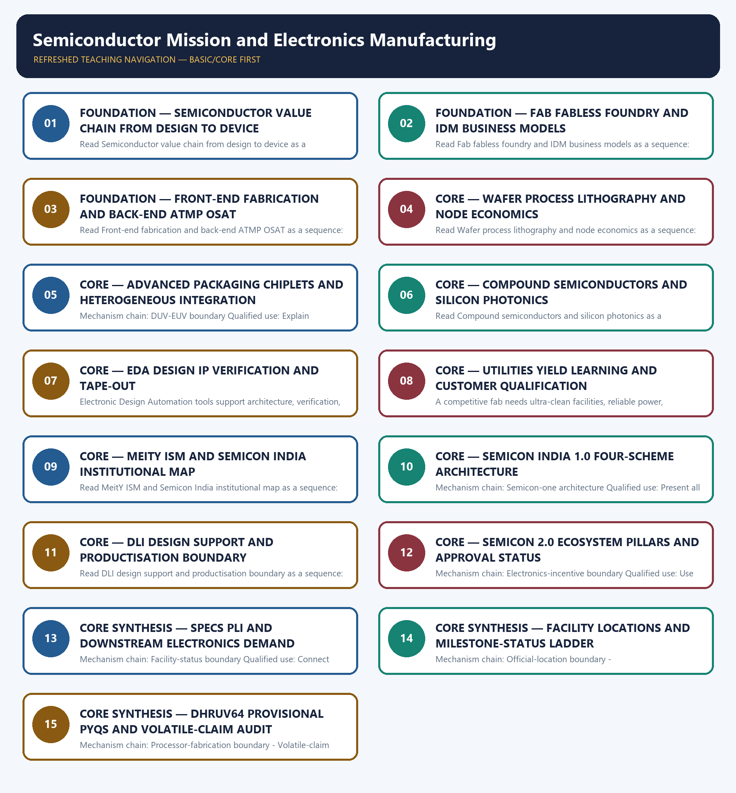

# Semiconductor Mission and Electronics Manufacturing — Learner-v2 Complete Learning Session

> **Authoring-only generation:** 2026-09-04. No PDF was rendered and no tracker or index was mutated.

### SOURCE, PROGRESSION AND CURRENT-LINKAGE AUDIT

- **Generation date:** 2026-09-04.
- **Repository-first evidence:** the Basic owner is taught first and preserved in full; the Advanced owner is retained only in the optional final teaching block.
- **OCR evidence:** Repository Markdown was primary. OCR-searchable official UPSC papers were supplementary only for printed routed demands. No answer key, performance value, procurement outcome, operational deployment, programme target or technology milestone was inferred.
- **Qdrant:** not used; repository Markdown and available OCR context were sufficient.
- **PYQ integrity:** Audited ledgers route the 2025 GS-III semiconductor-challenges and India Semiconductor Mission demand plus provisional 2026 processor and plant-location concepts here. The cards preserve official verbs and do not invent an answer letter, project total, node size or commercial-production claim.
- **Live-link boundary:** Official ISM facts already preserved by the Basic and Advanced owners were re-attempted on 2026-09-04. Semicon 2.0 remains an approved programme; notification, guideline and facility entries retain their dated milestone verbs; SEMICON India 2026 remained scheduled for 17-19 September 2026 on the attempt date.
- **Fact/inference discipline:** no current-affairs item, PYQ wording, figure or quotation is invented.

### LIVE OFFICIAL-SOURCE ATTEMPT LOG

The checks below were made on 2026-09-04. Substantive official text is used only for the proposition it supports; title-only, blocked or thin pages are recorded and supply no factual claim.

- https://ism.gov.in/schemes/semicon2.0/index — attempted 2026-09-04; the official owner record supports Cabinet approval of Semicon 2.0 on 15 July 2026, its Rs 1,27,500 crore outlay and its ecosystem emphasis on design, machines and materials, fabs, ATMP/OSAT, R&D and talent. Approval and outlay were not rewritten as disbursement, capacity created or commercial production.
- https://ism.gov.in/notifications/press-release and official ISM scheme-guideline pages — attempted 2026-09-04; the source owners record dated approvals, agreements, groundbreakings, inaugurations, chip presentation and amended guidelines. Each verb is preserved; no aggregate project total, node size, yield or sales claim is added.
- https://ism.gov.in/semicon-india-2026 — attempted 2026-09-04; the official owner record lists SEMICON India 2026 for 17-19 September 2026. On the attempt date the event remained scheduled, so no event completion, announcement outcome or participation total is inferred.

## BASIC LEARNING SESSION

### DEEP-REVIEW LEARNING CONTRACT

| Control | Binding rule for this package |
|---|---|
| Syllabus boundary | Complete Science and Technology Basic/Core is easy-first and answer-complete before optional Advanced depth. |
| System boundary | Organisation, platform, subsystem, payload, process, application, institution and outcome remain distinct. |
| Technical boundary | Physical mechanism, classification, stage, platform, unit, range/capacity and limiting condition are explicit. |
| Status boundary | Announcement, approval, development, test, deployment, induction, commercial operation and observed outcome remain distinct. |
| Data boundary | Every mission, launch, target, capacity, budget, range, timeline, rule and regulatory claim keeps source, date, unit and status. |
| Governance boundary | Funder, developer, operator, authoriser, regulator, procurer, settlement actor and adjudicator are not conflated. |
| Practice contract | Every solved item has demand decoding, detailed examiner-grade model, executable timed/compression plan, marks rationale and answer-specific improvement. |
| PYQ contract | Official wording and keys are asserted only when verified; routed or reconstructed demands remain labelled. |
| Dual-flow contract | Graphical and ASCII masters independently reconstruct the same complete Basic-to-optional-Advanced evidence spine. |
| Approval | This immutable successor remains `approved: false` pending explicit approval. |

**Canonical Basic/Core owner:** `upsc-ai-kit\knowledge\Science-and-Technology\basic\11_Semiconductor-Mission-and-Electronics-Manufacturing.md`  
**Substantive canonical provenance owner:** `upsc-ai-kit\knowledge\Science-and-Technology\learning-sessions\v2\subject-wide-syllabus\science-and-technology-11_Learning-Session.md`  
**Optional Advanced owner:** `upsc-ai-kit\knowledge\Science-and-Technology\advanced\11_Semiconductor-Mission-and-Electronics-Manufacturing.md`  
**Official syllabus mapping:** `upsc-ai-kit\knowledge\Science-and-Technology\OFFICIAL-UPSC-SYLLABUS-MAPPING.md`

### EVIDENCE, PYQ AND CURRENT-STATUS CONTROL

- ISRO organisation, launcher stages, payload and orbit claims retain their exact object and mission date.
- NavIC, GAGAN, human-spaceflight, planetary, nuclear, fusion, missile and procurement claims retain category and status.
- Aadhaar/UPI, AI, quantum and semiconductor claims retain actor, layer, metric, maturity and governance boundaries.
- DPDP/cybersecurity, biotechnology and genetic-engineering claims retain legal/regulatory stage and competent institution.
- Targets, budgets, capacities, ranges and timelines are never promoted into achieved outcomes without dated evidence.
- **Current-status note, rechecked 2026-09-06:** volatile claims retain source/date/status; failed official fetches remain explicit and supply no invented fact.

**Generation-local live/current sources:**
- `https://ism.gov.in/schemes/semicon2.0/index — attempted 2026-09-04; the official owner record supports Cabinet approval of Semicon 2.0 on 15 July 2026, its Rs 1,27,500 crore outlay and its ecosystem emphasis on design, machines and materials, fabs, ATMP/OSAT, R&D and talent. Approval and outlay were not rewritten as disbursement, capacity created or commercial production.`
- `https://ism.gov.in/notifications/press-release and official ISM scheme-guideline pages — attempted 2026-09-04; the source owners record dated approvals, agreements, groundbreakings, inaugurations, chip presentation and amended guidelines. Each verb is preserved; no aggregate project total, node size, yield or sales claim is added.`
- `https://ism.gov.in/semicon-india-2026 — attempted 2026-09-04; the official owner record lists SEMICON India 2026 for 17-19 September 2026. On the attempt date the event remained scheduled, so no event completion, announcement outcome or participation total is inferred.`

**Topic-routed verified PYQ owners:**
- No topic-local official question file is claimed; repository PYQ routing ledgers control wording and status.




*Distinct embedded teaching-navigation image. The separate continuous Cārvāka-style flowchart package remains an independent at-a-glance artifact.*

### SESSION 1 — FOUNDATION — SEMICONDUCTOR VALUE CHAIN FROM DESIGN TO DEVICE

#### DEFINITION / WHAT THIS IS CALLED

**Plain-language definition:** A fabless firm designs chips and outsources wafer manufacture, a foundry manufactures to customers' designs, and an integrated device manufacturer designs and fabricates its own products; a fab is the plant and is not itself a business-model synonym.

**Technical definition:** Read Semiconductor value chain from design to device as a sequence: identify Value-chain boundary, follow the named mechanism to its user or output, and stop at the last verified status rather than assuming the next stage.

#### ANSWER-GRABBING OPENING — WRITE/ADAPT IN THE EXAM

> Read Semiconductor value chain from design to device as a sequence: identify Value-chain boundary, follow the named mechanism to its user or output, and stop at the last verified status rather than assuming the next stage.

#### MUST-WRITE KEYWORDS

- **FOUNDATION**
- **Semiconductor value chain from design to device**
- **Mechanism chain**
- **Qualified use**
- **Read Semiconductor**
- **Value-chain**

**How to use them:** Frame the answer through FOUNDATION; define Semiconductor value chain from design to device, connect Mechanism chain with Qualified use to explain the mechanism, and use Read Semiconductor for the decisive comparison or qualification.

#### VISUAL FIRST

```text
SEMICONDUCTOR VALUE CHAIN FROM DESIGN TO DEVICE
01. Value-chain boundary
    |
    v
02. Fabless-foundry-IDM boundary
STATUS / CATEGORY FIREWALL -> Do not collapse design, fabrication and ATMP/OSAT into one stage.
```

*The rail fixes the technical sequence and the claim boundary before explanation.*

#### CORE EXPLANATION

The semiconductor chain runs from design and intellectual property through wafer fabrication, assembly, testing and packaging to boards, modules and finished electronics; strength at one stage does not establish control of every stage. A fabless firm designs chips and outsources wafer manufacture, a foundry manufactures to customers' designs, and an integrated device manufacturer designs and fabricates its own products; a fab is the plant and is not itself a business-model synonym.

#### SIMPLE SYSTEM EXAMPLE

Read Semiconductor value chain from design to device as a sequence: identify Value-chain boundary, follow the named mechanism to its user or output, and stop at the last verified status rather than assuming the next stage.

#### TECHNICAL DISTINCTION

The decisive boundary is Do not collapse design, fabrication and ATMP/OSAT into one stage. This keeps Value-chain boundary and Fabless-foundry-IDM boundary in the correct scientific category, institution and unit of measurement.

#### NAMED EVIDENCE AND MECHANISM

- The semiconductor chain runs from design and intellectual property through wafer fabrication, assembly, testing and packaging to boards, modules and finished electronics; strength at one stage does not establish control of every stage.
- A fabless firm designs chips and outsources wafer manufacture, a foundry manufactures to customers' designs, and an integrated device manufacturer designs and fabricates its own products; a fab is the plant and is not itself a business-model synonym.

#### EXAMINER CAUTION

- Do not collapse design, fabrication and ATMP/OSAT into one stage.

#### EXAM LINK

- **Prelims:** Keep institution, system, platform, service, process, legal instrument, unit and status in their exact category.
- **Mains:** Draw the complete design-to-device chain before judging self-reliance.

#### MINI RECAP

- **Mechanism chain:** Value-chain boundary -> Fabless-foundry-IDM boundary
- **Qualified use:** Draw the complete design-to-device chain before judging self-reliance.

#### CLOSING RECALL FLOW — FOUNDATION — SEMICONDUCTOR VALUE CHAIN FROM DESIGN TO DEVICE

```text
START / CONCEPT: FOUNDATION — Semiconductor value chain from design to device
        |
        v
EXACT TERMS: FOUNDATION · Semiconductor value chain from design to device · Mechanism chain · Qualified use · Read Semiconductor · Value-chain
        |
        v
MECHANISM / ARGUMENT: The semiconductor chain runs from design and intellectual property through wafer fabrication, assembly, testing and packaging to boards, modules and finished electronics; strength at one stage does not establish control of every stage.
        |
        v
CONSEQUENCE / CONTRAST: A fabless firm designs chips and outsources wafer manufacture, a foundry manufactures to customers' designs, and an integrated device manufacturer designs and fabricates its own products; a fab is the plant and is not itself a business-model synonym.
        |
        v
UPSC TRAP / ANSWER-USE: The decisive boundary is Do not collapse design, fabrication and ATMP/OSAT into one stage.
        |
        v
ANSWER-GRABBING FORMULATION: Read Semiconductor value chain from design to device as a sequence: identify Value-chain boundary, follow the named mechanism to its user or output, and stop at the last verified status rather than assuming the next stage.
```
### SESSION 2 — FOUNDATION — FAB FABLESS FOUNDRY AND IDM BUSINESS MODELS

#### DEFINITION / WHAT THIS IS CALLED

**Plain-language definition:** The decisive boundary is Do not use fab, foundry, IDM and fabless as synonyms.

**Technical definition:** Read Fab fabless foundry and IDM business models as a sequence: identify Front-end-back-end boundary, follow the named mechanism to its user or output, and stop at the last verified status rather than assuming the next stage.

#### ANSWER-GRABBING OPENING — WRITE/ADAPT IN THE EXAM

> Read Fab fabless foundry and IDM business models as a sequence: identify Front-end-back-end boundary, follow the named mechanism to its user or output, and stop at the last verified status rather than assuming the next stage.

#### MUST-WRITE KEYWORDS

- **FOUNDATION**
- **Fab fabless foundry**
- **IDM business models**
- **Mechanism chain**
- **Qualified use**
- **Wafer fabrication**

**How to use them:** Frame the answer through FOUNDATION; define Fab fabless foundry, connect IDM business models with Mechanism chain to explain the mechanism, and use Qualified use for the decisive comparison or qualification.

#### VISUAL FIRST

```text
FAB FABLESS FOUNDRY AND IDM BUSINESS MODELS
01. Front-end-back-end boundary
STATUS / CATEGORY FIREWALL -> Do not use fab, foundry, IDM and fabless as synonyms.
```

*The rail fixes the technical sequence and the claim boundary before explanation.*

#### CORE EXPLANATION

Wafer fabrication is the front-end creation of transistor and interconnect layers, while ATMP or OSAT is the back-end assembly, testing, marking and packaging of diced dies; packaging capacity is not wafer-fabrication capacity.

#### SIMPLE SYSTEM EXAMPLE

Read Fab fabless foundry and IDM business models as a sequence: identify Front-end-back-end boundary, follow the named mechanism to its user or output, and stop at the last verified status rather than assuming the next stage.

#### TECHNICAL DISTINCTION

The decisive boundary is Do not use fab, foundry, IDM and fabless as synonyms. This keeps Front-end-back-end boundary in the correct scientific category, institution and unit of measurement.

#### NAMED EVIDENCE AND MECHANISM

- Wafer fabrication is the front-end creation of transistor and interconnect layers, while ATMP or OSAT is the back-end assembly, testing, marking and packaging of diced dies; packaging capacity is not wafer-fabrication capacity.

#### EXAMINER CAUTION

- Do not use fab, foundry, IDM and fabless as synonyms.

#### EXAM LINK

- **Prelims:** Keep institution, system, platform, service, process, legal instrument, unit and status in their exact category.
- **Mains:** Classify the plant and the firm's business model separately.

#### MINI RECAP

- **Mechanism chain:** Front-end-back-end boundary
- **Qualified use:** Classify the plant and the firm's business model separately.

#### CLOSING RECALL FLOW — FOUNDATION — FAB FABLESS FOUNDRY AND IDM BUSINESS MODELS

```text
START / CONCEPT: FOUNDATION — Fab fabless foundry and IDM business models
        |
        v
EXACT TERMS: FOUNDATION · Fab fabless foundry · IDM business models · Mechanism chain · Qualified use · Wafer fabrication
        |
        v
MECHANISM / ARGUMENT: Mechanism chain: Front-end-back-end boundary Qualified use: Classify the plant and the firm's business model separately.
        |
        v
CONSEQUENCE / CONTRAST: The decisive boundary is Do not use fab, foundry, IDM and fabless as synonyms.
        |
        v
UPSC TRAP / ANSWER-USE: Do not use fab, foundry, IDM and fabless as synonyms.
        |
        v
ANSWER-GRABBING FORMULATION: Read Fab fabless foundry and IDM business models as a sequence: identify Front-end-back-end boundary, follow the named mechanism to its user or output, and stop at the last verified status rather than assuming the next stage.
```
### SESSION 3 — FOUNDATION — FRONT-END FABRICATION AND BACK-END ATMP OSAT

#### DEFINITION / WHAT THIS IS CALLED

**Plain-language definition:** ATMP names assembly, testing, marking and packaging process steps, whereas OSAT names the outsourced service model that performs such back-end work; the terms overlap operationally but are not identical.

**Technical definition:** Read Front-end fabrication and back-end ATMP OSAT as a sequence: identify ATMP-OSAT boundary, follow the named mechanism to its user or output, and stop at the last verified status rather than assuming the next stage.

#### ANSWER-GRABBING OPENING — WRITE/ADAPT IN THE EXAM

> Read Front-end fabrication and back-end ATMP OSAT as a sequence: identify ATMP-OSAT boundary, follow the named mechanism to its user or output, and stop at the last verified status rather than assuming the next stage.

#### MUST-WRITE KEYWORDS

- **FOUNDATION**
- **Front-end fabrication**
- **back-end ATMP OSAT**
- **Mechanism chain**
- **Qualified use**
- **ATMP**

**How to use them:** Frame the answer through FOUNDATION; define Front-end fabrication, connect back-end ATMP OSAT with Mechanism chain to explain the mechanism, and use Qualified use for the decisive comparison or qualification.

#### VISUAL FIRST

```text
FRONT-END FABRICATION AND BACK-END ATMP OSAT
01. ATMP-OSAT boundary
STATUS / CATEGORY FIREWALL -> Do not call packaging a wafer fab or dismiss advanced packaging as trivial.
```

*The rail fixes the technical sequence and the claim boundary before explanation.*

#### CORE EXPLANATION

ATMP names assembly, testing, marking and packaging process steps, whereas OSAT names the outsourced service model that performs such back-end work; the terms overlap operationally but are not identical.

#### SIMPLE SYSTEM EXAMPLE

Read Front-end fabrication and back-end ATMP OSAT as a sequence: identify ATMP-OSAT boundary, follow the named mechanism to its user or output, and stop at the last verified status rather than assuming the next stage.

#### TECHNICAL DISTINCTION

The decisive boundary is Do not call packaging a wafer fab or dismiss advanced packaging as trivial. This keeps ATMP-OSAT boundary in the correct scientific category, institution and unit of measurement.

#### NAMED EVIDENCE AND MECHANISM

- ATMP names assembly, testing, marking and packaging process steps, whereas OSAT names the outsourced service model that performs such back-end work; the terms overlap operationally but are not identical.

#### EXAMINER CAUTION

- Do not call packaging a wafer fab or dismiss advanced packaging as trivial.

#### EXAM LINK

- **Prelims:** Keep institution, system, platform, service, process, legal instrument, unit and status in their exact category.
- **Mains:** Compare what is created before and after wafer dicing.

#### MINI RECAP

- **Mechanism chain:** ATMP-OSAT boundary
- **Qualified use:** Compare what is created before and after wafer dicing.

#### CLOSING RECALL FLOW — FOUNDATION — FRONT-END FABRICATION AND BACK-END ATMP OSAT

```text
START / CONCEPT: FOUNDATION — Front-end fabrication and back-end ATMP OSAT
        |
        v
EXACT TERMS: FOUNDATION · Front-end fabrication · back-end ATMP OSAT · Mechanism chain · Qualified use · ATMP
        |
        v
MECHANISM / ARGUMENT: Mechanism chain: ATMP-OSAT boundary Qualified use: Compare what is created before and after wafer dicing.
        |
        v
CONSEQUENCE / CONTRAST: ATMP names assembly, testing, marking and packaging process steps, whereas OSAT names the outsourced service model that performs such back-end work; the terms overlap operationally but are not identical.
        |
        v
UPSC TRAP / ANSWER-USE: The decisive boundary is Do not call packaging a wafer fab or dismiss advanced packaging as trivial.
        |
        v
ANSWER-GRABBING FORMULATION: Read Front-end fabrication and back-end ATMP OSAT as a sequence: identify ATMP-OSAT boundary, follow the named mechanism to its user or output, and stop at the last verified status rather than assuming the next stage.
```
### SESSION 4 — CORE — WAFER PROCESS LITHOGRAPHY AND NODE ECONOMICS

#### DEFINITION / WHAT THIS IS CALLED

**Plain-language definition:** A process node is now largely a generation label associated with density and performance rather than a literal transistor dimension; mature nodes remain strategically useful for automotive, industrial, power and defence applications.

**Technical definition:** Read Wafer process lithography and node economics as a sequence: identify Process-node boundary, follow the named mechanism to its user or output, and stop at the last verified status rather than assuming the next stage.

#### ANSWER-GRABBING OPENING — WRITE/ADAPT IN THE EXAM

> Read Wafer process lithography and node economics as a sequence: identify Process-node boundary, follow the named mechanism to its user or output, and stop at the last verified status rather than assuming the next stage.

#### MUST-WRITE KEYWORDS

- **Wafer process lithography**
- **node economics**
- **Mechanism chain**
- **Qualified use**
- **A process node**
- **Read Wafer**

**How to use them:** Frame the answer through Wafer process lithography; define node economics, connect Mechanism chain with Qualified use to explain the mechanism, and use A process node for the decisive comparison or qualification.

#### VISUAL FIRST

```text
WAFER PROCESS LITHOGRAPHY AND NODE ECONOMICS
01. Process-node boundary
STATUS / CATEGORY FIREWALL -> Do not equate ATMP process steps with the OSAT business model.
```

*The rail fixes the technical sequence and the claim boundary before explanation.*

#### CORE EXPLANATION

A process node is now largely a generation label associated with density and performance rather than a literal transistor dimension; mature nodes remain strategically useful for automotive, industrial, power and defence applications.

#### SIMPLE SYSTEM EXAMPLE

Read Wafer process lithography and node economics as a sequence: identify Process-node boundary, follow the named mechanism to its user or output, and stop at the last verified status rather than assuming the next stage.

#### TECHNICAL DISTINCTION

The decisive boundary is Do not equate ATMP process steps with the OSAT business model. This keeps Process-node boundary in the correct scientific category, institution and unit of measurement.

#### NAMED EVIDENCE AND MECHANISM

- A process node is now largely a generation label associated with density and performance rather than a literal transistor dimension; mature nodes remain strategically useful for automotive, industrial, power and defence applications.

#### EXAMINER CAUTION

- Do not equate ATMP process steps with the OSAT business model.

#### EXAM LINK

- **Prelims:** Keep institution, system, platform, service, process, legal instrument, unit and status in their exact category.
- **Mains:** Link manufacturing generation to tools, demand and official evidence.

#### MINI RECAP

- **Mechanism chain:** Process-node boundary
- **Qualified use:** Link manufacturing generation to tools, demand and official evidence.

#### CLOSING RECALL FLOW — CORE — WAFER PROCESS LITHOGRAPHY AND NODE ECONOMICS

```text
START / CONCEPT: CORE — Wafer process lithography and node economics
        |
        v
EXACT TERMS: Wafer process lithography · node economics · Mechanism chain · Qualified use · A process node · Read Wafer
        |
        v
MECHANISM / ARGUMENT: Mechanism chain: Process-node boundary Qualified use: Link manufacturing generation to tools, demand and official evidence.
        |
        v
CONSEQUENCE / CONTRAST: The decisive boundary is Do not equate ATMP process steps with the OSAT business model.
        |
        v
UPSC TRAP / ANSWER-USE: Do not equate ATMP process steps with the OSAT business model.
        |
        v
ANSWER-GRABBING FORMULATION: Read Wafer process lithography and node economics as a sequence: identify Process-node boundary, follow the named mechanism to its user or output, and stop at the last verified status rather than assuming the next stage.
```
### SESSION 5 — CORE — ADVANCED PACKAGING CHIPLETS AND HETEROGENEOUS INTEGRATION

#### DEFINITION / WHAT THIS IS CALLED

**Plain-language definition:** Read Advanced packaging chiplets and heterogeneous integration as a sequence: identify DUV-EUV boundary, follow the named mechanism to its user or output, and stop at the last verified status rather than assuming the next stage.

**Technical definition:** Mechanism chain: DUV-EUV boundary Qualified use: Explain system-level gains without claiming leading-edge fabrication.

#### ANSWER-GRABBING OPENING — WRITE/ADAPT IN THE EXAM

> Read Advanced packaging chiplets and heterogeneous integration as a sequence: identify DUV-EUV boundary, follow the named mechanism to its user or output, and stop at the last verified status rather than assuming the next stage.

#### MUST-WRITE KEYWORDS

- **Advanced packaging chiplets**
- **heterogeneous integration**
- **Mechanism chain**
- **Qualified use**
- **Deep-ultraviolet**
- **Read Advanced**

**How to use them:** Frame the answer through Advanced packaging chiplets; define heterogeneous integration, connect Mechanism chain with Qualified use to explain the mechanism, and use Deep-ultraviolet for the decisive comparison or qualification.

#### VISUAL FIRST

```text
ADVANCED PACKAGING CHIPLETS AND HETEROGENEOUS INTEGRATION
01. DUV-EUV boundary
STATUS / CATEGORY FIREWALL -> Do not treat a node label as a literal dimension or automatic strategic superiority.
```

*The rail fixes the technical sequence and the claim boundary before explanation.*

#### CORE EXPLANATION

Deep-ultraviolet lithography supports mature and mid-range manufacturing, while extreme-ultraviolet lithography is a leading-edge chokepoint concentrated in one global supplier and exposed to export controls; a smaller-node claim requires an explicit official source.

#### SIMPLE SYSTEM EXAMPLE

Read Advanced packaging chiplets and heterogeneous integration as a sequence: identify DUV-EUV boundary, follow the named mechanism to its user or output, and stop at the last verified status rather than assuming the next stage.

#### TECHNICAL DISTINCTION

The decisive boundary is Do not treat a node label as a literal dimension or automatic strategic superiority. This keeps DUV-EUV boundary in the correct scientific category, institution and unit of measurement.

#### NAMED EVIDENCE AND MECHANISM

- Deep-ultraviolet lithography supports mature and mid-range manufacturing, while extreme-ultraviolet lithography is a leading-edge chokepoint concentrated in one global supplier and exposed to export controls; a smaller-node claim requires an explicit official source.

#### EXAMINER CAUTION

- Do not treat a node label as a literal dimension or automatic strategic superiority.

#### EXAM LINK

- **Prelims:** Keep institution, system, platform, service, process, legal instrument, unit and status in their exact category.
- **Mains:** Explain system-level gains without claiming leading-edge fabrication.

#### MINI RECAP

- **Mechanism chain:** DUV-EUV boundary
- **Qualified use:** Explain system-level gains without claiming leading-edge fabrication.

#### CLOSING RECALL FLOW — CORE — ADVANCED PACKAGING CHIPLETS AND HETEROGENEOUS INTEGRATION

```text
START / CONCEPT: CORE — Advanced packaging chiplets and heterogeneous integration
        |
        v
EXACT TERMS: Advanced packaging chiplets · heterogeneous integration · Mechanism chain · Qualified use · Deep-ultraviolet · Read Advanced
        |
        v
MECHANISM / ARGUMENT: Mechanism chain: DUV-EUV boundary Qualified use: Explain system-level gains without claiming leading-edge fabrication.
        |
        v
CONSEQUENCE / CONTRAST: Deep-ultraviolet lithography supports mature and mid-range manufacturing, while extreme-ultraviolet lithography is a leading-edge chokepoint concentrated in one global supplier and exposed to export controls; a smaller-node claim requires an explicit official source.
        |
        v
UPSC TRAP / ANSWER-USE: The decisive boundary is Do not treat a node label as a literal dimension or automatic strategic superiority.
        |
        v
ANSWER-GRABBING FORMULATION: Read Advanced packaging chiplets and heterogeneous integration as a sequence: identify DUV-EUV boundary, follow the named mechanism to its user or output, and stop at the last verified status rather than assuming the next stage.
```
### SESSION 6 — CORE — COMPOUND SEMICONDUCTORS AND SILICON PHOTONICS

#### DEFINITION / WHAT THIS IS CALLED

**Plain-language definition:** Compound semiconductors such as GaN, GaAs, InP and SiC combine multiple elements for power, radio-frequency or optoelectronic uses, while silicon photonics is a silicon platform for optical interconnects and is not a compound semiconductor.

**Technical definition:** Read Compound semiconductors and silicon photonics as a sequence: identify Advanced-packaging boundary, follow the named mechanism to its user or output, and stop at the last verified status rather than assuming the next stage.

#### ANSWER-GRABBING OPENING — WRITE/ADAPT IN THE EXAM

> Compound semiconductors such as GaN, GaAs, InP and SiC combine multiple elements for power, radio-frequency or optoelectronic uses, while silicon photonics is a silicon platform for optical interconnects and is not a compound semiconductor.

#### MUST-WRITE KEYWORDS

- **Compound semiconductors**
- **silicon photonics**
- **Mechanism chain**
- **Qualified use**
- **Chiplets**
- **Compound**

**How to use them:** Frame the answer through Compound semiconductors; define silicon photonics, connect Mechanism chain with Qualified use to explain the mechanism, and use Chiplets for the decisive comparison or qualification.

#### VISUAL FIRST

```text
COMPOUND SEMICONDUCTORS AND SILICON PHOTONICS
01. Advanced-packaging boundary
    |
    v
02. Compound-photonics boundary
STATUS / CATEGORY FIREWALL -> Do not assign a node size without an explicit dated official source.
```

*The rail fixes the technical sequence and the claim boundary before explanation.*

#### CORE EXPLANATION

Chiplets, 2.5D and 3D integration, through-silicon vias and heterogeneous integration can improve system performance without leading-edge lithography, making advanced packaging a capability route rather than a trivial final assembly step. Compound semiconductors such as GaN, GaAs, InP and SiC combine multiple elements for power, radio-frequency or optoelectronic uses, while silicon photonics is a silicon platform for optical interconnects and is not a compound semiconductor.

#### SIMPLE SYSTEM EXAMPLE

Read Compound semiconductors and silicon photonics as a sequence: identify Advanced-packaging boundary, follow the named mechanism to its user or output, and stop at the last verified status rather than assuming the next stage.

#### TECHNICAL DISTINCTION

The decisive boundary is Do not assign a node size without an explicit dated official source. This keeps Advanced-packaging boundary and Compound-photonics boundary in the correct scientific category, institution and unit of measurement.

#### NAMED EVIDENCE AND MECHANISM

- Chiplets, 2.5D and 3D integration, through-silicon vias and heterogeneous integration can improve system performance without leading-edge lithography, making advanced packaging a capability route rather than a trivial final assembly step.
- Compound semiconductors such as GaN, GaAs, InP and SiC combine multiple elements for power, radio-frequency or optoelectronic uses, while silicon photonics is a silicon platform for optical interconnects and is not a compound semiconductor.

#### EXAMINER CAUTION

- Do not assign a node size without an explicit dated official source.

#### EXAM LINK

- **Prelims:** Keep institution, system, platform, service, process, legal instrument, unit and status in their exact category.
- **Mains:** Separate material physics from policy grouping.

#### MINI RECAP

- **Mechanism chain:** Advanced-packaging boundary -> Compound-photonics boundary
- **Qualified use:** Separate material physics from policy grouping.

#### CLOSING RECALL FLOW — CORE — COMPOUND SEMICONDUCTORS AND SILICON PHOTONICS

```text
START / CONCEPT: CORE — Compound semiconductors and silicon photonics
        |
        v
EXACT TERMS: Compound semiconductors · silicon photonics · Mechanism chain · Qualified use · Chiplets · Compound
        |
        v
MECHANISM / ARGUMENT: Read Compound semiconductors and silicon photonics as a sequence: identify Advanced-packaging boundary, follow the named mechanism to its user or output, and stop at the last verified status rather than assuming the next stage.
        |
        v
CONSEQUENCE / CONTRAST: The decisive boundary is Do not assign a node size without an explicit dated official source.
        |
        v
UPSC TRAP / ANSWER-USE: Do not assign a node size without an explicit dated official source.
        |
        v
ANSWER-GRABBING FORMULATION: Compound semiconductors such as GaN, GaAs, InP and SiC combine multiple elements for power, radio-frequency or optoelectronic uses, while silicon photonics is a silicon platform for optical interconnects and is not a compound semiconductor.
```
### SESSION 7 — CORE — EDA DESIGN IP VERIFICATION AND TAPE-OUT

#### DEFINITION / WHAT THIS IS CALLED

**Plain-language definition:** Read EDA design IP verification and tape-out as a sequence: identify EDA-design-IP boundary, follow the named mechanism to its user or output, and stop at the last verified status rather than assuming the next stage.

**Technical definition:** Electronic Design Automation tools support architecture, verification, layout and tape-out, while reusable design intellectual property supplies circuit blocks; design capability can exist without domestic wafer fabrication and still retain external tool-chain dependencies.

#### ANSWER-GRABBING OPENING — WRITE/ADAPT IN THE EXAM

> Electronic Design Automation tools support architecture, verification, layout and tape-out, while reusable design intellectual property supplies circuit blocks; design capability can exist without domestic wafer fabrication and still retain external tool-chain dependencies.

#### MUST-WRITE KEYWORDS

- **EDA design IP verification**
- **tape-out**
- **Mechanism chain**
- **Qualified use**
- **Electronic Design Automation**
- **Read EDA**

**How to use them:** Frame the answer through EDA design IP verification; define tape-out, connect Mechanism chain with Qualified use to explain the mechanism, and use Electronic Design Automation for the decisive comparison or qualification.

#### VISUAL FIRST

```text
EDA DESIGN IP VERIFICATION AND TAPE-OUT
01. EDA-design-IP boundary
STATUS / CATEGORY FIREWALL -> Do not call silicon photonics a compound semiconductor.
```

*The rail fixes the technical sequence and the claim boundary before explanation.*

#### CORE EXPLANATION

Electronic Design Automation tools support architecture, verification, layout and tape-out, while reusable design intellectual property supplies circuit blocks; design capability can exist without domestic wafer fabrication and still retain external tool-chain dependencies.

#### SIMPLE SYSTEM EXAMPLE

Read EDA design IP verification and tape-out as a sequence: identify EDA-design-IP boundary, follow the named mechanism to its user or output, and stop at the last verified status rather than assuming the next stage.

#### TECHNICAL DISTINCTION

The decisive boundary is Do not call silicon photonics a compound semiconductor. This keeps EDA-design-IP boundary in the correct scientific category, institution and unit of measurement.

#### NAMED EVIDENCE AND MECHANISM

- Electronic Design Automation tools support architecture, verification, layout and tape-out, while reusable design intellectual property supplies circuit blocks; design capability can exist without domestic wafer fabrication and still retain external tool-chain dependencies.

#### EXAMINER CAUTION

- Do not call silicon photonics a compound semiconductor.

#### EXAM LINK

- **Prelims:** Keep institution, system, platform, service, process, legal instrument, unit and status in their exact category.
- **Mains:** Trace blueprint creation and external design-tool dependencies.

#### MINI RECAP

- **Mechanism chain:** EDA-design-IP boundary
- **Qualified use:** Trace blueprint creation and external design-tool dependencies.

#### CLOSING RECALL FLOW — CORE — EDA DESIGN IP VERIFICATION AND TAPE-OUT

```text
START / CONCEPT: CORE — EDA design IP verification and tape-out
        |
        v
EXACT TERMS: EDA design IP verification · tape-out · Mechanism chain · Qualified use · Electronic Design Automation · Read EDA
        |
        v
MECHANISM / ARGUMENT: Read EDA design IP verification and tape-out as a sequence: identify EDA-design-IP boundary, follow the named mechanism to its user or output, and stop at the last verified status rather than assuming the next stage.
        |
        v
CONSEQUENCE / CONTRAST: The decisive boundary is Do not call silicon photonics a compound semiconductor.
        |
        v
UPSC TRAP / ANSWER-USE: Do not call silicon photonics a compound semiconductor.
        |
        v
ANSWER-GRABBING FORMULATION: Electronic Design Automation tools support architecture, verification, layout and tape-out, while reusable design intellectual property supplies circuit blocks; design capability can exist without domestic wafer fabrication and still retain external tool-chain dependencies.
```
### SESSION 8 — CORE — UTILITIES YIELD LEARNING AND CUSTOMER QUALIFICATION

#### DEFINITION / WHAT THIS IS CALLED

**Plain-language definition:** Read Utilities yield learning and customer qualification as a sequence: identify Utility-yield boundary, follow the named mechanism to its user or output, and stop at the last verified status rather than assuming the next stage.

**Technical definition:** A competitive fab needs ultra-clean facilities, reliable power, ultra-pure water, specialty gases and chemicals, process control, sustained yield learning and customer qualification; inauguration alone proves none of these operating outcomes.

#### ANSWER-GRABBING OPENING — WRITE/ADAPT IN THE EXAM

> Read Utilities yield learning and customer qualification as a sequence: identify Utility-yield boundary, follow the named mechanism to its user or output, and stop at the last verified status rather than assuming the next stage.

#### MUST-WRITE KEYWORDS

- **Utilities yield learning**
- **customer qualification**
- **Mechanism chain**
- **Qualified use**
- **Read Utilities**
- **Utility-yield**

**How to use them:** Frame the answer through Utilities yield learning; define customer qualification, connect Mechanism chain with Qualified use to explain the mechanism, and use Read Utilities for the decisive comparison or qualification.

#### VISUAL FIRST

```text
UTILITIES YIELD LEARNING AND CUSTOMER QUALIFICATION
01. Utility-yield boundary
STATUS / CATEGORY FIREWALL -> Do not convert design strength into fabrication self-reliance.
```

*The rail fixes the technical sequence and the claim boundary before explanation.*

#### CORE EXPLANATION

A competitive fab needs ultra-clean facilities, reliable power, ultra-pure water, specialty gases and chemicals, process control, sustained yield learning and customer qualification; inauguration alone proves none of these operating outcomes.

#### SIMPLE SYSTEM EXAMPLE

Read Utilities yield learning and customer qualification as a sequence: identify Utility-yield boundary, follow the named mechanism to its user or output, and stop at the last verified status rather than assuming the next stage.

#### TECHNICAL DISTINCTION

The decisive boundary is Do not convert design strength into fabrication self-reliance. This keeps Utility-yield boundary in the correct scientific category, institution and unit of measurement.

#### NAMED EVIDENCE AND MECHANISM

- A competitive fab needs ultra-clean facilities, reliable power, ultra-pure water, specialty gases and chemicals, process control, sustained yield learning and customer qualification; inauguration alone proves none of these operating outcomes.

#### EXAMINER CAUTION

- Do not convert design strength into fabrication self-reliance.

#### EXAM LINK

- **Prelims:** Keep institution, system, platform, service, process, legal instrument, unit and status in their exact category.
- **Mains:** Show why a building needs repeatable process performance.

#### MINI RECAP

- **Mechanism chain:** Utility-yield boundary
- **Qualified use:** Show why a building needs repeatable process performance.

#### CLOSING RECALL FLOW — CORE — UTILITIES YIELD LEARNING AND CUSTOMER QUALIFICATION

```text
START / CONCEPT: CORE — Utilities yield learning and customer qualification
        |
        v
EXACT TERMS: Utilities yield learning · customer qualification · Mechanism chain · Qualified use · Read Utilities · Utility-yield
        |
        v
MECHANISM / ARGUMENT: A competitive fab needs ultra-clean facilities, reliable power, ultra-pure water, specialty gases and chemicals, process control, sustained yield learning and customer qualification; inauguration alone proves none of these operating outcomes.
        |
        v
CONSEQUENCE / CONTRAST: The decisive boundary is Do not convert design strength into fabrication self-reliance.
        |
        v
UPSC TRAP / ANSWER-USE: Do not convert design strength into fabrication self-reliance.
        |
        v
ANSWER-GRABBING FORMULATION: Read Utilities yield learning and customer qualification as a sequence: identify Utility-yield boundary, follow the named mechanism to its user or output, and stop at the last verified status rather than assuming the next stage.
```
### SESSION 9 — CORE — MEITY ISM AND SEMICON INDIA INSTITUTIONAL MAP

#### DEFINITION / WHAT THIS IS CALLED

**Plain-language definition:** India Semiconductor Mission is the MeitY-linked implementing agency for semiconductor and display ecosystem schemes; it is distinct from the Semicon India scheme package and from separate electronics-manufacturing incentives.

**Technical definition:** Read MeitY ISM and Semicon India institutional map as a sequence: identify ISM-institution boundary, follow the named mechanism to its user or output, and stop at the last verified status rather than assuming the next stage.

#### ANSWER-GRABBING OPENING — WRITE/ADAPT IN THE EXAM

> India Semiconductor Mission is the MeitY-linked implementing agency for semiconductor and display ecosystem schemes; it is distinct from the Semicon India scheme package and from separate electronics-manufacturing incentives.

#### MUST-WRITE KEYWORDS

- **MeitY ISM**
- **Semicon India institutional map**
- **Mechanism chain**
- **Qualified use**
- **India Semiconductor Mission**
- **MeitY-linked**

**How to use them:** Frame the answer through MeitY ISM; define Semicon India institutional map, connect Mechanism chain with Qualified use to explain the mechanism, and use India Semiconductor Mission for the decisive comparison or qualification.

#### VISUAL FIRST

```text
MEITY ISM AND SEMICON INDIA INSTITUTIONAL MAP
01. ISM-institution boundary
STATUS / CATEGORY FIREWALL -> Do not merge ISM, Semicon India, DLI, SPECS and PLI.
```

*The rail fixes the technical sequence and the claim boundary before explanation.*

#### CORE EXPLANATION

India Semiconductor Mission is the MeitY-linked implementing agency for semiconductor and display ecosystem schemes; it is distinct from the Semicon India scheme package and from separate electronics-manufacturing incentives.

#### SIMPLE SYSTEM EXAMPLE

Read MeitY ISM and Semicon India institutional map as a sequence: identify ISM-institution boundary, follow the named mechanism to its user or output, and stop at the last verified status rather than assuming the next stage.

#### TECHNICAL DISTINCTION

The decisive boundary is Do not merge ISM, Semicon India, DLI, SPECS and PLI. This keeps ISM-institution boundary in the correct scientific category, institution and unit of measurement.

#### NAMED EVIDENCE AND MECHANISM

- India Semiconductor Mission is the MeitY-linked implementing agency for semiconductor and display ecosystem schemes; it is distinct from the Semicon India scheme package and from separate electronics-manufacturing incentives.

#### EXAMINER CAUTION

- Do not merge ISM, Semicon India, DLI, SPECS and PLI.

#### EXAM LINK

- **Prelims:** Keep institution, system, platform, service, process, legal instrument, unit and status in their exact category.
- **Mains:** Name ministry, implementing agency and scheme package distinctly.

#### MINI RECAP

- **Mechanism chain:** ISM-institution boundary
- **Qualified use:** Name ministry, implementing agency and scheme package distinctly.

#### CLOSING RECALL FLOW — CORE — MEITY ISM AND SEMICON INDIA INSTITUTIONAL MAP

```text
START / CONCEPT: CORE — MeitY ISM and Semicon India institutional map
        |
        v
EXACT TERMS: MeitY ISM · Semicon India institutional map · Mechanism chain · Qualified use · India Semiconductor Mission · MeitY-linked
        |
        v
MECHANISM / ARGUMENT: Read MeitY ISM and Semicon India institutional map as a sequence: identify ISM-institution boundary, follow the named mechanism to its user or output, and stop at the last verified status rather than assuming the next stage.
        |
        v
CONSEQUENCE / CONTRAST: The decisive boundary is Do not merge ISM, Semicon India, DLI, SPECS and PLI.
        |
        v
UPSC TRAP / ANSWER-USE: Do not merge ISM, Semicon India, DLI, SPECS and PLI.
        |
        v
ANSWER-GRABBING FORMULATION: India Semiconductor Mission is the MeitY-linked implementing agency for semiconductor and display ecosystem schemes; it is distinct from the Semicon India scheme package and from separate electronics-manufacturing incentives.
```
### SESSION 10 — CORE — SEMICON INDIA 1.0 FOUR-SCHEME ARCHITECTURE

#### DEFINITION / WHAT THIS IS CALLED

**Plain-language definition:** Read Semicon India 1.0 four-scheme architecture as a sequence: identify Semicon-one architecture, follow the named mechanism to its user or output, and stop at the last verified status rather than assuming the next stage.

**Technical definition:** Mechanism chain: Semicon-one architecture Qualified use: Present all four programme channels without merging incentives.

#### ANSWER-GRABBING OPENING — WRITE/ADAPT IN THE EXAM

> Read Semicon India 1.0 four-scheme architecture as a sequence: identify Semicon-one architecture, follow the named mechanism to its user or output, and stop at the last verified status rather than assuming the next stage.

#### MUST-WRITE KEYWORDS

- **Semicon India 1.0 four-scheme architecture**
- **Mechanism chain**
- **Qualified use**
- **Semicon India**
- **Rs**
- **ATMP-OSAT**

**How to use them:** Frame the answer through Semicon India 1.0 four-scheme architecture; define Mechanism chain, connect Qualified use with Semicon India to explain the mechanism, and use Rs for the decisive comparison or qualification.

#### VISUAL FIRST

```text
SEMICON INDIA 1.0 FOUR-SCHEME ARCHITECTURE
01. Semicon-one architecture
STATUS / CATEGORY FIREWALL -> Do not convert approval, agreement, groundbreaking or inauguration into commercial supply.
```

*The rail fixes the technical sequence and the claim boundary before explanation.*

#### CORE EXPLANATION

Semicon India 1.0 has a Rs 76,000 crore umbrella covering semiconductor fabs, display fabs, compound-semiconductor or silicon-photonics or sensor fabs plus ATMP-OSAT, and Design Linked Incentive support.

#### SIMPLE SYSTEM EXAMPLE

Read Semicon India 1.0 four-scheme architecture as a sequence: identify Semicon-one architecture, follow the named mechanism to its user or output, and stop at the last verified status rather than assuming the next stage.

#### TECHNICAL DISTINCTION

The decisive boundary is Do not convert approval, agreement, groundbreaking or inauguration into commercial supply. This keeps Semicon-one architecture in the correct scientific category, institution and unit of measurement.

#### NAMED EVIDENCE AND MECHANISM

- Semicon India 1.0 has a Rs 76,000 crore umbrella covering semiconductor fabs, display fabs, compound-semiconductor or silicon-photonics or sensor fabs plus ATMP-OSAT, and Design Linked Incentive support.

#### EXAMINER CAUTION

- Do not convert approval, agreement, groundbreaking or inauguration into commercial supply.

#### EXAM LINK

- **Prelims:** Keep institution, system, platform, service, process, legal instrument, unit and status in their exact category.
- **Mains:** Present all four programme channels without merging incentives.

#### MINI RECAP

- **Mechanism chain:** Semicon-one architecture
- **Qualified use:** Present all four programme channels without merging incentives.

#### CLOSING RECALL FLOW — CORE — SEMICON INDIA 1.0 FOUR-SCHEME ARCHITECTURE

```text
START / CONCEPT: CORE — Semicon India 1.0 four-scheme architecture
        |
        v
EXACT TERMS: Semicon India 1.0 four-scheme architecture · Mechanism chain · Qualified use · Semicon India · Rs · ATMP-OSAT
        |
        v
MECHANISM / ARGUMENT: Mechanism chain: Semicon-one architecture Qualified use: Present all four programme channels without merging incentives.
        |
        v
CONSEQUENCE / CONTRAST: Semicon India 1.0 has a Rs 76,000 crore umbrella covering semiconductor fabs, display fabs, compound-semiconductor or silicon-photonics or sensor fabs plus ATMP-OSAT, and Design Linked Incentive support.
        |
        v
UPSC TRAP / ANSWER-USE: The decisive boundary is Do not convert approval, agreement, groundbreaking or inauguration into commercial supply.
        |
        v
ANSWER-GRABBING FORMULATION: Read Semicon India 1.0 four-scheme architecture as a sequence: identify Semicon-one architecture, follow the named mechanism to its user or output, and stop at the last verified status rather than assuming the next stage.
```
### SESSION 11 — CORE — DLI DESIGN SUPPORT AND PRODUCTISATION BOUNDARY

#### DEFINITION / WHAT THIS IS CALLED

**Plain-language definition:** Design Linked Incentive supports domestic chip design, design infrastructure, startups and productisation; it is not a direct wafer-fab subsidy and does not establish fabrication self-reliance.

**Technical definition:** Read DLI design support and productisation boundary as a sequence: identify DLI-boundary, follow the named mechanism to its user or output, and stop at the last verified status rather than assuming the next stage.

#### ANSWER-GRABBING OPENING — WRITE/ADAPT IN THE EXAM

> Design Linked Incentive supports domestic chip design, design infrastructure, startups and productisation; it is not a direct wafer-fab subsidy and does not establish fabrication self-reliance.

#### MUST-WRITE KEYWORDS

- **DLI design support**
- **productisation boundary**
- **Mechanism chain**
- **Qualified use**
- **Design Linked Incentive**
- **Semicon**

**How to use them:** Frame the answer through DLI design support; define productisation boundary, connect Mechanism chain with Qualified use to explain the mechanism, and use Design Linked Incentive for the decisive comparison or qualification.

#### VISUAL FIRST

```text
DLI DESIGN SUPPORT AND PRODUCTISATION BOUNDARY
01. DLI-boundary
    |
    v
02. Semicon-two boundary
STATUS / CATEGORY FIREWALL -> Do not infer yield, customer qualification or ecosystem maturity from a facility milestone.
```

*The rail fixes the technical sequence and the claim boundary before explanation.*

#### CORE EXPLANATION

Design Linked Incentive supports domestic chip design, design infrastructure, startups and productisation; it is not a direct wafer-fab subsidy and does not establish fabrication self-reliance. Semicon 2.0 was approved by the Union Cabinet on 15 July 2026 with a Rs 1,27,500 crore outlay and an official ecosystem emphasis spanning design, machines and materials, more fabs, ATMP or OSAT, research and development, and talent.

#### SIMPLE SYSTEM EXAMPLE

Read DLI design support and productisation boundary as a sequence: identify DLI-boundary, follow the named mechanism to its user or output, and stop at the last verified status rather than assuming the next stage.

#### TECHNICAL DISTINCTION

The decisive boundary is Do not infer yield, customer qualification or ecosystem maturity from a facility milestone. This keeps DLI-boundary and Semicon-two boundary in the correct scientific category, institution and unit of measurement.

#### NAMED EVIDENCE AND MECHANISM

- Design Linked Incentive supports domestic chip design, design infrastructure, startups and productisation; it is not a direct wafer-fab subsidy and does not establish fabrication self-reliance.
- Semicon 2.0 was approved by the Union Cabinet on 15 July 2026 with a Rs 1,27,500 crore outlay and an official ecosystem emphasis spanning design, machines and materials, more fabs, ATMP or OSAT, research and development, and talent.

#### EXAMINER CAUTION

- Do not infer yield, customer qualification or ecosystem maturity from a facility milestone.

#### EXAM LINK

- **Prelims:** Keep institution, system, platform, service, process, legal instrument, unit and status in their exact category.
- **Mains:** Keep design support outside the fab-subsidy category.

#### MINI RECAP

- **Mechanism chain:** DLI-boundary -> Semicon-two boundary
- **Qualified use:** Keep design support outside the fab-subsidy category.

#### CLOSING RECALL FLOW — CORE — DLI DESIGN SUPPORT AND PRODUCTISATION BOUNDARY

```text
START / CONCEPT: CORE — DLI design support and productisation boundary
        |
        v
EXACT TERMS: DLI design support · productisation boundary · Mechanism chain · Qualified use · Design Linked Incentive · Semicon
        |
        v
MECHANISM / ARGUMENT: Read DLI design support and productisation boundary as a sequence: identify DLI-boundary, follow the named mechanism to its user or output, and stop at the last verified status rather than assuming the next stage.
        |
        v
CONSEQUENCE / CONTRAST: Mechanism chain: DLI-boundary - Semicon-two boundary Qualified use: Keep design support outside the fab-subsidy category.
        |
        v
UPSC TRAP / ANSWER-USE: The decisive boundary is Do not infer yield, customer qualification or ecosystem maturity from a facility milestone.
        |
        v
ANSWER-GRABBING FORMULATION: Design Linked Incentive supports domestic chip design, design infrastructure, startups and productisation; it is not a direct wafer-fab subsidy and does not establish fabrication self-reliance.
```
### SESSION 12 — CORE — SEMICON 2.0 ECOSYSTEM PILLARS AND APPROVAL STATUS

#### DEFINITION / WHAT THIS IS CALLED

**Plain-language definition:** Read Semicon 2.0 ecosystem pillars and approval status as a sequence: identify Electronics-incentive boundary, follow the named mechanism to its user or output, and stop at the last verified status rather than assuming the next stage.

**Technical definition:** Mechanism chain: Electronics-incentive boundary Qualified use: Use the six ecosystem pillars and preserve approved status.

#### ANSWER-GRABBING OPENING — WRITE/ADAPT IN THE EXAM

> Read Semicon 2.0 ecosystem pillars and approval status as a sequence: identify Electronics-incentive boundary, follow the named mechanism to its user or output, and stop at the last verified status rather than assuming the next stage.

#### MUST-WRITE KEYWORDS

- **Semicon 2.0 ecosystem pillars**
- **approval status**
- **Mechanism chain**
- **Qualified use**
- **SPECS**
- **IT-hardware PLI**

**How to use them:** Frame the answer through Semicon 2.0 ecosystem pillars; define approval status, connect Mechanism chain with Qualified use to explain the mechanism, and use SPECS for the decisive comparison or qualification.

#### VISUAL FIRST

```text
SEMICON 2.0 ECOSYSTEM PILLARS AND APPROVAL STATUS
01. Electronics-incentive boundary
STATUS / CATEGORY FIREWALL -> Do not invent an aggregate project total, production figure or objective answer key.
```

*The rail fixes the technical sequence and the claim boundary before explanation.*

#### CORE EXPLANATION

SPECS and electronics or IT-hardware PLI instruments complement semiconductor policy through component and downstream manufacturing incentives, but they are separate from ISM and cannot be merged into one scheme.

#### SIMPLE SYSTEM EXAMPLE

Read Semicon 2.0 ecosystem pillars and approval status as a sequence: identify Electronics-incentive boundary, follow the named mechanism to its user or output, and stop at the last verified status rather than assuming the next stage.

#### TECHNICAL DISTINCTION

The decisive boundary is Do not invent an aggregate project total, production figure or objective answer key. This keeps Electronics-incentive boundary in the correct scientific category, institution and unit of measurement.

#### NAMED EVIDENCE AND MECHANISM

- SPECS and electronics or IT-hardware PLI instruments complement semiconductor policy through component and downstream manufacturing incentives, but they are separate from ISM and cannot be merged into one scheme.

#### EXAMINER CAUTION

- Do not invent an aggregate project total, production figure or objective answer key.

#### EXAM LINK

- **Prelims:** Keep institution, system, platform, service, process, legal instrument, unit and status in their exact category.
- **Mains:** Use the six ecosystem pillars and preserve approved status.

#### MINI RECAP

- **Mechanism chain:** Electronics-incentive boundary
- **Qualified use:** Use the six ecosystem pillars and preserve approved status.

#### CLOSING RECALL FLOW — CORE — SEMICON 2.0 ECOSYSTEM PILLARS AND APPROVAL STATUS

```text
START / CONCEPT: CORE — Semicon 2.0 ecosystem pillars and approval status
        |
        v
EXACT TERMS: Semicon 2.0 ecosystem pillars · approval status · Mechanism chain · Qualified use · SPECS · IT-hardware PLI
        |
        v
MECHANISM / ARGUMENT: Mechanism chain: Electronics-incentive boundary Qualified use: Use the six ecosystem pillars and preserve approved status.
        |
        v
CONSEQUENCE / CONTRAST: SPECS and electronics or IT-hardware PLI instruments complement semiconductor policy through component and downstream manufacturing incentives, but they are separate from ISM and cannot be merged into one scheme.
        |
        v
UPSC TRAP / ANSWER-USE: Do not miss this limiting distinction: use the six ecosystem pillars and preserve approved status.
        |
        v
ANSWER-GRABBING FORMULATION: Read Semicon 2.0 ecosystem pillars and approval status as a sequence: identify Electronics-incentive boundary, follow the named mechanism to its user or output, and stop at the last verified status rather than assuming the next stage.
```
### SESSION 13 — CORE SYNTHESIS — SPECS PLI AND DOWNSTREAM ELECTRONICS DEMAND

#### DEFINITION / WHAT THIS IS CALLED

**Plain-language definition:** Read SPECS PLI and downstream electronics demand as a sequence: identify Facility-status boundary, follow the named mechanism to its user or output, and stop at the last verified status rather than assuming the next stage.

**Technical definition:** Mechanism chain: Facility-status boundary Qualified use: Connect demand pull without institutional conflation.

#### ANSWER-GRABBING OPENING — WRITE/ADAPT IN THE EXAM

> Read SPECS PLI and downstream electronics demand as a sequence: identify Facility-status boundary, follow the named mechanism to its user or output, and stop at the last verified status rather than assuming the next stage.

#### MUST-WRITE KEYWORDS

- **CORE SYNTHESIS**
- **SPECS PLI**
- **downstream electronics demand**
- **Mechanism chain**
- **Qualified use**
- **Official**

**How to use them:** Frame the answer through CORE SYNTHESIS; define SPECS PLI, connect downstream electronics demand with Mechanism chain to explain the mechanism, and use Qualified use for the decisive comparison or qualification.

#### VISUAL FIRST

```text
SPECS PLI AND DOWNSTREAM ELECTRONICS DEMAND
01. Facility-status boundary
STATUS / CATEGORY FIREWALL -> Do not collapse design, fabrication and ATMP/OSAT into one stage.
```

*The rail fixes the technical sequence and the claim boundary before explanation.*

#### CORE EXPLANATION

Official semiconductor evidence must preserve the ladder of approval, fiscal-support agreement, groundbreaking, inauguration, demonstrated output, customer qualification and commercial supply; no earlier rung proves a later one.

#### SIMPLE SYSTEM EXAMPLE

Read SPECS PLI and downstream electronics demand as a sequence: identify Facility-status boundary, follow the named mechanism to its user or output, and stop at the last verified status rather than assuming the next stage.

#### TECHNICAL DISTINCTION

The decisive boundary is Do not collapse design, fabrication and ATMP/OSAT into one stage. This keeps Facility-status boundary in the correct scientific category, institution and unit of measurement.

#### NAMED EVIDENCE AND MECHANISM

- Official semiconductor evidence must preserve the ladder of approval, fiscal-support agreement, groundbreaking, inauguration, demonstrated output, customer qualification and commercial supply; no earlier rung proves a later one.

#### EXAMINER CAUTION

- Do not collapse design, fabrication and ATMP/OSAT into one stage.

#### EXAM LINK

- **Prelims:** Keep institution, system, platform, service, process, legal instrument, unit and status in their exact category.
- **Mains:** Connect demand pull without institutional conflation.

#### MINI RECAP

- **Mechanism chain:** Facility-status boundary
- **Qualified use:** Connect demand pull without institutional conflation.

#### CLOSING RECALL FLOW — CORE SYNTHESIS — SPECS PLI AND DOWNSTREAM ELECTRONICS DEMAND

```text
START / CONCEPT: CORE SYNTHESIS — SPECS PLI and downstream electronics demand
        |
        v
EXACT TERMS: CORE SYNTHESIS · SPECS PLI · downstream electronics demand · Mechanism chain · Qualified use · Official
        |
        v
MECHANISM / ARGUMENT: Mechanism chain: Facility-status boundary Qualified use: Connect demand pull without institutional conflation.
        |
        v
CONSEQUENCE / CONTRAST: The decisive boundary is Do not collapse design, fabrication and ATMP/OSAT into one stage.
        |
        v
UPSC TRAP / ANSWER-USE: Do not collapse design, fabrication and ATMP/OSAT into one stage.
        |
        v
ANSWER-GRABBING FORMULATION: Read SPECS PLI and downstream electronics demand as a sequence: identify Facility-status boundary, follow the named mechanism to its user or output, and stop at the last verified status rather than assuming the next stage.
```
### SESSION 14 — CORE SYNTHESIS — FACILITY LOCATIONS AND MILESTONE-STATUS LADDER

#### DEFINITION / WHAT THIS IS CALLED

**Plain-language definition:** Read Facility locations and milestone-status ladder as a sequence: identify Official-location boundary, follow the named mechanism to its user or output, and stop at the last verified status rather than assuming the next stage.

**Technical definition:** Mechanism chain: Official-location boundary - Commissioning-evidence boundary Qualified use: Pair every location with its exact official milestone verb.

#### ANSWER-GRABBING OPENING — WRITE/ADAPT IN THE EXAM

> Read Facility locations and milestone-status ladder as a sequence: identify Official-location boundary, follow the named mechanism to its user or output, and stop at the last verified status rather than assuming the next stage.

#### MUST-WRITE KEYWORDS

- **CORE SYNTHESIS**
- **Facility locations**
- **milestone-status ladder**
- **Mechanism chain**
- **Qualified use**
- **Official**

**How to use them:** Frame the answer through CORE SYNTHESIS; define Facility locations, connect milestone-status ladder with Mechanism chain to explain the mechanism, and use Qualified use for the decisive comparison or qualification.

#### VISUAL FIRST

```text
FACILITY LOCATIONS AND MILESTONE-STATUS LADDER
01. Official-location boundary
    |
    v
02. Commissioning-evidence boundary
STATUS / CATEGORY FIREWALL -> Do not use fab, foundry, IDM and fabless as synonyms.
```

*The rail fixes the technical sequence and the claim boundary before explanation.*

#### CORE EXPLANATION

Official 2024 material identifies a Dholera fab and OSAT or ATMP units at Morigaon and Sanand, while the 5 May 2026 official update identifies Crystal Matrix's integrated compound-semiconductor fabrication plus ATMP project in Dholera and Suchi Semicon's OSAT unit in Surat. Official records identify Micron ATMP at Sanand as inaugurated on 28 February 2026, Kaynes Semicon at Sanand on 31 March 2026 and CG Semi OSAT at Sanand on 4 July 2026; these verbs do not establish node, yield or commercial-scale sale.

#### SIMPLE SYSTEM EXAMPLE

Read Facility locations and milestone-status ladder as a sequence: identify Official-location boundary, follow the named mechanism to its user or output, and stop at the last verified status rather than assuming the next stage.

#### TECHNICAL DISTINCTION

The decisive boundary is Do not use fab, foundry, IDM and fabless as synonyms. This keeps Official-location boundary and Commissioning-evidence boundary in the correct scientific category, institution and unit of measurement.

#### NAMED EVIDENCE AND MECHANISM

- Official 2024 material identifies a Dholera fab and OSAT or ATMP units at Morigaon and Sanand, while the 5 May 2026 official update identifies Crystal Matrix's integrated compound-semiconductor fabrication plus ATMP project in Dholera and Suchi Semicon's OSAT unit in Surat.
- Official records identify Micron ATMP at Sanand as inaugurated on 28 February 2026, Kaynes Semicon at Sanand on 31 March 2026 and CG Semi OSAT at Sanand on 4 July 2026; these verbs do not establish node, yield or commercial-scale sale.

#### EXAMINER CAUTION

- Do not use fab, foundry, IDM and fabless as synonyms.

#### EXAM LINK

- **Prelims:** Keep institution, system, platform, service, process, legal instrument, unit and status in their exact category.
- **Mains:** Pair every location with its exact official milestone verb.

#### MINI RECAP

- **Mechanism chain:** Official-location boundary -> Commissioning-evidence boundary
- **Qualified use:** Pair every location with its exact official milestone verb.

#### CLOSING RECALL FLOW — CORE SYNTHESIS — FACILITY LOCATIONS AND MILESTONE-STATUS LADDER

```text
START / CONCEPT: CORE SYNTHESIS — Facility locations and milestone-status ladder
        |
        v
EXACT TERMS: CORE SYNTHESIS · Facility locations · milestone-status ladder · Mechanism chain · Qualified use · Official
        |
        v
MECHANISM / ARGUMENT: Mechanism chain: Official-location boundary - Commissioning-evidence boundary Qualified use: Pair every location with its exact official milestone verb.
        |
        v
CONSEQUENCE / CONTRAST: The decisive boundary is Do not use fab, foundry, IDM and fabless as synonyms.
        |
        v
UPSC TRAP / ANSWER-USE: Do not use fab, foundry, IDM and fabless as synonyms.
        |
        v
ANSWER-GRABBING FORMULATION: Read Facility locations and milestone-status ladder as a sequence: identify Official-location boundary, follow the named mechanism to its user or output, and stop at the last verified status rather than assuming the next stage.
```
### SESSION 15 — CORE SYNTHESIS — DHRUV64 PROVISIONAL PYQS AND VOLATILE-CLAIM AUDIT

#### DEFINITION / WHAT THIS IS CALLED

**Plain-language definition:** Read DHRUV64 provisional PYQs and volatile-claim audit as a sequence: identify Processor-fabrication boundary, follow the named mechanism to its user or output, and stop at the last verified status rather than assuming the next stage.

**Technical definition:** Mechanism chain: Processor-fabrication boundary - Volatile-claim boundary Qualified use: Answer routed demands without importing a provisional key.

#### ANSWER-GRABBING OPENING — WRITE/ADAPT IN THE EXAM

> Read DHRUV64 provisional PYQs and volatile-claim audit as a sequence: identify Processor-fabrication boundary, follow the named mechanism to its user or output, and stop at the last verified status rather than assuming the next stage.

#### MUST-WRITE KEYWORDS

- **CORE SYNTHESIS**
- **DHRUV64 provisional PYQs**
- **volatile-claim audit**
- **Mechanism chain**
- **Qualified use**
- **Subject**

**How to use them:** Frame the answer through CORE SYNTHESIS; define DHRUV64 provisional PYQs, connect volatile-claim audit with Mechanism chain to explain the mechanism, and use Qualified use for the decisive comparison or qualification.

#### VISUAL FIRST

```text
DHRUV64 PROVISIONAL PYQS AND VOLATILE-CLAIM AUDIT
01. Processor-fabrication boundary
    |
    v
02. Volatile-claim boundary
STATUS / CATEGORY FIREWALL -> Do not call packaging a wafer fab or dismiss advanced packaging as trivial.
```

*The rail fixes the technical sequence and the claim boundary before explanation.*

#### CORE EXPLANATION

The audited owner identifies DHRUV64 as a homegrown 1.0-GHz, 64-bit dual-core microprocessor linked to India's RISC-V and processor-IP effort, but a processor design headline does not prove domestic fabrication, volume production or deployed capability. Project counts, node sizes, capacities, yields, investment realised, commissioning, commercial output and event outcomes require a dated official source; the provisional 2026 questions and keys supply demands, not answer letters or independent proof of their propositions.

#### SIMPLE SYSTEM EXAMPLE

Read DHRUV64 provisional PYQs and volatile-claim audit as a sequence: identify Processor-fabrication boundary, follow the named mechanism to its user or output, and stop at the last verified status rather than assuming the next stage.

#### TECHNICAL DISTINCTION

The decisive boundary is Do not call packaging a wafer fab or dismiss advanced packaging as trivial. This keeps Processor-fabrication boundary and Volatile-claim boundary in the correct scientific category, institution and unit of measurement.

#### NAMED EVIDENCE AND MECHANISM

- The audited owner identifies DHRUV64 as a homegrown 1.0-GHz, 64-bit dual-core microprocessor linked to India's RISC-V and processor-IP effort, but a processor design headline does not prove domestic fabrication, volume production or deployed capability.
- Project counts, node sizes, capacities, yields, investment realised, commissioning, commercial output and event outcomes require a dated official source; the provisional 2026 questions and keys supply demands, not answer letters or independent proof of their propositions.

#### EXAMINER CAUTION

- Do not call packaging a wafer fab or dismiss advanced packaging as trivial.

#### EXAM LINK

- **Prelims:** Keep institution, system, platform, service, process, legal instrument, unit and status in their exact category.
- **Mains:** Answer routed demands without importing a provisional key.

#### MINI RECAP

- **Mechanism chain:** Processor-fabrication boundary -> Volatile-claim boundary
- **Qualified use:** Answer routed demands without importing a provisional key.
#### COMPLETE BASIC OWNER EVIDENCE BANK

> **Subject:** Science & Technology | **Tier:** Must-Do (foundation) | **GS Paper:** GS-III + Prelims.
> **Core area:** Semiconductor value chain, India Semiconductor Mission, and electronics manufacturing ecosystem.
> **Grounded in:** ISM Semicon 2.0 (`https://ism.gov.in/schemes/semicon2.0/index`, verified 2026-07-16); ISM semiconductor fab scheme (`https://ism.gov.in/schemes/semicon1.0/semiconductor-fab`, verified 2026-07-16); ISM compound semiconductor & ATMP scheme (`https://ism.gov.in/schemes/semicon1.0/compound-and-atmp`, verified 2026-07-16); DLI portal (`https://chips-dli.gov.in/DLI/HomePage`, verified 2026-07-16); PM India approval update of 05 May 2026; PIB release of 12 Mar 2024 on three semiconductor facilities; MeitY electronics PLI page (`https://www.meity.gov.in/esdm/pli/`, verified 2026-07-16).
> **Additionally verified 2 Aug 2026:** ISM press-release register recording approvals of 29 Feb 2024, 2 Sep 2024, 14 May 2025, 12 Aug 2025 and 5 May 2026, the inaugurations of Micron Sanand (28 Feb 2026), Kaynes Semicon Sanand (31 Mar 2026) and CG Semi Sanand (4 Jul 2026), the HCL-Foxconn groundbreaking (20 Feb 2026), the Tata Electronics fab agreement (12 Mar 2025) and the presentation of the first set of Made-in-India chips (2 Sep 2025) (https://ism.gov.in/notifications/press-release); ISM Semicon 1.0 scheme pages (https://ism.gov.in/schemes/semicon1.0/semiconductor-fab); Semicon 2.0 Cabinet approval of 15 Jul 2026 with a Rs 1,27,500 crore outlay (https://ism.gov.in/schemes/semicon2.0/index); SEMICON India 2026 event page, 17-19 Sep 2026 (https://ism.gov.in/semicon-india-2026).
> ✅ = source-grounded | ⚠️ = analytical inference | 📰 = current/dated development.
> *Companion: `../advanced/11_Semiconductor-Mission-and-Electronics-Manufacturing.md`. Economy cross-link: `../../Economy/basic/17_MSMEs-PLI-Semiconductors-and-Manufacturing-Strategy.md`.*

#### 1. Visual foundation

```text
SEMICONDUCTOR VALUE CHAIN

Design / IP / EDA tools
        |
        v
Fabless design firm -> tape-out -> foundry / fab
        |                          |
        |                          v
        |                 Wafer fabrication
        |           (deposition -> lithography -> etching
        |            -> doping -> metallisation -> testing)
        |                          |
        v                          v
Package design  <- diced wafers -> ATMP / OSAT
                                  (assembly -> testing ->
                                   marking -> packaging)
                                           |
                                           v
PCB / module / device assembly -> phones, servers, EVs, telecom gear
```

**Core proposition:** UPSC must distinguish three different semiconductor stages — **design/IP**, **fabrication**, and **ATMP/OSAT** — because India is trying to build all three, but each has different capital, skill and infrastructure requirements.

#### 2. Essential definitions

| Concept | Exam-ready meaning |
|---|---|
| ✅ **Chip design / IP** | Creation of circuit architecture, logic blocks, layouts and reusable intellectual property blocks before manufacturing. |
| ✅ **Fabless company** | A firm that designs chips but outsources wafer manufacturing to a foundry/fab (e.g. the classic fabless model). |
| ✅ **Semiconductor fab** | A wafer-fabrication plant. ⚠️ **A "foundry" is a fab that manufactures to other companies' designs**, whereas an **IDM (Integrated Device Manufacturer)** designs and fabricates its own products in its own fab. Fab, foundry and IDM are therefore **not synonyms**: every foundry is a fab, but not every fab is a foundry. |
| ✅ **Wafer fabrication** | Front-end manufacturing stage where transistors and interconnects are built layer by layer on a wafer. |
| ⚠️ **Process node (e.g. 28 nm, 7 nm, 3 nm)** | Originally the physical gate length; today largely a **marketing-cum-generation label** for transistor density and performance, not a literal measurement. Smaller nodes cost dramatically more; **mature/legacy nodes (28 nm and above) still dominate automotive, industrial, power and defence demand** — which is why a country can be strategically relevant without leading-edge capability. |
| ⚠️ **Lithography: DUV vs EUV** | **Deep-ultraviolet (193 nm, often immersion)** lithography serves mature and mid-range nodes. **Extreme-ultraviolet (13.5 nm)** is required for leading-edge nodes, is supplied by a single global vendor, and is subject to export controls — the tightest chokepoint in the entire value chain. |
| ✅ **ATMP / OSAT** | Assembly, Testing, Marking and Packaging / Outsourced Semiconductor Assembly and Test — the back-end stage after wafers are made. **OSAT is the outsourced service model; ATMP describes the process steps.** |
| ⚠️ **Advanced packaging** | 2.5D/3D integration, chiplets, through-silicon vias and heterogeneous integration. Strategically important because it delivers system-level performance gains **without** requiring leading-edge lithography — the most realistic route for a late entrant. |
| ✅ **Compound semiconductor** | A semiconductor formed from **two or more elements**, such as **GaN, GaAs, InP or SiC**, used for power, RF and optoelectronic applications where silicon performs poorly. ⚠️ **Silicon photonics is *not* a compound semiconductor** — it is a silicon-based platform for optical interconnects, grouped with compound semiconductors in Indian scheme nomenclature only for policy convenience. |
| ✅ **EDA tools** | Electronic Design Automation software used to design, verify and tape-out chips — itself a concentrated global market and a real dependency for a design-heavy country like India. |
| ✅ **India Semiconductor Mission (ISM)** | MeitY-led institutional platform implementing semiconductor and display ecosystem schemes in India. ⚠️ **ISM is the implementing agency; the Semicon India Programme is the scheme package; SPECS and PLI are separate electronics-manufacturing incentives.** Do not merge them. |
| ✅ **Design Linked Incentive (DLI)** | India scheme focused on financial and design-infrastructure support for chip design companies, startups and MSMEs. |

#### 3. Mechanism / how it works

1. A semiconductor product begins with system requirements, architecture design, logic design, verification and layout using EDA tools.
2. A **fabless** firm may complete the design in India but send it for wafer manufacture to a fab/foundry if it does not own a manufacturing plant.
3. In the fab, wafers go through deposition, lithography, etching, implantation/doping, metallisation and process control inside ultra-clean, utility-intensive facilities.
4. Processed wafers are diced into individual dies; these are then sent to **ATMP/OSAT** units for bonding, encapsulation, testing, marking and packaging.
5. Packaged chips are integrated into printed circuit boards, modules and finished electronics such as smartphones, automotive power systems, telecom equipment and industrial devices.
6. India’s policy architecture therefore tries to build not just one factory, but an **ecosystem** of design talent, fabs, packaging units, materials, equipment support, testing capacity, utilities and downstream electronics manufacturing.

#### 4. Institutions and programmes

- ✅ **MeitY:** parent ministry for India’s semiconductor policy architecture.
- ✅ **India Semiconductor Mission (ISM):** nodal institutional mechanism for implementing semiconductor and display schemes — an **implementing agency**, not a scheme.
- ✅ **Semicon India Programme (Semicon India 1.0):** the **₹76,000 crore** umbrella covering four schemes — **Semiconductor Fab Scheme**, **Display Fab Scheme**, **Compound Semiconductor / Silicon Photonics / Sensors Fab and ATMP-OSAT Scheme**, and the **Design Linked Incentive (DLI) Scheme**.
- ✅ **Semicon 2.0:** approved by the Union Cabinet on **15 Jul 2026** with a fiscal outlay of **₹1,27,500 crore**, deepening the ecosystem across design, machines and materials, more fabs, ATMP/OSAT, R&D and talent. **Status: approved.**
- ✅ **SPECS and PLI schemes (electronics):** separate MeitY instruments for components/sub-assemblies and for large-scale electronics/IT-hardware manufacturing. They **complement** the semiconductor schemes; they are not part of ISM's mandate.
- ✅ **C-DAC / DLI portal architecture:** operational channel for DLI support, including design infrastructure and EDA/tool access.
- ✅ **MeitY electronics manufacturing support / PLI ecosystem:** complements semiconductors by expanding mobile and electronics assembly demand in India.

#### 5. Indian applications, examples and limitations

- ✅ India already has a strong design-services and chip-design talent base; DLI aims to convert that into domestic IP, prototypes and product companies.
- ✅ **Approval and commissioning timeline (all dates from official ISM releases):** three units approved **29 Feb 2024**; one more **02 Sep 2024**; a "sixth unit" **14 May 2025**; four further projects — **SiCSem, CDIL, 3D Glass Solutions and ASIP** — **12 Aug 2025**; two more units **05 May 2026**.
- ✅ **Facilities officially inaugurated:** **Micron's ATMP facility at Sanand (28 Feb 2026)**, **Kaynes Semicon at Sanand (31 Mar 2026)** and **CG Semi's OSAT facility at Sanand (04 Jul 2026)**; **HCL-Foxconn** groundbreaking was announced on **20 Feb 2026**; the **Tata Electronics** semiconductor-fab fiscal-support agreement was signed **12 Mar 2025**.
- ✅ **"First set of Made-in-India chips" was presented to the Prime Minister on 02 Sep 2025.** ⚠️ A presentation or inauguration is **not** evidence of commercial-scale production or market sale — no official source establishes commercial rollout. Use the precise verb the source uses.
- ⚠️ **Note the sequencing:** India's early wins are concentrated in **ATMP/OSAT (back-end) and compound semiconductors**, not in leading-edge silicon fabs. That is a rational entry strategy, not a shortfall — but it must be stated accurately.
- ⚠️ Electronics manufacturing growth in mobiles and consumer devices can create stable domestic demand for packaging, testing and downstream semiconductor integration.
- ⚠️ India may move faster in packaging, compound semiconductors, specialty materials and design than in the most advanced leading-edge silicon nodes; do not assume every approved project is a frontier-node fab.
- ⚠️ **Limitation 1:** fabs need reliable power, ultra-pure water, clean-room engineering and long-term process know-how, so policy approval is only the first step.
- ⚠️ **Limitation 2:** India still depends heavily on imported equipment, specialty chemicals, gases, wafers and advanced IP/tool chains.
- ⚠️ **Limitation 3:** ATMP/OSAT is easier than front-end fabrication, but it still needs quality control, package engineering, testing infrastructure and customer trust.

#### 6. Must-Know Facts for Prelims

- ✅ **Design**, **fabrication**, and **ATMP/OSAT** are three separate stages; UPSC should not collapse them into one.
- ✅ ISM functions under **MeitY**.
- ✅ Semicon India 1.0 covered semiconductor fabs, display fabs, compound semiconductor / ATMP / OSAT facilities and DLI support.
- ✅ The DLI scheme is about strengthening the **chip design ecosystem**, not about building wafer fabs directly.
- ✅ ISM’s Semicon 2.0 page explicitly frames semiconductors as a broad supply chain involving equipment, materials, specialty chemicals, industrial gases, packaging firms and service providers.
- ✅ Official PIB release of 12 Mar 2024 identified a Dholera fab and two OSAT units at Morigaon and Sanand.
- ✅ Official PM India release of 05 May 2026 identified Crystal Matrix’s integrated compound semiconductor fabrication plus ATMP project in Dholera and Suchi Semicon’s OSAT unit in Surat as newly approved projects.

#### 7. UPSC traps

- ❌ **Chip design, fabrication and ATMP mean the same thing.** -> Design creates the chip blueprint, fabrication makes the wafer, and ATMP/OSAT handles back-end assembly and testing.
- ❌ **DLI is India’s wafer-fab subsidy.** -> DLI is design-linked support for domestic chip design capability.
- ❌ **OSAT/ATMP is just another name for a fab.** -> No; it is the post-fabrication packaging and test stage.
- ❌ **An approved semiconductor project automatically implies a verified advanced node size.** -> State only what official sources confirm; do not invent node sizes.
- ❌ **Semiconductor policy is only about fabs.** -> Official ISM material repeatedly emphasizes design, machines, materials, R&D, talent and packaging as ecosystem pillars.
- ❌ **"Fab" and "foundry" are interchangeable.** -> A **foundry manufactures to other firms' designs**; an **IDM** fabricates its own. The business model, not the building, defines the term.
- ❌ **Silicon photonics is a compound semiconductor.** -> It is a **silicon-based** optical-interconnect platform, grouped with compound semiconductors only in Indian scheme nomenclature. Compound semiconductors are GaN, GaAs, InP, SiC and similar multi-element materials.
- ❌ **A smaller node is always better for India.** -> Mature nodes (28 nm and above) serve automotive, industrial, power and defence demand, need no EUV, and are where a late entrant can be competitive. Leading-edge capability is not the only strategically meaningful capability.
- ❌ **ISM, Semicon India, SPECS and PLI are one scheme.** -> **ISM implements**; **Semicon India** is the scheme package (₹76,000 crore in 1.0, ₹1,27,500 crore approved for 2.0 on 15 Jul 2026); **SPECS and PLI** are separate electronics-manufacturing incentives.
- ❌ **India is now producing commercial semiconductors at scale.** -> Facilities have been **inaugurated** (Micron Sanand, Feb 2026; Kaynes Sanand, Mar 2026; CG Semi Sanand, Jul 2026) and a **first set of Made-in-India chips was presented on 2 Sep 2025**, but no official source establishes **commercial-scale production or sale**. Distinguish approval → groundbreaking → inauguration → pilot output → commercial production.

#### 8. 📰 Current anchor

- 📰 **29 Feb 2024 → 12 Mar 2024 | approved / foundation-stage:** three semiconductor facilities approved and foundation stones laid — a fab at Dholera and OSAT/ATMP units at Morigaon (Assam) and Sanand (Gujarat).
- 📰 **02 Sep 2024, 14 May 2025, 12 Aug 2025, 05 May 2026 | further approvals.** The 12 Aug 2025 tranche covered **SiCSem, CDIL, 3D Glass Solutions and ASIP**; the 05 May 2026 tranche added two more units. ⚠️ ISM's register lists approvals individually; **no official source states a single aggregate "number of approved projects"** — do not assert a total.
- 📰 **12 Mar 2025 | Tata Electronics fab | Status: fiscal-support agreement signed.** An agreement is a financing milestone, not production.
- 📰 **02 Sep 2025 | "First set of Made-in-India chips" presented to the Prime Minister. Status: demonstration/presentation**, not verified commercial rollout.
- 📰 **08 Sep 2025 | scheme-amended / operational:** ISM scheme pages show amendments to semiconductor manufacturing guidelines under the modified programme, indicating ongoing policy fine-tuning.
- 📰 **20 Feb 2026 | HCL-Foxconn joint venture | Status: groundbreaking announced.**
- 📰 **28 Feb 2026 / 31 Mar 2026 / 04 Jul 2026 | Status: inaugurated.** Micron's ATMP facility, Kaynes Semicon's plant and CG Semi's OSAT facility, all at Sanand, Gujarat.
- 📰 **15 Jul 2026 | Semicon 2.0 approved by the Union Cabinet with a fiscal outlay of ₹1,27,500 crore. Status: approved** — an authorisation, not disbursement.
- 📰 **17-19 Sep 2026 | SEMICON India 2026 scheduled.**
- 📰 **Current as of 2026-07-16:** ISM’s Semicon 2.0 page frames the next phase around six pillars — design, machines/materials, more fabs, ATMP/OSAT, R&D and talent.

*Re-verified 2 Aug 2026; commissioning and production status change fast — check ism.gov.in before quoting.*

#### 10. Mains framework / angles

- ⚠️ Begin with the value chain: design/IP -> fabrication -> packaging/testing -> device assembly.
- ⚠️ Show why India’s strategy is ecosystem-based, not factory-only.
- ⚠️ Distinguish **technical capability-building** from the macroeconomic PLI debate; use the Economy note for the latter.
- ⚠️ Add constraints: utilities, supply-chain dependence, equipment imports, long gestation and process know-how.
- ⚠️ Conclude that packaging-first or design-led strengths can still matter strategically if they create domestic capability ladders.

> **Answer thesis:** India’s semiconductor push should be evaluated as a staged capability-building exercise across design, fabs and ATMP/OSAT — not as a single fab announcement story — because each stage has different technological depth, capital intensity and ecosystem requirements.

#### 11. Probable questions

- ⚠️ **Prelims:** Which one of the following correctly distinguishes semiconductor design, wafer fabrication and ATMP/OSAT?
- ⚠️ **Mains (10 marks):** Explain the semiconductor value chain and discuss where India Semiconductor Mission is trying to intervene. **Answer in 150 words.**
- ⚠️ **Mains (15 marks):** India’s semiconductor ambitions require more than fab approvals. Discuss with reference to design capability, materials, equipment, packaging and downstream electronics manufacturing.

#### 12. Study links

- ✅ Advanced companion: `../advanced/11_Semiconductor-Mission-and-Electronics-Manufacturing.md`.
- ✅ `25_Computing-Fundamentals-Hardware-Software-Networks-and-Cloud.md` — processors,
  memory, accelerators and the hardware-software stack enabled by semiconductor devices.
- ✅ `08_Digital-India-and-India-Stack-UPI-Aadhaar.md` — downstream digital demand and state-led digital ecosystem.
- ✅ `09_Artificial-Intelligence-Governance-and-IndiaAI.md` — compute demand, AI hardware dependence and strategic electronics relevance.
- ✅ `10_National-Quantum-Mission-and-Quantum-Tech.md` — high-technology capability building and hardware ecosystem logic.
- ✅ `../../Economy/basic/17_MSMEs-PLI-Semiconductors-and-Manufacturing-Strategy.md` — macro-industrial-policy and PLI-economics companion; do not duplicate that analytical frame here.

#### Core answer architecture — semiconductor ecosystem and staged manufacturing

**Thesis choice.** Semiconductor sovereignty is a value-chain problem, not a single-fab slogan: India’s design, fabrication, packaging and electronics ambitions require different policies and different evidence of success.

**10-mark spine.** Draw the value chain in one line; distinguish fab/foundry/IDM and ATMP/OSAT; name ISM/Semicon India/DLI; give two bottlenecks and a stage-specific conclusion.

**15/20-mark spine.** Use **design-to-device chain → Indian scheme/institutional response → facility status ladder → strategic/economic implications → utilities, materials, equipment, talent, yields and environmental constraints**.

**Evidence units.**
- **Claim:** back-end capacity is valuable but not equivalent to front-end fabrication → **ATMP/OSAT assembles and tests diced wafers while a fab makes transistor layers on wafers** → packaging can build engineering, customer and downstream electronics capability → **qualification:** it does not prove indigenous leading-edge wafer process or EDA/equipment autonomy.
- **Claim:** ISM is an ecosystem intervention → **Semicon India 1.0 schemes for fabs, displays, compound/sensor/ATMP and DLI, implemented through MeitY/ISM** → policy addresses design, manufacturing and talent rather than one plant → **qualification:** a fiscal outlay, approval or agreement is not disbursement, capacity created or commercial output.
- **Claim:** India’s public milestones need precise verbs → **Sanand facilities were inaugurated; Tata’s fiscal-support agreement was signed; first chips were presented; Semicon 2.0 was approved** → gives evidence of an emerging ladder → **qualification:** none alone establishes commercial-scale production, sale or a verified advanced process node.

**Verdict.** A sensible strategy sequences design, packaging/compound technologies and mature-node learning while investing in water, power, materials, equipment, skills and reliable demand.

#### CLOSING RECALL FLOW — CORE SYNTHESIS — DHRUV64 PROVISIONAL PYQS AND VOLATILE-CLAIM AUDIT

```text
START / CONCEPT: CORE SYNTHESIS — DHRUV64 provisional PYQs and volatile-claim audit
        |
        v
EXACT TERMS: CORE SYNTHESIS · DHRUV64 provisional PYQs · volatile-claim audit · Mechanism chain · Qualified use · Subject
        |
        v
MECHANISM / ARGUMENT: Mechanism chain: Processor-fabrication boundary - Volatile-claim boundary Qualified use: Answer routed demands without importing a provisional key.
        |
        v
CONSEQUENCE / CONTRAST: The audited owner identifies DHRUV64 as a homegrown 1.0-GHz, 64-bit dual-core microprocessor linked to India's RISC-V and processor-IP effort, but a processor design headline does not prove domestic fabrication, volume production or deployed capability.
        |
        v
UPSC TRAP / ANSWER-USE: The decisive boundary is Do not call packaging a wafer fab or dismiss advanced packaging as trivial.
        |
        v
ANSWER-GRABBING FORMULATION: Read DHRUV64 provisional PYQs and volatile-claim audit as a sequence: identify Processor-fabrication boundary, follow the named mechanism to its user or output, and stop at the last verified status rather than assuming the next stage.
```
### SCIENCE AND TECHNOLOGY DEEP-REVIEW CORE CONTROL

- **Must remember:** The semiconductor chain separates design/IP, wafer fabrication, compound semiconductors, ATMP/OSAT packaging, equipment/materials, testing and electronics assembly; each node has different requirements.
- **Close distinction:** Design is not fabrication, fab is not ATMP, packaging is not mere assembly, process-node label is not performance proof, approved proposal is not construction, and construction is not commercial production or yield.
- **Mechanism / status / evidence limit:** Date project claims; state value-chain node, technology, process context, capacity unit and approval/construction/production status without turning incentives or announced capacity into output.


## BASIC MCQS / REMEDIATION

### Q1. Which statement correctly identifies Value-chain boundary?

A. The semiconductor chain runs from design and intellectual property through wafer fabrication, assembly, testing and packaging to boards, modules and finished electronics; strength at one stage does not establish control of every stage.
B. ATMP names assembly, testing, marking and packaging process steps, whereas OSAT names the outsourced service model that performs such back-end work; the terms overlap operationally but are not identical.
C. A fabless firm designs chips and outsources wafer manufacture, a foundry manufactures to customers' designs, and an integrated device manufacturer designs and fabricates its own products; a fab is the plant and is not itself a business-model synonym.
D. Wafer fabrication is the front-end creation of transistor and interconnect layers, while ATMP or OSAT is the back-end assembly, testing, marking and packaging of diced dies; packaging capacity is not wafer-fabrication capacity.

**Answer: A.**
**Explanation:** The semiconductor chain runs from design and intellectual property through wafer fabrication, assembly, testing and packaging to boards, modules and finished electronics; strength at one stage does not establish control of every stage. The other options change the scientific category, institutional owner, measurement, mission rung or operating status.

### Q2. Which option preserves the technical boundary of Value-chain boundary?

A. A process node is now largely a generation label associated with density and performance rather than a literal transistor dimension; mature nodes remain strategically useful for automotive, industrial, power and defence applications.
B. The semiconductor chain runs from design and intellectual property through wafer fabrication, assembly, testing and packaging to boards, modules and finished electronics; strength at one stage does not establish control of every stage.
C. Wafer fabrication is the front-end creation of transistor and interconnect layers, while ATMP or OSAT is the back-end assembly, testing, marking and packaging of diced dies; packaging capacity is not wafer-fabrication capacity.
D. ATMP names assembly, testing, marking and packaging process steps, whereas OSAT names the outsourced service model that performs such back-end work; the terms overlap operationally but are not identical.

**Answer: B.**
**Explanation:** The semiconductor chain runs from design and intellectual property through wafer fabrication, assembly, testing and packaging to boards, modules and finished electronics; strength at one stage does not establish control of every stage. The other options change the scientific category, institutional owner, measurement, mission rung or operating status.

### Q3. Which statement uses Value-chain boundary without changing its institution, unit or status?

A. Deep-ultraviolet lithography supports mature and mid-range manufacturing, while extreme-ultraviolet lithography is a leading-edge chokepoint concentrated in one global supplier and exposed to export controls; a smaller-node claim requires an explicit official source.
B. ATMP names assembly, testing, marking and packaging process steps, whereas OSAT names the outsourced service model that performs such back-end work; the terms overlap operationally but are not identical.
C. The semiconductor chain runs from design and intellectual property through wafer fabrication, assembly, testing and packaging to boards, modules and finished electronics; strength at one stage does not establish control of every stage.
D. A process node is now largely a generation label associated with density and performance rather than a literal transistor dimension; mature nodes remain strategically useful for automotive, industrial, power and defence applications.

**Answer: C.**
**Explanation:** The semiconductor chain runs from design and intellectual property through wafer fabrication, assembly, testing and packaging to boards, modules and finished electronics; strength at one stage does not establish control of every stage. The other options change the scientific category, institutional owner, measurement, mission rung or operating status.

### Q4. Which option avoids the standard UPSC close-option trap about Value-chain boundary?

A. Chiplets, 2.5D and 3D integration, through-silicon vias and heterogeneous integration can improve system performance without leading-edge lithography, making advanced packaging a capability route rather than a trivial final assembly step.
B. A process node is now largely a generation label associated with density and performance rather than a literal transistor dimension; mature nodes remain strategically useful for automotive, industrial, power and defence applications.
C. Deep-ultraviolet lithography supports mature and mid-range manufacturing, while extreme-ultraviolet lithography is a leading-edge chokepoint concentrated in one global supplier and exposed to export controls; a smaller-node claim requires an explicit official source.
D. The semiconductor chain runs from design and intellectual property through wafer fabrication, assembly, testing and packaging to boards, modules and finished electronics; strength at one stage does not establish control of every stage.

**Answer: D.**
**Explanation:** The semiconductor chain runs from design and intellectual property through wafer fabrication, assembly, testing and packaging to boards, modules and finished electronics; strength at one stage does not establish control of every stage. The other options change the scientific category, institutional owner, measurement, mission rung or operating status.

### Q5. Which statement correctly identifies Fabless-foundry-IDM boundary?

A. A fabless firm designs chips and outsources wafer manufacture, a foundry manufactures to customers' designs, and an integrated device manufacturer designs and fabricates its own products; a fab is the plant and is not itself a business-model synonym.
B. ATMP names assembly, testing, marking and packaging process steps, whereas OSAT names the outsourced service model that performs such back-end work; the terms overlap operationally but are not identical.
C. Wafer fabrication is the front-end creation of transistor and interconnect layers, while ATMP or OSAT is the back-end assembly, testing, marking and packaging of diced dies; packaging capacity is not wafer-fabrication capacity.
D. A process node is now largely a generation label associated with density and performance rather than a literal transistor dimension; mature nodes remain strategically useful for automotive, industrial, power and defence applications.

**Answer: A.**
**Explanation:** A fabless firm designs chips and outsources wafer manufacture, a foundry manufactures to customers' designs, and an integrated device manufacturer designs and fabricates its own products; a fab is the plant and is not itself a business-model synonym. The other options change the scientific category, institutional owner, measurement, mission rung or operating status.

### Q6. Which option preserves the technical boundary of Fabless-foundry-IDM boundary?

A. ATMP names assembly, testing, marking and packaging process steps, whereas OSAT names the outsourced service model that performs such back-end work; the terms overlap operationally but are not identical.
B. A fabless firm designs chips and outsources wafer manufacture, a foundry manufactures to customers' designs, and an integrated device manufacturer designs and fabricates its own products; a fab is the plant and is not itself a business-model synonym.
C. Deep-ultraviolet lithography supports mature and mid-range manufacturing, while extreme-ultraviolet lithography is a leading-edge chokepoint concentrated in one global supplier and exposed to export controls; a smaller-node claim requires an explicit official source.
D. A process node is now largely a generation label associated with density and performance rather than a literal transistor dimension; mature nodes remain strategically useful for automotive, industrial, power and defence applications.

**Answer: B.**
**Explanation:** A fabless firm designs chips and outsources wafer manufacture, a foundry manufactures to customers' designs, and an integrated device manufacturer designs and fabricates its own products; a fab is the plant and is not itself a business-model synonym. The other options change the scientific category, institutional owner, measurement, mission rung or operating status.

### Q7. Which statement uses Fabless-foundry-IDM boundary without changing its institution, unit or status?

A. A process node is now largely a generation label associated with density and performance rather than a literal transistor dimension; mature nodes remain strategically useful for automotive, industrial, power and defence applications.
B. Deep-ultraviolet lithography supports mature and mid-range manufacturing, while extreme-ultraviolet lithography is a leading-edge chokepoint concentrated in one global supplier and exposed to export controls; a smaller-node claim requires an explicit official source.
C. A fabless firm designs chips and outsources wafer manufacture, a foundry manufactures to customers' designs, and an integrated device manufacturer designs and fabricates its own products; a fab is the plant and is not itself a business-model synonym.
D. Chiplets, 2.5D and 3D integration, through-silicon vias and heterogeneous integration can improve system performance without leading-edge lithography, making advanced packaging a capability route rather than a trivial final assembly step.

**Answer: C.**
**Explanation:** A fabless firm designs chips and outsources wafer manufacture, a foundry manufactures to customers' designs, and an integrated device manufacturer designs and fabricates its own products; a fab is the plant and is not itself a business-model synonym. The other options change the scientific category, institutional owner, measurement, mission rung or operating status.

### Q8. Which option avoids the standard UPSC close-option trap about Fabless-foundry-IDM boundary?

A. Deep-ultraviolet lithography supports mature and mid-range manufacturing, while extreme-ultraviolet lithography is a leading-edge chokepoint concentrated in one global supplier and exposed to export controls; a smaller-node claim requires an explicit official source.
B. Compound semiconductors such as GaN, GaAs, InP and SiC combine multiple elements for power, radio-frequency or optoelectronic uses, while silicon photonics is a silicon platform for optical interconnects and is not a compound semiconductor.
C. Chiplets, 2.5D and 3D integration, through-silicon vias and heterogeneous integration can improve system performance without leading-edge lithography, making advanced packaging a capability route rather than a trivial final assembly step.
D. A fabless firm designs chips and outsources wafer manufacture, a foundry manufactures to customers' designs, and an integrated device manufacturer designs and fabricates its own products; a fab is the plant and is not itself a business-model synonym.

**Answer: D.**
**Explanation:** A fabless firm designs chips and outsources wafer manufacture, a foundry manufactures to customers' designs, and an integrated device manufacturer designs and fabricates its own products; a fab is the plant and is not itself a business-model synonym. The other options change the scientific category, institutional owner, measurement, mission rung or operating status.

### Q9. Which statement correctly identifies Front-end-back-end boundary?

A. Wafer fabrication is the front-end creation of transistor and interconnect layers, while ATMP or OSAT is the back-end assembly, testing, marking and packaging of diced dies; packaging capacity is not wafer-fabrication capacity.
B. Deep-ultraviolet lithography supports mature and mid-range manufacturing, while extreme-ultraviolet lithography is a leading-edge chokepoint concentrated in one global supplier and exposed to export controls; a smaller-node claim requires an explicit official source.
C. A process node is now largely a generation label associated with density and performance rather than a literal transistor dimension; mature nodes remain strategically useful for automotive, industrial, power and defence applications.
D. ATMP names assembly, testing, marking and packaging process steps, whereas OSAT names the outsourced service model that performs such back-end work; the terms overlap operationally but are not identical.

**Answer: A.**
**Explanation:** Wafer fabrication is the front-end creation of transistor and interconnect layers, while ATMP or OSAT is the back-end assembly, testing, marking and packaging of diced dies; packaging capacity is not wafer-fabrication capacity. The other options change the scientific category, institutional owner, measurement, mission rung or operating status.

### Q10. Which option preserves the technical boundary of Front-end-back-end boundary?

A. Deep-ultraviolet lithography supports mature and mid-range manufacturing, while extreme-ultraviolet lithography is a leading-edge chokepoint concentrated in one global supplier and exposed to export controls; a smaller-node claim requires an explicit official source.
B. Wafer fabrication is the front-end creation of transistor and interconnect layers, while ATMP or OSAT is the back-end assembly, testing, marking and packaging of diced dies; packaging capacity is not wafer-fabrication capacity.
C. Chiplets, 2.5D and 3D integration, through-silicon vias and heterogeneous integration can improve system performance without leading-edge lithography, making advanced packaging a capability route rather than a trivial final assembly step.
D. A process node is now largely a generation label associated with density and performance rather than a literal transistor dimension; mature nodes remain strategically useful for automotive, industrial, power and defence applications.

**Answer: B.**
**Explanation:** Wafer fabrication is the front-end creation of transistor and interconnect layers, while ATMP or OSAT is the back-end assembly, testing, marking and packaging of diced dies; packaging capacity is not wafer-fabrication capacity. The other options change the scientific category, institutional owner, measurement, mission rung or operating status.

### Q11. Which statement uses Front-end-back-end boundary without changing its institution, unit or status?

A. Compound semiconductors such as GaN, GaAs, InP and SiC combine multiple elements for power, radio-frequency or optoelectronic uses, while silicon photonics is a silicon platform for optical interconnects and is not a compound semiconductor.
B. Chiplets, 2.5D and 3D integration, through-silicon vias and heterogeneous integration can improve system performance without leading-edge lithography, making advanced packaging a capability route rather than a trivial final assembly step.
C. Wafer fabrication is the front-end creation of transistor and interconnect layers, while ATMP or OSAT is the back-end assembly, testing, marking and packaging of diced dies; packaging capacity is not wafer-fabrication capacity.
D. Deep-ultraviolet lithography supports mature and mid-range manufacturing, while extreme-ultraviolet lithography is a leading-edge chokepoint concentrated in one global supplier and exposed to export controls; a smaller-node claim requires an explicit official source.

**Answer: C.**
**Explanation:** Wafer fabrication is the front-end creation of transistor and interconnect layers, while ATMP or OSAT is the back-end assembly, testing, marking and packaging of diced dies; packaging capacity is not wafer-fabrication capacity. The other options change the scientific category, institutional owner, measurement, mission rung or operating status.

### Q12. Which option avoids the standard UPSC close-option trap about Front-end-back-end boundary?

A. Compound semiconductors such as GaN, GaAs, InP and SiC combine multiple elements for power, radio-frequency or optoelectronic uses, while silicon photonics is a silicon platform for optical interconnects and is not a compound semiconductor.
B. Electronic Design Automation tools support architecture, verification, layout and tape-out, while reusable design intellectual property supplies circuit blocks; design capability can exist without domestic wafer fabrication and still retain external tool-chain dependencies.
C. Chiplets, 2.5D and 3D integration, through-silicon vias and heterogeneous integration can improve system performance without leading-edge lithography, making advanced packaging a capability route rather than a trivial final assembly step.
D. Wafer fabrication is the front-end creation of transistor and interconnect layers, while ATMP or OSAT is the back-end assembly, testing, marking and packaging of diced dies; packaging capacity is not wafer-fabrication capacity.

**Answer: D.**
**Explanation:** Wafer fabrication is the front-end creation of transistor and interconnect layers, while ATMP or OSAT is the back-end assembly, testing, marking and packaging of diced dies; packaging capacity is not wafer-fabrication capacity. The other options change the scientific category, institutional owner, measurement, mission rung or operating status.

### Q13. Which statement correctly identifies ATMP-OSAT boundary?

A. ATMP names assembly, testing, marking and packaging process steps, whereas OSAT names the outsourced service model that performs such back-end work; the terms overlap operationally but are not identical.
B. A process node is now largely a generation label associated with density and performance rather than a literal transistor dimension; mature nodes remain strategically useful for automotive, industrial, power and defence applications.
C. Chiplets, 2.5D and 3D integration, through-silicon vias and heterogeneous integration can improve system performance without leading-edge lithography, making advanced packaging a capability route rather than a trivial final assembly step.
D. Deep-ultraviolet lithography supports mature and mid-range manufacturing, while extreme-ultraviolet lithography is a leading-edge chokepoint concentrated in one global supplier and exposed to export controls; a smaller-node claim requires an explicit official source.

**Answer: A.**
**Explanation:** ATMP names assembly, testing, marking and packaging process steps, whereas OSAT names the outsourced service model that performs such back-end work; the terms overlap operationally but are not identical. The other options change the scientific category, institutional owner, measurement, mission rung or operating status.

### Q14. Which option preserves the technical boundary of ATMP-OSAT boundary?

A. Compound semiconductors such as GaN, GaAs, InP and SiC combine multiple elements for power, radio-frequency or optoelectronic uses, while silicon photonics is a silicon platform for optical interconnects and is not a compound semiconductor.
B. ATMP names assembly, testing, marking and packaging process steps, whereas OSAT names the outsourced service model that performs such back-end work; the terms overlap operationally but are not identical.
C. Chiplets, 2.5D and 3D integration, through-silicon vias and heterogeneous integration can improve system performance without leading-edge lithography, making advanced packaging a capability route rather than a trivial final assembly step.
D. Deep-ultraviolet lithography supports mature and mid-range manufacturing, while extreme-ultraviolet lithography is a leading-edge chokepoint concentrated in one global supplier and exposed to export controls; a smaller-node claim requires an explicit official source.

**Answer: B.**
**Explanation:** ATMP names assembly, testing, marking and packaging process steps, whereas OSAT names the outsourced service model that performs such back-end work; the terms overlap operationally but are not identical. The other options change the scientific category, institutional owner, measurement, mission rung or operating status.

### Q15. Which statement uses ATMP-OSAT boundary without changing its institution, unit or status?

A. Compound semiconductors such as GaN, GaAs, InP and SiC combine multiple elements for power, radio-frequency or optoelectronic uses, while silicon photonics is a silicon platform for optical interconnects and is not a compound semiconductor.
B. Electronic Design Automation tools support architecture, verification, layout and tape-out, while reusable design intellectual property supplies circuit blocks; design capability can exist without domestic wafer fabrication and still retain external tool-chain dependencies.
C. ATMP names assembly, testing, marking and packaging process steps, whereas OSAT names the outsourced service model that performs such back-end work; the terms overlap operationally but are not identical.
D. Chiplets, 2.5D and 3D integration, through-silicon vias and heterogeneous integration can improve system performance without leading-edge lithography, making advanced packaging a capability route rather than a trivial final assembly step.

**Answer: C.**
**Explanation:** ATMP names assembly, testing, marking and packaging process steps, whereas OSAT names the outsourced service model that performs such back-end work; the terms overlap operationally but are not identical. The other options change the scientific category, institutional owner, measurement, mission rung or operating status.

### Q16. Which option avoids the standard UPSC close-option trap about ATMP-OSAT boundary?

A. Compound semiconductors such as GaN, GaAs, InP and SiC combine multiple elements for power, radio-frequency or optoelectronic uses, while silicon photonics is a silicon platform for optical interconnects and is not a compound semiconductor.
B. A competitive fab needs ultra-clean facilities, reliable power, ultra-pure water, specialty gases and chemicals, process control, sustained yield learning and customer qualification; inauguration alone proves none of these operating outcomes.
C. Electronic Design Automation tools support architecture, verification, layout and tape-out, while reusable design intellectual property supplies circuit blocks; design capability can exist without domestic wafer fabrication and still retain external tool-chain dependencies.
D. ATMP names assembly, testing, marking and packaging process steps, whereas OSAT names the outsourced service model that performs such back-end work; the terms overlap operationally but are not identical.

**Answer: D.**
**Explanation:** ATMP names assembly, testing, marking and packaging process steps, whereas OSAT names the outsourced service model that performs such back-end work; the terms overlap operationally but are not identical. The other options change the scientific category, institutional owner, measurement, mission rung or operating status.

### Q17. Which statement correctly identifies Process-node boundary?

A. A process node is now largely a generation label associated with density and performance rather than a literal transistor dimension; mature nodes remain strategically useful for automotive, industrial, power and defence applications.
B. Deep-ultraviolet lithography supports mature and mid-range manufacturing, while extreme-ultraviolet lithography is a leading-edge chokepoint concentrated in one global supplier and exposed to export controls; a smaller-node claim requires an explicit official source.
C. Compound semiconductors such as GaN, GaAs, InP and SiC combine multiple elements for power, radio-frequency or optoelectronic uses, while silicon photonics is a silicon platform for optical interconnects and is not a compound semiconductor.
D. Chiplets, 2.5D and 3D integration, through-silicon vias and heterogeneous integration can improve system performance without leading-edge lithography, making advanced packaging a capability route rather than a trivial final assembly step.

**Answer: A.**
**Explanation:** A process node is now largely a generation label associated with density and performance rather than a literal transistor dimension; mature nodes remain strategically useful for automotive, industrial, power and defence applications. The other options change the scientific category, institutional owner, measurement, mission rung or operating status.

### Q18. Which option preserves the technical boundary of Process-node boundary?

A. Electronic Design Automation tools support architecture, verification, layout and tape-out, while reusable design intellectual property supplies circuit blocks; design capability can exist without domestic wafer fabrication and still retain external tool-chain dependencies.
B. A process node is now largely a generation label associated with density and performance rather than a literal transistor dimension; mature nodes remain strategically useful for automotive, industrial, power and defence applications.
C. Chiplets, 2.5D and 3D integration, through-silicon vias and heterogeneous integration can improve system performance without leading-edge lithography, making advanced packaging a capability route rather than a trivial final assembly step.
D. Compound semiconductors such as GaN, GaAs, InP and SiC combine multiple elements for power, radio-frequency or optoelectronic uses, while silicon photonics is a silicon platform for optical interconnects and is not a compound semiconductor.

**Answer: B.**
**Explanation:** A process node is now largely a generation label associated with density and performance rather than a literal transistor dimension; mature nodes remain strategically useful for automotive, industrial, power and defence applications. The other options change the scientific category, institutional owner, measurement, mission rung or operating status.

### Q19. Which statement uses Process-node boundary without changing its institution, unit or status?

A. Compound semiconductors such as GaN, GaAs, InP and SiC combine multiple elements for power, radio-frequency or optoelectronic uses, while silicon photonics is a silicon platform for optical interconnects and is not a compound semiconductor.
B. A competitive fab needs ultra-clean facilities, reliable power, ultra-pure water, specialty gases and chemicals, process control, sustained yield learning and customer qualification; inauguration alone proves none of these operating outcomes.
C. A process node is now largely a generation label associated with density and performance rather than a literal transistor dimension; mature nodes remain strategically useful for automotive, industrial, power and defence applications.
D. Electronic Design Automation tools support architecture, verification, layout and tape-out, while reusable design intellectual property supplies circuit blocks; design capability can exist without domestic wafer fabrication and still retain external tool-chain dependencies.

**Answer: C.**
**Explanation:** A process node is now largely a generation label associated with density and performance rather than a literal transistor dimension; mature nodes remain strategically useful for automotive, industrial, power and defence applications. The other options change the scientific category, institutional owner, measurement, mission rung or operating status.

### Q20. Which option avoids the standard UPSC close-option trap about Process-node boundary?

A. India Semiconductor Mission is the MeitY-linked implementing agency for semiconductor and display ecosystem schemes; it is distinct from the Semicon India scheme package and from separate electronics-manufacturing incentives.
B. Electronic Design Automation tools support architecture, verification, layout and tape-out, while reusable design intellectual property supplies circuit blocks; design capability can exist without domestic wafer fabrication and still retain external tool-chain dependencies.
C. A competitive fab needs ultra-clean facilities, reliable power, ultra-pure water, specialty gases and chemicals, process control, sustained yield learning and customer qualification; inauguration alone proves none of these operating outcomes.
D. A process node is now largely a generation label associated with density and performance rather than a literal transistor dimension; mature nodes remain strategically useful for automotive, industrial, power and defence applications.

**Answer: D.**
**Explanation:** A process node is now largely a generation label associated with density and performance rather than a literal transistor dimension; mature nodes remain strategically useful for automotive, industrial, power and defence applications. The other options change the scientific category, institutional owner, measurement, mission rung or operating status.

### Q21. Which statement correctly identifies DUV-EUV boundary?

A. Deep-ultraviolet lithography supports mature and mid-range manufacturing, while extreme-ultraviolet lithography is a leading-edge chokepoint concentrated in one global supplier and exposed to export controls; a smaller-node claim requires an explicit official source.
B. Compound semiconductors such as GaN, GaAs, InP and SiC combine multiple elements for power, radio-frequency or optoelectronic uses, while silicon photonics is a silicon platform for optical interconnects and is not a compound semiconductor.
C. Electronic Design Automation tools support architecture, verification, layout and tape-out, while reusable design intellectual property supplies circuit blocks; design capability can exist without domestic wafer fabrication and still retain external tool-chain dependencies.
D. Chiplets, 2.5D and 3D integration, through-silicon vias and heterogeneous integration can improve system performance without leading-edge lithography, making advanced packaging a capability route rather than a trivial final assembly step.

**Answer: A.**
**Explanation:** Deep-ultraviolet lithography supports mature and mid-range manufacturing, while extreme-ultraviolet lithography is a leading-edge chokepoint concentrated in one global supplier and exposed to export controls; a smaller-node claim requires an explicit official source. The other options change the scientific category, institutional owner, measurement, mission rung or operating status.

### Q22. Which option preserves the technical boundary of DUV-EUV boundary?

A. A competitive fab needs ultra-clean facilities, reliable power, ultra-pure water, specialty gases and chemicals, process control, sustained yield learning and customer qualification; inauguration alone proves none of these operating outcomes.
B. Deep-ultraviolet lithography supports mature and mid-range manufacturing, while extreme-ultraviolet lithography is a leading-edge chokepoint concentrated in one global supplier and exposed to export controls; a smaller-node claim requires an explicit official source.
C. Compound semiconductors such as GaN, GaAs, InP and SiC combine multiple elements for power, radio-frequency or optoelectronic uses, while silicon photonics is a silicon platform for optical interconnects and is not a compound semiconductor.
D. Electronic Design Automation tools support architecture, verification, layout and tape-out, while reusable design intellectual property supplies circuit blocks; design capability can exist without domestic wafer fabrication and still retain external tool-chain dependencies.

**Answer: B.**
**Explanation:** Deep-ultraviolet lithography supports mature and mid-range manufacturing, while extreme-ultraviolet lithography is a leading-edge chokepoint concentrated in one global supplier and exposed to export controls; a smaller-node claim requires an explicit official source. The other options change the scientific category, institutional owner, measurement, mission rung or operating status.

### Q23. Which statement uses DUV-EUV boundary without changing its institution, unit or status?

A. India Semiconductor Mission is the MeitY-linked implementing agency for semiconductor and display ecosystem schemes; it is distinct from the Semicon India scheme package and from separate electronics-manufacturing incentives.
B. Electronic Design Automation tools support architecture, verification, layout and tape-out, while reusable design intellectual property supplies circuit blocks; design capability can exist without domestic wafer fabrication and still retain external tool-chain dependencies.
C. Deep-ultraviolet lithography supports mature and mid-range manufacturing, while extreme-ultraviolet lithography is a leading-edge chokepoint concentrated in one global supplier and exposed to export controls; a smaller-node claim requires an explicit official source.
D. A competitive fab needs ultra-clean facilities, reliable power, ultra-pure water, specialty gases and chemicals, process control, sustained yield learning and customer qualification; inauguration alone proves none of these operating outcomes.

**Answer: C.**
**Explanation:** Deep-ultraviolet lithography supports mature and mid-range manufacturing, while extreme-ultraviolet lithography is a leading-edge chokepoint concentrated in one global supplier and exposed to export controls; a smaller-node claim requires an explicit official source. The other options change the scientific category, institutional owner, measurement, mission rung or operating status.

### Q24. Which option avoids the standard UPSC close-option trap about DUV-EUV boundary?

A. India Semiconductor Mission is the MeitY-linked implementing agency for semiconductor and display ecosystem schemes; it is distinct from the Semicon India scheme package and from separate electronics-manufacturing incentives.
B. A competitive fab needs ultra-clean facilities, reliable power, ultra-pure water, specialty gases and chemicals, process control, sustained yield learning and customer qualification; inauguration alone proves none of these operating outcomes.
C. Semicon India 1.0 has a Rs 76,000 crore umbrella covering semiconductor fabs, display fabs, compound-semiconductor or silicon-photonics or sensor fabs plus ATMP-OSAT, and Design Linked Incentive support.
D. Deep-ultraviolet lithography supports mature and mid-range manufacturing, while extreme-ultraviolet lithography is a leading-edge chokepoint concentrated in one global supplier and exposed to export controls; a smaller-node claim requires an explicit official source.

**Answer: D.**
**Explanation:** Deep-ultraviolet lithography supports mature and mid-range manufacturing, while extreme-ultraviolet lithography is a leading-edge chokepoint concentrated in one global supplier and exposed to export controls; a smaller-node claim requires an explicit official source. The other options change the scientific category, institutional owner, measurement, mission rung or operating status.

### Q25. Which statement correctly identifies Advanced-packaging boundary?

A. Chiplets, 2.5D and 3D integration, through-silicon vias and heterogeneous integration can improve system performance without leading-edge lithography, making advanced packaging a capability route rather than a trivial final assembly step.
B. A competitive fab needs ultra-clean facilities, reliable power, ultra-pure water, specialty gases and chemicals, process control, sustained yield learning and customer qualification; inauguration alone proves none of these operating outcomes.
C. Compound semiconductors such as GaN, GaAs, InP and SiC combine multiple elements for power, radio-frequency or optoelectronic uses, while silicon photonics is a silicon platform for optical interconnects and is not a compound semiconductor.
D. Electronic Design Automation tools support architecture, verification, layout and tape-out, while reusable design intellectual property supplies circuit blocks; design capability can exist without domestic wafer fabrication and still retain external tool-chain dependencies.

**Answer: A.**
**Explanation:** Chiplets, 2.5D and 3D integration, through-silicon vias and heterogeneous integration can improve system performance without leading-edge lithography, making advanced packaging a capability route rather than a trivial final assembly step. The other options change the scientific category, institutional owner, measurement, mission rung or operating status.

### Q26. Which option preserves the technical boundary of Advanced-packaging boundary?

A. A competitive fab needs ultra-clean facilities, reliable power, ultra-pure water, specialty gases and chemicals, process control, sustained yield learning and customer qualification; inauguration alone proves none of these operating outcomes.
B. Chiplets, 2.5D and 3D integration, through-silicon vias and heterogeneous integration can improve system performance without leading-edge lithography, making advanced packaging a capability route rather than a trivial final assembly step.
C. Electronic Design Automation tools support architecture, verification, layout and tape-out, while reusable design intellectual property supplies circuit blocks; design capability can exist without domestic wafer fabrication and still retain external tool-chain dependencies.
D. India Semiconductor Mission is the MeitY-linked implementing agency for semiconductor and display ecosystem schemes; it is distinct from the Semicon India scheme package and from separate electronics-manufacturing incentives.

**Answer: B.**
**Explanation:** Chiplets, 2.5D and 3D integration, through-silicon vias and heterogeneous integration can improve system performance without leading-edge lithography, making advanced packaging a capability route rather than a trivial final assembly step. The other options change the scientific category, institutional owner, measurement, mission rung or operating status.

### Q27. Which statement uses Advanced-packaging boundary without changing its institution, unit or status?

A. A competitive fab needs ultra-clean facilities, reliable power, ultra-pure water, specialty gases and chemicals, process control, sustained yield learning and customer qualification; inauguration alone proves none of these operating outcomes.
B. Semicon India 1.0 has a Rs 76,000 crore umbrella covering semiconductor fabs, display fabs, compound-semiconductor or silicon-photonics or sensor fabs plus ATMP-OSAT, and Design Linked Incentive support.
C. Chiplets, 2.5D and 3D integration, through-silicon vias and heterogeneous integration can improve system performance without leading-edge lithography, making advanced packaging a capability route rather than a trivial final assembly step.
D. India Semiconductor Mission is the MeitY-linked implementing agency for semiconductor and display ecosystem schemes; it is distinct from the Semicon India scheme package and from separate electronics-manufacturing incentives.

**Answer: C.**
**Explanation:** Chiplets, 2.5D and 3D integration, through-silicon vias and heterogeneous integration can improve system performance without leading-edge lithography, making advanced packaging a capability route rather than a trivial final assembly step. The other options change the scientific category, institutional owner, measurement, mission rung or operating status.

### Q28. Which option avoids the standard UPSC close-option trap about Advanced-packaging boundary?

A. Semicon India 1.0 has a Rs 76,000 crore umbrella covering semiconductor fabs, display fabs, compound-semiconductor or silicon-photonics or sensor fabs plus ATMP-OSAT, and Design Linked Incentive support.
B. India Semiconductor Mission is the MeitY-linked implementing agency for semiconductor and display ecosystem schemes; it is distinct from the Semicon India scheme package and from separate electronics-manufacturing incentives.
C. Design Linked Incentive supports domestic chip design, design infrastructure, startups and productisation; it is not a direct wafer-fab subsidy and does not establish fabrication self-reliance.
D. Chiplets, 2.5D and 3D integration, through-silicon vias and heterogeneous integration can improve system performance without leading-edge lithography, making advanced packaging a capability route rather than a trivial final assembly step.

**Answer: D.**
**Explanation:** Chiplets, 2.5D and 3D integration, through-silicon vias and heterogeneous integration can improve system performance without leading-edge lithography, making advanced packaging a capability route rather than a trivial final assembly step. The other options change the scientific category, institutional owner, measurement, mission rung or operating status.

### Q29. Which statement correctly identifies Compound-photonics boundary?

A. Compound semiconductors such as GaN, GaAs, InP and SiC combine multiple elements for power, radio-frequency or optoelectronic uses, while silicon photonics is a silicon platform for optical interconnects and is not a compound semiconductor.
B. A competitive fab needs ultra-clean facilities, reliable power, ultra-pure water, specialty gases and chemicals, process control, sustained yield learning and customer qualification; inauguration alone proves none of these operating outcomes.
C. India Semiconductor Mission is the MeitY-linked implementing agency for semiconductor and display ecosystem schemes; it is distinct from the Semicon India scheme package and from separate electronics-manufacturing incentives.
D. Electronic Design Automation tools support architecture, verification, layout and tape-out, while reusable design intellectual property supplies circuit blocks; design capability can exist without domestic wafer fabrication and still retain external tool-chain dependencies.

**Answer: A.**
**Explanation:** Compound semiconductors such as GaN, GaAs, InP and SiC combine multiple elements for power, radio-frequency or optoelectronic uses, while silicon photonics is a silicon platform for optical interconnects and is not a compound semiconductor. The other options change the scientific category, institutional owner, measurement, mission rung or operating status.

### Q30. Which option preserves the technical boundary of Compound-photonics boundary?

A. India Semiconductor Mission is the MeitY-linked implementing agency for semiconductor and display ecosystem schemes; it is distinct from the Semicon India scheme package and from separate electronics-manufacturing incentives.
B. Compound semiconductors such as GaN, GaAs, InP and SiC combine multiple elements for power, radio-frequency or optoelectronic uses, while silicon photonics is a silicon platform for optical interconnects and is not a compound semiconductor.
C. Semicon India 1.0 has a Rs 76,000 crore umbrella covering semiconductor fabs, display fabs, compound-semiconductor or silicon-photonics or sensor fabs plus ATMP-OSAT, and Design Linked Incentive support.
D. A competitive fab needs ultra-clean facilities, reliable power, ultra-pure water, specialty gases and chemicals, process control, sustained yield learning and customer qualification; inauguration alone proves none of these operating outcomes.

**Answer: B.**
**Explanation:** Compound semiconductors such as GaN, GaAs, InP and SiC combine multiple elements for power, radio-frequency or optoelectronic uses, while silicon photonics is a silicon platform for optical interconnects and is not a compound semiconductor. The other options change the scientific category, institutional owner, measurement, mission rung or operating status.

### Q31. Which statement uses Compound-photonics boundary without changing its institution, unit or status?

A. Design Linked Incentive supports domestic chip design, design infrastructure, startups and productisation; it is not a direct wafer-fab subsidy and does not establish fabrication self-reliance.
B. India Semiconductor Mission is the MeitY-linked implementing agency for semiconductor and display ecosystem schemes; it is distinct from the Semicon India scheme package and from separate electronics-manufacturing incentives.
C. Compound semiconductors such as GaN, GaAs, InP and SiC combine multiple elements for power, radio-frequency or optoelectronic uses, while silicon photonics is a silicon platform for optical interconnects and is not a compound semiconductor.
D. Semicon India 1.0 has a Rs 76,000 crore umbrella covering semiconductor fabs, display fabs, compound-semiconductor or silicon-photonics or sensor fabs plus ATMP-OSAT, and Design Linked Incentive support.

**Answer: C.**
**Explanation:** Compound semiconductors such as GaN, GaAs, InP and SiC combine multiple elements for power, radio-frequency or optoelectronic uses, while silicon photonics is a silicon platform for optical interconnects and is not a compound semiconductor. The other options change the scientific category, institutional owner, measurement, mission rung or operating status.

### Q32. Which option avoids the standard UPSC close-option trap about Compound-photonics boundary?

A. Semicon India 1.0 has a Rs 76,000 crore umbrella covering semiconductor fabs, display fabs, compound-semiconductor or silicon-photonics or sensor fabs plus ATMP-OSAT, and Design Linked Incentive support.
B. Design Linked Incentive supports domestic chip design, design infrastructure, startups and productisation; it is not a direct wafer-fab subsidy and does not establish fabrication self-reliance.
C. Semicon 2.0 was approved by the Union Cabinet on 15 July 2026 with a Rs 1,27,500 crore outlay and an official ecosystem emphasis spanning design, machines and materials, more fabs, ATMP or OSAT, research and development, and talent.
D. Compound semiconductors such as GaN, GaAs, InP and SiC combine multiple elements for power, radio-frequency or optoelectronic uses, while silicon photonics is a silicon platform for optical interconnects and is not a compound semiconductor.

**Answer: D.**
**Explanation:** Compound semiconductors such as GaN, GaAs, InP and SiC combine multiple elements for power, radio-frequency or optoelectronic uses, while silicon photonics is a silicon platform for optical interconnects and is not a compound semiconductor. The other options change the scientific category, institutional owner, measurement, mission rung or operating status.

### Q33. Which statement correctly identifies EDA-design-IP boundary?

A. Electronic Design Automation tools support architecture, verification, layout and tape-out, while reusable design intellectual property supplies circuit blocks; design capability can exist without domestic wafer fabrication and still retain external tool-chain dependencies.
B. India Semiconductor Mission is the MeitY-linked implementing agency for semiconductor and display ecosystem schemes; it is distinct from the Semicon India scheme package and from separate electronics-manufacturing incentives.
C. Semicon India 1.0 has a Rs 76,000 crore umbrella covering semiconductor fabs, display fabs, compound-semiconductor or silicon-photonics or sensor fabs plus ATMP-OSAT, and Design Linked Incentive support.
D. A competitive fab needs ultra-clean facilities, reliable power, ultra-pure water, specialty gases and chemicals, process control, sustained yield learning and customer qualification; inauguration alone proves none of these operating outcomes.

**Answer: A.**
**Explanation:** Electronic Design Automation tools support architecture, verification, layout and tape-out, while reusable design intellectual property supplies circuit blocks; design capability can exist without domestic wafer fabrication and still retain external tool-chain dependencies. The other options change the scientific category, institutional owner, measurement, mission rung or operating status.

### Q34. Which option preserves the technical boundary of EDA-design-IP boundary?

A. Design Linked Incentive supports domestic chip design, design infrastructure, startups and productisation; it is not a direct wafer-fab subsidy and does not establish fabrication self-reliance.
B. Electronic Design Automation tools support architecture, verification, layout and tape-out, while reusable design intellectual property supplies circuit blocks; design capability can exist without domestic wafer fabrication and still retain external tool-chain dependencies.
C. India Semiconductor Mission is the MeitY-linked implementing agency for semiconductor and display ecosystem schemes; it is distinct from the Semicon India scheme package and from separate electronics-manufacturing incentives.
D. Semicon India 1.0 has a Rs 76,000 crore umbrella covering semiconductor fabs, display fabs, compound-semiconductor or silicon-photonics or sensor fabs plus ATMP-OSAT, and Design Linked Incentive support.

**Answer: B.**
**Explanation:** Electronic Design Automation tools support architecture, verification, layout and tape-out, while reusable design intellectual property supplies circuit blocks; design capability can exist without domestic wafer fabrication and still retain external tool-chain dependencies. The other options change the scientific category, institutional owner, measurement, mission rung or operating status.

### Q35. Which statement uses EDA-design-IP boundary without changing its institution, unit or status?

A. Semicon India 1.0 has a Rs 76,000 crore umbrella covering semiconductor fabs, display fabs, compound-semiconductor or silicon-photonics or sensor fabs plus ATMP-OSAT, and Design Linked Incentive support.
B. Semicon 2.0 was approved by the Union Cabinet on 15 July 2026 with a Rs 1,27,500 crore outlay and an official ecosystem emphasis spanning design, machines and materials, more fabs, ATMP or OSAT, research and development, and talent.
C. Electronic Design Automation tools support architecture, verification, layout and tape-out, while reusable design intellectual property supplies circuit blocks; design capability can exist without domestic wafer fabrication and still retain external tool-chain dependencies.
D. Design Linked Incentive supports domestic chip design, design infrastructure, startups and productisation; it is not a direct wafer-fab subsidy and does not establish fabrication self-reliance.

**Answer: C.**
**Explanation:** Electronic Design Automation tools support architecture, verification, layout and tape-out, while reusable design intellectual property supplies circuit blocks; design capability can exist without domestic wafer fabrication and still retain external tool-chain dependencies. The other options change the scientific category, institutional owner, measurement, mission rung or operating status.

### Q36. Which option avoids the standard UPSC close-option trap about EDA-design-IP boundary?

A. SPECS and electronics or IT-hardware PLI instruments complement semiconductor policy through component and downstream manufacturing incentives, but they are separate from ISM and cannot be merged into one scheme.
B. Semicon 2.0 was approved by the Union Cabinet on 15 July 2026 with a Rs 1,27,500 crore outlay and an official ecosystem emphasis spanning design, machines and materials, more fabs, ATMP or OSAT, research and development, and talent.
C. Design Linked Incentive supports domestic chip design, design infrastructure, startups and productisation; it is not a direct wafer-fab subsidy and does not establish fabrication self-reliance.
D. Electronic Design Automation tools support architecture, verification, layout and tape-out, while reusable design intellectual property supplies circuit blocks; design capability can exist without domestic wafer fabrication and still retain external tool-chain dependencies.

**Answer: D.**
**Explanation:** Electronic Design Automation tools support architecture, verification, layout and tape-out, while reusable design intellectual property supplies circuit blocks; design capability can exist without domestic wafer fabrication and still retain external tool-chain dependencies. The other options change the scientific category, institutional owner, measurement, mission rung or operating status.

### Q37. Which statement correctly identifies Utility-yield boundary?

A. A competitive fab needs ultra-clean facilities, reliable power, ultra-pure water, specialty gases and chemicals, process control, sustained yield learning and customer qualification; inauguration alone proves none of these operating outcomes.
B. Semicon India 1.0 has a Rs 76,000 crore umbrella covering semiconductor fabs, display fabs, compound-semiconductor or silicon-photonics or sensor fabs plus ATMP-OSAT, and Design Linked Incentive support.
C. Design Linked Incentive supports domestic chip design, design infrastructure, startups and productisation; it is not a direct wafer-fab subsidy and does not establish fabrication self-reliance.
D. India Semiconductor Mission is the MeitY-linked implementing agency for semiconductor and display ecosystem schemes; it is distinct from the Semicon India scheme package and from separate electronics-manufacturing incentives.

**Answer: A.**
**Explanation:** A competitive fab needs ultra-clean facilities, reliable power, ultra-pure water, specialty gases and chemicals, process control, sustained yield learning and customer qualification; inauguration alone proves none of these operating outcomes. The other options change the scientific category, institutional owner, measurement, mission rung or operating status.

### Q38. Which option preserves the technical boundary of Utility-yield boundary?

A. Semicon 2.0 was approved by the Union Cabinet on 15 July 2026 with a Rs 1,27,500 crore outlay and an official ecosystem emphasis spanning design, machines and materials, more fabs, ATMP or OSAT, research and development, and talent.
B. A competitive fab needs ultra-clean facilities, reliable power, ultra-pure water, specialty gases and chemicals, process control, sustained yield learning and customer qualification; inauguration alone proves none of these operating outcomes.
C. Design Linked Incentive supports domestic chip design, design infrastructure, startups and productisation; it is not a direct wafer-fab subsidy and does not establish fabrication self-reliance.
D. Semicon India 1.0 has a Rs 76,000 crore umbrella covering semiconductor fabs, display fabs, compound-semiconductor or silicon-photonics or sensor fabs plus ATMP-OSAT, and Design Linked Incentive support.

**Answer: B.**
**Explanation:** A competitive fab needs ultra-clean facilities, reliable power, ultra-pure water, specialty gases and chemicals, process control, sustained yield learning and customer qualification; inauguration alone proves none of these operating outcomes. The other options change the scientific category, institutional owner, measurement, mission rung or operating status.

### Q39. Which statement uses Utility-yield boundary without changing its institution, unit or status?

A. Design Linked Incentive supports domestic chip design, design infrastructure, startups and productisation; it is not a direct wafer-fab subsidy and does not establish fabrication self-reliance.
B. Semicon 2.0 was approved by the Union Cabinet on 15 July 2026 with a Rs 1,27,500 crore outlay and an official ecosystem emphasis spanning design, machines and materials, more fabs, ATMP or OSAT, research and development, and talent.
C. A competitive fab needs ultra-clean facilities, reliable power, ultra-pure water, specialty gases and chemicals, process control, sustained yield learning and customer qualification; inauguration alone proves none of these operating outcomes.
D. SPECS and electronics or IT-hardware PLI instruments complement semiconductor policy through component and downstream manufacturing incentives, but they are separate from ISM and cannot be merged into one scheme.

**Answer: C.**
**Explanation:** A competitive fab needs ultra-clean facilities, reliable power, ultra-pure water, specialty gases and chemicals, process control, sustained yield learning and customer qualification; inauguration alone proves none of these operating outcomes. The other options change the scientific category, institutional owner, measurement, mission rung or operating status.

### Q40. Which option avoids the standard UPSC close-option trap about Utility-yield boundary?

A. Semicon 2.0 was approved by the Union Cabinet on 15 July 2026 with a Rs 1,27,500 crore outlay and an official ecosystem emphasis spanning design, machines and materials, more fabs, ATMP or OSAT, research and development, and talent.
B. Official semiconductor evidence must preserve the ladder of approval, fiscal-support agreement, groundbreaking, inauguration, demonstrated output, customer qualification and commercial supply; no earlier rung proves a later one.
C. SPECS and electronics or IT-hardware PLI instruments complement semiconductor policy through component and downstream manufacturing incentives, but they are separate from ISM and cannot be merged into one scheme.
D. A competitive fab needs ultra-clean facilities, reliable power, ultra-pure water, specialty gases and chemicals, process control, sustained yield learning and customer qualification; inauguration alone proves none of these operating outcomes.

**Answer: D.**
**Explanation:** A competitive fab needs ultra-clean facilities, reliable power, ultra-pure water, specialty gases and chemicals, process control, sustained yield learning and customer qualification; inauguration alone proves none of these operating outcomes. The other options change the scientific category, institutional owner, measurement, mission rung or operating status.

### Q41. Which statement correctly identifies ISM-institution boundary?

A. India Semiconductor Mission is the MeitY-linked implementing agency for semiconductor and display ecosystem schemes; it is distinct from the Semicon India scheme package and from separate electronics-manufacturing incentives.
B. Semicon 2.0 was approved by the Union Cabinet on 15 July 2026 with a Rs 1,27,500 crore outlay and an official ecosystem emphasis spanning design, machines and materials, more fabs, ATMP or OSAT, research and development, and talent.
C. Semicon India 1.0 has a Rs 76,000 crore umbrella covering semiconductor fabs, display fabs, compound-semiconductor or silicon-photonics or sensor fabs plus ATMP-OSAT, and Design Linked Incentive support.
D. Design Linked Incentive supports domestic chip design, design infrastructure, startups and productisation; it is not a direct wafer-fab subsidy and does not establish fabrication self-reliance.

**Answer: A.**
**Explanation:** India Semiconductor Mission is the MeitY-linked implementing agency for semiconductor and display ecosystem schemes; it is distinct from the Semicon India scheme package and from separate electronics-manufacturing incentives. The other options change the scientific category, institutional owner, measurement, mission rung or operating status.

### Q42. Which option preserves the technical boundary of ISM-institution boundary?

A. Design Linked Incentive supports domestic chip design, design infrastructure, startups and productisation; it is not a direct wafer-fab subsidy and does not establish fabrication self-reliance.
B. India Semiconductor Mission is the MeitY-linked implementing agency for semiconductor and display ecosystem schemes; it is distinct from the Semicon India scheme package and from separate electronics-manufacturing incentives.
C. Semicon 2.0 was approved by the Union Cabinet on 15 July 2026 with a Rs 1,27,500 crore outlay and an official ecosystem emphasis spanning design, machines and materials, more fabs, ATMP or OSAT, research and development, and talent.
D. SPECS and electronics or IT-hardware PLI instruments complement semiconductor policy through component and downstream manufacturing incentives, but they are separate from ISM and cannot be merged into one scheme.

**Answer: B.**
**Explanation:** India Semiconductor Mission is the MeitY-linked implementing agency for semiconductor and display ecosystem schemes; it is distinct from the Semicon India scheme package and from separate electronics-manufacturing incentives. The other options change the scientific category, institutional owner, measurement, mission rung or operating status.

### Q43. Which statement uses ISM-institution boundary without changing its institution, unit or status?

A. Semicon 2.0 was approved by the Union Cabinet on 15 July 2026 with a Rs 1,27,500 crore outlay and an official ecosystem emphasis spanning design, machines and materials, more fabs, ATMP or OSAT, research and development, and talent.
B. Official semiconductor evidence must preserve the ladder of approval, fiscal-support agreement, groundbreaking, inauguration, demonstrated output, customer qualification and commercial supply; no earlier rung proves a later one.
C. India Semiconductor Mission is the MeitY-linked implementing agency for semiconductor and display ecosystem schemes; it is distinct from the Semicon India scheme package and from separate electronics-manufacturing incentives.
D. SPECS and electronics or IT-hardware PLI instruments complement semiconductor policy through component and downstream manufacturing incentives, but they are separate from ISM and cannot be merged into one scheme.

**Answer: C.**
**Explanation:** India Semiconductor Mission is the MeitY-linked implementing agency for semiconductor and display ecosystem schemes; it is distinct from the Semicon India scheme package and from separate electronics-manufacturing incentives. The other options change the scientific category, institutional owner, measurement, mission rung or operating status.

### Q44. Which option avoids the standard UPSC close-option trap about ISM-institution boundary?

A. Official semiconductor evidence must preserve the ladder of approval, fiscal-support agreement, groundbreaking, inauguration, demonstrated output, customer qualification and commercial supply; no earlier rung proves a later one.
B. SPECS and electronics or IT-hardware PLI instruments complement semiconductor policy through component and downstream manufacturing incentives, but they are separate from ISM and cannot be merged into one scheme.
C. Official 2024 material identifies a Dholera fab and OSAT or ATMP units at Morigaon and Sanand, while the 5 May 2026 official update identifies Crystal Matrix's integrated compound-semiconductor fabrication plus ATMP project in Dholera and Suchi Semicon's OSAT unit in Surat.
D. India Semiconductor Mission is the MeitY-linked implementing agency for semiconductor and display ecosystem schemes; it is distinct from the Semicon India scheme package and from separate electronics-manufacturing incentives.

**Answer: D.**
**Explanation:** India Semiconductor Mission is the MeitY-linked implementing agency for semiconductor and display ecosystem schemes; it is distinct from the Semicon India scheme package and from separate electronics-manufacturing incentives. The other options change the scientific category, institutional owner, measurement, mission rung or operating status.

### Q45. Which statement correctly identifies Semicon-one architecture?

A. Semicon India 1.0 has a Rs 76,000 crore umbrella covering semiconductor fabs, display fabs, compound-semiconductor or silicon-photonics or sensor fabs plus ATMP-OSAT, and Design Linked Incentive support.
B. Semicon 2.0 was approved by the Union Cabinet on 15 July 2026 with a Rs 1,27,500 crore outlay and an official ecosystem emphasis spanning design, machines and materials, more fabs, ATMP or OSAT, research and development, and talent.
C. SPECS and electronics or IT-hardware PLI instruments complement semiconductor policy through component and downstream manufacturing incentives, but they are separate from ISM and cannot be merged into one scheme.
D. Design Linked Incentive supports domestic chip design, design infrastructure, startups and productisation; it is not a direct wafer-fab subsidy and does not establish fabrication self-reliance.

**Answer: A.**
**Explanation:** Semicon India 1.0 has a Rs 76,000 crore umbrella covering semiconductor fabs, display fabs, compound-semiconductor or silicon-photonics or sensor fabs plus ATMP-OSAT, and Design Linked Incentive support. The other options change the scientific category, institutional owner, measurement, mission rung or operating status.

### Q46. Which option preserves the technical boundary of Semicon-one architecture?

A. SPECS and electronics or IT-hardware PLI instruments complement semiconductor policy through component and downstream manufacturing incentives, but they are separate from ISM and cannot be merged into one scheme.
B. Semicon India 1.0 has a Rs 76,000 crore umbrella covering semiconductor fabs, display fabs, compound-semiconductor or silicon-photonics or sensor fabs plus ATMP-OSAT, and Design Linked Incentive support.
C. Official semiconductor evidence must preserve the ladder of approval, fiscal-support agreement, groundbreaking, inauguration, demonstrated output, customer qualification and commercial supply; no earlier rung proves a later one.
D. Semicon 2.0 was approved by the Union Cabinet on 15 July 2026 with a Rs 1,27,500 crore outlay and an official ecosystem emphasis spanning design, machines and materials, more fabs, ATMP or OSAT, research and development, and talent.

**Answer: B.**
**Explanation:** Semicon India 1.0 has a Rs 76,000 crore umbrella covering semiconductor fabs, display fabs, compound-semiconductor or silicon-photonics or sensor fabs plus ATMP-OSAT, and Design Linked Incentive support. The other options change the scientific category, institutional owner, measurement, mission rung or operating status.

### Q47. Which statement uses Semicon-one architecture without changing its institution, unit or status?

A. Official 2024 material identifies a Dholera fab and OSAT or ATMP units at Morigaon and Sanand, while the 5 May 2026 official update identifies Crystal Matrix's integrated compound-semiconductor fabrication plus ATMP project in Dholera and Suchi Semicon's OSAT unit in Surat.
B. SPECS and electronics or IT-hardware PLI instruments complement semiconductor policy through component and downstream manufacturing incentives, but they are separate from ISM and cannot be merged into one scheme.
C. Semicon India 1.0 has a Rs 76,000 crore umbrella covering semiconductor fabs, display fabs, compound-semiconductor or silicon-photonics or sensor fabs plus ATMP-OSAT, and Design Linked Incentive support.
D. Official semiconductor evidence must preserve the ladder of approval, fiscal-support agreement, groundbreaking, inauguration, demonstrated output, customer qualification and commercial supply; no earlier rung proves a later one.

**Answer: C.**
**Explanation:** Semicon India 1.0 has a Rs 76,000 crore umbrella covering semiconductor fabs, display fabs, compound-semiconductor or silicon-photonics or sensor fabs plus ATMP-OSAT, and Design Linked Incentive support. The other options change the scientific category, institutional owner, measurement, mission rung or operating status.

### Q48. Which option avoids the standard UPSC close-option trap about Semicon-one architecture?

A. Official 2024 material identifies a Dholera fab and OSAT or ATMP units at Morigaon and Sanand, while the 5 May 2026 official update identifies Crystal Matrix's integrated compound-semiconductor fabrication plus ATMP project in Dholera and Suchi Semicon's OSAT unit in Surat.
B. Official records identify Micron ATMP at Sanand as inaugurated on 28 February 2026, Kaynes Semicon at Sanand on 31 March 2026 and CG Semi OSAT at Sanand on 4 July 2026; these verbs do not establish node, yield or commercial-scale sale.
C. Official semiconductor evidence must preserve the ladder of approval, fiscal-support agreement, groundbreaking, inauguration, demonstrated output, customer qualification and commercial supply; no earlier rung proves a later one.
D. Semicon India 1.0 has a Rs 76,000 crore umbrella covering semiconductor fabs, display fabs, compound-semiconductor or silicon-photonics or sensor fabs plus ATMP-OSAT, and Design Linked Incentive support.

**Answer: D.**
**Explanation:** Semicon India 1.0 has a Rs 76,000 crore umbrella covering semiconductor fabs, display fabs, compound-semiconductor or silicon-photonics or sensor fabs plus ATMP-OSAT, and Design Linked Incentive support. The other options change the scientific category, institutional owner, measurement, mission rung or operating status.

### Q49. Which statement correctly identifies DLI-boundary?

A. Design Linked Incentive supports domestic chip design, design infrastructure, startups and productisation; it is not a direct wafer-fab subsidy and does not establish fabrication self-reliance.
B. Semicon 2.0 was approved by the Union Cabinet on 15 July 2026 with a Rs 1,27,500 crore outlay and an official ecosystem emphasis spanning design, machines and materials, more fabs, ATMP or OSAT, research and development, and talent.
C. SPECS and electronics or IT-hardware PLI instruments complement semiconductor policy through component and downstream manufacturing incentives, but they are separate from ISM and cannot be merged into one scheme.
D. Official semiconductor evidence must preserve the ladder of approval, fiscal-support agreement, groundbreaking, inauguration, demonstrated output, customer qualification and commercial supply; no earlier rung proves a later one.

**Answer: A.**
**Explanation:** Design Linked Incentive supports domestic chip design, design infrastructure, startups and productisation; it is not a direct wafer-fab subsidy and does not establish fabrication self-reliance. The other options change the scientific category, institutional owner, measurement, mission rung or operating status.

### Q50. Which option preserves the technical boundary of DLI-boundary?

A. Official semiconductor evidence must preserve the ladder of approval, fiscal-support agreement, groundbreaking, inauguration, demonstrated output, customer qualification and commercial supply; no earlier rung proves a later one.
B. Design Linked Incentive supports domestic chip design, design infrastructure, startups and productisation; it is not a direct wafer-fab subsidy and does not establish fabrication self-reliance.
C. Official 2024 material identifies a Dholera fab and OSAT or ATMP units at Morigaon and Sanand, while the 5 May 2026 official update identifies Crystal Matrix's integrated compound-semiconductor fabrication plus ATMP project in Dholera and Suchi Semicon's OSAT unit in Surat.
D. SPECS and electronics or IT-hardware PLI instruments complement semiconductor policy through component and downstream manufacturing incentives, but they are separate from ISM and cannot be merged into one scheme.

**Answer: B.**
**Explanation:** Design Linked Incentive supports domestic chip design, design infrastructure, startups and productisation; it is not a direct wafer-fab subsidy and does not establish fabrication self-reliance. The other options change the scientific category, institutional owner, measurement, mission rung or operating status.

### Q51. Which statement uses DLI-boundary without changing its institution, unit or status?

A. Official records identify Micron ATMP at Sanand as inaugurated on 28 February 2026, Kaynes Semicon at Sanand on 31 March 2026 and CG Semi OSAT at Sanand on 4 July 2026; these verbs do not establish node, yield or commercial-scale sale.
B. Official 2024 material identifies a Dholera fab and OSAT or ATMP units at Morigaon and Sanand, while the 5 May 2026 official update identifies Crystal Matrix's integrated compound-semiconductor fabrication plus ATMP project in Dholera and Suchi Semicon's OSAT unit in Surat.
C. Design Linked Incentive supports domestic chip design, design infrastructure, startups and productisation; it is not a direct wafer-fab subsidy and does not establish fabrication self-reliance.
D. Official semiconductor evidence must preserve the ladder of approval, fiscal-support agreement, groundbreaking, inauguration, demonstrated output, customer qualification and commercial supply; no earlier rung proves a later one.

**Answer: C.**
**Explanation:** Design Linked Incentive supports domestic chip design, design infrastructure, startups and productisation; it is not a direct wafer-fab subsidy and does not establish fabrication self-reliance. The other options change the scientific category, institutional owner, measurement, mission rung or operating status.

### Q52. Which option avoids the standard UPSC close-option trap about DLI-boundary?

A. Official 2024 material identifies a Dholera fab and OSAT or ATMP units at Morigaon and Sanand, while the 5 May 2026 official update identifies Crystal Matrix's integrated compound-semiconductor fabrication plus ATMP project in Dholera and Suchi Semicon's OSAT unit in Surat.
B. Official records identify Micron ATMP at Sanand as inaugurated on 28 February 2026, Kaynes Semicon at Sanand on 31 March 2026 and CG Semi OSAT at Sanand on 4 July 2026; these verbs do not establish node, yield or commercial-scale sale.
C. The audited owner identifies DHRUV64 as a homegrown 1.0-GHz, 64-bit dual-core microprocessor linked to India's RISC-V and processor-IP effort, but a processor design headline does not prove domestic fabrication, volume production or deployed capability.
D. Design Linked Incentive supports domestic chip design, design infrastructure, startups and productisation; it is not a direct wafer-fab subsidy and does not establish fabrication self-reliance.

**Answer: D.**
**Explanation:** Design Linked Incentive supports domestic chip design, design infrastructure, startups and productisation; it is not a direct wafer-fab subsidy and does not establish fabrication self-reliance. The other options change the scientific category, institutional owner, measurement, mission rung or operating status.

### Q53. Which statement correctly identifies Semicon-two boundary?

A. Semicon 2.0 was approved by the Union Cabinet on 15 July 2026 with a Rs 1,27,500 crore outlay and an official ecosystem emphasis spanning design, machines and materials, more fabs, ATMP or OSAT, research and development, and talent.
B. Official 2024 material identifies a Dholera fab and OSAT or ATMP units at Morigaon and Sanand, while the 5 May 2026 official update identifies Crystal Matrix's integrated compound-semiconductor fabrication plus ATMP project in Dholera and Suchi Semicon's OSAT unit in Surat.
C. Official semiconductor evidence must preserve the ladder of approval, fiscal-support agreement, groundbreaking, inauguration, demonstrated output, customer qualification and commercial supply; no earlier rung proves a later one.
D. SPECS and electronics or IT-hardware PLI instruments complement semiconductor policy through component and downstream manufacturing incentives, but they are separate from ISM and cannot be merged into one scheme.

**Answer: A.**
**Explanation:** Semicon 2.0 was approved by the Union Cabinet on 15 July 2026 with a Rs 1,27,500 crore outlay and an official ecosystem emphasis spanning design, machines and materials, more fabs, ATMP or OSAT, research and development, and talent. The other options change the scientific category, institutional owner, measurement, mission rung or operating status.

### Q54. Which option preserves the technical boundary of Semicon-two boundary?

A. Official semiconductor evidence must preserve the ladder of approval, fiscal-support agreement, groundbreaking, inauguration, demonstrated output, customer qualification and commercial supply; no earlier rung proves a later one.
B. Semicon 2.0 was approved by the Union Cabinet on 15 July 2026 with a Rs 1,27,500 crore outlay and an official ecosystem emphasis spanning design, machines and materials, more fabs, ATMP or OSAT, research and development, and talent.
C. Official records identify Micron ATMP at Sanand as inaugurated on 28 February 2026, Kaynes Semicon at Sanand on 31 March 2026 and CG Semi OSAT at Sanand on 4 July 2026; these verbs do not establish node, yield or commercial-scale sale.
D. Official 2024 material identifies a Dholera fab and OSAT or ATMP units at Morigaon and Sanand, while the 5 May 2026 official update identifies Crystal Matrix's integrated compound-semiconductor fabrication plus ATMP project in Dholera and Suchi Semicon's OSAT unit in Surat.

**Answer: B.**
**Explanation:** Semicon 2.0 was approved by the Union Cabinet on 15 July 2026 with a Rs 1,27,500 crore outlay and an official ecosystem emphasis spanning design, machines and materials, more fabs, ATMP or OSAT, research and development, and talent. The other options change the scientific category, institutional owner, measurement, mission rung or operating status.

### Q55. Which statement uses Semicon-two boundary without changing its institution, unit or status?

A. Official records identify Micron ATMP at Sanand as inaugurated on 28 February 2026, Kaynes Semicon at Sanand on 31 March 2026 and CG Semi OSAT at Sanand on 4 July 2026; these verbs do not establish node, yield or commercial-scale sale.
B. The audited owner identifies DHRUV64 as a homegrown 1.0-GHz, 64-bit dual-core microprocessor linked to India's RISC-V and processor-IP effort, but a processor design headline does not prove domestic fabrication, volume production or deployed capability.
C. Semicon 2.0 was approved by the Union Cabinet on 15 July 2026 with a Rs 1,27,500 crore outlay and an official ecosystem emphasis spanning design, machines and materials, more fabs, ATMP or OSAT, research and development, and talent.
D. Official 2024 material identifies a Dholera fab and OSAT or ATMP units at Morigaon and Sanand, while the 5 May 2026 official update identifies Crystal Matrix's integrated compound-semiconductor fabrication plus ATMP project in Dholera and Suchi Semicon's OSAT unit in Surat.

**Answer: C.**
**Explanation:** Semicon 2.0 was approved by the Union Cabinet on 15 July 2026 with a Rs 1,27,500 crore outlay and an official ecosystem emphasis spanning design, machines and materials, more fabs, ATMP or OSAT, research and development, and talent. The other options change the scientific category, institutional owner, measurement, mission rung or operating status.

### Q56. Which option avoids the standard UPSC close-option trap about Semicon-two boundary?

A. Project counts, node sizes, capacities, yields, investment realised, commissioning, commercial output and event outcomes require a dated official source; the provisional 2026 questions and keys supply demands, not answer letters or independent proof of their propositions.
B. Official records identify Micron ATMP at Sanand as inaugurated on 28 February 2026, Kaynes Semicon at Sanand on 31 March 2026 and CG Semi OSAT at Sanand on 4 July 2026; these verbs do not establish node, yield or commercial-scale sale.
C. The audited owner identifies DHRUV64 as a homegrown 1.0-GHz, 64-bit dual-core microprocessor linked to India's RISC-V and processor-IP effort, but a processor design headline does not prove domestic fabrication, volume production or deployed capability.
D. Semicon 2.0 was approved by the Union Cabinet on 15 July 2026 with a Rs 1,27,500 crore outlay and an official ecosystem emphasis spanning design, machines and materials, more fabs, ATMP or OSAT, research and development, and talent.

**Answer: D.**
**Explanation:** Semicon 2.0 was approved by the Union Cabinet on 15 July 2026 with a Rs 1,27,500 crore outlay and an official ecosystem emphasis spanning design, machines and materials, more fabs, ATMP or OSAT, research and development, and talent. The other options change the scientific category, institutional owner, measurement, mission rung or operating status.

### Q57. Which statement correctly identifies Electronics-incentive boundary?

A. SPECS and electronics or IT-hardware PLI instruments complement semiconductor policy through component and downstream manufacturing incentives, but they are separate from ISM and cannot be merged into one scheme.
B. Official records identify Micron ATMP at Sanand as inaugurated on 28 February 2026, Kaynes Semicon at Sanand on 31 March 2026 and CG Semi OSAT at Sanand on 4 July 2026; these verbs do not establish node, yield or commercial-scale sale.
C. Official 2024 material identifies a Dholera fab and OSAT or ATMP units at Morigaon and Sanand, while the 5 May 2026 official update identifies Crystal Matrix's integrated compound-semiconductor fabrication plus ATMP project in Dholera and Suchi Semicon's OSAT unit in Surat.
D. Official semiconductor evidence must preserve the ladder of approval, fiscal-support agreement, groundbreaking, inauguration, demonstrated output, customer qualification and commercial supply; no earlier rung proves a later one.

**Answer: A.**
**Explanation:** SPECS and electronics or IT-hardware PLI instruments complement semiconductor policy through component and downstream manufacturing incentives, but they are separate from ISM and cannot be merged into one scheme. The other options change the scientific category, institutional owner, measurement, mission rung or operating status.

### Q58. Which option preserves the technical boundary of Electronics-incentive boundary?

A. The audited owner identifies DHRUV64 as a homegrown 1.0-GHz, 64-bit dual-core microprocessor linked to India's RISC-V and processor-IP effort, but a processor design headline does not prove domestic fabrication, volume production or deployed capability.
B. SPECS and electronics or IT-hardware PLI instruments complement semiconductor policy through component and downstream manufacturing incentives, but they are separate from ISM and cannot be merged into one scheme.
C. Official 2024 material identifies a Dholera fab and OSAT or ATMP units at Morigaon and Sanand, while the 5 May 2026 official update identifies Crystal Matrix's integrated compound-semiconductor fabrication plus ATMP project in Dholera and Suchi Semicon's OSAT unit in Surat.
D. Official records identify Micron ATMP at Sanand as inaugurated on 28 February 2026, Kaynes Semicon at Sanand on 31 March 2026 and CG Semi OSAT at Sanand on 4 July 2026; these verbs do not establish node, yield or commercial-scale sale.

**Answer: B.**
**Explanation:** SPECS and electronics or IT-hardware PLI instruments complement semiconductor policy through component and downstream manufacturing incentives, but they are separate from ISM and cannot be merged into one scheme. The other options change the scientific category, institutional owner, measurement, mission rung or operating status.

### Q59. Which statement uses Electronics-incentive boundary without changing its institution, unit or status?

A. Official records identify Micron ATMP at Sanand as inaugurated on 28 February 2026, Kaynes Semicon at Sanand on 31 March 2026 and CG Semi OSAT at Sanand on 4 July 2026; these verbs do not establish node, yield or commercial-scale sale.
B. The audited owner identifies DHRUV64 as a homegrown 1.0-GHz, 64-bit dual-core microprocessor linked to India's RISC-V and processor-IP effort, but a processor design headline does not prove domestic fabrication, volume production or deployed capability.
C. SPECS and electronics or IT-hardware PLI instruments complement semiconductor policy through component and downstream manufacturing incentives, but they are separate from ISM and cannot be merged into one scheme.
D. Project counts, node sizes, capacities, yields, investment realised, commissioning, commercial output and event outcomes require a dated official source; the provisional 2026 questions and keys supply demands, not answer letters or independent proof of their propositions.

**Answer: C.**
**Explanation:** SPECS and electronics or IT-hardware PLI instruments complement semiconductor policy through component and downstream manufacturing incentives, but they are separate from ISM and cannot be merged into one scheme. The other options change the scientific category, institutional owner, measurement, mission rung or operating status.

### Q60. Which option avoids the standard UPSC close-option trap about Electronics-incentive boundary?

A. The audited owner identifies DHRUV64 as a homegrown 1.0-GHz, 64-bit dual-core microprocessor linked to India's RISC-V and processor-IP effort, but a processor design headline does not prove domestic fabrication, volume production or deployed capability.
B. Project counts, node sizes, capacities, yields, investment realised, commissioning, commercial output and event outcomes require a dated official source; the provisional 2026 questions and keys supply demands, not answer letters or independent proof of their propositions.
C. The semiconductor chain runs from design and intellectual property through wafer fabrication, assembly, testing and packaging to boards, modules and finished electronics; strength at one stage does not establish control of every stage.
D. SPECS and electronics or IT-hardware PLI instruments complement semiconductor policy through component and downstream manufacturing incentives, but they are separate from ISM and cannot be merged into one scheme.

**Answer: D.**
**Explanation:** SPECS and electronics or IT-hardware PLI instruments complement semiconductor policy through component and downstream manufacturing incentives, but they are separate from ISM and cannot be merged into one scheme. The other options change the scientific category, institutional owner, measurement, mission rung or operating status.

### Q61. Which statement correctly identifies Facility-status boundary?

A. Official semiconductor evidence must preserve the ladder of approval, fiscal-support agreement, groundbreaking, inauguration, demonstrated output, customer qualification and commercial supply; no earlier rung proves a later one.
B. Official 2024 material identifies a Dholera fab and OSAT or ATMP units at Morigaon and Sanand, while the 5 May 2026 official update identifies Crystal Matrix's integrated compound-semiconductor fabrication plus ATMP project in Dholera and Suchi Semicon's OSAT unit in Surat.
C. Official records identify Micron ATMP at Sanand as inaugurated on 28 February 2026, Kaynes Semicon at Sanand on 31 March 2026 and CG Semi OSAT at Sanand on 4 July 2026; these verbs do not establish node, yield or commercial-scale sale.
D. The audited owner identifies DHRUV64 as a homegrown 1.0-GHz, 64-bit dual-core microprocessor linked to India's RISC-V and processor-IP effort, but a processor design headline does not prove domestic fabrication, volume production or deployed capability.

**Answer: A.**
**Explanation:** Official semiconductor evidence must preserve the ladder of approval, fiscal-support agreement, groundbreaking, inauguration, demonstrated output, customer qualification and commercial supply; no earlier rung proves a later one. The other options change the scientific category, institutional owner, measurement, mission rung or operating status.

### Q62. Which option preserves the technical boundary of Facility-status boundary?

A. Official records identify Micron ATMP at Sanand as inaugurated on 28 February 2026, Kaynes Semicon at Sanand on 31 March 2026 and CG Semi OSAT at Sanand on 4 July 2026; these verbs do not establish node, yield or commercial-scale sale.
B. Official semiconductor evidence must preserve the ladder of approval, fiscal-support agreement, groundbreaking, inauguration, demonstrated output, customer qualification and commercial supply; no earlier rung proves a later one.
C. Project counts, node sizes, capacities, yields, investment realised, commissioning, commercial output and event outcomes require a dated official source; the provisional 2026 questions and keys supply demands, not answer letters or independent proof of their propositions.
D. The audited owner identifies DHRUV64 as a homegrown 1.0-GHz, 64-bit dual-core microprocessor linked to India's RISC-V and processor-IP effort, but a processor design headline does not prove domestic fabrication, volume production or deployed capability.

**Answer: B.**
**Explanation:** Official semiconductor evidence must preserve the ladder of approval, fiscal-support agreement, groundbreaking, inauguration, demonstrated output, customer qualification and commercial supply; no earlier rung proves a later one. The other options change the scientific category, institutional owner, measurement, mission rung or operating status.

### Q63. Which statement uses Facility-status boundary without changing its institution, unit or status?

A. Project counts, node sizes, capacities, yields, investment realised, commissioning, commercial output and event outcomes require a dated official source; the provisional 2026 questions and keys supply demands, not answer letters or independent proof of their propositions.
B. The audited owner identifies DHRUV64 as a homegrown 1.0-GHz, 64-bit dual-core microprocessor linked to India's RISC-V and processor-IP effort, but a processor design headline does not prove domestic fabrication, volume production or deployed capability.
C. Official semiconductor evidence must preserve the ladder of approval, fiscal-support agreement, groundbreaking, inauguration, demonstrated output, customer qualification and commercial supply; no earlier rung proves a later one.
D. The semiconductor chain runs from design and intellectual property through wafer fabrication, assembly, testing and packaging to boards, modules and finished electronics; strength at one stage does not establish control of every stage.

**Answer: C.**
**Explanation:** Official semiconductor evidence must preserve the ladder of approval, fiscal-support agreement, groundbreaking, inauguration, demonstrated output, customer qualification and commercial supply; no earlier rung proves a later one. The other options change the scientific category, institutional owner, measurement, mission rung or operating status.

### Q64. Which option avoids the standard UPSC close-option trap about Facility-status boundary?

A. A fabless firm designs chips and outsources wafer manufacture, a foundry manufactures to customers' designs, and an integrated device manufacturer designs and fabricates its own products; a fab is the plant and is not itself a business-model synonym.
B. The semiconductor chain runs from design and intellectual property through wafer fabrication, assembly, testing and packaging to boards, modules and finished electronics; strength at one stage does not establish control of every stage.
C. Project counts, node sizes, capacities, yields, investment realised, commissioning, commercial output and event outcomes require a dated official source; the provisional 2026 questions and keys supply demands, not answer letters or independent proof of their propositions.
D. Official semiconductor evidence must preserve the ladder of approval, fiscal-support agreement, groundbreaking, inauguration, demonstrated output, customer qualification and commercial supply; no earlier rung proves a later one.

**Answer: D.**
**Explanation:** Official semiconductor evidence must preserve the ladder of approval, fiscal-support agreement, groundbreaking, inauguration, demonstrated output, customer qualification and commercial supply; no earlier rung proves a later one. The other options change the scientific category, institutional owner, measurement, mission rung or operating status.

### Q65. Which statement correctly identifies Official-location boundary?

A. Official 2024 material identifies a Dholera fab and OSAT or ATMP units at Morigaon and Sanand, while the 5 May 2026 official update identifies Crystal Matrix's integrated compound-semiconductor fabrication plus ATMP project in Dholera and Suchi Semicon's OSAT unit in Surat.
B. The audited owner identifies DHRUV64 as a homegrown 1.0-GHz, 64-bit dual-core microprocessor linked to India's RISC-V and processor-IP effort, but a processor design headline does not prove domestic fabrication, volume production or deployed capability.
C. Official records identify Micron ATMP at Sanand as inaugurated on 28 February 2026, Kaynes Semicon at Sanand on 31 March 2026 and CG Semi OSAT at Sanand on 4 July 2026; these verbs do not establish node, yield or commercial-scale sale.
D. Project counts, node sizes, capacities, yields, investment realised, commissioning, commercial output and event outcomes require a dated official source; the provisional 2026 questions and keys supply demands, not answer letters or independent proof of their propositions.

**Answer: A.**
**Explanation:** Official 2024 material identifies a Dholera fab and OSAT or ATMP units at Morigaon and Sanand, while the 5 May 2026 official update identifies Crystal Matrix's integrated compound-semiconductor fabrication plus ATMP project in Dholera and Suchi Semicon's OSAT unit in Surat. The other options change the scientific category, institutional owner, measurement, mission rung or operating status.

### Q66. Which option preserves the technical boundary of Official-location boundary?

A. Project counts, node sizes, capacities, yields, investment realised, commissioning, commercial output and event outcomes require a dated official source; the provisional 2026 questions and keys supply demands, not answer letters or independent proof of their propositions.
B. Official 2024 material identifies a Dholera fab and OSAT or ATMP units at Morigaon and Sanand, while the 5 May 2026 official update identifies Crystal Matrix's integrated compound-semiconductor fabrication plus ATMP project in Dholera and Suchi Semicon's OSAT unit in Surat.
C. The semiconductor chain runs from design and intellectual property through wafer fabrication, assembly, testing and packaging to boards, modules and finished electronics; strength at one stage does not establish control of every stage.
D. The audited owner identifies DHRUV64 as a homegrown 1.0-GHz, 64-bit dual-core microprocessor linked to India's RISC-V and processor-IP effort, but a processor design headline does not prove domestic fabrication, volume production or deployed capability.

**Answer: B.**
**Explanation:** Official 2024 material identifies a Dholera fab and OSAT or ATMP units at Morigaon and Sanand, while the 5 May 2026 official update identifies Crystal Matrix's integrated compound-semiconductor fabrication plus ATMP project in Dholera and Suchi Semicon's OSAT unit in Surat. The other options change the scientific category, institutional owner, measurement, mission rung or operating status.

### Q67. Which statement uses Official-location boundary without changing its institution, unit or status?

A. A fabless firm designs chips and outsources wafer manufacture, a foundry manufactures to customers' designs, and an integrated device manufacturer designs and fabricates its own products; a fab is the plant and is not itself a business-model synonym.
B. Project counts, node sizes, capacities, yields, investment realised, commissioning, commercial output and event outcomes require a dated official source; the provisional 2026 questions and keys supply demands, not answer letters or independent proof of their propositions.
C. Official 2024 material identifies a Dholera fab and OSAT or ATMP units at Morigaon and Sanand, while the 5 May 2026 official update identifies Crystal Matrix's integrated compound-semiconductor fabrication plus ATMP project in Dholera and Suchi Semicon's OSAT unit in Surat.
D. The semiconductor chain runs from design and intellectual property through wafer fabrication, assembly, testing and packaging to boards, modules and finished electronics; strength at one stage does not establish control of every stage.

**Answer: C.**
**Explanation:** Official 2024 material identifies a Dholera fab and OSAT or ATMP units at Morigaon and Sanand, while the 5 May 2026 official update identifies Crystal Matrix's integrated compound-semiconductor fabrication plus ATMP project in Dholera and Suchi Semicon's OSAT unit in Surat. The other options change the scientific category, institutional owner, measurement, mission rung or operating status.

### Q68. Which option avoids the standard UPSC close-option trap about Official-location boundary?

A. Wafer fabrication is the front-end creation of transistor and interconnect layers, while ATMP or OSAT is the back-end assembly, testing, marking and packaging of diced dies; packaging capacity is not wafer-fabrication capacity.
B. The semiconductor chain runs from design and intellectual property through wafer fabrication, assembly, testing and packaging to boards, modules and finished electronics; strength at one stage does not establish control of every stage.
C. A fabless firm designs chips and outsources wafer manufacture, a foundry manufactures to customers' designs, and an integrated device manufacturer designs and fabricates its own products; a fab is the plant and is not itself a business-model synonym.
D. Official 2024 material identifies a Dholera fab and OSAT or ATMP units at Morigaon and Sanand, while the 5 May 2026 official update identifies Crystal Matrix's integrated compound-semiconductor fabrication plus ATMP project in Dholera and Suchi Semicon's OSAT unit in Surat.

**Answer: D.**
**Explanation:** Official 2024 material identifies a Dholera fab and OSAT or ATMP units at Morigaon and Sanand, while the 5 May 2026 official update identifies Crystal Matrix's integrated compound-semiconductor fabrication plus ATMP project in Dholera and Suchi Semicon's OSAT unit in Surat. The other options change the scientific category, institutional owner, measurement, mission rung or operating status.

### Q69. Which statement correctly identifies Commissioning-evidence boundary?

A. Official records identify Micron ATMP at Sanand as inaugurated on 28 February 2026, Kaynes Semicon at Sanand on 31 March 2026 and CG Semi OSAT at Sanand on 4 July 2026; these verbs do not establish node, yield or commercial-scale sale.
B. Project counts, node sizes, capacities, yields, investment realised, commissioning, commercial output and event outcomes require a dated official source; the provisional 2026 questions and keys supply demands, not answer letters or independent proof of their propositions.
C. The semiconductor chain runs from design and intellectual property through wafer fabrication, assembly, testing and packaging to boards, modules and finished electronics; strength at one stage does not establish control of every stage.
D. The audited owner identifies DHRUV64 as a homegrown 1.0-GHz, 64-bit dual-core microprocessor linked to India's RISC-V and processor-IP effort, but a processor design headline does not prove domestic fabrication, volume production or deployed capability.

**Answer: A.**
**Explanation:** Official records identify Micron ATMP at Sanand as inaugurated on 28 February 2026, Kaynes Semicon at Sanand on 31 March 2026 and CG Semi OSAT at Sanand on 4 July 2026; these verbs do not establish node, yield or commercial-scale sale. The other options change the scientific category, institutional owner, measurement, mission rung or operating status.

### Q70. Which option preserves the technical boundary of Commissioning-evidence boundary?

A. Project counts, node sizes, capacities, yields, investment realised, commissioning, commercial output and event outcomes require a dated official source; the provisional 2026 questions and keys supply demands, not answer letters or independent proof of their propositions.
B. Official records identify Micron ATMP at Sanand as inaugurated on 28 February 2026, Kaynes Semicon at Sanand on 31 March 2026 and CG Semi OSAT at Sanand on 4 July 2026; these verbs do not establish node, yield or commercial-scale sale.
C. A fabless firm designs chips and outsources wafer manufacture, a foundry manufactures to customers' designs, and an integrated device manufacturer designs and fabricates its own products; a fab is the plant and is not itself a business-model synonym.
D. The semiconductor chain runs from design and intellectual property through wafer fabrication, assembly, testing and packaging to boards, modules and finished electronics; strength at one stage does not establish control of every stage.

**Answer: B.**
**Explanation:** Official records identify Micron ATMP at Sanand as inaugurated on 28 February 2026, Kaynes Semicon at Sanand on 31 March 2026 and CG Semi OSAT at Sanand on 4 July 2026; these verbs do not establish node, yield or commercial-scale sale. The other options change the scientific category, institutional owner, measurement, mission rung or operating status.

### Q71. Which statement uses Commissioning-evidence boundary without changing its institution, unit or status?

A. A fabless firm designs chips and outsources wafer manufacture, a foundry manufactures to customers' designs, and an integrated device manufacturer designs and fabricates its own products; a fab is the plant and is not itself a business-model synonym.
B. The semiconductor chain runs from design and intellectual property through wafer fabrication, assembly, testing and packaging to boards, modules and finished electronics; strength at one stage does not establish control of every stage.
C. Official records identify Micron ATMP at Sanand as inaugurated on 28 February 2026, Kaynes Semicon at Sanand on 31 March 2026 and CG Semi OSAT at Sanand on 4 July 2026; these verbs do not establish node, yield or commercial-scale sale.
D. Wafer fabrication is the front-end creation of transistor and interconnect layers, while ATMP or OSAT is the back-end assembly, testing, marking and packaging of diced dies; packaging capacity is not wafer-fabrication capacity.

**Answer: C.**
**Explanation:** Official records identify Micron ATMP at Sanand as inaugurated on 28 February 2026, Kaynes Semicon at Sanand on 31 March 2026 and CG Semi OSAT at Sanand on 4 July 2026; these verbs do not establish node, yield or commercial-scale sale. The other options change the scientific category, institutional owner, measurement, mission rung or operating status.

### Q72. Which option avoids the standard UPSC close-option trap about Commissioning-evidence boundary?

A. ATMP names assembly, testing, marking and packaging process steps, whereas OSAT names the outsourced service model that performs such back-end work; the terms overlap operationally but are not identical.
B. A fabless firm designs chips and outsources wafer manufacture, a foundry manufactures to customers' designs, and an integrated device manufacturer designs and fabricates its own products; a fab is the plant and is not itself a business-model synonym.
C. Wafer fabrication is the front-end creation of transistor and interconnect layers, while ATMP or OSAT is the back-end assembly, testing, marking and packaging of diced dies; packaging capacity is not wafer-fabrication capacity.
D. Official records identify Micron ATMP at Sanand as inaugurated on 28 February 2026, Kaynes Semicon at Sanand on 31 March 2026 and CG Semi OSAT at Sanand on 4 July 2026; these verbs do not establish node, yield or commercial-scale sale.

**Answer: D.**
**Explanation:** Official records identify Micron ATMP at Sanand as inaugurated on 28 February 2026, Kaynes Semicon at Sanand on 31 March 2026 and CG Semi OSAT at Sanand on 4 July 2026; these verbs do not establish node, yield or commercial-scale sale. The other options change the scientific category, institutional owner, measurement, mission rung or operating status.

### Q73. Which statement correctly identifies Processor-fabrication boundary?

A. The audited owner identifies DHRUV64 as a homegrown 1.0-GHz, 64-bit dual-core microprocessor linked to India's RISC-V and processor-IP effort, but a processor design headline does not prove domestic fabrication, volume production or deployed capability.
B. Project counts, node sizes, capacities, yields, investment realised, commissioning, commercial output and event outcomes require a dated official source; the provisional 2026 questions and keys supply demands, not answer letters or independent proof of their propositions.
C. The semiconductor chain runs from design and intellectual property through wafer fabrication, assembly, testing and packaging to boards, modules and finished electronics; strength at one stage does not establish control of every stage.
D. A fabless firm designs chips and outsources wafer manufacture, a foundry manufactures to customers' designs, and an integrated device manufacturer designs and fabricates its own products; a fab is the plant and is not itself a business-model synonym.

**Answer: A.**
**Explanation:** The audited owner identifies DHRUV64 as a homegrown 1.0-GHz, 64-bit dual-core microprocessor linked to India's RISC-V and processor-IP effort, but a processor design headline does not prove domestic fabrication, volume production or deployed capability. The other options change the scientific category, institutional owner, measurement, mission rung or operating status.

### Q74. Which option preserves the technical boundary of Processor-fabrication boundary?

A. Wafer fabrication is the front-end creation of transistor and interconnect layers, while ATMP or OSAT is the back-end assembly, testing, marking and packaging of diced dies; packaging capacity is not wafer-fabrication capacity.
B. The audited owner identifies DHRUV64 as a homegrown 1.0-GHz, 64-bit dual-core microprocessor linked to India's RISC-V and processor-IP effort, but a processor design headline does not prove domestic fabrication, volume production or deployed capability.
C. The semiconductor chain runs from design and intellectual property through wafer fabrication, assembly, testing and packaging to boards, modules and finished electronics; strength at one stage does not establish control of every stage.
D. A fabless firm designs chips and outsources wafer manufacture, a foundry manufactures to customers' designs, and an integrated device manufacturer designs and fabricates its own products; a fab is the plant and is not itself a business-model synonym.

**Answer: B.**
**Explanation:** The audited owner identifies DHRUV64 as a homegrown 1.0-GHz, 64-bit dual-core microprocessor linked to India's RISC-V and processor-IP effort, but a processor design headline does not prove domestic fabrication, volume production or deployed capability. The other options change the scientific category, institutional owner, measurement, mission rung or operating status.

### Q75. Which statement uses Processor-fabrication boundary without changing its institution, unit or status?

A. A fabless firm designs chips and outsources wafer manufacture, a foundry manufactures to customers' designs, and an integrated device manufacturer designs and fabricates its own products; a fab is the plant and is not itself a business-model synonym.
B. ATMP names assembly, testing, marking and packaging process steps, whereas OSAT names the outsourced service model that performs such back-end work; the terms overlap operationally but are not identical.
C. The audited owner identifies DHRUV64 as a homegrown 1.0-GHz, 64-bit dual-core microprocessor linked to India's RISC-V and processor-IP effort, but a processor design headline does not prove domestic fabrication, volume production or deployed capability.
D. Wafer fabrication is the front-end creation of transistor and interconnect layers, while ATMP or OSAT is the back-end assembly, testing, marking and packaging of diced dies; packaging capacity is not wafer-fabrication capacity.

**Answer: C.**
**Explanation:** The audited owner identifies DHRUV64 as a homegrown 1.0-GHz, 64-bit dual-core microprocessor linked to India's RISC-V and processor-IP effort, but a processor design headline does not prove domestic fabrication, volume production or deployed capability. The other options change the scientific category, institutional owner, measurement, mission rung or operating status.

### Q76. Which option avoids the standard UPSC close-option trap about Processor-fabrication boundary?

A. A process node is now largely a generation label associated with density and performance rather than a literal transistor dimension; mature nodes remain strategically useful for automotive, industrial, power and defence applications.
B. Wafer fabrication is the front-end creation of transistor and interconnect layers, while ATMP or OSAT is the back-end assembly, testing, marking and packaging of diced dies; packaging capacity is not wafer-fabrication capacity.
C. ATMP names assembly, testing, marking and packaging process steps, whereas OSAT names the outsourced service model that performs such back-end work; the terms overlap operationally but are not identical.
D. The audited owner identifies DHRUV64 as a homegrown 1.0-GHz, 64-bit dual-core microprocessor linked to India's RISC-V and processor-IP effort, but a processor design headline does not prove domestic fabrication, volume production or deployed capability.

**Answer: D.**
**Explanation:** The audited owner identifies DHRUV64 as a homegrown 1.0-GHz, 64-bit dual-core microprocessor linked to India's RISC-V and processor-IP effort, but a processor design headline does not prove domestic fabrication, volume production or deployed capability. The other options change the scientific category, institutional owner, measurement, mission rung or operating status.

### Q77. Which statement correctly identifies Volatile-claim boundary?

A. Project counts, node sizes, capacities, yields, investment realised, commissioning, commercial output and event outcomes require a dated official source; the provisional 2026 questions and keys supply demands, not answer letters or independent proof of their propositions.
B. The semiconductor chain runs from design and intellectual property through wafer fabrication, assembly, testing and packaging to boards, modules and finished electronics; strength at one stage does not establish control of every stage.
C. A fabless firm designs chips and outsources wafer manufacture, a foundry manufactures to customers' designs, and an integrated device manufacturer designs and fabricates its own products; a fab is the plant and is not itself a business-model synonym.
D. Wafer fabrication is the front-end creation of transistor and interconnect layers, while ATMP or OSAT is the back-end assembly, testing, marking and packaging of diced dies; packaging capacity is not wafer-fabrication capacity.

**Answer: A.**
**Explanation:** Project counts, node sizes, capacities, yields, investment realised, commissioning, commercial output and event outcomes require a dated official source; the provisional 2026 questions and keys supply demands, not answer letters or independent proof of their propositions. The other options change the scientific category, institutional owner, measurement, mission rung or operating status.

### Q78. Which option preserves the technical boundary of Volatile-claim boundary?

A. A fabless firm designs chips and outsources wafer manufacture, a foundry manufactures to customers' designs, and an integrated device manufacturer designs and fabricates its own products; a fab is the plant and is not itself a business-model synonym.
B. Project counts, node sizes, capacities, yields, investment realised, commissioning, commercial output and event outcomes require a dated official source; the provisional 2026 questions and keys supply demands, not answer letters or independent proof of their propositions.
C. Wafer fabrication is the front-end creation of transistor and interconnect layers, while ATMP or OSAT is the back-end assembly, testing, marking and packaging of diced dies; packaging capacity is not wafer-fabrication capacity.
D. ATMP names assembly, testing, marking and packaging process steps, whereas OSAT names the outsourced service model that performs such back-end work; the terms overlap operationally but are not identical.

**Answer: B.**
**Explanation:** Project counts, node sizes, capacities, yields, investment realised, commissioning, commercial output and event outcomes require a dated official source; the provisional 2026 questions and keys supply demands, not answer letters or independent proof of their propositions. The other options change the scientific category, institutional owner, measurement, mission rung or operating status.

### Q79. Which statement uses Volatile-claim boundary without changing its institution, unit or status?

A. ATMP names assembly, testing, marking and packaging process steps, whereas OSAT names the outsourced service model that performs such back-end work; the terms overlap operationally but are not identical.
B. A process node is now largely a generation label associated with density and performance rather than a literal transistor dimension; mature nodes remain strategically useful for automotive, industrial, power and defence applications.
C. Project counts, node sizes, capacities, yields, investment realised, commissioning, commercial output and event outcomes require a dated official source; the provisional 2026 questions and keys supply demands, not answer letters or independent proof of their propositions.
D. Wafer fabrication is the front-end creation of transistor and interconnect layers, while ATMP or OSAT is the back-end assembly, testing, marking and packaging of diced dies; packaging capacity is not wafer-fabrication capacity.

**Answer: C.**
**Explanation:** Project counts, node sizes, capacities, yields, investment realised, commissioning, commercial output and event outcomes require a dated official source; the provisional 2026 questions and keys supply demands, not answer letters or independent proof of their propositions. The other options change the scientific category, institutional owner, measurement, mission rung or operating status.

### Q80. Which option avoids the standard UPSC close-option trap about Volatile-claim boundary?

A. A process node is now largely a generation label associated with density and performance rather than a literal transistor dimension; mature nodes remain strategically useful for automotive, industrial, power and defence applications.
B. Deep-ultraviolet lithography supports mature and mid-range manufacturing, while extreme-ultraviolet lithography is a leading-edge chokepoint concentrated in one global supplier and exposed to export controls; a smaller-node claim requires an explicit official source.
C. ATMP names assembly, testing, marking and packaging process steps, whereas OSAT names the outsourced service model that performs such back-end work; the terms overlap operationally but are not identical.
D. Project counts, node sizes, capacities, yields, investment realised, commissioning, commercial output and event outcomes require a dated official source; the provisional 2026 questions and keys supply demands, not answer letters or independent proof of their propositions.

**Answer: D.**
**Explanation:** Project counts, node sizes, capacities, yields, investment realised, commissioning, commercial output and event outcomes require a dated official source; the provisional 2026 questions and keys supply demands, not answer letters or independent proof of their propositions. The other options change the scientific category, institutional owner, measurement, mission rung or operating status.

## PYQS AND ANSWER PRACTICE

### AUDITED TOPIC-SPECIFIC PYQ OWNERSHIP

Audited ledgers route the 2025 GS-III semiconductor-challenges and India Semiconductor Mission demand plus provisional 2026 processor and plant-location concepts here. The cards preserve official verbs and do not invent an answer letter, project total, node size or commercial-production claim.

### PYQ DEMAND CARD 1 — 2025 GS-III

**Demand:** Analyse challenges faced by India's semiconductor industry and mention the salient features of the India Semiconductor Mission.

**Status:** Audited routed Mains demand; the card covers the complete value chain, ISM architecture and implementation constraints without treating later developments as part of the original official model answer.

**Model solution:** **Value-chain boundary:** The semiconductor chain runs from design and intellectual property through wafer fabrication, assembly, testing and packaging to boards, modules and finished electronics; strength at one stage does not establish control of every stage. **DUV-EUV boundary:** Deep-ultraviolet lithography supports mature and mid-range manufacturing, while extreme-ultraviolet lithography is a leading-edge chokepoint concentrated in one global supplier and exposed to export controls; a smaller-node claim requires an explicit official source. **Utility-yield boundary:** A competitive fab needs ultra-clean facilities, reliable power, ultra-pure water, specialty gases and chemicals, process control, sustained yield learning and customer qualification; inauguration alone proves none of these operating outcomes. **ISM-institution boundary:** India Semiconductor Mission is the MeitY-linked implementing agency for semiconductor and display ecosystem schemes; it is distinct from the Semicon India scheme package and from separate electronics-manufacturing incentives. **Semicon-one architecture:** Semicon India 1.0 has a Rs 76,000 crore umbrella covering semiconductor fabs, display fabs, compound-semiconductor or silicon-photonics or sensor fabs plus ATMP-OSAT, and Design Linked Incentive support. **DLI-boundary:** Design Linked Incentive supports domestic chip design, design infrastructure, startups and productisation; it is not a direct wafer-fab subsidy and does not establish fabrication self-reliance. **Semicon-two boundary:** Semicon 2.0 was approved by the Union Cabinet on 15 July 2026 with a Rs 1,27,500 crore outlay and an official ecosystem emphasis spanning design, machines and materials, more fabs, ATMP or OSAT, research and development, and talent. **Facility-status boundary:** Official semiconductor evidence must preserve the ladder of approval, fiscal-support agreement, groundbreaking, inauguration, demonstrated output, customer qualification and commercial supply; no earlier rung proves a later one. **Volatile-claim boundary:** Project counts, node sizes, capacities, yields, investment realised, commissioning, commercial output and event outcomes require a dated official source; the provisional 2026 questions and keys supply demands, not answer letters or independent proof of their propositions. The solution therefore answers the routed demand without inventing an official model answer or an objective answer key.

**Demand decoding:** The directive **answer** requires a direct position on “PYQ DEMAND CARD 1 — 2025 GS-III”, each clause, the exact technical mechanism, named Indian institution, dated status, application, risk and qualification.

**Detailed examiner-grade model answer:**

**Introduction and thesis:** **Value-chain boundary:** The semiconductor chain runs from design and intellectual property through wafer fabrication, assembly, testing and packaging to boards, modules and finished electronics; strength at one stage does not establish control of every stage. **DUV-EUV boundary:** Deep-ultraviolet lithography supports mature and mid-range manufacturing, while extreme-ultraviolet lithography is a leading-edge chokepoint concentrated in one global supplier and exposed to export controls; a smaller-node claim requires an explicit official source. **Utility-yield boundary:** A competitive fab needs ultra-clean facilities, reliable power, ultra-pure water, specialty gases and chemicals, process control, sustained yield learning and customer qualification; inauguration alone proves none of these operating outcomes. **ISM-institution boundary:** India Semiconductor Mission is the MeitY-linked implementing agency for semiconductor and display ecosystem schemes; it is distinct from the Semicon India scheme package and from separate electronics-manufacturing incentives. **Semicon-one architecture:** Semicon India 1.0 has a Rs 76,000 crore umbrella covering semiconductor fabs, display fabs, compound-semiconductor or silicon-photonics or sensor fabs plus ATMP-OSAT, and Design Linked Incentive support. **DLI-boundary:** Design Linked Incentive supports domestic chip design, design infrastructure, startups and productisation; it is not a direct wafer-fab subsidy and does not establish fabrication self-reliance. **Semicon-two boundary:** Semicon 2.0 was approved by the Union Cabinet on 15 July 2026 with a Rs 1,27,500 crore outlay and an official ecosystem emphasis spanning design, machines and materials, more fabs, ATMP or OSAT, research and development, and talent. **Facility-status boundary:** Official semiconductor evidence must preserve the ladder of approval, fiscal-support agreement, groundbreaking, inauguration, demonstrated output, customer qualification and commercial supply; no earlier rung proves a later one. **Volatile-claim boundary:** Project counts, node sizes, capacities, yields, investment realised, commissioning, commercial output and event outcomes require a dated official source; the provisional 2026 questions and keys supply demands, not answer letters or independent proof of their propositions. The solution therefore answers the routed demand without inventing an official model answer or an objective answer key.

**Analytical body:**

1. **Claim and named evidence:** Demand: Analyse challenges faced by India's semiconductor industry and mention the salient features of the India Semiconductor Mission. **Analysis:** Connect mechanism → named system/institution → application or implementation pathway → public or strategic consequence. **Qualification:** State platform, unit, source/date/status, maturity, regulatory limit, uncertainty, exception or residual risk.
2. **Claim and named evidence:** Status: Audited routed Mains demand; the card covers the complete value chain, ISM architecture and implementation constraints without treating later developments as part of the original official model answer. **Analysis:** Connect mechanism → named system/institution → application or implementation pathway → public or strategic consequence. **Qualification:** State platform, unit, source/date/status, maturity, regulatory limit, uncertainty, exception or residual risk.

**Counter-position / limit:** A launch, test, target, budget, capacity, approval, contract, dataset, benchmark or prototype cannot alone establish deployment, induction, commercial operation, safety, inclusion or observed outcome; test mechanism, status, scale and evidence.

**Qualified conclusion:** **Value-chain boundary:** The semiconductor chain runs from design and intellectual property through wafer fabrication, assembly, testing and packaging to boards, modules and finished electronics; strength at one stage does not establish control of every stage. **DUV-EUV boundary:** Deep-ultraviolet lithography supports mature and mid-range manufacturing, while extreme-ultraviolet lithography is a leading-edge chokepoint concentrated in one global supplier and exposed to export controls; a smaller-node claim requires an explicit official source. **Utility-yield boundary:** A competitive fab needs ultra-clean facilities, reliable power, ultra-pure water, specialty gases and chemicals, process control, sustained yield learning and customer qualification; inauguration alone proves none of these operating outcomes. **ISM-institution boundary:** India Semiconductor Mission is the MeitY-linked implementing agency for semiconductor and display ecosystem schemes; it is distinct from the Semicon India scheme package and from separate electronics-manufacturing incentives. **Semicon-one architecture:** Semicon India 1.0 has a Rs 76,000 crore umbrella covering semiconductor fabs, display fabs, compound-semiconductor or silicon-photonics or sensor fabs plus ATMP-OSAT, and Design Linked Incentive support. **DLI-boundary:** Design Linked Incentive supports domestic chip design, design infrastructure, startups and productisation; it is not a direct wafer-fab subsidy and does not establish fabrication self-reliance. **Semicon-two boundary:** Semicon 2.0 was approved by the Union Cabinet on 15 July 2026 with a Rs 1,27,500 crore outlay and an official ecosystem emphasis spanning design, machines and materials, more fabs, ATMP or OSAT, research and development, and talent. **Facility-status boundary:** Official semiconductor evidence must preserve the ladder of approval, fiscal-support agreement, groundbreaking, inauguration, demonstrated output, customer qualification and commercial supply; no earlier rung proves a later one. **Volatile-claim boundary:** Project counts, node sizes, capacities, yields, investment realised, commissioning, commercial output and event outcomes require a dated official source; the provisional 2026 questions and keys supply demands, not answer letters or independent proof of their propositions. The solution therefore answers the routed demand without inventing an official model answer or an objective answer key.

**Executable exam-length answer / compression plan:** For 15 marks, spend one-sixth of the time decoding the directive and drawing definition → mechanism → system/institution → application/status → risk/outcome; write four to seven claim → named evidence → analysis → qualification points; reserve the final minute for unit, date, actor, platform, approval/test/deployment rung and residual-risk checks.

**Why this earns marks:** The answer obeys the directive, explains science rather than listing schemes, uses India-centric evidence and preserves technical, institutional, regulatory and maturity distinctions.

**How to improve this answer:** For “PYQ DEMAND CARD 1 — 2025 GS-III”, replace the weakest catalogue point with one exact mechanism, named mission/institution/platform, dated status, measurable boundary, implementation constraint and answer-specific qualification.

### PYQ DEMAND CARD 2 — 2026 Prelims GS-I

**Demand:** Assess DHRUV64 processor, DIR-V programme and indigenous computing-capability statements.

**Status:** Provisional routed objective concept; DHRUV64's audited processor description is retained, but the unverified DIR-V ordinal proposition and answer letter are not asserted.

**Model solution:** **EDA-design-IP boundary:** Electronic Design Automation tools support architecture, verification, layout and tape-out, while reusable design intellectual property supplies circuit blocks; design capability can exist without domestic wafer fabrication and still retain external tool-chain dependencies. **Processor-fabrication boundary:** The audited owner identifies DHRUV64 as a homegrown 1.0-GHz, 64-bit dual-core microprocessor linked to India's RISC-V and processor-IP effort, but a processor design headline does not prove domestic fabrication, volume production or deployed capability. **Volatile-claim boundary:** Project counts, node sizes, capacities, yields, investment realised, commissioning, commercial output and event outcomes require a dated official source; the provisional 2026 questions and keys supply demands, not answer letters or independent proof of their propositions. The solution therefore answers the routed demand without inventing an official model answer or an objective answer key.

**Demand decoding:** Treat “PYQ DEMAND CARD 2 — 2026 Prelims GS-I” as a mechanism, category, institution, unit, date and status problem.

**Detailed examiner-grade model answer:**

**Introduction and thesis:** **EDA-design-IP boundary:** Electronic Design Automation tools support architecture, verification, layout and tape-out, while reusable design intellectual property supplies circuit blocks; design capability can exist without domestic wafer fabrication and still retain external tool-chain dependencies. **Processor-fabrication boundary:** The audited owner identifies DHRUV64 as a homegrown 1.0-GHz, 64-bit dual-core microprocessor linked to India's RISC-V and processor-IP effort, but a processor design headline does not prove domestic fabrication, volume production or deployed capability. **Volatile-claim boundary:** Project counts, node sizes, capacities, yields, investment realised, commissioning, commercial output and event outcomes require a dated official source; the provisional 2026 questions and keys supply demands, not answer letters or independent proof of their propositions. The solution therefore answers the routed demand without inventing an official model answer or an objective answer key.

**Analytical body:**

1. **Claim and named evidence:** Demand: Assess DHRUV64 processor, DIR-V programme and indigenous computing-capability statements. **Analysis:** Connect mechanism → named system/institution → application or implementation pathway → public or strategic consequence. **Qualification:** State platform, unit, source/date/status, maturity, regulatory limit, uncertainty, exception or residual risk.
2. **Claim and named evidence:** Status: Provisional routed objective concept; DHRUV64's audited processor description is retained, but the unverified DIR-V ordinal proposition and answer letter are not asserted. **Analysis:** Connect mechanism → named system/institution → application or implementation pathway → public or strategic consequence. **Qualification:** State platform, unit, source/date/status, maturity, regulatory limit, uncertainty, exception or residual risk.

**Counter-position / limit:** A launch, test, target, budget, capacity, approval, contract, dataset, benchmark or prototype cannot alone establish deployment, induction, commercial operation, safety, inclusion or observed outcome; test mechanism, status, scale and evidence.

**Qualified conclusion:** **EDA-design-IP boundary:** Electronic Design Automation tools support architecture, verification, layout and tape-out, while reusable design intellectual property supplies circuit blocks; design capability can exist without domestic wafer fabrication and still retain external tool-chain dependencies. **Processor-fabrication boundary:** The audited owner identifies DHRUV64 as a homegrown 1.0-GHz, 64-bit dual-core microprocessor linked to India's RISC-V and processor-IP effort, but a processor design headline does not prove domestic fabrication, volume production or deployed capability. **Volatile-claim boundary:** Project counts, node sizes, capacities, yields, investment realised, commissioning, commercial output and event outcomes require a dated official source; the provisional 2026 questions and keys supply demands, not answer letters or independent proof of their propositions. The solution therefore answers the routed demand without inventing an official model answer or an objective answer key.

**Executable exam-length answer / compression plan:** Identify the object and actor; trace the technical mechanism; fix the measurement and platform; test each statement against source date, status rung and closest exception.

**Why this earns marks:** It prevents organisation, platform, process, application, regulatory role, target and observed outcome from being conflated.

**How to improve this answer:** For “PYQ DEMAND CARD 2 — 2026 Prelims GS-I”, explain why the nearest distractor fails on mechanism, platform, unit, institution, legal status, maturity or date.

### PYQ DEMAND CARD 3 — 2026 Prelims GS-I

**Demand:** Match Indian semiconductor projects or plants with their announced state-level locations.

**Status:** Provisional routed objective concept; official location and status distinctions are taught without inferring an answer letter, aggregate project count or commercial production.

**Model solution:** **Facility-status boundary:** Official semiconductor evidence must preserve the ladder of approval, fiscal-support agreement, groundbreaking, inauguration, demonstrated output, customer qualification and commercial supply; no earlier rung proves a later one. **Official-location boundary:** Official 2024 material identifies a Dholera fab and OSAT or ATMP units at Morigaon and Sanand, while the 5 May 2026 official update identifies Crystal Matrix's integrated compound-semiconductor fabrication plus ATMP project in Dholera and Suchi Semicon's OSAT unit in Surat. **Commissioning-evidence boundary:** Official records identify Micron ATMP at Sanand as inaugurated on 28 February 2026, Kaynes Semicon at Sanand on 31 March 2026 and CG Semi OSAT at Sanand on 4 July 2026; these verbs do not establish node, yield or commercial-scale sale. **Volatile-claim boundary:** Project counts, node sizes, capacities, yields, investment realised, commissioning, commercial output and event outcomes require a dated official source; the provisional 2026 questions and keys supply demands, not answer letters or independent proof of their propositions. The solution therefore answers the routed demand without inventing an official model answer or an objective answer key.

**Demand decoding:** Treat “PYQ DEMAND CARD 3 — 2026 Prelims GS-I” as a mechanism, category, institution, unit, date and status problem.

**Detailed examiner-grade model answer:**

**Introduction and thesis:** **Facility-status boundary:** Official semiconductor evidence must preserve the ladder of approval, fiscal-support agreement, groundbreaking, inauguration, demonstrated output, customer qualification and commercial supply; no earlier rung proves a later one. **Official-location boundary:** Official 2024 material identifies a Dholera fab and OSAT or ATMP units at Morigaon and Sanand, while the 5 May 2026 official update identifies Crystal Matrix's integrated compound-semiconductor fabrication plus ATMP project in Dholera and Suchi Semicon's OSAT unit in Surat. **Commissioning-evidence boundary:** Official records identify Micron ATMP at Sanand as inaugurated on 28 February 2026, Kaynes Semicon at Sanand on 31 March 2026 and CG Semi OSAT at Sanand on 4 July 2026; these verbs do not establish node, yield or commercial-scale sale. **Volatile-claim boundary:** Project counts, node sizes, capacities, yields, investment realised, commissioning, commercial output and event outcomes require a dated official source; the provisional 2026 questions and keys supply demands, not answer letters or independent proof of their propositions. The solution therefore answers the routed demand without inventing an official model answer or an objective answer key.

**Analytical body:**

1. **Claim and named evidence:** Demand: Match Indian semiconductor projects or plants with their announced state-level locations. **Analysis:** Connect mechanism → named system/institution → application or implementation pathway → public or strategic consequence. **Qualification:** State platform, unit, source/date/status, maturity, regulatory limit, uncertainty, exception or residual risk.
2. **Claim and named evidence:** Status: Provisional routed objective concept; official location and status distinctions are taught without inferring an answer letter, aggregate project count or commercial production. **Analysis:** Connect mechanism → named system/institution → application or implementation pathway → public or strategic consequence. **Qualification:** State platform, unit, source/date/status, maturity, regulatory limit, uncertainty, exception or residual risk.

**Counter-position / limit:** A launch, test, target, budget, capacity, approval, contract, dataset, benchmark or prototype cannot alone establish deployment, induction, commercial operation, safety, inclusion or observed outcome; test mechanism, status, scale and evidence.

**Qualified conclusion:** **Facility-status boundary:** Official semiconductor evidence must preserve the ladder of approval, fiscal-support agreement, groundbreaking, inauguration, demonstrated output, customer qualification and commercial supply; no earlier rung proves a later one. **Official-location boundary:** Official 2024 material identifies a Dholera fab and OSAT or ATMP units at Morigaon and Sanand, while the 5 May 2026 official update identifies Crystal Matrix's integrated compound-semiconductor fabrication plus ATMP project in Dholera and Suchi Semicon's OSAT unit in Surat. **Commissioning-evidence boundary:** Official records identify Micron ATMP at Sanand as inaugurated on 28 February 2026, Kaynes Semicon at Sanand on 31 March 2026 and CG Semi OSAT at Sanand on 4 July 2026; these verbs do not establish node, yield or commercial-scale sale. **Volatile-claim boundary:** Project counts, node sizes, capacities, yields, investment realised, commissioning, commercial output and event outcomes require a dated official source; the provisional 2026 questions and keys supply demands, not answer letters or independent proof of their propositions. The solution therefore answers the routed demand without inventing an official model answer or an objective answer key.

**Executable exam-length answer / compression plan:** Identify the object and actor; trace the technical mechanism; fix the measurement and platform; test each statement against source date, status rung and closest exception.

**Why this earns marks:** It prevents organisation, platform, process, application, regulatory role, target and observed outcome from being conflated.

**How to improve this answer:** For “PYQ DEMAND CARD 3 — 2026 Prelims GS-I”, explain why the nearest distractor fails on mechanism, platform, unit, institution, legal status, maturity or date.

### ORIGINAL MAINS 1 — 10 MARKS

**Question:** Distinguish semiconductor design, wafer fabrication and ATMP or OSAT. Answer in about 150 words.

**Model thesis:** **Claim:** Value-chain boundary. **Named evidence/example:** The semiconductor chain runs from design and intellectual property through wafer fabrication, assembly, testing and packaging to boards, modules and finished electronics; strength at one stage does not establish control of every stage. **Analysis:** This fixes the scientific process, system boundary, institution, application and verified capability rung before drawing the policy implication. **Qualification:** The conclusion retains the owner's date, unit, institution, system category, legal character and development-to-deployment status boundary. **Claim:** Front-end-back-end boundary. **Named evidence/example:** Wafer fabrication is the front-end creation of transistor and interconnect layers, while ATMP or OSAT is the back-end assembly, testing, marking and packaging of diced dies; packaging capacity is not wafer-fabrication capacity. **Analysis:** This fixes the scientific process, system boundary, institution, application and verified capability rung before drawing the policy implication. **Qualification:** The conclusion retains the owner's date, unit, institution, system category, legal character and development-to-deployment status boundary. **Claim:** ATMP-OSAT boundary. **Named evidence/example:** ATMP names assembly, testing, marking and packaging process steps, whereas OSAT names the outsourced service model that performs such back-end work; the terms overlap operationally but are not identical. **Analysis:** This fixes the scientific process, system boundary, institution, application and verified capability rung before drawing the policy implication. **Qualification:** The conclusion retains the owner's date, unit, institution, system category, legal character and development-to-deployment status boundary. **Claim:** EDA-design-IP boundary. **Named evidence/example:** Electronic Design Automation tools support architecture, verification, layout and tape-out, while reusable design intellectual property supplies circuit blocks; design capability can exist without domestic wafer fabrication and still retain external tool-chain dependencies. **Analysis:** This fixes the scientific process, system boundary, institution, application and verified capability rung before drawing the policy implication. **Qualification:** The conclusion retains the owner's date, unit, institution, system category, legal character and development-to-deployment status boundary.

**Claim → named evidence → analysis → qualification:**

- The semiconductor chain runs from design and intellectual property through wafer fabrication, assembly, testing and packaging to boards, modules and finished electronics; strength at one stage does not establish control of every stage.
- Wafer fabrication is the front-end creation of transistor and interconnect layers, while ATMP or OSAT is the back-end assembly, testing, marking and packaging of diced dies; packaging capacity is not wafer-fabrication capacity.
- ATMP names assembly, testing, marking and packaging process steps, whereas OSAT names the outsourced service model that performs such back-end work; the terms overlap operationally but are not identical.
- Electronic Design Automation tools support architecture, verification, layout and tape-out, while reusable design intellectual property supplies circuit blocks; design capability can exist without domestic wafer fabrication and still retain external tool-chain dependencies.

**Qualified conclusion:** **Claim:** Value-chain boundary. **Named evidence/example:** The semiconductor chain runs from design and intellectual property through wafer fabrication, assembly, testing and packaging to boards, modules and finished electronics; strength at one stage does not establish control of every stage. **Analysis:** This fixes the scientific process, system boundary, institution, application and verified capability rung before drawing the policy implication. **Qualification:** The conclusion retains the owner's date, unit, institution, system category, legal character and development-to-deployment status boundary. **Claim:** Front-end-back-end boundary. **Named evidence/example:** Wafer fabrication is the front-end creation of transistor and interconnect layers, while ATMP or OSAT is the back-end assembly, testing, marking and packaging of diced dies; packaging capacity is not wafer-fabrication capacity. **Analysis:** This fixes the scientific process, system boundary, institution, application and verified capability rung before drawing the policy implication. **Qualification:** The conclusion retains the owner's date, unit, institution, system category, legal character and development-to-deployment status boundary. **Claim:** ATMP-OSAT boundary. **Named evidence/example:** ATMP names assembly, testing, marking and packaging process steps, whereas OSAT names the outsourced service model that performs such back-end work; the terms overlap operationally but are not identical. **Analysis:** This fixes the scientific process, system boundary, institution, application and verified capability rung before drawing the policy implication. **Qualification:** The conclusion retains the owner's date, unit, institution, system category, legal character and development-to-deployment status boundary. **Claim:** EDA-design-IP boundary. **Named evidence/example:** Electronic Design Automation tools support architecture, verification, layout and tape-out, while reusable design intellectual property supplies circuit blocks; design capability can exist without domestic wafer fabrication and still retain external tool-chain dependencies. **Analysis:** This fixes the scientific process, system boundary, institution, application and verified capability rung before drawing the policy implication. **Qualification:** The conclusion retains the owner's date, unit, institution, system category, legal character and development-to-deployment status boundary.

**Demand decoding:** The directive **answer** requires a direct position on “Distinguish semiconductor design, wafer fabrication and ATMP or OSAT. Answer in about 150…”, each clause, the exact technical mechanism, named Indian institution, dated status, application, risk and qualification.

**Detailed examiner-grade model answer:**

**Introduction and thesis:** **Claim:** Value-chain boundary. **Named evidence/example:** The semiconductor chain runs from design and intellectual property through wafer fabrication, assembly, testing and packaging to boards, modules and finished electronics; strength at one stage does not establish control of every stage. **Analysis:** This fixes the scientific process, system boundary, institution, application and verified capability rung before drawing the policy implication. **Qualification:** The conclusion retains the owner's date, unit, institution, system category, legal character and development-to-deployment status boundary. **Claim:** Front-end-back-end boundary. **Named evidence/example:** Wafer fabrication is the front-end creation of transistor and interconnect layers, while ATMP or OSAT is the back-end assembly, testing, marking and packaging of diced dies; packaging capacity is not wafer-fabrication capacity. **Analysis:** This fixes the scientific process, system boundary, institution, application and verified capability rung before drawing the policy implication. **Qualification:** The conclusion retains the owner's date, unit, institution, system category, legal character and development-to-deployment status boundary. **Claim:** ATMP-OSAT boundary. **Named evidence/example:** ATMP names assembly, testing, marking and packaging process steps, whereas OSAT names the outsourced service model that performs such back-end work; the terms overlap operationally but are not identical. **Analysis:** This fixes the scientific process, system boundary, institution, application and verified capability rung before drawing the policy implication. **Qualification:** The conclusion retains the owner's date, unit, institution, system category, legal character and development-to-deployment status boundary. **Claim:** EDA-design-IP boundary. **Named evidence/example:** Electronic Design Automation tools support architecture, verification, layout and tape-out, while reusable design intellectual property supplies circuit blocks; design capability can exist without domestic wafer fabrication and still retain external tool-chain dependencies. **Analysis:** This fixes the scientific process, system boundary, institution, application and verified capability rung before drawing the policy implication. **Qualification:** The conclusion retains the owner's date, unit, institution, system category, legal character and development-to-deployment status boundary.

**Analytical body:**

1. **Claim and named evidence:** The semiconductor chain runs from design and intellectual property through wafer fabrication, assembly, testing and packaging to boards, modules and finished electronics; strength at one stage does not establish control of every stage. **Analysis:** Connect mechanism → named system/institution → application or implementation pathway → public or strategic consequence. **Qualification:** State platform, unit, source/date/status, maturity, regulatory limit, uncertainty, exception or residual risk.
2. **Claim and named evidence:** Wafer fabrication is the front-end creation of transistor and interconnect layers, while ATMP or OSAT is the back-end assembly, testing, marking and packaging of diced dies; packaging capacity is not wafer-fabrication capacity. **Analysis:** Connect mechanism → named system/institution → application or implementation pathway → public or strategic consequence. **Qualification:** State platform, unit, source/date/status, maturity, regulatory limit, uncertainty, exception or residual risk.
3. **Claim and named evidence:** ATMP names assembly, testing, marking and packaging process steps, whereas OSAT names the outsourced service model that performs such back-end work; the terms overlap operationally but are not identical. **Analysis:** Connect mechanism → named system/institution → application or implementation pathway → public or strategic consequence. **Qualification:** State platform, unit, source/date/status, maturity, regulatory limit, uncertainty, exception or residual risk.
4. **Claim and named evidence:** Electronic Design Automation tools support architecture, verification, layout and tape-out, while reusable design intellectual property supplies circuit blocks; design capability can exist without domestic wafer fabrication and still retain external tool-chain dependencies. **Analysis:** Connect mechanism → named system/institution → application or implementation pathway → public or strategic consequence. **Qualification:** State platform, unit, source/date/status, maturity, regulatory limit, uncertainty, exception or residual risk.

**Counter-position / limit:** A launch, test, target, budget, capacity, approval, contract, dataset, benchmark or prototype cannot alone establish deployment, induction, commercial operation, safety, inclusion or observed outcome; test mechanism, status, scale and evidence.

**Qualified conclusion:** **Claim:** Value-chain boundary. **Named evidence/example:** The semiconductor chain runs from design and intellectual property through wafer fabrication, assembly, testing and packaging to boards, modules and finished electronics; strength at one stage does not establish control of every stage. **Analysis:** This fixes the scientific process, system boundary, institution, application and verified capability rung before drawing the policy implication. **Qualification:** The conclusion retains the owner's date, unit, institution, system category, legal character and development-to-deployment status boundary. **Claim:** Front-end-back-end boundary. **Named evidence/example:** Wafer fabrication is the front-end creation of transistor and interconnect layers, while ATMP or OSAT is the back-end assembly, testing, marking and packaging of diced dies; packaging capacity is not wafer-fabrication capacity. **Analysis:** This fixes the scientific process, system boundary, institution, application and verified capability rung before drawing the policy implication. **Qualification:** The conclusion retains the owner's date, unit, institution, system category, legal character and development-to-deployment status boundary. **Claim:** ATMP-OSAT boundary. **Named evidence/example:** ATMP names assembly, testing, marking and packaging process steps, whereas OSAT names the outsourced service model that performs such back-end work; the terms overlap operationally but are not identical. **Analysis:** This fixes the scientific process, system boundary, institution, application and verified capability rung before drawing the policy implication. **Qualification:** The conclusion retains the owner's date, unit, institution, system category, legal character and development-to-deployment status boundary. **Claim:** EDA-design-IP boundary. **Named evidence/example:** Electronic Design Automation tools support architecture, verification, layout and tape-out, while reusable design intellectual property supplies circuit blocks; design capability can exist without domestic wafer fabrication and still retain external tool-chain dependencies. **Analysis:** This fixes the scientific process, system boundary, institution, application and verified capability rung before drawing the policy implication. **Qualification:** The conclusion retains the owner's date, unit, institution, system category, legal character and development-to-deployment status boundary.

**Executable exam-length answer / compression plan:** For 10 marks, spend one-sixth of the time decoding the directive and drawing definition → mechanism → system/institution → application/status → risk/outcome; write four to seven claim → named evidence → analysis → qualification points; reserve the final minute for unit, date, actor, platform, approval/test/deployment rung and residual-risk checks.

**Why this earns marks:** The answer obeys the directive, explains science rather than listing schemes, uses India-centric evidence and preserves technical, institutional, regulatory and maturity distinctions.

**How to improve this answer:** For “Distinguish semiconductor design, wafer fabrication and ATMP or OSAT. Answer in about 150…”, replace the weakest catalogue point with one exact mechanism, named mission/institution/platform, dated status, measurable boundary, implementation constraint and answer-specific qualification.

### ORIGINAL MAINS 2 — 10 MARKS

**Question:** Differentiate a fab, foundry, fabless company and integrated device manufacturer. Answer in about 150 words.

**Model thesis:** **Claim:** Fabless-foundry-IDM boundary. **Named evidence/example:** A fabless firm designs chips and outsources wafer manufacture, a foundry manufactures to customers' designs, and an integrated device manufacturer designs and fabricates its own products; a fab is the plant and is not itself a business-model synonym. **Analysis:** This fixes the scientific process, system boundary, institution, application and verified capability rung before drawing the policy implication. **Qualification:** The conclusion retains the owner's date, unit, institution, system category, legal character and development-to-deployment status boundary.

**Claim → named evidence → analysis → qualification:**

- A fabless firm designs chips and outsources wafer manufacture, a foundry manufactures to customers' designs, and an integrated device manufacturer designs and fabricates its own products; a fab is the plant and is not itself a business-model synonym.

**Qualified conclusion:** **Claim:** Fabless-foundry-IDM boundary. **Named evidence/example:** A fabless firm designs chips and outsources wafer manufacture, a foundry manufactures to customers' designs, and an integrated device manufacturer designs and fabricates its own products; a fab is the plant and is not itself a business-model synonym. **Analysis:** This fixes the scientific process, system boundary, institution, application and verified capability rung before drawing the policy implication. **Qualification:** The conclusion retains the owner's date, unit, institution, system category, legal character and development-to-deployment status boundary.

**Demand decoding:** The directive **answer** requires a direct position on “Differentiate a fab, foundry, fabless company and integrated device manufacturer. Answer in…”, each clause, the exact technical mechanism, named Indian institution, dated status, application, risk and qualification.

**Detailed examiner-grade model answer:**

**Introduction and thesis:** **Claim:** Fabless-foundry-IDM boundary. **Named evidence/example:** A fabless firm designs chips and outsources wafer manufacture, a foundry manufactures to customers' designs, and an integrated device manufacturer designs and fabricates its own products; a fab is the plant and is not itself a business-model synonym. **Analysis:** This fixes the scientific process, system boundary, institution, application and verified capability rung before drawing the policy implication. **Qualification:** The conclusion retains the owner's date, unit, institution, system category, legal character and development-to-deployment status boundary.

**Analytical body:**

1. **Claim and named evidence:** A fabless firm designs chips and outsources wafer manufacture, a foundry manufactures to customers' designs, and an integrated device manufacturer designs and fabricates its own products; a fab is the plant and is not itself a business-model synonym. **Analysis:** Connect mechanism → named system/institution → application or implementation pathway → public or strategic consequence. **Qualification:** State platform, unit, source/date/status, maturity, regulatory limit, uncertainty, exception or residual risk.

**Counter-position / limit:** A launch, test, target, budget, capacity, approval, contract, dataset, benchmark or prototype cannot alone establish deployment, induction, commercial operation, safety, inclusion or observed outcome; test mechanism, status, scale and evidence.

**Qualified conclusion:** **Claim:** Fabless-foundry-IDM boundary. **Named evidence/example:** A fabless firm designs chips and outsources wafer manufacture, a foundry manufactures to customers' designs, and an integrated device manufacturer designs and fabricates its own products; a fab is the plant and is not itself a business-model synonym. **Analysis:** This fixes the scientific process, system boundary, institution, application and verified capability rung before drawing the policy implication. **Qualification:** The conclusion retains the owner's date, unit, institution, system category, legal character and development-to-deployment status boundary.

**Executable exam-length answer / compression plan:** For 10 marks, spend one-sixth of the time decoding the directive and drawing definition → mechanism → system/institution → application/status → risk/outcome; write four to seven claim → named evidence → analysis → qualification points; reserve the final minute for unit, date, actor, platform, approval/test/deployment rung and residual-risk checks.

**Why this earns marks:** The answer obeys the directive, explains science rather than listing schemes, uses India-centric evidence and preserves technical, institutional, regulatory and maturity distinctions.

**How to improve this answer:** For “Differentiate a fab, foundry, fabless company and integrated device manufacturer. Answer in…”, replace the weakest catalogue point with one exact mechanism, named mission/institution/platform, dated status, measurable boundary, implementation constraint and answer-specific qualification.

### ORIGINAL MAINS 3 — 15 MARKS

**Question:** Explain why advanced packaging and compound semiconductors can form a strategic capability route for India. Answer in about 250 words.

**Model thesis:** **Claim:** Advanced-packaging boundary. **Named evidence/example:** Chiplets, 2.5D and 3D integration, through-silicon vias and heterogeneous integration can improve system performance without leading-edge lithography, making advanced packaging a capability route rather than a trivial final assembly step. **Analysis:** This fixes the scientific process, system boundary, institution, application and verified capability rung before drawing the policy implication. **Qualification:** The conclusion retains the owner's date, unit, institution, system category, legal character and development-to-deployment status boundary. **Claim:** Compound-photonics boundary. **Named evidence/example:** Compound semiconductors such as GaN, GaAs, InP and SiC combine multiple elements for power, radio-frequency or optoelectronic uses, while silicon photonics is a silicon platform for optical interconnects and is not a compound semiconductor. **Analysis:** This fixes the scientific process, system boundary, institution, application and verified capability rung before drawing the policy implication. **Qualification:** The conclusion retains the owner's date, unit, institution, system category, legal character and development-to-deployment status boundary. **Claim:** Utility-yield boundary. **Named evidence/example:** A competitive fab needs ultra-clean facilities, reliable power, ultra-pure water, specialty gases and chemicals, process control, sustained yield learning and customer qualification; inauguration alone proves none of these operating outcomes. **Analysis:** This fixes the scientific process, system boundary, institution, application and verified capability rung before drawing the policy implication. **Qualification:** The conclusion retains the owner's date, unit, institution, system category, legal character and development-to-deployment status boundary.

**Claim → named evidence → analysis → qualification:**

- Chiplets, 2.5D and 3D integration, through-silicon vias and heterogeneous integration can improve system performance without leading-edge lithography, making advanced packaging a capability route rather than a trivial final assembly step.
- Compound semiconductors such as GaN, GaAs, InP and SiC combine multiple elements for power, radio-frequency or optoelectronic uses, while silicon photonics is a silicon platform for optical interconnects and is not a compound semiconductor.
- A competitive fab needs ultra-clean facilities, reliable power, ultra-pure water, specialty gases and chemicals, process control, sustained yield learning and customer qualification; inauguration alone proves none of these operating outcomes.

**Qualified conclusion:** **Claim:** Advanced-packaging boundary. **Named evidence/example:** Chiplets, 2.5D and 3D integration, through-silicon vias and heterogeneous integration can improve system performance without leading-edge lithography, making advanced packaging a capability route rather than a trivial final assembly step. **Analysis:** This fixes the scientific process, system boundary, institution, application and verified capability rung before drawing the policy implication. **Qualification:** The conclusion retains the owner's date, unit, institution, system category, legal character and development-to-deployment status boundary. **Claim:** Compound-photonics boundary. **Named evidence/example:** Compound semiconductors such as GaN, GaAs, InP and SiC combine multiple elements for power, radio-frequency or optoelectronic uses, while silicon photonics is a silicon platform for optical interconnects and is not a compound semiconductor. **Analysis:** This fixes the scientific process, system boundary, institution, application and verified capability rung before drawing the policy implication. **Qualification:** The conclusion retains the owner's date, unit, institution, system category, legal character and development-to-deployment status boundary. **Claim:** Utility-yield boundary. **Named evidence/example:** A competitive fab needs ultra-clean facilities, reliable power, ultra-pure water, specialty gases and chemicals, process control, sustained yield learning and customer qualification; inauguration alone proves none of these operating outcomes. **Analysis:** This fixes the scientific process, system boundary, institution, application and verified capability rung before drawing the policy implication. **Qualification:** The conclusion retains the owner's date, unit, institution, system category, legal character and development-to-deployment status boundary.

**Demand decoding:** The directive **explain** requires a direct position on “Explain why advanced packaging and compound semiconductors can form a strategic capability…”, each clause, the exact technical mechanism, named Indian institution, dated status, application, risk and qualification.

**Detailed examiner-grade model answer:**

**Introduction and thesis:** **Claim:** Advanced-packaging boundary. **Named evidence/example:** Chiplets, 2.5D and 3D integration, through-silicon vias and heterogeneous integration can improve system performance without leading-edge lithography, making advanced packaging a capability route rather than a trivial final assembly step. **Analysis:** This fixes the scientific process, system boundary, institution, application and verified capability rung before drawing the policy implication. **Qualification:** The conclusion retains the owner's date, unit, institution, system category, legal character and development-to-deployment status boundary. **Claim:** Compound-photonics boundary. **Named evidence/example:** Compound semiconductors such as GaN, GaAs, InP and SiC combine multiple elements for power, radio-frequency or optoelectronic uses, while silicon photonics is a silicon platform for optical interconnects and is not a compound semiconductor. **Analysis:** This fixes the scientific process, system boundary, institution, application and verified capability rung before drawing the policy implication. **Qualification:** The conclusion retains the owner's date, unit, institution, system category, legal character and development-to-deployment status boundary. **Claim:** Utility-yield boundary. **Named evidence/example:** A competitive fab needs ultra-clean facilities, reliable power, ultra-pure water, specialty gases and chemicals, process control, sustained yield learning and customer qualification; inauguration alone proves none of these operating outcomes. **Analysis:** This fixes the scientific process, system boundary, institution, application and verified capability rung before drawing the policy implication. **Qualification:** The conclusion retains the owner's date, unit, institution, system category, legal character and development-to-deployment status boundary.

**Analytical body:**

1. **Claim and named evidence:** Chiplets, 2.5D and 3D integration, through-silicon vias and heterogeneous integration can improve system performance without leading-edge lithography, making advanced packaging a capability route rather than a trivial final assembly step. **Analysis:** Connect mechanism → named system/institution → application or implementation pathway → public or strategic consequence. **Qualification:** State platform, unit, source/date/status, maturity, regulatory limit, uncertainty, exception or residual risk.
2. **Claim and named evidence:** Compound semiconductors such as GaN, GaAs, InP and SiC combine multiple elements for power, radio-frequency or optoelectronic uses, while silicon photonics is a silicon platform for optical interconnects and is not a compound semiconductor. **Analysis:** Connect mechanism → named system/institution → application or implementation pathway → public or strategic consequence. **Qualification:** State platform, unit, source/date/status, maturity, regulatory limit, uncertainty, exception or residual risk.
3. **Claim and named evidence:** A competitive fab needs ultra-clean facilities, reliable power, ultra-pure water, specialty gases and chemicals, process control, sustained yield learning and customer qualification; inauguration alone proves none of these operating outcomes. **Analysis:** Connect mechanism → named system/institution → application or implementation pathway → public or strategic consequence. **Qualification:** State platform, unit, source/date/status, maturity, regulatory limit, uncertainty, exception or residual risk.

**Counter-position / limit:** A launch, test, target, budget, capacity, approval, contract, dataset, benchmark or prototype cannot alone establish deployment, induction, commercial operation, safety, inclusion or observed outcome; test mechanism, status, scale and evidence.

**Qualified conclusion:** **Claim:** Advanced-packaging boundary. **Named evidence/example:** Chiplets, 2.5D and 3D integration, through-silicon vias and heterogeneous integration can improve system performance without leading-edge lithography, making advanced packaging a capability route rather than a trivial final assembly step. **Analysis:** This fixes the scientific process, system boundary, institution, application and verified capability rung before drawing the policy implication. **Qualification:** The conclusion retains the owner's date, unit, institution, system category, legal character and development-to-deployment status boundary. **Claim:** Compound-photonics boundary. **Named evidence/example:** Compound semiconductors such as GaN, GaAs, InP and SiC combine multiple elements for power, radio-frequency or optoelectronic uses, while silicon photonics is a silicon platform for optical interconnects and is not a compound semiconductor. **Analysis:** This fixes the scientific process, system boundary, institution, application and verified capability rung before drawing the policy implication. **Qualification:** The conclusion retains the owner's date, unit, institution, system category, legal character and development-to-deployment status boundary. **Claim:** Utility-yield boundary. **Named evidence/example:** A competitive fab needs ultra-clean facilities, reliable power, ultra-pure water, specialty gases and chemicals, process control, sustained yield learning and customer qualification; inauguration alone proves none of these operating outcomes. **Analysis:** This fixes the scientific process, system boundary, institution, application and verified capability rung before drawing the policy implication. **Qualification:** The conclusion retains the owner's date, unit, institution, system category, legal character and development-to-deployment status boundary.

**Executable exam-length answer / compression plan:** For 15 marks, spend one-sixth of the time decoding the directive and drawing definition → mechanism → system/institution → application/status → risk/outcome; write four to seven claim → named evidence → analysis → qualification points; reserve the final minute for unit, date, actor, platform, approval/test/deployment rung and residual-risk checks.

**Why this earns marks:** The answer obeys the directive, explains science rather than listing schemes, uses India-centric evidence and preserves technical, institutional, regulatory and maturity distinctions.

**How to improve this answer:** For “Explain why advanced packaging and compound semiconductors can form a strategic capability…”, replace the weakest catalogue point with one exact mechanism, named mission/institution/platform, dated status, measurable boundary, implementation constraint and answer-specific qualification.

### ORIGINAL MAINS 4 — 15 MARKS

**Question:** Describe the institutional and scheme architecture of India's semiconductor mission. Answer in about 250 words.

**Model thesis:** **Claim:** ISM-institution boundary. **Named evidence/example:** India Semiconductor Mission is the MeitY-linked implementing agency for semiconductor and display ecosystem schemes; it is distinct from the Semicon India scheme package and from separate electronics-manufacturing incentives. **Analysis:** This fixes the scientific process, system boundary, institution, application and verified capability rung before drawing the policy implication. **Qualification:** The conclusion retains the owner's date, unit, institution, system category, legal character and development-to-deployment status boundary. **Claim:** Semicon-one architecture. **Named evidence/example:** Semicon India 1.0 has a Rs 76,000 crore umbrella covering semiconductor fabs, display fabs, compound-semiconductor or silicon-photonics or sensor fabs plus ATMP-OSAT, and Design Linked Incentive support. **Analysis:** This fixes the scientific process, system boundary, institution, application and verified capability rung before drawing the policy implication. **Qualification:** The conclusion retains the owner's date, unit, institution, system category, legal character and development-to-deployment status boundary. **Claim:** DLI-boundary. **Named evidence/example:** Design Linked Incentive supports domestic chip design, design infrastructure, startups and productisation; it is not a direct wafer-fab subsidy and does not establish fabrication self-reliance. **Analysis:** This fixes the scientific process, system boundary, institution, application and verified capability rung before drawing the policy implication. **Qualification:** The conclusion retains the owner's date, unit, institution, system category, legal character and development-to-deployment status boundary. **Claim:** Semicon-two boundary. **Named evidence/example:** Semicon 2.0 was approved by the Union Cabinet on 15 July 2026 with a Rs 1,27,500 crore outlay and an official ecosystem emphasis spanning design, machines and materials, more fabs, ATMP or OSAT, research and development, and talent. **Analysis:** This fixes the scientific process, system boundary, institution, application and verified capability rung before drawing the policy implication. **Qualification:** The conclusion retains the owner's date, unit, institution, system category, legal character and development-to-deployment status boundary. **Claim:** Electronics-incentive boundary. **Named evidence/example:** SPECS and electronics or IT-hardware PLI instruments complement semiconductor policy through component and downstream manufacturing incentives, but they are separate from ISM and cannot be merged into one scheme. **Analysis:** This fixes the scientific process, system boundary, institution, application and verified capability rung before drawing the policy implication. **Qualification:** The conclusion retains the owner's date, unit, institution, system category, legal character and development-to-deployment status boundary.

**Claim → named evidence → analysis → qualification:**

- India Semiconductor Mission is the MeitY-linked implementing agency for semiconductor and display ecosystem schemes; it is distinct from the Semicon India scheme package and from separate electronics-manufacturing incentives.
- Semicon India 1.0 has a Rs 76,000 crore umbrella covering semiconductor fabs, display fabs, compound-semiconductor or silicon-photonics or sensor fabs plus ATMP-OSAT, and Design Linked Incentive support.
- Design Linked Incentive supports domestic chip design, design infrastructure, startups and productisation; it is not a direct wafer-fab subsidy and does not establish fabrication self-reliance.
- Semicon 2.0 was approved by the Union Cabinet on 15 July 2026 with a Rs 1,27,500 crore outlay and an official ecosystem emphasis spanning design, machines and materials, more fabs, ATMP or OSAT, research and development, and talent.
- SPECS and electronics or IT-hardware PLI instruments complement semiconductor policy through component and downstream manufacturing incentives, but they are separate from ISM and cannot be merged into one scheme.

**Qualified conclusion:** **Claim:** ISM-institution boundary. **Named evidence/example:** India Semiconductor Mission is the MeitY-linked implementing agency for semiconductor and display ecosystem schemes; it is distinct from the Semicon India scheme package and from separate electronics-manufacturing incentives. **Analysis:** This fixes the scientific process, system boundary, institution, application and verified capability rung before drawing the policy implication. **Qualification:** The conclusion retains the owner's date, unit, institution, system category, legal character and development-to-deployment status boundary. **Claim:** Semicon-one architecture. **Named evidence/example:** Semicon India 1.0 has a Rs 76,000 crore umbrella covering semiconductor fabs, display fabs, compound-semiconductor or silicon-photonics or sensor fabs plus ATMP-OSAT, and Design Linked Incentive support. **Analysis:** This fixes the scientific process, system boundary, institution, application and verified capability rung before drawing the policy implication. **Qualification:** The conclusion retains the owner's date, unit, institution, system category, legal character and development-to-deployment status boundary. **Claim:** DLI-boundary. **Named evidence/example:** Design Linked Incentive supports domestic chip design, design infrastructure, startups and productisation; it is not a direct wafer-fab subsidy and does not establish fabrication self-reliance. **Analysis:** This fixes the scientific process, system boundary, institution, application and verified capability rung before drawing the policy implication. **Qualification:** The conclusion retains the owner's date, unit, institution, system category, legal character and development-to-deployment status boundary. **Claim:** Semicon-two boundary. **Named evidence/example:** Semicon 2.0 was approved by the Union Cabinet on 15 July 2026 with a Rs 1,27,500 crore outlay and an official ecosystem emphasis spanning design, machines and materials, more fabs, ATMP or OSAT, research and development, and talent. **Analysis:** This fixes the scientific process, system boundary, institution, application and verified capability rung before drawing the policy implication. **Qualification:** The conclusion retains the owner's date, unit, institution, system category, legal character and development-to-deployment status boundary. **Claim:** Electronics-incentive boundary. **Named evidence/example:** SPECS and electronics or IT-hardware PLI instruments complement semiconductor policy through component and downstream manufacturing incentives, but they are separate from ISM and cannot be merged into one scheme. **Analysis:** This fixes the scientific process, system boundary, institution, application and verified capability rung before drawing the policy implication. **Qualification:** The conclusion retains the owner's date, unit, institution, system category, legal character and development-to-deployment status boundary.

**Demand decoding:** The directive **describe** requires a direct position on “Describe the institutional and scheme architecture of India's semiconductor mission. Answer…”, each clause, the exact technical mechanism, named Indian institution, dated status, application, risk and qualification.

**Detailed examiner-grade model answer:**

**Introduction and thesis:** **Claim:** ISM-institution boundary. **Named evidence/example:** India Semiconductor Mission is the MeitY-linked implementing agency for semiconductor and display ecosystem schemes; it is distinct from the Semicon India scheme package and from separate electronics-manufacturing incentives. **Analysis:** This fixes the scientific process, system boundary, institution, application and verified capability rung before drawing the policy implication. **Qualification:** The conclusion retains the owner's date, unit, institution, system category, legal character and development-to-deployment status boundary. **Claim:** Semicon-one architecture. **Named evidence/example:** Semicon India 1.0 has a Rs 76,000 crore umbrella covering semiconductor fabs, display fabs, compound-semiconductor or silicon-photonics or sensor fabs plus ATMP-OSAT, and Design Linked Incentive support. **Analysis:** This fixes the scientific process, system boundary, institution, application and verified capability rung before drawing the policy implication. **Qualification:** The conclusion retains the owner's date, unit, institution, system category, legal character and development-to-deployment status boundary. **Claim:** DLI-boundary. **Named evidence/example:** Design Linked Incentive supports domestic chip design, design infrastructure, startups and productisation; it is not a direct wafer-fab subsidy and does not establish fabrication self-reliance. **Analysis:** This fixes the scientific process, system boundary, institution, application and verified capability rung before drawing the policy implication. **Qualification:** The conclusion retains the owner's date, unit, institution, system category, legal character and development-to-deployment status boundary. **Claim:** Semicon-two boundary. **Named evidence/example:** Semicon 2.0 was approved by the Union Cabinet on 15 July 2026 with a Rs 1,27,500 crore outlay and an official ecosystem emphasis spanning design, machines and materials, more fabs, ATMP or OSAT, research and development, and talent. **Analysis:** This fixes the scientific process, system boundary, institution, application and verified capability rung before drawing the policy implication. **Qualification:** The conclusion retains the owner's date, unit, institution, system category, legal character and development-to-deployment status boundary. **Claim:** Electronics-incentive boundary. **Named evidence/example:** SPECS and electronics or IT-hardware PLI instruments complement semiconductor policy through component and downstream manufacturing incentives, but they are separate from ISM and cannot be merged into one scheme. **Analysis:** This fixes the scientific process, system boundary, institution, application and verified capability rung before drawing the policy implication. **Qualification:** The conclusion retains the owner's date, unit, institution, system category, legal character and development-to-deployment status boundary.

**Analytical body:**

1. **Claim and named evidence:** India Semiconductor Mission is the MeitY-linked implementing agency for semiconductor and display ecosystem schemes; it is distinct from the Semicon India scheme package and from separate electronics-manufacturing incentives. **Analysis:** Connect mechanism → named system/institution → application or implementation pathway → public or strategic consequence. **Qualification:** State platform, unit, source/date/status, maturity, regulatory limit, uncertainty, exception or residual risk.
2. **Claim and named evidence:** Semicon India 1.0 has a Rs 76,000 crore umbrella covering semiconductor fabs, display fabs, compound-semiconductor or silicon-photonics or sensor fabs plus ATMP-OSAT, and Design Linked Incentive support. **Analysis:** Connect mechanism → named system/institution → application or implementation pathway → public or strategic consequence. **Qualification:** State platform, unit, source/date/status, maturity, regulatory limit, uncertainty, exception or residual risk.
3. **Claim and named evidence:** Design Linked Incentive supports domestic chip design, design infrastructure, startups and productisation; it is not a direct wafer-fab subsidy and does not establish fabrication self-reliance. **Analysis:** Connect mechanism → named system/institution → application or implementation pathway → public or strategic consequence. **Qualification:** State platform, unit, source/date/status, maturity, regulatory limit, uncertainty, exception or residual risk.
4. **Claim and named evidence:** Semicon 2.0 was approved by the Union Cabinet on 15 July 2026 with a Rs 1,27,500 crore outlay and an official ecosystem emphasis spanning design, machines and materials, more fabs, ATMP or OSAT, research and development, and talent. **Analysis:** Connect mechanism → named system/institution → application or implementation pathway → public or strategic consequence. **Qualification:** State platform, unit, source/date/status, maturity, regulatory limit, uncertainty, exception or residual risk.
5. **Claim and named evidence:** SPECS and electronics or IT-hardware PLI instruments complement semiconductor policy through component and downstream manufacturing incentives, but they are separate from ISM and cannot be merged into one scheme. **Analysis:** Connect mechanism → named system/institution → application or implementation pathway → public or strategic consequence. **Qualification:** State platform, unit, source/date/status, maturity, regulatory limit, uncertainty, exception or residual risk.

**Counter-position / limit:** A launch, test, target, budget, capacity, approval, contract, dataset, benchmark or prototype cannot alone establish deployment, induction, commercial operation, safety, inclusion or observed outcome; test mechanism, status, scale and evidence.

**Qualified conclusion:** **Claim:** ISM-institution boundary. **Named evidence/example:** India Semiconductor Mission is the MeitY-linked implementing agency for semiconductor and display ecosystem schemes; it is distinct from the Semicon India scheme package and from separate electronics-manufacturing incentives. **Analysis:** This fixes the scientific process, system boundary, institution, application and verified capability rung before drawing the policy implication. **Qualification:** The conclusion retains the owner's date, unit, institution, system category, legal character and development-to-deployment status boundary. **Claim:** Semicon-one architecture. **Named evidence/example:** Semicon India 1.0 has a Rs 76,000 crore umbrella covering semiconductor fabs, display fabs, compound-semiconductor or silicon-photonics or sensor fabs plus ATMP-OSAT, and Design Linked Incentive support. **Analysis:** This fixes the scientific process, system boundary, institution, application and verified capability rung before drawing the policy implication. **Qualification:** The conclusion retains the owner's date, unit, institution, system category, legal character and development-to-deployment status boundary. **Claim:** DLI-boundary. **Named evidence/example:** Design Linked Incentive supports domestic chip design, design infrastructure, startups and productisation; it is not a direct wafer-fab subsidy and does not establish fabrication self-reliance. **Analysis:** This fixes the scientific process, system boundary, institution, application and verified capability rung before drawing the policy implication. **Qualification:** The conclusion retains the owner's date, unit, institution, system category, legal character and development-to-deployment status boundary. **Claim:** Semicon-two boundary. **Named evidence/example:** Semicon 2.0 was approved by the Union Cabinet on 15 July 2026 with a Rs 1,27,500 crore outlay and an official ecosystem emphasis spanning design, machines and materials, more fabs, ATMP or OSAT, research and development, and talent. **Analysis:** This fixes the scientific process, system boundary, institution, application and verified capability rung before drawing the policy implication. **Qualification:** The conclusion retains the owner's date, unit, institution, system category, legal character and development-to-deployment status boundary. **Claim:** Electronics-incentive boundary. **Named evidence/example:** SPECS and electronics or IT-hardware PLI instruments complement semiconductor policy through component and downstream manufacturing incentives, but they are separate from ISM and cannot be merged into one scheme. **Analysis:** This fixes the scientific process, system boundary, institution, application and verified capability rung before drawing the policy implication. **Qualification:** The conclusion retains the owner's date, unit, institution, system category, legal character and development-to-deployment status boundary.

**Executable exam-length answer / compression plan:** For 15 marks, spend one-sixth of the time decoding the directive and drawing definition → mechanism → system/institution → application/status → risk/outcome; write four to seven claim → named evidence → analysis → qualification points; reserve the final minute for unit, date, actor, platform, approval/test/deployment rung and residual-risk checks.

**Why this earns marks:** The answer obeys the directive, explains science rather than listing schemes, uses India-centric evidence and preserves technical, institutional, regulatory and maturity distinctions.

**How to improve this answer:** For “Describe the institutional and scheme architecture of India's semiconductor mission. Answer…”, replace the weakest catalogue point with one exact mechanism, named mission/institution/platform, dated status, measurable boundary, implementation constraint and answer-specific qualification.

### ORIGINAL MAINS 5 — 20 MARKS

**Question:** Analyse the challenges faced by India's semiconductor industry and the response of the India Semiconductor Mission. Answer in about 300 words.

**Model thesis:** **Claim:** Value-chain boundary. **Named evidence/example:** The semiconductor chain runs from design and intellectual property through wafer fabrication, assembly, testing and packaging to boards, modules and finished electronics; strength at one stage does not establish control of every stage. **Analysis:** This fixes the scientific process, system boundary, institution, application and verified capability rung before drawing the policy implication. **Qualification:** The conclusion retains the owner's date, unit, institution, system category, legal character and development-to-deployment status boundary. **Claim:** DUV-EUV boundary. **Named evidence/example:** Deep-ultraviolet lithography supports mature and mid-range manufacturing, while extreme-ultraviolet lithography is a leading-edge chokepoint concentrated in one global supplier and exposed to export controls; a smaller-node claim requires an explicit official source. **Analysis:** This fixes the scientific process, system boundary, institution, application and verified capability rung before drawing the policy implication. **Qualification:** The conclusion retains the owner's date, unit, institution, system category, legal character and development-to-deployment status boundary. **Claim:** EDA-design-IP boundary. **Named evidence/example:** Electronic Design Automation tools support architecture, verification, layout and tape-out, while reusable design intellectual property supplies circuit blocks; design capability can exist without domestic wafer fabrication and still retain external tool-chain dependencies. **Analysis:** This fixes the scientific process, system boundary, institution, application and verified capability rung before drawing the policy implication. **Qualification:** The conclusion retains the owner's date, unit, institution, system category, legal character and development-to-deployment status boundary. **Claim:** Utility-yield boundary. **Named evidence/example:** A competitive fab needs ultra-clean facilities, reliable power, ultra-pure water, specialty gases and chemicals, process control, sustained yield learning and customer qualification; inauguration alone proves none of these operating outcomes. **Analysis:** This fixes the scientific process, system boundary, institution, application and verified capability rung before drawing the policy implication. **Qualification:** The conclusion retains the owner's date, unit, institution, system category, legal character and development-to-deployment status boundary. **Claim:** ISM-institution boundary. **Named evidence/example:** India Semiconductor Mission is the MeitY-linked implementing agency for semiconductor and display ecosystem schemes; it is distinct from the Semicon India scheme package and from separate electronics-manufacturing incentives. **Analysis:** This fixes the scientific process, system boundary, institution, application and verified capability rung before drawing the policy implication. **Qualification:** The conclusion retains the owner's date, unit, institution, system category, legal character and development-to-deployment status boundary. **Claim:** Semicon-one architecture. **Named evidence/example:** Semicon India 1.0 has a Rs 76,000 crore umbrella covering semiconductor fabs, display fabs, compound-semiconductor or silicon-photonics or sensor fabs plus ATMP-OSAT, and Design Linked Incentive support. **Analysis:** This fixes the scientific process, system boundary, institution, application and verified capability rung before drawing the policy implication. **Qualification:** The conclusion retains the owner's date, unit, institution, system category, legal character and development-to-deployment status boundary. **Claim:** DLI-boundary. **Named evidence/example:** Design Linked Incentive supports domestic chip design, design infrastructure, startups and productisation; it is not a direct wafer-fab subsidy and does not establish fabrication self-reliance. **Analysis:** This fixes the scientific process, system boundary, institution, application and verified capability rung before drawing the policy implication. **Qualification:** The conclusion retains the owner's date, unit, institution, system category, legal character and development-to-deployment status boundary. **Claim:** Semicon-two boundary. **Named evidence/example:** Semicon 2.0 was approved by the Union Cabinet on 15 July 2026 with a Rs 1,27,500 crore outlay and an official ecosystem emphasis spanning design, machines and materials, more fabs, ATMP or OSAT, research and development, and talent. **Analysis:** This fixes the scientific process, system boundary, institution, application and verified capability rung before drawing the policy implication. **Qualification:** The conclusion retains the owner's date, unit, institution, system category, legal character and development-to-deployment status boundary. **Claim:** Facility-status boundary. **Named evidence/example:** Official semiconductor evidence must preserve the ladder of approval, fiscal-support agreement, groundbreaking, inauguration, demonstrated output, customer qualification and commercial supply; no earlier rung proves a later one. **Analysis:** This fixes the scientific process, system boundary, institution, application and verified capability rung before drawing the policy implication. **Qualification:** The conclusion retains the owner's date, unit, institution, system category, legal character and development-to-deployment status boundary. **Claim:** Volatile-claim boundary. **Named evidence/example:** Project counts, node sizes, capacities, yields, investment realised, commissioning, commercial output and event outcomes require a dated official source; the provisional 2026 questions and keys supply demands, not answer letters or independent proof of their propositions. **Analysis:** This fixes the scientific process, system boundary, institution, application and verified capability rung before drawing the policy implication. **Qualification:** The conclusion retains the owner's date, unit, institution, system category, legal character and development-to-deployment status boundary.

**Claim → named evidence → analysis → qualification:**

- The semiconductor chain runs from design and intellectual property through wafer fabrication, assembly, testing and packaging to boards, modules and finished electronics; strength at one stage does not establish control of every stage.
- Deep-ultraviolet lithography supports mature and mid-range manufacturing, while extreme-ultraviolet lithography is a leading-edge chokepoint concentrated in one global supplier and exposed to export controls; a smaller-node claim requires an explicit official source.
- Electronic Design Automation tools support architecture, verification, layout and tape-out, while reusable design intellectual property supplies circuit blocks; design capability can exist without domestic wafer fabrication and still retain external tool-chain dependencies.
- A competitive fab needs ultra-clean facilities, reliable power, ultra-pure water, specialty gases and chemicals, process control, sustained yield learning and customer qualification; inauguration alone proves none of these operating outcomes.
- India Semiconductor Mission is the MeitY-linked implementing agency for semiconductor and display ecosystem schemes; it is distinct from the Semicon India scheme package and from separate electronics-manufacturing incentives.
- Semicon India 1.0 has a Rs 76,000 crore umbrella covering semiconductor fabs, display fabs, compound-semiconductor or silicon-photonics or sensor fabs plus ATMP-OSAT, and Design Linked Incentive support.
- Design Linked Incentive supports domestic chip design, design infrastructure, startups and productisation; it is not a direct wafer-fab subsidy and does not establish fabrication self-reliance.
- Semicon 2.0 was approved by the Union Cabinet on 15 July 2026 with a Rs 1,27,500 crore outlay and an official ecosystem emphasis spanning design, machines and materials, more fabs, ATMP or OSAT, research and development, and talent.
- Official semiconductor evidence must preserve the ladder of approval, fiscal-support agreement, groundbreaking, inauguration, demonstrated output, customer qualification and commercial supply; no earlier rung proves a later one.
- Project counts, node sizes, capacities, yields, investment realised, commissioning, commercial output and event outcomes require a dated official source; the provisional 2026 questions and keys supply demands, not answer letters or independent proof of their propositions.

**Qualified conclusion:** **Claim:** Value-chain boundary. **Named evidence/example:** The semiconductor chain runs from design and intellectual property through wafer fabrication, assembly, testing and packaging to boards, modules and finished electronics; strength at one stage does not establish control of every stage. **Analysis:** This fixes the scientific process, system boundary, institution, application and verified capability rung before drawing the policy implication. **Qualification:** The conclusion retains the owner's date, unit, institution, system category, legal character and development-to-deployment status boundary. **Claim:** DUV-EUV boundary. **Named evidence/example:** Deep-ultraviolet lithography supports mature and mid-range manufacturing, while extreme-ultraviolet lithography is a leading-edge chokepoint concentrated in one global supplier and exposed to export controls; a smaller-node claim requires an explicit official source. **Analysis:** This fixes the scientific process, system boundary, institution, application and verified capability rung before drawing the policy implication. **Qualification:** The conclusion retains the owner's date, unit, institution, system category, legal character and development-to-deployment status boundary. **Claim:** EDA-design-IP boundary. **Named evidence/example:** Electronic Design Automation tools support architecture, verification, layout and tape-out, while reusable design intellectual property supplies circuit blocks; design capability can exist without domestic wafer fabrication and still retain external tool-chain dependencies. **Analysis:** This fixes the scientific process, system boundary, institution, application and verified capability rung before drawing the policy implication. **Qualification:** The conclusion retains the owner's date, unit, institution, system category, legal character and development-to-deployment status boundary. **Claim:** Utility-yield boundary. **Named evidence/example:** A competitive fab needs ultra-clean facilities, reliable power, ultra-pure water, specialty gases and chemicals, process control, sustained yield learning and customer qualification; inauguration alone proves none of these operating outcomes. **Analysis:** This fixes the scientific process, system boundary, institution, application and verified capability rung before drawing the policy implication. **Qualification:** The conclusion retains the owner's date, unit, institution, system category, legal character and development-to-deployment status boundary. **Claim:** ISM-institution boundary. **Named evidence/example:** India Semiconductor Mission is the MeitY-linked implementing agency for semiconductor and display ecosystem schemes; it is distinct from the Semicon India scheme package and from separate electronics-manufacturing incentives. **Analysis:** This fixes the scientific process, system boundary, institution, application and verified capability rung before drawing the policy implication. **Qualification:** The conclusion retains the owner's date, unit, institution, system category, legal character and development-to-deployment status boundary. **Claim:** Semicon-one architecture. **Named evidence/example:** Semicon India 1.0 has a Rs 76,000 crore umbrella covering semiconductor fabs, display fabs, compound-semiconductor or silicon-photonics or sensor fabs plus ATMP-OSAT, and Design Linked Incentive support. **Analysis:** This fixes the scientific process, system boundary, institution, application and verified capability rung before drawing the policy implication. **Qualification:** The conclusion retains the owner's date, unit, institution, system category, legal character and development-to-deployment status boundary. **Claim:** DLI-boundary. **Named evidence/example:** Design Linked Incentive supports domestic chip design, design infrastructure, startups and productisation; it is not a direct wafer-fab subsidy and does not establish fabrication self-reliance. **Analysis:** This fixes the scientific process, system boundary, institution, application and verified capability rung before drawing the policy implication. **Qualification:** The conclusion retains the owner's date, unit, institution, system category, legal character and development-to-deployment status boundary. **Claim:** Semicon-two boundary. **Named evidence/example:** Semicon 2.0 was approved by the Union Cabinet on 15 July 2026 with a Rs 1,27,500 crore outlay and an official ecosystem emphasis spanning design, machines and materials, more fabs, ATMP or OSAT, research and development, and talent. **Analysis:** This fixes the scientific process, system boundary, institution, application and verified capability rung before drawing the policy implication. **Qualification:** The conclusion retains the owner's date, unit, institution, system category, legal character and development-to-deployment status boundary. **Claim:** Facility-status boundary. **Named evidence/example:** Official semiconductor evidence must preserve the ladder of approval, fiscal-support agreement, groundbreaking, inauguration, demonstrated output, customer qualification and commercial supply; no earlier rung proves a later one. **Analysis:** This fixes the scientific process, system boundary, institution, application and verified capability rung before drawing the policy implication. **Qualification:** The conclusion retains the owner's date, unit, institution, system category, legal character and development-to-deployment status boundary. **Claim:** Volatile-claim boundary. **Named evidence/example:** Project counts, node sizes, capacities, yields, investment realised, commissioning, commercial output and event outcomes require a dated official source; the provisional 2026 questions and keys supply demands, not answer letters or independent proof of their propositions. **Analysis:** This fixes the scientific process, system boundary, institution, application and verified capability rung before drawing the policy implication. **Qualification:** The conclusion retains the owner's date, unit, institution, system category, legal character and development-to-deployment status boundary.

**Demand decoding:** The directive **analyse** requires a direct position on “Analyse the challenges faced by India's semiconductor industry and the response of the India…”, each clause, the exact technical mechanism, named Indian institution, dated status, application, risk and qualification.

**Detailed examiner-grade model answer:**

**Introduction and thesis:** **Claim:** Value-chain boundary. **Named evidence/example:** The semiconductor chain runs from design and intellectual property through wafer fabrication, assembly, testing and packaging to boards, modules and finished electronics; strength at one stage does not establish control of every stage. **Analysis:** This fixes the scientific process, system boundary, institution, application and verified capability rung before drawing the policy implication. **Qualification:** The conclusion retains the owner's date, unit, institution, system category, legal character and development-to-deployment status boundary. **Claim:** DUV-EUV boundary. **Named evidence/example:** Deep-ultraviolet lithography supports mature and mid-range manufacturing, while extreme-ultraviolet lithography is a leading-edge chokepoint concentrated in one global supplier and exposed to export controls; a smaller-node claim requires an explicit official source. **Analysis:** This fixes the scientific process, system boundary, institution, application and verified capability rung before drawing the policy implication. **Qualification:** The conclusion retains the owner's date, unit, institution, system category, legal character and development-to-deployment status boundary. **Claim:** EDA-design-IP boundary. **Named evidence/example:** Electronic Design Automation tools support architecture, verification, layout and tape-out, while reusable design intellectual property supplies circuit blocks; design capability can exist without domestic wafer fabrication and still retain external tool-chain dependencies. **Analysis:** This fixes the scientific process, system boundary, institution, application and verified capability rung before drawing the policy implication. **Qualification:** The conclusion retains the owner's date, unit, institution, system category, legal character and development-to-deployment status boundary. **Claim:** Utility-yield boundary. **Named evidence/example:** A competitive fab needs ultra-clean facilities, reliable power, ultra-pure water, specialty gases and chemicals, process control, sustained yield learning and customer qualification; inauguration alone proves none of these operating outcomes. **Analysis:** This fixes the scientific process, system boundary, institution, application and verified capability rung before drawing the policy implication. **Qualification:** The conclusion retains the owner's date, unit, institution, system category, legal character and development-to-deployment status boundary. **Claim:** ISM-institution boundary. **Named evidence/example:** India Semiconductor Mission is the MeitY-linked implementing agency for semiconductor and display ecosystem schemes; it is distinct from the Semicon India scheme package and from separate electronics-manufacturing incentives. **Analysis:** This fixes the scientific process, system boundary, institution, application and verified capability rung before drawing the policy implication. **Qualification:** The conclusion retains the owner's date, unit, institution, system category, legal character and development-to-deployment status boundary. **Claim:** Semicon-one architecture. **Named evidence/example:** Semicon India 1.0 has a Rs 76,000 crore umbrella covering semiconductor fabs, display fabs, compound-semiconductor or silicon-photonics or sensor fabs plus ATMP-OSAT, and Design Linked Incentive support. **Analysis:** This fixes the scientific process, system boundary, institution, application and verified capability rung before drawing the policy implication. **Qualification:** The conclusion retains the owner's date, unit, institution, system category, legal character and development-to-deployment status boundary. **Claim:** DLI-boundary. **Named evidence/example:** Design Linked Incentive supports domestic chip design, design infrastructure, startups and productisation; it is not a direct wafer-fab subsidy and does not establish fabrication self-reliance. **Analysis:** This fixes the scientific process, system boundary, institution, application and verified capability rung before drawing the policy implication. **Qualification:** The conclusion retains the owner's date, unit, institution, system category, legal character and development-to-deployment status boundary. **Claim:** Semicon-two boundary. **Named evidence/example:** Semicon 2.0 was approved by the Union Cabinet on 15 July 2026 with a Rs 1,27,500 crore outlay and an official ecosystem emphasis spanning design, machines and materials, more fabs, ATMP or OSAT, research and development, and talent. **Analysis:** This fixes the scientific process, system boundary, institution, application and verified capability rung before drawing the policy implication. **Qualification:** The conclusion retains the owner's date, unit, institution, system category, legal character and development-to-deployment status boundary. **Claim:** Facility-status boundary. **Named evidence/example:** Official semiconductor evidence must preserve the ladder of approval, fiscal-support agreement, groundbreaking, inauguration, demonstrated output, customer qualification and commercial supply; no earlier rung proves a later one. **Analysis:** This fixes the scientific process, system boundary, institution, application and verified capability rung before drawing the policy implication. **Qualification:** The conclusion retains the owner's date, unit, institution, system category, legal character and development-to-deployment status boundary. **Claim:** Volatile-claim boundary. **Named evidence/example:** Project counts, node sizes, capacities, yields, investment realised, commissioning, commercial output and event outcomes require a dated official source; the provisional 2026 questions and keys supply demands, not answer letters or independent proof of their propositions. **Analysis:** This fixes the scientific process, system boundary, institution, application and verified capability rung before drawing the policy implication. **Qualification:** The conclusion retains the owner's date, unit, institution, system category, legal character and development-to-deployment status boundary.

**Analytical body:**

1. **Claim and named evidence:** The semiconductor chain runs from design and intellectual property through wafer fabrication, assembly, testing and packaging to boards, modules and finished electronics; strength at one stage does not establish control of every stage. **Analysis:** Connect mechanism → named system/institution → application or implementation pathway → public or strategic consequence. **Qualification:** State platform, unit, source/date/status, maturity, regulatory limit, uncertainty, exception or residual risk.
2. **Claim and named evidence:** Deep-ultraviolet lithography supports mature and mid-range manufacturing, while extreme-ultraviolet lithography is a leading-edge chokepoint concentrated in one global supplier and exposed to export controls; a smaller-node claim requires an explicit official source. **Analysis:** Connect mechanism → named system/institution → application or implementation pathway → public or strategic consequence. **Qualification:** State platform, unit, source/date/status, maturity, regulatory limit, uncertainty, exception or residual risk.
3. **Claim and named evidence:** Electronic Design Automation tools support architecture, verification, layout and tape-out, while reusable design intellectual property supplies circuit blocks; design capability can exist without domestic wafer fabrication and still retain external tool-chain dependencies. **Analysis:** Connect mechanism → named system/institution → application or implementation pathway → public or strategic consequence. **Qualification:** State platform, unit, source/date/status, maturity, regulatory limit, uncertainty, exception or residual risk.
4. **Claim and named evidence:** A competitive fab needs ultra-clean facilities, reliable power, ultra-pure water, specialty gases and chemicals, process control, sustained yield learning and customer qualification; inauguration alone proves none of these operating outcomes. **Analysis:** Connect mechanism → named system/institution → application or implementation pathway → public or strategic consequence. **Qualification:** State platform, unit, source/date/status, maturity, regulatory limit, uncertainty, exception or residual risk.
5. **Claim and named evidence:** India Semiconductor Mission is the MeitY-linked implementing agency for semiconductor and display ecosystem schemes; it is distinct from the Semicon India scheme package and from separate electronics-manufacturing incentives. **Analysis:** Connect mechanism → named system/institution → application or implementation pathway → public or strategic consequence. **Qualification:** State platform, unit, source/date/status, maturity, regulatory limit, uncertainty, exception or residual risk.
6. **Claim and named evidence:** Semicon India 1.0 has a Rs 76,000 crore umbrella covering semiconductor fabs, display fabs, compound-semiconductor or silicon-photonics or sensor fabs plus ATMP-OSAT, and Design Linked Incentive support. **Analysis:** Connect mechanism → named system/institution → application or implementation pathway → public or strategic consequence. **Qualification:** State platform, unit, source/date/status, maturity, regulatory limit, uncertainty, exception or residual risk.
7. **Claim and named evidence:** Design Linked Incentive supports domestic chip design, design infrastructure, startups and productisation; it is not a direct wafer-fab subsidy and does not establish fabrication self-reliance. **Analysis:** Connect mechanism → named system/institution → application or implementation pathway → public or strategic consequence. **Qualification:** State platform, unit, source/date/status, maturity, regulatory limit, uncertainty, exception or residual risk.
8. **Claim and named evidence:** Semicon 2.0 was approved by the Union Cabinet on 15 July 2026 with a Rs 1,27,500 crore outlay and an official ecosystem emphasis spanning design, machines and materials, more fabs, ATMP or OSAT, research and development, and talent. **Analysis:** Connect mechanism → named system/institution → application or implementation pathway → public or strategic consequence. **Qualification:** State platform, unit, source/date/status, maturity, regulatory limit, uncertainty, exception or residual risk.
9. **Claim and named evidence:** Official semiconductor evidence must preserve the ladder of approval, fiscal-support agreement, groundbreaking, inauguration, demonstrated output, customer qualification and commercial supply; no earlier rung proves a later one. **Analysis:** Connect mechanism → named system/institution → application or implementation pathway → public or strategic consequence. **Qualification:** State platform, unit, source/date/status, maturity, regulatory limit, uncertainty, exception or residual risk.
10. **Claim and named evidence:** Project counts, node sizes, capacities, yields, investment realised, commissioning, commercial output and event outcomes require a dated official source; the provisional 2026 questions and keys supply demands, not answer letters or independent proof of their propositions. **Analysis:** Connect mechanism → named system/institution → application or implementation pathway → public or strategic consequence. **Qualification:** State platform, unit, source/date/status, maturity, regulatory limit, uncertainty, exception or residual risk.

**Counter-position / limit:** A launch, test, target, budget, capacity, approval, contract, dataset, benchmark or prototype cannot alone establish deployment, induction, commercial operation, safety, inclusion or observed outcome; test mechanism, status, scale and evidence.

**Qualified conclusion:** **Claim:** Value-chain boundary. **Named evidence/example:** The semiconductor chain runs from design and intellectual property through wafer fabrication, assembly, testing and packaging to boards, modules and finished electronics; strength at one stage does not establish control of every stage. **Analysis:** This fixes the scientific process, system boundary, institution, application and verified capability rung before drawing the policy implication. **Qualification:** The conclusion retains the owner's date, unit, institution, system category, legal character and development-to-deployment status boundary. **Claim:** DUV-EUV boundary. **Named evidence/example:** Deep-ultraviolet lithography supports mature and mid-range manufacturing, while extreme-ultraviolet lithography is a leading-edge chokepoint concentrated in one global supplier and exposed to export controls; a smaller-node claim requires an explicit official source. **Analysis:** This fixes the scientific process, system boundary, institution, application and verified capability rung before drawing the policy implication. **Qualification:** The conclusion retains the owner's date, unit, institution, system category, legal character and development-to-deployment status boundary. **Claim:** EDA-design-IP boundary. **Named evidence/example:** Electronic Design Automation tools support architecture, verification, layout and tape-out, while reusable design intellectual property supplies circuit blocks; design capability can exist without domestic wafer fabrication and still retain external tool-chain dependencies. **Analysis:** This fixes the scientific process, system boundary, institution, application and verified capability rung before drawing the policy implication. **Qualification:** The conclusion retains the owner's date, unit, institution, system category, legal character and development-to-deployment status boundary. **Claim:** Utility-yield boundary. **Named evidence/example:** A competitive fab needs ultra-clean facilities, reliable power, ultra-pure water, specialty gases and chemicals, process control, sustained yield learning and customer qualification; inauguration alone proves none of these operating outcomes. **Analysis:** This fixes the scientific process, system boundary, institution, application and verified capability rung before drawing the policy implication. **Qualification:** The conclusion retains the owner's date, unit, institution, system category, legal character and development-to-deployment status boundary. **Claim:** ISM-institution boundary. **Named evidence/example:** India Semiconductor Mission is the MeitY-linked implementing agency for semiconductor and display ecosystem schemes; it is distinct from the Semicon India scheme package and from separate electronics-manufacturing incentives. **Analysis:** This fixes the scientific process, system boundary, institution, application and verified capability rung before drawing the policy implication. **Qualification:** The conclusion retains the owner's date, unit, institution, system category, legal character and development-to-deployment status boundary. **Claim:** Semicon-one architecture. **Named evidence/example:** Semicon India 1.0 has a Rs 76,000 crore umbrella covering semiconductor fabs, display fabs, compound-semiconductor or silicon-photonics or sensor fabs plus ATMP-OSAT, and Design Linked Incentive support. **Analysis:** This fixes the scientific process, system boundary, institution, application and verified capability rung before drawing the policy implication. **Qualification:** The conclusion retains the owner's date, unit, institution, system category, legal character and development-to-deployment status boundary. **Claim:** DLI-boundary. **Named evidence/example:** Design Linked Incentive supports domestic chip design, design infrastructure, startups and productisation; it is not a direct wafer-fab subsidy and does not establish fabrication self-reliance. **Analysis:** This fixes the scientific process, system boundary, institution, application and verified capability rung before drawing the policy implication. **Qualification:** The conclusion retains the owner's date, unit, institution, system category, legal character and development-to-deployment status boundary. **Claim:** Semicon-two boundary. **Named evidence/example:** Semicon 2.0 was approved by the Union Cabinet on 15 July 2026 with a Rs 1,27,500 crore outlay and an official ecosystem emphasis spanning design, machines and materials, more fabs, ATMP or OSAT, research and development, and talent. **Analysis:** This fixes the scientific process, system boundary, institution, application and verified capability rung before drawing the policy implication. **Qualification:** The conclusion retains the owner's date, unit, institution, system category, legal character and development-to-deployment status boundary. **Claim:** Facility-status boundary. **Named evidence/example:** Official semiconductor evidence must preserve the ladder of approval, fiscal-support agreement, groundbreaking, inauguration, demonstrated output, customer qualification and commercial supply; no earlier rung proves a later one. **Analysis:** This fixes the scientific process, system boundary, institution, application and verified capability rung before drawing the policy implication. **Qualification:** The conclusion retains the owner's date, unit, institution, system category, legal character and development-to-deployment status boundary. **Claim:** Volatile-claim boundary. **Named evidence/example:** Project counts, node sizes, capacities, yields, investment realised, commissioning, commercial output and event outcomes require a dated official source; the provisional 2026 questions and keys supply demands, not answer letters or independent proof of their propositions. **Analysis:** This fixes the scientific process, system boundary, institution, application and verified capability rung before drawing the policy implication. **Qualification:** The conclusion retains the owner's date, unit, institution, system category, legal character and development-to-deployment status boundary.

**Executable exam-length answer / compression plan:** For 20 marks, spend one-sixth of the time decoding the directive and drawing definition → mechanism → system/institution → application/status → risk/outcome; write four to seven claim → named evidence → analysis → qualification points; reserve the final minute for unit, date, actor, platform, approval/test/deployment rung and residual-risk checks.

**Why this earns marks:** The answer obeys the directive, explains science rather than listing schemes, uses India-centric evidence and preserves technical, institutional, regulatory and maturity distinctions.

**How to improve this answer:** For “Analyse the challenges faced by India's semiconductor industry and the response of the India…”, replace the weakest catalogue point with one exact mechanism, named mission/institution/platform, dated status, measurable boundary, implementation constraint and answer-specific qualification.

### ORIGINAL MAINS 6 — 20 MARKS

**Question:** Evaluate India's semiconductor strategy through value-chain depth, facility status, electronics demand and selective resilience. Answer in about 300 words.

**Model thesis:** **Claim:** Value-chain boundary. **Named evidence/example:** The semiconductor chain runs from design and intellectual property through wafer fabrication, assembly, testing and packaging to boards, modules and finished electronics; strength at one stage does not establish control of every stage. **Analysis:** This fixes the scientific process, system boundary, institution, application and verified capability rung before drawing the policy implication. **Qualification:** The conclusion retains the owner's date, unit, institution, system category, legal character and development-to-deployment status boundary. **Claim:** Process-node boundary. **Named evidence/example:** A process node is now largely a generation label associated with density and performance rather than a literal transistor dimension; mature nodes remain strategically useful for automotive, industrial, power and defence applications. **Analysis:** This fixes the scientific process, system boundary, institution, application and verified capability rung before drawing the policy implication. **Qualification:** The conclusion retains the owner's date, unit, institution, system category, legal character and development-to-deployment status boundary. **Claim:** Advanced-packaging boundary. **Named evidence/example:** Chiplets, 2.5D and 3D integration, through-silicon vias and heterogeneous integration can improve system performance without leading-edge lithography, making advanced packaging a capability route rather than a trivial final assembly step. **Analysis:** This fixes the scientific process, system boundary, institution, application and verified capability rung before drawing the policy implication. **Qualification:** The conclusion retains the owner's date, unit, institution, system category, legal character and development-to-deployment status boundary. **Claim:** Compound-photonics boundary. **Named evidence/example:** Compound semiconductors such as GaN, GaAs, InP and SiC combine multiple elements for power, radio-frequency or optoelectronic uses, while silicon photonics is a silicon platform for optical interconnects and is not a compound semiconductor. **Analysis:** This fixes the scientific process, system boundary, institution, application and verified capability rung before drawing the policy implication. **Qualification:** The conclusion retains the owner's date, unit, institution, system category, legal character and development-to-deployment status boundary. **Claim:** Utility-yield boundary. **Named evidence/example:** A competitive fab needs ultra-clean facilities, reliable power, ultra-pure water, specialty gases and chemicals, process control, sustained yield learning and customer qualification; inauguration alone proves none of these operating outcomes. **Analysis:** This fixes the scientific process, system boundary, institution, application and verified capability rung before drawing the policy implication. **Qualification:** The conclusion retains the owner's date, unit, institution, system category, legal character and development-to-deployment status boundary. **Claim:** Electronics-incentive boundary. **Named evidence/example:** SPECS and electronics or IT-hardware PLI instruments complement semiconductor policy through component and downstream manufacturing incentives, but they are separate from ISM and cannot be merged into one scheme. **Analysis:** This fixes the scientific process, system boundary, institution, application and verified capability rung before drawing the policy implication. **Qualification:** The conclusion retains the owner's date, unit, institution, system category, legal character and development-to-deployment status boundary. **Claim:** Facility-status boundary. **Named evidence/example:** Official semiconductor evidence must preserve the ladder of approval, fiscal-support agreement, groundbreaking, inauguration, demonstrated output, customer qualification and commercial supply; no earlier rung proves a later one. **Analysis:** This fixes the scientific process, system boundary, institution, application and verified capability rung before drawing the policy implication. **Qualification:** The conclusion retains the owner's date, unit, institution, system category, legal character and development-to-deployment status boundary. **Claim:** Official-location boundary. **Named evidence/example:** Official 2024 material identifies a Dholera fab and OSAT or ATMP units at Morigaon and Sanand, while the 5 May 2026 official update identifies Crystal Matrix's integrated compound-semiconductor fabrication plus ATMP project in Dholera and Suchi Semicon's OSAT unit in Surat. **Analysis:** This fixes the scientific process, system boundary, institution, application and verified capability rung before drawing the policy implication. **Qualification:** The conclusion retains the owner's date, unit, institution, system category, legal character and development-to-deployment status boundary. **Claim:** Commissioning-evidence boundary. **Named evidence/example:** Official records identify Micron ATMP at Sanand as inaugurated on 28 February 2026, Kaynes Semicon at Sanand on 31 March 2026 and CG Semi OSAT at Sanand on 4 July 2026; these verbs do not establish node, yield or commercial-scale sale. **Analysis:** This fixes the scientific process, system boundary, institution, application and verified capability rung before drawing the policy implication. **Qualification:** The conclusion retains the owner's date, unit, institution, system category, legal character and development-to-deployment status boundary. **Claim:** Volatile-claim boundary. **Named evidence/example:** Project counts, node sizes, capacities, yields, investment realised, commissioning, commercial output and event outcomes require a dated official source; the provisional 2026 questions and keys supply demands, not answer letters or independent proof of their propositions. **Analysis:** This fixes the scientific process, system boundary, institution, application and verified capability rung before drawing the policy implication. **Qualification:** The conclusion retains the owner's date, unit, institution, system category, legal character and development-to-deployment status boundary.

**Claim → named evidence → analysis → qualification:**

- The semiconductor chain runs from design and intellectual property through wafer fabrication, assembly, testing and packaging to boards, modules and finished electronics; strength at one stage does not establish control of every stage.
- A process node is now largely a generation label associated with density and performance rather than a literal transistor dimension; mature nodes remain strategically useful for automotive, industrial, power and defence applications.
- Chiplets, 2.5D and 3D integration, through-silicon vias and heterogeneous integration can improve system performance without leading-edge lithography, making advanced packaging a capability route rather than a trivial final assembly step.
- Compound semiconductors such as GaN, GaAs, InP and SiC combine multiple elements for power, radio-frequency or optoelectronic uses, while silicon photonics is a silicon platform for optical interconnects and is not a compound semiconductor.
- A competitive fab needs ultra-clean facilities, reliable power, ultra-pure water, specialty gases and chemicals, process control, sustained yield learning and customer qualification; inauguration alone proves none of these operating outcomes.
- SPECS and electronics or IT-hardware PLI instruments complement semiconductor policy through component and downstream manufacturing incentives, but they are separate from ISM and cannot be merged into one scheme.
- Official semiconductor evidence must preserve the ladder of approval, fiscal-support agreement, groundbreaking, inauguration, demonstrated output, customer qualification and commercial supply; no earlier rung proves a later one.
- Official 2024 material identifies a Dholera fab and OSAT or ATMP units at Morigaon and Sanand, while the 5 May 2026 official update identifies Crystal Matrix's integrated compound-semiconductor fabrication plus ATMP project in Dholera and Suchi Semicon's OSAT unit in Surat.
- Official records identify Micron ATMP at Sanand as inaugurated on 28 February 2026, Kaynes Semicon at Sanand on 31 March 2026 and CG Semi OSAT at Sanand on 4 July 2026; these verbs do not establish node, yield or commercial-scale sale.
- Project counts, node sizes, capacities, yields, investment realised, commissioning, commercial output and event outcomes require a dated official source; the provisional 2026 questions and keys supply demands, not answer letters or independent proof of their propositions.

**Qualified conclusion:** **Claim:** Value-chain boundary. **Named evidence/example:** The semiconductor chain runs from design and intellectual property through wafer fabrication, assembly, testing and packaging to boards, modules and finished electronics; strength at one stage does not establish control of every stage. **Analysis:** This fixes the scientific process, system boundary, institution, application and verified capability rung before drawing the policy implication. **Qualification:** The conclusion retains the owner's date, unit, institution, system category, legal character and development-to-deployment status boundary. **Claim:** Process-node boundary. **Named evidence/example:** A process node is now largely a generation label associated with density and performance rather than a literal transistor dimension; mature nodes remain strategically useful for automotive, industrial, power and defence applications. **Analysis:** This fixes the scientific process, system boundary, institution, application and verified capability rung before drawing the policy implication. **Qualification:** The conclusion retains the owner's date, unit, institution, system category, legal character and development-to-deployment status boundary. **Claim:** Advanced-packaging boundary. **Named evidence/example:** Chiplets, 2.5D and 3D integration, through-silicon vias and heterogeneous integration can improve system performance without leading-edge lithography, making advanced packaging a capability route rather than a trivial final assembly step. **Analysis:** This fixes the scientific process, system boundary, institution, application and verified capability rung before drawing the policy implication. **Qualification:** The conclusion retains the owner's date, unit, institution, system category, legal character and development-to-deployment status boundary. **Claim:** Compound-photonics boundary. **Named evidence/example:** Compound semiconductors such as GaN, GaAs, InP and SiC combine multiple elements for power, radio-frequency or optoelectronic uses, while silicon photonics is a silicon platform for optical interconnects and is not a compound semiconductor. **Analysis:** This fixes the scientific process, system boundary, institution, application and verified capability rung before drawing the policy implication. **Qualification:** The conclusion retains the owner's date, unit, institution, system category, legal character and development-to-deployment status boundary. **Claim:** Utility-yield boundary. **Named evidence/example:** A competitive fab needs ultra-clean facilities, reliable power, ultra-pure water, specialty gases and chemicals, process control, sustained yield learning and customer qualification; inauguration alone proves none of these operating outcomes. **Analysis:** This fixes the scientific process, system boundary, institution, application and verified capability rung before drawing the policy implication. **Qualification:** The conclusion retains the owner's date, unit, institution, system category, legal character and development-to-deployment status boundary. **Claim:** Electronics-incentive boundary. **Named evidence/example:** SPECS and electronics or IT-hardware PLI instruments complement semiconductor policy through component and downstream manufacturing incentives, but they are separate from ISM and cannot be merged into one scheme. **Analysis:** This fixes the scientific process, system boundary, institution, application and verified capability rung before drawing the policy implication. **Qualification:** The conclusion retains the owner's date, unit, institution, system category, legal character and development-to-deployment status boundary. **Claim:** Facility-status boundary. **Named evidence/example:** Official semiconductor evidence must preserve the ladder of approval, fiscal-support agreement, groundbreaking, inauguration, demonstrated output, customer qualification and commercial supply; no earlier rung proves a later one. **Analysis:** This fixes the scientific process, system boundary, institution, application and verified capability rung before drawing the policy implication. **Qualification:** The conclusion retains the owner's date, unit, institution, system category, legal character and development-to-deployment status boundary. **Claim:** Official-location boundary. **Named evidence/example:** Official 2024 material identifies a Dholera fab and OSAT or ATMP units at Morigaon and Sanand, while the 5 May 2026 official update identifies Crystal Matrix's integrated compound-semiconductor fabrication plus ATMP project in Dholera and Suchi Semicon's OSAT unit in Surat. **Analysis:** This fixes the scientific process, system boundary, institution, application and verified capability rung before drawing the policy implication. **Qualification:** The conclusion retains the owner's date, unit, institution, system category, legal character and development-to-deployment status boundary. **Claim:** Commissioning-evidence boundary. **Named evidence/example:** Official records identify Micron ATMP at Sanand as inaugurated on 28 February 2026, Kaynes Semicon at Sanand on 31 March 2026 and CG Semi OSAT at Sanand on 4 July 2026; these verbs do not establish node, yield or commercial-scale sale. **Analysis:** This fixes the scientific process, system boundary, institution, application and verified capability rung before drawing the policy implication. **Qualification:** The conclusion retains the owner's date, unit, institution, system category, legal character and development-to-deployment status boundary. **Claim:** Volatile-claim boundary. **Named evidence/example:** Project counts, node sizes, capacities, yields, investment realised, commissioning, commercial output and event outcomes require a dated official source; the provisional 2026 questions and keys supply demands, not answer letters or independent proof of their propositions. **Analysis:** This fixes the scientific process, system boundary, institution, application and verified capability rung before drawing the policy implication. **Qualification:** The conclusion retains the owner's date, unit, institution, system category, legal character and development-to-deployment status boundary.

**Demand decoding:** The directive **evaluate** requires a direct position on “Evaluate India's semiconductor strategy through value-chain depth, facility status,…”, each clause, the exact technical mechanism, named Indian institution, dated status, application, risk and qualification.

**Detailed examiner-grade model answer:**

**Introduction and thesis:** **Claim:** Value-chain boundary. **Named evidence/example:** The semiconductor chain runs from design and intellectual property through wafer fabrication, assembly, testing and packaging to boards, modules and finished electronics; strength at one stage does not establish control of every stage. **Analysis:** This fixes the scientific process, system boundary, institution, application and verified capability rung before drawing the policy implication. **Qualification:** The conclusion retains the owner's date, unit, institution, system category, legal character and development-to-deployment status boundary. **Claim:** Process-node boundary. **Named evidence/example:** A process node is now largely a generation label associated with density and performance rather than a literal transistor dimension; mature nodes remain strategically useful for automotive, industrial, power and defence applications. **Analysis:** This fixes the scientific process, system boundary, institution, application and verified capability rung before drawing the policy implication. **Qualification:** The conclusion retains the owner's date, unit, institution, system category, legal character and development-to-deployment status boundary. **Claim:** Advanced-packaging boundary. **Named evidence/example:** Chiplets, 2.5D and 3D integration, through-silicon vias and heterogeneous integration can improve system performance without leading-edge lithography, making advanced packaging a capability route rather than a trivial final assembly step. **Analysis:** This fixes the scientific process, system boundary, institution, application and verified capability rung before drawing the policy implication. **Qualification:** The conclusion retains the owner's date, unit, institution, system category, legal character and development-to-deployment status boundary. **Claim:** Compound-photonics boundary. **Named evidence/example:** Compound semiconductors such as GaN, GaAs, InP and SiC combine multiple elements for power, radio-frequency or optoelectronic uses, while silicon photonics is a silicon platform for optical interconnects and is not a compound semiconductor. **Analysis:** This fixes the scientific process, system boundary, institution, application and verified capability rung before drawing the policy implication. **Qualification:** The conclusion retains the owner's date, unit, institution, system category, legal character and development-to-deployment status boundary. **Claim:** Utility-yield boundary. **Named evidence/example:** A competitive fab needs ultra-clean facilities, reliable power, ultra-pure water, specialty gases and chemicals, process control, sustained yield learning and customer qualification; inauguration alone proves none of these operating outcomes. **Analysis:** This fixes the scientific process, system boundary, institution, application and verified capability rung before drawing the policy implication. **Qualification:** The conclusion retains the owner's date, unit, institution, system category, legal character and development-to-deployment status boundary. **Claim:** Electronics-incentive boundary. **Named evidence/example:** SPECS and electronics or IT-hardware PLI instruments complement semiconductor policy through component and downstream manufacturing incentives, but they are separate from ISM and cannot be merged into one scheme. **Analysis:** This fixes the scientific process, system boundary, institution, application and verified capability rung before drawing the policy implication. **Qualification:** The conclusion retains the owner's date, unit, institution, system category, legal character and development-to-deployment status boundary. **Claim:** Facility-status boundary. **Named evidence/example:** Official semiconductor evidence must preserve the ladder of approval, fiscal-support agreement, groundbreaking, inauguration, demonstrated output, customer qualification and commercial supply; no earlier rung proves a later one. **Analysis:** This fixes the scientific process, system boundary, institution, application and verified capability rung before drawing the policy implication. **Qualification:** The conclusion retains the owner's date, unit, institution, system category, legal character and development-to-deployment status boundary. **Claim:** Official-location boundary. **Named evidence/example:** Official 2024 material identifies a Dholera fab and OSAT or ATMP units at Morigaon and Sanand, while the 5 May 2026 official update identifies Crystal Matrix's integrated compound-semiconductor fabrication plus ATMP project in Dholera and Suchi Semicon's OSAT unit in Surat. **Analysis:** This fixes the scientific process, system boundary, institution, application and verified capability rung before drawing the policy implication. **Qualification:** The conclusion retains the owner's date, unit, institution, system category, legal character and development-to-deployment status boundary. **Claim:** Commissioning-evidence boundary. **Named evidence/example:** Official records identify Micron ATMP at Sanand as inaugurated on 28 February 2026, Kaynes Semicon at Sanand on 31 March 2026 and CG Semi OSAT at Sanand on 4 July 2026; these verbs do not establish node, yield or commercial-scale sale. **Analysis:** This fixes the scientific process, system boundary, institution, application and verified capability rung before drawing the policy implication. **Qualification:** The conclusion retains the owner's date, unit, institution, system category, legal character and development-to-deployment status boundary. **Claim:** Volatile-claim boundary. **Named evidence/example:** Project counts, node sizes, capacities, yields, investment realised, commissioning, commercial output and event outcomes require a dated official source; the provisional 2026 questions and keys supply demands, not answer letters or independent proof of their propositions. **Analysis:** This fixes the scientific process, system boundary, institution, application and verified capability rung before drawing the policy implication. **Qualification:** The conclusion retains the owner's date, unit, institution, system category, legal character and development-to-deployment status boundary.

**Analytical body:**

1. **Claim and named evidence:** The semiconductor chain runs from design and intellectual property through wafer fabrication, assembly, testing and packaging to boards, modules and finished electronics; strength at one stage does not establish control of every stage. **Analysis:** Connect mechanism → named system/institution → application or implementation pathway → public or strategic consequence. **Qualification:** State platform, unit, source/date/status, maturity, regulatory limit, uncertainty, exception or residual risk.
2. **Claim and named evidence:** A process node is now largely a generation label associated with density and performance rather than a literal transistor dimension; mature nodes remain strategically useful for automotive, industrial, power and defence applications. **Analysis:** Connect mechanism → named system/institution → application or implementation pathway → public or strategic consequence. **Qualification:** State platform, unit, source/date/status, maturity, regulatory limit, uncertainty, exception or residual risk.
3. **Claim and named evidence:** Chiplets, 2.5D and 3D integration, through-silicon vias and heterogeneous integration can improve system performance without leading-edge lithography, making advanced packaging a capability route rather than a trivial final assembly step. **Analysis:** Connect mechanism → named system/institution → application or implementation pathway → public or strategic consequence. **Qualification:** State platform, unit, source/date/status, maturity, regulatory limit, uncertainty, exception or residual risk.
4. **Claim and named evidence:** Compound semiconductors such as GaN, GaAs, InP and SiC combine multiple elements for power, radio-frequency or optoelectronic uses, while silicon photonics is a silicon platform for optical interconnects and is not a compound semiconductor. **Analysis:** Connect mechanism → named system/institution → application or implementation pathway → public or strategic consequence. **Qualification:** State platform, unit, source/date/status, maturity, regulatory limit, uncertainty, exception or residual risk.
5. **Claim and named evidence:** A competitive fab needs ultra-clean facilities, reliable power, ultra-pure water, specialty gases and chemicals, process control, sustained yield learning and customer qualification; inauguration alone proves none of these operating outcomes. **Analysis:** Connect mechanism → named system/institution → application or implementation pathway → public or strategic consequence. **Qualification:** State platform, unit, source/date/status, maturity, regulatory limit, uncertainty, exception or residual risk.
6. **Claim and named evidence:** SPECS and electronics or IT-hardware PLI instruments complement semiconductor policy through component and downstream manufacturing incentives, but they are separate from ISM and cannot be merged into one scheme. **Analysis:** Connect mechanism → named system/institution → application or implementation pathway → public or strategic consequence. **Qualification:** State platform, unit, source/date/status, maturity, regulatory limit, uncertainty, exception or residual risk.
7. **Claim and named evidence:** Official semiconductor evidence must preserve the ladder of approval, fiscal-support agreement, groundbreaking, inauguration, demonstrated output, customer qualification and commercial supply; no earlier rung proves a later one. **Analysis:** Connect mechanism → named system/institution → application or implementation pathway → public or strategic consequence. **Qualification:** State platform, unit, source/date/status, maturity, regulatory limit, uncertainty, exception or residual risk.
8. **Claim and named evidence:** Official 2024 material identifies a Dholera fab and OSAT or ATMP units at Morigaon and Sanand, while the 5 May 2026 official update identifies Crystal Matrix's integrated compound-semiconductor fabrication plus ATMP project in Dholera and Suchi Semicon's OSAT unit in Surat. **Analysis:** Connect mechanism → named system/institution → application or implementation pathway → public or strategic consequence. **Qualification:** State platform, unit, source/date/status, maturity, regulatory limit, uncertainty, exception or residual risk.
9. **Claim and named evidence:** Official records identify Micron ATMP at Sanand as inaugurated on 28 February 2026, Kaynes Semicon at Sanand on 31 March 2026 and CG Semi OSAT at Sanand on 4 July 2026; these verbs do not establish node, yield or commercial-scale sale. **Analysis:** Connect mechanism → named system/institution → application or implementation pathway → public or strategic consequence. **Qualification:** State platform, unit, source/date/status, maturity, regulatory limit, uncertainty, exception or residual risk.
10. **Claim and named evidence:** Project counts, node sizes, capacities, yields, investment realised, commissioning, commercial output and event outcomes require a dated official source; the provisional 2026 questions and keys supply demands, not answer letters or independent proof of their propositions. **Analysis:** Connect mechanism → named system/institution → application or implementation pathway → public or strategic consequence. **Qualification:** State platform, unit, source/date/status, maturity, regulatory limit, uncertainty, exception or residual risk.

**Counter-position / limit:** A launch, test, target, budget, capacity, approval, contract, dataset, benchmark or prototype cannot alone establish deployment, induction, commercial operation, safety, inclusion or observed outcome; test mechanism, status, scale and evidence.

**Qualified conclusion:** **Claim:** Value-chain boundary. **Named evidence/example:** The semiconductor chain runs from design and intellectual property through wafer fabrication, assembly, testing and packaging to boards, modules and finished electronics; strength at one stage does not establish control of every stage. **Analysis:** This fixes the scientific process, system boundary, institution, application and verified capability rung before drawing the policy implication. **Qualification:** The conclusion retains the owner's date, unit, institution, system category, legal character and development-to-deployment status boundary. **Claim:** Process-node boundary. **Named evidence/example:** A process node is now largely a generation label associated with density and performance rather than a literal transistor dimension; mature nodes remain strategically useful for automotive, industrial, power and defence applications. **Analysis:** This fixes the scientific process, system boundary, institution, application and verified capability rung before drawing the policy implication. **Qualification:** The conclusion retains the owner's date, unit, institution, system category, legal character and development-to-deployment status boundary. **Claim:** Advanced-packaging boundary. **Named evidence/example:** Chiplets, 2.5D and 3D integration, through-silicon vias and heterogeneous integration can improve system performance without leading-edge lithography, making advanced packaging a capability route rather than a trivial final assembly step. **Analysis:** This fixes the scientific process, system boundary, institution, application and verified capability rung before drawing the policy implication. **Qualification:** The conclusion retains the owner's date, unit, institution, system category, legal character and development-to-deployment status boundary. **Claim:** Compound-photonics boundary. **Named evidence/example:** Compound semiconductors such as GaN, GaAs, InP and SiC combine multiple elements for power, radio-frequency or optoelectronic uses, while silicon photonics is a silicon platform for optical interconnects and is not a compound semiconductor. **Analysis:** This fixes the scientific process, system boundary, institution, application and verified capability rung before drawing the policy implication. **Qualification:** The conclusion retains the owner's date, unit, institution, system category, legal character and development-to-deployment status boundary. **Claim:** Utility-yield boundary. **Named evidence/example:** A competitive fab needs ultra-clean facilities, reliable power, ultra-pure water, specialty gases and chemicals, process control, sustained yield learning and customer qualification; inauguration alone proves none of these operating outcomes. **Analysis:** This fixes the scientific process, system boundary, institution, application and verified capability rung before drawing the policy implication. **Qualification:** The conclusion retains the owner's date, unit, institution, system category, legal character and development-to-deployment status boundary. **Claim:** Electronics-incentive boundary. **Named evidence/example:** SPECS and electronics or IT-hardware PLI instruments complement semiconductor policy through component and downstream manufacturing incentives, but they are separate from ISM and cannot be merged into one scheme. **Analysis:** This fixes the scientific process, system boundary, institution, application and verified capability rung before drawing the policy implication. **Qualification:** The conclusion retains the owner's date, unit, institution, system category, legal character and development-to-deployment status boundary. **Claim:** Facility-status boundary. **Named evidence/example:** Official semiconductor evidence must preserve the ladder of approval, fiscal-support agreement, groundbreaking, inauguration, demonstrated output, customer qualification and commercial supply; no earlier rung proves a later one. **Analysis:** This fixes the scientific process, system boundary, institution, application and verified capability rung before drawing the policy implication. **Qualification:** The conclusion retains the owner's date, unit, institution, system category, legal character and development-to-deployment status boundary. **Claim:** Official-location boundary. **Named evidence/example:** Official 2024 material identifies a Dholera fab and OSAT or ATMP units at Morigaon and Sanand, while the 5 May 2026 official update identifies Crystal Matrix's integrated compound-semiconductor fabrication plus ATMP project in Dholera and Suchi Semicon's OSAT unit in Surat. **Analysis:** This fixes the scientific process, system boundary, institution, application and verified capability rung before drawing the policy implication. **Qualification:** The conclusion retains the owner's date, unit, institution, system category, legal character and development-to-deployment status boundary. **Claim:** Commissioning-evidence boundary. **Named evidence/example:** Official records identify Micron ATMP at Sanand as inaugurated on 28 February 2026, Kaynes Semicon at Sanand on 31 March 2026 and CG Semi OSAT at Sanand on 4 July 2026; these verbs do not establish node, yield or commercial-scale sale. **Analysis:** This fixes the scientific process, system boundary, institution, application and verified capability rung before drawing the policy implication. **Qualification:** The conclusion retains the owner's date, unit, institution, system category, legal character and development-to-deployment status boundary. **Claim:** Volatile-claim boundary. **Named evidence/example:** Project counts, node sizes, capacities, yields, investment realised, commissioning, commercial output and event outcomes require a dated official source; the provisional 2026 questions and keys supply demands, not answer letters or independent proof of their propositions. **Analysis:** This fixes the scientific process, system boundary, institution, application and verified capability rung before drawing the policy implication. **Qualification:** The conclusion retains the owner's date, unit, institution, system category, legal character and development-to-deployment status boundary.

**Executable exam-length answer / compression plan:** For 20 marks, spend one-sixth of the time decoding the directive and drawing definition → mechanism → system/institution → application/status → risk/outcome; write four to seven claim → named evidence → analysis → qualification points; reserve the final minute for unit, date, actor, platform, approval/test/deployment rung and residual-risk checks.

**Why this earns marks:** The answer obeys the directive, explains science rather than listing schemes, uses India-centric evidence and preserves technical, institutional, regulatory and maturity distinctions.

**How to improve this answer:** For “Evaluate India's semiconductor strategy through value-chain depth, facility status,…”, replace the weakest catalogue point with one exact mechanism, named mission/institution/platform, dated status, measurable boundary, implementation constraint and answer-specific qualification.

## OPTIONAL ADVANCED DEPTH — NOT REQUIRED FOR A CORE ANSWER

> **Subject:** Science & Technology | **Tier:** Advanced | **GS Paper:** GS-III + Prelims.
> **Core area:** Deep semiconductor value-chain strategy, institutional design and implementation constraints.
> **Grounded in:** ISM Semicon 2.0 (`https://ism.gov.in/schemes/semicon2.0/index`, verified 2026-07-16); ISM semiconductor fab scheme (`https://ism.gov.in/schemes/semicon1.0/semiconductor-fab`, verified 2026-07-16); ISM compound semiconductor & ATMP scheme (`https://ism.gov.in/schemes/semicon1.0/compound-and-atmp`, verified 2026-07-16); DLI portal (`https://chips-dli.gov.in/DLI/HomePage`, verified 2026-07-16); PM India semiconductor approval update of 05 May 2026; PIB release of 12 Mar 2024 on three semiconductor facilities; MeitY electronics PLI page (`https://www.meity.gov.in/esdm/pli/`, verified 2026-07-16).
> **Additionally verified 2 Aug 2026:** ISM press-release register recording approvals of 29 Feb 2024, 2 Sep 2024, 14 May 2025, 12 Aug 2025 and 5 May 2026, the inaugurations of Micron Sanand (28 Feb 2026), Kaynes Semicon Sanand (31 Mar 2026) and CG Semi Sanand (4 Jul 2026), the HCL-Foxconn groundbreaking (20 Feb 2026), the Tata Electronics fab agreement (12 Mar 2025) and the presentation of the first set of Made-in-India chips (2 Sep 2025) (https://ism.gov.in/notifications/press-release); ISM Semicon 1.0 scheme pages (https://ism.gov.in/schemes/semicon1.0/semiconductor-fab); Semicon 2.0 Cabinet approval of 15 Jul 2026 with a Rs 1,27,500 crore outlay (https://ism.gov.in/schemes/semicon2.0/index); SEMICON India 2026 event page, 17-19 Sep 2026 (https://ism.gov.in/semicon-india-2026).
> ✅ = source-grounded | ⚠️ = inference/analysis | 📰 = dated current anchor.
> *Companion: `../basic/11_Semiconductor-Mission-and-Electronics-Manufacturing.md`. Economy cross-link: `../../Economy/basic/17_MSMEs-PLI-Semiconductors-and-Manufacturing-Strategy.md`.*

#### 1. Strategic frame

⚠️ India’s semiconductor push should be read as a **layered capability strategy** rather than a single-factory race. The real question is whether India can convert strength in design talent and electronics demand into a durable chain spanning design, materials, fabrication, packaging, testing and downstream product integration. Mains answers should therefore avoid reducing the topic to “How much subsidy was announced?” and instead ask **which layers of the chain India is realistically deepening first**.

#### 2. Visual foundation

```text
VALUE-CAPTURE LADDER

Design IP / EDA / verification
        |
        v
Front-end wafer fabrication
        |
        v
Back-end packaging / test / reliability
        |
        v
Module / board / system integration
        |
        v
Domestic electronics demand + exports + strategic resilience

Policy insight:
If India scales only final assembly, value capture is shallow.
If it adds design + packaging + selected fabrication, capability deepens.
```

#### 3. Essential distinctions

| Concept | Deeper meaning |
|---|---|
| ✅ **Design-led strength** | Capability to architect chips, create IP blocks, verify layouts and tape out designs without necessarily owning a fab. |
| ⚠️ **Fab vs foundry vs IDM vs fabless** | A **fab** is the plant; a **foundry** is a fab selling capacity to others; an **IDM** designs and fabricates its own products; a **fabless** firm designs only. India's ambition spans all four positions, and each requires a different policy instrument. |
| ✅ **Fabrication** | Front-end wafer manufacturing requiring clean-room intensity, process know-how, stable utilities and long technology-learning curves. |
| ⚠️ **Node economics** | Leading-edge nodes require **EUV lithography** from a single global supplier under export control, and capital costs that rise steeply per generation. **Mature nodes (≥28 nm)** carry most automotive, industrial, power and defence demand. The strategic question for India is therefore *which segment of demand to serve*, not *how small a node to reach*. |
| ⚠️ **Advanced packaging as leapfrog** | Chiplets, 2.5D/3D integration and heterogeneous integration deliver system-level gains **without** leading-edge lithography. This is the strongest technical argument for India's back-end-first sequencing, and it should be stated as a *deliberate strategy*, not a consolation prize. |
| ✅ **ATMP / OSAT** | Back-end packaging and testing stage that can become an entry point for ecosystem building even when leading-edge fabrication remains difficult. |
| ✅ **Machines and materials** | Semiconductor ecosystems depend on equipment, gases, specialty chemicals, wafers, masks and process consumables — not only on chip designers or fabs. |
| ⚠️ **Yield and learning curve** | Commercial viability depends on **yield**, which improves only through sustained production. This is why "a fab exists" and "a fab is competitive" can be years apart, and why customer qualification cycles matter more than inauguration dates. |
| ⚠️ **Compound semiconductors vs silicon photonics** | GaN/SiC/GaAs/InP are **multi-element** materials for power, RF and optoelectronics; **silicon photonics is a silicon platform** for optical interconnects. Indian scheme nomenclature groups them, but the physics and supply chains differ. |
| ✅ **DLI** | Design-focused intervention aimed at domestic chip design products, design infrastructure, EDA support and productisation. |
| ⚠️ **ISM vs Semicon India vs SPECS/PLI** | **ISM** = implementing agency under MeitY. **Semicon India Programme** = the scheme package (₹76,000 crore; Semicon 2.0 approved 15 Jul 2026 at ₹1,27,500 crore). **SPECS/PLI** = separate electronics-manufacturing incentives. Institutional precision here is a marks-differentiator. |
| ✅ **Semicon 2.0 ecosystem logic** | Official ISM framing that tries to move beyond isolated fabs toward supply-chain resilience, R&D and talent. |

#### 4. Mechanism / how it works

1. Design firms convert application demand into chip architecture and verified layouts.
2. Fabrication plants convert these layouts into wafers through hundreds of tightly controlled process steps.
3. Back-end units package and test the dies so that they can be integrated into devices.
4. Downstream electronics manufacturing creates demand pull and learning feedback for domestic suppliers.
5. Policy succeeds only when these stages reinforce one another; otherwise approvals remain isolated islands with low spillover.

#### 5. Governance and regulatory debates

- ⚠️ **Packaging-first versus fab-first debate:** India may obtain faster learning, customer relationships and export integration through ATMP/OSAT and compound-semiconductor niches before mastering complex leading-edge fabrication.
- ⚠️ **Subsidy versus ecosystem debate:** generous fiscal support can attract proposals, but process engineers, utilities, materials and anchor customers determine whether plants remain viable.
- ⚠️ **Strategic autonomy versus cost efficiency:** semiconductors are treated as strategic infrastructure, yet full autarky is unrealistic; the more realistic goal is selective resilience in critical layers.
- ⚠️ **Technology-neutral versus technology-specific support:** India must decide whether to prioritize broad ecosystem depth or a few strategically valuable segments such as power electronics, sensors, compound semiconductors and packaging.

#### 6. Strategic and economic significance

- ⚠️ Semiconductors increasingly shape AI, telecom, defence electronics, automobiles, power systems and industrial automation.
- ⚠️ Domestic packaging and design capability can reduce vulnerability even when India still imports large volumes of wafers or equipment.
- ⚠️ Semiconductor success improves the quality of India’s electronics manufacturing story by moving beyond screwdriver assembly toward deeper value capture.
- ⚠️ This topic links to industrial strategy, but its analytical heart is technological capability and supply-chain control rather than generic manufacturing incentives alone.

#### 7. Implementation constraints

- ⚠️ **Utility intensity:** fabs require dependable power, ultra-pure water, gases and environmental controls at high reliability levels.
- ⚠️ **Imported tool-chain dependence:** lithography tools, process equipment and specialty materials remain globally concentrated.
- ⚠️ **Long gestation and technology obsolescence:** project delay can itself become a competitive disadvantage in this sector.
- ⚠️ **Talent bottleneck:** design talent does not automatically equal fab-process talent or packaging reliability expertise.
- ⚠️ **Customer qualification cycles:** advanced customers need proof of reliability, yield and consistency before shifting orders.

#### 8. Ethics, safety and environmental considerations

- ⚠️ Large fabs have heavy water, chemical and energy footprints; sustainability and waste treatment matter in policy evaluation.
- ⚠️ Concentrating public incentives in highly capital-intensive sectors raises distributional questions unless supplier ecosystems and skill spillovers are built.
- ⚠️ Strategic technology partnerships must be managed without ignoring security, export-control and intellectual-property constraints.

#### 9. Institutions and programmes

- ✅ **MeitY** and **ISM** anchor institutional coordination.
- ✅ **Semicon India 1.0 (₹76,000 crore)** provides support through four schemes — semiconductor fabs, display fabs, compound-semiconductor/silicon-photonics/sensors fabs plus ATMP-OSAT, and DLI.
- ✅ **Semicon 2.0**, approved by the Union Cabinet on **15 Jul 2026 with an outlay of ₹1,27,500 crore**, adds explicit supply-chain, machine/material, R&D and talent-development emphasis.
- ✅ **SPECS and PLI (electronics/IT hardware)** are separate MeitY instruments — demand-pull and component-level incentives that sit outside ISM's scheme set.
- ✅ **C-DAC / DLI architecture** supports design-stage ecosystem strengthening.
- ✅ **Electronics manufacturing support under MeitY / PLI ecosystem** creates downstream demand pull, especially in mobile and electronics manufacturing.

#### 10. Indian applications, examples and limitations

- ✅ Official approvals ran **29 Feb 2024** (three units), **02 Sep 2024** (one), **14 May 2025** (the "sixth" unit), **12 Aug 2025** (SiCSem, CDIL, 3D Glass Solutions, ASIP) and **05 May 2026** (two more units). ⚠️ ISM publishes these individually; **no official aggregate project count was located** — avoid asserting a total.
- ✅ **Commissioning milestones:** Micron ATMP, Sanand — inaugurated **28 Feb 2026**; Kaynes Semicon, Sanand — **31 Mar 2026**; CG Semi OSAT, Sanand — **04 Jul 2026**; HCL-Foxconn — groundbreaking announced **20 Feb 2026**; Tata Electronics fab — fiscal-support agreement **12 Mar 2025**.
- ✅ The **"first set of Made-in-India chips"** was presented to the Prime Minister on **02 Sep 2025**. **Status: demonstration.** No official source establishes commercial-scale production or sale.
- ⚠️ These approved projects indicate a **portfolio approach** rather than one uniform technology path — heavily weighted to **back-end (ATMP/OSAT) and compound semiconductors** rather than leading-edge silicon.
- ⚠️ **Limitation:** official approval status is clearer than actual commissioning timelines, yield maturity or global customer integration; these later stages must not be assumed.

#### 11. Must-Know Facts for Advanced Prelims

- ✅ ISM sits under MeitY and is the **implementing agency**, distinct from the Semicon India scheme package and from SPECS/PLI.
- ✅ **Semicon India 1.0 = ₹76,000 crore with four schemes; Semicon 2.0 = ₹1,27,500 crore, approved 15 Jul 2026.**
- ✅ Semicon 2.0 officially identifies six pillars: design, machines/materials, more fabs, ATMP/OSAT, R&D and talent development.
- ✅ DLI is a design-focused scheme, not a wafer-fab subsidy.
- ✅ ATMP/OSAT is a back-end manufacturing stage distinct from front-end wafer fabrication; a **foundry** is a fab that manufactures to others' designs, unlike an **IDM**.
- ✅ **EUV lithography is the binding chokepoint for leading-edge nodes**; DUV suffices for mature nodes, which carry most automotive/industrial/defence demand.
- ✅ **Silicon photonics is not a compound semiconductor.**
- ✅ India's approvals span both fabrication-oriented and packaging-oriented projects; **three Sanand facilities were inaugurated between Feb and Jul 2026**.
- ✅ **SEMICON India 2026 is scheduled for 17-19 Sep 2026.**
- ✅ Do not assign a node size to an Indian fab unless an official source explicitly confirms it.

#### 12. Advanced UPSC traps

- ❌ **A fabless success story automatically means fabrication self-reliance.** -> Design strength and fabrication depth are different capabilities.
- ❌ **Packaging is low-value trivia compared with fabs.** -> Back-end packaging and test can be strategically important entry points, and advanced packaging delivers real performance gains without EUV.
- ❌ **Project approval equals ecosystem maturity.** -> Real maturity requires utilities, suppliers, yield, workforce and customer qualification.
- ❌ **Inauguration equals commercial production.** -> Approval → agreement → groundbreaking → inauguration → pilot output → qualified commercial supply are six distinct milestones.
- ❌ **Semiconductor policy is purely an economic incentive story.** -> It is also a technology, security and supply-chain resilience story.
- ❌ **"Fab", "foundry" and "IDM" are interchangeable.** -> They denote different business models with different policy needs.

#### 13. 📰 Current anchor — analytical use

| Verified current anchor | Topic-specific analytical use |
|---|---|
| 📰 **29 Feb / 12 Mar 2024:** first three units approved and foundation stones laid — a fab at Dholera and OSAT units at Morigaon and Sanand. | Use this to show India’s portfolio method: one front-end project plus multiple back-end projects rather than a single uniform strategy. |
| 📰 **12 Mar 2025:** Tata Electronics fab fiscal-support agreement signed. | Use to distinguish **financing closure** from construction and from production — the stage at which most fab projects historically stall. |
| 📰 **02 Sep 2025:** "First set of Made-in-India chips" presented to the Prime Minister. **Status: demonstration.** | Use to model precise status language: a presented sample proves a process line works, not that a plant is commercially qualified by customers. |
| 📰 **08 Sep 2025:** ISM scheme pages show amended semiconductor manufacturing guidelines. | Use this to argue that semiconductor policy is iterative and depends on continuous calibration, not one-time announcements. |
| 📰 **12 Aug 2025 and 05 May 2026:** further approvals including SiCSem, CDIL, 3D Glass Solutions and ASIP, then two more units. | Use this to highlight the policy shift toward **compound semiconductors, specialty materials and packaging diversification** — noting that the officially named projects here are compound-semiconductor/ATMP and OSAT ventures. |
| 📰 **28 Feb, 31 Mar and 04 Jul 2026:** Micron, Kaynes and CG Semi facilities inaugurated at Sanand. | Use as the strongest evidence that India's **back-end** ecosystem has physically materialised, and to argue that clustering (three units in one location) is itself a supply-chain strategy. |
| 📰 **15 Jul 2026:** Semicon 2.0 approved with a fiscal outlay of **₹1,27,500 crore**. **Status: approved.** | Use to show scale escalation and a shift from attracting first movers to building **machines, materials, R&D and talent** — while noting that an outlay is an authorisation, not disbursement or capability. |
| 📰 **Current as of 2026-07-16:** ISM’s Semicon 2.0 page emphasizes machines, materials, R&D and talent. | Use this to argue that India’s mature policy language now treats semiconductors as an ecosystem, not a single-factory problem. |

*Re-verified 2 Aug 2026.*

#### 15. Mains-ready framework

1. Define the semiconductor chain and distinguish design, fabrication and ATMP.
2. Explain why ISM now emphasizes ecosystem layers like machines, materials, R&D and talent.
3. Use approved projects only as examples of stage-specific interventions.
4. Mention implementation constraints: utility reliability, supply-chain dependence and long gestation.
5. Conclude with a resilience thesis: success lies in deepening multiple layers, not merely announcing fabs.

> **Answer thesis:** India’s semiconductor strategy will matter only if it converts announced projects into a layered domestic capability stack — design, selected fabrication, packaging, materials support and downstream electronics demand — because strategic resilience emerges from ecosystem depth, not from symbolic fab announcements alone.

#### 16. Probable questions

- ⚠️ **Prelims:** Which of the following correctly identifies front-end fabrication, back-end ATMP/OSAT and design-linked support under India’s semiconductor ecosystem?
- ⚠️ **Mains (10 marks):** Why must India’s semiconductor strategy distinguish among design capability, fabrication capability and packaging/testing capability? **Answer in 150 words.**
- ⚠️ **Mains (15 marks):** Critically examine whether India should pursue a packaging-first and design-led semiconductor strategy even while supporting fabrication projects.

#### 17. Study links

- ✅ Foundation companion: `../basic/11_Semiconductor-Mission-and-Electronics-Manufacturing.md`.
- ✅ `08_Digital-India-and-India-Stack-UPI-Aadhaar.md` — demand-side digital ecosystem context.
- ✅ `09_Artificial-Intelligence-Governance-and-IndiaAI.md` — compute and strategic hardware implications.
- ✅ `10_National-Quantum-Mission-and-Quantum-Tech.md` — wider high-technology capability statecraft.
- ✅ `../../Economy/basic/17_MSMEs-PLI-Semiconductors-and-Manufacturing-Strategy.md` — macro-industrial-policy counterpart.

## CONSOLIDATED REGISTER NOTES

### Semiconductor Mission and Electronics Manufacturing: SEMICONDUCTOR VALUE CHAIN AND BUSINESS MODELS

1. **Value-chain boundary:** The semiconductor chain runs from design and intellectual property through wafer fabrication, assembly, testing and packaging to boards, modules and finished electronics; strength at one stage does not establish control of every stage.
2. **Fabless-foundry-IDM boundary:** A fabless firm designs chips and outsources wafer manufacture, a foundry manufactures to customers' designs, and an integrated device manufacturer designs and fabricates its own products; a fab is the plant and is not itself a business-model synonym.
3. **Front-end-back-end boundary:** Wafer fabrication is the front-end creation of transistor and interconnect layers, while ATMP or OSAT is the back-end assembly, testing, marking and packaging of diced dies; packaging capacity is not wafer-fabrication capacity.
4. **ATMP-OSAT boundary:** ATMP names assembly, testing, marking and packaging process steps, whereas OSAT names the outsourced service model that performs such back-end work; the terms overlap operationally but are not identical.
5. **Process-node boundary:** A process node is now largely a generation label associated with density and performance rather than a literal transistor dimension; mature nodes remain strategically useful for automotive, industrial, power and defence applications.
6. **DUV-EUV boundary:** Deep-ultraviolet lithography supports mature and mid-range manufacturing, while extreme-ultraviolet lithography is a leading-edge chokepoint concentrated in one global supplier and exposed to export controls; a smaller-node claim requires an explicit official source.
7. **Advanced-packaging boundary:** Chiplets, 2.5D and 3D integration, through-silicon vias and heterogeneous integration can improve system performance without leading-edge lithography, making advanced packaging a capability route rather than a trivial final assembly step.
8. **Compound-photonics boundary:** Compound semiconductors such as GaN, GaAs, InP and SiC combine multiple elements for power, radio-frequency or optoelectronic uses, while silicon photonics is a silicon platform for optical interconnects and is not a compound semiconductor.
9. **EDA-design-IP boundary:** Electronic Design Automation tools support architecture, verification, layout and tape-out, while reusable design intellectual property supplies circuit blocks; design capability can exist without domestic wafer fabrication and still retain external tool-chain dependencies.
10. **Utility-yield boundary:** A competitive fab needs ultra-clean facilities, reliable power, ultra-pure water, specialty gases and chemicals, process control, sustained yield learning and customer qualification; inauguration alone proves none of these operating outcomes.
11. **ISM-institution boundary:** India Semiconductor Mission is the MeitY-linked implementing agency for semiconductor and display ecosystem schemes; it is distinct from the Semicon India scheme package and from separate electronics-manufacturing incentives.
12. **Semicon-one architecture:** Semicon India 1.0 has a Rs 76,000 crore umbrella covering semiconductor fabs, display fabs, compound-semiconductor or silicon-photonics or sensor fabs plus ATMP-OSAT, and Design Linked Incentive support.
13. **DLI-boundary:** Design Linked Incentive supports domestic chip design, design infrastructure, startups and productisation; it is not a direct wafer-fab subsidy and does not establish fabrication self-reliance.
14. **Semicon-two boundary:** Semicon 2.0 was approved by the Union Cabinet on 15 July 2026 with a Rs 1,27,500 crore outlay and an official ecosystem emphasis spanning design, machines and materials, more fabs, ATMP or OSAT, research and development, and talent.
15. **Electronics-incentive boundary:** SPECS and electronics or IT-hardware PLI instruments complement semiconductor policy through component and downstream manufacturing incentives, but they are separate from ISM and cannot be merged into one scheme.
16. **Facility-status boundary:** Official semiconductor evidence must preserve the ladder of approval, fiscal-support agreement, groundbreaking, inauguration, demonstrated output, customer qualification and commercial supply; no earlier rung proves a later one.
17. **Official-location boundary:** Official 2024 material identifies a Dholera fab and OSAT or ATMP units at Morigaon and Sanand, while the 5 May 2026 official update identifies Crystal Matrix's integrated compound-semiconductor fabrication plus ATMP project in Dholera and Suchi Semicon's OSAT unit in Surat.
18. **Commissioning-evidence boundary:** Official records identify Micron ATMP at Sanand as inaugurated on 28 February 2026, Kaynes Semicon at Sanand on 31 March 2026 and CG Semi OSAT at Sanand on 4 July 2026; these verbs do not establish node, yield or commercial-scale sale.
19. **Processor-fabrication boundary:** The audited owner identifies DHRUV64 as a homegrown 1.0-GHz, 64-bit dual-core microprocessor linked to India's RISC-V and processor-IP effort, but a processor design headline does not prove domestic fabrication, volume production or deployed capability.
20. **Volatile-claim boundary:** Project counts, node sizes, capacities, yields, investment realised, commissioning, commercial output and event outcomes require a dated official source; the provisional 2026 questions and keys supply demands, not answer letters or independent proof of their propositions.

### Semiconductor Mission and Electronics Manufacturing: INDIA MISSION ARCHITECTURE AND ECOSYSTEM PILLARS

- Do not collapse design, fabrication and ATMP/OSAT into one stage.
- Do not use fab, foundry, IDM and fabless as synonyms.
- Do not call packaging a wafer fab or dismiss advanced packaging as trivial.
- Do not equate ATMP process steps with the OSAT business model.
- Do not treat a node label as a literal dimension or automatic strategic superiority.
- Do not assign a node size without an explicit dated official source.
- Do not call silicon photonics a compound semiconductor.
- Do not convert design strength into fabrication self-reliance.
- Do not merge ISM, Semicon India, DLI, SPECS and PLI.
- Do not convert approval, agreement, groundbreaking or inauguration into commercial supply.
- Do not infer yield, customer qualification or ecosystem maturity from a facility milestone.
- Do not invent an aggregate project total, production figure or objective answer key.

### Semiconductor Mission and Electronics Manufacturing: FACILITY STATUS, PYQ AND CLAIM FIREWALLS

```text
DRAW DESIGN IP EDA FABRICATION ATMP OSAT AND DEVICE CHAIN
-> SEPARATE FAB FOUNDRY FABLESS IDM AND ATMP OSAT
-> EXPLAIN NODES DUV EUV ADVANCED PACKAGING AND COMPOUND MATERIALS
-> MAP MeitY ISM SEMICON INDIA DLI SPECS AND PLI
-> PRESENT SEMICON 1.0 FOUR CHANNELS AND SEMICON 2.0 SIX PILLARS
-> TEST POWER WATER TOOLS MATERIALS TALENT YIELD AND QUALIFICATION
-> PAIR EVERY PROJECT LOCATION WITH ITS EXACT STATUS VERB
-> CONCLUDE ON LAYERED CAPABILITY AND SELECTIVE RESILIENCE
```

### Semiconductor Mission and Electronics Manufacturing: SEMICONDUCTOR ANSWER-WRITING SPINE

Official ISM facts already preserved by the Basic and Advanced owners were re-attempted on 2026-09-04. Semicon 2.0 remains an approved programme; notification, guideline and facility entries retain their dated milestone verbs; SEMICON India 2026 remained scheduled for 17-19 September 2026 on the attempt date.

### COMPLETE TOPIC ASCII MASTER FLOW DIAGRAM

#### ASCII MASTER FLOW — PANEL 1/12: Design-to-device rail

```ascii-master
DESIGN / IP / EDA -> architecture, verification and tape-out
FOUNDRY / FAB -> transistor and interconnect layers on wafer
DICING -> wafer becomes individual dies
ATMP / OSAT -> assemble, test, mark and package
BOARD / MODULE / DEVICE -> downstream electronics integration
```

#### ASCII MASTER FLOW — PANEL 2/12: Semiconductor business-model matrix

```ascii-master
FAB -> physical wafer-manufacturing plant
FABLESS -> designs and outsources wafer manufacture
FOUNDRY -> manufactures to customers' designs
IDM -> designs and fabricates its own products
RULE -> plant type and firm model answer different questions
```

#### ASCII MASTER FLOW — PANEL 3/12: Front-end versus back-end

```ascii-master
FRONT END -> deposition, lithography, etching, doping, metallisation
OUTPUT -> processed wafer containing dies
BACK END -> bonding, encapsulation, testing, marking, packaging
ATMP -> process description; OSAT -> outsourced service model
TRAP -> back-end capacity is not front-end fabrication
```

#### ASCII MASTER FLOW — PANEL 4/12: Node and lithography ladder

```ascii-master
MATURE / MID-RANGE -> broad automotive, industrial and power uses
DUV -> mature and mid-range lithography route
LEADING EDGE -> rising complexity and capital intensity
EUV -> concentrated equipment and export-control chokepoint
RULE -> verify every project-specific node claim officially
```

#### ASCII MASTER FLOW — PANEL 5/12: Advanced integration map

```ascii-master
CHIPLETS -> specialised dies combined as one system
2.5D / 3D -> denser package-level integration
THROUGH-SILICON VIAS -> vertical interconnect route
HETEROGENEOUS INTEGRATION -> combine unlike functions or processes
INSIGHT -> performance gains need not begin with smaller lithography
```

#### ASCII MASTER FLOW — PANEL 6/12: Materials taxonomy

```ascii-master
COMPOUND SEMICONDUCTORS -> GaN / GaAs / InP / SiC
POWER / RF / OPTOELECTRONICS -> application families
SILICON PHOTONICS -> silicon optical-interconnect platform
POLICY GROUPING -> may place unlike technologies together
RULE -> scheme nomenclature does not change material physics
```

#### ASCII MASTER FLOW — PANEL 7/12: Fab viability chain

```ascii-master
RELIABLE POWER + ULTRA-PURE WATER -> stable processing
GASES + CHEMICALS + EQUIPMENT -> controlled process steps
REPEATED RUNS -> yield learning
RELIABILITY EVIDENCE -> customer qualification
OUTCOME -> inauguration alone is not competitive production
```

#### ASCII MASTER FLOW — PANEL 8/12: Institution and scheme map

```ascii-master
MeitY -> parent ministry
ISM -> implementing agency
SEMICON INDIA -> scheme package
DLI -> design-focused channel
SPECS / PLI -> separate complementary electronics incentives
```

#### ASCII MASTER FLOW — PANEL 9/12: Semicon 1.0 to 2.0

```ascii-master
SEMICON INDIA 1.0 -> Rs 76,000 crore umbrella
FOUR CHANNELS -> fabs, displays, compound/sensor/ATMP, DLI
15 JUL 2026 -> Semicon 2.0 Cabinet approval
SEMICON 2.0 -> Rs 1,27,500 crore approved outlay
SIX PILLARS -> design, tools/materials, fabs, back end, R&D, talent
```

#### ASCII MASTER FLOW — PANEL 10/12: Facility evidence map

```ascii-master
DHOLERA -> fab; later named compound-fab plus ATMP approval
MORIGAON -> officially identified OSAT / ATMP location
SANAND -> officially identified back-end cluster and inaugurations
SURAT -> Suchi Semicon OSAT approval
RULE -> location must travel with project and status verb
MUST REMEMBER: The semiconductor chain separates design/IP, wafer fabrication, compound...
MUST REMEMBER: The semiconductor chain separates design/IP, wafer fabrication, compound...
```

#### ASCII MASTER FLOW — PANEL 11/12: Status firewall

```ascii-master
APPROVED -> policy permission and support decision
AGREEMENT / GROUNDBREAKING -> financing or construction milestone
INAUGURATED / PRESENTED -> physical or demonstration milestone
QUALIFIED COMMERCIAL SUPPLY -> separate operating evidence
RULE -> never skip a rung or invent production
CLOSE DISTINCTION: Design is not fabrication, fab is not ATMP, packaging is not mere...
CLOSE DISTINCTION: Design is not fabrication, fab is not ATMP, packaging is not mere...
```

#### ASCII MASTER FLOW — PANEL 12/12: PYQ answer spine

```ascii-master
DEFINE -> value chain, fab models and ATMP / OSAT
MAP -> ISM, four Semicon 1.0 channels and Semicon 2.0 pillars
ANALYSE -> tools, utilities, talent, yield and qualification
EVIDENCE -> DHRUV64 and facilities with exact status verbs
QUALIFY -> no project total, node, commercial output or answer key
EVIDENCE LIMIT: MECHANISM / STATUS / CAUSATION: Date project claims; state value-chain...
EVIDENCE LIMIT: MECHANISM / STATUS / CAUSATION: Date project claims; state value-chain...
```
