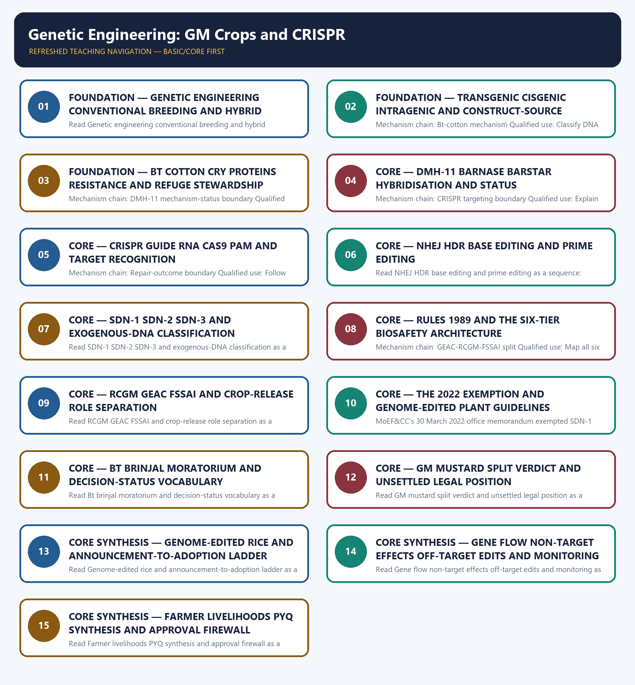

# Genetic Engineering: GM Crops and CRISPR — Learner-v2 Complete Learning Session

> **Authoring-only generation:** 2026-09-04. No PDF was rendered and no tracker or index was mutated.

### SOURCE, PROGRESSION AND CURRENT-LINKAGE AUDIT

- **Generation date:** 2026-09-04.
- **Repository-first evidence:** the Basic owner is taught first and preserved in full; the Advanced owner is retained only in the optional final teaching block.
- **OCR evidence:** Repository Markdown was primary. OCR-searchable official UPSC papers were supplementary only for printed routed demands. No answer key, performance value, procurement outcome, operational deployment, programme target or technology milestone was inferred.
- **Qdrant:** not used; repository Markdown and available OCR context were sufficient.
- **PYQ integrity:** Audited ledgers route the 2018 GM-mustard and CRISPR objective demands, the 2019 artificial-chromosome, RNA-interference and Cas9 demands, and the 2019 GS-III farmer-livelihood question to this owner. Three representative cards preserve those routes; no objective answer key or option letter is supplied.
- **Live-link boundary:** Official-source attempts on 2026-09-04 confirm GEAC's environmental role and preserve dated boundaries for the 2022 exemption, Bt cotton, Bt brinjal, DMH-11 litigation, genome-edited rice and draft GM-food regulation. GM mustard is not described as commercially cultivated or legally settled.
- **Fact/inference discipline:** no current-affairs item, PYQ wording, figure or quotation is invented.

### LIVE OFFICIAL-SOURCE ATTEMPT LOG

The checks below were made on 2026-09-04. Substantive official text is used only for the proposition it supports; title-only, blocked or thin pages are recorded and supply no factual claim.

- http://www.geacindia.gov.in/about-geac-india.aspx - fetched 2026-09-04; substantive GEAC text confirmed its MoEF&CC location and environmental appraisal role for large-scale use, release and experimental field trials. It supplied no commercial-cultivation status for GM mustard.
- https://www.pib.gov.in/PressReleasePage.aspx?PRID=1842778 - attempted 2026-09-04; direct retrieval returned HTTP 403. Official-domain search located the 2022 SDN-1/SDN-2 exemption release, but no proposition beyond the dated owner evidence was imported from the blocked page.
- https://pib.gov.in/PressReleseDetailm.aspx?PRID=1897008 - attempted 2026-09-04; direct retrieval returned HTTP 403. Official-domain search located the 7 February 2023 DMH-11 release concerning environmental release for seed production and testing; it was not rewritten as commercial cultivation or settled legality.
- https://pib.gov.in/PressReleasePage.aspx?PRID=2042234 - attempted 2026-09-04; direct retrieval returned HTTP 403. Official-domain search located the 6 August 2024 statement that Bt cotton was the only GM crop approved for commercial cultivation; no 2026 restatement was inferred.
- https://api.sci.gov.in/supremecourt/2004/661/661_2004_11_1501_54013_Judgement_23-Jul-2024.pdf - fetched 2026-09-04 as an official PDF; the repository owner's audited split-verdict account remains the operative boundary. No later order settling DMH-11 legality was located or inferred.
- https://icar.gov.in/en/union-agriculture-minister-shri-shivraj-singh-chouhan-announces-two-genome-edited-rice-varieties - attempted 2026-09-04; direct retrieval failed at the transport layer. The dated owner evidence for the 4 April 2025 announcement was retained without inferring seed availability or cultivation area.
- https://comments.fssai.gov.in/Bestviewwl.aspx?NOTIFICATION_ID=4128 - fetched 2026-09-04; substantive draft-regulation text confirmed Food Authority safety assessment and approval functions and the separate GEAC environmental-clearance input. Draft text was not presented as a final notified regulation.

## BASIC LEARNING SESSION

### DEEP-REVIEW LEARNING CONTRACT

| Control | Binding rule for this package |
|---|---|
| Syllabus boundary | Complete Science and Technology Basic/Core is easy-first and answer-complete before optional Advanced depth. |
| System boundary | Organisation, platform, subsystem, payload, process, application, institution and outcome remain distinct. |
| Technical boundary | Physical mechanism, classification, stage, platform, unit, range/capacity and limiting condition are explicit. |
| Status boundary | Announcement, approval, development, test, deployment, induction, commercial operation and observed outcome remain distinct. |
| Data boundary | Every mission, launch, target, capacity, budget, range, timeline, rule and regulatory claim keeps source, date, unit and status. |
| Governance boundary | Funder, developer, operator, authoriser, regulator, procurer, settlement actor and adjudicator are not conflated. |
| Practice contract | Every solved item has demand decoding, detailed examiner-grade model, executable timed/compression plan, marks rationale and answer-specific improvement. |
| PYQ contract | Official wording and keys are asserted only when verified; routed or reconstructed demands remain labelled. |
| Dual-flow contract | Graphical and ASCII masters independently reconstruct the same complete Basic-to-optional-Advanced evidence spine. |
| Approval | This immutable successor remains `approved: false` pending explicit approval. |

**Canonical Basic/Core owner:** `upsc-ai-kit\knowledge\Science-and-Technology\basic\14_Genetic-Engineering-GM-Crops-and-CRISPR.md`  
**Substantive canonical provenance owner:** `upsc-ai-kit\knowledge\Science-and-Technology\learning-sessions\v2\subject-wide-syllabus\science-and-technology-14_Learning-Session.md`  
**Optional Advanced owner:** `upsc-ai-kit\knowledge\Science-and-Technology\advanced\14_Genetic-Engineering-GM-Crops-and-CRISPR.md`  
**Official syllabus mapping:** `upsc-ai-kit\knowledge\Science-and-Technology\OFFICIAL-UPSC-SYLLABUS-MAPPING.md`

### EVIDENCE, PYQ AND CURRENT-STATUS CONTROL

- ISRO organisation, launcher stages, payload and orbit claims retain their exact object and mission date.
- NavIC, GAGAN, human-spaceflight, planetary, nuclear, fusion, missile and procurement claims retain category and status.
- Aadhaar/UPI, AI, quantum and semiconductor claims retain actor, layer, metric, maturity and governance boundaries.
- DPDP/cybersecurity, biotechnology and genetic-engineering claims retain legal/regulatory stage and competent institution.
- Targets, budgets, capacities, ranges and timelines are never promoted into achieved outcomes without dated evidence.
- **Current-status note, rechecked 2026-09-06:** volatile claims retain source/date/status; failed official fetches remain explicit and supply no invented fact.

**Generation-local live/current sources:**
- `http://www.geacindia.gov.in/about-geac-india.aspx - fetched 2026-09-04; substantive GEAC text confirmed its MoEF&CC location and environmental appraisal role for large-scale use, release and experimental field trials. It supplied no commercial-cultivation status for GM mustard.`
- `https://www.pib.gov.in/PressReleasePage.aspx?PRID=1842778 - attempted 2026-09-04; direct retrieval returned HTTP 403. Official-domain search located the 2022 SDN-1/SDN-2 exemption release, but no proposition beyond the dated owner evidence was imported from the blocked page.`
- `https://pib.gov.in/PressReleseDetailm.aspx?PRID=1897008 - attempted 2026-09-04; direct retrieval returned HTTP 403. Official-domain search located the 7 February 2023 DMH-11 release concerning environmental release for seed production and testing; it was not rewritten as commercial cultivation or settled legality.`
- `https://pib.gov.in/PressReleasePage.aspx?PRID=2042234 - attempted 2026-09-04; direct retrieval returned HTTP 403. Official-domain search located the 6 August 2024 statement that Bt cotton was the only GM crop approved for commercial cultivation; no 2026 restatement was inferred.`
- `https://api.sci.gov.in/supremecourt/2004/661/661_2004_11_1501_54013_Judgement_23-Jul-2024.pdf - fetched 2026-09-04 as an official PDF; the repository owner's audited split-verdict account remains the operative boundary. No later order settling DMH-11 legality was located or inferred.`
- `https://icar.gov.in/en/union-agriculture-minister-shri-shivraj-singh-chouhan-announces-two-genome-edited-rice-varieties - attempted 2026-09-04; direct retrieval failed at the transport layer. The dated owner evidence for the 4 April 2025 announcement was retained without inferring seed availability or cultivation area.`
- `https://comments.fssai.gov.in/Bestviewwl.aspx?NOTIFICATION_ID=4128 - fetched 2026-09-04; substantive draft-regulation text confirmed Food Authority safety assessment and approval functions and the separate GEAC environmental-clearance input. Draft text was not presented as a final notified regulation.`

**Topic-routed verified PYQ owners:**
- No topic-local official question file is claimed; repository PYQ routing ledgers control wording and status.




*Distinct embedded teaching-navigation image. The separate continuous Cārvāka-style flowchart package remains an independent at-a-glance artifact.*

### SESSION 1 — FOUNDATION — GENETIC ENGINEERING CONVENTIONAL BREEDING AND HYBRID BOUNDARIES

#### DEFINITION / WHAT THIS IS CALLED

**Plain-language definition:** Genetic engineering deliberately changes genetic material through laboratory methods, whereas conventional hybrid breeding combines parental genomes through sexual crossing; a hybrid is not automatically genetically engineered, although DMH-11 is both a hybrid and transgenic.

**Technical definition:** Read Genetic engineering conventional breeding and hybrid boundaries as a sequence: identify Engineering-breeding boundary, follow the named mechanism to its user or output, and stop at the last verified status rather than assuming the next stage.

#### ANSWER-GRABBING OPENING — WRITE/ADAPT IN THE EXAM

> Genetic engineering deliberately changes genetic material through laboratory methods, whereas conventional hybrid breeding combines parental genomes through sexual crossing; a hybrid is not automatically genetically engineered, although DMH-11 is both a hybrid and transgenic.

#### MUST-WRITE KEYWORDS

- **FOUNDATION**
- **Genetic engineering conventional breeding**
- **hybrid boundaries**
- **Mechanism chain**
- **Qualified use**
- **Genetic**

**How to use them:** Frame the answer through FOUNDATION; define Genetic engineering conventional breeding, connect hybrid boundaries with Mechanism chain to explain the mechanism, and use Qualified use for the decisive comparison or qualification.

#### VISUAL FIRST

```text
GENETIC ENGINEERING CONVENTIONAL BREEDING AND HYBRID BOUNDARIES
01. Engineering-breeding boundary
    |
    v
02. Transgenic-cisgenic-intragenic boundary
STATUS / CATEGORY FIREWALL -> Do not treat hybrid, transgenic, cisgenic and intragenic as synonyms.
```

*The rail fixes the technical sequence and the claim boundary before explanation.*

#### CORE EXPLANATION

Genetic engineering deliberately changes genetic material through laboratory methods, whereas conventional hybrid breeding combines parental genomes through sexual crossing; a hybrid is not automatically genetically engineered, although DMH-11 is both a hybrid and transgenic. Transgenic constructs use DNA from a sexually incompatible organism, cisgenic constructs transfer an intact gene from the same or a sexually compatible gene pool, and intragenic constructs rearrange regulatory or coding elements from that compatible gene pool; source and construct design must not be merged.

#### SIMPLE SYSTEM EXAMPLE

Read Genetic engineering conventional breeding and hybrid boundaries as a sequence: identify Engineering-breeding boundary, follow the named mechanism to its user or output, and stop at the last verified status rather than assuming the next stage.

#### TECHNICAL DISTINCTION

The decisive boundary is Do not treat hybrid, transgenic, cisgenic and intragenic as synonyms. This keeps Engineering-breeding boundary and Transgenic-cisgenic-intragenic boundary in the correct scientific category, institution and unit of measurement.

#### NAMED EVIDENCE AND MECHANISM

- Genetic engineering deliberately changes genetic material through laboratory methods, whereas conventional hybrid breeding combines parental genomes through sexual crossing; a hybrid is not automatically genetically engineered, although DMH-11 is both a hybrid and transgenic.
- Transgenic constructs use DNA from a sexually incompatible organism, cisgenic constructs transfer an intact gene from the same or a sexually compatible gene pool, and intragenic constructs rearrange regulatory or coding elements from that compatible gene pool; source and construct design must not be merged.

#### EXAMINER CAUTION

- Do not treat hybrid, transgenic, cisgenic and intragenic as synonyms.

#### EXAM LINK

- **Prelims:** Keep institution, system, platform, service, process, legal instrument, unit and status in their exact category.
- **Mains:** Define the intervention before assigning a legal or biological category.

#### MINI RECAP

- **Mechanism chain:** Engineering-breeding boundary -> Transgenic-cisgenic-intragenic boundary
- **Qualified use:** Define the intervention before assigning a legal or biological category.

#### CLOSING RECALL FLOW — FOUNDATION — GENETIC ENGINEERING CONVENTIONAL BREEDING AND HYBRID BOUNDARIES

```text
START / CONCEPT: FOUNDATION — Genetic engineering conventional breeding and hybrid boundaries
        |
        v
EXACT TERMS: FOUNDATION · Genetic engineering conventional breeding · hybrid boundaries · Mechanism chain · Qualified use · Genetic
        |
        v
MECHANISM / ARGUMENT: Read Genetic engineering conventional breeding and hybrid boundaries as a sequence: identify Engineering-breeding boundary, follow the named mechanism to its user or output, and stop at the last verified status rather than assuming the next stage.
        |
        v
CONSEQUENCE / CONTRAST: The decisive boundary is Do not treat hybrid, transgenic, cisgenic and intragenic as synonyms.
        |
        v
UPSC TRAP / ANSWER-USE: Do not treat hybrid, transgenic, cisgenic and intragenic as synonyms.
        |
        v
ANSWER-GRABBING FORMULATION: Genetic engineering deliberately changes genetic material through laboratory methods, whereas conventional hybrid breeding combines parental genomes through sexual crossing; a hybrid is not automatically genetically engineered, although DMH-11 is both a hybrid and transgenic.
```
### SESSION 2 — FOUNDATION — TRANSGENIC CISGENIC INTRAGENIC AND CONSTRUCT-SOURCE DISTINCTIONS

#### DEFINITION / WHAT THIS IS CALLED

**Plain-language definition:** Read Transgenic cisgenic intragenic and construct-source distinctions as a sequence: identify Bt-cotton mechanism, follow the named mechanism to its user or output, and stop at the last verified status rather than assuming the next stage.

**Technical definition:** Mechanism chain: Bt-cotton mechanism Qualified use: Classify DNA source and construct architecture separately.

#### ANSWER-GRABBING OPENING — WRITE/ADAPT IN THE EXAM

> Read Transgenic cisgenic intragenic and construct-source distinctions as a sequence: identify Bt-cotton mechanism, follow the named mechanism to its user or output, and stop at the last verified status rather than assuming the next stage.

#### MUST-WRITE KEYWORDS

- **FOUNDATION**
- **Transgenic cisgenic intragenic**
- **construct-source distinctions**
- **Mechanism chain**
- **Qualified use**
- **Bt**

**How to use them:** Frame the answer through FOUNDATION; define Transgenic cisgenic intragenic, connect construct-source distinctions with Mechanism chain to explain the mechanism, and use Qualified use for the decisive comparison or qualification.

#### VISUAL FIRST

```text
TRANSGENIC CISGENIC INTRAGENIC AND CONSTRUCT-SOURCE DISTINCTIONS
01. Bt-cotton mechanism
STATUS / CATEGORY FIREWALL -> Do not describe Bt insect resistance as herbicide tolerance.
```

*The rail fixes the technical sequence and the claim boundary before explanation.*

#### CORE EXPLANATION

Bt cotton expresses cry proteins derived from Bacillus thuringiensis against specified lepidopteran bollworms; insect resistance is distinct from herbicide tolerance, and stacked cry genes delay but do not eliminate resistance evolution or refuge stewardship.

#### SIMPLE SYSTEM EXAMPLE

Read Transgenic cisgenic intragenic and construct-source distinctions as a sequence: identify Bt-cotton mechanism, follow the named mechanism to its user or output, and stop at the last verified status rather than assuming the next stage.

#### TECHNICAL DISTINCTION

The decisive boundary is Do not describe Bt insect resistance as herbicide tolerance. This keeps Bt-cotton mechanism in the correct scientific category, institution and unit of measurement.

#### NAMED EVIDENCE AND MECHANISM

- Bt cotton expresses cry proteins derived from Bacillus thuringiensis against specified lepidopteran bollworms; insect resistance is distinct from herbicide tolerance, and stacked cry genes delay but do not eliminate resistance evolution or refuge stewardship.

#### EXAMINER CAUTION

- Do not describe Bt insect resistance as herbicide tolerance.

#### EXAM LINK

- **Prelims:** Keep institution, system, platform, service, process, legal instrument, unit and status in their exact category.
- **Mains:** Classify DNA source and construct architecture separately.

#### MINI RECAP

- **Mechanism chain:** Bt-cotton mechanism
- **Qualified use:** Classify DNA source and construct architecture separately.

#### CLOSING RECALL FLOW — FOUNDATION — TRANSGENIC CISGENIC INTRAGENIC AND CONSTRUCT-SOURCE DISTINCTIONS

```text
START / CONCEPT: FOUNDATION — Transgenic cisgenic intragenic and construct-source distinctions
        |
        v
EXACT TERMS: FOUNDATION · Transgenic cisgenic intragenic · construct-source distinctions · Mechanism chain · Qualified use · Bt
        |
        v
MECHANISM / ARGUMENT: Mechanism chain: Bt-cotton mechanism Qualified use: Classify DNA source and construct architecture separately.
        |
        v
CONSEQUENCE / CONTRAST: Bt cotton expresses cry proteins derived from Bacillus thuringiensis against specified lepidopteran bollworms; insect resistance is distinct from herbicide tolerance, and stacked cry genes delay but do not eliminate resistance evolution or refuge stewardship.
        |
        v
UPSC TRAP / ANSWER-USE: The decisive boundary is Do not describe Bt insect resistance as herbicide tolerance.
        |
        v
ANSWER-GRABBING FORMULATION: Read Transgenic cisgenic intragenic and construct-source distinctions as a sequence: identify Bt-cotton mechanism, follow the named mechanism to its user or output, and stop at the last verified status rather than assuming the next stage.
```
### SESSION 3 — FOUNDATION — BT COTTON CRY PROTEINS RESISTANCE AND REFUGE STEWARDSHIP

#### DEFINITION / WHAT THIS IS CALLED

**Plain-language definition:** Read Bt cotton cry proteins resistance and refuge stewardship as a sequence: identify DMH-11 mechanism-status boundary, follow the named mechanism to its user or output, and stop at the last verified status rather than assuming the next stage.

**Technical definition:** Mechanism chain: DMH-11 mechanism-status boundary Qualified use: Trace cry expression to pest specificity, resistance and refuge.

#### ANSWER-GRABBING OPENING — WRITE/ADAPT IN THE EXAM

> Read Bt cotton cry proteins resistance and refuge stewardship as a sequence: identify DMH-11 mechanism-status boundary, follow the named mechanism to its user or output, and stop at the last verified status rather than assuming the next stage.

#### MUST-WRITE KEYWORDS

- **FOUNDATION**
- **Bt cotton cry proteins resistance**
- **refuge stewardship**
- **Mechanism chain**
- **Qualified use**
- **DMH**

**How to use them:** Frame the answer through FOUNDATION; define Bt cotton cry proteins resistance, connect refuge stewardship with Mechanism chain to explain the mechanism, and use Qualified use for the decisive comparison or qualification.

#### VISUAL FIRST

```text
BT COTTON CRY PROTEINS RESISTANCE AND REFUGE STEWARDSHIP
01. DMH-11 mechanism-status boundary
STATUS / CATEGORY FIREWALL -> Do not call bar the agronomic purpose of DMH-11.
```

*The rail fixes the technical sequence and the claim boundary before explanation.*

#### CORE EXPLANATION

DMH-11 uses the barnase-barstar male-sterility and fertility-restoration system, with bar as a selectable marker, to enable mustard hybridisation; reviewed official material concerns conditional environmental release for seed production and testing, not established commercial cultivation.

#### SIMPLE SYSTEM EXAMPLE

Read Bt cotton cry proteins resistance and refuge stewardship as a sequence: identify DMH-11 mechanism-status boundary, follow the named mechanism to its user or output, and stop at the last verified status rather than assuming the next stage.

#### TECHNICAL DISTINCTION

The decisive boundary is Do not call bar the agronomic purpose of DMH-11. This keeps DMH-11 mechanism-status boundary in the correct scientific category, institution and unit of measurement.

#### NAMED EVIDENCE AND MECHANISM

- DMH-11 uses the barnase-barstar male-sterility and fertility-restoration system, with bar as a selectable marker, to enable mustard hybridisation; reviewed official material concerns conditional environmental release for seed production and testing, not established commercial cultivation.

#### EXAMINER CAUTION

- Do not call bar the agronomic purpose of DMH-11.

#### EXAM LINK

- **Prelims:** Keep institution, system, platform, service, process, legal instrument, unit and status in their exact category.
- **Mains:** Trace cry expression to pest specificity, resistance and refuge.

#### MINI RECAP

- **Mechanism chain:** DMH-11 mechanism-status boundary
- **Qualified use:** Trace cry expression to pest specificity, resistance and refuge.

#### CLOSING RECALL FLOW — FOUNDATION — BT COTTON CRY PROTEINS RESISTANCE AND REFUGE STEWARDSHIP

```text
START / CONCEPT: FOUNDATION — Bt cotton cry proteins resistance and refuge stewardship
        |
        v
EXACT TERMS: FOUNDATION · Bt cotton cry proteins resistance · refuge stewardship · Mechanism chain · Qualified use · DMH
        |
        v
MECHANISM / ARGUMENT: Mechanism chain: DMH-11 mechanism-status boundary Qualified use: Trace cry expression to pest specificity, resistance and refuge.
        |
        v
CONSEQUENCE / CONTRAST: DMH-11 uses the barnase-barstar male-sterility and fertility-restoration system, with bar as a selectable marker, to enable mustard hybridisation; reviewed official material concerns conditional environmental release for seed production and testing, not established commercial cultivation.
        |
        v
UPSC TRAP / ANSWER-USE: The decisive boundary is Do not call bar the agronomic purpose of DMH-11.
        |
        v
ANSWER-GRABBING FORMULATION: Read Bt cotton cry proteins resistance and refuge stewardship as a sequence: identify DMH-11 mechanism-status boundary, follow the named mechanism to its user or output, and stop at the last verified status rather than assuming the next stage.
```
### SESSION 4 — CORE — DMH-11 BARNASE BARSTAR HYBRIDISATION AND STATUS

#### DEFINITION / WHAT THIS IS CALLED

**Plain-language definition:** Read DMH-11 barnase barstar hybridisation and status as a sequence: identify CRISPR targeting boundary, follow the named mechanism to its user or output, and stop at the last verified status rather than assuming the next stage.

**Technical definition:** Mechanism chain: CRISPR targeting boundary Qualified use: Explain hybridisation purpose before stating the bounded approval status.

#### ANSWER-GRABBING OPENING — WRITE/ADAPT IN THE EXAM

> Read DMH-11 barnase barstar hybridisation and status as a sequence: identify CRISPR targeting boundary, follow the named mechanism to its user or output, and stop at the last verified status rather than assuming the next stage.

#### MUST-WRITE KEYWORDS

- **DMH-11 barnase barstar hybridisation**
- **status**
- **Mechanism chain**
- **Qualified use**
- **In CRISPR**
- **RNA**

**How to use them:** Frame the answer through DMH-11 barnase barstar hybridisation; define status, connect Mechanism chain with Qualified use to explain the mechanism, and use In CRISPR for the decisive comparison or qualification.

#### VISUAL FIRST

```text
DMH-11 BARNASE BARSTAR HYBRIDISATION AND STATUS
01. CRISPR targeting boundary
STATUS / CATEGORY FIREWALL -> Do not omit guide RNA, Cas9 or PAM from CRISPR targeting.
```

*The rail fixes the technical sequence and the claim boundary before explanation.*

#### CORE EXPLANATION

In CRISPR-Cas9 editing, a guide RNA provides sequence recognition, Cas9 is the nuclease, and cleavage requires an adjacent PAM such as NGG for commonly used SpCas9; guide matching without a compatible PAM does not establish cutting.

#### SIMPLE SYSTEM EXAMPLE

Read DMH-11 barnase barstar hybridisation and status as a sequence: identify CRISPR targeting boundary, follow the named mechanism to its user or output, and stop at the last verified status rather than assuming the next stage.

#### TECHNICAL DISTINCTION

The decisive boundary is Do not omit guide RNA, Cas9 or PAM from CRISPR targeting. This keeps CRISPR targeting boundary in the correct scientific category, institution and unit of measurement.

#### NAMED EVIDENCE AND MECHANISM

- In CRISPR-Cas9 editing, a guide RNA provides sequence recognition, Cas9 is the nuclease, and cleavage requires an adjacent PAM such as NGG for commonly used SpCas9; guide matching without a compatible PAM does not establish cutting.

#### EXAMINER CAUTION

- Do not omit guide RNA, Cas9 or PAM from CRISPR targeting.

#### EXAM LINK

- **Prelims:** Keep institution, system, platform, service, process, legal instrument, unit and status in their exact category.
- **Mains:** Explain hybridisation purpose before stating the bounded approval status.

#### MINI RECAP

- **Mechanism chain:** CRISPR targeting boundary
- **Qualified use:** Explain hybridisation purpose before stating the bounded approval status.

#### CLOSING RECALL FLOW — CORE — DMH-11 BARNASE BARSTAR HYBRIDISATION AND STATUS

```text
START / CONCEPT: CORE — DMH-11 barnase barstar hybridisation and status
        |
        v
EXACT TERMS: DMH-11 barnase barstar hybridisation · status · Mechanism chain · Qualified use · In CRISPR · RNA
        |
        v
MECHANISM / ARGUMENT: Mechanism chain: CRISPR targeting boundary Qualified use: Explain hybridisation purpose before stating the bounded approval status.
        |
        v
CONSEQUENCE / CONTRAST: In CRISPR-Cas9 editing, a guide RNA provides sequence recognition, Cas9 is the nuclease, and cleavage requires an adjacent PAM such as NGG for commonly used SpCas9; guide matching without a compatible PAM does not establish cutting.
        |
        v
UPSC TRAP / ANSWER-USE: The decisive boundary is Do not omit guide RNA, Cas9 or PAM from CRISPR targeting.
        |
        v
ANSWER-GRABBING FORMULATION: Read DMH-11 barnase barstar hybridisation and status as a sequence: identify CRISPR targeting boundary, follow the named mechanism to its user or output, and stop at the last verified status rather than assuming the next stage.
```
### SESSION 5 — CORE — CRISPR GUIDE RNA CAS9 PAM AND TARGET RECOGNITION

#### DEFINITION / WHAT THIS IS CALLED

**Plain-language definition:** Read CRISPR guide RNA Cas9 PAM and target recognition as a sequence: identify Repair-outcome boundary, follow the named mechanism to its user or output, and stop at the last verified status rather than assuming the next stage.

**Technical definition:** Mechanism chain: Repair-outcome boundary Qualified use: Follow recognition from guide RNA through PAM-dependent Cas9 cleavage.

#### ANSWER-GRABBING OPENING — WRITE/ADAPT IN THE EXAM

> Read CRISPR guide RNA Cas9 PAM and target recognition as a sequence: identify Repair-outcome boundary, follow the named mechanism to its user or output, and stop at the last verified status rather than assuming the next stage.

#### MUST-WRITE KEYWORDS

- **CRISPR guide RNA Cas9 PAM**
- **target recognition**
- **Mechanism chain**
- **Qualified use**
- **A Cas9 double-strand break**
- **Read CRISPR**

**How to use them:** Frame the answer through CRISPR guide RNA Cas9 PAM; define target recognition, connect Mechanism chain with Qualified use to explain the mechanism, and use A Cas9 double-strand break for the decisive comparison or qualification.

#### VISUAL FIRST

```text
CRISPR GUIDE RNA CAS9 PAM AND TARGET RECOGNITION
01. Repair-outcome boundary
STATUS / CATEGORY FIREWALL -> Do not claim NHEJ produces a chosen precise substitution.
```

*The rail fixes the technical sequence and the claim boundary before explanation.*

#### CORE EXPLANATION

A Cas9 double-strand break is repaired mainly by error-prone non-homologous end joining, which creates small insertions or deletions, or by homology-directed repair using a donor template for a defined substitution or insertion; the repair route determines the edit.

#### SIMPLE SYSTEM EXAMPLE

Read CRISPR guide RNA Cas9 PAM and target recognition as a sequence: identify Repair-outcome boundary, follow the named mechanism to its user or output, and stop at the last verified status rather than assuming the next stage.

#### TECHNICAL DISTINCTION

The decisive boundary is Do not claim NHEJ produces a chosen precise substitution. This keeps Repair-outcome boundary in the correct scientific category, institution and unit of measurement.

#### NAMED EVIDENCE AND MECHANISM

- A Cas9 double-strand break is repaired mainly by error-prone non-homologous end joining, which creates small insertions or deletions, or by homology-directed repair using a donor template for a defined substitution or insertion; the repair route determines the edit.

#### EXAMINER CAUTION

- Do not claim NHEJ produces a chosen precise substitution.

#### EXAM LINK

- **Prelims:** Keep institution, system, platform, service, process, legal instrument, unit and status in their exact category.
- **Mains:** Follow recognition from guide RNA through PAM-dependent Cas9 cleavage.

#### MINI RECAP

- **Mechanism chain:** Repair-outcome boundary
- **Qualified use:** Follow recognition from guide RNA through PAM-dependent Cas9 cleavage.

#### CLOSING RECALL FLOW — CORE — CRISPR GUIDE RNA CAS9 PAM AND TARGET RECOGNITION

```text
START / CONCEPT: CORE — CRISPR guide RNA Cas9 PAM and target recognition
        |
        v
EXACT TERMS: CRISPR guide RNA Cas9 PAM · target recognition · Mechanism chain · Qualified use · A Cas9 double-strand break · Read CRISPR
        |
        v
MECHANISM / ARGUMENT: Mechanism chain: Repair-outcome boundary Qualified use: Follow recognition from guide RNA through PAM-dependent Cas9 cleavage.
        |
        v
CONSEQUENCE / CONTRAST: The decisive boundary is Do not claim NHEJ produces a chosen precise substitution.
        |
        v
UPSC TRAP / ANSWER-USE: Do not miss this limiting distinction: follow recognition from guide RNA through PAM-dependent Cas9 cleavage.
        |
        v
ANSWER-GRABBING FORMULATION: Read CRISPR guide RNA Cas9 PAM and target recognition as a sequence: identify Repair-outcome boundary, follow the named mechanism to its user or output, and stop at the last verified status rather than assuming the next stage.
```
### SESSION 6 — CORE — NHEJ HDR BASE EDITING AND PRIME EDITING

#### DEFINITION / WHAT THIS IS CALLED

**Plain-language definition:** The decisive boundary is Do not merge base editing or prime editing with double-strand-break repair.

**Technical definition:** Read NHEJ HDR base editing and prime editing as a sequence: identify Base-prime editing boundary, follow the named mechanism to its user or output, and stop at the last verified status rather than assuming the next stage.

#### ANSWER-GRABBING OPENING — WRITE/ADAPT IN THE EXAM

> Base editing chemically converts a target base without a double-strand break, while prime editing uses a reverse-transcriptase-linked editor and prime-editing guide RNA to write a specified short change; neither should be described as ordinary NHEJ.

#### MUST-WRITE KEYWORDS

- **NHEJ HDR base editing**
- **prime editing**
- **Mechanism chain**
- **Qualified use**
- **Base**
- **RNA**

**How to use them:** Frame the answer through NHEJ HDR base editing; define prime editing, connect Mechanism chain with Qualified use to explain the mechanism, and use Base for the decisive comparison or qualification.

#### VISUAL FIRST

```text
NHEJ HDR BASE EDITING AND PRIME EDITING
01. Base-prime editing boundary
    |
    v
02. SDN-category boundary
STATUS / CATEGORY FIREWALL -> Do not merge base editing or prime editing with double-strand-break repair.
```

*The rail fixes the technical sequence and the claim boundary before explanation.*

#### CORE EXPLANATION

Base editing chemically converts a target base without a double-strand break, while prime editing uses a reverse-transcriptase-linked editor and prime-editing guide RNA to write a specified short change; neither should be described as ordinary NHEJ. SDN-1 makes a template-free small edit, SDN-2 uses a short homologous template for a defined small change, and SDN-3 inserts a gene-sized sequence at a targeted site; SDN-3 DNA may be cisgenic or transgenic and remains outside India's lighter exemption.

#### SIMPLE SYSTEM EXAMPLE

Read NHEJ HDR base editing and prime editing as a sequence: identify Base-prime editing boundary, follow the named mechanism to its user or output, and stop at the last verified status rather than assuming the next stage.

#### TECHNICAL DISTINCTION

The decisive boundary is Do not merge base editing or prime editing with double-strand-break repair. This keeps Base-prime editing boundary and SDN-category boundary in the correct scientific category, institution and unit of measurement.

#### NAMED EVIDENCE AND MECHANISM

- Base editing chemically converts a target base without a double-strand break, while prime editing uses a reverse-transcriptase-linked editor and prime-editing guide RNA to write a specified short change; neither should be described as ordinary NHEJ.
- SDN-1 makes a template-free small edit, SDN-2 uses a short homologous template for a defined small change, and SDN-3 inserts a gene-sized sequence at a targeted site; SDN-3 DNA may be cisgenic or transgenic and remains outside India's lighter exemption.

#### EXAMINER CAUTION

- Do not merge base editing or prime editing with double-strand-break repair.

#### EXAM LINK

- **Prelims:** Keep institution, system, platform, service, process, legal instrument, unit and status in their exact category.
- **Mains:** Map each repair or editing tool to its actual molecular outcome.

#### MINI RECAP

- **Mechanism chain:** Base-prime editing boundary -> SDN-category boundary
- **Qualified use:** Map each repair or editing tool to its actual molecular outcome.

#### CLOSING RECALL FLOW — CORE — NHEJ HDR BASE EDITING AND PRIME EDITING

```text
START / CONCEPT: CORE — NHEJ HDR base editing and prime editing
        |
        v
EXACT TERMS: NHEJ HDR base editing · prime editing · Mechanism chain · Qualified use · Base · RNA
        |
        v
MECHANISM / ARGUMENT: Read NHEJ HDR base editing and prime editing as a sequence: identify Base-prime editing boundary, follow the named mechanism to its user or output, and stop at the last verified status rather than assuming the next stage.
        |
        v
CONSEQUENCE / CONTRAST: The decisive boundary is Do not merge base editing or prime editing with double-strand-break repair.
        |
        v
UPSC TRAP / ANSWER-USE: Do not merge base editing or prime editing with double-strand-break repair.
        |
        v
ANSWER-GRABBING FORMULATION: Base editing chemically converts a target base without a double-strand break, while prime editing uses a reverse-transcriptase-linked editor and prime-editing guide RNA to write a specified short change; neither should be described as ordinary NHEJ.
```
### SESSION 7 — CORE — SDN-1 SDN-2 SDN-3 AND EXOGENOUS-DNA CLASSIFICATION

#### DEFINITION / WHAT THIS IS CALLED

**Plain-language definition:** The decisive boundary is Do not extend the 2022 exemption to SDN-3 or edits retaining exogenous DNA.

**Technical definition:** Read SDN-1 SDN-2 SDN-3 and exogenous-DNA classification as a sequence: identify Six-tier biosafety architecture, follow the named mechanism to its user or output, and stop at the last verified status rather than assuming the next stage.

#### ANSWER-GRABBING OPENING — WRITE/ADAPT IN THE EXAM

> The decisive boundary is Do not extend the 2022 exemption to SDN-3 or edits retaining exogenous DNA.

#### MUST-WRITE KEYWORDS

- **SDN-1 SDN-2 SDN-3**
- **exogenous-DNA classification**
- **Mechanism chain**
- **Qualified use**
- **The Rules**
- **RDAC**

**How to use them:** Frame the answer through SDN-1 SDN-2 SDN-3; define exogenous-DNA classification, connect Mechanism chain with Qualified use to explain the mechanism, and use The Rules for the decisive comparison or qualification.

#### VISUAL FIRST

```text
SDN-1 SDN-2 SDN-3 AND EXOGENOUS-DNA CLASSIFICATION
01. Six-tier biosafety architecture
STATUS / CATEGORY FIREWALL -> Do not extend the 2022 exemption to SDN-3 or edits retaining exogenous DNA.
```

*The rail fixes the technical sequence and the claim boundary before explanation.*

#### CORE EXPLANATION

The Rules, 1989 create a six-tier structure: RDAC advises, IBSC oversees work within institutions, RCGM reviews research and contained activity, GEAC appraises environmental release and large-scale use, and SBCC plus DLC monitor at state and district levels.

#### SIMPLE SYSTEM EXAMPLE

Read SDN-1 SDN-2 SDN-3 and exogenous-DNA classification as a sequence: identify Six-tier biosafety architecture, follow the named mechanism to its user or output, and stop at the last verified status rather than assuming the next stage.

#### TECHNICAL DISTINCTION

The decisive boundary is Do not extend the 2022 exemption to SDN-3 or edits retaining exogenous DNA. This keeps Six-tier biosafety architecture in the correct scientific category, institution and unit of measurement.

#### NAMED EVIDENCE AND MECHANISM

- The Rules, 1989 create a six-tier structure: RDAC advises, IBSC oversees work within institutions, RCGM reviews research and contained activity, GEAC appraises environmental release and large-scale use, and SBCC plus DLC monitor at state and district levels.

#### EXAMINER CAUTION

- Do not extend the 2022 exemption to SDN-3 or edits retaining exogenous DNA.

#### EXAM LINK

- **Prelims:** Keep institution, system, platform, service, process, legal instrument, unit and status in their exact category.
- **Mains:** Use template, edit size and foreign-DNA status to classify SDN outcomes.

#### MINI RECAP

- **Mechanism chain:** Six-tier biosafety architecture
- **Qualified use:** Use template, edit size and foreign-DNA status to classify SDN outcomes.

#### CLOSING RECALL FLOW — CORE — SDN-1 SDN-2 SDN-3 AND EXOGENOUS-DNA CLASSIFICATION

```text
START / CONCEPT: CORE — SDN-1 SDN-2 SDN-3 and exogenous-DNA classification
        |
        v
EXACT TERMS: SDN-1 SDN-2 SDN-3 · exogenous-DNA classification · Mechanism chain · Qualified use · The Rules · RDAC
        |
        v
MECHANISM / ARGUMENT: Read SDN-1 SDN-2 SDN-3 and exogenous-DNA classification as a sequence: identify Six-tier biosafety architecture, follow the named mechanism to its user or output, and stop at the last verified status rather than assuming the next stage.
        |
        v
CONSEQUENCE / CONTRAST: Do not extend the 2022 exemption to SDN-3 or edits retaining exogenous DNA.
        |
        v
UPSC TRAP / ANSWER-USE: Do not miss this limiting distinction: the Rules, 1989 create a six-tier structure.
        |
        v
ANSWER-GRABBING FORMULATION: The decisive boundary is Do not extend the 2022 exemption to SDN-3 or edits retaining exogenous DNA.
```
### SESSION 8 — CORE — RULES 1989 AND THE SIX-TIER BIOSAFETY ARCHITECTURE

#### DEFINITION / WHAT THIS IS CALLED

**Plain-language definition:** Read Rules 1989 and the six-tier biosafety architecture as a sequence: identify GEAC-RCGM-FSSAI split, follow the named mechanism to its user or output, and stop at the last verified status rather than assuming the next stage.

**Technical definition:** Mechanism chain: GEAC-RCGM-FSSAI split Qualified use: Map all six institutions from advice and laboratory oversight to monitoring.

#### ANSWER-GRABBING OPENING — WRITE/ADAPT IN THE EXAM

> Read Rules 1989 and the six-tier biosafety architecture as a sequence: identify GEAC-RCGM-FSSAI split, follow the named mechanism to its user or output, and stop at the last verified status rather than assuming the next stage.

#### MUST-WRITE KEYWORDS

- **Rules 1989**
- **the six-tier biosafety architecture**
- **Mechanism chain**
- **Qualified use**
- **Read Rules**
- **GEAC-RCGM-FSSAI**

**How to use them:** Frame the answer through Rules 1989; define the six-tier biosafety architecture, connect Mechanism chain with Qualified use to explain the mechanism, and use Read Rules for the decisive comparison or qualification.

#### VISUAL FIRST

```text
RULES 1989 AND THE SIX-TIER BIOSAFETY ARCHITECTURE
01. GEAC-RCGM-FSSAI split
STATUS / CATEGORY FIREWALL -> Do not place GEAC under DBT or give RCGM environmental-release authority.
```

*The rail fixes the technical sequence and the claim boundary before explanation.*

#### CORE EXPLANATION

RCGM under DBT addresses research and contained stages, GEAC under MoEF&CC appraises environmental release, and FSSAI addresses food-safety assessment, approval and labelling under the food-law track; no one body substitutes for the others.

#### SIMPLE SYSTEM EXAMPLE

Read Rules 1989 and the six-tier biosafety architecture as a sequence: identify GEAC-RCGM-FSSAI split, follow the named mechanism to its user or output, and stop at the last verified status rather than assuming the next stage.

#### TECHNICAL DISTINCTION

The decisive boundary is Do not place GEAC under DBT or give RCGM environmental-release authority. This keeps GEAC-RCGM-FSSAI split in the correct scientific category, institution and unit of measurement.

#### NAMED EVIDENCE AND MECHANISM

- RCGM under DBT addresses research and contained stages, GEAC under MoEF&CC appraises environmental release, and FSSAI addresses food-safety assessment, approval and labelling under the food-law track; no one body substitutes for the others.

#### EXAMINER CAUTION

- Do not place GEAC under DBT or give RCGM environmental-release authority.

#### EXAM LINK

- **Prelims:** Keep institution, system, platform, service, process, legal instrument, unit and status in their exact category.
- **Mains:** Map all six institutions from advice and laboratory oversight to monitoring.

#### MINI RECAP

- **Mechanism chain:** GEAC-RCGM-FSSAI split
- **Qualified use:** Map all six institutions from advice and laboratory oversight to monitoring.

#### CLOSING RECALL FLOW — CORE — RULES 1989 AND THE SIX-TIER BIOSAFETY ARCHITECTURE

```text
START / CONCEPT: CORE — Rules 1989 and the six-tier biosafety architecture
        |
        v
EXACT TERMS: Rules 1989 · the six-tier biosafety architecture · Mechanism chain · Qualified use · Read Rules · GEAC-RCGM-FSSAI
        |
        v
MECHANISM / ARGUMENT: Mechanism chain: GEAC-RCGM-FSSAI split Qualified use: Map all six institutions from advice and laboratory oversight to monitoring.
        |
        v
CONSEQUENCE / CONTRAST: The decisive boundary is Do not place GEAC under DBT or give RCGM environmental-release authority.
        |
        v
UPSC TRAP / ANSWER-USE: Do not place GEAC under DBT or give RCGM environmental-release authority.
        |
        v
ANSWER-GRABBING FORMULATION: Read Rules 1989 and the six-tier biosafety architecture as a sequence: identify GEAC-RCGM-FSSAI split, follow the named mechanism to its user or output, and stop at the last verified status rather than assuming the next stage.
```
### SESSION 9 — CORE — RCGM GEAC FSSAI AND CROP-RELEASE ROLE SEPARATION

#### DEFINITION / WHAT THIS IS CALLED

**Plain-language definition:** The decisive boundary is Do not make FSSAI the environmental biosafety regulator.

**Technical definition:** Read RCGM GEAC FSSAI and crop-release role separation as a sequence: identify Rules-1989 boundary, follow the named mechanism to its user or output, and stop at the last verified status rather than assuming the next stage.

#### ANSWER-GRABBING OPENING — WRITE/ADAPT IN THE EXAM

> Read RCGM GEAC FSSAI and crop-release role separation as a sequence: identify Rules-1989 boundary, follow the named mechanism to its user or output, and stop at the last verified status rather than assuming the next stage.

#### MUST-WRITE KEYWORDS

- **RCGM GEAC FSSAI**
- **crop-release role separation**
- **Mechanism chain**
- **Qualified use**
- **The Manufacture**
- **Import**

**How to use them:** Frame the answer through RCGM GEAC FSSAI; define crop-release role separation, connect Mechanism chain with Qualified use to explain the mechanism, and use The Manufacture for the decisive comparison or qualification.

#### VISUAL FIRST

```text
RCGM GEAC FSSAI AND CROP-RELEASE ROLE SEPARATION
01. Rules-1989 boundary
STATUS / CATEGORY FIREWALL -> Do not make FSSAI the environmental biosafety regulator.
```

*The rail fixes the technical sequence and the claim boundary before explanation.*

#### CORE EXPLANATION

The Manufacture, Use, Import, Export and Storage of Hazardous Micro-organisms, Genetically Engineered Organisms or Cells Rules, 1989 under the Environment Protection Act, 1986 are India's core GMO biosafety framework, not a crop-commercialisation certificate.

#### SIMPLE SYSTEM EXAMPLE

Read RCGM GEAC FSSAI and crop-release role separation as a sequence: identify Rules-1989 boundary, follow the named mechanism to its user or output, and stop at the last verified status rather than assuming the next stage.

#### TECHNICAL DISTINCTION

The decisive boundary is Do not make FSSAI the environmental biosafety regulator. This keeps Rules-1989 boundary in the correct scientific category, institution and unit of measurement.

#### NAMED EVIDENCE AND MECHANISM

- The Manufacture, Use, Import, Export and Storage of Hazardous Micro-organisms, Genetically Engineered Organisms or Cells Rules, 1989 under the Environment Protection Act, 1986 are India's core GMO biosafety framework, not a crop-commercialisation certificate.

#### EXAMINER CAUTION

- Do not make FSSAI the environmental biosafety regulator.

#### EXAM LINK

- **Prelims:** Keep institution, system, platform, service, process, legal instrument, unit and status in their exact category.
- **Mains:** Separate research, environmental, food-safety and agronomic decisions.

#### MINI RECAP

- **Mechanism chain:** Rules-1989 boundary
- **Qualified use:** Separate research, environmental, food-safety and agronomic decisions.

#### CLOSING RECALL FLOW — CORE — RCGM GEAC FSSAI AND CROP-RELEASE ROLE SEPARATION

```text
START / CONCEPT: CORE — RCGM GEAC FSSAI and crop-release role separation
        |
        v
EXACT TERMS: RCGM GEAC FSSAI · crop-release role separation · Mechanism chain · Qualified use · The Manufacture · Import
        |
        v
MECHANISM / ARGUMENT: Mechanism chain: Rules-1989 boundary Qualified use: Separate research, environmental, food-safety and agronomic decisions.
        |
        v
CONSEQUENCE / CONTRAST: The decisive boundary is Do not make FSSAI the environmental biosafety regulator.
        |
        v
UPSC TRAP / ANSWER-USE: The Manufacture, Use, Import, Export and Storage of Hazardous Micro-organisms, Genetically Engineered Organisms or Cells Rules, 1989 under the Environment Protection Act, 1986 are India's core GMO biosafety framework, not a crop-commercialisation certificate.
        |
        v
ANSWER-GRABBING FORMULATION: Read RCGM GEAC FSSAI and crop-release role separation as a sequence: identify Rules-1989 boundary, follow the named mechanism to its user or output, and stop at the last verified status rather than assuming the next stage.
```
### SESSION 10 — CORE — THE 2022 EXEMPTION AND GENOME-EDITED PLANT GUIDELINES

#### DEFINITION / WHAT THIS IS CALLED

**Plain-language definition:** Read The 2022 exemption and genome-edited plant guidelines as a sequence: identify 2022 exemption-guideline boundary, follow the named mechanism to its user or output, and stop at the last verified status rather than assuming the next stage.

**Technical definition:** MoEF&CC's 30 March 2022 office memorandum exempted SDN-1 and SDN-2 genome-edited plants free of exogenously introduced DNA from Rules 7 to 11, while DBT's 17 May 2022 safety-assessment guidelines and related oversight still preserve category and biosafety checks.

#### ANSWER-GRABBING OPENING — WRITE/ADAPT IN THE EXAM

> MoEF&CC's 30 March 2022 office memorandum exempted SDN-1 and SDN-2 genome-edited plants free of exogenously introduced DNA from Rules 7 to 11, while DBT's 17 May 2022 safety-assessment guidelines and related oversight still preserve category and biosafety checks.

#### MUST-WRITE KEYWORDS

- **The 2022 exemption**
- **genome-edited plant guidelines**
- **Mechanism chain**
- **Qualified use**
- **MoEF**
- **CC's**

**How to use them:** Frame the answer through The 2022 exemption; define genome-edited plant guidelines, connect Mechanism chain with Qualified use to explain the mechanism, and use MoEF for the decisive comparison or qualification.

#### VISUAL FIRST

```text
THE 2022 EXEMPTION AND GENOME-EDITED PLANT GUIDELINES
01. 2022 exemption-guideline boundary
STATUS / CATEGORY FIREWALL -> Do not turn the Rules, 1989 into proof of commercial approval.
```

*The rail fixes the technical sequence and the claim boundary before explanation.*

#### CORE EXPLANATION

MoEF&CC's 30 March 2022 office memorandum exempted SDN-1 and SDN-2 genome-edited plants free of exogenously introduced DNA from Rules 7 to 11, while DBT's 17 May 2022 safety-assessment guidelines and related oversight still preserve category and biosafety checks.

#### SIMPLE SYSTEM EXAMPLE

Read The 2022 exemption and genome-edited plant guidelines as a sequence: identify 2022 exemption-guideline boundary, follow the named mechanism to its user or output, and stop at the last verified status rather than assuming the next stage.

#### TECHNICAL DISTINCTION

The decisive boundary is Do not turn the Rules, 1989 into proof of commercial approval. This keeps 2022 exemption-guideline boundary in the correct scientific category, institution and unit of measurement.

#### NAMED EVIDENCE AND MECHANISM

- MoEF&CC's 30 March 2022 office memorandum exempted SDN-1 and SDN-2 genome-edited plants free of exogenously introduced DNA from Rules 7 to 11, while DBT's 17 May 2022 safety-assessment guidelines and related oversight still preserve category and biosafety checks.

#### EXAMINER CAUTION

- Do not turn the Rules, 1989 into proof of commercial approval.

#### EXAM LINK

- **Prelims:** Keep institution, system, platform, service, process, legal instrument, unit and status in their exact category.
- **Mains:** Quote the exact categories, dates and Rules 7 to 11 boundary.

#### MINI RECAP

- **Mechanism chain:** 2022 exemption-guideline boundary
- **Qualified use:** Quote the exact categories, dates and Rules 7 to 11 boundary.

#### CLOSING RECALL FLOW — CORE — THE 2022 EXEMPTION AND GENOME-EDITED PLANT GUIDELINES

```text
START / CONCEPT: CORE — The 2022 exemption and genome-edited plant guidelines
        |
        v
EXACT TERMS: The 2022 exemption · genome-edited plant guidelines · Mechanism chain · Qualified use · MoEF · CC's
        |
        v
MECHANISM / ARGUMENT: Read The 2022 exemption and genome-edited plant guidelines as a sequence: identify 2022 exemption-guideline boundary, follow the named mechanism to its user or output, and stop at the last verified status rather than assuming the next stage.
        |
        v
CONSEQUENCE / CONTRAST: The decisive boundary is Do not turn the Rules, 1989 into proof of commercial approval.
        |
        v
UPSC TRAP / ANSWER-USE: Do not turn the Rules, 1989 into proof of commercial approval.
        |
        v
ANSWER-GRABBING FORMULATION: MoEF&CC's 30 March 2022 office memorandum exempted SDN-1 and SDN-2 genome-edited plants free of exogenously introduced DNA from Rules 7 to 11, while DBT's 17 May 2022 safety-assessment guidelines and related oversight still preserve category and biosafety checks.
```
### SESSION 11 — CORE — BT BRINJAL MORATORIUM AND DECISION-STATUS VOCABULARY

#### DEFINITION / WHAT THIS IS CALLED

**Plain-language definition:** The decisive boundary is Do not call the Bt brinjal moratorium a permanent ban.

**Technical definition:** Read Bt brinjal moratorium and decision-status vocabulary as a sequence: identify Bt-brinjal moratorium boundary, follow the named mechanism to its user or output, and stop at the last verified status rather than assuming the next stage.

#### ANSWER-GRABBING OPENING — WRITE/ADAPT IN THE EXAM

> The 9 February 2010 Bt brinjal decision was a moratorium pending further independent long-term safety evidence, not a permanent statutory ban, commercial approval or proof that every later GM-food proposal has the same status.

#### MUST-WRITE KEYWORDS

- **Bt brinjal moratorium**
- **decision-status vocabulary**
- **Mechanism chain**
- **Qualified use**
- **Bt**
- **GM-food**

**How to use them:** Frame the answer through Bt brinjal moratorium; define decision-status vocabulary, connect Mechanism chain with Qualified use to explain the mechanism, and use Bt for the decisive comparison or qualification.

#### VISUAL FIRST

```text
BT BRINJAL MORATORIUM AND DECISION-STATUS VOCABULARY
01. Bt-brinjal moratorium boundary
    |
    v
02. GM-mustard legal-status boundary
STATUS / CATEGORY FIREWALL -> Do not call the Bt brinjal moratorium a permanent ban.
```

*The rail fixes the technical sequence and the claim boundary before explanation.*

#### CORE EXPLANATION

The 9 February 2010 Bt brinjal decision was a moratorium pending further independent long-term safety evidence, not a permanent statutory ban, commercial approval or proof that every later GM-food proposal has the same status. The Supreme Court delivered a split verdict on 23 July 2024 concerning DMH-11: the judges differed on the challenged approvals and the divided issue was placed before the Chief Justice for an appropriate Bench; commercial cultivation and settled legality must not be claimed.

#### SIMPLE SYSTEM EXAMPLE

Read Bt brinjal moratorium and decision-status vocabulary as a sequence: identify Bt-brinjal moratorium boundary, follow the named mechanism to its user or output, and stop at the last verified status rather than assuming the next stage.

#### TECHNICAL DISTINCTION

The decisive boundary is Do not call the Bt brinjal moratorium a permanent ban. This keeps Bt-brinjal moratorium boundary and GM-mustard legal-status boundary in the correct scientific category, institution and unit of measurement.

#### NAMED EVIDENCE AND MECHANISM

- The 9 February 2010 Bt brinjal decision was a moratorium pending further independent long-term safety evidence, not a permanent statutory ban, commercial approval or proof that every later GM-food proposal has the same status.
- The Supreme Court delivered a split verdict on 23 July 2024 concerning DMH-11: the judges differed on the challenged approvals and the divided issue was placed before the Chief Justice for an appropriate Bench; commercial cultivation and settled legality must not be claimed.

#### EXAMINER CAUTION

- Do not call the Bt brinjal moratorium a permanent ban.

#### EXAM LINK

- **Prelims:** Keep institution, system, platform, service, process, legal instrument, unit and status in their exact category.
- **Mains:** Use moratorium, ban and approval as non-interchangeable status terms.

#### MINI RECAP

- **Mechanism chain:** Bt-brinjal moratorium boundary -> GM-mustard legal-status boundary
- **Qualified use:** Use moratorium, ban and approval as non-interchangeable status terms.

#### CLOSING RECALL FLOW — CORE — BT BRINJAL MORATORIUM AND DECISION-STATUS VOCABULARY

```text
START / CONCEPT: CORE — Bt brinjal moratorium and decision-status vocabulary
        |
        v
EXACT TERMS: Bt brinjal moratorium · decision-status vocabulary · Mechanism chain · Qualified use · Bt · GM-food
        |
        v
MECHANISM / ARGUMENT: Read Bt brinjal moratorium and decision-status vocabulary as a sequence: identify Bt-brinjal moratorium boundary, follow the named mechanism to its user or output, and stop at the last verified status rather than assuming the next stage.
        |
        v
CONSEQUENCE / CONTRAST: The decisive boundary is Do not call the Bt brinjal moratorium a permanent ban.
        |
        v
UPSC TRAP / ANSWER-USE: Do not call the Bt brinjal moratorium a permanent ban.
        |
        v
ANSWER-GRABBING FORMULATION: The 9 February 2010 Bt brinjal decision was a moratorium pending further independent long-term safety evidence, not a permanent statutory ban, commercial approval or proof that every later GM-food proposal has the same status.
```
### SESSION 12 — CORE — GM MUSTARD SPLIT VERDICT AND UNSETTLED LEGAL POSITION

#### DEFINITION / WHAT THIS IS CALLED

**Plain-language definition:** Mechanism chain: Genome-edited-rice status Qualified use: State both judicial positions and conclude that the issue is unresolved.

**Technical definition:** Read GM mustard split verdict and unsettled legal position as a sequence: identify Genome-edited-rice status, follow the named mechanism to its user or output, and stop at the last verified status rather than assuming the next stage.

#### ANSWER-GRABBING OPENING — WRITE/ADAPT IN THE EXAM

> Read GM mustard split verdict and unsettled legal position as a sequence: identify Genome-edited-rice status, follow the named mechanism to its user or output, and stop at the last verified status rather than assuming the next stage.

#### MUST-WRITE KEYWORDS

- **GM mustard split verdict**
- **unsettled legal position**
- **Mechanism chain**
- **Qualified use**
- **ICAR**
- **DRR Rice**

**How to use them:** Frame the answer through GM mustard split verdict; define unsettled legal position, connect Mechanism chain with Qualified use to explain the mechanism, and use ICAR for the decisive comparison or qualification.

#### VISUAL FIRST

```text
GM MUSTARD SPLIT VERDICT AND UNSETTLED LEGAL POSITION
01. Genome-edited-rice status
STATUS / CATEGORY FIREWALL -> Do not claim GM mustard commercial cultivation or settled legality.
```

*The rail fixes the technical sequence and the claim boundary before explanation.*

#### CORE EXPLANATION

ICAR announced DRR Rice 100 Kamla and Pusa DST Rice 1 on 4 April 2025 as genome-edited rice varieties developed without adding foreign DNA; announcement of varieties does not establish seed availability, cultivated area or farmer outcomes.

#### SIMPLE SYSTEM EXAMPLE

Read GM mustard split verdict and unsettled legal position as a sequence: identify Genome-edited-rice status, follow the named mechanism to its user or output, and stop at the last verified status rather than assuming the next stage.

#### TECHNICAL DISTINCTION

The decisive boundary is Do not claim GM mustard commercial cultivation or settled legality. This keeps Genome-edited-rice status in the correct scientific category, institution and unit of measurement.

#### NAMED EVIDENCE AND MECHANISM

- ICAR announced DRR Rice 100 Kamla and Pusa DST Rice 1 on 4 April 2025 as genome-edited rice varieties developed without adding foreign DNA; announcement of varieties does not establish seed availability, cultivated area or farmer outcomes.

#### EXAMINER CAUTION

- Do not claim GM mustard commercial cultivation or settled legality.

#### EXAM LINK

- **Prelims:** Keep institution, system, platform, service, process, legal instrument, unit and status in their exact category.
- **Mains:** State both judicial positions and conclude that the issue is unresolved.

#### MINI RECAP

- **Mechanism chain:** Genome-edited-rice status
- **Qualified use:** State both judicial positions and conclude that the issue is unresolved.

#### CLOSING RECALL FLOW — CORE — GM MUSTARD SPLIT VERDICT AND UNSETTLED LEGAL POSITION

```text
START / CONCEPT: CORE — GM mustard split verdict and unsettled legal position
        |
        v
EXACT TERMS: GM mustard split verdict · unsettled legal position · Mechanism chain · Qualified use · ICAR · DRR Rice
        |
        v
MECHANISM / ARGUMENT: Mechanism chain: Genome-edited-rice status Qualified use: State both judicial positions and conclude that the issue is unresolved.
        |
        v
CONSEQUENCE / CONTRAST: The decisive boundary is Do not claim GM mustard commercial cultivation or settled legality.
        |
        v
UPSC TRAP / ANSWER-USE: Do not claim GM mustard commercial cultivation or settled legality.
        |
        v
ANSWER-GRABBING FORMULATION: Read GM mustard split verdict and unsettled legal position as a sequence: identify Genome-edited-rice status, follow the named mechanism to its user or output, and stop at the last verified status rather than assuming the next stage.
```
### SESSION 13 — CORE SYNTHESIS — GENOME-EDITED RICE AND ANNOUNCEMENT-TO-ADOPTION LADDER

#### DEFINITION / WHAT THIS IS CALLED

**Plain-language definition:** The decisive boundary is Do not convert announced genome-edited rice varieties into cultivation totals.

**Technical definition:** Read Genome-edited rice and announcement-to-adoption ladder as a sequence: identify Resistance-and-refuge mechanism, follow the named mechanism to its user or output, and stop at the last verified status rather than assuming the next stage.

#### ANSWER-GRABBING OPENING — WRITE/ADAPT IN THE EXAM

> Read Genome-edited rice and announcement-to-adoption ladder as a sequence: identify Resistance-and-refuge mechanism, follow the named mechanism to its user or output, and stop at the last verified status rather than assuming the next stage.

#### MUST-WRITE KEYWORDS

- **CORE SYNTHESIS**
- **Genome-edited rice**
- **announcement-to-adoption ladder**
- **Mechanism chain**
- **Qualified use**
- **Continuous**

**How to use them:** Frame the answer through CORE SYNTHESIS; define Genome-edited rice, connect announcement-to-adoption ladder with Mechanism chain to explain the mechanism, and use Qualified use for the decisive comparison or qualification.

#### VISUAL FIRST

```text
GENOME-EDITED RICE AND ANNOUNCEMENT-TO-ADOPTION LADDER
01. Resistance-and-refuge mechanism
STATUS / CATEGORY FIREWALL -> Do not convert announced genome-edited rice varieties into cultivation totals.
```

*The rail fixes the technical sequence and the claim boundary before explanation.*

#### CORE EXPLANATION

Continuous selection pressure can increase resistant pest alleles, so structured refuges preserve susceptible insects and gene stacking can slow resistance; Bt technology does not make resistance management unnecessary.

#### SIMPLE SYSTEM EXAMPLE

Read Genome-edited rice and announcement-to-adoption ladder as a sequence: identify Resistance-and-refuge mechanism, follow the named mechanism to its user or output, and stop at the last verified status rather than assuming the next stage.

#### TECHNICAL DISTINCTION

The decisive boundary is Do not convert announced genome-edited rice varieties into cultivation totals. This keeps Resistance-and-refuge mechanism in the correct scientific category, institution and unit of measurement.

#### NAMED EVIDENCE AND MECHANISM

- Continuous selection pressure can increase resistant pest alleles, so structured refuges preserve susceptible insects and gene stacking can slow resistance; Bt technology does not make resistance management unnecessary.

#### EXAMINER CAUTION

- Do not convert announced genome-edited rice varieties into cultivation totals.

#### EXAM LINK

- **Prelims:** Keep institution, system, platform, service, process, legal instrument, unit and status in their exact category.
- **Mains:** Separate variety announcement from seed access, cultivation and impact.

#### MINI RECAP

- **Mechanism chain:** Resistance-and-refuge mechanism
- **Qualified use:** Separate variety announcement from seed access, cultivation and impact.

#### CLOSING RECALL FLOW — CORE SYNTHESIS — GENOME-EDITED RICE AND ANNOUNCEMENT-TO-ADOPTION LADDER

```text
START / CONCEPT: CORE SYNTHESIS — Genome-edited rice and announcement-to-adoption ladder
        |
        v
EXACT TERMS: CORE SYNTHESIS · Genome-edited rice · announcement-to-adoption ladder · Mechanism chain · Qualified use · Continuous
        |
        v
MECHANISM / ARGUMENT: The decisive boundary is Do not convert announced genome-edited rice varieties into cultivation totals.
        |
        v
CONSEQUENCE / CONTRAST: Do not convert announced genome-edited rice varieties into cultivation totals.
        |
        v
UPSC TRAP / ANSWER-USE: Do not miss this limiting distinction: separate variety announcement from seed access, cultivation and impact.
        |
        v
ANSWER-GRABBING FORMULATION: Read Genome-edited rice and announcement-to-adoption ladder as a sequence: identify Resistance-and-refuge mechanism, follow the named mechanism to its user or output, and stop at the last verified status rather than assuming the next stage.
```
### SESSION 14 — CORE SYNTHESIS — GENE FLOW NON-TARGET EFFECTS OFF-TARGET EDITS AND MONITORING

#### DEFINITION / WHAT THIS IS CALLED

**Plain-language definition:** CRISPR off-target changes arise when a nuclease acts at sufficiently similar sequences; guide design, high-fidelity enzymes, segregation and sequencing can reduce or identify them, but targeted editing is not synonymous with consequence-free editing.

**Technical definition:** Read Gene flow non-target effects off-target edits and monitoring as a sequence: identify Gene-flow and non-target mechanism, follow the named mechanism to its user or output, and stop at the last verified status rather than assuming the next stage.

#### ANSWER-GRABBING OPENING — WRITE/ADAPT IN THE EXAM

> Read Gene flow non-target effects off-target edits and monitoring as a sequence: identify Gene-flow and non-target mechanism, follow the named mechanism to its user or output, and stop at the last verified status rather than assuming the next stage.

#### MUST-WRITE KEYWORDS

- **CORE SYNTHESIS**
- **Gene flow non-target effects off-target edits**
- **monitoring**
- **Mechanism chain**
- **Qualified use**
- **Pollen**

**How to use them:** Frame the answer through CORE SYNTHESIS; define Gene flow non-target effects off-target edits, connect monitoring with Mechanism chain to explain the mechanism, and use Qualified use for the decisive comparison or qualification.

#### VISUAL FIRST

```text
GENE FLOW NON-TARGET EFFECTS OFF-TARGET EDITS AND MONITORING
01. Gene-flow and non-target mechanism
    |
    v
02. Off-target-characterisation boundary
STATUS / CATEGORY FIREWALL -> Do not claim targeted editing eliminates off-target or ecological questions.
```

*The rail fixes the technical sequence and the claim boundary before explanation.*

#### CORE EXPLANATION

Pollen or seed movement can transfer traits to compatible relatives or neighbouring crops, while exposure pathways may affect non-target organisms; risk assessment must examine crop biology, receiving environment and trait rather than treating every event identically. CRISPR off-target changes arise when a nuclease acts at sufficiently similar sequences; guide design, high-fidelity enzymes, segregation and sequencing can reduce or identify them, but targeted editing is not synonymous with consequence-free editing.

#### SIMPLE SYSTEM EXAMPLE

Read Gene flow non-target effects off-target edits and monitoring as a sequence: identify Gene-flow and non-target mechanism, follow the named mechanism to its user or output, and stop at the last verified status rather than assuming the next stage.

#### TECHNICAL DISTINCTION

The decisive boundary is Do not claim targeted editing eliminates off-target or ecological questions. This keeps Gene-flow and non-target mechanism and Off-target-characterisation boundary in the correct scientific category, institution and unit of measurement.

#### NAMED EVIDENCE AND MECHANISM

- Pollen or seed movement can transfer traits to compatible relatives or neighbouring crops, while exposure pathways may affect non-target organisms; risk assessment must examine crop biology, receiving environment and trait rather than treating every event identically.
- CRISPR off-target changes arise when a nuclease acts at sufficiently similar sequences; guide design, high-fidelity enzymes, segregation and sequencing can reduce or identify them, but targeted editing is not synonymous with consequence-free editing.

#### EXAMINER CAUTION

- Do not claim targeted editing eliminates off-target or ecological questions.

#### EXAM LINK

- **Prelims:** Keep institution, system, platform, service, process, legal instrument, unit and status in their exact category.
- **Mains:** Organise biosafety by exposure pathway, evidence and mitigation.

#### MINI RECAP

- **Mechanism chain:** Gene-flow and non-target mechanism -> Off-target-characterisation boundary
- **Qualified use:** Organise biosafety by exposure pathway, evidence and mitigation.

#### CLOSING RECALL FLOW — CORE SYNTHESIS — GENE FLOW NON-TARGET EFFECTS OFF-TARGET EDITS AND MONITORING

```text
START / CONCEPT: CORE SYNTHESIS — Gene flow non-target effects off-target edits and monitoring
        |
        v
EXACT TERMS: CORE SYNTHESIS · Gene flow non-target effects off-target edits · monitoring · Mechanism chain · Qualified use · Pollen
        |
        v
MECHANISM / ARGUMENT: Mechanism chain: Gene-flow and non-target mechanism - Off-target-characterisation boundary Qualified use: Organise biosafety by exposure pathway, evidence and mitigation.
        |
        v
CONSEQUENCE / CONTRAST: Pollen or seed movement can transfer traits to compatible relatives or neighbouring crops, while exposure pathways may affect non-target organisms; risk assessment must examine crop biology, receiving environment and trait rather than treating every event identically.
        |
        v
UPSC TRAP / ANSWER-USE: CRISPR off-target changes arise when a nuclease acts at sufficiently similar sequences; guide design, high-fidelity enzymes, segregation and sequencing can reduce or identify them, but targeted editing is not synonymous with consequence-free editing.
        |
        v
ANSWER-GRABBING FORMULATION: Read Gene flow non-target effects off-target edits and monitoring as a sequence: identify Gene-flow and non-target mechanism, follow the named mechanism to its user or output, and stop at the last verified status rather than assuming the next stage.
```
### SESSION 15 — CORE SYNTHESIS — FARMER LIVELIHOODS PYQ SYNTHESIS AND APPROVAL FIREWALL

#### DEFINITION / WHAT THIS IS CALLED

**Plain-language definition:** The decisive boundary is Do not infer farmer livelihood gains from laboratory efficacy alone.

**Technical definition:** Read Farmer livelihoods PYQ synthesis and approval firewall as a sequence: identify Farmer-livelihood boundary, follow the named mechanism to its user or output, and stop at the last verified status rather than assuming the next stage.

#### ANSWER-GRABBING OPENING — WRITE/ADAPT IN THE EXAM

> Read Farmer livelihoods PYQ synthesis and approval firewall as a sequence: identify Farmer-livelihood boundary, follow the named mechanism to its user or output, and stop at the last verified status rather than assuming the next stage.

#### MUST-WRITE KEYWORDS

- **CORE SYNTHESIS**
- **Farmer livelihoods PYQ synthesis**
- **approval firewall**
- **Mechanism chain**
- **Qualified use**
- **Subject**

**How to use them:** Frame the answer through CORE SYNTHESIS; define Farmer livelihoods PYQ synthesis, connect approval firewall with Mechanism chain to explain the mechanism, and use Qualified use for the decisive comparison or qualification.

#### VISUAL FIRST

```text
FARMER LIVELIHOODS PYQ SYNTHESIS AND APPROVAL FIREWALL
01. Farmer-livelihood boundary
    |
    v
02. Approval-monitoring firewall
STATUS / CATEGORY FIREWALL -> Do not infer farmer livelihood gains from laboratory efficacy alone.
```

*The rail fixes the technical sequence and the claim boundary before explanation.*

#### CORE EXPLANATION

Biotechnology can affect yield stability, pesticide exposure, labour, seed cost, resistance management and market access, so farmer welfare depends on trait performance, stewardship, extension, competition and local agro-ecology rather than the technique label alone. Laboratory result, contained research permission, confined field trial, environmental release, food approval, crop-variety release, seed availability, commercial cultivation and post-release monitoring are separate evidence rungs that require their own dated authorities.

#### SIMPLE SYSTEM EXAMPLE

Read Farmer livelihoods PYQ synthesis and approval firewall as a sequence: identify Farmer-livelihood boundary, follow the named mechanism to its user or output, and stop at the last verified status rather than assuming the next stage.

#### TECHNICAL DISTINCTION

The decisive boundary is Do not infer farmer livelihood gains from laboratory efficacy alone. This keeps Farmer-livelihood boundary and Approval-monitoring firewall in the correct scientific category, institution and unit of measurement.

#### NAMED EVIDENCE AND MECHANISM

- Biotechnology can affect yield stability, pesticide exposure, labour, seed cost, resistance management and market access, so farmer welfare depends on trait performance, stewardship, extension, competition and local agro-ecology rather than the technique label alone.
- Laboratory result, contained research permission, confined field trial, environmental release, food approval, crop-variety release, seed availability, commercial cultivation and post-release monitoring are separate evidence rungs that require their own dated authorities.

#### EXAMINER CAUTION

- Do not infer farmer livelihood gains from laboratory efficacy alone.

#### EXAM LINK

- **Prelims:** Keep institution, system, platform, service, process, legal instrument, unit and status in their exact category.
- **Mains:** Link trait performance to costs, institutions, markets and farmer choice.

#### MINI RECAP

- **Mechanism chain:** Farmer-livelihood boundary -> Approval-monitoring firewall
- **Qualified use:** Link trait performance to costs, institutions, markets and farmer choice.
#### COMPLETE BASIC OWNER EVIDENCE BANK

> **Subject:** Science & Technology | **Tier:** Must-Do (foundation) | **GS Paper:** GS-III + Prelims, with biosafety/governance overlap.
> **Core area:** Transgenic GM crops, gene editing and Indian biosafety regulation.
> **Grounded in:** GEAC about page (`http://www.geacindia.gov.in/about-geac-india.aspx`, verified 2026-07-16); GEAC meetings pages and 147th meeting proceedings PDF (`http://www.geacindia.gov.in/Uploads/MoMPublished/MoMPublishedOn20221025200345.pdf`, verified 2026-07-16); GEAC approved-products page and Bt cotton list PDF (`http://www.geacindia.gov.in/approved-products.aspx`, verified 2026-07-16); PIB GM mustard release of 07 Feb 2023; PIB Bt cotton release of 06 Aug 2024; PIB genome-edited rice / SDN-1, SDN-2 note of 19 Jul 2022; official DBT genome-edited plants guideline URL verified through official-source web search on 2026-07-16.
> **Additionally verified 2 Aug 2026:** Supreme Court split verdict in Gene Campaign & Anr. v. Union of India & Ors., 2024 INSC 545, 23 Jul 2024 (https://api.sci.gov.in/supremecourt/2004/661/661_2004_11_1501_54013_Judgement_23-Jul-2024.pdf); Bt brinjal moratorium release, 9 Feb 2010 (https://www.pib.gov.in/newsite/PrintRelease.aspx?relid=57727); ICAR announcement of DRR Rice 100 (Kamla) and Pusa DST Rice 1, 4 Apr 2025 (https://icar.gov.in/en/union-agriculture-minister-shri-shivraj-singh-chouhan-announces-two-genome-edited-rice-varieties); GEAC published minutes of the 159th (20 Mar 2026) and 161st (14 Jul 2026) meetings (http://geacindia.gov.in/Uploads/MoMPublished/MoMPublishedOn20260417162625.pdf ; http://geacindia.gov.in/Uploads/MoMPublished/MoMPublishedOn20260727174712.pdf). No post-July-2024 Supreme Court order resolving the DMH-11 question, and no 2026 official restatement of the Bt-cotton-only position, were located.
> ✅ = source-grounded | ⚠️ = analytical inference | 📰 = current/dated development.
> *Companion: `../advanced/14_Genetic-Engineering-GM-Crops-and-CRISPR.md`. Environment cross-link: `../../Environment-and-Ecology/basic/16_Environmental-Impact-Assessment-and-NGT.md` where biosafety and environmental governance overlap.*

#### 1. Visual foundation

```text
THREE DIFFERENT REGULATORY IDEAS

A. TRANSGENIC GM CROP
Donor gene from another organism -> inserted into plant genome -> GMO route -> GEAC-centred biosafety scrutiny

B. GENE-EDITED PLANT (SDN-1 / SDN-2)
Guide RNA + nuclease -> small edit at target DNA -> no exogenous foreign DNA in final product -> lighter 2022 Indian track

C. CRISPR-Cas9 CORE MECHANISM
Guide RNA identifies target DNA
        -> Cas9 binds target
        -> double-strand cut is made
        -> repair creates deletion / substitution / precise edit
```

**Core proposition:** **GM/transgenic** and **gene-edited** crops are not the same regulatory category in India; UPSC must keep them separate.

#### 2. Essential definitions

| Concept | Exam-ready meaning |
|---|---|
| ✅ **Genetic engineering** | Deliberate modification of genetic material to create a desired biological trait. |
| ✅ **Transgenic GM crop** | Crop carrying genetic material introduced from **a different species** through recombinant DNA methods. |
| ⚠️ **Transgenic vs cisgenic vs intragenic** | **Transgenic** = DNA from an unrelated species. **Cisgenic** = a gene from the same or a sexually compatible species, transferred intact. **Intragenic** = rearranged elements from the same species' gene pool. All three are "GM" in law; only the source of DNA differs. |
| ⚠️ **GM vs hybrid** | A **hybrid** is produced by controlled cross-pollination between parent lines — conventional breeding, no laboratory gene transfer, and not regulated as a GMO. **DMH-11 is both a hybrid and transgenic**, which is exactly why it confuses candidates. |
| ✅ **GEAC** | Genetic Engineering Appraisal Committee under MoEF&CC; apex environmental appraisal body for release of genetically engineered organisms/products. |
| ✅ **Bt cotton** | Insect-resistant cotton expressing **cry genes (e.g. cry1Ac, cry2Ab)** from the soil bacterium ***Bacillus thuringiensis***, whose crystal protein is toxic to specific **lepidopteran** larvae (bollworms) but not to mammals. Bollgard-II stacks two cry genes to delay resistance. |
| ✅ **GM mustard (DMH-11)** | A transgenic mustard hybrid built on the **barnase-barstar** system: the *barnase* gene induces male sterility in one parent, *barstar* restores fertility in the hybrid, and the *bar* gene provides herbicide (glufosinate) tolerance as a selectable marker. Its purpose is to enable **hybridisation in a self-pollinating crop**, not to create herbicide-tolerant fields. |
| ⚠️ **Herbicide tolerance (HT)** | A trait letting a crop survive a broad-spectrum herbicide. In India, HT traits are the most contested category because of weed-resistance evolution, labour-displacement concerns and illegal cultivation of unapproved HT cotton. |
| ✅ **CRISPR-Cas9** | Gene-editing system in which a **guide RNA** directs the **Cas9 nuclease** to a target DNA sequence adjacent to a short **PAM (Protospacer Adjacent Motif, typically NGG)** and creates a double-strand break for repair-based editing. |
| ⚠️ **NHEJ vs HDR** | **Non-Homologous End Joining** is the cell's default error-prone repair, producing small **insertions/deletions** that knock out a gene. **Homology-Directed Repair** uses a supplied template to make a **precise substitution or insertion**, but is far less efficient. |
| ⚠️ **Base editing / prime editing** | Newer tools that **chemically convert one base into another** (base editing) or **write short new sequences** (prime editing) **without a double-strand break** — achieving precision that NHEJ cannot deliver. |
| ✅ **SDN-1** | A site-directed-nuclease edit with **no repair template** — the break is repaired by NHEJ, producing small indels. No foreign DNA in the product. |
| ✅ **SDN-2** | An edit using a **short homologous template** to make a small, defined change. No foreign DNA in the product. Both SDN-1 and SDN-2 receive lighter treatment under India's 2022 framework. |
| ✅ **SDN-3** | An edit that **inserts a substantial DNA sequence at a targeted site**. The inserted sequence may be transgenic *or* cisgenic; the regulatory point is the **insertion of a gene-sized construct**, which keeps SDN-3 outside the lighter exemption track. |

#### 3. Mechanism / how it works

1. In conventional **transgenic GM** development, a desired gene construct is inserted into the plant genome — usually via **Agrobacterium-mediated transfer (Ti plasmid)** or a gene gun — to confer a trait such as insect resistance or herbicide tolerance.
2. The resulting plant is assessed for biosafety, environmental release and related approvals through India’s GMO-regulation architecture.
3. In **CRISPR-Cas9**, a guide RNA matches a ~20-base target sequence, and Cas9 binds and cuts **only if a PAM sequence sits immediately downstream** — the PAM requirement is what limits which sites can be targeted.
4. Cas9 creates a double-strand break. **Repair then determines the outcome:** error-prone **NHEJ** yields small indels (gene knockout, SDN-1); **HDR with a short template** yields a defined small change (SDN-2); **HDR with a gene-sized donor** yields targeted insertion (SDN-3). **Base and prime editing** achieve precise changes without relying on a double-strand break at all. These mechanisms are **not interchangeable** — a "targeted substitution" does not arise spontaneously from NHEJ.
5. If the final plant falls in **SDN-1 / SDN-2** categories without exogenous foreign DNA, India’s 2022 approach exempts it from Rules 7-11 of the 1989 Rules.
6. Therefore, the exam distinction is: **transgenic GMO = foreign gene insertion / classic GMO route**; **certain gene-edited plants = native-genome edit / lighter 2022 treatment**.
7. ⚠️ **Ecological mechanisms that drive the policy debate:** **resistance evolution** in target pests (managed through refuge requirements and gene stacking), **gene flow** to wild relatives or non-GM fields, **off-target edits**, and effects on non-target organisms.

#### 4. Institutions and programmes

- ✅ **The six-tier biosafety structure under the Rules, 1989:** **RDAC** (Recombinant DNA Advisory Committee, DBT — advisory), **IBSC** (Institutional Biosafety Committee, at each institution — day-to-day oversight), **RCGM** (Review Committee on Genetic Manipulation, **DBT** — research and contained-trial approvals), **GEAC** (**MoEF&CC** — environmental release and large-scale use), **SBCC** (State Biotechnology Coordination Committee) and **DLC** (District Level Committee) for state and district-level monitoring.
- ✅ **GEAC under MoEF&CC:** environmental appraisal body for large-scale use/release proposals involving genetically engineered organisms/products.
- ✅ **RCGM under DBT:** the research-stage approval body — the sharpest institutional distinction in this topic is **RCGM (DBT, research/contained trials) vs GEAC (MoEF&CC, environmental release)**.
- ✅ **FSSAI:** the separate statutory authority for **GM food** safety and labelling under the Food Safety and Standards Act, 2006 — a food regulator, not a biosafety regulator.
- ✅ **ICAR:** relevant for agronomic testing, evaluation and crop-release procedures after biosafety stages where applicable.
- ✅ **Rules, 1989 (Manufacture, Use, Import, Export and Storage of Hazardous Micro-organisms/Genetically Engineered Organisms or Cells) under the Environment (Protection) Act, 1986:** core Indian GMO biosafety regulatory framework.
- ✅ **DBT Guidelines for Safety Assessment of Genome Edited Plants, 2022** (notified 17 May 2022): regulatory differentiation instrument for gene-edited plants, following MoEF&CC's **30 Mar 2022 Office Memorandum** exempting SDN-1/SDN-2 plants free of exogenous DNA from Rules 7-11.
- ⚠️ **International layer:** the **Cartagena Protocol on Biosafety** (transboundary movement of living modified organisms; advance informed agreement; precautionary approach) and the **Nagoya Protocol** on access and benefit-sharing, implemented domestically through the **Biological Diversity Act, 2002 (amended 2023)** and the **National Biodiversity Authority**.

#### 5. Indian applications, examples and limitations

- ✅ Bt cotton remains the major Indian example of a commercially cultivated transgenic GM crop.
- ✅ Official July 2022 and later materials show that Indian public research institutions were pursuing genome-edited rice lines using CRISPR-Cas9.
- ✅ CRISPR-style editing can be used for trait improvement without necessarily inserting foreign DNA into the final plant.
- ⚠️ Gene editing may make trait development faster and more precise for some use cases than older transgenic approaches.
- ⚠️ **Limitation 1:** ecological questions — off-target effects, gene flow, resistance evolution and biodiversity impacts — still matter.
- ⚠️ **Limitation 2:** public acceptance, seed sovereignty and regulatory trust remain contentious in India.
- ⚠️ **Limitation 3:** distinguishing product categories for trade, labelling and export compliance may remain difficult when gene edits are subtle.

#### 6. Must-Know Facts for Prelims

- ✅ GEAC functions in the **Ministry of Environment, Forest and Climate Change**, not in DBT.
- ✅ GEAC appraises environmental release of genetically engineered organisms and products, including experimental field-trial proposals.
- ✅ Bt cotton is the **only GM crop officially approved for commercial cultivation** in India, according to the 06 Aug 2024 PIB release reviewed here.
- ✅ GEAC’s 147th meeting on **18 Oct 2022** considered environmental release of transgenic mustard hybrid DMH-11 and parental lines.
- ✅ The 07 Feb 2023 PIB release stated that Government approved environmental release of GM mustard hybrid DMH-11 and parental lines for seed production and testing under conditions and prior to commercial release.
- ✅ PIB’s 19 Jul 2022 release stated that SDN-1 and SDN-2 genome-edited plants, free of exogenously introduced DNA, were exempted from Rules 7-11 of the 1989 Rules by MoEF&CC’s 30 Mar 2022 OM.
- ✅ DBT notified the **Guidelines for Safety Assessment of Genome Edited Plants, 2022** on 17 May 2022, according to the same PIB release.

#### 7. UPSC traps

- ❌ **GM crop and gene-edited crop are always the same thing.** -> No; India’s 2022 framework separates certain SDN-1/SDN-2 gene-edited plants from the classical transgenic-GMO route.
- ❌ **GEAC is under DBT.** -> No; GEAC functions in MoEF&CC.
- ❌ **Bt cotton and GM mustard have identical legal status in India.** -> Bt cotton is commercially cultivated; GM mustard’s official materials reviewed here refer to environmental release for seed production/testing under conditions before commercial release.
- ❌ **CRISPR-Cas9 always inserts a foreign gene.** -> It is a targeted editing system; foreign DNA insertion is not necessary in SDN-1/SDN-2 outcomes.
- ❌ **Any genome-edited plant automatically escapes regulation.** -> The lighter track applies only to specified categories such as SDN-1/SDN-2 without exogenous foreign DNA, not to all edits.
- ❌ **"CRISPR cuts and the cell makes whatever change we want."** -> NHEJ mainly yields **random small indels**; a precise substitution needs **HDR with a template, base editing or prime editing**. The mechanisms are distinct.
- ❌ **GM mustard was approved for commercial cultivation.** -> The 2023 approval was for **environmental release for seed production and testing** under conditions. It was then **challenged in the Supreme Court, which delivered a split verdict on 23 Jul 2024** — so its legal position is unsettled, not settled in favour of cultivation.
- ❌ **A hybrid crop is a GM crop.** -> Hybrids come from conventional cross-pollination; DMH-11 is unusual precisely because it is *both* a hybrid and transgenic.
- ❌ **RCGM and GEAC are the same body.** -> **RCGM sits under DBT** and clears research and contained trials; **GEAC sits under MoEF&CC** and appraises environmental release.
- ❌ **Bt crops are herbicide-tolerant.** -> **Bt = insect resistance** through *cry* proteins. **HT is a separate trait.** DMH-11 does carry the *bar* herbicide-tolerance gene, but as a **selection marker within the barnase-barstar hybridisation system**, not as an agronomic HT product.
- ❌ **"Terminator technology" is used in Indian GM seeds.** -> Genetic Use Restriction Technology has **never been commercialised anywhere**, and India's Seeds/PPV&FR framework does not permit it. It is a persistent myth, not a fact.
- ❌ **Bt brinjal was banned.** -> A **moratorium** was imposed in **February 2010** pending independent long-term safety studies — a suspension of release, expressly not a permanent rejection or a conditional acceptance.

#### 8. 📰 Current anchor

- 📰 **09 Feb 2010 | moratorium:** the Government imposed a **moratorium on Bt brinjal** pending independent long-term human-health and environmental-safety studies, stating that a moratorium "implies rejection of this particular case of release for the time being." ⚠️ No official source confirming its continuation, withdrawal or replacement was located at the verification date.
- 📰 **19 Jul 2022 | guideline-notified / exemption clarified:** PIB stated that SDN-1 and SDN-2 genome-edited plants free of exogenous DNA were exempted from Rules 7-11 of the 1989 Rules by MoEF&CC's OM of **30 Mar 2022**, and that DBT had notified the **Guidelines for Safety Assessment of Genome Edited Plants** on **17 May 2022**.
- 📰 **18 Oct 2022 | GEAC decision stage:** Proceedings of the 147th GEAC meeting recorded consideration of environmental release of transgenic mustard hybrid DMH-11 and parental lines.
- 📰 **07 Feb 2023 | approved with conditions prior to commercial release:** PIB stated that Government approved environmental release of GM mustard hybrid DMH-11 and parental lines for seed production and testing as per existing ICAR guidelines and GEAC conditions.
- 📰 **23 Jul 2024 | Supreme Court split verdict on GM mustard.** In *Gene Campaign & Anr. v. Union of India & Ors.* (2024 INSC 545), **Justice B.V. Nagarathna held the GEAC recommendation of 18 Oct 2022 and the Union decision of 25 Oct 2022 legally vitiated and quashed them**, requiring fresh consideration; **Justice Sanjay Karol held the conditional approval not vitiated** and allowed the regulatory process/field trials to continue subject to directions. The common order directed a **national GM-crop policy consultation**, conflict-of-interest safeguards in decision-making, and compliance with **s.23 of the Food Safety and Standards Act** on GM-food labelling, and placed the divided question before the Chief Justice for an **"appropriate Bench."** **Status: unresolved.** ⚠️ No later official Supreme Court order resolving the DMH-11 question was located at the verification date; do **not** describe it as referred to a "larger bench," which is not the order's wording.
- 📰 **04 Apr 2025 | ICAR announced two genome-edited rice varieties.** **DRR Rice 100 (Kamla)**, derived from Samba Mahsuri, with more grains per panicle and about 20 days earlier maturity; and **Pusa DST Rice 1**, derived from MTU 1010, for better performance in saline/alkaline soils. ICAR stated they were produced using CRISPR-Cas **without adding foreign DNA**, under the SDN-1/SDN-2 route. **Status: announced varieties** — treat seed availability and area under cultivation as separate, unverified questions.
- 📰 **06 Aug 2024 | status reaffirmed:** PIB stated that Bt cotton remains the only GM crop approved for commercial cultivation in India. ⚠️ **No 2026-dated official restatement was located** — cite this with its 2024 date.
- 📰 **20 Mar 2026 and 14 Jul 2026 | GEAC meetings:** published minutes show continued scrutiny of a herbicide-tolerant cotton proposal (BGII Roundup Ready Flex), with the applicant asked to generate additional India-specific data and protocols referred back to the expert committee. **Status: under regulatory review — not approval.**

*Re-verified 2 Aug 2026.*

#### 10. Mains framework / angles

- ⚠️ First define genetic engineering broadly, then separate transgenic GM from gene editing.
- ⚠️ Explain CRISPR-Cas9 simply: guide RNA + Cas9 + target cut + repair.
- ⚠️ Insert the Indian regulatory distinction: GEAC-centred GMO route versus lighter 2022 SDN-1/SDN-2 track.
- ⚠️ Add biosafety, ecological, seed-policy and public-trust concerns.
- ⚠️ Conclude that regulatory differentiation can support innovation only if safety review and communication remain credible.

> **Answer thesis:** India’s post-2022 biotechnology regulation treats transgenic GM crops and certain gene-edited crops differently; understanding this distinction is essential to evaluate innovation, biosafety and agricultural policy without conflating all forms of genetic modification.

#### 11. Probable questions

- ⚠️ **Prelims:** Which of the following statements correctly distinguishes transgenic GM crops from SDN-1/SDN-2 gene-edited plants in India?
- ⚠️ **Mains (10 marks):** Explain the mechanism of CRISPR-Cas9 and show how India’s 2022 regulatory approach distinguishes gene-edited plants from classical GM crops. **Answer in 150 words.**
- ⚠️ **Mains (15 marks):** Discuss the opportunities and biosafety concerns of genetic engineering in Indian agriculture with special reference to Bt cotton, GM mustard and gene editing.

#### 12. Study links

- ✅ Advanced companion: `../advanced/14_Genetic-Engineering-GM-Crops-and-CRISPR.md`.
- ✅ `13_Biotechnology-Fundamentals-and-DBT-Missions.md` — wider biotech concepts and mission architecture.
- ✅ `15_Vaccines-Monoclonal-Antibodies-and-Biopharma.md` — another major application domain of molecular biotechnology.
- ✅ `09_Artificial-Intelligence-Governance-and-IndiaAI.md` — emerging AI-biology design and governance intersections.
- ✅ `../../Environment-and-Ecology/basic/16_Environmental-Impact-Assessment-and-NGT.md` — environmental risk, governance and regulatory process overlaps.

#### Core answer architecture — genetic engineering, biosafety and farm choice

**Thesis choice.** GM and gene editing must be evaluated trait-by-trait and technique-by-technique: neither “technology is always safe” nor “editing is automatically the same as transgenics” meets the demand.

**10-mark spine.** Define the intervention and mechanism; distinguish conventional breeding/transgenics/gene editing; map RCGM–GEAC–FSSAI roles; state the intended benefit and an evidence-based risk question.

**15/20-mark spine.** Use **trait and mechanism → field/farmer/public-health benefit → biosafety and regulatory pathway → ecology, resistance, seed/market and equity trade-offs → monitored verdict**.

**Evidence units.**
- **Claim:** CRISPR changes DNA through targeted recognition and repair → **guide RNA directs Cas to a sequence and cellular repair creates the edit** → it can make more targeted changes than broad mutation breeding → **qualification:** targeted does not mean consequence-free; off-target effects, trait context and ecological performance still need assessment.
- **Claim:** India’s biosafety governance is staged → **RCGM handles research/contained work while GEAC appraises environmental release; FSSAI has food-safety functions** → separates laboratory clearance from environmental/food outcomes → **qualification:** institutional approval is not a substitute for post-release monitoring, traceability and farmer information.
- **Claim:** agricultural value is context-dependent → **insect-resistance, stress-tolerance or nutritional traits can reduce a specific constraint** → technology may contribute to productivity or pesticide-risk reduction → **qualification:** resistance management, gene flow, biodiversity, seed access, credit and market power determine whether benefits reach diverse farmers.

**Verdict.** Support transparent, science-based and participatory regulation with public evidence, stewardship and choice rather than blanket approval or blanket prohibition.

#### CLOSING RECALL FLOW — CORE SYNTHESIS — FARMER LIVELIHOODS PYQ SYNTHESIS AND APPROVAL FIREWALL

```text
START / CONCEPT: CORE SYNTHESIS — Farmer livelihoods PYQ synthesis and approval firewall
        |
        v
EXACT TERMS: CORE SYNTHESIS · Farmer livelihoods PYQ synthesis · approval firewall · Mechanism chain · Qualified use · Subject
        |
        v
MECHANISM / ARGUMENT: Mechanism chain: Farmer-livelihood boundary - Approval-monitoring firewall Qualified use: Link trait performance to costs, institutions, markets and farmer choice.
        |
        v
CONSEQUENCE / CONTRAST: The decisive boundary is Do not infer farmer livelihood gains from laboratory efficacy alone.
        |
        v
UPSC TRAP / ANSWER-USE: Do not infer farmer livelihood gains from laboratory efficacy alone.
        |
        v
ANSWER-GRABBING FORMULATION: Read Farmer livelihoods PYQ synthesis and approval firewall as a sequence: identify Farmer-livelihood boundary, follow the named mechanism to its user or output, and stop at the last verified status rather than assuming the next stage.
```
### SCIENCE AND TECHNOLOGY DEEP-REVIEW CORE CONTROL

- **Must remember:** Genetic engineering changes DNA through defined tools; GM crops and CRISPR require mechanism, construct/edit category, repair route, trait, biosafety pathway, competent regulator and exact approval status.
- **Close distinction:** Hybrid is not automatically transgenic, guide RNA is not Cas9, targeting is not repair outcome, somatic is not germline, contained use is not environmental release, and release is not commercial cultivation.
- **Mechanism / status / evidence limit:** State Rules/office-memorandum/guideline/judgment date and status; separate laboratory result, contained research, field trial, environmental and food approval, variety release, seed availability, cultivation and outcome.


## BASIC MCQS / REMEDIATION

### Q1. Which statement correctly identifies Engineering-breeding boundary?

A. Genetic engineering deliberately changes genetic material through laboratory methods, whereas conventional hybrid breeding combines parental genomes through sexual crossing; a hybrid is not automatically genetically engineered, although DMH-11 is both a hybrid and transgenic.
B. DMH-11 uses the barnase-barstar male-sterility and fertility-restoration system, with bar as a selectable marker, to enable mustard hybridisation; reviewed official material concerns conditional environmental release for seed production and testing, not established commercial cultivation.
C. Transgenic constructs use DNA from a sexually incompatible organism, cisgenic constructs transfer an intact gene from the same or a sexually compatible gene pool, and intragenic constructs rearrange regulatory or coding elements from that compatible gene pool; source and construct design must not be merged.
D. Bt cotton expresses cry proteins derived from Bacillus thuringiensis against specified lepidopteran bollworms; insect resistance is distinct from herbicide tolerance, and stacked cry genes delay but do not eliminate resistance evolution or refuge stewardship.

**Answer: A.**
**Explanation:** Genetic engineering deliberately changes genetic material through laboratory methods, whereas conventional hybrid breeding combines parental genomes through sexual crossing; a hybrid is not automatically genetically engineered, although DMH-11 is both a hybrid and transgenic. The other options change the scientific category, institutional owner, measurement, mission rung or operating status.

### Q2. Which option preserves the technical boundary of Engineering-breeding boundary?

A. Bt cotton expresses cry proteins derived from Bacillus thuringiensis against specified lepidopteran bollworms; insect resistance is distinct from herbicide tolerance, and stacked cry genes delay but do not eliminate resistance evolution or refuge stewardship.
B. Genetic engineering deliberately changes genetic material through laboratory methods, whereas conventional hybrid breeding combines parental genomes through sexual crossing; a hybrid is not automatically genetically engineered, although DMH-11 is both a hybrid and transgenic.
C. In CRISPR-Cas9 editing, a guide RNA provides sequence recognition, Cas9 is the nuclease, and cleavage requires an adjacent PAM such as NGG for commonly used SpCas9; guide matching without a compatible PAM does not establish cutting.
D. DMH-11 uses the barnase-barstar male-sterility and fertility-restoration system, with bar as a selectable marker, to enable mustard hybridisation; reviewed official material concerns conditional environmental release for seed production and testing, not established commercial cultivation.

**Answer: B.**
**Explanation:** Genetic engineering deliberately changes genetic material through laboratory methods, whereas conventional hybrid breeding combines parental genomes through sexual crossing; a hybrid is not automatically genetically engineered, although DMH-11 is both a hybrid and transgenic. The other options change the scientific category, institutional owner, measurement, mission rung or operating status.

### Q3. Which statement uses Engineering-breeding boundary without changing its institution, unit or status?

A. In CRISPR-Cas9 editing, a guide RNA provides sequence recognition, Cas9 is the nuclease, and cleavage requires an adjacent PAM such as NGG for commonly used SpCas9; guide matching without a compatible PAM does not establish cutting.
B. DMH-11 uses the barnase-barstar male-sterility and fertility-restoration system, with bar as a selectable marker, to enable mustard hybridisation; reviewed official material concerns conditional environmental release for seed production and testing, not established commercial cultivation.
C. Genetic engineering deliberately changes genetic material through laboratory methods, whereas conventional hybrid breeding combines parental genomes through sexual crossing; a hybrid is not automatically genetically engineered, although DMH-11 is both a hybrid and transgenic.
D. A Cas9 double-strand break is repaired mainly by error-prone non-homologous end joining, which creates small insertions or deletions, or by homology-directed repair using a donor template for a defined substitution or insertion; the repair route determines the edit.

**Answer: C.**
**Explanation:** Genetic engineering deliberately changes genetic material through laboratory methods, whereas conventional hybrid breeding combines parental genomes through sexual crossing; a hybrid is not automatically genetically engineered, although DMH-11 is both a hybrid and transgenic. The other options change the scientific category, institutional owner, measurement, mission rung or operating status.

### Q4. Which option avoids the standard UPSC close-option trap about Engineering-breeding boundary?

A. A Cas9 double-strand break is repaired mainly by error-prone non-homologous end joining, which creates small insertions or deletions, or by homology-directed repair using a donor template for a defined substitution or insertion; the repair route determines the edit.
B. In CRISPR-Cas9 editing, a guide RNA provides sequence recognition, Cas9 is the nuclease, and cleavage requires an adjacent PAM such as NGG for commonly used SpCas9; guide matching without a compatible PAM does not establish cutting.
C. Base editing chemically converts a target base without a double-strand break, while prime editing uses a reverse-transcriptase-linked editor and prime-editing guide RNA to write a specified short change; neither should be described as ordinary NHEJ.
D. Genetic engineering deliberately changes genetic material through laboratory methods, whereas conventional hybrid breeding combines parental genomes through sexual crossing; a hybrid is not automatically genetically engineered, although DMH-11 is both a hybrid and transgenic.

**Answer: D.**
**Explanation:** Genetic engineering deliberately changes genetic material through laboratory methods, whereas conventional hybrid breeding combines parental genomes through sexual crossing; a hybrid is not automatically genetically engineered, although DMH-11 is both a hybrid and transgenic. The other options change the scientific category, institutional owner, measurement, mission rung or operating status.

### Q5. Which statement correctly identifies Transgenic-cisgenic-intragenic boundary?

A. Transgenic constructs use DNA from a sexually incompatible organism, cisgenic constructs transfer an intact gene from the same or a sexually compatible gene pool, and intragenic constructs rearrange regulatory or coding elements from that compatible gene pool; source and construct design must not be merged.
B. Bt cotton expresses cry proteins derived from Bacillus thuringiensis against specified lepidopteran bollworms; insect resistance is distinct from herbicide tolerance, and stacked cry genes delay but do not eliminate resistance evolution or refuge stewardship.
C. In CRISPR-Cas9 editing, a guide RNA provides sequence recognition, Cas9 is the nuclease, and cleavage requires an adjacent PAM such as NGG for commonly used SpCas9; guide matching without a compatible PAM does not establish cutting.
D. DMH-11 uses the barnase-barstar male-sterility and fertility-restoration system, with bar as a selectable marker, to enable mustard hybridisation; reviewed official material concerns conditional environmental release for seed production and testing, not established commercial cultivation.

**Answer: A.**
**Explanation:** Transgenic constructs use DNA from a sexually incompatible organism, cisgenic constructs transfer an intact gene from the same or a sexually compatible gene pool, and intragenic constructs rearrange regulatory or coding elements from that compatible gene pool; source and construct design must not be merged. The other options change the scientific category, institutional owner, measurement, mission rung or operating status.

### Q6. Which option preserves the technical boundary of Transgenic-cisgenic-intragenic boundary?

A. A Cas9 double-strand break is repaired mainly by error-prone non-homologous end joining, which creates small insertions or deletions, or by homology-directed repair using a donor template for a defined substitution or insertion; the repair route determines the edit.
B. Transgenic constructs use DNA from a sexually incompatible organism, cisgenic constructs transfer an intact gene from the same or a sexually compatible gene pool, and intragenic constructs rearrange regulatory or coding elements from that compatible gene pool; source and construct design must not be merged.
C. DMH-11 uses the barnase-barstar male-sterility and fertility-restoration system, with bar as a selectable marker, to enable mustard hybridisation; reviewed official material concerns conditional environmental release for seed production and testing, not established commercial cultivation.
D. In CRISPR-Cas9 editing, a guide RNA provides sequence recognition, Cas9 is the nuclease, and cleavage requires an adjacent PAM such as NGG for commonly used SpCas9; guide matching without a compatible PAM does not establish cutting.

**Answer: B.**
**Explanation:** Transgenic constructs use DNA from a sexually incompatible organism, cisgenic constructs transfer an intact gene from the same or a sexually compatible gene pool, and intragenic constructs rearrange regulatory or coding elements from that compatible gene pool; source and construct design must not be merged. The other options change the scientific category, institutional owner, measurement, mission rung or operating status.

### Q7. Which statement uses Transgenic-cisgenic-intragenic boundary without changing its institution, unit or status?

A. In CRISPR-Cas9 editing, a guide RNA provides sequence recognition, Cas9 is the nuclease, and cleavage requires an adjacent PAM such as NGG for commonly used SpCas9; guide matching without a compatible PAM does not establish cutting.
B. A Cas9 double-strand break is repaired mainly by error-prone non-homologous end joining, which creates small insertions or deletions, or by homology-directed repair using a donor template for a defined substitution or insertion; the repair route determines the edit.
C. Transgenic constructs use DNA from a sexually incompatible organism, cisgenic constructs transfer an intact gene from the same or a sexually compatible gene pool, and intragenic constructs rearrange regulatory or coding elements from that compatible gene pool; source and construct design must not be merged.
D. Base editing chemically converts a target base without a double-strand break, while prime editing uses a reverse-transcriptase-linked editor and prime-editing guide RNA to write a specified short change; neither should be described as ordinary NHEJ.

**Answer: C.**
**Explanation:** Transgenic constructs use DNA from a sexually incompatible organism, cisgenic constructs transfer an intact gene from the same or a sexually compatible gene pool, and intragenic constructs rearrange regulatory or coding elements from that compatible gene pool; source and construct design must not be merged. The other options change the scientific category, institutional owner, measurement, mission rung or operating status.

### Q8. Which option avoids the standard UPSC close-option trap about Transgenic-cisgenic-intragenic boundary?

A. A Cas9 double-strand break is repaired mainly by error-prone non-homologous end joining, which creates small insertions or deletions, or by homology-directed repair using a donor template for a defined substitution or insertion; the repair route determines the edit.
B. SDN-1 makes a template-free small edit, SDN-2 uses a short homologous template for a defined small change, and SDN-3 inserts a gene-sized sequence at a targeted site; SDN-3 DNA may be cisgenic or transgenic and remains outside India's lighter exemption.
C. Base editing chemically converts a target base without a double-strand break, while prime editing uses a reverse-transcriptase-linked editor and prime-editing guide RNA to write a specified short change; neither should be described as ordinary NHEJ.
D. Transgenic constructs use DNA from a sexually incompatible organism, cisgenic constructs transfer an intact gene from the same or a sexually compatible gene pool, and intragenic constructs rearrange regulatory or coding elements from that compatible gene pool; source and construct design must not be merged.

**Answer: D.**
**Explanation:** Transgenic constructs use DNA from a sexually incompatible organism, cisgenic constructs transfer an intact gene from the same or a sexually compatible gene pool, and intragenic constructs rearrange regulatory or coding elements from that compatible gene pool; source and construct design must not be merged. The other options change the scientific category, institutional owner, measurement, mission rung or operating status.

### Q9. Which statement correctly identifies Bt-cotton mechanism?

A. Bt cotton expresses cry proteins derived from Bacillus thuringiensis against specified lepidopteran bollworms; insect resistance is distinct from herbicide tolerance, and stacked cry genes delay but do not eliminate resistance evolution or refuge stewardship.
B. A Cas9 double-strand break is repaired mainly by error-prone non-homologous end joining, which creates small insertions or deletions, or by homology-directed repair using a donor template for a defined substitution or insertion; the repair route determines the edit.
C. In CRISPR-Cas9 editing, a guide RNA provides sequence recognition, Cas9 is the nuclease, and cleavage requires an adjacent PAM such as NGG for commonly used SpCas9; guide matching without a compatible PAM does not establish cutting.
D. DMH-11 uses the barnase-barstar male-sterility and fertility-restoration system, with bar as a selectable marker, to enable mustard hybridisation; reviewed official material concerns conditional environmental release for seed production and testing, not established commercial cultivation.

**Answer: A.**
**Explanation:** Bt cotton expresses cry proteins derived from Bacillus thuringiensis against specified lepidopteran bollworms; insect resistance is distinct from herbicide tolerance, and stacked cry genes delay but do not eliminate resistance evolution or refuge stewardship. The other options change the scientific category, institutional owner, measurement, mission rung or operating status.

### Q10. Which option preserves the technical boundary of Bt-cotton mechanism?

A. Base editing chemically converts a target base without a double-strand break, while prime editing uses a reverse-transcriptase-linked editor and prime-editing guide RNA to write a specified short change; neither should be described as ordinary NHEJ.
B. Bt cotton expresses cry proteins derived from Bacillus thuringiensis against specified lepidopteran bollworms; insect resistance is distinct from herbicide tolerance, and stacked cry genes delay but do not eliminate resistance evolution or refuge stewardship.
C. A Cas9 double-strand break is repaired mainly by error-prone non-homologous end joining, which creates small insertions or deletions, or by homology-directed repair using a donor template for a defined substitution or insertion; the repair route determines the edit.
D. In CRISPR-Cas9 editing, a guide RNA provides sequence recognition, Cas9 is the nuclease, and cleavage requires an adjacent PAM such as NGG for commonly used SpCas9; guide matching without a compatible PAM does not establish cutting.

**Answer: B.**
**Explanation:** Bt cotton expresses cry proteins derived from Bacillus thuringiensis against specified lepidopteran bollworms; insect resistance is distinct from herbicide tolerance, and stacked cry genes delay but do not eliminate resistance evolution or refuge stewardship. The other options change the scientific category, institutional owner, measurement, mission rung or operating status.

### Q11. Which statement uses Bt-cotton mechanism without changing its institution, unit or status?

A. A Cas9 double-strand break is repaired mainly by error-prone non-homologous end joining, which creates small insertions or deletions, or by homology-directed repair using a donor template for a defined substitution or insertion; the repair route determines the edit.
B. Base editing chemically converts a target base without a double-strand break, while prime editing uses a reverse-transcriptase-linked editor and prime-editing guide RNA to write a specified short change; neither should be described as ordinary NHEJ.
C. Bt cotton expresses cry proteins derived from Bacillus thuringiensis against specified lepidopteran bollworms; insect resistance is distinct from herbicide tolerance, and stacked cry genes delay but do not eliminate resistance evolution or refuge stewardship.
D. SDN-1 makes a template-free small edit, SDN-2 uses a short homologous template for a defined small change, and SDN-3 inserts a gene-sized sequence at a targeted site; SDN-3 DNA may be cisgenic or transgenic and remains outside India's lighter exemption.

**Answer: C.**
**Explanation:** Bt cotton expresses cry proteins derived from Bacillus thuringiensis against specified lepidopteran bollworms; insect resistance is distinct from herbicide tolerance, and stacked cry genes delay but do not eliminate resistance evolution or refuge stewardship. The other options change the scientific category, institutional owner, measurement, mission rung or operating status.

### Q12. Which option avoids the standard UPSC close-option trap about Bt-cotton mechanism?

A. The Rules, 1989 create a six-tier structure: RDAC advises, IBSC oversees work within institutions, RCGM reviews research and contained activity, GEAC appraises environmental release and large-scale use, and SBCC plus DLC monitor at state and district levels.
B. SDN-1 makes a template-free small edit, SDN-2 uses a short homologous template for a defined small change, and SDN-3 inserts a gene-sized sequence at a targeted site; SDN-3 DNA may be cisgenic or transgenic and remains outside India's lighter exemption.
C. Base editing chemically converts a target base without a double-strand break, while prime editing uses a reverse-transcriptase-linked editor and prime-editing guide RNA to write a specified short change; neither should be described as ordinary NHEJ.
D. Bt cotton expresses cry proteins derived from Bacillus thuringiensis against specified lepidopteran bollworms; insect resistance is distinct from herbicide tolerance, and stacked cry genes delay but do not eliminate resistance evolution or refuge stewardship.

**Answer: D.**
**Explanation:** Bt cotton expresses cry proteins derived from Bacillus thuringiensis against specified lepidopteran bollworms; insect resistance is distinct from herbicide tolerance, and stacked cry genes delay but do not eliminate resistance evolution or refuge stewardship. The other options change the scientific category, institutional owner, measurement, mission rung or operating status.

### Q13. Which statement correctly identifies DMH-11 mechanism-status boundary?

A. DMH-11 uses the barnase-barstar male-sterility and fertility-restoration system, with bar as a selectable marker, to enable mustard hybridisation; reviewed official material concerns conditional environmental release for seed production and testing, not established commercial cultivation.
B. A Cas9 double-strand break is repaired mainly by error-prone non-homologous end joining, which creates small insertions or deletions, or by homology-directed repair using a donor template for a defined substitution or insertion; the repair route determines the edit.
C. In CRISPR-Cas9 editing, a guide RNA provides sequence recognition, Cas9 is the nuclease, and cleavage requires an adjacent PAM such as NGG for commonly used SpCas9; guide matching without a compatible PAM does not establish cutting.
D. Base editing chemically converts a target base without a double-strand break, while prime editing uses a reverse-transcriptase-linked editor and prime-editing guide RNA to write a specified short change; neither should be described as ordinary NHEJ.

**Answer: A.**
**Explanation:** DMH-11 uses the barnase-barstar male-sterility and fertility-restoration system, with bar as a selectable marker, to enable mustard hybridisation; reviewed official material concerns conditional environmental release for seed production and testing, not established commercial cultivation. The other options change the scientific category, institutional owner, measurement, mission rung or operating status.

### Q14. Which option preserves the technical boundary of DMH-11 mechanism-status boundary?

A. Base editing chemically converts a target base without a double-strand break, while prime editing uses a reverse-transcriptase-linked editor and prime-editing guide RNA to write a specified short change; neither should be described as ordinary NHEJ.
B. DMH-11 uses the barnase-barstar male-sterility and fertility-restoration system, with bar as a selectable marker, to enable mustard hybridisation; reviewed official material concerns conditional environmental release for seed production and testing, not established commercial cultivation.
C. SDN-1 makes a template-free small edit, SDN-2 uses a short homologous template for a defined small change, and SDN-3 inserts a gene-sized sequence at a targeted site; SDN-3 DNA may be cisgenic or transgenic and remains outside India's lighter exemption.
D. A Cas9 double-strand break is repaired mainly by error-prone non-homologous end joining, which creates small insertions or deletions, or by homology-directed repair using a donor template for a defined substitution or insertion; the repair route determines the edit.

**Answer: B.**
**Explanation:** DMH-11 uses the barnase-barstar male-sterility and fertility-restoration system, with bar as a selectable marker, to enable mustard hybridisation; reviewed official material concerns conditional environmental release for seed production and testing, not established commercial cultivation. The other options change the scientific category, institutional owner, measurement, mission rung or operating status.

### Q15. Which statement uses DMH-11 mechanism-status boundary without changing its institution, unit or status?

A. Base editing chemically converts a target base without a double-strand break, while prime editing uses a reverse-transcriptase-linked editor and prime-editing guide RNA to write a specified short change; neither should be described as ordinary NHEJ.
B. The Rules, 1989 create a six-tier structure: RDAC advises, IBSC oversees work within institutions, RCGM reviews research and contained activity, GEAC appraises environmental release and large-scale use, and SBCC plus DLC monitor at state and district levels.
C. DMH-11 uses the barnase-barstar male-sterility and fertility-restoration system, with bar as a selectable marker, to enable mustard hybridisation; reviewed official material concerns conditional environmental release for seed production and testing, not established commercial cultivation.
D. SDN-1 makes a template-free small edit, SDN-2 uses a short homologous template for a defined small change, and SDN-3 inserts a gene-sized sequence at a targeted site; SDN-3 DNA may be cisgenic or transgenic and remains outside India's lighter exemption.

**Answer: C.**
**Explanation:** DMH-11 uses the barnase-barstar male-sterility and fertility-restoration system, with bar as a selectable marker, to enable mustard hybridisation; reviewed official material concerns conditional environmental release for seed production and testing, not established commercial cultivation. The other options change the scientific category, institutional owner, measurement, mission rung or operating status.

### Q16. Which option avoids the standard UPSC close-option trap about DMH-11 mechanism-status boundary?

A. The Rules, 1989 create a six-tier structure: RDAC advises, IBSC oversees work within institutions, RCGM reviews research and contained activity, GEAC appraises environmental release and large-scale use, and SBCC plus DLC monitor at state and district levels.
B. SDN-1 makes a template-free small edit, SDN-2 uses a short homologous template for a defined small change, and SDN-3 inserts a gene-sized sequence at a targeted site; SDN-3 DNA may be cisgenic or transgenic and remains outside India's lighter exemption.
C. RCGM under DBT addresses research and contained stages, GEAC under MoEF&CC appraises environmental release, and FSSAI addresses food-safety assessment, approval and labelling under the food-law track; no one body substitutes for the others.
D. DMH-11 uses the barnase-barstar male-sterility and fertility-restoration system, with bar as a selectable marker, to enable mustard hybridisation; reviewed official material concerns conditional environmental release for seed production and testing, not established commercial cultivation.

**Answer: D.**
**Explanation:** DMH-11 uses the barnase-barstar male-sterility and fertility-restoration system, with bar as a selectable marker, to enable mustard hybridisation; reviewed official material concerns conditional environmental release for seed production and testing, not established commercial cultivation. The other options change the scientific category, institutional owner, measurement, mission rung or operating status.

### Q17. Which statement correctly identifies CRISPR targeting boundary?

A. In CRISPR-Cas9 editing, a guide RNA provides sequence recognition, Cas9 is the nuclease, and cleavage requires an adjacent PAM such as NGG for commonly used SpCas9; guide matching without a compatible PAM does not establish cutting.
B. SDN-1 makes a template-free small edit, SDN-2 uses a short homologous template for a defined small change, and SDN-3 inserts a gene-sized sequence at a targeted site; SDN-3 DNA may be cisgenic or transgenic and remains outside India's lighter exemption.
C. A Cas9 double-strand break is repaired mainly by error-prone non-homologous end joining, which creates small insertions or deletions, or by homology-directed repair using a donor template for a defined substitution or insertion; the repair route determines the edit.
D. Base editing chemically converts a target base without a double-strand break, while prime editing uses a reverse-transcriptase-linked editor and prime-editing guide RNA to write a specified short change; neither should be described as ordinary NHEJ.

**Answer: A.**
**Explanation:** In CRISPR-Cas9 editing, a guide RNA provides sequence recognition, Cas9 is the nuclease, and cleavage requires an adjacent PAM such as NGG for commonly used SpCas9; guide matching without a compatible PAM does not establish cutting. The other options change the scientific category, institutional owner, measurement, mission rung or operating status.

### Q18. Which option preserves the technical boundary of CRISPR targeting boundary?

A. Base editing chemically converts a target base without a double-strand break, while prime editing uses a reverse-transcriptase-linked editor and prime-editing guide RNA to write a specified short change; neither should be described as ordinary NHEJ.
B. In CRISPR-Cas9 editing, a guide RNA provides sequence recognition, Cas9 is the nuclease, and cleavage requires an adjacent PAM such as NGG for commonly used SpCas9; guide matching without a compatible PAM does not establish cutting.
C. SDN-1 makes a template-free small edit, SDN-2 uses a short homologous template for a defined small change, and SDN-3 inserts a gene-sized sequence at a targeted site; SDN-3 DNA may be cisgenic or transgenic and remains outside India's lighter exemption.
D. The Rules, 1989 create a six-tier structure: RDAC advises, IBSC oversees work within institutions, RCGM reviews research and contained activity, GEAC appraises environmental release and large-scale use, and SBCC plus DLC monitor at state and district levels.

**Answer: B.**
**Explanation:** In CRISPR-Cas9 editing, a guide RNA provides sequence recognition, Cas9 is the nuclease, and cleavage requires an adjacent PAM such as NGG for commonly used SpCas9; guide matching without a compatible PAM does not establish cutting. The other options change the scientific category, institutional owner, measurement, mission rung or operating status.

### Q19. Which statement uses CRISPR targeting boundary without changing its institution, unit or status?

A. RCGM under DBT addresses research and contained stages, GEAC under MoEF&CC appraises environmental release, and FSSAI addresses food-safety assessment, approval and labelling under the food-law track; no one body substitutes for the others.
B. SDN-1 makes a template-free small edit, SDN-2 uses a short homologous template for a defined small change, and SDN-3 inserts a gene-sized sequence at a targeted site; SDN-3 DNA may be cisgenic or transgenic and remains outside India's lighter exemption.
C. In CRISPR-Cas9 editing, a guide RNA provides sequence recognition, Cas9 is the nuclease, and cleavage requires an adjacent PAM such as NGG for commonly used SpCas9; guide matching without a compatible PAM does not establish cutting.
D. The Rules, 1989 create a six-tier structure: RDAC advises, IBSC oversees work within institutions, RCGM reviews research and contained activity, GEAC appraises environmental release and large-scale use, and SBCC plus DLC monitor at state and district levels.

**Answer: C.**
**Explanation:** In CRISPR-Cas9 editing, a guide RNA provides sequence recognition, Cas9 is the nuclease, and cleavage requires an adjacent PAM such as NGG for commonly used SpCas9; guide matching without a compatible PAM does not establish cutting. The other options change the scientific category, institutional owner, measurement, mission rung or operating status.

### Q20. Which option avoids the standard UPSC close-option trap about CRISPR targeting boundary?

A. The Manufacture, Use, Import, Export and Storage of Hazardous Micro-organisms, Genetically Engineered Organisms or Cells Rules, 1989 under the Environment Protection Act, 1986 are India's core GMO biosafety framework, not a crop-commercialisation certificate.
B. RCGM under DBT addresses research and contained stages, GEAC under MoEF&CC appraises environmental release, and FSSAI addresses food-safety assessment, approval and labelling under the food-law track; no one body substitutes for the others.
C. The Rules, 1989 create a six-tier structure: RDAC advises, IBSC oversees work within institutions, RCGM reviews research and contained activity, GEAC appraises environmental release and large-scale use, and SBCC plus DLC monitor at state and district levels.
D. In CRISPR-Cas9 editing, a guide RNA provides sequence recognition, Cas9 is the nuclease, and cleavage requires an adjacent PAM such as NGG for commonly used SpCas9; guide matching without a compatible PAM does not establish cutting.

**Answer: D.**
**Explanation:** In CRISPR-Cas9 editing, a guide RNA provides sequence recognition, Cas9 is the nuclease, and cleavage requires an adjacent PAM such as NGG for commonly used SpCas9; guide matching without a compatible PAM does not establish cutting. The other options change the scientific category, institutional owner, measurement, mission rung or operating status.

### Q21. Which statement correctly identifies Repair-outcome boundary?

A. A Cas9 double-strand break is repaired mainly by error-prone non-homologous end joining, which creates small insertions or deletions, or by homology-directed repair using a donor template for a defined substitution or insertion; the repair route determines the edit.
B. The Rules, 1989 create a six-tier structure: RDAC advises, IBSC oversees work within institutions, RCGM reviews research and contained activity, GEAC appraises environmental release and large-scale use, and SBCC plus DLC monitor at state and district levels.
C. SDN-1 makes a template-free small edit, SDN-2 uses a short homologous template for a defined small change, and SDN-3 inserts a gene-sized sequence at a targeted site; SDN-3 DNA may be cisgenic or transgenic and remains outside India's lighter exemption.
D. Base editing chemically converts a target base without a double-strand break, while prime editing uses a reverse-transcriptase-linked editor and prime-editing guide RNA to write a specified short change; neither should be described as ordinary NHEJ.

**Answer: A.**
**Explanation:** A Cas9 double-strand break is repaired mainly by error-prone non-homologous end joining, which creates small insertions or deletions, or by homology-directed repair using a donor template for a defined substitution or insertion; the repair route determines the edit. The other options change the scientific category, institutional owner, measurement, mission rung or operating status.

### Q22. Which option preserves the technical boundary of Repair-outcome boundary?

A. The Rules, 1989 create a six-tier structure: RDAC advises, IBSC oversees work within institutions, RCGM reviews research and contained activity, GEAC appraises environmental release and large-scale use, and SBCC plus DLC monitor at state and district levels.
B. A Cas9 double-strand break is repaired mainly by error-prone non-homologous end joining, which creates small insertions or deletions, or by homology-directed repair using a donor template for a defined substitution or insertion; the repair route determines the edit.
C. SDN-1 makes a template-free small edit, SDN-2 uses a short homologous template for a defined small change, and SDN-3 inserts a gene-sized sequence at a targeted site; SDN-3 DNA may be cisgenic or transgenic and remains outside India's lighter exemption.
D. RCGM under DBT addresses research and contained stages, GEAC under MoEF&CC appraises environmental release, and FSSAI addresses food-safety assessment, approval and labelling under the food-law track; no one body substitutes for the others.

**Answer: B.**
**Explanation:** A Cas9 double-strand break is repaired mainly by error-prone non-homologous end joining, which creates small insertions or deletions, or by homology-directed repair using a donor template for a defined substitution or insertion; the repair route determines the edit. The other options change the scientific category, institutional owner, measurement, mission rung or operating status.

### Q23. Which statement uses Repair-outcome boundary without changing its institution, unit or status?

A. The Rules, 1989 create a six-tier structure: RDAC advises, IBSC oversees work within institutions, RCGM reviews research and contained activity, GEAC appraises environmental release and large-scale use, and SBCC plus DLC monitor at state and district levels.
B. RCGM under DBT addresses research and contained stages, GEAC under MoEF&CC appraises environmental release, and FSSAI addresses food-safety assessment, approval and labelling under the food-law track; no one body substitutes for the others.
C. A Cas9 double-strand break is repaired mainly by error-prone non-homologous end joining, which creates small insertions or deletions, or by homology-directed repair using a donor template for a defined substitution or insertion; the repair route determines the edit.
D. The Manufacture, Use, Import, Export and Storage of Hazardous Micro-organisms, Genetically Engineered Organisms or Cells Rules, 1989 under the Environment Protection Act, 1986 are India's core GMO biosafety framework, not a crop-commercialisation certificate.

**Answer: C.**
**Explanation:** A Cas9 double-strand break is repaired mainly by error-prone non-homologous end joining, which creates small insertions or deletions, or by homology-directed repair using a donor template for a defined substitution or insertion; the repair route determines the edit. The other options change the scientific category, institutional owner, measurement, mission rung or operating status.

### Q24. Which option avoids the standard UPSC close-option trap about Repair-outcome boundary?

A. RCGM under DBT addresses research and contained stages, GEAC under MoEF&CC appraises environmental release, and FSSAI addresses food-safety assessment, approval and labelling under the food-law track; no one body substitutes for the others.
B. The Manufacture, Use, Import, Export and Storage of Hazardous Micro-organisms, Genetically Engineered Organisms or Cells Rules, 1989 under the Environment Protection Act, 1986 are India's core GMO biosafety framework, not a crop-commercialisation certificate.
C. MoEF&CC's 30 March 2022 office memorandum exempted SDN-1 and SDN-2 genome-edited plants free of exogenously introduced DNA from Rules 7 to 11, while DBT's 17 May 2022 safety-assessment guidelines and related oversight still preserve category and biosafety checks.
D. A Cas9 double-strand break is repaired mainly by error-prone non-homologous end joining, which creates small insertions or deletions, or by homology-directed repair using a donor template for a defined substitution or insertion; the repair route determines the edit.

**Answer: D.**
**Explanation:** A Cas9 double-strand break is repaired mainly by error-prone non-homologous end joining, which creates small insertions or deletions, or by homology-directed repair using a donor template for a defined substitution or insertion; the repair route determines the edit. The other options change the scientific category, institutional owner, measurement, mission rung or operating status.

### Q25. Which statement correctly identifies Base-prime editing boundary?

A. Base editing chemically converts a target base without a double-strand break, while prime editing uses a reverse-transcriptase-linked editor and prime-editing guide RNA to write a specified short change; neither should be described as ordinary NHEJ.
B. RCGM under DBT addresses research and contained stages, GEAC under MoEF&CC appraises environmental release, and FSSAI addresses food-safety assessment, approval and labelling under the food-law track; no one body substitutes for the others.
C. SDN-1 makes a template-free small edit, SDN-2 uses a short homologous template for a defined small change, and SDN-3 inserts a gene-sized sequence at a targeted site; SDN-3 DNA may be cisgenic or transgenic and remains outside India's lighter exemption.
D. The Rules, 1989 create a six-tier structure: RDAC advises, IBSC oversees work within institutions, RCGM reviews research and contained activity, GEAC appraises environmental release and large-scale use, and SBCC plus DLC monitor at state and district levels.

**Answer: A.**
**Explanation:** Base editing chemically converts a target base without a double-strand break, while prime editing uses a reverse-transcriptase-linked editor and prime-editing guide RNA to write a specified short change; neither should be described as ordinary NHEJ. The other options change the scientific category, institutional owner, measurement, mission rung or operating status.

### Q26. Which option preserves the technical boundary of Base-prime editing boundary?

A. RCGM under DBT addresses research and contained stages, GEAC under MoEF&CC appraises environmental release, and FSSAI addresses food-safety assessment, approval and labelling under the food-law track; no one body substitutes for the others.
B. Base editing chemically converts a target base without a double-strand break, while prime editing uses a reverse-transcriptase-linked editor and prime-editing guide RNA to write a specified short change; neither should be described as ordinary NHEJ.
C. The Manufacture, Use, Import, Export and Storage of Hazardous Micro-organisms, Genetically Engineered Organisms or Cells Rules, 1989 under the Environment Protection Act, 1986 are India's core GMO biosafety framework, not a crop-commercialisation certificate.
D. The Rules, 1989 create a six-tier structure: RDAC advises, IBSC oversees work within institutions, RCGM reviews research and contained activity, GEAC appraises environmental release and large-scale use, and SBCC plus DLC monitor at state and district levels.

**Answer: B.**
**Explanation:** Base editing chemically converts a target base without a double-strand break, while prime editing uses a reverse-transcriptase-linked editor and prime-editing guide RNA to write a specified short change; neither should be described as ordinary NHEJ. The other options change the scientific category, institutional owner, measurement, mission rung or operating status.

### Q27. Which statement uses Base-prime editing boundary without changing its institution, unit or status?

A. RCGM under DBT addresses research and contained stages, GEAC under MoEF&CC appraises environmental release, and FSSAI addresses food-safety assessment, approval and labelling under the food-law track; no one body substitutes for the others.
B. The Manufacture, Use, Import, Export and Storage of Hazardous Micro-organisms, Genetically Engineered Organisms or Cells Rules, 1989 under the Environment Protection Act, 1986 are India's core GMO biosafety framework, not a crop-commercialisation certificate.
C. Base editing chemically converts a target base without a double-strand break, while prime editing uses a reverse-transcriptase-linked editor and prime-editing guide RNA to write a specified short change; neither should be described as ordinary NHEJ.
D. MoEF&CC's 30 March 2022 office memorandum exempted SDN-1 and SDN-2 genome-edited plants free of exogenously introduced DNA from Rules 7 to 11, while DBT's 17 May 2022 safety-assessment guidelines and related oversight still preserve category and biosafety checks.

**Answer: C.**
**Explanation:** Base editing chemically converts a target base without a double-strand break, while prime editing uses a reverse-transcriptase-linked editor and prime-editing guide RNA to write a specified short change; neither should be described as ordinary NHEJ. The other options change the scientific category, institutional owner, measurement, mission rung or operating status.

### Q28. Which option avoids the standard UPSC close-option trap about Base-prime editing boundary?

A. The Manufacture, Use, Import, Export and Storage of Hazardous Micro-organisms, Genetically Engineered Organisms or Cells Rules, 1989 under the Environment Protection Act, 1986 are India's core GMO biosafety framework, not a crop-commercialisation certificate.
B. MoEF&CC's 30 March 2022 office memorandum exempted SDN-1 and SDN-2 genome-edited plants free of exogenously introduced DNA from Rules 7 to 11, while DBT's 17 May 2022 safety-assessment guidelines and related oversight still preserve category and biosafety checks.
C. The 9 February 2010 Bt brinjal decision was a moratorium pending further independent long-term safety evidence, not a permanent statutory ban, commercial approval or proof that every later GM-food proposal has the same status.
D. Base editing chemically converts a target base without a double-strand break, while prime editing uses a reverse-transcriptase-linked editor and prime-editing guide RNA to write a specified short change; neither should be described as ordinary NHEJ.

**Answer: D.**
**Explanation:** Base editing chemically converts a target base without a double-strand break, while prime editing uses a reverse-transcriptase-linked editor and prime-editing guide RNA to write a specified short change; neither should be described as ordinary NHEJ. The other options change the scientific category, institutional owner, measurement, mission rung or operating status.

### Q29. Which statement correctly identifies SDN-category boundary?

A. SDN-1 makes a template-free small edit, SDN-2 uses a short homologous template for a defined small change, and SDN-3 inserts a gene-sized sequence at a targeted site; SDN-3 DNA may be cisgenic or transgenic and remains outside India's lighter exemption.
B. The Rules, 1989 create a six-tier structure: RDAC advises, IBSC oversees work within institutions, RCGM reviews research and contained activity, GEAC appraises environmental release and large-scale use, and SBCC plus DLC monitor at state and district levels.
C. RCGM under DBT addresses research and contained stages, GEAC under MoEF&CC appraises environmental release, and FSSAI addresses food-safety assessment, approval and labelling under the food-law track; no one body substitutes for the others.
D. The Manufacture, Use, Import, Export and Storage of Hazardous Micro-organisms, Genetically Engineered Organisms or Cells Rules, 1989 under the Environment Protection Act, 1986 are India's core GMO biosafety framework, not a crop-commercialisation certificate.

**Answer: A.**
**Explanation:** SDN-1 makes a template-free small edit, SDN-2 uses a short homologous template for a defined small change, and SDN-3 inserts a gene-sized sequence at a targeted site; SDN-3 DNA may be cisgenic or transgenic and remains outside India's lighter exemption. The other options change the scientific category, institutional owner, measurement, mission rung or operating status.

### Q30. Which option preserves the technical boundary of SDN-category boundary?

A. RCGM under DBT addresses research and contained stages, GEAC under MoEF&CC appraises environmental release, and FSSAI addresses food-safety assessment, approval and labelling under the food-law track; no one body substitutes for the others.
B. SDN-1 makes a template-free small edit, SDN-2 uses a short homologous template for a defined small change, and SDN-3 inserts a gene-sized sequence at a targeted site; SDN-3 DNA may be cisgenic or transgenic and remains outside India's lighter exemption.
C. The Manufacture, Use, Import, Export and Storage of Hazardous Micro-organisms, Genetically Engineered Organisms or Cells Rules, 1989 under the Environment Protection Act, 1986 are India's core GMO biosafety framework, not a crop-commercialisation certificate.
D. MoEF&CC's 30 March 2022 office memorandum exempted SDN-1 and SDN-2 genome-edited plants free of exogenously introduced DNA from Rules 7 to 11, while DBT's 17 May 2022 safety-assessment guidelines and related oversight still preserve category and biosafety checks.

**Answer: B.**
**Explanation:** SDN-1 makes a template-free small edit, SDN-2 uses a short homologous template for a defined small change, and SDN-3 inserts a gene-sized sequence at a targeted site; SDN-3 DNA may be cisgenic or transgenic and remains outside India's lighter exemption. The other options change the scientific category, institutional owner, measurement, mission rung or operating status.

### Q31. Which statement uses SDN-category boundary without changing its institution, unit or status?

A. The 9 February 2010 Bt brinjal decision was a moratorium pending further independent long-term safety evidence, not a permanent statutory ban, commercial approval or proof that every later GM-food proposal has the same status.
B. The Manufacture, Use, Import, Export and Storage of Hazardous Micro-organisms, Genetically Engineered Organisms or Cells Rules, 1989 under the Environment Protection Act, 1986 are India's core GMO biosafety framework, not a crop-commercialisation certificate.
C. SDN-1 makes a template-free small edit, SDN-2 uses a short homologous template for a defined small change, and SDN-3 inserts a gene-sized sequence at a targeted site; SDN-3 DNA may be cisgenic or transgenic and remains outside India's lighter exemption.
D. MoEF&CC's 30 March 2022 office memorandum exempted SDN-1 and SDN-2 genome-edited plants free of exogenously introduced DNA from Rules 7 to 11, while DBT's 17 May 2022 safety-assessment guidelines and related oversight still preserve category and biosafety checks.

**Answer: C.**
**Explanation:** SDN-1 makes a template-free small edit, SDN-2 uses a short homologous template for a defined small change, and SDN-3 inserts a gene-sized sequence at a targeted site; SDN-3 DNA may be cisgenic or transgenic and remains outside India's lighter exemption. The other options change the scientific category, institutional owner, measurement, mission rung or operating status.

### Q32. Which option avoids the standard UPSC close-option trap about SDN-category boundary?

A. The 9 February 2010 Bt brinjal decision was a moratorium pending further independent long-term safety evidence, not a permanent statutory ban, commercial approval or proof that every later GM-food proposal has the same status.
B. MoEF&CC's 30 March 2022 office memorandum exempted SDN-1 and SDN-2 genome-edited plants free of exogenously introduced DNA from Rules 7 to 11, while DBT's 17 May 2022 safety-assessment guidelines and related oversight still preserve category and biosafety checks.
C. The Supreme Court delivered a split verdict on 23 July 2024 concerning DMH-11: the judges differed on the challenged approvals and the divided issue was placed before the Chief Justice for an appropriate Bench; commercial cultivation and settled legality must not be claimed.
D. SDN-1 makes a template-free small edit, SDN-2 uses a short homologous template for a defined small change, and SDN-3 inserts a gene-sized sequence at a targeted site; SDN-3 DNA may be cisgenic or transgenic and remains outside India's lighter exemption.

**Answer: D.**
**Explanation:** SDN-1 makes a template-free small edit, SDN-2 uses a short homologous template for a defined small change, and SDN-3 inserts a gene-sized sequence at a targeted site; SDN-3 DNA may be cisgenic or transgenic and remains outside India's lighter exemption. The other options change the scientific category, institutional owner, measurement, mission rung or operating status.

### Q33. Which statement correctly identifies Six-tier biosafety architecture?

A. The Rules, 1989 create a six-tier structure: RDAC advises, IBSC oversees work within institutions, RCGM reviews research and contained activity, GEAC appraises environmental release and large-scale use, and SBCC plus DLC monitor at state and district levels.
B. RCGM under DBT addresses research and contained stages, GEAC under MoEF&CC appraises environmental release, and FSSAI addresses food-safety assessment, approval and labelling under the food-law track; no one body substitutes for the others.
C. MoEF&CC's 30 March 2022 office memorandum exempted SDN-1 and SDN-2 genome-edited plants free of exogenously introduced DNA from Rules 7 to 11, while DBT's 17 May 2022 safety-assessment guidelines and related oversight still preserve category and biosafety checks.
D. The Manufacture, Use, Import, Export and Storage of Hazardous Micro-organisms, Genetically Engineered Organisms or Cells Rules, 1989 under the Environment Protection Act, 1986 are India's core GMO biosafety framework, not a crop-commercialisation certificate.

**Answer: A.**
**Explanation:** The Rules, 1989 create a six-tier structure: RDAC advises, IBSC oversees work within institutions, RCGM reviews research and contained activity, GEAC appraises environmental release and large-scale use, and SBCC plus DLC monitor at state and district levels. The other options change the scientific category, institutional owner, measurement, mission rung or operating status.

### Q34. Which option preserves the technical boundary of Six-tier biosafety architecture?

A. The Manufacture, Use, Import, Export and Storage of Hazardous Micro-organisms, Genetically Engineered Organisms or Cells Rules, 1989 under the Environment Protection Act, 1986 are India's core GMO biosafety framework, not a crop-commercialisation certificate.
B. The Rules, 1989 create a six-tier structure: RDAC advises, IBSC oversees work within institutions, RCGM reviews research and contained activity, GEAC appraises environmental release and large-scale use, and SBCC plus DLC monitor at state and district levels.
C. The 9 February 2010 Bt brinjal decision was a moratorium pending further independent long-term safety evidence, not a permanent statutory ban, commercial approval or proof that every later GM-food proposal has the same status.
D. MoEF&CC's 30 March 2022 office memorandum exempted SDN-1 and SDN-2 genome-edited plants free of exogenously introduced DNA from Rules 7 to 11, while DBT's 17 May 2022 safety-assessment guidelines and related oversight still preserve category and biosafety checks.

**Answer: B.**
**Explanation:** The Rules, 1989 create a six-tier structure: RDAC advises, IBSC oversees work within institutions, RCGM reviews research and contained activity, GEAC appraises environmental release and large-scale use, and SBCC plus DLC monitor at state and district levels. The other options change the scientific category, institutional owner, measurement, mission rung or operating status.

### Q35. Which statement uses Six-tier biosafety architecture without changing its institution, unit or status?

A. MoEF&CC's 30 March 2022 office memorandum exempted SDN-1 and SDN-2 genome-edited plants free of exogenously introduced DNA from Rules 7 to 11, while DBT's 17 May 2022 safety-assessment guidelines and related oversight still preserve category and biosafety checks.
B. The 9 February 2010 Bt brinjal decision was a moratorium pending further independent long-term safety evidence, not a permanent statutory ban, commercial approval or proof that every later GM-food proposal has the same status.
C. The Rules, 1989 create a six-tier structure: RDAC advises, IBSC oversees work within institutions, RCGM reviews research and contained activity, GEAC appraises environmental release and large-scale use, and SBCC plus DLC monitor at state and district levels.
D. The Supreme Court delivered a split verdict on 23 July 2024 concerning DMH-11: the judges differed on the challenged approvals and the divided issue was placed before the Chief Justice for an appropriate Bench; commercial cultivation and settled legality must not be claimed.

**Answer: C.**
**Explanation:** The Rules, 1989 create a six-tier structure: RDAC advises, IBSC oversees work within institutions, RCGM reviews research and contained activity, GEAC appraises environmental release and large-scale use, and SBCC plus DLC monitor at state and district levels. The other options change the scientific category, institutional owner, measurement, mission rung or operating status.

### Q36. Which option avoids the standard UPSC close-option trap about Six-tier biosafety architecture?

A. The 9 February 2010 Bt brinjal decision was a moratorium pending further independent long-term safety evidence, not a permanent statutory ban, commercial approval or proof that every later GM-food proposal has the same status.
B. ICAR announced DRR Rice 100 Kamla and Pusa DST Rice 1 on 4 April 2025 as genome-edited rice varieties developed without adding foreign DNA; announcement of varieties does not establish seed availability, cultivated area or farmer outcomes.
C. The Supreme Court delivered a split verdict on 23 July 2024 concerning DMH-11: the judges differed on the challenged approvals and the divided issue was placed before the Chief Justice for an appropriate Bench; commercial cultivation and settled legality must not be claimed.
D. The Rules, 1989 create a six-tier structure: RDAC advises, IBSC oversees work within institutions, RCGM reviews research and contained activity, GEAC appraises environmental release and large-scale use, and SBCC plus DLC monitor at state and district levels.

**Answer: D.**
**Explanation:** The Rules, 1989 create a six-tier structure: RDAC advises, IBSC oversees work within institutions, RCGM reviews research and contained activity, GEAC appraises environmental release and large-scale use, and SBCC plus DLC monitor at state and district levels. The other options change the scientific category, institutional owner, measurement, mission rung or operating status.

### Q37. Which statement correctly identifies GEAC-RCGM-FSSAI split?

A. RCGM under DBT addresses research and contained stages, GEAC under MoEF&CC appraises environmental release, and FSSAI addresses food-safety assessment, approval and labelling under the food-law track; no one body substitutes for the others.
B. MoEF&CC's 30 March 2022 office memorandum exempted SDN-1 and SDN-2 genome-edited plants free of exogenously introduced DNA from Rules 7 to 11, while DBT's 17 May 2022 safety-assessment guidelines and related oversight still preserve category and biosafety checks.
C. The Manufacture, Use, Import, Export and Storage of Hazardous Micro-organisms, Genetically Engineered Organisms or Cells Rules, 1989 under the Environment Protection Act, 1986 are India's core GMO biosafety framework, not a crop-commercialisation certificate.
D. The 9 February 2010 Bt brinjal decision was a moratorium pending further independent long-term safety evidence, not a permanent statutory ban, commercial approval or proof that every later GM-food proposal has the same status.

**Answer: A.**
**Explanation:** RCGM under DBT addresses research and contained stages, GEAC under MoEF&CC appraises environmental release, and FSSAI addresses food-safety assessment, approval and labelling under the food-law track; no one body substitutes for the others. The other options change the scientific category, institutional owner, measurement, mission rung or operating status.

### Q38. Which option preserves the technical boundary of GEAC-RCGM-FSSAI split?

A. MoEF&CC's 30 March 2022 office memorandum exempted SDN-1 and SDN-2 genome-edited plants free of exogenously introduced DNA from Rules 7 to 11, while DBT's 17 May 2022 safety-assessment guidelines and related oversight still preserve category and biosafety checks.
B. RCGM under DBT addresses research and contained stages, GEAC under MoEF&CC appraises environmental release, and FSSAI addresses food-safety assessment, approval and labelling under the food-law track; no one body substitutes for the others.
C. The 9 February 2010 Bt brinjal decision was a moratorium pending further independent long-term safety evidence, not a permanent statutory ban, commercial approval or proof that every later GM-food proposal has the same status.
D. The Supreme Court delivered a split verdict on 23 July 2024 concerning DMH-11: the judges differed on the challenged approvals and the divided issue was placed before the Chief Justice for an appropriate Bench; commercial cultivation and settled legality must not be claimed.

**Answer: B.**
**Explanation:** RCGM under DBT addresses research and contained stages, GEAC under MoEF&CC appraises environmental release, and FSSAI addresses food-safety assessment, approval and labelling under the food-law track; no one body substitutes for the others. The other options change the scientific category, institutional owner, measurement, mission rung or operating status.

### Q39. Which statement uses GEAC-RCGM-FSSAI split without changing its institution, unit or status?

A. The Supreme Court delivered a split verdict on 23 July 2024 concerning DMH-11: the judges differed on the challenged approvals and the divided issue was placed before the Chief Justice for an appropriate Bench; commercial cultivation and settled legality must not be claimed.
B. The 9 February 2010 Bt brinjal decision was a moratorium pending further independent long-term safety evidence, not a permanent statutory ban, commercial approval or proof that every later GM-food proposal has the same status.
C. RCGM under DBT addresses research and contained stages, GEAC under MoEF&CC appraises environmental release, and FSSAI addresses food-safety assessment, approval and labelling under the food-law track; no one body substitutes for the others.
D. ICAR announced DRR Rice 100 Kamla and Pusa DST Rice 1 on 4 April 2025 as genome-edited rice varieties developed without adding foreign DNA; announcement of varieties does not establish seed availability, cultivated area or farmer outcomes.

**Answer: C.**
**Explanation:** RCGM under DBT addresses research and contained stages, GEAC under MoEF&CC appraises environmental release, and FSSAI addresses food-safety assessment, approval and labelling under the food-law track; no one body substitutes for the others. The other options change the scientific category, institutional owner, measurement, mission rung or operating status.

### Q40. Which option avoids the standard UPSC close-option trap about GEAC-RCGM-FSSAI split?

A. Continuous selection pressure can increase resistant pest alleles, so structured refuges preserve susceptible insects and gene stacking can slow resistance; Bt technology does not make resistance management unnecessary.
B. ICAR announced DRR Rice 100 Kamla and Pusa DST Rice 1 on 4 April 2025 as genome-edited rice varieties developed without adding foreign DNA; announcement of varieties does not establish seed availability, cultivated area or farmer outcomes.
C. The Supreme Court delivered a split verdict on 23 July 2024 concerning DMH-11: the judges differed on the challenged approvals and the divided issue was placed before the Chief Justice for an appropriate Bench; commercial cultivation and settled legality must not be claimed.
D. RCGM under DBT addresses research and contained stages, GEAC under MoEF&CC appraises environmental release, and FSSAI addresses food-safety assessment, approval and labelling under the food-law track; no one body substitutes for the others.

**Answer: D.**
**Explanation:** RCGM under DBT addresses research and contained stages, GEAC under MoEF&CC appraises environmental release, and FSSAI addresses food-safety assessment, approval and labelling under the food-law track; no one body substitutes for the others. The other options change the scientific category, institutional owner, measurement, mission rung or operating status.

### Q41. Which statement correctly identifies Rules-1989 boundary?

A. The Manufacture, Use, Import, Export and Storage of Hazardous Micro-organisms, Genetically Engineered Organisms or Cells Rules, 1989 under the Environment Protection Act, 1986 are India's core GMO biosafety framework, not a crop-commercialisation certificate.
B. The Supreme Court delivered a split verdict on 23 July 2024 concerning DMH-11: the judges differed on the challenged approvals and the divided issue was placed before the Chief Justice for an appropriate Bench; commercial cultivation and settled legality must not be claimed.
C. The 9 February 2010 Bt brinjal decision was a moratorium pending further independent long-term safety evidence, not a permanent statutory ban, commercial approval or proof that every later GM-food proposal has the same status.
D. MoEF&CC's 30 March 2022 office memorandum exempted SDN-1 and SDN-2 genome-edited plants free of exogenously introduced DNA from Rules 7 to 11, while DBT's 17 May 2022 safety-assessment guidelines and related oversight still preserve category and biosafety checks.

**Answer: A.**
**Explanation:** The Manufacture, Use, Import, Export and Storage of Hazardous Micro-organisms, Genetically Engineered Organisms or Cells Rules, 1989 under the Environment Protection Act, 1986 are India's core GMO biosafety framework, not a crop-commercialisation certificate. The other options change the scientific category, institutional owner, measurement, mission rung or operating status.

### Q42. Which option preserves the technical boundary of Rules-1989 boundary?

A. ICAR announced DRR Rice 100 Kamla and Pusa DST Rice 1 on 4 April 2025 as genome-edited rice varieties developed without adding foreign DNA; announcement of varieties does not establish seed availability, cultivated area or farmer outcomes.
B. The Manufacture, Use, Import, Export and Storage of Hazardous Micro-organisms, Genetically Engineered Organisms or Cells Rules, 1989 under the Environment Protection Act, 1986 are India's core GMO biosafety framework, not a crop-commercialisation certificate.
C. The 9 February 2010 Bt brinjal decision was a moratorium pending further independent long-term safety evidence, not a permanent statutory ban, commercial approval or proof that every later GM-food proposal has the same status.
D. The Supreme Court delivered a split verdict on 23 July 2024 concerning DMH-11: the judges differed on the challenged approvals and the divided issue was placed before the Chief Justice for an appropriate Bench; commercial cultivation and settled legality must not be claimed.

**Answer: B.**
**Explanation:** The Manufacture, Use, Import, Export and Storage of Hazardous Micro-organisms, Genetically Engineered Organisms or Cells Rules, 1989 under the Environment Protection Act, 1986 are India's core GMO biosafety framework, not a crop-commercialisation certificate. The other options change the scientific category, institutional owner, measurement, mission rung or operating status.

### Q43. Which statement uses Rules-1989 boundary without changing its institution, unit or status?

A. ICAR announced DRR Rice 100 Kamla and Pusa DST Rice 1 on 4 April 2025 as genome-edited rice varieties developed without adding foreign DNA; announcement of varieties does not establish seed availability, cultivated area or farmer outcomes.
B. Continuous selection pressure can increase resistant pest alleles, so structured refuges preserve susceptible insects and gene stacking can slow resistance; Bt technology does not make resistance management unnecessary.
C. The Manufacture, Use, Import, Export and Storage of Hazardous Micro-organisms, Genetically Engineered Organisms or Cells Rules, 1989 under the Environment Protection Act, 1986 are India's core GMO biosafety framework, not a crop-commercialisation certificate.
D. The Supreme Court delivered a split verdict on 23 July 2024 concerning DMH-11: the judges differed on the challenged approvals and the divided issue was placed before the Chief Justice for an appropriate Bench; commercial cultivation and settled legality must not be claimed.

**Answer: C.**
**Explanation:** The Manufacture, Use, Import, Export and Storage of Hazardous Micro-organisms, Genetically Engineered Organisms or Cells Rules, 1989 under the Environment Protection Act, 1986 are India's core GMO biosafety framework, not a crop-commercialisation certificate. The other options change the scientific category, institutional owner, measurement, mission rung or operating status.

### Q44. Which option avoids the standard UPSC close-option trap about Rules-1989 boundary?

A. Pollen or seed movement can transfer traits to compatible relatives or neighbouring crops, while exposure pathways may affect non-target organisms; risk assessment must examine crop biology, receiving environment and trait rather than treating every event identically.
B. ICAR announced DRR Rice 100 Kamla and Pusa DST Rice 1 on 4 April 2025 as genome-edited rice varieties developed without adding foreign DNA; announcement of varieties does not establish seed availability, cultivated area or farmer outcomes.
C. Continuous selection pressure can increase resistant pest alleles, so structured refuges preserve susceptible insects and gene stacking can slow resistance; Bt technology does not make resistance management unnecessary.
D. The Manufacture, Use, Import, Export and Storage of Hazardous Micro-organisms, Genetically Engineered Organisms or Cells Rules, 1989 under the Environment Protection Act, 1986 are India's core GMO biosafety framework, not a crop-commercialisation certificate.

**Answer: D.**
**Explanation:** The Manufacture, Use, Import, Export and Storage of Hazardous Micro-organisms, Genetically Engineered Organisms or Cells Rules, 1989 under the Environment Protection Act, 1986 are India's core GMO biosafety framework, not a crop-commercialisation certificate. The other options change the scientific category, institutional owner, measurement, mission rung or operating status.

### Q45. Which statement correctly identifies 2022 exemption-guideline boundary?

A. MoEF&CC's 30 March 2022 office memorandum exempted SDN-1 and SDN-2 genome-edited plants free of exogenously introduced DNA from Rules 7 to 11, while DBT's 17 May 2022 safety-assessment guidelines and related oversight still preserve category and biosafety checks.
B. ICAR announced DRR Rice 100 Kamla and Pusa DST Rice 1 on 4 April 2025 as genome-edited rice varieties developed without adding foreign DNA; announcement of varieties does not establish seed availability, cultivated area or farmer outcomes.
C. The Supreme Court delivered a split verdict on 23 July 2024 concerning DMH-11: the judges differed on the challenged approvals and the divided issue was placed before the Chief Justice for an appropriate Bench; commercial cultivation and settled legality must not be claimed.
D. The 9 February 2010 Bt brinjal decision was a moratorium pending further independent long-term safety evidence, not a permanent statutory ban, commercial approval or proof that every later GM-food proposal has the same status.

**Answer: A.**
**Explanation:** MoEF&CC's 30 March 2022 office memorandum exempted SDN-1 and SDN-2 genome-edited plants free of exogenously introduced DNA from Rules 7 to 11, while DBT's 17 May 2022 safety-assessment guidelines and related oversight still preserve category and biosafety checks. The other options change the scientific category, institutional owner, measurement, mission rung or operating status.

### Q46. Which option preserves the technical boundary of 2022 exemption-guideline boundary?

A. Continuous selection pressure can increase resistant pest alleles, so structured refuges preserve susceptible insects and gene stacking can slow resistance; Bt technology does not make resistance management unnecessary.
B. MoEF&CC's 30 March 2022 office memorandum exempted SDN-1 and SDN-2 genome-edited plants free of exogenously introduced DNA from Rules 7 to 11, while DBT's 17 May 2022 safety-assessment guidelines and related oversight still preserve category and biosafety checks.
C. ICAR announced DRR Rice 100 Kamla and Pusa DST Rice 1 on 4 April 2025 as genome-edited rice varieties developed without adding foreign DNA; announcement of varieties does not establish seed availability, cultivated area or farmer outcomes.
D. The Supreme Court delivered a split verdict on 23 July 2024 concerning DMH-11: the judges differed on the challenged approvals and the divided issue was placed before the Chief Justice for an appropriate Bench; commercial cultivation and settled legality must not be claimed.

**Answer: B.**
**Explanation:** MoEF&CC's 30 March 2022 office memorandum exempted SDN-1 and SDN-2 genome-edited plants free of exogenously introduced DNA from Rules 7 to 11, while DBT's 17 May 2022 safety-assessment guidelines and related oversight still preserve category and biosafety checks. The other options change the scientific category, institutional owner, measurement, mission rung or operating status.

### Q47. Which statement uses 2022 exemption-guideline boundary without changing its institution, unit or status?

A. ICAR announced DRR Rice 100 Kamla and Pusa DST Rice 1 on 4 April 2025 as genome-edited rice varieties developed without adding foreign DNA; announcement of varieties does not establish seed availability, cultivated area or farmer outcomes.
B. Continuous selection pressure can increase resistant pest alleles, so structured refuges preserve susceptible insects and gene stacking can slow resistance; Bt technology does not make resistance management unnecessary.
C. MoEF&CC's 30 March 2022 office memorandum exempted SDN-1 and SDN-2 genome-edited plants free of exogenously introduced DNA from Rules 7 to 11, while DBT's 17 May 2022 safety-assessment guidelines and related oversight still preserve category and biosafety checks.
D. Pollen or seed movement can transfer traits to compatible relatives or neighbouring crops, while exposure pathways may affect non-target organisms; risk assessment must examine crop biology, receiving environment and trait rather than treating every event identically.

**Answer: C.**
**Explanation:** MoEF&CC's 30 March 2022 office memorandum exempted SDN-1 and SDN-2 genome-edited plants free of exogenously introduced DNA from Rules 7 to 11, while DBT's 17 May 2022 safety-assessment guidelines and related oversight still preserve category and biosafety checks. The other options change the scientific category, institutional owner, measurement, mission rung or operating status.

### Q48. Which option avoids the standard UPSC close-option trap about 2022 exemption-guideline boundary?

A. Continuous selection pressure can increase resistant pest alleles, so structured refuges preserve susceptible insects and gene stacking can slow resistance; Bt technology does not make resistance management unnecessary.
B. CRISPR off-target changes arise when a nuclease acts at sufficiently similar sequences; guide design, high-fidelity enzymes, segregation and sequencing can reduce or identify them, but targeted editing is not synonymous with consequence-free editing.
C. Pollen or seed movement can transfer traits to compatible relatives or neighbouring crops, while exposure pathways may affect non-target organisms; risk assessment must examine crop biology, receiving environment and trait rather than treating every event identically.
D. MoEF&CC's 30 March 2022 office memorandum exempted SDN-1 and SDN-2 genome-edited plants free of exogenously introduced DNA from Rules 7 to 11, while DBT's 17 May 2022 safety-assessment guidelines and related oversight still preserve category and biosafety checks.

**Answer: D.**
**Explanation:** MoEF&CC's 30 March 2022 office memorandum exempted SDN-1 and SDN-2 genome-edited plants free of exogenously introduced DNA from Rules 7 to 11, while DBT's 17 May 2022 safety-assessment guidelines and related oversight still preserve category and biosafety checks. The other options change the scientific category, institutional owner, measurement, mission rung or operating status.

### Q49. Which statement correctly identifies Bt-brinjal moratorium boundary?

A. The 9 February 2010 Bt brinjal decision was a moratorium pending further independent long-term safety evidence, not a permanent statutory ban, commercial approval or proof that every later GM-food proposal has the same status.
B. Continuous selection pressure can increase resistant pest alleles, so structured refuges preserve susceptible insects and gene stacking can slow resistance; Bt technology does not make resistance management unnecessary.
C. The Supreme Court delivered a split verdict on 23 July 2024 concerning DMH-11: the judges differed on the challenged approvals and the divided issue was placed before the Chief Justice for an appropriate Bench; commercial cultivation and settled legality must not be claimed.
D. ICAR announced DRR Rice 100 Kamla and Pusa DST Rice 1 on 4 April 2025 as genome-edited rice varieties developed without adding foreign DNA; announcement of varieties does not establish seed availability, cultivated area or farmer outcomes.

**Answer: A.**
**Explanation:** The 9 February 2010 Bt brinjal decision was a moratorium pending further independent long-term safety evidence, not a permanent statutory ban, commercial approval or proof that every later GM-food proposal has the same status. The other options change the scientific category, institutional owner, measurement, mission rung or operating status.

### Q50. Which option preserves the technical boundary of Bt-brinjal moratorium boundary?

A. ICAR announced DRR Rice 100 Kamla and Pusa DST Rice 1 on 4 April 2025 as genome-edited rice varieties developed without adding foreign DNA; announcement of varieties does not establish seed availability, cultivated area or farmer outcomes.
B. The 9 February 2010 Bt brinjal decision was a moratorium pending further independent long-term safety evidence, not a permanent statutory ban, commercial approval or proof that every later GM-food proposal has the same status.
C. Continuous selection pressure can increase resistant pest alleles, so structured refuges preserve susceptible insects and gene stacking can slow resistance; Bt technology does not make resistance management unnecessary.
D. Pollen or seed movement can transfer traits to compatible relatives or neighbouring crops, while exposure pathways may affect non-target organisms; risk assessment must examine crop biology, receiving environment and trait rather than treating every event identically.

**Answer: B.**
**Explanation:** The 9 February 2010 Bt brinjal decision was a moratorium pending further independent long-term safety evidence, not a permanent statutory ban, commercial approval or proof that every later GM-food proposal has the same status. The other options change the scientific category, institutional owner, measurement, mission rung or operating status.

### Q51. Which statement uses Bt-brinjal moratorium boundary without changing its institution, unit or status?

A. Pollen or seed movement can transfer traits to compatible relatives or neighbouring crops, while exposure pathways may affect non-target organisms; risk assessment must examine crop biology, receiving environment and trait rather than treating every event identically.
B. Continuous selection pressure can increase resistant pest alleles, so structured refuges preserve susceptible insects and gene stacking can slow resistance; Bt technology does not make resistance management unnecessary.
C. The 9 February 2010 Bt brinjal decision was a moratorium pending further independent long-term safety evidence, not a permanent statutory ban, commercial approval or proof that every later GM-food proposal has the same status.
D. CRISPR off-target changes arise when a nuclease acts at sufficiently similar sequences; guide design, high-fidelity enzymes, segregation and sequencing can reduce or identify them, but targeted editing is not synonymous with consequence-free editing.

**Answer: C.**
**Explanation:** The 9 February 2010 Bt brinjal decision was a moratorium pending further independent long-term safety evidence, not a permanent statutory ban, commercial approval or proof that every later GM-food proposal has the same status. The other options change the scientific category, institutional owner, measurement, mission rung or operating status.

### Q52. Which option avoids the standard UPSC close-option trap about Bt-brinjal moratorium boundary?

A. Biotechnology can affect yield stability, pesticide exposure, labour, seed cost, resistance management and market access, so farmer welfare depends on trait performance, stewardship, extension, competition and local agro-ecology rather than the technique label alone.
B. Pollen or seed movement can transfer traits to compatible relatives or neighbouring crops, while exposure pathways may affect non-target organisms; risk assessment must examine crop biology, receiving environment and trait rather than treating every event identically.
C. CRISPR off-target changes arise when a nuclease acts at sufficiently similar sequences; guide design, high-fidelity enzymes, segregation and sequencing can reduce or identify them, but targeted editing is not synonymous with consequence-free editing.
D. The 9 February 2010 Bt brinjal decision was a moratorium pending further independent long-term safety evidence, not a permanent statutory ban, commercial approval or proof that every later GM-food proposal has the same status.

**Answer: D.**
**Explanation:** The 9 February 2010 Bt brinjal decision was a moratorium pending further independent long-term safety evidence, not a permanent statutory ban, commercial approval or proof that every later GM-food proposal has the same status. The other options change the scientific category, institutional owner, measurement, mission rung or operating status.

### Q53. Which statement correctly identifies GM-mustard legal-status boundary?

A. The Supreme Court delivered a split verdict on 23 July 2024 concerning DMH-11: the judges differed on the challenged approvals and the divided issue was placed before the Chief Justice for an appropriate Bench; commercial cultivation and settled legality must not be claimed.
B. Pollen or seed movement can transfer traits to compatible relatives or neighbouring crops, while exposure pathways may affect non-target organisms; risk assessment must examine crop biology, receiving environment and trait rather than treating every event identically.
C. Continuous selection pressure can increase resistant pest alleles, so structured refuges preserve susceptible insects and gene stacking can slow resistance; Bt technology does not make resistance management unnecessary.
D. ICAR announced DRR Rice 100 Kamla and Pusa DST Rice 1 on 4 April 2025 as genome-edited rice varieties developed without adding foreign DNA; announcement of varieties does not establish seed availability, cultivated area or farmer outcomes.

**Answer: A.**
**Explanation:** The Supreme Court delivered a split verdict on 23 July 2024 concerning DMH-11: the judges differed on the challenged approvals and the divided issue was placed before the Chief Justice for an appropriate Bench; commercial cultivation and settled legality must not be claimed. The other options change the scientific category, institutional owner, measurement, mission rung or operating status.

### Q54. Which option preserves the technical boundary of GM-mustard legal-status boundary?

A. Pollen or seed movement can transfer traits to compatible relatives or neighbouring crops, while exposure pathways may affect non-target organisms; risk assessment must examine crop biology, receiving environment and trait rather than treating every event identically.
B. The Supreme Court delivered a split verdict on 23 July 2024 concerning DMH-11: the judges differed on the challenged approvals and the divided issue was placed before the Chief Justice for an appropriate Bench; commercial cultivation and settled legality must not be claimed.
C. CRISPR off-target changes arise when a nuclease acts at sufficiently similar sequences; guide design, high-fidelity enzymes, segregation and sequencing can reduce or identify them, but targeted editing is not synonymous with consequence-free editing.
D. Continuous selection pressure can increase resistant pest alleles, so structured refuges preserve susceptible insects and gene stacking can slow resistance; Bt technology does not make resistance management unnecessary.

**Answer: B.**
**Explanation:** The Supreme Court delivered a split verdict on 23 July 2024 concerning DMH-11: the judges differed on the challenged approvals and the divided issue was placed before the Chief Justice for an appropriate Bench; commercial cultivation and settled legality must not be claimed. The other options change the scientific category, institutional owner, measurement, mission rung or operating status.

### Q55. Which statement uses GM-mustard legal-status boundary without changing its institution, unit or status?

A. Pollen or seed movement can transfer traits to compatible relatives or neighbouring crops, while exposure pathways may affect non-target organisms; risk assessment must examine crop biology, receiving environment and trait rather than treating every event identically.
B. Biotechnology can affect yield stability, pesticide exposure, labour, seed cost, resistance management and market access, so farmer welfare depends on trait performance, stewardship, extension, competition and local agro-ecology rather than the technique label alone.
C. The Supreme Court delivered a split verdict on 23 July 2024 concerning DMH-11: the judges differed on the challenged approvals and the divided issue was placed before the Chief Justice for an appropriate Bench; commercial cultivation and settled legality must not be claimed.
D. CRISPR off-target changes arise when a nuclease acts at sufficiently similar sequences; guide design, high-fidelity enzymes, segregation and sequencing can reduce or identify them, but targeted editing is not synonymous with consequence-free editing.

**Answer: C.**
**Explanation:** The Supreme Court delivered a split verdict on 23 July 2024 concerning DMH-11: the judges differed on the challenged approvals and the divided issue was placed before the Chief Justice for an appropriate Bench; commercial cultivation and settled legality must not be claimed. The other options change the scientific category, institutional owner, measurement, mission rung or operating status.

### Q56. Which option avoids the standard UPSC close-option trap about GM-mustard legal-status boundary?

A. Biotechnology can affect yield stability, pesticide exposure, labour, seed cost, resistance management and market access, so farmer welfare depends on trait performance, stewardship, extension, competition and local agro-ecology rather than the technique label alone.
B. CRISPR off-target changes arise when a nuclease acts at sufficiently similar sequences; guide design, high-fidelity enzymes, segregation and sequencing can reduce or identify them, but targeted editing is not synonymous with consequence-free editing.
C. Laboratory result, contained research permission, confined field trial, environmental release, food approval, crop-variety release, seed availability, commercial cultivation and post-release monitoring are separate evidence rungs that require their own dated authorities.
D. The Supreme Court delivered a split verdict on 23 July 2024 concerning DMH-11: the judges differed on the challenged approvals and the divided issue was placed before the Chief Justice for an appropriate Bench; commercial cultivation and settled legality must not be claimed.

**Answer: D.**
**Explanation:** The Supreme Court delivered a split verdict on 23 July 2024 concerning DMH-11: the judges differed on the challenged approvals and the divided issue was placed before the Chief Justice for an appropriate Bench; commercial cultivation and settled legality must not be claimed. The other options change the scientific category, institutional owner, measurement, mission rung or operating status.

### Q57. Which statement correctly identifies Genome-edited-rice status?

A. ICAR announced DRR Rice 100 Kamla and Pusa DST Rice 1 on 4 April 2025 as genome-edited rice varieties developed without adding foreign DNA; announcement of varieties does not establish seed availability, cultivated area or farmer outcomes.
B. CRISPR off-target changes arise when a nuclease acts at sufficiently similar sequences; guide design, high-fidelity enzymes, segregation and sequencing can reduce or identify them, but targeted editing is not synonymous with consequence-free editing.
C. Pollen or seed movement can transfer traits to compatible relatives or neighbouring crops, while exposure pathways may affect non-target organisms; risk assessment must examine crop biology, receiving environment and trait rather than treating every event identically.
D. Continuous selection pressure can increase resistant pest alleles, so structured refuges preserve susceptible insects and gene stacking can slow resistance; Bt technology does not make resistance management unnecessary.

**Answer: A.**
**Explanation:** ICAR announced DRR Rice 100 Kamla and Pusa DST Rice 1 on 4 April 2025 as genome-edited rice varieties developed without adding foreign DNA; announcement of varieties does not establish seed availability, cultivated area or farmer outcomes. The other options change the scientific category, institutional owner, measurement, mission rung or operating status.

### Q58. Which option preserves the technical boundary of Genome-edited-rice status?

A. CRISPR off-target changes arise when a nuclease acts at sufficiently similar sequences; guide design, high-fidelity enzymes, segregation and sequencing can reduce or identify them, but targeted editing is not synonymous with consequence-free editing.
B. ICAR announced DRR Rice 100 Kamla and Pusa DST Rice 1 on 4 April 2025 as genome-edited rice varieties developed without adding foreign DNA; announcement of varieties does not establish seed availability, cultivated area or farmer outcomes.
C. Biotechnology can affect yield stability, pesticide exposure, labour, seed cost, resistance management and market access, so farmer welfare depends on trait performance, stewardship, extension, competition and local agro-ecology rather than the technique label alone.
D. Pollen or seed movement can transfer traits to compatible relatives or neighbouring crops, while exposure pathways may affect non-target organisms; risk assessment must examine crop biology, receiving environment and trait rather than treating every event identically.

**Answer: B.**
**Explanation:** ICAR announced DRR Rice 100 Kamla and Pusa DST Rice 1 on 4 April 2025 as genome-edited rice varieties developed without adding foreign DNA; announcement of varieties does not establish seed availability, cultivated area or farmer outcomes. The other options change the scientific category, institutional owner, measurement, mission rung or operating status.

### Q59. Which statement uses Genome-edited-rice status without changing its institution, unit or status?

A. Biotechnology can affect yield stability, pesticide exposure, labour, seed cost, resistance management and market access, so farmer welfare depends on trait performance, stewardship, extension, competition and local agro-ecology rather than the technique label alone.
B. CRISPR off-target changes arise when a nuclease acts at sufficiently similar sequences; guide design, high-fidelity enzymes, segregation and sequencing can reduce or identify them, but targeted editing is not synonymous with consequence-free editing.
C. ICAR announced DRR Rice 100 Kamla and Pusa DST Rice 1 on 4 April 2025 as genome-edited rice varieties developed without adding foreign DNA; announcement of varieties does not establish seed availability, cultivated area or farmer outcomes.
D. Laboratory result, contained research permission, confined field trial, environmental release, food approval, crop-variety release, seed availability, commercial cultivation and post-release monitoring are separate evidence rungs that require their own dated authorities.

**Answer: C.**
**Explanation:** ICAR announced DRR Rice 100 Kamla and Pusa DST Rice 1 on 4 April 2025 as genome-edited rice varieties developed without adding foreign DNA; announcement of varieties does not establish seed availability, cultivated area or farmer outcomes. The other options change the scientific category, institutional owner, measurement, mission rung or operating status.

### Q60. Which option avoids the standard UPSC close-option trap about Genome-edited-rice status?

A. Genetic engineering deliberately changes genetic material through laboratory methods, whereas conventional hybrid breeding combines parental genomes through sexual crossing; a hybrid is not automatically genetically engineered, although DMH-11 is both a hybrid and transgenic.
B. Laboratory result, contained research permission, confined field trial, environmental release, food approval, crop-variety release, seed availability, commercial cultivation and post-release monitoring are separate evidence rungs that require their own dated authorities.
C. Biotechnology can affect yield stability, pesticide exposure, labour, seed cost, resistance management and market access, so farmer welfare depends on trait performance, stewardship, extension, competition and local agro-ecology rather than the technique label alone.
D. ICAR announced DRR Rice 100 Kamla and Pusa DST Rice 1 on 4 April 2025 as genome-edited rice varieties developed without adding foreign DNA; announcement of varieties does not establish seed availability, cultivated area or farmer outcomes.

**Answer: D.**
**Explanation:** ICAR announced DRR Rice 100 Kamla and Pusa DST Rice 1 on 4 April 2025 as genome-edited rice varieties developed without adding foreign DNA; announcement of varieties does not establish seed availability, cultivated area or farmer outcomes. The other options change the scientific category, institutional owner, measurement, mission rung or operating status.

### Q61. Which statement correctly identifies Resistance-and-refuge mechanism?

A. Continuous selection pressure can increase resistant pest alleles, so structured refuges preserve susceptible insects and gene stacking can slow resistance; Bt technology does not make resistance management unnecessary.
B. Biotechnology can affect yield stability, pesticide exposure, labour, seed cost, resistance management and market access, so farmer welfare depends on trait performance, stewardship, extension, competition and local agro-ecology rather than the technique label alone.
C. Pollen or seed movement can transfer traits to compatible relatives or neighbouring crops, while exposure pathways may affect non-target organisms; risk assessment must examine crop biology, receiving environment and trait rather than treating every event identically.
D. CRISPR off-target changes arise when a nuclease acts at sufficiently similar sequences; guide design, high-fidelity enzymes, segregation and sequencing can reduce or identify them, but targeted editing is not synonymous with consequence-free editing.

**Answer: A.**
**Explanation:** Continuous selection pressure can increase resistant pest alleles, so structured refuges preserve susceptible insects and gene stacking can slow resistance; Bt technology does not make resistance management unnecessary. The other options change the scientific category, institutional owner, measurement, mission rung or operating status.

### Q62. Which option preserves the technical boundary of Resistance-and-refuge mechanism?

A. Laboratory result, contained research permission, confined field trial, environmental release, food approval, crop-variety release, seed availability, commercial cultivation and post-release monitoring are separate evidence rungs that require their own dated authorities.
B. Continuous selection pressure can increase resistant pest alleles, so structured refuges preserve susceptible insects and gene stacking can slow resistance; Bt technology does not make resistance management unnecessary.
C. Biotechnology can affect yield stability, pesticide exposure, labour, seed cost, resistance management and market access, so farmer welfare depends on trait performance, stewardship, extension, competition and local agro-ecology rather than the technique label alone.
D. CRISPR off-target changes arise when a nuclease acts at sufficiently similar sequences; guide design, high-fidelity enzymes, segregation and sequencing can reduce or identify them, but targeted editing is not synonymous with consequence-free editing.

**Answer: B.**
**Explanation:** Continuous selection pressure can increase resistant pest alleles, so structured refuges preserve susceptible insects and gene stacking can slow resistance; Bt technology does not make resistance management unnecessary. The other options change the scientific category, institutional owner, measurement, mission rung or operating status.

### Q63. Which statement uses Resistance-and-refuge mechanism without changing its institution, unit or status?

A. Genetic engineering deliberately changes genetic material through laboratory methods, whereas conventional hybrid breeding combines parental genomes through sexual crossing; a hybrid is not automatically genetically engineered, although DMH-11 is both a hybrid and transgenic.
B. Laboratory result, contained research permission, confined field trial, environmental release, food approval, crop-variety release, seed availability, commercial cultivation and post-release monitoring are separate evidence rungs that require their own dated authorities.
C. Continuous selection pressure can increase resistant pest alleles, so structured refuges preserve susceptible insects and gene stacking can slow resistance; Bt technology does not make resistance management unnecessary.
D. Biotechnology can affect yield stability, pesticide exposure, labour, seed cost, resistance management and market access, so farmer welfare depends on trait performance, stewardship, extension, competition and local agro-ecology rather than the technique label alone.

**Answer: C.**
**Explanation:** Continuous selection pressure can increase resistant pest alleles, so structured refuges preserve susceptible insects and gene stacking can slow resistance; Bt technology does not make resistance management unnecessary. The other options change the scientific category, institutional owner, measurement, mission rung or operating status.

### Q64. Which option avoids the standard UPSC close-option trap about Resistance-and-refuge mechanism?

A. Genetic engineering deliberately changes genetic material through laboratory methods, whereas conventional hybrid breeding combines parental genomes through sexual crossing; a hybrid is not automatically genetically engineered, although DMH-11 is both a hybrid and transgenic.
B. Transgenic constructs use DNA from a sexually incompatible organism, cisgenic constructs transfer an intact gene from the same or a sexually compatible gene pool, and intragenic constructs rearrange regulatory or coding elements from that compatible gene pool; source and construct design must not be merged.
C. Laboratory result, contained research permission, confined field trial, environmental release, food approval, crop-variety release, seed availability, commercial cultivation and post-release monitoring are separate evidence rungs that require their own dated authorities.
D. Continuous selection pressure can increase resistant pest alleles, so structured refuges preserve susceptible insects and gene stacking can slow resistance; Bt technology does not make resistance management unnecessary.

**Answer: D.**
**Explanation:** Continuous selection pressure can increase resistant pest alleles, so structured refuges preserve susceptible insects and gene stacking can slow resistance; Bt technology does not make resistance management unnecessary. The other options change the scientific category, institutional owner, measurement, mission rung or operating status.

### Q65. Which statement correctly identifies Gene-flow and non-target mechanism?

A. Pollen or seed movement can transfer traits to compatible relatives or neighbouring crops, while exposure pathways may affect non-target organisms; risk assessment must examine crop biology, receiving environment and trait rather than treating every event identically.
B. Biotechnology can affect yield stability, pesticide exposure, labour, seed cost, resistance management and market access, so farmer welfare depends on trait performance, stewardship, extension, competition and local agro-ecology rather than the technique label alone.
C. Laboratory result, contained research permission, confined field trial, environmental release, food approval, crop-variety release, seed availability, commercial cultivation and post-release monitoring are separate evidence rungs that require their own dated authorities.
D. CRISPR off-target changes arise when a nuclease acts at sufficiently similar sequences; guide design, high-fidelity enzymes, segregation and sequencing can reduce or identify them, but targeted editing is not synonymous with consequence-free editing.

**Answer: A.**
**Explanation:** Pollen or seed movement can transfer traits to compatible relatives or neighbouring crops, while exposure pathways may affect non-target organisms; risk assessment must examine crop biology, receiving environment and trait rather than treating every event identically. The other options change the scientific category, institutional owner, measurement, mission rung or operating status.

### Q66. Which option preserves the technical boundary of Gene-flow and non-target mechanism?

A. Genetic engineering deliberately changes genetic material through laboratory methods, whereas conventional hybrid breeding combines parental genomes through sexual crossing; a hybrid is not automatically genetically engineered, although DMH-11 is both a hybrid and transgenic.
B. Pollen or seed movement can transfer traits to compatible relatives or neighbouring crops, while exposure pathways may affect non-target organisms; risk assessment must examine crop biology, receiving environment and trait rather than treating every event identically.
C. Biotechnology can affect yield stability, pesticide exposure, labour, seed cost, resistance management and market access, so farmer welfare depends on trait performance, stewardship, extension, competition and local agro-ecology rather than the technique label alone.
D. Laboratory result, contained research permission, confined field trial, environmental release, food approval, crop-variety release, seed availability, commercial cultivation and post-release monitoring are separate evidence rungs that require their own dated authorities.

**Answer: B.**
**Explanation:** Pollen or seed movement can transfer traits to compatible relatives or neighbouring crops, while exposure pathways may affect non-target organisms; risk assessment must examine crop biology, receiving environment and trait rather than treating every event identically. The other options change the scientific category, institutional owner, measurement, mission rung or operating status.

### Q67. Which statement uses Gene-flow and non-target mechanism without changing its institution, unit or status?

A. Genetic engineering deliberately changes genetic material through laboratory methods, whereas conventional hybrid breeding combines parental genomes through sexual crossing; a hybrid is not automatically genetically engineered, although DMH-11 is both a hybrid and transgenic.
B. Transgenic constructs use DNA from a sexually incompatible organism, cisgenic constructs transfer an intact gene from the same or a sexually compatible gene pool, and intragenic constructs rearrange regulatory or coding elements from that compatible gene pool; source and construct design must not be merged.
C. Pollen or seed movement can transfer traits to compatible relatives or neighbouring crops, while exposure pathways may affect non-target organisms; risk assessment must examine crop biology, receiving environment and trait rather than treating every event identically.
D. Laboratory result, contained research permission, confined field trial, environmental release, food approval, crop-variety release, seed availability, commercial cultivation and post-release monitoring are separate evidence rungs that require their own dated authorities.

**Answer: C.**
**Explanation:** Pollen or seed movement can transfer traits to compatible relatives or neighbouring crops, while exposure pathways may affect non-target organisms; risk assessment must examine crop biology, receiving environment and trait rather than treating every event identically. The other options change the scientific category, institutional owner, measurement, mission rung or operating status.

### Q68. Which option avoids the standard UPSC close-option trap about Gene-flow and non-target mechanism?

A. Genetic engineering deliberately changes genetic material through laboratory methods, whereas conventional hybrid breeding combines parental genomes through sexual crossing; a hybrid is not automatically genetically engineered, although DMH-11 is both a hybrid and transgenic.
B. Transgenic constructs use DNA from a sexually incompatible organism, cisgenic constructs transfer an intact gene from the same or a sexually compatible gene pool, and intragenic constructs rearrange regulatory or coding elements from that compatible gene pool; source and construct design must not be merged.
C. Bt cotton expresses cry proteins derived from Bacillus thuringiensis against specified lepidopteran bollworms; insect resistance is distinct from herbicide tolerance, and stacked cry genes delay but do not eliminate resistance evolution or refuge stewardship.
D. Pollen or seed movement can transfer traits to compatible relatives or neighbouring crops, while exposure pathways may affect non-target organisms; risk assessment must examine crop biology, receiving environment and trait rather than treating every event identically.

**Answer: D.**
**Explanation:** Pollen or seed movement can transfer traits to compatible relatives or neighbouring crops, while exposure pathways may affect non-target organisms; risk assessment must examine crop biology, receiving environment and trait rather than treating every event identically. The other options change the scientific category, institutional owner, measurement, mission rung or operating status.

### Q69. Which statement correctly identifies Off-target-characterisation boundary?

A. CRISPR off-target changes arise when a nuclease acts at sufficiently similar sequences; guide design, high-fidelity enzymes, segregation and sequencing can reduce or identify them, but targeted editing is not synonymous with consequence-free editing.
B. Biotechnology can affect yield stability, pesticide exposure, labour, seed cost, resistance management and market access, so farmer welfare depends on trait performance, stewardship, extension, competition and local agro-ecology rather than the technique label alone.
C. Genetic engineering deliberately changes genetic material through laboratory methods, whereas conventional hybrid breeding combines parental genomes through sexual crossing; a hybrid is not automatically genetically engineered, although DMH-11 is both a hybrid and transgenic.
D. Laboratory result, contained research permission, confined field trial, environmental release, food approval, crop-variety release, seed availability, commercial cultivation and post-release monitoring are separate evidence rungs that require their own dated authorities.

**Answer: A.**
**Explanation:** CRISPR off-target changes arise when a nuclease acts at sufficiently similar sequences; guide design, high-fidelity enzymes, segregation and sequencing can reduce or identify them, but targeted editing is not synonymous with consequence-free editing. The other options change the scientific category, institutional owner, measurement, mission rung or operating status.

### Q70. Which option preserves the technical boundary of Off-target-characterisation boundary?

A. Genetic engineering deliberately changes genetic material through laboratory methods, whereas conventional hybrid breeding combines parental genomes through sexual crossing; a hybrid is not automatically genetically engineered, although DMH-11 is both a hybrid and transgenic.
B. CRISPR off-target changes arise when a nuclease acts at sufficiently similar sequences; guide design, high-fidelity enzymes, segregation and sequencing can reduce or identify them, but targeted editing is not synonymous with consequence-free editing.
C. Laboratory result, contained research permission, confined field trial, environmental release, food approval, crop-variety release, seed availability, commercial cultivation and post-release monitoring are separate evidence rungs that require their own dated authorities.
D. Transgenic constructs use DNA from a sexually incompatible organism, cisgenic constructs transfer an intact gene from the same or a sexually compatible gene pool, and intragenic constructs rearrange regulatory or coding elements from that compatible gene pool; source and construct design must not be merged.

**Answer: B.**
**Explanation:** CRISPR off-target changes arise when a nuclease acts at sufficiently similar sequences; guide design, high-fidelity enzymes, segregation and sequencing can reduce or identify them, but targeted editing is not synonymous with consequence-free editing. The other options change the scientific category, institutional owner, measurement, mission rung or operating status.

### Q71. Which statement uses Off-target-characterisation boundary without changing its institution, unit or status?

A. Bt cotton expresses cry proteins derived from Bacillus thuringiensis against specified lepidopteran bollworms; insect resistance is distinct from herbicide tolerance, and stacked cry genes delay but do not eliminate resistance evolution or refuge stewardship.
B. Transgenic constructs use DNA from a sexually incompatible organism, cisgenic constructs transfer an intact gene from the same or a sexually compatible gene pool, and intragenic constructs rearrange regulatory or coding elements from that compatible gene pool; source and construct design must not be merged.
C. CRISPR off-target changes arise when a nuclease acts at sufficiently similar sequences; guide design, high-fidelity enzymes, segregation and sequencing can reduce or identify them, but targeted editing is not synonymous with consequence-free editing.
D. Genetic engineering deliberately changes genetic material through laboratory methods, whereas conventional hybrid breeding combines parental genomes through sexual crossing; a hybrid is not automatically genetically engineered, although DMH-11 is both a hybrid and transgenic.

**Answer: C.**
**Explanation:** CRISPR off-target changes arise when a nuclease acts at sufficiently similar sequences; guide design, high-fidelity enzymes, segregation and sequencing can reduce or identify them, but targeted editing is not synonymous with consequence-free editing. The other options change the scientific category, institutional owner, measurement, mission rung or operating status.

### Q72. Which option avoids the standard UPSC close-option trap about Off-target-characterisation boundary?

A. Bt cotton expresses cry proteins derived from Bacillus thuringiensis against specified lepidopteran bollworms; insect resistance is distinct from herbicide tolerance, and stacked cry genes delay but do not eliminate resistance evolution or refuge stewardship.
B. DMH-11 uses the barnase-barstar male-sterility and fertility-restoration system, with bar as a selectable marker, to enable mustard hybridisation; reviewed official material concerns conditional environmental release for seed production and testing, not established commercial cultivation.
C. Transgenic constructs use DNA from a sexually incompatible organism, cisgenic constructs transfer an intact gene from the same or a sexually compatible gene pool, and intragenic constructs rearrange regulatory or coding elements from that compatible gene pool; source and construct design must not be merged.
D. CRISPR off-target changes arise when a nuclease acts at sufficiently similar sequences; guide design, high-fidelity enzymes, segregation and sequencing can reduce or identify them, but targeted editing is not synonymous with consequence-free editing.

**Answer: D.**
**Explanation:** CRISPR off-target changes arise when a nuclease acts at sufficiently similar sequences; guide design, high-fidelity enzymes, segregation and sequencing can reduce or identify them, but targeted editing is not synonymous with consequence-free editing. The other options change the scientific category, institutional owner, measurement, mission rung or operating status.

### Q73. Which statement correctly identifies Farmer-livelihood boundary?

A. Biotechnology can affect yield stability, pesticide exposure, labour, seed cost, resistance management and market access, so farmer welfare depends on trait performance, stewardship, extension, competition and local agro-ecology rather than the technique label alone.
B. Genetic engineering deliberately changes genetic material through laboratory methods, whereas conventional hybrid breeding combines parental genomes through sexual crossing; a hybrid is not automatically genetically engineered, although DMH-11 is both a hybrid and transgenic.
C. Transgenic constructs use DNA from a sexually incompatible organism, cisgenic constructs transfer an intact gene from the same or a sexually compatible gene pool, and intragenic constructs rearrange regulatory or coding elements from that compatible gene pool; source and construct design must not be merged.
D. Laboratory result, contained research permission, confined field trial, environmental release, food approval, crop-variety release, seed availability, commercial cultivation and post-release monitoring are separate evidence rungs that require their own dated authorities.

**Answer: A.**
**Explanation:** Biotechnology can affect yield stability, pesticide exposure, labour, seed cost, resistance management and market access, so farmer welfare depends on trait performance, stewardship, extension, competition and local agro-ecology rather than the technique label alone. The other options change the scientific category, institutional owner, measurement, mission rung or operating status.

### Q74. Which option preserves the technical boundary of Farmer-livelihood boundary?

A. Transgenic constructs use DNA from a sexually incompatible organism, cisgenic constructs transfer an intact gene from the same or a sexually compatible gene pool, and intragenic constructs rearrange regulatory or coding elements from that compatible gene pool; source and construct design must not be merged.
B. Biotechnology can affect yield stability, pesticide exposure, labour, seed cost, resistance management and market access, so farmer welfare depends on trait performance, stewardship, extension, competition and local agro-ecology rather than the technique label alone.
C. Bt cotton expresses cry proteins derived from Bacillus thuringiensis against specified lepidopteran bollworms; insect resistance is distinct from herbicide tolerance, and stacked cry genes delay but do not eliminate resistance evolution or refuge stewardship.
D. Genetic engineering deliberately changes genetic material through laboratory methods, whereas conventional hybrid breeding combines parental genomes through sexual crossing; a hybrid is not automatically genetically engineered, although DMH-11 is both a hybrid and transgenic.

**Answer: B.**
**Explanation:** Biotechnology can affect yield stability, pesticide exposure, labour, seed cost, resistance management and market access, so farmer welfare depends on trait performance, stewardship, extension, competition and local agro-ecology rather than the technique label alone. The other options change the scientific category, institutional owner, measurement, mission rung or operating status.

### Q75. Which statement uses Farmer-livelihood boundary without changing its institution, unit or status?

A. DMH-11 uses the barnase-barstar male-sterility and fertility-restoration system, with bar as a selectable marker, to enable mustard hybridisation; reviewed official material concerns conditional environmental release for seed production and testing, not established commercial cultivation.
B. Transgenic constructs use DNA from a sexually incompatible organism, cisgenic constructs transfer an intact gene from the same or a sexually compatible gene pool, and intragenic constructs rearrange regulatory or coding elements from that compatible gene pool; source and construct design must not be merged.
C. Biotechnology can affect yield stability, pesticide exposure, labour, seed cost, resistance management and market access, so farmer welfare depends on trait performance, stewardship, extension, competition and local agro-ecology rather than the technique label alone.
D. Bt cotton expresses cry proteins derived from Bacillus thuringiensis against specified lepidopteran bollworms; insect resistance is distinct from herbicide tolerance, and stacked cry genes delay but do not eliminate resistance evolution or refuge stewardship.

**Answer: C.**
**Explanation:** Biotechnology can affect yield stability, pesticide exposure, labour, seed cost, resistance management and market access, so farmer welfare depends on trait performance, stewardship, extension, competition and local agro-ecology rather than the technique label alone. The other options change the scientific category, institutional owner, measurement, mission rung or operating status.

### Q76. Which option avoids the standard UPSC close-option trap about Farmer-livelihood boundary?

A. Bt cotton expresses cry proteins derived from Bacillus thuringiensis against specified lepidopteran bollworms; insect resistance is distinct from herbicide tolerance, and stacked cry genes delay but do not eliminate resistance evolution or refuge stewardship.
B. DMH-11 uses the barnase-barstar male-sterility and fertility-restoration system, with bar as a selectable marker, to enable mustard hybridisation; reviewed official material concerns conditional environmental release for seed production and testing, not established commercial cultivation.
C. In CRISPR-Cas9 editing, a guide RNA provides sequence recognition, Cas9 is the nuclease, and cleavage requires an adjacent PAM such as NGG for commonly used SpCas9; guide matching without a compatible PAM does not establish cutting.
D. Biotechnology can affect yield stability, pesticide exposure, labour, seed cost, resistance management and market access, so farmer welfare depends on trait performance, stewardship, extension, competition and local agro-ecology rather than the technique label alone.

**Answer: D.**
**Explanation:** Biotechnology can affect yield stability, pesticide exposure, labour, seed cost, resistance management and market access, so farmer welfare depends on trait performance, stewardship, extension, competition and local agro-ecology rather than the technique label alone. The other options change the scientific category, institutional owner, measurement, mission rung or operating status.

### Q77. Which statement correctly identifies Approval-monitoring firewall?

A. Laboratory result, contained research permission, confined field trial, environmental release, food approval, crop-variety release, seed availability, commercial cultivation and post-release monitoring are separate evidence rungs that require their own dated authorities.
B. Transgenic constructs use DNA from a sexually incompatible organism, cisgenic constructs transfer an intact gene from the same or a sexually compatible gene pool, and intragenic constructs rearrange regulatory or coding elements from that compatible gene pool; source and construct design must not be merged.
C. Bt cotton expresses cry proteins derived from Bacillus thuringiensis against specified lepidopteran bollworms; insect resistance is distinct from herbicide tolerance, and stacked cry genes delay but do not eliminate resistance evolution or refuge stewardship.
D. Genetic engineering deliberately changes genetic material through laboratory methods, whereas conventional hybrid breeding combines parental genomes through sexual crossing; a hybrid is not automatically genetically engineered, although DMH-11 is both a hybrid and transgenic.

**Answer: A.**
**Explanation:** Laboratory result, contained research permission, confined field trial, environmental release, food approval, crop-variety release, seed availability, commercial cultivation and post-release monitoring are separate evidence rungs that require their own dated authorities. The other options change the scientific category, institutional owner, measurement, mission rung or operating status.

### Q78. Which option preserves the technical boundary of Approval-monitoring firewall?

A. Bt cotton expresses cry proteins derived from Bacillus thuringiensis against specified lepidopteran bollworms; insect resistance is distinct from herbicide tolerance, and stacked cry genes delay but do not eliminate resistance evolution or refuge stewardship.
B. Laboratory result, contained research permission, confined field trial, environmental release, food approval, crop-variety release, seed availability, commercial cultivation and post-release monitoring are separate evidence rungs that require their own dated authorities.
C. DMH-11 uses the barnase-barstar male-sterility and fertility-restoration system, with bar as a selectable marker, to enable mustard hybridisation; reviewed official material concerns conditional environmental release for seed production and testing, not established commercial cultivation.
D. Transgenic constructs use DNA from a sexually incompatible organism, cisgenic constructs transfer an intact gene from the same or a sexually compatible gene pool, and intragenic constructs rearrange regulatory or coding elements from that compatible gene pool; source and construct design must not be merged.

**Answer: B.**
**Explanation:** Laboratory result, contained research permission, confined field trial, environmental release, food approval, crop-variety release, seed availability, commercial cultivation and post-release monitoring are separate evidence rungs that require their own dated authorities. The other options change the scientific category, institutional owner, measurement, mission rung or operating status.

### Q79. Which statement uses Approval-monitoring firewall without changing its institution, unit or status?

A. Bt cotton expresses cry proteins derived from Bacillus thuringiensis against specified lepidopteran bollworms; insect resistance is distinct from herbicide tolerance, and stacked cry genes delay but do not eliminate resistance evolution or refuge stewardship.
B. In CRISPR-Cas9 editing, a guide RNA provides sequence recognition, Cas9 is the nuclease, and cleavage requires an adjacent PAM such as NGG for commonly used SpCas9; guide matching without a compatible PAM does not establish cutting.
C. Laboratory result, contained research permission, confined field trial, environmental release, food approval, crop-variety release, seed availability, commercial cultivation and post-release monitoring are separate evidence rungs that require their own dated authorities.
D. DMH-11 uses the barnase-barstar male-sterility and fertility-restoration system, with bar as a selectable marker, to enable mustard hybridisation; reviewed official material concerns conditional environmental release for seed production and testing, not established commercial cultivation.

**Answer: C.**
**Explanation:** Laboratory result, contained research permission, confined field trial, environmental release, food approval, crop-variety release, seed availability, commercial cultivation and post-release monitoring are separate evidence rungs that require their own dated authorities. The other options change the scientific category, institutional owner, measurement, mission rung or operating status.

### Q80. Which option avoids the standard UPSC close-option trap about Approval-monitoring firewall?

A. DMH-11 uses the barnase-barstar male-sterility and fertility-restoration system, with bar as a selectable marker, to enable mustard hybridisation; reviewed official material concerns conditional environmental release for seed production and testing, not established commercial cultivation.
B. In CRISPR-Cas9 editing, a guide RNA provides sequence recognition, Cas9 is the nuclease, and cleavage requires an adjacent PAM such as NGG for commonly used SpCas9; guide matching without a compatible PAM does not establish cutting.
C. A Cas9 double-strand break is repaired mainly by error-prone non-homologous end joining, which creates small insertions or deletions, or by homology-directed repair using a donor template for a defined substitution or insertion; the repair route determines the edit.
D. Laboratory result, contained research permission, confined field trial, environmental release, food approval, crop-variety release, seed availability, commercial cultivation and post-release monitoring are separate evidence rungs that require their own dated authorities.

**Answer: D.**
**Explanation:** Laboratory result, contained research permission, confined field trial, environmental release, food approval, crop-variety release, seed availability, commercial cultivation and post-release monitoring are separate evidence rungs that require their own dated authorities. The other options change the scientific category, institutional owner, measurement, mission rung or operating status.

## PYQS AND ANSWER PRACTICE

### AUDITED TOPIC-SPECIFIC PYQ OWNERSHIP

Audited ledgers route the 2018 GM-mustard and CRISPR objective demands, the 2019 artificial-chromosome, RNA-interference and Cas9 demands, and the 2019 GS-III farmer-livelihood question to this owner. Three representative cards preserve those routes; no objective answer key or option letter is supplied.

### PYQ DEMAND CARD 1 — 2018 Prelims GS-I

**Demand:** Assess the routed statements on Indian GM mustard genes and properties together with CRISPR-Cas9 classification.

**Status:** Audited routed objective demands covering 2018 Q63 and the CRISPR portion of Q64; the official key is unavailable locally, so no option or answer letter is asserted.

**Model solution:** **DMH-11 mechanism-status boundary:** DMH-11 uses the barnase-barstar male-sterility and fertility-restoration system, with bar as a selectable marker, to enable mustard hybridisation; reviewed official material concerns conditional environmental release for seed production and testing, not established commercial cultivation. **CRISPR targeting boundary:** In CRISPR-Cas9 editing, a guide RNA provides sequence recognition, Cas9 is the nuclease, and cleavage requires an adjacent PAM such as NGG for commonly used SpCas9; guide matching without a compatible PAM does not establish cutting. **GM-mustard legal-status boundary:** The Supreme Court delivered a split verdict on 23 July 2024 concerning DMH-11: the judges differed on the challenged approvals and the divided issue was placed before the Chief Justice for an appropriate Bench; commercial cultivation and settled legality must not be claimed. The solution therefore answers the routed demand without inventing an official model answer or an objective answer key.

**Demand decoding:** Treat “PYQ DEMAND CARD 1 — 2018 Prelims GS-I” as a mechanism, category, institution, unit, date and status problem.

**Detailed examiner-grade model answer:**

**Introduction and thesis:** **DMH-11 mechanism-status boundary:** DMH-11 uses the barnase-barstar male-sterility and fertility-restoration system, with bar as a selectable marker, to enable mustard hybridisation; reviewed official material concerns conditional environmental release for seed production and testing, not established commercial cultivation. **CRISPR targeting boundary:** In CRISPR-Cas9 editing, a guide RNA provides sequence recognition, Cas9 is the nuclease, and cleavage requires an adjacent PAM such as NGG for commonly used SpCas9; guide matching without a compatible PAM does not establish cutting. **GM-mustard legal-status boundary:** The Supreme Court delivered a split verdict on 23 July 2024 concerning DMH-11: the judges differed on the challenged approvals and the divided issue was placed before the Chief Justice for an appropriate Bench; commercial cultivation and settled legality must not be claimed. The solution therefore answers the routed demand without inventing an official model answer or an objective answer key.

**Analytical body:**

1. **Claim and named evidence:** Demand: Assess the routed statements on Indian GM mustard genes and properties together with CRISPR-Cas9 classification. **Analysis:** Connect mechanism → named system/institution → application or implementation pathway → public or strategic consequence. **Qualification:** State platform, unit, source/date/status, maturity, regulatory limit, uncertainty, exception or residual risk.
2. **Claim and named evidence:** Status: Audited routed objective demands covering 2018 Q63 and the CRISPR portion of Q64; the official key is unavailable locally, so no option or answer letter is asserted. **Analysis:** Connect mechanism → named system/institution → application or implementation pathway → public or strategic consequence. **Qualification:** State platform, unit, source/date/status, maturity, regulatory limit, uncertainty, exception or residual risk.

**Counter-position / limit:** A launch, test, target, budget, capacity, approval, contract, dataset, benchmark or prototype cannot alone establish deployment, induction, commercial operation, safety, inclusion or observed outcome; test mechanism, status, scale and evidence.

**Qualified conclusion:** **DMH-11 mechanism-status boundary:** DMH-11 uses the barnase-barstar male-sterility and fertility-restoration system, with bar as a selectable marker, to enable mustard hybridisation; reviewed official material concerns conditional environmental release for seed production and testing, not established commercial cultivation. **CRISPR targeting boundary:** In CRISPR-Cas9 editing, a guide RNA provides sequence recognition, Cas9 is the nuclease, and cleavage requires an adjacent PAM such as NGG for commonly used SpCas9; guide matching without a compatible PAM does not establish cutting. **GM-mustard legal-status boundary:** The Supreme Court delivered a split verdict on 23 July 2024 concerning DMH-11: the judges differed on the challenged approvals and the divided issue was placed before the Chief Justice for an appropriate Bench; commercial cultivation and settled legality must not be claimed. The solution therefore answers the routed demand without inventing an official model answer or an objective answer key.

**Executable exam-length answer / compression plan:** Identify the object and actor; trace the technical mechanism; fix the measurement and platform; test each statement against source date, status rung and closest exception.

**Why this earns marks:** It prevents organisation, platform, process, application, regulatory role, target and observed outcome from being conflated.

**How to improve this answer:** For “PYQ DEMAND CARD 1 — 2018 Prelims GS-I”, explain why the nearest distractor fails on mechanism, platform, unit, institution, legal status, maturity or date.

### PYQ DEMAND CARD 2 — 2019 Prelims GS-I

**Demand:** Assess the routed concepts of artificial chromosomes, RNA interference and Cas9 function in molecular biology.

**Status:** Representative routed card covering 2019 Q93, Q96 and Q99; it distinguishes related molecular tools without asserting an objective answer key.

**Model solution:** **CRISPR targeting boundary:** In CRISPR-Cas9 editing, a guide RNA provides sequence recognition, Cas9 is the nuclease, and cleavage requires an adjacent PAM such as NGG for commonly used SpCas9; guide matching without a compatible PAM does not establish cutting. **Repair-outcome boundary:** A Cas9 double-strand break is repaired mainly by error-prone non-homologous end joining, which creates small insertions or deletions, or by homology-directed repair using a donor template for a defined substitution or insertion; the repair route determines the edit. **Base-prime editing boundary:** Base editing chemically converts a target base without a double-strand break, while prime editing uses a reverse-transcriptase-linked editor and prime-editing guide RNA to write a specified short change; neither should be described as ordinary NHEJ. **Approval-monitoring firewall:** Laboratory result, contained research permission, confined field trial, environmental release, food approval, crop-variety release, seed availability, commercial cultivation and post-release monitoring are separate evidence rungs that require their own dated authorities. The solution therefore answers the routed demand without inventing an official model answer or an objective answer key.

**Demand decoding:** Treat “PYQ DEMAND CARD 2 — 2019 Prelims GS-I” as a mechanism, category, institution, unit, date and status problem.

**Detailed examiner-grade model answer:**

**Introduction and thesis:** **CRISPR targeting boundary:** In CRISPR-Cas9 editing, a guide RNA provides sequence recognition, Cas9 is the nuclease, and cleavage requires an adjacent PAM such as NGG for commonly used SpCas9; guide matching without a compatible PAM does not establish cutting. **Repair-outcome boundary:** A Cas9 double-strand break is repaired mainly by error-prone non-homologous end joining, which creates small insertions or deletions, or by homology-directed repair using a donor template for a defined substitution or insertion; the repair route determines the edit. **Base-prime editing boundary:** Base editing chemically converts a target base without a double-strand break, while prime editing uses a reverse-transcriptase-linked editor and prime-editing guide RNA to write a specified short change; neither should be described as ordinary NHEJ. **Approval-monitoring firewall:** Laboratory result, contained research permission, confined field trial, environmental release, food approval, crop-variety release, seed availability, commercial cultivation and post-release monitoring are separate evidence rungs that require their own dated authorities. The solution therefore answers the routed demand without inventing an official model answer or an objective answer key.

**Analytical body:**

1. **Claim and named evidence:** Demand: Assess the routed concepts of artificial chromosomes, RNA interference and Cas9 function in molecular biology. **Analysis:** Connect mechanism → named system/institution → application or implementation pathway → public or strategic consequence. **Qualification:** State platform, unit, source/date/status, maturity, regulatory limit, uncertainty, exception or residual risk.
2. **Claim and named evidence:** Status: Representative routed card covering 2019 Q93, Q96 and Q99; it distinguishes related molecular tools without asserting an objective answer key. **Analysis:** Connect mechanism → named system/institution → application or implementation pathway → public or strategic consequence. **Qualification:** State platform, unit, source/date/status, maturity, regulatory limit, uncertainty, exception or residual risk.

**Counter-position / limit:** A launch, test, target, budget, capacity, approval, contract, dataset, benchmark or prototype cannot alone establish deployment, induction, commercial operation, safety, inclusion or observed outcome; test mechanism, status, scale and evidence.

**Qualified conclusion:** **CRISPR targeting boundary:** In CRISPR-Cas9 editing, a guide RNA provides sequence recognition, Cas9 is the nuclease, and cleavage requires an adjacent PAM such as NGG for commonly used SpCas9; guide matching without a compatible PAM does not establish cutting. **Repair-outcome boundary:** A Cas9 double-strand break is repaired mainly by error-prone non-homologous end joining, which creates small insertions or deletions, or by homology-directed repair using a donor template for a defined substitution or insertion; the repair route determines the edit. **Base-prime editing boundary:** Base editing chemically converts a target base without a double-strand break, while prime editing uses a reverse-transcriptase-linked editor and prime-editing guide RNA to write a specified short change; neither should be described as ordinary NHEJ. **Approval-monitoring firewall:** Laboratory result, contained research permission, confined field trial, environmental release, food approval, crop-variety release, seed availability, commercial cultivation and post-release monitoring are separate evidence rungs that require their own dated authorities. The solution therefore answers the routed demand without inventing an official model answer or an objective answer key.

**Executable exam-length answer / compression plan:** Identify the object and actor; trace the technical mechanism; fix the measurement and platform; test each statement against source date, status rung and closest exception.

**Why this earns marks:** It prevents organisation, platform, process, application, regulatory role, target and observed outcome from being conflated.

**How to improve this answer:** For “PYQ DEMAND CARD 2 — 2019 Prelims GS-I”, explain why the nearest distractor fails on mechanism, platform, unit, institution, legal status, maturity or date.

### PYQ DEMAND CARD 3 — 2019 GS-III

**Demand:** Discuss how biotechnology applications can improve farmers' living standards.

**Status:** Verified routed Mains demand, 15 marks and 250 words; the model route evaluates trait, field performance, costs, stewardship, markets and qualification rather than promising automatic gains.

**Model solution:** **Bt-cotton mechanism:** Bt cotton expresses cry proteins derived from Bacillus thuringiensis against specified lepidopteran bollworms; insect resistance is distinct from herbicide tolerance, and stacked cry genes delay but do not eliminate resistance evolution or refuge stewardship. **Resistance-and-refuge mechanism:** Continuous selection pressure can increase resistant pest alleles, so structured refuges preserve susceptible insects and gene stacking can slow resistance; Bt technology does not make resistance management unnecessary. **Farmer-livelihood boundary:** Biotechnology can affect yield stability, pesticide exposure, labour, seed cost, resistance management and market access, so farmer welfare depends on trait performance, stewardship, extension, competition and local agro-ecology rather than the technique label alone. **Approval-monitoring firewall:** Laboratory result, contained research permission, confined field trial, environmental release, food approval, crop-variety release, seed availability, commercial cultivation and post-release monitoring are separate evidence rungs that require their own dated authorities. The solution therefore answers the routed demand without inventing an official model answer or an objective answer key.

**Demand decoding:** The directive **answer** requires a direct position on “PYQ DEMAND CARD 3 — 2019 GS-III”, each clause, the exact technical mechanism, named Indian institution, dated status, application, risk and qualification.

**Detailed examiner-grade model answer:**

**Introduction and thesis:** **Bt-cotton mechanism:** Bt cotton expresses cry proteins derived from Bacillus thuringiensis against specified lepidopteran bollworms; insect resistance is distinct from herbicide tolerance, and stacked cry genes delay but do not eliminate resistance evolution or refuge stewardship. **Resistance-and-refuge mechanism:** Continuous selection pressure can increase resistant pest alleles, so structured refuges preserve susceptible insects and gene stacking can slow resistance; Bt technology does not make resistance management unnecessary. **Farmer-livelihood boundary:** Biotechnology can affect yield stability, pesticide exposure, labour, seed cost, resistance management and market access, so farmer welfare depends on trait performance, stewardship, extension, competition and local agro-ecology rather than the technique label alone. **Approval-monitoring firewall:** Laboratory result, contained research permission, confined field trial, environmental release, food approval, crop-variety release, seed availability, commercial cultivation and post-release monitoring are separate evidence rungs that require their own dated authorities. The solution therefore answers the routed demand without inventing an official model answer or an objective answer key.

**Analytical body:**

1. **Claim and named evidence:** Demand: Discuss how biotechnology applications can improve farmers' living standards. **Analysis:** Connect mechanism → named system/institution → application or implementation pathway → public or strategic consequence. **Qualification:** State platform, unit, source/date/status, maturity, regulatory limit, uncertainty, exception or residual risk.
2. **Claim and named evidence:** Status: Verified routed Mains demand, 15 marks and 250 words; the model route evaluates trait, field performance, costs, stewardship, markets and qualification rather than promising automatic gains. **Analysis:** Connect mechanism → named system/institution → application or implementation pathway → public or strategic consequence. **Qualification:** State platform, unit, source/date/status, maturity, regulatory limit, uncertainty, exception or residual risk.

**Counter-position / limit:** A launch, test, target, budget, capacity, approval, contract, dataset, benchmark or prototype cannot alone establish deployment, induction, commercial operation, safety, inclusion or observed outcome; test mechanism, status, scale and evidence.

**Qualified conclusion:** **Bt-cotton mechanism:** Bt cotton expresses cry proteins derived from Bacillus thuringiensis against specified lepidopteran bollworms; insect resistance is distinct from herbicide tolerance, and stacked cry genes delay but do not eliminate resistance evolution or refuge stewardship. **Resistance-and-refuge mechanism:** Continuous selection pressure can increase resistant pest alleles, so structured refuges preserve susceptible insects and gene stacking can slow resistance; Bt technology does not make resistance management unnecessary. **Farmer-livelihood boundary:** Biotechnology can affect yield stability, pesticide exposure, labour, seed cost, resistance management and market access, so farmer welfare depends on trait performance, stewardship, extension, competition and local agro-ecology rather than the technique label alone. **Approval-monitoring firewall:** Laboratory result, contained research permission, confined field trial, environmental release, food approval, crop-variety release, seed availability, commercial cultivation and post-release monitoring are separate evidence rungs that require their own dated authorities. The solution therefore answers the routed demand without inventing an official model answer or an objective answer key.

**Executable exam-length answer / compression plan:** For 15 marks, spend one-sixth of the time decoding the directive and drawing definition → mechanism → system/institution → application/status → risk/outcome; write four to seven claim → named evidence → analysis → qualification points; reserve the final minute for unit, date, actor, platform, approval/test/deployment rung and residual-risk checks.

**Why this earns marks:** The answer obeys the directive, explains science rather than listing schemes, uses India-centric evidence and preserves technical, institutional, regulatory and maturity distinctions.

**How to improve this answer:** For “PYQ DEMAND CARD 3 — 2019 GS-III”, replace the weakest catalogue point with one exact mechanism, named mission/institution/platform, dated status, measurable boundary, implementation constraint and answer-specific qualification.

### ORIGINAL MAINS 1 — 10 MARKS

**Question:** Distinguish transgenic, cisgenic, intragenic and hybrid crops. Answer in about 150 words.

**Model thesis:** **Claim:** Engineering-breeding boundary. **Named evidence/example:** Genetic engineering deliberately changes genetic material through laboratory methods, whereas conventional hybrid breeding combines parental genomes through sexual crossing; a hybrid is not automatically genetically engineered, although DMH-11 is both a hybrid and transgenic. **Analysis:** This fixes the scientific process, system boundary, institution, application and verified capability rung before drawing the policy implication. **Qualification:** The conclusion retains the owner's date, unit, institution, system category, legal character and development-to-deployment status boundary. **Claim:** Transgenic-cisgenic-intragenic boundary. **Named evidence/example:** Transgenic constructs use DNA from a sexually incompatible organism, cisgenic constructs transfer an intact gene from the same or a sexually compatible gene pool, and intragenic constructs rearrange regulatory or coding elements from that compatible gene pool; source and construct design must not be merged. **Analysis:** This fixes the scientific process, system boundary, institution, application and verified capability rung before drawing the policy implication. **Qualification:** The conclusion retains the owner's date, unit, institution, system category, legal character and development-to-deployment status boundary. **Claim:** DMH-11 mechanism-status boundary. **Named evidence/example:** DMH-11 uses the barnase-barstar male-sterility and fertility-restoration system, with bar as a selectable marker, to enable mustard hybridisation; reviewed official material concerns conditional environmental release for seed production and testing, not established commercial cultivation. **Analysis:** This fixes the scientific process, system boundary, institution, application and verified capability rung before drawing the policy implication. **Qualification:** The conclusion retains the owner's date, unit, institution, system category, legal character and development-to-deployment status boundary.

**Claim → named evidence → analysis → qualification:**

- Genetic engineering deliberately changes genetic material through laboratory methods, whereas conventional hybrid breeding combines parental genomes through sexual crossing; a hybrid is not automatically genetically engineered, although DMH-11 is both a hybrid and transgenic.
- Transgenic constructs use DNA from a sexually incompatible organism, cisgenic constructs transfer an intact gene from the same or a sexually compatible gene pool, and intragenic constructs rearrange regulatory or coding elements from that compatible gene pool; source and construct design must not be merged.
- DMH-11 uses the barnase-barstar male-sterility and fertility-restoration system, with bar as a selectable marker, to enable mustard hybridisation; reviewed official material concerns conditional environmental release for seed production and testing, not established commercial cultivation.

**Qualified conclusion:** **Claim:** Engineering-breeding boundary. **Named evidence/example:** Genetic engineering deliberately changes genetic material through laboratory methods, whereas conventional hybrid breeding combines parental genomes through sexual crossing; a hybrid is not automatically genetically engineered, although DMH-11 is both a hybrid and transgenic. **Analysis:** This fixes the scientific process, system boundary, institution, application and verified capability rung before drawing the policy implication. **Qualification:** The conclusion retains the owner's date, unit, institution, system category, legal character and development-to-deployment status boundary. **Claim:** Transgenic-cisgenic-intragenic boundary. **Named evidence/example:** Transgenic constructs use DNA from a sexually incompatible organism, cisgenic constructs transfer an intact gene from the same or a sexually compatible gene pool, and intragenic constructs rearrange regulatory or coding elements from that compatible gene pool; source and construct design must not be merged. **Analysis:** This fixes the scientific process, system boundary, institution, application and verified capability rung before drawing the policy implication. **Qualification:** The conclusion retains the owner's date, unit, institution, system category, legal character and development-to-deployment status boundary. **Claim:** DMH-11 mechanism-status boundary. **Named evidence/example:** DMH-11 uses the barnase-barstar male-sterility and fertility-restoration system, with bar as a selectable marker, to enable mustard hybridisation; reviewed official material concerns conditional environmental release for seed production and testing, not established commercial cultivation. **Analysis:** This fixes the scientific process, system boundary, institution, application and verified capability rung before drawing the policy implication. **Qualification:** The conclusion retains the owner's date, unit, institution, system category, legal character and development-to-deployment status boundary.

**Demand decoding:** The directive **answer** requires a direct position on “Distinguish transgenic, cisgenic, intragenic and hybrid crops. Answer in about 150 words.”, each clause, the exact technical mechanism, named Indian institution, dated status, application, risk and qualification.

**Detailed examiner-grade model answer:**

**Introduction and thesis:** **Claim:** Engineering-breeding boundary. **Named evidence/example:** Genetic engineering deliberately changes genetic material through laboratory methods, whereas conventional hybrid breeding combines parental genomes through sexual crossing; a hybrid is not automatically genetically engineered, although DMH-11 is both a hybrid and transgenic. **Analysis:** This fixes the scientific process, system boundary, institution, application and verified capability rung before drawing the policy implication. **Qualification:** The conclusion retains the owner's date, unit, institution, system category, legal character and development-to-deployment status boundary. **Claim:** Transgenic-cisgenic-intragenic boundary. **Named evidence/example:** Transgenic constructs use DNA from a sexually incompatible organism, cisgenic constructs transfer an intact gene from the same or a sexually compatible gene pool, and intragenic constructs rearrange regulatory or coding elements from that compatible gene pool; source and construct design must not be merged. **Analysis:** This fixes the scientific process, system boundary, institution, application and verified capability rung before drawing the policy implication. **Qualification:** The conclusion retains the owner's date, unit, institution, system category, legal character and development-to-deployment status boundary. **Claim:** DMH-11 mechanism-status boundary. **Named evidence/example:** DMH-11 uses the barnase-barstar male-sterility and fertility-restoration system, with bar as a selectable marker, to enable mustard hybridisation; reviewed official material concerns conditional environmental release for seed production and testing, not established commercial cultivation. **Analysis:** This fixes the scientific process, system boundary, institution, application and verified capability rung before drawing the policy implication. **Qualification:** The conclusion retains the owner's date, unit, institution, system category, legal character and development-to-deployment status boundary.

**Analytical body:**

1. **Claim and named evidence:** Genetic engineering deliberately changes genetic material through laboratory methods, whereas conventional hybrid breeding combines parental genomes through sexual crossing; a hybrid is not automatically genetically engineered, although DMH-11 is both a hybrid and transgenic. **Analysis:** Connect mechanism → named system/institution → application or implementation pathway → public or strategic consequence. **Qualification:** State platform, unit, source/date/status, maturity, regulatory limit, uncertainty, exception or residual risk.
2. **Claim and named evidence:** Transgenic constructs use DNA from a sexually incompatible organism, cisgenic constructs transfer an intact gene from the same or a sexually compatible gene pool, and intragenic constructs rearrange regulatory or coding elements from that compatible gene pool; source and construct design must not be merged. **Analysis:** Connect mechanism → named system/institution → application or implementation pathway → public or strategic consequence. **Qualification:** State platform, unit, source/date/status, maturity, regulatory limit, uncertainty, exception or residual risk.
3. **Claim and named evidence:** DMH-11 uses the barnase-barstar male-sterility and fertility-restoration system, with bar as a selectable marker, to enable mustard hybridisation; reviewed official material concerns conditional environmental release for seed production and testing, not established commercial cultivation. **Analysis:** Connect mechanism → named system/institution → application or implementation pathway → public or strategic consequence. **Qualification:** State platform, unit, source/date/status, maturity, regulatory limit, uncertainty, exception or residual risk.

**Counter-position / limit:** A launch, test, target, budget, capacity, approval, contract, dataset, benchmark or prototype cannot alone establish deployment, induction, commercial operation, safety, inclusion or observed outcome; test mechanism, status, scale and evidence.

**Qualified conclusion:** **Claim:** Engineering-breeding boundary. **Named evidence/example:** Genetic engineering deliberately changes genetic material through laboratory methods, whereas conventional hybrid breeding combines parental genomes through sexual crossing; a hybrid is not automatically genetically engineered, although DMH-11 is both a hybrid and transgenic. **Analysis:** This fixes the scientific process, system boundary, institution, application and verified capability rung before drawing the policy implication. **Qualification:** The conclusion retains the owner's date, unit, institution, system category, legal character and development-to-deployment status boundary. **Claim:** Transgenic-cisgenic-intragenic boundary. **Named evidence/example:** Transgenic constructs use DNA from a sexually incompatible organism, cisgenic constructs transfer an intact gene from the same or a sexually compatible gene pool, and intragenic constructs rearrange regulatory or coding elements from that compatible gene pool; source and construct design must not be merged. **Analysis:** This fixes the scientific process, system boundary, institution, application and verified capability rung before drawing the policy implication. **Qualification:** The conclusion retains the owner's date, unit, institution, system category, legal character and development-to-deployment status boundary. **Claim:** DMH-11 mechanism-status boundary. **Named evidence/example:** DMH-11 uses the barnase-barstar male-sterility and fertility-restoration system, with bar as a selectable marker, to enable mustard hybridisation; reviewed official material concerns conditional environmental release for seed production and testing, not established commercial cultivation. **Analysis:** This fixes the scientific process, system boundary, institution, application and verified capability rung before drawing the policy implication. **Qualification:** The conclusion retains the owner's date, unit, institution, system category, legal character and development-to-deployment status boundary.

**Executable exam-length answer / compression plan:** For 10 marks, spend one-sixth of the time decoding the directive and drawing definition → mechanism → system/institution → application/status → risk/outcome; write four to seven claim → named evidence → analysis → qualification points; reserve the final minute for unit, date, actor, platform, approval/test/deployment rung and residual-risk checks.

**Why this earns marks:** The answer obeys the directive, explains science rather than listing schemes, uses India-centric evidence and preserves technical, institutional, regulatory and maturity distinctions.

**How to improve this answer:** For “Distinguish transgenic, cisgenic, intragenic and hybrid crops. Answer in about 150 words.”, replace the weakest catalogue point with one exact mechanism, named mission/institution/platform, dated status, measurable boundary, implementation constraint and answer-specific qualification.

### ORIGINAL MAINS 2 — 10 MARKS

**Question:** Explain CRISPR-Cas9 targeting and the role of guide RNA, Cas9 and PAM. Answer in about 150 words.

**Model thesis:** **Claim:** CRISPR targeting boundary. **Named evidence/example:** In CRISPR-Cas9 editing, a guide RNA provides sequence recognition, Cas9 is the nuclease, and cleavage requires an adjacent PAM such as NGG for commonly used SpCas9; guide matching without a compatible PAM does not establish cutting. **Analysis:** This fixes the scientific process, system boundary, institution, application and verified capability rung before drawing the policy implication. **Qualification:** The conclusion retains the owner's date, unit, institution, system category, legal character and development-to-deployment status boundary. **Claim:** Repair-outcome boundary. **Named evidence/example:** A Cas9 double-strand break is repaired mainly by error-prone non-homologous end joining, which creates small insertions or deletions, or by homology-directed repair using a donor template for a defined substitution or insertion; the repair route determines the edit. **Analysis:** This fixes the scientific process, system boundary, institution, application and verified capability rung before drawing the policy implication. **Qualification:** The conclusion retains the owner's date, unit, institution, system category, legal character and development-to-deployment status boundary.

**Claim → named evidence → analysis → qualification:**

- In CRISPR-Cas9 editing, a guide RNA provides sequence recognition, Cas9 is the nuclease, and cleavage requires an adjacent PAM such as NGG for commonly used SpCas9; guide matching without a compatible PAM does not establish cutting.
- A Cas9 double-strand break is repaired mainly by error-prone non-homologous end joining, which creates small insertions or deletions, or by homology-directed repair using a donor template for a defined substitution or insertion; the repair route determines the edit.

**Qualified conclusion:** **Claim:** CRISPR targeting boundary. **Named evidence/example:** In CRISPR-Cas9 editing, a guide RNA provides sequence recognition, Cas9 is the nuclease, and cleavage requires an adjacent PAM such as NGG for commonly used SpCas9; guide matching without a compatible PAM does not establish cutting. **Analysis:** This fixes the scientific process, system boundary, institution, application and verified capability rung before drawing the policy implication. **Qualification:** The conclusion retains the owner's date, unit, institution, system category, legal character and development-to-deployment status boundary. **Claim:** Repair-outcome boundary. **Named evidence/example:** A Cas9 double-strand break is repaired mainly by error-prone non-homologous end joining, which creates small insertions or deletions, or by homology-directed repair using a donor template for a defined substitution or insertion; the repair route determines the edit. **Analysis:** This fixes the scientific process, system boundary, institution, application and verified capability rung before drawing the policy implication. **Qualification:** The conclusion retains the owner's date, unit, institution, system category, legal character and development-to-deployment status boundary.

**Demand decoding:** The directive **explain** requires a direct position on “Explain CRISPR-Cas9 targeting and the role of guide RNA, Cas9 and PAM. Answer in about 150…”, each clause, the exact technical mechanism, named Indian institution, dated status, application, risk and qualification.

**Detailed examiner-grade model answer:**

**Introduction and thesis:** **Claim:** CRISPR targeting boundary. **Named evidence/example:** In CRISPR-Cas9 editing, a guide RNA provides sequence recognition, Cas9 is the nuclease, and cleavage requires an adjacent PAM such as NGG for commonly used SpCas9; guide matching without a compatible PAM does not establish cutting. **Analysis:** This fixes the scientific process, system boundary, institution, application and verified capability rung before drawing the policy implication. **Qualification:** The conclusion retains the owner's date, unit, institution, system category, legal character and development-to-deployment status boundary. **Claim:** Repair-outcome boundary. **Named evidence/example:** A Cas9 double-strand break is repaired mainly by error-prone non-homologous end joining, which creates small insertions or deletions, or by homology-directed repair using a donor template for a defined substitution or insertion; the repair route determines the edit. **Analysis:** This fixes the scientific process, system boundary, institution, application and verified capability rung before drawing the policy implication. **Qualification:** The conclusion retains the owner's date, unit, institution, system category, legal character and development-to-deployment status boundary.

**Analytical body:**

1. **Claim and named evidence:** In CRISPR-Cas9 editing, a guide RNA provides sequence recognition, Cas9 is the nuclease, and cleavage requires an adjacent PAM such as NGG for commonly used SpCas9; guide matching without a compatible PAM does not establish cutting. **Analysis:** Connect mechanism → named system/institution → application or implementation pathway → public or strategic consequence. **Qualification:** State platform, unit, source/date/status, maturity, regulatory limit, uncertainty, exception or residual risk.
2. **Claim and named evidence:** A Cas9 double-strand break is repaired mainly by error-prone non-homologous end joining, which creates small insertions or deletions, or by homology-directed repair using a donor template for a defined substitution or insertion; the repair route determines the edit. **Analysis:** Connect mechanism → named system/institution → application or implementation pathway → public or strategic consequence. **Qualification:** State platform, unit, source/date/status, maturity, regulatory limit, uncertainty, exception or residual risk.

**Counter-position / limit:** A launch, test, target, budget, capacity, approval, contract, dataset, benchmark or prototype cannot alone establish deployment, induction, commercial operation, safety, inclusion or observed outcome; test mechanism, status, scale and evidence.

**Qualified conclusion:** **Claim:** CRISPR targeting boundary. **Named evidence/example:** In CRISPR-Cas9 editing, a guide RNA provides sequence recognition, Cas9 is the nuclease, and cleavage requires an adjacent PAM such as NGG for commonly used SpCas9; guide matching without a compatible PAM does not establish cutting. **Analysis:** This fixes the scientific process, system boundary, institution, application and verified capability rung before drawing the policy implication. **Qualification:** The conclusion retains the owner's date, unit, institution, system category, legal character and development-to-deployment status boundary. **Claim:** Repair-outcome boundary. **Named evidence/example:** A Cas9 double-strand break is repaired mainly by error-prone non-homologous end joining, which creates small insertions or deletions, or by homology-directed repair using a donor template for a defined substitution or insertion; the repair route determines the edit. **Analysis:** This fixes the scientific process, system boundary, institution, application and verified capability rung before drawing the policy implication. **Qualification:** The conclusion retains the owner's date, unit, institution, system category, legal character and development-to-deployment status boundary.

**Executable exam-length answer / compression plan:** For 10 marks, spend one-sixth of the time decoding the directive and drawing definition → mechanism → system/institution → application/status → risk/outcome; write four to seven claim → named evidence → analysis → qualification points; reserve the final minute for unit, date, actor, platform, approval/test/deployment rung and residual-risk checks.

**Why this earns marks:** The answer obeys the directive, explains science rather than listing schemes, uses India-centric evidence and preserves technical, institutional, regulatory and maturity distinctions.

**How to improve this answer:** For “Explain CRISPR-Cas9 targeting and the role of guide RNA, Cas9 and PAM. Answer in about 150…”, replace the weakest catalogue point with one exact mechanism, named mission/institution/platform, dated status, measurable boundary, implementation constraint and answer-specific qualification.

### ORIGINAL MAINS 3 — 15 MARKS

**Question:** Compare NHEJ, HDR, base editing, prime editing and SDN categories. Answer in about 250 words.

**Model thesis:** **Claim:** Repair-outcome boundary. **Named evidence/example:** A Cas9 double-strand break is repaired mainly by error-prone non-homologous end joining, which creates small insertions or deletions, or by homology-directed repair using a donor template for a defined substitution or insertion; the repair route determines the edit. **Analysis:** This fixes the scientific process, system boundary, institution, application and verified capability rung before drawing the policy implication. **Qualification:** The conclusion retains the owner's date, unit, institution, system category, legal character and development-to-deployment status boundary. **Claim:** Base-prime editing boundary. **Named evidence/example:** Base editing chemically converts a target base without a double-strand break, while prime editing uses a reverse-transcriptase-linked editor and prime-editing guide RNA to write a specified short change; neither should be described as ordinary NHEJ. **Analysis:** This fixes the scientific process, system boundary, institution, application and verified capability rung before drawing the policy implication. **Qualification:** The conclusion retains the owner's date, unit, institution, system category, legal character and development-to-deployment status boundary. **Claim:** SDN-category boundary. **Named evidence/example:** SDN-1 makes a template-free small edit, SDN-2 uses a short homologous template for a defined small change, and SDN-3 inserts a gene-sized sequence at a targeted site; SDN-3 DNA may be cisgenic or transgenic and remains outside India's lighter exemption. **Analysis:** This fixes the scientific process, system boundary, institution, application and verified capability rung before drawing the policy implication. **Qualification:** The conclusion retains the owner's date, unit, institution, system category, legal character and development-to-deployment status boundary. **Claim:** 2022 exemption-guideline boundary. **Named evidence/example:** MoEF&CC's 30 March 2022 office memorandum exempted SDN-1 and SDN-2 genome-edited plants free of exogenously introduced DNA from Rules 7 to 11, while DBT's 17 May 2022 safety-assessment guidelines and related oversight still preserve category and biosafety checks. **Analysis:** This fixes the scientific process, system boundary, institution, application and verified capability rung before drawing the policy implication. **Qualification:** The conclusion retains the owner's date, unit, institution, system category, legal character and development-to-deployment status boundary.

**Claim → named evidence → analysis → qualification:**

- A Cas9 double-strand break is repaired mainly by error-prone non-homologous end joining, which creates small insertions or deletions, or by homology-directed repair using a donor template for a defined substitution or insertion; the repair route determines the edit.
- Base editing chemically converts a target base without a double-strand break, while prime editing uses a reverse-transcriptase-linked editor and prime-editing guide RNA to write a specified short change; neither should be described as ordinary NHEJ.
- SDN-1 makes a template-free small edit, SDN-2 uses a short homologous template for a defined small change, and SDN-3 inserts a gene-sized sequence at a targeted site; SDN-3 DNA may be cisgenic or transgenic and remains outside India's lighter exemption.
- MoEF&CC's 30 March 2022 office memorandum exempted SDN-1 and SDN-2 genome-edited plants free of exogenously introduced DNA from Rules 7 to 11, while DBT's 17 May 2022 safety-assessment guidelines and related oversight still preserve category and biosafety checks.

**Qualified conclusion:** **Claim:** Repair-outcome boundary. **Named evidence/example:** A Cas9 double-strand break is repaired mainly by error-prone non-homologous end joining, which creates small insertions or deletions, or by homology-directed repair using a donor template for a defined substitution or insertion; the repair route determines the edit. **Analysis:** This fixes the scientific process, system boundary, institution, application and verified capability rung before drawing the policy implication. **Qualification:** The conclusion retains the owner's date, unit, institution, system category, legal character and development-to-deployment status boundary. **Claim:** Base-prime editing boundary. **Named evidence/example:** Base editing chemically converts a target base without a double-strand break, while prime editing uses a reverse-transcriptase-linked editor and prime-editing guide RNA to write a specified short change; neither should be described as ordinary NHEJ. **Analysis:** This fixes the scientific process, system boundary, institution, application and verified capability rung before drawing the policy implication. **Qualification:** The conclusion retains the owner's date, unit, institution, system category, legal character and development-to-deployment status boundary. **Claim:** SDN-category boundary. **Named evidence/example:** SDN-1 makes a template-free small edit, SDN-2 uses a short homologous template for a defined small change, and SDN-3 inserts a gene-sized sequence at a targeted site; SDN-3 DNA may be cisgenic or transgenic and remains outside India's lighter exemption. **Analysis:** This fixes the scientific process, system boundary, institution, application and verified capability rung before drawing the policy implication. **Qualification:** The conclusion retains the owner's date, unit, institution, system category, legal character and development-to-deployment status boundary. **Claim:** 2022 exemption-guideline boundary. **Named evidence/example:** MoEF&CC's 30 March 2022 office memorandum exempted SDN-1 and SDN-2 genome-edited plants free of exogenously introduced DNA from Rules 7 to 11, while DBT's 17 May 2022 safety-assessment guidelines and related oversight still preserve category and biosafety checks. **Analysis:** This fixes the scientific process, system boundary, institution, application and verified capability rung before drawing the policy implication. **Qualification:** The conclusion retains the owner's date, unit, institution, system category, legal character and development-to-deployment status boundary.

**Demand decoding:** The directive **compare** requires a direct position on “Compare NHEJ, HDR, base editing, prime editing and SDN categories. Answer in about 250 words.”, each clause, the exact technical mechanism, named Indian institution, dated status, application, risk and qualification.

**Detailed examiner-grade model answer:**

**Introduction and thesis:** **Claim:** Repair-outcome boundary. **Named evidence/example:** A Cas9 double-strand break is repaired mainly by error-prone non-homologous end joining, which creates small insertions or deletions, or by homology-directed repair using a donor template for a defined substitution or insertion; the repair route determines the edit. **Analysis:** This fixes the scientific process, system boundary, institution, application and verified capability rung before drawing the policy implication. **Qualification:** The conclusion retains the owner's date, unit, institution, system category, legal character and development-to-deployment status boundary. **Claim:** Base-prime editing boundary. **Named evidence/example:** Base editing chemically converts a target base without a double-strand break, while prime editing uses a reverse-transcriptase-linked editor and prime-editing guide RNA to write a specified short change; neither should be described as ordinary NHEJ. **Analysis:** This fixes the scientific process, system boundary, institution, application and verified capability rung before drawing the policy implication. **Qualification:** The conclusion retains the owner's date, unit, institution, system category, legal character and development-to-deployment status boundary. **Claim:** SDN-category boundary. **Named evidence/example:** SDN-1 makes a template-free small edit, SDN-2 uses a short homologous template for a defined small change, and SDN-3 inserts a gene-sized sequence at a targeted site; SDN-3 DNA may be cisgenic or transgenic and remains outside India's lighter exemption. **Analysis:** This fixes the scientific process, system boundary, institution, application and verified capability rung before drawing the policy implication. **Qualification:** The conclusion retains the owner's date, unit, institution, system category, legal character and development-to-deployment status boundary. **Claim:** 2022 exemption-guideline boundary. **Named evidence/example:** MoEF&CC's 30 March 2022 office memorandum exempted SDN-1 and SDN-2 genome-edited plants free of exogenously introduced DNA from Rules 7 to 11, while DBT's 17 May 2022 safety-assessment guidelines and related oversight still preserve category and biosafety checks. **Analysis:** This fixes the scientific process, system boundary, institution, application and verified capability rung before drawing the policy implication. **Qualification:** The conclusion retains the owner's date, unit, institution, system category, legal character and development-to-deployment status boundary.

**Analytical body:**

1. **Claim and named evidence:** A Cas9 double-strand break is repaired mainly by error-prone non-homologous end joining, which creates small insertions or deletions, or by homology-directed repair using a donor template for a defined substitution or insertion; the repair route determines the edit. **Analysis:** Connect mechanism → named system/institution → application or implementation pathway → public or strategic consequence. **Qualification:** State platform, unit, source/date/status, maturity, regulatory limit, uncertainty, exception or residual risk.
2. **Claim and named evidence:** Base editing chemically converts a target base without a double-strand break, while prime editing uses a reverse-transcriptase-linked editor and prime-editing guide RNA to write a specified short change; neither should be described as ordinary NHEJ. **Analysis:** Connect mechanism → named system/institution → application or implementation pathway → public or strategic consequence. **Qualification:** State platform, unit, source/date/status, maturity, regulatory limit, uncertainty, exception or residual risk.
3. **Claim and named evidence:** SDN-1 makes a template-free small edit, SDN-2 uses a short homologous template for a defined small change, and SDN-3 inserts a gene-sized sequence at a targeted site; SDN-3 DNA may be cisgenic or transgenic and remains outside India's lighter exemption. **Analysis:** Connect mechanism → named system/institution → application or implementation pathway → public or strategic consequence. **Qualification:** State platform, unit, source/date/status, maturity, regulatory limit, uncertainty, exception or residual risk.
4. **Claim and named evidence:** MoEF&CC's 30 March 2022 office memorandum exempted SDN-1 and SDN-2 genome-edited plants free of exogenously introduced DNA from Rules 7 to 11, while DBT's 17 May 2022 safety-assessment guidelines and related oversight still preserve category and biosafety checks. **Analysis:** Connect mechanism → named system/institution → application or implementation pathway → public or strategic consequence. **Qualification:** State platform, unit, source/date/status, maturity, regulatory limit, uncertainty, exception or residual risk.

**Counter-position / limit:** A launch, test, target, budget, capacity, approval, contract, dataset, benchmark or prototype cannot alone establish deployment, induction, commercial operation, safety, inclusion or observed outcome; test mechanism, status, scale and evidence.

**Qualified conclusion:** **Claim:** Repair-outcome boundary. **Named evidence/example:** A Cas9 double-strand break is repaired mainly by error-prone non-homologous end joining, which creates small insertions or deletions, or by homology-directed repair using a donor template for a defined substitution or insertion; the repair route determines the edit. **Analysis:** This fixes the scientific process, system boundary, institution, application and verified capability rung before drawing the policy implication. **Qualification:** The conclusion retains the owner's date, unit, institution, system category, legal character and development-to-deployment status boundary. **Claim:** Base-prime editing boundary. **Named evidence/example:** Base editing chemically converts a target base without a double-strand break, while prime editing uses a reverse-transcriptase-linked editor and prime-editing guide RNA to write a specified short change; neither should be described as ordinary NHEJ. **Analysis:** This fixes the scientific process, system boundary, institution, application and verified capability rung before drawing the policy implication. **Qualification:** The conclusion retains the owner's date, unit, institution, system category, legal character and development-to-deployment status boundary. **Claim:** SDN-category boundary. **Named evidence/example:** SDN-1 makes a template-free small edit, SDN-2 uses a short homologous template for a defined small change, and SDN-3 inserts a gene-sized sequence at a targeted site; SDN-3 DNA may be cisgenic or transgenic and remains outside India's lighter exemption. **Analysis:** This fixes the scientific process, system boundary, institution, application and verified capability rung before drawing the policy implication. **Qualification:** The conclusion retains the owner's date, unit, institution, system category, legal character and development-to-deployment status boundary. **Claim:** 2022 exemption-guideline boundary. **Named evidence/example:** MoEF&CC's 30 March 2022 office memorandum exempted SDN-1 and SDN-2 genome-edited plants free of exogenously introduced DNA from Rules 7 to 11, while DBT's 17 May 2022 safety-assessment guidelines and related oversight still preserve category and biosafety checks. **Analysis:** This fixes the scientific process, system boundary, institution, application and verified capability rung before drawing the policy implication. **Qualification:** The conclusion retains the owner's date, unit, institution, system category, legal character and development-to-deployment status boundary.

**Executable exam-length answer / compression plan:** For 15 marks, spend one-sixth of the time decoding the directive and drawing definition → mechanism → system/institution → application/status → risk/outcome; write four to seven claim → named evidence → analysis → qualification points; reserve the final minute for unit, date, actor, platform, approval/test/deployment rung and residual-risk checks.

**Why this earns marks:** The answer obeys the directive, explains science rather than listing schemes, uses India-centric evidence and preserves technical, institutional, regulatory and maturity distinctions.

**How to improve this answer:** For “Compare NHEJ, HDR, base editing, prime editing and SDN categories. Answer in about 250 words.”, replace the weakest catalogue point with one exact mechanism, named mission/institution/platform, dated status, measurable boundary, implementation constraint and answer-specific qualification.

### ORIGINAL MAINS 4 — 15 MARKS

**Question:** Map India's six-tier biosafety architecture and separate GEAC, RCGM and FSSAI roles. Answer in about 250 words.

**Model thesis:** **Claim:** Six-tier biosafety architecture. **Named evidence/example:** The Rules, 1989 create a six-tier structure: RDAC advises, IBSC oversees work within institutions, RCGM reviews research and contained activity, GEAC appraises environmental release and large-scale use, and SBCC plus DLC monitor at state and district levels. **Analysis:** This fixes the scientific process, system boundary, institution, application and verified capability rung before drawing the policy implication. **Qualification:** The conclusion retains the owner's date, unit, institution, system category, legal character and development-to-deployment status boundary. **Claim:** GEAC-RCGM-FSSAI split. **Named evidence/example:** RCGM under DBT addresses research and contained stages, GEAC under MoEF&CC appraises environmental release, and FSSAI addresses food-safety assessment, approval and labelling under the food-law track; no one body substitutes for the others. **Analysis:** This fixes the scientific process, system boundary, institution, application and verified capability rung before drawing the policy implication. **Qualification:** The conclusion retains the owner's date, unit, institution, system category, legal character and development-to-deployment status boundary. **Claim:** Rules-1989 boundary. **Named evidence/example:** The Manufacture, Use, Import, Export and Storage of Hazardous Micro-organisms, Genetically Engineered Organisms or Cells Rules, 1989 under the Environment Protection Act, 1986 are India's core GMO biosafety framework, not a crop-commercialisation certificate. **Analysis:** This fixes the scientific process, system boundary, institution, application and verified capability rung before drawing the policy implication. **Qualification:** The conclusion retains the owner's date, unit, institution, system category, legal character and development-to-deployment status boundary. **Claim:** Approval-monitoring firewall. **Named evidence/example:** Laboratory result, contained research permission, confined field trial, environmental release, food approval, crop-variety release, seed availability, commercial cultivation and post-release monitoring are separate evidence rungs that require their own dated authorities. **Analysis:** This fixes the scientific process, system boundary, institution, application and verified capability rung before drawing the policy implication. **Qualification:** The conclusion retains the owner's date, unit, institution, system category, legal character and development-to-deployment status boundary.

**Claim → named evidence → analysis → qualification:**

- The Rules, 1989 create a six-tier structure: RDAC advises, IBSC oversees work within institutions, RCGM reviews research and contained activity, GEAC appraises environmental release and large-scale use, and SBCC plus DLC monitor at state and district levels.
- RCGM under DBT addresses research and contained stages, GEAC under MoEF&CC appraises environmental release, and FSSAI addresses food-safety assessment, approval and labelling under the food-law track; no one body substitutes for the others.
- The Manufacture, Use, Import, Export and Storage of Hazardous Micro-organisms, Genetically Engineered Organisms or Cells Rules, 1989 under the Environment Protection Act, 1986 are India's core GMO biosafety framework, not a crop-commercialisation certificate.
- Laboratory result, contained research permission, confined field trial, environmental release, food approval, crop-variety release, seed availability, commercial cultivation and post-release monitoring are separate evidence rungs that require their own dated authorities.

**Qualified conclusion:** **Claim:** Six-tier biosafety architecture. **Named evidence/example:** The Rules, 1989 create a six-tier structure: RDAC advises, IBSC oversees work within institutions, RCGM reviews research and contained activity, GEAC appraises environmental release and large-scale use, and SBCC plus DLC monitor at state and district levels. **Analysis:** This fixes the scientific process, system boundary, institution, application and verified capability rung before drawing the policy implication. **Qualification:** The conclusion retains the owner's date, unit, institution, system category, legal character and development-to-deployment status boundary. **Claim:** GEAC-RCGM-FSSAI split. **Named evidence/example:** RCGM under DBT addresses research and contained stages, GEAC under MoEF&CC appraises environmental release, and FSSAI addresses food-safety assessment, approval and labelling under the food-law track; no one body substitutes for the others. **Analysis:** This fixes the scientific process, system boundary, institution, application and verified capability rung before drawing the policy implication. **Qualification:** The conclusion retains the owner's date, unit, institution, system category, legal character and development-to-deployment status boundary. **Claim:** Rules-1989 boundary. **Named evidence/example:** The Manufacture, Use, Import, Export and Storage of Hazardous Micro-organisms, Genetically Engineered Organisms or Cells Rules, 1989 under the Environment Protection Act, 1986 are India's core GMO biosafety framework, not a crop-commercialisation certificate. **Analysis:** This fixes the scientific process, system boundary, institution, application and verified capability rung before drawing the policy implication. **Qualification:** The conclusion retains the owner's date, unit, institution, system category, legal character and development-to-deployment status boundary. **Claim:** Approval-monitoring firewall. **Named evidence/example:** Laboratory result, contained research permission, confined field trial, environmental release, food approval, crop-variety release, seed availability, commercial cultivation and post-release monitoring are separate evidence rungs that require their own dated authorities. **Analysis:** This fixes the scientific process, system boundary, institution, application and verified capability rung before drawing the policy implication. **Qualification:** The conclusion retains the owner's date, unit, institution, system category, legal character and development-to-deployment status boundary.

**Demand decoding:** The directive **answer** requires a direct position on “Map India's six-tier biosafety architecture and separate GEAC, RCGM and FSSAI roles. Answer…”, each clause, the exact technical mechanism, named Indian institution, dated status, application, risk and qualification.

**Detailed examiner-grade model answer:**

**Introduction and thesis:** **Claim:** Six-tier biosafety architecture. **Named evidence/example:** The Rules, 1989 create a six-tier structure: RDAC advises, IBSC oversees work within institutions, RCGM reviews research and contained activity, GEAC appraises environmental release and large-scale use, and SBCC plus DLC monitor at state and district levels. **Analysis:** This fixes the scientific process, system boundary, institution, application and verified capability rung before drawing the policy implication. **Qualification:** The conclusion retains the owner's date, unit, institution, system category, legal character and development-to-deployment status boundary. **Claim:** GEAC-RCGM-FSSAI split. **Named evidence/example:** RCGM under DBT addresses research and contained stages, GEAC under MoEF&CC appraises environmental release, and FSSAI addresses food-safety assessment, approval and labelling under the food-law track; no one body substitutes for the others. **Analysis:** This fixes the scientific process, system boundary, institution, application and verified capability rung before drawing the policy implication. **Qualification:** The conclusion retains the owner's date, unit, institution, system category, legal character and development-to-deployment status boundary. **Claim:** Rules-1989 boundary. **Named evidence/example:** The Manufacture, Use, Import, Export and Storage of Hazardous Micro-organisms, Genetically Engineered Organisms or Cells Rules, 1989 under the Environment Protection Act, 1986 are India's core GMO biosafety framework, not a crop-commercialisation certificate. **Analysis:** This fixes the scientific process, system boundary, institution, application and verified capability rung before drawing the policy implication. **Qualification:** The conclusion retains the owner's date, unit, institution, system category, legal character and development-to-deployment status boundary. **Claim:** Approval-monitoring firewall. **Named evidence/example:** Laboratory result, contained research permission, confined field trial, environmental release, food approval, crop-variety release, seed availability, commercial cultivation and post-release monitoring are separate evidence rungs that require their own dated authorities. **Analysis:** This fixes the scientific process, system boundary, institution, application and verified capability rung before drawing the policy implication. **Qualification:** The conclusion retains the owner's date, unit, institution, system category, legal character and development-to-deployment status boundary.

**Analytical body:**

1. **Claim and named evidence:** The Rules, 1989 create a six-tier structure: RDAC advises, IBSC oversees work within institutions, RCGM reviews research and contained activity, GEAC appraises environmental release and large-scale use, and SBCC plus DLC monitor at state and district levels. **Analysis:** Connect mechanism → named system/institution → application or implementation pathway → public or strategic consequence. **Qualification:** State platform, unit, source/date/status, maturity, regulatory limit, uncertainty, exception or residual risk.
2. **Claim and named evidence:** RCGM under DBT addresses research and contained stages, GEAC under MoEF&CC appraises environmental release, and FSSAI addresses food-safety assessment, approval and labelling under the food-law track; no one body substitutes for the others. **Analysis:** Connect mechanism → named system/institution → application or implementation pathway → public or strategic consequence. **Qualification:** State platform, unit, source/date/status, maturity, regulatory limit, uncertainty, exception or residual risk.
3. **Claim and named evidence:** The Manufacture, Use, Import, Export and Storage of Hazardous Micro-organisms, Genetically Engineered Organisms or Cells Rules, 1989 under the Environment Protection Act, 1986 are India's core GMO biosafety framework, not a crop-commercialisation certificate. **Analysis:** Connect mechanism → named system/institution → application or implementation pathway → public or strategic consequence. **Qualification:** State platform, unit, source/date/status, maturity, regulatory limit, uncertainty, exception or residual risk.
4. **Claim and named evidence:** Laboratory result, contained research permission, confined field trial, environmental release, food approval, crop-variety release, seed availability, commercial cultivation and post-release monitoring are separate evidence rungs that require their own dated authorities. **Analysis:** Connect mechanism → named system/institution → application or implementation pathway → public or strategic consequence. **Qualification:** State platform, unit, source/date/status, maturity, regulatory limit, uncertainty, exception or residual risk.

**Counter-position / limit:** A launch, test, target, budget, capacity, approval, contract, dataset, benchmark or prototype cannot alone establish deployment, induction, commercial operation, safety, inclusion or observed outcome; test mechanism, status, scale and evidence.

**Qualified conclusion:** **Claim:** Six-tier biosafety architecture. **Named evidence/example:** The Rules, 1989 create a six-tier structure: RDAC advises, IBSC oversees work within institutions, RCGM reviews research and contained activity, GEAC appraises environmental release and large-scale use, and SBCC plus DLC monitor at state and district levels. **Analysis:** This fixes the scientific process, system boundary, institution, application and verified capability rung before drawing the policy implication. **Qualification:** The conclusion retains the owner's date, unit, institution, system category, legal character and development-to-deployment status boundary. **Claim:** GEAC-RCGM-FSSAI split. **Named evidence/example:** RCGM under DBT addresses research and contained stages, GEAC under MoEF&CC appraises environmental release, and FSSAI addresses food-safety assessment, approval and labelling under the food-law track; no one body substitutes for the others. **Analysis:** This fixes the scientific process, system boundary, institution, application and verified capability rung before drawing the policy implication. **Qualification:** The conclusion retains the owner's date, unit, institution, system category, legal character and development-to-deployment status boundary. **Claim:** Rules-1989 boundary. **Named evidence/example:** The Manufacture, Use, Import, Export and Storage of Hazardous Micro-organisms, Genetically Engineered Organisms or Cells Rules, 1989 under the Environment Protection Act, 1986 are India's core GMO biosafety framework, not a crop-commercialisation certificate. **Analysis:** This fixes the scientific process, system boundary, institution, application and verified capability rung before drawing the policy implication. **Qualification:** The conclusion retains the owner's date, unit, institution, system category, legal character and development-to-deployment status boundary. **Claim:** Approval-monitoring firewall. **Named evidence/example:** Laboratory result, contained research permission, confined field trial, environmental release, food approval, crop-variety release, seed availability, commercial cultivation and post-release monitoring are separate evidence rungs that require their own dated authorities. **Analysis:** This fixes the scientific process, system boundary, institution, application and verified capability rung before drawing the policy implication. **Qualification:** The conclusion retains the owner's date, unit, institution, system category, legal character and development-to-deployment status boundary.

**Executable exam-length answer / compression plan:** For 15 marks, spend one-sixth of the time decoding the directive and drawing definition → mechanism → system/institution → application/status → risk/outcome; write four to seven claim → named evidence → analysis → qualification points; reserve the final minute for unit, date, actor, platform, approval/test/deployment rung and residual-risk checks.

**Why this earns marks:** The answer obeys the directive, explains science rather than listing schemes, uses India-centric evidence and preserves technical, institutional, regulatory and maturity distinctions.

**How to improve this answer:** For “Map India's six-tier biosafety architecture and separate GEAC, RCGM and FSSAI roles. Answer…”, replace the weakest catalogue point with one exact mechanism, named mission/institution/platform, dated status, measurable boundary, implementation constraint and answer-specific qualification.

### ORIGINAL MAINS 5 — 20 MARKS

**Question:** Critically examine India's regulation of GM crops and genome-edited plants after the 2022 exemption. Answer in about 300 words.

**Model thesis:** **Claim:** SDN-category boundary. **Named evidence/example:** SDN-1 makes a template-free small edit, SDN-2 uses a short homologous template for a defined small change, and SDN-3 inserts a gene-sized sequence at a targeted site; SDN-3 DNA may be cisgenic or transgenic and remains outside India's lighter exemption. **Analysis:** This fixes the scientific process, system boundary, institution, application and verified capability rung before drawing the policy implication. **Qualification:** The conclusion retains the owner's date, unit, institution, system category, legal character and development-to-deployment status boundary. **Claim:** GEAC-RCGM-FSSAI split. **Named evidence/example:** RCGM under DBT addresses research and contained stages, GEAC under MoEF&CC appraises environmental release, and FSSAI addresses food-safety assessment, approval and labelling under the food-law track; no one body substitutes for the others. **Analysis:** This fixes the scientific process, system boundary, institution, application and verified capability rung before drawing the policy implication. **Qualification:** The conclusion retains the owner's date, unit, institution, system category, legal character and development-to-deployment status boundary. **Claim:** Rules-1989 boundary. **Named evidence/example:** The Manufacture, Use, Import, Export and Storage of Hazardous Micro-organisms, Genetically Engineered Organisms or Cells Rules, 1989 under the Environment Protection Act, 1986 are India's core GMO biosafety framework, not a crop-commercialisation certificate. **Analysis:** This fixes the scientific process, system boundary, institution, application and verified capability rung before drawing the policy implication. **Qualification:** The conclusion retains the owner's date, unit, institution, system category, legal character and development-to-deployment status boundary. **Claim:** 2022 exemption-guideline boundary. **Named evidence/example:** MoEF&CC's 30 March 2022 office memorandum exempted SDN-1 and SDN-2 genome-edited plants free of exogenously introduced DNA from Rules 7 to 11, while DBT's 17 May 2022 safety-assessment guidelines and related oversight still preserve category and biosafety checks. **Analysis:** This fixes the scientific process, system boundary, institution, application and verified capability rung before drawing the policy implication. **Qualification:** The conclusion retains the owner's date, unit, institution, system category, legal character and development-to-deployment status boundary. **Claim:** Bt-brinjal moratorium boundary. **Named evidence/example:** The 9 February 2010 Bt brinjal decision was a moratorium pending further independent long-term safety evidence, not a permanent statutory ban, commercial approval or proof that every later GM-food proposal has the same status. **Analysis:** This fixes the scientific process, system boundary, institution, application and verified capability rung before drawing the policy implication. **Qualification:** The conclusion retains the owner's date, unit, institution, system category, legal character and development-to-deployment status boundary. **Claim:** GM-mustard legal-status boundary. **Named evidence/example:** The Supreme Court delivered a split verdict on 23 July 2024 concerning DMH-11: the judges differed on the challenged approvals and the divided issue was placed before the Chief Justice for an appropriate Bench; commercial cultivation and settled legality must not be claimed. **Analysis:** This fixes the scientific process, system boundary, institution, application and verified capability rung before drawing the policy implication. **Qualification:** The conclusion retains the owner's date, unit, institution, system category, legal character and development-to-deployment status boundary. **Claim:** Approval-monitoring firewall. **Named evidence/example:** Laboratory result, contained research permission, confined field trial, environmental release, food approval, crop-variety release, seed availability, commercial cultivation and post-release monitoring are separate evidence rungs that require their own dated authorities. **Analysis:** This fixes the scientific process, system boundary, institution, application and verified capability rung before drawing the policy implication. **Qualification:** The conclusion retains the owner's date, unit, institution, system category, legal character and development-to-deployment status boundary.

**Claim → named evidence → analysis → qualification:**

- SDN-1 makes a template-free small edit, SDN-2 uses a short homologous template for a defined small change, and SDN-3 inserts a gene-sized sequence at a targeted site; SDN-3 DNA may be cisgenic or transgenic and remains outside India's lighter exemption.
- RCGM under DBT addresses research and contained stages, GEAC under MoEF&CC appraises environmental release, and FSSAI addresses food-safety assessment, approval and labelling under the food-law track; no one body substitutes for the others.
- The Manufacture, Use, Import, Export and Storage of Hazardous Micro-organisms, Genetically Engineered Organisms or Cells Rules, 1989 under the Environment Protection Act, 1986 are India's core GMO biosafety framework, not a crop-commercialisation certificate.
- MoEF&CC's 30 March 2022 office memorandum exempted SDN-1 and SDN-2 genome-edited plants free of exogenously introduced DNA from Rules 7 to 11, while DBT's 17 May 2022 safety-assessment guidelines and related oversight still preserve category and biosafety checks.
- The 9 February 2010 Bt brinjal decision was a moratorium pending further independent long-term safety evidence, not a permanent statutory ban, commercial approval or proof that every later GM-food proposal has the same status.
- The Supreme Court delivered a split verdict on 23 July 2024 concerning DMH-11: the judges differed on the challenged approvals and the divided issue was placed before the Chief Justice for an appropriate Bench; commercial cultivation and settled legality must not be claimed.
- Laboratory result, contained research permission, confined field trial, environmental release, food approval, crop-variety release, seed availability, commercial cultivation and post-release monitoring are separate evidence rungs that require their own dated authorities.

**Qualified conclusion:** **Claim:** SDN-category boundary. **Named evidence/example:** SDN-1 makes a template-free small edit, SDN-2 uses a short homologous template for a defined small change, and SDN-3 inserts a gene-sized sequence at a targeted site; SDN-3 DNA may be cisgenic or transgenic and remains outside India's lighter exemption. **Analysis:** This fixes the scientific process, system boundary, institution, application and verified capability rung before drawing the policy implication. **Qualification:** The conclusion retains the owner's date, unit, institution, system category, legal character and development-to-deployment status boundary. **Claim:** GEAC-RCGM-FSSAI split. **Named evidence/example:** RCGM under DBT addresses research and contained stages, GEAC under MoEF&CC appraises environmental release, and FSSAI addresses food-safety assessment, approval and labelling under the food-law track; no one body substitutes for the others. **Analysis:** This fixes the scientific process, system boundary, institution, application and verified capability rung before drawing the policy implication. **Qualification:** The conclusion retains the owner's date, unit, institution, system category, legal character and development-to-deployment status boundary. **Claim:** Rules-1989 boundary. **Named evidence/example:** The Manufacture, Use, Import, Export and Storage of Hazardous Micro-organisms, Genetically Engineered Organisms or Cells Rules, 1989 under the Environment Protection Act, 1986 are India's core GMO biosafety framework, not a crop-commercialisation certificate. **Analysis:** This fixes the scientific process, system boundary, institution, application and verified capability rung before drawing the policy implication. **Qualification:** The conclusion retains the owner's date, unit, institution, system category, legal character and development-to-deployment status boundary. **Claim:** 2022 exemption-guideline boundary. **Named evidence/example:** MoEF&CC's 30 March 2022 office memorandum exempted SDN-1 and SDN-2 genome-edited plants free of exogenously introduced DNA from Rules 7 to 11, while DBT's 17 May 2022 safety-assessment guidelines and related oversight still preserve category and biosafety checks. **Analysis:** This fixes the scientific process, system boundary, institution, application and verified capability rung before drawing the policy implication. **Qualification:** The conclusion retains the owner's date, unit, institution, system category, legal character and development-to-deployment status boundary. **Claim:** Bt-brinjal moratorium boundary. **Named evidence/example:** The 9 February 2010 Bt brinjal decision was a moratorium pending further independent long-term safety evidence, not a permanent statutory ban, commercial approval or proof that every later GM-food proposal has the same status. **Analysis:** This fixes the scientific process, system boundary, institution, application and verified capability rung before drawing the policy implication. **Qualification:** The conclusion retains the owner's date, unit, institution, system category, legal character and development-to-deployment status boundary. **Claim:** GM-mustard legal-status boundary. **Named evidence/example:** The Supreme Court delivered a split verdict on 23 July 2024 concerning DMH-11: the judges differed on the challenged approvals and the divided issue was placed before the Chief Justice for an appropriate Bench; commercial cultivation and settled legality must not be claimed. **Analysis:** This fixes the scientific process, system boundary, institution, application and verified capability rung before drawing the policy implication. **Qualification:** The conclusion retains the owner's date, unit, institution, system category, legal character and development-to-deployment status boundary. **Claim:** Approval-monitoring firewall. **Named evidence/example:** Laboratory result, contained research permission, confined field trial, environmental release, food approval, crop-variety release, seed availability, commercial cultivation and post-release monitoring are separate evidence rungs that require their own dated authorities. **Analysis:** This fixes the scientific process, system boundary, institution, application and verified capability rung before drawing the policy implication. **Qualification:** The conclusion retains the owner's date, unit, institution, system category, legal character and development-to-deployment status boundary.

**Demand decoding:** The directive **critically examine** requires a direct position on “Critically examine India's regulation of GM crops and genome-edited plants after the 2022…”, each clause, the exact technical mechanism, named Indian institution, dated status, application, risk and qualification.

**Detailed examiner-grade model answer:**

**Introduction and thesis:** **Claim:** SDN-category boundary. **Named evidence/example:** SDN-1 makes a template-free small edit, SDN-2 uses a short homologous template for a defined small change, and SDN-3 inserts a gene-sized sequence at a targeted site; SDN-3 DNA may be cisgenic or transgenic and remains outside India's lighter exemption. **Analysis:** This fixes the scientific process, system boundary, institution, application and verified capability rung before drawing the policy implication. **Qualification:** The conclusion retains the owner's date, unit, institution, system category, legal character and development-to-deployment status boundary. **Claim:** GEAC-RCGM-FSSAI split. **Named evidence/example:** RCGM under DBT addresses research and contained stages, GEAC under MoEF&CC appraises environmental release, and FSSAI addresses food-safety assessment, approval and labelling under the food-law track; no one body substitutes for the others. **Analysis:** This fixes the scientific process, system boundary, institution, application and verified capability rung before drawing the policy implication. **Qualification:** The conclusion retains the owner's date, unit, institution, system category, legal character and development-to-deployment status boundary. **Claim:** Rules-1989 boundary. **Named evidence/example:** The Manufacture, Use, Import, Export and Storage of Hazardous Micro-organisms, Genetically Engineered Organisms or Cells Rules, 1989 under the Environment Protection Act, 1986 are India's core GMO biosafety framework, not a crop-commercialisation certificate. **Analysis:** This fixes the scientific process, system boundary, institution, application and verified capability rung before drawing the policy implication. **Qualification:** The conclusion retains the owner's date, unit, institution, system category, legal character and development-to-deployment status boundary. **Claim:** 2022 exemption-guideline boundary. **Named evidence/example:** MoEF&CC's 30 March 2022 office memorandum exempted SDN-1 and SDN-2 genome-edited plants free of exogenously introduced DNA from Rules 7 to 11, while DBT's 17 May 2022 safety-assessment guidelines and related oversight still preserve category and biosafety checks. **Analysis:** This fixes the scientific process, system boundary, institution, application and verified capability rung before drawing the policy implication. **Qualification:** The conclusion retains the owner's date, unit, institution, system category, legal character and development-to-deployment status boundary. **Claim:** Bt-brinjal moratorium boundary. **Named evidence/example:** The 9 February 2010 Bt brinjal decision was a moratorium pending further independent long-term safety evidence, not a permanent statutory ban, commercial approval or proof that every later GM-food proposal has the same status. **Analysis:** This fixes the scientific process, system boundary, institution, application and verified capability rung before drawing the policy implication. **Qualification:** The conclusion retains the owner's date, unit, institution, system category, legal character and development-to-deployment status boundary. **Claim:** GM-mustard legal-status boundary. **Named evidence/example:** The Supreme Court delivered a split verdict on 23 July 2024 concerning DMH-11: the judges differed on the challenged approvals and the divided issue was placed before the Chief Justice for an appropriate Bench; commercial cultivation and settled legality must not be claimed. **Analysis:** This fixes the scientific process, system boundary, institution, application and verified capability rung before drawing the policy implication. **Qualification:** The conclusion retains the owner's date, unit, institution, system category, legal character and development-to-deployment status boundary. **Claim:** Approval-monitoring firewall. **Named evidence/example:** Laboratory result, contained research permission, confined field trial, environmental release, food approval, crop-variety release, seed availability, commercial cultivation and post-release monitoring are separate evidence rungs that require their own dated authorities. **Analysis:** This fixes the scientific process, system boundary, institution, application and verified capability rung before drawing the policy implication. **Qualification:** The conclusion retains the owner's date, unit, institution, system category, legal character and development-to-deployment status boundary.

**Analytical body:**

1. **Claim and named evidence:** SDN-1 makes a template-free small edit, SDN-2 uses a short homologous template for a defined small change, and SDN-3 inserts a gene-sized sequence at a targeted site; SDN-3 DNA may be cisgenic or transgenic and remains outside India's lighter exemption. **Analysis:** Connect mechanism → named system/institution → application or implementation pathway → public or strategic consequence. **Qualification:** State platform, unit, source/date/status, maturity, regulatory limit, uncertainty, exception or residual risk.
2. **Claim and named evidence:** RCGM under DBT addresses research and contained stages, GEAC under MoEF&CC appraises environmental release, and FSSAI addresses food-safety assessment, approval and labelling under the food-law track; no one body substitutes for the others. **Analysis:** Connect mechanism → named system/institution → application or implementation pathway → public or strategic consequence. **Qualification:** State platform, unit, source/date/status, maturity, regulatory limit, uncertainty, exception or residual risk.
3. **Claim and named evidence:** The Manufacture, Use, Import, Export and Storage of Hazardous Micro-organisms, Genetically Engineered Organisms or Cells Rules, 1989 under the Environment Protection Act, 1986 are India's core GMO biosafety framework, not a crop-commercialisation certificate. **Analysis:** Connect mechanism → named system/institution → application or implementation pathway → public or strategic consequence. **Qualification:** State platform, unit, source/date/status, maturity, regulatory limit, uncertainty, exception or residual risk.
4. **Claim and named evidence:** MoEF&CC's 30 March 2022 office memorandum exempted SDN-1 and SDN-2 genome-edited plants free of exogenously introduced DNA from Rules 7 to 11, while DBT's 17 May 2022 safety-assessment guidelines and related oversight still preserve category and biosafety checks. **Analysis:** Connect mechanism → named system/institution → application or implementation pathway → public or strategic consequence. **Qualification:** State platform, unit, source/date/status, maturity, regulatory limit, uncertainty, exception or residual risk.
5. **Claim and named evidence:** The 9 February 2010 Bt brinjal decision was a moratorium pending further independent long-term safety evidence, not a permanent statutory ban, commercial approval or proof that every later GM-food proposal has the same status. **Analysis:** Connect mechanism → named system/institution → application or implementation pathway → public or strategic consequence. **Qualification:** State platform, unit, source/date/status, maturity, regulatory limit, uncertainty, exception or residual risk.
6. **Claim and named evidence:** The Supreme Court delivered a split verdict on 23 July 2024 concerning DMH-11: the judges differed on the challenged approvals and the divided issue was placed before the Chief Justice for an appropriate Bench; commercial cultivation and settled legality must not be claimed. **Analysis:** Connect mechanism → named system/institution → application or implementation pathway → public or strategic consequence. **Qualification:** State platform, unit, source/date/status, maturity, regulatory limit, uncertainty, exception or residual risk.
7. **Claim and named evidence:** Laboratory result, contained research permission, confined field trial, environmental release, food approval, crop-variety release, seed availability, commercial cultivation and post-release monitoring are separate evidence rungs that require their own dated authorities. **Analysis:** Connect mechanism → named system/institution → application or implementation pathway → public or strategic consequence. **Qualification:** State platform, unit, source/date/status, maturity, regulatory limit, uncertainty, exception or residual risk.

**Counter-position / limit:** A launch, test, target, budget, capacity, approval, contract, dataset, benchmark or prototype cannot alone establish deployment, induction, commercial operation, safety, inclusion or observed outcome; test mechanism, status, scale and evidence.

**Qualified conclusion:** **Claim:** SDN-category boundary. **Named evidence/example:** SDN-1 makes a template-free small edit, SDN-2 uses a short homologous template for a defined small change, and SDN-3 inserts a gene-sized sequence at a targeted site; SDN-3 DNA may be cisgenic or transgenic and remains outside India's lighter exemption. **Analysis:** This fixes the scientific process, system boundary, institution, application and verified capability rung before drawing the policy implication. **Qualification:** The conclusion retains the owner's date, unit, institution, system category, legal character and development-to-deployment status boundary. **Claim:** GEAC-RCGM-FSSAI split. **Named evidence/example:** RCGM under DBT addresses research and contained stages, GEAC under MoEF&CC appraises environmental release, and FSSAI addresses food-safety assessment, approval and labelling under the food-law track; no one body substitutes for the others. **Analysis:** This fixes the scientific process, system boundary, institution, application and verified capability rung before drawing the policy implication. **Qualification:** The conclusion retains the owner's date, unit, institution, system category, legal character and development-to-deployment status boundary. **Claim:** Rules-1989 boundary. **Named evidence/example:** The Manufacture, Use, Import, Export and Storage of Hazardous Micro-organisms, Genetically Engineered Organisms or Cells Rules, 1989 under the Environment Protection Act, 1986 are India's core GMO biosafety framework, not a crop-commercialisation certificate. **Analysis:** This fixes the scientific process, system boundary, institution, application and verified capability rung before drawing the policy implication. **Qualification:** The conclusion retains the owner's date, unit, institution, system category, legal character and development-to-deployment status boundary. **Claim:** 2022 exemption-guideline boundary. **Named evidence/example:** MoEF&CC's 30 March 2022 office memorandum exempted SDN-1 and SDN-2 genome-edited plants free of exogenously introduced DNA from Rules 7 to 11, while DBT's 17 May 2022 safety-assessment guidelines and related oversight still preserve category and biosafety checks. **Analysis:** This fixes the scientific process, system boundary, institution, application and verified capability rung before drawing the policy implication. **Qualification:** The conclusion retains the owner's date, unit, institution, system category, legal character and development-to-deployment status boundary. **Claim:** Bt-brinjal moratorium boundary. **Named evidence/example:** The 9 February 2010 Bt brinjal decision was a moratorium pending further independent long-term safety evidence, not a permanent statutory ban, commercial approval or proof that every later GM-food proposal has the same status. **Analysis:** This fixes the scientific process, system boundary, institution, application and verified capability rung before drawing the policy implication. **Qualification:** The conclusion retains the owner's date, unit, institution, system category, legal character and development-to-deployment status boundary. **Claim:** GM-mustard legal-status boundary. **Named evidence/example:** The Supreme Court delivered a split verdict on 23 July 2024 concerning DMH-11: the judges differed on the challenged approvals and the divided issue was placed before the Chief Justice for an appropriate Bench; commercial cultivation and settled legality must not be claimed. **Analysis:** This fixes the scientific process, system boundary, institution, application and verified capability rung before drawing the policy implication. **Qualification:** The conclusion retains the owner's date, unit, institution, system category, legal character and development-to-deployment status boundary. **Claim:** Approval-monitoring firewall. **Named evidence/example:** Laboratory result, contained research permission, confined field trial, environmental release, food approval, crop-variety release, seed availability, commercial cultivation and post-release monitoring are separate evidence rungs that require their own dated authorities. **Analysis:** This fixes the scientific process, system boundary, institution, application and verified capability rung before drawing the policy implication. **Qualification:** The conclusion retains the owner's date, unit, institution, system category, legal character and development-to-deployment status boundary.

**Executable exam-length answer / compression plan:** For 20 marks, spend one-sixth of the time decoding the directive and drawing definition → mechanism → system/institution → application/status → risk/outcome; write four to seven claim → named evidence → analysis → qualification points; reserve the final minute for unit, date, actor, platform, approval/test/deployment rung and residual-risk checks.

**Why this earns marks:** The answer obeys the directive, explains science rather than listing schemes, uses India-centric evidence and preserves technical, institutional, regulatory and maturity distinctions.

**How to improve this answer:** For “Critically examine India's regulation of GM crops and genome-edited plants after the 2022…”, replace the weakest catalogue point with one exact mechanism, named mission/institution/platform, dated status, measurable boundary, implementation constraint and answer-specific qualification.

### ORIGINAL MAINS 6 — 20 MARKS

**Question:** Evaluate agricultural biotechnology through Bt cotton, DMH-11, genome-edited rice, biosafety and farmer livelihoods. Answer in about 300 words.

**Model thesis:** **Claim:** Bt-cotton mechanism. **Named evidence/example:** Bt cotton expresses cry proteins derived from Bacillus thuringiensis against specified lepidopteran bollworms; insect resistance is distinct from herbicide tolerance, and stacked cry genes delay but do not eliminate resistance evolution or refuge stewardship. **Analysis:** This fixes the scientific process, system boundary, institution, application and verified capability rung before drawing the policy implication. **Qualification:** The conclusion retains the owner's date, unit, institution, system category, legal character and development-to-deployment status boundary. **Claim:** DMH-11 mechanism-status boundary. **Named evidence/example:** DMH-11 uses the barnase-barstar male-sterility and fertility-restoration system, with bar as a selectable marker, to enable mustard hybridisation; reviewed official material concerns conditional environmental release for seed production and testing, not established commercial cultivation. **Analysis:** This fixes the scientific process, system boundary, institution, application and verified capability rung before drawing the policy implication. **Qualification:** The conclusion retains the owner's date, unit, institution, system category, legal character and development-to-deployment status boundary. **Claim:** GM-mustard legal-status boundary. **Named evidence/example:** The Supreme Court delivered a split verdict on 23 July 2024 concerning DMH-11: the judges differed on the challenged approvals and the divided issue was placed before the Chief Justice for an appropriate Bench; commercial cultivation and settled legality must not be claimed. **Analysis:** This fixes the scientific process, system boundary, institution, application and verified capability rung before drawing the policy implication. **Qualification:** The conclusion retains the owner's date, unit, institution, system category, legal character and development-to-deployment status boundary. **Claim:** Genome-edited-rice status. **Named evidence/example:** ICAR announced DRR Rice 100 Kamla and Pusa DST Rice 1 on 4 April 2025 as genome-edited rice varieties developed without adding foreign DNA; announcement of varieties does not establish seed availability, cultivated area or farmer outcomes. **Analysis:** This fixes the scientific process, system boundary, institution, application and verified capability rung before drawing the policy implication. **Qualification:** The conclusion retains the owner's date, unit, institution, system category, legal character and development-to-deployment status boundary. **Claim:** Resistance-and-refuge mechanism. **Named evidence/example:** Continuous selection pressure can increase resistant pest alleles, so structured refuges preserve susceptible insects and gene stacking can slow resistance; Bt technology does not make resistance management unnecessary. **Analysis:** This fixes the scientific process, system boundary, institution, application and verified capability rung before drawing the policy implication. **Qualification:** The conclusion retains the owner's date, unit, institution, system category, legal character and development-to-deployment status boundary. **Claim:** Gene-flow and non-target mechanism. **Named evidence/example:** Pollen or seed movement can transfer traits to compatible relatives or neighbouring crops, while exposure pathways may affect non-target organisms; risk assessment must examine crop biology, receiving environment and trait rather than treating every event identically. **Analysis:** This fixes the scientific process, system boundary, institution, application and verified capability rung before drawing the policy implication. **Qualification:** The conclusion retains the owner's date, unit, institution, system category, legal character and development-to-deployment status boundary. **Claim:** Off-target-characterisation boundary. **Named evidence/example:** CRISPR off-target changes arise when a nuclease acts at sufficiently similar sequences; guide design, high-fidelity enzymes, segregation and sequencing can reduce or identify them, but targeted editing is not synonymous with consequence-free editing. **Analysis:** This fixes the scientific process, system boundary, institution, application and verified capability rung before drawing the policy implication. **Qualification:** The conclusion retains the owner's date, unit, institution, system category, legal character and development-to-deployment status boundary. **Claim:** Farmer-livelihood boundary. **Named evidence/example:** Biotechnology can affect yield stability, pesticide exposure, labour, seed cost, resistance management and market access, so farmer welfare depends on trait performance, stewardship, extension, competition and local agro-ecology rather than the technique label alone. **Analysis:** This fixes the scientific process, system boundary, institution, application and verified capability rung before drawing the policy implication. **Qualification:** The conclusion retains the owner's date, unit, institution, system category, legal character and development-to-deployment status boundary. **Claim:** Approval-monitoring firewall. **Named evidence/example:** Laboratory result, contained research permission, confined field trial, environmental release, food approval, crop-variety release, seed availability, commercial cultivation and post-release monitoring are separate evidence rungs that require their own dated authorities. **Analysis:** This fixes the scientific process, system boundary, institution, application and verified capability rung before drawing the policy implication. **Qualification:** The conclusion retains the owner's date, unit, institution, system category, legal character and development-to-deployment status boundary.

**Claim → named evidence → analysis → qualification:**

- Bt cotton expresses cry proteins derived from Bacillus thuringiensis against specified lepidopteran bollworms; insect resistance is distinct from herbicide tolerance, and stacked cry genes delay but do not eliminate resistance evolution or refuge stewardship.
- DMH-11 uses the barnase-barstar male-sterility and fertility-restoration system, with bar as a selectable marker, to enable mustard hybridisation; reviewed official material concerns conditional environmental release for seed production and testing, not established commercial cultivation.
- The Supreme Court delivered a split verdict on 23 July 2024 concerning DMH-11: the judges differed on the challenged approvals and the divided issue was placed before the Chief Justice for an appropriate Bench; commercial cultivation and settled legality must not be claimed.
- ICAR announced DRR Rice 100 Kamla and Pusa DST Rice 1 on 4 April 2025 as genome-edited rice varieties developed without adding foreign DNA; announcement of varieties does not establish seed availability, cultivated area or farmer outcomes.
- Continuous selection pressure can increase resistant pest alleles, so structured refuges preserve susceptible insects and gene stacking can slow resistance; Bt technology does not make resistance management unnecessary.
- Pollen or seed movement can transfer traits to compatible relatives or neighbouring crops, while exposure pathways may affect non-target organisms; risk assessment must examine crop biology, receiving environment and trait rather than treating every event identically.
- CRISPR off-target changes arise when a nuclease acts at sufficiently similar sequences; guide design, high-fidelity enzymes, segregation and sequencing can reduce or identify them, but targeted editing is not synonymous with consequence-free editing.
- Biotechnology can affect yield stability, pesticide exposure, labour, seed cost, resistance management and market access, so farmer welfare depends on trait performance, stewardship, extension, competition and local agro-ecology rather than the technique label alone.
- Laboratory result, contained research permission, confined field trial, environmental release, food approval, crop-variety release, seed availability, commercial cultivation and post-release monitoring are separate evidence rungs that require their own dated authorities.

**Qualified conclusion:** **Claim:** Bt-cotton mechanism. **Named evidence/example:** Bt cotton expresses cry proteins derived from Bacillus thuringiensis against specified lepidopteran bollworms; insect resistance is distinct from herbicide tolerance, and stacked cry genes delay but do not eliminate resistance evolution or refuge stewardship. **Analysis:** This fixes the scientific process, system boundary, institution, application and verified capability rung before drawing the policy implication. **Qualification:** The conclusion retains the owner's date, unit, institution, system category, legal character and development-to-deployment status boundary. **Claim:** DMH-11 mechanism-status boundary. **Named evidence/example:** DMH-11 uses the barnase-barstar male-sterility and fertility-restoration system, with bar as a selectable marker, to enable mustard hybridisation; reviewed official material concerns conditional environmental release for seed production and testing, not established commercial cultivation. **Analysis:** This fixes the scientific process, system boundary, institution, application and verified capability rung before drawing the policy implication. **Qualification:** The conclusion retains the owner's date, unit, institution, system category, legal character and development-to-deployment status boundary. **Claim:** GM-mustard legal-status boundary. **Named evidence/example:** The Supreme Court delivered a split verdict on 23 July 2024 concerning DMH-11: the judges differed on the challenged approvals and the divided issue was placed before the Chief Justice for an appropriate Bench; commercial cultivation and settled legality must not be claimed. **Analysis:** This fixes the scientific process, system boundary, institution, application and verified capability rung before drawing the policy implication. **Qualification:** The conclusion retains the owner's date, unit, institution, system category, legal character and development-to-deployment status boundary. **Claim:** Genome-edited-rice status. **Named evidence/example:** ICAR announced DRR Rice 100 Kamla and Pusa DST Rice 1 on 4 April 2025 as genome-edited rice varieties developed without adding foreign DNA; announcement of varieties does not establish seed availability, cultivated area or farmer outcomes. **Analysis:** This fixes the scientific process, system boundary, institution, application and verified capability rung before drawing the policy implication. **Qualification:** The conclusion retains the owner's date, unit, institution, system category, legal character and development-to-deployment status boundary. **Claim:** Resistance-and-refuge mechanism. **Named evidence/example:** Continuous selection pressure can increase resistant pest alleles, so structured refuges preserve susceptible insects and gene stacking can slow resistance; Bt technology does not make resistance management unnecessary. **Analysis:** This fixes the scientific process, system boundary, institution, application and verified capability rung before drawing the policy implication. **Qualification:** The conclusion retains the owner's date, unit, institution, system category, legal character and development-to-deployment status boundary. **Claim:** Gene-flow and non-target mechanism. **Named evidence/example:** Pollen or seed movement can transfer traits to compatible relatives or neighbouring crops, while exposure pathways may affect non-target organisms; risk assessment must examine crop biology, receiving environment and trait rather than treating every event identically. **Analysis:** This fixes the scientific process, system boundary, institution, application and verified capability rung before drawing the policy implication. **Qualification:** The conclusion retains the owner's date, unit, institution, system category, legal character and development-to-deployment status boundary. **Claim:** Off-target-characterisation boundary. **Named evidence/example:** CRISPR off-target changes arise when a nuclease acts at sufficiently similar sequences; guide design, high-fidelity enzymes, segregation and sequencing can reduce or identify them, but targeted editing is not synonymous with consequence-free editing. **Analysis:** This fixes the scientific process, system boundary, institution, application and verified capability rung before drawing the policy implication. **Qualification:** The conclusion retains the owner's date, unit, institution, system category, legal character and development-to-deployment status boundary. **Claim:** Farmer-livelihood boundary. **Named evidence/example:** Biotechnology can affect yield stability, pesticide exposure, labour, seed cost, resistance management and market access, so farmer welfare depends on trait performance, stewardship, extension, competition and local agro-ecology rather than the technique label alone. **Analysis:** This fixes the scientific process, system boundary, institution, application and verified capability rung before drawing the policy implication. **Qualification:** The conclusion retains the owner's date, unit, institution, system category, legal character and development-to-deployment status boundary. **Claim:** Approval-monitoring firewall. **Named evidence/example:** Laboratory result, contained research permission, confined field trial, environmental release, food approval, crop-variety release, seed availability, commercial cultivation and post-release monitoring are separate evidence rungs that require their own dated authorities. **Analysis:** This fixes the scientific process, system boundary, institution, application and verified capability rung before drawing the policy implication. **Qualification:** The conclusion retains the owner's date, unit, institution, system category, legal character and development-to-deployment status boundary.

**Demand decoding:** The directive **evaluate** requires a direct position on “Evaluate agricultural biotechnology through Bt cotton, DMH-11, genome-edited rice, biosafety…”, each clause, the exact technical mechanism, named Indian institution, dated status, application, risk and qualification.

**Detailed examiner-grade model answer:**

**Introduction and thesis:** **Claim:** Bt-cotton mechanism. **Named evidence/example:** Bt cotton expresses cry proteins derived from Bacillus thuringiensis against specified lepidopteran bollworms; insect resistance is distinct from herbicide tolerance, and stacked cry genes delay but do not eliminate resistance evolution or refuge stewardship. **Analysis:** This fixes the scientific process, system boundary, institution, application and verified capability rung before drawing the policy implication. **Qualification:** The conclusion retains the owner's date, unit, institution, system category, legal character and development-to-deployment status boundary. **Claim:** DMH-11 mechanism-status boundary. **Named evidence/example:** DMH-11 uses the barnase-barstar male-sterility and fertility-restoration system, with bar as a selectable marker, to enable mustard hybridisation; reviewed official material concerns conditional environmental release for seed production and testing, not established commercial cultivation. **Analysis:** This fixes the scientific process, system boundary, institution, application and verified capability rung before drawing the policy implication. **Qualification:** The conclusion retains the owner's date, unit, institution, system category, legal character and development-to-deployment status boundary. **Claim:** GM-mustard legal-status boundary. **Named evidence/example:** The Supreme Court delivered a split verdict on 23 July 2024 concerning DMH-11: the judges differed on the challenged approvals and the divided issue was placed before the Chief Justice for an appropriate Bench; commercial cultivation and settled legality must not be claimed. **Analysis:** This fixes the scientific process, system boundary, institution, application and verified capability rung before drawing the policy implication. **Qualification:** The conclusion retains the owner's date, unit, institution, system category, legal character and development-to-deployment status boundary. **Claim:** Genome-edited-rice status. **Named evidence/example:** ICAR announced DRR Rice 100 Kamla and Pusa DST Rice 1 on 4 April 2025 as genome-edited rice varieties developed without adding foreign DNA; announcement of varieties does not establish seed availability, cultivated area or farmer outcomes. **Analysis:** This fixes the scientific process, system boundary, institution, application and verified capability rung before drawing the policy implication. **Qualification:** The conclusion retains the owner's date, unit, institution, system category, legal character and development-to-deployment status boundary. **Claim:** Resistance-and-refuge mechanism. **Named evidence/example:** Continuous selection pressure can increase resistant pest alleles, so structured refuges preserve susceptible insects and gene stacking can slow resistance; Bt technology does not make resistance management unnecessary. **Analysis:** This fixes the scientific process, system boundary, institution, application and verified capability rung before drawing the policy implication. **Qualification:** The conclusion retains the owner's date, unit, institution, system category, legal character and development-to-deployment status boundary. **Claim:** Gene-flow and non-target mechanism. **Named evidence/example:** Pollen or seed movement can transfer traits to compatible relatives or neighbouring crops, while exposure pathways may affect non-target organisms; risk assessment must examine crop biology, receiving environment and trait rather than treating every event identically. **Analysis:** This fixes the scientific process, system boundary, institution, application and verified capability rung before drawing the policy implication. **Qualification:** The conclusion retains the owner's date, unit, institution, system category, legal character and development-to-deployment status boundary. **Claim:** Off-target-characterisation boundary. **Named evidence/example:** CRISPR off-target changes arise when a nuclease acts at sufficiently similar sequences; guide design, high-fidelity enzymes, segregation and sequencing can reduce or identify them, but targeted editing is not synonymous with consequence-free editing. **Analysis:** This fixes the scientific process, system boundary, institution, application and verified capability rung before drawing the policy implication. **Qualification:** The conclusion retains the owner's date, unit, institution, system category, legal character and development-to-deployment status boundary. **Claim:** Farmer-livelihood boundary. **Named evidence/example:** Biotechnology can affect yield stability, pesticide exposure, labour, seed cost, resistance management and market access, so farmer welfare depends on trait performance, stewardship, extension, competition and local agro-ecology rather than the technique label alone. **Analysis:** This fixes the scientific process, system boundary, institution, application and verified capability rung before drawing the policy implication. **Qualification:** The conclusion retains the owner's date, unit, institution, system category, legal character and development-to-deployment status boundary. **Claim:** Approval-monitoring firewall. **Named evidence/example:** Laboratory result, contained research permission, confined field trial, environmental release, food approval, crop-variety release, seed availability, commercial cultivation and post-release monitoring are separate evidence rungs that require their own dated authorities. **Analysis:** This fixes the scientific process, system boundary, institution, application and verified capability rung before drawing the policy implication. **Qualification:** The conclusion retains the owner's date, unit, institution, system category, legal character and development-to-deployment status boundary.

**Analytical body:**

1. **Claim and named evidence:** Bt cotton expresses cry proteins derived from Bacillus thuringiensis against specified lepidopteran bollworms; insect resistance is distinct from herbicide tolerance, and stacked cry genes delay but do not eliminate resistance evolution or refuge stewardship. **Analysis:** Connect mechanism → named system/institution → application or implementation pathway → public or strategic consequence. **Qualification:** State platform, unit, source/date/status, maturity, regulatory limit, uncertainty, exception or residual risk.
2. **Claim and named evidence:** DMH-11 uses the barnase-barstar male-sterility and fertility-restoration system, with bar as a selectable marker, to enable mustard hybridisation; reviewed official material concerns conditional environmental release for seed production and testing, not established commercial cultivation. **Analysis:** Connect mechanism → named system/institution → application or implementation pathway → public or strategic consequence. **Qualification:** State platform, unit, source/date/status, maturity, regulatory limit, uncertainty, exception or residual risk.
3. **Claim and named evidence:** The Supreme Court delivered a split verdict on 23 July 2024 concerning DMH-11: the judges differed on the challenged approvals and the divided issue was placed before the Chief Justice for an appropriate Bench; commercial cultivation and settled legality must not be claimed. **Analysis:** Connect mechanism → named system/institution → application or implementation pathway → public or strategic consequence. **Qualification:** State platform, unit, source/date/status, maturity, regulatory limit, uncertainty, exception or residual risk.
4. **Claim and named evidence:** ICAR announced DRR Rice 100 Kamla and Pusa DST Rice 1 on 4 April 2025 as genome-edited rice varieties developed without adding foreign DNA; announcement of varieties does not establish seed availability, cultivated area or farmer outcomes. **Analysis:** Connect mechanism → named system/institution → application or implementation pathway → public or strategic consequence. **Qualification:** State platform, unit, source/date/status, maturity, regulatory limit, uncertainty, exception or residual risk.
5. **Claim and named evidence:** Continuous selection pressure can increase resistant pest alleles, so structured refuges preserve susceptible insects and gene stacking can slow resistance; Bt technology does not make resistance management unnecessary. **Analysis:** Connect mechanism → named system/institution → application or implementation pathway → public or strategic consequence. **Qualification:** State platform, unit, source/date/status, maturity, regulatory limit, uncertainty, exception or residual risk.
6. **Claim and named evidence:** Pollen or seed movement can transfer traits to compatible relatives or neighbouring crops, while exposure pathways may affect non-target organisms; risk assessment must examine crop biology, receiving environment and trait rather than treating every event identically. **Analysis:** Connect mechanism → named system/institution → application or implementation pathway → public or strategic consequence. **Qualification:** State platform, unit, source/date/status, maturity, regulatory limit, uncertainty, exception or residual risk.
7. **Claim and named evidence:** CRISPR off-target changes arise when a nuclease acts at sufficiently similar sequences; guide design, high-fidelity enzymes, segregation and sequencing can reduce or identify them, but targeted editing is not synonymous with consequence-free editing. **Analysis:** Connect mechanism → named system/institution → application or implementation pathway → public or strategic consequence. **Qualification:** State platform, unit, source/date/status, maturity, regulatory limit, uncertainty, exception or residual risk.
8. **Claim and named evidence:** Biotechnology can affect yield stability, pesticide exposure, labour, seed cost, resistance management and market access, so farmer welfare depends on trait performance, stewardship, extension, competition and local agro-ecology rather than the technique label alone. **Analysis:** Connect mechanism → named system/institution → application or implementation pathway → public or strategic consequence. **Qualification:** State platform, unit, source/date/status, maturity, regulatory limit, uncertainty, exception or residual risk.
9. **Claim and named evidence:** Laboratory result, contained research permission, confined field trial, environmental release, food approval, crop-variety release, seed availability, commercial cultivation and post-release monitoring are separate evidence rungs that require their own dated authorities. **Analysis:** Connect mechanism → named system/institution → application or implementation pathway → public or strategic consequence. **Qualification:** State platform, unit, source/date/status, maturity, regulatory limit, uncertainty, exception or residual risk.

**Counter-position / limit:** A launch, test, target, budget, capacity, approval, contract, dataset, benchmark or prototype cannot alone establish deployment, induction, commercial operation, safety, inclusion or observed outcome; test mechanism, status, scale and evidence.

**Qualified conclusion:** **Claim:** Bt-cotton mechanism. **Named evidence/example:** Bt cotton expresses cry proteins derived from Bacillus thuringiensis against specified lepidopteran bollworms; insect resistance is distinct from herbicide tolerance, and stacked cry genes delay but do not eliminate resistance evolution or refuge stewardship. **Analysis:** This fixes the scientific process, system boundary, institution, application and verified capability rung before drawing the policy implication. **Qualification:** The conclusion retains the owner's date, unit, institution, system category, legal character and development-to-deployment status boundary. **Claim:** DMH-11 mechanism-status boundary. **Named evidence/example:** DMH-11 uses the barnase-barstar male-sterility and fertility-restoration system, with bar as a selectable marker, to enable mustard hybridisation; reviewed official material concerns conditional environmental release for seed production and testing, not established commercial cultivation. **Analysis:** This fixes the scientific process, system boundary, institution, application and verified capability rung before drawing the policy implication. **Qualification:** The conclusion retains the owner's date, unit, institution, system category, legal character and development-to-deployment status boundary. **Claim:** GM-mustard legal-status boundary. **Named evidence/example:** The Supreme Court delivered a split verdict on 23 July 2024 concerning DMH-11: the judges differed on the challenged approvals and the divided issue was placed before the Chief Justice for an appropriate Bench; commercial cultivation and settled legality must not be claimed. **Analysis:** This fixes the scientific process, system boundary, institution, application and verified capability rung before drawing the policy implication. **Qualification:** The conclusion retains the owner's date, unit, institution, system category, legal character and development-to-deployment status boundary. **Claim:** Genome-edited-rice status. **Named evidence/example:** ICAR announced DRR Rice 100 Kamla and Pusa DST Rice 1 on 4 April 2025 as genome-edited rice varieties developed without adding foreign DNA; announcement of varieties does not establish seed availability, cultivated area or farmer outcomes. **Analysis:** This fixes the scientific process, system boundary, institution, application and verified capability rung before drawing the policy implication. **Qualification:** The conclusion retains the owner's date, unit, institution, system category, legal character and development-to-deployment status boundary. **Claim:** Resistance-and-refuge mechanism. **Named evidence/example:** Continuous selection pressure can increase resistant pest alleles, so structured refuges preserve susceptible insects and gene stacking can slow resistance; Bt technology does not make resistance management unnecessary. **Analysis:** This fixes the scientific process, system boundary, institution, application and verified capability rung before drawing the policy implication. **Qualification:** The conclusion retains the owner's date, unit, institution, system category, legal character and development-to-deployment status boundary. **Claim:** Gene-flow and non-target mechanism. **Named evidence/example:** Pollen or seed movement can transfer traits to compatible relatives or neighbouring crops, while exposure pathways may affect non-target organisms; risk assessment must examine crop biology, receiving environment and trait rather than treating every event identically. **Analysis:** This fixes the scientific process, system boundary, institution, application and verified capability rung before drawing the policy implication. **Qualification:** The conclusion retains the owner's date, unit, institution, system category, legal character and development-to-deployment status boundary. **Claim:** Off-target-characterisation boundary. **Named evidence/example:** CRISPR off-target changes arise when a nuclease acts at sufficiently similar sequences; guide design, high-fidelity enzymes, segregation and sequencing can reduce or identify them, but targeted editing is not synonymous with consequence-free editing. **Analysis:** This fixes the scientific process, system boundary, institution, application and verified capability rung before drawing the policy implication. **Qualification:** The conclusion retains the owner's date, unit, institution, system category, legal character and development-to-deployment status boundary. **Claim:** Farmer-livelihood boundary. **Named evidence/example:** Biotechnology can affect yield stability, pesticide exposure, labour, seed cost, resistance management and market access, so farmer welfare depends on trait performance, stewardship, extension, competition and local agro-ecology rather than the technique label alone. **Analysis:** This fixes the scientific process, system boundary, institution, application and verified capability rung before drawing the policy implication. **Qualification:** The conclusion retains the owner's date, unit, institution, system category, legal character and development-to-deployment status boundary. **Claim:** Approval-monitoring firewall. **Named evidence/example:** Laboratory result, contained research permission, confined field trial, environmental release, food approval, crop-variety release, seed availability, commercial cultivation and post-release monitoring are separate evidence rungs that require their own dated authorities. **Analysis:** This fixes the scientific process, system boundary, institution, application and verified capability rung before drawing the policy implication. **Qualification:** The conclusion retains the owner's date, unit, institution, system category, legal character and development-to-deployment status boundary.

**Executable exam-length answer / compression plan:** For 20 marks, spend one-sixth of the time decoding the directive and drawing definition → mechanism → system/institution → application/status → risk/outcome; write four to seven claim → named evidence → analysis → qualification points; reserve the final minute for unit, date, actor, platform, approval/test/deployment rung and residual-risk checks.

**Why this earns marks:** The answer obeys the directive, explains science rather than listing schemes, uses India-centric evidence and preserves technical, institutional, regulatory and maturity distinctions.

**How to improve this answer:** For “Evaluate agricultural biotechnology through Bt cotton, DMH-11, genome-edited rice, biosafety…”, replace the weakest catalogue point with one exact mechanism, named mission/institution/platform, dated status, measurable boundary, implementation constraint and answer-specific qualification.

## OPTIONAL ADVANCED DEPTH — NOT REQUIRED FOR A CORE ANSWER

> **Subject:** Science & Technology | **Tier:** Advanced | **GS Paper:** GS-III + Prelims, with strong governance and biosafety overlap.
> **Core area:** Regulatory distinctions among transgenic GM crops, gene-edited crops and biosafety oversight in India.
> **Grounded in:** GEAC about page (`http://www.geacindia.gov.in/about-geac-india.aspx`, verified 2026-07-16); GEAC 147th meeting proceedings PDF (`http://www.geacindia.gov.in/Uploads/MoMPublished/MoMPublishedOn20221025200345.pdf`, verified 2026-07-16); GEAC approved-products page and Bt cotton references (`http://www.geacindia.gov.in/approved-products.aspx`, verified 2026-07-16); PIB genome-edited rice / SDN-1, SDN-2 note of 19 Jul 2022; PIB GM mustard note of 07 Feb 2023; PIB Bt cotton note of 06 Aug 2024; official DBT genome-edited plants guideline URL verified through official-source web search on 2026-07-16.
> **Additionally verified 2 Aug 2026:** Supreme Court split verdict in Gene Campaign & Anr. v. Union of India & Ors., 2024 INSC 545, 23 Jul 2024 (https://api.sci.gov.in/supremecourt/2004/661/661_2004_11_1501_54013_Judgement_23-Jul-2024.pdf); Bt brinjal moratorium release, 9 Feb 2010 (https://www.pib.gov.in/newsite/PrintRelease.aspx?relid=57727); ICAR announcement of DRR Rice 100 (Kamla) and Pusa DST Rice 1, 4 Apr 2025 (https://icar.gov.in/en/union-agriculture-minister-shri-shivraj-singh-chouhan-announces-two-genome-edited-rice-varieties); GEAC published minutes of the 159th (20 Mar 2026) and 161st (14 Jul 2026) meetings (http://geacindia.gov.in/Uploads/MoMPublished/MoMPublishedOn20260417162625.pdf ; http://geacindia.gov.in/Uploads/MoMPublished/MoMPublishedOn20260727174712.pdf). No post-July-2024 Supreme Court order resolving the DMH-11 question, and no 2026 official restatement of the Bt-cotton-only position, were located.
> ✅ = source-grounded | ⚠️ = inference/analysis | 📰 = dated current anchor.
> *Companion: `../basic/14_Genetic-Engineering-GM-Crops-and-CRISPR.md`. Environment cross-link: `../../Environment-and-Ecology/basic/16_Environmental-Impact-Assessment-and-NGT.md`.*

#### 1. Analytical frame

⚠️ The biggest conceptual error in biotechnology policy answers is to treat **all genetic modification as one category**. India’s post-2022 approach makes a regulatory distinction between classical **transgenic GMOs** and certain **gene-edited plants** without exogenous foreign DNA. This distinction has major consequences for innovation speed, biosafety review, public acceptance and trade regulation.

#### 2. Visual foundation

```text
REGULATORY BRANCHING

Transgenic route:
foreign gene inserted -> GM organism -> GMO biosafety regime -> GEAC-centred environmental appraisal

Gene-editing route:
targeted edit via guide RNA + nuclease (PAM-dependent)
       |
       +-> SDN-1 (no template; NHEJ indels) ------> lighter 2022 treatment
       |
       +-> SDN-2 (short template; small defined edit) -> lighter 2022 treatment
       |
       +-> SDN-3 (gene-sized insertion at a targeted site,
       |          whether cisgenic or transgenic) ---> full GMO-type scrutiny
       |
       +-> base editing / prime editing (no double-strand break)
```

#### 3. Essential distinctions

| Concept | Deeper meaning |
|---|---|
| ✅ **Transgenic GM crop** | Crop carrying inserted genetic material from **another species**; classic GMO regulatory pathway. |
| ⚠️ **Transgenic / cisgenic / intragenic** | The regulatory question is not only "is there foreign DNA?" but "**from where, and how much?**" Cisgenic constructs use genes from sexually compatible species yet still fall inside the GMO framework in India — a mismatch between biological novelty and legal category that is central to the reform debate. |
| ✅ **Gene-edited crop** | Crop altered through targeted editing of its own genome; regulatory treatment depends on category and foreign-DNA status. |
| ✅ **GEAC** | Environmental appraisal body under **MoEF&CC**, not a general biotechnology department; **RCGM under DBT** handles research and contained trials, and **SBCC/DLC** handle state and district monitoring. |
| ✅ **CRISPR-Cas9** | Precision editing tool requiring a **PAM** adjacent to the target; the regulatory outcome depends on the nature of the final edit, not on the tool. |
| ⚠️ **Repair pathway determines category** | **NHEJ** → indels → SDN-1. **HDR with a short template** → defined small change → SDN-2. **HDR with a gene-sized donor** → targeted insertion → SDN-3. **Base/prime editing** achieves precision without a double-strand break, and sits awkwardly in a framework written around nuclease cuts. |
| ✅ **SDN-1 / SDN-2 distinction** | Central to India’s lighter 2022 track for specified genome-edited plants without exogenous foreign DNA. |
| ⚠️ **SDN-3** | Defined by the **insertion of a gene-sized sequence at a targeted site** — the inserted DNA may be transgenic **or** cisgenic. Describing SDN-3 as "transgene-like" is imprecise. |
| ⚠️ **Product-based vs process-based regulation** | The deepest analytical divide in GMO policy: should the law regulate **how** an organism was made (process — India's and the EU's default) or **what** the final organism is (product — the US approach)? India's 2022 exemption is a partial, product-based carve-out inside a process-based statute, which is exactly why its boundaries are contested. |

#### 4. Mechanism / how it works

1. A transgenic approach inserts a gene construct to create a new expression pattern or trait, typically via **Agrobacterium** or biolistics.
2. A gene-editing approach uses targeted cleavage and cellular repair to alter an existing genomic sequence.
3. CRISPR-Cas9 works through guide-RNA targeting, **PAM-dependent** Cas9 cleavage, and repair by **NHEJ (random indels)** or **HDR (template-directed precision)**; base and prime editing bypass the double-strand break altogether.
4. Regulatory significance arises from the **final product category**, not only from the lab tool used.
5. ⚠️ **Off-target editing** — cuts at sequences similar to the target — is the principal technical safety question, addressed through guide design, high-fidelity Cas variants and whole-genome sequencing of candidate lines. It is a *characterisation* problem, not an unbounded hazard.

#### 5. Governance and regulatory debates

- ⚠️ **Innovation-speed debate:** lighter treatment for SDN-1/SDN-2 can accelerate trait development and public-sector crop improvement.
- ⚠️ **Biosafety debate:** critics argue that even precise edits may have ecological or off-target consequences needing robust oversight.
- ⚠️ **Public-trust debate:** regulatory differentiation is scientifically meaningful, but public communication can lag behind.
- ⚠️ **Trade and traceability debate:** export markets may classify or monitor edited crops differently.
- ⚠️ **Federal/agricultural politics:** crop adoption interacts with farmer trust, seed systems and state-level political acceptance.

#### 6. Strategic significance

- ⚠️ Gene editing could matter for climate resilience, disease resistance, nutritional traits and public-sector breeding.
- ⚠️ GM and gene-editing capacity also reflect India’s ability to convert molecular biology into agricultural technology.
- ⚠️ A nuanced regulatory model can support innovation without erasing biosafety review.

#### 7. Implementation constraints

- ⚠️ **Ecological uncertainty:** gene flow, pollinator concerns, resistance development and biodiversity effects remain important.
- ⚠️ **Institutional complexity:** research oversight, biosafety testing, environmental release and agricultural release involve different bodies.
- ⚠️ **Public communication gap:** technical distinctions between transgenic and gene-edited products are not easy to communicate in politics.
- ⚠️ **Legal uncertainty:** later judicial or regulatory developments can affect rollout status, especially in contentious cases such as GM mustard.

#### 8. Ethics and safety considerations

- ⚠️ Key issues include biodiversity, farmer dependence, seed sovereignty, informed public debate and inter-generational ecological risk.
- ⚠️ Precision does not automatically eliminate biosafety questions.
- ⚠️ Ethics also includes who benefits: public breeding systems, small farmers, private seed companies or consumers.

#### 9. Institutions and programmes

- ✅ **GEAC under MoEF&CC** remains the central environmental appraisal institution for GM releases.
- ✅ **The six-tier structure under the Rules, 1989:** RDAC (advisory, DBT) → IBSC (institution) → **RCGM (DBT — research and contained trials)** → **GEAC (MoEF&CC — environmental release)** → SBCC (State) → DLC (District). Naming the RCGM/GEAC split correctly is the single sharpest institutional marker on this topic.
- ✅ **FSSAI** regulates **GM food** safety and labelling under the Food Safety and Standards Act, 2006 — a distinct statutory track from biosafety, and one the Supreme Court expressly invoked (s.23 labelling) in July 2024.
- ✅ **ICAR-linked evaluation pathways** matter for crop testing and later agronomic release processes.
- ✅ **2022 genome-edited plants guidelines** (DBT, 17 May 2022) together with **MoEF&CC's OM of 30 Mar 2022** create India’s critical differentiation point between certain edited plants and classical GMOs.
- ✅ **International instruments:** the **Cartagena Protocol** (advance informed agreement, risk assessment and precaution for living modified organisms) and the **Nagoya Protocol** on access and benefit-sharing, implemented through the **Biological Diversity Act, 2002 (amended 2023)** and the **National Biodiversity Authority**.

#### 10. Indian applications, examples and limitations

- ✅ Bt cotton remains the commercial transgenic example in India (last official restatement located: **06 Aug 2024**).
- ✅ **GM mustard is now a contested-legality case, not a settled approval.** The 2023 conditional environmental release was challenged, and the Supreme Court's **split verdict of 23 Jul 2024** (*Gene Campaign v. Union of India*, 2024 INSC 545) left the question undecided: Nagarathna J. quashed the GEAC recommendation and Union decision as vitiated; Karol J. upheld them subject to directions. The common order sought a **national GM-crop policy consultation**, conflict-of-interest safeguards and FSS Act s.23 labelling compliance, and referred the divided issue to an **"appropriate Bench."**
- ✅ **Genome editing has moved from research to released varieties:** ICAR announced **DRR Rice 100 (Kamla)** and **Pusa DST Rice 1** on **04 Apr 2025**, developed with CRISPR-Cas without adding foreign DNA — the first concrete demonstration that the 2022 exemption produces varieties rather than only papers.
- ✅ **Bt brinjal remains under the February 2010 moratorium** as the last officially located position; no source confirming its continuation or withdrawal was found at the verification date.
- ⚠️ **Limitation:** official sources clearly establish the 2022 distinction and 2023-2025 developments, but litigation-sensitive updates on GM mustard must always be rechecked before writing current-affairs answers.

#### 11. Must-Know Facts for Advanced Prelims

- ✅ GEAC functions in MoEF&CC; **RCGM functions in DBT**; **FSSAI** handles GM food.
- ✅ Bt cotton remains the only GM crop officially approved for commercial cultivation in the reviewed official sources (dated 06 Aug 2024).
- ✅ PIB’s 19 Jul 2022 note confirms exemption of SDN-1 and SDN-2 genome-edited plants, free of exogenous DNA, from **Rules 7-11** of the 1989 Rules, following MoEF&CC's **30 Mar 2022** OM; DBT's genome-edited plants guidelines were notified **17 May 2022**.
- ✅ PIB’s 07 Feb 2023 note describes GM mustard approval for environmental release for seed production and testing under conditions prior to commercial release; the **Supreme Court split verdict of 23 Jul 2024** left the matter unresolved.
- ✅ **ICAR's two genome-edited rice varieties** — DRR Rice 100 (Kamla) and Pusa DST Rice 1 — were announced on **04 Apr 2025**.
- ✅ **Bt brinjal moratorium: 09 Feb 2010.**
- ✅ **Bt = insect resistance via *cry* proteins from *Bacillus thuringiensis*, targeting lepidopteran larvae. DMH-11 = barnase-barstar male-sterility/restorer system with a *bar* selection marker.**

#### 12. Advanced UPSC traps

- ❌ **CRISPR means the product is automatically outside regulation.** -> No; category and final product characteristics matter.
- ❌ **GEAC’s role proves all biotech regulation sits in one institution.** -> No; India has multi-layered oversight depending on stage and product, with RCGM (DBT), GEAC (MoEF&CC), FSSAI and SBCC/DLC in different roles.
- ❌ **GM mustard’s status can be casually described as fully ordinary commercial cultivation.** -> Environmental release for seed production/testing was approved with conditions in 2023 and then **judicially contested with a split verdict in 2024**; the position is unresolved.
- ❌ **A split verdict settles the law.** -> It does not. It leaves the specific question undecided pending a further Bench, while the *common* directions in the judgment (national GM policy consultation, conflict-of-interest safeguards, FSS Act labelling) do bind.
- ❌ **SDN-3 means transgenic.** -> SDN-3 is defined by **targeted insertion of a gene-sized sequence**, which may be cisgenic or transgenic.
- ❌ **Gene editing removes all ecological concerns.** -> Precision reduces some concerns but does not eliminate biosafety questions.

#### 13. 📰 Current anchor — analytical use

| Verified current anchor | Topic-specific analytical use |
|---|---|
| 📰 **19 Jul 2022:** PIB clarified SDN-1/SDN-2 exemption and DBT’s 2022 guidelines. | Use to mark the formal Indian regulatory distinction between some gene-edited plants and classical GMOs. |
| 📰 **18 Oct 2022:** 147th GEAC proceedings discussed environmental release of GM mustard DMH-11 and parental lines. | Use to show that environmental appraisal of transgenic crops remains firmly within the GEAC route. |
| 📰 **07 Feb 2023:** PIB described Government approval of GM mustard environmental release for seed production/testing under conditions. | Use to explain why GM mustard is not analytically identical to Bt cotton’s long-settled commercial status. |
| 📰 **06 Aug 2024:** PIB reaffirmed Bt cotton as the only GM crop approved for commercial cultivation. | Use as the safest current-status anchor for commercial GM cultivation in India based on reviewed official sources. |

#### 15. Mains-ready framework

1. Define genetic engineering broadly.
2. Distinguish transgenic GM and gene editing.
3. Explain CRISPR-Cas9 in simple steps.
4. Insert India’s 2022 SDN-1/SDN-2 distinction and GEAC’s role.
5. End with biosafety, public trust and agricultural-policy implications.

> **Answer thesis:** India’s agricultural biotechnology debate cannot be understood unless transgenic GM crops and gene-edited crops are separated analytically; the country’s 2022 framework reflects an attempt to support innovation while retaining differentiated biosafety scrutiny.

#### 16. Probable questions

- ⚠️ **Prelims:** Which of the following correctly distinguishes GEAC-regulated transgenic crops from the 2022 Indian treatment of specified gene-edited plants?
- ⚠️ **Mains (10 marks):** Explain the significance of India’s 2022 guidelines for genome-edited plants. **Answer in 150 words.**
- ⚠️ **Mains (15 marks):** Critically examine the biosafety, regulatory and public-policy issues surrounding GM crops and gene-edited crops in India.

#### 17. Study links

- ✅ Foundation companion: `../basic/14_Genetic-Engineering-GM-Crops-and-CRISPR.md`.
- ✅ `13_Biotechnology-Fundamentals-and-DBT-Missions.md` — platform biotechnology context.
- ✅ `15_Vaccines-Monoclonal-Antibodies-and-Biopharma.md` — molecular biotech in the health domain.
- ✅ `09_Artificial-Intelligence-Governance-and-IndiaAI.md` — design and regulatory complexity in frontier technologies.
- ✅ `../../Environment-and-Ecology/basic/16_Environmental-Impact-Assessment-and-NGT.md` — environmental-governance overlap.

<!-- BEGIN GENERATED PYQ INTEGRATION: 2018-2023 -->

## CONSOLIDATED REGISTER NOTES

### Genetic Engineering: GM Crops and CRISPR: GENETIC-INTERVENTION AND EDITING-MECHANISM MAP

1. **Engineering-breeding boundary:** Genetic engineering deliberately changes genetic material through laboratory methods, whereas conventional hybrid breeding combines parental genomes through sexual crossing; a hybrid is not automatically genetically engineered, although DMH-11 is both a hybrid and transgenic.
2. **Transgenic-cisgenic-intragenic boundary:** Transgenic constructs use DNA from a sexually incompatible organism, cisgenic constructs transfer an intact gene from the same or a sexually compatible gene pool, and intragenic constructs rearrange regulatory or coding elements from that compatible gene pool; source and construct design must not be merged.
3. **Bt-cotton mechanism:** Bt cotton expresses cry proteins derived from Bacillus thuringiensis against specified lepidopteran bollworms; insect resistance is distinct from herbicide tolerance, and stacked cry genes delay but do not eliminate resistance evolution or refuge stewardship.
4. **DMH-11 mechanism-status boundary:** DMH-11 uses the barnase-barstar male-sterility and fertility-restoration system, with bar as a selectable marker, to enable mustard hybridisation; reviewed official material concerns conditional environmental release for seed production and testing, not established commercial cultivation.
5. **CRISPR targeting boundary:** In CRISPR-Cas9 editing, a guide RNA provides sequence recognition, Cas9 is the nuclease, and cleavage requires an adjacent PAM such as NGG for commonly used SpCas9; guide matching without a compatible PAM does not establish cutting.
6. **Repair-outcome boundary:** A Cas9 double-strand break is repaired mainly by error-prone non-homologous end joining, which creates small insertions or deletions, or by homology-directed repair using a donor template for a defined substitution or insertion; the repair route determines the edit.
7. **Base-prime editing boundary:** Base editing chemically converts a target base without a double-strand break, while prime editing uses a reverse-transcriptase-linked editor and prime-editing guide RNA to write a specified short change; neither should be described as ordinary NHEJ.
8. **SDN-category boundary:** SDN-1 makes a template-free small edit, SDN-2 uses a short homologous template for a defined small change, and SDN-3 inserts a gene-sized sequence at a targeted site; SDN-3 DNA may be cisgenic or transgenic and remains outside India's lighter exemption.
9. **Six-tier biosafety architecture:** The Rules, 1989 create a six-tier structure: RDAC advises, IBSC oversees work within institutions, RCGM reviews research and contained activity, GEAC appraises environmental release and large-scale use, and SBCC plus DLC monitor at state and district levels.
10. **GEAC-RCGM-FSSAI split:** RCGM under DBT addresses research and contained stages, GEAC under MoEF&CC appraises environmental release, and FSSAI addresses food-safety assessment, approval and labelling under the food-law track; no one body substitutes for the others.
11. **Rules-1989 boundary:** The Manufacture, Use, Import, Export and Storage of Hazardous Micro-organisms, Genetically Engineered Organisms or Cells Rules, 1989 under the Environment Protection Act, 1986 are India's core GMO biosafety framework, not a crop-commercialisation certificate.
12. **2022 exemption-guideline boundary:** MoEF&CC's 30 March 2022 office memorandum exempted SDN-1 and SDN-2 genome-edited plants free of exogenously introduced DNA from Rules 7 to 11, while DBT's 17 May 2022 safety-assessment guidelines and related oversight still preserve category and biosafety checks.
13. **Bt-brinjal moratorium boundary:** The 9 February 2010 Bt brinjal decision was a moratorium pending further independent long-term safety evidence, not a permanent statutory ban, commercial approval or proof that every later GM-food proposal has the same status.
14. **GM-mustard legal-status boundary:** The Supreme Court delivered a split verdict on 23 July 2024 concerning DMH-11: the judges differed on the challenged approvals and the divided issue was placed before the Chief Justice for an appropriate Bench; commercial cultivation and settled legality must not be claimed.
15. **Genome-edited-rice status:** ICAR announced DRR Rice 100 Kamla and Pusa DST Rice 1 on 4 April 2025 as genome-edited rice varieties developed without adding foreign DNA; announcement of varieties does not establish seed availability, cultivated area or farmer outcomes.
16. **Resistance-and-refuge mechanism:** Continuous selection pressure can increase resistant pest alleles, so structured refuges preserve susceptible insects and gene stacking can slow resistance; Bt technology does not make resistance management unnecessary.
17. **Gene-flow and non-target mechanism:** Pollen or seed movement can transfer traits to compatible relatives or neighbouring crops, while exposure pathways may affect non-target organisms; risk assessment must examine crop biology, receiving environment and trait rather than treating every event identically.
18. **Off-target-characterisation boundary:** CRISPR off-target changes arise when a nuclease acts at sufficiently similar sequences; guide design, high-fidelity enzymes, segregation and sequencing can reduce or identify them, but targeted editing is not synonymous with consequence-free editing.
19. **Farmer-livelihood boundary:** Biotechnology can affect yield stability, pesticide exposure, labour, seed cost, resistance management and market access, so farmer welfare depends on trait performance, stewardship, extension, competition and local agro-ecology rather than the technique label alone.
20. **Approval-monitoring firewall:** Laboratory result, contained research permission, confined field trial, environmental release, food approval, crop-variety release, seed availability, commercial cultivation and post-release monitoring are separate evidence rungs that require their own dated authorities.

### Genetic Engineering: GM Crops and CRISPR: CROP, BIOSAFETY AND LEGAL-STATUS FIREWALLS

- Do not treat hybrid, transgenic, cisgenic and intragenic as synonyms.
- Do not describe Bt insect resistance as herbicide tolerance.
- Do not call bar the agronomic purpose of DMH-11.
- Do not omit guide RNA, Cas9 or PAM from CRISPR targeting.
- Do not claim NHEJ produces a chosen precise substitution.
- Do not merge base editing or prime editing with double-strand-break repair.
- Do not extend the 2022 exemption to SDN-3 or edits retaining exogenous DNA.
- Do not place GEAC under DBT or give RCGM environmental-release authority.
- Do not make FSSAI the environmental biosafety regulator.
- Do not turn the Rules, 1989 into proof of commercial approval.
- Do not call the Bt brinjal moratorium a permanent ban.
- Do not claim GM mustard commercial cultivation or settled legality.
- Do not convert announced genome-edited rice varieties into cultivation totals.
- Do not claim targeted editing eliminates off-target or ecological questions.
- Do not infer farmer livelihood gains from laboratory efficacy alone.

### Genetic Engineering: GM Crops and CRISPR: GM AND GENE-EDITING ANSWER SPINE

```text
DEFINE GENETIC ENGINEERING AND SEPARATE HYBRID TRANSGENIC CISGENIC INTRAGENIC
-> TRACE BT CRY ACTION OR GUIDE RNA PAM CAS9 AND REPAIR
-> CLASSIFY NHEJ HDR BASE PRIME AND SDN-1 SDN-2 SDN-3
-> MAP RDAC IBSC RCGM GEAC SBCC DLC AND FSSAI
-> STATE RULES 1989 AND THE EXACT 2022 EXEMPTION
-> USE BT COTTON DMH-11 BT BRINJAL AND GENOME-EDITED RICE WITH DATED STATUS
-> TEST GENE FLOW NON-TARGET OFF-TARGET RESISTANCE AND FARMER-LIVELIHOOD EFFECTS
-> CONCLUDE WITH TRAIT-SPECIFIC REVIEW MONITORING TRANSPARENCY AND FARMER CHOICE
```

### Genetic Engineering: GM Crops and CRISPR: INDIAN DECISIONS, PYQ ROUTES AND LIVE-SOURCE BOUNDARY

Official-source attempts on 2026-09-04 confirm GEAC's environmental role and preserve dated boundaries for the 2022 exemption, Bt cotton, Bt brinjal, DMH-11 litigation, genome-edited rice and draft GM-food regulation. GM mustard is not described as commercially cultivated or legally settled.

### COMPLETE TOPIC ASCII MASTER FLOW DIAGRAM

#### ASCII MASTER FLOW — PANEL 1/12: Breeding and engineering taxonomy

```ascii-master
CONVENTIONAL CROSS -> parental genomes recombine sexually
HYBRID -> offspring of selected parental lines
TRANSGENIC -> sexually incompatible donor DNA
CISGENIC -> intact compatible-pool gene
INTRAGENIC -> rearranged compatible-pool elements
```

#### ASCII MASTER FLOW — PANEL 2/12: Bt cotton mechanism and stewardship

```ascii-master
CRY GENE -> plant expresses Bt protein
SPECIFIC BOLLWORM FEEDING -> toxic action in susceptible larvae
SELECTION PRESSURE -> resistant alleles can increase
REFUGE + STACKING -> slow resistance evolution
TRAP -> insect resistance is not herbicide tolerance
```

#### ASCII MASTER FLOW — PANEL 3/12: DMH-11 construct and status

```ascii-master
BARNASE -> male sterility in one parent
BARSTAR -> fertility restoration in hybrid
BAR -> selectable marker
PURPOSE -> enable hybridisation in mustard
STATUS -> no commercial-cultivation or settled-legality claim
```

#### ASCII MASTER FLOW — PANEL 4/12: CRISPR targeting rail

```ascii-master
GUIDE RNA -> sequence recognition
TARGET DNA + PAM -> permitted binding context
CAS9 -> double-strand cleavage
CELLULAR REPAIR -> creates final edit
RULE -> targeting tool and repair outcome are distinct
```

#### ASCII MASTER FLOW — PANEL 5/12: Editing-outcome matrix

```ascii-master
NHEJ -> template-free indels and knockout
HDR -> donor-template substitution or insertion
BASE EDITING -> chemical base conversion without DSB
PRIME EDITING -> templated short writing without DSB
TRAP -> precision mechanisms are not interchangeable
```

#### ASCII MASTER FLOW — PANEL 6/12: SDN classification ladder

```ascii-master
SDN-1 -> no template; small edit
SDN-2 -> short template; defined small edit
SDN-3 -> gene-sized targeted insertion
2022 LIGHTER TRACK -> SDN-1/2 free of exogenous DNA
FULL SCRUTINY -> SDN-3 remains outside exemption
```

#### ASCII MASTER FLOW — PANEL 7/12: Six-tier biosafety institution map

```ascii-master
RDAC -> recombinant-DNA advice
IBSC -> institutional day-to-day oversight
RCGM / DBT -> research and contained stages
GEAC / MoEF&CC -> environmental release and large-scale use
SBCC + DLC -> state and district monitoring
```

#### ASCII MASTER FLOW — PANEL 8/12: Law and regulator split

```ascii-master
RULES 1989 -> core GMO biosafety framework
RCGM -> research / contained work
GEAC -> environmental appraisal
FSSAI -> GM-food safety approval and labelling track
ICAR / CROP SYSTEM -> agronomic evaluation and variety processes
```

#### ASCII MASTER FLOW — PANEL 9/12: Indian decision timeline

```ascii-master
09 FEB 2010 -> Bt brinjal moratorium
30 MAR 2022 -> SDN-1/2 exemption OM
17 MAY 2022 -> DBT genome-edited plant guidelines
23 JUL 2024 -> Supreme Court DMH-11 split verdict
04 APR 2025 -> two genome-edited rice varieties announced
```

#### ASCII MASTER FLOW — PANEL 10/12: Biosafety mechanism map

```ascii-master
TARGET PEST PRESSURE -> resistance evolution
POLLEN / SEED MOVEMENT -> gene-flow exposure
TRAIT EXPRESSION -> non-target exposure pathway
SIMILAR DNA SITES -> possible off-target edit
RESPONSE -> characterisation, mitigation and monitoring
MUST REMEMBER: Genetic engineering changes DNA through defined tools; GM crops and CRISPR...
MUST REMEMBER: Genetic engineering changes DNA through defined tools; GM crops and CRISPR...
```

#### ASCII MASTER FLOW — PANEL 11/12: Farmer-livelihood evaluation

```ascii-master
TRAIT -> intended agronomic constraint
FIELD PERFORMANCE -> yield stability and input effect
FARM ECONOMICS -> seed cost, labour, pesticide and risk
INSTITUTIONS -> extension, competition, stewardship and markets
VERDICT -> context-specific welfare, not technique determinism
CLOSE DISTINCTION: Hybrid is not automatically transgenic, guide RNA is not Cas9,...
CLOSE DISTINCTION: Hybrid is not automatically transgenic, guide RNA is not Cas9,...
```

#### ASCII MASTER FLOW — PANEL 12/12: Approval and claim firewall

```ascii-master
LAB RESULT -> bounded molecular proposition
CONTAINED / FIELD PERMISSION -> trial stage
ENVIRONMENTAL / FOOD APPROVAL -> separate regulators
VARIETY RELEASE / SEED ACCESS / CULTIVATION -> separate evidence
POST-RELEASE MONITORING -> resistance, ecology and farmer outcomes
EVIDENCE LIMIT: MECHANISM / STATUS / CAUSATION: State Rules/office-...
EVIDENCE LIMIT: MECHANISM / STATUS / CAUSATION: State Rules/office-...
```
