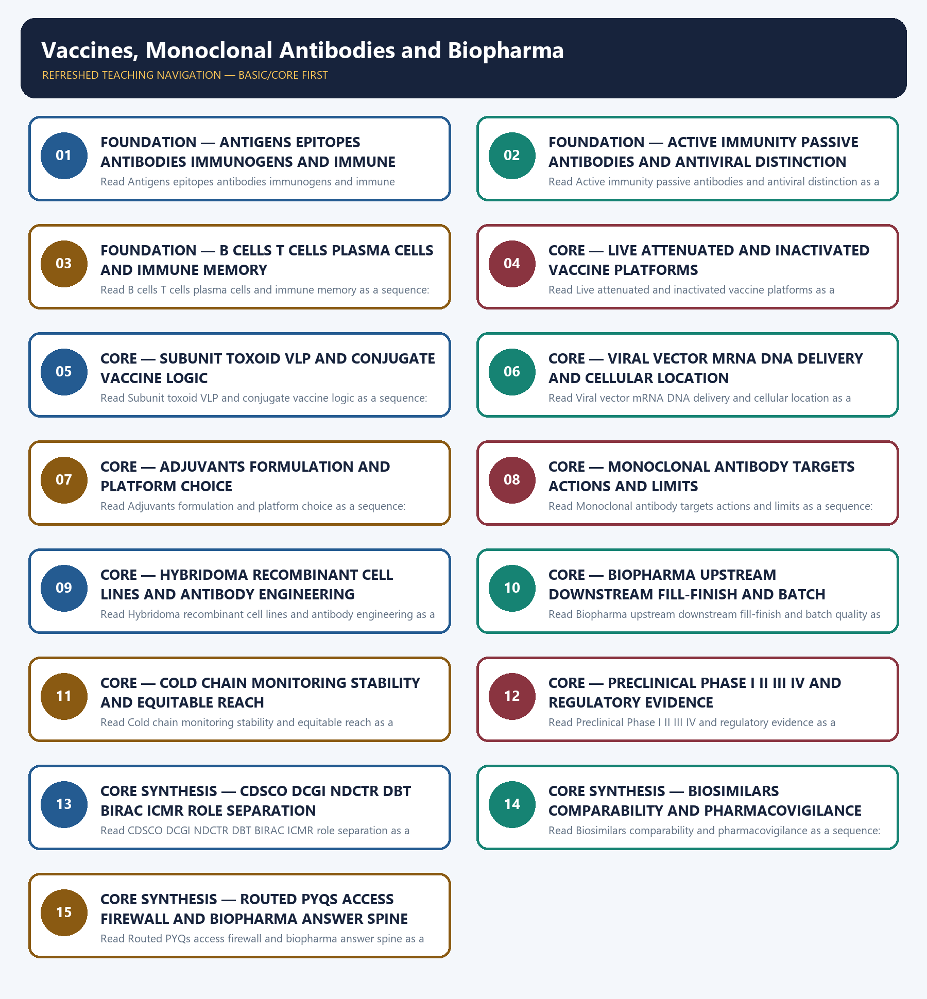

# Vaccines, Monoclonal Antibodies and Biopharma — Learner-v2 Complete Learning Session

> **Authoring-only generation:** 2026-09-04. No PDF was rendered and no tracker or index was mutated.

### SOURCE, PROGRESSION AND CURRENT-LINKAGE AUDIT

- **Generation date:** 2026-09-04.
- **Repository-first evidence:** the Basic owner is taught first and preserved in full; the Advanced owner is retained only in the optional final teaching block.
- **OCR evidence:** Repository Markdown was primary. OCR-searchable official UPSC papers were supplementary only for printed routed demands. No answer key, performance value, procurement outcome, operational deployment, programme target or technology milestone was inferred.
- **Qdrant:** not used; repository Markdown and available OCR context were sufficient.
- **PYQ integrity:** Three representative audited cards cover the 2020 PCV, 2021 recombinant-vector and 2022 COVID-platform objective demands; the 2018 biopharma and 2022 vaccine-development GS-III demands; and the 2025 monoclonal-antibody objective demand. No unavailable objective key is invented, and the available 2025 key is not recorded or inferred.
- **Live-link boundary:** Official CDSCO, BIRAC, IPC/PvPI and DBT pages were fetched, searched or attempted on 2026-09-04. They preserve the NDCTR framework, CDSCO regulatory role, BIRAC translation and Mission COVID Suraksha implementation role, similar-biologics framework and pharmacovigilance boundary. They do not establish current product approvals, efficacy, trial outcomes, batch output, procurement, availability, price, coverage or population impact.
- **Fact/inference discipline:** no current-affairs item, PYQ wording, figure or quotation is invented.

### LIVE OFFICIAL-SOURCE ATTEMPT LOG

The checks below were made on 2026-09-04. Substantive official text is used only for the proposition it supports; title-only, blocked or thin pages are recorded and supply no factual claim.

- https://cdsco.gov.in/opencms/opencms/en/Acts-and-rules/New-Drugs/ - fetched 2026-09-04; the official CDSCO page listed the New Drugs and Clinical Trials Rules, 2019 and subsequent amendments. It supports the trial-and-new-drug framework but was not used to infer approval, efficacy, safety or present availability of any product.
- https://cdsco.gov.in/opencms/opencms/en/biologicals/Vaccines/ - fetched 2026-09-04; the official page identified CDSCO as India's National Regulatory Authority and exposed vaccine guidance material. No product-specific approval, trial result or procurement status was imported from the page.
- https://cdsco.gov.in/opencms/resources/UploadCDSCOWeb/2018/UploadAlertsFiles/BiosimilarGuideline2016.pdf - official-domain search and retrieval attempted 2026-09-04; the joint CDSCO-DBT Guidelines on Similar Biologics, 2016 were located. The dated comparability framework was retained without assuming that every biologic copy is approved, interchangeable or currently marketed.
- https://birac.nic.in/cfp_view.php?id=67&scheme_type=37 - fetched 2026-09-04; the official BIRAC page confirmed DBT's Mission COVID Suraksha and BIRAC's Mission Implementation Unit role, including support for clinical-development and testing capacity. Historical call language was not converted into a current product approval, manufacturing output, procurement total or access outcome.
- https://birac.nic.in/desc_new.php?id=89 - fetched 2026-09-04; the official mandate page identified BIRAC as a DBT-set-up not-for-profit Section 8, Schedule B public sector enterprise and industry-academia interface. Translation support was not rewritten as regulation or proof of company, product or commercial success.
- https://ipc.gov.in/PvPI/about.html - fetched 2026-09-04; the page returned only a sparse legacy shell. Official-domain search located IPC Pharmacovigilance Programme of India reporting, guidance and safety-alert pages, but no adverse-event count, causal conclusion or product-specific safety claim was imported.
- https://dbtindia.gov.in/regulations-guidelines/guidelines - attempted 2026-09-04; DNS resolution failed. No DBT guideline text or current institutional claim was reconstructed from the failed request; the repository owner's dated DBT boundaries were preserved.

## BASIC LEARNING SESSION

### DEEP-REVIEW LEARNING CONTRACT

| Control | Binding rule for this package |
|---|---|
| Syllabus boundary | Complete Science and Technology Basic/Core is easy-first and answer-complete before optional Advanced depth. |
| System boundary | Organisation, platform, subsystem, payload, process, application, institution and outcome remain distinct. |
| Technical boundary | Physical mechanism, classification, stage, platform, unit, range/capacity and limiting condition are explicit. |
| Status boundary | Announcement, approval, development, test, deployment, induction, commercial operation and observed outcome remain distinct. |
| Data boundary | Every mission, launch, target, capacity, budget, range, timeline, rule and regulatory claim keeps source, date, unit and status. |
| Governance boundary | Funder, developer, operator, authoriser, regulator, procurer, settlement actor and adjudicator are not conflated. |
| Practice contract | Every solved item has demand decoding, detailed examiner-grade model, executable timed/compression plan, marks rationale and answer-specific improvement. |
| PYQ contract | Official wording and keys are asserted only when verified; routed or reconstructed demands remain labelled. |
| Dual-flow contract | Graphical and ASCII masters independently reconstruct the same complete Basic-to-optional-Advanced evidence spine. |
| Approval | This immutable successor remains `approved: false` pending explicit approval. |

**Canonical Basic/Core owner:** `upsc-ai-kit\knowledge\Science-and-Technology\basic\15_Vaccines-Monoclonal-Antibodies-and-Biopharma.md`  
**Substantive canonical provenance owner:** `upsc-ai-kit\knowledge\Science-and-Technology\learning-sessions\v2\subject-wide-syllabus\science-and-technology-15_Learning-Session.md`  
**Optional Advanced owner:** `upsc-ai-kit\knowledge\Science-and-Technology\advanced\15_Vaccines-Monoclonal-Antibodies-and-Biopharma.md`  
**Official syllabus mapping:** `upsc-ai-kit\knowledge\Science-and-Technology\OFFICIAL-UPSC-SYLLABUS-MAPPING.md`

### EVIDENCE, PYQ AND CURRENT-STATUS CONTROL

- ISRO organisation, launcher stages, payload and orbit claims retain their exact object and mission date.
- NavIC, GAGAN, human-spaceflight, planetary, nuclear, fusion, missile and procurement claims retain category and status.
- Aadhaar/UPI, AI, quantum and semiconductor claims retain actor, layer, metric, maturity and governance boundaries.
- DPDP/cybersecurity, biotechnology and genetic-engineering claims retain legal/regulatory stage and competent institution.
- Targets, budgets, capacities, ranges and timelines are never promoted into achieved outcomes without dated evidence.
- **Current-status note, rechecked 2026-09-06:** volatile claims retain source/date/status; failed official fetches remain explicit and supply no invented fact.

**Generation-local live/current sources:**
- `https://cdsco.gov.in/opencms/opencms/en/Acts-and-rules/New-Drugs/ - fetched 2026-09-04; the official CDSCO page listed the New Drugs and Clinical Trials Rules, 2019 and subsequent amendments. It supports the trial-and-new-drug framework but was not used to infer approval, efficacy, safety or present availability of any product.`
- `https://cdsco.gov.in/opencms/opencms/en/biologicals/Vaccines/ - fetched 2026-09-04; the official page identified CDSCO as India's National Regulatory Authority and exposed vaccine guidance material. No product-specific approval, trial result or procurement status was imported from the page.`
- `https://cdsco.gov.in/opencms/resources/UploadCDSCOWeb/2018/UploadAlertsFiles/BiosimilarGuideline2016.pdf - official-domain search and retrieval attempted 2026-09-04; the joint CDSCO-DBT Guidelines on Similar Biologics, 2016 were located. The dated comparability framework was retained without assuming that every biologic copy is approved, interchangeable or currently marketed.`
- `https://birac.nic.in/cfp_view.php?id=67&scheme_type=37 - fetched 2026-09-04; the official BIRAC page confirmed DBT's Mission COVID Suraksha and BIRAC's Mission Implementation Unit role, including support for clinical-development and testing capacity. Historical call language was not converted into a current product approval, manufacturing output, procurement total or access outcome.`
- `https://birac.nic.in/desc_new.php?id=89 - fetched 2026-09-04; the official mandate page identified BIRAC as a DBT-set-up not-for-profit Section 8, Schedule B public sector enterprise and industry-academia interface. Translation support was not rewritten as regulation or proof of company, product or commercial success.`
- `https://ipc.gov.in/PvPI/about.html - fetched 2026-09-04; the page returned only a sparse legacy shell. Official-domain search located IPC Pharmacovigilance Programme of India reporting, guidance and safety-alert pages, but no adverse-event count, causal conclusion or product-specific safety claim was imported.`
- `https://dbtindia.gov.in/regulations-guidelines/guidelines - attempted 2026-09-04; DNS resolution failed. No DBT guideline text or current institutional claim was reconstructed from the failed request; the repository owner's dated DBT boundaries were preserved.`

**Topic-routed verified PYQ owners:**
- No topic-local official question file is claimed; repository PYQ routing ledgers control wording and status.




*Distinct embedded teaching-navigation image. The separate continuous Cārvāka-style flowchart package remains an independent at-a-glance artifact.*

### SESSION 1 — FOUNDATION — ANTIGENS EPITOPES ANTIBODIES IMMUNOGENS AND IMMUNE RECOGNITION

#### DEFINITION / WHAT THIS IS CALLED

**Plain-language definition:** An antigen is a molecular structure recognised by an antibody or T-cell receptor, while an antibody is a B-cell-lineage immunoglobulin that binds a specific epitope; antigen, immunogen, antibody and pathogen are related but non-interchangeable terms.

**Technical definition:** Read Antigens epitopes antibodies immunogens and immune recognition as a sequence: identify Antigen-antibody boundary, follow the named mechanism to its user or output, and stop at the last verified status rather than assuming the next stage.

#### ANSWER-GRABBING OPENING — WRITE/ADAPT IN THE EXAM

> An antigen is a molecular structure recognised by an antibody or T-cell receptor, while an antibody is a B-cell-lineage immunoglobulin that binds a specific epitope; antigen, immunogen, antibody and pathogen are related but non-interchangeable terms.

#### MUST-WRITE KEYWORDS

- **FOUNDATION**
- **Antigens epitopes antibodies immunogens**
- **immune recognition**
- **Mechanism chain**
- **Qualified use**
- **An antigen**

**How to use them:** Frame the answer through FOUNDATION; define Antigens epitopes antibodies immunogens, connect immune recognition with Mechanism chain to explain the mechanism, and use Qualified use for the decisive comparison or qualification.

#### VISUAL FIRST

```text
ANTIGENS EPITOPES ANTIBODIES IMMUNOGENS AND IMMUNE RECOGNITION
01. Antigen-antibody boundary
    |
    v
02. Active-passive-antiviral boundary
STATUS / CATEGORY FIREWALL -> Do not merge antigen, immunogen, pathogen, epitope and antibody.
```

*The rail fixes the technical sequence and the claim boundary before explanation.*

#### CORE EXPLANATION

An antigen is a molecular structure recognised by an antibody or T-cell receptor, while an antibody is a B-cell-lineage immunoglobulin that binds a specific epitope; antigen, immunogen, antibody and pathogen are related but non-interchangeable terms. Vaccination presents antigen or antigen instructions so the recipient develops active immunity and memory, whereas a monoclonal antibody supplies a ready-made targeted protein for passive prophylaxis or therapy; an antiviral instead inhibits a step of viral replication.

#### SIMPLE SYSTEM EXAMPLE

Read Antigens epitopes antibodies immunogens and immune recognition as a sequence: identify Antigen-antibody boundary, follow the named mechanism to its user or output, and stop at the last verified status rather than assuming the next stage.

#### TECHNICAL DISTINCTION

The decisive boundary is Do not merge antigen, immunogen, pathogen, epitope and antibody. This keeps Antigen-antibody boundary and Active-passive-antiviral boundary in the correct scientific category, institution and unit of measurement.

#### NAMED EVIDENCE AND MECHANISM

- An antigen is a molecular structure recognised by an antibody or T-cell receptor, while an antibody is a B-cell-lineage immunoglobulin that binds a specific epitope; antigen, immunogen, antibody and pathogen are related but non-interchangeable terms.
- Vaccination presents antigen or antigen instructions so the recipient develops active immunity and memory, whereas a monoclonal antibody supplies a ready-made targeted protein for passive prophylaxis or therapy; an antiviral instead inhibits a step of viral replication.

#### EXAMINER CAUTION

- Do not merge antigen, immunogen, pathogen, epitope and antibody.

#### EXAM LINK

- **Prelims:** Keep institution, system, platform, service, process, legal instrument, unit and status in their exact category.
- **Mains:** Define each immune object before tracing recognition and response.

#### MINI RECAP

- **Mechanism chain:** Antigen-antibody boundary -> Active-passive-antiviral boundary
- **Qualified use:** Define each immune object before tracing recognition and response.

#### CLOSING RECALL FLOW — FOUNDATION — ANTIGENS EPITOPES ANTIBODIES IMMUNOGENS AND IMMUNE RECOGNITION

```text
START / CONCEPT: FOUNDATION — Antigens epitopes antibodies immunogens and immune recognition
        |
        v
EXACT TERMS: FOUNDATION · Antigens epitopes antibodies immunogens · immune recognition · Mechanism chain · Qualified use · An antigen
        |
        v
MECHANISM / ARGUMENT: Read Antigens epitopes antibodies immunogens and immune recognition as a sequence: identify Antigen-antibody boundary, follow the named mechanism to its user or output, and stop at the last verified status rather than assuming the next stage.
        |
        v
CONSEQUENCE / CONTRAST: The decisive boundary is Do not merge antigen, immunogen, pathogen, epitope and antibody.
        |
        v
UPSC TRAP / ANSWER-USE: Do not merge antigen, immunogen, pathogen, epitope and antibody.
        |
        v
ANSWER-GRABBING FORMULATION: An antigen is a molecular structure recognised by an antibody or T-cell receptor, while an antibody is a B-cell-lineage immunoglobulin that binds a specific epitope; antigen, immunogen, antibody and pathogen are related but non-interchangeable terms.
```
### SESSION 2 — FOUNDATION — ACTIVE IMMUNITY PASSIVE ANTIBODIES AND ANTIVIRAL DISTINCTION

#### DEFINITION / WHAT THIS IS CALLED

**Plain-language definition:** The decisive boundary is Do not call monoclonal antibodies vaccines or antivirals passive vaccines.

**Technical definition:** Read Active immunity passive antibodies and antiviral distinction as a sequence: identify Adaptive-immune mechanism, follow the named mechanism to its user or output, and stop at the last verified status rather than assuming the next stage.

#### ANSWER-GRABBING OPENING — WRITE/ADAPT IN THE EXAM

> Read Active immunity passive antibodies and antiviral distinction as a sequence: identify Adaptive-immune mechanism, follow the named mechanism to its user or output, and stop at the last verified status rather than assuming the next stage.

#### MUST-WRITE KEYWORDS

- **FOUNDATION**
- **Active immunity passive antibodies**
- **antiviral distinction**
- **Mechanism chain**
- **Qualified use**
- **Antigen**

**How to use them:** Frame the answer through FOUNDATION; define Active immunity passive antibodies, connect antiviral distinction with Mechanism chain to explain the mechanism, and use Qualified use for the decisive comparison or qualification.

#### VISUAL FIRST

```text
ACTIVE IMMUNITY PASSIVE ANTIBODIES AND ANTIVIRAL DISTINCTION
01. Adaptive-immune mechanism
STATUS / CATEGORY FIREWALL -> Do not call monoclonal antibodies vaccines or antivirals passive vaccines.
```

*The rail fixes the technical sequence and the claim boundary before explanation.*

#### CORE EXPLANATION

Antigen presentation activates appropriate lymphocytes; B cells can become antibody-secreting plasma cells and memory B cells, while helper and cytotoxic T-cell functions support or execute cellular responses. Antibody titre alone is not the whole immune response or a universal correlate of protection.

#### SIMPLE SYSTEM EXAMPLE

Read Active immunity passive antibodies and antiviral distinction as a sequence: identify Adaptive-immune mechanism, follow the named mechanism to its user or output, and stop at the last verified status rather than assuming the next stage.

#### TECHNICAL DISTINCTION

The decisive boundary is Do not call monoclonal antibodies vaccines or antivirals passive vaccines. This keeps Adaptive-immune mechanism in the correct scientific category, institution and unit of measurement.

#### NAMED EVIDENCE AND MECHANISM

- Antigen presentation activates appropriate lymphocytes; B cells can become antibody-secreting plasma cells and memory B cells, while helper and cytotoxic T-cell functions support or execute cellular responses. Antibody titre alone is not the whole immune response or a universal correlate of protection.

#### EXAMINER CAUTION

- Do not call monoclonal antibodies vaccines or antivirals passive vaccines.

#### EXAM LINK

- **Prelims:** Keep institution, system, platform, service, process, legal instrument, unit and status in their exact category.
- **Mains:** Compare who supplies the response, onset, memory and therapeutic purpose.

#### MINI RECAP

- **Mechanism chain:** Adaptive-immune mechanism
- **Qualified use:** Compare who supplies the response, onset, memory and therapeutic purpose.

#### CLOSING RECALL FLOW — FOUNDATION — ACTIVE IMMUNITY PASSIVE ANTIBODIES AND ANTIVIRAL DISTINCTION

```text
START / CONCEPT: FOUNDATION — Active immunity passive antibodies and antiviral distinction
        |
        v
EXACT TERMS: FOUNDATION · Active immunity passive antibodies · antiviral distinction · Mechanism chain · Qualified use · Antigen
        |
        v
MECHANISM / ARGUMENT: Mechanism chain: Adaptive-immune mechanism Qualified use: Compare who supplies the response, onset, memory and therapeutic purpose.
        |
        v
CONSEQUENCE / CONTRAST: The decisive boundary is Do not call monoclonal antibodies vaccines or antivirals passive vaccines.
        |
        v
UPSC TRAP / ANSWER-USE: Do not call monoclonal antibodies vaccines or antivirals passive vaccines.
        |
        v
ANSWER-GRABBING FORMULATION: Read Active immunity passive antibodies and antiviral distinction as a sequence: identify Adaptive-immune mechanism, follow the named mechanism to its user or output, and stop at the last verified status rather than assuming the next stage.
```
### SESSION 3 — FOUNDATION — B CELLS T CELLS PLASMA CELLS AND IMMUNE MEMORY

#### DEFINITION / WHAT THIS IS CALLED

**Plain-language definition:** The decisive boundary is Do not reduce adaptive immunity to antibodies while omitting B-cell memory and T cells.

**Technical definition:** Read B cells T cells plasma cells and immune memory as a sequence: identify Whole-pathogen platform boundary, follow the named mechanism to its user or output, and stop at the last verified status rather than assuming the next stage.

#### ANSWER-GRABBING OPENING — WRITE/ADAPT IN THE EXAM

> The decisive boundary is Do not reduce adaptive immunity to antibodies while omitting B-cell memory and T cells.

#### MUST-WRITE KEYWORDS

- **FOUNDATION**
- **B cells T cells plasma cells**
- **immune memory**
- **Mechanism chain**
- **Qualified use**
- **Live-attenuated**

**How to use them:** Frame the answer through FOUNDATION; define B cells T cells plasma cells, connect immune memory with Mechanism chain to explain the mechanism, and use Qualified use for the decisive comparison or qualification.

#### VISUAL FIRST

```text
B CELLS T CELLS PLASMA CELLS AND IMMUNE MEMORY
01. Whole-pathogen platform boundary
STATUS / CATEGORY FIREWALL -> Do not reduce adaptive immunity to antibodies while omitting B-cell memory and T cells.
```

*The rail fixes the technical sequence and the claim boundary before explanation.*

#### CORE EXPLANATION

Live-attenuated vaccines use a weakened replicating organism and inactivated vaccines use a killed organism; both expose multiple antigens, but attenuation, replication, contraindications, boosting and manufacture must not be treated as identical.

#### SIMPLE SYSTEM EXAMPLE

Read B cells T cells plasma cells and immune memory as a sequence: identify Whole-pathogen platform boundary, follow the named mechanism to its user or output, and stop at the last verified status rather than assuming the next stage.

#### TECHNICAL DISTINCTION

The decisive boundary is Do not reduce adaptive immunity to antibodies while omitting B-cell memory and T cells. This keeps Whole-pathogen platform boundary in the correct scientific category, institution and unit of measurement.

#### NAMED EVIDENCE AND MECHANISM

- Live-attenuated vaccines use a weakened replicating organism and inactivated vaccines use a killed organism; both expose multiple antigens, but attenuation, replication, contraindications, boosting and manufacture must not be treated as identical.

#### EXAMINER CAUTION

- Do not reduce adaptive immunity to antibodies while omitting B-cell memory and T cells.

#### EXAM LINK

- **Prelims:** Keep institution, system, platform, service, process, legal instrument, unit and status in their exact category.
- **Mains:** Trace antigen presentation to humoral, cellular and memory outcomes.

#### MINI RECAP

- **Mechanism chain:** Whole-pathogen platform boundary
- **Qualified use:** Trace antigen presentation to humoral, cellular and memory outcomes.

#### CLOSING RECALL FLOW — FOUNDATION — B CELLS T CELLS PLASMA CELLS AND IMMUNE MEMORY

```text
START / CONCEPT: FOUNDATION — B cells T cells plasma cells and immune memory
        |
        v
EXACT TERMS: FOUNDATION · B cells T cells plasma cells · immune memory · Mechanism chain · Qualified use · Live-attenuated
        |
        v
MECHANISM / ARGUMENT: Read B cells T cells plasma cells and immune memory as a sequence: identify Whole-pathogen platform boundary, follow the named mechanism to its user or output, and stop at the last verified status rather than assuming the next stage.
        |
        v
CONSEQUENCE / CONTRAST: Do not reduce adaptive immunity to antibodies while omitting B-cell memory and T cells.
        |
        v
UPSC TRAP / ANSWER-USE: Live-attenuated vaccines use a weakened replicating organism and inactivated vaccines use a killed organism; both expose multiple antigens, but attenuation, replication, contraindications, boosting and manufacture must not be treated as identical.
        |
        v
ANSWER-GRABBING FORMULATION: The decisive boundary is Do not reduce adaptive immunity to antibodies while omitting B-cell memory and T cells.
```
### SESSION 4 — CORE — LIVE ATTENUATED AND INACTIVATED VACCINE PLATFORMS

#### DEFINITION / WHAT THIS IS CALLED

**Plain-language definition:** Subunit vaccines present selected components, toxoids present inactivated bacterial toxins, virus-like particles are non-infectious protein assemblies without a viral genome, and conjugate vaccines link a weak polysaccharide antigen to a protein carrier to strengthen T-cell-dependent response and memory.

**Technical definition:** Read Live attenuated and inactivated vaccine platforms as a sequence: identify Subunit-toxoid-VLP-conjugate boundary, follow the named mechanism to its user or output, and stop at the last verified status rather than assuming the next stage.

#### ANSWER-GRABBING OPENING — WRITE/ADAPT IN THE EXAM

> Read Live attenuated and inactivated vaccine platforms as a sequence: identify Subunit-toxoid-VLP-conjugate boundary, follow the named mechanism to its user or output, and stop at the last verified status rather than assuming the next stage.

#### MUST-WRITE KEYWORDS

- **Live attenuated**
- **inactivated vaccine platforms**
- **Mechanism chain**
- **Qualified use**
- **Subunit**
- **T-cell-dependent**

**How to use them:** Frame the answer through Live attenuated; define inactivated vaccine platforms, connect Mechanism chain with Qualified use to explain the mechanism, and use Subunit for the decisive comparison or qualification.

#### VISUAL FIRST

```text
LIVE ATTENUATED AND INACTIVATED VACCINE PLATFORMS
01. Subunit-toxoid-VLP-conjugate boundary
STATUS / CATEGORY FIREWALL -> Do not merge live-attenuated and inactivated vaccine replication or contraindications.
```

*The rail fixes the technical sequence and the claim boundary before explanation.*

#### CORE EXPLANATION

Subunit vaccines present selected components, toxoids present inactivated bacterial toxins, virus-like particles are non-infectious protein assemblies without a viral genome, and conjugate vaccines link a weak polysaccharide antigen to a protein carrier to strengthen T-cell-dependent response and memory.

#### SIMPLE SYSTEM EXAMPLE

Read Live attenuated and inactivated vaccine platforms as a sequence: identify Subunit-toxoid-VLP-conjugate boundary, follow the named mechanism to its user or output, and stop at the last verified status rather than assuming the next stage.

#### TECHNICAL DISTINCTION

The decisive boundary is Do not merge live-attenuated and inactivated vaccine replication or contraindications. This keeps Subunit-toxoid-VLP-conjugate boundary in the correct scientific category, institution and unit of measurement.

#### NAMED EVIDENCE AND MECHANISM

- Subunit vaccines present selected components, toxoids present inactivated bacterial toxins, virus-like particles are non-infectious protein assemblies without a viral genome, and conjugate vaccines link a weak polysaccharide antigen to a protein carrier to strengthen T-cell-dependent response and memory.

#### EXAMINER CAUTION

- Do not merge live-attenuated and inactivated vaccine replication or contraindications.

#### EXAM LINK

- **Prelims:** Keep institution, system, platform, service, process, legal instrument, unit and status in their exact category.
- **Mains:** Compare replication state, immune breadth, handling and contraindication logic.

#### MINI RECAP

- **Mechanism chain:** Subunit-toxoid-VLP-conjugate boundary
- **Qualified use:** Compare replication state, immune breadth, handling and contraindication logic.

#### CLOSING RECALL FLOW — CORE — LIVE ATTENUATED AND INACTIVATED VACCINE PLATFORMS

```text
START / CONCEPT: CORE — Live attenuated and inactivated vaccine platforms
        |
        v
EXACT TERMS: Live attenuated · inactivated vaccine platforms · Mechanism chain · Qualified use · Subunit · T-cell-dependent
        |
        v
MECHANISM / ARGUMENT: Mechanism chain: Subunit-toxoid-VLP-conjugate boundary Qualified use: Compare replication state, immune breadth, handling and contraindication logic.
        |
        v
CONSEQUENCE / CONTRAST: The decisive boundary is Do not merge live-attenuated and inactivated vaccine replication or contraindications.
        |
        v
UPSC TRAP / ANSWER-USE: Do not merge live-attenuated and inactivated vaccine replication or contraindications.
        |
        v
ANSWER-GRABBING FORMULATION: Read Live attenuated and inactivated vaccine platforms as a sequence: identify Subunit-toxoid-VLP-conjugate boundary, follow the named mechanism to its user or output, and stop at the last verified status rather than assuming the next stage.
```
### SESSION 5 — CORE — SUBUNIT TOXOID VLP AND CONJUGATE VACCINE LOGIC

#### DEFINITION / WHAT THIS IS CALLED

**Plain-language definition:** The decisive boundary is Do not treat subunit, toxoid, VLP and conjugate platforms as synonyms.

**Technical definition:** Read Subunit toxoid VLP and conjugate vaccine logic as a sequence: identify Vector-mRNA-DNA boundary, follow the named mechanism to its user or output, and stop at the last verified status rather than assuming the next stage.

#### ANSWER-GRABBING OPENING — WRITE/ADAPT IN THE EXAM

> Read Subunit toxoid VLP and conjugate vaccine logic as a sequence: identify Vector-mRNA-DNA boundary, follow the named mechanism to its user or output, and stop at the last verified status rather than assuming the next stage.

#### MUST-WRITE KEYWORDS

- **Subunit toxoid VLP**
- **conjugate vaccine logic**
- **Mechanism chain**
- **Qualified use**
- **DNA**
- **Read Subunit**

**How to use them:** Frame the answer through Subunit toxoid VLP; define conjugate vaccine logic, connect Mechanism chain with Qualified use to explain the mechanism, and use DNA for the decisive comparison or qualification.

#### VISUAL FIRST

```text
SUBUNIT TOXOID VLP AND CONJUGATE VACCINE LOGIC
01. Vector-mRNA-DNA boundary
STATUS / CATEGORY FIREWALL -> Do not treat subunit, toxoid, VLP and conjugate platforms as synonyms.
```

*The rail fixes the technical sequence and the claim boundary before explanation.*

#### CORE EXPLANATION

A recombinant viral vector delivers antigen code through an engineered carrier, mRNA is translated in the cytoplasm after delivery such as by lipid nanoparticles, and DNA must reach the nucleus for transcription; all induce active immunity but their delivery, stability and manufacturing implications differ.

#### SIMPLE SYSTEM EXAMPLE

Read Subunit toxoid VLP and conjugate vaccine logic as a sequence: identify Vector-mRNA-DNA boundary, follow the named mechanism to its user or output, and stop at the last verified status rather than assuming the next stage.

#### TECHNICAL DISTINCTION

The decisive boundary is Do not treat subunit, toxoid, VLP and conjugate platforms as synonyms. This keeps Vector-mRNA-DNA boundary in the correct scientific category, institution and unit of measurement.

#### NAMED EVIDENCE AND MECHANISM

- A recombinant viral vector delivers antigen code through an engineered carrier, mRNA is translated in the cytoplasm after delivery such as by lipid nanoparticles, and DNA must reach the nucleus for transcription; all induce active immunity but their delivery, stability and manufacturing implications differ.

#### EXAMINER CAUTION

- Do not treat subunit, toxoid, VLP and conjugate platforms as synonyms.

#### EXAM LINK

- **Prelims:** Keep institution, system, platform, service, process, legal instrument, unit and status in their exact category.
- **Mains:** Identify the antigen form and explain why a carrier or adjuvant may be needed.

#### MINI RECAP

- **Mechanism chain:** Vector-mRNA-DNA boundary
- **Qualified use:** Identify the antigen form and explain why a carrier or adjuvant may be needed.

#### CLOSING RECALL FLOW — CORE — SUBUNIT TOXOID VLP AND CONJUGATE VACCINE LOGIC

```text
START / CONCEPT: CORE — Subunit toxoid VLP and conjugate vaccine logic
        |
        v
EXACT TERMS: Subunit toxoid VLP · conjugate vaccine logic · Mechanism chain · Qualified use · DNA · Read Subunit
        |
        v
MECHANISM / ARGUMENT: Mechanism chain: Vector-mRNA-DNA boundary Qualified use: Identify the antigen form and explain why a carrier or adjuvant may be needed.
        |
        v
CONSEQUENCE / CONTRAST: The decisive boundary is Do not treat subunit, toxoid, VLP and conjugate platforms as synonyms.
        |
        v
UPSC TRAP / ANSWER-USE: Do not treat subunit, toxoid, VLP and conjugate platforms as synonyms.
        |
        v
ANSWER-GRABBING FORMULATION: Read Subunit toxoid VLP and conjugate vaccine logic as a sequence: identify Vector-mRNA-DNA boundary, follow the named mechanism to its user or output, and stop at the last verified status rather than assuming the next stage.
```
### SESSION 6 — CORE — VIRAL VECTOR MRNA DNA DELIVERY AND CELLULAR LOCATION

#### DEFINITION / WHAT THIS IS CALLED

**Plain-language definition:** The decisive boundary is Do not say viral-vector, mRNA and DNA vaccines deliver antigen in the same compartment.

**Technical definition:** Read Viral vector mRNA DNA delivery and cellular location as a sequence: identify Adjuvant-and-formulation boundary, follow the named mechanism to its user or output, and stop at the last verified status rather than assuming the next stage.

#### ANSWER-GRABBING OPENING — WRITE/ADAPT IN THE EXAM

> Read Viral vector mRNA DNA delivery and cellular location as a sequence: identify Adjuvant-and-formulation boundary, follow the named mechanism to its user or output, and stop at the last verified status rather than assuming the next stage.

#### MUST-WRITE KEYWORDS

- **Viral vector mRNA DNA delivery**
- **cellular location**
- **Mechanism chain**
- **Qualified use**
- **A monoclonal antibody**
- **Read Viral**

**How to use them:** Frame the answer through Viral vector mRNA DNA delivery; define cellular location, connect Mechanism chain with Qualified use to explain the mechanism, and use A monoclonal antibody for the decisive comparison or qualification.

#### VISUAL FIRST

```text
VIRAL VECTOR MRNA DNA DELIVERY AND CELLULAR LOCATION
01. Adjuvant-and-formulation boundary
    |
    v
02. Monoclonal-antibody mechanism
STATUS / CATEGORY FIREWALL -> Do not say viral-vector, mRNA and DNA vaccines deliver antigen in the same compartment.
```

*The rail fixes the technical sequence and the claim boundary before explanation.*

#### CORE EXPLANATION

An adjuvant enhances or shapes an immune response to antigen, whereas stabilisers, preservatives and delivery systems perform different formulation functions; the presence of an adjuvant does not itself establish efficacy, safety or duration. A monoclonal antibody is selected for binding to one epitope or defined target and can neutralise, block signalling, recruit immune effector functions or carry a payload; targeted binding does not guarantee clinical benefit or absence of adverse effects.

#### SIMPLE SYSTEM EXAMPLE

Read Viral vector mRNA DNA delivery and cellular location as a sequence: identify Adjuvant-and-formulation boundary, follow the named mechanism to its user or output, and stop at the last verified status rather than assuming the next stage.

#### TECHNICAL DISTINCTION

The decisive boundary is Do not say viral-vector, mRNA and DNA vaccines deliver antigen in the same compartment. This keeps Adjuvant-and-formulation boundary and Monoclonal-antibody mechanism in the correct scientific category, institution and unit of measurement.

#### NAMED EVIDENCE AND MECHANISM

- An adjuvant enhances or shapes an immune response to antigen, whereas stabilisers, preservatives and delivery systems perform different formulation functions; the presence of an adjuvant does not itself establish efficacy, safety or duration.
- A monoclonal antibody is selected for binding to one epitope or defined target and can neutralise, block signalling, recruit immune effector functions or carry a payload; targeted binding does not guarantee clinical benefit or absence of adverse effects.

#### EXAMINER CAUTION

- Do not say viral-vector, mRNA and DNA vaccines deliver antigen in the same compartment.

#### EXAM LINK

- **Prelims:** Keep institution, system, platform, service, process, legal instrument, unit and status in their exact category.
- **Mains:** Follow code delivery to nucleus or cytoplasm, antigen expression and active immunity.

#### MINI RECAP

- **Mechanism chain:** Adjuvant-and-formulation boundary -> Monoclonal-antibody mechanism
- **Qualified use:** Follow code delivery to nucleus or cytoplasm, antigen expression and active immunity.

#### CLOSING RECALL FLOW — CORE — VIRAL VECTOR MRNA DNA DELIVERY AND CELLULAR LOCATION

```text
START / CONCEPT: CORE — Viral vector mRNA DNA delivery and cellular location
        |
        v
EXACT TERMS: Viral vector mRNA DNA delivery · cellular location · Mechanism chain · Qualified use · A monoclonal antibody · Read Viral
        |
        v
MECHANISM / ARGUMENT: Mechanism chain: Adjuvant-and-formulation boundary - Monoclonal-antibody mechanism Qualified use: Follow code delivery to nucleus or cytoplasm, antigen expression and active immunity.
        |
        v
CONSEQUENCE / CONTRAST: An adjuvant enhances or shapes an immune response to antigen, whereas stabilisers, preservatives and delivery systems perform different formulation functions; the presence of an adjuvant does not itself establish efficacy, safety or duration.
        |
        v
UPSC TRAP / ANSWER-USE: The decisive boundary is Do not say viral-vector, mRNA and DNA vaccines deliver antigen in the same compartment.
        |
        v
ANSWER-GRABBING FORMULATION: Read Viral vector mRNA DNA delivery and cellular location as a sequence: identify Adjuvant-and-formulation boundary, follow the named mechanism to its user or output, and stop at the last verified status rather than assuming the next stage.
```
### SESSION 7 — CORE — ADJUVANTS FORMULATION AND PLATFORM CHOICE

#### DEFINITION / WHAT THIS IS CALLED

**Plain-language definition:** The decisive boundary is Do not treat adjuvant, preservative, stabiliser and delivery vehicle as one ingredient class.

**Technical definition:** Read Adjuvants formulation and platform choice as a sequence: identify Hybridoma-recombinant-production boundary, follow the named mechanism to its user or output, and stop at the last verified status rather than assuming the next stage.

#### ANSWER-GRABBING OPENING — WRITE/ADAPT IN THE EXAM

> Read Adjuvants formulation and platform choice as a sequence: identify Hybridoma-recombinant-production boundary, follow the named mechanism to its user or output, and stop at the last verified status rather than assuming the next stage.

#### MUST-WRITE KEYWORDS

- **Adjuvants formulation**
- **platform choice**
- **Mechanism chain**
- **Qualified use**
- **Classical**
- **Read Adjuvants**

**How to use them:** Frame the answer through Adjuvants formulation; define platform choice, connect Mechanism chain with Qualified use to explain the mechanism, and use Classical for the decisive comparison or qualification.

#### VISUAL FIRST

```text
ADJUVANTS FORMULATION AND PLATFORM CHOICE
01. Hybridoma-recombinant-production boundary
STATUS / CATEGORY FIREWALL -> Do not treat adjuvant, preservative, stabiliser and delivery vehicle as one ingredient class.
```

*The rail fixes the technical sequence and the claim boundary before explanation.*

#### CORE EXPLANATION

Classical hybridoma technology fuses an antibody-producing B cell with an immortal myeloma cell to create a clone, while modern therapeutic antibodies are commonly sequence-engineered and expressed in recombinant mammalian cell culture; discovery clone, production cell line and final medicine are separate stages.

#### SIMPLE SYSTEM EXAMPLE

Read Adjuvants formulation and platform choice as a sequence: identify Hybridoma-recombinant-production boundary, follow the named mechanism to its user or output, and stop at the last verified status rather than assuming the next stage.

#### TECHNICAL DISTINCTION

The decisive boundary is Do not treat adjuvant, preservative, stabiliser and delivery vehicle as one ingredient class. This keeps Hybridoma-recombinant-production boundary in the correct scientific category, institution and unit of measurement.

#### NAMED EVIDENCE AND MECHANISM

- Classical hybridoma technology fuses an antibody-producing B cell with an immortal myeloma cell to create a clone, while modern therapeutic antibodies are commonly sequence-engineered and expressed in recombinant mammalian cell culture; discovery clone, production cell line and final medicine are separate stages.

#### EXAMINER CAUTION

- Do not treat adjuvant, preservative, stabiliser and delivery vehicle as one ingredient class.

#### EXAM LINK

- **Prelims:** Keep institution, system, platform, service, process, legal instrument, unit and status in their exact category.
- **Mains:** Separate immune enhancement from preservation, stabilisation and delivery.

#### MINI RECAP

- **Mechanism chain:** Hybridoma-recombinant-production boundary
- **Qualified use:** Separate immune enhancement from preservation, stabilisation and delivery.

#### CLOSING RECALL FLOW — CORE — ADJUVANTS FORMULATION AND PLATFORM CHOICE

```text
START / CONCEPT: CORE — Adjuvants formulation and platform choice
        |
        v
EXACT TERMS: Adjuvants formulation · platform choice · Mechanism chain · Qualified use · Classical · Read Adjuvants
        |
        v
MECHANISM / ARGUMENT: Mechanism chain: Hybridoma-recombinant-production boundary Qualified use: Separate immune enhancement from preservation, stabilisation and delivery.
        |
        v
CONSEQUENCE / CONTRAST: The decisive boundary is Do not treat adjuvant, preservative, stabiliser and delivery vehicle as one ingredient class.
        |
        v
UPSC TRAP / ANSWER-USE: Do not treat adjuvant, preservative, stabiliser and delivery vehicle as one ingredient class.
        |
        v
ANSWER-GRABBING FORMULATION: Read Adjuvants formulation and platform choice as a sequence: identify Hybridoma-recombinant-production boundary, follow the named mechanism to its user or output, and stop at the last verified status rather than assuming the next stage.
```
### SESSION 8 — CORE — MONOCLONAL ANTIBODY TARGETS ACTIONS AND LIMITS

#### DEFINITION / WHAT THIS IS CALLED

**Plain-language definition:** The decisive boundary is Do not infer clinical benefit merely from monoclonal target binding.

**Technical definition:** Read Monoclonal antibody targets actions and limits as a sequence: identify Antibody-engineering boundary, follow the named mechanism to its user or output, and stop at the last verified status rather than assuming the next stage.

#### ANSWER-GRABBING OPENING — WRITE/ADAPT IN THE EXAM

> Read Monoclonal antibody targets actions and limits as a sequence: identify Antibody-engineering boundary, follow the named mechanism to its user or output, and stop at the last verified status rather than assuming the next stage.

#### MUST-WRITE KEYWORDS

- **Monoclonal antibody targets actions**
- **limits**
- **Mechanism chain**
- **Qualified use**
- **Chimeric**
- **Read Monoclonal**

**How to use them:** Frame the answer through Monoclonal antibody targets actions; define limits, connect Mechanism chain with Qualified use to explain the mechanism, and use Chimeric for the decisive comparison or qualification.

#### VISUAL FIRST

```text
MONOCLONAL ANTIBODY TARGETS ACTIONS AND LIMITS
01. Antibody-engineering boundary
STATUS / CATEGORY FIREWALL -> Do not infer clinical benefit merely from monoclonal target binding.
```

*The rail fixes the technical sequence and the claim boundary before explanation.*

#### CORE EXPLANATION

Chimeric, humanised and fully human antibodies describe different degrees or routes of human-sequence content intended partly to manage immunogenicity; suffix conventions are historical naming aids, not proof of mechanism, safety, approval or effectiveness.

#### SIMPLE SYSTEM EXAMPLE

Read Monoclonal antibody targets actions and limits as a sequence: identify Antibody-engineering boundary, follow the named mechanism to its user or output, and stop at the last verified status rather than assuming the next stage.

#### TECHNICAL DISTINCTION

The decisive boundary is Do not infer clinical benefit merely from monoclonal target binding. This keeps Antibody-engineering boundary in the correct scientific category, institution and unit of measurement.

#### NAMED EVIDENCE AND MECHANISM

- Chimeric, humanised and fully human antibodies describe different degrees or routes of human-sequence content intended partly to manage immunogenicity; suffix conventions are historical naming aids, not proof of mechanism, safety, approval or effectiveness.

#### EXAMINER CAUTION

- Do not infer clinical benefit merely from monoclonal target binding.

#### EXAM LINK

- **Prelims:** Keep institution, system, platform, service, process, legal instrument, unit and status in their exact category.
- **Mains:** Move from epitope binding to mechanism, indication evidence and safety limits.

#### MINI RECAP

- **Mechanism chain:** Antibody-engineering boundary
- **Qualified use:** Move from epitope binding to mechanism, indication evidence and safety limits.

#### CLOSING RECALL FLOW — CORE — MONOCLONAL ANTIBODY TARGETS ACTIONS AND LIMITS

```text
START / CONCEPT: CORE — Monoclonal antibody targets actions and limits
        |
        v
EXACT TERMS: Monoclonal antibody targets actions · limits · Mechanism chain · Qualified use · Chimeric · Read Monoclonal
        |
        v
MECHANISM / ARGUMENT: Mechanism chain: Antibody-engineering boundary Qualified use: Move from epitope binding to mechanism, indication evidence and safety limits.
        |
        v
CONSEQUENCE / CONTRAST: The decisive boundary is Do not infer clinical benefit merely from monoclonal target binding.
        |
        v
UPSC TRAP / ANSWER-USE: Do not infer clinical benefit merely from monoclonal target binding.
        |
        v
ANSWER-GRABBING FORMULATION: Read Monoclonal antibody targets actions and limits as a sequence: identify Antibody-engineering boundary, follow the named mechanism to its user or output, and stop at the last verified status rather than assuming the next stage.
```
### SESSION 9 — CORE — HYBRIDOMA RECOMBINANT CELL LINES AND ANTIBODY ENGINEERING

#### DEFINITION / WHAT THIS IS CALLED

**Plain-language definition:** The decisive boundary is Do not merge hybridoma discovery with recombinant commercial production.

**Technical definition:** Read Hybridoma recombinant cell lines and antibody engineering as a sequence: identify Biopharma-manufacturing chain, follow the named mechanism to its user or output, and stop at the last verified status rather than assuming the next stage.

#### ANSWER-GRABBING OPENING — WRITE/ADAPT IN THE EXAM

> Read Hybridoma recombinant cell lines and antibody engineering as a sequence: identify Biopharma-manufacturing chain, follow the named mechanism to its user or output, and stop at the last verified status rather than assuming the next stage.

#### MUST-WRITE KEYWORDS

- **Hybridoma recombinant cell lines**
- **antibody engineering**
- **Mechanism chain**
- **Qualified use**
- **Biologics**
- **Read Hybridoma**

**How to use them:** Frame the answer through Hybridoma recombinant cell lines; define antibody engineering, connect Mechanism chain with Qualified use to explain the mechanism, and use Biologics for the decisive comparison or qualification.

#### VISUAL FIRST

```text
HYBRIDOMA RECOMBINANT CELL LINES AND ANTIBODY ENGINEERING
01. Biopharma-manufacturing chain
STATUS / CATEGORY FIREWALL -> Do not merge hybridoma discovery with recombinant commercial production.
```

*The rail fixes the technical sequence and the claim boundary before explanation.*

#### CORE EXPLANATION

Biologics manufacture proceeds through cell-bank and raw-material control, upstream culture or fermentation, harvest, downstream purification, formulation, sterile fill-finish, testing and batch release; process control is part of product quality because living systems generate complex and variable molecules.

#### SIMPLE SYSTEM EXAMPLE

Read Hybridoma recombinant cell lines and antibody engineering as a sequence: identify Biopharma-manufacturing chain, follow the named mechanism to its user or output, and stop at the last verified status rather than assuming the next stage.

#### TECHNICAL DISTINCTION

The decisive boundary is Do not merge hybridoma discovery with recombinant commercial production. This keeps Biopharma-manufacturing chain in the correct scientific category, institution and unit of measurement.

#### NAMED EVIDENCE AND MECHANISM

- Biologics manufacture proceeds through cell-bank and raw-material control, upstream culture or fermentation, harvest, downstream purification, formulation, sterile fill-finish, testing and batch release; process control is part of product quality because living systems generate complex and variable molecules.

#### EXAMINER CAUTION

- Do not merge hybridoma discovery with recombinant commercial production.

#### EXAM LINK

- **Prelims:** Keep institution, system, platform, service, process, legal instrument, unit and status in their exact category.
- **Mains:** Trace clone creation, sequence engineering, production cell line and purification.

#### MINI RECAP

- **Mechanism chain:** Biopharma-manufacturing chain
- **Qualified use:** Trace clone creation, sequence engineering, production cell line and purification.

#### CLOSING RECALL FLOW — CORE — HYBRIDOMA RECOMBINANT CELL LINES AND ANTIBODY ENGINEERING

```text
START / CONCEPT: CORE — Hybridoma recombinant cell lines and antibody engineering
        |
        v
EXACT TERMS: Hybridoma recombinant cell lines · antibody engineering · Mechanism chain · Qualified use · Biologics · Read Hybridoma
        |
        v
MECHANISM / ARGUMENT: Mechanism chain: Biopharma-manufacturing chain Qualified use: Trace clone creation, sequence engineering, production cell line and purification.
        |
        v
CONSEQUENCE / CONTRAST: The decisive boundary is Do not merge hybridoma discovery with recombinant commercial production.
        |
        v
UPSC TRAP / ANSWER-USE: Do not merge hybridoma discovery with recombinant commercial production.
        |
        v
ANSWER-GRABBING FORMULATION: Read Hybridoma recombinant cell lines and antibody engineering as a sequence: identify Biopharma-manufacturing chain, follow the named mechanism to its user or output, and stop at the last verified status rather than assuming the next stage.
```
### SESSION 10 — CORE — BIOPHARMA UPSTREAM DOWNSTREAM FILL-FINISH AND BATCH QUALITY

#### DEFINITION / WHAT THIS IS CALLED

**Plain-language definition:** Identity, purity, potency, sterility, contamination control, consistency and validated storage are distinct quality dimensions; laboratory expression, pilot production, validated commercial manufacture and released batches are separate capability rungs.

**Technical definition:** Read Biopharma upstream downstream fill-finish and batch quality as a sequence: identify Quality-and-scale-up boundary, follow the named mechanism to its user or output, and stop at the last verified status rather than assuming the next stage.

#### ANSWER-GRABBING OPENING — WRITE/ADAPT IN THE EXAM

> Read Biopharma upstream downstream fill-finish and batch quality as a sequence: identify Quality-and-scale-up boundary, follow the named mechanism to its user or output, and stop at the last verified status rather than assuming the next stage.

#### MUST-WRITE KEYWORDS

- **Biopharma upstream downstream fill-finish**
- **batch quality**
- **Mechanism chain**
- **Qualified use**
- **Identity**
- **Read Biopharma**

**How to use them:** Frame the answer through Biopharma upstream downstream fill-finish; define batch quality, connect Mechanism chain with Qualified use to explain the mechanism, and use Identity for the decisive comparison or qualification.

#### VISUAL FIRST

```text
BIOPHARMA UPSTREAM DOWNSTREAM FILL-FINISH AND BATCH QUALITY
01. Quality-and-scale-up boundary
STATUS / CATEGORY FIREWALL -> Do not infer safety or approval from chimeric, humanised or fully human naming.
```

*The rail fixes the technical sequence and the claim boundary before explanation.*

#### CORE EXPLANATION

Identity, purity, potency, sterility, contamination control, consistency and validated storage are distinct quality dimensions; laboratory expression, pilot production, validated commercial manufacture and released batches are separate capability rungs.

#### SIMPLE SYSTEM EXAMPLE

Read Biopharma upstream downstream fill-finish and batch quality as a sequence: identify Quality-and-scale-up boundary, follow the named mechanism to its user or output, and stop at the last verified status rather than assuming the next stage.

#### TECHNICAL DISTINCTION

The decisive boundary is Do not infer safety or approval from chimeric, humanised or fully human naming. This keeps Quality-and-scale-up boundary in the correct scientific category, institution and unit of measurement.

#### NAMED EVIDENCE AND MECHANISM

- Identity, purity, potency, sterility, contamination control, consistency and validated storage are distinct quality dimensions; laboratory expression, pilot production, validated commercial manufacture and released batches are separate capability rungs.

#### EXAMINER CAUTION

- Do not infer safety or approval from chimeric, humanised or fully human naming.

#### EXAM LINK

- **Prelims:** Keep institution, system, platform, service, process, legal instrument, unit and status in their exact category.
- **Mains:** Follow cell bank to upstream culture, downstream purification, fill-finish and release.

#### MINI RECAP

- **Mechanism chain:** Quality-and-scale-up boundary
- **Qualified use:** Follow cell bank to upstream culture, downstream purification, fill-finish and release.

#### CLOSING RECALL FLOW — CORE — BIOPHARMA UPSTREAM DOWNSTREAM FILL-FINISH AND BATCH QUALITY

```text
START / CONCEPT: CORE — Biopharma upstream downstream fill-finish and batch quality
        |
        v
EXACT TERMS: Biopharma upstream downstream fill-finish · batch quality · Mechanism chain · Qualified use · Identity · Read Biopharma
        |
        v
MECHANISM / ARGUMENT: Mechanism chain: Quality-and-scale-up boundary Qualified use: Follow cell bank to upstream culture, downstream purification, fill-finish and release.
        |
        v
CONSEQUENCE / CONTRAST: Mains: Follow cell bank to upstream culture, downstream purification, fill-finish and release.
        |
        v
UPSC TRAP / ANSWER-USE: The decisive boundary is Do not infer safety or approval from chimeric, humanised or fully human naming.
        |
        v
ANSWER-GRABBING FORMULATION: Read Biopharma upstream downstream fill-finish and batch quality as a sequence: identify Quality-and-scale-up boundary, follow the named mechanism to its user or output, and stop at the last verified status rather than assuming the next stage.
```
### SESSION 11 — CORE — COLD CHAIN MONITORING STABILITY AND EQUITABLE REACH

#### DEFINITION / WHAT THIS IS CALLED

**Plain-language definition:** Cold chain is temperature-controlled storage and transport from manufacturer through delivery, supported by monitoring and contingency systems; a platform's nominal storage range alone does not establish last-mile integrity, coverage, equity or field impact.

**Technical definition:** Read Cold chain monitoring stability and equitable reach as a sequence: identify Cold-chain boundary, follow the named mechanism to its user or output, and stop at the last verified status rather than assuming the next stage.

#### ANSWER-GRABBING OPENING — WRITE/ADAPT IN THE EXAM

> Read Cold chain monitoring stability and equitable reach as a sequence: identify Cold-chain boundary, follow the named mechanism to its user or output, and stop at the last verified status rather than assuming the next stage.

#### MUST-WRITE KEYWORDS

- **Cold chain monitoring stability**
- **equitable reach**
- **Mechanism chain**
- **Qualified use**
- **Cold chain**
- **Cold**

**How to use them:** Frame the answer through Cold chain monitoring stability; define equitable reach, connect Mechanism chain with Qualified use to explain the mechanism, and use Cold chain for the decisive comparison or qualification.

#### VISUAL FIRST

```text
COLD CHAIN MONITORING STABILITY AND EQUITABLE REACH
01. Cold-chain boundary
    |
    v
02. Clinical-development ladder
STATUS / CATEGORY FIREWALL -> Do not equate laboratory expression, pilot scale and validated batch release.
```

*The rail fixes the technical sequence and the claim boundary before explanation.*

#### CORE EXPLANATION

Cold chain is temperature-controlled storage and transport from manufacturer through delivery, supported by monitoring and contingency systems; a platform's nominal storage range alone does not establish last-mile integrity, coverage, equity or field impact. Preclinical studies precede human trials; Phase I primarily examines initial safety and dose, Phase II expands dose, safety and immune or therapeutic evidence, Phase III tests benefit and safety in larger populations, and Phase IV/post-marketing surveillance follows authorised use. Phase labels do not substitute for protocol details.

#### SIMPLE SYSTEM EXAMPLE

Read Cold chain monitoring stability and equitable reach as a sequence: identify Cold-chain boundary, follow the named mechanism to its user or output, and stop at the last verified status rather than assuming the next stage.

#### TECHNICAL DISTINCTION

The decisive boundary is Do not equate laboratory expression, pilot scale and validated batch release. This keeps Cold-chain boundary and Clinical-development ladder in the correct scientific category, institution and unit of measurement.

#### NAMED EVIDENCE AND MECHANISM

- Cold chain is temperature-controlled storage and transport from manufacturer through delivery, supported by monitoring and contingency systems; a platform's nominal storage range alone does not establish last-mile integrity, coverage, equity or field impact.
- Preclinical studies precede human trials; Phase I primarily examines initial safety and dose, Phase II expands dose, safety and immune or therapeutic evidence, Phase III tests benefit and safety in larger populations, and Phase IV/post-marketing surveillance follows authorised use. Phase labels do not substitute for protocol details.

#### EXAMINER CAUTION

- Do not equate laboratory expression, pilot scale and validated batch release.

#### EXAM LINK

- **Prelims:** Keep institution, system, platform, service, process, legal instrument, unit and status in their exact category.
- **Mains:** Connect stability requirement to monitoring, contingency, last mile and access.

#### MINI RECAP

- **Mechanism chain:** Cold-chain boundary -> Clinical-development ladder
- **Qualified use:** Connect stability requirement to monitoring, contingency, last mile and access.

#### CLOSING RECALL FLOW — CORE — COLD CHAIN MONITORING STABILITY AND EQUITABLE REACH

```text
START / CONCEPT: CORE — Cold chain monitoring stability and equitable reach
        |
        v
EXACT TERMS: Cold chain monitoring stability · equitable reach · Mechanism chain · Qualified use · Cold chain · Cold
        |
        v
MECHANISM / ARGUMENT: Mechanism chain: Cold-chain boundary - Clinical-development ladder Qualified use: Connect stability requirement to monitoring, contingency, last mile and access.
        |
        v
CONSEQUENCE / CONTRAST: Cold chain is temperature-controlled storage and transport from manufacturer through delivery, supported by monitoring and contingency systems; a platform's nominal storage range alone does not establish last-mile integrity, coverage, equity or field impact.
        |
        v
UPSC TRAP / ANSWER-USE: The decisive boundary is Do not equate laboratory expression, pilot scale and validated batch release.
        |
        v
ANSWER-GRABBING FORMULATION: Read Cold chain monitoring stability and equitable reach as a sequence: identify Cold-chain boundary, follow the named mechanism to its user or output, and stop at the last verified status rather than assuming the next stage.
```
### SESSION 12 — CORE — PRECLINICAL PHASE I II III IV AND REGULATORY EVIDENCE

#### DEFINITION / WHAT THIS IS CALLED

**Plain-language definition:** CDSCO under the Ministry of Health and Family Welfare is India's national drug regulatory authority, with the DCGI/Central Licensing Authority operating under the Drugs and Cosmetics framework and NDCTR 2019 for new drugs and clinical trials; regulator review is distinct from research, funding, procurement and immunisation delivery.

**Technical definition:** Read Preclinical Phase I II III IV and regulatory evidence as a sequence: identify CDSCO-NDCTR boundary, follow the named mechanism to its user or output, and stop at the last verified status rather than assuming the next stage.

#### ANSWER-GRABBING OPENING — WRITE/ADAPT IN THE EXAM

> Read Preclinical Phase I II III IV and regulatory evidence as a sequence: identify CDSCO-NDCTR boundary, follow the named mechanism to its user or output, and stop at the last verified status rather than assuming the next stage.

#### MUST-WRITE KEYWORDS

- **Preclinical Phase I II III IV**
- **regulatory evidence**
- **Mechanism chain**
- **Qualified use**
- **CDSCO**
- **Ministry**

**How to use them:** Frame the answer through Preclinical Phase I II III IV; define regulatory evidence, connect Mechanism chain with Qualified use to explain the mechanism, and use CDSCO for the decisive comparison or qualification.

#### VISUAL FIRST

```text
PRECLINICAL PHASE I II III IV AND REGULATORY EVIDENCE
01. CDSCO-NDCTR boundary
STATUS / CATEGORY FIREWALL -> Do not turn a stated storage range into proof of an intact last-mile cold chain.
```

*The rail fixes the technical sequence and the claim boundary before explanation.*

#### CORE EXPLANATION

CDSCO under the Ministry of Health and Family Welfare is India's national drug regulatory authority, with the DCGI/Central Licensing Authority operating under the Drugs and Cosmetics framework and NDCTR 2019 for new drugs and clinical trials; regulator review is distinct from research, funding, procurement and immunisation delivery.

#### SIMPLE SYSTEM EXAMPLE

Read Preclinical Phase I II III IV and regulatory evidence as a sequence: identify CDSCO-NDCTR boundary, follow the named mechanism to its user or output, and stop at the last verified status rather than assuming the next stage.

#### TECHNICAL DISTINCTION

The decisive boundary is Do not turn a stated storage range into proof of an intact last-mile cold chain. This keeps CDSCO-NDCTR boundary in the correct scientific category, institution and unit of measurement.

#### NAMED EVIDENCE AND MECHANISM

- CDSCO under the Ministry of Health and Family Welfare is India's national drug regulatory authority, with the DCGI/Central Licensing Authority operating under the Drugs and Cosmetics framework and NDCTR 2019 for new drugs and clinical trials; regulator review is distinct from research, funding, procurement and immunisation delivery.

#### EXAMINER CAUTION

- Do not turn a stated storage range into proof of an intact last-mile cold chain.

#### EXAM LINK

- **Prelims:** Keep institution, system, platform, service, process, legal instrument, unit and status in their exact category.
- **Mains:** Preserve the purpose of each stage and separate trial evidence from authorisation.

#### MINI RECAP

- **Mechanism chain:** CDSCO-NDCTR boundary
- **Qualified use:** Preserve the purpose of each stage and separate trial evidence from authorisation.

#### CLOSING RECALL FLOW — CORE — PRECLINICAL PHASE I II III IV AND REGULATORY EVIDENCE

```text
START / CONCEPT: CORE — Preclinical Phase I II III IV and regulatory evidence
        |
        v
EXACT TERMS: Preclinical Phase I II III IV · regulatory evidence · Mechanism chain · Qualified use · CDSCO · Ministry
        |
        v
MECHANISM / ARGUMENT: Mechanism chain: CDSCO-NDCTR boundary Qualified use: Preserve the purpose of each stage and separate trial evidence from authorisation.
        |
        v
CONSEQUENCE / CONTRAST: The decisive boundary is Do not turn a stated storage range into proof of an intact last-mile cold chain.
        |
        v
UPSC TRAP / ANSWER-USE: Do not turn a stated storage range into proof of an intact last-mile cold chain.
        |
        v
ANSWER-GRABBING FORMULATION: Read Preclinical Phase I II III IV and regulatory evidence as a sequence: identify CDSCO-NDCTR boundary, follow the named mechanism to its user or output, and stop at the last verified status rather than assuming the next stage.
```
### SESSION 13 — CORE SYNTHESIS — CDSCO DCGI NDCTR DBT BIRAC ICMR ROLE SEPARATION

#### DEFINITION / WHAT THIS IS CALLED

**Plain-language definition:** DBT provides biotechnology policy, mission and research support, BIRAC is the DBT-set-up Section 8 public sector translation and industry-academia interface, and ICMR is a biomedical research and evidence institution; none replaces CDSCO's market-approval role.

**Technical definition:** Read CDSCO DCGI NDCTR DBT BIRAC ICMR role separation as a sequence: identify DBT-BIRAC-ICMR boundary, follow the named mechanism to its user or output, and stop at the last verified status rather than assuming the next stage.

#### ANSWER-GRABBING OPENING — WRITE/ADAPT IN THE EXAM

> Read CDSCO DCGI NDCTR DBT BIRAC ICMR role separation as a sequence: identify DBT-BIRAC-ICMR boundary, follow the named mechanism to its user or output, and stop at the last verified status rather than assuming the next stage.

#### MUST-WRITE KEYWORDS

- **CORE SYNTHESIS**
- **CDSCO DCGI NDCTR DBT BIRAC ICMR role separation**
- **Mechanism chain**
- **Qualified use**
- **DBT**
- **BIRAC**

**How to use them:** Frame the answer through CORE SYNTHESIS; define CDSCO DCGI NDCTR DBT BIRAC ICMR role separation, connect Mechanism chain with Qualified use to explain the mechanism, and use DBT for the decisive comparison or qualification.

#### VISUAL FIRST

```text
CDSCO DCGI NDCTR DBT BIRAC ICMR ROLE SEPARATION
01. DBT-BIRAC-ICMR boundary
STATUS / CATEGORY FIREWALL -> Do not treat Phase I, II, III and IV as interchangeable or as automatic approval.
```

*The rail fixes the technical sequence and the claim boundary before explanation.*

#### CORE EXPLANATION

DBT provides biotechnology policy, mission and research support, BIRAC is the DBT-set-up Section 8 public sector translation and industry-academia interface, and ICMR is a biomedical research and evidence institution; none replaces CDSCO's market-approval role.

#### SIMPLE SYSTEM EXAMPLE

Read CDSCO DCGI NDCTR DBT BIRAC ICMR role separation as a sequence: identify DBT-BIRAC-ICMR boundary, follow the named mechanism to its user or output, and stop at the last verified status rather than assuming the next stage.

#### TECHNICAL DISTINCTION

The decisive boundary is Do not treat Phase I, II, III and IV as interchangeable or as automatic approval. This keeps DBT-BIRAC-ICMR boundary in the correct scientific category, institution and unit of measurement.

#### NAMED EVIDENCE AND MECHANISM

- DBT provides biotechnology policy, mission and research support, BIRAC is the DBT-set-up Section 8 public sector translation and industry-academia interface, and ICMR is a biomedical research and evidence institution; none replaces CDSCO's market-approval role.

#### EXAMINER CAUTION

- Do not treat Phase I, II, III and IV as interchangeable or as automatic approval.

#### EXAM LINK

- **Prelims:** Keep institution, system, platform, service, process, legal instrument, unit and status in their exact category.
- **Mains:** Route research, mission support, translation, regulation and delivery institutions correctly.

#### MINI RECAP

- **Mechanism chain:** DBT-BIRAC-ICMR boundary
- **Qualified use:** Route research, mission support, translation, regulation and delivery institutions correctly.

#### CLOSING RECALL FLOW — CORE SYNTHESIS — CDSCO DCGI NDCTR DBT BIRAC ICMR ROLE SEPARATION

```text
START / CONCEPT: CORE SYNTHESIS — CDSCO DCGI NDCTR DBT BIRAC ICMR role separation
        |
        v
EXACT TERMS: CORE SYNTHESIS · CDSCO DCGI NDCTR DBT BIRAC ICMR role separation · Mechanism chain · Qualified use · DBT · BIRAC
        |
        v
MECHANISM / ARGUMENT: Mechanism chain: DBT-BIRAC-ICMR boundary Qualified use: Route research, mission support, translation, regulation and delivery institutions correctly.
        |
        v
CONSEQUENCE / CONTRAST: DBT provides biotechnology policy, mission and research support, BIRAC is the DBT-set-up Section 8 public sector translation and industry-academia interface, and ICMR is a biomedical research and evidence institution; none replaces CDSCO's market-approval role.
        |
        v
UPSC TRAP / ANSWER-USE: The decisive boundary is Do not treat Phase I, II, III and IV as interchangeable or as automatic approval.
        |
        v
ANSWER-GRABBING FORMULATION: Read CDSCO DCGI NDCTR DBT BIRAC ICMR role separation as a sequence: identify DBT-BIRAC-ICMR boundary, follow the named mechanism to its user or output, and stop at the last verified status rather than assuming the next stage.
```
### SESSION 14 — CORE SYNTHESIS — BIOSIMILARS COMPARABILITY AND PHARMACOVIGILANCE

#### DEFINITION / WHAT THIS IS CALLED

**Plain-language definition:** A generic small-molecule medicine is expected to be chemically identical to its reference and can rely heavily on bioequivalence, whereas a biosimilar is highly similar to a reference biologic and requires a stepwise comparability exercise across quality and appropriate non-clinical, clinical and pharmacovigilance evidence.

**Technical definition:** Read Biosimilars comparability and pharmacovigilance as a sequence: identify Mission-and-policy status boundary, follow the named mechanism to its user or output, and stop at the last verified status rather than assuming the next stage.

#### ANSWER-GRABBING OPENING — WRITE/ADAPT IN THE EXAM

> A generic small-molecule medicine is expected to be chemically identical to its reference and can rely heavily on bioequivalence, whereas a biosimilar is highly similar to a reference biologic and requires a stepwise comparability exercise across quality and appropriate non-clinical, clinical and pharmacovigilance evidence.

#### MUST-WRITE KEYWORDS

- **CORE SYNTHESIS**
- **Biosimilars comparability**
- **pharmacovigilance**
- **Mechanism chain**
- **Qualified use**
- **Mission COVID Suraksha**

**How to use them:** Frame the answer through CORE SYNTHESIS; define Biosimilars comparability, connect pharmacovigilance with Mechanism chain to explain the mechanism, and use Qualified use for the decisive comparison or qualification.

#### VISUAL FIRST

```text
BIOSIMILARS COMPARABILITY AND PHARMACOVIGILANCE
01. Mission-and-policy status boundary
    |
    v
02. Biosimilar-generic boundary
STATUS / CATEGORY FIREWALL -> Do not make ICMR, DBT or BIRAC the statutory market-approval authority.
```

*The rail fixes the technical sequence and the claim boundary before explanation.*

#### CORE EXPLANATION

Mission COVID Suraksha was a DBT-led, BIRAC-implemented mission-mode vaccine-development support architecture, while BioE3 places precision biotherapeutics in a wider biomanufacturing frame; a mission, policy, call or supported facility is not a product approval or evidence of current output and access. A generic small-molecule medicine is expected to be chemically identical to its reference and can rely heavily on bioequivalence, whereas a biosimilar is highly similar to a reference biologic and requires a stepwise comparability exercise across quality and appropriate non-clinical, clinical and pharmacovigilance evidence.

#### SIMPLE SYSTEM EXAMPLE

Read Biosimilars comparability and pharmacovigilance as a sequence: identify Mission-and-policy status boundary, follow the named mechanism to its user or output, and stop at the last verified status rather than assuming the next stage.

#### TECHNICAL DISTINCTION

The decisive boundary is Do not make ICMR, DBT or BIRAC the statutory market-approval authority. This keeps Mission-and-policy status boundary and Biosimilar-generic boundary in the correct scientific category, institution and unit of measurement.

#### NAMED EVIDENCE AND MECHANISM

- Mission COVID Suraksha was a DBT-led, BIRAC-implemented mission-mode vaccine-development support architecture, while BioE3 places precision biotherapeutics in a wider biomanufacturing frame; a mission, policy, call or supported facility is not a product approval or evidence of current output and access.
- A generic small-molecule medicine is expected to be chemically identical to its reference and can rely heavily on bioequivalence, whereas a biosimilar is highly similar to a reference biologic and requires a stepwise comparability exercise across quality and appropriate non-clinical, clinical and pharmacovigilance evidence.

#### EXAMINER CAUTION

- Do not make ICMR, DBT or BIRAC the statutory market-approval authority.

#### EXAM LINK

- **Prelims:** Keep institution, system, platform, service, process, legal instrument, unit and status in their exact category.
- **Mains:** Compare reference biologic and similar biologic, then add post-market learning.

#### MINI RECAP

- **Mechanism chain:** Mission-and-policy status boundary -> Biosimilar-generic boundary
- **Qualified use:** Compare reference biologic and similar biologic, then add post-market learning.

#### CLOSING RECALL FLOW — CORE SYNTHESIS — BIOSIMILARS COMPARABILITY AND PHARMACOVIGILANCE

```text
START / CONCEPT: CORE SYNTHESIS — Biosimilars comparability and pharmacovigilance
        |
        v
EXACT TERMS: CORE SYNTHESIS · Biosimilars comparability · pharmacovigilance · Mechanism chain · Qualified use · Mission COVID Suraksha
        |
        v
MECHANISM / ARGUMENT: Read Biosimilars comparability and pharmacovigilance as a sequence: identify Mission-and-policy status boundary, follow the named mechanism to its user or output, and stop at the last verified status rather than assuming the next stage.
        |
        v
CONSEQUENCE / CONTRAST: The decisive boundary is Do not make ICMR, DBT or BIRAC the statutory market-approval authority.
        |
        v
UPSC TRAP / ANSWER-USE: Do not make ICMR, DBT or BIRAC the statutory market-approval authority.
        |
        v
ANSWER-GRABBING FORMULATION: A generic small-molecule medicine is expected to be chemically identical to its reference and can rely heavily on bioequivalence, whereas a biosimilar is highly similar to a reference biologic and requires a stepwise comparability exercise across quality and appropriate non-clinical, clinical and pharmacovigilance evidence.
```
### SESSION 15 — CORE SYNTHESIS — ROUTED PYQS ACCESS FIREWALL AND BIOPHARMA ANSWER SPINE

#### DEFINITION / WHAT THIS IS CALLED

**Plain-language definition:** The decisive boundary is Do not equate efficacy, effectiveness, authorisation, procurement, access and impact.

**Technical definition:** Read Routed PYQs access firewall and biopharma answer spine as a sequence: identify Pharmacovigilance-and-AEFI boundary, follow the named mechanism to its user or output, and stop at the last verified status rather than assuming the next stage.

#### ANSWER-GRABBING OPENING — WRITE/ADAPT IN THE EXAM

> Read Routed PYQs access firewall and biopharma answer spine as a sequence: identify Pharmacovigilance-and-AEFI boundary, follow the named mechanism to its user or output, and stop at the last verified status rather than assuming the next stage.

#### MUST-WRITE KEYWORDS

- **CORE SYNTHESIS**
- **Routed PYQs access firewall**
- **biopharma answer spine**
- **Mechanism chain**
- **Qualified use**
- **Subject**

**How to use them:** Frame the answer through CORE SYNTHESIS; define Routed PYQs access firewall, connect biopharma answer spine with Mechanism chain to explain the mechanism, and use Qualified use for the decisive comparison or qualification.

#### VISUAL FIRST

```text
ROUTED PYQS ACCESS FIREWALL AND BIOPHARMA ANSWER SPINE
01. Pharmacovigilance-and-AEFI boundary
    |
    v
02. Efficacy-effectiveness-access firewall
STATUS / CATEGORY FIREWALL -> Do not equate efficacy, effectiveness, authorisation, procurement, access and impact.
```

*The rail fixes the technical sequence and the claim boundary before explanation.*

#### CORE EXPLANATION

Pharmacovigilance detects, assesses, understands and helps prevent adverse effects or other medicine-related problems after and around use; an adverse event following immunisation is temporally associated with vaccination but is not automatically caused by the vaccine. Trial efficacy, real-world effectiveness, regulatory authorisation, manufacturing capacity, batch release, procurement, availability, affordability, uptake and population impact are separate evidence rungs; each product claim needs its own dated authoritative source.

#### SIMPLE SYSTEM EXAMPLE

Read Routed PYQs access firewall and biopharma answer spine as a sequence: identify Pharmacovigilance-and-AEFI boundary, follow the named mechanism to its user or output, and stop at the last verified status rather than assuming the next stage.

#### TECHNICAL DISTINCTION

The decisive boundary is Do not equate efficacy, effectiveness, authorisation, procurement, access and impact. This keeps Pharmacovigilance-and-AEFI boundary and Efficacy-effectiveness-access firewall in the correct scientific category, institution and unit of measurement.

#### NAMED EVIDENCE AND MECHANISM

- Pharmacovigilance detects, assesses, understands and helps prevent adverse effects or other medicine-related problems after and around use; an adverse event following immunisation is temporally associated with vaccination but is not automatically caused by the vaccine.
- Trial efficacy, real-world effectiveness, regulatory authorisation, manufacturing capacity, batch release, procurement, availability, affordability, uptake and population impact are separate evidence rungs; each product claim needs its own dated authoritative source.

#### EXAMINER CAUTION

- Do not equate efficacy, effectiveness, authorisation, procurement, access and impact.

#### EXAM LINK

- **Prelims:** Keep institution, system, platform, service, process, legal instrument, unit and status in their exact category.
- **Mains:** Answer audited demands through mechanism, platform, regulation, manufacture and access.

#### MINI RECAP

- **Mechanism chain:** Pharmacovigilance-and-AEFI boundary -> Efficacy-effectiveness-access firewall
- **Qualified use:** Answer audited demands through mechanism, platform, regulation, manufacture and access.
#### COMPLETE BASIC OWNER EVIDENCE BANK

> **Subject:** Science & Technology | **Tier:** Must-Do (foundation) | **GS Paper:** GS-III + Prelims.
> **Core area:** Vaccine science, biologics regulation and India’s biopharma ecosystem.
> **Grounded in:** CDSCO New Drugs and Clinical Trials Rules page (`https://cdsco.gov.in/opencms/opencms/en/Acts-and-rules/New-Drugs/`, verified 2026-07-16); CDSCO vaccines page (`https://cdsco.gov.in/opencms/opencms/en/biologicals/Vaccines/`, verified 2026-07-16); CDSCO draft regulatory guidelines for vaccine development PDF (`https://cdsco.gov.in/opencms/export/sites/CDSCO_WEB/Pdf-documents/biologicals/Regulatory_guidelines_for__development_of_Vaccine.pdf`, verified 2026-07-16); ICMR home page (`https://www.icmr.gov.in/`, verified 2026-07-16); Mission COVID Suraksha PIB PDF release of 29 Nov 2020; BIRAC call-for-proposal page under Mission COVID Suraksha (`https://birac.nic.in/cfp_view.php?id=67&scheme_type=37`, verified 2026-07-16); PIB BioE3 releases of 2024 and 2025.
> ✅ = source-grounded | ⚠️ = analytical inference | 📰 = current/dated development.
> *Companion: `../advanced/15_Vaccines-Monoclonal-Antibodies-and-Biopharma.md`. Repeated distinction: vaccine = active immunisation; monoclonal antibody = passive/direct therapeutic.*

#### 1. Visual foundation

| Platform / product | What it contains | What it does in the body | Core exam distinction |
|---|---|---|---|
| Live-attenuated vaccine | Weakened live pathogen | Triggers active immune response | Strong, often lifelong immunogenicity; **contraindicated in the immunocompromised** (e.g. oral polio, MMR, BCG) |
| Inactivated vaccine | Killed pathogen | Triggers active immune response | Cannot replicate; usually needs boosters (e.g. injectable polio, Covaxin) |
| Subunit vaccine | Specific antigen/protein part | Triggers active immune response | Often needs adjuvant/platform support (e.g. Hepatitis B, Corbevax) |
| **Toxoid vaccine** | Chemically inactivated bacterial **toxin** | Immunity against the toxin, not the bacterium | Tetanus and diphtheria — the reason DPT protection is toxin-directed |
| **Virus-like particle (VLP)** | Empty protein shell mimicking the virus, **no genetic material** | Strong antibody response without any infectivity | HPV vaccines including India's **Cervavac** |
| Viral-vector vaccine | An **engineered, usually replication-deficient** virus carrying antigen code | Body makes antigen and mounts active response | Vector-based delivery (e.g. Covishield/ChAdOx1). ⚠️ The vector is *engineered to be safe*, not naturally "harmless"; pre-existing immunity to the vector can also reduce effectiveness. |
| mRNA / DNA vaccine | Genetic instructions for antigen | Host cells produce antigen; active immunisation follows | Nucleic-acid platform. **mRNA** is delivered in lipid nanoparticles and acts in the **cytoplasm**; **DNA** must reach the **nucleus** to be transcribed — which is why DNA vaccines often need needle-free jet delivery, as in India's **ZyCoV-D**, the world's first approved DNA vaccine for humans. |
| **Monoclonal antibody** | Lab-produced antibody protein | Directly binds a target antigen; passive therapeutic action | **Not a vaccine** |
| **Antiviral drug** | Small molecule inhibiting a step in viral replication | Neither trains immunity nor supplies antibodies | A **third** category — vaccine (active) vs mAb (passive) vs antiviral (pharmacological) |

**Core proposition:** Vaccines train the immune system to respond later; monoclonal antibodies provide a ready-made targeted molecule for immediate therapeutic or prophylactic effect.

#### 2. Essential definitions

| Concept | Exam-ready meaning |
|---|---|
| **Vaccine** | Biological preparation that stimulates the body’s own immune system to generate protection against a disease. |
| **Active immunisation** | Protection generated by the person’s own immune response after antigen exposure through vaccination or infection — slower to develop but **durable, because it creates memory cells**. |
| **Monoclonal antibody (mAb)** | Laboratory-produced antibody directed against a **single specific epitope**, historically made by the **hybridoma** method (fusing an antibody-producing B cell with a myeloma cell) and now largely by recombinant expression in mammalian cell culture. |
| ⚠️ **Chimeric / humanised / fully human mAbs** | Successive reductions in mouse-derived sequence to lower immunogenicity — readable from the international naming suffixes **-ximab (chimeric), -zumab (humanised), -umab (fully human)**. |
| **Passive immunisation / passive therapy** | Protection or treatment delivered by externally supplied antibodies rather than by the person’s own immune memory generation — **immediate but temporary**, since the antibodies are cleared and no memory is formed. |
| ⚠️ **Biologic vs small molecule** | Biologics (vaccines, mAbs, insulin) are large, complex molecules produced in **living cells** and are sensitive to process changes; small-molecule drugs are chemically synthesised and reproducible exactly. |
| ⚠️ **Biosimilar vs generic** | A **generic** is a chemically **identical** copy of a small-molecule drug. A **biosimilar** is a *highly similar* — never identical — version of a biologic, requiring comparative analytical, non-clinical and usually clinical data. This is why biosimilars cost more to develop and cannot be approved on bioequivalence alone. |
| ⚠️ **Adjuvant** | A substance added to enhance and shape the immune response to an antigen — essential for most subunit vaccines and a genuine technological bottleneck. |
| ⚠️ **Cold chain** | Temperature-controlled storage and transport. Platform choice has direct **equity** consequences: mRNA vaccines historically needed ultra-cold chains, while protein-subunit and inactivated vaccines suit standard 2-8 °C infrastructure — a decisive factor for low-income settings. |
| ✅ **CDSCO** | India’s national drug and biological products regulator, headed by the **Drugs Controller General of India (DCGI)** as Central Licensing Authority under the **Drugs and Cosmetics Act, 1940** and its Rules, read with the NDCTR 2019. |
| ✅ **NDCTR, 2019** | New Drugs and Clinical Trials Rules, 2019 — the clinical-trial and new-drug regulatory framework used by CDSCO. |
| ✅ **ICMR** | India’s apex biomedical research body; major player in research, trials, surveillance and public-health evidence generation. ⚠️ **ICMR generates evidence; CDSCO grants approvals.** |
| ✅ **Mission COVID Suraksha** | DBT-led mission to accelerate Indian COVID-19 vaccine development with end-to-end support. |

#### 3. Mechanism / how it works

1. A vaccine presents an antigen, antigen code or attenuated/inactivated pathogen so that the immune system learns to recognise the target.
2. B cells and T cells are activated; **antibodies and long-lived memory B and T cells** are generated.
3. On later exposure, the immune system responds faster and more effectively — this is **active immunisation**.
4. A monoclonal antibody does not train the body first; it is manufactured outside the body — classically by **hybridoma** technology, now mostly by recombinant expression in mammalian cell lines — and administered as a targeted biological molecule.
5. The administered antibody binds a chosen antigen or receptor directly, so its effect is more immediate but **temporary**: it confers no immune memory and wanes as the antibody is cleared.
6. **Antivirals** work differently again — they inhibit a specific step of viral replication (entry, polymerase, protease), so they treat established infection without involving immunity at all.
7. **Clinical development runs Phase I (safety, small n) → Phase II (dose and immunogenicity) → Phase III (efficacy in large populations) → Phase IV (post-marketing surveillance/pharmacovigilance).** In India, product development moves through preclinical work and these phases under **CDSCO / NDCTR 2019** pathways, with the **DCGI** as approving authority; **AEFI (Adverse Events Following Immunisation)** surveillance continues after rollout.

#### 4. Institutions and programmes

- ✅ **CDSCO:** central regulator for vaccines and other biological products.
- ✅ **New Drugs and Clinical Trials Rules, 2019:** framework for clinical trial permissions and new-drug evaluation.
- ✅ **ICMR:** public biomedical research institution that supports trial networks, evidence generation, surveillance and research partnerships.
- ✅ **DBT:** mission-design department for strategic biotech programmes.
- ✅ **BIRAC:** implementation and innovation-support arm in translational biopharma and Mission COVID Suraksha architecture.
- ✅ **Mission COVID Suraksha:** end-to-end Indian vaccine development acceleration mission.
- ✅ **BioE3 policy:** wider biomanufacturing ecosystem policy relevant to biologics and advanced biotech production.

#### 5. Indian applications, examples and limitations

- ✅ India has a large vaccine-manufacturing base and strong experience in large-scale biological production.
- ✅ Vaccine platforms matter differently for outbreak response, cold-chain needs, manufacturing complexity and antigen design.
- ✅ Monoclonal antibodies have important roles in infectious disease management, oncology, auto-immune disease and other targeted therapies.
- ⚠️ India’s biopharma story combines public research, private manufacturing, regulation and mission-mode state support.
- ⚠️ The phrase “vaccine hub of the world” is best used **qualitatively** unless an official percentage or output figure is specifically verified.
- ⚠️ **Limitation 1:** biologics manufacturing is sensitive to process control, sterility, batch consistency and quality assurance.
- ⚠️ **Limitation 2:** cold-chain logistics, fill-finish capacity, specialised inputs and pharmacovigilance remain major execution challenges.
- ⚠️ **Limitation 3:** monoclonal antibodies may be scientifically powerful but can face affordability and access constraints.

#### 6. Must-Know Facts for Prelims

- ✅ A vaccine usually works through **active immunisation**; a monoclonal antibody is a **passive/direct biological therapeutic**.
- ✅ CDSCO is India’s drug and vaccine regulator.
- ✅ CDSCO’s official portal hosts both the **New Drugs and Clinical Trials Rules, 2019** page and a **Vaccines** page under biologicals.
- ✅ CDSCO also hosts draft regulatory guidelines for development of vaccines with special consideration for COVID-19 vaccines.
- ✅ Mission COVID Suraksha was officially launched on **29 Nov 2020** to accelerate Indian COVID-19 vaccine development.
- ✅ BIRAC’s Mission COVID Suraksha call page states that BIRAC was identified by DBT to implement the mission through a Mission Implementation Unit.
- ✅ ICMR is a research and public-health body; it is not the statutory drug-approval authority.

#### 7. UPSC traps

- ❌ **Monoclonal antibody and vaccine are the same thing.** -> No; vaccine induces active immunity, whereas monoclonal antibody is a supplied targeted biological molecule.
- ❌ **ICMR approves vaccines for market use.** -> No; CDSCO is the regulator.
- ❌ **Every biological product is a vaccine.** -> Biologicals also include antibodies, blood products, recombinant products and cell-based products.
- ❌ **Emergency or accelerated pathways mean there is no evidence requirement.** -> Regulatory relaxation changes speed/pathway, not the need for evidence and review.
- ❌ **Biopharma strength equals vaccine strength alone.** -> Biopharma includes vaccines, monoclonal antibodies, recombinant products, diagnostics-linked biologics and process ecosystems.
- ❌ **Antivirals, vaccines and monoclonal antibodies are broadly the same kind of intervention.** -> Vaccine = **active** immunisation (memory). mAb = **passive** antibody supply (immediate, temporary). Antiviral = **pharmacological** inhibition of replication (no immunology involved).
- ❌ **A biosimilar is the biologic equivalent of a generic.** -> Biologics cannot be copied exactly; a biosimilar is *highly similar*, requires comparative analytical and clinical evidence, and is approved on a different legal pathway.
- ❌ **A viral vector is a harmless virus.** -> Vectors are **engineered, typically replication-deficient** viruses; pre-existing immunity to the vector can also blunt vaccine response.
- ❌ **mRNA and DNA vaccines work the same way.** -> mRNA acts in the **cytoplasm** (lipid-nanoparticle delivery); DNA must enter the **nucleus** (often needle-free jet injection, as with **ZyCoV-D**).
- ❌ **All vaccines can be given to everyone.** -> **Live-attenuated vaccines are contraindicated in immunocompromised individuals and generally in pregnancy** — a standard Prelims discriminator.
- ❌ **A vaccine's efficacy figure equals its real-world effectiveness.** -> **Efficacy** is measured under trial conditions; **effectiveness** is observed in field use, and depends on coverage, cold chain, variants and population health.

#### 8. 📰 Current anchor

- 📰 **4 April 2024 | NexCAR19 launched:** India's first indigenously
  developed CAR-T-cell therapy, developed through IIT Bombay–Tata Memorial
  Centre–ImmunoACT collaboration. It is a cell/gene therapy—not a vaccine or
  monoclonal antibody. [PIB source](https://pib.gov.in/PressReleaseIframePage.aspx?PRID=2017169). ⚠️ **Status: launched (2024).** No official source confirming its 2026 approval scope, availability, pricing or reimbursement status was located — do not extend a launch date into a current-access claim.
- 📰 **29 Nov 2020 | mission launched:** PIB announced Mission COVID Suraksha for accelerated Indian COVID-19 vaccine development with end-to-end focus from preclinical work to deployment support.
- 📰 **01 Jun 2021 | implementation call:** BIRAC’s Mission COVID Suraksha call page shows an announcement for enhancing capacity to support COVID-19 vaccine development.
- 📰 **27 Nov 2024 | biomanufacturing policy context:** PIB outlined BioE3 objectives for high-performance biomanufacturing, including **precision biotherapeutics** as one of its six thematic sectors — the policy hook that connects this file to Topic 13.
- 📰 **21 Jul 2025 | implementation underway:** PIB reported the first round of DBT-BIRAC joint calls under the policy, showing continuing biomanufacturing ecosystem development.
- ⚠️ **Product-specific approvals must be checked individually on CDSCO's approved-new-drugs lists.** At the verification date (2 Aug 2026) the CDSCO approval index was reachable but its underlying tables were not machine-readable, so **no product-level approval date is asserted here** — including for NexCAR19 and for any Indian mRNA vaccine. Cite cdsco.gov.in directly rather than relying on secondary reporting.

*Current as of 2026-07-16, re-verified 2 Aug 2026.*

#### 10. Mains framework / angles

- ⚠️ Start by separating active immunisation and passive therapeutic antibodies.
- ⚠️ Briefly classify vaccine platforms and link them to manufacturing/handling implications.
- ⚠️ Show the Indian pathway: research support -> preclinical work -> clinical trials under NDCTR -> CDSCO evaluation -> manufacturing ecosystem.
- ⚠️ Bring in ICMR, DBT, BIRAC and Mission COVID Suraksha as supporting institutions.
- ⚠️ End with ecosystem constraints: affordability, cold chain, scale-up, regulatory credibility and global competitiveness.

> **Answer thesis:** India’s vaccine and biopharma strength depends on combining sound regulation, public biomedical research and scalable biological manufacturing; this requires keeping vaccines and monoclonal antibodies conceptually separate while viewing both within a larger biopharma ecosystem.

#### 11. Probable questions

- ⚠️ **Prelims:** Which of the following correctly distinguishes vaccines from monoclonal antibodies and matches CDSCO, ICMR and BIRAC with their functions?
- ⚠️ **Mains (10 marks):** Explain the difference between vaccines and monoclonal antibodies, and outline the main institutions involved in India’s vaccine-development ecosystem. **Answer in 150 words.**
- ⚠️ **Mains (15 marks):** Discuss India’s biopharma ecosystem with reference to regulatory pathways, public research support and manufacturing capability in vaccines and biological products.

#### 12. Study links

- ✅ Advanced companion: `../advanced/15_Vaccines-Monoclonal-Antibodies-and-Biopharma.md`.
- ✅ `13_Biotechnology-Fundamentals-and-DBT-Missions.md` — DBT, BIRAC and core biotech platform concepts.
- ✅ `14_Genetic-Engineering-GM-Crops-and-CRISPR.md` — molecular biotechnology and regulatory distinctions in another application domain.
- ✅ `09_Artificial-Intelligence-Governance-and-IndiaAI.md` — emerging AI linkages in diagnostics, drug discovery and health-tech governance.

#### Core answer architecture — vaccines, antibodies and biopharma access

**Thesis choice.** Vaccines and monoclonal antibodies are different immunological tools; a rigorous answer traces mechanism, regulatory evaluation, manufacturing and equitable delivery instead of treating a platform announcement as health impact.

**10-mark spine.** State whether the intervention is active or passive immunity; outline the platform/mechanism; name the approval and surveillance chain; give an Indian manufacturing/access implication and a safety/equity qualification.

**15/20-mark spine.** Use **antigen/antibody mechanism → platform comparison → clinical/regulatory/manufacturing chain → public-health and industrial value → efficacy/effectiveness/safety/access trade-offs**.

**Evidence units.**
- **Claim:** vaccines build active protection whereas mAbs provide passive, targeted molecules → **mRNA, vector, inactivated or recombinant vaccine platforms versus laboratory-made monoclonal antibody** → distinction explains onset, memory and therapeutic use → **qualification:** an antibody is not a substitute for population immunisation and a vaccine’s trial efficacy is not the same as real-world effectiveness.
- **Claim:** biopharma needs quality systems beyond discovery → **cell culture/bioreactor manufacture, CDSCO approval and pharmacovigilance** → supports safe scale, batch consistency and adverse-event learning → **qualification:** a laboratory platform or emergency use decision does not guarantee capacity, access or long-term effectiveness.
- **Claim:** domestic capability has health-security value → **Indian vaccine/biologics manufacturing and DBT/BIRAC-linked translation ecosystem** → can reduce supply vulnerability and support exports/innovation → **qualification:** cold chain, procurement, IP, pricing and access disparities shape who benefits.

**Verdict.** The strongest policy combines scientific innovation with transparent safety oversight, diversified manufacturing and equitable delivery.

#### CLOSING RECALL FLOW — CORE SYNTHESIS — ROUTED PYQS ACCESS FIREWALL AND BIOPHARMA ANSWER SPINE

```text
START / CONCEPT: CORE SYNTHESIS — Routed PYQs access firewall and biopharma answer spine
        |
        v
EXACT TERMS: CORE SYNTHESIS · Routed PYQs access firewall · biopharma answer spine · Mechanism chain · Qualified use · Subject
        |
        v
MECHANISM / ARGUMENT: Mechanism chain: Pharmacovigilance-and-AEFI boundary - Efficacy-effectiveness-access firewall Qualified use: Answer audited demands through mechanism, platform, regulation, manufacture and access.
        |
        v
CONSEQUENCE / CONTRAST: ✅ India has a large vaccine-manufacturing base and strong experience in large-scale biological production. ✅ Vaccine platforms matter differently for outbreak response, cold-chain needs, manufacturing complexity and antigen design. ✅ Monoclonal antibodies have important roles in infectious disease management, oncology, auto-immune disease and other targeted therapies. ⚠️ India’s biopharma story combines public research, private manufacturing, regulation and mission-mode state support. ⚠️ The phrase “vaccine hub of the world” is best used qualitatively unless an official percentage or output figure is specifically verified. ⚠️ Limitation 1: biologics manufacturing is sensitive to process control, sterility, batch consistency and quality assurance. ⚠️ Limitation 2: cold-chain logistics, fill-finish capacity, specialised inputs and pharmacovigilance remain major execution challenges. ⚠️ Limitation 3: monoclonal antibodies may be scientifically powerful but can face affordability and access constraints.
        |
        v
UPSC TRAP / ANSWER-USE: Claim: biopharma needs quality systems beyond discovery → cell culture/bioreactor manufacture, CDSCO approval and pharmacovigilance → supports safe scale, batch consistency and adverse-event learning → qualification: a laboratory platform or emergency use decision does not guarantee capacity, access or long-term effectiveness.
        |
        v
ANSWER-GRABBING FORMULATION: Read Routed PYQs access firewall and biopharma answer spine as a sequence: identify Pharmacovigilance-and-AEFI boundary, follow the named mechanism to its user or output, and stop at the last verified status rather than assuming the next stage.
```
### SCIENCE AND TECHNOLOGY DEEP-REVIEW CORE CONTROL

- **Must remember:** Vaccines train active immunity through antigen delivery, whereas monoclonal antibodies provide target-specific passive biological action; biopharma also requires discovery, validation, trials, regulation, manufacture and access.
- **Close distinction:** Antigen is not antibody, active immunity is not passive immunity, vaccine platform is not disease indication, monoclonal is not polyclonal, emergency authorisation is not full approval, and approval is not population outcome.
- **Mechanism / status / evidence limit:** State platform or molecule, target, trial/authorisation stage, regulator, manufacturing and cold-chain boundary, date and observed endpoint; do not convert candidates, doses or capacity into efficacy, coverage or impact.


## BASIC MCQS / REMEDIATION

### Q1. Which statement correctly identifies Antigen-antibody boundary?

A. An antigen is a molecular structure recognised by an antibody or T-cell receptor, while an antibody is a B-cell-lineage immunoglobulin that binds a specific epitope; antigen, immunogen, antibody and pathogen are related but non-interchangeable terms.
B. Antigen presentation activates appropriate lymphocytes; B cells can become antibody-secreting plasma cells and memory B cells, while helper and cytotoxic T-cell functions support or execute cellular responses. Antibody titre alone is not the whole immune response or a universal correlate of protection.
C. Live-attenuated vaccines use a weakened replicating organism and inactivated vaccines use a killed organism; both expose multiple antigens, but attenuation, replication, contraindications, boosting and manufacture must not be treated as identical.
D. Vaccination presents antigen or antigen instructions so the recipient develops active immunity and memory, whereas a monoclonal antibody supplies a ready-made targeted protein for passive prophylaxis or therapy; an antiviral instead inhibits a step of viral replication.

**Answer: A.**
**Explanation:** An antigen is a molecular structure recognised by an antibody or T-cell receptor, while an antibody is a B-cell-lineage immunoglobulin that binds a specific epitope; antigen, immunogen, antibody and pathogen are related but non-interchangeable terms. The other options change the scientific category, institutional owner, measurement, mission rung or operating status.

### Q2. Which option preserves the technical boundary of Antigen-antibody boundary?

A. Antigen presentation activates appropriate lymphocytes; B cells can become antibody-secreting plasma cells and memory B cells, while helper and cytotoxic T-cell functions support or execute cellular responses. Antibody titre alone is not the whole immune response or a universal correlate of protection.
B. An antigen is a molecular structure recognised by an antibody or T-cell receptor, while an antibody is a B-cell-lineage immunoglobulin that binds a specific epitope; antigen, immunogen, antibody and pathogen are related but non-interchangeable terms.
C. Live-attenuated vaccines use a weakened replicating organism and inactivated vaccines use a killed organism; both expose multiple antigens, but attenuation, replication, contraindications, boosting and manufacture must not be treated as identical.
D. Subunit vaccines present selected components, toxoids present inactivated bacterial toxins, virus-like particles are non-infectious protein assemblies without a viral genome, and conjugate vaccines link a weak polysaccharide antigen to a protein carrier to strengthen T-cell-dependent response and memory.

**Answer: B.**
**Explanation:** An antigen is a molecular structure recognised by an antibody or T-cell receptor, while an antibody is a B-cell-lineage immunoglobulin that binds a specific epitope; antigen, immunogen, antibody and pathogen are related but non-interchangeable terms. The other options change the scientific category, institutional owner, measurement, mission rung or operating status.

### Q3. Which statement uses Antigen-antibody boundary without changing its institution, unit or status?

A. A recombinant viral vector delivers antigen code through an engineered carrier, mRNA is translated in the cytoplasm after delivery such as by lipid nanoparticles, and DNA must reach the nucleus for transcription; all induce active immunity but their delivery, stability and manufacturing implications differ.
B. Subunit vaccines present selected components, toxoids present inactivated bacterial toxins, virus-like particles are non-infectious protein assemblies without a viral genome, and conjugate vaccines link a weak polysaccharide antigen to a protein carrier to strengthen T-cell-dependent response and memory.
C. An antigen is a molecular structure recognised by an antibody or T-cell receptor, while an antibody is a B-cell-lineage immunoglobulin that binds a specific epitope; antigen, immunogen, antibody and pathogen are related but non-interchangeable terms.
D. Live-attenuated vaccines use a weakened replicating organism and inactivated vaccines use a killed organism; both expose multiple antigens, but attenuation, replication, contraindications, boosting and manufacture must not be treated as identical.

**Answer: C.**
**Explanation:** An antigen is a molecular structure recognised by an antibody or T-cell receptor, while an antibody is a B-cell-lineage immunoglobulin that binds a specific epitope; antigen, immunogen, antibody and pathogen are related but non-interchangeable terms. The other options change the scientific category, institutional owner, measurement, mission rung or operating status.

### Q4. Which option avoids the standard UPSC close-option trap about Antigen-antibody boundary?

A. A recombinant viral vector delivers antigen code through an engineered carrier, mRNA is translated in the cytoplasm after delivery such as by lipid nanoparticles, and DNA must reach the nucleus for transcription; all induce active immunity but their delivery, stability and manufacturing implications differ.
B. Subunit vaccines present selected components, toxoids present inactivated bacterial toxins, virus-like particles are non-infectious protein assemblies without a viral genome, and conjugate vaccines link a weak polysaccharide antigen to a protein carrier to strengthen T-cell-dependent response and memory.
C. An adjuvant enhances or shapes an immune response to antigen, whereas stabilisers, preservatives and delivery systems perform different formulation functions; the presence of an adjuvant does not itself establish efficacy, safety or duration.
D. An antigen is a molecular structure recognised by an antibody or T-cell receptor, while an antibody is a B-cell-lineage immunoglobulin that binds a specific epitope; antigen, immunogen, antibody and pathogen are related but non-interchangeable terms.

**Answer: D.**
**Explanation:** An antigen is a molecular structure recognised by an antibody or T-cell receptor, while an antibody is a B-cell-lineage immunoglobulin that binds a specific epitope; antigen, immunogen, antibody and pathogen are related but non-interchangeable terms. The other options change the scientific category, institutional owner, measurement, mission rung or operating status.

### Q5. Which statement correctly identifies Active-passive-antiviral boundary?

A. Vaccination presents antigen or antigen instructions so the recipient develops active immunity and memory, whereas a monoclonal antibody supplies a ready-made targeted protein for passive prophylaxis or therapy; an antiviral instead inhibits a step of viral replication.
B. Live-attenuated vaccines use a weakened replicating organism and inactivated vaccines use a killed organism; both expose multiple antigens, but attenuation, replication, contraindications, boosting and manufacture must not be treated as identical.
C. Subunit vaccines present selected components, toxoids present inactivated bacterial toxins, virus-like particles are non-infectious protein assemblies without a viral genome, and conjugate vaccines link a weak polysaccharide antigen to a protein carrier to strengthen T-cell-dependent response and memory.
D. Antigen presentation activates appropriate lymphocytes; B cells can become antibody-secreting plasma cells and memory B cells, while helper and cytotoxic T-cell functions support or execute cellular responses. Antibody titre alone is not the whole immune response or a universal correlate of protection.

**Answer: A.**
**Explanation:** Vaccination presents antigen or antigen instructions so the recipient develops active immunity and memory, whereas a monoclonal antibody supplies a ready-made targeted protein for passive prophylaxis or therapy; an antiviral instead inhibits a step of viral replication. The other options change the scientific category, institutional owner, measurement, mission rung or operating status.

### Q6. Which option preserves the technical boundary of Active-passive-antiviral boundary?

A. Live-attenuated vaccines use a weakened replicating organism and inactivated vaccines use a killed organism; both expose multiple antigens, but attenuation, replication, contraindications, boosting and manufacture must not be treated as identical.
B. Vaccination presents antigen or antigen instructions so the recipient develops active immunity and memory, whereas a monoclonal antibody supplies a ready-made targeted protein for passive prophylaxis or therapy; an antiviral instead inhibits a step of viral replication.
C. A recombinant viral vector delivers antigen code through an engineered carrier, mRNA is translated in the cytoplasm after delivery such as by lipid nanoparticles, and DNA must reach the nucleus for transcription; all induce active immunity but their delivery, stability and manufacturing implications differ.
D. Subunit vaccines present selected components, toxoids present inactivated bacterial toxins, virus-like particles are non-infectious protein assemblies without a viral genome, and conjugate vaccines link a weak polysaccharide antigen to a protein carrier to strengthen T-cell-dependent response and memory.

**Answer: B.**
**Explanation:** Vaccination presents antigen or antigen instructions so the recipient develops active immunity and memory, whereas a monoclonal antibody supplies a ready-made targeted protein for passive prophylaxis or therapy; an antiviral instead inhibits a step of viral replication. The other options change the scientific category, institutional owner, measurement, mission rung or operating status.

### Q7. Which statement uses Active-passive-antiviral boundary without changing its institution, unit or status?

A. An adjuvant enhances or shapes an immune response to antigen, whereas stabilisers, preservatives and delivery systems perform different formulation functions; the presence of an adjuvant does not itself establish efficacy, safety or duration.
B. A recombinant viral vector delivers antigen code through an engineered carrier, mRNA is translated in the cytoplasm after delivery such as by lipid nanoparticles, and DNA must reach the nucleus for transcription; all induce active immunity but their delivery, stability and manufacturing implications differ.
C. Vaccination presents antigen or antigen instructions so the recipient develops active immunity and memory, whereas a monoclonal antibody supplies a ready-made targeted protein for passive prophylaxis or therapy; an antiviral instead inhibits a step of viral replication.
D. Subunit vaccines present selected components, toxoids present inactivated bacterial toxins, virus-like particles are non-infectious protein assemblies without a viral genome, and conjugate vaccines link a weak polysaccharide antigen to a protein carrier to strengthen T-cell-dependent response and memory.

**Answer: C.**
**Explanation:** Vaccination presents antigen or antigen instructions so the recipient develops active immunity and memory, whereas a monoclonal antibody supplies a ready-made targeted protein for passive prophylaxis or therapy; an antiviral instead inhibits a step of viral replication. The other options change the scientific category, institutional owner, measurement, mission rung or operating status.

### Q8. Which option avoids the standard UPSC close-option trap about Active-passive-antiviral boundary?

A. A monoclonal antibody is selected for binding to one epitope or defined target and can neutralise, block signalling, recruit immune effector functions or carry a payload; targeted binding does not guarantee clinical benefit or absence of adverse effects.
B. An adjuvant enhances or shapes an immune response to antigen, whereas stabilisers, preservatives and delivery systems perform different formulation functions; the presence of an adjuvant does not itself establish efficacy, safety or duration.
C. A recombinant viral vector delivers antigen code through an engineered carrier, mRNA is translated in the cytoplasm after delivery such as by lipid nanoparticles, and DNA must reach the nucleus for transcription; all induce active immunity but their delivery, stability and manufacturing implications differ.
D. Vaccination presents antigen or antigen instructions so the recipient develops active immunity and memory, whereas a monoclonal antibody supplies a ready-made targeted protein for passive prophylaxis or therapy; an antiviral instead inhibits a step of viral replication.

**Answer: D.**
**Explanation:** Vaccination presents antigen or antigen instructions so the recipient develops active immunity and memory, whereas a monoclonal antibody supplies a ready-made targeted protein for passive prophylaxis or therapy; an antiviral instead inhibits a step of viral replication. The other options change the scientific category, institutional owner, measurement, mission rung or operating status.

### Q9. Which statement correctly identifies Adaptive-immune mechanism?

A. Antigen presentation activates appropriate lymphocytes; B cells can become antibody-secreting plasma cells and memory B cells, while helper and cytotoxic T-cell functions support or execute cellular responses. Antibody titre alone is not the whole immune response or a universal correlate of protection.
B. A recombinant viral vector delivers antigen code through an engineered carrier, mRNA is translated in the cytoplasm after delivery such as by lipid nanoparticles, and DNA must reach the nucleus for transcription; all induce active immunity but their delivery, stability and manufacturing implications differ.
C. Subunit vaccines present selected components, toxoids present inactivated bacterial toxins, virus-like particles are non-infectious protein assemblies without a viral genome, and conjugate vaccines link a weak polysaccharide antigen to a protein carrier to strengthen T-cell-dependent response and memory.
D. Live-attenuated vaccines use a weakened replicating organism and inactivated vaccines use a killed organism; both expose multiple antigens, but attenuation, replication, contraindications, boosting and manufacture must not be treated as identical.

**Answer: A.**
**Explanation:** Antigen presentation activates appropriate lymphocytes; B cells can become antibody-secreting plasma cells and memory B cells, while helper and cytotoxic T-cell functions support or execute cellular responses. Antibody titre alone is not the whole immune response or a universal correlate of protection. The other options change the scientific category, institutional owner, measurement, mission rung or operating status.

### Q10. Which option preserves the technical boundary of Adaptive-immune mechanism?

A. A recombinant viral vector delivers antigen code through an engineered carrier, mRNA is translated in the cytoplasm after delivery such as by lipid nanoparticles, and DNA must reach the nucleus for transcription; all induce active immunity but their delivery, stability and manufacturing implications differ.
B. Antigen presentation activates appropriate lymphocytes; B cells can become antibody-secreting plasma cells and memory B cells, while helper and cytotoxic T-cell functions support or execute cellular responses. Antibody titre alone is not the whole immune response or a universal correlate of protection.
C. Subunit vaccines present selected components, toxoids present inactivated bacterial toxins, virus-like particles are non-infectious protein assemblies without a viral genome, and conjugate vaccines link a weak polysaccharide antigen to a protein carrier to strengthen T-cell-dependent response and memory.
D. An adjuvant enhances or shapes an immune response to antigen, whereas stabilisers, preservatives and delivery systems perform different formulation functions; the presence of an adjuvant does not itself establish efficacy, safety or duration.

**Answer: B.**
**Explanation:** Antigen presentation activates appropriate lymphocytes; B cells can become antibody-secreting plasma cells and memory B cells, while helper and cytotoxic T-cell functions support or execute cellular responses. Antibody titre alone is not the whole immune response or a universal correlate of protection. The other options change the scientific category, institutional owner, measurement, mission rung or operating status.

### Q11. Which statement uses Adaptive-immune mechanism without changing its institution, unit or status?

A. An adjuvant enhances or shapes an immune response to antigen, whereas stabilisers, preservatives and delivery systems perform different formulation functions; the presence of an adjuvant does not itself establish efficacy, safety or duration.
B. A recombinant viral vector delivers antigen code through an engineered carrier, mRNA is translated in the cytoplasm after delivery such as by lipid nanoparticles, and DNA must reach the nucleus for transcription; all induce active immunity but their delivery, stability and manufacturing implications differ.
C. Antigen presentation activates appropriate lymphocytes; B cells can become antibody-secreting plasma cells and memory B cells, while helper and cytotoxic T-cell functions support or execute cellular responses. Antibody titre alone is not the whole immune response or a universal correlate of protection.
D. A monoclonal antibody is selected for binding to one epitope or defined target and can neutralise, block signalling, recruit immune effector functions or carry a payload; targeted binding does not guarantee clinical benefit or absence of adverse effects.

**Answer: C.**
**Explanation:** Antigen presentation activates appropriate lymphocytes; B cells can become antibody-secreting plasma cells and memory B cells, while helper and cytotoxic T-cell functions support or execute cellular responses. Antibody titre alone is not the whole immune response or a universal correlate of protection. The other options change the scientific category, institutional owner, measurement, mission rung or operating status.

### Q12. Which option avoids the standard UPSC close-option trap about Adaptive-immune mechanism?

A. An adjuvant enhances or shapes an immune response to antigen, whereas stabilisers, preservatives and delivery systems perform different formulation functions; the presence of an adjuvant does not itself establish efficacy, safety or duration.
B. A monoclonal antibody is selected for binding to one epitope or defined target and can neutralise, block signalling, recruit immune effector functions or carry a payload; targeted binding does not guarantee clinical benefit or absence of adverse effects.
C. Classical hybridoma technology fuses an antibody-producing B cell with an immortal myeloma cell to create a clone, while modern therapeutic antibodies are commonly sequence-engineered and expressed in recombinant mammalian cell culture; discovery clone, production cell line and final medicine are separate stages.
D. Antigen presentation activates appropriate lymphocytes; B cells can become antibody-secreting plasma cells and memory B cells, while helper and cytotoxic T-cell functions support or execute cellular responses. Antibody titre alone is not the whole immune response or a universal correlate of protection.

**Answer: D.**
**Explanation:** Antigen presentation activates appropriate lymphocytes; B cells can become antibody-secreting plasma cells and memory B cells, while helper and cytotoxic T-cell functions support or execute cellular responses. Antibody titre alone is not the whole immune response or a universal correlate of protection. The other options change the scientific category, institutional owner, measurement, mission rung or operating status.

### Q13. Which statement correctly identifies Whole-pathogen platform boundary?

A. Live-attenuated vaccines use a weakened replicating organism and inactivated vaccines use a killed organism; both expose multiple antigens, but attenuation, replication, contraindications, boosting and manufacture must not be treated as identical.
B. Subunit vaccines present selected components, toxoids present inactivated bacterial toxins, virus-like particles are non-infectious protein assemblies without a viral genome, and conjugate vaccines link a weak polysaccharide antigen to a protein carrier to strengthen T-cell-dependent response and memory.
C. An adjuvant enhances or shapes an immune response to antigen, whereas stabilisers, preservatives and delivery systems perform different formulation functions; the presence of an adjuvant does not itself establish efficacy, safety or duration.
D. A recombinant viral vector delivers antigen code through an engineered carrier, mRNA is translated in the cytoplasm after delivery such as by lipid nanoparticles, and DNA must reach the nucleus for transcription; all induce active immunity but their delivery, stability and manufacturing implications differ.

**Answer: A.**
**Explanation:** Live-attenuated vaccines use a weakened replicating organism and inactivated vaccines use a killed organism; both expose multiple antigens, but attenuation, replication, contraindications, boosting and manufacture must not be treated as identical. The other options change the scientific category, institutional owner, measurement, mission rung or operating status.

### Q14. Which option preserves the technical boundary of Whole-pathogen platform boundary?

A. A recombinant viral vector delivers antigen code through an engineered carrier, mRNA is translated in the cytoplasm after delivery such as by lipid nanoparticles, and DNA must reach the nucleus for transcription; all induce active immunity but their delivery, stability and manufacturing implications differ.
B. Live-attenuated vaccines use a weakened replicating organism and inactivated vaccines use a killed organism; both expose multiple antigens, but attenuation, replication, contraindications, boosting and manufacture must not be treated as identical.
C. A monoclonal antibody is selected for binding to one epitope or defined target and can neutralise, block signalling, recruit immune effector functions or carry a payload; targeted binding does not guarantee clinical benefit or absence of adverse effects.
D. An adjuvant enhances or shapes an immune response to antigen, whereas stabilisers, preservatives and delivery systems perform different formulation functions; the presence of an adjuvant does not itself establish efficacy, safety or duration.

**Answer: B.**
**Explanation:** Live-attenuated vaccines use a weakened replicating organism and inactivated vaccines use a killed organism; both expose multiple antigens, but attenuation, replication, contraindications, boosting and manufacture must not be treated as identical. The other options change the scientific category, institutional owner, measurement, mission rung or operating status.

### Q15. Which statement uses Whole-pathogen platform boundary without changing its institution, unit or status?

A. A monoclonal antibody is selected for binding to one epitope or defined target and can neutralise, block signalling, recruit immune effector functions or carry a payload; targeted binding does not guarantee clinical benefit or absence of adverse effects.
B. Classical hybridoma technology fuses an antibody-producing B cell with an immortal myeloma cell to create a clone, while modern therapeutic antibodies are commonly sequence-engineered and expressed in recombinant mammalian cell culture; discovery clone, production cell line and final medicine are separate stages.
C. Live-attenuated vaccines use a weakened replicating organism and inactivated vaccines use a killed organism; both expose multiple antigens, but attenuation, replication, contraindications, boosting and manufacture must not be treated as identical.
D. An adjuvant enhances or shapes an immune response to antigen, whereas stabilisers, preservatives and delivery systems perform different formulation functions; the presence of an adjuvant does not itself establish efficacy, safety or duration.

**Answer: C.**
**Explanation:** Live-attenuated vaccines use a weakened replicating organism and inactivated vaccines use a killed organism; both expose multiple antigens, but attenuation, replication, contraindications, boosting and manufacture must not be treated as identical. The other options change the scientific category, institutional owner, measurement, mission rung or operating status.

### Q16. Which option avoids the standard UPSC close-option trap about Whole-pathogen platform boundary?

A. Classical hybridoma technology fuses an antibody-producing B cell with an immortal myeloma cell to create a clone, while modern therapeutic antibodies are commonly sequence-engineered and expressed in recombinant mammalian cell culture; discovery clone, production cell line and final medicine are separate stages.
B. Chimeric, humanised and fully human antibodies describe different degrees or routes of human-sequence content intended partly to manage immunogenicity; suffix conventions are historical naming aids, not proof of mechanism, safety, approval or effectiveness.
C. A monoclonal antibody is selected for binding to one epitope or defined target and can neutralise, block signalling, recruit immune effector functions or carry a payload; targeted binding does not guarantee clinical benefit or absence of adverse effects.
D. Live-attenuated vaccines use a weakened replicating organism and inactivated vaccines use a killed organism; both expose multiple antigens, but attenuation, replication, contraindications, boosting and manufacture must not be treated as identical.

**Answer: D.**
**Explanation:** Live-attenuated vaccines use a weakened replicating organism and inactivated vaccines use a killed organism; both expose multiple antigens, but attenuation, replication, contraindications, boosting and manufacture must not be treated as identical. The other options change the scientific category, institutional owner, measurement, mission rung or operating status.

### Q17. Which statement correctly identifies Subunit-toxoid-VLP-conjugate boundary?

A. Subunit vaccines present selected components, toxoids present inactivated bacterial toxins, virus-like particles are non-infectious protein assemblies without a viral genome, and conjugate vaccines link a weak polysaccharide antigen to a protein carrier to strengthen T-cell-dependent response and memory.
B. An adjuvant enhances or shapes an immune response to antigen, whereas stabilisers, preservatives and delivery systems perform different formulation functions; the presence of an adjuvant does not itself establish efficacy, safety or duration.
C. A recombinant viral vector delivers antigen code through an engineered carrier, mRNA is translated in the cytoplasm after delivery such as by lipid nanoparticles, and DNA must reach the nucleus for transcription; all induce active immunity but their delivery, stability and manufacturing implications differ.
D. A monoclonal antibody is selected for binding to one epitope or defined target and can neutralise, block signalling, recruit immune effector functions or carry a payload; targeted binding does not guarantee clinical benefit or absence of adverse effects.

**Answer: A.**
**Explanation:** Subunit vaccines present selected components, toxoids present inactivated bacterial toxins, virus-like particles are non-infectious protein assemblies without a viral genome, and conjugate vaccines link a weak polysaccharide antigen to a protein carrier to strengthen T-cell-dependent response and memory. The other options change the scientific category, institutional owner, measurement, mission rung or operating status.

### Q18. Which option preserves the technical boundary of Subunit-toxoid-VLP-conjugate boundary?

A. An adjuvant enhances or shapes an immune response to antigen, whereas stabilisers, preservatives and delivery systems perform different formulation functions; the presence of an adjuvant does not itself establish efficacy, safety or duration.
B. Subunit vaccines present selected components, toxoids present inactivated bacterial toxins, virus-like particles are non-infectious protein assemblies without a viral genome, and conjugate vaccines link a weak polysaccharide antigen to a protein carrier to strengthen T-cell-dependent response and memory.
C. Classical hybridoma technology fuses an antibody-producing B cell with an immortal myeloma cell to create a clone, while modern therapeutic antibodies are commonly sequence-engineered and expressed in recombinant mammalian cell culture; discovery clone, production cell line and final medicine are separate stages.
D. A monoclonal antibody is selected for binding to one epitope or defined target and can neutralise, block signalling, recruit immune effector functions or carry a payload; targeted binding does not guarantee clinical benefit or absence of adverse effects.

**Answer: B.**
**Explanation:** Subunit vaccines present selected components, toxoids present inactivated bacterial toxins, virus-like particles are non-infectious protein assemblies without a viral genome, and conjugate vaccines link a weak polysaccharide antigen to a protein carrier to strengthen T-cell-dependent response and memory. The other options change the scientific category, institutional owner, measurement, mission rung or operating status.

### Q19. Which statement uses Subunit-toxoid-VLP-conjugate boundary without changing its institution, unit or status?

A. A monoclonal antibody is selected for binding to one epitope or defined target and can neutralise, block signalling, recruit immune effector functions or carry a payload; targeted binding does not guarantee clinical benefit or absence of adverse effects.
B. Chimeric, humanised and fully human antibodies describe different degrees or routes of human-sequence content intended partly to manage immunogenicity; suffix conventions are historical naming aids, not proof of mechanism, safety, approval or effectiveness.
C. Subunit vaccines present selected components, toxoids present inactivated bacterial toxins, virus-like particles are non-infectious protein assemblies without a viral genome, and conjugate vaccines link a weak polysaccharide antigen to a protein carrier to strengthen T-cell-dependent response and memory.
D. Classical hybridoma technology fuses an antibody-producing B cell with an immortal myeloma cell to create a clone, while modern therapeutic antibodies are commonly sequence-engineered and expressed in recombinant mammalian cell culture; discovery clone, production cell line and final medicine are separate stages.

**Answer: C.**
**Explanation:** Subunit vaccines present selected components, toxoids present inactivated bacterial toxins, virus-like particles are non-infectious protein assemblies without a viral genome, and conjugate vaccines link a weak polysaccharide antigen to a protein carrier to strengthen T-cell-dependent response and memory. The other options change the scientific category, institutional owner, measurement, mission rung or operating status.

### Q20. Which option avoids the standard UPSC close-option trap about Subunit-toxoid-VLP-conjugate boundary?

A. Biologics manufacture proceeds through cell-bank and raw-material control, upstream culture or fermentation, harvest, downstream purification, formulation, sterile fill-finish, testing and batch release; process control is part of product quality because living systems generate complex and variable molecules.
B. Classical hybridoma technology fuses an antibody-producing B cell with an immortal myeloma cell to create a clone, while modern therapeutic antibodies are commonly sequence-engineered and expressed in recombinant mammalian cell culture; discovery clone, production cell line and final medicine are separate stages.
C. Chimeric, humanised and fully human antibodies describe different degrees or routes of human-sequence content intended partly to manage immunogenicity; suffix conventions are historical naming aids, not proof of mechanism, safety, approval or effectiveness.
D. Subunit vaccines present selected components, toxoids present inactivated bacterial toxins, virus-like particles are non-infectious protein assemblies without a viral genome, and conjugate vaccines link a weak polysaccharide antigen to a protein carrier to strengthen T-cell-dependent response and memory.

**Answer: D.**
**Explanation:** Subunit vaccines present selected components, toxoids present inactivated bacterial toxins, virus-like particles are non-infectious protein assemblies without a viral genome, and conjugate vaccines link a weak polysaccharide antigen to a protein carrier to strengthen T-cell-dependent response and memory. The other options change the scientific category, institutional owner, measurement, mission rung or operating status.

### Q21. Which statement correctly identifies Vector-mRNA-DNA boundary?

A. A recombinant viral vector delivers antigen code through an engineered carrier, mRNA is translated in the cytoplasm after delivery such as by lipid nanoparticles, and DNA must reach the nucleus for transcription; all induce active immunity but their delivery, stability and manufacturing implications differ.
B. A monoclonal antibody is selected for binding to one epitope or defined target and can neutralise, block signalling, recruit immune effector functions or carry a payload; targeted binding does not guarantee clinical benefit or absence of adverse effects.
C. An adjuvant enhances or shapes an immune response to antigen, whereas stabilisers, preservatives and delivery systems perform different formulation functions; the presence of an adjuvant does not itself establish efficacy, safety or duration.
D. Classical hybridoma technology fuses an antibody-producing B cell with an immortal myeloma cell to create a clone, while modern therapeutic antibodies are commonly sequence-engineered and expressed in recombinant mammalian cell culture; discovery clone, production cell line and final medicine are separate stages.

**Answer: A.**
**Explanation:** A recombinant viral vector delivers antigen code through an engineered carrier, mRNA is translated in the cytoplasm after delivery such as by lipid nanoparticles, and DNA must reach the nucleus for transcription; all induce active immunity but their delivery, stability and manufacturing implications differ. The other options change the scientific category, institutional owner, measurement, mission rung or operating status.

### Q22. Which option preserves the technical boundary of Vector-mRNA-DNA boundary?

A. Classical hybridoma technology fuses an antibody-producing B cell with an immortal myeloma cell to create a clone, while modern therapeutic antibodies are commonly sequence-engineered and expressed in recombinant mammalian cell culture; discovery clone, production cell line and final medicine are separate stages.
B. A recombinant viral vector delivers antigen code through an engineered carrier, mRNA is translated in the cytoplasm after delivery such as by lipid nanoparticles, and DNA must reach the nucleus for transcription; all induce active immunity but their delivery, stability and manufacturing implications differ.
C. Chimeric, humanised and fully human antibodies describe different degrees or routes of human-sequence content intended partly to manage immunogenicity; suffix conventions are historical naming aids, not proof of mechanism, safety, approval or effectiveness.
D. A monoclonal antibody is selected for binding to one epitope or defined target and can neutralise, block signalling, recruit immune effector functions or carry a payload; targeted binding does not guarantee clinical benefit or absence of adverse effects.

**Answer: B.**
**Explanation:** A recombinant viral vector delivers antigen code through an engineered carrier, mRNA is translated in the cytoplasm after delivery such as by lipid nanoparticles, and DNA must reach the nucleus for transcription; all induce active immunity but their delivery, stability and manufacturing implications differ. The other options change the scientific category, institutional owner, measurement, mission rung or operating status.

### Q23. Which statement uses Vector-mRNA-DNA boundary without changing its institution, unit or status?

A. Biologics manufacture proceeds through cell-bank and raw-material control, upstream culture or fermentation, harvest, downstream purification, formulation, sterile fill-finish, testing and batch release; process control is part of product quality because living systems generate complex and variable molecules.
B. Chimeric, humanised and fully human antibodies describe different degrees or routes of human-sequence content intended partly to manage immunogenicity; suffix conventions are historical naming aids, not proof of mechanism, safety, approval or effectiveness.
C. A recombinant viral vector delivers antigen code through an engineered carrier, mRNA is translated in the cytoplasm after delivery such as by lipid nanoparticles, and DNA must reach the nucleus for transcription; all induce active immunity but their delivery, stability and manufacturing implications differ.
D. Classical hybridoma technology fuses an antibody-producing B cell with an immortal myeloma cell to create a clone, while modern therapeutic antibodies are commonly sequence-engineered and expressed in recombinant mammalian cell culture; discovery clone, production cell line and final medicine are separate stages.

**Answer: C.**
**Explanation:** A recombinant viral vector delivers antigen code through an engineered carrier, mRNA is translated in the cytoplasm after delivery such as by lipid nanoparticles, and DNA must reach the nucleus for transcription; all induce active immunity but their delivery, stability and manufacturing implications differ. The other options change the scientific category, institutional owner, measurement, mission rung or operating status.

### Q24. Which option avoids the standard UPSC close-option trap about Vector-mRNA-DNA boundary?

A. Biologics manufacture proceeds through cell-bank and raw-material control, upstream culture or fermentation, harvest, downstream purification, formulation, sterile fill-finish, testing and batch release; process control is part of product quality because living systems generate complex and variable molecules.
B. Identity, purity, potency, sterility, contamination control, consistency and validated storage are distinct quality dimensions; laboratory expression, pilot production, validated commercial manufacture and released batches are separate capability rungs.
C. Chimeric, humanised and fully human antibodies describe different degrees or routes of human-sequence content intended partly to manage immunogenicity; suffix conventions are historical naming aids, not proof of mechanism, safety, approval or effectiveness.
D. A recombinant viral vector delivers antigen code through an engineered carrier, mRNA is translated in the cytoplasm after delivery such as by lipid nanoparticles, and DNA must reach the nucleus for transcription; all induce active immunity but their delivery, stability and manufacturing implications differ.

**Answer: D.**
**Explanation:** A recombinant viral vector delivers antigen code through an engineered carrier, mRNA is translated in the cytoplasm after delivery such as by lipid nanoparticles, and DNA must reach the nucleus for transcription; all induce active immunity but their delivery, stability and manufacturing implications differ. The other options change the scientific category, institutional owner, measurement, mission rung or operating status.

### Q25. Which statement correctly identifies Adjuvant-and-formulation boundary?

A. An adjuvant enhances or shapes an immune response to antigen, whereas stabilisers, preservatives and delivery systems perform different formulation functions; the presence of an adjuvant does not itself establish efficacy, safety or duration.
B. Classical hybridoma technology fuses an antibody-producing B cell with an immortal myeloma cell to create a clone, while modern therapeutic antibodies are commonly sequence-engineered and expressed in recombinant mammalian cell culture; discovery clone, production cell line and final medicine are separate stages.
C. Chimeric, humanised and fully human antibodies describe different degrees or routes of human-sequence content intended partly to manage immunogenicity; suffix conventions are historical naming aids, not proof of mechanism, safety, approval or effectiveness.
D. A monoclonal antibody is selected for binding to one epitope or defined target and can neutralise, block signalling, recruit immune effector functions or carry a payload; targeted binding does not guarantee clinical benefit or absence of adverse effects.

**Answer: A.**
**Explanation:** An adjuvant enhances or shapes an immune response to antigen, whereas stabilisers, preservatives and delivery systems perform different formulation functions; the presence of an adjuvant does not itself establish efficacy, safety or duration. The other options change the scientific category, institutional owner, measurement, mission rung or operating status.

### Q26. Which option preserves the technical boundary of Adjuvant-and-formulation boundary?

A. Classical hybridoma technology fuses an antibody-producing B cell with an immortal myeloma cell to create a clone, while modern therapeutic antibodies are commonly sequence-engineered and expressed in recombinant mammalian cell culture; discovery clone, production cell line and final medicine are separate stages.
B. An adjuvant enhances or shapes an immune response to antigen, whereas stabilisers, preservatives and delivery systems perform different formulation functions; the presence of an adjuvant does not itself establish efficacy, safety or duration.
C. Chimeric, humanised and fully human antibodies describe different degrees or routes of human-sequence content intended partly to manage immunogenicity; suffix conventions are historical naming aids, not proof of mechanism, safety, approval or effectiveness.
D. Biologics manufacture proceeds through cell-bank and raw-material control, upstream culture or fermentation, harvest, downstream purification, formulation, sterile fill-finish, testing and batch release; process control is part of product quality because living systems generate complex and variable molecules.

**Answer: B.**
**Explanation:** An adjuvant enhances or shapes an immune response to antigen, whereas stabilisers, preservatives and delivery systems perform different formulation functions; the presence of an adjuvant does not itself establish efficacy, safety or duration. The other options change the scientific category, institutional owner, measurement, mission rung or operating status.

### Q27. Which statement uses Adjuvant-and-formulation boundary without changing its institution, unit or status?

A. Chimeric, humanised and fully human antibodies describe different degrees or routes of human-sequence content intended partly to manage immunogenicity; suffix conventions are historical naming aids, not proof of mechanism, safety, approval or effectiveness.
B. Biologics manufacture proceeds through cell-bank and raw-material control, upstream culture or fermentation, harvest, downstream purification, formulation, sterile fill-finish, testing and batch release; process control is part of product quality because living systems generate complex and variable molecules.
C. An adjuvant enhances or shapes an immune response to antigen, whereas stabilisers, preservatives and delivery systems perform different formulation functions; the presence of an adjuvant does not itself establish efficacy, safety or duration.
D. Identity, purity, potency, sterility, contamination control, consistency and validated storage are distinct quality dimensions; laboratory expression, pilot production, validated commercial manufacture and released batches are separate capability rungs.

**Answer: C.**
**Explanation:** An adjuvant enhances or shapes an immune response to antigen, whereas stabilisers, preservatives and delivery systems perform different formulation functions; the presence of an adjuvant does not itself establish efficacy, safety or duration. The other options change the scientific category, institutional owner, measurement, mission rung or operating status.

### Q28. Which option avoids the standard UPSC close-option trap about Adjuvant-and-formulation boundary?

A. Cold chain is temperature-controlled storage and transport from manufacturer through delivery, supported by monitoring and contingency systems; a platform's nominal storage range alone does not establish last-mile integrity, coverage, equity or field impact.
B. Biologics manufacture proceeds through cell-bank and raw-material control, upstream culture or fermentation, harvest, downstream purification, formulation, sterile fill-finish, testing and batch release; process control is part of product quality because living systems generate complex and variable molecules.
C. Identity, purity, potency, sterility, contamination control, consistency and validated storage are distinct quality dimensions; laboratory expression, pilot production, validated commercial manufacture and released batches are separate capability rungs.
D. An adjuvant enhances or shapes an immune response to antigen, whereas stabilisers, preservatives and delivery systems perform different formulation functions; the presence of an adjuvant does not itself establish efficacy, safety or duration.

**Answer: D.**
**Explanation:** An adjuvant enhances or shapes an immune response to antigen, whereas stabilisers, preservatives and delivery systems perform different formulation functions; the presence of an adjuvant does not itself establish efficacy, safety or duration. The other options change the scientific category, institutional owner, measurement, mission rung or operating status.

### Q29. Which statement correctly identifies Monoclonal-antibody mechanism?

A. A monoclonal antibody is selected for binding to one epitope or defined target and can neutralise, block signalling, recruit immune effector functions or carry a payload; targeted binding does not guarantee clinical benefit or absence of adverse effects.
B. Biologics manufacture proceeds through cell-bank and raw-material control, upstream culture or fermentation, harvest, downstream purification, formulation, sterile fill-finish, testing and batch release; process control is part of product quality because living systems generate complex and variable molecules.
C. Chimeric, humanised and fully human antibodies describe different degrees or routes of human-sequence content intended partly to manage immunogenicity; suffix conventions are historical naming aids, not proof of mechanism, safety, approval or effectiveness.
D. Classical hybridoma technology fuses an antibody-producing B cell with an immortal myeloma cell to create a clone, while modern therapeutic antibodies are commonly sequence-engineered and expressed in recombinant mammalian cell culture; discovery clone, production cell line and final medicine are separate stages.

**Answer: A.**
**Explanation:** A monoclonal antibody is selected for binding to one epitope or defined target and can neutralise, block signalling, recruit immune effector functions or carry a payload; targeted binding does not guarantee clinical benefit or absence of adverse effects. The other options change the scientific category, institutional owner, measurement, mission rung or operating status.

### Q30. Which option preserves the technical boundary of Monoclonal-antibody mechanism?

A. Chimeric, humanised and fully human antibodies describe different degrees or routes of human-sequence content intended partly to manage immunogenicity; suffix conventions are historical naming aids, not proof of mechanism, safety, approval or effectiveness.
B. A monoclonal antibody is selected for binding to one epitope or defined target and can neutralise, block signalling, recruit immune effector functions or carry a payload; targeted binding does not guarantee clinical benefit or absence of adverse effects.
C. Identity, purity, potency, sterility, contamination control, consistency and validated storage are distinct quality dimensions; laboratory expression, pilot production, validated commercial manufacture and released batches are separate capability rungs.
D. Biologics manufacture proceeds through cell-bank and raw-material control, upstream culture or fermentation, harvest, downstream purification, formulation, sterile fill-finish, testing and batch release; process control is part of product quality because living systems generate complex and variable molecules.

**Answer: B.**
**Explanation:** A monoclonal antibody is selected for binding to one epitope or defined target and can neutralise, block signalling, recruit immune effector functions or carry a payload; targeted binding does not guarantee clinical benefit or absence of adverse effects. The other options change the scientific category, institutional owner, measurement, mission rung or operating status.

### Q31. Which statement uses Monoclonal-antibody mechanism without changing its institution, unit or status?

A. Biologics manufacture proceeds through cell-bank and raw-material control, upstream culture or fermentation, harvest, downstream purification, formulation, sterile fill-finish, testing and batch release; process control is part of product quality because living systems generate complex and variable molecules.
B. Cold chain is temperature-controlled storage and transport from manufacturer through delivery, supported by monitoring and contingency systems; a platform's nominal storage range alone does not establish last-mile integrity, coverage, equity or field impact.
C. A monoclonal antibody is selected for binding to one epitope or defined target and can neutralise, block signalling, recruit immune effector functions or carry a payload; targeted binding does not guarantee clinical benefit or absence of adverse effects.
D. Identity, purity, potency, sterility, contamination control, consistency and validated storage are distinct quality dimensions; laboratory expression, pilot production, validated commercial manufacture and released batches are separate capability rungs.

**Answer: C.**
**Explanation:** A monoclonal antibody is selected for binding to one epitope or defined target and can neutralise, block signalling, recruit immune effector functions or carry a payload; targeted binding does not guarantee clinical benefit or absence of adverse effects. The other options change the scientific category, institutional owner, measurement, mission rung or operating status.

### Q32. Which option avoids the standard UPSC close-option trap about Monoclonal-antibody mechanism?

A. Identity, purity, potency, sterility, contamination control, consistency and validated storage are distinct quality dimensions; laboratory expression, pilot production, validated commercial manufacture and released batches are separate capability rungs.
B. Preclinical studies precede human trials; Phase I primarily examines initial safety and dose, Phase II expands dose, safety and immune or therapeutic evidence, Phase III tests benefit and safety in larger populations, and Phase IV/post-marketing surveillance follows authorised use. Phase labels do not substitute for protocol details.
C. Cold chain is temperature-controlled storage and transport from manufacturer through delivery, supported by monitoring and contingency systems; a platform's nominal storage range alone does not establish last-mile integrity, coverage, equity or field impact.
D. A monoclonal antibody is selected for binding to one epitope or defined target and can neutralise, block signalling, recruit immune effector functions or carry a payload; targeted binding does not guarantee clinical benefit or absence of adverse effects.

**Answer: D.**
**Explanation:** A monoclonal antibody is selected for binding to one epitope or defined target and can neutralise, block signalling, recruit immune effector functions or carry a payload; targeted binding does not guarantee clinical benefit or absence of adverse effects. The other options change the scientific category, institutional owner, measurement, mission rung or operating status.

### Q33. Which statement correctly identifies Hybridoma-recombinant-production boundary?

A. Classical hybridoma technology fuses an antibody-producing B cell with an immortal myeloma cell to create a clone, while modern therapeutic antibodies are commonly sequence-engineered and expressed in recombinant mammalian cell culture; discovery clone, production cell line and final medicine are separate stages.
B. Identity, purity, potency, sterility, contamination control, consistency and validated storage are distinct quality dimensions; laboratory expression, pilot production, validated commercial manufacture and released batches are separate capability rungs.
C. Chimeric, humanised and fully human antibodies describe different degrees or routes of human-sequence content intended partly to manage immunogenicity; suffix conventions are historical naming aids, not proof of mechanism, safety, approval or effectiveness.
D. Biologics manufacture proceeds through cell-bank and raw-material control, upstream culture or fermentation, harvest, downstream purification, formulation, sterile fill-finish, testing and batch release; process control is part of product quality because living systems generate complex and variable molecules.

**Answer: A.**
**Explanation:** Classical hybridoma technology fuses an antibody-producing B cell with an immortal myeloma cell to create a clone, while modern therapeutic antibodies are commonly sequence-engineered and expressed in recombinant mammalian cell culture; discovery clone, production cell line and final medicine are separate stages. The other options change the scientific category, institutional owner, measurement, mission rung or operating status.

### Q34. Which option preserves the technical boundary of Hybridoma-recombinant-production boundary?

A. Biologics manufacture proceeds through cell-bank and raw-material control, upstream culture or fermentation, harvest, downstream purification, formulation, sterile fill-finish, testing and batch release; process control is part of product quality because living systems generate complex and variable molecules.
B. Classical hybridoma technology fuses an antibody-producing B cell with an immortal myeloma cell to create a clone, while modern therapeutic antibodies are commonly sequence-engineered and expressed in recombinant mammalian cell culture; discovery clone, production cell line and final medicine are separate stages.
C. Identity, purity, potency, sterility, contamination control, consistency and validated storage are distinct quality dimensions; laboratory expression, pilot production, validated commercial manufacture and released batches are separate capability rungs.
D. Cold chain is temperature-controlled storage and transport from manufacturer through delivery, supported by monitoring and contingency systems; a platform's nominal storage range alone does not establish last-mile integrity, coverage, equity or field impact.

**Answer: B.**
**Explanation:** Classical hybridoma technology fuses an antibody-producing B cell with an immortal myeloma cell to create a clone, while modern therapeutic antibodies are commonly sequence-engineered and expressed in recombinant mammalian cell culture; discovery clone, production cell line and final medicine are separate stages. The other options change the scientific category, institutional owner, measurement, mission rung or operating status.

### Q35. Which statement uses Hybridoma-recombinant-production boundary without changing its institution, unit or status?

A. Identity, purity, potency, sterility, contamination control, consistency and validated storage are distinct quality dimensions; laboratory expression, pilot production, validated commercial manufacture and released batches are separate capability rungs.
B. Cold chain is temperature-controlled storage and transport from manufacturer through delivery, supported by monitoring and contingency systems; a platform's nominal storage range alone does not establish last-mile integrity, coverage, equity or field impact.
C. Classical hybridoma technology fuses an antibody-producing B cell with an immortal myeloma cell to create a clone, while modern therapeutic antibodies are commonly sequence-engineered and expressed in recombinant mammalian cell culture; discovery clone, production cell line and final medicine are separate stages.
D. Preclinical studies precede human trials; Phase I primarily examines initial safety and dose, Phase II expands dose, safety and immune or therapeutic evidence, Phase III tests benefit and safety in larger populations, and Phase IV/post-marketing surveillance follows authorised use. Phase labels do not substitute for protocol details.

**Answer: C.**
**Explanation:** Classical hybridoma technology fuses an antibody-producing B cell with an immortal myeloma cell to create a clone, while modern therapeutic antibodies are commonly sequence-engineered and expressed in recombinant mammalian cell culture; discovery clone, production cell line and final medicine are separate stages. The other options change the scientific category, institutional owner, measurement, mission rung or operating status.

### Q36. Which option avoids the standard UPSC close-option trap about Hybridoma-recombinant-production boundary?

A. Preclinical studies precede human trials; Phase I primarily examines initial safety and dose, Phase II expands dose, safety and immune or therapeutic evidence, Phase III tests benefit and safety in larger populations, and Phase IV/post-marketing surveillance follows authorised use. Phase labels do not substitute for protocol details.
B. CDSCO under the Ministry of Health and Family Welfare is India's national drug regulatory authority, with the DCGI/Central Licensing Authority operating under the Drugs and Cosmetics framework and NDCTR 2019 for new drugs and clinical trials; regulator review is distinct from research, funding, procurement and immunisation delivery.
C. Cold chain is temperature-controlled storage and transport from manufacturer through delivery, supported by monitoring and contingency systems; a platform's nominal storage range alone does not establish last-mile integrity, coverage, equity or field impact.
D. Classical hybridoma technology fuses an antibody-producing B cell with an immortal myeloma cell to create a clone, while modern therapeutic antibodies are commonly sequence-engineered and expressed in recombinant mammalian cell culture; discovery clone, production cell line and final medicine are separate stages.

**Answer: D.**
**Explanation:** Classical hybridoma technology fuses an antibody-producing B cell with an immortal myeloma cell to create a clone, while modern therapeutic antibodies are commonly sequence-engineered and expressed in recombinant mammalian cell culture; discovery clone, production cell line and final medicine are separate stages. The other options change the scientific category, institutional owner, measurement, mission rung or operating status.

### Q37. Which statement correctly identifies Antibody-engineering boundary?

A. Chimeric, humanised and fully human antibodies describe different degrees or routes of human-sequence content intended partly to manage immunogenicity; suffix conventions are historical naming aids, not proof of mechanism, safety, approval or effectiveness.
B. Identity, purity, potency, sterility, contamination control, consistency and validated storage are distinct quality dimensions; laboratory expression, pilot production, validated commercial manufacture and released batches are separate capability rungs.
C. Biologics manufacture proceeds through cell-bank and raw-material control, upstream culture or fermentation, harvest, downstream purification, formulation, sterile fill-finish, testing and batch release; process control is part of product quality because living systems generate complex and variable molecules.
D. Cold chain is temperature-controlled storage and transport from manufacturer through delivery, supported by monitoring and contingency systems; a platform's nominal storage range alone does not establish last-mile integrity, coverage, equity or field impact.

**Answer: A.**
**Explanation:** Chimeric, humanised and fully human antibodies describe different degrees or routes of human-sequence content intended partly to manage immunogenicity; suffix conventions are historical naming aids, not proof of mechanism, safety, approval or effectiveness. The other options change the scientific category, institutional owner, measurement, mission rung or operating status.

### Q38. Which option preserves the technical boundary of Antibody-engineering boundary?

A. Identity, purity, potency, sterility, contamination control, consistency and validated storage are distinct quality dimensions; laboratory expression, pilot production, validated commercial manufacture and released batches are separate capability rungs.
B. Chimeric, humanised and fully human antibodies describe different degrees or routes of human-sequence content intended partly to manage immunogenicity; suffix conventions are historical naming aids, not proof of mechanism, safety, approval or effectiveness.
C. Preclinical studies precede human trials; Phase I primarily examines initial safety and dose, Phase II expands dose, safety and immune or therapeutic evidence, Phase III tests benefit and safety in larger populations, and Phase IV/post-marketing surveillance follows authorised use. Phase labels do not substitute for protocol details.
D. Cold chain is temperature-controlled storage and transport from manufacturer through delivery, supported by monitoring and contingency systems; a platform's nominal storage range alone does not establish last-mile integrity, coverage, equity or field impact.

**Answer: B.**
**Explanation:** Chimeric, humanised and fully human antibodies describe different degrees or routes of human-sequence content intended partly to manage immunogenicity; suffix conventions are historical naming aids, not proof of mechanism, safety, approval or effectiveness. The other options change the scientific category, institutional owner, measurement, mission rung or operating status.

### Q39. Which statement uses Antibody-engineering boundary without changing its institution, unit or status?

A. Cold chain is temperature-controlled storage and transport from manufacturer through delivery, supported by monitoring and contingency systems; a platform's nominal storage range alone does not establish last-mile integrity, coverage, equity or field impact.
B. Preclinical studies precede human trials; Phase I primarily examines initial safety and dose, Phase II expands dose, safety and immune or therapeutic evidence, Phase III tests benefit and safety in larger populations, and Phase IV/post-marketing surveillance follows authorised use. Phase labels do not substitute for protocol details.
C. Chimeric, humanised and fully human antibodies describe different degrees or routes of human-sequence content intended partly to manage immunogenicity; suffix conventions are historical naming aids, not proof of mechanism, safety, approval or effectiveness.
D. CDSCO under the Ministry of Health and Family Welfare is India's national drug regulatory authority, with the DCGI/Central Licensing Authority operating under the Drugs and Cosmetics framework and NDCTR 2019 for new drugs and clinical trials; regulator review is distinct from research, funding, procurement and immunisation delivery.

**Answer: C.**
**Explanation:** Chimeric, humanised and fully human antibodies describe different degrees or routes of human-sequence content intended partly to manage immunogenicity; suffix conventions are historical naming aids, not proof of mechanism, safety, approval or effectiveness. The other options change the scientific category, institutional owner, measurement, mission rung or operating status.

### Q40. Which option avoids the standard UPSC close-option trap about Antibody-engineering boundary?

A. DBT provides biotechnology policy, mission and research support, BIRAC is the DBT-set-up Section 8 public sector translation and industry-academia interface, and ICMR is a biomedical research and evidence institution; none replaces CDSCO's market-approval role.
B. Preclinical studies precede human trials; Phase I primarily examines initial safety and dose, Phase II expands dose, safety and immune or therapeutic evidence, Phase III tests benefit and safety in larger populations, and Phase IV/post-marketing surveillance follows authorised use. Phase labels do not substitute for protocol details.
C. CDSCO under the Ministry of Health and Family Welfare is India's national drug regulatory authority, with the DCGI/Central Licensing Authority operating under the Drugs and Cosmetics framework and NDCTR 2019 for new drugs and clinical trials; regulator review is distinct from research, funding, procurement and immunisation delivery.
D. Chimeric, humanised and fully human antibodies describe different degrees or routes of human-sequence content intended partly to manage immunogenicity; suffix conventions are historical naming aids, not proof of mechanism, safety, approval or effectiveness.

**Answer: D.**
**Explanation:** Chimeric, humanised and fully human antibodies describe different degrees or routes of human-sequence content intended partly to manage immunogenicity; suffix conventions are historical naming aids, not proof of mechanism, safety, approval or effectiveness. The other options change the scientific category, institutional owner, measurement, mission rung or operating status.

### Q41. Which statement correctly identifies Biopharma-manufacturing chain?

A. Biologics manufacture proceeds through cell-bank and raw-material control, upstream culture or fermentation, harvest, downstream purification, formulation, sterile fill-finish, testing and batch release; process control is part of product quality because living systems generate complex and variable molecules.
B. Preclinical studies precede human trials; Phase I primarily examines initial safety and dose, Phase II expands dose, safety and immune or therapeutic evidence, Phase III tests benefit and safety in larger populations, and Phase IV/post-marketing surveillance follows authorised use. Phase labels do not substitute for protocol details.
C. Identity, purity, potency, sterility, contamination control, consistency and validated storage are distinct quality dimensions; laboratory expression, pilot production, validated commercial manufacture and released batches are separate capability rungs.
D. Cold chain is temperature-controlled storage and transport from manufacturer through delivery, supported by monitoring and contingency systems; a platform's nominal storage range alone does not establish last-mile integrity, coverage, equity or field impact.

**Answer: A.**
**Explanation:** Biologics manufacture proceeds through cell-bank and raw-material control, upstream culture or fermentation, harvest, downstream purification, formulation, sterile fill-finish, testing and batch release; process control is part of product quality because living systems generate complex and variable molecules. The other options change the scientific category, institutional owner, measurement, mission rung or operating status.

### Q42. Which option preserves the technical boundary of Biopharma-manufacturing chain?

A. Cold chain is temperature-controlled storage and transport from manufacturer through delivery, supported by monitoring and contingency systems; a platform's nominal storage range alone does not establish last-mile integrity, coverage, equity or field impact.
B. Biologics manufacture proceeds through cell-bank and raw-material control, upstream culture or fermentation, harvest, downstream purification, formulation, sterile fill-finish, testing and batch release; process control is part of product quality because living systems generate complex and variable molecules.
C. Preclinical studies precede human trials; Phase I primarily examines initial safety and dose, Phase II expands dose, safety and immune or therapeutic evidence, Phase III tests benefit and safety in larger populations, and Phase IV/post-marketing surveillance follows authorised use. Phase labels do not substitute for protocol details.
D. CDSCO under the Ministry of Health and Family Welfare is India's national drug regulatory authority, with the DCGI/Central Licensing Authority operating under the Drugs and Cosmetics framework and NDCTR 2019 for new drugs and clinical trials; regulator review is distinct from research, funding, procurement and immunisation delivery.

**Answer: B.**
**Explanation:** Biologics manufacture proceeds through cell-bank and raw-material control, upstream culture or fermentation, harvest, downstream purification, formulation, sterile fill-finish, testing and batch release; process control is part of product quality because living systems generate complex and variable molecules. The other options change the scientific category, institutional owner, measurement, mission rung or operating status.

### Q43. Which statement uses Biopharma-manufacturing chain without changing its institution, unit or status?

A. Preclinical studies precede human trials; Phase I primarily examines initial safety and dose, Phase II expands dose, safety and immune or therapeutic evidence, Phase III tests benefit and safety in larger populations, and Phase IV/post-marketing surveillance follows authorised use. Phase labels do not substitute for protocol details.
B. DBT provides biotechnology policy, mission and research support, BIRAC is the DBT-set-up Section 8 public sector translation and industry-academia interface, and ICMR is a biomedical research and evidence institution; none replaces CDSCO's market-approval role.
C. Biologics manufacture proceeds through cell-bank and raw-material control, upstream culture or fermentation, harvest, downstream purification, formulation, sterile fill-finish, testing and batch release; process control is part of product quality because living systems generate complex and variable molecules.
D. CDSCO under the Ministry of Health and Family Welfare is India's national drug regulatory authority, with the DCGI/Central Licensing Authority operating under the Drugs and Cosmetics framework and NDCTR 2019 for new drugs and clinical trials; regulator review is distinct from research, funding, procurement and immunisation delivery.

**Answer: C.**
**Explanation:** Biologics manufacture proceeds through cell-bank and raw-material control, upstream culture or fermentation, harvest, downstream purification, formulation, sterile fill-finish, testing and batch release; process control is part of product quality because living systems generate complex and variable molecules. The other options change the scientific category, institutional owner, measurement, mission rung or operating status.

### Q44. Which option avoids the standard UPSC close-option trap about Biopharma-manufacturing chain?

A. CDSCO under the Ministry of Health and Family Welfare is India's national drug regulatory authority, with the DCGI/Central Licensing Authority operating under the Drugs and Cosmetics framework and NDCTR 2019 for new drugs and clinical trials; regulator review is distinct from research, funding, procurement and immunisation delivery.
B. DBT provides biotechnology policy, mission and research support, BIRAC is the DBT-set-up Section 8 public sector translation and industry-academia interface, and ICMR is a biomedical research and evidence institution; none replaces CDSCO's market-approval role.
C. Mission COVID Suraksha was a DBT-led, BIRAC-implemented mission-mode vaccine-development support architecture, while BioE3 places precision biotherapeutics in a wider biomanufacturing frame; a mission, policy, call or supported facility is not a product approval or evidence of current output and access.
D. Biologics manufacture proceeds through cell-bank and raw-material control, upstream culture or fermentation, harvest, downstream purification, formulation, sterile fill-finish, testing and batch release; process control is part of product quality because living systems generate complex and variable molecules.

**Answer: D.**
**Explanation:** Biologics manufacture proceeds through cell-bank and raw-material control, upstream culture or fermentation, harvest, downstream purification, formulation, sterile fill-finish, testing and batch release; process control is part of product quality because living systems generate complex and variable molecules. The other options change the scientific category, institutional owner, measurement, mission rung or operating status.

### Q45. Which statement correctly identifies Quality-and-scale-up boundary?

A. Identity, purity, potency, sterility, contamination control, consistency and validated storage are distinct quality dimensions; laboratory expression, pilot production, validated commercial manufacture and released batches are separate capability rungs.
B. CDSCO under the Ministry of Health and Family Welfare is India's national drug regulatory authority, with the DCGI/Central Licensing Authority operating under the Drugs and Cosmetics framework and NDCTR 2019 for new drugs and clinical trials; regulator review is distinct from research, funding, procurement and immunisation delivery.
C. Preclinical studies precede human trials; Phase I primarily examines initial safety and dose, Phase II expands dose, safety and immune or therapeutic evidence, Phase III tests benefit and safety in larger populations, and Phase IV/post-marketing surveillance follows authorised use. Phase labels do not substitute for protocol details.
D. Cold chain is temperature-controlled storage and transport from manufacturer through delivery, supported by monitoring and contingency systems; a platform's nominal storage range alone does not establish last-mile integrity, coverage, equity or field impact.

**Answer: A.**
**Explanation:** Identity, purity, potency, sterility, contamination control, consistency and validated storage are distinct quality dimensions; laboratory expression, pilot production, validated commercial manufacture and released batches are separate capability rungs. The other options change the scientific category, institutional owner, measurement, mission rung or operating status.

### Q46. Which option preserves the technical boundary of Quality-and-scale-up boundary?

A. Preclinical studies precede human trials; Phase I primarily examines initial safety and dose, Phase II expands dose, safety and immune or therapeutic evidence, Phase III tests benefit and safety in larger populations, and Phase IV/post-marketing surveillance follows authorised use. Phase labels do not substitute for protocol details.
B. Identity, purity, potency, sterility, contamination control, consistency and validated storage are distinct quality dimensions; laboratory expression, pilot production, validated commercial manufacture and released batches are separate capability rungs.
C. DBT provides biotechnology policy, mission and research support, BIRAC is the DBT-set-up Section 8 public sector translation and industry-academia interface, and ICMR is a biomedical research and evidence institution; none replaces CDSCO's market-approval role.
D. CDSCO under the Ministry of Health and Family Welfare is India's national drug regulatory authority, with the DCGI/Central Licensing Authority operating under the Drugs and Cosmetics framework and NDCTR 2019 for new drugs and clinical trials; regulator review is distinct from research, funding, procurement and immunisation delivery.

**Answer: B.**
**Explanation:** Identity, purity, potency, sterility, contamination control, consistency and validated storage are distinct quality dimensions; laboratory expression, pilot production, validated commercial manufacture and released batches are separate capability rungs. The other options change the scientific category, institutional owner, measurement, mission rung or operating status.

### Q47. Which statement uses Quality-and-scale-up boundary without changing its institution, unit or status?

A. Mission COVID Suraksha was a DBT-led, BIRAC-implemented mission-mode vaccine-development support architecture, while BioE3 places precision biotherapeutics in a wider biomanufacturing frame; a mission, policy, call or supported facility is not a product approval or evidence of current output and access.
B. DBT provides biotechnology policy, mission and research support, BIRAC is the DBT-set-up Section 8 public sector translation and industry-academia interface, and ICMR is a biomedical research and evidence institution; none replaces CDSCO's market-approval role.
C. Identity, purity, potency, sterility, contamination control, consistency and validated storage are distinct quality dimensions; laboratory expression, pilot production, validated commercial manufacture and released batches are separate capability rungs.
D. CDSCO under the Ministry of Health and Family Welfare is India's national drug regulatory authority, with the DCGI/Central Licensing Authority operating under the Drugs and Cosmetics framework and NDCTR 2019 for new drugs and clinical trials; regulator review is distinct from research, funding, procurement and immunisation delivery.

**Answer: C.**
**Explanation:** Identity, purity, potency, sterility, contamination control, consistency and validated storage are distinct quality dimensions; laboratory expression, pilot production, validated commercial manufacture and released batches are separate capability rungs. The other options change the scientific category, institutional owner, measurement, mission rung or operating status.

### Q48. Which option avoids the standard UPSC close-option trap about Quality-and-scale-up boundary?

A. Mission COVID Suraksha was a DBT-led, BIRAC-implemented mission-mode vaccine-development support architecture, while BioE3 places precision biotherapeutics in a wider biomanufacturing frame; a mission, policy, call or supported facility is not a product approval or evidence of current output and access.
B. A generic small-molecule medicine is expected to be chemically identical to its reference and can rely heavily on bioequivalence, whereas a biosimilar is highly similar to a reference biologic and requires a stepwise comparability exercise across quality and appropriate non-clinical, clinical and pharmacovigilance evidence.
C. DBT provides biotechnology policy, mission and research support, BIRAC is the DBT-set-up Section 8 public sector translation and industry-academia interface, and ICMR is a biomedical research and evidence institution; none replaces CDSCO's market-approval role.
D. Identity, purity, potency, sterility, contamination control, consistency and validated storage are distinct quality dimensions; laboratory expression, pilot production, validated commercial manufacture and released batches are separate capability rungs.

**Answer: D.**
**Explanation:** Identity, purity, potency, sterility, contamination control, consistency and validated storage are distinct quality dimensions; laboratory expression, pilot production, validated commercial manufacture and released batches are separate capability rungs. The other options change the scientific category, institutional owner, measurement, mission rung or operating status.

### Q49. Which statement correctly identifies Cold-chain boundary?

A. Cold chain is temperature-controlled storage and transport from manufacturer through delivery, supported by monitoring and contingency systems; a platform's nominal storage range alone does not establish last-mile integrity, coverage, equity or field impact.
B. CDSCO under the Ministry of Health and Family Welfare is India's national drug regulatory authority, with the DCGI/Central Licensing Authority operating under the Drugs and Cosmetics framework and NDCTR 2019 for new drugs and clinical trials; regulator review is distinct from research, funding, procurement and immunisation delivery.
C. DBT provides biotechnology policy, mission and research support, BIRAC is the DBT-set-up Section 8 public sector translation and industry-academia interface, and ICMR is a biomedical research and evidence institution; none replaces CDSCO's market-approval role.
D. Preclinical studies precede human trials; Phase I primarily examines initial safety and dose, Phase II expands dose, safety and immune or therapeutic evidence, Phase III tests benefit and safety in larger populations, and Phase IV/post-marketing surveillance follows authorised use. Phase labels do not substitute for protocol details.

**Answer: A.**
**Explanation:** Cold chain is temperature-controlled storage and transport from manufacturer through delivery, supported by monitoring and contingency systems; a platform's nominal storage range alone does not establish last-mile integrity, coverage, equity or field impact. The other options change the scientific category, institutional owner, measurement, mission rung or operating status.

### Q50. Which option preserves the technical boundary of Cold-chain boundary?

A. DBT provides biotechnology policy, mission and research support, BIRAC is the DBT-set-up Section 8 public sector translation and industry-academia interface, and ICMR is a biomedical research and evidence institution; none replaces CDSCO's market-approval role.
B. Cold chain is temperature-controlled storage and transport from manufacturer through delivery, supported by monitoring and contingency systems; a platform's nominal storage range alone does not establish last-mile integrity, coverage, equity or field impact.
C. Mission COVID Suraksha was a DBT-led, BIRAC-implemented mission-mode vaccine-development support architecture, while BioE3 places precision biotherapeutics in a wider biomanufacturing frame; a mission, policy, call or supported facility is not a product approval or evidence of current output and access.
D. CDSCO under the Ministry of Health and Family Welfare is India's national drug regulatory authority, with the DCGI/Central Licensing Authority operating under the Drugs and Cosmetics framework and NDCTR 2019 for new drugs and clinical trials; regulator review is distinct from research, funding, procurement and immunisation delivery.

**Answer: B.**
**Explanation:** Cold chain is temperature-controlled storage and transport from manufacturer through delivery, supported by monitoring and contingency systems; a platform's nominal storage range alone does not establish last-mile integrity, coverage, equity or field impact. The other options change the scientific category, institutional owner, measurement, mission rung or operating status.

### Q51. Which statement uses Cold-chain boundary without changing its institution, unit or status?

A. Mission COVID Suraksha was a DBT-led, BIRAC-implemented mission-mode vaccine-development support architecture, while BioE3 places precision biotherapeutics in a wider biomanufacturing frame; a mission, policy, call or supported facility is not a product approval or evidence of current output and access.
B. DBT provides biotechnology policy, mission and research support, BIRAC is the DBT-set-up Section 8 public sector translation and industry-academia interface, and ICMR is a biomedical research and evidence institution; none replaces CDSCO's market-approval role.
C. Cold chain is temperature-controlled storage and transport from manufacturer through delivery, supported by monitoring and contingency systems; a platform's nominal storage range alone does not establish last-mile integrity, coverage, equity or field impact.
D. A generic small-molecule medicine is expected to be chemically identical to its reference and can rely heavily on bioequivalence, whereas a biosimilar is highly similar to a reference biologic and requires a stepwise comparability exercise across quality and appropriate non-clinical, clinical and pharmacovigilance evidence.

**Answer: C.**
**Explanation:** Cold chain is temperature-controlled storage and transport from manufacturer through delivery, supported by monitoring and contingency systems; a platform's nominal storage range alone does not establish last-mile integrity, coverage, equity or field impact. The other options change the scientific category, institutional owner, measurement, mission rung or operating status.

### Q52. Which option avoids the standard UPSC close-option trap about Cold-chain boundary?

A. A generic small-molecule medicine is expected to be chemically identical to its reference and can rely heavily on bioequivalence, whereas a biosimilar is highly similar to a reference biologic and requires a stepwise comparability exercise across quality and appropriate non-clinical, clinical and pharmacovigilance evidence.
B. Mission COVID Suraksha was a DBT-led, BIRAC-implemented mission-mode vaccine-development support architecture, while BioE3 places precision biotherapeutics in a wider biomanufacturing frame; a mission, policy, call or supported facility is not a product approval or evidence of current output and access.
C. Pharmacovigilance detects, assesses, understands and helps prevent adverse effects or other medicine-related problems after and around use; an adverse event following immunisation is temporally associated with vaccination but is not automatically caused by the vaccine.
D. Cold chain is temperature-controlled storage and transport from manufacturer through delivery, supported by monitoring and contingency systems; a platform's nominal storage range alone does not establish last-mile integrity, coverage, equity or field impact.

**Answer: D.**
**Explanation:** Cold chain is temperature-controlled storage and transport from manufacturer through delivery, supported by monitoring and contingency systems; a platform's nominal storage range alone does not establish last-mile integrity, coverage, equity or field impact. The other options change the scientific category, institutional owner, measurement, mission rung or operating status.

### Q53. Which statement correctly identifies Clinical-development ladder?

A. Preclinical studies precede human trials; Phase I primarily examines initial safety and dose, Phase II expands dose, safety and immune or therapeutic evidence, Phase III tests benefit and safety in larger populations, and Phase IV/post-marketing surveillance follows authorised use. Phase labels do not substitute for protocol details.
B. DBT provides biotechnology policy, mission and research support, BIRAC is the DBT-set-up Section 8 public sector translation and industry-academia interface, and ICMR is a biomedical research and evidence institution; none replaces CDSCO's market-approval role.
C. CDSCO under the Ministry of Health and Family Welfare is India's national drug regulatory authority, with the DCGI/Central Licensing Authority operating under the Drugs and Cosmetics framework and NDCTR 2019 for new drugs and clinical trials; regulator review is distinct from research, funding, procurement and immunisation delivery.
D. Mission COVID Suraksha was a DBT-led, BIRAC-implemented mission-mode vaccine-development support architecture, while BioE3 places precision biotherapeutics in a wider biomanufacturing frame; a mission, policy, call or supported facility is not a product approval or evidence of current output and access.

**Answer: A.**
**Explanation:** Preclinical studies precede human trials; Phase I primarily examines initial safety and dose, Phase II expands dose, safety and immune or therapeutic evidence, Phase III tests benefit and safety in larger populations, and Phase IV/post-marketing surveillance follows authorised use. Phase labels do not substitute for protocol details. The other options change the scientific category, institutional owner, measurement, mission rung or operating status.

### Q54. Which option preserves the technical boundary of Clinical-development ladder?

A. DBT provides biotechnology policy, mission and research support, BIRAC is the DBT-set-up Section 8 public sector translation and industry-academia interface, and ICMR is a biomedical research and evidence institution; none replaces CDSCO's market-approval role.
B. Preclinical studies precede human trials; Phase I primarily examines initial safety and dose, Phase II expands dose, safety and immune or therapeutic evidence, Phase III tests benefit and safety in larger populations, and Phase IV/post-marketing surveillance follows authorised use. Phase labels do not substitute for protocol details.
C. Mission COVID Suraksha was a DBT-led, BIRAC-implemented mission-mode vaccine-development support architecture, while BioE3 places precision biotherapeutics in a wider biomanufacturing frame; a mission, policy, call or supported facility is not a product approval or evidence of current output and access.
D. A generic small-molecule medicine is expected to be chemically identical to its reference and can rely heavily on bioequivalence, whereas a biosimilar is highly similar to a reference biologic and requires a stepwise comparability exercise across quality and appropriate non-clinical, clinical and pharmacovigilance evidence.

**Answer: B.**
**Explanation:** Preclinical studies precede human trials; Phase I primarily examines initial safety and dose, Phase II expands dose, safety and immune or therapeutic evidence, Phase III tests benefit and safety in larger populations, and Phase IV/post-marketing surveillance follows authorised use. Phase labels do not substitute for protocol details. The other options change the scientific category, institutional owner, measurement, mission rung or operating status.

### Q55. Which statement uses Clinical-development ladder without changing its institution, unit or status?

A. Pharmacovigilance detects, assesses, understands and helps prevent adverse effects or other medicine-related problems after and around use; an adverse event following immunisation is temporally associated with vaccination but is not automatically caused by the vaccine.
B. Mission COVID Suraksha was a DBT-led, BIRAC-implemented mission-mode vaccine-development support architecture, while BioE3 places precision biotherapeutics in a wider biomanufacturing frame; a mission, policy, call or supported facility is not a product approval or evidence of current output and access.
C. Preclinical studies precede human trials; Phase I primarily examines initial safety and dose, Phase II expands dose, safety and immune or therapeutic evidence, Phase III tests benefit and safety in larger populations, and Phase IV/post-marketing surveillance follows authorised use. Phase labels do not substitute for protocol details.
D. A generic small-molecule medicine is expected to be chemically identical to its reference and can rely heavily on bioequivalence, whereas a biosimilar is highly similar to a reference biologic and requires a stepwise comparability exercise across quality and appropriate non-clinical, clinical and pharmacovigilance evidence.

**Answer: C.**
**Explanation:** Preclinical studies precede human trials; Phase I primarily examines initial safety and dose, Phase II expands dose, safety and immune or therapeutic evidence, Phase III tests benefit and safety in larger populations, and Phase IV/post-marketing surveillance follows authorised use. Phase labels do not substitute for protocol details. The other options change the scientific category, institutional owner, measurement, mission rung or operating status.

### Q56. Which option avoids the standard UPSC close-option trap about Clinical-development ladder?

A. Trial efficacy, real-world effectiveness, regulatory authorisation, manufacturing capacity, batch release, procurement, availability, affordability, uptake and population impact are separate evidence rungs; each product claim needs its own dated authoritative source.
B. A generic small-molecule medicine is expected to be chemically identical to its reference and can rely heavily on bioequivalence, whereas a biosimilar is highly similar to a reference biologic and requires a stepwise comparability exercise across quality and appropriate non-clinical, clinical and pharmacovigilance evidence.
C. Pharmacovigilance detects, assesses, understands and helps prevent adverse effects or other medicine-related problems after and around use; an adverse event following immunisation is temporally associated with vaccination but is not automatically caused by the vaccine.
D. Preclinical studies precede human trials; Phase I primarily examines initial safety and dose, Phase II expands dose, safety and immune or therapeutic evidence, Phase III tests benefit and safety in larger populations, and Phase IV/post-marketing surveillance follows authorised use. Phase labels do not substitute for protocol details.

**Answer: D.**
**Explanation:** Preclinical studies precede human trials; Phase I primarily examines initial safety and dose, Phase II expands dose, safety and immune or therapeutic evidence, Phase III tests benefit and safety in larger populations, and Phase IV/post-marketing surveillance follows authorised use. Phase labels do not substitute for protocol details. The other options change the scientific category, institutional owner, measurement, mission rung or operating status.

### Q57. Which statement correctly identifies CDSCO-NDCTR boundary?

A. CDSCO under the Ministry of Health and Family Welfare is India's national drug regulatory authority, with the DCGI/Central Licensing Authority operating under the Drugs and Cosmetics framework and NDCTR 2019 for new drugs and clinical trials; regulator review is distinct from research, funding, procurement and immunisation delivery.
B. DBT provides biotechnology policy, mission and research support, BIRAC is the DBT-set-up Section 8 public sector translation and industry-academia interface, and ICMR is a biomedical research and evidence institution; none replaces CDSCO's market-approval role.
C. Mission COVID Suraksha was a DBT-led, BIRAC-implemented mission-mode vaccine-development support architecture, while BioE3 places precision biotherapeutics in a wider biomanufacturing frame; a mission, policy, call or supported facility is not a product approval or evidence of current output and access.
D. A generic small-molecule medicine is expected to be chemically identical to its reference and can rely heavily on bioequivalence, whereas a biosimilar is highly similar to a reference biologic and requires a stepwise comparability exercise across quality and appropriate non-clinical, clinical and pharmacovigilance evidence.

**Answer: A.**
**Explanation:** CDSCO under the Ministry of Health and Family Welfare is India's national drug regulatory authority, with the DCGI/Central Licensing Authority operating under the Drugs and Cosmetics framework and NDCTR 2019 for new drugs and clinical trials; regulator review is distinct from research, funding, procurement and immunisation delivery. The other options change the scientific category, institutional owner, measurement, mission rung or operating status.

### Q58. Which option preserves the technical boundary of CDSCO-NDCTR boundary?

A. Pharmacovigilance detects, assesses, understands and helps prevent adverse effects or other medicine-related problems after and around use; an adverse event following immunisation is temporally associated with vaccination but is not automatically caused by the vaccine.
B. CDSCO under the Ministry of Health and Family Welfare is India's national drug regulatory authority, with the DCGI/Central Licensing Authority operating under the Drugs and Cosmetics framework and NDCTR 2019 for new drugs and clinical trials; regulator review is distinct from research, funding, procurement and immunisation delivery.
C. A generic small-molecule medicine is expected to be chemically identical to its reference and can rely heavily on bioequivalence, whereas a biosimilar is highly similar to a reference biologic and requires a stepwise comparability exercise across quality and appropriate non-clinical, clinical and pharmacovigilance evidence.
D. Mission COVID Suraksha was a DBT-led, BIRAC-implemented mission-mode vaccine-development support architecture, while BioE3 places precision biotherapeutics in a wider biomanufacturing frame; a mission, policy, call or supported facility is not a product approval or evidence of current output and access.

**Answer: B.**
**Explanation:** CDSCO under the Ministry of Health and Family Welfare is India's national drug regulatory authority, with the DCGI/Central Licensing Authority operating under the Drugs and Cosmetics framework and NDCTR 2019 for new drugs and clinical trials; regulator review is distinct from research, funding, procurement and immunisation delivery. The other options change the scientific category, institutional owner, measurement, mission rung or operating status.

### Q59. Which statement uses CDSCO-NDCTR boundary without changing its institution, unit or status?

A. A generic small-molecule medicine is expected to be chemically identical to its reference and can rely heavily on bioequivalence, whereas a biosimilar is highly similar to a reference biologic and requires a stepwise comparability exercise across quality and appropriate non-clinical, clinical and pharmacovigilance evidence.
B. Pharmacovigilance detects, assesses, understands and helps prevent adverse effects or other medicine-related problems after and around use; an adverse event following immunisation is temporally associated with vaccination but is not automatically caused by the vaccine.
C. CDSCO under the Ministry of Health and Family Welfare is India's national drug regulatory authority, with the DCGI/Central Licensing Authority operating under the Drugs and Cosmetics framework and NDCTR 2019 for new drugs and clinical trials; regulator review is distinct from research, funding, procurement and immunisation delivery.
D. Trial efficacy, real-world effectiveness, regulatory authorisation, manufacturing capacity, batch release, procurement, availability, affordability, uptake and population impact are separate evidence rungs; each product claim needs its own dated authoritative source.

**Answer: C.**
**Explanation:** CDSCO under the Ministry of Health and Family Welfare is India's national drug regulatory authority, with the DCGI/Central Licensing Authority operating under the Drugs and Cosmetics framework and NDCTR 2019 for new drugs and clinical trials; regulator review is distinct from research, funding, procurement and immunisation delivery. The other options change the scientific category, institutional owner, measurement, mission rung or operating status.

### Q60. Which option avoids the standard UPSC close-option trap about CDSCO-NDCTR boundary?

A. An antigen is a molecular structure recognised by an antibody or T-cell receptor, while an antibody is a B-cell-lineage immunoglobulin that binds a specific epitope; antigen, immunogen, antibody and pathogen are related but non-interchangeable terms.
B. Trial efficacy, real-world effectiveness, regulatory authorisation, manufacturing capacity, batch release, procurement, availability, affordability, uptake and population impact are separate evidence rungs; each product claim needs its own dated authoritative source.
C. Pharmacovigilance detects, assesses, understands and helps prevent adverse effects or other medicine-related problems after and around use; an adverse event following immunisation is temporally associated with vaccination but is not automatically caused by the vaccine.
D. CDSCO under the Ministry of Health and Family Welfare is India's national drug regulatory authority, with the DCGI/Central Licensing Authority operating under the Drugs and Cosmetics framework and NDCTR 2019 for new drugs and clinical trials; regulator review is distinct from research, funding, procurement and immunisation delivery.

**Answer: D.**
**Explanation:** CDSCO under the Ministry of Health and Family Welfare is India's national drug regulatory authority, with the DCGI/Central Licensing Authority operating under the Drugs and Cosmetics framework and NDCTR 2019 for new drugs and clinical trials; regulator review is distinct from research, funding, procurement and immunisation delivery. The other options change the scientific category, institutional owner, measurement, mission rung or operating status.

### Q61. Which statement correctly identifies DBT-BIRAC-ICMR boundary?

A. DBT provides biotechnology policy, mission and research support, BIRAC is the DBT-set-up Section 8 public sector translation and industry-academia interface, and ICMR is a biomedical research and evidence institution; none replaces CDSCO's market-approval role.
B. A generic small-molecule medicine is expected to be chemically identical to its reference and can rely heavily on bioequivalence, whereas a biosimilar is highly similar to a reference biologic and requires a stepwise comparability exercise across quality and appropriate non-clinical, clinical and pharmacovigilance evidence.
C. Mission COVID Suraksha was a DBT-led, BIRAC-implemented mission-mode vaccine-development support architecture, while BioE3 places precision biotherapeutics in a wider biomanufacturing frame; a mission, policy, call or supported facility is not a product approval or evidence of current output and access.
D. Pharmacovigilance detects, assesses, understands and helps prevent adverse effects or other medicine-related problems after and around use; an adverse event following immunisation is temporally associated with vaccination but is not automatically caused by the vaccine.

**Answer: A.**
**Explanation:** DBT provides biotechnology policy, mission and research support, BIRAC is the DBT-set-up Section 8 public sector translation and industry-academia interface, and ICMR is a biomedical research and evidence institution; none replaces CDSCO's market-approval role. The other options change the scientific category, institutional owner, measurement, mission rung or operating status.

### Q62. Which option preserves the technical boundary of DBT-BIRAC-ICMR boundary?

A. Trial efficacy, real-world effectiveness, regulatory authorisation, manufacturing capacity, batch release, procurement, availability, affordability, uptake and population impact are separate evidence rungs; each product claim needs its own dated authoritative source.
B. DBT provides biotechnology policy, mission and research support, BIRAC is the DBT-set-up Section 8 public sector translation and industry-academia interface, and ICMR is a biomedical research and evidence institution; none replaces CDSCO's market-approval role.
C. Pharmacovigilance detects, assesses, understands and helps prevent adverse effects or other medicine-related problems after and around use; an adverse event following immunisation is temporally associated with vaccination but is not automatically caused by the vaccine.
D. A generic small-molecule medicine is expected to be chemically identical to its reference and can rely heavily on bioequivalence, whereas a biosimilar is highly similar to a reference biologic and requires a stepwise comparability exercise across quality and appropriate non-clinical, clinical and pharmacovigilance evidence.

**Answer: B.**
**Explanation:** DBT provides biotechnology policy, mission and research support, BIRAC is the DBT-set-up Section 8 public sector translation and industry-academia interface, and ICMR is a biomedical research and evidence institution; none replaces CDSCO's market-approval role. The other options change the scientific category, institutional owner, measurement, mission rung or operating status.

### Q63. Which statement uses DBT-BIRAC-ICMR boundary without changing its institution, unit or status?

A. An antigen is a molecular structure recognised by an antibody or T-cell receptor, while an antibody is a B-cell-lineage immunoglobulin that binds a specific epitope; antigen, immunogen, antibody and pathogen are related but non-interchangeable terms.
B. Pharmacovigilance detects, assesses, understands and helps prevent adverse effects or other medicine-related problems after and around use; an adverse event following immunisation is temporally associated with vaccination but is not automatically caused by the vaccine.
C. DBT provides biotechnology policy, mission and research support, BIRAC is the DBT-set-up Section 8 public sector translation and industry-academia interface, and ICMR is a biomedical research and evidence institution; none replaces CDSCO's market-approval role.
D. Trial efficacy, real-world effectiveness, regulatory authorisation, manufacturing capacity, batch release, procurement, availability, affordability, uptake and population impact are separate evidence rungs; each product claim needs its own dated authoritative source.

**Answer: C.**
**Explanation:** DBT provides biotechnology policy, mission and research support, BIRAC is the DBT-set-up Section 8 public sector translation and industry-academia interface, and ICMR is a biomedical research and evidence institution; none replaces CDSCO's market-approval role. The other options change the scientific category, institutional owner, measurement, mission rung or operating status.

### Q64. Which option avoids the standard UPSC close-option trap about DBT-BIRAC-ICMR boundary?

A. Trial efficacy, real-world effectiveness, regulatory authorisation, manufacturing capacity, batch release, procurement, availability, affordability, uptake and population impact are separate evidence rungs; each product claim needs its own dated authoritative source.
B. An antigen is a molecular structure recognised by an antibody or T-cell receptor, while an antibody is a B-cell-lineage immunoglobulin that binds a specific epitope; antigen, immunogen, antibody and pathogen are related but non-interchangeable terms.
C. Vaccination presents antigen or antigen instructions so the recipient develops active immunity and memory, whereas a monoclonal antibody supplies a ready-made targeted protein for passive prophylaxis or therapy; an antiviral instead inhibits a step of viral replication.
D. DBT provides biotechnology policy, mission and research support, BIRAC is the DBT-set-up Section 8 public sector translation and industry-academia interface, and ICMR is a biomedical research and evidence institution; none replaces CDSCO's market-approval role.

**Answer: D.**
**Explanation:** DBT provides biotechnology policy, mission and research support, BIRAC is the DBT-set-up Section 8 public sector translation and industry-academia interface, and ICMR is a biomedical research and evidence institution; none replaces CDSCO's market-approval role. The other options change the scientific category, institutional owner, measurement, mission rung or operating status.

### Q65. Which statement correctly identifies Mission-and-policy status boundary?

A. Mission COVID Suraksha was a DBT-led, BIRAC-implemented mission-mode vaccine-development support architecture, while BioE3 places precision biotherapeutics in a wider biomanufacturing frame; a mission, policy, call or supported facility is not a product approval or evidence of current output and access.
B. Trial efficacy, real-world effectiveness, regulatory authorisation, manufacturing capacity, batch release, procurement, availability, affordability, uptake and population impact are separate evidence rungs; each product claim needs its own dated authoritative source.
C. A generic small-molecule medicine is expected to be chemically identical to its reference and can rely heavily on bioequivalence, whereas a biosimilar is highly similar to a reference biologic and requires a stepwise comparability exercise across quality and appropriate non-clinical, clinical and pharmacovigilance evidence.
D. Pharmacovigilance detects, assesses, understands and helps prevent adverse effects or other medicine-related problems after and around use; an adverse event following immunisation is temporally associated with vaccination but is not automatically caused by the vaccine.

**Answer: A.**
**Explanation:** Mission COVID Suraksha was a DBT-led, BIRAC-implemented mission-mode vaccine-development support architecture, while BioE3 places precision biotherapeutics in a wider biomanufacturing frame; a mission, policy, call or supported facility is not a product approval or evidence of current output and access. The other options change the scientific category, institutional owner, measurement, mission rung or operating status.

### Q66. Which option preserves the technical boundary of Mission-and-policy status boundary?

A. Pharmacovigilance detects, assesses, understands and helps prevent adverse effects or other medicine-related problems after and around use; an adverse event following immunisation is temporally associated with vaccination but is not automatically caused by the vaccine.
B. Mission COVID Suraksha was a DBT-led, BIRAC-implemented mission-mode vaccine-development support architecture, while BioE3 places precision biotherapeutics in a wider biomanufacturing frame; a mission, policy, call or supported facility is not a product approval or evidence of current output and access.
C. Trial efficacy, real-world effectiveness, regulatory authorisation, manufacturing capacity, batch release, procurement, availability, affordability, uptake and population impact are separate evidence rungs; each product claim needs its own dated authoritative source.
D. An antigen is a molecular structure recognised by an antibody or T-cell receptor, while an antibody is a B-cell-lineage immunoglobulin that binds a specific epitope; antigen, immunogen, antibody and pathogen are related but non-interchangeable terms.

**Answer: B.**
**Explanation:** Mission COVID Suraksha was a DBT-led, BIRAC-implemented mission-mode vaccine-development support architecture, while BioE3 places precision biotherapeutics in a wider biomanufacturing frame; a mission, policy, call or supported facility is not a product approval or evidence of current output and access. The other options change the scientific category, institutional owner, measurement, mission rung or operating status.

### Q67. Which statement uses Mission-and-policy status boundary without changing its institution, unit or status?

A. Vaccination presents antigen or antigen instructions so the recipient develops active immunity and memory, whereas a monoclonal antibody supplies a ready-made targeted protein for passive prophylaxis or therapy; an antiviral instead inhibits a step of viral replication.
B. An antigen is a molecular structure recognised by an antibody or T-cell receptor, while an antibody is a B-cell-lineage immunoglobulin that binds a specific epitope; antigen, immunogen, antibody and pathogen are related but non-interchangeable terms.
C. Mission COVID Suraksha was a DBT-led, BIRAC-implemented mission-mode vaccine-development support architecture, while BioE3 places precision biotherapeutics in a wider biomanufacturing frame; a mission, policy, call or supported facility is not a product approval or evidence of current output and access.
D. Trial efficacy, real-world effectiveness, regulatory authorisation, manufacturing capacity, batch release, procurement, availability, affordability, uptake and population impact are separate evidence rungs; each product claim needs its own dated authoritative source.

**Answer: C.**
**Explanation:** Mission COVID Suraksha was a DBT-led, BIRAC-implemented mission-mode vaccine-development support architecture, while BioE3 places precision biotherapeutics in a wider biomanufacturing frame; a mission, policy, call or supported facility is not a product approval or evidence of current output and access. The other options change the scientific category, institutional owner, measurement, mission rung or operating status.

### Q68. Which option avoids the standard UPSC close-option trap about Mission-and-policy status boundary?

A. An antigen is a molecular structure recognised by an antibody or T-cell receptor, while an antibody is a B-cell-lineage immunoglobulin that binds a specific epitope; antigen, immunogen, antibody and pathogen are related but non-interchangeable terms.
B. Vaccination presents antigen or antigen instructions so the recipient develops active immunity and memory, whereas a monoclonal antibody supplies a ready-made targeted protein for passive prophylaxis or therapy; an antiviral instead inhibits a step of viral replication.
C. Antigen presentation activates appropriate lymphocytes; B cells can become antibody-secreting plasma cells and memory B cells, while helper and cytotoxic T-cell functions support or execute cellular responses. Antibody titre alone is not the whole immune response or a universal correlate of protection.
D. Mission COVID Suraksha was a DBT-led, BIRAC-implemented mission-mode vaccine-development support architecture, while BioE3 places precision biotherapeutics in a wider biomanufacturing frame; a mission, policy, call or supported facility is not a product approval or evidence of current output and access.

**Answer: D.**
**Explanation:** Mission COVID Suraksha was a DBT-led, BIRAC-implemented mission-mode vaccine-development support architecture, while BioE3 places precision biotherapeutics in a wider biomanufacturing frame; a mission, policy, call or supported facility is not a product approval or evidence of current output and access. The other options change the scientific category, institutional owner, measurement, mission rung or operating status.

### Q69. Which statement correctly identifies Biosimilar-generic boundary?

A. A generic small-molecule medicine is expected to be chemically identical to its reference and can rely heavily on bioequivalence, whereas a biosimilar is highly similar to a reference biologic and requires a stepwise comparability exercise across quality and appropriate non-clinical, clinical and pharmacovigilance evidence.
B. An antigen is a molecular structure recognised by an antibody or T-cell receptor, while an antibody is a B-cell-lineage immunoglobulin that binds a specific epitope; antigen, immunogen, antibody and pathogen are related but non-interchangeable terms.
C. Pharmacovigilance detects, assesses, understands and helps prevent adverse effects or other medicine-related problems after and around use; an adverse event following immunisation is temporally associated with vaccination but is not automatically caused by the vaccine.
D. Trial efficacy, real-world effectiveness, regulatory authorisation, manufacturing capacity, batch release, procurement, availability, affordability, uptake and population impact are separate evidence rungs; each product claim needs its own dated authoritative source.

**Answer: A.**
**Explanation:** A generic small-molecule medicine is expected to be chemically identical to its reference and can rely heavily on bioequivalence, whereas a biosimilar is highly similar to a reference biologic and requires a stepwise comparability exercise across quality and appropriate non-clinical, clinical and pharmacovigilance evidence. The other options change the scientific category, institutional owner, measurement, mission rung or operating status.

### Q70. Which option preserves the technical boundary of Biosimilar-generic boundary?

A. Vaccination presents antigen or antigen instructions so the recipient develops active immunity and memory, whereas a monoclonal antibody supplies a ready-made targeted protein for passive prophylaxis or therapy; an antiviral instead inhibits a step of viral replication.
B. A generic small-molecule medicine is expected to be chemically identical to its reference and can rely heavily on bioequivalence, whereas a biosimilar is highly similar to a reference biologic and requires a stepwise comparability exercise across quality and appropriate non-clinical, clinical and pharmacovigilance evidence.
C. An antigen is a molecular structure recognised by an antibody or T-cell receptor, while an antibody is a B-cell-lineage immunoglobulin that binds a specific epitope; antigen, immunogen, antibody and pathogen are related but non-interchangeable terms.
D. Trial efficacy, real-world effectiveness, regulatory authorisation, manufacturing capacity, batch release, procurement, availability, affordability, uptake and population impact are separate evidence rungs; each product claim needs its own dated authoritative source.

**Answer: B.**
**Explanation:** A generic small-molecule medicine is expected to be chemically identical to its reference and can rely heavily on bioequivalence, whereas a biosimilar is highly similar to a reference biologic and requires a stepwise comparability exercise across quality and appropriate non-clinical, clinical and pharmacovigilance evidence. The other options change the scientific category, institutional owner, measurement, mission rung or operating status.

### Q71. Which statement uses Biosimilar-generic boundary without changing its institution, unit or status?

A. Antigen presentation activates appropriate lymphocytes; B cells can become antibody-secreting plasma cells and memory B cells, while helper and cytotoxic T-cell functions support or execute cellular responses. Antibody titre alone is not the whole immune response or a universal correlate of protection.
B. An antigen is a molecular structure recognised by an antibody or T-cell receptor, while an antibody is a B-cell-lineage immunoglobulin that binds a specific epitope; antigen, immunogen, antibody and pathogen are related but non-interchangeable terms.
C. A generic small-molecule medicine is expected to be chemically identical to its reference and can rely heavily on bioequivalence, whereas a biosimilar is highly similar to a reference biologic and requires a stepwise comparability exercise across quality and appropriate non-clinical, clinical and pharmacovigilance evidence.
D. Vaccination presents antigen or antigen instructions so the recipient develops active immunity and memory, whereas a monoclonal antibody supplies a ready-made targeted protein for passive prophylaxis or therapy; an antiviral instead inhibits a step of viral replication.

**Answer: C.**
**Explanation:** A generic small-molecule medicine is expected to be chemically identical to its reference and can rely heavily on bioequivalence, whereas a biosimilar is highly similar to a reference biologic and requires a stepwise comparability exercise across quality and appropriate non-clinical, clinical and pharmacovigilance evidence. The other options change the scientific category, institutional owner, measurement, mission rung or operating status.

### Q72. Which option avoids the standard UPSC close-option trap about Biosimilar-generic boundary?

A. Antigen presentation activates appropriate lymphocytes; B cells can become antibody-secreting plasma cells and memory B cells, while helper and cytotoxic T-cell functions support or execute cellular responses. Antibody titre alone is not the whole immune response or a universal correlate of protection.
B. Live-attenuated vaccines use a weakened replicating organism and inactivated vaccines use a killed organism; both expose multiple antigens, but attenuation, replication, contraindications, boosting and manufacture must not be treated as identical.
C. Vaccination presents antigen or antigen instructions so the recipient develops active immunity and memory, whereas a monoclonal antibody supplies a ready-made targeted protein for passive prophylaxis or therapy; an antiviral instead inhibits a step of viral replication.
D. A generic small-molecule medicine is expected to be chemically identical to its reference and can rely heavily on bioequivalence, whereas a biosimilar is highly similar to a reference biologic and requires a stepwise comparability exercise across quality and appropriate non-clinical, clinical and pharmacovigilance evidence.

**Answer: D.**
**Explanation:** A generic small-molecule medicine is expected to be chemically identical to its reference and can rely heavily on bioequivalence, whereas a biosimilar is highly similar to a reference biologic and requires a stepwise comparability exercise across quality and appropriate non-clinical, clinical and pharmacovigilance evidence. The other options change the scientific category, institutional owner, measurement, mission rung or operating status.

### Q73. Which statement correctly identifies Pharmacovigilance-and-AEFI boundary?

A. Pharmacovigilance detects, assesses, understands and helps prevent adverse effects or other medicine-related problems after and around use; an adverse event following immunisation is temporally associated with vaccination but is not automatically caused by the vaccine.
B. Trial efficacy, real-world effectiveness, regulatory authorisation, manufacturing capacity, batch release, procurement, availability, affordability, uptake and population impact are separate evidence rungs; each product claim needs its own dated authoritative source.
C. Vaccination presents antigen or antigen instructions so the recipient develops active immunity and memory, whereas a monoclonal antibody supplies a ready-made targeted protein for passive prophylaxis or therapy; an antiviral instead inhibits a step of viral replication.
D. An antigen is a molecular structure recognised by an antibody or T-cell receptor, while an antibody is a B-cell-lineage immunoglobulin that binds a specific epitope; antigen, immunogen, antibody and pathogen are related but non-interchangeable terms.

**Answer: A.**
**Explanation:** Pharmacovigilance detects, assesses, understands and helps prevent adverse effects or other medicine-related problems after and around use; an adverse event following immunisation is temporally associated with vaccination but is not automatically caused by the vaccine. The other options change the scientific category, institutional owner, measurement, mission rung or operating status.

### Q74. Which option preserves the technical boundary of Pharmacovigilance-and-AEFI boundary?

A. Vaccination presents antigen or antigen instructions so the recipient develops active immunity and memory, whereas a monoclonal antibody supplies a ready-made targeted protein for passive prophylaxis or therapy; an antiviral instead inhibits a step of viral replication.
B. Pharmacovigilance detects, assesses, understands and helps prevent adverse effects or other medicine-related problems after and around use; an adverse event following immunisation is temporally associated with vaccination but is not automatically caused by the vaccine.
C. An antigen is a molecular structure recognised by an antibody or T-cell receptor, while an antibody is a B-cell-lineage immunoglobulin that binds a specific epitope; antigen, immunogen, antibody and pathogen are related but non-interchangeable terms.
D. Antigen presentation activates appropriate lymphocytes; B cells can become antibody-secreting plasma cells and memory B cells, while helper and cytotoxic T-cell functions support or execute cellular responses. Antibody titre alone is not the whole immune response or a universal correlate of protection.

**Answer: B.**
**Explanation:** Pharmacovigilance detects, assesses, understands and helps prevent adverse effects or other medicine-related problems after and around use; an adverse event following immunisation is temporally associated with vaccination but is not automatically caused by the vaccine. The other options change the scientific category, institutional owner, measurement, mission rung or operating status.

### Q75. Which statement uses Pharmacovigilance-and-AEFI boundary without changing its institution, unit or status?

A. Vaccination presents antigen or antigen instructions so the recipient develops active immunity and memory, whereas a monoclonal antibody supplies a ready-made targeted protein for passive prophylaxis or therapy; an antiviral instead inhibits a step of viral replication.
B. Live-attenuated vaccines use a weakened replicating organism and inactivated vaccines use a killed organism; both expose multiple antigens, but attenuation, replication, contraindications, boosting and manufacture must not be treated as identical.
C. Pharmacovigilance detects, assesses, understands and helps prevent adverse effects or other medicine-related problems after and around use; an adverse event following immunisation is temporally associated with vaccination but is not automatically caused by the vaccine.
D. Antigen presentation activates appropriate lymphocytes; B cells can become antibody-secreting plasma cells and memory B cells, while helper and cytotoxic T-cell functions support or execute cellular responses. Antibody titre alone is not the whole immune response or a universal correlate of protection.

**Answer: C.**
**Explanation:** Pharmacovigilance detects, assesses, understands and helps prevent adverse effects or other medicine-related problems after and around use; an adverse event following immunisation is temporally associated with vaccination but is not automatically caused by the vaccine. The other options change the scientific category, institutional owner, measurement, mission rung or operating status.

### Q76. Which option avoids the standard UPSC close-option trap about Pharmacovigilance-and-AEFI boundary?

A. Antigen presentation activates appropriate lymphocytes; B cells can become antibody-secreting plasma cells and memory B cells, while helper and cytotoxic T-cell functions support or execute cellular responses. Antibody titre alone is not the whole immune response or a universal correlate of protection.
B. Subunit vaccines present selected components, toxoids present inactivated bacterial toxins, virus-like particles are non-infectious protein assemblies without a viral genome, and conjugate vaccines link a weak polysaccharide antigen to a protein carrier to strengthen T-cell-dependent response and memory.
C. Live-attenuated vaccines use a weakened replicating organism and inactivated vaccines use a killed organism; both expose multiple antigens, but attenuation, replication, contraindications, boosting and manufacture must not be treated as identical.
D. Pharmacovigilance detects, assesses, understands and helps prevent adverse effects or other medicine-related problems after and around use; an adverse event following immunisation is temporally associated with vaccination but is not automatically caused by the vaccine.

**Answer: D.**
**Explanation:** Pharmacovigilance detects, assesses, understands and helps prevent adverse effects or other medicine-related problems after and around use; an adverse event following immunisation is temporally associated with vaccination but is not automatically caused by the vaccine. The other options change the scientific category, institutional owner, measurement, mission rung or operating status.

### Q77. Which statement correctly identifies Efficacy-effectiveness-access firewall?

A. Trial efficacy, real-world effectiveness, regulatory authorisation, manufacturing capacity, batch release, procurement, availability, affordability, uptake and population impact are separate evidence rungs; each product claim needs its own dated authoritative source.
B. Antigen presentation activates appropriate lymphocytes; B cells can become antibody-secreting plasma cells and memory B cells, while helper and cytotoxic T-cell functions support or execute cellular responses. Antibody titre alone is not the whole immune response or a universal correlate of protection.
C. An antigen is a molecular structure recognised by an antibody or T-cell receptor, while an antibody is a B-cell-lineage immunoglobulin that binds a specific epitope; antigen, immunogen, antibody and pathogen are related but non-interchangeable terms.
D. Vaccination presents antigen or antigen instructions so the recipient develops active immunity and memory, whereas a monoclonal antibody supplies a ready-made targeted protein for passive prophylaxis or therapy; an antiviral instead inhibits a step of viral replication.

**Answer: A.**
**Explanation:** Trial efficacy, real-world effectiveness, regulatory authorisation, manufacturing capacity, batch release, procurement, availability, affordability, uptake and population impact are separate evidence rungs; each product claim needs its own dated authoritative source. The other options change the scientific category, institutional owner, measurement, mission rung or operating status.

### Q78. Which option preserves the technical boundary of Efficacy-effectiveness-access firewall?

A. Antigen presentation activates appropriate lymphocytes; B cells can become antibody-secreting plasma cells and memory B cells, while helper and cytotoxic T-cell functions support or execute cellular responses. Antibody titre alone is not the whole immune response or a universal correlate of protection.
B. Trial efficacy, real-world effectiveness, regulatory authorisation, manufacturing capacity, batch release, procurement, availability, affordability, uptake and population impact are separate evidence rungs; each product claim needs its own dated authoritative source.
C. Vaccination presents antigen or antigen instructions so the recipient develops active immunity and memory, whereas a monoclonal antibody supplies a ready-made targeted protein for passive prophylaxis or therapy; an antiviral instead inhibits a step of viral replication.
D. Live-attenuated vaccines use a weakened replicating organism and inactivated vaccines use a killed organism; both expose multiple antigens, but attenuation, replication, contraindications, boosting and manufacture must not be treated as identical.

**Answer: B.**
**Explanation:** Trial efficacy, real-world effectiveness, regulatory authorisation, manufacturing capacity, batch release, procurement, availability, affordability, uptake and population impact are separate evidence rungs; each product claim needs its own dated authoritative source. The other options change the scientific category, institutional owner, measurement, mission rung or operating status.

### Q79. Which statement uses Efficacy-effectiveness-access firewall without changing its institution, unit or status?

A. Antigen presentation activates appropriate lymphocytes; B cells can become antibody-secreting plasma cells and memory B cells, while helper and cytotoxic T-cell functions support or execute cellular responses. Antibody titre alone is not the whole immune response or a universal correlate of protection.
B. Live-attenuated vaccines use a weakened replicating organism and inactivated vaccines use a killed organism; both expose multiple antigens, but attenuation, replication, contraindications, boosting and manufacture must not be treated as identical.
C. Trial efficacy, real-world effectiveness, regulatory authorisation, manufacturing capacity, batch release, procurement, availability, affordability, uptake and population impact are separate evidence rungs; each product claim needs its own dated authoritative source.
D. Subunit vaccines present selected components, toxoids present inactivated bacterial toxins, virus-like particles are non-infectious protein assemblies without a viral genome, and conjugate vaccines link a weak polysaccharide antigen to a protein carrier to strengthen T-cell-dependent response and memory.

**Answer: C.**
**Explanation:** Trial efficacy, real-world effectiveness, regulatory authorisation, manufacturing capacity, batch release, procurement, availability, affordability, uptake and population impact are separate evidence rungs; each product claim needs its own dated authoritative source. The other options change the scientific category, institutional owner, measurement, mission rung or operating status.

### Q80. Which option avoids the standard UPSC close-option trap about Efficacy-effectiveness-access firewall?

A. A recombinant viral vector delivers antigen code through an engineered carrier, mRNA is translated in the cytoplasm after delivery such as by lipid nanoparticles, and DNA must reach the nucleus for transcription; all induce active immunity but their delivery, stability and manufacturing implications differ.
B. Subunit vaccines present selected components, toxoids present inactivated bacterial toxins, virus-like particles are non-infectious protein assemblies without a viral genome, and conjugate vaccines link a weak polysaccharide antigen to a protein carrier to strengthen T-cell-dependent response and memory.
C. Live-attenuated vaccines use a weakened replicating organism and inactivated vaccines use a killed organism; both expose multiple antigens, but attenuation, replication, contraindications, boosting and manufacture must not be treated as identical.
D. Trial efficacy, real-world effectiveness, regulatory authorisation, manufacturing capacity, batch release, procurement, availability, affordability, uptake and population impact are separate evidence rungs; each product claim needs its own dated authoritative source.

**Answer: D.**
**Explanation:** Trial efficacy, real-world effectiveness, regulatory authorisation, manufacturing capacity, batch release, procurement, availability, affordability, uptake and population impact are separate evidence rungs; each product claim needs its own dated authoritative source. The other options change the scientific category, institutional owner, measurement, mission rung or operating status.

## PYQS AND ANSWER PRACTICE

### AUDITED TOPIC-SPECIFIC PYQ OWNERSHIP

Three representative audited cards cover the 2020 PCV, 2021 recombinant-vector and 2022 COVID-platform objective demands; the 2018 biopharma and 2022 vaccine-development GS-III demands; and the 2025 monoclonal-antibody objective demand. No unavailable objective key is invented, and the available 2025 key is not recorded or inferred.

### PYQ DEMAND CARD 1 — 2020, 2021 and 2022 Prelims GS-I

**Demand:** Assess pneumococcal conjugate-vaccine logic, recombinant-vector vaccine development and the distinctions among mRNA, vector and inactivated COVID-19 vaccine platforms.

**Status:** Three audited routed objective demands are consolidated in one representative card. The locally unavailable official keys are not reconstructed, and no answer option or letter is asserted.

**Model solution:** **Whole-pathogen platform boundary:** Live-attenuated vaccines use a weakened replicating organism and inactivated vaccines use a killed organism; both expose multiple antigens, but attenuation, replication, contraindications, boosting and manufacture must not be treated as identical. **Subunit-toxoid-VLP-conjugate boundary:** Subunit vaccines present selected components, toxoids present inactivated bacterial toxins, virus-like particles are non-infectious protein assemblies without a viral genome, and conjugate vaccines link a weak polysaccharide antigen to a protein carrier to strengthen T-cell-dependent response and memory. **Vector-mRNA-DNA boundary:** A recombinant viral vector delivers antigen code through an engineered carrier, mRNA is translated in the cytoplasm after delivery such as by lipid nanoparticles, and DNA must reach the nucleus for transcription; all induce active immunity but their delivery, stability and manufacturing implications differ. **Efficacy-effectiveness-access firewall:** Trial efficacy, real-world effectiveness, regulatory authorisation, manufacturing capacity, batch release, procurement, availability, affordability, uptake and population impact are separate evidence rungs; each product claim needs its own dated authoritative source. The solution therefore answers the routed demand without inventing an official model answer or an objective answer key.

**Demand decoding:** Treat “PYQ DEMAND CARD 1 — 2020, 2021 and 2022 Prelims GS-I” as a mechanism, category, institution, unit, date and status problem.

**Detailed examiner-grade model answer:**

**Introduction and thesis:** **Whole-pathogen platform boundary:** Live-attenuated vaccines use a weakened replicating organism and inactivated vaccines use a killed organism; both expose multiple antigens, but attenuation, replication, contraindications, boosting and manufacture must not be treated as identical. **Subunit-toxoid-VLP-conjugate boundary:** Subunit vaccines present selected components, toxoids present inactivated bacterial toxins, virus-like particles are non-infectious protein assemblies without a viral genome, and conjugate vaccines link a weak polysaccharide antigen to a protein carrier to strengthen T-cell-dependent response and memory. **Vector-mRNA-DNA boundary:** A recombinant viral vector delivers antigen code through an engineered carrier, mRNA is translated in the cytoplasm after delivery such as by lipid nanoparticles, and DNA must reach the nucleus for transcription; all induce active immunity but their delivery, stability and manufacturing implications differ. **Efficacy-effectiveness-access firewall:** Trial efficacy, real-world effectiveness, regulatory authorisation, manufacturing capacity, batch release, procurement, availability, affordability, uptake and population impact are separate evidence rungs; each product claim needs its own dated authoritative source. The solution therefore answers the routed demand without inventing an official model answer or an objective answer key.

**Analytical body:**

1. **Claim and named evidence:** PYQ DEMAND CARD 1 — 2020, 2021 and 2022 Prelims GS-I **Analysis:** Connect mechanism → named system/institution → application or implementation pathway → public or strategic consequence. **Qualification:** State platform, unit, source/date/status, maturity, regulatory limit, uncertainty, exception or residual risk.
2. **Claim and named evidence:** Demand: Assess pneumococcal conjugate-vaccine logic, recombinant-vector vaccine development and the distinctions among mRNA, vector and inactivated COVID-19 vaccine platforms. **Analysis:** Connect mechanism → named system/institution → application or implementation pathway → public or strategic consequence. **Qualification:** State platform, unit, source/date/status, maturity, regulatory limit, uncertainty, exception or residual risk.
3. **Claim and named evidence:** Status: Three audited routed objective demands are consolidated in one representative card. The locally unavailable official keys are not reconstructed, and no answer option or letter is asserted. **Analysis:** Connect mechanism → named system/institution → application or implementation pathway → public or strategic consequence. **Qualification:** State platform, unit, source/date/status, maturity, regulatory limit, uncertainty, exception or residual risk.

**Counter-position / limit:** A launch, test, target, budget, capacity, approval, contract, dataset, benchmark or prototype cannot alone establish deployment, induction, commercial operation, safety, inclusion or observed outcome; test mechanism, status, scale and evidence.

**Qualified conclusion:** **Whole-pathogen platform boundary:** Live-attenuated vaccines use a weakened replicating organism and inactivated vaccines use a killed organism; both expose multiple antigens, but attenuation, replication, contraindications, boosting and manufacture must not be treated as identical. **Subunit-toxoid-VLP-conjugate boundary:** Subunit vaccines present selected components, toxoids present inactivated bacterial toxins, virus-like particles are non-infectious protein assemblies without a viral genome, and conjugate vaccines link a weak polysaccharide antigen to a protein carrier to strengthen T-cell-dependent response and memory. **Vector-mRNA-DNA boundary:** A recombinant viral vector delivers antigen code through an engineered carrier, mRNA is translated in the cytoplasm after delivery such as by lipid nanoparticles, and DNA must reach the nucleus for transcription; all induce active immunity but their delivery, stability and manufacturing implications differ. **Efficacy-effectiveness-access firewall:** Trial efficacy, real-world effectiveness, regulatory authorisation, manufacturing capacity, batch release, procurement, availability, affordability, uptake and population impact are separate evidence rungs; each product claim needs its own dated authoritative source. The solution therefore answers the routed demand without inventing an official model answer or an objective answer key.

**Executable exam-length answer / compression plan:** Identify the object and actor; trace the technical mechanism; fix the measurement and platform; test each statement against source date, status rung and closest exception.

**Why this earns marks:** It prevents organisation, platform, process, application, regulatory role, target and observed outcome from being conflated.

**How to improve this answer:** For “PYQ DEMAND CARD 1 — 2020, 2021 and 2022 Prelims GS-I”, explain why the nearest distractor fails on mechanism, platform, unit, institution, legal status, maturity or date.

### PYQ DEMAND CARD 2 — 2018 and 2022 GS-III

**Demand:** Discuss biotechnology activity and biopharma-sector benefits in India, and explain vaccine-development principles and Indian COVID-19 vaccine approaches.

**Status:** Two verified routed Mains demands are consolidated in one card. The route covers mechanism, platform choice, institutions, trial stages, manufacturing and access without inventing a UPSC model answer.

**Model solution:** **Active-passive-antiviral boundary:** Vaccination presents antigen or antigen instructions so the recipient develops active immunity and memory, whereas a monoclonal antibody supplies a ready-made targeted protein for passive prophylaxis or therapy; an antiviral instead inhibits a step of viral replication. **Whole-pathogen platform boundary:** Live-attenuated vaccines use a weakened replicating organism and inactivated vaccines use a killed organism; both expose multiple antigens, but attenuation, replication, contraindications, boosting and manufacture must not be treated as identical. **Vector-mRNA-DNA boundary:** A recombinant viral vector delivers antigen code through an engineered carrier, mRNA is translated in the cytoplasm after delivery such as by lipid nanoparticles, and DNA must reach the nucleus for transcription; all induce active immunity but their delivery, stability and manufacturing implications differ. **Biopharma-manufacturing chain:** Biologics manufacture proceeds through cell-bank and raw-material control, upstream culture or fermentation, harvest, downstream purification, formulation, sterile fill-finish, testing and batch release; process control is part of product quality because living systems generate complex and variable molecules. **Clinical-development ladder:** Preclinical studies precede human trials; Phase I primarily examines initial safety and dose, Phase II expands dose, safety and immune or therapeutic evidence, Phase III tests benefit and safety in larger populations, and Phase IV/post-marketing surveillance follows authorised use. Phase labels do not substitute for protocol details. **CDSCO-NDCTR boundary:** CDSCO under the Ministry of Health and Family Welfare is India's national drug regulatory authority, with the DCGI/Central Licensing Authority operating under the Drugs and Cosmetics framework and NDCTR 2019 for new drugs and clinical trials; regulator review is distinct from research, funding, procurement and immunisation delivery. **DBT-BIRAC-ICMR boundary:** DBT provides biotechnology policy, mission and research support, BIRAC is the DBT-set-up Section 8 public sector translation and industry-academia interface, and ICMR is a biomedical research and evidence institution; none replaces CDSCO's market-approval role. **Mission-and-policy status boundary:** Mission COVID Suraksha was a DBT-led, BIRAC-implemented mission-mode vaccine-development support architecture, while BioE3 places precision biotherapeutics in a wider biomanufacturing frame; a mission, policy, call or supported facility is not a product approval or evidence of current output and access. **Efficacy-effectiveness-access firewall:** Trial efficacy, real-world effectiveness, regulatory authorisation, manufacturing capacity, batch release, procurement, availability, affordability, uptake and population impact are separate evidence rungs; each product claim needs its own dated authoritative source. The solution therefore answers the routed demand without inventing an official model answer or an objective answer key.

**Demand decoding:** The directive **answer** requires a direct position on “PYQ DEMAND CARD 2 — 2018 and 2022 GS-III”, each clause, the exact technical mechanism, named Indian institution, dated status, application, risk and qualification.

**Detailed examiner-grade model answer:**

**Introduction and thesis:** **Active-passive-antiviral boundary:** Vaccination presents antigen or antigen instructions so the recipient develops active immunity and memory, whereas a monoclonal antibody supplies a ready-made targeted protein for passive prophylaxis or therapy; an antiviral instead inhibits a step of viral replication. **Whole-pathogen platform boundary:** Live-attenuated vaccines use a weakened replicating organism and inactivated vaccines use a killed organism; both expose multiple antigens, but attenuation, replication, contraindications, boosting and manufacture must not be treated as identical. **Vector-mRNA-DNA boundary:** A recombinant viral vector delivers antigen code through an engineered carrier, mRNA is translated in the cytoplasm after delivery such as by lipid nanoparticles, and DNA must reach the nucleus for transcription; all induce active immunity but their delivery, stability and manufacturing implications differ. **Biopharma-manufacturing chain:** Biologics manufacture proceeds through cell-bank and raw-material control, upstream culture or fermentation, harvest, downstream purification, formulation, sterile fill-finish, testing and batch release; process control is part of product quality because living systems generate complex and variable molecules. **Clinical-development ladder:** Preclinical studies precede human trials; Phase I primarily examines initial safety and dose, Phase II expands dose, safety and immune or therapeutic evidence, Phase III tests benefit and safety in larger populations, and Phase IV/post-marketing surveillance follows authorised use. Phase labels do not substitute for protocol details. **CDSCO-NDCTR boundary:** CDSCO under the Ministry of Health and Family Welfare is India's national drug regulatory authority, with the DCGI/Central Licensing Authority operating under the Drugs and Cosmetics framework and NDCTR 2019 for new drugs and clinical trials; regulator review is distinct from research, funding, procurement and immunisation delivery. **DBT-BIRAC-ICMR boundary:** DBT provides biotechnology policy, mission and research support, BIRAC is the DBT-set-up Section 8 public sector translation and industry-academia interface, and ICMR is a biomedical research and evidence institution; none replaces CDSCO's market-approval role. **Mission-and-policy status boundary:** Mission COVID Suraksha was a DBT-led, BIRAC-implemented mission-mode vaccine-development support architecture, while BioE3 places precision biotherapeutics in a wider biomanufacturing frame; a mission, policy, call or supported facility is not a product approval or evidence of current output and access. **Efficacy-effectiveness-access firewall:** Trial efficacy, real-world effectiveness, regulatory authorisation, manufacturing capacity, batch release, procurement, availability, affordability, uptake and population impact are separate evidence rungs; each product claim needs its own dated authoritative source. The solution therefore answers the routed demand without inventing an official model answer or an objective answer key.

**Analytical body:**

1. **Claim and named evidence:** Demand: Discuss biotechnology activity and biopharma-sector benefits in India, and explain vaccine-development principles and Indian COVID-19 vaccine approaches. **Analysis:** Connect mechanism → named system/institution → application or implementation pathway → public or strategic consequence. **Qualification:** State platform, unit, source/date/status, maturity, regulatory limit, uncertainty, exception or residual risk.
2. **Claim and named evidence:** Status: Two verified routed Mains demands are consolidated in one card. The route covers mechanism, platform choice, institutions, trial stages, manufacturing and access without inventing a UPSC model answer. **Analysis:** Connect mechanism → named system/institution → application or implementation pathway → public or strategic consequence. **Qualification:** State platform, unit, source/date/status, maturity, regulatory limit, uncertainty, exception or residual risk.

**Counter-position / limit:** A launch, test, target, budget, capacity, approval, contract, dataset, benchmark or prototype cannot alone establish deployment, induction, commercial operation, safety, inclusion or observed outcome; test mechanism, status, scale and evidence.

**Qualified conclusion:** **Active-passive-antiviral boundary:** Vaccination presents antigen or antigen instructions so the recipient develops active immunity and memory, whereas a monoclonal antibody supplies a ready-made targeted protein for passive prophylaxis or therapy; an antiviral instead inhibits a step of viral replication. **Whole-pathogen platform boundary:** Live-attenuated vaccines use a weakened replicating organism and inactivated vaccines use a killed organism; both expose multiple antigens, but attenuation, replication, contraindications, boosting and manufacture must not be treated as identical. **Vector-mRNA-DNA boundary:** A recombinant viral vector delivers antigen code through an engineered carrier, mRNA is translated in the cytoplasm after delivery such as by lipid nanoparticles, and DNA must reach the nucleus for transcription; all induce active immunity but their delivery, stability and manufacturing implications differ. **Biopharma-manufacturing chain:** Biologics manufacture proceeds through cell-bank and raw-material control, upstream culture or fermentation, harvest, downstream purification, formulation, sterile fill-finish, testing and batch release; process control is part of product quality because living systems generate complex and variable molecules. **Clinical-development ladder:** Preclinical studies precede human trials; Phase I primarily examines initial safety and dose, Phase II expands dose, safety and immune or therapeutic evidence, Phase III tests benefit and safety in larger populations, and Phase IV/post-marketing surveillance follows authorised use. Phase labels do not substitute for protocol details. **CDSCO-NDCTR boundary:** CDSCO under the Ministry of Health and Family Welfare is India's national drug regulatory authority, with the DCGI/Central Licensing Authority operating under the Drugs and Cosmetics framework and NDCTR 2019 for new drugs and clinical trials; regulator review is distinct from research, funding, procurement and immunisation delivery. **DBT-BIRAC-ICMR boundary:** DBT provides biotechnology policy, mission and research support, BIRAC is the DBT-set-up Section 8 public sector translation and industry-academia interface, and ICMR is a biomedical research and evidence institution; none replaces CDSCO's market-approval role. **Mission-and-policy status boundary:** Mission COVID Suraksha was a DBT-led, BIRAC-implemented mission-mode vaccine-development support architecture, while BioE3 places precision biotherapeutics in a wider biomanufacturing frame; a mission, policy, call or supported facility is not a product approval or evidence of current output and access. **Efficacy-effectiveness-access firewall:** Trial efficacy, real-world effectiveness, regulatory authorisation, manufacturing capacity, batch release, procurement, availability, affordability, uptake and population impact are separate evidence rungs; each product claim needs its own dated authoritative source. The solution therefore answers the routed demand without inventing an official model answer or an objective answer key.

**Executable exam-length answer / compression plan:** For 15 marks, spend one-sixth of the time decoding the directive and drawing definition → mechanism → system/institution → application/status → risk/outcome; write four to seven claim → named evidence → analysis → qualification points; reserve the final minute for unit, date, actor, platform, approval/test/deployment rung and residual-risk checks.

**Why this earns marks:** The answer obeys the directive, explains science rather than listing schemes, uses India-centric evidence and preserves technical, institutional, regulatory and maturity distinctions.

**How to improve this answer:** For “PYQ DEMAND CARD 2 — 2018 and 2022 GS-III”, replace the weakest catalogue point with one exact mechanism, named mission/institution/platform, dated status, measurable boundary, implementation constraint and answer-specific qualification.

### PYQ DEMAND CARD 3 — 2025 Prelims GS-I

**Demand:** Assess the routed statements concerning monoclonal antibodies.

**Status:** Representative audited card for 2025 Q48. The official Set-A key is locally available in the repository, but no answer, option or letter is recorded or inferred in this authoring file.

**Model solution:** **Monoclonal-antibody mechanism:** A monoclonal antibody is selected for binding to one epitope or defined target and can neutralise, block signalling, recruit immune effector functions or carry a payload; targeted binding does not guarantee clinical benefit or absence of adverse effects. **Hybridoma-recombinant-production boundary:** Classical hybridoma technology fuses an antibody-producing B cell with an immortal myeloma cell to create a clone, while modern therapeutic antibodies are commonly sequence-engineered and expressed in recombinant mammalian cell culture; discovery clone, production cell line and final medicine are separate stages. **Antibody-engineering boundary:** Chimeric, humanised and fully human antibodies describe different degrees or routes of human-sequence content intended partly to manage immunogenicity; suffix conventions are historical naming aids, not proof of mechanism, safety, approval or effectiveness. **Biosimilar-generic boundary:** A generic small-molecule medicine is expected to be chemically identical to its reference and can rely heavily on bioequivalence, whereas a biosimilar is highly similar to a reference biologic and requires a stepwise comparability exercise across quality and appropriate non-clinical, clinical and pharmacovigilance evidence. **Efficacy-effectiveness-access firewall:** Trial efficacy, real-world effectiveness, regulatory authorisation, manufacturing capacity, batch release, procurement, availability, affordability, uptake and population impact are separate evidence rungs; each product claim needs its own dated authoritative source. The solution therefore answers the routed demand without inventing an official model answer or an objective answer key.

**Demand decoding:** Treat “PYQ DEMAND CARD 3 — 2025 Prelims GS-I” as a mechanism, category, institution, unit, date and status problem.

**Detailed examiner-grade model answer:**

**Introduction and thesis:** **Monoclonal-antibody mechanism:** A monoclonal antibody is selected for binding to one epitope or defined target and can neutralise, block signalling, recruit immune effector functions or carry a payload; targeted binding does not guarantee clinical benefit or absence of adverse effects. **Hybridoma-recombinant-production boundary:** Classical hybridoma technology fuses an antibody-producing B cell with an immortal myeloma cell to create a clone, while modern therapeutic antibodies are commonly sequence-engineered and expressed in recombinant mammalian cell culture; discovery clone, production cell line and final medicine are separate stages. **Antibody-engineering boundary:** Chimeric, humanised and fully human antibodies describe different degrees or routes of human-sequence content intended partly to manage immunogenicity; suffix conventions are historical naming aids, not proof of mechanism, safety, approval or effectiveness. **Biosimilar-generic boundary:** A generic small-molecule medicine is expected to be chemically identical to its reference and can rely heavily on bioequivalence, whereas a biosimilar is highly similar to a reference biologic and requires a stepwise comparability exercise across quality and appropriate non-clinical, clinical and pharmacovigilance evidence. **Efficacy-effectiveness-access firewall:** Trial efficacy, real-world effectiveness, regulatory authorisation, manufacturing capacity, batch release, procurement, availability, affordability, uptake and population impact are separate evidence rungs; each product claim needs its own dated authoritative source. The solution therefore answers the routed demand without inventing an official model answer or an objective answer key.

**Analytical body:**

1. **Claim and named evidence:** Demand: Assess the routed statements concerning monoclonal antibodies. **Analysis:** Connect mechanism → named system/institution → application or implementation pathway → public or strategic consequence. **Qualification:** State platform, unit, source/date/status, maturity, regulatory limit, uncertainty, exception or residual risk.
2. **Claim and named evidence:** Status: Representative audited card for 2025 Q48. The official Set-A key is locally available in the repository, but no answer, option or letter is recorded or inferred in this authoring file. **Analysis:** Connect mechanism → named system/institution → application or implementation pathway → public or strategic consequence. **Qualification:** State platform, unit, source/date/status, maturity, regulatory limit, uncertainty, exception or residual risk.

**Counter-position / limit:** A launch, test, target, budget, capacity, approval, contract, dataset, benchmark or prototype cannot alone establish deployment, induction, commercial operation, safety, inclusion or observed outcome; test mechanism, status, scale and evidence.

**Qualified conclusion:** **Monoclonal-antibody mechanism:** A monoclonal antibody is selected for binding to one epitope or defined target and can neutralise, block signalling, recruit immune effector functions or carry a payload; targeted binding does not guarantee clinical benefit or absence of adverse effects. **Hybridoma-recombinant-production boundary:** Classical hybridoma technology fuses an antibody-producing B cell with an immortal myeloma cell to create a clone, while modern therapeutic antibodies are commonly sequence-engineered and expressed in recombinant mammalian cell culture; discovery clone, production cell line and final medicine are separate stages. **Antibody-engineering boundary:** Chimeric, humanised and fully human antibodies describe different degrees or routes of human-sequence content intended partly to manage immunogenicity; suffix conventions are historical naming aids, not proof of mechanism, safety, approval or effectiveness. **Biosimilar-generic boundary:** A generic small-molecule medicine is expected to be chemically identical to its reference and can rely heavily on bioequivalence, whereas a biosimilar is highly similar to a reference biologic and requires a stepwise comparability exercise across quality and appropriate non-clinical, clinical and pharmacovigilance evidence. **Efficacy-effectiveness-access firewall:** Trial efficacy, real-world effectiveness, regulatory authorisation, manufacturing capacity, batch release, procurement, availability, affordability, uptake and population impact are separate evidence rungs; each product claim needs its own dated authoritative source. The solution therefore answers the routed demand without inventing an official model answer or an objective answer key.

**Executable exam-length answer / compression plan:** Identify the object and actor; trace the technical mechanism; fix the measurement and platform; test each statement against source date, status rung and closest exception.

**Why this earns marks:** It prevents organisation, platform, process, application, regulatory role, target and observed outcome from being conflated.

**How to improve this answer:** For “PYQ DEMAND CARD 3 — 2025 Prelims GS-I”, explain why the nearest distractor fails on mechanism, platform, unit, institution, legal status, maturity or date.

### ORIGINAL MAINS 1 — 10 MARKS

**Question:** Distinguish antigen, antibody, active immunisation, passive immunisation and antiviral action. Answer in about 150 words.

**Model thesis:** **Claim:** Antigen-antibody boundary. **Named evidence/example:** An antigen is a molecular structure recognised by an antibody or T-cell receptor, while an antibody is a B-cell-lineage immunoglobulin that binds a specific epitope; antigen, immunogen, antibody and pathogen are related but non-interchangeable terms. **Analysis:** This fixes the scientific process, system boundary, institution, application and verified capability rung before drawing the policy implication. **Qualification:** The conclusion retains the owner's date, unit, institution, system category, legal character and development-to-deployment status boundary. **Claim:** Active-passive-antiviral boundary. **Named evidence/example:** Vaccination presents antigen or antigen instructions so the recipient develops active immunity and memory, whereas a monoclonal antibody supplies a ready-made targeted protein for passive prophylaxis or therapy; an antiviral instead inhibits a step of viral replication. **Analysis:** This fixes the scientific process, system boundary, institution, application and verified capability rung before drawing the policy implication. **Qualification:** The conclusion retains the owner's date, unit, institution, system category, legal character and development-to-deployment status boundary. **Claim:** Adaptive-immune mechanism. **Named evidence/example:** Antigen presentation activates appropriate lymphocytes; B cells can become antibody-secreting plasma cells and memory B cells, while helper and cytotoxic T-cell functions support or execute cellular responses. Antibody titre alone is not the whole immune response or a universal correlate of protection. **Analysis:** This fixes the scientific process, system boundary, institution, application and verified capability rung before drawing the policy implication. **Qualification:** The conclusion retains the owner's date, unit, institution, system category, legal character and development-to-deployment status boundary.

**Claim → named evidence → analysis → qualification:**

- An antigen is a molecular structure recognised by an antibody or T-cell receptor, while an antibody is a B-cell-lineage immunoglobulin that binds a specific epitope; antigen, immunogen, antibody and pathogen are related but non-interchangeable terms.
- Vaccination presents antigen or antigen instructions so the recipient develops active immunity and memory, whereas a monoclonal antibody supplies a ready-made targeted protein for passive prophylaxis or therapy; an antiviral instead inhibits a step of viral replication.
- Antigen presentation activates appropriate lymphocytes; B cells can become antibody-secreting plasma cells and memory B cells, while helper and cytotoxic T-cell functions support or execute cellular responses. Antibody titre alone is not the whole immune response or a universal correlate of protection.

**Qualified conclusion:** **Claim:** Antigen-antibody boundary. **Named evidence/example:** An antigen is a molecular structure recognised by an antibody or T-cell receptor, while an antibody is a B-cell-lineage immunoglobulin that binds a specific epitope; antigen, immunogen, antibody and pathogen are related but non-interchangeable terms. **Analysis:** This fixes the scientific process, system boundary, institution, application and verified capability rung before drawing the policy implication. **Qualification:** The conclusion retains the owner's date, unit, institution, system category, legal character and development-to-deployment status boundary. **Claim:** Active-passive-antiviral boundary. **Named evidence/example:** Vaccination presents antigen or antigen instructions so the recipient develops active immunity and memory, whereas a monoclonal antibody supplies a ready-made targeted protein for passive prophylaxis or therapy; an antiviral instead inhibits a step of viral replication. **Analysis:** This fixes the scientific process, system boundary, institution, application and verified capability rung before drawing the policy implication. **Qualification:** The conclusion retains the owner's date, unit, institution, system category, legal character and development-to-deployment status boundary. **Claim:** Adaptive-immune mechanism. **Named evidence/example:** Antigen presentation activates appropriate lymphocytes; B cells can become antibody-secreting plasma cells and memory B cells, while helper and cytotoxic T-cell functions support or execute cellular responses. Antibody titre alone is not the whole immune response or a universal correlate of protection. **Analysis:** This fixes the scientific process, system boundary, institution, application and verified capability rung before drawing the policy implication. **Qualification:** The conclusion retains the owner's date, unit, institution, system category, legal character and development-to-deployment status boundary.

**Demand decoding:** The directive **answer** requires a direct position on “Distinguish antigen, antibody, active immunisation, passive immunisation and antiviral…”, each clause, the exact technical mechanism, named Indian institution, dated status, application, risk and qualification.

**Detailed examiner-grade model answer:**

**Introduction and thesis:** **Claim:** Antigen-antibody boundary. **Named evidence/example:** An antigen is a molecular structure recognised by an antibody or T-cell receptor, while an antibody is a B-cell-lineage immunoglobulin that binds a specific epitope; antigen, immunogen, antibody and pathogen are related but non-interchangeable terms. **Analysis:** This fixes the scientific process, system boundary, institution, application and verified capability rung before drawing the policy implication. **Qualification:** The conclusion retains the owner's date, unit, institution, system category, legal character and development-to-deployment status boundary. **Claim:** Active-passive-antiviral boundary. **Named evidence/example:** Vaccination presents antigen or antigen instructions so the recipient develops active immunity and memory, whereas a monoclonal antibody supplies a ready-made targeted protein for passive prophylaxis or therapy; an antiviral instead inhibits a step of viral replication. **Analysis:** This fixes the scientific process, system boundary, institution, application and verified capability rung before drawing the policy implication. **Qualification:** The conclusion retains the owner's date, unit, institution, system category, legal character and development-to-deployment status boundary. **Claim:** Adaptive-immune mechanism. **Named evidence/example:** Antigen presentation activates appropriate lymphocytes; B cells can become antibody-secreting plasma cells and memory B cells, while helper and cytotoxic T-cell functions support or execute cellular responses. Antibody titre alone is not the whole immune response or a universal correlate of protection. **Analysis:** This fixes the scientific process, system boundary, institution, application and verified capability rung before drawing the policy implication. **Qualification:** The conclusion retains the owner's date, unit, institution, system category, legal character and development-to-deployment status boundary.

**Analytical body:**

1. **Claim and named evidence:** An antigen is a molecular structure recognised by an antibody or T-cell receptor, while an antibody is a B-cell-lineage immunoglobulin that binds a specific epitope; antigen, immunogen, antibody and pathogen are related but non-interchangeable terms. **Analysis:** Connect mechanism → named system/institution → application or implementation pathway → public or strategic consequence. **Qualification:** State platform, unit, source/date/status, maturity, regulatory limit, uncertainty, exception or residual risk.
2. **Claim and named evidence:** Vaccination presents antigen or antigen instructions so the recipient develops active immunity and memory, whereas a monoclonal antibody supplies a ready-made targeted protein for passive prophylaxis or therapy; an antiviral instead inhibits a step of viral replication. **Analysis:** Connect mechanism → named system/institution → application or implementation pathway → public or strategic consequence. **Qualification:** State platform, unit, source/date/status, maturity, regulatory limit, uncertainty, exception or residual risk.
3. **Claim and named evidence:** Antigen presentation activates appropriate lymphocytes; B cells can become antibody-secreting plasma cells and memory B cells, while helper and cytotoxic T-cell functions support or execute cellular responses. Antibody titre alone is not the whole immune response or a universal correlate of protection. **Analysis:** Connect mechanism → named system/institution → application or implementation pathway → public or strategic consequence. **Qualification:** State platform, unit, source/date/status, maturity, regulatory limit, uncertainty, exception or residual risk.

**Counter-position / limit:** A launch, test, target, budget, capacity, approval, contract, dataset, benchmark or prototype cannot alone establish deployment, induction, commercial operation, safety, inclusion or observed outcome; test mechanism, status, scale and evidence.

**Qualified conclusion:** **Claim:** Antigen-antibody boundary. **Named evidence/example:** An antigen is a molecular structure recognised by an antibody or T-cell receptor, while an antibody is a B-cell-lineage immunoglobulin that binds a specific epitope; antigen, immunogen, antibody and pathogen are related but non-interchangeable terms. **Analysis:** This fixes the scientific process, system boundary, institution, application and verified capability rung before drawing the policy implication. **Qualification:** The conclusion retains the owner's date, unit, institution, system category, legal character and development-to-deployment status boundary. **Claim:** Active-passive-antiviral boundary. **Named evidence/example:** Vaccination presents antigen or antigen instructions so the recipient develops active immunity and memory, whereas a monoclonal antibody supplies a ready-made targeted protein for passive prophylaxis or therapy; an antiviral instead inhibits a step of viral replication. **Analysis:** This fixes the scientific process, system boundary, institution, application and verified capability rung before drawing the policy implication. **Qualification:** The conclusion retains the owner's date, unit, institution, system category, legal character and development-to-deployment status boundary. **Claim:** Adaptive-immune mechanism. **Named evidence/example:** Antigen presentation activates appropriate lymphocytes; B cells can become antibody-secreting plasma cells and memory B cells, while helper and cytotoxic T-cell functions support or execute cellular responses. Antibody titre alone is not the whole immune response or a universal correlate of protection. **Analysis:** This fixes the scientific process, system boundary, institution, application and verified capability rung before drawing the policy implication. **Qualification:** The conclusion retains the owner's date, unit, institution, system category, legal character and development-to-deployment status boundary.

**Executable exam-length answer / compression plan:** For 10 marks, spend one-sixth of the time decoding the directive and drawing definition → mechanism → system/institution → application/status → risk/outcome; write four to seven claim → named evidence → analysis → qualification points; reserve the final minute for unit, date, actor, platform, approval/test/deployment rung and residual-risk checks.

**Why this earns marks:** The answer obeys the directive, explains science rather than listing schemes, uses India-centric evidence and preserves technical, institutional, regulatory and maturity distinctions.

**How to improve this answer:** For “Distinguish antigen, antibody, active immunisation, passive immunisation and antiviral…”, replace the weakest catalogue point with one exact mechanism, named mission/institution/platform, dated status, measurable boundary, implementation constraint and answer-specific qualification.

### ORIGINAL MAINS 2 — 10 MARKS

**Question:** Compare live-attenuated, inactivated, subunit, toxoid, VLP and conjugate vaccines. Answer in about 150 words.

**Model thesis:** **Claim:** Whole-pathogen platform boundary. **Named evidence/example:** Live-attenuated vaccines use a weakened replicating organism and inactivated vaccines use a killed organism; both expose multiple antigens, but attenuation, replication, contraindications, boosting and manufacture must not be treated as identical. **Analysis:** This fixes the scientific process, system boundary, institution, application and verified capability rung before drawing the policy implication. **Qualification:** The conclusion retains the owner's date, unit, institution, system category, legal character and development-to-deployment status boundary. **Claim:** Subunit-toxoid-VLP-conjugate boundary. **Named evidence/example:** Subunit vaccines present selected components, toxoids present inactivated bacterial toxins, virus-like particles are non-infectious protein assemblies without a viral genome, and conjugate vaccines link a weak polysaccharide antigen to a protein carrier to strengthen T-cell-dependent response and memory. **Analysis:** This fixes the scientific process, system boundary, institution, application and verified capability rung before drawing the policy implication. **Qualification:** The conclusion retains the owner's date, unit, institution, system category, legal character and development-to-deployment status boundary. **Claim:** Adjuvant-and-formulation boundary. **Named evidence/example:** An adjuvant enhances or shapes an immune response to antigen, whereas stabilisers, preservatives and delivery systems perform different formulation functions; the presence of an adjuvant does not itself establish efficacy, safety or duration. **Analysis:** This fixes the scientific process, system boundary, institution, application and verified capability rung before drawing the policy implication. **Qualification:** The conclusion retains the owner's date, unit, institution, system category, legal character and development-to-deployment status boundary.

**Claim → named evidence → analysis → qualification:**

- Live-attenuated vaccines use a weakened replicating organism and inactivated vaccines use a killed organism; both expose multiple antigens, but attenuation, replication, contraindications, boosting and manufacture must not be treated as identical.
- Subunit vaccines present selected components, toxoids present inactivated bacterial toxins, virus-like particles are non-infectious protein assemblies without a viral genome, and conjugate vaccines link a weak polysaccharide antigen to a protein carrier to strengthen T-cell-dependent response and memory.
- An adjuvant enhances or shapes an immune response to antigen, whereas stabilisers, preservatives and delivery systems perform different formulation functions; the presence of an adjuvant does not itself establish efficacy, safety or duration.

**Qualified conclusion:** **Claim:** Whole-pathogen platform boundary. **Named evidence/example:** Live-attenuated vaccines use a weakened replicating organism and inactivated vaccines use a killed organism; both expose multiple antigens, but attenuation, replication, contraindications, boosting and manufacture must not be treated as identical. **Analysis:** This fixes the scientific process, system boundary, institution, application and verified capability rung before drawing the policy implication. **Qualification:** The conclusion retains the owner's date, unit, institution, system category, legal character and development-to-deployment status boundary. **Claim:** Subunit-toxoid-VLP-conjugate boundary. **Named evidence/example:** Subunit vaccines present selected components, toxoids present inactivated bacterial toxins, virus-like particles are non-infectious protein assemblies without a viral genome, and conjugate vaccines link a weak polysaccharide antigen to a protein carrier to strengthen T-cell-dependent response and memory. **Analysis:** This fixes the scientific process, system boundary, institution, application and verified capability rung before drawing the policy implication. **Qualification:** The conclusion retains the owner's date, unit, institution, system category, legal character and development-to-deployment status boundary. **Claim:** Adjuvant-and-formulation boundary. **Named evidence/example:** An adjuvant enhances or shapes an immune response to antigen, whereas stabilisers, preservatives and delivery systems perform different formulation functions; the presence of an adjuvant does not itself establish efficacy, safety or duration. **Analysis:** This fixes the scientific process, system boundary, institution, application and verified capability rung before drawing the policy implication. **Qualification:** The conclusion retains the owner's date, unit, institution, system category, legal character and development-to-deployment status boundary.

**Demand decoding:** The directive **compare** requires a direct position on “Compare live-attenuated, inactivated, subunit, toxoid, VLP and conjugate vaccines. Answer in…”, each clause, the exact technical mechanism, named Indian institution, dated status, application, risk and qualification.

**Detailed examiner-grade model answer:**

**Introduction and thesis:** **Claim:** Whole-pathogen platform boundary. **Named evidence/example:** Live-attenuated vaccines use a weakened replicating organism and inactivated vaccines use a killed organism; both expose multiple antigens, but attenuation, replication, contraindications, boosting and manufacture must not be treated as identical. **Analysis:** This fixes the scientific process, system boundary, institution, application and verified capability rung before drawing the policy implication. **Qualification:** The conclusion retains the owner's date, unit, institution, system category, legal character and development-to-deployment status boundary. **Claim:** Subunit-toxoid-VLP-conjugate boundary. **Named evidence/example:** Subunit vaccines present selected components, toxoids present inactivated bacterial toxins, virus-like particles are non-infectious protein assemblies without a viral genome, and conjugate vaccines link a weak polysaccharide antigen to a protein carrier to strengthen T-cell-dependent response and memory. **Analysis:** This fixes the scientific process, system boundary, institution, application and verified capability rung before drawing the policy implication. **Qualification:** The conclusion retains the owner's date, unit, institution, system category, legal character and development-to-deployment status boundary. **Claim:** Adjuvant-and-formulation boundary. **Named evidence/example:** An adjuvant enhances or shapes an immune response to antigen, whereas stabilisers, preservatives and delivery systems perform different formulation functions; the presence of an adjuvant does not itself establish efficacy, safety or duration. **Analysis:** This fixes the scientific process, system boundary, institution, application and verified capability rung before drawing the policy implication. **Qualification:** The conclusion retains the owner's date, unit, institution, system category, legal character and development-to-deployment status boundary.

**Analytical body:**

1. **Claim and named evidence:** Live-attenuated vaccines use a weakened replicating organism and inactivated vaccines use a killed organism; both expose multiple antigens, but attenuation, replication, contraindications, boosting and manufacture must not be treated as identical. **Analysis:** Connect mechanism → named system/institution → application or implementation pathway → public or strategic consequence. **Qualification:** State platform, unit, source/date/status, maturity, regulatory limit, uncertainty, exception or residual risk.
2. **Claim and named evidence:** Subunit vaccines present selected components, toxoids present inactivated bacterial toxins, virus-like particles are non-infectious protein assemblies without a viral genome, and conjugate vaccines link a weak polysaccharide antigen to a protein carrier to strengthen T-cell-dependent response and memory. **Analysis:** Connect mechanism → named system/institution → application or implementation pathway → public or strategic consequence. **Qualification:** State platform, unit, source/date/status, maturity, regulatory limit, uncertainty, exception or residual risk.
3. **Claim and named evidence:** An adjuvant enhances or shapes an immune response to antigen, whereas stabilisers, preservatives and delivery systems perform different formulation functions; the presence of an adjuvant does not itself establish efficacy, safety or duration. **Analysis:** Connect mechanism → named system/institution → application or implementation pathway → public or strategic consequence. **Qualification:** State platform, unit, source/date/status, maturity, regulatory limit, uncertainty, exception or residual risk.

**Counter-position / limit:** A launch, test, target, budget, capacity, approval, contract, dataset, benchmark or prototype cannot alone establish deployment, induction, commercial operation, safety, inclusion or observed outcome; test mechanism, status, scale and evidence.

**Qualified conclusion:** **Claim:** Whole-pathogen platform boundary. **Named evidence/example:** Live-attenuated vaccines use a weakened replicating organism and inactivated vaccines use a killed organism; both expose multiple antigens, but attenuation, replication, contraindications, boosting and manufacture must not be treated as identical. **Analysis:** This fixes the scientific process, system boundary, institution, application and verified capability rung before drawing the policy implication. **Qualification:** The conclusion retains the owner's date, unit, institution, system category, legal character and development-to-deployment status boundary. **Claim:** Subunit-toxoid-VLP-conjugate boundary. **Named evidence/example:** Subunit vaccines present selected components, toxoids present inactivated bacterial toxins, virus-like particles are non-infectious protein assemblies without a viral genome, and conjugate vaccines link a weak polysaccharide antigen to a protein carrier to strengthen T-cell-dependent response and memory. **Analysis:** This fixes the scientific process, system boundary, institution, application and verified capability rung before drawing the policy implication. **Qualification:** The conclusion retains the owner's date, unit, institution, system category, legal character and development-to-deployment status boundary. **Claim:** Adjuvant-and-formulation boundary. **Named evidence/example:** An adjuvant enhances or shapes an immune response to antigen, whereas stabilisers, preservatives and delivery systems perform different formulation functions; the presence of an adjuvant does not itself establish efficacy, safety or duration. **Analysis:** This fixes the scientific process, system boundary, institution, application and verified capability rung before drawing the policy implication. **Qualification:** The conclusion retains the owner's date, unit, institution, system category, legal character and development-to-deployment status boundary.

**Executable exam-length answer / compression plan:** For 10 marks, spend one-sixth of the time decoding the directive and drawing definition → mechanism → system/institution → application/status → risk/outcome; write four to seven claim → named evidence → analysis → qualification points; reserve the final minute for unit, date, actor, platform, approval/test/deployment rung and residual-risk checks.

**Why this earns marks:** The answer obeys the directive, explains science rather than listing schemes, uses India-centric evidence and preserves technical, institutional, regulatory and maturity distinctions.

**How to improve this answer:** For “Compare live-attenuated, inactivated, subunit, toxoid, VLP and conjugate vaccines. Answer in…”, replace the weakest catalogue point with one exact mechanism, named mission/institution/platform, dated status, measurable boundary, implementation constraint and answer-specific qualification.

### ORIGINAL MAINS 3 — 15 MARKS

**Question:** Explain viral-vector, mRNA and DNA vaccine mechanisms and their delivery and cold-chain implications. Answer in about 250 words.

**Model thesis:** **Claim:** Vector-mRNA-DNA boundary. **Named evidence/example:** A recombinant viral vector delivers antigen code through an engineered carrier, mRNA is translated in the cytoplasm after delivery such as by lipid nanoparticles, and DNA must reach the nucleus for transcription; all induce active immunity but their delivery, stability and manufacturing implications differ. **Analysis:** This fixes the scientific process, system boundary, institution, application and verified capability rung before drawing the policy implication. **Qualification:** The conclusion retains the owner's date, unit, institution, system category, legal character and development-to-deployment status boundary. **Claim:** Adjuvant-and-formulation boundary. **Named evidence/example:** An adjuvant enhances or shapes an immune response to antigen, whereas stabilisers, preservatives and delivery systems perform different formulation functions; the presence of an adjuvant does not itself establish efficacy, safety or duration. **Analysis:** This fixes the scientific process, system boundary, institution, application and verified capability rung before drawing the policy implication. **Qualification:** The conclusion retains the owner's date, unit, institution, system category, legal character and development-to-deployment status boundary. **Claim:** Cold-chain boundary. **Named evidence/example:** Cold chain is temperature-controlled storage and transport from manufacturer through delivery, supported by monitoring and contingency systems; a platform's nominal storage range alone does not establish last-mile integrity, coverage, equity or field impact. **Analysis:** This fixes the scientific process, system boundary, institution, application and verified capability rung before drawing the policy implication. **Qualification:** The conclusion retains the owner's date, unit, institution, system category, legal character and development-to-deployment status boundary.

**Claim → named evidence → analysis → qualification:**

- A recombinant viral vector delivers antigen code through an engineered carrier, mRNA is translated in the cytoplasm after delivery such as by lipid nanoparticles, and DNA must reach the nucleus for transcription; all induce active immunity but their delivery, stability and manufacturing implications differ.
- An adjuvant enhances or shapes an immune response to antigen, whereas stabilisers, preservatives and delivery systems perform different formulation functions; the presence of an adjuvant does not itself establish efficacy, safety or duration.
- Cold chain is temperature-controlled storage and transport from manufacturer through delivery, supported by monitoring and contingency systems; a platform's nominal storage range alone does not establish last-mile integrity, coverage, equity or field impact.

**Qualified conclusion:** **Claim:** Vector-mRNA-DNA boundary. **Named evidence/example:** A recombinant viral vector delivers antigen code through an engineered carrier, mRNA is translated in the cytoplasm after delivery such as by lipid nanoparticles, and DNA must reach the nucleus for transcription; all induce active immunity but their delivery, stability and manufacturing implications differ. **Analysis:** This fixes the scientific process, system boundary, institution, application and verified capability rung before drawing the policy implication. **Qualification:** The conclusion retains the owner's date, unit, institution, system category, legal character and development-to-deployment status boundary. **Claim:** Adjuvant-and-formulation boundary. **Named evidence/example:** An adjuvant enhances or shapes an immune response to antigen, whereas stabilisers, preservatives and delivery systems perform different formulation functions; the presence of an adjuvant does not itself establish efficacy, safety or duration. **Analysis:** This fixes the scientific process, system boundary, institution, application and verified capability rung before drawing the policy implication. **Qualification:** The conclusion retains the owner's date, unit, institution, system category, legal character and development-to-deployment status boundary. **Claim:** Cold-chain boundary. **Named evidence/example:** Cold chain is temperature-controlled storage and transport from manufacturer through delivery, supported by monitoring and contingency systems; a platform's nominal storage range alone does not establish last-mile integrity, coverage, equity or field impact. **Analysis:** This fixes the scientific process, system boundary, institution, application and verified capability rung before drawing the policy implication. **Qualification:** The conclusion retains the owner's date, unit, institution, system category, legal character and development-to-deployment status boundary.

**Demand decoding:** The directive **explain** requires a direct position on “Explain viral-vector, mRNA and DNA vaccine mechanisms and their delivery and cold-chain…”, each clause, the exact technical mechanism, named Indian institution, dated status, application, risk and qualification.

**Detailed examiner-grade model answer:**

**Introduction and thesis:** **Claim:** Vector-mRNA-DNA boundary. **Named evidence/example:** A recombinant viral vector delivers antigen code through an engineered carrier, mRNA is translated in the cytoplasm after delivery such as by lipid nanoparticles, and DNA must reach the nucleus for transcription; all induce active immunity but their delivery, stability and manufacturing implications differ. **Analysis:** This fixes the scientific process, system boundary, institution, application and verified capability rung before drawing the policy implication. **Qualification:** The conclusion retains the owner's date, unit, institution, system category, legal character and development-to-deployment status boundary. **Claim:** Adjuvant-and-formulation boundary. **Named evidence/example:** An adjuvant enhances or shapes an immune response to antigen, whereas stabilisers, preservatives and delivery systems perform different formulation functions; the presence of an adjuvant does not itself establish efficacy, safety or duration. **Analysis:** This fixes the scientific process, system boundary, institution, application and verified capability rung before drawing the policy implication. **Qualification:** The conclusion retains the owner's date, unit, institution, system category, legal character and development-to-deployment status boundary. **Claim:** Cold-chain boundary. **Named evidence/example:** Cold chain is temperature-controlled storage and transport from manufacturer through delivery, supported by monitoring and contingency systems; a platform's nominal storage range alone does not establish last-mile integrity, coverage, equity or field impact. **Analysis:** This fixes the scientific process, system boundary, institution, application and verified capability rung before drawing the policy implication. **Qualification:** The conclusion retains the owner's date, unit, institution, system category, legal character and development-to-deployment status boundary.

**Analytical body:**

1. **Claim and named evidence:** A recombinant viral vector delivers antigen code through an engineered carrier, mRNA is translated in the cytoplasm after delivery such as by lipid nanoparticles, and DNA must reach the nucleus for transcription; all induce active immunity but their delivery, stability and manufacturing implications differ. **Analysis:** Connect mechanism → named system/institution → application or implementation pathway → public or strategic consequence. **Qualification:** State platform, unit, source/date/status, maturity, regulatory limit, uncertainty, exception or residual risk.
2. **Claim and named evidence:** An adjuvant enhances or shapes an immune response to antigen, whereas stabilisers, preservatives and delivery systems perform different formulation functions; the presence of an adjuvant does not itself establish efficacy, safety or duration. **Analysis:** Connect mechanism → named system/institution → application or implementation pathway → public or strategic consequence. **Qualification:** State platform, unit, source/date/status, maturity, regulatory limit, uncertainty, exception or residual risk.
3. **Claim and named evidence:** Cold chain is temperature-controlled storage and transport from manufacturer through delivery, supported by monitoring and contingency systems; a platform's nominal storage range alone does not establish last-mile integrity, coverage, equity or field impact. **Analysis:** Connect mechanism → named system/institution → application or implementation pathway → public or strategic consequence. **Qualification:** State platform, unit, source/date/status, maturity, regulatory limit, uncertainty, exception or residual risk.

**Counter-position / limit:** A launch, test, target, budget, capacity, approval, contract, dataset, benchmark or prototype cannot alone establish deployment, induction, commercial operation, safety, inclusion or observed outcome; test mechanism, status, scale and evidence.

**Qualified conclusion:** **Claim:** Vector-mRNA-DNA boundary. **Named evidence/example:** A recombinant viral vector delivers antigen code through an engineered carrier, mRNA is translated in the cytoplasm after delivery such as by lipid nanoparticles, and DNA must reach the nucleus for transcription; all induce active immunity but their delivery, stability and manufacturing implications differ. **Analysis:** This fixes the scientific process, system boundary, institution, application and verified capability rung before drawing the policy implication. **Qualification:** The conclusion retains the owner's date, unit, institution, system category, legal character and development-to-deployment status boundary. **Claim:** Adjuvant-and-formulation boundary. **Named evidence/example:** An adjuvant enhances or shapes an immune response to antigen, whereas stabilisers, preservatives and delivery systems perform different formulation functions; the presence of an adjuvant does not itself establish efficacy, safety or duration. **Analysis:** This fixes the scientific process, system boundary, institution, application and verified capability rung before drawing the policy implication. **Qualification:** The conclusion retains the owner's date, unit, institution, system category, legal character and development-to-deployment status boundary. **Claim:** Cold-chain boundary. **Named evidence/example:** Cold chain is temperature-controlled storage and transport from manufacturer through delivery, supported by monitoring and contingency systems; a platform's nominal storage range alone does not establish last-mile integrity, coverage, equity or field impact. **Analysis:** This fixes the scientific process, system boundary, institution, application and verified capability rung before drawing the policy implication. **Qualification:** The conclusion retains the owner's date, unit, institution, system category, legal character and development-to-deployment status boundary.

**Executable exam-length answer / compression plan:** For 15 marks, spend one-sixth of the time decoding the directive and drawing definition → mechanism → system/institution → application/status → risk/outcome; write four to seven claim → named evidence → analysis → qualification points; reserve the final minute for unit, date, actor, platform, approval/test/deployment rung and residual-risk checks.

**Why this earns marks:** The answer obeys the directive, explains science rather than listing schemes, uses India-centric evidence and preserves technical, institutional, regulatory and maturity distinctions.

**How to improve this answer:** For “Explain viral-vector, mRNA and DNA vaccine mechanisms and their delivery and cold-chain…”, replace the weakest catalogue point with one exact mechanism, named mission/institution/platform, dated status, measurable boundary, implementation constraint and answer-specific qualification.

### ORIGINAL MAINS 4 — 15 MARKS

**Question:** Trace monoclonal-antibody development from hybridoma or sequence discovery to recombinant manufacture and clinical use. Answer in about 250 words.

**Model thesis:** **Claim:** Monoclonal-antibody mechanism. **Named evidence/example:** A monoclonal antibody is selected for binding to one epitope or defined target and can neutralise, block signalling, recruit immune effector functions or carry a payload; targeted binding does not guarantee clinical benefit or absence of adverse effects. **Analysis:** This fixes the scientific process, system boundary, institution, application and verified capability rung before drawing the policy implication. **Qualification:** The conclusion retains the owner's date, unit, institution, system category, legal character and development-to-deployment status boundary. **Claim:** Hybridoma-recombinant-production boundary. **Named evidence/example:** Classical hybridoma technology fuses an antibody-producing B cell with an immortal myeloma cell to create a clone, while modern therapeutic antibodies are commonly sequence-engineered and expressed in recombinant mammalian cell culture; discovery clone, production cell line and final medicine are separate stages. **Analysis:** This fixes the scientific process, system boundary, institution, application and verified capability rung before drawing the policy implication. **Qualification:** The conclusion retains the owner's date, unit, institution, system category, legal character and development-to-deployment status boundary. **Claim:** Antibody-engineering boundary. **Named evidence/example:** Chimeric, humanised and fully human antibodies describe different degrees or routes of human-sequence content intended partly to manage immunogenicity; suffix conventions are historical naming aids, not proof of mechanism, safety, approval or effectiveness. **Analysis:** This fixes the scientific process, system boundary, institution, application and verified capability rung before drawing the policy implication. **Qualification:** The conclusion retains the owner's date, unit, institution, system category, legal character and development-to-deployment status boundary. **Claim:** Biopharma-manufacturing chain. **Named evidence/example:** Biologics manufacture proceeds through cell-bank and raw-material control, upstream culture or fermentation, harvest, downstream purification, formulation, sterile fill-finish, testing and batch release; process control is part of product quality because living systems generate complex and variable molecules. **Analysis:** This fixes the scientific process, system boundary, institution, application and verified capability rung before drawing the policy implication. **Qualification:** The conclusion retains the owner's date, unit, institution, system category, legal character and development-to-deployment status boundary. **Claim:** Quality-and-scale-up boundary. **Named evidence/example:** Identity, purity, potency, sterility, contamination control, consistency and validated storage are distinct quality dimensions; laboratory expression, pilot production, validated commercial manufacture and released batches are separate capability rungs. **Analysis:** This fixes the scientific process, system boundary, institution, application and verified capability rung before drawing the policy implication. **Qualification:** The conclusion retains the owner's date, unit, institution, system category, legal character and development-to-deployment status boundary.

**Claim → named evidence → analysis → qualification:**

- A monoclonal antibody is selected for binding to one epitope or defined target and can neutralise, block signalling, recruit immune effector functions or carry a payload; targeted binding does not guarantee clinical benefit or absence of adverse effects.
- Classical hybridoma technology fuses an antibody-producing B cell with an immortal myeloma cell to create a clone, while modern therapeutic antibodies are commonly sequence-engineered and expressed in recombinant mammalian cell culture; discovery clone, production cell line and final medicine are separate stages.
- Chimeric, humanised and fully human antibodies describe different degrees or routes of human-sequence content intended partly to manage immunogenicity; suffix conventions are historical naming aids, not proof of mechanism, safety, approval or effectiveness.
- Biologics manufacture proceeds through cell-bank and raw-material control, upstream culture or fermentation, harvest, downstream purification, formulation, sterile fill-finish, testing and batch release; process control is part of product quality because living systems generate complex and variable molecules.
- Identity, purity, potency, sterility, contamination control, consistency and validated storage are distinct quality dimensions; laboratory expression, pilot production, validated commercial manufacture and released batches are separate capability rungs.

**Qualified conclusion:** **Claim:** Monoclonal-antibody mechanism. **Named evidence/example:** A monoclonal antibody is selected for binding to one epitope or defined target and can neutralise, block signalling, recruit immune effector functions or carry a payload; targeted binding does not guarantee clinical benefit or absence of adverse effects. **Analysis:** This fixes the scientific process, system boundary, institution, application and verified capability rung before drawing the policy implication. **Qualification:** The conclusion retains the owner's date, unit, institution, system category, legal character and development-to-deployment status boundary. **Claim:** Hybridoma-recombinant-production boundary. **Named evidence/example:** Classical hybridoma technology fuses an antibody-producing B cell with an immortal myeloma cell to create a clone, while modern therapeutic antibodies are commonly sequence-engineered and expressed in recombinant mammalian cell culture; discovery clone, production cell line and final medicine are separate stages. **Analysis:** This fixes the scientific process, system boundary, institution, application and verified capability rung before drawing the policy implication. **Qualification:** The conclusion retains the owner's date, unit, institution, system category, legal character and development-to-deployment status boundary. **Claim:** Antibody-engineering boundary. **Named evidence/example:** Chimeric, humanised and fully human antibodies describe different degrees or routes of human-sequence content intended partly to manage immunogenicity; suffix conventions are historical naming aids, not proof of mechanism, safety, approval or effectiveness. **Analysis:** This fixes the scientific process, system boundary, institution, application and verified capability rung before drawing the policy implication. **Qualification:** The conclusion retains the owner's date, unit, institution, system category, legal character and development-to-deployment status boundary. **Claim:** Biopharma-manufacturing chain. **Named evidence/example:** Biologics manufacture proceeds through cell-bank and raw-material control, upstream culture or fermentation, harvest, downstream purification, formulation, sterile fill-finish, testing and batch release; process control is part of product quality because living systems generate complex and variable molecules. **Analysis:** This fixes the scientific process, system boundary, institution, application and verified capability rung before drawing the policy implication. **Qualification:** The conclusion retains the owner's date, unit, institution, system category, legal character and development-to-deployment status boundary. **Claim:** Quality-and-scale-up boundary. **Named evidence/example:** Identity, purity, potency, sterility, contamination control, consistency and validated storage are distinct quality dimensions; laboratory expression, pilot production, validated commercial manufacture and released batches are separate capability rungs. **Analysis:** This fixes the scientific process, system boundary, institution, application and verified capability rung before drawing the policy implication. **Qualification:** The conclusion retains the owner's date, unit, institution, system category, legal character and development-to-deployment status boundary.

**Demand decoding:** The directive **trace** requires a direct position on “Trace monoclonal-antibody development from hybridoma or sequence discovery to recombinant…”, each clause, the exact technical mechanism, named Indian institution, dated status, application, risk and qualification.

**Detailed examiner-grade model answer:**

**Introduction and thesis:** **Claim:** Monoclonal-antibody mechanism. **Named evidence/example:** A monoclonal antibody is selected for binding to one epitope or defined target and can neutralise, block signalling, recruit immune effector functions or carry a payload; targeted binding does not guarantee clinical benefit or absence of adverse effects. **Analysis:** This fixes the scientific process, system boundary, institution, application and verified capability rung before drawing the policy implication. **Qualification:** The conclusion retains the owner's date, unit, institution, system category, legal character and development-to-deployment status boundary. **Claim:** Hybridoma-recombinant-production boundary. **Named evidence/example:** Classical hybridoma technology fuses an antibody-producing B cell with an immortal myeloma cell to create a clone, while modern therapeutic antibodies are commonly sequence-engineered and expressed in recombinant mammalian cell culture; discovery clone, production cell line and final medicine are separate stages. **Analysis:** This fixes the scientific process, system boundary, institution, application and verified capability rung before drawing the policy implication. **Qualification:** The conclusion retains the owner's date, unit, institution, system category, legal character and development-to-deployment status boundary. **Claim:** Antibody-engineering boundary. **Named evidence/example:** Chimeric, humanised and fully human antibodies describe different degrees or routes of human-sequence content intended partly to manage immunogenicity; suffix conventions are historical naming aids, not proof of mechanism, safety, approval or effectiveness. **Analysis:** This fixes the scientific process, system boundary, institution, application and verified capability rung before drawing the policy implication. **Qualification:** The conclusion retains the owner's date, unit, institution, system category, legal character and development-to-deployment status boundary. **Claim:** Biopharma-manufacturing chain. **Named evidence/example:** Biologics manufacture proceeds through cell-bank and raw-material control, upstream culture or fermentation, harvest, downstream purification, formulation, sterile fill-finish, testing and batch release; process control is part of product quality because living systems generate complex and variable molecules. **Analysis:** This fixes the scientific process, system boundary, institution, application and verified capability rung before drawing the policy implication. **Qualification:** The conclusion retains the owner's date, unit, institution, system category, legal character and development-to-deployment status boundary. **Claim:** Quality-and-scale-up boundary. **Named evidence/example:** Identity, purity, potency, sterility, contamination control, consistency and validated storage are distinct quality dimensions; laboratory expression, pilot production, validated commercial manufacture and released batches are separate capability rungs. **Analysis:** This fixes the scientific process, system boundary, institution, application and verified capability rung before drawing the policy implication. **Qualification:** The conclusion retains the owner's date, unit, institution, system category, legal character and development-to-deployment status boundary.

**Analytical body:**

1. **Claim and named evidence:** A monoclonal antibody is selected for binding to one epitope or defined target and can neutralise, block signalling, recruit immune effector functions or carry a payload; targeted binding does not guarantee clinical benefit or absence of adverse effects. **Analysis:** Connect mechanism → named system/institution → application or implementation pathway → public or strategic consequence. **Qualification:** State platform, unit, source/date/status, maturity, regulatory limit, uncertainty, exception or residual risk.
2. **Claim and named evidence:** Classical hybridoma technology fuses an antibody-producing B cell with an immortal myeloma cell to create a clone, while modern therapeutic antibodies are commonly sequence-engineered and expressed in recombinant mammalian cell culture; discovery clone, production cell line and final medicine are separate stages. **Analysis:** Connect mechanism → named system/institution → application or implementation pathway → public or strategic consequence. **Qualification:** State platform, unit, source/date/status, maturity, regulatory limit, uncertainty, exception or residual risk.
3. **Claim and named evidence:** Chimeric, humanised and fully human antibodies describe different degrees or routes of human-sequence content intended partly to manage immunogenicity; suffix conventions are historical naming aids, not proof of mechanism, safety, approval or effectiveness. **Analysis:** Connect mechanism → named system/institution → application or implementation pathway → public or strategic consequence. **Qualification:** State platform, unit, source/date/status, maturity, regulatory limit, uncertainty, exception or residual risk.
4. **Claim and named evidence:** Biologics manufacture proceeds through cell-bank and raw-material control, upstream culture or fermentation, harvest, downstream purification, formulation, sterile fill-finish, testing and batch release; process control is part of product quality because living systems generate complex and variable molecules. **Analysis:** Connect mechanism → named system/institution → application or implementation pathway → public or strategic consequence. **Qualification:** State platform, unit, source/date/status, maturity, regulatory limit, uncertainty, exception or residual risk.
5. **Claim and named evidence:** Identity, purity, potency, sterility, contamination control, consistency and validated storage are distinct quality dimensions; laboratory expression, pilot production, validated commercial manufacture and released batches are separate capability rungs. **Analysis:** Connect mechanism → named system/institution → application or implementation pathway → public or strategic consequence. **Qualification:** State platform, unit, source/date/status, maturity, regulatory limit, uncertainty, exception or residual risk.

**Counter-position / limit:** A launch, test, target, budget, capacity, approval, contract, dataset, benchmark or prototype cannot alone establish deployment, induction, commercial operation, safety, inclusion or observed outcome; test mechanism, status, scale and evidence.

**Qualified conclusion:** **Claim:** Monoclonal-antibody mechanism. **Named evidence/example:** A monoclonal antibody is selected for binding to one epitope or defined target and can neutralise, block signalling, recruit immune effector functions or carry a payload; targeted binding does not guarantee clinical benefit or absence of adverse effects. **Analysis:** This fixes the scientific process, system boundary, institution, application and verified capability rung before drawing the policy implication. **Qualification:** The conclusion retains the owner's date, unit, institution, system category, legal character and development-to-deployment status boundary. **Claim:** Hybridoma-recombinant-production boundary. **Named evidence/example:** Classical hybridoma technology fuses an antibody-producing B cell with an immortal myeloma cell to create a clone, while modern therapeutic antibodies are commonly sequence-engineered and expressed in recombinant mammalian cell culture; discovery clone, production cell line and final medicine are separate stages. **Analysis:** This fixes the scientific process, system boundary, institution, application and verified capability rung before drawing the policy implication. **Qualification:** The conclusion retains the owner's date, unit, institution, system category, legal character and development-to-deployment status boundary. **Claim:** Antibody-engineering boundary. **Named evidence/example:** Chimeric, humanised and fully human antibodies describe different degrees or routes of human-sequence content intended partly to manage immunogenicity; suffix conventions are historical naming aids, not proof of mechanism, safety, approval or effectiveness. **Analysis:** This fixes the scientific process, system boundary, institution, application and verified capability rung before drawing the policy implication. **Qualification:** The conclusion retains the owner's date, unit, institution, system category, legal character and development-to-deployment status boundary. **Claim:** Biopharma-manufacturing chain. **Named evidence/example:** Biologics manufacture proceeds through cell-bank and raw-material control, upstream culture or fermentation, harvest, downstream purification, formulation, sterile fill-finish, testing and batch release; process control is part of product quality because living systems generate complex and variable molecules. **Analysis:** This fixes the scientific process, system boundary, institution, application and verified capability rung before drawing the policy implication. **Qualification:** The conclusion retains the owner's date, unit, institution, system category, legal character and development-to-deployment status boundary. **Claim:** Quality-and-scale-up boundary. **Named evidence/example:** Identity, purity, potency, sterility, contamination control, consistency and validated storage are distinct quality dimensions; laboratory expression, pilot production, validated commercial manufacture and released batches are separate capability rungs. **Analysis:** This fixes the scientific process, system boundary, institution, application and verified capability rung before drawing the policy implication. **Qualification:** The conclusion retains the owner's date, unit, institution, system category, legal character and development-to-deployment status boundary.

**Executable exam-length answer / compression plan:** For 15 marks, spend one-sixth of the time decoding the directive and drawing definition → mechanism → system/institution → application/status → risk/outcome; write four to seven claim → named evidence → analysis → qualification points; reserve the final minute for unit, date, actor, platform, approval/test/deployment rung and residual-risk checks.

**Why this earns marks:** The answer obeys the directive, explains science rather than listing schemes, uses India-centric evidence and preserves technical, institutional, regulatory and maturity distinctions.

**How to improve this answer:** For “Trace monoclonal-antibody development from hybridoma or sequence discovery to recombinant…”, replace the weakest catalogue point with one exact mechanism, named mission/institution/platform, dated status, measurable boundary, implementation constraint and answer-specific qualification.

### ORIGINAL MAINS 5 — 20 MARKS

**Question:** Examine India's vaccine and biologics pathway through clinical stages, CDSCO regulation, DBT-BIRAC support and pharmacovigilance. Answer in about 300 words.

**Model thesis:** **Claim:** Clinical-development ladder. **Named evidence/example:** Preclinical studies precede human trials; Phase I primarily examines initial safety and dose, Phase II expands dose, safety and immune or therapeutic evidence, Phase III tests benefit and safety in larger populations, and Phase IV/post-marketing surveillance follows authorised use. Phase labels do not substitute for protocol details. **Analysis:** This fixes the scientific process, system boundary, institution, application and verified capability rung before drawing the policy implication. **Qualification:** The conclusion retains the owner's date, unit, institution, system category, legal character and development-to-deployment status boundary. **Claim:** CDSCO-NDCTR boundary. **Named evidence/example:** CDSCO under the Ministry of Health and Family Welfare is India's national drug regulatory authority, with the DCGI/Central Licensing Authority operating under the Drugs and Cosmetics framework and NDCTR 2019 for new drugs and clinical trials; regulator review is distinct from research, funding, procurement and immunisation delivery. **Analysis:** This fixes the scientific process, system boundary, institution, application and verified capability rung before drawing the policy implication. **Qualification:** The conclusion retains the owner's date, unit, institution, system category, legal character and development-to-deployment status boundary. **Claim:** DBT-BIRAC-ICMR boundary. **Named evidence/example:** DBT provides biotechnology policy, mission and research support, BIRAC is the DBT-set-up Section 8 public sector translation and industry-academia interface, and ICMR is a biomedical research and evidence institution; none replaces CDSCO's market-approval role. **Analysis:** This fixes the scientific process, system boundary, institution, application and verified capability rung before drawing the policy implication. **Qualification:** The conclusion retains the owner's date, unit, institution, system category, legal character and development-to-deployment status boundary. **Claim:** Mission-and-policy status boundary. **Named evidence/example:** Mission COVID Suraksha was a DBT-led, BIRAC-implemented mission-mode vaccine-development support architecture, while BioE3 places precision biotherapeutics in a wider biomanufacturing frame; a mission, policy, call or supported facility is not a product approval or evidence of current output and access. **Analysis:** This fixes the scientific process, system boundary, institution, application and verified capability rung before drawing the policy implication. **Qualification:** The conclusion retains the owner's date, unit, institution, system category, legal character and development-to-deployment status boundary. **Claim:** Pharmacovigilance-and-AEFI boundary. **Named evidence/example:** Pharmacovigilance detects, assesses, understands and helps prevent adverse effects or other medicine-related problems after and around use; an adverse event following immunisation is temporally associated with vaccination but is not automatically caused by the vaccine. **Analysis:** This fixes the scientific process, system boundary, institution, application and verified capability rung before drawing the policy implication. **Qualification:** The conclusion retains the owner's date, unit, institution, system category, legal character and development-to-deployment status boundary. **Claim:** Efficacy-effectiveness-access firewall. **Named evidence/example:** Trial efficacy, real-world effectiveness, regulatory authorisation, manufacturing capacity, batch release, procurement, availability, affordability, uptake and population impact are separate evidence rungs; each product claim needs its own dated authoritative source. **Analysis:** This fixes the scientific process, system boundary, institution, application and verified capability rung before drawing the policy implication. **Qualification:** The conclusion retains the owner's date, unit, institution, system category, legal character and development-to-deployment status boundary.

**Claim → named evidence → analysis → qualification:**

- Preclinical studies precede human trials; Phase I primarily examines initial safety and dose, Phase II expands dose, safety and immune or therapeutic evidence, Phase III tests benefit and safety in larger populations, and Phase IV/post-marketing surveillance follows authorised use. Phase labels do not substitute for protocol details.
- CDSCO under the Ministry of Health and Family Welfare is India's national drug regulatory authority, with the DCGI/Central Licensing Authority operating under the Drugs and Cosmetics framework and NDCTR 2019 for new drugs and clinical trials; regulator review is distinct from research, funding, procurement and immunisation delivery.
- DBT provides biotechnology policy, mission and research support, BIRAC is the DBT-set-up Section 8 public sector translation and industry-academia interface, and ICMR is a biomedical research and evidence institution; none replaces CDSCO's market-approval role.
- Mission COVID Suraksha was a DBT-led, BIRAC-implemented mission-mode vaccine-development support architecture, while BioE3 places precision biotherapeutics in a wider biomanufacturing frame; a mission, policy, call or supported facility is not a product approval or evidence of current output and access.
- Pharmacovigilance detects, assesses, understands and helps prevent adverse effects or other medicine-related problems after and around use; an adverse event following immunisation is temporally associated with vaccination but is not automatically caused by the vaccine.
- Trial efficacy, real-world effectiveness, regulatory authorisation, manufacturing capacity, batch release, procurement, availability, affordability, uptake and population impact are separate evidence rungs; each product claim needs its own dated authoritative source.

**Qualified conclusion:** **Claim:** Clinical-development ladder. **Named evidence/example:** Preclinical studies precede human trials; Phase I primarily examines initial safety and dose, Phase II expands dose, safety and immune or therapeutic evidence, Phase III tests benefit and safety in larger populations, and Phase IV/post-marketing surveillance follows authorised use. Phase labels do not substitute for protocol details. **Analysis:** This fixes the scientific process, system boundary, institution, application and verified capability rung before drawing the policy implication. **Qualification:** The conclusion retains the owner's date, unit, institution, system category, legal character and development-to-deployment status boundary. **Claim:** CDSCO-NDCTR boundary. **Named evidence/example:** CDSCO under the Ministry of Health and Family Welfare is India's national drug regulatory authority, with the DCGI/Central Licensing Authority operating under the Drugs and Cosmetics framework and NDCTR 2019 for new drugs and clinical trials; regulator review is distinct from research, funding, procurement and immunisation delivery. **Analysis:** This fixes the scientific process, system boundary, institution, application and verified capability rung before drawing the policy implication. **Qualification:** The conclusion retains the owner's date, unit, institution, system category, legal character and development-to-deployment status boundary. **Claim:** DBT-BIRAC-ICMR boundary. **Named evidence/example:** DBT provides biotechnology policy, mission and research support, BIRAC is the DBT-set-up Section 8 public sector translation and industry-academia interface, and ICMR is a biomedical research and evidence institution; none replaces CDSCO's market-approval role. **Analysis:** This fixes the scientific process, system boundary, institution, application and verified capability rung before drawing the policy implication. **Qualification:** The conclusion retains the owner's date, unit, institution, system category, legal character and development-to-deployment status boundary. **Claim:** Mission-and-policy status boundary. **Named evidence/example:** Mission COVID Suraksha was a DBT-led, BIRAC-implemented mission-mode vaccine-development support architecture, while BioE3 places precision biotherapeutics in a wider biomanufacturing frame; a mission, policy, call or supported facility is not a product approval or evidence of current output and access. **Analysis:** This fixes the scientific process, system boundary, institution, application and verified capability rung before drawing the policy implication. **Qualification:** The conclusion retains the owner's date, unit, institution, system category, legal character and development-to-deployment status boundary. **Claim:** Pharmacovigilance-and-AEFI boundary. **Named evidence/example:** Pharmacovigilance detects, assesses, understands and helps prevent adverse effects or other medicine-related problems after and around use; an adverse event following immunisation is temporally associated with vaccination but is not automatically caused by the vaccine. **Analysis:** This fixes the scientific process, system boundary, institution, application and verified capability rung before drawing the policy implication. **Qualification:** The conclusion retains the owner's date, unit, institution, system category, legal character and development-to-deployment status boundary. **Claim:** Efficacy-effectiveness-access firewall. **Named evidence/example:** Trial efficacy, real-world effectiveness, regulatory authorisation, manufacturing capacity, batch release, procurement, availability, affordability, uptake and population impact are separate evidence rungs; each product claim needs its own dated authoritative source. **Analysis:** This fixes the scientific process, system boundary, institution, application and verified capability rung before drawing the policy implication. **Qualification:** The conclusion retains the owner's date, unit, institution, system category, legal character and development-to-deployment status boundary.

**Demand decoding:** The directive **examine** requires a direct position on “Examine India's vaccine and biologics pathway through clinical stages, CDSCO regulation, DBT-…”, each clause, the exact technical mechanism, named Indian institution, dated status, application, risk and qualification.

**Detailed examiner-grade model answer:**

**Introduction and thesis:** **Claim:** Clinical-development ladder. **Named evidence/example:** Preclinical studies precede human trials; Phase I primarily examines initial safety and dose, Phase II expands dose, safety and immune or therapeutic evidence, Phase III tests benefit and safety in larger populations, and Phase IV/post-marketing surveillance follows authorised use. Phase labels do not substitute for protocol details. **Analysis:** This fixes the scientific process, system boundary, institution, application and verified capability rung before drawing the policy implication. **Qualification:** The conclusion retains the owner's date, unit, institution, system category, legal character and development-to-deployment status boundary. **Claim:** CDSCO-NDCTR boundary. **Named evidence/example:** CDSCO under the Ministry of Health and Family Welfare is India's national drug regulatory authority, with the DCGI/Central Licensing Authority operating under the Drugs and Cosmetics framework and NDCTR 2019 for new drugs and clinical trials; regulator review is distinct from research, funding, procurement and immunisation delivery. **Analysis:** This fixes the scientific process, system boundary, institution, application and verified capability rung before drawing the policy implication. **Qualification:** The conclusion retains the owner's date, unit, institution, system category, legal character and development-to-deployment status boundary. **Claim:** DBT-BIRAC-ICMR boundary. **Named evidence/example:** DBT provides biotechnology policy, mission and research support, BIRAC is the DBT-set-up Section 8 public sector translation and industry-academia interface, and ICMR is a biomedical research and evidence institution; none replaces CDSCO's market-approval role. **Analysis:** This fixes the scientific process, system boundary, institution, application and verified capability rung before drawing the policy implication. **Qualification:** The conclusion retains the owner's date, unit, institution, system category, legal character and development-to-deployment status boundary. **Claim:** Mission-and-policy status boundary. **Named evidence/example:** Mission COVID Suraksha was a DBT-led, BIRAC-implemented mission-mode vaccine-development support architecture, while BioE3 places precision biotherapeutics in a wider biomanufacturing frame; a mission, policy, call or supported facility is not a product approval or evidence of current output and access. **Analysis:** This fixes the scientific process, system boundary, institution, application and verified capability rung before drawing the policy implication. **Qualification:** The conclusion retains the owner's date, unit, institution, system category, legal character and development-to-deployment status boundary. **Claim:** Pharmacovigilance-and-AEFI boundary. **Named evidence/example:** Pharmacovigilance detects, assesses, understands and helps prevent adverse effects or other medicine-related problems after and around use; an adverse event following immunisation is temporally associated with vaccination but is not automatically caused by the vaccine. **Analysis:** This fixes the scientific process, system boundary, institution, application and verified capability rung before drawing the policy implication. **Qualification:** The conclusion retains the owner's date, unit, institution, system category, legal character and development-to-deployment status boundary. **Claim:** Efficacy-effectiveness-access firewall. **Named evidence/example:** Trial efficacy, real-world effectiveness, regulatory authorisation, manufacturing capacity, batch release, procurement, availability, affordability, uptake and population impact are separate evidence rungs; each product claim needs its own dated authoritative source. **Analysis:** This fixes the scientific process, system boundary, institution, application and verified capability rung before drawing the policy implication. **Qualification:** The conclusion retains the owner's date, unit, institution, system category, legal character and development-to-deployment status boundary.

**Analytical body:**

1. **Claim and named evidence:** Preclinical studies precede human trials; Phase I primarily examines initial safety and dose, Phase II expands dose, safety and immune or therapeutic evidence, Phase III tests benefit and safety in larger populations, and Phase IV/post-marketing surveillance follows authorised use. Phase labels do not substitute for protocol details. **Analysis:** Connect mechanism → named system/institution → application or implementation pathway → public or strategic consequence. **Qualification:** State platform, unit, source/date/status, maturity, regulatory limit, uncertainty, exception or residual risk.
2. **Claim and named evidence:** CDSCO under the Ministry of Health and Family Welfare is India's national drug regulatory authority, with the DCGI/Central Licensing Authority operating under the Drugs and Cosmetics framework and NDCTR 2019 for new drugs and clinical trials; regulator review is distinct from research, funding, procurement and immunisation delivery. **Analysis:** Connect mechanism → named system/institution → application or implementation pathway → public or strategic consequence. **Qualification:** State platform, unit, source/date/status, maturity, regulatory limit, uncertainty, exception or residual risk.
3. **Claim and named evidence:** DBT provides biotechnology policy, mission and research support, BIRAC is the DBT-set-up Section 8 public sector translation and industry-academia interface, and ICMR is a biomedical research and evidence institution; none replaces CDSCO's market-approval role. **Analysis:** Connect mechanism → named system/institution → application or implementation pathway → public or strategic consequence. **Qualification:** State platform, unit, source/date/status, maturity, regulatory limit, uncertainty, exception or residual risk.
4. **Claim and named evidence:** Mission COVID Suraksha was a DBT-led, BIRAC-implemented mission-mode vaccine-development support architecture, while BioE3 places precision biotherapeutics in a wider biomanufacturing frame; a mission, policy, call or supported facility is not a product approval or evidence of current output and access. **Analysis:** Connect mechanism → named system/institution → application or implementation pathway → public or strategic consequence. **Qualification:** State platform, unit, source/date/status, maturity, regulatory limit, uncertainty, exception or residual risk.
5. **Claim and named evidence:** Pharmacovigilance detects, assesses, understands and helps prevent adverse effects or other medicine-related problems after and around use; an adverse event following immunisation is temporally associated with vaccination but is not automatically caused by the vaccine. **Analysis:** Connect mechanism → named system/institution → application or implementation pathway → public or strategic consequence. **Qualification:** State platform, unit, source/date/status, maturity, regulatory limit, uncertainty, exception or residual risk.
6. **Claim and named evidence:** Trial efficacy, real-world effectiveness, regulatory authorisation, manufacturing capacity, batch release, procurement, availability, affordability, uptake and population impact are separate evidence rungs; each product claim needs its own dated authoritative source. **Analysis:** Connect mechanism → named system/institution → application or implementation pathway → public or strategic consequence. **Qualification:** State platform, unit, source/date/status, maturity, regulatory limit, uncertainty, exception or residual risk.

**Counter-position / limit:** A launch, test, target, budget, capacity, approval, contract, dataset, benchmark or prototype cannot alone establish deployment, induction, commercial operation, safety, inclusion or observed outcome; test mechanism, status, scale and evidence.

**Qualified conclusion:** **Claim:** Clinical-development ladder. **Named evidence/example:** Preclinical studies precede human trials; Phase I primarily examines initial safety and dose, Phase II expands dose, safety and immune or therapeutic evidence, Phase III tests benefit and safety in larger populations, and Phase IV/post-marketing surveillance follows authorised use. Phase labels do not substitute for protocol details. **Analysis:** This fixes the scientific process, system boundary, institution, application and verified capability rung before drawing the policy implication. **Qualification:** The conclusion retains the owner's date, unit, institution, system category, legal character and development-to-deployment status boundary. **Claim:** CDSCO-NDCTR boundary. **Named evidence/example:** CDSCO under the Ministry of Health and Family Welfare is India's national drug regulatory authority, with the DCGI/Central Licensing Authority operating under the Drugs and Cosmetics framework and NDCTR 2019 for new drugs and clinical trials; regulator review is distinct from research, funding, procurement and immunisation delivery. **Analysis:** This fixes the scientific process, system boundary, institution, application and verified capability rung before drawing the policy implication. **Qualification:** The conclusion retains the owner's date, unit, institution, system category, legal character and development-to-deployment status boundary. **Claim:** DBT-BIRAC-ICMR boundary. **Named evidence/example:** DBT provides biotechnology policy, mission and research support, BIRAC is the DBT-set-up Section 8 public sector translation and industry-academia interface, and ICMR is a biomedical research and evidence institution; none replaces CDSCO's market-approval role. **Analysis:** This fixes the scientific process, system boundary, institution, application and verified capability rung before drawing the policy implication. **Qualification:** The conclusion retains the owner's date, unit, institution, system category, legal character and development-to-deployment status boundary. **Claim:** Mission-and-policy status boundary. **Named evidence/example:** Mission COVID Suraksha was a DBT-led, BIRAC-implemented mission-mode vaccine-development support architecture, while BioE3 places precision biotherapeutics in a wider biomanufacturing frame; a mission, policy, call or supported facility is not a product approval or evidence of current output and access. **Analysis:** This fixes the scientific process, system boundary, institution, application and verified capability rung before drawing the policy implication. **Qualification:** The conclusion retains the owner's date, unit, institution, system category, legal character and development-to-deployment status boundary. **Claim:** Pharmacovigilance-and-AEFI boundary. **Named evidence/example:** Pharmacovigilance detects, assesses, understands and helps prevent adverse effects or other medicine-related problems after and around use; an adverse event following immunisation is temporally associated with vaccination but is not automatically caused by the vaccine. **Analysis:** This fixes the scientific process, system boundary, institution, application and verified capability rung before drawing the policy implication. **Qualification:** The conclusion retains the owner's date, unit, institution, system category, legal character and development-to-deployment status boundary. **Claim:** Efficacy-effectiveness-access firewall. **Named evidence/example:** Trial efficacy, real-world effectiveness, regulatory authorisation, manufacturing capacity, batch release, procurement, availability, affordability, uptake and population impact are separate evidence rungs; each product claim needs its own dated authoritative source. **Analysis:** This fixes the scientific process, system boundary, institution, application and verified capability rung before drawing the policy implication. **Qualification:** The conclusion retains the owner's date, unit, institution, system category, legal character and development-to-deployment status boundary.

**Executable exam-length answer / compression plan:** For 20 marks, spend one-sixth of the time decoding the directive and drawing definition → mechanism → system/institution → application/status → risk/outcome; write four to seven claim → named evidence → analysis → qualification points; reserve the final minute for unit, date, actor, platform, approval/test/deployment rung and residual-risk checks.

**Why this earns marks:** The answer obeys the directive, explains science rather than listing schemes, uses India-centric evidence and preserves technical, institutional, regulatory and maturity distinctions.

**How to improve this answer:** For “Examine India's vaccine and biologics pathway through clinical stages, CDSCO regulation, DBT-…”, replace the weakest catalogue point with one exact mechanism, named mission/institution/platform, dated status, measurable boundary, implementation constraint and answer-specific qualification.

### ORIGINAL MAINS 6 — 20 MARKS

**Question:** Evaluate India's biopharma capability through manufacturing quality, biosimilars, cold chain, affordability, access and status discipline. Answer in about 300 words.

**Model thesis:** **Claim:** Biopharma-manufacturing chain. **Named evidence/example:** Biologics manufacture proceeds through cell-bank and raw-material control, upstream culture or fermentation, harvest, downstream purification, formulation, sterile fill-finish, testing and batch release; process control is part of product quality because living systems generate complex and variable molecules. **Analysis:** This fixes the scientific process, system boundary, institution, application and verified capability rung before drawing the policy implication. **Qualification:** The conclusion retains the owner's date, unit, institution, system category, legal character and development-to-deployment status boundary. **Claim:** Quality-and-scale-up boundary. **Named evidence/example:** Identity, purity, potency, sterility, contamination control, consistency and validated storage are distinct quality dimensions; laboratory expression, pilot production, validated commercial manufacture and released batches are separate capability rungs. **Analysis:** This fixes the scientific process, system boundary, institution, application and verified capability rung before drawing the policy implication. **Qualification:** The conclusion retains the owner's date, unit, institution, system category, legal character and development-to-deployment status boundary. **Claim:** Cold-chain boundary. **Named evidence/example:** Cold chain is temperature-controlled storage and transport from manufacturer through delivery, supported by monitoring and contingency systems; a platform's nominal storage range alone does not establish last-mile integrity, coverage, equity or field impact. **Analysis:** This fixes the scientific process, system boundary, institution, application and verified capability rung before drawing the policy implication. **Qualification:** The conclusion retains the owner's date, unit, institution, system category, legal character and development-to-deployment status boundary. **Claim:** Biosimilar-generic boundary. **Named evidence/example:** A generic small-molecule medicine is expected to be chemically identical to its reference and can rely heavily on bioequivalence, whereas a biosimilar is highly similar to a reference biologic and requires a stepwise comparability exercise across quality and appropriate non-clinical, clinical and pharmacovigilance evidence. **Analysis:** This fixes the scientific process, system boundary, institution, application and verified capability rung before drawing the policy implication. **Qualification:** The conclusion retains the owner's date, unit, institution, system category, legal character and development-to-deployment status boundary. **Claim:** Pharmacovigilance-and-AEFI boundary. **Named evidence/example:** Pharmacovigilance detects, assesses, understands and helps prevent adverse effects or other medicine-related problems after and around use; an adverse event following immunisation is temporally associated with vaccination but is not automatically caused by the vaccine. **Analysis:** This fixes the scientific process, system boundary, institution, application and verified capability rung before drawing the policy implication. **Qualification:** The conclusion retains the owner's date, unit, institution, system category, legal character and development-to-deployment status boundary. **Claim:** Efficacy-effectiveness-access firewall. **Named evidence/example:** Trial efficacy, real-world effectiveness, regulatory authorisation, manufacturing capacity, batch release, procurement, availability, affordability, uptake and population impact are separate evidence rungs; each product claim needs its own dated authoritative source. **Analysis:** This fixes the scientific process, system boundary, institution, application and verified capability rung before drawing the policy implication. **Qualification:** The conclusion retains the owner's date, unit, institution, system category, legal character and development-to-deployment status boundary.

**Claim → named evidence → analysis → qualification:**

- Biologics manufacture proceeds through cell-bank and raw-material control, upstream culture or fermentation, harvest, downstream purification, formulation, sterile fill-finish, testing and batch release; process control is part of product quality because living systems generate complex and variable molecules.
- Identity, purity, potency, sterility, contamination control, consistency and validated storage are distinct quality dimensions; laboratory expression, pilot production, validated commercial manufacture and released batches are separate capability rungs.
- Cold chain is temperature-controlled storage and transport from manufacturer through delivery, supported by monitoring and contingency systems; a platform's nominal storage range alone does not establish last-mile integrity, coverage, equity or field impact.
- A generic small-molecule medicine is expected to be chemically identical to its reference and can rely heavily on bioequivalence, whereas a biosimilar is highly similar to a reference biologic and requires a stepwise comparability exercise across quality and appropriate non-clinical, clinical and pharmacovigilance evidence.
- Pharmacovigilance detects, assesses, understands and helps prevent adverse effects or other medicine-related problems after and around use; an adverse event following immunisation is temporally associated with vaccination but is not automatically caused by the vaccine.
- Trial efficacy, real-world effectiveness, regulatory authorisation, manufacturing capacity, batch release, procurement, availability, affordability, uptake and population impact are separate evidence rungs; each product claim needs its own dated authoritative source.

**Qualified conclusion:** **Claim:** Biopharma-manufacturing chain. **Named evidence/example:** Biologics manufacture proceeds through cell-bank and raw-material control, upstream culture or fermentation, harvest, downstream purification, formulation, sterile fill-finish, testing and batch release; process control is part of product quality because living systems generate complex and variable molecules. **Analysis:** This fixes the scientific process, system boundary, institution, application and verified capability rung before drawing the policy implication. **Qualification:** The conclusion retains the owner's date, unit, institution, system category, legal character and development-to-deployment status boundary. **Claim:** Quality-and-scale-up boundary. **Named evidence/example:** Identity, purity, potency, sterility, contamination control, consistency and validated storage are distinct quality dimensions; laboratory expression, pilot production, validated commercial manufacture and released batches are separate capability rungs. **Analysis:** This fixes the scientific process, system boundary, institution, application and verified capability rung before drawing the policy implication. **Qualification:** The conclusion retains the owner's date, unit, institution, system category, legal character and development-to-deployment status boundary. **Claim:** Cold-chain boundary. **Named evidence/example:** Cold chain is temperature-controlled storage and transport from manufacturer through delivery, supported by monitoring and contingency systems; a platform's nominal storage range alone does not establish last-mile integrity, coverage, equity or field impact. **Analysis:** This fixes the scientific process, system boundary, institution, application and verified capability rung before drawing the policy implication. **Qualification:** The conclusion retains the owner's date, unit, institution, system category, legal character and development-to-deployment status boundary. **Claim:** Biosimilar-generic boundary. **Named evidence/example:** A generic small-molecule medicine is expected to be chemically identical to its reference and can rely heavily on bioequivalence, whereas a biosimilar is highly similar to a reference biologic and requires a stepwise comparability exercise across quality and appropriate non-clinical, clinical and pharmacovigilance evidence. **Analysis:** This fixes the scientific process, system boundary, institution, application and verified capability rung before drawing the policy implication. **Qualification:** The conclusion retains the owner's date, unit, institution, system category, legal character and development-to-deployment status boundary. **Claim:** Pharmacovigilance-and-AEFI boundary. **Named evidence/example:** Pharmacovigilance detects, assesses, understands and helps prevent adverse effects or other medicine-related problems after and around use; an adverse event following immunisation is temporally associated with vaccination but is not automatically caused by the vaccine. **Analysis:** This fixes the scientific process, system boundary, institution, application and verified capability rung before drawing the policy implication. **Qualification:** The conclusion retains the owner's date, unit, institution, system category, legal character and development-to-deployment status boundary. **Claim:** Efficacy-effectiveness-access firewall. **Named evidence/example:** Trial efficacy, real-world effectiveness, regulatory authorisation, manufacturing capacity, batch release, procurement, availability, affordability, uptake and population impact are separate evidence rungs; each product claim needs its own dated authoritative source. **Analysis:** This fixes the scientific process, system boundary, institution, application and verified capability rung before drawing the policy implication. **Qualification:** The conclusion retains the owner's date, unit, institution, system category, legal character and development-to-deployment status boundary.

**Demand decoding:** The directive **evaluate** requires a direct position on “Evaluate India's biopharma capability through manufacturing quality, biosimilars, cold chain,…”, each clause, the exact technical mechanism, named Indian institution, dated status, application, risk and qualification.

**Detailed examiner-grade model answer:**

**Introduction and thesis:** **Claim:** Biopharma-manufacturing chain. **Named evidence/example:** Biologics manufacture proceeds through cell-bank and raw-material control, upstream culture or fermentation, harvest, downstream purification, formulation, sterile fill-finish, testing and batch release; process control is part of product quality because living systems generate complex and variable molecules. **Analysis:** This fixes the scientific process, system boundary, institution, application and verified capability rung before drawing the policy implication. **Qualification:** The conclusion retains the owner's date, unit, institution, system category, legal character and development-to-deployment status boundary. **Claim:** Quality-and-scale-up boundary. **Named evidence/example:** Identity, purity, potency, sterility, contamination control, consistency and validated storage are distinct quality dimensions; laboratory expression, pilot production, validated commercial manufacture and released batches are separate capability rungs. **Analysis:** This fixes the scientific process, system boundary, institution, application and verified capability rung before drawing the policy implication. **Qualification:** The conclusion retains the owner's date, unit, institution, system category, legal character and development-to-deployment status boundary. **Claim:** Cold-chain boundary. **Named evidence/example:** Cold chain is temperature-controlled storage and transport from manufacturer through delivery, supported by monitoring and contingency systems; a platform's nominal storage range alone does not establish last-mile integrity, coverage, equity or field impact. **Analysis:** This fixes the scientific process, system boundary, institution, application and verified capability rung before drawing the policy implication. **Qualification:** The conclusion retains the owner's date, unit, institution, system category, legal character and development-to-deployment status boundary. **Claim:** Biosimilar-generic boundary. **Named evidence/example:** A generic small-molecule medicine is expected to be chemically identical to its reference and can rely heavily on bioequivalence, whereas a biosimilar is highly similar to a reference biologic and requires a stepwise comparability exercise across quality and appropriate non-clinical, clinical and pharmacovigilance evidence. **Analysis:** This fixes the scientific process, system boundary, institution, application and verified capability rung before drawing the policy implication. **Qualification:** The conclusion retains the owner's date, unit, institution, system category, legal character and development-to-deployment status boundary. **Claim:** Pharmacovigilance-and-AEFI boundary. **Named evidence/example:** Pharmacovigilance detects, assesses, understands and helps prevent adverse effects or other medicine-related problems after and around use; an adverse event following immunisation is temporally associated with vaccination but is not automatically caused by the vaccine. **Analysis:** This fixes the scientific process, system boundary, institution, application and verified capability rung before drawing the policy implication. **Qualification:** The conclusion retains the owner's date, unit, institution, system category, legal character and development-to-deployment status boundary. **Claim:** Efficacy-effectiveness-access firewall. **Named evidence/example:** Trial efficacy, real-world effectiveness, regulatory authorisation, manufacturing capacity, batch release, procurement, availability, affordability, uptake and population impact are separate evidence rungs; each product claim needs its own dated authoritative source. **Analysis:** This fixes the scientific process, system boundary, institution, application and verified capability rung before drawing the policy implication. **Qualification:** The conclusion retains the owner's date, unit, institution, system category, legal character and development-to-deployment status boundary.

**Analytical body:**

1. **Claim and named evidence:** Biologics manufacture proceeds through cell-bank and raw-material control, upstream culture or fermentation, harvest, downstream purification, formulation, sterile fill-finish, testing and batch release; process control is part of product quality because living systems generate complex and variable molecules. **Analysis:** Connect mechanism → named system/institution → application or implementation pathway → public or strategic consequence. **Qualification:** State platform, unit, source/date/status, maturity, regulatory limit, uncertainty, exception or residual risk.
2. **Claim and named evidence:** Identity, purity, potency, sterility, contamination control, consistency and validated storage are distinct quality dimensions; laboratory expression, pilot production, validated commercial manufacture and released batches are separate capability rungs. **Analysis:** Connect mechanism → named system/institution → application or implementation pathway → public or strategic consequence. **Qualification:** State platform, unit, source/date/status, maturity, regulatory limit, uncertainty, exception or residual risk.
3. **Claim and named evidence:** Cold chain is temperature-controlled storage and transport from manufacturer through delivery, supported by monitoring and contingency systems; a platform's nominal storage range alone does not establish last-mile integrity, coverage, equity or field impact. **Analysis:** Connect mechanism → named system/institution → application or implementation pathway → public or strategic consequence. **Qualification:** State platform, unit, source/date/status, maturity, regulatory limit, uncertainty, exception or residual risk.
4. **Claim and named evidence:** A generic small-molecule medicine is expected to be chemically identical to its reference and can rely heavily on bioequivalence, whereas a biosimilar is highly similar to a reference biologic and requires a stepwise comparability exercise across quality and appropriate non-clinical, clinical and pharmacovigilance evidence. **Analysis:** Connect mechanism → named system/institution → application or implementation pathway → public or strategic consequence. **Qualification:** State platform, unit, source/date/status, maturity, regulatory limit, uncertainty, exception or residual risk.
5. **Claim and named evidence:** Pharmacovigilance detects, assesses, understands and helps prevent adverse effects or other medicine-related problems after and around use; an adverse event following immunisation is temporally associated with vaccination but is not automatically caused by the vaccine. **Analysis:** Connect mechanism → named system/institution → application or implementation pathway → public or strategic consequence. **Qualification:** State platform, unit, source/date/status, maturity, regulatory limit, uncertainty, exception or residual risk.
6. **Claim and named evidence:** Trial efficacy, real-world effectiveness, regulatory authorisation, manufacturing capacity, batch release, procurement, availability, affordability, uptake and population impact are separate evidence rungs; each product claim needs its own dated authoritative source. **Analysis:** Connect mechanism → named system/institution → application or implementation pathway → public or strategic consequence. **Qualification:** State platform, unit, source/date/status, maturity, regulatory limit, uncertainty, exception or residual risk.

**Counter-position / limit:** A launch, test, target, budget, capacity, approval, contract, dataset, benchmark or prototype cannot alone establish deployment, induction, commercial operation, safety, inclusion or observed outcome; test mechanism, status, scale and evidence.

**Qualified conclusion:** **Claim:** Biopharma-manufacturing chain. **Named evidence/example:** Biologics manufacture proceeds through cell-bank and raw-material control, upstream culture or fermentation, harvest, downstream purification, formulation, sterile fill-finish, testing and batch release; process control is part of product quality because living systems generate complex and variable molecules. **Analysis:** This fixes the scientific process, system boundary, institution, application and verified capability rung before drawing the policy implication. **Qualification:** The conclusion retains the owner's date, unit, institution, system category, legal character and development-to-deployment status boundary. **Claim:** Quality-and-scale-up boundary. **Named evidence/example:** Identity, purity, potency, sterility, contamination control, consistency and validated storage are distinct quality dimensions; laboratory expression, pilot production, validated commercial manufacture and released batches are separate capability rungs. **Analysis:** This fixes the scientific process, system boundary, institution, application and verified capability rung before drawing the policy implication. **Qualification:** The conclusion retains the owner's date, unit, institution, system category, legal character and development-to-deployment status boundary. **Claim:** Cold-chain boundary. **Named evidence/example:** Cold chain is temperature-controlled storage and transport from manufacturer through delivery, supported by monitoring and contingency systems; a platform's nominal storage range alone does not establish last-mile integrity, coverage, equity or field impact. **Analysis:** This fixes the scientific process, system boundary, institution, application and verified capability rung before drawing the policy implication. **Qualification:** The conclusion retains the owner's date, unit, institution, system category, legal character and development-to-deployment status boundary. **Claim:** Biosimilar-generic boundary. **Named evidence/example:** A generic small-molecule medicine is expected to be chemically identical to its reference and can rely heavily on bioequivalence, whereas a biosimilar is highly similar to a reference biologic and requires a stepwise comparability exercise across quality and appropriate non-clinical, clinical and pharmacovigilance evidence. **Analysis:** This fixes the scientific process, system boundary, institution, application and verified capability rung before drawing the policy implication. **Qualification:** The conclusion retains the owner's date, unit, institution, system category, legal character and development-to-deployment status boundary. **Claim:** Pharmacovigilance-and-AEFI boundary. **Named evidence/example:** Pharmacovigilance detects, assesses, understands and helps prevent adverse effects or other medicine-related problems after and around use; an adverse event following immunisation is temporally associated with vaccination but is not automatically caused by the vaccine. **Analysis:** This fixes the scientific process, system boundary, institution, application and verified capability rung before drawing the policy implication. **Qualification:** The conclusion retains the owner's date, unit, institution, system category, legal character and development-to-deployment status boundary. **Claim:** Efficacy-effectiveness-access firewall. **Named evidence/example:** Trial efficacy, real-world effectiveness, regulatory authorisation, manufacturing capacity, batch release, procurement, availability, affordability, uptake and population impact are separate evidence rungs; each product claim needs its own dated authoritative source. **Analysis:** This fixes the scientific process, system boundary, institution, application and verified capability rung before drawing the policy implication. **Qualification:** The conclusion retains the owner's date, unit, institution, system category, legal character and development-to-deployment status boundary.

**Executable exam-length answer / compression plan:** For 20 marks, spend one-sixth of the time decoding the directive and drawing definition → mechanism → system/institution → application/status → risk/outcome; write four to seven claim → named evidence → analysis → qualification points; reserve the final minute for unit, date, actor, platform, approval/test/deployment rung and residual-risk checks.

**Why this earns marks:** The answer obeys the directive, explains science rather than listing schemes, uses India-centric evidence and preserves technical, institutional, regulatory and maturity distinctions.

**How to improve this answer:** For “Evaluate India's biopharma capability through manufacturing quality, biosimilars, cold chain,…”, replace the weakest catalogue point with one exact mechanism, named mission/institution/platform, dated status, measurable boundary, implementation constraint and answer-specific qualification.

## OPTIONAL ADVANCED DEPTH — NOT REQUIRED FOR A CORE ANSWER

> **Subject:** Science & Technology | **Tier:** Advanced | **GS Paper:** GS-III + Prelims.
> **Core area:** Vaccine platform science, biologics regulation and strategic biopharma capability in India.
> **Grounded in:** CDSCO New Drugs and Clinical Trials Rules page (`https://cdsco.gov.in/opencms/opencms/en/Acts-and-rules/New-Drugs/`, verified 2026-07-16); CDSCO vaccines page (`https://cdsco.gov.in/opencms/opencms/en/biologicals/Vaccines/`, verified 2026-07-16); CDSCO draft regulatory guidelines for vaccine development PDF (`https://cdsco.gov.in/opencms/export/sites/CDSCO_WEB/Pdf-documents/biologicals/Regulatory_guidelines_for__development_of_Vaccine.pdf`, verified 2026-07-16); ICMR home page (`https://www.icmr.gov.in/`, verified 2026-07-16); Mission COVID Suraksha PIB PDF release of 29 Nov 2020; BIRAC Mission COVID Suraksha call page (`https://birac.nic.in/cfp_view.php?id=67&scheme_type=37`, verified 2026-07-16); PIB BioE3 releases of 27 Nov 2024 and 21 Jul 2025.
> ✅ = source-grounded | ⚠️ = inference/analysis | 📰 = dated current anchor.
> *Companion: `../basic/15_Vaccines-Monoclonal-Antibodies-and-Biopharma.md`. Repeated distinction: vaccine = active immunisation; monoclonal antibody = passive/direct therapeutic.*

#### 1. Analytical frame

⚠️ India’s biopharma story is not just about supplying doses; it is about whether the country can combine **research institutions, regulation, platform technologies and manufacturing quality** into durable biological-product capability. Vaccines and monoclonal antibodies both sit within this ecosystem, but they solve different biological problems and therefore should not be conflated.

#### 2. Visual foundation

```text
IMMUNE STRATEGY DIFFERENCE

Vaccine route:
antigen / code delivered
      -> immune system learns target
      -> memory develops
      -> later protection

Monoclonal antibody route:
ready-made antibody delivered
      -> target bound directly
      -> immediate passive effect
      -> no equivalent endogenous immune-memory training
```

#### 3. Essential distinctions

| Concept | Deeper meaning |
|---|---|
| **Live-attenuated / inactivated / subunit / toxoid / VLP / vector / mRNA / DNA** | Different vaccine platform choices with different manufacturing, stability and immune-response implications. **Toxoid** vaccines target a bacterial toxin rather than the organism (tetanus, diphtheria); **VLP** vaccines use an empty protein shell with no genetic material (HPV, including India's Cervavac); **DNA** vaccines must reach the nucleus (India's **ZyCoV-D** used needle-free jet delivery), while **mRNA** acts in the cytoplasm via lipid nanoparticles. |
| ⚠️ **Platform choice as an equity decision** | Thermostability determines cold-chain cost and therefore reach. A platform that is scientifically superior but requires ultra-cold logistics can deliver **less** population protection in low-infrastructure settings than a sturdier protein-subunit or inactivated product. Platform strategy is public-health policy, not just biology. |
| ⚠️ **Platform reusability** | The strategic value of mRNA and vector platforms is that the **manufacturing process is largely antigen-agnostic**: a new pathogen means a new insert, not a new factory. This is the core of "100 Days Mission"-style pandemic preparedness thinking and the strongest argument for sovereign platform capability. |
| **Active immunisation** | The person’s own immune system generates protection and memory. |
| **Monoclonal antibody** | Pre-manufactured targeted biological molecule; typically a therapeutic or prophylactic tool, not a classic vaccine. Produced historically by **hybridoma** technology and now mainly by recombinant mammalian cell culture; progressively humanised (**-ximab → -zumab → -umab**) to reduce immunogenicity. |
| ⚠️ **Antiviral** | A small-molecule drug inhibiting a step of viral replication. Neither active nor passive immunisation — a **third** therapeutic category that answers must not fold into the vaccine/mAb binary. |
| ⚠️ **Biosimilar vs generic** | Generics are chemically identical copies approved on bioequivalence; **biosimilars are highly similar but never identical**, need comparative analytical/clinical evidence, and carry higher development cost. This is why the "pharmacy of the world" argument built on generics does **not** transfer automatically to biologics. |
| ⚠️ **Efficacy vs effectiveness** | Efficacy is trial-condition performance; effectiveness is field performance under real coverage, storage and variant conditions. Conflating them is the commonest analytical error in vaccine answers. |
| ✅ **CDSCO** | Regulatory authority for vaccines and biological products in India, headed by the **DCGI** under the Drugs and Cosmetics Act, 1940 read with NDCTR 2019. |
| ✅ **NDCTR, 2019** | Core Indian framework for new-drug and clinical-trial regulation. |
| ✅ **ICMR** | Public biomedical research and evidence institution, not the market-approval authority. |

#### 4. Mechanism / how it works

1. Vaccine developers choose a platform based on disease biology, antigenicity, safety and manufacturing feasibility.
2. Preclinical testing assesses immunogenicity and safety.
3. Clinical trial progression then occurs under India’s new-drug / clinical-trial regulatory framework.
4. Expert and regulatory evaluation under CDSCO determines whether the product can move toward approval and use.
5. Monoclonal antibodies follow a biologics-development pathway focused on targeted binding, efficacy, safety, manufacturing consistency and regulatory review.

#### 5. Governance and regulatory debates

- ⚠️ **Speed versus evidence:** outbreak response creates pressure for faster approvals, but biologics need rigorous evidence and quality control.
- ⚠️ **Platform adaptability debate:** newer platforms may allow faster redesign, but they also require manufacturing ecosystem readiness.
- ⚠️ **Biologics-regulation complexity:** vaccines, recombinant products and antibodies all fall within biological-product oversight, but not under identical scientific considerations.
- ⚠️ **Public-sector research versus private manufacturing:** India’s ecosystem depends on both, not one or the other alone.

#### 6. Strategic and economic significance

- ⚠️ Vaccine capacity contributes to health security, diplomatic leverage and supply-chain resilience.
- ⚠️ Monoclonal antibody and biologics capability matters for advanced therapeutics, oncology and next-generation precision medicine.
- ⚠️ Biopharma deepening aligns with India’s wider biomanufacturing ambition under BioE3.

#### 7. Implementation constraints

- ⚠️ **Cold chain and logistics:** platform choice affects storage and transport demands.
- ⚠️ **Manufacturing consistency:** biological products are highly process-sensitive.
- ⚠️ **Regulatory complexity:** quality, safety and pharmacovigilance requirements remain demanding.
- ⚠️ **Affordability:** advanced antibodies and some new platforms may face cost barriers.
- ⚠️ **Input dependence:** reagents, specialised consumables and equipment can remain globally concentrated.

#### 8. Ethics and equity considerations

- ⚠️ Fair access, public trust, transparent adverse-event monitoring and informed communication are crucial.
- ⚠️ Emergency deployment must not erase attention to evidence and consent.
- ⚠️ Global health equity debates remain relevant when India scales manufacturing but pricing/access issues persist.

#### 9. Institutions and programmes

- ✅ **CDSCO** regulates.
- ✅ **NDCTR, 2019** structures trial and approval pathways.
- ✅ **ICMR** supports research, trial networks and evidence generation.
- ✅ **DBT** provides mission direction in strategic biotech.
- ✅ **BIRAC** operationalises translational and mission support.
- ✅ **Mission COVID Suraksha** accelerated vaccine development capacity.
- ✅ **BioE3** broadens the frame from vaccines alone to biomanufacturing more generally.

#### 10. Indian applications, examples and limitations

- ✅ Mission COVID Suraksha officially aimed to support end-to-end Indian vaccine development.
- ✅ BIRAC’s call page shows implementation support for enhancing capacity for COVID-19 vaccine development.
- ⚠️ India’s qualitative “vaccine hub” reputation should be used carefully unless specific official output figures are verified.
- ⚠️ **Limitation:** manufacturing scale does not automatically equal innovation depth; platform R&D, biologics engineering and regulatory science must also deepen.

#### 11. Must-Know Facts for Advanced Prelims

- ✅ Vaccines are active-immunisation tools; monoclonal antibodies are passive/direct biologics.
- ✅ CDSCO, not ICMR, is the statutory approval authority.
- ✅ The CDSCO portal hosts both NDCTR material and vaccine-specific biological-product guidance.
- ✅ Mission COVID Suraksha was launched on 29 Nov 2020 and BIRAC was designated to help implement it through a Mission Implementation Unit.
- ✅ BioE3’s official 2024-2025 releases provide the wider long-term biomanufacturing context.

#### 12. Advanced UPSC traps

- ❌ **Every antibody-based intervention is a vaccine.** -> No; monoclonal antibodies are not the same as active immunisation.
- ❌ **Vaccine policy is only a regulatory matter.** -> Manufacturing capability, cold chain, research support and financing are equally important.
- ❌ **ICMR and CDSCO are interchangeable institutions.** -> One is a research/public-health body; the other is the regulator.
- ❌ **Biopharma strength can be measured only by dose output.** -> Quality, platform diversity, trial capability and advanced biologics matter too.

#### 13. 📰 Current anchor — analytical use

📰 **4 April 2024 — NexCAR19:** India launched its first indigenously
developed CAR-T-cell therapy through IIT Bombay–Tata Memorial Centre–
ImmunoACT collaboration. Analyse it as cell/gene therapy and translational
biomanufacturing—not as a vaccine or monoclonal antibody.
[PIB source](https://pib.gov.in/PressReleaseIframePage.aspx?PRID=2017169).

| Verified current anchor | Topic-specific analytical use |
|---|---|
| 📰 **29 Nov 2020:** PIB launched Mission COVID Suraksha. | Use to show how India built mission-mode vaccine capability rather than relying only on routine grant funding. |
| 📰 **01 Jun 2021:** BIRAC Mission COVID Suraksha call page shows implementation-stage capacity support. | Use to demonstrate that missions require follow-on manufacturing and translational support, not just declarations. |
| 📰 **04 Apr 2024:** NexCAR19, India's first indigenous CAR-T cell therapy, launched. **Status: launched (2024); current approval scope, availability and pricing unverified.** | Use to argue that India has crossed from *manufacturing others' biologics at scale* to *originating a complex cell therapy* — while noting honestly that a launch is not evidence of access, and that autologous cell therapies face cost and infrastructure barriers that volume manufacturing cannot solve. |
| 📰 **27 Nov 2024:** PIB outlined BioE3 objectives, including **precision biotherapeutics** among its six thematic sectors. | Use to shift the answer from emergency vaccine response to long-term biologics and biomanufacturing capacity. |
| 📰 **21 Jul 2025:** PIB reported DBT-BIRAC joint-call implementation under the policy. | Use to argue that the biopharma ecosystem is being embedded in a broader advanced-biotech manufacturing strategy — while treating proposal counts as inputs, not capacity. |
| ⚠️ **Product-level approvals (NexCAR19 indication scope, any Indian mRNA vaccine, new biosimilar clearances) could not be verified from CDSCO's machine-readable records at 2 Aug 2026.** | Use as a discipline rule: cite **cdsco.gov.in** directly for any approval claim. In a Mains answer, argue capability at the **platform** level, where the evidence is solid, rather than at the product level, where it is not. |

*Re-verified 2 Aug 2026.*

#### 15. Mains-ready framework

1. Define vaccines and monoclonal antibodies separately.
2. Classify vaccine platforms briefly.
3. Explain the Indian pathway: research support, trials, CDSCO regulation, manufacturing and deployment.
4. Mention Mission COVID Suraksha and BioE3 as ecosystem anchors.
5. Conclude with access, quality and strategic biomanufacturing.

> **Answer thesis:** India’s biopharma future depends on building a full biological-product ecosystem — scientifically differentiated vaccine and antibody platforms, robust regulation, public research support and scalable manufacturing — rather than treating all biologics as one undifferentiated health sector.

#### 16. Probable questions

- ⚠️ **Prelims:** Which of the following correctly distinguishes vaccines from monoclonal antibodies and matches CDSCO, ICMR and BIRAC with their functions?
- ⚠️ **Mains (10 marks):** Explain why vaccines and monoclonal antibodies should not be conflated in public-health and regulatory discussions. **Answer in 150 words.**
- ⚠️ **Mains (15 marks):** Discuss India’s biopharma ecosystem with reference to vaccine platforms, regulatory pathways, public research institutions and manufacturing capability.

#### 17. Study links

- ✅ Foundation companion: `../basic/15_Vaccines-Monoclonal-Antibodies-and-Biopharma.md`.
- ✅ `13_Biotechnology-Fundamentals-and-DBT-Missions.md` — wider biotechnology mission architecture.
- ✅ `14_Genetic-Engineering-GM-Crops-and-CRISPR.md` — molecular biotech governance in agriculture.
- ✅ `09_Artificial-Intelligence-Governance-and-IndiaAI.md` — AI-enabled diagnostics and drug-discovery context.

<!-- BEGIN GENERATED PYQ INTEGRATION: 2018-2023 -->

## CONSOLIDATED REGISTER NOTES

### Vaccines, Monoclonal Antibodies and Biopharma: IMMUNE RECOGNITION AND VACCINE-PLATFORM MAP

1. **Antigen-antibody boundary:** An antigen is a molecular structure recognised by an antibody or T-cell receptor, while an antibody is a B-cell-lineage immunoglobulin that binds a specific epitope; antigen, immunogen, antibody and pathogen are related but non-interchangeable terms.
2. **Active-passive-antiviral boundary:** Vaccination presents antigen or antigen instructions so the recipient develops active immunity and memory, whereas a monoclonal antibody supplies a ready-made targeted protein for passive prophylaxis or therapy; an antiviral instead inhibits a step of viral replication.
3. **Adaptive-immune mechanism:** Antigen presentation activates appropriate lymphocytes; B cells can become antibody-secreting plasma cells and memory B cells, while helper and cytotoxic T-cell functions support or execute cellular responses. Antibody titre alone is not the whole immune response or a universal correlate of protection.
4. **Whole-pathogen platform boundary:** Live-attenuated vaccines use a weakened replicating organism and inactivated vaccines use a killed organism; both expose multiple antigens, but attenuation, replication, contraindications, boosting and manufacture must not be treated as identical.
5. **Subunit-toxoid-VLP-conjugate boundary:** Subunit vaccines present selected components, toxoids present inactivated bacterial toxins, virus-like particles are non-infectious protein assemblies without a viral genome, and conjugate vaccines link a weak polysaccharide antigen to a protein carrier to strengthen T-cell-dependent response and memory.
6. **Vector-mRNA-DNA boundary:** A recombinant viral vector delivers antigen code through an engineered carrier, mRNA is translated in the cytoplasm after delivery such as by lipid nanoparticles, and DNA must reach the nucleus for transcription; all induce active immunity but their delivery, stability and manufacturing implications differ.
7. **Adjuvant-and-formulation boundary:** An adjuvant enhances or shapes an immune response to antigen, whereas stabilisers, preservatives and delivery systems perform different formulation functions; the presence of an adjuvant does not itself establish efficacy, safety or duration.
8. **Monoclonal-antibody mechanism:** A monoclonal antibody is selected for binding to one epitope or defined target and can neutralise, block signalling, recruit immune effector functions or carry a payload; targeted binding does not guarantee clinical benefit or absence of adverse effects.
9. **Hybridoma-recombinant-production boundary:** Classical hybridoma technology fuses an antibody-producing B cell with an immortal myeloma cell to create a clone, while modern therapeutic antibodies are commonly sequence-engineered and expressed in recombinant mammalian cell culture; discovery clone, production cell line and final medicine are separate stages.
10. **Antibody-engineering boundary:** Chimeric, humanised and fully human antibodies describe different degrees or routes of human-sequence content intended partly to manage immunogenicity; suffix conventions are historical naming aids, not proof of mechanism, safety, approval or effectiveness.
11. **Biopharma-manufacturing chain:** Biologics manufacture proceeds through cell-bank and raw-material control, upstream culture or fermentation, harvest, downstream purification, formulation, sterile fill-finish, testing and batch release; process control is part of product quality because living systems generate complex and variable molecules.
12. **Quality-and-scale-up boundary:** Identity, purity, potency, sterility, contamination control, consistency and validated storage are distinct quality dimensions; laboratory expression, pilot production, validated commercial manufacture and released batches are separate capability rungs.
13. **Cold-chain boundary:** Cold chain is temperature-controlled storage and transport from manufacturer through delivery, supported by monitoring and contingency systems; a platform's nominal storage range alone does not establish last-mile integrity, coverage, equity or field impact.
14. **Clinical-development ladder:** Preclinical studies precede human trials; Phase I primarily examines initial safety and dose, Phase II expands dose, safety and immune or therapeutic evidence, Phase III tests benefit and safety in larger populations, and Phase IV/post-marketing surveillance follows authorised use. Phase labels do not substitute for protocol details.
15. **CDSCO-NDCTR boundary:** CDSCO under the Ministry of Health and Family Welfare is India's national drug regulatory authority, with the DCGI/Central Licensing Authority operating under the Drugs and Cosmetics framework and NDCTR 2019 for new drugs and clinical trials; regulator review is distinct from research, funding, procurement and immunisation delivery.
16. **DBT-BIRAC-ICMR boundary:** DBT provides biotechnology policy, mission and research support, BIRAC is the DBT-set-up Section 8 public sector translation and industry-academia interface, and ICMR is a biomedical research and evidence institution; none replaces CDSCO's market-approval role.
17. **Mission-and-policy status boundary:** Mission COVID Suraksha was a DBT-led, BIRAC-implemented mission-mode vaccine-development support architecture, while BioE3 places precision biotherapeutics in a wider biomanufacturing frame; a mission, policy, call or supported facility is not a product approval or evidence of current output and access.
18. **Biosimilar-generic boundary:** A generic small-molecule medicine is expected to be chemically identical to its reference and can rely heavily on bioequivalence, whereas a biosimilar is highly similar to a reference biologic and requires a stepwise comparability exercise across quality and appropriate non-clinical, clinical and pharmacovigilance evidence.
19. **Pharmacovigilance-and-AEFI boundary:** Pharmacovigilance detects, assesses, understands and helps prevent adverse effects or other medicine-related problems after and around use; an adverse event following immunisation is temporally associated with vaccination but is not automatically caused by the vaccine.
20. **Efficacy-effectiveness-access firewall:** Trial efficacy, real-world effectiveness, regulatory authorisation, manufacturing capacity, batch release, procurement, availability, affordability, uptake and population impact are separate evidence rungs; each product claim needs its own dated authoritative source.

### Vaccines, Monoclonal Antibodies and Biopharma: MONOCLONAL-ANTIBODY AND BIOPHARMA-MANUFACTURING CHAIN

- Do not merge antigen, immunogen, pathogen, epitope and antibody.
- Do not call monoclonal antibodies vaccines or antivirals passive vaccines.
- Do not reduce adaptive immunity to antibodies while omitting B-cell memory and T cells.
- Do not merge live-attenuated and inactivated vaccine replication or contraindications.
- Do not treat subunit, toxoid, VLP and conjugate platforms as synonyms.
- Do not say viral-vector, mRNA and DNA vaccines deliver antigen in the same compartment.
- Do not treat adjuvant, preservative, stabiliser and delivery vehicle as one ingredient class.
- Do not infer clinical benefit merely from monoclonal target binding.
- Do not merge hybridoma discovery with recombinant commercial production.
- Do not infer safety or approval from chimeric, humanised or fully human naming.
- Do not equate laboratory expression, pilot scale and validated batch release.
- Do not turn a stated storage range into proof of an intact last-mile cold chain.
- Do not treat Phase I, II, III and IV as interchangeable or as automatic approval.
- Do not make ICMR, DBT or BIRAC the statutory market-approval authority.
- Do not equate efficacy, effectiveness, authorisation, procurement, access and impact.

### Vaccines, Monoclonal Antibodies and Biopharma: TRIAL, REGULATOR, BIOSIMILAR AND SAFETY-SURVEILLANCE FIREWALL

```text
DEFINE ANTIGEN EPITOPE ANTIBODY IMMUNOGEN AND PATHOGEN
-> SEPARATE ACTIVE VACCINATION PASSIVE mAb AND ANTIVIRAL ACTION
-> TRACE ANTIGEN PRESENTATION B CELLS T CELLS PLASMA CELLS AND MEMORY
-> CLASSIFY LIVE INACTIVATED SUBUNIT TOXOID VLP CONJUGATE VECTOR mRNA DNA
-> LOCATE mRNA IN CYTOPLASM AND DNA TRANSCRIPTION IN NUCLEUS
-> TRACE HYBRIDOMA OR SEQUENCE DISCOVERY TO RECOMBINANT CELL CULTURE
-> MAP CELL BANK UPSTREAM DOWNSTREAM FILL-FINISH TESTING AND RELEASE
-> CONNECT COLD-CHAIN MONITORING TO LAST-MILE INTEGRITY AND ACCESS
-> SEQUENCE PRECLINICAL PHASE I II III AUTHORISATION AND PHASE IV
-> ROUTE CDSCO DCGI DBT BIRAC ICMR IPC AND PvPI BY FUNCTION
-> DISTINGUISH BIOSIMILAR COMPARABILITY FROM GENERIC BIOEQUIVALENCE
-> SEPARATE AEFI TEMPORAL ASSOCIATION FROM CAUSAL ATTRIBUTION
-> CONCLUDE EFFICACY EFFECTIVENESS APPROVAL CAPACITY ACCESS AND IMPACT ARE DISTINCT
```

### Vaccines, Monoclonal Antibodies and Biopharma: COLD-CHAIN, ACCESS, PYQ AND STATUS-DISCIPLINE SPINE

Official CDSCO, BIRAC, IPC/PvPI and DBT pages were fetched, searched or attempted on 2026-09-04. They preserve the NDCTR framework, CDSCO regulatory role, BIRAC translation and Mission COVID Suraksha implementation role, similar-biologics framework and pharmacovigilance boundary. They do not establish current product approvals, efficacy, trial outcomes, batch output, procurement, availability, price, coverage or population impact.

### COMPLETE TOPIC ASCII MASTER FLOW DIAGRAM

#### ASCII MASTER FLOW — PANEL 1/12: Immune-object recognition map

```ascii-master
PATHOGEN / PRODUCT -> contains or presents ANTIGEN
EPITOPE -> specific recognised part of antigen
B-CELL RECEPTOR / ANTIBODY -> binds epitope
T-CELL RECEPTOR -> recognises presented antigen fragment
IMMUNOGEN -> antigen capable of provoking an immune response
```

#### ASCII MASTER FLOW — PANEL 2/12: Active passive antiviral triad

```ascii-master
VACCINE -> antigen/code -> endogenous response -> memory
mAb -> ready-made antibody -> direct binding -> temporary effect
ANTIVIRAL -> replication-step inhibition -> pharmacological action
ONSET / DURATION / PURPOSE -> compare, never merge
```

#### ASCII MASTER FLOW — PANEL 3/12: Adaptive immunity process rail

```ascii-master
ANTIGEN PRESENTATION -> lymphocyte activation
B CELL -> plasma cell -> antibodies
B / T CELL -> memory populations
HELPER T CELL -> coordination; CYTOTOXIC T CELL -> cellular killing
RULE -> antibody titre is not the entire immune response
```

#### ASCII MASTER FLOW — PANEL 4/12: Vaccine platform taxonomy

```ascii-master
WHOLE PATHOGEN -> live attenuated | inactivated
SELECTED MATERIAL -> subunit | toxoid | VLP | conjugate
GENETIC CODE -> viral vector | mRNA | DNA
COMPARE -> antigen form | replication | cell location | manufacture
DO NOT IMPORT -> product approval, efficacy or present availability
```

#### ASCII MASTER FLOW — PANEL 5/12: Genetic-platform cellular map

```ascii-master
VIRAL VECTOR -> engineered carrier delivers antigen code
mRNA + LNP -> CYTOPLASM -> translation
DNA -> NUCLEUS -> transcription -> mRNA
ANTIGEN EXPRESSION -> B/T response -> memory
TRAP -> active immunity does not mean identical delivery
```

#### ASCII MASTER FLOW — PANEL 6/12: Monoclonal antibody production chain

```ascii-master
B CELL + MYELOMA -> HYBRIDOMA CLONE
OR SEQUENCE DISCOVERY -> ANTIBODY ENGINEERING
RECOMBINANT MAMMALIAN CELL LINE -> EXPRESSION
HARVEST -> PURIFICATION -> FORMULATION -> FILL-FINISH
TARGET BINDING != PROVEN CLINICAL BENEFIT
```

#### ASCII MASTER FLOW — PANEL 7/12: Biopharma manufacturing quality system

```ascii-master
MASTER / WORKING CELL BANK + RAW MATERIAL CONTROL
UPSTREAM -> culture / fermentation / bioreactor
DOWNSTREAM -> capture / purification / clearance
FILL-FINISH -> sterile product and packaging
RELEASE -> identity / purity / potency / sterility / consistency
```

#### ASCII MASTER FLOW — PANEL 8/12: Cold-chain integrity loop

```ascii-master
VALIDATED STORAGE -> monitored transport -> delivery point
DATA LOGGER / INDICATOR -> deviation detection
EXCURSION -> quarantine / assessment / disposition
CONTINGENCY -> power, equipment, route and stock response
OUTCOME -> integrity enables access; it does not prove uptake
```

#### ASCII MASTER FLOW — PANEL 9/12: Clinical and regulatory ladder

```ascii-master
PRECLINICAL -> laboratory and animal evidence
PHASE I -> initial safety / dose
PHASE II -> expanded dose, safety and response evidence
PHASE III -> larger-population benefit and safety
AUTHORISATION -> MANUFACTURE / RELEASE -> PHASE IV SURVEILLANCE
```

#### ASCII MASTER FLOW — PANEL 10/12: Indian institution router

```ascii-master
DBT -> biotech policy, missions and research support
BIRAC -> translation, enterprise and mission implementation
ICMR -> biomedical research and evidence
CDSCO / DCGI -> trials and new-drug / biologic regulation
IPC / PvPI -> pharmacovigilance coordination and safety learning
MUST REMEMBER: Vaccines train active immunity through antigen delivery, whereas...
MUST REMEMBER: Vaccines train active immunity through antigen delivery, whereas...
```

#### ASCII MASTER FLOW — PANEL 11/12: Biosimilar comparability pyramid

```ascii-master
FOUNDATION -> extensive analytical and quality comparability
NEXT -> functional and appropriate non-clinical comparison
NEXT -> justified clinical PK/PD, efficacy, safety, immunogenicity
AFTER USE -> pharmacovigilance and traceability
RULE -> BIOSIMILAR != GENERIC != AUTOMATIC INTERCHANGEABILITY
CLOSE DISTINCTION: Antigen is not antibody, active immunity is not passive immunity,...
CLOSE DISTINCTION: Antigen is not antibody, active immunity is not passive immunity,...
```

#### ASCII MASTER FLOW — PANEL 12/12: Biopharma claim and answer firewall

```ascii-master
DEFINE -> immune mechanism and product category
CLASSIFY -> platform / mAb / biosimilar
TRACE -> trial + regulation + manufacturing + cold chain
MAP -> CDSCO / DBT / BIRAC / ICMR / PvPI
QUALIFY -> efficacy != effectiveness != approval != access != impact
EVIDENCE LIMIT: MECHANISM / STATUS / CAUSATION: State platform or molecule, target,...
EVIDENCE LIMIT: MECHANISM / STATUS / CAUSATION: State platform or molecule, target,...
```
