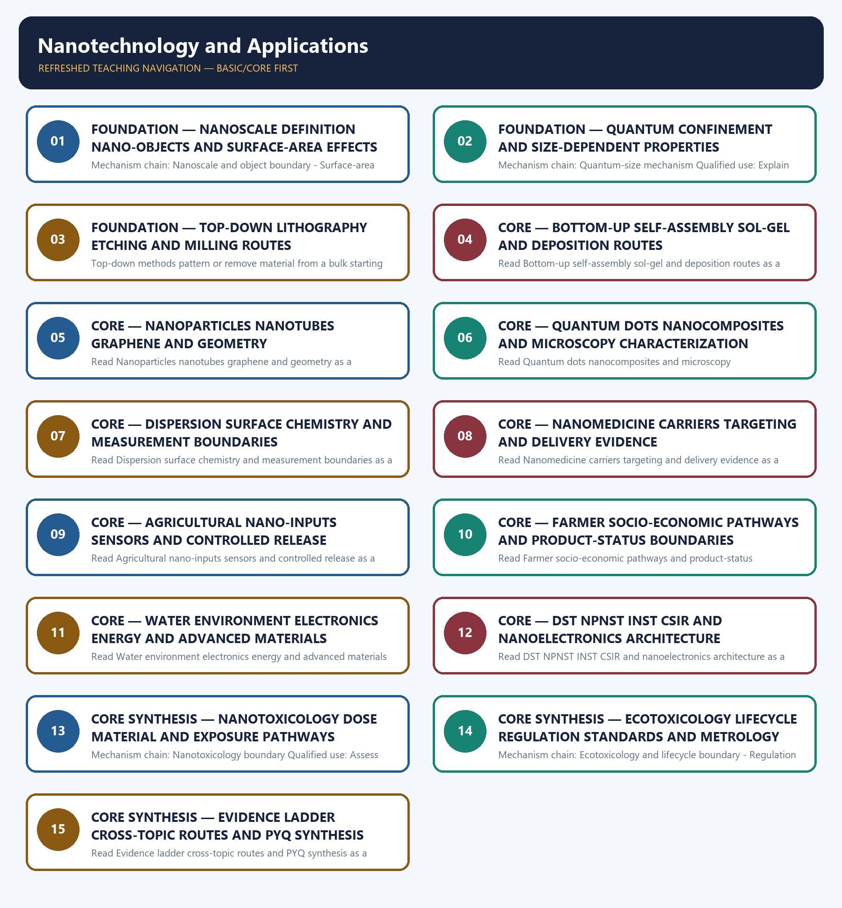

# Nanotechnology and Applications — Learner-v2 Complete Learning Session

> **Authoring-only generation:** 2026-09-04. No PDF was rendered and no tracker or index was mutated.

### SOURCE, PROGRESSION AND CURRENT-LINKAGE AUDIT

- **Generation date:** 2026-09-04.
- **Repository-first evidence:** the Basic owner is taught first and preserved in full; the Advanced owner is retained only in the optional final teaching block.
- **OCR evidence:** Repository Markdown was primary. OCR-searchable official UPSC papers were supplementary only for printed routed demands. No answer key, performance value, procurement outcome, operational deployment, programme target or technology milestone was inferred.
- **Qdrant:** not used; repository Markdown and available OCR context were sufficient.
- **PYQ integrity:** Audited ledgers route the 2025 GS-III agriculture-and-farmer demand, the 2020 GS-III health-sector demand, and the 2018, 2020 and 2022 objective concepts on additive manufacturing, carbon nanotubes and nanoparticle occurrence, use and safety. Three representative cards preserve those routes; no objective answer key or option letter is supplied.
- **Live-link boundary:** Official-source attempts on 2026-09-04 confirmed INST's institutional and 1-100 nm conceptual account while preserving strict boundaries for DST programme pages, the closed 2024 call, the 2025 nanoelectronics event and sector-specific product status. No funding, efficacy, approval, deployment, adoption, safety or farmer-income conclusion was inferred.
- **Fact/inference discipline:** no current-affairs item, PYQ wording, figure or quotation is invented.

### LIVE OFFICIAL-SOURCE ATTEMPT LOG

The checks below were made on 2026-09-04. Substantive official text is used only for the proposition it supports; title-only, blocked or thin pages are recorded and supply no factual claim.

- https://dst.gov.in/scientific-programmes/mission-nano-science-and-technology-nano-mission - attempted 2026-09-04; direct retrieval returned only the official National Programme on Nano Science and Technology page title. No funding amount, project count, outcome, deployment or current programme-performance claim was imported.
- https://dst.gov.in/callforproposals/call-proposals-advanced-materials-under-npnst - attempted 2026-09-04; direct retrieval returned only the official advanced-materials call title. The owner's dated 01-30 September 2024 call-window evidence was retained, but a closed call was not rewritten as an award, funded project or deployment.
- https://inst.ac.in/about-us - fetched 2026-09-04; substantive official text confirmed INST's DST-autonomous status, Nano Mission origin, 1-100 nm definition, quantum/surface-area basis and research links to agriculture, healthcare, energy, environment, water and devices. Institutional aims were not converted into achieved performance.
- https://www.csir.res.in/en/csir-labs-unit - attempted 2026-09-04; retrieval exposed only a Central Electronics Engineering Research Institute title rather than a complete laboratory-network account. No laboratory output, product, approval or deployment was inferred.
- https://pib.gov.in/PressReleaseIframePage.aspx?PRID=2115965 - attempted 2026-09-04; direct retrieval returned HTTP 403. The owner's dated 27 March 2025 Nano Electronics Roadshow event reference was retained only as an event-held boundary, not proof of indigenous IP, startup success, fabrication capability or commercial deployment.

## BASIC LEARNING SESSION



*Distinct embedded teaching-navigation image. The separate continuous Cārvāka-style flowchart package remains an independent at-a-glance artifact.*

### SESSION 1 — FOUNDATION — NANOSCALE DEFINITION NANO-OBJECTS AND SURFACE-AREA EFFECTS

#### DEFINITION / WHAT THIS IS CALLED

**Plain-language definition:** Read Nanoscale definition nano-objects and surface-area effects as a sequence: identify Nanoscale and object boundary, follow the named mechanism to its user or output, and stop at the last verified status rather than assuming the next stage.

**Technical definition:** Mechanism chain: Nanoscale and object boundary - Surface-area mechanism Qualified use: Define the scale, classify the nano-object and trace the surface mechanism before naming an application.

#### ANSWER-GRABBING OPENING — WRITE/ADAPT IN THE EXAM

> Read Nanoscale definition nano-objects and surface-area effects as a sequence: identify Nanoscale and object boundary, follow the named mechanism to its user or output, and stop at the last verified status rather than assuming the next stage.

#### MUST-WRITE KEYWORDS

- **FOUNDATION**
- **Nanoscale definition nano-objects**
- **surface-area effects**
- **Mechanism chain**
- **Qualified use**
- **Nanotechnology**

**How to use them:** Frame the answer through FOUNDATION; define Nanoscale definition nano-objects, connect surface-area effects with Mechanism chain to explain the mechanism, and use Qualified use for the decisive comparison or qualification.

#### VISUAL FIRST

```text
NANOSCALE DEFINITION NANO-OBJECTS AND SURFACE-AREA EFFECTS
01. Nanoscale and object boundary
    |
    v
02. Surface-area mechanism
STATUS / CATEGORY FIREWALL -> Do not define nanotechnology as miniaturisation without the 1-100 nm and property-change boundary.
```

*The rail fixes the technical sequence and the claim boundary before explanation.*

#### CORE EXPLANATION

Nanotechnology deliberately studies, engineers and applies matter at about 1-100 nm, where size-dependent behaviour becomes functionally important; a nanoparticle has all three external dimensions in that range, a nanotube or nanofibre has two, and a nanosheet or nanoplate has one, while nanomaterial is the broader class. Shrinking a material raises its surface-area-to-volume ratio and the fraction of atoms at or near the surface, which can alter adsorption, catalytic activity, chemical reactivity and dissolution; greater reactivity is an application opportunity and a possible exposure concern, not an automatic performance or safety verdict.

#### SIMPLE SYSTEM EXAMPLE

Read Nanoscale definition nano-objects and surface-area effects as a sequence: identify Nanoscale and object boundary, follow the named mechanism to its user or output, and stop at the last verified status rather than assuming the next stage.

#### TECHNICAL DISTINCTION

The decisive boundary is Do not define nanotechnology as miniaturisation without the 1-100 nm and property-change boundary. This keeps Nanoscale and object boundary and Surface-area mechanism in the correct scientific category, institution and unit of measurement.

#### NAMED EVIDENCE AND MECHANISM

- Nanotechnology deliberately studies, engineers and applies matter at about 1-100 nm, where size-dependent behaviour becomes functionally important; a nanoparticle has all three external dimensions in that range, a nanotube or nanofibre has two, and a nanosheet or nanoplate has one, while nanomaterial is the broader class.
- Shrinking a material raises its surface-area-to-volume ratio and the fraction of atoms at or near the surface, which can alter adsorption, catalytic activity, chemical reactivity and dissolution; greater reactivity is an application opportunity and a possible exposure concern, not an automatic performance or safety verdict.

#### EXAMINER CAUTION

- Do not define nanotechnology as miniaturisation without the 1-100 nm and property-change boundary.

#### EXAM LINK

- **Prelims:** Keep institution, system, platform, service, process, legal instrument, unit and status in their exact category.
- **Mains:** Define the scale, classify the nano-object and trace the surface mechanism before naming an application.

#### MINI RECAP

- **Mechanism chain:** Nanoscale and object boundary -> Surface-area mechanism
- **Qualified use:** Define the scale, classify the nano-object and trace the surface mechanism before naming an application.

#### CLOSING RECALL FLOW — FOUNDATION — NANOSCALE DEFINITION NANO-OBJECTS AND SURFACE-AREA EFFECTS

```text
START / CONCEPT: FOUNDATION — Nanoscale definition nano-objects and surface-area effects
        |
        v
EXACT TERMS: FOUNDATION · Nanoscale definition nano-objects · surface-area effects · Mechanism chain · Qualified use · Nanotechnology
        |
        v
MECHANISM / ARGUMENT: Mechanism chain: Nanoscale and object boundary - Surface-area mechanism Qualified use: Define the scale, classify the nano-object and trace the surface mechanism before naming an application.
        |
        v
CONSEQUENCE / CONTRAST: The decisive boundary is Do not define nanotechnology as miniaturisation without the 1-100 nm and property-change boundary.
        |
        v
UPSC TRAP / ANSWER-USE: Nanotechnology deliberately studies, engineers and applies matter at about 1-100 nm, where size-dependent behaviour becomes functionally important; a nanoparticle has all three external dimensions in that range, a nanotube or nanofibre has two, and a nanosheet or nanoplate has one, while nanomaterial is the broader class.
        |
        v
ANSWER-GRABBING FORMULATION: Read Nanoscale definition nano-objects and surface-area effects as a sequence: identify Nanoscale and object boundary, follow the named mechanism to its user or output, and stop at the last verified status rather than assuming the next stage.
```
### SESSION 2 — FOUNDATION — QUANTUM CONFINEMENT AND SIZE-DEPENDENT PROPERTIES

#### DEFINITION / WHAT THIS IS CALLED

**Plain-language definition:** Read Quantum confinement and size-dependent properties as a sequence: identify Quantum-size mechanism, follow the named mechanism to its user or output, and stop at the last verified status rather than assuming the next stage.

**Technical definition:** Mechanism chain: Quantum-size mechanism Qualified use: Explain confinement as material- and size-dependent rather than a universal nanoscale effect.

#### ANSWER-GRABBING OPENING — WRITE/ADAPT IN THE EXAM

> At sufficiently small dimensions quantum confinement can change allowed electronic states, band gap, optical emission, conductivity or magnetic response; the effect depends on material and size, so every nanoscale material does not acquire the same property.

#### MUST-WRITE KEYWORDS

- **FOUNDATION**
- **Quantum confinement**
- **size-dependent properties**
- **Mechanism chain**
- **Qualified use**
- **At**

**How to use them:** Frame the answer through FOUNDATION; define Quantum confinement, connect size-dependent properties with Mechanism chain to explain the mechanism, and use Qualified use for the decisive comparison or qualification.

#### VISUAL FIRST

```text
QUANTUM CONFINEMENT AND SIZE-DEPENDENT PROPERTIES
01. Quantum-size mechanism
STATUS / CATEGORY FIREWALL -> Do not turn high surface area into automatic efficiency or harmlessness.
```

*The rail fixes the technical sequence and the claim boundary before explanation.*

#### CORE EXPLANATION

At sufficiently small dimensions quantum confinement can change allowed electronic states, band gap, optical emission, conductivity or magnetic response; the effect depends on material and size, so every nanoscale material does not acquire the same property.

#### SIMPLE SYSTEM EXAMPLE

Read Quantum confinement and size-dependent properties as a sequence: identify Quantum-size mechanism, follow the named mechanism to its user or output, and stop at the last verified status rather than assuming the next stage.

#### TECHNICAL DISTINCTION

The decisive boundary is Do not turn high surface area into automatic efficiency or harmlessness. This keeps Quantum-size mechanism in the correct scientific category, institution and unit of measurement.

#### NAMED EVIDENCE AND MECHANISM

- At sufficiently small dimensions quantum confinement can change allowed electronic states, band gap, optical emission, conductivity or magnetic response; the effect depends on material and size, so every nanoscale material does not acquire the same property.

#### EXAMINER CAUTION

- Do not turn high surface area into automatic efficiency or harmlessness.

#### EXAM LINK

- **Prelims:** Keep institution, system, platform, service, process, legal instrument, unit and status in their exact category.
- **Mains:** Explain confinement as material- and size-dependent rather than a universal nanoscale effect.

#### MINI RECAP

- **Mechanism chain:** Quantum-size mechanism
- **Qualified use:** Explain confinement as material- and size-dependent rather than a universal nanoscale effect.

#### CLOSING RECALL FLOW — FOUNDATION — QUANTUM CONFINEMENT AND SIZE-DEPENDENT PROPERTIES

```text
START / CONCEPT: FOUNDATION — Quantum confinement and size-dependent properties
        |
        v
EXACT TERMS: FOUNDATION · Quantum confinement · size-dependent properties · Mechanism chain · Qualified use · At
        |
        v
MECHANISM / ARGUMENT: Read Quantum confinement and size-dependent properties as a sequence: identify Quantum-size mechanism, follow the named mechanism to its user or output, and stop at the last verified status rather than assuming the next stage.
        |
        v
CONSEQUENCE / CONTRAST: Mechanism chain: Quantum-size mechanism Qualified use: Explain confinement as material- and size-dependent rather than a universal nanoscale effect.
        |
        v
UPSC TRAP / ANSWER-USE: Mains: Explain confinement as material- and size-dependent rather than a universal nanoscale effect.
        |
        v
ANSWER-GRABBING FORMULATION: At sufficiently small dimensions quantum confinement can change allowed electronic states, band gap, optical emission, conductivity or magnetic response; the effect depends on material and size, so every nanoscale material does not acquire the same property.
```
### SESSION 3 — FOUNDATION — TOP-DOWN LITHOGRAPHY ETCHING AND MILLING ROUTES

#### DEFINITION / WHAT THIS IS CALLED

**Plain-language definition:** Read Top-down lithography etching and milling routes as a sequence: identify Top-down fabrication, follow the named mechanism to its user or output, and stop at the last verified status rather than assuming the next stage.

**Technical definition:** Top-down methods pattern or remove material from a bulk starting point through routes such as lithography, etching and milling; they can offer positional control but may introduce waste, defects or minimum-feature constraints, and a named method does not itself prove scalable manufacture.

#### ANSWER-GRABBING OPENING — WRITE/ADAPT IN THE EXAM

> Top-down methods pattern or remove material from a bulk starting point through routes such as lithography, etching and milling; they can offer positional control but may introduce waste, defects or minimum-feature constraints, and a named method does not itself prove scalable manufacture.

#### MUST-WRITE KEYWORDS

- **FOUNDATION**
- **Top-down lithography etching**
- **milling routes**
- **Mechanism chain**
- **Qualified use**
- **Top-down**

**How to use them:** Frame the answer through FOUNDATION; define Top-down lithography etching, connect milling routes with Mechanism chain to explain the mechanism, and use Qualified use for the decisive comparison or qualification.

#### VISUAL FIRST

```text
TOP-DOWN LITHOGRAPHY ETCHING AND MILLING ROUTES
01. Top-down fabrication
STATUS / CATEGORY FIREWALL -> Do not claim every nanomaterial exhibits the same quantum effect.
```

*The rail fixes the technical sequence and the claim boundary before explanation.*

#### CORE EXPLANATION

Top-down methods pattern or remove material from a bulk starting point through routes such as lithography, etching and milling; they can offer positional control but may introduce waste, defects or minimum-feature constraints, and a named method does not itself prove scalable manufacture.

#### SIMPLE SYSTEM EXAMPLE

Read Top-down lithography etching and milling routes as a sequence: identify Top-down fabrication, follow the named mechanism to its user or output, and stop at the last verified status rather than assuming the next stage.

#### TECHNICAL DISTINCTION

The decisive boundary is Do not claim every nanomaterial exhibits the same quantum effect. This keeps Top-down fabrication in the correct scientific category, institution and unit of measurement.

#### NAMED EVIDENCE AND MECHANISM

- Top-down methods pattern or remove material from a bulk starting point through routes such as lithography, etching and milling; they can offer positional control but may introduce waste, defects or minimum-feature constraints, and a named method does not itself prove scalable manufacture.

#### EXAMINER CAUTION

- Do not claim every nanomaterial exhibits the same quantum effect.

#### EXAM LINK

- **Prelims:** Keep institution, system, platform, service, process, legal instrument, unit and status in their exact category.
- **Mains:** Trace bulk-patterning steps and qualify precision with waste, defect and scale limits.

#### MINI RECAP

- **Mechanism chain:** Top-down fabrication
- **Qualified use:** Trace bulk-patterning steps and qualify precision with waste, defect and scale limits.

#### CLOSING RECALL FLOW — FOUNDATION — TOP-DOWN LITHOGRAPHY ETCHING AND MILLING ROUTES

```text
START / CONCEPT: FOUNDATION — Top-down lithography etching and milling routes
        |
        v
EXACT TERMS: FOUNDATION · Top-down lithography etching · milling routes · Mechanism chain · Qualified use · Top-down
        |
        v
MECHANISM / ARGUMENT: Read Top-down lithography etching and milling routes as a sequence: identify Top-down fabrication, follow the named mechanism to its user or output, and stop at the last verified status rather than assuming the next stage.
        |
        v
CONSEQUENCE / CONTRAST: The decisive boundary is Do not claim every nanomaterial exhibits the same quantum effect.
        |
        v
UPSC TRAP / ANSWER-USE: Do not claim every nanomaterial exhibits the same quantum effect.
        |
        v
ANSWER-GRABBING FORMULATION: Top-down methods pattern or remove material from a bulk starting point through routes such as lithography, etching and milling; they can offer positional control but may introduce waste, defects or minimum-feature constraints, and a named method does not itself prove scalable manufacture.
```
### SESSION 4 — CORE — BOTTOM-UP SELF-ASSEMBLY SOL-GEL AND DEPOSITION ROUTES

#### DEFINITION / WHAT THIS IS CALLED

**Plain-language definition:** The decisive boundary is Do not merge top-down removal with bottom-up assembly.

**Technical definition:** Read Bottom-up self-assembly sol-gel and deposition routes as a sequence: identify Bottom-up fabrication, follow the named mechanism to its user or output, and stop at the last verified status rather than assuming the next stage.

#### ANSWER-GRABBING OPENING — WRITE/ADAPT IN THE EXAM

> Bottom-up methods assemble structures from atoms, molecules or precursors through routes such as self-assembly, sol-gel processing and chemical vapour deposition; they can exploit chemical control and parallel formation but still face nucleation, aggregation, uniformity, purification and scale-up challenges.

#### MUST-WRITE KEYWORDS

- **Bottom-up self-assembly sol-gel**
- **deposition routes**
- **Mechanism chain**
- **Qualified use**
- **Bottom-up**
- **Read Bottom-up**

**How to use them:** Frame the answer through Bottom-up self-assembly sol-gel; define deposition routes, connect Mechanism chain with Qualified use to explain the mechanism, and use Bottom-up for the decisive comparison or qualification.

#### VISUAL FIRST

```text
BOTTOM-UP SELF-ASSEMBLY SOL-GEL AND DEPOSITION ROUTES
01. Bottom-up fabrication
STATUS / CATEGORY FIREWALL -> Do not merge top-down removal with bottom-up assembly.
```

*The rail fixes the technical sequence and the claim boundary before explanation.*

#### CORE EXPLANATION

Bottom-up methods assemble structures from atoms, molecules or precursors through routes such as self-assembly, sol-gel processing and chemical vapour deposition; they can exploit chemical control and parallel formation but still face nucleation, aggregation, uniformity, purification and scale-up challenges.

#### SIMPLE SYSTEM EXAMPLE

Read Bottom-up self-assembly sol-gel and deposition routes as a sequence: identify Bottom-up fabrication, follow the named mechanism to its user or output, and stop at the last verified status rather than assuming the next stage.

#### TECHNICAL DISTINCTION

The decisive boundary is Do not merge top-down removal with bottom-up assembly. This keeps Bottom-up fabrication in the correct scientific category, institution and unit of measurement.

#### NAMED EVIDENCE AND MECHANISM

- Bottom-up methods assemble structures from atoms, molecules or precursors through routes such as self-assembly, sol-gel processing and chemical vapour deposition; they can exploit chemical control and parallel formation but still face nucleation, aggregation, uniformity, purification and scale-up challenges.

#### EXAMINER CAUTION

- Do not merge top-down removal with bottom-up assembly.

#### EXAM LINK

- **Prelims:** Keep institution, system, platform, service, process, legal instrument, unit and status in their exact category.
- **Mains:** Trace atomic or molecular assembly and qualify it with uniformity, purification and aggregation.

#### MINI RECAP

- **Mechanism chain:** Bottom-up fabrication
- **Qualified use:** Trace atomic or molecular assembly and qualify it with uniformity, purification and aggregation.

#### CLOSING RECALL FLOW — CORE — BOTTOM-UP SELF-ASSEMBLY SOL-GEL AND DEPOSITION ROUTES

```text
START / CONCEPT: CORE — Bottom-up self-assembly sol-gel and deposition routes
        |
        v
EXACT TERMS: Bottom-up self-assembly sol-gel · deposition routes · Mechanism chain · Qualified use · Bottom-up · Read Bottom-up
        |
        v
MECHANISM / ARGUMENT: Read Bottom-up self-assembly sol-gel and deposition routes as a sequence: identify Bottom-up fabrication, follow the named mechanism to its user or output, and stop at the last verified status rather than assuming the next stage.
        |
        v
CONSEQUENCE / CONTRAST: The decisive boundary is Do not merge top-down removal with bottom-up assembly.
        |
        v
UPSC TRAP / ANSWER-USE: Do not merge top-down removal with bottom-up assembly.
        |
        v
ANSWER-GRABBING FORMULATION: Bottom-up methods assemble structures from atoms, molecules or precursors through routes such as self-assembly, sol-gel processing and chemical vapour deposition; they can exploit chemical control and parallel formation but still face nucleation, aggregation, uniformity, purification and scale-up challenges.
```
### SESSION 5 — CORE — NANOPARTICLES NANOTUBES GRAPHENE AND GEOMETRY

#### DEFINITION / WHAT THIS IS CALLED

**Plain-language definition:** Nanoparticles are three-dimensionally nanoscale objects, carbon nanotubes are cylindrical carbon nanostructures, and graphene is a single-atom-thick hexagonal carbon sheet; related carbon chemistry does not make a particle, tube and sheet geometrically or functionally interchangeable.

**Technical definition:** Read Nanoparticles nanotubes graphene and geometry as a sequence: identify Carbon-form and nanoparticle distinction, follow the named mechanism to its user or output, and stop at the last verified status rather than assuming the next stage.

#### ANSWER-GRABBING OPENING — WRITE/ADAPT IN THE EXAM

> Nanoparticles are three-dimensionally nanoscale objects, carbon nanotubes are cylindrical carbon nanostructures, and graphene is a single-atom-thick hexagonal carbon sheet; related carbon chemistry does not make a particle, tube and sheet geometrically or functionally interchangeable.

#### MUST-WRITE KEYWORDS

- **Nanoparticles nanotubes graphene**
- **geometry**
- **Mechanism chain**
- **Qualified use**
- **Nanoparticles**
- **Read Nanoparticles**

**How to use them:** Frame the answer through Nanoparticles nanotubes graphene; define geometry, connect Mechanism chain with Qualified use to explain the mechanism, and use Nanoparticles for the decisive comparison or qualification.

#### VISUAL FIRST

```text
NANOPARTICLES NANOTUBES GRAPHENE AND GEOMETRY
01. Carbon-form and nanoparticle distinction
STATUS / CATEGORY FIREWALL -> Do not call graphene, carbon nanotubes, nanoparticles and quantum dots the same object.
```

*The rail fixes the technical sequence and the claim boundary before explanation.*

#### CORE EXPLANATION

Nanoparticles are three-dimensionally nanoscale objects, carbon nanotubes are cylindrical carbon nanostructures, and graphene is a single-atom-thick hexagonal carbon sheet; related carbon chemistry does not make a particle, tube and sheet geometrically or functionally interchangeable.

#### SIMPLE SYSTEM EXAMPLE

Read Nanoparticles nanotubes graphene and geometry as a sequence: identify Carbon-form and nanoparticle distinction, follow the named mechanism to its user or output, and stop at the last verified status rather than assuming the next stage.

#### TECHNICAL DISTINCTION

The decisive boundary is Do not call graphene, carbon nanotubes, nanoparticles and quantum dots the same object. This keeps Carbon-form and nanoparticle distinction in the correct scientific category, institution and unit of measurement.

#### NAMED EVIDENCE AND MECHANISM

- Nanoparticles are three-dimensionally nanoscale objects, carbon nanotubes are cylindrical carbon nanostructures, and graphene is a single-atom-thick hexagonal carbon sheet; related carbon chemistry does not make a particle, tube and sheet geometrically or functionally interchangeable.

#### EXAMINER CAUTION

- Do not call graphene, carbon nanotubes, nanoparticles and quantum dots the same object.

#### EXAM LINK

- **Prelims:** Keep institution, system, platform, service, process, legal instrument, unit and status in their exact category.
- **Mains:** Classify each morphology before linking geometry to a possible property or use.

#### MINI RECAP

- **Mechanism chain:** Carbon-form and nanoparticle distinction
- **Qualified use:** Classify each morphology before linking geometry to a possible property or use.

#### CLOSING RECALL FLOW — CORE — NANOPARTICLES NANOTUBES GRAPHENE AND GEOMETRY

```text
START / CONCEPT: CORE — Nanoparticles nanotubes graphene and geometry
        |
        v
EXACT TERMS: Nanoparticles nanotubes graphene · geometry · Mechanism chain · Qualified use · Nanoparticles · Read Nanoparticles
        |
        v
MECHANISM / ARGUMENT: Read Nanoparticles nanotubes graphene and geometry as a sequence: identify Carbon-form and nanoparticle distinction, follow the named mechanism to its user or output, and stop at the last verified status rather than assuming the next stage.
        |
        v
CONSEQUENCE / CONTRAST: The decisive boundary is Do not call graphene, carbon nanotubes, nanoparticles and quantum dots the same object.
        |
        v
UPSC TRAP / ANSWER-USE: Do not call graphene, carbon nanotubes, nanoparticles and quantum dots the same object.
        |
        v
ANSWER-GRABBING FORMULATION: Nanoparticles are three-dimensionally nanoscale objects, carbon nanotubes are cylindrical carbon nanostructures, and graphene is a single-atom-thick hexagonal carbon sheet; related carbon chemistry does not make a particle, tube and sheet geometrically or functionally interchangeable.
```
### SESSION 6 — CORE — QUANTUM DOTS NANOCOMPOSITES AND MICROSCOPY CHARACTERIZATION

#### DEFINITION / WHAT THIS IS CALLED

**Plain-language definition:** A quantum dot is a semiconductor nanocrystal with strongly size-dependent optical and electronic behaviour, whereas a nanocomposite uses a nanoscale phase to modify a bulk matrix; fullerenes, dendrimers and nanoemulsions are additional distinct families rather than synonyms for quantum dots.

**Technical definition:** Read Quantum dots nanocomposites and microscopy characterization as a sequence: identify Quantum-dot and nanocomposite distinction, follow the named mechanism to its user or output, and stop at the last verified status rather than assuming the next stage.

#### ANSWER-GRABBING OPENING — WRITE/ADAPT IN THE EXAM

> Read Quantum dots nanocomposites and microscopy characterization as a sequence: identify Quantum-dot and nanocomposite distinction, follow the named mechanism to its user or output, and stop at the last verified status rather than assuming the next stage.

#### MUST-WRITE KEYWORDS

- **Quantum dots nanocomposites**
- **microscopy characterization**
- **Mechanism chain**
- **Qualified use**
- **A quantum dot**
- **SEM**

**How to use them:** Frame the answer through Quantum dots nanocomposites; define microscopy characterization, connect Mechanism chain with Qualified use to explain the mechanism, and use A quantum dot for the decisive comparison or qualification.

#### VISUAL FIRST

```text
QUANTUM DOTS NANOCOMPOSITES AND MICROSCOPY CHARACTERIZATION
01. Quantum-dot and nanocomposite distinction
    |
    v
02. Microscopy and structure characterization
STATUS / CATEGORY FIREWALL -> Do not use one microscopy image as complete material characterization.
```

*The rail fixes the technical sequence and the claim boundary before explanation.*

#### CORE EXPLANATION

A quantum dot is a semiconductor nanocrystal with strongly size-dependent optical and electronic behaviour, whereas a nanocomposite uses a nanoscale phase to modify a bulk matrix; fullerenes, dendrimers and nanoemulsions are additional distinct families rather than synonyms for quantum dots. SEM commonly maps surface morphology, TEM can examine internal structure and nanoscale dimensions, AFM traces surface topography with a probe, and XRD helps identify crystalline phases and infer structural scale; each technique answers a different question and no single image establishes composition, dispersion, stability and safety.

#### SIMPLE SYSTEM EXAMPLE

Read Quantum dots nanocomposites and microscopy characterization as a sequence: identify Quantum-dot and nanocomposite distinction, follow the named mechanism to its user or output, and stop at the last verified status rather than assuming the next stage.

#### TECHNICAL DISTINCTION

The decisive boundary is Do not use one microscopy image as complete material characterization. This keeps Quantum-dot and nanocomposite distinction and Microscopy and structure characterization in the correct scientific category, institution and unit of measurement.

#### NAMED EVIDENCE AND MECHANISM

- A quantum dot is a semiconductor nanocrystal with strongly size-dependent optical and electronic behaviour, whereas a nanocomposite uses a nanoscale phase to modify a bulk matrix; fullerenes, dendrimers and nanoemulsions are additional distinct families rather than synonyms for quantum dots.
- SEM commonly maps surface morphology, TEM can examine internal structure and nanoscale dimensions, AFM traces surface topography with a probe, and XRD helps identify crystalline phases and infer structural scale; each technique answers a different question and no single image establishes composition, dispersion, stability and safety.

#### EXAMINER CAUTION

- Do not use one microscopy image as complete material characterization.

#### EXAM LINK

- **Prelims:** Keep institution, system, platform, service, process, legal instrument, unit and status in their exact category.
- **Mains:** Separate optical nanocrystals, bulk-matrix modification and technique-specific characterization.

#### MINI RECAP

- **Mechanism chain:** Quantum-dot and nanocomposite distinction -> Microscopy and structure characterization
- **Qualified use:** Separate optical nanocrystals, bulk-matrix modification and technique-specific characterization.

#### CLOSING RECALL FLOW — CORE — QUANTUM DOTS NANOCOMPOSITES AND MICROSCOPY CHARACTERIZATION

```text
START / CONCEPT: CORE — Quantum dots nanocomposites and microscopy characterization
        |
        v
EXACT TERMS: Quantum dots nanocomposites · microscopy characterization · Mechanism chain · Qualified use · A quantum dot · SEM
        |
        v
MECHANISM / ARGUMENT: Mechanism chain: Quantum-dot and nanocomposite distinction - Microscopy and structure characterization Qualified use: Separate optical nanocrystals, bulk-matrix modification and technique-specific characterization.
        |
        v
CONSEQUENCE / CONTRAST: A quantum dot is a semiconductor nanocrystal with strongly size-dependent optical and electronic behaviour, whereas a nanocomposite uses a nanoscale phase to modify a bulk matrix; fullerenes, dendrimers and nanoemulsions are additional distinct families rather than synonyms for quantum dots.
        |
        v
UPSC TRAP / ANSWER-USE: The decisive boundary is Do not use one microscopy image as complete material characterization.
        |
        v
ANSWER-GRABBING FORMULATION: Read Quantum dots nanocomposites and microscopy characterization as a sequence: identify Quantum-dot and nanocomposite distinction, follow the named mechanism to its user or output, and stop at the last verified status rather than assuming the next stage.
```
### SESSION 7 — CORE — DISPERSION SURFACE CHEMISTRY AND MEASUREMENT BOUNDARIES

#### DEFINITION / WHAT THIS IS CALLED

**Plain-language definition:** Dynamic light scattering estimates an ensemble hydrodynamic-size distribution in a dispersion, zeta potential is used as an indicator related to colloidal stability, and spectroscopy or surface analysis can examine composition and functionalisation; measured size can differ by method because physical, hydrodynamic and aggregated states differ.

**Technical definition:** Read Dispersion surface chemistry and measurement boundaries as a sequence: identify Dispersion and surface characterization, follow the named mechanism to its user or output, and stop at the last verified status rather than assuming the next stage.

#### ANSWER-GRABBING OPENING — WRITE/ADAPT IN THE EXAM

> Read Dispersion surface chemistry and measurement boundaries as a sequence: identify Dispersion and surface characterization, follow the named mechanism to its user or output, and stop at the last verified status rather than assuming the next stage.

#### MUST-WRITE KEYWORDS

- **Dispersion surface chemistry**
- **measurement boundaries**
- **Mechanism chain**
- **Qualified use**
- **Dynamic**
- **Read Dispersion**

**How to use them:** Frame the answer through Dispersion surface chemistry; define measurement boundaries, connect Mechanism chain with Qualified use to explain the mechanism, and use Dynamic for the decisive comparison or qualification.

#### VISUAL FIRST

```text
DISPERSION SURFACE CHEMISTRY AND MEASUREMENT BOUNDARIES
01. Dispersion and surface characterization
STATUS / CATEGORY FIREWALL -> Do not treat hydrodynamic size, physical diameter and aggregate size as interchangeable.
```

*The rail fixes the technical sequence and the claim boundary before explanation.*

#### CORE EXPLANATION

Dynamic light scattering estimates an ensemble hydrodynamic-size distribution in a dispersion, zeta potential is used as an indicator related to colloidal stability, and spectroscopy or surface analysis can examine composition and functionalisation; measured size can differ by method because physical, hydrodynamic and aggregated states differ.

#### SIMPLE SYSTEM EXAMPLE

Read Dispersion surface chemistry and measurement boundaries as a sequence: identify Dispersion and surface characterization, follow the named mechanism to its user or output, and stop at the last verified status rather than assuming the next stage.

#### TECHNICAL DISTINCTION

The decisive boundary is Do not treat hydrodynamic size, physical diameter and aggregate size as interchangeable. This keeps Dispersion and surface characterization in the correct scientific category, institution and unit of measurement.

#### NAMED EVIDENCE AND MECHANISM

- Dynamic light scattering estimates an ensemble hydrodynamic-size distribution in a dispersion, zeta potential is used as an indicator related to colloidal stability, and spectroscopy or surface analysis can examine composition and functionalisation; measured size can differ by method because physical, hydrodynamic and aggregated states differ.

#### EXAMINER CAUTION

- Do not treat hydrodynamic size, physical diameter and aggregate size as interchangeable.

#### EXAM LINK

- **Prelims:** Keep institution, system, platform, service, process, legal instrument, unit and status in their exact category.
- **Mains:** Name what each measurement observes and preserve physical-versus-hydrodynamic size distinctions.

#### MINI RECAP

- **Mechanism chain:** Dispersion and surface characterization
- **Qualified use:** Name what each measurement observes and preserve physical-versus-hydrodynamic size distinctions.

#### CLOSING RECALL FLOW — CORE — DISPERSION SURFACE CHEMISTRY AND MEASUREMENT BOUNDARIES

```text
START / CONCEPT: CORE — Dispersion surface chemistry and measurement boundaries
        |
        v
EXACT TERMS: Dispersion surface chemistry · measurement boundaries · Mechanism chain · Qualified use · Dynamic · Read Dispersion
        |
        v
MECHANISM / ARGUMENT: Mechanism chain: Dispersion and surface characterization Qualified use: Name what each measurement observes and preserve physical-versus-hydrodynamic size distinctions.
        |
        v
CONSEQUENCE / CONTRAST: The decisive boundary is Do not treat hydrodynamic size, physical diameter and aggregate size as interchangeable.
        |
        v
UPSC TRAP / ANSWER-USE: Do not treat hydrodynamic size, physical diameter and aggregate size as interchangeable.
        |
        v
ANSWER-GRABBING FORMULATION: Read Dispersion surface chemistry and measurement boundaries as a sequence: identify Dispersion and surface characterization, follow the named mechanism to its user or output, and stop at the last verified status rather than assuming the next stage.
```
### SESSION 8 — CORE — NANOMEDICINE CARRIERS TARGETING AND DELIVERY EVIDENCE

#### DEFINITION / WHAT THIS IS CALLED

**Plain-language definition:** The decisive boundary is Do not convert targeted delivery into approved or superior therapy.

**Technical definition:** Read Nanomedicine carriers targeting and delivery evidence as a sequence: identify Nanomedicine delivery boundary, follow the named mechanism to its user or output, and stop at the last verified status rather than assuming the next stage.

#### ANSWER-GRABBING OPENING — WRITE/ADAPT IN THE EXAM

> Read Nanomedicine carriers targeting and delivery evidence as a sequence: identify Nanomedicine delivery boundary, follow the named mechanism to its user or output, and stop at the last verified status rather than assuming the next stage.

#### MUST-WRITE KEYWORDS

- **Nanomedicine carriers targeting**
- **delivery evidence**
- **Mechanism chain**
- **Qualified use**
- **Nanocarriers**
- **Read Nanomedicine**

**How to use them:** Frame the answer through Nanomedicine carriers targeting; define delivery evidence, connect Mechanism chain with Qualified use to explain the mechanism, and use Nanocarriers for the decisive comparison or qualification.

#### VISUAL FIRST

```text
NANOMEDICINE CARRIERS TARGETING AND DELIVERY EVIDENCE
01. Nanomedicine delivery boundary
STATUS / CATEGORY FIREWALL -> Do not convert targeted delivery into approved or superior therapy.
```

*The rail fixes the technical sequence and the claim boundary before explanation.*

#### CORE EXPLANATION

Nanocarriers such as liposomes, polymeric particles or dendrimer-like systems can protect cargo, alter circulation, control release or use passive and ligand-mediated targeting, but delivery to a tissue is not proof of cellular uptake, therapeutic superiority, approval, clinical adoption or long-term safety.

#### SIMPLE SYSTEM EXAMPLE

Read Nanomedicine carriers targeting and delivery evidence as a sequence: identify Nanomedicine delivery boundary, follow the named mechanism to its user or output, and stop at the last verified status rather than assuming the next stage.

#### TECHNICAL DISTINCTION

The decisive boundary is Do not convert targeted delivery into approved or superior therapy. This keeps Nanomedicine delivery boundary in the correct scientific category, institution and unit of measurement.

#### NAMED EVIDENCE AND MECHANISM

- Nanocarriers such as liposomes, polymeric particles or dendrimer-like systems can protect cargo, alter circulation, control release or use passive and ligand-mediated targeting, but delivery to a tissue is not proof of cellular uptake, therapeutic superiority, approval, clinical adoption or long-term safety.

#### EXAMINER CAUTION

- Do not convert targeted delivery into approved or superior therapy.

#### EXAM LINK

- **Prelims:** Keep institution, system, platform, service, process, legal instrument, unit and status in their exact category.
- **Mains:** Move from carrier function to biological barrier, evidence rung, regulation and safety qualification.

#### MINI RECAP

- **Mechanism chain:** Nanomedicine delivery boundary
- **Qualified use:** Move from carrier function to biological barrier, evidence rung, regulation and safety qualification.

#### CLOSING RECALL FLOW — CORE — NANOMEDICINE CARRIERS TARGETING AND DELIVERY EVIDENCE

```text
START / CONCEPT: CORE — Nanomedicine carriers targeting and delivery evidence
        |
        v
EXACT TERMS: Nanomedicine carriers targeting · delivery evidence · Mechanism chain · Qualified use · Nanocarriers · Read Nanomedicine
        |
        v
MECHANISM / ARGUMENT: Mechanism chain: Nanomedicine delivery boundary Qualified use: Move from carrier function to biological barrier, evidence rung, regulation and safety qualification.
        |
        v
CONSEQUENCE / CONTRAST: Nanocarriers such as liposomes, polymeric particles or dendrimer-like systems can protect cargo, alter circulation, control release or use passive and ligand-mediated targeting, but delivery to a tissue is not proof of cellular uptake, therapeutic superiority, approval, clinical adoption or long-term safety.
        |
        v
UPSC TRAP / ANSWER-USE: The decisive boundary is Do not convert targeted delivery into approved or superior therapy.
        |
        v
ANSWER-GRABBING FORMULATION: Read Nanomedicine carriers targeting and delivery evidence as a sequence: identify Nanomedicine delivery boundary, follow the named mechanism to its user or output, and stop at the last verified status rather than assuming the next stage.
```
### SESSION 9 — CORE — AGRICULTURAL NANO-INPUTS SENSORS AND CONTROLLED RELEASE

#### DEFINITION / WHAT THIS IS CALLED

**Plain-language definition:** The decisive boundary is Do not convert nano-input notification or marketing into proven yield or farmer-income gains.

**Technical definition:** Read Agricultural nano-inputs sensors and controlled release as a sequence: identify Agricultural application map, follow the named mechanism to its user or output, and stop at the last verified status rather than assuming the next stage.

#### ANSWER-GRABBING OPENING — WRITE/ADAPT IN THE EXAM

> Read Agricultural nano-inputs sensors and controlled release as a sequence: identify Agricultural application map, follow the named mechanism to its user or output, and stop at the last verified status rather than assuming the next stage.

#### MUST-WRITE KEYWORDS

- **Agricultural nano-inputs sensors**
- **controlled release**
- **Mechanism chain**
- **Qualified use**
- **Agricultural**
- **Read Agricultural**

**How to use them:** Frame the answer through Agricultural nano-inputs sensors; define controlled release, connect Mechanism chain with Qualified use to explain the mechanism, and use Agricultural for the decisive comparison or qualification.

#### VISUAL FIRST

```text
AGRICULTURAL NANO-INPUTS SENSORS AND CONTROLLED RELEASE
01. Agricultural application map
STATUS / CATEGORY FIREWALL -> Do not convert nano-input notification or marketing into proven yield or farmer-income gains.
```

*The rail fixes the technical sequence and the claim boundary before explanation.*

#### CORE EXPLANATION

Agricultural nanotechnology includes nano-fertilisers, nano-formulated crop-protection inputs, controlled-release carriers, nano-sensors, seed coatings or nano-priming, water treatment and post-harvest coatings or packaging; each application needs crop-, formulation-, dose- and field-specific evidence.

#### SIMPLE SYSTEM EXAMPLE

Read Agricultural nano-inputs sensors and controlled release as a sequence: identify Agricultural application map, follow the named mechanism to its user or output, and stop at the last verified status rather than assuming the next stage.

#### TECHNICAL DISTINCTION

The decisive boundary is Do not convert nano-input notification or marketing into proven yield or farmer-income gains. This keeps Agricultural application map in the correct scientific category, institution and unit of measurement.

#### NAMED EVIDENCE AND MECHANISM

- Agricultural nanotechnology includes nano-fertilisers, nano-formulated crop-protection inputs, controlled-release carriers, nano-sensors, seed coatings or nano-priming, water treatment and post-harvest coatings or packaging; each application needs crop-, formulation-, dose- and field-specific evidence.

#### EXAMINER CAUTION

- Do not convert nano-input notification or marketing into proven yield or farmer-income gains.

#### EXAM LINK

- **Prelims:** Keep institution, system, platform, service, process, legal instrument, unit and status in their exact category.
- **Mains:** Organise agriculture by delivery, sensing, seed, water and post-harvest mechanisms.

#### MINI RECAP

- **Mechanism chain:** Agricultural application map
- **Qualified use:** Organise agriculture by delivery, sensing, seed, water and post-harvest mechanisms.

#### CLOSING RECALL FLOW — CORE — AGRICULTURAL NANO-INPUTS SENSORS AND CONTROLLED RELEASE

```text
START / CONCEPT: CORE — Agricultural nano-inputs sensors and controlled release
        |
        v
EXACT TERMS: Agricultural nano-inputs sensors · controlled release · Mechanism chain · Qualified use · Agricultural · Read Agricultural
        |
        v
MECHANISM / ARGUMENT: Mechanism chain: Agricultural application map Qualified use: Organise agriculture by delivery, sensing, seed, water and post-harvest mechanisms.
        |
        v
CONSEQUENCE / CONTRAST: The decisive boundary is Do not convert nano-input notification or marketing into proven yield or farmer-income gains.
        |
        v
UPSC TRAP / ANSWER-USE: Do not convert nano-input notification or marketing into proven yield or farmer-income gains.
        |
        v
ANSWER-GRABBING FORMULATION: Read Agricultural nano-inputs sensors and controlled release as a sequence: identify Agricultural application map, follow the named mechanism to its user or output, and stop at the last verified status rather than assuming the next stage.
```
### SESSION 10 — CORE — FARMER SOCIO-ECONOMIC PATHWAYS AND PRODUCT-STATUS BOUNDARIES

#### DEFINITION / WHAT THIS IS CALLED

**Plain-language definition:** Possible farmer benefits run through input-use efficiency, lower handling burden, earlier stress detection, reduced spoilage and better net realisation, but affordability, credit, extension, device access, residue testing and field efficacy determine distribution; the owner records nano urea and nano DAP as FCO-notified marketed products, which is not proof of yield equivalence, universal safety or socio-economic uplift.

**Technical definition:** Read Farmer socio-economic pathways and product-status boundaries as a sequence: identify Farmer-uplift and product-status boundary, follow the named mechanism to its user or output, and stop at the last verified status rather than assuming the next stage.

#### ANSWER-GRABBING OPENING — WRITE/ADAPT IN THE EXAM

> Read Farmer socio-economic pathways and product-status boundaries as a sequence: identify Farmer-uplift and product-status boundary, follow the named mechanism to its user or output, and stop at the last verified status rather than assuming the next stage.

#### MUST-WRITE KEYWORDS

- **Farmer socio-economic pathways**
- **product-status boundaries**
- **Mechanism chain**
- **Qualified use**
- **Possible**
- **DAP**

**How to use them:** Frame the answer through Farmer socio-economic pathways; define product-status boundaries, connect Mechanism chain with Qualified use to explain the mechanism, and use Possible for the decisive comparison or qualification.

#### VISUAL FIRST

```text
FARMER SOCIO-ECONOMIC PATHWAYS AND PRODUCT-STATUS BOUNDARIES
01. Farmer-uplift and product-status boundary
STATUS / CATEGORY FIREWALL -> Do not convert laboratory contaminant removal into field deployment.
```

*The rail fixes the technical sequence and the claim boundary before explanation.*

#### CORE EXPLANATION

Possible farmer benefits run through input-use efficiency, lower handling burden, earlier stress detection, reduced spoilage and better net realisation, but affordability, credit, extension, device access, residue testing and field efficacy determine distribution; the owner records nano urea and nano DAP as FCO-notified marketed products, which is not proof of yield equivalence, universal safety or socio-economic uplift.

#### SIMPLE SYSTEM EXAMPLE

Read Farmer socio-economic pathways and product-status boundaries as a sequence: identify Farmer-uplift and product-status boundary, follow the named mechanism to its user or output, and stop at the last verified status rather than assuming the next stage.

#### TECHNICAL DISTINCTION

The decisive boundary is Do not convert laboratory contaminant removal into field deployment. This keeps Farmer-uplift and product-status boundary in the correct scientific category, institution and unit of measurement.

#### NAMED EVIDENCE AND MECHANISM

- Possible farmer benefits run through input-use efficiency, lower handling burden, earlier stress detection, reduced spoilage and better net realisation, but affordability, credit, extension, device access, residue testing and field efficacy determine distribution; the owner records nano urea and nano DAP as FCO-notified marketed products, which is not proof of yield equivalence, universal safety or socio-economic uplift.

#### EXAMINER CAUTION

- Do not convert laboratory contaminant removal into field deployment.

#### EXAM LINK

- **Prelims:** Keep institution, system, platform, service, process, legal instrument, unit and status in their exact category.
- **Mains:** Build the farmer chain from field evidence and cost to extension, access and net realisation.

#### MINI RECAP

- **Mechanism chain:** Farmer-uplift and product-status boundary
- **Qualified use:** Build the farmer chain from field evidence and cost to extension, access and net realisation.

#### CLOSING RECALL FLOW — CORE — FARMER SOCIO-ECONOMIC PATHWAYS AND PRODUCT-STATUS BOUNDARIES

```text
START / CONCEPT: CORE — Farmer socio-economic pathways and product-status boundaries
        |
        v
EXACT TERMS: Farmer socio-economic pathways · product-status boundaries · Mechanism chain · Qualified use · Possible · DAP
        |
        v
MECHANISM / ARGUMENT: Mechanism chain: Farmer-uplift and product-status boundary Qualified use: Build the farmer chain from field evidence and cost to extension, access and net realisation.
        |
        v
CONSEQUENCE / CONTRAST: Possible farmer benefits run through input-use efficiency, lower handling burden, earlier stress detection, reduced spoilage and better net realisation, but affordability, credit, extension, device access, residue testing and field efficacy determine distribution; the owner records nano urea and nano DAP as FCO-notified marketed products, which is not proof of yield equivalence, universal safety or socio-economic uplift.
        |
        v
UPSC TRAP / ANSWER-USE: The decisive boundary is Do not convert laboratory contaminant removal into field deployment.
        |
        v
ANSWER-GRABBING FORMULATION: Read Farmer socio-economic pathways and product-status boundaries as a sequence: identify Farmer-uplift and product-status boundary, follow the named mechanism to its user or output, and stop at the last verified status rather than assuming the next stage.
```
### SESSION 11 — CORE — WATER ENVIRONMENT ELECTRONICS ENERGY AND ADVANCED MATERIALS

#### DEFINITION / WHAT THIS IS CALLED

**Plain-language definition:** Graphene, carbon nanotubes, quantum dots and nanocomposites are studied for sensors, flexible electronics, coatings, catalysts, electrodes, batteries, supercapacitors, solar interfaces and high-strength lightweight materials; a favourable material property is not equivalent to a certified device, manufacturable process or commercial product.

**Technical definition:** Read Water environment electronics energy and advanced materials as a sequence: identify Water and environmental application, follow the named mechanism to its user or output, and stop at the last verified status rather than assuming the next stage.

#### ANSWER-GRABBING OPENING — WRITE/ADAPT IN THE EXAM

> Read Water environment electronics energy and advanced materials as a sequence: identify Water and environmental application, follow the named mechanism to its user or output, and stop at the last verified status rather than assuming the next stage.

#### MUST-WRITE KEYWORDS

- **Water environment electronics energy**
- **advanced materials**
- **Mechanism chain**
- **Qualified use**
- **Nano-enabled**
- **Graphene, carbon nanotubes, quantum dots and nanocomposites**

**How to use them:** Frame the answer through Water environment electronics energy; define advanced materials, connect Mechanism chain with Qualified use to explain the mechanism, and use Nano-enabled for the decisive comparison or qualification.

#### VISUAL FIRST

```text
WATER ENVIRONMENT ELECTRONICS ENERGY AND ADVANCED MATERIALS
01. Water and environmental application
    |
    v
02. Electronics energy and materials application
STATUS / CATEGORY FIREWALL -> Do not convert a material property into device certification or commercial manufacture.
```

*The rail fixes the technical sequence and the claim boundary before explanation.*

#### CORE EXPLANATION

Nano-enabled membranes, adsorbents, photocatalysts and sensors can support filtration, contaminant capture, degradation or detection, but laboratory removal efficiency must not be converted into field deployment because fouling, selectivity, regeneration, energy use, spent-material recovery and secondary release remain system questions. Graphene, carbon nanotubes, quantum dots and nanocomposites are studied for sensors, flexible electronics, coatings, catalysts, electrodes, batteries, supercapacitors, solar interfaces and high-strength lightweight materials; a favourable material property is not equivalent to a certified device, manufacturable process or commercial product.

#### SIMPLE SYSTEM EXAMPLE

Read Water environment electronics energy and advanced materials as a sequence: identify Water and environmental application, follow the named mechanism to its user or output, and stop at the last verified status rather than assuming the next stage.

#### TECHNICAL DISTINCTION

The decisive boundary is Do not convert a material property into device certification or commercial manufacture. This keeps Water and environmental application and Electronics energy and materials application in the correct scientific category, institution and unit of measurement.

#### NAMED EVIDENCE AND MECHANISM

- Nano-enabled membranes, adsorbents, photocatalysts and sensors can support filtration, contaminant capture, degradation or detection, but laboratory removal efficiency must not be converted into field deployment because fouling, selectivity, regeneration, energy use, spent-material recovery and secondary release remain system questions.
- Graphene, carbon nanotubes, quantum dots and nanocomposites are studied for sensors, flexible electronics, coatings, catalysts, electrodes, batteries, supercapacitors, solar interfaces and high-strength lightweight materials; a favourable material property is not equivalent to a certified device, manufacturable process or commercial product.

#### EXAMINER CAUTION

- Do not convert a material property into device certification or commercial manufacture.

#### EXAM LINK

- **Prelims:** Keep institution, system, platform, service, process, legal instrument, unit and status in their exact category.
- **Mains:** Link property to system application, then test regeneration, integration, certification and lifecycle.

#### MINI RECAP

- **Mechanism chain:** Water and environmental application -> Electronics energy and materials application
- **Qualified use:** Link property to system application, then test regeneration, integration, certification and lifecycle.

#### CLOSING RECALL FLOW — CORE — WATER ENVIRONMENT ELECTRONICS ENERGY AND ADVANCED MATERIALS

```text
START / CONCEPT: CORE — Water environment electronics energy and advanced materials
        |
        v
EXACT TERMS: Water environment electronics energy · advanced materials · Mechanism chain · Qualified use · Nano-enabled · Graphene, carbon nanotubes, quantum dots and nanocomposites
        |
        v
MECHANISM / ARGUMENT: Mechanism chain: Water and environmental application - Electronics energy and materials application Qualified use: Link property to system application, then test regeneration, integration, certification and lifecycle.
        |
        v
CONSEQUENCE / CONTRAST: Graphene, carbon nanotubes, quantum dots and nanocomposites are studied for sensors, flexible electronics, coatings, catalysts, electrodes, batteries, supercapacitors, solar interfaces and high-strength lightweight materials; a favourable material property is not equivalent to a certified device, manufacturable process or commercial product.
        |
        v
UPSC TRAP / ANSWER-USE: The decisive boundary is Do not convert a material property into device certification or commercial manufacture.
        |
        v
ANSWER-GRABBING FORMULATION: Read Water environment electronics energy and advanced materials as a sequence: identify Water and environmental application, follow the named mechanism to its user or output, and stop at the last verified status rather than assuming the next stage.
```
### SESSION 12 — CORE — DST NPNST INST CSIR AND NANOELECTRONICS ARCHITECTURE

#### DEFINITION / WHAT THIS IS CALLED

**Plain-language definition:** DST's National Programme on Nano Science and Technology, earlier Nano Mission, supplies a public R&D architecture; INST Mohali is a DST autonomous institution established under that umbrella, while CSIR laboratories and MeitY-linked nanoelectronics efforts form cross-institutional capability routes.

**Technical definition:** Read DST NPNST INST CSIR and nanoelectronics architecture as a sequence: identify Indian institution and programme boundary, follow the named mechanism to its user or output, and stop at the last verified status rather than assuming the next stage.

#### ANSWER-GRABBING OPENING — WRITE/ADAPT IN THE EXAM

> DST's National Programme on Nano Science and Technology, earlier Nano Mission, supplies a public R&D architecture; INST Mohali is a DST autonomous institution established under that umbrella, while CSIR laboratories and MeitY-linked nanoelectronics efforts form cross-institutional capability routes.

#### MUST-WRITE KEYWORDS

- **DST NPNST INST CSIR**
- **nanoelectronics architecture**
- **Mechanism chain**
- **Qualified use**
- **DST's National Programme**
- **Nano Science**

**How to use them:** Frame the answer through DST NPNST INST CSIR; define nanoelectronics architecture, connect Mechanism chain with Qualified use to explain the mechanism, and use DST's National Programme for the decisive comparison or qualification.

#### VISUAL FIRST

```text
DST NPNST INST CSIR AND NANOELECTRONICS ARCHITECTURE
01. Indian institution and programme boundary
STATUS / CATEGORY FIREWALL -> Do not generalise one toxicity result across materials, coatings, doses or exposure routes.
```

*The rail fixes the technical sequence and the claim boundary before explanation.*

#### CORE EXPLANATION

DST's National Programme on Nano Science and Technology, earlier Nano Mission, supplies a public R&D architecture; INST Mohali is a DST autonomous institution established under that umbrella, while CSIR laboratories and MeitY-linked nanoelectronics efforts form cross-institutional capability routes. A live page, call or event proves activity or institutional continuity, not outcomes.

#### SIMPLE SYSTEM EXAMPLE

Read DST NPNST INST CSIR and nanoelectronics architecture as a sequence: identify Indian institution and programme boundary, follow the named mechanism to its user or output, and stop at the last verified status rather than assuming the next stage.

#### TECHNICAL DISTINCTION

The decisive boundary is Do not generalise one toxicity result across materials, coatings, doses or exposure routes. This keeps Indian institution and programme boundary in the correct scientific category, institution and unit of measurement.

#### NAMED EVIDENCE AND MECHANISM

- DST's National Programme on Nano Science and Technology, earlier Nano Mission, supplies a public R&D architecture; INST Mohali is a DST autonomous institution established under that umbrella, while CSIR laboratories and MeitY-linked nanoelectronics efforts form cross-institutional capability routes. A live page, call or event proves activity or institutional continuity, not outcomes.

#### EXAMINER CAUTION

- Do not generalise one toxicity result across materials, coatings, doses or exposure routes.

#### EXAM LINK

- **Prelims:** Keep institution, system, platform, service, process, legal instrument, unit and status in their exact category.
- **Mains:** Map DST, INST, CSIR and MeitY-linked roles without turning activity into demonstrated capability.

#### MINI RECAP

- **Mechanism chain:** Indian institution and programme boundary
- **Qualified use:** Map DST, INST, CSIR and MeitY-linked roles without turning activity into demonstrated capability.

#### CLOSING RECALL FLOW — CORE — DST NPNST INST CSIR AND NANOELECTRONICS ARCHITECTURE

```text
START / CONCEPT: CORE — DST NPNST INST CSIR and nanoelectronics architecture
        |
        v
EXACT TERMS: DST NPNST INST CSIR · nanoelectronics architecture · Mechanism chain · Qualified use · DST's National Programme · Nano Science
        |
        v
MECHANISM / ARGUMENT: Read DST NPNST INST CSIR and nanoelectronics architecture as a sequence: identify Indian institution and programme boundary, follow the named mechanism to its user or output, and stop at the last verified status rather than assuming the next stage.
        |
        v
CONSEQUENCE / CONTRAST: Mechanism chain: Indian institution and programme boundary Qualified use: Map DST, INST, CSIR and MeitY-linked roles without turning activity into demonstrated capability.
        |
        v
UPSC TRAP / ANSWER-USE: A live page, call or event proves activity or institutional continuity, not outcomes.
        |
        v
ANSWER-GRABBING FORMULATION: DST's National Programme on Nano Science and Technology, earlier Nano Mission, supplies a public R&D architecture; INST Mohali is a DST autonomous institution established under that umbrella, while CSIR laboratories and MeitY-linked nanoelectronics efforts form cross-institutional capability routes.
```
### SESSION 13 — CORE SYNTHESIS — NANOTOXICOLOGY DOSE MATERIAL AND EXPOSURE PATHWAYS

#### DEFINITION / WHAT THIS IS CALLED

**Plain-language definition:** Read Nanotoxicology dose material and exposure pathways as a sequence: identify Nanotoxicology boundary, follow the named mechanism to its user or output, and stop at the last verified status rather than assuming the next stage.

**Technical definition:** Mechanism chain: Nanotoxicology boundary Qualified use: Assess hazard and exposure through material, dose, route and susceptible-system variables.

#### ANSWER-GRABBING OPENING — WRITE/ADAPT IN THE EXAM

> Read Nanotoxicology dose material and exposure pathways as a sequence: identify Nanotoxicology boundary, follow the named mechanism to its user or output, and stop at the last verified status rather than assuming the next stage.

#### MUST-WRITE KEYWORDS

- **CORE SYNTHESIS**
- **Nanotoxicology dose material**
- **exposure pathways**
- **Mechanism chain**
- **Qualified use**
- **Read Nanotoxicology**

**How to use them:** Frame the answer through CORE SYNTHESIS; define Nanotoxicology dose material, connect exposure pathways with Mechanism chain to explain the mechanism, and use Qualified use for the decisive comparison or qualification.

#### VISUAL FIRST

```text
NANOTOXICOLOGY DOSE MATERIAL AND EXPOSURE PATHWAYS
01. Nanotoxicology boundary
STATUS / CATEGORY FIREWALL -> Do not infer environmental safety from natural occurrence or lower mass alone.
```

*The rail fixes the technical sequence and the claim boundary before explanation.*

#### CORE EXPLANATION

Nanotoxicology evaluates biological effects through material-specific variables including size, shape, surface chemistry, coating, solubility, aggregation, dose and exposure route; inhalation, ingestion, dermal, occupational and medical exposure cannot be collapsed into one universal safe-or-toxic label.

#### SIMPLE SYSTEM EXAMPLE

Read Nanotoxicology dose material and exposure pathways as a sequence: identify Nanotoxicology boundary, follow the named mechanism to its user or output, and stop at the last verified status rather than assuming the next stage.

#### TECHNICAL DISTINCTION

The decisive boundary is Do not infer environmental safety from natural occurrence or lower mass alone. This keeps Nanotoxicology boundary in the correct scientific category, institution and unit of measurement.

#### NAMED EVIDENCE AND MECHANISM

- Nanotoxicology evaluates biological effects through material-specific variables including size, shape, surface chemistry, coating, solubility, aggregation, dose and exposure route; inhalation, ingestion, dermal, occupational and medical exposure cannot be collapsed into one universal safe-or-toxic label.

#### EXAMINER CAUTION

- Do not infer environmental safety from natural occurrence or lower mass alone.

#### EXAM LINK

- **Prelims:** Keep institution, system, platform, service, process, legal instrument, unit and status in their exact category.
- **Mains:** Assess hazard and exposure through material, dose, route and susceptible-system variables.

#### MINI RECAP

- **Mechanism chain:** Nanotoxicology boundary
- **Qualified use:** Assess hazard and exposure through material, dose, route and susceptible-system variables.

#### CLOSING RECALL FLOW — CORE SYNTHESIS — NANOTOXICOLOGY DOSE MATERIAL AND EXPOSURE PATHWAYS

```text
START / CONCEPT: CORE SYNTHESIS — Nanotoxicology dose material and exposure pathways
        |
        v
EXACT TERMS: CORE SYNTHESIS · Nanotoxicology dose material · exposure pathways · Mechanism chain · Qualified use · Read Nanotoxicology
        |
        v
MECHANISM / ARGUMENT: Mechanism chain: Nanotoxicology boundary Qualified use: Assess hazard and exposure through material, dose, route and susceptible-system variables.
        |
        v
CONSEQUENCE / CONTRAST: The decisive boundary is Do not infer environmental safety from natural occurrence or lower mass alone.
        |
        v
UPSC TRAP / ANSWER-USE: Do not infer environmental safety from natural occurrence or lower mass alone.
        |
        v
ANSWER-GRABBING FORMULATION: Read Nanotoxicology dose material and exposure pathways as a sequence: identify Nanotoxicology boundary, follow the named mechanism to its user or output, and stop at the last verified status rather than assuming the next stage.
```
### SESSION 14 — CORE SYNTHESIS — ECOTOXICOLOGY LIFECYCLE REGULATION STANDARDS AND METROLOGY

#### DEFINITION / WHAT THIS IS CALLED

**Plain-language definition:** The decisive boundary is Do not merge research, standards, notification, approval, marketing, adoption and outcome.

**Technical definition:** Mechanism chain: Ecotoxicology and lifecycle boundary - Regulation standards and metrology boundary Qualified use: Follow the particle lifecycle and separate sectoral regulation, standards, metrology and approval.

#### ANSWER-GRABBING OPENING — WRITE/ADAPT IN THE EXAM

> Mechanism chain: Ecotoxicology and lifecycle boundary - Regulation standards and metrology boundary Qualified use: Follow the particle lifecycle and separate sectoral regulation, standards, metrology and approval.

#### MUST-WRITE KEYWORDS

- **CORE SYNTHESIS**
- **Ecotoxicology lifecycle regulation standards**
- **metrology**
- **Mechanism chain**
- **Qualified use**
- **Ecotoxicity**

**How to use them:** Frame the answer through CORE SYNTHESIS; define Ecotoxicology lifecycle regulation standards, connect metrology with Mechanism chain to explain the mechanism, and use Qualified use for the decisive comparison or qualification.

#### VISUAL FIRST

```text
ECOTOXICOLOGY LIFECYCLE REGULATION STANDARDS AND METROLOGY
01. Ecotoxicology and lifecycle boundary
    |
    v
02. Regulation standards and metrology boundary
STATUS / CATEGORY FIREWALL -> Do not merge research, standards, notification, approval, marketing, adoption and outcome.
```

*The rail fixes the technical sequence and the claim boundary before explanation.*

#### CORE EXPLANATION

Ecotoxicity assessment follows release during production, use and disposal and examines transformation, dissolution, persistence, mobility, food-web transfer and bioaccumulation across soil, water and organisms; natural occurrence or a smaller material dose does not establish environmental harmlessness. Nano-enabled products remain subject to their relevant chemical, food, fertiliser, medical-device, drug, consumer-product or environmental routes, while nanospecific standards, reference materials, metrology, labelling, test protocols and lifecycle evidence may still be needed; research permission, standardisation, product notification and market approval are distinct decisions.

#### SIMPLE SYSTEM EXAMPLE

Read Ecotoxicology lifecycle regulation standards and metrology as a sequence: identify Ecotoxicology and lifecycle boundary, follow the named mechanism to its user or output, and stop at the last verified status rather than assuming the next stage.

#### TECHNICAL DISTINCTION

The decisive boundary is Do not merge research, standards, notification, approval, marketing, adoption and outcome. This keeps Ecotoxicology and lifecycle boundary and Regulation standards and metrology boundary in the correct scientific category, institution and unit of measurement.

#### NAMED EVIDENCE AND MECHANISM

- Ecotoxicity assessment follows release during production, use and disposal and examines transformation, dissolution, persistence, mobility, food-web transfer and bioaccumulation across soil, water and organisms; natural occurrence or a smaller material dose does not establish environmental harmlessness.
- Nano-enabled products remain subject to their relevant chemical, food, fertiliser, medical-device, drug, consumer-product or environmental routes, while nanospecific standards, reference materials, metrology, labelling, test protocols and lifecycle evidence may still be needed; research permission, standardisation, product notification and market approval are distinct decisions.

#### EXAMINER CAUTION

- Do not merge research, standards, notification, approval, marketing, adoption and outcome.

#### EXAM LINK

- **Prelims:** Keep institution, system, platform, service, process, legal instrument, unit and status in their exact category.
- **Mains:** Follow the particle lifecycle and separate sectoral regulation, standards, metrology and approval.

#### MINI RECAP

- **Mechanism chain:** Ecotoxicology and lifecycle boundary -> Regulation standards and metrology boundary
- **Qualified use:** Follow the particle lifecycle and separate sectoral regulation, standards, metrology and approval.

#### CLOSING RECALL FLOW — CORE SYNTHESIS — ECOTOXICOLOGY LIFECYCLE REGULATION STANDARDS AND METROLOGY

```text
START / CONCEPT: CORE SYNTHESIS — Ecotoxicology lifecycle regulation standards and metrology
        |
        v
EXACT TERMS: CORE SYNTHESIS · Ecotoxicology lifecycle regulation standards · metrology · Mechanism chain · Qualified use · Ecotoxicity
        |
        v
MECHANISM / ARGUMENT: Read Ecotoxicology lifecycle regulation standards and metrology as a sequence: identify Ecotoxicology and lifecycle boundary, follow the named mechanism to its user or output, and stop at the last verified status rather than assuming the next stage.
        |
        v
CONSEQUENCE / CONTRAST: Nano-enabled products remain subject to their relevant chemical, food, fertiliser, medical-device, drug, consumer-product or environmental routes, while nanospecific standards, reference materials, metrology, labelling, test protocols and lifecycle evidence may still be needed; research permission, standardisation, product notification and market approval are distinct decisions.
        |
        v
UPSC TRAP / ANSWER-USE: Do not miss this limiting distinction: follow the particle lifecycle and separate sectoral regulation, standards, metrology and approval.
        |
        v
ANSWER-GRABBING FORMULATION: Mechanism chain: Ecotoxicology and lifecycle boundary - Regulation standards and metrology boundary Qualified use: Follow the particle lifecycle and separate sectoral regulation, standards, metrology and approval.
```
### SESSION 15 — CORE SYNTHESIS — EVIDENCE LADDER CROSS-TOPIC ROUTES AND PYQ SYNTHESIS

#### DEFINITION / WHAT THIS IS CALLED

**Plain-language definition:** Material synthesis, characterization, laboratory function, animal or greenhouse study, field or clinical study, regulatory review, product notification or approval, manufacture, marketing, adoption and monitored outcome are separate evidence rungs; no earlier rung establishes the later ones without a dated responsible authority.

**Technical definition:** Read Evidence ladder cross-topic routes and PYQ synthesis as a sequence: identify Evidence and status ladder, follow the named mechanism to its user or output, and stop at the last verified status rather than assuming the next stage.

#### ANSWER-GRABBING OPENING — WRITE/ADAPT IN THE EXAM

> Read Evidence ladder cross-topic routes and PYQ synthesis as a sequence: identify Evidence and status ladder, follow the named mechanism to its user or output, and stop at the last verified status rather than assuming the next stage.

#### MUST-WRITE KEYWORDS

- **CORE SYNTHESIS**
- **Evidence ladder cross-topic routes**
- **PYQ synthesis**
- **Mechanism chain**
- **Qualified use**
- **Subject**

**How to use them:** Frame the answer through CORE SYNTHESIS; define Evidence ladder cross-topic routes, connect PYQ synthesis with Mechanism chain to explain the mechanism, and use Qualified use for the decisive comparison or qualification.

#### VISUAL FIRST

```text
EVIDENCE LADDER CROSS-TOPIC ROUTES AND PYQ SYNTHESIS
01. Evidence and status ladder
    |
    v
02. Cross-topic and additive-manufacturing boundary
STATUS / CATEGORY FIREWALL -> Do not classify all 3D printing as nanotechnology.
```

*The rail fixes the technical sequence and the claim boundary before explanation.*

#### CORE EXPLANATION

Material synthesis, characterization, laboratory function, animal or greenhouse study, field or clinical study, regulatory review, product notification or approval, manufacture, marketing, adoption and monitored outcome are separate evidence rungs; no earlier rung establishes the later ones without a dated responsible authority. Nanoelectronics connects this topic to semiconductors and quantum devices, advanced nanomaterials connect it to critical-mineral and manufacturing strategy, and nanosensors connect it to AI-enabled systems; 3D printing is additive manufacturing from a digital model and is not intrinsically nanotechnology merely because nano-enabled feedstocks can sometimes be used.

#### SIMPLE SYSTEM EXAMPLE

Read Evidence ladder cross-topic routes and PYQ synthesis as a sequence: identify Evidence and status ladder, follow the named mechanism to its user or output, and stop at the last verified status rather than assuming the next stage.

#### TECHNICAL DISTINCTION

The decisive boundary is Do not classify all 3D printing as nanotechnology. This keeps Evidence and status ladder and Cross-topic and additive-manufacturing boundary in the correct scientific category, institution and unit of measurement.

#### NAMED EVIDENCE AND MECHANISM

- Material synthesis, characterization, laboratory function, animal or greenhouse study, field or clinical study, regulatory review, product notification or approval, manufacture, marketing, adoption and monitored outcome are separate evidence rungs; no earlier rung establishes the later ones without a dated responsible authority.
- Nanoelectronics connects this topic to semiconductors and quantum devices, advanced nanomaterials connect it to critical-mineral and manufacturing strategy, and nanosensors connect it to AI-enabled systems; 3D printing is additive manufacturing from a digital model and is not intrinsically nanotechnology merely because nano-enabled feedstocks can sometimes be used.

#### EXAMINER CAUTION

- Do not classify all 3D printing as nanotechnology.

#### EXAM LINK

- **Prelims:** Keep institution, system, platform, service, process, legal instrument, unit and status in their exact category.
- **Mains:** Decode the routed PYQ, use the evidence ladder and conclude without technology determinism.

#### MINI RECAP

- **Mechanism chain:** Evidence and status ladder -> Cross-topic and additive-manufacturing boundary
- **Qualified use:** Decode the routed PYQ, use the evidence ladder and conclude without technology determinism.
#### COMPLETE BASIC OWNER EVIDENCE BANK

> **Subject:** Science & Technology | **Tier:** Must-Do (foundation) | **GS Paper:** GS-III + Prelims.
> **Core area:** Nanoscale science, nanomaterials and Indian applications.
> **Grounded in:** DST National Programme on Nano Science and Technology page (https://dst.gov.in/scientific-programmes/mission-nano-science-and-technology-nano-mission — verified 16 Jul 2026); DST call for proposals under NPNST (https://dst.gov.in/callforproposals/call-proposals-advanced-materials-under-npnst — verified 16 Jul 2026); INST Mohali about page (https://inst.ac.in/about-us — verified 16 Jul 2026); CSIR labs network page (https://www.csir.res.in/en/csir-labs-unit — verified 16 Jul 2026); PIB nanoelectronics roadshow release found via official search (https://pib.gov.in/PressReleaseIframePage.aspx?PRID=2115965 — 27 Mar 2025).
> ✅ = source-grounded | ⚠️ = analytical linkage | 📰 = current/dated development.
> *Companion: `advanced/16_Nanotechnology-and-Applications.md`.*

#### 1. Visual foundation

| Scale / idea | Why it matters | Typical result |
|---|---|---|
| ✅ **1-100 nm** | Matter is studied or engineered at nanoscale. | Size itself becomes technologically important. |
| ✅ **Quantum effects** | Electron behaviour can change at very small dimensions. | Optical, electrical and magnetic properties can shift. |
| ✅ **High surface-area-to-volume ratio** | More atoms lie near the surface. | Greater reactivity, catalysis and adsorption potential. |
| ✅ **Nanostructuring** | Material is engineered as tubes, sheets, dots or particles. | Strength, conductivity or sensing performance may improve. |

**Core proposition:** Nanotechnology is not merely “small-sized science”; at roughly 1-100 nm, matter can show different behaviour because quantum effects and enlarged relative surface area begin to alter material properties.

#### 2. Essential definitions

| Concept | Exam-ready meaning |
|---|---|
| ✅ **Nanotechnology** | Science, engineering and technology conducted at the nanoscale, about 1 to 100 nanometres. |
| ✅ **Nanoscale** | Size range where matter can begin to show size-dependent physical and chemical behaviour. |
| ✅ **Quantum effect / quantum confinement** | Change in behaviour of electrons or light interaction when the material size becomes extremely small. |
| ✅ **Surface-area effect** | Increase in relative exposed surface, often raising reactivity, adsorption or catalytic performance. |
| ✅ **Carbon nanotube (CNT)** | Cylindrical nanostructure of carbon with high strength and useful electrical/thermal properties. |
| ✅ **Graphene** | Single-atom-thick sheet of carbon atoms arranged in a hexagonal lattice. |
| ✅ **Quantum dot** | Nanocrystal whose optical/electronic behaviour depends strongly on size — smaller dots emit shorter (bluer) wavelengths, the classic demonstration of quantum confinement. |
| ✅ **Nanocomposite** | Composite material in which one phase has nanoscale dimensions to improve performance. |
| ⚠️ **Fullerene (C₆₀)** | Closed hollow carbon cage ("buckyball"); with graphene, CNTs and diamond/graphite it completes the standard **carbon allotrope** set tested in Prelims. |
| ⚠️ **Dendrimer** | A precisely branched, tree-like polymer with internal cavities and a controllable surface — widely studied for **drug encapsulation and targeted delivery**. |
| ⚠️ **Nanoemulsion** | Kinetically stable dispersion of nanoscale droplets of one liquid in another; the basis of many agricultural formulations, food and cosmetic products. |
| ⚠️ **Nanoparticle vs nano-object vs nanomaterial vs nanotechnology** | A **nanoparticle** has **all three external dimensions** at the nanoscale; a **nanofibre/nanotube** has two, a **nanoplate/nanosheet** has one — collectively **nano-objects**. A **nanomaterial** is any material with nanoscale internal or surface structure. **Nanotechnology** is the deliberate design, manipulation and application of matter at that scale. Using these as synonyms is a precision error. |

#### 3. Mechanism / how it works

1. ✅ When a material is reduced or engineered at about 1-100 nm, the fraction of atoms at or near the surface rises sharply.
2. ✅ This can change reactivity, catalytic action, adsorption behaviour and mechanical performance.
3. ✅ At sufficiently small dimensions, quantum effects can alter colour, band-gap, conductivity or magnetic behaviour.
4. ✅ Scientists deliberately build nanomaterials as particles, tubes, sheets, coatings or composites to exploit these altered properties.
5. ⚠️ Two broad fabrication routes exist: **top-down** (carving structures from bulk material — lithography, milling, etching) and **bottom-up** (assembling from atoms/molecules — self-assembly, chemical vapour deposition, sol-gel). Top-down is precise but wasteful; bottom-up is scalable but harder to control.
6. ✅ The resulting materials can then be used in drug delivery, diagnostics, catalysts, filtration membranes, batteries, coatings, electronics and sensors.
7. ⚠️ UPSC answers should therefore connect **size -> property change -> application**, not stop at definitions.

#### 4. Institutions and programmes

- ✅ **DST National Programme on Nano Science and Technology (earlier Nano Mission):** Union-level R&D support architecture for nano science and applications.
- ✅ **INST, Mohali:** DST autonomous institute established under the umbrella of Nano Mission for nanoscience and nanotechnology research.
- ✅ **CSIR network laboratories:** relevant institutions in advanced materials, glass/ceramics, electronics and allied sectors contribute to applied nanotechnology capability.
- ✅ **MeitY-linked nanoelectronics initiatives:** important where nanotechnology meets semiconductor and device ecosystems.

#### 5. Indian applications, examples and limitations

- ✅ **Medicine:** nanocarriers, imaging materials, biosensors and targeted-delivery research are major areas of interest.
- ✅ **Agriculture:** nanotechnology in Indian agriculture spans **nano-fertilisers** (notably nano urea and nano DAP, which are **commercially marketed products notified under the Fertiliser (Control) Order**, not merely research concepts), **nano-formulated agrochemicals** allowing lower dose per hectare, **nano-sensors** for soil moisture and nutrient status, **controlled-release and seed-coating systems**, and **nano-enabled water/post-harvest treatment**. ⚠️ **Agronomic evidence on yield equivalence for nano urea is actively contested in the scientific literature**; write it as a promising input-efficiency technology whose field performance is still being evaluated, never as settled fact.
- ✅ **Energy:** nanomaterials are relevant to batteries, fuel cells, supercapacitors and higher-performance solar cells.
- ✅ **Water and environment:** nanomaterials can support adsorption, membrane filtration and contaminant detection.
- ✅ **Textiles and coatings:** nano-enabled coatings can improve stain resistance, antimicrobial behaviour or durability.
- ✅ **Electronics:** nanoelectronics, sensors, flexible devices and advanced materials connect nanotech with semiconductor strategy.
- ⚠️ **Limitation 1:** laboratory success does not automatically translate into low-cost, scalable and safe mass production.
- ⚠️ **Limitation 2:** nanoparticle toxicology remains an active research area; safety cannot be treated as fully settled across all materials and uses.
- ⚠️ **Limitation 3:** standards, metrology, testing protocols and lifecycle assessment are still important bottlenecks.

#### 6. Must-Know Facts for Prelims

- ✅ INST explains nanotechnology as science and technology conducted at the nanoscale of about **1-100 nm**.
- ✅ Unique nanoscale behaviour is linked to **quantum effects** and **expanded relative surface area**.
- ✅ **Graphene** is a carbon sheet; **carbon nanotubes** are cylindrical carbon nanostructures; they are related but not identical materials.
- ✅ **Quantum dots** are known for size-dependent optical/electronic behaviour.
- ✅ DST continues to host the Union government’s nano-science programme under the **National Programme on Nano Science and Technology** framework.
- ✅ INST states that nanotechnology research in India is linked to agriculture, defence, healthcare, energy, environment and water.
- ✅ CSIR’s lab network is relevant for translational work in advanced materials and nano-enabled applications.

#### 7. UPSC traps

- ❌ **Nanotechnology is only miniaturisation.** -> The exam-relevant point is that properties can change at nanoscale because of quantum and surface-area effects.
- ❌ **Graphene and carbon nanotubes are the same material form.** -> Both are carbon nanomaterials, but one is a sheet and the other is a tube.
- ❌ **All nano-fertilizers or nanoparticles are automatically risk-free because less material is used.** -> Toxicology and environmental fate remain live research concerns.
- ❌ **Quantum dots are important only in physics labs.** -> Their optical behaviour has real relevance for imaging, displays, sensing and diagnostics.
- ❌ **Any material made smaller is nanotechnology.** -> UPSC expects the size band plus the resulting functional property change.

#### 8. 📰 Current anchor

- 📰 **01 Sep 2024 | DST | Status: call opened.** DST opened a proposal window on advanced materials under NPNST.
- 📰 **30 Sep 2024 | DST | Status: call closed after submission window.** The NPNST proposal page listed 30 Sep 2024 as the deadline for the advanced-materials call.
- 📰 **27 Mar 2025 | MeitY / PIB | Status: event held.** Government-backed Nano Electronics Roadshow and Conference on Semiconductor Ecosystem in India highlighted nanoelectronics, indigenous IP and startups.
- 📰 **16 Jul 2026 | DST / INST page access date | Status: programme pages accessible online.** ⚠️ A live webpage evidences that the institutional architecture exists; it does **not** establish current funding levels, active project counts or deployment. Do not convert "page is live" into "programme is active at scale."

*Current as of 16 Jul 2026, re-verified 2 Aug 2026; verify for later updates.*

#### 10. Mains framework / angles

- ⚠️ Start with the **1-100 nm** definition and the two core ideas: quantum effects and high surface area.
- ⚠️ Move to material examples: CNTs, graphene, nanoparticles, quantum dots and nanocomposites.
- ⚠️ Add Indian applications in health, agriculture, energy, water, textiles and electronics.
- ⚠️ Mention institutions: DST Nano programme, INST and CSIR network capability.
- ⚠️ Conclude with balanced caution: scale-up, cost, standards and nanotoxicology remain important constraints.

> **Answer thesis:** Nanotechnology matters for UPSC because at the 1-100 nm scale, materials can show new behaviour that creates opportunities across medicine, agriculture, water, energy and electronics, while also raising live questions of scale, standards and safety.

#### 11. Probable questions

- ⚠️ **Practice Prelims:** Which one of the following best explains why nanomaterials often behave differently from their bulk forms?
- ⚠️ **Practice Mains (10 marks):** Explain the scientific basis and major applications of nanotechnology in India. *Answer in 150 words.*
- ⚠️ **Practice Mains (15 marks):** Discuss the developmental promise of nanotechnology in health, agriculture and energy while highlighting the unresolved safety concerns around nanoparticle use.

#### 12. Study links

- ✅ Advanced companion: `advanced/16_Nanotechnology-and-Applications.md`.
- ✅ `10_National-Quantum-Mission-and-Quantum-Tech.md` — another frontier-science mission where materials capability matters.
- ✅ `09_Artificial-Intelligence-Governance-and-IndiaAI.md` — useful for understanding nanoelectronics and sensor-system interfaces in smart technologies.
- ✅ `20_Emerging-Materials-Rare-Earths-and-Critical-Minerals.md` — broader materials strategy and supply-chain context.

#### Core answer architecture — nanotechnology, agriculture and lifecycle governance

**Thesis choice.** Nanoscale properties can improve delivery, sensing and material performance, but the same high reactivity and small size create exposure and ecological questions; “nano” is not a benefit verdict.

**10-mark spine.** Define the relevant nanoscale property; link it to an agricultural or other application; name the user benefit; state the exposure/lifecycle precaution.

**15/20-mark spine.** Structure **property → application mechanism → farmer productivity/income pathway → regulation and exposure → affordability, field evidence and lifecycle verdict**. For agriculture, show how a claimed technology reaches a smallholder rather than ending at the laboratory.

**Evidence units.**
- **Claim:** nanoscale materials can make input delivery more precise → **high surface-area and tunable-surface nanoformulations/sensors** → may improve nutrient/pesticide-use efficiency or early stress detection → **qualification:** field efficacy, dose control, cost and extension support must be demonstrated, not assumed.
- **Claim:** farm value has a socio-economic chain → **soil/plant sensing, targeted input delivery and post-harvest/packaging applications** → can lower input loss, improve decisions or reduce spoilage → **qualification:** device affordability, data literacy, credit, repair and farm-size inequality can block benefits.
- **Claim:** risk assessment must follow the particle across its life cycle → **size, shape, coating, dose, exposure route, persistence and bioaccumulation** → explains why safety is material- and use-specific → **qualification:** a laboratory toxicity or safety result cannot be generalised to all nanomaterials or field conditions.

**Verdict.** Promote independently tested, affordable nano-enabled tools with labelling, environmental monitoring and farmer-facing evidence rather than technology branding.

#### CLOSING RECALL FLOW — CORE SYNTHESIS — EVIDENCE LADDER CROSS-TOPIC ROUTES AND PYQ SYNTHESIS

```text
START / CONCEPT: CORE SYNTHESIS — Evidence ladder cross-topic routes and PYQ synthesis
        |
        v
EXACT TERMS: CORE SYNTHESIS · Evidence ladder cross-topic routes · PYQ synthesis · Mechanism chain · Qualified use · Subject
        |
        v
MECHANISM / ARGUMENT: Mechanism chain: Evidence and status ladder - Cross-topic and additive-manufacturing boundary Qualified use: Decode the routed PYQ, use the evidence ladder and conclude without technology determinism.
        |
        v
CONSEQUENCE / CONTRAST: The decisive boundary is Do not classify all 3D printing as nanotechnology.
        |
        v
UPSC TRAP / ANSWER-USE: Core proposition: Nanotechnology is not merely “small-sized science”; at roughly 1-100 nm, matter can show different behaviour because quantum effects and enlarged relative surface area begin to alter material properties.
        |
        v
ANSWER-GRABBING FORMULATION: Read Evidence ladder cross-topic routes and PYQ synthesis as a sequence: identify Evidence and status ladder, follow the named mechanism to its user or output, and stop at the last verified status rather than assuming the next stage.
```
## BASIC MCQS / REMEDIATION

### Q1. Which statement correctly identifies Nanoscale and object boundary?

A. Nanotechnology deliberately studies, engineers and applies matter at about 1-100 nm, where size-dependent behaviour becomes functionally important; a nanoparticle has all three external dimensions in that range, a nanotube or nanofibre has two, and a nanosheet or nanoplate has one, while nanomaterial is the broader class.
B. At sufficiently small dimensions quantum confinement can change allowed electronic states, band gap, optical emission, conductivity or magnetic response; the effect depends on material and size, so every nanoscale material does not acquire the same property.
C. Shrinking a material raises its surface-area-to-volume ratio and the fraction of atoms at or near the surface, which can alter adsorption, catalytic activity, chemical reactivity and dissolution; greater reactivity is an application opportunity and a possible exposure concern, not an automatic performance or safety verdict.
D. Top-down methods pattern or remove material from a bulk starting point through routes such as lithography, etching and milling; they can offer positional control but may introduce waste, defects or minimum-feature constraints, and a named method does not itself prove scalable manufacture.

**Answer: A.**
**Explanation:** Nanotechnology deliberately studies, engineers and applies matter at about 1-100 nm, where size-dependent behaviour becomes functionally important; a nanoparticle has all three external dimensions in that range, a nanotube or nanofibre has two, and a nanosheet or nanoplate has one, while nanomaterial is the broader class. The other options change the scientific category, institutional owner, measurement, mission rung or operating status.

### Q2. Which option preserves the technical boundary of Nanoscale and object boundary?

A. At sufficiently small dimensions quantum confinement can change allowed electronic states, band gap, optical emission, conductivity or magnetic response; the effect depends on material and size, so every nanoscale material does not acquire the same property.
B. Nanotechnology deliberately studies, engineers and applies matter at about 1-100 nm, where size-dependent behaviour becomes functionally important; a nanoparticle has all three external dimensions in that range, a nanotube or nanofibre has two, and a nanosheet or nanoplate has one, while nanomaterial is the broader class.
C. Bottom-up methods assemble structures from atoms, molecules or precursors through routes such as self-assembly, sol-gel processing and chemical vapour deposition; they can exploit chemical control and parallel formation but still face nucleation, aggregation, uniformity, purification and scale-up challenges.
D. Top-down methods pattern or remove material from a bulk starting point through routes such as lithography, etching and milling; they can offer positional control but may introduce waste, defects or minimum-feature constraints, and a named method does not itself prove scalable manufacture.

**Answer: B.**
**Explanation:** Nanotechnology deliberately studies, engineers and applies matter at about 1-100 nm, where size-dependent behaviour becomes functionally important; a nanoparticle has all three external dimensions in that range, a nanotube or nanofibre has two, and a nanosheet or nanoplate has one, while nanomaterial is the broader class. The other options change the scientific category, institutional owner, measurement, mission rung or operating status.

### Q3. Which statement uses Nanoscale and object boundary without changing its institution, unit or status?

A. Nanoparticles are three-dimensionally nanoscale objects, carbon nanotubes are cylindrical carbon nanostructures, and graphene is a single-atom-thick hexagonal carbon sheet; related carbon chemistry does not make a particle, tube and sheet geometrically or functionally interchangeable.
B. Bottom-up methods assemble structures from atoms, molecules or precursors through routes such as self-assembly, sol-gel processing and chemical vapour deposition; they can exploit chemical control and parallel formation but still face nucleation, aggregation, uniformity, purification and scale-up challenges.
C. Nanotechnology deliberately studies, engineers and applies matter at about 1-100 nm, where size-dependent behaviour becomes functionally important; a nanoparticle has all three external dimensions in that range, a nanotube or nanofibre has two, and a nanosheet or nanoplate has one, while nanomaterial is the broader class.
D. Top-down methods pattern or remove material from a bulk starting point through routes such as lithography, etching and milling; they can offer positional control but may introduce waste, defects or minimum-feature constraints, and a named method does not itself prove scalable manufacture.

**Answer: C.**
**Explanation:** Nanotechnology deliberately studies, engineers and applies matter at about 1-100 nm, where size-dependent behaviour becomes functionally important; a nanoparticle has all three external dimensions in that range, a nanotube or nanofibre has two, and a nanosheet or nanoplate has one, while nanomaterial is the broader class. The other options change the scientific category, institutional owner, measurement, mission rung or operating status.

### Q4. Which option avoids the standard UPSC close-option trap about Nanoscale and object boundary?

A. Nanoparticles are three-dimensionally nanoscale objects, carbon nanotubes are cylindrical carbon nanostructures, and graphene is a single-atom-thick hexagonal carbon sheet; related carbon chemistry does not make a particle, tube and sheet geometrically or functionally interchangeable.
B. Bottom-up methods assemble structures from atoms, molecules or precursors through routes such as self-assembly, sol-gel processing and chemical vapour deposition; they can exploit chemical control and parallel formation but still face nucleation, aggregation, uniformity, purification and scale-up challenges.
C. A quantum dot is a semiconductor nanocrystal with strongly size-dependent optical and electronic behaviour, whereas a nanocomposite uses a nanoscale phase to modify a bulk matrix; fullerenes, dendrimers and nanoemulsions are additional distinct families rather than synonyms for quantum dots.
D. Nanotechnology deliberately studies, engineers and applies matter at about 1-100 nm, where size-dependent behaviour becomes functionally important; a nanoparticle has all three external dimensions in that range, a nanotube or nanofibre has two, and a nanosheet or nanoplate has one, while nanomaterial is the broader class.

**Answer: D.**
**Explanation:** Nanotechnology deliberately studies, engineers and applies matter at about 1-100 nm, where size-dependent behaviour becomes functionally important; a nanoparticle has all three external dimensions in that range, a nanotube or nanofibre has two, and a nanosheet or nanoplate has one, while nanomaterial is the broader class. The other options change the scientific category, institutional owner, measurement, mission rung or operating status.

### Q5. Which statement correctly identifies Surface-area mechanism?

A. Shrinking a material raises its surface-area-to-volume ratio and the fraction of atoms at or near the surface, which can alter adsorption, catalytic activity, chemical reactivity and dissolution; greater reactivity is an application opportunity and a possible exposure concern, not an automatic performance or safety verdict.
B. At sufficiently small dimensions quantum confinement can change allowed electronic states, band gap, optical emission, conductivity or magnetic response; the effect depends on material and size, so every nanoscale material does not acquire the same property.
C. Bottom-up methods assemble structures from atoms, molecules or precursors through routes such as self-assembly, sol-gel processing and chemical vapour deposition; they can exploit chemical control and parallel formation but still face nucleation, aggregation, uniformity, purification and scale-up challenges.
D. Top-down methods pattern or remove material from a bulk starting point through routes such as lithography, etching and milling; they can offer positional control but may introduce waste, defects or minimum-feature constraints, and a named method does not itself prove scalable manufacture.

**Answer: A.**
**Explanation:** Shrinking a material raises its surface-area-to-volume ratio and the fraction of atoms at or near the surface, which can alter adsorption, catalytic activity, chemical reactivity and dissolution; greater reactivity is an application opportunity and a possible exposure concern, not an automatic performance or safety verdict. The other options change the scientific category, institutional owner, measurement, mission rung or operating status.

### Q6. Which option preserves the technical boundary of Surface-area mechanism?

A. Bottom-up methods assemble structures from atoms, molecules or precursors through routes such as self-assembly, sol-gel processing and chemical vapour deposition; they can exploit chemical control and parallel formation but still face nucleation, aggregation, uniformity, purification and scale-up challenges.
B. Shrinking a material raises its surface-area-to-volume ratio and the fraction of atoms at or near the surface, which can alter adsorption, catalytic activity, chemical reactivity and dissolution; greater reactivity is an application opportunity and a possible exposure concern, not an automatic performance or safety verdict.
C. Nanoparticles are three-dimensionally nanoscale objects, carbon nanotubes are cylindrical carbon nanostructures, and graphene is a single-atom-thick hexagonal carbon sheet; related carbon chemistry does not make a particle, tube and sheet geometrically or functionally interchangeable.
D. Top-down methods pattern or remove material from a bulk starting point through routes such as lithography, etching and milling; they can offer positional control but may introduce waste, defects or minimum-feature constraints, and a named method does not itself prove scalable manufacture.

**Answer: B.**
**Explanation:** Shrinking a material raises its surface-area-to-volume ratio and the fraction of atoms at or near the surface, which can alter adsorption, catalytic activity, chemical reactivity and dissolution; greater reactivity is an application opportunity and a possible exposure concern, not an automatic performance or safety verdict. The other options change the scientific category, institutional owner, measurement, mission rung or operating status.

### Q7. Which statement uses Surface-area mechanism without changing its institution, unit or status?

A. Bottom-up methods assemble structures from atoms, molecules or precursors through routes such as self-assembly, sol-gel processing and chemical vapour deposition; they can exploit chemical control and parallel formation but still face nucleation, aggregation, uniformity, purification and scale-up challenges.
B. Nanoparticles are three-dimensionally nanoscale objects, carbon nanotubes are cylindrical carbon nanostructures, and graphene is a single-atom-thick hexagonal carbon sheet; related carbon chemistry does not make a particle, tube and sheet geometrically or functionally interchangeable.
C. Shrinking a material raises its surface-area-to-volume ratio and the fraction of atoms at or near the surface, which can alter adsorption, catalytic activity, chemical reactivity and dissolution; greater reactivity is an application opportunity and a possible exposure concern, not an automatic performance or safety verdict.
D. A quantum dot is a semiconductor nanocrystal with strongly size-dependent optical and electronic behaviour, whereas a nanocomposite uses a nanoscale phase to modify a bulk matrix; fullerenes, dendrimers and nanoemulsions are additional distinct families rather than synonyms for quantum dots.

**Answer: C.**
**Explanation:** Shrinking a material raises its surface-area-to-volume ratio and the fraction of atoms at or near the surface, which can alter adsorption, catalytic activity, chemical reactivity and dissolution; greater reactivity is an application opportunity and a possible exposure concern, not an automatic performance or safety verdict. The other options change the scientific category, institutional owner, measurement, mission rung or operating status.

### Q8. Which option avoids the standard UPSC close-option trap about Surface-area mechanism?

A. SEM commonly maps surface morphology, TEM can examine internal structure and nanoscale dimensions, AFM traces surface topography with a probe, and XRD helps identify crystalline phases and infer structural scale; each technique answers a different question and no single image establishes composition, dispersion, stability and safety.
B. A quantum dot is a semiconductor nanocrystal with strongly size-dependent optical and electronic behaviour, whereas a nanocomposite uses a nanoscale phase to modify a bulk matrix; fullerenes, dendrimers and nanoemulsions are additional distinct families rather than synonyms for quantum dots.
C. Nanoparticles are three-dimensionally nanoscale objects, carbon nanotubes are cylindrical carbon nanostructures, and graphene is a single-atom-thick hexagonal carbon sheet; related carbon chemistry does not make a particle, tube and sheet geometrically or functionally interchangeable.
D. Shrinking a material raises its surface-area-to-volume ratio and the fraction of atoms at or near the surface, which can alter adsorption, catalytic activity, chemical reactivity and dissolution; greater reactivity is an application opportunity and a possible exposure concern, not an automatic performance or safety verdict.

**Answer: D.**
**Explanation:** Shrinking a material raises its surface-area-to-volume ratio and the fraction of atoms at or near the surface, which can alter adsorption, catalytic activity, chemical reactivity and dissolution; greater reactivity is an application opportunity and a possible exposure concern, not an automatic performance or safety verdict. The other options change the scientific category, institutional owner, measurement, mission rung or operating status.

### Q9. Which statement correctly identifies Quantum-size mechanism?

A. At sufficiently small dimensions quantum confinement can change allowed electronic states, band gap, optical emission, conductivity or magnetic response; the effect depends on material and size, so every nanoscale material does not acquire the same property.
B. Nanoparticles are three-dimensionally nanoscale objects, carbon nanotubes are cylindrical carbon nanostructures, and graphene is a single-atom-thick hexagonal carbon sheet; related carbon chemistry does not make a particle, tube and sheet geometrically or functionally interchangeable.
C. Top-down methods pattern or remove material from a bulk starting point through routes such as lithography, etching and milling; they can offer positional control but may introduce waste, defects or minimum-feature constraints, and a named method does not itself prove scalable manufacture.
D. Bottom-up methods assemble structures from atoms, molecules or precursors through routes such as self-assembly, sol-gel processing and chemical vapour deposition; they can exploit chemical control and parallel formation but still face nucleation, aggregation, uniformity, purification and scale-up challenges.

**Answer: A.**
**Explanation:** At sufficiently small dimensions quantum confinement can change allowed electronic states, band gap, optical emission, conductivity or magnetic response; the effect depends on material and size, so every nanoscale material does not acquire the same property. The other options change the scientific category, institutional owner, measurement, mission rung or operating status.

### Q10. Which option preserves the technical boundary of Quantum-size mechanism?

A. A quantum dot is a semiconductor nanocrystal with strongly size-dependent optical and electronic behaviour, whereas a nanocomposite uses a nanoscale phase to modify a bulk matrix; fullerenes, dendrimers and nanoemulsions are additional distinct families rather than synonyms for quantum dots.
B. At sufficiently small dimensions quantum confinement can change allowed electronic states, band gap, optical emission, conductivity or magnetic response; the effect depends on material and size, so every nanoscale material does not acquire the same property.
C. Bottom-up methods assemble structures from atoms, molecules or precursors through routes such as self-assembly, sol-gel processing and chemical vapour deposition; they can exploit chemical control and parallel formation but still face nucleation, aggregation, uniformity, purification and scale-up challenges.
D. Nanoparticles are three-dimensionally nanoscale objects, carbon nanotubes are cylindrical carbon nanostructures, and graphene is a single-atom-thick hexagonal carbon sheet; related carbon chemistry does not make a particle, tube and sheet geometrically or functionally interchangeable.

**Answer: B.**
**Explanation:** At sufficiently small dimensions quantum confinement can change allowed electronic states, band gap, optical emission, conductivity or magnetic response; the effect depends on material and size, so every nanoscale material does not acquire the same property. The other options change the scientific category, institutional owner, measurement, mission rung or operating status.

### Q11. Which statement uses Quantum-size mechanism without changing its institution, unit or status?

A. A quantum dot is a semiconductor nanocrystal with strongly size-dependent optical and electronic behaviour, whereas a nanocomposite uses a nanoscale phase to modify a bulk matrix; fullerenes, dendrimers and nanoemulsions are additional distinct families rather than synonyms for quantum dots.
B. Nanoparticles are three-dimensionally nanoscale objects, carbon nanotubes are cylindrical carbon nanostructures, and graphene is a single-atom-thick hexagonal carbon sheet; related carbon chemistry does not make a particle, tube and sheet geometrically or functionally interchangeable.
C. At sufficiently small dimensions quantum confinement can change allowed electronic states, band gap, optical emission, conductivity or magnetic response; the effect depends on material and size, so every nanoscale material does not acquire the same property.
D. SEM commonly maps surface morphology, TEM can examine internal structure and nanoscale dimensions, AFM traces surface topography with a probe, and XRD helps identify crystalline phases and infer structural scale; each technique answers a different question and no single image establishes composition, dispersion, stability and safety.

**Answer: C.**
**Explanation:** At sufficiently small dimensions quantum confinement can change allowed electronic states, band gap, optical emission, conductivity or magnetic response; the effect depends on material and size, so every nanoscale material does not acquire the same property. The other options change the scientific category, institutional owner, measurement, mission rung or operating status.

### Q12. Which option avoids the standard UPSC close-option trap about Quantum-size mechanism?

A. A quantum dot is a semiconductor nanocrystal with strongly size-dependent optical and electronic behaviour, whereas a nanocomposite uses a nanoscale phase to modify a bulk matrix; fullerenes, dendrimers and nanoemulsions are additional distinct families rather than synonyms for quantum dots.
B. SEM commonly maps surface morphology, TEM can examine internal structure and nanoscale dimensions, AFM traces surface topography with a probe, and XRD helps identify crystalline phases and infer structural scale; each technique answers a different question and no single image establishes composition, dispersion, stability and safety.
C. Dynamic light scattering estimates an ensemble hydrodynamic-size distribution in a dispersion, zeta potential is used as an indicator related to colloidal stability, and spectroscopy or surface analysis can examine composition and functionalisation; measured size can differ by method because physical, hydrodynamic and aggregated states differ.
D. At sufficiently small dimensions quantum confinement can change allowed electronic states, band gap, optical emission, conductivity or magnetic response; the effect depends on material and size, so every nanoscale material does not acquire the same property.

**Answer: D.**
**Explanation:** At sufficiently small dimensions quantum confinement can change allowed electronic states, band gap, optical emission, conductivity or magnetic response; the effect depends on material and size, so every nanoscale material does not acquire the same property. The other options change the scientific category, institutional owner, measurement, mission rung or operating status.

### Q13. Which statement correctly identifies Top-down fabrication?

A. Top-down methods pattern or remove material from a bulk starting point through routes such as lithography, etching and milling; they can offer positional control but may introduce waste, defects or minimum-feature constraints, and a named method does not itself prove scalable manufacture.
B. A quantum dot is a semiconductor nanocrystal with strongly size-dependent optical and electronic behaviour, whereas a nanocomposite uses a nanoscale phase to modify a bulk matrix; fullerenes, dendrimers and nanoemulsions are additional distinct families rather than synonyms for quantum dots.
C. Nanoparticles are three-dimensionally nanoscale objects, carbon nanotubes are cylindrical carbon nanostructures, and graphene is a single-atom-thick hexagonal carbon sheet; related carbon chemistry does not make a particle, tube and sheet geometrically or functionally interchangeable.
D. Bottom-up methods assemble structures from atoms, molecules or precursors through routes such as self-assembly, sol-gel processing and chemical vapour deposition; they can exploit chemical control and parallel formation but still face nucleation, aggregation, uniformity, purification and scale-up challenges.

**Answer: A.**
**Explanation:** Top-down methods pattern or remove material from a bulk starting point through routes such as lithography, etching and milling; they can offer positional control but may introduce waste, defects or minimum-feature constraints, and a named method does not itself prove scalable manufacture. The other options change the scientific category, institutional owner, measurement, mission rung or operating status.

### Q14. Which option preserves the technical boundary of Top-down fabrication?

A. SEM commonly maps surface morphology, TEM can examine internal structure and nanoscale dimensions, AFM traces surface topography with a probe, and XRD helps identify crystalline phases and infer structural scale; each technique answers a different question and no single image establishes composition, dispersion, stability and safety.
B. Top-down methods pattern or remove material from a bulk starting point through routes such as lithography, etching and milling; they can offer positional control but may introduce waste, defects or minimum-feature constraints, and a named method does not itself prove scalable manufacture.
C. Nanoparticles are three-dimensionally nanoscale objects, carbon nanotubes are cylindrical carbon nanostructures, and graphene is a single-atom-thick hexagonal carbon sheet; related carbon chemistry does not make a particle, tube and sheet geometrically or functionally interchangeable.
D. A quantum dot is a semiconductor nanocrystal with strongly size-dependent optical and electronic behaviour, whereas a nanocomposite uses a nanoscale phase to modify a bulk matrix; fullerenes, dendrimers and nanoemulsions are additional distinct families rather than synonyms for quantum dots.

**Answer: B.**
**Explanation:** Top-down methods pattern or remove material from a bulk starting point through routes such as lithography, etching and milling; they can offer positional control but may introduce waste, defects or minimum-feature constraints, and a named method does not itself prove scalable manufacture. The other options change the scientific category, institutional owner, measurement, mission rung or operating status.

### Q15. Which statement uses Top-down fabrication without changing its institution, unit or status?

A. SEM commonly maps surface morphology, TEM can examine internal structure and nanoscale dimensions, AFM traces surface topography with a probe, and XRD helps identify crystalline phases and infer structural scale; each technique answers a different question and no single image establishes composition, dispersion, stability and safety.
B. Dynamic light scattering estimates an ensemble hydrodynamic-size distribution in a dispersion, zeta potential is used as an indicator related to colloidal stability, and spectroscopy or surface analysis can examine composition and functionalisation; measured size can differ by method because physical, hydrodynamic and aggregated states differ.
C. Top-down methods pattern or remove material from a bulk starting point through routes such as lithography, etching and milling; they can offer positional control but may introduce waste, defects or minimum-feature constraints, and a named method does not itself prove scalable manufacture.
D. A quantum dot is a semiconductor nanocrystal with strongly size-dependent optical and electronic behaviour, whereas a nanocomposite uses a nanoscale phase to modify a bulk matrix; fullerenes, dendrimers and nanoemulsions are additional distinct families rather than synonyms for quantum dots.

**Answer: C.**
**Explanation:** Top-down methods pattern or remove material from a bulk starting point through routes such as lithography, etching and milling; they can offer positional control but may introduce waste, defects or minimum-feature constraints, and a named method does not itself prove scalable manufacture. The other options change the scientific category, institutional owner, measurement, mission rung or operating status.

### Q16. Which option avoids the standard UPSC close-option trap about Top-down fabrication?

A. SEM commonly maps surface morphology, TEM can examine internal structure and nanoscale dimensions, AFM traces surface topography with a probe, and XRD helps identify crystalline phases and infer structural scale; each technique answers a different question and no single image establishes composition, dispersion, stability and safety.
B. Dynamic light scattering estimates an ensemble hydrodynamic-size distribution in a dispersion, zeta potential is used as an indicator related to colloidal stability, and spectroscopy or surface analysis can examine composition and functionalisation; measured size can differ by method because physical, hydrodynamic and aggregated states differ.
C. Nanocarriers such as liposomes, polymeric particles or dendrimer-like systems can protect cargo, alter circulation, control release or use passive and ligand-mediated targeting, but delivery to a tissue is not proof of cellular uptake, therapeutic superiority, approval, clinical adoption or long-term safety.
D. Top-down methods pattern or remove material from a bulk starting point through routes such as lithography, etching and milling; they can offer positional control but may introduce waste, defects or minimum-feature constraints, and a named method does not itself prove scalable manufacture.

**Answer: D.**
**Explanation:** Top-down methods pattern or remove material from a bulk starting point through routes such as lithography, etching and milling; they can offer positional control but may introduce waste, defects or minimum-feature constraints, and a named method does not itself prove scalable manufacture. The other options change the scientific category, institutional owner, measurement, mission rung or operating status.

### Q17. Which statement correctly identifies Bottom-up fabrication?

A. Bottom-up methods assemble structures from atoms, molecules or precursors through routes such as self-assembly, sol-gel processing and chemical vapour deposition; they can exploit chemical control and parallel formation but still face nucleation, aggregation, uniformity, purification and scale-up challenges.
B. A quantum dot is a semiconductor nanocrystal with strongly size-dependent optical and electronic behaviour, whereas a nanocomposite uses a nanoscale phase to modify a bulk matrix; fullerenes, dendrimers and nanoemulsions are additional distinct families rather than synonyms for quantum dots.
C. SEM commonly maps surface morphology, TEM can examine internal structure and nanoscale dimensions, AFM traces surface topography with a probe, and XRD helps identify crystalline phases and infer structural scale; each technique answers a different question and no single image establishes composition, dispersion, stability and safety.
D. Nanoparticles are three-dimensionally nanoscale objects, carbon nanotubes are cylindrical carbon nanostructures, and graphene is a single-atom-thick hexagonal carbon sheet; related carbon chemistry does not make a particle, tube and sheet geometrically or functionally interchangeable.

**Answer: A.**
**Explanation:** Bottom-up methods assemble structures from atoms, molecules or precursors through routes such as self-assembly, sol-gel processing and chemical vapour deposition; they can exploit chemical control and parallel formation but still face nucleation, aggregation, uniformity, purification and scale-up challenges. The other options change the scientific category, institutional owner, measurement, mission rung or operating status.

### Q18. Which option preserves the technical boundary of Bottom-up fabrication?

A. SEM commonly maps surface morphology, TEM can examine internal structure and nanoscale dimensions, AFM traces surface topography with a probe, and XRD helps identify crystalline phases and infer structural scale; each technique answers a different question and no single image establishes composition, dispersion, stability and safety.
B. Bottom-up methods assemble structures from atoms, molecules or precursors through routes such as self-assembly, sol-gel processing and chemical vapour deposition; they can exploit chemical control and parallel formation but still face nucleation, aggregation, uniformity, purification and scale-up challenges.
C. Dynamic light scattering estimates an ensemble hydrodynamic-size distribution in a dispersion, zeta potential is used as an indicator related to colloidal stability, and spectroscopy or surface analysis can examine composition and functionalisation; measured size can differ by method because physical, hydrodynamic and aggregated states differ.
D. A quantum dot is a semiconductor nanocrystal with strongly size-dependent optical and electronic behaviour, whereas a nanocomposite uses a nanoscale phase to modify a bulk matrix; fullerenes, dendrimers and nanoemulsions are additional distinct families rather than synonyms for quantum dots.

**Answer: B.**
**Explanation:** Bottom-up methods assemble structures from atoms, molecules or precursors through routes such as self-assembly, sol-gel processing and chemical vapour deposition; they can exploit chemical control and parallel formation but still face nucleation, aggregation, uniformity, purification and scale-up challenges. The other options change the scientific category, institutional owner, measurement, mission rung or operating status.

### Q19. Which statement uses Bottom-up fabrication without changing its institution, unit or status?

A. Nanocarriers such as liposomes, polymeric particles or dendrimer-like systems can protect cargo, alter circulation, control release or use passive and ligand-mediated targeting, but delivery to a tissue is not proof of cellular uptake, therapeutic superiority, approval, clinical adoption or long-term safety.
B. SEM commonly maps surface morphology, TEM can examine internal structure and nanoscale dimensions, AFM traces surface topography with a probe, and XRD helps identify crystalline phases and infer structural scale; each technique answers a different question and no single image establishes composition, dispersion, stability and safety.
C. Bottom-up methods assemble structures from atoms, molecules or precursors through routes such as self-assembly, sol-gel processing and chemical vapour deposition; they can exploit chemical control and parallel formation but still face nucleation, aggregation, uniformity, purification and scale-up challenges.
D. Dynamic light scattering estimates an ensemble hydrodynamic-size distribution in a dispersion, zeta potential is used as an indicator related to colloidal stability, and spectroscopy or surface analysis can examine composition and functionalisation; measured size can differ by method because physical, hydrodynamic and aggregated states differ.

**Answer: C.**
**Explanation:** Bottom-up methods assemble structures from atoms, molecules or precursors through routes such as self-assembly, sol-gel processing and chemical vapour deposition; they can exploit chemical control and parallel formation but still face nucleation, aggregation, uniformity, purification and scale-up challenges. The other options change the scientific category, institutional owner, measurement, mission rung or operating status.

### Q20. Which option avoids the standard UPSC close-option trap about Bottom-up fabrication?

A. Nanocarriers such as liposomes, polymeric particles or dendrimer-like systems can protect cargo, alter circulation, control release or use passive and ligand-mediated targeting, but delivery to a tissue is not proof of cellular uptake, therapeutic superiority, approval, clinical adoption or long-term safety.
B. Agricultural nanotechnology includes nano-fertilisers, nano-formulated crop-protection inputs, controlled-release carriers, nano-sensors, seed coatings or nano-priming, water treatment and post-harvest coatings or packaging; each application needs crop-, formulation-, dose- and field-specific evidence.
C. Dynamic light scattering estimates an ensemble hydrodynamic-size distribution in a dispersion, zeta potential is used as an indicator related to colloidal stability, and spectroscopy or surface analysis can examine composition and functionalisation; measured size can differ by method because physical, hydrodynamic and aggregated states differ.
D. Bottom-up methods assemble structures from atoms, molecules or precursors through routes such as self-assembly, sol-gel processing and chemical vapour deposition; they can exploit chemical control and parallel formation but still face nucleation, aggregation, uniformity, purification and scale-up challenges.

**Answer: D.**
**Explanation:** Bottom-up methods assemble structures from atoms, molecules or precursors through routes such as self-assembly, sol-gel processing and chemical vapour deposition; they can exploit chemical control and parallel formation but still face nucleation, aggregation, uniformity, purification and scale-up challenges. The other options change the scientific category, institutional owner, measurement, mission rung or operating status.

### Q21. Which statement correctly identifies Carbon-form and nanoparticle distinction?

A. Nanoparticles are three-dimensionally nanoscale objects, carbon nanotubes are cylindrical carbon nanostructures, and graphene is a single-atom-thick hexagonal carbon sheet; related carbon chemistry does not make a particle, tube and sheet geometrically or functionally interchangeable.
B. SEM commonly maps surface morphology, TEM can examine internal structure and nanoscale dimensions, AFM traces surface topography with a probe, and XRD helps identify crystalline phases and infer structural scale; each technique answers a different question and no single image establishes composition, dispersion, stability and safety.
C. A quantum dot is a semiconductor nanocrystal with strongly size-dependent optical and electronic behaviour, whereas a nanocomposite uses a nanoscale phase to modify a bulk matrix; fullerenes, dendrimers and nanoemulsions are additional distinct families rather than synonyms for quantum dots.
D. Dynamic light scattering estimates an ensemble hydrodynamic-size distribution in a dispersion, zeta potential is used as an indicator related to colloidal stability, and spectroscopy or surface analysis can examine composition and functionalisation; measured size can differ by method because physical, hydrodynamic and aggregated states differ.

**Answer: A.**
**Explanation:** Nanoparticles are three-dimensionally nanoscale objects, carbon nanotubes are cylindrical carbon nanostructures, and graphene is a single-atom-thick hexagonal carbon sheet; related carbon chemistry does not make a particle, tube and sheet geometrically or functionally interchangeable. The other options change the scientific category, institutional owner, measurement, mission rung or operating status.

### Q22. Which option preserves the technical boundary of Carbon-form and nanoparticle distinction?

A. Nanocarriers such as liposomes, polymeric particles or dendrimer-like systems can protect cargo, alter circulation, control release or use passive and ligand-mediated targeting, but delivery to a tissue is not proof of cellular uptake, therapeutic superiority, approval, clinical adoption or long-term safety.
B. Nanoparticles are three-dimensionally nanoscale objects, carbon nanotubes are cylindrical carbon nanostructures, and graphene is a single-atom-thick hexagonal carbon sheet; related carbon chemistry does not make a particle, tube and sheet geometrically or functionally interchangeable.
C. SEM commonly maps surface morphology, TEM can examine internal structure and nanoscale dimensions, AFM traces surface topography with a probe, and XRD helps identify crystalline phases and infer structural scale; each technique answers a different question and no single image establishes composition, dispersion, stability and safety.
D. Dynamic light scattering estimates an ensemble hydrodynamic-size distribution in a dispersion, zeta potential is used as an indicator related to colloidal stability, and spectroscopy or surface analysis can examine composition and functionalisation; measured size can differ by method because physical, hydrodynamic and aggregated states differ.

**Answer: B.**
**Explanation:** Nanoparticles are three-dimensionally nanoscale objects, carbon nanotubes are cylindrical carbon nanostructures, and graphene is a single-atom-thick hexagonal carbon sheet; related carbon chemistry does not make a particle, tube and sheet geometrically or functionally interchangeable. The other options change the scientific category, institutional owner, measurement, mission rung or operating status.

### Q23. Which statement uses Carbon-form and nanoparticle distinction without changing its institution, unit or status?

A. Dynamic light scattering estimates an ensemble hydrodynamic-size distribution in a dispersion, zeta potential is used as an indicator related to colloidal stability, and spectroscopy or surface analysis can examine composition and functionalisation; measured size can differ by method because physical, hydrodynamic and aggregated states differ.
B. Agricultural nanotechnology includes nano-fertilisers, nano-formulated crop-protection inputs, controlled-release carriers, nano-sensors, seed coatings or nano-priming, water treatment and post-harvest coatings or packaging; each application needs crop-, formulation-, dose- and field-specific evidence.
C. Nanoparticles are three-dimensionally nanoscale objects, carbon nanotubes are cylindrical carbon nanostructures, and graphene is a single-atom-thick hexagonal carbon sheet; related carbon chemistry does not make a particle, tube and sheet geometrically or functionally interchangeable.
D. Nanocarriers such as liposomes, polymeric particles or dendrimer-like systems can protect cargo, alter circulation, control release or use passive and ligand-mediated targeting, but delivery to a tissue is not proof of cellular uptake, therapeutic superiority, approval, clinical adoption or long-term safety.

**Answer: C.**
**Explanation:** Nanoparticles are three-dimensionally nanoscale objects, carbon nanotubes are cylindrical carbon nanostructures, and graphene is a single-atom-thick hexagonal carbon sheet; related carbon chemistry does not make a particle, tube and sheet geometrically or functionally interchangeable. The other options change the scientific category, institutional owner, measurement, mission rung or operating status.

### Q24. Which option avoids the standard UPSC close-option trap about Carbon-form and nanoparticle distinction?

A. Agricultural nanotechnology includes nano-fertilisers, nano-formulated crop-protection inputs, controlled-release carriers, nano-sensors, seed coatings or nano-priming, water treatment and post-harvest coatings or packaging; each application needs crop-, formulation-, dose- and field-specific evidence.
B. Nanocarriers such as liposomes, polymeric particles or dendrimer-like systems can protect cargo, alter circulation, control release or use passive and ligand-mediated targeting, but delivery to a tissue is not proof of cellular uptake, therapeutic superiority, approval, clinical adoption or long-term safety.
C. Possible farmer benefits run through input-use efficiency, lower handling burden, earlier stress detection, reduced spoilage and better net realisation, but affordability, credit, extension, device access, residue testing and field efficacy determine distribution; the owner records nano urea and nano DAP as FCO-notified marketed products, which is not proof of yield equivalence, universal safety or socio-economic uplift.
D. Nanoparticles are three-dimensionally nanoscale objects, carbon nanotubes are cylindrical carbon nanostructures, and graphene is a single-atom-thick hexagonal carbon sheet; related carbon chemistry does not make a particle, tube and sheet geometrically or functionally interchangeable.

**Answer: D.**
**Explanation:** Nanoparticles are three-dimensionally nanoscale objects, carbon nanotubes are cylindrical carbon nanostructures, and graphene is a single-atom-thick hexagonal carbon sheet; related carbon chemistry does not make a particle, tube and sheet geometrically or functionally interchangeable. The other options change the scientific category, institutional owner, measurement, mission rung or operating status.

### Q25. Which statement correctly identifies Quantum-dot and nanocomposite distinction?

A. A quantum dot is a semiconductor nanocrystal with strongly size-dependent optical and electronic behaviour, whereas a nanocomposite uses a nanoscale phase to modify a bulk matrix; fullerenes, dendrimers and nanoemulsions are additional distinct families rather than synonyms for quantum dots.
B. Nanocarriers such as liposomes, polymeric particles or dendrimer-like systems can protect cargo, alter circulation, control release or use passive and ligand-mediated targeting, but delivery to a tissue is not proof of cellular uptake, therapeutic superiority, approval, clinical adoption or long-term safety.
C. SEM commonly maps surface morphology, TEM can examine internal structure and nanoscale dimensions, AFM traces surface topography with a probe, and XRD helps identify crystalline phases and infer structural scale; each technique answers a different question and no single image establishes composition, dispersion, stability and safety.
D. Dynamic light scattering estimates an ensemble hydrodynamic-size distribution in a dispersion, zeta potential is used as an indicator related to colloidal stability, and spectroscopy or surface analysis can examine composition and functionalisation; measured size can differ by method because physical, hydrodynamic and aggregated states differ.

**Answer: A.**
**Explanation:** A quantum dot is a semiconductor nanocrystal with strongly size-dependent optical and electronic behaviour, whereas a nanocomposite uses a nanoscale phase to modify a bulk matrix; fullerenes, dendrimers and nanoemulsions are additional distinct families rather than synonyms for quantum dots. The other options change the scientific category, institutional owner, measurement, mission rung or operating status.

### Q26. Which option preserves the technical boundary of Quantum-dot and nanocomposite distinction?

A. Agricultural nanotechnology includes nano-fertilisers, nano-formulated crop-protection inputs, controlled-release carriers, nano-sensors, seed coatings or nano-priming, water treatment and post-harvest coatings or packaging; each application needs crop-, formulation-, dose- and field-specific evidence.
B. A quantum dot is a semiconductor nanocrystal with strongly size-dependent optical and electronic behaviour, whereas a nanocomposite uses a nanoscale phase to modify a bulk matrix; fullerenes, dendrimers and nanoemulsions are additional distinct families rather than synonyms for quantum dots.
C. Dynamic light scattering estimates an ensemble hydrodynamic-size distribution in a dispersion, zeta potential is used as an indicator related to colloidal stability, and spectroscopy or surface analysis can examine composition and functionalisation; measured size can differ by method because physical, hydrodynamic and aggregated states differ.
D. Nanocarriers such as liposomes, polymeric particles or dendrimer-like systems can protect cargo, alter circulation, control release or use passive and ligand-mediated targeting, but delivery to a tissue is not proof of cellular uptake, therapeutic superiority, approval, clinical adoption or long-term safety.

**Answer: B.**
**Explanation:** A quantum dot is a semiconductor nanocrystal with strongly size-dependent optical and electronic behaviour, whereas a nanocomposite uses a nanoscale phase to modify a bulk matrix; fullerenes, dendrimers and nanoemulsions are additional distinct families rather than synonyms for quantum dots. The other options change the scientific category, institutional owner, measurement, mission rung or operating status.

### Q27. Which statement uses Quantum-dot and nanocomposite distinction without changing its institution, unit or status?

A. Nanocarriers such as liposomes, polymeric particles or dendrimer-like systems can protect cargo, alter circulation, control release or use passive and ligand-mediated targeting, but delivery to a tissue is not proof of cellular uptake, therapeutic superiority, approval, clinical adoption or long-term safety.
B. Agricultural nanotechnology includes nano-fertilisers, nano-formulated crop-protection inputs, controlled-release carriers, nano-sensors, seed coatings or nano-priming, water treatment and post-harvest coatings or packaging; each application needs crop-, formulation-, dose- and field-specific evidence.
C. A quantum dot is a semiconductor nanocrystal with strongly size-dependent optical and electronic behaviour, whereas a nanocomposite uses a nanoscale phase to modify a bulk matrix; fullerenes, dendrimers and nanoemulsions are additional distinct families rather than synonyms for quantum dots.
D. Possible farmer benefits run through input-use efficiency, lower handling burden, earlier stress detection, reduced spoilage and better net realisation, but affordability, credit, extension, device access, residue testing and field efficacy determine distribution; the owner records nano urea and nano DAP as FCO-notified marketed products, which is not proof of yield equivalence, universal safety or socio-economic uplift.

**Answer: C.**
**Explanation:** A quantum dot is a semiconductor nanocrystal with strongly size-dependent optical and electronic behaviour, whereas a nanocomposite uses a nanoscale phase to modify a bulk matrix; fullerenes, dendrimers and nanoemulsions are additional distinct families rather than synonyms for quantum dots. The other options change the scientific category, institutional owner, measurement, mission rung or operating status.

### Q28. Which option avoids the standard UPSC close-option trap about Quantum-dot and nanocomposite distinction?

A. Nano-enabled membranes, adsorbents, photocatalysts and sensors can support filtration, contaminant capture, degradation or detection, but laboratory removal efficiency must not be converted into field deployment because fouling, selectivity, regeneration, energy use, spent-material recovery and secondary release remain system questions.
B. Possible farmer benefits run through input-use efficiency, lower handling burden, earlier stress detection, reduced spoilage and better net realisation, but affordability, credit, extension, device access, residue testing and field efficacy determine distribution; the owner records nano urea and nano DAP as FCO-notified marketed products, which is not proof of yield equivalence, universal safety or socio-economic uplift.
C. Agricultural nanotechnology includes nano-fertilisers, nano-formulated crop-protection inputs, controlled-release carriers, nano-sensors, seed coatings or nano-priming, water treatment and post-harvest coatings or packaging; each application needs crop-, formulation-, dose- and field-specific evidence.
D. A quantum dot is a semiconductor nanocrystal with strongly size-dependent optical and electronic behaviour, whereas a nanocomposite uses a nanoscale phase to modify a bulk matrix; fullerenes, dendrimers and nanoemulsions are additional distinct families rather than synonyms for quantum dots.

**Answer: D.**
**Explanation:** A quantum dot is a semiconductor nanocrystal with strongly size-dependent optical and electronic behaviour, whereas a nanocomposite uses a nanoscale phase to modify a bulk matrix; fullerenes, dendrimers and nanoemulsions are additional distinct families rather than synonyms for quantum dots. The other options change the scientific category, institutional owner, measurement, mission rung or operating status.

### Q29. Which statement correctly identifies Microscopy and structure characterization?

A. SEM commonly maps surface morphology, TEM can examine internal structure and nanoscale dimensions, AFM traces surface topography with a probe, and XRD helps identify crystalline phases and infer structural scale; each technique answers a different question and no single image establishes composition, dispersion, stability and safety.
B. Dynamic light scattering estimates an ensemble hydrodynamic-size distribution in a dispersion, zeta potential is used as an indicator related to colloidal stability, and spectroscopy or surface analysis can examine composition and functionalisation; measured size can differ by method because physical, hydrodynamic and aggregated states differ.
C. Nanocarriers such as liposomes, polymeric particles or dendrimer-like systems can protect cargo, alter circulation, control release or use passive and ligand-mediated targeting, but delivery to a tissue is not proof of cellular uptake, therapeutic superiority, approval, clinical adoption or long-term safety.
D. Agricultural nanotechnology includes nano-fertilisers, nano-formulated crop-protection inputs, controlled-release carriers, nano-sensors, seed coatings or nano-priming, water treatment and post-harvest coatings or packaging; each application needs crop-, formulation-, dose- and field-specific evidence.

**Answer: A.**
**Explanation:** SEM commonly maps surface morphology, TEM can examine internal structure and nanoscale dimensions, AFM traces surface topography with a probe, and XRD helps identify crystalline phases and infer structural scale; each technique answers a different question and no single image establishes composition, dispersion, stability and safety. The other options change the scientific category, institutional owner, measurement, mission rung or operating status.

### Q30. Which option preserves the technical boundary of Microscopy and structure characterization?

A. Possible farmer benefits run through input-use efficiency, lower handling burden, earlier stress detection, reduced spoilage and better net realisation, but affordability, credit, extension, device access, residue testing and field efficacy determine distribution; the owner records nano urea and nano DAP as FCO-notified marketed products, which is not proof of yield equivalence, universal safety or socio-economic uplift.
B. SEM commonly maps surface morphology, TEM can examine internal structure and nanoscale dimensions, AFM traces surface topography with a probe, and XRD helps identify crystalline phases and infer structural scale; each technique answers a different question and no single image establishes composition, dispersion, stability and safety.
C. Agricultural nanotechnology includes nano-fertilisers, nano-formulated crop-protection inputs, controlled-release carriers, nano-sensors, seed coatings or nano-priming, water treatment and post-harvest coatings or packaging; each application needs crop-, formulation-, dose- and field-specific evidence.
D. Nanocarriers such as liposomes, polymeric particles or dendrimer-like systems can protect cargo, alter circulation, control release or use passive and ligand-mediated targeting, but delivery to a tissue is not proof of cellular uptake, therapeutic superiority, approval, clinical adoption or long-term safety.

**Answer: B.**
**Explanation:** SEM commonly maps surface morphology, TEM can examine internal structure and nanoscale dimensions, AFM traces surface topography with a probe, and XRD helps identify crystalline phases and infer structural scale; each technique answers a different question and no single image establishes composition, dispersion, stability and safety. The other options change the scientific category, institutional owner, measurement, mission rung or operating status.

### Q31. Which statement uses Microscopy and structure characterization without changing its institution, unit or status?

A. Nano-enabled membranes, adsorbents, photocatalysts and sensors can support filtration, contaminant capture, degradation or detection, but laboratory removal efficiency must not be converted into field deployment because fouling, selectivity, regeneration, energy use, spent-material recovery and secondary release remain system questions.
B. Agricultural nanotechnology includes nano-fertilisers, nano-formulated crop-protection inputs, controlled-release carriers, nano-sensors, seed coatings or nano-priming, water treatment and post-harvest coatings or packaging; each application needs crop-, formulation-, dose- and field-specific evidence.
C. SEM commonly maps surface morphology, TEM can examine internal structure and nanoscale dimensions, AFM traces surface topography with a probe, and XRD helps identify crystalline phases and infer structural scale; each technique answers a different question and no single image establishes composition, dispersion, stability and safety.
D. Possible farmer benefits run through input-use efficiency, lower handling burden, earlier stress detection, reduced spoilage and better net realisation, but affordability, credit, extension, device access, residue testing and field efficacy determine distribution; the owner records nano urea and nano DAP as FCO-notified marketed products, which is not proof of yield equivalence, universal safety or socio-economic uplift.

**Answer: C.**
**Explanation:** SEM commonly maps surface morphology, TEM can examine internal structure and nanoscale dimensions, AFM traces surface topography with a probe, and XRD helps identify crystalline phases and infer structural scale; each technique answers a different question and no single image establishes composition, dispersion, stability and safety. The other options change the scientific category, institutional owner, measurement, mission rung or operating status.

### Q32. Which option avoids the standard UPSC close-option trap about Microscopy and structure characterization?

A. Nano-enabled membranes, adsorbents, photocatalysts and sensors can support filtration, contaminant capture, degradation or detection, but laboratory removal efficiency must not be converted into field deployment because fouling, selectivity, regeneration, energy use, spent-material recovery and secondary release remain system questions.
B. Possible farmer benefits run through input-use efficiency, lower handling burden, earlier stress detection, reduced spoilage and better net realisation, but affordability, credit, extension, device access, residue testing and field efficacy determine distribution; the owner records nano urea and nano DAP as FCO-notified marketed products, which is not proof of yield equivalence, universal safety or socio-economic uplift.
C. Graphene, carbon nanotubes, quantum dots and nanocomposites are studied for sensors, flexible electronics, coatings, catalysts, electrodes, batteries, supercapacitors, solar interfaces and high-strength lightweight materials; a favourable material property is not equivalent to a certified device, manufacturable process or commercial product.
D. SEM commonly maps surface morphology, TEM can examine internal structure and nanoscale dimensions, AFM traces surface topography with a probe, and XRD helps identify crystalline phases and infer structural scale; each technique answers a different question and no single image establishes composition, dispersion, stability and safety.

**Answer: D.**
**Explanation:** SEM commonly maps surface morphology, TEM can examine internal structure and nanoscale dimensions, AFM traces surface topography with a probe, and XRD helps identify crystalline phases and infer structural scale; each technique answers a different question and no single image establishes composition, dispersion, stability and safety. The other options change the scientific category, institutional owner, measurement, mission rung or operating status.

### Q33. Which statement correctly identifies Dispersion and surface characterization?

A. Dynamic light scattering estimates an ensemble hydrodynamic-size distribution in a dispersion, zeta potential is used as an indicator related to colloidal stability, and spectroscopy or surface analysis can examine composition and functionalisation; measured size can differ by method because physical, hydrodynamic and aggregated states differ.
B. Nanocarriers such as liposomes, polymeric particles or dendrimer-like systems can protect cargo, alter circulation, control release or use passive and ligand-mediated targeting, but delivery to a tissue is not proof of cellular uptake, therapeutic superiority, approval, clinical adoption or long-term safety.
C. Possible farmer benefits run through input-use efficiency, lower handling burden, earlier stress detection, reduced spoilage and better net realisation, but affordability, credit, extension, device access, residue testing and field efficacy determine distribution; the owner records nano urea and nano DAP as FCO-notified marketed products, which is not proof of yield equivalence, universal safety or socio-economic uplift.
D. Agricultural nanotechnology includes nano-fertilisers, nano-formulated crop-protection inputs, controlled-release carriers, nano-sensors, seed coatings or nano-priming, water treatment and post-harvest coatings or packaging; each application needs crop-, formulation-, dose- and field-specific evidence.

**Answer: A.**
**Explanation:** Dynamic light scattering estimates an ensemble hydrodynamic-size distribution in a dispersion, zeta potential is used as an indicator related to colloidal stability, and spectroscopy or surface analysis can examine composition and functionalisation; measured size can differ by method because physical, hydrodynamic and aggregated states differ. The other options change the scientific category, institutional owner, measurement, mission rung or operating status.

### Q34. Which option preserves the technical boundary of Dispersion and surface characterization?

A. Agricultural nanotechnology includes nano-fertilisers, nano-formulated crop-protection inputs, controlled-release carriers, nano-sensors, seed coatings or nano-priming, water treatment and post-harvest coatings or packaging; each application needs crop-, formulation-, dose- and field-specific evidence.
B. Dynamic light scattering estimates an ensemble hydrodynamic-size distribution in a dispersion, zeta potential is used as an indicator related to colloidal stability, and spectroscopy or surface analysis can examine composition and functionalisation; measured size can differ by method because physical, hydrodynamic and aggregated states differ.
C. Nano-enabled membranes, adsorbents, photocatalysts and sensors can support filtration, contaminant capture, degradation or detection, but laboratory removal efficiency must not be converted into field deployment because fouling, selectivity, regeneration, energy use, spent-material recovery and secondary release remain system questions.
D. Possible farmer benefits run through input-use efficiency, lower handling burden, earlier stress detection, reduced spoilage and better net realisation, but affordability, credit, extension, device access, residue testing and field efficacy determine distribution; the owner records nano urea and nano DAP as FCO-notified marketed products, which is not proof of yield equivalence, universal safety or socio-economic uplift.

**Answer: B.**
**Explanation:** Dynamic light scattering estimates an ensemble hydrodynamic-size distribution in a dispersion, zeta potential is used as an indicator related to colloidal stability, and spectroscopy or surface analysis can examine composition and functionalisation; measured size can differ by method because physical, hydrodynamic and aggregated states differ. The other options change the scientific category, institutional owner, measurement, mission rung or operating status.

### Q35. Which statement uses Dispersion and surface characterization without changing its institution, unit or status?

A. Nano-enabled membranes, adsorbents, photocatalysts and sensors can support filtration, contaminant capture, degradation or detection, but laboratory removal efficiency must not be converted into field deployment because fouling, selectivity, regeneration, energy use, spent-material recovery and secondary release remain system questions.
B. Graphene, carbon nanotubes, quantum dots and nanocomposites are studied for sensors, flexible electronics, coatings, catalysts, electrodes, batteries, supercapacitors, solar interfaces and high-strength lightweight materials; a favourable material property is not equivalent to a certified device, manufacturable process or commercial product.
C. Dynamic light scattering estimates an ensemble hydrodynamic-size distribution in a dispersion, zeta potential is used as an indicator related to colloidal stability, and spectroscopy or surface analysis can examine composition and functionalisation; measured size can differ by method because physical, hydrodynamic and aggregated states differ.
D. Possible farmer benefits run through input-use efficiency, lower handling burden, earlier stress detection, reduced spoilage and better net realisation, but affordability, credit, extension, device access, residue testing and field efficacy determine distribution; the owner records nano urea and nano DAP as FCO-notified marketed products, which is not proof of yield equivalence, universal safety or socio-economic uplift.

**Answer: C.**
**Explanation:** Dynamic light scattering estimates an ensemble hydrodynamic-size distribution in a dispersion, zeta potential is used as an indicator related to colloidal stability, and spectroscopy or surface analysis can examine composition and functionalisation; measured size can differ by method because physical, hydrodynamic and aggregated states differ. The other options change the scientific category, institutional owner, measurement, mission rung or operating status.

### Q36. Which option avoids the standard UPSC close-option trap about Dispersion and surface characterization?

A. Nano-enabled membranes, adsorbents, photocatalysts and sensors can support filtration, contaminant capture, degradation or detection, but laboratory removal efficiency must not be converted into field deployment because fouling, selectivity, regeneration, energy use, spent-material recovery and secondary release remain system questions.
B. Graphene, carbon nanotubes, quantum dots and nanocomposites are studied for sensors, flexible electronics, coatings, catalysts, electrodes, batteries, supercapacitors, solar interfaces and high-strength lightweight materials; a favourable material property is not equivalent to a certified device, manufacturable process or commercial product.
C. DST's National Programme on Nano Science and Technology, earlier Nano Mission, supplies a public R&D architecture; INST Mohali is a DST autonomous institution established under that umbrella, while CSIR laboratories and MeitY-linked nanoelectronics efforts form cross-institutional capability routes. A live page, call or event proves activity or institutional continuity, not outcomes.
D. Dynamic light scattering estimates an ensemble hydrodynamic-size distribution in a dispersion, zeta potential is used as an indicator related to colloidal stability, and spectroscopy or surface analysis can examine composition and functionalisation; measured size can differ by method because physical, hydrodynamic and aggregated states differ.

**Answer: D.**
**Explanation:** Dynamic light scattering estimates an ensemble hydrodynamic-size distribution in a dispersion, zeta potential is used as an indicator related to colloidal stability, and spectroscopy or surface analysis can examine composition and functionalisation; measured size can differ by method because physical, hydrodynamic and aggregated states differ. The other options change the scientific category, institutional owner, measurement, mission rung or operating status.

### Q37. Which statement correctly identifies Nanomedicine delivery boundary?

A. Nanocarriers such as liposomes, polymeric particles or dendrimer-like systems can protect cargo, alter circulation, control release or use passive and ligand-mediated targeting, but delivery to a tissue is not proof of cellular uptake, therapeutic superiority, approval, clinical adoption or long-term safety.
B. Possible farmer benefits run through input-use efficiency, lower handling burden, earlier stress detection, reduced spoilage and better net realisation, but affordability, credit, extension, device access, residue testing and field efficacy determine distribution; the owner records nano urea and nano DAP as FCO-notified marketed products, which is not proof of yield equivalence, universal safety or socio-economic uplift.
C. Agricultural nanotechnology includes nano-fertilisers, nano-formulated crop-protection inputs, controlled-release carriers, nano-sensors, seed coatings or nano-priming, water treatment and post-harvest coatings or packaging; each application needs crop-, formulation-, dose- and field-specific evidence.
D. Nano-enabled membranes, adsorbents, photocatalysts and sensors can support filtration, contaminant capture, degradation or detection, but laboratory removal efficiency must not be converted into field deployment because fouling, selectivity, regeneration, energy use, spent-material recovery and secondary release remain system questions.

**Answer: A.**
**Explanation:** Nanocarriers such as liposomes, polymeric particles or dendrimer-like systems can protect cargo, alter circulation, control release or use passive and ligand-mediated targeting, but delivery to a tissue is not proof of cellular uptake, therapeutic superiority, approval, clinical adoption or long-term safety. The other options change the scientific category, institutional owner, measurement, mission rung or operating status.

### Q38. Which option preserves the technical boundary of Nanomedicine delivery boundary?

A. Graphene, carbon nanotubes, quantum dots and nanocomposites are studied for sensors, flexible electronics, coatings, catalysts, electrodes, batteries, supercapacitors, solar interfaces and high-strength lightweight materials; a favourable material property is not equivalent to a certified device, manufacturable process or commercial product.
B. Nanocarriers such as liposomes, polymeric particles or dendrimer-like systems can protect cargo, alter circulation, control release or use passive and ligand-mediated targeting, but delivery to a tissue is not proof of cellular uptake, therapeutic superiority, approval, clinical adoption or long-term safety.
C. Possible farmer benefits run through input-use efficiency, lower handling burden, earlier stress detection, reduced spoilage and better net realisation, but affordability, credit, extension, device access, residue testing and field efficacy determine distribution; the owner records nano urea and nano DAP as FCO-notified marketed products, which is not proof of yield equivalence, universal safety or socio-economic uplift.
D. Nano-enabled membranes, adsorbents, photocatalysts and sensors can support filtration, contaminant capture, degradation or detection, but laboratory removal efficiency must not be converted into field deployment because fouling, selectivity, regeneration, energy use, spent-material recovery and secondary release remain system questions.

**Answer: B.**
**Explanation:** Nanocarriers such as liposomes, polymeric particles or dendrimer-like systems can protect cargo, alter circulation, control release or use passive and ligand-mediated targeting, but delivery to a tissue is not proof of cellular uptake, therapeutic superiority, approval, clinical adoption or long-term safety. The other options change the scientific category, institutional owner, measurement, mission rung or operating status.

### Q39. Which statement uses Nanomedicine delivery boundary without changing its institution, unit or status?

A. Nano-enabled membranes, adsorbents, photocatalysts and sensors can support filtration, contaminant capture, degradation or detection, but laboratory removal efficiency must not be converted into field deployment because fouling, selectivity, regeneration, energy use, spent-material recovery and secondary release remain system questions.
B. Graphene, carbon nanotubes, quantum dots and nanocomposites are studied for sensors, flexible electronics, coatings, catalysts, electrodes, batteries, supercapacitors, solar interfaces and high-strength lightweight materials; a favourable material property is not equivalent to a certified device, manufacturable process or commercial product.
C. Nanocarriers such as liposomes, polymeric particles or dendrimer-like systems can protect cargo, alter circulation, control release or use passive and ligand-mediated targeting, but delivery to a tissue is not proof of cellular uptake, therapeutic superiority, approval, clinical adoption or long-term safety.
D. DST's National Programme on Nano Science and Technology, earlier Nano Mission, supplies a public R&D architecture; INST Mohali is a DST autonomous institution established under that umbrella, while CSIR laboratories and MeitY-linked nanoelectronics efforts form cross-institutional capability routes. A live page, call or event proves activity or institutional continuity, not outcomes.

**Answer: C.**
**Explanation:** Nanocarriers such as liposomes, polymeric particles or dendrimer-like systems can protect cargo, alter circulation, control release or use passive and ligand-mediated targeting, but delivery to a tissue is not proof of cellular uptake, therapeutic superiority, approval, clinical adoption or long-term safety. The other options change the scientific category, institutional owner, measurement, mission rung or operating status.

### Q40. Which option avoids the standard UPSC close-option trap about Nanomedicine delivery boundary?

A. Nanotoxicology evaluates biological effects through material-specific variables including size, shape, surface chemistry, coating, solubility, aggregation, dose and exposure route; inhalation, ingestion, dermal, occupational and medical exposure cannot be collapsed into one universal safe-or-toxic label.
B. DST's National Programme on Nano Science and Technology, earlier Nano Mission, supplies a public R&D architecture; INST Mohali is a DST autonomous institution established under that umbrella, while CSIR laboratories and MeitY-linked nanoelectronics efforts form cross-institutional capability routes. A live page, call or event proves activity or institutional continuity, not outcomes.
C. Graphene, carbon nanotubes, quantum dots and nanocomposites are studied for sensors, flexible electronics, coatings, catalysts, electrodes, batteries, supercapacitors, solar interfaces and high-strength lightweight materials; a favourable material property is not equivalent to a certified device, manufacturable process or commercial product.
D. Nanocarriers such as liposomes, polymeric particles or dendrimer-like systems can protect cargo, alter circulation, control release or use passive and ligand-mediated targeting, but delivery to a tissue is not proof of cellular uptake, therapeutic superiority, approval, clinical adoption or long-term safety.

**Answer: D.**
**Explanation:** Nanocarriers such as liposomes, polymeric particles or dendrimer-like systems can protect cargo, alter circulation, control release or use passive and ligand-mediated targeting, but delivery to a tissue is not proof of cellular uptake, therapeutic superiority, approval, clinical adoption or long-term safety. The other options change the scientific category, institutional owner, measurement, mission rung or operating status.

### Q41. Which statement correctly identifies Agricultural application map?

A. Agricultural nanotechnology includes nano-fertilisers, nano-formulated crop-protection inputs, controlled-release carriers, nano-sensors, seed coatings or nano-priming, water treatment and post-harvest coatings or packaging; each application needs crop-, formulation-, dose- and field-specific evidence.
B. Graphene, carbon nanotubes, quantum dots and nanocomposites are studied for sensors, flexible electronics, coatings, catalysts, electrodes, batteries, supercapacitors, solar interfaces and high-strength lightweight materials; a favourable material property is not equivalent to a certified device, manufacturable process or commercial product.
C. Nano-enabled membranes, adsorbents, photocatalysts and sensors can support filtration, contaminant capture, degradation or detection, but laboratory removal efficiency must not be converted into field deployment because fouling, selectivity, regeneration, energy use, spent-material recovery and secondary release remain system questions.
D. Possible farmer benefits run through input-use efficiency, lower handling burden, earlier stress detection, reduced spoilage and better net realisation, but affordability, credit, extension, device access, residue testing and field efficacy determine distribution; the owner records nano urea and nano DAP as FCO-notified marketed products, which is not proof of yield equivalence, universal safety or socio-economic uplift.

**Answer: A.**
**Explanation:** Agricultural nanotechnology includes nano-fertilisers, nano-formulated crop-protection inputs, controlled-release carriers, nano-sensors, seed coatings or nano-priming, water treatment and post-harvest coatings or packaging; each application needs crop-, formulation-, dose- and field-specific evidence. The other options change the scientific category, institutional owner, measurement, mission rung or operating status.

### Q42. Which option preserves the technical boundary of Agricultural application map?

A. Graphene, carbon nanotubes, quantum dots and nanocomposites are studied for sensors, flexible electronics, coatings, catalysts, electrodes, batteries, supercapacitors, solar interfaces and high-strength lightweight materials; a favourable material property is not equivalent to a certified device, manufacturable process or commercial product.
B. Agricultural nanotechnology includes nano-fertilisers, nano-formulated crop-protection inputs, controlled-release carriers, nano-sensors, seed coatings or nano-priming, water treatment and post-harvest coatings or packaging; each application needs crop-, formulation-, dose- and field-specific evidence.
C. DST's National Programme on Nano Science and Technology, earlier Nano Mission, supplies a public R&D architecture; INST Mohali is a DST autonomous institution established under that umbrella, while CSIR laboratories and MeitY-linked nanoelectronics efforts form cross-institutional capability routes. A live page, call or event proves activity or institutional continuity, not outcomes.
D. Nano-enabled membranes, adsorbents, photocatalysts and sensors can support filtration, contaminant capture, degradation or detection, but laboratory removal efficiency must not be converted into field deployment because fouling, selectivity, regeneration, energy use, spent-material recovery and secondary release remain system questions.

**Answer: B.**
**Explanation:** Agricultural nanotechnology includes nano-fertilisers, nano-formulated crop-protection inputs, controlled-release carriers, nano-sensors, seed coatings or nano-priming, water treatment and post-harvest coatings or packaging; each application needs crop-, formulation-, dose- and field-specific evidence. The other options change the scientific category, institutional owner, measurement, mission rung or operating status.

### Q43. Which statement uses Agricultural application map without changing its institution, unit or status?

A. Nanotoxicology evaluates biological effects through material-specific variables including size, shape, surface chemistry, coating, solubility, aggregation, dose and exposure route; inhalation, ingestion, dermal, occupational and medical exposure cannot be collapsed into one universal safe-or-toxic label.
B. Graphene, carbon nanotubes, quantum dots and nanocomposites are studied for sensors, flexible electronics, coatings, catalysts, electrodes, batteries, supercapacitors, solar interfaces and high-strength lightweight materials; a favourable material property is not equivalent to a certified device, manufacturable process or commercial product.
C. Agricultural nanotechnology includes nano-fertilisers, nano-formulated crop-protection inputs, controlled-release carriers, nano-sensors, seed coatings or nano-priming, water treatment and post-harvest coatings or packaging; each application needs crop-, formulation-, dose- and field-specific evidence.
D. DST's National Programme on Nano Science and Technology, earlier Nano Mission, supplies a public R&D architecture; INST Mohali is a DST autonomous institution established under that umbrella, while CSIR laboratories and MeitY-linked nanoelectronics efforts form cross-institutional capability routes. A live page, call or event proves activity or institutional continuity, not outcomes.

**Answer: C.**
**Explanation:** Agricultural nanotechnology includes nano-fertilisers, nano-formulated crop-protection inputs, controlled-release carriers, nano-sensors, seed coatings or nano-priming, water treatment and post-harvest coatings or packaging; each application needs crop-, formulation-, dose- and field-specific evidence. The other options change the scientific category, institutional owner, measurement, mission rung or operating status.

### Q44. Which option avoids the standard UPSC close-option trap about Agricultural application map?

A. DST's National Programme on Nano Science and Technology, earlier Nano Mission, supplies a public R&D architecture; INST Mohali is a DST autonomous institution established under that umbrella, while CSIR laboratories and MeitY-linked nanoelectronics efforts form cross-institutional capability routes. A live page, call or event proves activity or institutional continuity, not outcomes.
B. Nanotoxicology evaluates biological effects through material-specific variables including size, shape, surface chemistry, coating, solubility, aggregation, dose and exposure route; inhalation, ingestion, dermal, occupational and medical exposure cannot be collapsed into one universal safe-or-toxic label.
C. Ecotoxicity assessment follows release during production, use and disposal and examines transformation, dissolution, persistence, mobility, food-web transfer and bioaccumulation across soil, water and organisms; natural occurrence or a smaller material dose does not establish environmental harmlessness.
D. Agricultural nanotechnology includes nano-fertilisers, nano-formulated crop-protection inputs, controlled-release carriers, nano-sensors, seed coatings or nano-priming, water treatment and post-harvest coatings or packaging; each application needs crop-, formulation-, dose- and field-specific evidence.

**Answer: D.**
**Explanation:** Agricultural nanotechnology includes nano-fertilisers, nano-formulated crop-protection inputs, controlled-release carriers, nano-sensors, seed coatings or nano-priming, water treatment and post-harvest coatings or packaging; each application needs crop-, formulation-, dose- and field-specific evidence. The other options change the scientific category, institutional owner, measurement, mission rung or operating status.

### Q45. Which statement correctly identifies Farmer-uplift and product-status boundary?

A. Possible farmer benefits run through input-use efficiency, lower handling burden, earlier stress detection, reduced spoilage and better net realisation, but affordability, credit, extension, device access, residue testing and field efficacy determine distribution; the owner records nano urea and nano DAP as FCO-notified marketed products, which is not proof of yield equivalence, universal safety or socio-economic uplift.
B. DST's National Programme on Nano Science and Technology, earlier Nano Mission, supplies a public R&D architecture; INST Mohali is a DST autonomous institution established under that umbrella, while CSIR laboratories and MeitY-linked nanoelectronics efforts form cross-institutional capability routes. A live page, call or event proves activity or institutional continuity, not outcomes.
C. Nano-enabled membranes, adsorbents, photocatalysts and sensors can support filtration, contaminant capture, degradation or detection, but laboratory removal efficiency must not be converted into field deployment because fouling, selectivity, regeneration, energy use, spent-material recovery and secondary release remain system questions.
D. Graphene, carbon nanotubes, quantum dots and nanocomposites are studied for sensors, flexible electronics, coatings, catalysts, electrodes, batteries, supercapacitors, solar interfaces and high-strength lightweight materials; a favourable material property is not equivalent to a certified device, manufacturable process or commercial product.

**Answer: A.**
**Explanation:** Possible farmer benefits run through input-use efficiency, lower handling burden, earlier stress detection, reduced spoilage and better net realisation, but affordability, credit, extension, device access, residue testing and field efficacy determine distribution; the owner records nano urea and nano DAP as FCO-notified marketed products, which is not proof of yield equivalence, universal safety or socio-economic uplift. The other options change the scientific category, institutional owner, measurement, mission rung or operating status.

### Q46. Which option preserves the technical boundary of Farmer-uplift and product-status boundary?

A. Nanotoxicology evaluates biological effects through material-specific variables including size, shape, surface chemistry, coating, solubility, aggregation, dose and exposure route; inhalation, ingestion, dermal, occupational and medical exposure cannot be collapsed into one universal safe-or-toxic label.
B. Possible farmer benefits run through input-use efficiency, lower handling burden, earlier stress detection, reduced spoilage and better net realisation, but affordability, credit, extension, device access, residue testing and field efficacy determine distribution; the owner records nano urea and nano DAP as FCO-notified marketed products, which is not proof of yield equivalence, universal safety or socio-economic uplift.
C. DST's National Programme on Nano Science and Technology, earlier Nano Mission, supplies a public R&D architecture; INST Mohali is a DST autonomous institution established under that umbrella, while CSIR laboratories and MeitY-linked nanoelectronics efforts form cross-institutional capability routes. A live page, call or event proves activity or institutional continuity, not outcomes.
D. Graphene, carbon nanotubes, quantum dots and nanocomposites are studied for sensors, flexible electronics, coatings, catalysts, electrodes, batteries, supercapacitors, solar interfaces and high-strength lightweight materials; a favourable material property is not equivalent to a certified device, manufacturable process or commercial product.

**Answer: B.**
**Explanation:** Possible farmer benefits run through input-use efficiency, lower handling burden, earlier stress detection, reduced spoilage and better net realisation, but affordability, credit, extension, device access, residue testing and field efficacy determine distribution; the owner records nano urea and nano DAP as FCO-notified marketed products, which is not proof of yield equivalence, universal safety or socio-economic uplift. The other options change the scientific category, institutional owner, measurement, mission rung or operating status.

### Q47. Which statement uses Farmer-uplift and product-status boundary without changing its institution, unit or status?

A. DST's National Programme on Nano Science and Technology, earlier Nano Mission, supplies a public R&D architecture; INST Mohali is a DST autonomous institution established under that umbrella, while CSIR laboratories and MeitY-linked nanoelectronics efforts form cross-institutional capability routes. A live page, call or event proves activity or institutional continuity, not outcomes.
B. Ecotoxicity assessment follows release during production, use and disposal and examines transformation, dissolution, persistence, mobility, food-web transfer and bioaccumulation across soil, water and organisms; natural occurrence or a smaller material dose does not establish environmental harmlessness.
C. Possible farmer benefits run through input-use efficiency, lower handling burden, earlier stress detection, reduced spoilage and better net realisation, but affordability, credit, extension, device access, residue testing and field efficacy determine distribution; the owner records nano urea and nano DAP as FCO-notified marketed products, which is not proof of yield equivalence, universal safety or socio-economic uplift.
D. Nanotoxicology evaluates biological effects through material-specific variables including size, shape, surface chemistry, coating, solubility, aggregation, dose and exposure route; inhalation, ingestion, dermal, occupational and medical exposure cannot be collapsed into one universal safe-or-toxic label.

**Answer: C.**
**Explanation:** Possible farmer benefits run through input-use efficiency, lower handling burden, earlier stress detection, reduced spoilage and better net realisation, but affordability, credit, extension, device access, residue testing and field efficacy determine distribution; the owner records nano urea and nano DAP as FCO-notified marketed products, which is not proof of yield equivalence, universal safety or socio-economic uplift. The other options change the scientific category, institutional owner, measurement, mission rung or operating status.

### Q48. Which option avoids the standard UPSC close-option trap about Farmer-uplift and product-status boundary?

A. Nanotoxicology evaluates biological effects through material-specific variables including size, shape, surface chemistry, coating, solubility, aggregation, dose and exposure route; inhalation, ingestion, dermal, occupational and medical exposure cannot be collapsed into one universal safe-or-toxic label.
B. Ecotoxicity assessment follows release during production, use and disposal and examines transformation, dissolution, persistence, mobility, food-web transfer and bioaccumulation across soil, water and organisms; natural occurrence or a smaller material dose does not establish environmental harmlessness.
C. Nano-enabled products remain subject to their relevant chemical, food, fertiliser, medical-device, drug, consumer-product or environmental routes, while nanospecific standards, reference materials, metrology, labelling, test protocols and lifecycle evidence may still be needed; research permission, standardisation, product notification and market approval are distinct decisions.
D. Possible farmer benefits run through input-use efficiency, lower handling burden, earlier stress detection, reduced spoilage and better net realisation, but affordability, credit, extension, device access, residue testing and field efficacy determine distribution; the owner records nano urea and nano DAP as FCO-notified marketed products, which is not proof of yield equivalence, universal safety or socio-economic uplift.

**Answer: D.**
**Explanation:** Possible farmer benefits run through input-use efficiency, lower handling burden, earlier stress detection, reduced spoilage and better net realisation, but affordability, credit, extension, device access, residue testing and field efficacy determine distribution; the owner records nano urea and nano DAP as FCO-notified marketed products, which is not proof of yield equivalence, universal safety or socio-economic uplift. The other options change the scientific category, institutional owner, measurement, mission rung or operating status.

### Q49. Which statement correctly identifies Water and environmental application?

A. Nano-enabled membranes, adsorbents, photocatalysts and sensors can support filtration, contaminant capture, degradation or detection, but laboratory removal efficiency must not be converted into field deployment because fouling, selectivity, regeneration, energy use, spent-material recovery and secondary release remain system questions.
B. Nanotoxicology evaluates biological effects through material-specific variables including size, shape, surface chemistry, coating, solubility, aggregation, dose and exposure route; inhalation, ingestion, dermal, occupational and medical exposure cannot be collapsed into one universal safe-or-toxic label.
C. DST's National Programme on Nano Science and Technology, earlier Nano Mission, supplies a public R&D architecture; INST Mohali is a DST autonomous institution established under that umbrella, while CSIR laboratories and MeitY-linked nanoelectronics efforts form cross-institutional capability routes. A live page, call or event proves activity or institutional continuity, not outcomes.
D. Graphene, carbon nanotubes, quantum dots and nanocomposites are studied for sensors, flexible electronics, coatings, catalysts, electrodes, batteries, supercapacitors, solar interfaces and high-strength lightweight materials; a favourable material property is not equivalent to a certified device, manufacturable process or commercial product.

**Answer: A.**
**Explanation:** Nano-enabled membranes, adsorbents, photocatalysts and sensors can support filtration, contaminant capture, degradation or detection, but laboratory removal efficiency must not be converted into field deployment because fouling, selectivity, regeneration, energy use, spent-material recovery and secondary release remain system questions. The other options change the scientific category, institutional owner, measurement, mission rung or operating status.

### Q50. Which option preserves the technical boundary of Water and environmental application?

A. DST's National Programme on Nano Science and Technology, earlier Nano Mission, supplies a public R&D architecture; INST Mohali is a DST autonomous institution established under that umbrella, while CSIR laboratories and MeitY-linked nanoelectronics efforts form cross-institutional capability routes. A live page, call or event proves activity or institutional continuity, not outcomes.
B. Nano-enabled membranes, adsorbents, photocatalysts and sensors can support filtration, contaminant capture, degradation or detection, but laboratory removal efficiency must not be converted into field deployment because fouling, selectivity, regeneration, energy use, spent-material recovery and secondary release remain system questions.
C. Ecotoxicity assessment follows release during production, use and disposal and examines transformation, dissolution, persistence, mobility, food-web transfer and bioaccumulation across soil, water and organisms; natural occurrence or a smaller material dose does not establish environmental harmlessness.
D. Nanotoxicology evaluates biological effects through material-specific variables including size, shape, surface chemistry, coating, solubility, aggregation, dose and exposure route; inhalation, ingestion, dermal, occupational and medical exposure cannot be collapsed into one universal safe-or-toxic label.

**Answer: B.**
**Explanation:** Nano-enabled membranes, adsorbents, photocatalysts and sensors can support filtration, contaminant capture, degradation or detection, but laboratory removal efficiency must not be converted into field deployment because fouling, selectivity, regeneration, energy use, spent-material recovery and secondary release remain system questions. The other options change the scientific category, institutional owner, measurement, mission rung or operating status.

### Q51. Which statement uses Water and environmental application without changing its institution, unit or status?

A. Nanotoxicology evaluates biological effects through material-specific variables including size, shape, surface chemistry, coating, solubility, aggregation, dose and exposure route; inhalation, ingestion, dermal, occupational and medical exposure cannot be collapsed into one universal safe-or-toxic label.
B. Nano-enabled products remain subject to their relevant chemical, food, fertiliser, medical-device, drug, consumer-product or environmental routes, while nanospecific standards, reference materials, metrology, labelling, test protocols and lifecycle evidence may still be needed; research permission, standardisation, product notification and market approval are distinct decisions.
C. Nano-enabled membranes, adsorbents, photocatalysts and sensors can support filtration, contaminant capture, degradation or detection, but laboratory removal efficiency must not be converted into field deployment because fouling, selectivity, regeneration, energy use, spent-material recovery and secondary release remain system questions.
D. Ecotoxicity assessment follows release during production, use and disposal and examines transformation, dissolution, persistence, mobility, food-web transfer and bioaccumulation across soil, water and organisms; natural occurrence or a smaller material dose does not establish environmental harmlessness.

**Answer: C.**
**Explanation:** Nano-enabled membranes, adsorbents, photocatalysts and sensors can support filtration, contaminant capture, degradation or detection, but laboratory removal efficiency must not be converted into field deployment because fouling, selectivity, regeneration, energy use, spent-material recovery and secondary release remain system questions. The other options change the scientific category, institutional owner, measurement, mission rung or operating status.

### Q52. Which option avoids the standard UPSC close-option trap about Water and environmental application?

A. Nano-enabled products remain subject to their relevant chemical, food, fertiliser, medical-device, drug, consumer-product or environmental routes, while nanospecific standards, reference materials, metrology, labelling, test protocols and lifecycle evidence may still be needed; research permission, standardisation, product notification and market approval are distinct decisions.
B. Material synthesis, characterization, laboratory function, animal or greenhouse study, field or clinical study, regulatory review, product notification or approval, manufacture, marketing, adoption and monitored outcome are separate evidence rungs; no earlier rung establishes the later ones without a dated responsible authority.
C. Ecotoxicity assessment follows release during production, use and disposal and examines transformation, dissolution, persistence, mobility, food-web transfer and bioaccumulation across soil, water and organisms; natural occurrence or a smaller material dose does not establish environmental harmlessness.
D. Nano-enabled membranes, adsorbents, photocatalysts and sensors can support filtration, contaminant capture, degradation or detection, but laboratory removal efficiency must not be converted into field deployment because fouling, selectivity, regeneration, energy use, spent-material recovery and secondary release remain system questions.

**Answer: D.**
**Explanation:** Nano-enabled membranes, adsorbents, photocatalysts and sensors can support filtration, contaminant capture, degradation or detection, but laboratory removal efficiency must not be converted into field deployment because fouling, selectivity, regeneration, energy use, spent-material recovery and secondary release remain system questions. The other options change the scientific category, institutional owner, measurement, mission rung or operating status.

### Q53. Which statement correctly identifies Electronics energy and materials application?

A. Graphene, carbon nanotubes, quantum dots and nanocomposites are studied for sensors, flexible electronics, coatings, catalysts, electrodes, batteries, supercapacitors, solar interfaces and high-strength lightweight materials; a favourable material property is not equivalent to a certified device, manufacturable process or commercial product.
B. Nanotoxicology evaluates biological effects through material-specific variables including size, shape, surface chemistry, coating, solubility, aggregation, dose and exposure route; inhalation, ingestion, dermal, occupational and medical exposure cannot be collapsed into one universal safe-or-toxic label.
C. Ecotoxicity assessment follows release during production, use and disposal and examines transformation, dissolution, persistence, mobility, food-web transfer and bioaccumulation across soil, water and organisms; natural occurrence or a smaller material dose does not establish environmental harmlessness.
D. DST's National Programme on Nano Science and Technology, earlier Nano Mission, supplies a public R&D architecture; INST Mohali is a DST autonomous institution established under that umbrella, while CSIR laboratories and MeitY-linked nanoelectronics efforts form cross-institutional capability routes. A live page, call or event proves activity or institutional continuity, not outcomes.

**Answer: A.**
**Explanation:** Graphene, carbon nanotubes, quantum dots and nanocomposites are studied for sensors, flexible electronics, coatings, catalysts, electrodes, batteries, supercapacitors, solar interfaces and high-strength lightweight materials; a favourable material property is not equivalent to a certified device, manufacturable process or commercial product. The other options change the scientific category, institutional owner, measurement, mission rung or operating status.

### Q54. Which option preserves the technical boundary of Electronics energy and materials application?

A. Nanotoxicology evaluates biological effects through material-specific variables including size, shape, surface chemistry, coating, solubility, aggregation, dose and exposure route; inhalation, ingestion, dermal, occupational and medical exposure cannot be collapsed into one universal safe-or-toxic label.
B. Graphene, carbon nanotubes, quantum dots and nanocomposites are studied for sensors, flexible electronics, coatings, catalysts, electrodes, batteries, supercapacitors, solar interfaces and high-strength lightweight materials; a favourable material property is not equivalent to a certified device, manufacturable process or commercial product.
C. Nano-enabled products remain subject to their relevant chemical, food, fertiliser, medical-device, drug, consumer-product or environmental routes, while nanospecific standards, reference materials, metrology, labelling, test protocols and lifecycle evidence may still be needed; research permission, standardisation, product notification and market approval are distinct decisions.
D. Ecotoxicity assessment follows release during production, use and disposal and examines transformation, dissolution, persistence, mobility, food-web transfer and bioaccumulation across soil, water and organisms; natural occurrence or a smaller material dose does not establish environmental harmlessness.

**Answer: B.**
**Explanation:** Graphene, carbon nanotubes, quantum dots and nanocomposites are studied for sensors, flexible electronics, coatings, catalysts, electrodes, batteries, supercapacitors, solar interfaces and high-strength lightweight materials; a favourable material property is not equivalent to a certified device, manufacturable process or commercial product. The other options change the scientific category, institutional owner, measurement, mission rung or operating status.

### Q55. Which statement uses Electronics energy and materials application without changing its institution, unit or status?

A. Nano-enabled products remain subject to their relevant chemical, food, fertiliser, medical-device, drug, consumer-product or environmental routes, while nanospecific standards, reference materials, metrology, labelling, test protocols and lifecycle evidence may still be needed; research permission, standardisation, product notification and market approval are distinct decisions.
B. Material synthesis, characterization, laboratory function, animal or greenhouse study, field or clinical study, regulatory review, product notification or approval, manufacture, marketing, adoption and monitored outcome are separate evidence rungs; no earlier rung establishes the later ones without a dated responsible authority.
C. Graphene, carbon nanotubes, quantum dots and nanocomposites are studied for sensors, flexible electronics, coatings, catalysts, electrodes, batteries, supercapacitors, solar interfaces and high-strength lightweight materials; a favourable material property is not equivalent to a certified device, manufacturable process or commercial product.
D. Ecotoxicity assessment follows release during production, use and disposal and examines transformation, dissolution, persistence, mobility, food-web transfer and bioaccumulation across soil, water and organisms; natural occurrence or a smaller material dose does not establish environmental harmlessness.

**Answer: C.**
**Explanation:** Graphene, carbon nanotubes, quantum dots and nanocomposites are studied for sensors, flexible electronics, coatings, catalysts, electrodes, batteries, supercapacitors, solar interfaces and high-strength lightweight materials; a favourable material property is not equivalent to a certified device, manufacturable process or commercial product. The other options change the scientific category, institutional owner, measurement, mission rung or operating status.

### Q56. Which option avoids the standard UPSC close-option trap about Electronics energy and materials application?

A. Nano-enabled products remain subject to their relevant chemical, food, fertiliser, medical-device, drug, consumer-product or environmental routes, while nanospecific standards, reference materials, metrology, labelling, test protocols and lifecycle evidence may still be needed; research permission, standardisation, product notification and market approval are distinct decisions.
B. Nanoelectronics connects this topic to semiconductors and quantum devices, advanced nanomaterials connect it to critical-mineral and manufacturing strategy, and nanosensors connect it to AI-enabled systems; 3D printing is additive manufacturing from a digital model and is not intrinsically nanotechnology merely because nano-enabled feedstocks can sometimes be used.
C. Material synthesis, characterization, laboratory function, animal or greenhouse study, field or clinical study, regulatory review, product notification or approval, manufacture, marketing, adoption and monitored outcome are separate evidence rungs; no earlier rung establishes the later ones without a dated responsible authority.
D. Graphene, carbon nanotubes, quantum dots and nanocomposites are studied for sensors, flexible electronics, coatings, catalysts, electrodes, batteries, supercapacitors, solar interfaces and high-strength lightweight materials; a favourable material property is not equivalent to a certified device, manufacturable process or commercial product.

**Answer: D.**
**Explanation:** Graphene, carbon nanotubes, quantum dots and nanocomposites are studied for sensors, flexible electronics, coatings, catalysts, electrodes, batteries, supercapacitors, solar interfaces and high-strength lightweight materials; a favourable material property is not equivalent to a certified device, manufacturable process or commercial product. The other options change the scientific category, institutional owner, measurement, mission rung or operating status.

### Q57. Which statement correctly identifies Indian institution and programme boundary?

A. DST's National Programme on Nano Science and Technology, earlier Nano Mission, supplies a public R&D architecture; INST Mohali is a DST autonomous institution established under that umbrella, while CSIR laboratories and MeitY-linked nanoelectronics efforts form cross-institutional capability routes. A live page, call or event proves activity or institutional continuity, not outcomes.
B. Ecotoxicity assessment follows release during production, use and disposal and examines transformation, dissolution, persistence, mobility, food-web transfer and bioaccumulation across soil, water and organisms; natural occurrence or a smaller material dose does not establish environmental harmlessness.
C. Nanotoxicology evaluates biological effects through material-specific variables including size, shape, surface chemistry, coating, solubility, aggregation, dose and exposure route; inhalation, ingestion, dermal, occupational and medical exposure cannot be collapsed into one universal safe-or-toxic label.
D. Nano-enabled products remain subject to their relevant chemical, food, fertiliser, medical-device, drug, consumer-product or environmental routes, while nanospecific standards, reference materials, metrology, labelling, test protocols and lifecycle evidence may still be needed; research permission, standardisation, product notification and market approval are distinct decisions.

**Answer: A.**
**Explanation:** DST's National Programme on Nano Science and Technology, earlier Nano Mission, supplies a public R&D architecture; INST Mohali is a DST autonomous institution established under that umbrella, while CSIR laboratories and MeitY-linked nanoelectronics efforts form cross-institutional capability routes. A live page, call or event proves activity or institutional continuity, not outcomes. The other options change the scientific category, institutional owner, measurement, mission rung or operating status.

### Q58. Which option preserves the technical boundary of Indian institution and programme boundary?

A. Material synthesis, characterization, laboratory function, animal or greenhouse study, field or clinical study, regulatory review, product notification or approval, manufacture, marketing, adoption and monitored outcome are separate evidence rungs; no earlier rung establishes the later ones without a dated responsible authority.
B. DST's National Programme on Nano Science and Technology, earlier Nano Mission, supplies a public R&D architecture; INST Mohali is a DST autonomous institution established under that umbrella, while CSIR laboratories and MeitY-linked nanoelectronics efforts form cross-institutional capability routes. A live page, call or event proves activity or institutional continuity, not outcomes.
C. Ecotoxicity assessment follows release during production, use and disposal and examines transformation, dissolution, persistence, mobility, food-web transfer and bioaccumulation across soil, water and organisms; natural occurrence or a smaller material dose does not establish environmental harmlessness.
D. Nano-enabled products remain subject to their relevant chemical, food, fertiliser, medical-device, drug, consumer-product or environmental routes, while nanospecific standards, reference materials, metrology, labelling, test protocols and lifecycle evidence may still be needed; research permission, standardisation, product notification and market approval are distinct decisions.

**Answer: B.**
**Explanation:** DST's National Programme on Nano Science and Technology, earlier Nano Mission, supplies a public R&D architecture; INST Mohali is a DST autonomous institution established under that umbrella, while CSIR laboratories and MeitY-linked nanoelectronics efforts form cross-institutional capability routes. A live page, call or event proves activity or institutional continuity, not outcomes. The other options change the scientific category, institutional owner, measurement, mission rung or operating status.

### Q59. Which statement uses Indian institution and programme boundary without changing its institution, unit or status?

A. Nano-enabled products remain subject to their relevant chemical, food, fertiliser, medical-device, drug, consumer-product or environmental routes, while nanospecific standards, reference materials, metrology, labelling, test protocols and lifecycle evidence may still be needed; research permission, standardisation, product notification and market approval are distinct decisions.
B. Nanoelectronics connects this topic to semiconductors and quantum devices, advanced nanomaterials connect it to critical-mineral and manufacturing strategy, and nanosensors connect it to AI-enabled systems; 3D printing is additive manufacturing from a digital model and is not intrinsically nanotechnology merely because nano-enabled feedstocks can sometimes be used.
C. DST's National Programme on Nano Science and Technology, earlier Nano Mission, supplies a public R&D architecture; INST Mohali is a DST autonomous institution established under that umbrella, while CSIR laboratories and MeitY-linked nanoelectronics efforts form cross-institutional capability routes. A live page, call or event proves activity or institutional continuity, not outcomes.
D. Material synthesis, characterization, laboratory function, animal or greenhouse study, field or clinical study, regulatory review, product notification or approval, manufacture, marketing, adoption and monitored outcome are separate evidence rungs; no earlier rung establishes the later ones without a dated responsible authority.

**Answer: C.**
**Explanation:** DST's National Programme on Nano Science and Technology, earlier Nano Mission, supplies a public R&D architecture; INST Mohali is a DST autonomous institution established under that umbrella, while CSIR laboratories and MeitY-linked nanoelectronics efforts form cross-institutional capability routes. A live page, call or event proves activity or institutional continuity, not outcomes. The other options change the scientific category, institutional owner, measurement, mission rung or operating status.

### Q60. Which option avoids the standard UPSC close-option trap about Indian institution and programme boundary?

A. Material synthesis, characterization, laboratory function, animal or greenhouse study, field or clinical study, regulatory review, product notification or approval, manufacture, marketing, adoption and monitored outcome are separate evidence rungs; no earlier rung establishes the later ones without a dated responsible authority.
B. Nanotechnology deliberately studies, engineers and applies matter at about 1-100 nm, where size-dependent behaviour becomes functionally important; a nanoparticle has all three external dimensions in that range, a nanotube or nanofibre has two, and a nanosheet or nanoplate has one, while nanomaterial is the broader class.
C. Nanoelectronics connects this topic to semiconductors and quantum devices, advanced nanomaterials connect it to critical-mineral and manufacturing strategy, and nanosensors connect it to AI-enabled systems; 3D printing is additive manufacturing from a digital model and is not intrinsically nanotechnology merely because nano-enabled feedstocks can sometimes be used.
D. DST's National Programme on Nano Science and Technology, earlier Nano Mission, supplies a public R&D architecture; INST Mohali is a DST autonomous institution established under that umbrella, while CSIR laboratories and MeitY-linked nanoelectronics efforts form cross-institutional capability routes. A live page, call or event proves activity or institutional continuity, not outcomes.

**Answer: D.**
**Explanation:** DST's National Programme on Nano Science and Technology, earlier Nano Mission, supplies a public R&D architecture; INST Mohali is a DST autonomous institution established under that umbrella, while CSIR laboratories and MeitY-linked nanoelectronics efforts form cross-institutional capability routes. A live page, call or event proves activity or institutional continuity, not outcomes. The other options change the scientific category, institutional owner, measurement, mission rung or operating status.

### Q61. Which statement correctly identifies Nanotoxicology boundary?

A. Nanotoxicology evaluates biological effects through material-specific variables including size, shape, surface chemistry, coating, solubility, aggregation, dose and exposure route; inhalation, ingestion, dermal, occupational and medical exposure cannot be collapsed into one universal safe-or-toxic label.
B. Nano-enabled products remain subject to their relevant chemical, food, fertiliser, medical-device, drug, consumer-product or environmental routes, while nanospecific standards, reference materials, metrology, labelling, test protocols and lifecycle evidence may still be needed; research permission, standardisation, product notification and market approval are distinct decisions.
C. Ecotoxicity assessment follows release during production, use and disposal and examines transformation, dissolution, persistence, mobility, food-web transfer and bioaccumulation across soil, water and organisms; natural occurrence or a smaller material dose does not establish environmental harmlessness.
D. Material synthesis, characterization, laboratory function, animal or greenhouse study, field or clinical study, regulatory review, product notification or approval, manufacture, marketing, adoption and monitored outcome are separate evidence rungs; no earlier rung establishes the later ones without a dated responsible authority.

**Answer: A.**
**Explanation:** Nanotoxicology evaluates biological effects through material-specific variables including size, shape, surface chemistry, coating, solubility, aggregation, dose and exposure route; inhalation, ingestion, dermal, occupational and medical exposure cannot be collapsed into one universal safe-or-toxic label. The other options change the scientific category, institutional owner, measurement, mission rung or operating status.

### Q62. Which option preserves the technical boundary of Nanotoxicology boundary?

A. Material synthesis, characterization, laboratory function, animal or greenhouse study, field or clinical study, regulatory review, product notification or approval, manufacture, marketing, adoption and monitored outcome are separate evidence rungs; no earlier rung establishes the later ones without a dated responsible authority.
B. Nanotoxicology evaluates biological effects through material-specific variables including size, shape, surface chemistry, coating, solubility, aggregation, dose and exposure route; inhalation, ingestion, dermal, occupational and medical exposure cannot be collapsed into one universal safe-or-toxic label.
C. Nanoelectronics connects this topic to semiconductors and quantum devices, advanced nanomaterials connect it to critical-mineral and manufacturing strategy, and nanosensors connect it to AI-enabled systems; 3D printing is additive manufacturing from a digital model and is not intrinsically nanotechnology merely because nano-enabled feedstocks can sometimes be used.
D. Nano-enabled products remain subject to their relevant chemical, food, fertiliser, medical-device, drug, consumer-product or environmental routes, while nanospecific standards, reference materials, metrology, labelling, test protocols and lifecycle evidence may still be needed; research permission, standardisation, product notification and market approval are distinct decisions.

**Answer: B.**
**Explanation:** Nanotoxicology evaluates biological effects through material-specific variables including size, shape, surface chemistry, coating, solubility, aggregation, dose and exposure route; inhalation, ingestion, dermal, occupational and medical exposure cannot be collapsed into one universal safe-or-toxic label. The other options change the scientific category, institutional owner, measurement, mission rung or operating status.

### Q63. Which statement uses Nanotoxicology boundary without changing its institution, unit or status?

A. Nanotechnology deliberately studies, engineers and applies matter at about 1-100 nm, where size-dependent behaviour becomes functionally important; a nanoparticle has all three external dimensions in that range, a nanotube or nanofibre has two, and a nanosheet or nanoplate has one, while nanomaterial is the broader class.
B. Material synthesis, characterization, laboratory function, animal or greenhouse study, field or clinical study, regulatory review, product notification or approval, manufacture, marketing, adoption and monitored outcome are separate evidence rungs; no earlier rung establishes the later ones without a dated responsible authority.
C. Nanotoxicology evaluates biological effects through material-specific variables including size, shape, surface chemistry, coating, solubility, aggregation, dose and exposure route; inhalation, ingestion, dermal, occupational and medical exposure cannot be collapsed into one universal safe-or-toxic label.
D. Nanoelectronics connects this topic to semiconductors and quantum devices, advanced nanomaterials connect it to critical-mineral and manufacturing strategy, and nanosensors connect it to AI-enabled systems; 3D printing is additive manufacturing from a digital model and is not intrinsically nanotechnology merely because nano-enabled feedstocks can sometimes be used.

**Answer: C.**
**Explanation:** Nanotoxicology evaluates biological effects through material-specific variables including size, shape, surface chemistry, coating, solubility, aggregation, dose and exposure route; inhalation, ingestion, dermal, occupational and medical exposure cannot be collapsed into one universal safe-or-toxic label. The other options change the scientific category, institutional owner, measurement, mission rung or operating status.

### Q64. Which option avoids the standard UPSC close-option trap about Nanotoxicology boundary?

A. Nanotechnology deliberately studies, engineers and applies matter at about 1-100 nm, where size-dependent behaviour becomes functionally important; a nanoparticle has all three external dimensions in that range, a nanotube or nanofibre has two, and a nanosheet or nanoplate has one, while nanomaterial is the broader class.
B. Nanoelectronics connects this topic to semiconductors and quantum devices, advanced nanomaterials connect it to critical-mineral and manufacturing strategy, and nanosensors connect it to AI-enabled systems; 3D printing is additive manufacturing from a digital model and is not intrinsically nanotechnology merely because nano-enabled feedstocks can sometimes be used.
C. Shrinking a material raises its surface-area-to-volume ratio and the fraction of atoms at or near the surface, which can alter adsorption, catalytic activity, chemical reactivity and dissolution; greater reactivity is an application opportunity and a possible exposure concern, not an automatic performance or safety verdict.
D. Nanotoxicology evaluates biological effects through material-specific variables including size, shape, surface chemistry, coating, solubility, aggregation, dose and exposure route; inhalation, ingestion, dermal, occupational and medical exposure cannot be collapsed into one universal safe-or-toxic label.

**Answer: D.**
**Explanation:** Nanotoxicology evaluates biological effects through material-specific variables including size, shape, surface chemistry, coating, solubility, aggregation, dose and exposure route; inhalation, ingestion, dermal, occupational and medical exposure cannot be collapsed into one universal safe-or-toxic label. The other options change the scientific category, institutional owner, measurement, mission rung or operating status.

### Q65. Which statement correctly identifies Ecotoxicology and lifecycle boundary?

A. Ecotoxicity assessment follows release during production, use and disposal and examines transformation, dissolution, persistence, mobility, food-web transfer and bioaccumulation across soil, water and organisms; natural occurrence or a smaller material dose does not establish environmental harmlessness.
B. Nano-enabled products remain subject to their relevant chemical, food, fertiliser, medical-device, drug, consumer-product or environmental routes, while nanospecific standards, reference materials, metrology, labelling, test protocols and lifecycle evidence may still be needed; research permission, standardisation, product notification and market approval are distinct decisions.
C. Material synthesis, characterization, laboratory function, animal or greenhouse study, field or clinical study, regulatory review, product notification or approval, manufacture, marketing, adoption and monitored outcome are separate evidence rungs; no earlier rung establishes the later ones without a dated responsible authority.
D. Nanoelectronics connects this topic to semiconductors and quantum devices, advanced nanomaterials connect it to critical-mineral and manufacturing strategy, and nanosensors connect it to AI-enabled systems; 3D printing is additive manufacturing from a digital model and is not intrinsically nanotechnology merely because nano-enabled feedstocks can sometimes be used.

**Answer: A.**
**Explanation:** Ecotoxicity assessment follows release during production, use and disposal and examines transformation, dissolution, persistence, mobility, food-web transfer and bioaccumulation across soil, water and organisms; natural occurrence or a smaller material dose does not establish environmental harmlessness. The other options change the scientific category, institutional owner, measurement, mission rung or operating status.

### Q66. Which option preserves the technical boundary of Ecotoxicology and lifecycle boundary?

A. Nanotechnology deliberately studies, engineers and applies matter at about 1-100 nm, where size-dependent behaviour becomes functionally important; a nanoparticle has all three external dimensions in that range, a nanotube or nanofibre has two, and a nanosheet or nanoplate has one, while nanomaterial is the broader class.
B. Ecotoxicity assessment follows release during production, use and disposal and examines transformation, dissolution, persistence, mobility, food-web transfer and bioaccumulation across soil, water and organisms; natural occurrence or a smaller material dose does not establish environmental harmlessness.
C. Nanoelectronics connects this topic to semiconductors and quantum devices, advanced nanomaterials connect it to critical-mineral and manufacturing strategy, and nanosensors connect it to AI-enabled systems; 3D printing is additive manufacturing from a digital model and is not intrinsically nanotechnology merely because nano-enabled feedstocks can sometimes be used.
D. Material synthesis, characterization, laboratory function, animal or greenhouse study, field or clinical study, regulatory review, product notification or approval, manufacture, marketing, adoption and monitored outcome are separate evidence rungs; no earlier rung establishes the later ones without a dated responsible authority.

**Answer: B.**
**Explanation:** Ecotoxicity assessment follows release during production, use and disposal and examines transformation, dissolution, persistence, mobility, food-web transfer and bioaccumulation across soil, water and organisms; natural occurrence or a smaller material dose does not establish environmental harmlessness. The other options change the scientific category, institutional owner, measurement, mission rung or operating status.

### Q67. Which statement uses Ecotoxicology and lifecycle boundary without changing its institution, unit or status?

A. Nanotechnology deliberately studies, engineers and applies matter at about 1-100 nm, where size-dependent behaviour becomes functionally important; a nanoparticle has all three external dimensions in that range, a nanotube or nanofibre has two, and a nanosheet or nanoplate has one, while nanomaterial is the broader class.
B. Shrinking a material raises its surface-area-to-volume ratio and the fraction of atoms at or near the surface, which can alter adsorption, catalytic activity, chemical reactivity and dissolution; greater reactivity is an application opportunity and a possible exposure concern, not an automatic performance or safety verdict.
C. Ecotoxicity assessment follows release during production, use and disposal and examines transformation, dissolution, persistence, mobility, food-web transfer and bioaccumulation across soil, water and organisms; natural occurrence or a smaller material dose does not establish environmental harmlessness.
D. Nanoelectronics connects this topic to semiconductors and quantum devices, advanced nanomaterials connect it to critical-mineral and manufacturing strategy, and nanosensors connect it to AI-enabled systems; 3D printing is additive manufacturing from a digital model and is not intrinsically nanotechnology merely because nano-enabled feedstocks can sometimes be used.

**Answer: C.**
**Explanation:** Ecotoxicity assessment follows release during production, use and disposal and examines transformation, dissolution, persistence, mobility, food-web transfer and bioaccumulation across soil, water and organisms; natural occurrence or a smaller material dose does not establish environmental harmlessness. The other options change the scientific category, institutional owner, measurement, mission rung or operating status.

### Q68. Which option avoids the standard UPSC close-option trap about Ecotoxicology and lifecycle boundary?

A. Shrinking a material raises its surface-area-to-volume ratio and the fraction of atoms at or near the surface, which can alter adsorption, catalytic activity, chemical reactivity and dissolution; greater reactivity is an application opportunity and a possible exposure concern, not an automatic performance or safety verdict.
B. At sufficiently small dimensions quantum confinement can change allowed electronic states, band gap, optical emission, conductivity or magnetic response; the effect depends on material and size, so every nanoscale material does not acquire the same property.
C. Nanotechnology deliberately studies, engineers and applies matter at about 1-100 nm, where size-dependent behaviour becomes functionally important; a nanoparticle has all three external dimensions in that range, a nanotube or nanofibre has two, and a nanosheet or nanoplate has one, while nanomaterial is the broader class.
D. Ecotoxicity assessment follows release during production, use and disposal and examines transformation, dissolution, persistence, mobility, food-web transfer and bioaccumulation across soil, water and organisms; natural occurrence or a smaller material dose does not establish environmental harmlessness.

**Answer: D.**
**Explanation:** Ecotoxicity assessment follows release during production, use and disposal and examines transformation, dissolution, persistence, mobility, food-web transfer and bioaccumulation across soil, water and organisms; natural occurrence or a smaller material dose does not establish environmental harmlessness. The other options change the scientific category, institutional owner, measurement, mission rung or operating status.

### Q69. Which statement correctly identifies Regulation standards and metrology boundary?

A. Nano-enabled products remain subject to their relevant chemical, food, fertiliser, medical-device, drug, consumer-product or environmental routes, while nanospecific standards, reference materials, metrology, labelling, test protocols and lifecycle evidence may still be needed; research permission, standardisation, product notification and market approval are distinct decisions.
B. Nanotechnology deliberately studies, engineers and applies matter at about 1-100 nm, where size-dependent behaviour becomes functionally important; a nanoparticle has all three external dimensions in that range, a nanotube or nanofibre has two, and a nanosheet or nanoplate has one, while nanomaterial is the broader class.
C. Material synthesis, characterization, laboratory function, animal or greenhouse study, field or clinical study, regulatory review, product notification or approval, manufacture, marketing, adoption and monitored outcome are separate evidence rungs; no earlier rung establishes the later ones without a dated responsible authority.
D. Nanoelectronics connects this topic to semiconductors and quantum devices, advanced nanomaterials connect it to critical-mineral and manufacturing strategy, and nanosensors connect it to AI-enabled systems; 3D printing is additive manufacturing from a digital model and is not intrinsically nanotechnology merely because nano-enabled feedstocks can sometimes be used.

**Answer: A.**
**Explanation:** Nano-enabled products remain subject to their relevant chemical, food, fertiliser, medical-device, drug, consumer-product or environmental routes, while nanospecific standards, reference materials, metrology, labelling, test protocols and lifecycle evidence may still be needed; research permission, standardisation, product notification and market approval are distinct decisions. The other options change the scientific category, institutional owner, measurement, mission rung or operating status.

### Q70. Which option preserves the technical boundary of Regulation standards and metrology boundary?

A. Nanoelectronics connects this topic to semiconductors and quantum devices, advanced nanomaterials connect it to critical-mineral and manufacturing strategy, and nanosensors connect it to AI-enabled systems; 3D printing is additive manufacturing from a digital model and is not intrinsically nanotechnology merely because nano-enabled feedstocks can sometimes be used.
B. Nano-enabled products remain subject to their relevant chemical, food, fertiliser, medical-device, drug, consumer-product or environmental routes, while nanospecific standards, reference materials, metrology, labelling, test protocols and lifecycle evidence may still be needed; research permission, standardisation, product notification and market approval are distinct decisions.
C. Shrinking a material raises its surface-area-to-volume ratio and the fraction of atoms at or near the surface, which can alter adsorption, catalytic activity, chemical reactivity and dissolution; greater reactivity is an application opportunity and a possible exposure concern, not an automatic performance or safety verdict.
D. Nanotechnology deliberately studies, engineers and applies matter at about 1-100 nm, where size-dependent behaviour becomes functionally important; a nanoparticle has all three external dimensions in that range, a nanotube or nanofibre has two, and a nanosheet or nanoplate has one, while nanomaterial is the broader class.

**Answer: B.**
**Explanation:** Nano-enabled products remain subject to their relevant chemical, food, fertiliser, medical-device, drug, consumer-product or environmental routes, while nanospecific standards, reference materials, metrology, labelling, test protocols and lifecycle evidence may still be needed; research permission, standardisation, product notification and market approval are distinct decisions. The other options change the scientific category, institutional owner, measurement, mission rung or operating status.

### Q71. Which statement uses Regulation standards and metrology boundary without changing its institution, unit or status?

A. Shrinking a material raises its surface-area-to-volume ratio and the fraction of atoms at or near the surface, which can alter adsorption, catalytic activity, chemical reactivity and dissolution; greater reactivity is an application opportunity and a possible exposure concern, not an automatic performance or safety verdict.
B. At sufficiently small dimensions quantum confinement can change allowed electronic states, band gap, optical emission, conductivity or magnetic response; the effect depends on material and size, so every nanoscale material does not acquire the same property.
C. Nano-enabled products remain subject to their relevant chemical, food, fertiliser, medical-device, drug, consumer-product or environmental routes, while nanospecific standards, reference materials, metrology, labelling, test protocols and lifecycle evidence may still be needed; research permission, standardisation, product notification and market approval are distinct decisions.
D. Nanotechnology deliberately studies, engineers and applies matter at about 1-100 nm, where size-dependent behaviour becomes functionally important; a nanoparticle has all three external dimensions in that range, a nanotube or nanofibre has two, and a nanosheet or nanoplate has one, while nanomaterial is the broader class.

**Answer: C.**
**Explanation:** Nano-enabled products remain subject to their relevant chemical, food, fertiliser, medical-device, drug, consumer-product or environmental routes, while nanospecific standards, reference materials, metrology, labelling, test protocols and lifecycle evidence may still be needed; research permission, standardisation, product notification and market approval are distinct decisions. The other options change the scientific category, institutional owner, measurement, mission rung or operating status.

### Q72. Which option avoids the standard UPSC close-option trap about Regulation standards and metrology boundary?

A. Top-down methods pattern or remove material from a bulk starting point through routes such as lithography, etching and milling; they can offer positional control but may introduce waste, defects or minimum-feature constraints, and a named method does not itself prove scalable manufacture.
B. Shrinking a material raises its surface-area-to-volume ratio and the fraction of atoms at or near the surface, which can alter adsorption, catalytic activity, chemical reactivity and dissolution; greater reactivity is an application opportunity and a possible exposure concern, not an automatic performance or safety verdict.
C. At sufficiently small dimensions quantum confinement can change allowed electronic states, band gap, optical emission, conductivity or magnetic response; the effect depends on material and size, so every nanoscale material does not acquire the same property.
D. Nano-enabled products remain subject to their relevant chemical, food, fertiliser, medical-device, drug, consumer-product or environmental routes, while nanospecific standards, reference materials, metrology, labelling, test protocols and lifecycle evidence may still be needed; research permission, standardisation, product notification and market approval are distinct decisions.

**Answer: D.**
**Explanation:** Nano-enabled products remain subject to their relevant chemical, food, fertiliser, medical-device, drug, consumer-product or environmental routes, while nanospecific standards, reference materials, metrology, labelling, test protocols and lifecycle evidence may still be needed; research permission, standardisation, product notification and market approval are distinct decisions. The other options change the scientific category, institutional owner, measurement, mission rung or operating status.

### Q73. Which statement correctly identifies Evidence and status ladder?

A. Material synthesis, characterization, laboratory function, animal or greenhouse study, field or clinical study, regulatory review, product notification or approval, manufacture, marketing, adoption and monitored outcome are separate evidence rungs; no earlier rung establishes the later ones without a dated responsible authority.
B. Nanoelectronics connects this topic to semiconductors and quantum devices, advanced nanomaterials connect it to critical-mineral and manufacturing strategy, and nanosensors connect it to AI-enabled systems; 3D printing is additive manufacturing from a digital model and is not intrinsically nanotechnology merely because nano-enabled feedstocks can sometimes be used.
C. Nanotechnology deliberately studies, engineers and applies matter at about 1-100 nm, where size-dependent behaviour becomes functionally important; a nanoparticle has all three external dimensions in that range, a nanotube or nanofibre has two, and a nanosheet or nanoplate has one, while nanomaterial is the broader class.
D. Shrinking a material raises its surface-area-to-volume ratio and the fraction of atoms at or near the surface, which can alter adsorption, catalytic activity, chemical reactivity and dissolution; greater reactivity is an application opportunity and a possible exposure concern, not an automatic performance or safety verdict.

**Answer: A.**
**Explanation:** Material synthesis, characterization, laboratory function, animal or greenhouse study, field or clinical study, regulatory review, product notification or approval, manufacture, marketing, adoption and monitored outcome are separate evidence rungs; no earlier rung establishes the later ones without a dated responsible authority. The other options change the scientific category, institutional owner, measurement, mission rung or operating status.

### Q74. Which option preserves the technical boundary of Evidence and status ladder?

A. Nanotechnology deliberately studies, engineers and applies matter at about 1-100 nm, where size-dependent behaviour becomes functionally important; a nanoparticle has all three external dimensions in that range, a nanotube or nanofibre has two, and a nanosheet or nanoplate has one, while nanomaterial is the broader class.
B. Material synthesis, characterization, laboratory function, animal or greenhouse study, field or clinical study, regulatory review, product notification or approval, manufacture, marketing, adoption and monitored outcome are separate evidence rungs; no earlier rung establishes the later ones without a dated responsible authority.
C. Shrinking a material raises its surface-area-to-volume ratio and the fraction of atoms at or near the surface, which can alter adsorption, catalytic activity, chemical reactivity and dissolution; greater reactivity is an application opportunity and a possible exposure concern, not an automatic performance or safety verdict.
D. At sufficiently small dimensions quantum confinement can change allowed electronic states, band gap, optical emission, conductivity or magnetic response; the effect depends on material and size, so every nanoscale material does not acquire the same property.

**Answer: B.**
**Explanation:** Material synthesis, characterization, laboratory function, animal or greenhouse study, field or clinical study, regulatory review, product notification or approval, manufacture, marketing, adoption and monitored outcome are separate evidence rungs; no earlier rung establishes the later ones without a dated responsible authority. The other options change the scientific category, institutional owner, measurement, mission rung or operating status.

### Q75. Which statement uses Evidence and status ladder without changing its institution, unit or status?

A. Shrinking a material raises its surface-area-to-volume ratio and the fraction of atoms at or near the surface, which can alter adsorption, catalytic activity, chemical reactivity and dissolution; greater reactivity is an application opportunity and a possible exposure concern, not an automatic performance or safety verdict.
B. At sufficiently small dimensions quantum confinement can change allowed electronic states, band gap, optical emission, conductivity or magnetic response; the effect depends on material and size, so every nanoscale material does not acquire the same property.
C. Material synthesis, characterization, laboratory function, animal or greenhouse study, field or clinical study, regulatory review, product notification or approval, manufacture, marketing, adoption and monitored outcome are separate evidence rungs; no earlier rung establishes the later ones without a dated responsible authority.
D. Top-down methods pattern or remove material from a bulk starting point through routes such as lithography, etching and milling; they can offer positional control but may introduce waste, defects or minimum-feature constraints, and a named method does not itself prove scalable manufacture.

**Answer: C.**
**Explanation:** Material synthesis, characterization, laboratory function, animal or greenhouse study, field or clinical study, regulatory review, product notification or approval, manufacture, marketing, adoption and monitored outcome are separate evidence rungs; no earlier rung establishes the later ones without a dated responsible authority. The other options change the scientific category, institutional owner, measurement, mission rung or operating status.

### Q76. Which option avoids the standard UPSC close-option trap about Evidence and status ladder?

A. Top-down methods pattern or remove material from a bulk starting point through routes such as lithography, etching and milling; they can offer positional control but may introduce waste, defects or minimum-feature constraints, and a named method does not itself prove scalable manufacture.
B. Bottom-up methods assemble structures from atoms, molecules or precursors through routes such as self-assembly, sol-gel processing and chemical vapour deposition; they can exploit chemical control and parallel formation but still face nucleation, aggregation, uniformity, purification and scale-up challenges.
C. At sufficiently small dimensions quantum confinement can change allowed electronic states, band gap, optical emission, conductivity or magnetic response; the effect depends on material and size, so every nanoscale material does not acquire the same property.
D. Material synthesis, characterization, laboratory function, animal or greenhouse study, field or clinical study, regulatory review, product notification or approval, manufacture, marketing, adoption and monitored outcome are separate evidence rungs; no earlier rung establishes the later ones without a dated responsible authority.

**Answer: D.**
**Explanation:** Material synthesis, characterization, laboratory function, animal or greenhouse study, field or clinical study, regulatory review, product notification or approval, manufacture, marketing, adoption and monitored outcome are separate evidence rungs; no earlier rung establishes the later ones without a dated responsible authority. The other options change the scientific category, institutional owner, measurement, mission rung or operating status.

### Q77. Which statement correctly identifies Cross-topic and additive-manufacturing boundary?

A. Nanoelectronics connects this topic to semiconductors and quantum devices, advanced nanomaterials connect it to critical-mineral and manufacturing strategy, and nanosensors connect it to AI-enabled systems; 3D printing is additive manufacturing from a digital model and is not intrinsically nanotechnology merely because nano-enabled feedstocks can sometimes be used.
B. Shrinking a material raises its surface-area-to-volume ratio and the fraction of atoms at or near the surface, which can alter adsorption, catalytic activity, chemical reactivity and dissolution; greater reactivity is an application opportunity and a possible exposure concern, not an automatic performance or safety verdict.
C. Nanotechnology deliberately studies, engineers and applies matter at about 1-100 nm, where size-dependent behaviour becomes functionally important; a nanoparticle has all three external dimensions in that range, a nanotube or nanofibre has two, and a nanosheet or nanoplate has one, while nanomaterial is the broader class.
D. At sufficiently small dimensions quantum confinement can change allowed electronic states, band gap, optical emission, conductivity or magnetic response; the effect depends on material and size, so every nanoscale material does not acquire the same property.

**Answer: A.**
**Explanation:** Nanoelectronics connects this topic to semiconductors and quantum devices, advanced nanomaterials connect it to critical-mineral and manufacturing strategy, and nanosensors connect it to AI-enabled systems; 3D printing is additive manufacturing from a digital model and is not intrinsically nanotechnology merely because nano-enabled feedstocks can sometimes be used. The other options change the scientific category, institutional owner, measurement, mission rung or operating status.

### Q78. Which option preserves the technical boundary of Cross-topic and additive-manufacturing boundary?

A. Top-down methods pattern or remove material from a bulk starting point through routes such as lithography, etching and milling; they can offer positional control but may introduce waste, defects or minimum-feature constraints, and a named method does not itself prove scalable manufacture.
B. Nanoelectronics connects this topic to semiconductors and quantum devices, advanced nanomaterials connect it to critical-mineral and manufacturing strategy, and nanosensors connect it to AI-enabled systems; 3D printing is additive manufacturing from a digital model and is not intrinsically nanotechnology merely because nano-enabled feedstocks can sometimes be used.
C. At sufficiently small dimensions quantum confinement can change allowed electronic states, band gap, optical emission, conductivity or magnetic response; the effect depends on material and size, so every nanoscale material does not acquire the same property.
D. Shrinking a material raises its surface-area-to-volume ratio and the fraction of atoms at or near the surface, which can alter adsorption, catalytic activity, chemical reactivity and dissolution; greater reactivity is an application opportunity and a possible exposure concern, not an automatic performance or safety verdict.

**Answer: B.**
**Explanation:** Nanoelectronics connects this topic to semiconductors and quantum devices, advanced nanomaterials connect it to critical-mineral and manufacturing strategy, and nanosensors connect it to AI-enabled systems; 3D printing is additive manufacturing from a digital model and is not intrinsically nanotechnology merely because nano-enabled feedstocks can sometimes be used. The other options change the scientific category, institutional owner, measurement, mission rung or operating status.

### Q79. Which statement uses Cross-topic and additive-manufacturing boundary without changing its institution, unit or status?

A. Bottom-up methods assemble structures from atoms, molecules or precursors through routes such as self-assembly, sol-gel processing and chemical vapour deposition; they can exploit chemical control and parallel formation but still face nucleation, aggregation, uniformity, purification and scale-up challenges.
B. Top-down methods pattern or remove material from a bulk starting point through routes such as lithography, etching and milling; they can offer positional control but may introduce waste, defects or minimum-feature constraints, and a named method does not itself prove scalable manufacture.
C. Nanoelectronics connects this topic to semiconductors and quantum devices, advanced nanomaterials connect it to critical-mineral and manufacturing strategy, and nanosensors connect it to AI-enabled systems; 3D printing is additive manufacturing from a digital model and is not intrinsically nanotechnology merely because nano-enabled feedstocks can sometimes be used.
D. At sufficiently small dimensions quantum confinement can change allowed electronic states, band gap, optical emission, conductivity or magnetic response; the effect depends on material and size, so every nanoscale material does not acquire the same property.

**Answer: C.**
**Explanation:** Nanoelectronics connects this topic to semiconductors and quantum devices, advanced nanomaterials connect it to critical-mineral and manufacturing strategy, and nanosensors connect it to AI-enabled systems; 3D printing is additive manufacturing from a digital model and is not intrinsically nanotechnology merely because nano-enabled feedstocks can sometimes be used. The other options change the scientific category, institutional owner, measurement, mission rung or operating status.

### Q80. Which option avoids the standard UPSC close-option trap about Cross-topic and additive-manufacturing boundary?

A. Top-down methods pattern or remove material from a bulk starting point through routes such as lithography, etching and milling; they can offer positional control but may introduce waste, defects or minimum-feature constraints, and a named method does not itself prove scalable manufacture.
B. Bottom-up methods assemble structures from atoms, molecules or precursors through routes such as self-assembly, sol-gel processing and chemical vapour deposition; they can exploit chemical control and parallel formation but still face nucleation, aggregation, uniformity, purification and scale-up challenges.
C. Nanoparticles are three-dimensionally nanoscale objects, carbon nanotubes are cylindrical carbon nanostructures, and graphene is a single-atom-thick hexagonal carbon sheet; related carbon chemistry does not make a particle, tube and sheet geometrically or functionally interchangeable.
D. Nanoelectronics connects this topic to semiconductors and quantum devices, advanced nanomaterials connect it to critical-mineral and manufacturing strategy, and nanosensors connect it to AI-enabled systems; 3D printing is additive manufacturing from a digital model and is not intrinsically nanotechnology merely because nano-enabled feedstocks can sometimes be used.

**Answer: D.**
**Explanation:** Nanoelectronics connects this topic to semiconductors and quantum devices, advanced nanomaterials connect it to critical-mineral and manufacturing strategy, and nanosensors connect it to AI-enabled systems; 3D printing is additive manufacturing from a digital model and is not intrinsically nanotechnology merely because nano-enabled feedstocks can sometimes be used. The other options change the scientific category, institutional owner, measurement, mission rung or operating status.

## PYQS AND ANSWER PRACTICE

### AUDITED TOPIC-SPECIFIC PYQ OWNERSHIP

Audited ledgers route the 2025 GS-III agriculture-and-farmer demand, the 2020 GS-III health-sector demand, and the 2018, 2020 and 2022 objective concepts on additive manufacturing, carbon nanotubes and nanoparticle occurrence, use and safety. Three representative cards preserve those routes; no objective answer key or option letter is supplied.

### PYQ DEMAND CARD 1 — 2025 GS-III

**Demand:** Discuss how nanotechnology offers significant advancements in agriculture and how it can help uplift farmers' socio-economic status.

**Status:** Verified routed Q15 demand, 15 marks and 250 words; the route covers delivery, sensing, seed, water and post-harvest uses, then tests field evidence, affordability, extension, toxicity and distribution. No official model answer is claimed.

**Model solution:** **Surface-area mechanism:** Shrinking a material raises its surface-area-to-volume ratio and the fraction of atoms at or near the surface, which can alter adsorption, catalytic activity, chemical reactivity and dissolution; greater reactivity is an application opportunity and a possible exposure concern, not an automatic performance or safety verdict. **Agricultural application map:** Agricultural nanotechnology includes nano-fertilisers, nano-formulated crop-protection inputs, controlled-release carriers, nano-sensors, seed coatings or nano-priming, water treatment and post-harvest coatings or packaging; each application needs crop-, formulation-, dose- and field-specific evidence. **Farmer-uplift and product-status boundary:** Possible farmer benefits run through input-use efficiency, lower handling burden, earlier stress detection, reduced spoilage and better net realisation, but affordability, credit, extension, device access, residue testing and field efficacy determine distribution; the owner records nano urea and nano DAP as FCO-notified marketed products, which is not proof of yield equivalence, universal safety or socio-economic uplift. **Nanotoxicology boundary:** Nanotoxicology evaluates biological effects through material-specific variables including size, shape, surface chemistry, coating, solubility, aggregation, dose and exposure route; inhalation, ingestion, dermal, occupational and medical exposure cannot be collapsed into one universal safe-or-toxic label. **Ecotoxicology and lifecycle boundary:** Ecotoxicity assessment follows release during production, use and disposal and examines transformation, dissolution, persistence, mobility, food-web transfer and bioaccumulation across soil, water and organisms; natural occurrence or a smaller material dose does not establish environmental harmlessness. **Regulation standards and metrology boundary:** Nano-enabled products remain subject to their relevant chemical, food, fertiliser, medical-device, drug, consumer-product or environmental routes, while nanospecific standards, reference materials, metrology, labelling, test protocols and lifecycle evidence may still be needed; research permission, standardisation, product notification and market approval are distinct decisions. **Evidence and status ladder:** Material synthesis, characterization, laboratory function, animal or greenhouse study, field or clinical study, regulatory review, product notification or approval, manufacture, marketing, adoption and monitored outcome are separate evidence rungs; no earlier rung establishes the later ones without a dated responsible authority. The solution therefore answers the routed demand without inventing an official model answer or an objective answer key.

### PYQ DEMAND CARD 2 — 2020 GS-III

**Demand:** Explain the concept of nanotechnology and describe its applications in the health sector.

**Status:** Verified routed Mains demand, 10 marks and 150 words; the route defines nanoscale property change and evaluates nanocarriers, diagnostics and evidence boundaries without claiming clinical approval or superiority.

**Model solution:** **Nanoscale and object boundary:** Nanotechnology deliberately studies, engineers and applies matter at about 1-100 nm, where size-dependent behaviour becomes functionally important; a nanoparticle has all three external dimensions in that range, a nanotube or nanofibre has two, and a nanosheet or nanoplate has one, while nanomaterial is the broader class. **Surface-area mechanism:** Shrinking a material raises its surface-area-to-volume ratio and the fraction of atoms at or near the surface, which can alter adsorption, catalytic activity, chemical reactivity and dissolution; greater reactivity is an application opportunity and a possible exposure concern, not an automatic performance or safety verdict. **Quantum-size mechanism:** At sufficiently small dimensions quantum confinement can change allowed electronic states, band gap, optical emission, conductivity or magnetic response; the effect depends on material and size, so every nanoscale material does not acquire the same property. **Carbon-form and nanoparticle distinction:** Nanoparticles are three-dimensionally nanoscale objects, carbon nanotubes are cylindrical carbon nanostructures, and graphene is a single-atom-thick hexagonal carbon sheet; related carbon chemistry does not make a particle, tube and sheet geometrically or functionally interchangeable. **Quantum-dot and nanocomposite distinction:** A quantum dot is a semiconductor nanocrystal with strongly size-dependent optical and electronic behaviour, whereas a nanocomposite uses a nanoscale phase to modify a bulk matrix; fullerenes, dendrimers and nanoemulsions are additional distinct families rather than synonyms for quantum dots. **Nanomedicine delivery boundary:** Nanocarriers such as liposomes, polymeric particles or dendrimer-like systems can protect cargo, alter circulation, control release or use passive and ligand-mediated targeting, but delivery to a tissue is not proof of cellular uptake, therapeutic superiority, approval, clinical adoption or long-term safety. **Nanotoxicology boundary:** Nanotoxicology evaluates biological effects through material-specific variables including size, shape, surface chemistry, coating, solubility, aggregation, dose and exposure route; inhalation, ingestion, dermal, occupational and medical exposure cannot be collapsed into one universal safe-or-toxic label. **Evidence and status ladder:** Material synthesis, characterization, laboratory function, animal or greenhouse study, field or clinical study, regulatory review, product notification or approval, manufacture, marketing, adoption and monitored outcome are separate evidence rungs; no earlier rung establishes the later ones without a dated responsible authority. The solution therefore answers the routed demand without inventing an official model answer or an objective answer key.

### PYQ DEMAND CARD 3 — 2018 / 2020 / 2022 Prelims GS-I

**Demand:** Assess the routed objective concepts concerning 3D-printing applications, carbon-nanotube uses and nanoparticles' natural occurrence, cosmetics use and safety.

**Status:** Representative composite card for 2018 Q84, 2020 Q41 and 2022 Q98; official keys are unavailable locally, so it supplies concept and close-option boundaries without an option verdict or answer letter.

**Model solution:** **Nanoscale and object boundary:** Nanotechnology deliberately studies, engineers and applies matter at about 1-100 nm, where size-dependent behaviour becomes functionally important; a nanoparticle has all three external dimensions in that range, a nanotube or nanofibre has two, and a nanosheet or nanoplate has one, while nanomaterial is the broader class. **Carbon-form and nanoparticle distinction:** Nanoparticles are three-dimensionally nanoscale objects, carbon nanotubes are cylindrical carbon nanostructures, and graphene is a single-atom-thick hexagonal carbon sheet; related carbon chemistry does not make a particle, tube and sheet geometrically or functionally interchangeable. **Nanomedicine delivery boundary:** Nanocarriers such as liposomes, polymeric particles or dendrimer-like systems can protect cargo, alter circulation, control release or use passive and ligand-mediated targeting, but delivery to a tissue is not proof of cellular uptake, therapeutic superiority, approval, clinical adoption or long-term safety. **Electronics energy and materials application:** Graphene, carbon nanotubes, quantum dots and nanocomposites are studied for sensors, flexible electronics, coatings, catalysts, electrodes, batteries, supercapacitors, solar interfaces and high-strength lightweight materials; a favourable material property is not equivalent to a certified device, manufacturable process or commercial product. **Nanotoxicology boundary:** Nanotoxicology evaluates biological effects through material-specific variables including size, shape, surface chemistry, coating, solubility, aggregation, dose and exposure route; inhalation, ingestion, dermal, occupational and medical exposure cannot be collapsed into one universal safe-or-toxic label. **Ecotoxicology and lifecycle boundary:** Ecotoxicity assessment follows release during production, use and disposal and examines transformation, dissolution, persistence, mobility, food-web transfer and bioaccumulation across soil, water and organisms; natural occurrence or a smaller material dose does not establish environmental harmlessness. **Cross-topic and additive-manufacturing boundary:** Nanoelectronics connects this topic to semiconductors and quantum devices, advanced nanomaterials connect it to critical-mineral and manufacturing strategy, and nanosensors connect it to AI-enabled systems; 3D printing is additive manufacturing from a digital model and is not intrinsically nanotechnology merely because nano-enabled feedstocks can sometimes be used. The solution therefore answers the routed demand without inventing an official model answer or an objective answer key.

### ORIGINAL MAINS 1 — 10 MARKS

**Question:** Explain why materials can behave differently at the nanoscale. Answer in about 150 words.

**Model thesis:** **Claim:** Nanoscale and object boundary. **Named evidence/example:** Nanotechnology deliberately studies, engineers and applies matter at about 1-100 nm, where size-dependent behaviour becomes functionally important; a nanoparticle has all three external dimensions in that range, a nanotube or nanofibre has two, and a nanosheet or nanoplate has one, while nanomaterial is the broader class. **Analysis:** This fixes the scientific process, system boundary, institution, application and verified capability rung before drawing the policy implication. **Qualification:** The conclusion retains the owner's date, unit, institution, system category, legal character and development-to-deployment status boundary. **Claim:** Surface-area mechanism. **Named evidence/example:** Shrinking a material raises its surface-area-to-volume ratio and the fraction of atoms at or near the surface, which can alter adsorption, catalytic activity, chemical reactivity and dissolution; greater reactivity is an application opportunity and a possible exposure concern, not an automatic performance or safety verdict. **Analysis:** This fixes the scientific process, system boundary, institution, application and verified capability rung before drawing the policy implication. **Qualification:** The conclusion retains the owner's date, unit, institution, system category, legal character and development-to-deployment status boundary. **Claim:** Quantum-size mechanism. **Named evidence/example:** At sufficiently small dimensions quantum confinement can change allowed electronic states, band gap, optical emission, conductivity or magnetic response; the effect depends on material and size, so every nanoscale material does not acquire the same property. **Analysis:** This fixes the scientific process, system boundary, institution, application and verified capability rung before drawing the policy implication. **Qualification:** The conclusion retains the owner's date, unit, institution, system category, legal character and development-to-deployment status boundary.

**Claim → named evidence → analysis → qualification:**

- Nanotechnology deliberately studies, engineers and applies matter at about 1-100 nm, where size-dependent behaviour becomes functionally important; a nanoparticle has all three external dimensions in that range, a nanotube or nanofibre has two, and a nanosheet or nanoplate has one, while nanomaterial is the broader class.
- Shrinking a material raises its surface-area-to-volume ratio and the fraction of atoms at or near the surface, which can alter adsorption, catalytic activity, chemical reactivity and dissolution; greater reactivity is an application opportunity and a possible exposure concern, not an automatic performance or safety verdict.
- At sufficiently small dimensions quantum confinement can change allowed electronic states, band gap, optical emission, conductivity or magnetic response; the effect depends on material and size, so every nanoscale material does not acquire the same property.

**Qualified conclusion:** **Claim:** Nanoscale and object boundary. **Named evidence/example:** Nanotechnology deliberately studies, engineers and applies matter at about 1-100 nm, where size-dependent behaviour becomes functionally important; a nanoparticle has all three external dimensions in that range, a nanotube or nanofibre has two, and a nanosheet or nanoplate has one, while nanomaterial is the broader class. **Analysis:** This fixes the scientific process, system boundary, institution, application and verified capability rung before drawing the policy implication. **Qualification:** The conclusion retains the owner's date, unit, institution, system category, legal character and development-to-deployment status boundary. **Claim:** Surface-area mechanism. **Named evidence/example:** Shrinking a material raises its surface-area-to-volume ratio and the fraction of atoms at or near the surface, which can alter adsorption, catalytic activity, chemical reactivity and dissolution; greater reactivity is an application opportunity and a possible exposure concern, not an automatic performance or safety verdict. **Analysis:** This fixes the scientific process, system boundary, institution, application and verified capability rung before drawing the policy implication. **Qualification:** The conclusion retains the owner's date, unit, institution, system category, legal character and development-to-deployment status boundary. **Claim:** Quantum-size mechanism. **Named evidence/example:** At sufficiently small dimensions quantum confinement can change allowed electronic states, band gap, optical emission, conductivity or magnetic response; the effect depends on material and size, so every nanoscale material does not acquire the same property. **Analysis:** This fixes the scientific process, system boundary, institution, application and verified capability rung before drawing the policy implication. **Qualification:** The conclusion retains the owner's date, unit, institution, system category, legal character and development-to-deployment status boundary.

### ORIGINAL MAINS 2 — 10 MARKS

**Question:** Distinguish top-down and bottom-up nanomaterial fabrication methods. Answer in about 150 words.

**Model thesis:** **Claim:** Top-down fabrication. **Named evidence/example:** Top-down methods pattern or remove material from a bulk starting point through routes such as lithography, etching and milling; they can offer positional control but may introduce waste, defects or minimum-feature constraints, and a named method does not itself prove scalable manufacture. **Analysis:** This fixes the scientific process, system boundary, institution, application and verified capability rung before drawing the policy implication. **Qualification:** The conclusion retains the owner's date, unit, institution, system category, legal character and development-to-deployment status boundary. **Claim:** Bottom-up fabrication. **Named evidence/example:** Bottom-up methods assemble structures from atoms, molecules or precursors through routes such as self-assembly, sol-gel processing and chemical vapour deposition; they can exploit chemical control and parallel formation but still face nucleation, aggregation, uniformity, purification and scale-up challenges. **Analysis:** This fixes the scientific process, system boundary, institution, application and verified capability rung before drawing the policy implication. **Qualification:** The conclusion retains the owner's date, unit, institution, system category, legal character and development-to-deployment status boundary.

**Claim → named evidence → analysis → qualification:**

- Top-down methods pattern or remove material from a bulk starting point through routes such as lithography, etching and milling; they can offer positional control but may introduce waste, defects or minimum-feature constraints, and a named method does not itself prove scalable manufacture.
- Bottom-up methods assemble structures from atoms, molecules or precursors through routes such as self-assembly, sol-gel processing and chemical vapour deposition; they can exploit chemical control and parallel formation but still face nucleation, aggregation, uniformity, purification and scale-up challenges.

**Qualified conclusion:** **Claim:** Top-down fabrication. **Named evidence/example:** Top-down methods pattern or remove material from a bulk starting point through routes such as lithography, etching and milling; they can offer positional control but may introduce waste, defects or minimum-feature constraints, and a named method does not itself prove scalable manufacture. **Analysis:** This fixes the scientific process, system boundary, institution, application and verified capability rung before drawing the policy implication. **Qualification:** The conclusion retains the owner's date, unit, institution, system category, legal character and development-to-deployment status boundary. **Claim:** Bottom-up fabrication. **Named evidence/example:** Bottom-up methods assemble structures from atoms, molecules or precursors through routes such as self-assembly, sol-gel processing and chemical vapour deposition; they can exploit chemical control and parallel formation but still face nucleation, aggregation, uniformity, purification and scale-up challenges. **Analysis:** This fixes the scientific process, system boundary, institution, application and verified capability rung before drawing the policy implication. **Qualification:** The conclusion retains the owner's date, unit, institution, system category, legal character and development-to-deployment status boundary.

### ORIGINAL MAINS 3 — 15 MARKS

**Question:** Classify major nanomaterial forms and explain how they are characterized. Answer in about 250 words.

**Model thesis:** **Claim:** Carbon-form and nanoparticle distinction. **Named evidence/example:** Nanoparticles are three-dimensionally nanoscale objects, carbon nanotubes are cylindrical carbon nanostructures, and graphene is a single-atom-thick hexagonal carbon sheet; related carbon chemistry does not make a particle, tube and sheet geometrically or functionally interchangeable. **Analysis:** This fixes the scientific process, system boundary, institution, application and verified capability rung before drawing the policy implication. **Qualification:** The conclusion retains the owner's date, unit, institution, system category, legal character and development-to-deployment status boundary. **Claim:** Quantum-dot and nanocomposite distinction. **Named evidence/example:** A quantum dot is a semiconductor nanocrystal with strongly size-dependent optical and electronic behaviour, whereas a nanocomposite uses a nanoscale phase to modify a bulk matrix; fullerenes, dendrimers and nanoemulsions are additional distinct families rather than synonyms for quantum dots. **Analysis:** This fixes the scientific process, system boundary, institution, application and verified capability rung before drawing the policy implication. **Qualification:** The conclusion retains the owner's date, unit, institution, system category, legal character and development-to-deployment status boundary. **Claim:** Microscopy and structure characterization. **Named evidence/example:** SEM commonly maps surface morphology, TEM can examine internal structure and nanoscale dimensions, AFM traces surface topography with a probe, and XRD helps identify crystalline phases and infer structural scale; each technique answers a different question and no single image establishes composition, dispersion, stability and safety. **Analysis:** This fixes the scientific process, system boundary, institution, application and verified capability rung before drawing the policy implication. **Qualification:** The conclusion retains the owner's date, unit, institution, system category, legal character and development-to-deployment status boundary. **Claim:** Dispersion and surface characterization. **Named evidence/example:** Dynamic light scattering estimates an ensemble hydrodynamic-size distribution in a dispersion, zeta potential is used as an indicator related to colloidal stability, and spectroscopy or surface analysis can examine composition and functionalisation; measured size can differ by method because physical, hydrodynamic and aggregated states differ. **Analysis:** This fixes the scientific process, system boundary, institution, application and verified capability rung before drawing the policy implication. **Qualification:** The conclusion retains the owner's date, unit, institution, system category, legal character and development-to-deployment status boundary.

**Claim → named evidence → analysis → qualification:**

- Nanoparticles are three-dimensionally nanoscale objects, carbon nanotubes are cylindrical carbon nanostructures, and graphene is a single-atom-thick hexagonal carbon sheet; related carbon chemistry does not make a particle, tube and sheet geometrically or functionally interchangeable.
- A quantum dot is a semiconductor nanocrystal with strongly size-dependent optical and electronic behaviour, whereas a nanocomposite uses a nanoscale phase to modify a bulk matrix; fullerenes, dendrimers and nanoemulsions are additional distinct families rather than synonyms for quantum dots.
- SEM commonly maps surface morphology, TEM can examine internal structure and nanoscale dimensions, AFM traces surface topography with a probe, and XRD helps identify crystalline phases and infer structural scale; each technique answers a different question and no single image establishes composition, dispersion, stability and safety.
- Dynamic light scattering estimates an ensemble hydrodynamic-size distribution in a dispersion, zeta potential is used as an indicator related to colloidal stability, and spectroscopy or surface analysis can examine composition and functionalisation; measured size can differ by method because physical, hydrodynamic and aggregated states differ.

**Qualified conclusion:** **Claim:** Carbon-form and nanoparticle distinction. **Named evidence/example:** Nanoparticles are three-dimensionally nanoscale objects, carbon nanotubes are cylindrical carbon nanostructures, and graphene is a single-atom-thick hexagonal carbon sheet; related carbon chemistry does not make a particle, tube and sheet geometrically or functionally interchangeable. **Analysis:** This fixes the scientific process, system boundary, institution, application and verified capability rung before drawing the policy implication. **Qualification:** The conclusion retains the owner's date, unit, institution, system category, legal character and development-to-deployment status boundary. **Claim:** Quantum-dot and nanocomposite distinction. **Named evidence/example:** A quantum dot is a semiconductor nanocrystal with strongly size-dependent optical and electronic behaviour, whereas a nanocomposite uses a nanoscale phase to modify a bulk matrix; fullerenes, dendrimers and nanoemulsions are additional distinct families rather than synonyms for quantum dots. **Analysis:** This fixes the scientific process, system boundary, institution, application and verified capability rung before drawing the policy implication. **Qualification:** The conclusion retains the owner's date, unit, institution, system category, legal character and development-to-deployment status boundary. **Claim:** Microscopy and structure characterization. **Named evidence/example:** SEM commonly maps surface morphology, TEM can examine internal structure and nanoscale dimensions, AFM traces surface topography with a probe, and XRD helps identify crystalline phases and infer structural scale; each technique answers a different question and no single image establishes composition, dispersion, stability and safety. **Analysis:** This fixes the scientific process, system boundary, institution, application and verified capability rung before drawing the policy implication. **Qualification:** The conclusion retains the owner's date, unit, institution, system category, legal character and development-to-deployment status boundary. **Claim:** Dispersion and surface characterization. **Named evidence/example:** Dynamic light scattering estimates an ensemble hydrodynamic-size distribution in a dispersion, zeta potential is used as an indicator related to colloidal stability, and spectroscopy or surface analysis can examine composition and functionalisation; measured size can differ by method because physical, hydrodynamic and aggregated states differ. **Analysis:** This fixes the scientific process, system boundary, institution, application and verified capability rung before drawing the policy implication. **Qualification:** The conclusion retains the owner's date, unit, institution, system category, legal character and development-to-deployment status boundary.

### ORIGINAL MAINS 4 — 15 MARKS

**Question:** Examine nanomedicine and nano-enabled water treatment with their evidence and safety boundaries. Answer in about 250 words.

**Model thesis:** **Claim:** Nanomedicine delivery boundary. **Named evidence/example:** Nanocarriers such as liposomes, polymeric particles or dendrimer-like systems can protect cargo, alter circulation, control release or use passive and ligand-mediated targeting, but delivery to a tissue is not proof of cellular uptake, therapeutic superiority, approval, clinical adoption or long-term safety. **Analysis:** This fixes the scientific process, system boundary, institution, application and verified capability rung before drawing the policy implication. **Qualification:** The conclusion retains the owner's date, unit, institution, system category, legal character and development-to-deployment status boundary. **Claim:** Water and environmental application. **Named evidence/example:** Nano-enabled membranes, adsorbents, photocatalysts and sensors can support filtration, contaminant capture, degradation or detection, but laboratory removal efficiency must not be converted into field deployment because fouling, selectivity, regeneration, energy use, spent-material recovery and secondary release remain system questions. **Analysis:** This fixes the scientific process, system boundary, institution, application and verified capability rung before drawing the policy implication. **Qualification:** The conclusion retains the owner's date, unit, institution, system category, legal character and development-to-deployment status boundary. **Claim:** Nanotoxicology boundary. **Named evidence/example:** Nanotoxicology evaluates biological effects through material-specific variables including size, shape, surface chemistry, coating, solubility, aggregation, dose and exposure route; inhalation, ingestion, dermal, occupational and medical exposure cannot be collapsed into one universal safe-or-toxic label. **Analysis:** This fixes the scientific process, system boundary, institution, application and verified capability rung before drawing the policy implication. **Qualification:** The conclusion retains the owner's date, unit, institution, system category, legal character and development-to-deployment status boundary. **Claim:** Ecotoxicology and lifecycle boundary. **Named evidence/example:** Ecotoxicity assessment follows release during production, use and disposal and examines transformation, dissolution, persistence, mobility, food-web transfer and bioaccumulation across soil, water and organisms; natural occurrence or a smaller material dose does not establish environmental harmlessness. **Analysis:** This fixes the scientific process, system boundary, institution, application and verified capability rung before drawing the policy implication. **Qualification:** The conclusion retains the owner's date, unit, institution, system category, legal character and development-to-deployment status boundary. **Claim:** Evidence and status ladder. **Named evidence/example:** Material synthesis, characterization, laboratory function, animal or greenhouse study, field or clinical study, regulatory review, product notification or approval, manufacture, marketing, adoption and monitored outcome are separate evidence rungs; no earlier rung establishes the later ones without a dated responsible authority. **Analysis:** This fixes the scientific process, system boundary, institution, application and verified capability rung before drawing the policy implication. **Qualification:** The conclusion retains the owner's date, unit, institution, system category, legal character and development-to-deployment status boundary.

**Claim → named evidence → analysis → qualification:**

- Nanocarriers such as liposomes, polymeric particles or dendrimer-like systems can protect cargo, alter circulation, control release or use passive and ligand-mediated targeting, but delivery to a tissue is not proof of cellular uptake, therapeutic superiority, approval, clinical adoption or long-term safety.
- Nano-enabled membranes, adsorbents, photocatalysts and sensors can support filtration, contaminant capture, degradation or detection, but laboratory removal efficiency must not be converted into field deployment because fouling, selectivity, regeneration, energy use, spent-material recovery and secondary release remain system questions.
- Nanotoxicology evaluates biological effects through material-specific variables including size, shape, surface chemistry, coating, solubility, aggregation, dose and exposure route; inhalation, ingestion, dermal, occupational and medical exposure cannot be collapsed into one universal safe-or-toxic label.
- Ecotoxicity assessment follows release during production, use and disposal and examines transformation, dissolution, persistence, mobility, food-web transfer and bioaccumulation across soil, water and organisms; natural occurrence or a smaller material dose does not establish environmental harmlessness.
- Material synthesis, characterization, laboratory function, animal or greenhouse study, field or clinical study, regulatory review, product notification or approval, manufacture, marketing, adoption and monitored outcome are separate evidence rungs; no earlier rung establishes the later ones without a dated responsible authority.

**Qualified conclusion:** **Claim:** Nanomedicine delivery boundary. **Named evidence/example:** Nanocarriers such as liposomes, polymeric particles or dendrimer-like systems can protect cargo, alter circulation, control release or use passive and ligand-mediated targeting, but delivery to a tissue is not proof of cellular uptake, therapeutic superiority, approval, clinical adoption or long-term safety. **Analysis:** This fixes the scientific process, system boundary, institution, application and verified capability rung before drawing the policy implication. **Qualification:** The conclusion retains the owner's date, unit, institution, system category, legal character and development-to-deployment status boundary. **Claim:** Water and environmental application. **Named evidence/example:** Nano-enabled membranes, adsorbents, photocatalysts and sensors can support filtration, contaminant capture, degradation or detection, but laboratory removal efficiency must not be converted into field deployment because fouling, selectivity, regeneration, energy use, spent-material recovery and secondary release remain system questions. **Analysis:** This fixes the scientific process, system boundary, institution, application and verified capability rung before drawing the policy implication. **Qualification:** The conclusion retains the owner's date, unit, institution, system category, legal character and development-to-deployment status boundary. **Claim:** Nanotoxicology boundary. **Named evidence/example:** Nanotoxicology evaluates biological effects through material-specific variables including size, shape, surface chemistry, coating, solubility, aggregation, dose and exposure route; inhalation, ingestion, dermal, occupational and medical exposure cannot be collapsed into one universal safe-or-toxic label. **Analysis:** This fixes the scientific process, system boundary, institution, application and verified capability rung before drawing the policy implication. **Qualification:** The conclusion retains the owner's date, unit, institution, system category, legal character and development-to-deployment status boundary. **Claim:** Ecotoxicology and lifecycle boundary. **Named evidence/example:** Ecotoxicity assessment follows release during production, use and disposal and examines transformation, dissolution, persistence, mobility, food-web transfer and bioaccumulation across soil, water and organisms; natural occurrence or a smaller material dose does not establish environmental harmlessness. **Analysis:** This fixes the scientific process, system boundary, institution, application and verified capability rung before drawing the policy implication. **Qualification:** The conclusion retains the owner's date, unit, institution, system category, legal character and development-to-deployment status boundary. **Claim:** Evidence and status ladder. **Named evidence/example:** Material synthesis, characterization, laboratory function, animal or greenhouse study, field or clinical study, regulatory review, product notification or approval, manufacture, marketing, adoption and monitored outcome are separate evidence rungs; no earlier rung establishes the later ones without a dated responsible authority. **Analysis:** This fixes the scientific process, system boundary, institution, application and verified capability rung before drawing the policy implication. **Qualification:** The conclusion retains the owner's date, unit, institution, system category, legal character and development-to-deployment status boundary.

### ORIGINAL MAINS 5 — 20 MARKS

**Question:** Discuss nanotechnology's agricultural advances and its conditional pathway to farmers' socio-economic uplift. Answer in about 300 words.

**Model thesis:** **Claim:** Surface-area mechanism. **Named evidence/example:** Shrinking a material raises its surface-area-to-volume ratio and the fraction of atoms at or near the surface, which can alter adsorption, catalytic activity, chemical reactivity and dissolution; greater reactivity is an application opportunity and a possible exposure concern, not an automatic performance or safety verdict. **Analysis:** This fixes the scientific process, system boundary, institution, application and verified capability rung before drawing the policy implication. **Qualification:** The conclusion retains the owner's date, unit, institution, system category, legal character and development-to-deployment status boundary. **Claim:** Agricultural application map. **Named evidence/example:** Agricultural nanotechnology includes nano-fertilisers, nano-formulated crop-protection inputs, controlled-release carriers, nano-sensors, seed coatings or nano-priming, water treatment and post-harvest coatings or packaging; each application needs crop-, formulation-, dose- and field-specific evidence. **Analysis:** This fixes the scientific process, system boundary, institution, application and verified capability rung before drawing the policy implication. **Qualification:** The conclusion retains the owner's date, unit, institution, system category, legal character and development-to-deployment status boundary. **Claim:** Farmer-uplift and product-status boundary. **Named evidence/example:** Possible farmer benefits run through input-use efficiency, lower handling burden, earlier stress detection, reduced spoilage and better net realisation, but affordability, credit, extension, device access, residue testing and field efficacy determine distribution; the owner records nano urea and nano DAP as FCO-notified marketed products, which is not proof of yield equivalence, universal safety or socio-economic uplift. **Analysis:** This fixes the scientific process, system boundary, institution, application and verified capability rung before drawing the policy implication. **Qualification:** The conclusion retains the owner's date, unit, institution, system category, legal character and development-to-deployment status boundary. **Claim:** Nanotoxicology boundary. **Named evidence/example:** Nanotoxicology evaluates biological effects through material-specific variables including size, shape, surface chemistry, coating, solubility, aggregation, dose and exposure route; inhalation, ingestion, dermal, occupational and medical exposure cannot be collapsed into one universal safe-or-toxic label. **Analysis:** This fixes the scientific process, system boundary, institution, application and verified capability rung before drawing the policy implication. **Qualification:** The conclusion retains the owner's date, unit, institution, system category, legal character and development-to-deployment status boundary. **Claim:** Ecotoxicology and lifecycle boundary. **Named evidence/example:** Ecotoxicity assessment follows release during production, use and disposal and examines transformation, dissolution, persistence, mobility, food-web transfer and bioaccumulation across soil, water and organisms; natural occurrence or a smaller material dose does not establish environmental harmlessness. **Analysis:** This fixes the scientific process, system boundary, institution, application and verified capability rung before drawing the policy implication. **Qualification:** The conclusion retains the owner's date, unit, institution, system category, legal character and development-to-deployment status boundary. **Claim:** Regulation standards and metrology boundary. **Named evidence/example:** Nano-enabled products remain subject to their relevant chemical, food, fertiliser, medical-device, drug, consumer-product or environmental routes, while nanospecific standards, reference materials, metrology, labelling, test protocols and lifecycle evidence may still be needed; research permission, standardisation, product notification and market approval are distinct decisions. **Analysis:** This fixes the scientific process, system boundary, institution, application and verified capability rung before drawing the policy implication. **Qualification:** The conclusion retains the owner's date, unit, institution, system category, legal character and development-to-deployment status boundary. **Claim:** Evidence and status ladder. **Named evidence/example:** Material synthesis, characterization, laboratory function, animal or greenhouse study, field or clinical study, regulatory review, product notification or approval, manufacture, marketing, adoption and monitored outcome are separate evidence rungs; no earlier rung establishes the later ones without a dated responsible authority. **Analysis:** This fixes the scientific process, system boundary, institution, application and verified capability rung before drawing the policy implication. **Qualification:** The conclusion retains the owner's date, unit, institution, system category, legal character and development-to-deployment status boundary.

**Claim → named evidence → analysis → qualification:**

- Shrinking a material raises its surface-area-to-volume ratio and the fraction of atoms at or near the surface, which can alter adsorption, catalytic activity, chemical reactivity and dissolution; greater reactivity is an application opportunity and a possible exposure concern, not an automatic performance or safety verdict.
- Agricultural nanotechnology includes nano-fertilisers, nano-formulated crop-protection inputs, controlled-release carriers, nano-sensors, seed coatings or nano-priming, water treatment and post-harvest coatings or packaging; each application needs crop-, formulation-, dose- and field-specific evidence.
- Possible farmer benefits run through input-use efficiency, lower handling burden, earlier stress detection, reduced spoilage and better net realisation, but affordability, credit, extension, device access, residue testing and field efficacy determine distribution; the owner records nano urea and nano DAP as FCO-notified marketed products, which is not proof of yield equivalence, universal safety or socio-economic uplift.
- Nanotoxicology evaluates biological effects through material-specific variables including size, shape, surface chemistry, coating, solubility, aggregation, dose and exposure route; inhalation, ingestion, dermal, occupational and medical exposure cannot be collapsed into one universal safe-or-toxic label.
- Ecotoxicity assessment follows release during production, use and disposal and examines transformation, dissolution, persistence, mobility, food-web transfer and bioaccumulation across soil, water and organisms; natural occurrence or a smaller material dose does not establish environmental harmlessness.
- Nano-enabled products remain subject to their relevant chemical, food, fertiliser, medical-device, drug, consumer-product or environmental routes, while nanospecific standards, reference materials, metrology, labelling, test protocols and lifecycle evidence may still be needed; research permission, standardisation, product notification and market approval are distinct decisions.
- Material synthesis, characterization, laboratory function, animal or greenhouse study, field or clinical study, regulatory review, product notification or approval, manufacture, marketing, adoption and monitored outcome are separate evidence rungs; no earlier rung establishes the later ones without a dated responsible authority.

**Qualified conclusion:** **Claim:** Surface-area mechanism. **Named evidence/example:** Shrinking a material raises its surface-area-to-volume ratio and the fraction of atoms at or near the surface, which can alter adsorption, catalytic activity, chemical reactivity and dissolution; greater reactivity is an application opportunity and a possible exposure concern, not an automatic performance or safety verdict. **Analysis:** This fixes the scientific process, system boundary, institution, application and verified capability rung before drawing the policy implication. **Qualification:** The conclusion retains the owner's date, unit, institution, system category, legal character and development-to-deployment status boundary. **Claim:** Agricultural application map. **Named evidence/example:** Agricultural nanotechnology includes nano-fertilisers, nano-formulated crop-protection inputs, controlled-release carriers, nano-sensors, seed coatings or nano-priming, water treatment and post-harvest coatings or packaging; each application needs crop-, formulation-, dose- and field-specific evidence. **Analysis:** This fixes the scientific process, system boundary, institution, application and verified capability rung before drawing the policy implication. **Qualification:** The conclusion retains the owner's date, unit, institution, system category, legal character and development-to-deployment status boundary. **Claim:** Farmer-uplift and product-status boundary. **Named evidence/example:** Possible farmer benefits run through input-use efficiency, lower handling burden, earlier stress detection, reduced spoilage and better net realisation, but affordability, credit, extension, device access, residue testing and field efficacy determine distribution; the owner records nano urea and nano DAP as FCO-notified marketed products, which is not proof of yield equivalence, universal safety or socio-economic uplift. **Analysis:** This fixes the scientific process, system boundary, institution, application and verified capability rung before drawing the policy implication. **Qualification:** The conclusion retains the owner's date, unit, institution, system category, legal character and development-to-deployment status boundary. **Claim:** Nanotoxicology boundary. **Named evidence/example:** Nanotoxicology evaluates biological effects through material-specific variables including size, shape, surface chemistry, coating, solubility, aggregation, dose and exposure route; inhalation, ingestion, dermal, occupational and medical exposure cannot be collapsed into one universal safe-or-toxic label. **Analysis:** This fixes the scientific process, system boundary, institution, application and verified capability rung before drawing the policy implication. **Qualification:** The conclusion retains the owner's date, unit, institution, system category, legal character and development-to-deployment status boundary. **Claim:** Ecotoxicology and lifecycle boundary. **Named evidence/example:** Ecotoxicity assessment follows release during production, use and disposal and examines transformation, dissolution, persistence, mobility, food-web transfer and bioaccumulation across soil, water and organisms; natural occurrence or a smaller material dose does not establish environmental harmlessness. **Analysis:** This fixes the scientific process, system boundary, institution, application and verified capability rung before drawing the policy implication. **Qualification:** The conclusion retains the owner's date, unit, institution, system category, legal character and development-to-deployment status boundary. **Claim:** Regulation standards and metrology boundary. **Named evidence/example:** Nano-enabled products remain subject to their relevant chemical, food, fertiliser, medical-device, drug, consumer-product or environmental routes, while nanospecific standards, reference materials, metrology, labelling, test protocols and lifecycle evidence may still be needed; research permission, standardisation, product notification and market approval are distinct decisions. **Analysis:** This fixes the scientific process, system boundary, institution, application and verified capability rung before drawing the policy implication. **Qualification:** The conclusion retains the owner's date, unit, institution, system category, legal character and development-to-deployment status boundary. **Claim:** Evidence and status ladder. **Named evidence/example:** Material synthesis, characterization, laboratory function, animal or greenhouse study, field or clinical study, regulatory review, product notification or approval, manufacture, marketing, adoption and monitored outcome are separate evidence rungs; no earlier rung establishes the later ones without a dated responsible authority. **Analysis:** This fixes the scientific process, system boundary, institution, application and verified capability rung before drawing the policy implication. **Qualification:** The conclusion retains the owner's date, unit, institution, system category, legal character and development-to-deployment status boundary.

### ORIGINAL MAINS 6 — 20 MARKS

**Question:** Evaluate India's nanotechnology ecosystem across institutions, electronics, materials, regulation, metrology and lifecycle governance. Answer in about 300 words.

**Model thesis:** **Claim:** Electronics energy and materials application. **Named evidence/example:** Graphene, carbon nanotubes, quantum dots and nanocomposites are studied for sensors, flexible electronics, coatings, catalysts, electrodes, batteries, supercapacitors, solar interfaces and high-strength lightweight materials; a favourable material property is not equivalent to a certified device, manufacturable process or commercial product. **Analysis:** This fixes the scientific process, system boundary, institution, application and verified capability rung before drawing the policy implication. **Qualification:** The conclusion retains the owner's date, unit, institution, system category, legal character and development-to-deployment status boundary. **Claim:** Indian institution and programme boundary. **Named evidence/example:** DST's National Programme on Nano Science and Technology, earlier Nano Mission, supplies a public R&D architecture; INST Mohali is a DST autonomous institution established under that umbrella, while CSIR laboratories and MeitY-linked nanoelectronics efforts form cross-institutional capability routes. A live page, call or event proves activity or institutional continuity, not outcomes. **Analysis:** This fixes the scientific process, system boundary, institution, application and verified capability rung before drawing the policy implication. **Qualification:** The conclusion retains the owner's date, unit, institution, system category, legal character and development-to-deployment status boundary. **Claim:** Nanotoxicology boundary. **Named evidence/example:** Nanotoxicology evaluates biological effects through material-specific variables including size, shape, surface chemistry, coating, solubility, aggregation, dose and exposure route; inhalation, ingestion, dermal, occupational and medical exposure cannot be collapsed into one universal safe-or-toxic label. **Analysis:** This fixes the scientific process, system boundary, institution, application and verified capability rung before drawing the policy implication. **Qualification:** The conclusion retains the owner's date, unit, institution, system category, legal character and development-to-deployment status boundary. **Claim:** Ecotoxicology and lifecycle boundary. **Named evidence/example:** Ecotoxicity assessment follows release during production, use and disposal and examines transformation, dissolution, persistence, mobility, food-web transfer and bioaccumulation across soil, water and organisms; natural occurrence or a smaller material dose does not establish environmental harmlessness. **Analysis:** This fixes the scientific process, system boundary, institution, application and verified capability rung before drawing the policy implication. **Qualification:** The conclusion retains the owner's date, unit, institution, system category, legal character and development-to-deployment status boundary. **Claim:** Regulation standards and metrology boundary. **Named evidence/example:** Nano-enabled products remain subject to their relevant chemical, food, fertiliser, medical-device, drug, consumer-product or environmental routes, while nanospecific standards, reference materials, metrology, labelling, test protocols and lifecycle evidence may still be needed; research permission, standardisation, product notification and market approval are distinct decisions. **Analysis:** This fixes the scientific process, system boundary, institution, application and verified capability rung before drawing the policy implication. **Qualification:** The conclusion retains the owner's date, unit, institution, system category, legal character and development-to-deployment status boundary. **Claim:** Evidence and status ladder. **Named evidence/example:** Material synthesis, characterization, laboratory function, animal or greenhouse study, field or clinical study, regulatory review, product notification or approval, manufacture, marketing, adoption and monitored outcome are separate evidence rungs; no earlier rung establishes the later ones without a dated responsible authority. **Analysis:** This fixes the scientific process, system boundary, institution, application and verified capability rung before drawing the policy implication. **Qualification:** The conclusion retains the owner's date, unit, institution, system category, legal character and development-to-deployment status boundary. **Claim:** Cross-topic and additive-manufacturing boundary. **Named evidence/example:** Nanoelectronics connects this topic to semiconductors and quantum devices, advanced nanomaterials connect it to critical-mineral and manufacturing strategy, and nanosensors connect it to AI-enabled systems; 3D printing is additive manufacturing from a digital model and is not intrinsically nanotechnology merely because nano-enabled feedstocks can sometimes be used. **Analysis:** This fixes the scientific process, system boundary, institution, application and verified capability rung before drawing the policy implication. **Qualification:** The conclusion retains the owner's date, unit, institution, system category, legal character and development-to-deployment status boundary.

**Claim → named evidence → analysis → qualification:**

- Graphene, carbon nanotubes, quantum dots and nanocomposites are studied for sensors, flexible electronics, coatings, catalysts, electrodes, batteries, supercapacitors, solar interfaces and high-strength lightweight materials; a favourable material property is not equivalent to a certified device, manufacturable process or commercial product.
- DST's National Programme on Nano Science and Technology, earlier Nano Mission, supplies a public R&D architecture; INST Mohali is a DST autonomous institution established under that umbrella, while CSIR laboratories and MeitY-linked nanoelectronics efforts form cross-institutional capability routes. A live page, call or event proves activity or institutional continuity, not outcomes.
- Nanotoxicology evaluates biological effects through material-specific variables including size, shape, surface chemistry, coating, solubility, aggregation, dose and exposure route; inhalation, ingestion, dermal, occupational and medical exposure cannot be collapsed into one universal safe-or-toxic label.
- Ecotoxicity assessment follows release during production, use and disposal and examines transformation, dissolution, persistence, mobility, food-web transfer and bioaccumulation across soil, water and organisms; natural occurrence or a smaller material dose does not establish environmental harmlessness.
- Nano-enabled products remain subject to their relevant chemical, food, fertiliser, medical-device, drug, consumer-product or environmental routes, while nanospecific standards, reference materials, metrology, labelling, test protocols and lifecycle evidence may still be needed; research permission, standardisation, product notification and market approval are distinct decisions.
- Material synthesis, characterization, laboratory function, animal or greenhouse study, field or clinical study, regulatory review, product notification or approval, manufacture, marketing, adoption and monitored outcome are separate evidence rungs; no earlier rung establishes the later ones without a dated responsible authority.
- Nanoelectronics connects this topic to semiconductors and quantum devices, advanced nanomaterials connect it to critical-mineral and manufacturing strategy, and nanosensors connect it to AI-enabled systems; 3D printing is additive manufacturing from a digital model and is not intrinsically nanotechnology merely because nano-enabled feedstocks can sometimes be used.

**Qualified conclusion:** **Claim:** Electronics energy and materials application. **Named evidence/example:** Graphene, carbon nanotubes, quantum dots and nanocomposites are studied for sensors, flexible electronics, coatings, catalysts, electrodes, batteries, supercapacitors, solar interfaces and high-strength lightweight materials; a favourable material property is not equivalent to a certified device, manufacturable process or commercial product. **Analysis:** This fixes the scientific process, system boundary, institution, application and verified capability rung before drawing the policy implication. **Qualification:** The conclusion retains the owner's date, unit, institution, system category, legal character and development-to-deployment status boundary. **Claim:** Indian institution and programme boundary. **Named evidence/example:** DST's National Programme on Nano Science and Technology, earlier Nano Mission, supplies a public R&D architecture; INST Mohali is a DST autonomous institution established under that umbrella, while CSIR laboratories and MeitY-linked nanoelectronics efforts form cross-institutional capability routes. A live page, call or event proves activity or institutional continuity, not outcomes. **Analysis:** This fixes the scientific process, system boundary, institution, application and verified capability rung before drawing the policy implication. **Qualification:** The conclusion retains the owner's date, unit, institution, system category, legal character and development-to-deployment status boundary. **Claim:** Nanotoxicology boundary. **Named evidence/example:** Nanotoxicology evaluates biological effects through material-specific variables including size, shape, surface chemistry, coating, solubility, aggregation, dose and exposure route; inhalation, ingestion, dermal, occupational and medical exposure cannot be collapsed into one universal safe-or-toxic label. **Analysis:** This fixes the scientific process, system boundary, institution, application and verified capability rung before drawing the policy implication. **Qualification:** The conclusion retains the owner's date, unit, institution, system category, legal character and development-to-deployment status boundary. **Claim:** Ecotoxicology and lifecycle boundary. **Named evidence/example:** Ecotoxicity assessment follows release during production, use and disposal and examines transformation, dissolution, persistence, mobility, food-web transfer and bioaccumulation across soil, water and organisms; natural occurrence or a smaller material dose does not establish environmental harmlessness. **Analysis:** This fixes the scientific process, system boundary, institution, application and verified capability rung before drawing the policy implication. **Qualification:** The conclusion retains the owner's date, unit, institution, system category, legal character and development-to-deployment status boundary. **Claim:** Regulation standards and metrology boundary. **Named evidence/example:** Nano-enabled products remain subject to their relevant chemical, food, fertiliser, medical-device, drug, consumer-product or environmental routes, while nanospecific standards, reference materials, metrology, labelling, test protocols and lifecycle evidence may still be needed; research permission, standardisation, product notification and market approval are distinct decisions. **Analysis:** This fixes the scientific process, system boundary, institution, application and verified capability rung before drawing the policy implication. **Qualification:** The conclusion retains the owner's date, unit, institution, system category, legal character and development-to-deployment status boundary. **Claim:** Evidence and status ladder. **Named evidence/example:** Material synthesis, characterization, laboratory function, animal or greenhouse study, field or clinical study, regulatory review, product notification or approval, manufacture, marketing, adoption and monitored outcome are separate evidence rungs; no earlier rung establishes the later ones without a dated responsible authority. **Analysis:** This fixes the scientific process, system boundary, institution, application and verified capability rung before drawing the policy implication. **Qualification:** The conclusion retains the owner's date, unit, institution, system category, legal character and development-to-deployment status boundary. **Claim:** Cross-topic and additive-manufacturing boundary. **Named evidence/example:** Nanoelectronics connects this topic to semiconductors and quantum devices, advanced nanomaterials connect it to critical-mineral and manufacturing strategy, and nanosensors connect it to AI-enabled systems; 3D printing is additive manufacturing from a digital model and is not intrinsically nanotechnology merely because nano-enabled feedstocks can sometimes be used. **Analysis:** This fixes the scientific process, system boundary, institution, application and verified capability rung before drawing the policy implication. **Qualification:** The conclusion retains the owner's date, unit, institution, system category, legal character and development-to-deployment status boundary.

## OPTIONAL ADVANCED DEPTH — NOT REQUIRED FOR A CORE ANSWER

> **Subject:** Science & Technology | **Tier:** Advanced | **GS Paper:** GS-III + Prelims.
> **Core area:** Translational nanotechnology, strategic materials and safety debates.
> **Grounded in:** DST National Programme on Nano Science and Technology page (https://dst.gov.in/scientific-programmes/mission-nano-science-and-technology-nano-mission — verified 16 Jul 2026); DST NPNST advanced-materials call page (https://dst.gov.in/callforproposals/call-proposals-advanced-materials-under-npnst — verified 16 Jul 2026); INST Mohali about page (https://inst.ac.in/about-us — verified 16 Jul 2026); CSIR labs network page (https://www.csir.res.in/en/csir-labs-unit — verified 16 Jul 2026); PIB nanoelectronics roadshow release identified via official search (https://pib.gov.in/PressReleaseIframePage.aspx?PRID=2115965 — 27 Mar 2025).
> ✅ = source-grounded | ⚠️ = inference/analysis | 📰 = current/dated development.
> *Companion: `basic/16_Nanotechnology-and-Applications.md`.*

#### 1. Architecture

```text
size control at 1-100 nm
          |
          v
 altered optical / electrical / catalytic / mechanical behaviour
          |
          v
 nanomaterials -> devices / coatings / carriers / membranes / composites
          |
          +--> medicine and diagnostics
          +--> agriculture and inputs
          +--> energy storage and solar
          +--> water purification
          +--> textiles / electronics / sensors
          |
          v
 scale-up, standards, metrology and safety evaluation
```

**Analytical claim:** The core advanced-level issue in nanotechnology is not whether nanoscale properties exist—they do—but whether India can translate those altered properties into safe, scalable and strategically useful industrial applications.

#### 2. Concepts and distinctions

| Concept | Precise meaning |
|---|---|
| ✅ **Nanoscale** | About 1-100 nm, where size itself becomes functionally important. |
| ✅ **Quantum confinement** | Electron/light behaviour changes as material dimensions shrink sufficiently. |
| ✅ **Surface-area effect** | Relative exposed surface rises sharply, often altering reactivity and adsorption. |
| ✅ **Nanoparticle** | A nano-object with **all three external dimensions** in the nanoscale (~1-100 nm). Objects with two nanoscale dimensions are **nanofibres/nanotubes**; with one, **nanoplates/nanosheets**. A **nanomaterial** is the broader class including nanostructured bulk materials; **nanotechnology** is the deliberate engineering of matter at that scale. |
| ⚠️ **Fullerenes, dendrimers, nanoemulsions** | Three families frequently omitted from revision: hollow carbon cages (C₆₀); precisely branched polymers with internal cavities used for drug encapsulation; and nanoscale droplet dispersions used in agrochemical, food and pharmaceutical formulations. |
| ✅ **Graphene** | Two-dimensional carbon sheet with exceptional conductivity/strength relevance. |
| ✅ **Carbon nanotube** | Cylindrical carbon nanostructure with strength and electronics relevance. |
| ✅ **Nanocomposite** | Composite where nanoscale phases modify bulk properties. |
| ✅ **Nanotoxicology** | Study of possible biological and environmental effects of nanomaterials; a live and evolving field. |

#### 3. Detailed mechanism / how it works

1. ✅ Nanoscale engineering changes the ratio between surface atoms and bulk atoms, often raising catalytic or adsorption behaviour.
2. ✅ Quantum-size effects can modify band structure, optical emission, conductivity or magnetic response.
3. ✅ Different nanomaterial geometries—particles, tubes, sheets, dots, coatings, composites—are selected for different end uses.
4. ✅ Translational value emerges only when lab-scale material behaviour is integrated into devices, formulations, membranes, sensors or industrial processes.
5. ✅ India’s official nano-science architecture therefore combines research funding, institutional capacity and proposal-driven thematic work on advanced materials.

##### Deeper analytical layer

- ⚠️ The crucial distinction is between **discovering a nanoscale effect** and **commercially reproducing it with safety and quality control**.
- ⚠️ Many nano-applications are system-level technologies: the nanomaterial alone is not the product; the delivery system, coating, membrane or device architecture matters.
- ⚠️ Nanoelectronics links nanotechnology with the semiconductor ecosystem, which raises strategic relevance beyond pure academic science.

#### 4. Institutions and programmes

- ✅ **DST NPNST / earlier Nano Mission:** central public R&D architecture.
- ✅ **INST, Mohali:** dedicated national nanoscience institution under DST umbrella support.
- ✅ **CSIR network laboratories:** relevant for translational materials, sensor, ceramics, electronics and process-development work.
- ✅ **MeitY-linked nanoelectronics efforts:** important where nanotechnology converges with semiconductor strategy and deep-tech startups.

#### 5. Indian applications, strategic significance and implementation constraints

- ✅ **Medicine:** targeted delivery, diagnostics, imaging and nano-enabled materials for health technologies.
- ✅ **Agriculture:** nano-fertilizers, input-efficiency tools and sensor-based monitoring.
- ✅ **Energy:** better electrodes, storage materials, supercapacitors and solar-cell interfaces.
- ✅ **Water/environment:** filtration, adsorption, remediation and contaminant sensing.
- ✅ **Textiles/electronics:** coatings, flexible materials, sensors and nanoelectronics.
- ⚠️ **Strategic significance:** nanotechnology contributes to import substitution, device capability, advanced manufacturing and strategic-material ecosystems.
- ⚠️ **Constraint 1:** reproducibility and standards become harder when performance depends sensitively on particle size, morphology and surface chemistry.
- ⚠️ **Constraint 2:** laboratory breakthroughs often face cost, process-integration and scale-up barriers.
- ⚠️ **Constraint 3:** India needs stronger metrology, testing and certification capacity for widespread industrial confidence.

#### 6. Governance debates, ethics and safety considerations

- ⚠️ **Nanotoxicology is not fully settled:** different nanomaterials can behave differently in the body and environment.
- ⚠️ **Exposure pathway matters:** inhalation, ingestion, skin contact, occupational exposure and disposal can raise different questions.
- ⚠️ **Regulatory challenge:** existing chemical/product regulation may not automatically capture all nanospecific behaviour.
- ⚠️ **Ethical issue:** nano-enabled medicine and diagnostics can improve outcomes, but access, affordability and long-term safety monitoring remain relevant.
- ⚠️ **Environmental issue:** waste streams and lifecycle handling matter; “nano-enabled” should not be assumed harmless by default.

#### 7. Must-Know Facts for Advanced Prelims

- ✅ Nanotechnology’s official Indian framing continues through the DST-led NPNST architecture.
- ✅ INST explicitly defines nanotechnology around the **1-100 nm** range and links it to energy, environment, agriculture, defence, healthcare and water.
- ✅ Altered nanoscale behaviour is tied to **quantum effects** and **expanded surface area**.
- ✅ Graphene, CNTs, nanoparticles, quantum dots and nanocomposites are distinct material forms with different use logic.
- ✅ The 2024 DST call under NPNST focused on advanced materials themes such as low-dimensional materials, sensing/diagnostics and energy conversion.
- ✅ Nanoelectronics is a strategic bridge between nanotechnology and semiconductor capability.

#### 8. Advanced UPSC traps

- ❌ **Once a nanomaterial works in the lab, large-scale application is straightforward.** -> Scale-up, reproducibility and standards are major constraints.
- ❌ **Nanotoxicity is either fully proven for all materials or irrelevant for all materials.** -> The safer and more accurate UPSC framing is that toxicology remains an active, material-specific research area.
- ❌ **Nanotechnology matters only for medicine.** -> It spans agriculture, water, energy, coatings, sensors, electronics and strategic materials.
- ❌ **Graphene automatically replaces all other carbon nanomaterials.** -> Different nanomaterials have different properties and use cases.
- ❌ **Nanoelectronics is a separate universe from nanotechnology policy.** -> It is one of the most strategically important application frontiers.

#### 9. 📰 Current anchor -> analytical use

| Verified current anchor | Topic-specific analytical use |
|---|---|
| 📰 **01-30 Sep 2024:** DST opened and closed a focused NPNST advanced-materials proposal window. **Status:** call issued and closed. | Shows that India's nano programme continues through targeted thematic calls rather than only legacy mission language. ⚠️ A call cycle evidences programme activity, **not** funding volume, project outcomes or deployment — do not infer that "the mission is thriving" from an open call or a live webpage. |
| 📰 **27 Mar 2025:** MeitY-backed Nano Electronics Roadshow and Conference on Semiconductor Ecosystem in India. **Status:** event held. | Useful to connect nanotechnology with semiconductor strategy, startup ecosystem and indigenous IP creation. |
| 📰 **16 Jul 2026:** DST and INST pages remain live and publicly describe nano-science institutional architecture. **Status:** institutional continuity visible online. | Helps argue that nanotechnology remains embedded in India’s science-policy ecosystem even when not always headline-dominating. |

*Current as of 16 Jul 2026; verify for later updates.*

#### 11. Mains framework / angles

- ⚠️ Start with nanoscale and altered properties.
- ⚠️ Move to Indian applications across sectors.
- ⚠️ Add institutions: DST, INST and CSIR network capability.
- ⚠️ Then introduce the real analytical depth: scale-up, metrology, standards, commercialization and nanotoxicology.
- ⚠️ Close by showing why nanotechnology is both a development tool and a strategic industrial-capability issue.

> **Answer thesis:** Nanotechnology’s significance for India lies not only in the scientific novelty of 1-100 nm materials but in the state’s ability to convert nanoscale property advantages into safe, affordable and strategically useful applications across health, agriculture, water, energy and electronics.

#### 12. Probable questions

- ⚠️ **Practice Prelims:** Which of the following statements correctly explains why nanomaterials often exhibit properties different from bulk materials?
- ⚠️ **Practice Mains (10 marks):** Why do nanomaterials show altered behaviour at the nanoscale, and how is this relevant for India? *Answer in 150 words.*
- ⚠️ **Practice Mains (15 marks):** Discuss the developmental and strategic significance of nanotechnology in India, while highlighting the unresolved challenges of commercialization, metrology and nanotoxicology.

#### 13. Study links

- ✅ Foundation companion: `basic/16_Nanotechnology-and-Applications.md`.
- ✅ `10_National-Quantum-Mission-and-Quantum-Tech.md` — frontier materials and device capability overlap.
- ✅ `09_Artificial-Intelligence-Governance-and-IndiaAI.md` — nanoelectronics and sensor systems connect with intelligent technologies.
- ✅ `20_Emerging-Materials-Rare-Earths-and-Critical-Minerals.md` — supply-side and materials-strategy context.

<!-- BEGIN GENERATED PYQ INTEGRATION: 2018-2023 -->

## CONSOLIDATED REGISTER NOTES

### Nanotechnology and Applications: NANOSCALE PROPERTY, FABRICATION AND MATERIAL-FORM MAP

1. **Nanoscale and object boundary:** Nanotechnology deliberately studies, engineers and applies matter at about 1-100 nm, where size-dependent behaviour becomes functionally important; a nanoparticle has all three external dimensions in that range, a nanotube or nanofibre has two, and a nanosheet or nanoplate has one, while nanomaterial is the broader class.
2. **Surface-area mechanism:** Shrinking a material raises its surface-area-to-volume ratio and the fraction of atoms at or near the surface, which can alter adsorption, catalytic activity, chemical reactivity and dissolution; greater reactivity is an application opportunity and a possible exposure concern, not an automatic performance or safety verdict.
3. **Quantum-size mechanism:** At sufficiently small dimensions quantum confinement can change allowed electronic states, band gap, optical emission, conductivity or magnetic response; the effect depends on material and size, so every nanoscale material does not acquire the same property.
4. **Top-down fabrication:** Top-down methods pattern or remove material from a bulk starting point through routes such as lithography, etching and milling; they can offer positional control but may introduce waste, defects or minimum-feature constraints, and a named method does not itself prove scalable manufacture.
5. **Bottom-up fabrication:** Bottom-up methods assemble structures from atoms, molecules or precursors through routes such as self-assembly, sol-gel processing and chemical vapour deposition; they can exploit chemical control and parallel formation but still face nucleation, aggregation, uniformity, purification and scale-up challenges.
6. **Carbon-form and nanoparticle distinction:** Nanoparticles are three-dimensionally nanoscale objects, carbon nanotubes are cylindrical carbon nanostructures, and graphene is a single-atom-thick hexagonal carbon sheet; related carbon chemistry does not make a particle, tube and sheet geometrically or functionally interchangeable.
7. **Quantum-dot and nanocomposite distinction:** A quantum dot is a semiconductor nanocrystal with strongly size-dependent optical and electronic behaviour, whereas a nanocomposite uses a nanoscale phase to modify a bulk matrix; fullerenes, dendrimers and nanoemulsions are additional distinct families rather than synonyms for quantum dots.
8. **Microscopy and structure characterization:** SEM commonly maps surface morphology, TEM can examine internal structure and nanoscale dimensions, AFM traces surface topography with a probe, and XRD helps identify crystalline phases and infer structural scale; each technique answers a different question and no single image establishes composition, dispersion, stability and safety.
9. **Dispersion and surface characterization:** Dynamic light scattering estimates an ensemble hydrodynamic-size distribution in a dispersion, zeta potential is used as an indicator related to colloidal stability, and spectroscopy or surface analysis can examine composition and functionalisation; measured size can differ by method because physical, hydrodynamic and aggregated states differ.
10. **Nanomedicine delivery boundary:** Nanocarriers such as liposomes, polymeric particles or dendrimer-like systems can protect cargo, alter circulation, control release or use passive and ligand-mediated targeting, but delivery to a tissue is not proof of cellular uptake, therapeutic superiority, approval, clinical adoption or long-term safety.
11. **Agricultural application map:** Agricultural nanotechnology includes nano-fertilisers, nano-formulated crop-protection inputs, controlled-release carriers, nano-sensors, seed coatings or nano-priming, water treatment and post-harvest coatings or packaging; each application needs crop-, formulation-, dose- and field-specific evidence.
12. **Farmer-uplift and product-status boundary:** Possible farmer benefits run through input-use efficiency, lower handling burden, earlier stress detection, reduced spoilage and better net realisation, but affordability, credit, extension, device access, residue testing and field efficacy determine distribution; the owner records nano urea and nano DAP as FCO-notified marketed products, which is not proof of yield equivalence, universal safety or socio-economic uplift.
13. **Water and environmental application:** Nano-enabled membranes, adsorbents, photocatalysts and sensors can support filtration, contaminant capture, degradation or detection, but laboratory removal efficiency must not be converted into field deployment because fouling, selectivity, regeneration, energy use, spent-material recovery and secondary release remain system questions.
14. **Electronics energy and materials application:** Graphene, carbon nanotubes, quantum dots and nanocomposites are studied for sensors, flexible electronics, coatings, catalysts, electrodes, batteries, supercapacitors, solar interfaces and high-strength lightweight materials; a favourable material property is not equivalent to a certified device, manufacturable process or commercial product.
15. **Indian institution and programme boundary:** DST's National Programme on Nano Science and Technology, earlier Nano Mission, supplies a public R&D architecture; INST Mohali is a DST autonomous institution established under that umbrella, while CSIR laboratories and MeitY-linked nanoelectronics efforts form cross-institutional capability routes. A live page, call or event proves activity or institutional continuity, not outcomes.
16. **Nanotoxicology boundary:** Nanotoxicology evaluates biological effects through material-specific variables including size, shape, surface chemistry, coating, solubility, aggregation, dose and exposure route; inhalation, ingestion, dermal, occupational and medical exposure cannot be collapsed into one universal safe-or-toxic label.
17. **Ecotoxicology and lifecycle boundary:** Ecotoxicity assessment follows release during production, use and disposal and examines transformation, dissolution, persistence, mobility, food-web transfer and bioaccumulation across soil, water and organisms; natural occurrence or a smaller material dose does not establish environmental harmlessness.
18. **Regulation standards and metrology boundary:** Nano-enabled products remain subject to their relevant chemical, food, fertiliser, medical-device, drug, consumer-product or environmental routes, while nanospecific standards, reference materials, metrology, labelling, test protocols and lifecycle evidence may still be needed; research permission, standardisation, product notification and market approval are distinct decisions.
19. **Evidence and status ladder:** Material synthesis, characterization, laboratory function, animal or greenhouse study, field or clinical study, regulatory review, product notification or approval, manufacture, marketing, adoption and monitored outcome are separate evidence rungs; no earlier rung establishes the later ones without a dated responsible authority.
20. **Cross-topic and additive-manufacturing boundary:** Nanoelectronics connects this topic to semiconductors and quantum devices, advanced nanomaterials connect it to critical-mineral and manufacturing strategy, and nanosensors connect it to AI-enabled systems; 3D printing is additive manufacturing from a digital model and is not intrinsically nanotechnology merely because nano-enabled feedstocks can sometimes be used.

### Nanotechnology and Applications: CHARACTERIZATION, APPLICATION AND EXPOSURE FIREWALLS

- Do not define nanotechnology as miniaturisation without the 1-100 nm and property-change boundary.
- Do not turn high surface area into automatic efficiency or harmlessness.
- Do not claim every nanomaterial exhibits the same quantum effect.
- Do not merge top-down removal with bottom-up assembly.
- Do not call graphene, carbon nanotubes, nanoparticles and quantum dots the same object.
- Do not use one microscopy image as complete material characterization.
- Do not treat hydrodynamic size, physical diameter and aggregate size as interchangeable.
- Do not convert targeted delivery into approved or superior therapy.
- Do not convert nano-input notification or marketing into proven yield or farmer-income gains.
- Do not convert laboratory contaminant removal into field deployment.
- Do not convert a material property into device certification or commercial manufacture.
- Do not generalise one toxicity result across materials, coatings, doses or exposure routes.
- Do not infer environmental safety from natural occurrence or lower mass alone.
- Do not merge research, standards, notification, approval, marketing, adoption and outcome.
- Do not classify all 3D printing as nanotechnology.

### Nanotechnology and Applications: AGRICULTURE, HEALTH, WATER AND ADVANCED-MATERIAL ANSWER SPINE

```text
DEFINE 1-100 NM AND CLASSIFY PARTICLE TUBE SHEET DOT AND COMPOSITE
-> TRACE SURFACE-AREA AND QUANTUM-CONFINEMENT PROPERTY CHANGES
-> COMPARE TOP-DOWN WITH BOTTOM-UP FABRICATION AND SCALE-UP LIMITS
-> MATCH SEM TEM AFM XRD DLS AND ZETA POTENTIAL TO THE QUESTION MEASURED
-> ROUTE APPLICATIONS THROUGH MEDICINE AGRICULTURE WATER ELECTRONICS ENERGY AND MATERIALS
-> MAP DST NPNST INST CSIR AND MeitY-LINKED NANOELECTRONICS WITHOUT OUTCOME INFERENCE
-> TEST SIZE SHAPE COATING DOSE ROUTE PERSISTENCE BIOACCUMULATION AND LIFECYCLE RELEASE
-> SEPARATE LAB RESULT FIELD OR CLINICAL EVIDENCE NOTIFICATION APPROVAL MARKETING ADOPTION AND OUTCOME
-> CONCLUDE WITH MATERIAL-SPECIFIC TESTING METROLOGY LABELLING MONITORING ACCESS AND AFFORDABILITY
```

### Nanotechnology and Applications: INDIAN INSTITUTIONS, REGULATION, PYQ ROUTES AND STATUS LADDER

Official-source attempts on 2026-09-04 confirmed INST's institutional and 1-100 nm conceptual account while preserving strict boundaries for DST programme pages, the closed 2024 call, the 2025 nanoelectronics event and sector-specific product status. No funding, efficacy, approval, deployment, adoption, safety or farmer-income conclusion was inferred.

### COMPLETE TOPIC ASCII MASTER FLOW DIAGRAM

**High-yield use:** Follow the panels as one topic-specific conceptual atlas: root question, classifications, processes or arguments, comparisons, objections and a final answer-writing spine. This text-native master is separate from both graphical flowchart artifacts.

#### ASCII MASTER FLOW — PANEL 1/12: Nanoscale taxonomy and property gateway

```ascii-master
1-100 nm -> functional size-dependent behaviour
3 NANOSCALE DIMENSIONS -> nanoparticle
2 NANOSCALE DIMENSIONS -> nanotube / nanofibre
1 NANOSCALE DIMENSION -> nanosheet / nanoplate
GATEWAY -> surface-area effect + possible quantum effect
```

#### ASCII MASTER FLOW — PANEL 2/12: Surface-area and quantum twin engine

```ascii-master
SMALLER SIZE -> larger relative surface -> adsorption / catalysis / reactivity
SUFFICIENT CONFINEMENT -> altered states / band gap -> optical or electronic shift
MATERIAL + SIZE + SURFACE CHEMISTRY -> actual behaviour
TRAP -> nano is neither an automatic benefit nor safety verdict
```

#### ASCII MASTER FLOW — PANEL 3/12: Fabrication route comparison

```ascii-master
TOP-DOWN -> bulk -> lithography / etching / milling -> patterned structure
BOTTOM-UP -> atoms / molecules -> self-assembly / sol-gel / CVD -> formed structure
TOP-DOWN LIMIT -> waste / defects / feature constraint
BOTTOM-UP LIMIT -> aggregation / uniformity / purification
COMMON TEST -> reproducibility and scale-up
```

#### ASCII MASTER FLOW — PANEL 4/12: Nanomaterial geometry atlas

```ascii-master
PARTICLE -> three nanoscale external dimensions
CNT -> cylindrical carbon nanostructure
GRAPHENE -> single-atom-thick hexagonal carbon sheet
QUANTUM DOT -> size-tunable semiconductor nanocrystal
NANOCOMPOSITE -> nanoscale phase modifies bulk matrix
```

#### ASCII MASTER FLOW — PANEL 5/12: Characterization decision tree

```ascii-master
SURFACE MORPHOLOGY? -> SEM
INTERNAL STRUCTURE / NANOSCALE DIMENSION? -> TEM
PROBE-TRACED TOPOGRAPHY? -> AFM
CRYSTALLINE PHASE? -> XRD
DISPERSION SIZE / STABILITY? -> DLS + zeta potential
```

#### ASCII MASTER FLOW — PANEL 6/12: Nanomedicine barrier rail

```ascii-master
CARGO -> encapsulation / protection
CARRIER -> circulation and release profile
TARGETING -> passive accumulation or ligand interaction
BIOLOGICAL BARRIERS -> tissue -> cell -> intracellular site
STATUS -> delivery evidence != approval / superiority / safety
```

#### ASCII MASTER FLOW — PANEL 7/12: Agriculture value chain

```ascii-master
NANO-INPUT / SENSOR / SEED COATING -> farm decision or delivery
FIELD EVIDENCE -> dose, crop, soil, weather and formulation
COST + EXTENSION + CREDIT -> adoption boundary
INPUT LOSS / SPOILAGE / STRESS DETECTION -> possible income channel
VERDICT -> socio-economic uplift must be demonstrated
```

#### ASCII MASTER FLOW — PANEL 8/12: Water and environment treatment loop

```ascii-master
CONTAMINANT -> detection / adsorption / membrane / photocatalysis
SYSTEM TEST -> selectivity + fouling + energy
RECOVERY -> regeneration or spent-material capture
LIFECYCLE CHECK -> secondary nanoparticle release
BOUNDARY -> lab removal != field deployment
```

#### ASCII MASTER FLOW — PANEL 9/12: Electronics energy materials matrix

```ascii-master
GRAPHENE / CNT -> conductive and structural research
QUANTUM DOT -> optical / display / sensing research
NANOCOMPOSITE -> coatings and lightweight-strength modification
NANOSTRUCTURED ELECTRODE -> storage and conversion interfaces
BOUNDARY -> property != certified manufacturable product
```

#### ASCII MASTER FLOW — PANEL 10/12: Indian nano institution map

```ascii-master
DST NPNST / EARLIER NANO MISSION -> public R&D architecture
INST MOHALI -> DST autonomous nanoscience institution
CSIR LABS -> cross-sector translational capability route
MeitY-LINKED NANOELECTRONICS -> device / semiconductor bridge
FIREWALL -> page / call / event != programme outcome
```

#### ASCII MASTER FLOW — PANEL 11/12: Toxicity and ecotoxicity exposure web

```ascii-master
MATERIAL -> size + shape + coating + solubility + aggregation
EXPOSURE -> dose + route + duration + susceptible system
ENVIRONMENT -> transformation + mobility + persistence
ECOLOGY -> organism effects + food-web transfer + bioaccumulation
RULE -> material- and use-specific evidence
```

#### ASCII MASTER FLOW — PANEL 12/12: Regulatory and evidence status ladder

```ascii-master
SYNTHESIS -> CHARACTERIZATION -> LAB FUNCTION
ANIMAL / GREENHOUSE -> FIELD / CLINICAL STUDY
SECTORAL REVIEW -> STANDARD / NOTIFICATION / APPROVAL
MANUFACTURE -> MARKETING -> ADOPTION
MONITORED OUTCOME -> only dated evidence supports this rung
```
