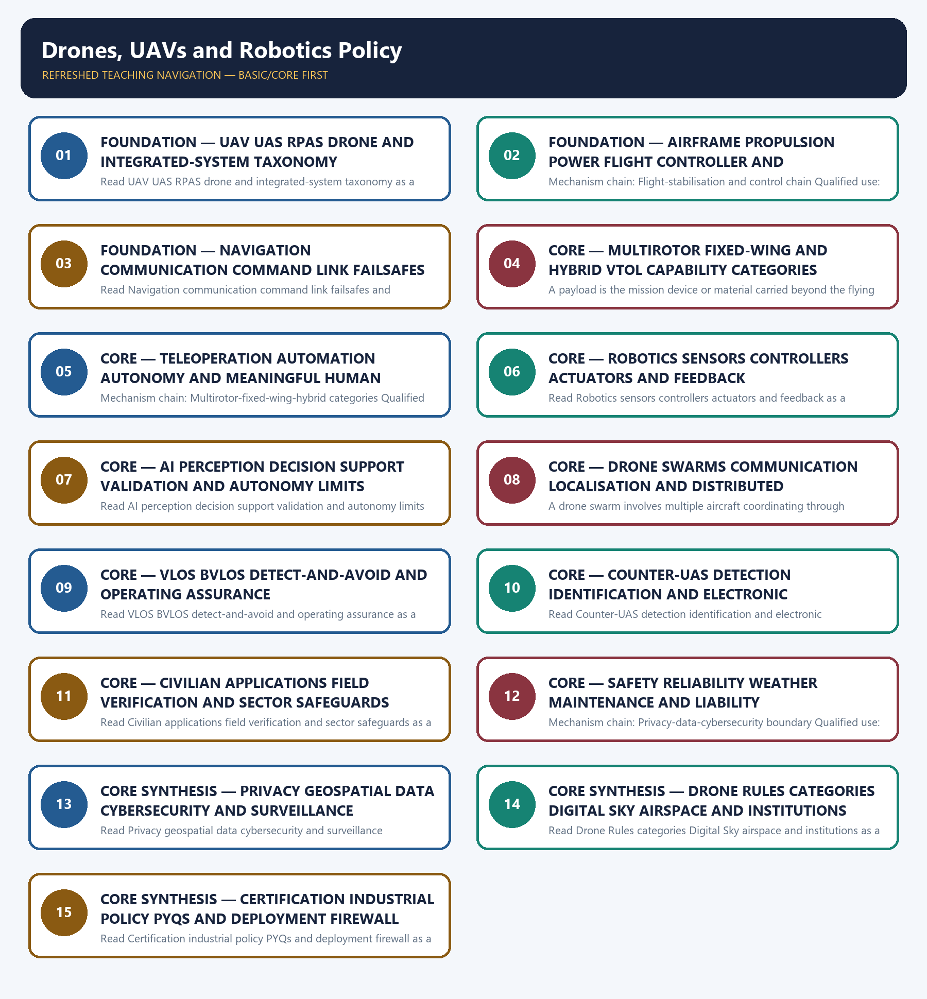

# Drones, UAVs and Robotics Policy — Learner-v2 Complete Learning Session

> **Authoring-only generation:** 2026-09-04. No PDF was rendered and no tracker or index was mutated.

### SOURCE, PROGRESSION AND CURRENT-LINKAGE AUDIT

- **Generation date:** 2026-09-04.
- **Repository-first evidence:** the Basic owner is taught first and preserved in full; the Advanced owner is retained only in the optional final teaching block.
- **OCR evidence:** Repository Markdown was primary. OCR-searchable official UPSC papers were supplementary only for printed routed demands. No answer key, performance value, procurement outcome, operational deployment, programme target or technology milestone was inferred.
- **Qdrant:** not used; repository Markdown and available OCR context were sufficient.
- **PYQ integrity:** Audited ledgers route the 2020 Prelims applications demand, the 2025 Prelims UAV-capabilities demand and the 2026 provisional-key swarm-coordination and electronic-countermeasure demand directly to this owner. Relevant cross-routes include the 2023 GS-III adversarial-UAV border question and the 2025 GS-I AI-drones-GIS planning question. Three representative cards preserve the core and security routes without inventing any objective answer key.
- **Live-link boundary:** Official MoCA, e-Gazette, Digital Sky and Namo Drone Didi source attempts were made on 2026-09-04. The e-Gazette PDF and Digital Sky welcome surface were retrievable; several official pages returned HTTP 403 or 502. Consequently, exact rule, amendment, scheme and certification propositions remain owner-bounded, and no performance range, approval, deployment, sales, production, service continuation or objective answer key is asserted.
- **Fact/inference discipline:** no current-affairs item, PYQ wording, figure or quotation is invented.

### LIVE OFFICIAL-SOURCE ATTEMPT LOG

The checks below were made on 2026-09-04. Substantive official text is used only for the proposition it supports; title-only, blocked or thin pages are recorded and supply no factual claim.

- https://www.civilaviation.gov.in/ministry-documents/rules/drones-rules-2021-dated-25-august-2021 - attempted 2026-09-04; the official MoCA page returned HTTP 403 through the live fetch tool. Rule propositions are therefore retained only where supported by the audited Basic and Advanced owners; no current consolidated-rule claim was inferred.
- https://egazette.gov.in/WriteReadData/2021/229221.pdf - fetched 2026-09-04 from the official e-Gazette domain as raw PDF bytes. The retrieval confirms the dated official document exists, but raw bytes were not treated as machine-readable proof of a provision absent from the repository owners.
- https://digitalsky.dgca.gov.in/ - fetched 2026-09-04; it redirected to the official AAI Digital Sky endpoint and returned only the welcome surface. Portal accessibility was not converted into proof of a permission, registration, operative rule or air-traffic service.
- https://digitalsky.aai.aero/faq - fetched 2026-09-04; the official endpoint returned only 'Welcome to DigitalSky' through the live tool. Detailed registration, certification, airspace and permission claims remain bounded by the audited owners.
- https://www.civilaviation.gov.in/sites/default/files/2024-04/Drone%20%28Amendment%29%20Rules%2C%202023.pdf - attempted 2026-09-04; the official PDF returned HTTP 403 through the live fetch tool. The amendment is retained as dated owner evidence only, not as a verified consolidated current text.
- https://www.civilaviation.gov.in/ministry-documents/notifications/pli-scheme-drones-and-drone-components-0 - attempted 2026-09-04; the official MoCA page returned HTTP 403. The existence and purpose of the manufacturing-support route remain owner-bounded; no outlay, beneficiary, production, sales or completion figure was imported.
- https://lakhpatididi.gov.in/power_to_empower/namo-drone-didi/ - attempted 2026-09-04; the official scheme page returned HTTP 502. The repository owner's dated scheme proposition is not extended into continuation, utilisation, deployment, income or service outcomes.

## BASIC LEARNING SESSION

### DEEP-REVIEW LEARNING CONTRACT

| Control | Binding rule for this package |
|---|---|
| Syllabus boundary | Complete Science and Technology Basic/Core is easy-first and answer-complete before optional Advanced depth. |
| System boundary | Organisation, platform, subsystem, payload, process, application, institution and outcome remain distinct. |
| Technical boundary | Physical mechanism, classification, stage, platform, unit, range/capacity and limiting condition are explicit. |
| Status boundary | Announcement, approval, development, test, deployment, induction, commercial operation and observed outcome remain distinct. |
| Data boundary | Every mission, launch, target, capacity, budget, range, timeline, rule and regulatory claim keeps source, date, unit and status. |
| Governance boundary | Funder, developer, operator, authoriser, regulator, procurer, settlement actor and adjudicator are not conflated. |
| Practice contract | Every solved item has demand decoding, detailed examiner-grade model, executable timed/compression plan, marks rationale and answer-specific improvement. |
| PYQ contract | Official wording and keys are asserted only when verified; routed or reconstructed demands remain labelled. |
| Dual-flow contract | Graphical and ASCII masters independently reconstruct the same complete Basic-to-optional-Advanced evidence spine. |
| Approval | This immutable successor remains `approved: false` pending explicit approval. |

**Canonical Basic/Core owner:** `upsc-ai-kit\knowledge\Science-and-Technology\basic\19_Drones-UAVs-and-Robotics-Policy.md`  
**Substantive canonical provenance owner:** `upsc-ai-kit\knowledge\Science-and-Technology\learning-sessions\v2\subject-wide-syllabus\science-and-technology-19_Learning-Session.md`  
**Optional Advanced owner:** `upsc-ai-kit\knowledge\Science-and-Technology\advanced\19_Drones-UAVs-and-Robotics-Policy.md`  
**Official syllabus mapping:** `upsc-ai-kit\knowledge\Science-and-Technology\OFFICIAL-UPSC-SYLLABUS-MAPPING.md`

### EVIDENCE, PYQ AND CURRENT-STATUS CONTROL

- ISRO organisation, launcher stages, payload and orbit claims retain their exact object and mission date.
- NavIC, GAGAN, human-spaceflight, planetary, nuclear, fusion, missile and procurement claims retain category and status.
- Aadhaar/UPI, AI, quantum and semiconductor claims retain actor, layer, metric, maturity and governance boundaries.
- DPDP/cybersecurity, biotechnology and genetic-engineering claims retain legal/regulatory stage and competent institution.
- Targets, budgets, capacities, ranges and timelines are never promoted into achieved outcomes without dated evidence.
- **Current-status note, rechecked 2026-09-06:** volatile claims retain source/date/status; failed official fetches remain explicit and supply no invented fact.

**Generation-local live/current sources:**
- `https://www.civilaviation.gov.in/ministry-documents/rules/drones-rules-2021-dated-25-august-2021 - attempted 2026-09-04; the official MoCA page returned HTTP 403 through the live fetch tool. Rule propositions are therefore retained only where supported by the audited Basic and Advanced owners; no current consolidated-rule claim was inferred.`
- `https://egazette.gov.in/WriteReadData/2021/229221.pdf - fetched 2026-09-04 from the official e-Gazette domain as raw PDF bytes. The retrieval confirms the dated official document exists, but raw bytes were not treated as machine-readable proof of a provision absent from the repository owners.`
- `https://digitalsky.dgca.gov.in/ - fetched 2026-09-04; it redirected to the official AAI Digital Sky endpoint and returned only the welcome surface. Portal accessibility was not converted into proof of a permission, registration, operative rule or air-traffic service.`
- `https://digitalsky.aai.aero/faq - fetched 2026-09-04; the official endpoint returned only 'Welcome to DigitalSky' through the live tool. Detailed registration, certification, airspace and permission claims remain bounded by the audited owners.`
- `https://www.civilaviation.gov.in/sites/default/files/2024-04/Drone%20%28Amendment%29%20Rules%2C%202023.pdf - attempted 2026-09-04; the official PDF returned HTTP 403 through the live fetch tool. The amendment is retained as dated owner evidence only, not as a verified consolidated current text.`
- `https://www.civilaviation.gov.in/ministry-documents/notifications/pli-scheme-drones-and-drone-components-0 - attempted 2026-09-04; the official MoCA page returned HTTP 403. The existence and purpose of the manufacturing-support route remain owner-bounded; no outlay, beneficiary, production, sales or completion figure was imported.`
- `https://lakhpatididi.gov.in/power_to_empower/namo-drone-didi/ - attempted 2026-09-04; the official scheme page returned HTTP 502. The repository owner's dated scheme proposition is not extended into continuation, utilisation, deployment, income or service outcomes.`

**Topic-routed verified PYQ owners:**
- No topic-local official question file is claimed; repository PYQ routing ledgers control wording and status.




*Distinct embedded teaching-navigation image. The separate continuous Cārvāka-style flowchart package remains an independent at-a-glance artifact.*

### SESSION 1 — FOUNDATION — UAV UAS RPAS DRONE AND INTEGRATED-SYSTEM TAXONOMY

#### DEFINITION / WHAT THIS IS CALLED

**Plain-language definition:** The decisive boundary is Do not use UAV, UAS, RPAS and drone as exact synonyms.

**Technical definition:** Read UAV UAS RPAS drone and integrated-system taxonomy as a sequence: identify UAV-UAS-RPAS-drone boundary, follow the named mechanism to its user or output, and stop at the last verified status rather than assuming the next stage.

#### ANSWER-GRABBING OPENING — WRITE/ADAPT IN THE EXAM

> Read UAV UAS RPAS drone and integrated-system taxonomy as a sequence: identify UAV-UAS-RPAS-drone boundary, follow the named mechanism to its user or output, and stop at the last verified status rather than assuming the next stage.

#### MUST-WRITE KEYWORDS

- **FOUNDATION**
- **UAV UAS RPAS drone**
- **integrated-system taxonomy**
- **Mechanism chain**
- **Qualified use**
- **A UAV**

**How to use them:** Frame the answer through FOUNDATION; define UAV UAS RPAS drone, connect integrated-system taxonomy with Mechanism chain to explain the mechanism, and use Qualified use for the decisive comparison or qualification.

#### VISUAL FIRST

```text
UAV UAS RPAS DRONE AND INTEGRATED-SYSTEM TAXONOMY
01. UAV-UAS-RPAS-drone boundary
    |
    v
02. Integrated UAS component stack
STATUS / CATEGORY FIREWALL -> Do not use UAV, UAS, RPAS and drone as exact synonyms.
```

*The rail fixes the technical sequence and the claim boundary before explanation.*

#### CORE EXPLANATION

A UAV is the aircraft itself; a UAS combines the aircraft, remote pilot station, command-and-control links and associated elements; an RPAS is a UAS with a remote pilot in command and is therefore explicitly non-autonomous, while 'drone' is a colloquial umbrella rather than a precise regulatory category. A useful UAS joins airframe, power source, propulsion, flight-control electronics, navigation sensors, communication links, ground or remote pilot station and payload; capability and certification concern the integrated operating system rather than the airframe alone.

#### SIMPLE SYSTEM EXAMPLE

Read UAV UAS RPAS drone and integrated-system taxonomy as a sequence: identify UAV-UAS-RPAS-drone boundary, follow the named mechanism to its user or output, and stop at the last verified status rather than assuming the next stage.

#### TECHNICAL DISTINCTION

The decisive boundary is Do not use UAV, UAS, RPAS and drone as exact synonyms. This keeps UAV-UAS-RPAS-drone boundary and Integrated UAS component stack in the correct scientific category, institution and unit of measurement.

#### NAMED EVIDENCE AND MECHANISM

- A UAV is the aircraft itself; a UAS combines the aircraft, remote pilot station, command-and-control links and associated elements; an RPAS is a UAS with a remote pilot in command and is therefore explicitly non-autonomous, while 'drone' is a colloquial umbrella rather than a precise regulatory category.
- A useful UAS joins airframe, power source, propulsion, flight-control electronics, navigation sensors, communication links, ground or remote pilot station and payload; capability and certification concern the integrated operating system rather than the airframe alone.

#### EXAMINER CAUTION

- Do not use UAV, UAS, RPAS and drone as exact synonyms.

#### EXAM LINK

- **Prelims:** Keep institution, system, platform, service, process, legal instrument, unit and status in their exact category.
- **Mains:** Define the aircraft, complete system, remotely piloted subset and colloquial label before analysing capability.

#### MINI RECAP

- **Mechanism chain:** UAV-UAS-RPAS-drone boundary -> Integrated UAS component stack
- **Qualified use:** Define the aircraft, complete system, remotely piloted subset and colloquial label before analysing capability.

#### CLOSING RECALL FLOW — FOUNDATION — UAV UAS RPAS DRONE AND INTEGRATED-SYSTEM TAXONOMY

```text
START / CONCEPT: FOUNDATION — UAV UAS RPAS drone and integrated-system taxonomy
        |
        v
EXACT TERMS: FOUNDATION · UAV UAS RPAS drone · integrated-system taxonomy · Mechanism chain · Qualified use · A UAV
        |
        v
MECHANISM / ARGUMENT: Mechanism chain: UAV-UAS-RPAS-drone boundary - Integrated UAS component stack Qualified use: Define the aircraft, complete system, remotely piloted subset and colloquial label before analysing capability.
        |
        v
CONSEQUENCE / CONTRAST: The decisive boundary is Do not use UAV, UAS, RPAS and drone as exact synonyms.
        |
        v
UPSC TRAP / ANSWER-USE: Do not use UAV, UAS, RPAS and drone as exact synonyms.
        |
        v
ANSWER-GRABBING FORMULATION: Read UAV UAS RPAS drone and integrated-system taxonomy as a sequence: identify UAV-UAS-RPAS-drone boundary, follow the named mechanism to its user or output, and stop at the last verified status rather than assuming the next stage.
```
### SESSION 2 — FOUNDATION — AIRFRAME PROPULSION POWER FLIGHT CONTROLLER AND STABILISATION

#### DEFINITION / WHAT THIS IS CALLED

**Plain-language definition:** Read Airframe propulsion power flight controller and stabilisation as a sequence: identify Flight-stabilisation and control chain, follow the named mechanism to its user or output, and stop at the last verified status rather than assuming the next stage.

**Technical definition:** Mechanism chain: Flight-stabilisation and control chain Qualified use: Trace thrust, attitude sensing, controller correction and actuation as a closed flight-control loop.

#### ANSWER-GRABBING OPENING — WRITE/ADAPT IN THE EXAM

> Read Airframe propulsion power flight controller and stabilisation as a sequence: identify Flight-stabilisation and control chain, follow the named mechanism to its user or output, and stop at the last verified status rather than assuming the next stage.

#### MUST-WRITE KEYWORDS

- **FOUNDATION**
- **Airframe propulsion power flight controller**
- **stabilisation**
- **Mechanism chain**
- **Qualified use**
- **Propulsion**

**How to use them:** Frame the answer through FOUNDATION; define Airframe propulsion power flight controller, connect stabilisation with Mechanism chain to explain the mechanism, and use Qualified use for the decisive comparison or qualification.

#### VISUAL FIRST

```text
AIRFRAME PROPULSION POWER FLIGHT CONTROLLER AND STABILISATION
01. Flight-stabilisation and control chain
STATUS / CATEGORY FIREWALL -> Do not call every unmanned or remotely piloted aircraft autonomous.
```

*The rail fixes the technical sequence and the claim boundary before explanation.*

#### CORE EXPLANATION

Propulsion creates thrust, control surfaces or rotor-speed changes alter attitude and motion, inertial and other sensors report vehicle state, and the flight controller repeatedly compares sensed state with the commanded path; stable flight therefore depends on a closed control loop, not merely a motor and battery.

#### SIMPLE SYSTEM EXAMPLE

Read Airframe propulsion power flight controller and stabilisation as a sequence: identify Flight-stabilisation and control chain, follow the named mechanism to its user or output, and stop at the last verified status rather than assuming the next stage.

#### TECHNICAL DISTINCTION

The decisive boundary is Do not call every unmanned or remotely piloted aircraft autonomous. This keeps Flight-stabilisation and control chain in the correct scientific category, institution and unit of measurement.

#### NAMED EVIDENCE AND MECHANISM

- Propulsion creates thrust, control surfaces or rotor-speed changes alter attitude and motion, inertial and other sensors report vehicle state, and the flight controller repeatedly compares sensed state with the commanded path; stable flight therefore depends on a closed control loop, not merely a motor and battery.

#### EXAMINER CAUTION

- Do not call every unmanned or remotely piloted aircraft autonomous.

#### EXAM LINK

- **Prelims:** Keep institution, system, platform, service, process, legal instrument, unit and status in their exact category.
- **Mains:** Trace thrust, attitude sensing, controller correction and actuation as a closed flight-control loop.

#### MINI RECAP

- **Mechanism chain:** Flight-stabilisation and control chain
- **Qualified use:** Trace thrust, attitude sensing, controller correction and actuation as a closed flight-control loop.

#### CLOSING RECALL FLOW — FOUNDATION — AIRFRAME PROPULSION POWER FLIGHT CONTROLLER AND STABILISATION

```text
START / CONCEPT: FOUNDATION — Airframe propulsion power flight controller and stabilisation
        |
        v
EXACT TERMS: FOUNDATION · Airframe propulsion power flight controller · stabilisation · Mechanism chain · Qualified use · Propulsion
        |
        v
MECHANISM / ARGUMENT: Propulsion creates thrust, control surfaces or rotor-speed changes alter attitude and motion, inertial and other sensors report vehicle state, and the flight controller repeatedly compares sensed state with the commanded path; stable flight therefore depends on a closed control loop, not merely a motor and battery.
        |
        v
CONSEQUENCE / CONTRAST: The decisive boundary is Do not call every unmanned or remotely piloted aircraft autonomous.
        |
        v
UPSC TRAP / ANSWER-USE: Do not call every unmanned or remotely piloted aircraft autonomous.
        |
        v
ANSWER-GRABBING FORMULATION: Read Airframe propulsion power flight controller and stabilisation as a sequence: identify Flight-stabilisation and control chain, follow the named mechanism to its user or output, and stop at the last verified status rather than assuming the next stage.
```
### SESSION 3 — FOUNDATION — NAVIGATION COMMUNICATION COMMAND LINK FAILSAFES AND PAYLOADS

#### DEFINITION / WHAT THIS IS CALLED

**Plain-language definition:** Navigation estimates position, velocity, attitude and route from onboard sensors and available positioning inputs, while the command-and-control link carries pilot commands, telemetry or mission updates; navigation and communication support each other but are not the same subsystem, and loss-of-link behaviour requires a designed failsafe.

**Technical definition:** Read Navigation communication command link failsafes and payloads as a sequence: identify Navigation-command-link boundary, follow the named mechanism to its user or output, and stop at the last verified status rather than assuming the next stage.

#### ANSWER-GRABBING OPENING — WRITE/ADAPT IN THE EXAM

> Read Navigation communication command link failsafes and payloads as a sequence: identify Navigation-command-link boundary, follow the named mechanism to its user or output, and stop at the last verified status rather than assuming the next stage.

#### MUST-WRITE KEYWORDS

- **FOUNDATION**
- **Navigation communication command link failsafes**
- **payloads**
- **Mechanism chain**
- **Qualified use**
- **Navigation**

**How to use them:** Frame the answer through FOUNDATION; define Navigation communication command link failsafes, connect payloads with Mechanism chain to explain the mechanism, and use Qualified use for the decisive comparison or qualification.

#### VISUAL FIRST

```text
NAVIGATION COMMUNICATION COMMAND LINK FAILSAFES AND PAYLOADS
01. Navigation-command-link boundary
STATUS / CATEGORY FIREWALL -> Do not reduce UAS capability to the airframe while omitting links, software, navigation and payload.
```

*The rail fixes the technical sequence and the claim boundary before explanation.*

#### CORE EXPLANATION

Navigation estimates position, velocity, attitude and route from onboard sensors and available positioning inputs, while the command-and-control link carries pilot commands, telemetry or mission updates; navigation and communication support each other but are not the same subsystem, and loss-of-link behaviour requires a designed failsafe.

#### SIMPLE SYSTEM EXAMPLE

Read Navigation communication command link failsafes and payloads as a sequence: identify Navigation-command-link boundary, follow the named mechanism to its user or output, and stop at the last verified status rather than assuming the next stage.

#### TECHNICAL DISTINCTION

The decisive boundary is Do not reduce UAS capability to the airframe while omitting links, software, navigation and payload. This keeps Navigation-command-link boundary in the correct scientific category, institution and unit of measurement.

#### NAMED EVIDENCE AND MECHANISM

- Navigation estimates position, velocity, attitude and route from onboard sensors and available positioning inputs, while the command-and-control link carries pilot commands, telemetry or mission updates; navigation and communication support each other but are not the same subsystem, and loss-of-link behaviour requires a designed failsafe.

#### EXAMINER CAUTION

- Do not reduce UAS capability to the airframe while omitting links, software, navigation and payload.

#### EXAM LINK

- **Prelims:** Keep institution, system, platform, service, process, legal instrument, unit and status in their exact category.
- **Mains:** Separate position estimation, command telemetry, contingency behaviour and mission payload integration.

#### MINI RECAP

- **Mechanism chain:** Navigation-command-link boundary
- **Qualified use:** Separate position estimation, command telemetry, contingency behaviour and mission payload integration.

#### CLOSING RECALL FLOW — FOUNDATION — NAVIGATION COMMUNICATION COMMAND LINK FAILSAFES AND PAYLOADS

```text
START / CONCEPT: FOUNDATION — Navigation communication command link failsafes and payloads
        |
        v
EXACT TERMS: FOUNDATION · Navigation communication command link failsafes · payloads · Mechanism chain · Qualified use · Navigation
        |
        v
MECHANISM / ARGUMENT: Mechanism chain: Navigation-command-link boundary Qualified use: Separate position estimation, command telemetry, contingency behaviour and mission payload integration.
        |
        v
CONSEQUENCE / CONTRAST: Navigation estimates position, velocity, attitude and route from onboard sensors and available positioning inputs, while the command-and-control link carries pilot commands, telemetry or mission updates; navigation and communication support each other but are not the same subsystem, and loss-of-link behaviour requires a designed failsafe.
        |
        v
UPSC TRAP / ANSWER-USE: The decisive boundary is Do not reduce UAS capability to the airframe while omitting links, software, navigation and payload.
        |
        v
ANSWER-GRABBING FORMULATION: Read Navigation communication command link failsafes and payloads as a sequence: identify Navigation-command-link boundary, follow the named mechanism to its user or output, and stop at the last verified status rather than assuming the next stage.
```
### SESSION 4 — CORE — MULTIROTOR FIXED-WING AND HYBRID VTOL CAPABILITY CATEGORIES

#### DEFINITION / WHAT THIS IS CALLED

**Plain-language definition:** Read Multirotor fixed-wing and hybrid VTOL capability categories as a sequence: identify Payload-mission-capability link, follow the named mechanism to its user or output, and stop at the last verified status rather than assuming the next stage.

**Technical definition:** A payload is the mission device or material carried beyond the flying platform, such as an imaging sensor, mapping instrument, sprayer or delivery load; payload mass, power demand, data rate and integration affect endurance and control, so one platform label cannot establish every mission capability.

#### ANSWER-GRABBING OPENING — WRITE/ADAPT IN THE EXAM

> Read Multirotor fixed-wing and hybrid VTOL capability categories as a sequence: identify Payload-mission-capability link, follow the named mechanism to its user or output, and stop at the last verified status rather than assuming the next stage.

#### MUST-WRITE KEYWORDS

- **Multirotor fixed-wing**
- **hybrid VTOL capability categories**
- **Mechanism chain**
- **Qualified use**
- **A payload**
- **Read Multirotor**

**How to use them:** Frame the answer through Multirotor fixed-wing; define hybrid VTOL capability categories, connect Mechanism chain with Qualified use to explain the mechanism, and use A payload for the decisive comparison or qualification.

#### VISUAL FIRST

```text
MULTIROTOR FIXED-WING AND HYBRID VTOL CAPABILITY CATEGORIES
01. Payload-mission-capability link
STATUS / CATEGORY FIREWALL -> Do not merge navigation, command-and-control communication and payload-data links.
```

*The rail fixes the technical sequence and the claim boundary before explanation.*

#### CORE EXPLANATION

A payload is the mission device or material carried beyond the flying platform, such as an imaging sensor, mapping instrument, sprayer or delivery load; payload mass, power demand, data rate and integration affect endurance and control, so one platform label cannot establish every mission capability.

#### SIMPLE SYSTEM EXAMPLE

Read Multirotor fixed-wing and hybrid VTOL capability categories as a sequence: identify Payload-mission-capability link, follow the named mechanism to its user or output, and stop at the last verified status rather than assuming the next stage.

#### TECHNICAL DISTINCTION

The decisive boundary is Do not merge navigation, command-and-control communication and payload-data links. This keeps Payload-mission-capability link in the correct scientific category, institution and unit of measurement.

#### NAMED EVIDENCE AND MECHANISM

- A payload is the mission device or material carried beyond the flying platform, such as an imaging sensor, mapping instrument, sprayer or delivery load; payload mass, power demand, data rate and integration affect endurance and control, so one platform label cannot establish every mission capability.

#### EXAMINER CAUTION

- Do not merge navigation, command-and-control communication and payload-data links.

#### EXAM LINK

- **Prelims:** Keep institution, system, platform, service, process, legal instrument, unit and status in their exact category.
- **Mains:** Compare hover, coverage, launch-recovery and integration trade-offs without inventing performance values.

#### MINI RECAP

- **Mechanism chain:** Payload-mission-capability link
- **Qualified use:** Compare hover, coverage, launch-recovery and integration trade-offs without inventing performance values.

#### CLOSING RECALL FLOW — CORE — MULTIROTOR FIXED-WING AND HYBRID VTOL CAPABILITY CATEGORIES

```text
START / CONCEPT: CORE — Multirotor fixed-wing and hybrid VTOL capability categories
        |
        v
EXACT TERMS: Multirotor fixed-wing · hybrid VTOL capability categories · Mechanism chain · Qualified use · A payload · Read Multirotor
        |
        v
MECHANISM / ARGUMENT: Mechanism chain: Payload-mission-capability link Qualified use: Compare hover, coverage, launch-recovery and integration trade-offs without inventing performance values.
        |
        v
CONSEQUENCE / CONTRAST: The decisive boundary is Do not merge navigation, command-and-control communication and payload-data links.
        |
        v
UPSC TRAP / ANSWER-USE: Do not merge navigation, command-and-control communication and payload-data links.
        |
        v
ANSWER-GRABBING FORMULATION: Read Multirotor fixed-wing and hybrid VTOL capability categories as a sequence: identify Payload-mission-capability link, follow the named mechanism to its user or output, and stop at the last verified status rather than assuming the next stage.
```
### SESSION 5 — CORE — TELEOPERATION AUTOMATION AUTONOMY AND MEANINGFUL HUMAN CONTROL

#### DEFINITION / WHAT THIS IS CALLED

**Plain-language definition:** Read Teleoperation automation autonomy and meaningful human control as a sequence: identify Multirotor-fixed-wing-hybrid categories, follow the named mechanism to its user or output, and stop at the last verified status rather than assuming the next stage.

**Technical definition:** Mechanism chain: Multirotor-fixed-wing-hybrid categories Qualified use: Locate the human in the control chain and distinguish fixed automation from action-selecting autonomy.

#### ANSWER-GRABBING OPENING — WRITE/ADAPT IN THE EXAM

> Read Teleoperation automation autonomy and meaningful human control as a sequence: identify Multirotor-fixed-wing-hybrid categories, follow the named mechanism to its user or output, and stop at the last verified status rather than assuming the next stage.

#### MUST-WRITE KEYWORDS

- **Teleoperation automation autonomy**
- **meaningful human control**
- **Mechanism chain**
- **Qualified use**
- **Multirotors**
- **UAVs**

**How to use them:** Frame the answer through Teleoperation automation autonomy; define meaningful human control, connect Mechanism chain with Qualified use to explain the mechanism, and use Multirotors for the decisive comparison or qualification.

#### VISUAL FIRST

```text
TELEOPERATION AUTOMATION AUTONOMY AND MEANINGFUL HUMAN CONTROL
01. Multirotor-fixed-wing-hybrid categories
STATUS / CATEGORY FIREWALL -> Do not infer range, endurance or payload from multirotor, fixed-wing or hybrid labels.
```

*The rail fixes the technical sequence and the claim boundary before explanation.*

#### CORE EXPLANATION

Multirotors use several rotors and suit hover and confined-area work; fixed-wing UAVs generate lift from forward motion and suit wider-area coverage but ordinarily need a launch and recovery solution; hybrid VTOL designs combine vertical take-off or landing with wing-borne cruise at the cost of added integration complexity.

#### SIMPLE SYSTEM EXAMPLE

Read Teleoperation automation autonomy and meaningful human control as a sequence: identify Multirotor-fixed-wing-hybrid categories, follow the named mechanism to its user or output, and stop at the last verified status rather than assuming the next stage.

#### TECHNICAL DISTINCTION

The decisive boundary is Do not infer range, endurance or payload from multirotor, fixed-wing or hybrid labels. This keeps Multirotor-fixed-wing-hybrid categories in the correct scientific category, institution and unit of measurement.

#### NAMED EVIDENCE AND MECHANISM

- Multirotors use several rotors and suit hover and confined-area work; fixed-wing UAVs generate lift from forward motion and suit wider-area coverage but ordinarily need a launch and recovery solution; hybrid VTOL designs combine vertical take-off or landing with wing-borne cruise at the cost of added integration complexity.

#### EXAMINER CAUTION

- Do not infer range, endurance or payload from multirotor, fixed-wing or hybrid labels.

#### EXAM LINK

- **Prelims:** Keep institution, system, platform, service, process, legal instrument, unit and status in their exact category.
- **Mains:** Locate the human in the control chain and distinguish fixed automation from action-selecting autonomy.

#### MINI RECAP

- **Mechanism chain:** Multirotor-fixed-wing-hybrid categories
- **Qualified use:** Locate the human in the control chain and distinguish fixed automation from action-selecting autonomy.

#### CLOSING RECALL FLOW — CORE — TELEOPERATION AUTOMATION AUTONOMY AND MEANINGFUL HUMAN CONTROL

```text
START / CONCEPT: CORE — Teleoperation automation autonomy and meaningful human control
        |
        v
EXACT TERMS: Teleoperation automation autonomy · meaningful human control · Mechanism chain · Qualified use · Multirotors · UAVs
        |
        v
MECHANISM / ARGUMENT: Mechanism chain: Multirotor-fixed-wing-hybrid categories Qualified use: Locate the human in the control chain and distinguish fixed automation from action-selecting autonomy.
        |
        v
CONSEQUENCE / CONTRAST: Multirotors use several rotors and suit hover and confined-area work; fixed-wing UAVs generate lift from forward motion and suit wider-area coverage but ordinarily need a launch and recovery solution; hybrid VTOL designs combine vertical take-off or landing with wing-borne cruise at the cost of added integration complexity.
        |
        v
UPSC TRAP / ANSWER-USE: The decisive boundary is Do not infer range, endurance or payload from multirotor, fixed-wing or hybrid labels.
        |
        v
ANSWER-GRABBING FORMULATION: Read Teleoperation automation autonomy and meaningful human control as a sequence: identify Multirotor-fixed-wing-hybrid categories, follow the named mechanism to its user or output, and stop at the last verified status rather than assuming the next stage.
```
### SESSION 6 — CORE — ROBOTICS SENSORS CONTROLLERS ACTUATORS AND FEEDBACK

#### DEFINITION / WHAT THIS IS CALLED

**Plain-language definition:** Teleoperation keeps a human in direct remote control, automation executes a pre-programmed sequence in a structured setting, and autonomy uses sensing, onboard logic and feedback to select actions toward a goal with reduced direct control; an unmanned aircraft is not automatically autonomous.

**Technical definition:** Read Robotics sensors controllers actuators and feedback as a sequence: identify Remote operation-automation-autonomy boundary, follow the named mechanism to its user or output, and stop at the last verified status rather than assuming the next stage.

#### ANSWER-GRABBING OPENING — WRITE/ADAPT IN THE EXAM

> Read Robotics sensors controllers actuators and feedback as a sequence: identify Remote operation-automation-autonomy boundary, follow the named mechanism to its user or output, and stop at the last verified status rather than assuming the next stage.

#### MUST-WRITE KEYWORDS

- **Robotics sensors controllers actuators**
- **feedback**
- **Mechanism chain**
- **Qualified use**
- **Teleoperation**
- **Robotics**

**How to use them:** Frame the answer through Robotics sensors controllers actuators; define feedback, connect Mechanism chain with Qualified use to explain the mechanism, and use Teleoperation for the decisive comparison or qualification.

#### VISUAL FIRST

```text
ROBOTICS SENSORS CONTROLLERS ACTUATORS AND FEEDBACK
01. Remote operation-automation-autonomy boundary
    |
    v
02. Robotics sensing-actuation-control loop
STATUS / CATEGORY FIREWALL -> Do not call several nearby drones a swarm without coordination and control rules.
```

*The rail fixes the technical sequence and the claim boundary before explanation.*

#### CORE EXPLANATION

Teleoperation keeps a human in direct remote control, automation executes a pre-programmed sequence in a structured setting, and autonomy uses sensing, onboard logic and feedback to select actions toward a goal with reduced direct control; an unmanned aircraft is not automatically autonomous. Robotics connects sensors that perceive state or environment, a controller that interprets inputs and selects commands, actuators that create physical action, and feedback that corrects subsequent action; aerial robotics adds flight dynamics, navigation, communication and airspace constraints to this loop.

#### SIMPLE SYSTEM EXAMPLE

Read Robotics sensors controllers actuators and feedback as a sequence: identify Remote operation-automation-autonomy boundary, follow the named mechanism to its user or output, and stop at the last verified status rather than assuming the next stage.

#### TECHNICAL DISTINCTION

The decisive boundary is Do not call several nearby drones a swarm without coordination and control rules. This keeps Remote operation-automation-autonomy boundary and Robotics sensing-actuation-control loop in the correct scientific category, institution and unit of measurement.

#### NAMED EVIDENCE AND MECHANISM

- Teleoperation keeps a human in direct remote control, automation executes a pre-programmed sequence in a structured setting, and autonomy uses sensing, onboard logic and feedback to select actions toward a goal with reduced direct control; an unmanned aircraft is not automatically autonomous.
- Robotics connects sensors that perceive state or environment, a controller that interprets inputs and selects commands, actuators that create physical action, and feedback that corrects subsequent action; aerial robotics adds flight dynamics, navigation, communication and airspace constraints to this loop.

#### EXAMINER CAUTION

- Do not call several nearby drones a swarm without coordination and control rules.

#### EXAM LINK

- **Prelims:** Keep institution, system, platform, service, process, legal instrument, unit and status in their exact category.
- **Mains:** Explain perception, control, actuation and feedback before applying robotics logic to an aerial platform.

#### MINI RECAP

- **Mechanism chain:** Remote operation-automation-autonomy boundary -> Robotics sensing-actuation-control loop
- **Qualified use:** Explain perception, control, actuation and feedback before applying robotics logic to an aerial platform.

#### CLOSING RECALL FLOW — CORE — ROBOTICS SENSORS CONTROLLERS ACTUATORS AND FEEDBACK

```text
START / CONCEPT: CORE — Robotics sensors controllers actuators and feedback
        |
        v
EXACT TERMS: Robotics sensors controllers actuators · feedback · Mechanism chain · Qualified use · Teleoperation · Robotics
        |
        v
MECHANISM / ARGUMENT: Mechanism chain: Remote operation-automation-autonomy boundary - Robotics sensing-actuation-control loop Qualified use: Explain perception, control, actuation and feedback before applying robotics logic to an aerial platform.
        |
        v
CONSEQUENCE / CONTRAST: Robotics connects sensors that perceive state or environment, a controller that interprets inputs and selects commands, actuators that create physical action, and feedback that corrects subsequent action; aerial robotics adds flight dynamics, navigation, communication and airspace constraints to this loop.
        |
        v
UPSC TRAP / ANSWER-USE: Teleoperation keeps a human in direct remote control, automation executes a pre-programmed sequence in a structured setting, and autonomy uses sensing, onboard logic and feedback to select actions toward a goal with reduced direct control; an unmanned aircraft is not automatically autonomous.
        |
        v
ANSWER-GRABBING FORMULATION: Read Robotics sensors controllers actuators and feedback as a sequence: identify Remote operation-automation-autonomy boundary, follow the named mechanism to its user or output, and stop at the last verified status rather than assuming the next stage.
```
### SESSION 7 — CORE — AI PERCEPTION DECISION SUPPORT VALIDATION AND AUTONOMY LIMITS

#### DEFINITION / WHAT THIS IS CALLED

**Plain-language definition:** Computer vision or other AI can assist perception, classification, route choice and decision support, but an AI output is not itself lawful authority, safe flight or accountable deployment; training data, validation, human oversight, ground truth and defined fallback behaviour remain necessary.

**Technical definition:** Read AI perception decision support validation and autonomy limits as a sequence: identify AI-enabled autonomy boundary, follow the named mechanism to its user or output, and stop at the last verified status rather than assuming the next stage.

#### ANSWER-GRABBING OPENING — WRITE/ADAPT IN THE EXAM

> Read AI perception decision support validation and autonomy limits as a sequence: identify AI-enabled autonomy boundary, follow the named mechanism to its user or output, and stop at the last verified status rather than assuming the next stage.

#### MUST-WRITE KEYWORDS

- **AI perception decision support validation**
- **autonomy limits**
- **Mechanism chain**
- **Qualified use**
- **Computer**
- **AI**

**How to use them:** Frame the answer through AI perception decision support validation; define autonomy limits, connect Mechanism chain with Qualified use to explain the mechanism, and use Computer for the decisive comparison or qualification.

#### VISUAL FIRST

```text
AI PERCEPTION DECISION SUPPORT VALIDATION AND AUTONOMY LIMITS
01. AI-enabled autonomy boundary
STATUS / CATEGORY FIREWALL -> Do not treat a BVLOS experiment or sandbox authorisation as routine nationwide permission.
```

*The rail fixes the technical sequence and the claim boundary before explanation.*

#### CORE EXPLANATION

Computer vision or other AI can assist perception, classification, route choice and decision support, but an AI output is not itself lawful authority, safe flight or accountable deployment; training data, validation, human oversight, ground truth and defined fallback behaviour remain necessary.

#### SIMPLE SYSTEM EXAMPLE

Read AI perception decision support validation and autonomy limits as a sequence: identify AI-enabled autonomy boundary, follow the named mechanism to its user or output, and stop at the last verified status rather than assuming the next stage.

#### TECHNICAL DISTINCTION

The decisive boundary is Do not treat a BVLOS experiment or sandbox authorisation as routine nationwide permission. This keeps AI-enabled autonomy boundary in the correct scientific category, institution and unit of measurement.

#### NAMED EVIDENCE AND MECHANISM

- Computer vision or other AI can assist perception, classification, route choice and decision support, but an AI output is not itself lawful authority, safe flight or accountable deployment; training data, validation, human oversight, ground truth and defined fallback behaviour remain necessary.

#### EXAMINER CAUTION

- Do not treat a BVLOS experiment or sandbox authorisation as routine nationwide permission.

#### EXAM LINK

- **Prelims:** Keep institution, system, platform, service, process, legal instrument, unit and status in their exact category.
- **Mains:** Treat AI as a bounded subsystem requiring validated data, oversight, fallback and accountable authority.

#### MINI RECAP

- **Mechanism chain:** AI-enabled autonomy boundary
- **Qualified use:** Treat AI as a bounded subsystem requiring validated data, oversight, fallback and accountable authority.

#### CLOSING RECALL FLOW — CORE — AI PERCEPTION DECISION SUPPORT VALIDATION AND AUTONOMY LIMITS

```text
START / CONCEPT: CORE — AI perception decision support validation and autonomy limits
        |
        v
EXACT TERMS: AI perception decision support validation · autonomy limits · Mechanism chain · Qualified use · Computer · AI
        |
        v
MECHANISM / ARGUMENT: Mechanism chain: AI-enabled autonomy boundary Qualified use: Treat AI as a bounded subsystem requiring validated data, oversight, fallback and accountable authority.
        |
        v
CONSEQUENCE / CONTRAST: Computer vision or other AI can assist perception, classification, route choice and decision support, but an AI output is not itself lawful authority, safe flight or accountable deployment; training data, validation, human oversight, ground truth and defined fallback behaviour remain necessary.
        |
        v
UPSC TRAP / ANSWER-USE: The decisive boundary is Do not treat a BVLOS experiment or sandbox authorisation as routine nationwide permission.
        |
        v
ANSWER-GRABBING FORMULATION: Read AI perception decision support validation and autonomy limits as a sequence: identify AI-enabled autonomy boundary, follow the named mechanism to its user or output, and stop at the last verified status rather than assuming the next stage.
```
### SESSION 8 — CORE — DRONE SWARMS COMMUNICATION LOCALISATION AND DISTRIBUTED COORDINATION

#### DEFINITION / WHAT THIS IS CALLED

**Plain-language definition:** Read Drone swarms communication localisation and distributed coordination as a sequence: identify Drone-swarm coordination, follow the named mechanism to its user or output, and stop at the last verified status rather than assuming the next stage.

**Technical definition:** A drone swarm involves multiple aircraft coordinating through communication, localisation and distributed or autonomous control rules; many drones merely flying nearby do not form a swarm, and resilience depends on network design, sensing, task allocation and behaviour under link or member failure.

#### ANSWER-GRABBING OPENING — WRITE/ADAPT IN THE EXAM

> Read Drone swarms communication localisation and distributed coordination as a sequence: identify Drone-swarm coordination, follow the named mechanism to its user or output, and stop at the last verified status rather than assuming the next stage.

#### MUST-WRITE KEYWORDS

- **Drone swarms communication localisation**
- **distributed coordination**
- **Mechanism chain**
- **Qualified use**
- **Read Drone**
- **Drone-swarm**

**How to use them:** Frame the answer through Drone swarms communication localisation; define distributed coordination, connect Mechanism chain with Qualified use to explain the mechanism, and use Read Drone for the decisive comparison or qualification.

#### VISUAL FIRST

```text
DRONE SWARMS COMMUNICATION LOCALISATION AND DISTRIBUTED COORDINATION
01. Drone-swarm coordination
STATUS / CATEGORY FIREWALL -> Do not present jamming or spoofing as a universal or consequence-free counter-UAS response.
```

*The rail fixes the technical sequence and the claim boundary before explanation.*

#### CORE EXPLANATION

A drone swarm involves multiple aircraft coordinating through communication, localisation and distributed or autonomous control rules; many drones merely flying nearby do not form a swarm, and resilience depends on network design, sensing, task allocation and behaviour under link or member failure.

#### SIMPLE SYSTEM EXAMPLE

Read Drone swarms communication localisation and distributed coordination as a sequence: identify Drone-swarm coordination, follow the named mechanism to its user or output, and stop at the last verified status rather than assuming the next stage.

#### TECHNICAL DISTINCTION

The decisive boundary is Do not present jamming or spoofing as a universal or consequence-free counter-UAS response. This keeps Drone-swarm coordination in the correct scientific category, institution and unit of measurement.

#### NAMED EVIDENCE AND MECHANISM

- A drone swarm involves multiple aircraft coordinating through communication, localisation and distributed or autonomous control rules; many drones merely flying nearby do not form a swarm, and resilience depends on network design, sensing, task allocation and behaviour under link or member failure.

#### EXAMINER CAUTION

- Do not present jamming or spoofing as a universal or consequence-free counter-UAS response.

#### EXAM LINK

- **Prelims:** Keep institution, system, platform, service, process, legal instrument, unit and status in their exact category.
- **Mains:** Move from multiple aircraft to communications, localisation, task allocation and failure-resilient coordination.

#### MINI RECAP

- **Mechanism chain:** Drone-swarm coordination
- **Qualified use:** Move from multiple aircraft to communications, localisation, task allocation and failure-resilient coordination.

#### CLOSING RECALL FLOW — CORE — DRONE SWARMS COMMUNICATION LOCALISATION AND DISTRIBUTED COORDINATION

```text
START / CONCEPT: CORE — Drone swarms communication localisation and distributed coordination
        |
        v
EXACT TERMS: Drone swarms communication localisation · distributed coordination · Mechanism chain · Qualified use · Read Drone · Drone-swarm
        |
        v
MECHANISM / ARGUMENT: A drone swarm involves multiple aircraft coordinating through communication, localisation and distributed or autonomous control rules; many drones merely flying nearby do not form a swarm, and resilience depends on network design, sensing, task allocation and behaviour under link or member failure.
        |
        v
CONSEQUENCE / CONTRAST: Mechanism chain: Drone-swarm coordination Qualified use: Move from multiple aircraft to communications, localisation, task allocation and failure-resilient coordination.
        |
        v
UPSC TRAP / ANSWER-USE: The decisive boundary is Do not present jamming or spoofing as a universal or consequence-free counter-UAS response.
        |
        v
ANSWER-GRABBING FORMULATION: Read Drone swarms communication localisation and distributed coordination as a sequence: identify Drone-swarm coordination, follow the named mechanism to its user or output, and stop at the last verified status rather than assuming the next stage.
```
### SESSION 9 — CORE — VLOS BVLOS DETECT-AND-AVOID AND OPERATING ASSURANCE

#### DEFINITION / WHAT THIS IS CALLED

**Plain-language definition:** VLOS keeps the aircraft within the remote pilot's unaided visual line of sight, whereas BVLOS operates beyond that visual envelope and demands stronger communication, navigation, detect-and-avoid, contingency and airspace-assurance arrangements; an authorised experiment is not general permission for routine BVLOS service.

**Technical definition:** Read VLOS BVLOS detect-and-avoid and operating assurance as a sequence: identify VLOS-BVLOS operating boundary, follow the named mechanism to its user or output, and stop at the last verified status rather than assuming the next stage.

#### ANSWER-GRABBING OPENING — WRITE/ADAPT IN THE EXAM

> Read VLOS BVLOS detect-and-avoid and operating assurance as a sequence: identify VLOS-BVLOS operating boundary, follow the named mechanism to its user or output, and stop at the last verified status rather than assuming the next stage.

#### MUST-WRITE KEYWORDS

- **VLOS BVLOS detect**
- **operating assurance**
- **Mechanism chain**
- **Qualified use**
- **VLOS**
- **BVLOS**

**How to use them:** Frame the answer through VLOS BVLOS detect; define operating assurance, connect Mechanism chain with Qualified use to explain the mechanism, and use VLOS for the decisive comparison or qualification.

#### VISUAL FIRST

```text
VLOS BVLOS DETECT-AND-AVOID AND OPERATING ASSURANCE
01. VLOS-BVLOS operating boundary
STATUS / CATEGORY FIREWALL -> Do not confuse DGCA civil safety, AAI airspace services, BCAS security and Digital Sky workflows.
```

*The rail fixes the technical sequence and the claim boundary before explanation.*

#### CORE EXPLANATION

VLOS keeps the aircraft within the remote pilot's unaided visual line of sight, whereas BVLOS operates beyond that visual envelope and demands stronger communication, navigation, detect-and-avoid, contingency and airspace-assurance arrangements; an authorised experiment is not general permission for routine BVLOS service.

#### SIMPLE SYSTEM EXAMPLE

Read VLOS BVLOS detect-and-avoid and operating assurance as a sequence: identify VLOS-BVLOS operating boundary, follow the named mechanism to its user or output, and stop at the last verified status rather than assuming the next stage.

#### TECHNICAL DISTINCTION

The decisive boundary is Do not confuse DGCA civil safety, AAI airspace services, BCAS security and Digital Sky workflows. This keeps VLOS-BVLOS operating boundary in the correct scientific category, institution and unit of measurement.

#### NAMED EVIDENCE AND MECHANISM

- VLOS keeps the aircraft within the remote pilot's unaided visual line of sight, whereas BVLOS operates beyond that visual envelope and demands stronger communication, navigation, detect-and-avoid, contingency and airspace-assurance arrangements; an authorised experiment is not general permission for routine BVLOS service.

#### EXAMINER CAUTION

- Do not confuse DGCA civil safety, AAI airspace services, BCAS security and Digital Sky workflows.

#### EXAM LINK

- **Prelims:** Keep institution, system, platform, service, process, legal instrument, unit and status in their exact category.
- **Mains:** Contrast visual oversight with beyond-line-of-sight assurance and stop at the last authorised status rung.

#### MINI RECAP

- **Mechanism chain:** VLOS-BVLOS operating boundary
- **Qualified use:** Contrast visual oversight with beyond-line-of-sight assurance and stop at the last authorised status rung.

#### CLOSING RECALL FLOW — CORE — VLOS BVLOS DETECT-AND-AVOID AND OPERATING ASSURANCE

```text
START / CONCEPT: CORE — VLOS BVLOS detect-and-avoid and operating assurance
        |
        v
EXACT TERMS: VLOS BVLOS detect · operating assurance · Mechanism chain · Qualified use · VLOS · BVLOS
        |
        v
MECHANISM / ARGUMENT: Mechanism chain: VLOS-BVLOS operating boundary Qualified use: Contrast visual oversight with beyond-line-of-sight assurance and stop at the last authorised status rung.
        |
        v
CONSEQUENCE / CONTRAST: VLOS keeps the aircraft within the remote pilot's unaided visual line of sight, whereas BVLOS operates beyond that visual envelope and demands stronger communication, navigation, detect-and-avoid, contingency and airspace-assurance arrangements; an authorised experiment is not general permission for routine BVLOS service.
        |
        v
UPSC TRAP / ANSWER-USE: The decisive boundary is Do not confuse DGCA civil safety, AAI airspace services, BCAS security and Digital Sky workflows.
        |
        v
ANSWER-GRABBING FORMULATION: Read VLOS BVLOS detect-and-avoid and operating assurance as a sequence: identify VLOS-BVLOS operating boundary, follow the named mechanism to its user or output, and stop at the last verified status rather than assuming the next stage.
```
### SESSION 10 — CORE — COUNTER-UAS DETECTION IDENTIFICATION AND ELECTRONIC COUNTERMEASURES

#### DEFINITION / WHAT THIS IS CALLED

**Plain-language definition:** Counter-UAS separates detection, identification, tracking, decision and mitigation; radar, radio-frequency, acoustic or optical sensing may contribute, while jamming or spoofing are electronic countermeasures rather than universal solutions, can affect legitimate systems and belong to a security mandate distinct from DGCA civil-safety regulation.

**Technical definition:** Read Counter-UAS detection identification and electronic countermeasures as a sequence: identify Counter-UAS and electronic-countermeasure layers, follow the named mechanism to its user or output, and stop at the last verified status rather than assuming the next stage.

#### ANSWER-GRABBING OPENING — WRITE/ADAPT IN THE EXAM

> Counter-UAS separates detection, identification, tracking, decision and mitigation; radar, radio-frequency, acoustic or optical sensing may contribute, while jamming or spoofing are electronic countermeasures rather than universal solutions, can affect legitimate systems and belong to a security mandate distinct from DGCA civil-safety regulation.

#### MUST-WRITE KEYWORDS

- **Counter-UAS detection identification**
- **electronic countermeasures**
- **Mechanism chain**
- **Qualified use**
- **Counter-UAS**
- **DGCA**

**How to use them:** Frame the answer through Counter-UAS detection identification; define electronic countermeasures, connect Mechanism chain with Qualified use to explain the mechanism, and use Counter-UAS for the decisive comparison or qualification.

#### VISUAL FIRST

```text
COUNTER-UAS DETECTION IDENTIFICATION AND ELECTRONIC COUNTERMEASURES
01. Counter-UAS and electronic-countermeasure layers
STATUS / CATEGORY FIREWALL -> Do not turn type certification, UIN or RPC into mission or airspace approval.
```

*The rail fixes the technical sequence and the claim boundary before explanation.*

#### CORE EXPLANATION

Counter-UAS separates detection, identification, tracking, decision and mitigation; radar, radio-frequency, acoustic or optical sensing may contribute, while jamming or spoofing are electronic countermeasures rather than universal solutions, can affect legitimate systems and belong to a security mandate distinct from DGCA civil-safety regulation.

#### SIMPLE SYSTEM EXAMPLE

Read Counter-UAS detection identification and electronic countermeasures as a sequence: identify Counter-UAS and electronic-countermeasure layers, follow the named mechanism to its user or output, and stop at the last verified status rather than assuming the next stage.

#### TECHNICAL DISTINCTION

The decisive boundary is Do not turn type certification, UIN or RPC into mission or airspace approval. This keeps Counter-UAS and electronic-countermeasure layers in the correct scientific category, institution and unit of measurement.

#### NAMED EVIDENCE AND MECHANISM

- Counter-UAS separates detection, identification, tracking, decision and mitigation; radar, radio-frequency, acoustic or optical sensing may contribute, while jamming or spoofing are electronic countermeasures rather than universal solutions, can affect legitimate systems and belong to a security mandate distinct from DGCA civil-safety regulation.

#### EXAMINER CAUTION

- Do not turn type certification, UIN or RPC into mission or airspace approval.

#### EXAM LINK

- **Prelims:** Keep institution, system, platform, service, process, legal instrument, unit and status in their exact category.
- **Mains:** Build a detect-identify-track-decide-mitigate chain and qualify electronic interference and mandates.

#### MINI RECAP

- **Mechanism chain:** Counter-UAS and electronic-countermeasure layers
- **Qualified use:** Build a detect-identify-track-decide-mitigate chain and qualify electronic interference and mandates.

#### CLOSING RECALL FLOW — CORE — COUNTER-UAS DETECTION IDENTIFICATION AND ELECTRONIC COUNTERMEASURES

```text
START / CONCEPT: CORE — Counter-UAS detection identification and electronic countermeasures
        |
        v
EXACT TERMS: Counter-UAS detection identification · electronic countermeasures · Mechanism chain · Qualified use · Counter-UAS · DGCA
        |
        v
MECHANISM / ARGUMENT: Read Counter-UAS detection identification and electronic countermeasures as a sequence: identify Counter-UAS and electronic-countermeasure layers, follow the named mechanism to its user or output, and stop at the last verified status rather than assuming the next stage.
        |
        v
CONSEQUENCE / CONTRAST: Mechanism chain: Counter-UAS and electronic-countermeasure layers Qualified use: Build a detect-identify-track-decide-mitigate chain and qualify electronic interference and mandates.
        |
        v
UPSC TRAP / ANSWER-USE: The decisive boundary is Do not turn type certification, UIN or RPC into mission or airspace approval.
        |
        v
ANSWER-GRABBING FORMULATION: Counter-UAS separates detection, identification, tracking, decision and mitigation; radar, radio-frequency, acoustic or optical sensing may contribute, while jamming or spoofing are electronic countermeasures rather than universal solutions, can affect legitimate systems and belong to a security mandate distinct from DGCA civil-safety regulation.
```
### SESSION 11 — CORE — CIVILIAN APPLICATIONS FIELD VERIFICATION AND SECTOR SAFEGUARDS

#### DEFINITION / WHAT THIS IS CALLED

**Plain-language definition:** Mechanism chain: Civilian application and evidence boundary - Safety-reliability-liability chain Qualified use: Link access and observation benefits to interpretation, field verification, permissions and sector safeguards.

**Technical definition:** Read Civilian applications field verification and sector safeguards as a sequence: identify Civilian application and evidence boundary, follow the named mechanism to its user or output, and stop at the last verified status rather than assuming the next stage.

#### ANSWER-GRABBING OPENING — WRITE/ADAPT IN THE EXAM

> Mechanism chain: Civilian application and evidence boundary - Safety-reliability-liability chain Qualified use: Link access and observation benefits to interpretation, field verification, permissions and sector safeguards.

#### MUST-WRITE KEYWORDS

- **Civilian applications field verification**
- **sector safeguards**
- **Mechanism chain**
- **Qualified use**
- **Drones**
- **Safe**

**How to use them:** Frame the answer through Civilian applications field verification; define sector safeguards, connect Mechanism chain with Qualified use to explain the mechanism, and use Drones for the decisive comparison or qualification.

#### VISUAL FIRST

```text
CIVILIAN APPLICATIONS FIELD VERIFICATION AND SECTOR SAFEGUARDS
01. Civilian application and evidence boundary
    |
    v
02. Safety-reliability-liability chain
STATUS / CATEGORY FIREWALL -> Do not infer current legal provisions from an accessible portal when the consolidated rule text is unverified.
```

*The rail fixes the technical sequence and the claim boundary before explanation.*

#### CORE EXPLANATION

Drones can support crop monitoring or spraying, volcanic observation, wildlife research, surveying, infrastructure inspection, disaster assessment, logistics pilots and public administration by improving access or local observation; imagery still requires permissions, trained interpretation, field verification and sector-specific safeguards. Safe operation links airworthiness, maintenance, pilot or operator competence, weather assessment, route and payload limits, geofencing or other safeguards, command-link resilience, failsafes and incident response; when control is shared among operator, software, manufacturer and service provider, liability must follow evidence about the failed function rather than the word 'autonomous' alone.

#### SIMPLE SYSTEM EXAMPLE

Read Civilian applications field verification and sector safeguards as a sequence: identify Civilian application and evidence boundary, follow the named mechanism to its user or output, and stop at the last verified status rather than assuming the next stage.

#### TECHNICAL DISTINCTION

The decisive boundary is Do not infer current legal provisions from an accessible portal when the consolidated rule text is unverified. This keeps Civilian application and evidence boundary and Safety-reliability-liability chain in the correct scientific category, institution and unit of measurement.

#### NAMED EVIDENCE AND MECHANISM

- Drones can support crop monitoring or spraying, volcanic observation, wildlife research, surveying, infrastructure inspection, disaster assessment, logistics pilots and public administration by improving access or local observation; imagery still requires permissions, trained interpretation, field verification and sector-specific safeguards.
- Safe operation links airworthiness, maintenance, pilot or operator competence, weather assessment, route and payload limits, geofencing or other safeguards, command-link resilience, failsafes and incident response; when control is shared among operator, software, manufacturer and service provider, liability must follow evidence about the failed function rather than the word 'autonomous' alone.

#### EXAMINER CAUTION

- Do not infer current legal provisions from an accessible portal when the consolidated rule text is unverified.

#### EXAM LINK

- **Prelims:** Keep institution, system, platform, service, process, legal instrument, unit and status in their exact category.
- **Mains:** Link access and observation benefits to interpretation, field verification, permissions and sector safeguards.

#### MINI RECAP

- **Mechanism chain:** Civilian application and evidence boundary -> Safety-reliability-liability chain
- **Qualified use:** Link access and observation benefits to interpretation, field verification, permissions and sector safeguards.

#### CLOSING RECALL FLOW — CORE — CIVILIAN APPLICATIONS FIELD VERIFICATION AND SECTOR SAFEGUARDS

```text
START / CONCEPT: CORE — Civilian applications field verification and sector safeguards
        |
        v
EXACT TERMS: Civilian applications field verification · sector safeguards · Mechanism chain · Qualified use · Drones · Safe
        |
        v
MECHANISM / ARGUMENT: Read Civilian applications field verification and sector safeguards as a sequence: identify Civilian application and evidence boundary, follow the named mechanism to its user or output, and stop at the last verified status rather than assuming the next stage.
        |
        v
CONSEQUENCE / CONTRAST: Drones can support crop monitoring or spraying, volcanic observation, wildlife research, surveying, infrastructure inspection, disaster assessment, logistics pilots and public administration by improving access or local observation; imagery still requires permissions, trained interpretation, field verification and sector-specific safeguards.
        |
        v
UPSC TRAP / ANSWER-USE: The decisive boundary is Do not infer current legal provisions from an accessible portal when the consolidated rule text is unverified.
        |
        v
ANSWER-GRABBING FORMULATION: Mechanism chain: Civilian application and evidence boundary - Safety-reliability-liability chain Qualified use: Link access and observation benefits to interpretation, field verification, permissions and sector safeguards.
```
### SESSION 12 — CORE — SAFETY RELIABILITY WEATHER MAINTENANCE AND LIABILITY

#### DEFINITION / WHAT THIS IS CALLED

**Plain-language definition:** Read Safety reliability weather maintenance and liability as a sequence: identify Privacy-data-cybersecurity boundary, follow the named mechanism to its user or output, and stop at the last verified status rather than assuming the next stage.

**Technical definition:** Mechanism chain: Privacy-data-cybersecurity boundary Qualified use: Join engineering reliability, operator discipline, conditions, incident response and function-specific liability.

#### ANSWER-GRABBING OPENING — WRITE/ADAPT IN THE EXAM

> Read Safety reliability weather maintenance and liability as a sequence: identify Privacy-data-cybersecurity boundary, follow the named mechanism to its user or output, and stop at the last verified status rather than assuming the next stage.

#### MUST-WRITE KEYWORDS

- **Safety reliability weather maintenance**
- **liability**
- **Mechanism chain**
- **Qualified use**
- **Persistent**
- **Read Safety**

**How to use them:** Frame the answer through Safety reliability weather maintenance; define liability, connect Mechanism chain with Qualified use to explain the mechanism, and use Persistent for the decisive comparison or qualification.

#### VISUAL FIRST

```text
SAFETY RELIABILITY WEATHER MAINTENANCE AND LIABILITY
01. Privacy-data-cybersecurity boundary
STATUS / CATEGORY FIREWALL -> Do not treat drone imagery or AI classification as ground truth or lawful final decision.
```

*The rail fixes the technical sequence and the claim boundary before explanation.*

#### CORE EXPLANATION

Persistent aerial observation can collect personal, geospatial and operational data, while command, navigation and payload links can face interception, spoofing, jamming or malicious access; registration or a permission portal does not by itself establish purpose limitation, data security, lawful surveillance or cyber resilience.

#### SIMPLE SYSTEM EXAMPLE

Read Safety reliability weather maintenance and liability as a sequence: identify Privacy-data-cybersecurity boundary, follow the named mechanism to its user or output, and stop at the last verified status rather than assuming the next stage.

#### TECHNICAL DISTINCTION

The decisive boundary is Do not treat drone imagery or AI classification as ground truth or lawful final decision. This keeps Privacy-data-cybersecurity boundary in the correct scientific category, institution and unit of measurement.

#### NAMED EVIDENCE AND MECHANISM

- Persistent aerial observation can collect personal, geospatial and operational data, while command, navigation and payload links can face interception, spoofing, jamming or malicious access; registration or a permission portal does not by itself establish purpose limitation, data security, lawful surveillance or cyber resilience.

#### EXAMINER CAUTION

- Do not treat drone imagery or AI classification as ground truth or lawful final decision.

#### EXAM LINK

- **Prelims:** Keep institution, system, platform, service, process, legal instrument, unit and status in their exact category.
- **Mains:** Join engineering reliability, operator discipline, conditions, incident response and function-specific liability.

#### MINI RECAP

- **Mechanism chain:** Privacy-data-cybersecurity boundary
- **Qualified use:** Join engineering reliability, operator discipline, conditions, incident response and function-specific liability.

#### CLOSING RECALL FLOW — CORE — SAFETY RELIABILITY WEATHER MAINTENANCE AND LIABILITY

```text
START / CONCEPT: CORE — Safety reliability weather maintenance and liability
        |
        v
EXACT TERMS: Safety reliability weather maintenance · liability · Mechanism chain · Qualified use · Persistent · Read Safety
        |
        v
MECHANISM / ARGUMENT: Mechanism chain: Privacy-data-cybersecurity boundary Qualified use: Join engineering reliability, operator discipline, conditions, incident response and function-specific liability.
        |
        v
CONSEQUENCE / CONTRAST: The decisive boundary is Do not treat drone imagery or AI classification as ground truth or lawful final decision.
        |
        v
UPSC TRAP / ANSWER-USE: Do not treat drone imagery or AI classification as ground truth or lawful final decision.
        |
        v
ANSWER-GRABBING FORMULATION: Read Safety reliability weather maintenance and liability as a sequence: identify Privacy-data-cybersecurity boundary, follow the named mechanism to its user or output, and stop at the last verified status rather than assuming the next stage.
```
### SESSION 13 — CORE SYNTHESIS — PRIVACY GEOSPATIAL DATA CYBERSECURITY AND SURVEILLANCE BOUNDARIES

#### DEFINITION / WHAT THIS IS CALLED

**Plain-language definition:** The decisive boundary is Do not claim a registration platform automatically solves privacy, data protection or cybersecurity.

**Technical definition:** Read Privacy geospatial data cybersecurity and surveillance boundaries as a sequence: identify Drone Rules category spine, follow the named mechanism to its user or output, and stop at the last verified status rather than assuming the next stage.

#### ANSWER-GRABBING OPENING — WRITE/ADAPT IN THE EXAM

> Read Privacy geospatial data cybersecurity and surveillance boundaries as a sequence: identify Drone Rules category spine, follow the named mechanism to its user or output, and stop at the last verified status rather than assuming the next stage.

#### MUST-WRITE KEYWORDS

- **CORE SYNTHESIS**
- **Privacy geospatial data cybersecurity**
- **surveillance boundaries**
- **Mechanism chain**
- **Qualified use**
- **Read Privacy**

**How to use them:** Frame the answer through CORE SYNTHESIS; define Privacy geospatial data cybersecurity, connect surveillance boundaries with Mechanism chain to explain the mechanism, and use Qualified use for the decisive comparison or qualification.

#### VISUAL FIRST

```text
PRIVACY GEOSPATIAL DATA CYBERSECURITY AND SURVEILLANCE BOUNDARIES
01. Drone Rules category spine
STATUS / CATEGORY FIREWALL -> Do not claim a registration platform automatically solves privacy, data protection or cybersecurity.
```

*The rail fixes the technical sequence and the claim boundary before explanation.*

#### CORE EXPLANATION

The audited owners preserve maximum all-up-weight categories of nano up to 250 g, micro above 250 g to 2 kg, small above 2 kg to 25 kg, medium above 25 kg to 150 kg and large above 150 kg; category is a regulatory risk proxy, not proof of payload, range, autonomy or mission approval.

#### SIMPLE SYSTEM EXAMPLE

Read Privacy geospatial data cybersecurity and surveillance boundaries as a sequence: identify Drone Rules category spine, follow the named mechanism to its user or output, and stop at the last verified status rather than assuming the next stage.

#### TECHNICAL DISTINCTION

The decisive boundary is Do not claim a registration platform automatically solves privacy, data protection or cybersecurity. This keeps Drone Rules category spine in the correct scientific category, institution and unit of measurement.

#### NAMED EVIDENCE AND MECHANISM

- The audited owners preserve maximum all-up-weight categories of nano up to 250 g, micro above 250 g to 2 kg, small above 2 kg to 25 kg, medium above 25 kg to 150 kg and large above 150 kg; category is a regulatory risk proxy, not proof of payload, range, autonomy or mission approval.

#### EXAMINER CAUTION

- Do not claim a registration platform automatically solves privacy, data protection or cybersecurity.

#### EXAM LINK

- **Prelims:** Keep institution, system, platform, service, process, legal instrument, unit and status in their exact category.
- **Mains:** Separate lawful collection, purpose, storage and access from link security and navigation integrity.

#### MINI RECAP

- **Mechanism chain:** Drone Rules category spine
- **Qualified use:** Separate lawful collection, purpose, storage and access from link security and navigation integrity.

#### CLOSING RECALL FLOW — CORE SYNTHESIS — PRIVACY GEOSPATIAL DATA CYBERSECURITY AND SURVEILLANCE BOUNDARIES

```text
START / CONCEPT: CORE SYNTHESIS — Privacy geospatial data cybersecurity and surveillance boundaries
        |
        v
EXACT TERMS: CORE SYNTHESIS · Privacy geospatial data cybersecurity · surveillance boundaries · Mechanism chain · Qualified use · Read Privacy
        |
        v
MECHANISM / ARGUMENT: The decisive boundary is Do not claim a registration platform automatically solves privacy, data protection or cybersecurity.
        |
        v
CONSEQUENCE / CONTRAST: Do not claim a registration platform automatically solves privacy, data protection or cybersecurity.
        |
        v
UPSC TRAP / ANSWER-USE: The audited owners preserve maximum all-up-weight categories of nano up to 250 g, micro above 250 g to 2 kg, small above 2 kg to 25 kg, medium above 25 kg to 150 kg and large above 150 kg; category is a regulatory risk proxy, not proof of payload, range, autonomy or mission approval.
        |
        v
ANSWER-GRABBING FORMULATION: Read Privacy geospatial data cybersecurity and surveillance boundaries as a sequence: identify Drone Rules category spine, follow the named mechanism to its user or output, and stop at the last verified status rather than assuming the next stage.
```
### SESSION 14 — CORE SYNTHESIS — DRONE RULES CATEGORIES DIGITAL SKY AIRSPACE AND INSTITUTIONS

#### DEFINITION / WHAT THIS IS CALLED

**Plain-language definition:** MoCA anchors policy and notification, DGCA civil regulation and certification, AAI airspace and air-traffic services, and BCAS aviation security; Digital Sky supports registration, identification, permissions and compliance workflows and publishes the green-yellow-red airspace map, but is not itself an air-traffic-control system.

**Technical definition:** Read Drone Rules categories Digital Sky airspace and institutions as a sequence: identify Digital Sky-airspace-institution boundary, follow the named mechanism to its user or output, and stop at the last verified status rather than assuming the next stage.

#### ANSWER-GRABBING OPENING — WRITE/ADAPT IN THE EXAM

> Read Drone Rules categories Digital Sky airspace and institutions as a sequence: identify Digital Sky-airspace-institution boundary, follow the named mechanism to its user or output, and stop at the last verified status rather than assuming the next stage.

#### MUST-WRITE KEYWORDS

- **CORE SYNTHESIS**
- **Drone Rules categories Digital Sky airspace**
- **institutions**
- **Mechanism chain**
- **Qualified use**
- **MoCA**

**How to use them:** Frame the answer through CORE SYNTHESIS; define Drone Rules categories Digital Sky airspace, connect institutions with Mechanism chain to explain the mechanism, and use Qualified use for the decisive comparison or qualification.

#### VISUAL FIRST

```text
DRONE RULES CATEGORIES DIGITAL SKY AIRSPACE AND INSTITUTIONS
01. Digital Sky-airspace-institution boundary
    |
    v
02. Certification-registration-pilot-status ladder
STATUS / CATEGORY FIREWALL -> Do not bring civil drones, military UAVs and loitering munitions under one undifferentiated policy track.
```

*The rail fixes the technical sequence and the claim boundary before explanation.*

#### CORE EXPLANATION

MoCA anchors policy and notification, DGCA civil regulation and certification, AAI airspace and air-traffic services, and BCAS aviation security; Digital Sky supports registration, identification, permissions and compliance workflows and publishes the green-yellow-red airspace map, but is not itself an air-traffic-control system. Type certification where required evaluates the approved aircraft type, a Unique Identification Number identifies an aircraft, and an RPC through a DGCA-authorised RPTO addresses remote-pilot competence where required; type certificate, registration, pilot credential, airspace permission and lawful mission approval are separate conditions.

#### SIMPLE SYSTEM EXAMPLE

Read Drone Rules categories Digital Sky airspace and institutions as a sequence: identify Digital Sky-airspace-institution boundary, follow the named mechanism to its user or output, and stop at the last verified status rather than assuming the next stage.

#### TECHNICAL DISTINCTION

The decisive boundary is Do not bring civil drones, military UAVs and loitering munitions under one undifferentiated policy track. This keeps Digital Sky-airspace-institution boundary and Certification-registration-pilot-status ladder in the correct scientific category, institution and unit of measurement.

#### NAMED EVIDENCE AND MECHANISM

- MoCA anchors policy and notification, DGCA civil regulation and certification, AAI airspace and air-traffic services, and BCAS aviation security; Digital Sky supports registration, identification, permissions and compliance workflows and publishes the green-yellow-red airspace map, but is not itself an air-traffic-control system.
- Type certification where required evaluates the approved aircraft type, a Unique Identification Number identifies an aircraft, and an RPC through a DGCA-authorised RPTO addresses remote-pilot competence where required; type certificate, registration, pilot credential, airspace permission and lawful mission approval are separate conditions.

#### EXAMINER CAUTION

- Do not bring civil drones, military UAVs and loitering munitions under one undifferentiated policy track.

#### EXAM LINK

- **Prelims:** Keep institution, system, platform, service, process, legal instrument, unit and status in their exact category.
- **Mains:** Map weight classes, colour-coded airspace, Digital Sky, MoCA, DGCA, AAI and BCAS without mandate drift.

#### MINI RECAP

- **Mechanism chain:** Digital Sky-airspace-institution boundary -> Certification-registration-pilot-status ladder
- **Qualified use:** Map weight classes, colour-coded airspace, Digital Sky, MoCA, DGCA, AAI and BCAS without mandate drift.

#### CLOSING RECALL FLOW — CORE SYNTHESIS — DRONE RULES CATEGORIES DIGITAL SKY AIRSPACE AND INSTITUTIONS

```text
START / CONCEPT: CORE SYNTHESIS — Drone Rules categories Digital Sky airspace and institutions
        |
        v
EXACT TERMS: CORE SYNTHESIS · Drone Rules categories Digital Sky airspace · institutions · Mechanism chain · Qualified use · MoCA
        |
        v
MECHANISM / ARGUMENT: Mechanism chain: Digital Sky-airspace-institution boundary - Certification-registration-pilot-status ladder Qualified use: Map weight classes, colour-coded airspace, Digital Sky, MoCA, DGCA, AAI and BCAS without mandate drift.
        |
        v
CONSEQUENCE / CONTRAST: MoCA anchors policy and notification, DGCA civil regulation and certification, AAI airspace and air-traffic services, and BCAS aviation security; Digital Sky supports registration, identification, permissions and compliance workflows and publishes the green-yellow-red airspace map, but is not itself an air-traffic-control system.
        |
        v
UPSC TRAP / ANSWER-USE: The decisive boundary is Do not bring civil drones, military UAVs and loitering munitions under one undifferentiated policy track.
        |
        v
ANSWER-GRABBING FORMULATION: Read Drone Rules categories Digital Sky airspace and institutions as a sequence: identify Digital Sky-airspace-institution boundary, follow the named mechanism to its user or output, and stop at the last verified status rather than assuming the next stage.
```
### SESSION 15 — CORE SYNTHESIS — CERTIFICATION INDUSTRIAL POLICY PYQS AND DEPLOYMENT FIREWALL

#### DEFINITION / WHAT THIS IS CALLED

**Plain-language definition:** Rule notification, amendment, portal access, type certification, registration, pilot certification, trial authorisation, scheme approval, manufacturing incentive, procurement, delivery, operational deployment and verified outcome are separate evidence rungs; none establishes performance range, sales, approval, field use, safety record or public benefit beyond its own dated status.

**Technical definition:** Read Certification industrial policy PYQs and deployment firewall as a sequence: identify Dual-use and industrial-policy boundary, follow the named mechanism to its user or output, and stop at the last verified status rather than assuming the next stage.

#### ANSWER-GRABBING OPENING — WRITE/ADAPT IN THE EXAM

> Read Certification industrial policy PYQs and deployment firewall as a sequence: identify Dual-use and industrial-policy boundary, follow the named mechanism to its user or output, and stop at the last verified status rather than assuming the next stage.

#### MUST-WRITE KEYWORDS

- **CORE SYNTHESIS**
- **Certification industrial policy PYQs**
- **deployment firewall**
- **Mechanism chain**
- **Qualified use**
- **Subject**

**How to use them:** Frame the answer through CORE SYNTHESIS; define Certification industrial policy PYQs, connect deployment firewall with Mechanism chain to explain the mechanism, and use Qualified use for the decisive comparison or qualification.

#### VISUAL FIRST

```text
CERTIFICATION INDUSTRIAL POLICY PYQS AND DEPLOYMENT FIREWALL
01. Dual-use and industrial-policy boundary
    |
    v
02. Approval-to-deployment firewall
STATUS / CATEGORY FIREWALL -> Do not convert a rule, scheme, trial, incentive, procurement or delivery into deployment or verified outcome.
```

*The rail fixes the technical sequence and the claim boundary before explanation.*

#### CORE EXPLANATION

Civil drones, military UAVs, loitering munitions and counter-UAS share enabling technologies but follow distinct civil-regulatory, defence-procurement and security routes; the owners identify drone-and-component PLI and the complete-drone import restriction with stated exceptions as industrial-policy instruments, not proof of indigenous capability or operational deployment. Rule notification, amendment, portal access, type certification, registration, pilot certification, trial authorisation, scheme approval, manufacturing incentive, procurement, delivery, operational deployment and verified outcome are separate evidence rungs; none establishes performance range, sales, approval, field use, safety record or public benefit beyond its own dated status.

#### SIMPLE SYSTEM EXAMPLE

Read Certification industrial policy PYQs and deployment firewall as a sequence: identify Dual-use and industrial-policy boundary, follow the named mechanism to its user or output, and stop at the last verified status rather than assuming the next stage.

#### TECHNICAL DISTINCTION

The decisive boundary is Do not convert a rule, scheme, trial, incentive, procurement or delivery into deployment or verified outcome. This keeps Dual-use and industrial-policy boundary and Approval-to-deployment firewall in the correct scientific category, institution and unit of measurement.

#### NAMED EVIDENCE AND MECHANISM

- Civil drones, military UAVs, loitering munitions and counter-UAS share enabling technologies but follow distinct civil-regulatory, defence-procurement and security routes; the owners identify drone-and-component PLI and the complete-drone import restriction with stated exceptions as industrial-policy instruments, not proof of indigenous capability or operational deployment.
- Rule notification, amendment, portal access, type certification, registration, pilot certification, trial authorisation, scheme approval, manufacturing incentive, procurement, delivery, operational deployment and verified outcome are separate evidence rungs; none establishes performance range, sales, approval, field use, safety record or public benefit beyond its own dated status.

#### EXAMINER CAUTION

- Do not convert a rule, scheme, trial, incentive, procurement or delivery into deployment or verified outcome.

#### EXAM LINK

- **Prelims:** Keep institution, system, platform, service, process, legal instrument, unit and status in their exact category.
- **Mains:** Separate certification, registration, credential, permission, incentive, procurement, deployment and outcome.

#### MINI RECAP

- **Mechanism chain:** Dual-use and industrial-policy boundary -> Approval-to-deployment firewall
- **Qualified use:** Separate certification, registration, credential, permission, incentive, procurement, deployment and outcome.
#### COMPLETE BASIC OWNER EVIDENCE BANK

> **Subject:** Science & Technology | **Tier:** Must-Do (foundation) | **GS Paper:** GS-III + Prelims.
> **Core area:** Drone regulation, applications and basic robotics concepts.
> **Grounded in:** Drone Rules 2021 official Ministry of Civil Aviation page identified via official search (https://www.civilaviation.gov.in/ministry-documents/rules/drones-rules-2021-dated-25-august-2021 — verified 16 Jul 2026); Digital Sky portal / FAQ (https://digitalsky.aai.aero/faq and https://digitalsky.dgca.gov.in/ — verified 16 Jul 2026); Ministry of Civil Aviation PLI documents identified via official search (https://www.civilaviation.gov.in/ministry-documents/notifications/pli-scheme-drones-and-drone-components-0 — verified 16 Jul 2026); Drone (Amendment) Rules, 2023 official citation (https://www.civilaviation.gov.in/sites/default/files/2024-04/Drone%20%28Amendment%29%20Rules%2C%202023.pdf — verified 16 Jul 2026).
> **Additionally verified 2 Aug 2026:** Drone Rules, 2021 as notified in the Gazette on 25 Aug 2021 (https://egazette.gov.in/WriteReadData/2021/229221.pdf); Namo Drone Didi scheme details — Rs 1,261 crore, 15,000 SHGs, FY 2023-24 to FY 2025-26 (https://lakhpatididi.gov.in/power_to_empower/namo-drone-didi/). A consolidated current text of the Drone Rules with all amendments, the drone PLI outlay/status, any 2025-26 counter-drone or UAS policy, and SVAMITVA drone-survey completion statistics could NOT be verified from official sources at this date and are not asserted.
> ✅ = source-grounded | ⚠️ = analytical linkage | 📰 = current/dated development.
> *Companion: `advanced/19_Drones-UAVs-and-Robotics-Policy.md`.*

#### 1. Visual foundation

| DGCA category | Maximum all-up weight |
|---|---|
| ✅ **Nano** | Up to 250 g |
| ✅ **Micro** | More than 250 g and up to 2 kg |
| ✅ **Small** | More than 2 kg and up to 25 kg |
| ✅ **Medium** | More than 25 kg and up to 150 kg |
| ✅ **Large** | More than 150 kg |

```text
BASIC ROBOTICS LOOP

sensors -> controller / software -> actuator / motor -> action
            ^                                     |
            |-------------------------------------|
                      feedback loop
```

**Core proposition:** UPSC expects precise knowledge of official drone categories and then asks how regulation, applications and robotics fundamentals fit together.

#### 2. Essential definitions

| Concept | Exam-ready meaning |
|---|---|
| ✅ **UAV vs UAS vs RPAS vs drone** | A **UAV** is the **aircraft itself**. A **UAS (Unmanned Aircraft System)** is the aircraft **plus** its remote pilot station, command-and-control links and associated elements — the term Indian rules use. **RPAS (Remotely Piloted Aircraft System)** is the ICAO term for a UAS with a **remote pilot in command**, i.e. explicitly not autonomous. "Drone" is the colloquial umbrella. Treating them as synonyms is a definitional error. |
| ⚠️ **Loitering munition** | A one-way attack system that loiters over an area, searches for a target and strikes it — sitting between an armed UAV and a guided missile. It is a **weapon**, governed by defence procurement (Topic 06/07), not by civil drone rules. |
| ✅ **Payload** | Device or material carried by a drone in addition to the flying platform itself. |
| ✅ **Digital Sky** | Official online platform for drone **registration, unique identification, permissions and compliance workflows**. ⚠️ It is a **compliance and permission platform**; it does **not** itself perform air-traffic control or airspace management, which remain with **AAI/ATC**. |
| ✅ **Nano / Micro / Small / Medium / Large** | Weight-based (all-up-weight) regulatory categories under India’s Drone Rules — from **nano (up to 250 g)** through micro, small and medium to **large (above 150 kg)**. Regulatory burden rises with category: nano drones flying below prescribed limits face the lightest requirements. |
| ⚠️ **Airspace zones** | Under the Drone Rules the airspace map is colour-coded: **green** (no prior permission needed up to prescribed altitude), **yellow** (permission from the concerned air-traffic authority) and **red** (flight only with Central Government permission). The zone map is published on **Digital Sky**. |
| ⚠️ **Remote Pilot Certificate (RPC) and RPTO** | A remote pilot certificate, obtained through a **DGCA-authorised Remote Pilot Training Organisation**, is required to fly most categories; **nano drones and micro drones for non-commercial use** are exempt. |
| ⚠️ **BVLOS** | **Beyond Visual Line of Sight** operation — the technical and regulatory threshold for drone delivery, long-range survey and logistics. India has permitted BVLOS through **experimental/sandbox authorisations** rather than as a general right; the distinction between a **sanctioned trial** and **routine permission** is exactly what UPSC-style status questions target. |
| ⚠️ **Counter-UAS** | Detection (radar, RF, acoustic, optical) plus mitigation (jamming, spoofing, capture, kinetic). It is a **security** function coordinated by security agencies and armed forces, not a civil-aviation licensing function. |
| ✅ **Sensor** | Device that detects position, motion, environment or other inputs. |
| ✅ **Actuator** | Component that converts control signals into physical movement or action. |
| ✅ **Control loop** | Feedback-driven logic linking sensing, decision and action. |
| ✅ **Teleoperated vs autonomous** | Teleoperated systems are controlled remotely by humans; autonomous systems perform tasks using onboard logic with limited direct control. |
| ⚠️ **Automation vs autonomy** | **Automation** repeats a pre-programmed sequence in a structured environment (an assembly-line robot). **Autonomy** senses an unstructured environment and *chooses* actions to meet a goal. The ethical and legal questions — liability, accountability, meaningful human control — attach to **autonomy**, not to automation. |

#### 3. Mechanism / how it works

1. ✅ A drone combines an airframe, power source, propulsion system, control electronics, communication links and payload.
2. ✅ The operator or onboard software uses navigation and sensor inputs to stabilize, guide and task the vehicle.
3. ✅ Before flight, the operator registers the aircraft and obtains a **Unique Identification Number**, holds a **type certificate** where required, checks the **airspace zone map** and obtains permissions through the Digital Sky ecosystem where applicable.
4. ✅ In robotics terms, sensors collect data, controllers process it and actuators execute the response.
5. ✅ Teleoperated systems keep humans in direct control; autonomous systems rely more on onboard software and feedback loops.
6. ⚠️ UPSC answers gain quality when they link **aircraft regulation** with **robotics logic** rather than treating drones as mere camera gadgets.

#### 4. Institutions and programmes

- ✅ **Ministry of Civil Aviation (MoCA):** policy and notification-level anchor for Drone Rules and PLI.
- ✅ **DGCA:** the civil aviation **regulator** — certification, remote pilot licensing, training organisations and airworthiness.
- ✅ **AAI:** manages **airspace and air-traffic services**; yellow-zone permissions relate to air-traffic authority, not to DGCA licensing. **BCAS** handles aviation security. Keep MoCA (policy), DGCA (regulation), AAI (airspace/ATC) and BCAS (security) distinct.
- ✅ **Digital Sky platform:** online registration, permission and compliance interface — **not** an air-traffic management system.
- ✅ **DGFT/MoCA import policy:** import of foreign drones is **prohibited** except for R&D, defence and security purposes with approval, while **drone components may be imported freely** — the trade instrument that protects the domestic manufacturing push.
- ✅ **PLI for drones and drone components:** manufacturing-support measure for domestic ecosystem development.
- ✅ **Namo Drone Didi (Ministry of Rural Development, via DAY-NRLM):** a Central Sector Scheme with an outlay of **₹1,261 crore** to equip **15,000 selected women SHGs** with drones for agricultural rental services, for **FY 2023-24 to FY 2025-26**.
- ✅ **SVAMITVA (Ministry of Panchayati Raj):** drone-based survey of inhabited rural land to issue property cards — the largest civilian application of drones in Indian governance.
- ✅ **Drone training and certification ecosystem (RPTOs):** important where pilot skills and safe operations are required.

#### 5. Indian applications, examples and limitations

- ✅ **Agriculture:** spraying, crop monitoring, mapping and precision operations.
- ✅ **Disaster response:** rapid aerial assessment, search support and hard-to-reach situational awareness.
- ✅ **Logistics and surveying:** parcel pilots, inspection, infrastructure mapping and land-record support.
- ✅ **Surveillance and public administration:** monitoring, compliance and selected policing uses subject to law and safeguards.
- ✅ **Defence relevance:** military UAVs and loitering munitions are strategically important, but detailed combat systems are better covered in Topic 06.
- ⚠️ **Limitation 1:** battery endurance, weather sensitivity and payload limits constrain operations.
- ⚠️ **Limitation 2:** privacy, security and airspace-safety concerns require ongoing regulation.
- ⚠️ **Limitation 3:** autonomy depends on reliable sensors, communications and software, not only on the airframe.

#### 6. Must-Know Facts for Prelims

- ✅ India’s official drone categories are **nano, micro, small, medium and large** based on maximum all-up weight.
- ✅ The thresholds are **250 g, 2 kg, 25 kg and 150 kg** as key cut-offs.
- ✅ Digital Sky is India’s official online platform for drone permissions and related compliance functions.
- ✅ Drone Rules 2021 created a more liberalized and streamlined civil-drone framework than the earlier UAS rules.
- ✅ The drone PLI scheme was designed to support domestic manufacturing of drones and drone components.
- ✅ A robot or drone control system fundamentally involves **sensors, controller and actuators**.
- ✅ **Autonomous** and **teleoperated** systems are not the same; the role of the human operator differs sharply.

#### 7. UPSC traps

- ❌ **Nano drone means any tiny-looking hobby aircraft.** -> UPSC may demand the exact DGCA threshold of up to 250 g.
- ❌ **Digital Sky is a map app only.** -> It is part of the online regulatory and permission architecture.
- ❌ **Drones and robots are completely unrelated.** -> Drones are a special robotics application combining sensors, control software and actuators in an aerial platform.
- ❌ **Autonomous and remotely piloted systems mean the same thing.** -> Human involvement differs substantially.
- ❌ **Civil drone policy automatically covers military UAV systems in full.** -> Defence UAV issues have a separate operational and procurement context.

#### 8. 📰 Current anchor

- 📰 **Namo Drone Didi (Ministry of Rural Development / DAY-NRLM):** a Central Sector
  Scheme with an outlay of **₹1,261 crore** to equip **15,000 selected women SHGs**
  with drones for agricultural rental services, for **FY 2023-24 to FY 2025-26**.
  ⚠️ **Its notified period has now ended**; treat any claim of continuation as
  requiring fresh verification. It is a farm-service/livelihood scheme and
  does not replace DGCA airworthiness, pilot or airspace rules.
  [PIB source](https://pib.gov.in/PressNoteDetails.aspx?NoteId=153383); scheme page:
  https://lakhpatididi.gov.in/power_to_empower/namo-drone-didi/

- 📰 **25 Aug 2021 | Drone Rules, 2021 notified** in the official Gazette, replacing the 2021 UAS Rules with a far lighter regime (fewer forms, no pilot licence for nano drones, colour-coded airspace map, higher payload limits).
- 📰 **03 Oct 2023 | Drone (Amendment) Rules, 2023 | Status: notified.** The drone-rule framework continued to evolve after the 2021 base rules. ⚠️ **A consolidated, machine-readable current text of the Rules with all amendments could not be verified at 2 Aug 2026** — check the official Gazette/MoCA text before asserting a specific current provision (weight thresholds, RPC exemptions, BVLOS conditions).
- 📰 **29 Nov 2022 | PLI operational guidelines | Status: implementation framework issued.** Operational guidelines followed the earlier PLI decision for drones and components. ⚠️ Its outlay and completion status could not be verified from an official source at the verification date.
- 📰 **16 Jul 2026 | Digital Sky / FAQ access date | Status: portal accessible.** Official Digital Sky resources remained publicly accessible. ⚠️ Portal accessibility is not evidence of the currently operative rule text.
- 📰 **16 Jul 2026 | Drone Rules official page access date | Status: framework page accessible.** The 2021 rules page continued to serve as the official reference point.
- ⚠️ **Not verified at 2 Aug 2026:** any 2025-26 counter-drone framework or new UAS policy; nationwide SVAMITVA drone-survey completion figures; and the current status of the drone PLI. Do not assert these without an official source.

*Current as of 16 Jul 2026, re-verified 2 Aug 2026; verify for later updates.*

#### 10. Mains framework / angles

- ⚠️ Start with DGCA’s official classification table.
- ⚠️ Explain Digital Sky as the governance backbone for permissions and airspace management.
- ⚠️ Add applications in agriculture, disaster response, logistics, surveillance and defence support.
- ⚠️ Bring in basic robotics: sensor -> controller -> actuator -> feedback loop.
- ⚠️ End with constraints: endurance, privacy, safety, airspace and cybersecurity.

> **Answer thesis:** India’s drone story is not only about manufacturing more UAVs; it depends equally on clear weight-based regulation, Digital Sky-enabled governance and robotics capabilities that make aerial systems reliable, safe and mission-appropriate.

#### 11. Probable questions

- ⚠️ **Practice Prelims:** With reference to India’s Drone Rules, which one of the following correctly matches drone categories with weight thresholds?
- ⚠️ **Practice Mains (10 marks):** Explain the role of Digital Sky in India’s civil-drone ecosystem. *Answer in 150 words.*
- ⚠️ **Practice Mains (15 marks):** Discuss the opportunities and regulatory challenges associated with drones and robotics in India, with special reference to agriculture, logistics, privacy and security.

#### 12. Study links

- ✅ Advanced companion: `advanced/19_Drones-UAVs-and-Robotics-Policy.md`.
- ✅ `06_Defence-RandD-DRDO-and-Missile-Systems.md` — cross-reference for military UAVs and loitering munition context.
- ✅ `07_Defence-Indigenization-Atmanirbhar-and-Procurement.md` — domestic manufacturing and procurement ecosystem.
- ✅ `09_Artificial-Intelligence-Governance-and-IndiaAI.md` — autonomy, computer vision and governance overlap.

#### Core answer architecture — drones, robotics and dual-use governance

**Thesis choice.** A drone is an integrated system whose public value and risk arise from sensors, communications, software, payload and human control—not merely from the airframe or a headline flight.

**10-mark spine.** Define UAV/UAS/RPAS or robot precisely; draw the architecture; give one sectoral application and one regulation/safety/privacy/dual-use constraint.

**15/20-mark spine.** Use **system components and autonomy level → developmental/public/industrial applications → airspace/data/safety governance → defence and counter-drone implications → affordability, reliability and accountability verdict**.

**Evidence units.**
- **Claim:** a UAS includes more than the aircraft → **airframe, propulsion, navigation, sensor/payload, command link and software** → explains why certification and risk depend on the whole operating system → **qualification:** payload/endurance claims cannot be generalised across a hobby platform, agricultural system and military system.
- **Claim:** drones can solve observation and access constraints → **precision agriculture, mapping/inspection, disaster assessment and health/logistics applications** → can reduce time, physical risk and information gaps → **qualification:** operator skills, weather, connectivity, approvals and maintenance determine whether a pilot becomes a service.
- **Claim:** dual-use capability needs layered safeguards → **DGCA/Digital Sky civil governance and the distinct defence/counter-drone context** → separates airspace safety from strategic security → **qualification:** surveillance, spoofing/jamming, collision, misuse and autonomous targeting raise rights and escalation concerns that a registration portal alone cannot solve.

**Verdict.** Expand legitimate use under risk-based permissions, standards, training, privacy safeguards and resilient counter-drone capacity.

#### CLOSING RECALL FLOW — CORE SYNTHESIS — CERTIFICATION INDUSTRIAL POLICY PYQS AND DEPLOYMENT FIREWALL

```text
START / CONCEPT: CORE SYNTHESIS — Certification industrial policy PYQs and deployment firewall
        |
        v
EXACT TERMS: CORE SYNTHESIS · Certification industrial policy PYQs · deployment firewall · Mechanism chain · Qualified use · Subject
        |
        v
MECHANISM / ARGUMENT: Mechanism chain: Dual-use and industrial-policy boundary - Approval-to-deployment firewall Qualified use: Separate certification, registration, credential, permission, incentive, procurement, deployment and outcome.
        |
        v
CONSEQUENCE / CONTRAST: Keep MoCA (policy), DGCA (regulation), AAI (airspace/ATC) and BCAS (security) distinct. ✅ Digital Sky platform: online registration, permission and compliance interface — not an air-traffic management system. ✅ DGFT/MoCA import policy: import of foreign drones is prohibited except for R&D, defence and security purposes with approval, while drone components may be imported freely — the trade instrument that protects the domestic manufacturing push. ✅ PLI for drones and drone components: manufacturing-support measure for domestic ecosystem development. ✅ Namo Drone Didi (Ministry of Rural Development, via DAY-NRLM): a Central Sector Scheme with an outlay of ₹1,261 crore to equip 15,000 selected women SHGs with drones for agricultural rental services, for FY 2023-24 to FY 2025-26. ✅ SVAMITVA (Ministry of Panchayati Raj): drone-based survey of inhabited rural land to issue property cards — the largest civilian application of drones in Indian governance. ✅ Drone training and certification ecosystem (RPTOs): important where pilot skills and safe operations are required.
        |
        v
UPSC TRAP / ANSWER-USE: The decisive boundary is Do not convert a rule, scheme, trial, incentive, procurement or delivery into deployment or verified outcome.
        |
        v
ANSWER-GRABBING FORMULATION: Read Certification industrial policy PYQs and deployment firewall as a sequence: identify Dual-use and industrial-policy boundary, follow the named mechanism to its user or output, and stop at the last verified status rather than assuming the next stage.
```
### SCIENCE AND TECHNOLOGY DEEP-REVIEW CORE CONTROL

- **Must remember:** Drones combine airframe, propulsion, control, communication/navigation, payload and operator/autonomy; robotics adds sensing, perception, planning, actuation and human-machine interaction under task-specific safety controls.
- **Close distinction:** Drone is not necessarily autonomous, remote piloting is not AI, payload is not platform, type certification is not every operating permission, registration is not airspace clearance, and demonstration is not scaled deployment.
- **Mechanism / status / evidence limit:** State platform class, weight/category, payload, control mode, airspace, DGCA or other competent rule, certification/registration/permission stage, date and operational status without inventing performance.


## BASIC MCQS / REMEDIATION

### Q1. Which statement correctly identifies UAV-UAS-RPAS-drone boundary?

A. A UAV is the aircraft itself; a UAS combines the aircraft, remote pilot station, command-and-control links and associated elements; an RPAS is a UAS with a remote pilot in command and is therefore explicitly non-autonomous, while 'drone' is a colloquial umbrella rather than a precise regulatory category.
B. Navigation estimates position, velocity, attitude and route from onboard sensors and available positioning inputs, while the command-and-control link carries pilot commands, telemetry or mission updates; navigation and communication support each other but are not the same subsystem, and loss-of-link behaviour requires a designed failsafe.
C. Propulsion creates thrust, control surfaces or rotor-speed changes alter attitude and motion, inertial and other sensors report vehicle state, and the flight controller repeatedly compares sensed state with the commanded path; stable flight therefore depends on a closed control loop, not merely a motor and battery.
D. A useful UAS joins airframe, power source, propulsion, flight-control electronics, navigation sensors, communication links, ground or remote pilot station and payload; capability and certification concern the integrated operating system rather than the airframe alone.

**Answer: A.**
**Explanation:** A UAV is the aircraft itself; a UAS combines the aircraft, remote pilot station, command-and-control links and associated elements; an RPAS is a UAS with a remote pilot in command and is therefore explicitly non-autonomous, while 'drone' is a colloquial umbrella rather than a precise regulatory category. The other options change the scientific category, institutional owner, measurement, mission rung or operating status.

### Q2. Which option preserves the technical boundary of UAV-UAS-RPAS-drone boundary?

A. Navigation estimates position, velocity, attitude and route from onboard sensors and available positioning inputs, while the command-and-control link carries pilot commands, telemetry or mission updates; navigation and communication support each other but are not the same subsystem, and loss-of-link behaviour requires a designed failsafe.
B. A UAV is the aircraft itself; a UAS combines the aircraft, remote pilot station, command-and-control links and associated elements; an RPAS is a UAS with a remote pilot in command and is therefore explicitly non-autonomous, while 'drone' is a colloquial umbrella rather than a precise regulatory category.
C. A payload is the mission device or material carried beyond the flying platform, such as an imaging sensor, mapping instrument, sprayer or delivery load; payload mass, power demand, data rate and integration affect endurance and control, so one platform label cannot establish every mission capability.
D. Propulsion creates thrust, control surfaces or rotor-speed changes alter attitude and motion, inertial and other sensors report vehicle state, and the flight controller repeatedly compares sensed state with the commanded path; stable flight therefore depends on a closed control loop, not merely a motor and battery.

**Answer: B.**
**Explanation:** A UAV is the aircraft itself; a UAS combines the aircraft, remote pilot station, command-and-control links and associated elements; an RPAS is a UAS with a remote pilot in command and is therefore explicitly non-autonomous, while 'drone' is a colloquial umbrella rather than a precise regulatory category. The other options change the scientific category, institutional owner, measurement, mission rung or operating status.

### Q3. Which statement uses UAV-UAS-RPAS-drone boundary without changing its institution, unit or status?

A. Multirotors use several rotors and suit hover and confined-area work; fixed-wing UAVs generate lift from forward motion and suit wider-area coverage but ordinarily need a launch and recovery solution; hybrid VTOL designs combine vertical take-off or landing with wing-borne cruise at the cost of added integration complexity.
B. A payload is the mission device or material carried beyond the flying platform, such as an imaging sensor, mapping instrument, sprayer or delivery load; payload mass, power demand, data rate and integration affect endurance and control, so one platform label cannot establish every mission capability.
C. A UAV is the aircraft itself; a UAS combines the aircraft, remote pilot station, command-and-control links and associated elements; an RPAS is a UAS with a remote pilot in command and is therefore explicitly non-autonomous, while 'drone' is a colloquial umbrella rather than a precise regulatory category.
D. Navigation estimates position, velocity, attitude and route from onboard sensors and available positioning inputs, while the command-and-control link carries pilot commands, telemetry or mission updates; navigation and communication support each other but are not the same subsystem, and loss-of-link behaviour requires a designed failsafe.

**Answer: C.**
**Explanation:** A UAV is the aircraft itself; a UAS combines the aircraft, remote pilot station, command-and-control links and associated elements; an RPAS is a UAS with a remote pilot in command and is therefore explicitly non-autonomous, while 'drone' is a colloquial umbrella rather than a precise regulatory category. The other options change the scientific category, institutional owner, measurement, mission rung or operating status.

### Q4. Which option avoids the standard UPSC close-option trap about UAV-UAS-RPAS-drone boundary?

A. A payload is the mission device or material carried beyond the flying platform, such as an imaging sensor, mapping instrument, sprayer or delivery load; payload mass, power demand, data rate and integration affect endurance and control, so one platform label cannot establish every mission capability.
B. Multirotors use several rotors and suit hover and confined-area work; fixed-wing UAVs generate lift from forward motion and suit wider-area coverage but ordinarily need a launch and recovery solution; hybrid VTOL designs combine vertical take-off or landing with wing-borne cruise at the cost of added integration complexity.
C. Teleoperation keeps a human in direct remote control, automation executes a pre-programmed sequence in a structured setting, and autonomy uses sensing, onboard logic and feedback to select actions toward a goal with reduced direct control; an unmanned aircraft is not automatically autonomous.
D. A UAV is the aircraft itself; a UAS combines the aircraft, remote pilot station, command-and-control links and associated elements; an RPAS is a UAS with a remote pilot in command and is therefore explicitly non-autonomous, while 'drone' is a colloquial umbrella rather than a precise regulatory category.

**Answer: D.**
**Explanation:** A UAV is the aircraft itself; a UAS combines the aircraft, remote pilot station, command-and-control links and associated elements; an RPAS is a UAS with a remote pilot in command and is therefore explicitly non-autonomous, while 'drone' is a colloquial umbrella rather than a precise regulatory category. The other options change the scientific category, institutional owner, measurement, mission rung or operating status.

### Q5. Which statement correctly identifies Integrated UAS component stack?

A. A useful UAS joins airframe, power source, propulsion, flight-control electronics, navigation sensors, communication links, ground or remote pilot station and payload; capability and certification concern the integrated operating system rather than the airframe alone.
B. A payload is the mission device or material carried beyond the flying platform, such as an imaging sensor, mapping instrument, sprayer or delivery load; payload mass, power demand, data rate and integration affect endurance and control, so one platform label cannot establish every mission capability.
C. Propulsion creates thrust, control surfaces or rotor-speed changes alter attitude and motion, inertial and other sensors report vehicle state, and the flight controller repeatedly compares sensed state with the commanded path; stable flight therefore depends on a closed control loop, not merely a motor and battery.
D. Navigation estimates position, velocity, attitude and route from onboard sensors and available positioning inputs, while the command-and-control link carries pilot commands, telemetry or mission updates; navigation and communication support each other but are not the same subsystem, and loss-of-link behaviour requires a designed failsafe.

**Answer: A.**
**Explanation:** A useful UAS joins airframe, power source, propulsion, flight-control electronics, navigation sensors, communication links, ground or remote pilot station and payload; capability and certification concern the integrated operating system rather than the airframe alone. The other options change the scientific category, institutional owner, measurement, mission rung or operating status.

### Q6. Which option preserves the technical boundary of Integrated UAS component stack?

A. A payload is the mission device or material carried beyond the flying platform, such as an imaging sensor, mapping instrument, sprayer or delivery load; payload mass, power demand, data rate and integration affect endurance and control, so one platform label cannot establish every mission capability.
B. A useful UAS joins airframe, power source, propulsion, flight-control electronics, navigation sensors, communication links, ground or remote pilot station and payload; capability and certification concern the integrated operating system rather than the airframe alone.
C. Navigation estimates position, velocity, attitude and route from onboard sensors and available positioning inputs, while the command-and-control link carries pilot commands, telemetry or mission updates; navigation and communication support each other but are not the same subsystem, and loss-of-link behaviour requires a designed failsafe.
D. Multirotors use several rotors and suit hover and confined-area work; fixed-wing UAVs generate lift from forward motion and suit wider-area coverage but ordinarily need a launch and recovery solution; hybrid VTOL designs combine vertical take-off or landing with wing-borne cruise at the cost of added integration complexity.

**Answer: B.**
**Explanation:** A useful UAS joins airframe, power source, propulsion, flight-control electronics, navigation sensors, communication links, ground or remote pilot station and payload; capability and certification concern the integrated operating system rather than the airframe alone. The other options change the scientific category, institutional owner, measurement, mission rung or operating status.

### Q7. Which statement uses Integrated UAS component stack without changing its institution, unit or status?

A. Teleoperation keeps a human in direct remote control, automation executes a pre-programmed sequence in a structured setting, and autonomy uses sensing, onboard logic and feedback to select actions toward a goal with reduced direct control; an unmanned aircraft is not automatically autonomous.
B. A payload is the mission device or material carried beyond the flying platform, such as an imaging sensor, mapping instrument, sprayer or delivery load; payload mass, power demand, data rate and integration affect endurance and control, so one platform label cannot establish every mission capability.
C. A useful UAS joins airframe, power source, propulsion, flight-control electronics, navigation sensors, communication links, ground or remote pilot station and payload; capability and certification concern the integrated operating system rather than the airframe alone.
D. Multirotors use several rotors and suit hover and confined-area work; fixed-wing UAVs generate lift from forward motion and suit wider-area coverage but ordinarily need a launch and recovery solution; hybrid VTOL designs combine vertical take-off or landing with wing-borne cruise at the cost of added integration complexity.

**Answer: C.**
**Explanation:** A useful UAS joins airframe, power source, propulsion, flight-control electronics, navigation sensors, communication links, ground or remote pilot station and payload; capability and certification concern the integrated operating system rather than the airframe alone. The other options change the scientific category, institutional owner, measurement, mission rung or operating status.

### Q8. Which option avoids the standard UPSC close-option trap about Integrated UAS component stack?

A. Teleoperation keeps a human in direct remote control, automation executes a pre-programmed sequence in a structured setting, and autonomy uses sensing, onboard logic and feedback to select actions toward a goal with reduced direct control; an unmanned aircraft is not automatically autonomous.
B. Robotics connects sensors that perceive state or environment, a controller that interprets inputs and selects commands, actuators that create physical action, and feedback that corrects subsequent action; aerial robotics adds flight dynamics, navigation, communication and airspace constraints to this loop.
C. Multirotors use several rotors and suit hover and confined-area work; fixed-wing UAVs generate lift from forward motion and suit wider-area coverage but ordinarily need a launch and recovery solution; hybrid VTOL designs combine vertical take-off or landing with wing-borne cruise at the cost of added integration complexity.
D. A useful UAS joins airframe, power source, propulsion, flight-control electronics, navigation sensors, communication links, ground or remote pilot station and payload; capability and certification concern the integrated operating system rather than the airframe alone.

**Answer: D.**
**Explanation:** A useful UAS joins airframe, power source, propulsion, flight-control electronics, navigation sensors, communication links, ground or remote pilot station and payload; capability and certification concern the integrated operating system rather than the airframe alone. The other options change the scientific category, institutional owner, measurement, mission rung or operating status.

### Q9. Which statement correctly identifies Flight-stabilisation and control chain?

A. Propulsion creates thrust, control surfaces or rotor-speed changes alter attitude and motion, inertial and other sensors report vehicle state, and the flight controller repeatedly compares sensed state with the commanded path; stable flight therefore depends on a closed control loop, not merely a motor and battery.
B. A payload is the mission device or material carried beyond the flying platform, such as an imaging sensor, mapping instrument, sprayer or delivery load; payload mass, power demand, data rate and integration affect endurance and control, so one platform label cannot establish every mission capability.
C. Multirotors use several rotors and suit hover and confined-area work; fixed-wing UAVs generate lift from forward motion and suit wider-area coverage but ordinarily need a launch and recovery solution; hybrid VTOL designs combine vertical take-off or landing with wing-borne cruise at the cost of added integration complexity.
D. Navigation estimates position, velocity, attitude and route from onboard sensors and available positioning inputs, while the command-and-control link carries pilot commands, telemetry or mission updates; navigation and communication support each other but are not the same subsystem, and loss-of-link behaviour requires a designed failsafe.

**Answer: A.**
**Explanation:** Propulsion creates thrust, control surfaces or rotor-speed changes alter attitude and motion, inertial and other sensors report vehicle state, and the flight controller repeatedly compares sensed state with the commanded path; stable flight therefore depends on a closed control loop, not merely a motor and battery. The other options change the scientific category, institutional owner, measurement, mission rung or operating status.

### Q10. Which option preserves the technical boundary of Flight-stabilisation and control chain?

A. A payload is the mission device or material carried beyond the flying platform, such as an imaging sensor, mapping instrument, sprayer or delivery load; payload mass, power demand, data rate and integration affect endurance and control, so one platform label cannot establish every mission capability.
B. Propulsion creates thrust, control surfaces or rotor-speed changes alter attitude and motion, inertial and other sensors report vehicle state, and the flight controller repeatedly compares sensed state with the commanded path; stable flight therefore depends on a closed control loop, not merely a motor and battery.
C. Teleoperation keeps a human in direct remote control, automation executes a pre-programmed sequence in a structured setting, and autonomy uses sensing, onboard logic and feedback to select actions toward a goal with reduced direct control; an unmanned aircraft is not automatically autonomous.
D. Multirotors use several rotors and suit hover and confined-area work; fixed-wing UAVs generate lift from forward motion and suit wider-area coverage but ordinarily need a launch and recovery solution; hybrid VTOL designs combine vertical take-off or landing with wing-borne cruise at the cost of added integration complexity.

**Answer: B.**
**Explanation:** Propulsion creates thrust, control surfaces or rotor-speed changes alter attitude and motion, inertial and other sensors report vehicle state, and the flight controller repeatedly compares sensed state with the commanded path; stable flight therefore depends on a closed control loop, not merely a motor and battery. The other options change the scientific category, institutional owner, measurement, mission rung or operating status.

### Q11. Which statement uses Flight-stabilisation and control chain without changing its institution, unit or status?

A. Teleoperation keeps a human in direct remote control, automation executes a pre-programmed sequence in a structured setting, and autonomy uses sensing, onboard logic and feedback to select actions toward a goal with reduced direct control; an unmanned aircraft is not automatically autonomous.
B. Multirotors use several rotors and suit hover and confined-area work; fixed-wing UAVs generate lift from forward motion and suit wider-area coverage but ordinarily need a launch and recovery solution; hybrid VTOL designs combine vertical take-off or landing with wing-borne cruise at the cost of added integration complexity.
C. Propulsion creates thrust, control surfaces or rotor-speed changes alter attitude and motion, inertial and other sensors report vehicle state, and the flight controller repeatedly compares sensed state with the commanded path; stable flight therefore depends on a closed control loop, not merely a motor and battery.
D. Robotics connects sensors that perceive state or environment, a controller that interprets inputs and selects commands, actuators that create physical action, and feedback that corrects subsequent action; aerial robotics adds flight dynamics, navigation, communication and airspace constraints to this loop.

**Answer: C.**
**Explanation:** Propulsion creates thrust, control surfaces or rotor-speed changes alter attitude and motion, inertial and other sensors report vehicle state, and the flight controller repeatedly compares sensed state with the commanded path; stable flight therefore depends on a closed control loop, not merely a motor and battery. The other options change the scientific category, institutional owner, measurement, mission rung or operating status.

### Q12. Which option avoids the standard UPSC close-option trap about Flight-stabilisation and control chain?

A. Robotics connects sensors that perceive state or environment, a controller that interprets inputs and selects commands, actuators that create physical action, and feedback that corrects subsequent action; aerial robotics adds flight dynamics, navigation, communication and airspace constraints to this loop.
B. Computer vision or other AI can assist perception, classification, route choice and decision support, but an AI output is not itself lawful authority, safe flight or accountable deployment; training data, validation, human oversight, ground truth and defined fallback behaviour remain necessary.
C. Teleoperation keeps a human in direct remote control, automation executes a pre-programmed sequence in a structured setting, and autonomy uses sensing, onboard logic and feedback to select actions toward a goal with reduced direct control; an unmanned aircraft is not automatically autonomous.
D. Propulsion creates thrust, control surfaces or rotor-speed changes alter attitude and motion, inertial and other sensors report vehicle state, and the flight controller repeatedly compares sensed state with the commanded path; stable flight therefore depends on a closed control loop, not merely a motor and battery.

**Answer: D.**
**Explanation:** Propulsion creates thrust, control surfaces or rotor-speed changes alter attitude and motion, inertial and other sensors report vehicle state, and the flight controller repeatedly compares sensed state with the commanded path; stable flight therefore depends on a closed control loop, not merely a motor and battery. The other options change the scientific category, institutional owner, measurement, mission rung or operating status.

### Q13. Which statement correctly identifies Navigation-command-link boundary?

A. Navigation estimates position, velocity, attitude and route from onboard sensors and available positioning inputs, while the command-and-control link carries pilot commands, telemetry or mission updates; navigation and communication support each other but are not the same subsystem, and loss-of-link behaviour requires a designed failsafe.
B. Teleoperation keeps a human in direct remote control, automation executes a pre-programmed sequence in a structured setting, and autonomy uses sensing, onboard logic and feedback to select actions toward a goal with reduced direct control; an unmanned aircraft is not automatically autonomous.
C. Multirotors use several rotors and suit hover and confined-area work; fixed-wing UAVs generate lift from forward motion and suit wider-area coverage but ordinarily need a launch and recovery solution; hybrid VTOL designs combine vertical take-off or landing with wing-borne cruise at the cost of added integration complexity.
D. A payload is the mission device or material carried beyond the flying platform, such as an imaging sensor, mapping instrument, sprayer or delivery load; payload mass, power demand, data rate and integration affect endurance and control, so one platform label cannot establish every mission capability.

**Answer: A.**
**Explanation:** Navigation estimates position, velocity, attitude and route from onboard sensors and available positioning inputs, while the command-and-control link carries pilot commands, telemetry or mission updates; navigation and communication support each other but are not the same subsystem, and loss-of-link behaviour requires a designed failsafe. The other options change the scientific category, institutional owner, measurement, mission rung or operating status.

### Q14. Which option preserves the technical boundary of Navigation-command-link boundary?

A. Robotics connects sensors that perceive state or environment, a controller that interprets inputs and selects commands, actuators that create physical action, and feedback that corrects subsequent action; aerial robotics adds flight dynamics, navigation, communication and airspace constraints to this loop.
B. Navigation estimates position, velocity, attitude and route from onboard sensors and available positioning inputs, while the command-and-control link carries pilot commands, telemetry or mission updates; navigation and communication support each other but are not the same subsystem, and loss-of-link behaviour requires a designed failsafe.
C. Teleoperation keeps a human in direct remote control, automation executes a pre-programmed sequence in a structured setting, and autonomy uses sensing, onboard logic and feedback to select actions toward a goal with reduced direct control; an unmanned aircraft is not automatically autonomous.
D. Multirotors use several rotors and suit hover and confined-area work; fixed-wing UAVs generate lift from forward motion and suit wider-area coverage but ordinarily need a launch and recovery solution; hybrid VTOL designs combine vertical take-off or landing with wing-borne cruise at the cost of added integration complexity.

**Answer: B.**
**Explanation:** Navigation estimates position, velocity, attitude and route from onboard sensors and available positioning inputs, while the command-and-control link carries pilot commands, telemetry or mission updates; navigation and communication support each other but are not the same subsystem, and loss-of-link behaviour requires a designed failsafe. The other options change the scientific category, institutional owner, measurement, mission rung or operating status.

### Q15. Which statement uses Navigation-command-link boundary without changing its institution, unit or status?

A. Robotics connects sensors that perceive state or environment, a controller that interprets inputs and selects commands, actuators that create physical action, and feedback that corrects subsequent action; aerial robotics adds flight dynamics, navigation, communication and airspace constraints to this loop.
B. Teleoperation keeps a human in direct remote control, automation executes a pre-programmed sequence in a structured setting, and autonomy uses sensing, onboard logic and feedback to select actions toward a goal with reduced direct control; an unmanned aircraft is not automatically autonomous.
C. Navigation estimates position, velocity, attitude and route from onboard sensors and available positioning inputs, while the command-and-control link carries pilot commands, telemetry or mission updates; navigation and communication support each other but are not the same subsystem, and loss-of-link behaviour requires a designed failsafe.
D. Computer vision or other AI can assist perception, classification, route choice and decision support, but an AI output is not itself lawful authority, safe flight or accountable deployment; training data, validation, human oversight, ground truth and defined fallback behaviour remain necessary.

**Answer: C.**
**Explanation:** Navigation estimates position, velocity, attitude and route from onboard sensors and available positioning inputs, while the command-and-control link carries pilot commands, telemetry or mission updates; navigation and communication support each other but are not the same subsystem, and loss-of-link behaviour requires a designed failsafe. The other options change the scientific category, institutional owner, measurement, mission rung or operating status.

### Q16. Which option avoids the standard UPSC close-option trap about Navigation-command-link boundary?

A. Robotics connects sensors that perceive state or environment, a controller that interprets inputs and selects commands, actuators that create physical action, and feedback that corrects subsequent action; aerial robotics adds flight dynamics, navigation, communication and airspace constraints to this loop.
B. Computer vision or other AI can assist perception, classification, route choice and decision support, but an AI output is not itself lawful authority, safe flight or accountable deployment; training data, validation, human oversight, ground truth and defined fallback behaviour remain necessary.
C. A drone swarm involves multiple aircraft coordinating through communication, localisation and distributed or autonomous control rules; many drones merely flying nearby do not form a swarm, and resilience depends on network design, sensing, task allocation and behaviour under link or member failure.
D. Navigation estimates position, velocity, attitude and route from onboard sensors and available positioning inputs, while the command-and-control link carries pilot commands, telemetry or mission updates; navigation and communication support each other but are not the same subsystem, and loss-of-link behaviour requires a designed failsafe.

**Answer: D.**
**Explanation:** Navigation estimates position, velocity, attitude and route from onboard sensors and available positioning inputs, while the command-and-control link carries pilot commands, telemetry or mission updates; navigation and communication support each other but are not the same subsystem, and loss-of-link behaviour requires a designed failsafe. The other options change the scientific category, institutional owner, measurement, mission rung or operating status.

### Q17. Which statement correctly identifies Payload-mission-capability link?

A. A payload is the mission device or material carried beyond the flying platform, such as an imaging sensor, mapping instrument, sprayer or delivery load; payload mass, power demand, data rate and integration affect endurance and control, so one platform label cannot establish every mission capability.
B. Robotics connects sensors that perceive state or environment, a controller that interprets inputs and selects commands, actuators that create physical action, and feedback that corrects subsequent action; aerial robotics adds flight dynamics, navigation, communication and airspace constraints to this loop.
C. Teleoperation keeps a human in direct remote control, automation executes a pre-programmed sequence in a structured setting, and autonomy uses sensing, onboard logic and feedback to select actions toward a goal with reduced direct control; an unmanned aircraft is not automatically autonomous.
D. Multirotors use several rotors and suit hover and confined-area work; fixed-wing UAVs generate lift from forward motion and suit wider-area coverage but ordinarily need a launch and recovery solution; hybrid VTOL designs combine vertical take-off or landing with wing-borne cruise at the cost of added integration complexity.

**Answer: A.**
**Explanation:** A payload is the mission device or material carried beyond the flying platform, such as an imaging sensor, mapping instrument, sprayer or delivery load; payload mass, power demand, data rate and integration affect endurance and control, so one platform label cannot establish every mission capability. The other options change the scientific category, institutional owner, measurement, mission rung or operating status.

### Q18. Which option preserves the technical boundary of Payload-mission-capability link?

A. Robotics connects sensors that perceive state or environment, a controller that interprets inputs and selects commands, actuators that create physical action, and feedback that corrects subsequent action; aerial robotics adds flight dynamics, navigation, communication and airspace constraints to this loop.
B. A payload is the mission device or material carried beyond the flying platform, such as an imaging sensor, mapping instrument, sprayer or delivery load; payload mass, power demand, data rate and integration affect endurance and control, so one platform label cannot establish every mission capability.
C. Teleoperation keeps a human in direct remote control, automation executes a pre-programmed sequence in a structured setting, and autonomy uses sensing, onboard logic and feedback to select actions toward a goal with reduced direct control; an unmanned aircraft is not automatically autonomous.
D. Computer vision or other AI can assist perception, classification, route choice and decision support, but an AI output is not itself lawful authority, safe flight or accountable deployment; training data, validation, human oversight, ground truth and defined fallback behaviour remain necessary.

**Answer: B.**
**Explanation:** A payload is the mission device or material carried beyond the flying platform, such as an imaging sensor, mapping instrument, sprayer or delivery load; payload mass, power demand, data rate and integration affect endurance and control, so one platform label cannot establish every mission capability. The other options change the scientific category, institutional owner, measurement, mission rung or operating status.

### Q19. Which statement uses Payload-mission-capability link without changing its institution, unit or status?

A. Robotics connects sensors that perceive state or environment, a controller that interprets inputs and selects commands, actuators that create physical action, and feedback that corrects subsequent action; aerial robotics adds flight dynamics, navigation, communication and airspace constraints to this loop.
B. A drone swarm involves multiple aircraft coordinating through communication, localisation and distributed or autonomous control rules; many drones merely flying nearby do not form a swarm, and resilience depends on network design, sensing, task allocation and behaviour under link or member failure.
C. A payload is the mission device or material carried beyond the flying platform, such as an imaging sensor, mapping instrument, sprayer or delivery load; payload mass, power demand, data rate and integration affect endurance and control, so one platform label cannot establish every mission capability.
D. Computer vision or other AI can assist perception, classification, route choice and decision support, but an AI output is not itself lawful authority, safe flight or accountable deployment; training data, validation, human oversight, ground truth and defined fallback behaviour remain necessary.

**Answer: C.**
**Explanation:** A payload is the mission device or material carried beyond the flying platform, such as an imaging sensor, mapping instrument, sprayer or delivery load; payload mass, power demand, data rate and integration affect endurance and control, so one platform label cannot establish every mission capability. The other options change the scientific category, institutional owner, measurement, mission rung or operating status.

### Q20. Which option avoids the standard UPSC close-option trap about Payload-mission-capability link?

A. Computer vision or other AI can assist perception, classification, route choice and decision support, but an AI output is not itself lawful authority, safe flight or accountable deployment; training data, validation, human oversight, ground truth and defined fallback behaviour remain necessary.
B. VLOS keeps the aircraft within the remote pilot's unaided visual line of sight, whereas BVLOS operates beyond that visual envelope and demands stronger communication, navigation, detect-and-avoid, contingency and airspace-assurance arrangements; an authorised experiment is not general permission for routine BVLOS service.
C. A drone swarm involves multiple aircraft coordinating through communication, localisation and distributed or autonomous control rules; many drones merely flying nearby do not form a swarm, and resilience depends on network design, sensing, task allocation and behaviour under link or member failure.
D. A payload is the mission device or material carried beyond the flying platform, such as an imaging sensor, mapping instrument, sprayer or delivery load; payload mass, power demand, data rate and integration affect endurance and control, so one platform label cannot establish every mission capability.

**Answer: D.**
**Explanation:** A payload is the mission device or material carried beyond the flying platform, such as an imaging sensor, mapping instrument, sprayer or delivery load; payload mass, power demand, data rate and integration affect endurance and control, so one platform label cannot establish every mission capability. The other options change the scientific category, institutional owner, measurement, mission rung or operating status.

### Q21. Which statement correctly identifies Multirotor-fixed-wing-hybrid categories?

A. Multirotors use several rotors and suit hover and confined-area work; fixed-wing UAVs generate lift from forward motion and suit wider-area coverage but ordinarily need a launch and recovery solution; hybrid VTOL designs combine vertical take-off or landing with wing-borne cruise at the cost of added integration complexity.
B. Teleoperation keeps a human in direct remote control, automation executes a pre-programmed sequence in a structured setting, and autonomy uses sensing, onboard logic and feedback to select actions toward a goal with reduced direct control; an unmanned aircraft is not automatically autonomous.
C. Computer vision or other AI can assist perception, classification, route choice and decision support, but an AI output is not itself lawful authority, safe flight or accountable deployment; training data, validation, human oversight, ground truth and defined fallback behaviour remain necessary.
D. Robotics connects sensors that perceive state or environment, a controller that interprets inputs and selects commands, actuators that create physical action, and feedback that corrects subsequent action; aerial robotics adds flight dynamics, navigation, communication and airspace constraints to this loop.

**Answer: A.**
**Explanation:** Multirotors use several rotors and suit hover and confined-area work; fixed-wing UAVs generate lift from forward motion and suit wider-area coverage but ordinarily need a launch and recovery solution; hybrid VTOL designs combine vertical take-off or landing with wing-borne cruise at the cost of added integration complexity. The other options change the scientific category, institutional owner, measurement, mission rung or operating status.

### Q22. Which option preserves the technical boundary of Multirotor-fixed-wing-hybrid categories?

A. Computer vision or other AI can assist perception, classification, route choice and decision support, but an AI output is not itself lawful authority, safe flight or accountable deployment; training data, validation, human oversight, ground truth and defined fallback behaviour remain necessary.
B. Multirotors use several rotors and suit hover and confined-area work; fixed-wing UAVs generate lift from forward motion and suit wider-area coverage but ordinarily need a launch and recovery solution; hybrid VTOL designs combine vertical take-off or landing with wing-borne cruise at the cost of added integration complexity.
C. A drone swarm involves multiple aircraft coordinating through communication, localisation and distributed or autonomous control rules; many drones merely flying nearby do not form a swarm, and resilience depends on network design, sensing, task allocation and behaviour under link or member failure.
D. Robotics connects sensors that perceive state or environment, a controller that interprets inputs and selects commands, actuators that create physical action, and feedback that corrects subsequent action; aerial robotics adds flight dynamics, navigation, communication and airspace constraints to this loop.

**Answer: B.**
**Explanation:** Multirotors use several rotors and suit hover and confined-area work; fixed-wing UAVs generate lift from forward motion and suit wider-area coverage but ordinarily need a launch and recovery solution; hybrid VTOL designs combine vertical take-off or landing with wing-borne cruise at the cost of added integration complexity. The other options change the scientific category, institutional owner, measurement, mission rung or operating status.

### Q23. Which statement uses Multirotor-fixed-wing-hybrid categories without changing its institution, unit or status?

A. VLOS keeps the aircraft within the remote pilot's unaided visual line of sight, whereas BVLOS operates beyond that visual envelope and demands stronger communication, navigation, detect-and-avoid, contingency and airspace-assurance arrangements; an authorised experiment is not general permission for routine BVLOS service.
B. A drone swarm involves multiple aircraft coordinating through communication, localisation and distributed or autonomous control rules; many drones merely flying nearby do not form a swarm, and resilience depends on network design, sensing, task allocation and behaviour under link or member failure.
C. Multirotors use several rotors and suit hover and confined-area work; fixed-wing UAVs generate lift from forward motion and suit wider-area coverage but ordinarily need a launch and recovery solution; hybrid VTOL designs combine vertical take-off or landing with wing-borne cruise at the cost of added integration complexity.
D. Computer vision or other AI can assist perception, classification, route choice and decision support, but an AI output is not itself lawful authority, safe flight or accountable deployment; training data, validation, human oversight, ground truth and defined fallback behaviour remain necessary.

**Answer: C.**
**Explanation:** Multirotors use several rotors and suit hover and confined-area work; fixed-wing UAVs generate lift from forward motion and suit wider-area coverage but ordinarily need a launch and recovery solution; hybrid VTOL designs combine vertical take-off or landing with wing-borne cruise at the cost of added integration complexity. The other options change the scientific category, institutional owner, measurement, mission rung or operating status.

### Q24. Which option avoids the standard UPSC close-option trap about Multirotor-fixed-wing-hybrid categories?

A. Counter-UAS separates detection, identification, tracking, decision and mitigation; radar, radio-frequency, acoustic or optical sensing may contribute, while jamming or spoofing are electronic countermeasures rather than universal solutions, can affect legitimate systems and belong to a security mandate distinct from DGCA civil-safety regulation.
B. VLOS keeps the aircraft within the remote pilot's unaided visual line of sight, whereas BVLOS operates beyond that visual envelope and demands stronger communication, navigation, detect-and-avoid, contingency and airspace-assurance arrangements; an authorised experiment is not general permission for routine BVLOS service.
C. A drone swarm involves multiple aircraft coordinating through communication, localisation and distributed or autonomous control rules; many drones merely flying nearby do not form a swarm, and resilience depends on network design, sensing, task allocation and behaviour under link or member failure.
D. Multirotors use several rotors and suit hover and confined-area work; fixed-wing UAVs generate lift from forward motion and suit wider-area coverage but ordinarily need a launch and recovery solution; hybrid VTOL designs combine vertical take-off or landing with wing-borne cruise at the cost of added integration complexity.

**Answer: D.**
**Explanation:** Multirotors use several rotors and suit hover and confined-area work; fixed-wing UAVs generate lift from forward motion and suit wider-area coverage but ordinarily need a launch and recovery solution; hybrid VTOL designs combine vertical take-off or landing with wing-borne cruise at the cost of added integration complexity. The other options change the scientific category, institutional owner, measurement, mission rung or operating status.

### Q25. Which statement correctly identifies Remote operation-automation-autonomy boundary?

A. Teleoperation keeps a human in direct remote control, automation executes a pre-programmed sequence in a structured setting, and autonomy uses sensing, onboard logic and feedback to select actions toward a goal with reduced direct control; an unmanned aircraft is not automatically autonomous.
B. A drone swarm involves multiple aircraft coordinating through communication, localisation and distributed or autonomous control rules; many drones merely flying nearby do not form a swarm, and resilience depends on network design, sensing, task allocation and behaviour under link or member failure.
C. Robotics connects sensors that perceive state or environment, a controller that interprets inputs and selects commands, actuators that create physical action, and feedback that corrects subsequent action; aerial robotics adds flight dynamics, navigation, communication and airspace constraints to this loop.
D. Computer vision or other AI can assist perception, classification, route choice and decision support, but an AI output is not itself lawful authority, safe flight or accountable deployment; training data, validation, human oversight, ground truth and defined fallback behaviour remain necessary.

**Answer: A.**
**Explanation:** Teleoperation keeps a human in direct remote control, automation executes a pre-programmed sequence in a structured setting, and autonomy uses sensing, onboard logic and feedback to select actions toward a goal with reduced direct control; an unmanned aircraft is not automatically autonomous. The other options change the scientific category, institutional owner, measurement, mission rung or operating status.

### Q26. Which option preserves the technical boundary of Remote operation-automation-autonomy boundary?

A. A drone swarm involves multiple aircraft coordinating through communication, localisation and distributed or autonomous control rules; many drones merely flying nearby do not form a swarm, and resilience depends on network design, sensing, task allocation and behaviour under link or member failure.
B. Teleoperation keeps a human in direct remote control, automation executes a pre-programmed sequence in a structured setting, and autonomy uses sensing, onboard logic and feedback to select actions toward a goal with reduced direct control; an unmanned aircraft is not automatically autonomous.
C. VLOS keeps the aircraft within the remote pilot's unaided visual line of sight, whereas BVLOS operates beyond that visual envelope and demands stronger communication, navigation, detect-and-avoid, contingency and airspace-assurance arrangements; an authorised experiment is not general permission for routine BVLOS service.
D. Computer vision or other AI can assist perception, classification, route choice and decision support, but an AI output is not itself lawful authority, safe flight or accountable deployment; training data, validation, human oversight, ground truth and defined fallback behaviour remain necessary.

**Answer: B.**
**Explanation:** Teleoperation keeps a human in direct remote control, automation executes a pre-programmed sequence in a structured setting, and autonomy uses sensing, onboard logic and feedback to select actions toward a goal with reduced direct control; an unmanned aircraft is not automatically autonomous. The other options change the scientific category, institutional owner, measurement, mission rung or operating status.

### Q27. Which statement uses Remote operation-automation-autonomy boundary without changing its institution, unit or status?

A. VLOS keeps the aircraft within the remote pilot's unaided visual line of sight, whereas BVLOS operates beyond that visual envelope and demands stronger communication, navigation, detect-and-avoid, contingency and airspace-assurance arrangements; an authorised experiment is not general permission for routine BVLOS service.
B. A drone swarm involves multiple aircraft coordinating through communication, localisation and distributed or autonomous control rules; many drones merely flying nearby do not form a swarm, and resilience depends on network design, sensing, task allocation and behaviour under link or member failure.
C. Teleoperation keeps a human in direct remote control, automation executes a pre-programmed sequence in a structured setting, and autonomy uses sensing, onboard logic and feedback to select actions toward a goal with reduced direct control; an unmanned aircraft is not automatically autonomous.
D. Counter-UAS separates detection, identification, tracking, decision and mitigation; radar, radio-frequency, acoustic or optical sensing may contribute, while jamming or spoofing are electronic countermeasures rather than universal solutions, can affect legitimate systems and belong to a security mandate distinct from DGCA civil-safety regulation.

**Answer: C.**
**Explanation:** Teleoperation keeps a human in direct remote control, automation executes a pre-programmed sequence in a structured setting, and autonomy uses sensing, onboard logic and feedback to select actions toward a goal with reduced direct control; an unmanned aircraft is not automatically autonomous. The other options change the scientific category, institutional owner, measurement, mission rung or operating status.

### Q28. Which option avoids the standard UPSC close-option trap about Remote operation-automation-autonomy boundary?

A. Drones can support crop monitoring or spraying, volcanic observation, wildlife research, surveying, infrastructure inspection, disaster assessment, logistics pilots and public administration by improving access or local observation; imagery still requires permissions, trained interpretation, field verification and sector-specific safeguards.
B. VLOS keeps the aircraft within the remote pilot's unaided visual line of sight, whereas BVLOS operates beyond that visual envelope and demands stronger communication, navigation, detect-and-avoid, contingency and airspace-assurance arrangements; an authorised experiment is not general permission for routine BVLOS service.
C. Counter-UAS separates detection, identification, tracking, decision and mitigation; radar, radio-frequency, acoustic or optical sensing may contribute, while jamming or spoofing are electronic countermeasures rather than universal solutions, can affect legitimate systems and belong to a security mandate distinct from DGCA civil-safety regulation.
D. Teleoperation keeps a human in direct remote control, automation executes a pre-programmed sequence in a structured setting, and autonomy uses sensing, onboard logic and feedback to select actions toward a goal with reduced direct control; an unmanned aircraft is not automatically autonomous.

**Answer: D.**
**Explanation:** Teleoperation keeps a human in direct remote control, automation executes a pre-programmed sequence in a structured setting, and autonomy uses sensing, onboard logic and feedback to select actions toward a goal with reduced direct control; an unmanned aircraft is not automatically autonomous. The other options change the scientific category, institutional owner, measurement, mission rung or operating status.

### Q29. Which statement correctly identifies Robotics sensing-actuation-control loop?

A. Robotics connects sensors that perceive state or environment, a controller that interprets inputs and selects commands, actuators that create physical action, and feedback that corrects subsequent action; aerial robotics adds flight dynamics, navigation, communication and airspace constraints to this loop.
B. VLOS keeps the aircraft within the remote pilot's unaided visual line of sight, whereas BVLOS operates beyond that visual envelope and demands stronger communication, navigation, detect-and-avoid, contingency and airspace-assurance arrangements; an authorised experiment is not general permission for routine BVLOS service.
C. A drone swarm involves multiple aircraft coordinating through communication, localisation and distributed or autonomous control rules; many drones merely flying nearby do not form a swarm, and resilience depends on network design, sensing, task allocation and behaviour under link or member failure.
D. Computer vision or other AI can assist perception, classification, route choice and decision support, but an AI output is not itself lawful authority, safe flight or accountable deployment; training data, validation, human oversight, ground truth and defined fallback behaviour remain necessary.

**Answer: A.**
**Explanation:** Robotics connects sensors that perceive state or environment, a controller that interprets inputs and selects commands, actuators that create physical action, and feedback that corrects subsequent action; aerial robotics adds flight dynamics, navigation, communication and airspace constraints to this loop. The other options change the scientific category, institutional owner, measurement, mission rung or operating status.

### Q30. Which option preserves the technical boundary of Robotics sensing-actuation-control loop?

A. Counter-UAS separates detection, identification, tracking, decision and mitigation; radar, radio-frequency, acoustic or optical sensing may contribute, while jamming or spoofing are electronic countermeasures rather than universal solutions, can affect legitimate systems and belong to a security mandate distinct from DGCA civil-safety regulation.
B. Robotics connects sensors that perceive state or environment, a controller that interprets inputs and selects commands, actuators that create physical action, and feedback that corrects subsequent action; aerial robotics adds flight dynamics, navigation, communication and airspace constraints to this loop.
C. VLOS keeps the aircraft within the remote pilot's unaided visual line of sight, whereas BVLOS operates beyond that visual envelope and demands stronger communication, navigation, detect-and-avoid, contingency and airspace-assurance arrangements; an authorised experiment is not general permission for routine BVLOS service.
D. A drone swarm involves multiple aircraft coordinating through communication, localisation and distributed or autonomous control rules; many drones merely flying nearby do not form a swarm, and resilience depends on network design, sensing, task allocation and behaviour under link or member failure.

**Answer: B.**
**Explanation:** Robotics connects sensors that perceive state or environment, a controller that interprets inputs and selects commands, actuators that create physical action, and feedback that corrects subsequent action; aerial robotics adds flight dynamics, navigation, communication and airspace constraints to this loop. The other options change the scientific category, institutional owner, measurement, mission rung or operating status.

### Q31. Which statement uses Robotics sensing-actuation-control loop without changing its institution, unit or status?

A. Drones can support crop monitoring or spraying, volcanic observation, wildlife research, surveying, infrastructure inspection, disaster assessment, logistics pilots and public administration by improving access or local observation; imagery still requires permissions, trained interpretation, field verification and sector-specific safeguards.
B. Counter-UAS separates detection, identification, tracking, decision and mitigation; radar, radio-frequency, acoustic or optical sensing may contribute, while jamming or spoofing are electronic countermeasures rather than universal solutions, can affect legitimate systems and belong to a security mandate distinct from DGCA civil-safety regulation.
C. Robotics connects sensors that perceive state or environment, a controller that interprets inputs and selects commands, actuators that create physical action, and feedback that corrects subsequent action; aerial robotics adds flight dynamics, navigation, communication and airspace constraints to this loop.
D. VLOS keeps the aircraft within the remote pilot's unaided visual line of sight, whereas BVLOS operates beyond that visual envelope and demands stronger communication, navigation, detect-and-avoid, contingency and airspace-assurance arrangements; an authorised experiment is not general permission for routine BVLOS service.

**Answer: C.**
**Explanation:** Robotics connects sensors that perceive state or environment, a controller that interprets inputs and selects commands, actuators that create physical action, and feedback that corrects subsequent action; aerial robotics adds flight dynamics, navigation, communication and airspace constraints to this loop. The other options change the scientific category, institutional owner, measurement, mission rung or operating status.

### Q32. Which option avoids the standard UPSC close-option trap about Robotics sensing-actuation-control loop?

A. Drones can support crop monitoring or spraying, volcanic observation, wildlife research, surveying, infrastructure inspection, disaster assessment, logistics pilots and public administration by improving access or local observation; imagery still requires permissions, trained interpretation, field verification and sector-specific safeguards.
B. Counter-UAS separates detection, identification, tracking, decision and mitigation; radar, radio-frequency, acoustic or optical sensing may contribute, while jamming or spoofing are electronic countermeasures rather than universal solutions, can affect legitimate systems and belong to a security mandate distinct from DGCA civil-safety regulation.
C. Safe operation links airworthiness, maintenance, pilot or operator competence, weather assessment, route and payload limits, geofencing or other safeguards, command-link resilience, failsafes and incident response; when control is shared among operator, software, manufacturer and service provider, liability must follow evidence about the failed function rather than the word 'autonomous' alone.
D. Robotics connects sensors that perceive state or environment, a controller that interprets inputs and selects commands, actuators that create physical action, and feedback that corrects subsequent action; aerial robotics adds flight dynamics, navigation, communication and airspace constraints to this loop.

**Answer: D.**
**Explanation:** Robotics connects sensors that perceive state or environment, a controller that interprets inputs and selects commands, actuators that create physical action, and feedback that corrects subsequent action; aerial robotics adds flight dynamics, navigation, communication and airspace constraints to this loop. The other options change the scientific category, institutional owner, measurement, mission rung or operating status.

### Q33. Which statement correctly identifies AI-enabled autonomy boundary?

A. Computer vision or other AI can assist perception, classification, route choice and decision support, but an AI output is not itself lawful authority, safe flight or accountable deployment; training data, validation, human oversight, ground truth and defined fallback behaviour remain necessary.
B. VLOS keeps the aircraft within the remote pilot's unaided visual line of sight, whereas BVLOS operates beyond that visual envelope and demands stronger communication, navigation, detect-and-avoid, contingency and airspace-assurance arrangements; an authorised experiment is not general permission for routine BVLOS service.
C. A drone swarm involves multiple aircraft coordinating through communication, localisation and distributed or autonomous control rules; many drones merely flying nearby do not form a swarm, and resilience depends on network design, sensing, task allocation and behaviour under link or member failure.
D. Counter-UAS separates detection, identification, tracking, decision and mitigation; radar, radio-frequency, acoustic or optical sensing may contribute, while jamming or spoofing are electronic countermeasures rather than universal solutions, can affect legitimate systems and belong to a security mandate distinct from DGCA civil-safety regulation.

**Answer: A.**
**Explanation:** Computer vision or other AI can assist perception, classification, route choice and decision support, but an AI output is not itself lawful authority, safe flight or accountable deployment; training data, validation, human oversight, ground truth and defined fallback behaviour remain necessary. The other options change the scientific category, institutional owner, measurement, mission rung or operating status.

### Q34. Which option preserves the technical boundary of AI-enabled autonomy boundary?

A. VLOS keeps the aircraft within the remote pilot's unaided visual line of sight, whereas BVLOS operates beyond that visual envelope and demands stronger communication, navigation, detect-and-avoid, contingency and airspace-assurance arrangements; an authorised experiment is not general permission for routine BVLOS service.
B. Computer vision or other AI can assist perception, classification, route choice and decision support, but an AI output is not itself lawful authority, safe flight or accountable deployment; training data, validation, human oversight, ground truth and defined fallback behaviour remain necessary.
C. Drones can support crop monitoring or spraying, volcanic observation, wildlife research, surveying, infrastructure inspection, disaster assessment, logistics pilots and public administration by improving access or local observation; imagery still requires permissions, trained interpretation, field verification and sector-specific safeguards.
D. Counter-UAS separates detection, identification, tracking, decision and mitigation; radar, radio-frequency, acoustic or optical sensing may contribute, while jamming or spoofing are electronic countermeasures rather than universal solutions, can affect legitimate systems and belong to a security mandate distinct from DGCA civil-safety regulation.

**Answer: B.**
**Explanation:** Computer vision or other AI can assist perception, classification, route choice and decision support, but an AI output is not itself lawful authority, safe flight or accountable deployment; training data, validation, human oversight, ground truth and defined fallback behaviour remain necessary. The other options change the scientific category, institutional owner, measurement, mission rung or operating status.

### Q35. Which statement uses AI-enabled autonomy boundary without changing its institution, unit or status?

A. Counter-UAS separates detection, identification, tracking, decision and mitigation; radar, radio-frequency, acoustic or optical sensing may contribute, while jamming or spoofing are electronic countermeasures rather than universal solutions, can affect legitimate systems and belong to a security mandate distinct from DGCA civil-safety regulation.
B. Drones can support crop monitoring or spraying, volcanic observation, wildlife research, surveying, infrastructure inspection, disaster assessment, logistics pilots and public administration by improving access or local observation; imagery still requires permissions, trained interpretation, field verification and sector-specific safeguards.
C. Computer vision or other AI can assist perception, classification, route choice and decision support, but an AI output is not itself lawful authority, safe flight or accountable deployment; training data, validation, human oversight, ground truth and defined fallback behaviour remain necessary.
D. Safe operation links airworthiness, maintenance, pilot or operator competence, weather assessment, route and payload limits, geofencing or other safeguards, command-link resilience, failsafes and incident response; when control is shared among operator, software, manufacturer and service provider, liability must follow evidence about the failed function rather than the word 'autonomous' alone.

**Answer: C.**
**Explanation:** Computer vision or other AI can assist perception, classification, route choice and decision support, but an AI output is not itself lawful authority, safe flight or accountable deployment; training data, validation, human oversight, ground truth and defined fallback behaviour remain necessary. The other options change the scientific category, institutional owner, measurement, mission rung or operating status.

### Q36. Which option avoids the standard UPSC close-option trap about AI-enabled autonomy boundary?

A. Persistent aerial observation can collect personal, geospatial and operational data, while command, navigation and payload links can face interception, spoofing, jamming or malicious access; registration or a permission portal does not by itself establish purpose limitation, data security, lawful surveillance or cyber resilience.
B. Drones can support crop monitoring or spraying, volcanic observation, wildlife research, surveying, infrastructure inspection, disaster assessment, logistics pilots and public administration by improving access or local observation; imagery still requires permissions, trained interpretation, field verification and sector-specific safeguards.
C. Safe operation links airworthiness, maintenance, pilot or operator competence, weather assessment, route and payload limits, geofencing or other safeguards, command-link resilience, failsafes and incident response; when control is shared among operator, software, manufacturer and service provider, liability must follow evidence about the failed function rather than the word 'autonomous' alone.
D. Computer vision or other AI can assist perception, classification, route choice and decision support, but an AI output is not itself lawful authority, safe flight or accountable deployment; training data, validation, human oversight, ground truth and defined fallback behaviour remain necessary.

**Answer: D.**
**Explanation:** Computer vision or other AI can assist perception, classification, route choice and decision support, but an AI output is not itself lawful authority, safe flight or accountable deployment; training data, validation, human oversight, ground truth and defined fallback behaviour remain necessary. The other options change the scientific category, institutional owner, measurement, mission rung or operating status.

### Q37. Which statement correctly identifies Drone-swarm coordination?

A. A drone swarm involves multiple aircraft coordinating through communication, localisation and distributed or autonomous control rules; many drones merely flying nearby do not form a swarm, and resilience depends on network design, sensing, task allocation and behaviour under link or member failure.
B. VLOS keeps the aircraft within the remote pilot's unaided visual line of sight, whereas BVLOS operates beyond that visual envelope and demands stronger communication, navigation, detect-and-avoid, contingency and airspace-assurance arrangements; an authorised experiment is not general permission for routine BVLOS service.
C. Counter-UAS separates detection, identification, tracking, decision and mitigation; radar, radio-frequency, acoustic or optical sensing may contribute, while jamming or spoofing are electronic countermeasures rather than universal solutions, can affect legitimate systems and belong to a security mandate distinct from DGCA civil-safety regulation.
D. Drones can support crop monitoring or spraying, volcanic observation, wildlife research, surveying, infrastructure inspection, disaster assessment, logistics pilots and public administration by improving access or local observation; imagery still requires permissions, trained interpretation, field verification and sector-specific safeguards.

**Answer: A.**
**Explanation:** A drone swarm involves multiple aircraft coordinating through communication, localisation and distributed or autonomous control rules; many drones merely flying nearby do not form a swarm, and resilience depends on network design, sensing, task allocation and behaviour under link or member failure. The other options change the scientific category, institutional owner, measurement, mission rung or operating status.

### Q38. Which option preserves the technical boundary of Drone-swarm coordination?

A. Safe operation links airworthiness, maintenance, pilot or operator competence, weather assessment, route and payload limits, geofencing or other safeguards, command-link resilience, failsafes and incident response; when control is shared among operator, software, manufacturer and service provider, liability must follow evidence about the failed function rather than the word 'autonomous' alone.
B. A drone swarm involves multiple aircraft coordinating through communication, localisation and distributed or autonomous control rules; many drones merely flying nearby do not form a swarm, and resilience depends on network design, sensing, task allocation and behaviour under link or member failure.
C. Drones can support crop monitoring or spraying, volcanic observation, wildlife research, surveying, infrastructure inspection, disaster assessment, logistics pilots and public administration by improving access or local observation; imagery still requires permissions, trained interpretation, field verification and sector-specific safeguards.
D. Counter-UAS separates detection, identification, tracking, decision and mitigation; radar, radio-frequency, acoustic or optical sensing may contribute, while jamming or spoofing are electronic countermeasures rather than universal solutions, can affect legitimate systems and belong to a security mandate distinct from DGCA civil-safety regulation.

**Answer: B.**
**Explanation:** A drone swarm involves multiple aircraft coordinating through communication, localisation and distributed or autonomous control rules; many drones merely flying nearby do not form a swarm, and resilience depends on network design, sensing, task allocation and behaviour under link or member failure. The other options change the scientific category, institutional owner, measurement, mission rung or operating status.

### Q39. Which statement uses Drone-swarm coordination without changing its institution, unit or status?

A. Drones can support crop monitoring or spraying, volcanic observation, wildlife research, surveying, infrastructure inspection, disaster assessment, logistics pilots and public administration by improving access or local observation; imagery still requires permissions, trained interpretation, field verification and sector-specific safeguards.
B. Persistent aerial observation can collect personal, geospatial and operational data, while command, navigation and payload links can face interception, spoofing, jamming or malicious access; registration or a permission portal does not by itself establish purpose limitation, data security, lawful surveillance or cyber resilience.
C. A drone swarm involves multiple aircraft coordinating through communication, localisation and distributed or autonomous control rules; many drones merely flying nearby do not form a swarm, and resilience depends on network design, sensing, task allocation and behaviour under link or member failure.
D. Safe operation links airworthiness, maintenance, pilot or operator competence, weather assessment, route and payload limits, geofencing or other safeguards, command-link resilience, failsafes and incident response; when control is shared among operator, software, manufacturer and service provider, liability must follow evidence about the failed function rather than the word 'autonomous' alone.

**Answer: C.**
**Explanation:** A drone swarm involves multiple aircraft coordinating through communication, localisation and distributed or autonomous control rules; many drones merely flying nearby do not form a swarm, and resilience depends on network design, sensing, task allocation and behaviour under link or member failure. The other options change the scientific category, institutional owner, measurement, mission rung or operating status.

### Q40. Which option avoids the standard UPSC close-option trap about Drone-swarm coordination?

A. Persistent aerial observation can collect personal, geospatial and operational data, while command, navigation and payload links can face interception, spoofing, jamming or malicious access; registration or a permission portal does not by itself establish purpose limitation, data security, lawful surveillance or cyber resilience.
B. The audited owners preserve maximum all-up-weight categories of nano up to 250 g, micro above 250 g to 2 kg, small above 2 kg to 25 kg, medium above 25 kg to 150 kg and large above 150 kg; category is a regulatory risk proxy, not proof of payload, range, autonomy or mission approval.
C. Safe operation links airworthiness, maintenance, pilot or operator competence, weather assessment, route and payload limits, geofencing or other safeguards, command-link resilience, failsafes and incident response; when control is shared among operator, software, manufacturer and service provider, liability must follow evidence about the failed function rather than the word 'autonomous' alone.
D. A drone swarm involves multiple aircraft coordinating through communication, localisation and distributed or autonomous control rules; many drones merely flying nearby do not form a swarm, and resilience depends on network design, sensing, task allocation and behaviour under link or member failure.

**Answer: D.**
**Explanation:** A drone swarm involves multiple aircraft coordinating through communication, localisation and distributed or autonomous control rules; many drones merely flying nearby do not form a swarm, and resilience depends on network design, sensing, task allocation and behaviour under link or member failure. The other options change the scientific category, institutional owner, measurement, mission rung or operating status.

### Q41. Which statement correctly identifies VLOS-BVLOS operating boundary?

A. VLOS keeps the aircraft within the remote pilot's unaided visual line of sight, whereas BVLOS operates beyond that visual envelope and demands stronger communication, navigation, detect-and-avoid, contingency and airspace-assurance arrangements; an authorised experiment is not general permission for routine BVLOS service.
B. Safe operation links airworthiness, maintenance, pilot or operator competence, weather assessment, route and payload limits, geofencing or other safeguards, command-link resilience, failsafes and incident response; when control is shared among operator, software, manufacturer and service provider, liability must follow evidence about the failed function rather than the word 'autonomous' alone.
C. Counter-UAS separates detection, identification, tracking, decision and mitigation; radar, radio-frequency, acoustic or optical sensing may contribute, while jamming or spoofing are electronic countermeasures rather than universal solutions, can affect legitimate systems and belong to a security mandate distinct from DGCA civil-safety regulation.
D. Drones can support crop monitoring or spraying, volcanic observation, wildlife research, surveying, infrastructure inspection, disaster assessment, logistics pilots and public administration by improving access or local observation; imagery still requires permissions, trained interpretation, field verification and sector-specific safeguards.

**Answer: A.**
**Explanation:** VLOS keeps the aircraft within the remote pilot's unaided visual line of sight, whereas BVLOS operates beyond that visual envelope and demands stronger communication, navigation, detect-and-avoid, contingency and airspace-assurance arrangements; an authorised experiment is not general permission for routine BVLOS service. The other options change the scientific category, institutional owner, measurement, mission rung or operating status.

### Q42. Which option preserves the technical boundary of VLOS-BVLOS operating boundary?

A. Drones can support crop monitoring or spraying, volcanic observation, wildlife research, surveying, infrastructure inspection, disaster assessment, logistics pilots and public administration by improving access or local observation; imagery still requires permissions, trained interpretation, field verification and sector-specific safeguards.
B. VLOS keeps the aircraft within the remote pilot's unaided visual line of sight, whereas BVLOS operates beyond that visual envelope and demands stronger communication, navigation, detect-and-avoid, contingency and airspace-assurance arrangements; an authorised experiment is not general permission for routine BVLOS service.
C. Persistent aerial observation can collect personal, geospatial and operational data, while command, navigation and payload links can face interception, spoofing, jamming or malicious access; registration or a permission portal does not by itself establish purpose limitation, data security, lawful surveillance or cyber resilience.
D. Safe operation links airworthiness, maintenance, pilot or operator competence, weather assessment, route and payload limits, geofencing or other safeguards, command-link resilience, failsafes and incident response; when control is shared among operator, software, manufacturer and service provider, liability must follow evidence about the failed function rather than the word 'autonomous' alone.

**Answer: B.**
**Explanation:** VLOS keeps the aircraft within the remote pilot's unaided visual line of sight, whereas BVLOS operates beyond that visual envelope and demands stronger communication, navigation, detect-and-avoid, contingency and airspace-assurance arrangements; an authorised experiment is not general permission for routine BVLOS service. The other options change the scientific category, institutional owner, measurement, mission rung or operating status.

### Q43. Which statement uses VLOS-BVLOS operating boundary without changing its institution, unit or status?

A. Safe operation links airworthiness, maintenance, pilot or operator competence, weather assessment, route and payload limits, geofencing or other safeguards, command-link resilience, failsafes and incident response; when control is shared among operator, software, manufacturer and service provider, liability must follow evidence about the failed function rather than the word 'autonomous' alone.
B. The audited owners preserve maximum all-up-weight categories of nano up to 250 g, micro above 250 g to 2 kg, small above 2 kg to 25 kg, medium above 25 kg to 150 kg and large above 150 kg; category is a regulatory risk proxy, not proof of payload, range, autonomy or mission approval.
C. VLOS keeps the aircraft within the remote pilot's unaided visual line of sight, whereas BVLOS operates beyond that visual envelope and demands stronger communication, navigation, detect-and-avoid, contingency and airspace-assurance arrangements; an authorised experiment is not general permission for routine BVLOS service.
D. Persistent aerial observation can collect personal, geospatial and operational data, while command, navigation and payload links can face interception, spoofing, jamming or malicious access; registration or a permission portal does not by itself establish purpose limitation, data security, lawful surveillance or cyber resilience.

**Answer: C.**
**Explanation:** VLOS keeps the aircraft within the remote pilot's unaided visual line of sight, whereas BVLOS operates beyond that visual envelope and demands stronger communication, navigation, detect-and-avoid, contingency and airspace-assurance arrangements; an authorised experiment is not general permission for routine BVLOS service. The other options change the scientific category, institutional owner, measurement, mission rung or operating status.

### Q44. Which option avoids the standard UPSC close-option trap about VLOS-BVLOS operating boundary?

A. MoCA anchors policy and notification, DGCA civil regulation and certification, AAI airspace and air-traffic services, and BCAS aviation security; Digital Sky supports registration, identification, permissions and compliance workflows and publishes the green-yellow-red airspace map, but is not itself an air-traffic-control system.
B. The audited owners preserve maximum all-up-weight categories of nano up to 250 g, micro above 250 g to 2 kg, small above 2 kg to 25 kg, medium above 25 kg to 150 kg and large above 150 kg; category is a regulatory risk proxy, not proof of payload, range, autonomy or mission approval.
C. Persistent aerial observation can collect personal, geospatial and operational data, while command, navigation and payload links can face interception, spoofing, jamming or malicious access; registration or a permission portal does not by itself establish purpose limitation, data security, lawful surveillance or cyber resilience.
D. VLOS keeps the aircraft within the remote pilot's unaided visual line of sight, whereas BVLOS operates beyond that visual envelope and demands stronger communication, navigation, detect-and-avoid, contingency and airspace-assurance arrangements; an authorised experiment is not general permission for routine BVLOS service.

**Answer: D.**
**Explanation:** VLOS keeps the aircraft within the remote pilot's unaided visual line of sight, whereas BVLOS operates beyond that visual envelope and demands stronger communication, navigation, detect-and-avoid, contingency and airspace-assurance arrangements; an authorised experiment is not general permission for routine BVLOS service. The other options change the scientific category, institutional owner, measurement, mission rung or operating status.

### Q45. Which statement correctly identifies Counter-UAS and electronic-countermeasure layers?

A. Counter-UAS separates detection, identification, tracking, decision and mitigation; radar, radio-frequency, acoustic or optical sensing may contribute, while jamming or spoofing are electronic countermeasures rather than universal solutions, can affect legitimate systems and belong to a security mandate distinct from DGCA civil-safety regulation.
B. Safe operation links airworthiness, maintenance, pilot or operator competence, weather assessment, route and payload limits, geofencing or other safeguards, command-link resilience, failsafes and incident response; when control is shared among operator, software, manufacturer and service provider, liability must follow evidence about the failed function rather than the word 'autonomous' alone.
C. Persistent aerial observation can collect personal, geospatial and operational data, while command, navigation and payload links can face interception, spoofing, jamming or malicious access; registration or a permission portal does not by itself establish purpose limitation, data security, lawful surveillance or cyber resilience.
D. Drones can support crop monitoring or spraying, volcanic observation, wildlife research, surveying, infrastructure inspection, disaster assessment, logistics pilots and public administration by improving access or local observation; imagery still requires permissions, trained interpretation, field verification and sector-specific safeguards.

**Answer: A.**
**Explanation:** Counter-UAS separates detection, identification, tracking, decision and mitigation; radar, radio-frequency, acoustic or optical sensing may contribute, while jamming or spoofing are electronic countermeasures rather than universal solutions, can affect legitimate systems and belong to a security mandate distinct from DGCA civil-safety regulation. The other options change the scientific category, institutional owner, measurement, mission rung or operating status.

### Q46. Which option preserves the technical boundary of Counter-UAS and electronic-countermeasure layers?

A. The audited owners preserve maximum all-up-weight categories of nano up to 250 g, micro above 250 g to 2 kg, small above 2 kg to 25 kg, medium above 25 kg to 150 kg and large above 150 kg; category is a regulatory risk proxy, not proof of payload, range, autonomy or mission approval.
B. Counter-UAS separates detection, identification, tracking, decision and mitigation; radar, radio-frequency, acoustic or optical sensing may contribute, while jamming or spoofing are electronic countermeasures rather than universal solutions, can affect legitimate systems and belong to a security mandate distinct from DGCA civil-safety regulation.
C. Safe operation links airworthiness, maintenance, pilot or operator competence, weather assessment, route and payload limits, geofencing or other safeguards, command-link resilience, failsafes and incident response; when control is shared among operator, software, manufacturer and service provider, liability must follow evidence about the failed function rather than the word 'autonomous' alone.
D. Persistent aerial observation can collect personal, geospatial and operational data, while command, navigation and payload links can face interception, spoofing, jamming or malicious access; registration or a permission portal does not by itself establish purpose limitation, data security, lawful surveillance or cyber resilience.

**Answer: B.**
**Explanation:** Counter-UAS separates detection, identification, tracking, decision and mitigation; radar, radio-frequency, acoustic or optical sensing may contribute, while jamming or spoofing are electronic countermeasures rather than universal solutions, can affect legitimate systems and belong to a security mandate distinct from DGCA civil-safety regulation. The other options change the scientific category, institutional owner, measurement, mission rung or operating status.

### Q47. Which statement uses Counter-UAS and electronic-countermeasure layers without changing its institution, unit or status?

A. The audited owners preserve maximum all-up-weight categories of nano up to 250 g, micro above 250 g to 2 kg, small above 2 kg to 25 kg, medium above 25 kg to 150 kg and large above 150 kg; category is a regulatory risk proxy, not proof of payload, range, autonomy or mission approval.
B. MoCA anchors policy and notification, DGCA civil regulation and certification, AAI airspace and air-traffic services, and BCAS aviation security; Digital Sky supports registration, identification, permissions and compliance workflows and publishes the green-yellow-red airspace map, but is not itself an air-traffic-control system.
C. Counter-UAS separates detection, identification, tracking, decision and mitigation; radar, radio-frequency, acoustic or optical sensing may contribute, while jamming or spoofing are electronic countermeasures rather than universal solutions, can affect legitimate systems and belong to a security mandate distinct from DGCA civil-safety regulation.
D. Persistent aerial observation can collect personal, geospatial and operational data, while command, navigation and payload links can face interception, spoofing, jamming or malicious access; registration or a permission portal does not by itself establish purpose limitation, data security, lawful surveillance or cyber resilience.

**Answer: C.**
**Explanation:** Counter-UAS separates detection, identification, tracking, decision and mitigation; radar, radio-frequency, acoustic or optical sensing may contribute, while jamming or spoofing are electronic countermeasures rather than universal solutions, can affect legitimate systems and belong to a security mandate distinct from DGCA civil-safety regulation. The other options change the scientific category, institutional owner, measurement, mission rung or operating status.

### Q48. Which option avoids the standard UPSC close-option trap about Counter-UAS and electronic-countermeasure layers?

A. MoCA anchors policy and notification, DGCA civil regulation and certification, AAI airspace and air-traffic services, and BCAS aviation security; Digital Sky supports registration, identification, permissions and compliance workflows and publishes the green-yellow-red airspace map, but is not itself an air-traffic-control system.
B. Type certification where required evaluates the approved aircraft type, a Unique Identification Number identifies an aircraft, and an RPC through a DGCA-authorised RPTO addresses remote-pilot competence where required; type certificate, registration, pilot credential, airspace permission and lawful mission approval are separate conditions.
C. The audited owners preserve maximum all-up-weight categories of nano up to 250 g, micro above 250 g to 2 kg, small above 2 kg to 25 kg, medium above 25 kg to 150 kg and large above 150 kg; category is a regulatory risk proxy, not proof of payload, range, autonomy or mission approval.
D. Counter-UAS separates detection, identification, tracking, decision and mitigation; radar, radio-frequency, acoustic or optical sensing may contribute, while jamming or spoofing are electronic countermeasures rather than universal solutions, can affect legitimate systems and belong to a security mandate distinct from DGCA civil-safety regulation.

**Answer: D.**
**Explanation:** Counter-UAS separates detection, identification, tracking, decision and mitigation; radar, radio-frequency, acoustic or optical sensing may contribute, while jamming or spoofing are electronic countermeasures rather than universal solutions, can affect legitimate systems and belong to a security mandate distinct from DGCA civil-safety regulation. The other options change the scientific category, institutional owner, measurement, mission rung or operating status.

### Q49. Which statement correctly identifies Civilian application and evidence boundary?

A. Drones can support crop monitoring or spraying, volcanic observation, wildlife research, surveying, infrastructure inspection, disaster assessment, logistics pilots and public administration by improving access or local observation; imagery still requires permissions, trained interpretation, field verification and sector-specific safeguards.
B. Persistent aerial observation can collect personal, geospatial and operational data, while command, navigation and payload links can face interception, spoofing, jamming or malicious access; registration or a permission portal does not by itself establish purpose limitation, data security, lawful surveillance or cyber resilience.
C. Safe operation links airworthiness, maintenance, pilot or operator competence, weather assessment, route and payload limits, geofencing or other safeguards, command-link resilience, failsafes and incident response; when control is shared among operator, software, manufacturer and service provider, liability must follow evidence about the failed function rather than the word 'autonomous' alone.
D. The audited owners preserve maximum all-up-weight categories of nano up to 250 g, micro above 250 g to 2 kg, small above 2 kg to 25 kg, medium above 25 kg to 150 kg and large above 150 kg; category is a regulatory risk proxy, not proof of payload, range, autonomy or mission approval.

**Answer: A.**
**Explanation:** Drones can support crop monitoring or spraying, volcanic observation, wildlife research, surveying, infrastructure inspection, disaster assessment, logistics pilots and public administration by improving access or local observation; imagery still requires permissions, trained interpretation, field verification and sector-specific safeguards. The other options change the scientific category, institutional owner, measurement, mission rung or operating status.

### Q50. Which option preserves the technical boundary of Civilian application and evidence boundary?

A. MoCA anchors policy and notification, DGCA civil regulation and certification, AAI airspace and air-traffic services, and BCAS aviation security; Digital Sky supports registration, identification, permissions and compliance workflows and publishes the green-yellow-red airspace map, but is not itself an air-traffic-control system.
B. Drones can support crop monitoring or spraying, volcanic observation, wildlife research, surveying, infrastructure inspection, disaster assessment, logistics pilots and public administration by improving access or local observation; imagery still requires permissions, trained interpretation, field verification and sector-specific safeguards.
C. The audited owners preserve maximum all-up-weight categories of nano up to 250 g, micro above 250 g to 2 kg, small above 2 kg to 25 kg, medium above 25 kg to 150 kg and large above 150 kg; category is a regulatory risk proxy, not proof of payload, range, autonomy or mission approval.
D. Persistent aerial observation can collect personal, geospatial and operational data, while command, navigation and payload links can face interception, spoofing, jamming or malicious access; registration or a permission portal does not by itself establish purpose limitation, data security, lawful surveillance or cyber resilience.

**Answer: B.**
**Explanation:** Drones can support crop monitoring or spraying, volcanic observation, wildlife research, surveying, infrastructure inspection, disaster assessment, logistics pilots and public administration by improving access or local observation; imagery still requires permissions, trained interpretation, field verification and sector-specific safeguards. The other options change the scientific category, institutional owner, measurement, mission rung or operating status.

### Q51. Which statement uses Civilian application and evidence boundary without changing its institution, unit or status?

A. MoCA anchors policy and notification, DGCA civil regulation and certification, AAI airspace and air-traffic services, and BCAS aviation security; Digital Sky supports registration, identification, permissions and compliance workflows and publishes the green-yellow-red airspace map, but is not itself an air-traffic-control system.
B. Type certification where required evaluates the approved aircraft type, a Unique Identification Number identifies an aircraft, and an RPC through a DGCA-authorised RPTO addresses remote-pilot competence where required; type certificate, registration, pilot credential, airspace permission and lawful mission approval are separate conditions.
C. Drones can support crop monitoring or spraying, volcanic observation, wildlife research, surveying, infrastructure inspection, disaster assessment, logistics pilots and public administration by improving access or local observation; imagery still requires permissions, trained interpretation, field verification and sector-specific safeguards.
D. The audited owners preserve maximum all-up-weight categories of nano up to 250 g, micro above 250 g to 2 kg, small above 2 kg to 25 kg, medium above 25 kg to 150 kg and large above 150 kg; category is a regulatory risk proxy, not proof of payload, range, autonomy or mission approval.

**Answer: C.**
**Explanation:** Drones can support crop monitoring or spraying, volcanic observation, wildlife research, surveying, infrastructure inspection, disaster assessment, logistics pilots and public administration by improving access or local observation; imagery still requires permissions, trained interpretation, field verification and sector-specific safeguards. The other options change the scientific category, institutional owner, measurement, mission rung or operating status.

### Q52. Which option avoids the standard UPSC close-option trap about Civilian application and evidence boundary?

A. Type certification where required evaluates the approved aircraft type, a Unique Identification Number identifies an aircraft, and an RPC through a DGCA-authorised RPTO addresses remote-pilot competence where required; type certificate, registration, pilot credential, airspace permission and lawful mission approval are separate conditions.
B. Civil drones, military UAVs, loitering munitions and counter-UAS share enabling technologies but follow distinct civil-regulatory, defence-procurement and security routes; the owners identify drone-and-component PLI and the complete-drone import restriction with stated exceptions as industrial-policy instruments, not proof of indigenous capability or operational deployment.
C. MoCA anchors policy and notification, DGCA civil regulation and certification, AAI airspace and air-traffic services, and BCAS aviation security; Digital Sky supports registration, identification, permissions and compliance workflows and publishes the green-yellow-red airspace map, but is not itself an air-traffic-control system.
D. Drones can support crop monitoring or spraying, volcanic observation, wildlife research, surveying, infrastructure inspection, disaster assessment, logistics pilots and public administration by improving access or local observation; imagery still requires permissions, trained interpretation, field verification and sector-specific safeguards.

**Answer: D.**
**Explanation:** Drones can support crop monitoring or spraying, volcanic observation, wildlife research, surveying, infrastructure inspection, disaster assessment, logistics pilots and public administration by improving access or local observation; imagery still requires permissions, trained interpretation, field verification and sector-specific safeguards. The other options change the scientific category, institutional owner, measurement, mission rung or operating status.

### Q53. Which statement correctly identifies Safety-reliability-liability chain?

A. Safe operation links airworthiness, maintenance, pilot or operator competence, weather assessment, route and payload limits, geofencing or other safeguards, command-link resilience, failsafes and incident response; when control is shared among operator, software, manufacturer and service provider, liability must follow evidence about the failed function rather than the word 'autonomous' alone.
B. Persistent aerial observation can collect personal, geospatial and operational data, while command, navigation and payload links can face interception, spoofing, jamming or malicious access; registration or a permission portal does not by itself establish purpose limitation, data security, lawful surveillance or cyber resilience.
C. The audited owners preserve maximum all-up-weight categories of nano up to 250 g, micro above 250 g to 2 kg, small above 2 kg to 25 kg, medium above 25 kg to 150 kg and large above 150 kg; category is a regulatory risk proxy, not proof of payload, range, autonomy or mission approval.
D. MoCA anchors policy and notification, DGCA civil regulation and certification, AAI airspace and air-traffic services, and BCAS aviation security; Digital Sky supports registration, identification, permissions and compliance workflows and publishes the green-yellow-red airspace map, but is not itself an air-traffic-control system.

**Answer: A.**
**Explanation:** Safe operation links airworthiness, maintenance, pilot or operator competence, weather assessment, route and payload limits, geofencing or other safeguards, command-link resilience, failsafes and incident response; when control is shared among operator, software, manufacturer and service provider, liability must follow evidence about the failed function rather than the word 'autonomous' alone. The other options change the scientific category, institutional owner, measurement, mission rung or operating status.

### Q54. Which option preserves the technical boundary of Safety-reliability-liability chain?

A. MoCA anchors policy and notification, DGCA civil regulation and certification, AAI airspace and air-traffic services, and BCAS aviation security; Digital Sky supports registration, identification, permissions and compliance workflows and publishes the green-yellow-red airspace map, but is not itself an air-traffic-control system.
B. Safe operation links airworthiness, maintenance, pilot or operator competence, weather assessment, route and payload limits, geofencing or other safeguards, command-link resilience, failsafes and incident response; when control is shared among operator, software, manufacturer and service provider, liability must follow evidence about the failed function rather than the word 'autonomous' alone.
C. The audited owners preserve maximum all-up-weight categories of nano up to 250 g, micro above 250 g to 2 kg, small above 2 kg to 25 kg, medium above 25 kg to 150 kg and large above 150 kg; category is a regulatory risk proxy, not proof of payload, range, autonomy or mission approval.
D. Type certification where required evaluates the approved aircraft type, a Unique Identification Number identifies an aircraft, and an RPC through a DGCA-authorised RPTO addresses remote-pilot competence where required; type certificate, registration, pilot credential, airspace permission and lawful mission approval are separate conditions.

**Answer: B.**
**Explanation:** Safe operation links airworthiness, maintenance, pilot or operator competence, weather assessment, route and payload limits, geofencing or other safeguards, command-link resilience, failsafes and incident response; when control is shared among operator, software, manufacturer and service provider, liability must follow evidence about the failed function rather than the word 'autonomous' alone. The other options change the scientific category, institutional owner, measurement, mission rung or operating status.

### Q55. Which statement uses Safety-reliability-liability chain without changing its institution, unit or status?

A. Civil drones, military UAVs, loitering munitions and counter-UAS share enabling technologies but follow distinct civil-regulatory, defence-procurement and security routes; the owners identify drone-and-component PLI and the complete-drone import restriction with stated exceptions as industrial-policy instruments, not proof of indigenous capability or operational deployment.
B. MoCA anchors policy and notification, DGCA civil regulation and certification, AAI airspace and air-traffic services, and BCAS aviation security; Digital Sky supports registration, identification, permissions and compliance workflows and publishes the green-yellow-red airspace map, but is not itself an air-traffic-control system.
C. Safe operation links airworthiness, maintenance, pilot or operator competence, weather assessment, route and payload limits, geofencing or other safeguards, command-link resilience, failsafes and incident response; when control is shared among operator, software, manufacturer and service provider, liability must follow evidence about the failed function rather than the word 'autonomous' alone.
D. Type certification where required evaluates the approved aircraft type, a Unique Identification Number identifies an aircraft, and an RPC through a DGCA-authorised RPTO addresses remote-pilot competence where required; type certificate, registration, pilot credential, airspace permission and lawful mission approval are separate conditions.

**Answer: C.**
**Explanation:** Safe operation links airworthiness, maintenance, pilot or operator competence, weather assessment, route and payload limits, geofencing or other safeguards, command-link resilience, failsafes and incident response; when control is shared among operator, software, manufacturer and service provider, liability must follow evidence about the failed function rather than the word 'autonomous' alone. The other options change the scientific category, institutional owner, measurement, mission rung or operating status.

### Q56. Which option avoids the standard UPSC close-option trap about Safety-reliability-liability chain?

A. Rule notification, amendment, portal access, type certification, registration, pilot certification, trial authorisation, scheme approval, manufacturing incentive, procurement, delivery, operational deployment and verified outcome are separate evidence rungs; none establishes performance range, sales, approval, field use, safety record or public benefit beyond its own dated status.
B. Civil drones, military UAVs, loitering munitions and counter-UAS share enabling technologies but follow distinct civil-regulatory, defence-procurement and security routes; the owners identify drone-and-component PLI and the complete-drone import restriction with stated exceptions as industrial-policy instruments, not proof of indigenous capability or operational deployment.
C. Type certification where required evaluates the approved aircraft type, a Unique Identification Number identifies an aircraft, and an RPC through a DGCA-authorised RPTO addresses remote-pilot competence where required; type certificate, registration, pilot credential, airspace permission and lawful mission approval are separate conditions.
D. Safe operation links airworthiness, maintenance, pilot or operator competence, weather assessment, route and payload limits, geofencing or other safeguards, command-link resilience, failsafes and incident response; when control is shared among operator, software, manufacturer and service provider, liability must follow evidence about the failed function rather than the word 'autonomous' alone.

**Answer: D.**
**Explanation:** Safe operation links airworthiness, maintenance, pilot or operator competence, weather assessment, route and payload limits, geofencing or other safeguards, command-link resilience, failsafes and incident response; when control is shared among operator, software, manufacturer and service provider, liability must follow evidence about the failed function rather than the word 'autonomous' alone. The other options change the scientific category, institutional owner, measurement, mission rung or operating status.

### Q57. Which statement correctly identifies Privacy-data-cybersecurity boundary?

A. Persistent aerial observation can collect personal, geospatial and operational data, while command, navigation and payload links can face interception, spoofing, jamming or malicious access; registration or a permission portal does not by itself establish purpose limitation, data security, lawful surveillance or cyber resilience.
B. Type certification where required evaluates the approved aircraft type, a Unique Identification Number identifies an aircraft, and an RPC through a DGCA-authorised RPTO addresses remote-pilot competence where required; type certificate, registration, pilot credential, airspace permission and lawful mission approval are separate conditions.
C. MoCA anchors policy and notification, DGCA civil regulation and certification, AAI airspace and air-traffic services, and BCAS aviation security; Digital Sky supports registration, identification, permissions and compliance workflows and publishes the green-yellow-red airspace map, but is not itself an air-traffic-control system.
D. The audited owners preserve maximum all-up-weight categories of nano up to 250 g, micro above 250 g to 2 kg, small above 2 kg to 25 kg, medium above 25 kg to 150 kg and large above 150 kg; category is a regulatory risk proxy, not proof of payload, range, autonomy or mission approval.

**Answer: A.**
**Explanation:** Persistent aerial observation can collect personal, geospatial and operational data, while command, navigation and payload links can face interception, spoofing, jamming or malicious access; registration or a permission portal does not by itself establish purpose limitation, data security, lawful surveillance or cyber resilience. The other options change the scientific category, institutional owner, measurement, mission rung or operating status.

### Q58. Which option preserves the technical boundary of Privacy-data-cybersecurity boundary?

A. Civil drones, military UAVs, loitering munitions and counter-UAS share enabling technologies but follow distinct civil-regulatory, defence-procurement and security routes; the owners identify drone-and-component PLI and the complete-drone import restriction with stated exceptions as industrial-policy instruments, not proof of indigenous capability or operational deployment.
B. Persistent aerial observation can collect personal, geospatial and operational data, while command, navigation and payload links can face interception, spoofing, jamming or malicious access; registration or a permission portal does not by itself establish purpose limitation, data security, lawful surveillance or cyber resilience.
C. MoCA anchors policy and notification, DGCA civil regulation and certification, AAI airspace and air-traffic services, and BCAS aviation security; Digital Sky supports registration, identification, permissions and compliance workflows and publishes the green-yellow-red airspace map, but is not itself an air-traffic-control system.
D. Type certification where required evaluates the approved aircraft type, a Unique Identification Number identifies an aircraft, and an RPC through a DGCA-authorised RPTO addresses remote-pilot competence where required; type certificate, registration, pilot credential, airspace permission and lawful mission approval are separate conditions.

**Answer: B.**
**Explanation:** Persistent aerial observation can collect personal, geospatial and operational data, while command, navigation and payload links can face interception, spoofing, jamming or malicious access; registration or a permission portal does not by itself establish purpose limitation, data security, lawful surveillance or cyber resilience. The other options change the scientific category, institutional owner, measurement, mission rung or operating status.

### Q59. Which statement uses Privacy-data-cybersecurity boundary without changing its institution, unit or status?

A. Type certification where required evaluates the approved aircraft type, a Unique Identification Number identifies an aircraft, and an RPC through a DGCA-authorised RPTO addresses remote-pilot competence where required; type certificate, registration, pilot credential, airspace permission and lawful mission approval are separate conditions.
B. Rule notification, amendment, portal access, type certification, registration, pilot certification, trial authorisation, scheme approval, manufacturing incentive, procurement, delivery, operational deployment and verified outcome are separate evidence rungs; none establishes performance range, sales, approval, field use, safety record or public benefit beyond its own dated status.
C. Persistent aerial observation can collect personal, geospatial and operational data, while command, navigation and payload links can face interception, spoofing, jamming or malicious access; registration or a permission portal does not by itself establish purpose limitation, data security, lawful surveillance or cyber resilience.
D. Civil drones, military UAVs, loitering munitions and counter-UAS share enabling technologies but follow distinct civil-regulatory, defence-procurement and security routes; the owners identify drone-and-component PLI and the complete-drone import restriction with stated exceptions as industrial-policy instruments, not proof of indigenous capability or operational deployment.

**Answer: C.**
**Explanation:** Persistent aerial observation can collect personal, geospatial and operational data, while command, navigation and payload links can face interception, spoofing, jamming or malicious access; registration or a permission portal does not by itself establish purpose limitation, data security, lawful surveillance or cyber resilience. The other options change the scientific category, institutional owner, measurement, mission rung or operating status.

### Q60. Which option avoids the standard UPSC close-option trap about Privacy-data-cybersecurity boundary?

A. A UAV is the aircraft itself; a UAS combines the aircraft, remote pilot station, command-and-control links and associated elements; an RPAS is a UAS with a remote pilot in command and is therefore explicitly non-autonomous, while 'drone' is a colloquial umbrella rather than a precise regulatory category.
B. Civil drones, military UAVs, loitering munitions and counter-UAS share enabling technologies but follow distinct civil-regulatory, defence-procurement and security routes; the owners identify drone-and-component PLI and the complete-drone import restriction with stated exceptions as industrial-policy instruments, not proof of indigenous capability or operational deployment.
C. Rule notification, amendment, portal access, type certification, registration, pilot certification, trial authorisation, scheme approval, manufacturing incentive, procurement, delivery, operational deployment and verified outcome are separate evidence rungs; none establishes performance range, sales, approval, field use, safety record or public benefit beyond its own dated status.
D. Persistent aerial observation can collect personal, geospatial and operational data, while command, navigation and payload links can face interception, spoofing, jamming or malicious access; registration or a permission portal does not by itself establish purpose limitation, data security, lawful surveillance or cyber resilience.

**Answer: D.**
**Explanation:** Persistent aerial observation can collect personal, geospatial and operational data, while command, navigation and payload links can face interception, spoofing, jamming or malicious access; registration or a permission portal does not by itself establish purpose limitation, data security, lawful surveillance or cyber resilience. The other options change the scientific category, institutional owner, measurement, mission rung or operating status.

### Q61. Which statement correctly identifies Drone Rules category spine?

A. The audited owners preserve maximum all-up-weight categories of nano up to 250 g, micro above 250 g to 2 kg, small above 2 kg to 25 kg, medium above 25 kg to 150 kg and large above 150 kg; category is a regulatory risk proxy, not proof of payload, range, autonomy or mission approval.
B. Type certification where required evaluates the approved aircraft type, a Unique Identification Number identifies an aircraft, and an RPC through a DGCA-authorised RPTO addresses remote-pilot competence where required; type certificate, registration, pilot credential, airspace permission and lawful mission approval are separate conditions.
C. MoCA anchors policy and notification, DGCA civil regulation and certification, AAI airspace and air-traffic services, and BCAS aviation security; Digital Sky supports registration, identification, permissions and compliance workflows and publishes the green-yellow-red airspace map, but is not itself an air-traffic-control system.
D. Civil drones, military UAVs, loitering munitions and counter-UAS share enabling technologies but follow distinct civil-regulatory, defence-procurement and security routes; the owners identify drone-and-component PLI and the complete-drone import restriction with stated exceptions as industrial-policy instruments, not proof of indigenous capability or operational deployment.

**Answer: A.**
**Explanation:** The audited owners preserve maximum all-up-weight categories of nano up to 250 g, micro above 250 g to 2 kg, small above 2 kg to 25 kg, medium above 25 kg to 150 kg and large above 150 kg; category is a regulatory risk proxy, not proof of payload, range, autonomy or mission approval. The other options change the scientific category, institutional owner, measurement, mission rung or operating status.

### Q62. Which option preserves the technical boundary of Drone Rules category spine?

A. Civil drones, military UAVs, loitering munitions and counter-UAS share enabling technologies but follow distinct civil-regulatory, defence-procurement and security routes; the owners identify drone-and-component PLI and the complete-drone import restriction with stated exceptions as industrial-policy instruments, not proof of indigenous capability or operational deployment.
B. The audited owners preserve maximum all-up-weight categories of nano up to 250 g, micro above 250 g to 2 kg, small above 2 kg to 25 kg, medium above 25 kg to 150 kg and large above 150 kg; category is a regulatory risk proxy, not proof of payload, range, autonomy or mission approval.
C. Type certification where required evaluates the approved aircraft type, a Unique Identification Number identifies an aircraft, and an RPC through a DGCA-authorised RPTO addresses remote-pilot competence where required; type certificate, registration, pilot credential, airspace permission and lawful mission approval are separate conditions.
D. Rule notification, amendment, portal access, type certification, registration, pilot certification, trial authorisation, scheme approval, manufacturing incentive, procurement, delivery, operational deployment and verified outcome are separate evidence rungs; none establishes performance range, sales, approval, field use, safety record or public benefit beyond its own dated status.

**Answer: B.**
**Explanation:** The audited owners preserve maximum all-up-weight categories of nano up to 250 g, micro above 250 g to 2 kg, small above 2 kg to 25 kg, medium above 25 kg to 150 kg and large above 150 kg; category is a regulatory risk proxy, not proof of payload, range, autonomy or mission approval. The other options change the scientific category, institutional owner, measurement, mission rung or operating status.

### Q63. Which statement uses Drone Rules category spine without changing its institution, unit or status?

A. Civil drones, military UAVs, loitering munitions and counter-UAS share enabling technologies but follow distinct civil-regulatory, defence-procurement and security routes; the owners identify drone-and-component PLI and the complete-drone import restriction with stated exceptions as industrial-policy instruments, not proof of indigenous capability or operational deployment.
B. A UAV is the aircraft itself; a UAS combines the aircraft, remote pilot station, command-and-control links and associated elements; an RPAS is a UAS with a remote pilot in command and is therefore explicitly non-autonomous, while 'drone' is a colloquial umbrella rather than a precise regulatory category.
C. The audited owners preserve maximum all-up-weight categories of nano up to 250 g, micro above 250 g to 2 kg, small above 2 kg to 25 kg, medium above 25 kg to 150 kg and large above 150 kg; category is a regulatory risk proxy, not proof of payload, range, autonomy or mission approval.
D. Rule notification, amendment, portal access, type certification, registration, pilot certification, trial authorisation, scheme approval, manufacturing incentive, procurement, delivery, operational deployment and verified outcome are separate evidence rungs; none establishes performance range, sales, approval, field use, safety record or public benefit beyond its own dated status.

**Answer: C.**
**Explanation:** The audited owners preserve maximum all-up-weight categories of nano up to 250 g, micro above 250 g to 2 kg, small above 2 kg to 25 kg, medium above 25 kg to 150 kg and large above 150 kg; category is a regulatory risk proxy, not proof of payload, range, autonomy or mission approval. The other options change the scientific category, institutional owner, measurement, mission rung or operating status.

### Q64. Which option avoids the standard UPSC close-option trap about Drone Rules category spine?

A. A useful UAS joins airframe, power source, propulsion, flight-control electronics, navigation sensors, communication links, ground or remote pilot station and payload; capability and certification concern the integrated operating system rather than the airframe alone.
B. Rule notification, amendment, portal access, type certification, registration, pilot certification, trial authorisation, scheme approval, manufacturing incentive, procurement, delivery, operational deployment and verified outcome are separate evidence rungs; none establishes performance range, sales, approval, field use, safety record or public benefit beyond its own dated status.
C. A UAV is the aircraft itself; a UAS combines the aircraft, remote pilot station, command-and-control links and associated elements; an RPAS is a UAS with a remote pilot in command and is therefore explicitly non-autonomous, while 'drone' is a colloquial umbrella rather than a precise regulatory category.
D. The audited owners preserve maximum all-up-weight categories of nano up to 250 g, micro above 250 g to 2 kg, small above 2 kg to 25 kg, medium above 25 kg to 150 kg and large above 150 kg; category is a regulatory risk proxy, not proof of payload, range, autonomy or mission approval.

**Answer: D.**
**Explanation:** The audited owners preserve maximum all-up-weight categories of nano up to 250 g, micro above 250 g to 2 kg, small above 2 kg to 25 kg, medium above 25 kg to 150 kg and large above 150 kg; category is a regulatory risk proxy, not proof of payload, range, autonomy or mission approval. The other options change the scientific category, institutional owner, measurement, mission rung or operating status.

### Q65. Which statement correctly identifies Digital Sky-airspace-institution boundary?

A. MoCA anchors policy and notification, DGCA civil regulation and certification, AAI airspace and air-traffic services, and BCAS aviation security; Digital Sky supports registration, identification, permissions and compliance workflows and publishes the green-yellow-red airspace map, but is not itself an air-traffic-control system.
B. Type certification where required evaluates the approved aircraft type, a Unique Identification Number identifies an aircraft, and an RPC through a DGCA-authorised RPTO addresses remote-pilot competence where required; type certificate, registration, pilot credential, airspace permission and lawful mission approval are separate conditions.
C. Civil drones, military UAVs, loitering munitions and counter-UAS share enabling technologies but follow distinct civil-regulatory, defence-procurement and security routes; the owners identify drone-and-component PLI and the complete-drone import restriction with stated exceptions as industrial-policy instruments, not proof of indigenous capability or operational deployment.
D. Rule notification, amendment, portal access, type certification, registration, pilot certification, trial authorisation, scheme approval, manufacturing incentive, procurement, delivery, operational deployment and verified outcome are separate evidence rungs; none establishes performance range, sales, approval, field use, safety record or public benefit beyond its own dated status.

**Answer: A.**
**Explanation:** MoCA anchors policy and notification, DGCA civil regulation and certification, AAI airspace and air-traffic services, and BCAS aviation security; Digital Sky supports registration, identification, permissions and compliance workflows and publishes the green-yellow-red airspace map, but is not itself an air-traffic-control system. The other options change the scientific category, institutional owner, measurement, mission rung or operating status.

### Q66. Which option preserves the technical boundary of Digital Sky-airspace-institution boundary?

A. A UAV is the aircraft itself; a UAS combines the aircraft, remote pilot station, command-and-control links and associated elements; an RPAS is a UAS with a remote pilot in command and is therefore explicitly non-autonomous, while 'drone' is a colloquial umbrella rather than a precise regulatory category.
B. MoCA anchors policy and notification, DGCA civil regulation and certification, AAI airspace and air-traffic services, and BCAS aviation security; Digital Sky supports registration, identification, permissions and compliance workflows and publishes the green-yellow-red airspace map, but is not itself an air-traffic-control system.
C. Rule notification, amendment, portal access, type certification, registration, pilot certification, trial authorisation, scheme approval, manufacturing incentive, procurement, delivery, operational deployment and verified outcome are separate evidence rungs; none establishes performance range, sales, approval, field use, safety record or public benefit beyond its own dated status.
D. Civil drones, military UAVs, loitering munitions and counter-UAS share enabling technologies but follow distinct civil-regulatory, defence-procurement and security routes; the owners identify drone-and-component PLI and the complete-drone import restriction with stated exceptions as industrial-policy instruments, not proof of indigenous capability or operational deployment.

**Answer: B.**
**Explanation:** MoCA anchors policy and notification, DGCA civil regulation and certification, AAI airspace and air-traffic services, and BCAS aviation security; Digital Sky supports registration, identification, permissions and compliance workflows and publishes the green-yellow-red airspace map, but is not itself an air-traffic-control system. The other options change the scientific category, institutional owner, measurement, mission rung or operating status.

### Q67. Which statement uses Digital Sky-airspace-institution boundary without changing its institution, unit or status?

A. Rule notification, amendment, portal access, type certification, registration, pilot certification, trial authorisation, scheme approval, manufacturing incentive, procurement, delivery, operational deployment and verified outcome are separate evidence rungs; none establishes performance range, sales, approval, field use, safety record or public benefit beyond its own dated status.
B. A useful UAS joins airframe, power source, propulsion, flight-control electronics, navigation sensors, communication links, ground or remote pilot station and payload; capability and certification concern the integrated operating system rather than the airframe alone.
C. MoCA anchors policy and notification, DGCA civil regulation and certification, AAI airspace and air-traffic services, and BCAS aviation security; Digital Sky supports registration, identification, permissions and compliance workflows and publishes the green-yellow-red airspace map, but is not itself an air-traffic-control system.
D. A UAV is the aircraft itself; a UAS combines the aircraft, remote pilot station, command-and-control links and associated elements; an RPAS is a UAS with a remote pilot in command and is therefore explicitly non-autonomous, while 'drone' is a colloquial umbrella rather than a precise regulatory category.

**Answer: C.**
**Explanation:** MoCA anchors policy and notification, DGCA civil regulation and certification, AAI airspace and air-traffic services, and BCAS aviation security; Digital Sky supports registration, identification, permissions and compliance workflows and publishes the green-yellow-red airspace map, but is not itself an air-traffic-control system. The other options change the scientific category, institutional owner, measurement, mission rung or operating status.

### Q68. Which option avoids the standard UPSC close-option trap about Digital Sky-airspace-institution boundary?

A. A useful UAS joins airframe, power source, propulsion, flight-control electronics, navigation sensors, communication links, ground or remote pilot station and payload; capability and certification concern the integrated operating system rather than the airframe alone.
B. Propulsion creates thrust, control surfaces or rotor-speed changes alter attitude and motion, inertial and other sensors report vehicle state, and the flight controller repeatedly compares sensed state with the commanded path; stable flight therefore depends on a closed control loop, not merely a motor and battery.
C. A UAV is the aircraft itself; a UAS combines the aircraft, remote pilot station, command-and-control links and associated elements; an RPAS is a UAS with a remote pilot in command and is therefore explicitly non-autonomous, while 'drone' is a colloquial umbrella rather than a precise regulatory category.
D. MoCA anchors policy and notification, DGCA civil regulation and certification, AAI airspace and air-traffic services, and BCAS aviation security; Digital Sky supports registration, identification, permissions and compliance workflows and publishes the green-yellow-red airspace map, but is not itself an air-traffic-control system.

**Answer: D.**
**Explanation:** MoCA anchors policy and notification, DGCA civil regulation and certification, AAI airspace and air-traffic services, and BCAS aviation security; Digital Sky supports registration, identification, permissions and compliance workflows and publishes the green-yellow-red airspace map, but is not itself an air-traffic-control system. The other options change the scientific category, institutional owner, measurement, mission rung or operating status.

### Q69. Which statement correctly identifies Certification-registration-pilot-status ladder?

A. Type certification where required evaluates the approved aircraft type, a Unique Identification Number identifies an aircraft, and an RPC through a DGCA-authorised RPTO addresses remote-pilot competence where required; type certificate, registration, pilot credential, airspace permission and lawful mission approval are separate conditions.
B. A UAV is the aircraft itself; a UAS combines the aircraft, remote pilot station, command-and-control links and associated elements; an RPAS is a UAS with a remote pilot in command and is therefore explicitly non-autonomous, while 'drone' is a colloquial umbrella rather than a precise regulatory category.
C. Rule notification, amendment, portal access, type certification, registration, pilot certification, trial authorisation, scheme approval, manufacturing incentive, procurement, delivery, operational deployment and verified outcome are separate evidence rungs; none establishes performance range, sales, approval, field use, safety record or public benefit beyond its own dated status.
D. Civil drones, military UAVs, loitering munitions and counter-UAS share enabling technologies but follow distinct civil-regulatory, defence-procurement and security routes; the owners identify drone-and-component PLI and the complete-drone import restriction with stated exceptions as industrial-policy instruments, not proof of indigenous capability or operational deployment.

**Answer: A.**
**Explanation:** Type certification where required evaluates the approved aircraft type, a Unique Identification Number identifies an aircraft, and an RPC through a DGCA-authorised RPTO addresses remote-pilot competence where required; type certificate, registration, pilot credential, airspace permission and lawful mission approval are separate conditions. The other options change the scientific category, institutional owner, measurement, mission rung or operating status.

### Q70. Which option preserves the technical boundary of Certification-registration-pilot-status ladder?

A. Rule notification, amendment, portal access, type certification, registration, pilot certification, trial authorisation, scheme approval, manufacturing incentive, procurement, delivery, operational deployment and verified outcome are separate evidence rungs; none establishes performance range, sales, approval, field use, safety record or public benefit beyond its own dated status.
B. Type certification where required evaluates the approved aircraft type, a Unique Identification Number identifies an aircraft, and an RPC through a DGCA-authorised RPTO addresses remote-pilot competence where required; type certificate, registration, pilot credential, airspace permission and lawful mission approval are separate conditions.
C. A useful UAS joins airframe, power source, propulsion, flight-control electronics, navigation sensors, communication links, ground or remote pilot station and payload; capability and certification concern the integrated operating system rather than the airframe alone.
D. A UAV is the aircraft itself; a UAS combines the aircraft, remote pilot station, command-and-control links and associated elements; an RPAS is a UAS with a remote pilot in command and is therefore explicitly non-autonomous, while 'drone' is a colloquial umbrella rather than a precise regulatory category.

**Answer: B.**
**Explanation:** Type certification where required evaluates the approved aircraft type, a Unique Identification Number identifies an aircraft, and an RPC through a DGCA-authorised RPTO addresses remote-pilot competence where required; type certificate, registration, pilot credential, airspace permission and lawful mission approval are separate conditions. The other options change the scientific category, institutional owner, measurement, mission rung or operating status.

### Q71. Which statement uses Certification-registration-pilot-status ladder without changing its institution, unit or status?

A. A UAV is the aircraft itself; a UAS combines the aircraft, remote pilot station, command-and-control links and associated elements; an RPAS is a UAS with a remote pilot in command and is therefore explicitly non-autonomous, while 'drone' is a colloquial umbrella rather than a precise regulatory category.
B. Propulsion creates thrust, control surfaces or rotor-speed changes alter attitude and motion, inertial and other sensors report vehicle state, and the flight controller repeatedly compares sensed state with the commanded path; stable flight therefore depends on a closed control loop, not merely a motor and battery.
C. Type certification where required evaluates the approved aircraft type, a Unique Identification Number identifies an aircraft, and an RPC through a DGCA-authorised RPTO addresses remote-pilot competence where required; type certificate, registration, pilot credential, airspace permission and lawful mission approval are separate conditions.
D. A useful UAS joins airframe, power source, propulsion, flight-control electronics, navigation sensors, communication links, ground or remote pilot station and payload; capability and certification concern the integrated operating system rather than the airframe alone.

**Answer: C.**
**Explanation:** Type certification where required evaluates the approved aircraft type, a Unique Identification Number identifies an aircraft, and an RPC through a DGCA-authorised RPTO addresses remote-pilot competence where required; type certificate, registration, pilot credential, airspace permission and lawful mission approval are separate conditions. The other options change the scientific category, institutional owner, measurement, mission rung or operating status.

### Q72. Which option avoids the standard UPSC close-option trap about Certification-registration-pilot-status ladder?

A. Propulsion creates thrust, control surfaces or rotor-speed changes alter attitude and motion, inertial and other sensors report vehicle state, and the flight controller repeatedly compares sensed state with the commanded path; stable flight therefore depends on a closed control loop, not merely a motor and battery.
B. A useful UAS joins airframe, power source, propulsion, flight-control electronics, navigation sensors, communication links, ground or remote pilot station and payload; capability and certification concern the integrated operating system rather than the airframe alone.
C. Navigation estimates position, velocity, attitude and route from onboard sensors and available positioning inputs, while the command-and-control link carries pilot commands, telemetry or mission updates; navigation and communication support each other but are not the same subsystem, and loss-of-link behaviour requires a designed failsafe.
D. Type certification where required evaluates the approved aircraft type, a Unique Identification Number identifies an aircraft, and an RPC through a DGCA-authorised RPTO addresses remote-pilot competence where required; type certificate, registration, pilot credential, airspace permission and lawful mission approval are separate conditions.

**Answer: D.**
**Explanation:** Type certification where required evaluates the approved aircraft type, a Unique Identification Number identifies an aircraft, and an RPC through a DGCA-authorised RPTO addresses remote-pilot competence where required; type certificate, registration, pilot credential, airspace permission and lawful mission approval are separate conditions. The other options change the scientific category, institutional owner, measurement, mission rung or operating status.

### Q73. Which statement correctly identifies Dual-use and industrial-policy boundary?

A. Civil drones, military UAVs, loitering munitions and counter-UAS share enabling technologies but follow distinct civil-regulatory, defence-procurement and security routes; the owners identify drone-and-component PLI and the complete-drone import restriction with stated exceptions as industrial-policy instruments, not proof of indigenous capability or operational deployment.
B. A useful UAS joins airframe, power source, propulsion, flight-control electronics, navigation sensors, communication links, ground or remote pilot station and payload; capability and certification concern the integrated operating system rather than the airframe alone.
C. A UAV is the aircraft itself; a UAS combines the aircraft, remote pilot station, command-and-control links and associated elements; an RPAS is a UAS with a remote pilot in command and is therefore explicitly non-autonomous, while 'drone' is a colloquial umbrella rather than a precise regulatory category.
D. Rule notification, amendment, portal access, type certification, registration, pilot certification, trial authorisation, scheme approval, manufacturing incentive, procurement, delivery, operational deployment and verified outcome are separate evidence rungs; none establishes performance range, sales, approval, field use, safety record or public benefit beyond its own dated status.

**Answer: A.**
**Explanation:** Civil drones, military UAVs, loitering munitions and counter-UAS share enabling technologies but follow distinct civil-regulatory, defence-procurement and security routes; the owners identify drone-and-component PLI and the complete-drone import restriction with stated exceptions as industrial-policy instruments, not proof of indigenous capability or operational deployment. The other options change the scientific category, institutional owner, measurement, mission rung or operating status.

### Q74. Which option preserves the technical boundary of Dual-use and industrial-policy boundary?

A. A UAV is the aircraft itself; a UAS combines the aircraft, remote pilot station, command-and-control links and associated elements; an RPAS is a UAS with a remote pilot in command and is therefore explicitly non-autonomous, while 'drone' is a colloquial umbrella rather than a precise regulatory category.
B. Civil drones, military UAVs, loitering munitions and counter-UAS share enabling technologies but follow distinct civil-regulatory, defence-procurement and security routes; the owners identify drone-and-component PLI and the complete-drone import restriction with stated exceptions as industrial-policy instruments, not proof of indigenous capability or operational deployment.
C. A useful UAS joins airframe, power source, propulsion, flight-control electronics, navigation sensors, communication links, ground or remote pilot station and payload; capability and certification concern the integrated operating system rather than the airframe alone.
D. Propulsion creates thrust, control surfaces or rotor-speed changes alter attitude and motion, inertial and other sensors report vehicle state, and the flight controller repeatedly compares sensed state with the commanded path; stable flight therefore depends on a closed control loop, not merely a motor and battery.

**Answer: B.**
**Explanation:** Civil drones, military UAVs, loitering munitions and counter-UAS share enabling technologies but follow distinct civil-regulatory, defence-procurement and security routes; the owners identify drone-and-component PLI and the complete-drone import restriction with stated exceptions as industrial-policy instruments, not proof of indigenous capability or operational deployment. The other options change the scientific category, institutional owner, measurement, mission rung or operating status.

### Q75. Which statement uses Dual-use and industrial-policy boundary without changing its institution, unit or status?

A. Propulsion creates thrust, control surfaces or rotor-speed changes alter attitude and motion, inertial and other sensors report vehicle state, and the flight controller repeatedly compares sensed state with the commanded path; stable flight therefore depends on a closed control loop, not merely a motor and battery.
B. A useful UAS joins airframe, power source, propulsion, flight-control electronics, navigation sensors, communication links, ground or remote pilot station and payload; capability and certification concern the integrated operating system rather than the airframe alone.
C. Civil drones, military UAVs, loitering munitions and counter-UAS share enabling technologies but follow distinct civil-regulatory, defence-procurement and security routes; the owners identify drone-and-component PLI and the complete-drone import restriction with stated exceptions as industrial-policy instruments, not proof of indigenous capability or operational deployment.
D. Navigation estimates position, velocity, attitude and route from onboard sensors and available positioning inputs, while the command-and-control link carries pilot commands, telemetry or mission updates; navigation and communication support each other but are not the same subsystem, and loss-of-link behaviour requires a designed failsafe.

**Answer: C.**
**Explanation:** Civil drones, military UAVs, loitering munitions and counter-UAS share enabling technologies but follow distinct civil-regulatory, defence-procurement and security routes; the owners identify drone-and-component PLI and the complete-drone import restriction with stated exceptions as industrial-policy instruments, not proof of indigenous capability or operational deployment. The other options change the scientific category, institutional owner, measurement, mission rung or operating status.

### Q76. Which option avoids the standard UPSC close-option trap about Dual-use and industrial-policy boundary?

A. Navigation estimates position, velocity, attitude and route from onboard sensors and available positioning inputs, while the command-and-control link carries pilot commands, telemetry or mission updates; navigation and communication support each other but are not the same subsystem, and loss-of-link behaviour requires a designed failsafe.
B. Propulsion creates thrust, control surfaces or rotor-speed changes alter attitude and motion, inertial and other sensors report vehicle state, and the flight controller repeatedly compares sensed state with the commanded path; stable flight therefore depends on a closed control loop, not merely a motor and battery.
C. A payload is the mission device or material carried beyond the flying platform, such as an imaging sensor, mapping instrument, sprayer or delivery load; payload mass, power demand, data rate and integration affect endurance and control, so one platform label cannot establish every mission capability.
D. Civil drones, military UAVs, loitering munitions and counter-UAS share enabling technologies but follow distinct civil-regulatory, defence-procurement and security routes; the owners identify drone-and-component PLI and the complete-drone import restriction with stated exceptions as industrial-policy instruments, not proof of indigenous capability or operational deployment.

**Answer: D.**
**Explanation:** Civil drones, military UAVs, loitering munitions and counter-UAS share enabling technologies but follow distinct civil-regulatory, defence-procurement and security routes; the owners identify drone-and-component PLI and the complete-drone import restriction with stated exceptions as industrial-policy instruments, not proof of indigenous capability or operational deployment. The other options change the scientific category, institutional owner, measurement, mission rung or operating status.

### Q77. Which statement correctly identifies Approval-to-deployment firewall?

A. Rule notification, amendment, portal access, type certification, registration, pilot certification, trial authorisation, scheme approval, manufacturing incentive, procurement, delivery, operational deployment and verified outcome are separate evidence rungs; none establishes performance range, sales, approval, field use, safety record or public benefit beyond its own dated status.
B. Propulsion creates thrust, control surfaces or rotor-speed changes alter attitude and motion, inertial and other sensors report vehicle state, and the flight controller repeatedly compares sensed state with the commanded path; stable flight therefore depends on a closed control loop, not merely a motor and battery.
C. A UAV is the aircraft itself; a UAS combines the aircraft, remote pilot station, command-and-control links and associated elements; an RPAS is a UAS with a remote pilot in command and is therefore explicitly non-autonomous, while 'drone' is a colloquial umbrella rather than a precise regulatory category.
D. A useful UAS joins airframe, power source, propulsion, flight-control electronics, navigation sensors, communication links, ground or remote pilot station and payload; capability and certification concern the integrated operating system rather than the airframe alone.

**Answer: A.**
**Explanation:** Rule notification, amendment, portal access, type certification, registration, pilot certification, trial authorisation, scheme approval, manufacturing incentive, procurement, delivery, operational deployment and verified outcome are separate evidence rungs; none establishes performance range, sales, approval, field use, safety record or public benefit beyond its own dated status. The other options change the scientific category, institutional owner, measurement, mission rung or operating status.

### Q78. Which option preserves the technical boundary of Approval-to-deployment firewall?

A. A useful UAS joins airframe, power source, propulsion, flight-control electronics, navigation sensors, communication links, ground or remote pilot station and payload; capability and certification concern the integrated operating system rather than the airframe alone.
B. Rule notification, amendment, portal access, type certification, registration, pilot certification, trial authorisation, scheme approval, manufacturing incentive, procurement, delivery, operational deployment and verified outcome are separate evidence rungs; none establishes performance range, sales, approval, field use, safety record or public benefit beyond its own dated status.
C. Propulsion creates thrust, control surfaces or rotor-speed changes alter attitude and motion, inertial and other sensors report vehicle state, and the flight controller repeatedly compares sensed state with the commanded path; stable flight therefore depends on a closed control loop, not merely a motor and battery.
D. Navigation estimates position, velocity, attitude and route from onboard sensors and available positioning inputs, while the command-and-control link carries pilot commands, telemetry or mission updates; navigation and communication support each other but are not the same subsystem, and loss-of-link behaviour requires a designed failsafe.

**Answer: B.**
**Explanation:** Rule notification, amendment, portal access, type certification, registration, pilot certification, trial authorisation, scheme approval, manufacturing incentive, procurement, delivery, operational deployment and verified outcome are separate evidence rungs; none establishes performance range, sales, approval, field use, safety record or public benefit beyond its own dated status. The other options change the scientific category, institutional owner, measurement, mission rung or operating status.

### Q79. Which statement uses Approval-to-deployment firewall without changing its institution, unit or status?

A. A payload is the mission device or material carried beyond the flying platform, such as an imaging sensor, mapping instrument, sprayer or delivery load; payload mass, power demand, data rate and integration affect endurance and control, so one platform label cannot establish every mission capability.
B. Propulsion creates thrust, control surfaces or rotor-speed changes alter attitude and motion, inertial and other sensors report vehicle state, and the flight controller repeatedly compares sensed state with the commanded path; stable flight therefore depends on a closed control loop, not merely a motor and battery.
C. Rule notification, amendment, portal access, type certification, registration, pilot certification, trial authorisation, scheme approval, manufacturing incentive, procurement, delivery, operational deployment and verified outcome are separate evidence rungs; none establishes performance range, sales, approval, field use, safety record or public benefit beyond its own dated status.
D. Navigation estimates position, velocity, attitude and route from onboard sensors and available positioning inputs, while the command-and-control link carries pilot commands, telemetry or mission updates; navigation and communication support each other but are not the same subsystem, and loss-of-link behaviour requires a designed failsafe.

**Answer: C.**
**Explanation:** Rule notification, amendment, portal access, type certification, registration, pilot certification, trial authorisation, scheme approval, manufacturing incentive, procurement, delivery, operational deployment and verified outcome are separate evidence rungs; none establishes performance range, sales, approval, field use, safety record or public benefit beyond its own dated status. The other options change the scientific category, institutional owner, measurement, mission rung or operating status.

### Q80. Which option avoids the standard UPSC close-option trap about Approval-to-deployment firewall?

A. Navigation estimates position, velocity, attitude and route from onboard sensors and available positioning inputs, while the command-and-control link carries pilot commands, telemetry or mission updates; navigation and communication support each other but are not the same subsystem, and loss-of-link behaviour requires a designed failsafe.
B. A payload is the mission device or material carried beyond the flying platform, such as an imaging sensor, mapping instrument, sprayer or delivery load; payload mass, power demand, data rate and integration affect endurance and control, so one platform label cannot establish every mission capability.
C. Multirotors use several rotors and suit hover and confined-area work; fixed-wing UAVs generate lift from forward motion and suit wider-area coverage but ordinarily need a launch and recovery solution; hybrid VTOL designs combine vertical take-off or landing with wing-borne cruise at the cost of added integration complexity.
D. Rule notification, amendment, portal access, type certification, registration, pilot certification, trial authorisation, scheme approval, manufacturing incentive, procurement, delivery, operational deployment and verified outcome are separate evidence rungs; none establishes performance range, sales, approval, field use, safety record or public benefit beyond its own dated status.

**Answer: D.**
**Explanation:** Rule notification, amendment, portal access, type certification, registration, pilot certification, trial authorisation, scheme approval, manufacturing incentive, procurement, delivery, operational deployment and verified outcome are separate evidence rungs; none establishes performance range, sales, approval, field use, safety record or public benefit beyond its own dated status. The other options change the scientific category, institutional owner, measurement, mission rung or operating status.

## PYQS AND ANSWER PRACTICE

### AUDITED TOPIC-SPECIFIC PYQ OWNERSHIP

Audited ledgers route the 2020 Prelims applications demand, the 2025 Prelims UAV-capabilities demand and the 2026 provisional-key swarm-coordination and electronic-countermeasure demand directly to this owner. Relevant cross-routes include the 2023 GS-III adversarial-UAV border question and the 2025 GS-I AI-drones-GIS planning question. Three representative cards preserve the core and security routes without inventing any objective answer key.

### PYQ DEMAND CARD 1 — 2020 Prelims GS-I

**Demand:** Assess the routed statements on drone applications in agriculture, volcanic observation and wildlife research.

**Status:** The official objective key is unavailable locally. The card preserves the technical and farmer-economy cross-route and does not assert an option, answer letter or automatic replacement of field verification.

**Model solution:** **Payload-mission-capability link:** A payload is the mission device or material carried beyond the flying platform, such as an imaging sensor, mapping instrument, sprayer or delivery load; payload mass, power demand, data rate and integration affect endurance and control, so one platform label cannot establish every mission capability. **Civilian application and evidence boundary:** Drones can support crop monitoring or spraying, volcanic observation, wildlife research, surveying, infrastructure inspection, disaster assessment, logistics pilots and public administration by improving access or local observation; imagery still requires permissions, trained interpretation, field verification and sector-specific safeguards. **Privacy-data-cybersecurity boundary:** Persistent aerial observation can collect personal, geospatial and operational data, while command, navigation and payload links can face interception, spoofing, jamming or malicious access; registration or a permission portal does not by itself establish purpose limitation, data security, lawful surveillance or cyber resilience. The solution therefore answers the routed demand without inventing an official model answer or an objective answer key.

**Demand decoding:** Treat “PYQ DEMAND CARD 1 — 2020 Prelims GS-I” as a mechanism, category, institution, unit, date and status problem.

**Detailed examiner-grade model answer:**

**Introduction and thesis:** **Payload-mission-capability link:** A payload is the mission device or material carried beyond the flying platform, such as an imaging sensor, mapping instrument, sprayer or delivery load; payload mass, power demand, data rate and integration affect endurance and control, so one platform label cannot establish every mission capability. **Civilian application and evidence boundary:** Drones can support crop monitoring or spraying, volcanic observation, wildlife research, surveying, infrastructure inspection, disaster assessment, logistics pilots and public administration by improving access or local observation; imagery still requires permissions, trained interpretation, field verification and sector-specific safeguards. **Privacy-data-cybersecurity boundary:** Persistent aerial observation can collect personal, geospatial and operational data, while command, navigation and payload links can face interception, spoofing, jamming or malicious access; registration or a permission portal does not by itself establish purpose limitation, data security, lawful surveillance or cyber resilience. The solution therefore answers the routed demand without inventing an official model answer or an objective answer key.

**Analytical body:**

1. **Claim and named evidence:** Demand: Assess the routed statements on drone applications in agriculture, volcanic observation and wildlife research. **Analysis:** Connect mechanism → named system/institution → application or implementation pathway → public or strategic consequence. **Qualification:** State platform, unit, source/date/status, maturity, regulatory limit, uncertainty, exception or residual risk.
2. **Claim and named evidence:** Status: The official objective key is unavailable locally. The card preserves the technical and farmer-economy cross-route and does not assert an option, answer letter or automatic replacement of field verification. **Analysis:** Connect mechanism → named system/institution → application or implementation pathway → public or strategic consequence. **Qualification:** State platform, unit, source/date/status, maturity, regulatory limit, uncertainty, exception or residual risk.

**Counter-position / limit:** A launch, test, target, budget, capacity, approval, contract, dataset, benchmark or prototype cannot alone establish deployment, induction, commercial operation, safety, inclusion or observed outcome; test mechanism, status, scale and evidence.

**Qualified conclusion:** **Payload-mission-capability link:** A payload is the mission device or material carried beyond the flying platform, such as an imaging sensor, mapping instrument, sprayer or delivery load; payload mass, power demand, data rate and integration affect endurance and control, so one platform label cannot establish every mission capability. **Civilian application and evidence boundary:** Drones can support crop monitoring or spraying, volcanic observation, wildlife research, surveying, infrastructure inspection, disaster assessment, logistics pilots and public administration by improving access or local observation; imagery still requires permissions, trained interpretation, field verification and sector-specific safeguards. **Privacy-data-cybersecurity boundary:** Persistent aerial observation can collect personal, geospatial and operational data, while command, navigation and payload links can face interception, spoofing, jamming or malicious access; registration or a permission portal does not by itself establish purpose limitation, data security, lawful surveillance or cyber resilience. The solution therefore answers the routed demand without inventing an official model answer or an objective answer key.

**Executable exam-length answer / compression plan:** Identify the object and actor; trace the technical mechanism; fix the measurement and platform; test each statement against source date, status rung and closest exception.

**Why this earns marks:** It prevents organisation, platform, process, application, regulatory role, target and observed outcome from being conflated.

**How to improve this answer:** For “PYQ DEMAND CARD 1 — 2020 Prelims GS-I”, explain why the nearest distractor fails on mechanism, platform, unit, institution, legal status, maturity or date.

### PYQ DEMAND CARD 2 — 2025 Prelims GS-I

**Demand:** Assess the routed capabilities and limitations of different Unmanned Aerial Vehicle categories.

**Status:** The official Set-A key is available locally but is not reproduced. The route compares platform architecture and mission fit without inventing range, endurance, payload or objective answers.

**Model solution:** **Integrated UAS component stack:** A useful UAS joins airframe, power source, propulsion, flight-control electronics, navigation sensors, communication links, ground or remote pilot station and payload; capability and certification concern the integrated operating system rather than the airframe alone. **Payload-mission-capability link:** A payload is the mission device or material carried beyond the flying platform, such as an imaging sensor, mapping instrument, sprayer or delivery load; payload mass, power demand, data rate and integration affect endurance and control, so one platform label cannot establish every mission capability. **Multirotor-fixed-wing-hybrid categories:** Multirotors use several rotors and suit hover and confined-area work; fixed-wing UAVs generate lift from forward motion and suit wider-area coverage but ordinarily need a launch and recovery solution; hybrid VTOL designs combine vertical take-off or landing with wing-borne cruise at the cost of added integration complexity. **Remote operation-automation-autonomy boundary:** Teleoperation keeps a human in direct remote control, automation executes a pre-programmed sequence in a structured setting, and autonomy uses sensing, onboard logic and feedback to select actions toward a goal with reduced direct control; an unmanned aircraft is not automatically autonomous. The solution therefore answers the routed demand without inventing an official model answer or an objective answer key.

**Demand decoding:** Treat “PYQ DEMAND CARD 2 — 2025 Prelims GS-I” as a mechanism, category, institution, unit, date and status problem.

**Detailed examiner-grade model answer:**

**Introduction and thesis:** **Integrated UAS component stack:** A useful UAS joins airframe, power source, propulsion, flight-control electronics, navigation sensors, communication links, ground or remote pilot station and payload; capability and certification concern the integrated operating system rather than the airframe alone. **Payload-mission-capability link:** A payload is the mission device or material carried beyond the flying platform, such as an imaging sensor, mapping instrument, sprayer or delivery load; payload mass, power demand, data rate and integration affect endurance and control, so one platform label cannot establish every mission capability. **Multirotor-fixed-wing-hybrid categories:** Multirotors use several rotors and suit hover and confined-area work; fixed-wing UAVs generate lift from forward motion and suit wider-area coverage but ordinarily need a launch and recovery solution; hybrid VTOL designs combine vertical take-off or landing with wing-borne cruise at the cost of added integration complexity. **Remote operation-automation-autonomy boundary:** Teleoperation keeps a human in direct remote control, automation executes a pre-programmed sequence in a structured setting, and autonomy uses sensing, onboard logic and feedback to select actions toward a goal with reduced direct control; an unmanned aircraft is not automatically autonomous. The solution therefore answers the routed demand without inventing an official model answer or an objective answer key.

**Analytical body:**

1. **Claim and named evidence:** Demand: Assess the routed capabilities and limitations of different Unmanned Aerial Vehicle categories. **Analysis:** Connect mechanism → named system/institution → application or implementation pathway → public or strategic consequence. **Qualification:** State platform, unit, source/date/status, maturity, regulatory limit, uncertainty, exception or residual risk.
2. **Claim and named evidence:** Status: The official Set-A key is available locally but is not reproduced. The route compares platform architecture and mission fit without inventing range, endurance, payload or objective answers. **Analysis:** Connect mechanism → named system/institution → application or implementation pathway → public or strategic consequence. **Qualification:** State platform, unit, source/date/status, maturity, regulatory limit, uncertainty, exception or residual risk.

**Counter-position / limit:** A launch, test, target, budget, capacity, approval, contract, dataset, benchmark or prototype cannot alone establish deployment, induction, commercial operation, safety, inclusion or observed outcome; test mechanism, status, scale and evidence.

**Qualified conclusion:** **Integrated UAS component stack:** A useful UAS joins airframe, power source, propulsion, flight-control electronics, navigation sensors, communication links, ground or remote pilot station and payload; capability and certification concern the integrated operating system rather than the airframe alone. **Payload-mission-capability link:** A payload is the mission device or material carried beyond the flying platform, such as an imaging sensor, mapping instrument, sprayer or delivery load; payload mass, power demand, data rate and integration affect endurance and control, so one platform label cannot establish every mission capability. **Multirotor-fixed-wing-hybrid categories:** Multirotors use several rotors and suit hover and confined-area work; fixed-wing UAVs generate lift from forward motion and suit wider-area coverage but ordinarily need a launch and recovery solution; hybrid VTOL designs combine vertical take-off or landing with wing-borne cruise at the cost of added integration complexity. **Remote operation-automation-autonomy boundary:** Teleoperation keeps a human in direct remote control, automation executes a pre-programmed sequence in a structured setting, and autonomy uses sensing, onboard logic and feedback to select actions toward a goal with reduced direct control; an unmanned aircraft is not automatically autonomous. The solution therefore answers the routed demand without inventing an official model answer or an objective answer key.

**Executable exam-length answer / compression plan:** Identify the object and actor; trace the technical mechanism; fix the measurement and platform; test each statement against source date, status rung and closest exception.

**Why this earns marks:** It prevents organisation, platform, process, application, regulatory role, target and observed outcome from being conflated.

**How to improve this answer:** For “PYQ DEMAND CARD 2 — 2025 Prelims GS-I”, explain why the nearest distractor fails on mechanism, platform, unit, institution, legal status, maturity or date.

### PYQ DEMAND CARD 3 — 2023 and 2026 GS-III and Prelims GS-I

**Demand:** Analyse adversarial UAV threats across Indian borders and assess drone-swarm communication, autonomous coordination and electronic-countermeasure distinctions.

**Status:** This representative card combines the audited 2023 Mains cross-route with the 2026 provisional-key objective route. No provisional answer is inferred; the model separates threat vector, swarm coordination, layered detection and authorised mitigation.

**Model solution:** **Drone-swarm coordination:** A drone swarm involves multiple aircraft coordinating through communication, localisation and distributed or autonomous control rules; many drones merely flying nearby do not form a swarm, and resilience depends on network design, sensing, task allocation and behaviour under link or member failure. **Counter-UAS and electronic-countermeasure layers:** Counter-UAS separates detection, identification, tracking, decision and mitigation; radar, radio-frequency, acoustic or optical sensing may contribute, while jamming or spoofing are electronic countermeasures rather than universal solutions, can affect legitimate systems and belong to a security mandate distinct from DGCA civil-safety regulation. **Safety-reliability-liability chain:** Safe operation links airworthiness, maintenance, pilot or operator competence, weather assessment, route and payload limits, geofencing or other safeguards, command-link resilience, failsafes and incident response; when control is shared among operator, software, manufacturer and service provider, liability must follow evidence about the failed function rather than the word 'autonomous' alone. **Privacy-data-cybersecurity boundary:** Persistent aerial observation can collect personal, geospatial and operational data, while command, navigation and payload links can face interception, spoofing, jamming or malicious access; registration or a permission portal does not by itself establish purpose limitation, data security, lawful surveillance or cyber resilience. **Dual-use and industrial-policy boundary:** Civil drones, military UAVs, loitering munitions and counter-UAS share enabling technologies but follow distinct civil-regulatory, defence-procurement and security routes; the owners identify drone-and-component PLI and the complete-drone import restriction with stated exceptions as industrial-policy instruments, not proof of indigenous capability or operational deployment. **Approval-to-deployment firewall:** Rule notification, amendment, portal access, type certification, registration, pilot certification, trial authorisation, scheme approval, manufacturing incentive, procurement, delivery, operational deployment and verified outcome are separate evidence rungs; none establishes performance range, sales, approval, field use, safety record or public benefit beyond its own dated status. The solution therefore answers the routed demand without inventing an official model answer or an objective answer key.

**Demand decoding:** Treat “PYQ DEMAND CARD 3 — 2023 and 2026 GS-III and Prelims GS-I” as a mechanism, category, institution, unit, date and status problem.

**Detailed examiner-grade model answer:**

**Introduction and thesis:** **Drone-swarm coordination:** A drone swarm involves multiple aircraft coordinating through communication, localisation and distributed or autonomous control rules; many drones merely flying nearby do not form a swarm, and resilience depends on network design, sensing, task allocation and behaviour under link or member failure. **Counter-UAS and electronic-countermeasure layers:** Counter-UAS separates detection, identification, tracking, decision and mitigation; radar, radio-frequency, acoustic or optical sensing may contribute, while jamming or spoofing are electronic countermeasures rather than universal solutions, can affect legitimate systems and belong to a security mandate distinct from DGCA civil-safety regulation. **Safety-reliability-liability chain:** Safe operation links airworthiness, maintenance, pilot or operator competence, weather assessment, route and payload limits, geofencing or other safeguards, command-link resilience, failsafes and incident response; when control is shared among operator, software, manufacturer and service provider, liability must follow evidence about the failed function rather than the word 'autonomous' alone. **Privacy-data-cybersecurity boundary:** Persistent aerial observation can collect personal, geospatial and operational data, while command, navigation and payload links can face interception, spoofing, jamming or malicious access; registration or a permission portal does not by itself establish purpose limitation, data security, lawful surveillance or cyber resilience. **Dual-use and industrial-policy boundary:** Civil drones, military UAVs, loitering munitions and counter-UAS share enabling technologies but follow distinct civil-regulatory, defence-procurement and security routes; the owners identify drone-and-component PLI and the complete-drone import restriction with stated exceptions as industrial-policy instruments, not proof of indigenous capability or operational deployment. **Approval-to-deployment firewall:** Rule notification, amendment, portal access, type certification, registration, pilot certification, trial authorisation, scheme approval, manufacturing incentive, procurement, delivery, operational deployment and verified outcome are separate evidence rungs; none establishes performance range, sales, approval, field use, safety record or public benefit beyond its own dated status. The solution therefore answers the routed demand without inventing an official model answer or an objective answer key.

**Analytical body:**

1. **Claim and named evidence:** PYQ DEMAND CARD 3 — 2023 and 2026 GS-III and Prelims GS-I **Analysis:** Connect mechanism → named system/institution → application or implementation pathway → public or strategic consequence. **Qualification:** State platform, unit, source/date/status, maturity, regulatory limit, uncertainty, exception or residual risk.
2. **Claim and named evidence:** Demand: Analyse adversarial UAV threats across Indian borders and assess drone-swarm communication, autonomous coordination and electronic-countermeasure distinctions. **Analysis:** Connect mechanism → named system/institution → application or implementation pathway → public or strategic consequence. **Qualification:** State platform, unit, source/date/status, maturity, regulatory limit, uncertainty, exception or residual risk.

**Counter-position / limit:** A launch, test, target, budget, capacity, approval, contract, dataset, benchmark or prototype cannot alone establish deployment, induction, commercial operation, safety, inclusion or observed outcome; test mechanism, status, scale and evidence.

**Qualified conclusion:** **Drone-swarm coordination:** A drone swarm involves multiple aircraft coordinating through communication, localisation and distributed or autonomous control rules; many drones merely flying nearby do not form a swarm, and resilience depends on network design, sensing, task allocation and behaviour under link or member failure. **Counter-UAS and electronic-countermeasure layers:** Counter-UAS separates detection, identification, tracking, decision and mitigation; radar, radio-frequency, acoustic or optical sensing may contribute, while jamming or spoofing are electronic countermeasures rather than universal solutions, can affect legitimate systems and belong to a security mandate distinct from DGCA civil-safety regulation. **Safety-reliability-liability chain:** Safe operation links airworthiness, maintenance, pilot or operator competence, weather assessment, route and payload limits, geofencing or other safeguards, command-link resilience, failsafes and incident response; when control is shared among operator, software, manufacturer and service provider, liability must follow evidence about the failed function rather than the word 'autonomous' alone. **Privacy-data-cybersecurity boundary:** Persistent aerial observation can collect personal, geospatial and operational data, while command, navigation and payload links can face interception, spoofing, jamming or malicious access; registration or a permission portal does not by itself establish purpose limitation, data security, lawful surveillance or cyber resilience. **Dual-use and industrial-policy boundary:** Civil drones, military UAVs, loitering munitions and counter-UAS share enabling technologies but follow distinct civil-regulatory, defence-procurement and security routes; the owners identify drone-and-component PLI and the complete-drone import restriction with stated exceptions as industrial-policy instruments, not proof of indigenous capability or operational deployment. **Approval-to-deployment firewall:** Rule notification, amendment, portal access, type certification, registration, pilot certification, trial authorisation, scheme approval, manufacturing incentive, procurement, delivery, operational deployment and verified outcome are separate evidence rungs; none establishes performance range, sales, approval, field use, safety record or public benefit beyond its own dated status. The solution therefore answers the routed demand without inventing an official model answer or an objective answer key.

**Executable exam-length answer / compression plan:** Identify the object and actor; trace the technical mechanism; fix the measurement and platform; test each statement against source date, status rung and closest exception.

**Why this earns marks:** It prevents organisation, platform, process, application, regulatory role, target and observed outcome from being conflated.

**How to improve this answer:** For “PYQ DEMAND CARD 3 — 2023 and 2026 GS-III and Prelims GS-I”, explain why the nearest distractor fails on mechanism, platform, unit, institution, legal status, maturity or date.

### ORIGINAL MAINS 1 — 10 MARKS

**Question:** Distinguish UAV, UAS, RPAS and drone, and explain why unmanned does not mean autonomous. Answer in about 150 words.

**Model thesis:** **Claim:** UAV-UAS-RPAS-drone boundary. **Named evidence/example:** A UAV is the aircraft itself; a UAS combines the aircraft, remote pilot station, command-and-control links and associated elements; an RPAS is a UAS with a remote pilot in command and is therefore explicitly non-autonomous, while 'drone' is a colloquial umbrella rather than a precise regulatory category. **Analysis:** This fixes the scientific process, system boundary, institution, application and verified capability rung before drawing the policy implication. **Qualification:** The conclusion retains the owner's date, unit, institution, system category, legal character and development-to-deployment status boundary. **Claim:** Integrated UAS component stack. **Named evidence/example:** A useful UAS joins airframe, power source, propulsion, flight-control electronics, navigation sensors, communication links, ground or remote pilot station and payload; capability and certification concern the integrated operating system rather than the airframe alone. **Analysis:** This fixes the scientific process, system boundary, institution, application and verified capability rung before drawing the policy implication. **Qualification:** The conclusion retains the owner's date, unit, institution, system category, legal character and development-to-deployment status boundary. **Claim:** Remote operation-automation-autonomy boundary. **Named evidence/example:** Teleoperation keeps a human in direct remote control, automation executes a pre-programmed sequence in a structured setting, and autonomy uses sensing, onboard logic and feedback to select actions toward a goal with reduced direct control; an unmanned aircraft is not automatically autonomous. **Analysis:** This fixes the scientific process, system boundary, institution, application and verified capability rung before drawing the policy implication. **Qualification:** The conclusion retains the owner's date, unit, institution, system category, legal character and development-to-deployment status boundary.

**Claim → named evidence → analysis → qualification:**

- A UAV is the aircraft itself; a UAS combines the aircraft, remote pilot station, command-and-control links and associated elements; an RPAS is a UAS with a remote pilot in command and is therefore explicitly non-autonomous, while 'drone' is a colloquial umbrella rather than a precise regulatory category.
- A useful UAS joins airframe, power source, propulsion, flight-control electronics, navigation sensors, communication links, ground or remote pilot station and payload; capability and certification concern the integrated operating system rather than the airframe alone.
- Teleoperation keeps a human in direct remote control, automation executes a pre-programmed sequence in a structured setting, and autonomy uses sensing, onboard logic and feedback to select actions toward a goal with reduced direct control; an unmanned aircraft is not automatically autonomous.

**Qualified conclusion:** **Claim:** UAV-UAS-RPAS-drone boundary. **Named evidence/example:** A UAV is the aircraft itself; a UAS combines the aircraft, remote pilot station, command-and-control links and associated elements; an RPAS is a UAS with a remote pilot in command and is therefore explicitly non-autonomous, while 'drone' is a colloquial umbrella rather than a precise regulatory category. **Analysis:** This fixes the scientific process, system boundary, institution, application and verified capability rung before drawing the policy implication. **Qualification:** The conclusion retains the owner's date, unit, institution, system category, legal character and development-to-deployment status boundary. **Claim:** Integrated UAS component stack. **Named evidence/example:** A useful UAS joins airframe, power source, propulsion, flight-control electronics, navigation sensors, communication links, ground or remote pilot station and payload; capability and certification concern the integrated operating system rather than the airframe alone. **Analysis:** This fixes the scientific process, system boundary, institution, application and verified capability rung before drawing the policy implication. **Qualification:** The conclusion retains the owner's date, unit, institution, system category, legal character and development-to-deployment status boundary. **Claim:** Remote operation-automation-autonomy boundary. **Named evidence/example:** Teleoperation keeps a human in direct remote control, automation executes a pre-programmed sequence in a structured setting, and autonomy uses sensing, onboard logic and feedback to select actions toward a goal with reduced direct control; an unmanned aircraft is not automatically autonomous. **Analysis:** This fixes the scientific process, system boundary, institution, application and verified capability rung before drawing the policy implication. **Qualification:** The conclusion retains the owner's date, unit, institution, system category, legal character and development-to-deployment status boundary.

**Demand decoding:** The directive **explain** requires a direct position on “Distinguish UAV, UAS, RPAS and drone, and explain why unmanned does not mean autonomous.…”, each clause, the exact technical mechanism, named Indian institution, dated status, application, risk and qualification.

**Detailed examiner-grade model answer:**

**Introduction and thesis:** **Claim:** UAV-UAS-RPAS-drone boundary. **Named evidence/example:** A UAV is the aircraft itself; a UAS combines the aircraft, remote pilot station, command-and-control links and associated elements; an RPAS is a UAS with a remote pilot in command and is therefore explicitly non-autonomous, while 'drone' is a colloquial umbrella rather than a precise regulatory category. **Analysis:** This fixes the scientific process, system boundary, institution, application and verified capability rung before drawing the policy implication. **Qualification:** The conclusion retains the owner's date, unit, institution, system category, legal character and development-to-deployment status boundary. **Claim:** Integrated UAS component stack. **Named evidence/example:** A useful UAS joins airframe, power source, propulsion, flight-control electronics, navigation sensors, communication links, ground or remote pilot station and payload; capability and certification concern the integrated operating system rather than the airframe alone. **Analysis:** This fixes the scientific process, system boundary, institution, application and verified capability rung before drawing the policy implication. **Qualification:** The conclusion retains the owner's date, unit, institution, system category, legal character and development-to-deployment status boundary. **Claim:** Remote operation-automation-autonomy boundary. **Named evidence/example:** Teleoperation keeps a human in direct remote control, automation executes a pre-programmed sequence in a structured setting, and autonomy uses sensing, onboard logic and feedback to select actions toward a goal with reduced direct control; an unmanned aircraft is not automatically autonomous. **Analysis:** This fixes the scientific process, system boundary, institution, application and verified capability rung before drawing the policy implication. **Qualification:** The conclusion retains the owner's date, unit, institution, system category, legal character and development-to-deployment status boundary.

**Analytical body:**

1. **Claim and named evidence:** A UAV is the aircraft itself; a UAS combines the aircraft, remote pilot station, command-and-control links and associated elements; an RPAS is a UAS with a remote pilot in command and is therefore explicitly non-autonomous, while 'drone' is a colloquial umbrella rather than a precise regulatory category. **Analysis:** Connect mechanism → named system/institution → application or implementation pathway → public or strategic consequence. **Qualification:** State platform, unit, source/date/status, maturity, regulatory limit, uncertainty, exception or residual risk.
2. **Claim and named evidence:** A useful UAS joins airframe, power source, propulsion, flight-control electronics, navigation sensors, communication links, ground or remote pilot station and payload; capability and certification concern the integrated operating system rather than the airframe alone. **Analysis:** Connect mechanism → named system/institution → application or implementation pathway → public or strategic consequence. **Qualification:** State platform, unit, source/date/status, maturity, regulatory limit, uncertainty, exception or residual risk.
3. **Claim and named evidence:** Teleoperation keeps a human in direct remote control, automation executes a pre-programmed sequence in a structured setting, and autonomy uses sensing, onboard logic and feedback to select actions toward a goal with reduced direct control; an unmanned aircraft is not automatically autonomous. **Analysis:** Connect mechanism → named system/institution → application or implementation pathway → public or strategic consequence. **Qualification:** State platform, unit, source/date/status, maturity, regulatory limit, uncertainty, exception or residual risk.

**Counter-position / limit:** A launch, test, target, budget, capacity, approval, contract, dataset, benchmark or prototype cannot alone establish deployment, induction, commercial operation, safety, inclusion or observed outcome; test mechanism, status, scale and evidence.

**Qualified conclusion:** **Claim:** UAV-UAS-RPAS-drone boundary. **Named evidence/example:** A UAV is the aircraft itself; a UAS combines the aircraft, remote pilot station, command-and-control links and associated elements; an RPAS is a UAS with a remote pilot in command and is therefore explicitly non-autonomous, while 'drone' is a colloquial umbrella rather than a precise regulatory category. **Analysis:** This fixes the scientific process, system boundary, institution, application and verified capability rung before drawing the policy implication. **Qualification:** The conclusion retains the owner's date, unit, institution, system category, legal character and development-to-deployment status boundary. **Claim:** Integrated UAS component stack. **Named evidence/example:** A useful UAS joins airframe, power source, propulsion, flight-control electronics, navigation sensors, communication links, ground or remote pilot station and payload; capability and certification concern the integrated operating system rather than the airframe alone. **Analysis:** This fixes the scientific process, system boundary, institution, application and verified capability rung before drawing the policy implication. **Qualification:** The conclusion retains the owner's date, unit, institution, system category, legal character and development-to-deployment status boundary. **Claim:** Remote operation-automation-autonomy boundary. **Named evidence/example:** Teleoperation keeps a human in direct remote control, automation executes a pre-programmed sequence in a structured setting, and autonomy uses sensing, onboard logic and feedback to select actions toward a goal with reduced direct control; an unmanned aircraft is not automatically autonomous. **Analysis:** This fixes the scientific process, system boundary, institution, application and verified capability rung before drawing the policy implication. **Qualification:** The conclusion retains the owner's date, unit, institution, system category, legal character and development-to-deployment status boundary.

**Executable exam-length answer / compression plan:** For 10 marks, spend one-sixth of the time decoding the directive and drawing definition → mechanism → system/institution → application/status → risk/outcome; write four to seven claim → named evidence → analysis → qualification points; reserve the final minute for unit, date, actor, platform, approval/test/deployment rung and residual-risk checks.

**Why this earns marks:** The answer obeys the directive, explains science rather than listing schemes, uses India-centric evidence and preserves technical, institutional, regulatory and maturity distinctions.

**How to improve this answer:** For “Distinguish UAV, UAS, RPAS and drone, and explain why unmanned does not mean autonomous.…”, replace the weakest catalogue point with one exact mechanism, named mission/institution/platform, dated status, measurable boundary, implementation constraint and answer-specific qualification.

### ORIGINAL MAINS 2 — 10 MARKS

**Question:** Explain the sensing-control-actuation loop and its application to stable drone flight. Answer in about 150 words.

**Model thesis:** **Claim:** Flight-stabilisation and control chain. **Named evidence/example:** Propulsion creates thrust, control surfaces or rotor-speed changes alter attitude and motion, inertial and other sensors report vehicle state, and the flight controller repeatedly compares sensed state with the commanded path; stable flight therefore depends on a closed control loop, not merely a motor and battery. **Analysis:** This fixes the scientific process, system boundary, institution, application and verified capability rung before drawing the policy implication. **Qualification:** The conclusion retains the owner's date, unit, institution, system category, legal character and development-to-deployment status boundary. **Claim:** Navigation-command-link boundary. **Named evidence/example:** Navigation estimates position, velocity, attitude and route from onboard sensors and available positioning inputs, while the command-and-control link carries pilot commands, telemetry or mission updates; navigation and communication support each other but are not the same subsystem, and loss-of-link behaviour requires a designed failsafe. **Analysis:** This fixes the scientific process, system boundary, institution, application and verified capability rung before drawing the policy implication. **Qualification:** The conclusion retains the owner's date, unit, institution, system category, legal character and development-to-deployment status boundary. **Claim:** Robotics sensing-actuation-control loop. **Named evidence/example:** Robotics connects sensors that perceive state or environment, a controller that interprets inputs and selects commands, actuators that create physical action, and feedback that corrects subsequent action; aerial robotics adds flight dynamics, navigation, communication and airspace constraints to this loop. **Analysis:** This fixes the scientific process, system boundary, institution, application and verified capability rung before drawing the policy implication. **Qualification:** The conclusion retains the owner's date, unit, institution, system category, legal character and development-to-deployment status boundary.

**Claim → named evidence → analysis → qualification:**

- Propulsion creates thrust, control surfaces or rotor-speed changes alter attitude and motion, inertial and other sensors report vehicle state, and the flight controller repeatedly compares sensed state with the commanded path; stable flight therefore depends on a closed control loop, not merely a motor and battery.
- Navigation estimates position, velocity, attitude and route from onboard sensors and available positioning inputs, while the command-and-control link carries pilot commands, telemetry or mission updates; navigation and communication support each other but are not the same subsystem, and loss-of-link behaviour requires a designed failsafe.
- Robotics connects sensors that perceive state or environment, a controller that interprets inputs and selects commands, actuators that create physical action, and feedback that corrects subsequent action; aerial robotics adds flight dynamics, navigation, communication and airspace constraints to this loop.

**Qualified conclusion:** **Claim:** Flight-stabilisation and control chain. **Named evidence/example:** Propulsion creates thrust, control surfaces or rotor-speed changes alter attitude and motion, inertial and other sensors report vehicle state, and the flight controller repeatedly compares sensed state with the commanded path; stable flight therefore depends on a closed control loop, not merely a motor and battery. **Analysis:** This fixes the scientific process, system boundary, institution, application and verified capability rung before drawing the policy implication. **Qualification:** The conclusion retains the owner's date, unit, institution, system category, legal character and development-to-deployment status boundary. **Claim:** Navigation-command-link boundary. **Named evidence/example:** Navigation estimates position, velocity, attitude and route from onboard sensors and available positioning inputs, while the command-and-control link carries pilot commands, telemetry or mission updates; navigation and communication support each other but are not the same subsystem, and loss-of-link behaviour requires a designed failsafe. **Analysis:** This fixes the scientific process, system boundary, institution, application and verified capability rung before drawing the policy implication. **Qualification:** The conclusion retains the owner's date, unit, institution, system category, legal character and development-to-deployment status boundary. **Claim:** Robotics sensing-actuation-control loop. **Named evidence/example:** Robotics connects sensors that perceive state or environment, a controller that interprets inputs and selects commands, actuators that create physical action, and feedback that corrects subsequent action; aerial robotics adds flight dynamics, navigation, communication and airspace constraints to this loop. **Analysis:** This fixes the scientific process, system boundary, institution, application and verified capability rung before drawing the policy implication. **Qualification:** The conclusion retains the owner's date, unit, institution, system category, legal character and development-to-deployment status boundary.

**Demand decoding:** The directive **explain** requires a direct position on “Explain the sensing-control-actuation loop and its application to stable drone flight. Answer…”, each clause, the exact technical mechanism, named Indian institution, dated status, application, risk and qualification.

**Detailed examiner-grade model answer:**

**Introduction and thesis:** **Claim:** Flight-stabilisation and control chain. **Named evidence/example:** Propulsion creates thrust, control surfaces or rotor-speed changes alter attitude and motion, inertial and other sensors report vehicle state, and the flight controller repeatedly compares sensed state with the commanded path; stable flight therefore depends on a closed control loop, not merely a motor and battery. **Analysis:** This fixes the scientific process, system boundary, institution, application and verified capability rung before drawing the policy implication. **Qualification:** The conclusion retains the owner's date, unit, institution, system category, legal character and development-to-deployment status boundary. **Claim:** Navigation-command-link boundary. **Named evidence/example:** Navigation estimates position, velocity, attitude and route from onboard sensors and available positioning inputs, while the command-and-control link carries pilot commands, telemetry or mission updates; navigation and communication support each other but are not the same subsystem, and loss-of-link behaviour requires a designed failsafe. **Analysis:** This fixes the scientific process, system boundary, institution, application and verified capability rung before drawing the policy implication. **Qualification:** The conclusion retains the owner's date, unit, institution, system category, legal character and development-to-deployment status boundary. **Claim:** Robotics sensing-actuation-control loop. **Named evidence/example:** Robotics connects sensors that perceive state or environment, a controller that interprets inputs and selects commands, actuators that create physical action, and feedback that corrects subsequent action; aerial robotics adds flight dynamics, navigation, communication and airspace constraints to this loop. **Analysis:** This fixes the scientific process, system boundary, institution, application and verified capability rung before drawing the policy implication. **Qualification:** The conclusion retains the owner's date, unit, institution, system category, legal character and development-to-deployment status boundary.

**Analytical body:**

1. **Claim and named evidence:** Propulsion creates thrust, control surfaces or rotor-speed changes alter attitude and motion, inertial and other sensors report vehicle state, and the flight controller repeatedly compares sensed state with the commanded path; stable flight therefore depends on a closed control loop, not merely a motor and battery. **Analysis:** Connect mechanism → named system/institution → application or implementation pathway → public or strategic consequence. **Qualification:** State platform, unit, source/date/status, maturity, regulatory limit, uncertainty, exception or residual risk.
2. **Claim and named evidence:** Navigation estimates position, velocity, attitude and route from onboard sensors and available positioning inputs, while the command-and-control link carries pilot commands, telemetry or mission updates; navigation and communication support each other but are not the same subsystem, and loss-of-link behaviour requires a designed failsafe. **Analysis:** Connect mechanism → named system/institution → application or implementation pathway → public or strategic consequence. **Qualification:** State platform, unit, source/date/status, maturity, regulatory limit, uncertainty, exception or residual risk.
3. **Claim and named evidence:** Robotics connects sensors that perceive state or environment, a controller that interprets inputs and selects commands, actuators that create physical action, and feedback that corrects subsequent action; aerial robotics adds flight dynamics, navigation, communication and airspace constraints to this loop. **Analysis:** Connect mechanism → named system/institution → application or implementation pathway → public or strategic consequence. **Qualification:** State platform, unit, source/date/status, maturity, regulatory limit, uncertainty, exception or residual risk.

**Counter-position / limit:** A launch, test, target, budget, capacity, approval, contract, dataset, benchmark or prototype cannot alone establish deployment, induction, commercial operation, safety, inclusion or observed outcome; test mechanism, status, scale and evidence.

**Qualified conclusion:** **Claim:** Flight-stabilisation and control chain. **Named evidence/example:** Propulsion creates thrust, control surfaces or rotor-speed changes alter attitude and motion, inertial and other sensors report vehicle state, and the flight controller repeatedly compares sensed state with the commanded path; stable flight therefore depends on a closed control loop, not merely a motor and battery. **Analysis:** This fixes the scientific process, system boundary, institution, application and verified capability rung before drawing the policy implication. **Qualification:** The conclusion retains the owner's date, unit, institution, system category, legal character and development-to-deployment status boundary. **Claim:** Navigation-command-link boundary. **Named evidence/example:** Navigation estimates position, velocity, attitude and route from onboard sensors and available positioning inputs, while the command-and-control link carries pilot commands, telemetry or mission updates; navigation and communication support each other but are not the same subsystem, and loss-of-link behaviour requires a designed failsafe. **Analysis:** This fixes the scientific process, system boundary, institution, application and verified capability rung before drawing the policy implication. **Qualification:** The conclusion retains the owner's date, unit, institution, system category, legal character and development-to-deployment status boundary. **Claim:** Robotics sensing-actuation-control loop. **Named evidence/example:** Robotics connects sensors that perceive state or environment, a controller that interprets inputs and selects commands, actuators that create physical action, and feedback that corrects subsequent action; aerial robotics adds flight dynamics, navigation, communication and airspace constraints to this loop. **Analysis:** This fixes the scientific process, system boundary, institution, application and verified capability rung before drawing the policy implication. **Qualification:** The conclusion retains the owner's date, unit, institution, system category, legal character and development-to-deployment status boundary.

**Executable exam-length answer / compression plan:** For 10 marks, spend one-sixth of the time decoding the directive and drawing definition → mechanism → system/institution → application/status → risk/outcome; write four to seven claim → named evidence → analysis → qualification points; reserve the final minute for unit, date, actor, platform, approval/test/deployment rung and residual-risk checks.

**Why this earns marks:** The answer obeys the directive, explains science rather than listing schemes, uses India-centric evidence and preserves technical, institutional, regulatory and maturity distinctions.

**How to improve this answer:** For “Explain the sensing-control-actuation loop and its application to stable drone flight. Answer…”, replace the weakest catalogue point with one exact mechanism, named mission/institution/platform, dated status, measurable boundary, implementation constraint and answer-specific qualification.

### ORIGINAL MAINS 3 — 15 MARKS

**Question:** Compare multirotor, fixed-wing and hybrid VTOL UAVs through mission and payload trade-offs. Answer in about 250 words.

**Model thesis:** **Claim:** Payload-mission-capability link. **Named evidence/example:** A payload is the mission device or material carried beyond the flying platform, such as an imaging sensor, mapping instrument, sprayer or delivery load; payload mass, power demand, data rate and integration affect endurance and control, so one platform label cannot establish every mission capability. **Analysis:** This fixes the scientific process, system boundary, institution, application and verified capability rung before drawing the policy implication. **Qualification:** The conclusion retains the owner's date, unit, institution, system category, legal character and development-to-deployment status boundary. **Claim:** Multirotor-fixed-wing-hybrid categories. **Named evidence/example:** Multirotors use several rotors and suit hover and confined-area work; fixed-wing UAVs generate lift from forward motion and suit wider-area coverage but ordinarily need a launch and recovery solution; hybrid VTOL designs combine vertical take-off or landing with wing-borne cruise at the cost of added integration complexity. **Analysis:** This fixes the scientific process, system boundary, institution, application and verified capability rung before drawing the policy implication. **Qualification:** The conclusion retains the owner's date, unit, institution, system category, legal character and development-to-deployment status boundary. **Claim:** Civilian application and evidence boundary. **Named evidence/example:** Drones can support crop monitoring or spraying, volcanic observation, wildlife research, surveying, infrastructure inspection, disaster assessment, logistics pilots and public administration by improving access or local observation; imagery still requires permissions, trained interpretation, field verification and sector-specific safeguards. **Analysis:** This fixes the scientific process, system boundary, institution, application and verified capability rung before drawing the policy implication. **Qualification:** The conclusion retains the owner's date, unit, institution, system category, legal character and development-to-deployment status boundary.

**Claim → named evidence → analysis → qualification:**

- A payload is the mission device or material carried beyond the flying platform, such as an imaging sensor, mapping instrument, sprayer or delivery load; payload mass, power demand, data rate and integration affect endurance and control, so one platform label cannot establish every mission capability.
- Multirotors use several rotors and suit hover and confined-area work; fixed-wing UAVs generate lift from forward motion and suit wider-area coverage but ordinarily need a launch and recovery solution; hybrid VTOL designs combine vertical take-off or landing with wing-borne cruise at the cost of added integration complexity.
- Drones can support crop monitoring or spraying, volcanic observation, wildlife research, surveying, infrastructure inspection, disaster assessment, logistics pilots and public administration by improving access or local observation; imagery still requires permissions, trained interpretation, field verification and sector-specific safeguards.

**Qualified conclusion:** **Claim:** Payload-mission-capability link. **Named evidence/example:** A payload is the mission device or material carried beyond the flying platform, such as an imaging sensor, mapping instrument, sprayer or delivery load; payload mass, power demand, data rate and integration affect endurance and control, so one platform label cannot establish every mission capability. **Analysis:** This fixes the scientific process, system boundary, institution, application and verified capability rung before drawing the policy implication. **Qualification:** The conclusion retains the owner's date, unit, institution, system category, legal character and development-to-deployment status boundary. **Claim:** Multirotor-fixed-wing-hybrid categories. **Named evidence/example:** Multirotors use several rotors and suit hover and confined-area work; fixed-wing UAVs generate lift from forward motion and suit wider-area coverage but ordinarily need a launch and recovery solution; hybrid VTOL designs combine vertical take-off or landing with wing-borne cruise at the cost of added integration complexity. **Analysis:** This fixes the scientific process, system boundary, institution, application and verified capability rung before drawing the policy implication. **Qualification:** The conclusion retains the owner's date, unit, institution, system category, legal character and development-to-deployment status boundary. **Claim:** Civilian application and evidence boundary. **Named evidence/example:** Drones can support crop monitoring or spraying, volcanic observation, wildlife research, surveying, infrastructure inspection, disaster assessment, logistics pilots and public administration by improving access or local observation; imagery still requires permissions, trained interpretation, field verification and sector-specific safeguards. **Analysis:** This fixes the scientific process, system boundary, institution, application and verified capability rung before drawing the policy implication. **Qualification:** The conclusion retains the owner's date, unit, institution, system category, legal character and development-to-deployment status boundary.

**Demand decoding:** The directive **compare** requires a direct position on “Compare multirotor, fixed-wing and hybrid VTOL UAVs through mission and payload trade-offs.…”, each clause, the exact technical mechanism, named Indian institution, dated status, application, risk and qualification.

**Detailed examiner-grade model answer:**

**Introduction and thesis:** **Claim:** Payload-mission-capability link. **Named evidence/example:** A payload is the mission device or material carried beyond the flying platform, such as an imaging sensor, mapping instrument, sprayer or delivery load; payload mass, power demand, data rate and integration affect endurance and control, so one platform label cannot establish every mission capability. **Analysis:** This fixes the scientific process, system boundary, institution, application and verified capability rung before drawing the policy implication. **Qualification:** The conclusion retains the owner's date, unit, institution, system category, legal character and development-to-deployment status boundary. **Claim:** Multirotor-fixed-wing-hybrid categories. **Named evidence/example:** Multirotors use several rotors and suit hover and confined-area work; fixed-wing UAVs generate lift from forward motion and suit wider-area coverage but ordinarily need a launch and recovery solution; hybrid VTOL designs combine vertical take-off or landing with wing-borne cruise at the cost of added integration complexity. **Analysis:** This fixes the scientific process, system boundary, institution, application and verified capability rung before drawing the policy implication. **Qualification:** The conclusion retains the owner's date, unit, institution, system category, legal character and development-to-deployment status boundary. **Claim:** Civilian application and evidence boundary. **Named evidence/example:** Drones can support crop monitoring or spraying, volcanic observation, wildlife research, surveying, infrastructure inspection, disaster assessment, logistics pilots and public administration by improving access or local observation; imagery still requires permissions, trained interpretation, field verification and sector-specific safeguards. **Analysis:** This fixes the scientific process, system boundary, institution, application and verified capability rung before drawing the policy implication. **Qualification:** The conclusion retains the owner's date, unit, institution, system category, legal character and development-to-deployment status boundary.

**Analytical body:**

1. **Claim and named evidence:** A payload is the mission device or material carried beyond the flying platform, such as an imaging sensor, mapping instrument, sprayer or delivery load; payload mass, power demand, data rate and integration affect endurance and control, so one platform label cannot establish every mission capability. **Analysis:** Connect mechanism → named system/institution → application or implementation pathway → public or strategic consequence. **Qualification:** State platform, unit, source/date/status, maturity, regulatory limit, uncertainty, exception or residual risk.
2. **Claim and named evidence:** Multirotors use several rotors and suit hover and confined-area work; fixed-wing UAVs generate lift from forward motion and suit wider-area coverage but ordinarily need a launch and recovery solution; hybrid VTOL designs combine vertical take-off or landing with wing-borne cruise at the cost of added integration complexity. **Analysis:** Connect mechanism → named system/institution → application or implementation pathway → public or strategic consequence. **Qualification:** State platform, unit, source/date/status, maturity, regulatory limit, uncertainty, exception or residual risk.
3. **Claim and named evidence:** Drones can support crop monitoring or spraying, volcanic observation, wildlife research, surveying, infrastructure inspection, disaster assessment, logistics pilots and public administration by improving access or local observation; imagery still requires permissions, trained interpretation, field verification and sector-specific safeguards. **Analysis:** Connect mechanism → named system/institution → application or implementation pathway → public or strategic consequence. **Qualification:** State platform, unit, source/date/status, maturity, regulatory limit, uncertainty, exception or residual risk.

**Counter-position / limit:** A launch, test, target, budget, capacity, approval, contract, dataset, benchmark or prototype cannot alone establish deployment, induction, commercial operation, safety, inclusion or observed outcome; test mechanism, status, scale and evidence.

**Qualified conclusion:** **Claim:** Payload-mission-capability link. **Named evidence/example:** A payload is the mission device or material carried beyond the flying platform, such as an imaging sensor, mapping instrument, sprayer or delivery load; payload mass, power demand, data rate and integration affect endurance and control, so one platform label cannot establish every mission capability. **Analysis:** This fixes the scientific process, system boundary, institution, application and verified capability rung before drawing the policy implication. **Qualification:** The conclusion retains the owner's date, unit, institution, system category, legal character and development-to-deployment status boundary. **Claim:** Multirotor-fixed-wing-hybrid categories. **Named evidence/example:** Multirotors use several rotors and suit hover and confined-area work; fixed-wing UAVs generate lift from forward motion and suit wider-area coverage but ordinarily need a launch and recovery solution; hybrid VTOL designs combine vertical take-off or landing with wing-borne cruise at the cost of added integration complexity. **Analysis:** This fixes the scientific process, system boundary, institution, application and verified capability rung before drawing the policy implication. **Qualification:** The conclusion retains the owner's date, unit, institution, system category, legal character and development-to-deployment status boundary. **Claim:** Civilian application and evidence boundary. **Named evidence/example:** Drones can support crop monitoring or spraying, volcanic observation, wildlife research, surveying, infrastructure inspection, disaster assessment, logistics pilots and public administration by improving access or local observation; imagery still requires permissions, trained interpretation, field verification and sector-specific safeguards. **Analysis:** This fixes the scientific process, system boundary, institution, application and verified capability rung before drawing the policy implication. **Qualification:** The conclusion retains the owner's date, unit, institution, system category, legal character and development-to-deployment status boundary.

**Executable exam-length answer / compression plan:** For 15 marks, spend one-sixth of the time decoding the directive and drawing definition → mechanism → system/institution → application/status → risk/outcome; write four to seven claim → named evidence → analysis → qualification points; reserve the final minute for unit, date, actor, platform, approval/test/deployment rung and residual-risk checks.

**Why this earns marks:** The answer obeys the directive, explains science rather than listing schemes, uses India-centric evidence and preserves technical, institutional, regulatory and maturity distinctions.

**How to improve this answer:** For “Compare multirotor, fixed-wing and hybrid VTOL UAVs through mission and payload trade-offs.…”, replace the weakest catalogue point with one exact mechanism, named mission/institution/platform, dated status, measurable boundary, implementation constraint and answer-specific qualification.

### ORIGINAL MAINS 4 — 15 MARKS

**Question:** Examine VLOS, BVLOS, drone-swarm coordination and AI-enabled autonomy as distinct operating challenges. Answer in about 250 words.

**Model thesis:** **Claim:** Remote operation-automation-autonomy boundary. **Named evidence/example:** Teleoperation keeps a human in direct remote control, automation executes a pre-programmed sequence in a structured setting, and autonomy uses sensing, onboard logic and feedback to select actions toward a goal with reduced direct control; an unmanned aircraft is not automatically autonomous. **Analysis:** This fixes the scientific process, system boundary, institution, application and verified capability rung before drawing the policy implication. **Qualification:** The conclusion retains the owner's date, unit, institution, system category, legal character and development-to-deployment status boundary. **Claim:** AI-enabled autonomy boundary. **Named evidence/example:** Computer vision or other AI can assist perception, classification, route choice and decision support, but an AI output is not itself lawful authority, safe flight or accountable deployment; training data, validation, human oversight, ground truth and defined fallback behaviour remain necessary. **Analysis:** This fixes the scientific process, system boundary, institution, application and verified capability rung before drawing the policy implication. **Qualification:** The conclusion retains the owner's date, unit, institution, system category, legal character and development-to-deployment status boundary. **Claim:** Drone-swarm coordination. **Named evidence/example:** A drone swarm involves multiple aircraft coordinating through communication, localisation and distributed or autonomous control rules; many drones merely flying nearby do not form a swarm, and resilience depends on network design, sensing, task allocation and behaviour under link or member failure. **Analysis:** This fixes the scientific process, system boundary, institution, application and verified capability rung before drawing the policy implication. **Qualification:** The conclusion retains the owner's date, unit, institution, system category, legal character and development-to-deployment status boundary. **Claim:** VLOS-BVLOS operating boundary. **Named evidence/example:** VLOS keeps the aircraft within the remote pilot's unaided visual line of sight, whereas BVLOS operates beyond that visual envelope and demands stronger communication, navigation, detect-and-avoid, contingency and airspace-assurance arrangements; an authorised experiment is not general permission for routine BVLOS service. **Analysis:** This fixes the scientific process, system boundary, institution, application and verified capability rung before drawing the policy implication. **Qualification:** The conclusion retains the owner's date, unit, institution, system category, legal character and development-to-deployment status boundary.

**Claim → named evidence → analysis → qualification:**

- Teleoperation keeps a human in direct remote control, automation executes a pre-programmed sequence in a structured setting, and autonomy uses sensing, onboard logic and feedback to select actions toward a goal with reduced direct control; an unmanned aircraft is not automatically autonomous.
- Computer vision or other AI can assist perception, classification, route choice and decision support, but an AI output is not itself lawful authority, safe flight or accountable deployment; training data, validation, human oversight, ground truth and defined fallback behaviour remain necessary.
- A drone swarm involves multiple aircraft coordinating through communication, localisation and distributed or autonomous control rules; many drones merely flying nearby do not form a swarm, and resilience depends on network design, sensing, task allocation and behaviour under link or member failure.
- VLOS keeps the aircraft within the remote pilot's unaided visual line of sight, whereas BVLOS operates beyond that visual envelope and demands stronger communication, navigation, detect-and-avoid, contingency and airspace-assurance arrangements; an authorised experiment is not general permission for routine BVLOS service.

**Qualified conclusion:** **Claim:** Remote operation-automation-autonomy boundary. **Named evidence/example:** Teleoperation keeps a human in direct remote control, automation executes a pre-programmed sequence in a structured setting, and autonomy uses sensing, onboard logic and feedback to select actions toward a goal with reduced direct control; an unmanned aircraft is not automatically autonomous. **Analysis:** This fixes the scientific process, system boundary, institution, application and verified capability rung before drawing the policy implication. **Qualification:** The conclusion retains the owner's date, unit, institution, system category, legal character and development-to-deployment status boundary. **Claim:** AI-enabled autonomy boundary. **Named evidence/example:** Computer vision or other AI can assist perception, classification, route choice and decision support, but an AI output is not itself lawful authority, safe flight or accountable deployment; training data, validation, human oversight, ground truth and defined fallback behaviour remain necessary. **Analysis:** This fixes the scientific process, system boundary, institution, application and verified capability rung before drawing the policy implication. **Qualification:** The conclusion retains the owner's date, unit, institution, system category, legal character and development-to-deployment status boundary. **Claim:** Drone-swarm coordination. **Named evidence/example:** A drone swarm involves multiple aircraft coordinating through communication, localisation and distributed or autonomous control rules; many drones merely flying nearby do not form a swarm, and resilience depends on network design, sensing, task allocation and behaviour under link or member failure. **Analysis:** This fixes the scientific process, system boundary, institution, application and verified capability rung before drawing the policy implication. **Qualification:** The conclusion retains the owner's date, unit, institution, system category, legal character and development-to-deployment status boundary. **Claim:** VLOS-BVLOS operating boundary. **Named evidence/example:** VLOS keeps the aircraft within the remote pilot's unaided visual line of sight, whereas BVLOS operates beyond that visual envelope and demands stronger communication, navigation, detect-and-avoid, contingency and airspace-assurance arrangements; an authorised experiment is not general permission for routine BVLOS service. **Analysis:** This fixes the scientific process, system boundary, institution, application and verified capability rung before drawing the policy implication. **Qualification:** The conclusion retains the owner's date, unit, institution, system category, legal character and development-to-deployment status boundary.

**Demand decoding:** The directive **examine** requires a direct position on “Examine VLOS, BVLOS, drone-swarm coordination and AI-enabled autonomy as distinct operating…”, each clause, the exact technical mechanism, named Indian institution, dated status, application, risk and qualification.

**Detailed examiner-grade model answer:**

**Introduction and thesis:** **Claim:** Remote operation-automation-autonomy boundary. **Named evidence/example:** Teleoperation keeps a human in direct remote control, automation executes a pre-programmed sequence in a structured setting, and autonomy uses sensing, onboard logic and feedback to select actions toward a goal with reduced direct control; an unmanned aircraft is not automatically autonomous. **Analysis:** This fixes the scientific process, system boundary, institution, application and verified capability rung before drawing the policy implication. **Qualification:** The conclusion retains the owner's date, unit, institution, system category, legal character and development-to-deployment status boundary. **Claim:** AI-enabled autonomy boundary. **Named evidence/example:** Computer vision or other AI can assist perception, classification, route choice and decision support, but an AI output is not itself lawful authority, safe flight or accountable deployment; training data, validation, human oversight, ground truth and defined fallback behaviour remain necessary. **Analysis:** This fixes the scientific process, system boundary, institution, application and verified capability rung before drawing the policy implication. **Qualification:** The conclusion retains the owner's date, unit, institution, system category, legal character and development-to-deployment status boundary. **Claim:** Drone-swarm coordination. **Named evidence/example:** A drone swarm involves multiple aircraft coordinating through communication, localisation and distributed or autonomous control rules; many drones merely flying nearby do not form a swarm, and resilience depends on network design, sensing, task allocation and behaviour under link or member failure. **Analysis:** This fixes the scientific process, system boundary, institution, application and verified capability rung before drawing the policy implication. **Qualification:** The conclusion retains the owner's date, unit, institution, system category, legal character and development-to-deployment status boundary. **Claim:** VLOS-BVLOS operating boundary. **Named evidence/example:** VLOS keeps the aircraft within the remote pilot's unaided visual line of sight, whereas BVLOS operates beyond that visual envelope and demands stronger communication, navigation, detect-and-avoid, contingency and airspace-assurance arrangements; an authorised experiment is not general permission for routine BVLOS service. **Analysis:** This fixes the scientific process, system boundary, institution, application and verified capability rung before drawing the policy implication. **Qualification:** The conclusion retains the owner's date, unit, institution, system category, legal character and development-to-deployment status boundary.

**Analytical body:**

1. **Claim and named evidence:** Teleoperation keeps a human in direct remote control, automation executes a pre-programmed sequence in a structured setting, and autonomy uses sensing, onboard logic and feedback to select actions toward a goal with reduced direct control; an unmanned aircraft is not automatically autonomous. **Analysis:** Connect mechanism → named system/institution → application or implementation pathway → public or strategic consequence. **Qualification:** State platform, unit, source/date/status, maturity, regulatory limit, uncertainty, exception or residual risk.
2. **Claim and named evidence:** Computer vision or other AI can assist perception, classification, route choice and decision support, but an AI output is not itself lawful authority, safe flight or accountable deployment; training data, validation, human oversight, ground truth and defined fallback behaviour remain necessary. **Analysis:** Connect mechanism → named system/institution → application or implementation pathway → public or strategic consequence. **Qualification:** State platform, unit, source/date/status, maturity, regulatory limit, uncertainty, exception or residual risk.
3. **Claim and named evidence:** A drone swarm involves multiple aircraft coordinating through communication, localisation and distributed or autonomous control rules; many drones merely flying nearby do not form a swarm, and resilience depends on network design, sensing, task allocation and behaviour under link or member failure. **Analysis:** Connect mechanism → named system/institution → application or implementation pathway → public or strategic consequence. **Qualification:** State platform, unit, source/date/status, maturity, regulatory limit, uncertainty, exception or residual risk.
4. **Claim and named evidence:** VLOS keeps the aircraft within the remote pilot's unaided visual line of sight, whereas BVLOS operates beyond that visual envelope and demands stronger communication, navigation, detect-and-avoid, contingency and airspace-assurance arrangements; an authorised experiment is not general permission for routine BVLOS service. **Analysis:** Connect mechanism → named system/institution → application or implementation pathway → public or strategic consequence. **Qualification:** State platform, unit, source/date/status, maturity, regulatory limit, uncertainty, exception or residual risk.

**Counter-position / limit:** A launch, test, target, budget, capacity, approval, contract, dataset, benchmark or prototype cannot alone establish deployment, induction, commercial operation, safety, inclusion or observed outcome; test mechanism, status, scale and evidence.

**Qualified conclusion:** **Claim:** Remote operation-automation-autonomy boundary. **Named evidence/example:** Teleoperation keeps a human in direct remote control, automation executes a pre-programmed sequence in a structured setting, and autonomy uses sensing, onboard logic and feedback to select actions toward a goal with reduced direct control; an unmanned aircraft is not automatically autonomous. **Analysis:** This fixes the scientific process, system boundary, institution, application and verified capability rung before drawing the policy implication. **Qualification:** The conclusion retains the owner's date, unit, institution, system category, legal character and development-to-deployment status boundary. **Claim:** AI-enabled autonomy boundary. **Named evidence/example:** Computer vision or other AI can assist perception, classification, route choice and decision support, but an AI output is not itself lawful authority, safe flight or accountable deployment; training data, validation, human oversight, ground truth and defined fallback behaviour remain necessary. **Analysis:** This fixes the scientific process, system boundary, institution, application and verified capability rung before drawing the policy implication. **Qualification:** The conclusion retains the owner's date, unit, institution, system category, legal character and development-to-deployment status boundary. **Claim:** Drone-swarm coordination. **Named evidence/example:** A drone swarm involves multiple aircraft coordinating through communication, localisation and distributed or autonomous control rules; many drones merely flying nearby do not form a swarm, and resilience depends on network design, sensing, task allocation and behaviour under link or member failure. **Analysis:** This fixes the scientific process, system boundary, institution, application and verified capability rung before drawing the policy implication. **Qualification:** The conclusion retains the owner's date, unit, institution, system category, legal character and development-to-deployment status boundary. **Claim:** VLOS-BVLOS operating boundary. **Named evidence/example:** VLOS keeps the aircraft within the remote pilot's unaided visual line of sight, whereas BVLOS operates beyond that visual envelope and demands stronger communication, navigation, detect-and-avoid, contingency and airspace-assurance arrangements; an authorised experiment is not general permission for routine BVLOS service. **Analysis:** This fixes the scientific process, system boundary, institution, application and verified capability rung before drawing the policy implication. **Qualification:** The conclusion retains the owner's date, unit, institution, system category, legal character and development-to-deployment status boundary.

**Executable exam-length answer / compression plan:** For 15 marks, spend one-sixth of the time decoding the directive and drawing definition → mechanism → system/institution → application/status → risk/outcome; write four to seven claim → named evidence → analysis → qualification points; reserve the final minute for unit, date, actor, platform, approval/test/deployment rung and residual-risk checks.

**Why this earns marks:** The answer obeys the directive, explains science rather than listing schemes, uses India-centric evidence and preserves technical, institutional, regulatory and maturity distinctions.

**How to improve this answer:** For “Examine VLOS, BVLOS, drone-swarm coordination and AI-enabled autonomy as distinct operating…”, replace the weakest catalogue point with one exact mechanism, named mission/institution/platform, dated status, measurable boundary, implementation constraint and answer-specific qualification.

### ORIGINAL MAINS 5 — 20 MARKS

**Question:** Discuss counter-UAS architecture and the safety, privacy, cybersecurity and liability challenges of dual-use drones. Answer in about 300 words.

**Model thesis:** **Claim:** Counter-UAS and electronic-countermeasure layers. **Named evidence/example:** Counter-UAS separates detection, identification, tracking, decision and mitigation; radar, radio-frequency, acoustic or optical sensing may contribute, while jamming or spoofing are electronic countermeasures rather than universal solutions, can affect legitimate systems and belong to a security mandate distinct from DGCA civil-safety regulation. **Analysis:** This fixes the scientific process, system boundary, institution, application and verified capability rung before drawing the policy implication. **Qualification:** The conclusion retains the owner's date, unit, institution, system category, legal character and development-to-deployment status boundary. **Claim:** Safety-reliability-liability chain. **Named evidence/example:** Safe operation links airworthiness, maintenance, pilot or operator competence, weather assessment, route and payload limits, geofencing or other safeguards, command-link resilience, failsafes and incident response; when control is shared among operator, software, manufacturer and service provider, liability must follow evidence about the failed function rather than the word 'autonomous' alone. **Analysis:** This fixes the scientific process, system boundary, institution, application and verified capability rung before drawing the policy implication. **Qualification:** The conclusion retains the owner's date, unit, institution, system category, legal character and development-to-deployment status boundary. **Claim:** Privacy-data-cybersecurity boundary. **Named evidence/example:** Persistent aerial observation can collect personal, geospatial and operational data, while command, navigation and payload links can face interception, spoofing, jamming or malicious access; registration or a permission portal does not by itself establish purpose limitation, data security, lawful surveillance or cyber resilience. **Analysis:** This fixes the scientific process, system boundary, institution, application and verified capability rung before drawing the policy implication. **Qualification:** The conclusion retains the owner's date, unit, institution, system category, legal character and development-to-deployment status boundary. **Claim:** Dual-use and industrial-policy boundary. **Named evidence/example:** Civil drones, military UAVs, loitering munitions and counter-UAS share enabling technologies but follow distinct civil-regulatory, defence-procurement and security routes; the owners identify drone-and-component PLI and the complete-drone import restriction with stated exceptions as industrial-policy instruments, not proof of indigenous capability or operational deployment. **Analysis:** This fixes the scientific process, system boundary, institution, application and verified capability rung before drawing the policy implication. **Qualification:** The conclusion retains the owner's date, unit, institution, system category, legal character and development-to-deployment status boundary.

**Claim → named evidence → analysis → qualification:**

- Counter-UAS separates detection, identification, tracking, decision and mitigation; radar, radio-frequency, acoustic or optical sensing may contribute, while jamming or spoofing are electronic countermeasures rather than universal solutions, can affect legitimate systems and belong to a security mandate distinct from DGCA civil-safety regulation.
- Safe operation links airworthiness, maintenance, pilot or operator competence, weather assessment, route and payload limits, geofencing or other safeguards, command-link resilience, failsafes and incident response; when control is shared among operator, software, manufacturer and service provider, liability must follow evidence about the failed function rather than the word 'autonomous' alone.
- Persistent aerial observation can collect personal, geospatial and operational data, while command, navigation and payload links can face interception, spoofing, jamming or malicious access; registration or a permission portal does not by itself establish purpose limitation, data security, lawful surveillance or cyber resilience.
- Civil drones, military UAVs, loitering munitions and counter-UAS share enabling technologies but follow distinct civil-regulatory, defence-procurement and security routes; the owners identify drone-and-component PLI and the complete-drone import restriction with stated exceptions as industrial-policy instruments, not proof of indigenous capability or operational deployment.

**Qualified conclusion:** **Claim:** Counter-UAS and electronic-countermeasure layers. **Named evidence/example:** Counter-UAS separates detection, identification, tracking, decision and mitigation; radar, radio-frequency, acoustic or optical sensing may contribute, while jamming or spoofing are electronic countermeasures rather than universal solutions, can affect legitimate systems and belong to a security mandate distinct from DGCA civil-safety regulation. **Analysis:** This fixes the scientific process, system boundary, institution, application and verified capability rung before drawing the policy implication. **Qualification:** The conclusion retains the owner's date, unit, institution, system category, legal character and development-to-deployment status boundary. **Claim:** Safety-reliability-liability chain. **Named evidence/example:** Safe operation links airworthiness, maintenance, pilot or operator competence, weather assessment, route and payload limits, geofencing or other safeguards, command-link resilience, failsafes and incident response; when control is shared among operator, software, manufacturer and service provider, liability must follow evidence about the failed function rather than the word 'autonomous' alone. **Analysis:** This fixes the scientific process, system boundary, institution, application and verified capability rung before drawing the policy implication. **Qualification:** The conclusion retains the owner's date, unit, institution, system category, legal character and development-to-deployment status boundary. **Claim:** Privacy-data-cybersecurity boundary. **Named evidence/example:** Persistent aerial observation can collect personal, geospatial and operational data, while command, navigation and payload links can face interception, spoofing, jamming or malicious access; registration or a permission portal does not by itself establish purpose limitation, data security, lawful surveillance or cyber resilience. **Analysis:** This fixes the scientific process, system boundary, institution, application and verified capability rung before drawing the policy implication. **Qualification:** The conclusion retains the owner's date, unit, institution, system category, legal character and development-to-deployment status boundary. **Claim:** Dual-use and industrial-policy boundary. **Named evidence/example:** Civil drones, military UAVs, loitering munitions and counter-UAS share enabling technologies but follow distinct civil-regulatory, defence-procurement and security routes; the owners identify drone-and-component PLI and the complete-drone import restriction with stated exceptions as industrial-policy instruments, not proof of indigenous capability or operational deployment. **Analysis:** This fixes the scientific process, system boundary, institution, application and verified capability rung before drawing the policy implication. **Qualification:** The conclusion retains the owner's date, unit, institution, system category, legal character and development-to-deployment status boundary.

**Demand decoding:** The directive **discuss** requires a direct position on “Discuss counter-UAS architecture and the safety, privacy, cybersecurity and liability…”, each clause, the exact technical mechanism, named Indian institution, dated status, application, risk and qualification.

**Detailed examiner-grade model answer:**

**Introduction and thesis:** **Claim:** Counter-UAS and electronic-countermeasure layers. **Named evidence/example:** Counter-UAS separates detection, identification, tracking, decision and mitigation; radar, radio-frequency, acoustic or optical sensing may contribute, while jamming or spoofing are electronic countermeasures rather than universal solutions, can affect legitimate systems and belong to a security mandate distinct from DGCA civil-safety regulation. **Analysis:** This fixes the scientific process, system boundary, institution, application and verified capability rung before drawing the policy implication. **Qualification:** The conclusion retains the owner's date, unit, institution, system category, legal character and development-to-deployment status boundary. **Claim:** Safety-reliability-liability chain. **Named evidence/example:** Safe operation links airworthiness, maintenance, pilot or operator competence, weather assessment, route and payload limits, geofencing or other safeguards, command-link resilience, failsafes and incident response; when control is shared among operator, software, manufacturer and service provider, liability must follow evidence about the failed function rather than the word 'autonomous' alone. **Analysis:** This fixes the scientific process, system boundary, institution, application and verified capability rung before drawing the policy implication. **Qualification:** The conclusion retains the owner's date, unit, institution, system category, legal character and development-to-deployment status boundary. **Claim:** Privacy-data-cybersecurity boundary. **Named evidence/example:** Persistent aerial observation can collect personal, geospatial and operational data, while command, navigation and payload links can face interception, spoofing, jamming or malicious access; registration or a permission portal does not by itself establish purpose limitation, data security, lawful surveillance or cyber resilience. **Analysis:** This fixes the scientific process, system boundary, institution, application and verified capability rung before drawing the policy implication. **Qualification:** The conclusion retains the owner's date, unit, institution, system category, legal character and development-to-deployment status boundary. **Claim:** Dual-use and industrial-policy boundary. **Named evidence/example:** Civil drones, military UAVs, loitering munitions and counter-UAS share enabling technologies but follow distinct civil-regulatory, defence-procurement and security routes; the owners identify drone-and-component PLI and the complete-drone import restriction with stated exceptions as industrial-policy instruments, not proof of indigenous capability or operational deployment. **Analysis:** This fixes the scientific process, system boundary, institution, application and verified capability rung before drawing the policy implication. **Qualification:** The conclusion retains the owner's date, unit, institution, system category, legal character and development-to-deployment status boundary.

**Analytical body:**

1. **Claim and named evidence:** Counter-UAS separates detection, identification, tracking, decision and mitigation; radar, radio-frequency, acoustic or optical sensing may contribute, while jamming or spoofing are electronic countermeasures rather than universal solutions, can affect legitimate systems and belong to a security mandate distinct from DGCA civil-safety regulation. **Analysis:** Connect mechanism → named system/institution → application or implementation pathway → public or strategic consequence. **Qualification:** State platform, unit, source/date/status, maturity, regulatory limit, uncertainty, exception or residual risk.
2. **Claim and named evidence:** Safe operation links airworthiness, maintenance, pilot or operator competence, weather assessment, route and payload limits, geofencing or other safeguards, command-link resilience, failsafes and incident response; when control is shared among operator, software, manufacturer and service provider, liability must follow evidence about the failed function rather than the word 'autonomous' alone. **Analysis:** Connect mechanism → named system/institution → application or implementation pathway → public or strategic consequence. **Qualification:** State platform, unit, source/date/status, maturity, regulatory limit, uncertainty, exception or residual risk.
3. **Claim and named evidence:** Persistent aerial observation can collect personal, geospatial and operational data, while command, navigation and payload links can face interception, spoofing, jamming or malicious access; registration or a permission portal does not by itself establish purpose limitation, data security, lawful surveillance or cyber resilience. **Analysis:** Connect mechanism → named system/institution → application or implementation pathway → public or strategic consequence. **Qualification:** State platform, unit, source/date/status, maturity, regulatory limit, uncertainty, exception or residual risk.
4. **Claim and named evidence:** Civil drones, military UAVs, loitering munitions and counter-UAS share enabling technologies but follow distinct civil-regulatory, defence-procurement and security routes; the owners identify drone-and-component PLI and the complete-drone import restriction with stated exceptions as industrial-policy instruments, not proof of indigenous capability or operational deployment. **Analysis:** Connect mechanism → named system/institution → application or implementation pathway → public or strategic consequence. **Qualification:** State platform, unit, source/date/status, maturity, regulatory limit, uncertainty, exception or residual risk.

**Counter-position / limit:** A launch, test, target, budget, capacity, approval, contract, dataset, benchmark or prototype cannot alone establish deployment, induction, commercial operation, safety, inclusion or observed outcome; test mechanism, status, scale and evidence.

**Qualified conclusion:** **Claim:** Counter-UAS and electronic-countermeasure layers. **Named evidence/example:** Counter-UAS separates detection, identification, tracking, decision and mitigation; radar, radio-frequency, acoustic or optical sensing may contribute, while jamming or spoofing are electronic countermeasures rather than universal solutions, can affect legitimate systems and belong to a security mandate distinct from DGCA civil-safety regulation. **Analysis:** This fixes the scientific process, system boundary, institution, application and verified capability rung before drawing the policy implication. **Qualification:** The conclusion retains the owner's date, unit, institution, system category, legal character and development-to-deployment status boundary. **Claim:** Safety-reliability-liability chain. **Named evidence/example:** Safe operation links airworthiness, maintenance, pilot or operator competence, weather assessment, route and payload limits, geofencing or other safeguards, command-link resilience, failsafes and incident response; when control is shared among operator, software, manufacturer and service provider, liability must follow evidence about the failed function rather than the word 'autonomous' alone. **Analysis:** This fixes the scientific process, system boundary, institution, application and verified capability rung before drawing the policy implication. **Qualification:** The conclusion retains the owner's date, unit, institution, system category, legal character and development-to-deployment status boundary. **Claim:** Privacy-data-cybersecurity boundary. **Named evidence/example:** Persistent aerial observation can collect personal, geospatial and operational data, while command, navigation and payload links can face interception, spoofing, jamming or malicious access; registration or a permission portal does not by itself establish purpose limitation, data security, lawful surveillance or cyber resilience. **Analysis:** This fixes the scientific process, system boundary, institution, application and verified capability rung before drawing the policy implication. **Qualification:** The conclusion retains the owner's date, unit, institution, system category, legal character and development-to-deployment status boundary. **Claim:** Dual-use and industrial-policy boundary. **Named evidence/example:** Civil drones, military UAVs, loitering munitions and counter-UAS share enabling technologies but follow distinct civil-regulatory, defence-procurement and security routes; the owners identify drone-and-component PLI and the complete-drone import restriction with stated exceptions as industrial-policy instruments, not proof of indigenous capability or operational deployment. **Analysis:** This fixes the scientific process, system boundary, institution, application and verified capability rung before drawing the policy implication. **Qualification:** The conclusion retains the owner's date, unit, institution, system category, legal character and development-to-deployment status boundary.

**Executable exam-length answer / compression plan:** For 20 marks, spend one-sixth of the time decoding the directive and drawing definition → mechanism → system/institution → application/status → risk/outcome; write four to seven claim → named evidence → analysis → qualification points; reserve the final minute for unit, date, actor, platform, approval/test/deployment rung and residual-risk checks.

**Why this earns marks:** The answer obeys the directive, explains science rather than listing schemes, uses India-centric evidence and preserves technical, institutional, regulatory and maturity distinctions.

**How to improve this answer:** For “Discuss counter-UAS architecture and the safety, privacy, cybersecurity and liability…”, replace the weakest catalogue point with one exact mechanism, named mission/institution/platform, dated status, measurable boundary, implementation constraint and answer-specific qualification.

### ORIGINAL MAINS 6 — 20 MARKS

**Question:** Critically evaluate India's civil-drone ecosystem through the Drone Rules, Digital Sky, certification, institutions, civilian applications and the approval-to-deployment boundary. Answer in about 300 words.

**Model thesis:** **Claim:** Civilian application and evidence boundary. **Named evidence/example:** Drones can support crop monitoring or spraying, volcanic observation, wildlife research, surveying, infrastructure inspection, disaster assessment, logistics pilots and public administration by improving access or local observation; imagery still requires permissions, trained interpretation, field verification and sector-specific safeguards. **Analysis:** This fixes the scientific process, system boundary, institution, application and verified capability rung before drawing the policy implication. **Qualification:** The conclusion retains the owner's date, unit, institution, system category, legal character and development-to-deployment status boundary. **Claim:** Drone Rules category spine. **Named evidence/example:** The audited owners preserve maximum all-up-weight categories of nano up to 250 g, micro above 250 g to 2 kg, small above 2 kg to 25 kg, medium above 25 kg to 150 kg and large above 150 kg; category is a regulatory risk proxy, not proof of payload, range, autonomy or mission approval. **Analysis:** This fixes the scientific process, system boundary, institution, application and verified capability rung before drawing the policy implication. **Qualification:** The conclusion retains the owner's date, unit, institution, system category, legal character and development-to-deployment status boundary. **Claim:** Digital Sky-airspace-institution boundary. **Named evidence/example:** MoCA anchors policy and notification, DGCA civil regulation and certification, AAI airspace and air-traffic services, and BCAS aviation security; Digital Sky supports registration, identification, permissions and compliance workflows and publishes the green-yellow-red airspace map, but is not itself an air-traffic-control system. **Analysis:** This fixes the scientific process, system boundary, institution, application and verified capability rung before drawing the policy implication. **Qualification:** The conclusion retains the owner's date, unit, institution, system category, legal character and development-to-deployment status boundary. **Claim:** Certification-registration-pilot-status ladder. **Named evidence/example:** Type certification where required evaluates the approved aircraft type, a Unique Identification Number identifies an aircraft, and an RPC through a DGCA-authorised RPTO addresses remote-pilot competence where required; type certificate, registration, pilot credential, airspace permission and lawful mission approval are separate conditions. **Analysis:** This fixes the scientific process, system boundary, institution, application and verified capability rung before drawing the policy implication. **Qualification:** The conclusion retains the owner's date, unit, institution, system category, legal character and development-to-deployment status boundary. **Claim:** Dual-use and industrial-policy boundary. **Named evidence/example:** Civil drones, military UAVs, loitering munitions and counter-UAS share enabling technologies but follow distinct civil-regulatory, defence-procurement and security routes; the owners identify drone-and-component PLI and the complete-drone import restriction with stated exceptions as industrial-policy instruments, not proof of indigenous capability or operational deployment. **Analysis:** This fixes the scientific process, system boundary, institution, application and verified capability rung before drawing the policy implication. **Qualification:** The conclusion retains the owner's date, unit, institution, system category, legal character and development-to-deployment status boundary. **Claim:** Approval-to-deployment firewall. **Named evidence/example:** Rule notification, amendment, portal access, type certification, registration, pilot certification, trial authorisation, scheme approval, manufacturing incentive, procurement, delivery, operational deployment and verified outcome are separate evidence rungs; none establishes performance range, sales, approval, field use, safety record or public benefit beyond its own dated status. **Analysis:** This fixes the scientific process, system boundary, institution, application and verified capability rung before drawing the policy implication. **Qualification:** The conclusion retains the owner's date, unit, institution, system category, legal character and development-to-deployment status boundary.

**Claim → named evidence → analysis → qualification:**

- Drones can support crop monitoring or spraying, volcanic observation, wildlife research, surveying, infrastructure inspection, disaster assessment, logistics pilots and public administration by improving access or local observation; imagery still requires permissions, trained interpretation, field verification and sector-specific safeguards.
- The audited owners preserve maximum all-up-weight categories of nano up to 250 g, micro above 250 g to 2 kg, small above 2 kg to 25 kg, medium above 25 kg to 150 kg and large above 150 kg; category is a regulatory risk proxy, not proof of payload, range, autonomy or mission approval.
- MoCA anchors policy and notification, DGCA civil regulation and certification, AAI airspace and air-traffic services, and BCAS aviation security; Digital Sky supports registration, identification, permissions and compliance workflows and publishes the green-yellow-red airspace map, but is not itself an air-traffic-control system.
- Type certification where required evaluates the approved aircraft type, a Unique Identification Number identifies an aircraft, and an RPC through a DGCA-authorised RPTO addresses remote-pilot competence where required; type certificate, registration, pilot credential, airspace permission and lawful mission approval are separate conditions.
- Civil drones, military UAVs, loitering munitions and counter-UAS share enabling technologies but follow distinct civil-regulatory, defence-procurement and security routes; the owners identify drone-and-component PLI and the complete-drone import restriction with stated exceptions as industrial-policy instruments, not proof of indigenous capability or operational deployment.
- Rule notification, amendment, portal access, type certification, registration, pilot certification, trial authorisation, scheme approval, manufacturing incentive, procurement, delivery, operational deployment and verified outcome are separate evidence rungs; none establishes performance range, sales, approval, field use, safety record or public benefit beyond its own dated status.

**Qualified conclusion:** **Claim:** Civilian application and evidence boundary. **Named evidence/example:** Drones can support crop monitoring or spraying, volcanic observation, wildlife research, surveying, infrastructure inspection, disaster assessment, logistics pilots and public administration by improving access or local observation; imagery still requires permissions, trained interpretation, field verification and sector-specific safeguards. **Analysis:** This fixes the scientific process, system boundary, institution, application and verified capability rung before drawing the policy implication. **Qualification:** The conclusion retains the owner's date, unit, institution, system category, legal character and development-to-deployment status boundary. **Claim:** Drone Rules category spine. **Named evidence/example:** The audited owners preserve maximum all-up-weight categories of nano up to 250 g, micro above 250 g to 2 kg, small above 2 kg to 25 kg, medium above 25 kg to 150 kg and large above 150 kg; category is a regulatory risk proxy, not proof of payload, range, autonomy or mission approval. **Analysis:** This fixes the scientific process, system boundary, institution, application and verified capability rung before drawing the policy implication. **Qualification:** The conclusion retains the owner's date, unit, institution, system category, legal character and development-to-deployment status boundary. **Claim:** Digital Sky-airspace-institution boundary. **Named evidence/example:** MoCA anchors policy and notification, DGCA civil regulation and certification, AAI airspace and air-traffic services, and BCAS aviation security; Digital Sky supports registration, identification, permissions and compliance workflows and publishes the green-yellow-red airspace map, but is not itself an air-traffic-control system. **Analysis:** This fixes the scientific process, system boundary, institution, application and verified capability rung before drawing the policy implication. **Qualification:** The conclusion retains the owner's date, unit, institution, system category, legal character and development-to-deployment status boundary. **Claim:** Certification-registration-pilot-status ladder. **Named evidence/example:** Type certification where required evaluates the approved aircraft type, a Unique Identification Number identifies an aircraft, and an RPC through a DGCA-authorised RPTO addresses remote-pilot competence where required; type certificate, registration, pilot credential, airspace permission and lawful mission approval are separate conditions. **Analysis:** This fixes the scientific process, system boundary, institution, application and verified capability rung before drawing the policy implication. **Qualification:** The conclusion retains the owner's date, unit, institution, system category, legal character and development-to-deployment status boundary. **Claim:** Dual-use and industrial-policy boundary. **Named evidence/example:** Civil drones, military UAVs, loitering munitions and counter-UAS share enabling technologies but follow distinct civil-regulatory, defence-procurement and security routes; the owners identify drone-and-component PLI and the complete-drone import restriction with stated exceptions as industrial-policy instruments, not proof of indigenous capability or operational deployment. **Analysis:** This fixes the scientific process, system boundary, institution, application and verified capability rung before drawing the policy implication. **Qualification:** The conclusion retains the owner's date, unit, institution, system category, legal character and development-to-deployment status boundary. **Claim:** Approval-to-deployment firewall. **Named evidence/example:** Rule notification, amendment, portal access, type certification, registration, pilot certification, trial authorisation, scheme approval, manufacturing incentive, procurement, delivery, operational deployment and verified outcome are separate evidence rungs; none establishes performance range, sales, approval, field use, safety record or public benefit beyond its own dated status. **Analysis:** This fixes the scientific process, system boundary, institution, application and verified capability rung before drawing the policy implication. **Qualification:** The conclusion retains the owner's date, unit, institution, system category, legal character and development-to-deployment status boundary.

**Demand decoding:** The directive **evaluate** requires a direct position on “Critically evaluate India's civil-drone ecosystem through the Drone Rules, Digital Sky,…”, each clause, the exact technical mechanism, named Indian institution, dated status, application, risk and qualification.

**Detailed examiner-grade model answer:**

**Introduction and thesis:** **Claim:** Civilian application and evidence boundary. **Named evidence/example:** Drones can support crop monitoring or spraying, volcanic observation, wildlife research, surveying, infrastructure inspection, disaster assessment, logistics pilots and public administration by improving access or local observation; imagery still requires permissions, trained interpretation, field verification and sector-specific safeguards. **Analysis:** This fixes the scientific process, system boundary, institution, application and verified capability rung before drawing the policy implication. **Qualification:** The conclusion retains the owner's date, unit, institution, system category, legal character and development-to-deployment status boundary. **Claim:** Drone Rules category spine. **Named evidence/example:** The audited owners preserve maximum all-up-weight categories of nano up to 250 g, micro above 250 g to 2 kg, small above 2 kg to 25 kg, medium above 25 kg to 150 kg and large above 150 kg; category is a regulatory risk proxy, not proof of payload, range, autonomy or mission approval. **Analysis:** This fixes the scientific process, system boundary, institution, application and verified capability rung before drawing the policy implication. **Qualification:** The conclusion retains the owner's date, unit, institution, system category, legal character and development-to-deployment status boundary. **Claim:** Digital Sky-airspace-institution boundary. **Named evidence/example:** MoCA anchors policy and notification, DGCA civil regulation and certification, AAI airspace and air-traffic services, and BCAS aviation security; Digital Sky supports registration, identification, permissions and compliance workflows and publishes the green-yellow-red airspace map, but is not itself an air-traffic-control system. **Analysis:** This fixes the scientific process, system boundary, institution, application and verified capability rung before drawing the policy implication. **Qualification:** The conclusion retains the owner's date, unit, institution, system category, legal character and development-to-deployment status boundary. **Claim:** Certification-registration-pilot-status ladder. **Named evidence/example:** Type certification where required evaluates the approved aircraft type, a Unique Identification Number identifies an aircraft, and an RPC through a DGCA-authorised RPTO addresses remote-pilot competence where required; type certificate, registration, pilot credential, airspace permission and lawful mission approval are separate conditions. **Analysis:** This fixes the scientific process, system boundary, institution, application and verified capability rung before drawing the policy implication. **Qualification:** The conclusion retains the owner's date, unit, institution, system category, legal character and development-to-deployment status boundary. **Claim:** Dual-use and industrial-policy boundary. **Named evidence/example:** Civil drones, military UAVs, loitering munitions and counter-UAS share enabling technologies but follow distinct civil-regulatory, defence-procurement and security routes; the owners identify drone-and-component PLI and the complete-drone import restriction with stated exceptions as industrial-policy instruments, not proof of indigenous capability or operational deployment. **Analysis:** This fixes the scientific process, system boundary, institution, application and verified capability rung before drawing the policy implication. **Qualification:** The conclusion retains the owner's date, unit, institution, system category, legal character and development-to-deployment status boundary. **Claim:** Approval-to-deployment firewall. **Named evidence/example:** Rule notification, amendment, portal access, type certification, registration, pilot certification, trial authorisation, scheme approval, manufacturing incentive, procurement, delivery, operational deployment and verified outcome are separate evidence rungs; none establishes performance range, sales, approval, field use, safety record or public benefit beyond its own dated status. **Analysis:** This fixes the scientific process, system boundary, institution, application and verified capability rung before drawing the policy implication. **Qualification:** The conclusion retains the owner's date, unit, institution, system category, legal character and development-to-deployment status boundary.

**Analytical body:**

1. **Claim and named evidence:** Drones can support crop monitoring or spraying, volcanic observation, wildlife research, surveying, infrastructure inspection, disaster assessment, logistics pilots and public administration by improving access or local observation; imagery still requires permissions, trained interpretation, field verification and sector-specific safeguards. **Analysis:** Connect mechanism → named system/institution → application or implementation pathway → public or strategic consequence. **Qualification:** State platform, unit, source/date/status, maturity, regulatory limit, uncertainty, exception or residual risk.
2. **Claim and named evidence:** The audited owners preserve maximum all-up-weight categories of nano up to 250 g, micro above 250 g to 2 kg, small above 2 kg to 25 kg, medium above 25 kg to 150 kg and large above 150 kg; category is a regulatory risk proxy, not proof of payload, range, autonomy or mission approval. **Analysis:** Connect mechanism → named system/institution → application or implementation pathway → public or strategic consequence. **Qualification:** State platform, unit, source/date/status, maturity, regulatory limit, uncertainty, exception or residual risk.
3. **Claim and named evidence:** MoCA anchors policy and notification, DGCA civil regulation and certification, AAI airspace and air-traffic services, and BCAS aviation security; Digital Sky supports registration, identification, permissions and compliance workflows and publishes the green-yellow-red airspace map, but is not itself an air-traffic-control system. **Analysis:** Connect mechanism → named system/institution → application or implementation pathway → public or strategic consequence. **Qualification:** State platform, unit, source/date/status, maturity, regulatory limit, uncertainty, exception or residual risk.
4. **Claim and named evidence:** Type certification where required evaluates the approved aircraft type, a Unique Identification Number identifies an aircraft, and an RPC through a DGCA-authorised RPTO addresses remote-pilot competence where required; type certificate, registration, pilot credential, airspace permission and lawful mission approval are separate conditions. **Analysis:** Connect mechanism → named system/institution → application or implementation pathway → public or strategic consequence. **Qualification:** State platform, unit, source/date/status, maturity, regulatory limit, uncertainty, exception or residual risk.
5. **Claim and named evidence:** Civil drones, military UAVs, loitering munitions and counter-UAS share enabling technologies but follow distinct civil-regulatory, defence-procurement and security routes; the owners identify drone-and-component PLI and the complete-drone import restriction with stated exceptions as industrial-policy instruments, not proof of indigenous capability or operational deployment. **Analysis:** Connect mechanism → named system/institution → application or implementation pathway → public or strategic consequence. **Qualification:** State platform, unit, source/date/status, maturity, regulatory limit, uncertainty, exception or residual risk.
6. **Claim and named evidence:** Rule notification, amendment, portal access, type certification, registration, pilot certification, trial authorisation, scheme approval, manufacturing incentive, procurement, delivery, operational deployment and verified outcome are separate evidence rungs; none establishes performance range, sales, approval, field use, safety record or public benefit beyond its own dated status. **Analysis:** Connect mechanism → named system/institution → application or implementation pathway → public or strategic consequence. **Qualification:** State platform, unit, source/date/status, maturity, regulatory limit, uncertainty, exception or residual risk.

**Counter-position / limit:** A launch, test, target, budget, capacity, approval, contract, dataset, benchmark or prototype cannot alone establish deployment, induction, commercial operation, safety, inclusion or observed outcome; test mechanism, status, scale and evidence.

**Qualified conclusion:** **Claim:** Civilian application and evidence boundary. **Named evidence/example:** Drones can support crop monitoring or spraying, volcanic observation, wildlife research, surveying, infrastructure inspection, disaster assessment, logistics pilots and public administration by improving access or local observation; imagery still requires permissions, trained interpretation, field verification and sector-specific safeguards. **Analysis:** This fixes the scientific process, system boundary, institution, application and verified capability rung before drawing the policy implication. **Qualification:** The conclusion retains the owner's date, unit, institution, system category, legal character and development-to-deployment status boundary. **Claim:** Drone Rules category spine. **Named evidence/example:** The audited owners preserve maximum all-up-weight categories of nano up to 250 g, micro above 250 g to 2 kg, small above 2 kg to 25 kg, medium above 25 kg to 150 kg and large above 150 kg; category is a regulatory risk proxy, not proof of payload, range, autonomy or mission approval. **Analysis:** This fixes the scientific process, system boundary, institution, application and verified capability rung before drawing the policy implication. **Qualification:** The conclusion retains the owner's date, unit, institution, system category, legal character and development-to-deployment status boundary. **Claim:** Digital Sky-airspace-institution boundary. **Named evidence/example:** MoCA anchors policy and notification, DGCA civil regulation and certification, AAI airspace and air-traffic services, and BCAS aviation security; Digital Sky supports registration, identification, permissions and compliance workflows and publishes the green-yellow-red airspace map, but is not itself an air-traffic-control system. **Analysis:** This fixes the scientific process, system boundary, institution, application and verified capability rung before drawing the policy implication. **Qualification:** The conclusion retains the owner's date, unit, institution, system category, legal character and development-to-deployment status boundary. **Claim:** Certification-registration-pilot-status ladder. **Named evidence/example:** Type certification where required evaluates the approved aircraft type, a Unique Identification Number identifies an aircraft, and an RPC through a DGCA-authorised RPTO addresses remote-pilot competence where required; type certificate, registration, pilot credential, airspace permission and lawful mission approval are separate conditions. **Analysis:** This fixes the scientific process, system boundary, institution, application and verified capability rung before drawing the policy implication. **Qualification:** The conclusion retains the owner's date, unit, institution, system category, legal character and development-to-deployment status boundary. **Claim:** Dual-use and industrial-policy boundary. **Named evidence/example:** Civil drones, military UAVs, loitering munitions and counter-UAS share enabling technologies but follow distinct civil-regulatory, defence-procurement and security routes; the owners identify drone-and-component PLI and the complete-drone import restriction with stated exceptions as industrial-policy instruments, not proof of indigenous capability or operational deployment. **Analysis:** This fixes the scientific process, system boundary, institution, application and verified capability rung before drawing the policy implication. **Qualification:** The conclusion retains the owner's date, unit, institution, system category, legal character and development-to-deployment status boundary. **Claim:** Approval-to-deployment firewall. **Named evidence/example:** Rule notification, amendment, portal access, type certification, registration, pilot certification, trial authorisation, scheme approval, manufacturing incentive, procurement, delivery, operational deployment and verified outcome are separate evidence rungs; none establishes performance range, sales, approval, field use, safety record or public benefit beyond its own dated status. **Analysis:** This fixes the scientific process, system boundary, institution, application and verified capability rung before drawing the policy implication. **Qualification:** The conclusion retains the owner's date, unit, institution, system category, legal character and development-to-deployment status boundary.

**Executable exam-length answer / compression plan:** For 20 marks, spend one-sixth of the time decoding the directive and drawing definition → mechanism → system/institution → application/status → risk/outcome; write four to seven claim → named evidence → analysis → qualification points; reserve the final minute for unit, date, actor, platform, approval/test/deployment rung and residual-risk checks.

**Why this earns marks:** The answer obeys the directive, explains science rather than listing schemes, uses India-centric evidence and preserves technical, institutional, regulatory and maturity distinctions.

**How to improve this answer:** For “Critically evaluate India's civil-drone ecosystem through the Drone Rules, Digital Sky,…”, replace the weakest catalogue point with one exact mechanism, named mission/institution/platform, dated status, measurable boundary, implementation constraint and answer-specific qualification.

## OPTIONAL ADVANCED DEPTH — NOT REQUIRED FOR A CORE ANSWER

> **Subject:** Science & Technology | **Tier:** Advanced | **GS Paper:** GS-III + Prelims.
> **Core area:** Drone-governance architecture, dual-use applications and robotics capability.
> **Grounded in:** Drone Rules 2021 official Ministry of Civil Aviation page identified via official search (https://www.civilaviation.gov.in/ministry-documents/rules/drones-rules-2021-dated-25-august-2021 — verified 16 Jul 2026); Digital Sky portal / FAQ (https://digitalsky.aai.aero/faq and https://digitalsky.dgca.gov.in/ — verified 16 Jul 2026); Ministry of Civil Aviation PLI documents identified via official search (https://www.civilaviation.gov.in/ministry-documents/notifications/pli-scheme-drones-and-drone-components-0 — verified 16 Jul 2026); Drone (Amendment) Rules, 2023 official citation (https://www.civilaviation.gov.in/sites/default/files/2024-04/Drone%20%28Amendment%29%20Rules%2C%202023.pdf — verified 16 Jul 2026).
> **Additionally verified 2 Aug 2026:** Drone Rules, 2021 as notified in the Gazette on 25 Aug 2021 (https://egazette.gov.in/WriteReadData/2021/229221.pdf); Namo Drone Didi scheme details — Rs 1,261 crore, 15,000 SHGs, FY 2023-24 to FY 2025-26 (https://lakhpatididi.gov.in/power_to_empower/namo-drone-didi/). A consolidated current text of the Drone Rules with all amendments, the drone PLI outlay/status, any 2025-26 counter-drone or UAS policy, and SVAMITVA drone-survey completion statistics could NOT be verified from official sources at this date and are not asserted.
> ✅ = source-grounded | ⚠️ = inference/analysis | 📰 = current/dated development.
> *Companion: `basic/19_Drones-UAVs-and-Robotics-Policy.md`.*

#### 1. Architecture

```text
platform + propulsion + sensors + communication + payload
                           |
                           v
                   teleoperation / autonomy layer
                           |
                           v
             airspace governance + registration + permissions
                           |
                           v
   agriculture / logistics / disaster response / surveying / defence support
```

**Analytical claim:** India’s drone ecosystem is not simply a manufacturing story; it is a governance-and-capability system in which airspace rules, digital permissions, pilot competence, autonomy and security all matter together.

#### 2. Concepts and distinctions

| Concept | Precise meaning |
|---|---|
| ✅ **UAV / UAS / RPAS / drone** | **UAV** = the aircraft. **UAS** = aircraft + remote pilot station + C2 links + associated elements (the term used in Indian rules). **RPAS** = ICAO's term for a UAS with a **remote pilot in command**, i.e. explicitly non-autonomous. "Drone" is colloquial. |
| ⚠️ **Loitering munition** | A one-way attack system that loiters and then strikes — a **weapon** governed by defence procurement, not civil aviation rules. Its rise is why "drone policy" answers must separate civil, commercial and military tracks. |
| ✅ **Nano / Micro / Small / Medium / Large** | All-up-weight categories under Drone Rules 2021, from **nano (≤250 g)** to **large (>150 kg)**, with regulatory burden rising by category. |
| ⚠️ **Airspace zones (green / yellow / red)** | Green = flight without prior permission up to prescribed altitude; yellow = permission of the concerned air-traffic authority; red = Central Government permission only. Published on Digital Sky. |
| ⚠️ **RPC and RPTO** | A Remote Pilot Certificate from a DGCA-authorised Remote Pilot Training Organisation is required for most categories; nano and non-commercial micro operations are exempt. |
| ✅ **Digital Sky** | Official digital governance platform for compliance, registration and permission workflows. ⚠️ It is **not** an air-traffic management system — airspace services remain with **AAI/ATC**, and aviation security with **BCAS**. |
| ✅ **Teleoperated system** | Human-controlled remote system. |
| ✅ **Autonomous system** | System using onboard logic, sensing and feedback to perform tasks with reduced direct control. |
| ⚠️ **Automation vs autonomy** | Automation executes a fixed sequence in a structured setting; autonomy selects actions in an unstructured one. Liability, accountability and "meaningful human control" attach to **autonomy**. Regulation designed for automation therefore under-governs autonomous systems. |
| ✅ **Sensor-actuator-control loop** | Core robotics logic connecting perception, decision and physical action. |
| ✅ **BVLOS** | Beyond Visual Line of Sight operation; more complex and more tightly governed than ordinary VLOS operations. ⚠️ In India it has proceeded through **experimental/sandbox authorisations**, so "BVLOS is allowed" and "BVLOS trials have been permitted" are different statements. |
| ⚠️ **Counter-UAS** | Detection plus mitigation of hostile drones. It is a **security** capability under security agencies and the armed forces — institutionally separate from DGCA's civil-safety mandate, which is precisely why rogue-drone incidents fall between regulatory stools. |
| ⚠️ **Import policy as industrial policy** | Import of complete foreign drones is **prohibited** except for R&D, defence and security with approval, while **components may be imported freely**. This pairs a demand restriction with an input liberalisation — the same logic used in electronics, and a good comparative example in a Mains answer. |
| ✅ **Dual-use technology** | Technology with both civilian and security/defence relevance. |

#### 3. Detailed mechanism / how it works

1. ✅ Drones rely on stable control, navigation, communication and payload integration.
2. ✅ Robotics logic makes the platform useful: sensors perceive, software interprets, actuators execute and feedback corrects performance.
3. ✅ Civil use requires airspace governance; hence Digital Sky and DGCA-linked compliance architecture become central.
4. ✅ Different weight classes create different compliance burdens because risk profiles differ.
5. ✅ As autonomy rises, questions of software reliability, geofencing, failsafes, cybersecurity and liability become more important.

##### Deeper analytical layer

- ⚠️ The most important analytical split is between **airframe manufacturing** and **mission capability**; the latter depends on sensors, software, communications and payload integration.
- ⚠️ Drone policy sits at the intersection of aviation law, digital governance, privacy, internal security and industrial policy.
- ⚠️ Robotics capability is increasingly dual-use: agriculture spraying and logistics can coexist with defence-support or surveillance relevance.

#### 4. Institutions and programmes

- ✅ **MoCA:** rule-making and scheme-level anchor.
- ✅ **DGCA:** compliance and civil-drone regulatory authority.
- ✅ **Digital Sky:** public-facing airspace and permission architecture.
- ✅ **PLI for drones and drone components:** industrial push for indigenous ecosystem capability.
- ✅ **Training/certification ecosystem:** necessary for safe scaling of operations.

#### 5. Strategic significance, applications and implementation constraints

- ✅ **Agriculture:** precision application and monitoring can reduce time and improve coverage.
- ✅ **Disaster response:** rapid imaging and access to difficult terrain improves first-response intelligence.
- ✅ **Surveying/logistics/infrastructure inspection:** drones reduce time and increase reach.
- ✅ **Defence-support relevance:** mapping, reconnaissance and autonomous subsystems create strategic salience, though Topic 06 covers military systems in detail.
- ⚠️ **Strategic significance:** drones are a bridge technology connecting aerospace, electronics, AI, telecom, sensors and platform manufacturing.
- ⚠️ **Constraint 1:** endurance and payload remain technical bottlenecks, especially for long-range logistics or heavy-duty use.
- ⚠️ **Constraint 2:** safe operations need dependable airspace management and operator discipline.
- ⚠️ **Constraint 3:** many high-value capabilities depend on software, imaging and communication ecosystems, not just assembly.

#### 6. Governance debates, ethics and safety considerations

- ⚠️ **Privacy debate:** persistent aerial observation can conflict with civil liberties unless governed carefully.
- ⚠️ **Security debate:** hostile use, spoofing, jamming, illicit delivery or unauthorized surveillance are real concerns.
- ⚠️ **Autonomy debate:** as human control reduces, responsibility and liability become harder to assign.
- ⚠️ **BVLOS debate:** economically attractive but operationally riskier and institutionally more demanding.
- ⚠️ **Data-governance debate:** geospatial, imaging and operational data can carry security sensitivity.

#### 7. Must-Know Facts for Advanced Prelims

- ✅ Drone categories are officially tied to 250 g, 2 kg, 25 kg and 150 kg thresholds.
- ✅ Digital Sky is not merely informational; it is integral to India’s civil-drone governance architecture.
- ✅ Drone Rules 2021 liberalized the framework compared with earlier UAS regulations.
- ✅ Operational guidelines for drone PLI followed the scheme decision and aimed to support domestic manufacturing.
- ✅ Robotics basics in exam context revolve around sensors, control logic, actuation and feedback.
- ✅ Teleoperated and autonomous systems must never be treated as identical.

#### 8. Advanced UPSC traps

- ❌ **Indigenous drone ecosystem means only assembling airframes.** -> Software, sensors, payloads and communication systems are equally important.
- ❌ **Drone policy is only an aviation issue.** -> It also touches privacy, security, robotics, AI and digital governance.
- ❌ **Autonomy removes the need for regulation.** -> It often increases the need for reliability, safety and accountability rules.
- ❌ **Civilian and defence drone ecosystems are unrelated.** -> They are distinct but strategically overlapping in many technologies.
- ❌ **Digital Sky itself solves privacy and cybersecurity problems.** -> It helps governance, but it does not eliminate broader ethical and security concerns.

#### 9. 📰 Current anchor -> analytical use

📰 **Namo Drone Didi (Ministry of Rural Development / DAY-NRLM)** — ₹1,261 crore,
**15,000 women SHGs**, **FY 2023-24 to FY 2025-26** — connects SHGs, agricultural
rental services, finance and training. ⚠️ **Its notified period has ended**; any
claim of continuation needs fresh verification. This livelihood/service scheme
complements—but does not replace—DGCA safety, pilot and airspace rules.
[PIB source](https://pib.gov.in/PressNoteDetails.aspx?NoteId=153383); scheme page:
https://lakhpatididi.gov.in/power_to_empower/namo-drone-didi/

| Verified current anchor | Topic-specific analytical use |
|---|---|
| 📰 **25 Aug 2021:** Drone Rules, 2021 notified in the Gazette. **Status:** in force as the base framework. | Use to show a deliberate shift from a restrictive licensing regime to a **self-certification-plus-digital-compliance** model — an instructive case of regulatory liberalisation in a dual-use technology. |
| 📰 **03 Oct 2023:** Drone (Amendment) Rules, 2023. **Status:** notified. | Use it to show that drone regulation is an evolving framework, not a one-time 2021 event. ⚠️ A consolidated current text with all amendments could not be verified at 2 Aug 2026 — do not quote a specific threshold without checking the Gazette. |
| 📰 **29 Nov 2022:** operational guidelines for drone PLI. **Status:** implementation framework issued; outlay and completion status unverified. | Helps connect regulatory easing with manufacturing-support architecture — while modelling honesty about what the official record does not establish. |
| 📰 **Namo Drone Didi, FY 2023-24 to FY 2025-26 (₹1,261 crore, 15,000 SHGs).** **Status:** notified period concluded. | Use as the sharpest example of **technology as livelihood policy**: it bundles asset ownership, training, credit and a service market for women's collectives. Then note the harder questions — utilisation rates, repair/servicing ecosystems, RPC availability among SHG members, and whether rental demand sustains after subsidy. |
| 📰 **16 Jul 2026:** Digital Sky portal/FAQ remained accessible. **Status:** compliance interface accessible. | Useful for demonstrating that India’s drone policy relies on **platformised compliance**; but note that Digital Sky is not airspace management, and that accessibility of a portal is not proof of the operative rule text. |
| ⚠️ **Unverified at 2 Aug 2026:** any 2025-26 counter-drone framework or new UAS policy; SVAMITVA drone-survey completion statistics; current drone-PLI status. | Use as an explicit gap statement rather than filling it with recalled figures. |

*Current as of 16 Jul 2026, re-verified 2 Aug 2026; verify for later updates.*

#### 11. Mains framework / angles

- ⚠️ Start with official classification and governance architecture.
- ⚠️ Add applications across civilian and strategic sectors.
- ⚠️ Bring in robotics fundamentals and dual-use significance.
- ⚠️ Then address privacy, cybersecurity, BVLOS and autonomy debates.
- ⚠️ Conclude with the need for capability plus governance, not one without the other.

> **Answer thesis:** India’s drone ecosystem should be read as a convergence domain where aerospace hardware, robotics software, digital airspace governance and security concerns meet; therefore, success requires simultaneous progress in regulation, manufacturing, autonomy and safeguards.

#### 12. Probable questions

- ⚠️ **Practice Prelims:** Which one of the following correctly explains India’s official drone classification and Digital Sky framework?
- ⚠️ **Practice Mains (10 marks):** Why is Digital Sky central to India’s drone ecosystem? *Answer in 150 words.*
- ⚠️ **Practice Mains (15 marks):** Discuss the civilian promise and governance challenges of drones and robotics in India, with reference to privacy, airspace safety, autonomy and strategic applications.

#### 13. Study links

- ✅ Foundation companion: `basic/19_Drones-UAVs-and-Robotics-Policy.md`.
- ✅ `06_Defence-RandD-DRDO-and-Missile-Systems.md` — military UAV and loitering-munition context belongs there.
- ✅ `07_Defence-Indigenization-Atmanirbhar-and-Procurement.md` — domestic manufacturing and ecosystem capability.
- ✅ `09_Artificial-Intelligence-Governance-and-IndiaAI.md` — autonomy, computer vision and responsible AI intersect with robotics policy.

## CONSOLIDATED REGISTER NOTES

### Drones, UAVs and Robotics Policy: UAV SYSTEM, FLIGHT-CONTROL AND PLATFORM-CATEGORY MAP

1. **UAV-UAS-RPAS-drone boundary:** A UAV is the aircraft itself; a UAS combines the aircraft, remote pilot station, command-and-control links and associated elements; an RPAS is a UAS with a remote pilot in command and is therefore explicitly non-autonomous, while 'drone' is a colloquial umbrella rather than a precise regulatory category.
2. **Integrated UAS component stack:** A useful UAS joins airframe, power source, propulsion, flight-control electronics, navigation sensors, communication links, ground or remote pilot station and payload; capability and certification concern the integrated operating system rather than the airframe alone.
3. **Flight-stabilisation and control chain:** Propulsion creates thrust, control surfaces or rotor-speed changes alter attitude and motion, inertial and other sensors report vehicle state, and the flight controller repeatedly compares sensed state with the commanded path; stable flight therefore depends on a closed control loop, not merely a motor and battery.
4. **Navigation-command-link boundary:** Navigation estimates position, velocity, attitude and route from onboard sensors and available positioning inputs, while the command-and-control link carries pilot commands, telemetry or mission updates; navigation and communication support each other but are not the same subsystem, and loss-of-link behaviour requires a designed failsafe.
5. **Payload-mission-capability link:** A payload is the mission device or material carried beyond the flying platform, such as an imaging sensor, mapping instrument, sprayer or delivery load; payload mass, power demand, data rate and integration affect endurance and control, so one platform label cannot establish every mission capability.
6. **Multirotor-fixed-wing-hybrid categories:** Multirotors use several rotors and suit hover and confined-area work; fixed-wing UAVs generate lift from forward motion and suit wider-area coverage but ordinarily need a launch and recovery solution; hybrid VTOL designs combine vertical take-off or landing with wing-borne cruise at the cost of added integration complexity.
7. **Remote operation-automation-autonomy boundary:** Teleoperation keeps a human in direct remote control, automation executes a pre-programmed sequence in a structured setting, and autonomy uses sensing, onboard logic and feedback to select actions toward a goal with reduced direct control; an unmanned aircraft is not automatically autonomous.
8. **Robotics sensing-actuation-control loop:** Robotics connects sensors that perceive state or environment, a controller that interprets inputs and selects commands, actuators that create physical action, and feedback that corrects subsequent action; aerial robotics adds flight dynamics, navigation, communication and airspace constraints to this loop.
9. **AI-enabled autonomy boundary:** Computer vision or other AI can assist perception, classification, route choice and decision support, but an AI output is not itself lawful authority, safe flight or accountable deployment; training data, validation, human oversight, ground truth and defined fallback behaviour remain necessary.
10. **Drone-swarm coordination:** A drone swarm involves multiple aircraft coordinating through communication, localisation and distributed or autonomous control rules; many drones merely flying nearby do not form a swarm, and resilience depends on network design, sensing, task allocation and behaviour under link or member failure.
11. **VLOS-BVLOS operating boundary:** VLOS keeps the aircraft within the remote pilot's unaided visual line of sight, whereas BVLOS operates beyond that visual envelope and demands stronger communication, navigation, detect-and-avoid, contingency and airspace-assurance arrangements; an authorised experiment is not general permission for routine BVLOS service.
12. **Counter-UAS and electronic-countermeasure layers:** Counter-UAS separates detection, identification, tracking, decision and mitigation; radar, radio-frequency, acoustic or optical sensing may contribute, while jamming or spoofing are electronic countermeasures rather than universal solutions, can affect legitimate systems and belong to a security mandate distinct from DGCA civil-safety regulation.
13. **Civilian application and evidence boundary:** Drones can support crop monitoring or spraying, volcanic observation, wildlife research, surveying, infrastructure inspection, disaster assessment, logistics pilots and public administration by improving access or local observation; imagery still requires permissions, trained interpretation, field verification and sector-specific safeguards.
14. **Safety-reliability-liability chain:** Safe operation links airworthiness, maintenance, pilot or operator competence, weather assessment, route and payload limits, geofencing or other safeguards, command-link resilience, failsafes and incident response; when control is shared among operator, software, manufacturer and service provider, liability must follow evidence about the failed function rather than the word 'autonomous' alone.
15. **Privacy-data-cybersecurity boundary:** Persistent aerial observation can collect personal, geospatial and operational data, while command, navigation and payload links can face interception, spoofing, jamming or malicious access; registration or a permission portal does not by itself establish purpose limitation, data security, lawful surveillance or cyber resilience.
16. **Drone Rules category spine:** The audited owners preserve maximum all-up-weight categories of nano up to 250 g, micro above 250 g to 2 kg, small above 2 kg to 25 kg, medium above 25 kg to 150 kg and large above 150 kg; category is a regulatory risk proxy, not proof of payload, range, autonomy or mission approval.
17. **Digital Sky-airspace-institution boundary:** MoCA anchors policy and notification, DGCA civil regulation and certification, AAI airspace and air-traffic services, and BCAS aviation security; Digital Sky supports registration, identification, permissions and compliance workflows and publishes the green-yellow-red airspace map, but is not itself an air-traffic-control system.
18. **Certification-registration-pilot-status ladder:** Type certification where required evaluates the approved aircraft type, a Unique Identification Number identifies an aircraft, and an RPC through a DGCA-authorised RPTO addresses remote-pilot competence where required; type certificate, registration, pilot credential, airspace permission and lawful mission approval are separate conditions.
19. **Dual-use and industrial-policy boundary:** Civil drones, military UAVs, loitering munitions and counter-UAS share enabling technologies but follow distinct civil-regulatory, defence-procurement and security routes; the owners identify drone-and-component PLI and the complete-drone import restriction with stated exceptions as industrial-policy instruments, not proof of indigenous capability or operational deployment.
20. **Approval-to-deployment firewall:** Rule notification, amendment, portal access, type certification, registration, pilot certification, trial authorisation, scheme approval, manufacturing incentive, procurement, delivery, operational deployment and verified outcome are separate evidence rungs; none establishes performance range, sales, approval, field use, safety record or public benefit beyond its own dated status.

### Drones, UAVs and Robotics Policy: ROBOTICS, AUTONOMY, SWARM AND BVLOS CONTROL SPINE

- Do not use UAV, UAS, RPAS and drone as exact synonyms.
- Do not call every unmanned or remotely piloted aircraft autonomous.
- Do not reduce UAS capability to the airframe while omitting links, software, navigation and payload.
- Do not merge navigation, command-and-control communication and payload-data links.
- Do not infer range, endurance or payload from multirotor, fixed-wing or hybrid labels.
- Do not call several nearby drones a swarm without coordination and control rules.
- Do not treat a BVLOS experiment or sandbox authorisation as routine nationwide permission.
- Do not present jamming or spoofing as a universal or consequence-free counter-UAS response.
- Do not confuse DGCA civil safety, AAI airspace services, BCAS security and Digital Sky workflows.
- Do not turn type certification, UIN or RPC into mission or airspace approval.
- Do not infer current legal provisions from an accessible portal when the consolidated rule text is unverified.
- Do not treat drone imagery or AI classification as ground truth or lawful final decision.
- Do not claim a registration platform automatically solves privacy, data protection or cybersecurity.
- Do not bring civil drones, military UAVs and loitering munitions under one undifferentiated policy track.
- Do not convert a rule, scheme, trial, incentive, procurement or delivery into deployment or verified outcome.

### Drones, UAVs and Robotics Policy: APPLICATION, COUNTER-UAS, SAFETY AND RIGHTS FIREWALLS

```text
DEFINE UAV UAS RPAS AND DRONE BEFORE USING THE TERMS
-> MAP AIRFRAME POWER PROPULSION FLIGHT CONTROL NAVIGATION C2 AND PAYLOAD
-> TRACE SENSING CONTROLLER ACTUATION FEEDBACK AND LOST-LINK FAILSAFE
-> COMPARE MULTIROTOR FIXED-WING AND HYBRID VTOL WITHOUT INVENTING PERFORMANCE
-> SEPARATE TELEOPERATION AUTOMATION AUTONOMY AI ASSISTANCE AND LEGAL AUTHORITY
-> BUILD SWARM COORDINATION FROM COMMUNICATION LOCALISATION TASKING AND RESILIENCE
-> DISTINGUISH VLOS BVLOS EXPERIMENTAL AUTHORISATION AND ROUTINE PERMISSION
-> TRACE COUNTER-UAS FROM DETECTION TO IDENTIFICATION DECISION AND MITIGATION
-> QUALIFY JAMMING SPOOFING PRIVACY DATA CYBERSECURITY SAFETY AND LIABILITY
-> USE AGRICULTURE SCIENCE SURVEY DISASTER AND LOGISTICS WITH FIELD VERIFICATION
-> MAP WEIGHT CLASSES DIGITAL SKY MOCA DGCA AAI ATC AND BCAS
-> SEPARATE TYPE CERTIFICATE UIN RPC RPTO AIRSPACE AND MISSION CONDITIONS
-> KEEP CIVIL DRONES MILITARY UAVS LOITERING MUNITIONS AND PROCUREMENT DISTINCT
-> CONCLUDE AT THE LAST VERIFIED RULE-TO-DEPLOYMENT EVIDENCE RUNG
```

### Drones, UAVs and Robotics Policy: INDIAN DRONE GOVERNANCE, PYQ ROUTES AND DEPLOYMENT BOUNDARY

Official MoCA, e-Gazette, Digital Sky and Namo Drone Didi source attempts were made on 2026-09-04. The e-Gazette PDF and Digital Sky welcome surface were retrievable; several official pages returned HTTP 403 or 502. Consequently, exact rule, amendment, scheme and certification propositions remain owner-bounded, and no performance range, approval, deployment, sales, production, service continuation or objective answer key is asserted.

### COMPLETE TOPIC ASCII MASTER FLOW DIAGRAM

#### ASCII MASTER FLOW — PANEL 1/12: Aircraft-to-system terminology ladder

```ascii-master
UAV -> aircraft only
UAS -> aircraft + remote station + C2 + associated elements
RPAS -> remotely piloted UAS; pilot in command
DRONE -> colloquial umbrella
RULE -> unmanned does not mean autonomous
```

#### ASCII MASTER FLOW — PANEL 2/12: Integrated UAS architecture

```ascii-master
AIRFRAME + POWER + PROPULSION
FLIGHT CONTROLLER + NAVIGATION SENSORS
COMMAND / TELEMETRY / PAYLOAD-DATA LINKS
REMOTE PILOT STATION OR ONBOARD LOGIC
PAYLOAD -> mission capability
```

#### ASCII MASTER FLOW — PANEL 3/12: Flight-control feedback loop

```ascii-master
COMMAND / PATH -> desired state
IMU / SENSORS -> measured state
CONTROLLER -> compare + correct
ROTORS / CONTROL SURFACES -> physical response
NEW STATE -> sensed again
```

#### ASCII MASTER FLOW — PANEL 4/12: Platform category comparison

```ascii-master
MULTIROTOR -> hover + confined operation | rotor-borne flight
FIXED-WING -> wider-area coverage | launch/recovery need
HYBRID VTOL -> vertical access + wing cruise | integration complexity
PAYLOAD CHANGES -> mass + power + data + control burden
NO LABEL -> universal range/endurance guarantee
```

#### ASCII MASTER FLOW — PANEL 5/12: Human-control continuum

```ascii-master
TELEOPERATION -> human directly commands
AUTOMATION -> fixed sequence
AUTONOMY -> senses and selects actions
AI SUBSYSTEM -> perception/decision support, not legal authority
ACCOUNTABILITY -> human oversight + defined fallback
```

#### ASCII MASTER FLOW — PANEL 6/12: Swarm coordination mesh

```ascii-master
MEMBERS -> multiple aircraft
LOCALISATION -> self and neighbour state
COMMUNICATION -> shared task/state information
CONTROL RULES -> allocation + formation + adaptation
FAILURE TEST -> link loss or member loss
```

#### ASCII MASTER FLOW — PANEL 7/12: VLOS to BVLOS assurance bridge

```ascii-master
VLOS -> pilot maintains unaided visual contact
BVLOS -> aircraft beyond visual envelope
BRIDGE -> reliable C2 + navigation + detect-and-avoid
CONTINGENCY -> lost link + diversion + termination logic
STATUS -> trial authorisation != routine permission
```

#### ASCII MASTER FLOW — PANEL 8/12: Counter-UAS decision funnel

```ascii-master
DETECT -> radar | RF | acoustic | optical
IDENTIFY / TRACK -> classify and maintain picture
DECIDE -> authority + proportionality + surroundings
MITIGATE -> electronic | capture | other authorised response
LIMIT -> jamming/spoofing can affect legitimate systems
```

#### ASCII MASTER FLOW — PANEL 9/12: Civilian application evidence grid

```ascii-master
AGRICULTURE -> monitor / map / spray
SCIENCE -> volcano / wildlife observation
GOVERNANCE -> survey / inspection / disaster assessment
LOGISTICS -> pilot or authorised mission, not blanket service
EVIDENCE -> imagery + interpretation + field verification
```

#### ASCII MASTER FLOW — PANEL 10/12: Safety privacy and liability shield

```ascii-master
ENGINEERING -> airworthiness + maintenance + failsafes
OPERATIONS -> pilot + weather + route + payload discipline
DATA -> purpose + access + retention + geospatial sensitivity
CYBER -> C2/navigation/payload-link resilience
LIABILITY -> trace operator/software/manufacturer function
MUST REMEMBER: Drones combine airframe, propulsion, control, communication/navigation,...
MUST REMEMBER: Drones combine airframe, propulsion, control, communication/navigation,...
```

#### ASCII MASTER FLOW — PANEL 11/12: Indian governance responsibility map

```ascii-master
MOCA -> policy / notification
DGCA -> civil regulation / certification
AAI / ATC -> airspace and traffic services
BCAS -> aviation security
DIGITAL SKY -> workflow platform, not ATC
CLOSE DISTINCTION: Drone is not necessarily autonomous, remote piloting is not AI,...
CLOSE DISTINCTION: Drone is not necessarily autonomous, remote piloting is not AI,...
```

#### ASCII MASTER FLOW — PANEL 12/12: Approval-to-outcome status rail

```ascii-master
RULE / AMENDMENT -> legal text
TYPE CERTIFICATE / UIN / RPC -> distinct compliance conditions
TRIAL / SCHEME / INCENTIVE -> authorised or supported route
PROCUREMENT / DELIVERY -> not operational deployment
DEPLOYMENT -> not verified safety, scale or outcome
EVIDENCE LIMIT: MECHANISM / STATUS / CAUSATION: State platform class, weight/category,...
EVIDENCE LIMIT: MECHANISM / STATUS / CAUSATION: State platform class, weight/category,...
```
