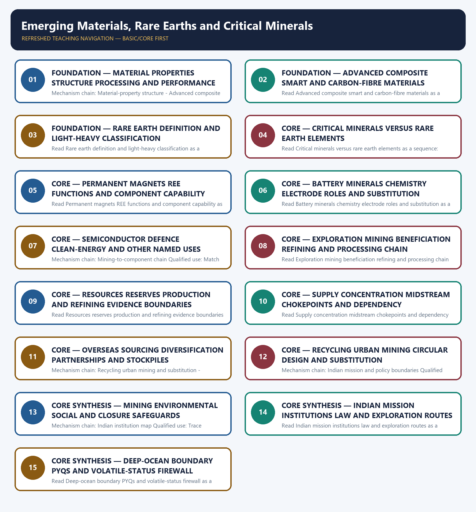

# Emerging Materials, Rare Earths and Critical Minerals — Learner-v2 Complete Learning Session

> **Authoring-only generation:** 2026-09-04. No PDF was rendered and no tracker or index was mutated.

### SOURCE, PROGRESSION AND CURRENT-LINKAGE AUDIT

- **Generation date:** 2026-09-04.
- **Repository-first evidence:** the Basic owner is taught first and preserved in full; the Advanced owner is retained only in the optional final teaching block.
- **OCR evidence:** Repository Markdown was primary. OCR-searchable official UPSC papers were supplementary only for printed routed demands. No answer key, performance value, procurement outcome, operational deployment, programme target or technology milestone was inferred.
- **Qdrant:** not used; repository Markdown and available OCR context were sufficient.
- **PYQ integrity:** Audited ledgers route the 2022 monazite-rare-earth-thorium demand, the 2023 carbon-fibre demand, three 2025 demands on MSP/MMDR, EV-battery materials and REE uses, and the 2026 self-reliance mission demand to this owner. Three representative cards preserve all six routes without supplying an objective key, option or answer letter.
- **Live-link boundary:** Official-source attempts dated 2026-09-04 preserve Ministry of Mines report, KABIL mandate, IREL context, NCMM approval, MMDR and Deep Ocean Mission evidence boundaries. Volatile list counts, reserves, resources, production, refining shares, import ratios, project status, recycling performance and answer letters are not refreshed or inferred without substantive dated owner evidence.
- **Fact/inference discipline:** no current-affairs item, PYQ wording, figure or quotation is invented.

### LIVE OFFICIAL-SOURCE ATTEMPT LOG

The checks below were made on 2026-09-04. Substantive official text is used only for the proposition it supports; title-only, blocked or thin pages are recorded and supply no factual claim.

- https://mines.gov.in/admin/download/649d4212cceb01688027666.pdf - fetched 2026-09-04 from the official Ministry of Mines domain as a PDF; the repository owner's 30-mineral expert-report boundary was retained. No current reserve, resource, production, refining-share or import-dependence number was inferred from the raw PDF response.
- https://www.pib.gov.in/PressReleasePage.aspx?PRID=2097308 - fetch attempted 2026-09-04 and returned HTTP 403. The owner-recorded 29 Jan 2025 Cabinet approval and authorised NCMM envelope remain dated approval evidence only, not expenditure, capacity or outcome.
- https://www.indiacode.nic.in/bitstream/123456789/1421/1/A1957-67.pdf - fetch attempted 2026-09-04 and returned HTTP 403. The current owner remains the authority for the s.10BA, s.11D, Part D and Seventh Schedule distinctions; no legal-list count was independently updated.
- https://kabilindia.in/ - fetched 2026-09-04; substantive official text confirmed KABIL's NALCO-HCL-MECL structure, Ministry of Mines aegis and overseas identify-explore-acquire-develop-mine-process-procure mandate. It supplied no proof that any asset is producing or that physical supply has been secured.
- https://www.irel.co.in/ and https://www.irel.co.in/rare-earths - fetched/searched 2026-09-04; the official domain supported IREL's beach-sand and rare-earth context. No monazite reserve, output, separation-capacity or magnet-self-sufficiency claim was imported.
- https://moes.gov.in/schemes/deep-ocean-mission - fetch attempted 2026-09-04 and returned HTTP 403; an official-domain search located Deep Ocean Mission material on polymetallic-nodule exploration. Exploration and technology testing were not converted into commercial deep-sea mining, reserve declaration or production.
- https://pib.gov.in/PressReleasePage.aspx?PRID=2256977&reg=3&lang=1 - official-source search attempt dated 2026-09-04 located a critical-mineral recycling release. Volatile company, capacity, investment, recovery and job figures were deliberately excluded; recycling-policy existence does not prove recovered material or operating performance.

## BASIC LEARNING SESSION

### DEEP-REVIEW LEARNING CONTRACT

| Control | Binding rule for this package |
|---|---|
| Syllabus boundary | Complete Science and Technology Basic/Core is easy-first and answer-complete before optional Advanced depth. |
| System boundary | Organisation, platform, subsystem, payload, process, application, institution and outcome remain distinct. |
| Technical boundary | Physical mechanism, classification, stage, platform, unit, range/capacity and limiting condition are explicit. |
| Status boundary | Announcement, approval, development, test, deployment, induction, commercial operation and observed outcome remain distinct. |
| Data boundary | Every mission, launch, target, capacity, budget, range, timeline, rule and regulatory claim keeps source, date, unit and status. |
| Governance boundary | Funder, developer, operator, authoriser, regulator, procurer, settlement actor and adjudicator are not conflated. |
| Practice contract | Every solved item has demand decoding, detailed examiner-grade model, executable timed/compression plan, marks rationale and answer-specific improvement. |
| PYQ contract | Official wording and keys are asserted only when verified; routed or reconstructed demands remain labelled. |
| Dual-flow contract | Graphical and ASCII masters independently reconstruct the same complete Basic-to-optional-Advanced evidence spine. |
| Approval | This immutable successor remains `approved: false` pending explicit approval. |

**Canonical Basic/Core owner:** `upsc-ai-kit\knowledge\Science-and-Technology\basic\20_Emerging-Materials-Rare-Earths-and-Critical-Minerals.md`  
**Substantive canonical provenance owner:** `upsc-ai-kit\knowledge\Science-and-Technology\learning-sessions\v2\subject-wide-syllabus\science-and-technology-20_Learning-Session.md`  
**Optional Advanced owner:** `upsc-ai-kit\knowledge\Science-and-Technology\advanced\20_Emerging-Materials-Rare-Earths-and-Critical-Minerals.md`  
**Official syllabus mapping:** `upsc-ai-kit\knowledge\Science-and-Technology\OFFICIAL-UPSC-SYLLABUS-MAPPING.md`

### EVIDENCE, PYQ AND CURRENT-STATUS CONTROL

- ISRO organisation, launcher stages, payload and orbit claims retain their exact object and mission date.
- NavIC, GAGAN, human-spaceflight, planetary, nuclear, fusion, missile and procurement claims retain category and status.
- Aadhaar/UPI, AI, quantum and semiconductor claims retain actor, layer, metric, maturity and governance boundaries.
- DPDP/cybersecurity, biotechnology and genetic-engineering claims retain legal/regulatory stage and competent institution.
- Targets, budgets, capacities, ranges and timelines are never promoted into achieved outcomes without dated evidence.
- **Current-status note, rechecked 2026-09-06:** volatile claims retain source/date/status; failed official fetches remain explicit and supply no invented fact.

**Generation-local live/current sources:**
- `https://mines.gov.in/admin/download/649d4212cceb01688027666.pdf - fetched 2026-09-04 from the official Ministry of Mines domain as a PDF; the repository owner's 30-mineral expert-report boundary was retained. No current reserve, resource, production, refining-share or import-dependence number was inferred from the raw PDF response.`
- `https://www.pib.gov.in/PressReleasePage.aspx?PRID=2097308 - fetch attempted 2026-09-04 and returned HTTP 403. The owner-recorded 29 Jan 2025 Cabinet approval and authorised NCMM envelope remain dated approval evidence only, not expenditure, capacity or outcome.`
- `https://www.indiacode.nic.in/bitstream/123456789/1421/1/A1957-67.pdf - fetch attempted 2026-09-04 and returned HTTP 403. The current owner remains the authority for the s.10BA, s.11D, Part D and Seventh Schedule distinctions; no legal-list count was independently updated.`
- `https://kabilindia.in/ - fetched 2026-09-04; substantive official text confirmed KABIL's NALCO-HCL-MECL structure, Ministry of Mines aegis and overseas identify-explore-acquire-develop-mine-process-procure mandate. It supplied no proof that any asset is producing or that physical supply has been secured.`
- `https://www.irel.co.in/ and https://www.irel.co.in/rare-earths - fetched/searched 2026-09-04; the official domain supported IREL's beach-sand and rare-earth context. No monazite reserve, output, separation-capacity or magnet-self-sufficiency claim was imported.`
- `https://moes.gov.in/schemes/deep-ocean-mission - fetch attempted 2026-09-04 and returned HTTP 403; an official-domain search located Deep Ocean Mission material on polymetallic-nodule exploration. Exploration and technology testing were not converted into commercial deep-sea mining, reserve declaration or production.`
- `https://pib.gov.in/PressReleasePage.aspx?PRID=2256977&reg=3&lang=1 - official-source search attempt dated 2026-09-04 located a critical-mineral recycling release. Volatile company, capacity, investment, recovery and job figures were deliberately excluded; recycling-policy existence does not prove recovered material or operating performance.`

**Topic-routed verified PYQ owners:**
- No topic-local official question file is claimed; repository PYQ routing ledgers control wording and status.




*Distinct embedded teaching-navigation image. The separate continuous Cārvāka-style flowchart package remains an independent at-a-glance artifact.*

### SESSION 1 — FOUNDATION — MATERIAL PROPERTIES STRUCTURE PROCESSING AND PERFORMANCE

#### DEFINITION / WHAT THIS IS CALLED

**Plain-language definition:** A material's observable performance follows from composition, atomic bonding, crystal or molecular structure, microstructure, defects and processing history; strength, stiffness, toughness, hardness, conductivity, magnetism and corrosion resistance are distinct properties, so one attractive property cannot certify whole-life suitability.

**Technical definition:** Mechanism chain: Material-property structure - Advanced composite and smart materials Qualified use: Begin with the property demanded, then connect composition, structure, defects and processing to performance.

#### ANSWER-GRABBING OPENING — WRITE/ADAPT IN THE EXAM

> A material's observable performance follows from composition, atomic bonding, crystal or molecular structure, microstructure, defects and processing history; strength, stiffness, toughness, hardness, conductivity, magnetism and corrosion resistance are distinct properties, so one attractive property cannot certify whole-life suitability.

#### MUST-WRITE KEYWORDS

- **FOUNDATION**
- **Material properties structure processing**
- **performance**
- **Mechanism chain**
- **Qualified use**
- **An advanced material**

**How to use them:** Frame the answer through FOUNDATION; define Material properties structure processing, connect performance with Mechanism chain to explain the mechanism, and use Qualified use for the decisive comparison or qualification.

#### VISUAL FIRST

```text
MATERIAL PROPERTIES STRUCTURE PROCESSING AND PERFORMANCE
01. Material-property structure
    |
    v
02. Advanced composite and smart materials
STATUS / CATEGORY FIREWALL -> Do not use strength, stiffness, toughness and hardness as synonyms.
```

*The rail fixes the technical sequence and the claim boundary before explanation.*

#### CORE EXPLANATION

A material's observable performance follows from composition, atomic bonding, crystal or molecular structure, microstructure, defects and processing history; strength, stiffness, toughness, hardness, conductivity, magnetism and corrosion resistance are distinct properties, so one attractive property cannot certify whole-life suitability. An advanced material is engineered for demanding functional performance; a composite combines a continuous matrix with a reinforcement so the constituents retain distinct roles, while a smart material changes a useful property in response to a stimulus. Carbon-fibre polymer composites offer high specific strength and stiffness, shape-memory alloys recover a programmed form after suitable stimulus, and piezoelectric materials couple mechanical stress with electrical response.

#### SIMPLE SYSTEM EXAMPLE

Read Material properties structure processing and performance as a sequence: identify Material-property structure, follow the named mechanism to its user or output, and stop at the last verified status rather than assuming the next stage.

#### TECHNICAL DISTINCTION

The decisive boundary is Do not use strength, stiffness, toughness and hardness as synonyms. This keeps Material-property structure and Advanced composite and smart materials in the correct scientific category, institution and unit of measurement.

#### NAMED EVIDENCE AND MECHANISM

- A material's observable performance follows from composition, atomic bonding, crystal or molecular structure, microstructure, defects and processing history; strength, stiffness, toughness, hardness, conductivity, magnetism and corrosion resistance are distinct properties, so one attractive property cannot certify whole-life suitability.
- An advanced material is engineered for demanding functional performance; a composite combines a continuous matrix with a reinforcement so the constituents retain distinct roles, while a smart material changes a useful property in response to a stimulus. Carbon-fibre polymer composites offer high specific strength and stiffness, shape-memory alloys recover a programmed form after suitable stimulus, and piezoelectric materials couple mechanical stress with electrical response.

#### EXAMINER CAUTION

- Do not use strength, stiffness, toughness and hardness as synonyms.

#### EXAM LINK

- **Prelims:** Keep institution, system, platform, service, process, legal instrument, unit and status in their exact category.
- **Mains:** Begin with the property demanded, then connect composition, structure, defects and processing to performance.

#### MINI RECAP

- **Mechanism chain:** Material-property structure -> Advanced composite and smart materials
- **Qualified use:** Begin with the property demanded, then connect composition, structure, defects and processing to performance.

#### CLOSING RECALL FLOW — FOUNDATION — MATERIAL PROPERTIES STRUCTURE PROCESSING AND PERFORMANCE

```text
START / CONCEPT: FOUNDATION — Material properties structure processing and performance
        |
        v
EXACT TERMS: FOUNDATION · Material properties structure processing · performance · Mechanism chain · Qualified use · An advanced material
        |
        v
MECHANISM / ARGUMENT: Mechanism chain: Material-property structure - Advanced composite and smart materials Qualified use: Begin with the property demanded, then connect composition, structure, defects and processing to performance.
        |
        v
CONSEQUENCE / CONTRAST: An advanced material is engineered for demanding functional performance; a composite combines a continuous matrix with a reinforcement so the constituents retain distinct roles, while a smart material changes a useful property in response to a stimulus.
        |
        v
UPSC TRAP / ANSWER-USE: Read Material properties structure processing and performance as a sequence: identify Material-property structure, follow the named mechanism to its user or output, and stop at the last verified status rather than assuming the next stage.
        |
        v
ANSWER-GRABBING FORMULATION: A material's observable performance follows from composition, atomic bonding, crystal or molecular structure, microstructure, defects and processing history; strength, stiffness, toughness, hardness, conductivity, magnetism and corrosion resistance are distinct properties, so one attractive property cannot certify whole-life suitability.
```
### SESSION 2 — FOUNDATION — ADVANCED COMPOSITE SMART AND CARBON-FIBRE MATERIALS

#### DEFINITION / WHAT THIS IS CALLED

**Plain-language definition:** The decisive boundary is Do not call every advanced material a composite or every responsive material a sensor.

**Technical definition:** Read Advanced composite smart and carbon-fibre materials as a sequence: identify Rare earth element definition, follow the named mechanism to its user or output, and stop at the last verified status rather than assuming the next stage.

#### ANSWER-GRABBING OPENING — WRITE/ADAPT IN THE EXAM

> Read Advanced composite smart and carbon-fibre materials as a sequence: identify Rare earth element definition, follow the named mechanism to its user or output, and stop at the last verified status rather than assuming the next stage.

#### MUST-WRITE KEYWORDS

- **FOUNDATION**
- **Advanced composite smart**
- **carbon-fibre materials**
- **Mechanism chain**
- **Qualified use**
- **Rare earth elements**

**How to use them:** Frame the answer through FOUNDATION; define Advanced composite smart, connect carbon-fibre materials with Mechanism chain to explain the mechanism, and use Qualified use for the decisive comparison or qualification.

#### VISUAL FIRST

```text
ADVANCED COMPOSITE SMART AND CARBON-FIBRE MATERIALS
01. Rare earth element definition
STATUS / CATEGORY FIREWALL -> Do not call every advanced material a composite or every responsive material a sensor.
```

*The rail fixes the technical sequence and the claim boundary before explanation.*

#### CORE EXPLANATION

Rare earth elements are the 15 lanthanides plus scandium and yttrium, a defined 17-element chemical group; the name does not mean every member is geologically rare, because economic concentration, separation difficulty and usable processing capability are the tighter constraints.

#### SIMPLE SYSTEM EXAMPLE

Read Advanced composite smart and carbon-fibre materials as a sequence: identify Rare earth element definition, follow the named mechanism to its user or output, and stop at the last verified status rather than assuming the next stage.

#### TECHNICAL DISTINCTION

The decisive boundary is Do not call every advanced material a composite or every responsive material a sensor. This keeps Rare earth element definition in the correct scientific category, institution and unit of measurement.

#### NAMED EVIDENCE AND MECHANISM

- Rare earth elements are the 15 lanthanides plus scandium and yttrium, a defined 17-element chemical group; the name does not mean every member is geologically rare, because economic concentration, separation difficulty and usable processing capability are the tighter constraints.

#### EXAMINER CAUTION

- Do not call every advanced material a composite or every responsive material a sensor.

#### EXAM LINK

- **Prelims:** Keep institution, system, platform, service, process, legal instrument, unit and status in their exact category.
- **Mains:** Separate matrix and reinforcement from stimulus-response behaviour, then qualify carbon-fibre lifecycle claims.

#### MINI RECAP

- **Mechanism chain:** Rare earth element definition
- **Qualified use:** Separate matrix and reinforcement from stimulus-response behaviour, then qualify carbon-fibre lifecycle claims.

#### CLOSING RECALL FLOW — FOUNDATION — ADVANCED COMPOSITE SMART AND CARBON-FIBRE MATERIALS

```text
START / CONCEPT: FOUNDATION — Advanced composite smart and carbon-fibre materials
        |
        v
EXACT TERMS: FOUNDATION · Advanced composite smart · carbon-fibre materials · Mechanism chain · Qualified use · Rare earth elements
        |
        v
MECHANISM / ARGUMENT: Mechanism chain: Rare earth element definition Qualified use: Separate matrix and reinforcement from stimulus-response behaviour, then qualify carbon-fibre lifecycle claims.
        |
        v
CONSEQUENCE / CONTRAST: The decisive boundary is Do not call every advanced material a composite or every responsive material a sensor.
        |
        v
UPSC TRAP / ANSWER-USE: Do not call every advanced material a composite or every responsive material a sensor.
        |
        v
ANSWER-GRABBING FORMULATION: Read Advanced composite smart and carbon-fibre materials as a sequence: identify Rare earth element definition, follow the named mechanism to its user or output, and stop at the last verified status rather than assuming the next stage.
```
### SESSION 3 — FOUNDATION — RARE EARTH DEFINITION AND LIGHT-HEAVY CLASSIFICATION

#### DEFINITION / WHAT THIS IS CALLED

**Plain-language definition:** The decisive boundary is Do not say all rare earth elements are rare in the crust.

**Technical definition:** Read Rare earth definition and light-heavy classification as a sequence: identify Light-heavy REE distinction, follow the named mechanism to its user or output, and stop at the last verified status rather than assuming the next stage.

#### ANSWER-GRABBING OPENING — WRITE/ADAPT IN THE EXAM

> The decisive boundary is Do not say all rare earth elements are rare in the crust.

#### MUST-WRITE KEYWORDS

- **FOUNDATION**
- **Rare earth definition**
- **light-heavy classification**
- **Mechanism chain**
- **Qualified use**
- **Light REEs**

**How to use them:** Frame the answer through FOUNDATION; define Rare earth definition, connect light-heavy classification with Mechanism chain to explain the mechanism, and use Qualified use for the decisive comparison or qualification.

#### VISUAL FIRST

```text
RARE EARTH DEFINITION AND LIGHT-HEAVY CLASSIFICATION
01. Light-heavy REE distinction
STATUS / CATEGORY FIREWALL -> Do not say all rare earth elements are rare in the crust.
```

*The rail fixes the technical sequence and the claim boundary before explanation.*

#### CORE EXPLANATION

Light REEs include lanthanum, cerium, praseodymium and neodymium, whereas the owner highlights dysprosium, terbium and yttrium among heavy REEs; heavy-REE scarcity and separation concentration matter because high-temperature permanent magnets may require dysprosium or terbium, while India's monazite endowment is chiefly light-REE-rich.

#### SIMPLE SYSTEM EXAMPLE

Read Rare earth definition and light-heavy classification as a sequence: identify Light-heavy REE distinction, follow the named mechanism to its user or output, and stop at the last verified status rather than assuming the next stage.

#### TECHNICAL DISTINCTION

The decisive boundary is Do not say all rare earth elements are rare in the crust. This keeps Light-heavy REE distinction in the correct scientific category, institution and unit of measurement.

#### NAMED EVIDENCE AND MECHANISM

- Light REEs include lanthanum, cerium, praseodymium and neodymium, whereas the owner highlights dysprosium, terbium and yttrium among heavy REEs; heavy-REE scarcity and separation concentration matter because high-temperature permanent magnets may require dysprosium or terbium, while India's monazite endowment is chiefly light-REE-rich.

#### EXAMINER CAUTION

- Do not say all rare earth elements are rare in the crust.

#### EXAM LINK

- **Prelims:** Keep institution, system, platform, service, process, legal instrument, unit and status in their exact category.
- **Mains:** Define the 17-element group before distinguishing light and heavy REE supply implications.

#### MINI RECAP

- **Mechanism chain:** Light-heavy REE distinction
- **Qualified use:** Define the 17-element group before distinguishing light and heavy REE supply implications.

#### CLOSING RECALL FLOW — FOUNDATION — RARE EARTH DEFINITION AND LIGHT-HEAVY CLASSIFICATION

```text
START / CONCEPT: FOUNDATION — Rare earth definition and light-heavy classification
        |
        v
EXACT TERMS: FOUNDATION · Rare earth definition · light-heavy classification · Mechanism chain · Qualified use · Light REEs
        |
        v
MECHANISM / ARGUMENT: Read Rare earth definition and light-heavy classification as a sequence: identify Light-heavy REE distinction, follow the named mechanism to its user or output, and stop at the last verified status rather than assuming the next stage.
        |
        v
CONSEQUENCE / CONTRAST: Do not say all rare earth elements are rare in the crust.
        |
        v
UPSC TRAP / ANSWER-USE: Light REEs include lanthanum, cerium, praseodymium and neodymium, whereas the owner highlights dysprosium, terbium and yttrium among heavy REEs; heavy-REE scarcity and separation concentration matter because high-temperature permanent magnets may require dysprosium or terbium, while India's monazite endowment is chiefly light-REE-rich.
        |
        v
ANSWER-GRABBING FORMULATION: The decisive boundary is Do not say all rare earth elements are rare in the crust.
```
### SESSION 4 — CORE — CRITICAL MINERALS VERSUS RARE EARTH ELEMENTS

#### DEFINITION / WHAT THIS IS CALLED

**Plain-language definition:** A critical mineral is a periodically reassessed policy category based on economic, technological or strategic importance plus supply vulnerability; REEs are one defined subgroup within that wider category, while lithium, cobalt, nickel and graphite may be critical without being rare earth elements.

**Technical definition:** Read Critical minerals versus rare earth elements as a sequence: identify Critical mineral versus rare earth, follow the named mechanism to its user or output, and stop at the last verified status rather than assuming the next stage.

#### ANSWER-GRABBING OPENING — WRITE/ADAPT IN THE EXAM

> A critical mineral is a periodically reassessed policy category based on economic, technological or strategic importance plus supply vulnerability; REEs are one defined subgroup within that wider category, while lithium, cobalt, nickel and graphite may be critical without being rare earth elements.

#### MUST-WRITE KEYWORDS

- **Critical minerals versus rare earth elements**
- **Mechanism chain**
- **Qualified use**
- **A critical mineral**
- **REEs**
- **Read Critical**

**How to use them:** Frame the answer through Critical minerals versus rare earth elements; define Mechanism chain, connect Qualified use with A critical mineral to explain the mechanism, and use REEs for the decisive comparison or qualification.

#### VISUAL FIRST

```text
CRITICAL MINERALS VERSUS RARE EARTH ELEMENTS
01. Critical mineral versus rare earth
STATUS / CATEGORY FIREWALL -> Do not merge light REEs with heavy REEs or monazite occurrence with high-temperature magnet security.
```

*The rail fixes the technical sequence and the claim boundary before explanation.*

#### CORE EXPLANATION

A critical mineral is a periodically reassessed policy category based on economic, technological or strategic importance plus supply vulnerability; REEs are one defined subgroup within that wider category, while lithium, cobalt, nickel and graphite may be critical without being rare earth elements.

#### SIMPLE SYSTEM EXAMPLE

Read Critical minerals versus rare earth elements as a sequence: identify Critical mineral versus rare earth, follow the named mechanism to its user or output, and stop at the last verified status rather than assuming the next stage.

#### TECHNICAL DISTINCTION

The decisive boundary is Do not merge light REEs with heavy REEs or monazite occurrence with high-temperature magnet security. This keeps Critical mineral versus rare earth in the correct scientific category, institution and unit of measurement.

#### NAMED EVIDENCE AND MECHANISM

- A critical mineral is a periodically reassessed policy category based on economic, technological or strategic importance plus supply vulnerability; REEs are one defined subgroup within that wider category, while lithium, cobalt, nickel and graphite may be critical without being rare earth elements.

#### EXAMINER CAUTION

- Do not merge light REEs with heavy REEs or monazite occurrence with high-temperature magnet security.

#### EXAM LINK

- **Prelims:** Keep institution, system, platform, service, process, legal instrument, unit and status in their exact category.
- **Mains:** Classify chemical group, policy category and statutory list before using the word critical.

#### MINI RECAP

- **Mechanism chain:** Critical mineral versus rare earth
- **Qualified use:** Classify chemical group, policy category and statutory list before using the word critical.

#### CLOSING RECALL FLOW — CORE — CRITICAL MINERALS VERSUS RARE EARTH ELEMENTS

```text
START / CONCEPT: CORE — Critical minerals versus rare earth elements
        |
        v
EXACT TERMS: Critical minerals versus rare earth elements · Mechanism chain · Qualified use · A critical mineral · REEs · Read Critical
        |
        v
MECHANISM / ARGUMENT: Read Critical minerals versus rare earth elements as a sequence: identify Critical mineral versus rare earth, follow the named mechanism to its user or output, and stop at the last verified status rather than assuming the next stage.
        |
        v
CONSEQUENCE / CONTRAST: Mechanism chain: Critical mineral versus rare earth Qualified use: Classify chemical group, policy category and statutory list before using the word critical.
        |
        v
UPSC TRAP / ANSWER-USE: The decisive boundary is Do not merge light REEs with heavy REEs or monazite occurrence with high-temperature magnet security.
        |
        v
ANSWER-GRABBING FORMULATION: A critical mineral is a periodically reassessed policy category based on economic, technological or strategic importance plus supply vulnerability; REEs are one defined subgroup within that wider category, while lithium, cobalt, nickel and graphite may be critical without being rare earth elements.
```
### SESSION 5 — CORE — PERMANENT MAGNETS REE FUNCTIONS AND COMPONENT CAPABILITY

#### DEFINITION / WHAT THIS IS CALLED

**Plain-language definition:** Rare-earth permanent magnets use elements such as neodymium in motors, electronics, aerospace and defence, while the owner identifies dysprosium or terbium as important to high-temperature performance; ore occurrence is not magnet security because separation, metal and alloy production, magnet manufacture, design and recycling remain separate capabilities.

**Technical definition:** Read Permanent magnets REE functions and component capability as a sequence: identify Permanent magnet chain, follow the named mechanism to its user or output, and stop at the last verified status rather than assuming the next stage.

#### ANSWER-GRABBING OPENING — WRITE/ADAPT IN THE EXAM

> Read Permanent magnets REE functions and component capability as a sequence: identify Permanent magnet chain, follow the named mechanism to its user or output, and stop at the last verified status rather than assuming the next stage.

#### MUST-WRITE KEYWORDS

- **Permanent magnets REE functions**
- **component capability**
- **Mechanism chain**
- **Qualified use**
- **Rare-earth**
- **Read Permanent**

**How to use them:** Frame the answer through Permanent magnets REE functions; define component capability, connect Mechanism chain with Qualified use to explain the mechanism, and use Rare-earth for the decisive comparison or qualification.

#### VISUAL FIRST

```text
PERMANENT MAGNETS REE FUNCTIONS AND COMPONENT CAPABILITY
01. Permanent magnet chain
STATUS / CATEGORY FIREWALL -> Do not call lithium, cobalt, nickel or graphite rare earth elements.
```

*The rail fixes the technical sequence and the claim boundary before explanation.*

#### CORE EXPLANATION

Rare-earth permanent magnets use elements such as neodymium in motors, electronics, aerospace and defence, while the owner identifies dysprosium or terbium as important to high-temperature performance; ore occurrence is not magnet security because separation, metal and alloy production, magnet manufacture, design and recycling remain separate capabilities.

#### SIMPLE SYSTEM EXAMPLE

Read Permanent magnets REE functions and component capability as a sequence: identify Permanent magnet chain, follow the named mechanism to its user or output, and stop at the last verified status rather than assuming the next stage.

#### TECHNICAL DISTINCTION

The decisive boundary is Do not call lithium, cobalt, nickel or graphite rare earth elements. This keeps Permanent magnet chain in the correct scientific category, institution and unit of measurement.

#### NAMED EVIDENCE AND MECHANISM

- Rare-earth permanent magnets use elements such as neodymium in motors, electronics, aerospace and defence, while the owner identifies dysprosium or terbium as important to high-temperature performance; ore occurrence is not magnet security because separation, metal and alloy production, magnet manufacture, design and recycling remain separate capabilities.

#### EXAMINER CAUTION

- Do not call lithium, cobalt, nickel or graphite rare earth elements.

#### EXAM LINK

- **Prelims:** Keep institution, system, platform, service, process, legal instrument, unit and status in their exact category.
- **Mains:** Trace ore through separation, alloy and magnet manufacture to the final motor or strategic system.

#### MINI RECAP

- **Mechanism chain:** Permanent magnet chain
- **Qualified use:** Trace ore through separation, alloy and magnet manufacture to the final motor or strategic system.

#### CLOSING RECALL FLOW — CORE — PERMANENT MAGNETS REE FUNCTIONS AND COMPONENT CAPABILITY

```text
START / CONCEPT: CORE — Permanent magnets REE functions and component capability
        |
        v
EXACT TERMS: Permanent magnets REE functions · component capability · Mechanism chain · Qualified use · Rare-earth · Read Permanent
        |
        v
MECHANISM / ARGUMENT: Mechanism chain: Permanent magnet chain Qualified use: Trace ore through separation, alloy and magnet manufacture to the final motor or strategic system.
        |
        v
CONSEQUENCE / CONTRAST: Rare-earth permanent magnets use elements such as neodymium in motors, electronics, aerospace and defence, while the owner identifies dysprosium or terbium as important to high-temperature performance; ore occurrence is not magnet security because separation, metal and alloy production, magnet manufacture, design and recycling remain separate capabilities.
        |
        v
UPSC TRAP / ANSWER-USE: The decisive boundary is Do not call lithium, cobalt, nickel or graphite rare earth elements.
        |
        v
ANSWER-GRABBING FORMULATION: Read Permanent magnets REE functions and component capability as a sequence: identify Permanent magnet chain, follow the named mechanism to its user or output, and stop at the last verified status rather than assuming the next stage.
```
### SESSION 6 — CORE — BATTERY MINERALS CHEMISTRY ELECTRODE ROLES AND SUBSTITUTION

#### DEFINITION / WHAT THIS IS CALLED

**Plain-language definition:** Lithium is an active charge-carrier input across lithium-ion chemistries, nickel and cobalt occur in NMC or NCA cathodes, and graphite is commonly an anode material rather than a cathode constituent; LFP uses neither nickel nor cobalt and sodium-ion avoids lithium, so a mineral-use claim must identify chemistry and electrode role.

**Technical definition:** Read Battery minerals chemistry electrode roles and substitution as a sequence: identify Battery-mineral chemistry boundary, follow the named mechanism to its user or output, and stop at the last verified status rather than assuming the next stage.

#### ANSWER-GRABBING OPENING — WRITE/ADAPT IN THE EXAM

> Read Battery minerals chemistry electrode roles and substitution as a sequence: identify Battery-mineral chemistry boundary, follow the named mechanism to its user or output, and stop at the last verified status rather than assuming the next stage.

#### MUST-WRITE KEYWORDS

- **Battery minerals chemistry electrode roles**
- **substitution**
- **Mechanism chain**
- **Qualified use**
- **Lithium**
- **NMC**

**How to use them:** Frame the answer through Battery minerals chemistry electrode roles; define substitution, connect Mechanism chain with Qualified use to explain the mechanism, and use Lithium for the decisive comparison or qualification.

#### VISUAL FIRST

```text
BATTERY MINERALS CHEMISTRY ELECTRODE ROLES AND SUBSTITUTION
01. Battery-mineral chemistry boundary
    |
    v
02. Other named uses
STATUS / CATEGORY FIREWALL -> Do not convert rare-earth ore or oxide into domestic permanent-magnet capability.
```

*The rail fixes the technical sequence and the claim boundary before explanation.*

#### CORE EXPLANATION

Lithium is an active charge-carrier input across lithium-ion chemistries, nickel and cobalt occur in NMC or NCA cathodes, and graphite is commonly an anode material rather than a cathode constituent; LFP uses neither nickel nor cobalt and sodium-ion avoids lithium, so a mineral-use claim must identify chemistry and electrode role. Owner-supported applications extend beyond batteries: gallium and germanium matter to high-technology electronics and semiconductors; copper supports electrical systems; rare earths serve magnets, phosphors, catalysts and specialised optics or electronics; titanium-bearing minerals are a separately named mineral-policy and geography input, while monazite links rare-earth values with thorium-bearing beach sands.

#### SIMPLE SYSTEM EXAMPLE

Read Battery minerals chemistry electrode roles and substitution as a sequence: identify Battery-mineral chemistry boundary, follow the named mechanism to its user or output, and stop at the last verified status rather than assuming the next stage.

#### TECHNICAL DISTINCTION

The decisive boundary is Do not convert rare-earth ore or oxide into domestic permanent-magnet capability. This keeps Battery-mineral chemistry boundary and Other named uses in the correct scientific category, institution and unit of measurement.

#### NAMED EVIDENCE AND MECHANISM

- Lithium is an active charge-carrier input across lithium-ion chemistries, nickel and cobalt occur in NMC or NCA cathodes, and graphite is commonly an anode material rather than a cathode constituent; LFP uses neither nickel nor cobalt and sodium-ion avoids lithium, so a mineral-use claim must identify chemistry and electrode role.
- Owner-supported applications extend beyond batteries: gallium and germanium matter to high-technology electronics and semiconductors; copper supports electrical systems; rare earths serve magnets, phosphors, catalysts and specialised optics or electronics; titanium-bearing minerals are a separately named mineral-policy and geography input, while monazite links rare-earth values with thorium-bearing beach sands.

#### EXAMINER CAUTION

- Do not convert rare-earth ore or oxide into domestic permanent-magnet capability.

#### EXAM LINK

- **Prelims:** Keep institution, system, platform, service, process, legal instrument, unit and status in their exact category.
- **Mains:** Name the cell chemistry and electrode before assigning lithium, cobalt, nickel or graphite.

#### MINI RECAP

- **Mechanism chain:** Battery-mineral chemistry boundary -> Other named uses
- **Qualified use:** Name the cell chemistry and electrode before assigning lithium, cobalt, nickel or graphite.

#### CLOSING RECALL FLOW — CORE — BATTERY MINERALS CHEMISTRY ELECTRODE ROLES AND SUBSTITUTION

```text
START / CONCEPT: CORE — Battery minerals chemistry electrode roles and substitution
        |
        v
EXACT TERMS: Battery minerals chemistry electrode roles · substitution · Mechanism chain · Qualified use · Lithium · NMC
        |
        v
MECHANISM / ARGUMENT: Mechanism chain: Battery-mineral chemistry boundary - Other named uses Qualified use: Name the cell chemistry and electrode before assigning lithium, cobalt, nickel or graphite.
        |
        v
CONSEQUENCE / CONTRAST: Owner-supported applications extend beyond batteries: gallium and germanium matter to high-technology electronics and semiconductors; copper supports electrical systems; rare earths serve magnets, phosphors, catalysts and specialised optics or electronics; titanium-bearing minerals are a separately named mineral-policy and geography input, while monazite links rare-earth values with thorium-bearing beach sands.
        |
        v
UPSC TRAP / ANSWER-USE: Lithium is an active charge-carrier input across lithium-ion chemistries, nickel and cobalt occur in NMC or NCA cathodes, and graphite is commonly an anode material rather than a cathode constituent; LFP uses neither nickel nor cobalt and sodium-ion avoids lithium, so a mineral-use claim must identify chemistry and electrode role.
        |
        v
ANSWER-GRABBING FORMULATION: Read Battery minerals chemistry electrode roles and substitution as a sequence: identify Battery-mineral chemistry boundary, follow the named mechanism to its user or output, and stop at the last verified status rather than assuming the next stage.
```
### SESSION 7 — CORE — SEMICONDUCTOR DEFENCE CLEAN-ENERGY AND OTHER NAMED USES

#### DEFINITION / WHAT THIS IS CALLED

**Plain-language definition:** Read Semiconductor defence clean-energy and other named uses as a sequence: identify Mining-to-component chain, follow the named mechanism to its user or output, and stop at the last verified status rather than assuming the next stage.

**Technical definition:** Mechanism chain: Mining-to-component chain Qualified use: Match each named material to an owner-supported function without turning one use into a universal rule.

#### ANSWER-GRABBING OPENING — WRITE/ADAPT IN THE EXAM

> Read Semiconductor defence clean-energy and other named uses as a sequence: identify Mining-to-component chain, follow the named mechanism to its user or output, and stop at the last verified status rather than assuming the next stage.

#### MUST-WRITE KEYWORDS

- **Semiconductor defence clean-energy**
- **other named uses**
- **Mechanism chain**
- **Qualified use**
- **Strategic**
- **Read Semiconductor**

**How to use them:** Frame the answer through Semiconductor defence clean-energy; define other named uses, connect Mechanism chain with Qualified use to explain the mechanism, and use Strategic for the decisive comparison or qualification.

#### VISUAL FIRST

```text
SEMICONDUCTOR DEFENCE CLEAN-ENERGY AND OTHER NAMED USES
01. Mining-to-component chain
STATUS / CATEGORY FIREWALL -> Do not place graphite automatically in the cathode or claim every EV chemistry needs nickel and cobalt.
```

*The rail fixes the technical sequence and the claim boundary before explanation.*

#### CORE EXPLANATION

Strategic capability runs through exploration, resource assessment, mine development, extraction, beneficiation, separation or refining, intermediate oxides-metals-alloys, component manufacture and end use; beneficiation upgrades ore, refining or separation produces usable chemical or metallic forms, and neither stage should be collapsed into mining.

#### SIMPLE SYSTEM EXAMPLE

Read Semiconductor defence clean-energy and other named uses as a sequence: identify Mining-to-component chain, follow the named mechanism to its user or output, and stop at the last verified status rather than assuming the next stage.

#### TECHNICAL DISTINCTION

The decisive boundary is Do not place graphite automatically in the cathode or claim every EV chemistry needs nickel and cobalt. This keeps Mining-to-component chain in the correct scientific category, institution and unit of measurement.

#### NAMED EVIDENCE AND MECHANISM

- Strategic capability runs through exploration, resource assessment, mine development, extraction, beneficiation, separation or refining, intermediate oxides-metals-alloys, component manufacture and end use; beneficiation upgrades ore, refining or separation produces usable chemical or metallic forms, and neither stage should be collapsed into mining.

#### EXAMINER CAUTION

- Do not place graphite automatically in the cathode or claim every EV chemistry needs nickel and cobalt.

#### EXAM LINK

- **Prelims:** Keep institution, system, platform, service, process, legal instrument, unit and status in their exact category.
- **Mains:** Match each named material to an owner-supported function without turning one use into a universal rule.

#### MINI RECAP

- **Mechanism chain:** Mining-to-component chain
- **Qualified use:** Match each named material to an owner-supported function without turning one use into a universal rule.

#### CLOSING RECALL FLOW — CORE — SEMICONDUCTOR DEFENCE CLEAN-ENERGY AND OTHER NAMED USES

```text
START / CONCEPT: CORE — Semiconductor defence clean-energy and other named uses
        |
        v
EXACT TERMS: Semiconductor defence clean-energy · other named uses · Mechanism chain · Qualified use · Strategic · Read Semiconductor
        |
        v
MECHANISM / ARGUMENT: Mechanism chain: Mining-to-component chain Qualified use: Match each named material to an owner-supported function without turning one use into a universal rule.
        |
        v
CONSEQUENCE / CONTRAST: The decisive boundary is Do not place graphite automatically in the cathode or claim every EV chemistry needs nickel and cobalt.
        |
        v
UPSC TRAP / ANSWER-USE: Do not place graphite automatically in the cathode or claim every EV chemistry needs nickel and cobalt.
        |
        v
ANSWER-GRABBING FORMULATION: Read Semiconductor defence clean-energy and other named uses as a sequence: identify Mining-to-component chain, follow the named mechanism to its user or output, and stop at the last verified status rather than assuming the next stage.
```
### SESSION 8 — CORE — EXPLORATION MINING BENEFICIATION REFINING AND PROCESSING CHAIN

#### DEFINITION / WHAT THIS IS CALLED

**Plain-language definition:** A resource is a geologically identified occurrence, a reserve is the economically and legally extractable subset under stated conditions, production is material actually extracted over a period, and refining or processing converts feed into usable specifications; none of these terms proves another, and country rankings or shares require a dated owner.

**Technical definition:** Read Exploration mining beneficiation refining and processing chain as a sequence: identify Resource reserve production refining firewall, follow the named mechanism to its user or output, and stop at the last verified status rather than assuming the next stage.

#### ANSWER-GRABBING OPENING — WRITE/ADAPT IN THE EXAM

> Read Exploration mining beneficiation refining and processing chain as a sequence: identify Resource reserve production refining firewall, follow the named mechanism to its user or output, and stop at the last verified status rather than assuming the next stage.

#### MUST-WRITE KEYWORDS

- **Exploration mining beneficiation refining**
- **processing chain**
- **Mechanism chain**
- **Qualified use**
- **A resource**
- **Read Exploration**

**How to use them:** Frame the answer through Exploration mining beneficiation refining; define processing chain, connect Mechanism chain with Qualified use to explain the mechanism, and use A resource for the decisive comparison or qualification.

#### VISUAL FIRST

```text
EXPLORATION MINING BENEFICIATION REFINING AND PROCESSING CHAIN
01. Resource reserve production refining firewall
STATUS / CATEGORY FIREWALL -> Do not treat every critical mineral as battery-only; match the material to its function.
```

*The rail fixes the technical sequence and the claim boundary before explanation.*

#### CORE EXPLANATION

A resource is a geologically identified occurrence, a reserve is the economically and legally extractable subset under stated conditions, production is material actually extracted over a period, and refining or processing converts feed into usable specifications; none of these terms proves another, and country rankings or shares require a dated owner.

#### SIMPLE SYSTEM EXAMPLE

Read Exploration mining beneficiation refining and processing chain as a sequence: identify Resource reserve production refining firewall, follow the named mechanism to its user or output, and stop at the last verified status rather than assuming the next stage.

#### TECHNICAL DISTINCTION

The decisive boundary is Do not treat every critical mineral as battery-only; match the material to its function. This keeps Resource reserve production refining firewall in the correct scientific category, institution and unit of measurement.

#### NAMED EVIDENCE AND MECHANISM

- A resource is a geologically identified occurrence, a reserve is the economically and legally extractable subset under stated conditions, production is material actually extracted over a period, and refining or processing converts feed into usable specifications; none of these terms proves another, and country rankings or shares require a dated owner.

#### EXAMINER CAUTION

- Do not treat every critical mineral as battery-only; match the material to its function.

#### EXAM LINK

- **Prelims:** Keep institution, system, platform, service, process, legal instrument, unit and status in their exact category.
- **Mains:** Walk every stage from exploration to component and identify where value addition and risk change.

#### MINI RECAP

- **Mechanism chain:** Resource reserve production refining firewall
- **Qualified use:** Walk every stage from exploration to component and identify where value addition and risk change.

#### CLOSING RECALL FLOW — CORE — EXPLORATION MINING BENEFICIATION REFINING AND PROCESSING CHAIN

```text
START / CONCEPT: CORE — Exploration mining beneficiation refining and processing chain
        |
        v
EXACT TERMS: Exploration mining beneficiation refining · processing chain · Mechanism chain · Qualified use · A resource · Read Exploration
        |
        v
MECHANISM / ARGUMENT: Mechanism chain: Resource reserve production refining firewall Qualified use: Walk every stage from exploration to component and identify where value addition and risk change.
        |
        v
CONSEQUENCE / CONTRAST: The decisive boundary is Do not treat every critical mineral as battery-only; match the material to its function.
        |
        v
UPSC TRAP / ANSWER-USE: Do not treat every critical mineral as battery-only; match the material to its function.
        |
        v
ANSWER-GRABBING FORMULATION: Read Exploration mining beneficiation refining and processing chain as a sequence: identify Resource reserve production refining firewall, follow the named mechanism to its user or output, and stop at the last verified status rather than assuming the next stage.
```
### SESSION 9 — CORE — RESOURCES RESERVES PRODUCTION AND REFINING EVIDENCE BOUNDARIES

#### DEFINITION / WHAT THIS IS CALLED

**Plain-language definition:** The decisive boundary is Do not collapse beneficiation, refining, alloying and component manufacture into mining.

**Technical definition:** Read Resources reserves production and refining evidence boundaries as a sequence: identify Supply concentration and strategic dependency, follow the named mechanism to its user or output, and stop at the last verified status rather than assuming the next stage.

#### ANSWER-GRABBING OPENING — WRITE/ADAPT IN THE EXAM

> Read Resources reserves production and refining evidence boundaries as a sequence: identify Supply concentration and strategic dependency, follow the named mechanism to its user or output, and stop at the last verified status rather than assuming the next stage.

#### MUST-WRITE KEYWORDS

- **Resources reserves production**
- **refining evidence boundaries**
- **Mechanism chain**
- **Qualified use**
- **Vulnerability**
- **Read Resources**

**How to use them:** Frame the answer through Resources reserves production; define refining evidence boundaries, connect Mechanism chain with Qualified use to explain the mechanism, and use Vulnerability for the decisive comparison or qualification.

#### VISUAL FIRST

```text
RESOURCES RESERVES PRODUCTION AND REFINING EVIDENCE BOUNDARIES
01. Supply concentration and strategic dependency
STATUS / CATEGORY FIREWALL -> Do not collapse beneficiation, refining, alloying and component manufacture into mining.
```

*The rail fixes the technical sequence and the claim boundary before explanation.*

#### CORE EXPLANATION

Vulnerability can arise at extraction, refining, separation, intermediate-material or component stages, with rare-earth dependence often tighter in the midstream and magnet manufacture than at the mine; strategic dependency is therefore exposure to concentrated capability, trade disruption, technology, finance, logistics or offtake, not merely absence of domestic ore.

#### SIMPLE SYSTEM EXAMPLE

Read Resources reserves production and refining evidence boundaries as a sequence: identify Supply concentration and strategic dependency, follow the named mechanism to its user or output, and stop at the last verified status rather than assuming the next stage.

#### TECHNICAL DISTINCTION

The decisive boundary is Do not collapse beneficiation, refining, alloying and component manufacture into mining. This keeps Supply concentration and strategic dependency in the correct scientific category, institution and unit of measurement.

#### NAMED EVIDENCE AND MECHANISM

- Vulnerability can arise at extraction, refining, separation, intermediate-material or component stages, with rare-earth dependence often tighter in the midstream and magnet manufacture than at the mine; strategic dependency is therefore exposure to concentrated capability, trade disruption, technology, finance, logistics or offtake, not merely absence of domestic ore.

#### EXAMINER CAUTION

- Do not collapse beneficiation, refining, alloying and component manufacture into mining.

#### EXAM LINK

- **Prelims:** Keep institution, system, platform, service, process, legal instrument, unit and status in their exact category.
- **Mains:** State what each evidence term proves, and refuse to substitute a broader occurrence for an extractable reserve.

#### MINI RECAP

- **Mechanism chain:** Supply concentration and strategic dependency
- **Qualified use:** State what each evidence term proves, and refuse to substitute a broader occurrence for an extractable reserve.

#### CLOSING RECALL FLOW — CORE — RESOURCES RESERVES PRODUCTION AND REFINING EVIDENCE BOUNDARIES

```text
START / CONCEPT: CORE — Resources reserves production and refining evidence boundaries
        |
        v
EXACT TERMS: Resources reserves production · refining evidence boundaries · Mechanism chain · Qualified use · Vulnerability · Read Resources
        |
        v
MECHANISM / ARGUMENT: Mechanism chain: Supply concentration and strategic dependency Qualified use: State what each evidence term proves, and refuse to substitute a broader occurrence for an extractable reserve.
        |
        v
CONSEQUENCE / CONTRAST: The decisive boundary is Do not collapse beneficiation, refining, alloying and component manufacture into mining.
        |
        v
UPSC TRAP / ANSWER-USE: Do not collapse beneficiation, refining, alloying and component manufacture into mining.
        |
        v
ANSWER-GRABBING FORMULATION: Read Resources reserves production and refining evidence boundaries as a sequence: identify Supply concentration and strategic dependency, follow the named mechanism to its user or output, and stop at the last verified status rather than assuming the next stage.
```
### SESSION 10 — CORE — SUPPLY CONCENTRATION MIDSTREAM CHOKEPOINTS AND DEPENDENCY

#### DEFINITION / WHAT THIS IS CALLED

**Plain-language definition:** The decisive boundary is Do not exchange resource, reserve, production, processing capacity and supply.

**Technical definition:** Read Supply concentration midstream chokepoints and dependency as a sequence: identify Diversification overseas access and stocks, follow the named mechanism to its user or output, and stop at the last verified status rather than assuming the next stage.

#### ANSWER-GRABBING OPENING — WRITE/ADAPT IN THE EXAM

> Read Supply concentration midstream chokepoints and dependency as a sequence: identify Diversification overseas access and stocks, follow the named mechanism to its user or output, and stop at the last verified status rather than assuming the next stage.

#### MUST-WRITE KEYWORDS

- **Supply concentration midstream chokepoints**
- **dependency**
- **Mechanism chain**
- **Qualified use**
- **Resilience**
- **KABIL-type**

**How to use them:** Frame the answer through Supply concentration midstream chokepoints; define dependency, connect Mechanism chain with Qualified use to explain the mechanism, and use Resilience for the decisive comparison or qualification.

#### VISUAL FIRST

```text
SUPPLY CONCENTRATION MIDSTREAM CHOKEPOINTS AND DEPENDENCY
01. Diversification overseas access and stocks
STATUS / CATEGORY FIREWALL -> Do not exchange resource, reserve, production, processing capacity and supply.
```

*The rail fixes the technical sequence and the claim boundary before explanation.*

#### CORE EXPLANATION

Resilience combines domestic exploration, responsible mining, diversified suppliers and refining locations, KABIL-type overseas engagement, trade or investment partnerships, material efficiency and strategic stocks where justified; an MoU, exploration licence, overseas block or asset acquisition is an input to security, not proof of reserves, production or assured supply.

#### SIMPLE SYSTEM EXAMPLE

Read Supply concentration midstream chokepoints and dependency as a sequence: identify Diversification overseas access and stocks, follow the named mechanism to its user or output, and stop at the last verified status rather than assuming the next stage.

#### TECHNICAL DISTINCTION

The decisive boundary is Do not exchange resource, reserve, production, processing capacity and supply. This keeps Diversification overseas access and stocks in the correct scientific category, institution and unit of measurement.

#### NAMED EVIDENCE AND MECHANISM

- Resilience combines domestic exploration, responsible mining, diversified suppliers and refining locations, KABIL-type overseas engagement, trade or investment partnerships, material efficiency and strategic stocks where justified; an MoU, exploration licence, overseas block or asset acquisition is an input to security, not proof of reserves, production or assured supply.

#### EXAMINER CAUTION

- Do not exchange resource, reserve, production, processing capacity and supply.

#### EXAM LINK

- **Prelims:** Keep institution, system, platform, service, process, legal instrument, unit and status in their exact category.
- **Mains:** Locate concentration separately at mine, refinery, intermediate and component stages.

#### MINI RECAP

- **Mechanism chain:** Diversification overseas access and stocks
- **Qualified use:** Locate concentration separately at mine, refinery, intermediate and component stages.

#### CLOSING RECALL FLOW — CORE — SUPPLY CONCENTRATION MIDSTREAM CHOKEPOINTS AND DEPENDENCY

```text
START / CONCEPT: CORE — Supply concentration midstream chokepoints and dependency
        |
        v
EXACT TERMS: Supply concentration midstream chokepoints · dependency · Mechanism chain · Qualified use · Resilience · KABIL-type
        |
        v
MECHANISM / ARGUMENT: Mechanism chain: Diversification overseas access and stocks Qualified use: Locate concentration separately at mine, refinery, intermediate and component stages.
        |
        v
CONSEQUENCE / CONTRAST: Resilience combines domestic exploration, responsible mining, diversified suppliers and refining locations, KABIL-type overseas engagement, trade or investment partnerships, material efficiency and strategic stocks where justified; an MoU, exploration licence, overseas block or asset acquisition is an input to security, not proof of reserves, production or assured supply.
        |
        v
UPSC TRAP / ANSWER-USE: The decisive boundary is Do not exchange resource, reserve, production, processing capacity and supply.
        |
        v
ANSWER-GRABBING FORMULATION: Read Supply concentration midstream chokepoints and dependency as a sequence: identify Diversification overseas access and stocks, follow the named mechanism to its user or output, and stop at the last verified status rather than assuming the next stage.
```
### SESSION 11 — CORE — OVERSEAS SOURCING DIVERSIFICATION PARTNERSHIPS AND STOCKPILES

#### DEFINITION / WHAT THIS IS CALLED

**Plain-language definition:** Read Overseas sourcing diversification partnerships and stockpiles as a sequence: identify Recycling urban mining and substitution, follow the named mechanism to its user or output, and stop at the last verified status rather than assuming the next stage.

**Technical definition:** Mechanism chain: Recycling urban mining and substitution - Environmental and social impact chain Qualified use: Combine domestic and overseas routes while stopping MoU, licence and asset claims at their verified rung.

#### ANSWER-GRABBING OPENING — WRITE/ADAPT IN THE EXAM

> Read Overseas sourcing diversification partnerships and stockpiles as a sequence: identify Recycling urban mining and substitution, follow the named mechanism to its user or output, and stop at the last verified status rather than assuming the next stage.

#### MUST-WRITE KEYWORDS

- **Overseas sourcing diversification partnerships**
- **stockpiles**
- **Mechanism chain**
- **Qualified use**
- **Mining**
- **FRA**

**How to use them:** Frame the answer through Overseas sourcing diversification partnerships; define stockpiles, connect Mechanism chain with Qualified use to explain the mechanism, and use Mining for the decisive comparison or qualification.

#### VISUAL FIRST

```text
OVERSEAS SOURCING DIVERSIFICATION PARTNERSHIPS AND STOCKPILES
01. Recycling urban mining and substitution
    |
    v
02. Environmental and social impact chain
STATUS / CATEGORY FIREWALL -> Do not assume diversified mining removes a concentrated midstream chokepoint.
```

*The rail fixes the technical sequence and the claim boundary before explanation.*

#### CORE EXPLANATION

Urban mining recovers materials from end-of-life batteries, electronics, magnets, catalytic converters and industrial scrap; repair, reuse, design for disassembly, collection, sorting, high-quality recovery, substitution and material efficiency complement recycling, while recovered quantity, purity, economics and repeated-cycle quality require evidence rather than assumption. Mining can remove vegetation and topsoil, fragment habitat, generate dust and noise, disturb water balances and create overburden, tailings, drainage and closure liabilities; responsible siting, cumulative assessment, consultation, pollution control, water accounting, progressive reclamation, closure finance, community and FRA due diligence, disclosure and grievance redress must accompany mineral-security policy.

#### SIMPLE SYSTEM EXAMPLE

Read Overseas sourcing diversification partnerships and stockpiles as a sequence: identify Recycling urban mining and substitution, follow the named mechanism to its user or output, and stop at the last verified status rather than assuming the next stage.

#### TECHNICAL DISTINCTION

The decisive boundary is Do not assume diversified mining removes a concentrated midstream chokepoint. This keeps Recycling urban mining and substitution and Environmental and social impact chain in the correct scientific category, institution and unit of measurement.

#### NAMED EVIDENCE AND MECHANISM

- Urban mining recovers materials from end-of-life batteries, electronics, magnets, catalytic converters and industrial scrap; repair, reuse, design for disassembly, collection, sorting, high-quality recovery, substitution and material efficiency complement recycling, while recovered quantity, purity, economics and repeated-cycle quality require evidence rather than assumption.
- Mining can remove vegetation and topsoil, fragment habitat, generate dust and noise, disturb water balances and create overburden, tailings, drainage and closure liabilities; responsible siting, cumulative assessment, consultation, pollution control, water accounting, progressive reclamation, closure finance, community and FRA due diligence, disclosure and grievance redress must accompany mineral-security policy.

#### EXAMINER CAUTION

- Do not assume diversified mining removes a concentrated midstream chokepoint.

#### EXAM LINK

- **Prelims:** Keep institution, system, platform, service, process, legal instrument, unit and status in their exact category.
- **Mains:** Combine domestic and overseas routes while stopping MoU, licence and asset claims at their verified rung.

#### MINI RECAP

- **Mechanism chain:** Recycling urban mining and substitution -> Environmental and social impact chain
- **Qualified use:** Combine domestic and overseas routes while stopping MoU, licence and asset claims at their verified rung.

#### CLOSING RECALL FLOW — CORE — OVERSEAS SOURCING DIVERSIFICATION PARTNERSHIPS AND STOCKPILES

```text
START / CONCEPT: CORE — Overseas sourcing diversification partnerships and stockpiles
        |
        v
EXACT TERMS: Overseas sourcing diversification partnerships · stockpiles · Mechanism chain · Qualified use · Mining · FRA
        |
        v
MECHANISM / ARGUMENT: Mechanism chain: Recycling urban mining and substitution - Environmental and social impact chain Qualified use: Combine domestic and overseas routes while stopping MoU, licence and asset claims at their verified rung.
        |
        v
CONSEQUENCE / CONTRAST: The decisive boundary is Do not assume diversified mining removes a concentrated midstream chokepoint.
        |
        v
UPSC TRAP / ANSWER-USE: Do not assume diversified mining removes a concentrated midstream chokepoint.
        |
        v
ANSWER-GRABBING FORMULATION: Read Overseas sourcing diversification partnerships and stockpiles as a sequence: identify Recycling urban mining and substitution, follow the named mechanism to its user or output, and stop at the last verified status rather than assuming the next stage.
```
### SESSION 12 — CORE — RECYCLING URBAN MINING CIRCULAR DESIGN AND SUBSTITUTION

#### DEFINITION / WHAT THIS IS CALLED

**Plain-language definition:** Read Recycling urban mining circular design and substitution as a sequence: identify Indian mission and policy boundaries, follow the named mechanism to its user or output, and stop at the last verified status rather than assuming the next stage.

**Technical definition:** Mechanism chain: Indian mission and policy boundaries Qualified use: Move from product life extension to collection and recovery, then add substitution and quality limits.

#### ANSWER-GRABBING OPENING — WRITE/ADAPT IN THE EXAM

> Read Recycling urban mining circular design and substitution as a sequence: identify Indian mission and policy boundaries, follow the named mechanism to its user or output, and stop at the last verified status rather than assuming the next stage.

#### MUST-WRITE KEYWORDS

- **Recycling urban mining circular design**
- **substitution**
- **Mechanism chain**
- **Qualified use**
- **The Ministry**
- **Mines**

**How to use them:** Frame the answer through Recycling urban mining circular design; define substitution, connect Mechanism chain with Qualified use to explain the mechanism, and use The Ministry for the decisive comparison or qualification.

#### VISUAL FIRST

```text
RECYCLING URBAN MINING CIRCULAR DESIGN AND SUBSTITUTION
01. Indian mission and policy boundaries
STATUS / CATEGORY FIREWALL -> Do not turn an MoU, licence, overseas block or acquisition into secured production.
```

*The rail fixes the technical sequence and the claim boundary before explanation.*

#### CORE EXPLANATION

The Ministry of Mines' expert critical-mineral assessment, the MMDR statutory Part D list and the Seventh Schedule exploration-licence list are different instruments; the National Critical Mineral Mission is a full-chain mission, but Cabinet approval, authorised outlay, scheme guideline, auction and incentive window do not establish expenditure, mine output, refining capacity or recovery.

#### SIMPLE SYSTEM EXAMPLE

Read Recycling urban mining circular design and substitution as a sequence: identify Indian mission and policy boundaries, follow the named mechanism to its user or output, and stop at the last verified status rather than assuming the next stage.

#### TECHNICAL DISTINCTION

The decisive boundary is Do not turn an MoU, licence, overseas block or acquisition into secured production. This keeps Indian mission and policy boundaries in the correct scientific category, institution and unit of measurement.

#### NAMED EVIDENCE AND MECHANISM

- The Ministry of Mines' expert critical-mineral assessment, the MMDR statutory Part D list and the Seventh Schedule exploration-licence list are different instruments; the National Critical Mineral Mission is a full-chain mission, but Cabinet approval, authorised outlay, scheme guideline, auction and incentive window do not establish expenditure, mine output, refining capacity or recovery.

#### EXAMINER CAUTION

- Do not turn an MoU, licence, overseas block or acquisition into secured production.

#### EXAM LINK

- **Prelims:** Keep institution, system, platform, service, process, legal instrument, unit and status in their exact category.
- **Mains:** Move from product life extension to collection and recovery, then add substitution and quality limits.

#### MINI RECAP

- **Mechanism chain:** Indian mission and policy boundaries
- **Qualified use:** Move from product life extension to collection and recovery, then add substitution and quality limits.

#### CLOSING RECALL FLOW — CORE — RECYCLING URBAN MINING CIRCULAR DESIGN AND SUBSTITUTION

```text
START / CONCEPT: CORE — Recycling urban mining circular design and substitution
        |
        v
EXACT TERMS: Recycling urban mining circular design · substitution · Mechanism chain · Qualified use · The Ministry · Mines
        |
        v
MECHANISM / ARGUMENT: Mechanism chain: Indian mission and policy boundaries Qualified use: Move from product life extension to collection and recovery, then add substitution and quality limits.
        |
        v
CONSEQUENCE / CONTRAST: The Ministry of Mines' expert critical-mineral assessment, the MMDR statutory Part D list and the Seventh Schedule exploration-licence list are different instruments; the National Critical Mineral Mission is a full-chain mission, but Cabinet approval, authorised outlay, scheme guideline, auction and incentive window do not establish expenditure, mine output, refining capacity or recovery.
        |
        v
UPSC TRAP / ANSWER-USE: The decisive boundary is Do not turn an MoU, licence, overseas block or acquisition into secured production.
        |
        v
ANSWER-GRABBING FORMULATION: Read Recycling urban mining circular design and substitution as a sequence: identify Indian mission and policy boundaries, follow the named mechanism to its user or output, and stop at the last verified status rather than assuming the next stage.
```
### SESSION 13 — CORE SYNTHESIS — MINING ENVIRONMENTAL SOCIAL AND CLOSURE SAFEGUARDS

#### DEFINITION / WHAT THIS IS CALLED

**Plain-language definition:** Read Mining environmental social and closure safeguards as a sequence: identify Indian institution map, follow the named mechanism to its user or output, and stop at the last verified status rather than assuming the next stage.

**Technical definition:** Mechanism chain: Indian institution map Qualified use: Trace mine-life hazards to siting, appraisal, operations, progressive reclamation and closure remedies.

#### ANSWER-GRABBING OPENING — WRITE/ADAPT IN THE EXAM

> Read Mining environmental social and closure safeguards as a sequence: identify Indian institution map, follow the named mechanism to its user or output, and stop at the last verified status rather than assuming the next stage.

#### MUST-WRITE KEYWORDS

- **CORE SYNTHESIS**
- **Mining environmental social**
- **closure safeguards**
- **Mechanism chain**
- **Qualified use**
- **Read Mining**

**How to use them:** Frame the answer through CORE SYNTHESIS; define Mining environmental social, connect closure safeguards with Mechanism chain to explain the mechanism, and use Qualified use for the decisive comparison or qualification.

#### VISUAL FIRST

```text
MINING ENVIRONMENTAL SOCIAL AND CLOSURE SAFEGUARDS
01. Indian institution map
STATUS / CATEGORY FIREWALL -> Do not treat recycling as costless, lossless or sufficient without collection, purity and design.
```

*The rail fixes the technical sequence and the claim boundary before explanation.*

#### CORE EXPLANATION

The Ministry of Mines anchors policy; GSI surveys and explores; IBM handles mining-plan, scientific-mining and conservation functions; States grant concessions while the Centre auctions Part D minerals under the owner-recorded s.11D boundary; IREL under DAE processes monazite-related material; KABIL pursues overseas access; and MoEFCC or pollution-control institutions govern environmental and waste boundaries.

#### SIMPLE SYSTEM EXAMPLE

Read Mining environmental social and closure safeguards as a sequence: identify Indian institution map, follow the named mechanism to its user or output, and stop at the last verified status rather than assuming the next stage.

#### TECHNICAL DISTINCTION

The decisive boundary is Do not treat recycling as costless, lossless or sufficient without collection, purity and design. This keeps Indian institution map in the correct scientific category, institution and unit of measurement.

#### NAMED EVIDENCE AND MECHANISM

- The Ministry of Mines anchors policy; GSI surveys and explores; IBM handles mining-plan, scientific-mining and conservation functions; States grant concessions while the Centre auctions Part D minerals under the owner-recorded s.11D boundary; IREL under DAE processes monazite-related material; KABIL pursues overseas access; and MoEFCC or pollution-control institutions govern environmental and waste boundaries.

#### EXAMINER CAUTION

- Do not treat recycling as costless, lossless or sufficient without collection, purity and design.

#### EXAM LINK

- **Prelims:** Keep institution, system, platform, service, process, legal instrument, unit and status in their exact category.
- **Mains:** Trace mine-life hazards to siting, appraisal, operations, progressive reclamation and closure remedies.

#### MINI RECAP

- **Mechanism chain:** Indian institution map
- **Qualified use:** Trace mine-life hazards to siting, appraisal, operations, progressive reclamation and closure remedies.

#### CLOSING RECALL FLOW — CORE SYNTHESIS — MINING ENVIRONMENTAL SOCIAL AND CLOSURE SAFEGUARDS

```text
START / CONCEPT: CORE SYNTHESIS — Mining environmental social and closure safeguards
        |
        v
EXACT TERMS: CORE SYNTHESIS · Mining environmental social · closure safeguards · Mechanism chain · Qualified use · Read Mining
        |
        v
MECHANISM / ARGUMENT: Mechanism chain: Indian institution map Qualified use: Trace mine-life hazards to siting, appraisal, operations, progressive reclamation and closure remedies.
        |
        v
CONSEQUENCE / CONTRAST: The decisive boundary is Do not treat recycling as costless, lossless or sufficient without collection, purity and design.
        |
        v
UPSC TRAP / ANSWER-USE: Do not treat recycling as costless, lossless or sufficient without collection, purity and design.
        |
        v
ANSWER-GRABBING FORMULATION: Read Mining environmental social and closure safeguards as a sequence: identify Indian institution map, follow the named mechanism to its user or output, and stop at the last verified status rather than assuming the next stage.
```
### SESSION 14 — CORE SYNTHESIS — INDIAN MISSION INSTITUTIONS LAW AND EXPLORATION ROUTES

#### DEFINITION / WHAT THIS IS CALLED

**Plain-language definition:** MoES and NIOT's Deep Ocean Mission addresses polymetallic-nodule exploration and technology in the Central Indian Ocean Basin under an International Seabed Authority contract, while offshore mineral areas follow a legal regime separate from land mining; exploration, collector testing or an allotted area is not commercial mining, proved reserves or production.

**Technical definition:** Read Indian mission institutions law and exploration routes as a sequence: identify MMDR exploration and auction distinction, follow the named mechanism to its user or output, and stop at the last verified status rather than assuming the next stage.

#### ANSWER-GRABBING OPENING — WRITE/ADAPT IN THE EXAM

> Read Indian mission institutions law and exploration routes as a sequence: identify MMDR exploration and auction distinction, follow the named mechanism to its user or output, and stop at the last verified status rather than assuming the next stage.

#### MUST-WRITE KEYWORDS

- **CORE SYNTHESIS**
- **Indian mission institutions law**
- **exploration routes**
- **Mechanism chain**
- **Qualified use**
- **Exploration Licence**

**How to use them:** Frame the answer through CORE SYNTHESIS; define Indian mission institutions law, connect exploration routes with Mechanism chain to explain the mechanism, and use Qualified use for the decisive comparison or qualification.

#### VISUAL FIRST

```text
INDIAN MISSION INSTITUTIONS LAW AND EXPLORATION ROUTES
01. MMDR exploration and auction distinction
    |
    v
02. Deep-ocean and offshore boundary
STATUS / CATEGORY FIREWALL -> Do not make mineral security override EIA, community rights, water, tailings or closure duties.
```

*The rail fixes the technical sequence and the claim boundary before explanation.*

#### CORE EXPLANATION

The owner records s.10BA Exploration Licence as a competitively auctioned, State-granted right for reconnaissance and prospecting of Seventh Schedule minerals rather than a mining right, while s.11D places the auction of Part D concessions with the Centre although the State grants the concession and receives statutory proceeds; the three legal lists must not be merged. MoES and NIOT's Deep Ocean Mission addresses polymetallic-nodule exploration and technology in the Central Indian Ocean Basin under an International Seabed Authority contract, while offshore mineral areas follow a legal regime separate from land mining; exploration, collector testing or an allotted area is not commercial mining, proved reserves or production.

#### SIMPLE SYSTEM EXAMPLE

Read Indian mission institutions law and exploration routes as a sequence: identify MMDR exploration and auction distinction, follow the named mechanism to its user or output, and stop at the last verified status rather than assuming the next stage.

#### TECHNICAL DISTINCTION

The decisive boundary is Do not make mineral security override EIA, community rights, water, tailings or closure duties. This keeps MMDR exploration and auction distinction and Deep-ocean and offshore boundary in the correct scientific category, institution and unit of measurement.

#### NAMED EVIDENCE AND MECHANISM

- The owner records s.10BA Exploration Licence as a competitively auctioned, State-granted right for reconnaissance and prospecting of Seventh Schedule minerals rather than a mining right, while s.11D places the auction of Part D concessions with the Centre although the State grants the concession and receives statutory proceeds; the three legal lists must not be merged.
- MoES and NIOT's Deep Ocean Mission addresses polymetallic-nodule exploration and technology in the Central Indian Ocean Basin under an International Seabed Authority contract, while offshore mineral areas follow a legal regime separate from land mining; exploration, collector testing or an allotted area is not commercial mining, proved reserves or production.

#### EXAMINER CAUTION

- Do not make mineral security override EIA, community rights, water, tailings or closure duties.

#### EXAM LINK

- **Prelims:** Keep institution, system, platform, service, process, legal instrument, unit and status in their exact category.
- **Mains:** Map Ministry, GSI, IBM, States, IREL, KABIL and statutory instruments without merging mandates.

#### MINI RECAP

- **Mechanism chain:** MMDR exploration and auction distinction -> Deep-ocean and offshore boundary
- **Qualified use:** Map Ministry, GSI, IBM, States, IREL, KABIL and statutory instruments without merging mandates.

#### CLOSING RECALL FLOW — CORE SYNTHESIS — INDIAN MISSION INSTITUTIONS LAW AND EXPLORATION ROUTES

```text
START / CONCEPT: CORE SYNTHESIS — Indian mission institutions law and exploration routes
        |
        v
EXACT TERMS: CORE SYNTHESIS · Indian mission institutions law · exploration routes · Mechanism chain · Qualified use · Exploration Licence
        |
        v
MECHANISM / ARGUMENT: Mechanism chain: MMDR exploration and auction distinction - Deep-ocean and offshore boundary Qualified use: Map Ministry, GSI, IBM, States, IREL, KABIL and statutory instruments without merging mandates.
        |
        v
CONSEQUENCE / CONTRAST: MoES and NIOT's Deep Ocean Mission addresses polymetallic-nodule exploration and technology in the Central Indian Ocean Basin under an International Seabed Authority contract, while offshore mineral areas follow a legal regime separate from land mining; exploration, collector testing or an allotted area is not commercial mining, proved reserves or production.
        |
        v
UPSC TRAP / ANSWER-USE: The owner records s.10BA Exploration Licence as a competitively auctioned, State-granted right for reconnaissance and prospecting of Seventh Schedule minerals rather than a mining right, while s.11D places the auction of Part D concessions with the Centre although the State grants the concession and receives statutory proceeds; the three legal lists must not be merged.
        |
        v
ANSWER-GRABBING FORMULATION: Read Indian mission institutions law and exploration routes as a sequence: identify MMDR exploration and auction distinction, follow the named mechanism to its user or output, and stop at the last verified status rather than assuming the next stage.
```
### SESSION 15 — CORE SYNTHESIS — DEEP-OCEAN BOUNDARY PYQS AND VOLATILE-STATUS FIREWALL

#### DEFINITION / WHAT THIS IS CALLED

**Plain-language definition:** The decisive boundary is Do not merge the expert list, Part D list and Seventh Schedule or update their counts from memory.

**Technical definition:** Read Deep-ocean boundary PYQs and volatile-status firewall as a sequence: identify Routed PYQ material tests, follow the named mechanism to its user or output, and stop at the last verified status rather than assuming the next stage.

#### ANSWER-GRABBING OPENING — WRITE/ADAPT IN THE EXAM

> Read Deep-ocean boundary PYQs and volatile-status firewall as a sequence: identify Routed PYQ material tests, follow the named mechanism to its user or output, and stop at the last verified status rather than assuming the next stage.

#### MUST-WRITE KEYWORDS

- **CORE SYNTHESIS**
- **Deep-ocean boundary PYQs**
- **volatile-status firewall**
- **Mechanism chain**
- **Qualified use**
- **Subject**

**How to use them:** Frame the answer through CORE SYNTHESIS; define Deep-ocean boundary PYQs, connect volatile-status firewall with Mechanism chain to explain the mechanism, and use Qualified use for the decisive comparison or qualification.

#### VISUAL FIRST

```text
DEEP-OCEAN BOUNDARY PYQS AND VOLATILE-STATUS FIREWALL
01. Routed PYQ material tests
    |
    v
02. Volatile number and status firewall
STATUS / CATEGORY FIREWALL -> Do not merge the expert list, Part D list and Seventh Schedule or update their counts from memory.
```

*The rail fixes the technical sequence and the claim boundary before explanation.*

#### CORE EXPLANATION

The routed objective demands require separate handling of monazite-rare-earth-thorium-policy links, carbon-fibre strength-lightness and difficult recycling, Minerals Security Partnership and MMDR reform, electrode-specific lithium-cobalt-nickel-graphite claims, rare-earth properties and uses, and the 2026 self-reliance mission route; no answer option or letter is supplied. Critical-mineral lists, statutory entries, reserves, resources, country rankings, production and refining shares, import dependence, auction counts, project milestones, investment, recycling capacity and recovery totals are date-sensitive; distinguish report, law, notification, approval, MoU, exploration, discovery, reserve declaration, construction, commissioning, production and verified outcome, and stop at the last dated owner.

#### SIMPLE SYSTEM EXAMPLE

Read Deep-ocean boundary PYQs and volatile-status firewall as a sequence: identify Routed PYQ material tests, follow the named mechanism to its user or output, and stop at the last verified status rather than assuming the next stage.

#### TECHNICAL DISTINCTION

The decisive boundary is Do not merge the expert list, Part D list and Seventh Schedule or update their counts from memory. This keeps Routed PYQ material tests and Volatile number and status firewall in the correct scientific category, institution and unit of measurement.

#### NAMED EVIDENCE AND MECHANISM

- The routed objective demands require separate handling of monazite-rare-earth-thorium-policy links, carbon-fibre strength-lightness and difficult recycling, Minerals Security Partnership and MMDR reform, electrode-specific lithium-cobalt-nickel-graphite claims, rare-earth properties and uses, and the 2026 self-reliance mission route; no answer option or letter is supplied.
- Critical-mineral lists, statutory entries, reserves, resources, country rankings, production and refining shares, import dependence, auction counts, project milestones, investment, recycling capacity and recovery totals are date-sensitive; distinguish report, law, notification, approval, MoU, exploration, discovery, reserve declaration, construction, commissioning, production and verified outcome, and stop at the last dated owner.

#### EXAMINER CAUTION

- Do not merge the expert list, Part D list and Seventh Schedule or update their counts from memory.

#### EXAM LINK

- **Prelims:** Keep institution, system, platform, service, process, legal instrument, unit and status in their exact category.
- **Mains:** Separate land, offshore and ISA-linked exploration regimes, then apply PYQ and volatile-number discipline.

#### MINI RECAP

- **Mechanism chain:** Routed PYQ material tests -> Volatile number and status firewall
- **Qualified use:** Separate land, offshore and ISA-linked exploration regimes, then apply PYQ and volatile-number discipline.
#### COMPLETE BASIC OWNER EVIDENCE BANK

> **Subject:** Science & Technology | **Tier:** Must-Do (foundation) | **GS Paper:** GS-III + Prelims.
> **Core area:** Strategic minerals, materials security and supply-chain resilience.
> **Grounded in:** Ministry of Mines report *Critical Minerals for India* (https://mines.gov.in/admin/download/649d4212cceb01688027666.pdf — verified 16 Jul 2026); PMO National Critical Mineral Mission page (https://www.pmindia.gov.in/en/news_updates/cabinet-approves-national-critical-mineral-mission-to-build-a-resilient-value-chain-for-critical-mineral-resources-vital-to-green-technologies-with-an-outlay-of-rs-34300-crore-over-seven-years/ — verified 16 Jul 2026); KABIL official home page (http://kabilindia.in/ — verified 16 Jul 2026); KABIL recent updates pages (https://www.kabilindia.in/updates/recent-updates and https://www.kabilindia.in/updates/kabil-achievement — verified 16 Jul 2026); GSI and Ministry of Mines official references identified via official search on exploration projects.
> **Additionally verified 2 Aug 2026:** NCMM Cabinet approval of 29 Jan 2025 — Rs 34,300 crore total (Rs 16,300 crore Government expenditure plus Rs 18,000 crore expected PSU investment), FY 2024-25 to FY 2030-31 (https://www.pib.gov.in/PressReleasePage.aspx?PRID=2097308); MMDR Act current consolidation showing Part D entries including coking coal inserted by G.S.R. 64(E) of 27 Jan 2026, s.11D central auction and the s.10BA Exploration Licence (https://www.indiacode.nic.in/bitstream/123456789/1421/1/A1957-67.pdf); Ministry of Mines report identifying 30 critical minerals (https://mines.gov.in/admin/download/649d4212cceb01688027666.pdf); Ministry of Mines parliamentary cross-check of 18 Mar 2025 (https://www.pib.gov.in/PressReleasePage.aspx?PRID=2112232).
> ✅ = source-grounded | ⚠️ = analytical linkage | 📰 = current/dated development.
> *Companion: `advanced/20_Emerging-Materials-Rare-Earths-and-Critical-Minerals.md`.*

#### 1. Visual foundation

| Category | Meaning |
|---|---|
| ✅ **Rare earth elements (REEs)** | Specific group of 17 elements: lanthanides plus scandium and yttrium. |
| ✅ **Critical minerals** | Wider policy category of minerals essential for economy/technology/strategy and exposed to supply risk. |
| ✅ **Emerging materials strategy** | Industrial use of these inputs in batteries, magnets, electronics, defence and clean-energy systems. |

```text
RESOURCE-TO-TECH VALUE CHAIN

exploration -> mining -> beneficiation / refining -> component manufacturing -> strategic technology use
                   |                                                |
                   +--> long gestation, environment, community      +--> EVs, magnets, electronics, defence, clean energy
```

**Core proposition:** UPSC expects candidates to avoid conflating **rare earth elements** with the broader **critical minerals** category.

#### 2. Essential definitions

| Concept | Exam-ready meaning |
|---|---|
| ✅ **Critical mineral** | Mineral considered essential for economic, strategic or technological reasons and vulnerable to supply disruption. ⚠️ It is a **policy category assessed periodically**, not a fixed chemical class — and it is distinct from the **statutory** list in the MMDR Act. |
| ✅ **Rare earth elements (REEs)** | Specific 17-element group (the 15 lanthanides plus scandium and yttrium) important for magnets, electronics, defence and energy technologies. |
| ⚠️ **Light vs heavy REEs** | **Light REEs** (lanthanum, cerium, praseodymium, neodymium) are relatively abundant; **heavy REEs** (dysprosium, terbium, yttrium and others) are scarcer, harder to separate and disproportionately concentrated in a few countries. High-temperature permanent magnets need **dysprosium/terbium**, so "India has large rare-earth reserves" (mostly light REEs in monazite sands) does not translate into magnet self-sufficiency. |
| ⚠️ **Resources vs reserves** | **Resources** are geologically identified occurrences; **reserves** are the economically and legally extractable subset at current prices and technology. Quoting a resource figure as a reserve figure overstates security. |
| ✅ **Beneficiation** | Processing that upgrades ore quality before later refining/value addition. |
| ⚠️ **The four-stage value chain** | **Mining → separation/refining → intermediate materials (oxides, metals, alloys) → components (magnets, cells, chips).** China's dominance in rare earths lies mainly in **separation and magnet manufacture**, not in ore. India's constraint is the same: the midstream, not the mine. |
| ✅ **KABIL** | Khanij Bidesh India Limited, a joint venture of **NALCO, HCL and MECL** under the Ministry of Mines for **overseas** acquisition/exploration of strategic minerals. |
| ✅ **GSI** | Geological Survey of India — the national **geoscientific survey and exploration** agency. ⚠️ It is not the mine-developer, lease-granting authority or regulator. |
| ⚠️ **IBM (Indian Bureau of Mines)** | Regulates scientific mining, conservation of minerals, approval of mining plans and mineral-sector statistics — the **regulatory-technical** counterpart to GSI's exploration role. |
| ⚠️ **IREL (India) Limited** | A DAE public-sector undertaking processing **beach-sand monazite**, India's principal domestic source of rare earths (and of thorium). It is the reason India's rare-earth story sits partly under the atomic-energy establishment rather than the Ministry of Mines. |
| ✅ **Supply-chain security** | Reducing vulnerability arising from import concentration, geopolitical disruption or processing dependence. |
| ✅ **Recycling / urban mining** | Recovery of valuable minerals from end-of-life products and industrial waste streams — India's only domestically expandable "deposit", and the point where this topic meets the **Battery Waste Management Rules, 2022** (Topic 18) and e-waste rules. |

#### 3. Mechanism / how it works

1. ✅ Governments first identify minerals that are vital for strategic sectors and vulnerable to disruption.
2. ✅ Exploration agencies locate and assess domestic resources.
3. ✅ Mining and beneficiation must be followed by refining and component manufacturing for real industrial value.
4. ✅ Overseas acquisition, trade partnerships and stockpiling can supplement domestic resource gaps.
5. ✅ Recycling and recovery from end-of-life products help reduce long-term import pressure.
6. ⚠️ The exam-relevant insight is that **resource availability alone is insufficient**; processing and value-chain control matter equally.

#### 4. Institutions and programmes

- ✅ **Ministry of Mines:** central policy anchor for critical-mineral strategy.
- ✅ **GSI:** the national **geoscientific survey and exploration** institution — it surveys and explores; it does not develop mines, auction leases or regulate operations.
- ✅ **IBM (Indian Bureau of Mines):** approves mining plans and oversees scientific mining, mineral conservation and sector statistics.
- ✅ **State governments:** grant mineral concessions for most minerals; for the **Part D critical and strategic minerals**, the **Central Government conducts the auction (s.11D)** while the State grants the concession and receives the statutory auction proceeds.
- ✅ **IREL (India) Ltd (under DAE):** processes beach-sand monazite for rare earths and thorium — the institutional bridge between critical minerals and the nuclear programme.
- ✅ **KABIL:** overseas acquisition/exploration joint venture (NALCO + HCL + MECL) under the Ministry of Mines.
- ✅ **NCMM:** National Critical Mineral Mission, approved by the Union Cabinet on **29 Jan 2025** — total outlay **₹34,300 crore** (**₹16,300 crore** Government expenditure plus **₹18,000 crore** expected PSU/stakeholder investment) for **FY 2024-25 to FY 2030-31**.
- ✅ **MoES / NIOT — Deep Ocean Mission:** polymetallic nodules and seabed mineral exploration, including India's allotted area in the Central Indian Ocean Basin — a separate ministry and a separate legal regime (International Seabed Authority) from land-based mining.
- ⚠️ **Mineral Security Partnership (MSP):** a plurilateral grouping to catalyse investment in critical-mineral supply chains, which India joined — the diplomatic complement to KABIL's commercial route.
- ✅ **PSU ecosystem:** NALCO, HCL and MECL are foundational to KABIL’s structure.

**Statutory framework — the MMDR (Amendment) Act, 2023:**

- ⚠️ It inserted a **new Part D of the First Schedule listing "critical and strategic minerals"** for **central auction under s.11D** — **24 minerals** as originally inserted, and **25** in the current consolidation after **coking coal** was added as entry 3A by **G.S.R. 64(E) dated 27 Jan 2026**.
- ⚠️ It **removed six minerals from the atomic-minerals list** — lithium-bearing minerals; titanium-bearing minerals and ores (ilmenite, rutile, leucoxene); beryl and other beryllium-bearing minerals; niobium-bearing minerals; tantalum-bearing minerals; and zirconium-bearing minerals and ores (zircon) — thereby opening them to private exploration and mining.
- ⚠️ It created the **Exploration Licence (EL) under s.10BA**: a competitively auctioned, State-granted right to undertake **reconnaissance and prospecting** (not mining) for the **29 minerals in the Seventh Schedule**, valid **five years and extendable by up to two**, with the licensee entitled to a share of the "applicable amount" quoted in the subsequent mining-lease auction if a discovery is proved. It is designed to bring **junior exploration companies** into a sector previously dominated by state agencies.
- ⚠️ **Three different lists must not be merged:** the Ministry of Mines' 2023 expert report identifying **30 critical minerals**; the **statutory Part D list** for central auction; and the **Seventh Schedule** list of minerals eligible for exploration licences.

#### 5. Indian applications, examples and limitations

- ✅ **EV batteries:** ⚠️ mineral needs are **chemistry-specific**, not universal. **NMC/NCA** cathodes use nickel and cobalt; **LFP** uses neither; **sodium-ion** avoids lithium altogether. Graphite anodes are common to most lithium-ion chemistries. Write "lithium, cobalt and nickel matter *for certain chemistries*", not "EV batteries need cobalt and nickel."
- ✅ **Permanent magnets:** rare earths such as neodymium and dysprosium are important for advanced motors and strategic systems.
- ✅ **Electronics and semiconductors:** gallium, germanium and other critical inputs matter in high-tech manufacturing.
- ✅ **Defence and aerospace:** materials security matters for guidance, electronics, alloys and strategic manufacturing.
- ✅ **Clean energy:** wind, storage and advanced-energy technologies depend on secure materials supply.
- ⚠️ **Limitation 1:** India’s challenge is not just geological discovery but also refining, processing and downstream manufacturing capability.
- ⚠️ **Limitation 2:** mine development is slow, capital-intensive and often environmentally sensitive.
- ⚠️ **Limitation 3:** import dependence can be strategic even when domestic resources exist but processing capacity is weak.

#### 6. Must-Know Facts for Prelims

- ✅ **Rare earth elements** are a specific set of **17 elements**; they are not identical to the entire critical-minerals list.
- ✅ The Ministry of Mines’ 2023 report says **30 minerals** were found most critical for India. ⚠️ This is an **expert-report list**, distinct from the **statutory Part D list** (24 as inserted in 2023; **25** in the current consolidation after coking coal was added by G.S.R. 64(E) on **27 Jan 2026**) and from the **Seventh Schedule** list of **29 minerals** eligible for exploration licences.
- ✅ The same report includes **REE** as one of the critical categories and lists individual rare earth elements within it.
- ✅ **MMDR (Amendment) Act, 2023:** created **s.11D central auction** for Part D minerals, created the **s.10BA Exploration Licence** (5 years + up to 2, for Seventh Schedule minerals), and **removed six minerals from the atomic-minerals list** — lithium-, titanium-, beryllium-, niobium-, tantalum- and zirconium-bearing minerals.
- ✅ **Light REEs** (La, Ce, Pr, Nd) are relatively abundant; **heavy REEs** (Dy, Tb, Y) are scarce and are what high-temperature magnets need — India's monazite endowment is largely light-REE-rich.
- ✅ **IREL (India) Ltd, under DAE**, processes beach-sand monazite for rare earths and thorium; **GSI** explores, **IBM** regulates mining plans, **KABIL** acquires overseas.
- ✅ KABIL is a joint venture of **NALCO, HCL and MECL** under the Ministry of Mines.
- ✅ KABIL’s mandate is overseas identification, exploration, acquisition, development and procurement of strategic minerals for India.
- ✅ The Cabinet approved the **National Critical Mineral Mission on 29 Jan 2025** — **total outlay ₹34,300 crore**, comprising **₹16,300 crore** Government expenditure and **₹18,000 crore** expected PSU/stakeholder investment, for **FY 2024-25 to FY 2030-31**.
- ✅ The mission's value chain covers exploration, mining, beneficiation, processing and **recovery from end-of-life products**.

#### 7. UPSC traps

- ❌ **Rare earths and critical minerals are the same category.** -> Rare earths are only one subgroup within the wider critical-minerals policy universe.
- ❌ **Lithium is a rare earth element.** -> Lithium is a critical mineral, but not a rare earth element.
- ❌ **Owning a mine alone guarantees strategic autonomy.** -> **Separation, refining, alloying and component manufacture** are where dependence actually lies; the chokepoint in rare earths is midstream processing and magnet-making, not ore.
- ❌ **Critical minerals are important only for EVs.** -> They are also crucial for electronics, defence, aerospace, magnets and clean-energy technologies.
- ❌ **"Rare earths are rare."** -> Most are reasonably abundant in the crust; what is rare is **economically concentrated deposits and the capacity to separate them**, which is chemically difficult because the lanthanides behave so similarly.
- ❌ **India's monazite reserves mean magnet self-sufficiency.** -> Monazite is light-REE-rich; **dysprosium and terbium** for high-temperature magnets are the binding constraint.
- ❌ **The 30-mineral report list, the Part D auction list and the Seventh Schedule are one list.** -> Three different instruments with three different legal effects.
- ❌ **Import dependence must always be stated through one fixed percentage.** -> UPSC-safe framing is qualitative unless the latest official number is verified for a specific mineral and date.
- ❌ **GSI develops and operates mines.** -> GSI surveys and explores; IBM regulates; States grant concessions (with the Centre auctioning Part D minerals); companies mine.

#### 8. 📰 Current anchor

- 📰 **2023 | MMDR (Amendment) Act, 2023 | Status: in force.** Created Part D (critical and strategic minerals, centrally auctioned under s.11D), the **s.10BA Exploration Licence**, and removed six minerals from the atomic-minerals list.
- 📰 **29 Jan 2025 | Cabinet | Status: approved.** National Critical Mineral Mission approved — **₹34,300 crore total (₹16,300 crore Government + ₹18,000 crore expected PSU investment), FY 2024-25 to FY 2030-31.** An approved outlay is an authorisation, not expenditure incurred.
- 📰 **27 Jan 2026 | G.S.R. 64(E) | Status: notified.** **Coking coal** inserted as Part D entry 3A, taking the current statutory list to **25** entries — evidence that the "critical mineral" category is legally dynamic.
- 📰 **10 Sep 2024 | KABIL | Status: MoU signed.** KABIL, OIL and ONGC Videsh signed an MoU with IRH, UAE, for global collaboration across the critical-mineral supply chain. **An MoU is an intent instrument, not an offtake contract.**
- 📰 **04 Oct 2024 | KABIL | Status: exploration commenced (as at that date).** KABIL began exploration in the Cortadera lithium blocks in Argentina. ⚠️ **No later official update on drilling results, resource declaration or production was located at 2 Aug 2026** — do not extend "exploration commenced" into "India has secured lithium."
- 📰 **FY 2024-25 / FY 2025-26 | NCMM implementation | Status: exploration projects under way as at the source date.** ⚠️ FY 2025-26 has ended; treat implementation claims as requiring a fresher source.

*Current as of 16 Jul 2026, re-verified 2 Aug 2026; verify for later updates.*

#### 10. Mains framework / angles

- ⚠️ Open with the concept of critical minerals as a supply-risk category.
- ⚠️ Distinguish REEs from the wider policy basket immediately.
- ⚠️ Add Indian institutions: Ministry of Mines, GSI, KABIL and NCMM.
- ⚠️ Link the topic with EVs, semiconductors, magnets, defence and clean energy.
- ⚠️ Conclude with a full-chain argument: exploration, mining, refining, recycling and overseas partnerships must all work together.

> **Answer thesis:** Critical minerals are a strategic supply-chain issue, not merely a mining issue; India’s real challenge is to move from resource identification to secure processing, overseas partnerships, recycling and downstream manufacturing, while clearly distinguishing rare earth elements from the broader critical-minerals category.

#### 11. Probable questions

- ⚠️ **Practice Prelims:** Which one of the following correctly distinguishes rare earth elements from the broader critical-minerals category?
- ⚠️ **Practice Mains (10 marks):** What is meant by a critical mineral? Why are such minerals important for India? *Answer in 150 words.*
- ⚠️ **Practice Mains (15 marks):** Discuss India’s strategy for securing critical minerals with reference to domestic exploration, overseas acquisition, processing and recycling.

#### 12. Study links

- ✅ Advanced companion: `advanced/20_Emerging-Materials-Rare-Earths-and-Critical-Minerals.md`.
- ✅ `18_Electric-Vehicles-Batteries-and-Alternative-Fuels.md` — EV battery ecosystems are major drivers of critical-mineral demand.
- ✅ `10_National-Quantum-Mission-and-Quantum-Tech.md` — advanced materials and semiconductor-adjacent capabilities depend on strategic inputs.
- ✅ `06_Defence-RandD-DRDO-and-Missile-Systems.md` — defence electronics and strategic systems deepen the materials-security argument.

#### Core answer architecture — critical materials and supply-chain sovereignty

**Thesis choice.** A mineral occurrence is not a secure supply chain. Resource, reserve, mine, refining, component manufacture and recycling are separate steps with different economic, environmental and geopolitical risks.

**10-mark spine.** Define the material category; draw the supply chain; name its technology use and one Indian institution/policy response; state the reserve-versus-resource and processing qualification.

**15/20-mark spine.** Use **material function → extraction-to-component chain → India’s geological/industrial and overseas response → strategic/economic/environmental trade-offs → diversification/circularity verdict**.

**Evidence units.**
- **Claim:** rare earths and critical minerals are different categories → **rare earths are a defined 17-element group; criticality is a policy judgement of importance and supply vulnerability** → prevents false one-to-one lists in Prelims and Mains → **qualification:** a critical list can change by methodology and country; it is not a permanent geological class.
- **Claim:** mining alone does not create technology autonomy → **exploration → mining → beneficiation → refining/separation → magnet/battery/component → recycling** → identifies the higher-value chokepoints in processing and manufacturing → **qualification:** a resource estimate or overseas acquisition does not prove economically recoverable reserves, domestic refining or reliable supply.
- **Claim:** diversified strategy is more resilient than a single source → **GSI/Ministry of Mines exploration, KABIL-type overseas engagement, substitution, efficiency, recycling and stockpiling** → combines domestic and external risk management → **qualification:** mining expansion can damage water, land, livelihoods and biodiversity unless consent, safeguards and closure plans are credible.

**Verdict.** Seek materials security through transparent geology, responsible processing, recycling and diversified partnerships rather than unqualified extraction targets.

#### CLOSING RECALL FLOW — CORE SYNTHESIS — DEEP-OCEAN BOUNDARY PYQS AND VOLATILE-STATUS FIREWALL

```text
START / CONCEPT: CORE SYNTHESIS — Deep-ocean boundary PYQs and volatile-status firewall
        |
        v
EXACT TERMS: CORE SYNTHESIS · Deep-ocean boundary PYQs · volatile-status firewall · Mechanism chain · Qualified use · Subject
        |
        v
MECHANISM / ARGUMENT: Mechanism chain: Routed PYQ material tests - Volatile number and status firewall Qualified use: Separate land, offshore and ISA-linked exploration regimes, then apply PYQ and volatile-number discipline.
        |
        v
CONSEQUENCE / CONTRAST: The decisive boundary is Do not merge the expert list, Part D list and Seventh Schedule or update their counts from memory.
        |
        v
UPSC TRAP / ANSWER-USE: Do not merge the expert list, Part D list and Seventh Schedule or update their counts from memory.
        |
        v
ANSWER-GRABBING FORMULATION: Read Deep-ocean boundary PYQs and volatile-status firewall as a sequence: identify Routed PYQ material tests, follow the named mechanism to its user or output, and stop at the last verified status rather than assuming the next stage.
```
### SCIENCE AND TECHNOLOGY DEEP-REVIEW CORE CONTROL

- **Must remember:** Critical-mineral analysis follows geology, resource/reserve, mining, beneficiation, refining, separation, material/component manufacture, recycling and supply-chain concentration; criticality combines importance and disruption risk.
- **Close distinction:** Critical is not necessarily rare, rare earths are not all scarce, resource is not reserve, ore is not refined material, mining is not separation, announced deposit is not recoverable production, and capacity is not output.
- **Mechanism / status / evidence limit:** Name mineral/material, value-chain node, grade or unit, geography, source date and resource/reserve/project/production status; separate mission announcement, auction, exploration, mine development, processing and domestic availability.


## BASIC MCQS / REMEDIATION

### Q1. Which statement correctly identifies Material-property structure?

A. A material's observable performance follows from composition, atomic bonding, crystal or molecular structure, microstructure, defects and processing history; strength, stiffness, toughness, hardness, conductivity, magnetism and corrosion resistance are distinct properties, so one attractive property cannot certify whole-life suitability.
B. Rare earth elements are the 15 lanthanides plus scandium and yttrium, a defined 17-element chemical group; the name does not mean every member is geologically rare, because economic concentration, separation difficulty and usable processing capability are the tighter constraints.
C. Light REEs include lanthanum, cerium, praseodymium and neodymium, whereas the owner highlights dysprosium, terbium and yttrium among heavy REEs; heavy-REE scarcity and separation concentration matter because high-temperature permanent magnets may require dysprosium or terbium, while India's monazite endowment is chiefly light-REE-rich.
D. An advanced material is engineered for demanding functional performance; a composite combines a continuous matrix with a reinforcement so the constituents retain distinct roles, while a smart material changes a useful property in response to a stimulus. Carbon-fibre polymer composites offer high specific strength and stiffness, shape-memory alloys recover a programmed form after suitable stimulus, and piezoelectric materials couple mechanical stress with electrical response.

**Answer: A.**
**Explanation:** A material's observable performance follows from composition, atomic bonding, crystal or molecular structure, microstructure, defects and processing history; strength, stiffness, toughness, hardness, conductivity, magnetism and corrosion resistance are distinct properties, so one attractive property cannot certify whole-life suitability. The other options change the scientific category, institutional owner, measurement, mission rung or operating status.

### Q2. Which option preserves the technical boundary of Material-property structure?

A. Light REEs include lanthanum, cerium, praseodymium and neodymium, whereas the owner highlights dysprosium, terbium and yttrium among heavy REEs; heavy-REE scarcity and separation concentration matter because high-temperature permanent magnets may require dysprosium or terbium, while India's monazite endowment is chiefly light-REE-rich.
B. A material's observable performance follows from composition, atomic bonding, crystal or molecular structure, microstructure, defects and processing history; strength, stiffness, toughness, hardness, conductivity, magnetism and corrosion resistance are distinct properties, so one attractive property cannot certify whole-life suitability.
C. A critical mineral is a periodically reassessed policy category based on economic, technological or strategic importance plus supply vulnerability; REEs are one defined subgroup within that wider category, while lithium, cobalt, nickel and graphite may be critical without being rare earth elements.
D. Rare earth elements are the 15 lanthanides plus scandium and yttrium, a defined 17-element chemical group; the name does not mean every member is geologically rare, because economic concentration, separation difficulty and usable processing capability are the tighter constraints.

**Answer: B.**
**Explanation:** A material's observable performance follows from composition, atomic bonding, crystal or molecular structure, microstructure, defects and processing history; strength, stiffness, toughness, hardness, conductivity, magnetism and corrosion resistance are distinct properties, so one attractive property cannot certify whole-life suitability. The other options change the scientific category, institutional owner, measurement, mission rung or operating status.

### Q3. Which statement uses Material-property structure without changing its institution, unit or status?

A. Rare-earth permanent magnets use elements such as neodymium in motors, electronics, aerospace and defence, while the owner identifies dysprosium or terbium as important to high-temperature performance; ore occurrence is not magnet security because separation, metal and alloy production, magnet manufacture, design and recycling remain separate capabilities.
B. A critical mineral is a periodically reassessed policy category based on economic, technological or strategic importance plus supply vulnerability; REEs are one defined subgroup within that wider category, while lithium, cobalt, nickel and graphite may be critical without being rare earth elements.
C. A material's observable performance follows from composition, atomic bonding, crystal or molecular structure, microstructure, defects and processing history; strength, stiffness, toughness, hardness, conductivity, magnetism and corrosion resistance are distinct properties, so one attractive property cannot certify whole-life suitability.
D. Light REEs include lanthanum, cerium, praseodymium and neodymium, whereas the owner highlights dysprosium, terbium and yttrium among heavy REEs; heavy-REE scarcity and separation concentration matter because high-temperature permanent magnets may require dysprosium or terbium, while India's monazite endowment is chiefly light-REE-rich.

**Answer: C.**
**Explanation:** A material's observable performance follows from composition, atomic bonding, crystal or molecular structure, microstructure, defects and processing history; strength, stiffness, toughness, hardness, conductivity, magnetism and corrosion resistance are distinct properties, so one attractive property cannot certify whole-life suitability. The other options change the scientific category, institutional owner, measurement, mission rung or operating status.

### Q4. Which option avoids the standard UPSC close-option trap about Material-property structure?

A. A critical mineral is a periodically reassessed policy category based on economic, technological or strategic importance plus supply vulnerability; REEs are one defined subgroup within that wider category, while lithium, cobalt, nickel and graphite may be critical without being rare earth elements.
B. Rare-earth permanent magnets use elements such as neodymium in motors, electronics, aerospace and defence, while the owner identifies dysprosium or terbium as important to high-temperature performance; ore occurrence is not magnet security because separation, metal and alloy production, magnet manufacture, design and recycling remain separate capabilities.
C. Lithium is an active charge-carrier input across lithium-ion chemistries, nickel and cobalt occur in NMC or NCA cathodes, and graphite is commonly an anode material rather than a cathode constituent; LFP uses neither nickel nor cobalt and sodium-ion avoids lithium, so a mineral-use claim must identify chemistry and electrode role.
D. A material's observable performance follows from composition, atomic bonding, crystal or molecular structure, microstructure, defects and processing history; strength, stiffness, toughness, hardness, conductivity, magnetism and corrosion resistance are distinct properties, so one attractive property cannot certify whole-life suitability.

**Answer: D.**
**Explanation:** A material's observable performance follows from composition, atomic bonding, crystal or molecular structure, microstructure, defects and processing history; strength, stiffness, toughness, hardness, conductivity, magnetism and corrosion resistance are distinct properties, so one attractive property cannot certify whole-life suitability. The other options change the scientific category, institutional owner, measurement, mission rung or operating status.

### Q5. Which statement correctly identifies Advanced composite and smart materials?

A. An advanced material is engineered for demanding functional performance; a composite combines a continuous matrix with a reinforcement so the constituents retain distinct roles, while a smart material changes a useful property in response to a stimulus. Carbon-fibre polymer composites offer high specific strength and stiffness, shape-memory alloys recover a programmed form after suitable stimulus, and piezoelectric materials couple mechanical stress with electrical response.
B. Rare earth elements are the 15 lanthanides plus scandium and yttrium, a defined 17-element chemical group; the name does not mean every member is geologically rare, because economic concentration, separation difficulty and usable processing capability are the tighter constraints.
C. Light REEs include lanthanum, cerium, praseodymium and neodymium, whereas the owner highlights dysprosium, terbium and yttrium among heavy REEs; heavy-REE scarcity and separation concentration matter because high-temperature permanent magnets may require dysprosium or terbium, while India's monazite endowment is chiefly light-REE-rich.
D. A critical mineral is a periodically reassessed policy category based on economic, technological or strategic importance plus supply vulnerability; REEs are one defined subgroup within that wider category, while lithium, cobalt, nickel and graphite may be critical without being rare earth elements.

**Answer: A.**
**Explanation:** An advanced material is engineered for demanding functional performance; a composite combines a continuous matrix with a reinforcement so the constituents retain distinct roles, while a smart material changes a useful property in response to a stimulus. Carbon-fibre polymer composites offer high specific strength and stiffness, shape-memory alloys recover a programmed form after suitable stimulus, and piezoelectric materials couple mechanical stress with electrical response. The other options change the scientific category, institutional owner, measurement, mission rung or operating status.

### Q6. Which option preserves the technical boundary of Advanced composite and smart materials?

A. Light REEs include lanthanum, cerium, praseodymium and neodymium, whereas the owner highlights dysprosium, terbium and yttrium among heavy REEs; heavy-REE scarcity and separation concentration matter because high-temperature permanent magnets may require dysprosium or terbium, while India's monazite endowment is chiefly light-REE-rich.
B. An advanced material is engineered for demanding functional performance; a composite combines a continuous matrix with a reinforcement so the constituents retain distinct roles, while a smart material changes a useful property in response to a stimulus. Carbon-fibre polymer composites offer high specific strength and stiffness, shape-memory alloys recover a programmed form after suitable stimulus, and piezoelectric materials couple mechanical stress with electrical response.
C. A critical mineral is a periodically reassessed policy category based on economic, technological or strategic importance plus supply vulnerability; REEs are one defined subgroup within that wider category, while lithium, cobalt, nickel and graphite may be critical without being rare earth elements.
D. Rare-earth permanent magnets use elements such as neodymium in motors, electronics, aerospace and defence, while the owner identifies dysprosium or terbium as important to high-temperature performance; ore occurrence is not magnet security because separation, metal and alloy production, magnet manufacture, design and recycling remain separate capabilities.

**Answer: B.**
**Explanation:** An advanced material is engineered for demanding functional performance; a composite combines a continuous matrix with a reinforcement so the constituents retain distinct roles, while a smart material changes a useful property in response to a stimulus. Carbon-fibre polymer composites offer high specific strength and stiffness, shape-memory alloys recover a programmed form after suitable stimulus, and piezoelectric materials couple mechanical stress with electrical response. The other options change the scientific category, institutional owner, measurement, mission rung or operating status.

### Q7. Which statement uses Advanced composite and smart materials without changing its institution, unit or status?

A. A critical mineral is a periodically reassessed policy category based on economic, technological or strategic importance plus supply vulnerability; REEs are one defined subgroup within that wider category, while lithium, cobalt, nickel and graphite may be critical without being rare earth elements.
B. Rare-earth permanent magnets use elements such as neodymium in motors, electronics, aerospace and defence, while the owner identifies dysprosium or terbium as important to high-temperature performance; ore occurrence is not magnet security because separation, metal and alloy production, magnet manufacture, design and recycling remain separate capabilities.
C. An advanced material is engineered for demanding functional performance; a composite combines a continuous matrix with a reinforcement so the constituents retain distinct roles, while a smart material changes a useful property in response to a stimulus. Carbon-fibre polymer composites offer high specific strength and stiffness, shape-memory alloys recover a programmed form after suitable stimulus, and piezoelectric materials couple mechanical stress with electrical response.
D. Lithium is an active charge-carrier input across lithium-ion chemistries, nickel and cobalt occur in NMC or NCA cathodes, and graphite is commonly an anode material rather than a cathode constituent; LFP uses neither nickel nor cobalt and sodium-ion avoids lithium, so a mineral-use claim must identify chemistry and electrode role.

**Answer: C.**
**Explanation:** An advanced material is engineered for demanding functional performance; a composite combines a continuous matrix with a reinforcement so the constituents retain distinct roles, while a smart material changes a useful property in response to a stimulus. Carbon-fibre polymer composites offer high specific strength and stiffness, shape-memory alloys recover a programmed form after suitable stimulus, and piezoelectric materials couple mechanical stress with electrical response. The other options change the scientific category, institutional owner, measurement, mission rung or operating status.

### Q8. Which option avoids the standard UPSC close-option trap about Advanced composite and smart materials?

A. Owner-supported applications extend beyond batteries: gallium and germanium matter to high-technology electronics and semiconductors; copper supports electrical systems; rare earths serve magnets, phosphors, catalysts and specialised optics or electronics; titanium-bearing minerals are a separately named mineral-policy and geography input, while monazite links rare-earth values with thorium-bearing beach sands.
B. Lithium is an active charge-carrier input across lithium-ion chemistries, nickel and cobalt occur in NMC or NCA cathodes, and graphite is commonly an anode material rather than a cathode constituent; LFP uses neither nickel nor cobalt and sodium-ion avoids lithium, so a mineral-use claim must identify chemistry and electrode role.
C. Rare-earth permanent magnets use elements such as neodymium in motors, electronics, aerospace and defence, while the owner identifies dysprosium or terbium as important to high-temperature performance; ore occurrence is not magnet security because separation, metal and alloy production, magnet manufacture, design and recycling remain separate capabilities.
D. An advanced material is engineered for demanding functional performance; a composite combines a continuous matrix with a reinforcement so the constituents retain distinct roles, while a smart material changes a useful property in response to a stimulus. Carbon-fibre polymer composites offer high specific strength and stiffness, shape-memory alloys recover a programmed form after suitable stimulus, and piezoelectric materials couple mechanical stress with electrical response.

**Answer: D.**
**Explanation:** An advanced material is engineered for demanding functional performance; a composite combines a continuous matrix with a reinforcement so the constituents retain distinct roles, while a smart material changes a useful property in response to a stimulus. Carbon-fibre polymer composites offer high specific strength and stiffness, shape-memory alloys recover a programmed form after suitable stimulus, and piezoelectric materials couple mechanical stress with electrical response. The other options change the scientific category, institutional owner, measurement, mission rung or operating status.

### Q9. Which statement correctly identifies Rare earth element definition?

A. Rare earth elements are the 15 lanthanides plus scandium and yttrium, a defined 17-element chemical group; the name does not mean every member is geologically rare, because economic concentration, separation difficulty and usable processing capability are the tighter constraints.
B. A critical mineral is a periodically reassessed policy category based on economic, technological or strategic importance plus supply vulnerability; REEs are one defined subgroup within that wider category, while lithium, cobalt, nickel and graphite may be critical without being rare earth elements.
C. Light REEs include lanthanum, cerium, praseodymium and neodymium, whereas the owner highlights dysprosium, terbium and yttrium among heavy REEs; heavy-REE scarcity and separation concentration matter because high-temperature permanent magnets may require dysprosium or terbium, while India's monazite endowment is chiefly light-REE-rich.
D. Rare-earth permanent magnets use elements such as neodymium in motors, electronics, aerospace and defence, while the owner identifies dysprosium or terbium as important to high-temperature performance; ore occurrence is not magnet security because separation, metal and alloy production, magnet manufacture, design and recycling remain separate capabilities.

**Answer: A.**
**Explanation:** Rare earth elements are the 15 lanthanides plus scandium and yttrium, a defined 17-element chemical group; the name does not mean every member is geologically rare, because economic concentration, separation difficulty and usable processing capability are the tighter constraints. The other options change the scientific category, institutional owner, measurement, mission rung or operating status.

### Q10. Which option preserves the technical boundary of Rare earth element definition?

A. Lithium is an active charge-carrier input across lithium-ion chemistries, nickel and cobalt occur in NMC or NCA cathodes, and graphite is commonly an anode material rather than a cathode constituent; LFP uses neither nickel nor cobalt and sodium-ion avoids lithium, so a mineral-use claim must identify chemistry and electrode role.
B. Rare earth elements are the 15 lanthanides plus scandium and yttrium, a defined 17-element chemical group; the name does not mean every member is geologically rare, because economic concentration, separation difficulty and usable processing capability are the tighter constraints.
C. A critical mineral is a periodically reassessed policy category based on economic, technological or strategic importance plus supply vulnerability; REEs are one defined subgroup within that wider category, while lithium, cobalt, nickel and graphite may be critical without being rare earth elements.
D. Rare-earth permanent magnets use elements such as neodymium in motors, electronics, aerospace and defence, while the owner identifies dysprosium or terbium as important to high-temperature performance; ore occurrence is not magnet security because separation, metal and alloy production, magnet manufacture, design and recycling remain separate capabilities.

**Answer: B.**
**Explanation:** Rare earth elements are the 15 lanthanides plus scandium and yttrium, a defined 17-element chemical group; the name does not mean every member is geologically rare, because economic concentration, separation difficulty and usable processing capability are the tighter constraints. The other options change the scientific category, institutional owner, measurement, mission rung or operating status.

### Q11. Which statement uses Rare earth element definition without changing its institution, unit or status?

A. Lithium is an active charge-carrier input across lithium-ion chemistries, nickel and cobalt occur in NMC or NCA cathodes, and graphite is commonly an anode material rather than a cathode constituent; LFP uses neither nickel nor cobalt and sodium-ion avoids lithium, so a mineral-use claim must identify chemistry and electrode role.
B. Owner-supported applications extend beyond batteries: gallium and germanium matter to high-technology electronics and semiconductors; copper supports electrical systems; rare earths serve magnets, phosphors, catalysts and specialised optics or electronics; titanium-bearing minerals are a separately named mineral-policy and geography input, while monazite links rare-earth values with thorium-bearing beach sands.
C. Rare earth elements are the 15 lanthanides plus scandium and yttrium, a defined 17-element chemical group; the name does not mean every member is geologically rare, because economic concentration, separation difficulty and usable processing capability are the tighter constraints.
D. Rare-earth permanent magnets use elements such as neodymium in motors, electronics, aerospace and defence, while the owner identifies dysprosium or terbium as important to high-temperature performance; ore occurrence is not magnet security because separation, metal and alloy production, magnet manufacture, design and recycling remain separate capabilities.

**Answer: C.**
**Explanation:** Rare earth elements are the 15 lanthanides plus scandium and yttrium, a defined 17-element chemical group; the name does not mean every member is geologically rare, because economic concentration, separation difficulty and usable processing capability are the tighter constraints. The other options change the scientific category, institutional owner, measurement, mission rung or operating status.

### Q12. Which option avoids the standard UPSC close-option trap about Rare earth element definition?

A. Owner-supported applications extend beyond batteries: gallium and germanium matter to high-technology electronics and semiconductors; copper supports electrical systems; rare earths serve magnets, phosphors, catalysts and specialised optics or electronics; titanium-bearing minerals are a separately named mineral-policy and geography input, while monazite links rare-earth values with thorium-bearing beach sands.
B. Strategic capability runs through exploration, resource assessment, mine development, extraction, beneficiation, separation or refining, intermediate oxides-metals-alloys, component manufacture and end use; beneficiation upgrades ore, refining or separation produces usable chemical or metallic forms, and neither stage should be collapsed into mining.
C. Lithium is an active charge-carrier input across lithium-ion chemistries, nickel and cobalt occur in NMC or NCA cathodes, and graphite is commonly an anode material rather than a cathode constituent; LFP uses neither nickel nor cobalt and sodium-ion avoids lithium, so a mineral-use claim must identify chemistry and electrode role.
D. Rare earth elements are the 15 lanthanides plus scandium and yttrium, a defined 17-element chemical group; the name does not mean every member is geologically rare, because economic concentration, separation difficulty and usable processing capability are the tighter constraints.

**Answer: D.**
**Explanation:** Rare earth elements are the 15 lanthanides plus scandium and yttrium, a defined 17-element chemical group; the name does not mean every member is geologically rare, because economic concentration, separation difficulty and usable processing capability are the tighter constraints. The other options change the scientific category, institutional owner, measurement, mission rung or operating status.

### Q13. Which statement correctly identifies Light-heavy REE distinction?

A. Light REEs include lanthanum, cerium, praseodymium and neodymium, whereas the owner highlights dysprosium, terbium and yttrium among heavy REEs; heavy-REE scarcity and separation concentration matter because high-temperature permanent magnets may require dysprosium or terbium, while India's monazite endowment is chiefly light-REE-rich.
B. Rare-earth permanent magnets use elements such as neodymium in motors, electronics, aerospace and defence, while the owner identifies dysprosium or terbium as important to high-temperature performance; ore occurrence is not magnet security because separation, metal and alloy production, magnet manufacture, design and recycling remain separate capabilities.
C. A critical mineral is a periodically reassessed policy category based on economic, technological or strategic importance plus supply vulnerability; REEs are one defined subgroup within that wider category, while lithium, cobalt, nickel and graphite may be critical without being rare earth elements.
D. Lithium is an active charge-carrier input across lithium-ion chemistries, nickel and cobalt occur in NMC or NCA cathodes, and graphite is commonly an anode material rather than a cathode constituent; LFP uses neither nickel nor cobalt and sodium-ion avoids lithium, so a mineral-use claim must identify chemistry and electrode role.

**Answer: A.**
**Explanation:** Light REEs include lanthanum, cerium, praseodymium and neodymium, whereas the owner highlights dysprosium, terbium and yttrium among heavy REEs; heavy-REE scarcity and separation concentration matter because high-temperature permanent magnets may require dysprosium or terbium, while India's monazite endowment is chiefly light-REE-rich. The other options change the scientific category, institutional owner, measurement, mission rung or operating status.

### Q14. Which option preserves the technical boundary of Light-heavy REE distinction?

A. Lithium is an active charge-carrier input across lithium-ion chemistries, nickel and cobalt occur in NMC or NCA cathodes, and graphite is commonly an anode material rather than a cathode constituent; LFP uses neither nickel nor cobalt and sodium-ion avoids lithium, so a mineral-use claim must identify chemistry and electrode role.
B. Light REEs include lanthanum, cerium, praseodymium and neodymium, whereas the owner highlights dysprosium, terbium and yttrium among heavy REEs; heavy-REE scarcity and separation concentration matter because high-temperature permanent magnets may require dysprosium or terbium, while India's monazite endowment is chiefly light-REE-rich.
C. Rare-earth permanent magnets use elements such as neodymium in motors, electronics, aerospace and defence, while the owner identifies dysprosium or terbium as important to high-temperature performance; ore occurrence is not magnet security because separation, metal and alloy production, magnet manufacture, design and recycling remain separate capabilities.
D. Owner-supported applications extend beyond batteries: gallium and germanium matter to high-technology electronics and semiconductors; copper supports electrical systems; rare earths serve magnets, phosphors, catalysts and specialised optics or electronics; titanium-bearing minerals are a separately named mineral-policy and geography input, while monazite links rare-earth values with thorium-bearing beach sands.

**Answer: B.**
**Explanation:** Light REEs include lanthanum, cerium, praseodymium and neodymium, whereas the owner highlights dysprosium, terbium and yttrium among heavy REEs; heavy-REE scarcity and separation concentration matter because high-temperature permanent magnets may require dysprosium or terbium, while India's monazite endowment is chiefly light-REE-rich. The other options change the scientific category, institutional owner, measurement, mission rung or operating status.

### Q15. Which statement uses Light-heavy REE distinction without changing its institution, unit or status?

A. Lithium is an active charge-carrier input across lithium-ion chemistries, nickel and cobalt occur in NMC or NCA cathodes, and graphite is commonly an anode material rather than a cathode constituent; LFP uses neither nickel nor cobalt and sodium-ion avoids lithium, so a mineral-use claim must identify chemistry and electrode role.
B. Strategic capability runs through exploration, resource assessment, mine development, extraction, beneficiation, separation or refining, intermediate oxides-metals-alloys, component manufacture and end use; beneficiation upgrades ore, refining or separation produces usable chemical or metallic forms, and neither stage should be collapsed into mining.
C. Light REEs include lanthanum, cerium, praseodymium and neodymium, whereas the owner highlights dysprosium, terbium and yttrium among heavy REEs; heavy-REE scarcity and separation concentration matter because high-temperature permanent magnets may require dysprosium or terbium, while India's monazite endowment is chiefly light-REE-rich.
D. Owner-supported applications extend beyond batteries: gallium and germanium matter to high-technology electronics and semiconductors; copper supports electrical systems; rare earths serve magnets, phosphors, catalysts and specialised optics or electronics; titanium-bearing minerals are a separately named mineral-policy and geography input, while monazite links rare-earth values with thorium-bearing beach sands.

**Answer: C.**
**Explanation:** Light REEs include lanthanum, cerium, praseodymium and neodymium, whereas the owner highlights dysprosium, terbium and yttrium among heavy REEs; heavy-REE scarcity and separation concentration matter because high-temperature permanent magnets may require dysprosium or terbium, while India's monazite endowment is chiefly light-REE-rich. The other options change the scientific category, institutional owner, measurement, mission rung or operating status.

### Q16. Which option avoids the standard UPSC close-option trap about Light-heavy REE distinction?

A. Owner-supported applications extend beyond batteries: gallium and germanium matter to high-technology electronics and semiconductors; copper supports electrical systems; rare earths serve magnets, phosphors, catalysts and specialised optics or electronics; titanium-bearing minerals are a separately named mineral-policy and geography input, while monazite links rare-earth values with thorium-bearing beach sands.
B. Strategic capability runs through exploration, resource assessment, mine development, extraction, beneficiation, separation or refining, intermediate oxides-metals-alloys, component manufacture and end use; beneficiation upgrades ore, refining or separation produces usable chemical or metallic forms, and neither stage should be collapsed into mining.
C. A resource is a geologically identified occurrence, a reserve is the economically and legally extractable subset under stated conditions, production is material actually extracted over a period, and refining or processing converts feed into usable specifications; none of these terms proves another, and country rankings or shares require a dated owner.
D. Light REEs include lanthanum, cerium, praseodymium and neodymium, whereas the owner highlights dysprosium, terbium and yttrium among heavy REEs; heavy-REE scarcity and separation concentration matter because high-temperature permanent magnets may require dysprosium or terbium, while India's monazite endowment is chiefly light-REE-rich.

**Answer: D.**
**Explanation:** Light REEs include lanthanum, cerium, praseodymium and neodymium, whereas the owner highlights dysprosium, terbium and yttrium among heavy REEs; heavy-REE scarcity and separation concentration matter because high-temperature permanent magnets may require dysprosium or terbium, while India's monazite endowment is chiefly light-REE-rich. The other options change the scientific category, institutional owner, measurement, mission rung or operating status.

### Q17. Which statement correctly identifies Critical mineral versus rare earth?

A. A critical mineral is a periodically reassessed policy category based on economic, technological or strategic importance plus supply vulnerability; REEs are one defined subgroup within that wider category, while lithium, cobalt, nickel and graphite may be critical without being rare earth elements.
B. Owner-supported applications extend beyond batteries: gallium and germanium matter to high-technology electronics and semiconductors; copper supports electrical systems; rare earths serve magnets, phosphors, catalysts and specialised optics or electronics; titanium-bearing minerals are a separately named mineral-policy and geography input, while monazite links rare-earth values with thorium-bearing beach sands.
C. Rare-earth permanent magnets use elements such as neodymium in motors, electronics, aerospace and defence, while the owner identifies dysprosium or terbium as important to high-temperature performance; ore occurrence is not magnet security because separation, metal and alloy production, magnet manufacture, design and recycling remain separate capabilities.
D. Lithium is an active charge-carrier input across lithium-ion chemistries, nickel and cobalt occur in NMC or NCA cathodes, and graphite is commonly an anode material rather than a cathode constituent; LFP uses neither nickel nor cobalt and sodium-ion avoids lithium, so a mineral-use claim must identify chemistry and electrode role.

**Answer: A.**
**Explanation:** A critical mineral is a periodically reassessed policy category based on economic, technological or strategic importance plus supply vulnerability; REEs are one defined subgroup within that wider category, while lithium, cobalt, nickel and graphite may be critical without being rare earth elements. The other options change the scientific category, institutional owner, measurement, mission rung or operating status.

### Q18. Which option preserves the technical boundary of Critical mineral versus rare earth?

A. Strategic capability runs through exploration, resource assessment, mine development, extraction, beneficiation, separation or refining, intermediate oxides-metals-alloys, component manufacture and end use; beneficiation upgrades ore, refining or separation produces usable chemical or metallic forms, and neither stage should be collapsed into mining.
B. A critical mineral is a periodically reassessed policy category based on economic, technological or strategic importance plus supply vulnerability; REEs are one defined subgroup within that wider category, while lithium, cobalt, nickel and graphite may be critical without being rare earth elements.
C. Lithium is an active charge-carrier input across lithium-ion chemistries, nickel and cobalt occur in NMC or NCA cathodes, and graphite is commonly an anode material rather than a cathode constituent; LFP uses neither nickel nor cobalt and sodium-ion avoids lithium, so a mineral-use claim must identify chemistry and electrode role.
D. Owner-supported applications extend beyond batteries: gallium and germanium matter to high-technology electronics and semiconductors; copper supports electrical systems; rare earths serve magnets, phosphors, catalysts and specialised optics or electronics; titanium-bearing minerals are a separately named mineral-policy and geography input, while monazite links rare-earth values with thorium-bearing beach sands.

**Answer: B.**
**Explanation:** A critical mineral is a periodically reassessed policy category based on economic, technological or strategic importance plus supply vulnerability; REEs are one defined subgroup within that wider category, while lithium, cobalt, nickel and graphite may be critical without being rare earth elements. The other options change the scientific category, institutional owner, measurement, mission rung or operating status.

### Q19. Which statement uses Critical mineral versus rare earth without changing its institution, unit or status?

A. A resource is a geologically identified occurrence, a reserve is the economically and legally extractable subset under stated conditions, production is material actually extracted over a period, and refining or processing converts feed into usable specifications; none of these terms proves another, and country rankings or shares require a dated owner.
B. Owner-supported applications extend beyond batteries: gallium and germanium matter to high-technology electronics and semiconductors; copper supports electrical systems; rare earths serve magnets, phosphors, catalysts and specialised optics or electronics; titanium-bearing minerals are a separately named mineral-policy and geography input, while monazite links rare-earth values with thorium-bearing beach sands.
C. A critical mineral is a periodically reassessed policy category based on economic, technological or strategic importance plus supply vulnerability; REEs are one defined subgroup within that wider category, while lithium, cobalt, nickel and graphite may be critical without being rare earth elements.
D. Strategic capability runs through exploration, resource assessment, mine development, extraction, beneficiation, separation or refining, intermediate oxides-metals-alloys, component manufacture and end use; beneficiation upgrades ore, refining or separation produces usable chemical or metallic forms, and neither stage should be collapsed into mining.

**Answer: C.**
**Explanation:** A critical mineral is a periodically reassessed policy category based on economic, technological or strategic importance plus supply vulnerability; REEs are one defined subgroup within that wider category, while lithium, cobalt, nickel and graphite may be critical without being rare earth elements. The other options change the scientific category, institutional owner, measurement, mission rung or operating status.

### Q20. Which option avoids the standard UPSC close-option trap about Critical mineral versus rare earth?

A. A resource is a geologically identified occurrence, a reserve is the economically and legally extractable subset under stated conditions, production is material actually extracted over a period, and refining or processing converts feed into usable specifications; none of these terms proves another, and country rankings or shares require a dated owner.
B. Vulnerability can arise at extraction, refining, separation, intermediate-material or component stages, with rare-earth dependence often tighter in the midstream and magnet manufacture than at the mine; strategic dependency is therefore exposure to concentrated capability, trade disruption, technology, finance, logistics or offtake, not merely absence of domestic ore.
C. Strategic capability runs through exploration, resource assessment, mine development, extraction, beneficiation, separation or refining, intermediate oxides-metals-alloys, component manufacture and end use; beneficiation upgrades ore, refining or separation produces usable chemical or metallic forms, and neither stage should be collapsed into mining.
D. A critical mineral is a periodically reassessed policy category based on economic, technological or strategic importance plus supply vulnerability; REEs are one defined subgroup within that wider category, while lithium, cobalt, nickel and graphite may be critical without being rare earth elements.

**Answer: D.**
**Explanation:** A critical mineral is a periodically reassessed policy category based on economic, technological or strategic importance plus supply vulnerability; REEs are one defined subgroup within that wider category, while lithium, cobalt, nickel and graphite may be critical without being rare earth elements. The other options change the scientific category, institutional owner, measurement, mission rung or operating status.

### Q21. Which statement correctly identifies Permanent magnet chain?

A. Rare-earth permanent magnets use elements such as neodymium in motors, electronics, aerospace and defence, while the owner identifies dysprosium or terbium as important to high-temperature performance; ore occurrence is not magnet security because separation, metal and alloy production, magnet manufacture, design and recycling remain separate capabilities.
B. Lithium is an active charge-carrier input across lithium-ion chemistries, nickel and cobalt occur in NMC or NCA cathodes, and graphite is commonly an anode material rather than a cathode constituent; LFP uses neither nickel nor cobalt and sodium-ion avoids lithium, so a mineral-use claim must identify chemistry and electrode role.
C. Strategic capability runs through exploration, resource assessment, mine development, extraction, beneficiation, separation or refining, intermediate oxides-metals-alloys, component manufacture and end use; beneficiation upgrades ore, refining or separation produces usable chemical or metallic forms, and neither stage should be collapsed into mining.
D. Owner-supported applications extend beyond batteries: gallium and germanium matter to high-technology electronics and semiconductors; copper supports electrical systems; rare earths serve magnets, phosphors, catalysts and specialised optics or electronics; titanium-bearing minerals are a separately named mineral-policy and geography input, while monazite links rare-earth values with thorium-bearing beach sands.

**Answer: A.**
**Explanation:** Rare-earth permanent magnets use elements such as neodymium in motors, electronics, aerospace and defence, while the owner identifies dysprosium or terbium as important to high-temperature performance; ore occurrence is not magnet security because separation, metal and alloy production, magnet manufacture, design and recycling remain separate capabilities. The other options change the scientific category, institutional owner, measurement, mission rung or operating status.

### Q22. Which option preserves the technical boundary of Permanent magnet chain?

A. Owner-supported applications extend beyond batteries: gallium and germanium matter to high-technology electronics and semiconductors; copper supports electrical systems; rare earths serve magnets, phosphors, catalysts and specialised optics or electronics; titanium-bearing minerals are a separately named mineral-policy and geography input, while monazite links rare-earth values with thorium-bearing beach sands.
B. Rare-earth permanent magnets use elements such as neodymium in motors, electronics, aerospace and defence, while the owner identifies dysprosium or terbium as important to high-temperature performance; ore occurrence is not magnet security because separation, metal and alloy production, magnet manufacture, design and recycling remain separate capabilities.
C. Strategic capability runs through exploration, resource assessment, mine development, extraction, beneficiation, separation or refining, intermediate oxides-metals-alloys, component manufacture and end use; beneficiation upgrades ore, refining or separation produces usable chemical or metallic forms, and neither stage should be collapsed into mining.
D. A resource is a geologically identified occurrence, a reserve is the economically and legally extractable subset under stated conditions, production is material actually extracted over a period, and refining or processing converts feed into usable specifications; none of these terms proves another, and country rankings or shares require a dated owner.

**Answer: B.**
**Explanation:** Rare-earth permanent magnets use elements such as neodymium in motors, electronics, aerospace and defence, while the owner identifies dysprosium or terbium as important to high-temperature performance; ore occurrence is not magnet security because separation, metal and alloy production, magnet manufacture, design and recycling remain separate capabilities. The other options change the scientific category, institutional owner, measurement, mission rung or operating status.

### Q23. Which statement uses Permanent magnet chain without changing its institution, unit or status?

A. Strategic capability runs through exploration, resource assessment, mine development, extraction, beneficiation, separation or refining, intermediate oxides-metals-alloys, component manufacture and end use; beneficiation upgrades ore, refining or separation produces usable chemical or metallic forms, and neither stage should be collapsed into mining.
B. Vulnerability can arise at extraction, refining, separation, intermediate-material or component stages, with rare-earth dependence often tighter in the midstream and magnet manufacture than at the mine; strategic dependency is therefore exposure to concentrated capability, trade disruption, technology, finance, logistics or offtake, not merely absence of domestic ore.
C. Rare-earth permanent magnets use elements such as neodymium in motors, electronics, aerospace and defence, while the owner identifies dysprosium or terbium as important to high-temperature performance; ore occurrence is not magnet security because separation, metal and alloy production, magnet manufacture, design and recycling remain separate capabilities.
D. A resource is a geologically identified occurrence, a reserve is the economically and legally extractable subset under stated conditions, production is material actually extracted over a period, and refining or processing converts feed into usable specifications; none of these terms proves another, and country rankings or shares require a dated owner.

**Answer: C.**
**Explanation:** Rare-earth permanent magnets use elements such as neodymium in motors, electronics, aerospace and defence, while the owner identifies dysprosium or terbium as important to high-temperature performance; ore occurrence is not magnet security because separation, metal and alloy production, magnet manufacture, design and recycling remain separate capabilities. The other options change the scientific category, institutional owner, measurement, mission rung or operating status.

### Q24. Which option avoids the standard UPSC close-option trap about Permanent magnet chain?

A. Resilience combines domestic exploration, responsible mining, diversified suppliers and refining locations, KABIL-type overseas engagement, trade or investment partnerships, material efficiency and strategic stocks where justified; an MoU, exploration licence, overseas block or asset acquisition is an input to security, not proof of reserves, production or assured supply.
B. Vulnerability can arise at extraction, refining, separation, intermediate-material or component stages, with rare-earth dependence often tighter in the midstream and magnet manufacture than at the mine; strategic dependency is therefore exposure to concentrated capability, trade disruption, technology, finance, logistics or offtake, not merely absence of domestic ore.
C. A resource is a geologically identified occurrence, a reserve is the economically and legally extractable subset under stated conditions, production is material actually extracted over a period, and refining or processing converts feed into usable specifications; none of these terms proves another, and country rankings or shares require a dated owner.
D. Rare-earth permanent magnets use elements such as neodymium in motors, electronics, aerospace and defence, while the owner identifies dysprosium or terbium as important to high-temperature performance; ore occurrence is not magnet security because separation, metal and alloy production, magnet manufacture, design and recycling remain separate capabilities.

**Answer: D.**
**Explanation:** Rare-earth permanent magnets use elements such as neodymium in motors, electronics, aerospace and defence, while the owner identifies dysprosium or terbium as important to high-temperature performance; ore occurrence is not magnet security because separation, metal and alloy production, magnet manufacture, design and recycling remain separate capabilities. The other options change the scientific category, institutional owner, measurement, mission rung or operating status.

### Q25. Which statement correctly identifies Battery-mineral chemistry boundary?

A. Lithium is an active charge-carrier input across lithium-ion chemistries, nickel and cobalt occur in NMC or NCA cathodes, and graphite is commonly an anode material rather than a cathode constituent; LFP uses neither nickel nor cobalt and sodium-ion avoids lithium, so a mineral-use claim must identify chemistry and electrode role.
B. A resource is a geologically identified occurrence, a reserve is the economically and legally extractable subset under stated conditions, production is material actually extracted over a period, and refining or processing converts feed into usable specifications; none of these terms proves another, and country rankings or shares require a dated owner.
C. Strategic capability runs through exploration, resource assessment, mine development, extraction, beneficiation, separation or refining, intermediate oxides-metals-alloys, component manufacture and end use; beneficiation upgrades ore, refining or separation produces usable chemical or metallic forms, and neither stage should be collapsed into mining.
D. Owner-supported applications extend beyond batteries: gallium and germanium matter to high-technology electronics and semiconductors; copper supports electrical systems; rare earths serve magnets, phosphors, catalysts and specialised optics or electronics; titanium-bearing minerals are a separately named mineral-policy and geography input, while monazite links rare-earth values with thorium-bearing beach sands.

**Answer: A.**
**Explanation:** Lithium is an active charge-carrier input across lithium-ion chemistries, nickel and cobalt occur in NMC or NCA cathodes, and graphite is commonly an anode material rather than a cathode constituent; LFP uses neither nickel nor cobalt and sodium-ion avoids lithium, so a mineral-use claim must identify chemistry and electrode role. The other options change the scientific category, institutional owner, measurement, mission rung or operating status.

### Q26. Which option preserves the technical boundary of Battery-mineral chemistry boundary?

A. A resource is a geologically identified occurrence, a reserve is the economically and legally extractable subset under stated conditions, production is material actually extracted over a period, and refining or processing converts feed into usable specifications; none of these terms proves another, and country rankings or shares require a dated owner.
B. Lithium is an active charge-carrier input across lithium-ion chemistries, nickel and cobalt occur in NMC or NCA cathodes, and graphite is commonly an anode material rather than a cathode constituent; LFP uses neither nickel nor cobalt and sodium-ion avoids lithium, so a mineral-use claim must identify chemistry and electrode role.
C. Strategic capability runs through exploration, resource assessment, mine development, extraction, beneficiation, separation or refining, intermediate oxides-metals-alloys, component manufacture and end use; beneficiation upgrades ore, refining or separation produces usable chemical or metallic forms, and neither stage should be collapsed into mining.
D. Vulnerability can arise at extraction, refining, separation, intermediate-material or component stages, with rare-earth dependence often tighter in the midstream and magnet manufacture than at the mine; strategic dependency is therefore exposure to concentrated capability, trade disruption, technology, finance, logistics or offtake, not merely absence of domestic ore.

**Answer: B.**
**Explanation:** Lithium is an active charge-carrier input across lithium-ion chemistries, nickel and cobalt occur in NMC or NCA cathodes, and graphite is commonly an anode material rather than a cathode constituent; LFP uses neither nickel nor cobalt and sodium-ion avoids lithium, so a mineral-use claim must identify chemistry and electrode role. The other options change the scientific category, institutional owner, measurement, mission rung or operating status.

### Q27. Which statement uses Battery-mineral chemistry boundary without changing its institution, unit or status?

A. Resilience combines domestic exploration, responsible mining, diversified suppliers and refining locations, KABIL-type overseas engagement, trade or investment partnerships, material efficiency and strategic stocks where justified; an MoU, exploration licence, overseas block or asset acquisition is an input to security, not proof of reserves, production or assured supply.
B. Vulnerability can arise at extraction, refining, separation, intermediate-material or component stages, with rare-earth dependence often tighter in the midstream and magnet manufacture than at the mine; strategic dependency is therefore exposure to concentrated capability, trade disruption, technology, finance, logistics or offtake, not merely absence of domestic ore.
C. Lithium is an active charge-carrier input across lithium-ion chemistries, nickel and cobalt occur in NMC or NCA cathodes, and graphite is commonly an anode material rather than a cathode constituent; LFP uses neither nickel nor cobalt and sodium-ion avoids lithium, so a mineral-use claim must identify chemistry and electrode role.
D. A resource is a geologically identified occurrence, a reserve is the economically and legally extractable subset under stated conditions, production is material actually extracted over a period, and refining or processing converts feed into usable specifications; none of these terms proves another, and country rankings or shares require a dated owner.

**Answer: C.**
**Explanation:** Lithium is an active charge-carrier input across lithium-ion chemistries, nickel and cobalt occur in NMC or NCA cathodes, and graphite is commonly an anode material rather than a cathode constituent; LFP uses neither nickel nor cobalt and sodium-ion avoids lithium, so a mineral-use claim must identify chemistry and electrode role. The other options change the scientific category, institutional owner, measurement, mission rung or operating status.

### Q28. Which option avoids the standard UPSC close-option trap about Battery-mineral chemistry boundary?

A. Resilience combines domestic exploration, responsible mining, diversified suppliers and refining locations, KABIL-type overseas engagement, trade or investment partnerships, material efficiency and strategic stocks where justified; an MoU, exploration licence, overseas block or asset acquisition is an input to security, not proof of reserves, production or assured supply.
B. Vulnerability can arise at extraction, refining, separation, intermediate-material or component stages, with rare-earth dependence often tighter in the midstream and magnet manufacture than at the mine; strategic dependency is therefore exposure to concentrated capability, trade disruption, technology, finance, logistics or offtake, not merely absence of domestic ore.
C. Urban mining recovers materials from end-of-life batteries, electronics, magnets, catalytic converters and industrial scrap; repair, reuse, design for disassembly, collection, sorting, high-quality recovery, substitution and material efficiency complement recycling, while recovered quantity, purity, economics and repeated-cycle quality require evidence rather than assumption.
D. Lithium is an active charge-carrier input across lithium-ion chemistries, nickel and cobalt occur in NMC or NCA cathodes, and graphite is commonly an anode material rather than a cathode constituent; LFP uses neither nickel nor cobalt and sodium-ion avoids lithium, so a mineral-use claim must identify chemistry and electrode role.

**Answer: D.**
**Explanation:** Lithium is an active charge-carrier input across lithium-ion chemistries, nickel and cobalt occur in NMC or NCA cathodes, and graphite is commonly an anode material rather than a cathode constituent; LFP uses neither nickel nor cobalt and sodium-ion avoids lithium, so a mineral-use claim must identify chemistry and electrode role. The other options change the scientific category, institutional owner, measurement, mission rung or operating status.

### Q29. Which statement correctly identifies Other named uses?

A. Owner-supported applications extend beyond batteries: gallium and germanium matter to high-technology electronics and semiconductors; copper supports electrical systems; rare earths serve magnets, phosphors, catalysts and specialised optics or electronics; titanium-bearing minerals are a separately named mineral-policy and geography input, while monazite links rare-earth values with thorium-bearing beach sands.
B. A resource is a geologically identified occurrence, a reserve is the economically and legally extractable subset under stated conditions, production is material actually extracted over a period, and refining or processing converts feed into usable specifications; none of these terms proves another, and country rankings or shares require a dated owner.
C. Vulnerability can arise at extraction, refining, separation, intermediate-material or component stages, with rare-earth dependence often tighter in the midstream and magnet manufacture than at the mine; strategic dependency is therefore exposure to concentrated capability, trade disruption, technology, finance, logistics or offtake, not merely absence of domestic ore.
D. Strategic capability runs through exploration, resource assessment, mine development, extraction, beneficiation, separation or refining, intermediate oxides-metals-alloys, component manufacture and end use; beneficiation upgrades ore, refining or separation produces usable chemical or metallic forms, and neither stage should be collapsed into mining.

**Answer: A.**
**Explanation:** Owner-supported applications extend beyond batteries: gallium and germanium matter to high-technology electronics and semiconductors; copper supports electrical systems; rare earths serve magnets, phosphors, catalysts and specialised optics or electronics; titanium-bearing minerals are a separately named mineral-policy and geography input, while monazite links rare-earth values with thorium-bearing beach sands. The other options change the scientific category, institutional owner, measurement, mission rung or operating status.

### Q30. Which option preserves the technical boundary of Other named uses?

A. A resource is a geologically identified occurrence, a reserve is the economically and legally extractable subset under stated conditions, production is material actually extracted over a period, and refining or processing converts feed into usable specifications; none of these terms proves another, and country rankings or shares require a dated owner.
B. Owner-supported applications extend beyond batteries: gallium and germanium matter to high-technology electronics and semiconductors; copper supports electrical systems; rare earths serve magnets, phosphors, catalysts and specialised optics or electronics; titanium-bearing minerals are a separately named mineral-policy and geography input, while monazite links rare-earth values with thorium-bearing beach sands.
C. Vulnerability can arise at extraction, refining, separation, intermediate-material or component stages, with rare-earth dependence often tighter in the midstream and magnet manufacture than at the mine; strategic dependency is therefore exposure to concentrated capability, trade disruption, technology, finance, logistics or offtake, not merely absence of domestic ore.
D. Resilience combines domestic exploration, responsible mining, diversified suppliers and refining locations, KABIL-type overseas engagement, trade or investment partnerships, material efficiency and strategic stocks where justified; an MoU, exploration licence, overseas block or asset acquisition is an input to security, not proof of reserves, production or assured supply.

**Answer: B.**
**Explanation:** Owner-supported applications extend beyond batteries: gallium and germanium matter to high-technology electronics and semiconductors; copper supports electrical systems; rare earths serve magnets, phosphors, catalysts and specialised optics or electronics; titanium-bearing minerals are a separately named mineral-policy and geography input, while monazite links rare-earth values with thorium-bearing beach sands. The other options change the scientific category, institutional owner, measurement, mission rung or operating status.

### Q31. Which statement uses Other named uses without changing its institution, unit or status?

A. Urban mining recovers materials from end-of-life batteries, electronics, magnets, catalytic converters and industrial scrap; repair, reuse, design for disassembly, collection, sorting, high-quality recovery, substitution and material efficiency complement recycling, while recovered quantity, purity, economics and repeated-cycle quality require evidence rather than assumption.
B. Vulnerability can arise at extraction, refining, separation, intermediate-material or component stages, with rare-earth dependence often tighter in the midstream and magnet manufacture than at the mine; strategic dependency is therefore exposure to concentrated capability, trade disruption, technology, finance, logistics or offtake, not merely absence of domestic ore.
C. Owner-supported applications extend beyond batteries: gallium and germanium matter to high-technology electronics and semiconductors; copper supports electrical systems; rare earths serve magnets, phosphors, catalysts and specialised optics or electronics; titanium-bearing minerals are a separately named mineral-policy and geography input, while monazite links rare-earth values with thorium-bearing beach sands.
D. Resilience combines domestic exploration, responsible mining, diversified suppliers and refining locations, KABIL-type overseas engagement, trade or investment partnerships, material efficiency and strategic stocks where justified; an MoU, exploration licence, overseas block or asset acquisition is an input to security, not proof of reserves, production or assured supply.

**Answer: C.**
**Explanation:** Owner-supported applications extend beyond batteries: gallium and germanium matter to high-technology electronics and semiconductors; copper supports electrical systems; rare earths serve magnets, phosphors, catalysts and specialised optics or electronics; titanium-bearing minerals are a separately named mineral-policy and geography input, while monazite links rare-earth values with thorium-bearing beach sands. The other options change the scientific category, institutional owner, measurement, mission rung or operating status.

### Q32. Which option avoids the standard UPSC close-option trap about Other named uses?

A. Mining can remove vegetation and topsoil, fragment habitat, generate dust and noise, disturb water balances and create overburden, tailings, drainage and closure liabilities; responsible siting, cumulative assessment, consultation, pollution control, water accounting, progressive reclamation, closure finance, community and FRA due diligence, disclosure and grievance redress must accompany mineral-security policy.
B. Resilience combines domestic exploration, responsible mining, diversified suppliers and refining locations, KABIL-type overseas engagement, trade or investment partnerships, material efficiency and strategic stocks where justified; an MoU, exploration licence, overseas block or asset acquisition is an input to security, not proof of reserves, production or assured supply.
C. Urban mining recovers materials from end-of-life batteries, electronics, magnets, catalytic converters and industrial scrap; repair, reuse, design for disassembly, collection, sorting, high-quality recovery, substitution and material efficiency complement recycling, while recovered quantity, purity, economics and repeated-cycle quality require evidence rather than assumption.
D. Owner-supported applications extend beyond batteries: gallium and germanium matter to high-technology electronics and semiconductors; copper supports electrical systems; rare earths serve magnets, phosphors, catalysts and specialised optics or electronics; titanium-bearing minerals are a separately named mineral-policy and geography input, while monazite links rare-earth values with thorium-bearing beach sands.

**Answer: D.**
**Explanation:** Owner-supported applications extend beyond batteries: gallium and germanium matter to high-technology electronics and semiconductors; copper supports electrical systems; rare earths serve magnets, phosphors, catalysts and specialised optics or electronics; titanium-bearing minerals are a separately named mineral-policy and geography input, while monazite links rare-earth values with thorium-bearing beach sands. The other options change the scientific category, institutional owner, measurement, mission rung or operating status.

### Q33. Which statement correctly identifies Mining-to-component chain?

A. Strategic capability runs through exploration, resource assessment, mine development, extraction, beneficiation, separation or refining, intermediate oxides-metals-alloys, component manufacture and end use; beneficiation upgrades ore, refining or separation produces usable chemical or metallic forms, and neither stage should be collapsed into mining.
B. Resilience combines domestic exploration, responsible mining, diversified suppliers and refining locations, KABIL-type overseas engagement, trade or investment partnerships, material efficiency and strategic stocks where justified; an MoU, exploration licence, overseas block or asset acquisition is an input to security, not proof of reserves, production or assured supply.
C. Vulnerability can arise at extraction, refining, separation, intermediate-material or component stages, with rare-earth dependence often tighter in the midstream and magnet manufacture than at the mine; strategic dependency is therefore exposure to concentrated capability, trade disruption, technology, finance, logistics or offtake, not merely absence of domestic ore.
D. A resource is a geologically identified occurrence, a reserve is the economically and legally extractable subset under stated conditions, production is material actually extracted over a period, and refining or processing converts feed into usable specifications; none of these terms proves another, and country rankings or shares require a dated owner.

**Answer: A.**
**Explanation:** Strategic capability runs through exploration, resource assessment, mine development, extraction, beneficiation, separation or refining, intermediate oxides-metals-alloys, component manufacture and end use; beneficiation upgrades ore, refining or separation produces usable chemical or metallic forms, and neither stage should be collapsed into mining. The other options change the scientific category, institutional owner, measurement, mission rung or operating status.

### Q34. Which option preserves the technical boundary of Mining-to-component chain?

A. Urban mining recovers materials from end-of-life batteries, electronics, magnets, catalytic converters and industrial scrap; repair, reuse, design for disassembly, collection, sorting, high-quality recovery, substitution and material efficiency complement recycling, while recovered quantity, purity, economics and repeated-cycle quality require evidence rather than assumption.
B. Strategic capability runs through exploration, resource assessment, mine development, extraction, beneficiation, separation or refining, intermediate oxides-metals-alloys, component manufacture and end use; beneficiation upgrades ore, refining or separation produces usable chemical or metallic forms, and neither stage should be collapsed into mining.
C. Vulnerability can arise at extraction, refining, separation, intermediate-material or component stages, with rare-earth dependence often tighter in the midstream and magnet manufacture than at the mine; strategic dependency is therefore exposure to concentrated capability, trade disruption, technology, finance, logistics or offtake, not merely absence of domestic ore.
D. Resilience combines domestic exploration, responsible mining, diversified suppliers and refining locations, KABIL-type overseas engagement, trade or investment partnerships, material efficiency and strategic stocks where justified; an MoU, exploration licence, overseas block or asset acquisition is an input to security, not proof of reserves, production or assured supply.

**Answer: B.**
**Explanation:** Strategic capability runs through exploration, resource assessment, mine development, extraction, beneficiation, separation or refining, intermediate oxides-metals-alloys, component manufacture and end use; beneficiation upgrades ore, refining or separation produces usable chemical or metallic forms, and neither stage should be collapsed into mining. The other options change the scientific category, institutional owner, measurement, mission rung or operating status.

### Q35. Which statement uses Mining-to-component chain without changing its institution, unit or status?

A. Urban mining recovers materials from end-of-life batteries, electronics, magnets, catalytic converters and industrial scrap; repair, reuse, design for disassembly, collection, sorting, high-quality recovery, substitution and material efficiency complement recycling, while recovered quantity, purity, economics and repeated-cycle quality require evidence rather than assumption.
B. Mining can remove vegetation and topsoil, fragment habitat, generate dust and noise, disturb water balances and create overburden, tailings, drainage and closure liabilities; responsible siting, cumulative assessment, consultation, pollution control, water accounting, progressive reclamation, closure finance, community and FRA due diligence, disclosure and grievance redress must accompany mineral-security policy.
C. Strategic capability runs through exploration, resource assessment, mine development, extraction, beneficiation, separation or refining, intermediate oxides-metals-alloys, component manufacture and end use; beneficiation upgrades ore, refining or separation produces usable chemical or metallic forms, and neither stage should be collapsed into mining.
D. Resilience combines domestic exploration, responsible mining, diversified suppliers and refining locations, KABIL-type overseas engagement, trade or investment partnerships, material efficiency and strategic stocks where justified; an MoU, exploration licence, overseas block or asset acquisition is an input to security, not proof of reserves, production or assured supply.

**Answer: C.**
**Explanation:** Strategic capability runs through exploration, resource assessment, mine development, extraction, beneficiation, separation or refining, intermediate oxides-metals-alloys, component manufacture and end use; beneficiation upgrades ore, refining or separation produces usable chemical or metallic forms, and neither stage should be collapsed into mining. The other options change the scientific category, institutional owner, measurement, mission rung or operating status.

### Q36. Which option avoids the standard UPSC close-option trap about Mining-to-component chain?

A. Mining can remove vegetation and topsoil, fragment habitat, generate dust and noise, disturb water balances and create overburden, tailings, drainage and closure liabilities; responsible siting, cumulative assessment, consultation, pollution control, water accounting, progressive reclamation, closure finance, community and FRA due diligence, disclosure and grievance redress must accompany mineral-security policy.
B. Urban mining recovers materials from end-of-life batteries, electronics, magnets, catalytic converters and industrial scrap; repair, reuse, design for disassembly, collection, sorting, high-quality recovery, substitution and material efficiency complement recycling, while recovered quantity, purity, economics and repeated-cycle quality require evidence rather than assumption.
C. The Ministry of Mines' expert critical-mineral assessment, the MMDR statutory Part D list and the Seventh Schedule exploration-licence list are different instruments; the National Critical Mineral Mission is a full-chain mission, but Cabinet approval, authorised outlay, scheme guideline, auction and incentive window do not establish expenditure, mine output, refining capacity or recovery.
D. Strategic capability runs through exploration, resource assessment, mine development, extraction, beneficiation, separation or refining, intermediate oxides-metals-alloys, component manufacture and end use; beneficiation upgrades ore, refining or separation produces usable chemical or metallic forms, and neither stage should be collapsed into mining.

**Answer: D.**
**Explanation:** Strategic capability runs through exploration, resource assessment, mine development, extraction, beneficiation, separation or refining, intermediate oxides-metals-alloys, component manufacture and end use; beneficiation upgrades ore, refining or separation produces usable chemical or metallic forms, and neither stage should be collapsed into mining. The other options change the scientific category, institutional owner, measurement, mission rung or operating status.

### Q37. Which statement correctly identifies Resource reserve production refining firewall?

A. A resource is a geologically identified occurrence, a reserve is the economically and legally extractable subset under stated conditions, production is material actually extracted over a period, and refining or processing converts feed into usable specifications; none of these terms proves another, and country rankings or shares require a dated owner.
B. Vulnerability can arise at extraction, refining, separation, intermediate-material or component stages, with rare-earth dependence often tighter in the midstream and magnet manufacture than at the mine; strategic dependency is therefore exposure to concentrated capability, trade disruption, technology, finance, logistics or offtake, not merely absence of domestic ore.
C. Resilience combines domestic exploration, responsible mining, diversified suppliers and refining locations, KABIL-type overseas engagement, trade or investment partnerships, material efficiency and strategic stocks where justified; an MoU, exploration licence, overseas block or asset acquisition is an input to security, not proof of reserves, production or assured supply.
D. Urban mining recovers materials from end-of-life batteries, electronics, magnets, catalytic converters and industrial scrap; repair, reuse, design for disassembly, collection, sorting, high-quality recovery, substitution and material efficiency complement recycling, while recovered quantity, purity, economics and repeated-cycle quality require evidence rather than assumption.

**Answer: A.**
**Explanation:** A resource is a geologically identified occurrence, a reserve is the economically and legally extractable subset under stated conditions, production is material actually extracted over a period, and refining or processing converts feed into usable specifications; none of these terms proves another, and country rankings or shares require a dated owner. The other options change the scientific category, institutional owner, measurement, mission rung or operating status.

### Q38. Which option preserves the technical boundary of Resource reserve production refining firewall?

A. Mining can remove vegetation and topsoil, fragment habitat, generate dust and noise, disturb water balances and create overburden, tailings, drainage and closure liabilities; responsible siting, cumulative assessment, consultation, pollution control, water accounting, progressive reclamation, closure finance, community and FRA due diligence, disclosure and grievance redress must accompany mineral-security policy.
B. A resource is a geologically identified occurrence, a reserve is the economically and legally extractable subset under stated conditions, production is material actually extracted over a period, and refining or processing converts feed into usable specifications; none of these terms proves another, and country rankings or shares require a dated owner.
C. Resilience combines domestic exploration, responsible mining, diversified suppliers and refining locations, KABIL-type overseas engagement, trade or investment partnerships, material efficiency and strategic stocks where justified; an MoU, exploration licence, overseas block or asset acquisition is an input to security, not proof of reserves, production or assured supply.
D. Urban mining recovers materials from end-of-life batteries, electronics, magnets, catalytic converters and industrial scrap; repair, reuse, design for disassembly, collection, sorting, high-quality recovery, substitution and material efficiency complement recycling, while recovered quantity, purity, economics and repeated-cycle quality require evidence rather than assumption.

**Answer: B.**
**Explanation:** A resource is a geologically identified occurrence, a reserve is the economically and legally extractable subset under stated conditions, production is material actually extracted over a period, and refining or processing converts feed into usable specifications; none of these terms proves another, and country rankings or shares require a dated owner. The other options change the scientific category, institutional owner, measurement, mission rung or operating status.

### Q39. Which statement uses Resource reserve production refining firewall without changing its institution, unit or status?

A. Urban mining recovers materials from end-of-life batteries, electronics, magnets, catalytic converters and industrial scrap; repair, reuse, design for disassembly, collection, sorting, high-quality recovery, substitution and material efficiency complement recycling, while recovered quantity, purity, economics and repeated-cycle quality require evidence rather than assumption.
B. Mining can remove vegetation and topsoil, fragment habitat, generate dust and noise, disturb water balances and create overburden, tailings, drainage and closure liabilities; responsible siting, cumulative assessment, consultation, pollution control, water accounting, progressive reclamation, closure finance, community and FRA due diligence, disclosure and grievance redress must accompany mineral-security policy.
C. A resource is a geologically identified occurrence, a reserve is the economically and legally extractable subset under stated conditions, production is material actually extracted over a period, and refining or processing converts feed into usable specifications; none of these terms proves another, and country rankings or shares require a dated owner.
D. The Ministry of Mines' expert critical-mineral assessment, the MMDR statutory Part D list and the Seventh Schedule exploration-licence list are different instruments; the National Critical Mineral Mission is a full-chain mission, but Cabinet approval, authorised outlay, scheme guideline, auction and incentive window do not establish expenditure, mine output, refining capacity or recovery.

**Answer: C.**
**Explanation:** A resource is a geologically identified occurrence, a reserve is the economically and legally extractable subset under stated conditions, production is material actually extracted over a period, and refining or processing converts feed into usable specifications; none of these terms proves another, and country rankings or shares require a dated owner. The other options change the scientific category, institutional owner, measurement, mission rung or operating status.

### Q40. Which option avoids the standard UPSC close-option trap about Resource reserve production refining firewall?

A. The Ministry of Mines anchors policy; GSI surveys and explores; IBM handles mining-plan, scientific-mining and conservation functions; States grant concessions while the Centre auctions Part D minerals under the owner-recorded s.11D boundary; IREL under DAE processes monazite-related material; KABIL pursues overseas access; and MoEFCC or pollution-control institutions govern environmental and waste boundaries.
B. Mining can remove vegetation and topsoil, fragment habitat, generate dust and noise, disturb water balances and create overburden, tailings, drainage and closure liabilities; responsible siting, cumulative assessment, consultation, pollution control, water accounting, progressive reclamation, closure finance, community and FRA due diligence, disclosure and grievance redress must accompany mineral-security policy.
C. The Ministry of Mines' expert critical-mineral assessment, the MMDR statutory Part D list and the Seventh Schedule exploration-licence list are different instruments; the National Critical Mineral Mission is a full-chain mission, but Cabinet approval, authorised outlay, scheme guideline, auction and incentive window do not establish expenditure, mine output, refining capacity or recovery.
D. A resource is a geologically identified occurrence, a reserve is the economically and legally extractable subset under stated conditions, production is material actually extracted over a period, and refining or processing converts feed into usable specifications; none of these terms proves another, and country rankings or shares require a dated owner.

**Answer: D.**
**Explanation:** A resource is a geologically identified occurrence, a reserve is the economically and legally extractable subset under stated conditions, production is material actually extracted over a period, and refining or processing converts feed into usable specifications; none of these terms proves another, and country rankings or shares require a dated owner. The other options change the scientific category, institutional owner, measurement, mission rung or operating status.

### Q41. Which statement correctly identifies Supply concentration and strategic dependency?

A. Vulnerability can arise at extraction, refining, separation, intermediate-material or component stages, with rare-earth dependence often tighter in the midstream and magnet manufacture than at the mine; strategic dependency is therefore exposure to concentrated capability, trade disruption, technology, finance, logistics or offtake, not merely absence of domestic ore.
B. Mining can remove vegetation and topsoil, fragment habitat, generate dust and noise, disturb water balances and create overburden, tailings, drainage and closure liabilities; responsible siting, cumulative assessment, consultation, pollution control, water accounting, progressive reclamation, closure finance, community and FRA due diligence, disclosure and grievance redress must accompany mineral-security policy.
C. Resilience combines domestic exploration, responsible mining, diversified suppliers and refining locations, KABIL-type overseas engagement, trade or investment partnerships, material efficiency and strategic stocks where justified; an MoU, exploration licence, overseas block or asset acquisition is an input to security, not proof of reserves, production or assured supply.
D. Urban mining recovers materials from end-of-life batteries, electronics, magnets, catalytic converters and industrial scrap; repair, reuse, design for disassembly, collection, sorting, high-quality recovery, substitution and material efficiency complement recycling, while recovered quantity, purity, economics and repeated-cycle quality require evidence rather than assumption.

**Answer: A.**
**Explanation:** Vulnerability can arise at extraction, refining, separation, intermediate-material or component stages, with rare-earth dependence often tighter in the midstream and magnet manufacture than at the mine; strategic dependency is therefore exposure to concentrated capability, trade disruption, technology, finance, logistics or offtake, not merely absence of domestic ore. The other options change the scientific category, institutional owner, measurement, mission rung or operating status.

### Q42. Which option preserves the technical boundary of Supply concentration and strategic dependency?

A. Urban mining recovers materials from end-of-life batteries, electronics, magnets, catalytic converters and industrial scrap; repair, reuse, design for disassembly, collection, sorting, high-quality recovery, substitution and material efficiency complement recycling, while recovered quantity, purity, economics and repeated-cycle quality require evidence rather than assumption.
B. Vulnerability can arise at extraction, refining, separation, intermediate-material or component stages, with rare-earth dependence often tighter in the midstream and magnet manufacture than at the mine; strategic dependency is therefore exposure to concentrated capability, trade disruption, technology, finance, logistics or offtake, not merely absence of domestic ore.
C. The Ministry of Mines' expert critical-mineral assessment, the MMDR statutory Part D list and the Seventh Schedule exploration-licence list are different instruments; the National Critical Mineral Mission is a full-chain mission, but Cabinet approval, authorised outlay, scheme guideline, auction and incentive window do not establish expenditure, mine output, refining capacity or recovery.
D. Mining can remove vegetation and topsoil, fragment habitat, generate dust and noise, disturb water balances and create overburden, tailings, drainage and closure liabilities; responsible siting, cumulative assessment, consultation, pollution control, water accounting, progressive reclamation, closure finance, community and FRA due diligence, disclosure and grievance redress must accompany mineral-security policy.

**Answer: B.**
**Explanation:** Vulnerability can arise at extraction, refining, separation, intermediate-material or component stages, with rare-earth dependence often tighter in the midstream and magnet manufacture than at the mine; strategic dependency is therefore exposure to concentrated capability, trade disruption, technology, finance, logistics or offtake, not merely absence of domestic ore. The other options change the scientific category, institutional owner, measurement, mission rung or operating status.

### Q43. Which statement uses Supply concentration and strategic dependency without changing its institution, unit or status?

A. The Ministry of Mines' expert critical-mineral assessment, the MMDR statutory Part D list and the Seventh Schedule exploration-licence list are different instruments; the National Critical Mineral Mission is a full-chain mission, but Cabinet approval, authorised outlay, scheme guideline, auction and incentive window do not establish expenditure, mine output, refining capacity or recovery.
B. The Ministry of Mines anchors policy; GSI surveys and explores; IBM handles mining-plan, scientific-mining and conservation functions; States grant concessions while the Centre auctions Part D minerals under the owner-recorded s.11D boundary; IREL under DAE processes monazite-related material; KABIL pursues overseas access; and MoEFCC or pollution-control institutions govern environmental and waste boundaries.
C. Vulnerability can arise at extraction, refining, separation, intermediate-material or component stages, with rare-earth dependence often tighter in the midstream and magnet manufacture than at the mine; strategic dependency is therefore exposure to concentrated capability, trade disruption, technology, finance, logistics or offtake, not merely absence of domestic ore.
D. Mining can remove vegetation and topsoil, fragment habitat, generate dust and noise, disturb water balances and create overburden, tailings, drainage and closure liabilities; responsible siting, cumulative assessment, consultation, pollution control, water accounting, progressive reclamation, closure finance, community and FRA due diligence, disclosure and grievance redress must accompany mineral-security policy.

**Answer: C.**
**Explanation:** Vulnerability can arise at extraction, refining, separation, intermediate-material or component stages, with rare-earth dependence often tighter in the midstream and magnet manufacture than at the mine; strategic dependency is therefore exposure to concentrated capability, trade disruption, technology, finance, logistics or offtake, not merely absence of domestic ore. The other options change the scientific category, institutional owner, measurement, mission rung or operating status.

### Q44. Which option avoids the standard UPSC close-option trap about Supply concentration and strategic dependency?

A. The Ministry of Mines anchors policy; GSI surveys and explores; IBM handles mining-plan, scientific-mining and conservation functions; States grant concessions while the Centre auctions Part D minerals under the owner-recorded s.11D boundary; IREL under DAE processes monazite-related material; KABIL pursues overseas access; and MoEFCC or pollution-control institutions govern environmental and waste boundaries.
B. The Ministry of Mines' expert critical-mineral assessment, the MMDR statutory Part D list and the Seventh Schedule exploration-licence list are different instruments; the National Critical Mineral Mission is a full-chain mission, but Cabinet approval, authorised outlay, scheme guideline, auction and incentive window do not establish expenditure, mine output, refining capacity or recovery.
C. The owner records s.10BA Exploration Licence as a competitively auctioned, State-granted right for reconnaissance and prospecting of Seventh Schedule minerals rather than a mining right, while s.11D places the auction of Part D concessions with the Centre although the State grants the concession and receives statutory proceeds; the three legal lists must not be merged.
D. Vulnerability can arise at extraction, refining, separation, intermediate-material or component stages, with rare-earth dependence often tighter in the midstream and magnet manufacture than at the mine; strategic dependency is therefore exposure to concentrated capability, trade disruption, technology, finance, logistics or offtake, not merely absence of domestic ore.

**Answer: D.**
**Explanation:** Vulnerability can arise at extraction, refining, separation, intermediate-material or component stages, with rare-earth dependence often tighter in the midstream and magnet manufacture than at the mine; strategic dependency is therefore exposure to concentrated capability, trade disruption, technology, finance, logistics or offtake, not merely absence of domestic ore. The other options change the scientific category, institutional owner, measurement, mission rung or operating status.

### Q45. Which statement correctly identifies Diversification overseas access and stocks?

A. Resilience combines domestic exploration, responsible mining, diversified suppliers and refining locations, KABIL-type overseas engagement, trade or investment partnerships, material efficiency and strategic stocks where justified; an MoU, exploration licence, overseas block or asset acquisition is an input to security, not proof of reserves, production or assured supply.
B. The Ministry of Mines' expert critical-mineral assessment, the MMDR statutory Part D list and the Seventh Schedule exploration-licence list are different instruments; the National Critical Mineral Mission is a full-chain mission, but Cabinet approval, authorised outlay, scheme guideline, auction and incentive window do not establish expenditure, mine output, refining capacity or recovery.
C. Mining can remove vegetation and topsoil, fragment habitat, generate dust and noise, disturb water balances and create overburden, tailings, drainage and closure liabilities; responsible siting, cumulative assessment, consultation, pollution control, water accounting, progressive reclamation, closure finance, community and FRA due diligence, disclosure and grievance redress must accompany mineral-security policy.
D. Urban mining recovers materials from end-of-life batteries, electronics, magnets, catalytic converters and industrial scrap; repair, reuse, design for disassembly, collection, sorting, high-quality recovery, substitution and material efficiency complement recycling, while recovered quantity, purity, economics and repeated-cycle quality require evidence rather than assumption.

**Answer: A.**
**Explanation:** Resilience combines domestic exploration, responsible mining, diversified suppliers and refining locations, KABIL-type overseas engagement, trade or investment partnerships, material efficiency and strategic stocks where justified; an MoU, exploration licence, overseas block or asset acquisition is an input to security, not proof of reserves, production or assured supply. The other options change the scientific category, institutional owner, measurement, mission rung or operating status.

### Q46. Which option preserves the technical boundary of Diversification overseas access and stocks?

A. The Ministry of Mines' expert critical-mineral assessment, the MMDR statutory Part D list and the Seventh Schedule exploration-licence list are different instruments; the National Critical Mineral Mission is a full-chain mission, but Cabinet approval, authorised outlay, scheme guideline, auction and incentive window do not establish expenditure, mine output, refining capacity or recovery.
B. Resilience combines domestic exploration, responsible mining, diversified suppliers and refining locations, KABIL-type overseas engagement, trade or investment partnerships, material efficiency and strategic stocks where justified; an MoU, exploration licence, overseas block or asset acquisition is an input to security, not proof of reserves, production or assured supply.
C. The Ministry of Mines anchors policy; GSI surveys and explores; IBM handles mining-plan, scientific-mining and conservation functions; States grant concessions while the Centre auctions Part D minerals under the owner-recorded s.11D boundary; IREL under DAE processes monazite-related material; KABIL pursues overseas access; and MoEFCC or pollution-control institutions govern environmental and waste boundaries.
D. Mining can remove vegetation and topsoil, fragment habitat, generate dust and noise, disturb water balances and create overburden, tailings, drainage and closure liabilities; responsible siting, cumulative assessment, consultation, pollution control, water accounting, progressive reclamation, closure finance, community and FRA due diligence, disclosure and grievance redress must accompany mineral-security policy.

**Answer: B.**
**Explanation:** Resilience combines domestic exploration, responsible mining, diversified suppliers and refining locations, KABIL-type overseas engagement, trade or investment partnerships, material efficiency and strategic stocks where justified; an MoU, exploration licence, overseas block or asset acquisition is an input to security, not proof of reserves, production or assured supply. The other options change the scientific category, institutional owner, measurement, mission rung or operating status.

### Q47. Which statement uses Diversification overseas access and stocks without changing its institution, unit or status?

A. The owner records s.10BA Exploration Licence as a competitively auctioned, State-granted right for reconnaissance and prospecting of Seventh Schedule minerals rather than a mining right, while s.11D places the auction of Part D concessions with the Centre although the State grants the concession and receives statutory proceeds; the three legal lists must not be merged.
B. The Ministry of Mines' expert critical-mineral assessment, the MMDR statutory Part D list and the Seventh Schedule exploration-licence list are different instruments; the National Critical Mineral Mission is a full-chain mission, but Cabinet approval, authorised outlay, scheme guideline, auction and incentive window do not establish expenditure, mine output, refining capacity or recovery.
C. Resilience combines domestic exploration, responsible mining, diversified suppliers and refining locations, KABIL-type overseas engagement, trade or investment partnerships, material efficiency and strategic stocks where justified; an MoU, exploration licence, overseas block or asset acquisition is an input to security, not proof of reserves, production or assured supply.
D. The Ministry of Mines anchors policy; GSI surveys and explores; IBM handles mining-plan, scientific-mining and conservation functions; States grant concessions while the Centre auctions Part D minerals under the owner-recorded s.11D boundary; IREL under DAE processes monazite-related material; KABIL pursues overseas access; and MoEFCC or pollution-control institutions govern environmental and waste boundaries.

**Answer: C.**
**Explanation:** Resilience combines domestic exploration, responsible mining, diversified suppliers and refining locations, KABIL-type overseas engagement, trade or investment partnerships, material efficiency and strategic stocks where justified; an MoU, exploration licence, overseas block or asset acquisition is an input to security, not proof of reserves, production or assured supply. The other options change the scientific category, institutional owner, measurement, mission rung or operating status.

### Q48. Which option avoids the standard UPSC close-option trap about Diversification overseas access and stocks?

A. The Ministry of Mines anchors policy; GSI surveys and explores; IBM handles mining-plan, scientific-mining and conservation functions; States grant concessions while the Centre auctions Part D minerals under the owner-recorded s.11D boundary; IREL under DAE processes monazite-related material; KABIL pursues overseas access; and MoEFCC or pollution-control institutions govern environmental and waste boundaries.
B. MoES and NIOT's Deep Ocean Mission addresses polymetallic-nodule exploration and technology in the Central Indian Ocean Basin under an International Seabed Authority contract, while offshore mineral areas follow a legal regime separate from land mining; exploration, collector testing or an allotted area is not commercial mining, proved reserves or production.
C. The owner records s.10BA Exploration Licence as a competitively auctioned, State-granted right for reconnaissance and prospecting of Seventh Schedule minerals rather than a mining right, while s.11D places the auction of Part D concessions with the Centre although the State grants the concession and receives statutory proceeds; the three legal lists must not be merged.
D. Resilience combines domestic exploration, responsible mining, diversified suppliers and refining locations, KABIL-type overseas engagement, trade or investment partnerships, material efficiency and strategic stocks where justified; an MoU, exploration licence, overseas block or asset acquisition is an input to security, not proof of reserves, production or assured supply.

**Answer: D.**
**Explanation:** Resilience combines domestic exploration, responsible mining, diversified suppliers and refining locations, KABIL-type overseas engagement, trade or investment partnerships, material efficiency and strategic stocks where justified; an MoU, exploration licence, overseas block or asset acquisition is an input to security, not proof of reserves, production or assured supply. The other options change the scientific category, institutional owner, measurement, mission rung or operating status.

### Q49. Which statement correctly identifies Recycling urban mining and substitution?

A. Urban mining recovers materials from end-of-life batteries, electronics, magnets, catalytic converters and industrial scrap; repair, reuse, design for disassembly, collection, sorting, high-quality recovery, substitution and material efficiency complement recycling, while recovered quantity, purity, economics and repeated-cycle quality require evidence rather than assumption.
B. Mining can remove vegetation and topsoil, fragment habitat, generate dust and noise, disturb water balances and create overburden, tailings, drainage and closure liabilities; responsible siting, cumulative assessment, consultation, pollution control, water accounting, progressive reclamation, closure finance, community and FRA due diligence, disclosure and grievance redress must accompany mineral-security policy.
C. The Ministry of Mines' expert critical-mineral assessment, the MMDR statutory Part D list and the Seventh Schedule exploration-licence list are different instruments; the National Critical Mineral Mission is a full-chain mission, but Cabinet approval, authorised outlay, scheme guideline, auction and incentive window do not establish expenditure, mine output, refining capacity or recovery.
D. The Ministry of Mines anchors policy; GSI surveys and explores; IBM handles mining-plan, scientific-mining and conservation functions; States grant concessions while the Centre auctions Part D minerals under the owner-recorded s.11D boundary; IREL under DAE processes monazite-related material; KABIL pursues overseas access; and MoEFCC or pollution-control institutions govern environmental and waste boundaries.

**Answer: A.**
**Explanation:** Urban mining recovers materials from end-of-life batteries, electronics, magnets, catalytic converters and industrial scrap; repair, reuse, design for disassembly, collection, sorting, high-quality recovery, substitution and material efficiency complement recycling, while recovered quantity, purity, economics and repeated-cycle quality require evidence rather than assumption. The other options change the scientific category, institutional owner, measurement, mission rung or operating status.

### Q50. Which option preserves the technical boundary of Recycling urban mining and substitution?

A. The owner records s.10BA Exploration Licence as a competitively auctioned, State-granted right for reconnaissance and prospecting of Seventh Schedule minerals rather than a mining right, while s.11D places the auction of Part D concessions with the Centre although the State grants the concession and receives statutory proceeds; the three legal lists must not be merged.
B. Urban mining recovers materials from end-of-life batteries, electronics, magnets, catalytic converters and industrial scrap; repair, reuse, design for disassembly, collection, sorting, high-quality recovery, substitution and material efficiency complement recycling, while recovered quantity, purity, economics and repeated-cycle quality require evidence rather than assumption.
C. The Ministry of Mines anchors policy; GSI surveys and explores; IBM handles mining-plan, scientific-mining and conservation functions; States grant concessions while the Centre auctions Part D minerals under the owner-recorded s.11D boundary; IREL under DAE processes monazite-related material; KABIL pursues overseas access; and MoEFCC or pollution-control institutions govern environmental and waste boundaries.
D. The Ministry of Mines' expert critical-mineral assessment, the MMDR statutory Part D list and the Seventh Schedule exploration-licence list are different instruments; the National Critical Mineral Mission is a full-chain mission, but Cabinet approval, authorised outlay, scheme guideline, auction and incentive window do not establish expenditure, mine output, refining capacity or recovery.

**Answer: B.**
**Explanation:** Urban mining recovers materials from end-of-life batteries, electronics, magnets, catalytic converters and industrial scrap; repair, reuse, design for disassembly, collection, sorting, high-quality recovery, substitution and material efficiency complement recycling, while recovered quantity, purity, economics and repeated-cycle quality require evidence rather than assumption. The other options change the scientific category, institutional owner, measurement, mission rung or operating status.

### Q51. Which statement uses Recycling urban mining and substitution without changing its institution, unit or status?

A. The Ministry of Mines anchors policy; GSI surveys and explores; IBM handles mining-plan, scientific-mining and conservation functions; States grant concessions while the Centre auctions Part D minerals under the owner-recorded s.11D boundary; IREL under DAE processes monazite-related material; KABIL pursues overseas access; and MoEFCC or pollution-control institutions govern environmental and waste boundaries.
B. MoES and NIOT's Deep Ocean Mission addresses polymetallic-nodule exploration and technology in the Central Indian Ocean Basin under an International Seabed Authority contract, while offshore mineral areas follow a legal regime separate from land mining; exploration, collector testing or an allotted area is not commercial mining, proved reserves or production.
C. Urban mining recovers materials from end-of-life batteries, electronics, magnets, catalytic converters and industrial scrap; repair, reuse, design for disassembly, collection, sorting, high-quality recovery, substitution and material efficiency complement recycling, while recovered quantity, purity, economics and repeated-cycle quality require evidence rather than assumption.
D. The owner records s.10BA Exploration Licence as a competitively auctioned, State-granted right for reconnaissance and prospecting of Seventh Schedule minerals rather than a mining right, while s.11D places the auction of Part D concessions with the Centre although the State grants the concession and receives statutory proceeds; the three legal lists must not be merged.

**Answer: C.**
**Explanation:** Urban mining recovers materials from end-of-life batteries, electronics, magnets, catalytic converters and industrial scrap; repair, reuse, design for disassembly, collection, sorting, high-quality recovery, substitution and material efficiency complement recycling, while recovered quantity, purity, economics and repeated-cycle quality require evidence rather than assumption. The other options change the scientific category, institutional owner, measurement, mission rung or operating status.

### Q52. Which option avoids the standard UPSC close-option trap about Recycling urban mining and substitution?

A. The owner records s.10BA Exploration Licence as a competitively auctioned, State-granted right for reconnaissance and prospecting of Seventh Schedule minerals rather than a mining right, while s.11D places the auction of Part D concessions with the Centre although the State grants the concession and receives statutory proceeds; the three legal lists must not be merged.
B. The routed objective demands require separate handling of monazite-rare-earth-thorium-policy links, carbon-fibre strength-lightness and difficult recycling, Minerals Security Partnership and MMDR reform, electrode-specific lithium-cobalt-nickel-graphite claims, rare-earth properties and uses, and the 2026 self-reliance mission route; no answer option or letter is supplied.
C. MoES and NIOT's Deep Ocean Mission addresses polymetallic-nodule exploration and technology in the Central Indian Ocean Basin under an International Seabed Authority contract, while offshore mineral areas follow a legal regime separate from land mining; exploration, collector testing or an allotted area is not commercial mining, proved reserves or production.
D. Urban mining recovers materials from end-of-life batteries, electronics, magnets, catalytic converters and industrial scrap; repair, reuse, design for disassembly, collection, sorting, high-quality recovery, substitution and material efficiency complement recycling, while recovered quantity, purity, economics and repeated-cycle quality require evidence rather than assumption.

**Answer: D.**
**Explanation:** Urban mining recovers materials from end-of-life batteries, electronics, magnets, catalytic converters and industrial scrap; repair, reuse, design for disassembly, collection, sorting, high-quality recovery, substitution and material efficiency complement recycling, while recovered quantity, purity, economics and repeated-cycle quality require evidence rather than assumption. The other options change the scientific category, institutional owner, measurement, mission rung or operating status.

### Q53. Which statement correctly identifies Environmental and social impact chain?

A. Mining can remove vegetation and topsoil, fragment habitat, generate dust and noise, disturb water balances and create overburden, tailings, drainage and closure liabilities; responsible siting, cumulative assessment, consultation, pollution control, water accounting, progressive reclamation, closure finance, community and FRA due diligence, disclosure and grievance redress must accompany mineral-security policy.
B. The Ministry of Mines' expert critical-mineral assessment, the MMDR statutory Part D list and the Seventh Schedule exploration-licence list are different instruments; the National Critical Mineral Mission is a full-chain mission, but Cabinet approval, authorised outlay, scheme guideline, auction and incentive window do not establish expenditure, mine output, refining capacity or recovery.
C. The Ministry of Mines anchors policy; GSI surveys and explores; IBM handles mining-plan, scientific-mining and conservation functions; States grant concessions while the Centre auctions Part D minerals under the owner-recorded s.11D boundary; IREL under DAE processes monazite-related material; KABIL pursues overseas access; and MoEFCC or pollution-control institutions govern environmental and waste boundaries.
D. The owner records s.10BA Exploration Licence as a competitively auctioned, State-granted right for reconnaissance and prospecting of Seventh Schedule minerals rather than a mining right, while s.11D places the auction of Part D concessions with the Centre although the State grants the concession and receives statutory proceeds; the three legal lists must not be merged.

**Answer: A.**
**Explanation:** Mining can remove vegetation and topsoil, fragment habitat, generate dust and noise, disturb water balances and create overburden, tailings, drainage and closure liabilities; responsible siting, cumulative assessment, consultation, pollution control, water accounting, progressive reclamation, closure finance, community and FRA due diligence, disclosure and grievance redress must accompany mineral-security policy. The other options change the scientific category, institutional owner, measurement, mission rung or operating status.

### Q54. Which option preserves the technical boundary of Environmental and social impact chain?

A. The owner records s.10BA Exploration Licence as a competitively auctioned, State-granted right for reconnaissance and prospecting of Seventh Schedule minerals rather than a mining right, while s.11D places the auction of Part D concessions with the Centre although the State grants the concession and receives statutory proceeds; the three legal lists must not be merged.
B. Mining can remove vegetation and topsoil, fragment habitat, generate dust and noise, disturb water balances and create overburden, tailings, drainage and closure liabilities; responsible siting, cumulative assessment, consultation, pollution control, water accounting, progressive reclamation, closure finance, community and FRA due diligence, disclosure and grievance redress must accompany mineral-security policy.
C. MoES and NIOT's Deep Ocean Mission addresses polymetallic-nodule exploration and technology in the Central Indian Ocean Basin under an International Seabed Authority contract, while offshore mineral areas follow a legal regime separate from land mining; exploration, collector testing or an allotted area is not commercial mining, proved reserves or production.
D. The Ministry of Mines anchors policy; GSI surveys and explores; IBM handles mining-plan, scientific-mining and conservation functions; States grant concessions while the Centre auctions Part D minerals under the owner-recorded s.11D boundary; IREL under DAE processes monazite-related material; KABIL pursues overseas access; and MoEFCC or pollution-control institutions govern environmental and waste boundaries.

**Answer: B.**
**Explanation:** Mining can remove vegetation and topsoil, fragment habitat, generate dust and noise, disturb water balances and create overburden, tailings, drainage and closure liabilities; responsible siting, cumulative assessment, consultation, pollution control, water accounting, progressive reclamation, closure finance, community and FRA due diligence, disclosure and grievance redress must accompany mineral-security policy. The other options change the scientific category, institutional owner, measurement, mission rung or operating status.

### Q55. Which statement uses Environmental and social impact chain without changing its institution, unit or status?

A. MoES and NIOT's Deep Ocean Mission addresses polymetallic-nodule exploration and technology in the Central Indian Ocean Basin under an International Seabed Authority contract, while offshore mineral areas follow a legal regime separate from land mining; exploration, collector testing or an allotted area is not commercial mining, proved reserves or production.
B. The routed objective demands require separate handling of monazite-rare-earth-thorium-policy links, carbon-fibre strength-lightness and difficult recycling, Minerals Security Partnership and MMDR reform, electrode-specific lithium-cobalt-nickel-graphite claims, rare-earth properties and uses, and the 2026 self-reliance mission route; no answer option or letter is supplied.
C. Mining can remove vegetation and topsoil, fragment habitat, generate dust and noise, disturb water balances and create overburden, tailings, drainage and closure liabilities; responsible siting, cumulative assessment, consultation, pollution control, water accounting, progressive reclamation, closure finance, community and FRA due diligence, disclosure and grievance redress must accompany mineral-security policy.
D. The owner records s.10BA Exploration Licence as a competitively auctioned, State-granted right for reconnaissance and prospecting of Seventh Schedule minerals rather than a mining right, while s.11D places the auction of Part D concessions with the Centre although the State grants the concession and receives statutory proceeds; the three legal lists must not be merged.

**Answer: C.**
**Explanation:** Mining can remove vegetation and topsoil, fragment habitat, generate dust and noise, disturb water balances and create overburden, tailings, drainage and closure liabilities; responsible siting, cumulative assessment, consultation, pollution control, water accounting, progressive reclamation, closure finance, community and FRA due diligence, disclosure and grievance redress must accompany mineral-security policy. The other options change the scientific category, institutional owner, measurement, mission rung or operating status.

### Q56. Which option avoids the standard UPSC close-option trap about Environmental and social impact chain?

A. The routed objective demands require separate handling of monazite-rare-earth-thorium-policy links, carbon-fibre strength-lightness and difficult recycling, Minerals Security Partnership and MMDR reform, electrode-specific lithium-cobalt-nickel-graphite claims, rare-earth properties and uses, and the 2026 self-reliance mission route; no answer option or letter is supplied.
B. Critical-mineral lists, statutory entries, reserves, resources, country rankings, production and refining shares, import dependence, auction counts, project milestones, investment, recycling capacity and recovery totals are date-sensitive; distinguish report, law, notification, approval, MoU, exploration, discovery, reserve declaration, construction, commissioning, production and verified outcome, and stop at the last dated owner.
C. MoES and NIOT's Deep Ocean Mission addresses polymetallic-nodule exploration and technology in the Central Indian Ocean Basin under an International Seabed Authority contract, while offshore mineral areas follow a legal regime separate from land mining; exploration, collector testing or an allotted area is not commercial mining, proved reserves or production.
D. Mining can remove vegetation and topsoil, fragment habitat, generate dust and noise, disturb water balances and create overburden, tailings, drainage and closure liabilities; responsible siting, cumulative assessment, consultation, pollution control, water accounting, progressive reclamation, closure finance, community and FRA due diligence, disclosure and grievance redress must accompany mineral-security policy.

**Answer: D.**
**Explanation:** Mining can remove vegetation and topsoil, fragment habitat, generate dust and noise, disturb water balances and create overburden, tailings, drainage and closure liabilities; responsible siting, cumulative assessment, consultation, pollution control, water accounting, progressive reclamation, closure finance, community and FRA due diligence, disclosure and grievance redress must accompany mineral-security policy. The other options change the scientific category, institutional owner, measurement, mission rung or operating status.

### Q57. Which statement correctly identifies Indian mission and policy boundaries?

A. The Ministry of Mines' expert critical-mineral assessment, the MMDR statutory Part D list and the Seventh Schedule exploration-licence list are different instruments; the National Critical Mineral Mission is a full-chain mission, but Cabinet approval, authorised outlay, scheme guideline, auction and incentive window do not establish expenditure, mine output, refining capacity or recovery.
B. The owner records s.10BA Exploration Licence as a competitively auctioned, State-granted right for reconnaissance and prospecting of Seventh Schedule minerals rather than a mining right, while s.11D places the auction of Part D concessions with the Centre although the State grants the concession and receives statutory proceeds; the three legal lists must not be merged.
C. MoES and NIOT's Deep Ocean Mission addresses polymetallic-nodule exploration and technology in the Central Indian Ocean Basin under an International Seabed Authority contract, while offshore mineral areas follow a legal regime separate from land mining; exploration, collector testing or an allotted area is not commercial mining, proved reserves or production.
D. The Ministry of Mines anchors policy; GSI surveys and explores; IBM handles mining-plan, scientific-mining and conservation functions; States grant concessions while the Centre auctions Part D minerals under the owner-recorded s.11D boundary; IREL under DAE processes monazite-related material; KABIL pursues overseas access; and MoEFCC or pollution-control institutions govern environmental and waste boundaries.

**Answer: A.**
**Explanation:** The Ministry of Mines' expert critical-mineral assessment, the MMDR statutory Part D list and the Seventh Schedule exploration-licence list are different instruments; the National Critical Mineral Mission is a full-chain mission, but Cabinet approval, authorised outlay, scheme guideline, auction and incentive window do not establish expenditure, mine output, refining capacity or recovery. The other options change the scientific category, institutional owner, measurement, mission rung or operating status.

### Q58. Which option preserves the technical boundary of Indian mission and policy boundaries?

A. MoES and NIOT's Deep Ocean Mission addresses polymetallic-nodule exploration and technology in the Central Indian Ocean Basin under an International Seabed Authority contract, while offshore mineral areas follow a legal regime separate from land mining; exploration, collector testing or an allotted area is not commercial mining, proved reserves or production.
B. The Ministry of Mines' expert critical-mineral assessment, the MMDR statutory Part D list and the Seventh Schedule exploration-licence list are different instruments; the National Critical Mineral Mission is a full-chain mission, but Cabinet approval, authorised outlay, scheme guideline, auction and incentive window do not establish expenditure, mine output, refining capacity or recovery.
C. The routed objective demands require separate handling of monazite-rare-earth-thorium-policy links, carbon-fibre strength-lightness and difficult recycling, Minerals Security Partnership and MMDR reform, electrode-specific lithium-cobalt-nickel-graphite claims, rare-earth properties and uses, and the 2026 self-reliance mission route; no answer option or letter is supplied.
D. The owner records s.10BA Exploration Licence as a competitively auctioned, State-granted right for reconnaissance and prospecting of Seventh Schedule minerals rather than a mining right, while s.11D places the auction of Part D concessions with the Centre although the State grants the concession and receives statutory proceeds; the three legal lists must not be merged.

**Answer: B.**
**Explanation:** The Ministry of Mines' expert critical-mineral assessment, the MMDR statutory Part D list and the Seventh Schedule exploration-licence list are different instruments; the National Critical Mineral Mission is a full-chain mission, but Cabinet approval, authorised outlay, scheme guideline, auction and incentive window do not establish expenditure, mine output, refining capacity or recovery. The other options change the scientific category, institutional owner, measurement, mission rung or operating status.

### Q59. Which statement uses Indian mission and policy boundaries without changing its institution, unit or status?

A. The routed objective demands require separate handling of monazite-rare-earth-thorium-policy links, carbon-fibre strength-lightness and difficult recycling, Minerals Security Partnership and MMDR reform, electrode-specific lithium-cobalt-nickel-graphite claims, rare-earth properties and uses, and the 2026 self-reliance mission route; no answer option or letter is supplied.
B. Critical-mineral lists, statutory entries, reserves, resources, country rankings, production and refining shares, import dependence, auction counts, project milestones, investment, recycling capacity and recovery totals are date-sensitive; distinguish report, law, notification, approval, MoU, exploration, discovery, reserve declaration, construction, commissioning, production and verified outcome, and stop at the last dated owner.
C. The Ministry of Mines' expert critical-mineral assessment, the MMDR statutory Part D list and the Seventh Schedule exploration-licence list are different instruments; the National Critical Mineral Mission is a full-chain mission, but Cabinet approval, authorised outlay, scheme guideline, auction and incentive window do not establish expenditure, mine output, refining capacity or recovery.
D. MoES and NIOT's Deep Ocean Mission addresses polymetallic-nodule exploration and technology in the Central Indian Ocean Basin under an International Seabed Authority contract, while offshore mineral areas follow a legal regime separate from land mining; exploration, collector testing or an allotted area is not commercial mining, proved reserves or production.

**Answer: C.**
**Explanation:** The Ministry of Mines' expert critical-mineral assessment, the MMDR statutory Part D list and the Seventh Schedule exploration-licence list are different instruments; the National Critical Mineral Mission is a full-chain mission, but Cabinet approval, authorised outlay, scheme guideline, auction and incentive window do not establish expenditure, mine output, refining capacity or recovery. The other options change the scientific category, institutional owner, measurement, mission rung or operating status.

### Q60. Which option avoids the standard UPSC close-option trap about Indian mission and policy boundaries?

A. A material's observable performance follows from composition, atomic bonding, crystal or molecular structure, microstructure, defects and processing history; strength, stiffness, toughness, hardness, conductivity, magnetism and corrosion resistance are distinct properties, so one attractive property cannot certify whole-life suitability.
B. The routed objective demands require separate handling of monazite-rare-earth-thorium-policy links, carbon-fibre strength-lightness and difficult recycling, Minerals Security Partnership and MMDR reform, electrode-specific lithium-cobalt-nickel-graphite claims, rare-earth properties and uses, and the 2026 self-reliance mission route; no answer option or letter is supplied.
C. Critical-mineral lists, statutory entries, reserves, resources, country rankings, production and refining shares, import dependence, auction counts, project milestones, investment, recycling capacity and recovery totals are date-sensitive; distinguish report, law, notification, approval, MoU, exploration, discovery, reserve declaration, construction, commissioning, production and verified outcome, and stop at the last dated owner.
D. The Ministry of Mines' expert critical-mineral assessment, the MMDR statutory Part D list and the Seventh Schedule exploration-licence list are different instruments; the National Critical Mineral Mission is a full-chain mission, but Cabinet approval, authorised outlay, scheme guideline, auction and incentive window do not establish expenditure, mine output, refining capacity or recovery.

**Answer: D.**
**Explanation:** The Ministry of Mines' expert critical-mineral assessment, the MMDR statutory Part D list and the Seventh Schedule exploration-licence list are different instruments; the National Critical Mineral Mission is a full-chain mission, but Cabinet approval, authorised outlay, scheme guideline, auction and incentive window do not establish expenditure, mine output, refining capacity or recovery. The other options change the scientific category, institutional owner, measurement, mission rung or operating status.

### Q61. Which statement correctly identifies Indian institution map?

A. The Ministry of Mines anchors policy; GSI surveys and explores; IBM handles mining-plan, scientific-mining and conservation functions; States grant concessions while the Centre auctions Part D minerals under the owner-recorded s.11D boundary; IREL under DAE processes monazite-related material; KABIL pursues overseas access; and MoEFCC or pollution-control institutions govern environmental and waste boundaries.
B. The routed objective demands require separate handling of monazite-rare-earth-thorium-policy links, carbon-fibre strength-lightness and difficult recycling, Minerals Security Partnership and MMDR reform, electrode-specific lithium-cobalt-nickel-graphite claims, rare-earth properties and uses, and the 2026 self-reliance mission route; no answer option or letter is supplied.
C. The owner records s.10BA Exploration Licence as a competitively auctioned, State-granted right for reconnaissance and prospecting of Seventh Schedule minerals rather than a mining right, while s.11D places the auction of Part D concessions with the Centre although the State grants the concession and receives statutory proceeds; the three legal lists must not be merged.
D. MoES and NIOT's Deep Ocean Mission addresses polymetallic-nodule exploration and technology in the Central Indian Ocean Basin under an International Seabed Authority contract, while offshore mineral areas follow a legal regime separate from land mining; exploration, collector testing or an allotted area is not commercial mining, proved reserves or production.

**Answer: A.**
**Explanation:** The Ministry of Mines anchors policy; GSI surveys and explores; IBM handles mining-plan, scientific-mining and conservation functions; States grant concessions while the Centre auctions Part D minerals under the owner-recorded s.11D boundary; IREL under DAE processes monazite-related material; KABIL pursues overseas access; and MoEFCC or pollution-control institutions govern environmental and waste boundaries. The other options change the scientific category, institutional owner, measurement, mission rung or operating status.

### Q62. Which option preserves the technical boundary of Indian institution map?

A. MoES and NIOT's Deep Ocean Mission addresses polymetallic-nodule exploration and technology in the Central Indian Ocean Basin under an International Seabed Authority contract, while offshore mineral areas follow a legal regime separate from land mining; exploration, collector testing or an allotted area is not commercial mining, proved reserves or production.
B. The Ministry of Mines anchors policy; GSI surveys and explores; IBM handles mining-plan, scientific-mining and conservation functions; States grant concessions while the Centre auctions Part D minerals under the owner-recorded s.11D boundary; IREL under DAE processes monazite-related material; KABIL pursues overseas access; and MoEFCC or pollution-control institutions govern environmental and waste boundaries.
C. Critical-mineral lists, statutory entries, reserves, resources, country rankings, production and refining shares, import dependence, auction counts, project milestones, investment, recycling capacity and recovery totals are date-sensitive; distinguish report, law, notification, approval, MoU, exploration, discovery, reserve declaration, construction, commissioning, production and verified outcome, and stop at the last dated owner.
D. The routed objective demands require separate handling of monazite-rare-earth-thorium-policy links, carbon-fibre strength-lightness and difficult recycling, Minerals Security Partnership and MMDR reform, electrode-specific lithium-cobalt-nickel-graphite claims, rare-earth properties and uses, and the 2026 self-reliance mission route; no answer option or letter is supplied.

**Answer: B.**
**Explanation:** The Ministry of Mines anchors policy; GSI surveys and explores; IBM handles mining-plan, scientific-mining and conservation functions; States grant concessions while the Centre auctions Part D minerals under the owner-recorded s.11D boundary; IREL under DAE processes monazite-related material; KABIL pursues overseas access; and MoEFCC or pollution-control institutions govern environmental and waste boundaries. The other options change the scientific category, institutional owner, measurement, mission rung or operating status.

### Q63. Which statement uses Indian institution map without changing its institution, unit or status?

A. A material's observable performance follows from composition, atomic bonding, crystal or molecular structure, microstructure, defects and processing history; strength, stiffness, toughness, hardness, conductivity, magnetism and corrosion resistance are distinct properties, so one attractive property cannot certify whole-life suitability.
B. The routed objective demands require separate handling of monazite-rare-earth-thorium-policy links, carbon-fibre strength-lightness and difficult recycling, Minerals Security Partnership and MMDR reform, electrode-specific lithium-cobalt-nickel-graphite claims, rare-earth properties and uses, and the 2026 self-reliance mission route; no answer option or letter is supplied.
C. The Ministry of Mines anchors policy; GSI surveys and explores; IBM handles mining-plan, scientific-mining and conservation functions; States grant concessions while the Centre auctions Part D minerals under the owner-recorded s.11D boundary; IREL under DAE processes monazite-related material; KABIL pursues overseas access; and MoEFCC or pollution-control institutions govern environmental and waste boundaries.
D. Critical-mineral lists, statutory entries, reserves, resources, country rankings, production and refining shares, import dependence, auction counts, project milestones, investment, recycling capacity and recovery totals are date-sensitive; distinguish report, law, notification, approval, MoU, exploration, discovery, reserve declaration, construction, commissioning, production and verified outcome, and stop at the last dated owner.

**Answer: C.**
**Explanation:** The Ministry of Mines anchors policy; GSI surveys and explores; IBM handles mining-plan, scientific-mining and conservation functions; States grant concessions while the Centre auctions Part D minerals under the owner-recorded s.11D boundary; IREL under DAE processes monazite-related material; KABIL pursues overseas access; and MoEFCC or pollution-control institutions govern environmental and waste boundaries. The other options change the scientific category, institutional owner, measurement, mission rung or operating status.

### Q64. Which option avoids the standard UPSC close-option trap about Indian institution map?

A. A material's observable performance follows from composition, atomic bonding, crystal or molecular structure, microstructure, defects and processing history; strength, stiffness, toughness, hardness, conductivity, magnetism and corrosion resistance are distinct properties, so one attractive property cannot certify whole-life suitability.
B. Critical-mineral lists, statutory entries, reserves, resources, country rankings, production and refining shares, import dependence, auction counts, project milestones, investment, recycling capacity and recovery totals are date-sensitive; distinguish report, law, notification, approval, MoU, exploration, discovery, reserve declaration, construction, commissioning, production and verified outcome, and stop at the last dated owner.
C. An advanced material is engineered for demanding functional performance; a composite combines a continuous matrix with a reinforcement so the constituents retain distinct roles, while a smart material changes a useful property in response to a stimulus. Carbon-fibre polymer composites offer high specific strength and stiffness, shape-memory alloys recover a programmed form after suitable stimulus, and piezoelectric materials couple mechanical stress with electrical response.
D. The Ministry of Mines anchors policy; GSI surveys and explores; IBM handles mining-plan, scientific-mining and conservation functions; States grant concessions while the Centre auctions Part D minerals under the owner-recorded s.11D boundary; IREL under DAE processes monazite-related material; KABIL pursues overseas access; and MoEFCC or pollution-control institutions govern environmental and waste boundaries.

**Answer: D.**
**Explanation:** The Ministry of Mines anchors policy; GSI surveys and explores; IBM handles mining-plan, scientific-mining and conservation functions; States grant concessions while the Centre auctions Part D minerals under the owner-recorded s.11D boundary; IREL under DAE processes monazite-related material; KABIL pursues overseas access; and MoEFCC or pollution-control institutions govern environmental and waste boundaries. The other options change the scientific category, institutional owner, measurement, mission rung or operating status.

### Q65. Which statement correctly identifies MMDR exploration and auction distinction?

A. The owner records s.10BA Exploration Licence as a competitively auctioned, State-granted right for reconnaissance and prospecting of Seventh Schedule minerals rather than a mining right, while s.11D places the auction of Part D concessions with the Centre although the State grants the concession and receives statutory proceeds; the three legal lists must not be merged.
B. Critical-mineral lists, statutory entries, reserves, resources, country rankings, production and refining shares, import dependence, auction counts, project milestones, investment, recycling capacity and recovery totals are date-sensitive; distinguish report, law, notification, approval, MoU, exploration, discovery, reserve declaration, construction, commissioning, production and verified outcome, and stop at the last dated owner.
C. MoES and NIOT's Deep Ocean Mission addresses polymetallic-nodule exploration and technology in the Central Indian Ocean Basin under an International Seabed Authority contract, while offshore mineral areas follow a legal regime separate from land mining; exploration, collector testing or an allotted area is not commercial mining, proved reserves or production.
D. The routed objective demands require separate handling of monazite-rare-earth-thorium-policy links, carbon-fibre strength-lightness and difficult recycling, Minerals Security Partnership and MMDR reform, electrode-specific lithium-cobalt-nickel-graphite claims, rare-earth properties and uses, and the 2026 self-reliance mission route; no answer option or letter is supplied.

**Answer: A.**
**Explanation:** The owner records s.10BA Exploration Licence as a competitively auctioned, State-granted right for reconnaissance and prospecting of Seventh Schedule minerals rather than a mining right, while s.11D places the auction of Part D concessions with the Centre although the State grants the concession and receives statutory proceeds; the three legal lists must not be merged. The other options change the scientific category, institutional owner, measurement, mission rung or operating status.

### Q66. Which option preserves the technical boundary of MMDR exploration and auction distinction?

A. Critical-mineral lists, statutory entries, reserves, resources, country rankings, production and refining shares, import dependence, auction counts, project milestones, investment, recycling capacity and recovery totals are date-sensitive; distinguish report, law, notification, approval, MoU, exploration, discovery, reserve declaration, construction, commissioning, production and verified outcome, and stop at the last dated owner.
B. The owner records s.10BA Exploration Licence as a competitively auctioned, State-granted right for reconnaissance and prospecting of Seventh Schedule minerals rather than a mining right, while s.11D places the auction of Part D concessions with the Centre although the State grants the concession and receives statutory proceeds; the three legal lists must not be merged.
C. The routed objective demands require separate handling of monazite-rare-earth-thorium-policy links, carbon-fibre strength-lightness and difficult recycling, Minerals Security Partnership and MMDR reform, electrode-specific lithium-cobalt-nickel-graphite claims, rare-earth properties and uses, and the 2026 self-reliance mission route; no answer option or letter is supplied.
D. A material's observable performance follows from composition, atomic bonding, crystal or molecular structure, microstructure, defects and processing history; strength, stiffness, toughness, hardness, conductivity, magnetism and corrosion resistance are distinct properties, so one attractive property cannot certify whole-life suitability.

**Answer: B.**
**Explanation:** The owner records s.10BA Exploration Licence as a competitively auctioned, State-granted right for reconnaissance and prospecting of Seventh Schedule minerals rather than a mining right, while s.11D places the auction of Part D concessions with the Centre although the State grants the concession and receives statutory proceeds; the three legal lists must not be merged. The other options change the scientific category, institutional owner, measurement, mission rung or operating status.

### Q67. Which statement uses MMDR exploration and auction distinction without changing its institution, unit or status?

A. Critical-mineral lists, statutory entries, reserves, resources, country rankings, production and refining shares, import dependence, auction counts, project milestones, investment, recycling capacity and recovery totals are date-sensitive; distinguish report, law, notification, approval, MoU, exploration, discovery, reserve declaration, construction, commissioning, production and verified outcome, and stop at the last dated owner.
B. An advanced material is engineered for demanding functional performance; a composite combines a continuous matrix with a reinforcement so the constituents retain distinct roles, while a smart material changes a useful property in response to a stimulus. Carbon-fibre polymer composites offer high specific strength and stiffness, shape-memory alloys recover a programmed form after suitable stimulus, and piezoelectric materials couple mechanical stress with electrical response.
C. The owner records s.10BA Exploration Licence as a competitively auctioned, State-granted right for reconnaissance and prospecting of Seventh Schedule minerals rather than a mining right, while s.11D places the auction of Part D concessions with the Centre although the State grants the concession and receives statutory proceeds; the three legal lists must not be merged.
D. A material's observable performance follows from composition, atomic bonding, crystal or molecular structure, microstructure, defects and processing history; strength, stiffness, toughness, hardness, conductivity, magnetism and corrosion resistance are distinct properties, so one attractive property cannot certify whole-life suitability.

**Answer: C.**
**Explanation:** The owner records s.10BA Exploration Licence as a competitively auctioned, State-granted right for reconnaissance and prospecting of Seventh Schedule minerals rather than a mining right, while s.11D places the auction of Part D concessions with the Centre although the State grants the concession and receives statutory proceeds; the three legal lists must not be merged. The other options change the scientific category, institutional owner, measurement, mission rung or operating status.

### Q68. Which option avoids the standard UPSC close-option trap about MMDR exploration and auction distinction?

A. An advanced material is engineered for demanding functional performance; a composite combines a continuous matrix with a reinforcement so the constituents retain distinct roles, while a smart material changes a useful property in response to a stimulus. Carbon-fibre polymer composites offer high specific strength and stiffness, shape-memory alloys recover a programmed form after suitable stimulus, and piezoelectric materials couple mechanical stress with electrical response.
B. A material's observable performance follows from composition, atomic bonding, crystal or molecular structure, microstructure, defects and processing history; strength, stiffness, toughness, hardness, conductivity, magnetism and corrosion resistance are distinct properties, so one attractive property cannot certify whole-life suitability.
C. Rare earth elements are the 15 lanthanides plus scandium and yttrium, a defined 17-element chemical group; the name does not mean every member is geologically rare, because economic concentration, separation difficulty and usable processing capability are the tighter constraints.
D. The owner records s.10BA Exploration Licence as a competitively auctioned, State-granted right for reconnaissance and prospecting of Seventh Schedule minerals rather than a mining right, while s.11D places the auction of Part D concessions with the Centre although the State grants the concession and receives statutory proceeds; the three legal lists must not be merged.

**Answer: D.**
**Explanation:** The owner records s.10BA Exploration Licence as a competitively auctioned, State-granted right for reconnaissance and prospecting of Seventh Schedule minerals rather than a mining right, while s.11D places the auction of Part D concessions with the Centre although the State grants the concession and receives statutory proceeds; the three legal lists must not be merged. The other options change the scientific category, institutional owner, measurement, mission rung or operating status.

### Q69. Which statement correctly identifies Deep-ocean and offshore boundary?

A. MoES and NIOT's Deep Ocean Mission addresses polymetallic-nodule exploration and technology in the Central Indian Ocean Basin under an International Seabed Authority contract, while offshore mineral areas follow a legal regime separate from land mining; exploration, collector testing or an allotted area is not commercial mining, proved reserves or production.
B. The routed objective demands require separate handling of monazite-rare-earth-thorium-policy links, carbon-fibre strength-lightness and difficult recycling, Minerals Security Partnership and MMDR reform, electrode-specific lithium-cobalt-nickel-graphite claims, rare-earth properties and uses, and the 2026 self-reliance mission route; no answer option or letter is supplied.
C. Critical-mineral lists, statutory entries, reserves, resources, country rankings, production and refining shares, import dependence, auction counts, project milestones, investment, recycling capacity and recovery totals are date-sensitive; distinguish report, law, notification, approval, MoU, exploration, discovery, reserve declaration, construction, commissioning, production and verified outcome, and stop at the last dated owner.
D. A material's observable performance follows from composition, atomic bonding, crystal or molecular structure, microstructure, defects and processing history; strength, stiffness, toughness, hardness, conductivity, magnetism and corrosion resistance are distinct properties, so one attractive property cannot certify whole-life suitability.

**Answer: A.**
**Explanation:** MoES and NIOT's Deep Ocean Mission addresses polymetallic-nodule exploration and technology in the Central Indian Ocean Basin under an International Seabed Authority contract, while offshore mineral areas follow a legal regime separate from land mining; exploration, collector testing or an allotted area is not commercial mining, proved reserves or production. The other options change the scientific category, institutional owner, measurement, mission rung or operating status.

### Q70. Which option preserves the technical boundary of Deep-ocean and offshore boundary?

A. Critical-mineral lists, statutory entries, reserves, resources, country rankings, production and refining shares, import dependence, auction counts, project milestones, investment, recycling capacity and recovery totals are date-sensitive; distinguish report, law, notification, approval, MoU, exploration, discovery, reserve declaration, construction, commissioning, production and verified outcome, and stop at the last dated owner.
B. MoES and NIOT's Deep Ocean Mission addresses polymetallic-nodule exploration and technology in the Central Indian Ocean Basin under an International Seabed Authority contract, while offshore mineral areas follow a legal regime separate from land mining; exploration, collector testing or an allotted area is not commercial mining, proved reserves or production.
C. A material's observable performance follows from composition, atomic bonding, crystal or molecular structure, microstructure, defects and processing history; strength, stiffness, toughness, hardness, conductivity, magnetism and corrosion resistance are distinct properties, so one attractive property cannot certify whole-life suitability.
D. An advanced material is engineered for demanding functional performance; a composite combines a continuous matrix with a reinforcement so the constituents retain distinct roles, while a smart material changes a useful property in response to a stimulus. Carbon-fibre polymer composites offer high specific strength and stiffness, shape-memory alloys recover a programmed form after suitable stimulus, and piezoelectric materials couple mechanical stress with electrical response.

**Answer: B.**
**Explanation:** MoES and NIOT's Deep Ocean Mission addresses polymetallic-nodule exploration and technology in the Central Indian Ocean Basin under an International Seabed Authority contract, while offshore mineral areas follow a legal regime separate from land mining; exploration, collector testing or an allotted area is not commercial mining, proved reserves or production. The other options change the scientific category, institutional owner, measurement, mission rung or operating status.

### Q71. Which statement uses Deep-ocean and offshore boundary without changing its institution, unit or status?

A. Rare earth elements are the 15 lanthanides plus scandium and yttrium, a defined 17-element chemical group; the name does not mean every member is geologically rare, because economic concentration, separation difficulty and usable processing capability are the tighter constraints.
B. A material's observable performance follows from composition, atomic bonding, crystal or molecular structure, microstructure, defects and processing history; strength, stiffness, toughness, hardness, conductivity, magnetism and corrosion resistance are distinct properties, so one attractive property cannot certify whole-life suitability.
C. MoES and NIOT's Deep Ocean Mission addresses polymetallic-nodule exploration and technology in the Central Indian Ocean Basin under an International Seabed Authority contract, while offshore mineral areas follow a legal regime separate from land mining; exploration, collector testing or an allotted area is not commercial mining, proved reserves or production.
D. An advanced material is engineered for demanding functional performance; a composite combines a continuous matrix with a reinforcement so the constituents retain distinct roles, while a smart material changes a useful property in response to a stimulus. Carbon-fibre polymer composites offer high specific strength and stiffness, shape-memory alloys recover a programmed form after suitable stimulus, and piezoelectric materials couple mechanical stress with electrical response.

**Answer: C.**
**Explanation:** MoES and NIOT's Deep Ocean Mission addresses polymetallic-nodule exploration and technology in the Central Indian Ocean Basin under an International Seabed Authority contract, while offshore mineral areas follow a legal regime separate from land mining; exploration, collector testing or an allotted area is not commercial mining, proved reserves or production. The other options change the scientific category, institutional owner, measurement, mission rung or operating status.

### Q72. Which option avoids the standard UPSC close-option trap about Deep-ocean and offshore boundary?

A. An advanced material is engineered for demanding functional performance; a composite combines a continuous matrix with a reinforcement so the constituents retain distinct roles, while a smart material changes a useful property in response to a stimulus. Carbon-fibre polymer composites offer high specific strength and stiffness, shape-memory alloys recover a programmed form after suitable stimulus, and piezoelectric materials couple mechanical stress with electrical response.
B. Rare earth elements are the 15 lanthanides plus scandium and yttrium, a defined 17-element chemical group; the name does not mean every member is geologically rare, because economic concentration, separation difficulty and usable processing capability are the tighter constraints.
C. Light REEs include lanthanum, cerium, praseodymium and neodymium, whereas the owner highlights dysprosium, terbium and yttrium among heavy REEs; heavy-REE scarcity and separation concentration matter because high-temperature permanent magnets may require dysprosium or terbium, while India's monazite endowment is chiefly light-REE-rich.
D. MoES and NIOT's Deep Ocean Mission addresses polymetallic-nodule exploration and technology in the Central Indian Ocean Basin under an International Seabed Authority contract, while offshore mineral areas follow a legal regime separate from land mining; exploration, collector testing or an allotted area is not commercial mining, proved reserves or production.

**Answer: D.**
**Explanation:** MoES and NIOT's Deep Ocean Mission addresses polymetallic-nodule exploration and technology in the Central Indian Ocean Basin under an International Seabed Authority contract, while offshore mineral areas follow a legal regime separate from land mining; exploration, collector testing or an allotted area is not commercial mining, proved reserves or production. The other options change the scientific category, institutional owner, measurement, mission rung or operating status.

### Q73. Which statement correctly identifies Routed PYQ material tests?

A. The routed objective demands require separate handling of monazite-rare-earth-thorium-policy links, carbon-fibre strength-lightness and difficult recycling, Minerals Security Partnership and MMDR reform, electrode-specific lithium-cobalt-nickel-graphite claims, rare-earth properties and uses, and the 2026 self-reliance mission route; no answer option or letter is supplied.
B. Critical-mineral lists, statutory entries, reserves, resources, country rankings, production and refining shares, import dependence, auction counts, project milestones, investment, recycling capacity and recovery totals are date-sensitive; distinguish report, law, notification, approval, MoU, exploration, discovery, reserve declaration, construction, commissioning, production and verified outcome, and stop at the last dated owner.
C. A material's observable performance follows from composition, atomic bonding, crystal or molecular structure, microstructure, defects and processing history; strength, stiffness, toughness, hardness, conductivity, magnetism and corrosion resistance are distinct properties, so one attractive property cannot certify whole-life suitability.
D. An advanced material is engineered for demanding functional performance; a composite combines a continuous matrix with a reinforcement so the constituents retain distinct roles, while a smart material changes a useful property in response to a stimulus. Carbon-fibre polymer composites offer high specific strength and stiffness, shape-memory alloys recover a programmed form after suitable stimulus, and piezoelectric materials couple mechanical stress with electrical response.

**Answer: A.**
**Explanation:** The routed objective demands require separate handling of monazite-rare-earth-thorium-policy links, carbon-fibre strength-lightness and difficult recycling, Minerals Security Partnership and MMDR reform, electrode-specific lithium-cobalt-nickel-graphite claims, rare-earth properties and uses, and the 2026 self-reliance mission route; no answer option or letter is supplied. The other options change the scientific category, institutional owner, measurement, mission rung or operating status.

### Q74. Which option preserves the technical boundary of Routed PYQ material tests?

A. Rare earth elements are the 15 lanthanides plus scandium and yttrium, a defined 17-element chemical group; the name does not mean every member is geologically rare, because economic concentration, separation difficulty and usable processing capability are the tighter constraints.
B. The routed objective demands require separate handling of monazite-rare-earth-thorium-policy links, carbon-fibre strength-lightness and difficult recycling, Minerals Security Partnership and MMDR reform, electrode-specific lithium-cobalt-nickel-graphite claims, rare-earth properties and uses, and the 2026 self-reliance mission route; no answer option or letter is supplied.
C. An advanced material is engineered for demanding functional performance; a composite combines a continuous matrix with a reinforcement so the constituents retain distinct roles, while a smart material changes a useful property in response to a stimulus. Carbon-fibre polymer composites offer high specific strength and stiffness, shape-memory alloys recover a programmed form after suitable stimulus, and piezoelectric materials couple mechanical stress with electrical response.
D. A material's observable performance follows from composition, atomic bonding, crystal or molecular structure, microstructure, defects and processing history; strength, stiffness, toughness, hardness, conductivity, magnetism and corrosion resistance are distinct properties, so one attractive property cannot certify whole-life suitability.

**Answer: B.**
**Explanation:** The routed objective demands require separate handling of monazite-rare-earth-thorium-policy links, carbon-fibre strength-lightness and difficult recycling, Minerals Security Partnership and MMDR reform, electrode-specific lithium-cobalt-nickel-graphite claims, rare-earth properties and uses, and the 2026 self-reliance mission route; no answer option or letter is supplied. The other options change the scientific category, institutional owner, measurement, mission rung or operating status.

### Q75. Which statement uses Routed PYQ material tests without changing its institution, unit or status?

A. Light REEs include lanthanum, cerium, praseodymium and neodymium, whereas the owner highlights dysprosium, terbium and yttrium among heavy REEs; heavy-REE scarcity and separation concentration matter because high-temperature permanent magnets may require dysprosium or terbium, while India's monazite endowment is chiefly light-REE-rich.
B. Rare earth elements are the 15 lanthanides plus scandium and yttrium, a defined 17-element chemical group; the name does not mean every member is geologically rare, because economic concentration, separation difficulty and usable processing capability are the tighter constraints.
C. The routed objective demands require separate handling of monazite-rare-earth-thorium-policy links, carbon-fibre strength-lightness and difficult recycling, Minerals Security Partnership and MMDR reform, electrode-specific lithium-cobalt-nickel-graphite claims, rare-earth properties and uses, and the 2026 self-reliance mission route; no answer option or letter is supplied.
D. An advanced material is engineered for demanding functional performance; a composite combines a continuous matrix with a reinforcement so the constituents retain distinct roles, while a smart material changes a useful property in response to a stimulus. Carbon-fibre polymer composites offer high specific strength and stiffness, shape-memory alloys recover a programmed form after suitable stimulus, and piezoelectric materials couple mechanical stress with electrical response.

**Answer: C.**
**Explanation:** The routed objective demands require separate handling of monazite-rare-earth-thorium-policy links, carbon-fibre strength-lightness and difficult recycling, Minerals Security Partnership and MMDR reform, electrode-specific lithium-cobalt-nickel-graphite claims, rare-earth properties and uses, and the 2026 self-reliance mission route; no answer option or letter is supplied. The other options change the scientific category, institutional owner, measurement, mission rung or operating status.

### Q76. Which option avoids the standard UPSC close-option trap about Routed PYQ material tests?

A. Rare earth elements are the 15 lanthanides plus scandium and yttrium, a defined 17-element chemical group; the name does not mean every member is geologically rare, because economic concentration, separation difficulty and usable processing capability are the tighter constraints.
B. Light REEs include lanthanum, cerium, praseodymium and neodymium, whereas the owner highlights dysprosium, terbium and yttrium among heavy REEs; heavy-REE scarcity and separation concentration matter because high-temperature permanent magnets may require dysprosium or terbium, while India's monazite endowment is chiefly light-REE-rich.
C. A critical mineral is a periodically reassessed policy category based on economic, technological or strategic importance plus supply vulnerability; REEs are one defined subgroup within that wider category, while lithium, cobalt, nickel and graphite may be critical without being rare earth elements.
D. The routed objective demands require separate handling of monazite-rare-earth-thorium-policy links, carbon-fibre strength-lightness and difficult recycling, Minerals Security Partnership and MMDR reform, electrode-specific lithium-cobalt-nickel-graphite claims, rare-earth properties and uses, and the 2026 self-reliance mission route; no answer option or letter is supplied.

**Answer: D.**
**Explanation:** The routed objective demands require separate handling of monazite-rare-earth-thorium-policy links, carbon-fibre strength-lightness and difficult recycling, Minerals Security Partnership and MMDR reform, electrode-specific lithium-cobalt-nickel-graphite claims, rare-earth properties and uses, and the 2026 self-reliance mission route; no answer option or letter is supplied. The other options change the scientific category, institutional owner, measurement, mission rung or operating status.

### Q77. Which statement correctly identifies Volatile number and status firewall?

A. Critical-mineral lists, statutory entries, reserves, resources, country rankings, production and refining shares, import dependence, auction counts, project milestones, investment, recycling capacity and recovery totals are date-sensitive; distinguish report, law, notification, approval, MoU, exploration, discovery, reserve declaration, construction, commissioning, production and verified outcome, and stop at the last dated owner.
B. Rare earth elements are the 15 lanthanides plus scandium and yttrium, a defined 17-element chemical group; the name does not mean every member is geologically rare, because economic concentration, separation difficulty and usable processing capability are the tighter constraints.
C. A material's observable performance follows from composition, atomic bonding, crystal or molecular structure, microstructure, defects and processing history; strength, stiffness, toughness, hardness, conductivity, magnetism and corrosion resistance are distinct properties, so one attractive property cannot certify whole-life suitability.
D. An advanced material is engineered for demanding functional performance; a composite combines a continuous matrix with a reinforcement so the constituents retain distinct roles, while a smart material changes a useful property in response to a stimulus. Carbon-fibre polymer composites offer high specific strength and stiffness, shape-memory alloys recover a programmed form after suitable stimulus, and piezoelectric materials couple mechanical stress with electrical response.

**Answer: A.**
**Explanation:** Critical-mineral lists, statutory entries, reserves, resources, country rankings, production and refining shares, import dependence, auction counts, project milestones, investment, recycling capacity and recovery totals are date-sensitive; distinguish report, law, notification, approval, MoU, exploration, discovery, reserve declaration, construction, commissioning, production and verified outcome, and stop at the last dated owner. The other options change the scientific category, institutional owner, measurement, mission rung or operating status.

### Q78. Which option preserves the technical boundary of Volatile number and status firewall?

A. Rare earth elements are the 15 lanthanides plus scandium and yttrium, a defined 17-element chemical group; the name does not mean every member is geologically rare, because economic concentration, separation difficulty and usable processing capability are the tighter constraints.
B. Critical-mineral lists, statutory entries, reserves, resources, country rankings, production and refining shares, import dependence, auction counts, project milestones, investment, recycling capacity and recovery totals are date-sensitive; distinguish report, law, notification, approval, MoU, exploration, discovery, reserve declaration, construction, commissioning, production and verified outcome, and stop at the last dated owner.
C. Light REEs include lanthanum, cerium, praseodymium and neodymium, whereas the owner highlights dysprosium, terbium and yttrium among heavy REEs; heavy-REE scarcity and separation concentration matter because high-temperature permanent magnets may require dysprosium or terbium, while India's monazite endowment is chiefly light-REE-rich.
D. An advanced material is engineered for demanding functional performance; a composite combines a continuous matrix with a reinforcement so the constituents retain distinct roles, while a smart material changes a useful property in response to a stimulus. Carbon-fibre polymer composites offer high specific strength and stiffness, shape-memory alloys recover a programmed form after suitable stimulus, and piezoelectric materials couple mechanical stress with electrical response.

**Answer: B.**
**Explanation:** Critical-mineral lists, statutory entries, reserves, resources, country rankings, production and refining shares, import dependence, auction counts, project milestones, investment, recycling capacity and recovery totals are date-sensitive; distinguish report, law, notification, approval, MoU, exploration, discovery, reserve declaration, construction, commissioning, production and verified outcome, and stop at the last dated owner. The other options change the scientific category, institutional owner, measurement, mission rung or operating status.

### Q79. Which statement uses Volatile number and status firewall without changing its institution, unit or status?

A. Rare earth elements are the 15 lanthanides plus scandium and yttrium, a defined 17-element chemical group; the name does not mean every member is geologically rare, because economic concentration, separation difficulty and usable processing capability are the tighter constraints.
B. A critical mineral is a periodically reassessed policy category based on economic, technological or strategic importance plus supply vulnerability; REEs are one defined subgroup within that wider category, while lithium, cobalt, nickel and graphite may be critical without being rare earth elements.
C. Critical-mineral lists, statutory entries, reserves, resources, country rankings, production and refining shares, import dependence, auction counts, project milestones, investment, recycling capacity and recovery totals are date-sensitive; distinguish report, law, notification, approval, MoU, exploration, discovery, reserve declaration, construction, commissioning, production and verified outcome, and stop at the last dated owner.
D. Light REEs include lanthanum, cerium, praseodymium and neodymium, whereas the owner highlights dysprosium, terbium and yttrium among heavy REEs; heavy-REE scarcity and separation concentration matter because high-temperature permanent magnets may require dysprosium or terbium, while India's monazite endowment is chiefly light-REE-rich.

**Answer: C.**
**Explanation:** Critical-mineral lists, statutory entries, reserves, resources, country rankings, production and refining shares, import dependence, auction counts, project milestones, investment, recycling capacity and recovery totals are date-sensitive; distinguish report, law, notification, approval, MoU, exploration, discovery, reserve declaration, construction, commissioning, production and verified outcome, and stop at the last dated owner. The other options change the scientific category, institutional owner, measurement, mission rung or operating status.

### Q80. Which option avoids the standard UPSC close-option trap about Volatile number and status firewall?

A. Light REEs include lanthanum, cerium, praseodymium and neodymium, whereas the owner highlights dysprosium, terbium and yttrium among heavy REEs; heavy-REE scarcity and separation concentration matter because high-temperature permanent magnets may require dysprosium or terbium, while India's monazite endowment is chiefly light-REE-rich.
B. A critical mineral is a periodically reassessed policy category based on economic, technological or strategic importance plus supply vulnerability; REEs are one defined subgroup within that wider category, while lithium, cobalt, nickel and graphite may be critical without being rare earth elements.
C. Rare-earth permanent magnets use elements such as neodymium in motors, electronics, aerospace and defence, while the owner identifies dysprosium or terbium as important to high-temperature performance; ore occurrence is not magnet security because separation, metal and alloy production, magnet manufacture, design and recycling remain separate capabilities.
D. Critical-mineral lists, statutory entries, reserves, resources, country rankings, production and refining shares, import dependence, auction counts, project milestones, investment, recycling capacity and recovery totals are date-sensitive; distinguish report, law, notification, approval, MoU, exploration, discovery, reserve declaration, construction, commissioning, production and verified outcome, and stop at the last dated owner.

**Answer: D.**
**Explanation:** Critical-mineral lists, statutory entries, reserves, resources, country rankings, production and refining shares, import dependence, auction counts, project milestones, investment, recycling capacity and recovery totals are date-sensitive; distinguish report, law, notification, approval, MoU, exploration, discovery, reserve declaration, construction, commissioning, production and verified outcome, and stop at the last dated owner. The other options change the scientific category, institutional owner, measurement, mission rung or operating status.

## PYQS AND ANSWER PRACTICE

### AUDITED TOPIC-SPECIFIC PYQ OWNERSHIP

Audited ledgers route the 2022 monazite-rare-earth-thorium demand, the 2023 carbon-fibre demand, three 2025 demands on MSP/MMDR, EV-battery materials and REE uses, and the 2026 self-reliance mission demand to this owner. Three representative cards preserve all six routes without supplying an objective key, option or answer letter.

### PYQ DEMAND CARD 1 — 2022 and 2025 Prelims GS-I

**Demand:** Assess the routed distinctions involving monazite, rare earths, thorium, government-policy boundaries, and the properties and uses of rare earth elements.

**Status:** Representative routed card covering 2022 Q28 and 2025 Q81; the 2022 official key is unavailable locally and the 2025 official Set-A key is not reproduced, so no option or answer letter is asserted.

**Model solution:** **Rare earth element definition:** Rare earth elements are the 15 lanthanides plus scandium and yttrium, a defined 17-element chemical group; the name does not mean every member is geologically rare, because economic concentration, separation difficulty and usable processing capability are the tighter constraints. **Light-heavy REE distinction:** Light REEs include lanthanum, cerium, praseodymium and neodymium, whereas the owner highlights dysprosium, terbium and yttrium among heavy REEs; heavy-REE scarcity and separation concentration matter because high-temperature permanent magnets may require dysprosium or terbium, while India's monazite endowment is chiefly light-REE-rich. **Permanent magnet chain:** Rare-earth permanent magnets use elements such as neodymium in motors, electronics, aerospace and defence, while the owner identifies dysprosium or terbium as important to high-temperature performance; ore occurrence is not magnet security because separation, metal and alloy production, magnet manufacture, design and recycling remain separate capabilities. **Other named uses:** Owner-supported applications extend beyond batteries: gallium and germanium matter to high-technology electronics and semiconductors; copper supports electrical systems; rare earths serve magnets, phosphors, catalysts and specialised optics or electronics; titanium-bearing minerals are a separately named mineral-policy and geography input, while monazite links rare-earth values with thorium-bearing beach sands. **Indian institution map:** The Ministry of Mines anchors policy; GSI surveys and explores; IBM handles mining-plan, scientific-mining and conservation functions; States grant concessions while the Centre auctions Part D minerals under the owner-recorded s.11D boundary; IREL under DAE processes monazite-related material; KABIL pursues overseas access; and MoEFCC or pollution-control institutions govern environmental and waste boundaries. **Volatile number and status firewall:** Critical-mineral lists, statutory entries, reserves, resources, country rankings, production and refining shares, import dependence, auction counts, project milestones, investment, recycling capacity and recovery totals are date-sensitive; distinguish report, law, notification, approval, MoU, exploration, discovery, reserve declaration, construction, commissioning, production and verified outcome, and stop at the last dated owner. The solution therefore answers the routed demand without inventing an official model answer or an objective answer key.

**Demand decoding:** Treat “PYQ DEMAND CARD 1 — 2022 and 2025 Prelims GS-I” as a mechanism, category, institution, unit, date and status problem.

**Detailed examiner-grade model answer:**

**Introduction and thesis:** **Rare earth element definition:** Rare earth elements are the 15 lanthanides plus scandium and yttrium, a defined 17-element chemical group; the name does not mean every member is geologically rare, because economic concentration, separation difficulty and usable processing capability are the tighter constraints. **Light-heavy REE distinction:** Light REEs include lanthanum, cerium, praseodymium and neodymium, whereas the owner highlights dysprosium, terbium and yttrium among heavy REEs; heavy-REE scarcity and separation concentration matter because high-temperature permanent magnets may require dysprosium or terbium, while India's monazite endowment is chiefly light-REE-rich. **Permanent magnet chain:** Rare-earth permanent magnets use elements such as neodymium in motors, electronics, aerospace and defence, while the owner identifies dysprosium or terbium as important to high-temperature performance; ore occurrence is not magnet security because separation, metal and alloy production, magnet manufacture, design and recycling remain separate capabilities. **Other named uses:** Owner-supported applications extend beyond batteries: gallium and germanium matter to high-technology electronics and semiconductors; copper supports electrical systems; rare earths serve magnets, phosphors, catalysts and specialised optics or electronics; titanium-bearing minerals are a separately named mineral-policy and geography input, while monazite links rare-earth values with thorium-bearing beach sands. **Indian institution map:** The Ministry of Mines anchors policy; GSI surveys and explores; IBM handles mining-plan, scientific-mining and conservation functions; States grant concessions while the Centre auctions Part D minerals under the owner-recorded s.11D boundary; IREL under DAE processes monazite-related material; KABIL pursues overseas access; and MoEFCC or pollution-control institutions govern environmental and waste boundaries. **Volatile number and status firewall:** Critical-mineral lists, statutory entries, reserves, resources, country rankings, production and refining shares, import dependence, auction counts, project milestones, investment, recycling capacity and recovery totals are date-sensitive; distinguish report, law, notification, approval, MoU, exploration, discovery, reserve declaration, construction, commissioning, production and verified outcome, and stop at the last dated owner. The solution therefore answers the routed demand without inventing an official model answer or an objective answer key.

**Analytical body:**

1. **Claim and named evidence:** PYQ DEMAND CARD 1 — 2022 and 2025 Prelims GS-I **Analysis:** Connect mechanism → named system/institution → application or implementation pathway → public or strategic consequence. **Qualification:** State platform, unit, source/date/status, maturity, regulatory limit, uncertainty, exception or residual risk.
2. **Claim and named evidence:** Demand: Assess the routed distinctions involving monazite, rare earths, thorium, government-policy boundaries, and the properties and uses of rare earth elements. **Analysis:** Connect mechanism → named system/institution → application or implementation pathway → public or strategic consequence. **Qualification:** State platform, unit, source/date/status, maturity, regulatory limit, uncertainty, exception or residual risk.
3. **Claim and named evidence:** Status: Representative routed card covering 2022 Q28 and 2025 Q81; the 2022 official key is unavailable locally and the 2025 official Set-A key is not reproduced, so no option or answer letter is asserted. **Analysis:** Connect mechanism → named system/institution → application or implementation pathway → public or strategic consequence. **Qualification:** State platform, unit, source/date/status, maturity, regulatory limit, uncertainty, exception or residual risk.

**Counter-position / limit:** A launch, test, target, budget, capacity, approval, contract, dataset, benchmark or prototype cannot alone establish deployment, induction, commercial operation, safety, inclusion or observed outcome; test mechanism, status, scale and evidence.

**Qualified conclusion:** **Rare earth element definition:** Rare earth elements are the 15 lanthanides plus scandium and yttrium, a defined 17-element chemical group; the name does not mean every member is geologically rare, because economic concentration, separation difficulty and usable processing capability are the tighter constraints. **Light-heavy REE distinction:** Light REEs include lanthanum, cerium, praseodymium and neodymium, whereas the owner highlights dysprosium, terbium and yttrium among heavy REEs; heavy-REE scarcity and separation concentration matter because high-temperature permanent magnets may require dysprosium or terbium, while India's monazite endowment is chiefly light-REE-rich. **Permanent magnet chain:** Rare-earth permanent magnets use elements such as neodymium in motors, electronics, aerospace and defence, while the owner identifies dysprosium or terbium as important to high-temperature performance; ore occurrence is not magnet security because separation, metal and alloy production, magnet manufacture, design and recycling remain separate capabilities. **Other named uses:** Owner-supported applications extend beyond batteries: gallium and germanium matter to high-technology electronics and semiconductors; copper supports electrical systems; rare earths serve magnets, phosphors, catalysts and specialised optics or electronics; titanium-bearing minerals are a separately named mineral-policy and geography input, while monazite links rare-earth values with thorium-bearing beach sands. **Indian institution map:** The Ministry of Mines anchors policy; GSI surveys and explores; IBM handles mining-plan, scientific-mining and conservation functions; States grant concessions while the Centre auctions Part D minerals under the owner-recorded s.11D boundary; IREL under DAE processes monazite-related material; KABIL pursues overseas access; and MoEFCC or pollution-control institutions govern environmental and waste boundaries. **Volatile number and status firewall:** Critical-mineral lists, statutory entries, reserves, resources, country rankings, production and refining shares, import dependence, auction counts, project milestones, investment, recycling capacity and recovery totals are date-sensitive; distinguish report, law, notification, approval, MoU, exploration, discovery, reserve declaration, construction, commissioning, production and verified outcome, and stop at the last dated owner. The solution therefore answers the routed demand without inventing an official model answer or an objective answer key.

**Executable exam-length answer / compression plan:** Identify the object and actor; trace the technical mechanism; fix the measurement and platform; test each statement against source date, status rung and closest exception.

**Why this earns marks:** It prevents organisation, platform, process, application, regulatory role, target and observed outcome from being conflated.

**How to improve this answer:** For “PYQ DEMAND CARD 1 — 2022 and 2025 Prelims GS-I”, explain why the nearest distractor fails on mechanism, platform, unit, institution, legal status, maturity or date.

### PYQ DEMAND CARD 2 — 2023 and 2025 Prelims GS-I

**Demand:** Assess carbon-fibre applications and recyclability, then classify lithium, cobalt, nickel and graphite by material and electrode role in EV batteries.

**Status:** Representative routed card covering 2023 Q53 and 2025 Q43; the 2023 key is unavailable locally and the 2025 official Set-A key is not reproduced, so no option or answer letter is asserted.

**Model solution:** **Material-property structure:** A material's observable performance follows from composition, atomic bonding, crystal or molecular structure, microstructure, defects and processing history; strength, stiffness, toughness, hardness, conductivity, magnetism and corrosion resistance are distinct properties, so one attractive property cannot certify whole-life suitability. **Advanced composite and smart materials:** An advanced material is engineered for demanding functional performance; a composite combines a continuous matrix with a reinforcement so the constituents retain distinct roles, while a smart material changes a useful property in response to a stimulus. Carbon-fibre polymer composites offer high specific strength and stiffness, shape-memory alloys recover a programmed form after suitable stimulus, and piezoelectric materials couple mechanical stress with electrical response. **Battery-mineral chemistry boundary:** Lithium is an active charge-carrier input across lithium-ion chemistries, nickel and cobalt occur in NMC or NCA cathodes, and graphite is commonly an anode material rather than a cathode constituent; LFP uses neither nickel nor cobalt and sodium-ion avoids lithium, so a mineral-use claim must identify chemistry and electrode role. **Recycling urban mining and substitution:** Urban mining recovers materials from end-of-life batteries, electronics, magnets, catalytic converters and industrial scrap; repair, reuse, design for disassembly, collection, sorting, high-quality recovery, substitution and material efficiency complement recycling, while recovered quantity, purity, economics and repeated-cycle quality require evidence rather than assumption. **Routed PYQ material tests:** The routed objective demands require separate handling of monazite-rare-earth-thorium-policy links, carbon-fibre strength-lightness and difficult recycling, Minerals Security Partnership and MMDR reform, electrode-specific lithium-cobalt-nickel-graphite claims, rare-earth properties and uses, and the 2026 self-reliance mission route; no answer option or letter is supplied. The solution therefore answers the routed demand without inventing an official model answer or an objective answer key.

**Demand decoding:** Treat “PYQ DEMAND CARD 2 — 2023 and 2025 Prelims GS-I” as a mechanism, category, institution, unit, date and status problem.

**Detailed examiner-grade model answer:**

**Introduction and thesis:** **Material-property structure:** A material's observable performance follows from composition, atomic bonding, crystal or molecular structure, microstructure, defects and processing history; strength, stiffness, toughness, hardness, conductivity, magnetism and corrosion resistance are distinct properties, so one attractive property cannot certify whole-life suitability. **Advanced composite and smart materials:** An advanced material is engineered for demanding functional performance; a composite combines a continuous matrix with a reinforcement so the constituents retain distinct roles, while a smart material changes a useful property in response to a stimulus. Carbon-fibre polymer composites offer high specific strength and stiffness, shape-memory alloys recover a programmed form after suitable stimulus, and piezoelectric materials couple mechanical stress with electrical response. **Battery-mineral chemistry boundary:** Lithium is an active charge-carrier input across lithium-ion chemistries, nickel and cobalt occur in NMC or NCA cathodes, and graphite is commonly an anode material rather than a cathode constituent; LFP uses neither nickel nor cobalt and sodium-ion avoids lithium, so a mineral-use claim must identify chemistry and electrode role. **Recycling urban mining and substitution:** Urban mining recovers materials from end-of-life batteries, electronics, magnets, catalytic converters and industrial scrap; repair, reuse, design for disassembly, collection, sorting, high-quality recovery, substitution and material efficiency complement recycling, while recovered quantity, purity, economics and repeated-cycle quality require evidence rather than assumption. **Routed PYQ material tests:** The routed objective demands require separate handling of monazite-rare-earth-thorium-policy links, carbon-fibre strength-lightness and difficult recycling, Minerals Security Partnership and MMDR reform, electrode-specific lithium-cobalt-nickel-graphite claims, rare-earth properties and uses, and the 2026 self-reliance mission route; no answer option or letter is supplied. The solution therefore answers the routed demand without inventing an official model answer or an objective answer key.

**Analytical body:**

1. **Claim and named evidence:** PYQ DEMAND CARD 2 — 2023 and 2025 Prelims GS-I **Analysis:** Connect mechanism → named system/institution → application or implementation pathway → public or strategic consequence. **Qualification:** State platform, unit, source/date/status, maturity, regulatory limit, uncertainty, exception or residual risk.
2. **Claim and named evidence:** Demand: Assess carbon-fibre applications and recyclability, then classify lithium, cobalt, nickel and graphite by material and electrode role in EV batteries. **Analysis:** Connect mechanism → named system/institution → application or implementation pathway → public or strategic consequence. **Qualification:** State platform, unit, source/date/status, maturity, regulatory limit, uncertainty, exception or residual risk.
3. **Claim and named evidence:** Status: Representative routed card covering 2023 Q53 and 2025 Q43; the 2023 key is unavailable locally and the 2025 official Set-A key is not reproduced, so no option or answer letter is asserted. **Analysis:** Connect mechanism → named system/institution → application or implementation pathway → public or strategic consequence. **Qualification:** State platform, unit, source/date/status, maturity, regulatory limit, uncertainty, exception or residual risk.

**Counter-position / limit:** A launch, test, target, budget, capacity, approval, contract, dataset, benchmark or prototype cannot alone establish deployment, induction, commercial operation, safety, inclusion or observed outcome; test mechanism, status, scale and evidence.

**Qualified conclusion:** **Material-property structure:** A material's observable performance follows from composition, atomic bonding, crystal or molecular structure, microstructure, defects and processing history; strength, stiffness, toughness, hardness, conductivity, magnetism and corrosion resistance are distinct properties, so one attractive property cannot certify whole-life suitability. **Advanced composite and smart materials:** An advanced material is engineered for demanding functional performance; a composite combines a continuous matrix with a reinforcement so the constituents retain distinct roles, while a smart material changes a useful property in response to a stimulus. Carbon-fibre polymer composites offer high specific strength and stiffness, shape-memory alloys recover a programmed form after suitable stimulus, and piezoelectric materials couple mechanical stress with electrical response. **Battery-mineral chemistry boundary:** Lithium is an active charge-carrier input across lithium-ion chemistries, nickel and cobalt occur in NMC or NCA cathodes, and graphite is commonly an anode material rather than a cathode constituent; LFP uses neither nickel nor cobalt and sodium-ion avoids lithium, so a mineral-use claim must identify chemistry and electrode role. **Recycling urban mining and substitution:** Urban mining recovers materials from end-of-life batteries, electronics, magnets, catalytic converters and industrial scrap; repair, reuse, design for disassembly, collection, sorting, high-quality recovery, substitution and material efficiency complement recycling, while recovered quantity, purity, economics and repeated-cycle quality require evidence rather than assumption. **Routed PYQ material tests:** The routed objective demands require separate handling of monazite-rare-earth-thorium-policy links, carbon-fibre strength-lightness and difficult recycling, Minerals Security Partnership and MMDR reform, electrode-specific lithium-cobalt-nickel-graphite claims, rare-earth properties and uses, and the 2026 self-reliance mission route; no answer option or letter is supplied. The solution therefore answers the routed demand without inventing an official model answer or an objective answer key.

**Executable exam-length answer / compression plan:** Identify the object and actor; trace the technical mechanism; fix the measurement and platform; test each statement against source date, status rung and closest exception.

**Why this earns marks:** It prevents organisation, platform, process, application, regulatory role, target and observed outcome from being conflated.

**How to improve this answer:** For “PYQ DEMAND CARD 2 — 2023 and 2025 Prelims GS-I”, explain why the nearest distractor fails on mechanism, platform, unit, institution, legal status, maturity or date.

### PYQ DEMAND CARD 3 — 2025 and 2026 Prelims GS-I

**Demand:** Assess Minerals Security Partnership, critical-mineral and MMDR boundaries, and India's rare-earth and critical-mineral self-reliance mission.

**Status:** Representative routed card covering 2025 Q6 and 2026 Q95; the 2025 official Set-A key is not reproduced and the 2026 key is provisional, so no option, answer or answer letter is asserted.

**Model solution:** **Critical mineral versus rare earth:** A critical mineral is a periodically reassessed policy category based on economic, technological or strategic importance plus supply vulnerability; REEs are one defined subgroup within that wider category, while lithium, cobalt, nickel and graphite may be critical without being rare earth elements. **Supply concentration and strategic dependency:** Vulnerability can arise at extraction, refining, separation, intermediate-material or component stages, with rare-earth dependence often tighter in the midstream and magnet manufacture than at the mine; strategic dependency is therefore exposure to concentrated capability, trade disruption, technology, finance, logistics or offtake, not merely absence of domestic ore. **Diversification overseas access and stocks:** Resilience combines domestic exploration, responsible mining, diversified suppliers and refining locations, KABIL-type overseas engagement, trade or investment partnerships, material efficiency and strategic stocks where justified; an MoU, exploration licence, overseas block or asset acquisition is an input to security, not proof of reserves, production or assured supply. **Indian mission and policy boundaries:** The Ministry of Mines' expert critical-mineral assessment, the MMDR statutory Part D list and the Seventh Schedule exploration-licence list are different instruments; the National Critical Mineral Mission is a full-chain mission, but Cabinet approval, authorised outlay, scheme guideline, auction and incentive window do not establish expenditure, mine output, refining capacity or recovery. **MMDR exploration and auction distinction:** The owner records s.10BA Exploration Licence as a competitively auctioned, State-granted right for reconnaissance and prospecting of Seventh Schedule minerals rather than a mining right, while s.11D places the auction of Part D concessions with the Centre although the State grants the concession and receives statutory proceeds; the three legal lists must not be merged. **Routed PYQ material tests:** The routed objective demands require separate handling of monazite-rare-earth-thorium-policy links, carbon-fibre strength-lightness and difficult recycling, Minerals Security Partnership and MMDR reform, electrode-specific lithium-cobalt-nickel-graphite claims, rare-earth properties and uses, and the 2026 self-reliance mission route; no answer option or letter is supplied. **Volatile number and status firewall:** Critical-mineral lists, statutory entries, reserves, resources, country rankings, production and refining shares, import dependence, auction counts, project milestones, investment, recycling capacity and recovery totals are date-sensitive; distinguish report, law, notification, approval, MoU, exploration, discovery, reserve declaration, construction, commissioning, production and verified outcome, and stop at the last dated owner. The solution therefore answers the routed demand without inventing an official model answer or an objective answer key.

**Demand decoding:** Treat “PYQ DEMAND CARD 3 — 2025 and 2026 Prelims GS-I” as a mechanism, category, institution, unit, date and status problem.

**Detailed examiner-grade model answer:**

**Introduction and thesis:** **Critical mineral versus rare earth:** A critical mineral is a periodically reassessed policy category based on economic, technological or strategic importance plus supply vulnerability; REEs are one defined subgroup within that wider category, while lithium, cobalt, nickel and graphite may be critical without being rare earth elements. **Supply concentration and strategic dependency:** Vulnerability can arise at extraction, refining, separation, intermediate-material or component stages, with rare-earth dependence often tighter in the midstream and magnet manufacture than at the mine; strategic dependency is therefore exposure to concentrated capability, trade disruption, technology, finance, logistics or offtake, not merely absence of domestic ore. **Diversification overseas access and stocks:** Resilience combines domestic exploration, responsible mining, diversified suppliers and refining locations, KABIL-type overseas engagement, trade or investment partnerships, material efficiency and strategic stocks where justified; an MoU, exploration licence, overseas block or asset acquisition is an input to security, not proof of reserves, production or assured supply. **Indian mission and policy boundaries:** The Ministry of Mines' expert critical-mineral assessment, the MMDR statutory Part D list and the Seventh Schedule exploration-licence list are different instruments; the National Critical Mineral Mission is a full-chain mission, but Cabinet approval, authorised outlay, scheme guideline, auction and incentive window do not establish expenditure, mine output, refining capacity or recovery. **MMDR exploration and auction distinction:** The owner records s.10BA Exploration Licence as a competitively auctioned, State-granted right for reconnaissance and prospecting of Seventh Schedule minerals rather than a mining right, while s.11D places the auction of Part D concessions with the Centre although the State grants the concession and receives statutory proceeds; the three legal lists must not be merged. **Routed PYQ material tests:** The routed objective demands require separate handling of monazite-rare-earth-thorium-policy links, carbon-fibre strength-lightness and difficult recycling, Minerals Security Partnership and MMDR reform, electrode-specific lithium-cobalt-nickel-graphite claims, rare-earth properties and uses, and the 2026 self-reliance mission route; no answer option or letter is supplied. **Volatile number and status firewall:** Critical-mineral lists, statutory entries, reserves, resources, country rankings, production and refining shares, import dependence, auction counts, project milestones, investment, recycling capacity and recovery totals are date-sensitive; distinguish report, law, notification, approval, MoU, exploration, discovery, reserve declaration, construction, commissioning, production and verified outcome, and stop at the last dated owner. The solution therefore answers the routed demand without inventing an official model answer or an objective answer key.

**Analytical body:**

1. **Claim and named evidence:** PYQ DEMAND CARD 3 — 2025 and 2026 Prelims GS-I **Analysis:** Connect mechanism → named system/institution → application or implementation pathway → public or strategic consequence. **Qualification:** State platform, unit, source/date/status, maturity, regulatory limit, uncertainty, exception or residual risk.
2. **Claim and named evidence:** Demand: Assess Minerals Security Partnership, critical-mineral and MMDR boundaries, and India's rare-earth and critical-mineral self-reliance mission. **Analysis:** Connect mechanism → named system/institution → application or implementation pathway → public or strategic consequence. **Qualification:** State platform, unit, source/date/status, maturity, regulatory limit, uncertainty, exception or residual risk.
3. **Claim and named evidence:** Status: Representative routed card covering 2025 Q6 and 2026 Q95; the 2025 official Set-A key is not reproduced and the 2026 key is provisional, so no option, answer or answer letter is asserted. **Analysis:** Connect mechanism → named system/institution → application or implementation pathway → public or strategic consequence. **Qualification:** State platform, unit, source/date/status, maturity, regulatory limit, uncertainty, exception or residual risk.

**Counter-position / limit:** A launch, test, target, budget, capacity, approval, contract, dataset, benchmark or prototype cannot alone establish deployment, induction, commercial operation, safety, inclusion or observed outcome; test mechanism, status, scale and evidence.

**Qualified conclusion:** **Critical mineral versus rare earth:** A critical mineral is a periodically reassessed policy category based on economic, technological or strategic importance plus supply vulnerability; REEs are one defined subgroup within that wider category, while lithium, cobalt, nickel and graphite may be critical without being rare earth elements. **Supply concentration and strategic dependency:** Vulnerability can arise at extraction, refining, separation, intermediate-material or component stages, with rare-earth dependence often tighter in the midstream and magnet manufacture than at the mine; strategic dependency is therefore exposure to concentrated capability, trade disruption, technology, finance, logistics or offtake, not merely absence of domestic ore. **Diversification overseas access and stocks:** Resilience combines domestic exploration, responsible mining, diversified suppliers and refining locations, KABIL-type overseas engagement, trade or investment partnerships, material efficiency and strategic stocks where justified; an MoU, exploration licence, overseas block or asset acquisition is an input to security, not proof of reserves, production or assured supply. **Indian mission and policy boundaries:** The Ministry of Mines' expert critical-mineral assessment, the MMDR statutory Part D list and the Seventh Schedule exploration-licence list are different instruments; the National Critical Mineral Mission is a full-chain mission, but Cabinet approval, authorised outlay, scheme guideline, auction and incentive window do not establish expenditure, mine output, refining capacity or recovery. **MMDR exploration and auction distinction:** The owner records s.10BA Exploration Licence as a competitively auctioned, State-granted right for reconnaissance and prospecting of Seventh Schedule minerals rather than a mining right, while s.11D places the auction of Part D concessions with the Centre although the State grants the concession and receives statutory proceeds; the three legal lists must not be merged. **Routed PYQ material tests:** The routed objective demands require separate handling of monazite-rare-earth-thorium-policy links, carbon-fibre strength-lightness and difficult recycling, Minerals Security Partnership and MMDR reform, electrode-specific lithium-cobalt-nickel-graphite claims, rare-earth properties and uses, and the 2026 self-reliance mission route; no answer option or letter is supplied. **Volatile number and status firewall:** Critical-mineral lists, statutory entries, reserves, resources, country rankings, production and refining shares, import dependence, auction counts, project milestones, investment, recycling capacity and recovery totals are date-sensitive; distinguish report, law, notification, approval, MoU, exploration, discovery, reserve declaration, construction, commissioning, production and verified outcome, and stop at the last dated owner. The solution therefore answers the routed demand without inventing an official model answer or an objective answer key.

**Executable exam-length answer / compression plan:** Identify the object and actor; trace the technical mechanism; fix the measurement and platform; test each statement against source date, status rung and closest exception.

**Why this earns marks:** It prevents organisation, platform, process, application, regulatory role, target and observed outcome from being conflated.

**How to improve this answer:** For “PYQ DEMAND CARD 3 — 2025 and 2026 Prelims GS-I”, explain why the nearest distractor fails on mechanism, platform, unit, institution, legal status, maturity or date.

### ORIGINAL MAINS 1 — 10 MARKS

**Question:** Distinguish advanced, composite and smart materials through the structure-property-processing relationship. Answer in about 150 words.

**Model thesis:** **Claim:** Material-property structure. **Named evidence/example:** A material's observable performance follows from composition, atomic bonding, crystal or molecular structure, microstructure, defects and processing history; strength, stiffness, toughness, hardness, conductivity, magnetism and corrosion resistance are distinct properties, so one attractive property cannot certify whole-life suitability. **Analysis:** This fixes the scientific process, system boundary, institution, application and verified capability rung before drawing the policy implication. **Qualification:** The conclusion retains the owner's date, unit, institution, system category, legal character and development-to-deployment status boundary. **Claim:** Advanced composite and smart materials. **Named evidence/example:** An advanced material is engineered for demanding functional performance; a composite combines a continuous matrix with a reinforcement so the constituents retain distinct roles, while a smart material changes a useful property in response to a stimulus. Carbon-fibre polymer composites offer high specific strength and stiffness, shape-memory alloys recover a programmed form after suitable stimulus, and piezoelectric materials couple mechanical stress with electrical response. **Analysis:** This fixes the scientific process, system boundary, institution, application and verified capability rung before drawing the policy implication. **Qualification:** The conclusion retains the owner's date, unit, institution, system category, legal character and development-to-deployment status boundary.

**Claim → named evidence → analysis → qualification:**

- A material's observable performance follows from composition, atomic bonding, crystal or molecular structure, microstructure, defects and processing history; strength, stiffness, toughness, hardness, conductivity, magnetism and corrosion resistance are distinct properties, so one attractive property cannot certify whole-life suitability.
- An advanced material is engineered for demanding functional performance; a composite combines a continuous matrix with a reinforcement so the constituents retain distinct roles, while a smart material changes a useful property in response to a stimulus. Carbon-fibre polymer composites offer high specific strength and stiffness, shape-memory alloys recover a programmed form after suitable stimulus, and piezoelectric materials couple mechanical stress with electrical response.

**Qualified conclusion:** **Claim:** Material-property structure. **Named evidence/example:** A material's observable performance follows from composition, atomic bonding, crystal or molecular structure, microstructure, defects and processing history; strength, stiffness, toughness, hardness, conductivity, magnetism and corrosion resistance are distinct properties, so one attractive property cannot certify whole-life suitability. **Analysis:** This fixes the scientific process, system boundary, institution, application and verified capability rung before drawing the policy implication. **Qualification:** The conclusion retains the owner's date, unit, institution, system category, legal character and development-to-deployment status boundary. **Claim:** Advanced composite and smart materials. **Named evidence/example:** An advanced material is engineered for demanding functional performance; a composite combines a continuous matrix with a reinforcement so the constituents retain distinct roles, while a smart material changes a useful property in response to a stimulus. Carbon-fibre polymer composites offer high specific strength and stiffness, shape-memory alloys recover a programmed form after suitable stimulus, and piezoelectric materials couple mechanical stress with electrical response. **Analysis:** This fixes the scientific process, system boundary, institution, application and verified capability rung before drawing the policy implication. **Qualification:** The conclusion retains the owner's date, unit, institution, system category, legal character and development-to-deployment status boundary.

**Demand decoding:** The directive **answer** requires a direct position on “Distinguish advanced, composite and smart materials through the structure-property-processing…”, each clause, the exact technical mechanism, named Indian institution, dated status, application, risk and qualification.

**Detailed examiner-grade model answer:**

**Introduction and thesis:** **Claim:** Material-property structure. **Named evidence/example:** A material's observable performance follows from composition, atomic bonding, crystal or molecular structure, microstructure, defects and processing history; strength, stiffness, toughness, hardness, conductivity, magnetism and corrosion resistance are distinct properties, so one attractive property cannot certify whole-life suitability. **Analysis:** This fixes the scientific process, system boundary, institution, application and verified capability rung before drawing the policy implication. **Qualification:** The conclusion retains the owner's date, unit, institution, system category, legal character and development-to-deployment status boundary. **Claim:** Advanced composite and smart materials. **Named evidence/example:** An advanced material is engineered for demanding functional performance; a composite combines a continuous matrix with a reinforcement so the constituents retain distinct roles, while a smart material changes a useful property in response to a stimulus. Carbon-fibre polymer composites offer high specific strength and stiffness, shape-memory alloys recover a programmed form after suitable stimulus, and piezoelectric materials couple mechanical stress with electrical response. **Analysis:** This fixes the scientific process, system boundary, institution, application and verified capability rung before drawing the policy implication. **Qualification:** The conclusion retains the owner's date, unit, institution, system category, legal character and development-to-deployment status boundary.

**Analytical body:**

1. **Claim and named evidence:** A material's observable performance follows from composition, atomic bonding, crystal or molecular structure, microstructure, defects and processing history; strength, stiffness, toughness, hardness, conductivity, magnetism and corrosion resistance are distinct properties, so one attractive property cannot certify whole-life suitability. **Analysis:** Connect mechanism → named system/institution → application or implementation pathway → public or strategic consequence. **Qualification:** State platform, unit, source/date/status, maturity, regulatory limit, uncertainty, exception or residual risk.
2. **Claim and named evidence:** An advanced material is engineered for demanding functional performance; a composite combines a continuous matrix with a reinforcement so the constituents retain distinct roles, while a smart material changes a useful property in response to a stimulus. Carbon-fibre polymer composites offer high specific strength and stiffness, shape-memory alloys recover a programmed form after suitable stimulus, and piezoelectric materials couple mechanical stress with electrical response. **Analysis:** Connect mechanism → named system/institution → application or implementation pathway → public or strategic consequence. **Qualification:** State platform, unit, source/date/status, maturity, regulatory limit, uncertainty, exception or residual risk.

**Counter-position / limit:** A launch, test, target, budget, capacity, approval, contract, dataset, benchmark or prototype cannot alone establish deployment, induction, commercial operation, safety, inclusion or observed outcome; test mechanism, status, scale and evidence.

**Qualified conclusion:** **Claim:** Material-property structure. **Named evidence/example:** A material's observable performance follows from composition, atomic bonding, crystal or molecular structure, microstructure, defects and processing history; strength, stiffness, toughness, hardness, conductivity, magnetism and corrosion resistance are distinct properties, so one attractive property cannot certify whole-life suitability. **Analysis:** This fixes the scientific process, system boundary, institution, application and verified capability rung before drawing the policy implication. **Qualification:** The conclusion retains the owner's date, unit, institution, system category, legal character and development-to-deployment status boundary. **Claim:** Advanced composite and smart materials. **Named evidence/example:** An advanced material is engineered for demanding functional performance; a composite combines a continuous matrix with a reinforcement so the constituents retain distinct roles, while a smart material changes a useful property in response to a stimulus. Carbon-fibre polymer composites offer high specific strength and stiffness, shape-memory alloys recover a programmed form after suitable stimulus, and piezoelectric materials couple mechanical stress with electrical response. **Analysis:** This fixes the scientific process, system boundary, institution, application and verified capability rung before drawing the policy implication. **Qualification:** The conclusion retains the owner's date, unit, institution, system category, legal character and development-to-deployment status boundary.

**Executable exam-length answer / compression plan:** For 10 marks, spend one-sixth of the time decoding the directive and drawing definition → mechanism → system/institution → application/status → risk/outcome; write four to seven claim → named evidence → analysis → qualification points; reserve the final minute for unit, date, actor, platform, approval/test/deployment rung and residual-risk checks.

**Why this earns marks:** The answer obeys the directive, explains science rather than listing schemes, uses India-centric evidence and preserves technical, institutional, regulatory and maturity distinctions.

**How to improve this answer:** For “Distinguish advanced, composite and smart materials through the structure-property-processing…”, replace the weakest catalogue point with one exact mechanism, named mission/institution/platform, dated status, measurable boundary, implementation constraint and answer-specific qualification.

### ORIGINAL MAINS 2 — 10 MARKS

**Question:** Define rare earth elements and distinguish light and heavy REEs from the wider critical-minerals category. Answer in about 150 words.

**Model thesis:** **Claim:** Rare earth element definition. **Named evidence/example:** Rare earth elements are the 15 lanthanides plus scandium and yttrium, a defined 17-element chemical group; the name does not mean every member is geologically rare, because economic concentration, separation difficulty and usable processing capability are the tighter constraints. **Analysis:** This fixes the scientific process, system boundary, institution, application and verified capability rung before drawing the policy implication. **Qualification:** The conclusion retains the owner's date, unit, institution, system category, legal character and development-to-deployment status boundary. **Claim:** Light-heavy REE distinction. **Named evidence/example:** Light REEs include lanthanum, cerium, praseodymium and neodymium, whereas the owner highlights dysprosium, terbium and yttrium among heavy REEs; heavy-REE scarcity and separation concentration matter because high-temperature permanent magnets may require dysprosium or terbium, while India's monazite endowment is chiefly light-REE-rich. **Analysis:** This fixes the scientific process, system boundary, institution, application and verified capability rung before drawing the policy implication. **Qualification:** The conclusion retains the owner's date, unit, institution, system category, legal character and development-to-deployment status boundary. **Claim:** Critical mineral versus rare earth. **Named evidence/example:** A critical mineral is a periodically reassessed policy category based on economic, technological or strategic importance plus supply vulnerability; REEs are one defined subgroup within that wider category, while lithium, cobalt, nickel and graphite may be critical without being rare earth elements. **Analysis:** This fixes the scientific process, system boundary, institution, application and verified capability rung before drawing the policy implication. **Qualification:** The conclusion retains the owner's date, unit, institution, system category, legal character and development-to-deployment status boundary.

**Claim → named evidence → analysis → qualification:**

- Rare earth elements are the 15 lanthanides plus scandium and yttrium, a defined 17-element chemical group; the name does not mean every member is geologically rare, because economic concentration, separation difficulty and usable processing capability are the tighter constraints.
- Light REEs include lanthanum, cerium, praseodymium and neodymium, whereas the owner highlights dysprosium, terbium and yttrium among heavy REEs; heavy-REE scarcity and separation concentration matter because high-temperature permanent magnets may require dysprosium or terbium, while India's monazite endowment is chiefly light-REE-rich.
- A critical mineral is a periodically reassessed policy category based on economic, technological or strategic importance plus supply vulnerability; REEs are one defined subgroup within that wider category, while lithium, cobalt, nickel and graphite may be critical without being rare earth elements.

**Qualified conclusion:** **Claim:** Rare earth element definition. **Named evidence/example:** Rare earth elements are the 15 lanthanides plus scandium and yttrium, a defined 17-element chemical group; the name does not mean every member is geologically rare, because economic concentration, separation difficulty and usable processing capability are the tighter constraints. **Analysis:** This fixes the scientific process, system boundary, institution, application and verified capability rung before drawing the policy implication. **Qualification:** The conclusion retains the owner's date, unit, institution, system category, legal character and development-to-deployment status boundary. **Claim:** Light-heavy REE distinction. **Named evidence/example:** Light REEs include lanthanum, cerium, praseodymium and neodymium, whereas the owner highlights dysprosium, terbium and yttrium among heavy REEs; heavy-REE scarcity and separation concentration matter because high-temperature permanent magnets may require dysprosium or terbium, while India's monazite endowment is chiefly light-REE-rich. **Analysis:** This fixes the scientific process, system boundary, institution, application and verified capability rung before drawing the policy implication. **Qualification:** The conclusion retains the owner's date, unit, institution, system category, legal character and development-to-deployment status boundary. **Claim:** Critical mineral versus rare earth. **Named evidence/example:** A critical mineral is a periodically reassessed policy category based on economic, technological or strategic importance plus supply vulnerability; REEs are one defined subgroup within that wider category, while lithium, cobalt, nickel and graphite may be critical without being rare earth elements. **Analysis:** This fixes the scientific process, system boundary, institution, application and verified capability rung before drawing the policy implication. **Qualification:** The conclusion retains the owner's date, unit, institution, system category, legal character and development-to-deployment status boundary.

**Demand decoding:** The directive **answer** requires a direct position on “Define rare earth elements and distinguish light and heavy REEs from the wider critical-…”, each clause, the exact technical mechanism, named Indian institution, dated status, application, risk and qualification.

**Detailed examiner-grade model answer:**

**Introduction and thesis:** **Claim:** Rare earth element definition. **Named evidence/example:** Rare earth elements are the 15 lanthanides plus scandium and yttrium, a defined 17-element chemical group; the name does not mean every member is geologically rare, because economic concentration, separation difficulty and usable processing capability are the tighter constraints. **Analysis:** This fixes the scientific process, system boundary, institution, application and verified capability rung before drawing the policy implication. **Qualification:** The conclusion retains the owner's date, unit, institution, system category, legal character and development-to-deployment status boundary. **Claim:** Light-heavy REE distinction. **Named evidence/example:** Light REEs include lanthanum, cerium, praseodymium and neodymium, whereas the owner highlights dysprosium, terbium and yttrium among heavy REEs; heavy-REE scarcity and separation concentration matter because high-temperature permanent magnets may require dysprosium or terbium, while India's monazite endowment is chiefly light-REE-rich. **Analysis:** This fixes the scientific process, system boundary, institution, application and verified capability rung before drawing the policy implication. **Qualification:** The conclusion retains the owner's date, unit, institution, system category, legal character and development-to-deployment status boundary. **Claim:** Critical mineral versus rare earth. **Named evidence/example:** A critical mineral is a periodically reassessed policy category based on economic, technological or strategic importance plus supply vulnerability; REEs are one defined subgroup within that wider category, while lithium, cobalt, nickel and graphite may be critical without being rare earth elements. **Analysis:** This fixes the scientific process, system boundary, institution, application and verified capability rung before drawing the policy implication. **Qualification:** The conclusion retains the owner's date, unit, institution, system category, legal character and development-to-deployment status boundary.

**Analytical body:**

1. **Claim and named evidence:** Rare earth elements are the 15 lanthanides plus scandium and yttrium, a defined 17-element chemical group; the name does not mean every member is geologically rare, because economic concentration, separation difficulty and usable processing capability are the tighter constraints. **Analysis:** Connect mechanism → named system/institution → application or implementation pathway → public or strategic consequence. **Qualification:** State platform, unit, source/date/status, maturity, regulatory limit, uncertainty, exception or residual risk.
2. **Claim and named evidence:** Light REEs include lanthanum, cerium, praseodymium and neodymium, whereas the owner highlights dysprosium, terbium and yttrium among heavy REEs; heavy-REE scarcity and separation concentration matter because high-temperature permanent magnets may require dysprosium or terbium, while India's monazite endowment is chiefly light-REE-rich. **Analysis:** Connect mechanism → named system/institution → application or implementation pathway → public or strategic consequence. **Qualification:** State platform, unit, source/date/status, maturity, regulatory limit, uncertainty, exception or residual risk.
3. **Claim and named evidence:** A critical mineral is a periodically reassessed policy category based on economic, technological or strategic importance plus supply vulnerability; REEs are one defined subgroup within that wider category, while lithium, cobalt, nickel and graphite may be critical without being rare earth elements. **Analysis:** Connect mechanism → named system/institution → application or implementation pathway → public or strategic consequence. **Qualification:** State platform, unit, source/date/status, maturity, regulatory limit, uncertainty, exception or residual risk.

**Counter-position / limit:** A launch, test, target, budget, capacity, approval, contract, dataset, benchmark or prototype cannot alone establish deployment, induction, commercial operation, safety, inclusion or observed outcome; test mechanism, status, scale and evidence.

**Qualified conclusion:** **Claim:** Rare earth element definition. **Named evidence/example:** Rare earth elements are the 15 lanthanides plus scandium and yttrium, a defined 17-element chemical group; the name does not mean every member is geologically rare, because economic concentration, separation difficulty and usable processing capability are the tighter constraints. **Analysis:** This fixes the scientific process, system boundary, institution, application and verified capability rung before drawing the policy implication. **Qualification:** The conclusion retains the owner's date, unit, institution, system category, legal character and development-to-deployment status boundary. **Claim:** Light-heavy REE distinction. **Named evidence/example:** Light REEs include lanthanum, cerium, praseodymium and neodymium, whereas the owner highlights dysprosium, terbium and yttrium among heavy REEs; heavy-REE scarcity and separation concentration matter because high-temperature permanent magnets may require dysprosium or terbium, while India's monazite endowment is chiefly light-REE-rich. **Analysis:** This fixes the scientific process, system boundary, institution, application and verified capability rung before drawing the policy implication. **Qualification:** The conclusion retains the owner's date, unit, institution, system category, legal character and development-to-deployment status boundary. **Claim:** Critical mineral versus rare earth. **Named evidence/example:** A critical mineral is a periodically reassessed policy category based on economic, technological or strategic importance plus supply vulnerability; REEs are one defined subgroup within that wider category, while lithium, cobalt, nickel and graphite may be critical without being rare earth elements. **Analysis:** This fixes the scientific process, system boundary, institution, application and verified capability rung before drawing the policy implication. **Qualification:** The conclusion retains the owner's date, unit, institution, system category, legal character and development-to-deployment status boundary.

**Executable exam-length answer / compression plan:** For 10 marks, spend one-sixth of the time decoding the directive and drawing definition → mechanism → system/institution → application/status → risk/outcome; write four to seven claim → named evidence → analysis → qualification points; reserve the final minute for unit, date, actor, platform, approval/test/deployment rung and residual-risk checks.

**Why this earns marks:** The answer obeys the directive, explains science rather than listing schemes, uses India-centric evidence and preserves technical, institutional, regulatory and maturity distinctions.

**How to improve this answer:** For “Define rare earth elements and distinguish light and heavy REEs from the wider critical-…”, replace the weakest catalogue point with one exact mechanism, named mission/institution/platform, dated status, measurable boundary, implementation constraint and answer-specific qualification.

### ORIGINAL MAINS 3 — 15 MARKS

**Question:** Explain permanent magnets and battery-mineral uses while preserving chemistry, electrode and component-manufacturing boundaries. Answer in about 250 words.

**Model thesis:** **Claim:** Permanent magnet chain. **Named evidence/example:** Rare-earth permanent magnets use elements such as neodymium in motors, electronics, aerospace and defence, while the owner identifies dysprosium or terbium as important to high-temperature performance; ore occurrence is not magnet security because separation, metal and alloy production, magnet manufacture, design and recycling remain separate capabilities. **Analysis:** This fixes the scientific process, system boundary, institution, application and verified capability rung before drawing the policy implication. **Qualification:** The conclusion retains the owner's date, unit, institution, system category, legal character and development-to-deployment status boundary. **Claim:** Battery-mineral chemistry boundary. **Named evidence/example:** Lithium is an active charge-carrier input across lithium-ion chemistries, nickel and cobalt occur in NMC or NCA cathodes, and graphite is commonly an anode material rather than a cathode constituent; LFP uses neither nickel nor cobalt and sodium-ion avoids lithium, so a mineral-use claim must identify chemistry and electrode role. **Analysis:** This fixes the scientific process, system boundary, institution, application and verified capability rung before drawing the policy implication. **Qualification:** The conclusion retains the owner's date, unit, institution, system category, legal character and development-to-deployment status boundary. **Claim:** Other named uses. **Named evidence/example:** Owner-supported applications extend beyond batteries: gallium and germanium matter to high-technology electronics and semiconductors; copper supports electrical systems; rare earths serve magnets, phosphors, catalysts and specialised optics or electronics; titanium-bearing minerals are a separately named mineral-policy and geography input, while monazite links rare-earth values with thorium-bearing beach sands. **Analysis:** This fixes the scientific process, system boundary, institution, application and verified capability rung before drawing the policy implication. **Qualification:** The conclusion retains the owner's date, unit, institution, system category, legal character and development-to-deployment status boundary.

**Claim → named evidence → analysis → qualification:**

- Rare-earth permanent magnets use elements such as neodymium in motors, electronics, aerospace and defence, while the owner identifies dysprosium or terbium as important to high-temperature performance; ore occurrence is not magnet security because separation, metal and alloy production, magnet manufacture, design and recycling remain separate capabilities.
- Lithium is an active charge-carrier input across lithium-ion chemistries, nickel and cobalt occur in NMC or NCA cathodes, and graphite is commonly an anode material rather than a cathode constituent; LFP uses neither nickel nor cobalt and sodium-ion avoids lithium, so a mineral-use claim must identify chemistry and electrode role.
- Owner-supported applications extend beyond batteries: gallium and germanium matter to high-technology electronics and semiconductors; copper supports electrical systems; rare earths serve magnets, phosphors, catalysts and specialised optics or electronics; titanium-bearing minerals are a separately named mineral-policy and geography input, while monazite links rare-earth values with thorium-bearing beach sands.

**Qualified conclusion:** **Claim:** Permanent magnet chain. **Named evidence/example:** Rare-earth permanent magnets use elements such as neodymium in motors, electronics, aerospace and defence, while the owner identifies dysprosium or terbium as important to high-temperature performance; ore occurrence is not magnet security because separation, metal and alloy production, magnet manufacture, design and recycling remain separate capabilities. **Analysis:** This fixes the scientific process, system boundary, institution, application and verified capability rung before drawing the policy implication. **Qualification:** The conclusion retains the owner's date, unit, institution, system category, legal character and development-to-deployment status boundary. **Claim:** Battery-mineral chemistry boundary. **Named evidence/example:** Lithium is an active charge-carrier input across lithium-ion chemistries, nickel and cobalt occur in NMC or NCA cathodes, and graphite is commonly an anode material rather than a cathode constituent; LFP uses neither nickel nor cobalt and sodium-ion avoids lithium, so a mineral-use claim must identify chemistry and electrode role. **Analysis:** This fixes the scientific process, system boundary, institution, application and verified capability rung before drawing the policy implication. **Qualification:** The conclusion retains the owner's date, unit, institution, system category, legal character and development-to-deployment status boundary. **Claim:** Other named uses. **Named evidence/example:** Owner-supported applications extend beyond batteries: gallium and germanium matter to high-technology electronics and semiconductors; copper supports electrical systems; rare earths serve magnets, phosphors, catalysts and specialised optics or electronics; titanium-bearing minerals are a separately named mineral-policy and geography input, while monazite links rare-earth values with thorium-bearing beach sands. **Analysis:** This fixes the scientific process, system boundary, institution, application and verified capability rung before drawing the policy implication. **Qualification:** The conclusion retains the owner's date, unit, institution, system category, legal character and development-to-deployment status boundary.

**Demand decoding:** The directive **explain** requires a direct position on “Explain permanent magnets and battery-mineral uses while preserving chemistry, electrode and…”, each clause, the exact technical mechanism, named Indian institution, dated status, application, risk and qualification.

**Detailed examiner-grade model answer:**

**Introduction and thesis:** **Claim:** Permanent magnet chain. **Named evidence/example:** Rare-earth permanent magnets use elements such as neodymium in motors, electronics, aerospace and defence, while the owner identifies dysprosium or terbium as important to high-temperature performance; ore occurrence is not magnet security because separation, metal and alloy production, magnet manufacture, design and recycling remain separate capabilities. **Analysis:** This fixes the scientific process, system boundary, institution, application and verified capability rung before drawing the policy implication. **Qualification:** The conclusion retains the owner's date, unit, institution, system category, legal character and development-to-deployment status boundary. **Claim:** Battery-mineral chemistry boundary. **Named evidence/example:** Lithium is an active charge-carrier input across lithium-ion chemistries, nickel and cobalt occur in NMC or NCA cathodes, and graphite is commonly an anode material rather than a cathode constituent; LFP uses neither nickel nor cobalt and sodium-ion avoids lithium, so a mineral-use claim must identify chemistry and electrode role. **Analysis:** This fixes the scientific process, system boundary, institution, application and verified capability rung before drawing the policy implication. **Qualification:** The conclusion retains the owner's date, unit, institution, system category, legal character and development-to-deployment status boundary. **Claim:** Other named uses. **Named evidence/example:** Owner-supported applications extend beyond batteries: gallium and germanium matter to high-technology electronics and semiconductors; copper supports electrical systems; rare earths serve magnets, phosphors, catalysts and specialised optics or electronics; titanium-bearing minerals are a separately named mineral-policy and geography input, while monazite links rare-earth values with thorium-bearing beach sands. **Analysis:** This fixes the scientific process, system boundary, institution, application and verified capability rung before drawing the policy implication. **Qualification:** The conclusion retains the owner's date, unit, institution, system category, legal character and development-to-deployment status boundary.

**Analytical body:**

1. **Claim and named evidence:** Rare-earth permanent magnets use elements such as neodymium in motors, electronics, aerospace and defence, while the owner identifies dysprosium or terbium as important to high-temperature performance; ore occurrence is not magnet security because separation, metal and alloy production, magnet manufacture, design and recycling remain separate capabilities. **Analysis:** Connect mechanism → named system/institution → application or implementation pathway → public or strategic consequence. **Qualification:** State platform, unit, source/date/status, maturity, regulatory limit, uncertainty, exception or residual risk.
2. **Claim and named evidence:** Lithium is an active charge-carrier input across lithium-ion chemistries, nickel and cobalt occur in NMC or NCA cathodes, and graphite is commonly an anode material rather than a cathode constituent; LFP uses neither nickel nor cobalt and sodium-ion avoids lithium, so a mineral-use claim must identify chemistry and electrode role. **Analysis:** Connect mechanism → named system/institution → application or implementation pathway → public or strategic consequence. **Qualification:** State platform, unit, source/date/status, maturity, regulatory limit, uncertainty, exception or residual risk.
3. **Claim and named evidence:** Owner-supported applications extend beyond batteries: gallium and germanium matter to high-technology electronics and semiconductors; copper supports electrical systems; rare earths serve magnets, phosphors, catalysts and specialised optics or electronics; titanium-bearing minerals are a separately named mineral-policy and geography input, while monazite links rare-earth values with thorium-bearing beach sands. **Analysis:** Connect mechanism → named system/institution → application or implementation pathway → public or strategic consequence. **Qualification:** State platform, unit, source/date/status, maturity, regulatory limit, uncertainty, exception or residual risk.

**Counter-position / limit:** A launch, test, target, budget, capacity, approval, contract, dataset, benchmark or prototype cannot alone establish deployment, induction, commercial operation, safety, inclusion or observed outcome; test mechanism, status, scale and evidence.

**Qualified conclusion:** **Claim:** Permanent magnet chain. **Named evidence/example:** Rare-earth permanent magnets use elements such as neodymium in motors, electronics, aerospace and defence, while the owner identifies dysprosium or terbium as important to high-temperature performance; ore occurrence is not magnet security because separation, metal and alloy production, magnet manufacture, design and recycling remain separate capabilities. **Analysis:** This fixes the scientific process, system boundary, institution, application and verified capability rung before drawing the policy implication. **Qualification:** The conclusion retains the owner's date, unit, institution, system category, legal character and development-to-deployment status boundary. **Claim:** Battery-mineral chemistry boundary. **Named evidence/example:** Lithium is an active charge-carrier input across lithium-ion chemistries, nickel and cobalt occur in NMC or NCA cathodes, and graphite is commonly an anode material rather than a cathode constituent; LFP uses neither nickel nor cobalt and sodium-ion avoids lithium, so a mineral-use claim must identify chemistry and electrode role. **Analysis:** This fixes the scientific process, system boundary, institution, application and verified capability rung before drawing the policy implication. **Qualification:** The conclusion retains the owner's date, unit, institution, system category, legal character and development-to-deployment status boundary. **Claim:** Other named uses. **Named evidence/example:** Owner-supported applications extend beyond batteries: gallium and germanium matter to high-technology electronics and semiconductors; copper supports electrical systems; rare earths serve magnets, phosphors, catalysts and specialised optics or electronics; titanium-bearing minerals are a separately named mineral-policy and geography input, while monazite links rare-earth values with thorium-bearing beach sands. **Analysis:** This fixes the scientific process, system boundary, institution, application and verified capability rung before drawing the policy implication. **Qualification:** The conclusion retains the owner's date, unit, institution, system category, legal character and development-to-deployment status boundary.

**Executable exam-length answer / compression plan:** For 15 marks, spend one-sixth of the time decoding the directive and drawing definition → mechanism → system/institution → application/status → risk/outcome; write four to seven claim → named evidence → analysis → qualification points; reserve the final minute for unit, date, actor, platform, approval/test/deployment rung and residual-risk checks.

**Why this earns marks:** The answer obeys the directive, explains science rather than listing schemes, uses India-centric evidence and preserves technical, institutional, regulatory and maturity distinctions.

**How to improve this answer:** For “Explain permanent magnets and battery-mineral uses while preserving chemistry, electrode and…”, replace the weakest catalogue point with one exact mechanism, named mission/institution/platform, dated status, measurable boundary, implementation constraint and answer-specific qualification.

### ORIGINAL MAINS 4 — 15 MARKS

**Question:** Examine the mining-beneficiation-refining-processing chain and distinguish resources, reserves, production and refining capability. Answer in about 250 words.

**Model thesis:** **Claim:** Mining-to-component chain. **Named evidence/example:** Strategic capability runs through exploration, resource assessment, mine development, extraction, beneficiation, separation or refining, intermediate oxides-metals-alloys, component manufacture and end use; beneficiation upgrades ore, refining or separation produces usable chemical or metallic forms, and neither stage should be collapsed into mining. **Analysis:** This fixes the scientific process, system boundary, institution, application and verified capability rung before drawing the policy implication. **Qualification:** The conclusion retains the owner's date, unit, institution, system category, legal character and development-to-deployment status boundary. **Claim:** Resource reserve production refining firewall. **Named evidence/example:** A resource is a geologically identified occurrence, a reserve is the economically and legally extractable subset under stated conditions, production is material actually extracted over a period, and refining or processing converts feed into usable specifications; none of these terms proves another, and country rankings or shares require a dated owner. **Analysis:** This fixes the scientific process, system boundary, institution, application and verified capability rung before drawing the policy implication. **Qualification:** The conclusion retains the owner's date, unit, institution, system category, legal character and development-to-deployment status boundary. **Claim:** Supply concentration and strategic dependency. **Named evidence/example:** Vulnerability can arise at extraction, refining, separation, intermediate-material or component stages, with rare-earth dependence often tighter in the midstream and magnet manufacture than at the mine; strategic dependency is therefore exposure to concentrated capability, trade disruption, technology, finance, logistics or offtake, not merely absence of domestic ore. **Analysis:** This fixes the scientific process, system boundary, institution, application and verified capability rung before drawing the policy implication. **Qualification:** The conclusion retains the owner's date, unit, institution, system category, legal character and development-to-deployment status boundary.

**Claim → named evidence → analysis → qualification:**

- Strategic capability runs through exploration, resource assessment, mine development, extraction, beneficiation, separation or refining, intermediate oxides-metals-alloys, component manufacture and end use; beneficiation upgrades ore, refining or separation produces usable chemical or metallic forms, and neither stage should be collapsed into mining.
- A resource is a geologically identified occurrence, a reserve is the economically and legally extractable subset under stated conditions, production is material actually extracted over a period, and refining or processing converts feed into usable specifications; none of these terms proves another, and country rankings or shares require a dated owner.
- Vulnerability can arise at extraction, refining, separation, intermediate-material or component stages, with rare-earth dependence often tighter in the midstream and magnet manufacture than at the mine; strategic dependency is therefore exposure to concentrated capability, trade disruption, technology, finance, logistics or offtake, not merely absence of domestic ore.

**Qualified conclusion:** **Claim:** Mining-to-component chain. **Named evidence/example:** Strategic capability runs through exploration, resource assessment, mine development, extraction, beneficiation, separation or refining, intermediate oxides-metals-alloys, component manufacture and end use; beneficiation upgrades ore, refining or separation produces usable chemical or metallic forms, and neither stage should be collapsed into mining. **Analysis:** This fixes the scientific process, system boundary, institution, application and verified capability rung before drawing the policy implication. **Qualification:** The conclusion retains the owner's date, unit, institution, system category, legal character and development-to-deployment status boundary. **Claim:** Resource reserve production refining firewall. **Named evidence/example:** A resource is a geologically identified occurrence, a reserve is the economically and legally extractable subset under stated conditions, production is material actually extracted over a period, and refining or processing converts feed into usable specifications; none of these terms proves another, and country rankings or shares require a dated owner. **Analysis:** This fixes the scientific process, system boundary, institution, application and verified capability rung before drawing the policy implication. **Qualification:** The conclusion retains the owner's date, unit, institution, system category, legal character and development-to-deployment status boundary. **Claim:** Supply concentration and strategic dependency. **Named evidence/example:** Vulnerability can arise at extraction, refining, separation, intermediate-material or component stages, with rare-earth dependence often tighter in the midstream and magnet manufacture than at the mine; strategic dependency is therefore exposure to concentrated capability, trade disruption, technology, finance, logistics or offtake, not merely absence of domestic ore. **Analysis:** This fixes the scientific process, system boundary, institution, application and verified capability rung before drawing the policy implication. **Qualification:** The conclusion retains the owner's date, unit, institution, system category, legal character and development-to-deployment status boundary.

**Demand decoding:** The directive **examine** requires a direct position on “Examine the mining-beneficiation-refining-processing chain and distinguish resources,…”, each clause, the exact technical mechanism, named Indian institution, dated status, application, risk and qualification.

**Detailed examiner-grade model answer:**

**Introduction and thesis:** **Claim:** Mining-to-component chain. **Named evidence/example:** Strategic capability runs through exploration, resource assessment, mine development, extraction, beneficiation, separation or refining, intermediate oxides-metals-alloys, component manufacture and end use; beneficiation upgrades ore, refining or separation produces usable chemical or metallic forms, and neither stage should be collapsed into mining. **Analysis:** This fixes the scientific process, system boundary, institution, application and verified capability rung before drawing the policy implication. **Qualification:** The conclusion retains the owner's date, unit, institution, system category, legal character and development-to-deployment status boundary. **Claim:** Resource reserve production refining firewall. **Named evidence/example:** A resource is a geologically identified occurrence, a reserve is the economically and legally extractable subset under stated conditions, production is material actually extracted over a period, and refining or processing converts feed into usable specifications; none of these terms proves another, and country rankings or shares require a dated owner. **Analysis:** This fixes the scientific process, system boundary, institution, application and verified capability rung before drawing the policy implication. **Qualification:** The conclusion retains the owner's date, unit, institution, system category, legal character and development-to-deployment status boundary. **Claim:** Supply concentration and strategic dependency. **Named evidence/example:** Vulnerability can arise at extraction, refining, separation, intermediate-material or component stages, with rare-earth dependence often tighter in the midstream and magnet manufacture than at the mine; strategic dependency is therefore exposure to concentrated capability, trade disruption, technology, finance, logistics or offtake, not merely absence of domestic ore. **Analysis:** This fixes the scientific process, system boundary, institution, application and verified capability rung before drawing the policy implication. **Qualification:** The conclusion retains the owner's date, unit, institution, system category, legal character and development-to-deployment status boundary.

**Analytical body:**

1. **Claim and named evidence:** Strategic capability runs through exploration, resource assessment, mine development, extraction, beneficiation, separation or refining, intermediate oxides-metals-alloys, component manufacture and end use; beneficiation upgrades ore, refining or separation produces usable chemical or metallic forms, and neither stage should be collapsed into mining. **Analysis:** Connect mechanism → named system/institution → application or implementation pathway → public or strategic consequence. **Qualification:** State platform, unit, source/date/status, maturity, regulatory limit, uncertainty, exception or residual risk.
2. **Claim and named evidence:** A resource is a geologically identified occurrence, a reserve is the economically and legally extractable subset under stated conditions, production is material actually extracted over a period, and refining or processing converts feed into usable specifications; none of these terms proves another, and country rankings or shares require a dated owner. **Analysis:** Connect mechanism → named system/institution → application or implementation pathway → public or strategic consequence. **Qualification:** State platform, unit, source/date/status, maturity, regulatory limit, uncertainty, exception or residual risk.
3. **Claim and named evidence:** Vulnerability can arise at extraction, refining, separation, intermediate-material or component stages, with rare-earth dependence often tighter in the midstream and magnet manufacture than at the mine; strategic dependency is therefore exposure to concentrated capability, trade disruption, technology, finance, logistics or offtake, not merely absence of domestic ore. **Analysis:** Connect mechanism → named system/institution → application or implementation pathway → public or strategic consequence. **Qualification:** State platform, unit, source/date/status, maturity, regulatory limit, uncertainty, exception or residual risk.

**Counter-position / limit:** A launch, test, target, budget, capacity, approval, contract, dataset, benchmark or prototype cannot alone establish deployment, induction, commercial operation, safety, inclusion or observed outcome; test mechanism, status, scale and evidence.

**Qualified conclusion:** **Claim:** Mining-to-component chain. **Named evidence/example:** Strategic capability runs through exploration, resource assessment, mine development, extraction, beneficiation, separation or refining, intermediate oxides-metals-alloys, component manufacture and end use; beneficiation upgrades ore, refining or separation produces usable chemical or metallic forms, and neither stage should be collapsed into mining. **Analysis:** This fixes the scientific process, system boundary, institution, application and verified capability rung before drawing the policy implication. **Qualification:** The conclusion retains the owner's date, unit, institution, system category, legal character and development-to-deployment status boundary. **Claim:** Resource reserve production refining firewall. **Named evidence/example:** A resource is a geologically identified occurrence, a reserve is the economically and legally extractable subset under stated conditions, production is material actually extracted over a period, and refining or processing converts feed into usable specifications; none of these terms proves another, and country rankings or shares require a dated owner. **Analysis:** This fixes the scientific process, system boundary, institution, application and verified capability rung before drawing the policy implication. **Qualification:** The conclusion retains the owner's date, unit, institution, system category, legal character and development-to-deployment status boundary. **Claim:** Supply concentration and strategic dependency. **Named evidence/example:** Vulnerability can arise at extraction, refining, separation, intermediate-material or component stages, with rare-earth dependence often tighter in the midstream and magnet manufacture than at the mine; strategic dependency is therefore exposure to concentrated capability, trade disruption, technology, finance, logistics or offtake, not merely absence of domestic ore. **Analysis:** This fixes the scientific process, system boundary, institution, application and verified capability rung before drawing the policy implication. **Qualification:** The conclusion retains the owner's date, unit, institution, system category, legal character and development-to-deployment status boundary.

**Executable exam-length answer / compression plan:** For 15 marks, spend one-sixth of the time decoding the directive and drawing definition → mechanism → system/institution → application/status → risk/outcome; write four to seven claim → named evidence → analysis → qualification points; reserve the final minute for unit, date, actor, platform, approval/test/deployment rung and residual-risk checks.

**Why this earns marks:** The answer obeys the directive, explains science rather than listing schemes, uses India-centric evidence and preserves technical, institutional, regulatory and maturity distinctions.

**How to improve this answer:** For “Examine the mining-beneficiation-refining-processing chain and distinguish resources,…”, replace the weakest catalogue point with one exact mechanism, named mission/institution/platform, dated status, measurable boundary, implementation constraint and answer-specific qualification.

### ORIGINAL MAINS 5 — 20 MARKS

**Question:** Discuss a resilient critical-mineral strategy through diversification, overseas access, recycling, substitution and responsible mining. Answer in about 300 words.

**Model thesis:** **Claim:** Supply concentration and strategic dependency. **Named evidence/example:** Vulnerability can arise at extraction, refining, separation, intermediate-material or component stages, with rare-earth dependence often tighter in the midstream and magnet manufacture than at the mine; strategic dependency is therefore exposure to concentrated capability, trade disruption, technology, finance, logistics or offtake, not merely absence of domestic ore. **Analysis:** This fixes the scientific process, system boundary, institution, application and verified capability rung before drawing the policy implication. **Qualification:** The conclusion retains the owner's date, unit, institution, system category, legal character and development-to-deployment status boundary. **Claim:** Diversification overseas access and stocks. **Named evidence/example:** Resilience combines domestic exploration, responsible mining, diversified suppliers and refining locations, KABIL-type overseas engagement, trade or investment partnerships, material efficiency and strategic stocks where justified; an MoU, exploration licence, overseas block or asset acquisition is an input to security, not proof of reserves, production or assured supply. **Analysis:** This fixes the scientific process, system boundary, institution, application and verified capability rung before drawing the policy implication. **Qualification:** The conclusion retains the owner's date, unit, institution, system category, legal character and development-to-deployment status boundary. **Claim:** Recycling urban mining and substitution. **Named evidence/example:** Urban mining recovers materials from end-of-life batteries, electronics, magnets, catalytic converters and industrial scrap; repair, reuse, design for disassembly, collection, sorting, high-quality recovery, substitution and material efficiency complement recycling, while recovered quantity, purity, economics and repeated-cycle quality require evidence rather than assumption. **Analysis:** This fixes the scientific process, system boundary, institution, application and verified capability rung before drawing the policy implication. **Qualification:** The conclusion retains the owner's date, unit, institution, system category, legal character and development-to-deployment status boundary. **Claim:** Environmental and social impact chain. **Named evidence/example:** Mining can remove vegetation and topsoil, fragment habitat, generate dust and noise, disturb water balances and create overburden, tailings, drainage and closure liabilities; responsible siting, cumulative assessment, consultation, pollution control, water accounting, progressive reclamation, closure finance, community and FRA due diligence, disclosure and grievance redress must accompany mineral-security policy. **Analysis:** This fixes the scientific process, system boundary, institution, application and verified capability rung before drawing the policy implication. **Qualification:** The conclusion retains the owner's date, unit, institution, system category, legal character and development-to-deployment status boundary.

**Claim → named evidence → analysis → qualification:**

- Vulnerability can arise at extraction, refining, separation, intermediate-material or component stages, with rare-earth dependence often tighter in the midstream and magnet manufacture than at the mine; strategic dependency is therefore exposure to concentrated capability, trade disruption, technology, finance, logistics or offtake, not merely absence of domestic ore.
- Resilience combines domestic exploration, responsible mining, diversified suppliers and refining locations, KABIL-type overseas engagement, trade or investment partnerships, material efficiency and strategic stocks where justified; an MoU, exploration licence, overseas block or asset acquisition is an input to security, not proof of reserves, production or assured supply.
- Urban mining recovers materials from end-of-life batteries, electronics, magnets, catalytic converters and industrial scrap; repair, reuse, design for disassembly, collection, sorting, high-quality recovery, substitution and material efficiency complement recycling, while recovered quantity, purity, economics and repeated-cycle quality require evidence rather than assumption.
- Mining can remove vegetation and topsoil, fragment habitat, generate dust and noise, disturb water balances and create overburden, tailings, drainage and closure liabilities; responsible siting, cumulative assessment, consultation, pollution control, water accounting, progressive reclamation, closure finance, community and FRA due diligence, disclosure and grievance redress must accompany mineral-security policy.

**Qualified conclusion:** **Claim:** Supply concentration and strategic dependency. **Named evidence/example:** Vulnerability can arise at extraction, refining, separation, intermediate-material or component stages, with rare-earth dependence often tighter in the midstream and magnet manufacture than at the mine; strategic dependency is therefore exposure to concentrated capability, trade disruption, technology, finance, logistics or offtake, not merely absence of domestic ore. **Analysis:** This fixes the scientific process, system boundary, institution, application and verified capability rung before drawing the policy implication. **Qualification:** The conclusion retains the owner's date, unit, institution, system category, legal character and development-to-deployment status boundary. **Claim:** Diversification overseas access and stocks. **Named evidence/example:** Resilience combines domestic exploration, responsible mining, diversified suppliers and refining locations, KABIL-type overseas engagement, trade or investment partnerships, material efficiency and strategic stocks where justified; an MoU, exploration licence, overseas block or asset acquisition is an input to security, not proof of reserves, production or assured supply. **Analysis:** This fixes the scientific process, system boundary, institution, application and verified capability rung before drawing the policy implication. **Qualification:** The conclusion retains the owner's date, unit, institution, system category, legal character and development-to-deployment status boundary. **Claim:** Recycling urban mining and substitution. **Named evidence/example:** Urban mining recovers materials from end-of-life batteries, electronics, magnets, catalytic converters and industrial scrap; repair, reuse, design for disassembly, collection, sorting, high-quality recovery, substitution and material efficiency complement recycling, while recovered quantity, purity, economics and repeated-cycle quality require evidence rather than assumption. **Analysis:** This fixes the scientific process, system boundary, institution, application and verified capability rung before drawing the policy implication. **Qualification:** The conclusion retains the owner's date, unit, institution, system category, legal character and development-to-deployment status boundary. **Claim:** Environmental and social impact chain. **Named evidence/example:** Mining can remove vegetation and topsoil, fragment habitat, generate dust and noise, disturb water balances and create overburden, tailings, drainage and closure liabilities; responsible siting, cumulative assessment, consultation, pollution control, water accounting, progressive reclamation, closure finance, community and FRA due diligence, disclosure and grievance redress must accompany mineral-security policy. **Analysis:** This fixes the scientific process, system boundary, institution, application and verified capability rung before drawing the policy implication. **Qualification:** The conclusion retains the owner's date, unit, institution, system category, legal character and development-to-deployment status boundary.

**Demand decoding:** The directive **discuss** requires a direct position on “Discuss a resilient critical-mineral strategy through diversification, overseas access,…”, each clause, the exact technical mechanism, named Indian institution, dated status, application, risk and qualification.

**Detailed examiner-grade model answer:**

**Introduction and thesis:** **Claim:** Supply concentration and strategic dependency. **Named evidence/example:** Vulnerability can arise at extraction, refining, separation, intermediate-material or component stages, with rare-earth dependence often tighter in the midstream and magnet manufacture than at the mine; strategic dependency is therefore exposure to concentrated capability, trade disruption, technology, finance, logistics or offtake, not merely absence of domestic ore. **Analysis:** This fixes the scientific process, system boundary, institution, application and verified capability rung before drawing the policy implication. **Qualification:** The conclusion retains the owner's date, unit, institution, system category, legal character and development-to-deployment status boundary. **Claim:** Diversification overseas access and stocks. **Named evidence/example:** Resilience combines domestic exploration, responsible mining, diversified suppliers and refining locations, KABIL-type overseas engagement, trade or investment partnerships, material efficiency and strategic stocks where justified; an MoU, exploration licence, overseas block or asset acquisition is an input to security, not proof of reserves, production or assured supply. **Analysis:** This fixes the scientific process, system boundary, institution, application and verified capability rung before drawing the policy implication. **Qualification:** The conclusion retains the owner's date, unit, institution, system category, legal character and development-to-deployment status boundary. **Claim:** Recycling urban mining and substitution. **Named evidence/example:** Urban mining recovers materials from end-of-life batteries, electronics, magnets, catalytic converters and industrial scrap; repair, reuse, design for disassembly, collection, sorting, high-quality recovery, substitution and material efficiency complement recycling, while recovered quantity, purity, economics and repeated-cycle quality require evidence rather than assumption. **Analysis:** This fixes the scientific process, system boundary, institution, application and verified capability rung before drawing the policy implication. **Qualification:** The conclusion retains the owner's date, unit, institution, system category, legal character and development-to-deployment status boundary. **Claim:** Environmental and social impact chain. **Named evidence/example:** Mining can remove vegetation and topsoil, fragment habitat, generate dust and noise, disturb water balances and create overburden, tailings, drainage and closure liabilities; responsible siting, cumulative assessment, consultation, pollution control, water accounting, progressive reclamation, closure finance, community and FRA due diligence, disclosure and grievance redress must accompany mineral-security policy. **Analysis:** This fixes the scientific process, system boundary, institution, application and verified capability rung before drawing the policy implication. **Qualification:** The conclusion retains the owner's date, unit, institution, system category, legal character and development-to-deployment status boundary.

**Analytical body:**

1. **Claim and named evidence:** Vulnerability can arise at extraction, refining, separation, intermediate-material or component stages, with rare-earth dependence often tighter in the midstream and magnet manufacture than at the mine; strategic dependency is therefore exposure to concentrated capability, trade disruption, technology, finance, logistics or offtake, not merely absence of domestic ore. **Analysis:** Connect mechanism → named system/institution → application or implementation pathway → public or strategic consequence. **Qualification:** State platform, unit, source/date/status, maturity, regulatory limit, uncertainty, exception or residual risk.
2. **Claim and named evidence:** Resilience combines domestic exploration, responsible mining, diversified suppliers and refining locations, KABIL-type overseas engagement, trade or investment partnerships, material efficiency and strategic stocks where justified; an MoU, exploration licence, overseas block or asset acquisition is an input to security, not proof of reserves, production or assured supply. **Analysis:** Connect mechanism → named system/institution → application or implementation pathway → public or strategic consequence. **Qualification:** State platform, unit, source/date/status, maturity, regulatory limit, uncertainty, exception or residual risk.
3. **Claim and named evidence:** Urban mining recovers materials from end-of-life batteries, electronics, magnets, catalytic converters and industrial scrap; repair, reuse, design for disassembly, collection, sorting, high-quality recovery, substitution and material efficiency complement recycling, while recovered quantity, purity, economics and repeated-cycle quality require evidence rather than assumption. **Analysis:** Connect mechanism → named system/institution → application or implementation pathway → public or strategic consequence. **Qualification:** State platform, unit, source/date/status, maturity, regulatory limit, uncertainty, exception or residual risk.
4. **Claim and named evidence:** Mining can remove vegetation and topsoil, fragment habitat, generate dust and noise, disturb water balances and create overburden, tailings, drainage and closure liabilities; responsible siting, cumulative assessment, consultation, pollution control, water accounting, progressive reclamation, closure finance, community and FRA due diligence, disclosure and grievance redress must accompany mineral-security policy. **Analysis:** Connect mechanism → named system/institution → application or implementation pathway → public or strategic consequence. **Qualification:** State platform, unit, source/date/status, maturity, regulatory limit, uncertainty, exception or residual risk.

**Counter-position / limit:** A launch, test, target, budget, capacity, approval, contract, dataset, benchmark or prototype cannot alone establish deployment, induction, commercial operation, safety, inclusion or observed outcome; test mechanism, status, scale and evidence.

**Qualified conclusion:** **Claim:** Supply concentration and strategic dependency. **Named evidence/example:** Vulnerability can arise at extraction, refining, separation, intermediate-material or component stages, with rare-earth dependence often tighter in the midstream and magnet manufacture than at the mine; strategic dependency is therefore exposure to concentrated capability, trade disruption, technology, finance, logistics or offtake, not merely absence of domestic ore. **Analysis:** This fixes the scientific process, system boundary, institution, application and verified capability rung before drawing the policy implication. **Qualification:** The conclusion retains the owner's date, unit, institution, system category, legal character and development-to-deployment status boundary. **Claim:** Diversification overseas access and stocks. **Named evidence/example:** Resilience combines domestic exploration, responsible mining, diversified suppliers and refining locations, KABIL-type overseas engagement, trade or investment partnerships, material efficiency and strategic stocks where justified; an MoU, exploration licence, overseas block or asset acquisition is an input to security, not proof of reserves, production or assured supply. **Analysis:** This fixes the scientific process, system boundary, institution, application and verified capability rung before drawing the policy implication. **Qualification:** The conclusion retains the owner's date, unit, institution, system category, legal character and development-to-deployment status boundary. **Claim:** Recycling urban mining and substitution. **Named evidence/example:** Urban mining recovers materials from end-of-life batteries, electronics, magnets, catalytic converters and industrial scrap; repair, reuse, design for disassembly, collection, sorting, high-quality recovery, substitution and material efficiency complement recycling, while recovered quantity, purity, economics and repeated-cycle quality require evidence rather than assumption. **Analysis:** This fixes the scientific process, system boundary, institution, application and verified capability rung before drawing the policy implication. **Qualification:** The conclusion retains the owner's date, unit, institution, system category, legal character and development-to-deployment status boundary. **Claim:** Environmental and social impact chain. **Named evidence/example:** Mining can remove vegetation and topsoil, fragment habitat, generate dust and noise, disturb water balances and create overburden, tailings, drainage and closure liabilities; responsible siting, cumulative assessment, consultation, pollution control, water accounting, progressive reclamation, closure finance, community and FRA due diligence, disclosure and grievance redress must accompany mineral-security policy. **Analysis:** This fixes the scientific process, system boundary, institution, application and verified capability rung before drawing the policy implication. **Qualification:** The conclusion retains the owner's date, unit, institution, system category, legal character and development-to-deployment status boundary.

**Executable exam-length answer / compression plan:** For 20 marks, spend one-sixth of the time decoding the directive and drawing definition → mechanism → system/institution → application/status → risk/outcome; write four to seven claim → named evidence → analysis → qualification points; reserve the final minute for unit, date, actor, platform, approval/test/deployment rung and residual-risk checks.

**Why this earns marks:** The answer obeys the directive, explains science rather than listing schemes, uses India-centric evidence and preserves technical, institutional, regulatory and maturity distinctions.

**How to improve this answer:** For “Discuss a resilient critical-mineral strategy through diversification, overseas access,…”, replace the weakest catalogue point with one exact mechanism, named mission/institution/platform, dated status, measurable boundary, implementation constraint and answer-specific qualification.

### ORIGINAL MAINS 6 — 20 MARKS

**Question:** Critically evaluate India's critical-mineral architecture through missions, institutions, law, deep-ocean exploration, routed PYQs and the volatile-status firewall. Answer in about 300 words.

**Model thesis:** **Claim:** Indian mission and policy boundaries. **Named evidence/example:** The Ministry of Mines' expert critical-mineral assessment, the MMDR statutory Part D list and the Seventh Schedule exploration-licence list are different instruments; the National Critical Mineral Mission is a full-chain mission, but Cabinet approval, authorised outlay, scheme guideline, auction and incentive window do not establish expenditure, mine output, refining capacity or recovery. **Analysis:** This fixes the scientific process, system boundary, institution, application and verified capability rung before drawing the policy implication. **Qualification:** The conclusion retains the owner's date, unit, institution, system category, legal character and development-to-deployment status boundary. **Claim:** Indian institution map. **Named evidence/example:** The Ministry of Mines anchors policy; GSI surveys and explores; IBM handles mining-plan, scientific-mining and conservation functions; States grant concessions while the Centre auctions Part D minerals under the owner-recorded s.11D boundary; IREL under DAE processes monazite-related material; KABIL pursues overseas access; and MoEFCC or pollution-control institutions govern environmental and waste boundaries. **Analysis:** This fixes the scientific process, system boundary, institution, application and verified capability rung before drawing the policy implication. **Qualification:** The conclusion retains the owner's date, unit, institution, system category, legal character and development-to-deployment status boundary. **Claim:** MMDR exploration and auction distinction. **Named evidence/example:** The owner records s.10BA Exploration Licence as a competitively auctioned, State-granted right for reconnaissance and prospecting of Seventh Schedule minerals rather than a mining right, while s.11D places the auction of Part D concessions with the Centre although the State grants the concession and receives statutory proceeds; the three legal lists must not be merged. **Analysis:** This fixes the scientific process, system boundary, institution, application and verified capability rung before drawing the policy implication. **Qualification:** The conclusion retains the owner's date, unit, institution, system category, legal character and development-to-deployment status boundary. **Claim:** Deep-ocean and offshore boundary. **Named evidence/example:** MoES and NIOT's Deep Ocean Mission addresses polymetallic-nodule exploration and technology in the Central Indian Ocean Basin under an International Seabed Authority contract, while offshore mineral areas follow a legal regime separate from land mining; exploration, collector testing or an allotted area is not commercial mining, proved reserves or production. **Analysis:** This fixes the scientific process, system boundary, institution, application and verified capability rung before drawing the policy implication. **Qualification:** The conclusion retains the owner's date, unit, institution, system category, legal character and development-to-deployment status boundary. **Claim:** Routed PYQ material tests. **Named evidence/example:** The routed objective demands require separate handling of monazite-rare-earth-thorium-policy links, carbon-fibre strength-lightness and difficult recycling, Minerals Security Partnership and MMDR reform, electrode-specific lithium-cobalt-nickel-graphite claims, rare-earth properties and uses, and the 2026 self-reliance mission route; no answer option or letter is supplied. **Analysis:** This fixes the scientific process, system boundary, institution, application and verified capability rung before drawing the policy implication. **Qualification:** The conclusion retains the owner's date, unit, institution, system category, legal character and development-to-deployment status boundary. **Claim:** Volatile number and status firewall. **Named evidence/example:** Critical-mineral lists, statutory entries, reserves, resources, country rankings, production and refining shares, import dependence, auction counts, project milestones, investment, recycling capacity and recovery totals are date-sensitive; distinguish report, law, notification, approval, MoU, exploration, discovery, reserve declaration, construction, commissioning, production and verified outcome, and stop at the last dated owner. **Analysis:** This fixes the scientific process, system boundary, institution, application and verified capability rung before drawing the policy implication. **Qualification:** The conclusion retains the owner's date, unit, institution, system category, legal character and development-to-deployment status boundary.

**Claim → named evidence → analysis → qualification:**

- The Ministry of Mines' expert critical-mineral assessment, the MMDR statutory Part D list and the Seventh Schedule exploration-licence list are different instruments; the National Critical Mineral Mission is a full-chain mission, but Cabinet approval, authorised outlay, scheme guideline, auction and incentive window do not establish expenditure, mine output, refining capacity or recovery.
- The Ministry of Mines anchors policy; GSI surveys and explores; IBM handles mining-plan, scientific-mining and conservation functions; States grant concessions while the Centre auctions Part D minerals under the owner-recorded s.11D boundary; IREL under DAE processes monazite-related material; KABIL pursues overseas access; and MoEFCC or pollution-control institutions govern environmental and waste boundaries.
- The owner records s.10BA Exploration Licence as a competitively auctioned, State-granted right for reconnaissance and prospecting of Seventh Schedule minerals rather than a mining right, while s.11D places the auction of Part D concessions with the Centre although the State grants the concession and receives statutory proceeds; the three legal lists must not be merged.
- MoES and NIOT's Deep Ocean Mission addresses polymetallic-nodule exploration and technology in the Central Indian Ocean Basin under an International Seabed Authority contract, while offshore mineral areas follow a legal regime separate from land mining; exploration, collector testing or an allotted area is not commercial mining, proved reserves or production.
- The routed objective demands require separate handling of monazite-rare-earth-thorium-policy links, carbon-fibre strength-lightness and difficult recycling, Minerals Security Partnership and MMDR reform, electrode-specific lithium-cobalt-nickel-graphite claims, rare-earth properties and uses, and the 2026 self-reliance mission route; no answer option or letter is supplied.
- Critical-mineral lists, statutory entries, reserves, resources, country rankings, production and refining shares, import dependence, auction counts, project milestones, investment, recycling capacity and recovery totals are date-sensitive; distinguish report, law, notification, approval, MoU, exploration, discovery, reserve declaration, construction, commissioning, production and verified outcome, and stop at the last dated owner.

**Qualified conclusion:** **Claim:** Indian mission and policy boundaries. **Named evidence/example:** The Ministry of Mines' expert critical-mineral assessment, the MMDR statutory Part D list and the Seventh Schedule exploration-licence list are different instruments; the National Critical Mineral Mission is a full-chain mission, but Cabinet approval, authorised outlay, scheme guideline, auction and incentive window do not establish expenditure, mine output, refining capacity or recovery. **Analysis:** This fixes the scientific process, system boundary, institution, application and verified capability rung before drawing the policy implication. **Qualification:** The conclusion retains the owner's date, unit, institution, system category, legal character and development-to-deployment status boundary. **Claim:** Indian institution map. **Named evidence/example:** The Ministry of Mines anchors policy; GSI surveys and explores; IBM handles mining-plan, scientific-mining and conservation functions; States grant concessions while the Centre auctions Part D minerals under the owner-recorded s.11D boundary; IREL under DAE processes monazite-related material; KABIL pursues overseas access; and MoEFCC or pollution-control institutions govern environmental and waste boundaries. **Analysis:** This fixes the scientific process, system boundary, institution, application and verified capability rung before drawing the policy implication. **Qualification:** The conclusion retains the owner's date, unit, institution, system category, legal character and development-to-deployment status boundary. **Claim:** MMDR exploration and auction distinction. **Named evidence/example:** The owner records s.10BA Exploration Licence as a competitively auctioned, State-granted right for reconnaissance and prospecting of Seventh Schedule minerals rather than a mining right, while s.11D places the auction of Part D concessions with the Centre although the State grants the concession and receives statutory proceeds; the three legal lists must not be merged. **Analysis:** This fixes the scientific process, system boundary, institution, application and verified capability rung before drawing the policy implication. **Qualification:** The conclusion retains the owner's date, unit, institution, system category, legal character and development-to-deployment status boundary. **Claim:** Deep-ocean and offshore boundary. **Named evidence/example:** MoES and NIOT's Deep Ocean Mission addresses polymetallic-nodule exploration and technology in the Central Indian Ocean Basin under an International Seabed Authority contract, while offshore mineral areas follow a legal regime separate from land mining; exploration, collector testing or an allotted area is not commercial mining, proved reserves or production. **Analysis:** This fixes the scientific process, system boundary, institution, application and verified capability rung before drawing the policy implication. **Qualification:** The conclusion retains the owner's date, unit, institution, system category, legal character and development-to-deployment status boundary. **Claim:** Routed PYQ material tests. **Named evidence/example:** The routed objective demands require separate handling of monazite-rare-earth-thorium-policy links, carbon-fibre strength-lightness and difficult recycling, Minerals Security Partnership and MMDR reform, electrode-specific lithium-cobalt-nickel-graphite claims, rare-earth properties and uses, and the 2026 self-reliance mission route; no answer option or letter is supplied. **Analysis:** This fixes the scientific process, system boundary, institution, application and verified capability rung before drawing the policy implication. **Qualification:** The conclusion retains the owner's date, unit, institution, system category, legal character and development-to-deployment status boundary. **Claim:** Volatile number and status firewall. **Named evidence/example:** Critical-mineral lists, statutory entries, reserves, resources, country rankings, production and refining shares, import dependence, auction counts, project milestones, investment, recycling capacity and recovery totals are date-sensitive; distinguish report, law, notification, approval, MoU, exploration, discovery, reserve declaration, construction, commissioning, production and verified outcome, and stop at the last dated owner. **Analysis:** This fixes the scientific process, system boundary, institution, application and verified capability rung before drawing the policy implication. **Qualification:** The conclusion retains the owner's date, unit, institution, system category, legal character and development-to-deployment status boundary.

**Demand decoding:** The directive **evaluate** requires a direct position on “Critically evaluate India's critical-mineral architecture through missions, institutions,…”, each clause, the exact technical mechanism, named Indian institution, dated status, application, risk and qualification.

**Detailed examiner-grade model answer:**

**Introduction and thesis:** **Claim:** Indian mission and policy boundaries. **Named evidence/example:** The Ministry of Mines' expert critical-mineral assessment, the MMDR statutory Part D list and the Seventh Schedule exploration-licence list are different instruments; the National Critical Mineral Mission is a full-chain mission, but Cabinet approval, authorised outlay, scheme guideline, auction and incentive window do not establish expenditure, mine output, refining capacity or recovery. **Analysis:** This fixes the scientific process, system boundary, institution, application and verified capability rung before drawing the policy implication. **Qualification:** The conclusion retains the owner's date, unit, institution, system category, legal character and development-to-deployment status boundary. **Claim:** Indian institution map. **Named evidence/example:** The Ministry of Mines anchors policy; GSI surveys and explores; IBM handles mining-plan, scientific-mining and conservation functions; States grant concessions while the Centre auctions Part D minerals under the owner-recorded s.11D boundary; IREL under DAE processes monazite-related material; KABIL pursues overseas access; and MoEFCC or pollution-control institutions govern environmental and waste boundaries. **Analysis:** This fixes the scientific process, system boundary, institution, application and verified capability rung before drawing the policy implication. **Qualification:** The conclusion retains the owner's date, unit, institution, system category, legal character and development-to-deployment status boundary. **Claim:** MMDR exploration and auction distinction. **Named evidence/example:** The owner records s.10BA Exploration Licence as a competitively auctioned, State-granted right for reconnaissance and prospecting of Seventh Schedule minerals rather than a mining right, while s.11D places the auction of Part D concessions with the Centre although the State grants the concession and receives statutory proceeds; the three legal lists must not be merged. **Analysis:** This fixes the scientific process, system boundary, institution, application and verified capability rung before drawing the policy implication. **Qualification:** The conclusion retains the owner's date, unit, institution, system category, legal character and development-to-deployment status boundary. **Claim:** Deep-ocean and offshore boundary. **Named evidence/example:** MoES and NIOT's Deep Ocean Mission addresses polymetallic-nodule exploration and technology in the Central Indian Ocean Basin under an International Seabed Authority contract, while offshore mineral areas follow a legal regime separate from land mining; exploration, collector testing or an allotted area is not commercial mining, proved reserves or production. **Analysis:** This fixes the scientific process, system boundary, institution, application and verified capability rung before drawing the policy implication. **Qualification:** The conclusion retains the owner's date, unit, institution, system category, legal character and development-to-deployment status boundary. **Claim:** Routed PYQ material tests. **Named evidence/example:** The routed objective demands require separate handling of monazite-rare-earth-thorium-policy links, carbon-fibre strength-lightness and difficult recycling, Minerals Security Partnership and MMDR reform, electrode-specific lithium-cobalt-nickel-graphite claims, rare-earth properties and uses, and the 2026 self-reliance mission route; no answer option or letter is supplied. **Analysis:** This fixes the scientific process, system boundary, institution, application and verified capability rung before drawing the policy implication. **Qualification:** The conclusion retains the owner's date, unit, institution, system category, legal character and development-to-deployment status boundary. **Claim:** Volatile number and status firewall. **Named evidence/example:** Critical-mineral lists, statutory entries, reserves, resources, country rankings, production and refining shares, import dependence, auction counts, project milestones, investment, recycling capacity and recovery totals are date-sensitive; distinguish report, law, notification, approval, MoU, exploration, discovery, reserve declaration, construction, commissioning, production and verified outcome, and stop at the last dated owner. **Analysis:** This fixes the scientific process, system boundary, institution, application and verified capability rung before drawing the policy implication. **Qualification:** The conclusion retains the owner's date, unit, institution, system category, legal character and development-to-deployment status boundary.

**Analytical body:**

1. **Claim and named evidence:** The Ministry of Mines' expert critical-mineral assessment, the MMDR statutory Part D list and the Seventh Schedule exploration-licence list are different instruments; the National Critical Mineral Mission is a full-chain mission, but Cabinet approval, authorised outlay, scheme guideline, auction and incentive window do not establish expenditure, mine output, refining capacity or recovery. **Analysis:** Connect mechanism → named system/institution → application or implementation pathway → public or strategic consequence. **Qualification:** State platform, unit, source/date/status, maturity, regulatory limit, uncertainty, exception or residual risk.
2. **Claim and named evidence:** The Ministry of Mines anchors policy; GSI surveys and explores; IBM handles mining-plan, scientific-mining and conservation functions; States grant concessions while the Centre auctions Part D minerals under the owner-recorded s.11D boundary; IREL under DAE processes monazite-related material; KABIL pursues overseas access; and MoEFCC or pollution-control institutions govern environmental and waste boundaries. **Analysis:** Connect mechanism → named system/institution → application or implementation pathway → public or strategic consequence. **Qualification:** State platform, unit, source/date/status, maturity, regulatory limit, uncertainty, exception or residual risk.
3. **Claim and named evidence:** The owner records s.10BA Exploration Licence as a competitively auctioned, State-granted right for reconnaissance and prospecting of Seventh Schedule minerals rather than a mining right, while s.11D places the auction of Part D concessions with the Centre although the State grants the concession and receives statutory proceeds; the three legal lists must not be merged. **Analysis:** Connect mechanism → named system/institution → application or implementation pathway → public or strategic consequence. **Qualification:** State platform, unit, source/date/status, maturity, regulatory limit, uncertainty, exception or residual risk.
4. **Claim and named evidence:** MoES and NIOT's Deep Ocean Mission addresses polymetallic-nodule exploration and technology in the Central Indian Ocean Basin under an International Seabed Authority contract, while offshore mineral areas follow a legal regime separate from land mining; exploration, collector testing or an allotted area is not commercial mining, proved reserves or production. **Analysis:** Connect mechanism → named system/institution → application or implementation pathway → public or strategic consequence. **Qualification:** State platform, unit, source/date/status, maturity, regulatory limit, uncertainty, exception or residual risk.
5. **Claim and named evidence:** The routed objective demands require separate handling of monazite-rare-earth-thorium-policy links, carbon-fibre strength-lightness and difficult recycling, Minerals Security Partnership and MMDR reform, electrode-specific lithium-cobalt-nickel-graphite claims, rare-earth properties and uses, and the 2026 self-reliance mission route; no answer option or letter is supplied. **Analysis:** Connect mechanism → named system/institution → application or implementation pathway → public or strategic consequence. **Qualification:** State platform, unit, source/date/status, maturity, regulatory limit, uncertainty, exception or residual risk.
6. **Claim and named evidence:** Critical-mineral lists, statutory entries, reserves, resources, country rankings, production and refining shares, import dependence, auction counts, project milestones, investment, recycling capacity and recovery totals are date-sensitive; distinguish report, law, notification, approval, MoU, exploration, discovery, reserve declaration, construction, commissioning, production and verified outcome, and stop at the last dated owner. **Analysis:** Connect mechanism → named system/institution → application or implementation pathway → public or strategic consequence. **Qualification:** State platform, unit, source/date/status, maturity, regulatory limit, uncertainty, exception or residual risk.

**Counter-position / limit:** A launch, test, target, budget, capacity, approval, contract, dataset, benchmark or prototype cannot alone establish deployment, induction, commercial operation, safety, inclusion or observed outcome; test mechanism, status, scale and evidence.

**Qualified conclusion:** **Claim:** Indian mission and policy boundaries. **Named evidence/example:** The Ministry of Mines' expert critical-mineral assessment, the MMDR statutory Part D list and the Seventh Schedule exploration-licence list are different instruments; the National Critical Mineral Mission is a full-chain mission, but Cabinet approval, authorised outlay, scheme guideline, auction and incentive window do not establish expenditure, mine output, refining capacity or recovery. **Analysis:** This fixes the scientific process, system boundary, institution, application and verified capability rung before drawing the policy implication. **Qualification:** The conclusion retains the owner's date, unit, institution, system category, legal character and development-to-deployment status boundary. **Claim:** Indian institution map. **Named evidence/example:** The Ministry of Mines anchors policy; GSI surveys and explores; IBM handles mining-plan, scientific-mining and conservation functions; States grant concessions while the Centre auctions Part D minerals under the owner-recorded s.11D boundary; IREL under DAE processes monazite-related material; KABIL pursues overseas access; and MoEFCC or pollution-control institutions govern environmental and waste boundaries. **Analysis:** This fixes the scientific process, system boundary, institution, application and verified capability rung before drawing the policy implication. **Qualification:** The conclusion retains the owner's date, unit, institution, system category, legal character and development-to-deployment status boundary. **Claim:** MMDR exploration and auction distinction. **Named evidence/example:** The owner records s.10BA Exploration Licence as a competitively auctioned, State-granted right for reconnaissance and prospecting of Seventh Schedule minerals rather than a mining right, while s.11D places the auction of Part D concessions with the Centre although the State grants the concession and receives statutory proceeds; the three legal lists must not be merged. **Analysis:** This fixes the scientific process, system boundary, institution, application and verified capability rung before drawing the policy implication. **Qualification:** The conclusion retains the owner's date, unit, institution, system category, legal character and development-to-deployment status boundary. **Claim:** Deep-ocean and offshore boundary. **Named evidence/example:** MoES and NIOT's Deep Ocean Mission addresses polymetallic-nodule exploration and technology in the Central Indian Ocean Basin under an International Seabed Authority contract, while offshore mineral areas follow a legal regime separate from land mining; exploration, collector testing or an allotted area is not commercial mining, proved reserves or production. **Analysis:** This fixes the scientific process, system boundary, institution, application and verified capability rung before drawing the policy implication. **Qualification:** The conclusion retains the owner's date, unit, institution, system category, legal character and development-to-deployment status boundary. **Claim:** Routed PYQ material tests. **Named evidence/example:** The routed objective demands require separate handling of monazite-rare-earth-thorium-policy links, carbon-fibre strength-lightness and difficult recycling, Minerals Security Partnership and MMDR reform, electrode-specific lithium-cobalt-nickel-graphite claims, rare-earth properties and uses, and the 2026 self-reliance mission route; no answer option or letter is supplied. **Analysis:** This fixes the scientific process, system boundary, institution, application and verified capability rung before drawing the policy implication. **Qualification:** The conclusion retains the owner's date, unit, institution, system category, legal character and development-to-deployment status boundary. **Claim:** Volatile number and status firewall. **Named evidence/example:** Critical-mineral lists, statutory entries, reserves, resources, country rankings, production and refining shares, import dependence, auction counts, project milestones, investment, recycling capacity and recovery totals are date-sensitive; distinguish report, law, notification, approval, MoU, exploration, discovery, reserve declaration, construction, commissioning, production and verified outcome, and stop at the last dated owner. **Analysis:** This fixes the scientific process, system boundary, institution, application and verified capability rung before drawing the policy implication. **Qualification:** The conclusion retains the owner's date, unit, institution, system category, legal character and development-to-deployment status boundary.

**Executable exam-length answer / compression plan:** For 20 marks, spend one-sixth of the time decoding the directive and drawing definition → mechanism → system/institution → application/status → risk/outcome; write four to seven claim → named evidence → analysis → qualification points; reserve the final minute for unit, date, actor, platform, approval/test/deployment rung and residual-risk checks.

**Why this earns marks:** The answer obeys the directive, explains science rather than listing schemes, uses India-centric evidence and preserves technical, institutional, regulatory and maturity distinctions.

**How to improve this answer:** For “Critically evaluate India's critical-mineral architecture through missions, institutions,…”, replace the weakest catalogue point with one exact mechanism, named mission/institution/platform, dated status, measurable boundary, implementation constraint and answer-specific qualification.

## OPTIONAL ADVANCED DEPTH — NOT REQUIRED FOR A CORE ANSWER

> **Subject:** Science & Technology | **Tier:** Advanced | **GS Paper:** GS-III + Prelims.
> **Core area:** Strategic mineral security, geopolitics and value-chain capability.
> **Grounded in:** Ministry of Mines report *Critical Minerals for India* (https://mines.gov.in/admin/download/649d4212cceb01688027666.pdf — verified 16 Jul 2026); PMO National Critical Mineral Mission page (https://www.pmindia.gov.in/en/news_updates/cabinet-approves-national-critical-mineral-mission-to-build-a-resilient-value-chain-for-critical-mineral-resources-vital-to-green-technologies-with-an-outlay-of-rs-34300-crore-over-seven-years/ — verified 16 Jul 2026); KABIL official home page (http://kabilindia.in/ — verified 16 Jul 2026); KABIL recent updates pages (https://www.kabilindia.in/updates/recent-updates and https://www.kabilindia.in/updates/kabil-achievement — verified 16 Jul 2026); GSI and Ministry of Mines official references identified via official search on exploration projects.
> **Additionally verified 2 Aug 2026:** NCMM Cabinet approval of 29 Jan 2025 — Rs 34,300 crore total (Rs 16,300 crore Government expenditure plus Rs 18,000 crore expected PSU investment), FY 2024-25 to FY 2030-31 (https://www.pib.gov.in/PressReleasePage.aspx?PRID=2097308); MMDR Act current consolidation showing Part D entries including coking coal inserted by G.S.R. 64(E) of 27 Jan 2026, s.11D central auction and the s.10BA Exploration Licence (https://www.indiacode.nic.in/bitstream/123456789/1421/1/A1957-67.pdf); Ministry of Mines report identifying 30 critical minerals (https://mines.gov.in/admin/download/649d4212cceb01688027666.pdf); Ministry of Mines parliamentary cross-check of 18 Mar 2025 (https://www.pib.gov.in/PressReleasePage.aspx?PRID=2112232).
> ✅ = source-grounded | ⚠️ = inference/analysis | 📰 = current/dated development.
> *Companion: `basic/20_Emerging-Materials-Rare-Earths-and-Critical-Minerals.md`.*

#### 1. Architecture

```text
identify critical minerals -> explore -> mine -> beneficiate / refine -> manufacture components -> strategic sectors
                               |                                             |
                               +--> domestic geology                         +--> EVs, semiconductors, magnets,
                               +--> overseas assets                               defence, clean energy
                               +--> recycling / stockpiles
```

**Analytical claim:** The real strategic contest is not over raw ore alone but over the entire value chain—from exploration and overseas access to refining, magnet/battery-grade processing and recycling.

#### 2. Concepts and distinctions

| Concept | Precise meaning |
|---|---|
| ✅ **Critical mineral** | Mineral deemed essential and vulnerable to supply risk for economic/strategic/technological reasons. ⚠️ A **periodically reassessed policy category**, distinct from the **statutory Part D list** (24 as inserted by the MMDR Amendment Act, 2023; **25** in the current consolidation after coking coal was added on 27 Jan 2026) and from the **Seventh Schedule** list of 29 minerals eligible for exploration licences. |
| ✅ **Rare earth elements (REEs)** | Specific 17-element group; a subset within the wider critical-minerals conversation. |
| ⚠️ **Light vs heavy REEs** | Light REEs (La, Ce, Pr, Nd) are relatively abundant; heavy REEs (Dy, Tb, Y) are scarce and concentrated in few jurisdictions. Since **high-temperature permanent magnets require dysprosium/terbium**, India's light-REE-rich monazite endowment does not confer magnet security. |
| ⚠️ **Resources vs reserves** | Identified geological occurrence versus economically and legally extractable quantity. Substituting one for the other systematically overstates resource security. |
| ✅ **Beneficiation** | Upgrading ore before later processing/refining stages. |
| ⚠️ **Where dependence actually sits** | Mining → **separation/refining** → intermediate materials → **components (magnets, cells, chips)**. Global concentration in rare earths lies in the **midstream and magnet manufacture**, not in ore extraction — so "secure a mine abroad" is a partial answer to a midstream problem. |
| ✅ **Value-chain security** | Control or resilience across extraction, processing, manufacturing and recycling stages. |
| ⚠️ **Exploration Licence (s.10BA)** | A competitively auctioned, State-granted right to **reconnoitre and prospect** (not mine) for Seventh Schedule minerals, valid **5 years + up to 2**, with a share in the "applicable amount" of the later mining-lease auction if a discovery is proved. Its policy purpose is to attract **junior exploration companies** and shift exploration risk off the state balance sheet. |
| ⚠️ **s.11D central auction** | For Part D minerals the **Centre** conducts the auction while the **State** grants the concession and receives the statutory proceeds — a deliberate recentralisation for strategic minerals within a State-subject framework. |
| ✅ **KABIL** | Overseas-asset and strategic-mineral acquisition vehicle (NALCO + HCL + MECL) under the Ministry of Mines. |
| ⚠️ **IREL / DAE and the atomic-minerals overlap** | India's rare earths come largely from **beach-sand monazite**, historically reserved to the atomic-energy establishment because monazite also carries **thorium**. The MMDR 2023 removal of six minerals from the atomic list (including titanium- and zirconium-bearing minerals) is therefore best analysed as **liberalising a nuclear-adjacent resource base**, not merely as mining reform. |
| ⚠️ **Offshore and deep-sea minerals** | Offshore mineral areas are governed by a separate statute and administered centrally; polymetallic-nodule exploration in the Central Indian Ocean Basin runs through **MoES/NIOT's Deep Ocean Mission** under an **International Seabed Authority** contract — a wholly different legal regime from land-based mining. |
| ⚠️ **Mineral Security Partnership (MSP)** | Plurilateral coordination to mobilise investment in critical-mineral supply chains. Analytically, it is **de-risking diplomacy**: it works on capital and offtake, not on geology. |
| ✅ **NCMM** | National Critical Mineral Mission (approved 29 Jan 2025): **₹34,300 crore total — ₹16,300 crore Government expenditure plus ₹18,000 crore expected PSU/stakeholder investment — for FY 2024-25 to FY 2030-31**, covering exploration, mining, beneficiation, processing, recycling and stockpiling. |
| ✅ **Urban mining / recycling** | Recovery of strategic materials from end-of-life products and waste streams — the only "deposit" India can expand domestically, and the link to the Battery Waste Management Rules, 2022 and e-waste rules. |

#### 3. Detailed mechanism / how it works

1. ✅ India first identifies critical minerals through official assessment of economic importance and supply vulnerability.
2. ✅ Domestic exploration by GSI and allied agencies helps map resource potential.
3. ✅ Even after mining, beneficiation and refining are necessary before minerals become battery-grade, magnet-grade or electronics-grade inputs.
4. ✅ Overseas acquisition is needed where domestic availability is meagre or uncertain.
5. ✅ Recycling and end-of-life recovery reduce long-run vulnerability and waste.

##### Deeper analytical layer

- ⚠️ The key advanced distinction is between **geological presence** and **usable strategic capability**.
- ⚠️ A country may have resources but still remain vulnerable if refining and component manufacturing are concentrated elsewhere.
- ⚠️ Therefore, critical-mineral policy is simultaneously a mining policy, industrial policy, trade policy and strategic policy.

#### 4. Institutions and programmes

- ✅ **Ministry of Mines:** policy and mission-level anchor.
- ✅ **GSI:** the national **geoscientific survey and exploration** agency — not the mine developer, lease-granting authority or sectoral regulator.
- ✅ **IBM:** mining-plan approval, scientific mining and mineral conservation; **State governments** grant concessions, with the **Centre auctioning Part D minerals under s.11D**.
- ✅ **IREL (India) Ltd (DAE):** monazite processing for rare earths and thorium.
- ✅ **KABIL:** overseas sourcing/exploration instrument.
- ✅ **MoES / NIOT — Deep Ocean Mission:** seabed polymetallic-nodule exploration under an ISA contract.
- ✅ **Mineral Security Partnership:** plurilateral investment-coordination platform India has joined.
- ✅ **NCMM:** mission framework covering exploration, mining, processing, recycling and stockpiles.
- ✅ **PSU structure around KABIL:** NALCO, HCL and MECL provide institutional backing.

#### 5. Strategic significance, applications and implementation constraints

- ✅ EV battery mineral demand is **chemistry-dependent**: NMC/NCA need nickel and cobalt, **LFP needs neither**, and sodium-ion avoids lithium. Graphite anodes are common to most lithium-ion cells. State the chemistry before naming the mineral.
- ✅ Rare-earth magnets matter for motors, electronics, aerospace and defence applications.
- ✅ Semiconductor and electronics ecosystems depend on a wider set of critical inputs beyond rare earths alone.
- ⚠️ **Strategic significance:** critical minerals sit at the heart of energy transition, defence modernization, digital hardware and industrial resilience.
- ⚠️ **Constraint 1:** discovery and auction are only early steps; refining and downstream manufacturing create real strategic leverage.
- ⚠️ **Constraint 2:** overseas projects carry geopolitical, contractual and project-execution risk.
- ⚠️ **Constraint 3:** environmentally sensitive mining and community issues can slow domestic expansion.
- ⚠️ **Constraint 4:** recycling ecosystems are technically and institutionally demanding, but increasingly necessary.

#### 6. Governance debates, ethics and safety considerations

- ⚠️ **Geopolitics debate:** concentration of processing capacity abroad can create strategic vulnerability even when mining is geographically diversified.
- ⚠️ **Resource-nationalism debate:** countries may tighten export controls or renegotiate terms around strategic minerals.
- ⚠️ **Environmental debate:** mining, tailings, water use and land disturbance create ecological and social trade-offs.
- ⚠️ **Industrial-policy debate:** should India prioritize raw extraction, processing, stockpiling, overseas acquisitions or recycling first? The real answer is a combination, not one alone.
- ⚠️ **Equity debate:** community consent, rehabilitation and sustainable mining practices matter in domestic resource projects.

#### 7. Must-Know Facts for Advanced Prelims

- ✅ The Ministry of Mines’ 2023 report found **30 minerals** most critical for India.
- ✅ REEs are explicitly treated as a critical category in that framework, but REEs themselves are only one subset within the wider list.
- ✅ REEs comprise **17 elements**.
- ✅ The PMO page dated **29 Jan 2025** says NCMM covers exploration, mining, beneficiation, processing and recovery from end-of-life products.
- ✅ The same PMO page notes ₹16,300 crore expenditure and expected PSU investment of ₹18,000 crore within a seven-year mission outlay framework.
- ✅ KABIL is mandated to identify, explore, acquire, develop, mine, process and procure strategic minerals outside India for India’s needs.

#### 8. Advanced UPSC traps

- ❌ **Critical-mineral security is mainly about opening more mines.** -> Refining, processing, recycling and overseas access are equally important.
- ❌ **All critical minerals are rare earths.** -> Rare earths are only one subgroup.
- ❌ **If domestic reserves exist, import vulnerability disappears automatically.** -> Processing concentration and project delays can keep vulnerability high.
- ❌ **Critical minerals are only an EV topic.** -> Defence, semiconductors, magnets, aerospace and digital hardware are equally relevant.
- ❌ **Overseas asset acquisition is a complete solution.** -> It helps, but geopolitical and execution risks remain.

#### 9. 📰 Current anchor -> analytical use

| Verified current anchor | Topic-specific analytical use |
|---|---|
| 📰 **2023:** MMDR (Amendment) Act, 2023 — Part D central auction (s.11D), Exploration Licence (s.10BA), six minerals removed from the atomic-minerals list. **Status:** in force. | Use as the **structural** anchor: India's critical-mineral push is first a *property-rights and market-design* reform, only then a spending programme. The removal of lithium, titanium, beryllium, niobium, tantalum and zirconium minerals from the atomic list is what actually opened them to private capital. |
| 📰 **29 Jan 2025:** Cabinet approved NCMM — **₹34,300 crore total (₹16,300 crore Government + ₹18,000 crore expected PSU investment), FY 2024-25 to FY 2030-31**. **Status:** approved. | Use it as the central mission-mode policy anchor showing India now treats critical minerals as a full-chain strategic issue — while separating **authorised outlay** from expenditure incurred and from capacity created. |
| 📰 **27 Jan 2026:** G.S.R. 64(E) added **coking coal** as Part D entry 3A, taking the statutory list to **25**. **Status:** notified. | Use as evidence that "criticality" is a **legally dynamic, politically negotiated category**: what counts as strategic changes with industrial priorities (here, steel), not only with geology. |
| 📰 **10 Sep 2024:** KABIL, OIL and OVL signed MoU with IRH, UAE. **Status:** MoU — an intent instrument, not an offtake contract. | Useful for showing that overseas supply security is being pursued through partnerships, not only direct mining claims — and for the discipline point that an MoU secures nothing physical. |
| 📰 **04 Oct 2024:** KABIL began exploration in Argentina’s Cortadera lithium blocks. **Status:** exploration commenced as at that date; **no later official update on results, resource declaration or production was located at 2 Aug 2026.** | Gives a concrete case for India’s overseas strategy, and a live example of why "exploration commenced" must never be written as "supply secured": exploration-to-production lead times in lithium typically run several years, with high failure rates. |
| 📰 **FY 2024-25 and FY 2025-26 NCMM references:** GSI projects ongoing/planned. **Status:** as at the source date; **FY 2025-26 has since ended**. | Helps connect mission rhetoric with exploration throughput — but re-date it. Exploration blocks auctioned, licences granted and resources proved are the metrics that matter, not projects announced. |

*Current as of 16 Jul 2026, re-verified 2 Aug 2026; verify for later updates.*

#### 11. Mains framework / angles

- ⚠️ Define critical minerals as a supply-risk category.
- ⚠️ Distinguish REEs from the broader list immediately.
- ⚠️ Add institutions: Ministry of Mines, GSI, KABIL and NCMM.
- ⚠️ Bring in geopolitics, processing concentration, recycling and environmental trade-offs.
- ⚠️ Conclude with a full value-chain and resilience perspective.

> **Answer thesis:** India’s critical-minerals strategy is fundamentally about value-chain resilience rather than mere extraction: domestic exploration, overseas assets, refining capability, recycling and strategic coordination must all advance together if the country is to secure the materials base of EVs, semiconductors, defence and clean-energy technologies.

#### 12. Probable questions

- ⚠️ **Practice Prelims:** Which one of the following correctly distinguishes rare earth elements from the wider category of critical minerals?
- ⚠️ **Practice Mains (10 marks):** Why are critical minerals strategically important for India? *Answer in 150 words.*
- ⚠️ **Practice Mains (15 marks):** Discuss the opportunities and constraints in India’s effort to build secure critical-mineral value chains, with reference to NCMM, KABIL, GSI and recycling.

#### 13. Study links

- ✅ Foundation companion: `basic/20_Emerging-Materials-Rare-Earths-and-Critical-Minerals.md`.
- ✅ `18_Electric-Vehicles-Batteries-and-Alternative-Fuels.md` — battery demand is a major driver of critical-mineral policy.
- ✅ `10_National-Quantum-Mission-and-Quantum-Tech.md` — strategic technology missions depend on advanced materials inputs.
- ✅ `06_Defence-RandD-DRDO-and-Missile-Systems.md` — defence electronics and strategic systems deepen the resource-security argument.

## CONSOLIDATED REGISTER NOTES

### Emerging Materials, Rare Earths and Critical Minerals: MATERIAL PROPERTIES, COMPOSITES, SMART MATERIALS AND REE MAP

1. **Material-property structure:** A material's observable performance follows from composition, atomic bonding, crystal or molecular structure, microstructure, defects and processing history; strength, stiffness, toughness, hardness, conductivity, magnetism and corrosion resistance are distinct properties, so one attractive property cannot certify whole-life suitability.
2. **Advanced composite and smart materials:** An advanced material is engineered for demanding functional performance; a composite combines a continuous matrix with a reinforcement so the constituents retain distinct roles, while a smart material changes a useful property in response to a stimulus. Carbon-fibre polymer composites offer high specific strength and stiffness, shape-memory alloys recover a programmed form after suitable stimulus, and piezoelectric materials couple mechanical stress with electrical response.
3. **Rare earth element definition:** Rare earth elements are the 15 lanthanides plus scandium and yttrium, a defined 17-element chemical group; the name does not mean every member is geologically rare, because economic concentration, separation difficulty and usable processing capability are the tighter constraints.
4. **Light-heavy REE distinction:** Light REEs include lanthanum, cerium, praseodymium and neodymium, whereas the owner highlights dysprosium, terbium and yttrium among heavy REEs; heavy-REE scarcity and separation concentration matter because high-temperature permanent magnets may require dysprosium or terbium, while India's monazite endowment is chiefly light-REE-rich.
5. **Critical mineral versus rare earth:** A critical mineral is a periodically reassessed policy category based on economic, technological or strategic importance plus supply vulnerability; REEs are one defined subgroup within that wider category, while lithium, cobalt, nickel and graphite may be critical without being rare earth elements.
6. **Permanent magnet chain:** Rare-earth permanent magnets use elements such as neodymium in motors, electronics, aerospace and defence, while the owner identifies dysprosium or terbium as important to high-temperature performance; ore occurrence is not magnet security because separation, metal and alloy production, magnet manufacture, design and recycling remain separate capabilities.
7. **Battery-mineral chemistry boundary:** Lithium is an active charge-carrier input across lithium-ion chemistries, nickel and cobalt occur in NMC or NCA cathodes, and graphite is commonly an anode material rather than a cathode constituent; LFP uses neither nickel nor cobalt and sodium-ion avoids lithium, so a mineral-use claim must identify chemistry and electrode role.
8. **Other named uses:** Owner-supported applications extend beyond batteries: gallium and germanium matter to high-technology electronics and semiconductors; copper supports electrical systems; rare earths serve magnets, phosphors, catalysts and specialised optics or electronics; titanium-bearing minerals are a separately named mineral-policy and geography input, while monazite links rare-earth values with thorium-bearing beach sands.
9. **Mining-to-component chain:** Strategic capability runs through exploration, resource assessment, mine development, extraction, beneficiation, separation or refining, intermediate oxides-metals-alloys, component manufacture and end use; beneficiation upgrades ore, refining or separation produces usable chemical or metallic forms, and neither stage should be collapsed into mining.
10. **Resource reserve production refining firewall:** A resource is a geologically identified occurrence, a reserve is the economically and legally extractable subset under stated conditions, production is material actually extracted over a period, and refining or processing converts feed into usable specifications; none of these terms proves another, and country rankings or shares require a dated owner.
11. **Supply concentration and strategic dependency:** Vulnerability can arise at extraction, refining, separation, intermediate-material or component stages, with rare-earth dependence often tighter in the midstream and magnet manufacture than at the mine; strategic dependency is therefore exposure to concentrated capability, trade disruption, technology, finance, logistics or offtake, not merely absence of domestic ore.
12. **Diversification overseas access and stocks:** Resilience combines domestic exploration, responsible mining, diversified suppliers and refining locations, KABIL-type overseas engagement, trade or investment partnerships, material efficiency and strategic stocks where justified; an MoU, exploration licence, overseas block or asset acquisition is an input to security, not proof of reserves, production or assured supply.
13. **Recycling urban mining and substitution:** Urban mining recovers materials from end-of-life batteries, electronics, magnets, catalytic converters and industrial scrap; repair, reuse, design for disassembly, collection, sorting, high-quality recovery, substitution and material efficiency complement recycling, while recovered quantity, purity, economics and repeated-cycle quality require evidence rather than assumption.
14. **Environmental and social impact chain:** Mining can remove vegetation and topsoil, fragment habitat, generate dust and noise, disturb water balances and create overburden, tailings, drainage and closure liabilities; responsible siting, cumulative assessment, consultation, pollution control, water accounting, progressive reclamation, closure finance, community and FRA due diligence, disclosure and grievance redress must accompany mineral-security policy.
15. **Indian mission and policy boundaries:** The Ministry of Mines' expert critical-mineral assessment, the MMDR statutory Part D list and the Seventh Schedule exploration-licence list are different instruments; the National Critical Mineral Mission is a full-chain mission, but Cabinet approval, authorised outlay, scheme guideline, auction and incentive window do not establish expenditure, mine output, refining capacity or recovery.
16. **Indian institution map:** The Ministry of Mines anchors policy; GSI surveys and explores; IBM handles mining-plan, scientific-mining and conservation functions; States grant concessions while the Centre auctions Part D minerals under the owner-recorded s.11D boundary; IREL under DAE processes monazite-related material; KABIL pursues overseas access; and MoEFCC or pollution-control institutions govern environmental and waste boundaries.
17. **MMDR exploration and auction distinction:** The owner records s.10BA Exploration Licence as a competitively auctioned, State-granted right for reconnaissance and prospecting of Seventh Schedule minerals rather than a mining right, while s.11D places the auction of Part D concessions with the Centre although the State grants the concession and receives statutory proceeds; the three legal lists must not be merged.
18. **Deep-ocean and offshore boundary:** MoES and NIOT's Deep Ocean Mission addresses polymetallic-nodule exploration and technology in the Central Indian Ocean Basin under an International Seabed Authority contract, while offshore mineral areas follow a legal regime separate from land mining; exploration, collector testing or an allotted area is not commercial mining, proved reserves or production.
19. **Routed PYQ material tests:** The routed objective demands require separate handling of monazite-rare-earth-thorium-policy links, carbon-fibre strength-lightness and difficult recycling, Minerals Security Partnership and MMDR reform, electrode-specific lithium-cobalt-nickel-graphite claims, rare-earth properties and uses, and the 2026 self-reliance mission route; no answer option or letter is supplied.
20. **Volatile number and status firewall:** Critical-mineral lists, statutory entries, reserves, resources, country rankings, production and refining shares, import dependence, auction counts, project milestones, investment, recycling capacity and recovery totals are date-sensitive; distinguish report, law, notification, approval, MoU, exploration, discovery, reserve declaration, construction, commissioning, production and verified outcome, and stop at the last dated owner.

### Emerging Materials, Rare Earths and Critical Minerals: MINING, REFINING, COMPONENT AND CIRCULARITY FIREWALLS

- Do not use strength, stiffness, toughness and hardness as synonyms.
- Do not call every advanced material a composite or every responsive material a sensor.
- Do not say all rare earth elements are rare in the crust.
- Do not merge light REEs with heavy REEs or monazite occurrence with high-temperature magnet security.
- Do not call lithium, cobalt, nickel or graphite rare earth elements.
- Do not convert rare-earth ore or oxide into domestic permanent-magnet capability.
- Do not place graphite automatically in the cathode or claim every EV chemistry needs nickel and cobalt.
- Do not treat every critical mineral as battery-only; match the material to its function.
- Do not collapse beneficiation, refining, alloying and component manufacture into mining.
- Do not exchange resource, reserve, production, processing capacity and supply.
- Do not assume diversified mining removes a concentrated midstream chokepoint.
- Do not turn an MoU, licence, overseas block or acquisition into secured production.
- Do not treat recycling as costless, lossless or sufficient without collection, purity and design.
- Do not make mineral security override EIA, community rights, water, tailings or closure duties.
- Do not merge the expert list, Part D list and Seventh Schedule or update their counts from memory.
- Do not describe GSI as mine operator, IBM as explorer, KABIL as domestic regulator or IREL as magnet manufacturer.
- Do not turn an exploration licence into a mining lease or central auction into central ownership of the concession.
- Do not convert deep-ocean exploration or testing into commercial seabed mining.
- Do not infer a routed PYQ answer letter from repository coverage.
- Do not quote volatile reserves, production, refining, import or project-status numbers without a dated official owner.

### Emerging Materials, Rare Earths and Critical Minerals: CRITICAL-MINERAL SECURITY AND RESPONSIBLE-MINING ANSWER SPINE

```text
START WITH COMPOSITION BONDING STRUCTURE MICROSTRUCTURE PROCESSING AND PROPERTY
-> DISTINGUISH ADVANCED MATERIAL COMPOSITE MATRIX REINFORCEMENT AND SMART RESPONSE
-> DEFINE THE 17 REES AND SEPARATE LIGHT FROM HEAVY REE CONSTRAINTS
-> DISTINGUISH REE CHEMICAL GROUP CRITICAL POLICY CATEGORY AND STATUTORY LISTS
-> TRACE ORE SEPARATION METAL ALLOY PERMANENT MAGNET MOTOR AND RECYCLING
-> MATCH LITHIUM COBALT NICKEL GRAPHITE AND SUBSTITUTES TO CHEMISTRY AND ELECTRODE
-> MOVE FROM EXPLORATION MINING BENEFICIATION REFINING INTERMEDIATE TO COMPONENT
-> SEPARATE RESOURCE RESERVE PRODUCTION REFINING CAPACITY AND SUPPLY SECURITY
-> LOCATE DEPENDENCY AT EXTRACTION MIDSTREAM COMPONENT TECHNOLOGY FINANCE AND LOGISTICS
-> COMBINE DIVERSIFICATION KABIL PARTNERSHIPS STOCKS EFFICIENCY SUBSTITUTION AND URBAN MINING
-> INTERNALISE WATER LAND TAILINGS COMMUNITY RECLAMATION AND CLOSURE COSTS
-> MAP MINES GSI IBM STATES IREL DAE KABIL MOEFCC MOES NIOT AND ISA
-> SEPARATE EXPERT REPORT PART D SEVENTH SCHEDULE s.11D AND s.10BA
-> STOP DEEP-OCEAN AND OVERSEAS CLAIMS AT EXPLORATION OR THE LAST VERIFIED RUNG
-> CONCLUDE WITH FULL-CHAIN RESILIENCE RESPONSIBLE PROCESSING CIRCULARITY AND STATUS DISCIPLINE
```

### Emerging Materials, Rare Earths and Critical Minerals: INDIAN INSTITUTIONS, LEGAL ROUTES, PYQS AND STATUS BOUNDARY

Official-source attempts dated 2026-09-04 preserve Ministry of Mines report, KABIL mandate, IREL context, NCMM approval, MMDR and Deep Ocean Mission evidence boundaries. Volatile list counts, reserves, resources, production, refining shares, import ratios, project status, recycling performance and answer letters are not refreshed or inferred without substantive dated owner evidence.

### COMPLETE TOPIC ASCII MASTER FLOW DIAGRAM

#### ASCII MASTER FLOW — PANEL 1/12: Property structure processing map

```ascii-master
COMPOSITION + BONDING -> intrinsic behaviour
CRYSTAL / MOLECULAR STRUCTURE -> property pathways
MICROSTRUCTURE + DEFECTS -> local performance
PROCESSING -> changes structure and defects
TEST -> strength != stiffness != toughness != hardness
```

#### ASCII MASTER FLOW — PANEL 2/12: Advanced materials family

```ascii-master
ADVANCED MATERIAL -> engineered demanding function
COMPOSITE -> matrix + reinforcement
CARBON-FIBRE COMPOSITE -> high specific strength/stiffness
SMART MATERIAL -> stimulus-responsive property
EXAMPLES -> shape-memory alloy | piezoelectric material
```

#### ASCII MASTER FLOW — PANEL 3/12: REE classification rail

```ascii-master
REE = 15 LANTHANIDES + SCANDIUM + YTTRIUM
LIGHT -> La | Ce | Pr | Nd
HEAVY OWNER EXAMPLES -> Dy | Tb | Y
MONAZITE -> chiefly light-REE-rich Indian context
TRAP -> geological occurrence != separated magnet input
```

#### ASCII MASTER FLOW — PANEL 4/12: Category firewall

```ascii-master
CHEMICAL GROUP -> rare earth elements
POLICY CATEGORY -> critical minerals
STATUTORY ROUTE -> Part D
EXPLORATION ROUTE -> Seventh Schedule
LITHIUM / COBALT / NICKEL / GRAPHITE -> critical may be, REE no
```

#### ASCII MASTER FLOW — PANEL 5/12: Permanent magnet capability ladder

```ascii-master
ORE -> SEPARATION -> OXIDE / METAL
METAL -> ALLOY -> MAGNET
MAGNET -> MOTOR / ELECTRONICS / DEFENCE
Nd -> magnetic performance
Dy / Tb -> high-temperature qualification
```

#### ASCII MASTER FLOW — PANEL 6/12: Battery mineral role matrix

```ascii-master
LITHIUM -> charge-carrier system input
NICKEL + COBALT -> NMC / NCA cathodes
GRAPHITE -> common lithium-ion anode
LFP -> neither nickel nor cobalt
SODIUM-ION -> avoids lithium
```

#### ASCII MASTER FLOW — PANEL 7/12: Named application portfolio

```ascii-master
GALLIUM / GERMANIUM -> high-tech electronics
COPPER -> electrical systems
REE -> magnets | phosphors | catalysts | specialised optics
TITANIUM-BEARING MINERALS -> separate policy / geography input
MONAZITE -> rare-earth values + thorium-bearing context
```

#### ASCII MASTER FLOW — PANEL 8/12: Mine to technology value chain

```ascii-master
EXPLORE -> ASSESS -> DEVELOP -> EXTRACT
BENEFICIATE -> SEPARATE / REFINE
OXIDE / METAL / ALLOY -> COMPONENT
COMPONENT -> BATTERY / MAGNET / CHIP / SYSTEM
RECYCLE -> recovered feed with purity/economic limits
```

#### ASCII MASTER FLOW — PANEL 9/12: Dependency heat map

```ascii-master
UPSTREAM -> geology | mine | permitting
MIDSTREAM -> separation | refining | intermediate
DOWNSTREAM -> cell | magnet | chip | equipment
ENABLERS -> technology | finance | logistics | offtake
VERDICT -> secure mine alone is partial security
```

#### ASCII MASTER FLOW — PANEL 10/12: Circular materials loop

```ascii-master
DESIGN -> durability | repair | disassembly
USE -> reuse / remanufacture
COLLECT -> sort -> pre-process
RECOVER -> purify -> re-enter manufacture
SUBSTITUTE + EFFICIENCY -> reduce primary-material pressure
MUST REMEMBER: Critical-mineral analysis follows geology, resource/reserve, mining,...
MUST REMEMBER: Critical-mineral analysis follows geology, resource/reserve, mining,...
```

#### ASCII MASTER FLOW — PANEL 11/12: Mine-life safeguard chain

```ascii-master
SITING -> cumulative impact + consultation
OPERATIONS -> dust | noise | water | tailings controls
COMMUNITY -> FRA due diligence | disclosure | grievance
RECLAMATION -> topsoil | stable dumps | native restoration
CLOSURE -> finance + monitoring; plan != achieved outcome
CLOSE DISTINCTION: Critical is not necessarily rare, rare earths are not all scarce,...
CLOSE DISTINCTION: Critical is not necessarily rare, rare earths are not all scarce,...
```

#### ASCII MASTER FLOW — PANEL 12/12: India institutions status and PYQ rail

```ascii-master
MINES -> policy | GSI -> survey/explore | IBM -> plans/conservation
STATE GRANT + s.11D CENTRAL AUCTION -> distinct roles
IREL / DAE -> monazite route | KABIL -> overseas route
MoES / NIOT / ISA -> deep-ocean exploration boundary
REPORT -> LAW -> APPROVAL -> MOU -> EXPLORATION -> PRODUCTION -> OUTCOME
EVIDENCE LIMIT: MECHANISM / STATUS / CAUSATION: Name mineral/material, value-chain node,...
EVIDENCE LIMIT: MECHANISM / STATUS / CAUSATION: Name mineral/material, value-chain node,...
```
