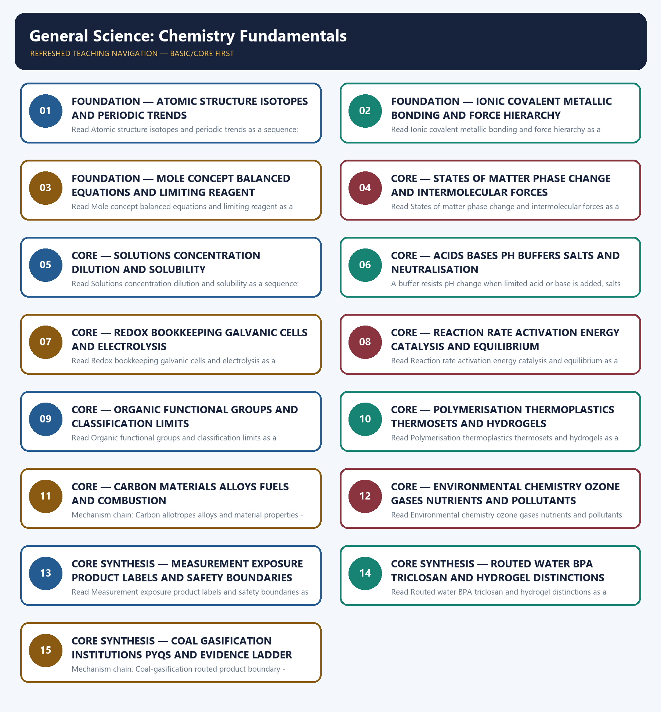

# General Science: Chemistry Fundamentals — Learner-v2 Complete Learning Session

> **Authoring-only generation:** 2026-09-04. No PDF was rendered and no tracker or index was mutated.

### SOURCE, PROGRESSION AND CURRENT-LINKAGE AUDIT

- **Generation date:** 2026-09-04.
- **Repository-first evidence:** the Basic owner is taught first and preserved in full; the Advanced owner is retained only in the optional final teaching block.
- **OCR evidence:** Repository Markdown was primary. OCR-searchable official UPSC papers were supplementary only for printed routed demands. No answer key, performance value, procurement outcome, operational deployment, programme target or technology milestone was inferred.
- **Qdrant:** not used; repository Markdown and available OCR context were sufficient.
- **PYQ integrity:** Audited ledgers route the 2024 hydrogel objective demand, the 2025 coal-gasification objective demand and the 2021 water-polarity, bisphenol-A and triclosan objective demands to this owner. Three representative answer-free cards preserve all five routed objective demands. The 2024 GS-III freshwater question remains primarily owned by Environment and Ecology; this topic supplies only the bounded chemistry of membranes, phase change, ions, concentration, disinfection and by-products.
- **Live-link boundary:** Official-source attempts on 2026-09-04 preserve only a Nobel biomolecule anchor, MNRE's mission-level electrochemistry and standards linkage, and UNEP's INC-5 document-process boundary. No volatile production figure, numerical chemical constant, chemical hazard, product-wide exposure claim, treaty outcome, regulatory status, answer key or technology-performance result is asserted.
- **Fact/inference discipline:** no current-affairs item, PYQ wording, figure or quotation is invented.

### LIVE OFFICIAL-SOURCE ATTEMPT LOG

The checks below were made on 2026-09-04. Substantive official text is used only for the proposition it supports; title-only, blocked or thin pages are recorded and supply no factual claim.

- https://www.nobelprize.org/prizes/chemistry/2024/press-release/ - fetched 2026-09-04; substantive official text confirmed that the 2024 Chemistry prize concerned computational protein design and protein-structure prediction. It was used only as a biomolecule and functional-structure linkage, not to infer a medical, commercial or regulatory outcome.
- https://mnre.gov.in/en/national-green-hydrogen-mission/ - fetched 2026-09-04; substantive official text confirmed mission components for regulations and standards, infrastructure and a public-private R&D framework. It was used only to anchor electrolysis, catalysis and industrial electrochemistry; no hydrogen output, cost, emissions saving or deployment result was inferred.
- https://www.unep.org/inc-plastic-pollution/session-5/documents - fetched 2026-09-04; the official page exposed INC-5 agenda, scenario and draft-text documents for an international legally binding instrument on plastic pollution. Document availability was not rewritten as an agreed treaty, binding obligation, chemical ban or national regulatory status.

## BASIC LEARNING SESSION



*Distinct embedded teaching-navigation image. The separate continuous Cārvāka-style flowchart package remains an independent at-a-glance artifact.*

### SESSION 1 — FOUNDATION — ATOMIC STRUCTURE ISOTOPES AND PERIODIC TRENDS

#### DEFINITION / WHAT THIS IS CALLED

**Plain-language definition:** The modern periodic table is ordered by atomic number; across a period atomic size generally decreases while ionisation energy and electronegativity generally increase and metallic character generally decreases, whereas down a group atomic size generally increases.

**Technical definition:** Read Atomic structure isotopes and periodic trends as a sequence: identify Atomic identity and isotope boundary, follow the named mechanism to its user or output, and stop at the last verified status rather than assuming the next stage.

#### ANSWER-GRABBING OPENING — WRITE/ADAPT IN THE EXAM

> Read Atomic structure isotopes and periodic trends as a sequence: identify Atomic identity and isotope boundary, follow the named mechanism to its user or output, and stop at the last verified status rather than assuming the next stage.

#### MUST-WRITE KEYWORDS

- **FOUNDATION**
- **Atomic structure isotopes**
- **periodic trends**
- **Mechanism chain**
- **Qualified use**
- **The modern periodic table**

**How to use them:** Frame the answer through FOUNDATION; define Atomic structure isotopes, connect periodic trends with Mechanism chain to explain the mechanism, and use Qualified use for the decisive comparison or qualification.

#### VISUAL FIRST

```text
ATOMIC STRUCTURE ISOTOPES AND PERIODIC TRENDS
01. Atomic identity and isotope boundary
    |
    v
02. Periodic trends and qualified comparison
STATUS / CATEGORY FIREWALL -> Do not merge atomic number, mass number, isotopes, isobars and isotones.
```

*The rail fixes the technical sequence and the claim boundary before explanation.*

#### CORE EXPLANATION

An atom contains protons and neutrons in its nucleus and electrons outside it; atomic number is the proton count that fixes elemental identity, mass number is protons plus neutrons, isotopes share atomic number but differ in mass number, isobars share mass number but differ in atomic number, and isotones share neutron number. The modern periodic table is ordered by atomic number; across a period atomic size generally decreases while ionisation energy and electronegativity generally increase and metallic character generally decreases, whereas down a group atomic size generally increases. These are trends with contextual exceptions, not licence to rank every pair without electronic-structure evidence.

#### SIMPLE SYSTEM EXAMPLE

Read Atomic structure isotopes and periodic trends as a sequence: identify Atomic identity and isotope boundary, follow the named mechanism to its user or output, and stop at the last verified status rather than assuming the next stage.

#### TECHNICAL DISTINCTION

The decisive boundary is Do not merge atomic number, mass number, isotopes, isobars and isotones. This keeps Atomic identity and isotope boundary and Periodic trends and qualified comparison in the correct scientific category, institution and unit of measurement.

#### NAMED EVIDENCE AND MECHANISM

- An atom contains protons and neutrons in its nucleus and electrons outside it; atomic number is the proton count that fixes elemental identity, mass number is protons plus neutrons, isotopes share atomic number but differ in mass number, isobars share mass number but differ in atomic number, and isotones share neutron number.
- The modern periodic table is ordered by atomic number; across a period atomic size generally decreases while ionisation energy and electronegativity generally increase and metallic character generally decreases, whereas down a group atomic size generally increases. These are trends with contextual exceptions, not licence to rank every pair without electronic-structure evidence.

#### EXAMINER CAUTION

- Do not merge atomic number, mass number, isotopes, isobars and isotones.

#### EXAM LINK

- **Prelims:** Keep institution, system, platform, service, process, legal instrument, unit and status in their exact category.
- **Mains:** Fix particle identity and electron-pattern trends before predicting chemical behaviour.

#### MINI RECAP

- **Mechanism chain:** Atomic identity and isotope boundary -> Periodic trends and qualified comparison
- **Qualified use:** Fix particle identity and electron-pattern trends before predicting chemical behaviour.

#### CLOSING RECALL FLOW — FOUNDATION — ATOMIC STRUCTURE ISOTOPES AND PERIODIC TRENDS

```text
START / CONCEPT: FOUNDATION — Atomic structure isotopes and periodic trends
        |
        v
EXACT TERMS: FOUNDATION · Atomic structure isotopes · periodic trends · Mechanism chain · Qualified use · The modern periodic table
        |
        v
MECHANISM / ARGUMENT: Mechanism chain: Atomic identity and isotope boundary - Periodic trends and qualified comparison Qualified use: Fix particle identity and electron-pattern trends before predicting chemical behaviour.
        |
        v
CONSEQUENCE / CONTRAST: The modern periodic table is ordered by atomic number; across a period atomic size generally decreases while ionisation energy and electronegativity generally increase and metallic character generally decreases, whereas down a group atomic size generally increases.
        |
        v
UPSC TRAP / ANSWER-USE: The decisive boundary is Do not merge atomic number, mass number, isotopes, isobars and isotones.
        |
        v
ANSWER-GRABBING FORMULATION: Read Atomic structure isotopes and periodic trends as a sequence: identify Atomic identity and isotope boundary, follow the named mechanism to its user or output, and stop at the last verified status rather than assuming the next stage.
```
### SESSION 2 — FOUNDATION — IONIC COVALENT METALLIC BONDING AND FORCE HIERARCHY

#### DEFINITION / WHAT THIS IS CALLED

**Plain-language definition:** Ionic bonding arises from electron transfer and attraction between oppositely charged ions, covalent bonding from shared electron pairs, and metallic bonding from positive metal centres with delocalised electrons; hydrogen bonding and van der Waals forces are intermolecular or interparticle attractions and must not be relabelled as the primary bond inside every substance.

**Technical definition:** Read Ionic covalent metallic bonding and force hierarchy as a sequence: identify Ionic covalent metallic and intermolecular distinction, follow the named mechanism to its user or output, and stop at the last verified status rather than assuming the next stage.

#### ANSWER-GRABBING OPENING — WRITE/ADAPT IN THE EXAM

> Ionic bonding arises from electron transfer and attraction between oppositely charged ions, covalent bonding from shared electron pairs, and metallic bonding from positive metal centres with delocalised electrons; hydrogen bonding and van der Waals forces are intermolecular or interparticle attractions and must not be relabelled as the primary bond inside every substance.

#### MUST-WRITE KEYWORDS

- **FOUNDATION**
- **Ionic covalent metallic bonding**
- **force hierarchy**
- **Mechanism chain**
- **Qualified use**
- **Ionic**

**How to use them:** Frame the answer through FOUNDATION; define Ionic covalent metallic bonding, connect force hierarchy with Mechanism chain to explain the mechanism, and use Qualified use for the decisive comparison or qualification.

#### VISUAL FIRST

```text
IONIC COVALENT METALLIC BONDING AND FORCE HIERARCHY
01. Ionic covalent metallic and intermolecular distinction
STATUS / CATEGORY FIREWALL -> Do not turn periodic trends into exception-free rankings.
```

*The rail fixes the technical sequence and the claim boundary before explanation.*

#### CORE EXPLANATION

Ionic bonding arises from electron transfer and attraction between oppositely charged ions, covalent bonding from shared electron pairs, and metallic bonding from positive metal centres with delocalised electrons; hydrogen bonding and van der Waals forces are intermolecular or interparticle attractions and must not be relabelled as the primary bond inside every substance.

#### SIMPLE SYSTEM EXAMPLE

Read Ionic covalent metallic bonding and force hierarchy as a sequence: identify Ionic covalent metallic and intermolecular distinction, follow the named mechanism to its user or output, and stop at the last verified status rather than assuming the next stage.

#### TECHNICAL DISTINCTION

The decisive boundary is Do not turn periodic trends into exception-free rankings. This keeps Ionic covalent metallic and intermolecular distinction in the correct scientific category, institution and unit of measurement.

#### NAMED EVIDENCE AND MECHANISM

- Ionic bonding arises from electron transfer and attraction between oppositely charged ions, covalent bonding from shared electron pairs, and metallic bonding from positive metal centres with delocalised electrons; hydrogen bonding and van der Waals forces are intermolecular or interparticle attractions and must not be relabelled as the primary bond inside every substance.

#### EXAMINER CAUTION

- Do not turn periodic trends into exception-free rankings.

#### EXAM LINK

- **Prelims:** Keep institution, system, platform, service, process, legal instrument, unit and status in their exact category.
- **Mains:** Classify electron transfer, electron sharing, delocalisation and weaker attractions separately.

#### MINI RECAP

- **Mechanism chain:** Ionic covalent metallic and intermolecular distinction
- **Qualified use:** Classify electron transfer, electron sharing, delocalisation and weaker attractions separately.

#### CLOSING RECALL FLOW — FOUNDATION — IONIC COVALENT METALLIC BONDING AND FORCE HIERARCHY

```text
START / CONCEPT: FOUNDATION — Ionic covalent metallic bonding and force hierarchy
        |
        v
EXACT TERMS: FOUNDATION · Ionic covalent metallic bonding · force hierarchy · Mechanism chain · Qualified use · Ionic
        |
        v
MECHANISM / ARGUMENT: Read Ionic covalent metallic bonding and force hierarchy as a sequence: identify Ionic covalent metallic and intermolecular distinction, follow the named mechanism to its user or output, and stop at the last verified status rather than assuming the next stage.
        |
        v
CONSEQUENCE / CONTRAST: Mechanism chain: Ionic covalent metallic and intermolecular distinction Qualified use: Classify electron transfer, electron sharing, delocalisation and weaker attractions separately.
        |
        v
UPSC TRAP / ANSWER-USE: The decisive boundary is Do not turn periodic trends into exception-free rankings.
        |
        v
ANSWER-GRABBING FORMULATION: Ionic bonding arises from electron transfer and attraction between oppositely charged ions, covalent bonding from shared electron pairs, and metallic bonding from positive metal centres with delocalised electrons; hydrogen bonding and van der Waals forces are intermolecular or interparticle attractions and must not be relabelled as the primary bond inside every substance.
```
### SESSION 3 — FOUNDATION — MOLE CONCEPT BALANCED EQUATIONS AND LIMITING REAGENT

#### DEFINITION / WHAT THIS IS CALLED

**Plain-language definition:** The mole is the amount-of-substance unit used to connect chemical entities with measurable mass; stoichiometry follows a balanced equation to relate reactants and products, the limiting reagent caps the theoretical product, and percentage yield compares actual with theoretical yield.

**Technical definition:** Read Mole concept balanced equations and limiting reagent as a sequence: identify Mole and stoichiometric accounting, follow the named mechanism to its user or output, and stop at the last verified status rather than assuming the next stage.

#### ANSWER-GRABBING OPENING — WRITE/ADAPT IN THE EXAM

> The mole is the amount-of-substance unit used to connect chemical entities with measurable mass; stoichiometry follows a balanced equation to relate reactants and products, the limiting reagent caps the theoretical product, and percentage yield compares actual with theoretical yield.

#### MUST-WRITE KEYWORDS

- **FOUNDATION**
- **Mole concept balanced equations**
- **limiting reagent**
- **Mechanism chain**
- **Qualified use**
- **The mole**

**How to use them:** Frame the answer through FOUNDATION; define Mole concept balanced equations, connect limiting reagent with Mechanism chain to explain the mechanism, and use Qualified use for the decisive comparison or qualification.

#### VISUAL FIRST

```text
MOLE CONCEPT BALANCED EQUATIONS AND LIMITING REAGENT
01. Mole and stoichiometric accounting
STATUS / CATEGORY FIREWALL -> Do not confuse primary chemical bonds with intermolecular forces.
```

*The rail fixes the technical sequence and the claim boundary before explanation.*

#### CORE EXPLANATION

The mole is the amount-of-substance unit used to connect chemical entities with measurable mass; stoichiometry follows a balanced equation to relate reactants and products, the limiting reagent caps the theoretical product, and percentage yield compares actual with theoretical yield. No numerical constant, purity or yield may be assumed unless the question supplies it.

#### SIMPLE SYSTEM EXAMPLE

Read Mole concept balanced equations and limiting reagent as a sequence: identify Mole and stoichiometric accounting, follow the named mechanism to its user or output, and stop at the last verified status rather than assuming the next stage.

#### TECHNICAL DISTINCTION

The decisive boundary is Do not confuse primary chemical bonds with intermolecular forces. This keeps Mole and stoichiometric accounting in the correct scientific category, institution and unit of measurement.

#### NAMED EVIDENCE AND MECHANISM

- The mole is the amount-of-substance unit used to connect chemical entities with measurable mass; stoichiometry follows a balanced equation to relate reactants and products, the limiting reagent caps the theoretical product, and percentage yield compares actual with theoretical yield. No numerical constant, purity or yield may be assumed unless the question supplies it.

#### EXAMINER CAUTION

- Do not confuse primary chemical bonds with intermolecular forces.

#### EXAM LINK

- **Prelims:** Keep institution, system, platform, service, process, legal instrument, unit and status in their exact category.
- **Mains:** Balance first, identify the limiting reagent and state every supplied basis before calculating.

#### MINI RECAP

- **Mechanism chain:** Mole and stoichiometric accounting
- **Qualified use:** Balance first, identify the limiting reagent and state every supplied basis before calculating.

#### CLOSING RECALL FLOW — FOUNDATION — MOLE CONCEPT BALANCED EQUATIONS AND LIMITING REAGENT

```text
START / CONCEPT: FOUNDATION — Mole concept balanced equations and limiting reagent
        |
        v
EXACT TERMS: FOUNDATION · Mole concept balanced equations · limiting reagent · Mechanism chain · Qualified use · The mole
        |
        v
MECHANISM / ARGUMENT: Read Mole concept balanced equations and limiting reagent as a sequence: identify Mole and stoichiometric accounting, follow the named mechanism to its user or output, and stop at the last verified status rather than assuming the next stage.
        |
        v
CONSEQUENCE / CONTRAST: Mechanism chain: Mole and stoichiometric accounting Qualified use: Balance first, identify the limiting reagent and state every supplied basis before calculating.
        |
        v
UPSC TRAP / ANSWER-USE: The decisive boundary is Do not confuse primary chemical bonds with intermolecular forces.
        |
        v
ANSWER-GRABBING FORMULATION: The mole is the amount-of-substance unit used to connect chemical entities with measurable mass; stoichiometry follows a balanced equation to relate reactants and products, the limiting reagent caps the theoretical product, and percentage yield compares actual with theoretical yield.
```
### SESSION 4 — CORE — STATES OF MATTER PHASE CHANGE AND INTERMOLECULAR FORCES

#### DEFINITION / WHAT THIS IS CALLED

**Plain-language definition:** Solid, liquid and gas differ in particle arrangement, mobility and separation; melting, freezing, vaporisation, condensation and sublimation are physical changes of state, while stronger intermolecular attraction generally raises the energy needed for separation.

**Technical definition:** Read States of matter phase change and intermolecular forces as a sequence: identify States phase change and intermolecular forces, follow the named mechanism to its user or output, and stop at the last verified status rather than assuming the next stage.

#### ANSWER-GRABBING OPENING — WRITE/ADAPT IN THE EXAM

> Read States of matter phase change and intermolecular forces as a sequence: identify States phase change and intermolecular forces, follow the named mechanism to its user or output, and stop at the last verified status rather than assuming the next stage.

#### MUST-WRITE KEYWORDS

- **States of matter phase change**
- **intermolecular forces**
- **Mechanism chain**
- **Qualified use**
- **Solid**
- **Read States**

**How to use them:** Frame the answer through States of matter phase change; define intermolecular forces, connect Mechanism chain with Qualified use to explain the mechanism, and use Solid for the decisive comparison or qualification.

#### VISUAL FIRST

```text
STATES OF MATTER PHASE CHANGE AND INTERMOLECULAR FORCES
01. States phase change and intermolecular forces
STATUS / CATEGORY FIREWALL -> Do not perform stoichiometry without a balanced equation and limiting-reagent check.
```

*The rail fixes the technical sequence and the claim boundary before explanation.*

#### CORE EXPLANATION

Solid, liquid and gas differ in particle arrangement, mobility and separation; melting, freezing, vaporisation, condensation and sublimation are physical changes of state, while stronger intermolecular attraction generally raises the energy needed for separation. A phase change does not by itself create a new chemical substance.

#### SIMPLE SYSTEM EXAMPLE

Read States of matter phase change and intermolecular forces as a sequence: identify States phase change and intermolecular forces, follow the named mechanism to its user or output, and stop at the last verified status rather than assuming the next stage.

#### TECHNICAL DISTINCTION

The decisive boundary is Do not perform stoichiometry without a balanced equation and limiting-reagent check. This keeps States phase change and intermolecular forces in the correct scientific category, institution and unit of measurement.

#### NAMED EVIDENCE AND MECHANISM

- Solid, liquid and gas differ in particle arrangement, mobility and separation; melting, freezing, vaporisation, condensation and sublimation are physical changes of state, while stronger intermolecular attraction generally raises the energy needed for separation. A phase change does not by itself create a new chemical substance.

#### EXAMINER CAUTION

- Do not perform stoichiometry without a balanced equation and limiting-reagent check.

#### EXAM LINK

- **Prelims:** Keep institution, system, platform, service, process, legal instrument, unit and status in their exact category.
- **Mains:** Trace particle arrangement and energy change without converting a physical transition into a reaction.

#### MINI RECAP

- **Mechanism chain:** States phase change and intermolecular forces
- **Qualified use:** Trace particle arrangement and energy change without converting a physical transition into a reaction.

#### CLOSING RECALL FLOW — CORE — STATES OF MATTER PHASE CHANGE AND INTERMOLECULAR FORCES

```text
START / CONCEPT: CORE — States of matter phase change and intermolecular forces
        |
        v
EXACT TERMS: States of matter phase change · intermolecular forces · Mechanism chain · Qualified use · Solid · Read States
        |
        v
MECHANISM / ARGUMENT: Mechanism chain: States phase change and intermolecular forces Qualified use: Trace particle arrangement and energy change without converting a physical transition into a reaction.
        |
        v
CONSEQUENCE / CONTRAST: Solid, liquid and gas differ in particle arrangement, mobility and separation; melting, freezing, vaporisation, condensation and sublimation are physical changes of state, while stronger intermolecular attraction generally raises the energy needed for separation.
        |
        v
UPSC TRAP / ANSWER-USE: A phase change does not by itself create a new chemical substance.
        |
        v
ANSWER-GRABBING FORMULATION: Read States of matter phase change and intermolecular forces as a sequence: identify States phase change and intermolecular forces, follow the named mechanism to its user or output, and stop at the last verified status rather than assuming the next stage.
```
### SESSION 5 — CORE — SOLUTIONS CONCENTRATION DILUTION AND SOLUBILITY

#### DEFINITION / WHAT THIS IS CALLED

**Plain-language definition:** A solution contains solute dispersed at the molecular or ionic scale in a solvent; concentration describes how much solute is present by a stated basis such as amount, mass, volume or proportion, whereas solubility is the equilibrium limit under specified conditions.

**Technical definition:** Read Solutions concentration dilution and solubility as a sequence: identify Solutions concentration and solubility boundary, follow the named mechanism to its user or output, and stop at the last verified status rather than assuming the next stage.

#### ANSWER-GRABBING OPENING — WRITE/ADAPT IN THE EXAM

> Read Solutions concentration dilution and solubility as a sequence: identify Solutions concentration and solubility boundary, follow the named mechanism to its user or output, and stop at the last verified status rather than assuming the next stage.

#### MUST-WRITE KEYWORDS

- **Solutions concentration dilution**
- **solubility**
- **Mechanism chain**
- **Qualified use**
- **Dilute**
- **Read Solutions**

**How to use them:** Frame the answer through Solutions concentration dilution; define solubility, connect Mechanism chain with Qualified use to explain the mechanism, and use Dilute for the decisive comparison or qualification.

#### VISUAL FIRST

```text
SOLUTIONS CONCENTRATION DILUTION AND SOLUBILITY
01. Solutions concentration and solubility boundary
STATUS / CATEGORY FIREWALL -> Do not call every phase change a chemical reaction.
```

*The rail fixes the technical sequence and the claim boundary before explanation.*

#### CORE EXPLANATION

A solution contains solute dispersed at the molecular or ionic scale in a solvent; concentration describes how much solute is present by a stated basis such as amount, mass, volume or proportion, whereas solubility is the equilibrium limit under specified conditions. Dilute is not synonymous with weak, and concentrated is not synonymous with strong.

#### SIMPLE SYSTEM EXAMPLE

Read Solutions concentration dilution and solubility as a sequence: identify Solutions concentration and solubility boundary, follow the named mechanism to its user or output, and stop at the last verified status rather than assuming the next stage.

#### TECHNICAL DISTINCTION

The decisive boundary is Do not call every phase change a chemical reaction. This keeps Solutions concentration and solubility boundary in the correct scientific category, institution and unit of measurement.

#### NAMED EVIDENCE AND MECHANISM

- A solution contains solute dispersed at the molecular or ionic scale in a solvent; concentration describes how much solute is present by a stated basis such as amount, mass, volume or proportion, whereas solubility is the equilibrium limit under specified conditions. Dilute is not synonymous with weak, and concentrated is not synonymous with strong.

#### EXAMINER CAUTION

- Do not call every phase change a chemical reaction.

#### EXAM LINK

- **Prelims:** Keep institution, system, platform, service, process, legal instrument, unit and status in their exact category.
- **Mains:** Name solvent, solute, concentration basis, conditions and saturation status.

#### MINI RECAP

- **Mechanism chain:** Solutions concentration and solubility boundary
- **Qualified use:** Name solvent, solute, concentration basis, conditions and saturation status.

#### CLOSING RECALL FLOW — CORE — SOLUTIONS CONCENTRATION DILUTION AND SOLUBILITY

```text
START / CONCEPT: CORE — Solutions concentration dilution and solubility
        |
        v
EXACT TERMS: Solutions concentration dilution · solubility · Mechanism chain · Qualified use · Dilute · Read Solutions
        |
        v
MECHANISM / ARGUMENT: Mechanism chain: Solutions concentration and solubility boundary Qualified use: Name solvent, solute, concentration basis, conditions and saturation status.
        |
        v
CONSEQUENCE / CONTRAST: A solution contains solute dispersed at the molecular or ionic scale in a solvent; concentration describes how much solute is present by a stated basis such as amount, mass, volume or proportion, whereas solubility is the equilibrium limit under specified conditions.
        |
        v
UPSC TRAP / ANSWER-USE: Dilute is not synonymous with weak, and concentrated is not synonymous with strong.
        |
        v
ANSWER-GRABBING FORMULATION: Read Solutions concentration dilution and solubility as a sequence: identify Solutions concentration and solubility boundary, follow the named mechanism to its user or output, and stop at the last verified status rather than assuming the next stage.
```
### SESSION 6 — CORE — ACIDS BASES PH BUFFERS SALTS AND NEUTRALISATION

#### DEFINITION / WHAT THIS IS CALLED

**Plain-language definition:** An acid can donate protons and a base can accept them, while the aqueous school-level definitions refer to hydrogen and hydroxide ions; pH is logarithmic and tracks hydrogen-ion activity, neutralisation reduces acidic and basic character and often forms salt and water, and acid strength must be kept separate from concentration.

**Technical definition:** A buffer resists pH change when limited acid or base is added, salts may produce acidic, basic or neutral solutions depending on their constituent ions, and neutral pH is not universally fixed at the familiar school value because water self-ionisation varies with temperature.

#### ANSWER-GRABBING OPENING — WRITE/ADAPT IN THE EXAM

> Mechanism chain: Acids bases neutralisation and pH - Buffers salts and neutral-point boundary Qualified use: Separate strength, concentration, pH, neutralisation, salt hydrolysis and buffer action.

#### MUST-WRITE KEYWORDS

- **Acids bases pH buffers salts**
- **neutralisation**
- **Mechanism chain**
- **Qualified use**
- **Read Acids**
- **Acids**

**How to use them:** Frame the answer through Acids bases pH buffers salts; define neutralisation, connect Mechanism chain with Qualified use to explain the mechanism, and use Read Acids for the decisive comparison or qualification.

#### VISUAL FIRST

```text
ACIDS BASES PH BUFFERS SALTS AND NEUTRALISATION
01. Acids bases neutralisation and pH
    |
    v
02. Buffers salts and neutral-point boundary
STATUS / CATEGORY FIREWALL -> Do not equate concentration with solubility or acid strength.
```

*The rail fixes the technical sequence and the claim boundary before explanation.*

#### CORE EXPLANATION

An acid can donate protons and a base can accept them, while the aqueous school-level definitions refer to hydrogen and hydroxide ions; pH is logarithmic and tracks hydrogen-ion activity, neutralisation reduces acidic and basic character and often forms salt and water, and acid strength must be kept separate from concentration. A buffer resists pH change when limited acid or base is added, salts may produce acidic, basic or neutral solutions depending on their constituent ions, and neutral pH is not universally fixed at the familiar school value because water self-ionisation varies with temperature. A buffer resists change; it does not make pH immutable.

#### SIMPLE SYSTEM EXAMPLE

Read Acids bases pH buffers salts and neutralisation as a sequence: identify Acids bases neutralisation and pH, follow the named mechanism to its user or output, and stop at the last verified status rather than assuming the next stage.

#### TECHNICAL DISTINCTION

The decisive boundary is Do not equate concentration with solubility or acid strength. This keeps Acids bases neutralisation and pH and Buffers salts and neutral-point boundary in the correct scientific category, institution and unit of measurement.

#### NAMED EVIDENCE AND MECHANISM

- An acid can donate protons and a base can accept them, while the aqueous school-level definitions refer to hydrogen and hydroxide ions; pH is logarithmic and tracks hydrogen-ion activity, neutralisation reduces acidic and basic character and often forms salt and water, and acid strength must be kept separate from concentration.
- A buffer resists pH change when limited acid or base is added, salts may produce acidic, basic or neutral solutions depending on their constituent ions, and neutral pH is not universally fixed at the familiar school value because water self-ionisation varies with temperature. A buffer resists change; it does not make pH immutable.

#### EXAMINER CAUTION

- Do not equate concentration with solubility or acid strength.

#### EXAM LINK

- **Prelims:** Keep institution, system, platform, service, process, legal instrument, unit and status in their exact category.
- **Mains:** Separate strength, concentration, pH, neutralisation, salt hydrolysis and buffer action.

#### MINI RECAP

- **Mechanism chain:** Acids bases neutralisation and pH -> Buffers salts and neutral-point boundary
- **Qualified use:** Separate strength, concentration, pH, neutralisation, salt hydrolysis and buffer action.

#### CLOSING RECALL FLOW — CORE — ACIDS BASES PH BUFFERS SALTS AND NEUTRALISATION

```text
START / CONCEPT: CORE — Acids bases pH buffers salts and neutralisation
        |
        v
EXACT TERMS: Acids bases pH buffers salts · neutralisation · Mechanism chain · Qualified use · Read Acids · Acids
        |
        v
MECHANISM / ARGUMENT: Read Acids bases pH buffers salts and neutralisation as a sequence: identify Acids bases neutralisation and pH, follow the named mechanism to its user or output, and stop at the last verified status rather than assuming the next stage.
        |
        v
CONSEQUENCE / CONTRAST: An acid can donate protons and a base can accept them, while the aqueous school-level definitions refer to hydrogen and hydroxide ions; pH is logarithmic and tracks hydrogen-ion activity, neutralisation reduces acidic and basic character and often forms salt and water, and acid strength must be kept separate from concentration.
        |
        v
UPSC TRAP / ANSWER-USE: A buffer resists pH change when limited acid or base is added, salts may produce acidic, basic or neutral solutions depending on their constituent ions, and neutral pH is not universally fixed at the familiar school value because water self-ionisation varies with temperature.
        |
        v
ANSWER-GRABBING FORMULATION: Mechanism chain: Acids bases neutralisation and pH - Buffers salts and neutral-point boundary Qualified use: Separate strength, concentration, pH, neutralisation, salt hydrolysis and buffer action.
```
### SESSION 7 — CORE — REDOX BOOKKEEPING GALVANIC CELLS AND ELECTROLYSIS

#### DEFINITION / WHAT THIS IS CALLED

**Plain-language definition:** Oxidation is electron loss or an increase in oxidation number and reduction is electron gain or a decrease; the paired half-processes can convert chemical energy to electrical energy in a galvanic or voltaic cell, while an electrolytic cell uses electrical energy to drive a non-spontaneous chemical change.

**Technical definition:** Read Redox bookkeeping galvanic cells and electrolysis as a sequence: identify Oxidation reduction and electrochemical cells, follow the named mechanism to its user or output, and stop at the last verified status rather than assuming the next stage.

#### ANSWER-GRABBING OPENING — WRITE/ADAPT IN THE EXAM

> Read Redox bookkeeping galvanic cells and electrolysis as a sequence: identify Oxidation reduction and electrochemical cells, follow the named mechanism to its user or output, and stop at the last verified status rather than assuming the next stage.

#### MUST-WRITE KEYWORDS

- **Redox bookkeeping galvanic cells**
- **electrolysis**
- **Mechanism chain**
- **Qualified use**
- **Oxidation**
- **Electrode**

**How to use them:** Frame the answer through Redox bookkeeping galvanic cells; define electrolysis, connect Mechanism chain with Qualified use to explain the mechanism, and use Oxidation for the decisive comparison or qualification.

#### VISUAL FIRST

```text
REDOX BOOKKEEPING GALVANIC CELLS AND ELECTROLYSIS
01. Oxidation reduction and electrochemical cells
STATUS / CATEGORY FIREWALL -> Do not treat strong and concentrated acids as synonyms.
```

*The rail fixes the technical sequence and the claim boundary before explanation.*

#### CORE EXPLANATION

Oxidation is electron loss or an increase in oxidation number and reduction is electron gain or a decrease; the paired half-processes can convert chemical energy to electrical energy in a galvanic or voltaic cell, while an electrolytic cell uses electrical energy to drive a non-spontaneous chemical change. Electrode signs depend on cell type, but oxidation remains at the anode and reduction at the cathode.

#### SIMPLE SYSTEM EXAMPLE

Read Redox bookkeeping galvanic cells and electrolysis as a sequence: identify Oxidation reduction and electrochemical cells, follow the named mechanism to its user or output, and stop at the last verified status rather than assuming the next stage.

#### TECHNICAL DISTINCTION

The decisive boundary is Do not treat strong and concentrated acids as synonyms. This keeps Oxidation reduction and electrochemical cells in the correct scientific category, institution and unit of measurement.

#### NAMED EVIDENCE AND MECHANISM

- Oxidation is electron loss or an increase in oxidation number and reduction is electron gain or a decrease; the paired half-processes can convert chemical energy to electrical energy in a galvanic or voltaic cell, while an electrolytic cell uses electrical energy to drive a non-spontaneous chemical change. Electrode signs depend on cell type, but oxidation remains at the anode and reduction at the cathode.

#### EXAMINER CAUTION

- Do not treat strong and concentrated acids as synonyms.

#### EXAM LINK

- **Prelims:** Keep institution, system, platform, service, process, legal instrument, unit and status in their exact category.
- **Mains:** Track oxidation numbers and half-processes, then identify the energy-conversion direction.

#### MINI RECAP

- **Mechanism chain:** Oxidation reduction and electrochemical cells
- **Qualified use:** Track oxidation numbers and half-processes, then identify the energy-conversion direction.

#### CLOSING RECALL FLOW — CORE — REDOX BOOKKEEPING GALVANIC CELLS AND ELECTROLYSIS

```text
START / CONCEPT: CORE — Redox bookkeeping galvanic cells and electrolysis
        |
        v
EXACT TERMS: Redox bookkeeping galvanic cells · electrolysis · Mechanism chain · Qualified use · Oxidation · Electrode
        |
        v
MECHANISM / ARGUMENT: Mechanism chain: Oxidation reduction and electrochemical cells Qualified use: Track oxidation numbers and half-processes, then identify the energy-conversion direction.
        |
        v
CONSEQUENCE / CONTRAST: Electrode signs depend on cell type, but oxidation remains at the anode and reduction at the cathode.
        |
        v
UPSC TRAP / ANSWER-USE: Oxidation is electron loss or an increase in oxidation number and reduction is electron gain or a decrease; the paired half-processes can convert chemical energy to electrical energy in a galvanic or voltaic cell, while an electrolytic cell uses electrical energy to drive a non-spontaneous chemical change.
        |
        v
ANSWER-GRABBING FORMULATION: Read Redox bookkeeping galvanic cells and electrolysis as a sequence: identify Oxidation reduction and electrochemical cells, follow the named mechanism to its user or output, and stop at the last verified status rather than assuming the next stage.
```
### SESSION 8 — CORE — REACTION RATE ACTIVATION ENERGY CATALYSIS AND EQUILIBRIUM

#### DEFINITION / WHAT THIS IS CALLED

**Plain-language definition:** Equilibrium is dynamic equality of forward and reverse rates, not cessation of molecular change.

**Technical definition:** Read Reaction rate activation energy catalysis and equilibrium as a sequence: identify Reaction rate catalyst and equilibrium boundary, follow the named mechanism to its user or output, and stop at the last verified status rather than assuming the next stage.

#### ANSWER-GRABBING OPENING — WRITE/ADAPT IN THE EXAM

> Mechanism chain: Reaction rate catalyst and equilibrium boundary Qualified use: Separate kinetic speed from thermodynamic equilibrium and explain what a catalyst can and cannot change.

#### MUST-WRITE KEYWORDS

- **Reaction rate activation energy catalysis**
- **equilibrium**
- **Mechanism chain**
- **Qualified use**
- **Reaction**
- **Read Reaction**

**How to use them:** Frame the answer through Reaction rate activation energy catalysis; define equilibrium, connect Mechanism chain with Qualified use to explain the mechanism, and use Reaction for the decisive comparison or qualification.

#### VISUAL FIRST

```text
REACTION RATE ACTIVATION ENERGY CATALYSIS AND EQUILIBRIUM
01. Reaction rate catalyst and equilibrium boundary
STATUS / CATEGORY FIREWALL -> Do not claim a buffer fixes pH permanently or every salt is neutral.
```

*The rail fixes the technical sequence and the claim boundary before explanation.*

#### CORE EXPLANATION

Reaction rate depends on effective collisions and can change with concentration, temperature, surface area and catalysts; a catalyst provides a lower-activation-energy pathway and speeds forward and reverse reactions without shifting the equilibrium position. Equilibrium is dynamic equality of forward and reverse rates, not cessation of molecular change.

#### SIMPLE SYSTEM EXAMPLE

Read Reaction rate activation energy catalysis and equilibrium as a sequence: identify Reaction rate catalyst and equilibrium boundary, follow the named mechanism to its user or output, and stop at the last verified status rather than assuming the next stage.

#### TECHNICAL DISTINCTION

The decisive boundary is Do not claim a buffer fixes pH permanently or every salt is neutral. This keeps Reaction rate catalyst and equilibrium boundary in the correct scientific category, institution and unit of measurement.

#### NAMED EVIDENCE AND MECHANISM

- Reaction rate depends on effective collisions and can change with concentration, temperature, surface area and catalysts; a catalyst provides a lower-activation-energy pathway and speeds forward and reverse reactions without shifting the equilibrium position. Equilibrium is dynamic equality of forward and reverse rates, not cessation of molecular change.

#### EXAMINER CAUTION

- Do not claim a buffer fixes pH permanently or every salt is neutral.

#### EXAM LINK

- **Prelims:** Keep institution, system, platform, service, process, legal instrument, unit and status in their exact category.
- **Mains:** Separate kinetic speed from thermodynamic equilibrium and explain what a catalyst can and cannot change.

#### MINI RECAP

- **Mechanism chain:** Reaction rate catalyst and equilibrium boundary
- **Qualified use:** Separate kinetic speed from thermodynamic equilibrium and explain what a catalyst can and cannot change.

#### CLOSING RECALL FLOW — CORE — REACTION RATE ACTIVATION ENERGY CATALYSIS AND EQUILIBRIUM

```text
START / CONCEPT: CORE — Reaction rate activation energy catalysis and equilibrium
        |
        v
EXACT TERMS: Reaction rate activation energy catalysis · equilibrium · Mechanism chain · Qualified use · Reaction · Read Reaction
        |
        v
MECHANISM / ARGUMENT: Read Reaction rate activation energy catalysis and equilibrium as a sequence: identify Reaction rate catalyst and equilibrium boundary, follow the named mechanism to its user or output, and stop at the last verified status rather than assuming the next stage.
        |
        v
CONSEQUENCE / CONTRAST: Equilibrium is dynamic equality of forward and reverse rates, not cessation of molecular change.
        |
        v
UPSC TRAP / ANSWER-USE: Do not miss this limiting distinction: reaction rate depends on effective collisions and can change with concentration, temperature, surface area...
        |
        v
ANSWER-GRABBING FORMULATION: Mechanism chain: Reaction rate catalyst and equilibrium boundary Qualified use: Separate kinetic speed from thermodynamic equilibrium and explain what a catalyst can and cannot change.
```
### SESSION 9 — CORE — ORGANIC FUNCTIONAL GROUPS AND CLASSIFICATION LIMITS

#### DEFINITION / WHAT THIS IS CALLED

**Plain-language definition:** A functional group is the reactive structural feature used to classify organic compounds, including alcohol, aldehyde, ketone, carboxylic-acid, amine and ester families; compounds sharing a functional group can show related reaction patterns, but a label alone does not establish exposure, toxicity, biodegradability or regulatory status.

**Technical definition:** Read Organic functional groups and classification limits as a sequence: identify Organic functional-group classification, follow the named mechanism to its user or output, and stop at the last verified status rather than assuming the next stage.

#### ANSWER-GRABBING OPENING — WRITE/ADAPT IN THE EXAM

> Mechanism chain: Organic functional-group classification Qualified use: Use functional groups to classify reactivity while withholding unsupported hazard and legal claims.

#### MUST-WRITE KEYWORDS

- **Organic functional groups**
- **classification limits**
- **Mechanism chain**
- **Qualified use**
- **A functional group**
- **Read Organic**

**How to use them:** Frame the answer through Organic functional groups; define classification limits, connect Mechanism chain with Qualified use to explain the mechanism, and use A functional group for the decisive comparison or qualification.

#### VISUAL FIRST

```text
ORGANIC FUNCTIONAL GROUPS AND CLASSIFICATION LIMITS
01. Organic functional-group classification
STATUS / CATEGORY FIREWALL -> Do not reverse oxidation and reduction or assume electrode signs are identical in every cell.
```

*The rail fixes the technical sequence and the claim boundary before explanation.*

#### CORE EXPLANATION

A functional group is the reactive structural feature used to classify organic compounds, including alcohol, aldehyde, ketone, carboxylic-acid, amine and ester families; compounds sharing a functional group can show related reaction patterns, but a label alone does not establish exposure, toxicity, biodegradability or regulatory status.

#### SIMPLE SYSTEM EXAMPLE

Read Organic functional groups and classification limits as a sequence: identify Organic functional-group classification, follow the named mechanism to its user or output, and stop at the last verified status rather than assuming the next stage.

#### TECHNICAL DISTINCTION

The decisive boundary is Do not reverse oxidation and reduction or assume electrode signs are identical in every cell. This keeps Organic functional-group classification in the correct scientific category, institution and unit of measurement.

#### NAMED EVIDENCE AND MECHANISM

- A functional group is the reactive structural feature used to classify organic compounds, including alcohol, aldehyde, ketone, carboxylic-acid, amine and ester families; compounds sharing a functional group can show related reaction patterns, but a label alone does not establish exposure, toxicity, biodegradability or regulatory status.

#### EXAMINER CAUTION

- Do not reverse oxidation and reduction or assume electrode signs are identical in every cell.

#### EXAM LINK

- **Prelims:** Keep institution, system, platform, service, process, legal instrument, unit and status in their exact category.
- **Mains:** Use functional groups to classify reactivity while withholding unsupported hazard and legal claims.

#### MINI RECAP

- **Mechanism chain:** Organic functional-group classification
- **Qualified use:** Use functional groups to classify reactivity while withholding unsupported hazard and legal claims.

#### CLOSING RECALL FLOW — CORE — ORGANIC FUNCTIONAL GROUPS AND CLASSIFICATION LIMITS

```text
START / CONCEPT: CORE — Organic functional groups and classification limits
        |
        v
EXACT TERMS: Organic functional groups · classification limits · Mechanism chain · Qualified use · A functional group · Read Organic
        |
        v
MECHANISM / ARGUMENT: Read Organic functional groups and classification limits as a sequence: identify Organic functional-group classification, follow the named mechanism to its user or output, and stop at the last verified status rather than assuming the next stage.
        |
        v
CONSEQUENCE / CONTRAST: A functional group is the reactive structural feature used to classify organic compounds, including alcohol, aldehyde, ketone, carboxylic-acid, amine and ester families; compounds sharing a functional group can show related reaction patterns, but a label alone does not establish exposure, toxicity, biodegradability or regulatory status.
        |
        v
UPSC TRAP / ANSWER-USE: Mains: Use functional groups to classify reactivity while withholding unsupported hazard and legal claims.
        |
        v
ANSWER-GRABBING FORMULATION: Mechanism chain: Organic functional-group classification Qualified use: Use functional groups to classify reactivity while withholding unsupported hazard and legal claims.
```
### SESSION 10 — CORE — POLYMERISATION THERMOPLASTICS THERMOSETS AND HYDROGELS

#### DEFINITION / WHAT THIS IS CALLED

**Plain-language definition:** Polymers are macromolecules built from repeating units; addition polymerisation joins monomers without eliminating a small molecule, condensation polymerisation forms links while eliminating a small molecule, thermoplastics soften on reheating, and thermosets form networks that do not simply remelt.

**Technical definition:** Read Polymerisation thermoplastics thermosets and hydrogels as a sequence: identify Polymer structure and processing classes, follow the named mechanism to its user or output, and stop at the last verified status rather than assuming the next stage.

#### ANSWER-GRABBING OPENING — WRITE/ADAPT IN THE EXAM

> Polymers are macromolecules built from repeating units; addition polymerisation joins monomers without eliminating a small molecule, condensation polymerisation forms links while eliminating a small molecule, thermoplastics soften on reheating, and thermosets form networks that do not simply remelt.

#### MUST-WRITE KEYWORDS

- **Polymerisation thermoplastics thermosets**
- **hydrogels**
- **Mechanism chain**
- **Qualified use**
- **Polymers**
- **Read Polymerisation**

**How to use them:** Frame the answer through Polymerisation thermoplastics thermosets; define hydrogels, connect Mechanism chain with Qualified use to explain the mechanism, and use Polymers for the decisive comparison or qualification.

#### VISUAL FIRST

```text
POLYMERISATION THERMOPLASTICS THERMOSETS AND HYDROGELS
01. Polymer structure and processing classes
STATUS / CATEGORY FIREWALL -> Do not claim a catalyst changes the equilibrium position or is necessarily consumed.
```

*The rail fixes the technical sequence and the claim boundary before explanation.*

#### CORE EXPLANATION

Polymers are macromolecules built from repeating units; addition polymerisation joins monomers without eliminating a small molecule, condensation polymerisation forms links while eliminating a small molecule, thermoplastics soften on reheating, and thermosets form networks that do not simply remelt. Biodegradable and compostable remain condition-dependent categories.

#### SIMPLE SYSTEM EXAMPLE

Read Polymerisation thermoplastics thermosets and hydrogels as a sequence: identify Polymer structure and processing classes, follow the named mechanism to its user or output, and stop at the last verified status rather than assuming the next stage.

#### TECHNICAL DISTINCTION

The decisive boundary is Do not claim a catalyst changes the equilibrium position or is necessarily consumed. This keeps Polymer structure and processing classes in the correct scientific category, institution and unit of measurement.

#### NAMED EVIDENCE AND MECHANISM

- Polymers are macromolecules built from repeating units; addition polymerisation joins monomers without eliminating a small molecule, condensation polymerisation forms links while eliminating a small molecule, thermoplastics soften on reheating, and thermosets form networks that do not simply remelt. Biodegradable and compostable remain condition-dependent categories.

#### EXAMINER CAUTION

- Do not claim a catalyst changes the equilibrium position or is necessarily consumed.

#### EXAM LINK

- **Prelims:** Keep institution, system, platform, service, process, legal instrument, unit and status in their exact category.
- **Mains:** Classify polymer formation, reheating behaviour, network structure and condition-dependent degradation.

#### MINI RECAP

- **Mechanism chain:** Polymer structure and processing classes
- **Qualified use:** Classify polymer formation, reheating behaviour, network structure and condition-dependent degradation.

#### CLOSING RECALL FLOW — CORE — POLYMERISATION THERMOPLASTICS THERMOSETS AND HYDROGELS

```text
START / CONCEPT: CORE — Polymerisation thermoplastics thermosets and hydrogels
        |
        v
EXACT TERMS: Polymerisation thermoplastics thermosets · hydrogels · Mechanism chain · Qualified use · Polymers · Read Polymerisation
        |
        v
MECHANISM / ARGUMENT: Read Polymerisation thermoplastics thermosets and hydrogels as a sequence: identify Polymer structure and processing classes, follow the named mechanism to its user or output, and stop at the last verified status rather than assuming the next stage.
        |
        v
CONSEQUENCE / CONTRAST: The decisive boundary is Do not claim a catalyst changes the equilibrium position or is necessarily consumed.
        |
        v
UPSC TRAP / ANSWER-USE: Do not claim a catalyst changes the equilibrium position or is necessarily consumed.
        |
        v
ANSWER-GRABBING FORMULATION: Polymers are macromolecules built from repeating units; addition polymerisation joins monomers without eliminating a small molecule, condensation polymerisation forms links while eliminating a small molecule, thermoplastics soften on reheating, and thermosets form networks that do not simply remelt.
```
### SESSION 11 — CORE — CARBON MATERIALS ALLOYS FUELS AND COMBUSTION

#### DEFINITION / WHAT THIS IS CALLED

**Plain-language definition:** Diamond, graphite, graphene, fullerenes and carbon nanotubes are carbon allotropes whose different structures produce different properties; an alloy combines a metal with other elements to alter strength, corrosion resistance or workability.

**Technical definition:** Mechanism chain: Carbon allotropes alloys and material properties - Fuels combustion and gasification boundary Qualified use: Connect structure to material property, then distinguish combustion from gasification and lifecycle appraisal.

#### ANSWER-GRABBING OPENING — WRITE/ADAPT IN THE EXAM

> Mechanism chain: Carbon allotropes alloys and material properties - Fuels combustion and gasification boundary Qualified use: Connect structure to material property, then distinguish combustion from gasification and lifecycle appraisal.

#### MUST-WRITE KEYWORDS

- **Carbon materials alloys fuels**
- **combustion**
- **Mechanism chain**
- **Qualified use**
- **Diamond, graphite, graphene, fullerenes and carbon nanotubes**
- **Diamond**

**How to use them:** Frame the answer through Carbon materials alloys fuels; define combustion, connect Mechanism chain with Qualified use to explain the mechanism, and use Diamond, graphite, graphene, fullerenes and carbon nanotubes for the decisive comparison or qualification.

#### VISUAL FIRST

```text
CARBON MATERIALS ALLOYS FUELS AND COMBUSTION
01. Carbon allotropes alloys and material properties
    |
    v
02. Fuels combustion and gasification boundary
STATUS / CATEGORY FIREWALL -> Do not infer hazard or regulation from an organic functional-group name.
```

*The rail fixes the technical sequence and the claim boundary before explanation.*

#### CORE EXPLANATION

Diamond, graphite, graphene, fullerenes and carbon nanotubes are carbon allotropes whose different structures produce different properties; an alloy combines a metal with other elements to alter strength, corrosion resistance or workability. Material performance follows structure and processing, not element name alone. Combustion is oxidation that releases energy, whereas gasification converts a carbonaceous feedstock under controlled conditions into a gas mixture that can include carbon monoxide and hydrogen; complete and incomplete combustion, calorific usefulness, pollutants and lifecycle burden are separate evaluative axes. Gasification must not be presented as ordinary burning or as automatically clean.

#### SIMPLE SYSTEM EXAMPLE

Read Carbon materials alloys fuels and combustion as a sequence: identify Carbon allotropes alloys and material properties, follow the named mechanism to its user or output, and stop at the last verified status rather than assuming the next stage.

#### TECHNICAL DISTINCTION

The decisive boundary is Do not infer hazard or regulation from an organic functional-group name. This keeps Carbon allotropes alloys and material properties and Fuels combustion and gasification boundary in the correct scientific category, institution and unit of measurement.

#### NAMED EVIDENCE AND MECHANISM

- Diamond, graphite, graphene, fullerenes and carbon nanotubes are carbon allotropes whose different structures produce different properties; an alloy combines a metal with other elements to alter strength, corrosion resistance or workability. Material performance follows structure and processing, not element name alone.
- Combustion is oxidation that releases energy, whereas gasification converts a carbonaceous feedstock under controlled conditions into a gas mixture that can include carbon monoxide and hydrogen; complete and incomplete combustion, calorific usefulness, pollutants and lifecycle burden are separate evaluative axes. Gasification must not be presented as ordinary burning or as automatically clean.

#### EXAMINER CAUTION

- Do not infer hazard or regulation from an organic functional-group name.

#### EXAM LINK

- **Prelims:** Keep institution, system, platform, service, process, legal instrument, unit and status in their exact category.
- **Mains:** Connect structure to material property, then distinguish combustion from gasification and lifecycle appraisal.

#### MINI RECAP

- **Mechanism chain:** Carbon allotropes alloys and material properties -> Fuels combustion and gasification boundary
- **Qualified use:** Connect structure to material property, then distinguish combustion from gasification and lifecycle appraisal.

#### CLOSING RECALL FLOW — CORE — CARBON MATERIALS ALLOYS FUELS AND COMBUSTION

```text
START / CONCEPT: CORE — Carbon materials alloys fuels and combustion
        |
        v
EXACT TERMS: Carbon materials alloys fuels · combustion · Mechanism chain · Qualified use · Diamond, graphite, graphene, fullerenes and carbon nanotubes · Diamond
        |
        v
MECHANISM / ARGUMENT: Read Carbon materials alloys fuels and combustion as a sequence: identify Carbon allotropes alloys and material properties, follow the named mechanism to its user or output, and stop at the last verified status rather than assuming the next stage.
        |
        v
CONSEQUENCE / CONTRAST: Combustion is oxidation that releases energy, whereas gasification converts a carbonaceous feedstock under controlled conditions into a gas mixture that can include carbon monoxide and hydrogen; complete and incomplete combustion, calorific usefulness, pollutants and lifecycle burden are separate evaluative axes.
        |
        v
UPSC TRAP / ANSWER-USE: Material performance follows structure and processing, not element name alone.
        |
        v
ANSWER-GRABBING FORMULATION: Mechanism chain: Carbon allotropes alloys and material properties - Fuels combustion and gasification boundary Qualified use: Connect structure to material property, then distinguish combustion from gasification and lifecycle appraisal.
```
### SESSION 12 — CORE — ENVIRONMENTAL CHEMISTRY OZONE GASES NUTRIENTS AND POLLUTANTS

#### DEFINITION / WHAT THIS IS CALLED

**Plain-language definition:** Stratospheric ozone absorbs harmful ultraviolet radiation while ground-level ozone is a secondary pollutant; greenhouse gases, ozone-depleting substances, acids, nutrients and persistent chemicals operate through different atmospheric, water or soil mechanisms.

**Technical definition:** Read Environmental chemistry ozone gases nutrients and pollutants as a sequence: identify Environmental chemistry compartment map, follow the named mechanism to its user or output, and stop at the last verified status rather than assuming the next stage.

#### ANSWER-GRABBING OPENING — WRITE/ADAPT IN THE EXAM

> Read Environmental chemistry ozone gases nutrients and pollutants as a sequence: identify Environmental chemistry compartment map, follow the named mechanism to its user or output, and stop at the last verified status rather than assuming the next stage.

#### MUST-WRITE KEYWORDS

- **Environmental chemistry ozone gases nutrients**
- **pollutants**
- **Mechanism chain**
- **Qualified use**
- **Stratospheric**
- **Read Environmental**

**How to use them:** Frame the answer through Environmental chemistry ozone gases nutrients; define pollutants, connect Mechanism chain with Qualified use to explain the mechanism, and use Stratospheric for the decisive comparison or qualification.

#### VISUAL FIRST

```text
ENVIRONMENTAL CHEMISTRY OZONE GASES NUTRIENTS AND POLLUTANTS
01. Environmental chemistry compartment map
STATUS / CATEGORY FIREWALL -> Do not merge addition, condensation, thermoplastic, thermoset and biodegradable categories.
```

*The rail fixes the technical sequence and the claim boundary before explanation.*

#### CORE EXPLANATION

Stratospheric ozone absorbs harmful ultraviolet radiation while ground-level ozone is a secondary pollutant; greenhouse gases, ozone-depleting substances, acids, nutrients and persistent chemicals operate through different atmospheric, water or soil mechanisms. The same molecule can have different significance by location, concentration, exposure and reaction pathway.

#### SIMPLE SYSTEM EXAMPLE

Read Environmental chemistry ozone gases nutrients and pollutants as a sequence: identify Environmental chemistry compartment map, follow the named mechanism to its user or output, and stop at the last verified status rather than assuming the next stage.

#### TECHNICAL DISTINCTION

The decisive boundary is Do not merge addition, condensation, thermoplastic, thermoset and biodegradable categories. This keeps Environmental chemistry compartment map in the correct scientific category, institution and unit of measurement.

#### NAMED EVIDENCE AND MECHANISM

- Stratospheric ozone absorbs harmful ultraviolet radiation while ground-level ozone is a secondary pollutant; greenhouse gases, ozone-depleting substances, acids, nutrients and persistent chemicals operate through different atmospheric, water or soil mechanisms. The same molecule can have different significance by location, concentration, exposure and reaction pathway.

#### EXAMINER CAUTION

- Do not merge addition, condensation, thermoplastic, thermoset and biodegradable categories.

#### EXAM LINK

- **Prelims:** Keep institution, system, platform, service, process, legal instrument, unit and status in their exact category.
- **Mains:** Locate the chemical in atmosphere, water or soil before judging its environmental role.

#### MINI RECAP

- **Mechanism chain:** Environmental chemistry compartment map
- **Qualified use:** Locate the chemical in atmosphere, water or soil before judging its environmental role.

#### CLOSING RECALL FLOW — CORE — ENVIRONMENTAL CHEMISTRY OZONE GASES NUTRIENTS AND POLLUTANTS

```text
START / CONCEPT: CORE — Environmental chemistry ozone gases nutrients and pollutants
        |
        v
EXACT TERMS: Environmental chemistry ozone gases nutrients · pollutants · Mechanism chain · Qualified use · Stratospheric · Read Environmental
        |
        v
MECHANISM / ARGUMENT: Stratospheric ozone absorbs harmful ultraviolet radiation while ground-level ozone is a secondary pollutant; greenhouse gases, ozone-depleting substances, acids, nutrients and persistent chemicals operate through different atmospheric, water or soil mechanisms.
        |
        v
CONSEQUENCE / CONTRAST: Mechanism chain: Environmental chemistry compartment map Qualified use: Locate the chemical in atmosphere, water or soil before judging its environmental role.
        |
        v
UPSC TRAP / ANSWER-USE: The decisive boundary is Do not merge addition, condensation, thermoplastic, thermoset and biodegradable categories.
        |
        v
ANSWER-GRABBING FORMULATION: Read Environmental chemistry ozone gases nutrients and pollutants as a sequence: identify Environmental chemistry compartment map, follow the named mechanism to its user or output, and stop at the last verified status rather than assuming the next stage.
```
### SESSION 13 — CORE SYNTHESIS — MEASUREMENT EXPOSURE PRODUCT LABELS AND SAFETY BOUNDARIES

#### DEFINITION / WHAT THIS IS CALLED

**Plain-language definition:** pH, concentration, oxidation number, reaction rate, yield, dose, exposure, persistence and emission are different measurements or categories; labels such as natural, organic, biodegradable, antimicrobial, fuel, solvent or pollutant do not independently prove safety, hazard, performance or legal status.

**Technical definition:** Read Measurement exposure product labels and safety boundaries as a sequence: identify Measurement exposure and category firewall, follow the named mechanism to its user or output, and stop at the last verified status rather than assuming the next stage.

#### ANSWER-GRABBING OPENING — WRITE/ADAPT IN THE EXAM

> pH, concentration, oxidation number, reaction rate, yield, dose, exposure, persistence and emission are different measurements or categories; labels such as natural, organic, biodegradable, antimicrobial, fuel, solvent or pollutant do not independently prove safety, hazard, performance or legal status.

#### MUST-WRITE KEYWORDS

- **CORE SYNTHESIS**
- **Measurement exposure product labels**
- **safety boundaries**
- **Mechanism chain**
- **Qualified use**
- **Read Measurement**

**How to use them:** Frame the answer through CORE SYNTHESIS; define Measurement exposure product labels, connect safety boundaries with Mechanism chain to explain the mechanism, and use Qualified use for the decisive comparison or qualification.

#### VISUAL FIRST

```text
MEASUREMENT EXPOSURE PRODUCT LABELS AND SAFETY BOUNDARIES
01. Measurement exposure and category firewall
STATUS / CATEGORY FIREWALL -> Do not explain allotrope properties by different elemental composition.
```

*The rail fixes the technical sequence and the claim boundary before explanation.*

#### CORE EXPLANATION

pH, concentration, oxidation number, reaction rate, yield, dose, exposure, persistence and emission are different measurements or categories; labels such as natural, organic, biodegradable, antimicrobial, fuel, solvent or pollutant do not independently prove safety, hazard, performance or legal status. State the measured quantity, basis, conditions and evidence boundary.

#### SIMPLE SYSTEM EXAMPLE

Read Measurement exposure product labels and safety boundaries as a sequence: identify Measurement exposure and category firewall, follow the named mechanism to its user or output, and stop at the last verified status rather than assuming the next stage.

#### TECHNICAL DISTINCTION

The decisive boundary is Do not explain allotrope properties by different elemental composition. This keeps Measurement exposure and category firewall in the correct scientific category, institution and unit of measurement.

#### NAMED EVIDENCE AND MECHANISM

- pH, concentration, oxidation number, reaction rate, yield, dose, exposure, persistence and emission are different measurements or categories; labels such as natural, organic, biodegradable, antimicrobial, fuel, solvent or pollutant do not independently prove safety, hazard, performance or legal status. State the measured quantity, basis, conditions and evidence boundary.

#### EXAMINER CAUTION

- Do not explain allotrope properties by different elemental composition.

#### EXAM LINK

- **Prelims:** Keep institution, system, platform, service, process, legal instrument, unit and status in their exact category.
- **Mains:** State quantity, unit or category, conditions, exposure route and last verified evidence rung.

#### MINI RECAP

- **Mechanism chain:** Measurement exposure and category firewall
- **Qualified use:** State quantity, unit or category, conditions, exposure route and last verified evidence rung.

#### CLOSING RECALL FLOW — CORE SYNTHESIS — MEASUREMENT EXPOSURE PRODUCT LABELS AND SAFETY BOUNDARIES

```text
START / CONCEPT: CORE SYNTHESIS — Measurement exposure product labels and safety boundaries
        |
        v
EXACT TERMS: CORE SYNTHESIS · Measurement exposure product labels · safety boundaries · Mechanism chain · Qualified use · Read Measurement
        |
        v
MECHANISM / ARGUMENT: Read Measurement exposure product labels and safety boundaries as a sequence: identify Measurement exposure and category firewall, follow the named mechanism to its user or output, and stop at the last verified status rather than assuming the next stage.
        |
        v
CONSEQUENCE / CONTRAST: The decisive boundary is Do not explain allotrope properties by different elemental composition.
        |
        v
UPSC TRAP / ANSWER-USE: Do not miss this limiting distinction: measurement exposure and category firewall Qualified use.
        |
        v
ANSWER-GRABBING FORMULATION: pH, concentration, oxidation number, reaction rate, yield, dose, exposure, persistence and emission are different measurements or categories; labels such as natural, organic, biodegradable, antimicrobial, fuel, solvent or pollutant do not independently prove safety, hazard, performance or legal status.
```
### SESSION 14 — CORE SYNTHESIS — ROUTED WATER BPA TRICLOSAN AND HYDROGEL DISTINCTIONS

#### DEFINITION / WHAT THIS IS CALLED

**Plain-language definition:** A hydrogel is a cross-linked hydrophilic polymer network that absorbs and retains water; routed applications include dressings, contact lenses, controlled release and water-management contexts.

**Technical definition:** Read Routed water BPA triclosan and hydrogel distinctions as a sequence: identify Hydrogel polymer-network route, follow the named mechanism to its user or output, and stop at the last verified status rather than assuming the next stage.

#### ANSWER-GRABBING OPENING — WRITE/ADAPT IN THE EXAM

> A hydrogel is a cross-linked hydrophilic polymer network that absorbs and retains water; routed applications include dressings, contact lenses, controlled release and water-management contexts.

#### MUST-WRITE KEYWORDS

- **CORE SYNTHESIS**
- **Routed water BPA triclosan**
- **hydrogel distinctions**
- **Mechanism chain**
- **Qualified use**
- **A hydrogel**

**How to use them:** Frame the answer through CORE SYNTHESIS; define Routed water BPA triclosan, connect hydrogel distinctions with Mechanism chain to explain the mechanism, and use Qualified use for the decisive comparison or qualification.

#### VISUAL FIRST

```text
ROUTED WATER BPA TRICLOSAN AND HYDROGEL DISTINCTIONS
01. Hydrogel polymer-network route
    |
    v
02. Water polarity BPA and triclosan boundaries
STATUS / CATEGORY FIREWALL -> Do not equate gasification with combustion or with a zero-emission fuel pathway.
```

*The rail fixes the technical sequence and the claim boundary before explanation.*

#### CORE EXPLANATION

A hydrogel is a cross-linked hydrophilic polymer network that absorbs and retains water; routed applications include dressings, contact lenses, controlled release and water-management contexts. It is neither merely a liquid nor a universal water-purification material, and an application category does not prove performance in every formulation. Water's molecular polarity supports dissolution of many ionic and polar substances but does not make it a literal universal solvent; bisphenol A is associated with manufacture of some polycarbonate and epoxy materials, while triclosan is a synthetic antimicrobial used in some personal-care products. Presence, exposure, product coverage, safety and regulation require separate dated evidence.

#### SIMPLE SYSTEM EXAMPLE

Read Routed water BPA triclosan and hydrogel distinctions as a sequence: identify Hydrogel polymer-network route, follow the named mechanism to its user or output, and stop at the last verified status rather than assuming the next stage.

#### TECHNICAL DISTINCTION

The decisive boundary is Do not equate gasification with combustion or with a zero-emission fuel pathway. This keeps Hydrogel polymer-network route and Water polarity BPA and triclosan boundaries in the correct scientific category, institution and unit of measurement.

#### NAMED EVIDENCE AND MECHANISM

- A hydrogel is a cross-linked hydrophilic polymer network that absorbs and retains water; routed applications include dressings, contact lenses, controlled release and water-management contexts. It is neither merely a liquid nor a universal water-purification material, and an application category does not prove performance in every formulation.
- Water's molecular polarity supports dissolution of many ionic and polar substances but does not make it a literal universal solvent; bisphenol A is associated with manufacture of some polycarbonate and epoxy materials, while triclosan is a synthetic antimicrobial used in some personal-care products. Presence, exposure, product coverage, safety and regulation require separate dated evidence.

#### EXAMINER CAUTION

- Do not equate gasification with combustion or with a zero-emission fuel pathway.

#### EXAM LINK

- **Prelims:** Keep institution, system, platform, service, process, legal instrument, unit and status in their exact category.
- **Mains:** Route each objective demand to the exact molecular or polymer distinction without supplying an answer key.

#### MINI RECAP

- **Mechanism chain:** Hydrogel polymer-network route -> Water polarity BPA and triclosan boundaries
- **Qualified use:** Route each objective demand to the exact molecular or polymer distinction without supplying an answer key.

#### CLOSING RECALL FLOW — CORE SYNTHESIS — ROUTED WATER BPA TRICLOSAN AND HYDROGEL DISTINCTIONS

```text
START / CONCEPT: CORE SYNTHESIS — Routed water BPA triclosan and hydrogel distinctions
        |
        v
EXACT TERMS: CORE SYNTHESIS · Routed water BPA triclosan · hydrogel distinctions · Mechanism chain · Qualified use · A hydrogel
        |
        v
MECHANISM / ARGUMENT: Read Routed water BPA triclosan and hydrogel distinctions as a sequence: identify Hydrogel polymer-network route, follow the named mechanism to its user or output, and stop at the last verified status rather than assuming the next stage.
        |
        v
CONSEQUENCE / CONTRAST: Mechanism chain: Hydrogel polymer-network route - Water polarity BPA and triclosan boundaries Qualified use: Route each objective demand to the exact molecular or polymer distinction without supplying an answer key.
        |
        v
UPSC TRAP / ANSWER-USE: Water's molecular polarity supports dissolution of many ionic and polar substances but does not make it a literal universal solvent; bisphenol A is associated with manufacture of some polycarbonate and epoxy materials, while triclosan is a synthetic antimicrobial used in some personal-care products.
        |
        v
ANSWER-GRABBING FORMULATION: A hydrogel is a cross-linked hydrophilic polymer network that absorbs and retains water; routed applications include dressings, contact lenses, controlled release and water-management contexts.
```
### SESSION 15 — CORE SYNTHESIS — COAL GASIFICATION INSTITUTIONS PYQS AND EVIDENCE LADDER

#### DEFINITION / WHAT THIS IS CALLED

**Plain-language definition:** Read Coal gasification institutions PYQs and evidence ladder as a sequence: identify Coal-gasification routed product boundary, follow the named mechanism to its user or output, and stop at the last verified status rather than assuming the next stage.

**Technical definition:** Mechanism chain: Coal-gasification routed product boundary - Chemistry-to-policy evidence ladder Qualified use: Move from chemical principle to process, application, institution and qualified policy conclusion.

#### ANSWER-GRABBING OPENING — WRITE/ADAPT IN THE EXAM

> Read Coal gasification institutions PYQs and evidence ladder as a sequence: identify Coal-gasification routed product boundary, follow the named mechanism to its user or output, and stop at the last verified status rather than assuming the next stage.

#### MUST-WRITE KEYWORDS

- **CORE SYNTHESIS**
- **Coal gasification institutions PYQs**
- **evidence ladder**
- **Mechanism chain**
- **Qualified use**
- **Subject**

**How to use them:** Frame the answer through CORE SYNTHESIS; define Coal gasification institutions PYQs, connect evidence ladder with Mechanism chain to explain the mechanism, and use Qualified use for the decisive comparison or qualification.

#### VISUAL FIRST

```text
COAL GASIFICATION INSTITUTIONS PYQS AND EVIDENCE LADDER
01. Coal-gasification routed product boundary
    |
    v
02. Chemistry-to-policy evidence ladder
STATUS / CATEGORY FIREWALL -> Do not call ozone uniformly beneficial or uniformly harmful without its atmospheric compartment.
```

*The rail fixes the technical sequence and the claim boundary before explanation.*

#### CORE EXPLANATION

Coal gasification uses controlled reaction with oxygen or steam to produce synthesis gas chiefly containing carbon monoxide and hydrogen, with composition and by-products dependent on process and feedstock. A possible product stream is not evidence of plant efficiency, carbon capture, commercial viability or lower lifecycle emissions. Atomic or molecular principle leads to material property, then process choice, industrial system, application and governance consequence; CSIR-NCL, CSIR-CECRI and the metallurgical research ecosystem illustrate distinct chemistry, electrochemistry and materials roles. A research mandate, mission page, negotiating document or named application does not prove deployment, outcome, hazard or regulation.

#### SIMPLE SYSTEM EXAMPLE

Read Coal gasification institutions PYQs and evidence ladder as a sequence: identify Coal-gasification routed product boundary, follow the named mechanism to its user or output, and stop at the last verified status rather than assuming the next stage.

#### TECHNICAL DISTINCTION

The decisive boundary is Do not call ozone uniformly beneficial or uniformly harmful without its atmospheric compartment. This keeps Coal-gasification routed product boundary and Chemistry-to-policy evidence ladder in the correct scientific category, institution and unit of measurement.

#### NAMED EVIDENCE AND MECHANISM

- Coal gasification uses controlled reaction with oxygen or steam to produce synthesis gas chiefly containing carbon monoxide and hydrogen, with composition and by-products dependent on process and feedstock. A possible product stream is not evidence of plant efficiency, carbon capture, commercial viability or lower lifecycle emissions.
- Atomic or molecular principle leads to material property, then process choice, industrial system, application and governance consequence; CSIR-NCL, CSIR-CECRI and the metallurgical research ecosystem illustrate distinct chemistry, electrochemistry and materials roles. A research mandate, mission page, negotiating document or named application does not prove deployment, outcome, hazard or regulation.

#### EXAMINER CAUTION

- Do not call ozone uniformly beneficial or uniformly harmful without its atmospheric compartment.

#### EXAM LINK

- **Prelims:** Keep institution, system, platform, service, process, legal instrument, unit and status in their exact category.
- **Mains:** Move from chemical principle to process, application, institution and qualified policy conclusion.

#### MINI RECAP

- **Mechanism chain:** Coal-gasification routed product boundary -> Chemistry-to-policy evidence ladder
- **Qualified use:** Move from chemical principle to process, application, institution and qualified policy conclusion.
#### COMPLETE BASIC OWNER EVIDENCE BANK

> **Subject:** Science & Technology | **Tier:** Must-Do (foundation) | **GS Paper:** GS-III + Prelims *(primarily Prelims-heavy general science)*.
> **Core area:** Periodicity, bonding, acids-bases-salts, redox, polymers, industrial/fertilizer chemistry, metallurgy and biomolecules at a chemistry level.
> **Grounded in:** NCERT Class IX-X Science; NCERT Class XI-XII Chemistry; Nobel Chemistry 2024 press release (https://www.nobelprize.org/prizes/chemistry/2024/press-release/); MNRE National Green Hydrogen Mission page (https://mnre.gov.in/en/national-green-hydrogen-mission/); UNEP INC-5 documents page (https://www.unep.org/inc-plastic-pollution/session-5/documents) — verified 16 Jul 2026.
> ✅ = source-grounded | ⚠️ = analytical inference | 📰 = current/dated development.
> *Companion: `advanced/22_General-Science-Chemistry-Fundamentals.md`.*

#### 1. Visual foundation

```text
atom -> element -> periodic trends -> bonding -> compounds -> reactions
                                              |
                                              +--> acids / bases / salts / pH
                                              +--> oxidation-reduction
                                              +--> polymers / plastics
                                              +--> ores -> extraction -> metals
                                              +--> biomolecules as carbon compounds of life
```

| Periodic cue | Broad trend | UPSC use |
|---|---|---|
| ✅ Across a period | Metallic character generally decreases | Compare metals, non-metals, semimetal behavior |
| ✅ Down a group | Atomic size generally increases | Reactivity/property comparison |
| ✅ Halogens | Highly reactive non-metals | Disinfection, salts, compounds |
| ✅ Noble gases | Chemically least reactive | Inert atmosphere, lighting, tech uses |

**Core proposition:** UPSC chemistry asks “what does this property imply?” much more often than “write the reaction in detail.”

#### 2. Essential definitions

| Term | Exam-ready meaning |
|---|---|
| ✅ **Periodic table** | Systematic arrangement of elements by increasing atomic number showing recurring chemical properties. |
| ✅ **Valency** | Combining capacity of an element. |
| ✅ **Ionic bond** | Bond formed by transfer of electrons and electrostatic attraction between oppositely charged ions. |
| ✅ **Covalent bond** | Bond formed by sharing of electron pairs between atoms. |
| ✅ **Acid** | Substance that produces hydrogen ions in aqueous medium or donates protons in a broader acid-base sense. |
| ✅ **Base** | Substance that produces hydroxide ions in aqueous medium or accepts protons. |
| ✅ **pH** | Logarithmic measure of acidity/basicity of a solution. |
| ✅ **Oxidation** | Loss of electrons / increase in oxidation number; in older language, addition of oxygen or removal of hydrogen. |
| ✅ **Reduction** | Gain of electrons / decrease in oxidation number. |
| ✅ **Polymer** | Large molecule made of repeating smaller units called monomers. |
| ✅ **Ore** | Mineral from which a metal can be extracted economically. |
| ✅ **Biomolecule** | Carbon-based molecule of life such as carbohydrates, proteins, lipids and nucleic acids. |

**High-frequency Prelims chemistry — the compact coverage table.**

| Area | What must be known |
|---|---|
| ⚠️ **Atomic structure** | Protons + neutrons in the nucleus, electrons in shells. **Atomic number** = protons (identity of the element); **mass number** = protons + neutrons. **Isotopes** = same Z, different A (C-12/C-14, U-235/U-238); **isobars** = same A, different Z; **isotones** = same neutron number. |
| ⚠️ **Periodic trends** | Across a period (left → right): atomic size decreases, **ionisation energy and electronegativity increase**, metallic character decreases. Down a group the reverse. **Fluorine is the most electronegative element**; noble gases are largely inert due to filled shells. |
| ⚠️ **Bonding beyond ionic and covalent** | **Metallic bonding** (a lattice of cations in a "sea" of delocalised electrons) explains conductivity, malleability and lustre. **Hydrogen bonding** — weak individually but decisive collectively — explains water's high boiling point and specific heat, ice floating on water, DNA's double helix and protein folding. **Van der Waals** forces explain the layered slipperiness of graphite. |
| ⚠️ **Acids, bases, pH, buffers** | pH = −log[H⁺]; a one-unit change is a **tenfold** change in hydrogen-ion activity. ⚠️ Neutral pH is exactly 7 only at **25 °C** — pure water's neutral pH shifts with temperature. **Buffers** resist pH change (blood's bicarbonate buffer; soil buffering capacity). **Salts** may be acidic, basic or neutral depending on the parent acid and base. |
| ⚠️ **Redox and electrochemistry** | A **galvanic/voltaic cell** converts chemical energy to electrical (batteries, fuel cells); an **electrolytic cell** does the reverse (electroplating, electrorefining, aluminium extraction, chlor-alkali). **Corrosion** of iron in moist air is an **electrochemical** process; prevention is by barrier coating, galvanising (zinc), alloying (stainless steel) or **cathodic protection** with a sacrificial anode. ⚠️ Not all corrosion is electrochemical — **dry/chemical corrosion** (direct attack by oxygen or gases at high temperature) also occurs. |
| ⚠️ **Catalysis** | A catalyst speeds a reaction by lowering activation energy and is **not consumed**; it does not shift the equilibrium position. **Enzymes** are biological catalysts. Industrial examples: iron in Haber-Bosch ammonia synthesis, vanadium pentoxide in contact-process sulphuric acid, platinum-group metals in vehicle catalytic converters. |
| ⚠️ **Carbon allotropes** | **Diamond** (tetrahedral, hardest natural substance, non-conducting), **graphite** (layered, soft, conducts electricity, a lubricant), **fullerenes (C₆₀)**, **carbon nanotubes** and **graphene** (single layer, exceptional strength and conductivity). Same element, wholly different properties — a favourite Prelims contrast. |
| ⚠️ **Polymers and plastics** | **Addition** polymers (polythene, PVC, polystyrene, Teflon) versus **condensation** polymers (nylon, polyester/Terylene, Bakelite). **Thermoplastics** soften on heating and are recyclable; **thermosets** set irreversibly. **Biodegradable** and compostable plastics degrade under specified conditions — "biodegradable" is a claim about conditions, not a licence to litter. |
| ⚠️ **Soaps vs detergents** | Both are surfactants with a hydrophilic head and hydrophobic tail forming micelles. **Soaps** are sodium/potassium salts of long-chain fatty acids and form scum in hard water; **synthetic detergents** work in hard and even acidic water. Branched-chain detergents resist biodegradation and were a historic water-pollution problem. |
| ⚠️ **Fertilisers** | **Urea** — the main nitrogen carrier; **DAP** supplies nitrogen and phosphorus; **MOP** supplies potassium. Nutrient imbalance (excess N relative to P and K), nitrate leaching and eutrophication are the standard consequences; **nano urea** (Topic 16) is the input-efficiency response. |
| ⚠️ **Alloys** | Steel (Fe + C), stainless steel (+ Cr, Ni), brass (Cu + Zn), bronze (Cu + Sn), solder (Pb + Sn), duralumin (Al + Cu + Mg + Mn), amalgam (with Hg). Alloys are made to improve strength, corrosion resistance or workability. |
| ⚠️ **Atmospheric chemistry** | **Stratospheric ozone (O₃)** absorbs UV-B; **CFCs/halons** destroy it catalytically via chlorine/bromine radicals (Montreal Protocol; Kigali Amendment for HFCs). **Ground-level ozone** is a **pollutant** formed photochemically from NOx and VOCs — the same molecule, opposite policy meaning. Principal greenhouse gases: CO₂, CH₄, N₂O, water vapour and fluorinated gases, differing in **global warming potential** and atmospheric lifetime. |
| ⚠️ **Water treatment technologies (2024 PYQ area)** | **Chlorination** (cheap, residual protection, but disinfection by-products); **UV disinfection** (no chemicals or residual, ineffective in turbid water); **reverse osmosis** (removes dissolved salts, but energy-intensive and generates brine, and strips beneficial minerals); **thermal/multi-stage flash desalination** (robust for seawater, very energy-intensive); **electrodialysis** (electric-field-driven ion removal, suited to brackish water); **solar stills and atmospheric water generators** (off-grid, low output); **wastewater recycling** (highest volume potential, needs acceptance and dual piping); **adsorption/advanced oxidation** for specific contaminants such as fluoride, arsenic and micropollutants. Every technology must be evaluated on **energy use, cost, capacity, brine/sludge disposal and operator skill** — that trade-off table is what the 2024 question actually rewarded. |
| ⚠️ **Nuclear chemistry** | Radioisotope applications: **Co-60** in radiotherapy and food irradiation, **I-131** in thyroid diagnosis and therapy, **C-14** in dating, **Tc-99m** in imaging, **P-32** in agriculture research. Radiation dose, half-life and shielding link this row to Topic 21. |

#### 3. Mechanism / how it works

##### How a metal is obtained from an ore (conceptual metallurgy flow)

1. ✅ The ore is first concentrated to remove unwanted earthy material (gangue).
2. ✅ Depending on the ore, it may be converted into a more convenient oxide or another intermediate.
3. ✅ The metal compound is then reduced chemically, electrolytically or thermally to obtain crude metal.
4. ✅ The crude metal is refined to remove remaining impurities.
5. ✅ Choice of method depends on the reactivity of the metal: highly reactive metals are often obtained electrolytically, while less reactive ones may be reduced by carbon or other agents.
6. ⚠️ UPSC usually tests the logic of extraction, not furnace engineering details.

#### 4. Institutions and programmes

- ✅ **CSIR-National Chemical Laboratory (NCL):** major chemistry and materials research institution.
- ✅ **CSIR-Central Electrochemical Research Institute (CECRI):** batteries, corrosion, electrochemistry and related industrial chemistry.
- ✅ **CSIR-National Metallurgical Laboratory (NML) / IMMT ecosystem:** metallurgy and extraction-linked applied science.
- ✅ **National Green Hydrogen Mission:** policy bridge from redox/electrochemistry basics to industrial decarbonization.
- ⚠️ Foundational chemistry feeds into Topics `11_Semiconductor-Mission-and-Electronics-Manufacturing.md`, `13_Biotechnology-Fundamentals-and-DBT-Missions.md` and environment/waste-governance topics beyond this folder.

#### 5. Indian applications, examples and limitations

- ✅ Fertilizer chemistry remains central to Indian agriculture: urea mainly supplies nitrogen; DAP supplies nitrogen and phosphorus; potash fertilizers supply potassium.
- ✅ Water purification, bleaching and sanitation involve practical acid-base, oxidation and halogen chemistry.
- ✅ Plastics, synthetic fibres, paints, packaging and medical disposables all rest on polymer chemistry.
- ✅ Corrosion control, alloying and extraction matter for infrastructure, railways, power plants and defence manufacturing.
- ✅ Biomolecules at a chemistry level help explain food, health, enzymes and pharmaceutical synthesis.
- ⚠️ **Limitation / pitfall 1:** all salts are not neutral; their aqueous behavior depends on the parent acid and base.
- ⚠️ **Limitation / pitfall 2:** oxidation is not always “reaction with oxygen” only; electron transfer language is safer in modern questions.
- ⚠️ **Limitation / pitfall 3:** “plastic” is not one substance; different polymers have different properties, recyclability and toxicity profiles.

#### 6. Must-Know Facts for Prelims

- ✅ Atomic number, not atomic mass, is the basis of the modern periodic table.
- ✅ Alkali metals are highly reactive metals; halogens are highly reactive non-metals.
- ✅ Ionic compounds often conduct electricity in molten or aqueous state because ions are free to move.
- ✅ Covalent compounds generally do not conduct electricity well in pure form.
- ✅ pH below 7 is acidic, above 7 is basic, and 7 is neutral for pure water **at 25 °C**; the neutral point shifts with temperature.
- ✅ Oxidation and reduction always occur together in a redox reaction.
- ✅ Addition polymers and condensation polymers are not the same class.
- ✅ Urea, DAP and potash fertilizers are chemically different nutrient carriers.
- ✅ Metals low in the reactivity series are easier to obtain by reduction than highly reactive metals.
- ✅ Carbohydrates, proteins, lipids and nucleic acids are distinct biomolecule classes and should not be collapsed into one category.

#### 7. UPSC traps

- ❌ **Strong acid means concentrated acid.** -> Strength and concentration are different ideas.
- ❌ **All bases are alkalis.** -> Only water-soluble bases are alkalis.
- ❌ **Oxidation always means gain of oxygen only.** -> Electron-loss / oxidation-number language is broader and safer.
- ❌ **All plastics are thermoplastics.** -> Thermoplastics and thermosetting plastics behave differently on heating.
- ❌ **All metals can be extracted by carbon reduction.** -> Highly reactive metals often require electrolytic routes.
- ❌ **DNA, RNA and proteins are the same kind of biomolecule.** -> DNA/RNA are nucleic acids; proteins are polymers of amino acids.
- ❌ **Neutral pH is always exactly 7.** -> Only at **25 °C**; the neutral point moves with temperature because water's self-ionisation changes.
- ❌ **All corrosion is electrochemical rusting.** -> Aqueous corrosion generally is, but **dry/chemical corrosion** by gases at high temperature also occurs.
- ❌ **A catalyst increases the yield of a reaction at equilibrium.** -> It speeds the approach to equilibrium; it does not shift the equilibrium position.
- ❌ **Ozone is always beneficial.** -> **Stratospheric** ozone shields us from UV; **tropospheric** ozone is a harmful secondary pollutant.
- ❌ **Diamond and graphite differ because they contain different elements.** -> Both are pure carbon; the difference is **structure (allotropy)**.
- ❌ **Reverse osmosis is simply the best water technology.** -> It removes dissolved salts but is energy-intensive, wastes reject water, produces brine and strips beneficial minerals — technology choice depends on the contaminant, scale and energy cost.

#### 8. 📰 Current anchor

- 📰 **09 Oct 2024 | Nobel Prize in Chemistry.** The prize recognized computational protein design and protein-structure prediction, showing how biomolecules remain a live chemistry frontier.
- 📰 **As of 16 Jul 2026 | National Green Hydrogen Mission page.** MNRE highlights electrolysis-linked policy support, regulations, standards and the SHIP public-private R&D framework — a redox/electrochemistry application at national scale.
- 📰 **25 Nov-01 Dec 2024 and 05-14 Aug 2025 | UNEP plastics-treaty process.** INC-5.1 and the follow-up INC-5.2 agenda keep polymer lifecycle, recyclability and chemicals of concern in direct policy focus.

*Current as of 16 Jul 2026; verify for later updates.*

#### 10. Mains framework / angles

- ⚠️ Link chemistry fundamentals to fertilizers, green hydrogen, plastics regulation, pharmaceuticals and materials manufacturing.
- ⚠️ Explain that industrial chemistry debates are really about feedstocks, energy, process efficiency, waste and regulation.
- ⚠️ Use metallurgy basics to connect mineral extraction with strategic manufacturing and supply chains.
- ⚠️ Keep the answer conceptual; avoid unnecessary balancing of equations unless directly useful.

> **Answer thesis:** Chemistry fundamentals matter in GS-III because they explain how India handles fertilizers, clean-energy transitions, industrial materials, polymers, extraction of metals and the molecular basis of many health and environmental technologies.

#### 11. Probable questions

- ⚠️ **Practice Prelims:** Which of the following correctly distinguishes ionic bonding, covalent bonding and metallic extraction routes?
- ⚠️ **Practice Mains (10 marks):** Explain how acid-base, redox and electrochemical principles underpin major industrial processes in India. *Answer in 150 words.*
- ⚠️ **Practice Mains (15 marks):** Discuss the policy relevance of polymer chemistry, fertilizer chemistry and metallurgy in India’s developmental strategy.

#### 12. Study links

- ✅ Advanced companion: `advanced/22_General-Science-Chemistry-Fundamentals.md`.
- ✅ `21_General-Science-Physics-Fundamentals.md` — semiconductors, lasers and materials use chemistry-physics overlap.
- ✅ `23_General-Science-Biology-and-Physiology.md` — biomolecules continue into the life-science domain.
- ✅ `11_Semiconductor-Mission-and-Electronics-Manufacturing.md` — materials and chip chemistry in applied form.
- ✅ `13_Biotechnology-Fundamentals-and-DBT-Missions.md` — chemistry of biomolecules feeds into biotechnology applications.

#### Core answer architecture — chemistry, process choice and water treatment

**Thesis choice.** Chemistry becomes answer-worthy when atomic/molecular interaction is linked to a process choice and its waste, energy and safety trade-offs; a reaction name is not an evaluation.

**10-mark spine.** Identify the chemical principle; trace the process in two or three stages; give one application; name the material, energy or disposal limitation.

**15/20-mark spine.** Use **molecular/ionic/redox principle → process architecture → public/industrial/water application → cost, energy, by-product and safety comparison → context-specific verdict**. The full freshwater PYQ is owned by Environment; this file supplies chemistry mechanisms and a clean cross-link.

**Evidence units.**
- **Claim:** separation technologies exploit different physical-chemical properties → **reverse osmosis uses pressure across a selective membrane; thermal distillation uses phase change; ion exchange removes selected ions** → gives three distinct mechanisms for freshwater treatment → **qualification:** RO leaves brine and needs energy/pretreatment, distillation is energy-intensive, and ion exchange requires regeneration/disposal; choice depends on feedwater and scale.
- **Claim:** redox chemistry enables industrial conversion → **oxidation/reduction, electrolysis and catalysis in extraction, corrosion control or energy systems** → explains transfer of electrons and process control rather than a rote reaction → **qualification:** reagent, energy, emissions and effluent costs can shift the preferred technology.
- **Claim:** chemical safety is exposure- and use-specific → **pH, concentration, persistence and reaction by-products** → lets an answer judge disinfectants, plastics or household chemicals with mechanism → **qualification:** “natural,” “organic” or a product label is not evidence of safety or harm without dose and exposure context.

**Verdict.** Select technologies by feedwater/material context, lifecycle burden and safe waste management, not by a universal claim of purity or sustainability.

#### CLOSING RECALL FLOW — CORE SYNTHESIS — COAL GASIFICATION INSTITUTIONS PYQS AND EVIDENCE LADDER

```text
START / CONCEPT: CORE SYNTHESIS — Coal gasification institutions PYQs and evidence ladder
        |
        v
EXACT TERMS: CORE SYNTHESIS · Coal gasification institutions PYQs · evidence ladder · Mechanism chain · Qualified use · Subject
        |
        v
MECHANISM / ARGUMENT: Mechanism chain: Coal-gasification routed product boundary - Chemistry-to-policy evidence ladder Qualified use: Move from chemical principle to process, application, institution and qualified policy conclusion.
        |
        v
CONSEQUENCE / CONTRAST: Coal gasification uses controlled reaction with oxygen or steam to produce synthesis gas chiefly containing carbon monoxide and hydrogen, with composition and by-products dependent on process and feedstock.
        |
        v
UPSC TRAP / ANSWER-USE: ✅ Fertilizer chemistry remains central to Indian agriculture: urea mainly supplies nitrogen; DAP supplies nitrogen and phosphorus; potash fertilizers supply potassium. ✅ Water purification, bleaching and sanitation involve practical acid-base, oxidation and halogen chemistry. ✅ Plastics, synthetic fibres, paints, packaging and medical disposables all rest on polymer chemistry. ✅ Corrosion control, alloying and extraction matter for infrastructure, railways, power plants and defence manufacturing. ✅ Biomolecules at a chemistry level help explain food, health, enzymes and pharmaceutical synthesis. ⚠️ Limitation / pitfall 1: all salts are not neutral; their aqueous behavior depends on the parent acid and base. ⚠️ Limitation / pitfall 2: oxidation is not always “reaction with oxygen” only; electron transfer language is safer in modern questions. ⚠️ Limitation / pitfall 3: “plastic” is not one substance; different polymers have different properties, recyclability and toxicity profiles.
        |
        v
ANSWER-GRABBING FORMULATION: Read Coal gasification institutions PYQs and evidence ladder as a sequence: identify Coal-gasification routed product boundary, follow the named mechanism to its user or output, and stop at the last verified status rather than assuming the next stage.
```
## BASIC MCQS / REMEDIATION

### Q1. Which statement correctly identifies Atomic identity and isotope boundary?

A. An atom contains protons and neutrons in its nucleus and electrons outside it; atomic number is the proton count that fixes elemental identity, mass number is protons plus neutrons, isotopes share atomic number but differ in mass number, isobars share mass number but differ in atomic number, and isotones share neutron number.
B. The modern periodic table is ordered by atomic number; across a period atomic size generally decreases while ionisation energy and electronegativity generally increase and metallic character generally decreases, whereas down a group atomic size generally increases. These are trends with contextual exceptions, not licence to rank every pair without electronic-structure evidence.
C. Ionic bonding arises from electron transfer and attraction between oppositely charged ions, covalent bonding from shared electron pairs, and metallic bonding from positive metal centres with delocalised electrons; hydrogen bonding and van der Waals forces are intermolecular or interparticle attractions and must not be relabelled as the primary bond inside every substance.
D. The mole is the amount-of-substance unit used to connect chemical entities with measurable mass; stoichiometry follows a balanced equation to relate reactants and products, the limiting reagent caps the theoretical product, and percentage yield compares actual with theoretical yield. No numerical constant, purity or yield may be assumed unless the question supplies it.

**Answer: A.**
**Explanation:** An atom contains protons and neutrons in its nucleus and electrons outside it; atomic number is the proton count that fixes elemental identity, mass number is protons plus neutrons, isotopes share atomic number but differ in mass number, isobars share mass number but differ in atomic number, and isotones share neutron number. The other options change the scientific category, institutional owner, measurement, mission rung or operating status.

### Q2. Which option preserves the technical boundary of Atomic identity and isotope boundary?

A. Solid, liquid and gas differ in particle arrangement, mobility and separation; melting, freezing, vaporisation, condensation and sublimation are physical changes of state, while stronger intermolecular attraction generally raises the energy needed for separation. A phase change does not by itself create a new chemical substance.
B. An atom contains protons and neutrons in its nucleus and electrons outside it; atomic number is the proton count that fixes elemental identity, mass number is protons plus neutrons, isotopes share atomic number but differ in mass number, isobars share mass number but differ in atomic number, and isotones share neutron number.
C. Ionic bonding arises from electron transfer and attraction between oppositely charged ions, covalent bonding from shared electron pairs, and metallic bonding from positive metal centres with delocalised electrons; hydrogen bonding and van der Waals forces are intermolecular or interparticle attractions and must not be relabelled as the primary bond inside every substance.
D. The mole is the amount-of-substance unit used to connect chemical entities with measurable mass; stoichiometry follows a balanced equation to relate reactants and products, the limiting reagent caps the theoretical product, and percentage yield compares actual with theoretical yield. No numerical constant, purity or yield may be assumed unless the question supplies it.

**Answer: B.**
**Explanation:** An atom contains protons and neutrons in its nucleus and electrons outside it; atomic number is the proton count that fixes elemental identity, mass number is protons plus neutrons, isotopes share atomic number but differ in mass number, isobars share mass number but differ in atomic number, and isotones share neutron number. The other options change the scientific category, institutional owner, measurement, mission rung or operating status.

### Q3. Which statement uses Atomic identity and isotope boundary without changing its institution, unit or status?

A. A solution contains solute dispersed at the molecular or ionic scale in a solvent; concentration describes how much solute is present by a stated basis such as amount, mass, volume or proportion, whereas solubility is the equilibrium limit under specified conditions. Dilute is not synonymous with weak, and concentrated is not synonymous with strong.
B. Solid, liquid and gas differ in particle arrangement, mobility and separation; melting, freezing, vaporisation, condensation and sublimation are physical changes of state, while stronger intermolecular attraction generally raises the energy needed for separation. A phase change does not by itself create a new chemical substance.
C. An atom contains protons and neutrons in its nucleus and electrons outside it; atomic number is the proton count that fixes elemental identity, mass number is protons plus neutrons, isotopes share atomic number but differ in mass number, isobars share mass number but differ in atomic number, and isotones share neutron number.
D. The mole is the amount-of-substance unit used to connect chemical entities with measurable mass; stoichiometry follows a balanced equation to relate reactants and products, the limiting reagent caps the theoretical product, and percentage yield compares actual with theoretical yield. No numerical constant, purity or yield may be assumed unless the question supplies it.

**Answer: C.**
**Explanation:** An atom contains protons and neutrons in its nucleus and electrons outside it; atomic number is the proton count that fixes elemental identity, mass number is protons plus neutrons, isotopes share atomic number but differ in mass number, isobars share mass number but differ in atomic number, and isotones share neutron number. The other options change the scientific category, institutional owner, measurement, mission rung or operating status.

### Q4. Which option avoids the standard UPSC close-option trap about Atomic identity and isotope boundary?

A. An acid can donate protons and a base can accept them, while the aqueous school-level definitions refer to hydrogen and hydroxide ions; pH is logarithmic and tracks hydrogen-ion activity, neutralisation reduces acidic and basic character and often forms salt and water, and acid strength must be kept separate from concentration.
B. Solid, liquid and gas differ in particle arrangement, mobility and separation; melting, freezing, vaporisation, condensation and sublimation are physical changes of state, while stronger intermolecular attraction generally raises the energy needed for separation. A phase change does not by itself create a new chemical substance.
C. A solution contains solute dispersed at the molecular or ionic scale in a solvent; concentration describes how much solute is present by a stated basis such as amount, mass, volume or proportion, whereas solubility is the equilibrium limit under specified conditions. Dilute is not synonymous with weak, and concentrated is not synonymous with strong.
D. An atom contains protons and neutrons in its nucleus and electrons outside it; atomic number is the proton count that fixes elemental identity, mass number is protons plus neutrons, isotopes share atomic number but differ in mass number, isobars share mass number but differ in atomic number, and isotones share neutron number.

**Answer: D.**
**Explanation:** An atom contains protons and neutrons in its nucleus and electrons outside it; atomic number is the proton count that fixes elemental identity, mass number is protons plus neutrons, isotopes share atomic number but differ in mass number, isobars share mass number but differ in atomic number, and isotones share neutron number. The other options change the scientific category, institutional owner, measurement, mission rung or operating status.

### Q5. Which statement correctly identifies Periodic trends and qualified comparison?

A. The modern periodic table is ordered by atomic number; across a period atomic size generally decreases while ionisation energy and electronegativity generally increase and metallic character generally decreases, whereas down a group atomic size generally increases. These are trends with contextual exceptions, not licence to rank every pair without electronic-structure evidence.
B. The mole is the amount-of-substance unit used to connect chemical entities with measurable mass; stoichiometry follows a balanced equation to relate reactants and products, the limiting reagent caps the theoretical product, and percentage yield compares actual with theoretical yield. No numerical constant, purity or yield may be assumed unless the question supplies it.
C. Ionic bonding arises from electron transfer and attraction between oppositely charged ions, covalent bonding from shared electron pairs, and metallic bonding from positive metal centres with delocalised electrons; hydrogen bonding and van der Waals forces are intermolecular or interparticle attractions and must not be relabelled as the primary bond inside every substance.
D. Solid, liquid and gas differ in particle arrangement, mobility and separation; melting, freezing, vaporisation, condensation and sublimation are physical changes of state, while stronger intermolecular attraction generally raises the energy needed for separation. A phase change does not by itself create a new chemical substance.

**Answer: A.**
**Explanation:** The modern periodic table is ordered by atomic number; across a period atomic size generally decreases while ionisation energy and electronegativity generally increase and metallic character generally decreases, whereas down a group atomic size generally increases. These are trends with contextual exceptions, not licence to rank every pair without electronic-structure evidence. The other options change the scientific category, institutional owner, measurement, mission rung or operating status.

### Q6. Which option preserves the technical boundary of Periodic trends and qualified comparison?

A. A solution contains solute dispersed at the molecular or ionic scale in a solvent; concentration describes how much solute is present by a stated basis such as amount, mass, volume or proportion, whereas solubility is the equilibrium limit under specified conditions. Dilute is not synonymous with weak, and concentrated is not synonymous with strong.
B. The modern periodic table is ordered by atomic number; across a period atomic size generally decreases while ionisation energy and electronegativity generally increase and metallic character generally decreases, whereas down a group atomic size generally increases. These are trends with contextual exceptions, not licence to rank every pair without electronic-structure evidence.
C. Solid, liquid and gas differ in particle arrangement, mobility and separation; melting, freezing, vaporisation, condensation and sublimation are physical changes of state, while stronger intermolecular attraction generally raises the energy needed for separation. A phase change does not by itself create a new chemical substance.
D. The mole is the amount-of-substance unit used to connect chemical entities with measurable mass; stoichiometry follows a balanced equation to relate reactants and products, the limiting reagent caps the theoretical product, and percentage yield compares actual with theoretical yield. No numerical constant, purity or yield may be assumed unless the question supplies it.

**Answer: B.**
**Explanation:** The modern periodic table is ordered by atomic number; across a period atomic size generally decreases while ionisation energy and electronegativity generally increase and metallic character generally decreases, whereas down a group atomic size generally increases. These are trends with contextual exceptions, not licence to rank every pair without electronic-structure evidence. The other options change the scientific category, institutional owner, measurement, mission rung or operating status.

### Q7. Which statement uses Periodic trends and qualified comparison without changing its institution, unit or status?

A. Solid, liquid and gas differ in particle arrangement, mobility and separation; melting, freezing, vaporisation, condensation and sublimation are physical changes of state, while stronger intermolecular attraction generally raises the energy needed for separation. A phase change does not by itself create a new chemical substance.
B. An acid can donate protons and a base can accept them, while the aqueous school-level definitions refer to hydrogen and hydroxide ions; pH is logarithmic and tracks hydrogen-ion activity, neutralisation reduces acidic and basic character and often forms salt and water, and acid strength must be kept separate from concentration.
C. The modern periodic table is ordered by atomic number; across a period atomic size generally decreases while ionisation energy and electronegativity generally increase and metallic character generally decreases, whereas down a group atomic size generally increases. These are trends with contextual exceptions, not licence to rank every pair without electronic-structure evidence.
D. A solution contains solute dispersed at the molecular or ionic scale in a solvent; concentration describes how much solute is present by a stated basis such as amount, mass, volume or proportion, whereas solubility is the equilibrium limit under specified conditions. Dilute is not synonymous with weak, and concentrated is not synonymous with strong.

**Answer: C.**
**Explanation:** The modern periodic table is ordered by atomic number; across a period atomic size generally decreases while ionisation energy and electronegativity generally increase and metallic character generally decreases, whereas down a group atomic size generally increases. These are trends with contextual exceptions, not licence to rank every pair without electronic-structure evidence. The other options change the scientific category, institutional owner, measurement, mission rung or operating status.

### Q8. Which option avoids the standard UPSC close-option trap about Periodic trends and qualified comparison?

A. An acid can donate protons and a base can accept them, while the aqueous school-level definitions refer to hydrogen and hydroxide ions; pH is logarithmic and tracks hydrogen-ion activity, neutralisation reduces acidic and basic character and often forms salt and water, and acid strength must be kept separate from concentration.
B. A solution contains solute dispersed at the molecular or ionic scale in a solvent; concentration describes how much solute is present by a stated basis such as amount, mass, volume or proportion, whereas solubility is the equilibrium limit under specified conditions. Dilute is not synonymous with weak, and concentrated is not synonymous with strong.
C. A buffer resists pH change when limited acid or base is added, salts may produce acidic, basic or neutral solutions depending on their constituent ions, and neutral pH is not universally fixed at the familiar school value because water self-ionisation varies with temperature. A buffer resists change; it does not make pH immutable.
D. The modern periodic table is ordered by atomic number; across a period atomic size generally decreases while ionisation energy and electronegativity generally increase and metallic character generally decreases, whereas down a group atomic size generally increases. These are trends with contextual exceptions, not licence to rank every pair without electronic-structure evidence.

**Answer: D.**
**Explanation:** The modern periodic table is ordered by atomic number; across a period atomic size generally decreases while ionisation energy and electronegativity generally increase and metallic character generally decreases, whereas down a group atomic size generally increases. These are trends with contextual exceptions, not licence to rank every pair without electronic-structure evidence. The other options change the scientific category, institutional owner, measurement, mission rung or operating status.

### Q9. Which statement correctly identifies Ionic covalent metallic and intermolecular distinction?

A. Ionic bonding arises from electron transfer and attraction between oppositely charged ions, covalent bonding from shared electron pairs, and metallic bonding from positive metal centres with delocalised electrons; hydrogen bonding and van der Waals forces are intermolecular or interparticle attractions and must not be relabelled as the primary bond inside every substance.
B. The mole is the amount-of-substance unit used to connect chemical entities with measurable mass; stoichiometry follows a balanced equation to relate reactants and products, the limiting reagent caps the theoretical product, and percentage yield compares actual with theoretical yield. No numerical constant, purity or yield may be assumed unless the question supplies it.
C. Solid, liquid and gas differ in particle arrangement, mobility and separation; melting, freezing, vaporisation, condensation and sublimation are physical changes of state, while stronger intermolecular attraction generally raises the energy needed for separation. A phase change does not by itself create a new chemical substance.
D. A solution contains solute dispersed at the molecular or ionic scale in a solvent; concentration describes how much solute is present by a stated basis such as amount, mass, volume or proportion, whereas solubility is the equilibrium limit under specified conditions. Dilute is not synonymous with weak, and concentrated is not synonymous with strong.

**Answer: A.**
**Explanation:** Ionic bonding arises from electron transfer and attraction between oppositely charged ions, covalent bonding from shared electron pairs, and metallic bonding from positive metal centres with delocalised electrons; hydrogen bonding and van der Waals forces are intermolecular or interparticle attractions and must not be relabelled as the primary bond inside every substance. The other options change the scientific category, institutional owner, measurement, mission rung or operating status.

### Q10. Which option preserves the technical boundary of Ionic covalent metallic and intermolecular distinction?

A. A solution contains solute dispersed at the molecular or ionic scale in a solvent; concentration describes how much solute is present by a stated basis such as amount, mass, volume or proportion, whereas solubility is the equilibrium limit under specified conditions. Dilute is not synonymous with weak, and concentrated is not synonymous with strong.
B. Ionic bonding arises from electron transfer and attraction between oppositely charged ions, covalent bonding from shared electron pairs, and metallic bonding from positive metal centres with delocalised electrons; hydrogen bonding and van der Waals forces are intermolecular or interparticle attractions and must not be relabelled as the primary bond inside every substance.
C. Solid, liquid and gas differ in particle arrangement, mobility and separation; melting, freezing, vaporisation, condensation and sublimation are physical changes of state, while stronger intermolecular attraction generally raises the energy needed for separation. A phase change does not by itself create a new chemical substance.
D. An acid can donate protons and a base can accept them, while the aqueous school-level definitions refer to hydrogen and hydroxide ions; pH is logarithmic and tracks hydrogen-ion activity, neutralisation reduces acidic and basic character and often forms salt and water, and acid strength must be kept separate from concentration.

**Answer: B.**
**Explanation:** Ionic bonding arises from electron transfer and attraction between oppositely charged ions, covalent bonding from shared electron pairs, and metallic bonding from positive metal centres with delocalised electrons; hydrogen bonding and van der Waals forces are intermolecular or interparticle attractions and must not be relabelled as the primary bond inside every substance. The other options change the scientific category, institutional owner, measurement, mission rung or operating status.

### Q11. Which statement uses Ionic covalent metallic and intermolecular distinction without changing its institution, unit or status?

A. A buffer resists pH change when limited acid or base is added, salts may produce acidic, basic or neutral solutions depending on their constituent ions, and neutral pH is not universally fixed at the familiar school value because water self-ionisation varies with temperature. A buffer resists change; it does not make pH immutable.
B. An acid can donate protons and a base can accept them, while the aqueous school-level definitions refer to hydrogen and hydroxide ions; pH is logarithmic and tracks hydrogen-ion activity, neutralisation reduces acidic and basic character and often forms salt and water, and acid strength must be kept separate from concentration.
C. Ionic bonding arises from electron transfer and attraction between oppositely charged ions, covalent bonding from shared electron pairs, and metallic bonding from positive metal centres with delocalised electrons; hydrogen bonding and van der Waals forces are intermolecular or interparticle attractions and must not be relabelled as the primary bond inside every substance.
D. A solution contains solute dispersed at the molecular or ionic scale in a solvent; concentration describes how much solute is present by a stated basis such as amount, mass, volume or proportion, whereas solubility is the equilibrium limit under specified conditions. Dilute is not synonymous with weak, and concentrated is not synonymous with strong.

**Answer: C.**
**Explanation:** Ionic bonding arises from electron transfer and attraction between oppositely charged ions, covalent bonding from shared electron pairs, and metallic bonding from positive metal centres with delocalised electrons; hydrogen bonding and van der Waals forces are intermolecular or interparticle attractions and must not be relabelled as the primary bond inside every substance. The other options change the scientific category, institutional owner, measurement, mission rung or operating status.

### Q12. Which option avoids the standard UPSC close-option trap about Ionic covalent metallic and intermolecular distinction?

A. Oxidation is electron loss or an increase in oxidation number and reduction is electron gain or a decrease; the paired half-processes can convert chemical energy to electrical energy in a galvanic or voltaic cell, while an electrolytic cell uses electrical energy to drive a non-spontaneous chemical change. Electrode signs depend on cell type, but oxidation remains at the anode and reduction at the cathode.
B. A buffer resists pH change when limited acid or base is added, salts may produce acidic, basic or neutral solutions depending on their constituent ions, and neutral pH is not universally fixed at the familiar school value because water self-ionisation varies with temperature. A buffer resists change; it does not make pH immutable.
C. An acid can donate protons and a base can accept them, while the aqueous school-level definitions refer to hydrogen and hydroxide ions; pH is logarithmic and tracks hydrogen-ion activity, neutralisation reduces acidic and basic character and often forms salt and water, and acid strength must be kept separate from concentration.
D. Ionic bonding arises from electron transfer and attraction between oppositely charged ions, covalent bonding from shared electron pairs, and metallic bonding from positive metal centres with delocalised electrons; hydrogen bonding and van der Waals forces are intermolecular or interparticle attractions and must not be relabelled as the primary bond inside every substance.

**Answer: D.**
**Explanation:** Ionic bonding arises from electron transfer and attraction between oppositely charged ions, covalent bonding from shared electron pairs, and metallic bonding from positive metal centres with delocalised electrons; hydrogen bonding and van der Waals forces are intermolecular or interparticle attractions and must not be relabelled as the primary bond inside every substance. The other options change the scientific category, institutional owner, measurement, mission rung or operating status.

### Q13. Which statement correctly identifies Mole and stoichiometric accounting?

A. The mole is the amount-of-substance unit used to connect chemical entities with measurable mass; stoichiometry follows a balanced equation to relate reactants and products, the limiting reagent caps the theoretical product, and percentage yield compares actual with theoretical yield. No numerical constant, purity or yield may be assumed unless the question supplies it.
B. An acid can donate protons and a base can accept them, while the aqueous school-level definitions refer to hydrogen and hydroxide ions; pH is logarithmic and tracks hydrogen-ion activity, neutralisation reduces acidic and basic character and often forms salt and water, and acid strength must be kept separate from concentration.
C. A solution contains solute dispersed at the molecular or ionic scale in a solvent; concentration describes how much solute is present by a stated basis such as amount, mass, volume or proportion, whereas solubility is the equilibrium limit under specified conditions. Dilute is not synonymous with weak, and concentrated is not synonymous with strong.
D. Solid, liquid and gas differ in particle arrangement, mobility and separation; melting, freezing, vaporisation, condensation and sublimation are physical changes of state, while stronger intermolecular attraction generally raises the energy needed for separation. A phase change does not by itself create a new chemical substance.

**Answer: A.**
**Explanation:** The mole is the amount-of-substance unit used to connect chemical entities with measurable mass; stoichiometry follows a balanced equation to relate reactants and products, the limiting reagent caps the theoretical product, and percentage yield compares actual with theoretical yield. No numerical constant, purity or yield may be assumed unless the question supplies it. The other options change the scientific category, institutional owner, measurement, mission rung or operating status.

### Q14. Which option preserves the technical boundary of Mole and stoichiometric accounting?

A. A buffer resists pH change when limited acid or base is added, salts may produce acidic, basic or neutral solutions depending on their constituent ions, and neutral pH is not universally fixed at the familiar school value because water self-ionisation varies with temperature. A buffer resists change; it does not make pH immutable.
B. The mole is the amount-of-substance unit used to connect chemical entities with measurable mass; stoichiometry follows a balanced equation to relate reactants and products, the limiting reagent caps the theoretical product, and percentage yield compares actual with theoretical yield. No numerical constant, purity or yield may be assumed unless the question supplies it.
C. A solution contains solute dispersed at the molecular or ionic scale in a solvent; concentration describes how much solute is present by a stated basis such as amount, mass, volume or proportion, whereas solubility is the equilibrium limit under specified conditions. Dilute is not synonymous with weak, and concentrated is not synonymous with strong.
D. An acid can donate protons and a base can accept them, while the aqueous school-level definitions refer to hydrogen and hydroxide ions; pH is logarithmic and tracks hydrogen-ion activity, neutralisation reduces acidic and basic character and often forms salt and water, and acid strength must be kept separate from concentration.

**Answer: B.**
**Explanation:** The mole is the amount-of-substance unit used to connect chemical entities with measurable mass; stoichiometry follows a balanced equation to relate reactants and products, the limiting reagent caps the theoretical product, and percentage yield compares actual with theoretical yield. No numerical constant, purity or yield may be assumed unless the question supplies it. The other options change the scientific category, institutional owner, measurement, mission rung or operating status.

### Q15. Which statement uses Mole and stoichiometric accounting without changing its institution, unit or status?

A. Oxidation is electron loss or an increase in oxidation number and reduction is electron gain or a decrease; the paired half-processes can convert chemical energy to electrical energy in a galvanic or voltaic cell, while an electrolytic cell uses electrical energy to drive a non-spontaneous chemical change. Electrode signs depend on cell type, but oxidation remains at the anode and reduction at the cathode.
B. An acid can donate protons and a base can accept them, while the aqueous school-level definitions refer to hydrogen and hydroxide ions; pH is logarithmic and tracks hydrogen-ion activity, neutralisation reduces acidic and basic character and often forms salt and water, and acid strength must be kept separate from concentration.
C. The mole is the amount-of-substance unit used to connect chemical entities with measurable mass; stoichiometry follows a balanced equation to relate reactants and products, the limiting reagent caps the theoretical product, and percentage yield compares actual with theoretical yield. No numerical constant, purity or yield may be assumed unless the question supplies it.
D. A buffer resists pH change when limited acid or base is added, salts may produce acidic, basic or neutral solutions depending on their constituent ions, and neutral pH is not universally fixed at the familiar school value because water self-ionisation varies with temperature. A buffer resists change; it does not make pH immutable.

**Answer: C.**
**Explanation:** The mole is the amount-of-substance unit used to connect chemical entities with measurable mass; stoichiometry follows a balanced equation to relate reactants and products, the limiting reagent caps the theoretical product, and percentage yield compares actual with theoretical yield. No numerical constant, purity or yield may be assumed unless the question supplies it. The other options change the scientific category, institutional owner, measurement, mission rung or operating status.

### Q16. Which option avoids the standard UPSC close-option trap about Mole and stoichiometric accounting?

A. A buffer resists pH change when limited acid or base is added, salts may produce acidic, basic or neutral solutions depending on their constituent ions, and neutral pH is not universally fixed at the familiar school value because water self-ionisation varies with temperature. A buffer resists change; it does not make pH immutable.
B. Reaction rate depends on effective collisions and can change with concentration, temperature, surface area and catalysts; a catalyst provides a lower-activation-energy pathway and speeds forward and reverse reactions without shifting the equilibrium position. Equilibrium is dynamic equality of forward and reverse rates, not cessation of molecular change.
C. Oxidation is electron loss or an increase in oxidation number and reduction is electron gain or a decrease; the paired half-processes can convert chemical energy to electrical energy in a galvanic or voltaic cell, while an electrolytic cell uses electrical energy to drive a non-spontaneous chemical change. Electrode signs depend on cell type, but oxidation remains at the anode and reduction at the cathode.
D. The mole is the amount-of-substance unit used to connect chemical entities with measurable mass; stoichiometry follows a balanced equation to relate reactants and products, the limiting reagent caps the theoretical product, and percentage yield compares actual with theoretical yield. No numerical constant, purity or yield may be assumed unless the question supplies it.

**Answer: D.**
**Explanation:** The mole is the amount-of-substance unit used to connect chemical entities with measurable mass; stoichiometry follows a balanced equation to relate reactants and products, the limiting reagent caps the theoretical product, and percentage yield compares actual with theoretical yield. No numerical constant, purity or yield may be assumed unless the question supplies it. The other options change the scientific category, institutional owner, measurement, mission rung or operating status.

### Q17. Which statement correctly identifies States phase change and intermolecular forces?

A. Solid, liquid and gas differ in particle arrangement, mobility and separation; melting, freezing, vaporisation, condensation and sublimation are physical changes of state, while stronger intermolecular attraction generally raises the energy needed for separation. A phase change does not by itself create a new chemical substance.
B. An acid can donate protons and a base can accept them, while the aqueous school-level definitions refer to hydrogen and hydroxide ions; pH is logarithmic and tracks hydrogen-ion activity, neutralisation reduces acidic and basic character and often forms salt and water, and acid strength must be kept separate from concentration.
C. A buffer resists pH change when limited acid or base is added, salts may produce acidic, basic or neutral solutions depending on their constituent ions, and neutral pH is not universally fixed at the familiar school value because water self-ionisation varies with temperature. A buffer resists change; it does not make pH immutable.
D. A solution contains solute dispersed at the molecular or ionic scale in a solvent; concentration describes how much solute is present by a stated basis such as amount, mass, volume or proportion, whereas solubility is the equilibrium limit under specified conditions. Dilute is not synonymous with weak, and concentrated is not synonymous with strong.

**Answer: A.**
**Explanation:** Solid, liquid and gas differ in particle arrangement, mobility and separation; melting, freezing, vaporisation, condensation and sublimation are physical changes of state, while stronger intermolecular attraction generally raises the energy needed for separation. A phase change does not by itself create a new chemical substance. The other options change the scientific category, institutional owner, measurement, mission rung or operating status.

### Q18. Which option preserves the technical boundary of States phase change and intermolecular forces?

A. A buffer resists pH change when limited acid or base is added, salts may produce acidic, basic or neutral solutions depending on their constituent ions, and neutral pH is not universally fixed at the familiar school value because water self-ionisation varies with temperature. A buffer resists change; it does not make pH immutable.
B. Solid, liquid and gas differ in particle arrangement, mobility and separation; melting, freezing, vaporisation, condensation and sublimation are physical changes of state, while stronger intermolecular attraction generally raises the energy needed for separation. A phase change does not by itself create a new chemical substance.
C. An acid can donate protons and a base can accept them, while the aqueous school-level definitions refer to hydrogen and hydroxide ions; pH is logarithmic and tracks hydrogen-ion activity, neutralisation reduces acidic and basic character and often forms salt and water, and acid strength must be kept separate from concentration.
D. Oxidation is electron loss or an increase in oxidation number and reduction is electron gain or a decrease; the paired half-processes can convert chemical energy to electrical energy in a galvanic or voltaic cell, while an electrolytic cell uses electrical energy to drive a non-spontaneous chemical change. Electrode signs depend on cell type, but oxidation remains at the anode and reduction at the cathode.

**Answer: B.**
**Explanation:** Solid, liquid and gas differ in particle arrangement, mobility and separation; melting, freezing, vaporisation, condensation and sublimation are physical changes of state, while stronger intermolecular attraction generally raises the energy needed for separation. A phase change does not by itself create a new chemical substance. The other options change the scientific category, institutional owner, measurement, mission rung or operating status.

### Q19. Which statement uses States phase change and intermolecular forces without changing its institution, unit or status?

A. Reaction rate depends on effective collisions and can change with concentration, temperature, surface area and catalysts; a catalyst provides a lower-activation-energy pathway and speeds forward and reverse reactions without shifting the equilibrium position. Equilibrium is dynamic equality of forward and reverse rates, not cessation of molecular change.
B. Oxidation is electron loss or an increase in oxidation number and reduction is electron gain or a decrease; the paired half-processes can convert chemical energy to electrical energy in a galvanic or voltaic cell, while an electrolytic cell uses electrical energy to drive a non-spontaneous chemical change. Electrode signs depend on cell type, but oxidation remains at the anode and reduction at the cathode.
C. Solid, liquid and gas differ in particle arrangement, mobility and separation; melting, freezing, vaporisation, condensation and sublimation are physical changes of state, while stronger intermolecular attraction generally raises the energy needed for separation. A phase change does not by itself create a new chemical substance.
D. A buffer resists pH change when limited acid or base is added, salts may produce acidic, basic or neutral solutions depending on their constituent ions, and neutral pH is not universally fixed at the familiar school value because water self-ionisation varies with temperature. A buffer resists change; it does not make pH immutable.

**Answer: C.**
**Explanation:** Solid, liquid and gas differ in particle arrangement, mobility and separation; melting, freezing, vaporisation, condensation and sublimation are physical changes of state, while stronger intermolecular attraction generally raises the energy needed for separation. A phase change does not by itself create a new chemical substance. The other options change the scientific category, institutional owner, measurement, mission rung or operating status.

### Q20. Which option avoids the standard UPSC close-option trap about States phase change and intermolecular forces?

A. A functional group is the reactive structural feature used to classify organic compounds, including alcohol, aldehyde, ketone, carboxylic-acid, amine and ester families; compounds sharing a functional group can show related reaction patterns, but a label alone does not establish exposure, toxicity, biodegradability or regulatory status.
B. Reaction rate depends on effective collisions and can change with concentration, temperature, surface area and catalysts; a catalyst provides a lower-activation-energy pathway and speeds forward and reverse reactions without shifting the equilibrium position. Equilibrium is dynamic equality of forward and reverse rates, not cessation of molecular change.
C. Oxidation is electron loss or an increase in oxidation number and reduction is electron gain or a decrease; the paired half-processes can convert chemical energy to electrical energy in a galvanic or voltaic cell, while an electrolytic cell uses electrical energy to drive a non-spontaneous chemical change. Electrode signs depend on cell type, but oxidation remains at the anode and reduction at the cathode.
D. Solid, liquid and gas differ in particle arrangement, mobility and separation; melting, freezing, vaporisation, condensation and sublimation are physical changes of state, while stronger intermolecular attraction generally raises the energy needed for separation. A phase change does not by itself create a new chemical substance.

**Answer: D.**
**Explanation:** Solid, liquid and gas differ in particle arrangement, mobility and separation; melting, freezing, vaporisation, condensation and sublimation are physical changes of state, while stronger intermolecular attraction generally raises the energy needed for separation. A phase change does not by itself create a new chemical substance. The other options change the scientific category, institutional owner, measurement, mission rung or operating status.

### Q21. Which statement correctly identifies Solutions concentration and solubility boundary?

A. A solution contains solute dispersed at the molecular or ionic scale in a solvent; concentration describes how much solute is present by a stated basis such as amount, mass, volume or proportion, whereas solubility is the equilibrium limit under specified conditions. Dilute is not synonymous with weak, and concentrated is not synonymous with strong.
B. Oxidation is electron loss or an increase in oxidation number and reduction is electron gain or a decrease; the paired half-processes can convert chemical energy to electrical energy in a galvanic or voltaic cell, while an electrolytic cell uses electrical energy to drive a non-spontaneous chemical change. Electrode signs depend on cell type, but oxidation remains at the anode and reduction at the cathode.
C. An acid can donate protons and a base can accept them, while the aqueous school-level definitions refer to hydrogen and hydroxide ions; pH is logarithmic and tracks hydrogen-ion activity, neutralisation reduces acidic and basic character and often forms salt and water, and acid strength must be kept separate from concentration.
D. A buffer resists pH change when limited acid or base is added, salts may produce acidic, basic or neutral solutions depending on their constituent ions, and neutral pH is not universally fixed at the familiar school value because water self-ionisation varies with temperature. A buffer resists change; it does not make pH immutable.

**Answer: A.**
**Explanation:** A solution contains solute dispersed at the molecular or ionic scale in a solvent; concentration describes how much solute is present by a stated basis such as amount, mass, volume or proportion, whereas solubility is the equilibrium limit under specified conditions. Dilute is not synonymous with weak, and concentrated is not synonymous with strong. The other options change the scientific category, institutional owner, measurement, mission rung or operating status.

### Q22. Which option preserves the technical boundary of Solutions concentration and solubility boundary?

A. Oxidation is electron loss or an increase in oxidation number and reduction is electron gain or a decrease; the paired half-processes can convert chemical energy to electrical energy in a galvanic or voltaic cell, while an electrolytic cell uses electrical energy to drive a non-spontaneous chemical change. Electrode signs depend on cell type, but oxidation remains at the anode and reduction at the cathode.
B. A solution contains solute dispersed at the molecular or ionic scale in a solvent; concentration describes how much solute is present by a stated basis such as amount, mass, volume or proportion, whereas solubility is the equilibrium limit under specified conditions. Dilute is not synonymous with weak, and concentrated is not synonymous with strong.
C. A buffer resists pH change when limited acid or base is added, salts may produce acidic, basic or neutral solutions depending on their constituent ions, and neutral pH is not universally fixed at the familiar school value because water self-ionisation varies with temperature. A buffer resists change; it does not make pH immutable.
D. Reaction rate depends on effective collisions and can change with concentration, temperature, surface area and catalysts; a catalyst provides a lower-activation-energy pathway and speeds forward and reverse reactions without shifting the equilibrium position. Equilibrium is dynamic equality of forward and reverse rates, not cessation of molecular change.

**Answer: B.**
**Explanation:** A solution contains solute dispersed at the molecular or ionic scale in a solvent; concentration describes how much solute is present by a stated basis such as amount, mass, volume or proportion, whereas solubility is the equilibrium limit under specified conditions. Dilute is not synonymous with weak, and concentrated is not synonymous with strong. The other options change the scientific category, institutional owner, measurement, mission rung or operating status.

### Q23. Which statement uses Solutions concentration and solubility boundary without changing its institution, unit or status?

A. A functional group is the reactive structural feature used to classify organic compounds, including alcohol, aldehyde, ketone, carboxylic-acid, amine and ester families; compounds sharing a functional group can show related reaction patterns, but a label alone does not establish exposure, toxicity, biodegradability or regulatory status.
B. Reaction rate depends on effective collisions and can change with concentration, temperature, surface area and catalysts; a catalyst provides a lower-activation-energy pathway and speeds forward and reverse reactions without shifting the equilibrium position. Equilibrium is dynamic equality of forward and reverse rates, not cessation of molecular change.
C. A solution contains solute dispersed at the molecular or ionic scale in a solvent; concentration describes how much solute is present by a stated basis such as amount, mass, volume or proportion, whereas solubility is the equilibrium limit under specified conditions. Dilute is not synonymous with weak, and concentrated is not synonymous with strong.
D. Oxidation is electron loss or an increase in oxidation number and reduction is electron gain or a decrease; the paired half-processes can convert chemical energy to electrical energy in a galvanic or voltaic cell, while an electrolytic cell uses electrical energy to drive a non-spontaneous chemical change. Electrode signs depend on cell type, but oxidation remains at the anode and reduction at the cathode.

**Answer: C.**
**Explanation:** A solution contains solute dispersed at the molecular or ionic scale in a solvent; concentration describes how much solute is present by a stated basis such as amount, mass, volume or proportion, whereas solubility is the equilibrium limit under specified conditions. Dilute is not synonymous with weak, and concentrated is not synonymous with strong. The other options change the scientific category, institutional owner, measurement, mission rung or operating status.

### Q24. Which option avoids the standard UPSC close-option trap about Solutions concentration and solubility boundary?

A. Polymers are macromolecules built from repeating units; addition polymerisation joins monomers without eliminating a small molecule, condensation polymerisation forms links while eliminating a small molecule, thermoplastics soften on reheating, and thermosets form networks that do not simply remelt. Biodegradable and compostable remain condition-dependent categories.
B. A functional group is the reactive structural feature used to classify organic compounds, including alcohol, aldehyde, ketone, carboxylic-acid, amine and ester families; compounds sharing a functional group can show related reaction patterns, but a label alone does not establish exposure, toxicity, biodegradability or regulatory status.
C. Reaction rate depends on effective collisions and can change with concentration, temperature, surface area and catalysts; a catalyst provides a lower-activation-energy pathway and speeds forward and reverse reactions without shifting the equilibrium position. Equilibrium is dynamic equality of forward and reverse rates, not cessation of molecular change.
D. A solution contains solute dispersed at the molecular or ionic scale in a solvent; concentration describes how much solute is present by a stated basis such as amount, mass, volume or proportion, whereas solubility is the equilibrium limit under specified conditions. Dilute is not synonymous with weak, and concentrated is not synonymous with strong.

**Answer: D.**
**Explanation:** A solution contains solute dispersed at the molecular or ionic scale in a solvent; concentration describes how much solute is present by a stated basis such as amount, mass, volume or proportion, whereas solubility is the equilibrium limit under specified conditions. Dilute is not synonymous with weak, and concentrated is not synonymous with strong. The other options change the scientific category, institutional owner, measurement, mission rung or operating status.

### Q25. Which statement correctly identifies Acids bases neutralisation and pH?

A. An acid can donate protons and a base can accept them, while the aqueous school-level definitions refer to hydrogen and hydroxide ions; pH is logarithmic and tracks hydrogen-ion activity, neutralisation reduces acidic and basic character and often forms salt and water, and acid strength must be kept separate from concentration.
B. Oxidation is electron loss or an increase in oxidation number and reduction is electron gain or a decrease; the paired half-processes can convert chemical energy to electrical energy in a galvanic or voltaic cell, while an electrolytic cell uses electrical energy to drive a non-spontaneous chemical change. Electrode signs depend on cell type, but oxidation remains at the anode and reduction at the cathode.
C. A buffer resists pH change when limited acid or base is added, salts may produce acidic, basic or neutral solutions depending on their constituent ions, and neutral pH is not universally fixed at the familiar school value because water self-ionisation varies with temperature. A buffer resists change; it does not make pH immutable.
D. Reaction rate depends on effective collisions and can change with concentration, temperature, surface area and catalysts; a catalyst provides a lower-activation-energy pathway and speeds forward and reverse reactions without shifting the equilibrium position. Equilibrium is dynamic equality of forward and reverse rates, not cessation of molecular change.

**Answer: A.**
**Explanation:** An acid can donate protons and a base can accept them, while the aqueous school-level definitions refer to hydrogen and hydroxide ions; pH is logarithmic and tracks hydrogen-ion activity, neutralisation reduces acidic and basic character and often forms salt and water, and acid strength must be kept separate from concentration. The other options change the scientific category, institutional owner, measurement, mission rung or operating status.

### Q26. Which option preserves the technical boundary of Acids bases neutralisation and pH?

A. Reaction rate depends on effective collisions and can change with concentration, temperature, surface area and catalysts; a catalyst provides a lower-activation-energy pathway and speeds forward and reverse reactions without shifting the equilibrium position. Equilibrium is dynamic equality of forward and reverse rates, not cessation of molecular change.
B. An acid can donate protons and a base can accept them, while the aqueous school-level definitions refer to hydrogen and hydroxide ions; pH is logarithmic and tracks hydrogen-ion activity, neutralisation reduces acidic and basic character and often forms salt and water, and acid strength must be kept separate from concentration.
C. A functional group is the reactive structural feature used to classify organic compounds, including alcohol, aldehyde, ketone, carboxylic-acid, amine and ester families; compounds sharing a functional group can show related reaction patterns, but a label alone does not establish exposure, toxicity, biodegradability or regulatory status.
D. Oxidation is electron loss or an increase in oxidation number and reduction is electron gain or a decrease; the paired half-processes can convert chemical energy to electrical energy in a galvanic or voltaic cell, while an electrolytic cell uses electrical energy to drive a non-spontaneous chemical change. Electrode signs depend on cell type, but oxidation remains at the anode and reduction at the cathode.

**Answer: B.**
**Explanation:** An acid can donate protons and a base can accept them, while the aqueous school-level definitions refer to hydrogen and hydroxide ions; pH is logarithmic and tracks hydrogen-ion activity, neutralisation reduces acidic and basic character and often forms salt and water, and acid strength must be kept separate from concentration. The other options change the scientific category, institutional owner, measurement, mission rung or operating status.

### Q27. Which statement uses Acids bases neutralisation and pH without changing its institution, unit or status?

A. Polymers are macromolecules built from repeating units; addition polymerisation joins monomers without eliminating a small molecule, condensation polymerisation forms links while eliminating a small molecule, thermoplastics soften on reheating, and thermosets form networks that do not simply remelt. Biodegradable and compostable remain condition-dependent categories.
B. Reaction rate depends on effective collisions and can change with concentration, temperature, surface area and catalysts; a catalyst provides a lower-activation-energy pathway and speeds forward and reverse reactions without shifting the equilibrium position. Equilibrium is dynamic equality of forward and reverse rates, not cessation of molecular change.
C. An acid can donate protons and a base can accept them, while the aqueous school-level definitions refer to hydrogen and hydroxide ions; pH is logarithmic and tracks hydrogen-ion activity, neutralisation reduces acidic and basic character and often forms salt and water, and acid strength must be kept separate from concentration.
D. A functional group is the reactive structural feature used to classify organic compounds, including alcohol, aldehyde, ketone, carboxylic-acid, amine and ester families; compounds sharing a functional group can show related reaction patterns, but a label alone does not establish exposure, toxicity, biodegradability or regulatory status.

**Answer: C.**
**Explanation:** An acid can donate protons and a base can accept them, while the aqueous school-level definitions refer to hydrogen and hydroxide ions; pH is logarithmic and tracks hydrogen-ion activity, neutralisation reduces acidic and basic character and often forms salt and water, and acid strength must be kept separate from concentration. The other options change the scientific category, institutional owner, measurement, mission rung or operating status.

### Q28. Which option avoids the standard UPSC close-option trap about Acids bases neutralisation and pH?

A. Diamond, graphite, graphene, fullerenes and carbon nanotubes are carbon allotropes whose different structures produce different properties; an alloy combines a metal with other elements to alter strength, corrosion resistance or workability. Material performance follows structure and processing, not element name alone.
B. Polymers are macromolecules built from repeating units; addition polymerisation joins monomers without eliminating a small molecule, condensation polymerisation forms links while eliminating a small molecule, thermoplastics soften on reheating, and thermosets form networks that do not simply remelt. Biodegradable and compostable remain condition-dependent categories.
C. A functional group is the reactive structural feature used to classify organic compounds, including alcohol, aldehyde, ketone, carboxylic-acid, amine and ester families; compounds sharing a functional group can show related reaction patterns, but a label alone does not establish exposure, toxicity, biodegradability or regulatory status.
D. An acid can donate protons and a base can accept them, while the aqueous school-level definitions refer to hydrogen and hydroxide ions; pH is logarithmic and tracks hydrogen-ion activity, neutralisation reduces acidic and basic character and often forms salt and water, and acid strength must be kept separate from concentration.

**Answer: D.**
**Explanation:** An acid can donate protons and a base can accept them, while the aqueous school-level definitions refer to hydrogen and hydroxide ions; pH is logarithmic and tracks hydrogen-ion activity, neutralisation reduces acidic and basic character and often forms salt and water, and acid strength must be kept separate from concentration. The other options change the scientific category, institutional owner, measurement, mission rung or operating status.

### Q29. Which statement correctly identifies Buffers salts and neutral-point boundary?

A. A buffer resists pH change when limited acid or base is added, salts may produce acidic, basic or neutral solutions depending on their constituent ions, and neutral pH is not universally fixed at the familiar school value because water self-ionisation varies with temperature. A buffer resists change; it does not make pH immutable.
B. Oxidation is electron loss or an increase in oxidation number and reduction is electron gain or a decrease; the paired half-processes can convert chemical energy to electrical energy in a galvanic or voltaic cell, while an electrolytic cell uses electrical energy to drive a non-spontaneous chemical change. Electrode signs depend on cell type, but oxidation remains at the anode and reduction at the cathode.
C. Reaction rate depends on effective collisions and can change with concentration, temperature, surface area and catalysts; a catalyst provides a lower-activation-energy pathway and speeds forward and reverse reactions without shifting the equilibrium position. Equilibrium is dynamic equality of forward and reverse rates, not cessation of molecular change.
D. A functional group is the reactive structural feature used to classify organic compounds, including alcohol, aldehyde, ketone, carboxylic-acid, amine and ester families; compounds sharing a functional group can show related reaction patterns, but a label alone does not establish exposure, toxicity, biodegradability or regulatory status.

**Answer: A.**
**Explanation:** A buffer resists pH change when limited acid or base is added, salts may produce acidic, basic or neutral solutions depending on their constituent ions, and neutral pH is not universally fixed at the familiar school value because water self-ionisation varies with temperature. A buffer resists change; it does not make pH immutable. The other options change the scientific category, institutional owner, measurement, mission rung or operating status.

### Q30. Which option preserves the technical boundary of Buffers salts and neutral-point boundary?

A. Reaction rate depends on effective collisions and can change with concentration, temperature, surface area and catalysts; a catalyst provides a lower-activation-energy pathway and speeds forward and reverse reactions without shifting the equilibrium position. Equilibrium is dynamic equality of forward and reverse rates, not cessation of molecular change.
B. A buffer resists pH change when limited acid or base is added, salts may produce acidic, basic or neutral solutions depending on their constituent ions, and neutral pH is not universally fixed at the familiar school value because water self-ionisation varies with temperature. A buffer resists change; it does not make pH immutable.
C. Polymers are macromolecules built from repeating units; addition polymerisation joins monomers without eliminating a small molecule, condensation polymerisation forms links while eliminating a small molecule, thermoplastics soften on reheating, and thermosets form networks that do not simply remelt. Biodegradable and compostable remain condition-dependent categories.
D. A functional group is the reactive structural feature used to classify organic compounds, including alcohol, aldehyde, ketone, carboxylic-acid, amine and ester families; compounds sharing a functional group can show related reaction patterns, but a label alone does not establish exposure, toxicity, biodegradability or regulatory status.

**Answer: B.**
**Explanation:** A buffer resists pH change when limited acid or base is added, salts may produce acidic, basic or neutral solutions depending on their constituent ions, and neutral pH is not universally fixed at the familiar school value because water self-ionisation varies with temperature. A buffer resists change; it does not make pH immutable. The other options change the scientific category, institutional owner, measurement, mission rung or operating status.

### Q31. Which statement uses Buffers salts and neutral-point boundary without changing its institution, unit or status?

A. Diamond, graphite, graphene, fullerenes and carbon nanotubes are carbon allotropes whose different structures produce different properties; an alloy combines a metal with other elements to alter strength, corrosion resistance or workability. Material performance follows structure and processing, not element name alone.
B. A functional group is the reactive structural feature used to classify organic compounds, including alcohol, aldehyde, ketone, carboxylic-acid, amine and ester families; compounds sharing a functional group can show related reaction patterns, but a label alone does not establish exposure, toxicity, biodegradability or regulatory status.
C. A buffer resists pH change when limited acid or base is added, salts may produce acidic, basic or neutral solutions depending on their constituent ions, and neutral pH is not universally fixed at the familiar school value because water self-ionisation varies with temperature. A buffer resists change; it does not make pH immutable.
D. Polymers are macromolecules built from repeating units; addition polymerisation joins monomers without eliminating a small molecule, condensation polymerisation forms links while eliminating a small molecule, thermoplastics soften on reheating, and thermosets form networks that do not simply remelt. Biodegradable and compostable remain condition-dependent categories.

**Answer: C.**
**Explanation:** A buffer resists pH change when limited acid or base is added, salts may produce acidic, basic or neutral solutions depending on their constituent ions, and neutral pH is not universally fixed at the familiar school value because water self-ionisation varies with temperature. A buffer resists change; it does not make pH immutable. The other options change the scientific category, institutional owner, measurement, mission rung or operating status.

### Q32. Which option avoids the standard UPSC close-option trap about Buffers salts and neutral-point boundary?

A. Polymers are macromolecules built from repeating units; addition polymerisation joins monomers without eliminating a small molecule, condensation polymerisation forms links while eliminating a small molecule, thermoplastics soften on reheating, and thermosets form networks that do not simply remelt. Biodegradable and compostable remain condition-dependent categories.
B. Diamond, graphite, graphene, fullerenes and carbon nanotubes are carbon allotropes whose different structures produce different properties; an alloy combines a metal with other elements to alter strength, corrosion resistance or workability. Material performance follows structure and processing, not element name alone.
C. Combustion is oxidation that releases energy, whereas gasification converts a carbonaceous feedstock under controlled conditions into a gas mixture that can include carbon monoxide and hydrogen; complete and incomplete combustion, calorific usefulness, pollutants and lifecycle burden are separate evaluative axes. Gasification must not be presented as ordinary burning or as automatically clean.
D. A buffer resists pH change when limited acid or base is added, salts may produce acidic, basic or neutral solutions depending on their constituent ions, and neutral pH is not universally fixed at the familiar school value because water self-ionisation varies with temperature. A buffer resists change; it does not make pH immutable.

**Answer: D.**
**Explanation:** A buffer resists pH change when limited acid or base is added, salts may produce acidic, basic or neutral solutions depending on their constituent ions, and neutral pH is not universally fixed at the familiar school value because water self-ionisation varies with temperature. A buffer resists change; it does not make pH immutable. The other options change the scientific category, institutional owner, measurement, mission rung or operating status.

### Q33. Which statement correctly identifies Oxidation reduction and electrochemical cells?

A. Oxidation is electron loss or an increase in oxidation number and reduction is electron gain or a decrease; the paired half-processes can convert chemical energy to electrical energy in a galvanic or voltaic cell, while an electrolytic cell uses electrical energy to drive a non-spontaneous chemical change. Electrode signs depend on cell type, but oxidation remains at the anode and reduction at the cathode.
B. Polymers are macromolecules built from repeating units; addition polymerisation joins monomers without eliminating a small molecule, condensation polymerisation forms links while eliminating a small molecule, thermoplastics soften on reheating, and thermosets form networks that do not simply remelt. Biodegradable and compostable remain condition-dependent categories.
C. A functional group is the reactive structural feature used to classify organic compounds, including alcohol, aldehyde, ketone, carboxylic-acid, amine and ester families; compounds sharing a functional group can show related reaction patterns, but a label alone does not establish exposure, toxicity, biodegradability or regulatory status.
D. Reaction rate depends on effective collisions and can change with concentration, temperature, surface area and catalysts; a catalyst provides a lower-activation-energy pathway and speeds forward and reverse reactions without shifting the equilibrium position. Equilibrium is dynamic equality of forward and reverse rates, not cessation of molecular change.

**Answer: A.**
**Explanation:** Oxidation is electron loss or an increase in oxidation number and reduction is electron gain or a decrease; the paired half-processes can convert chemical energy to electrical energy in a galvanic or voltaic cell, while an electrolytic cell uses electrical energy to drive a non-spontaneous chemical change. Electrode signs depend on cell type, but oxidation remains at the anode and reduction at the cathode. The other options change the scientific category, institutional owner, measurement, mission rung or operating status.

### Q34. Which option preserves the technical boundary of Oxidation reduction and electrochemical cells?

A. Diamond, graphite, graphene, fullerenes and carbon nanotubes are carbon allotropes whose different structures produce different properties; an alloy combines a metal with other elements to alter strength, corrosion resistance or workability. Material performance follows structure and processing, not element name alone.
B. Oxidation is electron loss or an increase in oxidation number and reduction is electron gain or a decrease; the paired half-processes can convert chemical energy to electrical energy in a galvanic or voltaic cell, while an electrolytic cell uses electrical energy to drive a non-spontaneous chemical change. Electrode signs depend on cell type, but oxidation remains at the anode and reduction at the cathode.
C. Polymers are macromolecules built from repeating units; addition polymerisation joins monomers without eliminating a small molecule, condensation polymerisation forms links while eliminating a small molecule, thermoplastics soften on reheating, and thermosets form networks that do not simply remelt. Biodegradable and compostable remain condition-dependent categories.
D. A functional group is the reactive structural feature used to classify organic compounds, including alcohol, aldehyde, ketone, carboxylic-acid, amine and ester families; compounds sharing a functional group can show related reaction patterns, but a label alone does not establish exposure, toxicity, biodegradability or regulatory status.

**Answer: B.**
**Explanation:** Oxidation is electron loss or an increase in oxidation number and reduction is electron gain or a decrease; the paired half-processes can convert chemical energy to electrical energy in a galvanic or voltaic cell, while an electrolytic cell uses electrical energy to drive a non-spontaneous chemical change. Electrode signs depend on cell type, but oxidation remains at the anode and reduction at the cathode. The other options change the scientific category, institutional owner, measurement, mission rung or operating status.

### Q35. Which statement uses Oxidation reduction and electrochemical cells without changing its institution, unit or status?

A. Combustion is oxidation that releases energy, whereas gasification converts a carbonaceous feedstock under controlled conditions into a gas mixture that can include carbon monoxide and hydrogen; complete and incomplete combustion, calorific usefulness, pollutants and lifecycle burden are separate evaluative axes. Gasification must not be presented as ordinary burning or as automatically clean.
B. Diamond, graphite, graphene, fullerenes and carbon nanotubes are carbon allotropes whose different structures produce different properties; an alloy combines a metal with other elements to alter strength, corrosion resistance or workability. Material performance follows structure and processing, not element name alone.
C. Oxidation is electron loss or an increase in oxidation number and reduction is electron gain or a decrease; the paired half-processes can convert chemical energy to electrical energy in a galvanic or voltaic cell, while an electrolytic cell uses electrical energy to drive a non-spontaneous chemical change. Electrode signs depend on cell type, but oxidation remains at the anode and reduction at the cathode.
D. Polymers are macromolecules built from repeating units; addition polymerisation joins monomers without eliminating a small molecule, condensation polymerisation forms links while eliminating a small molecule, thermoplastics soften on reheating, and thermosets form networks that do not simply remelt. Biodegradable and compostable remain condition-dependent categories.

**Answer: C.**
**Explanation:** Oxidation is electron loss or an increase in oxidation number and reduction is electron gain or a decrease; the paired half-processes can convert chemical energy to electrical energy in a galvanic or voltaic cell, while an electrolytic cell uses electrical energy to drive a non-spontaneous chemical change. Electrode signs depend on cell type, but oxidation remains at the anode and reduction at the cathode. The other options change the scientific category, institutional owner, measurement, mission rung or operating status.

### Q36. Which option avoids the standard UPSC close-option trap about Oxidation reduction and electrochemical cells?

A. Diamond, graphite, graphene, fullerenes and carbon nanotubes are carbon allotropes whose different structures produce different properties; an alloy combines a metal with other elements to alter strength, corrosion resistance or workability. Material performance follows structure and processing, not element name alone.
B. Stratospheric ozone absorbs harmful ultraviolet radiation while ground-level ozone is a secondary pollutant; greenhouse gases, ozone-depleting substances, acids, nutrients and persistent chemicals operate through different atmospheric, water or soil mechanisms. The same molecule can have different significance by location, concentration, exposure and reaction pathway.
C. Combustion is oxidation that releases energy, whereas gasification converts a carbonaceous feedstock under controlled conditions into a gas mixture that can include carbon monoxide and hydrogen; complete and incomplete combustion, calorific usefulness, pollutants and lifecycle burden are separate evaluative axes. Gasification must not be presented as ordinary burning or as automatically clean.
D. Oxidation is electron loss or an increase in oxidation number and reduction is electron gain or a decrease; the paired half-processes can convert chemical energy to electrical energy in a galvanic or voltaic cell, while an electrolytic cell uses electrical energy to drive a non-spontaneous chemical change. Electrode signs depend on cell type, but oxidation remains at the anode and reduction at the cathode.

**Answer: D.**
**Explanation:** Oxidation is electron loss or an increase in oxidation number and reduction is electron gain or a decrease; the paired half-processes can convert chemical energy to electrical energy in a galvanic or voltaic cell, while an electrolytic cell uses electrical energy to drive a non-spontaneous chemical change. Electrode signs depend on cell type, but oxidation remains at the anode and reduction at the cathode. The other options change the scientific category, institutional owner, measurement, mission rung or operating status.

### Q37. Which statement correctly identifies Reaction rate catalyst and equilibrium boundary?

A. Reaction rate depends on effective collisions and can change with concentration, temperature, surface area and catalysts; a catalyst provides a lower-activation-energy pathway and speeds forward and reverse reactions without shifting the equilibrium position. Equilibrium is dynamic equality of forward and reverse rates, not cessation of molecular change.
B. Diamond, graphite, graphene, fullerenes and carbon nanotubes are carbon allotropes whose different structures produce different properties; an alloy combines a metal with other elements to alter strength, corrosion resistance or workability. Material performance follows structure and processing, not element name alone.
C. A functional group is the reactive structural feature used to classify organic compounds, including alcohol, aldehyde, ketone, carboxylic-acid, amine and ester families; compounds sharing a functional group can show related reaction patterns, but a label alone does not establish exposure, toxicity, biodegradability or regulatory status.
D. Polymers are macromolecules built from repeating units; addition polymerisation joins monomers without eliminating a small molecule, condensation polymerisation forms links while eliminating a small molecule, thermoplastics soften on reheating, and thermosets form networks that do not simply remelt. Biodegradable and compostable remain condition-dependent categories.

**Answer: A.**
**Explanation:** Reaction rate depends on effective collisions and can change with concentration, temperature, surface area and catalysts; a catalyst provides a lower-activation-energy pathway and speeds forward and reverse reactions without shifting the equilibrium position. Equilibrium is dynamic equality of forward and reverse rates, not cessation of molecular change. The other options change the scientific category, institutional owner, measurement, mission rung or operating status.

### Q38. Which option preserves the technical boundary of Reaction rate catalyst and equilibrium boundary?

A. Diamond, graphite, graphene, fullerenes and carbon nanotubes are carbon allotropes whose different structures produce different properties; an alloy combines a metal with other elements to alter strength, corrosion resistance or workability. Material performance follows structure and processing, not element name alone.
B. Reaction rate depends on effective collisions and can change with concentration, temperature, surface area and catalysts; a catalyst provides a lower-activation-energy pathway and speeds forward and reverse reactions without shifting the equilibrium position. Equilibrium is dynamic equality of forward and reverse rates, not cessation of molecular change.
C. Polymers are macromolecules built from repeating units; addition polymerisation joins monomers without eliminating a small molecule, condensation polymerisation forms links while eliminating a small molecule, thermoplastics soften on reheating, and thermosets form networks that do not simply remelt. Biodegradable and compostable remain condition-dependent categories.
D. Combustion is oxidation that releases energy, whereas gasification converts a carbonaceous feedstock under controlled conditions into a gas mixture that can include carbon monoxide and hydrogen; complete and incomplete combustion, calorific usefulness, pollutants and lifecycle burden are separate evaluative axes. Gasification must not be presented as ordinary burning or as automatically clean.

**Answer: B.**
**Explanation:** Reaction rate depends on effective collisions and can change with concentration, temperature, surface area and catalysts; a catalyst provides a lower-activation-energy pathway and speeds forward and reverse reactions without shifting the equilibrium position. Equilibrium is dynamic equality of forward and reverse rates, not cessation of molecular change. The other options change the scientific category, institutional owner, measurement, mission rung or operating status.

### Q39. Which statement uses Reaction rate catalyst and equilibrium boundary without changing its institution, unit or status?

A. Stratospheric ozone absorbs harmful ultraviolet radiation while ground-level ozone is a secondary pollutant; greenhouse gases, ozone-depleting substances, acids, nutrients and persistent chemicals operate through different atmospheric, water or soil mechanisms. The same molecule can have different significance by location, concentration, exposure and reaction pathway.
B. Combustion is oxidation that releases energy, whereas gasification converts a carbonaceous feedstock under controlled conditions into a gas mixture that can include carbon monoxide and hydrogen; complete and incomplete combustion, calorific usefulness, pollutants and lifecycle burden are separate evaluative axes. Gasification must not be presented as ordinary burning or as automatically clean.
C. Reaction rate depends on effective collisions and can change with concentration, temperature, surface area and catalysts; a catalyst provides a lower-activation-energy pathway and speeds forward and reverse reactions without shifting the equilibrium position. Equilibrium is dynamic equality of forward and reverse rates, not cessation of molecular change.
D. Diamond, graphite, graphene, fullerenes and carbon nanotubes are carbon allotropes whose different structures produce different properties; an alloy combines a metal with other elements to alter strength, corrosion resistance or workability. Material performance follows structure and processing, not element name alone.

**Answer: C.**
**Explanation:** Reaction rate depends on effective collisions and can change with concentration, temperature, surface area and catalysts; a catalyst provides a lower-activation-energy pathway and speeds forward and reverse reactions without shifting the equilibrium position. Equilibrium is dynamic equality of forward and reverse rates, not cessation of molecular change. The other options change the scientific category, institutional owner, measurement, mission rung or operating status.

### Q40. Which option avoids the standard UPSC close-option trap about Reaction rate catalyst and equilibrium boundary?

A. Stratospheric ozone absorbs harmful ultraviolet radiation while ground-level ozone is a secondary pollutant; greenhouse gases, ozone-depleting substances, acids, nutrients and persistent chemicals operate through different atmospheric, water or soil mechanisms. The same molecule can have different significance by location, concentration, exposure and reaction pathway.
B. pH, concentration, oxidation number, reaction rate, yield, dose, exposure, persistence and emission are different measurements or categories; labels such as natural, organic, biodegradable, antimicrobial, fuel, solvent or pollutant do not independently prove safety, hazard, performance or legal status. State the measured quantity, basis, conditions and evidence boundary.
C. Combustion is oxidation that releases energy, whereas gasification converts a carbonaceous feedstock under controlled conditions into a gas mixture that can include carbon monoxide and hydrogen; complete and incomplete combustion, calorific usefulness, pollutants and lifecycle burden are separate evaluative axes. Gasification must not be presented as ordinary burning or as automatically clean.
D. Reaction rate depends on effective collisions and can change with concentration, temperature, surface area and catalysts; a catalyst provides a lower-activation-energy pathway and speeds forward and reverse reactions without shifting the equilibrium position. Equilibrium is dynamic equality of forward and reverse rates, not cessation of molecular change.

**Answer: D.**
**Explanation:** Reaction rate depends on effective collisions and can change with concentration, temperature, surface area and catalysts; a catalyst provides a lower-activation-energy pathway and speeds forward and reverse reactions without shifting the equilibrium position. Equilibrium is dynamic equality of forward and reverse rates, not cessation of molecular change. The other options change the scientific category, institutional owner, measurement, mission rung or operating status.

### Q41. Which statement correctly identifies Organic functional-group classification?

A. A functional group is the reactive structural feature used to classify organic compounds, including alcohol, aldehyde, ketone, carboxylic-acid, amine and ester families; compounds sharing a functional group can show related reaction patterns, but a label alone does not establish exposure, toxicity, biodegradability or regulatory status.
B. Diamond, graphite, graphene, fullerenes and carbon nanotubes are carbon allotropes whose different structures produce different properties; an alloy combines a metal with other elements to alter strength, corrosion resistance or workability. Material performance follows structure and processing, not element name alone.
C. Combustion is oxidation that releases energy, whereas gasification converts a carbonaceous feedstock under controlled conditions into a gas mixture that can include carbon monoxide and hydrogen; complete and incomplete combustion, calorific usefulness, pollutants and lifecycle burden are separate evaluative axes. Gasification must not be presented as ordinary burning or as automatically clean.
D. Polymers are macromolecules built from repeating units; addition polymerisation joins monomers without eliminating a small molecule, condensation polymerisation forms links while eliminating a small molecule, thermoplastics soften on reheating, and thermosets form networks that do not simply remelt. Biodegradable and compostable remain condition-dependent categories.

**Answer: A.**
**Explanation:** A functional group is the reactive structural feature used to classify organic compounds, including alcohol, aldehyde, ketone, carboxylic-acid, amine and ester families; compounds sharing a functional group can show related reaction patterns, but a label alone does not establish exposure, toxicity, biodegradability or regulatory status. The other options change the scientific category, institutional owner, measurement, mission rung or operating status.

### Q42. Which option preserves the technical boundary of Organic functional-group classification?

A. Stratospheric ozone absorbs harmful ultraviolet radiation while ground-level ozone is a secondary pollutant; greenhouse gases, ozone-depleting substances, acids, nutrients and persistent chemicals operate through different atmospheric, water or soil mechanisms. The same molecule can have different significance by location, concentration, exposure and reaction pathway.
B. A functional group is the reactive structural feature used to classify organic compounds, including alcohol, aldehyde, ketone, carboxylic-acid, amine and ester families; compounds sharing a functional group can show related reaction patterns, but a label alone does not establish exposure, toxicity, biodegradability or regulatory status.
C. Diamond, graphite, graphene, fullerenes and carbon nanotubes are carbon allotropes whose different structures produce different properties; an alloy combines a metal with other elements to alter strength, corrosion resistance or workability. Material performance follows structure and processing, not element name alone.
D. Combustion is oxidation that releases energy, whereas gasification converts a carbonaceous feedstock under controlled conditions into a gas mixture that can include carbon monoxide and hydrogen; complete and incomplete combustion, calorific usefulness, pollutants and lifecycle burden are separate evaluative axes. Gasification must not be presented as ordinary burning or as automatically clean.

**Answer: B.**
**Explanation:** A functional group is the reactive structural feature used to classify organic compounds, including alcohol, aldehyde, ketone, carboxylic-acid, amine and ester families; compounds sharing a functional group can show related reaction patterns, but a label alone does not establish exposure, toxicity, biodegradability or regulatory status. The other options change the scientific category, institutional owner, measurement, mission rung or operating status.

### Q43. Which statement uses Organic functional-group classification without changing its institution, unit or status?

A. Combustion is oxidation that releases energy, whereas gasification converts a carbonaceous feedstock under controlled conditions into a gas mixture that can include carbon monoxide and hydrogen; complete and incomplete combustion, calorific usefulness, pollutants and lifecycle burden are separate evaluative axes. Gasification must not be presented as ordinary burning or as automatically clean.
B. Stratospheric ozone absorbs harmful ultraviolet radiation while ground-level ozone is a secondary pollutant; greenhouse gases, ozone-depleting substances, acids, nutrients and persistent chemicals operate through different atmospheric, water or soil mechanisms. The same molecule can have different significance by location, concentration, exposure and reaction pathway.
C. A functional group is the reactive structural feature used to classify organic compounds, including alcohol, aldehyde, ketone, carboxylic-acid, amine and ester families; compounds sharing a functional group can show related reaction patterns, but a label alone does not establish exposure, toxicity, biodegradability or regulatory status.
D. pH, concentration, oxidation number, reaction rate, yield, dose, exposure, persistence and emission are different measurements or categories; labels such as natural, organic, biodegradable, antimicrobial, fuel, solvent or pollutant do not independently prove safety, hazard, performance or legal status. State the measured quantity, basis, conditions and evidence boundary.

**Answer: C.**
**Explanation:** A functional group is the reactive structural feature used to classify organic compounds, including alcohol, aldehyde, ketone, carboxylic-acid, amine and ester families; compounds sharing a functional group can show related reaction patterns, but a label alone does not establish exposure, toxicity, biodegradability or regulatory status. The other options change the scientific category, institutional owner, measurement, mission rung or operating status.

### Q44. Which option avoids the standard UPSC close-option trap about Organic functional-group classification?

A. A hydrogel is a cross-linked hydrophilic polymer network that absorbs and retains water; routed applications include dressings, contact lenses, controlled release and water-management contexts. It is neither merely a liquid nor a universal water-purification material, and an application category does not prove performance in every formulation.
B. pH, concentration, oxidation number, reaction rate, yield, dose, exposure, persistence and emission are different measurements or categories; labels such as natural, organic, biodegradable, antimicrobial, fuel, solvent or pollutant do not independently prove safety, hazard, performance or legal status. State the measured quantity, basis, conditions and evidence boundary.
C. Stratospheric ozone absorbs harmful ultraviolet radiation while ground-level ozone is a secondary pollutant; greenhouse gases, ozone-depleting substances, acids, nutrients and persistent chemicals operate through different atmospheric, water or soil mechanisms. The same molecule can have different significance by location, concentration, exposure and reaction pathway.
D. A functional group is the reactive structural feature used to classify organic compounds, including alcohol, aldehyde, ketone, carboxylic-acid, amine and ester families; compounds sharing a functional group can show related reaction patterns, but a label alone does not establish exposure, toxicity, biodegradability or regulatory status.

**Answer: D.**
**Explanation:** A functional group is the reactive structural feature used to classify organic compounds, including alcohol, aldehyde, ketone, carboxylic-acid, amine and ester families; compounds sharing a functional group can show related reaction patterns, but a label alone does not establish exposure, toxicity, biodegradability or regulatory status. The other options change the scientific category, institutional owner, measurement, mission rung or operating status.

### Q45. Which statement correctly identifies Polymer structure and processing classes?

A. Polymers are macromolecules built from repeating units; addition polymerisation joins monomers without eliminating a small molecule, condensation polymerisation forms links while eliminating a small molecule, thermoplastics soften on reheating, and thermosets form networks that do not simply remelt. Biodegradable and compostable remain condition-dependent categories.
B. Diamond, graphite, graphene, fullerenes and carbon nanotubes are carbon allotropes whose different structures produce different properties; an alloy combines a metal with other elements to alter strength, corrosion resistance or workability. Material performance follows structure and processing, not element name alone.
C. Stratospheric ozone absorbs harmful ultraviolet radiation while ground-level ozone is a secondary pollutant; greenhouse gases, ozone-depleting substances, acids, nutrients and persistent chemicals operate through different atmospheric, water or soil mechanisms. The same molecule can have different significance by location, concentration, exposure and reaction pathway.
D. Combustion is oxidation that releases energy, whereas gasification converts a carbonaceous feedstock under controlled conditions into a gas mixture that can include carbon monoxide and hydrogen; complete and incomplete combustion, calorific usefulness, pollutants and lifecycle burden are separate evaluative axes. Gasification must not be presented as ordinary burning or as automatically clean.

**Answer: A.**
**Explanation:** Polymers are macromolecules built from repeating units; addition polymerisation joins monomers without eliminating a small molecule, condensation polymerisation forms links while eliminating a small molecule, thermoplastics soften on reheating, and thermosets form networks that do not simply remelt. Biodegradable and compostable remain condition-dependent categories. The other options change the scientific category, institutional owner, measurement, mission rung or operating status.

### Q46. Which option preserves the technical boundary of Polymer structure and processing classes?

A. pH, concentration, oxidation number, reaction rate, yield, dose, exposure, persistence and emission are different measurements or categories; labels such as natural, organic, biodegradable, antimicrobial, fuel, solvent or pollutant do not independently prove safety, hazard, performance or legal status. State the measured quantity, basis, conditions and evidence boundary.
B. Polymers are macromolecules built from repeating units; addition polymerisation joins monomers without eliminating a small molecule, condensation polymerisation forms links while eliminating a small molecule, thermoplastics soften on reheating, and thermosets form networks that do not simply remelt. Biodegradable and compostable remain condition-dependent categories.
C. Stratospheric ozone absorbs harmful ultraviolet radiation while ground-level ozone is a secondary pollutant; greenhouse gases, ozone-depleting substances, acids, nutrients and persistent chemicals operate through different atmospheric, water or soil mechanisms. The same molecule can have different significance by location, concentration, exposure and reaction pathway.
D. Combustion is oxidation that releases energy, whereas gasification converts a carbonaceous feedstock under controlled conditions into a gas mixture that can include carbon monoxide and hydrogen; complete and incomplete combustion, calorific usefulness, pollutants and lifecycle burden are separate evaluative axes. Gasification must not be presented as ordinary burning or as automatically clean.

**Answer: B.**
**Explanation:** Polymers are macromolecules built from repeating units; addition polymerisation joins monomers without eliminating a small molecule, condensation polymerisation forms links while eliminating a small molecule, thermoplastics soften on reheating, and thermosets form networks that do not simply remelt. Biodegradable and compostable remain condition-dependent categories. The other options change the scientific category, institutional owner, measurement, mission rung or operating status.

### Q47. Which statement uses Polymer structure and processing classes without changing its institution, unit or status?

A. Stratospheric ozone absorbs harmful ultraviolet radiation while ground-level ozone is a secondary pollutant; greenhouse gases, ozone-depleting substances, acids, nutrients and persistent chemicals operate through different atmospheric, water or soil mechanisms. The same molecule can have different significance by location, concentration, exposure and reaction pathway.
B. pH, concentration, oxidation number, reaction rate, yield, dose, exposure, persistence and emission are different measurements or categories; labels such as natural, organic, biodegradable, antimicrobial, fuel, solvent or pollutant do not independently prove safety, hazard, performance or legal status. State the measured quantity, basis, conditions and evidence boundary.
C. Polymers are macromolecules built from repeating units; addition polymerisation joins monomers without eliminating a small molecule, condensation polymerisation forms links while eliminating a small molecule, thermoplastics soften on reheating, and thermosets form networks that do not simply remelt. Biodegradable and compostable remain condition-dependent categories.
D. A hydrogel is a cross-linked hydrophilic polymer network that absorbs and retains water; routed applications include dressings, contact lenses, controlled release and water-management contexts. It is neither merely a liquid nor a universal water-purification material, and an application category does not prove performance in every formulation.

**Answer: C.**
**Explanation:** Polymers are macromolecules built from repeating units; addition polymerisation joins monomers without eliminating a small molecule, condensation polymerisation forms links while eliminating a small molecule, thermoplastics soften on reheating, and thermosets form networks that do not simply remelt. Biodegradable and compostable remain condition-dependent categories. The other options change the scientific category, institutional owner, measurement, mission rung or operating status.

### Q48. Which option avoids the standard UPSC close-option trap about Polymer structure and processing classes?

A. pH, concentration, oxidation number, reaction rate, yield, dose, exposure, persistence and emission are different measurements or categories; labels such as natural, organic, biodegradable, antimicrobial, fuel, solvent or pollutant do not independently prove safety, hazard, performance or legal status. State the measured quantity, basis, conditions and evidence boundary.
B. A hydrogel is a cross-linked hydrophilic polymer network that absorbs and retains water; routed applications include dressings, contact lenses, controlled release and water-management contexts. It is neither merely a liquid nor a universal water-purification material, and an application category does not prove performance in every formulation.
C. Water's molecular polarity supports dissolution of many ionic and polar substances but does not make it a literal universal solvent; bisphenol A is associated with manufacture of some polycarbonate and epoxy materials, while triclosan is a synthetic antimicrobial used in some personal-care products. Presence, exposure, product coverage, safety and regulation require separate dated evidence.
D. Polymers are macromolecules built from repeating units; addition polymerisation joins monomers without eliminating a small molecule, condensation polymerisation forms links while eliminating a small molecule, thermoplastics soften on reheating, and thermosets form networks that do not simply remelt. Biodegradable and compostable remain condition-dependent categories.

**Answer: D.**
**Explanation:** Polymers are macromolecules built from repeating units; addition polymerisation joins monomers without eliminating a small molecule, condensation polymerisation forms links while eliminating a small molecule, thermoplastics soften on reheating, and thermosets form networks that do not simply remelt. Biodegradable and compostable remain condition-dependent categories. The other options change the scientific category, institutional owner, measurement, mission rung or operating status.

### Q49. Which statement correctly identifies Carbon allotropes alloys and material properties?

A. Diamond, graphite, graphene, fullerenes and carbon nanotubes are carbon allotropes whose different structures produce different properties; an alloy combines a metal with other elements to alter strength, corrosion resistance or workability. Material performance follows structure and processing, not element name alone.
B. Stratospheric ozone absorbs harmful ultraviolet radiation while ground-level ozone is a secondary pollutant; greenhouse gases, ozone-depleting substances, acids, nutrients and persistent chemicals operate through different atmospheric, water or soil mechanisms. The same molecule can have different significance by location, concentration, exposure and reaction pathway.
C. pH, concentration, oxidation number, reaction rate, yield, dose, exposure, persistence and emission are different measurements or categories; labels such as natural, organic, biodegradable, antimicrobial, fuel, solvent or pollutant do not independently prove safety, hazard, performance or legal status. State the measured quantity, basis, conditions and evidence boundary.
D. Combustion is oxidation that releases energy, whereas gasification converts a carbonaceous feedstock under controlled conditions into a gas mixture that can include carbon monoxide and hydrogen; complete and incomplete combustion, calorific usefulness, pollutants and lifecycle burden are separate evaluative axes. Gasification must not be presented as ordinary burning or as automatically clean.

**Answer: A.**
**Explanation:** Diamond, graphite, graphene, fullerenes and carbon nanotubes are carbon allotropes whose different structures produce different properties; an alloy combines a metal with other elements to alter strength, corrosion resistance or workability. Material performance follows structure and processing, not element name alone. The other options change the scientific category, institutional owner, measurement, mission rung or operating status.

### Q50. Which option preserves the technical boundary of Carbon allotropes alloys and material properties?

A. Stratospheric ozone absorbs harmful ultraviolet radiation while ground-level ozone is a secondary pollutant; greenhouse gases, ozone-depleting substances, acids, nutrients and persistent chemicals operate through different atmospheric, water or soil mechanisms. The same molecule can have different significance by location, concentration, exposure and reaction pathway.
B. Diamond, graphite, graphene, fullerenes and carbon nanotubes are carbon allotropes whose different structures produce different properties; an alloy combines a metal with other elements to alter strength, corrosion resistance or workability. Material performance follows structure and processing, not element name alone.
C. A hydrogel is a cross-linked hydrophilic polymer network that absorbs and retains water; routed applications include dressings, contact lenses, controlled release and water-management contexts. It is neither merely a liquid nor a universal water-purification material, and an application category does not prove performance in every formulation.
D. pH, concentration, oxidation number, reaction rate, yield, dose, exposure, persistence and emission are different measurements or categories; labels such as natural, organic, biodegradable, antimicrobial, fuel, solvent or pollutant do not independently prove safety, hazard, performance or legal status. State the measured quantity, basis, conditions and evidence boundary.

**Answer: B.**
**Explanation:** Diamond, graphite, graphene, fullerenes and carbon nanotubes are carbon allotropes whose different structures produce different properties; an alloy combines a metal with other elements to alter strength, corrosion resistance or workability. Material performance follows structure and processing, not element name alone. The other options change the scientific category, institutional owner, measurement, mission rung or operating status.

### Q51. Which statement uses Carbon allotropes alloys and material properties without changing its institution, unit or status?

A. pH, concentration, oxidation number, reaction rate, yield, dose, exposure, persistence and emission are different measurements or categories; labels such as natural, organic, biodegradable, antimicrobial, fuel, solvent or pollutant do not independently prove safety, hazard, performance or legal status. State the measured quantity, basis, conditions and evidence boundary.
B. A hydrogel is a cross-linked hydrophilic polymer network that absorbs and retains water; routed applications include dressings, contact lenses, controlled release and water-management contexts. It is neither merely a liquid nor a universal water-purification material, and an application category does not prove performance in every formulation.
C. Diamond, graphite, graphene, fullerenes and carbon nanotubes are carbon allotropes whose different structures produce different properties; an alloy combines a metal with other elements to alter strength, corrosion resistance or workability. Material performance follows structure and processing, not element name alone.
D. Water's molecular polarity supports dissolution of many ionic and polar substances but does not make it a literal universal solvent; bisphenol A is associated with manufacture of some polycarbonate and epoxy materials, while triclosan is a synthetic antimicrobial used in some personal-care products. Presence, exposure, product coverage, safety and regulation require separate dated evidence.

**Answer: C.**
**Explanation:** Diamond, graphite, graphene, fullerenes and carbon nanotubes are carbon allotropes whose different structures produce different properties; an alloy combines a metal with other elements to alter strength, corrosion resistance or workability. Material performance follows structure and processing, not element name alone. The other options change the scientific category, institutional owner, measurement, mission rung or operating status.

### Q52. Which option avoids the standard UPSC close-option trap about Carbon allotropes alloys and material properties?

A. Water's molecular polarity supports dissolution of many ionic and polar substances but does not make it a literal universal solvent; bisphenol A is associated with manufacture of some polycarbonate and epoxy materials, while triclosan is a synthetic antimicrobial used in some personal-care products. Presence, exposure, product coverage, safety and regulation require separate dated evidence.
B. A hydrogel is a cross-linked hydrophilic polymer network that absorbs and retains water; routed applications include dressings, contact lenses, controlled release and water-management contexts. It is neither merely a liquid nor a universal water-purification material, and an application category does not prove performance in every formulation.
C. Coal gasification uses controlled reaction with oxygen or steam to produce synthesis gas chiefly containing carbon monoxide and hydrogen, with composition and by-products dependent on process and feedstock. A possible product stream is not evidence of plant efficiency, carbon capture, commercial viability or lower lifecycle emissions.
D. Diamond, graphite, graphene, fullerenes and carbon nanotubes are carbon allotropes whose different structures produce different properties; an alloy combines a metal with other elements to alter strength, corrosion resistance or workability. Material performance follows structure and processing, not element name alone.

**Answer: D.**
**Explanation:** Diamond, graphite, graphene, fullerenes and carbon nanotubes are carbon allotropes whose different structures produce different properties; an alloy combines a metal with other elements to alter strength, corrosion resistance or workability. Material performance follows structure and processing, not element name alone. The other options change the scientific category, institutional owner, measurement, mission rung or operating status.

### Q53. Which statement correctly identifies Fuels combustion and gasification boundary?

A. Combustion is oxidation that releases energy, whereas gasification converts a carbonaceous feedstock under controlled conditions into a gas mixture that can include carbon monoxide and hydrogen; complete and incomplete combustion, calorific usefulness, pollutants and lifecycle burden are separate evaluative axes. Gasification must not be presented as ordinary burning or as automatically clean.
B. pH, concentration, oxidation number, reaction rate, yield, dose, exposure, persistence and emission are different measurements or categories; labels such as natural, organic, biodegradable, antimicrobial, fuel, solvent or pollutant do not independently prove safety, hazard, performance or legal status. State the measured quantity, basis, conditions and evidence boundary.
C. Stratospheric ozone absorbs harmful ultraviolet radiation while ground-level ozone is a secondary pollutant; greenhouse gases, ozone-depleting substances, acids, nutrients and persistent chemicals operate through different atmospheric, water or soil mechanisms. The same molecule can have different significance by location, concentration, exposure and reaction pathway.
D. A hydrogel is a cross-linked hydrophilic polymer network that absorbs and retains water; routed applications include dressings, contact lenses, controlled release and water-management contexts. It is neither merely a liquid nor a universal water-purification material, and an application category does not prove performance in every formulation.

**Answer: A.**
**Explanation:** Combustion is oxidation that releases energy, whereas gasification converts a carbonaceous feedstock under controlled conditions into a gas mixture that can include carbon monoxide and hydrogen; complete and incomplete combustion, calorific usefulness, pollutants and lifecycle burden are separate evaluative axes. Gasification must not be presented as ordinary burning or as automatically clean. The other options change the scientific category, institutional owner, measurement, mission rung or operating status.

### Q54. Which option preserves the technical boundary of Fuels combustion and gasification boundary?

A. Water's molecular polarity supports dissolution of many ionic and polar substances but does not make it a literal universal solvent; bisphenol A is associated with manufacture of some polycarbonate and epoxy materials, while triclosan is a synthetic antimicrobial used in some personal-care products. Presence, exposure, product coverage, safety and regulation require separate dated evidence.
B. Combustion is oxidation that releases energy, whereas gasification converts a carbonaceous feedstock under controlled conditions into a gas mixture that can include carbon monoxide and hydrogen; complete and incomplete combustion, calorific usefulness, pollutants and lifecycle burden are separate evaluative axes. Gasification must not be presented as ordinary burning or as automatically clean.
C. A hydrogel is a cross-linked hydrophilic polymer network that absorbs and retains water; routed applications include dressings, contact lenses, controlled release and water-management contexts. It is neither merely a liquid nor a universal water-purification material, and an application category does not prove performance in every formulation.
D. pH, concentration, oxidation number, reaction rate, yield, dose, exposure, persistence and emission are different measurements or categories; labels such as natural, organic, biodegradable, antimicrobial, fuel, solvent or pollutant do not independently prove safety, hazard, performance or legal status. State the measured quantity, basis, conditions and evidence boundary.

**Answer: B.**
**Explanation:** Combustion is oxidation that releases energy, whereas gasification converts a carbonaceous feedstock under controlled conditions into a gas mixture that can include carbon monoxide and hydrogen; complete and incomplete combustion, calorific usefulness, pollutants and lifecycle burden are separate evaluative axes. Gasification must not be presented as ordinary burning or as automatically clean. The other options change the scientific category, institutional owner, measurement, mission rung or operating status.

### Q55. Which statement uses Fuels combustion and gasification boundary without changing its institution, unit or status?

A. A hydrogel is a cross-linked hydrophilic polymer network that absorbs and retains water; routed applications include dressings, contact lenses, controlled release and water-management contexts. It is neither merely a liquid nor a universal water-purification material, and an application category does not prove performance in every formulation.
B. Water's molecular polarity supports dissolution of many ionic and polar substances but does not make it a literal universal solvent; bisphenol A is associated with manufacture of some polycarbonate and epoxy materials, while triclosan is a synthetic antimicrobial used in some personal-care products. Presence, exposure, product coverage, safety and regulation require separate dated evidence.
C. Combustion is oxidation that releases energy, whereas gasification converts a carbonaceous feedstock under controlled conditions into a gas mixture that can include carbon monoxide and hydrogen; complete and incomplete combustion, calorific usefulness, pollutants and lifecycle burden are separate evaluative axes. Gasification must not be presented as ordinary burning or as automatically clean.
D. Coal gasification uses controlled reaction with oxygen or steam to produce synthesis gas chiefly containing carbon monoxide and hydrogen, with composition and by-products dependent on process and feedstock. A possible product stream is not evidence of plant efficiency, carbon capture, commercial viability or lower lifecycle emissions.

**Answer: C.**
**Explanation:** Combustion is oxidation that releases energy, whereas gasification converts a carbonaceous feedstock under controlled conditions into a gas mixture that can include carbon monoxide and hydrogen; complete and incomplete combustion, calorific usefulness, pollutants and lifecycle burden are separate evaluative axes. Gasification must not be presented as ordinary burning or as automatically clean. The other options change the scientific category, institutional owner, measurement, mission rung or operating status.

### Q56. Which option avoids the standard UPSC close-option trap about Fuels combustion and gasification boundary?

A. Atomic or molecular principle leads to material property, then process choice, industrial system, application and governance consequence; CSIR-NCL, CSIR-CECRI and the metallurgical research ecosystem illustrate distinct chemistry, electrochemistry and materials roles. A research mandate, mission page, negotiating document or named application does not prove deployment, outcome, hazard or regulation.
B. Water's molecular polarity supports dissolution of many ionic and polar substances but does not make it a literal universal solvent; bisphenol A is associated with manufacture of some polycarbonate and epoxy materials, while triclosan is a synthetic antimicrobial used in some personal-care products. Presence, exposure, product coverage, safety and regulation require separate dated evidence.
C. Coal gasification uses controlled reaction with oxygen or steam to produce synthesis gas chiefly containing carbon monoxide and hydrogen, with composition and by-products dependent on process and feedstock. A possible product stream is not evidence of plant efficiency, carbon capture, commercial viability or lower lifecycle emissions.
D. Combustion is oxidation that releases energy, whereas gasification converts a carbonaceous feedstock under controlled conditions into a gas mixture that can include carbon monoxide and hydrogen; complete and incomplete combustion, calorific usefulness, pollutants and lifecycle burden are separate evaluative axes. Gasification must not be presented as ordinary burning or as automatically clean.

**Answer: D.**
**Explanation:** Combustion is oxidation that releases energy, whereas gasification converts a carbonaceous feedstock under controlled conditions into a gas mixture that can include carbon monoxide and hydrogen; complete and incomplete combustion, calorific usefulness, pollutants and lifecycle burden are separate evaluative axes. Gasification must not be presented as ordinary burning or as automatically clean. The other options change the scientific category, institutional owner, measurement, mission rung or operating status.

### Q57. Which statement correctly identifies Environmental chemistry compartment map?

A. Stratospheric ozone absorbs harmful ultraviolet radiation while ground-level ozone is a secondary pollutant; greenhouse gases, ozone-depleting substances, acids, nutrients and persistent chemicals operate through different atmospheric, water or soil mechanisms. The same molecule can have different significance by location, concentration, exposure and reaction pathway.
B. A hydrogel is a cross-linked hydrophilic polymer network that absorbs and retains water; routed applications include dressings, contact lenses, controlled release and water-management contexts. It is neither merely a liquid nor a universal water-purification material, and an application category does not prove performance in every formulation.
C. Water's molecular polarity supports dissolution of many ionic and polar substances but does not make it a literal universal solvent; bisphenol A is associated with manufacture of some polycarbonate and epoxy materials, while triclosan is a synthetic antimicrobial used in some personal-care products. Presence, exposure, product coverage, safety and regulation require separate dated evidence.
D. pH, concentration, oxidation number, reaction rate, yield, dose, exposure, persistence and emission are different measurements or categories; labels such as natural, organic, biodegradable, antimicrobial, fuel, solvent or pollutant do not independently prove safety, hazard, performance or legal status. State the measured quantity, basis, conditions and evidence boundary.

**Answer: A.**
**Explanation:** Stratospheric ozone absorbs harmful ultraviolet radiation while ground-level ozone is a secondary pollutant; greenhouse gases, ozone-depleting substances, acids, nutrients and persistent chemicals operate through different atmospheric, water or soil mechanisms. The same molecule can have different significance by location, concentration, exposure and reaction pathway. The other options change the scientific category, institutional owner, measurement, mission rung or operating status.

### Q58. Which option preserves the technical boundary of Environmental chemistry compartment map?

A. A hydrogel is a cross-linked hydrophilic polymer network that absorbs and retains water; routed applications include dressings, contact lenses, controlled release and water-management contexts. It is neither merely a liquid nor a universal water-purification material, and an application category does not prove performance in every formulation.
B. Stratospheric ozone absorbs harmful ultraviolet radiation while ground-level ozone is a secondary pollutant; greenhouse gases, ozone-depleting substances, acids, nutrients and persistent chemicals operate through different atmospheric, water or soil mechanisms. The same molecule can have different significance by location, concentration, exposure and reaction pathway.
C. Coal gasification uses controlled reaction with oxygen or steam to produce synthesis gas chiefly containing carbon monoxide and hydrogen, with composition and by-products dependent on process and feedstock. A possible product stream is not evidence of plant efficiency, carbon capture, commercial viability or lower lifecycle emissions.
D. Water's molecular polarity supports dissolution of many ionic and polar substances but does not make it a literal universal solvent; bisphenol A is associated with manufacture of some polycarbonate and epoxy materials, while triclosan is a synthetic antimicrobial used in some personal-care products. Presence, exposure, product coverage, safety and regulation require separate dated evidence.

**Answer: B.**
**Explanation:** Stratospheric ozone absorbs harmful ultraviolet radiation while ground-level ozone is a secondary pollutant; greenhouse gases, ozone-depleting substances, acids, nutrients and persistent chemicals operate through different atmospheric, water or soil mechanisms. The same molecule can have different significance by location, concentration, exposure and reaction pathway. The other options change the scientific category, institutional owner, measurement, mission rung or operating status.

### Q59. Which statement uses Environmental chemistry compartment map without changing its institution, unit or status?

A. Atomic or molecular principle leads to material property, then process choice, industrial system, application and governance consequence; CSIR-NCL, CSIR-CECRI and the metallurgical research ecosystem illustrate distinct chemistry, electrochemistry and materials roles. A research mandate, mission page, negotiating document or named application does not prove deployment, outcome, hazard or regulation.
B. Coal gasification uses controlled reaction with oxygen or steam to produce synthesis gas chiefly containing carbon monoxide and hydrogen, with composition and by-products dependent on process and feedstock. A possible product stream is not evidence of plant efficiency, carbon capture, commercial viability or lower lifecycle emissions.
C. Stratospheric ozone absorbs harmful ultraviolet radiation while ground-level ozone is a secondary pollutant; greenhouse gases, ozone-depleting substances, acids, nutrients and persistent chemicals operate through different atmospheric, water or soil mechanisms. The same molecule can have different significance by location, concentration, exposure and reaction pathway.
D. Water's molecular polarity supports dissolution of many ionic and polar substances but does not make it a literal universal solvent; bisphenol A is associated with manufacture of some polycarbonate and epoxy materials, while triclosan is a synthetic antimicrobial used in some personal-care products. Presence, exposure, product coverage, safety and regulation require separate dated evidence.

**Answer: C.**
**Explanation:** Stratospheric ozone absorbs harmful ultraviolet radiation while ground-level ozone is a secondary pollutant; greenhouse gases, ozone-depleting substances, acids, nutrients and persistent chemicals operate through different atmospheric, water or soil mechanisms. The same molecule can have different significance by location, concentration, exposure and reaction pathway. The other options change the scientific category, institutional owner, measurement, mission rung or operating status.

### Q60. Which option avoids the standard UPSC close-option trap about Environmental chemistry compartment map?

A. Atomic or molecular principle leads to material property, then process choice, industrial system, application and governance consequence; CSIR-NCL, CSIR-CECRI and the metallurgical research ecosystem illustrate distinct chemistry, electrochemistry and materials roles. A research mandate, mission page, negotiating document or named application does not prove deployment, outcome, hazard or regulation.
B. An atom contains protons and neutrons in its nucleus and electrons outside it; atomic number is the proton count that fixes elemental identity, mass number is protons plus neutrons, isotopes share atomic number but differ in mass number, isobars share mass number but differ in atomic number, and isotones share neutron number.
C. Coal gasification uses controlled reaction with oxygen or steam to produce synthesis gas chiefly containing carbon monoxide and hydrogen, with composition and by-products dependent on process and feedstock. A possible product stream is not evidence of plant efficiency, carbon capture, commercial viability or lower lifecycle emissions.
D. Stratospheric ozone absorbs harmful ultraviolet radiation while ground-level ozone is a secondary pollutant; greenhouse gases, ozone-depleting substances, acids, nutrients and persistent chemicals operate through different atmospheric, water or soil mechanisms. The same molecule can have different significance by location, concentration, exposure and reaction pathway.

**Answer: D.**
**Explanation:** Stratospheric ozone absorbs harmful ultraviolet radiation while ground-level ozone is a secondary pollutant; greenhouse gases, ozone-depleting substances, acids, nutrients and persistent chemicals operate through different atmospheric, water or soil mechanisms. The same molecule can have different significance by location, concentration, exposure and reaction pathway. The other options change the scientific category, institutional owner, measurement, mission rung or operating status.

### Q61. Which statement correctly identifies Measurement exposure and category firewall?

A. pH, concentration, oxidation number, reaction rate, yield, dose, exposure, persistence and emission are different measurements or categories; labels such as natural, organic, biodegradable, antimicrobial, fuel, solvent or pollutant do not independently prove safety, hazard, performance or legal status. State the measured quantity, basis, conditions and evidence boundary.
B. A hydrogel is a cross-linked hydrophilic polymer network that absorbs and retains water; routed applications include dressings, contact lenses, controlled release and water-management contexts. It is neither merely a liquid nor a universal water-purification material, and an application category does not prove performance in every formulation.
C. Water's molecular polarity supports dissolution of many ionic and polar substances but does not make it a literal universal solvent; bisphenol A is associated with manufacture of some polycarbonate and epoxy materials, while triclosan is a synthetic antimicrobial used in some personal-care products. Presence, exposure, product coverage, safety and regulation require separate dated evidence.
D. Coal gasification uses controlled reaction with oxygen or steam to produce synthesis gas chiefly containing carbon monoxide and hydrogen, with composition and by-products dependent on process and feedstock. A possible product stream is not evidence of plant efficiency, carbon capture, commercial viability or lower lifecycle emissions.

**Answer: A.**
**Explanation:** pH, concentration, oxidation number, reaction rate, yield, dose, exposure, persistence and emission are different measurements or categories; labels such as natural, organic, biodegradable, antimicrobial, fuel, solvent or pollutant do not independently prove safety, hazard, performance or legal status. State the measured quantity, basis, conditions and evidence boundary. The other options change the scientific category, institutional owner, measurement, mission rung or operating status.

### Q62. Which option preserves the technical boundary of Measurement exposure and category firewall?

A. Water's molecular polarity supports dissolution of many ionic and polar substances but does not make it a literal universal solvent; bisphenol A is associated with manufacture of some polycarbonate and epoxy materials, while triclosan is a synthetic antimicrobial used in some personal-care products. Presence, exposure, product coverage, safety and regulation require separate dated evidence.
B. pH, concentration, oxidation number, reaction rate, yield, dose, exposure, persistence and emission are different measurements or categories; labels such as natural, organic, biodegradable, antimicrobial, fuel, solvent or pollutant do not independently prove safety, hazard, performance or legal status. State the measured quantity, basis, conditions and evidence boundary.
C. Atomic or molecular principle leads to material property, then process choice, industrial system, application and governance consequence; CSIR-NCL, CSIR-CECRI and the metallurgical research ecosystem illustrate distinct chemistry, electrochemistry and materials roles. A research mandate, mission page, negotiating document or named application does not prove deployment, outcome, hazard or regulation.
D. Coal gasification uses controlled reaction with oxygen or steam to produce synthesis gas chiefly containing carbon monoxide and hydrogen, with composition and by-products dependent on process and feedstock. A possible product stream is not evidence of plant efficiency, carbon capture, commercial viability or lower lifecycle emissions.

**Answer: B.**
**Explanation:** pH, concentration, oxidation number, reaction rate, yield, dose, exposure, persistence and emission are different measurements or categories; labels such as natural, organic, biodegradable, antimicrobial, fuel, solvent or pollutant do not independently prove safety, hazard, performance or legal status. State the measured quantity, basis, conditions and evidence boundary. The other options change the scientific category, institutional owner, measurement, mission rung or operating status.

### Q63. Which statement uses Measurement exposure and category firewall without changing its institution, unit or status?

A. Coal gasification uses controlled reaction with oxygen or steam to produce synthesis gas chiefly containing carbon monoxide and hydrogen, with composition and by-products dependent on process and feedstock. A possible product stream is not evidence of plant efficiency, carbon capture, commercial viability or lower lifecycle emissions.
B. Atomic or molecular principle leads to material property, then process choice, industrial system, application and governance consequence; CSIR-NCL, CSIR-CECRI and the metallurgical research ecosystem illustrate distinct chemistry, electrochemistry and materials roles. A research mandate, mission page, negotiating document or named application does not prove deployment, outcome, hazard or regulation.
C. pH, concentration, oxidation number, reaction rate, yield, dose, exposure, persistence and emission are different measurements or categories; labels such as natural, organic, biodegradable, antimicrobial, fuel, solvent or pollutant do not independently prove safety, hazard, performance or legal status. State the measured quantity, basis, conditions and evidence boundary.
D. An atom contains protons and neutrons in its nucleus and electrons outside it; atomic number is the proton count that fixes elemental identity, mass number is protons plus neutrons, isotopes share atomic number but differ in mass number, isobars share mass number but differ in atomic number, and isotones share neutron number.

**Answer: C.**
**Explanation:** pH, concentration, oxidation number, reaction rate, yield, dose, exposure, persistence and emission are different measurements or categories; labels such as natural, organic, biodegradable, antimicrobial, fuel, solvent or pollutant do not independently prove safety, hazard, performance or legal status. State the measured quantity, basis, conditions and evidence boundary. The other options change the scientific category, institutional owner, measurement, mission rung or operating status.

### Q64. Which option avoids the standard UPSC close-option trap about Measurement exposure and category firewall?

A. The modern periodic table is ordered by atomic number; across a period atomic size generally decreases while ionisation energy and electronegativity generally increase and metallic character generally decreases, whereas down a group atomic size generally increases. These are trends with contextual exceptions, not licence to rank every pair without electronic-structure evidence.
B. An atom contains protons and neutrons in its nucleus and electrons outside it; atomic number is the proton count that fixes elemental identity, mass number is protons plus neutrons, isotopes share atomic number but differ in mass number, isobars share mass number but differ in atomic number, and isotones share neutron number.
C. Atomic or molecular principle leads to material property, then process choice, industrial system, application and governance consequence; CSIR-NCL, CSIR-CECRI and the metallurgical research ecosystem illustrate distinct chemistry, electrochemistry and materials roles. A research mandate, mission page, negotiating document or named application does not prove deployment, outcome, hazard or regulation.
D. pH, concentration, oxidation number, reaction rate, yield, dose, exposure, persistence and emission are different measurements or categories; labels such as natural, organic, biodegradable, antimicrobial, fuel, solvent or pollutant do not independently prove safety, hazard, performance or legal status. State the measured quantity, basis, conditions and evidence boundary.

**Answer: D.**
**Explanation:** pH, concentration, oxidation number, reaction rate, yield, dose, exposure, persistence and emission are different measurements or categories; labels such as natural, organic, biodegradable, antimicrobial, fuel, solvent or pollutant do not independently prove safety, hazard, performance or legal status. State the measured quantity, basis, conditions and evidence boundary. The other options change the scientific category, institutional owner, measurement, mission rung or operating status.

### Q65. Which statement correctly identifies Hydrogel polymer-network route?

A. A hydrogel is a cross-linked hydrophilic polymer network that absorbs and retains water; routed applications include dressings, contact lenses, controlled release and water-management contexts. It is neither merely a liquid nor a universal water-purification material, and an application category does not prove performance in every formulation.
B. Coal gasification uses controlled reaction with oxygen or steam to produce synthesis gas chiefly containing carbon monoxide and hydrogen, with composition and by-products dependent on process and feedstock. A possible product stream is not evidence of plant efficiency, carbon capture, commercial viability or lower lifecycle emissions.
C. Atomic or molecular principle leads to material property, then process choice, industrial system, application and governance consequence; CSIR-NCL, CSIR-CECRI and the metallurgical research ecosystem illustrate distinct chemistry, electrochemistry and materials roles. A research mandate, mission page, negotiating document or named application does not prove deployment, outcome, hazard or regulation.
D. Water's molecular polarity supports dissolution of many ionic and polar substances but does not make it a literal universal solvent; bisphenol A is associated with manufacture of some polycarbonate and epoxy materials, while triclosan is a synthetic antimicrobial used in some personal-care products. Presence, exposure, product coverage, safety and regulation require separate dated evidence.

**Answer: A.**
**Explanation:** A hydrogel is a cross-linked hydrophilic polymer network that absorbs and retains water; routed applications include dressings, contact lenses, controlled release and water-management contexts. It is neither merely a liquid nor a universal water-purification material, and an application category does not prove performance in every formulation. The other options change the scientific category, institutional owner, measurement, mission rung or operating status.

### Q66. Which option preserves the technical boundary of Hydrogel polymer-network route?

A. An atom contains protons and neutrons in its nucleus and electrons outside it; atomic number is the proton count that fixes elemental identity, mass number is protons plus neutrons, isotopes share atomic number but differ in mass number, isobars share mass number but differ in atomic number, and isotones share neutron number.
B. A hydrogel is a cross-linked hydrophilic polymer network that absorbs and retains water; routed applications include dressings, contact lenses, controlled release and water-management contexts. It is neither merely a liquid nor a universal water-purification material, and an application category does not prove performance in every formulation.
C. Coal gasification uses controlled reaction with oxygen or steam to produce synthesis gas chiefly containing carbon monoxide and hydrogen, with composition and by-products dependent on process and feedstock. A possible product stream is not evidence of plant efficiency, carbon capture, commercial viability or lower lifecycle emissions.
D. Atomic or molecular principle leads to material property, then process choice, industrial system, application and governance consequence; CSIR-NCL, CSIR-CECRI and the metallurgical research ecosystem illustrate distinct chemistry, electrochemistry and materials roles. A research mandate, mission page, negotiating document or named application does not prove deployment, outcome, hazard or regulation.

**Answer: B.**
**Explanation:** A hydrogel is a cross-linked hydrophilic polymer network that absorbs and retains water; routed applications include dressings, contact lenses, controlled release and water-management contexts. It is neither merely a liquid nor a universal water-purification material, and an application category does not prove performance in every formulation. The other options change the scientific category, institutional owner, measurement, mission rung or operating status.

### Q67. Which statement uses Hydrogel polymer-network route without changing its institution, unit or status?

A. The modern periodic table is ordered by atomic number; across a period atomic size generally decreases while ionisation energy and electronegativity generally increase and metallic character generally decreases, whereas down a group atomic size generally increases. These are trends with contextual exceptions, not licence to rank every pair without electronic-structure evidence.
B. Atomic or molecular principle leads to material property, then process choice, industrial system, application and governance consequence; CSIR-NCL, CSIR-CECRI and the metallurgical research ecosystem illustrate distinct chemistry, electrochemistry and materials roles. A research mandate, mission page, negotiating document or named application does not prove deployment, outcome, hazard or regulation.
C. A hydrogel is a cross-linked hydrophilic polymer network that absorbs and retains water; routed applications include dressings, contact lenses, controlled release and water-management contexts. It is neither merely a liquid nor a universal water-purification material, and an application category does not prove performance in every formulation.
D. An atom contains protons and neutrons in its nucleus and electrons outside it; atomic number is the proton count that fixes elemental identity, mass number is protons plus neutrons, isotopes share atomic number but differ in mass number, isobars share mass number but differ in atomic number, and isotones share neutron number.

**Answer: C.**
**Explanation:** A hydrogel is a cross-linked hydrophilic polymer network that absorbs and retains water; routed applications include dressings, contact lenses, controlled release and water-management contexts. It is neither merely a liquid nor a universal water-purification material, and an application category does not prove performance in every formulation. The other options change the scientific category, institutional owner, measurement, mission rung or operating status.

### Q68. Which option avoids the standard UPSC close-option trap about Hydrogel polymer-network route?

A. Ionic bonding arises from electron transfer and attraction between oppositely charged ions, covalent bonding from shared electron pairs, and metallic bonding from positive metal centres with delocalised electrons; hydrogen bonding and van der Waals forces are intermolecular or interparticle attractions and must not be relabelled as the primary bond inside every substance.
B. An atom contains protons and neutrons in its nucleus and electrons outside it; atomic number is the proton count that fixes elemental identity, mass number is protons plus neutrons, isotopes share atomic number but differ in mass number, isobars share mass number but differ in atomic number, and isotones share neutron number.
C. The modern periodic table is ordered by atomic number; across a period atomic size generally decreases while ionisation energy and electronegativity generally increase and metallic character generally decreases, whereas down a group atomic size generally increases. These are trends with contextual exceptions, not licence to rank every pair without electronic-structure evidence.
D. A hydrogel is a cross-linked hydrophilic polymer network that absorbs and retains water; routed applications include dressings, contact lenses, controlled release and water-management contexts. It is neither merely a liquid nor a universal water-purification material, and an application category does not prove performance in every formulation.

**Answer: D.**
**Explanation:** A hydrogel is a cross-linked hydrophilic polymer network that absorbs and retains water; routed applications include dressings, contact lenses, controlled release and water-management contexts. It is neither merely a liquid nor a universal water-purification material, and an application category does not prove performance in every formulation. The other options change the scientific category, institutional owner, measurement, mission rung or operating status.

### Q69. Which statement correctly identifies Water polarity BPA and triclosan boundaries?

A. Water's molecular polarity supports dissolution of many ionic and polar substances but does not make it a literal universal solvent; bisphenol A is associated with manufacture of some polycarbonate and epoxy materials, while triclosan is a synthetic antimicrobial used in some personal-care products. Presence, exposure, product coverage, safety and regulation require separate dated evidence.
B. An atom contains protons and neutrons in its nucleus and electrons outside it; atomic number is the proton count that fixes elemental identity, mass number is protons plus neutrons, isotopes share atomic number but differ in mass number, isobars share mass number but differ in atomic number, and isotones share neutron number.
C. Atomic or molecular principle leads to material property, then process choice, industrial system, application and governance consequence; CSIR-NCL, CSIR-CECRI and the metallurgical research ecosystem illustrate distinct chemistry, electrochemistry and materials roles. A research mandate, mission page, negotiating document or named application does not prove deployment, outcome, hazard or regulation.
D. Coal gasification uses controlled reaction with oxygen or steam to produce synthesis gas chiefly containing carbon monoxide and hydrogen, with composition and by-products dependent on process and feedstock. A possible product stream is not evidence of plant efficiency, carbon capture, commercial viability or lower lifecycle emissions.

**Answer: A.**
**Explanation:** Water's molecular polarity supports dissolution of many ionic and polar substances but does not make it a literal universal solvent; bisphenol A is associated with manufacture of some polycarbonate and epoxy materials, while triclosan is a synthetic antimicrobial used in some personal-care products. Presence, exposure, product coverage, safety and regulation require separate dated evidence. The other options change the scientific category, institutional owner, measurement, mission rung or operating status.

### Q70. Which option preserves the technical boundary of Water polarity BPA and triclosan boundaries?

A. An atom contains protons and neutrons in its nucleus and electrons outside it; atomic number is the proton count that fixes elemental identity, mass number is protons plus neutrons, isotopes share atomic number but differ in mass number, isobars share mass number but differ in atomic number, and isotones share neutron number.
B. Water's molecular polarity supports dissolution of many ionic and polar substances but does not make it a literal universal solvent; bisphenol A is associated with manufacture of some polycarbonate and epoxy materials, while triclosan is a synthetic antimicrobial used in some personal-care products. Presence, exposure, product coverage, safety and regulation require separate dated evidence.
C. Atomic or molecular principle leads to material property, then process choice, industrial system, application and governance consequence; CSIR-NCL, CSIR-CECRI and the metallurgical research ecosystem illustrate distinct chemistry, electrochemistry and materials roles. A research mandate, mission page, negotiating document or named application does not prove deployment, outcome, hazard or regulation.
D. The modern periodic table is ordered by atomic number; across a period atomic size generally decreases while ionisation energy and electronegativity generally increase and metallic character generally decreases, whereas down a group atomic size generally increases. These are trends with contextual exceptions, not licence to rank every pair without electronic-structure evidence.

**Answer: B.**
**Explanation:** Water's molecular polarity supports dissolution of many ionic and polar substances but does not make it a literal universal solvent; bisphenol A is associated with manufacture of some polycarbonate and epoxy materials, while triclosan is a synthetic antimicrobial used in some personal-care products. Presence, exposure, product coverage, safety and regulation require separate dated evidence. The other options change the scientific category, institutional owner, measurement, mission rung or operating status.

### Q71. Which statement uses Water polarity BPA and triclosan boundaries without changing its institution, unit or status?

A. The modern periodic table is ordered by atomic number; across a period atomic size generally decreases while ionisation energy and electronegativity generally increase and metallic character generally decreases, whereas down a group atomic size generally increases. These are trends with contextual exceptions, not licence to rank every pair without electronic-structure evidence.
B. An atom contains protons and neutrons in its nucleus and electrons outside it; atomic number is the proton count that fixes elemental identity, mass number is protons plus neutrons, isotopes share atomic number but differ in mass number, isobars share mass number but differ in atomic number, and isotones share neutron number.
C. Water's molecular polarity supports dissolution of many ionic and polar substances but does not make it a literal universal solvent; bisphenol A is associated with manufacture of some polycarbonate and epoxy materials, while triclosan is a synthetic antimicrobial used in some personal-care products. Presence, exposure, product coverage, safety and regulation require separate dated evidence.
D. Ionic bonding arises from electron transfer and attraction between oppositely charged ions, covalent bonding from shared electron pairs, and metallic bonding from positive metal centres with delocalised electrons; hydrogen bonding and van der Waals forces are intermolecular or interparticle attractions and must not be relabelled as the primary bond inside every substance.

**Answer: C.**
**Explanation:** Water's molecular polarity supports dissolution of many ionic and polar substances but does not make it a literal universal solvent; bisphenol A is associated with manufacture of some polycarbonate and epoxy materials, while triclosan is a synthetic antimicrobial used in some personal-care products. Presence, exposure, product coverage, safety and regulation require separate dated evidence. The other options change the scientific category, institutional owner, measurement, mission rung or operating status.

### Q72. Which option avoids the standard UPSC close-option trap about Water polarity BPA and triclosan boundaries?

A. The modern periodic table is ordered by atomic number; across a period atomic size generally decreases while ionisation energy and electronegativity generally increase and metallic character generally decreases, whereas down a group atomic size generally increases. These are trends with contextual exceptions, not licence to rank every pair without electronic-structure evidence.
B. Ionic bonding arises from electron transfer and attraction between oppositely charged ions, covalent bonding from shared electron pairs, and metallic bonding from positive metal centres with delocalised electrons; hydrogen bonding and van der Waals forces are intermolecular or interparticle attractions and must not be relabelled as the primary bond inside every substance.
C. The mole is the amount-of-substance unit used to connect chemical entities with measurable mass; stoichiometry follows a balanced equation to relate reactants and products, the limiting reagent caps the theoretical product, and percentage yield compares actual with theoretical yield. No numerical constant, purity or yield may be assumed unless the question supplies it.
D. Water's molecular polarity supports dissolution of many ionic and polar substances but does not make it a literal universal solvent; bisphenol A is associated with manufacture of some polycarbonate and epoxy materials, while triclosan is a synthetic antimicrobial used in some personal-care products. Presence, exposure, product coverage, safety and regulation require separate dated evidence.

**Answer: D.**
**Explanation:** Water's molecular polarity supports dissolution of many ionic and polar substances but does not make it a literal universal solvent; bisphenol A is associated with manufacture of some polycarbonate and epoxy materials, while triclosan is a synthetic antimicrobial used in some personal-care products. Presence, exposure, product coverage, safety and regulation require separate dated evidence. The other options change the scientific category, institutional owner, measurement, mission rung or operating status.

### Q73. Which statement correctly identifies Coal-gasification routed product boundary?

A. Coal gasification uses controlled reaction with oxygen or steam to produce synthesis gas chiefly containing carbon monoxide and hydrogen, with composition and by-products dependent on process and feedstock. A possible product stream is not evidence of plant efficiency, carbon capture, commercial viability or lower lifecycle emissions.
B. An atom contains protons and neutrons in its nucleus and electrons outside it; atomic number is the proton count that fixes elemental identity, mass number is protons plus neutrons, isotopes share atomic number but differ in mass number, isobars share mass number but differ in atomic number, and isotones share neutron number.
C. The modern periodic table is ordered by atomic number; across a period atomic size generally decreases while ionisation energy and electronegativity generally increase and metallic character generally decreases, whereas down a group atomic size generally increases. These are trends with contextual exceptions, not licence to rank every pair without electronic-structure evidence.
D. Atomic or molecular principle leads to material property, then process choice, industrial system, application and governance consequence; CSIR-NCL, CSIR-CECRI and the metallurgical research ecosystem illustrate distinct chemistry, electrochemistry and materials roles. A research mandate, mission page, negotiating document or named application does not prove deployment, outcome, hazard or regulation.

**Answer: A.**
**Explanation:** Coal gasification uses controlled reaction with oxygen or steam to produce synthesis gas chiefly containing carbon monoxide and hydrogen, with composition and by-products dependent on process and feedstock. A possible product stream is not evidence of plant efficiency, carbon capture, commercial viability or lower lifecycle emissions. The other options change the scientific category, institutional owner, measurement, mission rung or operating status.

### Q74. Which option preserves the technical boundary of Coal-gasification routed product boundary?

A. An atom contains protons and neutrons in its nucleus and electrons outside it; atomic number is the proton count that fixes elemental identity, mass number is protons plus neutrons, isotopes share atomic number but differ in mass number, isobars share mass number but differ in atomic number, and isotones share neutron number.
B. Coal gasification uses controlled reaction with oxygen or steam to produce synthesis gas chiefly containing carbon monoxide and hydrogen, with composition and by-products dependent on process and feedstock. A possible product stream is not evidence of plant efficiency, carbon capture, commercial viability or lower lifecycle emissions.
C. Ionic bonding arises from electron transfer and attraction between oppositely charged ions, covalent bonding from shared electron pairs, and metallic bonding from positive metal centres with delocalised electrons; hydrogen bonding and van der Waals forces are intermolecular or interparticle attractions and must not be relabelled as the primary bond inside every substance.
D. The modern periodic table is ordered by atomic number; across a period atomic size generally decreases while ionisation energy and electronegativity generally increase and metallic character generally decreases, whereas down a group atomic size generally increases. These are trends with contextual exceptions, not licence to rank every pair without electronic-structure evidence.

**Answer: B.**
**Explanation:** Coal gasification uses controlled reaction with oxygen or steam to produce synthesis gas chiefly containing carbon monoxide and hydrogen, with composition and by-products dependent on process and feedstock. A possible product stream is not evidence of plant efficiency, carbon capture, commercial viability or lower lifecycle emissions. The other options change the scientific category, institutional owner, measurement, mission rung or operating status.

### Q75. Which statement uses Coal-gasification routed product boundary without changing its institution, unit or status?

A. The mole is the amount-of-substance unit used to connect chemical entities with measurable mass; stoichiometry follows a balanced equation to relate reactants and products, the limiting reagent caps the theoretical product, and percentage yield compares actual with theoretical yield. No numerical constant, purity or yield may be assumed unless the question supplies it.
B. The modern periodic table is ordered by atomic number; across a period atomic size generally decreases while ionisation energy and electronegativity generally increase and metallic character generally decreases, whereas down a group atomic size generally increases. These are trends with contextual exceptions, not licence to rank every pair without electronic-structure evidence.
C. Coal gasification uses controlled reaction with oxygen or steam to produce synthesis gas chiefly containing carbon monoxide and hydrogen, with composition and by-products dependent on process and feedstock. A possible product stream is not evidence of plant efficiency, carbon capture, commercial viability or lower lifecycle emissions.
D. Ionic bonding arises from electron transfer and attraction between oppositely charged ions, covalent bonding from shared electron pairs, and metallic bonding from positive metal centres with delocalised electrons; hydrogen bonding and van der Waals forces are intermolecular or interparticle attractions and must not be relabelled as the primary bond inside every substance.

**Answer: C.**
**Explanation:** Coal gasification uses controlled reaction with oxygen or steam to produce synthesis gas chiefly containing carbon monoxide and hydrogen, with composition and by-products dependent on process and feedstock. A possible product stream is not evidence of plant efficiency, carbon capture, commercial viability or lower lifecycle emissions. The other options change the scientific category, institutional owner, measurement, mission rung or operating status.

### Q76. Which option avoids the standard UPSC close-option trap about Coal-gasification routed product boundary?

A. The mole is the amount-of-substance unit used to connect chemical entities with measurable mass; stoichiometry follows a balanced equation to relate reactants and products, the limiting reagent caps the theoretical product, and percentage yield compares actual with theoretical yield. No numerical constant, purity or yield may be assumed unless the question supplies it.
B. Solid, liquid and gas differ in particle arrangement, mobility and separation; melting, freezing, vaporisation, condensation and sublimation are physical changes of state, while stronger intermolecular attraction generally raises the energy needed for separation. A phase change does not by itself create a new chemical substance.
C. Ionic bonding arises from electron transfer and attraction between oppositely charged ions, covalent bonding from shared electron pairs, and metallic bonding from positive metal centres with delocalised electrons; hydrogen bonding and van der Waals forces are intermolecular or interparticle attractions and must not be relabelled as the primary bond inside every substance.
D. Coal gasification uses controlled reaction with oxygen or steam to produce synthesis gas chiefly containing carbon monoxide and hydrogen, with composition and by-products dependent on process and feedstock. A possible product stream is not evidence of plant efficiency, carbon capture, commercial viability or lower lifecycle emissions.

**Answer: D.**
**Explanation:** Coal gasification uses controlled reaction with oxygen or steam to produce synthesis gas chiefly containing carbon monoxide and hydrogen, with composition and by-products dependent on process and feedstock. A possible product stream is not evidence of plant efficiency, carbon capture, commercial viability or lower lifecycle emissions. The other options change the scientific category, institutional owner, measurement, mission rung or operating status.

### Q77. Which statement correctly identifies Chemistry-to-policy evidence ladder?

A. Atomic or molecular principle leads to material property, then process choice, industrial system, application and governance consequence; CSIR-NCL, CSIR-CECRI and the metallurgical research ecosystem illustrate distinct chemistry, electrochemistry and materials roles. A research mandate, mission page, negotiating document or named application does not prove deployment, outcome, hazard or regulation.
B. The modern periodic table is ordered by atomic number; across a period atomic size generally decreases while ionisation energy and electronegativity generally increase and metallic character generally decreases, whereas down a group atomic size generally increases. These are trends with contextual exceptions, not licence to rank every pair without electronic-structure evidence.
C. Ionic bonding arises from electron transfer and attraction between oppositely charged ions, covalent bonding from shared electron pairs, and metallic bonding from positive metal centres with delocalised electrons; hydrogen bonding and van der Waals forces are intermolecular or interparticle attractions and must not be relabelled as the primary bond inside every substance.
D. An atom contains protons and neutrons in its nucleus and electrons outside it; atomic number is the proton count that fixes elemental identity, mass number is protons plus neutrons, isotopes share atomic number but differ in mass number, isobars share mass number but differ in atomic number, and isotones share neutron number.

**Answer: A.**
**Explanation:** Atomic or molecular principle leads to material property, then process choice, industrial system, application and governance consequence; CSIR-NCL, CSIR-CECRI and the metallurgical research ecosystem illustrate distinct chemistry, electrochemistry and materials roles. A research mandate, mission page, negotiating document or named application does not prove deployment, outcome, hazard or regulation. The other options change the scientific category, institutional owner, measurement, mission rung or operating status.

### Q78. Which option preserves the technical boundary of Chemistry-to-policy evidence ladder?

A. The modern periodic table is ordered by atomic number; across a period atomic size generally decreases while ionisation energy and electronegativity generally increase and metallic character generally decreases, whereas down a group atomic size generally increases. These are trends with contextual exceptions, not licence to rank every pair without electronic-structure evidence.
B. Atomic or molecular principle leads to material property, then process choice, industrial system, application and governance consequence; CSIR-NCL, CSIR-CECRI and the metallurgical research ecosystem illustrate distinct chemistry, electrochemistry and materials roles. A research mandate, mission page, negotiating document or named application does not prove deployment, outcome, hazard or regulation.
C. Ionic bonding arises from electron transfer and attraction between oppositely charged ions, covalent bonding from shared electron pairs, and metallic bonding from positive metal centres with delocalised electrons; hydrogen bonding and van der Waals forces are intermolecular or interparticle attractions and must not be relabelled as the primary bond inside every substance.
D. The mole is the amount-of-substance unit used to connect chemical entities with measurable mass; stoichiometry follows a balanced equation to relate reactants and products, the limiting reagent caps the theoretical product, and percentage yield compares actual with theoretical yield. No numerical constant, purity or yield may be assumed unless the question supplies it.

**Answer: B.**
**Explanation:** Atomic or molecular principle leads to material property, then process choice, industrial system, application and governance consequence; CSIR-NCL, CSIR-CECRI and the metallurgical research ecosystem illustrate distinct chemistry, electrochemistry and materials roles. A research mandate, mission page, negotiating document or named application does not prove deployment, outcome, hazard or regulation. The other options change the scientific category, institutional owner, measurement, mission rung or operating status.

### Q79. Which statement uses Chemistry-to-policy evidence ladder without changing its institution, unit or status?

A. Ionic bonding arises from electron transfer and attraction between oppositely charged ions, covalent bonding from shared electron pairs, and metallic bonding from positive metal centres with delocalised electrons; hydrogen bonding and van der Waals forces are intermolecular or interparticle attractions and must not be relabelled as the primary bond inside every substance.
B. Solid, liquid and gas differ in particle arrangement, mobility and separation; melting, freezing, vaporisation, condensation and sublimation are physical changes of state, while stronger intermolecular attraction generally raises the energy needed for separation. A phase change does not by itself create a new chemical substance.
C. Atomic or molecular principle leads to material property, then process choice, industrial system, application and governance consequence; CSIR-NCL, CSIR-CECRI and the metallurgical research ecosystem illustrate distinct chemistry, electrochemistry and materials roles. A research mandate, mission page, negotiating document or named application does not prove deployment, outcome, hazard or regulation.
D. The mole is the amount-of-substance unit used to connect chemical entities with measurable mass; stoichiometry follows a balanced equation to relate reactants and products, the limiting reagent caps the theoretical product, and percentage yield compares actual with theoretical yield. No numerical constant, purity or yield may be assumed unless the question supplies it.

**Answer: C.**
**Explanation:** Atomic or molecular principle leads to material property, then process choice, industrial system, application and governance consequence; CSIR-NCL, CSIR-CECRI and the metallurgical research ecosystem illustrate distinct chemistry, electrochemistry and materials roles. A research mandate, mission page, negotiating document or named application does not prove deployment, outcome, hazard or regulation. The other options change the scientific category, institutional owner, measurement, mission rung or operating status.

### Q80. Which option avoids the standard UPSC close-option trap about Chemistry-to-policy evidence ladder?

A. Solid, liquid and gas differ in particle arrangement, mobility and separation; melting, freezing, vaporisation, condensation and sublimation are physical changes of state, while stronger intermolecular attraction generally raises the energy needed for separation. A phase change does not by itself create a new chemical substance.
B. A solution contains solute dispersed at the molecular or ionic scale in a solvent; concentration describes how much solute is present by a stated basis such as amount, mass, volume or proportion, whereas solubility is the equilibrium limit under specified conditions. Dilute is not synonymous with weak, and concentrated is not synonymous with strong.
C. The mole is the amount-of-substance unit used to connect chemical entities with measurable mass; stoichiometry follows a balanced equation to relate reactants and products, the limiting reagent caps the theoretical product, and percentage yield compares actual with theoretical yield. No numerical constant, purity or yield may be assumed unless the question supplies it.
D. Atomic or molecular principle leads to material property, then process choice, industrial system, application and governance consequence; CSIR-NCL, CSIR-CECRI and the metallurgical research ecosystem illustrate distinct chemistry, electrochemistry and materials roles. A research mandate, mission page, negotiating document or named application does not prove deployment, outcome, hazard or regulation.

**Answer: D.**
**Explanation:** Atomic or molecular principle leads to material property, then process choice, industrial system, application and governance consequence; CSIR-NCL, CSIR-CECRI and the metallurgical research ecosystem illustrate distinct chemistry, electrochemistry and materials roles. A research mandate, mission page, negotiating document or named application does not prove deployment, outcome, hazard or regulation. The other options change the scientific category, institutional owner, measurement, mission rung or operating status.

## PYQS AND ANSWER PRACTICE

### AUDITED TOPIC-SPECIFIC PYQ OWNERSHIP

Audited ledgers route the 2024 hydrogel objective demand, the 2025 coal-gasification objective demand and the 2021 water-polarity, bisphenol-A and triclosan objective demands to this owner. Three representative answer-free cards preserve all five routed objective demands. The 2024 GS-III freshwater question remains primarily owned by Environment and Ecology; this topic supplies only the bounded chemistry of membranes, phase change, ions, concentration, disinfection and by-products.

### PYQ DEMAND CARD 1 — 2024 Prelims GS-I

**Demand:** Assess the routed statements on uses of hydrogels.

**Status:** Verified routed demand covering 2024 Q36; the official Set-A key is available locally but no option, answer letter or objective answer key is reproduced.

**Model solution:** **Polymer structure and processing classes:** Polymers are macromolecules built from repeating units; addition polymerisation joins monomers without eliminating a small molecule, condensation polymerisation forms links while eliminating a small molecule, thermoplastics soften on reheating, and thermosets form networks that do not simply remelt. Biodegradable and compostable remain condition-dependent categories. **Hydrogel polymer-network route:** A hydrogel is a cross-linked hydrophilic polymer network that absorbs and retains water; routed applications include dressings, contact lenses, controlled release and water-management contexts. It is neither merely a liquid nor a universal water-purification material, and an application category does not prove performance in every formulation. The solution therefore answers the routed demand without inventing an official model answer or an objective answer key.

### PYQ DEMAND CARD 2 — 2025 Prelims GS-I

**Demand:** Assess the routed statements on what coal-gasification technology can produce.

**Status:** Verified routed demand covering 2025 Q45; the official Set-A key is available locally but no option, answer letter or objective answer key is reproduced.

**Model solution:** **Fuels combustion and gasification boundary:** Combustion is oxidation that releases energy, whereas gasification converts a carbonaceous feedstock under controlled conditions into a gas mixture that can include carbon monoxide and hydrogen; complete and incomplete combustion, calorific usefulness, pollutants and lifecycle burden are separate evaluative axes. Gasification must not be presented as ordinary burning or as automatically clean. **Coal-gasification routed product boundary:** Coal gasification uses controlled reaction with oxygen or steam to produce synthesis gas chiefly containing carbon monoxide and hydrogen, with composition and by-products dependent on process and feedstock. A possible product stream is not evidence of plant efficiency, carbon capture, commercial viability or lower lifecycle emissions. The solution therefore answers the routed demand without inventing an official model answer or an objective answer key.

### PYQ DEMAND CARD 3 — 2021 Prelims GS-I

**Demand:** Assess the routed distinctions involving water's dipolar solvent character, bisphenol A in material manufacture and triclosan in personal-care products.

**Status:** Representative routed card covering 2021 Q71, Q74 and Q75; official keys are unavailable locally and no option, answer letter, product list, safety conclusion or regulatory status is inferred.

**Model solution:** **Solutions concentration and solubility boundary:** A solution contains solute dispersed at the molecular or ionic scale in a solvent; concentration describes how much solute is present by a stated basis such as amount, mass, volume or proportion, whereas solubility is the equilibrium limit under specified conditions. Dilute is not synonymous with weak, and concentrated is not synonymous with strong. **Organic functional-group classification:** A functional group is the reactive structural feature used to classify organic compounds, including alcohol, aldehyde, ketone, carboxylic-acid, amine and ester families; compounds sharing a functional group can show related reaction patterns, but a label alone does not establish exposure, toxicity, biodegradability or regulatory status. **Measurement exposure and category firewall:** pH, concentration, oxidation number, reaction rate, yield, dose, exposure, persistence and emission are different measurements or categories; labels such as natural, organic, biodegradable, antimicrobial, fuel, solvent or pollutant do not independently prove safety, hazard, performance or legal status. State the measured quantity, basis, conditions and evidence boundary. **Water polarity BPA and triclosan boundaries:** Water's molecular polarity supports dissolution of many ionic and polar substances but does not make it a literal universal solvent; bisphenol A is associated with manufacture of some polycarbonate and epoxy materials, while triclosan is a synthetic antimicrobial used in some personal-care products. Presence, exposure, product coverage, safety and regulation require separate dated evidence. The solution therefore answers the routed demand without inventing an official model answer or an objective answer key.

### ORIGINAL MAINS 1 — 10 MARKS

**Question:** Explain how atomic structure and periodic trends guide comparison of elemental properties. Answer in about 150 words.

**Model thesis:** **Claim:** Atomic identity and isotope boundary. **Named evidence/example:** An atom contains protons and neutrons in its nucleus and electrons outside it; atomic number is the proton count that fixes elemental identity, mass number is protons plus neutrons, isotopes share atomic number but differ in mass number, isobars share mass number but differ in atomic number, and isotones share neutron number. **Analysis:** This fixes the scientific process, system boundary, institution, application and verified capability rung before drawing the policy implication. **Qualification:** The conclusion retains the owner's date, unit, institution, system category, legal character and development-to-deployment status boundary. **Claim:** Periodic trends and qualified comparison. **Named evidence/example:** The modern periodic table is ordered by atomic number; across a period atomic size generally decreases while ionisation energy and electronegativity generally increase and metallic character generally decreases, whereas down a group atomic size generally increases. These are trends with contextual exceptions, not licence to rank every pair without electronic-structure evidence. **Analysis:** This fixes the scientific process, system boundary, institution, application and verified capability rung before drawing the policy implication. **Qualification:** The conclusion retains the owner's date, unit, institution, system category, legal character and development-to-deployment status boundary.

**Claim → named evidence → analysis → qualification:**

- An atom contains protons and neutrons in its nucleus and electrons outside it; atomic number is the proton count that fixes elemental identity, mass number is protons plus neutrons, isotopes share atomic number but differ in mass number, isobars share mass number but differ in atomic number, and isotones share neutron number.
- The modern periodic table is ordered by atomic number; across a period atomic size generally decreases while ionisation energy and electronegativity generally increase and metallic character generally decreases, whereas down a group atomic size generally increases. These are trends with contextual exceptions, not licence to rank every pair without electronic-structure evidence.

**Qualified conclusion:** **Claim:** Atomic identity and isotope boundary. **Named evidence/example:** An atom contains protons and neutrons in its nucleus and electrons outside it; atomic number is the proton count that fixes elemental identity, mass number is protons plus neutrons, isotopes share atomic number but differ in mass number, isobars share mass number but differ in atomic number, and isotones share neutron number. **Analysis:** This fixes the scientific process, system boundary, institution, application and verified capability rung before drawing the policy implication. **Qualification:** The conclusion retains the owner's date, unit, institution, system category, legal character and development-to-deployment status boundary. **Claim:** Periodic trends and qualified comparison. **Named evidence/example:** The modern periodic table is ordered by atomic number; across a period atomic size generally decreases while ionisation energy and electronegativity generally increase and metallic character generally decreases, whereas down a group atomic size generally increases. These are trends with contextual exceptions, not licence to rank every pair without electronic-structure evidence. **Analysis:** This fixes the scientific process, system boundary, institution, application and verified capability rung before drawing the policy implication. **Qualification:** The conclusion retains the owner's date, unit, institution, system category, legal character and development-to-deployment status boundary.

### ORIGINAL MAINS 2 — 10 MARKS

**Question:** Distinguish ionic, covalent and metallic bonding and relate intermolecular forces to states and solutions. Answer in about 150 words.

**Model thesis:** **Claim:** Ionic covalent metallic and intermolecular distinction. **Named evidence/example:** Ionic bonding arises from electron transfer and attraction between oppositely charged ions, covalent bonding from shared electron pairs, and metallic bonding from positive metal centres with delocalised electrons; hydrogen bonding and van der Waals forces are intermolecular or interparticle attractions and must not be relabelled as the primary bond inside every substance. **Analysis:** This fixes the scientific process, system boundary, institution, application and verified capability rung before drawing the policy implication. **Qualification:** The conclusion retains the owner's date, unit, institution, system category, legal character and development-to-deployment status boundary. **Claim:** States phase change and intermolecular forces. **Named evidence/example:** Solid, liquid and gas differ in particle arrangement, mobility and separation; melting, freezing, vaporisation, condensation and sublimation are physical changes of state, while stronger intermolecular attraction generally raises the energy needed for separation. A phase change does not by itself create a new chemical substance. **Analysis:** This fixes the scientific process, system boundary, institution, application and verified capability rung before drawing the policy implication. **Qualification:** The conclusion retains the owner's date, unit, institution, system category, legal character and development-to-deployment status boundary. **Claim:** Solutions concentration and solubility boundary. **Named evidence/example:** A solution contains solute dispersed at the molecular or ionic scale in a solvent; concentration describes how much solute is present by a stated basis such as amount, mass, volume or proportion, whereas solubility is the equilibrium limit under specified conditions. Dilute is not synonymous with weak, and concentrated is not synonymous with strong. **Analysis:** This fixes the scientific process, system boundary, institution, application and verified capability rung before drawing the policy implication. **Qualification:** The conclusion retains the owner's date, unit, institution, system category, legal character and development-to-deployment status boundary.

**Claim → named evidence → analysis → qualification:**

- Ionic bonding arises from electron transfer and attraction between oppositely charged ions, covalent bonding from shared electron pairs, and metallic bonding from positive metal centres with delocalised electrons; hydrogen bonding and van der Waals forces are intermolecular or interparticle attractions and must not be relabelled as the primary bond inside every substance.
- Solid, liquid and gas differ in particle arrangement, mobility and separation; melting, freezing, vaporisation, condensation and sublimation are physical changes of state, while stronger intermolecular attraction generally raises the energy needed for separation. A phase change does not by itself create a new chemical substance.
- A solution contains solute dispersed at the molecular or ionic scale in a solvent; concentration describes how much solute is present by a stated basis such as amount, mass, volume or proportion, whereas solubility is the equilibrium limit under specified conditions. Dilute is not synonymous with weak, and concentrated is not synonymous with strong.

**Qualified conclusion:** **Claim:** Ionic covalent metallic and intermolecular distinction. **Named evidence/example:** Ionic bonding arises from electron transfer and attraction between oppositely charged ions, covalent bonding from shared electron pairs, and metallic bonding from positive metal centres with delocalised electrons; hydrogen bonding and van der Waals forces are intermolecular or interparticle attractions and must not be relabelled as the primary bond inside every substance. **Analysis:** This fixes the scientific process, system boundary, institution, application and verified capability rung before drawing the policy implication. **Qualification:** The conclusion retains the owner's date, unit, institution, system category, legal character and development-to-deployment status boundary. **Claim:** States phase change and intermolecular forces. **Named evidence/example:** Solid, liquid and gas differ in particle arrangement, mobility and separation; melting, freezing, vaporisation, condensation and sublimation are physical changes of state, while stronger intermolecular attraction generally raises the energy needed for separation. A phase change does not by itself create a new chemical substance. **Analysis:** This fixes the scientific process, system boundary, institution, application and verified capability rung before drawing the policy implication. **Qualification:** The conclusion retains the owner's date, unit, institution, system category, legal character and development-to-deployment status boundary. **Claim:** Solutions concentration and solubility boundary. **Named evidence/example:** A solution contains solute dispersed at the molecular or ionic scale in a solvent; concentration describes how much solute is present by a stated basis such as amount, mass, volume or proportion, whereas solubility is the equilibrium limit under specified conditions. Dilute is not synonymous with weak, and concentrated is not synonymous with strong. **Analysis:** This fixes the scientific process, system boundary, institution, application and verified capability rung before drawing the policy implication. **Qualification:** The conclusion retains the owner's date, unit, institution, system category, legal character and development-to-deployment status boundary.

### ORIGINAL MAINS 3 — 15 MARKS

**Question:** Explain mole-based stoichiometry, limiting reagent and yield as a disciplined chemical-accounting framework. Answer in about 250 words.

**Model thesis:** **Claim:** Mole and stoichiometric accounting. **Named evidence/example:** The mole is the amount-of-substance unit used to connect chemical entities with measurable mass; stoichiometry follows a balanced equation to relate reactants and products, the limiting reagent caps the theoretical product, and percentage yield compares actual with theoretical yield. No numerical constant, purity or yield may be assumed unless the question supplies it. **Analysis:** This fixes the scientific process, system boundary, institution, application and verified capability rung before drawing the policy implication. **Qualification:** The conclusion retains the owner's date, unit, institution, system category, legal character and development-to-deployment status boundary. **Claim:** Measurement exposure and category firewall. **Named evidence/example:** pH, concentration, oxidation number, reaction rate, yield, dose, exposure, persistence and emission are different measurements or categories; labels such as natural, organic, biodegradable, antimicrobial, fuel, solvent or pollutant do not independently prove safety, hazard, performance or legal status. State the measured quantity, basis, conditions and evidence boundary. **Analysis:** This fixes the scientific process, system boundary, institution, application and verified capability rung before drawing the policy implication. **Qualification:** The conclusion retains the owner's date, unit, institution, system category, legal character and development-to-deployment status boundary.

**Claim → named evidence → analysis → qualification:**

- The mole is the amount-of-substance unit used to connect chemical entities with measurable mass; stoichiometry follows a balanced equation to relate reactants and products, the limiting reagent caps the theoretical product, and percentage yield compares actual with theoretical yield. No numerical constant, purity or yield may be assumed unless the question supplies it.
- pH, concentration, oxidation number, reaction rate, yield, dose, exposure, persistence and emission are different measurements or categories; labels such as natural, organic, biodegradable, antimicrobial, fuel, solvent or pollutant do not independently prove safety, hazard, performance or legal status. State the measured quantity, basis, conditions and evidence boundary.

**Qualified conclusion:** **Claim:** Mole and stoichiometric accounting. **Named evidence/example:** The mole is the amount-of-substance unit used to connect chemical entities with measurable mass; stoichiometry follows a balanced equation to relate reactants and products, the limiting reagent caps the theoretical product, and percentage yield compares actual with theoretical yield. No numerical constant, purity or yield may be assumed unless the question supplies it. **Analysis:** This fixes the scientific process, system boundary, institution, application and verified capability rung before drawing the policy implication. **Qualification:** The conclusion retains the owner's date, unit, institution, system category, legal character and development-to-deployment status boundary. **Claim:** Measurement exposure and category firewall. **Named evidence/example:** pH, concentration, oxidation number, reaction rate, yield, dose, exposure, persistence and emission are different measurements or categories; labels such as natural, organic, biodegradable, antimicrobial, fuel, solvent or pollutant do not independently prove safety, hazard, performance or legal status. State the measured quantity, basis, conditions and evidence boundary. **Analysis:** This fixes the scientific process, system boundary, institution, application and verified capability rung before drawing the policy implication. **Qualification:** The conclusion retains the owner's date, unit, institution, system category, legal character and development-to-deployment status boundary.

### ORIGINAL MAINS 4 — 15 MARKS

**Question:** Analyse acids, bases, pH, buffers, redox cells, reaction rates, catalysis and equilibrium through their correct category boundaries. Answer in about 250 words.

**Model thesis:** **Claim:** Acids bases neutralisation and pH. **Named evidence/example:** An acid can donate protons and a base can accept them, while the aqueous school-level definitions refer to hydrogen and hydroxide ions; pH is logarithmic and tracks hydrogen-ion activity, neutralisation reduces acidic and basic character and often forms salt and water, and acid strength must be kept separate from concentration. **Analysis:** This fixes the scientific process, system boundary, institution, application and verified capability rung before drawing the policy implication. **Qualification:** The conclusion retains the owner's date, unit, institution, system category, legal character and development-to-deployment status boundary. **Claim:** Buffers salts and neutral-point boundary. **Named evidence/example:** A buffer resists pH change when limited acid or base is added, salts may produce acidic, basic or neutral solutions depending on their constituent ions, and neutral pH is not universally fixed at the familiar school value because water self-ionisation varies with temperature. A buffer resists change; it does not make pH immutable. **Analysis:** This fixes the scientific process, system boundary, institution, application and verified capability rung before drawing the policy implication. **Qualification:** The conclusion retains the owner's date, unit, institution, system category, legal character and development-to-deployment status boundary. **Claim:** Oxidation reduction and electrochemical cells. **Named evidence/example:** Oxidation is electron loss or an increase in oxidation number and reduction is electron gain or a decrease; the paired half-processes can convert chemical energy to electrical energy in a galvanic or voltaic cell, while an electrolytic cell uses electrical energy to drive a non-spontaneous chemical change. Electrode signs depend on cell type, but oxidation remains at the anode and reduction at the cathode. **Analysis:** This fixes the scientific process, system boundary, institution, application and verified capability rung before drawing the policy implication. **Qualification:** The conclusion retains the owner's date, unit, institution, system category, legal character and development-to-deployment status boundary. **Claim:** Reaction rate catalyst and equilibrium boundary. **Named evidence/example:** Reaction rate depends on effective collisions and can change with concentration, temperature, surface area and catalysts; a catalyst provides a lower-activation-energy pathway and speeds forward and reverse reactions without shifting the equilibrium position. Equilibrium is dynamic equality of forward and reverse rates, not cessation of molecular change. **Analysis:** This fixes the scientific process, system boundary, institution, application and verified capability rung before drawing the policy implication. **Qualification:** The conclusion retains the owner's date, unit, institution, system category, legal character and development-to-deployment status boundary.

**Claim → named evidence → analysis → qualification:**

- An acid can donate protons and a base can accept them, while the aqueous school-level definitions refer to hydrogen and hydroxide ions; pH is logarithmic and tracks hydrogen-ion activity, neutralisation reduces acidic and basic character and often forms salt and water, and acid strength must be kept separate from concentration.
- A buffer resists pH change when limited acid or base is added, salts may produce acidic, basic or neutral solutions depending on their constituent ions, and neutral pH is not universally fixed at the familiar school value because water self-ionisation varies with temperature. A buffer resists change; it does not make pH immutable.
- Oxidation is electron loss or an increase in oxidation number and reduction is electron gain or a decrease; the paired half-processes can convert chemical energy to electrical energy in a galvanic or voltaic cell, while an electrolytic cell uses electrical energy to drive a non-spontaneous chemical change. Electrode signs depend on cell type, but oxidation remains at the anode and reduction at the cathode.
- Reaction rate depends on effective collisions and can change with concentration, temperature, surface area and catalysts; a catalyst provides a lower-activation-energy pathway and speeds forward and reverse reactions without shifting the equilibrium position. Equilibrium is dynamic equality of forward and reverse rates, not cessation of molecular change.

**Qualified conclusion:** **Claim:** Acids bases neutralisation and pH. **Named evidence/example:** An acid can donate protons and a base can accept them, while the aqueous school-level definitions refer to hydrogen and hydroxide ions; pH is logarithmic and tracks hydrogen-ion activity, neutralisation reduces acidic and basic character and often forms salt and water, and acid strength must be kept separate from concentration. **Analysis:** This fixes the scientific process, system boundary, institution, application and verified capability rung before drawing the policy implication. **Qualification:** The conclusion retains the owner's date, unit, institution, system category, legal character and development-to-deployment status boundary. **Claim:** Buffers salts and neutral-point boundary. **Named evidence/example:** A buffer resists pH change when limited acid or base is added, salts may produce acidic, basic or neutral solutions depending on their constituent ions, and neutral pH is not universally fixed at the familiar school value because water self-ionisation varies with temperature. A buffer resists change; it does not make pH immutable. **Analysis:** This fixes the scientific process, system boundary, institution, application and verified capability rung before drawing the policy implication. **Qualification:** The conclusion retains the owner's date, unit, institution, system category, legal character and development-to-deployment status boundary. **Claim:** Oxidation reduction and electrochemical cells. **Named evidence/example:** Oxidation is electron loss or an increase in oxidation number and reduction is electron gain or a decrease; the paired half-processes can convert chemical energy to electrical energy in a galvanic or voltaic cell, while an electrolytic cell uses electrical energy to drive a non-spontaneous chemical change. Electrode signs depend on cell type, but oxidation remains at the anode and reduction at the cathode. **Analysis:** This fixes the scientific process, system boundary, institution, application and verified capability rung before drawing the policy implication. **Qualification:** The conclusion retains the owner's date, unit, institution, system category, legal character and development-to-deployment status boundary. **Claim:** Reaction rate catalyst and equilibrium boundary. **Named evidence/example:** Reaction rate depends on effective collisions and can change with concentration, temperature, surface area and catalysts; a catalyst provides a lower-activation-energy pathway and speeds forward and reverse reactions without shifting the equilibrium position. Equilibrium is dynamic equality of forward and reverse rates, not cessation of molecular change. **Analysis:** This fixes the scientific process, system boundary, institution, application and verified capability rung before drawing the policy implication. **Qualification:** The conclusion retains the owner's date, unit, institution, system category, legal character and development-to-deployment status boundary.

### ORIGINAL MAINS 5 — 20 MARKS

**Question:** Discuss how functional groups, polymers, carbon allotropes, alloys, fuels and gasification connect molecular structure with industrial application. Answer in about 300 words.

**Model thesis:** **Claim:** Organic functional-group classification. **Named evidence/example:** A functional group is the reactive structural feature used to classify organic compounds, including alcohol, aldehyde, ketone, carboxylic-acid, amine and ester families; compounds sharing a functional group can show related reaction patterns, but a label alone does not establish exposure, toxicity, biodegradability or regulatory status. **Analysis:** This fixes the scientific process, system boundary, institution, application and verified capability rung before drawing the policy implication. **Qualification:** The conclusion retains the owner's date, unit, institution, system category, legal character and development-to-deployment status boundary. **Claim:** Polymer structure and processing classes. **Named evidence/example:** Polymers are macromolecules built from repeating units; addition polymerisation joins monomers without eliminating a small molecule, condensation polymerisation forms links while eliminating a small molecule, thermoplastics soften on reheating, and thermosets form networks that do not simply remelt. Biodegradable and compostable remain condition-dependent categories. **Analysis:** This fixes the scientific process, system boundary, institution, application and verified capability rung before drawing the policy implication. **Qualification:** The conclusion retains the owner's date, unit, institution, system category, legal character and development-to-deployment status boundary. **Claim:** Carbon allotropes alloys and material properties. **Named evidence/example:** Diamond, graphite, graphene, fullerenes and carbon nanotubes are carbon allotropes whose different structures produce different properties; an alloy combines a metal with other elements to alter strength, corrosion resistance or workability. Material performance follows structure and processing, not element name alone. **Analysis:** This fixes the scientific process, system boundary, institution, application and verified capability rung before drawing the policy implication. **Qualification:** The conclusion retains the owner's date, unit, institution, system category, legal character and development-to-deployment status boundary. **Claim:** Fuels combustion and gasification boundary. **Named evidence/example:** Combustion is oxidation that releases energy, whereas gasification converts a carbonaceous feedstock under controlled conditions into a gas mixture that can include carbon monoxide and hydrogen; complete and incomplete combustion, calorific usefulness, pollutants and lifecycle burden are separate evaluative axes. Gasification must not be presented as ordinary burning or as automatically clean. **Analysis:** This fixes the scientific process, system boundary, institution, application and verified capability rung before drawing the policy implication. **Qualification:** The conclusion retains the owner's date, unit, institution, system category, legal character and development-to-deployment status boundary. **Claim:** Hydrogel polymer-network route. **Named evidence/example:** A hydrogel is a cross-linked hydrophilic polymer network that absorbs and retains water; routed applications include dressings, contact lenses, controlled release and water-management contexts. It is neither merely a liquid nor a universal water-purification material, and an application category does not prove performance in every formulation. **Analysis:** This fixes the scientific process, system boundary, institution, application and verified capability rung before drawing the policy implication. **Qualification:** The conclusion retains the owner's date, unit, institution, system category, legal character and development-to-deployment status boundary. **Claim:** Coal-gasification routed product boundary. **Named evidence/example:** Coal gasification uses controlled reaction with oxygen or steam to produce synthesis gas chiefly containing carbon monoxide and hydrogen, with composition and by-products dependent on process and feedstock. A possible product stream is not evidence of plant efficiency, carbon capture, commercial viability or lower lifecycle emissions. **Analysis:** This fixes the scientific process, system boundary, institution, application and verified capability rung before drawing the policy implication. **Qualification:** The conclusion retains the owner's date, unit, institution, system category, legal character and development-to-deployment status boundary.

**Claim → named evidence → analysis → qualification:**

- A functional group is the reactive structural feature used to classify organic compounds, including alcohol, aldehyde, ketone, carboxylic-acid, amine and ester families; compounds sharing a functional group can show related reaction patterns, but a label alone does not establish exposure, toxicity, biodegradability or regulatory status.
- Polymers are macromolecules built from repeating units; addition polymerisation joins monomers without eliminating a small molecule, condensation polymerisation forms links while eliminating a small molecule, thermoplastics soften on reheating, and thermosets form networks that do not simply remelt. Biodegradable and compostable remain condition-dependent categories.
- Diamond, graphite, graphene, fullerenes and carbon nanotubes are carbon allotropes whose different structures produce different properties; an alloy combines a metal with other elements to alter strength, corrosion resistance or workability. Material performance follows structure and processing, not element name alone.
- Combustion is oxidation that releases energy, whereas gasification converts a carbonaceous feedstock under controlled conditions into a gas mixture that can include carbon monoxide and hydrogen; complete and incomplete combustion, calorific usefulness, pollutants and lifecycle burden are separate evaluative axes. Gasification must not be presented as ordinary burning or as automatically clean.
- A hydrogel is a cross-linked hydrophilic polymer network that absorbs and retains water; routed applications include dressings, contact lenses, controlled release and water-management contexts. It is neither merely a liquid nor a universal water-purification material, and an application category does not prove performance in every formulation.
- Coal gasification uses controlled reaction with oxygen or steam to produce synthesis gas chiefly containing carbon monoxide and hydrogen, with composition and by-products dependent on process and feedstock. A possible product stream is not evidence of plant efficiency, carbon capture, commercial viability or lower lifecycle emissions.

**Qualified conclusion:** **Claim:** Organic functional-group classification. **Named evidence/example:** A functional group is the reactive structural feature used to classify organic compounds, including alcohol, aldehyde, ketone, carboxylic-acid, amine and ester families; compounds sharing a functional group can show related reaction patterns, but a label alone does not establish exposure, toxicity, biodegradability or regulatory status. **Analysis:** This fixes the scientific process, system boundary, institution, application and verified capability rung before drawing the policy implication. **Qualification:** The conclusion retains the owner's date, unit, institution, system category, legal character and development-to-deployment status boundary. **Claim:** Polymer structure and processing classes. **Named evidence/example:** Polymers are macromolecules built from repeating units; addition polymerisation joins monomers without eliminating a small molecule, condensation polymerisation forms links while eliminating a small molecule, thermoplastics soften on reheating, and thermosets form networks that do not simply remelt. Biodegradable and compostable remain condition-dependent categories. **Analysis:** This fixes the scientific process, system boundary, institution, application and verified capability rung before drawing the policy implication. **Qualification:** The conclusion retains the owner's date, unit, institution, system category, legal character and development-to-deployment status boundary. **Claim:** Carbon allotropes alloys and material properties. **Named evidence/example:** Diamond, graphite, graphene, fullerenes and carbon nanotubes are carbon allotropes whose different structures produce different properties; an alloy combines a metal with other elements to alter strength, corrosion resistance or workability. Material performance follows structure and processing, not element name alone. **Analysis:** This fixes the scientific process, system boundary, institution, application and verified capability rung before drawing the policy implication. **Qualification:** The conclusion retains the owner's date, unit, institution, system category, legal character and development-to-deployment status boundary. **Claim:** Fuels combustion and gasification boundary. **Named evidence/example:** Combustion is oxidation that releases energy, whereas gasification converts a carbonaceous feedstock under controlled conditions into a gas mixture that can include carbon monoxide and hydrogen; complete and incomplete combustion, calorific usefulness, pollutants and lifecycle burden are separate evaluative axes. Gasification must not be presented as ordinary burning or as automatically clean. **Analysis:** This fixes the scientific process, system boundary, institution, application and verified capability rung before drawing the policy implication. **Qualification:** The conclusion retains the owner's date, unit, institution, system category, legal character and development-to-deployment status boundary. **Claim:** Hydrogel polymer-network route. **Named evidence/example:** A hydrogel is a cross-linked hydrophilic polymer network that absorbs and retains water; routed applications include dressings, contact lenses, controlled release and water-management contexts. It is neither merely a liquid nor a universal water-purification material, and an application category does not prove performance in every formulation. **Analysis:** This fixes the scientific process, system boundary, institution, application and verified capability rung before drawing the policy implication. **Qualification:** The conclusion retains the owner's date, unit, institution, system category, legal character and development-to-deployment status boundary. **Claim:** Coal-gasification routed product boundary. **Named evidence/example:** Coal gasification uses controlled reaction with oxygen or steam to produce synthesis gas chiefly containing carbon monoxide and hydrogen, with composition and by-products dependent on process and feedstock. A possible product stream is not evidence of plant efficiency, carbon capture, commercial viability or lower lifecycle emissions. **Analysis:** This fixes the scientific process, system boundary, institution, application and verified capability rung before drawing the policy implication. **Qualification:** The conclusion retains the owner's date, unit, institution, system category, legal character and development-to-deployment status boundary.

### ORIGINAL MAINS 6 — 20 MARKS

**Question:** Critically examine how chemistry fundamentals inform environmental governance, consumer-product assessment, water technologies and evidence-based technology policy. Answer in about 300 words.

**Model thesis:** **Claim:** Environmental chemistry compartment map. **Named evidence/example:** Stratospheric ozone absorbs harmful ultraviolet radiation while ground-level ozone is a secondary pollutant; greenhouse gases, ozone-depleting substances, acids, nutrients and persistent chemicals operate through different atmospheric, water or soil mechanisms. The same molecule can have different significance by location, concentration, exposure and reaction pathway. **Analysis:** This fixes the scientific process, system boundary, institution, application and verified capability rung before drawing the policy implication. **Qualification:** The conclusion retains the owner's date, unit, institution, system category, legal character and development-to-deployment status boundary. **Claim:** Measurement exposure and category firewall. **Named evidence/example:** pH, concentration, oxidation number, reaction rate, yield, dose, exposure, persistence and emission are different measurements or categories; labels such as natural, organic, biodegradable, antimicrobial, fuel, solvent or pollutant do not independently prove safety, hazard, performance or legal status. State the measured quantity, basis, conditions and evidence boundary. **Analysis:** This fixes the scientific process, system boundary, institution, application and verified capability rung before drawing the policy implication. **Qualification:** The conclusion retains the owner's date, unit, institution, system category, legal character and development-to-deployment status boundary. **Claim:** Water polarity BPA and triclosan boundaries. **Named evidence/example:** Water's molecular polarity supports dissolution of many ionic and polar substances but does not make it a literal universal solvent; bisphenol A is associated with manufacture of some polycarbonate and epoxy materials, while triclosan is a synthetic antimicrobial used in some personal-care products. Presence, exposure, product coverage, safety and regulation require separate dated evidence. **Analysis:** This fixes the scientific process, system boundary, institution, application and verified capability rung before drawing the policy implication. **Qualification:** The conclusion retains the owner's date, unit, institution, system category, legal character and development-to-deployment status boundary. **Claim:** Chemistry-to-policy evidence ladder. **Named evidence/example:** Atomic or molecular principle leads to material property, then process choice, industrial system, application and governance consequence; CSIR-NCL, CSIR-CECRI and the metallurgical research ecosystem illustrate distinct chemistry, electrochemistry and materials roles. A research mandate, mission page, negotiating document or named application does not prove deployment, outcome, hazard or regulation. **Analysis:** This fixes the scientific process, system boundary, institution, application and verified capability rung before drawing the policy implication. **Qualification:** The conclusion retains the owner's date, unit, institution, system category, legal character and development-to-deployment status boundary.

**Claim → named evidence → analysis → qualification:**

- Stratospheric ozone absorbs harmful ultraviolet radiation while ground-level ozone is a secondary pollutant; greenhouse gases, ozone-depleting substances, acids, nutrients and persistent chemicals operate through different atmospheric, water or soil mechanisms. The same molecule can have different significance by location, concentration, exposure and reaction pathway.
- pH, concentration, oxidation number, reaction rate, yield, dose, exposure, persistence and emission are different measurements or categories; labels such as natural, organic, biodegradable, antimicrobial, fuel, solvent or pollutant do not independently prove safety, hazard, performance or legal status. State the measured quantity, basis, conditions and evidence boundary.
- Water's molecular polarity supports dissolution of many ionic and polar substances but does not make it a literal universal solvent; bisphenol A is associated with manufacture of some polycarbonate and epoxy materials, while triclosan is a synthetic antimicrobial used in some personal-care products. Presence, exposure, product coverage, safety and regulation require separate dated evidence.
- Atomic or molecular principle leads to material property, then process choice, industrial system, application and governance consequence; CSIR-NCL, CSIR-CECRI and the metallurgical research ecosystem illustrate distinct chemistry, electrochemistry and materials roles. A research mandate, mission page, negotiating document or named application does not prove deployment, outcome, hazard or regulation.

**Qualified conclusion:** **Claim:** Environmental chemistry compartment map. **Named evidence/example:** Stratospheric ozone absorbs harmful ultraviolet radiation while ground-level ozone is a secondary pollutant; greenhouse gases, ozone-depleting substances, acids, nutrients and persistent chemicals operate through different atmospheric, water or soil mechanisms. The same molecule can have different significance by location, concentration, exposure and reaction pathway. **Analysis:** This fixes the scientific process, system boundary, institution, application and verified capability rung before drawing the policy implication. **Qualification:** The conclusion retains the owner's date, unit, institution, system category, legal character and development-to-deployment status boundary. **Claim:** Measurement exposure and category firewall. **Named evidence/example:** pH, concentration, oxidation number, reaction rate, yield, dose, exposure, persistence and emission are different measurements or categories; labels such as natural, organic, biodegradable, antimicrobial, fuel, solvent or pollutant do not independently prove safety, hazard, performance or legal status. State the measured quantity, basis, conditions and evidence boundary. **Analysis:** This fixes the scientific process, system boundary, institution, application and verified capability rung before drawing the policy implication. **Qualification:** The conclusion retains the owner's date, unit, institution, system category, legal character and development-to-deployment status boundary. **Claim:** Water polarity BPA and triclosan boundaries. **Named evidence/example:** Water's molecular polarity supports dissolution of many ionic and polar substances but does not make it a literal universal solvent; bisphenol A is associated with manufacture of some polycarbonate and epoxy materials, while triclosan is a synthetic antimicrobial used in some personal-care products. Presence, exposure, product coverage, safety and regulation require separate dated evidence. **Analysis:** This fixes the scientific process, system boundary, institution, application and verified capability rung before drawing the policy implication. **Qualification:** The conclusion retains the owner's date, unit, institution, system category, legal character and development-to-deployment status boundary. **Claim:** Chemistry-to-policy evidence ladder. **Named evidence/example:** Atomic or molecular principle leads to material property, then process choice, industrial system, application and governance consequence; CSIR-NCL, CSIR-CECRI and the metallurgical research ecosystem illustrate distinct chemistry, electrochemistry and materials roles. A research mandate, mission page, negotiating document or named application does not prove deployment, outcome, hazard or regulation. **Analysis:** This fixes the scientific process, system boundary, institution, application and verified capability rung before drawing the policy implication. **Qualification:** The conclusion retains the owner's date, unit, institution, system category, legal character and development-to-deployment status boundary.

## OPTIONAL ADVANCED DEPTH — NOT REQUIRED FOR A CORE ANSWER

> **Subject:** Science & Technology | **Tier:** Advanced | **GS Paper:** GS-III + Prelims *(conceptual chemistry with strong policy and industrial relevance)*.
> **Core area:** Chemical principles as the base of fertilizers, materials, electrochemistry, polymers, extraction and biochemical applications.
> **Grounded in:** NCERT Class IX-X Science; NCERT Class XI-XII Chemistry; Nobel Chemistry 2024 press release (https://www.nobelprize.org/prizes/chemistry/2024/press-release/); MNRE National Green Hydrogen Mission page (https://mnre.gov.in/en/national-green-hydrogen-mission/); UNEP INC-5 documents page (https://www.unep.org/inc-plastic-pollution/session-5/documents) — verified 16 Jul 2026.
> ✅ = source-grounded | ⚠️ = analytical inference | 📰 = current/dated development.
> *Companion: `basic/22_General-Science-Chemistry-Fundamentals.md`.*

#### 1. Why this topic matters beyond textbook reactions

⚠️ Chemistry becomes UPSC-relevant when it leaves the lab and enters agriculture, energy transition, waste regulation, pharmaceuticals, strategic materials and manufacturing. The high-scoring answer therefore uses principles such as bonding, redox and polymer behavior as explanatory tools, not as rote lists.

#### 2. Visual foundation

| Chemistry principle | Technology / industry layer | Governance angle |
|---|---|---|
| ✅ Bonding & structure | Material properties, reactivity, compounds | Fertilizers, semiconductors, catalysts |
| ✅ Acid-base & pH | Soil chemistry, water treatment, industry | Agriculture, health, pollution control |
| ✅ Redox & electrochemistry | Batteries, electrolysis, corrosion control | Green hydrogen, storage, industrial efficiency |
| ✅ Polymer chemistry | Packaging, textiles, medical disposables | Plastics treaty, waste and circular economy |
| ✅ Metallurgy | Extraction, refining, alloying | Critical minerals, manufacturing capacity |
| ✅ Biomolecule chemistry | Proteins, enzymes, nucleic acids | Pharma, biotech, diagnostics |

```text
atomic structure -> bonding -> compound properties -> process chemistry -> industrial system -> policy issue
```

#### 3. Essential definitions

| Concept | Precise meaning |
|---|---|
| ✅ **Electronegativity** | Tendency of an atom to attract shared electrons. |
| ✅ **Oxidation number** | Formal charge-like bookkeeping value used to track electron transfer. |
| ✅ **Neutralization** | Reaction in which acidic and basic character are mutually reduced, often yielding salt and water. |
| ✅ **Electrolysis** | Chemical decomposition produced by electric current. |
| ✅ **Addition polymer** | Polymer formed without elimination of a small molecule. |
| ✅ **Condensation polymer** | Polymer formed with elimination of small molecules such as water or HCl. |
| ✅ **Corrosion** | Gradual destruction of a material, especially metal, by chemical/electrochemical action. |
| ✅ **Alloy** | Mixture of a metal with other elements to improve properties. |
| ✅ **Protein** | Polymer of amino acids with structural, catalytic or signaling roles. |
| ✅ **Nucleic acid** | Biomolecule category that includes DNA and RNA. |

#### 4. Mechanism / how it works

##### How redox chemistry scales into modern industrial systems

1. ✅ Oxidation-reduction involves electron transfer or change in oxidation number.
2. ✅ When oxidation and reduction are spatially separated and controlled, electrochemical systems such as cells and electrolyzers become possible.
3. ✅ Electrolysis can use electrical energy to drive non-spontaneous reactions, including hydrogen production.
4. ✅ Corrosion is also electrochemical in nature; preventing it therefore requires material choice, coatings or sacrificial protection.
5. ✅ Batteries, electroplating, extraction of reactive metals and hydrogen production all rest on the same redox logic.
6. ⚠️ The strategic insight is that school-level redox chemistry becomes energy-storage policy, industrial-efficiency policy and clean-fuel policy at scale.

#### 5. Institutions and programmes

- ✅ **CSIR-NCL:** chemistry, catalysis, materials and molecular research.
- ✅ **CSIR-CECRI:** electrochemistry, corrosion, batteries and related translational technologies.
- ✅ **CSIR-NML / metallurgical ecosystem:** extraction, alloy behavior and industrial materials.
- ✅ **National Green Hydrogen Mission:** links electrochemistry, catalysts, storage and standards to decarbonization strategy.
- ✅ **UNEP plastics-treaty process:** international governance response to polymer lifecycle issues.

#### 6. Indian applications, examples and limitations

- ✅ Fertilizer chemistry is central to food security, soil management and subsidy debates.
- ✅ Electrochemistry matters for batteries, plating, corrosion control and hydrogen pathways.
- ✅ Polymer chemistry shapes packaging, healthcare disposables, pipes, textiles and waste burdens.
- ✅ Metallurgy underlies infrastructure, railways, defence, power systems and manufacturing competitiveness.
- ✅ Biomolecule chemistry supports diagnostics, therapeutics and industrial biotechnology.
- ⚠️ **Limitation 1:** chemical utility and environmental externality often move together — the same polymer that lowers cost may raise waste-management burden.
- ⚠️ **Limitation 2:** green chemistry transitions require feedstock, energy and process redesign; they are not solved by a slogan alone.
- ⚠️ **Limitation 3:** ore availability does not automatically mean extraction viability; grade, energy, technology and pollution costs matter.

#### 7. Deeper conceptual linkages

- ⚠️ **Periodic trends to resource strategy:** element properties determine storage, corrosion resistance, catalytic use and industrial suitability.
- ⚠️ **Acid-base chemistry to agriculture/environment:** soil pH, nutrient availability and effluent treatment all depend on it.
- ⚠️ **Redox to decarbonization:** hydrogen, batteries, corrosion prevention and industrial electrochemistry are all redox systems in different policy contexts.
- ⚠️ **Polymers to governance:** chemistry determines recyclability, persistence, additives and circular-economy difficulty.
- ⚠️ **Biomolecules to frontier science:** proteins are simultaneously chemistry, biology and biotechnology — exactly why Nobel Chemistry 2024 was chemistry, not merely medicine.

#### 8. Must-Know Facts for Advanced Prelims

- ✅ Atomic number organizes the periodic table because chemical behavior repeats with electron configuration patterns.
- ✅ pH is logarithmic, so a one-unit change reflects a tenfold change in hydrogen-ion **activity** (concentration is the standard school approximation, exact only in dilute ideal solutions).
- ✅ Oxidation and reduction always occur together, even when only one side is highlighted in a question.
- ✅ Corrosion is not just “rusting” as a memorized fact; **aqueous corrosion of iron is an electrochemical process** (anodic and cathodic sites on the same metal surface with an electrolyte film), which is why galvanising and cathodic protection work. ⚠️ **Dry/chemical corrosion** by gases at high temperature is a separate, non-electrochemical route — do not state that all corrosion is electrochemical.
- ✅ Thermoplastics and thermosetting polymers differ in reheating behavior because of structural differences.
- ✅ Highly reactive metals are not typically extracted by simple carbon reduction.
- ✅ Proteins, lipids, carbohydrates and nucleic acids are different biomolecule classes, but all are chemistry before they are physiology.

#### 9. Advanced UPSC traps

- ❌ **Green hydrogen is only an energy-policy topic.** -> It is also an electrochemistry, catalysis, storage and standards topic.
- ❌ **Biodegradable automatically means harmless.** -> Degradation pathway, additives and real disposal conditions matter.
- ❌ **A fertilizer is defined only by subsidy category.** -> Its nutrient chemistry and soil behavior matter first.
- ❌ **Metallurgy means memorizing ore names only.** -> Reactivity, reduction route, refining and application logic matter more.
- ❌ **Protein questions belong only to biology.** -> Their structure and design are also chemistry questions.

#### 10. 📰 Current anchor -> analytical use

| Verified current anchor | Topic-specific analytical use |
|---|---|
| 📰 **09 Oct 2024:** Nobel Prize in Chemistry for computational protein design and protein-structure prediction. | Use to show that biomolecules remain active chemistry territory with implications for medicines, sensors and enzymes. |
| 📰 **As of 16 Jul 2026:** MNRE’s National Green Hydrogen Mission page highlights standards, R&D, infrastructure and SHIP public-private partnership. | Use to show how electrochemistry and catalysis scale into mission-mode industrial policy. |
| 📰 **25 Nov-01 Dec 2024 / 05-14 Aug 2025:** UNEP INC-5.1 and INC-5.2 plastics-treaty process. | Use to connect polymer chemistry with lifecycle governance, chemicals of concern and recyclability debates. |

*Current as of 16 Jul 2026; verify for later updates.*

#### 12. Mains framework / angles

- ⚠️ Start from the principle: bonding, acid-base, redox, polymer or metallurgy.
- ⚠️ Move immediately to the applied sector: fertilizer, hydrogen, plastics, critical minerals or pharma/biotech.
- ⚠️ State the externality or implementation constraint explicitly.
- ⚠️ Conclude with process redesign, standards, recycling, efficiency or materials substitution as relevant.

> **Answer thesis:** Chemistry fundamentals become GS-III material when they are used to explain how India manages fertilizers, electrochemical energy transitions, plastics governance, industrial materials and biomolecular innovation.

#### 13. Probable questions

- ⚠️ **Practice Prelims:** Which of the following best illustrates why redox reactions are central to both batteries and hydrogen production?
- ⚠️ **Practice Mains (10 marks):** Explain how polymer chemistry creates both developmental utility and waste-governance challenges. *Answer in 150 words.*
- ⚠️ **Practice Mains (15 marks):** Examine the relevance of electrochemistry, metallurgy and biomolecule chemistry for India’s industrial and technological strategy.

#### 14. Study links

- ✅ Foundation companion: `basic/22_General-Science-Chemistry-Fundamentals.md`.
- ✅ `11_Semiconductor-Mission-and-Electronics-Manufacturing.md` — advanced materials and process chemistry in application.
- ✅ `13_Biotechnology-Fundamentals-and-DBT-Missions.md` — biomolecule chemistry in applied biotech form.
- ✅ `21_General-Science-Physics-Fundamentals.md` — solid-state and device overlaps.
- ✅ `23_General-Science-Biology-and-Physiology.md` — physiology layer built on biomolecule chemistry.

## CONSOLIDATED REGISTER NOTES

### General Science: Chemistry Fundamentals: ATOMS, PERIODICITY, BONDING AND QUANTITATIVE CHEMISTRY

1. **Atomic identity and isotope boundary:** An atom contains protons and neutrons in its nucleus and electrons outside it; atomic number is the proton count that fixes elemental identity, mass number is protons plus neutrons, isotopes share atomic number but differ in mass number, isobars share mass number but differ in atomic number, and isotones share neutron number.
2. **Periodic trends and qualified comparison:** The modern periodic table is ordered by atomic number; across a period atomic size generally decreases while ionisation energy and electronegativity generally increase and metallic character generally decreases, whereas down a group atomic size generally increases. These are trends with contextual exceptions, not licence to rank every pair without electronic-structure evidence.
3. **Ionic covalent metallic and intermolecular distinction:** Ionic bonding arises from electron transfer and attraction between oppositely charged ions, covalent bonding from shared electron pairs, and metallic bonding from positive metal centres with delocalised electrons; hydrogen bonding and van der Waals forces are intermolecular or interparticle attractions and must not be relabelled as the primary bond inside every substance.
4. **Mole and stoichiometric accounting:** The mole is the amount-of-substance unit used to connect chemical entities with measurable mass; stoichiometry follows a balanced equation to relate reactants and products, the limiting reagent caps the theoretical product, and percentage yield compares actual with theoretical yield. No numerical constant, purity or yield may be assumed unless the question supplies it.
5. **States phase change and intermolecular forces:** Solid, liquid and gas differ in particle arrangement, mobility and separation; melting, freezing, vaporisation, condensation and sublimation are physical changes of state, while stronger intermolecular attraction generally raises the energy needed for separation. A phase change does not by itself create a new chemical substance.
6. **Solutions concentration and solubility boundary:** A solution contains solute dispersed at the molecular or ionic scale in a solvent; concentration describes how much solute is present by a stated basis such as amount, mass, volume or proportion, whereas solubility is the equilibrium limit under specified conditions. Dilute is not synonymous with weak, and concentrated is not synonymous with strong.
7. **Acids bases neutralisation and pH:** An acid can donate protons and a base can accept them, while the aqueous school-level definitions refer to hydrogen and hydroxide ions; pH is logarithmic and tracks hydrogen-ion activity, neutralisation reduces acidic and basic character and often forms salt and water, and acid strength must be kept separate from concentration.
8. **Buffers salts and neutral-point boundary:** A buffer resists pH change when limited acid or base is added, salts may produce acidic, basic or neutral solutions depending on their constituent ions, and neutral pH is not universally fixed at the familiar school value because water self-ionisation varies with temperature. A buffer resists change; it does not make pH immutable.
9. **Oxidation reduction and electrochemical cells:** Oxidation is electron loss or an increase in oxidation number and reduction is electron gain or a decrease; the paired half-processes can convert chemical energy to electrical energy in a galvanic or voltaic cell, while an electrolytic cell uses electrical energy to drive a non-spontaneous chemical change. Electrode signs depend on cell type, but oxidation remains at the anode and reduction at the cathode.
10. **Reaction rate catalyst and equilibrium boundary:** Reaction rate depends on effective collisions and can change with concentration, temperature, surface area and catalysts; a catalyst provides a lower-activation-energy pathway and speeds forward and reverse reactions without shifting the equilibrium position. Equilibrium is dynamic equality of forward and reverse rates, not cessation of molecular change.
11. **Organic functional-group classification:** A functional group is the reactive structural feature used to classify organic compounds, including alcohol, aldehyde, ketone, carboxylic-acid, amine and ester families; compounds sharing a functional group can show related reaction patterns, but a label alone does not establish exposure, toxicity, biodegradability or regulatory status.
12. **Polymer structure and processing classes:** Polymers are macromolecules built from repeating units; addition polymerisation joins monomers without eliminating a small molecule, condensation polymerisation forms links while eliminating a small molecule, thermoplastics soften on reheating, and thermosets form networks that do not simply remelt. Biodegradable and compostable remain condition-dependent categories.
13. **Carbon allotropes alloys and material properties:** Diamond, graphite, graphene, fullerenes and carbon nanotubes are carbon allotropes whose different structures produce different properties; an alloy combines a metal with other elements to alter strength, corrosion resistance or workability. Material performance follows structure and processing, not element name alone.
14. **Fuels combustion and gasification boundary:** Combustion is oxidation that releases energy, whereas gasification converts a carbonaceous feedstock under controlled conditions into a gas mixture that can include carbon monoxide and hydrogen; complete and incomplete combustion, calorific usefulness, pollutants and lifecycle burden are separate evaluative axes. Gasification must not be presented as ordinary burning or as automatically clean.
15. **Environmental chemistry compartment map:** Stratospheric ozone absorbs harmful ultraviolet radiation while ground-level ozone is a secondary pollutant; greenhouse gases, ozone-depleting substances, acids, nutrients and persistent chemicals operate through different atmospheric, water or soil mechanisms. The same molecule can have different significance by location, concentration, exposure and reaction pathway.
16. **Measurement exposure and category firewall:** pH, concentration, oxidation number, reaction rate, yield, dose, exposure, persistence and emission are different measurements or categories; labels such as natural, organic, biodegradable, antimicrobial, fuel, solvent or pollutant do not independently prove safety, hazard, performance or legal status. State the measured quantity, basis, conditions and evidence boundary.
17. **Hydrogel polymer-network route:** A hydrogel is a cross-linked hydrophilic polymer network that absorbs and retains water; routed applications include dressings, contact lenses, controlled release and water-management contexts. It is neither merely a liquid nor a universal water-purification material, and an application category does not prove performance in every formulation.
18. **Water polarity BPA and triclosan boundaries:** Water's molecular polarity supports dissolution of many ionic and polar substances but does not make it a literal universal solvent; bisphenol A is associated with manufacture of some polycarbonate and epoxy materials, while triclosan is a synthetic antimicrobial used in some personal-care products. Presence, exposure, product coverage, safety and regulation require separate dated evidence.
19. **Coal-gasification routed product boundary:** Coal gasification uses controlled reaction with oxygen or steam to produce synthesis gas chiefly containing carbon monoxide and hydrogen, with composition and by-products dependent on process and feedstock. A possible product stream is not evidence of plant efficiency, carbon capture, commercial viability or lower lifecycle emissions.
20. **Chemistry-to-policy evidence ladder:** Atomic or molecular principle leads to material property, then process choice, industrial system, application and governance consequence; CSIR-NCL, CSIR-CECRI and the metallurgical research ecosystem illustrate distinct chemistry, electrochemistry and materials roles. A research mandate, mission page, negotiating document or named application does not prove deployment, outcome, hazard or regulation.

### General Science: Chemistry Fundamentals: REACTIONS, MATERIALS, FUELS AND ENVIRONMENTAL BOUNDARIES

- Do not merge atomic number, mass number, isotopes, isobars and isotones.
- Do not turn periodic trends into exception-free rankings.
- Do not confuse primary chemical bonds with intermolecular forces.
- Do not perform stoichiometry without a balanced equation and limiting-reagent check.
- Do not call every phase change a chemical reaction.
- Do not equate concentration with solubility or acid strength.
- Do not treat strong and concentrated acids as synonyms.
- Do not claim a buffer fixes pH permanently or every salt is neutral.
- Do not reverse oxidation and reduction or assume electrode signs are identical in every cell.
- Do not claim a catalyst changes the equilibrium position or is necessarily consumed.
- Do not infer hazard or regulation from an organic functional-group name.
- Do not merge addition, condensation, thermoplastic, thermoset and biodegradable categories.
- Do not explain allotrope properties by different elemental composition.
- Do not equate gasification with combustion or with a zero-emission fuel pathway.
- Do not call ozone uniformly beneficial or uniformly harmful without its atmospheric compartment.

### General Science: Chemistry Fundamentals: CHEMISTRY-TO-APPLICATION ANSWER SPINE

```text
FIX ATOMIC NUMBER MASS NUMBER ISOTOPE ISOBAR ISOTONE AND PERIODIC TREND
-> CLASSIFY IONIC COVALENT METALLIC AND INTERMOLECULAR INTERACTIONS
-> BALANCE THE EQUATION THEN APPLY MOLE LIMITING-REAGENT AND YIELD LOGIC
-> SEPARATE STATE PHASE CHANGE SOLUTION CONCENTRATION AND SOLUBILITY
-> DISTINGUISH ACID STRENGTH CONCENTRATION pH NEUTRALISATION BUFFER AND SALT
-> TRACE OXIDATION AT ANODE REDUCTION AT CATHODE AND CELL ENERGY DIRECTION
-> SEPARATE REACTION RATE ACTIVATION ENERGY CATALYSIS AND DYNAMIC EQUILIBRIUM
-> MAP FUNCTIONAL GROUP POLYMER CLASS ALLOTROPE ALLOY AND STRUCTURE-PROPERTY LINK
-> DISTINGUISH COMBUSTION GASIFICATION SYNGAS PRODUCT AND LIFECYCLE OUTCOME
-> LOCATE ENVIRONMENTAL CHEMISTRY BY COMPARTMENT CONCENTRATION EXPOSURE AND PERSISTENCE
-> ROUTE HYDROGEL WATER POLARITY BPA TRICLOSAN AND COAL-GASIFICATION PYQS WITHOUT KEYS
-> CONCLUDE AT THE LAST VERIFIED PRINCIPLE PROCESS APPLICATION INSTITUTION OR DOCUMENT RUNG
```

### General Science: Chemistry Fundamentals: ROUTED PYQS, LIVE-SOURCE LIMITS AND RAPID-RECALL FIREWALL

Official-source attempts on 2026-09-04 preserve only a Nobel biomolecule anchor, MNRE's mission-level electrochemistry and standards linkage, and UNEP's INC-5 document-process boundary. No volatile production figure, numerical chemical constant, chemical hazard, product-wide exposure claim, treaty outcome, regulatory status, answer key or technology-performance result is asserted.

### COMPLETE TOPIC ASCII MASTER FLOW DIAGRAM

**High-yield use:** Follow the panels as one topic-specific conceptual atlas: root question, classifications, processes or arguments, comparisons, objections and a final answer-writing spine. This text-native master is separate from both graphical flowchart artifacts.

#### ASCII MASTER FLOW — PANEL 1/12: Atom and periodic identity map

```ascii-master
NUCLEUS -> protons + neutrons
ATOMIC NUMBER -> protons -> element identity
MASS NUMBER -> protons + neutrons
ISOTOPE / ISOBAR / ISOTONE -> different comparison axes
PERIODIC TABLE -> atomic number + recurring properties
```

#### ASCII MASTER FLOW — PANEL 2/12: Bond and force ladder

```ascii-master
IONIC -> electron transfer + ion attraction
COVALENT -> shared electron pair
METALLIC -> delocalised electrons
HYDROGEN BOND / VAN DER WAALS -> weaker interparticle forces
TRAP -> do not collapse bond and force categories
```

#### ASCII MASTER FLOW — PANEL 3/12: Stoichiometric accounting rail

```ascii-master
WRITE SPECIES -> BALANCE EQUATION
CONVERT SUPPLIED QUANTITIES -> MOLES
COMPARE STOICHIOMETRIC REQUIREMENT
IDENTIFY LIMITING REAGENT -> THEORETICAL PRODUCT
ACTUAL / THEORETICAL -> YIELD, only with supplied data
```

#### ASCII MASTER FLOW — PANEL 4/12: State and solution matrix

```ascii-master
SOLID / LIQUID / GAS -> arrangement + mobility + separation
PHASE CHANGE -> physical identity retained
SOLUTION -> molecular/ionic dispersion
CONCENTRATION -> amount on a stated basis
SOLUBILITY -> equilibrium limit under stated conditions
```

#### ASCII MASTER FLOW — PANEL 5/12: Acid base buffer control loop

```ascii-master
ACID DONATES H+ <-> BASE ACCEPTS H+
pH -> logarithmic activity measure
NEUTRALISATION -> acidic/basic character reduced
BUFFER -> consumes limited added acid/base
SALT SOLUTION -> acidic / basic / neutral depends on ions
```

#### ASCII MASTER FLOW — PANEL 6/12: Electrochemical two-cell map

```ascii-master
OXIDATION -> anode | REDUCTION -> cathode
GALVANIC CELL -> chemical energy to electrical energy
ELECTROLYTIC CELL -> electrical energy drives chemistry
CORROSION / PLATING / EXTRACTION -> applied routes
SIGN TRAP -> cell type changes signs, not reaction locations
```

#### ASCII MASTER FLOW — PANEL 7/12: Kinetics versus equilibrium

```ascii-master
RATE AXIS -> collisions + activation energy
CATALYST -> alternative lower-energy pathway
EQUILIBRIUM AXIS -> forward rate equals reverse rate
CATALYST -> faster approach in both directions
NO SHIFT -> equilibrium position unchanged
```

#### ASCII MASTER FLOW — PANEL 8/12: Organic and polymer family tree

```ascii-master
FUNCTIONAL GROUPS -> alcohol | aldehyde | ketone | acid | amine | ester
ADDITION POLYMER -> no small-molecule elimination
CONDENSATION POLYMER -> small molecule eliminated
THERMOPLASTIC <-> THERMOSET -> reheating boundary
HYDROGEL -> cross-linked hydrophilic network
```

#### ASCII MASTER FLOW — PANEL 9/12: Materials structure-property wheel

```ascii-master
DIAMOND -> tetrahedral network
GRAPHITE -> layered structure
GRAPHENE / FULLERENE / NANOTUBE -> distinct carbon architectures
ALLOY -> composition + processing alter properties
RULE -> same element can yield different material behaviour
```

#### ASCII MASTER FLOW — PANEL 10/12: Fuel conversion fault tree

```ascii-master
COMBUSTION -> oxidation + useful heat + possible pollutants
INCOMPLETE COMBUSTION -> different product burden
GASIFICATION -> controlled oxygen/steam conversion
SYNGAS -> carbon monoxide + hydrogen dominant route
OUTCOME FIREWALL -> product is not efficiency or climate proof
```

#### ASCII MASTER FLOW — PANEL 11/12: Environmental compartment map

```ascii-master
STRATOSPHERE -> ozone protective role
TROPOSPHERE -> ozone pollutant role
WATER / SOIL -> nutrients, acids, salts, persistent chemicals
EXPOSURE -> concentration + route + duration + conditions
LABEL -> not safety, hazard or regulation evidence
```

#### ASCII MASTER FLOW — PANEL 12/12: PYQ and policy evidence ladder

```ascii-master
WATER POLARITY -> many ionic/polar solutes, not every substance
BPA / TRICLOSAN -> presence differs from exposure and regulation
HYDROGEL -> material class differs from universal performance
PRINCIPLE -> PROCESS -> APPLICATION -> INSTITUTION
PAGE / DOCUMENT -> not deployment, outcome, hazard or law
```
