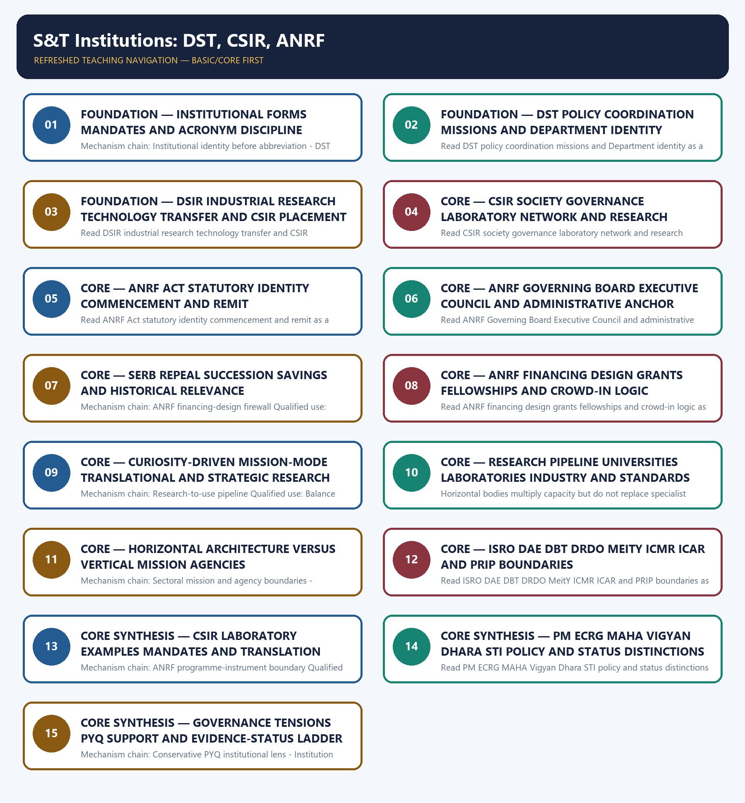

# S&T Institutions: DST, CSIR, ANRF — Learner-v2 Complete Learning Session

> **Authoring-only generation:** 2026-09-04. No PDF was rendered and no tracker or index was mutated.

### SOURCE, PROGRESSION AND CURRENT-LINKAGE AUDIT

- **Generation date:** 2026-09-04.
- **Repository-first evidence:** the Basic owner is taught first and preserved in full; the Advanced owner is retained only in the optional final teaching block.
- **OCR evidence:** Repository Markdown was primary. OCR-searchable official UPSC papers were supplementary only for printed routed demands. No answer key, performance value, procurement outcome, operational deployment, programme target or technology milestone was inferred.
- **Qdrant:** not used; repository Markdown and available OCR context were sufficient.
- **PYQ integrity:** No audited 2018-2026 PYQ is directly routed to Topic 24. Three representative cross-owner cards use biotechnology R&D, physics-discovery impact and semiconductor-mission demands only to demonstrate the supporting funding, laboratory, university and translation lens; direct ownership remains with Topics 13, 21 and 11 respectively.
- **Live-link boundary:** Live checks on 2026-09-04 confirmed substantive CSIR network text and located official DST, DSIR, India Code and ANRF surfaces, while several returned title-only, blocked, obsolete-fragment or raw-PDF responses. Exact statutory distinctions remain owner-bounded; no portal state, call, financing design or laboratory count was turned into spending, project completion, commercialization or policy outcome.
- **Fact/inference discipline:** no current-affairs item, PYQ wording, figure or quotation is invented.

### LIVE OFFICIAL-SOURCE ATTEMPT LOG

The checks below were made on 2026-09-04. Substantive official text is used only for the proposition it supports; title-only, blocked or thin pages are recorded and supply no factual claim.

- https://dst.gov.in/introduction - fetched 2026-09-04; the official DST endpoint returned only the page title through the live fetch tool. The owner's established-May-1971 and nodal-policy propositions were not independently expanded from this thin response.
- https://www.dsir.gov.in/ministry/our-organisation - attempted 2026-09-04 and returned HTTP 403 through direct fetch. An official-domain search result identified CSIR as an autonomous institution under DSIR and the 37-laboratory network; the blocked page supplied no additional mandate, count or status claim.
- https://www.csir.res.in/en/about-us/about-csir - fetched 2026-09-04; substantive official text confirmed CSIR's 37 national laboratories, 39 outreach centres, one Innovation Complex and three units, and its wide research spectrum. Dated personnel, patent and publication figures on the page were excluded from the learning facts.
- https://www.indiacode.nic.in/bitstream/123456789/19767/1/a2023-25.pdf - attempted 2026-09-04 and returned HTTP 403. The ANRF Act's Act 25 of 2023, commencement, sections 5, 7 and 27 remain bounded by the audited Basic and Advanced owners; the blocked response was not treated as fresh machine-readable legal proof.
- https://dst.gov.in/anusandhan-national-research-foundation-anrf and https://dst.gov.in/news/anrf-gazette-notifications - fetched 2026-09-04; both official DST endpoints returned title-only content. They confirm the official surfaces exist but supplied no additional scheme, governance, funding or operational-status proposition.
- https://anrf.gov.in/ - fetched 2026-09-04; the endpoint exposed an obsolete IMPRINT-II/SERB text fragment rather than a reliable current ANRF landing-page snapshot. It was recorded as a thin response and was not used to reverse the statutory SERB-to-ANRF transition.
- https://anrf.gov.in/assets/pdf/CFP_of_MAHA_Water.pdf - fetched 2026-09-04 as raw official PDF bytes; official-domain search located the 2026 ANRF-Jal Shakti MAHA Water call. Raw bytes and snippets were not converted into award, expenditure, completed-project or outcome claims.

## BASIC LEARNING SESSION

### DEEP-REVIEW LEARNING CONTRACT

| Control | Binding rule for this package |
|---|---|
| Syllabus boundary | Complete Science and Technology Basic/Core is easy-first and answer-complete before optional Advanced depth. |
| System boundary | Organisation, platform, subsystem, payload, process, application, institution and outcome remain distinct. |
| Technical boundary | Physical mechanism, classification, stage, platform, unit, range/capacity and limiting condition are explicit. |
| Status boundary | Announcement, approval, development, test, deployment, induction, commercial operation and observed outcome remain distinct. |
| Data boundary | Every mission, launch, target, capacity, budget, range, timeline, rule and regulatory claim keeps source, date, unit and status. |
| Governance boundary | Funder, developer, operator, authoriser, regulator, procurer, settlement actor and adjudicator are not conflated. |
| Practice contract | Every solved item has demand decoding, detailed examiner-grade model, executable timed/compression plan, marks rationale and answer-specific improvement. |
| PYQ contract | Official wording and keys are asserted only when verified; routed or reconstructed demands remain labelled. |
| Dual-flow contract | Graphical and ASCII masters independently reconstruct the same complete Basic-to-optional-Advanced evidence spine. |
| Approval | This immutable successor remains `approved: false` pending explicit approval. |

**Canonical Basic/Core owner:** `upsc-ai-kit\knowledge\Science-and-Technology\basic\24_S-and-T-Institutions-DST-CSIR-ANRF.md`  
**Substantive canonical provenance owner:** `upsc-ai-kit\knowledge\Science-and-Technology\learning-sessions\v2\subject-wide-syllabus\science-and-technology-24_Learning-Session.md`  
**Optional Advanced owner:** `upsc-ai-kit\knowledge\Science-and-Technology\advanced\24_S-and-T-Institutions-DST-CSIR-ANRF.md`  
**Official syllabus mapping:** `upsc-ai-kit\knowledge\Science-and-Technology\OFFICIAL-UPSC-SYLLABUS-MAPPING.md`

### EVIDENCE, PYQ AND CURRENT-STATUS CONTROL

- ISRO organisation, launcher stages, payload and orbit claims retain their exact object and mission date.
- NavIC, GAGAN, human-spaceflight, planetary, nuclear, fusion, missile and procurement claims retain category and status.
- Aadhaar/UPI, AI, quantum and semiconductor claims retain actor, layer, metric, maturity and governance boundaries.
- DPDP/cybersecurity, biotechnology and genetic-engineering claims retain legal/regulatory stage and competent institution.
- Targets, budgets, capacities, ranges and timelines are never promoted into achieved outcomes without dated evidence.
- **Current-status note, rechecked 2026-09-06:** volatile claims retain source/date/status; failed official fetches remain explicit and supply no invented fact.

**Generation-local live/current sources:**
- `https://dst.gov.in/introduction - fetched 2026-09-04; the official DST endpoint returned only the page title through the live fetch tool. The owner's established-May-1971 and nodal-policy propositions were not independently expanded from this thin response.`
- `https://www.dsir.gov.in/ministry/our-organisation - attempted 2026-09-04 and returned HTTP 403 through direct fetch. An official-domain search result identified CSIR as an autonomous institution under DSIR and the 37-laboratory network; the blocked page supplied no additional mandate, count or status claim.`
- `https://www.csir.res.in/en/about-us/about-csir - fetched 2026-09-04; substantive official text confirmed CSIR's 37 national laboratories, 39 outreach centres, one Innovation Complex and three units, and its wide research spectrum. Dated personnel, patent and publication figures on the page were excluded from the learning facts.`
- `https://www.indiacode.nic.in/bitstream/123456789/19767/1/a2023-25.pdf - attempted 2026-09-04 and returned HTTP 403. The ANRF Act's Act 25 of 2023, commencement, sections 5, 7 and 27 remain bounded by the audited Basic and Advanced owners; the blocked response was not treated as fresh machine-readable legal proof.`
- `https://dst.gov.in/anusandhan-national-research-foundation-anrf and https://dst.gov.in/news/anrf-gazette-notifications - fetched 2026-09-04; both official DST endpoints returned title-only content. They confirm the official surfaces exist but supplied no additional scheme, governance, funding or operational-status proposition.`
- `https://anrf.gov.in/ - fetched 2026-09-04; the endpoint exposed an obsolete IMPRINT-II/SERB text fragment rather than a reliable current ANRF landing-page snapshot. It was recorded as a thin response and was not used to reverse the statutory SERB-to-ANRF transition.`
- `https://anrf.gov.in/assets/pdf/CFP_of_MAHA_Water.pdf - fetched 2026-09-04 as raw official PDF bytes; official-domain search located the 2026 ANRF-Jal Shakti MAHA Water call. Raw bytes and snippets were not converted into award, expenditure, completed-project or outcome claims.`

**Topic-routed verified PYQ owners:**
- No topic-local official question file is claimed; repository PYQ routing ledgers control wording and status.




*Distinct embedded teaching-navigation image. The separate continuous Cārvāka-style flowchart package remains an independent at-a-glance artifact.*

### SESSION 1 — FOUNDATION — INSTITUTIONAL FORMS MANDATES AND ACRONYM DISCIPLINE

#### DEFINITION / WHAT THIS IS CALLED

**Plain-language definition:** Read Institutional forms mandates and acronym discipline as a sequence: identify Institutional identity before abbreviation, follow the named mechanism to its user or output, and stop at the last verified status rather than assuming the next stage.

**Technical definition:** Mechanism chain: Institutional identity before abbreviation - DST horizontal policy role Qualified use: Identify legal form, parent institution, mandate and instrument before expanding an acronym.

#### ANSWER-GRABBING OPENING — WRITE/ADAPT IN THE EXAM

> Legal form determines accountability and powers, while mandate determines function; an acronym or shared ministry does not make two bodies institutional peers.

#### MUST-WRITE KEYWORDS

- **FOUNDATION**
- **Institutional forms mandates**
- **acronym discipline**
- **Mechanism chain**
- **Qualified use**
- **Legal**

**How to use them:** Frame the answer through FOUNDATION; define Institutional forms mandates, connect acronym discipline with Mechanism chain to explain the mechanism, and use Qualified use for the decisive comparison or qualification.

#### VISUAL FIRST

```text
INSTITUTIONAL FORMS MANDATES AND ACRONYM DISCIPLINE
01. Institutional identity before abbreviation
    |
    v
02. DST horizontal policy role
STATUS / CATEGORY FIREWALL -> Do not call DST a Ministry or India's universal laboratory network.
```

*The rail fixes the technical sequence and the claim boundary before explanation.*

#### CORE EXPLANATION

India's science architecture contains Ministries, Departments, statutory bodies, autonomous societies, offices, academies, regulators, grant programmes and research-performing laboratories. Legal form determines accountability and powers, while mandate determines function; an acronym or shared ministry does not make two bodies institutional peers. The Department of Science and Technology is a Department under the Ministry of Science and Technology, established in May 1971 to promote new areas and organise, coordinate and support science and technology activities. DST is a horizontal policy, programme and mission anchor, not India's single all-purpose laboratory network or a Ministry in its own right.

#### SIMPLE SYSTEM EXAMPLE

Read Institutional forms mandates and acronym discipline as a sequence: identify Institutional identity before abbreviation, follow the named mechanism to its user or output, and stop at the last verified status rather than assuming the next stage.

#### TECHNICAL DISTINCTION

The decisive boundary is Do not call DST a Ministry or India's universal laboratory network. This keeps Institutional identity before abbreviation and DST horizontal policy role in the correct scientific category, institution and unit of measurement.

#### NAMED EVIDENCE AND MECHANISM

- India's science architecture contains Ministries, Departments, statutory bodies, autonomous societies, offices, academies, regulators, grant programmes and research-performing laboratories. Legal form determines accountability and powers, while mandate determines function; an acronym or shared ministry does not make two bodies institutional peers.
- The Department of Science and Technology is a Department under the Ministry of Science and Technology, established in May 1971 to promote new areas and organise, coordinate and support science and technology activities. DST is a horizontal policy, programme and mission anchor, not India's single all-purpose laboratory network or a Ministry in its own right.

#### EXAMINER CAUTION

- Do not call DST a Ministry or India's universal laboratory network.

#### EXAM LINK

- **Prelims:** Keep institution, system, platform, service, process, legal instrument, unit and status in their exact category.
- **Mains:** Identify legal form, parent institution, mandate and instrument before expanding an acronym.

#### MINI RECAP

- **Mechanism chain:** Institutional identity before abbreviation -> DST horizontal policy role
- **Qualified use:** Identify legal form, parent institution, mandate and instrument before expanding an acronym.

#### CLOSING RECALL FLOW — FOUNDATION — INSTITUTIONAL FORMS MANDATES AND ACRONYM DISCIPLINE

```text
START / CONCEPT: FOUNDATION — Institutional forms mandates and acronym discipline
        |
        v
EXACT TERMS: FOUNDATION · Institutional forms mandates · acronym discipline · Mechanism chain · Qualified use · Legal
        |
        v
MECHANISM / ARGUMENT: Read Institutional forms mandates and acronym discipline as a sequence: identify Institutional identity before abbreviation, follow the named mechanism to its user or output, and stop at the last verified status rather than assuming the next stage.
        |
        v
CONSEQUENCE / CONTRAST: Mechanism chain: Institutional identity before abbreviation - DST horizontal policy role Qualified use: Identify legal form, parent institution, mandate and instrument before expanding an acronym.
        |
        v
UPSC TRAP / ANSWER-USE: DST is a horizontal policy, programme and mission anchor, not India's single all-purpose laboratory network or a Ministry in its own right.
        |
        v
ANSWER-GRABBING FORMULATION: Legal form determines accountability and powers, while mandate determines function; an acronym or shared ministry does not make two bodies institutional peers.
```
### SESSION 2 — FOUNDATION — DST POLICY COORDINATION MISSIONS AND DEPARTMENT IDENTITY

#### DEFINITION / WHAT THIS IS CALLED

**Plain-language definition:** The Department of Scientific and Industrial Research is a separate Department in the Ministry of Science and Technology; it promotes industrial research, technology transfer and recognition or support mechanisms for industrial R&D and administratively holds CSIR.

**Technical definition:** Read DST policy coordination missions and Department identity as a sequence: identify DSIR industrial-research role, follow the named mechanism to its user or output, and stop at the last verified status rather than assuming the next stage.

#### ANSWER-GRABBING OPENING — WRITE/ADAPT IN THE EXAM

> Read DST policy coordination missions and Department identity as a sequence: identify DSIR industrial-research role, follow the named mechanism to its user or output, and stop at the last verified status rather than assuming the next stage.

#### MUST-WRITE KEYWORDS

- **FOUNDATION**
- **DST policy coordination missions**
- **Department identity**
- **Mechanism chain**
- **Qualified use**
- **The Department of Scientific and Industrial Research**

**How to use them:** Frame the answer through FOUNDATION; define DST policy coordination missions, connect Department identity with Mechanism chain to explain the mechanism, and use Qualified use for the decisive comparison or qualification.

#### VISUAL FIRST

```text
DST POLICY COORDINATION MISSIONS AND DEPARTMENT IDENTITY
01. DSIR industrial-research role
STATUS / CATEGORY FIREWALL -> Do not place CSIR directly under DST while omitting DSIR.
```

*The rail fixes the technical sequence and the claim boundary before explanation.*

#### CORE EXPLANATION

The Department of Scientific and Industrial Research is a separate Department in the Ministry of Science and Technology; it promotes industrial research, technology transfer and recognition or support mechanisms for industrial R&D and administratively holds CSIR. DSIR is not a laboratory, a generic grant council or another name for DST.

#### SIMPLE SYSTEM EXAMPLE

Read DST policy coordination missions and Department identity as a sequence: identify DSIR industrial-research role, follow the named mechanism to its user or output, and stop at the last verified status rather than assuming the next stage.

#### TECHNICAL DISTINCTION

The decisive boundary is Do not place CSIR directly under DST while omitting DSIR. This keeps DSIR industrial-research role in the correct scientific category, institution and unit of measurement.

#### NAMED EVIDENCE AND MECHANISM

- The Department of Scientific and Industrial Research is a separate Department in the Ministry of Science and Technology; it promotes industrial research, technology transfer and recognition or support mechanisms for industrial R&D and administratively holds CSIR. DSIR is not a laboratory, a generic grant council or another name for DST.

#### EXAMINER CAUTION

- Do not place CSIR directly under DST while omitting DSIR.

#### EXAM LINK

- **Prelims:** Keep institution, system, platform, service, process, legal instrument, unit and status in their exact category.
- **Mains:** Describe DST as a Department and horizontal policy anchor without turning it into every science agency.

#### MINI RECAP

- **Mechanism chain:** DSIR industrial-research role
- **Qualified use:** Describe DST as a Department and horizontal policy anchor without turning it into every science agency.

#### CLOSING RECALL FLOW — FOUNDATION — DST POLICY COORDINATION MISSIONS AND DEPARTMENT IDENTITY

```text
START / CONCEPT: FOUNDATION — DST policy coordination missions and Department identity
        |
        v
EXACT TERMS: FOUNDATION · DST policy coordination missions · Department identity · Mechanism chain · Qualified use · The Department of Scientific and Industrial Research
        |
        v
MECHANISM / ARGUMENT: Mechanism chain: DSIR industrial-research role Qualified use: Describe DST as a Department and horizontal policy anchor without turning it into every science agency.
        |
        v
CONSEQUENCE / CONTRAST: DSIR is not a laboratory, a generic grant council or another name for DST.
        |
        v
UPSC TRAP / ANSWER-USE: The decisive boundary is Do not place CSIR directly under DST while omitting DSIR.
        |
        v
ANSWER-GRABBING FORMULATION: Read DST policy coordination missions and Department identity as a sequence: identify DSIR industrial-research role, follow the named mechanism to its user or output, and stop at the last verified status rather than assuming the next stage.
```
### SESSION 3 — FOUNDATION — DSIR INDUSTRIAL RESEARCH TECHNOLOGY TRANSFER AND CSIR PLACEMENT

#### DEFINITION / WHAT THIS IS CALLED

**Plain-language definition:** The Council of Scientific and Industrial Research is an autonomous society registered under the Societies Registration Act and administratively under DSIR.

**Technical definition:** Read DSIR industrial research technology transfer and CSIR placement as a sequence: identify CSIR legal and research-performing identity, follow the named mechanism to its user or output, and stop at the last verified status rather than assuming the next stage.

#### ANSWER-GRABBING OPENING — WRITE/ADAPT IN THE EXAM

> Read DSIR industrial research technology transfer and CSIR placement as a sequence: identify CSIR legal and research-performing identity, follow the named mechanism to its user or output, and stop at the last verified status rather than assuming the next stage.

#### MUST-WRITE KEYWORDS

- **FOUNDATION**
- **DSIR industrial research technology transfer**
- **CSIR placement**
- **Mechanism chain**
- **Qualified use**
- **The Council of Scientific and Industrial Research**

**How to use them:** Frame the answer through FOUNDATION; define DSIR industrial research technology transfer, connect CSIR placement with Mechanism chain to explain the mechanism, and use Qualified use for the decisive comparison or qualification.

#### VISUAL FIRST

```text
DSIR INDUSTRIAL RESEARCH TECHNOLOGY TRANSFER AND CSIR PLACEMENT
01. CSIR legal and research-performing identity
STATUS / CATEGORY FIREWALL -> Do not call CSIR a Department, regulator or primarily grant-only body.
```

*The rail fixes the technical sequence and the claim boundary before explanation.*

#### CORE EXPLANATION

The Council of Scientific and Industrial Research is an autonomous society registered under the Societies Registration Act and administratively under DSIR. Its official profile records a network of 37 national laboratories, 39 outreach centres, one Innovation Complex and three units across fields including chemicals, drugs, genomics, biotechnology, mining, aeronautics, instrumentation, environment and information technology.

#### SIMPLE SYSTEM EXAMPLE

Read DSIR industrial research technology transfer and CSIR placement as a sequence: identify CSIR legal and research-performing identity, follow the named mechanism to its user or output, and stop at the last verified status rather than assuming the next stage.

#### TECHNICAL DISTINCTION

The decisive boundary is Do not call CSIR a Department, regulator or primarily grant-only body. This keeps CSIR legal and research-performing identity in the correct scientific category, institution and unit of measurement.

#### NAMED EVIDENCE AND MECHANISM

- The Council of Scientific and Industrial Research is an autonomous society registered under the Societies Registration Act and administratively under DSIR. Its official profile records a network of 37 national laboratories, 39 outreach centres, one Innovation Complex and three units across fields including chemicals, drugs, genomics, biotechnology, mining, aeronautics, instrumentation, environment and information technology.

#### EXAMINER CAUTION

- Do not call CSIR a Department, regulator or primarily grant-only body.

#### EXAM LINK

- **Prelims:** Keep institution, system, platform, service, process, legal instrument, unit and status in their exact category.
- **Mains:** Place DSIR between the Ministry and CSIR, then separate industrial-research promotion from laboratory work.

#### MINI RECAP

- **Mechanism chain:** CSIR legal and research-performing identity
- **Qualified use:** Place DSIR between the Ministry and CSIR, then separate industrial-research promotion from laboratory work.

#### CLOSING RECALL FLOW — FOUNDATION — DSIR INDUSTRIAL RESEARCH TECHNOLOGY TRANSFER AND CSIR PLACEMENT

```text
START / CONCEPT: FOUNDATION — DSIR industrial research technology transfer and CSIR placement
        |
        v
EXACT TERMS: FOUNDATION · DSIR industrial research technology transfer · CSIR placement · Mechanism chain · Qualified use · The Council of Scientific and Industrial Research
        |
        v
MECHANISM / ARGUMENT: Mechanism chain: CSIR legal and research-performing identity Qualified use: Place DSIR between the Ministry and CSIR, then separate industrial-research promotion from laboratory work.
        |
        v
CONSEQUENCE / CONTRAST: The Council of Scientific and Industrial Research is an autonomous society registered under the Societies Registration Act and administratively under DSIR.
        |
        v
UPSC TRAP / ANSWER-USE: The decisive boundary is Do not call CSIR a Department, regulator or primarily grant-only body.
        |
        v
ANSWER-GRABBING FORMULATION: Read DSIR industrial research technology transfer and CSIR placement as a sequence: identify CSIR legal and research-performing identity, follow the named mechanism to its user or output, and stop at the last verified status rather than assuming the next stage.
```
### SESSION 4 — CORE — CSIR SOCIETY GOVERNANCE LABORATORY NETWORK AND RESEARCH PERFORMANCE

#### DEFINITION / WHAT THIS IS CALLED

**Plain-language definition:** The Prime Minister is President of CSIR and the Union Science and Technology Minister its Vice-President, while laboratories perform research, technology development, testing, standards-related work and translation according to their mandates.

**Technical definition:** Read CSIR society governance laboratory network and research performance as a sequence: identify CSIR governance and mandate boundary, follow the named mechanism to its user or output, and stop at the last verified status rather than assuming the next stage.

#### ANSWER-GRABBING OPENING — WRITE/ADAPT IN THE EXAM

> Read CSIR society governance laboratory network and research performance as a sequence: identify CSIR governance and mandate boundary, follow the named mechanism to its user or output, and stop at the last verified status rather than assuming the next stage.

#### MUST-WRITE KEYWORDS

- **CSIR society governance laboratory network**
- **research performance**
- **Mechanism chain**
- **Qualified use**
- **The Prime Minister**
- **President**

**How to use them:** Frame the answer through CSIR society governance laboratory network; define research performance, connect Mechanism chain with Qualified use to explain the mechanism, and use The Prime Minister for the decisive comparison or qualification.

#### VISUAL FIRST

```text
CSIR SOCIETY GOVERNANCE LABORATORY NETWORK AND RESEARCH PERFORMANCE
01. CSIR governance and mandate boundary
STATUS / CATEGORY FIREWALL -> Do not treat ANRF as a DST sub-office merely because DST is its administrative anchor.
```

*The rail fixes the technical sequence and the claim boundary before explanation.*

#### CORE EXPLANATION

The Prime Minister is President of CSIR and the Union Science and Technology Minister its Vice-President, while laboratories perform research, technology development, testing, standards-related work and translation according to their mandates. High-level office-bearers do not convert CSIR into a Department, regulator or primarily grant-disbursing council.

#### SIMPLE SYSTEM EXAMPLE

Read CSIR society governance laboratory network and research performance as a sequence: identify CSIR governance and mandate boundary, follow the named mechanism to its user or output, and stop at the last verified status rather than assuming the next stage.

#### TECHNICAL DISTINCTION

The decisive boundary is Do not treat ANRF as a DST sub-office merely because DST is its administrative anchor. This keeps CSIR governance and mandate boundary in the correct scientific category, institution and unit of measurement.

#### NAMED EVIDENCE AND MECHANISM

- The Prime Minister is President of CSIR and the Union Science and Technology Minister its Vice-President, while laboratories perform research, technology development, testing, standards-related work and translation according to their mandates. High-level office-bearers do not convert CSIR into a Department, regulator or primarily grant-disbursing council.

#### EXAMINER CAUTION

- Do not treat ANRF as a DST sub-office merely because DST is its administrative anchor.

#### EXAM LINK

- **Prelims:** Keep institution, system, platform, service, process, legal instrument, unit and status in their exact category.
- **Mains:** State CSIR's autonomous-society identity, research network and mandate without regulatory drift.

#### MINI RECAP

- **Mechanism chain:** CSIR governance and mandate boundary
- **Qualified use:** State CSIR's autonomous-society identity, research network and mandate without regulatory drift.

#### CLOSING RECALL FLOW — CORE — CSIR SOCIETY GOVERNANCE LABORATORY NETWORK AND RESEARCH PERFORMANCE

```text
START / CONCEPT: CORE — CSIR society governance laboratory network and research performance
        |
        v
EXACT TERMS: CSIR society governance laboratory network · research performance · Mechanism chain · Qualified use · The Prime Minister · President
        |
        v
MECHANISM / ARGUMENT: Mechanism chain: CSIR governance and mandate boundary Qualified use: State CSIR's autonomous-society identity, research network and mandate without regulatory drift.
        |
        v
CONSEQUENCE / CONTRAST: The Prime Minister is President of CSIR and the Union Science and Technology Minister its Vice-President, while laboratories perform research, technology development, testing, standards-related work and translation according to their mandates.
        |
        v
UPSC TRAP / ANSWER-USE: High-level office-bearers do not convert CSIR into a Department, regulator or primarily grant-disbursing council.
        |
        v
ANSWER-GRABBING FORMULATION: Read CSIR society governance laboratory network and research performance as a sequence: identify CSIR governance and mandate boundary, follow the named mechanism to its user or output, and stop at the last verified status rather than assuming the next stage.
```
### SESSION 5 — CORE — ANRF ACT STATUTORY IDENTITY COMMENCEMENT AND REMIT

#### DEFINITION / WHAT THIS IS CALLED

**Plain-language definition:** The Anusandhan National Research Foundation is a statutory apex research body created by the ANRF Act, 2023, Act 25 of 2023, enacted on 12 August 2023 and brought into force on 5 February 2024.

**Technical definition:** Read ANRF Act statutory identity commencement and remit as a sequence: identify ANRF statutory identity and commencement, follow the named mechanism to its user or output, and stop at the last verified status rather than assuming the next stage.

#### ANSWER-GRABBING OPENING — WRITE/ADAPT IN THE EXAM

> Read ANRF Act statutory identity commencement and remit as a sequence: identify ANRF statutory identity and commencement, follow the named mechanism to its user or output, and stop at the last verified status rather than assuming the next stage.

#### MUST-WRITE KEYWORDS

- **ANRF Act statutory identity commencement**
- **remit**
- **Mechanism chain**
- **Qualified use**
- **The Anusandhan National Research Foundation**
- **ANRF Act**

**How to use them:** Frame the answer through ANRF Act statutory identity commencement; define remit, connect Mechanism chain with Qualified use to explain the mechanism, and use The Anusandhan National Research Foundation for the decisive comparison or qualification.

#### VISUAL FIRST

```text
ANRF ACT STATUTORY IDENTITY COMMENCEMENT AND REMIT
01. ANRF statutory identity and commencement
STATUS / CATEGORY FIREWALL -> Do not merge ANRF's Governing Board with its Executive Council.
```

*The rail fixes the technical sequence and the claim boundary before explanation.*

#### CORE EXPLANATION

The Anusandhan National Research Foundation is a statutory apex research body created by the ANRF Act, 2023, Act 25 of 2023, enacted on 12 August 2023 and brought into force on 5 February 2024. It is designed to seed, grow and promote research and provide high-level strategic direction; DST is the administrative anchor, not a basis for calling ANRF a DST sub-office.

#### SIMPLE SYSTEM EXAMPLE

Read ANRF Act statutory identity commencement and remit as a sequence: identify ANRF statutory identity and commencement, follow the named mechanism to its user or output, and stop at the last verified status rather than assuming the next stage.

#### TECHNICAL DISTINCTION

The decisive boundary is Do not merge ANRF's Governing Board with its Executive Council. This keeps ANRF statutory identity and commencement in the correct scientific category, institution and unit of measurement.

#### NAMED EVIDENCE AND MECHANISM

- The Anusandhan National Research Foundation is a statutory apex research body created by the ANRF Act, 2023, Act 25 of 2023, enacted on 12 August 2023 and brought into force on 5 February 2024. It is designed to seed, grow and promote research and provide high-level strategic direction; DST is the administrative anchor, not a basis for calling ANRF a DST sub-office.

#### EXAMINER CAUTION

- Do not merge ANRF's Governing Board with its Executive Council.

#### EXAM LINK

- **Prelims:** Keep institution, system, platform, service, process, legal instrument, unit and status in their exact category.
- **Mains:** Date the Act and commencement, then state ANRF's strategic funding and ecosystem role.

#### MINI RECAP

- **Mechanism chain:** ANRF statutory identity and commencement
- **Qualified use:** Date the Act and commencement, then state ANRF's strategic funding and ecosystem role.

#### CLOSING RECALL FLOW — CORE — ANRF ACT STATUTORY IDENTITY COMMENCEMENT AND REMIT

```text
START / CONCEPT: CORE — ANRF Act statutory identity commencement and remit
        |
        v
EXACT TERMS: ANRF Act statutory identity commencement · remit · Mechanism chain · Qualified use · The Anusandhan National Research Foundation · ANRF Act
        |
        v
MECHANISM / ARGUMENT: Mechanism chain: ANRF statutory identity and commencement Qualified use: Date the Act and commencement, then state ANRF's strategic funding and ecosystem role.
        |
        v
CONSEQUENCE / CONTRAST: It is designed to seed, grow and promote research and provide high-level strategic direction; DST is the administrative anchor, not a basis for calling ANRF a DST sub-office.
        |
        v
UPSC TRAP / ANSWER-USE: Do not miss this limiting distinction: the Anusandhan National Research Foundation is a statutory apex research body created by the...
        |
        v
ANSWER-GRABBING FORMULATION: Read ANRF Act statutory identity commencement and remit as a sequence: identify ANRF statutory identity and commencement, follow the named mechanism to its user or output, and stop at the last verified status rather than assuming the next stage.
```
### SESSION 6 — CORE — ANRF GOVERNING BOARD EXECUTIVE COUNCIL AND ADMINISTRATIVE ANCHOR

#### DEFINITION / WHAT THIS IS CALLED

**Plain-language definition:** Strategic governance, executive implementation and administrative support are therefore distinct layers.

**Technical definition:** Read ANRF Governing Board Executive Council and administrative anchor as a sequence: identify ANRF two-tier governance, follow the named mechanism to its user or output, and stop at the last verified status rather than assuming the next stage.

#### ANSWER-GRABBING OPENING — WRITE/ADAPT IN THE EXAM

> Read ANRF Governing Board Executive Council and administrative anchor as a sequence: identify ANRF two-tier governance, follow the named mechanism to its user or output, and stop at the last verified status rather than assuming the next stage.

#### MUST-WRITE KEYWORDS

- **ANRF Governing Board Executive Council**
- **administrative anchor**
- **Mechanism chain**
- **Qualified use**
- **Strategic**
- **The Science**

**How to use them:** Frame the answer through ANRF Governing Board Executive Council; define administrative anchor, connect Mechanism chain with Qualified use to explain the mechanism, and use Strategic for the decisive comparison or qualification.

#### VISUAL FIRST

```text
ANRF GOVERNING BOARD EXECUTIVE COUNCIL AND ADMINISTRATIVE ANCHOR
01. ANRF two-tier governance
    |
    v
02. SERB repeal and succession
STATUS / CATEGORY FIREWALL -> Do not present SERB as a separate continuing statutory apex body after section 27.
```

*The rail fixes the technical sequence and the claim boundary before explanation.*

#### CORE EXPLANATION

Section 5 places the Prime Minister as ex officio President of ANRF's Governing Board, with the Union Ministers for Science and Technology and Education as Vice-Presidents, while section 7 makes the Principal Scientific Adviser ex officio Chairperson of the Executive Council. Strategic governance, executive implementation and administrative support are therefore distinct layers. The Science and Engineering Research Board was the statutory competitive-grants body under the SERB Act, 2008; section 27 of the ANRF Act repealed that Act and dissolved SERB with transition and savings for assets, liabilities and personnel. SERB remains historically relevant in older schemes and PYQs but is not a separate continuing statutory apex identity.

#### SIMPLE SYSTEM EXAMPLE

Read ANRF Governing Board Executive Council and administrative anchor as a sequence: identify ANRF two-tier governance, follow the named mechanism to its user or output, and stop at the last verified status rather than assuming the next stage.

#### TECHNICAL DISTINCTION

The decisive boundary is Do not present SERB as a separate continuing statutory apex body after section 27. This keeps ANRF two-tier governance and SERB repeal and succession in the correct scientific category, institution and unit of measurement.

#### NAMED EVIDENCE AND MECHANISM

- Section 5 places the Prime Minister as ex officio President of ANRF's Governing Board, with the Union Ministers for Science and Technology and Education as Vice-Presidents, while section 7 makes the Principal Scientific Adviser ex officio Chairperson of the Executive Council. Strategic governance, executive implementation and administrative support are therefore distinct layers.
- The Science and Engineering Research Board was the statutory competitive-grants body under the SERB Act, 2008; section 27 of the ANRF Act repealed that Act and dissolved SERB with transition and savings for assets, liabilities and personnel. SERB remains historically relevant in older schemes and PYQs but is not a separate continuing statutory apex identity.

#### EXAMINER CAUTION

- Do not present SERB as a separate continuing statutory apex body after section 27.

#### EXAM LINK

- **Prelims:** Keep institution, system, platform, service, process, legal instrument, unit and status in their exact category.
- **Mains:** Separate the Governing Board, Executive Council, PSA role and DST administrative support.

#### MINI RECAP

- **Mechanism chain:** ANRF two-tier governance -> SERB repeal and succession
- **Qualified use:** Separate the Governing Board, Executive Council, PSA role and DST administrative support.

#### CLOSING RECALL FLOW — CORE — ANRF GOVERNING BOARD EXECUTIVE COUNCIL AND ADMINISTRATIVE ANCHOR

```text
START / CONCEPT: CORE — ANRF Governing Board Executive Council and administrative anchor
        |
        v
EXACT TERMS: ANRF Governing Board Executive Council · administrative anchor · Mechanism chain · Qualified use · Strategic · The Science
        |
        v
MECHANISM / ARGUMENT: Mechanism chain: ANRF two-tier governance - SERB repeal and succession Qualified use: Separate the Governing Board, Executive Council, PSA role and DST administrative support.
        |
        v
CONSEQUENCE / CONTRAST: Strategic governance, executive implementation and administrative support are therefore distinct layers.
        |
        v
UPSC TRAP / ANSWER-USE: Do not miss this limiting distinction: the Science and Engineering Research Board was the statutory competitive-grants body under the SERB...
        |
        v
ANSWER-GRABBING FORMULATION: Read ANRF Governing Board Executive Council and administrative anchor as a sequence: identify ANRF two-tier governance, follow the named mechanism to its user or output, and stop at the last verified status rather than assuming the next stage.
```
### SESSION 7 — CORE — SERB REPEAL SUCCESSION SAVINGS AND HISTORICAL RELEVANCE

#### DEFINITION / WHAT THIS IS CALLED

**Plain-language definition:** Read SERB repeal succession savings and historical relevance as a sequence: identify ANRF financing-design firewall, follow the named mechanism to its user or output, and stop at the last verified status rather than assuming the next stage.

**Technical definition:** Mechanism chain: ANRF financing-design firewall Qualified use: Explain legal succession from SERB while retaining older references only as historical context.

#### ANSWER-GRABBING OPENING — WRITE/ADAPT IN THE EXAM

> Read SERB repeal succession savings and historical relevance as a sequence: identify ANRF financing-design firewall, follow the named mechanism to its user or output, and stop at the last verified status rather than assuming the next stage.

#### MUST-WRITE KEYWORDS

- **SERB repeal succession savings**
- **historical relevance**
- **Mechanism chain**
- **Qualified use**
- **This**
- **2023-28**

**How to use them:** Frame the answer through SERB repeal succession savings; define historical relevance, connect Mechanism chain with Qualified use to explain the mechanism, and use This for the decisive comparison or qualification.

#### VISUAL FIRST

```text
SERB REPEAL SUCCESSION SAVINGS AND HISTORICAL RELEVANCE
01. ANRF financing-design firewall
STATUS / CATEGORY FIREWALL -> Do not rewrite ANRF's financing design as money received, appropriated or spent.
```

*The rail fixes the technical sequence and the claim boundary before explanation.*

#### CORE EXPLANATION

The owner records an announced ANRF design of 50,000 crore rupees over 2023-28, with about 36,000 crore expected from non-government sources including industry and philanthropy. This is a financing design and crowd-in ambition, not proof of appropriation, receipt, annual release, grant award, expenditure or research outcome.

#### SIMPLE SYSTEM EXAMPLE

Read SERB repeal succession savings and historical relevance as a sequence: identify ANRF financing-design firewall, follow the named mechanism to its user or output, and stop at the last verified status rather than assuming the next stage.

#### TECHNICAL DISTINCTION

The decisive boundary is Do not rewrite ANRF's financing design as money received, appropriated or spent. This keeps ANRF financing-design firewall in the correct scientific category, institution and unit of measurement.

#### NAMED EVIDENCE AND MECHANISM

- The owner records an announced ANRF design of 50,000 crore rupees over 2023-28, with about 36,000 crore expected from non-government sources including industry and philanthropy. This is a financing design and crowd-in ambition, not proof of appropriation, receipt, annual release, grant award, expenditure or research outcome.

#### EXAMINER CAUTION

- Do not rewrite ANRF's financing design as money received, appropriated or spent.

#### EXAM LINK

- **Prelims:** Keep institution, system, platform, service, process, legal instrument, unit and status in their exact category.
- **Mains:** Explain legal succession from SERB while retaining older references only as historical context.

#### MINI RECAP

- **Mechanism chain:** ANRF financing-design firewall
- **Qualified use:** Explain legal succession from SERB while retaining older references only as historical context.

#### CLOSING RECALL FLOW — CORE — SERB REPEAL SUCCESSION SAVINGS AND HISTORICAL RELEVANCE

```text
START / CONCEPT: CORE — SERB repeal succession savings and historical relevance
        |
        v
EXACT TERMS: SERB repeal succession savings · historical relevance · Mechanism chain · Qualified use · This · 2023-28
        |
        v
MECHANISM / ARGUMENT: Mechanism chain: ANRF financing-design firewall Qualified use: Explain legal succession from SERB while retaining older references only as historical context.
        |
        v
CONSEQUENCE / CONTRAST: Mains: Explain legal succession from SERB while retaining older references only as historical context.
        |
        v
UPSC TRAP / ANSWER-USE: This is a financing design and crowd-in ambition, not proof of appropriation, receipt, annual release, grant award, expenditure or research outcome.
        |
        v
ANSWER-GRABBING FORMULATION: Read SERB repeal succession savings and historical relevance as a sequence: identify ANRF financing-design firewall, follow the named mechanism to its user or output, and stop at the last verified status rather than assuming the next stage.
```
### SESSION 8 — CORE — ANRF FINANCING DESIGN GRANTS FELLOWSHIPS AND CROWD-IN LOGIC

#### DEFINITION / WHAT THIS IS CALLED

**Plain-language definition:** The decisive boundary is Do not merge grants, fellowships and mission-mode programmes.

**Technical definition:** Read ANRF financing design grants fellowships and crowd-in logic as a sequence: identify Grant fellowship and mission-mode distinction, follow the named mechanism to its user or output, and stop at the last verified status rather than assuming the next stage.

#### ANSWER-GRABBING OPENING — WRITE/ADAPT IN THE EXAM

> Read ANRF financing design grants fellowships and crowd-in logic as a sequence: identify Grant fellowship and mission-mode distinction, follow the named mechanism to its user or output, and stop at the last verified status rather than assuming the next stage.

#### MUST-WRITE KEYWORDS

- **ANRF financing design grants fellowships**
- **crowd-in logic**
- **Mechanism chain**
- **Qualified use**
- **Investigator-led**
- **Read ANRF**

**How to use them:** Frame the answer through ANRF financing design grants fellowships; define crowd-in logic, connect Mechanism chain with Qualified use to explain the mechanism, and use Investigator-led for the decisive comparison or qualification.

#### VISUAL FIRST

```text
ANRF FINANCING DESIGN GRANTS FELLOWSHIPS AND CROWD-IN LOGIC
01. Grant fellowship and mission-mode distinction
STATUS / CATEGORY FIREWALL -> Do not merge grants, fellowships and mission-mode programmes.
```

*The rail fixes the technical sequence and the claim boundary before explanation.*

#### CORE EXPLANATION

A research grant funds a defined project, a fellowship principally supports a researcher, and a mission-mode programme directs multi-institutional work toward priority outcomes and milestones. Investigator-led curiosity research and directed strategic research serve different risk and time horizons; neither can substitute completely for the other.

#### SIMPLE SYSTEM EXAMPLE

Read ANRF financing design grants fellowships and crowd-in logic as a sequence: identify Grant fellowship and mission-mode distinction, follow the named mechanism to its user or output, and stop at the last verified status rather than assuming the next stage.

#### TECHNICAL DISTINCTION

The decisive boundary is Do not merge grants, fellowships and mission-mode programmes. This keeps Grant fellowship and mission-mode distinction in the correct scientific category, institution and unit of measurement.

#### NAMED EVIDENCE AND MECHANISM

- A research grant funds a defined project, a fellowship principally supports a researcher, and a mission-mode programme directs multi-institutional work toward priority outcomes and milestones. Investigator-led curiosity research and directed strategic research serve different risk and time horizons; neither can substitute completely for the other.

#### EXAMINER CAUTION

- Do not merge grants, fellowships and mission-mode programmes.

#### EXAM LINK

- **Prelims:** Keep institution, system, platform, service, process, legal instrument, unit and status in their exact category.
- **Mains:** Classify financing design, grant, fellowship and mission programme before discussing effectiveness.

#### MINI RECAP

- **Mechanism chain:** Grant fellowship and mission-mode distinction
- **Qualified use:** Classify financing design, grant, fellowship and mission programme before discussing effectiveness.

#### CLOSING RECALL FLOW — CORE — ANRF FINANCING DESIGN GRANTS FELLOWSHIPS AND CROWD-IN LOGIC

```text
START / CONCEPT: CORE — ANRF financing design grants fellowships and crowd-in logic
        |
        v
EXACT TERMS: ANRF financing design grants fellowships · crowd-in logic · Mechanism chain · Qualified use · Investigator-led · Read ANRF
        |
        v
MECHANISM / ARGUMENT: Mechanism chain: Grant fellowship and mission-mode distinction Qualified use: Classify financing design, grant, fellowship and mission programme before discussing effectiveness.
        |
        v
CONSEQUENCE / CONTRAST: The decisive boundary is Do not merge grants, fellowships and mission-mode programmes.
        |
        v
UPSC TRAP / ANSWER-USE: Do not merge grants, fellowships and mission-mode programmes.
        |
        v
ANSWER-GRABBING FORMULATION: Read ANRF financing design grants fellowships and crowd-in logic as a sequence: identify Grant fellowship and mission-mode distinction, follow the named mechanism to its user or output, and stop at the last verified status rather than assuming the next stage.
```
### SESSION 9 — CORE — CURIOSITY-DRIVEN MISSION-MODE TRANSLATIONAL AND STRATEGIC RESEARCH

#### DEFINITION / WHAT THIS IS CALLED

**Plain-language definition:** Read Curiosity-driven mission-mode translational and strategic research as a sequence: identify Research-to-use pipeline, follow the named mechanism to its user or output, and stop at the last verified status rather than assuming the next stage.

**Technical definition:** Mechanism chain: Research-to-use pipeline Qualified use: Balance investigator autonomy, long-horizon science, strategic priority and translational need.

#### ANSWER-GRABBING OPENING — WRITE/ADAPT IN THE EXAM

> Read Curiosity-driven mission-mode translational and strategic research as a sequence: identify Research-to-use pipeline, follow the named mechanism to its user or output, and stop at the last verified status rather than assuming the next stage.

#### MUST-WRITE KEYWORDS

- **Curiosity-driven mission-mode translational**
- **strategic research**
- **Mechanism chain**
- **Qualified use**
- **ANRF**
- **CSIR**

**How to use them:** Frame the answer through Curiosity-driven mission-mode translational; define strategic research, connect Mechanism chain with Qualified use to explain the mechanism, and use ANRF for the decisive comparison or qualification.

#### VISUAL FIRST

```text
CURIOSITY-DRIVEN MISSION-MODE TRANSLATIONAL AND STRATEGIC RESEARCH
01. Research-to-use pipeline
STATUS / CATEGORY FIREWALL -> Do not convert a funded project into a validated technology or societal outcome.
```

*The rail fixes the technical sequence and the claim boundary before explanation.*

#### CORE EXPLANATION

A disciplined research pipeline separates question formulation, basic research, experimental validation, replication, applied research, prototype, testing, scale-up, standards or regulation, manufacturing, adoption and verified societal outcome. ANRF can fund or shape parts of this pipeline, while CSIR and universities can perform research, but no institutional label proves every later rung.

#### SIMPLE SYSTEM EXAMPLE

Read Curiosity-driven mission-mode translational and strategic research as a sequence: identify Research-to-use pipeline, follow the named mechanism to its user or output, and stop at the last verified status rather than assuming the next stage.

#### TECHNICAL DISTINCTION

The decisive boundary is Do not convert a funded project into a validated technology or societal outcome. This keeps Research-to-use pipeline in the correct scientific category, institution and unit of measurement.

#### NAMED EVIDENCE AND MECHANISM

- A disciplined research pipeline separates question formulation, basic research, experimental validation, replication, applied research, prototype, testing, scale-up, standards or regulation, manufacturing, adoption and verified societal outcome. ANRF can fund or shape parts of this pipeline, while CSIR and universities can perform research, but no institutional label proves every later rung.

#### EXAMINER CAUTION

- Do not convert a funded project into a validated technology or societal outcome.

#### EXAM LINK

- **Prelims:** Keep institution, system, platform, service, process, legal instrument, unit and status in their exact category.
- **Mains:** Balance investigator autonomy, long-horizon science, strategic priority and translational need.

#### MINI RECAP

- **Mechanism chain:** Research-to-use pipeline
- **Qualified use:** Balance investigator autonomy, long-horizon science, strategic priority and translational need.

#### CLOSING RECALL FLOW — CORE — CURIOSITY-DRIVEN MISSION-MODE TRANSLATIONAL AND STRATEGIC RESEARCH

```text
START / CONCEPT: CORE — Curiosity-driven mission-mode translational and strategic research
        |
        v
EXACT TERMS: Curiosity-driven mission-mode translational · strategic research · Mechanism chain · Qualified use · ANRF · CSIR
        |
        v
MECHANISM / ARGUMENT: Mechanism chain: Research-to-use pipeline Qualified use: Balance investigator autonomy, long-horizon science, strategic priority and translational need.
        |
        v
CONSEQUENCE / CONTRAST: ANRF can fund or shape parts of this pipeline, while CSIR and universities can perform research, but no institutional label proves every later rung.
        |
        v
UPSC TRAP / ANSWER-USE: The decisive boundary is Do not convert a funded project into a validated technology or societal outcome.
        |
        v
ANSWER-GRABBING FORMULATION: Read Curiosity-driven mission-mode translational and strategic research as a sequence: identify Research-to-use pipeline, follow the named mechanism to its user or output, and stop at the last verified status rather than assuming the next stage.
```
### SESSION 10 — CORE — RESEARCH PIPELINE UNIVERSITIES LABORATORIES INDUSTRY AND STANDARDS

#### DEFINITION / WHAT THIS IS CALLED

**Plain-language definition:** Read Research pipeline universities laboratories industry and standards as a sequence: identify Horizontal versus vertical architecture, follow the named mechanism to its user or output, and stop at the last verified status rather than assuming the next stage.

**Technical definition:** Horizontal bodies multiply capacity but do not replace specialist mission agencies; a vertical mission cannot by itself substitute for broad universities, labs, grants, skills and standards.

#### ANSWER-GRABBING OPENING — WRITE/ADAPT IN THE EXAM

> Read Research pipeline universities laboratories industry and standards as a sequence: identify Horizontal versus vertical architecture, follow the named mechanism to its user or output, and stop at the last verified status rather than assuming the next stage.

#### MUST-WRITE KEYWORDS

- **Research pipeline universities laboratories industry**
- **standards**
- **Mechanism chain**
- **Qualified use**
- **Horizontal**
- **Read Research**

**How to use them:** Frame the answer through Research pipeline universities laboratories industry; define standards, connect Mechanism chain with Qualified use to explain the mechanism, and use Horizontal for the decisive comparison or qualification.

#### VISUAL FIRST

```text
RESEARCH PIPELINE UNIVERSITIES LABORATORIES INDUSTRY AND STANDARDS
01. Horizontal versus vertical architecture
STATUS / CATEGORY FIREWALL -> Do not treat horizontal institutions as substitutes for sectoral mission agencies.
```

*The rail fixes the technical sequence and the claim boundary before explanation.*

#### CORE EXPLANATION

DST, ANRF and DSIR-CSIR provide horizontal policy, funding or research capability across sectors, while vertical institutions execute domain mandates. Horizontal bodies multiply capacity but do not replace specialist mission agencies; a vertical mission cannot by itself substitute for broad universities, labs, grants, skills and standards.

#### SIMPLE SYSTEM EXAMPLE

Read Research pipeline universities laboratories industry and standards as a sequence: identify Horizontal versus vertical architecture, follow the named mechanism to its user or output, and stop at the last verified status rather than assuming the next stage.

#### TECHNICAL DISTINCTION

The decisive boundary is Do not treat horizontal institutions as substitutes for sectoral mission agencies. This keeps Horizontal versus vertical architecture in the correct scientific category, institution and unit of measurement.

#### NAMED EVIDENCE AND MECHANISM

- DST, ANRF and DSIR-CSIR provide horizontal policy, funding or research capability across sectors, while vertical institutions execute domain mandates. Horizontal bodies multiply capacity but do not replace specialist mission agencies; a vertical mission cannot by itself substitute for broad universities, labs, grants, skills and standards.

#### EXAMINER CAUTION

- Do not treat horizontal institutions as substitutes for sectoral mission agencies.

#### EXAM LINK

- **Prelims:** Keep institution, system, platform, service, process, legal instrument, unit and status in their exact category.
- **Mains:** Trace research from question to validation and adoption and locate each actor at its actual rung.

#### MINI RECAP

- **Mechanism chain:** Horizontal versus vertical architecture
- **Qualified use:** Trace research from question to validation and adoption and locate each actor at its actual rung.

#### CLOSING RECALL FLOW — CORE — RESEARCH PIPELINE UNIVERSITIES LABORATORIES INDUSTRY AND STANDARDS

```text
START / CONCEPT: CORE — Research pipeline universities laboratories industry and standards
        |
        v
EXACT TERMS: Research pipeline universities laboratories industry · standards · Mechanism chain · Qualified use · Horizontal · Read Research
        |
        v
MECHANISM / ARGUMENT: Horizontal bodies multiply capacity but do not replace specialist mission agencies; a vertical mission cannot by itself substitute for broad universities, labs, grants, skills and standards.
        |
        v
CONSEQUENCE / CONTRAST: The decisive boundary is Do not treat horizontal institutions as substitutes for sectoral mission agencies.
        |
        v
UPSC TRAP / ANSWER-USE: Do not treat horizontal institutions as substitutes for sectoral mission agencies.
        |
        v
ANSWER-GRABBING FORMULATION: Read Research pipeline universities laboratories industry and standards as a sequence: identify Horizontal versus vertical architecture, follow the named mechanism to its user or output, and stop at the last verified status rather than assuming the next stage.
```
### SESSION 11 — CORE — HORIZONTAL ARCHITECTURE VERSUS VERTICAL MISSION AGENCIES

#### DEFINITION / WHAT THIS IS CALLED

**Plain-language definition:** Read Horizontal architecture versus vertical mission agencies as a sequence: identify Sectoral mission and agency boundaries, follow the named mechanism to its user or output, and stop at the last verified status rather than assuming the next stage.

**Technical definition:** Mechanism chain: Sectoral mission and agency boundaries - University laboratory industry ecosystem Qualified use: Use horizontal bodies as capacity multipliers, not replacements for vertical missions.

#### ANSWER-GRABBING OPENING — WRITE/ADAPT IN THE EXAM

> Mechanism chain: Sectoral mission and agency boundaries - University laboratory industry ecosystem Qualified use: Use horizontal bodies as capacity multipliers, not replacements for vertical missions.

#### MUST-WRITE KEYWORDS

- **Horizontal architecture versus vertical mission agencies**
- **Mechanism chain**
- **Qualified use**
- **ISRO**
- **Department**
- **Space**

**How to use them:** Frame the answer through Horizontal architecture versus vertical mission agencies; define Mechanism chain, connect Qualified use with ISRO to explain the mechanism, and use Department for the decisive comparison or qualification.

#### VISUAL FIRST

```text
HORIZONTAL ARCHITECTURE VERSUS VERTICAL MISSION AGENCIES
01. Sectoral mission and agency boundaries
    |
    v
02. University laboratory industry ecosystem
STATUS / CATEGORY FIREWALL -> Do not place ISRO, DAE, DBT, DRDO, MeitY, ICMR and ICAR in one constitutional class.
```

*The rail fixes the technical sequence and the claim boundary before explanation.*

#### CORE EXPLANATION

ISRO is an organisation under the Department of Space; DAE and DBT are Departments; DRDO operates under the Ministry of Defence; MeitY is a Ministry; ICMR is under the Ministry of Health and Family Welfare; ICAR is under DARE; and PRIP belongs to the Department of Pharmaceuticals. These bodies may collaborate with DST, ANRF or CSIR without moving into one common legal category. A research ecosystem links universities, national laboratories, mission agencies, startups, industry, standards bodies, funders and skilled people. Funding volume alone cannot repair weak proposal support, laboratory access, peer review, procurement, research administration, mentorship, interdisciplinary coordination or absorption by firms and public systems.

#### SIMPLE SYSTEM EXAMPLE

Read Horizontal architecture versus vertical mission agencies as a sequence: identify Sectoral mission and agency boundaries, follow the named mechanism to its user or output, and stop at the last verified status rather than assuming the next stage.

#### TECHNICAL DISTINCTION

The decisive boundary is Do not place ISRO, DAE, DBT, DRDO, MeitY, ICMR and ICAR in one constitutional class. This keeps Sectoral mission and agency boundaries and University laboratory industry ecosystem in the correct scientific category, institution and unit of measurement.

#### NAMED EVIDENCE AND MECHANISM

- ISRO is an organisation under the Department of Space; DAE and DBT are Departments; DRDO operates under the Ministry of Defence; MeitY is a Ministry; ICMR is under the Ministry of Health and Family Welfare; ICAR is under DARE; and PRIP belongs to the Department of Pharmaceuticals. These bodies may collaborate with DST, ANRF or CSIR without moving into one common legal category.
- A research ecosystem links universities, national laboratories, mission agencies, startups, industry, standards bodies, funders and skilled people. Funding volume alone cannot repair weak proposal support, laboratory access, peer review, procurement, research administration, mentorship, interdisciplinary coordination or absorption by firms and public systems.

#### EXAMINER CAUTION

- Do not place ISRO, DAE, DBT, DRDO, MeitY, ICMR and ICAR in one constitutional class.

#### EXAM LINK

- **Prelims:** Keep institution, system, platform, service, process, legal instrument, unit and status in their exact category.
- **Mains:** Use horizontal bodies as capacity multipliers, not replacements for vertical missions.

#### MINI RECAP

- **Mechanism chain:** Sectoral mission and agency boundaries -> University laboratory industry ecosystem
- **Qualified use:** Use horizontal bodies as capacity multipliers, not replacements for vertical missions.

#### CLOSING RECALL FLOW — CORE — HORIZONTAL ARCHITECTURE VERSUS VERTICAL MISSION AGENCIES

```text
START / CONCEPT: CORE — Horizontal architecture versus vertical mission agencies
        |
        v
EXACT TERMS: Horizontal architecture versus vertical mission agencies · Mechanism chain · Qualified use · ISRO · Department · Space
        |
        v
MECHANISM / ARGUMENT: Read Horizontal architecture versus vertical mission agencies as a sequence: identify Sectoral mission and agency boundaries, follow the named mechanism to its user or output, and stop at the last verified status rather than assuming the next stage.
        |
        v
CONSEQUENCE / CONTRAST: Mains: Use horizontal bodies as capacity multipliers, not replacements for vertical missions.
        |
        v
UPSC TRAP / ANSWER-USE: The decisive boundary is Do not place ISRO, DAE, DBT, DRDO, MeitY, ICMR and ICAR in one constitutional class.
        |
        v
ANSWER-GRABBING FORMULATION: Mechanism chain: Sectoral mission and agency boundaries - University laboratory industry ecosystem Qualified use: Use horizontal bodies as capacity multipliers, not replacements for vertical missions.
```
### SESSION 12 — CORE — ISRO DAE DBT DRDO MEITY ICMR ICAR AND PRIP BOUNDARIES

#### DEFINITION / WHAT THIS IS CALLED

**Plain-language definition:** The decisive boundary is Do not assign every sectoral result to a CSIR lab merely because it works in that discipline.

**Technical definition:** Read ISRO DAE DBT DRDO MeitY ICMR ICAR and PRIP boundaries as a sequence: identify Named CSIR laboratory function map, follow the named mechanism to its user or output, and stop at the last verified status rather than assuming the next stage.

#### ANSWER-GRABBING OPENING — WRITE/ADAPT IN THE EXAM

> Read ISRO DAE DBT DRDO MeitY ICMR ICAR and PRIP boundaries as a sequence: identify Named CSIR laboratory function map, follow the named mechanism to its user or output, and stop at the last verified status rather than assuming the next stage.

#### MUST-WRITE KEYWORDS

- **ISRO DAE DBT DRDO MeitY ICMR ICAR**
- **PRIP boundaries**
- **Mechanism chain**
- **Qualified use**
- **Read ISRO DAE DBT DRDO**
- **MeitY ICMR ICAR**

**How to use them:** Frame the answer through ISRO DAE DBT DRDO MeitY ICMR ICAR; define PRIP boundaries, connect Mechanism chain with Qualified use to explain the mechanism, and use Read ISRO DAE DBT DRDO for the decisive comparison or qualification.

#### VISUAL FIRST

```text
ISRO DAE DBT DRDO MEITY ICMR ICAR AND PRIP BOUNDARIES
01. Named CSIR laboratory function map
STATUS / CATEGORY FIREWALL -> Do not assign every sectoral result to a CSIR lab merely because it works in that discipline.
```

*The rail fixes the technical sequence and the claim boundary before explanation.*

#### CORE EXPLANATION

CSIR-NPL anchors metrology and measurement science, CSIR-NCL chemistry, CSIR-CCMB cellular and molecular biology, CSIR-IGIB genomics and integrative biology, CSIR-CEERI electronics and CSIR-CECRI electrochemistry. A laboratory example should illustrate a mandate, not be converted into ownership of every mission, product, standard or regulatory decision in that field.

#### SIMPLE SYSTEM EXAMPLE

Read ISRO DAE DBT DRDO MeitY ICMR ICAR and PRIP boundaries as a sequence: identify Named CSIR laboratory function map, follow the named mechanism to its user or output, and stop at the last verified status rather than assuming the next stage.

#### TECHNICAL DISTINCTION

The decisive boundary is Do not assign every sectoral result to a CSIR lab merely because it works in that discipline. This keeps Named CSIR laboratory function map in the correct scientific category, institution and unit of measurement.

#### NAMED EVIDENCE AND MECHANISM

- CSIR-NPL anchors metrology and measurement science, CSIR-NCL chemistry, CSIR-CCMB cellular and molecular biology, CSIR-IGIB genomics and integrative biology, CSIR-CEERI electronics and CSIR-CECRI electrochemistry. A laboratory example should illustrate a mandate, not be converted into ownership of every mission, product, standard or regulatory decision in that field.

#### EXAMINER CAUTION

- Do not assign every sectoral result to a CSIR lab merely because it works in that discipline.

#### EXAM LINK

- **Prelims:** Keep institution, system, platform, service, process, legal instrument, unit and status in their exact category.
- **Mains:** Name each sectoral body's constitutional form and parent before describing collaboration.

#### MINI RECAP

- **Mechanism chain:** Named CSIR laboratory function map
- **Qualified use:** Name each sectoral body's constitutional form and parent before describing collaboration.

#### CLOSING RECALL FLOW — CORE — ISRO DAE DBT DRDO MEITY ICMR ICAR AND PRIP BOUNDARIES

```text
START / CONCEPT: CORE — ISRO DAE DBT DRDO MeitY ICMR ICAR and PRIP boundaries
        |
        v
EXACT TERMS: ISRO DAE DBT DRDO MeitY ICMR ICAR · PRIP boundaries · Mechanism chain · Qualified use · Read ISRO DAE DBT DRDO · MeitY ICMR ICAR
        |
        v
MECHANISM / ARGUMENT: The decisive boundary is Do not assign every sectoral result to a CSIR lab merely because it works in that discipline.
        |
        v
CONSEQUENCE / CONTRAST: A laboratory example should illustrate a mandate, not be converted into ownership of every mission, product, standard or regulatory decision in that field.
        |
        v
UPSC TRAP / ANSWER-USE: Do not assign every sectoral result to a CSIR lab merely because it works in that discipline.
        |
        v
ANSWER-GRABBING FORMULATION: Read ISRO DAE DBT DRDO MeitY ICMR ICAR and PRIP boundaries as a sequence: identify Named CSIR laboratory function map, follow the named mechanism to its user or output, and stop at the last verified status rather than assuming the next stage.
```
### SESSION 13 — CORE SYNTHESIS — CSIR LABORATORY EXAMPLES MANDATES AND TRANSLATION LIMITS

#### DEFINITION / WHAT THIS IS CALLED

**Plain-language definition:** Read CSIR laboratory examples mandates and translation limits as a sequence: identify ANRF programme-instrument boundary, follow the named mechanism to its user or output, and stop at the last verified status rather than assuming the next stage.

**Technical definition:** Mechanism chain: ANRF programme-instrument boundary Qualified use: Use a CSIR lab as a bounded example of research performance, measurement or translation.

#### ANSWER-GRABBING OPENING — WRITE/ADAPT IN THE EXAM

> Read CSIR laboratory examples mandates and translation limits as a sequence: identify ANRF programme-instrument boundary, follow the named mechanism to its user or output, and stop at the last verified status rather than assuming the next stage.

#### MUST-WRITE KEYWORDS

- **CORE SYNTHESIS**
- **CSIR laboratory examples mandates**
- **translation limits**
- **Mechanism chain**
- **Qualified use**
- **Read CSIR**

**How to use them:** Frame the answer through CORE SYNTHESIS; define CSIR laboratory examples mandates, connect translation limits with Mechanism chain to explain the mechanism, and use Qualified use for the decisive comparison or qualification.

#### VISUAL FIRST

```text
CSIR LABORATORY EXAMPLES MANDATES AND TRANSLATION LIMITS
01. ANRF programme-instrument boundary
STATUS / CATEGORY FIREWALL -> Do not describe draft STIP 2020 as an adopted replacement without notification.
```

*The rail fixes the technical sequence and the claim boundary before explanation.*

#### CORE EXPLANATION

The owners identify PM ECRG as early-career project support and MAHA as a mission-mode platform, with EV mobility and later water or drones calls illustrating directed research. A call for proposals, eligibility rule, selected proposal, sanctioned grant, released instalment, completed project, validated technology and public outcome are separate statuses.

#### SIMPLE SYSTEM EXAMPLE

Read CSIR laboratory examples mandates and translation limits as a sequence: identify ANRF programme-instrument boundary, follow the named mechanism to its user or output, and stop at the last verified status rather than assuming the next stage.

#### TECHNICAL DISTINCTION

The decisive boundary is Do not describe draft STIP 2020 as an adopted replacement without notification. This keeps ANRF programme-instrument boundary in the correct scientific category, institution and unit of measurement.

#### NAMED EVIDENCE AND MECHANISM

- The owners identify PM ECRG as early-career project support and MAHA as a mission-mode platform, with EV mobility and later water or drones calls illustrating directed research. A call for proposals, eligibility rule, selected proposal, sanctioned grant, released instalment, completed project, validated technology and public outcome are separate statuses.

#### EXAMINER CAUTION

- Do not describe draft STIP 2020 as an adopted replacement without notification.

#### EXAM LINK

- **Prelims:** Keep institution, system, platform, service, process, legal instrument, unit and status in their exact category.
- **Mains:** Use a CSIR lab as a bounded example of research performance, measurement or translation.

#### MINI RECAP

- **Mechanism chain:** ANRF programme-instrument boundary
- **Qualified use:** Use a CSIR lab as a bounded example of research performance, measurement or translation.

#### CLOSING RECALL FLOW — CORE SYNTHESIS — CSIR LABORATORY EXAMPLES MANDATES AND TRANSLATION LIMITS

```text
START / CONCEPT: CORE SYNTHESIS — CSIR laboratory examples mandates and translation limits
        |
        v
EXACT TERMS: CORE SYNTHESIS · CSIR laboratory examples mandates · translation limits · Mechanism chain · Qualified use · Read CSIR
        |
        v
MECHANISM / ARGUMENT: Mechanism chain: ANRF programme-instrument boundary Qualified use: Use a CSIR lab as a bounded example of research performance, measurement or translation.
        |
        v
CONSEQUENCE / CONTRAST: Mains: Use a CSIR lab as a bounded example of research performance, measurement or translation.
        |
        v
UPSC TRAP / ANSWER-USE: The decisive boundary is Do not describe draft STIP 2020 as an adopted replacement without notification.
        |
        v
ANSWER-GRABBING FORMULATION: Read CSIR laboratory examples mandates and translation limits as a sequence: identify ANRF programme-instrument boundary, follow the named mechanism to its user or output, and stop at the last verified status rather than assuming the next stage.
```
### SESSION 14 — CORE SYNTHESIS — PM ECRG MAHA VIGYAN DHARA STI POLICY AND STATUS DISTINCTIONS

#### DEFINITION / WHAT THIS IS CALLED

**Plain-language definition:** Vigyan Dhara is a consolidated DST umbrella scheme; a policy, draft, umbrella scheme and individual grant are different instruments.

**Technical definition:** Read PM ECRG MAHA Vigyan Dhara STI policy and status distinctions as a sequence: identify STI policy and Vigyan Dhara boundary, follow the named mechanism to its user or output, and stop at the last verified status rather than assuming the next stage.

#### ANSWER-GRABBING OPENING — WRITE/ADAPT IN THE EXAM

> Read PM ECRG MAHA Vigyan Dhara STI policy and status distinctions as a sequence: identify STI policy and Vigyan Dhara boundary, follow the named mechanism to its user or output, and stop at the last verified status rather than assuming the next stage.

#### MUST-WRITE KEYWORDS

- **CORE SYNTHESIS**
- **PM ECRG MAHA Vigyan Dhara STI policy**
- **status distinctions**
- **Mechanism chain**
- **Qualified use**
- **DST's**

**How to use them:** Frame the answer through CORE SYNTHESIS; define PM ECRG MAHA Vigyan Dhara STI policy, connect status distinctions with Mechanism chain to explain the mechanism, and use Qualified use for the decisive comparison or qualification.

#### VISUAL FIRST

```text
PM ECRG MAHA VIGYAN DHARA STI POLICY AND STATUS DISTINCTIONS
01. STI policy and Vigyan Dhara boundary
    |
    v
02. Governance tensions and inclusion
STATUS / CATEGORY FIREWALL -> Do not infer operational success from a portal page or call for proposals.
```

*The rail fixes the technical sequence and the claim boundary before explanation.*

#### CORE EXPLANATION

DST's adopted-policy stack retains Science, Technology and Innovation Policy 2013 as the last clearly adopted national STI policy identified by the owners, while STIP 2020 was a draft and consultation exercise without a located adoption notification. Vigyan Dhara is a consolidated DST umbrella scheme; a policy, draft, umbrella scheme and individual grant are different instruments. Research governance must balance autonomy with accountability, excellence with wider institutional capacity, mission-mode urgency with curiosity-driven work, national priorities with peer-review independence, and concentration in elite institutions with regional or state-university inclusion. A new apex institution does not remove these implementation trade-offs.

#### SIMPLE SYSTEM EXAMPLE

Read PM ECRG MAHA Vigyan Dhara STI policy and status distinctions as a sequence: identify STI policy and Vigyan Dhara boundary, follow the named mechanism to its user or output, and stop at the last verified status rather than assuming the next stage.

#### TECHNICAL DISTINCTION

The decisive boundary is Do not infer operational success from a portal page or call for proposals. This keeps STI policy and Vigyan Dhara boundary and Governance tensions and inclusion in the correct scientific category, institution and unit of measurement.

#### NAMED EVIDENCE AND MECHANISM

- DST's adopted-policy stack retains Science, Technology and Innovation Policy 2013 as the last clearly adopted national STI policy identified by the owners, while STIP 2020 was a draft and consultation exercise without a located adoption notification. Vigyan Dhara is a consolidated DST umbrella scheme; a policy, draft, umbrella scheme and individual grant are different instruments.
- Research governance must balance autonomy with accountability, excellence with wider institutional capacity, mission-mode urgency with curiosity-driven work, national priorities with peer-review independence, and concentration in elite institutions with regional or state-university inclusion. A new apex institution does not remove these implementation trade-offs.

#### EXAMINER CAUTION

- Do not infer operational success from a portal page or call for proposals.

#### EXAM LINK

- **Prelims:** Keep institution, system, platform, service, process, legal instrument, unit and status in their exact category.
- **Mains:** Separate adopted policy, draft policy, umbrella scheme, programme call, sanction and outcome.

#### MINI RECAP

- **Mechanism chain:** STI policy and Vigyan Dhara boundary -> Governance tensions and inclusion
- **Qualified use:** Separate adopted policy, draft policy, umbrella scheme, programme call, sanction and outcome.

#### CLOSING RECALL FLOW — CORE SYNTHESIS — PM ECRG MAHA VIGYAN DHARA STI POLICY AND STATUS DISTINCTIONS

```text
START / CONCEPT: CORE SYNTHESIS — PM ECRG MAHA Vigyan Dhara STI policy and status distinctions
        |
        v
EXACT TERMS: CORE SYNTHESIS · PM ECRG MAHA Vigyan Dhara STI policy · status distinctions · Mechanism chain · Qualified use · DST's
        |
        v
MECHANISM / ARGUMENT: Mechanism chain: STI policy and Vigyan Dhara boundary - Governance tensions and inclusion Qualified use: Separate adopted policy, draft policy, umbrella scheme, programme call, sanction and outcome.
        |
        v
CONSEQUENCE / CONTRAST: DST's adopted-policy stack retains Science, Technology and Innovation Policy 2013 as the last clearly adopted national STI policy identified by the owners, while STIP 2020 was a draft and consultation exercise without a located adoption notification.
        |
        v
UPSC TRAP / ANSWER-USE: Do not miss this limiting distinction: vigyan Dhara is a consolidated DST umbrella scheme.
        |
        v
ANSWER-GRABBING FORMULATION: Read PM ECRG MAHA Vigyan Dhara STI policy and status distinctions as a sequence: identify STI policy and Vigyan Dhara boundary, follow the named mechanism to its user or output, and stop at the last verified status rather than assuming the next stage.
```
### SESSION 15 — CORE SYNTHESIS — GOVERNANCE TENSIONS PYQ SUPPORT AND EVIDENCE-STATUS LADDER

#### DEFINITION / WHAT THIS IS CALLED

**Plain-language definition:** Read Governance tensions PYQ support and evidence-status ladder as a sequence: identify Conservative PYQ institutional lens, follow the named mechanism to its user or output, and stop at the last verified status rather than assuming the next stage.

**Technical definition:** Mechanism chain: Conservative PYQ institutional lens - Institution and status evidence ladder Qualified use: Add governance trade-offs, conservative PYQ ownership and a last-verified-status conclusion.

#### ANSWER-GRABBING OPENING — WRITE/ADAPT IN THE EXAM

> Read Governance tensions PYQ support and evidence-status ladder as a sequence: identify Conservative PYQ institutional lens, follow the named mechanism to its user or output, and stop at the last verified status rather than assuming the next stage.

#### MUST-WRITE KEYWORDS

- **CORE SYNTHESIS**
- **Governance tensions PYQ support**
- **evidence-status ladder**
- **Mechanism chain**
- **Qualified use**
- **Subject**

**How to use them:** Frame the answer through CORE SYNTHESIS; define Governance tensions PYQ support, connect evidence-status ladder with Mechanism chain to explain the mechanism, and use Qualified use for the decisive comparison or qualification.

#### VISUAL FIRST

```text
GOVERNANCE TENSIONS PYQ SUPPORT AND EVIDENCE-STATUS LADDER
01. Conservative PYQ institutional lens
    |
    v
02. Institution and status evidence ladder
STATUS / CATEGORY FIREWALL -> Do not claim direct ownership of specialist science PYQs that only admit a supporting institution lens.
```

*The rail fixes the technical sequence and the claim boundary before explanation.*

#### CORE EXPLANATION

No audited 2018-2026 question is directly routed to Topic 24; relevant biotechnology, blue-LED, Bose-Einstein and semiconductor demands remain owned by their specialist science topics. Topic 24 may supply only the horizontal funding, laboratory, university and translation dimension and must not claim substantive ownership of the underlying discovery or technology. Constitution by law, notification, board meeting, programme launch, call for proposals, application, sanction, release, research activity, prototype, validation, licensing, commercialization, deployment and measured outcome are distinct evidence rungs. Counts, financing plans, current calls and policy status are date-sensitive and require an official dated owner.

#### SIMPLE SYSTEM EXAMPLE

Read Governance tensions PYQ support and evidence-status ladder as a sequence: identify Conservative PYQ institutional lens, follow the named mechanism to its user or output, and stop at the last verified status rather than assuming the next stage.

#### TECHNICAL DISTINCTION

The decisive boundary is Do not claim direct ownership of specialist science PYQs that only admit a supporting institution lens. This keeps Conservative PYQ institutional lens and Institution and status evidence ladder in the correct scientific category, institution and unit of measurement.

#### NAMED EVIDENCE AND MECHANISM

- No audited 2018-2026 question is directly routed to Topic 24; relevant biotechnology, blue-LED, Bose-Einstein and semiconductor demands remain owned by their specialist science topics. Topic 24 may supply only the horizontal funding, laboratory, university and translation dimension and must not claim substantive ownership of the underlying discovery or technology.
- Constitution by law, notification, board meeting, programme launch, call for proposals, application, sanction, release, research activity, prototype, validation, licensing, commercialization, deployment and measured outcome are distinct evidence rungs. Counts, financing plans, current calls and policy status are date-sensitive and require an official dated owner.

#### EXAMINER CAUTION

- Do not claim direct ownership of specialist science PYQs that only admit a supporting institution lens.

#### EXAM LINK

- **Prelims:** Keep institution, system, platform, service, process, legal instrument, unit and status in their exact category.
- **Mains:** Add governance trade-offs, conservative PYQ ownership and a last-verified-status conclusion.

#### MINI RECAP

- **Mechanism chain:** Conservative PYQ institutional lens -> Institution and status evidence ladder
- **Qualified use:** Add governance trade-offs, conservative PYQ ownership and a last-verified-status conclusion.
#### COMPLETE BASIC OWNER EVIDENCE BANK

> **Subject:** Science & Technology | **Tier:** Must-Do (foundation) | **GS Paper:** GS-III + Prelims *(with GS-II institutional linkage; highly useful for matching-type questions)*.
> **Core area:** India’s horizontal science-funding, policy and research-laboratory architecture.
> **Grounded in:** DST Introduction page (https://dst.gov.in/introduction); DST ANRF page (https://dst.gov.in/anusandhan-national-research-foundation-anrf); DST ANRF initiatives page (https://dst.gov.in/anusandhan-national-research-foundation-launches-first-2-initiatives-pmecrg-and-maha-ev-mission); India Science & Technology portal ANRF page (https://www.indiascienceandtechnology.gov.in/listingpage/anusandhan-national-research-foundation-anrf); CSIR About page (https://www.csir.res.in/en/about-us/about-csir); CSIR laboratories/MAHA pages (https://www.csir.res.in/en/csir-labs-unit ; https://www.csir.res.in/en/News/Call-for-proposals/Announcements/mission-advancement-high-impact-areas-maha-ev-mission-last); ANRF portal pages (https://anrf.gov.in/page/english/research_grants ; https://anrfonline.in/ANRF/ecrg_anrf?HomePage=New); DST STI Policy 2013 page (https://dst.gov.in/st-system-india/science-and-technology-policy-2013) — verified 16 Jul 2026.
> **Additionally verified 2 Aug 2026:** ANRF Act, 2023 (Act 25 of 2023), including s.5 Governing Board, s.7 Executive Council and s.27 repeal of the SERB Act (https://www.indiacode.nic.in/bitstream/123456789/19767/1/a2023-25.pdf); DST statement on SERB being subsumed and ANRF's Rs 50,000 crore / Rs 36,000 crore non-government financing design (https://dst.gov.in/parliament-passes-anusandhan-national-research-foundation-nrf-bill-2023-rajya-sabha-adopting-bill); ANRF portal showing 2026 live calls (https://anrf.gov.in/); CSIR 'About CSIR' page recording 37 national laboratories (https://www.csir.res.in/en/about-us/about-csir); DSIR organisation page, last updated 30 Dec 2025, confirming CSIR's placement under DSIR (https://dsir.gov.in/ministry/our-organisation).
> ✅ = source-grounded | ⚠️ = analytical inference | 📰 = current/dated development.
> *Companion: `advanced/24_S-and-T-Institutions-DST-CSIR-ANRF.md`.*

#### 1. Visual foundation

```text
MINISTRY OF SCIENCE & TECHNOLOGY
         |
         +--> DST (Department) -> policy, promotion, missions, coordination
         |        |
         |        +--> ANRF -> statutory apex funding body (ANRF Act, 2023;
         |                     commenced 5 Feb 2024). PM is ex officio President
         |                     of the Governing Board; the Principal Scientific
         |                     Adviser chairs the Executive Council.
         |                     |
         |                     +--> s.27 repealed the SERB Act, 2008 and
         |                          dissolved SERB, transferring its functions
         |
         +--> DSIR (Department) -> administers CSIR
         |        |
         |        +--> CSIR (autonomous society) -> 37 national laboratories /
         |                                          translational R&D
         |
         +--> DBT (Department) -> biotechnology (Topic 13)

MISSION / SECTORAL BODIES elsewhere in this folder (different parent ministries):
ISRO (Department of Space) | DAE (Department of Atomic Energy) |
DRDO (Ministry of Defence) | MeitY (a Ministry)
<- coordinated, funded or complemented by the horizontal architecture above
```

| Body | What it mainly does | What it is **not** |
|---|---|---|
| ✅ DST | Policy, promotion, coordination, missions and S&T support | Not a single all-purpose lab network; **a Department, not a Ministry** |
| ✅ DSIR | The **Department** that administratively holds CSIR | Not a laboratory or a funding council itself |
| ✅ CSIR | Research-performing laboratory network; an **autonomous society under DSIR** | Not a direct peer department of DST, and not primarily a grant-only council like old SERB |
| ✅ ANRF | Apex **statutory** research-funding and ecosystem body | Not merely a rebranding of one old grant scheme, and not a sub-unit of DST |
| ✅ SERB | Former statutory competitive-grants body under 2008 Act | No longer a separate live statutory identity after the ANRF Act |

**Core proposition:** UPSC tests precise institutional identity — policy department, grant-maker, laboratory network and mission body must not be mixed up.

#### 2. Essential definitions

| Term | Exam-ready meaning |
|---|---|
| ✅ **DST** | Department of Science & Technology, established in May 1971 to promote new areas of science and technology and act as a nodal department for organising, coordinating and promoting S&T activities. |
| ✅ **CSIR** | Council of Scientific & Industrial Research — an **autonomous society registered under the Societies Registration Act**, administratively under the **Department of Scientific and Industrial Research (DSIR)**, Ministry of Science and Technology. Its official profile records **37 national laboratories**, 39 outreach centres, one innovation complex and three units. The **Prime Minister is its President** and the Union Minister of Science and Technology its Vice-President. |
| ⚠️ **DSIR** | The Department that administers CSIR and handles industrial-research promotion, technology transfer and recognition of in-house industrial R&D units (SIRO/RDI recognition). It is frequently omitted from institutional diagrams — omitting it makes CSIR look like a direct peer of DST, which it is not. |
| ✅ **ANRF** | Anusandhan National Research Foundation, established by the **ANRF Act, 2023 (Act 25 of 2023, enacted 12 Aug 2023, brought into force on 5 Feb 2024 by S.O. 474(E))** as an apex body to seed, grow and promote research and provide high-level strategic direction. Its **Governing Board is headed ex officio by the Prime Minister as President**, with the Union Ministers for Science & Technology and Education as Vice-Presidents; its **Executive Council is chaired ex officio by the Principal Scientific Adviser** to the Government of India. |
| ✅ **SERB** | Science and Engineering Research Board, the former statutory research-grant body created under the 2008 Act. **Section 27 of the ANRF Act repealed the SERB Act, 2008 and dissolved SERB**, transferring its assets, liabilities and staff to ANRF. |
| ⚠️ **ANRF funding design** | The stated formulation is **₹50,000 crore over five years (2023-28)**, of which about **₹36,000 crore (nearly 80%) was expected from non-government sources** — industry and philanthropy — with the balance from Government. ⚠️ This is an **announced financing design, not an appropriated budget**: the central analytical question about ANRF is whether the non-government share actually materialises. |
| ⚠️ **Grant vs fellowship vs mission-mode project** | A **grant** funds a specific research project (competitively awarded, milestone-based). A **fellowship** funds a *person* (stipend/salary support for a researcher). A **mission-mode project** funds a directed, solution-oriented outcome with defined deliverables and usually multiple institutions. They differ in autonomy, evaluation and risk appetite — a distinction ANRF's scheme design turns on. |
| ✅ **STI Policy** | National policy framework guiding science, technology and innovation priorities. |
| ✅ **Horizontal architecture** | Institutions that fund, coordinate or enable multiple scientific sectors rather than executing one single mission domain alone. |

#### 3. Mechanism / how it works

##### How India’s horizontal S&T architecture typically operates

1. ✅ DST frames or steers broad scientific priorities, missions and policy direction.
2. ✅ ANRF uses competitive schemes and mission-mode calls to finance and shape research across institutions.
3. ✅ CSIR’s laboratories perform research, generate technologies, prototypes, patents, standards and translational outputs.
4. ✅ Universities, national labs, startups, PSUs and industry participate through grants, consortia and mission programmes.
5. ✅ Sectoral and mission bodies then draw on this broader research capacity, funding pipeline and technical ecosystem. ⚠️ Name them by their correct constitutional form: **ISRO** (an organisation under the **Department of Space**), **DAE** and **DBT** (Departments), **DRDO** (under the Ministry of Defence), **MeitY** (a Ministry), **ICMR** (under MoHFW) and **ICAR** (under DARE). They are not a single class of "mission bodies."
6. ⚠️ The real policy challenge is not absence of institutions, but alignment among funding, laboratories, universities and mission agencies.

#### 4. Institutions and programmes

- ✅ **DST:** nodal science-policy **Department**; supports missions, emerging technologies and policy documents; also administers a set of **autonomous institutes** (e.g. IISER-linked bodies, ARIES, IIA, JNCASR, INST, SCTIMST, S.N. Bose Centre) and statutory/attached bodies.
- ✅ **DSIR:** the Department that administers CSIR and promotes industrial research and technology transfer.
- ✅ **CSIR:** broad research-performing network of **37 national laboratories** covering chemicals, drugs, genomics, aeronautics, instrumentation, environmental engineering, information technology and more — an **autonomous society under DSIR**, not a department.
- ✅ **ANRF:** statutory apex body (ANRF Act, 2023; in force 5 Feb 2024) to seed, grow and promote research and provide strategic direction across disciplines, with the **PM as ex officio President of the Governing Board** and the **PSA as ex officio Chairperson of the Executive Council**.
- ✅ **SERB (historical but exam-relevant):** former competitive-grants body; **s.27 of the ANRF Act repealed the SERB Act, 2008 and dissolved SERB**.
- ✅ **PMECRG:** early-career grant under ANRF; ANRF portal states a one-time grant up to Rs. 60 lakh (excluding overheads) for three years.
- ✅ **MAHA programme:** ANRF mission-mode platform for priority-driven, solution-focused research; EV mobility was identified as an early focus area, with later calls including water and drones.
- ⚠️ **Other bodies that must be distinguished:** **DBT** (biotechnology), **ICMR** (biomedical research, MoHFW), **ICAR** (agricultural research, DARE), **INSA** (a scientific academy, not a funding body), the **Office of the Principal Scientific Adviser** (advisory and coordination, and chair of ANRF's Executive Council), and the **PRIP scheme** — which supports pharmaceutical-MedTech research and is administered by the **Department of Pharmaceuticals under the Ministry of Chemicals and Fertilizers**, *not* by DST or ANRF.
- ✅ **STI Policy 2013:** the last clearly adopted national STI policy on DST’s policy stack. ⚠️ **STIP 2020 was drafted and consulted upon but no official notification of adoption was located** — do not describe it as India's current policy. **Vigyan Dhara** is the consolidated DST umbrella scheme merging earlier DST schemes, and **Scientific Social Responsibility (SSR)** guidelines encourage knowledge-sharing by publicly funded institutions.

#### 5. Indian applications, examples and limitations

- ✅ DST provides the horizontal policy and mission environment within which frontier areas such as quantum, clean energy and emerging technology programmes are organised.
- ✅ CSIR labs provide discipline-specific depth: e.g., NPL for metrology, NCL for chemistry, CCMB for molecular biology, CEERI for electronics.
- ✅ ANRF is designed to strengthen university and research-institution funding, mentorship and public-private research collaboration.
- ✅ The architecture acts as connective tissue for mission bodies covered elsewhere in this folder: space, nuclear, semiconductors, biotechnology and AI all need cross-cutting research capacity.
- ⚠️ **Limitation / pitfall 1:** multiple institutions can create fragmentation if mandates are not clearly coordinated.
- ⚠️ **Limitation / pitfall 2:** strong mission announcements do not automatically solve weak research capacity in many state universities.
- ⚠️ **Limitation / pitfall 3:** grant funding, laboratory research and commercialization often move at different speeds.

#### 6. Must-Know Facts for Prelims

- ✅ DST was established in May 1971 as a nodal department for science and technology promotion and coordination.
- ✅ CSIR’s official page describes it as a network of 37 national laboratories with pan-India presence.
- ✅ The DST ANRF page says ANRF was established by the ANRF Act 2023.
- ✅ The same DST page describes ANRF as an apex body to provide high-level strategic direction for scientific research.
- ✅ The India Science & Technology portal ANRF page states that the ANRF Act repeals the SERB Act, 2008 and dissolves SERB.
- ✅ SERB is therefore exam-relevant as a legacy institution, but not as a separate continuing statutory body on the ANRF model.
- ✅ ANRF’s PMECRG is a grant scheme for early-career researchers; the ANRF online page mentions up to Rs. 60 lakh excluding overheads for three years.
- ✅ CSIR is a research-performing laboratory network; ANRF is a funding-and-strategic-direction body.
- ✅ **The ANRF Act, 2023 is Act 25 of 2023, enacted 12 Aug 2023 and brought into force on 5 Feb 2024 (S.O. 474(E)).**
- ✅ **The Prime Minister is ex officio President of ANRF's Governing Board (s.5); the Principal Scientific Adviser is ex officio Chairperson of its Executive Council (s.7).**
- ✅ **ANRF's announced financing is ₹50,000 crore for 2023-28, with about ₹36,000 crore (nearly 80%) expected from non-government sources.** This is a financing design, not an appropriation.
- ✅ **CSIR is an autonomous society administratively under DSIR** — CSIR's official profile records **37 national laboratories**, 39 outreach centres, one innovation complex and three units; the **Prime Minister is CSIR's President**.
- ✅ India’s S&T governance uses horizontal bodies (DST, DSIR/CSIR, ANRF) and sectoral bodies in **other** ministries and departments — **ISRO under the Department of Space, DAE and DBT as Departments, DRDO under the Ministry of Defence, MeitY as a Ministry, ICMR under MoHFW and ICAR under DARE.**
- ✅ **PRIP** is administered by the **Department of Pharmaceuticals**, not by DST or ANRF.

#### 7. UPSC traps

- ❌ **DST and CSIR are interchangeable names for the same thing.** -> DST is a department; CSIR is a large autonomous R&D society **under DSIR**.
- ❌ **CSIR sits directly under DST.** -> It sits under **DSIR**, a separate department of the same ministry. Diagrams that show CSIR as DST's peer omit DSIR.
- ❌ **ANRF is just another live name for SERB with no structural change.** -> ANRF is the successor statutory framework with a wider strategic remit; the SERB Act is repealed and SERB dissolved.
- ❌ **ANRF is a unit or sub-office of DST.** -> ANRF is a **statutory body** created by its own Act, chaired at Governing-Board level by the Prime Minister; DST is its administrative anchor, not its parent office.
- ❌ **ANRF's ₹50,000 crore is a government budget allocation.** -> Roughly **80% was expected from non-government sources**; the credibility of ANRF turns precisely on whether that share arrives.
- ❌ **CSIR is mainly a grant-disbursal body.** -> Its identity is built around laboratories, research and technology outputs.
- ❌ **Every science mission in India sits inside DST.** -> Several mission bodies lie in different departments/ministries, though DST/ANRF/CSIR can still support the wider ecosystem.
- ❌ **DBT and DAE are "mission agencies" like ISRO.** -> **DBT and DAE are Departments**; ISRO is an organisation under the Department of Space; MeitY is a Ministry. Constitutional form matters in institutional questions.
- ❌ **Draft STIP consultations are automatically equivalent to adopted national policy.** -> **STIP 2020 was drafted and consulted upon; no official adoption notification was located.** STI Policy 2013 remains the last clearly adopted policy.
- ❌ **Institutional architecture questions are purely factual.** -> UPSC often asks them to test policy-function distinction, not just expansion of abbreviations.

#### 8. 📰 Current anchor

- 📰 **12 Aug 2023 / 05 Feb 2024 | ANRF Act, 2023 (Act 25 of 2023) enacted and brought into force** by S.O. 474(E); s.27 repealed the SERB Act, 2008 and dissolved SERB.
- 📰 **10 Sep 2024 | ANRF Governing Board.** The first governing-board meeting was chaired by the Prime Minister, signalling that ANRF is meant to shape research strategy at the highest policy level.
- 📰 **14 Oct 2024 | DST ANRF initiatives launch.** DST announced the first two ANRF initiatives — PMECRG and MAHA-EV — moving ANRF from statute to operating programmes.
- 📰 **25 Nov 2024 | MAHA-EV call.** The CSIR-hosted announcement page recorded the application deadline for EV-mobility e-Node proposals under the MAHA mission-mode framework.
- 📰 **2026 | ANRF operational with multiple live calls.** ANRF's portal listed active 2026 calls including **ANRF-Jal Shakti MAHA Water (1 Jun 2026)**, ARG/ARG-MATRICS, MAHA Drones, Catalytic Partnership, ATRI, Critical Raw Material Research and RDI Fund activity. **Status: operational funding body issuing competitive calls** — a stronger claim than "pages remain active."
- 📰 **30 Dec 2025 | DSIR organisation page** reaffirmed CSIR as the leading R&D organisation **under DSIR** with **37 laboratories**.

*Current as of 16 Jul 2026, re-verified 2 Aug 2026; verify for later updates — lab counts, scheme values and policy-adoption status are all time-sensitive.*

#### 10. Mains framework / angles

- ⚠️ Start by separating horizontal architecture from mission-specific agencies.
- ⚠️ Explain DST as the policy/coordination anchor, CSIR as the laboratory network and ANRF as the strategic funding-and-ecosystem body.
- ⚠️ Bring in SERB only to explain the institutional transition under the ANRF Act.
- ⚠️ Conclude with the need for alignment between curiosity-driven research, mission-mode funding and translation to industry/society.

> **Answer thesis:** India’s S&T strength depends not only on glamorous mission agencies but also on a horizontal architecture in which DST sets direction, ANRF funds and coordinates strategic research, and CSIR converts scientific capability into laboratory and translational outcomes across sectors.

#### 11. Probable questions

- ⚠️ **Practice Prelims:** Which of the following correctly distinguishes DST, CSIR, ANRF and SERB in terms of legal identity and core function?
- ⚠️ **Practice Mains (10 marks):** Explain how ANRF changes the logic of India’s public research-funding architecture when compared with SERB. *Answer in 150 words.*
- ⚠️ **Practice Mains (15 marks):** Discuss how India’s horizontal S&T institutions coordinate with mission-specific bodies such as ISRO, semiconductor programmes and biotechnology missions.

#### 12. Study links

- ✅ Advanced companion: `advanced/24_S-and-T-Institutions-DST-CSIR-ANRF.md`.
- ✅ `01_Space-Programme-ISRO-Launch-Vehicles.md` — example of a mission-specific scientific ecosystem drawing on wider research capacity.
- ✅ `10_National-Quantum-Mission-and-Quantum-Tech.md` — DST-linked mission architecture in applied form.
- ✅ `11_Semiconductor-Mission-and-Electronics-Manufacturing.md` — where horizontal research support meets strategic manufacturing.
- ✅ `13_Biotechnology-Fundamentals-and-DBT-Missions.md` — another domain where mission bodies and horizontal science architecture intersect.

#### Core answer architecture — research institutions, funding and translation

**Thesis choice.** A research system is not a list of laboratories: it converts curiosity, mission priorities, peer review, infrastructure, skills and industry uptake into capability, with different institutions doing different jobs.

**10-mark spine.** Identify the function (policy, funding, laboratory research, translation or regulation); name the correct institution; trace one input-to-output chain; state the capacity/coordination constraint.

**15/20-mark spine.** Organise **basic research base → funding/governance architecture → mission/translation and industry interface → regional/university/skill equity → autonomy, peer review and impact verdict**.

**Evidence units.**
- **Claim:** institutional labels encode distinct functions → **DST and DSIR are Departments, CSIR is an autonomous society under DSIR, and ANRF is a statutory funding body** → prevents substituting a laboratory network for a funding authority → **qualification:** formal mandate does not prove adequate funds, staffing, autonomy or research outcomes.
- **Claim:** translation needs bridges beyond grants → **university/lab research, prototype/testing, standards, incubators and industry-scale adoption** → connects scientific output to usable products and public value → **qualification:** an MoU, call for proposals or patent filing is activity, not a deployed innovation.
- **Claim:** mission research and broad discovery are complements → **space, health, agriculture, energy and strategic technology missions draw on upstream science and skilled people** → supports targeted national goals while renewing capability → **qualification:** excessive short-term mission metrics can crowd out curiosity research, replication and university capacity.

**Verdict.** Strengthen transparent peer review, stable core support, research freedom, shared infrastructure and credible pathways from knowledge to social use.

#### CLOSING RECALL FLOW — CORE SYNTHESIS — GOVERNANCE TENSIONS PYQ SUPPORT AND EVIDENCE-STATUS LADDER

```text
START / CONCEPT: CORE SYNTHESIS — Governance tensions PYQ support and evidence-status ladder
        |
        v
EXACT TERMS: CORE SYNTHESIS · Governance tensions PYQ support · evidence-status ladder · Mechanism chain · Qualified use · Subject
        |
        v
MECHANISM / ARGUMENT: Mechanism chain: Conservative PYQ institutional lens - Institution and status evidence ladder Qualified use: Add governance trade-offs, conservative PYQ ownership and a last-verified-status conclusion.
        |
        v
CONSEQUENCE / CONTRAST: 60 lakh (excluding overheads) for three years. ✅ MAHA programme: ANRF mission-mode platform for priority-driven, solution-focused research; EV mobility was identified as an early focus area, with later calls including water and drones. ⚠️ Other bodies that must be distinguished: DBT (biotechnology), ICMR (biomedical research, MoHFW), ICAR (agricultural research, DARE), INSA (a scientific academy, not a funding body), the Office of the Principal Scientific Adviser (advisory and coordination, and chair of ANRF's Executive Council), and the PRIP scheme — which supports pharmaceutical-MedTech research and is administered by the Department of Pharmaceuticals under the Ministry of Chemicals and Fertilizers, not by DST or ANRF. ✅ STI Policy 2013: the last clearly adopted national STI policy on DST’s policy stack. ⚠️ STIP 2020 was drafted and consulted upon but no official notification of adoption was located — do not describe it as India's current policy.
        |
        v
UPSC TRAP / ANSWER-USE: This is a financing design, not an appropriation. ✅ CSIR is an autonomous society administratively under DSIR — CSIR's official profile records 37 national laboratories, 39 outreach centres, one innovation complex and three units; the Prime Minister is CSIR's President. ✅ India’s S&T governance uses horizontal bodies (DST, DSIR/CSIR, ANRF) and sectoral bodies in other ministries and departments — ISRO under the Department of Space, DAE and DBT as Departments, DRDO under the Ministry of Defence, MeitY as a Ministry, ICMR under MoHFW and ICAR under DARE. ✅ PRIP is administered by the Department of Pharmaceuticals, not by DST or ANRF.
        |
        v
ANSWER-GRABBING FORMULATION: Read Governance tensions PYQ support and evidence-status ladder as a sequence: identify Conservative PYQ institutional lens, follow the named mechanism to its user or output, and stop at the last verified status rather than assuming the next stage.
```
### HISTORICAL SOURCE-LAYER LEDGER — TOPIC 24

#### Text, material evidence and dating

| Evidence | Historical use | Non-negotiable limit |
|---|---|---|
| Vedic hymns, Brahmanas and Aranyakas | ordered reality, sacrifice, sacred speech, symbolic interpretation | layered oral corpora, not finished later systems |
| Principal Upanishads | dialogue, parable, brahman, atman, karma, rebirth and liberation | internally plural Vedic texts; dates and redactions are approximate |
| Buddhist canons | early teaching, discipline and scholastic categories in Pali, Prakrit and Sanskrit-related traditions | oral transmission and sectarian recension separate teaching from final codification |
| Jain canons | doctrine and discipline within sect-specific memory | Shvetambara and Digambara accounts differ on survival and codification |
| Sutras and commentaries | compressed school positions followed by interpretation and controversy | traditional author, root-text layer and later commentary must remain separate |
| Inscriptions, caves and monastic archaeology | patronage, institutions and rare chronological anchors | material support cannot reconstruct a complete doctrine |
| Doxographies and rival refutations | otherwise lost arguments, especially Charvaka and Ajivika | hostile or hierarchical framing can caricature opponents |

**Dating rule:** the Rigvedic, later Vedic, Upanishadic, canonical, sutra and
commentarial layers were created and transmitted over different spans. A text's
writing, redaction or surviving manuscript date is not the date of every idea in
it.

#### Historical formation matrix

| Phase | Development | Caution |
|---|---|---|
| Later Vedic | ritual explanation becomes increasingly symbolic and knowledge-centred | Upanishads transform rather than uniformly reject ritual |
| Mid-first millennium BC | Buddhist, Jain, Ajivika and materialist-sceptical currents enlarge the shramana field | urbanisation enables audiences and patronage but does not mechanically cause doctrine |
| Early historic | Nyaya, Vaisheshika, Samkhya, Yoga, Mimamsa and Vedanta traditions acquire clearer sutra identities | the neat six-school list is later |
| Gupta centuries | Ishvarakrishna, Prashastapada, Mahayana/Yogacara, Dignaga and grammar intensify scholastic exchange | earliest teaching and mature system are not identical |
| Post-Gupta boundary | Dharmakirti, Kumarila, Prabhakara, Gaudapada and Shankara mark major debates | dates remain approximate; later hagiography is not biography |

### SOCIAL, LANGUAGE AND INSTITUTIONAL LEDGER — TOPIC 24

#### Institutions and patronage

```text
oral teacher lineage
        |
sutra compression and commentary
        |
assembly / court / public disputation
        |
monastery / temple / scholarly centre
        |
royal, merchant, household and institutional patronage
        |
preservation, competition and selective archival silence
```

- Philosophy interacted with polity, ritual authority, social hierarchy,
  renunciation, devotional movements and institutions; doctrine did not map
  directly onto universal practice.
- Monasteries, courts, teachers, assemblies and donors shaped intellectual
  survival. Nalanda cannot stand for every tradition.
- Sanskrit was transregional, but Pali, Prakrit and Tamil/regional expression
  prevent a Sanskrit-only history.
- Panini, Katyayana and Patanjali show grammar as analytic infrastructure;
  Bhartrhari marks a late-ancient philosophy-of-language boundary.

#### Women and archive limits

- Gargi and Maitreyi are serious interlocutors in the Brihadaranyaka Upanishad.
  Their literary presence does not prove equal institutional access.
- The Janaka debate is a philosophically revealing textual scene, not a
  recoverable verbatim court transcript.
- Buddhist and Jain sources preserve women renouncers, but Topic 10 owns their
  institutional history.
- Male-authored transmission dominates the archive; missing women cannot be
  repaired by invented names or biographies.

#### School and thinker chronology traps

- Astika is not a synonym for theism; nastika is not a synonym for atheism.
- Samkhya need not posit a creator God; Buddhism's non-self is not nihilism.
- Jain philosophy includes jiva, karmic bondage, anekanta, syadvada and nayavada,
  not merely the ethical slogan of non-violence.
- Nagarjuna belongs broadly to the second-third centuries AD; Asanga and
  Vasubandhu to the fourth-fifth; Dignaga to the fifth-sixth; Dharmakirti to the
  seventh.
- Kumarila and Prabhakara belong broadly to the seventh century; Shankara to the
  eighth-century boundary. Much later Shankara conquest biographies are
  hagiography.
- R.S. Sharma's printed chronology places the Brahma Sutra in the second century
  BC; wider scholarship debates formation across the late centuries BC and early
  centuries AD.

**Final method:** write phase -> text or institution -> core question ->
inter-school interaction -> source limit -> historical significance.

### SCIENCE AND TECHNOLOGY DEEP-REVIEW CORE CONTROL

- **Must remember:** India's science institutions must be routed by legal form, ministry, mandate and function: DST shapes policy/support, CSIR is a research-laboratory network, and ANRF has a distinct statutory research-funding architecture.
- **Close distinction:** Funder is not research performer, department is not autonomous council, Act is not scheme, governing board is not executive council, announced budget is not disbursed grant, and funded proposal is not research outcome.
- **Mechanism / status / evidence limit:** Cite institution, parent authority, statute/scheme date, mandate, governance body, budget/grant unit and operative status; separate enactment, constitution, call, award, expenditure, output and impact.


## BASIC MCQS / REMEDIATION

### Q1. Which statement correctly identifies Institutional identity before abbreviation?

A. India's science architecture contains Ministries, Departments, statutory bodies, autonomous societies, offices, academies, regulators, grant programmes and research-performing laboratories. Legal form determines accountability and powers, while mandate determines function; an acronym or shared ministry does not make two bodies institutional peers.
B. The Department of Science and Technology is a Department under the Ministry of Science and Technology, established in May 1971 to promote new areas and organise, coordinate and support science and technology activities. DST is a horizontal policy, programme and mission anchor, not India's single all-purpose laboratory network or a Ministry in its own right.
C. The Council of Scientific and Industrial Research is an autonomous society registered under the Societies Registration Act and administratively under DSIR. Its official profile records a network of 37 national laboratories, 39 outreach centres, one Innovation Complex and three units across fields including chemicals, drugs, genomics, biotechnology, mining, aeronautics, instrumentation, environment and information technology.
D. The Department of Scientific and Industrial Research is a separate Department in the Ministry of Science and Technology; it promotes industrial research, technology transfer and recognition or support mechanisms for industrial R&D and administratively holds CSIR. DSIR is not a laboratory, a generic grant council or another name for DST.

**Answer: A.**
**Explanation:** India's science architecture contains Ministries, Departments, statutory bodies, autonomous societies, offices, academies, regulators, grant programmes and research-performing laboratories. Legal form determines accountability and powers, while mandate determines function; an acronym or shared ministry does not make two bodies institutional peers. The other options change the scientific category, institutional owner, measurement, mission rung or operating status.

### Q2. Which option preserves the technical boundary of Institutional identity before abbreviation?

A. The Prime Minister is President of CSIR and the Union Science and Technology Minister its Vice-President, while laboratories perform research, technology development, testing, standards-related work and translation according to their mandates. High-level office-bearers do not convert CSIR into a Department, regulator or primarily grant-disbursing council.
B. India's science architecture contains Ministries, Departments, statutory bodies, autonomous societies, offices, academies, regulators, grant programmes and research-performing laboratories. Legal form determines accountability and powers, while mandate determines function; an acronym or shared ministry does not make two bodies institutional peers.
C. The Department of Scientific and Industrial Research is a separate Department in the Ministry of Science and Technology; it promotes industrial research, technology transfer and recognition or support mechanisms for industrial R&D and administratively holds CSIR. DSIR is not a laboratory, a generic grant council or another name for DST.
D. The Council of Scientific and Industrial Research is an autonomous society registered under the Societies Registration Act and administratively under DSIR. Its official profile records a network of 37 national laboratories, 39 outreach centres, one Innovation Complex and three units across fields including chemicals, drugs, genomics, biotechnology, mining, aeronautics, instrumentation, environment and information technology.

**Answer: B.**
**Explanation:** India's science architecture contains Ministries, Departments, statutory bodies, autonomous societies, offices, academies, regulators, grant programmes and research-performing laboratories. Legal form determines accountability and powers, while mandate determines function; an acronym or shared ministry does not make two bodies institutional peers. The other options change the scientific category, institutional owner, measurement, mission rung or operating status.

### Q3. Which statement uses Institutional identity before abbreviation without changing its institution, unit or status?

A. The Anusandhan National Research Foundation is a statutory apex research body created by the ANRF Act, 2023, Act 25 of 2023, enacted on 12 August 2023 and brought into force on 5 February 2024. It is designed to seed, grow and promote research and provide high-level strategic direction; DST is the administrative anchor, not a basis for calling ANRF a DST sub-office.
B. The Prime Minister is President of CSIR and the Union Science and Technology Minister its Vice-President, while laboratories perform research, technology development, testing, standards-related work and translation according to their mandates. High-level office-bearers do not convert CSIR into a Department, regulator or primarily grant-disbursing council.
C. India's science architecture contains Ministries, Departments, statutory bodies, autonomous societies, offices, academies, regulators, grant programmes and research-performing laboratories. Legal form determines accountability and powers, while mandate determines function; an acronym or shared ministry does not make two bodies institutional peers.
D. The Council of Scientific and Industrial Research is an autonomous society registered under the Societies Registration Act and administratively under DSIR. Its official profile records a network of 37 national laboratories, 39 outreach centres, one Innovation Complex and three units across fields including chemicals, drugs, genomics, biotechnology, mining, aeronautics, instrumentation, environment and information technology.

**Answer: C.**
**Explanation:** India's science architecture contains Ministries, Departments, statutory bodies, autonomous societies, offices, academies, regulators, grant programmes and research-performing laboratories. Legal form determines accountability and powers, while mandate determines function; an acronym or shared ministry does not make two bodies institutional peers. The other options change the scientific category, institutional owner, measurement, mission rung or operating status.

### Q4. Which option avoids the standard UPSC close-option trap about Institutional identity before abbreviation?

A. The Anusandhan National Research Foundation is a statutory apex research body created by the ANRF Act, 2023, Act 25 of 2023, enacted on 12 August 2023 and brought into force on 5 February 2024. It is designed to seed, grow and promote research and provide high-level strategic direction; DST is the administrative anchor, not a basis for calling ANRF a DST sub-office.
B. The Prime Minister is President of CSIR and the Union Science and Technology Minister its Vice-President, while laboratories perform research, technology development, testing, standards-related work and translation according to their mandates. High-level office-bearers do not convert CSIR into a Department, regulator or primarily grant-disbursing council.
C. Section 5 places the Prime Minister as ex officio President of ANRF's Governing Board, with the Union Ministers for Science and Technology and Education as Vice-Presidents, while section 7 makes the Principal Scientific Adviser ex officio Chairperson of the Executive Council. Strategic governance, executive implementation and administrative support are therefore distinct layers.
D. India's science architecture contains Ministries, Departments, statutory bodies, autonomous societies, offices, academies, regulators, grant programmes and research-performing laboratories. Legal form determines accountability and powers, while mandate determines function; an acronym or shared ministry does not make two bodies institutional peers.

**Answer: D.**
**Explanation:** India's science architecture contains Ministries, Departments, statutory bodies, autonomous societies, offices, academies, regulators, grant programmes and research-performing laboratories. Legal form determines accountability and powers, while mandate determines function; an acronym or shared ministry does not make two bodies institutional peers. The other options change the scientific category, institutional owner, measurement, mission rung or operating status.

### Q5. Which statement correctly identifies DST horizontal policy role?

A. The Department of Science and Technology is a Department under the Ministry of Science and Technology, established in May 1971 to promote new areas and organise, coordinate and support science and technology activities. DST is a horizontal policy, programme and mission anchor, not India's single all-purpose laboratory network or a Ministry in its own right.
B. The Prime Minister is President of CSIR and the Union Science and Technology Minister its Vice-President, while laboratories perform research, technology development, testing, standards-related work and translation according to their mandates. High-level office-bearers do not convert CSIR into a Department, regulator or primarily grant-disbursing council.
C. The Council of Scientific and Industrial Research is an autonomous society registered under the Societies Registration Act and administratively under DSIR. Its official profile records a network of 37 national laboratories, 39 outreach centres, one Innovation Complex and three units across fields including chemicals, drugs, genomics, biotechnology, mining, aeronautics, instrumentation, environment and information technology.
D. The Department of Scientific and Industrial Research is a separate Department in the Ministry of Science and Technology; it promotes industrial research, technology transfer and recognition or support mechanisms for industrial R&D and administratively holds CSIR. DSIR is not a laboratory, a generic grant council or another name for DST.

**Answer: A.**
**Explanation:** The Department of Science and Technology is a Department under the Ministry of Science and Technology, established in May 1971 to promote new areas and organise, coordinate and support science and technology activities. DST is a horizontal policy, programme and mission anchor, not India's single all-purpose laboratory network or a Ministry in its own right. The other options change the scientific category, institutional owner, measurement, mission rung or operating status.

### Q6. Which option preserves the technical boundary of DST horizontal policy role?

A. The Prime Minister is President of CSIR and the Union Science and Technology Minister its Vice-President, while laboratories perform research, technology development, testing, standards-related work and translation according to their mandates. High-level office-bearers do not convert CSIR into a Department, regulator or primarily grant-disbursing council.
B. The Department of Science and Technology is a Department under the Ministry of Science and Technology, established in May 1971 to promote new areas and organise, coordinate and support science and technology activities. DST is a horizontal policy, programme and mission anchor, not India's single all-purpose laboratory network or a Ministry in its own right.
C. The Council of Scientific and Industrial Research is an autonomous society registered under the Societies Registration Act and administratively under DSIR. Its official profile records a network of 37 national laboratories, 39 outreach centres, one Innovation Complex and three units across fields including chemicals, drugs, genomics, biotechnology, mining, aeronautics, instrumentation, environment and information technology.
D. The Anusandhan National Research Foundation is a statutory apex research body created by the ANRF Act, 2023, Act 25 of 2023, enacted on 12 August 2023 and brought into force on 5 February 2024. It is designed to seed, grow and promote research and provide high-level strategic direction; DST is the administrative anchor, not a basis for calling ANRF a DST sub-office.

**Answer: B.**
**Explanation:** The Department of Science and Technology is a Department under the Ministry of Science and Technology, established in May 1971 to promote new areas and organise, coordinate and support science and technology activities. DST is a horizontal policy, programme and mission anchor, not India's single all-purpose laboratory network or a Ministry in its own right. The other options change the scientific category, institutional owner, measurement, mission rung or operating status.

### Q7. Which statement uses DST horizontal policy role without changing its institution, unit or status?

A. The Prime Minister is President of CSIR and the Union Science and Technology Minister its Vice-President, while laboratories perform research, technology development, testing, standards-related work and translation according to their mandates. High-level office-bearers do not convert CSIR into a Department, regulator or primarily grant-disbursing council.
B. Section 5 places the Prime Minister as ex officio President of ANRF's Governing Board, with the Union Ministers for Science and Technology and Education as Vice-Presidents, while section 7 makes the Principal Scientific Adviser ex officio Chairperson of the Executive Council. Strategic governance, executive implementation and administrative support are therefore distinct layers.
C. The Department of Science and Technology is a Department under the Ministry of Science and Technology, established in May 1971 to promote new areas and organise, coordinate and support science and technology activities. DST is a horizontal policy, programme and mission anchor, not India's single all-purpose laboratory network or a Ministry in its own right.
D. The Anusandhan National Research Foundation is a statutory apex research body created by the ANRF Act, 2023, Act 25 of 2023, enacted on 12 August 2023 and brought into force on 5 February 2024. It is designed to seed, grow and promote research and provide high-level strategic direction; DST is the administrative anchor, not a basis for calling ANRF a DST sub-office.

**Answer: C.**
**Explanation:** The Department of Science and Technology is a Department under the Ministry of Science and Technology, established in May 1971 to promote new areas and organise, coordinate and support science and technology activities. DST is a horizontal policy, programme and mission anchor, not India's single all-purpose laboratory network or a Ministry in its own right. The other options change the scientific category, institutional owner, measurement, mission rung or operating status.

### Q8. Which option avoids the standard UPSC close-option trap about DST horizontal policy role?

A. The Science and Engineering Research Board was the statutory competitive-grants body under the SERB Act, 2008; section 27 of the ANRF Act repealed that Act and dissolved SERB with transition and savings for assets, liabilities and personnel. SERB remains historically relevant in older schemes and PYQs but is not a separate continuing statutory apex identity.
B. The Anusandhan National Research Foundation is a statutory apex research body created by the ANRF Act, 2023, Act 25 of 2023, enacted on 12 August 2023 and brought into force on 5 February 2024. It is designed to seed, grow and promote research and provide high-level strategic direction; DST is the administrative anchor, not a basis for calling ANRF a DST sub-office.
C. Section 5 places the Prime Minister as ex officio President of ANRF's Governing Board, with the Union Ministers for Science and Technology and Education as Vice-Presidents, while section 7 makes the Principal Scientific Adviser ex officio Chairperson of the Executive Council. Strategic governance, executive implementation and administrative support are therefore distinct layers.
D. The Department of Science and Technology is a Department under the Ministry of Science and Technology, established in May 1971 to promote new areas and organise, coordinate and support science and technology activities. DST is a horizontal policy, programme and mission anchor, not India's single all-purpose laboratory network or a Ministry in its own right.

**Answer: D.**
**Explanation:** The Department of Science and Technology is a Department under the Ministry of Science and Technology, established in May 1971 to promote new areas and organise, coordinate and support science and technology activities. DST is a horizontal policy, programme and mission anchor, not India's single all-purpose laboratory network or a Ministry in its own right. The other options change the scientific category, institutional owner, measurement, mission rung or operating status.

### Q9. Which statement correctly identifies DSIR industrial-research role?

A. The Department of Scientific and Industrial Research is a separate Department in the Ministry of Science and Technology; it promotes industrial research, technology transfer and recognition or support mechanisms for industrial R&D and administratively holds CSIR. DSIR is not a laboratory, a generic grant council or another name for DST.
B. The Anusandhan National Research Foundation is a statutory apex research body created by the ANRF Act, 2023, Act 25 of 2023, enacted on 12 August 2023 and brought into force on 5 February 2024. It is designed to seed, grow and promote research and provide high-level strategic direction; DST is the administrative anchor, not a basis for calling ANRF a DST sub-office.
C. The Council of Scientific and Industrial Research is an autonomous society registered under the Societies Registration Act and administratively under DSIR. Its official profile records a network of 37 national laboratories, 39 outreach centres, one Innovation Complex and three units across fields including chemicals, drugs, genomics, biotechnology, mining, aeronautics, instrumentation, environment and information technology.
D. The Prime Minister is President of CSIR and the Union Science and Technology Minister its Vice-President, while laboratories perform research, technology development, testing, standards-related work and translation according to their mandates. High-level office-bearers do not convert CSIR into a Department, regulator or primarily grant-disbursing council.

**Answer: A.**
**Explanation:** The Department of Scientific and Industrial Research is a separate Department in the Ministry of Science and Technology; it promotes industrial research, technology transfer and recognition or support mechanisms for industrial R&D and administratively holds CSIR. DSIR is not a laboratory, a generic grant council or another name for DST. The other options change the scientific category, institutional owner, measurement, mission rung or operating status.

### Q10. Which option preserves the technical boundary of DSIR industrial-research role?

A. The Prime Minister is President of CSIR and the Union Science and Technology Minister its Vice-President, while laboratories perform research, technology development, testing, standards-related work and translation according to their mandates. High-level office-bearers do not convert CSIR into a Department, regulator or primarily grant-disbursing council.
B. The Department of Scientific and Industrial Research is a separate Department in the Ministry of Science and Technology; it promotes industrial research, technology transfer and recognition or support mechanisms for industrial R&D and administratively holds CSIR. DSIR is not a laboratory, a generic grant council or another name for DST.
C. Section 5 places the Prime Minister as ex officio President of ANRF's Governing Board, with the Union Ministers for Science and Technology and Education as Vice-Presidents, while section 7 makes the Principal Scientific Adviser ex officio Chairperson of the Executive Council. Strategic governance, executive implementation and administrative support are therefore distinct layers.
D. The Anusandhan National Research Foundation is a statutory apex research body created by the ANRF Act, 2023, Act 25 of 2023, enacted on 12 August 2023 and brought into force on 5 February 2024. It is designed to seed, grow and promote research and provide high-level strategic direction; DST is the administrative anchor, not a basis for calling ANRF a DST sub-office.

**Answer: B.**
**Explanation:** The Department of Scientific and Industrial Research is a separate Department in the Ministry of Science and Technology; it promotes industrial research, technology transfer and recognition or support mechanisms for industrial R&D and administratively holds CSIR. DSIR is not a laboratory, a generic grant council or another name for DST. The other options change the scientific category, institutional owner, measurement, mission rung or operating status.

### Q11. Which statement uses DSIR industrial-research role without changing its institution, unit or status?

A. The Anusandhan National Research Foundation is a statutory apex research body created by the ANRF Act, 2023, Act 25 of 2023, enacted on 12 August 2023 and brought into force on 5 February 2024. It is designed to seed, grow and promote research and provide high-level strategic direction; DST is the administrative anchor, not a basis for calling ANRF a DST sub-office.
B. Section 5 places the Prime Minister as ex officio President of ANRF's Governing Board, with the Union Ministers for Science and Technology and Education as Vice-Presidents, while section 7 makes the Principal Scientific Adviser ex officio Chairperson of the Executive Council. Strategic governance, executive implementation and administrative support are therefore distinct layers.
C. The Department of Scientific and Industrial Research is a separate Department in the Ministry of Science and Technology; it promotes industrial research, technology transfer and recognition or support mechanisms for industrial R&D and administratively holds CSIR. DSIR is not a laboratory, a generic grant council or another name for DST.
D. The Science and Engineering Research Board was the statutory competitive-grants body under the SERB Act, 2008; section 27 of the ANRF Act repealed that Act and dissolved SERB with transition and savings for assets, liabilities and personnel. SERB remains historically relevant in older schemes and PYQs but is not a separate continuing statutory apex identity.

**Answer: C.**
**Explanation:** The Department of Scientific and Industrial Research is a separate Department in the Ministry of Science and Technology; it promotes industrial research, technology transfer and recognition or support mechanisms for industrial R&D and administratively holds CSIR. DSIR is not a laboratory, a generic grant council or another name for DST. The other options change the scientific category, institutional owner, measurement, mission rung or operating status.

### Q12. Which option avoids the standard UPSC close-option trap about DSIR industrial-research role?

A. Section 5 places the Prime Minister as ex officio President of ANRF's Governing Board, with the Union Ministers for Science and Technology and Education as Vice-Presidents, while section 7 makes the Principal Scientific Adviser ex officio Chairperson of the Executive Council. Strategic governance, executive implementation and administrative support are therefore distinct layers.
B. The Science and Engineering Research Board was the statutory competitive-grants body under the SERB Act, 2008; section 27 of the ANRF Act repealed that Act and dissolved SERB with transition and savings for assets, liabilities and personnel. SERB remains historically relevant in older schemes and PYQs but is not a separate continuing statutory apex identity.
C. The owner records an announced ANRF design of 50,000 crore rupees over 2023-28, with about 36,000 crore expected from non-government sources including industry and philanthropy. This is a financing design and crowd-in ambition, not proof of appropriation, receipt, annual release, grant award, expenditure or research outcome.
D. The Department of Scientific and Industrial Research is a separate Department in the Ministry of Science and Technology; it promotes industrial research, technology transfer and recognition or support mechanisms for industrial R&D and administratively holds CSIR. DSIR is not a laboratory, a generic grant council or another name for DST.

**Answer: D.**
**Explanation:** The Department of Scientific and Industrial Research is a separate Department in the Ministry of Science and Technology; it promotes industrial research, technology transfer and recognition or support mechanisms for industrial R&D and administratively holds CSIR. DSIR is not a laboratory, a generic grant council or another name for DST. The other options change the scientific category, institutional owner, measurement, mission rung or operating status.

### Q13. Which statement correctly identifies CSIR legal and research-performing identity?

A. The Council of Scientific and Industrial Research is an autonomous society registered under the Societies Registration Act and administratively under DSIR. Its official profile records a network of 37 national laboratories, 39 outreach centres, one Innovation Complex and three units across fields including chemicals, drugs, genomics, biotechnology, mining, aeronautics, instrumentation, environment and information technology.
B. Section 5 places the Prime Minister as ex officio President of ANRF's Governing Board, with the Union Ministers for Science and Technology and Education as Vice-Presidents, while section 7 makes the Principal Scientific Adviser ex officio Chairperson of the Executive Council. Strategic governance, executive implementation and administrative support are therefore distinct layers.
C. The Prime Minister is President of CSIR and the Union Science and Technology Minister its Vice-President, while laboratories perform research, technology development, testing, standards-related work and translation according to their mandates. High-level office-bearers do not convert CSIR into a Department, regulator or primarily grant-disbursing council.
D. The Anusandhan National Research Foundation is a statutory apex research body created by the ANRF Act, 2023, Act 25 of 2023, enacted on 12 August 2023 and brought into force on 5 February 2024. It is designed to seed, grow and promote research and provide high-level strategic direction; DST is the administrative anchor, not a basis for calling ANRF a DST sub-office.

**Answer: A.**
**Explanation:** The Council of Scientific and Industrial Research is an autonomous society registered under the Societies Registration Act and administratively under DSIR. Its official profile records a network of 37 national laboratories, 39 outreach centres, one Innovation Complex and three units across fields including chemicals, drugs, genomics, biotechnology, mining, aeronautics, instrumentation, environment and information technology. The other options change the scientific category, institutional owner, measurement, mission rung or operating status.

### Q14. Which option preserves the technical boundary of CSIR legal and research-performing identity?

A. The Anusandhan National Research Foundation is a statutory apex research body created by the ANRF Act, 2023, Act 25 of 2023, enacted on 12 August 2023 and brought into force on 5 February 2024. It is designed to seed, grow and promote research and provide high-level strategic direction; DST is the administrative anchor, not a basis for calling ANRF a DST sub-office.
B. The Council of Scientific and Industrial Research is an autonomous society registered under the Societies Registration Act and administratively under DSIR. Its official profile records a network of 37 national laboratories, 39 outreach centres, one Innovation Complex and three units across fields including chemicals, drugs, genomics, biotechnology, mining, aeronautics, instrumentation, environment and information technology.
C. Section 5 places the Prime Minister as ex officio President of ANRF's Governing Board, with the Union Ministers for Science and Technology and Education as Vice-Presidents, while section 7 makes the Principal Scientific Adviser ex officio Chairperson of the Executive Council. Strategic governance, executive implementation and administrative support are therefore distinct layers.
D. The Science and Engineering Research Board was the statutory competitive-grants body under the SERB Act, 2008; section 27 of the ANRF Act repealed that Act and dissolved SERB with transition and savings for assets, liabilities and personnel. SERB remains historically relevant in older schemes and PYQs but is not a separate continuing statutory apex identity.

**Answer: B.**
**Explanation:** The Council of Scientific and Industrial Research is an autonomous society registered under the Societies Registration Act and administratively under DSIR. Its official profile records a network of 37 national laboratories, 39 outreach centres, one Innovation Complex and three units across fields including chemicals, drugs, genomics, biotechnology, mining, aeronautics, instrumentation, environment and information technology. The other options change the scientific category, institutional owner, measurement, mission rung or operating status.

### Q15. Which statement uses CSIR legal and research-performing identity without changing its institution, unit or status?

A. The owner records an announced ANRF design of 50,000 crore rupees over 2023-28, with about 36,000 crore expected from non-government sources including industry and philanthropy. This is a financing design and crowd-in ambition, not proof of appropriation, receipt, annual release, grant award, expenditure or research outcome.
B. The Science and Engineering Research Board was the statutory competitive-grants body under the SERB Act, 2008; section 27 of the ANRF Act repealed that Act and dissolved SERB with transition and savings for assets, liabilities and personnel. SERB remains historically relevant in older schemes and PYQs but is not a separate continuing statutory apex identity.
C. The Council of Scientific and Industrial Research is an autonomous society registered under the Societies Registration Act and administratively under DSIR. Its official profile records a network of 37 national laboratories, 39 outreach centres, one Innovation Complex and three units across fields including chemicals, drugs, genomics, biotechnology, mining, aeronautics, instrumentation, environment and information technology.
D. Section 5 places the Prime Minister as ex officio President of ANRF's Governing Board, with the Union Ministers for Science and Technology and Education as Vice-Presidents, while section 7 makes the Principal Scientific Adviser ex officio Chairperson of the Executive Council. Strategic governance, executive implementation and administrative support are therefore distinct layers.

**Answer: C.**
**Explanation:** The Council of Scientific and Industrial Research is an autonomous society registered under the Societies Registration Act and administratively under DSIR. Its official profile records a network of 37 national laboratories, 39 outreach centres, one Innovation Complex and three units across fields including chemicals, drugs, genomics, biotechnology, mining, aeronautics, instrumentation, environment and information technology. The other options change the scientific category, institutional owner, measurement, mission rung or operating status.

### Q16. Which option avoids the standard UPSC close-option trap about CSIR legal and research-performing identity?

A. The owner records an announced ANRF design of 50,000 crore rupees over 2023-28, with about 36,000 crore expected from non-government sources including industry and philanthropy. This is a financing design and crowd-in ambition, not proof of appropriation, receipt, annual release, grant award, expenditure or research outcome.
B. A research grant funds a defined project, a fellowship principally supports a researcher, and a mission-mode programme directs multi-institutional work toward priority outcomes and milestones. Investigator-led curiosity research and directed strategic research serve different risk and time horizons; neither can substitute completely for the other.
C. The Science and Engineering Research Board was the statutory competitive-grants body under the SERB Act, 2008; section 27 of the ANRF Act repealed that Act and dissolved SERB with transition and savings for assets, liabilities and personnel. SERB remains historically relevant in older schemes and PYQs but is not a separate continuing statutory apex identity.
D. The Council of Scientific and Industrial Research is an autonomous society registered under the Societies Registration Act and administratively under DSIR. Its official profile records a network of 37 national laboratories, 39 outreach centres, one Innovation Complex and three units across fields including chemicals, drugs, genomics, biotechnology, mining, aeronautics, instrumentation, environment and information technology.

**Answer: D.**
**Explanation:** The Council of Scientific and Industrial Research is an autonomous society registered under the Societies Registration Act and administratively under DSIR. Its official profile records a network of 37 national laboratories, 39 outreach centres, one Innovation Complex and three units across fields including chemicals, drugs, genomics, biotechnology, mining, aeronautics, instrumentation, environment and information technology. The other options change the scientific category, institutional owner, measurement, mission rung or operating status.

### Q17. Which statement correctly identifies CSIR governance and mandate boundary?

A. The Prime Minister is President of CSIR and the Union Science and Technology Minister its Vice-President, while laboratories perform research, technology development, testing, standards-related work and translation according to their mandates. High-level office-bearers do not convert CSIR into a Department, regulator or primarily grant-disbursing council.
B. Section 5 places the Prime Minister as ex officio President of ANRF's Governing Board, with the Union Ministers for Science and Technology and Education as Vice-Presidents, while section 7 makes the Principal Scientific Adviser ex officio Chairperson of the Executive Council. Strategic governance, executive implementation and administrative support are therefore distinct layers.
C. The Anusandhan National Research Foundation is a statutory apex research body created by the ANRF Act, 2023, Act 25 of 2023, enacted on 12 August 2023 and brought into force on 5 February 2024. It is designed to seed, grow and promote research and provide high-level strategic direction; DST is the administrative anchor, not a basis for calling ANRF a DST sub-office.
D. The Science and Engineering Research Board was the statutory competitive-grants body under the SERB Act, 2008; section 27 of the ANRF Act repealed that Act and dissolved SERB with transition and savings for assets, liabilities and personnel. SERB remains historically relevant in older schemes and PYQs but is not a separate continuing statutory apex identity.

**Answer: A.**
**Explanation:** The Prime Minister is President of CSIR and the Union Science and Technology Minister its Vice-President, while laboratories perform research, technology development, testing, standards-related work and translation according to their mandates. High-level office-bearers do not convert CSIR into a Department, regulator or primarily grant-disbursing council. The other options change the scientific category, institutional owner, measurement, mission rung or operating status.

### Q18. Which option preserves the technical boundary of CSIR governance and mandate boundary?

A. Section 5 places the Prime Minister as ex officio President of ANRF's Governing Board, with the Union Ministers for Science and Technology and Education as Vice-Presidents, while section 7 makes the Principal Scientific Adviser ex officio Chairperson of the Executive Council. Strategic governance, executive implementation and administrative support are therefore distinct layers.
B. The Prime Minister is President of CSIR and the Union Science and Technology Minister its Vice-President, while laboratories perform research, technology development, testing, standards-related work and translation according to their mandates. High-level office-bearers do not convert CSIR into a Department, regulator or primarily grant-disbursing council.
C. The owner records an announced ANRF design of 50,000 crore rupees over 2023-28, with about 36,000 crore expected from non-government sources including industry and philanthropy. This is a financing design and crowd-in ambition, not proof of appropriation, receipt, annual release, grant award, expenditure or research outcome.
D. The Science and Engineering Research Board was the statutory competitive-grants body under the SERB Act, 2008; section 27 of the ANRF Act repealed that Act and dissolved SERB with transition and savings for assets, liabilities and personnel. SERB remains historically relevant in older schemes and PYQs but is not a separate continuing statutory apex identity.

**Answer: B.**
**Explanation:** The Prime Minister is President of CSIR and the Union Science and Technology Minister its Vice-President, while laboratories perform research, technology development, testing, standards-related work and translation according to their mandates. High-level office-bearers do not convert CSIR into a Department, regulator or primarily grant-disbursing council. The other options change the scientific category, institutional owner, measurement, mission rung or operating status.

### Q19. Which statement uses CSIR governance and mandate boundary without changing its institution, unit or status?

A. The owner records an announced ANRF design of 50,000 crore rupees over 2023-28, with about 36,000 crore expected from non-government sources including industry and philanthropy. This is a financing design and crowd-in ambition, not proof of appropriation, receipt, annual release, grant award, expenditure or research outcome.
B. A research grant funds a defined project, a fellowship principally supports a researcher, and a mission-mode programme directs multi-institutional work toward priority outcomes and milestones. Investigator-led curiosity research and directed strategic research serve different risk and time horizons; neither can substitute completely for the other.
C. The Prime Minister is President of CSIR and the Union Science and Technology Minister its Vice-President, while laboratories perform research, technology development, testing, standards-related work and translation according to their mandates. High-level office-bearers do not convert CSIR into a Department, regulator or primarily grant-disbursing council.
D. The Science and Engineering Research Board was the statutory competitive-grants body under the SERB Act, 2008; section 27 of the ANRF Act repealed that Act and dissolved SERB with transition and savings for assets, liabilities and personnel. SERB remains historically relevant in older schemes and PYQs but is not a separate continuing statutory apex identity.

**Answer: C.**
**Explanation:** The Prime Minister is President of CSIR and the Union Science and Technology Minister its Vice-President, while laboratories perform research, technology development, testing, standards-related work and translation according to their mandates. High-level office-bearers do not convert CSIR into a Department, regulator or primarily grant-disbursing council. The other options change the scientific category, institutional owner, measurement, mission rung or operating status.

### Q20. Which option avoids the standard UPSC close-option trap about CSIR governance and mandate boundary?

A. The owner records an announced ANRF design of 50,000 crore rupees over 2023-28, with about 36,000 crore expected from non-government sources including industry and philanthropy. This is a financing design and crowd-in ambition, not proof of appropriation, receipt, annual release, grant award, expenditure or research outcome.
B. A research grant funds a defined project, a fellowship principally supports a researcher, and a mission-mode programme directs multi-institutional work toward priority outcomes and milestones. Investigator-led curiosity research and directed strategic research serve different risk and time horizons; neither can substitute completely for the other.
C. A disciplined research pipeline separates question formulation, basic research, experimental validation, replication, applied research, prototype, testing, scale-up, standards or regulation, manufacturing, adoption and verified societal outcome. ANRF can fund or shape parts of this pipeline, while CSIR and universities can perform research, but no institutional label proves every later rung.
D. The Prime Minister is President of CSIR and the Union Science and Technology Minister its Vice-President, while laboratories perform research, technology development, testing, standards-related work and translation according to their mandates. High-level office-bearers do not convert CSIR into a Department, regulator or primarily grant-disbursing council.

**Answer: D.**
**Explanation:** The Prime Minister is President of CSIR and the Union Science and Technology Minister its Vice-President, while laboratories perform research, technology development, testing, standards-related work and translation according to their mandates. High-level office-bearers do not convert CSIR into a Department, regulator or primarily grant-disbursing council. The other options change the scientific category, institutional owner, measurement, mission rung or operating status.

### Q21. Which statement correctly identifies ANRF statutory identity and commencement?

A. The Anusandhan National Research Foundation is a statutory apex research body created by the ANRF Act, 2023, Act 25 of 2023, enacted on 12 August 2023 and brought into force on 5 February 2024. It is designed to seed, grow and promote research and provide high-level strategic direction; DST is the administrative anchor, not a basis for calling ANRF a DST sub-office.
B. Section 5 places the Prime Minister as ex officio President of ANRF's Governing Board, with the Union Ministers for Science and Technology and Education as Vice-Presidents, while section 7 makes the Principal Scientific Adviser ex officio Chairperson of the Executive Council. Strategic governance, executive implementation and administrative support are therefore distinct layers.
C. The Science and Engineering Research Board was the statutory competitive-grants body under the SERB Act, 2008; section 27 of the ANRF Act repealed that Act and dissolved SERB with transition and savings for assets, liabilities and personnel. SERB remains historically relevant in older schemes and PYQs but is not a separate continuing statutory apex identity.
D. The owner records an announced ANRF design of 50,000 crore rupees over 2023-28, with about 36,000 crore expected from non-government sources including industry and philanthropy. This is a financing design and crowd-in ambition, not proof of appropriation, receipt, annual release, grant award, expenditure or research outcome.

**Answer: A.**
**Explanation:** The Anusandhan National Research Foundation is a statutory apex research body created by the ANRF Act, 2023, Act 25 of 2023, enacted on 12 August 2023 and brought into force on 5 February 2024. It is designed to seed, grow and promote research and provide high-level strategic direction; DST is the administrative anchor, not a basis for calling ANRF a DST sub-office. The other options change the scientific category, institutional owner, measurement, mission rung or operating status.

### Q22. Which option preserves the technical boundary of ANRF statutory identity and commencement?

A. A research grant funds a defined project, a fellowship principally supports a researcher, and a mission-mode programme directs multi-institutional work toward priority outcomes and milestones. Investigator-led curiosity research and directed strategic research serve different risk and time horizons; neither can substitute completely for the other.
B. The Anusandhan National Research Foundation is a statutory apex research body created by the ANRF Act, 2023, Act 25 of 2023, enacted on 12 August 2023 and brought into force on 5 February 2024. It is designed to seed, grow and promote research and provide high-level strategic direction; DST is the administrative anchor, not a basis for calling ANRF a DST sub-office.
C. The owner records an announced ANRF design of 50,000 crore rupees over 2023-28, with about 36,000 crore expected from non-government sources including industry and philanthropy. This is a financing design and crowd-in ambition, not proof of appropriation, receipt, annual release, grant award, expenditure or research outcome.
D. The Science and Engineering Research Board was the statutory competitive-grants body under the SERB Act, 2008; section 27 of the ANRF Act repealed that Act and dissolved SERB with transition and savings for assets, liabilities and personnel. SERB remains historically relevant in older schemes and PYQs but is not a separate continuing statutory apex identity.

**Answer: B.**
**Explanation:** The Anusandhan National Research Foundation is a statutory apex research body created by the ANRF Act, 2023, Act 25 of 2023, enacted on 12 August 2023 and brought into force on 5 February 2024. It is designed to seed, grow and promote research and provide high-level strategic direction; DST is the administrative anchor, not a basis for calling ANRF a DST sub-office. The other options change the scientific category, institutional owner, measurement, mission rung or operating status.

### Q23. Which statement uses ANRF statutory identity and commencement without changing its institution, unit or status?

A. The owner records an announced ANRF design of 50,000 crore rupees over 2023-28, with about 36,000 crore expected from non-government sources including industry and philanthropy. This is a financing design and crowd-in ambition, not proof of appropriation, receipt, annual release, grant award, expenditure or research outcome.
B. A research grant funds a defined project, a fellowship principally supports a researcher, and a mission-mode programme directs multi-institutional work toward priority outcomes and milestones. Investigator-led curiosity research and directed strategic research serve different risk and time horizons; neither can substitute completely for the other.
C. The Anusandhan National Research Foundation is a statutory apex research body created by the ANRF Act, 2023, Act 25 of 2023, enacted on 12 August 2023 and brought into force on 5 February 2024. It is designed to seed, grow and promote research and provide high-level strategic direction; DST is the administrative anchor, not a basis for calling ANRF a DST sub-office.
D. A disciplined research pipeline separates question formulation, basic research, experimental validation, replication, applied research, prototype, testing, scale-up, standards or regulation, manufacturing, adoption and verified societal outcome. ANRF can fund or shape parts of this pipeline, while CSIR and universities can perform research, but no institutional label proves every later rung.

**Answer: C.**
**Explanation:** The Anusandhan National Research Foundation is a statutory apex research body created by the ANRF Act, 2023, Act 25 of 2023, enacted on 12 August 2023 and brought into force on 5 February 2024. It is designed to seed, grow and promote research and provide high-level strategic direction; DST is the administrative anchor, not a basis for calling ANRF a DST sub-office. The other options change the scientific category, institutional owner, measurement, mission rung or operating status.

### Q24. Which option avoids the standard UPSC close-option trap about ANRF statutory identity and commencement?

A. A research grant funds a defined project, a fellowship principally supports a researcher, and a mission-mode programme directs multi-institutional work toward priority outcomes and milestones. Investigator-led curiosity research and directed strategic research serve different risk and time horizons; neither can substitute completely for the other.
B. A disciplined research pipeline separates question formulation, basic research, experimental validation, replication, applied research, prototype, testing, scale-up, standards or regulation, manufacturing, adoption and verified societal outcome. ANRF can fund or shape parts of this pipeline, while CSIR and universities can perform research, but no institutional label proves every later rung.
C. DST, ANRF and DSIR-CSIR provide horizontal policy, funding or research capability across sectors, while vertical institutions execute domain mandates. Horizontal bodies multiply capacity but do not replace specialist mission agencies; a vertical mission cannot by itself substitute for broad universities, labs, grants, skills and standards.
D. The Anusandhan National Research Foundation is a statutory apex research body created by the ANRF Act, 2023, Act 25 of 2023, enacted on 12 August 2023 and brought into force on 5 February 2024. It is designed to seed, grow and promote research and provide high-level strategic direction; DST is the administrative anchor, not a basis for calling ANRF a DST sub-office.

**Answer: D.**
**Explanation:** The Anusandhan National Research Foundation is a statutory apex research body created by the ANRF Act, 2023, Act 25 of 2023, enacted on 12 August 2023 and brought into force on 5 February 2024. It is designed to seed, grow and promote research and provide high-level strategic direction; DST is the administrative anchor, not a basis for calling ANRF a DST sub-office. The other options change the scientific category, institutional owner, measurement, mission rung or operating status.

### Q25. Which statement correctly identifies ANRF two-tier governance?

A. Section 5 places the Prime Minister as ex officio President of ANRF's Governing Board, with the Union Ministers for Science and Technology and Education as Vice-Presidents, while section 7 makes the Principal Scientific Adviser ex officio Chairperson of the Executive Council. Strategic governance, executive implementation and administrative support are therefore distinct layers.
B. The owner records an announced ANRF design of 50,000 crore rupees over 2023-28, with about 36,000 crore expected from non-government sources including industry and philanthropy. This is a financing design and crowd-in ambition, not proof of appropriation, receipt, annual release, grant award, expenditure or research outcome.
C. The Science and Engineering Research Board was the statutory competitive-grants body under the SERB Act, 2008; section 27 of the ANRF Act repealed that Act and dissolved SERB with transition and savings for assets, liabilities and personnel. SERB remains historically relevant in older schemes and PYQs but is not a separate continuing statutory apex identity.
D. A research grant funds a defined project, a fellowship principally supports a researcher, and a mission-mode programme directs multi-institutional work toward priority outcomes and milestones. Investigator-led curiosity research and directed strategic research serve different risk and time horizons; neither can substitute completely for the other.

**Answer: A.**
**Explanation:** Section 5 places the Prime Minister as ex officio President of ANRF's Governing Board, with the Union Ministers for Science and Technology and Education as Vice-Presidents, while section 7 makes the Principal Scientific Adviser ex officio Chairperson of the Executive Council. Strategic governance, executive implementation and administrative support are therefore distinct layers. The other options change the scientific category, institutional owner, measurement, mission rung or operating status.

### Q26. Which option preserves the technical boundary of ANRF two-tier governance?

A. A disciplined research pipeline separates question formulation, basic research, experimental validation, replication, applied research, prototype, testing, scale-up, standards or regulation, manufacturing, adoption and verified societal outcome. ANRF can fund or shape parts of this pipeline, while CSIR and universities can perform research, but no institutional label proves every later rung.
B. Section 5 places the Prime Minister as ex officio President of ANRF's Governing Board, with the Union Ministers for Science and Technology and Education as Vice-Presidents, while section 7 makes the Principal Scientific Adviser ex officio Chairperson of the Executive Council. Strategic governance, executive implementation and administrative support are therefore distinct layers.
C. The owner records an announced ANRF design of 50,000 crore rupees over 2023-28, with about 36,000 crore expected from non-government sources including industry and philanthropy. This is a financing design and crowd-in ambition, not proof of appropriation, receipt, annual release, grant award, expenditure or research outcome.
D. A research grant funds a defined project, a fellowship principally supports a researcher, and a mission-mode programme directs multi-institutional work toward priority outcomes and milestones. Investigator-led curiosity research and directed strategic research serve different risk and time horizons; neither can substitute completely for the other.

**Answer: B.**
**Explanation:** Section 5 places the Prime Minister as ex officio President of ANRF's Governing Board, with the Union Ministers for Science and Technology and Education as Vice-Presidents, while section 7 makes the Principal Scientific Adviser ex officio Chairperson of the Executive Council. Strategic governance, executive implementation and administrative support are therefore distinct layers. The other options change the scientific category, institutional owner, measurement, mission rung or operating status.

### Q27. Which statement uses ANRF two-tier governance without changing its institution, unit or status?

A. DST, ANRF and DSIR-CSIR provide horizontal policy, funding or research capability across sectors, while vertical institutions execute domain mandates. Horizontal bodies multiply capacity but do not replace specialist mission agencies; a vertical mission cannot by itself substitute for broad universities, labs, grants, skills and standards.
B. A disciplined research pipeline separates question formulation, basic research, experimental validation, replication, applied research, prototype, testing, scale-up, standards or regulation, manufacturing, adoption and verified societal outcome. ANRF can fund or shape parts of this pipeline, while CSIR and universities can perform research, but no institutional label proves every later rung.
C. Section 5 places the Prime Minister as ex officio President of ANRF's Governing Board, with the Union Ministers for Science and Technology and Education as Vice-Presidents, while section 7 makes the Principal Scientific Adviser ex officio Chairperson of the Executive Council. Strategic governance, executive implementation and administrative support are therefore distinct layers.
D. A research grant funds a defined project, a fellowship principally supports a researcher, and a mission-mode programme directs multi-institutional work toward priority outcomes and milestones. Investigator-led curiosity research and directed strategic research serve different risk and time horizons; neither can substitute completely for the other.

**Answer: C.**
**Explanation:** Section 5 places the Prime Minister as ex officio President of ANRF's Governing Board, with the Union Ministers for Science and Technology and Education as Vice-Presidents, while section 7 makes the Principal Scientific Adviser ex officio Chairperson of the Executive Council. Strategic governance, executive implementation and administrative support are therefore distinct layers. The other options change the scientific category, institutional owner, measurement, mission rung or operating status.

### Q28. Which option avoids the standard UPSC close-option trap about ANRF two-tier governance?

A. ISRO is an organisation under the Department of Space; DAE and DBT are Departments; DRDO operates under the Ministry of Defence; MeitY is a Ministry; ICMR is under the Ministry of Health and Family Welfare; ICAR is under DARE; and PRIP belongs to the Department of Pharmaceuticals. These bodies may collaborate with DST, ANRF or CSIR without moving into one common legal category.
B. DST, ANRF and DSIR-CSIR provide horizontal policy, funding or research capability across sectors, while vertical institutions execute domain mandates. Horizontal bodies multiply capacity but do not replace specialist mission agencies; a vertical mission cannot by itself substitute for broad universities, labs, grants, skills and standards.
C. A disciplined research pipeline separates question formulation, basic research, experimental validation, replication, applied research, prototype, testing, scale-up, standards or regulation, manufacturing, adoption and verified societal outcome. ANRF can fund or shape parts of this pipeline, while CSIR and universities can perform research, but no institutional label proves every later rung.
D. Section 5 places the Prime Minister as ex officio President of ANRF's Governing Board, with the Union Ministers for Science and Technology and Education as Vice-Presidents, while section 7 makes the Principal Scientific Adviser ex officio Chairperson of the Executive Council. Strategic governance, executive implementation and administrative support are therefore distinct layers.

**Answer: D.**
**Explanation:** Section 5 places the Prime Minister as ex officio President of ANRF's Governing Board, with the Union Ministers for Science and Technology and Education as Vice-Presidents, while section 7 makes the Principal Scientific Adviser ex officio Chairperson of the Executive Council. Strategic governance, executive implementation and administrative support are therefore distinct layers. The other options change the scientific category, institutional owner, measurement, mission rung or operating status.

### Q29. Which statement correctly identifies SERB repeal and succession?

A. The Science and Engineering Research Board was the statutory competitive-grants body under the SERB Act, 2008; section 27 of the ANRF Act repealed that Act and dissolved SERB with transition and savings for assets, liabilities and personnel. SERB remains historically relevant in older schemes and PYQs but is not a separate continuing statutory apex identity.
B. A research grant funds a defined project, a fellowship principally supports a researcher, and a mission-mode programme directs multi-institutional work toward priority outcomes and milestones. Investigator-led curiosity research and directed strategic research serve different risk and time horizons; neither can substitute completely for the other.
C. A disciplined research pipeline separates question formulation, basic research, experimental validation, replication, applied research, prototype, testing, scale-up, standards or regulation, manufacturing, adoption and verified societal outcome. ANRF can fund or shape parts of this pipeline, while CSIR and universities can perform research, but no institutional label proves every later rung.
D. The owner records an announced ANRF design of 50,000 crore rupees over 2023-28, with about 36,000 crore expected from non-government sources including industry and philanthropy. This is a financing design and crowd-in ambition, not proof of appropriation, receipt, annual release, grant award, expenditure or research outcome.

**Answer: A.**
**Explanation:** The Science and Engineering Research Board was the statutory competitive-grants body under the SERB Act, 2008; section 27 of the ANRF Act repealed that Act and dissolved SERB with transition and savings for assets, liabilities and personnel. SERB remains historically relevant in older schemes and PYQs but is not a separate continuing statutory apex identity. The other options change the scientific category, institutional owner, measurement, mission rung or operating status.

### Q30. Which option preserves the technical boundary of SERB repeal and succession?

A. DST, ANRF and DSIR-CSIR provide horizontal policy, funding or research capability across sectors, while vertical institutions execute domain mandates. Horizontal bodies multiply capacity but do not replace specialist mission agencies; a vertical mission cannot by itself substitute for broad universities, labs, grants, skills and standards.
B. The Science and Engineering Research Board was the statutory competitive-grants body under the SERB Act, 2008; section 27 of the ANRF Act repealed that Act and dissolved SERB with transition and savings for assets, liabilities and personnel. SERB remains historically relevant in older schemes and PYQs but is not a separate continuing statutory apex identity.
C. A disciplined research pipeline separates question formulation, basic research, experimental validation, replication, applied research, prototype, testing, scale-up, standards or regulation, manufacturing, adoption and verified societal outcome. ANRF can fund or shape parts of this pipeline, while CSIR and universities can perform research, but no institutional label proves every later rung.
D. A research grant funds a defined project, a fellowship principally supports a researcher, and a mission-mode programme directs multi-institutional work toward priority outcomes and milestones. Investigator-led curiosity research and directed strategic research serve different risk and time horizons; neither can substitute completely for the other.

**Answer: B.**
**Explanation:** The Science and Engineering Research Board was the statutory competitive-grants body under the SERB Act, 2008; section 27 of the ANRF Act repealed that Act and dissolved SERB with transition and savings for assets, liabilities and personnel. SERB remains historically relevant in older schemes and PYQs but is not a separate continuing statutory apex identity. The other options change the scientific category, institutional owner, measurement, mission rung or operating status.

### Q31. Which statement uses SERB repeal and succession without changing its institution, unit or status?

A. ISRO is an organisation under the Department of Space; DAE and DBT are Departments; DRDO operates under the Ministry of Defence; MeitY is a Ministry; ICMR is under the Ministry of Health and Family Welfare; ICAR is under DARE; and PRIP belongs to the Department of Pharmaceuticals. These bodies may collaborate with DST, ANRF or CSIR without moving into one common legal category.
B. DST, ANRF and DSIR-CSIR provide horizontal policy, funding or research capability across sectors, while vertical institutions execute domain mandates. Horizontal bodies multiply capacity but do not replace specialist mission agencies; a vertical mission cannot by itself substitute for broad universities, labs, grants, skills and standards.
C. The Science and Engineering Research Board was the statutory competitive-grants body under the SERB Act, 2008; section 27 of the ANRF Act repealed that Act and dissolved SERB with transition and savings for assets, liabilities and personnel. SERB remains historically relevant in older schemes and PYQs but is not a separate continuing statutory apex identity.
D. A disciplined research pipeline separates question formulation, basic research, experimental validation, replication, applied research, prototype, testing, scale-up, standards or regulation, manufacturing, adoption and verified societal outcome. ANRF can fund or shape parts of this pipeline, while CSIR and universities can perform research, but no institutional label proves every later rung.

**Answer: C.**
**Explanation:** The Science and Engineering Research Board was the statutory competitive-grants body under the SERB Act, 2008; section 27 of the ANRF Act repealed that Act and dissolved SERB with transition and savings for assets, liabilities and personnel. SERB remains historically relevant in older schemes and PYQs but is not a separate continuing statutory apex identity. The other options change the scientific category, institutional owner, measurement, mission rung or operating status.

### Q32. Which option avoids the standard UPSC close-option trap about SERB repeal and succession?

A. ISRO is an organisation under the Department of Space; DAE and DBT are Departments; DRDO operates under the Ministry of Defence; MeitY is a Ministry; ICMR is under the Ministry of Health and Family Welfare; ICAR is under DARE; and PRIP belongs to the Department of Pharmaceuticals. These bodies may collaborate with DST, ANRF or CSIR without moving into one common legal category.
B. DST, ANRF and DSIR-CSIR provide horizontal policy, funding or research capability across sectors, while vertical institutions execute domain mandates. Horizontal bodies multiply capacity but do not replace specialist mission agencies; a vertical mission cannot by itself substitute for broad universities, labs, grants, skills and standards.
C. A research ecosystem links universities, national laboratories, mission agencies, startups, industry, standards bodies, funders and skilled people. Funding volume alone cannot repair weak proposal support, laboratory access, peer review, procurement, research administration, mentorship, interdisciplinary coordination or absorption by firms and public systems.
D. The Science and Engineering Research Board was the statutory competitive-grants body under the SERB Act, 2008; section 27 of the ANRF Act repealed that Act and dissolved SERB with transition and savings for assets, liabilities and personnel. SERB remains historically relevant in older schemes and PYQs but is not a separate continuing statutory apex identity.

**Answer: D.**
**Explanation:** The Science and Engineering Research Board was the statutory competitive-grants body under the SERB Act, 2008; section 27 of the ANRF Act repealed that Act and dissolved SERB with transition and savings for assets, liabilities and personnel. SERB remains historically relevant in older schemes and PYQs but is not a separate continuing statutory apex identity. The other options change the scientific category, institutional owner, measurement, mission rung or operating status.

### Q33. Which statement correctly identifies ANRF financing-design firewall?

A. The owner records an announced ANRF design of 50,000 crore rupees over 2023-28, with about 36,000 crore expected from non-government sources including industry and philanthropy. This is a financing design and crowd-in ambition, not proof of appropriation, receipt, annual release, grant award, expenditure or research outcome.
B. DST, ANRF and DSIR-CSIR provide horizontal policy, funding or research capability across sectors, while vertical institutions execute domain mandates. Horizontal bodies multiply capacity but do not replace specialist mission agencies; a vertical mission cannot by itself substitute for broad universities, labs, grants, skills and standards.
C. A disciplined research pipeline separates question formulation, basic research, experimental validation, replication, applied research, prototype, testing, scale-up, standards or regulation, manufacturing, adoption and verified societal outcome. ANRF can fund or shape parts of this pipeline, while CSIR and universities can perform research, but no institutional label proves every later rung.
D. A research grant funds a defined project, a fellowship principally supports a researcher, and a mission-mode programme directs multi-institutional work toward priority outcomes and milestones. Investigator-led curiosity research and directed strategic research serve different risk and time horizons; neither can substitute completely for the other.

**Answer: A.**
**Explanation:** The owner records an announced ANRF design of 50,000 crore rupees over 2023-28, with about 36,000 crore expected from non-government sources including industry and philanthropy. This is a financing design and crowd-in ambition, not proof of appropriation, receipt, annual release, grant award, expenditure or research outcome. The other options change the scientific category, institutional owner, measurement, mission rung or operating status.

### Q34. Which option preserves the technical boundary of ANRF financing-design firewall?

A. A disciplined research pipeline separates question formulation, basic research, experimental validation, replication, applied research, prototype, testing, scale-up, standards or regulation, manufacturing, adoption and verified societal outcome. ANRF can fund or shape parts of this pipeline, while CSIR and universities can perform research, but no institutional label proves every later rung.
B. The owner records an announced ANRF design of 50,000 crore rupees over 2023-28, with about 36,000 crore expected from non-government sources including industry and philanthropy. This is a financing design and crowd-in ambition, not proof of appropriation, receipt, annual release, grant award, expenditure or research outcome.
C. ISRO is an organisation under the Department of Space; DAE and DBT are Departments; DRDO operates under the Ministry of Defence; MeitY is a Ministry; ICMR is under the Ministry of Health and Family Welfare; ICAR is under DARE; and PRIP belongs to the Department of Pharmaceuticals. These bodies may collaborate with DST, ANRF or CSIR without moving into one common legal category.
D. DST, ANRF and DSIR-CSIR provide horizontal policy, funding or research capability across sectors, while vertical institutions execute domain mandates. Horizontal bodies multiply capacity but do not replace specialist mission agencies; a vertical mission cannot by itself substitute for broad universities, labs, grants, skills and standards.

**Answer: B.**
**Explanation:** The owner records an announced ANRF design of 50,000 crore rupees over 2023-28, with about 36,000 crore expected from non-government sources including industry and philanthropy. This is a financing design and crowd-in ambition, not proof of appropriation, receipt, annual release, grant award, expenditure or research outcome. The other options change the scientific category, institutional owner, measurement, mission rung or operating status.

### Q35. Which statement uses ANRF financing-design firewall without changing its institution, unit or status?

A. A research ecosystem links universities, national laboratories, mission agencies, startups, industry, standards bodies, funders and skilled people. Funding volume alone cannot repair weak proposal support, laboratory access, peer review, procurement, research administration, mentorship, interdisciplinary coordination or absorption by firms and public systems.
B. DST, ANRF and DSIR-CSIR provide horizontal policy, funding or research capability across sectors, while vertical institutions execute domain mandates. Horizontal bodies multiply capacity but do not replace specialist mission agencies; a vertical mission cannot by itself substitute for broad universities, labs, grants, skills and standards.
C. The owner records an announced ANRF design of 50,000 crore rupees over 2023-28, with about 36,000 crore expected from non-government sources including industry and philanthropy. This is a financing design and crowd-in ambition, not proof of appropriation, receipt, annual release, grant award, expenditure or research outcome.
D. ISRO is an organisation under the Department of Space; DAE and DBT are Departments; DRDO operates under the Ministry of Defence; MeitY is a Ministry; ICMR is under the Ministry of Health and Family Welfare; ICAR is under DARE; and PRIP belongs to the Department of Pharmaceuticals. These bodies may collaborate with DST, ANRF or CSIR without moving into one common legal category.

**Answer: C.**
**Explanation:** The owner records an announced ANRF design of 50,000 crore rupees over 2023-28, with about 36,000 crore expected from non-government sources including industry and philanthropy. This is a financing design and crowd-in ambition, not proof of appropriation, receipt, annual release, grant award, expenditure or research outcome. The other options change the scientific category, institutional owner, measurement, mission rung or operating status.

### Q36. Which option avoids the standard UPSC close-option trap about ANRF financing-design firewall?

A. ISRO is an organisation under the Department of Space; DAE and DBT are Departments; DRDO operates under the Ministry of Defence; MeitY is a Ministry; ICMR is under the Ministry of Health and Family Welfare; ICAR is under DARE; and PRIP belongs to the Department of Pharmaceuticals. These bodies may collaborate with DST, ANRF or CSIR without moving into one common legal category.
B. A research ecosystem links universities, national laboratories, mission agencies, startups, industry, standards bodies, funders and skilled people. Funding volume alone cannot repair weak proposal support, laboratory access, peer review, procurement, research administration, mentorship, interdisciplinary coordination or absorption by firms and public systems.
C. CSIR-NPL anchors metrology and measurement science, CSIR-NCL chemistry, CSIR-CCMB cellular and molecular biology, CSIR-IGIB genomics and integrative biology, CSIR-CEERI electronics and CSIR-CECRI electrochemistry. A laboratory example should illustrate a mandate, not be converted into ownership of every mission, product, standard or regulatory decision in that field.
D. The owner records an announced ANRF design of 50,000 crore rupees over 2023-28, with about 36,000 crore expected from non-government sources including industry and philanthropy. This is a financing design and crowd-in ambition, not proof of appropriation, receipt, annual release, grant award, expenditure or research outcome.

**Answer: D.**
**Explanation:** The owner records an announced ANRF design of 50,000 crore rupees over 2023-28, with about 36,000 crore expected from non-government sources including industry and philanthropy. This is a financing design and crowd-in ambition, not proof of appropriation, receipt, annual release, grant award, expenditure or research outcome. The other options change the scientific category, institutional owner, measurement, mission rung or operating status.

### Q37. Which statement correctly identifies Grant fellowship and mission-mode distinction?

A. A research grant funds a defined project, a fellowship principally supports a researcher, and a mission-mode programme directs multi-institutional work toward priority outcomes and milestones. Investigator-led curiosity research and directed strategic research serve different risk and time horizons; neither can substitute completely for the other.
B. ISRO is an organisation under the Department of Space; DAE and DBT are Departments; DRDO operates under the Ministry of Defence; MeitY is a Ministry; ICMR is under the Ministry of Health and Family Welfare; ICAR is under DARE; and PRIP belongs to the Department of Pharmaceuticals. These bodies may collaborate with DST, ANRF or CSIR without moving into one common legal category.
C. DST, ANRF and DSIR-CSIR provide horizontal policy, funding or research capability across sectors, while vertical institutions execute domain mandates. Horizontal bodies multiply capacity but do not replace specialist mission agencies; a vertical mission cannot by itself substitute for broad universities, labs, grants, skills and standards.
D. A disciplined research pipeline separates question formulation, basic research, experimental validation, replication, applied research, prototype, testing, scale-up, standards or regulation, manufacturing, adoption and verified societal outcome. ANRF can fund or shape parts of this pipeline, while CSIR and universities can perform research, but no institutional label proves every later rung.

**Answer: A.**
**Explanation:** A research grant funds a defined project, a fellowship principally supports a researcher, and a mission-mode programme directs multi-institutional work toward priority outcomes and milestones. Investigator-led curiosity research and directed strategic research serve different risk and time horizons; neither can substitute completely for the other. The other options change the scientific category, institutional owner, measurement, mission rung or operating status.

### Q38. Which option preserves the technical boundary of Grant fellowship and mission-mode distinction?

A. DST, ANRF and DSIR-CSIR provide horizontal policy, funding or research capability across sectors, while vertical institutions execute domain mandates. Horizontal bodies multiply capacity but do not replace specialist mission agencies; a vertical mission cannot by itself substitute for broad universities, labs, grants, skills and standards.
B. A research grant funds a defined project, a fellowship principally supports a researcher, and a mission-mode programme directs multi-institutional work toward priority outcomes and milestones. Investigator-led curiosity research and directed strategic research serve different risk and time horizons; neither can substitute completely for the other.
C. A research ecosystem links universities, national laboratories, mission agencies, startups, industry, standards bodies, funders and skilled people. Funding volume alone cannot repair weak proposal support, laboratory access, peer review, procurement, research administration, mentorship, interdisciplinary coordination or absorption by firms and public systems.
D. ISRO is an organisation under the Department of Space; DAE and DBT are Departments; DRDO operates under the Ministry of Defence; MeitY is a Ministry; ICMR is under the Ministry of Health and Family Welfare; ICAR is under DARE; and PRIP belongs to the Department of Pharmaceuticals. These bodies may collaborate with DST, ANRF or CSIR without moving into one common legal category.

**Answer: B.**
**Explanation:** A research grant funds a defined project, a fellowship principally supports a researcher, and a mission-mode programme directs multi-institutional work toward priority outcomes and milestones. Investigator-led curiosity research and directed strategic research serve different risk and time horizons; neither can substitute completely for the other. The other options change the scientific category, institutional owner, measurement, mission rung or operating status.

### Q39. Which statement uses Grant fellowship and mission-mode distinction without changing its institution, unit or status?

A. CSIR-NPL anchors metrology and measurement science, CSIR-NCL chemistry, CSIR-CCMB cellular and molecular biology, CSIR-IGIB genomics and integrative biology, CSIR-CEERI electronics and CSIR-CECRI electrochemistry. A laboratory example should illustrate a mandate, not be converted into ownership of every mission, product, standard or regulatory decision in that field.
B. A research ecosystem links universities, national laboratories, mission agencies, startups, industry, standards bodies, funders and skilled people. Funding volume alone cannot repair weak proposal support, laboratory access, peer review, procurement, research administration, mentorship, interdisciplinary coordination or absorption by firms and public systems.
C. A research grant funds a defined project, a fellowship principally supports a researcher, and a mission-mode programme directs multi-institutional work toward priority outcomes and milestones. Investigator-led curiosity research and directed strategic research serve different risk and time horizons; neither can substitute completely for the other.
D. ISRO is an organisation under the Department of Space; DAE and DBT are Departments; DRDO operates under the Ministry of Defence; MeitY is a Ministry; ICMR is under the Ministry of Health and Family Welfare; ICAR is under DARE; and PRIP belongs to the Department of Pharmaceuticals. These bodies may collaborate with DST, ANRF or CSIR without moving into one common legal category.

**Answer: C.**
**Explanation:** A research grant funds a defined project, a fellowship principally supports a researcher, and a mission-mode programme directs multi-institutional work toward priority outcomes and milestones. Investigator-led curiosity research and directed strategic research serve different risk and time horizons; neither can substitute completely for the other. The other options change the scientific category, institutional owner, measurement, mission rung or operating status.

### Q40. Which option avoids the standard UPSC close-option trap about Grant fellowship and mission-mode distinction?

A. The owners identify PM ECRG as early-career project support and MAHA as a mission-mode platform, with EV mobility and later water or drones calls illustrating directed research. A call for proposals, eligibility rule, selected proposal, sanctioned grant, released instalment, completed project, validated technology and public outcome are separate statuses.
B. CSIR-NPL anchors metrology and measurement science, CSIR-NCL chemistry, CSIR-CCMB cellular and molecular biology, CSIR-IGIB genomics and integrative biology, CSIR-CEERI electronics and CSIR-CECRI electrochemistry. A laboratory example should illustrate a mandate, not be converted into ownership of every mission, product, standard or regulatory decision in that field.
C. A research ecosystem links universities, national laboratories, mission agencies, startups, industry, standards bodies, funders and skilled people. Funding volume alone cannot repair weak proposal support, laboratory access, peer review, procurement, research administration, mentorship, interdisciplinary coordination or absorption by firms and public systems.
D. A research grant funds a defined project, a fellowship principally supports a researcher, and a mission-mode programme directs multi-institutional work toward priority outcomes and milestones. Investigator-led curiosity research and directed strategic research serve different risk and time horizons; neither can substitute completely for the other.

**Answer: D.**
**Explanation:** A research grant funds a defined project, a fellowship principally supports a researcher, and a mission-mode programme directs multi-institutional work toward priority outcomes and milestones. Investigator-led curiosity research and directed strategic research serve different risk and time horizons; neither can substitute completely for the other. The other options change the scientific category, institutional owner, measurement, mission rung or operating status.

### Q41. Which statement correctly identifies Research-to-use pipeline?

A. A disciplined research pipeline separates question formulation, basic research, experimental validation, replication, applied research, prototype, testing, scale-up, standards or regulation, manufacturing, adoption and verified societal outcome. ANRF can fund or shape parts of this pipeline, while CSIR and universities can perform research, but no institutional label proves every later rung.
B. A research ecosystem links universities, national laboratories, mission agencies, startups, industry, standards bodies, funders and skilled people. Funding volume alone cannot repair weak proposal support, laboratory access, peer review, procurement, research administration, mentorship, interdisciplinary coordination or absorption by firms and public systems.
C. ISRO is an organisation under the Department of Space; DAE and DBT are Departments; DRDO operates under the Ministry of Defence; MeitY is a Ministry; ICMR is under the Ministry of Health and Family Welfare; ICAR is under DARE; and PRIP belongs to the Department of Pharmaceuticals. These bodies may collaborate with DST, ANRF or CSIR without moving into one common legal category.
D. DST, ANRF and DSIR-CSIR provide horizontal policy, funding or research capability across sectors, while vertical institutions execute domain mandates. Horizontal bodies multiply capacity but do not replace specialist mission agencies; a vertical mission cannot by itself substitute for broad universities, labs, grants, skills and standards.

**Answer: A.**
**Explanation:** A disciplined research pipeline separates question formulation, basic research, experimental validation, replication, applied research, prototype, testing, scale-up, standards or regulation, manufacturing, adoption and verified societal outcome. ANRF can fund or shape parts of this pipeline, while CSIR and universities can perform research, but no institutional label proves every later rung. The other options change the scientific category, institutional owner, measurement, mission rung or operating status.

### Q42. Which option preserves the technical boundary of Research-to-use pipeline?

A. ISRO is an organisation under the Department of Space; DAE and DBT are Departments; DRDO operates under the Ministry of Defence; MeitY is a Ministry; ICMR is under the Ministry of Health and Family Welfare; ICAR is under DARE; and PRIP belongs to the Department of Pharmaceuticals. These bodies may collaborate with DST, ANRF or CSIR without moving into one common legal category.
B. A disciplined research pipeline separates question formulation, basic research, experimental validation, replication, applied research, prototype, testing, scale-up, standards or regulation, manufacturing, adoption and verified societal outcome. ANRF can fund or shape parts of this pipeline, while CSIR and universities can perform research, but no institutional label proves every later rung.
C. A research ecosystem links universities, national laboratories, mission agencies, startups, industry, standards bodies, funders and skilled people. Funding volume alone cannot repair weak proposal support, laboratory access, peer review, procurement, research administration, mentorship, interdisciplinary coordination or absorption by firms and public systems.
D. CSIR-NPL anchors metrology and measurement science, CSIR-NCL chemistry, CSIR-CCMB cellular and molecular biology, CSIR-IGIB genomics and integrative biology, CSIR-CEERI electronics and CSIR-CECRI electrochemistry. A laboratory example should illustrate a mandate, not be converted into ownership of every mission, product, standard or regulatory decision in that field.

**Answer: B.**
**Explanation:** A disciplined research pipeline separates question formulation, basic research, experimental validation, replication, applied research, prototype, testing, scale-up, standards or regulation, manufacturing, adoption and verified societal outcome. ANRF can fund or shape parts of this pipeline, while CSIR and universities can perform research, but no institutional label proves every later rung. The other options change the scientific category, institutional owner, measurement, mission rung or operating status.

### Q43. Which statement uses Research-to-use pipeline without changing its institution, unit or status?

A. The owners identify PM ECRG as early-career project support and MAHA as a mission-mode platform, with EV mobility and later water or drones calls illustrating directed research. A call for proposals, eligibility rule, selected proposal, sanctioned grant, released instalment, completed project, validated technology and public outcome are separate statuses.
B. CSIR-NPL anchors metrology and measurement science, CSIR-NCL chemistry, CSIR-CCMB cellular and molecular biology, CSIR-IGIB genomics and integrative biology, CSIR-CEERI electronics and CSIR-CECRI electrochemistry. A laboratory example should illustrate a mandate, not be converted into ownership of every mission, product, standard or regulatory decision in that field.
C. A disciplined research pipeline separates question formulation, basic research, experimental validation, replication, applied research, prototype, testing, scale-up, standards or regulation, manufacturing, adoption and verified societal outcome. ANRF can fund or shape parts of this pipeline, while CSIR and universities can perform research, but no institutional label proves every later rung.
D. A research ecosystem links universities, national laboratories, mission agencies, startups, industry, standards bodies, funders and skilled people. Funding volume alone cannot repair weak proposal support, laboratory access, peer review, procurement, research administration, mentorship, interdisciplinary coordination or absorption by firms and public systems.

**Answer: C.**
**Explanation:** A disciplined research pipeline separates question formulation, basic research, experimental validation, replication, applied research, prototype, testing, scale-up, standards or regulation, manufacturing, adoption and verified societal outcome. ANRF can fund or shape parts of this pipeline, while CSIR and universities can perform research, but no institutional label proves every later rung. The other options change the scientific category, institutional owner, measurement, mission rung or operating status.

### Q44. Which option avoids the standard UPSC close-option trap about Research-to-use pipeline?

A. DST's adopted-policy stack retains Science, Technology and Innovation Policy 2013 as the last clearly adopted national STI policy identified by the owners, while STIP 2020 was a draft and consultation exercise without a located adoption notification. Vigyan Dhara is a consolidated DST umbrella scheme; a policy, draft, umbrella scheme and individual grant are different instruments.
B. CSIR-NPL anchors metrology and measurement science, CSIR-NCL chemistry, CSIR-CCMB cellular and molecular biology, CSIR-IGIB genomics and integrative biology, CSIR-CEERI electronics and CSIR-CECRI electrochemistry. A laboratory example should illustrate a mandate, not be converted into ownership of every mission, product, standard or regulatory decision in that field.
C. The owners identify PM ECRG as early-career project support and MAHA as a mission-mode platform, with EV mobility and later water or drones calls illustrating directed research. A call for proposals, eligibility rule, selected proposal, sanctioned grant, released instalment, completed project, validated technology and public outcome are separate statuses.
D. A disciplined research pipeline separates question formulation, basic research, experimental validation, replication, applied research, prototype, testing, scale-up, standards or regulation, manufacturing, adoption and verified societal outcome. ANRF can fund or shape parts of this pipeline, while CSIR and universities can perform research, but no institutional label proves every later rung.

**Answer: D.**
**Explanation:** A disciplined research pipeline separates question formulation, basic research, experimental validation, replication, applied research, prototype, testing, scale-up, standards or regulation, manufacturing, adoption and verified societal outcome. ANRF can fund or shape parts of this pipeline, while CSIR and universities can perform research, but no institutional label proves every later rung. The other options change the scientific category, institutional owner, measurement, mission rung or operating status.

### Q45. Which statement correctly identifies Horizontal versus vertical architecture?

A. DST, ANRF and DSIR-CSIR provide horizontal policy, funding or research capability across sectors, while vertical institutions execute domain mandates. Horizontal bodies multiply capacity but do not replace specialist mission agencies; a vertical mission cannot by itself substitute for broad universities, labs, grants, skills and standards.
B. A research ecosystem links universities, national laboratories, mission agencies, startups, industry, standards bodies, funders and skilled people. Funding volume alone cannot repair weak proposal support, laboratory access, peer review, procurement, research administration, mentorship, interdisciplinary coordination or absorption by firms and public systems.
C. CSIR-NPL anchors metrology and measurement science, CSIR-NCL chemistry, CSIR-CCMB cellular and molecular biology, CSIR-IGIB genomics and integrative biology, CSIR-CEERI electronics and CSIR-CECRI electrochemistry. A laboratory example should illustrate a mandate, not be converted into ownership of every mission, product, standard or regulatory decision in that field.
D. ISRO is an organisation under the Department of Space; DAE and DBT are Departments; DRDO operates under the Ministry of Defence; MeitY is a Ministry; ICMR is under the Ministry of Health and Family Welfare; ICAR is under DARE; and PRIP belongs to the Department of Pharmaceuticals. These bodies may collaborate with DST, ANRF or CSIR without moving into one common legal category.

**Answer: A.**
**Explanation:** DST, ANRF and DSIR-CSIR provide horizontal policy, funding or research capability across sectors, while vertical institutions execute domain mandates. Horizontal bodies multiply capacity but do not replace specialist mission agencies; a vertical mission cannot by itself substitute for broad universities, labs, grants, skills and standards. The other options change the scientific category, institutional owner, measurement, mission rung or operating status.

### Q46. Which option preserves the technical boundary of Horizontal versus vertical architecture?

A. CSIR-NPL anchors metrology and measurement science, CSIR-NCL chemistry, CSIR-CCMB cellular and molecular biology, CSIR-IGIB genomics and integrative biology, CSIR-CEERI electronics and CSIR-CECRI electrochemistry. A laboratory example should illustrate a mandate, not be converted into ownership of every mission, product, standard or regulatory decision in that field.
B. DST, ANRF and DSIR-CSIR provide horizontal policy, funding or research capability across sectors, while vertical institutions execute domain mandates. Horizontal bodies multiply capacity but do not replace specialist mission agencies; a vertical mission cannot by itself substitute for broad universities, labs, grants, skills and standards.
C. A research ecosystem links universities, national laboratories, mission agencies, startups, industry, standards bodies, funders and skilled people. Funding volume alone cannot repair weak proposal support, laboratory access, peer review, procurement, research administration, mentorship, interdisciplinary coordination or absorption by firms and public systems.
D. The owners identify PM ECRG as early-career project support and MAHA as a mission-mode platform, with EV mobility and later water or drones calls illustrating directed research. A call for proposals, eligibility rule, selected proposal, sanctioned grant, released instalment, completed project, validated technology and public outcome are separate statuses.

**Answer: B.**
**Explanation:** DST, ANRF and DSIR-CSIR provide horizontal policy, funding or research capability across sectors, while vertical institutions execute domain mandates. Horizontal bodies multiply capacity but do not replace specialist mission agencies; a vertical mission cannot by itself substitute for broad universities, labs, grants, skills and standards. The other options change the scientific category, institutional owner, measurement, mission rung or operating status.

### Q47. Which statement uses Horizontal versus vertical architecture without changing its institution, unit or status?

A. CSIR-NPL anchors metrology and measurement science, CSIR-NCL chemistry, CSIR-CCMB cellular and molecular biology, CSIR-IGIB genomics and integrative biology, CSIR-CEERI electronics and CSIR-CECRI electrochemistry. A laboratory example should illustrate a mandate, not be converted into ownership of every mission, product, standard or regulatory decision in that field.
B. DST's adopted-policy stack retains Science, Technology and Innovation Policy 2013 as the last clearly adopted national STI policy identified by the owners, while STIP 2020 was a draft and consultation exercise without a located adoption notification. Vigyan Dhara is a consolidated DST umbrella scheme; a policy, draft, umbrella scheme and individual grant are different instruments.
C. DST, ANRF and DSIR-CSIR provide horizontal policy, funding or research capability across sectors, while vertical institutions execute domain mandates. Horizontal bodies multiply capacity but do not replace specialist mission agencies; a vertical mission cannot by itself substitute for broad universities, labs, grants, skills and standards.
D. The owners identify PM ECRG as early-career project support and MAHA as a mission-mode platform, with EV mobility and later water or drones calls illustrating directed research. A call for proposals, eligibility rule, selected proposal, sanctioned grant, released instalment, completed project, validated technology and public outcome are separate statuses.

**Answer: C.**
**Explanation:** DST, ANRF and DSIR-CSIR provide horizontal policy, funding or research capability across sectors, while vertical institutions execute domain mandates. Horizontal bodies multiply capacity but do not replace specialist mission agencies; a vertical mission cannot by itself substitute for broad universities, labs, grants, skills and standards. The other options change the scientific category, institutional owner, measurement, mission rung or operating status.

### Q48. Which option avoids the standard UPSC close-option trap about Horizontal versus vertical architecture?

A. Research governance must balance autonomy with accountability, excellence with wider institutional capacity, mission-mode urgency with curiosity-driven work, national priorities with peer-review independence, and concentration in elite institutions with regional or state-university inclusion. A new apex institution does not remove these implementation trade-offs.
B. DST's adopted-policy stack retains Science, Technology and Innovation Policy 2013 as the last clearly adopted national STI policy identified by the owners, while STIP 2020 was a draft and consultation exercise without a located adoption notification. Vigyan Dhara is a consolidated DST umbrella scheme; a policy, draft, umbrella scheme and individual grant are different instruments.
C. The owners identify PM ECRG as early-career project support and MAHA as a mission-mode platform, with EV mobility and later water or drones calls illustrating directed research. A call for proposals, eligibility rule, selected proposal, sanctioned grant, released instalment, completed project, validated technology and public outcome are separate statuses.
D. DST, ANRF and DSIR-CSIR provide horizontal policy, funding or research capability across sectors, while vertical institutions execute domain mandates. Horizontal bodies multiply capacity but do not replace specialist mission agencies; a vertical mission cannot by itself substitute for broad universities, labs, grants, skills and standards.

**Answer: D.**
**Explanation:** DST, ANRF and DSIR-CSIR provide horizontal policy, funding or research capability across sectors, while vertical institutions execute domain mandates. Horizontal bodies multiply capacity but do not replace specialist mission agencies; a vertical mission cannot by itself substitute for broad universities, labs, grants, skills and standards. The other options change the scientific category, institutional owner, measurement, mission rung or operating status.

### Q49. Which statement correctly identifies Sectoral mission and agency boundaries?

A. ISRO is an organisation under the Department of Space; DAE and DBT are Departments; DRDO operates under the Ministry of Defence; MeitY is a Ministry; ICMR is under the Ministry of Health and Family Welfare; ICAR is under DARE; and PRIP belongs to the Department of Pharmaceuticals. These bodies may collaborate with DST, ANRF or CSIR without moving into one common legal category.
B. The owners identify PM ECRG as early-career project support and MAHA as a mission-mode platform, with EV mobility and later water or drones calls illustrating directed research. A call for proposals, eligibility rule, selected proposal, sanctioned grant, released instalment, completed project, validated technology and public outcome are separate statuses.
C. A research ecosystem links universities, national laboratories, mission agencies, startups, industry, standards bodies, funders and skilled people. Funding volume alone cannot repair weak proposal support, laboratory access, peer review, procurement, research administration, mentorship, interdisciplinary coordination or absorption by firms and public systems.
D. CSIR-NPL anchors metrology and measurement science, CSIR-NCL chemistry, CSIR-CCMB cellular and molecular biology, CSIR-IGIB genomics and integrative biology, CSIR-CEERI electronics and CSIR-CECRI electrochemistry. A laboratory example should illustrate a mandate, not be converted into ownership of every mission, product, standard or regulatory decision in that field.

**Answer: A.**
**Explanation:** ISRO is an organisation under the Department of Space; DAE and DBT are Departments; DRDO operates under the Ministry of Defence; MeitY is a Ministry; ICMR is under the Ministry of Health and Family Welfare; ICAR is under DARE; and PRIP belongs to the Department of Pharmaceuticals. These bodies may collaborate with DST, ANRF or CSIR without moving into one common legal category. The other options change the scientific category, institutional owner, measurement, mission rung or operating status.

### Q50. Which option preserves the technical boundary of Sectoral mission and agency boundaries?

A. CSIR-NPL anchors metrology and measurement science, CSIR-NCL chemistry, CSIR-CCMB cellular and molecular biology, CSIR-IGIB genomics and integrative biology, CSIR-CEERI electronics and CSIR-CECRI electrochemistry. A laboratory example should illustrate a mandate, not be converted into ownership of every mission, product, standard or regulatory decision in that field.
B. ISRO is an organisation under the Department of Space; DAE and DBT are Departments; DRDO operates under the Ministry of Defence; MeitY is a Ministry; ICMR is under the Ministry of Health and Family Welfare; ICAR is under DARE; and PRIP belongs to the Department of Pharmaceuticals. These bodies may collaborate with DST, ANRF or CSIR without moving into one common legal category.
C. The owners identify PM ECRG as early-career project support and MAHA as a mission-mode platform, with EV mobility and later water or drones calls illustrating directed research. A call for proposals, eligibility rule, selected proposal, sanctioned grant, released instalment, completed project, validated technology and public outcome are separate statuses.
D. DST's adopted-policy stack retains Science, Technology and Innovation Policy 2013 as the last clearly adopted national STI policy identified by the owners, while STIP 2020 was a draft and consultation exercise without a located adoption notification. Vigyan Dhara is a consolidated DST umbrella scheme; a policy, draft, umbrella scheme and individual grant are different instruments.

**Answer: B.**
**Explanation:** ISRO is an organisation under the Department of Space; DAE and DBT are Departments; DRDO operates under the Ministry of Defence; MeitY is a Ministry; ICMR is under the Ministry of Health and Family Welfare; ICAR is under DARE; and PRIP belongs to the Department of Pharmaceuticals. These bodies may collaborate with DST, ANRF or CSIR without moving into one common legal category. The other options change the scientific category, institutional owner, measurement, mission rung or operating status.

### Q51. Which statement uses Sectoral mission and agency boundaries without changing its institution, unit or status?

A. Research governance must balance autonomy with accountability, excellence with wider institutional capacity, mission-mode urgency with curiosity-driven work, national priorities with peer-review independence, and concentration in elite institutions with regional or state-university inclusion. A new apex institution does not remove these implementation trade-offs.
B. DST's adopted-policy stack retains Science, Technology and Innovation Policy 2013 as the last clearly adopted national STI policy identified by the owners, while STIP 2020 was a draft and consultation exercise without a located adoption notification. Vigyan Dhara is a consolidated DST umbrella scheme; a policy, draft, umbrella scheme and individual grant are different instruments.
C. ISRO is an organisation under the Department of Space; DAE and DBT are Departments; DRDO operates under the Ministry of Defence; MeitY is a Ministry; ICMR is under the Ministry of Health and Family Welfare; ICAR is under DARE; and PRIP belongs to the Department of Pharmaceuticals. These bodies may collaborate with DST, ANRF or CSIR without moving into one common legal category.
D. The owners identify PM ECRG as early-career project support and MAHA as a mission-mode platform, with EV mobility and later water or drones calls illustrating directed research. A call for proposals, eligibility rule, selected proposal, sanctioned grant, released instalment, completed project, validated technology and public outcome are separate statuses.

**Answer: C.**
**Explanation:** ISRO is an organisation under the Department of Space; DAE and DBT are Departments; DRDO operates under the Ministry of Defence; MeitY is a Ministry; ICMR is under the Ministry of Health and Family Welfare; ICAR is under DARE; and PRIP belongs to the Department of Pharmaceuticals. These bodies may collaborate with DST, ANRF or CSIR without moving into one common legal category. The other options change the scientific category, institutional owner, measurement, mission rung or operating status.

### Q52. Which option avoids the standard UPSC close-option trap about Sectoral mission and agency boundaries?

A. DST's adopted-policy stack retains Science, Technology and Innovation Policy 2013 as the last clearly adopted national STI policy identified by the owners, while STIP 2020 was a draft and consultation exercise without a located adoption notification. Vigyan Dhara is a consolidated DST umbrella scheme; a policy, draft, umbrella scheme and individual grant are different instruments.
B. No audited 2018-2026 question is directly routed to Topic 24; relevant biotechnology, blue-LED, Bose-Einstein and semiconductor demands remain owned by their specialist science topics. Topic 24 may supply only the horizontal funding, laboratory, university and translation dimension and must not claim substantive ownership of the underlying discovery or technology.
C. Research governance must balance autonomy with accountability, excellence with wider institutional capacity, mission-mode urgency with curiosity-driven work, national priorities with peer-review independence, and concentration in elite institutions with regional or state-university inclusion. A new apex institution does not remove these implementation trade-offs.
D. ISRO is an organisation under the Department of Space; DAE and DBT are Departments; DRDO operates under the Ministry of Defence; MeitY is a Ministry; ICMR is under the Ministry of Health and Family Welfare; ICAR is under DARE; and PRIP belongs to the Department of Pharmaceuticals. These bodies may collaborate with DST, ANRF or CSIR without moving into one common legal category.

**Answer: D.**
**Explanation:** ISRO is an organisation under the Department of Space; DAE and DBT are Departments; DRDO operates under the Ministry of Defence; MeitY is a Ministry; ICMR is under the Ministry of Health and Family Welfare; ICAR is under DARE; and PRIP belongs to the Department of Pharmaceuticals. These bodies may collaborate with DST, ANRF or CSIR without moving into one common legal category. The other options change the scientific category, institutional owner, measurement, mission rung or operating status.

### Q53. Which statement correctly identifies University laboratory industry ecosystem?

A. A research ecosystem links universities, national laboratories, mission agencies, startups, industry, standards bodies, funders and skilled people. Funding volume alone cannot repair weak proposal support, laboratory access, peer review, procurement, research administration, mentorship, interdisciplinary coordination or absorption by firms and public systems.
B. DST's adopted-policy stack retains Science, Technology and Innovation Policy 2013 as the last clearly adopted national STI policy identified by the owners, while STIP 2020 was a draft and consultation exercise without a located adoption notification. Vigyan Dhara is a consolidated DST umbrella scheme; a policy, draft, umbrella scheme and individual grant are different instruments.
C. The owners identify PM ECRG as early-career project support and MAHA as a mission-mode platform, with EV mobility and later water or drones calls illustrating directed research. A call for proposals, eligibility rule, selected proposal, sanctioned grant, released instalment, completed project, validated technology and public outcome are separate statuses.
D. CSIR-NPL anchors metrology and measurement science, CSIR-NCL chemistry, CSIR-CCMB cellular and molecular biology, CSIR-IGIB genomics and integrative biology, CSIR-CEERI electronics and CSIR-CECRI electrochemistry. A laboratory example should illustrate a mandate, not be converted into ownership of every mission, product, standard or regulatory decision in that field.

**Answer: A.**
**Explanation:** A research ecosystem links universities, national laboratories, mission agencies, startups, industry, standards bodies, funders and skilled people. Funding volume alone cannot repair weak proposal support, laboratory access, peer review, procurement, research administration, mentorship, interdisciplinary coordination or absorption by firms and public systems. The other options change the scientific category, institutional owner, measurement, mission rung or operating status.

### Q54. Which option preserves the technical boundary of University laboratory industry ecosystem?

A. DST's adopted-policy stack retains Science, Technology and Innovation Policy 2013 as the last clearly adopted national STI policy identified by the owners, while STIP 2020 was a draft and consultation exercise without a located adoption notification. Vigyan Dhara is a consolidated DST umbrella scheme; a policy, draft, umbrella scheme and individual grant are different instruments.
B. A research ecosystem links universities, national laboratories, mission agencies, startups, industry, standards bodies, funders and skilled people. Funding volume alone cannot repair weak proposal support, laboratory access, peer review, procurement, research administration, mentorship, interdisciplinary coordination or absorption by firms and public systems.
C. Research governance must balance autonomy with accountability, excellence with wider institutional capacity, mission-mode urgency with curiosity-driven work, national priorities with peer-review independence, and concentration in elite institutions with regional or state-university inclusion. A new apex institution does not remove these implementation trade-offs.
D. The owners identify PM ECRG as early-career project support and MAHA as a mission-mode platform, with EV mobility and later water or drones calls illustrating directed research. A call for proposals, eligibility rule, selected proposal, sanctioned grant, released instalment, completed project, validated technology and public outcome are separate statuses.

**Answer: B.**
**Explanation:** A research ecosystem links universities, national laboratories, mission agencies, startups, industry, standards bodies, funders and skilled people. Funding volume alone cannot repair weak proposal support, laboratory access, peer review, procurement, research administration, mentorship, interdisciplinary coordination or absorption by firms and public systems. The other options change the scientific category, institutional owner, measurement, mission rung or operating status.

### Q55. Which statement uses University laboratory industry ecosystem without changing its institution, unit or status?

A. No audited 2018-2026 question is directly routed to Topic 24; relevant biotechnology, blue-LED, Bose-Einstein and semiconductor demands remain owned by their specialist science topics. Topic 24 may supply only the horizontal funding, laboratory, university and translation dimension and must not claim substantive ownership of the underlying discovery or technology.
B. DST's adopted-policy stack retains Science, Technology and Innovation Policy 2013 as the last clearly adopted national STI policy identified by the owners, while STIP 2020 was a draft and consultation exercise without a located adoption notification. Vigyan Dhara is a consolidated DST umbrella scheme; a policy, draft, umbrella scheme and individual grant are different instruments.
C. A research ecosystem links universities, national laboratories, mission agencies, startups, industry, standards bodies, funders and skilled people. Funding volume alone cannot repair weak proposal support, laboratory access, peer review, procurement, research administration, mentorship, interdisciplinary coordination or absorption by firms and public systems.
D. Research governance must balance autonomy with accountability, excellence with wider institutional capacity, mission-mode urgency with curiosity-driven work, national priorities with peer-review independence, and concentration in elite institutions with regional or state-university inclusion. A new apex institution does not remove these implementation trade-offs.

**Answer: C.**
**Explanation:** A research ecosystem links universities, national laboratories, mission agencies, startups, industry, standards bodies, funders and skilled people. Funding volume alone cannot repair weak proposal support, laboratory access, peer review, procurement, research administration, mentorship, interdisciplinary coordination or absorption by firms and public systems. The other options change the scientific category, institutional owner, measurement, mission rung or operating status.

### Q56. Which option avoids the standard UPSC close-option trap about University laboratory industry ecosystem?

A. Constitution by law, notification, board meeting, programme launch, call for proposals, application, sanction, release, research activity, prototype, validation, licensing, commercialization, deployment and measured outcome are distinct evidence rungs. Counts, financing plans, current calls and policy status are date-sensitive and require an official dated owner.
B. No audited 2018-2026 question is directly routed to Topic 24; relevant biotechnology, blue-LED, Bose-Einstein and semiconductor demands remain owned by their specialist science topics. Topic 24 may supply only the horizontal funding, laboratory, university and translation dimension and must not claim substantive ownership of the underlying discovery or technology.
C. Research governance must balance autonomy with accountability, excellence with wider institutional capacity, mission-mode urgency with curiosity-driven work, national priorities with peer-review independence, and concentration in elite institutions with regional or state-university inclusion. A new apex institution does not remove these implementation trade-offs.
D. A research ecosystem links universities, national laboratories, mission agencies, startups, industry, standards bodies, funders and skilled people. Funding volume alone cannot repair weak proposal support, laboratory access, peer review, procurement, research administration, mentorship, interdisciplinary coordination or absorption by firms and public systems.

**Answer: D.**
**Explanation:** A research ecosystem links universities, national laboratories, mission agencies, startups, industry, standards bodies, funders and skilled people. Funding volume alone cannot repair weak proposal support, laboratory access, peer review, procurement, research administration, mentorship, interdisciplinary coordination or absorption by firms and public systems. The other options change the scientific category, institutional owner, measurement, mission rung or operating status.

### Q57. Which statement correctly identifies Named CSIR laboratory function map?

A. CSIR-NPL anchors metrology and measurement science, CSIR-NCL chemistry, CSIR-CCMB cellular and molecular biology, CSIR-IGIB genomics and integrative biology, CSIR-CEERI electronics and CSIR-CECRI electrochemistry. A laboratory example should illustrate a mandate, not be converted into ownership of every mission, product, standard or regulatory decision in that field.
B. DST's adopted-policy stack retains Science, Technology and Innovation Policy 2013 as the last clearly adopted national STI policy identified by the owners, while STIP 2020 was a draft and consultation exercise without a located adoption notification. Vigyan Dhara is a consolidated DST umbrella scheme; a policy, draft, umbrella scheme and individual grant are different instruments.
C. The owners identify PM ECRG as early-career project support and MAHA as a mission-mode platform, with EV mobility and later water or drones calls illustrating directed research. A call for proposals, eligibility rule, selected proposal, sanctioned grant, released instalment, completed project, validated technology and public outcome are separate statuses.
D. Research governance must balance autonomy with accountability, excellence with wider institutional capacity, mission-mode urgency with curiosity-driven work, national priorities with peer-review independence, and concentration in elite institutions with regional or state-university inclusion. A new apex institution does not remove these implementation trade-offs.

**Answer: A.**
**Explanation:** CSIR-NPL anchors metrology and measurement science, CSIR-NCL chemistry, CSIR-CCMB cellular and molecular biology, CSIR-IGIB genomics and integrative biology, CSIR-CEERI electronics and CSIR-CECRI electrochemistry. A laboratory example should illustrate a mandate, not be converted into ownership of every mission, product, standard or regulatory decision in that field. The other options change the scientific category, institutional owner, measurement, mission rung or operating status.

### Q58. Which option preserves the technical boundary of Named CSIR laboratory function map?

A. Research governance must balance autonomy with accountability, excellence with wider institutional capacity, mission-mode urgency with curiosity-driven work, national priorities with peer-review independence, and concentration in elite institutions with regional or state-university inclusion. A new apex institution does not remove these implementation trade-offs.
B. CSIR-NPL anchors metrology and measurement science, CSIR-NCL chemistry, CSIR-CCMB cellular and molecular biology, CSIR-IGIB genomics and integrative biology, CSIR-CEERI electronics and CSIR-CECRI electrochemistry. A laboratory example should illustrate a mandate, not be converted into ownership of every mission, product, standard or regulatory decision in that field.
C. No audited 2018-2026 question is directly routed to Topic 24; relevant biotechnology, blue-LED, Bose-Einstein and semiconductor demands remain owned by their specialist science topics. Topic 24 may supply only the horizontal funding, laboratory, university and translation dimension and must not claim substantive ownership of the underlying discovery or technology.
D. DST's adopted-policy stack retains Science, Technology and Innovation Policy 2013 as the last clearly adopted national STI policy identified by the owners, while STIP 2020 was a draft and consultation exercise without a located adoption notification. Vigyan Dhara is a consolidated DST umbrella scheme; a policy, draft, umbrella scheme and individual grant are different instruments.

**Answer: B.**
**Explanation:** CSIR-NPL anchors metrology and measurement science, CSIR-NCL chemistry, CSIR-CCMB cellular and molecular biology, CSIR-IGIB genomics and integrative biology, CSIR-CEERI electronics and CSIR-CECRI electrochemistry. A laboratory example should illustrate a mandate, not be converted into ownership of every mission, product, standard or regulatory decision in that field. The other options change the scientific category, institutional owner, measurement, mission rung or operating status.

### Q59. Which statement uses Named CSIR laboratory function map without changing its institution, unit or status?

A. Research governance must balance autonomy with accountability, excellence with wider institutional capacity, mission-mode urgency with curiosity-driven work, national priorities with peer-review independence, and concentration in elite institutions with regional or state-university inclusion. A new apex institution does not remove these implementation trade-offs.
B. Constitution by law, notification, board meeting, programme launch, call for proposals, application, sanction, release, research activity, prototype, validation, licensing, commercialization, deployment and measured outcome are distinct evidence rungs. Counts, financing plans, current calls and policy status are date-sensitive and require an official dated owner.
C. CSIR-NPL anchors metrology and measurement science, CSIR-NCL chemistry, CSIR-CCMB cellular and molecular biology, CSIR-IGIB genomics and integrative biology, CSIR-CEERI electronics and CSIR-CECRI electrochemistry. A laboratory example should illustrate a mandate, not be converted into ownership of every mission, product, standard or regulatory decision in that field.
D. No audited 2018-2026 question is directly routed to Topic 24; relevant biotechnology, blue-LED, Bose-Einstein and semiconductor demands remain owned by their specialist science topics. Topic 24 may supply only the horizontal funding, laboratory, university and translation dimension and must not claim substantive ownership of the underlying discovery or technology.

**Answer: C.**
**Explanation:** CSIR-NPL anchors metrology and measurement science, CSIR-NCL chemistry, CSIR-CCMB cellular and molecular biology, CSIR-IGIB genomics and integrative biology, CSIR-CEERI electronics and CSIR-CECRI electrochemistry. A laboratory example should illustrate a mandate, not be converted into ownership of every mission, product, standard or regulatory decision in that field. The other options change the scientific category, institutional owner, measurement, mission rung or operating status.

### Q60. Which option avoids the standard UPSC close-option trap about Named CSIR laboratory function map?

A. Constitution by law, notification, board meeting, programme launch, call for proposals, application, sanction, release, research activity, prototype, validation, licensing, commercialization, deployment and measured outcome are distinct evidence rungs. Counts, financing plans, current calls and policy status are date-sensitive and require an official dated owner.
B. India's science architecture contains Ministries, Departments, statutory bodies, autonomous societies, offices, academies, regulators, grant programmes and research-performing laboratories. Legal form determines accountability and powers, while mandate determines function; an acronym or shared ministry does not make two bodies institutional peers.
C. No audited 2018-2026 question is directly routed to Topic 24; relevant biotechnology, blue-LED, Bose-Einstein and semiconductor demands remain owned by their specialist science topics. Topic 24 may supply only the horizontal funding, laboratory, university and translation dimension and must not claim substantive ownership of the underlying discovery or technology.
D. CSIR-NPL anchors metrology and measurement science, CSIR-NCL chemistry, CSIR-CCMB cellular and molecular biology, CSIR-IGIB genomics and integrative biology, CSIR-CEERI electronics and CSIR-CECRI electrochemistry. A laboratory example should illustrate a mandate, not be converted into ownership of every mission, product, standard or regulatory decision in that field.

**Answer: D.**
**Explanation:** CSIR-NPL anchors metrology and measurement science, CSIR-NCL chemistry, CSIR-CCMB cellular and molecular biology, CSIR-IGIB genomics and integrative biology, CSIR-CEERI electronics and CSIR-CECRI electrochemistry. A laboratory example should illustrate a mandate, not be converted into ownership of every mission, product, standard or regulatory decision in that field. The other options change the scientific category, institutional owner, measurement, mission rung or operating status.

### Q61. Which statement correctly identifies ANRF programme-instrument boundary?

A. The owners identify PM ECRG as early-career project support and MAHA as a mission-mode platform, with EV mobility and later water or drones calls illustrating directed research. A call for proposals, eligibility rule, selected proposal, sanctioned grant, released instalment, completed project, validated technology and public outcome are separate statuses.
B. DST's adopted-policy stack retains Science, Technology and Innovation Policy 2013 as the last clearly adopted national STI policy identified by the owners, while STIP 2020 was a draft and consultation exercise without a located adoption notification. Vigyan Dhara is a consolidated DST umbrella scheme; a policy, draft, umbrella scheme and individual grant are different instruments.
C. No audited 2018-2026 question is directly routed to Topic 24; relevant biotechnology, blue-LED, Bose-Einstein and semiconductor demands remain owned by their specialist science topics. Topic 24 may supply only the horizontal funding, laboratory, university and translation dimension and must not claim substantive ownership of the underlying discovery or technology.
D. Research governance must balance autonomy with accountability, excellence with wider institutional capacity, mission-mode urgency with curiosity-driven work, national priorities with peer-review independence, and concentration in elite institutions with regional or state-university inclusion. A new apex institution does not remove these implementation trade-offs.

**Answer: A.**
**Explanation:** The owners identify PM ECRG as early-career project support and MAHA as a mission-mode platform, with EV mobility and later water or drones calls illustrating directed research. A call for proposals, eligibility rule, selected proposal, sanctioned grant, released instalment, completed project, validated technology and public outcome are separate statuses. The other options change the scientific category, institutional owner, measurement, mission rung or operating status.

### Q62. Which option preserves the technical boundary of ANRF programme-instrument boundary?

A. No audited 2018-2026 question is directly routed to Topic 24; relevant biotechnology, blue-LED, Bose-Einstein and semiconductor demands remain owned by their specialist science topics. Topic 24 may supply only the horizontal funding, laboratory, university and translation dimension and must not claim substantive ownership of the underlying discovery or technology.
B. The owners identify PM ECRG as early-career project support and MAHA as a mission-mode platform, with EV mobility and later water or drones calls illustrating directed research. A call for proposals, eligibility rule, selected proposal, sanctioned grant, released instalment, completed project, validated technology and public outcome are separate statuses.
C. Constitution by law, notification, board meeting, programme launch, call for proposals, application, sanction, release, research activity, prototype, validation, licensing, commercialization, deployment and measured outcome are distinct evidence rungs. Counts, financing plans, current calls and policy status are date-sensitive and require an official dated owner.
D. Research governance must balance autonomy with accountability, excellence with wider institutional capacity, mission-mode urgency with curiosity-driven work, national priorities with peer-review independence, and concentration in elite institutions with regional or state-university inclusion. A new apex institution does not remove these implementation trade-offs.

**Answer: B.**
**Explanation:** The owners identify PM ECRG as early-career project support and MAHA as a mission-mode platform, with EV mobility and later water or drones calls illustrating directed research. A call for proposals, eligibility rule, selected proposal, sanctioned grant, released instalment, completed project, validated technology and public outcome are separate statuses. The other options change the scientific category, institutional owner, measurement, mission rung or operating status.

### Q63. Which statement uses ANRF programme-instrument boundary without changing its institution, unit or status?

A. No audited 2018-2026 question is directly routed to Topic 24; relevant biotechnology, blue-LED, Bose-Einstein and semiconductor demands remain owned by their specialist science topics. Topic 24 may supply only the horizontal funding, laboratory, university and translation dimension and must not claim substantive ownership of the underlying discovery or technology.
B. India's science architecture contains Ministries, Departments, statutory bodies, autonomous societies, offices, academies, regulators, grant programmes and research-performing laboratories. Legal form determines accountability and powers, while mandate determines function; an acronym or shared ministry does not make two bodies institutional peers.
C. The owners identify PM ECRG as early-career project support and MAHA as a mission-mode platform, with EV mobility and later water or drones calls illustrating directed research. A call for proposals, eligibility rule, selected proposal, sanctioned grant, released instalment, completed project, validated technology and public outcome are separate statuses.
D. Constitution by law, notification, board meeting, programme launch, call for proposals, application, sanction, release, research activity, prototype, validation, licensing, commercialization, deployment and measured outcome are distinct evidence rungs. Counts, financing plans, current calls and policy status are date-sensitive and require an official dated owner.

**Answer: C.**
**Explanation:** The owners identify PM ECRG as early-career project support and MAHA as a mission-mode platform, with EV mobility and later water or drones calls illustrating directed research. A call for proposals, eligibility rule, selected proposal, sanctioned grant, released instalment, completed project, validated technology and public outcome are separate statuses. The other options change the scientific category, institutional owner, measurement, mission rung or operating status.

### Q64. Which option avoids the standard UPSC close-option trap about ANRF programme-instrument boundary?

A. The Department of Science and Technology is a Department under the Ministry of Science and Technology, established in May 1971 to promote new areas and organise, coordinate and support science and technology activities. DST is a horizontal policy, programme and mission anchor, not India's single all-purpose laboratory network or a Ministry in its own right.
B. Constitution by law, notification, board meeting, programme launch, call for proposals, application, sanction, release, research activity, prototype, validation, licensing, commercialization, deployment and measured outcome are distinct evidence rungs. Counts, financing plans, current calls and policy status are date-sensitive and require an official dated owner.
C. India's science architecture contains Ministries, Departments, statutory bodies, autonomous societies, offices, academies, regulators, grant programmes and research-performing laboratories. Legal form determines accountability and powers, while mandate determines function; an acronym or shared ministry does not make two bodies institutional peers.
D. The owners identify PM ECRG as early-career project support and MAHA as a mission-mode platform, with EV mobility and later water or drones calls illustrating directed research. A call for proposals, eligibility rule, selected proposal, sanctioned grant, released instalment, completed project, validated technology and public outcome are separate statuses.

**Answer: D.**
**Explanation:** The owners identify PM ECRG as early-career project support and MAHA as a mission-mode platform, with EV mobility and later water or drones calls illustrating directed research. A call for proposals, eligibility rule, selected proposal, sanctioned grant, released instalment, completed project, validated technology and public outcome are separate statuses. The other options change the scientific category, institutional owner, measurement, mission rung or operating status.

### Q65. Which statement correctly identifies STI policy and Vigyan Dhara boundary?

A. DST's adopted-policy stack retains Science, Technology and Innovation Policy 2013 as the last clearly adopted national STI policy identified by the owners, while STIP 2020 was a draft and consultation exercise without a located adoption notification. Vigyan Dhara is a consolidated DST umbrella scheme; a policy, draft, umbrella scheme and individual grant are different instruments.
B. No audited 2018-2026 question is directly routed to Topic 24; relevant biotechnology, blue-LED, Bose-Einstein and semiconductor demands remain owned by their specialist science topics. Topic 24 may supply only the horizontal funding, laboratory, university and translation dimension and must not claim substantive ownership of the underlying discovery or technology.
C. Research governance must balance autonomy with accountability, excellence with wider institutional capacity, mission-mode urgency with curiosity-driven work, national priorities with peer-review independence, and concentration in elite institutions with regional or state-university inclusion. A new apex institution does not remove these implementation trade-offs.
D. Constitution by law, notification, board meeting, programme launch, call for proposals, application, sanction, release, research activity, prototype, validation, licensing, commercialization, deployment and measured outcome are distinct evidence rungs. Counts, financing plans, current calls and policy status are date-sensitive and require an official dated owner.

**Answer: A.**
**Explanation:** DST's adopted-policy stack retains Science, Technology and Innovation Policy 2013 as the last clearly adopted national STI policy identified by the owners, while STIP 2020 was a draft and consultation exercise without a located adoption notification. Vigyan Dhara is a consolidated DST umbrella scheme; a policy, draft, umbrella scheme and individual grant are different instruments. The other options change the scientific category, institutional owner, measurement, mission rung or operating status.

### Q66. Which option preserves the technical boundary of STI policy and Vigyan Dhara boundary?

A. India's science architecture contains Ministries, Departments, statutory bodies, autonomous societies, offices, academies, regulators, grant programmes and research-performing laboratories. Legal form determines accountability and powers, while mandate determines function; an acronym or shared ministry does not make two bodies institutional peers.
B. DST's adopted-policy stack retains Science, Technology and Innovation Policy 2013 as the last clearly adopted national STI policy identified by the owners, while STIP 2020 was a draft and consultation exercise without a located adoption notification. Vigyan Dhara is a consolidated DST umbrella scheme; a policy, draft, umbrella scheme and individual grant are different instruments.
C. No audited 2018-2026 question is directly routed to Topic 24; relevant biotechnology, blue-LED, Bose-Einstein and semiconductor demands remain owned by their specialist science topics. Topic 24 may supply only the horizontal funding, laboratory, university and translation dimension and must not claim substantive ownership of the underlying discovery or technology.
D. Constitution by law, notification, board meeting, programme launch, call for proposals, application, sanction, release, research activity, prototype, validation, licensing, commercialization, deployment and measured outcome are distinct evidence rungs. Counts, financing plans, current calls and policy status are date-sensitive and require an official dated owner.

**Answer: B.**
**Explanation:** DST's adopted-policy stack retains Science, Technology and Innovation Policy 2013 as the last clearly adopted national STI policy identified by the owners, while STIP 2020 was a draft and consultation exercise without a located adoption notification. Vigyan Dhara is a consolidated DST umbrella scheme; a policy, draft, umbrella scheme and individual grant are different instruments. The other options change the scientific category, institutional owner, measurement, mission rung or operating status.

### Q67. Which statement uses STI policy and Vigyan Dhara boundary without changing its institution, unit or status?

A. India's science architecture contains Ministries, Departments, statutory bodies, autonomous societies, offices, academies, regulators, grant programmes and research-performing laboratories. Legal form determines accountability and powers, while mandate determines function; an acronym or shared ministry does not make two bodies institutional peers.
B. The Department of Science and Technology is a Department under the Ministry of Science and Technology, established in May 1971 to promote new areas and organise, coordinate and support science and technology activities. DST is a horizontal policy, programme and mission anchor, not India's single all-purpose laboratory network or a Ministry in its own right.
C. DST's adopted-policy stack retains Science, Technology and Innovation Policy 2013 as the last clearly adopted national STI policy identified by the owners, while STIP 2020 was a draft and consultation exercise without a located adoption notification. Vigyan Dhara is a consolidated DST umbrella scheme; a policy, draft, umbrella scheme and individual grant are different instruments.
D. Constitution by law, notification, board meeting, programme launch, call for proposals, application, sanction, release, research activity, prototype, validation, licensing, commercialization, deployment and measured outcome are distinct evidence rungs. Counts, financing plans, current calls and policy status are date-sensitive and require an official dated owner.

**Answer: C.**
**Explanation:** DST's adopted-policy stack retains Science, Technology and Innovation Policy 2013 as the last clearly adopted national STI policy identified by the owners, while STIP 2020 was a draft and consultation exercise without a located adoption notification. Vigyan Dhara is a consolidated DST umbrella scheme; a policy, draft, umbrella scheme and individual grant are different instruments. The other options change the scientific category, institutional owner, measurement, mission rung or operating status.

### Q68. Which option avoids the standard UPSC close-option trap about STI policy and Vigyan Dhara boundary?

A. India's science architecture contains Ministries, Departments, statutory bodies, autonomous societies, offices, academies, regulators, grant programmes and research-performing laboratories. Legal form determines accountability and powers, while mandate determines function; an acronym or shared ministry does not make two bodies institutional peers.
B. The Department of Scientific and Industrial Research is a separate Department in the Ministry of Science and Technology; it promotes industrial research, technology transfer and recognition or support mechanisms for industrial R&D and administratively holds CSIR. DSIR is not a laboratory, a generic grant council or another name for DST.
C. The Department of Science and Technology is a Department under the Ministry of Science and Technology, established in May 1971 to promote new areas and organise, coordinate and support science and technology activities. DST is a horizontal policy, programme and mission anchor, not India's single all-purpose laboratory network or a Ministry in its own right.
D. DST's adopted-policy stack retains Science, Technology and Innovation Policy 2013 as the last clearly adopted national STI policy identified by the owners, while STIP 2020 was a draft and consultation exercise without a located adoption notification. Vigyan Dhara is a consolidated DST umbrella scheme; a policy, draft, umbrella scheme and individual grant are different instruments.

**Answer: D.**
**Explanation:** DST's adopted-policy stack retains Science, Technology and Innovation Policy 2013 as the last clearly adopted national STI policy identified by the owners, while STIP 2020 was a draft and consultation exercise without a located adoption notification. Vigyan Dhara is a consolidated DST umbrella scheme; a policy, draft, umbrella scheme and individual grant are different instruments. The other options change the scientific category, institutional owner, measurement, mission rung or operating status.

### Q69. Which statement correctly identifies Governance tensions and inclusion?

A. Research governance must balance autonomy with accountability, excellence with wider institutional capacity, mission-mode urgency with curiosity-driven work, national priorities with peer-review independence, and concentration in elite institutions with regional or state-university inclusion. A new apex institution does not remove these implementation trade-offs.
B. No audited 2018-2026 question is directly routed to Topic 24; relevant biotechnology, blue-LED, Bose-Einstein and semiconductor demands remain owned by their specialist science topics. Topic 24 may supply only the horizontal funding, laboratory, university and translation dimension and must not claim substantive ownership of the underlying discovery or technology.
C. India's science architecture contains Ministries, Departments, statutory bodies, autonomous societies, offices, academies, regulators, grant programmes and research-performing laboratories. Legal form determines accountability and powers, while mandate determines function; an acronym or shared ministry does not make two bodies institutional peers.
D. Constitution by law, notification, board meeting, programme launch, call for proposals, application, sanction, release, research activity, prototype, validation, licensing, commercialization, deployment and measured outcome are distinct evidence rungs. Counts, financing plans, current calls and policy status are date-sensitive and require an official dated owner.

**Answer: A.**
**Explanation:** Research governance must balance autonomy with accountability, excellence with wider institutional capacity, mission-mode urgency with curiosity-driven work, national priorities with peer-review independence, and concentration in elite institutions with regional or state-university inclusion. A new apex institution does not remove these implementation trade-offs. The other options change the scientific category, institutional owner, measurement, mission rung or operating status.

### Q70. Which option preserves the technical boundary of Governance tensions and inclusion?

A. India's science architecture contains Ministries, Departments, statutory bodies, autonomous societies, offices, academies, regulators, grant programmes and research-performing laboratories. Legal form determines accountability and powers, while mandate determines function; an acronym or shared ministry does not make two bodies institutional peers.
B. Research governance must balance autonomy with accountability, excellence with wider institutional capacity, mission-mode urgency with curiosity-driven work, national priorities with peer-review independence, and concentration in elite institutions with regional or state-university inclusion. A new apex institution does not remove these implementation trade-offs.
C. Constitution by law, notification, board meeting, programme launch, call for proposals, application, sanction, release, research activity, prototype, validation, licensing, commercialization, deployment and measured outcome are distinct evidence rungs. Counts, financing plans, current calls and policy status are date-sensitive and require an official dated owner.
D. The Department of Science and Technology is a Department under the Ministry of Science and Technology, established in May 1971 to promote new areas and organise, coordinate and support science and technology activities. DST is a horizontal policy, programme and mission anchor, not India's single all-purpose laboratory network or a Ministry in its own right.

**Answer: B.**
**Explanation:** Research governance must balance autonomy with accountability, excellence with wider institutional capacity, mission-mode urgency with curiosity-driven work, national priorities with peer-review independence, and concentration in elite institutions with regional or state-university inclusion. A new apex institution does not remove these implementation trade-offs. The other options change the scientific category, institutional owner, measurement, mission rung or operating status.

### Q71. Which statement uses Governance tensions and inclusion without changing its institution, unit or status?

A. The Department of Scientific and Industrial Research is a separate Department in the Ministry of Science and Technology; it promotes industrial research, technology transfer and recognition or support mechanisms for industrial R&D and administratively holds CSIR. DSIR is not a laboratory, a generic grant council or another name for DST.
B. The Department of Science and Technology is a Department under the Ministry of Science and Technology, established in May 1971 to promote new areas and organise, coordinate and support science and technology activities. DST is a horizontal policy, programme and mission anchor, not India's single all-purpose laboratory network or a Ministry in its own right.
C. Research governance must balance autonomy with accountability, excellence with wider institutional capacity, mission-mode urgency with curiosity-driven work, national priorities with peer-review independence, and concentration in elite institutions with regional or state-university inclusion. A new apex institution does not remove these implementation trade-offs.
D. India's science architecture contains Ministries, Departments, statutory bodies, autonomous societies, offices, academies, regulators, grant programmes and research-performing laboratories. Legal form determines accountability and powers, while mandate determines function; an acronym or shared ministry does not make two bodies institutional peers.

**Answer: C.**
**Explanation:** Research governance must balance autonomy with accountability, excellence with wider institutional capacity, mission-mode urgency with curiosity-driven work, national priorities with peer-review independence, and concentration in elite institutions with regional or state-university inclusion. A new apex institution does not remove these implementation trade-offs. The other options change the scientific category, institutional owner, measurement, mission rung or operating status.

### Q72. Which option avoids the standard UPSC close-option trap about Governance tensions and inclusion?

A. The Council of Scientific and Industrial Research is an autonomous society registered under the Societies Registration Act and administratively under DSIR. Its official profile records a network of 37 national laboratories, 39 outreach centres, one Innovation Complex and three units across fields including chemicals, drugs, genomics, biotechnology, mining, aeronautics, instrumentation, environment and information technology.
B. The Department of Scientific and Industrial Research is a separate Department in the Ministry of Science and Technology; it promotes industrial research, technology transfer and recognition or support mechanisms for industrial R&D and administratively holds CSIR. DSIR is not a laboratory, a generic grant council or another name for DST.
C. The Department of Science and Technology is a Department under the Ministry of Science and Technology, established in May 1971 to promote new areas and organise, coordinate and support science and technology activities. DST is a horizontal policy, programme and mission anchor, not India's single all-purpose laboratory network or a Ministry in its own right.
D. Research governance must balance autonomy with accountability, excellence with wider institutional capacity, mission-mode urgency with curiosity-driven work, national priorities with peer-review independence, and concentration in elite institutions with regional or state-university inclusion. A new apex institution does not remove these implementation trade-offs.

**Answer: D.**
**Explanation:** Research governance must balance autonomy with accountability, excellence with wider institutional capacity, mission-mode urgency with curiosity-driven work, national priorities with peer-review independence, and concentration in elite institutions with regional or state-university inclusion. A new apex institution does not remove these implementation trade-offs. The other options change the scientific category, institutional owner, measurement, mission rung or operating status.

### Q73. Which statement correctly identifies Conservative PYQ institutional lens?

A. No audited 2018-2026 question is directly routed to Topic 24; relevant biotechnology, blue-LED, Bose-Einstein and semiconductor demands remain owned by their specialist science topics. Topic 24 may supply only the horizontal funding, laboratory, university and translation dimension and must not claim substantive ownership of the underlying discovery or technology.
B. The Department of Science and Technology is a Department under the Ministry of Science and Technology, established in May 1971 to promote new areas and organise, coordinate and support science and technology activities. DST is a horizontal policy, programme and mission anchor, not India's single all-purpose laboratory network or a Ministry in its own right.
C. India's science architecture contains Ministries, Departments, statutory bodies, autonomous societies, offices, academies, regulators, grant programmes and research-performing laboratories. Legal form determines accountability and powers, while mandate determines function; an acronym or shared ministry does not make two bodies institutional peers.
D. Constitution by law, notification, board meeting, programme launch, call for proposals, application, sanction, release, research activity, prototype, validation, licensing, commercialization, deployment and measured outcome are distinct evidence rungs. Counts, financing plans, current calls and policy status are date-sensitive and require an official dated owner.

**Answer: A.**
**Explanation:** No audited 2018-2026 question is directly routed to Topic 24; relevant biotechnology, blue-LED, Bose-Einstein and semiconductor demands remain owned by their specialist science topics. Topic 24 may supply only the horizontal funding, laboratory, university and translation dimension and must not claim substantive ownership of the underlying discovery or technology. The other options change the scientific category, institutional owner, measurement, mission rung or operating status.

### Q74. Which option preserves the technical boundary of Conservative PYQ institutional lens?

A. The Department of Scientific and Industrial Research is a separate Department in the Ministry of Science and Technology; it promotes industrial research, technology transfer and recognition or support mechanisms for industrial R&D and administratively holds CSIR. DSIR is not a laboratory, a generic grant council or another name for DST.
B. No audited 2018-2026 question is directly routed to Topic 24; relevant biotechnology, blue-LED, Bose-Einstein and semiconductor demands remain owned by their specialist science topics. Topic 24 may supply only the horizontal funding, laboratory, university and translation dimension and must not claim substantive ownership of the underlying discovery or technology.
C. India's science architecture contains Ministries, Departments, statutory bodies, autonomous societies, offices, academies, regulators, grant programmes and research-performing laboratories. Legal form determines accountability and powers, while mandate determines function; an acronym or shared ministry does not make two bodies institutional peers.
D. The Department of Science and Technology is a Department under the Ministry of Science and Technology, established in May 1971 to promote new areas and organise, coordinate and support science and technology activities. DST is a horizontal policy, programme and mission anchor, not India's single all-purpose laboratory network or a Ministry in its own right.

**Answer: B.**
**Explanation:** No audited 2018-2026 question is directly routed to Topic 24; relevant biotechnology, blue-LED, Bose-Einstein and semiconductor demands remain owned by their specialist science topics. Topic 24 may supply only the horizontal funding, laboratory, university and translation dimension and must not claim substantive ownership of the underlying discovery or technology. The other options change the scientific category, institutional owner, measurement, mission rung or operating status.

### Q75. Which statement uses Conservative PYQ institutional lens without changing its institution, unit or status?

A. The Council of Scientific and Industrial Research is an autonomous society registered under the Societies Registration Act and administratively under DSIR. Its official profile records a network of 37 national laboratories, 39 outreach centres, one Innovation Complex and three units across fields including chemicals, drugs, genomics, biotechnology, mining, aeronautics, instrumentation, environment and information technology.
B. The Department of Scientific and Industrial Research is a separate Department in the Ministry of Science and Technology; it promotes industrial research, technology transfer and recognition or support mechanisms for industrial R&D and administratively holds CSIR. DSIR is not a laboratory, a generic grant council or another name for DST.
C. No audited 2018-2026 question is directly routed to Topic 24; relevant biotechnology, blue-LED, Bose-Einstein and semiconductor demands remain owned by their specialist science topics. Topic 24 may supply only the horizontal funding, laboratory, university and translation dimension and must not claim substantive ownership of the underlying discovery or technology.
D. The Department of Science and Technology is a Department under the Ministry of Science and Technology, established in May 1971 to promote new areas and organise, coordinate and support science and technology activities. DST is a horizontal policy, programme and mission anchor, not India's single all-purpose laboratory network or a Ministry in its own right.

**Answer: C.**
**Explanation:** No audited 2018-2026 question is directly routed to Topic 24; relevant biotechnology, blue-LED, Bose-Einstein and semiconductor demands remain owned by their specialist science topics. Topic 24 may supply only the horizontal funding, laboratory, university and translation dimension and must not claim substantive ownership of the underlying discovery or technology. The other options change the scientific category, institutional owner, measurement, mission rung or operating status.

### Q76. Which option avoids the standard UPSC close-option trap about Conservative PYQ institutional lens?

A. The Department of Scientific and Industrial Research is a separate Department in the Ministry of Science and Technology; it promotes industrial research, technology transfer and recognition or support mechanisms for industrial R&D and administratively holds CSIR. DSIR is not a laboratory, a generic grant council or another name for DST.
B. The Council of Scientific and Industrial Research is an autonomous society registered under the Societies Registration Act and administratively under DSIR. Its official profile records a network of 37 national laboratories, 39 outreach centres, one Innovation Complex and three units across fields including chemicals, drugs, genomics, biotechnology, mining, aeronautics, instrumentation, environment and information technology.
C. The Prime Minister is President of CSIR and the Union Science and Technology Minister its Vice-President, while laboratories perform research, technology development, testing, standards-related work and translation according to their mandates. High-level office-bearers do not convert CSIR into a Department, regulator or primarily grant-disbursing council.
D. No audited 2018-2026 question is directly routed to Topic 24; relevant biotechnology, blue-LED, Bose-Einstein and semiconductor demands remain owned by their specialist science topics. Topic 24 may supply only the horizontal funding, laboratory, university and translation dimension and must not claim substantive ownership of the underlying discovery or technology.

**Answer: D.**
**Explanation:** No audited 2018-2026 question is directly routed to Topic 24; relevant biotechnology, blue-LED, Bose-Einstein and semiconductor demands remain owned by their specialist science topics. Topic 24 may supply only the horizontal funding, laboratory, university and translation dimension and must not claim substantive ownership of the underlying discovery or technology. The other options change the scientific category, institutional owner, measurement, mission rung or operating status.

### Q77. Which statement correctly identifies Institution and status evidence ladder?

A. Constitution by law, notification, board meeting, programme launch, call for proposals, application, sanction, release, research activity, prototype, validation, licensing, commercialization, deployment and measured outcome are distinct evidence rungs. Counts, financing plans, current calls and policy status are date-sensitive and require an official dated owner.
B. The Department of Science and Technology is a Department under the Ministry of Science and Technology, established in May 1971 to promote new areas and organise, coordinate and support science and technology activities. DST is a horizontal policy, programme and mission anchor, not India's single all-purpose laboratory network or a Ministry in its own right.
C. The Department of Scientific and Industrial Research is a separate Department in the Ministry of Science and Technology; it promotes industrial research, technology transfer and recognition or support mechanisms for industrial R&D and administratively holds CSIR. DSIR is not a laboratory, a generic grant council or another name for DST.
D. India's science architecture contains Ministries, Departments, statutory bodies, autonomous societies, offices, academies, regulators, grant programmes and research-performing laboratories. Legal form determines accountability and powers, while mandate determines function; an acronym or shared ministry does not make two bodies institutional peers.

**Answer: A.**
**Explanation:** Constitution by law, notification, board meeting, programme launch, call for proposals, application, sanction, release, research activity, prototype, validation, licensing, commercialization, deployment and measured outcome are distinct evidence rungs. Counts, financing plans, current calls and policy status are date-sensitive and require an official dated owner. The other options change the scientific category, institutional owner, measurement, mission rung or operating status.

### Q78. Which option preserves the technical boundary of Institution and status evidence ladder?

A. The Department of Scientific and Industrial Research is a separate Department in the Ministry of Science and Technology; it promotes industrial research, technology transfer and recognition or support mechanisms for industrial R&D and administratively holds CSIR. DSIR is not a laboratory, a generic grant council or another name for DST.
B. Constitution by law, notification, board meeting, programme launch, call for proposals, application, sanction, release, research activity, prototype, validation, licensing, commercialization, deployment and measured outcome are distinct evidence rungs. Counts, financing plans, current calls and policy status are date-sensitive and require an official dated owner.
C. The Council of Scientific and Industrial Research is an autonomous society registered under the Societies Registration Act and administratively under DSIR. Its official profile records a network of 37 national laboratories, 39 outreach centres, one Innovation Complex and three units across fields including chemicals, drugs, genomics, biotechnology, mining, aeronautics, instrumentation, environment and information technology.
D. The Department of Science and Technology is a Department under the Ministry of Science and Technology, established in May 1971 to promote new areas and organise, coordinate and support science and technology activities. DST is a horizontal policy, programme and mission anchor, not India's single all-purpose laboratory network or a Ministry in its own right.

**Answer: B.**
**Explanation:** Constitution by law, notification, board meeting, programme launch, call for proposals, application, sanction, release, research activity, prototype, validation, licensing, commercialization, deployment and measured outcome are distinct evidence rungs. Counts, financing plans, current calls and policy status are date-sensitive and require an official dated owner. The other options change the scientific category, institutional owner, measurement, mission rung or operating status.

### Q79. Which statement uses Institution and status evidence ladder without changing its institution, unit or status?

A. The Prime Minister is President of CSIR and the Union Science and Technology Minister its Vice-President, while laboratories perform research, technology development, testing, standards-related work and translation according to their mandates. High-level office-bearers do not convert CSIR into a Department, regulator or primarily grant-disbursing council.
B. The Department of Scientific and Industrial Research is a separate Department in the Ministry of Science and Technology; it promotes industrial research, technology transfer and recognition or support mechanisms for industrial R&D and administratively holds CSIR. DSIR is not a laboratory, a generic grant council or another name for DST.
C. Constitution by law, notification, board meeting, programme launch, call for proposals, application, sanction, release, research activity, prototype, validation, licensing, commercialization, deployment and measured outcome are distinct evidence rungs. Counts, financing plans, current calls and policy status are date-sensitive and require an official dated owner.
D. The Council of Scientific and Industrial Research is an autonomous society registered under the Societies Registration Act and administratively under DSIR. Its official profile records a network of 37 national laboratories, 39 outreach centres, one Innovation Complex and three units across fields including chemicals, drugs, genomics, biotechnology, mining, aeronautics, instrumentation, environment and information technology.

**Answer: C.**
**Explanation:** Constitution by law, notification, board meeting, programme launch, call for proposals, application, sanction, release, research activity, prototype, validation, licensing, commercialization, deployment and measured outcome are distinct evidence rungs. Counts, financing plans, current calls and policy status are date-sensitive and require an official dated owner. The other options change the scientific category, institutional owner, measurement, mission rung or operating status.

### Q80. Which option avoids the standard UPSC close-option trap about Institution and status evidence ladder?

A. The Council of Scientific and Industrial Research is an autonomous society registered under the Societies Registration Act and administratively under DSIR. Its official profile records a network of 37 national laboratories, 39 outreach centres, one Innovation Complex and three units across fields including chemicals, drugs, genomics, biotechnology, mining, aeronautics, instrumentation, environment and information technology.
B. The Prime Minister is President of CSIR and the Union Science and Technology Minister its Vice-President, while laboratories perform research, technology development, testing, standards-related work and translation according to their mandates. High-level office-bearers do not convert CSIR into a Department, regulator or primarily grant-disbursing council.
C. The Anusandhan National Research Foundation is a statutory apex research body created by the ANRF Act, 2023, Act 25 of 2023, enacted on 12 August 2023 and brought into force on 5 February 2024. It is designed to seed, grow and promote research and provide high-level strategic direction; DST is the administrative anchor, not a basis for calling ANRF a DST sub-office.
D. Constitution by law, notification, board meeting, programme launch, call for proposals, application, sanction, release, research activity, prototype, validation, licensing, commercialization, deployment and measured outcome are distinct evidence rungs. Counts, financing plans, current calls and policy status are date-sensitive and require an official dated owner.

**Answer: D.**
**Explanation:** Constitution by law, notification, board meeting, programme launch, call for proposals, application, sanction, release, research activity, prototype, validation, licensing, commercialization, deployment and measured outcome are distinct evidence rungs. Counts, financing plans, current calls and policy status are date-sensitive and require an official dated owner. The other options change the scientific category, institutional owner, measurement, mission rung or operating status.

## PYQS AND ANSWER PRACTICE

### AUDITED TOPIC-SPECIFIC PYQ OWNERSHIP

No audited 2018-2026 PYQ is directly routed to Topic 24. Three representative cross-owner cards use biotechnology R&D, physics-discovery impact and semiconductor-mission demands only to demonstrate the supporting funding, laboratory, university and translation lens; direct ownership remains with Topics 13, 21 and 11 respectively.

### PYQ DEMAND CARD 1 — 2018 and 2021 GS-III

**Demand:** Use only the institutional-support dimension of the routed biotechnology and applied-biotechnology R&D demands.

**Status:** Cross-owner supporting card: substantive biotechnology ownership remains with Topic 13 and related specialist owners; this card contributes funding, laboratory, university and translation architecture without claiming the technology answer.

**Model solution:** **Research-to-use pipeline:** A disciplined research pipeline separates question formulation, basic research, experimental validation, replication, applied research, prototype, testing, scale-up, standards or regulation, manufacturing, adoption and verified societal outcome. ANRF can fund or shape parts of this pipeline, while CSIR and universities can perform research, but no institutional label proves every later rung. **Horizontal versus vertical architecture:** DST, ANRF and DSIR-CSIR provide horizontal policy, funding or research capability across sectors, while vertical institutions execute domain mandates. Horizontal bodies multiply capacity but do not replace specialist mission agencies; a vertical mission cannot by itself substitute for broad universities, labs, grants, skills and standards. **University laboratory industry ecosystem:** A research ecosystem links universities, national laboratories, mission agencies, startups, industry, standards bodies, funders and skilled people. Funding volume alone cannot repair weak proposal support, laboratory access, peer review, procurement, research administration, mentorship, interdisciplinary coordination or absorption by firms and public systems. **Named CSIR laboratory function map:** CSIR-NPL anchors metrology and measurement science, CSIR-NCL chemistry, CSIR-CCMB cellular and molecular biology, CSIR-IGIB genomics and integrative biology, CSIR-CEERI electronics and CSIR-CECRI electrochemistry. A laboratory example should illustrate a mandate, not be converted into ownership of every mission, product, standard or regulatory decision in that field. The solution therefore answers the routed demand without inventing an official model answer or an objective answer key.

**Demand decoding:** The directive **answer** requires a direct position on “PYQ DEMAND CARD 1 — 2018 and 2021 GS-III”, each clause, the exact technical mechanism, named Indian institution, dated status, application, risk and qualification.

**Detailed examiner-grade model answer:**

**Introduction and thesis:** **Research-to-use pipeline:** A disciplined research pipeline separates question formulation, basic research, experimental validation, replication, applied research, prototype, testing, scale-up, standards or regulation, manufacturing, adoption and verified societal outcome. ANRF can fund or shape parts of this pipeline, while CSIR and universities can perform research, but no institutional label proves every later rung. **Horizontal versus vertical architecture:** DST, ANRF and DSIR-CSIR provide horizontal policy, funding or research capability across sectors, while vertical institutions execute domain mandates. Horizontal bodies multiply capacity but do not replace specialist mission agencies; a vertical mission cannot by itself substitute for broad universities, labs, grants, skills and standards. **University laboratory industry ecosystem:** A research ecosystem links universities, national laboratories, mission agencies, startups, industry, standards bodies, funders and skilled people. Funding volume alone cannot repair weak proposal support, laboratory access, peer review, procurement, research administration, mentorship, interdisciplinary coordination or absorption by firms and public systems. **Named CSIR laboratory function map:** CSIR-NPL anchors metrology and measurement science, CSIR-NCL chemistry, CSIR-CCMB cellular and molecular biology, CSIR-IGIB genomics and integrative biology, CSIR-CEERI electronics and CSIR-CECRI electrochemistry. A laboratory example should illustrate a mandate, not be converted into ownership of every mission, product, standard or regulatory decision in that field. The solution therefore answers the routed demand without inventing an official model answer or an objective answer key.

**Analytical body:**

1. **Claim and named evidence:** Demand: Use only the institutional-support dimension of the routed biotechnology and applied-biotechnology R&D demands. **Analysis:** Connect mechanism → named system/institution → application or implementation pathway → public or strategic consequence. **Qualification:** State platform, unit, source/date/status, maturity, regulatory limit, uncertainty, exception or residual risk.

**Counter-position / limit:** A launch, test, target, budget, capacity, approval, contract, dataset, benchmark or prototype cannot alone establish deployment, induction, commercial operation, safety, inclusion or observed outcome; test mechanism, status, scale and evidence.

**Qualified conclusion:** **Research-to-use pipeline:** A disciplined research pipeline separates question formulation, basic research, experimental validation, replication, applied research, prototype, testing, scale-up, standards or regulation, manufacturing, adoption and verified societal outcome. ANRF can fund or shape parts of this pipeline, while CSIR and universities can perform research, but no institutional label proves every later rung. **Horizontal versus vertical architecture:** DST, ANRF and DSIR-CSIR provide horizontal policy, funding or research capability across sectors, while vertical institutions execute domain mandates. Horizontal bodies multiply capacity but do not replace specialist mission agencies; a vertical mission cannot by itself substitute for broad universities, labs, grants, skills and standards. **University laboratory industry ecosystem:** A research ecosystem links universities, national laboratories, mission agencies, startups, industry, standards bodies, funders and skilled people. Funding volume alone cannot repair weak proposal support, laboratory access, peer review, procurement, research administration, mentorship, interdisciplinary coordination or absorption by firms and public systems. **Named CSIR laboratory function map:** CSIR-NPL anchors metrology and measurement science, CSIR-NCL chemistry, CSIR-CCMB cellular and molecular biology, CSIR-IGIB genomics and integrative biology, CSIR-CEERI electronics and CSIR-CECRI electrochemistry. A laboratory example should illustrate a mandate, not be converted into ownership of every mission, product, standard or regulatory decision in that field. The solution therefore answers the routed demand without inventing an official model answer or an objective answer key.

**Executable exam-length answer / compression plan:** For 15 marks, spend one-sixth of the time decoding the directive and drawing definition → mechanism → system/institution → application/status → risk/outcome; write four to seven claim → named evidence → analysis → qualification points; reserve the final minute for unit, date, actor, platform, approval/test/deployment rung and residual-risk checks.

**Why this earns marks:** The answer obeys the directive, explains science rather than listing schemes, uses India-centric evidence and preserves technical, institutional, regulatory and maturity distinctions.

**How to improve this answer:** For “PYQ DEMAND CARD 1 — 2018 and 2021 GS-III”, replace the weakest catalogue point with one exact mechanism, named mission/institution/platform, dated status, measurable boundary, implementation constraint and answer-specific qualification.

### PYQ DEMAND CARD 2 — 2018 and 2021 GS-III

**Demand:** Use only the research-ecosystem and translation dimension of the Bose-Einstein-statistics and blue-LED impact demands.

**Status:** Cross-owner supporting card: Topic 21 retains the physics and device answer; Topic 24 supplies the distinction among long-horizon research, laboratory capability, validation, scale and public outcome.

**Model solution:** **Grant fellowship and mission-mode distinction:** A research grant funds a defined project, a fellowship principally supports a researcher, and a mission-mode programme directs multi-institutional work toward priority outcomes and milestones. Investigator-led curiosity research and directed strategic research serve different risk and time horizons; neither can substitute completely for the other. **Research-to-use pipeline:** A disciplined research pipeline separates question formulation, basic research, experimental validation, replication, applied research, prototype, testing, scale-up, standards or regulation, manufacturing, adoption and verified societal outcome. ANRF can fund or shape parts of this pipeline, while CSIR and universities can perform research, but no institutional label proves every later rung. **University laboratory industry ecosystem:** A research ecosystem links universities, national laboratories, mission agencies, startups, industry, standards bodies, funders and skilled people. Funding volume alone cannot repair weak proposal support, laboratory access, peer review, procurement, research administration, mentorship, interdisciplinary coordination or absorption by firms and public systems. **Conservative PYQ institutional lens:** No audited 2018-2026 question is directly routed to Topic 24; relevant biotechnology, blue-LED, Bose-Einstein and semiconductor demands remain owned by their specialist science topics. Topic 24 may supply only the horizontal funding, laboratory, university and translation dimension and must not claim substantive ownership of the underlying discovery or technology. The solution therefore answers the routed demand without inventing an official model answer or an objective answer key.

**Demand decoding:** The directive **answer** requires a direct position on “PYQ DEMAND CARD 2 — 2018 and 2021 GS-III”, each clause, the exact technical mechanism, named Indian institution, dated status, application, risk and qualification.

**Detailed examiner-grade model answer:**

**Introduction and thesis:** **Grant fellowship and mission-mode distinction:** A research grant funds a defined project, a fellowship principally supports a researcher, and a mission-mode programme directs multi-institutional work toward priority outcomes and milestones. Investigator-led curiosity research and directed strategic research serve different risk and time horizons; neither can substitute completely for the other. **Research-to-use pipeline:** A disciplined research pipeline separates question formulation, basic research, experimental validation, replication, applied research, prototype, testing, scale-up, standards or regulation, manufacturing, adoption and verified societal outcome. ANRF can fund or shape parts of this pipeline, while CSIR and universities can perform research, but no institutional label proves every later rung. **University laboratory industry ecosystem:** A research ecosystem links universities, national laboratories, mission agencies, startups, industry, standards bodies, funders and skilled people. Funding volume alone cannot repair weak proposal support, laboratory access, peer review, procurement, research administration, mentorship, interdisciplinary coordination or absorption by firms and public systems. **Conservative PYQ institutional lens:** No audited 2018-2026 question is directly routed to Topic 24; relevant biotechnology, blue-LED, Bose-Einstein and semiconductor demands remain owned by their specialist science topics. Topic 24 may supply only the horizontal funding, laboratory, university and translation dimension and must not claim substantive ownership of the underlying discovery or technology. The solution therefore answers the routed demand without inventing an official model answer or an objective answer key.

**Analytical body:**

1. **Claim and named evidence:** Demand: Use only the research-ecosystem and translation dimension of the Bose-Einstein-statistics and blue-LED impact demands. **Analysis:** Connect mechanism → named system/institution → application or implementation pathway → public or strategic consequence. **Qualification:** State platform, unit, source/date/status, maturity, regulatory limit, uncertainty, exception or residual risk.
2. **Claim and named evidence:** Status: Cross-owner supporting card: Topic 21 retains the physics and device answer; Topic 24 supplies the distinction among long-horizon research, laboratory capability, validation, scale and public outcome. **Analysis:** Connect mechanism → named system/institution → application or implementation pathway → public or strategic consequence. **Qualification:** State platform, unit, source/date/status, maturity, regulatory limit, uncertainty, exception or residual risk.

**Counter-position / limit:** A launch, test, target, budget, capacity, approval, contract, dataset, benchmark or prototype cannot alone establish deployment, induction, commercial operation, safety, inclusion or observed outcome; test mechanism, status, scale and evidence.

**Qualified conclusion:** **Grant fellowship and mission-mode distinction:** A research grant funds a defined project, a fellowship principally supports a researcher, and a mission-mode programme directs multi-institutional work toward priority outcomes and milestones. Investigator-led curiosity research and directed strategic research serve different risk and time horizons; neither can substitute completely for the other. **Research-to-use pipeline:** A disciplined research pipeline separates question formulation, basic research, experimental validation, replication, applied research, prototype, testing, scale-up, standards or regulation, manufacturing, adoption and verified societal outcome. ANRF can fund or shape parts of this pipeline, while CSIR and universities can perform research, but no institutional label proves every later rung. **University laboratory industry ecosystem:** A research ecosystem links universities, national laboratories, mission agencies, startups, industry, standards bodies, funders and skilled people. Funding volume alone cannot repair weak proposal support, laboratory access, peer review, procurement, research administration, mentorship, interdisciplinary coordination or absorption by firms and public systems. **Conservative PYQ institutional lens:** No audited 2018-2026 question is directly routed to Topic 24; relevant biotechnology, blue-LED, Bose-Einstein and semiconductor demands remain owned by their specialist science topics. Topic 24 may supply only the horizontal funding, laboratory, university and translation dimension and must not claim substantive ownership of the underlying discovery or technology. The solution therefore answers the routed demand without inventing an official model answer or an objective answer key.

**Executable exam-length answer / compression plan:** For 15 marks, spend one-sixth of the time decoding the directive and drawing definition → mechanism → system/institution → application/status → risk/outcome; write four to seven claim → named evidence → analysis → qualification points; reserve the final minute for unit, date, actor, platform, approval/test/deployment rung and residual-risk checks.

**Why this earns marks:** The answer obeys the directive, explains science rather than listing schemes, uses India-centric evidence and preserves technical, institutional, regulatory and maturity distinctions.

**How to improve this answer:** For “PYQ DEMAND CARD 2 — 2018 and 2021 GS-III”, replace the weakest catalogue point with one exact mechanism, named mission/institution/platform, dated status, measurable boundary, implementation constraint and answer-specific qualification.

### PYQ DEMAND CARD 3 — 2025 GS-III

**Demand:** Use only the horizontal research-architecture dimension of the semiconductor-industry and India Semiconductor Mission demand.

**Status:** Cross-owner supporting card: Topic 11 retains direct ownership; this card adds universities, ANRF, DST, CSIR, skills and translation constraints without rewriting a mission announcement as manufacturing success.

**Model solution:** **Horizontal versus vertical architecture:** DST, ANRF and DSIR-CSIR provide horizontal policy, funding or research capability across sectors, while vertical institutions execute domain mandates. Horizontal bodies multiply capacity but do not replace specialist mission agencies; a vertical mission cannot by itself substitute for broad universities, labs, grants, skills and standards. **Sectoral mission and agency boundaries:** ISRO is an organisation under the Department of Space; DAE and DBT are Departments; DRDO operates under the Ministry of Defence; MeitY is a Ministry; ICMR is under the Ministry of Health and Family Welfare; ICAR is under DARE; and PRIP belongs to the Department of Pharmaceuticals. These bodies may collaborate with DST, ANRF or CSIR without moving into one common legal category. **University laboratory industry ecosystem:** A research ecosystem links universities, national laboratories, mission agencies, startups, industry, standards bodies, funders and skilled people. Funding volume alone cannot repair weak proposal support, laboratory access, peer review, procurement, research administration, mentorship, interdisciplinary coordination or absorption by firms and public systems. **Institution and status evidence ladder:** Constitution by law, notification, board meeting, programme launch, call for proposals, application, sanction, release, research activity, prototype, validation, licensing, commercialization, deployment and measured outcome are distinct evidence rungs. Counts, financing plans, current calls and policy status are date-sensitive and require an official dated owner. The solution therefore answers the routed demand without inventing an official model answer or an objective answer key.

**Demand decoding:** The directive **answer** requires a direct position on “PYQ DEMAND CARD 3 — 2025 GS-III”, each clause, the exact technical mechanism, named Indian institution, dated status, application, risk and qualification.

**Detailed examiner-grade model answer:**

**Introduction and thesis:** **Horizontal versus vertical architecture:** DST, ANRF and DSIR-CSIR provide horizontal policy, funding or research capability across sectors, while vertical institutions execute domain mandates. Horizontal bodies multiply capacity but do not replace specialist mission agencies; a vertical mission cannot by itself substitute for broad universities, labs, grants, skills and standards. **Sectoral mission and agency boundaries:** ISRO is an organisation under the Department of Space; DAE and DBT are Departments; DRDO operates under the Ministry of Defence; MeitY is a Ministry; ICMR is under the Ministry of Health and Family Welfare; ICAR is under DARE; and PRIP belongs to the Department of Pharmaceuticals. These bodies may collaborate with DST, ANRF or CSIR without moving into one common legal category. **University laboratory industry ecosystem:** A research ecosystem links universities, national laboratories, mission agencies, startups, industry, standards bodies, funders and skilled people. Funding volume alone cannot repair weak proposal support, laboratory access, peer review, procurement, research administration, mentorship, interdisciplinary coordination or absorption by firms and public systems. **Institution and status evidence ladder:** Constitution by law, notification, board meeting, programme launch, call for proposals, application, sanction, release, research activity, prototype, validation, licensing, commercialization, deployment and measured outcome are distinct evidence rungs. Counts, financing plans, current calls and policy status are date-sensitive and require an official dated owner. The solution therefore answers the routed demand without inventing an official model answer or an objective answer key.

**Analytical body:**

1. **Claim and named evidence:** Demand: Use only the horizontal research-architecture dimension of the semiconductor-industry and India Semiconductor Mission demand. **Analysis:** Connect mechanism → named system/institution → application or implementation pathway → public or strategic consequence. **Qualification:** State platform, unit, source/date/status, maturity, regulatory limit, uncertainty, exception or residual risk.
2. **Claim and named evidence:** Status: Cross-owner supporting card: Topic 11 retains direct ownership; this card adds universities, ANRF, DST, CSIR, skills and translation constraints without rewriting a mission announcement as manufacturing success. **Analysis:** Connect mechanism → named system/institution → application or implementation pathway → public or strategic consequence. **Qualification:** State platform, unit, source/date/status, maturity, regulatory limit, uncertainty, exception or residual risk.

**Counter-position / limit:** A launch, test, target, budget, capacity, approval, contract, dataset, benchmark or prototype cannot alone establish deployment, induction, commercial operation, safety, inclusion or observed outcome; test mechanism, status, scale and evidence.

**Qualified conclusion:** **Horizontal versus vertical architecture:** DST, ANRF and DSIR-CSIR provide horizontal policy, funding or research capability across sectors, while vertical institutions execute domain mandates. Horizontal bodies multiply capacity but do not replace specialist mission agencies; a vertical mission cannot by itself substitute for broad universities, labs, grants, skills and standards. **Sectoral mission and agency boundaries:** ISRO is an organisation under the Department of Space; DAE and DBT are Departments; DRDO operates under the Ministry of Defence; MeitY is a Ministry; ICMR is under the Ministry of Health and Family Welfare; ICAR is under DARE; and PRIP belongs to the Department of Pharmaceuticals. These bodies may collaborate with DST, ANRF or CSIR without moving into one common legal category. **University laboratory industry ecosystem:** A research ecosystem links universities, national laboratories, mission agencies, startups, industry, standards bodies, funders and skilled people. Funding volume alone cannot repair weak proposal support, laboratory access, peer review, procurement, research administration, mentorship, interdisciplinary coordination or absorption by firms and public systems. **Institution and status evidence ladder:** Constitution by law, notification, board meeting, programme launch, call for proposals, application, sanction, release, research activity, prototype, validation, licensing, commercialization, deployment and measured outcome are distinct evidence rungs. Counts, financing plans, current calls and policy status are date-sensitive and require an official dated owner. The solution therefore answers the routed demand without inventing an official model answer or an objective answer key.

**Executable exam-length answer / compression plan:** For 15 marks, spend one-sixth of the time decoding the directive and drawing definition → mechanism → system/institution → application/status → risk/outcome; write four to seven claim → named evidence → analysis → qualification points; reserve the final minute for unit, date, actor, platform, approval/test/deployment rung and residual-risk checks.

**Why this earns marks:** The answer obeys the directive, explains science rather than listing schemes, uses India-centric evidence and preserves technical, institutional, regulatory and maturity distinctions.

**How to improve this answer:** For “PYQ DEMAND CARD 3 — 2025 GS-III”, replace the weakest catalogue point with one exact mechanism, named mission/institution/platform, dated status, measurable boundary, implementation constraint and answer-specific qualification.

### ORIGINAL MAINS 1 — 10 MARKS

**Question:** Distinguish DST, DSIR, CSIR, ANRF and SERB by legal identity, parentage and function. Answer in about 150 words.

**Model thesis:** **Claim:** Institutional identity before abbreviation. **Named evidence/example:** India's science architecture contains Ministries, Departments, statutory bodies, autonomous societies, offices, academies, regulators, grant programmes and research-performing laboratories. Legal form determines accountability and powers, while mandate determines function; an acronym or shared ministry does not make two bodies institutional peers. **Analysis:** This fixes the scientific process, system boundary, institution, application and verified capability rung before drawing the policy implication. **Qualification:** The conclusion retains the owner's date, unit, institution, system category, legal character and development-to-deployment status boundary. **Claim:** DST horizontal policy role. **Named evidence/example:** The Department of Science and Technology is a Department under the Ministry of Science and Technology, established in May 1971 to promote new areas and organise, coordinate and support science and technology activities. DST is a horizontal policy, programme and mission anchor, not India's single all-purpose laboratory network or a Ministry in its own right. **Analysis:** This fixes the scientific process, system boundary, institution, application and verified capability rung before drawing the policy implication. **Qualification:** The conclusion retains the owner's date, unit, institution, system category, legal character and development-to-deployment status boundary. **Claim:** DSIR industrial-research role. **Named evidence/example:** The Department of Scientific and Industrial Research is a separate Department in the Ministry of Science and Technology; it promotes industrial research, technology transfer and recognition or support mechanisms for industrial R&D and administratively holds CSIR. DSIR is not a laboratory, a generic grant council or another name for DST. **Analysis:** This fixes the scientific process, system boundary, institution, application and verified capability rung before drawing the policy implication. **Qualification:** The conclusion retains the owner's date, unit, institution, system category, legal character and development-to-deployment status boundary. **Claim:** CSIR legal and research-performing identity. **Named evidence/example:** The Council of Scientific and Industrial Research is an autonomous society registered under the Societies Registration Act and administratively under DSIR. Its official profile records a network of 37 national laboratories, 39 outreach centres, one Innovation Complex and three units across fields including chemicals, drugs, genomics, biotechnology, mining, aeronautics, instrumentation, environment and information technology. **Analysis:** This fixes the scientific process, system boundary, institution, application and verified capability rung before drawing the policy implication. **Qualification:** The conclusion retains the owner's date, unit, institution, system category, legal character and development-to-deployment status boundary. **Claim:** ANRF statutory identity and commencement. **Named evidence/example:** The Anusandhan National Research Foundation is a statutory apex research body created by the ANRF Act, 2023, Act 25 of 2023, enacted on 12 August 2023 and brought into force on 5 February 2024. It is designed to seed, grow and promote research and provide high-level strategic direction; DST is the administrative anchor, not a basis for calling ANRF a DST sub-office. **Analysis:** This fixes the scientific process, system boundary, institution, application and verified capability rung before drawing the policy implication. **Qualification:** The conclusion retains the owner's date, unit, institution, system category, legal character and development-to-deployment status boundary. **Claim:** SERB repeal and succession. **Named evidence/example:** The Science and Engineering Research Board was the statutory competitive-grants body under the SERB Act, 2008; section 27 of the ANRF Act repealed that Act and dissolved SERB with transition and savings for assets, liabilities and personnel. SERB remains historically relevant in older schemes and PYQs but is not a separate continuing statutory apex identity. **Analysis:** This fixes the scientific process, system boundary, institution, application and verified capability rung before drawing the policy implication. **Qualification:** The conclusion retains the owner's date, unit, institution, system category, legal character and development-to-deployment status boundary.

**Claim → named evidence → analysis → qualification:**

- India's science architecture contains Ministries, Departments, statutory bodies, autonomous societies, offices, academies, regulators, grant programmes and research-performing laboratories. Legal form determines accountability and powers, while mandate determines function; an acronym or shared ministry does not make two bodies institutional peers.
- The Department of Science and Technology is a Department under the Ministry of Science and Technology, established in May 1971 to promote new areas and organise, coordinate and support science and technology activities. DST is a horizontal policy, programme and mission anchor, not India's single all-purpose laboratory network or a Ministry in its own right.
- The Department of Scientific and Industrial Research is a separate Department in the Ministry of Science and Technology; it promotes industrial research, technology transfer and recognition or support mechanisms for industrial R&D and administratively holds CSIR. DSIR is not a laboratory, a generic grant council or another name for DST.
- The Council of Scientific and Industrial Research is an autonomous society registered under the Societies Registration Act and administratively under DSIR. Its official profile records a network of 37 national laboratories, 39 outreach centres, one Innovation Complex and three units across fields including chemicals, drugs, genomics, biotechnology, mining, aeronautics, instrumentation, environment and information technology.
- The Anusandhan National Research Foundation is a statutory apex research body created by the ANRF Act, 2023, Act 25 of 2023, enacted on 12 August 2023 and brought into force on 5 February 2024. It is designed to seed, grow and promote research and provide high-level strategic direction; DST is the administrative anchor, not a basis for calling ANRF a DST sub-office.
- The Science and Engineering Research Board was the statutory competitive-grants body under the SERB Act, 2008; section 27 of the ANRF Act repealed that Act and dissolved SERB with transition and savings for assets, liabilities and personnel. SERB remains historically relevant in older schemes and PYQs but is not a separate continuing statutory apex identity.

**Qualified conclusion:** **Claim:** Institutional identity before abbreviation. **Named evidence/example:** India's science architecture contains Ministries, Departments, statutory bodies, autonomous societies, offices, academies, regulators, grant programmes and research-performing laboratories. Legal form determines accountability and powers, while mandate determines function; an acronym or shared ministry does not make two bodies institutional peers. **Analysis:** This fixes the scientific process, system boundary, institution, application and verified capability rung before drawing the policy implication. **Qualification:** The conclusion retains the owner's date, unit, institution, system category, legal character and development-to-deployment status boundary. **Claim:** DST horizontal policy role. **Named evidence/example:** The Department of Science and Technology is a Department under the Ministry of Science and Technology, established in May 1971 to promote new areas and organise, coordinate and support science and technology activities. DST is a horizontal policy, programme and mission anchor, not India's single all-purpose laboratory network or a Ministry in its own right. **Analysis:** This fixes the scientific process, system boundary, institution, application and verified capability rung before drawing the policy implication. **Qualification:** The conclusion retains the owner's date, unit, institution, system category, legal character and development-to-deployment status boundary. **Claim:** DSIR industrial-research role. **Named evidence/example:** The Department of Scientific and Industrial Research is a separate Department in the Ministry of Science and Technology; it promotes industrial research, technology transfer and recognition or support mechanisms for industrial R&D and administratively holds CSIR. DSIR is not a laboratory, a generic grant council or another name for DST. **Analysis:** This fixes the scientific process, system boundary, institution, application and verified capability rung before drawing the policy implication. **Qualification:** The conclusion retains the owner's date, unit, institution, system category, legal character and development-to-deployment status boundary. **Claim:** CSIR legal and research-performing identity. **Named evidence/example:** The Council of Scientific and Industrial Research is an autonomous society registered under the Societies Registration Act and administratively under DSIR. Its official profile records a network of 37 national laboratories, 39 outreach centres, one Innovation Complex and three units across fields including chemicals, drugs, genomics, biotechnology, mining, aeronautics, instrumentation, environment and information technology. **Analysis:** This fixes the scientific process, system boundary, institution, application and verified capability rung before drawing the policy implication. **Qualification:** The conclusion retains the owner's date, unit, institution, system category, legal character and development-to-deployment status boundary. **Claim:** ANRF statutory identity and commencement. **Named evidence/example:** The Anusandhan National Research Foundation is a statutory apex research body created by the ANRF Act, 2023, Act 25 of 2023, enacted on 12 August 2023 and brought into force on 5 February 2024. It is designed to seed, grow and promote research and provide high-level strategic direction; DST is the administrative anchor, not a basis for calling ANRF a DST sub-office. **Analysis:** This fixes the scientific process, system boundary, institution, application and verified capability rung before drawing the policy implication. **Qualification:** The conclusion retains the owner's date, unit, institution, system category, legal character and development-to-deployment status boundary. **Claim:** SERB repeal and succession. **Named evidence/example:** The Science and Engineering Research Board was the statutory competitive-grants body under the SERB Act, 2008; section 27 of the ANRF Act repealed that Act and dissolved SERB with transition and savings for assets, liabilities and personnel. SERB remains historically relevant in older schemes and PYQs but is not a separate continuing statutory apex identity. **Analysis:** This fixes the scientific process, system boundary, institution, application and verified capability rung before drawing the policy implication. **Qualification:** The conclusion retains the owner's date, unit, institution, system category, legal character and development-to-deployment status boundary.

**Demand decoding:** The directive **answer** requires a direct position on “Distinguish DST, DSIR, CSIR, ANRF and SERB by legal identity, parentage and function. Answer…”, each clause, the exact technical mechanism, named Indian institution, dated status, application, risk and qualification.

**Detailed examiner-grade model answer:**

**Introduction and thesis:** **Claim:** Institutional identity before abbreviation. **Named evidence/example:** India's science architecture contains Ministries, Departments, statutory bodies, autonomous societies, offices, academies, regulators, grant programmes and research-performing laboratories. Legal form determines accountability and powers, while mandate determines function; an acronym or shared ministry does not make two bodies institutional peers. **Analysis:** This fixes the scientific process, system boundary, institution, application and verified capability rung before drawing the policy implication. **Qualification:** The conclusion retains the owner's date, unit, institution, system category, legal character and development-to-deployment status boundary. **Claim:** DST horizontal policy role. **Named evidence/example:** The Department of Science and Technology is a Department under the Ministry of Science and Technology, established in May 1971 to promote new areas and organise, coordinate and support science and technology activities. DST is a horizontal policy, programme and mission anchor, not India's single all-purpose laboratory network or a Ministry in its own right. **Analysis:** This fixes the scientific process, system boundary, institution, application and verified capability rung before drawing the policy implication. **Qualification:** The conclusion retains the owner's date, unit, institution, system category, legal character and development-to-deployment status boundary. **Claim:** DSIR industrial-research role. **Named evidence/example:** The Department of Scientific and Industrial Research is a separate Department in the Ministry of Science and Technology; it promotes industrial research, technology transfer and recognition or support mechanisms for industrial R&D and administratively holds CSIR. DSIR is not a laboratory, a generic grant council or another name for DST. **Analysis:** This fixes the scientific process, system boundary, institution, application and verified capability rung before drawing the policy implication. **Qualification:** The conclusion retains the owner's date, unit, institution, system category, legal character and development-to-deployment status boundary. **Claim:** CSIR legal and research-performing identity. **Named evidence/example:** The Council of Scientific and Industrial Research is an autonomous society registered under the Societies Registration Act and administratively under DSIR. Its official profile records a network of 37 national laboratories, 39 outreach centres, one Innovation Complex and three units across fields including chemicals, drugs, genomics, biotechnology, mining, aeronautics, instrumentation, environment and information technology. **Analysis:** This fixes the scientific process, system boundary, institution, application and verified capability rung before drawing the policy implication. **Qualification:** The conclusion retains the owner's date, unit, institution, system category, legal character and development-to-deployment status boundary. **Claim:** ANRF statutory identity and commencement. **Named evidence/example:** The Anusandhan National Research Foundation is a statutory apex research body created by the ANRF Act, 2023, Act 25 of 2023, enacted on 12 August 2023 and brought into force on 5 February 2024. It is designed to seed, grow and promote research and provide high-level strategic direction; DST is the administrative anchor, not a basis for calling ANRF a DST sub-office. **Analysis:** This fixes the scientific process, system boundary, institution, application and verified capability rung before drawing the policy implication. **Qualification:** The conclusion retains the owner's date, unit, institution, system category, legal character and development-to-deployment status boundary. **Claim:** SERB repeal and succession. **Named evidence/example:** The Science and Engineering Research Board was the statutory competitive-grants body under the SERB Act, 2008; section 27 of the ANRF Act repealed that Act and dissolved SERB with transition and savings for assets, liabilities and personnel. SERB remains historically relevant in older schemes and PYQs but is not a separate continuing statutory apex identity. **Analysis:** This fixes the scientific process, system boundary, institution, application and verified capability rung before drawing the policy implication. **Qualification:** The conclusion retains the owner's date, unit, institution, system category, legal character and development-to-deployment status boundary.

**Analytical body:**

1. **Claim and named evidence:** India's science architecture contains Ministries, Departments, statutory bodies, autonomous societies, offices, academies, regulators, grant programmes and research-performing laboratories. Legal form determines accountability and powers, while mandate determines function; an acronym or shared ministry does not make two bodies institutional peers. **Analysis:** Connect mechanism → named system/institution → application or implementation pathway → public or strategic consequence. **Qualification:** State platform, unit, source/date/status, maturity, regulatory limit, uncertainty, exception or residual risk.
2. **Claim and named evidence:** The Department of Science and Technology is a Department under the Ministry of Science and Technology, established in May 1971 to promote new areas and organise, coordinate and support science and technology activities. DST is a horizontal policy, programme and mission anchor, not India's single all-purpose laboratory network or a Ministry in its own right. **Analysis:** Connect mechanism → named system/institution → application or implementation pathway → public or strategic consequence. **Qualification:** State platform, unit, source/date/status, maturity, regulatory limit, uncertainty, exception or residual risk.
3. **Claim and named evidence:** The Department of Scientific and Industrial Research is a separate Department in the Ministry of Science and Technology; it promotes industrial research, technology transfer and recognition or support mechanisms for industrial R&D and administratively holds CSIR. DSIR is not a laboratory, a generic grant council or another name for DST. **Analysis:** Connect mechanism → named system/institution → application or implementation pathway → public or strategic consequence. **Qualification:** State platform, unit, source/date/status, maturity, regulatory limit, uncertainty, exception or residual risk.
4. **Claim and named evidence:** The Council of Scientific and Industrial Research is an autonomous society registered under the Societies Registration Act and administratively under DSIR. Its official profile records a network of 37 national laboratories, 39 outreach centres, one Innovation Complex and three units across fields including chemicals, drugs, genomics, biotechnology, mining, aeronautics, instrumentation, environment and information technology. **Analysis:** Connect mechanism → named system/institution → application or implementation pathway → public or strategic consequence. **Qualification:** State platform, unit, source/date/status, maturity, regulatory limit, uncertainty, exception or residual risk.
5. **Claim and named evidence:** The Anusandhan National Research Foundation is a statutory apex research body created by the ANRF Act, 2023, Act 25 of 2023, enacted on 12 August 2023 and brought into force on 5 February 2024. It is designed to seed, grow and promote research and provide high-level strategic direction; DST is the administrative anchor, not a basis for calling ANRF a DST sub-office. **Analysis:** Connect mechanism → named system/institution → application or implementation pathway → public or strategic consequence. **Qualification:** State platform, unit, source/date/status, maturity, regulatory limit, uncertainty, exception or residual risk.
6. **Claim and named evidence:** The Science and Engineering Research Board was the statutory competitive-grants body under the SERB Act, 2008; section 27 of the ANRF Act repealed that Act and dissolved SERB with transition and savings for assets, liabilities and personnel. SERB remains historically relevant in older schemes and PYQs but is not a separate continuing statutory apex identity. **Analysis:** Connect mechanism → named system/institution → application or implementation pathway → public or strategic consequence. **Qualification:** State platform, unit, source/date/status, maturity, regulatory limit, uncertainty, exception or residual risk.

**Counter-position / limit:** A launch, test, target, budget, capacity, approval, contract, dataset, benchmark or prototype cannot alone establish deployment, induction, commercial operation, safety, inclusion or observed outcome; test mechanism, status, scale and evidence.

**Qualified conclusion:** **Claim:** Institutional identity before abbreviation. **Named evidence/example:** India's science architecture contains Ministries, Departments, statutory bodies, autonomous societies, offices, academies, regulators, grant programmes and research-performing laboratories. Legal form determines accountability and powers, while mandate determines function; an acronym or shared ministry does not make two bodies institutional peers. **Analysis:** This fixes the scientific process, system boundary, institution, application and verified capability rung before drawing the policy implication. **Qualification:** The conclusion retains the owner's date, unit, institution, system category, legal character and development-to-deployment status boundary. **Claim:** DST horizontal policy role. **Named evidence/example:** The Department of Science and Technology is a Department under the Ministry of Science and Technology, established in May 1971 to promote new areas and organise, coordinate and support science and technology activities. DST is a horizontal policy, programme and mission anchor, not India's single all-purpose laboratory network or a Ministry in its own right. **Analysis:** This fixes the scientific process, system boundary, institution, application and verified capability rung before drawing the policy implication. **Qualification:** The conclusion retains the owner's date, unit, institution, system category, legal character and development-to-deployment status boundary. **Claim:** DSIR industrial-research role. **Named evidence/example:** The Department of Scientific and Industrial Research is a separate Department in the Ministry of Science and Technology; it promotes industrial research, technology transfer and recognition or support mechanisms for industrial R&D and administratively holds CSIR. DSIR is not a laboratory, a generic grant council or another name for DST. **Analysis:** This fixes the scientific process, system boundary, institution, application and verified capability rung before drawing the policy implication. **Qualification:** The conclusion retains the owner's date, unit, institution, system category, legal character and development-to-deployment status boundary. **Claim:** CSIR legal and research-performing identity. **Named evidence/example:** The Council of Scientific and Industrial Research is an autonomous society registered under the Societies Registration Act and administratively under DSIR. Its official profile records a network of 37 national laboratories, 39 outreach centres, one Innovation Complex and three units across fields including chemicals, drugs, genomics, biotechnology, mining, aeronautics, instrumentation, environment and information technology. **Analysis:** This fixes the scientific process, system boundary, institution, application and verified capability rung before drawing the policy implication. **Qualification:** The conclusion retains the owner's date, unit, institution, system category, legal character and development-to-deployment status boundary. **Claim:** ANRF statutory identity and commencement. **Named evidence/example:** The Anusandhan National Research Foundation is a statutory apex research body created by the ANRF Act, 2023, Act 25 of 2023, enacted on 12 August 2023 and brought into force on 5 February 2024. It is designed to seed, grow and promote research and provide high-level strategic direction; DST is the administrative anchor, not a basis for calling ANRF a DST sub-office. **Analysis:** This fixes the scientific process, system boundary, institution, application and verified capability rung before drawing the policy implication. **Qualification:** The conclusion retains the owner's date, unit, institution, system category, legal character and development-to-deployment status boundary. **Claim:** SERB repeal and succession. **Named evidence/example:** The Science and Engineering Research Board was the statutory competitive-grants body under the SERB Act, 2008; section 27 of the ANRF Act repealed that Act and dissolved SERB with transition and savings for assets, liabilities and personnel. SERB remains historically relevant in older schemes and PYQs but is not a separate continuing statutory apex identity. **Analysis:** This fixes the scientific process, system boundary, institution, application and verified capability rung before drawing the policy implication. **Qualification:** The conclusion retains the owner's date, unit, institution, system category, legal character and development-to-deployment status boundary.

**Executable exam-length answer / compression plan:** For 10 marks, spend one-sixth of the time decoding the directive and drawing definition → mechanism → system/institution → application/status → risk/outcome; write four to seven claim → named evidence → analysis → qualification points; reserve the final minute for unit, date, actor, platform, approval/test/deployment rung and residual-risk checks.

**Why this earns marks:** The answer obeys the directive, explains science rather than listing schemes, uses India-centric evidence and preserves technical, institutional, regulatory and maturity distinctions.

**How to improve this answer:** For “Distinguish DST, DSIR, CSIR, ANRF and SERB by legal identity, parentage and function. Answer…”, replace the weakest catalogue point with one exact mechanism, named mission/institution/platform, dated status, measurable boundary, implementation constraint and answer-specific qualification.

### ORIGINAL MAINS 2 — 10 MARKS

**Question:** Explain ANRF's statutory governance, financing design and research instruments. Answer in about 150 words.

**Model thesis:** **Claim:** ANRF statutory identity and commencement. **Named evidence/example:** The Anusandhan National Research Foundation is a statutory apex research body created by the ANRF Act, 2023, Act 25 of 2023, enacted on 12 August 2023 and brought into force on 5 February 2024. It is designed to seed, grow and promote research and provide high-level strategic direction; DST is the administrative anchor, not a basis for calling ANRF a DST sub-office. **Analysis:** This fixes the scientific process, system boundary, institution, application and verified capability rung before drawing the policy implication. **Qualification:** The conclusion retains the owner's date, unit, institution, system category, legal character and development-to-deployment status boundary. **Claim:** ANRF two-tier governance. **Named evidence/example:** Section 5 places the Prime Minister as ex officio President of ANRF's Governing Board, with the Union Ministers for Science and Technology and Education as Vice-Presidents, while section 7 makes the Principal Scientific Adviser ex officio Chairperson of the Executive Council. Strategic governance, executive implementation and administrative support are therefore distinct layers. **Analysis:** This fixes the scientific process, system boundary, institution, application and verified capability rung before drawing the policy implication. **Qualification:** The conclusion retains the owner's date, unit, institution, system category, legal character and development-to-deployment status boundary. **Claim:** ANRF financing-design firewall. **Named evidence/example:** The owner records an announced ANRF design of 50,000 crore rupees over 2023-28, with about 36,000 crore expected from non-government sources including industry and philanthropy. This is a financing design and crowd-in ambition, not proof of appropriation, receipt, annual release, grant award, expenditure or research outcome. **Analysis:** This fixes the scientific process, system boundary, institution, application and verified capability rung before drawing the policy implication. **Qualification:** The conclusion retains the owner's date, unit, institution, system category, legal character and development-to-deployment status boundary. **Claim:** Grant fellowship and mission-mode distinction. **Named evidence/example:** A research grant funds a defined project, a fellowship principally supports a researcher, and a mission-mode programme directs multi-institutional work toward priority outcomes and milestones. Investigator-led curiosity research and directed strategic research serve different risk and time horizons; neither can substitute completely for the other. **Analysis:** This fixes the scientific process, system boundary, institution, application and verified capability rung before drawing the policy implication. **Qualification:** The conclusion retains the owner's date, unit, institution, system category, legal character and development-to-deployment status boundary.

**Claim → named evidence → analysis → qualification:**

- The Anusandhan National Research Foundation is a statutory apex research body created by the ANRF Act, 2023, Act 25 of 2023, enacted on 12 August 2023 and brought into force on 5 February 2024. It is designed to seed, grow and promote research and provide high-level strategic direction; DST is the administrative anchor, not a basis for calling ANRF a DST sub-office.
- Section 5 places the Prime Minister as ex officio President of ANRF's Governing Board, with the Union Ministers for Science and Technology and Education as Vice-Presidents, while section 7 makes the Principal Scientific Adviser ex officio Chairperson of the Executive Council. Strategic governance, executive implementation and administrative support are therefore distinct layers.
- The owner records an announced ANRF design of 50,000 crore rupees over 2023-28, with about 36,000 crore expected from non-government sources including industry and philanthropy. This is a financing design and crowd-in ambition, not proof of appropriation, receipt, annual release, grant award, expenditure or research outcome.
- A research grant funds a defined project, a fellowship principally supports a researcher, and a mission-mode programme directs multi-institutional work toward priority outcomes and milestones. Investigator-led curiosity research and directed strategic research serve different risk and time horizons; neither can substitute completely for the other.

**Qualified conclusion:** **Claim:** ANRF statutory identity and commencement. **Named evidence/example:** The Anusandhan National Research Foundation is a statutory apex research body created by the ANRF Act, 2023, Act 25 of 2023, enacted on 12 August 2023 and brought into force on 5 February 2024. It is designed to seed, grow and promote research and provide high-level strategic direction; DST is the administrative anchor, not a basis for calling ANRF a DST sub-office. **Analysis:** This fixes the scientific process, system boundary, institution, application and verified capability rung before drawing the policy implication. **Qualification:** The conclusion retains the owner's date, unit, institution, system category, legal character and development-to-deployment status boundary. **Claim:** ANRF two-tier governance. **Named evidence/example:** Section 5 places the Prime Minister as ex officio President of ANRF's Governing Board, with the Union Ministers for Science and Technology and Education as Vice-Presidents, while section 7 makes the Principal Scientific Adviser ex officio Chairperson of the Executive Council. Strategic governance, executive implementation and administrative support are therefore distinct layers. **Analysis:** This fixes the scientific process, system boundary, institution, application and verified capability rung before drawing the policy implication. **Qualification:** The conclusion retains the owner's date, unit, institution, system category, legal character and development-to-deployment status boundary. **Claim:** ANRF financing-design firewall. **Named evidence/example:** The owner records an announced ANRF design of 50,000 crore rupees over 2023-28, with about 36,000 crore expected from non-government sources including industry and philanthropy. This is a financing design and crowd-in ambition, not proof of appropriation, receipt, annual release, grant award, expenditure or research outcome. **Analysis:** This fixes the scientific process, system boundary, institution, application and verified capability rung before drawing the policy implication. **Qualification:** The conclusion retains the owner's date, unit, institution, system category, legal character and development-to-deployment status boundary. **Claim:** Grant fellowship and mission-mode distinction. **Named evidence/example:** A research grant funds a defined project, a fellowship principally supports a researcher, and a mission-mode programme directs multi-institutional work toward priority outcomes and milestones. Investigator-led curiosity research and directed strategic research serve different risk and time horizons; neither can substitute completely for the other. **Analysis:** This fixes the scientific process, system boundary, institution, application and verified capability rung before drawing the policy implication. **Qualification:** The conclusion retains the owner's date, unit, institution, system category, legal character and development-to-deployment status boundary.

**Demand decoding:** The directive **explain** requires a direct position on “Explain ANRF's statutory governance, financing design and research instruments. Answer in…”, each clause, the exact technical mechanism, named Indian institution, dated status, application, risk and qualification.

**Detailed examiner-grade model answer:**

**Introduction and thesis:** **Claim:** ANRF statutory identity and commencement. **Named evidence/example:** The Anusandhan National Research Foundation is a statutory apex research body created by the ANRF Act, 2023, Act 25 of 2023, enacted on 12 August 2023 and brought into force on 5 February 2024. It is designed to seed, grow and promote research and provide high-level strategic direction; DST is the administrative anchor, not a basis for calling ANRF a DST sub-office. **Analysis:** This fixes the scientific process, system boundary, institution, application and verified capability rung before drawing the policy implication. **Qualification:** The conclusion retains the owner's date, unit, institution, system category, legal character and development-to-deployment status boundary. **Claim:** ANRF two-tier governance. **Named evidence/example:** Section 5 places the Prime Minister as ex officio President of ANRF's Governing Board, with the Union Ministers for Science and Technology and Education as Vice-Presidents, while section 7 makes the Principal Scientific Adviser ex officio Chairperson of the Executive Council. Strategic governance, executive implementation and administrative support are therefore distinct layers. **Analysis:** This fixes the scientific process, system boundary, institution, application and verified capability rung before drawing the policy implication. **Qualification:** The conclusion retains the owner's date, unit, institution, system category, legal character and development-to-deployment status boundary. **Claim:** ANRF financing-design firewall. **Named evidence/example:** The owner records an announced ANRF design of 50,000 crore rupees over 2023-28, with about 36,000 crore expected from non-government sources including industry and philanthropy. This is a financing design and crowd-in ambition, not proof of appropriation, receipt, annual release, grant award, expenditure or research outcome. **Analysis:** This fixes the scientific process, system boundary, institution, application and verified capability rung before drawing the policy implication. **Qualification:** The conclusion retains the owner's date, unit, institution, system category, legal character and development-to-deployment status boundary. **Claim:** Grant fellowship and mission-mode distinction. **Named evidence/example:** A research grant funds a defined project, a fellowship principally supports a researcher, and a mission-mode programme directs multi-institutional work toward priority outcomes and milestones. Investigator-led curiosity research and directed strategic research serve different risk and time horizons; neither can substitute completely for the other. **Analysis:** This fixes the scientific process, system boundary, institution, application and verified capability rung before drawing the policy implication. **Qualification:** The conclusion retains the owner's date, unit, institution, system category, legal character and development-to-deployment status boundary.

**Analytical body:**

1. **Claim and named evidence:** The Anusandhan National Research Foundation is a statutory apex research body created by the ANRF Act, 2023, Act 25 of 2023, enacted on 12 August 2023 and brought into force on 5 February 2024. It is designed to seed, grow and promote research and provide high-level strategic direction; DST is the administrative anchor, not a basis for calling ANRF a DST sub-office. **Analysis:** Connect mechanism → named system/institution → application or implementation pathway → public or strategic consequence. **Qualification:** State platform, unit, source/date/status, maturity, regulatory limit, uncertainty, exception or residual risk.
2. **Claim and named evidence:** Section 5 places the Prime Minister as ex officio President of ANRF's Governing Board, with the Union Ministers for Science and Technology and Education as Vice-Presidents, while section 7 makes the Principal Scientific Adviser ex officio Chairperson of the Executive Council. Strategic governance, executive implementation and administrative support are therefore distinct layers. **Analysis:** Connect mechanism → named system/institution → application or implementation pathway → public or strategic consequence. **Qualification:** State platform, unit, source/date/status, maturity, regulatory limit, uncertainty, exception or residual risk.
3. **Claim and named evidence:** The owner records an announced ANRF design of 50,000 crore rupees over 2023-28, with about 36,000 crore expected from non-government sources including industry and philanthropy. This is a financing design and crowd-in ambition, not proof of appropriation, receipt, annual release, grant award, expenditure or research outcome. **Analysis:** Connect mechanism → named system/institution → application or implementation pathway → public or strategic consequence. **Qualification:** State platform, unit, source/date/status, maturity, regulatory limit, uncertainty, exception or residual risk.
4. **Claim and named evidence:** A research grant funds a defined project, a fellowship principally supports a researcher, and a mission-mode programme directs multi-institutional work toward priority outcomes and milestones. Investigator-led curiosity research and directed strategic research serve different risk and time horizons; neither can substitute completely for the other. **Analysis:** Connect mechanism → named system/institution → application or implementation pathway → public or strategic consequence. **Qualification:** State platform, unit, source/date/status, maturity, regulatory limit, uncertainty, exception or residual risk.

**Counter-position / limit:** A launch, test, target, budget, capacity, approval, contract, dataset, benchmark or prototype cannot alone establish deployment, induction, commercial operation, safety, inclusion or observed outcome; test mechanism, status, scale and evidence.

**Qualified conclusion:** **Claim:** ANRF statutory identity and commencement. **Named evidence/example:** The Anusandhan National Research Foundation is a statutory apex research body created by the ANRF Act, 2023, Act 25 of 2023, enacted on 12 August 2023 and brought into force on 5 February 2024. It is designed to seed, grow and promote research and provide high-level strategic direction; DST is the administrative anchor, not a basis for calling ANRF a DST sub-office. **Analysis:** This fixes the scientific process, system boundary, institution, application and verified capability rung before drawing the policy implication. **Qualification:** The conclusion retains the owner's date, unit, institution, system category, legal character and development-to-deployment status boundary. **Claim:** ANRF two-tier governance. **Named evidence/example:** Section 5 places the Prime Minister as ex officio President of ANRF's Governing Board, with the Union Ministers for Science and Technology and Education as Vice-Presidents, while section 7 makes the Principal Scientific Adviser ex officio Chairperson of the Executive Council. Strategic governance, executive implementation and administrative support are therefore distinct layers. **Analysis:** This fixes the scientific process, system boundary, institution, application and verified capability rung before drawing the policy implication. **Qualification:** The conclusion retains the owner's date, unit, institution, system category, legal character and development-to-deployment status boundary. **Claim:** ANRF financing-design firewall. **Named evidence/example:** The owner records an announced ANRF design of 50,000 crore rupees over 2023-28, with about 36,000 crore expected from non-government sources including industry and philanthropy. This is a financing design and crowd-in ambition, not proof of appropriation, receipt, annual release, grant award, expenditure or research outcome. **Analysis:** This fixes the scientific process, system boundary, institution, application and verified capability rung before drawing the policy implication. **Qualification:** The conclusion retains the owner's date, unit, institution, system category, legal character and development-to-deployment status boundary. **Claim:** Grant fellowship and mission-mode distinction. **Named evidence/example:** A research grant funds a defined project, a fellowship principally supports a researcher, and a mission-mode programme directs multi-institutional work toward priority outcomes and milestones. Investigator-led curiosity research and directed strategic research serve different risk and time horizons; neither can substitute completely for the other. **Analysis:** This fixes the scientific process, system boundary, institution, application and verified capability rung before drawing the policy implication. **Qualification:** The conclusion retains the owner's date, unit, institution, system category, legal character and development-to-deployment status boundary.

**Executable exam-length answer / compression plan:** For 10 marks, spend one-sixth of the time decoding the directive and drawing definition → mechanism → system/institution → application/status → risk/outcome; write four to seven claim → named evidence → analysis → qualification points; reserve the final minute for unit, date, actor, platform, approval/test/deployment rung and residual-risk checks.

**Why this earns marks:** The answer obeys the directive, explains science rather than listing schemes, uses India-centric evidence and preserves technical, institutional, regulatory and maturity distinctions.

**How to improve this answer:** For “Explain ANRF's statutory governance, financing design and research instruments. Answer in…”, replace the weakest catalogue point with one exact mechanism, named mission/institution/platform, dated status, measurable boundary, implementation constraint and answer-specific qualification.

### ORIGINAL MAINS 3 — 15 MARKS

**Question:** Analyse the research-to-use pipeline and the complementary roles of funders, universities, laboratories and industry. Answer in about 250 words.

**Model thesis:** **Claim:** Research-to-use pipeline. **Named evidence/example:** A disciplined research pipeline separates question formulation, basic research, experimental validation, replication, applied research, prototype, testing, scale-up, standards or regulation, manufacturing, adoption and verified societal outcome. ANRF can fund or shape parts of this pipeline, while CSIR and universities can perform research, but no institutional label proves every later rung. **Analysis:** This fixes the scientific process, system boundary, institution, application and verified capability rung before drawing the policy implication. **Qualification:** The conclusion retains the owner's date, unit, institution, system category, legal character and development-to-deployment status boundary. **Claim:** University laboratory industry ecosystem. **Named evidence/example:** A research ecosystem links universities, national laboratories, mission agencies, startups, industry, standards bodies, funders and skilled people. Funding volume alone cannot repair weak proposal support, laboratory access, peer review, procurement, research administration, mentorship, interdisciplinary coordination or absorption by firms and public systems. **Analysis:** This fixes the scientific process, system boundary, institution, application and verified capability rung before drawing the policy implication. **Qualification:** The conclusion retains the owner's date, unit, institution, system category, legal character and development-to-deployment status boundary. **Claim:** Named CSIR laboratory function map. **Named evidence/example:** CSIR-NPL anchors metrology and measurement science, CSIR-NCL chemistry, CSIR-CCMB cellular and molecular biology, CSIR-IGIB genomics and integrative biology, CSIR-CEERI electronics and CSIR-CECRI electrochemistry. A laboratory example should illustrate a mandate, not be converted into ownership of every mission, product, standard or regulatory decision in that field. **Analysis:** This fixes the scientific process, system boundary, institution, application and verified capability rung before drawing the policy implication. **Qualification:** The conclusion retains the owner's date, unit, institution, system category, legal character and development-to-deployment status boundary.

**Claim → named evidence → analysis → qualification:**

- A disciplined research pipeline separates question formulation, basic research, experimental validation, replication, applied research, prototype, testing, scale-up, standards or regulation, manufacturing, adoption and verified societal outcome. ANRF can fund or shape parts of this pipeline, while CSIR and universities can perform research, but no institutional label proves every later rung.
- A research ecosystem links universities, national laboratories, mission agencies, startups, industry, standards bodies, funders and skilled people. Funding volume alone cannot repair weak proposal support, laboratory access, peer review, procurement, research administration, mentorship, interdisciplinary coordination or absorption by firms and public systems.
- CSIR-NPL anchors metrology and measurement science, CSIR-NCL chemistry, CSIR-CCMB cellular and molecular biology, CSIR-IGIB genomics and integrative biology, CSIR-CEERI electronics and CSIR-CECRI electrochemistry. A laboratory example should illustrate a mandate, not be converted into ownership of every mission, product, standard or regulatory decision in that field.

**Qualified conclusion:** **Claim:** Research-to-use pipeline. **Named evidence/example:** A disciplined research pipeline separates question formulation, basic research, experimental validation, replication, applied research, prototype, testing, scale-up, standards or regulation, manufacturing, adoption and verified societal outcome. ANRF can fund or shape parts of this pipeline, while CSIR and universities can perform research, but no institutional label proves every later rung. **Analysis:** This fixes the scientific process, system boundary, institution, application and verified capability rung before drawing the policy implication. **Qualification:** The conclusion retains the owner's date, unit, institution, system category, legal character and development-to-deployment status boundary. **Claim:** University laboratory industry ecosystem. **Named evidence/example:** A research ecosystem links universities, national laboratories, mission agencies, startups, industry, standards bodies, funders and skilled people. Funding volume alone cannot repair weak proposal support, laboratory access, peer review, procurement, research administration, mentorship, interdisciplinary coordination or absorption by firms and public systems. **Analysis:** This fixes the scientific process, system boundary, institution, application and verified capability rung before drawing the policy implication. **Qualification:** The conclusion retains the owner's date, unit, institution, system category, legal character and development-to-deployment status boundary. **Claim:** Named CSIR laboratory function map. **Named evidence/example:** CSIR-NPL anchors metrology and measurement science, CSIR-NCL chemistry, CSIR-CCMB cellular and molecular biology, CSIR-IGIB genomics and integrative biology, CSIR-CEERI electronics and CSIR-CECRI electrochemistry. A laboratory example should illustrate a mandate, not be converted into ownership of every mission, product, standard or regulatory decision in that field. **Analysis:** This fixes the scientific process, system boundary, institution, application and verified capability rung before drawing the policy implication. **Qualification:** The conclusion retains the owner's date, unit, institution, system category, legal character and development-to-deployment status boundary.

**Demand decoding:** The directive **analyse** requires a direct position on “Analyse the research-to-use pipeline and the complementary roles of funders, universities,…”, each clause, the exact technical mechanism, named Indian institution, dated status, application, risk and qualification.

**Detailed examiner-grade model answer:**

**Introduction and thesis:** **Claim:** Research-to-use pipeline. **Named evidence/example:** A disciplined research pipeline separates question formulation, basic research, experimental validation, replication, applied research, prototype, testing, scale-up, standards or regulation, manufacturing, adoption and verified societal outcome. ANRF can fund or shape parts of this pipeline, while CSIR and universities can perform research, but no institutional label proves every later rung. **Analysis:** This fixes the scientific process, system boundary, institution, application and verified capability rung before drawing the policy implication. **Qualification:** The conclusion retains the owner's date, unit, institution, system category, legal character and development-to-deployment status boundary. **Claim:** University laboratory industry ecosystem. **Named evidence/example:** A research ecosystem links universities, national laboratories, mission agencies, startups, industry, standards bodies, funders and skilled people. Funding volume alone cannot repair weak proposal support, laboratory access, peer review, procurement, research administration, mentorship, interdisciplinary coordination or absorption by firms and public systems. **Analysis:** This fixes the scientific process, system boundary, institution, application and verified capability rung before drawing the policy implication. **Qualification:** The conclusion retains the owner's date, unit, institution, system category, legal character and development-to-deployment status boundary. **Claim:** Named CSIR laboratory function map. **Named evidence/example:** CSIR-NPL anchors metrology and measurement science, CSIR-NCL chemistry, CSIR-CCMB cellular and molecular biology, CSIR-IGIB genomics and integrative biology, CSIR-CEERI electronics and CSIR-CECRI electrochemistry. A laboratory example should illustrate a mandate, not be converted into ownership of every mission, product, standard or regulatory decision in that field. **Analysis:** This fixes the scientific process, system boundary, institution, application and verified capability rung before drawing the policy implication. **Qualification:** The conclusion retains the owner's date, unit, institution, system category, legal character and development-to-deployment status boundary.

**Analytical body:**

1. **Claim and named evidence:** A disciplined research pipeline separates question formulation, basic research, experimental validation, replication, applied research, prototype, testing, scale-up, standards or regulation, manufacturing, adoption and verified societal outcome. ANRF can fund or shape parts of this pipeline, while CSIR and universities can perform research, but no institutional label proves every later rung. **Analysis:** Connect mechanism → named system/institution → application or implementation pathway → public or strategic consequence. **Qualification:** State platform, unit, source/date/status, maturity, regulatory limit, uncertainty, exception or residual risk.
2. **Claim and named evidence:** A research ecosystem links universities, national laboratories, mission agencies, startups, industry, standards bodies, funders and skilled people. Funding volume alone cannot repair weak proposal support, laboratory access, peer review, procurement, research administration, mentorship, interdisciplinary coordination or absorption by firms and public systems. **Analysis:** Connect mechanism → named system/institution → application or implementation pathway → public or strategic consequence. **Qualification:** State platform, unit, source/date/status, maturity, regulatory limit, uncertainty, exception or residual risk.
3. **Claim and named evidence:** CSIR-NPL anchors metrology and measurement science, CSIR-NCL chemistry, CSIR-CCMB cellular and molecular biology, CSIR-IGIB genomics and integrative biology, CSIR-CEERI electronics and CSIR-CECRI electrochemistry. A laboratory example should illustrate a mandate, not be converted into ownership of every mission, product, standard or regulatory decision in that field. **Analysis:** Connect mechanism → named system/institution → application or implementation pathway → public or strategic consequence. **Qualification:** State platform, unit, source/date/status, maturity, regulatory limit, uncertainty, exception or residual risk.

**Counter-position / limit:** A launch, test, target, budget, capacity, approval, contract, dataset, benchmark or prototype cannot alone establish deployment, induction, commercial operation, safety, inclusion or observed outcome; test mechanism, status, scale and evidence.

**Qualified conclusion:** **Claim:** Research-to-use pipeline. **Named evidence/example:** A disciplined research pipeline separates question formulation, basic research, experimental validation, replication, applied research, prototype, testing, scale-up, standards or regulation, manufacturing, adoption and verified societal outcome. ANRF can fund or shape parts of this pipeline, while CSIR and universities can perform research, but no institutional label proves every later rung. **Analysis:** This fixes the scientific process, system boundary, institution, application and verified capability rung before drawing the policy implication. **Qualification:** The conclusion retains the owner's date, unit, institution, system category, legal character and development-to-deployment status boundary. **Claim:** University laboratory industry ecosystem. **Named evidence/example:** A research ecosystem links universities, national laboratories, mission agencies, startups, industry, standards bodies, funders and skilled people. Funding volume alone cannot repair weak proposal support, laboratory access, peer review, procurement, research administration, mentorship, interdisciplinary coordination or absorption by firms and public systems. **Analysis:** This fixes the scientific process, system boundary, institution, application and verified capability rung before drawing the policy implication. **Qualification:** The conclusion retains the owner's date, unit, institution, system category, legal character and development-to-deployment status boundary. **Claim:** Named CSIR laboratory function map. **Named evidence/example:** CSIR-NPL anchors metrology and measurement science, CSIR-NCL chemistry, CSIR-CCMB cellular and molecular biology, CSIR-IGIB genomics and integrative biology, CSIR-CEERI electronics and CSIR-CECRI electrochemistry. A laboratory example should illustrate a mandate, not be converted into ownership of every mission, product, standard or regulatory decision in that field. **Analysis:** This fixes the scientific process, system boundary, institution, application and verified capability rung before drawing the policy implication. **Qualification:** The conclusion retains the owner's date, unit, institution, system category, legal character and development-to-deployment status boundary.

**Executable exam-length answer / compression plan:** For 15 marks, spend one-sixth of the time decoding the directive and drawing definition → mechanism → system/institution → application/status → risk/outcome; write four to seven claim → named evidence → analysis → qualification points; reserve the final minute for unit, date, actor, platform, approval/test/deployment rung and residual-risk checks.

**Why this earns marks:** The answer obeys the directive, explains science rather than listing schemes, uses India-centric evidence and preserves technical, institutional, regulatory and maturity distinctions.

**How to improve this answer:** For “Analyse the research-to-use pipeline and the complementary roles of funders, universities,…”, replace the weakest catalogue point with one exact mechanism, named mission/institution/platform, dated status, measurable boundary, implementation constraint and answer-specific qualification.

### ORIGINAL MAINS 4 — 15 MARKS

**Question:** Discuss how horizontal S&T architecture supports but does not replace vertical mission agencies. Answer in about 250 words.

**Model thesis:** **Claim:** Horizontal versus vertical architecture. **Named evidence/example:** DST, ANRF and DSIR-CSIR provide horizontal policy, funding or research capability across sectors, while vertical institutions execute domain mandates. Horizontal bodies multiply capacity but do not replace specialist mission agencies; a vertical mission cannot by itself substitute for broad universities, labs, grants, skills and standards. **Analysis:** This fixes the scientific process, system boundary, institution, application and verified capability rung before drawing the policy implication. **Qualification:** The conclusion retains the owner's date, unit, institution, system category, legal character and development-to-deployment status boundary. **Claim:** Sectoral mission and agency boundaries. **Named evidence/example:** ISRO is an organisation under the Department of Space; DAE and DBT are Departments; DRDO operates under the Ministry of Defence; MeitY is a Ministry; ICMR is under the Ministry of Health and Family Welfare; ICAR is under DARE; and PRIP belongs to the Department of Pharmaceuticals. These bodies may collaborate with DST, ANRF or CSIR without moving into one common legal category. **Analysis:** This fixes the scientific process, system boundary, institution, application and verified capability rung before drawing the policy implication. **Qualification:** The conclusion retains the owner's date, unit, institution, system category, legal character and development-to-deployment status boundary. **Claim:** Conservative PYQ institutional lens. **Named evidence/example:** No audited 2018-2026 question is directly routed to Topic 24; relevant biotechnology, blue-LED, Bose-Einstein and semiconductor demands remain owned by their specialist science topics. Topic 24 may supply only the horizontal funding, laboratory, university and translation dimension and must not claim substantive ownership of the underlying discovery or technology. **Analysis:** This fixes the scientific process, system boundary, institution, application and verified capability rung before drawing the policy implication. **Qualification:** The conclusion retains the owner's date, unit, institution, system category, legal character and development-to-deployment status boundary.

**Claim → named evidence → analysis → qualification:**

- DST, ANRF and DSIR-CSIR provide horizontal policy, funding or research capability across sectors, while vertical institutions execute domain mandates. Horizontal bodies multiply capacity but do not replace specialist mission agencies; a vertical mission cannot by itself substitute for broad universities, labs, grants, skills and standards.
- ISRO is an organisation under the Department of Space; DAE and DBT are Departments; DRDO operates under the Ministry of Defence; MeitY is a Ministry; ICMR is under the Ministry of Health and Family Welfare; ICAR is under DARE; and PRIP belongs to the Department of Pharmaceuticals. These bodies may collaborate with DST, ANRF or CSIR without moving into one common legal category.
- No audited 2018-2026 question is directly routed to Topic 24; relevant biotechnology, blue-LED, Bose-Einstein and semiconductor demands remain owned by their specialist science topics. Topic 24 may supply only the horizontal funding, laboratory, university and translation dimension and must not claim substantive ownership of the underlying discovery or technology.

**Qualified conclusion:** **Claim:** Horizontal versus vertical architecture. **Named evidence/example:** DST, ANRF and DSIR-CSIR provide horizontal policy, funding or research capability across sectors, while vertical institutions execute domain mandates. Horizontal bodies multiply capacity but do not replace specialist mission agencies; a vertical mission cannot by itself substitute for broad universities, labs, grants, skills and standards. **Analysis:** This fixes the scientific process, system boundary, institution, application and verified capability rung before drawing the policy implication. **Qualification:** The conclusion retains the owner's date, unit, institution, system category, legal character and development-to-deployment status boundary. **Claim:** Sectoral mission and agency boundaries. **Named evidence/example:** ISRO is an organisation under the Department of Space; DAE and DBT are Departments; DRDO operates under the Ministry of Defence; MeitY is a Ministry; ICMR is under the Ministry of Health and Family Welfare; ICAR is under DARE; and PRIP belongs to the Department of Pharmaceuticals. These bodies may collaborate with DST, ANRF or CSIR without moving into one common legal category. **Analysis:** This fixes the scientific process, system boundary, institution, application and verified capability rung before drawing the policy implication. **Qualification:** The conclusion retains the owner's date, unit, institution, system category, legal character and development-to-deployment status boundary. **Claim:** Conservative PYQ institutional lens. **Named evidence/example:** No audited 2018-2026 question is directly routed to Topic 24; relevant biotechnology, blue-LED, Bose-Einstein and semiconductor demands remain owned by their specialist science topics. Topic 24 may supply only the horizontal funding, laboratory, university and translation dimension and must not claim substantive ownership of the underlying discovery or technology. **Analysis:** This fixes the scientific process, system boundary, institution, application and verified capability rung before drawing the policy implication. **Qualification:** The conclusion retains the owner's date, unit, institution, system category, legal character and development-to-deployment status boundary.

**Demand decoding:** The directive **discuss** requires a direct position on “Discuss how horizontal S&T architecture supports but does not replace vertical mission…”, each clause, the exact technical mechanism, named Indian institution, dated status, application, risk and qualification.

**Detailed examiner-grade model answer:**

**Introduction and thesis:** **Claim:** Horizontal versus vertical architecture. **Named evidence/example:** DST, ANRF and DSIR-CSIR provide horizontal policy, funding or research capability across sectors, while vertical institutions execute domain mandates. Horizontal bodies multiply capacity but do not replace specialist mission agencies; a vertical mission cannot by itself substitute for broad universities, labs, grants, skills and standards. **Analysis:** This fixes the scientific process, system boundary, institution, application and verified capability rung before drawing the policy implication. **Qualification:** The conclusion retains the owner's date, unit, institution, system category, legal character and development-to-deployment status boundary. **Claim:** Sectoral mission and agency boundaries. **Named evidence/example:** ISRO is an organisation under the Department of Space; DAE and DBT are Departments; DRDO operates under the Ministry of Defence; MeitY is a Ministry; ICMR is under the Ministry of Health and Family Welfare; ICAR is under DARE; and PRIP belongs to the Department of Pharmaceuticals. These bodies may collaborate with DST, ANRF or CSIR without moving into one common legal category. **Analysis:** This fixes the scientific process, system boundary, institution, application and verified capability rung before drawing the policy implication. **Qualification:** The conclusion retains the owner's date, unit, institution, system category, legal character and development-to-deployment status boundary. **Claim:** Conservative PYQ institutional lens. **Named evidence/example:** No audited 2018-2026 question is directly routed to Topic 24; relevant biotechnology, blue-LED, Bose-Einstein and semiconductor demands remain owned by their specialist science topics. Topic 24 may supply only the horizontal funding, laboratory, university and translation dimension and must not claim substantive ownership of the underlying discovery or technology. **Analysis:** This fixes the scientific process, system boundary, institution, application and verified capability rung before drawing the policy implication. **Qualification:** The conclusion retains the owner's date, unit, institution, system category, legal character and development-to-deployment status boundary.

**Analytical body:**

1. **Claim and named evidence:** DST, ANRF and DSIR-CSIR provide horizontal policy, funding or research capability across sectors, while vertical institutions execute domain mandates. Horizontal bodies multiply capacity but do not replace specialist mission agencies; a vertical mission cannot by itself substitute for broad universities, labs, grants, skills and standards. **Analysis:** Connect mechanism → named system/institution → application or implementation pathway → public or strategic consequence. **Qualification:** State platform, unit, source/date/status, maturity, regulatory limit, uncertainty, exception or residual risk.
2. **Claim and named evidence:** ISRO is an organisation under the Department of Space; DAE and DBT are Departments; DRDO operates under the Ministry of Defence; MeitY is a Ministry; ICMR is under the Ministry of Health and Family Welfare; ICAR is under DARE; and PRIP belongs to the Department of Pharmaceuticals. These bodies may collaborate with DST, ANRF or CSIR without moving into one common legal category. **Analysis:** Connect mechanism → named system/institution → application or implementation pathway → public or strategic consequence. **Qualification:** State platform, unit, source/date/status, maturity, regulatory limit, uncertainty, exception or residual risk.
3. **Claim and named evidence:** No audited 2018-2026 question is directly routed to Topic 24; relevant biotechnology, blue-LED, Bose-Einstein and semiconductor demands remain owned by their specialist science topics. Topic 24 may supply only the horizontal funding, laboratory, university and translation dimension and must not claim substantive ownership of the underlying discovery or technology. **Analysis:** Connect mechanism → named system/institution → application or implementation pathway → public or strategic consequence. **Qualification:** State platform, unit, source/date/status, maturity, regulatory limit, uncertainty, exception or residual risk.

**Counter-position / limit:** A launch, test, target, budget, capacity, approval, contract, dataset, benchmark or prototype cannot alone establish deployment, induction, commercial operation, safety, inclusion or observed outcome; test mechanism, status, scale and evidence.

**Qualified conclusion:** **Claim:** Horizontal versus vertical architecture. **Named evidence/example:** DST, ANRF and DSIR-CSIR provide horizontal policy, funding or research capability across sectors, while vertical institutions execute domain mandates. Horizontal bodies multiply capacity but do not replace specialist mission agencies; a vertical mission cannot by itself substitute for broad universities, labs, grants, skills and standards. **Analysis:** This fixes the scientific process, system boundary, institution, application and verified capability rung before drawing the policy implication. **Qualification:** The conclusion retains the owner's date, unit, institution, system category, legal character and development-to-deployment status boundary. **Claim:** Sectoral mission and agency boundaries. **Named evidence/example:** ISRO is an organisation under the Department of Space; DAE and DBT are Departments; DRDO operates under the Ministry of Defence; MeitY is a Ministry; ICMR is under the Ministry of Health and Family Welfare; ICAR is under DARE; and PRIP belongs to the Department of Pharmaceuticals. These bodies may collaborate with DST, ANRF or CSIR without moving into one common legal category. **Analysis:** This fixes the scientific process, system boundary, institution, application and verified capability rung before drawing the policy implication. **Qualification:** The conclusion retains the owner's date, unit, institution, system category, legal character and development-to-deployment status boundary. **Claim:** Conservative PYQ institutional lens. **Named evidence/example:** No audited 2018-2026 question is directly routed to Topic 24; relevant biotechnology, blue-LED, Bose-Einstein and semiconductor demands remain owned by their specialist science topics. Topic 24 may supply only the horizontal funding, laboratory, university and translation dimension and must not claim substantive ownership of the underlying discovery or technology. **Analysis:** This fixes the scientific process, system boundary, institution, application and verified capability rung before drawing the policy implication. **Qualification:** The conclusion retains the owner's date, unit, institution, system category, legal character and development-to-deployment status boundary.

**Executable exam-length answer / compression plan:** For 15 marks, spend one-sixth of the time decoding the directive and drawing definition → mechanism → system/institution → application/status → risk/outcome; write four to seven claim → named evidence → analysis → qualification points; reserve the final minute for unit, date, actor, platform, approval/test/deployment rung and residual-risk checks.

**Why this earns marks:** The answer obeys the directive, explains science rather than listing schemes, uses India-centric evidence and preserves technical, institutional, regulatory and maturity distinctions.

**How to improve this answer:** For “Discuss how horizontal S&T architecture supports but does not replace vertical mission…”, replace the weakest catalogue point with one exact mechanism, named mission/institution/platform, dated status, measurable boundary, implementation constraint and answer-specific qualification.

### ORIGINAL MAINS 5 — 20 MARKS

**Question:** Critically examine ANRF as a research-governance reform through autonomy, inclusion, mission balance and private participation. Answer in about 300 words.

**Model thesis:** **Claim:** ANRF financing-design firewall. **Named evidence/example:** The owner records an announced ANRF design of 50,000 crore rupees over 2023-28, with about 36,000 crore expected from non-government sources including industry and philanthropy. This is a financing design and crowd-in ambition, not proof of appropriation, receipt, annual release, grant award, expenditure or research outcome. **Analysis:** This fixes the scientific process, system boundary, institution, application and verified capability rung before drawing the policy implication. **Qualification:** The conclusion retains the owner's date, unit, institution, system category, legal character and development-to-deployment status boundary. **Claim:** Grant fellowship and mission-mode distinction. **Named evidence/example:** A research grant funds a defined project, a fellowship principally supports a researcher, and a mission-mode programme directs multi-institutional work toward priority outcomes and milestones. Investigator-led curiosity research and directed strategic research serve different risk and time horizons; neither can substitute completely for the other. **Analysis:** This fixes the scientific process, system boundary, institution, application and verified capability rung before drawing the policy implication. **Qualification:** The conclusion retains the owner's date, unit, institution, system category, legal character and development-to-deployment status boundary. **Claim:** ANRF programme-instrument boundary. **Named evidence/example:** The owners identify PM ECRG as early-career project support and MAHA as a mission-mode platform, with EV mobility and later water or drones calls illustrating directed research. A call for proposals, eligibility rule, selected proposal, sanctioned grant, released instalment, completed project, validated technology and public outcome are separate statuses. **Analysis:** This fixes the scientific process, system boundary, institution, application and verified capability rung before drawing the policy implication. **Qualification:** The conclusion retains the owner's date, unit, institution, system category, legal character and development-to-deployment status boundary. **Claim:** Governance tensions and inclusion. **Named evidence/example:** Research governance must balance autonomy with accountability, excellence with wider institutional capacity, mission-mode urgency with curiosity-driven work, national priorities with peer-review independence, and concentration in elite institutions with regional or state-university inclusion. A new apex institution does not remove these implementation trade-offs. **Analysis:** This fixes the scientific process, system boundary, institution, application and verified capability rung before drawing the policy implication. **Qualification:** The conclusion retains the owner's date, unit, institution, system category, legal character and development-to-deployment status boundary.

**Claim → named evidence → analysis → qualification:**

- The owner records an announced ANRF design of 50,000 crore rupees over 2023-28, with about 36,000 crore expected from non-government sources including industry and philanthropy. This is a financing design and crowd-in ambition, not proof of appropriation, receipt, annual release, grant award, expenditure or research outcome.
- A research grant funds a defined project, a fellowship principally supports a researcher, and a mission-mode programme directs multi-institutional work toward priority outcomes and milestones. Investigator-led curiosity research and directed strategic research serve different risk and time horizons; neither can substitute completely for the other.
- The owners identify PM ECRG as early-career project support and MAHA as a mission-mode platform, with EV mobility and later water or drones calls illustrating directed research. A call for proposals, eligibility rule, selected proposal, sanctioned grant, released instalment, completed project, validated technology and public outcome are separate statuses.
- Research governance must balance autonomy with accountability, excellence with wider institutional capacity, mission-mode urgency with curiosity-driven work, national priorities with peer-review independence, and concentration in elite institutions with regional or state-university inclusion. A new apex institution does not remove these implementation trade-offs.

**Qualified conclusion:** **Claim:** ANRF financing-design firewall. **Named evidence/example:** The owner records an announced ANRF design of 50,000 crore rupees over 2023-28, with about 36,000 crore expected from non-government sources including industry and philanthropy. This is a financing design and crowd-in ambition, not proof of appropriation, receipt, annual release, grant award, expenditure or research outcome. **Analysis:** This fixes the scientific process, system boundary, institution, application and verified capability rung before drawing the policy implication. **Qualification:** The conclusion retains the owner's date, unit, institution, system category, legal character and development-to-deployment status boundary. **Claim:** Grant fellowship and mission-mode distinction. **Named evidence/example:** A research grant funds a defined project, a fellowship principally supports a researcher, and a mission-mode programme directs multi-institutional work toward priority outcomes and milestones. Investigator-led curiosity research and directed strategic research serve different risk and time horizons; neither can substitute completely for the other. **Analysis:** This fixes the scientific process, system boundary, institution, application and verified capability rung before drawing the policy implication. **Qualification:** The conclusion retains the owner's date, unit, institution, system category, legal character and development-to-deployment status boundary. **Claim:** ANRF programme-instrument boundary. **Named evidence/example:** The owners identify PM ECRG as early-career project support and MAHA as a mission-mode platform, with EV mobility and later water or drones calls illustrating directed research. A call for proposals, eligibility rule, selected proposal, sanctioned grant, released instalment, completed project, validated technology and public outcome are separate statuses. **Analysis:** This fixes the scientific process, system boundary, institution, application and verified capability rung before drawing the policy implication. **Qualification:** The conclusion retains the owner's date, unit, institution, system category, legal character and development-to-deployment status boundary. **Claim:** Governance tensions and inclusion. **Named evidence/example:** Research governance must balance autonomy with accountability, excellence with wider institutional capacity, mission-mode urgency with curiosity-driven work, national priorities with peer-review independence, and concentration in elite institutions with regional or state-university inclusion. A new apex institution does not remove these implementation trade-offs. **Analysis:** This fixes the scientific process, system boundary, institution, application and verified capability rung before drawing the policy implication. **Qualification:** The conclusion retains the owner's date, unit, institution, system category, legal character and development-to-deployment status boundary.

**Demand decoding:** The directive **critically examine** requires a direct position on “Critically examine ANRF as a research-governance reform through autonomy, inclusion, mission…”, each clause, the exact technical mechanism, named Indian institution, dated status, application, risk and qualification.

**Detailed examiner-grade model answer:**

**Introduction and thesis:** **Claim:** ANRF financing-design firewall. **Named evidence/example:** The owner records an announced ANRF design of 50,000 crore rupees over 2023-28, with about 36,000 crore expected from non-government sources including industry and philanthropy. This is a financing design and crowd-in ambition, not proof of appropriation, receipt, annual release, grant award, expenditure or research outcome. **Analysis:** This fixes the scientific process, system boundary, institution, application and verified capability rung before drawing the policy implication. **Qualification:** The conclusion retains the owner's date, unit, institution, system category, legal character and development-to-deployment status boundary. **Claim:** Grant fellowship and mission-mode distinction. **Named evidence/example:** A research grant funds a defined project, a fellowship principally supports a researcher, and a mission-mode programme directs multi-institutional work toward priority outcomes and milestones. Investigator-led curiosity research and directed strategic research serve different risk and time horizons; neither can substitute completely for the other. **Analysis:** This fixes the scientific process, system boundary, institution, application and verified capability rung before drawing the policy implication. **Qualification:** The conclusion retains the owner's date, unit, institution, system category, legal character and development-to-deployment status boundary. **Claim:** ANRF programme-instrument boundary. **Named evidence/example:** The owners identify PM ECRG as early-career project support and MAHA as a mission-mode platform, with EV mobility and later water or drones calls illustrating directed research. A call for proposals, eligibility rule, selected proposal, sanctioned grant, released instalment, completed project, validated technology and public outcome are separate statuses. **Analysis:** This fixes the scientific process, system boundary, institution, application and verified capability rung before drawing the policy implication. **Qualification:** The conclusion retains the owner's date, unit, institution, system category, legal character and development-to-deployment status boundary. **Claim:** Governance tensions and inclusion. **Named evidence/example:** Research governance must balance autonomy with accountability, excellence with wider institutional capacity, mission-mode urgency with curiosity-driven work, national priorities with peer-review independence, and concentration in elite institutions with regional or state-university inclusion. A new apex institution does not remove these implementation trade-offs. **Analysis:** This fixes the scientific process, system boundary, institution, application and verified capability rung before drawing the policy implication. **Qualification:** The conclusion retains the owner's date, unit, institution, system category, legal character and development-to-deployment status boundary.

**Analytical body:**

1. **Claim and named evidence:** The owner records an announced ANRF design of 50,000 crore rupees over 2023-28, with about 36,000 crore expected from non-government sources including industry and philanthropy. This is a financing design and crowd-in ambition, not proof of appropriation, receipt, annual release, grant award, expenditure or research outcome. **Analysis:** Connect mechanism → named system/institution → application or implementation pathway → public or strategic consequence. **Qualification:** State platform, unit, source/date/status, maturity, regulatory limit, uncertainty, exception or residual risk.
2. **Claim and named evidence:** A research grant funds a defined project, a fellowship principally supports a researcher, and a mission-mode programme directs multi-institutional work toward priority outcomes and milestones. Investigator-led curiosity research and directed strategic research serve different risk and time horizons; neither can substitute completely for the other. **Analysis:** Connect mechanism → named system/institution → application or implementation pathway → public or strategic consequence. **Qualification:** State platform, unit, source/date/status, maturity, regulatory limit, uncertainty, exception or residual risk.
3. **Claim and named evidence:** The owners identify PM ECRG as early-career project support and MAHA as a mission-mode platform, with EV mobility and later water or drones calls illustrating directed research. A call for proposals, eligibility rule, selected proposal, sanctioned grant, released instalment, completed project, validated technology and public outcome are separate statuses. **Analysis:** Connect mechanism → named system/institution → application or implementation pathway → public or strategic consequence. **Qualification:** State platform, unit, source/date/status, maturity, regulatory limit, uncertainty, exception or residual risk.
4. **Claim and named evidence:** Research governance must balance autonomy with accountability, excellence with wider institutional capacity, mission-mode urgency with curiosity-driven work, national priorities with peer-review independence, and concentration in elite institutions with regional or state-university inclusion. A new apex institution does not remove these implementation trade-offs. **Analysis:** Connect mechanism → named system/institution → application or implementation pathway → public or strategic consequence. **Qualification:** State platform, unit, source/date/status, maturity, regulatory limit, uncertainty, exception or residual risk.

**Counter-position / limit:** A launch, test, target, budget, capacity, approval, contract, dataset, benchmark or prototype cannot alone establish deployment, induction, commercial operation, safety, inclusion or observed outcome; test mechanism, status, scale and evidence.

**Qualified conclusion:** **Claim:** ANRF financing-design firewall. **Named evidence/example:** The owner records an announced ANRF design of 50,000 crore rupees over 2023-28, with about 36,000 crore expected from non-government sources including industry and philanthropy. This is a financing design and crowd-in ambition, not proof of appropriation, receipt, annual release, grant award, expenditure or research outcome. **Analysis:** This fixes the scientific process, system boundary, institution, application and verified capability rung before drawing the policy implication. **Qualification:** The conclusion retains the owner's date, unit, institution, system category, legal character and development-to-deployment status boundary. **Claim:** Grant fellowship and mission-mode distinction. **Named evidence/example:** A research grant funds a defined project, a fellowship principally supports a researcher, and a mission-mode programme directs multi-institutional work toward priority outcomes and milestones. Investigator-led curiosity research and directed strategic research serve different risk and time horizons; neither can substitute completely for the other. **Analysis:** This fixes the scientific process, system boundary, institution, application and verified capability rung before drawing the policy implication. **Qualification:** The conclusion retains the owner's date, unit, institution, system category, legal character and development-to-deployment status boundary. **Claim:** ANRF programme-instrument boundary. **Named evidence/example:** The owners identify PM ECRG as early-career project support and MAHA as a mission-mode platform, with EV mobility and later water or drones calls illustrating directed research. A call for proposals, eligibility rule, selected proposal, sanctioned grant, released instalment, completed project, validated technology and public outcome are separate statuses. **Analysis:** This fixes the scientific process, system boundary, institution, application and verified capability rung before drawing the policy implication. **Qualification:** The conclusion retains the owner's date, unit, institution, system category, legal character and development-to-deployment status boundary. **Claim:** Governance tensions and inclusion. **Named evidence/example:** Research governance must balance autonomy with accountability, excellence with wider institutional capacity, mission-mode urgency with curiosity-driven work, national priorities with peer-review independence, and concentration in elite institutions with regional or state-university inclusion. A new apex institution does not remove these implementation trade-offs. **Analysis:** This fixes the scientific process, system boundary, institution, application and verified capability rung before drawing the policy implication. **Qualification:** The conclusion retains the owner's date, unit, institution, system category, legal character and development-to-deployment status boundary.

**Executable exam-length answer / compression plan:** For 20 marks, spend one-sixth of the time decoding the directive and drawing definition → mechanism → system/institution → application/status → risk/outcome; write four to seven claim → named evidence → analysis → qualification points; reserve the final minute for unit, date, actor, platform, approval/test/deployment rung and residual-risk checks.

**Why this earns marks:** The answer obeys the directive, explains science rather than listing schemes, uses India-centric evidence and preserves technical, institutional, regulatory and maturity distinctions.

**How to improve this answer:** For “Critically examine ANRF as a research-governance reform through autonomy, inclusion, mission…”, replace the weakest catalogue point with one exact mechanism, named mission/institution/platform, dated status, measurable boundary, implementation constraint and answer-specific qualification.

### ORIGINAL MAINS 6 — 20 MARKS

**Question:** Evaluate India's S&T institutional architecture using policy-status, programme-status and outcome-evidence discipline. Answer in about 300 words.

**Model thesis:** **Claim:** DST horizontal policy role. **Named evidence/example:** The Department of Science and Technology is a Department under the Ministry of Science and Technology, established in May 1971 to promote new areas and organise, coordinate and support science and technology activities. DST is a horizontal policy, programme and mission anchor, not India's single all-purpose laboratory network or a Ministry in its own right. **Analysis:** This fixes the scientific process, system boundary, institution, application and verified capability rung before drawing the policy implication. **Qualification:** The conclusion retains the owner's date, unit, institution, system category, legal character and development-to-deployment status boundary. **Claim:** CSIR legal and research-performing identity. **Named evidence/example:** The Council of Scientific and Industrial Research is an autonomous society registered under the Societies Registration Act and administratively under DSIR. Its official profile records a network of 37 national laboratories, 39 outreach centres, one Innovation Complex and three units across fields including chemicals, drugs, genomics, biotechnology, mining, aeronautics, instrumentation, environment and information technology. **Analysis:** This fixes the scientific process, system boundary, institution, application and verified capability rung before drawing the policy implication. **Qualification:** The conclusion retains the owner's date, unit, institution, system category, legal character and development-to-deployment status boundary. **Claim:** STI policy and Vigyan Dhara boundary. **Named evidence/example:** DST's adopted-policy stack retains Science, Technology and Innovation Policy 2013 as the last clearly adopted national STI policy identified by the owners, while STIP 2020 was a draft and consultation exercise without a located adoption notification. Vigyan Dhara is a consolidated DST umbrella scheme; a policy, draft, umbrella scheme and individual grant are different instruments. **Analysis:** This fixes the scientific process, system boundary, institution, application and verified capability rung before drawing the policy implication. **Qualification:** The conclusion retains the owner's date, unit, institution, system category, legal character and development-to-deployment status boundary. **Claim:** Institution and status evidence ladder. **Named evidence/example:** Constitution by law, notification, board meeting, programme launch, call for proposals, application, sanction, release, research activity, prototype, validation, licensing, commercialization, deployment and measured outcome are distinct evidence rungs. Counts, financing plans, current calls and policy status are date-sensitive and require an official dated owner. **Analysis:** This fixes the scientific process, system boundary, institution, application and verified capability rung before drawing the policy implication. **Qualification:** The conclusion retains the owner's date, unit, institution, system category, legal character and development-to-deployment status boundary.

**Claim → named evidence → analysis → qualification:**

- The Department of Science and Technology is a Department under the Ministry of Science and Technology, established in May 1971 to promote new areas and organise, coordinate and support science and technology activities. DST is a horizontal policy, programme and mission anchor, not India's single all-purpose laboratory network or a Ministry in its own right.
- The Council of Scientific and Industrial Research is an autonomous society registered under the Societies Registration Act and administratively under DSIR. Its official profile records a network of 37 national laboratories, 39 outreach centres, one Innovation Complex and three units across fields including chemicals, drugs, genomics, biotechnology, mining, aeronautics, instrumentation, environment and information technology.
- DST's adopted-policy stack retains Science, Technology and Innovation Policy 2013 as the last clearly adopted national STI policy identified by the owners, while STIP 2020 was a draft and consultation exercise without a located adoption notification. Vigyan Dhara is a consolidated DST umbrella scheme; a policy, draft, umbrella scheme and individual grant are different instruments.
- Constitution by law, notification, board meeting, programme launch, call for proposals, application, sanction, release, research activity, prototype, validation, licensing, commercialization, deployment and measured outcome are distinct evidence rungs. Counts, financing plans, current calls and policy status are date-sensitive and require an official dated owner.

**Qualified conclusion:** **Claim:** DST horizontal policy role. **Named evidence/example:** The Department of Science and Technology is a Department under the Ministry of Science and Technology, established in May 1971 to promote new areas and organise, coordinate and support science and technology activities. DST is a horizontal policy, programme and mission anchor, not India's single all-purpose laboratory network or a Ministry in its own right. **Analysis:** This fixes the scientific process, system boundary, institution, application and verified capability rung before drawing the policy implication. **Qualification:** The conclusion retains the owner's date, unit, institution, system category, legal character and development-to-deployment status boundary. **Claim:** CSIR legal and research-performing identity. **Named evidence/example:** The Council of Scientific and Industrial Research is an autonomous society registered under the Societies Registration Act and administratively under DSIR. Its official profile records a network of 37 national laboratories, 39 outreach centres, one Innovation Complex and three units across fields including chemicals, drugs, genomics, biotechnology, mining, aeronautics, instrumentation, environment and information technology. **Analysis:** This fixes the scientific process, system boundary, institution, application and verified capability rung before drawing the policy implication. **Qualification:** The conclusion retains the owner's date, unit, institution, system category, legal character and development-to-deployment status boundary. **Claim:** STI policy and Vigyan Dhara boundary. **Named evidence/example:** DST's adopted-policy stack retains Science, Technology and Innovation Policy 2013 as the last clearly adopted national STI policy identified by the owners, while STIP 2020 was a draft and consultation exercise without a located adoption notification. Vigyan Dhara is a consolidated DST umbrella scheme; a policy, draft, umbrella scheme and individual grant are different instruments. **Analysis:** This fixes the scientific process, system boundary, institution, application and verified capability rung before drawing the policy implication. **Qualification:** The conclusion retains the owner's date, unit, institution, system category, legal character and development-to-deployment status boundary. **Claim:** Institution and status evidence ladder. **Named evidence/example:** Constitution by law, notification, board meeting, programme launch, call for proposals, application, sanction, release, research activity, prototype, validation, licensing, commercialization, deployment and measured outcome are distinct evidence rungs. Counts, financing plans, current calls and policy status are date-sensitive and require an official dated owner. **Analysis:** This fixes the scientific process, system boundary, institution, application and verified capability rung before drawing the policy implication. **Qualification:** The conclusion retains the owner's date, unit, institution, system category, legal character and development-to-deployment status boundary.

**Demand decoding:** The directive **evaluate** requires a direct position on “Evaluate India's S&T institutional architecture using policy-status, programme-status and…”, each clause, the exact technical mechanism, named Indian institution, dated status, application, risk and qualification.

**Detailed examiner-grade model answer:**

**Introduction and thesis:** **Claim:** DST horizontal policy role. **Named evidence/example:** The Department of Science and Technology is a Department under the Ministry of Science and Technology, established in May 1971 to promote new areas and organise, coordinate and support science and technology activities. DST is a horizontal policy, programme and mission anchor, not India's single all-purpose laboratory network or a Ministry in its own right. **Analysis:** This fixes the scientific process, system boundary, institution, application and verified capability rung before drawing the policy implication. **Qualification:** The conclusion retains the owner's date, unit, institution, system category, legal character and development-to-deployment status boundary. **Claim:** CSIR legal and research-performing identity. **Named evidence/example:** The Council of Scientific and Industrial Research is an autonomous society registered under the Societies Registration Act and administratively under DSIR. Its official profile records a network of 37 national laboratories, 39 outreach centres, one Innovation Complex and three units across fields including chemicals, drugs, genomics, biotechnology, mining, aeronautics, instrumentation, environment and information technology. **Analysis:** This fixes the scientific process, system boundary, institution, application and verified capability rung before drawing the policy implication. **Qualification:** The conclusion retains the owner's date, unit, institution, system category, legal character and development-to-deployment status boundary. **Claim:** STI policy and Vigyan Dhara boundary. **Named evidence/example:** DST's adopted-policy stack retains Science, Technology and Innovation Policy 2013 as the last clearly adopted national STI policy identified by the owners, while STIP 2020 was a draft and consultation exercise without a located adoption notification. Vigyan Dhara is a consolidated DST umbrella scheme; a policy, draft, umbrella scheme and individual grant are different instruments. **Analysis:** This fixes the scientific process, system boundary, institution, application and verified capability rung before drawing the policy implication. **Qualification:** The conclusion retains the owner's date, unit, institution, system category, legal character and development-to-deployment status boundary. **Claim:** Institution and status evidence ladder. **Named evidence/example:** Constitution by law, notification, board meeting, programme launch, call for proposals, application, sanction, release, research activity, prototype, validation, licensing, commercialization, deployment and measured outcome are distinct evidence rungs. Counts, financing plans, current calls and policy status are date-sensitive and require an official dated owner. **Analysis:** This fixes the scientific process, system boundary, institution, application and verified capability rung before drawing the policy implication. **Qualification:** The conclusion retains the owner's date, unit, institution, system category, legal character and development-to-deployment status boundary.

**Analytical body:**

1. **Claim and named evidence:** The Department of Science and Technology is a Department under the Ministry of Science and Technology, established in May 1971 to promote new areas and organise, coordinate and support science and technology activities. DST is a horizontal policy, programme and mission anchor, not India's single all-purpose laboratory network or a Ministry in its own right. **Analysis:** Connect mechanism → named system/institution → application or implementation pathway → public or strategic consequence. **Qualification:** State platform, unit, source/date/status, maturity, regulatory limit, uncertainty, exception or residual risk.
2. **Claim and named evidence:** The Council of Scientific and Industrial Research is an autonomous society registered under the Societies Registration Act and administratively under DSIR. Its official profile records a network of 37 national laboratories, 39 outreach centres, one Innovation Complex and three units across fields including chemicals, drugs, genomics, biotechnology, mining, aeronautics, instrumentation, environment and information technology. **Analysis:** Connect mechanism → named system/institution → application or implementation pathway → public or strategic consequence. **Qualification:** State platform, unit, source/date/status, maturity, regulatory limit, uncertainty, exception or residual risk.
3. **Claim and named evidence:** DST's adopted-policy stack retains Science, Technology and Innovation Policy 2013 as the last clearly adopted national STI policy identified by the owners, while STIP 2020 was a draft and consultation exercise without a located adoption notification. Vigyan Dhara is a consolidated DST umbrella scheme; a policy, draft, umbrella scheme and individual grant are different instruments. **Analysis:** Connect mechanism → named system/institution → application or implementation pathway → public or strategic consequence. **Qualification:** State platform, unit, source/date/status, maturity, regulatory limit, uncertainty, exception or residual risk.
4. **Claim and named evidence:** Constitution by law, notification, board meeting, programme launch, call for proposals, application, sanction, release, research activity, prototype, validation, licensing, commercialization, deployment and measured outcome are distinct evidence rungs. Counts, financing plans, current calls and policy status are date-sensitive and require an official dated owner. **Analysis:** Connect mechanism → named system/institution → application or implementation pathway → public or strategic consequence. **Qualification:** State platform, unit, source/date/status, maturity, regulatory limit, uncertainty, exception or residual risk.

**Counter-position / limit:** A launch, test, target, budget, capacity, approval, contract, dataset, benchmark or prototype cannot alone establish deployment, induction, commercial operation, safety, inclusion or observed outcome; test mechanism, status, scale and evidence.

**Qualified conclusion:** **Claim:** DST horizontal policy role. **Named evidence/example:** The Department of Science and Technology is a Department under the Ministry of Science and Technology, established in May 1971 to promote new areas and organise, coordinate and support science and technology activities. DST is a horizontal policy, programme and mission anchor, not India's single all-purpose laboratory network or a Ministry in its own right. **Analysis:** This fixes the scientific process, system boundary, institution, application and verified capability rung before drawing the policy implication. **Qualification:** The conclusion retains the owner's date, unit, institution, system category, legal character and development-to-deployment status boundary. **Claim:** CSIR legal and research-performing identity. **Named evidence/example:** The Council of Scientific and Industrial Research is an autonomous society registered under the Societies Registration Act and administratively under DSIR. Its official profile records a network of 37 national laboratories, 39 outreach centres, one Innovation Complex and three units across fields including chemicals, drugs, genomics, biotechnology, mining, aeronautics, instrumentation, environment and information technology. **Analysis:** This fixes the scientific process, system boundary, institution, application and verified capability rung before drawing the policy implication. **Qualification:** The conclusion retains the owner's date, unit, institution, system category, legal character and development-to-deployment status boundary. **Claim:** STI policy and Vigyan Dhara boundary. **Named evidence/example:** DST's adopted-policy stack retains Science, Technology and Innovation Policy 2013 as the last clearly adopted national STI policy identified by the owners, while STIP 2020 was a draft and consultation exercise without a located adoption notification. Vigyan Dhara is a consolidated DST umbrella scheme; a policy, draft, umbrella scheme and individual grant are different instruments. **Analysis:** This fixes the scientific process, system boundary, institution, application and verified capability rung before drawing the policy implication. **Qualification:** The conclusion retains the owner's date, unit, institution, system category, legal character and development-to-deployment status boundary. **Claim:** Institution and status evidence ladder. **Named evidence/example:** Constitution by law, notification, board meeting, programme launch, call for proposals, application, sanction, release, research activity, prototype, validation, licensing, commercialization, deployment and measured outcome are distinct evidence rungs. Counts, financing plans, current calls and policy status are date-sensitive and require an official dated owner. **Analysis:** This fixes the scientific process, system boundary, institution, application and verified capability rung before drawing the policy implication. **Qualification:** The conclusion retains the owner's date, unit, institution, system category, legal character and development-to-deployment status boundary.

**Executable exam-length answer / compression plan:** For 20 marks, spend one-sixth of the time decoding the directive and drawing definition → mechanism → system/institution → application/status → risk/outcome; write four to seven claim → named evidence → analysis → qualification points; reserve the final minute for unit, date, actor, platform, approval/test/deployment rung and residual-risk checks.

**Why this earns marks:** The answer obeys the directive, explains science rather than listing schemes, uses India-centric evidence and preserves technical, institutional, regulatory and maturity distinctions.

**How to improve this answer:** For “Evaluate India's S&T institutional architecture using policy-status, programme-status and…”, replace the weakest catalogue point with one exact mechanism, named mission/institution/platform, dated status, measurable boundary, implementation constraint and answer-specific qualification.

## OPTIONAL ADVANCED DEPTH — NOT REQUIRED FOR A CORE ANSWER

> **Subject:** Science & Technology | **Tier:** Advanced | **GS Paper:** GS-III + Prelims *(with strong GS-II governance overlap)*.
> **Core area:** India’s research-governance architecture, funding reform, lab-network function and coordination with mission-specific scientific bodies.
> **Grounded in:** DST Introduction page (https://dst.gov.in/introduction); DST ANRF page (https://dst.gov.in/anusandhan-national-research-foundation-anrf); DST ANRF initiatives page (https://dst.gov.in/anusandhan-national-research-foundation-launches-first-2-initiatives-pmecrg-and-maha-ev-mission); India Science & Technology portal ANRF page (https://www.indiascienceandtechnology.gov.in/listingpage/anusandhan-national-research-foundation-anrf); CSIR About page (https://www.csir.res.in/en/about-us/about-csir); CSIR laboratories/MAHA pages (https://www.csir.res.in/en/csir-labs-unit ; https://www.csir.res.in/en/News/Call-for-proposals/Announcements/mission-advancement-high-impact-areas-maha-ev-mission-last); ANRF portal pages (https://anrf.gov.in/page/english/research_grants ; https://anrfonline.in/ANRF/ecrg_anrf?HomePage=New); DST STI Policy 2013 page (https://dst.gov.in/st-system-india/science-and-technology-policy-2013) — verified 16 Jul 2026.
> **Additionally verified 2 Aug 2026:** ANRF Act, 2023 (Act 25 of 2023), including s.5 Governing Board, s.7 Executive Council and s.27 repeal of the SERB Act (https://www.indiacode.nic.in/bitstream/123456789/19767/1/a2023-25.pdf); DST statement on SERB being subsumed and ANRF's Rs 50,000 crore / Rs 36,000 crore non-government financing design (https://dst.gov.in/parliament-passes-anusandhan-national-research-foundation-nrf-bill-2023-rajya-sabha-adopting-bill); ANRF portal showing 2026 live calls (https://anrf.gov.in/); CSIR 'About CSIR' page recording 37 national laboratories (https://www.csir.res.in/en/about-us/about-csir); DSIR organisation page, last updated 30 Dec 2025, confirming CSIR's placement under DSIR (https://dsir.gov.in/ministry/our-organisation).
> ✅ = source-grounded | ⚠️ = analytical inference | 📰 = current/dated development.
> *Companion: `basic/24_S-and-T-Institutions-DST-CSIR-ANRF.md`.*

#### 1. Why this file is the connective tissue of the S&T folder

⚠️ Topics such as space, semiconductors, biotechnology, quantum technology and nuclear energy often appear autonomous, but no mission ecosystem grows in isolation. They depend on a horizontal layer of policy steering, grant-making, laboratory capability, standards, university funding and translational research. That horizontal layer is what DST, CSIR and ANRF represent.

#### 2. Visual foundation

| Institution / layer | Legal / institutional identity | Main instrument | Best exam label |
|---|---|---|---|
| ✅ DST | Department under Government of India | Policy, missions, coordination, support | Horizontal policy anchor |
| ✅ ANRF | Statutory apex body under ANRF Act 2023 | Grants, mission-mode programmes, ecosystem shaping | Horizontal funding + strategic direction |
| ✅ SERB | Former statutory body under 2008 Act | Competitive research grants | Legacy predecessor now absorbed/repealed |
| ✅ CSIR | An **autonomous society administratively under DSIR**, Ministry of Science & Technology | Laboratories, translational research, patents, technology development | Horizontal research-performing network (37 national laboratories) |
| ✅ DSIR | Department under the Ministry of Science & Technology | Administers CSIR; industrial-research promotion and technology transfer | The missing link usually omitted between DST and CSIR |
| ✅ Sectoral bodies (**ISRO** under the Department of Space; **DAE** and **DBT** as Departments; **DRDO** under MoD; **MeitY** a Ministry; **ICMR** under MoHFW; **ICAR** under DARE) | Different constitutional forms, different parent ministries | Domain execution | Vertical mission architecture — **not one class of "mission bodies"** |

```text
policy steering (DST, a Department)
      -> strategic funding / ecosystem shaping (ANRF, a STATUTORY body
         whose Governing Board is headed ex officio by the Prime Minister
         and whose Executive Council is chaired by the Principal Scientific
         Adviser; DST is its administrative anchor, not its parent office)
      -> research performance / technology generation
         (CSIR, an autonomous society under DSIR, + universities + labs)
      -> mission translation (space / nuclear / chips / biotech / AI / clean energy)
```

#### 3. Essential definitions

| Concept | Precise meaning |
|---|---|
| ✅ **Research ecosystem** | Network of funders, universities, laboratories, firms, standards bodies and mission agencies that together produce scientific capability. |
| ✅ **Mission-mode research** | Priority-driven, multi-institutional research organized around a strategic national objective. |
| ✅ **Curiosity-driven research** | Investigator-led research not necessarily tied to immediate application targets. |
| ✅ **Translational research** | Movement of scientific knowledge toward usable technology, products or societal application. |
| ✅ **Public-private research model** | Framework in which government, academia and industry co-support or co-develop R&D. |
| ✅ **Institutional absorption** | Transfer of legal identity, functions or assets from one body into another successor framework. |

#### 4. Mechanism / how it works

##### How a horizontal research-architecture question should be read

1. ✅ Identify who sets broad direction: DST is the policy and coordination anchor.
2. ✅ Identify who funds and shapes the research pipeline: ANRF now occupies the apex strategic-funding role, beyond the narrower old SERB identity.
3. ✅ Identify who performs and translates research: CSIR laboratories, universities and national institutions.
4. ✅ Identify which vertical mission benefits: semiconductors, quantum, biotech, space, nuclear, AI or clean-energy sectors.
5. ✅ Ask where the bottleneck lies — funding, talent, lab infrastructure, university capacity, industry linkage or commercialization.
6. ⚠️ This “pipeline reading” is the advanced way to answer institutional questions instead of listing abbreviations mechanically.

#### 5. Institutions and programmes

- ✅ **DST:** established in May 1971 to promote new S&T areas and coordinate national activities; acts as the horizontal science-policy anchor. It is a **Department**, not a Ministry.
- ✅ **DSIR:** the Department that administers CSIR; its official organisation page (last updated 30 Dec 2025) records CSIR as India's leading R&D organisation **under DSIR** with **37 laboratories**.
- ✅ **CSIR:** an **autonomous society** whose official profile describes a network of **37 national laboratories**, 39 outreach centres, one innovation complex and three units, spanning chemicals, drugs, genomics, aerospace and environmental engineering. The **Prime Minister is its President**.
- ✅ **ANRF:** established by the **ANRF Act, 2023 (Act 25 of 2023; enacted 12 Aug 2023; in force 5 Feb 2024 via S.O. 474(E))**. **Governing Board: Prime Minister as ex officio President** (s.5), with the Union Ministers for Science & Technology and Education as Vice-Presidents; **Executive Council: the Principal Scientific Adviser as ex officio Chairperson** (s.7).
- ✅ **ANRF financing:** the stated design is **₹50,000 crore over 2023-28**, of which about **₹36,000 crore (nearly 80%) was expected from non-government sources** including industry and philanthropy; the balance is an arithmetic residual rather than a separately labelled fixed Government allocation.
- ✅ **SERB to ANRF transition:** **s.27 of the ANRF Act repealed the SERB Act, 2008 and dissolved SERB**, transferring assets, liabilities and staff subject to savings.
- ✅ **PMECRG:** ANRF portal frames it as an early-career one-time grant up to Rs. 60 lakh excluding overheads for three years.
- ✅ **MAHA:** mission-mode ANRF platform for priority-driven, solution-focused research; EV mobility was an early focus, with later calls extending to water (ANRF-Jal Shakti MAHA Water) and drones, alongside ARG/ARG-MATRICS, Catalytic Partnership, ATRI, Critical Raw Material Research and RDI Fund activity.
- ⚠️ **Adjacent bodies to keep distinct:** **DBT** (Department, biotechnology), **ICMR** (MoHFW), **ICAR** (DARE), **INSA** (a scientific academy, not a funder), the **Office of the Principal Scientific Adviser** (advisory/coordination and ANRF Executive Council chair), and **PRIP**, which is run by the **Department of Pharmaceuticals**, not by DST or ANRF.
- ✅ **STI Policy 2013:** remains the last clearly adopted national STI policy reference point on DST's policy stack. ⚠️ **STIP 2020 was drafted and consulted upon; no notification of formal adoption was located.** **Vigyan Dhara** is DST's consolidated umbrella scheme and **Scientific Social Responsibility** the knowledge-sharing framework.

#### 6. Indian applications, examples and limitations

- ✅ CSIR laboratories give the state a research-performing backbone that a pure grant agency cannot replace.
- ✅ ANRF gives India a framework to widen from classic investigator grants toward ecosystem-building, mentorship, mission-mode calls and industry-linked models.
- ✅ DST allows mission bodies in different sectors to sit within a wider science-policy narrative rather than as isolated islands.
- ✅ Horizontal architecture matters most when India seeks technology sovereignty in semiconductors, biotech, quantum, clean energy and advanced manufacturing.
- ⚠️ **Limitation 1:** a high-level apex body can still underperform if the university research base is uneven and grant administration remains slow.
- ⚠️ **Limitation 2:** mission-mode programmes can crowd out curiosity-driven work if balance is not maintained.
- ⚠️ **Limitation 3:** industry participation is valuable, but weak absorptive capacity or low-risk appetite can blunt research translation.

#### 7. Governance debates, implementation constraints and analytical distinctions

- ⚠️ **ANRF vs SERB debate:** the key issue is not name change but whether India can move from fragmented grant schemes to a more strategic, interdisciplinary and translational funding architecture.
- ⚠️ **Autonomy vs control:** an apex body gains visibility and coordination strength, but excessive bureaucratic centralization can undermine research flexibility.
- ⚠️ **Excellence vs inclusion:** elite institutions are best positioned to absorb grants quickly, yet India’s long-term system strength depends on widening research capacity beyond a narrow top tier.
- ⚠️ **Public-private promise vs reality:** industry linkage is desirable, but frontier research often has long gestation periods and uncertain commercial returns.
- ⚠️ **Brain-drain / talent-retention angle:** early-career grants and mission hubs matter because research ecosystems compete internationally for people, not just money.
- ⚠️ **Horizontal vs vertical institutions:** policy and funding bodies are not substitutes for mission agencies; they are capability multipliers for them.

#### 8. Must-Know Facts for Advanced Prelims

- ✅ DST is the policy/coordination anchor; CSIR is the lab network; ANRF is the apex strategic funding body.
- ✅ SERB remains exam-relevant historically because many older schemes and question sources reference it, but its legal identity has been absorbed/repealed under the ANRF framework.
- ✅ CSIR’s official page emphasizes its spectrum from chemicals and drugs to genomics, aeronautics and IT — useful for eliminating “CSIR is only X” statements.
- ✅ ANRF’s design is broader than a narrow basic-science grant council; it explicitly speaks the language of research, innovation and entrepreneurship.
- ✅ PM ECRG and MAHA show ANRF operating through both individual-career support and mission-mode programmes.
- ✅ STI Policy 2013 should not be casually replaced in answers by a draft consultation document unless formal adoption is clear.

#### 9. Advanced UPSC traps

- ❌ **If ANRF exists, CSIR becomes redundant.** -> A funder and a research-performing lab network play different roles.
- ❌ **SERB references are now wrong and unusable.** -> They remain relevant historically and for transition analysis, but must be updated institutionally.
- ❌ **Mission-specific bodies can substitute for horizontal research architecture.** -> Vertical missions still need funding pipelines, labs, standards and talent ecosystems.
- ❌ **Public-private collaboration means reduced state role.** -> In frontier science, the state often remains the anchor risk-bearer.
- ❌ **Institutional reform alone guarantees innovation outcomes.** -> Capacity, culture, incentives and university quality remain decisive.

#### 10. 📰 Current anchor -> analytical use

| Verified current anchor | Analytical use in answers |
|---|---|
| 📰 **12 Aug 2023 / 05 Feb 2024:** ANRF Act, 2023 (Act 25 of 2023) enacted and commenced; s.27 repealed the SERB Act and dissolved SERB. | Use to date the structural break precisely, and to make the Act-versus-commencement point that recurs across this folder. |
| 📰 **10 Sep 2024:** first ANRF Governing Board meeting chaired by the Prime Minister. | Use to show that ANRF has been positioned as a top-level strategic body, not a routine scheme office — and note the design intent that the **PSA chairs the Executive Council**, separating strategy from execution. |
| 📰 **14 Oct 2024:** DST announced PMECRG and MAHA-EV as the first ANRF initiatives. | Use to show transition from legal creation to operational instruments. |
| 📰 **25 Nov 2024:** CSIR-hosted MAHA-EV call recorded the proposal deadline and e-Node structure. | Use to show how mission-mode research is operationalized through consortia rather than isolated projects. |
| 📰 **2026:** ANRF running multiple live calls — ANRF-Jal Shakti MAHA Water (1 Jun 2026), ARG/ARG-MATRICS, MAHA Drones, Catalytic Partnership, ATRI, Critical Raw Material Research, RDI Fund. **Status: operational.** | Use to argue ANRF has moved past inauguration into routine competitive funding — a stronger, better-evidenced claim than "its web pages remain active." |
| 📰 **ANRF's ₹50,000 crore (2023-28) design, with ~₹36,000 crore expected from non-government sources.** | The single best analytical hook on this topic: India has legislated a **crowd-in** funding model in a system where private R&D spending has historically been low. Ask whether the philanthropy-and-industry share materialises, and what happens to grant continuity if it does not — that is the real test of the reform, not the size of the headline number. |
| 📰 **30 Dec 2025:** DSIR page reaffirms CSIR as an organisation **under DSIR** with 37 laboratories. | Use to correct the common diagram error that places CSIR directly under DST, and to argue that CSIR's autonomy-plus-accountability structure is itself a governance design question. |

*Current as of 16 Jul 2026, re-verified 2 Aug 2026; verify for later updates.*

#### 12. Mains framework / angles

- ⚠️ Open by distinguishing horizontal architecture from vertical missions.
- ⚠️ Explain the DST -> ANRF -> research institutions / CSIR -> sectoral mission pipeline.
- ⚠️ Use SERB only to explain legacy and institutional transition, not as the current apex identity.
- ⚠️ Add at least one governance tension: autonomy vs coordination, excellence vs inclusion, mission-mode vs curiosity-driven research, or public-private design vs weak absorptive capacity.

> **Answer thesis:** India’s S&T future depends not just on flagship missions but on whether its horizontal research architecture — policy through DST, funding through ANRF and laboratory capability through CSIR — can build broad, durable and translational scientific capacity across sectors.

#### 13. Probable questions

- ⚠️ **Practice Prelims:** Which of the following statements correctly captures the post-ANRF relationship among DST, CSIR, ANRF and SERB?
- ⚠️ **Practice Mains (10 marks):** Why is ANRF more than a simple institutional replacement for SERB? *Answer in 150 words.*
- ⚠️ **Practice Mains (15 marks):** Examine the strengths and constraints of India’s horizontal S&T architecture in supporting mission-specific technological capabilities.

#### 14. Study links

- ✅ Foundation companion: `basic/24_S-and-T-Institutions-DST-CSIR-ANRF.md`.
- ✅ `01_Space-Programme-ISRO-Launch-Vehicles.md` — vertical mission context.
- ✅ `10_National-Quantum-Mission-and-Quantum-Tech.md` — DST-linked mission architecture in practice.
- ✅ `11_Semiconductor-Mission-and-Electronics-Manufacturing.md` — research-policy-manufacturing linkage.
- ✅ `13_Biotechnology-Fundamentals-and-DBT-Missions.md` — another case of horizontal-vertical coordination.

## CONSOLIDATED REGISTER NOTES

### S&T Institutions: DST, CSIR, ANRF: DST, DSIR, CSIR, ANRF AND SERB INSTITUTIONAL IDENTITY MAP

1. **Institutional identity before abbreviation:** India's science architecture contains Ministries, Departments, statutory bodies, autonomous societies, offices, academies, regulators, grant programmes and research-performing laboratories. Legal form determines accountability and powers, while mandate determines function; an acronym or shared ministry does not make two bodies institutional peers.
2. **DST horizontal policy role:** The Department of Science and Technology is a Department under the Ministry of Science and Technology, established in May 1971 to promote new areas and organise, coordinate and support science and technology activities. DST is a horizontal policy, programme and mission anchor, not India's single all-purpose laboratory network or a Ministry in its own right.
3. **DSIR industrial-research role:** The Department of Scientific and Industrial Research is a separate Department in the Ministry of Science and Technology; it promotes industrial research, technology transfer and recognition or support mechanisms for industrial R&D and administratively holds CSIR. DSIR is not a laboratory, a generic grant council or another name for DST.
4. **CSIR legal and research-performing identity:** The Council of Scientific and Industrial Research is an autonomous society registered under the Societies Registration Act and administratively under DSIR. Its official profile records a network of 37 national laboratories, 39 outreach centres, one Innovation Complex and three units across fields including chemicals, drugs, genomics, biotechnology, mining, aeronautics, instrumentation, environment and information technology.
5. **CSIR governance and mandate boundary:** The Prime Minister is President of CSIR and the Union Science and Technology Minister its Vice-President, while laboratories perform research, technology development, testing, standards-related work and translation according to their mandates. High-level office-bearers do not convert CSIR into a Department, regulator or primarily grant-disbursing council.
6. **ANRF statutory identity and commencement:** The Anusandhan National Research Foundation is a statutory apex research body created by the ANRF Act, 2023, Act 25 of 2023, enacted on 12 August 2023 and brought into force on 5 February 2024. It is designed to seed, grow and promote research and provide high-level strategic direction; DST is the administrative anchor, not a basis for calling ANRF a DST sub-office.
7. **ANRF two-tier governance:** Section 5 places the Prime Minister as ex officio President of ANRF's Governing Board, with the Union Ministers for Science and Technology and Education as Vice-Presidents, while section 7 makes the Principal Scientific Adviser ex officio Chairperson of the Executive Council. Strategic governance, executive implementation and administrative support are therefore distinct layers.
8. **SERB repeal and succession:** The Science and Engineering Research Board was the statutory competitive-grants body under the SERB Act, 2008; section 27 of the ANRF Act repealed that Act and dissolved SERB with transition and savings for assets, liabilities and personnel. SERB remains historically relevant in older schemes and PYQs but is not a separate continuing statutory apex identity.
9. **ANRF financing-design firewall:** The owner records an announced ANRF design of 50,000 crore rupees over 2023-28, with about 36,000 crore expected from non-government sources including industry and philanthropy. This is a financing design and crowd-in ambition, not proof of appropriation, receipt, annual release, grant award, expenditure or research outcome.
10. **Grant fellowship and mission-mode distinction:** A research grant funds a defined project, a fellowship principally supports a researcher, and a mission-mode programme directs multi-institutional work toward priority outcomes and milestones. Investigator-led curiosity research and directed strategic research serve different risk and time horizons; neither can substitute completely for the other.
11. **Research-to-use pipeline:** A disciplined research pipeline separates question formulation, basic research, experimental validation, replication, applied research, prototype, testing, scale-up, standards or regulation, manufacturing, adoption and verified societal outcome. ANRF can fund or shape parts of this pipeline, while CSIR and universities can perform research, but no institutional label proves every later rung.
12. **Horizontal versus vertical architecture:** DST, ANRF and DSIR-CSIR provide horizontal policy, funding or research capability across sectors, while vertical institutions execute domain mandates. Horizontal bodies multiply capacity but do not replace specialist mission agencies; a vertical mission cannot by itself substitute for broad universities, labs, grants, skills and standards.
13. **Sectoral mission and agency boundaries:** ISRO is an organisation under the Department of Space; DAE and DBT are Departments; DRDO operates under the Ministry of Defence; MeitY is a Ministry; ICMR is under the Ministry of Health and Family Welfare; ICAR is under DARE; and PRIP belongs to the Department of Pharmaceuticals. These bodies may collaborate with DST, ANRF or CSIR without moving into one common legal category.
14. **University laboratory industry ecosystem:** A research ecosystem links universities, national laboratories, mission agencies, startups, industry, standards bodies, funders and skilled people. Funding volume alone cannot repair weak proposal support, laboratory access, peer review, procurement, research administration, mentorship, interdisciplinary coordination or absorption by firms and public systems.
15. **Named CSIR laboratory function map:** CSIR-NPL anchors metrology and measurement science, CSIR-NCL chemistry, CSIR-CCMB cellular and molecular biology, CSIR-IGIB genomics and integrative biology, CSIR-CEERI electronics and CSIR-CECRI electrochemistry. A laboratory example should illustrate a mandate, not be converted into ownership of every mission, product, standard or regulatory decision in that field.
16. **ANRF programme-instrument boundary:** The owners identify PM ECRG as early-career project support and MAHA as a mission-mode platform, with EV mobility and later water or drones calls illustrating directed research. A call for proposals, eligibility rule, selected proposal, sanctioned grant, released instalment, completed project, validated technology and public outcome are separate statuses.
17. **STI policy and Vigyan Dhara boundary:** DST's adopted-policy stack retains Science, Technology and Innovation Policy 2013 as the last clearly adopted national STI policy identified by the owners, while STIP 2020 was a draft and consultation exercise without a located adoption notification. Vigyan Dhara is a consolidated DST umbrella scheme; a policy, draft, umbrella scheme and individual grant are different instruments.
18. **Governance tensions and inclusion:** Research governance must balance autonomy with accountability, excellence with wider institutional capacity, mission-mode urgency with curiosity-driven work, national priorities with peer-review independence, and concentration in elite institutions with regional or state-university inclusion. A new apex institution does not remove these implementation trade-offs.
19. **Conservative PYQ institutional lens:** No audited 2018-2026 question is directly routed to Topic 24; relevant biotechnology, blue-LED, Bose-Einstein and semiconductor demands remain owned by their specialist science topics. Topic 24 may supply only the horizontal funding, laboratory, university and translation dimension and must not claim substantive ownership of the underlying discovery or technology.
20. **Institution and status evidence ladder:** Constitution by law, notification, board meeting, programme launch, call for proposals, application, sanction, release, research activity, prototype, validation, licensing, commercialization, deployment and measured outcome are distinct evidence rungs. Counts, financing plans, current calls and policy status are date-sensitive and require an official dated owner.

### S&T Institutions: DST, CSIR, ANRF: FUNDING, RESEARCH, LABORATORY AND MISSION-AGENCY PIPELINE

- Do not call DST a Ministry or India's universal laboratory network.
- Do not place CSIR directly under DST while omitting DSIR.
- Do not call CSIR a Department, regulator or primarily grant-only body.
- Do not treat ANRF as a DST sub-office merely because DST is its administrative anchor.
- Do not merge ANRF's Governing Board with its Executive Council.
- Do not present SERB as a separate continuing statutory apex body after section 27.
- Do not rewrite ANRF's financing design as money received, appropriated or spent.
- Do not merge grants, fellowships and mission-mode programmes.
- Do not convert a funded project into a validated technology or societal outcome.
- Do not treat horizontal institutions as substitutes for sectoral mission agencies.
- Do not place ISRO, DAE, DBT, DRDO, MeitY, ICMR and ICAR in one constitutional class.
- Do not assign every sectoral result to a CSIR lab merely because it works in that discipline.
- Do not describe draft STIP 2020 as an adopted replacement without notification.
- Do not infer operational success from a portal page or call for proposals.
- Do not claim direct ownership of specialist science PYQs that only admit a supporting institution lens.

### S&T Institutions: DST, CSIR, ANRF: STATUTE, POLICY, PROGRAMME AND OUTCOME STATUS FIREWALLS

```text
NAME LEGAL FORM PARENT BODY MANDATE AND INSTRUMENT BEFORE THE ACRONYM
-> PLACE DST AND DSIR AS SEPARATE DEPARTMENTS AND CSIR UNDER DSIR
-> DESCRIBE CSIR AS AN AUTONOMOUS RESEARCH-PERFORMING SOCIETY
-> DATE ANRF ACT COMMENCEMENT GOVERNING BOARD AND EXECUTIVE COUNCIL
-> EXPLAIN SECTION 27 SERB REPEAL AND HISTORICAL-SUCCESSOR BOUNDARY
-> SEPARATE FINANCING DESIGN APPROPRIATION RELEASE SANCTION SPEND AND OUTCOME
-> DISTINGUISH FELLOWSHIP PROJECT GRANT CURIOSITY WORK AND MISSION-MODE RESEARCH
-> TRACE QUESTION RESEARCH REPLICATION PROTOTYPE STANDARD SCALE ADOPTION AND IMPACT
-> USE HORIZONTAL INSTITUTIONS AS CAPACITY MULTIPLIERS FOR VERTICAL MISSIONS
-> KEEP ISRO DAE DBT DRDO MEITY ICMR ICAR AND PRIP FORMS DISTINCT
-> ADD AUTONOMY ACCOUNTABILITY EXCELLENCE INCLUSION AND PUBLIC-PRIVATE TRADE-OFFS
-> KEEP SPECIALIST PYQ OWNERSHIP AND STOP AT THE LAST VERIFIED EVIDENCE RUNG
```

### S&T Institutions: DST, CSIR, ANRF: GOVERNANCE TRADE-OFF, PYQ-SUPPORT AND ANSWER-WRITING SPINE

Live checks on 2026-09-04 confirmed substantive CSIR network text and located official DST, DSIR, India Code and ANRF surfaces, while several returned title-only, blocked, obsolete-fragment or raw-PDF responses. Exact statutory distinctions remain owner-bounded; no portal state, call, financing design or laboratory count was turned into spending, project completion, commercialization or policy outcome.

### COMPLETE TOPIC ASCII MASTER FLOW DIAGRAM

#### ASCII MASTER FLOW — PANEL 1/12: Institutional form classifier

```ascii-master
MINISTRY -> political-administrative portfolio
DEPARTMENT -> DST | DSIR | DBT | DAE
STATUTORY BODY -> ANRF
AUTONOMOUS SOCIETY -> CSIR
OFFICE / ACADEMY / REGULATOR / LAB -> distinct again
```

#### ASCII MASTER FLOW — PANEL 2/12: Ministry to research network map

```ascii-master
MINISTRY OF SCIENCE AND TECHNOLOGY
  DST -> policy / missions / coordination
  DSIR -> industrial research / technology transfer
    CSIR -> autonomous society + laboratory network
  DBT -> biotechnology Department
```

#### ASCII MASTER FLOW — PANEL 3/12: ANRF statutory governance map

```ascii-master
ANRF ACT 2023 -> statutory foundation
COMMENCEMENT -> 5 February 2024
GOVERNING BOARD -> PM ex officio President
EXECUTIVE COUNCIL -> PSA ex officio Chairperson
DST -> administrative anchor, not parent office
```

#### ASCII MASTER FLOW — PANEL 4/12: SERB to ANRF transition

```ascii-master
SERB ACT 2008 -> former statutory grant body
ANRF ACT section 27 -> repeal + dissolution
ASSETS / LIABILITIES / PERSONNEL -> transition and savings
OLD SERB REFERENCE -> historical context
CURRENT APEX IDENTITY -> ANRF
```

#### ASCII MASTER FLOW — PANEL 5/12: Funding instrument matrix

```ascii-master
FELLOWSHIP -> supports person
PROJECT GRANT -> defined investigator project
MISSION-MODE -> directed multi-institution outcome
FINANCING DESIGN -> expected source mix
APPROPRIATION / RELEASE / SPEND -> separate evidence
```

#### ASCII MASTER FLOW — PANEL 6/12: Research-to-use pipeline

```ascii-master
QUESTION -> BASIC RESEARCH -> EXPERIMENT
REPLICATION -> APPLIED RESEARCH -> PROTOTYPE
TEST / STANDARD / REGULATION -> SCALE-UP
MANUFACTURE / ADOPTION -> MEASURED OUTCOME
STOP -> last verified rung
```

#### ASCII MASTER FLOW — PANEL 7/12: Horizontal and vertical architecture

```ascii-master
HORIZONTAL -> DST policy | ANRF funding | DSIR-CSIR capability
VERTICAL -> space | nuclear | biotech | defence | digital
BRIDGE -> universities + labs + skills + standards
COLLABORATION -> does not change legal identity
CAPACITY MULTIPLIER != mission replacement
```

#### ASCII MASTER FLOW — PANEL 8/12: CSIR laboratory portfolio

```ascii-master
NPL -> metrology
NCL -> chemistry | CECRI -> electrochemistry
CCMB -> molecular biology | IGIB -> genomics
CEERI -> electronics
LAB MANDATE != sector-wide regulation or mission ownership
```

#### ASCII MASTER FLOW — PANEL 9/12: ANRF programme status ladder

```ascii-master
PM ECRG -> early-career project support
MAHA -> mission-mode research platform
CALL -> APPLICATION -> SELECTION -> SANCTION
RELEASE -> RESEARCH -> VALIDATION
NO AUTOMATIC COMMERCIAL OR PUBLIC OUTCOME
```

#### ASCII MASTER FLOW — PANEL 10/12: Policy instrument firewall

```ascii-master
STI POLICY 2013 -> adopted policy owner
STIP 2020 -> draft / consultation status
VIGYAN DHARA -> DST umbrella scheme
PROGRAMME / GRANT -> subordinate instrument
DOCUMENT STATUS -> date and notification required
MUST REMEMBER: India's science institutions must be routed by legal form, ministry,...
MUST REMEMBER: India's science institutions must be routed by legal form, ministry,...
```

#### ASCII MASTER FLOW — PANEL 11/12: Research governance balance board

```ascii-master
AUTONOMY <-> ACCOUNTABILITY
EXCELLENCE <-> INCLUSION
CURIOSITY <-> MISSION PRIORITY
PUBLIC RISK CAPITAL <-> INDUSTRY PARTICIPATION
CENTRAL COORDINATION <-> INSTITUTIONAL FLEXIBILITY
CLOSE DISTINCTION: Funder is not research performer, department is not autonomous...
CLOSE DISTINCTION: Funder is not research performer, department is not autonomous...
```

#### ASCII MASTER FLOW — PANEL 12/12: PYQ support and evidence rail

```ascii-master
SPECIALIST PYQ -> specialist science owner
TOPIC 24 SUPPORT -> funding / lab / university / translation
NO DIRECT ROUTE -> no ownership inflation
LAW / MEETING / CALL / GRANT / PROTOTYPE / DEPLOYMENT
CONCLUSION -> institution + mandate + last verified status
EVIDENCE LIMIT: MECHANISM / STATUS / CAUSATION: Cite institution, parent authority,...
EVIDENCE LIMIT: MECHANISM / STATUS / CAUSATION: Cite institution, parent authority,...
```
