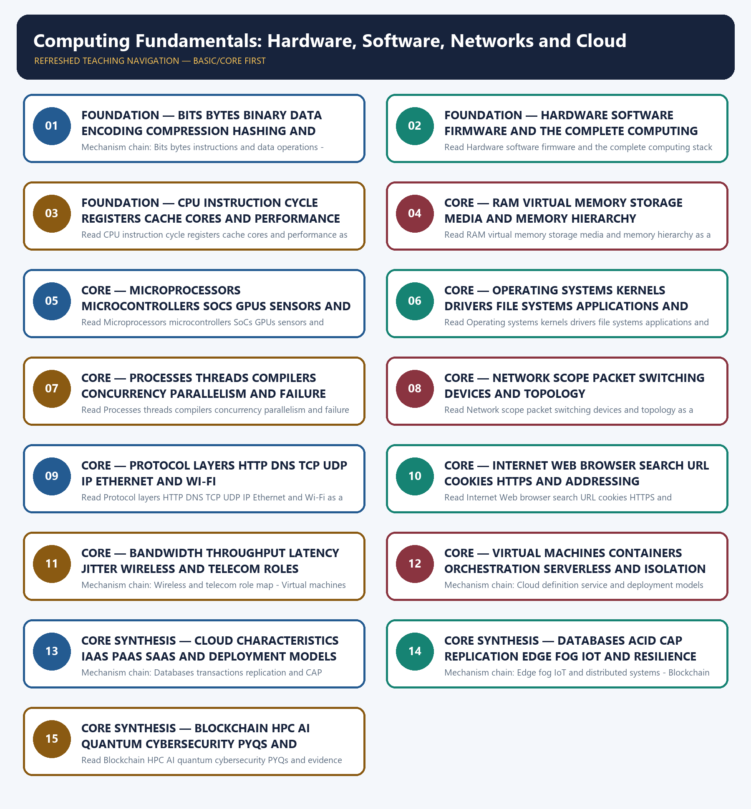

# Computing Fundamentals: Hardware, Software, Networks and Cloud — Learner-v2 Complete Learning Session

> **Authoring-only generation:** 2026-09-04. No PDF was rendered and no tracker or index was mutated.

### SOURCE, PROGRESSION AND CURRENT-LINKAGE AUDIT

- **Generation date:** 2026-09-04.
- **Repository-first evidence:** the Basic owner is taught first and preserved in full; the Advanced owner is retained only in the optional final teaching block.
- **OCR evidence:** Repository Markdown was primary. OCR-searchable official UPSC papers were supplementary only for printed routed demands. No answer key, performance value, procurement outcome, operational deployment, programme target or technology milestone was inferred.
- **Qdrant:** not used; repository Markdown and available OCR context were sufficient.
- **PYQ integrity:** Audited ledgers route fifteen historical 2018-2022 objective demands and the direct 2026 blockchain demand to this owner, with several shared specialist routes. The recent metaverse, Majorana-chip and Kavach demands are used only for bounded computing support because their direct ledger owners are Economy, Topic 10 and Geography. Three representative cards preserve these ownership distinctions and no objective key.
- **Live-link boundary:** Official checks on 2026-09-04 retained NIST's cloud definition, the dated C-DAC National Supercomputing Mission implementation page and IETF TCP and IPv6 protocol roles. No benchmark, utilization figure, product claim, cloud label, protocol property, quantum advantage, cybersecurity guarantee or PYQ key was invented.
- **Fact/inference discipline:** no current-affairs item, PYQ wording, figure or quotation is invented.

### LIVE OFFICIAL-SOURCE ATTEMPT LOG

The checks below were made on 2026-09-04. Substantive official text is used only for the proposition it supports; title-only, blocked or thin pages are recorded and supply no factual claim.

- https://www.nist.gov/publications/nist-definition-cloud-computing - fetched 2026-09-04; NIST SP 800-145 confirmed on-demand network access to a shared pool of configurable resources, five essential characteristics, three service models and four deployment models. The definition was not converted into a claim that every hosted service, virtual machine or data centre is a cloud.
- https://cdac.in/index.aspx?id=project_details&projectId=NationalSupercomputingMission(NSM) - fetched 2026-09-04; the official C-DAC page confirmed the mission's HPC, institution-access, National Knowledge Network, application and skills roles and reported a dated March 2025 deployment total. Volatile utilization, researcher, job, paper and training figures were excluded from authored facts.
- https://datatracker.ietf.org/doc/html/rfc8200 - fetched 2026-09-04; the official IETF standards page confirmed IPv6 as the successor to IPv4 and its 128-bit address size versus IPv4's 32 bits. Address size was not presented as automatic security, speed or universal adoption.
- https://datatracker.ietf.org/doc/html/rfc9293 - fetched 2026-09-04; the official IETF TCP specification confirmed a connection-oriented transport interface and implementation requirements. It was used only for protocol-role discipline, not to claim that TCP eliminates delay, congestion, packet loss or application failure.

## BASIC LEARNING SESSION

### DEEP-REVIEW LEARNING CONTRACT

| Control | Binding rule for this package |
|---|---|
| Syllabus boundary | Complete Science and Technology Basic/Core is easy-first and answer-complete before optional Advanced depth. |
| System boundary | Organisation, platform, subsystem, payload, process, application, institution and outcome remain distinct. |
| Technical boundary | Physical mechanism, classification, stage, platform, unit, range/capacity and limiting condition are explicit. |
| Status boundary | Announcement, approval, development, test, deployment, induction, commercial operation and observed outcome remain distinct. |
| Data boundary | Every mission, launch, target, capacity, budget, range, timeline, rule and regulatory claim keeps source, date, unit and status. |
| Governance boundary | Funder, developer, operator, authoriser, regulator, procurer, settlement actor and adjudicator are not conflated. |
| Practice contract | Every solved item has demand decoding, detailed examiner-grade model, executable timed/compression plan, marks rationale and answer-specific improvement. |
| PYQ contract | Official wording and keys are asserted only when verified; routed or reconstructed demands remain labelled. |
| Dual-flow contract | Graphical and ASCII masters independently reconstruct the same complete Basic-to-optional-Advanced evidence spine. |
| Approval | This immutable successor remains `approved: false` pending explicit approval. |

**Canonical Basic/Core owner:** `upsc-ai-kit\knowledge\Science-and-Technology\basic\25_Computing-Fundamentals-Hardware-Software-Networks-and-Cloud.md`  
**Substantive canonical provenance owner:** `upsc-ai-kit\knowledge\Science-and-Technology\learning-sessions\v2\subject-wide-syllabus\science-and-technology-25_Learning-Session.md`  
**Optional Advanced owner:** `upsc-ai-kit\knowledge\Science-and-Technology\advanced\25_Computer-Architecture-Distributed-Systems-and-Emerging-Computing.md`  
**Official syllabus mapping:** `upsc-ai-kit\knowledge\Science-and-Technology\OFFICIAL-UPSC-SYLLABUS-MAPPING.md`

### EVIDENCE, PYQ AND CURRENT-STATUS CONTROL

- ISRO organisation, launcher stages, payload and orbit claims retain their exact object and mission date.
- NavIC, GAGAN, human-spaceflight, planetary, nuclear, fusion, missile and procurement claims retain category and status.
- Aadhaar/UPI, AI, quantum and semiconductor claims retain actor, layer, metric, maturity and governance boundaries.
- DPDP/cybersecurity, biotechnology and genetic-engineering claims retain legal/regulatory stage and competent institution.
- Targets, budgets, capacities, ranges and timelines are never promoted into achieved outcomes without dated evidence.
- **Current-status note, rechecked 2026-09-06:** volatile claims retain source/date/status; failed official fetches remain explicit and supply no invented fact.

**Generation-local live/current sources:**
- `https://www.nist.gov/publications/nist-definition-cloud-computing - fetched 2026-09-04; NIST SP 800-145 confirmed on-demand network access to a shared pool of configurable resources, five essential characteristics, three service models and four deployment models. The definition was not converted into a claim that every hosted service, virtual machine or data centre is a cloud.`
- `https://cdac.in/index.aspx?id=project_details&projectId=NationalSupercomputingMission(NSM) - fetched 2026-09-04; the official C-DAC page confirmed the mission's HPC, institution-access, National Knowledge Network, application and skills roles and reported a dated March 2025 deployment total. Volatile utilization, researcher, job, paper and training figures were excluded from authored facts.`
- `https://datatracker.ietf.org/doc/html/rfc8200 - fetched 2026-09-04; the official IETF standards page confirmed IPv6 as the successor to IPv4 and its 128-bit address size versus IPv4's 32 bits. Address size was not presented as automatic security, speed or universal adoption.`
- `https://datatracker.ietf.org/doc/html/rfc9293 - fetched 2026-09-04; the official IETF TCP specification confirmed a connection-oriented transport interface and implementation requirements. It was used only for protocol-role discipline, not to claim that TCP eliminates delay, congestion, packet loss or application failure.`

**Topic-routed verified PYQ owners:**
- No topic-local official question file is claimed; repository PYQ routing ledgers control wording and status.




*Distinct embedded teaching-navigation image. The separate continuous Cārvāka-style flowchart package remains an independent at-a-glance artifact.*

### SESSION 1 — FOUNDATION — BITS BYTES BINARY DATA ENCODING COMPRESSION HASHING AND ENCRYPTION

#### DEFINITION / WHAT THIS IS CALLED

**Plain-language definition:** Encoding changes representation, compression reduces size, hashing produces a fixed-size digest and encryption protects confidentiality with a key; these operations are not interchangeable.

**Technical definition:** Mechanism chain: Bits bytes instructions and data operations - Computing stack boundary Qualified use: Name the data unit and operation before deciding whether the goal is representation, size, integrity or secrecy.

#### ANSWER-GRABBING OPENING — WRITE/ADAPT IN THE EXAM

> Read Bits bytes binary data encoding compression hashing and encryption as a sequence: identify Bits bytes instructions and data operations, follow the named mechanism to its user or output, and stop at the last verified status rather than assuming the next stage.

#### MUST-WRITE KEYWORDS

- **FOUNDATION**
- **Bits bytes binary data encoding compression hashing**
- **encryption**
- **Mechanism chain**
- **Qualified use**
- **A bit**

**How to use them:** Frame the answer through FOUNDATION; define Bits bytes binary data encoding compression hashing, connect encryption with Mechanism chain to explain the mechanism, and use Qualified use for the decisive comparison or qualification.

#### VISUAL FIRST

```text
BITS BYTES BINARY DATA ENCODING COMPRESSION HASHING AND ENCRYPTION
01. Bits bytes instructions and data operations
    |
    v
02. Computing stack boundary
STATUS / CATEGORY FIREWALL -> Do not merge encoding, compression, hashing and encryption.
```

*The rail fixes the technical sequence and the claim boundary before explanation.*

#### CORE EXPLANATION

A bit is a binary 0 or 1 and a byte normally contains eight bits; an instruction is an encoded processor operation, a program is an ordered instruction set and an algorithm is a finite language-independent method. Encoding changes representation, compression reduces size, hashing produces a fixed-size digest and encryption protects confidentiality with a key; these operations are not interchangeable. A complete computing system links physical semiconductor devices, processor, memory, storage and input-output hardware to firmware, operating system, drivers, libraries, applications, data, networks and governance. Hardware executes and stores signals, software supplies instructions and rules, and a network connects systems; a product label may span layers without making the layers identical.

#### SIMPLE SYSTEM EXAMPLE

Read Bits bytes binary data encoding compression hashing and encryption as a sequence: identify Bits bytes instructions and data operations, follow the named mechanism to its user or output, and stop at the last verified status rather than assuming the next stage.

#### TECHNICAL DISTINCTION

The decisive boundary is Do not merge encoding, compression, hashing and encryption. This keeps Bits bytes instructions and data operations and Computing stack boundary in the correct scientific category, institution and unit of measurement.

#### NAMED EVIDENCE AND MECHANISM

- A bit is a binary 0 or 1 and a byte normally contains eight bits; an instruction is an encoded processor operation, a program is an ordered instruction set and an algorithm is a finite language-independent method. Encoding changes representation, compression reduces size, hashing produces a fixed-size digest and encryption protects confidentiality with a key; these operations are not interchangeable.
- A complete computing system links physical semiconductor devices, processor, memory, storage and input-output hardware to firmware, operating system, drivers, libraries, applications, data, networks and governance. Hardware executes and stores signals, software supplies instructions and rules, and a network connects systems; a product label may span layers without making the layers identical.

#### EXAMINER CAUTION

- Do not merge encoding, compression, hashing and encryption.

#### EXAM LINK

- **Prelims:** Keep institution, system, platform, service, process, legal instrument, unit and status in their exact category.
- **Mains:** Name the data unit and operation before deciding whether the goal is representation, size, integrity or secrecy.

#### MINI RECAP

- **Mechanism chain:** Bits bytes instructions and data operations -> Computing stack boundary
- **Qualified use:** Name the data unit and operation before deciding whether the goal is representation, size, integrity or secrecy.

#### CLOSING RECALL FLOW — FOUNDATION — BITS BYTES BINARY DATA ENCODING COMPRESSION HASHING AND ENCRYPTION

```text
START / CONCEPT: FOUNDATION — Bits bytes binary data encoding compression hashing and encryption
        |
        v
EXACT TERMS: FOUNDATION · Bits bytes binary data encoding compression hashing · encryption · Mechanism chain · Qualified use · A bit
        |
        v
MECHANISM / ARGUMENT: Encoding changes representation, compression reduces size, hashing produces a fixed-size digest and encryption protects confidentiality with a key; these operations are not interchangeable.
        |
        v
CONSEQUENCE / CONTRAST: The decisive boundary is Do not merge encoding, compression, hashing and encryption.
        |
        v
UPSC TRAP / ANSWER-USE: Do not merge encoding, compression, hashing and encryption.
        |
        v
ANSWER-GRABBING FORMULATION: Read Bits bytes binary data encoding compression hashing and encryption as a sequence: identify Bits bytes instructions and data operations, follow the named mechanism to its user or output, and stop at the last verified status rather than assuming the next stage.
```
### SESSION 2 — FOUNDATION — HARDWARE SOFTWARE FIRMWARE AND THE COMPLETE COMPUTING STACK

#### DEFINITION / WHAT THIS IS CALLED

**Plain-language definition:** The decisive boundary is Do not reduce a computing system to hardware or use hardware and software as synonyms.

**Technical definition:** Read Hardware software firmware and the complete computing stack as a sequence: identify CPU instruction cycle and performance, follow the named mechanism to its user or output, and stop at the last verified status rather than assuming the next stage.

#### ANSWER-GRABBING OPENING — WRITE/ADAPT IN THE EXAM

> Read Hardware software firmware and the complete computing stack as a sequence: identify CPU instruction cycle and performance, follow the named mechanism to its user or output, and stop at the last verified status rather than assuming the next stage.

#### MUST-WRITE KEYWORDS

- **FOUNDATION**
- **Hardware software firmware**
- **the complete computing stack**
- **Mechanism chain**
- **Qualified use**
- **Clock**

**How to use them:** Frame the answer through FOUNDATION; define Hardware software firmware, connect the complete computing stack with Mechanism chain to explain the mechanism, and use Qualified use for the decisive comparison or qualification.

#### VISUAL FIRST

```text
HARDWARE SOFTWARE FIRMWARE AND THE COMPLETE COMPUTING STACK
01. CPU instruction cycle and performance
STATUS / CATEGORY FIREWALL -> Do not reduce a computing system to hardware or use hardware and software as synonyms.
```

*The rail fixes the technical sequence and the claim boundary before explanation.*

#### CORE EXPLANATION

A processor fetches, decodes and executes instructions; its control unit directs operations, arithmetic logic unit performs arithmetic and logic, registers hold immediate working values and cache reduces access delay to frequently used data. Clock rate, instructions per cycle, core count, cache, memory bandwidth, software, workload and thermal limits jointly shape performance, so gigahertz alone is not a ranking.

#### SIMPLE SYSTEM EXAMPLE

Read Hardware software firmware and the complete computing stack as a sequence: identify CPU instruction cycle and performance, follow the named mechanism to its user or output, and stop at the last verified status rather than assuming the next stage.

#### TECHNICAL DISTINCTION

The decisive boundary is Do not reduce a computing system to hardware or use hardware and software as synonyms. This keeps CPU instruction cycle and performance in the correct scientific category, institution and unit of measurement.

#### NAMED EVIDENCE AND MECHANISM

- A processor fetches, decodes and executes instructions; its control unit directs operations, arithmetic logic unit performs arithmetic and logic, registers hold immediate working values and cache reduces access delay to frequently used data. Clock rate, instructions per cycle, core count, cache, memory bandwidth, software, workload and thermal limits jointly shape performance, so gigahertz alone is not a ranking.

#### EXAMINER CAUTION

- Do not reduce a computing system to hardware or use hardware and software as synonyms.

#### EXAM LINK

- **Prelims:** Keep institution, system, platform, service, process, legal instrument, unit and status in their exact category.
- **Mains:** Locate each component on the physical, system, application, network or governance layer.

#### MINI RECAP

- **Mechanism chain:** CPU instruction cycle and performance
- **Qualified use:** Locate each component on the physical, system, application, network or governance layer.

#### CLOSING RECALL FLOW — FOUNDATION — HARDWARE SOFTWARE FIRMWARE AND THE COMPLETE COMPUTING STACK

```text
START / CONCEPT: FOUNDATION — Hardware software firmware and the complete computing stack
        |
        v
EXACT TERMS: FOUNDATION · Hardware software firmware · the complete computing stack · Mechanism chain · Qualified use · Clock
        |
        v
MECHANISM / ARGUMENT: Mechanism chain: CPU instruction cycle and performance Qualified use: Locate each component on the physical, system, application, network or governance layer.
        |
        v
CONSEQUENCE / CONTRAST: The decisive boundary is Do not reduce a computing system to hardware or use hardware and software as synonyms.
        |
        v
UPSC TRAP / ANSWER-USE: Do not reduce a computing system to hardware or use hardware and software as synonyms.
        |
        v
ANSWER-GRABBING FORMULATION: Read Hardware software firmware and the complete computing stack as a sequence: identify CPU instruction cycle and performance, follow the named mechanism to its user or output, and stop at the last verified status rather than assuming the next stage.
```
### SESSION 3 — FOUNDATION — CPU INSTRUCTION CYCLE REGISTERS CACHE CORES AND PERFORMANCE

#### DEFINITION / WHAT THIS IS CALLED

**Plain-language definition:** Registers and cache are fastest and smallest, RAM is volatile working memory, while SSD, flash, HDD and optical or tape media provide non-volatile storage with different speed, cost and durability.

**Technical definition:** Read CPU instruction cycle registers cache cores and performance as a sequence: identify Memory storage and volatility hierarchy, follow the named mechanism to its user or output, and stop at the last verified status rather than assuming the next stage.

#### ANSWER-GRABBING OPENING — WRITE/ADAPT IN THE EXAM

> Read CPU instruction cycle registers cache cores and performance as a sequence: identify Memory storage and volatility hierarchy, follow the named mechanism to its user or output, and stop at the last verified status rather than assuming the next stage.

#### MUST-WRITE KEYWORDS

- **FOUNDATION**
- **CPU instruction cycle registers cache cores**
- **performance**
- **Mechanism chain**
- **Qualified use**
- **Registers and cache**

**How to use them:** Frame the answer through FOUNDATION; define CPU instruction cycle registers cache cores, connect performance with Mechanism chain to explain the mechanism, and use Qualified use for the decisive comparison or qualification.

#### VISUAL FIRST

```text
CPU INSTRUCTION CYCLE REGISTERS CACHE CORES AND PERFORMANCE
01. Memory storage and volatility hierarchy
STATUS / CATEGORY FIREWALL -> Do not rank processors by clock rate alone.
```

*The rail fixes the technical sequence and the claim boundary before explanation.*

#### CORE EXPLANATION

Registers and cache are fastest and smallest, RAM is volatile working memory, while SSD, flash, HDD and optical or tape media provide non-volatile storage with different speed, cost and durability. Virtual memory maps process addresses to physical memory and storage to support isolation and a larger apparent address space; it does not create free physical RAM.

#### SIMPLE SYSTEM EXAMPLE

Read CPU instruction cycle registers cache cores and performance as a sequence: identify Memory storage and volatility hierarchy, follow the named mechanism to its user or output, and stop at the last verified status rather than assuming the next stage.

#### TECHNICAL DISTINCTION

The decisive boundary is Do not rank processors by clock rate alone. This keeps Memory storage and volatility hierarchy in the correct scientific category, institution and unit of measurement.

#### NAMED EVIDENCE AND MECHANISM

- Registers and cache are fastest and smallest, RAM is volatile working memory, while SSD, flash, HDD and optical or tape media provide non-volatile storage with different speed, cost and durability. Virtual memory maps process addresses to physical memory and storage to support isolation and a larger apparent address space; it does not create free physical RAM.

#### EXAMINER CAUTION

- Do not rank processors by clock rate alone.

#### EXAM LINK

- **Prelims:** Keep institution, system, platform, service, process, legal instrument, unit and status in their exact category.
- **Mains:** Trace fetch-decode-execute and evaluate workload, memory and thermal constraints beyond clock rate.

#### MINI RECAP

- **Mechanism chain:** Memory storage and volatility hierarchy
- **Qualified use:** Trace fetch-decode-execute and evaluate workload, memory and thermal constraints beyond clock rate.

#### CLOSING RECALL FLOW — FOUNDATION — CPU INSTRUCTION CYCLE REGISTERS CACHE CORES AND PERFORMANCE

```text
START / CONCEPT: FOUNDATION — CPU instruction cycle registers cache cores and performance
        |
        v
EXACT TERMS: FOUNDATION · CPU instruction cycle registers cache cores · performance · Mechanism chain · Qualified use · Registers and cache
        |
        v
MECHANISM / ARGUMENT: Mechanism chain: Memory storage and volatility hierarchy Qualified use: Trace fetch-decode-execute and evaluate workload, memory and thermal constraints beyond clock rate.
        |
        v
CONSEQUENCE / CONTRAST: Registers and cache are fastest and smallest, RAM is volatile working memory, while SSD, flash, HDD and optical or tape media provide non-volatile storage with different speed, cost and durability.
        |
        v
UPSC TRAP / ANSWER-USE: Virtual memory maps process addresses to physical memory and storage to support isolation and a larger apparent address space; it does not create free physical RAM.
        |
        v
ANSWER-GRABBING FORMULATION: Read CPU instruction cycle registers cache cores and performance as a sequence: identify Memory storage and volatility hierarchy, follow the named mechanism to its user or output, and stop at the last verified status rather than assuming the next stage.
```
### SESSION 4 — CORE — RAM VIRTUAL MEMORY STORAGE MEDIA AND MEMORY HIERARCHY

#### DEFINITION / WHAT THIS IS CALLED

**Plain-language definition:** The decisive boundary is Do not confuse volatile RAM with non-volatile storage or virtual memory with added physical RAM.

**Technical definition:** Read RAM virtual memory storage media and memory hierarchy as a sequence: identify Processor forms and embedded systems, follow the named mechanism to its user or output, and stop at the last verified status rather than assuming the next stage.

#### ANSWER-GRABBING OPENING — WRITE/ADAPT IN THE EXAM

> The decisive boundary is Do not confuse volatile RAM with non-volatile storage or virtual memory with added physical RAM.

#### MUST-WRITE KEYWORDS

- **RAM virtual memory storage media**
- **memory hierarchy**
- **Mechanism chain**
- **Qualified use**
- **A microprocessor**
- **CPU**

**How to use them:** Frame the answer through RAM virtual memory storage media; define memory hierarchy, connect Mechanism chain with Qualified use to explain the mechanism, and use A microprocessor for the decisive comparison or qualification.

#### VISUAL FIRST

```text
RAM VIRTUAL MEMORY STORAGE MEDIA AND MEMORY HIERARCHY
01. Processor forms and embedded systems
STATUS / CATEGORY FIREWALL -> Do not confuse volatile RAM with non-volatile storage or virtual memory with added physical RAM.
```

*The rail fixes the technical sequence and the claim boundary before explanation.*

#### CORE EXPLANATION

A microprocessor is a general-purpose CPU commonly paired with external memory and peripherals, a microcontroller integrates processor, memory and interfaces for embedded control, and a system-on-chip integrates multiple system components. GPUs or accelerators suit highly parallel workloads but do not universally replace CPUs; sensors measure, processors compute and actuators change the physical world.

#### SIMPLE SYSTEM EXAMPLE

Read RAM virtual memory storage media and memory hierarchy as a sequence: identify Processor forms and embedded systems, follow the named mechanism to its user or output, and stop at the last verified status rather than assuming the next stage.

#### TECHNICAL DISTINCTION

The decisive boundary is Do not confuse volatile RAM with non-volatile storage or virtual memory with added physical RAM. This keeps Processor forms and embedded systems in the correct scientific category, institution and unit of measurement.

#### NAMED EVIDENCE AND MECHANISM

- A microprocessor is a general-purpose CPU commonly paired with external memory and peripherals, a microcontroller integrates processor, memory and interfaces for embedded control, and a system-on-chip integrates multiple system components. GPUs or accelerators suit highly parallel workloads but do not universally replace CPUs; sensors measure, processors compute and actuators change the physical world.

#### EXAMINER CAUTION

- Do not confuse volatile RAM with non-volatile storage or virtual memory with added physical RAM.

#### EXAM LINK

- **Prelims:** Keep institution, system, platform, service, process, legal instrument, unit and status in their exact category.
- **Mains:** Order registers, cache, RAM and persistent media by role, volatility and access trade-off.

#### MINI RECAP

- **Mechanism chain:** Processor forms and embedded systems
- **Qualified use:** Order registers, cache, RAM and persistent media by role, volatility and access trade-off.

#### CLOSING RECALL FLOW — CORE — RAM VIRTUAL MEMORY STORAGE MEDIA AND MEMORY HIERARCHY

```text
START / CONCEPT: CORE — RAM virtual memory storage media and memory hierarchy
        |
        v
EXACT TERMS: RAM virtual memory storage media · memory hierarchy · Mechanism chain · Qualified use · A microprocessor · CPU
        |
        v
MECHANISM / ARGUMENT: Read RAM virtual memory storage media and memory hierarchy as a sequence: identify Processor forms and embedded systems, follow the named mechanism to its user or output, and stop at the last verified status rather than assuming the next stage.
        |
        v
CONSEQUENCE / CONTRAST: Do not confuse volatile RAM with non-volatile storage or virtual memory with added physical RAM.
        |
        v
UPSC TRAP / ANSWER-USE: GPUs or accelerators suit highly parallel workloads but do not universally replace CPUs; sensors measure, processors compute and actuators change the physical world.
        |
        v
ANSWER-GRABBING FORMULATION: The decisive boundary is Do not confuse volatile RAM with non-volatile storage or virtual memory with added physical RAM.
```
### SESSION 5 — CORE — MICROPROCESSORS MICROCONTROLLERS SOCS GPUS SENSORS AND ACTUATORS

#### DEFINITION / WHAT THIS IS CALLED

**Plain-language definition:** The decisive boundary is Do not call a GPU universally faster than a CPU or a sensor an actuator.

**Technical definition:** Read Microprocessors microcontrollers SoCs GPUs sensors and actuators as a sequence: identify Software OS and application layers, follow the named mechanism to its user or output, and stop at the last verified status rather than assuming the next stage.

#### ANSWER-GRABBING OPENING — WRITE/ADAPT IN THE EXAM

> Read Microprocessors microcontrollers SoCs GPUs sensors and actuators as a sequence: identify Software OS and application layers, follow the named mechanism to its user or output, and stop at the last verified status rather than assuming the next stage.

#### MUST-WRITE KEYWORDS

- **Microprocessors microcontrollers SoCs GPUs sensors**
- **actuators**
- **Mechanism chain**
- **Qualified use**
- **System**
- **OS**

**How to use them:** Frame the answer through Microprocessors microcontrollers SoCs GPUs sensors; define actuators, connect Mechanism chain with Qualified use to explain the mechanism, and use System for the decisive comparison or qualification.

#### VISUAL FIRST

```text
MICROPROCESSORS MICROCONTROLLERS SOCS GPUS SENSORS AND ACTUATORS
01. Software OS and application layers
STATUS / CATEGORY FIREWALL -> Do not call a GPU universally faster than a CPU or a sensor an actuator.
```

*The rail fixes the technical sequence and the claim boundary before explanation.*

#### CORE EXPLANATION

System software includes operating systems, drivers, runtimes and utilities, while application software performs user-facing tasks. The operating-system kernel manages privileged hardware and resources, a driver connects the OS to a device, a file system organises stored data, firmware controls low-level startup or device behaviour, and an API defines software interaction rather than a user-facing website.

#### SIMPLE SYSTEM EXAMPLE

Read Microprocessors microcontrollers SoCs GPUs sensors and actuators as a sequence: identify Software OS and application layers, follow the named mechanism to its user or output, and stop at the last verified status rather than assuming the next stage.

#### TECHNICAL DISTINCTION

The decisive boundary is Do not call a GPU universally faster than a CPU or a sensor an actuator. This keeps Software OS and application layers in the correct scientific category, institution and unit of measurement.

#### NAMED EVIDENCE AND MECHANISM

- System software includes operating systems, drivers, runtimes and utilities, while application software performs user-facing tasks. The operating-system kernel manages privileged hardware and resources, a driver connects the OS to a device, a file system organises stored data, firmware controls low-level startup or device behaviour, and an API defines software interaction rather than a user-facing website.

#### EXAMINER CAUTION

- Do not call a GPU universally faster than a CPU or a sensor an actuator.

#### EXAM LINK

- **Prelims:** Keep institution, system, platform, service, process, legal instrument, unit and status in their exact category.
- **Mains:** Separate general CPU, embedded controller, integrated chip, accelerator, sensor and actuator.

#### MINI RECAP

- **Mechanism chain:** Software OS and application layers
- **Qualified use:** Separate general CPU, embedded controller, integrated chip, accelerator, sensor and actuator.

#### CLOSING RECALL FLOW — CORE — MICROPROCESSORS MICROCONTROLLERS SOCS GPUS SENSORS AND ACTUATORS

```text
START / CONCEPT: CORE — Microprocessors microcontrollers SoCs GPUs sensors and actuators
        |
        v
EXACT TERMS: Microprocessors microcontrollers SoCs GPUs sensors · actuators · Mechanism chain · Qualified use · System · OS
        |
        v
MECHANISM / ARGUMENT: Mechanism chain: Software OS and application layers Qualified use: Separate general CPU, embedded controller, integrated chip, accelerator, sensor and actuator.
        |
        v
CONSEQUENCE / CONTRAST: The decisive boundary is Do not call a GPU universally faster than a CPU or a sensor an actuator.
        |
        v
UPSC TRAP / ANSWER-USE: Do not call a GPU universally faster than a CPU or a sensor an actuator.
        |
        v
ANSWER-GRABBING FORMULATION: Read Microprocessors microcontrollers SoCs GPUs sensors and actuators as a sequence: identify Software OS and application layers, follow the named mechanism to its user or output, and stop at the last verified status rather than assuming the next stage.
```
### SESSION 6 — CORE — OPERATING SYSTEMS KERNELS DRIVERS FILE SYSTEMS APPLICATIONS AND APIS

#### DEFINITION / WHAT THIS IS CALLED

**Plain-language definition:** The decisive boundary is Do not merge firmware, operating system, driver, file system, API and application.

**Technical definition:** Read Operating systems kernels drivers file systems applications and APIs as a sequence: identify Processes threads concurrency and execution, follow the named mechanism to its user or output, and stop at the last verified status rather than assuming the next stage.

#### ANSWER-GRABBING OPENING — WRITE/ADAPT IN THE EXAM

> The decisive boundary is Do not merge firmware, operating system, driver, file system, API and application.

#### MUST-WRITE KEYWORDS

- **Operating systems kernels drivers file systems applications**
- **APIs**
- **Mechanism chain**
- **Qualified use**
- **IP**
- **LAN**

**How to use them:** Frame the answer through Operating systems kernels drivers file systems applications; define APIs, connect Mechanism chain with Qualified use to explain the mechanism, and use IP for the decisive comparison or qualification.

#### VISUAL FIRST

```text
OPERATING SYSTEMS KERNELS DRIVERS FILE SYSTEMS APPLICATIONS AND APIS
01. Processes threads concurrency and execution
    |
    v
02. Networks packets and devices
STATUS / CATEGORY FIREWALL -> Do not merge firmware, operating system, driver, file system, API and application.
```

*The rail fixes the technical sequence and the claim boundary before explanation.*

#### CORE EXPLANATION

A process is a running program with resources and a thread is an execution path within it; concurrency means overlapping progress while parallelism means simultaneous execution. Compilers translate source before execution, interpreters translate or execute during runtime and assemblers convert assembly language; race conditions and deadlocks arise from coordination failures, not simply from using multiple cores. PAN, LAN, MAN and WAN classify typical network scope; packet switching divides data for transmission and reassembly. A switch forwards frames within a local network, a router forwards IP packets between networks, a modem converts signals for an access medium, an access point connects wireless clients to a LAN, a repeater regenerates signals and a firewall applies traffic rules; none alone supplies end-to-end security.

#### SIMPLE SYSTEM EXAMPLE

Read Operating systems kernels drivers file systems applications and APIs as a sequence: identify Processes threads concurrency and execution, follow the named mechanism to its user or output, and stop at the last verified status rather than assuming the next stage.

#### TECHNICAL DISTINCTION

The decisive boundary is Do not merge firmware, operating system, driver, file system, API and application. This keeps Processes threads concurrency and execution and Networks packets and devices in the correct scientific category, institution and unit of measurement.

#### NAMED EVIDENCE AND MECHANISM

- A process is a running program with resources and a thread is an execution path within it; concurrency means overlapping progress while parallelism means simultaneous execution. Compilers translate source before execution, interpreters translate or execute during runtime and assemblers convert assembly language; race conditions and deadlocks arise from coordination failures, not simply from using multiple cores.
- PAN, LAN, MAN and WAN classify typical network scope; packet switching divides data for transmission and reassembly. A switch forwards frames within a local network, a router forwards IP packets between networks, a modem converts signals for an access medium, an access point connects wireless clients to a LAN, a repeater regenerates signals and a firewall applies traffic rules; none alone supplies end-to-end security.

#### EXAMINER CAUTION

- Do not merge firmware, operating system, driver, file system, API and application.

#### EXAM LINK

- **Prelims:** Keep institution, system, platform, service, process, legal instrument, unit and status in their exact category.
- **Mains:** Classify software by resource-management, device-interface, storage or user-task function.

#### MINI RECAP

- **Mechanism chain:** Processes threads concurrency and execution -> Networks packets and devices
- **Qualified use:** Classify software by resource-management, device-interface, storage or user-task function.

#### CLOSING RECALL FLOW — CORE — OPERATING SYSTEMS KERNELS DRIVERS FILE SYSTEMS APPLICATIONS AND APIS

```text
START / CONCEPT: CORE — Operating systems kernels drivers file systems applications and APIs
        |
        v
EXACT TERMS: Operating systems kernels drivers file systems applications · APIs · Mechanism chain · Qualified use · IP · LAN
        |
        v
MECHANISM / ARGUMENT: Read Operating systems kernels drivers file systems applications and APIs as a sequence: identify Processes threads concurrency and execution, follow the named mechanism to its user or output, and stop at the last verified status rather than assuming the next stage.
        |
        v
CONSEQUENCE / CONTRAST: Do not merge firmware, operating system, driver, file system, API and application.
        |
        v
UPSC TRAP / ANSWER-USE: A process is a running program with resources and a thread is an execution path within it; concurrency means overlapping progress while parallelism means simultaneous execution.
        |
        v
ANSWER-GRABBING FORMULATION: The decisive boundary is Do not merge firmware, operating system, driver, file system, API and application.
```
### SESSION 7 — CORE — PROCESSES THREADS COMPILERS CONCURRENCY PARALLELISM AND FAILURE

#### DEFINITION / WHAT THIS IS CALLED

**Plain-language definition:** The decisive boundary is Do not use concurrency and parallelism as exact synonyms.

**Technical definition:** Read Processes threads compilers concurrency parallelism and failure as a sequence: identify Layered protocol roles, follow the named mechanism to its user or output, and stop at the last verified status rather than assuming the next stage.

#### ANSWER-GRABBING OPENING — WRITE/ADAPT IN THE EXAM

> Read Processes threads compilers concurrency parallelism and failure as a sequence: identify Layered protocol roles, follow the named mechanism to its user or output, and stop at the last verified status rather than assuming the next stage.

#### MUST-WRITE KEYWORDS

- **Processes threads compilers concurrency parallelism**
- **failure**
- **Mechanism chain**
- **Qualified use**
- **Layering**
- **Read Processes**

**How to use them:** Frame the answer through Processes threads compilers concurrency parallelism; define failure, connect Mechanism chain with Qualified use to explain the mechanism, and use Layering for the decisive comparison or qualification.

#### VISUAL FIRST

```text
PROCESSES THREADS COMPILERS CONCURRENCY PARALLELISM AND FAILURE
01. Layered protocol roles
STATUS / CATEGORY FIREWALL -> Do not use concurrency and parallelism as exact synonyms.
```

*The rail fixes the technical sequence and the claim boundary before explanation.*

#### CORE EXPLANATION

Application protocols such as HTTP and DNS serve user or naming functions, transport protocols such as TCP and UDP carry application data, IP addresses and routes packets across networks, link technologies such as Ethernet or Wi-Fi deliver locally, and the physical layer carries electrical, optical or radio signals. Layering permits interoperability; a protocol at one layer does not perform every other layer's role.

#### SIMPLE SYSTEM EXAMPLE

Read Processes threads compilers concurrency parallelism and failure as a sequence: identify Layered protocol roles, follow the named mechanism to its user or output, and stop at the last verified status rather than assuming the next stage.

#### TECHNICAL DISTINCTION

The decisive boundary is Do not use concurrency and parallelism as exact synonyms. This keeps Layered protocol roles in the correct scientific category, institution and unit of measurement.

#### NAMED EVIDENCE AND MECHANISM

- Application protocols such as HTTP and DNS serve user or naming functions, transport protocols such as TCP and UDP carry application data, IP addresses and routes packets across networks, link technologies such as Ethernet or Wi-Fi deliver locally, and the physical layer carries electrical, optical or radio signals. Layering permits interoperability; a protocol at one layer does not perform every other layer's role.

#### EXAMINER CAUTION

- Do not use concurrency and parallelism as exact synonyms.

#### EXAM LINK

- **Prelims:** Keep institution, system, platform, service, process, legal instrument, unit and status in their exact category.
- **Mains:** Distinguish program, process, thread, translation method, overlapping progress and simultaneous execution.

#### MINI RECAP

- **Mechanism chain:** Layered protocol roles
- **Qualified use:** Distinguish program, process, thread, translation method, overlapping progress and simultaneous execution.

#### CLOSING RECALL FLOW — CORE — PROCESSES THREADS COMPILERS CONCURRENCY PARALLELISM AND FAILURE

```text
START / CONCEPT: CORE — Processes threads compilers concurrency parallelism and failure
        |
        v
EXACT TERMS: Processes threads compilers concurrency parallelism · failure · Mechanism chain · Qualified use · Layering · Read Processes
        |
        v
MECHANISM / ARGUMENT: Mechanism chain: Layered protocol roles Qualified use: Distinguish program, process, thread, translation method, overlapping progress and simultaneous execution.
        |
        v
CONSEQUENCE / CONTRAST: The decisive boundary is Do not use concurrency and parallelism as exact synonyms.
        |
        v
UPSC TRAP / ANSWER-USE: Do not use concurrency and parallelism as exact synonyms.
        |
        v
ANSWER-GRABBING FORMULATION: Read Processes threads compilers concurrency parallelism and failure as a sequence: identify Layered protocol roles, follow the named mechanism to its user or output, and stop at the last verified status rather than assuming the next stage.
```
### SESSION 8 — CORE — NETWORK SCOPE PACKET SWITCHING DEVICES AND TOPOLOGY

#### DEFINITION / WHAT THIS IS CALLED

**Plain-language definition:** The Internet is the global system of interconnected IP networks, while the World Wide Web is a service using HTTP or HTTPS over that infrastructure.

**Technical definition:** Read Network scope packet switching devices and topology as a sequence: identify Internet web browser and cookie boundary, follow the named mechanism to its user or output, and stop at the last verified status rather than assuming the next stage.

#### ANSWER-GRABBING OPENING — WRITE/ADAPT IN THE EXAM

> Read Network scope packet switching devices and topology as a sequence: identify Internet web browser and cookie boundary, follow the named mechanism to its user or output, and stop at the last verified status rather than assuming the next stage.

#### MUST-WRITE KEYWORDS

- **Network scope packet switching devices**
- **topology**
- **Mechanism chain**
- **Qualified use**
- **The Internet**
- **IP**

**How to use them:** Frame the answer through Network scope packet switching devices; define topology, connect Mechanism chain with Qualified use to explain the mechanism, and use The Internet for the decisive comparison or qualification.

#### VISUAL FIRST

```text
NETWORK SCOPE PACKET SWITCHING DEVICES AND TOPOLOGY
01. Internet web browser and cookie boundary
STATUS / CATEGORY FIREWALL -> Do not confuse switch, router, modem, repeater, access point and firewall roles.
```

*The rail fixes the technical sequence and the claim boundary before explanation.*

#### CORE EXPLANATION

The Internet is the global system of interconnected IP networks, while the World Wide Web is a service using HTTP or HTTPS over that infrastructure. A browser retrieves and renders content, a search engine indexes and searches it, a URL identifies a resource, DNS resolves names, and a cookie stores state or identifiers in a browser; HTTPS protects transport but does not certify that content is true.

#### SIMPLE SYSTEM EXAMPLE

Read Network scope packet switching devices and topology as a sequence: identify Internet web browser and cookie boundary, follow the named mechanism to its user or output, and stop at the last verified status rather than assuming the next stage.

#### TECHNICAL DISTINCTION

The decisive boundary is Do not confuse switch, router, modem, repeater, access point and firewall roles. This keeps Internet web browser and cookie boundary in the correct scientific category, institution and unit of measurement.

#### NAMED EVIDENCE AND MECHANISM

- The Internet is the global system of interconnected IP networks, while the World Wide Web is a service using HTTP or HTTPS over that infrastructure. A browser retrieves and renders content, a search engine indexes and searches it, a URL identifies a resource, DNS resolves names, and a cookie stores state or identifiers in a browser; HTTPS protects transport but does not certify that content is true.

#### EXAMINER CAUTION

- Do not confuse switch, router, modem, repeater, access point and firewall roles.

#### EXAM LINK

- **Prelims:** Keep institution, system, platform, service, process, legal instrument, unit and status in their exact category.
- **Mains:** Fix network scope and packet path, then assign every device only its forwarding or signal role.

#### MINI RECAP

- **Mechanism chain:** Internet web browser and cookie boundary
- **Qualified use:** Fix network scope and packet path, then assign every device only its forwarding or signal role.

#### CLOSING RECALL FLOW — CORE — NETWORK SCOPE PACKET SWITCHING DEVICES AND TOPOLOGY

```text
START / CONCEPT: CORE — Network scope packet switching devices and topology
        |
        v
EXACT TERMS: Network scope packet switching devices · topology · Mechanism chain · Qualified use · The Internet · IP
        |
        v
MECHANISM / ARGUMENT: Mechanism chain: Internet web browser and cookie boundary Qualified use: Fix network scope and packet path, then assign every device only its forwarding or signal role.
        |
        v
CONSEQUENCE / CONTRAST: The Internet is the global system of interconnected IP networks, while the World Wide Web is a service using HTTP or HTTPS over that infrastructure.
        |
        v
UPSC TRAP / ANSWER-USE: The decisive boundary is Do not confuse switch, router, modem, repeater, access point and firewall roles.
        |
        v
ANSWER-GRABBING FORMULATION: Read Network scope packet switching devices and topology as a sequence: identify Internet web browser and cookie boundary, follow the named mechanism to its user or output, and stop at the last verified status rather than assuming the next stage.
```
### SESSION 9 — CORE — PROTOCOL LAYERS HTTP DNS TCP UDP IP ETHERNET AND WI-FI

#### DEFINITION / WHAT THIS IS CALLED

**Plain-language definition:** An IP address is a logical routing address while a MAC address operates at the local link layer; routing selects paths, DHCP supplies network configuration and NAT translates address information, commonly allowing private IPv4 devices to share a public address.

**Technical definition:** Read Protocol layers HTTP DNS TCP UDP IP Ethernet and Wi-Fi as a sequence: identify Addressing routing and configuration, follow the named mechanism to its user or output, and stop at the last verified status rather than assuming the next stage.

#### ANSWER-GRABBING OPENING — WRITE/ADAPT IN THE EXAM

> Read Protocol layers HTTP DNS TCP UDP IP Ethernet and Wi-Fi as a sequence: identify Addressing routing and configuration, follow the named mechanism to its user or output, and stop at the last verified status rather than assuming the next stage.

#### MUST-WRITE KEYWORDS

- **Protocol layers HTTP DNS TCP UDP IP Ethernet**
- **Wi-Fi**
- **Mechanism chain**
- **Qualified use**
- **An IP address**
- **An IP**

**How to use them:** Frame the answer through Protocol layers HTTP DNS TCP UDP IP Ethernet; define Wi-Fi, connect Mechanism chain with Qualified use to explain the mechanism, and use An IP address for the decisive comparison or qualification.

#### VISUAL FIRST

```text
PROTOCOL LAYERS HTTP DNS TCP UDP IP ETHERNET AND WI-FI
01. Addressing routing and configuration
STATUS / CATEGORY FIREWALL -> Do not assign an application, transport, internet, link or physical protocol every layer's function.
```

*The rail fixes the technical sequence and the claim boundary before explanation.*

#### CORE EXPLANATION

An IP address is a logical routing address while a MAC address operates at the local link layer; routing selects paths, DHCP supplies network configuration and NAT translates address information, commonly allowing private IPv4 devices to share a public address. IPv6 uses 128-bit addresses versus IPv4's 32 bits, but expanded addressing does not by itself guarantee security, privacy, speed or migration.

#### SIMPLE SYSTEM EXAMPLE

Read Protocol layers HTTP DNS TCP UDP IP Ethernet and Wi-Fi as a sequence: identify Addressing routing and configuration, follow the named mechanism to its user or output, and stop at the last verified status rather than assuming the next stage.

#### TECHNICAL DISTINCTION

The decisive boundary is Do not assign an application, transport, internet, link or physical protocol every layer's function. This keeps Addressing routing and configuration in the correct scientific category, institution and unit of measurement.

#### NAMED EVIDENCE AND MECHANISM

- An IP address is a logical routing address while a MAC address operates at the local link layer; routing selects paths, DHCP supplies network configuration and NAT translates address information, commonly allowing private IPv4 devices to share a public address. IPv6 uses 128-bit addresses versus IPv4's 32 bits, but expanded addressing does not by itself guarantee security, privacy, speed or migration.

#### EXAMINER CAUTION

- Do not assign an application, transport, internet, link or physical protocol every layer's function.

#### EXAM LINK

- **Prelims:** Keep institution, system, platform, service, process, legal instrument, unit and status in their exact category.
- **Mains:** Move from application through transport, IP, link and physical transmission without layer drift.

#### MINI RECAP

- **Mechanism chain:** Addressing routing and configuration
- **Qualified use:** Move from application through transport, IP, link and physical transmission without layer drift.

#### CLOSING RECALL FLOW — CORE — PROTOCOL LAYERS HTTP DNS TCP UDP IP ETHERNET AND WI-FI

```text
START / CONCEPT: CORE — Protocol layers HTTP DNS TCP UDP IP Ethernet and Wi-Fi
        |
        v
EXACT TERMS: Protocol layers HTTP DNS TCP UDP IP Ethernet · Wi-Fi · Mechanism chain · Qualified use · An IP address · An IP
        |
        v
MECHANISM / ARGUMENT: Mechanism chain: Addressing routing and configuration Qualified use: Move from application through transport, IP, link and physical transmission without layer drift.
        |
        v
CONSEQUENCE / CONTRAST: An IP address is a logical routing address while a MAC address operates at the local link layer; routing selects paths, DHCP supplies network configuration and NAT translates address information, commonly allowing private IPv4 devices to share a public address.
        |
        v
UPSC TRAP / ANSWER-USE: The decisive boundary is Do not assign an application, transport, internet, link or physical protocol every layer's function.
        |
        v
ANSWER-GRABBING FORMULATION: Read Protocol layers HTTP DNS TCP UDP IP Ethernet and Wi-Fi as a sequence: identify Addressing routing and configuration, follow the named mechanism to its user or output, and stop at the last verified status rather than assuming the next stage.
```
### SESSION 10 — CORE — INTERNET WEB BROWSER SEARCH URL COOKIES HTTPS AND ADDRESSING

#### DEFINITION / WHAT THIS IS CALLED

**Plain-language definition:** The decisive boundary is Do not use Internet, Web, browser, search engine, URL, DNS and cookie interchangeably.

**Technical definition:** Read Internet Web browser search URL cookies HTTPS and addressing as a sequence: identify Network performance measures, follow the named mechanism to its user or output, and stop at the last verified status rather than assuming the next stage.

#### ANSWER-GRABBING OPENING — WRITE/ADAPT IN THE EXAM

> Read Internet Web browser search URL cookies HTTPS and addressing as a sequence: identify Network performance measures, follow the named mechanism to its user or output, and stop at the last verified status rather than assuming the next stage.

#### MUST-WRITE KEYWORDS

- **Internet Web browser search URL cookies HTTPS**
- **addressing**
- **Mechanism chain**
- **Qualified use**
- **Bandwidth**
- **High**

**How to use them:** Frame the answer through Internet Web browser search URL cookies HTTPS; define addressing, connect Mechanism chain with Qualified use to explain the mechanism, and use Bandwidth for the decisive comparison or qualification.

#### VISUAL FIRST

```text
INTERNET WEB BROWSER SEARCH URL COOKIES HTTPS AND ADDRESSING
01. Network performance measures
STATUS / CATEGORY FIREWALL -> Do not use Internet, Web, browser, search engine, URL, DNS and cookie interchangeably.
```

*The rail fixes the technical sequence and the claim boundary before explanation.*

#### CORE EXPLANATION

Bandwidth is theoretical or provisioned capacity, throughput is achieved data rate, latency is delay, jitter is delay variation and packet loss is failed delivery. High bandwidth can coexist with high latency, while voice, gaming, remote control and industrial systems may be more sensitive to delay and jitter than bulk file transfer.

#### SIMPLE SYSTEM EXAMPLE

Read Internet Web browser search URL cookies HTTPS and addressing as a sequence: identify Network performance measures, follow the named mechanism to its user or output, and stop at the last verified status rather than assuming the next stage.

#### TECHNICAL DISTINCTION

The decisive boundary is Do not use Internet, Web, browser, search engine, URL, DNS and cookie interchangeably. This keeps Network performance measures in the correct scientific category, institution and unit of measurement.

#### NAMED EVIDENCE AND MECHANISM

- Bandwidth is theoretical or provisioned capacity, throughput is achieved data rate, latency is delay, jitter is delay variation and packet loss is failed delivery. High bandwidth can coexist with high latency, while voice, gaming, remote control and industrial systems may be more sensitive to delay and jitter than bulk file transfer.

#### EXAMINER CAUTION

- Do not use Internet, Web, browser, search engine, URL, DNS and cookie interchangeably.

#### EXAM LINK

- **Prelims:** Keep institution, system, platform, service, process, legal instrument, unit and status in their exact category.
- **Mains:** Separate infrastructure, service, client, name resolution, resource address, browser state and transport protection.

#### MINI RECAP

- **Mechanism chain:** Network performance measures
- **Qualified use:** Separate infrastructure, service, client, name resolution, resource address, browser state and transport protection.

#### CLOSING RECALL FLOW — CORE — INTERNET WEB BROWSER SEARCH URL COOKIES HTTPS AND ADDRESSING

```text
START / CONCEPT: CORE — Internet Web browser search URL cookies HTTPS and addressing
        |
        v
EXACT TERMS: Internet Web browser search URL cookies HTTPS · addressing · Mechanism chain · Qualified use · Bandwidth · High
        |
        v
MECHANISM / ARGUMENT: Mechanism chain: Network performance measures Qualified use: Separate infrastructure, service, client, name resolution, resource address, browser state and transport protection.
        |
        v
CONSEQUENCE / CONTRAST: The decisive boundary is Do not use Internet, Web, browser, search engine, URL, DNS and cookie interchangeably.
        |
        v
UPSC TRAP / ANSWER-USE: Do not use Internet, Web, browser, search engine, URL, DNS and cookie interchangeably.
        |
        v
ANSWER-GRABBING FORMULATION: Read Internet Web browser search URL cookies HTTPS and addressing as a sequence: identify Network performance measures, follow the named mechanism to its user or output, and stop at the last verified status rather than assuming the next stage.
```
### SESSION 11 — CORE — BANDWIDTH THROUGHPUT LATENCY JITTER WIRELESS AND TELECOM ROLES

#### DEFINITION / WHAT THIS IS CALLED

**Plain-language definition:** Read Bandwidth throughput latency jitter wireless and telecom roles as a sequence: identify Wireless and telecom role map, follow the named mechanism to its user or output, and stop at the last verified status rather than assuming the next stage.

**Technical definition:** Mechanism chain: Wireless and telecom role map - Virtual machines containers and orchestration Qualified use: Measure capacity, achieved rate, delay and variation separately, then match the wireless role.

#### ANSWER-GRABBING OPENING — WRITE/ADAPT IN THE EXAM

> Read Bandwidth throughput latency jitter wireless and telecom roles as a sequence: identify Wireless and telecom role map, follow the named mechanism to its user or output, and stop at the last verified status rather than assuming the next stage.

#### MUST-WRITE KEYWORDS

- **Bandwidth throughput latency jitter wireless**
- **telecom roles**
- **Mechanism chain**
- **Qualified use**
- **LTE**
- **VoLTE**

**How to use them:** Frame the answer through Bandwidth throughput latency jitter wireless; define telecom roles, connect Mechanism chain with Qualified use to explain the mechanism, and use LTE for the decisive comparison or qualification.

#### VISUAL FIRST

```text
BANDWIDTH THROUGHPUT LATENCY JITTER WIRELESS AND TELECOM ROLES
01. Wireless and telecom role map
    |
    v
02. Virtual machines containers and orchestration
STATUS / CATEGORY FIREWALL -> Do not treat IPv6, NAT or a firewall as automatic end-to-end security.
```

*The rail fixes the technical sequence and the claim boundary before explanation.*

#### CORE EXPLANATION

LTE is a packet-data cellular standard family and VoLTE carries voice over LTE; Wi-Fi usually provides local networking, Bluetooth connects personal devices, NFC supports centimetre-scale proximity exchange, RFID identifies tags through a reader, low-power mesh supports sensors and VLC transmits data with visible light. Range, wall penetration, power and topology are technology-specific rather than implied by the word wireless. A virtual machine emulates hardware and runs a guest operating system, while a container isolates an application and dependencies while sharing the host kernel; orchestration schedules and manages many containers or services. Serverless or function services execute provider-managed code on demand, but convenience introduces cold-start, observability, portability and provider-dependence trade-offs.

#### SIMPLE SYSTEM EXAMPLE

Read Bandwidth throughput latency jitter wireless and telecom roles as a sequence: identify Wireless and telecom role map, follow the named mechanism to its user or output, and stop at the last verified status rather than assuming the next stage.

#### TECHNICAL DISTINCTION

The decisive boundary is Do not treat IPv6, NAT or a firewall as automatic end-to-end security. This keeps Wireless and telecom role map and Virtual machines containers and orchestration in the correct scientific category, institution and unit of measurement.

#### NAMED EVIDENCE AND MECHANISM

- LTE is a packet-data cellular standard family and VoLTE carries voice over LTE; Wi-Fi usually provides local networking, Bluetooth connects personal devices, NFC supports centimetre-scale proximity exchange, RFID identifies tags through a reader, low-power mesh supports sensors and VLC transmits data with visible light. Range, wall penetration, power and topology are technology-specific rather than implied by the word wireless.
- A virtual machine emulates hardware and runs a guest operating system, while a container isolates an application and dependencies while sharing the host kernel; orchestration schedules and manages many containers or services. Serverless or function services execute provider-managed code on demand, but convenience introduces cold-start, observability, portability and provider-dependence trade-offs.

#### EXAMINER CAUTION

- Do not treat IPv6, NAT or a firewall as automatic end-to-end security.

#### EXAM LINK

- **Prelims:** Keep institution, system, platform, service, process, legal instrument, unit and status in their exact category.
- **Mains:** Measure capacity, achieved rate, delay and variation separately, then match the wireless role.

#### MINI RECAP

- **Mechanism chain:** Wireless and telecom role map -> Virtual machines containers and orchestration
- **Qualified use:** Measure capacity, achieved rate, delay and variation separately, then match the wireless role.

#### CLOSING RECALL FLOW — CORE — BANDWIDTH THROUGHPUT LATENCY JITTER WIRELESS AND TELECOM ROLES

```text
START / CONCEPT: CORE — Bandwidth throughput latency jitter wireless and telecom roles
        |
        v
EXACT TERMS: Bandwidth throughput latency jitter wireless · telecom roles · Mechanism chain · Qualified use · LTE · VoLTE
        |
        v
MECHANISM / ARGUMENT: Mechanism chain: Wireless and telecom role map - Virtual machines containers and orchestration Qualified use: Measure capacity, achieved rate, delay and variation separately, then match the wireless role.
        |
        v
CONSEQUENCE / CONTRAST: A virtual machine emulates hardware and runs a guest operating system, while a container isolates an application and dependencies while sharing the host kernel; orchestration schedules and manages many containers or services.
        |
        v
UPSC TRAP / ANSWER-USE: The decisive boundary is Do not treat IPv6, NAT or a firewall as automatic end-to-end security.
        |
        v
ANSWER-GRABBING FORMULATION: Read Bandwidth throughput latency jitter wireless and telecom roles as a sequence: identify Wireless and telecom role map, follow the named mechanism to its user or output, and stop at the last verified status rather than assuming the next stage.
```
### SESSION 12 — CORE — VIRTUAL MACHINES CONTAINERS ORCHESTRATION SERVERLESS AND ISOLATION

#### DEFINITION / WHAT THIS IS CALLED

**Plain-language definition:** Read Virtual machines containers orchestration serverless and isolation as a sequence: identify Cloud definition service and deployment models, follow the named mechanism to its user or output, and stop at the last verified status rather than assuming the next stage.

**Technical definition:** Mechanism chain: Cloud definition service and deployment models Qualified use: Identify kernel ownership and isolation unit before comparing VM, container and managed execution.

#### ANSWER-GRABBING OPENING — WRITE/ADAPT IN THE EXAM

> Read Virtual machines containers orchestration serverless and isolation as a sequence: identify Cloud definition service and deployment models, follow the named mechanism to its user or output, and stop at the last verified status rather than assuming the next stage.

#### MUST-WRITE KEYWORDS

- **Virtual machines containers orchestration serverless**
- **isolation**
- **Mechanism chain**
- **Qualified use**
- **IaaS**
- **PaaS**

**How to use them:** Frame the answer through Virtual machines containers orchestration serverless; define isolation, connect Mechanism chain with Qualified use to explain the mechanism, and use IaaS for the decisive comparison or qualification.

#### VISUAL FIRST

```text
VIRTUAL MACHINES CONTAINERS ORCHESTRATION SERVERLESS AND ISOLATION
01. Cloud definition service and deployment models
STATUS / CATEGORY FIREWALL -> Do not equate bandwidth with throughput or low bandwidth with high latency.
```

*The rail fixes the technical sequence and the claim boundary before explanation.*

#### CORE EXPLANATION

NIST cloud computing combines on-demand self-service, broad network access, resource pooling, rapid elasticity and measured service. IaaS supplies virtual compute, storage and networking, PaaS supplies a managed platform or runtime and SaaS supplies a ready application; public, private, community and hybrid describe deployment models. A data centre or virtual machine may enable cloud without being cloud by itself.

#### SIMPLE SYSTEM EXAMPLE

Read Virtual machines containers orchestration serverless and isolation as a sequence: identify Cloud definition service and deployment models, follow the named mechanism to its user or output, and stop at the last verified status rather than assuming the next stage.

#### TECHNICAL DISTINCTION

The decisive boundary is Do not equate bandwidth with throughput or low bandwidth with high latency. This keeps Cloud definition service and deployment models in the correct scientific category, institution and unit of measurement.

#### NAMED EVIDENCE AND MECHANISM

- NIST cloud computing combines on-demand self-service, broad network access, resource pooling, rapid elasticity and measured service. IaaS supplies virtual compute, storage and networking, PaaS supplies a managed platform or runtime and SaaS supplies a ready application; public, private, community and hybrid describe deployment models. A data centre or virtual machine may enable cloud without being cloud by itself.

#### EXAMINER CAUTION

- Do not equate bandwidth with throughput or low bandwidth with high latency.

#### EXAM LINK

- **Prelims:** Keep institution, system, platform, service, process, legal instrument, unit and status in their exact category.
- **Mains:** Identify kernel ownership and isolation unit before comparing VM, container and managed execution.

#### MINI RECAP

- **Mechanism chain:** Cloud definition service and deployment models
- **Qualified use:** Identify kernel ownership and isolation unit before comparing VM, container and managed execution.

#### CLOSING RECALL FLOW — CORE — VIRTUAL MACHINES CONTAINERS ORCHESTRATION SERVERLESS AND ISOLATION

```text
START / CONCEPT: CORE — Virtual machines containers orchestration serverless and isolation
        |
        v
EXACT TERMS: Virtual machines containers orchestration serverless · isolation · Mechanism chain · Qualified use · IaaS · PaaS
        |
        v
MECHANISM / ARGUMENT: Mechanism chain: Cloud definition service and deployment models Qualified use: Identify kernel ownership and isolation unit before comparing VM, container and managed execution.
        |
        v
CONSEQUENCE / CONTRAST: The decisive boundary is Do not equate bandwidth with throughput or low bandwidth with high latency.
        |
        v
UPSC TRAP / ANSWER-USE: Do not equate bandwidth with throughput or low bandwidth with high latency.
        |
        v
ANSWER-GRABBING FORMULATION: Read Virtual machines containers orchestration serverless and isolation as a sequence: identify Cloud definition service and deployment models, follow the named mechanism to its user or output, and stop at the last verified status rather than assuming the next stage.
```
### SESSION 13 — CORE SYNTHESIS — CLOUD CHARACTERISTICS IAAS PAAS SAAS AND DEPLOYMENT MODELS

#### DEFINITION / WHAT THIS IS CALLED

**Plain-language definition:** Read Cloud characteristics IaaS PaaS SaaS and deployment models as a sequence: identify Databases transactions replication and CAP, follow the named mechanism to its user or output, and stop at the last verified status rather than assuming the next stage.

**Technical definition:** Mechanism chain: Databases transactions replication and CAP Qualified use: Test all five cloud characteristics before applying service and deployment labels.

#### ANSWER-GRABBING OPENING — WRITE/ADAPT IN THE EXAM

> Read Cloud characteristics IaaS PaaS SaaS and deployment models as a sequence: identify Databases transactions replication and CAP, follow the named mechanism to its user or output, and stop at the last verified status rather than assuming the next stage.

#### MUST-WRITE KEYWORDS

- **CORE SYNTHESIS**
- **Cloud characteristics IaaS PaaS SaaS**
- **deployment models**
- **Mechanism chain**
- **Qualified use**
- **DBMS**

**How to use them:** Frame the answer through CORE SYNTHESIS; define Cloud characteristics IaaS PaaS SaaS, connect deployment models with Mechanism chain to explain the mechanism, and use Qualified use for the decisive comparison or qualification.

#### VISUAL FIRST

```text
CLOUD CHARACTERISTICS IAAS PAAS SAAS AND DEPLOYMENT MODELS
01. Databases transactions replication and CAP
STATUS / CATEGORY FIREWALL -> Do not merge LTE with VoLTE or NFC, RFID, Bluetooth, Wi-Fi and VLC.
```

*The rail fixes the technical sequence and the claim boundary before explanation.*

#### CORE EXPLANATION

A DBMS stores and manages data; relational systems use tables, keys and constraints, while NoSQL covers varied non-relational models. ACID means atomicity, consistency, isolation and durability for transactions; replication supports availability or locality but is not backup, and during a network partition CAP frames a trade between strict consistency and availability rather than an all-time choose-two slogan.

#### SIMPLE SYSTEM EXAMPLE

Read Cloud characteristics IaaS PaaS SaaS and deployment models as a sequence: identify Databases transactions replication and CAP, follow the named mechanism to its user or output, and stop at the last verified status rather than assuming the next stage.

#### TECHNICAL DISTINCTION

The decisive boundary is Do not merge LTE with VoLTE or NFC, RFID, Bluetooth, Wi-Fi and VLC. This keeps Databases transactions replication and CAP in the correct scientific category, institution and unit of measurement.

#### NAMED EVIDENCE AND MECHANISM

- A DBMS stores and manages data; relational systems use tables, keys and constraints, while NoSQL covers varied non-relational models. ACID means atomicity, consistency, isolation and durability for transactions; replication supports availability or locality but is not backup, and during a network partition CAP frames a trade between strict consistency and availability rather than an all-time choose-two slogan.

#### EXAMINER CAUTION

- Do not merge LTE with VoLTE or NFC, RFID, Bluetooth, Wi-Fi and VLC.

#### EXAM LINK

- **Prelims:** Keep institution, system, platform, service, process, legal instrument, unit and status in their exact category.
- **Mains:** Test all five cloud characteristics before applying service and deployment labels.

#### MINI RECAP

- **Mechanism chain:** Databases transactions replication and CAP
- **Qualified use:** Test all five cloud characteristics before applying service and deployment labels.

#### CLOSING RECALL FLOW — CORE SYNTHESIS — CLOUD CHARACTERISTICS IAAS PAAS SAAS AND DEPLOYMENT MODELS

```text
START / CONCEPT: CORE SYNTHESIS — Cloud characteristics IaaS PaaS SaaS and deployment models
        |
        v
EXACT TERMS: CORE SYNTHESIS · Cloud characteristics IaaS PaaS SaaS · deployment models · Mechanism chain · Qualified use · DBMS
        |
        v
MECHANISM / ARGUMENT: Mechanism chain: Databases transactions replication and CAP Qualified use: Test all five cloud characteristics before applying service and deployment labels.
        |
        v
CONSEQUENCE / CONTRAST: A DBMS stores and manages data; relational systems use tables, keys and constraints, while NoSQL covers varied non-relational models.
        |
        v
UPSC TRAP / ANSWER-USE: ACID means atomicity, consistency, isolation and durability for transactions; replication supports availability or locality but is not backup, and during a network partition CAP frames a trade between strict consistency and availability rather than an all-time choose-two slogan.
        |
        v
ANSWER-GRABBING FORMULATION: Read Cloud characteristics IaaS PaaS SaaS and deployment models as a sequence: identify Databases transactions replication and CAP, follow the named mechanism to its user or output, and stop at the last verified status rather than assuming the next stage.
```
### SESSION 14 — CORE SYNTHESIS — DATABASES ACID CAP REPLICATION EDGE FOG IOT AND RESILIENCE

#### DEFINITION / WHAT THIS IS CALLED

**Plain-language definition:** Read Databases ACID CAP replication edge fog IoT and resilience as a sequence: identify Edge fog IoT and distributed systems, follow the named mechanism to its user or output, and stop at the last verified status rather than assuming the next stage.

**Technical definition:** Mechanism chain: Edge fog IoT and distributed systems - Blockchain Web3 NFT and oracle boundary Qualified use: Separate transaction guarantees, distributed trade-offs, recoverable backup and near-source processing.

#### ANSWER-GRABBING OPENING — WRITE/ADAPT IN THE EXAM

> Read Databases ACID CAP replication edge fog IoT and resilience as a sequence: identify Edge fog IoT and distributed systems, follow the named mechanism to its user or output, and stop at the last verified status rather than assuming the next stage.

#### MUST-WRITE KEYWORDS

- **CORE SYNTHESIS**
- **Databases ACID CAP replication edge fog IoT**
- **resilience**
- **Mechanism chain**
- **Qualified use**
- **Cloud**

**How to use them:** Frame the answer through CORE SYNTHESIS; define Databases ACID CAP replication edge fog IoT, connect resilience with Mechanism chain to explain the mechanism, and use Qualified use for the decisive comparison or qualification.

#### VISUAL FIRST

```text
DATABASES ACID CAP REPLICATION EDGE FOG IOT AND RESILIENCE
01. Edge fog IoT and distributed systems
    |
    v
02. Blockchain Web3 NFT and oracle boundary
STATUS / CATEGORY FIREWALL -> Do not call every virtual machine a cloud or every container a stronger isolation boundary than a VM.
```

*The rail fixes the technical sequence and the claim boundary before explanation.*

#### CORE EXPLANATION

Cloud centralises resources, edge computing processes near the source and fog supplies intermediate distributed processing; the choice depends on latency, bandwidth, privacy, resilience and management. An IoT chain joins sensor or device, local processing, connectivity, platform or cloud, analytics and alert or actuator; connectivity alone does not make an isolated electronic object an IoT system. A distributed ledger is replicated across nodes and a blockchain is one design using grouped, cryptographically linked records and consensus; public, private and consortium participation models differ. Immutability is practical rather than absolute, an oracle can introduce false external data, an NFT does not automatically transfer copyright or guarantee an asset, and Web3 is a contested decentralised-design umbrella rather than every future web service.

#### SIMPLE SYSTEM EXAMPLE

Read Databases ACID CAP replication edge fog IoT and resilience as a sequence: identify Edge fog IoT and distributed systems, follow the named mechanism to its user or output, and stop at the last verified status rather than assuming the next stage.

#### TECHNICAL DISTINCTION

The decisive boundary is Do not call every virtual machine a cloud or every container a stronger isolation boundary than a VM. This keeps Edge fog IoT and distributed systems and Blockchain Web3 NFT and oracle boundary in the correct scientific category, institution and unit of measurement.

#### NAMED EVIDENCE AND MECHANISM

- Cloud centralises resources, edge computing processes near the source and fog supplies intermediate distributed processing; the choice depends on latency, bandwidth, privacy, resilience and management. An IoT chain joins sensor or device, local processing, connectivity, platform or cloud, analytics and alert or actuator; connectivity alone does not make an isolated electronic object an IoT system.
- A distributed ledger is replicated across nodes and a blockchain is one design using grouped, cryptographically linked records and consensus; public, private and consortium participation models differ. Immutability is practical rather than absolute, an oracle can introduce false external data, an NFT does not automatically transfer copyright or guarantee an asset, and Web3 is a contested decentralised-design umbrella rather than every future web service.

#### EXAMINER CAUTION

- Do not call every virtual machine a cloud or every container a stronger isolation boundary than a VM.

#### EXAM LINK

- **Prelims:** Keep institution, system, platform, service, process, legal instrument, unit and status in their exact category.
- **Mains:** Separate transaction guarantees, distributed trade-offs, recoverable backup and near-source processing.

#### MINI RECAP

- **Mechanism chain:** Edge fog IoT and distributed systems -> Blockchain Web3 NFT and oracle boundary
- **Qualified use:** Separate transaction guarantees, distributed trade-offs, recoverable backup and near-source processing.

#### CLOSING RECALL FLOW — CORE SYNTHESIS — DATABASES ACID CAP REPLICATION EDGE FOG IOT AND RESILIENCE

```text
START / CONCEPT: CORE SYNTHESIS — Databases ACID CAP replication edge fog IoT and resilience
        |
        v
EXACT TERMS: CORE SYNTHESIS · Databases ACID CAP replication edge fog IoT · resilience · Mechanism chain · Qualified use · Cloud
        |
        v
MECHANISM / ARGUMENT: Cloud centralises resources, edge computing processes near the source and fog supplies intermediate distributed processing; the choice depends on latency, bandwidth, privacy, resilience and management.
        |
        v
CONSEQUENCE / CONTRAST: An IoT chain joins sensor or device, local processing, connectivity, platform or cloud, analytics and alert or actuator; connectivity alone does not make an isolated electronic object an IoT system.
        |
        v
UPSC TRAP / ANSWER-USE: The decisive boundary is Do not call every virtual machine a cloud or every container a stronger isolation boundary than a VM.
        |
        v
ANSWER-GRABBING FORMULATION: Read Databases ACID CAP replication edge fog IoT and resilience as a sequence: identify Edge fog IoT and distributed systems, follow the named mechanism to its user or output, and stop at the last verified status rather than assuming the next stage.
```
### SESSION 15 — CORE SYNTHESIS — BLOCKCHAIN HPC AI QUANTUM CYBERSECURITY PYQS AND EVIDENCE STATUS

#### DEFINITION / WHAT THIS IS CALLED

**Plain-language definition:** The decisive boundary is Do not turn replication, blockchain immutability, a quantum announcement or an HPC count into truth, backup, universal advantage or verified outcome.

**Technical definition:** Read Blockchain HPC AI quantum cybersecurity PYQs and evidence status as a sequence: identify HPC AI quantum and semiconductor boundaries, follow the named mechanism to its user or output, and stop at the last verified status rather than assuming the next stage.

#### ANSWER-GRABBING OPENING — WRITE/ADAPT IN THE EXAM

> Read Blockchain HPC AI quantum cybersecurity PYQs and evidence status as a sequence: identify HPC AI quantum and semiconductor boundaries, follow the named mechanism to its user or output, and stop at the last verified status rather than assuming the next stage.

#### MUST-WRITE KEYWORDS

- **CORE SYNTHESIS**
- **Blockchain HPC AI quantum cybersecurity PYQs**
- **evidence status**
- **Mechanism chain**
- **Qualified use**
- **Subject**

**How to use them:** Frame the answer through CORE SYNTHESIS; define Blockchain HPC AI quantum cybersecurity PYQs, connect evidence status with Mechanism chain to explain the mechanism, and use Qualified use for the decisive comparison or qualification.

#### VISUAL FIRST

```text
BLOCKCHAIN HPC AI QUANTUM CYBERSECURITY PYQS AND EVIDENCE STATUS
01. HPC AI quantum and semiconductor boundaries
    |
    v
02. Cybersecurity resilience and evidence firewall
STATUS / CATEGORY FIREWALL -> Do not turn replication, blockchain immutability, a quantum announcement or an HPC count into truth, backup, universal advantage or verified outcome.
```

*The rail fixes the technical sequence and the claim boundary before explanation.*

#### CORE EXPLANATION

HPC uses parallel systems for computationally intensive work, with performance dependent on processors, accelerators, interconnect, memory, storage, cooling, software and skills. The National Supercomputing Mission is jointly steered by DST and MeitY and implemented by C-DAC and IISc with National Knowledge Network access; AI is software capability, semiconductors are device foundations and quantum computers use qubits for selected problems rather than universally replacing classical systems. Confidentiality, integrity and availability are separate security goals; authentication verifies identity and authorisation grants permissions, encryption protects confidentiality, hashing supports integrity, signatures support origin and integrity, and certificates bind keys to identities. A standard, encrypted channel, benchmark, demonstration, product announcement, deployed system, high availability, secure operation and verified public outcome are separate claims; computing also carries energy, cooling, material, e-waste and access costs.

#### SIMPLE SYSTEM EXAMPLE

Read Blockchain HPC AI quantum cybersecurity PYQs and evidence status as a sequence: identify HPC AI quantum and semiconductor boundaries, follow the named mechanism to its user or output, and stop at the last verified status rather than assuming the next stage.

#### TECHNICAL DISTINCTION

The decisive boundary is Do not turn replication, blockchain immutability, a quantum announcement or an HPC count into truth, backup, universal advantage or verified outcome. This keeps HPC AI quantum and semiconductor boundaries and Cybersecurity resilience and evidence firewall in the correct scientific category, institution and unit of measurement.

#### NAMED EVIDENCE AND MECHANISM

- HPC uses parallel systems for computationally intensive work, with performance dependent on processors, accelerators, interconnect, memory, storage, cooling, software and skills. The National Supercomputing Mission is jointly steered by DST and MeitY and implemented by C-DAC and IISc with National Knowledge Network access; AI is software capability, semiconductors are device foundations and quantum computers use qubits for selected problems rather than universally replacing classical systems.
- Confidentiality, integrity and availability are separate security goals; authentication verifies identity and authorisation grants permissions, encryption protects confidentiality, hashing supports integrity, signatures support origin and integrity, and certificates bind keys to identities. A standard, encrypted channel, benchmark, demonstration, product announcement, deployed system, high availability, secure operation and verified public outcome are separate claims; computing also carries energy, cooling, material, e-waste and access costs.

#### EXAMINER CAUTION

- Do not turn replication, blockchain immutability, a quantum announcement or an HPC count into truth, backup, universal advantage or verified outcome.

#### EXAM LINK

- **Prelims:** Keep institution, system, platform, service, process, legal instrument, unit and status in their exact category.
- **Mains:** Route ledger, HPC, AI, quantum and security claims to their mechanism and last verified capability rung.

#### MINI RECAP

- **Mechanism chain:** HPC AI quantum and semiconductor boundaries -> Cybersecurity resilience and evidence firewall
- **Qualified use:** Route ledger, HPC, AI, quantum and security claims to their mechanism and last verified capability rung.
#### COMPLETE BASIC OWNER EVIDENCE BANK

> **Subject:** Science & Technology | **Tier:** Core | **GS Paper:** GS-III + Prelims.
> **Official clause:** "Awareness in the fields of IT, Space, Computers..."
> **Grounded in:** standard computer-science architecture; NIST SP 800-145 cloud-computing
> definition; Internet protocol standards; C-DAC National Supercomputing Mission material
> (https://cdac.in/index.aspx?id=project_details&projectId=NationalSupercomputingMission(NSM),
> and MDN HTTP-cookie guidance (https://developer.mozilla.org/en-US/docs/Web/HTTP/Guides/Cookies),
> verified 10 Aug 2026); audited 2018-2025 UPSC PYQs.
> **Rule:** Every indispensable computing distinction and PYQ mechanism is complete here.
> Specialist files add application-specific detail; Advanced Topic 25 is optional.
> **Companion:** `../advanced/25_Computer-Architecture-Distributed-Systems-and-Emerging-Computing.md`

#### 1. The complete computing stack

```text
PHYSICAL LAYER
semiconductor devices -> processor + memory + storage + input/output + network hardware
                                      |
                                      v
SYSTEM LAYER
firmware -> operating system -> drivers -> file system -> runtime/libraries
                                      |
                                      v
APPLICATION LAYER
programs -> databases -> web/mobile services -> AI/IoT/AR/VR/blockchain
                                      |
                                      v
NETWORK / INFRASTRUCTURE LAYER
local network -> Internet protocols -> data centre/cloud -> edge devices
                                      |
                                      v
GOVERNANCE / IMPACT LAYER
security + privacy + interoperability + access + energy/e-waste + jobs
```

**Core proposition:** A computer is not only a device. It is a layered system in which hardware
executes instructions, system software manages resources, applications solve user problems, and
networks connect computing resources. UPSC usually tests the distinction between layers.

---

#### 2. Data, instructions and representation

| Concept | Exam-ready meaning |
|---|---|
| **Bit** | Smallest binary unit: 0 or 1. |
| **Byte** | Normally 8 bits; common unit for storage and data size. |
| **Binary** | Base-2 representation used by digital computers. |
| **Instruction** | Encoded operation that a processor can execute. |
| **Program** | Ordered set of instructions implementing an algorithm. |
| **Algorithm** | Finite, unambiguous method for solving a problem; language-independent. |
| **Data** | Encoded facts or signals processed by a computer. |
| **ASCII / Unicode** | Character-encoding systems; Unicode represents a much wider range of scripts and symbols. |
| **Compression** | Reduces data size; may be lossless or lossy. |
| **Encryption** | Transforms readable data into protected ciphertext using a key. |
| **Encoding** | Represents data in another format; it is not inherently a security measure. |

##### Storage-unit discipline

- Decimal prefixes commonly use powers of 1,000: kB, MB, GB, TB.
- Binary prefixes use powers of 1,024: KiB, MiB, GiB, TiB.
- A **bit rate** is normally written in bits per second; storage is commonly measured in bytes.

> **Trap:** Compression, encoding, hashing and encryption solve different problems. Compression
> saves space; encoding changes representation; hashing creates a fixed-size digest; encryption
> protects confidentiality and is designed to be reversed with the correct key.

---

#### 3. Hardware architecture

##### 3.1 Processor and memory

```text
INPUT -> MAIN MEMORY <-> CPU <-> OUTPUT
                        |
                        +-- Control Unit: directs instruction execution
                        +-- ALU: arithmetic and logical operations
                        +-- Registers: fastest small working storage
                        +-- Cache: fast memory between CPU and RAM
```

| Component | Function | Key trap |
|---|---|---|
| **CPU** | General-purpose instruction execution and control | Clock speed alone does not determine performance |
| **Core** | Independent processing unit inside a processor | Multiple cores enable parallel work, subject to software design |
| **Register** | Tiny, fastest processor-local storage | Smaller and faster than cache/RAM |
| **Cache** | Stores frequently used data/instructions near CPU | Volatile; not permanent storage |
| **RAM** | Working memory for active programs/data | Volatile: contents normally disappear without power |
| **ROM/flash firmware storage** | Non-volatile storage for persistent instructions | ROM is not ordinary working memory |
| **GPU/accelerator** | Many parallel operations, useful for graphics, AI and scientific workloads | Not a universal replacement for CPU |

##### 3.2 Storage and input/output

| Category | Examples | Essential distinction |
|---|---|---|
| Magnetic storage | HDD, magnetic tape | Mechanical HDD; tape useful for archival backup |
| Solid-state storage | SSD, flash drive, memory card | No moving read/write head; non-volatile |
| Optical storage | CD/DVD/Blu-ray | Laser-based removable media |
| Input | Keyboard, camera, microphone, scanner, sensor | Converts user/physical-world signals into data |
| Output | Display, printer, speaker, actuator | Presents information or acts on physical world |

##### 3.3 Processor forms

- **Microprocessor:** general-purpose CPU, usually relying on external memory/peripherals.
- **Microcontroller:** CPU, memory and peripheral interfaces integrated for embedded control.
- **System-on-Chip (SoC):** integrates processor cores and multiple system components on one chip.
- **Embedded system:** computing system designed for a specific function inside a larger product.
- **Firmware:** low-level software stored in non-volatile memory that controls hardware startup or
  device behaviour.

> **Trap:** A sensor measures; a processor computes; an actuator changes the physical world.
> An IoT device may contain all three, but the terms are not interchangeable.

---

#### 4. Software and operating systems

| Layer | Meaning | Examples/functions |
|---|---|---|
| **System software** | Runs and manages the computer | Operating system, driver, utility, runtime |
| **Application software** | Performs user-facing tasks | Browser, spreadsheet, GIS, messaging, scientific model |
| **Operating system (OS)** | Allocates CPU, memory, storage and devices; provides security and user/application interfaces | Process, memory, file and device management |
| **Kernel** | Privileged core of the OS | Hardware/resource control |
| **Device driver** | Lets the OS communicate with a specific device | Printer, network or graphics driver |
| **File system** | Organises files/directories and storage metadata | Naming, permissions, allocation |
| **Utility** | Maintenance/support function | Backup, compression, antivirus, diagnostics |

##### Program execution

```text
source code
   |--> compiler -> machine/executable code
   |--> interpreter -> executes/translates during runtime
   `--> assembler -> assembly language to machine code
```

- A **process** is a running program with allocated resources.
- A **thread** is an execution path within a process.
- **Multitasking** shares processor time among tasks; **parallel processing** performs work
  simultaneously on multiple processing units.
- An **API** is a defined interface through which software components request functions or exchange
  data. It is not the same as a user interface.
- **Open-source software** makes source code available under a licence; it does not automatically
  mean no cost, no copyright or no security risk.

---

#### 5. Network fundamentals

##### 5.1 Network scale and organisation

| Type | Typical scope |
|---|---|
| **PAN** | Personal devices over a very short range |
| **LAN** | Home, office, laboratory or campus segment |
| **MAN** | City/metropolitan scale |
| **WAN** | Large geographic area; the Internet interconnects networks globally |

- **Client-server:** clients request services from servers.
- **Peer-to-peer:** nodes may act as both clients and providers.
- **Packet switching:** data is divided into packets that can travel through networks and be
  reassembled at the destination.

##### 5.2 Network devices

| Device | Core function |
|---|---|
| **Network interface** | Connects a device to a network; commonly has a link-layer address |
| **Switch** | Connects devices within a local network and forwards frames |
| **Router** | Connects different networks and forwards IP packets |
| **Modem** | Converts signals for the relevant access medium |
| **Wireless access point** | Provides wireless devices access to a local network |
| **Firewall** | Applies rules to permit/block network traffic |
| **Repeater** | Regenerates/extends a signal; it does not decide routes |

##### 5.3 Performance terms

- **Bandwidth:** theoretical or provisioned data-carrying capacity.
- **Throughput:** data rate actually achieved.
- **Latency:** time delay.
- **Jitter:** variation in delay.
- **Packet loss:** packets failing to reach destination.

High bandwidth does not guarantee low latency. Real-time voice, remote control and gaming are
particularly sensitive to latency and jitter.

---

#### 6. Internet and web

```text
human-readable domain
        |
       DNS -> IP address
        |
application request: HTTP/HTTPS
        |
transport: TCP or UDP
        |
packets routed across interconnected networks
```

| Concept | Precise distinction |
|---|---|
| **Internet** | Global system of interconnected networks using the Internet protocol suite |
| **World Wide Web** | Linked resources/services accessed over the Internet, mainly through HTTP(S) |
| **Browser** | Client software that retrieves and renders web content |
| **Search engine** | Service that indexes and searches content; accessed through a browser/app |
| **Cookie** | Small data item a website asks a browser to store and return with relevant requests; commonly supports sessions, preferences and state, but may also enable tracking |
| **IP address** | Logical network address used for packet routing |
| **MAC address** | Link-layer hardware/interface identifier used on a local network |
| **DNS** | Resolves domain names to network information such as IP addresses |
| **URL** | Address identifying a resource and access scheme/location |
| **HTTP** | Application protocol for web requests/responses |
| **HTTPS** | HTTP protected using TLS; it protects transport, not the truthfulness of content |
| **TCP** | Connection-oriented, reliable ordered transport |
| **UDP** | Connectionless transport with lower overhead but no built-in delivery guarantee |
| **IPv4 / IPv6** | Internet Protocol versions; IPv6 provides a vastly larger address space |
| **Intranet** | Private network using Internet technologies within an organisation |

> **Trap:** The Internet is infrastructure; the Web is one service using it. Email, voice calls and
> many machine-to-machine services can use the Internet without being web pages.

> **Trap:** A cookie is stored data, not an executable program or inherently a virus. It can,
> however, carry identifiers that support cross-session or cross-site tracking. A session identifier
> stored in a cookie is not the same thing as the server-side session data it refers to.

---

#### 7. Wireless and telecom distinctions

| Technology | Typical role | Exam distinction |
|---|---|---|
| **Cellular network** | Wide-area mobile connectivity | Uses cells and operator infrastructure |
| **LTE** | 4G packet-data radio/access standard family | Data connectivity; not itself a voice application |
| **VoLTE** | Voice service carried over LTE packet network | Voice over LTE, not a different radio generation |
| **Wi-Fi** | Local wireless networking | Usually connects devices to a LAN/access point |
| **Bluetooth** | Short-range personal-device connectivity | Peripherals, audio, low-power links |
| **NFC** | Very-short-range proximity communication | Tap-based exchange/payments; centimetre-scale |
| **RFID** | Tag-reader identification using radio waves | Passive tags may operate without their own battery |
| **Zigbee/low-power mesh** | Low-data-rate sensor/control networks | IoT/home/industrial control use |
| **VLC / Li-Fi** | Data communication using visible light | Light cannot pass through opaque walls; line-of-sight/illumination constraints |
| **Satellite communication** | Wide-area communication via satellites | Coverage and delay depend on orbit/system design |

Generational labels such as 3G/4G/5G describe evolving cellular capabilities and standards; they do
not mean every device or location receives the headline maximum speed.

---

#### 8. Cloud, data centres and edge computing

NIST defines cloud computing around on-demand network access to a shared pool of configurable
resources that can be rapidly provisioned and released.

##### 8.1 Service models

| Model | User receives | User mainly manages |
|---|---|---|
| **IaaS** | Virtual compute, storage and networking | OS, applications and data |
| **PaaS** | Managed application platform/runtime | Application code and data |
| **SaaS** | Ready-to-use application over a network | Use/configuration and own data |

##### 8.2 Deployment models

- **Public cloud:** shared provider infrastructure offered to many customers.
- **Private cloud:** cloud environment dedicated to one organisation.
- **Community cloud:** shared by organisations with common requirements.
- **Hybrid cloud:** coordinated use of two or more distinct cloud environments.

##### 8.3 Related ideas

- **Data centre:** physical facility containing servers, storage, networking, power and cooling.
- **Virtual machine:** software-defined computer with a guest OS.
- **Container:** isolates an application and dependencies while sharing the host OS kernel.
- **Edge computing:** processes data closer to the source/user to reduce latency, bandwidth use or
  dependence on a distant cloud.
- **Fog computing:** distributed intermediate layer between edge devices and central cloud.

> **Trap:** Cloud describes a service-delivery model, not merely "someone else's computer."
> Virtualisation can enable cloud, but a virtual machine by itself is not automatically a cloud.

---

#### 9. Data and databases

| Concept | Meaning |
|---|---|
| **Structured data** | Organised in a defined schema, such as relational rows and columns |
| **Semi-structured data** | Has tags/keys but not a rigid table structure |
| **Unstructured data** | Text, image, audio or video without a fixed tabular schema |
| **Database** | Organised collection of data |
| **DBMS** | Software for storing, querying, controlling and recovering databases |
| **Relational database** | Data organised into related tables; commonly queried with SQL |
| **NoSQL** | Family of non-relational models used for varied scale/flexibility needs |
| **Data warehouse** | Curated, structured repository for analytics/reporting |
| **Data lake** | Stores large volumes of raw or differently structured data |
| **Backup** | Separate recoverable copy |
| **Replication** | Maintains copies for availability/performance; not a substitute for backup |

**Big data** commonly refers to datasets/workloads characterised by high **volume, velocity and
variety**, with **veracity** and **value** often added. "Big" is about processing characteristics,
not only file size.

---

#### 10. High-performance and parallel computing

- **High-performance computing (HPC):** uses powerful, often parallel systems for computationally
  intensive scientific and engineering workloads.
- **Supercomputer:** high-end computing system designed for very large parallel workloads; it is
  not simply a large storage server.
- **Cluster:** multiple connected computers working together.
- **CPU parallelism:** fewer complex general-purpose cores.
- **GPU/accelerator parallelism:** many operations executed concurrently, useful where workloads can
  be divided into similar calculations.
- **Petaflop/exaflop:** orders of floating-point operations per second; measured performance depends
  on benchmark and workload.

##### India anchor: National Supercomputing Mission

- The mission is jointly steered by **DST and MeitY** and implemented by **C-DAC and IISc**.
- It deploys HPC systems in academic/R&D institutions, connects access through the **National
  Knowledge Network**, develops applications of national relevance and builds skilled manpower.
- C-DAC's page reports that, as of **March 2025**, NSM had deployed 34 supercomputers with a combined
  capacity of 35 petaflops. Treat this as a dated implementation figure, not a permanent total.
- Applications include climate modelling, drug discovery, disaster management, materials,
  astronomy, fluid dynamics and computational chemistry.

---

#### 11. Contemporary computing applications

##### 11.1 Internet of Things

```text
sensor/device -> local processing/connectivity -> network/platform/cloud
-> analytics/decision -> alert or actuator
```

An IoT system connects identifiable physical devices that sense, exchange data and sometimes act.
Connectivity alone is insufficient: sensing, processing, communication and application logic form
the complete stack.

##### 11.2 Wearables

Wearable devices combine sensors, processing, communication and a body-worn form. They may track
motion, location, physiological signals or provide notifications. A wearable is not necessarily a
medical-grade diagnostic device.

##### 11.3 AR, VR and metaverse

| Concept | Distinction |
|---|---|
| **Augmented Reality (AR)** | Overlays digital information on the user's view of the physical world |
| **Virtual Reality (VR)** | Immerses the user in a computer-generated environment |
| **Mixed Reality (MR)** | Digital and physical elements interact spatially |
| **Metaverse** | Persistent/interoperable shared virtual-world concept; not identical to one VR headset, game or blockchain |

##### 11.4 Blockchain and distributed ledgers

```text
transactions -> grouped/recorded -> cryptographic linking
-> distributed validation/consensus -> replicated ledger
```

- A **distributed ledger** is replicated across multiple nodes.
- A **blockchain** is one ledger design in which records are grouped and cryptographically linked.
- **Consensus** is the mechanism by which participants agree on valid state.
- A blockchain may be public/permissionless or private/permissioned.
- **Immutability is practical, not magical:** changing old records becomes difficult because linked
  records and distributed agreement must be overcome; erroneous inputs can still be recorded.
- **Smart contract:** code that executes defined rules on a distributed platform; it is not
  automatically a legally enforceable contract.
- **NFT:** unique token/record representing an identifier or claim; ownership of a token does not
  automatically transfer copyright or guarantee the linked asset's permanence.

##### 11.5 Web evolution

- **Web 1.0:** largely read-oriented/static publishing.
- **Web 2.0:** interactive platforms and user-generated content, often platform-controlled.
- **Web3:** contested umbrella for decentralised, tokenised or user-controlled architectures using
  distributed technologies. It is not the same as the semantic Web, and claims of full user control
  should not be treated as automatic facts.

##### 11.6 AI, quantum and semiconductor boundaries

- **AI:** software/system capability; machine learning is a subset, deep learning a subset of ML.
- **Classical computing:** bits and conventional processors.
- **Quantum computing:** qubits and quantum operations for selected problem classes; not universally
  faster and not a replacement for ordinary computers.
- **Semiconductor:** material/device foundation from which processors, memory and sensors are built.
- **Majorana-based/topological claims:** concern a possible quantum-computing hardware approach; a
  product announcement does not by itself prove useful fault-tolerant quantum computing.

---

#### 12. Cybersecurity foundations

Detailed law, institutions and incident response belong to Topic 12. Computing fundamentals must
still support these technical distinctions:

| Concept | Meaning |
|---|---|
| **Confidentiality** | Prevent unauthorised disclosure |
| **Integrity** | Prevent/detect unauthorised alteration |
| **Availability** | Keep systems/data accessible when required |
| **Authentication** | Verify identity |
| **Authorisation** | Decide what an authenticated identity may do |
| **Symmetric encryption** | Same secret key for encryption/decryption |
| **Asymmetric cryptography** | Public/private key pair |
| **Hash** | Fixed-size one-way digest used for integrity and related functions |
| **Digital signature** | Private-key operation verified with public key; supports authenticity, integrity and non-repudiation in the relevant trust framework |
| **Digital certificate** | Binds a public key to an identity through a certificate authority/trust system |
| **Malware** | Malicious software; includes viruses, worms, trojans and ransomware |
| **Phishing** | Deceptive attempt to obtain credentials/data or induce harmful action |
| **Patch** | Software update correcting defects/vulnerabilities |
| **Multi-factor authentication** | Uses factors from more than one category, such as knowledge, possession or inherence |

> **Trap:** Encryption provides confidentiality; a digital signature primarily proves origin and
> integrity. Signing with a private key is not the same operation or purpose as encrypting a whole
> message for secrecy.

---

#### 13. Everyday-life effects and governance

| Benefit | Risk/constraint |
|---|---|
| Automation and productivity | Job displacement and skill mismatch |
| Remote services and inclusion | Digital divide in device, connectivity, language and literacy |
| Data-driven decisions | Bias, poor data quality and opaque decisions |
| Cloud scalability | Vendor lock-in, concentration and jurisdictional dependence |
| IoT efficiency | Expanded attack surface and surveillance risk |
| Digital interoperability | Standards, legacy-system and governance conflicts |
| HPC/AI capability | Energy, cooling and hardware-supply dependence |
| Rapid device turnover | E-waste and resource use |

Evaluate a computing technology through: **mechanism -> application -> institution/standard ->
benefit -> technical/social risk -> realistic safeguard**.

---

#### 15. High-yield traps

- CPU is not permanent storage.
- RAM is volatile; SSD/flash is non-volatile.
- GPU is not universally faster than CPU.
- Firmware is software, despite being closely tied to hardware.
- Compiler and interpreter are not identical.
- API is a software interface, not necessarily a public website.
- Router connects networks; switch mainly connects devices within a LAN.
- Internet and Web are not synonyms.
- Browser and search engine are not synonyms.
- IP and MAC addresses operate at different networking layers.
- Bandwidth and latency are different.
- HTTPS does not prove that a site's claims are true.
- LTE and VoLTE are not competing generations.
- NFC, RFID, Bluetooth and Wi-Fi differ in role and range.
- Cloud and data centre are related but not identical.
- SaaS, PaaS and IaaS allocate management responsibility differently.
- Replication is not a substitute for backup.
- IoT requires a connected sensing/actuation system, not merely electronics.
- AR overlays; VR immerses.
- Blockchain is one kind of distributed ledger.
- Blockchain does not guarantee truthful input.
- NFT ownership does not automatically transfer copyright.
- Web3 is not a universally settled architecture.
- Deep learning is a subset of machine learning.
- Quantum computers are not universally faster.
- Digital signature is not encryption for confidentiality.

> **Core firewall:** Skipping Advanced Topic 25 cannot remove any required computing definition,
> distinction, PYQ mechanism, India anchor or answer framework.

#### Core answer architecture — computing systems, claims and public impact

**Thesis choice.** Computing questions are best answered from the stack upward: identify the hardware/software/network/data layer, explain the mechanism, then judge the social effect and governance risk; do not treat digital labels as interchangeable.

**10-mark spine.** Define the technology by layer and mechanism; contrast the closest confusable term; give a real application; state one security, privacy, reliability, energy or access qualification.

**15/20-mark spine.** Use **stack and data flow → system architecture → application/productivity value → resilience, market concentration and rights risks → standards/skills/inclusion verdict**. A comparison should use a table, not a prose word list.

**Evidence units.**
- **Claim:** service models allocate responsibility differently → **IaaS supplies virtual infrastructure, PaaS a managed runtime and SaaS a finished application** → clarifies security and configuration responsibility → **qualification:** cloud is an on-demand service model, not a synonym for a data centre or automatic resilience.
- **Claim:** distributed-ledger properties are conditional → **replicated records, cryptographic links and consensus in blockchain** → can make later alteration difficult and support shared audit trails → **qualification:** replication is not backup, input can be false, and a token/NFT does not automatically transfer copyright or truth.
- **Claim:** advanced-computing claims need layered validation → **AI–ML–deep-learning taxonomy, quantum qubits and semiconductor hardware** → maps a product claim back to science and systems → **qualification:** a Majorana/topological chip announcement, model demo or benchmark does not prove a deployed, fault-tolerant or generally capable system.

**Verdict.** Build interoperable, secure and accessible digital capability while matching governance to the actual layer and consequence of the technology.

<!-- BEGIN GENERATED PYQ INTEGRATION: 2026 -->

#### CLOSING RECALL FLOW — CORE SYNTHESIS — BLOCKCHAIN HPC AI QUANTUM CYBERSECURITY PYQS AND EVIDENCE STATUS

```text
START / CONCEPT: CORE SYNTHESIS — Blockchain HPC AI quantum cybersecurity PYQs and evidence status
        |
        v
EXACT TERMS: CORE SYNTHESIS · Blockchain HPC AI quantum cybersecurity PYQs · evidence status · Mechanism chain · Qualified use · Subject
        |
        v
MECHANISM / ARGUMENT: Mechanism chain: HPC AI quantum and semiconductor boundaries - Cybersecurity resilience and evidence firewall Qualified use: Route ledger, HPC, AI, quantum and security claims to their mechanism and last verified capability rung.
        |
        v
CONSEQUENCE / CONTRAST: The decisive boundary is Do not turn replication, blockchain immutability, a quantum announcement or an HPC count into truth, backup, universal advantage or verified outcome.
        |
        v
UPSC TRAP / ANSWER-USE: Do not miss this limiting distinction: an actuator changes the physical world.
        |
        v
ANSWER-GRABBING FORMULATION: Read Blockchain HPC AI quantum cybersecurity PYQs and evidence status as a sequence: identify HPC AI quantum and semiconductor boundaries, follow the named mechanism to its user or output, and stop at the last verified status rather than assuming the next stage.
```
### CONNECTED-HISTORY EVIDENCE LEDGER — TOPIC 25

#### Source and inference control

| Evidence | Secure claim | Hard limit |
|---|---|---|
| Inscriptions | local ruler, donor, language, script, title and religious claim | Sanskrit does not prove Indian political rule or population replacement |
| Archaeology and ceramics | dated ports, settlements, imports, production and consumption | an imported object does not establish a colony |
| Art and architecture | locally commissioned form, iconography and workshop interaction | resemblance cannot identify every artisan or route |
| Manuscripts and translations | selected text, translation institution and conceptual remaking | surviving copy date is not original composition date |
| Chinese travel accounts | route, monastery, text search and observed practice | pilgrim purpose, hearsay and uneven access |
| Sri Lankan/local chronicles | monastic lineage, relic and dynastic memory | later legitimation is not contemporary inscription |
| Greater India/nationalist histories | history of interpretation | cultural pride is not primary evidence |

**Method:** direct evidence -> local tradition -> stylistic comparison -> modern
inference. Keep all four levels visible.

#### Buddhist and translation chronology

| Network/figure | Historical role | Caution |
|---|---|---|
| Sri Lanka | early Brahmi/monastic evidence, Pali preservation and Theravada lineages | Mahavamsa mission memory is later than Ashoka's edicts |
| Khotan and Kucha | oasis monasteries, manuscripts and caravan-linked institutions | changing local political settings |
| Kumarajiva, c. 344-413 | Kucha-connected translator active at Chang'an | Chinese teams and audiences remade terminology |
| Faxian, c. 399-414 journey | sought monastic texts and travelled through India/Sri Lanka | selective Buddhist account |
| Xuanzang, 629-645 journey | studied in India and translated texts in China | not eyewitness to every historical claim |
| Yijing, 671-695 travels | studied via Srivijaya and Indian centres | proves a network, not Indian sovereignty |

Theravada, Mahayana and Vajrayana/Mantrayana transmissions followed overlapping
and changing routes. No single council, route or state explains their spread.

### LOCALIZATION, TRADE AND RECIPROCITY LEDGER — TOPIC 25

#### Southeast Asian chronology

| Zone | Bounded marker | Anti-anachronism rule |
|---|---|---|
| Funan/Oc-Eo | early Mekong-delta exchange and Chinese/local evidence | not an Indian colony |
| Champa/My Son | regional Cham polities, Sanskrit/Cham records and Shaiva-Buddhist patronage | not one timeless centralized state |
| Pyu and Dvaravati | first-millennium Myanmar/Thailand-zone urban and Buddhist networks | modern borders are only location aids |
| Srivijaya | seventh-century onward Straits-centred maritime and Buddhist network | extent and political control changed |
| Sailendra/Borobudur | eighth-ninth-century Javanese patronage and local Buddhist monument | monument attribution requires inscription, archaeology and style |
| Prambanan/Angkor | ninth-century and later boundary examples | neither is an ancient Indian monument |

#### Trade and reciprocal effects

- Monsoon navigation connected ports, straits and hinterlands; ships, coins and
  ceramics require dated archaeological context.
- Textiles, beads, aromatics, metals, silk, horses and forest/marine products
  circulated unevenly.
- Foreign merchants, monks, artisans and political groups formed communities in
  Indian ports and frontier zones.
- Hellenistic, Iranian and Central Asian motifs shaped Gandhara; Asian products,
  technologies and translation archives affected India.
- Sri Lankan Pali and monastic traditions and Southeast Asian patronage created
  return flows rather than passive reception.
- Calendrical, astronomical and statecraft vocabulary travelled selectively;
  similarity alone cannot establish one source.

#### PYQ ownership control

The repository routes **zero direct PYQs** to Topic 25. Retained questions are
adjacent or boundary practice only:

- 2019 GS-I Q1 -> Art and Culture plus Topic 16;
- 2019 Prelims Q9 and 2020 Q31 -> Topic 10;
- 2024 Q64 -> Topic 10;
- 2025 Q15 -> Topic 20;
- 2025 Q16 -> Topic 27;
- 2026 Q7 -> Art and Culture Topic 11, provisional key only.

**Final answer method:** route + agent + medium + local selection + transformed
outcome + reciprocal effect + source limit.

### SCIENCE AND TECHNOLOGY DEEP-REVIEW CORE CONTROL

- **Must remember:** Computing separates hardware, firmware, operating system, application and data; CPU, memory and storage form a hierarchy, networks use layered protocols, and cloud services virtualise pooled infrastructure.
- **Close distinction:** Bit is not byte, RAM is not storage, core count is not performance, operating system is not application, Internet is not Web, IP is not domain name, IaaS is not PaaS or SaaS, and container is not a full virtual machine.
- **Mechanism / status / evidence limit:** State layer, component, protocol, latency/throughput/storage unit, trust boundary, service model, controller/processor role and deployment status; distinguish capacity, availability, security control and measured service outcome.


## BASIC MCQS / REMEDIATION

### Q1. Which statement correctly identifies Bits bytes instructions and data operations?

A. A bit is a binary 0 or 1 and a byte normally contains eight bits; an instruction is an encoded processor operation, a program is an ordered instruction set and an algorithm is a finite language-independent method. Encoding changes representation, compression reduces size, hashing produces a fixed-size digest and encryption protects confidentiality with a key; these operations are not interchangeable.
B. A processor fetches, decodes and executes instructions; its control unit directs operations, arithmetic logic unit performs arithmetic and logic, registers hold immediate working values and cache reduces access delay to frequently used data. Clock rate, instructions per cycle, core count, cache, memory bandwidth, software, workload and thermal limits jointly shape performance, so gigahertz alone is not a ranking.
C. A complete computing system links physical semiconductor devices, processor, memory, storage and input-output hardware to firmware, operating system, drivers, libraries, applications, data, networks and governance. Hardware executes and stores signals, software supplies instructions and rules, and a network connects systems; a product label may span layers without making the layers identical.
D. Registers and cache are fastest and smallest, RAM is volatile working memory, while SSD, flash, HDD and optical or tape media provide non-volatile storage with different speed, cost and durability. Virtual memory maps process addresses to physical memory and storage to support isolation and a larger apparent address space; it does not create free physical RAM.

**Answer: A.**
**Explanation:** A bit is a binary 0 or 1 and a byte normally contains eight bits; an instruction is an encoded processor operation, a program is an ordered instruction set and an algorithm is a finite language-independent method. Encoding changes representation, compression reduces size, hashing produces a fixed-size digest and encryption protects confidentiality with a key; these operations are not interchangeable. The other options change the scientific category, institutional owner, measurement, mission rung or operating status.

### Q2. Which option preserves the technical boundary of Bits bytes instructions and data operations?

A. A processor fetches, decodes and executes instructions; its control unit directs operations, arithmetic logic unit performs arithmetic and logic, registers hold immediate working values and cache reduces access delay to frequently used data. Clock rate, instructions per cycle, core count, cache, memory bandwidth, software, workload and thermal limits jointly shape performance, so gigahertz alone is not a ranking.
B. A bit is a binary 0 or 1 and a byte normally contains eight bits; an instruction is an encoded processor operation, a program is an ordered instruction set and an algorithm is a finite language-independent method. Encoding changes representation, compression reduces size, hashing produces a fixed-size digest and encryption protects confidentiality with a key; these operations are not interchangeable.
C. A microprocessor is a general-purpose CPU commonly paired with external memory and peripherals, a microcontroller integrates processor, memory and interfaces for embedded control, and a system-on-chip integrates multiple system components. GPUs or accelerators suit highly parallel workloads but do not universally replace CPUs; sensors measure, processors compute and actuators change the physical world.
D. Registers and cache are fastest and smallest, RAM is volatile working memory, while SSD, flash, HDD and optical or tape media provide non-volatile storage with different speed, cost and durability. Virtual memory maps process addresses to physical memory and storage to support isolation and a larger apparent address space; it does not create free physical RAM.

**Answer: B.**
**Explanation:** A bit is a binary 0 or 1 and a byte normally contains eight bits; an instruction is an encoded processor operation, a program is an ordered instruction set and an algorithm is a finite language-independent method. Encoding changes representation, compression reduces size, hashing produces a fixed-size digest and encryption protects confidentiality with a key; these operations are not interchangeable. The other options change the scientific category, institutional owner, measurement, mission rung or operating status.

### Q3. Which statement uses Bits bytes instructions and data operations without changing its institution, unit or status?

A. A microprocessor is a general-purpose CPU commonly paired with external memory and peripherals, a microcontroller integrates processor, memory and interfaces for embedded control, and a system-on-chip integrates multiple system components. GPUs or accelerators suit highly parallel workloads but do not universally replace CPUs; sensors measure, processors compute and actuators change the physical world.
B. System software includes operating systems, drivers, runtimes and utilities, while application software performs user-facing tasks. The operating-system kernel manages privileged hardware and resources, a driver connects the OS to a device, a file system organises stored data, firmware controls low-level startup or device behaviour, and an API defines software interaction rather than a user-facing website.
C. A bit is a binary 0 or 1 and a byte normally contains eight bits; an instruction is an encoded processor operation, a program is an ordered instruction set and an algorithm is a finite language-independent method. Encoding changes representation, compression reduces size, hashing produces a fixed-size digest and encryption protects confidentiality with a key; these operations are not interchangeable.
D. Registers and cache are fastest and smallest, RAM is volatile working memory, while SSD, flash, HDD and optical or tape media provide non-volatile storage with different speed, cost and durability. Virtual memory maps process addresses to physical memory and storage to support isolation and a larger apparent address space; it does not create free physical RAM.

**Answer: C.**
**Explanation:** A bit is a binary 0 or 1 and a byte normally contains eight bits; an instruction is an encoded processor operation, a program is an ordered instruction set and an algorithm is a finite language-independent method. Encoding changes representation, compression reduces size, hashing produces a fixed-size digest and encryption protects confidentiality with a key; these operations are not interchangeable. The other options change the scientific category, institutional owner, measurement, mission rung or operating status.

### Q4. Which option avoids the standard UPSC close-option trap about Bits bytes instructions and data operations?

A. A microprocessor is a general-purpose CPU commonly paired with external memory and peripherals, a microcontroller integrates processor, memory and interfaces for embedded control, and a system-on-chip integrates multiple system components. GPUs or accelerators suit highly parallel workloads but do not universally replace CPUs; sensors measure, processors compute and actuators change the physical world.
B. System software includes operating systems, drivers, runtimes and utilities, while application software performs user-facing tasks. The operating-system kernel manages privileged hardware and resources, a driver connects the OS to a device, a file system organises stored data, firmware controls low-level startup or device behaviour, and an API defines software interaction rather than a user-facing website.
C. A process is a running program with resources and a thread is an execution path within it; concurrency means overlapping progress while parallelism means simultaneous execution. Compilers translate source before execution, interpreters translate or execute during runtime and assemblers convert assembly language; race conditions and deadlocks arise from coordination failures, not simply from using multiple cores.
D. A bit is a binary 0 or 1 and a byte normally contains eight bits; an instruction is an encoded processor operation, a program is an ordered instruction set and an algorithm is a finite language-independent method. Encoding changes representation, compression reduces size, hashing produces a fixed-size digest and encryption protects confidentiality with a key; these operations are not interchangeable.

**Answer: D.**
**Explanation:** A bit is a binary 0 or 1 and a byte normally contains eight bits; an instruction is an encoded processor operation, a program is an ordered instruction set and an algorithm is a finite language-independent method. Encoding changes representation, compression reduces size, hashing produces a fixed-size digest and encryption protects confidentiality with a key; these operations are not interchangeable. The other options change the scientific category, institutional owner, measurement, mission rung or operating status.

### Q5. Which statement correctly identifies Computing stack boundary?

A. A complete computing system links physical semiconductor devices, processor, memory, storage and input-output hardware to firmware, operating system, drivers, libraries, applications, data, networks and governance. Hardware executes and stores signals, software supplies instructions and rules, and a network connects systems; a product label may span layers without making the layers identical.
B. Registers and cache are fastest and smallest, RAM is volatile working memory, while SSD, flash, HDD and optical or tape media provide non-volatile storage with different speed, cost and durability. Virtual memory maps process addresses to physical memory and storage to support isolation and a larger apparent address space; it does not create free physical RAM.
C. A microprocessor is a general-purpose CPU commonly paired with external memory and peripherals, a microcontroller integrates processor, memory and interfaces for embedded control, and a system-on-chip integrates multiple system components. GPUs or accelerators suit highly parallel workloads but do not universally replace CPUs; sensors measure, processors compute and actuators change the physical world.
D. A processor fetches, decodes and executes instructions; its control unit directs operations, arithmetic logic unit performs arithmetic and logic, registers hold immediate working values and cache reduces access delay to frequently used data. Clock rate, instructions per cycle, core count, cache, memory bandwidth, software, workload and thermal limits jointly shape performance, so gigahertz alone is not a ranking.

**Answer: A.**
**Explanation:** A complete computing system links physical semiconductor devices, processor, memory, storage and input-output hardware to firmware, operating system, drivers, libraries, applications, data, networks and governance. Hardware executes and stores signals, software supplies instructions and rules, and a network connects systems; a product label may span layers without making the layers identical. The other options change the scientific category, institutional owner, measurement, mission rung or operating status.

### Q6. Which option preserves the technical boundary of Computing stack boundary?

A. A microprocessor is a general-purpose CPU commonly paired with external memory and peripherals, a microcontroller integrates processor, memory and interfaces for embedded control, and a system-on-chip integrates multiple system components. GPUs or accelerators suit highly parallel workloads but do not universally replace CPUs; sensors measure, processors compute and actuators change the physical world.
B. A complete computing system links physical semiconductor devices, processor, memory, storage and input-output hardware to firmware, operating system, drivers, libraries, applications, data, networks and governance. Hardware executes and stores signals, software supplies instructions and rules, and a network connects systems; a product label may span layers without making the layers identical.
C. System software includes operating systems, drivers, runtimes and utilities, while application software performs user-facing tasks. The operating-system kernel manages privileged hardware and resources, a driver connects the OS to a device, a file system organises stored data, firmware controls low-level startup or device behaviour, and an API defines software interaction rather than a user-facing website.
D. Registers and cache are fastest and smallest, RAM is volatile working memory, while SSD, flash, HDD and optical or tape media provide non-volatile storage with different speed, cost and durability. Virtual memory maps process addresses to physical memory and storage to support isolation and a larger apparent address space; it does not create free physical RAM.

**Answer: B.**
**Explanation:** A complete computing system links physical semiconductor devices, processor, memory, storage and input-output hardware to firmware, operating system, drivers, libraries, applications, data, networks and governance. Hardware executes and stores signals, software supplies instructions and rules, and a network connects systems; a product label may span layers without making the layers identical. The other options change the scientific category, institutional owner, measurement, mission rung or operating status.

### Q7. Which statement uses Computing stack boundary without changing its institution, unit or status?

A. System software includes operating systems, drivers, runtimes and utilities, while application software performs user-facing tasks. The operating-system kernel manages privileged hardware and resources, a driver connects the OS to a device, a file system organises stored data, firmware controls low-level startup or device behaviour, and an API defines software interaction rather than a user-facing website.
B. A microprocessor is a general-purpose CPU commonly paired with external memory and peripherals, a microcontroller integrates processor, memory and interfaces for embedded control, and a system-on-chip integrates multiple system components. GPUs or accelerators suit highly parallel workloads but do not universally replace CPUs; sensors measure, processors compute and actuators change the physical world.
C. A complete computing system links physical semiconductor devices, processor, memory, storage and input-output hardware to firmware, operating system, drivers, libraries, applications, data, networks and governance. Hardware executes and stores signals, software supplies instructions and rules, and a network connects systems; a product label may span layers without making the layers identical.
D. A process is a running program with resources and a thread is an execution path within it; concurrency means overlapping progress while parallelism means simultaneous execution. Compilers translate source before execution, interpreters translate or execute during runtime and assemblers convert assembly language; race conditions and deadlocks arise from coordination failures, not simply from using multiple cores.

**Answer: C.**
**Explanation:** A complete computing system links physical semiconductor devices, processor, memory, storage and input-output hardware to firmware, operating system, drivers, libraries, applications, data, networks and governance. Hardware executes and stores signals, software supplies instructions and rules, and a network connects systems; a product label may span layers without making the layers identical. The other options change the scientific category, institutional owner, measurement, mission rung or operating status.

### Q8. Which option avoids the standard UPSC close-option trap about Computing stack boundary?

A. System software includes operating systems, drivers, runtimes and utilities, while application software performs user-facing tasks. The operating-system kernel manages privileged hardware and resources, a driver connects the OS to a device, a file system organises stored data, firmware controls low-level startup or device behaviour, and an API defines software interaction rather than a user-facing website.
B. A process is a running program with resources and a thread is an execution path within it; concurrency means overlapping progress while parallelism means simultaneous execution. Compilers translate source before execution, interpreters translate or execute during runtime and assemblers convert assembly language; race conditions and deadlocks arise from coordination failures, not simply from using multiple cores.
C. PAN, LAN, MAN and WAN classify typical network scope; packet switching divides data for transmission and reassembly. A switch forwards frames within a local network, a router forwards IP packets between networks, a modem converts signals for an access medium, an access point connects wireless clients to a LAN, a repeater regenerates signals and a firewall applies traffic rules; none alone supplies end-to-end security.
D. A complete computing system links physical semiconductor devices, processor, memory, storage and input-output hardware to firmware, operating system, drivers, libraries, applications, data, networks and governance. Hardware executes and stores signals, software supplies instructions and rules, and a network connects systems; a product label may span layers without making the layers identical.

**Answer: D.**
**Explanation:** A complete computing system links physical semiconductor devices, processor, memory, storage and input-output hardware to firmware, operating system, drivers, libraries, applications, data, networks and governance. Hardware executes and stores signals, software supplies instructions and rules, and a network connects systems; a product label may span layers without making the layers identical. The other options change the scientific category, institutional owner, measurement, mission rung or operating status.

### Q9. Which statement correctly identifies CPU instruction cycle and performance?

A. A processor fetches, decodes and executes instructions; its control unit directs operations, arithmetic logic unit performs arithmetic and logic, registers hold immediate working values and cache reduces access delay to frequently used data. Clock rate, instructions per cycle, core count, cache, memory bandwidth, software, workload and thermal limits jointly shape performance, so gigahertz alone is not a ranking.
B. A microprocessor is a general-purpose CPU commonly paired with external memory and peripherals, a microcontroller integrates processor, memory and interfaces for embedded control, and a system-on-chip integrates multiple system components. GPUs or accelerators suit highly parallel workloads but do not universally replace CPUs; sensors measure, processors compute and actuators change the physical world.
C. Registers and cache are fastest and smallest, RAM is volatile working memory, while SSD, flash, HDD and optical or tape media provide non-volatile storage with different speed, cost and durability. Virtual memory maps process addresses to physical memory and storage to support isolation and a larger apparent address space; it does not create free physical RAM.
D. System software includes operating systems, drivers, runtimes and utilities, while application software performs user-facing tasks. The operating-system kernel manages privileged hardware and resources, a driver connects the OS to a device, a file system organises stored data, firmware controls low-level startup or device behaviour, and an API defines software interaction rather than a user-facing website.

**Answer: A.**
**Explanation:** A processor fetches, decodes and executes instructions; its control unit directs operations, arithmetic logic unit performs arithmetic and logic, registers hold immediate working values and cache reduces access delay to frequently used data. Clock rate, instructions per cycle, core count, cache, memory bandwidth, software, workload and thermal limits jointly shape performance, so gigahertz alone is not a ranking. The other options change the scientific category, institutional owner, measurement, mission rung or operating status.

### Q10. Which option preserves the technical boundary of CPU instruction cycle and performance?

A. A process is a running program with resources and a thread is an execution path within it; concurrency means overlapping progress while parallelism means simultaneous execution. Compilers translate source before execution, interpreters translate or execute during runtime and assemblers convert assembly language; race conditions and deadlocks arise from coordination failures, not simply from using multiple cores.
B. A processor fetches, decodes and executes instructions; its control unit directs operations, arithmetic logic unit performs arithmetic and logic, registers hold immediate working values and cache reduces access delay to frequently used data. Clock rate, instructions per cycle, core count, cache, memory bandwidth, software, workload and thermal limits jointly shape performance, so gigahertz alone is not a ranking.
C. A microprocessor is a general-purpose CPU commonly paired with external memory and peripherals, a microcontroller integrates processor, memory and interfaces for embedded control, and a system-on-chip integrates multiple system components. GPUs or accelerators suit highly parallel workloads but do not universally replace CPUs; sensors measure, processors compute and actuators change the physical world.
D. System software includes operating systems, drivers, runtimes and utilities, while application software performs user-facing tasks. The operating-system kernel manages privileged hardware and resources, a driver connects the OS to a device, a file system organises stored data, firmware controls low-level startup or device behaviour, and an API defines software interaction rather than a user-facing website.

**Answer: B.**
**Explanation:** A processor fetches, decodes and executes instructions; its control unit directs operations, arithmetic logic unit performs arithmetic and logic, registers hold immediate working values and cache reduces access delay to frequently used data. Clock rate, instructions per cycle, core count, cache, memory bandwidth, software, workload and thermal limits jointly shape performance, so gigahertz alone is not a ranking. The other options change the scientific category, institutional owner, measurement, mission rung or operating status.

### Q11. Which statement uses CPU instruction cycle and performance without changing its institution, unit or status?

A. System software includes operating systems, drivers, runtimes and utilities, while application software performs user-facing tasks. The operating-system kernel manages privileged hardware and resources, a driver connects the OS to a device, a file system organises stored data, firmware controls low-level startup or device behaviour, and an API defines software interaction rather than a user-facing website.
B. A process is a running program with resources and a thread is an execution path within it; concurrency means overlapping progress while parallelism means simultaneous execution. Compilers translate source before execution, interpreters translate or execute during runtime and assemblers convert assembly language; race conditions and deadlocks arise from coordination failures, not simply from using multiple cores.
C. A processor fetches, decodes and executes instructions; its control unit directs operations, arithmetic logic unit performs arithmetic and logic, registers hold immediate working values and cache reduces access delay to frequently used data. Clock rate, instructions per cycle, core count, cache, memory bandwidth, software, workload and thermal limits jointly shape performance, so gigahertz alone is not a ranking.
D. PAN, LAN, MAN and WAN classify typical network scope; packet switching divides data for transmission and reassembly. A switch forwards frames within a local network, a router forwards IP packets between networks, a modem converts signals for an access medium, an access point connects wireless clients to a LAN, a repeater regenerates signals and a firewall applies traffic rules; none alone supplies end-to-end security.

**Answer: C.**
**Explanation:** A processor fetches, decodes and executes instructions; its control unit directs operations, arithmetic logic unit performs arithmetic and logic, registers hold immediate working values and cache reduces access delay to frequently used data. Clock rate, instructions per cycle, core count, cache, memory bandwidth, software, workload and thermal limits jointly shape performance, so gigahertz alone is not a ranking. The other options change the scientific category, institutional owner, measurement, mission rung or operating status.

### Q12. Which option avoids the standard UPSC close-option trap about CPU instruction cycle and performance?

A. PAN, LAN, MAN and WAN classify typical network scope; packet switching divides data for transmission and reassembly. A switch forwards frames within a local network, a router forwards IP packets between networks, a modem converts signals for an access medium, an access point connects wireless clients to a LAN, a repeater regenerates signals and a firewall applies traffic rules; none alone supplies end-to-end security.
B. Application protocols such as HTTP and DNS serve user or naming functions, transport protocols such as TCP and UDP carry application data, IP addresses and routes packets across networks, link technologies such as Ethernet or Wi-Fi deliver locally, and the physical layer carries electrical, optical or radio signals. Layering permits interoperability; a protocol at one layer does not perform every other layer's role.
C. A process is a running program with resources and a thread is an execution path within it; concurrency means overlapping progress while parallelism means simultaneous execution. Compilers translate source before execution, interpreters translate or execute during runtime and assemblers convert assembly language; race conditions and deadlocks arise from coordination failures, not simply from using multiple cores.
D. A processor fetches, decodes and executes instructions; its control unit directs operations, arithmetic logic unit performs arithmetic and logic, registers hold immediate working values and cache reduces access delay to frequently used data. Clock rate, instructions per cycle, core count, cache, memory bandwidth, software, workload and thermal limits jointly shape performance, so gigahertz alone is not a ranking.

**Answer: D.**
**Explanation:** A processor fetches, decodes and executes instructions; its control unit directs operations, arithmetic logic unit performs arithmetic and logic, registers hold immediate working values and cache reduces access delay to frequently used data. Clock rate, instructions per cycle, core count, cache, memory bandwidth, software, workload and thermal limits jointly shape performance, so gigahertz alone is not a ranking. The other options change the scientific category, institutional owner, measurement, mission rung or operating status.

### Q13. Which statement correctly identifies Memory storage and volatility hierarchy?

A. Registers and cache are fastest and smallest, RAM is volatile working memory, while SSD, flash, HDD and optical or tape media provide non-volatile storage with different speed, cost and durability. Virtual memory maps process addresses to physical memory and storage to support isolation and a larger apparent address space; it does not create free physical RAM.
B. A process is a running program with resources and a thread is an execution path within it; concurrency means overlapping progress while parallelism means simultaneous execution. Compilers translate source before execution, interpreters translate or execute during runtime and assemblers convert assembly language; race conditions and deadlocks arise from coordination failures, not simply from using multiple cores.
C. A microprocessor is a general-purpose CPU commonly paired with external memory and peripherals, a microcontroller integrates processor, memory and interfaces for embedded control, and a system-on-chip integrates multiple system components. GPUs or accelerators suit highly parallel workloads but do not universally replace CPUs; sensors measure, processors compute and actuators change the physical world.
D. System software includes operating systems, drivers, runtimes and utilities, while application software performs user-facing tasks. The operating-system kernel manages privileged hardware and resources, a driver connects the OS to a device, a file system organises stored data, firmware controls low-level startup or device behaviour, and an API defines software interaction rather than a user-facing website.

**Answer: A.**
**Explanation:** Registers and cache are fastest and smallest, RAM is volatile working memory, while SSD, flash, HDD and optical or tape media provide non-volatile storage with different speed, cost and durability. Virtual memory maps process addresses to physical memory and storage to support isolation and a larger apparent address space; it does not create free physical RAM. The other options change the scientific category, institutional owner, measurement, mission rung or operating status.

### Q14. Which option preserves the technical boundary of Memory storage and volatility hierarchy?

A. A process is a running program with resources and a thread is an execution path within it; concurrency means overlapping progress while parallelism means simultaneous execution. Compilers translate source before execution, interpreters translate or execute during runtime and assemblers convert assembly language; race conditions and deadlocks arise from coordination failures, not simply from using multiple cores.
B. Registers and cache are fastest and smallest, RAM is volatile working memory, while SSD, flash, HDD and optical or tape media provide non-volatile storage with different speed, cost and durability. Virtual memory maps process addresses to physical memory and storage to support isolation and a larger apparent address space; it does not create free physical RAM.
C. PAN, LAN, MAN and WAN classify typical network scope; packet switching divides data for transmission and reassembly. A switch forwards frames within a local network, a router forwards IP packets between networks, a modem converts signals for an access medium, an access point connects wireless clients to a LAN, a repeater regenerates signals and a firewall applies traffic rules; none alone supplies end-to-end security.
D. System software includes operating systems, drivers, runtimes and utilities, while application software performs user-facing tasks. The operating-system kernel manages privileged hardware and resources, a driver connects the OS to a device, a file system organises stored data, firmware controls low-level startup or device behaviour, and an API defines software interaction rather than a user-facing website.

**Answer: B.**
**Explanation:** Registers and cache are fastest and smallest, RAM is volatile working memory, while SSD, flash, HDD and optical or tape media provide non-volatile storage with different speed, cost and durability. Virtual memory maps process addresses to physical memory and storage to support isolation and a larger apparent address space; it does not create free physical RAM. The other options change the scientific category, institutional owner, measurement, mission rung or operating status.

### Q15. Which statement uses Memory storage and volatility hierarchy without changing its institution, unit or status?

A. PAN, LAN, MAN and WAN classify typical network scope; packet switching divides data for transmission and reassembly. A switch forwards frames within a local network, a router forwards IP packets between networks, a modem converts signals for an access medium, an access point connects wireless clients to a LAN, a repeater regenerates signals and a firewall applies traffic rules; none alone supplies end-to-end security.
B. Application protocols such as HTTP and DNS serve user or naming functions, transport protocols such as TCP and UDP carry application data, IP addresses and routes packets across networks, link technologies such as Ethernet or Wi-Fi deliver locally, and the physical layer carries electrical, optical or radio signals. Layering permits interoperability; a protocol at one layer does not perform every other layer's role.
C. Registers and cache are fastest and smallest, RAM is volatile working memory, while SSD, flash, HDD and optical or tape media provide non-volatile storage with different speed, cost and durability. Virtual memory maps process addresses to physical memory and storage to support isolation and a larger apparent address space; it does not create free physical RAM.
D. A process is a running program with resources and a thread is an execution path within it; concurrency means overlapping progress while parallelism means simultaneous execution. Compilers translate source before execution, interpreters translate or execute during runtime and assemblers convert assembly language; race conditions and deadlocks arise from coordination failures, not simply from using multiple cores.

**Answer: C.**
**Explanation:** Registers and cache are fastest and smallest, RAM is volatile working memory, while SSD, flash, HDD and optical or tape media provide non-volatile storage with different speed, cost and durability. Virtual memory maps process addresses to physical memory and storage to support isolation and a larger apparent address space; it does not create free physical RAM. The other options change the scientific category, institutional owner, measurement, mission rung or operating status.

### Q16. Which option avoids the standard UPSC close-option trap about Memory storage and volatility hierarchy?

A. Application protocols such as HTTP and DNS serve user or naming functions, transport protocols such as TCP and UDP carry application data, IP addresses and routes packets across networks, link technologies such as Ethernet or Wi-Fi deliver locally, and the physical layer carries electrical, optical or radio signals. Layering permits interoperability; a protocol at one layer does not perform every other layer's role.
B. The Internet is the global system of interconnected IP networks, while the World Wide Web is a service using HTTP or HTTPS over that infrastructure. A browser retrieves and renders content, a search engine indexes and searches it, a URL identifies a resource, DNS resolves names, and a cookie stores state or identifiers in a browser; HTTPS protects transport but does not certify that content is true.
C. PAN, LAN, MAN and WAN classify typical network scope; packet switching divides data for transmission and reassembly. A switch forwards frames within a local network, a router forwards IP packets between networks, a modem converts signals for an access medium, an access point connects wireless clients to a LAN, a repeater regenerates signals and a firewall applies traffic rules; none alone supplies end-to-end security.
D. Registers and cache are fastest and smallest, RAM is volatile working memory, while SSD, flash, HDD and optical or tape media provide non-volatile storage with different speed, cost and durability. Virtual memory maps process addresses to physical memory and storage to support isolation and a larger apparent address space; it does not create free physical RAM.

**Answer: D.**
**Explanation:** Registers and cache are fastest and smallest, RAM is volatile working memory, while SSD, flash, HDD and optical or tape media provide non-volatile storage with different speed, cost and durability. Virtual memory maps process addresses to physical memory and storage to support isolation and a larger apparent address space; it does not create free physical RAM. The other options change the scientific category, institutional owner, measurement, mission rung or operating status.

### Q17. Which statement correctly identifies Processor forms and embedded systems?

A. A microprocessor is a general-purpose CPU commonly paired with external memory and peripherals, a microcontroller integrates processor, memory and interfaces for embedded control, and a system-on-chip integrates multiple system components. GPUs or accelerators suit highly parallel workloads but do not universally replace CPUs; sensors measure, processors compute and actuators change the physical world.
B. System software includes operating systems, drivers, runtimes and utilities, while application software performs user-facing tasks. The operating-system kernel manages privileged hardware and resources, a driver connects the OS to a device, a file system organises stored data, firmware controls low-level startup or device behaviour, and an API defines software interaction rather than a user-facing website.
C. A process is a running program with resources and a thread is an execution path within it; concurrency means overlapping progress while parallelism means simultaneous execution. Compilers translate source before execution, interpreters translate or execute during runtime and assemblers convert assembly language; race conditions and deadlocks arise from coordination failures, not simply from using multiple cores.
D. PAN, LAN, MAN and WAN classify typical network scope; packet switching divides data for transmission and reassembly. A switch forwards frames within a local network, a router forwards IP packets between networks, a modem converts signals for an access medium, an access point connects wireless clients to a LAN, a repeater regenerates signals and a firewall applies traffic rules; none alone supplies end-to-end security.

**Answer: A.**
**Explanation:** A microprocessor is a general-purpose CPU commonly paired with external memory and peripherals, a microcontroller integrates processor, memory and interfaces for embedded control, and a system-on-chip integrates multiple system components. GPUs or accelerators suit highly parallel workloads but do not universally replace CPUs; sensors measure, processors compute and actuators change the physical world. The other options change the scientific category, institutional owner, measurement, mission rung or operating status.

### Q18. Which option preserves the technical boundary of Processor forms and embedded systems?

A. PAN, LAN, MAN and WAN classify typical network scope; packet switching divides data for transmission and reassembly. A switch forwards frames within a local network, a router forwards IP packets between networks, a modem converts signals for an access medium, an access point connects wireless clients to a LAN, a repeater regenerates signals and a firewall applies traffic rules; none alone supplies end-to-end security.
B. A microprocessor is a general-purpose CPU commonly paired with external memory and peripherals, a microcontroller integrates processor, memory and interfaces for embedded control, and a system-on-chip integrates multiple system components. GPUs or accelerators suit highly parallel workloads but do not universally replace CPUs; sensors measure, processors compute and actuators change the physical world.
C. A process is a running program with resources and a thread is an execution path within it; concurrency means overlapping progress while parallelism means simultaneous execution. Compilers translate source before execution, interpreters translate or execute during runtime and assemblers convert assembly language; race conditions and deadlocks arise from coordination failures, not simply from using multiple cores.
D. Application protocols such as HTTP and DNS serve user or naming functions, transport protocols such as TCP and UDP carry application data, IP addresses and routes packets across networks, link technologies such as Ethernet or Wi-Fi deliver locally, and the physical layer carries electrical, optical or radio signals. Layering permits interoperability; a protocol at one layer does not perform every other layer's role.

**Answer: B.**
**Explanation:** A microprocessor is a general-purpose CPU commonly paired with external memory and peripherals, a microcontroller integrates processor, memory and interfaces for embedded control, and a system-on-chip integrates multiple system components. GPUs or accelerators suit highly parallel workloads but do not universally replace CPUs; sensors measure, processors compute and actuators change the physical world. The other options change the scientific category, institutional owner, measurement, mission rung or operating status.

### Q19. Which statement uses Processor forms and embedded systems without changing its institution, unit or status?

A. Application protocols such as HTTP and DNS serve user or naming functions, transport protocols such as TCP and UDP carry application data, IP addresses and routes packets across networks, link technologies such as Ethernet or Wi-Fi deliver locally, and the physical layer carries electrical, optical or radio signals. Layering permits interoperability; a protocol at one layer does not perform every other layer's role.
B. The Internet is the global system of interconnected IP networks, while the World Wide Web is a service using HTTP or HTTPS over that infrastructure. A browser retrieves and renders content, a search engine indexes and searches it, a URL identifies a resource, DNS resolves names, and a cookie stores state or identifiers in a browser; HTTPS protects transport but does not certify that content is true.
C. A microprocessor is a general-purpose CPU commonly paired with external memory and peripherals, a microcontroller integrates processor, memory and interfaces for embedded control, and a system-on-chip integrates multiple system components. GPUs or accelerators suit highly parallel workloads but do not universally replace CPUs; sensors measure, processors compute and actuators change the physical world.
D. PAN, LAN, MAN and WAN classify typical network scope; packet switching divides data for transmission and reassembly. A switch forwards frames within a local network, a router forwards IP packets between networks, a modem converts signals for an access medium, an access point connects wireless clients to a LAN, a repeater regenerates signals and a firewall applies traffic rules; none alone supplies end-to-end security.

**Answer: C.**
**Explanation:** A microprocessor is a general-purpose CPU commonly paired with external memory and peripherals, a microcontroller integrates processor, memory and interfaces for embedded control, and a system-on-chip integrates multiple system components. GPUs or accelerators suit highly parallel workloads but do not universally replace CPUs; sensors measure, processors compute and actuators change the physical world. The other options change the scientific category, institutional owner, measurement, mission rung or operating status.

### Q20. Which option avoids the standard UPSC close-option trap about Processor forms and embedded systems?

A. The Internet is the global system of interconnected IP networks, while the World Wide Web is a service using HTTP or HTTPS over that infrastructure. A browser retrieves and renders content, a search engine indexes and searches it, a URL identifies a resource, DNS resolves names, and a cookie stores state or identifiers in a browser; HTTPS protects transport but does not certify that content is true.
B. An IP address is a logical routing address while a MAC address operates at the local link layer; routing selects paths, DHCP supplies network configuration and NAT translates address information, commonly allowing private IPv4 devices to share a public address. IPv6 uses 128-bit addresses versus IPv4's 32 bits, but expanded addressing does not by itself guarantee security, privacy, speed or migration.
C. Application protocols such as HTTP and DNS serve user or naming functions, transport protocols such as TCP and UDP carry application data, IP addresses and routes packets across networks, link technologies such as Ethernet or Wi-Fi deliver locally, and the physical layer carries electrical, optical or radio signals. Layering permits interoperability; a protocol at one layer does not perform every other layer's role.
D. A microprocessor is a general-purpose CPU commonly paired with external memory and peripherals, a microcontroller integrates processor, memory and interfaces for embedded control, and a system-on-chip integrates multiple system components. GPUs or accelerators suit highly parallel workloads but do not universally replace CPUs; sensors measure, processors compute and actuators change the physical world.

**Answer: D.**
**Explanation:** A microprocessor is a general-purpose CPU commonly paired with external memory and peripherals, a microcontroller integrates processor, memory and interfaces for embedded control, and a system-on-chip integrates multiple system components. GPUs or accelerators suit highly parallel workloads but do not universally replace CPUs; sensors measure, processors compute and actuators change the physical world. The other options change the scientific category, institutional owner, measurement, mission rung or operating status.

### Q21. Which statement correctly identifies Software OS and application layers?

A. System software includes operating systems, drivers, runtimes and utilities, while application software performs user-facing tasks. The operating-system kernel manages privileged hardware and resources, a driver connects the OS to a device, a file system organises stored data, firmware controls low-level startup or device behaviour, and an API defines software interaction rather than a user-facing website.
B. PAN, LAN, MAN and WAN classify typical network scope; packet switching divides data for transmission and reassembly. A switch forwards frames within a local network, a router forwards IP packets between networks, a modem converts signals for an access medium, an access point connects wireless clients to a LAN, a repeater regenerates signals and a firewall applies traffic rules; none alone supplies end-to-end security.
C. Application protocols such as HTTP and DNS serve user or naming functions, transport protocols such as TCP and UDP carry application data, IP addresses and routes packets across networks, link technologies such as Ethernet or Wi-Fi deliver locally, and the physical layer carries electrical, optical or radio signals. Layering permits interoperability; a protocol at one layer does not perform every other layer's role.
D. A process is a running program with resources and a thread is an execution path within it; concurrency means overlapping progress while parallelism means simultaneous execution. Compilers translate source before execution, interpreters translate or execute during runtime and assemblers convert assembly language; race conditions and deadlocks arise from coordination failures, not simply from using multiple cores.

**Answer: A.**
**Explanation:** System software includes operating systems, drivers, runtimes and utilities, while application software performs user-facing tasks. The operating-system kernel manages privileged hardware and resources, a driver connects the OS to a device, a file system organises stored data, firmware controls low-level startup or device behaviour, and an API defines software interaction rather than a user-facing website. The other options change the scientific category, institutional owner, measurement, mission rung or operating status.

### Q22. Which option preserves the technical boundary of Software OS and application layers?

A. The Internet is the global system of interconnected IP networks, while the World Wide Web is a service using HTTP or HTTPS over that infrastructure. A browser retrieves and renders content, a search engine indexes and searches it, a URL identifies a resource, DNS resolves names, and a cookie stores state or identifiers in a browser; HTTPS protects transport but does not certify that content is true.
B. System software includes operating systems, drivers, runtimes and utilities, while application software performs user-facing tasks. The operating-system kernel manages privileged hardware and resources, a driver connects the OS to a device, a file system organises stored data, firmware controls low-level startup or device behaviour, and an API defines software interaction rather than a user-facing website.
C. PAN, LAN, MAN and WAN classify typical network scope; packet switching divides data for transmission and reassembly. A switch forwards frames within a local network, a router forwards IP packets between networks, a modem converts signals for an access medium, an access point connects wireless clients to a LAN, a repeater regenerates signals and a firewall applies traffic rules; none alone supplies end-to-end security.
D. Application protocols such as HTTP and DNS serve user or naming functions, transport protocols such as TCP and UDP carry application data, IP addresses and routes packets across networks, link technologies such as Ethernet or Wi-Fi deliver locally, and the physical layer carries electrical, optical or radio signals. Layering permits interoperability; a protocol at one layer does not perform every other layer's role.

**Answer: B.**
**Explanation:** System software includes operating systems, drivers, runtimes and utilities, while application software performs user-facing tasks. The operating-system kernel manages privileged hardware and resources, a driver connects the OS to a device, a file system organises stored data, firmware controls low-level startup or device behaviour, and an API defines software interaction rather than a user-facing website. The other options change the scientific category, institutional owner, measurement, mission rung or operating status.

### Q23. Which statement uses Software OS and application layers without changing its institution, unit or status?

A. Application protocols such as HTTP and DNS serve user or naming functions, transport protocols such as TCP and UDP carry application data, IP addresses and routes packets across networks, link technologies such as Ethernet or Wi-Fi deliver locally, and the physical layer carries electrical, optical or radio signals. Layering permits interoperability; a protocol at one layer does not perform every other layer's role.
B. An IP address is a logical routing address while a MAC address operates at the local link layer; routing selects paths, DHCP supplies network configuration and NAT translates address information, commonly allowing private IPv4 devices to share a public address. IPv6 uses 128-bit addresses versus IPv4's 32 bits, but expanded addressing does not by itself guarantee security, privacy, speed or migration.
C. System software includes operating systems, drivers, runtimes and utilities, while application software performs user-facing tasks. The operating-system kernel manages privileged hardware and resources, a driver connects the OS to a device, a file system organises stored data, firmware controls low-level startup or device behaviour, and an API defines software interaction rather than a user-facing website.
D. The Internet is the global system of interconnected IP networks, while the World Wide Web is a service using HTTP or HTTPS over that infrastructure. A browser retrieves and renders content, a search engine indexes and searches it, a URL identifies a resource, DNS resolves names, and a cookie stores state or identifiers in a browser; HTTPS protects transport but does not certify that content is true.

**Answer: C.**
**Explanation:** System software includes operating systems, drivers, runtimes and utilities, while application software performs user-facing tasks. The operating-system kernel manages privileged hardware and resources, a driver connects the OS to a device, a file system organises stored data, firmware controls low-level startup or device behaviour, and an API defines software interaction rather than a user-facing website. The other options change the scientific category, institutional owner, measurement, mission rung or operating status.

### Q24. Which option avoids the standard UPSC close-option trap about Software OS and application layers?

A. Bandwidth is theoretical or provisioned capacity, throughput is achieved data rate, latency is delay, jitter is delay variation and packet loss is failed delivery. High bandwidth can coexist with high latency, while voice, gaming, remote control and industrial systems may be more sensitive to delay and jitter than bulk file transfer.
B. An IP address is a logical routing address while a MAC address operates at the local link layer; routing selects paths, DHCP supplies network configuration and NAT translates address information, commonly allowing private IPv4 devices to share a public address. IPv6 uses 128-bit addresses versus IPv4's 32 bits, but expanded addressing does not by itself guarantee security, privacy, speed or migration.
C. The Internet is the global system of interconnected IP networks, while the World Wide Web is a service using HTTP or HTTPS over that infrastructure. A browser retrieves and renders content, a search engine indexes and searches it, a URL identifies a resource, DNS resolves names, and a cookie stores state or identifiers in a browser; HTTPS protects transport but does not certify that content is true.
D. System software includes operating systems, drivers, runtimes and utilities, while application software performs user-facing tasks. The operating-system kernel manages privileged hardware and resources, a driver connects the OS to a device, a file system organises stored data, firmware controls low-level startup or device behaviour, and an API defines software interaction rather than a user-facing website.

**Answer: D.**
**Explanation:** System software includes operating systems, drivers, runtimes and utilities, while application software performs user-facing tasks. The operating-system kernel manages privileged hardware and resources, a driver connects the OS to a device, a file system organises stored data, firmware controls low-level startup or device behaviour, and an API defines software interaction rather than a user-facing website. The other options change the scientific category, institutional owner, measurement, mission rung or operating status.

### Q25. Which statement correctly identifies Processes threads concurrency and execution?

A. A process is a running program with resources and a thread is an execution path within it; concurrency means overlapping progress while parallelism means simultaneous execution. Compilers translate source before execution, interpreters translate or execute during runtime and assemblers convert assembly language; race conditions and deadlocks arise from coordination failures, not simply from using multiple cores.
B. The Internet is the global system of interconnected IP networks, while the World Wide Web is a service using HTTP or HTTPS over that infrastructure. A browser retrieves and renders content, a search engine indexes and searches it, a URL identifies a resource, DNS resolves names, and a cookie stores state or identifiers in a browser; HTTPS protects transport but does not certify that content is true.
C. Application protocols such as HTTP and DNS serve user or naming functions, transport protocols such as TCP and UDP carry application data, IP addresses and routes packets across networks, link technologies such as Ethernet or Wi-Fi deliver locally, and the physical layer carries electrical, optical or radio signals. Layering permits interoperability; a protocol at one layer does not perform every other layer's role.
D. PAN, LAN, MAN and WAN classify typical network scope; packet switching divides data for transmission and reassembly. A switch forwards frames within a local network, a router forwards IP packets between networks, a modem converts signals for an access medium, an access point connects wireless clients to a LAN, a repeater regenerates signals and a firewall applies traffic rules; none alone supplies end-to-end security.

**Answer: A.**
**Explanation:** A process is a running program with resources and a thread is an execution path within it; concurrency means overlapping progress while parallelism means simultaneous execution. Compilers translate source before execution, interpreters translate or execute during runtime and assemblers convert assembly language; race conditions and deadlocks arise from coordination failures, not simply from using multiple cores. The other options change the scientific category, institutional owner, measurement, mission rung or operating status.

### Q26. Which option preserves the technical boundary of Processes threads concurrency and execution?

A. Application protocols such as HTTP and DNS serve user or naming functions, transport protocols such as TCP and UDP carry application data, IP addresses and routes packets across networks, link technologies such as Ethernet or Wi-Fi deliver locally, and the physical layer carries electrical, optical or radio signals. Layering permits interoperability; a protocol at one layer does not perform every other layer's role.
B. A process is a running program with resources and a thread is an execution path within it; concurrency means overlapping progress while parallelism means simultaneous execution. Compilers translate source before execution, interpreters translate or execute during runtime and assemblers convert assembly language; race conditions and deadlocks arise from coordination failures, not simply from using multiple cores.
C. The Internet is the global system of interconnected IP networks, while the World Wide Web is a service using HTTP or HTTPS over that infrastructure. A browser retrieves and renders content, a search engine indexes and searches it, a URL identifies a resource, DNS resolves names, and a cookie stores state or identifiers in a browser; HTTPS protects transport but does not certify that content is true.
D. An IP address is a logical routing address while a MAC address operates at the local link layer; routing selects paths, DHCP supplies network configuration and NAT translates address information, commonly allowing private IPv4 devices to share a public address. IPv6 uses 128-bit addresses versus IPv4's 32 bits, but expanded addressing does not by itself guarantee security, privacy, speed or migration.

**Answer: B.**
**Explanation:** A process is a running program with resources and a thread is an execution path within it; concurrency means overlapping progress while parallelism means simultaneous execution. Compilers translate source before execution, interpreters translate or execute during runtime and assemblers convert assembly language; race conditions and deadlocks arise from coordination failures, not simply from using multiple cores. The other options change the scientific category, institutional owner, measurement, mission rung or operating status.

### Q27. Which statement uses Processes threads concurrency and execution without changing its institution, unit or status?

A. Bandwidth is theoretical or provisioned capacity, throughput is achieved data rate, latency is delay, jitter is delay variation and packet loss is failed delivery. High bandwidth can coexist with high latency, while voice, gaming, remote control and industrial systems may be more sensitive to delay and jitter than bulk file transfer.
B. The Internet is the global system of interconnected IP networks, while the World Wide Web is a service using HTTP or HTTPS over that infrastructure. A browser retrieves and renders content, a search engine indexes and searches it, a URL identifies a resource, DNS resolves names, and a cookie stores state or identifiers in a browser; HTTPS protects transport but does not certify that content is true.
C. A process is a running program with resources and a thread is an execution path within it; concurrency means overlapping progress while parallelism means simultaneous execution. Compilers translate source before execution, interpreters translate or execute during runtime and assemblers convert assembly language; race conditions and deadlocks arise from coordination failures, not simply from using multiple cores.
D. An IP address is a logical routing address while a MAC address operates at the local link layer; routing selects paths, DHCP supplies network configuration and NAT translates address information, commonly allowing private IPv4 devices to share a public address. IPv6 uses 128-bit addresses versus IPv4's 32 bits, but expanded addressing does not by itself guarantee security, privacy, speed or migration.

**Answer: C.**
**Explanation:** A process is a running program with resources and a thread is an execution path within it; concurrency means overlapping progress while parallelism means simultaneous execution. Compilers translate source before execution, interpreters translate or execute during runtime and assemblers convert assembly language; race conditions and deadlocks arise from coordination failures, not simply from using multiple cores. The other options change the scientific category, institutional owner, measurement, mission rung or operating status.

### Q28. Which option avoids the standard UPSC close-option trap about Processes threads concurrency and execution?

A. LTE is a packet-data cellular standard family and VoLTE carries voice over LTE; Wi-Fi usually provides local networking, Bluetooth connects personal devices, NFC supports centimetre-scale proximity exchange, RFID identifies tags through a reader, low-power mesh supports sensors and VLC transmits data with visible light. Range, wall penetration, power and topology are technology-specific rather than implied by the word wireless.
B. An IP address is a logical routing address while a MAC address operates at the local link layer; routing selects paths, DHCP supplies network configuration and NAT translates address information, commonly allowing private IPv4 devices to share a public address. IPv6 uses 128-bit addresses versus IPv4's 32 bits, but expanded addressing does not by itself guarantee security, privacy, speed or migration.
C. Bandwidth is theoretical or provisioned capacity, throughput is achieved data rate, latency is delay, jitter is delay variation and packet loss is failed delivery. High bandwidth can coexist with high latency, while voice, gaming, remote control and industrial systems may be more sensitive to delay and jitter than bulk file transfer.
D. A process is a running program with resources and a thread is an execution path within it; concurrency means overlapping progress while parallelism means simultaneous execution. Compilers translate source before execution, interpreters translate or execute during runtime and assemblers convert assembly language; race conditions and deadlocks arise from coordination failures, not simply from using multiple cores.

**Answer: D.**
**Explanation:** A process is a running program with resources and a thread is an execution path within it; concurrency means overlapping progress while parallelism means simultaneous execution. Compilers translate source before execution, interpreters translate or execute during runtime and assemblers convert assembly language; race conditions and deadlocks arise from coordination failures, not simply from using multiple cores. The other options change the scientific category, institutional owner, measurement, mission rung or operating status.

### Q29. Which statement correctly identifies Networks packets and devices?

A. PAN, LAN, MAN and WAN classify typical network scope; packet switching divides data for transmission and reassembly. A switch forwards frames within a local network, a router forwards IP packets between networks, a modem converts signals for an access medium, an access point connects wireless clients to a LAN, a repeater regenerates signals and a firewall applies traffic rules; none alone supplies end-to-end security.
B. The Internet is the global system of interconnected IP networks, while the World Wide Web is a service using HTTP or HTTPS over that infrastructure. A browser retrieves and renders content, a search engine indexes and searches it, a URL identifies a resource, DNS resolves names, and a cookie stores state or identifiers in a browser; HTTPS protects transport but does not certify that content is true.
C. Application protocols such as HTTP and DNS serve user or naming functions, transport protocols such as TCP and UDP carry application data, IP addresses and routes packets across networks, link technologies such as Ethernet or Wi-Fi deliver locally, and the physical layer carries electrical, optical or radio signals. Layering permits interoperability; a protocol at one layer does not perform every other layer's role.
D. An IP address is a logical routing address while a MAC address operates at the local link layer; routing selects paths, DHCP supplies network configuration and NAT translates address information, commonly allowing private IPv4 devices to share a public address. IPv6 uses 128-bit addresses versus IPv4's 32 bits, but expanded addressing does not by itself guarantee security, privacy, speed or migration.

**Answer: A.**
**Explanation:** PAN, LAN, MAN and WAN classify typical network scope; packet switching divides data for transmission and reassembly. A switch forwards frames within a local network, a router forwards IP packets between networks, a modem converts signals for an access medium, an access point connects wireless clients to a LAN, a repeater regenerates signals and a firewall applies traffic rules; none alone supplies end-to-end security. The other options change the scientific category, institutional owner, measurement, mission rung or operating status.

### Q30. Which option preserves the technical boundary of Networks packets and devices?

A. An IP address is a logical routing address while a MAC address operates at the local link layer; routing selects paths, DHCP supplies network configuration and NAT translates address information, commonly allowing private IPv4 devices to share a public address. IPv6 uses 128-bit addresses versus IPv4's 32 bits, but expanded addressing does not by itself guarantee security, privacy, speed or migration.
B. PAN, LAN, MAN and WAN classify typical network scope; packet switching divides data for transmission and reassembly. A switch forwards frames within a local network, a router forwards IP packets between networks, a modem converts signals for an access medium, an access point connects wireless clients to a LAN, a repeater regenerates signals and a firewall applies traffic rules; none alone supplies end-to-end security.
C. The Internet is the global system of interconnected IP networks, while the World Wide Web is a service using HTTP or HTTPS over that infrastructure. A browser retrieves and renders content, a search engine indexes and searches it, a URL identifies a resource, DNS resolves names, and a cookie stores state or identifiers in a browser; HTTPS protects transport but does not certify that content is true.
D. Bandwidth is theoretical or provisioned capacity, throughput is achieved data rate, latency is delay, jitter is delay variation and packet loss is failed delivery. High bandwidth can coexist with high latency, while voice, gaming, remote control and industrial systems may be more sensitive to delay and jitter than bulk file transfer.

**Answer: B.**
**Explanation:** PAN, LAN, MAN and WAN classify typical network scope; packet switching divides data for transmission and reassembly. A switch forwards frames within a local network, a router forwards IP packets between networks, a modem converts signals for an access medium, an access point connects wireless clients to a LAN, a repeater regenerates signals and a firewall applies traffic rules; none alone supplies end-to-end security. The other options change the scientific category, institutional owner, measurement, mission rung or operating status.

### Q31. Which statement uses Networks packets and devices without changing its institution, unit or status?

A. LTE is a packet-data cellular standard family and VoLTE carries voice over LTE; Wi-Fi usually provides local networking, Bluetooth connects personal devices, NFC supports centimetre-scale proximity exchange, RFID identifies tags through a reader, low-power mesh supports sensors and VLC transmits data with visible light. Range, wall penetration, power and topology are technology-specific rather than implied by the word wireless.
B. Bandwidth is theoretical or provisioned capacity, throughput is achieved data rate, latency is delay, jitter is delay variation and packet loss is failed delivery. High bandwidth can coexist with high latency, while voice, gaming, remote control and industrial systems may be more sensitive to delay and jitter than bulk file transfer.
C. PAN, LAN, MAN and WAN classify typical network scope; packet switching divides data for transmission and reassembly. A switch forwards frames within a local network, a router forwards IP packets between networks, a modem converts signals for an access medium, an access point connects wireless clients to a LAN, a repeater regenerates signals and a firewall applies traffic rules; none alone supplies end-to-end security.
D. An IP address is a logical routing address while a MAC address operates at the local link layer; routing selects paths, DHCP supplies network configuration and NAT translates address information, commonly allowing private IPv4 devices to share a public address. IPv6 uses 128-bit addresses versus IPv4's 32 bits, but expanded addressing does not by itself guarantee security, privacy, speed or migration.

**Answer: C.**
**Explanation:** PAN, LAN, MAN and WAN classify typical network scope; packet switching divides data for transmission and reassembly. A switch forwards frames within a local network, a router forwards IP packets between networks, a modem converts signals for an access medium, an access point connects wireless clients to a LAN, a repeater regenerates signals and a firewall applies traffic rules; none alone supplies end-to-end security. The other options change the scientific category, institutional owner, measurement, mission rung or operating status.

### Q32. Which option avoids the standard UPSC close-option trap about Networks packets and devices?

A. A virtual machine emulates hardware and runs a guest operating system, while a container isolates an application and dependencies while sharing the host kernel; orchestration schedules and manages many containers or services. Serverless or function services execute provider-managed code on demand, but convenience introduces cold-start, observability, portability and provider-dependence trade-offs.
B. LTE is a packet-data cellular standard family and VoLTE carries voice over LTE; Wi-Fi usually provides local networking, Bluetooth connects personal devices, NFC supports centimetre-scale proximity exchange, RFID identifies tags through a reader, low-power mesh supports sensors and VLC transmits data with visible light. Range, wall penetration, power and topology are technology-specific rather than implied by the word wireless.
C. Bandwidth is theoretical or provisioned capacity, throughput is achieved data rate, latency is delay, jitter is delay variation and packet loss is failed delivery. High bandwidth can coexist with high latency, while voice, gaming, remote control and industrial systems may be more sensitive to delay and jitter than bulk file transfer.
D. PAN, LAN, MAN and WAN classify typical network scope; packet switching divides data for transmission and reassembly. A switch forwards frames within a local network, a router forwards IP packets between networks, a modem converts signals for an access medium, an access point connects wireless clients to a LAN, a repeater regenerates signals and a firewall applies traffic rules; none alone supplies end-to-end security.

**Answer: D.**
**Explanation:** PAN, LAN, MAN and WAN classify typical network scope; packet switching divides data for transmission and reassembly. A switch forwards frames within a local network, a router forwards IP packets between networks, a modem converts signals for an access medium, an access point connects wireless clients to a LAN, a repeater regenerates signals and a firewall applies traffic rules; none alone supplies end-to-end security. The other options change the scientific category, institutional owner, measurement, mission rung or operating status.

### Q33. Which statement correctly identifies Layered protocol roles?

A. Application protocols such as HTTP and DNS serve user or naming functions, transport protocols such as TCP and UDP carry application data, IP addresses and routes packets across networks, link technologies such as Ethernet or Wi-Fi deliver locally, and the physical layer carries electrical, optical or radio signals. Layering permits interoperability; a protocol at one layer does not perform every other layer's role.
B. An IP address is a logical routing address while a MAC address operates at the local link layer; routing selects paths, DHCP supplies network configuration and NAT translates address information, commonly allowing private IPv4 devices to share a public address. IPv6 uses 128-bit addresses versus IPv4's 32 bits, but expanded addressing does not by itself guarantee security, privacy, speed or migration.
C. Bandwidth is theoretical or provisioned capacity, throughput is achieved data rate, latency is delay, jitter is delay variation and packet loss is failed delivery. High bandwidth can coexist with high latency, while voice, gaming, remote control and industrial systems may be more sensitive to delay and jitter than bulk file transfer.
D. The Internet is the global system of interconnected IP networks, while the World Wide Web is a service using HTTP or HTTPS over that infrastructure. A browser retrieves and renders content, a search engine indexes and searches it, a URL identifies a resource, DNS resolves names, and a cookie stores state or identifiers in a browser; HTTPS protects transport but does not certify that content is true.

**Answer: A.**
**Explanation:** Application protocols such as HTTP and DNS serve user or naming functions, transport protocols such as TCP and UDP carry application data, IP addresses and routes packets across networks, link technologies such as Ethernet or Wi-Fi deliver locally, and the physical layer carries electrical, optical or radio signals. Layering permits interoperability; a protocol at one layer does not perform every other layer's role. The other options change the scientific category, institutional owner, measurement, mission rung or operating status.

### Q34. Which option preserves the technical boundary of Layered protocol roles?

A. Bandwidth is theoretical or provisioned capacity, throughput is achieved data rate, latency is delay, jitter is delay variation and packet loss is failed delivery. High bandwidth can coexist with high latency, while voice, gaming, remote control and industrial systems may be more sensitive to delay and jitter than bulk file transfer.
B. Application protocols such as HTTP and DNS serve user or naming functions, transport protocols such as TCP and UDP carry application data, IP addresses and routes packets across networks, link technologies such as Ethernet or Wi-Fi deliver locally, and the physical layer carries electrical, optical or radio signals. Layering permits interoperability; a protocol at one layer does not perform every other layer's role.
C. An IP address is a logical routing address while a MAC address operates at the local link layer; routing selects paths, DHCP supplies network configuration and NAT translates address information, commonly allowing private IPv4 devices to share a public address. IPv6 uses 128-bit addresses versus IPv4's 32 bits, but expanded addressing does not by itself guarantee security, privacy, speed or migration.
D. LTE is a packet-data cellular standard family and VoLTE carries voice over LTE; Wi-Fi usually provides local networking, Bluetooth connects personal devices, NFC supports centimetre-scale proximity exchange, RFID identifies tags through a reader, low-power mesh supports sensors and VLC transmits data with visible light. Range, wall penetration, power and topology are technology-specific rather than implied by the word wireless.

**Answer: B.**
**Explanation:** Application protocols such as HTTP and DNS serve user or naming functions, transport protocols such as TCP and UDP carry application data, IP addresses and routes packets across networks, link technologies such as Ethernet or Wi-Fi deliver locally, and the physical layer carries electrical, optical or radio signals. Layering permits interoperability; a protocol at one layer does not perform every other layer's role. The other options change the scientific category, institutional owner, measurement, mission rung or operating status.

### Q35. Which statement uses Layered protocol roles without changing its institution, unit or status?

A. A virtual machine emulates hardware and runs a guest operating system, while a container isolates an application and dependencies while sharing the host kernel; orchestration schedules and manages many containers or services. Serverless or function services execute provider-managed code on demand, but convenience introduces cold-start, observability, portability and provider-dependence trade-offs.
B. Bandwidth is theoretical or provisioned capacity, throughput is achieved data rate, latency is delay, jitter is delay variation and packet loss is failed delivery. High bandwidth can coexist with high latency, while voice, gaming, remote control and industrial systems may be more sensitive to delay and jitter than bulk file transfer.
C. Application protocols such as HTTP and DNS serve user or naming functions, transport protocols such as TCP and UDP carry application data, IP addresses and routes packets across networks, link technologies such as Ethernet or Wi-Fi deliver locally, and the physical layer carries electrical, optical or radio signals. Layering permits interoperability; a protocol at one layer does not perform every other layer's role.
D. LTE is a packet-data cellular standard family and VoLTE carries voice over LTE; Wi-Fi usually provides local networking, Bluetooth connects personal devices, NFC supports centimetre-scale proximity exchange, RFID identifies tags through a reader, low-power mesh supports sensors and VLC transmits data with visible light. Range, wall penetration, power and topology are technology-specific rather than implied by the word wireless.

**Answer: C.**
**Explanation:** Application protocols such as HTTP and DNS serve user or naming functions, transport protocols such as TCP and UDP carry application data, IP addresses and routes packets across networks, link technologies such as Ethernet or Wi-Fi deliver locally, and the physical layer carries electrical, optical or radio signals. Layering permits interoperability; a protocol at one layer does not perform every other layer's role. The other options change the scientific category, institutional owner, measurement, mission rung or operating status.

### Q36. Which option avoids the standard UPSC close-option trap about Layered protocol roles?

A. NIST cloud computing combines on-demand self-service, broad network access, resource pooling, rapid elasticity and measured service. IaaS supplies virtual compute, storage and networking, PaaS supplies a managed platform or runtime and SaaS supplies a ready application; public, private, community and hybrid describe deployment models. A data centre or virtual machine may enable cloud without being cloud by itself.
B. A virtual machine emulates hardware and runs a guest operating system, while a container isolates an application and dependencies while sharing the host kernel; orchestration schedules and manages many containers or services. Serverless or function services execute provider-managed code on demand, but convenience introduces cold-start, observability, portability and provider-dependence trade-offs.
C. LTE is a packet-data cellular standard family and VoLTE carries voice over LTE; Wi-Fi usually provides local networking, Bluetooth connects personal devices, NFC supports centimetre-scale proximity exchange, RFID identifies tags through a reader, low-power mesh supports sensors and VLC transmits data with visible light. Range, wall penetration, power and topology are technology-specific rather than implied by the word wireless.
D. Application protocols such as HTTP and DNS serve user or naming functions, transport protocols such as TCP and UDP carry application data, IP addresses and routes packets across networks, link technologies such as Ethernet or Wi-Fi deliver locally, and the physical layer carries electrical, optical or radio signals. Layering permits interoperability; a protocol at one layer does not perform every other layer's role.

**Answer: D.**
**Explanation:** Application protocols such as HTTP and DNS serve user or naming functions, transport protocols such as TCP and UDP carry application data, IP addresses and routes packets across networks, link technologies such as Ethernet or Wi-Fi deliver locally, and the physical layer carries electrical, optical or radio signals. Layering permits interoperability; a protocol at one layer does not perform every other layer's role. The other options change the scientific category, institutional owner, measurement, mission rung or operating status.

### Q37. Which statement correctly identifies Internet web browser and cookie boundary?

A. The Internet is the global system of interconnected IP networks, while the World Wide Web is a service using HTTP or HTTPS over that infrastructure. A browser retrieves and renders content, a search engine indexes and searches it, a URL identifies a resource, DNS resolves names, and a cookie stores state or identifiers in a browser; HTTPS protects transport but does not certify that content is true.
B. Bandwidth is theoretical or provisioned capacity, throughput is achieved data rate, latency is delay, jitter is delay variation and packet loss is failed delivery. High bandwidth can coexist with high latency, while voice, gaming, remote control and industrial systems may be more sensitive to delay and jitter than bulk file transfer.
C. LTE is a packet-data cellular standard family and VoLTE carries voice over LTE; Wi-Fi usually provides local networking, Bluetooth connects personal devices, NFC supports centimetre-scale proximity exchange, RFID identifies tags through a reader, low-power mesh supports sensors and VLC transmits data with visible light. Range, wall penetration, power and topology are technology-specific rather than implied by the word wireless.
D. An IP address is a logical routing address while a MAC address operates at the local link layer; routing selects paths, DHCP supplies network configuration and NAT translates address information, commonly allowing private IPv4 devices to share a public address. IPv6 uses 128-bit addresses versus IPv4's 32 bits, but expanded addressing does not by itself guarantee security, privacy, speed or migration.

**Answer: A.**
**Explanation:** The Internet is the global system of interconnected IP networks, while the World Wide Web is a service using HTTP or HTTPS over that infrastructure. A browser retrieves and renders content, a search engine indexes and searches it, a URL identifies a resource, DNS resolves names, and a cookie stores state or identifiers in a browser; HTTPS protects transport but does not certify that content is true. The other options change the scientific category, institutional owner, measurement, mission rung or operating status.

### Q38. Which option preserves the technical boundary of Internet web browser and cookie boundary?

A. LTE is a packet-data cellular standard family and VoLTE carries voice over LTE; Wi-Fi usually provides local networking, Bluetooth connects personal devices, NFC supports centimetre-scale proximity exchange, RFID identifies tags through a reader, low-power mesh supports sensors and VLC transmits data with visible light. Range, wall penetration, power and topology are technology-specific rather than implied by the word wireless.
B. The Internet is the global system of interconnected IP networks, while the World Wide Web is a service using HTTP or HTTPS over that infrastructure. A browser retrieves and renders content, a search engine indexes and searches it, a URL identifies a resource, DNS resolves names, and a cookie stores state or identifiers in a browser; HTTPS protects transport but does not certify that content is true.
C. A virtual machine emulates hardware and runs a guest operating system, while a container isolates an application and dependencies while sharing the host kernel; orchestration schedules and manages many containers or services. Serverless or function services execute provider-managed code on demand, but convenience introduces cold-start, observability, portability and provider-dependence trade-offs.
D. Bandwidth is theoretical or provisioned capacity, throughput is achieved data rate, latency is delay, jitter is delay variation and packet loss is failed delivery. High bandwidth can coexist with high latency, while voice, gaming, remote control and industrial systems may be more sensitive to delay and jitter than bulk file transfer.

**Answer: B.**
**Explanation:** The Internet is the global system of interconnected IP networks, while the World Wide Web is a service using HTTP or HTTPS over that infrastructure. A browser retrieves and renders content, a search engine indexes and searches it, a URL identifies a resource, DNS resolves names, and a cookie stores state or identifiers in a browser; HTTPS protects transport but does not certify that content is true. The other options change the scientific category, institutional owner, measurement, mission rung or operating status.

### Q39. Which statement uses Internet web browser and cookie boundary without changing its institution, unit or status?

A. A virtual machine emulates hardware and runs a guest operating system, while a container isolates an application and dependencies while sharing the host kernel; orchestration schedules and manages many containers or services. Serverless or function services execute provider-managed code on demand, but convenience introduces cold-start, observability, portability and provider-dependence trade-offs.
B. LTE is a packet-data cellular standard family and VoLTE carries voice over LTE; Wi-Fi usually provides local networking, Bluetooth connects personal devices, NFC supports centimetre-scale proximity exchange, RFID identifies tags through a reader, low-power mesh supports sensors and VLC transmits data with visible light. Range, wall penetration, power and topology are technology-specific rather than implied by the word wireless.
C. The Internet is the global system of interconnected IP networks, while the World Wide Web is a service using HTTP or HTTPS over that infrastructure. A browser retrieves and renders content, a search engine indexes and searches it, a URL identifies a resource, DNS resolves names, and a cookie stores state or identifiers in a browser; HTTPS protects transport but does not certify that content is true.
D. NIST cloud computing combines on-demand self-service, broad network access, resource pooling, rapid elasticity and measured service. IaaS supplies virtual compute, storage and networking, PaaS supplies a managed platform or runtime and SaaS supplies a ready application; public, private, community and hybrid describe deployment models. A data centre or virtual machine may enable cloud without being cloud by itself.

**Answer: C.**
**Explanation:** The Internet is the global system of interconnected IP networks, while the World Wide Web is a service using HTTP or HTTPS over that infrastructure. A browser retrieves and renders content, a search engine indexes and searches it, a URL identifies a resource, DNS resolves names, and a cookie stores state or identifiers in a browser; HTTPS protects transport but does not certify that content is true. The other options change the scientific category, institutional owner, measurement, mission rung or operating status.

### Q40. Which option avoids the standard UPSC close-option trap about Internet web browser and cookie boundary?

A. A virtual machine emulates hardware and runs a guest operating system, while a container isolates an application and dependencies while sharing the host kernel; orchestration schedules and manages many containers or services. Serverless or function services execute provider-managed code on demand, but convenience introduces cold-start, observability, portability and provider-dependence trade-offs.
B. NIST cloud computing combines on-demand self-service, broad network access, resource pooling, rapid elasticity and measured service. IaaS supplies virtual compute, storage and networking, PaaS supplies a managed platform or runtime and SaaS supplies a ready application; public, private, community and hybrid describe deployment models. A data centre or virtual machine may enable cloud without being cloud by itself.
C. A DBMS stores and manages data; relational systems use tables, keys and constraints, while NoSQL covers varied non-relational models. ACID means atomicity, consistency, isolation and durability for transactions; replication supports availability or locality but is not backup, and during a network partition CAP frames a trade between strict consistency and availability rather than an all-time choose-two slogan.
D. The Internet is the global system of interconnected IP networks, while the World Wide Web is a service using HTTP or HTTPS over that infrastructure. A browser retrieves and renders content, a search engine indexes and searches it, a URL identifies a resource, DNS resolves names, and a cookie stores state or identifiers in a browser; HTTPS protects transport but does not certify that content is true.

**Answer: D.**
**Explanation:** The Internet is the global system of interconnected IP networks, while the World Wide Web is a service using HTTP or HTTPS over that infrastructure. A browser retrieves and renders content, a search engine indexes and searches it, a URL identifies a resource, DNS resolves names, and a cookie stores state or identifiers in a browser; HTTPS protects transport but does not certify that content is true. The other options change the scientific category, institutional owner, measurement, mission rung or operating status.

### Q41. Which statement correctly identifies Addressing routing and configuration?

A. An IP address is a logical routing address while a MAC address operates at the local link layer; routing selects paths, DHCP supplies network configuration and NAT translates address information, commonly allowing private IPv4 devices to share a public address. IPv6 uses 128-bit addresses versus IPv4's 32 bits, but expanded addressing does not by itself guarantee security, privacy, speed or migration.
B. Bandwidth is theoretical or provisioned capacity, throughput is achieved data rate, latency is delay, jitter is delay variation and packet loss is failed delivery. High bandwidth can coexist with high latency, while voice, gaming, remote control and industrial systems may be more sensitive to delay and jitter than bulk file transfer.
C. A virtual machine emulates hardware and runs a guest operating system, while a container isolates an application and dependencies while sharing the host kernel; orchestration schedules and manages many containers or services. Serverless or function services execute provider-managed code on demand, but convenience introduces cold-start, observability, portability and provider-dependence trade-offs.
D. LTE is a packet-data cellular standard family and VoLTE carries voice over LTE; Wi-Fi usually provides local networking, Bluetooth connects personal devices, NFC supports centimetre-scale proximity exchange, RFID identifies tags through a reader, low-power mesh supports sensors and VLC transmits data with visible light. Range, wall penetration, power and topology are technology-specific rather than implied by the word wireless.

**Answer: A.**
**Explanation:** An IP address is a logical routing address while a MAC address operates at the local link layer; routing selects paths, DHCP supplies network configuration and NAT translates address information, commonly allowing private IPv4 devices to share a public address. IPv6 uses 128-bit addresses versus IPv4's 32 bits, but expanded addressing does not by itself guarantee security, privacy, speed or migration. The other options change the scientific category, institutional owner, measurement, mission rung or operating status.

### Q42. Which option preserves the technical boundary of Addressing routing and configuration?

A. LTE is a packet-data cellular standard family and VoLTE carries voice over LTE; Wi-Fi usually provides local networking, Bluetooth connects personal devices, NFC supports centimetre-scale proximity exchange, RFID identifies tags through a reader, low-power mesh supports sensors and VLC transmits data with visible light. Range, wall penetration, power and topology are technology-specific rather than implied by the word wireless.
B. An IP address is a logical routing address while a MAC address operates at the local link layer; routing selects paths, DHCP supplies network configuration and NAT translates address information, commonly allowing private IPv4 devices to share a public address. IPv6 uses 128-bit addresses versus IPv4's 32 bits, but expanded addressing does not by itself guarantee security, privacy, speed or migration.
C. A virtual machine emulates hardware and runs a guest operating system, while a container isolates an application and dependencies while sharing the host kernel; orchestration schedules and manages many containers or services. Serverless or function services execute provider-managed code on demand, but convenience introduces cold-start, observability, portability and provider-dependence trade-offs.
D. NIST cloud computing combines on-demand self-service, broad network access, resource pooling, rapid elasticity and measured service. IaaS supplies virtual compute, storage and networking, PaaS supplies a managed platform or runtime and SaaS supplies a ready application; public, private, community and hybrid describe deployment models. A data centre or virtual machine may enable cloud without being cloud by itself.

**Answer: B.**
**Explanation:** An IP address is a logical routing address while a MAC address operates at the local link layer; routing selects paths, DHCP supplies network configuration and NAT translates address information, commonly allowing private IPv4 devices to share a public address. IPv6 uses 128-bit addresses versus IPv4's 32 bits, but expanded addressing does not by itself guarantee security, privacy, speed or migration. The other options change the scientific category, institutional owner, measurement, mission rung or operating status.

### Q43. Which statement uses Addressing routing and configuration without changing its institution, unit or status?

A. NIST cloud computing combines on-demand self-service, broad network access, resource pooling, rapid elasticity and measured service. IaaS supplies virtual compute, storage and networking, PaaS supplies a managed platform or runtime and SaaS supplies a ready application; public, private, community and hybrid describe deployment models. A data centre or virtual machine may enable cloud without being cloud by itself.
B. A virtual machine emulates hardware and runs a guest operating system, while a container isolates an application and dependencies while sharing the host kernel; orchestration schedules and manages many containers or services. Serverless or function services execute provider-managed code on demand, but convenience introduces cold-start, observability, portability and provider-dependence trade-offs.
C. An IP address is a logical routing address while a MAC address operates at the local link layer; routing selects paths, DHCP supplies network configuration and NAT translates address information, commonly allowing private IPv4 devices to share a public address. IPv6 uses 128-bit addresses versus IPv4's 32 bits, but expanded addressing does not by itself guarantee security, privacy, speed or migration.
D. A DBMS stores and manages data; relational systems use tables, keys and constraints, while NoSQL covers varied non-relational models. ACID means atomicity, consistency, isolation and durability for transactions; replication supports availability or locality but is not backup, and during a network partition CAP frames a trade between strict consistency and availability rather than an all-time choose-two slogan.

**Answer: C.**
**Explanation:** An IP address is a logical routing address while a MAC address operates at the local link layer; routing selects paths, DHCP supplies network configuration and NAT translates address information, commonly allowing private IPv4 devices to share a public address. IPv6 uses 128-bit addresses versus IPv4's 32 bits, but expanded addressing does not by itself guarantee security, privacy, speed or migration. The other options change the scientific category, institutional owner, measurement, mission rung or operating status.

### Q44. Which option avoids the standard UPSC close-option trap about Addressing routing and configuration?

A. A DBMS stores and manages data; relational systems use tables, keys and constraints, while NoSQL covers varied non-relational models. ACID means atomicity, consistency, isolation and durability for transactions; replication supports availability or locality but is not backup, and during a network partition CAP frames a trade between strict consistency and availability rather than an all-time choose-two slogan.
B. Cloud centralises resources, edge computing processes near the source and fog supplies intermediate distributed processing; the choice depends on latency, bandwidth, privacy, resilience and management. An IoT chain joins sensor or device, local processing, connectivity, platform or cloud, analytics and alert or actuator; connectivity alone does not make an isolated electronic object an IoT system.
C. NIST cloud computing combines on-demand self-service, broad network access, resource pooling, rapid elasticity and measured service. IaaS supplies virtual compute, storage and networking, PaaS supplies a managed platform or runtime and SaaS supplies a ready application; public, private, community and hybrid describe deployment models. A data centre or virtual machine may enable cloud without being cloud by itself.
D. An IP address is a logical routing address while a MAC address operates at the local link layer; routing selects paths, DHCP supplies network configuration and NAT translates address information, commonly allowing private IPv4 devices to share a public address. IPv6 uses 128-bit addresses versus IPv4's 32 bits, but expanded addressing does not by itself guarantee security, privacy, speed or migration.

**Answer: D.**
**Explanation:** An IP address is a logical routing address while a MAC address operates at the local link layer; routing selects paths, DHCP supplies network configuration and NAT translates address information, commonly allowing private IPv4 devices to share a public address. IPv6 uses 128-bit addresses versus IPv4's 32 bits, but expanded addressing does not by itself guarantee security, privacy, speed or migration. The other options change the scientific category, institutional owner, measurement, mission rung or operating status.

### Q45. Which statement correctly identifies Network performance measures?

A. Bandwidth is theoretical or provisioned capacity, throughput is achieved data rate, latency is delay, jitter is delay variation and packet loss is failed delivery. High bandwidth can coexist with high latency, while voice, gaming, remote control and industrial systems may be more sensitive to delay and jitter than bulk file transfer.
B. A virtual machine emulates hardware and runs a guest operating system, while a container isolates an application and dependencies while sharing the host kernel; orchestration schedules and manages many containers or services. Serverless or function services execute provider-managed code on demand, but convenience introduces cold-start, observability, portability and provider-dependence trade-offs.
C. LTE is a packet-data cellular standard family and VoLTE carries voice over LTE; Wi-Fi usually provides local networking, Bluetooth connects personal devices, NFC supports centimetre-scale proximity exchange, RFID identifies tags through a reader, low-power mesh supports sensors and VLC transmits data with visible light. Range, wall penetration, power and topology are technology-specific rather than implied by the word wireless.
D. NIST cloud computing combines on-demand self-service, broad network access, resource pooling, rapid elasticity and measured service. IaaS supplies virtual compute, storage and networking, PaaS supplies a managed platform or runtime and SaaS supplies a ready application; public, private, community and hybrid describe deployment models. A data centre or virtual machine may enable cloud without being cloud by itself.

**Answer: A.**
**Explanation:** Bandwidth is theoretical or provisioned capacity, throughput is achieved data rate, latency is delay, jitter is delay variation and packet loss is failed delivery. High bandwidth can coexist with high latency, while voice, gaming, remote control and industrial systems may be more sensitive to delay and jitter than bulk file transfer. The other options change the scientific category, institutional owner, measurement, mission rung or operating status.

### Q46. Which option preserves the technical boundary of Network performance measures?

A. A DBMS stores and manages data; relational systems use tables, keys and constraints, while NoSQL covers varied non-relational models. ACID means atomicity, consistency, isolation and durability for transactions; replication supports availability or locality but is not backup, and during a network partition CAP frames a trade between strict consistency and availability rather than an all-time choose-two slogan.
B. Bandwidth is theoretical or provisioned capacity, throughput is achieved data rate, latency is delay, jitter is delay variation and packet loss is failed delivery. High bandwidth can coexist with high latency, while voice, gaming, remote control and industrial systems may be more sensitive to delay and jitter than bulk file transfer.
C. A virtual machine emulates hardware and runs a guest operating system, while a container isolates an application and dependencies while sharing the host kernel; orchestration schedules and manages many containers or services. Serverless or function services execute provider-managed code on demand, but convenience introduces cold-start, observability, portability and provider-dependence trade-offs.
D. NIST cloud computing combines on-demand self-service, broad network access, resource pooling, rapid elasticity and measured service. IaaS supplies virtual compute, storage and networking, PaaS supplies a managed platform or runtime and SaaS supplies a ready application; public, private, community and hybrid describe deployment models. A data centre or virtual machine may enable cloud without being cloud by itself.

**Answer: B.**
**Explanation:** Bandwidth is theoretical or provisioned capacity, throughput is achieved data rate, latency is delay, jitter is delay variation and packet loss is failed delivery. High bandwidth can coexist with high latency, while voice, gaming, remote control and industrial systems may be more sensitive to delay and jitter than bulk file transfer. The other options change the scientific category, institutional owner, measurement, mission rung or operating status.

### Q47. Which statement uses Network performance measures without changing its institution, unit or status?

A. A DBMS stores and manages data; relational systems use tables, keys and constraints, while NoSQL covers varied non-relational models. ACID means atomicity, consistency, isolation and durability for transactions; replication supports availability or locality but is not backup, and during a network partition CAP frames a trade between strict consistency and availability rather than an all-time choose-two slogan.
B. NIST cloud computing combines on-demand self-service, broad network access, resource pooling, rapid elasticity and measured service. IaaS supplies virtual compute, storage and networking, PaaS supplies a managed platform or runtime and SaaS supplies a ready application; public, private, community and hybrid describe deployment models. A data centre or virtual machine may enable cloud without being cloud by itself.
C. Bandwidth is theoretical or provisioned capacity, throughput is achieved data rate, latency is delay, jitter is delay variation and packet loss is failed delivery. High bandwidth can coexist with high latency, while voice, gaming, remote control and industrial systems may be more sensitive to delay and jitter than bulk file transfer.
D. Cloud centralises resources, edge computing processes near the source and fog supplies intermediate distributed processing; the choice depends on latency, bandwidth, privacy, resilience and management. An IoT chain joins sensor or device, local processing, connectivity, platform or cloud, analytics and alert or actuator; connectivity alone does not make an isolated electronic object an IoT system.

**Answer: C.**
**Explanation:** Bandwidth is theoretical or provisioned capacity, throughput is achieved data rate, latency is delay, jitter is delay variation and packet loss is failed delivery. High bandwidth can coexist with high latency, while voice, gaming, remote control and industrial systems may be more sensitive to delay and jitter than bulk file transfer. The other options change the scientific category, institutional owner, measurement, mission rung or operating status.

### Q48. Which option avoids the standard UPSC close-option trap about Network performance measures?

A. A DBMS stores and manages data; relational systems use tables, keys and constraints, while NoSQL covers varied non-relational models. ACID means atomicity, consistency, isolation and durability for transactions; replication supports availability or locality but is not backup, and during a network partition CAP frames a trade between strict consistency and availability rather than an all-time choose-two slogan.
B. A distributed ledger is replicated across nodes and a blockchain is one design using grouped, cryptographically linked records and consensus; public, private and consortium participation models differ. Immutability is practical rather than absolute, an oracle can introduce false external data, an NFT does not automatically transfer copyright or guarantee an asset, and Web3 is a contested decentralised-design umbrella rather than every future web service.
C. Cloud centralises resources, edge computing processes near the source and fog supplies intermediate distributed processing; the choice depends on latency, bandwidth, privacy, resilience and management. An IoT chain joins sensor or device, local processing, connectivity, platform or cloud, analytics and alert or actuator; connectivity alone does not make an isolated electronic object an IoT system.
D. Bandwidth is theoretical or provisioned capacity, throughput is achieved data rate, latency is delay, jitter is delay variation and packet loss is failed delivery. High bandwidth can coexist with high latency, while voice, gaming, remote control and industrial systems may be more sensitive to delay and jitter than bulk file transfer.

**Answer: D.**
**Explanation:** Bandwidth is theoretical or provisioned capacity, throughput is achieved data rate, latency is delay, jitter is delay variation and packet loss is failed delivery. High bandwidth can coexist with high latency, while voice, gaming, remote control and industrial systems may be more sensitive to delay and jitter than bulk file transfer. The other options change the scientific category, institutional owner, measurement, mission rung or operating status.

### Q49. Which statement correctly identifies Wireless and telecom role map?

A. LTE is a packet-data cellular standard family and VoLTE carries voice over LTE; Wi-Fi usually provides local networking, Bluetooth connects personal devices, NFC supports centimetre-scale proximity exchange, RFID identifies tags through a reader, low-power mesh supports sensors and VLC transmits data with visible light. Range, wall penetration, power and topology are technology-specific rather than implied by the word wireless.
B. A virtual machine emulates hardware and runs a guest operating system, while a container isolates an application and dependencies while sharing the host kernel; orchestration schedules and manages many containers or services. Serverless or function services execute provider-managed code on demand, but convenience introduces cold-start, observability, portability and provider-dependence trade-offs.
C. A DBMS stores and manages data; relational systems use tables, keys and constraints, while NoSQL covers varied non-relational models. ACID means atomicity, consistency, isolation and durability for transactions; replication supports availability or locality but is not backup, and during a network partition CAP frames a trade between strict consistency and availability rather than an all-time choose-two slogan.
D. NIST cloud computing combines on-demand self-service, broad network access, resource pooling, rapid elasticity and measured service. IaaS supplies virtual compute, storage and networking, PaaS supplies a managed platform or runtime and SaaS supplies a ready application; public, private, community and hybrid describe deployment models. A data centre or virtual machine may enable cloud without being cloud by itself.

**Answer: A.**
**Explanation:** LTE is a packet-data cellular standard family and VoLTE carries voice over LTE; Wi-Fi usually provides local networking, Bluetooth connects personal devices, NFC supports centimetre-scale proximity exchange, RFID identifies tags through a reader, low-power mesh supports sensors and VLC transmits data with visible light. Range, wall penetration, power and topology are technology-specific rather than implied by the word wireless. The other options change the scientific category, institutional owner, measurement, mission rung or operating status.

### Q50. Which option preserves the technical boundary of Wireless and telecom role map?

A. Cloud centralises resources, edge computing processes near the source and fog supplies intermediate distributed processing; the choice depends on latency, bandwidth, privacy, resilience and management. An IoT chain joins sensor or device, local processing, connectivity, platform or cloud, analytics and alert or actuator; connectivity alone does not make an isolated electronic object an IoT system.
B. LTE is a packet-data cellular standard family and VoLTE carries voice over LTE; Wi-Fi usually provides local networking, Bluetooth connects personal devices, NFC supports centimetre-scale proximity exchange, RFID identifies tags through a reader, low-power mesh supports sensors and VLC transmits data with visible light. Range, wall penetration, power and topology are technology-specific rather than implied by the word wireless.
C. NIST cloud computing combines on-demand self-service, broad network access, resource pooling, rapid elasticity and measured service. IaaS supplies virtual compute, storage and networking, PaaS supplies a managed platform or runtime and SaaS supplies a ready application; public, private, community and hybrid describe deployment models. A data centre or virtual machine may enable cloud without being cloud by itself.
D. A DBMS stores and manages data; relational systems use tables, keys and constraints, while NoSQL covers varied non-relational models. ACID means atomicity, consistency, isolation and durability for transactions; replication supports availability or locality but is not backup, and during a network partition CAP frames a trade between strict consistency and availability rather than an all-time choose-two slogan.

**Answer: B.**
**Explanation:** LTE is a packet-data cellular standard family and VoLTE carries voice over LTE; Wi-Fi usually provides local networking, Bluetooth connects personal devices, NFC supports centimetre-scale proximity exchange, RFID identifies tags through a reader, low-power mesh supports sensors and VLC transmits data with visible light. Range, wall penetration, power and topology are technology-specific rather than implied by the word wireless. The other options change the scientific category, institutional owner, measurement, mission rung or operating status.

### Q51. Which statement uses Wireless and telecom role map without changing its institution, unit or status?

A. A distributed ledger is replicated across nodes and a blockchain is one design using grouped, cryptographically linked records and consensus; public, private and consortium participation models differ. Immutability is practical rather than absolute, an oracle can introduce false external data, an NFT does not automatically transfer copyright or guarantee an asset, and Web3 is a contested decentralised-design umbrella rather than every future web service.
B. A DBMS stores and manages data; relational systems use tables, keys and constraints, while NoSQL covers varied non-relational models. ACID means atomicity, consistency, isolation and durability for transactions; replication supports availability or locality but is not backup, and during a network partition CAP frames a trade between strict consistency and availability rather than an all-time choose-two slogan.
C. LTE is a packet-data cellular standard family and VoLTE carries voice over LTE; Wi-Fi usually provides local networking, Bluetooth connects personal devices, NFC supports centimetre-scale proximity exchange, RFID identifies tags through a reader, low-power mesh supports sensors and VLC transmits data with visible light. Range, wall penetration, power and topology are technology-specific rather than implied by the word wireless.
D. Cloud centralises resources, edge computing processes near the source and fog supplies intermediate distributed processing; the choice depends on latency, bandwidth, privacy, resilience and management. An IoT chain joins sensor or device, local processing, connectivity, platform or cloud, analytics and alert or actuator; connectivity alone does not make an isolated electronic object an IoT system.

**Answer: C.**
**Explanation:** LTE is a packet-data cellular standard family and VoLTE carries voice over LTE; Wi-Fi usually provides local networking, Bluetooth connects personal devices, NFC supports centimetre-scale proximity exchange, RFID identifies tags through a reader, low-power mesh supports sensors and VLC transmits data with visible light. Range, wall penetration, power and topology are technology-specific rather than implied by the word wireless. The other options change the scientific category, institutional owner, measurement, mission rung or operating status.

### Q52. Which option avoids the standard UPSC close-option trap about Wireless and telecom role map?

A. HPC uses parallel systems for computationally intensive work, with performance dependent on processors, accelerators, interconnect, memory, storage, cooling, software and skills. The National Supercomputing Mission is jointly steered by DST and MeitY and implemented by C-DAC and IISc with National Knowledge Network access; AI is software capability, semiconductors are device foundations and quantum computers use qubits for selected problems rather than universally replacing classical systems.
B. Cloud centralises resources, edge computing processes near the source and fog supplies intermediate distributed processing; the choice depends on latency, bandwidth, privacy, resilience and management. An IoT chain joins sensor or device, local processing, connectivity, platform or cloud, analytics and alert or actuator; connectivity alone does not make an isolated electronic object an IoT system.
C. A distributed ledger is replicated across nodes and a blockchain is one design using grouped, cryptographically linked records and consensus; public, private and consortium participation models differ. Immutability is practical rather than absolute, an oracle can introduce false external data, an NFT does not automatically transfer copyright or guarantee an asset, and Web3 is a contested decentralised-design umbrella rather than every future web service.
D. LTE is a packet-data cellular standard family and VoLTE carries voice over LTE; Wi-Fi usually provides local networking, Bluetooth connects personal devices, NFC supports centimetre-scale proximity exchange, RFID identifies tags through a reader, low-power mesh supports sensors and VLC transmits data with visible light. Range, wall penetration, power and topology are technology-specific rather than implied by the word wireless.

**Answer: D.**
**Explanation:** LTE is a packet-data cellular standard family and VoLTE carries voice over LTE; Wi-Fi usually provides local networking, Bluetooth connects personal devices, NFC supports centimetre-scale proximity exchange, RFID identifies tags through a reader, low-power mesh supports sensors and VLC transmits data with visible light. Range, wall penetration, power and topology are technology-specific rather than implied by the word wireless. The other options change the scientific category, institutional owner, measurement, mission rung or operating status.

### Q53. Which statement correctly identifies Virtual machines containers and orchestration?

A. A virtual machine emulates hardware and runs a guest operating system, while a container isolates an application and dependencies while sharing the host kernel; orchestration schedules and manages many containers or services. Serverless or function services execute provider-managed code on demand, but convenience introduces cold-start, observability, portability and provider-dependence trade-offs.
B. Cloud centralises resources, edge computing processes near the source and fog supplies intermediate distributed processing; the choice depends on latency, bandwidth, privacy, resilience and management. An IoT chain joins sensor or device, local processing, connectivity, platform or cloud, analytics and alert or actuator; connectivity alone does not make an isolated electronic object an IoT system.
C. NIST cloud computing combines on-demand self-service, broad network access, resource pooling, rapid elasticity and measured service. IaaS supplies virtual compute, storage and networking, PaaS supplies a managed platform or runtime and SaaS supplies a ready application; public, private, community and hybrid describe deployment models. A data centre or virtual machine may enable cloud without being cloud by itself.
D. A DBMS stores and manages data; relational systems use tables, keys and constraints, while NoSQL covers varied non-relational models. ACID means atomicity, consistency, isolation and durability for transactions; replication supports availability or locality but is not backup, and during a network partition CAP frames a trade between strict consistency and availability rather than an all-time choose-two slogan.

**Answer: A.**
**Explanation:** A virtual machine emulates hardware and runs a guest operating system, while a container isolates an application and dependencies while sharing the host kernel; orchestration schedules and manages many containers or services. Serverless or function services execute provider-managed code on demand, but convenience introduces cold-start, observability, portability and provider-dependence trade-offs. The other options change the scientific category, institutional owner, measurement, mission rung or operating status.

### Q54. Which option preserves the technical boundary of Virtual machines containers and orchestration?

A. A DBMS stores and manages data; relational systems use tables, keys and constraints, while NoSQL covers varied non-relational models. ACID means atomicity, consistency, isolation and durability for transactions; replication supports availability or locality but is not backup, and during a network partition CAP frames a trade between strict consistency and availability rather than an all-time choose-two slogan.
B. A virtual machine emulates hardware and runs a guest operating system, while a container isolates an application and dependencies while sharing the host kernel; orchestration schedules and manages many containers or services. Serverless or function services execute provider-managed code on demand, but convenience introduces cold-start, observability, portability and provider-dependence trade-offs.
C. Cloud centralises resources, edge computing processes near the source and fog supplies intermediate distributed processing; the choice depends on latency, bandwidth, privacy, resilience and management. An IoT chain joins sensor or device, local processing, connectivity, platform or cloud, analytics and alert or actuator; connectivity alone does not make an isolated electronic object an IoT system.
D. A distributed ledger is replicated across nodes and a blockchain is one design using grouped, cryptographically linked records and consensus; public, private and consortium participation models differ. Immutability is practical rather than absolute, an oracle can introduce false external data, an NFT does not automatically transfer copyright or guarantee an asset, and Web3 is a contested decentralised-design umbrella rather than every future web service.

**Answer: B.**
**Explanation:** A virtual machine emulates hardware and runs a guest operating system, while a container isolates an application and dependencies while sharing the host kernel; orchestration schedules and manages many containers or services. Serverless or function services execute provider-managed code on demand, but convenience introduces cold-start, observability, portability and provider-dependence trade-offs. The other options change the scientific category, institutional owner, measurement, mission rung or operating status.

### Q55. Which statement uses Virtual machines containers and orchestration without changing its institution, unit or status?

A. A distributed ledger is replicated across nodes and a blockchain is one design using grouped, cryptographically linked records and consensus; public, private and consortium participation models differ. Immutability is practical rather than absolute, an oracle can introduce false external data, an NFT does not automatically transfer copyright or guarantee an asset, and Web3 is a contested decentralised-design umbrella rather than every future web service.
B. Cloud centralises resources, edge computing processes near the source and fog supplies intermediate distributed processing; the choice depends on latency, bandwidth, privacy, resilience and management. An IoT chain joins sensor or device, local processing, connectivity, platform or cloud, analytics and alert or actuator; connectivity alone does not make an isolated electronic object an IoT system.
C. A virtual machine emulates hardware and runs a guest operating system, while a container isolates an application and dependencies while sharing the host kernel; orchestration schedules and manages many containers or services. Serverless or function services execute provider-managed code on demand, but convenience introduces cold-start, observability, portability and provider-dependence trade-offs.
D. HPC uses parallel systems for computationally intensive work, with performance dependent on processors, accelerators, interconnect, memory, storage, cooling, software and skills. The National Supercomputing Mission is jointly steered by DST and MeitY and implemented by C-DAC and IISc with National Knowledge Network access; AI is software capability, semiconductors are device foundations and quantum computers use qubits for selected problems rather than universally replacing classical systems.

**Answer: C.**
**Explanation:** A virtual machine emulates hardware and runs a guest operating system, while a container isolates an application and dependencies while sharing the host kernel; orchestration schedules and manages many containers or services. Serverless or function services execute provider-managed code on demand, but convenience introduces cold-start, observability, portability and provider-dependence trade-offs. The other options change the scientific category, institutional owner, measurement, mission rung or operating status.

### Q56. Which option avoids the standard UPSC close-option trap about Virtual machines containers and orchestration?

A. A distributed ledger is replicated across nodes and a blockchain is one design using grouped, cryptographically linked records and consensus; public, private and consortium participation models differ. Immutability is practical rather than absolute, an oracle can introduce false external data, an NFT does not automatically transfer copyright or guarantee an asset, and Web3 is a contested decentralised-design umbrella rather than every future web service.
B. Confidentiality, integrity and availability are separate security goals; authentication verifies identity and authorisation grants permissions, encryption protects confidentiality, hashing supports integrity, signatures support origin and integrity, and certificates bind keys to identities. A standard, encrypted channel, benchmark, demonstration, product announcement, deployed system, high availability, secure operation and verified public outcome are separate claims; computing also carries energy, cooling, material, e-waste and access costs.
C. HPC uses parallel systems for computationally intensive work, with performance dependent on processors, accelerators, interconnect, memory, storage, cooling, software and skills. The National Supercomputing Mission is jointly steered by DST and MeitY and implemented by C-DAC and IISc with National Knowledge Network access; AI is software capability, semiconductors are device foundations and quantum computers use qubits for selected problems rather than universally replacing classical systems.
D. A virtual machine emulates hardware and runs a guest operating system, while a container isolates an application and dependencies while sharing the host kernel; orchestration schedules and manages many containers or services. Serverless or function services execute provider-managed code on demand, but convenience introduces cold-start, observability, portability and provider-dependence trade-offs.

**Answer: D.**
**Explanation:** A virtual machine emulates hardware and runs a guest operating system, while a container isolates an application and dependencies while sharing the host kernel; orchestration schedules and manages many containers or services. Serverless or function services execute provider-managed code on demand, but convenience introduces cold-start, observability, portability and provider-dependence trade-offs. The other options change the scientific category, institutional owner, measurement, mission rung or operating status.

### Q57. Which statement correctly identifies Cloud definition service and deployment models?

A. NIST cloud computing combines on-demand self-service, broad network access, resource pooling, rapid elasticity and measured service. IaaS supplies virtual compute, storage and networking, PaaS supplies a managed platform or runtime and SaaS supplies a ready application; public, private, community and hybrid describe deployment models. A data centre or virtual machine may enable cloud without being cloud by itself.
B. Cloud centralises resources, edge computing processes near the source and fog supplies intermediate distributed processing; the choice depends on latency, bandwidth, privacy, resilience and management. An IoT chain joins sensor or device, local processing, connectivity, platform or cloud, analytics and alert or actuator; connectivity alone does not make an isolated electronic object an IoT system.
C. A distributed ledger is replicated across nodes and a blockchain is one design using grouped, cryptographically linked records and consensus; public, private and consortium participation models differ. Immutability is practical rather than absolute, an oracle can introduce false external data, an NFT does not automatically transfer copyright or guarantee an asset, and Web3 is a contested decentralised-design umbrella rather than every future web service.
D. A DBMS stores and manages data; relational systems use tables, keys and constraints, while NoSQL covers varied non-relational models. ACID means atomicity, consistency, isolation and durability for transactions; replication supports availability or locality but is not backup, and during a network partition CAP frames a trade between strict consistency and availability rather than an all-time choose-two slogan.

**Answer: A.**
**Explanation:** NIST cloud computing combines on-demand self-service, broad network access, resource pooling, rapid elasticity and measured service. IaaS supplies virtual compute, storage and networking, PaaS supplies a managed platform or runtime and SaaS supplies a ready application; public, private, community and hybrid describe deployment models. A data centre or virtual machine may enable cloud without being cloud by itself. The other options change the scientific category, institutional owner, measurement, mission rung or operating status.

### Q58. Which option preserves the technical boundary of Cloud definition service and deployment models?

A. A distributed ledger is replicated across nodes and a blockchain is one design using grouped, cryptographically linked records and consensus; public, private and consortium participation models differ. Immutability is practical rather than absolute, an oracle can introduce false external data, an NFT does not automatically transfer copyright or guarantee an asset, and Web3 is a contested decentralised-design umbrella rather than every future web service.
B. NIST cloud computing combines on-demand self-service, broad network access, resource pooling, rapid elasticity and measured service. IaaS supplies virtual compute, storage and networking, PaaS supplies a managed platform or runtime and SaaS supplies a ready application; public, private, community and hybrid describe deployment models. A data centre or virtual machine may enable cloud without being cloud by itself.
C. HPC uses parallel systems for computationally intensive work, with performance dependent on processors, accelerators, interconnect, memory, storage, cooling, software and skills. The National Supercomputing Mission is jointly steered by DST and MeitY and implemented by C-DAC and IISc with National Knowledge Network access; AI is software capability, semiconductors are device foundations and quantum computers use qubits for selected problems rather than universally replacing classical systems.
D. Cloud centralises resources, edge computing processes near the source and fog supplies intermediate distributed processing; the choice depends on latency, bandwidth, privacy, resilience and management. An IoT chain joins sensor or device, local processing, connectivity, platform or cloud, analytics and alert or actuator; connectivity alone does not make an isolated electronic object an IoT system.

**Answer: B.**
**Explanation:** NIST cloud computing combines on-demand self-service, broad network access, resource pooling, rapid elasticity and measured service. IaaS supplies virtual compute, storage and networking, PaaS supplies a managed platform or runtime and SaaS supplies a ready application; public, private, community and hybrid describe deployment models. A data centre or virtual machine may enable cloud without being cloud by itself. The other options change the scientific category, institutional owner, measurement, mission rung or operating status.

### Q59. Which statement uses Cloud definition service and deployment models without changing its institution, unit or status?

A. HPC uses parallel systems for computationally intensive work, with performance dependent on processors, accelerators, interconnect, memory, storage, cooling, software and skills. The National Supercomputing Mission is jointly steered by DST and MeitY and implemented by C-DAC and IISc with National Knowledge Network access; AI is software capability, semiconductors are device foundations and quantum computers use qubits for selected problems rather than universally replacing classical systems.
B. A distributed ledger is replicated across nodes and a blockchain is one design using grouped, cryptographically linked records and consensus; public, private and consortium participation models differ. Immutability is practical rather than absolute, an oracle can introduce false external data, an NFT does not automatically transfer copyright or guarantee an asset, and Web3 is a contested decentralised-design umbrella rather than every future web service.
C. NIST cloud computing combines on-demand self-service, broad network access, resource pooling, rapid elasticity and measured service. IaaS supplies virtual compute, storage and networking, PaaS supplies a managed platform or runtime and SaaS supplies a ready application; public, private, community and hybrid describe deployment models. A data centre or virtual machine may enable cloud without being cloud by itself.
D. Confidentiality, integrity and availability are separate security goals; authentication verifies identity and authorisation grants permissions, encryption protects confidentiality, hashing supports integrity, signatures support origin and integrity, and certificates bind keys to identities. A standard, encrypted channel, benchmark, demonstration, product announcement, deployed system, high availability, secure operation and verified public outcome are separate claims; computing also carries energy, cooling, material, e-waste and access costs.

**Answer: C.**
**Explanation:** NIST cloud computing combines on-demand self-service, broad network access, resource pooling, rapid elasticity and measured service. IaaS supplies virtual compute, storage and networking, PaaS supplies a managed platform or runtime and SaaS supplies a ready application; public, private, community and hybrid describe deployment models. A data centre or virtual machine may enable cloud without being cloud by itself. The other options change the scientific category, institutional owner, measurement, mission rung or operating status.

### Q60. Which option avoids the standard UPSC close-option trap about Cloud definition service and deployment models?

A. HPC uses parallel systems for computationally intensive work, with performance dependent on processors, accelerators, interconnect, memory, storage, cooling, software and skills. The National Supercomputing Mission is jointly steered by DST and MeitY and implemented by C-DAC and IISc with National Knowledge Network access; AI is software capability, semiconductors are device foundations and quantum computers use qubits for selected problems rather than universally replacing classical systems.
B. Confidentiality, integrity and availability are separate security goals; authentication verifies identity and authorisation grants permissions, encryption protects confidentiality, hashing supports integrity, signatures support origin and integrity, and certificates bind keys to identities. A standard, encrypted channel, benchmark, demonstration, product announcement, deployed system, high availability, secure operation and verified public outcome are separate claims; computing also carries energy, cooling, material, e-waste and access costs.
C. A bit is a binary 0 or 1 and a byte normally contains eight bits; an instruction is an encoded processor operation, a program is an ordered instruction set and an algorithm is a finite language-independent method. Encoding changes representation, compression reduces size, hashing produces a fixed-size digest and encryption protects confidentiality with a key; these operations are not interchangeable.
D. NIST cloud computing combines on-demand self-service, broad network access, resource pooling, rapid elasticity and measured service. IaaS supplies virtual compute, storage and networking, PaaS supplies a managed platform or runtime and SaaS supplies a ready application; public, private, community and hybrid describe deployment models. A data centre or virtual machine may enable cloud without being cloud by itself.

**Answer: D.**
**Explanation:** NIST cloud computing combines on-demand self-service, broad network access, resource pooling, rapid elasticity and measured service. IaaS supplies virtual compute, storage and networking, PaaS supplies a managed platform or runtime and SaaS supplies a ready application; public, private, community and hybrid describe deployment models. A data centre or virtual machine may enable cloud without being cloud by itself. The other options change the scientific category, institutional owner, measurement, mission rung or operating status.

### Q61. Which statement correctly identifies Databases transactions replication and CAP?

A. A DBMS stores and manages data; relational systems use tables, keys and constraints, while NoSQL covers varied non-relational models. ACID means atomicity, consistency, isolation and durability for transactions; replication supports availability or locality but is not backup, and during a network partition CAP frames a trade between strict consistency and availability rather than an all-time choose-two slogan.
B. Cloud centralises resources, edge computing processes near the source and fog supplies intermediate distributed processing; the choice depends on latency, bandwidth, privacy, resilience and management. An IoT chain joins sensor or device, local processing, connectivity, platform or cloud, analytics and alert or actuator; connectivity alone does not make an isolated electronic object an IoT system.
C. A distributed ledger is replicated across nodes and a blockchain is one design using grouped, cryptographically linked records and consensus; public, private and consortium participation models differ. Immutability is practical rather than absolute, an oracle can introduce false external data, an NFT does not automatically transfer copyright or guarantee an asset, and Web3 is a contested decentralised-design umbrella rather than every future web service.
D. HPC uses parallel systems for computationally intensive work, with performance dependent on processors, accelerators, interconnect, memory, storage, cooling, software and skills. The National Supercomputing Mission is jointly steered by DST and MeitY and implemented by C-DAC and IISc with National Knowledge Network access; AI is software capability, semiconductors are device foundations and quantum computers use qubits for selected problems rather than universally replacing classical systems.

**Answer: A.**
**Explanation:** A DBMS stores and manages data; relational systems use tables, keys and constraints, while NoSQL covers varied non-relational models. ACID means atomicity, consistency, isolation and durability for transactions; replication supports availability or locality but is not backup, and during a network partition CAP frames a trade between strict consistency and availability rather than an all-time choose-two slogan. The other options change the scientific category, institutional owner, measurement, mission rung or operating status.

### Q62. Which option preserves the technical boundary of Databases transactions replication and CAP?

A. Confidentiality, integrity and availability are separate security goals; authentication verifies identity and authorisation grants permissions, encryption protects confidentiality, hashing supports integrity, signatures support origin and integrity, and certificates bind keys to identities. A standard, encrypted channel, benchmark, demonstration, product announcement, deployed system, high availability, secure operation and verified public outcome are separate claims; computing also carries energy, cooling, material, e-waste and access costs.
B. A DBMS stores and manages data; relational systems use tables, keys and constraints, while NoSQL covers varied non-relational models. ACID means atomicity, consistency, isolation and durability for transactions; replication supports availability or locality but is not backup, and during a network partition CAP frames a trade between strict consistency and availability rather than an all-time choose-two slogan.
C. A distributed ledger is replicated across nodes and a blockchain is one design using grouped, cryptographically linked records and consensus; public, private and consortium participation models differ. Immutability is practical rather than absolute, an oracle can introduce false external data, an NFT does not automatically transfer copyright or guarantee an asset, and Web3 is a contested decentralised-design umbrella rather than every future web service.
D. HPC uses parallel systems for computationally intensive work, with performance dependent on processors, accelerators, interconnect, memory, storage, cooling, software and skills. The National Supercomputing Mission is jointly steered by DST and MeitY and implemented by C-DAC and IISc with National Knowledge Network access; AI is software capability, semiconductors are device foundations and quantum computers use qubits for selected problems rather than universally replacing classical systems.

**Answer: B.**
**Explanation:** A DBMS stores and manages data; relational systems use tables, keys and constraints, while NoSQL covers varied non-relational models. ACID means atomicity, consistency, isolation and durability for transactions; replication supports availability or locality but is not backup, and during a network partition CAP frames a trade between strict consistency and availability rather than an all-time choose-two slogan. The other options change the scientific category, institutional owner, measurement, mission rung or operating status.

### Q63. Which statement uses Databases transactions replication and CAP without changing its institution, unit or status?

A. A bit is a binary 0 or 1 and a byte normally contains eight bits; an instruction is an encoded processor operation, a program is an ordered instruction set and an algorithm is a finite language-independent method. Encoding changes representation, compression reduces size, hashing produces a fixed-size digest and encryption protects confidentiality with a key; these operations are not interchangeable.
B. Confidentiality, integrity and availability are separate security goals; authentication verifies identity and authorisation grants permissions, encryption protects confidentiality, hashing supports integrity, signatures support origin and integrity, and certificates bind keys to identities. A standard, encrypted channel, benchmark, demonstration, product announcement, deployed system, high availability, secure operation and verified public outcome are separate claims; computing also carries energy, cooling, material, e-waste and access costs.
C. A DBMS stores and manages data; relational systems use tables, keys and constraints, while NoSQL covers varied non-relational models. ACID means atomicity, consistency, isolation and durability for transactions; replication supports availability or locality but is not backup, and during a network partition CAP frames a trade between strict consistency and availability rather than an all-time choose-two slogan.
D. HPC uses parallel systems for computationally intensive work, with performance dependent on processors, accelerators, interconnect, memory, storage, cooling, software and skills. The National Supercomputing Mission is jointly steered by DST and MeitY and implemented by C-DAC and IISc with National Knowledge Network access; AI is software capability, semiconductors are device foundations and quantum computers use qubits for selected problems rather than universally replacing classical systems.

**Answer: C.**
**Explanation:** A DBMS stores and manages data; relational systems use tables, keys and constraints, while NoSQL covers varied non-relational models. ACID means atomicity, consistency, isolation and durability for transactions; replication supports availability or locality but is not backup, and during a network partition CAP frames a trade between strict consistency and availability rather than an all-time choose-two slogan. The other options change the scientific category, institutional owner, measurement, mission rung or operating status.

### Q64. Which option avoids the standard UPSC close-option trap about Databases transactions replication and CAP?

A. A complete computing system links physical semiconductor devices, processor, memory, storage and input-output hardware to firmware, operating system, drivers, libraries, applications, data, networks and governance. Hardware executes and stores signals, software supplies instructions and rules, and a network connects systems; a product label may span layers without making the layers identical.
B. Confidentiality, integrity and availability are separate security goals; authentication verifies identity and authorisation grants permissions, encryption protects confidentiality, hashing supports integrity, signatures support origin and integrity, and certificates bind keys to identities. A standard, encrypted channel, benchmark, demonstration, product announcement, deployed system, high availability, secure operation and verified public outcome are separate claims; computing also carries energy, cooling, material, e-waste and access costs.
C. A bit is a binary 0 or 1 and a byte normally contains eight bits; an instruction is an encoded processor operation, a program is an ordered instruction set and an algorithm is a finite language-independent method. Encoding changes representation, compression reduces size, hashing produces a fixed-size digest and encryption protects confidentiality with a key; these operations are not interchangeable.
D. A DBMS stores and manages data; relational systems use tables, keys and constraints, while NoSQL covers varied non-relational models. ACID means atomicity, consistency, isolation and durability for transactions; replication supports availability or locality but is not backup, and during a network partition CAP frames a trade between strict consistency and availability rather than an all-time choose-two slogan.

**Answer: D.**
**Explanation:** A DBMS stores and manages data; relational systems use tables, keys and constraints, while NoSQL covers varied non-relational models. ACID means atomicity, consistency, isolation and durability for transactions; replication supports availability or locality but is not backup, and during a network partition CAP frames a trade between strict consistency and availability rather than an all-time choose-two slogan. The other options change the scientific category, institutional owner, measurement, mission rung or operating status.

### Q65. Which statement correctly identifies Edge fog IoT and distributed systems?

A. Cloud centralises resources, edge computing processes near the source and fog supplies intermediate distributed processing; the choice depends on latency, bandwidth, privacy, resilience and management. An IoT chain joins sensor or device, local processing, connectivity, platform or cloud, analytics and alert or actuator; connectivity alone does not make an isolated electronic object an IoT system.
B. HPC uses parallel systems for computationally intensive work, with performance dependent on processors, accelerators, interconnect, memory, storage, cooling, software and skills. The National Supercomputing Mission is jointly steered by DST and MeitY and implemented by C-DAC and IISc with National Knowledge Network access; AI is software capability, semiconductors are device foundations and quantum computers use qubits for selected problems rather than universally replacing classical systems.
C. Confidentiality, integrity and availability are separate security goals; authentication verifies identity and authorisation grants permissions, encryption protects confidentiality, hashing supports integrity, signatures support origin and integrity, and certificates bind keys to identities. A standard, encrypted channel, benchmark, demonstration, product announcement, deployed system, high availability, secure operation and verified public outcome are separate claims; computing also carries energy, cooling, material, e-waste and access costs.
D. A distributed ledger is replicated across nodes and a blockchain is one design using grouped, cryptographically linked records and consensus; public, private and consortium participation models differ. Immutability is practical rather than absolute, an oracle can introduce false external data, an NFT does not automatically transfer copyright or guarantee an asset, and Web3 is a contested decentralised-design umbrella rather than every future web service.

**Answer: A.**
**Explanation:** Cloud centralises resources, edge computing processes near the source and fog supplies intermediate distributed processing; the choice depends on latency, bandwidth, privacy, resilience and management. An IoT chain joins sensor or device, local processing, connectivity, platform or cloud, analytics and alert or actuator; connectivity alone does not make an isolated electronic object an IoT system. The other options change the scientific category, institutional owner, measurement, mission rung or operating status.

### Q66. Which option preserves the technical boundary of Edge fog IoT and distributed systems?

A. Confidentiality, integrity and availability are separate security goals; authentication verifies identity and authorisation grants permissions, encryption protects confidentiality, hashing supports integrity, signatures support origin and integrity, and certificates bind keys to identities. A standard, encrypted channel, benchmark, demonstration, product announcement, deployed system, high availability, secure operation and verified public outcome are separate claims; computing also carries energy, cooling, material, e-waste and access costs.
B. Cloud centralises resources, edge computing processes near the source and fog supplies intermediate distributed processing; the choice depends on latency, bandwidth, privacy, resilience and management. An IoT chain joins sensor or device, local processing, connectivity, platform or cloud, analytics and alert or actuator; connectivity alone does not make an isolated electronic object an IoT system.
C. HPC uses parallel systems for computationally intensive work, with performance dependent on processors, accelerators, interconnect, memory, storage, cooling, software and skills. The National Supercomputing Mission is jointly steered by DST and MeitY and implemented by C-DAC and IISc with National Knowledge Network access; AI is software capability, semiconductors are device foundations and quantum computers use qubits for selected problems rather than universally replacing classical systems.
D. A bit is a binary 0 or 1 and a byte normally contains eight bits; an instruction is an encoded processor operation, a program is an ordered instruction set and an algorithm is a finite language-independent method. Encoding changes representation, compression reduces size, hashing produces a fixed-size digest and encryption protects confidentiality with a key; these operations are not interchangeable.

**Answer: B.**
**Explanation:** Cloud centralises resources, edge computing processes near the source and fog supplies intermediate distributed processing; the choice depends on latency, bandwidth, privacy, resilience and management. An IoT chain joins sensor or device, local processing, connectivity, platform or cloud, analytics and alert or actuator; connectivity alone does not make an isolated electronic object an IoT system. The other options change the scientific category, institutional owner, measurement, mission rung or operating status.

### Q67. Which statement uses Edge fog IoT and distributed systems without changing its institution, unit or status?

A. Confidentiality, integrity and availability are separate security goals; authentication verifies identity and authorisation grants permissions, encryption protects confidentiality, hashing supports integrity, signatures support origin and integrity, and certificates bind keys to identities. A standard, encrypted channel, benchmark, demonstration, product announcement, deployed system, high availability, secure operation and verified public outcome are separate claims; computing also carries energy, cooling, material, e-waste and access costs.
B. A bit is a binary 0 or 1 and a byte normally contains eight bits; an instruction is an encoded processor operation, a program is an ordered instruction set and an algorithm is a finite language-independent method. Encoding changes representation, compression reduces size, hashing produces a fixed-size digest and encryption protects confidentiality with a key; these operations are not interchangeable.
C. Cloud centralises resources, edge computing processes near the source and fog supplies intermediate distributed processing; the choice depends on latency, bandwidth, privacy, resilience and management. An IoT chain joins sensor or device, local processing, connectivity, platform or cloud, analytics and alert or actuator; connectivity alone does not make an isolated electronic object an IoT system.
D. A complete computing system links physical semiconductor devices, processor, memory, storage and input-output hardware to firmware, operating system, drivers, libraries, applications, data, networks and governance. Hardware executes and stores signals, software supplies instructions and rules, and a network connects systems; a product label may span layers without making the layers identical.

**Answer: C.**
**Explanation:** Cloud centralises resources, edge computing processes near the source and fog supplies intermediate distributed processing; the choice depends on latency, bandwidth, privacy, resilience and management. An IoT chain joins sensor or device, local processing, connectivity, platform or cloud, analytics and alert or actuator; connectivity alone does not make an isolated electronic object an IoT system. The other options change the scientific category, institutional owner, measurement, mission rung or operating status.

### Q68. Which option avoids the standard UPSC close-option trap about Edge fog IoT and distributed systems?

A. A complete computing system links physical semiconductor devices, processor, memory, storage and input-output hardware to firmware, operating system, drivers, libraries, applications, data, networks and governance. Hardware executes and stores signals, software supplies instructions and rules, and a network connects systems; a product label may span layers without making the layers identical.
B. A processor fetches, decodes and executes instructions; its control unit directs operations, arithmetic logic unit performs arithmetic and logic, registers hold immediate working values and cache reduces access delay to frequently used data. Clock rate, instructions per cycle, core count, cache, memory bandwidth, software, workload and thermal limits jointly shape performance, so gigahertz alone is not a ranking.
C. A bit is a binary 0 or 1 and a byte normally contains eight bits; an instruction is an encoded processor operation, a program is an ordered instruction set and an algorithm is a finite language-independent method. Encoding changes representation, compression reduces size, hashing produces a fixed-size digest and encryption protects confidentiality with a key; these operations are not interchangeable.
D. Cloud centralises resources, edge computing processes near the source and fog supplies intermediate distributed processing; the choice depends on latency, bandwidth, privacy, resilience and management. An IoT chain joins sensor or device, local processing, connectivity, platform or cloud, analytics and alert or actuator; connectivity alone does not make an isolated electronic object an IoT system.

**Answer: D.**
**Explanation:** Cloud centralises resources, edge computing processes near the source and fog supplies intermediate distributed processing; the choice depends on latency, bandwidth, privacy, resilience and management. An IoT chain joins sensor or device, local processing, connectivity, platform or cloud, analytics and alert or actuator; connectivity alone does not make an isolated electronic object an IoT system. The other options change the scientific category, institutional owner, measurement, mission rung or operating status.

### Q69. Which statement correctly identifies Blockchain Web3 NFT and oracle boundary?

A. A distributed ledger is replicated across nodes and a blockchain is one design using grouped, cryptographically linked records and consensus; public, private and consortium participation models differ. Immutability is practical rather than absolute, an oracle can introduce false external data, an NFT does not automatically transfer copyright or guarantee an asset, and Web3 is a contested decentralised-design umbrella rather than every future web service.
B. A bit is a binary 0 or 1 and a byte normally contains eight bits; an instruction is an encoded processor operation, a program is an ordered instruction set and an algorithm is a finite language-independent method. Encoding changes representation, compression reduces size, hashing produces a fixed-size digest and encryption protects confidentiality with a key; these operations are not interchangeable.
C. Confidentiality, integrity and availability are separate security goals; authentication verifies identity and authorisation grants permissions, encryption protects confidentiality, hashing supports integrity, signatures support origin and integrity, and certificates bind keys to identities. A standard, encrypted channel, benchmark, demonstration, product announcement, deployed system, high availability, secure operation and verified public outcome are separate claims; computing also carries energy, cooling, material, e-waste and access costs.
D. HPC uses parallel systems for computationally intensive work, with performance dependent on processors, accelerators, interconnect, memory, storage, cooling, software and skills. The National Supercomputing Mission is jointly steered by DST and MeitY and implemented by C-DAC and IISc with National Knowledge Network access; AI is software capability, semiconductors are device foundations and quantum computers use qubits for selected problems rather than universally replacing classical systems.

**Answer: A.**
**Explanation:** A distributed ledger is replicated across nodes and a blockchain is one design using grouped, cryptographically linked records and consensus; public, private and consortium participation models differ. Immutability is practical rather than absolute, an oracle can introduce false external data, an NFT does not automatically transfer copyright or guarantee an asset, and Web3 is a contested decentralised-design umbrella rather than every future web service. The other options change the scientific category, institutional owner, measurement, mission rung or operating status.

### Q70. Which option preserves the technical boundary of Blockchain Web3 NFT and oracle boundary?

A. A complete computing system links physical semiconductor devices, processor, memory, storage and input-output hardware to firmware, operating system, drivers, libraries, applications, data, networks and governance. Hardware executes and stores signals, software supplies instructions and rules, and a network connects systems; a product label may span layers without making the layers identical.
B. A distributed ledger is replicated across nodes and a blockchain is one design using grouped, cryptographically linked records and consensus; public, private and consortium participation models differ. Immutability is practical rather than absolute, an oracle can introduce false external data, an NFT does not automatically transfer copyright or guarantee an asset, and Web3 is a contested decentralised-design umbrella rather than every future web service.
C. Confidentiality, integrity and availability are separate security goals; authentication verifies identity and authorisation grants permissions, encryption protects confidentiality, hashing supports integrity, signatures support origin and integrity, and certificates bind keys to identities. A standard, encrypted channel, benchmark, demonstration, product announcement, deployed system, high availability, secure operation and verified public outcome are separate claims; computing also carries energy, cooling, material, e-waste and access costs.
D. A bit is a binary 0 or 1 and a byte normally contains eight bits; an instruction is an encoded processor operation, a program is an ordered instruction set and an algorithm is a finite language-independent method. Encoding changes representation, compression reduces size, hashing produces a fixed-size digest and encryption protects confidentiality with a key; these operations are not interchangeable.

**Answer: B.**
**Explanation:** A distributed ledger is replicated across nodes and a blockchain is one design using grouped, cryptographically linked records and consensus; public, private and consortium participation models differ. Immutability is practical rather than absolute, an oracle can introduce false external data, an NFT does not automatically transfer copyright or guarantee an asset, and Web3 is a contested decentralised-design umbrella rather than every future web service. The other options change the scientific category, institutional owner, measurement, mission rung or operating status.

### Q71. Which statement uses Blockchain Web3 NFT and oracle boundary without changing its institution, unit or status?

A. A bit is a binary 0 or 1 and a byte normally contains eight bits; an instruction is an encoded processor operation, a program is an ordered instruction set and an algorithm is a finite language-independent method. Encoding changes representation, compression reduces size, hashing produces a fixed-size digest and encryption protects confidentiality with a key; these operations are not interchangeable.
B. A processor fetches, decodes and executes instructions; its control unit directs operations, arithmetic logic unit performs arithmetic and logic, registers hold immediate working values and cache reduces access delay to frequently used data. Clock rate, instructions per cycle, core count, cache, memory bandwidth, software, workload and thermal limits jointly shape performance, so gigahertz alone is not a ranking.
C. A distributed ledger is replicated across nodes and a blockchain is one design using grouped, cryptographically linked records and consensus; public, private and consortium participation models differ. Immutability is practical rather than absolute, an oracle can introduce false external data, an NFT does not automatically transfer copyright or guarantee an asset, and Web3 is a contested decentralised-design umbrella rather than every future web service.
D. A complete computing system links physical semiconductor devices, processor, memory, storage and input-output hardware to firmware, operating system, drivers, libraries, applications, data, networks and governance. Hardware executes and stores signals, software supplies instructions and rules, and a network connects systems; a product label may span layers without making the layers identical.

**Answer: C.**
**Explanation:** A distributed ledger is replicated across nodes and a blockchain is one design using grouped, cryptographically linked records and consensus; public, private and consortium participation models differ. Immutability is practical rather than absolute, an oracle can introduce false external data, an NFT does not automatically transfer copyright or guarantee an asset, and Web3 is a contested decentralised-design umbrella rather than every future web service. The other options change the scientific category, institutional owner, measurement, mission rung or operating status.

### Q72. Which option avoids the standard UPSC close-option trap about Blockchain Web3 NFT and oracle boundary?

A. Registers and cache are fastest and smallest, RAM is volatile working memory, while SSD, flash, HDD and optical or tape media provide non-volatile storage with different speed, cost and durability. Virtual memory maps process addresses to physical memory and storage to support isolation and a larger apparent address space; it does not create free physical RAM.
B. A complete computing system links physical semiconductor devices, processor, memory, storage and input-output hardware to firmware, operating system, drivers, libraries, applications, data, networks and governance. Hardware executes and stores signals, software supplies instructions and rules, and a network connects systems; a product label may span layers without making the layers identical.
C. A processor fetches, decodes and executes instructions; its control unit directs operations, arithmetic logic unit performs arithmetic and logic, registers hold immediate working values and cache reduces access delay to frequently used data. Clock rate, instructions per cycle, core count, cache, memory bandwidth, software, workload and thermal limits jointly shape performance, so gigahertz alone is not a ranking.
D. A distributed ledger is replicated across nodes and a blockchain is one design using grouped, cryptographically linked records and consensus; public, private and consortium participation models differ. Immutability is practical rather than absolute, an oracle can introduce false external data, an NFT does not automatically transfer copyright or guarantee an asset, and Web3 is a contested decentralised-design umbrella rather than every future web service.

**Answer: D.**
**Explanation:** A distributed ledger is replicated across nodes and a blockchain is one design using grouped, cryptographically linked records and consensus; public, private and consortium participation models differ. Immutability is practical rather than absolute, an oracle can introduce false external data, an NFT does not automatically transfer copyright or guarantee an asset, and Web3 is a contested decentralised-design umbrella rather than every future web service. The other options change the scientific category, institutional owner, measurement, mission rung or operating status.

### Q73. Which statement correctly identifies HPC AI quantum and semiconductor boundaries?

A. HPC uses parallel systems for computationally intensive work, with performance dependent on processors, accelerators, interconnect, memory, storage, cooling, software and skills. The National Supercomputing Mission is jointly steered by DST and MeitY and implemented by C-DAC and IISc with National Knowledge Network access; AI is software capability, semiconductors are device foundations and quantum computers use qubits for selected problems rather than universally replacing classical systems.
B. Confidentiality, integrity and availability are separate security goals; authentication verifies identity and authorisation grants permissions, encryption protects confidentiality, hashing supports integrity, signatures support origin and integrity, and certificates bind keys to identities. A standard, encrypted channel, benchmark, demonstration, product announcement, deployed system, high availability, secure operation and verified public outcome are separate claims; computing also carries energy, cooling, material, e-waste and access costs.
C. A complete computing system links physical semiconductor devices, processor, memory, storage and input-output hardware to firmware, operating system, drivers, libraries, applications, data, networks and governance. Hardware executes and stores signals, software supplies instructions and rules, and a network connects systems; a product label may span layers without making the layers identical.
D. A bit is a binary 0 or 1 and a byte normally contains eight bits; an instruction is an encoded processor operation, a program is an ordered instruction set and an algorithm is a finite language-independent method. Encoding changes representation, compression reduces size, hashing produces a fixed-size digest and encryption protects confidentiality with a key; these operations are not interchangeable.

**Answer: A.**
**Explanation:** HPC uses parallel systems for computationally intensive work, with performance dependent on processors, accelerators, interconnect, memory, storage, cooling, software and skills. The National Supercomputing Mission is jointly steered by DST and MeitY and implemented by C-DAC and IISc with National Knowledge Network access; AI is software capability, semiconductors are device foundations and quantum computers use qubits for selected problems rather than universally replacing classical systems. The other options change the scientific category, institutional owner, measurement, mission rung or operating status.

### Q74. Which option preserves the technical boundary of HPC AI quantum and semiconductor boundaries?

A. A bit is a binary 0 or 1 and a byte normally contains eight bits; an instruction is an encoded processor operation, a program is an ordered instruction set and an algorithm is a finite language-independent method. Encoding changes representation, compression reduces size, hashing produces a fixed-size digest and encryption protects confidentiality with a key; these operations are not interchangeable.
B. HPC uses parallel systems for computationally intensive work, with performance dependent on processors, accelerators, interconnect, memory, storage, cooling, software and skills. The National Supercomputing Mission is jointly steered by DST and MeitY and implemented by C-DAC and IISc with National Knowledge Network access; AI is software capability, semiconductors are device foundations and quantum computers use qubits for selected problems rather than universally replacing classical systems.
C. A complete computing system links physical semiconductor devices, processor, memory, storage and input-output hardware to firmware, operating system, drivers, libraries, applications, data, networks and governance. Hardware executes and stores signals, software supplies instructions and rules, and a network connects systems; a product label may span layers without making the layers identical.
D. A processor fetches, decodes and executes instructions; its control unit directs operations, arithmetic logic unit performs arithmetic and logic, registers hold immediate working values and cache reduces access delay to frequently used data. Clock rate, instructions per cycle, core count, cache, memory bandwidth, software, workload and thermal limits jointly shape performance, so gigahertz alone is not a ranking.

**Answer: B.**
**Explanation:** HPC uses parallel systems for computationally intensive work, with performance dependent on processors, accelerators, interconnect, memory, storage, cooling, software and skills. The National Supercomputing Mission is jointly steered by DST and MeitY and implemented by C-DAC and IISc with National Knowledge Network access; AI is software capability, semiconductors are device foundations and quantum computers use qubits for selected problems rather than universally replacing classical systems. The other options change the scientific category, institutional owner, measurement, mission rung or operating status.

### Q75. Which statement uses HPC AI quantum and semiconductor boundaries without changing its institution, unit or status?

A. A complete computing system links physical semiconductor devices, processor, memory, storage and input-output hardware to firmware, operating system, drivers, libraries, applications, data, networks and governance. Hardware executes and stores signals, software supplies instructions and rules, and a network connects systems; a product label may span layers without making the layers identical.
B. A processor fetches, decodes and executes instructions; its control unit directs operations, arithmetic logic unit performs arithmetic and logic, registers hold immediate working values and cache reduces access delay to frequently used data. Clock rate, instructions per cycle, core count, cache, memory bandwidth, software, workload and thermal limits jointly shape performance, so gigahertz alone is not a ranking.
C. HPC uses parallel systems for computationally intensive work, with performance dependent on processors, accelerators, interconnect, memory, storage, cooling, software and skills. The National Supercomputing Mission is jointly steered by DST and MeitY and implemented by C-DAC and IISc with National Knowledge Network access; AI is software capability, semiconductors are device foundations and quantum computers use qubits for selected problems rather than universally replacing classical systems.
D. Registers and cache are fastest and smallest, RAM is volatile working memory, while SSD, flash, HDD and optical or tape media provide non-volatile storage with different speed, cost and durability. Virtual memory maps process addresses to physical memory and storage to support isolation and a larger apparent address space; it does not create free physical RAM.

**Answer: C.**
**Explanation:** HPC uses parallel systems for computationally intensive work, with performance dependent on processors, accelerators, interconnect, memory, storage, cooling, software and skills. The National Supercomputing Mission is jointly steered by DST and MeitY and implemented by C-DAC and IISc with National Knowledge Network access; AI is software capability, semiconductors are device foundations and quantum computers use qubits for selected problems rather than universally replacing classical systems. The other options change the scientific category, institutional owner, measurement, mission rung or operating status.

### Q76. Which option avoids the standard UPSC close-option trap about HPC AI quantum and semiconductor boundaries?

A. A processor fetches, decodes and executes instructions; its control unit directs operations, arithmetic logic unit performs arithmetic and logic, registers hold immediate working values and cache reduces access delay to frequently used data. Clock rate, instructions per cycle, core count, cache, memory bandwidth, software, workload and thermal limits jointly shape performance, so gigahertz alone is not a ranking.
B. A microprocessor is a general-purpose CPU commonly paired with external memory and peripherals, a microcontroller integrates processor, memory and interfaces for embedded control, and a system-on-chip integrates multiple system components. GPUs or accelerators suit highly parallel workloads but do not universally replace CPUs; sensors measure, processors compute and actuators change the physical world.
C. Registers and cache are fastest and smallest, RAM is volatile working memory, while SSD, flash, HDD and optical or tape media provide non-volatile storage with different speed, cost and durability. Virtual memory maps process addresses to physical memory and storage to support isolation and a larger apparent address space; it does not create free physical RAM.
D. HPC uses parallel systems for computationally intensive work, with performance dependent on processors, accelerators, interconnect, memory, storage, cooling, software and skills. The National Supercomputing Mission is jointly steered by DST and MeitY and implemented by C-DAC and IISc with National Knowledge Network access; AI is software capability, semiconductors are device foundations and quantum computers use qubits for selected problems rather than universally replacing classical systems.

**Answer: D.**
**Explanation:** HPC uses parallel systems for computationally intensive work, with performance dependent on processors, accelerators, interconnect, memory, storage, cooling, software and skills. The National Supercomputing Mission is jointly steered by DST and MeitY and implemented by C-DAC and IISc with National Knowledge Network access; AI is software capability, semiconductors are device foundations and quantum computers use qubits for selected problems rather than universally replacing classical systems. The other options change the scientific category, institutional owner, measurement, mission rung or operating status.

### Q77. Which statement correctly identifies Cybersecurity resilience and evidence firewall?

A. Confidentiality, integrity and availability are separate security goals; authentication verifies identity and authorisation grants permissions, encryption protects confidentiality, hashing supports integrity, signatures support origin and integrity, and certificates bind keys to identities. A standard, encrypted channel, benchmark, demonstration, product announcement, deployed system, high availability, secure operation and verified public outcome are separate claims; computing also carries energy, cooling, material, e-waste and access costs.
B. A processor fetches, decodes and executes instructions; its control unit directs operations, arithmetic logic unit performs arithmetic and logic, registers hold immediate working values and cache reduces access delay to frequently used data. Clock rate, instructions per cycle, core count, cache, memory bandwidth, software, workload and thermal limits jointly shape performance, so gigahertz alone is not a ranking.
C. A bit is a binary 0 or 1 and a byte normally contains eight bits; an instruction is an encoded processor operation, a program is an ordered instruction set and an algorithm is a finite language-independent method. Encoding changes representation, compression reduces size, hashing produces a fixed-size digest and encryption protects confidentiality with a key; these operations are not interchangeable.
D. A complete computing system links physical semiconductor devices, processor, memory, storage and input-output hardware to firmware, operating system, drivers, libraries, applications, data, networks and governance. Hardware executes and stores signals, software supplies instructions and rules, and a network connects systems; a product label may span layers without making the layers identical.

**Answer: A.**
**Explanation:** Confidentiality, integrity and availability are separate security goals; authentication verifies identity and authorisation grants permissions, encryption protects confidentiality, hashing supports integrity, signatures support origin and integrity, and certificates bind keys to identities. A standard, encrypted channel, benchmark, demonstration, product announcement, deployed system, high availability, secure operation and verified public outcome are separate claims; computing also carries energy, cooling, material, e-waste and access costs. The other options change the scientific category, institutional owner, measurement, mission rung or operating status.

### Q78. Which option preserves the technical boundary of Cybersecurity resilience and evidence firewall?

A. A complete computing system links physical semiconductor devices, processor, memory, storage and input-output hardware to firmware, operating system, drivers, libraries, applications, data, networks and governance. Hardware executes and stores signals, software supplies instructions and rules, and a network connects systems; a product label may span layers without making the layers identical.
B. Confidentiality, integrity and availability are separate security goals; authentication verifies identity and authorisation grants permissions, encryption protects confidentiality, hashing supports integrity, signatures support origin and integrity, and certificates bind keys to identities. A standard, encrypted channel, benchmark, demonstration, product announcement, deployed system, high availability, secure operation and verified public outcome are separate claims; computing also carries energy, cooling, material, e-waste and access costs.
C. A processor fetches, decodes and executes instructions; its control unit directs operations, arithmetic logic unit performs arithmetic and logic, registers hold immediate working values and cache reduces access delay to frequently used data. Clock rate, instructions per cycle, core count, cache, memory bandwidth, software, workload and thermal limits jointly shape performance, so gigahertz alone is not a ranking.
D. Registers and cache are fastest and smallest, RAM is volatile working memory, while SSD, flash, HDD and optical or tape media provide non-volatile storage with different speed, cost and durability. Virtual memory maps process addresses to physical memory and storage to support isolation and a larger apparent address space; it does not create free physical RAM.

**Answer: B.**
**Explanation:** Confidentiality, integrity and availability are separate security goals; authentication verifies identity and authorisation grants permissions, encryption protects confidentiality, hashing supports integrity, signatures support origin and integrity, and certificates bind keys to identities. A standard, encrypted channel, benchmark, demonstration, product announcement, deployed system, high availability, secure operation and verified public outcome are separate claims; computing also carries energy, cooling, material, e-waste and access costs. The other options change the scientific category, institutional owner, measurement, mission rung or operating status.

### Q79. Which statement uses Cybersecurity resilience and evidence firewall without changing its institution, unit or status?

A. A processor fetches, decodes and executes instructions; its control unit directs operations, arithmetic logic unit performs arithmetic and logic, registers hold immediate working values and cache reduces access delay to frequently used data. Clock rate, instructions per cycle, core count, cache, memory bandwidth, software, workload and thermal limits jointly shape performance, so gigahertz alone is not a ranking.
B. Registers and cache are fastest and smallest, RAM is volatile working memory, while SSD, flash, HDD and optical or tape media provide non-volatile storage with different speed, cost and durability. Virtual memory maps process addresses to physical memory and storage to support isolation and a larger apparent address space; it does not create free physical RAM.
C. Confidentiality, integrity and availability are separate security goals; authentication verifies identity and authorisation grants permissions, encryption protects confidentiality, hashing supports integrity, signatures support origin and integrity, and certificates bind keys to identities. A standard, encrypted channel, benchmark, demonstration, product announcement, deployed system, high availability, secure operation and verified public outcome are separate claims; computing also carries energy, cooling, material, e-waste and access costs.
D. A microprocessor is a general-purpose CPU commonly paired with external memory and peripherals, a microcontroller integrates processor, memory and interfaces for embedded control, and a system-on-chip integrates multiple system components. GPUs or accelerators suit highly parallel workloads but do not universally replace CPUs; sensors measure, processors compute and actuators change the physical world.

**Answer: C.**
**Explanation:** Confidentiality, integrity and availability are separate security goals; authentication verifies identity and authorisation grants permissions, encryption protects confidentiality, hashing supports integrity, signatures support origin and integrity, and certificates bind keys to identities. A standard, encrypted channel, benchmark, demonstration, product announcement, deployed system, high availability, secure operation and verified public outcome are separate claims; computing also carries energy, cooling, material, e-waste and access costs. The other options change the scientific category, institutional owner, measurement, mission rung or operating status.

### Q80. Which option avoids the standard UPSC close-option trap about Cybersecurity resilience and evidence firewall?

A. Registers and cache are fastest and smallest, RAM is volatile working memory, while SSD, flash, HDD and optical or tape media provide non-volatile storage with different speed, cost and durability. Virtual memory maps process addresses to physical memory and storage to support isolation and a larger apparent address space; it does not create free physical RAM.
B. A microprocessor is a general-purpose CPU commonly paired with external memory and peripherals, a microcontroller integrates processor, memory and interfaces for embedded control, and a system-on-chip integrates multiple system components. GPUs or accelerators suit highly parallel workloads but do not universally replace CPUs; sensors measure, processors compute and actuators change the physical world.
C. System software includes operating systems, drivers, runtimes and utilities, while application software performs user-facing tasks. The operating-system kernel manages privileged hardware and resources, a driver connects the OS to a device, a file system organises stored data, firmware controls low-level startup or device behaviour, and an API defines software interaction rather than a user-facing website.
D. Confidentiality, integrity and availability are separate security goals; authentication verifies identity and authorisation grants permissions, encryption protects confidentiality, hashing supports integrity, signatures support origin and integrity, and certificates bind keys to identities. A standard, encrypted channel, benchmark, demonstration, product announcement, deployed system, high availability, secure operation and verified public outcome are separate claims; computing also carries energy, cooling, material, e-waste and access costs.

**Answer: D.**
**Explanation:** Confidentiality, integrity and availability are separate security goals; authentication verifies identity and authorisation grants permissions, encryption protects confidentiality, hashing supports integrity, signatures support origin and integrity, and certificates bind keys to identities. A standard, encrypted channel, benchmark, demonstration, product announcement, deployed system, high availability, secure operation and verified public outcome are separate claims; computing also carries energy, cooling, material, e-waste and access costs. The other options change the scientific category, institutional owner, measurement, mission rung or operating status.

## PYQS AND ANSWER PRACTICE

### AUDITED TOPIC-SPECIFIC PYQ OWNERSHIP

Audited ledgers route fifteen historical 2018-2022 objective demands and the direct 2026 blockchain demand to this owner, with several shared specialist routes. The recent metaverse, Majorana-chip and Kavach demands are used only for bounded computing support because their direct ledger owners are Economy, Topic 10 and Geography. Three representative cards preserve these ownership distinctions and no objective key.

### PYQ DEMAND CARD 1 — 2018-2022 Prelims GS-I

**Demand:** Assess the routed foundations involving APIs, IoT, LTE and VoLTE, AR and VR, digital signatures, wearables, AI, VLC, blockchain, Web3, SaaS, qubits, short-range wireless systems and NFTs.

**Status:** Representative historical objective card covering fifteen routed or cross-routed demands; official keys are unavailable locally and no option or answer letter is supplied.

**Model solution:** **Software OS and application layers:** System software includes operating systems, drivers, runtimes and utilities, while application software performs user-facing tasks. The operating-system kernel manages privileged hardware and resources, a driver connects the OS to a device, a file system organises stored data, firmware controls low-level startup or device behaviour, and an API defines software interaction rather than a user-facing website. **Layered protocol roles:** Application protocols such as HTTP and DNS serve user or naming functions, transport protocols such as TCP and UDP carry application data, IP addresses and routes packets across networks, link technologies such as Ethernet or Wi-Fi deliver locally, and the physical layer carries electrical, optical or radio signals. Layering permits interoperability; a protocol at one layer does not perform every other layer's role. **Wireless and telecom role map:** LTE is a packet-data cellular standard family and VoLTE carries voice over LTE; Wi-Fi usually provides local networking, Bluetooth connects personal devices, NFC supports centimetre-scale proximity exchange, RFID identifies tags through a reader, low-power mesh supports sensors and VLC transmits data with visible light. Range, wall penetration, power and topology are technology-specific rather than implied by the word wireless. **Cloud definition service and deployment models:** NIST cloud computing combines on-demand self-service, broad network access, resource pooling, rapid elasticity and measured service. IaaS supplies virtual compute, storage and networking, PaaS supplies a managed platform or runtime and SaaS supplies a ready application; public, private, community and hybrid describe deployment models. A data centre or virtual machine may enable cloud without being cloud by itself. **Edge fog IoT and distributed systems:** Cloud centralises resources, edge computing processes near the source and fog supplies intermediate distributed processing; the choice depends on latency, bandwidth, privacy, resilience and management. An IoT chain joins sensor or device, local processing, connectivity, platform or cloud, analytics and alert or actuator; connectivity alone does not make an isolated electronic object an IoT system. **Blockchain Web3 NFT and oracle boundary:** A distributed ledger is replicated across nodes and a blockchain is one design using grouped, cryptographically linked records and consensus; public, private and consortium participation models differ. Immutability is practical rather than absolute, an oracle can introduce false external data, an NFT does not automatically transfer copyright or guarantee an asset, and Web3 is a contested decentralised-design umbrella rather than every future web service. **HPC AI quantum and semiconductor boundaries:** HPC uses parallel systems for computationally intensive work, with performance dependent on processors, accelerators, interconnect, memory, storage, cooling, software and skills. The National Supercomputing Mission is jointly steered by DST and MeitY and implemented by C-DAC and IISc with National Knowledge Network access; AI is software capability, semiconductors are device foundations and quantum computers use qubits for selected problems rather than universally replacing classical systems. **Cybersecurity resilience and evidence firewall:** Confidentiality, integrity and availability are separate security goals; authentication verifies identity and authorisation grants permissions, encryption protects confidentiality, hashing supports integrity, signatures support origin and integrity, and certificates bind keys to identities. A standard, encrypted channel, benchmark, demonstration, product announcement, deployed system, high availability, secure operation and verified public outcome are separate claims; computing also carries energy, cooling, material, e-waste and access costs. The solution therefore answers the routed demand without inventing an official model answer or an objective answer key.

**Demand decoding:** Treat “PYQ DEMAND CARD 1 — 2018-2022 Prelims GS-I” as a mechanism, category, institution, unit, date and status problem.

**Detailed examiner-grade model answer:**

**Introduction and thesis:** **Software OS and application layers:** System software includes operating systems, drivers, runtimes and utilities, while application software performs user-facing tasks. The operating-system kernel manages privileged hardware and resources, a driver connects the OS to a device, a file system organises stored data, firmware controls low-level startup or device behaviour, and an API defines software interaction rather than a user-facing website. **Layered protocol roles:** Application protocols such as HTTP and DNS serve user or naming functions, transport protocols such as TCP and UDP carry application data, IP addresses and routes packets across networks, link technologies such as Ethernet or Wi-Fi deliver locally, and the physical layer carries electrical, optical or radio signals. Layering permits interoperability; a protocol at one layer does not perform every other layer's role. **Wireless and telecom role map:** LTE is a packet-data cellular standard family and VoLTE carries voice over LTE; Wi-Fi usually provides local networking, Bluetooth connects personal devices, NFC supports centimetre-scale proximity exchange, RFID identifies tags through a reader, low-power mesh supports sensors and VLC transmits data with visible light. Range, wall penetration, power and topology are technology-specific rather than implied by the word wireless. **Cloud definition service and deployment models:** NIST cloud computing combines on-demand self-service, broad network access, resource pooling, rapid elasticity and measured service. IaaS supplies virtual compute, storage and networking, PaaS supplies a managed platform or runtime and SaaS supplies a ready application; public, private, community and hybrid describe deployment models. A data centre or virtual machine may enable cloud without being cloud by itself. **Edge fog IoT and distributed systems:** Cloud centralises resources, edge computing processes near the source and fog supplies intermediate distributed processing; the choice depends on latency, bandwidth, privacy, resilience and management. An IoT chain joins sensor or device, local processing, connectivity, platform or cloud, analytics and alert or actuator; connectivity alone does not make an isolated electronic object an IoT system. **Blockchain Web3 NFT and oracle boundary:** A distributed ledger is replicated across nodes and a blockchain is one design using grouped, cryptographically linked records and consensus; public, private and consortium participation models differ. Immutability is practical rather than absolute, an oracle can introduce false external data, an NFT does not automatically transfer copyright or guarantee an asset, and Web3 is a contested decentralised-design umbrella rather than every future web service. **HPC AI quantum and semiconductor boundaries:** HPC uses parallel systems for computationally intensive work, with performance dependent on processors, accelerators, interconnect, memory, storage, cooling, software and skills. The National Supercomputing Mission is jointly steered by DST and MeitY and implemented by C-DAC and IISc with National Knowledge Network access; AI is software capability, semiconductors are device foundations and quantum computers use qubits for selected problems rather than universally replacing classical systems. **Cybersecurity resilience and evidence firewall:** Confidentiality, integrity and availability are separate security goals; authentication verifies identity and authorisation grants permissions, encryption protects confidentiality, hashing supports integrity, signatures support origin and integrity, and certificates bind keys to identities. A standard, encrypted channel, benchmark, demonstration, product announcement, deployed system, high availability, secure operation and verified public outcome are separate claims; computing also carries energy, cooling, material, e-waste and access costs. The solution therefore answers the routed demand without inventing an official model answer or an objective answer key.

**Analytical body:**

1. **Claim and named evidence:** Demand: Assess the routed foundations involving APIs, IoT, LTE and VoLTE, AR and VR, digital signatures, wearables, AI, VLC, blockchain, Web3, SaaS, qubits, short-range wireless systems and NFTs. **Analysis:** Connect mechanism → named system/institution → application or implementation pathway → public or strategic consequence. **Qualification:** State platform, unit, source/date/status, maturity, regulatory limit, uncertainty, exception or residual risk.
2. **Claim and named evidence:** Status: Representative historical objective card covering fifteen routed or cross-routed demands; official keys are unavailable locally and no option or answer letter is supplied. **Analysis:** Connect mechanism → named system/institution → application or implementation pathway → public or strategic consequence. **Qualification:** State platform, unit, source/date/status, maturity, regulatory limit, uncertainty, exception or residual risk.

**Counter-position / limit:** A launch, test, target, budget, capacity, approval, contract, dataset, benchmark or prototype cannot alone establish deployment, induction, commercial operation, safety, inclusion or observed outcome; test mechanism, status, scale and evidence.

**Qualified conclusion:** **Software OS and application layers:** System software includes operating systems, drivers, runtimes and utilities, while application software performs user-facing tasks. The operating-system kernel manages privileged hardware and resources, a driver connects the OS to a device, a file system organises stored data, firmware controls low-level startup or device behaviour, and an API defines software interaction rather than a user-facing website. **Layered protocol roles:** Application protocols such as HTTP and DNS serve user or naming functions, transport protocols such as TCP and UDP carry application data, IP addresses and routes packets across networks, link technologies such as Ethernet or Wi-Fi deliver locally, and the physical layer carries electrical, optical or radio signals. Layering permits interoperability; a protocol at one layer does not perform every other layer's role. **Wireless and telecom role map:** LTE is a packet-data cellular standard family and VoLTE carries voice over LTE; Wi-Fi usually provides local networking, Bluetooth connects personal devices, NFC supports centimetre-scale proximity exchange, RFID identifies tags through a reader, low-power mesh supports sensors and VLC transmits data with visible light. Range, wall penetration, power and topology are technology-specific rather than implied by the word wireless. **Cloud definition service and deployment models:** NIST cloud computing combines on-demand self-service, broad network access, resource pooling, rapid elasticity and measured service. IaaS supplies virtual compute, storage and networking, PaaS supplies a managed platform or runtime and SaaS supplies a ready application; public, private, community and hybrid describe deployment models. A data centre or virtual machine may enable cloud without being cloud by itself. **Edge fog IoT and distributed systems:** Cloud centralises resources, edge computing processes near the source and fog supplies intermediate distributed processing; the choice depends on latency, bandwidth, privacy, resilience and management. An IoT chain joins sensor or device, local processing, connectivity, platform or cloud, analytics and alert or actuator; connectivity alone does not make an isolated electronic object an IoT system. **Blockchain Web3 NFT and oracle boundary:** A distributed ledger is replicated across nodes and a blockchain is one design using grouped, cryptographically linked records and consensus; public, private and consortium participation models differ. Immutability is practical rather than absolute, an oracle can introduce false external data, an NFT does not automatically transfer copyright or guarantee an asset, and Web3 is a contested decentralised-design umbrella rather than every future web service. **HPC AI quantum and semiconductor boundaries:** HPC uses parallel systems for computationally intensive work, with performance dependent on processors, accelerators, interconnect, memory, storage, cooling, software and skills. The National Supercomputing Mission is jointly steered by DST and MeitY and implemented by C-DAC and IISc with National Knowledge Network access; AI is software capability, semiconductors are device foundations and quantum computers use qubits for selected problems rather than universally replacing classical systems. **Cybersecurity resilience and evidence firewall:** Confidentiality, integrity and availability are separate security goals; authentication verifies identity and authorisation grants permissions, encryption protects confidentiality, hashing supports integrity, signatures support origin and integrity, and certificates bind keys to identities. A standard, encrypted channel, benchmark, demonstration, product announcement, deployed system, high availability, secure operation and verified public outcome are separate claims; computing also carries energy, cooling, material, e-waste and access costs. The solution therefore answers the routed demand without inventing an official model answer or an objective answer key.

**Executable exam-length answer / compression plan:** Identify the object and actor; trace the technical mechanism; fix the measurement and platform; test each statement against source date, status rung and closest exception.

**Why this earns marks:** It prevents organisation, platform, process, application, regulatory role, target and observed outcome from being conflated.

**How to improve this answer:** For “PYQ DEMAND CARD 1 — 2018-2022 Prelims GS-I”, explain why the nearest distractor fails on mechanism, platform, unit, institution, legal status, maturity or date.

### PYQ DEMAND CARD 2 — 2024-2025 Prelims GS-I

**Demand:** Apply the computing-layer distinctions needed for the metaverse, Majorana-chip and Kavach-RFID demands while retaining their specialist owners.

**Status:** Representative recent cross-owner card: Economy, Quantum Technology and Geography retain direct ownership; this topic supplies AR-VR, hardware-software, quantum-boundary and RFID mechanism only, without reproducing official Set-A keys.

**Model solution:** **Processor forms and embedded systems:** A microprocessor is a general-purpose CPU commonly paired with external memory and peripherals, a microcontroller integrates processor, memory and interfaces for embedded control, and a system-on-chip integrates multiple system components. GPUs or accelerators suit highly parallel workloads but do not universally replace CPUs; sensors measure, processors compute and actuators change the physical world. **Wireless and telecom role map:** LTE is a packet-data cellular standard family and VoLTE carries voice over LTE; Wi-Fi usually provides local networking, Bluetooth connects personal devices, NFC supports centimetre-scale proximity exchange, RFID identifies tags through a reader, low-power mesh supports sensors and VLC transmits data with visible light. Range, wall penetration, power and topology are technology-specific rather than implied by the word wireless. **Blockchain Web3 NFT and oracle boundary:** A distributed ledger is replicated across nodes and a blockchain is one design using grouped, cryptographically linked records and consensus; public, private and consortium participation models differ. Immutability is practical rather than absolute, an oracle can introduce false external data, an NFT does not automatically transfer copyright or guarantee an asset, and Web3 is a contested decentralised-design umbrella rather than every future web service. **HPC AI quantum and semiconductor boundaries:** HPC uses parallel systems for computationally intensive work, with performance dependent on processors, accelerators, interconnect, memory, storage, cooling, software and skills. The National Supercomputing Mission is jointly steered by DST and MeitY and implemented by C-DAC and IISc with National Knowledge Network access; AI is software capability, semiconductors are device foundations and quantum computers use qubits for selected problems rather than universally replacing classical systems. The solution therefore answers the routed demand without inventing an official model answer or an objective answer key.

**Demand decoding:** Treat “PYQ DEMAND CARD 2 — 2024-2025 Prelims GS-I” as a mechanism, category, institution, unit, date and status problem.

**Detailed examiner-grade model answer:**

**Introduction and thesis:** **Processor forms and embedded systems:** A microprocessor is a general-purpose CPU commonly paired with external memory and peripherals, a microcontroller integrates processor, memory and interfaces for embedded control, and a system-on-chip integrates multiple system components. GPUs or accelerators suit highly parallel workloads but do not universally replace CPUs; sensors measure, processors compute and actuators change the physical world. **Wireless and telecom role map:** LTE is a packet-data cellular standard family and VoLTE carries voice over LTE; Wi-Fi usually provides local networking, Bluetooth connects personal devices, NFC supports centimetre-scale proximity exchange, RFID identifies tags through a reader, low-power mesh supports sensors and VLC transmits data with visible light. Range, wall penetration, power and topology are technology-specific rather than implied by the word wireless. **Blockchain Web3 NFT and oracle boundary:** A distributed ledger is replicated across nodes and a blockchain is one design using grouped, cryptographically linked records and consensus; public, private and consortium participation models differ. Immutability is practical rather than absolute, an oracle can introduce false external data, an NFT does not automatically transfer copyright or guarantee an asset, and Web3 is a contested decentralised-design umbrella rather than every future web service. **HPC AI quantum and semiconductor boundaries:** HPC uses parallel systems for computationally intensive work, with performance dependent on processors, accelerators, interconnect, memory, storage, cooling, software and skills. The National Supercomputing Mission is jointly steered by DST and MeitY and implemented by C-DAC and IISc with National Knowledge Network access; AI is software capability, semiconductors are device foundations and quantum computers use qubits for selected problems rather than universally replacing classical systems. The solution therefore answers the routed demand without inventing an official model answer or an objective answer key.

**Analytical body:**

1. **Claim and named evidence:** Demand: Apply the computing-layer distinctions needed for the metaverse, Majorana-chip and Kavach-RFID demands while retaining their specialist owners. **Analysis:** Connect mechanism → named system/institution → application or implementation pathway → public or strategic consequence. **Qualification:** State platform, unit, source/date/status, maturity, regulatory limit, uncertainty, exception or residual risk.

**Counter-position / limit:** A launch, test, target, budget, capacity, approval, contract, dataset, benchmark or prototype cannot alone establish deployment, induction, commercial operation, safety, inclusion or observed outcome; test mechanism, status, scale and evidence.

**Qualified conclusion:** **Processor forms and embedded systems:** A microprocessor is a general-purpose CPU commonly paired with external memory and peripherals, a microcontroller integrates processor, memory and interfaces for embedded control, and a system-on-chip integrates multiple system components. GPUs or accelerators suit highly parallel workloads but do not universally replace CPUs; sensors measure, processors compute and actuators change the physical world. **Wireless and telecom role map:** LTE is a packet-data cellular standard family and VoLTE carries voice over LTE; Wi-Fi usually provides local networking, Bluetooth connects personal devices, NFC supports centimetre-scale proximity exchange, RFID identifies tags through a reader, low-power mesh supports sensors and VLC transmits data with visible light. Range, wall penetration, power and topology are technology-specific rather than implied by the word wireless. **Blockchain Web3 NFT and oracle boundary:** A distributed ledger is replicated across nodes and a blockchain is one design using grouped, cryptographically linked records and consensus; public, private and consortium participation models differ. Immutability is practical rather than absolute, an oracle can introduce false external data, an NFT does not automatically transfer copyright or guarantee an asset, and Web3 is a contested decentralised-design umbrella rather than every future web service. **HPC AI quantum and semiconductor boundaries:** HPC uses parallel systems for computationally intensive work, with performance dependent on processors, accelerators, interconnect, memory, storage, cooling, software and skills. The National Supercomputing Mission is jointly steered by DST and MeitY and implemented by C-DAC and IISc with National Knowledge Network access; AI is software capability, semiconductors are device foundations and quantum computers use qubits for selected problems rather than universally replacing classical systems. The solution therefore answers the routed demand without inventing an official model answer or an objective answer key.

**Executable exam-length answer / compression plan:** Identify the object and actor; trace the technical mechanism; fix the measurement and platform; test each statement against source date, status rung and closest exception.

**Why this earns marks:** It prevents organisation, platform, process, application, regulatory role, target and observed outcome from being conflated.

**How to improve this answer:** For “PYQ DEMAND CARD 2 — 2024-2025 Prelims GS-I”, explain why the nearest distractor fails on mechanism, platform, unit, institution, legal status, maturity or date.

### PYQ DEMAND CARD 3 — 2026 Prelims GS-I

**Demand:** Assess blockchain database replication, practical immutability, stakeholder access and consortium participation models.

**Status:** Verified direct routed objective demand covering 2026 Q86; the locally held Set-A key is provisional, so no option, answer letter or inferred key is recorded.

**Model solution:** **Databases transactions replication and CAP:** A DBMS stores and manages data; relational systems use tables, keys and constraints, while NoSQL covers varied non-relational models. ACID means atomicity, consistency, isolation and durability for transactions; replication supports availability or locality but is not backup, and during a network partition CAP frames a trade between strict consistency and availability rather than an all-time choose-two slogan. **Blockchain Web3 NFT and oracle boundary:** A distributed ledger is replicated across nodes and a blockchain is one design using grouped, cryptographically linked records and consensus; public, private and consortium participation models differ. Immutability is practical rather than absolute, an oracle can introduce false external data, an NFT does not automatically transfer copyright or guarantee an asset, and Web3 is a contested decentralised-design umbrella rather than every future web service. **Cybersecurity resilience and evidence firewall:** Confidentiality, integrity and availability are separate security goals; authentication verifies identity and authorisation grants permissions, encryption protects confidentiality, hashing supports integrity, signatures support origin and integrity, and certificates bind keys to identities. A standard, encrypted channel, benchmark, demonstration, product announcement, deployed system, high availability, secure operation and verified public outcome are separate claims; computing also carries energy, cooling, material, e-waste and access costs. The solution therefore answers the routed demand without inventing an official model answer or an objective answer key.

**Demand decoding:** Treat “PYQ DEMAND CARD 3 — 2026 Prelims GS-I” as a mechanism, category, institution, unit, date and status problem.

**Detailed examiner-grade model answer:**

**Introduction and thesis:** **Databases transactions replication and CAP:** A DBMS stores and manages data; relational systems use tables, keys and constraints, while NoSQL covers varied non-relational models. ACID means atomicity, consistency, isolation and durability for transactions; replication supports availability or locality but is not backup, and during a network partition CAP frames a trade between strict consistency and availability rather than an all-time choose-two slogan. **Blockchain Web3 NFT and oracle boundary:** A distributed ledger is replicated across nodes and a blockchain is one design using grouped, cryptographically linked records and consensus; public, private and consortium participation models differ. Immutability is practical rather than absolute, an oracle can introduce false external data, an NFT does not automatically transfer copyright or guarantee an asset, and Web3 is a contested decentralised-design umbrella rather than every future web service. **Cybersecurity resilience and evidence firewall:** Confidentiality, integrity and availability are separate security goals; authentication verifies identity and authorisation grants permissions, encryption protects confidentiality, hashing supports integrity, signatures support origin and integrity, and certificates bind keys to identities. A standard, encrypted channel, benchmark, demonstration, product announcement, deployed system, high availability, secure operation and verified public outcome are separate claims; computing also carries energy, cooling, material, e-waste and access costs. The solution therefore answers the routed demand without inventing an official model answer or an objective answer key.

**Analytical body:**

1. **Claim and named evidence:** Demand: Assess blockchain database replication, practical immutability, stakeholder access and consortium participation models. **Analysis:** Connect mechanism → named system/institution → application or implementation pathway → public or strategic consequence. **Qualification:** State platform, unit, source/date/status, maturity, regulatory limit, uncertainty, exception or residual risk.
2. **Claim and named evidence:** Status: Verified direct routed objective demand covering 2026 Q86; the locally held Set-A key is provisional, so no option, answer letter or inferred key is recorded. **Analysis:** Connect mechanism → named system/institution → application or implementation pathway → public or strategic consequence. **Qualification:** State platform, unit, source/date/status, maturity, regulatory limit, uncertainty, exception or residual risk.

**Counter-position / limit:** A launch, test, target, budget, capacity, approval, contract, dataset, benchmark or prototype cannot alone establish deployment, induction, commercial operation, safety, inclusion or observed outcome; test mechanism, status, scale and evidence.

**Qualified conclusion:** **Databases transactions replication and CAP:** A DBMS stores and manages data; relational systems use tables, keys and constraints, while NoSQL covers varied non-relational models. ACID means atomicity, consistency, isolation and durability for transactions; replication supports availability or locality but is not backup, and during a network partition CAP frames a trade between strict consistency and availability rather than an all-time choose-two slogan. **Blockchain Web3 NFT and oracle boundary:** A distributed ledger is replicated across nodes and a blockchain is one design using grouped, cryptographically linked records and consensus; public, private and consortium participation models differ. Immutability is practical rather than absolute, an oracle can introduce false external data, an NFT does not automatically transfer copyright or guarantee an asset, and Web3 is a contested decentralised-design umbrella rather than every future web service. **Cybersecurity resilience and evidence firewall:** Confidentiality, integrity and availability are separate security goals; authentication verifies identity and authorisation grants permissions, encryption protects confidentiality, hashing supports integrity, signatures support origin and integrity, and certificates bind keys to identities. A standard, encrypted channel, benchmark, demonstration, product announcement, deployed system, high availability, secure operation and verified public outcome are separate claims; computing also carries energy, cooling, material, e-waste and access costs. The solution therefore answers the routed demand without inventing an official model answer or an objective answer key.

**Executable exam-length answer / compression plan:** Identify the object and actor; trace the technical mechanism; fix the measurement and platform; test each statement against source date, status rung and closest exception.

**Why this earns marks:** It prevents organisation, platform, process, application, regulatory role, target and observed outcome from being conflated.

**How to improve this answer:** For “PYQ DEMAND CARD 3 — 2026 Prelims GS-I”, explain why the nearest distractor fails on mechanism, platform, unit, institution, legal status, maturity or date.

### ORIGINAL MAINS 1 — 10 MARKS

**Question:** Distinguish data representation, hardware, software and processor-memory functions in a complete computing system. Answer in about 150 words.

**Model thesis:** **Claim:** Bits bytes instructions and data operations. **Named evidence/example:** A bit is a binary 0 or 1 and a byte normally contains eight bits; an instruction is an encoded processor operation, a program is an ordered instruction set and an algorithm is a finite language-independent method. Encoding changes representation, compression reduces size, hashing produces a fixed-size digest and encryption protects confidentiality with a key; these operations are not interchangeable. **Analysis:** This fixes the scientific process, system boundary, institution, application and verified capability rung before drawing the policy implication. **Qualification:** The conclusion retains the owner's date, unit, institution, system category, legal character and development-to-deployment status boundary. **Claim:** Computing stack boundary. **Named evidence/example:** A complete computing system links physical semiconductor devices, processor, memory, storage and input-output hardware to firmware, operating system, drivers, libraries, applications, data, networks and governance. Hardware executes and stores signals, software supplies instructions and rules, and a network connects systems; a product label may span layers without making the layers identical. **Analysis:** This fixes the scientific process, system boundary, institution, application and verified capability rung before drawing the policy implication. **Qualification:** The conclusion retains the owner's date, unit, institution, system category, legal character and development-to-deployment status boundary. **Claim:** CPU instruction cycle and performance. **Named evidence/example:** A processor fetches, decodes and executes instructions; its control unit directs operations, arithmetic logic unit performs arithmetic and logic, registers hold immediate working values and cache reduces access delay to frequently used data. Clock rate, instructions per cycle, core count, cache, memory bandwidth, software, workload and thermal limits jointly shape performance, so gigahertz alone is not a ranking. **Analysis:** This fixes the scientific process, system boundary, institution, application and verified capability rung before drawing the policy implication. **Qualification:** The conclusion retains the owner's date, unit, institution, system category, legal character and development-to-deployment status boundary. **Claim:** Memory storage and volatility hierarchy. **Named evidence/example:** Registers and cache are fastest and smallest, RAM is volatile working memory, while SSD, flash, HDD and optical or tape media provide non-volatile storage with different speed, cost and durability. Virtual memory maps process addresses to physical memory and storage to support isolation and a larger apparent address space; it does not create free physical RAM. **Analysis:** This fixes the scientific process, system boundary, institution, application and verified capability rung before drawing the policy implication. **Qualification:** The conclusion retains the owner's date, unit, institution, system category, legal character and development-to-deployment status boundary. **Claim:** Processor forms and embedded systems. **Named evidence/example:** A microprocessor is a general-purpose CPU commonly paired with external memory and peripherals, a microcontroller integrates processor, memory and interfaces for embedded control, and a system-on-chip integrates multiple system components. GPUs or accelerators suit highly parallel workloads but do not universally replace CPUs; sensors measure, processors compute and actuators change the physical world. **Analysis:** This fixes the scientific process, system boundary, institution, application and verified capability rung before drawing the policy implication. **Qualification:** The conclusion retains the owner's date, unit, institution, system category, legal character and development-to-deployment status boundary.

**Claim → named evidence → analysis → qualification:**

- A bit is a binary 0 or 1 and a byte normally contains eight bits; an instruction is an encoded processor operation, a program is an ordered instruction set and an algorithm is a finite language-independent method. Encoding changes representation, compression reduces size, hashing produces a fixed-size digest and encryption protects confidentiality with a key; these operations are not interchangeable.
- A complete computing system links physical semiconductor devices, processor, memory, storage and input-output hardware to firmware, operating system, drivers, libraries, applications, data, networks and governance. Hardware executes and stores signals, software supplies instructions and rules, and a network connects systems; a product label may span layers without making the layers identical.
- A processor fetches, decodes and executes instructions; its control unit directs operations, arithmetic logic unit performs arithmetic and logic, registers hold immediate working values and cache reduces access delay to frequently used data. Clock rate, instructions per cycle, core count, cache, memory bandwidth, software, workload and thermal limits jointly shape performance, so gigahertz alone is not a ranking.
- Registers and cache are fastest and smallest, RAM is volatile working memory, while SSD, flash, HDD and optical or tape media provide non-volatile storage with different speed, cost and durability. Virtual memory maps process addresses to physical memory and storage to support isolation and a larger apparent address space; it does not create free physical RAM.
- A microprocessor is a general-purpose CPU commonly paired with external memory and peripherals, a microcontroller integrates processor, memory and interfaces for embedded control, and a system-on-chip integrates multiple system components. GPUs or accelerators suit highly parallel workloads but do not universally replace CPUs; sensors measure, processors compute and actuators change the physical world.

**Qualified conclusion:** **Claim:** Bits bytes instructions and data operations. **Named evidence/example:** A bit is a binary 0 or 1 and a byte normally contains eight bits; an instruction is an encoded processor operation, a program is an ordered instruction set and an algorithm is a finite language-independent method. Encoding changes representation, compression reduces size, hashing produces a fixed-size digest and encryption protects confidentiality with a key; these operations are not interchangeable. **Analysis:** This fixes the scientific process, system boundary, institution, application and verified capability rung before drawing the policy implication. **Qualification:** The conclusion retains the owner's date, unit, institution, system category, legal character and development-to-deployment status boundary. **Claim:** Computing stack boundary. **Named evidence/example:** A complete computing system links physical semiconductor devices, processor, memory, storage and input-output hardware to firmware, operating system, drivers, libraries, applications, data, networks and governance. Hardware executes and stores signals, software supplies instructions and rules, and a network connects systems; a product label may span layers without making the layers identical. **Analysis:** This fixes the scientific process, system boundary, institution, application and verified capability rung before drawing the policy implication. **Qualification:** The conclusion retains the owner's date, unit, institution, system category, legal character and development-to-deployment status boundary. **Claim:** CPU instruction cycle and performance. **Named evidence/example:** A processor fetches, decodes and executes instructions; its control unit directs operations, arithmetic logic unit performs arithmetic and logic, registers hold immediate working values and cache reduces access delay to frequently used data. Clock rate, instructions per cycle, core count, cache, memory bandwidth, software, workload and thermal limits jointly shape performance, so gigahertz alone is not a ranking. **Analysis:** This fixes the scientific process, system boundary, institution, application and verified capability rung before drawing the policy implication. **Qualification:** The conclusion retains the owner's date, unit, institution, system category, legal character and development-to-deployment status boundary. **Claim:** Memory storage and volatility hierarchy. **Named evidence/example:** Registers and cache are fastest and smallest, RAM is volatile working memory, while SSD, flash, HDD and optical or tape media provide non-volatile storage with different speed, cost and durability. Virtual memory maps process addresses to physical memory and storage to support isolation and a larger apparent address space; it does not create free physical RAM. **Analysis:** This fixes the scientific process, system boundary, institution, application and verified capability rung before drawing the policy implication. **Qualification:** The conclusion retains the owner's date, unit, institution, system category, legal character and development-to-deployment status boundary. **Claim:** Processor forms and embedded systems. **Named evidence/example:** A microprocessor is a general-purpose CPU commonly paired with external memory and peripherals, a microcontroller integrates processor, memory and interfaces for embedded control, and a system-on-chip integrates multiple system components. GPUs or accelerators suit highly parallel workloads but do not universally replace CPUs; sensors measure, processors compute and actuators change the physical world. **Analysis:** This fixes the scientific process, system boundary, institution, application and verified capability rung before drawing the policy implication. **Qualification:** The conclusion retains the owner's date, unit, institution, system category, legal character and development-to-deployment status boundary.

**Demand decoding:** The directive **answer** requires a direct position on “Distinguish data representation, hardware, software and processor-memory functions in a…”, each clause, the exact technical mechanism, named Indian institution, dated status, application, risk and qualification.

**Detailed examiner-grade model answer:**

**Introduction and thesis:** **Claim:** Bits bytes instructions and data operations. **Named evidence/example:** A bit is a binary 0 or 1 and a byte normally contains eight bits; an instruction is an encoded processor operation, a program is an ordered instruction set and an algorithm is a finite language-independent method. Encoding changes representation, compression reduces size, hashing produces a fixed-size digest and encryption protects confidentiality with a key; these operations are not interchangeable. **Analysis:** This fixes the scientific process, system boundary, institution, application and verified capability rung before drawing the policy implication. **Qualification:** The conclusion retains the owner's date, unit, institution, system category, legal character and development-to-deployment status boundary. **Claim:** Computing stack boundary. **Named evidence/example:** A complete computing system links physical semiconductor devices, processor, memory, storage and input-output hardware to firmware, operating system, drivers, libraries, applications, data, networks and governance. Hardware executes and stores signals, software supplies instructions and rules, and a network connects systems; a product label may span layers without making the layers identical. **Analysis:** This fixes the scientific process, system boundary, institution, application and verified capability rung before drawing the policy implication. **Qualification:** The conclusion retains the owner's date, unit, institution, system category, legal character and development-to-deployment status boundary. **Claim:** CPU instruction cycle and performance. **Named evidence/example:** A processor fetches, decodes and executes instructions; its control unit directs operations, arithmetic logic unit performs arithmetic and logic, registers hold immediate working values and cache reduces access delay to frequently used data. Clock rate, instructions per cycle, core count, cache, memory bandwidth, software, workload and thermal limits jointly shape performance, so gigahertz alone is not a ranking. **Analysis:** This fixes the scientific process, system boundary, institution, application and verified capability rung before drawing the policy implication. **Qualification:** The conclusion retains the owner's date, unit, institution, system category, legal character and development-to-deployment status boundary. **Claim:** Memory storage and volatility hierarchy. **Named evidence/example:** Registers and cache are fastest and smallest, RAM is volatile working memory, while SSD, flash, HDD and optical or tape media provide non-volatile storage with different speed, cost and durability. Virtual memory maps process addresses to physical memory and storage to support isolation and a larger apparent address space; it does not create free physical RAM. **Analysis:** This fixes the scientific process, system boundary, institution, application and verified capability rung before drawing the policy implication. **Qualification:** The conclusion retains the owner's date, unit, institution, system category, legal character and development-to-deployment status boundary. **Claim:** Processor forms and embedded systems. **Named evidence/example:** A microprocessor is a general-purpose CPU commonly paired with external memory and peripherals, a microcontroller integrates processor, memory and interfaces for embedded control, and a system-on-chip integrates multiple system components. GPUs or accelerators suit highly parallel workloads but do not universally replace CPUs; sensors measure, processors compute and actuators change the physical world. **Analysis:** This fixes the scientific process, system boundary, institution, application and verified capability rung before drawing the policy implication. **Qualification:** The conclusion retains the owner's date, unit, institution, system category, legal character and development-to-deployment status boundary.

**Analytical body:**

1. **Claim and named evidence:** A bit is a binary 0 or 1 and a byte normally contains eight bits; an instruction is an encoded processor operation, a program is an ordered instruction set and an algorithm is a finite language-independent method. Encoding changes representation, compression reduces size, hashing produces a fixed-size digest and encryption protects confidentiality with a key; these operations are not interchangeable. **Analysis:** Connect mechanism → named system/institution → application or implementation pathway → public or strategic consequence. **Qualification:** State platform, unit, source/date/status, maturity, regulatory limit, uncertainty, exception or residual risk.
2. **Claim and named evidence:** A complete computing system links physical semiconductor devices, processor, memory, storage and input-output hardware to firmware, operating system, drivers, libraries, applications, data, networks and governance. Hardware executes and stores signals, software supplies instructions and rules, and a network connects systems; a product label may span layers without making the layers identical. **Analysis:** Connect mechanism → named system/institution → application or implementation pathway → public or strategic consequence. **Qualification:** State platform, unit, source/date/status, maturity, regulatory limit, uncertainty, exception or residual risk.
3. **Claim and named evidence:** A processor fetches, decodes and executes instructions; its control unit directs operations, arithmetic logic unit performs arithmetic and logic, registers hold immediate working values and cache reduces access delay to frequently used data. Clock rate, instructions per cycle, core count, cache, memory bandwidth, software, workload and thermal limits jointly shape performance, so gigahertz alone is not a ranking. **Analysis:** Connect mechanism → named system/institution → application or implementation pathway → public or strategic consequence. **Qualification:** State platform, unit, source/date/status, maturity, regulatory limit, uncertainty, exception or residual risk.
4. **Claim and named evidence:** Registers and cache are fastest and smallest, RAM is volatile working memory, while SSD, flash, HDD and optical or tape media provide non-volatile storage with different speed, cost and durability. Virtual memory maps process addresses to physical memory and storage to support isolation and a larger apparent address space; it does not create free physical RAM. **Analysis:** Connect mechanism → named system/institution → application or implementation pathway → public or strategic consequence. **Qualification:** State platform, unit, source/date/status, maturity, regulatory limit, uncertainty, exception or residual risk.
5. **Claim and named evidence:** A microprocessor is a general-purpose CPU commonly paired with external memory and peripherals, a microcontroller integrates processor, memory and interfaces for embedded control, and a system-on-chip integrates multiple system components. GPUs or accelerators suit highly parallel workloads but do not universally replace CPUs; sensors measure, processors compute and actuators change the physical world. **Analysis:** Connect mechanism → named system/institution → application or implementation pathway → public or strategic consequence. **Qualification:** State platform, unit, source/date/status, maturity, regulatory limit, uncertainty, exception or residual risk.

**Counter-position / limit:** A launch, test, target, budget, capacity, approval, contract, dataset, benchmark or prototype cannot alone establish deployment, induction, commercial operation, safety, inclusion or observed outcome; test mechanism, status, scale and evidence.

**Qualified conclusion:** **Claim:** Bits bytes instructions and data operations. **Named evidence/example:** A bit is a binary 0 or 1 and a byte normally contains eight bits; an instruction is an encoded processor operation, a program is an ordered instruction set and an algorithm is a finite language-independent method. Encoding changes representation, compression reduces size, hashing produces a fixed-size digest and encryption protects confidentiality with a key; these operations are not interchangeable. **Analysis:** This fixes the scientific process, system boundary, institution, application and verified capability rung before drawing the policy implication. **Qualification:** The conclusion retains the owner's date, unit, institution, system category, legal character and development-to-deployment status boundary. **Claim:** Computing stack boundary. **Named evidence/example:** A complete computing system links physical semiconductor devices, processor, memory, storage and input-output hardware to firmware, operating system, drivers, libraries, applications, data, networks and governance. Hardware executes and stores signals, software supplies instructions and rules, and a network connects systems; a product label may span layers without making the layers identical. **Analysis:** This fixes the scientific process, system boundary, institution, application and verified capability rung before drawing the policy implication. **Qualification:** The conclusion retains the owner's date, unit, institution, system category, legal character and development-to-deployment status boundary. **Claim:** CPU instruction cycle and performance. **Named evidence/example:** A processor fetches, decodes and executes instructions; its control unit directs operations, arithmetic logic unit performs arithmetic and logic, registers hold immediate working values and cache reduces access delay to frequently used data. Clock rate, instructions per cycle, core count, cache, memory bandwidth, software, workload and thermal limits jointly shape performance, so gigahertz alone is not a ranking. **Analysis:** This fixes the scientific process, system boundary, institution, application and verified capability rung before drawing the policy implication. **Qualification:** The conclusion retains the owner's date, unit, institution, system category, legal character and development-to-deployment status boundary. **Claim:** Memory storage and volatility hierarchy. **Named evidence/example:** Registers and cache are fastest and smallest, RAM is volatile working memory, while SSD, flash, HDD and optical or tape media provide non-volatile storage with different speed, cost and durability. Virtual memory maps process addresses to physical memory and storage to support isolation and a larger apparent address space; it does not create free physical RAM. **Analysis:** This fixes the scientific process, system boundary, institution, application and verified capability rung before drawing the policy implication. **Qualification:** The conclusion retains the owner's date, unit, institution, system category, legal character and development-to-deployment status boundary. **Claim:** Processor forms and embedded systems. **Named evidence/example:** A microprocessor is a general-purpose CPU commonly paired with external memory and peripherals, a microcontroller integrates processor, memory and interfaces for embedded control, and a system-on-chip integrates multiple system components. GPUs or accelerators suit highly parallel workloads but do not universally replace CPUs; sensors measure, processors compute and actuators change the physical world. **Analysis:** This fixes the scientific process, system boundary, institution, application and verified capability rung before drawing the policy implication. **Qualification:** The conclusion retains the owner's date, unit, institution, system category, legal character and development-to-deployment status boundary.

**Executable exam-length answer / compression plan:** For 10 marks, spend one-sixth of the time decoding the directive and drawing definition → mechanism → system/institution → application/status → risk/outcome; write four to seven claim → named evidence → analysis → qualification points; reserve the final minute for unit, date, actor, platform, approval/test/deployment rung and residual-risk checks.

**Why this earns marks:** The answer obeys the directive, explains science rather than listing schemes, uses India-centric evidence and preserves technical, institutional, regulatory and maturity distinctions.

**How to improve this answer:** For “Distinguish data representation, hardware, software and processor-memory functions in a…”, replace the weakest catalogue point with one exact mechanism, named mission/institution/platform, dated status, measurable boundary, implementation constraint and answer-specific qualification.

### ORIGINAL MAINS 2 — 10 MARKS

**Question:** Explain the role of operating systems, processes, threads and program-translation tools. Answer in about 150 words.

**Model thesis:** **Claim:** Software OS and application layers. **Named evidence/example:** System software includes operating systems, drivers, runtimes and utilities, while application software performs user-facing tasks. The operating-system kernel manages privileged hardware and resources, a driver connects the OS to a device, a file system organises stored data, firmware controls low-level startup or device behaviour, and an API defines software interaction rather than a user-facing website. **Analysis:** This fixes the scientific process, system boundary, institution, application and verified capability rung before drawing the policy implication. **Qualification:** The conclusion retains the owner's date, unit, institution, system category, legal character and development-to-deployment status boundary. **Claim:** Processes threads concurrency and execution. **Named evidence/example:** A process is a running program with resources and a thread is an execution path within it; concurrency means overlapping progress while parallelism means simultaneous execution. Compilers translate source before execution, interpreters translate or execute during runtime and assemblers convert assembly language; race conditions and deadlocks arise from coordination failures, not simply from using multiple cores. **Analysis:** This fixes the scientific process, system boundary, institution, application and verified capability rung before drawing the policy implication. **Qualification:** The conclusion retains the owner's date, unit, institution, system category, legal character and development-to-deployment status boundary.

**Claim → named evidence → analysis → qualification:**

- System software includes operating systems, drivers, runtimes and utilities, while application software performs user-facing tasks. The operating-system kernel manages privileged hardware and resources, a driver connects the OS to a device, a file system organises stored data, firmware controls low-level startup or device behaviour, and an API defines software interaction rather than a user-facing website.
- A process is a running program with resources and a thread is an execution path within it; concurrency means overlapping progress while parallelism means simultaneous execution. Compilers translate source before execution, interpreters translate or execute during runtime and assemblers convert assembly language; race conditions and deadlocks arise from coordination failures, not simply from using multiple cores.

**Qualified conclusion:** **Claim:** Software OS and application layers. **Named evidence/example:** System software includes operating systems, drivers, runtimes and utilities, while application software performs user-facing tasks. The operating-system kernel manages privileged hardware and resources, a driver connects the OS to a device, a file system organises stored data, firmware controls low-level startup or device behaviour, and an API defines software interaction rather than a user-facing website. **Analysis:** This fixes the scientific process, system boundary, institution, application and verified capability rung before drawing the policy implication. **Qualification:** The conclusion retains the owner's date, unit, institution, system category, legal character and development-to-deployment status boundary. **Claim:** Processes threads concurrency and execution. **Named evidence/example:** A process is a running program with resources and a thread is an execution path within it; concurrency means overlapping progress while parallelism means simultaneous execution. Compilers translate source before execution, interpreters translate or execute during runtime and assemblers convert assembly language; race conditions and deadlocks arise from coordination failures, not simply from using multiple cores. **Analysis:** This fixes the scientific process, system boundary, institution, application and verified capability rung before drawing the policy implication. **Qualification:** The conclusion retains the owner's date, unit, institution, system category, legal character and development-to-deployment status boundary.

**Demand decoding:** The directive **explain** requires a direct position on “Explain the role of operating systems, processes, threads and program-translation tools.…”, each clause, the exact technical mechanism, named Indian institution, dated status, application, risk and qualification.

**Detailed examiner-grade model answer:**

**Introduction and thesis:** **Claim:** Software OS and application layers. **Named evidence/example:** System software includes operating systems, drivers, runtimes and utilities, while application software performs user-facing tasks. The operating-system kernel manages privileged hardware and resources, a driver connects the OS to a device, a file system organises stored data, firmware controls low-level startup or device behaviour, and an API defines software interaction rather than a user-facing website. **Analysis:** This fixes the scientific process, system boundary, institution, application and verified capability rung before drawing the policy implication. **Qualification:** The conclusion retains the owner's date, unit, institution, system category, legal character and development-to-deployment status boundary. **Claim:** Processes threads concurrency and execution. **Named evidence/example:** A process is a running program with resources and a thread is an execution path within it; concurrency means overlapping progress while parallelism means simultaneous execution. Compilers translate source before execution, interpreters translate or execute during runtime and assemblers convert assembly language; race conditions and deadlocks arise from coordination failures, not simply from using multiple cores. **Analysis:** This fixes the scientific process, system boundary, institution, application and verified capability rung before drawing the policy implication. **Qualification:** The conclusion retains the owner's date, unit, institution, system category, legal character and development-to-deployment status boundary.

**Analytical body:**

1. **Claim and named evidence:** System software includes operating systems, drivers, runtimes and utilities, while application software performs user-facing tasks. The operating-system kernel manages privileged hardware and resources, a driver connects the OS to a device, a file system organises stored data, firmware controls low-level startup or device behaviour, and an API defines software interaction rather than a user-facing website. **Analysis:** Connect mechanism → named system/institution → application or implementation pathway → public or strategic consequence. **Qualification:** State platform, unit, source/date/status, maturity, regulatory limit, uncertainty, exception or residual risk.
2. **Claim and named evidence:** A process is a running program with resources and a thread is an execution path within it; concurrency means overlapping progress while parallelism means simultaneous execution. Compilers translate source before execution, interpreters translate or execute during runtime and assemblers convert assembly language; race conditions and deadlocks arise from coordination failures, not simply from using multiple cores. **Analysis:** Connect mechanism → named system/institution → application or implementation pathway → public or strategic consequence. **Qualification:** State platform, unit, source/date/status, maturity, regulatory limit, uncertainty, exception or residual risk.

**Counter-position / limit:** A launch, test, target, budget, capacity, approval, contract, dataset, benchmark or prototype cannot alone establish deployment, induction, commercial operation, safety, inclusion or observed outcome; test mechanism, status, scale and evidence.

**Qualified conclusion:** **Claim:** Software OS and application layers. **Named evidence/example:** System software includes operating systems, drivers, runtimes and utilities, while application software performs user-facing tasks. The operating-system kernel manages privileged hardware and resources, a driver connects the OS to a device, a file system organises stored data, firmware controls low-level startup or device behaviour, and an API defines software interaction rather than a user-facing website. **Analysis:** This fixes the scientific process, system boundary, institution, application and verified capability rung before drawing the policy implication. **Qualification:** The conclusion retains the owner's date, unit, institution, system category, legal character and development-to-deployment status boundary. **Claim:** Processes threads concurrency and execution. **Named evidence/example:** A process is a running program with resources and a thread is an execution path within it; concurrency means overlapping progress while parallelism means simultaneous execution. Compilers translate source before execution, interpreters translate or execute during runtime and assemblers convert assembly language; race conditions and deadlocks arise from coordination failures, not simply from using multiple cores. **Analysis:** This fixes the scientific process, system boundary, institution, application and verified capability rung before drawing the policy implication. **Qualification:** The conclusion retains the owner's date, unit, institution, system category, legal character and development-to-deployment status boundary.

**Executable exam-length answer / compression plan:** For 10 marks, spend one-sixth of the time decoding the directive and drawing definition → mechanism → system/institution → application/status → risk/outcome; write four to seven claim → named evidence → analysis → qualification points; reserve the final minute for unit, date, actor, platform, approval/test/deployment rung and residual-risk checks.

**Why this earns marks:** The answer obeys the directive, explains science rather than listing schemes, uses India-centric evidence and preserves technical, institutional, regulatory and maturity distinctions.

**How to improve this answer:** For “Explain the role of operating systems, processes, threads and program-translation tools.…”, replace the weakest catalogue point with one exact mechanism, named mission/institution/platform, dated status, measurable boundary, implementation constraint and answer-specific qualification.

### ORIGINAL MAINS 3 — 15 MARKS

**Question:** Analyse network devices, protocol layers, Internet-Web distinctions and performance measures. Answer in about 250 words.

**Model thesis:** **Claim:** Networks packets and devices. **Named evidence/example:** PAN, LAN, MAN and WAN classify typical network scope; packet switching divides data for transmission and reassembly. A switch forwards frames within a local network, a router forwards IP packets between networks, a modem converts signals for an access medium, an access point connects wireless clients to a LAN, a repeater regenerates signals and a firewall applies traffic rules; none alone supplies end-to-end security. **Analysis:** This fixes the scientific process, system boundary, institution, application and verified capability rung before drawing the policy implication. **Qualification:** The conclusion retains the owner's date, unit, institution, system category, legal character and development-to-deployment status boundary. **Claim:** Layered protocol roles. **Named evidence/example:** Application protocols such as HTTP and DNS serve user or naming functions, transport protocols such as TCP and UDP carry application data, IP addresses and routes packets across networks, link technologies such as Ethernet or Wi-Fi deliver locally, and the physical layer carries electrical, optical or radio signals. Layering permits interoperability; a protocol at one layer does not perform every other layer's role. **Analysis:** This fixes the scientific process, system boundary, institution, application and verified capability rung before drawing the policy implication. **Qualification:** The conclusion retains the owner's date, unit, institution, system category, legal character and development-to-deployment status boundary. **Claim:** Internet web browser and cookie boundary. **Named evidence/example:** The Internet is the global system of interconnected IP networks, while the World Wide Web is a service using HTTP or HTTPS over that infrastructure. A browser retrieves and renders content, a search engine indexes and searches it, a URL identifies a resource, DNS resolves names, and a cookie stores state or identifiers in a browser; HTTPS protects transport but does not certify that content is true. **Analysis:** This fixes the scientific process, system boundary, institution, application and verified capability rung before drawing the policy implication. **Qualification:** The conclusion retains the owner's date, unit, institution, system category, legal character and development-to-deployment status boundary. **Claim:** Addressing routing and configuration. **Named evidence/example:** An IP address is a logical routing address while a MAC address operates at the local link layer; routing selects paths, DHCP supplies network configuration and NAT translates address information, commonly allowing private IPv4 devices to share a public address. IPv6 uses 128-bit addresses versus IPv4's 32 bits, but expanded addressing does not by itself guarantee security, privacy, speed or migration. **Analysis:** This fixes the scientific process, system boundary, institution, application and verified capability rung before drawing the policy implication. **Qualification:** The conclusion retains the owner's date, unit, institution, system category, legal character and development-to-deployment status boundary. **Claim:** Network performance measures. **Named evidence/example:** Bandwidth is theoretical or provisioned capacity, throughput is achieved data rate, latency is delay, jitter is delay variation and packet loss is failed delivery. High bandwidth can coexist with high latency, while voice, gaming, remote control and industrial systems may be more sensitive to delay and jitter than bulk file transfer. **Analysis:** This fixes the scientific process, system boundary, institution, application and verified capability rung before drawing the policy implication. **Qualification:** The conclusion retains the owner's date, unit, institution, system category, legal character and development-to-deployment status boundary.

**Claim → named evidence → analysis → qualification:**

- PAN, LAN, MAN and WAN classify typical network scope; packet switching divides data for transmission and reassembly. A switch forwards frames within a local network, a router forwards IP packets between networks, a modem converts signals for an access medium, an access point connects wireless clients to a LAN, a repeater regenerates signals and a firewall applies traffic rules; none alone supplies end-to-end security.
- Application protocols such as HTTP and DNS serve user or naming functions, transport protocols such as TCP and UDP carry application data, IP addresses and routes packets across networks, link technologies such as Ethernet or Wi-Fi deliver locally, and the physical layer carries electrical, optical or radio signals. Layering permits interoperability; a protocol at one layer does not perform every other layer's role.
- The Internet is the global system of interconnected IP networks, while the World Wide Web is a service using HTTP or HTTPS over that infrastructure. A browser retrieves and renders content, a search engine indexes and searches it, a URL identifies a resource, DNS resolves names, and a cookie stores state or identifiers in a browser; HTTPS protects transport but does not certify that content is true.
- An IP address is a logical routing address while a MAC address operates at the local link layer; routing selects paths, DHCP supplies network configuration and NAT translates address information, commonly allowing private IPv4 devices to share a public address. IPv6 uses 128-bit addresses versus IPv4's 32 bits, but expanded addressing does not by itself guarantee security, privacy, speed or migration.
- Bandwidth is theoretical or provisioned capacity, throughput is achieved data rate, latency is delay, jitter is delay variation and packet loss is failed delivery. High bandwidth can coexist with high latency, while voice, gaming, remote control and industrial systems may be more sensitive to delay and jitter than bulk file transfer.

**Qualified conclusion:** **Claim:** Networks packets and devices. **Named evidence/example:** PAN, LAN, MAN and WAN classify typical network scope; packet switching divides data for transmission and reassembly. A switch forwards frames within a local network, a router forwards IP packets between networks, a modem converts signals for an access medium, an access point connects wireless clients to a LAN, a repeater regenerates signals and a firewall applies traffic rules; none alone supplies end-to-end security. **Analysis:** This fixes the scientific process, system boundary, institution, application and verified capability rung before drawing the policy implication. **Qualification:** The conclusion retains the owner's date, unit, institution, system category, legal character and development-to-deployment status boundary. **Claim:** Layered protocol roles. **Named evidence/example:** Application protocols such as HTTP and DNS serve user or naming functions, transport protocols such as TCP and UDP carry application data, IP addresses and routes packets across networks, link technologies such as Ethernet or Wi-Fi deliver locally, and the physical layer carries electrical, optical or radio signals. Layering permits interoperability; a protocol at one layer does not perform every other layer's role. **Analysis:** This fixes the scientific process, system boundary, institution, application and verified capability rung before drawing the policy implication. **Qualification:** The conclusion retains the owner's date, unit, institution, system category, legal character and development-to-deployment status boundary. **Claim:** Internet web browser and cookie boundary. **Named evidence/example:** The Internet is the global system of interconnected IP networks, while the World Wide Web is a service using HTTP or HTTPS over that infrastructure. A browser retrieves and renders content, a search engine indexes and searches it, a URL identifies a resource, DNS resolves names, and a cookie stores state or identifiers in a browser; HTTPS protects transport but does not certify that content is true. **Analysis:** This fixes the scientific process, system boundary, institution, application and verified capability rung before drawing the policy implication. **Qualification:** The conclusion retains the owner's date, unit, institution, system category, legal character and development-to-deployment status boundary. **Claim:** Addressing routing and configuration. **Named evidence/example:** An IP address is a logical routing address while a MAC address operates at the local link layer; routing selects paths, DHCP supplies network configuration and NAT translates address information, commonly allowing private IPv4 devices to share a public address. IPv6 uses 128-bit addresses versus IPv4's 32 bits, but expanded addressing does not by itself guarantee security, privacy, speed or migration. **Analysis:** This fixes the scientific process, system boundary, institution, application and verified capability rung before drawing the policy implication. **Qualification:** The conclusion retains the owner's date, unit, institution, system category, legal character and development-to-deployment status boundary. **Claim:** Network performance measures. **Named evidence/example:** Bandwidth is theoretical or provisioned capacity, throughput is achieved data rate, latency is delay, jitter is delay variation and packet loss is failed delivery. High bandwidth can coexist with high latency, while voice, gaming, remote control and industrial systems may be more sensitive to delay and jitter than bulk file transfer. **Analysis:** This fixes the scientific process, system boundary, institution, application and verified capability rung before drawing the policy implication. **Qualification:** The conclusion retains the owner's date, unit, institution, system category, legal character and development-to-deployment status boundary.

**Demand decoding:** The directive **analyse** requires a direct position on “Analyse network devices, protocol layers, Internet-Web distinctions and performance measures.…”, each clause, the exact technical mechanism, named Indian institution, dated status, application, risk and qualification.

**Detailed examiner-grade model answer:**

**Introduction and thesis:** **Claim:** Networks packets and devices. **Named evidence/example:** PAN, LAN, MAN and WAN classify typical network scope; packet switching divides data for transmission and reassembly. A switch forwards frames within a local network, a router forwards IP packets between networks, a modem converts signals for an access medium, an access point connects wireless clients to a LAN, a repeater regenerates signals and a firewall applies traffic rules; none alone supplies end-to-end security. **Analysis:** This fixes the scientific process, system boundary, institution, application and verified capability rung before drawing the policy implication. **Qualification:** The conclusion retains the owner's date, unit, institution, system category, legal character and development-to-deployment status boundary. **Claim:** Layered protocol roles. **Named evidence/example:** Application protocols such as HTTP and DNS serve user or naming functions, transport protocols such as TCP and UDP carry application data, IP addresses and routes packets across networks, link technologies such as Ethernet or Wi-Fi deliver locally, and the physical layer carries electrical, optical or radio signals. Layering permits interoperability; a protocol at one layer does not perform every other layer's role. **Analysis:** This fixes the scientific process, system boundary, institution, application and verified capability rung before drawing the policy implication. **Qualification:** The conclusion retains the owner's date, unit, institution, system category, legal character and development-to-deployment status boundary. **Claim:** Internet web browser and cookie boundary. **Named evidence/example:** The Internet is the global system of interconnected IP networks, while the World Wide Web is a service using HTTP or HTTPS over that infrastructure. A browser retrieves and renders content, a search engine indexes and searches it, a URL identifies a resource, DNS resolves names, and a cookie stores state or identifiers in a browser; HTTPS protects transport but does not certify that content is true. **Analysis:** This fixes the scientific process, system boundary, institution, application and verified capability rung before drawing the policy implication. **Qualification:** The conclusion retains the owner's date, unit, institution, system category, legal character and development-to-deployment status boundary. **Claim:** Addressing routing and configuration. **Named evidence/example:** An IP address is a logical routing address while a MAC address operates at the local link layer; routing selects paths, DHCP supplies network configuration and NAT translates address information, commonly allowing private IPv4 devices to share a public address. IPv6 uses 128-bit addresses versus IPv4's 32 bits, but expanded addressing does not by itself guarantee security, privacy, speed or migration. **Analysis:** This fixes the scientific process, system boundary, institution, application and verified capability rung before drawing the policy implication. **Qualification:** The conclusion retains the owner's date, unit, institution, system category, legal character and development-to-deployment status boundary. **Claim:** Network performance measures. **Named evidence/example:** Bandwidth is theoretical or provisioned capacity, throughput is achieved data rate, latency is delay, jitter is delay variation and packet loss is failed delivery. High bandwidth can coexist with high latency, while voice, gaming, remote control and industrial systems may be more sensitive to delay and jitter than bulk file transfer. **Analysis:** This fixes the scientific process, system boundary, institution, application and verified capability rung before drawing the policy implication. **Qualification:** The conclusion retains the owner's date, unit, institution, system category, legal character and development-to-deployment status boundary.

**Analytical body:**

1. **Claim and named evidence:** PAN, LAN, MAN and WAN classify typical network scope; packet switching divides data for transmission and reassembly. A switch forwards frames within a local network, a router forwards IP packets between networks, a modem converts signals for an access medium, an access point connects wireless clients to a LAN, a repeater regenerates signals and a firewall applies traffic rules; none alone supplies end-to-end security. **Analysis:** Connect mechanism → named system/institution → application or implementation pathway → public or strategic consequence. **Qualification:** State platform, unit, source/date/status, maturity, regulatory limit, uncertainty, exception or residual risk.
2. **Claim and named evidence:** Application protocols such as HTTP and DNS serve user or naming functions, transport protocols such as TCP and UDP carry application data, IP addresses and routes packets across networks, link technologies such as Ethernet or Wi-Fi deliver locally, and the physical layer carries electrical, optical or radio signals. Layering permits interoperability; a protocol at one layer does not perform every other layer's role. **Analysis:** Connect mechanism → named system/institution → application or implementation pathway → public or strategic consequence. **Qualification:** State platform, unit, source/date/status, maturity, regulatory limit, uncertainty, exception or residual risk.
3. **Claim and named evidence:** The Internet is the global system of interconnected IP networks, while the World Wide Web is a service using HTTP or HTTPS over that infrastructure. A browser retrieves and renders content, a search engine indexes and searches it, a URL identifies a resource, DNS resolves names, and a cookie stores state or identifiers in a browser; HTTPS protects transport but does not certify that content is true. **Analysis:** Connect mechanism → named system/institution → application or implementation pathway → public or strategic consequence. **Qualification:** State platform, unit, source/date/status, maturity, regulatory limit, uncertainty, exception or residual risk.
4. **Claim and named evidence:** An IP address is a logical routing address while a MAC address operates at the local link layer; routing selects paths, DHCP supplies network configuration and NAT translates address information, commonly allowing private IPv4 devices to share a public address. IPv6 uses 128-bit addresses versus IPv4's 32 bits, but expanded addressing does not by itself guarantee security, privacy, speed or migration. **Analysis:** Connect mechanism → named system/institution → application or implementation pathway → public or strategic consequence. **Qualification:** State platform, unit, source/date/status, maturity, regulatory limit, uncertainty, exception or residual risk.
5. **Claim and named evidence:** Bandwidth is theoretical or provisioned capacity, throughput is achieved data rate, latency is delay, jitter is delay variation and packet loss is failed delivery. High bandwidth can coexist with high latency, while voice, gaming, remote control and industrial systems may be more sensitive to delay and jitter than bulk file transfer. **Analysis:** Connect mechanism → named system/institution → application or implementation pathway → public or strategic consequence. **Qualification:** State platform, unit, source/date/status, maturity, regulatory limit, uncertainty, exception or residual risk.

**Counter-position / limit:** A launch, test, target, budget, capacity, approval, contract, dataset, benchmark or prototype cannot alone establish deployment, induction, commercial operation, safety, inclusion or observed outcome; test mechanism, status, scale and evidence.

**Qualified conclusion:** **Claim:** Networks packets and devices. **Named evidence/example:** PAN, LAN, MAN and WAN classify typical network scope; packet switching divides data for transmission and reassembly. A switch forwards frames within a local network, a router forwards IP packets between networks, a modem converts signals for an access medium, an access point connects wireless clients to a LAN, a repeater regenerates signals and a firewall applies traffic rules; none alone supplies end-to-end security. **Analysis:** This fixes the scientific process, system boundary, institution, application and verified capability rung before drawing the policy implication. **Qualification:** The conclusion retains the owner's date, unit, institution, system category, legal character and development-to-deployment status boundary. **Claim:** Layered protocol roles. **Named evidence/example:** Application protocols such as HTTP and DNS serve user or naming functions, transport protocols such as TCP and UDP carry application data, IP addresses and routes packets across networks, link technologies such as Ethernet or Wi-Fi deliver locally, and the physical layer carries electrical, optical or radio signals. Layering permits interoperability; a protocol at one layer does not perform every other layer's role. **Analysis:** This fixes the scientific process, system boundary, institution, application and verified capability rung before drawing the policy implication. **Qualification:** The conclusion retains the owner's date, unit, institution, system category, legal character and development-to-deployment status boundary. **Claim:** Internet web browser and cookie boundary. **Named evidence/example:** The Internet is the global system of interconnected IP networks, while the World Wide Web is a service using HTTP or HTTPS over that infrastructure. A browser retrieves and renders content, a search engine indexes and searches it, a URL identifies a resource, DNS resolves names, and a cookie stores state or identifiers in a browser; HTTPS protects transport but does not certify that content is true. **Analysis:** This fixes the scientific process, system boundary, institution, application and verified capability rung before drawing the policy implication. **Qualification:** The conclusion retains the owner's date, unit, institution, system category, legal character and development-to-deployment status boundary. **Claim:** Addressing routing and configuration. **Named evidence/example:** An IP address is a logical routing address while a MAC address operates at the local link layer; routing selects paths, DHCP supplies network configuration and NAT translates address information, commonly allowing private IPv4 devices to share a public address. IPv6 uses 128-bit addresses versus IPv4's 32 bits, but expanded addressing does not by itself guarantee security, privacy, speed or migration. **Analysis:** This fixes the scientific process, system boundary, institution, application and verified capability rung before drawing the policy implication. **Qualification:** The conclusion retains the owner's date, unit, institution, system category, legal character and development-to-deployment status boundary. **Claim:** Network performance measures. **Named evidence/example:** Bandwidth is theoretical or provisioned capacity, throughput is achieved data rate, latency is delay, jitter is delay variation and packet loss is failed delivery. High bandwidth can coexist with high latency, while voice, gaming, remote control and industrial systems may be more sensitive to delay and jitter than bulk file transfer. **Analysis:** This fixes the scientific process, system boundary, institution, application and verified capability rung before drawing the policy implication. **Qualification:** The conclusion retains the owner's date, unit, institution, system category, legal character and development-to-deployment status boundary.

**Executable exam-length answer / compression plan:** For 15 marks, spend one-sixth of the time decoding the directive and drawing definition → mechanism → system/institution → application/status → risk/outcome; write four to seven claim → named evidence → analysis → qualification points; reserve the final minute for unit, date, actor, platform, approval/test/deployment rung and residual-risk checks.

**Why this earns marks:** The answer obeys the directive, explains science rather than listing schemes, uses India-centric evidence and preserves technical, institutional, regulatory and maturity distinctions.

**How to improve this answer:** For “Analyse network devices, protocol layers, Internet-Web distinctions and performance measures.…”, replace the weakest catalogue point with one exact mechanism, named mission/institution/platform, dated status, measurable boundary, implementation constraint and answer-specific qualification.

### ORIGINAL MAINS 4 — 15 MARKS

**Question:** Compare wireless technologies, virtual machines, containers and cloud service and deployment models. Answer in about 250 words.

**Model thesis:** **Claim:** Wireless and telecom role map. **Named evidence/example:** LTE is a packet-data cellular standard family and VoLTE carries voice over LTE; Wi-Fi usually provides local networking, Bluetooth connects personal devices, NFC supports centimetre-scale proximity exchange, RFID identifies tags through a reader, low-power mesh supports sensors and VLC transmits data with visible light. Range, wall penetration, power and topology are technology-specific rather than implied by the word wireless. **Analysis:** This fixes the scientific process, system boundary, institution, application and verified capability rung before drawing the policy implication. **Qualification:** The conclusion retains the owner's date, unit, institution, system category, legal character and development-to-deployment status boundary. **Claim:** Virtual machines containers and orchestration. **Named evidence/example:** A virtual machine emulates hardware and runs a guest operating system, while a container isolates an application and dependencies while sharing the host kernel; orchestration schedules and manages many containers or services. Serverless or function services execute provider-managed code on demand, but convenience introduces cold-start, observability, portability and provider-dependence trade-offs. **Analysis:** This fixes the scientific process, system boundary, institution, application and verified capability rung before drawing the policy implication. **Qualification:** The conclusion retains the owner's date, unit, institution, system category, legal character and development-to-deployment status boundary. **Claim:** Cloud definition service and deployment models. **Named evidence/example:** NIST cloud computing combines on-demand self-service, broad network access, resource pooling, rapid elasticity and measured service. IaaS supplies virtual compute, storage and networking, PaaS supplies a managed platform or runtime and SaaS supplies a ready application; public, private, community and hybrid describe deployment models. A data centre or virtual machine may enable cloud without being cloud by itself. **Analysis:** This fixes the scientific process, system boundary, institution, application and verified capability rung before drawing the policy implication. **Qualification:** The conclusion retains the owner's date, unit, institution, system category, legal character and development-to-deployment status boundary.

**Claim → named evidence → analysis → qualification:**

- LTE is a packet-data cellular standard family and VoLTE carries voice over LTE; Wi-Fi usually provides local networking, Bluetooth connects personal devices, NFC supports centimetre-scale proximity exchange, RFID identifies tags through a reader, low-power mesh supports sensors and VLC transmits data with visible light. Range, wall penetration, power and topology are technology-specific rather than implied by the word wireless.
- A virtual machine emulates hardware and runs a guest operating system, while a container isolates an application and dependencies while sharing the host kernel; orchestration schedules and manages many containers or services. Serverless or function services execute provider-managed code on demand, but convenience introduces cold-start, observability, portability and provider-dependence trade-offs.
- NIST cloud computing combines on-demand self-service, broad network access, resource pooling, rapid elasticity and measured service. IaaS supplies virtual compute, storage and networking, PaaS supplies a managed platform or runtime and SaaS supplies a ready application; public, private, community and hybrid describe deployment models. A data centre or virtual machine may enable cloud without being cloud by itself.

**Qualified conclusion:** **Claim:** Wireless and telecom role map. **Named evidence/example:** LTE is a packet-data cellular standard family and VoLTE carries voice over LTE; Wi-Fi usually provides local networking, Bluetooth connects personal devices, NFC supports centimetre-scale proximity exchange, RFID identifies tags through a reader, low-power mesh supports sensors and VLC transmits data with visible light. Range, wall penetration, power and topology are technology-specific rather than implied by the word wireless. **Analysis:** This fixes the scientific process, system boundary, institution, application and verified capability rung before drawing the policy implication. **Qualification:** The conclusion retains the owner's date, unit, institution, system category, legal character and development-to-deployment status boundary. **Claim:** Virtual machines containers and orchestration. **Named evidence/example:** A virtual machine emulates hardware and runs a guest operating system, while a container isolates an application and dependencies while sharing the host kernel; orchestration schedules and manages many containers or services. Serverless or function services execute provider-managed code on demand, but convenience introduces cold-start, observability, portability and provider-dependence trade-offs. **Analysis:** This fixes the scientific process, system boundary, institution, application and verified capability rung before drawing the policy implication. **Qualification:** The conclusion retains the owner's date, unit, institution, system category, legal character and development-to-deployment status boundary. **Claim:** Cloud definition service and deployment models. **Named evidence/example:** NIST cloud computing combines on-demand self-service, broad network access, resource pooling, rapid elasticity and measured service. IaaS supplies virtual compute, storage and networking, PaaS supplies a managed platform or runtime and SaaS supplies a ready application; public, private, community and hybrid describe deployment models. A data centre or virtual machine may enable cloud without being cloud by itself. **Analysis:** This fixes the scientific process, system boundary, institution, application and verified capability rung before drawing the policy implication. **Qualification:** The conclusion retains the owner's date, unit, institution, system category, legal character and development-to-deployment status boundary.

**Demand decoding:** The directive **compare** requires a direct position on “Compare wireless technologies, virtual machines, containers and cloud service and deployment…”, each clause, the exact technical mechanism, named Indian institution, dated status, application, risk and qualification.

**Detailed examiner-grade model answer:**

**Introduction and thesis:** **Claim:** Wireless and telecom role map. **Named evidence/example:** LTE is a packet-data cellular standard family and VoLTE carries voice over LTE; Wi-Fi usually provides local networking, Bluetooth connects personal devices, NFC supports centimetre-scale proximity exchange, RFID identifies tags through a reader, low-power mesh supports sensors and VLC transmits data with visible light. Range, wall penetration, power and topology are technology-specific rather than implied by the word wireless. **Analysis:** This fixes the scientific process, system boundary, institution, application and verified capability rung before drawing the policy implication. **Qualification:** The conclusion retains the owner's date, unit, institution, system category, legal character and development-to-deployment status boundary. **Claim:** Virtual machines containers and orchestration. **Named evidence/example:** A virtual machine emulates hardware and runs a guest operating system, while a container isolates an application and dependencies while sharing the host kernel; orchestration schedules and manages many containers or services. Serverless or function services execute provider-managed code on demand, but convenience introduces cold-start, observability, portability and provider-dependence trade-offs. **Analysis:** This fixes the scientific process, system boundary, institution, application and verified capability rung before drawing the policy implication. **Qualification:** The conclusion retains the owner's date, unit, institution, system category, legal character and development-to-deployment status boundary. **Claim:** Cloud definition service and deployment models. **Named evidence/example:** NIST cloud computing combines on-demand self-service, broad network access, resource pooling, rapid elasticity and measured service. IaaS supplies virtual compute, storage and networking, PaaS supplies a managed platform or runtime and SaaS supplies a ready application; public, private, community and hybrid describe deployment models. A data centre or virtual machine may enable cloud without being cloud by itself. **Analysis:** This fixes the scientific process, system boundary, institution, application and verified capability rung before drawing the policy implication. **Qualification:** The conclusion retains the owner's date, unit, institution, system category, legal character and development-to-deployment status boundary.

**Analytical body:**

1. **Claim and named evidence:** LTE is a packet-data cellular standard family and VoLTE carries voice over LTE; Wi-Fi usually provides local networking, Bluetooth connects personal devices, NFC supports centimetre-scale proximity exchange, RFID identifies tags through a reader, low-power mesh supports sensors and VLC transmits data with visible light. Range, wall penetration, power and topology are technology-specific rather than implied by the word wireless. **Analysis:** Connect mechanism → named system/institution → application or implementation pathway → public or strategic consequence. **Qualification:** State platform, unit, source/date/status, maturity, regulatory limit, uncertainty, exception or residual risk.
2. **Claim and named evidence:** A virtual machine emulates hardware and runs a guest operating system, while a container isolates an application and dependencies while sharing the host kernel; orchestration schedules and manages many containers or services. Serverless or function services execute provider-managed code on demand, but convenience introduces cold-start, observability, portability and provider-dependence trade-offs. **Analysis:** Connect mechanism → named system/institution → application or implementation pathway → public or strategic consequence. **Qualification:** State platform, unit, source/date/status, maturity, regulatory limit, uncertainty, exception or residual risk.
3. **Claim and named evidence:** NIST cloud computing combines on-demand self-service, broad network access, resource pooling, rapid elasticity and measured service. IaaS supplies virtual compute, storage and networking, PaaS supplies a managed platform or runtime and SaaS supplies a ready application; public, private, community and hybrid describe deployment models. A data centre or virtual machine may enable cloud without being cloud by itself. **Analysis:** Connect mechanism → named system/institution → application or implementation pathway → public or strategic consequence. **Qualification:** State platform, unit, source/date/status, maturity, regulatory limit, uncertainty, exception or residual risk.

**Counter-position / limit:** A launch, test, target, budget, capacity, approval, contract, dataset, benchmark or prototype cannot alone establish deployment, induction, commercial operation, safety, inclusion or observed outcome; test mechanism, status, scale and evidence.

**Qualified conclusion:** **Claim:** Wireless and telecom role map. **Named evidence/example:** LTE is a packet-data cellular standard family and VoLTE carries voice over LTE; Wi-Fi usually provides local networking, Bluetooth connects personal devices, NFC supports centimetre-scale proximity exchange, RFID identifies tags through a reader, low-power mesh supports sensors and VLC transmits data with visible light. Range, wall penetration, power and topology are technology-specific rather than implied by the word wireless. **Analysis:** This fixes the scientific process, system boundary, institution, application and verified capability rung before drawing the policy implication. **Qualification:** The conclusion retains the owner's date, unit, institution, system category, legal character and development-to-deployment status boundary. **Claim:** Virtual machines containers and orchestration. **Named evidence/example:** A virtual machine emulates hardware and runs a guest operating system, while a container isolates an application and dependencies while sharing the host kernel; orchestration schedules and manages many containers or services. Serverless or function services execute provider-managed code on demand, but convenience introduces cold-start, observability, portability and provider-dependence trade-offs. **Analysis:** This fixes the scientific process, system boundary, institution, application and verified capability rung before drawing the policy implication. **Qualification:** The conclusion retains the owner's date, unit, institution, system category, legal character and development-to-deployment status boundary. **Claim:** Cloud definition service and deployment models. **Named evidence/example:** NIST cloud computing combines on-demand self-service, broad network access, resource pooling, rapid elasticity and measured service. IaaS supplies virtual compute, storage and networking, PaaS supplies a managed platform or runtime and SaaS supplies a ready application; public, private, community and hybrid describe deployment models. A data centre or virtual machine may enable cloud without being cloud by itself. **Analysis:** This fixes the scientific process, system boundary, institution, application and verified capability rung before drawing the policy implication. **Qualification:** The conclusion retains the owner's date, unit, institution, system category, legal character and development-to-deployment status boundary.

**Executable exam-length answer / compression plan:** For 15 marks, spend one-sixth of the time decoding the directive and drawing definition → mechanism → system/institution → application/status → risk/outcome; write four to seven claim → named evidence → analysis → qualification points; reserve the final minute for unit, date, actor, platform, approval/test/deployment rung and residual-risk checks.

**Why this earns marks:** The answer obeys the directive, explains science rather than listing schemes, uses India-centric evidence and preserves technical, institutional, regulatory and maturity distinctions.

**How to improve this answer:** For “Compare wireless technologies, virtual machines, containers and cloud service and deployment…”, replace the weakest catalogue point with one exact mechanism, named mission/institution/platform, dated status, measurable boundary, implementation constraint and answer-specific qualification.

### ORIGINAL MAINS 5 — 20 MARKS

**Question:** Examine databases, distributed systems, edge computing, IoT and blockchain through reliability and truth-boundary concerns. Answer in about 300 words.

**Model thesis:** **Claim:** Databases transactions replication and CAP. **Named evidence/example:** A DBMS stores and manages data; relational systems use tables, keys and constraints, while NoSQL covers varied non-relational models. ACID means atomicity, consistency, isolation and durability for transactions; replication supports availability or locality but is not backup, and during a network partition CAP frames a trade between strict consistency and availability rather than an all-time choose-two slogan. **Analysis:** This fixes the scientific process, system boundary, institution, application and verified capability rung before drawing the policy implication. **Qualification:** The conclusion retains the owner's date, unit, institution, system category, legal character and development-to-deployment status boundary. **Claim:** Edge fog IoT and distributed systems. **Named evidence/example:** Cloud centralises resources, edge computing processes near the source and fog supplies intermediate distributed processing; the choice depends on latency, bandwidth, privacy, resilience and management. An IoT chain joins sensor or device, local processing, connectivity, platform or cloud, analytics and alert or actuator; connectivity alone does not make an isolated electronic object an IoT system. **Analysis:** This fixes the scientific process, system boundary, institution, application and verified capability rung before drawing the policy implication. **Qualification:** The conclusion retains the owner's date, unit, institution, system category, legal character and development-to-deployment status boundary. **Claim:** Blockchain Web3 NFT and oracle boundary. **Named evidence/example:** A distributed ledger is replicated across nodes and a blockchain is one design using grouped, cryptographically linked records and consensus; public, private and consortium participation models differ. Immutability is practical rather than absolute, an oracle can introduce false external data, an NFT does not automatically transfer copyright or guarantee an asset, and Web3 is a contested decentralised-design umbrella rather than every future web service. **Analysis:** This fixes the scientific process, system boundary, institution, application and verified capability rung before drawing the policy implication. **Qualification:** The conclusion retains the owner's date, unit, institution, system category, legal character and development-to-deployment status boundary.

**Claim → named evidence → analysis → qualification:**

- A DBMS stores and manages data; relational systems use tables, keys and constraints, while NoSQL covers varied non-relational models. ACID means atomicity, consistency, isolation and durability for transactions; replication supports availability or locality but is not backup, and during a network partition CAP frames a trade between strict consistency and availability rather than an all-time choose-two slogan.
- Cloud centralises resources, edge computing processes near the source and fog supplies intermediate distributed processing; the choice depends on latency, bandwidth, privacy, resilience and management. An IoT chain joins sensor or device, local processing, connectivity, platform or cloud, analytics and alert or actuator; connectivity alone does not make an isolated electronic object an IoT system.
- A distributed ledger is replicated across nodes and a blockchain is one design using grouped, cryptographically linked records and consensus; public, private and consortium participation models differ. Immutability is practical rather than absolute, an oracle can introduce false external data, an NFT does not automatically transfer copyright or guarantee an asset, and Web3 is a contested decentralised-design umbrella rather than every future web service.

**Qualified conclusion:** **Claim:** Databases transactions replication and CAP. **Named evidence/example:** A DBMS stores and manages data; relational systems use tables, keys and constraints, while NoSQL covers varied non-relational models. ACID means atomicity, consistency, isolation and durability for transactions; replication supports availability or locality but is not backup, and during a network partition CAP frames a trade between strict consistency and availability rather than an all-time choose-two slogan. **Analysis:** This fixes the scientific process, system boundary, institution, application and verified capability rung before drawing the policy implication. **Qualification:** The conclusion retains the owner's date, unit, institution, system category, legal character and development-to-deployment status boundary. **Claim:** Edge fog IoT and distributed systems. **Named evidence/example:** Cloud centralises resources, edge computing processes near the source and fog supplies intermediate distributed processing; the choice depends on latency, bandwidth, privacy, resilience and management. An IoT chain joins sensor or device, local processing, connectivity, platform or cloud, analytics and alert or actuator; connectivity alone does not make an isolated electronic object an IoT system. **Analysis:** This fixes the scientific process, system boundary, institution, application and verified capability rung before drawing the policy implication. **Qualification:** The conclusion retains the owner's date, unit, institution, system category, legal character and development-to-deployment status boundary. **Claim:** Blockchain Web3 NFT and oracle boundary. **Named evidence/example:** A distributed ledger is replicated across nodes and a blockchain is one design using grouped, cryptographically linked records and consensus; public, private and consortium participation models differ. Immutability is practical rather than absolute, an oracle can introduce false external data, an NFT does not automatically transfer copyright or guarantee an asset, and Web3 is a contested decentralised-design umbrella rather than every future web service. **Analysis:** This fixes the scientific process, system boundary, institution, application and verified capability rung before drawing the policy implication. **Qualification:** The conclusion retains the owner's date, unit, institution, system category, legal character and development-to-deployment status boundary.

**Demand decoding:** The directive **examine** requires a direct position on “Examine databases, distributed systems, edge computing, IoT and blockchain through…”, each clause, the exact technical mechanism, named Indian institution, dated status, application, risk and qualification.

**Detailed examiner-grade model answer:**

**Introduction and thesis:** **Claim:** Databases transactions replication and CAP. **Named evidence/example:** A DBMS stores and manages data; relational systems use tables, keys and constraints, while NoSQL covers varied non-relational models. ACID means atomicity, consistency, isolation and durability for transactions; replication supports availability or locality but is not backup, and during a network partition CAP frames a trade between strict consistency and availability rather than an all-time choose-two slogan. **Analysis:** This fixes the scientific process, system boundary, institution, application and verified capability rung before drawing the policy implication. **Qualification:** The conclusion retains the owner's date, unit, institution, system category, legal character and development-to-deployment status boundary. **Claim:** Edge fog IoT and distributed systems. **Named evidence/example:** Cloud centralises resources, edge computing processes near the source and fog supplies intermediate distributed processing; the choice depends on latency, bandwidth, privacy, resilience and management. An IoT chain joins sensor or device, local processing, connectivity, platform or cloud, analytics and alert or actuator; connectivity alone does not make an isolated electronic object an IoT system. **Analysis:** This fixes the scientific process, system boundary, institution, application and verified capability rung before drawing the policy implication. **Qualification:** The conclusion retains the owner's date, unit, institution, system category, legal character and development-to-deployment status boundary. **Claim:** Blockchain Web3 NFT and oracle boundary. **Named evidence/example:** A distributed ledger is replicated across nodes and a blockchain is one design using grouped, cryptographically linked records and consensus; public, private and consortium participation models differ. Immutability is practical rather than absolute, an oracle can introduce false external data, an NFT does not automatically transfer copyright or guarantee an asset, and Web3 is a contested decentralised-design umbrella rather than every future web service. **Analysis:** This fixes the scientific process, system boundary, institution, application and verified capability rung before drawing the policy implication. **Qualification:** The conclusion retains the owner's date, unit, institution, system category, legal character and development-to-deployment status boundary.

**Analytical body:**

1. **Claim and named evidence:** A DBMS stores and manages data; relational systems use tables, keys and constraints, while NoSQL covers varied non-relational models. ACID means atomicity, consistency, isolation and durability for transactions; replication supports availability or locality but is not backup, and during a network partition CAP frames a trade between strict consistency and availability rather than an all-time choose-two slogan. **Analysis:** Connect mechanism → named system/institution → application or implementation pathway → public or strategic consequence. **Qualification:** State platform, unit, source/date/status, maturity, regulatory limit, uncertainty, exception or residual risk.
2. **Claim and named evidence:** Cloud centralises resources, edge computing processes near the source and fog supplies intermediate distributed processing; the choice depends on latency, bandwidth, privacy, resilience and management. An IoT chain joins sensor or device, local processing, connectivity, platform or cloud, analytics and alert or actuator; connectivity alone does not make an isolated electronic object an IoT system. **Analysis:** Connect mechanism → named system/institution → application or implementation pathway → public or strategic consequence. **Qualification:** State platform, unit, source/date/status, maturity, regulatory limit, uncertainty, exception or residual risk.
3. **Claim and named evidence:** A distributed ledger is replicated across nodes and a blockchain is one design using grouped, cryptographically linked records and consensus; public, private and consortium participation models differ. Immutability is practical rather than absolute, an oracle can introduce false external data, an NFT does not automatically transfer copyright or guarantee an asset, and Web3 is a contested decentralised-design umbrella rather than every future web service. **Analysis:** Connect mechanism → named system/institution → application or implementation pathway → public or strategic consequence. **Qualification:** State platform, unit, source/date/status, maturity, regulatory limit, uncertainty, exception or residual risk.

**Counter-position / limit:** A launch, test, target, budget, capacity, approval, contract, dataset, benchmark or prototype cannot alone establish deployment, induction, commercial operation, safety, inclusion or observed outcome; test mechanism, status, scale and evidence.

**Qualified conclusion:** **Claim:** Databases transactions replication and CAP. **Named evidence/example:** A DBMS stores and manages data; relational systems use tables, keys and constraints, while NoSQL covers varied non-relational models. ACID means atomicity, consistency, isolation and durability for transactions; replication supports availability or locality but is not backup, and during a network partition CAP frames a trade between strict consistency and availability rather than an all-time choose-two slogan. **Analysis:** This fixes the scientific process, system boundary, institution, application and verified capability rung before drawing the policy implication. **Qualification:** The conclusion retains the owner's date, unit, institution, system category, legal character and development-to-deployment status boundary. **Claim:** Edge fog IoT and distributed systems. **Named evidence/example:** Cloud centralises resources, edge computing processes near the source and fog supplies intermediate distributed processing; the choice depends on latency, bandwidth, privacy, resilience and management. An IoT chain joins sensor or device, local processing, connectivity, platform or cloud, analytics and alert or actuator; connectivity alone does not make an isolated electronic object an IoT system. **Analysis:** This fixes the scientific process, system boundary, institution, application and verified capability rung before drawing the policy implication. **Qualification:** The conclusion retains the owner's date, unit, institution, system category, legal character and development-to-deployment status boundary. **Claim:** Blockchain Web3 NFT and oracle boundary. **Named evidence/example:** A distributed ledger is replicated across nodes and a blockchain is one design using grouped, cryptographically linked records and consensus; public, private and consortium participation models differ. Immutability is practical rather than absolute, an oracle can introduce false external data, an NFT does not automatically transfer copyright or guarantee an asset, and Web3 is a contested decentralised-design umbrella rather than every future web service. **Analysis:** This fixes the scientific process, system boundary, institution, application and verified capability rung before drawing the policy implication. **Qualification:** The conclusion retains the owner's date, unit, institution, system category, legal character and development-to-deployment status boundary.

**Executable exam-length answer / compression plan:** For 20 marks, spend one-sixth of the time decoding the directive and drawing definition → mechanism → system/institution → application/status → risk/outcome; write four to seven claim → named evidence → analysis → qualification points; reserve the final minute for unit, date, actor, platform, approval/test/deployment rung and residual-risk checks.

**Why this earns marks:** The answer obeys the directive, explains science rather than listing schemes, uses India-centric evidence and preserves technical, institutional, regulatory and maturity distinctions.

**How to improve this answer:** For “Examine databases, distributed systems, edge computing, IoT and blockchain through…”, replace the weakest catalogue point with one exact mechanism, named mission/institution/platform, dated status, measurable boundary, implementation constraint and answer-specific qualification.

### ORIGINAL MAINS 6 — 20 MARKS

**Question:** Evaluate HPC, AI, semiconductor, quantum and cybersecurity capability as a layered national technology stack. Answer in about 300 words.

**Model thesis:** **Claim:** HPC AI quantum and semiconductor boundaries. **Named evidence/example:** HPC uses parallel systems for computationally intensive work, with performance dependent on processors, accelerators, interconnect, memory, storage, cooling, software and skills. The National Supercomputing Mission is jointly steered by DST and MeitY and implemented by C-DAC and IISc with National Knowledge Network access; AI is software capability, semiconductors are device foundations and quantum computers use qubits for selected problems rather than universally replacing classical systems. **Analysis:** This fixes the scientific process, system boundary, institution, application and verified capability rung before drawing the policy implication. **Qualification:** The conclusion retains the owner's date, unit, institution, system category, legal character and development-to-deployment status boundary. **Claim:** Cybersecurity resilience and evidence firewall. **Named evidence/example:** Confidentiality, integrity and availability are separate security goals; authentication verifies identity and authorisation grants permissions, encryption protects confidentiality, hashing supports integrity, signatures support origin and integrity, and certificates bind keys to identities. A standard, encrypted channel, benchmark, demonstration, product announcement, deployed system, high availability, secure operation and verified public outcome are separate claims; computing also carries energy, cooling, material, e-waste and access costs. **Analysis:** This fixes the scientific process, system boundary, institution, application and verified capability rung before drawing the policy implication. **Qualification:** The conclusion retains the owner's date, unit, institution, system category, legal character and development-to-deployment status boundary.

**Claim → named evidence → analysis → qualification:**

- HPC uses parallel systems for computationally intensive work, with performance dependent on processors, accelerators, interconnect, memory, storage, cooling, software and skills. The National Supercomputing Mission is jointly steered by DST and MeitY and implemented by C-DAC and IISc with National Knowledge Network access; AI is software capability, semiconductors are device foundations and quantum computers use qubits for selected problems rather than universally replacing classical systems.
- Confidentiality, integrity and availability are separate security goals; authentication verifies identity and authorisation grants permissions, encryption protects confidentiality, hashing supports integrity, signatures support origin and integrity, and certificates bind keys to identities. A standard, encrypted channel, benchmark, demonstration, product announcement, deployed system, high availability, secure operation and verified public outcome are separate claims; computing also carries energy, cooling, material, e-waste and access costs.

**Qualified conclusion:** **Claim:** HPC AI quantum and semiconductor boundaries. **Named evidence/example:** HPC uses parallel systems for computationally intensive work, with performance dependent on processors, accelerators, interconnect, memory, storage, cooling, software and skills. The National Supercomputing Mission is jointly steered by DST and MeitY and implemented by C-DAC and IISc with National Knowledge Network access; AI is software capability, semiconductors are device foundations and quantum computers use qubits for selected problems rather than universally replacing classical systems. **Analysis:** This fixes the scientific process, system boundary, institution, application and verified capability rung before drawing the policy implication. **Qualification:** The conclusion retains the owner's date, unit, institution, system category, legal character and development-to-deployment status boundary. **Claim:** Cybersecurity resilience and evidence firewall. **Named evidence/example:** Confidentiality, integrity and availability are separate security goals; authentication verifies identity and authorisation grants permissions, encryption protects confidentiality, hashing supports integrity, signatures support origin and integrity, and certificates bind keys to identities. A standard, encrypted channel, benchmark, demonstration, product announcement, deployed system, high availability, secure operation and verified public outcome are separate claims; computing also carries energy, cooling, material, e-waste and access costs. **Analysis:** This fixes the scientific process, system boundary, institution, application and verified capability rung before drawing the policy implication. **Qualification:** The conclusion retains the owner's date, unit, institution, system category, legal character and development-to-deployment status boundary.

**Demand decoding:** The directive **evaluate** requires a direct position on “Evaluate HPC, AI, semiconductor, quantum and cybersecurity capability as a layered national…”, each clause, the exact technical mechanism, named Indian institution, dated status, application, risk and qualification.

**Detailed examiner-grade model answer:**

**Introduction and thesis:** **Claim:** HPC AI quantum and semiconductor boundaries. **Named evidence/example:** HPC uses parallel systems for computationally intensive work, with performance dependent on processors, accelerators, interconnect, memory, storage, cooling, software and skills. The National Supercomputing Mission is jointly steered by DST and MeitY and implemented by C-DAC and IISc with National Knowledge Network access; AI is software capability, semiconductors are device foundations and quantum computers use qubits for selected problems rather than universally replacing classical systems. **Analysis:** This fixes the scientific process, system boundary, institution, application and verified capability rung before drawing the policy implication. **Qualification:** The conclusion retains the owner's date, unit, institution, system category, legal character and development-to-deployment status boundary. **Claim:** Cybersecurity resilience and evidence firewall. **Named evidence/example:** Confidentiality, integrity and availability are separate security goals; authentication verifies identity and authorisation grants permissions, encryption protects confidentiality, hashing supports integrity, signatures support origin and integrity, and certificates bind keys to identities. A standard, encrypted channel, benchmark, demonstration, product announcement, deployed system, high availability, secure operation and verified public outcome are separate claims; computing also carries energy, cooling, material, e-waste and access costs. **Analysis:** This fixes the scientific process, system boundary, institution, application and verified capability rung before drawing the policy implication. **Qualification:** The conclusion retains the owner's date, unit, institution, system category, legal character and development-to-deployment status boundary.

**Analytical body:**

1. **Claim and named evidence:** HPC uses parallel systems for computationally intensive work, with performance dependent on processors, accelerators, interconnect, memory, storage, cooling, software and skills. The National Supercomputing Mission is jointly steered by DST and MeitY and implemented by C-DAC and IISc with National Knowledge Network access; AI is software capability, semiconductors are device foundations and quantum computers use qubits for selected problems rather than universally replacing classical systems. **Analysis:** Connect mechanism → named system/institution → application or implementation pathway → public or strategic consequence. **Qualification:** State platform, unit, source/date/status, maturity, regulatory limit, uncertainty, exception or residual risk.
2. **Claim and named evidence:** Confidentiality, integrity and availability are separate security goals; authentication verifies identity and authorisation grants permissions, encryption protects confidentiality, hashing supports integrity, signatures support origin and integrity, and certificates bind keys to identities. A standard, encrypted channel, benchmark, demonstration, product announcement, deployed system, high availability, secure operation and verified public outcome are separate claims; computing also carries energy, cooling, material, e-waste and access costs. **Analysis:** Connect mechanism → named system/institution → application or implementation pathway → public or strategic consequence. **Qualification:** State platform, unit, source/date/status, maturity, regulatory limit, uncertainty, exception or residual risk.

**Counter-position / limit:** A launch, test, target, budget, capacity, approval, contract, dataset, benchmark or prototype cannot alone establish deployment, induction, commercial operation, safety, inclusion or observed outcome; test mechanism, status, scale and evidence.

**Qualified conclusion:** **Claim:** HPC AI quantum and semiconductor boundaries. **Named evidence/example:** HPC uses parallel systems for computationally intensive work, with performance dependent on processors, accelerators, interconnect, memory, storage, cooling, software and skills. The National Supercomputing Mission is jointly steered by DST and MeitY and implemented by C-DAC and IISc with National Knowledge Network access; AI is software capability, semiconductors are device foundations and quantum computers use qubits for selected problems rather than universally replacing classical systems. **Analysis:** This fixes the scientific process, system boundary, institution, application and verified capability rung before drawing the policy implication. **Qualification:** The conclusion retains the owner's date, unit, institution, system category, legal character and development-to-deployment status boundary. **Claim:** Cybersecurity resilience and evidence firewall. **Named evidence/example:** Confidentiality, integrity and availability are separate security goals; authentication verifies identity and authorisation grants permissions, encryption protects confidentiality, hashing supports integrity, signatures support origin and integrity, and certificates bind keys to identities. A standard, encrypted channel, benchmark, demonstration, product announcement, deployed system, high availability, secure operation and verified public outcome are separate claims; computing also carries energy, cooling, material, e-waste and access costs. **Analysis:** This fixes the scientific process, system boundary, institution, application and verified capability rung before drawing the policy implication. **Qualification:** The conclusion retains the owner's date, unit, institution, system category, legal character and development-to-deployment status boundary.

**Executable exam-length answer / compression plan:** For 20 marks, spend one-sixth of the time decoding the directive and drawing definition → mechanism → system/institution → application/status → risk/outcome; write four to seven claim → named evidence → analysis → qualification points; reserve the final minute for unit, date, actor, platform, approval/test/deployment rung and residual-risk checks.

**Why this earns marks:** The answer obeys the directive, explains science rather than listing schemes, uses India-centric evidence and preserves technical, institutional, regulatory and maturity distinctions.

**How to improve this answer:** For “Evaluate HPC, AI, semiconductor, quantum and cybersecurity capability as a layered national…”, replace the weakest catalogue point with one exact mechanism, named mission/institution/platform, dated status, measurable boundary, implementation constraint and answer-specific qualification.

## OPTIONAL ADVANCED DEPTH — NOT REQUIRED FOR A CORE ANSWER

> **Subject:** Science & Technology | **Tier:** Advanced enrichment | **GS Paper:** GS-III.
> **Companion:** `../basic/25_Computing-Fundamentals-Hardware-Software-Networks-and-Cloud.md`
> **Firewall:** Core contains all exam-required definitions, distinctions and PYQ closure.

#### 1. Instruction architecture and performance

##### Stored-program model

In the classic stored-program architecture, instructions and data reside in memory and the processor
repeats:

```text
fetch instruction -> decode -> obtain operands -> execute -> store result -> next instruction
```

The **von Neumann bottleneck** is the limited rate at which instructions/data move between processor
and memory. Cache hierarchies, prefetching, wider buses and parallelism reduce but do not abolish it.

##### Performance is multidimensional

| Factor | Effect |
|---|---|
| Clock rate | Cycles per second, not instructions completed |
| Instructions per cycle | Depends on architecture and workload |
| Core count | Helps only where work can be parallelised |
| Cache/memory bandwidth | Determines how quickly data feeds processors |
| Accelerator suitability | GPU/TPU gains depend on workload structure |
| Software/compiler | Can expose or waste hardware capability |
| Power/thermal limit | Constrains sustained performance |

**RISC** emphasises relatively simple instructions and efficient pipelines; **CISC** supports a more
complex instruction set. Modern implementations borrow techniques from both, so the distinction is
architectural tendency rather than a complete performance ranking.

---

#### 2. Memory and operating-system depth

##### Memory hierarchy

```text
fast / small / expensive
registers -> cache -> RAM -> SSD/HDD -> archival/remote storage
slow / large / cheaper
```

Locality of reference explains why caches work: programs often reuse recently accessed data
(temporal locality) or nearby data (spatial locality).

##### Processes, threads and concurrency

- **Concurrency:** multiple tasks make progress during overlapping time.
- **Parallelism:** tasks execute simultaneously.
- **Race condition:** result depends on uncontrolled execution order.
- **Deadlock:** tasks wait indefinitely for resources held by one another.
- **Virtual memory:** maps process addresses to physical memory/storage, enabling isolation and a
  larger apparent address space; it does not create free physical RAM.

---

#### 3. Network-layer reasoning

##### Layered communication

```text
application: HTTP, DNS, email protocols
transport:   TCP / UDP
internet:    IP and routing
link:        Ethernet / Wi-Fi and local delivery
physical:    electrical, optical or radio signals
```

Layering enables interoperability and replacement of one technology without redesigning the entire
stack.

##### Important mechanisms

- **Routing:** selecting paths between networks.
- **NAT:** translates address information, commonly allowing many private devices to share a public
  IPv4 address; it is not a security architecture by itself.
- **DHCP:** automatically supplies network configuration.
- **Content Delivery Network:** distributes cached content closer to users.
- **Load balancer:** spreads requests across servers.
- **Zero trust:** does not grant implicit trust merely because a user/device is inside a network;
  continuously verifies identity, device and access context.

---

#### 4. Virtualisation, containers and cloud-native systems

| Technology | Isolation unit | Key trade-off |
|---|---|---|
| Virtual machine | Virtual hardware plus guest OS | Strong isolation, greater overhead |
| Container | Application/process sharing host kernel | Lightweight, weaker boundary than a full VM |
| Orchestration | Schedules/manages many containers/services | Operational complexity |
| Serverless/function service | Provider runs code on demand | Convenience but lock-in, cold-start and observability issues |

Cloud elasticity means resources can expand or contract with demand. It does not mean infinite
capacity or automatically lower cost.

##### Edge-cloud choice

- Cloud centralises compute and economies of scale.
- Edge reduces delay, bandwidth transfer and connectivity dependence.
- Hybrid architectures place urgent/local decisions at edge and heavy analytics/training in cloud.
- Edge devices still need lifecycle management, patching and physical security.

---

#### 5. Databases and consistency

##### Relational logic

Relational databases use tables, keys and constraints. **Normalisation** reduces duplication and
update anomalies; denormalisation may improve read performance at the cost of redundancy.

##### Transactions

The ACID properties are:

- **Atomicity:** all or none;
- **Consistency:** transaction preserves defined rules;
- **Isolation:** concurrent transactions do not improperly interfere; and
- **Durability:** committed changes survive failure.

##### Distributed-data trade-off

The CAP framing says that during a network partition, a distributed system must trade between strict
consistency and availability. It does not say a system can choose only two properties at all times.

Replication improves availability/read locality but creates synchronisation and conflict problems.
Consensus protocols coordinate state among nodes but add communication and delay.

---

#### 6. Distributed ledgers beyond slogans

##### Consensus families

- **Proof of Work:** participants expend computational work; robust in open settings but energy
  intensive.
- **Proof of Stake:** influence is linked to committed stake; changes energy and governance risks.
- **Permissioned consensus:** known validators can use faster agreement protocols, trading openness
  for controlled membership.

##### The oracle problem

A ledger can preserve the record it receives, but cannot independently guarantee that an external
fact entered through an oracle/sensor was true. This is why "immutable record" is not equivalent to
"true record."

##### Scalability trilemma

Open distributed systems often trade among decentralisation, security and throughput/latency.
Layering, batching and permissioned designs alter the trade-off rather than eliminating it.

---

#### 7. Parallel and high-performance computing

##### Forms of parallelism

- **Data parallelism:** same operation over many data elements.
- **Task parallelism:** different tasks execute concurrently.
- **Distributed computing:** networked machines cooperate.
- **Vector processing:** one instruction operates on multiple data elements.

Performance scaling is limited by the serial part of a workload, communication overhead and load
imbalance. Adding processors therefore produces diminishing returns.

##### National capability lens

HPC sovereignty depends on processors/accelerators, interconnect, servers, cooling, system software,
compilers, application codes and trained users. Counting machines alone misses the capability stack.

---

#### 8. Emerging computing paradigms

| Paradigm | Core idea | Limitation |
|---|---|---|
| Quantum computing | Quantum states and interference for selected algorithms | Noise, error correction and narrow advantage |
| Neuromorphic computing | Hardware inspired by neural/event-driven processing | Immature standards and programming ecosystem |
| Optical/photonic computing | Uses light for communication or selected computation | Integration, memory and general-purpose programmability |
| DNA/molecular storage | Encodes information in biological molecules | Write/read cost, latency and practical scale |
| Confidential computing | Protects data while in use through trusted execution environments | Hardware trust and side-channel risks |
| Federated learning | Trains across decentralised data without centralising raw datasets | Updates can still leak information; heterogeneity and governance |

These paradigms complement classical computing; none should be described as an immediate universal
replacement.

---

#### 9. Reliability and resilience

- **Redundancy:** extra components/copies to tolerate failure.
- **Fault tolerance:** continues service despite specified failures.
- **High availability:** minimises downtime, but does not mean zero failure.
- **Disaster recovery:** restores service/data after major disruption.
- **Recovery Point Objective:** acceptable data-loss interval.
- **Recovery Time Objective:** acceptable restoration time.

Security, resilience and privacy overlap but are not synonyms. A system can be available yet leak
data, private yet unreliable, or secure against intrusion yet vulnerable to power failure.

---

#### 10. Green and inclusive computing

Computing has material and energy costs across semiconductor fabrication, data-centre electricity,
cooling, network traffic, device manufacture and e-waste.

Better design includes:

- energy-proportional hardware;
- efficient algorithms and right-sized models;
- renewable/low-carbon power where feasible;
- heat and water management;
- repairability and longer device life;
- responsible e-waste recovery;
- accessible design, local languages and low-bandwidth/offline modes.

> **Advanced conclusion:** Computing policy should be evaluated as a complete capability stack:
> hardware + software + networks + data + skills + standards + security + energy/material footprint.
> No PYQ is routed to this optional file.

## CONSOLIDATED REGISTER NOTES

### Computing Fundamentals: Hardware, Software, Networks and Cloud: DATA, HARDWARE, CPU, MEMORY AND SOFTWARE STACK RAPID MAP

1. **Bits bytes instructions and data operations:** A bit is a binary 0 or 1 and a byte normally contains eight bits; an instruction is an encoded processor operation, a program is an ordered instruction set and an algorithm is a finite language-independent method. Encoding changes representation, compression reduces size, hashing produces a fixed-size digest and encryption protects confidentiality with a key; these operations are not interchangeable.
2. **Computing stack boundary:** A complete computing system links physical semiconductor devices, processor, memory, storage and input-output hardware to firmware, operating system, drivers, libraries, applications, data, networks and governance. Hardware executes and stores signals, software supplies instructions and rules, and a network connects systems; a product label may span layers without making the layers identical.
3. **CPU instruction cycle and performance:** A processor fetches, decodes and executes instructions; its control unit directs operations, arithmetic logic unit performs arithmetic and logic, registers hold immediate working values and cache reduces access delay to frequently used data. Clock rate, instructions per cycle, core count, cache, memory bandwidth, software, workload and thermal limits jointly shape performance, so gigahertz alone is not a ranking.
4. **Memory storage and volatility hierarchy:** Registers and cache are fastest and smallest, RAM is volatile working memory, while SSD, flash, HDD and optical or tape media provide non-volatile storage with different speed, cost and durability. Virtual memory maps process addresses to physical memory and storage to support isolation and a larger apparent address space; it does not create free physical RAM.
5. **Processor forms and embedded systems:** A microprocessor is a general-purpose CPU commonly paired with external memory and peripherals, a microcontroller integrates processor, memory and interfaces for embedded control, and a system-on-chip integrates multiple system components. GPUs or accelerators suit highly parallel workloads but do not universally replace CPUs; sensors measure, processors compute and actuators change the physical world.
6. **Software OS and application layers:** System software includes operating systems, drivers, runtimes and utilities, while application software performs user-facing tasks. The operating-system kernel manages privileged hardware and resources, a driver connects the OS to a device, a file system organises stored data, firmware controls low-level startup or device behaviour, and an API defines software interaction rather than a user-facing website.
7. **Processes threads concurrency and execution:** A process is a running program with resources and a thread is an execution path within it; concurrency means overlapping progress while parallelism means simultaneous execution. Compilers translate source before execution, interpreters translate or execute during runtime and assemblers convert assembly language; race conditions and deadlocks arise from coordination failures, not simply from using multiple cores.
8. **Networks packets and devices:** PAN, LAN, MAN and WAN classify typical network scope; packet switching divides data for transmission and reassembly. A switch forwards frames within a local network, a router forwards IP packets between networks, a modem converts signals for an access medium, an access point connects wireless clients to a LAN, a repeater regenerates signals and a firewall applies traffic rules; none alone supplies end-to-end security.
9. **Layered protocol roles:** Application protocols such as HTTP and DNS serve user or naming functions, transport protocols such as TCP and UDP carry application data, IP addresses and routes packets across networks, link technologies such as Ethernet or Wi-Fi deliver locally, and the physical layer carries electrical, optical or radio signals. Layering permits interoperability; a protocol at one layer does not perform every other layer's role.
10. **Internet web browser and cookie boundary:** The Internet is the global system of interconnected IP networks, while the World Wide Web is a service using HTTP or HTTPS over that infrastructure. A browser retrieves and renders content, a search engine indexes and searches it, a URL identifies a resource, DNS resolves names, and a cookie stores state or identifiers in a browser; HTTPS protects transport but does not certify that content is true.
11. **Addressing routing and configuration:** An IP address is a logical routing address while a MAC address operates at the local link layer; routing selects paths, DHCP supplies network configuration and NAT translates address information, commonly allowing private IPv4 devices to share a public address. IPv6 uses 128-bit addresses versus IPv4's 32 bits, but expanded addressing does not by itself guarantee security, privacy, speed or migration.
12. **Network performance measures:** Bandwidth is theoretical or provisioned capacity, throughput is achieved data rate, latency is delay, jitter is delay variation and packet loss is failed delivery. High bandwidth can coexist with high latency, while voice, gaming, remote control and industrial systems may be more sensitive to delay and jitter than bulk file transfer.
13. **Wireless and telecom role map:** LTE is a packet-data cellular standard family and VoLTE carries voice over LTE; Wi-Fi usually provides local networking, Bluetooth connects personal devices, NFC supports centimetre-scale proximity exchange, RFID identifies tags through a reader, low-power mesh supports sensors and VLC transmits data with visible light. Range, wall penetration, power and topology are technology-specific rather than implied by the word wireless.
14. **Virtual machines containers and orchestration:** A virtual machine emulates hardware and runs a guest operating system, while a container isolates an application and dependencies while sharing the host kernel; orchestration schedules and manages many containers or services. Serverless or function services execute provider-managed code on demand, but convenience introduces cold-start, observability, portability and provider-dependence trade-offs.
15. **Cloud definition service and deployment models:** NIST cloud computing combines on-demand self-service, broad network access, resource pooling, rapid elasticity and measured service. IaaS supplies virtual compute, storage and networking, PaaS supplies a managed platform or runtime and SaaS supplies a ready application; public, private, community and hybrid describe deployment models. A data centre or virtual machine may enable cloud without being cloud by itself.
16. **Databases transactions replication and CAP:** A DBMS stores and manages data; relational systems use tables, keys and constraints, while NoSQL covers varied non-relational models. ACID means atomicity, consistency, isolation and durability for transactions; replication supports availability or locality but is not backup, and during a network partition CAP frames a trade between strict consistency and availability rather than an all-time choose-two slogan.
17. **Edge fog IoT and distributed systems:** Cloud centralises resources, edge computing processes near the source and fog supplies intermediate distributed processing; the choice depends on latency, bandwidth, privacy, resilience and management. An IoT chain joins sensor or device, local processing, connectivity, platform or cloud, analytics and alert or actuator; connectivity alone does not make an isolated electronic object an IoT system.
18. **Blockchain Web3 NFT and oracle boundary:** A distributed ledger is replicated across nodes and a blockchain is one design using grouped, cryptographically linked records and consensus; public, private and consortium participation models differ. Immutability is practical rather than absolute, an oracle can introduce false external data, an NFT does not automatically transfer copyright or guarantee an asset, and Web3 is a contested decentralised-design umbrella rather than every future web service.
19. **HPC AI quantum and semiconductor boundaries:** HPC uses parallel systems for computationally intensive work, with performance dependent on processors, accelerators, interconnect, memory, storage, cooling, software and skills. The National Supercomputing Mission is jointly steered by DST and MeitY and implemented by C-DAC and IISc with National Knowledge Network access; AI is software capability, semiconductors are device foundations and quantum computers use qubits for selected problems rather than universally replacing classical systems.
20. **Cybersecurity resilience and evidence firewall:** Confidentiality, integrity and availability are separate security goals; authentication verifies identity and authorisation grants permissions, encryption protects confidentiality, hashing supports integrity, signatures support origin and integrity, and certificates bind keys to identities. A standard, encrypted channel, benchmark, demonstration, product announcement, deployed system, high availability, secure operation and verified public outcome are separate claims; computing also carries energy, cooling, material, e-waste and access costs.

### Computing Fundamentals: Hardware, Software, Networks and Cloud: NETWORK, INTERNET, WIRELESS, VIRTUALISATION AND CLOUD GRID

- Do not merge encoding, compression, hashing and encryption.
- Do not reduce a computing system to hardware or use hardware and software as synonyms.
- Do not rank processors by clock rate alone.
- Do not confuse volatile RAM with non-volatile storage or virtual memory with added physical RAM.
- Do not call a GPU universally faster than a CPU or a sensor an actuator.
- Do not merge firmware, operating system, driver, file system, API and application.
- Do not use concurrency and parallelism as exact synonyms.
- Do not confuse switch, router, modem, repeater, access point and firewall roles.
- Do not assign an application, transport, internet, link or physical protocol every layer's function.
- Do not use Internet, Web, browser, search engine, URL, DNS and cookie interchangeably.
- Do not treat IPv6, NAT or a firewall as automatic end-to-end security.
- Do not equate bandwidth with throughput or low bandwidth with high latency.
- Do not merge LTE with VoLTE or NFC, RFID, Bluetooth, Wi-Fi and VLC.
- Do not call every virtual machine a cloud or every container a stronger isolation boundary than a VM.
- Do not turn replication, blockchain immutability, a quantum announcement or an HPC count into truth, backup, universal advantage or verified outcome.

### Computing Fundamentals: Hardware, Software, Networks and Cloud: DATABASE, DISTRIBUTED, EDGE, LEDGER AND ADVANCED-COMPUTING FIREWALLS

```text
NAME THE BIT BYTE DATA OPERATION ALGORITHM AND REPRESENTATION GOAL
-> PLACE HARDWARE FIRMWARE OS DRIVER APPLICATION DATA AND NETWORK BY LAYER
-> TRACE FETCH DECODE EXECUTE REGISTER CACHE RAM AND STORAGE
-> SEPARATE PROCESSOR MICROCONTROLLER SoC GPU SENSOR AND ACTUATOR
-> DISTINGUISH PROCESS THREAD CONCURRENCY PARALLELISM RACE AND DEADLOCK
-> FOLLOW APPLICATION TRANSPORT IP LINK AND PHYSICAL NETWORK LAYERS
-> SEPARATE INTERNET WEB BROWSER SEARCH DNS URL COOKIE AND HTTPS
-> MEASURE BANDWIDTH THROUGHPUT LATENCY JITTER AND PACKET LOSS
-> COMPARE VM CONTAINER ORCHESTRATION CLOUD SERVICE AND DEPLOYMENT MODELS
-> APPLY ACID CAP REPLICATION BACKUP EDGE FOG AND IoT BOUNDARIES
-> TEST BLOCKCHAIN CONSENSUS ACCESS ORACLE NFT AND WEB3 CLAIMS
-> STOP AT STANDARD BENCHMARK DEMO DEPLOYMENT SECURE OPERATION OR VERIFIED OUTCOME
```

### Computing Fundamentals: Hardware, Software, Networks and Cloud: CYBERSECURITY, PYQ ROUTING AND VERIFIED-CAPABILITY ANSWER SPINE

Official checks on 2026-09-04 retained NIST's cloud definition, the dated C-DAC National Supercomputing Mission implementation page and IETF TCP and IPv6 protocol roles. No benchmark, utilization figure, product claim, cloud label, protocol property, quantum advantage, cybersecurity guarantee or PYQ key was invented.

### COMPLETE TOPIC ASCII MASTER FLOW DIAGRAM

#### ASCII MASTER FLOW — PANEL 1/12: Data-operation decision board

```ascii-master
BIT / BYTE -> quantity
ENCODING -> representation
COMPRESSION -> size
HASHING -> fixed digest
ENCRYPTION -> confidentiality with key
```

#### ASCII MASTER FLOW — PANEL 2/12: Complete computing stack

```ascii-master
PHYSICAL -> semiconductor + CPU + memory + storage + I/O
SYSTEM -> firmware + OS + driver + file system
APPLICATION -> program + database + service
NETWORK -> protocols + devices + infrastructure
GOVERNANCE -> security + access + energy + e-waste
```

#### ASCII MASTER FLOW — PANEL 3/12: CPU and memory hierarchy

```ascii-master
FETCH -> DECODE -> EXECUTE -> STORE
REGISTER -> CACHE -> RAM -> SSD/HDD
FAST / SMALL ----------------> SLOW / LARGE
PERFORMANCE -> workload + IPC + bandwidth + thermals
CLOCK RATE ALONE -> insufficient
```

#### ASCII MASTER FLOW — PANEL 4/12: Processor and embedded map

```ascii-master
MICROPROCESSOR -> general CPU
MICROCONTROLLER -> CPU + memory + interfaces
SoC -> multiple system components
GPU / ACCELERATOR -> parallel workload
SENSOR -> measure | PROCESSOR -> compute | ACTUATOR -> act
```

#### ASCII MASTER FLOW — PANEL 5/12: Program and execution ladder

```ascii-master
SOURCE -> compiler / interpreter / assembler
PROGRAM -> PROCESS -> THREAD
CONCURRENCY -> overlapping progress
PARALLELISM -> simultaneous execution
RACE / DEADLOCK -> coordination failures
```

#### ASCII MASTER FLOW — PANEL 6/12: Network device and layer map

```ascii-master
APPLICATION -> HTTP | DNS
TRANSPORT -> TCP | UDP
INTERNET -> IP + router
LINK -> Ethernet | Wi-Fi + switch
PHYSICAL -> electrical | optical | radio
```

#### ASCII MASTER FLOW — PANEL 7/12: Internet and Web request flow

```ascii-master
DOMAIN --DNS--> IP ADDRESS
BROWSER --HTTP/HTTPS--> WEB SERVICE
TCP/UDP -> transport | IP -> routing
COOKIE -> browser-held state / identifier
HTTPS -> protected transport, not truthful content
```

#### ASCII MASTER FLOW — PANEL 8/12: Performance and wireless matrix

```ascii-master
BANDWIDTH -> capacity | THROUGHPUT -> achieved rate
LATENCY -> delay | JITTER -> delay variation
LTE -> packet cellular | VoLTE -> voice over LTE
Wi-Fi | Bluetooth | NFC | RFID | VLC -> distinct roles
WIRELESS LABEL -> no universal range or wall penetration
```

#### ASCII MASTER FLOW — PANEL 9/12: Virtualisation and cloud boundary

```ascii-master
VM -> virtual hardware + guest OS
CONTAINER -> shared host kernel
ORCHESTRATION -> manages many services
CLOUD -> five NIST characteristics
IaaS | PaaS | SaaS -> responsibility shifts
```

#### ASCII MASTER FLOW — PANEL 10/12: Data and distributed trade-off

```ascii-master
DATABASE / DBMS -> organised managed data
ACID -> transaction properties
REPLICATION -> availability/locality, not backup
CAP DURING PARTITION -> consistency or availability trade
EDGE / FOG / CLOUD -> placement by latency and resilience
MUST REMEMBER: Computing separates hardware, firmware, operating system, application and...
MUST REMEMBER: Computing separates hardware, firmware, operating system, application and...
```

#### ASCII MASTER FLOW — PANEL 11/12: Ledger claim firewall

```ascii-master
DISTRIBUTED LEDGER -> replicated record
BLOCKCHAIN -> linked blocks + consensus
PUBLIC | PRIVATE | CONSORTIUM -> access models
ORACLE INPUT -> can be false
NFT / WEB3 / IMMUTABILITY -> conditional claims
CLOSE DISTINCTION: Bit is not byte, RAM is not storage, core count is not performance,...
CLOSE DISTINCTION: Bit is not byte, RAM is not storage, core count is not performance,...
```

#### ASCII MASTER FLOW — PANEL 12/12: Advanced computing and status rail

```ascii-master
HPC -> processor + accelerator + interconnect + software
AI -> software capability | SEMICONDUCTOR -> device base
QUANTUM -> qubits for selected problems
SECURITY -> confidentiality + integrity + availability
STANDARD -> DEMO -> DEPLOYMENT -> VERIFIED OUTCOME
EVIDENCE LIMIT: MECHANISM / STATUS / CAUSATION: State layer, component, protocol,...
EVIDENCE LIMIT: MECHANISM / STATUS / CAUSATION: State layer, component, protocol,...
```
