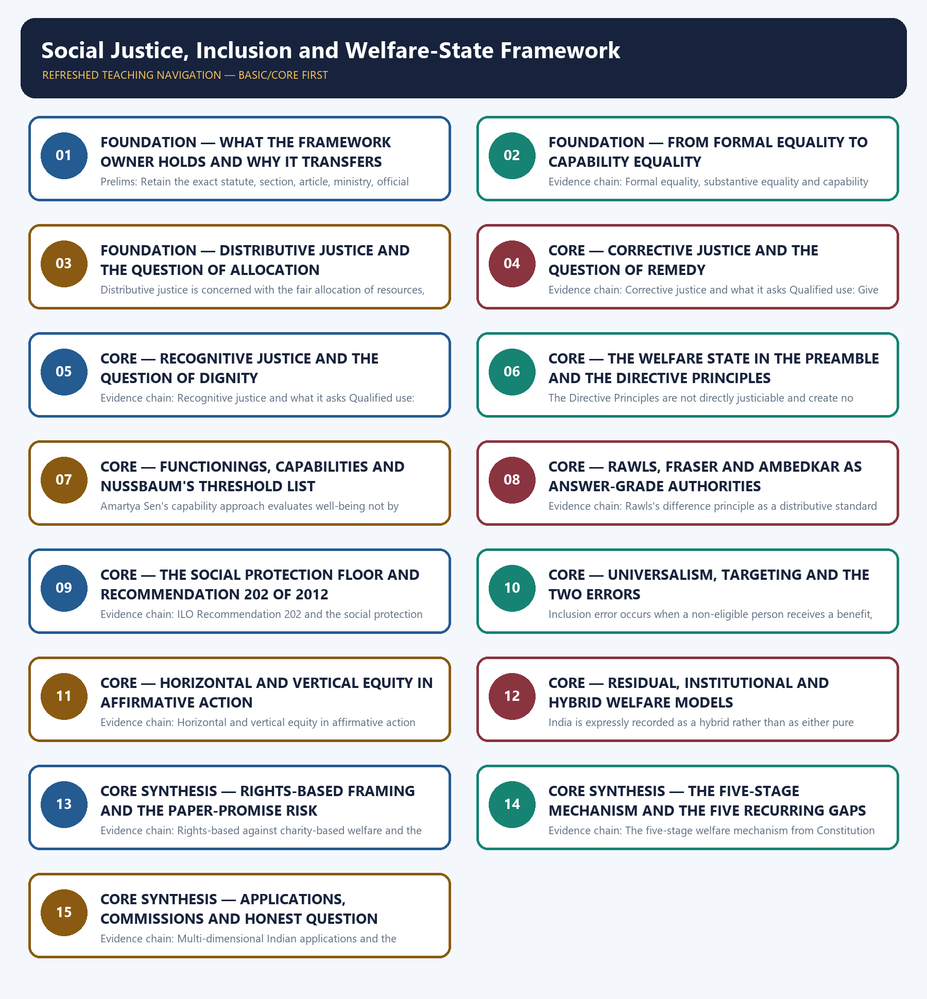

# Social Justice, Inclusion and Welfare-State Framework — Learner-v2 Complete Learning Session

> **Authoring-only generation:** 2026-09-02. No PDF was rendered and no tracker or index was mutated.

### SOURCE, PROGRESSION AND CURRENT-LINKAGE AUDIT

- **Generation date:** 2026-09-02.
- **Repository-first evidence:** the Basic owner is taught first and preserved in full; the Advanced owner is retained only in the optional final teaching block.
- **OCR evidence:** Repository Markdown was primary. The OCR-searchable official General Studies question papers held under books\mains and books\more_previous_papers were read only to confirm the printed wording of routed Mains demands. No official answer key, marking scheme, page precision or unsupported quotation was imported from them.
- **Qdrant:** not used; repository Markdown and available OCR context were sufficient.
- **PYQ integrity:** Four General Studies Mains demands are routed to this topic in the audited routing ledgers and each is reproduced below as a demand card with its printed year, paper, question number, directive, marks and word limit exactly as the ledger records them: 2019 General Studies Paper II Question 6, 2023 General Studies Paper I Question 16, 2024 General Studies Paper I Question 18 and 2025 General Studies Paper II Question 16. No objective demand is routed to this topic in the audited 2018-2023, 2024-2025 or 2026 Prelims ledgers, so no objective card is manufactured, no official answer key is consulted or inferred for this topic and no option is recorded. The locally held OCR-searchable official General Studies papers were read only to confirm the printed wording of the routed Mains demands; no question was invented from them, no stem was paraphrased into an apparent routing, and no marking scheme or page precision was imported. Every model solution below is original work written to the repository's examiner-grade standard using the claim, named evidence, analysis and qualification pattern, and none of them reproduces or claims an official answer.
- **Live-link boundary:** One live official source was verified for this topic on 2026-09-02. The International Labour Organization's own page on the Social Protection Floors Recommendation, 2012, No. 202, was read successfully on that date and states that the Recommendation provides guidance to member States in building comprehensive social security systems and extending coverage by prioritising national floors of social protection accessible to all in need, that it complements existing Conventions and Recommendations, that it comprises principles including the overall and primary responsibility of the State, a rights-based approach based on entitlements prescribed by national law, diversity of methods, progressive realisation, universality of protection based on social solidarity, adequacy and predictability of benefits, non-discrimination and gender equality, financial and fiscal sustainability, transparent administration and tripartite participation, and that national social protection floors should comprise at least four basic social security guarantees, namely access to essential health care including maternity care, basic income security for children providing access to nutrition, education, care and other necessary goods and services, basic income security for persons in active age unable to earn sufficient income in cases such as sickness, unemployment, maternity and disability, and basic income security for older persons. Only that statement of status, principles and guarantees is used, and no coverage estimate, country ranking, expenditure share or compliance finding is imported from it. The remaining anchors used in this package are the durable ones already carried by the repository owners, namely the constitutional text of the Preamble and Part IV with Articles 38, 39, 41 to 43 and 46 to 47, the interpretive-aid position of the Directive Principles recorded with Minerva Mills in 1980, and the theoretical corpus of Sen, Nussbaum, Rawls, Fraser and Ambedkar. The owners state expressly that no dynamic dashboard figure is asserted for this topic because it is conceptual rather than scheme-specific, and this package keeps that boundary: it asserts no poverty, nutrition, health or education indicator, no National Family Health Survey, Periodic Labour Force Survey, National Sample Survey, NITI Aayog or Sustainable Development Goal figure, no Human Development Index or Multidimensional Poverty Index value, rank or year, no scheme eligibility rule or coverage count, no budget or expenditure number, no institutional mandate beyond the recorded advisory and recommendatory character of the national commissions, no policy status and no previous-year question, answer key or date beyond the four routed Mains demands reproduced from the audited ledgers. Where a downstream topic supplies dated scheme and survey data, that data is left to its owning topic rather than restated here.
- **Fact/inference discipline:** no current-affairs item, PYQ wording, figure or quotation is invented.

## BASIC LEARNING SESSION

### DEEP-REVIEW LEARNING CONTRACT

| Control | Binding rule for this package |
|---|---|
| Syllabus boundary | Complete Social Justice Basic/Core is answer-complete before optional Advanced depth. |
| Legal-status boundary | Constitutional value/right, statute, rule, judgment, executive policy, scheme, eligibility rule, implementation and outcome remain distinct. |
| Rights-holder map | Rights-holder → entitlement/need → competent institution/duty-bearer → accountability forum → grievance/appeal/remedy. |
| Delivery chain | Identification → eligibility → documentation → enrolment → finance → frontline access → service/benefit → portability → outcome → audit and correction. |
| Inclusion method | Intersectional caste, tribe, gender, age, disability, religion, occupation, migration and regional variation is retained without homogenising groups. |
| Evidence method | Claim → named India-centric law/institution/scheme/case/dataset → analysis → source, reference period, release date, denominator, status and causal qualification. |
| Dignity and safeguards | Accessibility, privacy, participation, social audit, portability, offline access, due process and protection from stigma or coercion are tested. |
| Practice contract | Every model has demand decoding, detailed examiner-grade answer, executable timed/compression plan, marks rationale and answer-specific improvement. |
| Approval | This immutable successor remains `approved: false` pending explicit approval. |

**Canonical Basic/Core owner:** `upsc-ai-kit\knowledge\Social-Justice\basic\01_Social-Justice-Concept-Inclusion-and-Welfare-State-Framework.md`  
**Substantive canonical provenance owner:** `upsc-ai-kit\knowledge\Social-Justice\01_Social-Justice-Inclusion-and-Welfare-State-Framework_Learner-V2-Complete-Topic-Package.md`  
**Optional Advanced owner:** `upsc-ai-kit\knowledge\Social-Justice\advanced\01_Social-Justice-Concept-Inclusion-and-Welfare-State-Framework.md`  
**Official syllabus mapping:** `upsc-ai-kit\knowledge\Social-Justice\OFFICIAL-UPSC-SYLLABUS-MAPPING.md`

### EVIDENCE, PYQ AND CURRENT-STATUS CONTROL

- **Prohibition/outcome discipline:** a legal prohibition, reported case, registration, conviction, rehabilitation measure and lived eradication are different claims.
- **Eligibility discipline:** universal, categorical, means-tested, self-declared, notified-list and residence-linked routes require exact scope; coverage never proves adequacy or access.
- **Reservation discipline:** constitutional basis, beneficiary category, competent list, ceiling, creamy-layer rule, EWS route, horizontal/vertical operation and judicial status are qualified separately.
- **Fiscal discipline:** allocation, release, expenditure, unit cost, beneficiary transfer and outcome are not interchangeable.
- **Data discipline:** retain numerator, denominator, unit, geography, reference period, release date, provisional/final status and survey-versus-administrative character.
- **Causal discipline:** headline change, before-after sequence or cross-state correlation does not establish scheme impact without mechanism and counterfactual limits.
- **PYQ discipline:** exact wording is preserved only when verified; routed or reconstructed demands remain labelled and no model is presented as an official UPSC answer.
- **Current-status note, rechecked 2026-09-03:** volatile law, scheme, judgment, list, budget and dataset claims retain issuing authority, date and operative/interim/final status.

**Generation-local live/current sources:**
- `https://www.ilo.org/resource/news/ilo-social-protection-floors-recommendation-2012-no-202`




*Distinct embedded teaching-navigation image. The separate continuous Cārvāka-style flowchart package remains an independent at-a-glance artifact.*

### SESSION 1 — FOUNDATION — WHAT THE FRAMEWORK OWNER HOLDS AND WHY IT TRANSFERS

#### DEFINITION / WHAT THIS IS CALLED

**Plain-language definition:** Evidence chain: What this owner holds and why the whole folder depends on it Qualified use: Open any social-justice demand by naming the dimension of justice at stake before listing any scheme.

**Technical definition:** Prelims: Retain the exact statute, section, article, ministry, official category, survey round or dated edition attached to What the framework owner holds and why it transfers, and never upgrade a policy document into a statute or a targeted scheme into a universal entitlement.

#### ANSWER-GRABBING OPENING — WRITE/ADAPT IN THE EXAM

> Evidence chain: What this owner holds and why the whole folder depends on it Qualified use: Open any social-justice demand by naming the dimension of justice at stake before listing any scheme.

#### MUST-WRITE KEYWORDS

- **FOUNDATION**
- **What the framework owner holds**
- **why it transfers**
- **Evidence chain**
- **Qualified use**
- **This**

**How to use them:** Frame the answer through FOUNDATION; define What the framework owner holds, connect why it transfers with Evidence chain to explain the mechanism, and use Qualified use for the decisive comparison or qualification.

#### VISUAL FIRST

```text
WHAT THE FRAMEWORK OWNER HOLDS AND WHY IT TRANSFERS
01. What this owner holds and why the whole folder depends on it
BOUNDARY -> This owner supplies the lens; doctrinal detail belongs to Polity and measurement mechanics to Economy.
```

*This topic-specific rail fixes the evidence sequence and its exam boundary before analysis.*

#### CORE EXPLANATION

This topic owns the evaluative vocabulary of the entire Social Justice folder, namely the three dimensions of justice, the welfare-state concept, the capability standard, the universalism-versus-targeting design choice and the rights-based framing, and its distinctive feature is that it is simultaneously conceptual and directly examined: four General Studies Mains demands in the audited routing ledgers are routed to it, from 2019, 2023, 2024 and 2025, so it must be learned as an answer instrument rather than as background theory; the constitutional doctrine of the Directive Principles belongs to the Polity owner and the mechanics of poverty and human-development measurement belong to the Economy owner, while this topic supplies the lens through which both are argued.

#### NAMED EVIDENCE AND MECHANISM

- This topic owns the evaluative vocabulary of the entire Social Justice folder, namely the three dimensions of justice, the welfare-state concept, the capability standard, the universalism-versus-targeting design choice and the rights-based framing, and its distinctive feature is that it is simultaneously conceptual and directly examined: four General Studies Mains demands in the audited routing ledgers are routed to it, from 2019, 2023, 2024 and 2025, so it must be learned as an answer instrument rather than as background theory; the constitutional doctrine of the Directive Principles belongs to the Polity owner and the mechanics of poverty and human-development measurement belong to the Economy owner, while this topic supplies the lens through which both are argued.

#### EXAMINER CAUTION

- This owner supplies the lens; doctrinal detail belongs to Polity and measurement mechanics to Economy.

#### EXAM LINK

- **Prelims:** Retain the exact statute, section, article, ministry, official category, survey round or dated edition attached to What the framework owner holds and why it transfers, and never upgrade a policy document into a statute or a targeted scheme into a universal entitlement.
- **Mains:** Open any social-justice demand by naming the dimension of justice at stake before listing any scheme.

#### MINI RECAP

- **Evidence chain:** What this owner holds and why the whole folder depends on it
- **Qualified use:** Open any social-justice demand by naming the dimension of justice at stake before listing any scheme.

#### CLOSING RECALL FLOW — FOUNDATION — WHAT THE FRAMEWORK OWNER HOLDS AND WHY IT TRANSFERS

```text
START / CONCEPT: FOUNDATION — What the framework owner holds and why it transfers
        |
        v
EXACT TERMS: FOUNDATION · What the framework owner holds · why it transfers · Evidence chain · Qualified use · This
        |
        v
MECHANISM / ARGUMENT: This topic owns the evaluative vocabulary of the entire Social Justice folder, namely the three dimensions of justice, the welfare-state concept, the capability standard, the universalism-versus-targeting design choice and the rights-based framing, and its distinctive feature is that it is simultaneously conceptual and directly examined: four General Studies Mains demands in the audited routing ledgers are routed to it, from 2019, 2023, 2024 and 2025, so it must be learned as an answer instrument rather than as background theory; the constitutional doctrine of the Directive Principles belongs to the Polity owner and the mechanics of poverty and human-development measurement belong to the Economy owner, while this topic supplies the lens through which both are argued.
        |
        v
CONSEQUENCE / CONTRAST: Prelims: Retain the exact statute, section, article, ministry, official category, survey round or dated edition attached to What the framework owner holds and why it transfers, and never upgrade a policy document into a statute or a targeted scheme into a universal entitlement.
        |
        v
UPSC TRAP / ANSWER-USE: Do not miss this limiting distinction: doctrinal detail belongs to Polity and measurement mechanics to Economy.
        |
        v
ANSWER-GRABBING FORMULATION: Evidence chain: What this owner holds and why the whole folder depends on it Qualified use: Open any social-justice demand by naming the dimension of justice at stake before listing any scheme.
```
### SESSION 2 — FOUNDATION — FROM FORMAL EQUALITY TO CAPABILITY EQUALITY

#### DEFINITION / WHAT THIS IS CALLED

**Plain-language definition:** Formal equality applies the same rule to everyone and can entrench structural disadvantage where starting conditions differ by caste, gender, tribe, disability, location or income, substantive equality supplies differentiated support such as reservation, targeted transfers and special provisions in order to remove those structural barriers, and capability equality, the Sen standard, asks the further question of whether the differentiated support actually expanded what people can do and be rather than merely whether an input was delivered; this three-step ladder is the single most transferable structuring device in the folder because it converts a list of schemes into an argument about conversion.

**Technical definition:** Evidence chain: Formal equality, substantive equality and capability equality Qualified use: Convert a list of schemes into an argument about conversion by climbing the three-step ladder.

#### ANSWER-GRABBING OPENING — WRITE/ADAPT IN THE EXAM

> Formal equality applies the same rule to everyone and can entrench structural disadvantage where starting conditions differ by caste, gender, tribe, disability, location or income, substantive equality supplies differentiated support such as reservation, targeted transfers and special provisions in order to remove those structural barriers, and capability equality, the Sen standard, asks the further question of whether the differentiated support actually expanded what people can do and be rather than merely whether an input was delivered; this three-step ladder is the single most transferable structuring device in the folder because it converts a list of schemes into an argument about conversion.

#### MUST-WRITE KEYWORDS

- **FOUNDATION**
- **From formal equality to capability equality**
- **Evidence chain**
- **Qualified use**
- **Formal**
- **Sen**

**How to use them:** Frame the answer through FOUNDATION; define From formal equality to capability equality, connect Evidence chain with Qualified use to explain the mechanism, and use Formal for the decisive comparison or qualification.

#### VISUAL FIRST

```text
FROM FORMAL EQUALITY TO CAPABILITY EQUALITY
01. Formal equality, substantive equality and capability equality
BOUNDARY -> Formal equality can entrench disadvantage where starting conditions differ.
```

*This topic-specific rail fixes the evidence sequence and its exam boundary before analysis.*

#### CORE EXPLANATION

Formal equality applies the same rule to everyone and can entrench structural disadvantage where starting conditions differ by caste, gender, tribe, disability, location or income, substantive equality supplies differentiated support such as reservation, targeted transfers and special provisions in order to remove those structural barriers, and capability equality, the Sen standard, asks the further question of whether the differentiated support actually expanded what people can do and be rather than merely whether an input was delivered; this three-step ladder is the single most transferable structuring device in the folder because it converts a list of schemes into an argument about conversion.

#### NAMED EVIDENCE AND MECHANISM

- Formal equality applies the same rule to everyone and can entrench structural disadvantage where starting conditions differ by caste, gender, tribe, disability, location or income, substantive equality supplies differentiated support such as reservation, targeted transfers and special provisions in order to remove those structural barriers, and capability equality, the Sen standard, asks the further question of whether the differentiated support actually expanded what people can do and be rather than merely whether an input was delivered; this three-step ladder is the single most transferable structuring device in the folder because it converts a list of schemes into an argument about conversion.

#### EXAMINER CAUTION

- Formal equality can entrench disadvantage where starting conditions differ.

#### EXAM LINK

- **Prelims:** Retain the exact statute, section, article, ministry, official category, survey round or dated edition attached to From formal equality to capability equality, and never upgrade a policy document into a statute or a targeted scheme into a universal entitlement.
- **Mains:** Convert a list of schemes into an argument about conversion by climbing the three-step ladder.

#### MINI RECAP

- **Evidence chain:** Formal equality, substantive equality and capability equality
- **Qualified use:** Convert a list of schemes into an argument about conversion by climbing the three-step ladder.

#### CLOSING RECALL FLOW — FOUNDATION — FROM FORMAL EQUALITY TO CAPABILITY EQUALITY

```text
START / CONCEPT: FOUNDATION — From formal equality to capability equality
        |
        v
EXACT TERMS: FOUNDATION · From formal equality to capability equality · Evidence chain · Qualified use · Formal · Sen
        |
        v
MECHANISM / ARGUMENT: Evidence chain: Formal equality, substantive equality and capability equality Qualified use: Convert a list of schemes into an argument about conversion by climbing the three-step ladder.
        |
        v
CONSEQUENCE / CONTRAST: Formal equality can entrench disadvantage where starting conditions differ.
        |
        v
UPSC TRAP / ANSWER-USE: Do not miss this limiting distinction: formal equality, substantive equality and capability equality Qualified use.
        |
        v
ANSWER-GRABBING FORMULATION: Formal equality applies the same rule to everyone and can entrench structural disadvantage where starting conditions differ by caste, gender, tribe, disability, location or income, substantive equality supplies differentiated support such as reservation, targeted transfers and special provisions in order to remove those structural barriers, and capability equality, the Sen standard, asks the further question of whether the differentiated support actually expanded what people can do and be rather than merely whether an input was delivered; this three-step ladder is the single most transferable structuring device in the folder because it converts a list of schemes into an argument about conversion.
```
### SESSION 3 — FOUNDATION — DISTRIBUTIVE JUSTICE AND THE QUESTION OF ALLOCATION

#### DEFINITION / WHAT THIS IS CALLED

**Plain-language definition:** Evidence chain: Distributive justice and what it asks Qualified use: Show why redistribution is necessary but not sufficient in a welfare-evaluation answer.

**Technical definition:** Distributive justice is concerned with the fair allocation of resources, opportunities and services and asks the question who receives what, and it is implemented in India through transfers, reservation, public services and social security; treating it as the whole of social justice is the commonest conceptual error, because an allocation that reaches a household without remedying a specific wrong done to that household, and without affirming the dignity that was denied to it, leaves the injustice partly intact.

#### ANSWER-GRABBING OPENING — WRITE/ADAPT IN THE EXAM

> Evidence chain: Distributive justice and what it asks Qualified use: Show why redistribution is necessary but not sufficient in a welfare-evaluation answer.

#### MUST-WRITE KEYWORDS

- **FOUNDATION**
- **Distributive justice**
- **the question of allocation**
- **Evidence chain**
- **Qualified use**
- **Distributive**

**How to use them:** Frame the answer through FOUNDATION; define Distributive justice, connect the question of allocation with Evidence chain to explain the mechanism, and use Qualified use for the decisive comparison or qualification.

#### VISUAL FIRST

```text
DISTRIBUTIVE JUSTICE AND THE QUESTION OF ALLOCATION
01. Distributive justice and what it asks
BOUNDARY -> Allocation alone leaves an unremedied wrong and a denied dignity intact.
```

*This topic-specific rail fixes the evidence sequence and its exam boundary before analysis.*

#### CORE EXPLANATION

Distributive justice is concerned with the fair allocation of resources, opportunities and services and asks the question who receives what, and it is implemented in India through transfers, reservation, public services and social security; treating it as the whole of social justice is the commonest conceptual error, because an allocation that reaches a household without remedying a specific wrong done to that household, and without affirming the dignity that was denied to it, leaves the injustice partly intact.

#### NAMED EVIDENCE AND MECHANISM

- Distributive justice is concerned with the fair allocation of resources, opportunities and services and asks the question who receives what, and it is implemented in India through transfers, reservation, public services and social security; treating it as the whole of social justice is the commonest conceptual error, because an allocation that reaches a household without remedying a specific wrong done to that household, and without affirming the dignity that was denied to it, leaves the injustice partly intact.

#### EXAMINER CAUTION

- Allocation alone leaves an unremedied wrong and a denied dignity intact.

#### EXAM LINK

- **Prelims:** Retain the exact statute, section, article, ministry, official category, survey round or dated edition attached to Distributive justice and the question of allocation, and never upgrade a policy document into a statute or a targeted scheme into a universal entitlement.
- **Mains:** Show why redistribution is necessary but not sufficient in a welfare-evaluation answer.

#### MINI RECAP

- **Evidence chain:** Distributive justice and what it asks
- **Qualified use:** Show why redistribution is necessary but not sufficient in a welfare-evaluation answer.

#### CLOSING RECALL FLOW — FOUNDATION — DISTRIBUTIVE JUSTICE AND THE QUESTION OF ALLOCATION

```text
START / CONCEPT: FOUNDATION — Distributive justice and the question of allocation
        |
        v
EXACT TERMS: FOUNDATION · Distributive justice · the question of allocation · Evidence chain · Qualified use · Distributive
        |
        v
MECHANISM / ARGUMENT: Distributive justice is concerned with the fair allocation of resources, opportunities and services and asks the question who receives what, and it is implemented in India through transfers, reservation, public services and social security; treating it as the whole of social justice is the commonest conceptual error, because an allocation that reaches a household without remedying a specific wrong done to that household, and without affirming the dignity that was denied to it, leaves the injustice partly intact.
        |
        v
CONSEQUENCE / CONTRAST: Mains: Show why redistribution is necessary but not sufficient in a welfare-evaluation answer.
        |
        v
UPSC TRAP / ANSWER-USE: Do not miss this limiting distinction: distributive justice and what it asks Qualified use.
        |
        v
ANSWER-GRABBING FORMULATION: Evidence chain: Distributive justice and what it asks Qualified use: Show why redistribution is necessary but not sufficient in a welfare-evaluation answer.
```
### SESSION 4 — CORE — CORRECTIVE JUSTICE AND THE QUESTION OF REMEDY

#### DEFINITION / WHAT THIS IS CALLED

**Plain-language definition:** Corrective justice is concerned with remedying a specific wrong and asks the question how the harm is undone, and it is implemented through compensation, rehabilitation, penalty and restoration; it is the dimension that gives protective legislation its analytical shape, because a prohibition without a remedy, a penalty without enforcement capacity, or a rehabilitation entitlement without an alternative livelihood leaves the corrective claim unsatisfied even where the distributive claim has been met.

**Technical definition:** Evidence chain: Corrective justice and what it asks Qualified use: Give protective legislation its analytical shape instead of describing it.

#### ANSWER-GRABBING OPENING — WRITE/ADAPT IN THE EXAM

> Corrective justice is concerned with remedying a specific wrong and asks the question how the harm is undone, and it is implemented through compensation, rehabilitation, penalty and restoration; it is the dimension that gives protective legislation its analytical shape, because a prohibition without a remedy, a penalty without enforcement capacity, or a rehabilitation entitlement without an alternative livelihood leaves the corrective claim unsatisfied even where the distributive claim has been met.

#### MUST-WRITE KEYWORDS

- **Corrective justice**
- **the question of remedy**
- **Evidence chain**
- **Qualified use**
- **Corrective**
- **Qualified**

**How to use them:** Frame the answer through Corrective justice; define the question of remedy, connect Evidence chain with Qualified use to explain the mechanism, and use Corrective for the decisive comparison or qualification.

#### VISUAL FIRST

```text
CORRECTIVE JUSTICE AND THE QUESTION OF REMEDY
01. Corrective justice and what it asks
BOUNDARY -> A prohibition without enforcement capacity or rehabilitation leaves the corrective claim unsatisfied.
```

*This topic-specific rail fixes the evidence sequence and its exam boundary before analysis.*

#### CORE EXPLANATION

Corrective justice is concerned with remedying a specific wrong and asks the question how the harm is undone, and it is implemented through compensation, rehabilitation, penalty and restoration; it is the dimension that gives protective legislation its analytical shape, because a prohibition without a remedy, a penalty without enforcement capacity, or a rehabilitation entitlement without an alternative livelihood leaves the corrective claim unsatisfied even where the distributive claim has been met.

#### NAMED EVIDENCE AND MECHANISM

- Corrective justice is concerned with remedying a specific wrong and asks the question how the harm is undone, and it is implemented through compensation, rehabilitation, penalty and restoration; it is the dimension that gives protective legislation its analytical shape, because a prohibition without a remedy, a penalty without enforcement capacity, or a rehabilitation entitlement without an alternative livelihood leaves the corrective claim unsatisfied even where the distributive claim has been met.

#### EXAMINER CAUTION

- A prohibition without enforcement capacity or rehabilitation leaves the corrective claim unsatisfied.

#### EXAM LINK

- **Prelims:** Retain the exact statute, section, article, ministry, official category, survey round or dated edition attached to Corrective justice and the question of remedy, and never upgrade a policy document into a statute or a targeted scheme into a universal entitlement.
- **Mains:** Give protective legislation its analytical shape instead of describing it.

#### MINI RECAP

- **Evidence chain:** Corrective justice and what it asks
- **Qualified use:** Give protective legislation its analytical shape instead of describing it.

#### CLOSING RECALL FLOW — CORE — CORRECTIVE JUSTICE AND THE QUESTION OF REMEDY

```text
START / CONCEPT: CORE — Corrective justice and the question of remedy
        |
        v
EXACT TERMS: Corrective justice · the question of remedy · Evidence chain · Qualified use · Corrective · Qualified
        |
        v
MECHANISM / ARGUMENT: Evidence chain: Corrective justice and what it asks Qualified use: Give protective legislation its analytical shape instead of describing it.
        |
        v
CONSEQUENCE / CONTRAST: The resulting consequence is that corrective justice and what it asks Qualified use.
        |
        v
UPSC TRAP / ANSWER-USE: Do not miss this limiting distinction: corrective justice and what it asks Qualified use.
        |
        v
ANSWER-GRABBING FORMULATION: Corrective justice is concerned with remedying a specific wrong and asks the question how the harm is undone, and it is implemented through compensation, rehabilitation, penalty and restoration; it is the dimension that gives protective legislation its analytical shape, because a prohibition without a remedy, a penalty without enforcement capacity, or a rehabilitation entitlement without an alternative livelihood leaves the corrective claim unsatisfied even where the distributive claim has been met.
```
### SESSION 5 — CORE — RECOGNITIVE JUSTICE AND THE QUESTION OF DIGNITY

#### DEFINITION / WHAT THIS IS CALLED

**Plain-language definition:** Recognitive justice is concerned with affirming denied identities, dignity and voice and asks the question whose personhood is marginalised, and it is implemented through anti-discrimination law, representation and identity recognition; it is the dimension most often omitted from an average answer, and its omission is visible whenever a scheme restores income while leaving stigma, exclusion from public space and absence of political voice untouched.

**Technical definition:** Evidence chain: Recognitive justice and what it asks Qualified use: Add the dimension that most answers omit and that examiners reward.

#### ANSWER-GRABBING OPENING — WRITE/ADAPT IN THE EXAM

> Recognitive justice is concerned with affirming denied identities, dignity and voice and asks the question whose personhood is marginalised, and it is implemented through anti-discrimination law, representation and identity recognition; it is the dimension most often omitted from an average answer, and its omission is visible whenever a scheme restores income while leaving stigma, exclusion from public space and absence of political voice untouched.

#### MUST-WRITE KEYWORDS

- **Recognitive justice**
- **the question of dignity**
- **Evidence chain**
- **Qualified use**
- **Recognitive**
- **Restoring income while leaving stigma and voicelessness untouched**

**How to use them:** Frame the answer through Recognitive justice; define the question of dignity, connect Evidence chain with Qualified use to explain the mechanism, and use Recognitive for the decisive comparison or qualification.

#### VISUAL FIRST

```text
RECOGNITIVE JUSTICE AND THE QUESTION OF DIGNITY
01. Recognitive justice and what it asks
BOUNDARY -> Restoring income while leaving stigma and voicelessness untouched is an incomplete remedy.
```

*This topic-specific rail fixes the evidence sequence and its exam boundary before analysis.*

#### CORE EXPLANATION

Recognitive justice is concerned with affirming denied identities, dignity and voice and asks the question whose personhood is marginalised, and it is implemented through anti-discrimination law, representation and identity recognition; it is the dimension most often omitted from an average answer, and its omission is visible whenever a scheme restores income while leaving stigma, exclusion from public space and absence of political voice untouched.

#### NAMED EVIDENCE AND MECHANISM

- Recognitive justice is concerned with affirming denied identities, dignity and voice and asks the question whose personhood is marginalised, and it is implemented through anti-discrimination law, representation and identity recognition; it is the dimension most often omitted from an average answer, and its omission is visible whenever a scheme restores income while leaving stigma, exclusion from public space and absence of political voice untouched.

#### EXAMINER CAUTION

- Restoring income while leaving stigma and voicelessness untouched is an incomplete remedy.

#### EXAM LINK

- **Prelims:** Retain the exact statute, section, article, ministry, official category, survey round or dated edition attached to Recognitive justice and the question of dignity, and never upgrade a policy document into a statute or a targeted scheme into a universal entitlement.
- **Mains:** Add the dimension that most answers omit and that examiners reward.

#### MINI RECAP

- **Evidence chain:** Recognitive justice and what it asks
- **Qualified use:** Add the dimension that most answers omit and that examiners reward.

#### CLOSING RECALL FLOW — CORE — RECOGNITIVE JUSTICE AND THE QUESTION OF DIGNITY

```text
START / CONCEPT: CORE — Recognitive justice and the question of dignity
        |
        v
EXACT TERMS: Recognitive justice · the question of dignity · Evidence chain · Qualified use · Recognitive · Restoring income while leaving stigma and voicelessness untouched
        |
        v
MECHANISM / ARGUMENT: Evidence chain: Recognitive justice and what it asks Qualified use: Add the dimension that most answers omit and that examiners reward.
        |
        v
CONSEQUENCE / CONTRAST: Restoring income while leaving stigma and voicelessness untouched is an incomplete remedy.
        |
        v
UPSC TRAP / ANSWER-USE: Do not miss this limiting distinction: recognitive justice is concerned with affirming denied identities, dignity and voice and asks the...
        |
        v
ANSWER-GRABBING FORMULATION: Recognitive justice is concerned with affirming denied identities, dignity and voice and asks the question whose personhood is marginalised, and it is implemented through anti-discrimination law, representation and identity recognition; it is the dimension most often omitted from an average answer, and its omission is visible whenever a scheme restores income while leaving stigma, exclusion from public space and absence of political voice untouched.
```
### SESSION 6 — CORE — THE WELFARE STATE IN THE PREAMBLE AND THE DIRECTIVE PRINCIPLES

#### DEFINITION / WHAT THIS IS CALLED

**Plain-language definition:** CORE — The welfare state in the Preamble and the Directive Principles comprises The welfare state in the Preamble, the Directive Principles and Evidence chain as its core connected dimensions.

**Technical definition:** The Directive Principles are not directly justiciable and create no individual cause of action.

#### ANSWER-GRABBING OPENING — WRITE/ADAPT IN THE EXAM

> The welfare state is a state that assumes responsibility for its citizens' minimum standard of living through public provision of health, education, housing, social security and poverty relief, and in India its normative foundation is the Preamble's declaration of a socialist republic committed to justice that is social, economic and political, together with Part IV of the Constitution, particularly Articles 38, 39, 41 to 43 and 46 to 47; the Directive Principles are not directly justiciable and create no individual cause of action, but they are used as an interpretive aid by the courts, a use recorded in the owners with the example of Minerva Mills in 1980.

#### MUST-WRITE KEYWORDS

- **The welfare state in the Preamble**
- **the Directive Principles**
- **Evidence chain**
- **Qualified use**
- **The welfare state**
- **India**

**How to use them:** Frame the answer through The welfare state in the Preamble; define the Directive Principles, connect Evidence chain with Qualified use to explain the mechanism, and use The welfare state for the decisive comparison or qualification.

#### VISUAL FIRST

```text
THE WELFARE STATE IN THE PREAMBLE AND THE DIRECTIVE PRINCIPLES
01. The welfare state as the institutional vehicle in the Indian Constitution
BOUNDARY -> The Directive Principles are not directly justiciable and create no individual cause of action.
```

*This topic-specific rail fixes the evidence sequence and its exam boundary before analysis.*

#### CORE EXPLANATION

The welfare state is a state that assumes responsibility for its citizens' minimum standard of living through public provision of health, education, housing, social security and poverty relief, and in India its normative foundation is the Preamble's declaration of a socialist republic committed to justice that is social, economic and political, together with Part IV of the Constitution, particularly Articles 38, 39, 41 to 43 and 46 to 47; the Directive Principles are not directly justiciable and create no individual cause of action, but they are used as an interpretive aid by the courts, a use recorded in the owners with the example of Minerva Mills in 1980.

#### NAMED EVIDENCE AND MECHANISM

- The welfare state is a state that assumes responsibility for its citizens' minimum standard of living through public provision of health, education, housing, social security and poverty relief, and in India its normative foundation is the Preamble's declaration of a socialist republic committed to justice that is social, economic and political, together with Part IV of the Constitution, particularly Articles 38, 39, 41 to 43 and 46 to 47; the Directive Principles are not directly justiciable and create no individual cause of action, but they are used as an interpretive aid by the courts, a use recorded in the owners with the example of Minerva Mills in 1980.

#### EXAMINER CAUTION

- The Directive Principles are not directly justiciable and create no individual cause of action.

#### EXAM LINK

- **Prelims:** Retain the exact statute, section, article, ministry, official category, survey round or dated edition attached to The welfare state in the Preamble and the Directive Principles, and never upgrade a policy document into a statute or a targeted scheme into a universal entitlement.
- **Mains:** Anchor the constitutional basis precisely without overstating enforceability.

#### MINI RECAP

- **Evidence chain:** The welfare state as the institutional vehicle in the Indian Constitution
- **Qualified use:** Anchor the constitutional basis precisely without overstating enforceability.

#### CLOSING RECALL FLOW — CORE — THE WELFARE STATE IN THE PREAMBLE AND THE DIRECTIVE PRINCIPLES

```text
START / CONCEPT: CORE — The welfare state in the Preamble and the Directive Principles
        |
        v
EXACT TERMS: The welfare state in the Preamble · the Directive Principles · Evidence chain · Qualified use · The welfare state · India
        |
        v
MECHANISM / ARGUMENT: The Directive Principles are not directly justiciable and create no individual cause of action.
        |
        v
CONSEQUENCE / CONTRAST: Evidence chain: The welfare state as the institutional vehicle in the Indian Constitution Qualified use: Anchor the constitutional basis precisely without overstating enforceability.
        |
        v
UPSC TRAP / ANSWER-USE: Do not miss this limiting distinction: the welfare state is a state that assumes responsibility for its citizens' minimum standard...
        |
        v
ANSWER-GRABBING FORMULATION: The welfare state is a state that assumes responsibility for its citizens' minimum standard of living through public provision of health, education, housing, social security and poverty relief, and in India its normative foundation is the Preamble's declaration of a socialist republic committed to justice that is social, economic and political, together with Part IV of the Constitution, particularly Articles 38, 39, 41 to 43 and 46 to 47; the Directive Principles are not directly justiciable and create no individual cause of action, but they are used as an interpretive aid by the courts, a use recorded in the owners with the example of Minerva Mills in 1980.
```
### SESSION 7 — CORE — FUNCTIONINGS, CAPABILITIES AND NUSSBAUM'S THRESHOLD LIST

#### DEFINITION / WHAT THIS IS CALLED

**Plain-language definition:** Martha Nussbaum's central capabilities list specifies a threshold set that a just society must secure for every citizen, namely life, bodily health, bodily integrity, senses, imagination and thought, emotions, practical reason, affiliation, relation to other species, play, and control over one's environment, and it is a more prescriptive version of Sen's deliberately open-ended framework; the examinable distinction is that Sen refuses a fixed list in order to leave the specification to public reasoning, whereas Nussbaum supplies the list precisely so that a constitutional minimum can be identified.

**Technical definition:** Amartya Sen's capability approach evaluates well-being not by income or utility alone but by functionings, which are achieved states such as being nourished, being healthy or being literate, and capabilities, which are the real freedoms a person has to achieve those functionings, so the policy question shifts from what people have to what people can actually do and be; the operational consequence is that identical incomes yield unequal capabilities where health, disability, social exclusion or location differ, which is why an income-only evaluation of a welfare programme is analytically incomplete.

#### ANSWER-GRABBING OPENING — WRITE/ADAPT IN THE EXAM

> Martha Nussbaum's central capabilities list specifies a threshold set that a just society must secure for every citizen, namely life, bodily health, bodily integrity, senses, imagination and thought, emotions, practical reason, affiliation, relation to other species, play, and control over one's environment, and it is a more prescriptive version of Sen's deliberately open-ended framework; the examinable distinction is that Sen refuses a fixed list in order to leave the specification to public reasoning, whereas Nussbaum supplies the list precisely so that a constitutional minimum can be identified.

#### MUST-WRITE KEYWORDS

- **Functionings**
- **capabilities**
- **Nussbaum's threshold list**
- **Evidence chain**
- **Qualified use**
- **Amartya Sen's**

**How to use them:** Frame the answer through Functionings; define capabilities, connect Nussbaum's threshold list with Evidence chain to explain the mechanism, and use Qualified use for the decisive comparison or qualification.

#### VISUAL FIRST

```text
FUNCTIONINGS, CAPABILITIES AND NUSSBAUM'S THRESHOLD LIST
01. Functionings and capabilities in Amartya Sen's framework
    |
    v
02. Nussbaum's central capabilities as a threshold specification
BOUNDARY -> Sen's framework is deliberately open-ended; the fixed list is Nussbaum's specification.
```

*This topic-specific rail fixes the evidence sequence and its exam boundary before analysis.*

#### CORE EXPLANATION

Amartya Sen's capability approach evaluates well-being not by income or utility alone but by functionings, which are achieved states such as being nourished, being healthy or being literate, and capabilities, which are the real freedoms a person has to achieve those functionings, so the policy question shifts from what people have to what people can actually do and be; the operational consequence is that identical incomes yield unequal capabilities where health, disability, social exclusion or location differ, which is why an income-only evaluation of a welfare programme is analytically incomplete. Martha Nussbaum's central capabilities list specifies a threshold set that a just society must secure for every citizen, namely life, bodily health, bodily integrity, senses, imagination and thought, emotions, practical reason, affiliation, relation to other species, play, and control over one's environment, and it is a more prescriptive version of Sen's deliberately open-ended framework; the examinable distinction is that Sen refuses a fixed list in order to leave the specification to public reasoning, whereas Nussbaum supplies the list precisely so that a constitutional minimum can be identified.

#### NAMED EVIDENCE AND MECHANISM

- Amartya Sen's capability approach evaluates well-being not by income or utility alone but by functionings, which are achieved states such as being nourished, being healthy or being literate, and capabilities, which are the real freedoms a person has to achieve those functionings, so the policy question shifts from what people have to what people can actually do and be; the operational consequence is that identical incomes yield unequal capabilities where health, disability, social exclusion or location differ, which is why an income-only evaluation of a welfare programme is analytically incomplete.
- Martha Nussbaum's central capabilities list specifies a threshold set that a just society must secure for every citizen, namely life, bodily health, bodily integrity, senses, imagination and thought, emotions, practical reason, affiliation, relation to other species, play, and control over one's environment, and it is a more prescriptive version of Sen's deliberately open-ended framework; the examinable distinction is that Sen refuses a fixed list in order to leave the specification to public reasoning, whereas Nussbaum supplies the list precisely so that a constitutional minimum can be identified.

#### EXAMINER CAUTION

- Sen's framework is deliberately open-ended; the fixed list is Nussbaum's specification.

#### EXAM LINK

- **Prelims:** Retain the exact statute, section, article, ministry, official category, survey round or dated edition attached to Functionings, capabilities and Nussbaum's threshold list, and never upgrade a policy document into a statute or a targeted scheme into a universal entitlement.
- **Mains:** Supply the evaluative standard for every downstream topic in the folder.

#### MINI RECAP

- **Evidence chain:** Functionings and capabilities in Amartya Sen's framework -> Nussbaum's central capabilities as a threshold specification
- **Qualified use:** Supply the evaluative standard for every downstream topic in the folder.

#### CLOSING RECALL FLOW — CORE — FUNCTIONINGS, CAPABILITIES AND NUSSBAUM'S THRESHOLD LIST

```text
START / CONCEPT: CORE — Functionings, capabilities and Nussbaum's threshold list
        |
        v
EXACT TERMS: Functionings · capabilities · Nussbaum's threshold list · Evidence chain · Qualified use · Amartya Sen's
        |
        v
MECHANISM / ARGUMENT: Evidence chain: Functionings and capabilities in Amartya Sen's framework - Nussbaum's central capabilities as a threshold specification Qualified use: Supply the evaluative standard for every downstream topic in the folder.
        |
        v
CONSEQUENCE / CONTRAST: Amartya Sen's capability approach evaluates well-being not by income or utility alone but by functionings, which are achieved states such as being nourished, being healthy or being literate, and capabilities, which are the real freedoms a person has to achieve those functionings, so the policy question shifts from what people have to what people can actually do and be; the operational consequence is that identical incomes yield unequal capabilities where health, disability, social exclusion or location differ, which is why an income-only evaluation of a welfare programme is analytically incomplete.
        |
        v
UPSC TRAP / ANSWER-USE: Do not miss this limiting distinction: the fixed list is Nussbaum's specification.
        |
        v
ANSWER-GRABBING FORMULATION: Martha Nussbaum's central capabilities list specifies a threshold set that a just society must secure for every citizen, namely life, bodily health, bodily integrity, senses, imagination and thought, emotions, practical reason, affiliation, relation to other species, play, and control over one's environment, and it is a more prescriptive version of Sen's deliberately open-ended framework; the examinable distinction is that Sen refuses a fixed list in order to leave the specification to public reasoning, whereas Nussbaum supplies the list precisely so that a constitutional minimum can be identified.
```
### SESSION 8 — CORE — RAWLS, FRASER AND AMBEDKAR AS ANSWER-GRADE AUTHORITIES

#### DEFINITION / WHAT THIS IS CALLED

**Plain-language definition:** John Rawls's difference principle holds that social and economic inequalities are just only if they are arranged so as to be to the greatest benefit of the least-advantaged members of society, and it is accompanied in the owners by his standard of fair equality of opportunity; it supplies a defensible test for judging an inequality rather than merely deploring it, and it is the natural companion to the capability approach in a twenty-mark answer because one supplies the distributive criterion while the other supplies the evaluative metric.

**Technical definition:** Evidence chain: Rawls's difference principle as a distributive standard - Fraser's triad and Ambedkar's warning about political equality Qualified use: Raise a fifteen or twenty-mark answer by testing an inequality against a stated criterion.

#### ANSWER-GRABBING OPENING — WRITE/ADAPT IN THE EXAM

> John Rawls's difference principle holds that social and economic inequalities are just only if they are arranged so as to be to the greatest benefit of the least-advantaged members of society, and it is accompanied in the owners by his standard of fair equality of opportunity; it supplies a defensible test for judging an inequality rather than merely deploring it, and it is the natural companion to the capability approach in a twenty-mark answer because one supplies the distributive criterion while the other supplies the evaluative metric.

#### MUST-WRITE KEYWORDS

- **Rawls**
- **Fraser**
- **Ambedkar as answer-grade authorities**
- **Evidence chain**
- **Qualified use**
- **John Rawls's**

**How to use them:** Frame the answer through Rawls; define Fraser, connect Ambedkar as answer-grade authorities with Evidence chain to explain the mechanism, and use Qualified use for the decisive comparison or qualification.

#### VISUAL FIRST

```text
RAWLS, FRASER AND AMBEDKAR AS ANSWER-GRADE AUTHORITIES
01. Rawls's difference principle as a distributive standard
    |
    v
02. Fraser's triad and Ambedkar's warning about political equality
BOUNDARY -> Recognition cannot substitute for services, assets and employment.
```

*This topic-specific rail fixes the evidence sequence and its exam boundary before analysis.*

#### CORE EXPLANATION

John Rawls's difference principle holds that social and economic inequalities are just only if they are arranged so as to be to the greatest benefit of the least-advantaged members of society, and it is accompanied in the owners by his standard of fair equality of opportunity; it supplies a defensible test for judging an inequality rather than merely deploring it, and it is the natural companion to the capability approach in a twenty-mark answer because one supplies the distributive criterion while the other supplies the evaluative metric. Nancy Fraser's redistribution, recognition and representation triad connects stigma and political voice to material exclusion and establishes that misrecognition is itself a distributive barrier rather than a separate cultural grievance, and it is paired in the owners with Ambedkar's warning against sustaining political equality alongside continuing social and economic inequality; the qualification recorded with the triad is equally examinable, namely that identity recognition cannot substitute for services, assets and employment, so recognition strengthens an answer only when it is argued together with distribution.

#### NAMED EVIDENCE AND MECHANISM

- John Rawls's difference principle holds that social and economic inequalities are just only if they are arranged so as to be to the greatest benefit of the least-advantaged members of society, and it is accompanied in the owners by his standard of fair equality of opportunity; it supplies a defensible test for judging an inequality rather than merely deploring it, and it is the natural companion to the capability approach in a twenty-mark answer because one supplies the distributive criterion while the other supplies the evaluative metric.
- Nancy Fraser's redistribution, recognition and representation triad connects stigma and political voice to material exclusion and establishes that misrecognition is itself a distributive barrier rather than a separate cultural grievance, and it is paired in the owners with Ambedkar's warning against sustaining political equality alongside continuing social and economic inequality; the qualification recorded with the triad is equally examinable, namely that identity recognition cannot substitute for services, assets and employment, so recognition strengthens an answer only when it is argued together with distribution.

#### EXAMINER CAUTION

- Recognition cannot substitute for services, assets and employment.

#### EXAM LINK

- **Prelims:** Retain the exact statute, section, article, ministry, official category, survey round or dated edition attached to Rawls, Fraser and Ambedkar as answer-grade authorities, and never upgrade a policy document into a statute or a targeted scheme into a universal entitlement.
- **Mains:** Raise a fifteen or twenty-mark answer by testing an inequality against a stated criterion.

#### MINI RECAP

- **Evidence chain:** Rawls's difference principle as a distributive standard -> Fraser's triad and Ambedkar's warning about political equality
- **Qualified use:** Raise a fifteen or twenty-mark answer by testing an inequality against a stated criterion.

#### CLOSING RECALL FLOW — CORE — RAWLS, FRASER AND AMBEDKAR AS ANSWER-GRADE AUTHORITIES

```text
START / CONCEPT: CORE — Rawls, Fraser and Ambedkar as answer-grade authorities
        |
        v
EXACT TERMS: Rawls · Fraser · Ambedkar as answer-grade authorities · Evidence chain · Qualified use · John Rawls's
        |
        v
MECHANISM / ARGUMENT: Evidence chain: Rawls's difference principle as a distributive standard - Fraser's triad and Ambedkar's warning about political equality Qualified use: Raise a fifteen or twenty-mark answer by testing an inequality against a stated criterion.
        |
        v
CONSEQUENCE / CONTRAST: Mains: Raise a fifteen or twenty-mark answer by testing an inequality against a stated criterion.
        |
        v
UPSC TRAP / ANSWER-USE: Nancy Fraser's redistribution, recognition and representation triad connects stigma and political voice to material exclusion and establishes that misrecognition is itself a distributive barrier rather than a separate cultural grievance, and it is paired in the owners with Ambedkar's warning against sustaining political equality alongside continuing social and economic inequality; the qualification recorded with the triad is equally examinable, namely that identity recognition cannot substitute for services, assets and employment, so recognition strengthens an answer only when it is argued together with distribution.
        |
        v
ANSWER-GRABBING FORMULATION: John Rawls's difference principle holds that social and economic inequalities are just only if they are arranged so as to be to the greatest benefit of the least-advantaged members of society, and it is accompanied in the owners by his standard of fair equality of opportunity; it supplies a defensible test for judging an inequality rather than merely deploring it, and it is the natural companion to the capability approach in a twenty-mark answer because one supplies the distributive criterion while the other supplies the evaluative metric.
```
### SESSION 9 — CORE — THE SOCIAL PROTECTION FLOOR AND RECOMMENDATION 202 OF 2012

#### DEFINITION / WHAT THIS IS CALLED

**Plain-language definition:** The Social Protection Floors Recommendation, 2012, numbered 202, was adopted by the International Labour Conference and, on the International Labour Organization's own page read on 2 September 2026, provides guidance to member States in building comprehensive social security systems by prioritising national floors of social protection accessible to all in need, comprising at least four basic guarantees, namely access to essential health care including maternity care, basic income security for children providing access to nutrition, education, care and other necessary goods and services, basic income security for persons of active age unable to earn sufficient income in cases such as sickness, unemployment, maternity and disability, and basic income security for older persons; its stated principles include the overall and primary responsibility of the State, a rights-based approach based on entitlements prescribed by national law, progressive realisation, universality of protection based on social solidarity, non-discrimination and gender equality, and tripartite participation, and it is a Recommendation rather than a ratified Convention, so it creates no self-executing domestic legal obligation.

**Technical definition:** Evidence chain: ILO Recommendation 202 and the social protection floor Qualified use: Cite an international standard with the exact status discipline that protects the citation.

#### ANSWER-GRABBING OPENING — WRITE/ADAPT IN THE EXAM

> The Social Protection Floors Recommendation, 2012, numbered 202, was adopted by the International Labour Conference and, on the International Labour Organization's own page read on 2 September 2026, provides guidance to member States in building comprehensive social security systems by prioritising national floors of social protection accessible to all in need, comprising at least four basic guarantees, namely access to essential health care including maternity care, basic income security for children providing access to nutrition, education, care and other necessary goods and services, basic income security for persons of active age unable to earn sufficient income in cases such as sickness, unemployment, maternity and disability, and basic income security for older persons; its stated principles include the overall and primary responsibility of the State, a rights-based approach based on entitlements prescribed by national law, progressive realisation, universality of protection based on social solidarity, non-discrimination and gender equality, and tripartite participation, and it is a Recommendation rather than a ratified Convention, so it creates no self-executing domestic legal obligation.

#### MUST-WRITE KEYWORDS

- **The social protection floor**
- **Recommendation 202 of 2012**
- **Evidence chain**
- **Qualified use**
- **The Social Protection Floors Recommendation**
- **International Labour Conference**

**How to use them:** Frame the answer through The social protection floor; define Recommendation 202 of 2012, connect Evidence chain with Qualified use to explain the mechanism, and use The Social Protection Floors Recommendation for the decisive comparison or qualification.

#### VISUAL FIRST

```text
THE SOCIAL PROTECTION FLOOR AND RECOMMENDATION 202 OF 2012
01. ILO Recommendation 202 and the social protection floor
BOUNDARY -> It is a Recommendation, not a ratified Convention, and creates no self-executing domestic obligation.
```

*This topic-specific rail fixes the evidence sequence and its exam boundary before analysis.*

#### CORE EXPLANATION

The Social Protection Floors Recommendation, 2012, numbered 202, was adopted by the International Labour Conference and, on the International Labour Organization's own page read on 2 September 2026, provides guidance to member States in building comprehensive social security systems by prioritising national floors of social protection accessible to all in need, comprising at least four basic guarantees, namely access to essential health care including maternity care, basic income security for children providing access to nutrition, education, care and other necessary goods and services, basic income security for persons of active age unable to earn sufficient income in cases such as sickness, unemployment, maternity and disability, and basic income security for older persons; its stated principles include the overall and primary responsibility of the State, a rights-based approach based on entitlements prescribed by national law, progressive realisation, universality of protection based on social solidarity, non-discrimination and gender equality, and tripartite participation, and it is a Recommendation rather than a ratified Convention, so it creates no self-executing domestic legal obligation.

#### NAMED EVIDENCE AND MECHANISM

- The Social Protection Floors Recommendation, 2012, numbered 202, was adopted by the International Labour Conference and, on the International Labour Organization's own page read on 2 September 2026, provides guidance to member States in building comprehensive social security systems by prioritising national floors of social protection accessible to all in need, comprising at least four basic guarantees, namely access to essential health care including maternity care, basic income security for children providing access to nutrition, education, care and other necessary goods and services, basic income security for persons of active age unable to earn sufficient income in cases such as sickness, unemployment, maternity and disability, and basic income security for older persons; its stated principles include the overall and primary responsibility of the State, a rights-based approach based on entitlements prescribed by national law, progressive realisation, universality of protection based on social solidarity, non-discrimination and gender equality, and tripartite participation, and it is a Recommendation rather than a ratified Convention, so it creates no self-executing domestic legal obligation.

#### EXAMINER CAUTION

- It is a Recommendation, not a ratified Convention, and creates no self-executing domestic obligation.

#### EXAM LINK

- **Prelims:** Retain the exact statute, section, article, ministry, official category, survey round or dated edition attached to The social protection floor and Recommendation 202 of 2012, and never upgrade a policy document into a statute or a targeted scheme into a universal entitlement.
- **Mains:** Cite an international standard with the exact status discipline that protects the citation.

#### MINI RECAP

- **Evidence chain:** ILO Recommendation 202 and the social protection floor
- **Qualified use:** Cite an international standard with the exact status discipline that protects the citation.

#### CLOSING RECALL FLOW — CORE — THE SOCIAL PROTECTION FLOOR AND RECOMMENDATION 202 OF 2012

```text
START / CONCEPT: CORE — The social protection floor and Recommendation 202 of 2012
        |
        v
EXACT TERMS: The social protection floor · Recommendation 202 of 2012 · Evidence chain · Qualified use · The Social Protection Floors Recommendation · International Labour Conference
        |
        v
MECHANISM / ARGUMENT: Evidence chain: ILO Recommendation 202 and the social protection floor Qualified use: Cite an international standard with the exact status discipline that protects the citation.
        |
        v
CONSEQUENCE / CONTRAST: It is a Recommendation, not a ratified Convention, and creates no self-executing domestic obligation.
        |
        v
UPSC TRAP / ANSWER-USE: Do not miss this limiting distinction: iLO Recommendation 202 and the social protection floor Qualified use.
        |
        v
ANSWER-GRABBING FORMULATION: The Social Protection Floors Recommendation, 2012, numbered 202, was adopted by the International Labour Conference and, on the International Labour Organization's own page read on 2 September 2026, provides guidance to member States in building comprehensive social security systems by prioritising national floors of social protection accessible to all in need, comprising at least four basic guarantees, namely access to essential health care including maternity care, basic income security for children providing access to nutrition, education, care and other necessary goods and services, basic income security for persons of active age unable to earn sufficient income in cases such as sickness, unemployment, maternity and disability, and basic income security for older persons; its stated principles include the overall and primary responsibility of the State, a rights-based approach based on entitlements prescribed by national law, progressive realisation, universality of protection based on social solidarity, non-discrimination and gender equality, and tripartite participation, and it is a Recommendation rather than a ratified Convention, so it creates no self-executing domestic legal obligation.
```
### SESSION 10 — CORE — UNIVERSALISM, TARGETING AND THE TWO ERRORS

#### DEFINITION / WHAT THIS IS CALLED

**Plain-language definition:** Universalism provides the same entitlement to every member of a defined population and therefore reduces stigma and exclusion error while raising cost and inclusion error, whereas targeting concentrates resources on identified beneficiaries and therefore improves apparent efficiency while creating documentation barriers, identification disputes and exclusion risk; the two are not mutually exclusive and are best treated as a design trade-off rather than a moral contest, because Indian practice layers universal basic services such as elementary schooling and primary health on targeted transfers, scholarships, rehabilitation packages and affirmative action.

**Technical definition:** Inclusion error occurs when a non-eligible person receives a benefit, which is the leakage that dominates political debate, and exclusion error occurs when an eligible person does not receive a benefit, which is the failure that dominates the lived experience of the poorest and is typically produced by documentation, seeding, migration and disability-related barriers; the analytical rule is that reducing one error usually raises the other, so a recommendation that promises to eliminate leakage without stating its exclusion consequence has not been thought through.

#### ANSWER-GRABBING OPENING — WRITE/ADAPT IN THE EXAM

> Universalism provides the same entitlement to every member of a defined population and therefore reduces stigma and exclusion error while raising cost and inclusion error, whereas targeting concentrates resources on identified beneficiaries and therefore improves apparent efficiency while creating documentation barriers, identification disputes and exclusion risk; the two are not mutually exclusive and are best treated as a design trade-off rather than a moral contest, because Indian practice layers universal basic services such as elementary schooling and primary health on targeted transfers, scholarships, rehabilitation packages and affirmative action.

#### MUST-WRITE KEYWORDS

- **Universalism**
- **targeting**
- **the two errors**
- **Evidence chain**
- **Qualified use**
- **Indian**

**How to use them:** Frame the answer through Universalism; define targeting, connect the two errors with Evidence chain to explain the mechanism, and use Qualified use for the decisive comparison or qualification.

#### VISUAL FIRST

```text
UNIVERSALISM, TARGETING AND THE TWO ERRORS
01. Universalism against targeting as a design choice
    |
    v
02. Inclusion error against exclusion error
BOUNDARY -> Reducing inclusion error usually raises exclusion error, so a costless promise is not credible.
```

*This topic-specific rail fixes the evidence sequence and its exam boundary before analysis.*

#### CORE EXPLANATION

Universalism provides the same entitlement to every member of a defined population and therefore reduces stigma and exclusion error while raising cost and inclusion error, whereas targeting concentrates resources on identified beneficiaries and therefore improves apparent efficiency while creating documentation barriers, identification disputes and exclusion risk; the two are not mutually exclusive and are best treated as a design trade-off rather than a moral contest, because Indian practice layers universal basic services such as elementary schooling and primary health on targeted transfers, scholarships, rehabilitation packages and affirmative action. Inclusion error occurs when a non-eligible person receives a benefit, which is the leakage that dominates political debate, and exclusion error occurs when an eligible person does not receive a benefit, which is the failure that dominates the lived experience of the poorest and is typically produced by documentation, seeding, migration and disability-related barriers; the analytical rule is that reducing one error usually raises the other, so a recommendation that promises to eliminate leakage without stating its exclusion consequence has not been thought through.

#### NAMED EVIDENCE AND MECHANISM

- Universalism provides the same entitlement to every member of a defined population and therefore reduces stigma and exclusion error while raising cost and inclusion error, whereas targeting concentrates resources on identified beneficiaries and therefore improves apparent efficiency while creating documentation barriers, identification disputes and exclusion risk; the two are not mutually exclusive and are best treated as a design trade-off rather than a moral contest, because Indian practice layers universal basic services such as elementary schooling and primary health on targeted transfers, scholarships, rehabilitation packages and affirmative action.
- Inclusion error occurs when a non-eligible person receives a benefit, which is the leakage that dominates political debate, and exclusion error occurs when an eligible person does not receive a benefit, which is the failure that dominates the lived experience of the poorest and is typically produced by documentation, seeding, migration and disability-related barriers; the analytical rule is that reducing one error usually raises the other, so a recommendation that promises to eliminate leakage without stating its exclusion consequence has not been thought through.

#### EXAMINER CAUTION

- Reducing inclusion error usually raises exclusion error, so a costless promise is not credible.

#### EXAM LINK

- **Prelims:** Retain the exact statute, section, article, ministry, official category, survey round or dated edition attached to Universalism, targeting and the two errors, and never upgrade a policy document into a statute or a targeted scheme into a universal entitlement.
- **Mains:** Argue a welfare-design question as a trade-off rather than as a moral contest.

#### MINI RECAP

- **Evidence chain:** Universalism against targeting as a design choice -> Inclusion error against exclusion error
- **Qualified use:** Argue a welfare-design question as a trade-off rather than as a moral contest.

#### CLOSING RECALL FLOW — CORE — UNIVERSALISM, TARGETING AND THE TWO ERRORS

```text
START / CONCEPT: CORE — Universalism, targeting and the two errors
        |
        v
EXACT TERMS: Universalism · targeting · the two errors · Evidence chain · Qualified use · Indian
        |
        v
MECHANISM / ARGUMENT: Evidence chain: Universalism against targeting as a design choice - Inclusion error against exclusion error Qualified use: Argue a welfare-design question as a trade-off rather than as a moral contest.
        |
        v
CONSEQUENCE / CONTRAST: Reducing inclusion error usually raises exclusion error, so a costless promise is not credible.
        |
        v
UPSC TRAP / ANSWER-USE: Inclusion error occurs when a non-eligible person receives a benefit, which is the leakage that dominates political debate, and exclusion error occurs when an eligible person does not receive a benefit, which is the failure that dominates the lived experience of the poorest and is typically produced by documentation, seeding, migration and disability-related barriers; the analytical rule is that reducing one error usually raises the other, so a recommendation that promises to eliminate leakage without stating its exclusion consequence has not been thought through.
        |
        v
ANSWER-GRABBING FORMULATION: Universalism provides the same entitlement to every member of a defined population and therefore reduces stigma and exclusion error while raising cost and inclusion error, whereas targeting concentrates resources on identified beneficiaries and therefore improves apparent efficiency while creating documentation barriers, identification disputes and exclusion risk; the two are not mutually exclusive and are best treated as a design trade-off rather than a moral contest, because Indian practice layers universal basic services such as elementary schooling and primary health on targeted transfers, scholarships, rehabilitation packages and affirmative action.
```
### SESSION 11 — CORE — HORIZONTAL AND VERTICAL EQUITY IN AFFIRMATIVE ACTION

#### DEFINITION / WHAT THIS IS CALLED

**Plain-language definition:** Horizontal equity means that equals are treated equally, while vertical equity means that unequals are treated unequally in proportion to their disadvantage, and affirmative action operationalises vertical equity rather than violating equality; stating this distinction is what allows an answer to defend reservation and targeted provision against the charge that it is discriminatory, and the qualification is that vertical equity requires a defensible measure of disadvantage, which is precisely where identification disputes and boundary cases such as creamy-layer exclusion arise.

**Technical definition:** Evidence chain: Horizontal and vertical equity in affirmative action Qualified use: Defend differentiated provision against the charge that it violates equality.

#### ANSWER-GRABBING OPENING — WRITE/ADAPT IN THE EXAM

> Horizontal equity means that equals are treated equally, while vertical equity means that unequals are treated unequally in proportion to their disadvantage, and affirmative action operationalises vertical equity rather than violating equality; stating this distinction is what allows an answer to defend reservation and targeted provision against the charge that it is discriminatory, and the qualification is that vertical equity requires a defensible measure of disadvantage, which is precisely where identification disputes and boundary cases such as creamy-layer exclusion arise.

#### MUST-WRITE KEYWORDS

- **Horizontal**
- **vertical equity in affirmative action**
- **Evidence chain**
- **Qualified use**
- **Horizontal equity**
- **Vertical**

**How to use them:** Frame the answer through Horizontal; define vertical equity in affirmative action, connect Evidence chain with Qualified use to explain the mechanism, and use Horizontal equity for the decisive comparison or qualification.

#### VISUAL FIRST

```text
HORIZONTAL AND VERTICAL EQUITY IN AFFIRMATIVE ACTION
01. Horizontal and vertical equity in affirmative action
BOUNDARY -> Vertical equity requires a defensible measure of disadvantage, which is where boundary disputes begin.
```

*This topic-specific rail fixes the evidence sequence and its exam boundary before analysis.*

#### CORE EXPLANATION

Horizontal equity means that equals are treated equally, while vertical equity means that unequals are treated unequally in proportion to their disadvantage, and affirmative action operationalises vertical equity rather than violating equality; stating this distinction is what allows an answer to defend reservation and targeted provision against the charge that it is discriminatory, and the qualification is that vertical equity requires a defensible measure of disadvantage, which is precisely where identification disputes and boundary cases such as creamy-layer exclusion arise.

#### NAMED EVIDENCE AND MECHANISM

- Horizontal equity means that equals are treated equally, while vertical equity means that unequals are treated unequally in proportion to their disadvantage, and affirmative action operationalises vertical equity rather than violating equality; stating this distinction is what allows an answer to defend reservation and targeted provision against the charge that it is discriminatory, and the qualification is that vertical equity requires a defensible measure of disadvantage, which is precisely where identification disputes and boundary cases such as creamy-layer exclusion arise.

#### EXAMINER CAUTION

- Vertical equity requires a defensible measure of disadvantage, which is where boundary disputes begin.

#### EXAM LINK

- **Prelims:** Retain the exact statute, section, article, ministry, official category, survey round or dated edition attached to Horizontal and vertical equity in affirmative action, and never upgrade a policy document into a statute or a targeted scheme into a universal entitlement.
- **Mains:** Defend differentiated provision against the charge that it violates equality.

#### MINI RECAP

- **Evidence chain:** Horizontal and vertical equity in affirmative action
- **Qualified use:** Defend differentiated provision against the charge that it violates equality.

#### CLOSING RECALL FLOW — CORE — HORIZONTAL AND VERTICAL EQUITY IN AFFIRMATIVE ACTION

```text
START / CONCEPT: CORE — Horizontal and vertical equity in affirmative action
        |
        v
EXACT TERMS: Horizontal · vertical equity in affirmative action · Evidence chain · Qualified use · Horizontal equity · Vertical
        |
        v
MECHANISM / ARGUMENT: Evidence chain: Horizontal and vertical equity in affirmative action Qualified use: Defend differentiated provision against the charge that it violates equality.
        |
        v
CONSEQUENCE / CONTRAST: Vertical equity requires a defensible measure of disadvantage, which is where boundary disputes begin.
        |
        v
UPSC TRAP / ANSWER-USE: Do not miss this limiting distinction: horizontal equity means that equals are treated equally.
        |
        v
ANSWER-GRABBING FORMULATION: Horizontal equity means that equals are treated equally, while vertical equity means that unequals are treated unequally in proportion to their disadvantage, and affirmative action operationalises vertical equity rather than violating equality; stating this distinction is what allows an answer to defend reservation and targeted provision against the charge that it is discriminatory, and the qualification is that vertical equity requires a defensible measure of disadvantage, which is precisely where identification disputes and boundary cases such as creamy-layer exclusion arise.
```
### SESSION 12 — CORE — RESIDUAL, INSTITUTIONAL AND HYBRID WELFARE MODELS

#### DEFINITION / WHAT THIS IS CALLED

**Plain-language definition:** A residual welfare state intervenes only when family and market have failed and therefore relies on means testing and carries stigma, an institutional welfare state provides universal services as a citizenship right and is therefore de-stigmatised but costlier, and India's trajectory is expressly recorded in the owners as a hybrid in which some universal or near-universal statutory entitlements, such as the Right of Children to Free and Compulsory Education Act, 2009 and the National Food Security Act, 2013, are layered on a large body of targeted schemes; naming the hybrid rather than asserting one model is the graded-verdict move.

**Technical definition:** India is expressly recorded as a hybrid rather than as either pure model.

#### ANSWER-GRABBING OPENING — WRITE/ADAPT IN THE EXAM

> A residual welfare state intervenes only when family and market have failed and therefore relies on means testing and carries stigma, an institutional welfare state provides universal services as a citizenship right and is therefore de-stigmatised but costlier, and India's trajectory is expressly recorded in the owners as a hybrid in which some universal or near-universal statutory entitlements, such as the Right of Children to Free and Compulsory Education Act, 2009 and the National Food Security Act, 2013, are layered on a large body of targeted schemes; naming the hybrid rather than asserting one model is the graded-verdict move.

#### MUST-WRITE KEYWORDS

- **Residual**
- **institutional**
- **hybrid welfare models**
- **Evidence chain**
- **Qualified use**
- **India's**

**How to use them:** Frame the answer through Residual; define institutional, connect hybrid welfare models with Evidence chain to explain the mechanism, and use Qualified use for the decisive comparison or qualification.

#### VISUAL FIRST

```text
RESIDUAL, INSTITUTIONAL AND HYBRID WELFARE MODELS
01. Residual, institutional and hybrid welfare states
BOUNDARY -> India is expressly recorded as a hybrid rather than as either pure model.
```

*This topic-specific rail fixes the evidence sequence and its exam boundary before analysis.*

#### CORE EXPLANATION

A residual welfare state intervenes only when family and market have failed and therefore relies on means testing and carries stigma, an institutional welfare state provides universal services as a citizenship right and is therefore de-stigmatised but costlier, and India's trajectory is expressly recorded in the owners as a hybrid in which some universal or near-universal statutory entitlements, such as the Right of Children to Free and Compulsory Education Act, 2009 and the National Food Security Act, 2013, are layered on a large body of targeted schemes; naming the hybrid rather than asserting one model is the graded-verdict move.

#### NAMED EVIDENCE AND MECHANISM

- A residual welfare state intervenes only when family and market have failed and therefore relies on means testing and carries stigma, an institutional welfare state provides universal services as a citizenship right and is therefore de-stigmatised but costlier, and India's trajectory is expressly recorded in the owners as a hybrid in which some universal or near-universal statutory entitlements, such as the Right of Children to Free and Compulsory Education Act, 2009 and the National Food Security Act, 2013, are layered on a large body of targeted schemes; naming the hybrid rather than asserting one model is the graded-verdict move.

#### EXAMINER CAUTION

- India is expressly recorded as a hybrid rather than as either pure model.

#### EXAM LINK

- **Prelims:** Retain the exact statute, section, article, ministry, official category, survey round or dated edition attached to Residual, institutional and hybrid welfare models, and never upgrade a policy document into a statute or a targeted scheme into a universal entitlement.
- **Mains:** Deliver a graded verdict on the Indian welfare state instead of a label.

#### MINI RECAP

- **Evidence chain:** Residual, institutional and hybrid welfare states
- **Qualified use:** Deliver a graded verdict on the Indian welfare state instead of a label.

#### CLOSING RECALL FLOW — CORE — RESIDUAL, INSTITUTIONAL AND HYBRID WELFARE MODELS

```text
START / CONCEPT: CORE — Residual, institutional and hybrid welfare models
        |
        v
EXACT TERMS: Residual · institutional · hybrid welfare models · Evidence chain · Qualified use · India's
        |
        v
MECHANISM / ARGUMENT: Evidence chain: Residual, institutional and hybrid welfare states Qualified use: Deliver a graded verdict on the Indian welfare state instead of a label.
        |
        v
CONSEQUENCE / CONTRAST: India is expressly recorded as a hybrid rather than as either pure model.
        |
        v
UPSC TRAP / ANSWER-USE: Do not miss this limiting distinction: a residual welfare state intervenes only when family and market have failed and therefore...
        |
        v
ANSWER-GRABBING FORMULATION: A residual welfare state intervenes only when family and market have failed and therefore relies on means testing and carries stigma, an institutional welfare state provides universal services as a citizenship right and is therefore de-stigmatised but costlier, and India's trajectory is expressly recorded in the owners as a hybrid in which some universal or near-universal statutory entitlements, such as the Right of Children to Free and Compulsory Education Act, 2009 and the National Food Security Act, 2013, are layered on a large body of targeted schemes; naming the hybrid rather than asserting one model is the graded-verdict move.
```
### SESSION 13 — CORE SYNTHESIS — RIGHTS-BASED FRAMING AND THE PAPER-PROMISE RISK

#### DEFINITION / WHAT THIS IS CALLED

**Plain-language definition:** Rights-based welfare frames the citizen as an entitlement-holder with a statutory or constitutional claim and a remedy where the law provides one, whereas charity-based welfare treats support as state beneficence that may be withdrawn at discretion, and the National Food Security Act, 2013 and the Right of Children to Free and Compulsory Education Act, 2009 are the standard Indian illustrations of the shift from scheme to claim; the qualification carried by the owners is decisive and must always be written, namely that a statutory label alone does not guarantee delivery and that an under-funded entitlement converts a legal right into a paper promise.

**Technical definition:** Evidence chain: Rights-based against charity-based welfare and the paper-promise risk Qualified use: Write the qualification that separates a competent answer from a scheme list.

#### ANSWER-GRABBING OPENING — WRITE/ADAPT IN THE EXAM

> Evidence chain: Rights-based against charity-based welfare and the paper-promise risk Qualified use: Write the qualification that separates a competent answer from a scheme list.

#### MUST-WRITE KEYWORDS

- **CORE SYNTHESIS**
- **Rights-based framing**
- **the paper-promise risk**
- **Evidence chain**
- **Qualified use**
- **Rights-based**

**How to use them:** Frame the answer through CORE SYNTHESIS; define Rights-based framing, connect the paper-promise risk with Evidence chain to explain the mechanism, and use Qualified use for the decisive comparison or qualification.

#### VISUAL FIRST

```text
RIGHTS-BASED FRAMING AND THE PAPER-PROMISE RISK
01. Rights-based against charity-based welfare and the paper-promise risk
BOUNDARY -> A statutory label alone does not guarantee delivery, and under-funding converts a right into a paper promise.
```

*This topic-specific rail fixes the evidence sequence and its exam boundary before analysis.*

#### CORE EXPLANATION

Rights-based welfare frames the citizen as an entitlement-holder with a statutory or constitutional claim and a remedy where the law provides one, whereas charity-based welfare treats support as state beneficence that may be withdrawn at discretion, and the National Food Security Act, 2013 and the Right of Children to Free and Compulsory Education Act, 2009 are the standard Indian illustrations of the shift from scheme to claim; the qualification carried by the owners is decisive and must always be written, namely that a statutory label alone does not guarantee delivery and that an under-funded entitlement converts a legal right into a paper promise.

#### NAMED EVIDENCE AND MECHANISM

- Rights-based welfare frames the citizen as an entitlement-holder with a statutory or constitutional claim and a remedy where the law provides one, whereas charity-based welfare treats support as state beneficence that may be withdrawn at discretion, and the National Food Security Act, 2013 and the Right of Children to Free and Compulsory Education Act, 2009 are the standard Indian illustrations of the shift from scheme to claim; the qualification carried by the owners is decisive and must always be written, namely that a statutory label alone does not guarantee delivery and that an under-funded entitlement converts a legal right into a paper promise.

#### EXAMINER CAUTION

- A statutory label alone does not guarantee delivery, and under-funding converts a right into a paper promise.

#### EXAM LINK

- **Prelims:** Retain the exact statute, section, article, ministry, official category, survey round or dated edition attached to Rights-based framing and the paper-promise risk, and never upgrade a policy document into a statute or a targeted scheme into a universal entitlement.
- **Mains:** Write the qualification that separates a competent answer from a scheme list.

#### MINI RECAP

- **Evidence chain:** Rights-based against charity-based welfare and the paper-promise risk
- **Qualified use:** Write the qualification that separates a competent answer from a scheme list.

#### CLOSING RECALL FLOW — CORE SYNTHESIS — RIGHTS-BASED FRAMING AND THE PAPER-PROMISE RISK

```text
START / CONCEPT: CORE SYNTHESIS — Rights-based framing and the paper-promise risk
        |
        v
EXACT TERMS: CORE SYNTHESIS · Rights-based framing · the paper-promise risk · Evidence chain · Qualified use · Rights-based
        |
        v
MECHANISM / ARGUMENT: Rights-based welfare frames the citizen as an entitlement-holder with a statutory or constitutional claim and a remedy where the law provides one, whereas charity-based welfare treats support as state beneficence that may be withdrawn at discretion, and the National Food Security Act, 2013 and the Right of Children to Free and Compulsory Education Act, 2009 are the standard Indian illustrations of the shift from scheme to claim; the qualification carried by the owners is decisive and must always be written, namely that a statutory label alone does not guarantee delivery and that an under-funded entitlement converts a legal right into a paper promise.
        |
        v
CONSEQUENCE / CONTRAST: A statutory label alone does not guarantee delivery, and under-funding converts a right into a paper promise.
        |
        v
UPSC TRAP / ANSWER-USE: Mains: Write the qualification that separates a competent answer from a scheme list.
        |
        v
ANSWER-GRABBING FORMULATION: Evidence chain: Rights-based against charity-based welfare and the paper-promise risk Qualified use: Write the qualification that separates a competent answer from a scheme list.
```
### SESSION 14 — CORE SYNTHESIS — THE FIVE-STAGE MECHANISM AND THE FIVE RECURRING GAPS

#### DEFINITION / WHAT THIS IS CALLED

**Plain-language definition:** The Master Framework of this folder records five recurring gaps that reappear in every downstream topic, namely identification, where the eligible person is not correctly listed, enforcement, where a prohibition or protection is not applied, delivery, where the entitlement does not reach the person, quality, where what is delivered is too poor to change anything, and outcome-learning, where the system never establishes whether the intervention worked; naming the specific gap rather than asserting general implementation failure is the difference between an average and a high-scoring diagnosis, because each gap has a different institutional correction.

**Technical definition:** Evidence chain: The five-stage welfare mechanism from Constitution to measured outcome - The five recurring welfare gaps Qualified use: Diagnose a named gap instead of asserting general implementation failure.

#### ANSWER-GRABBING OPENING — WRITE/ADAPT IN THE EXAM

> Evidence chain: The five-stage welfare mechanism from Constitution to measured outcome - The five recurring welfare gaps Qualified use: Diagnose a named gap instead of asserting general implementation failure.

#### MUST-WRITE KEYWORDS

- **CORE SYNTHESIS**
- **The five-stage mechanism**
- **the five recurring gaps**
- **Evidence chain**
- **Qualified use**
- **Preamble**

**How to use them:** Frame the answer through CORE SYNTHESIS; define The five-stage mechanism, connect the five recurring gaps with Evidence chain to explain the mechanism, and use Qualified use for the decisive comparison or qualification.

#### VISUAL FIRST

```text
THE FIVE-STAGE MECHANISM AND THE FIVE RECURRING GAPS
01. The five-stage welfare mechanism from Constitution to measured outcome
    |
    v
02. The five recurring welfare gaps
BOUNDARY -> An answer that stops at scheme design has described intent rather than justice.
```

*This topic-specific rail fixes the evidence sequence and its exam boundary before analysis.*

#### CORE EXPLANATION

The mechanism runs from a constitutional foundation in the Preamble and the Directive Principles, through legislative concretisation in protective statutes on atrocities, disability and child protection and in entitlement statutes such as the National Food Security Act, 2013 and the Right of Children to Free and Compulsory Education Act, 2009, through scheme design and budgetary allocation using transfers, services and affirmative action, through institutional delivery by ministries, statutory and quasi-judicial commissions and frontline bodies such as the anganwadi centre, the primary health centre and the school, to outcome measurement by surveys such as the National Family Health Survey and the Periodic Labour Force Survey, administrative data and social audit; an answer that stops at stage three has described intent rather than justice. The Master Framework of this folder records five recurring gaps that reappear in every downstream topic, namely identification, where the eligible person is not correctly listed, enforcement, where a prohibition or protection is not applied, delivery, where the entitlement does not reach the person, quality, where what is delivered is too poor to change anything, and outcome-learning, where the system never establishes whether the intervention worked; naming the specific gap rather than asserting general implementation failure is the difference between an average and a high-scoring diagnosis, because each gap has a different institutional correction.

#### NAMED EVIDENCE AND MECHANISM

- The mechanism runs from a constitutional foundation in the Preamble and the Directive Principles, through legislative concretisation in protective statutes on atrocities, disability and child protection and in entitlement statutes such as the National Food Security Act, 2013 and the Right of Children to Free and Compulsory Education Act, 2009, through scheme design and budgetary allocation using transfers, services and affirmative action, through institutional delivery by ministries, statutory and quasi-judicial commissions and frontline bodies such as the anganwadi centre, the primary health centre and the school, to outcome measurement by surveys such as the National Family Health Survey and the Periodic Labour Force Survey, administrative data and social audit; an answer that stops at stage three has described intent rather than justice.
- The Master Framework of this folder records five recurring gaps that reappear in every downstream topic, namely identification, where the eligible person is not correctly listed, enforcement, where a prohibition or protection is not applied, delivery, where the entitlement does not reach the person, quality, where what is delivered is too poor to change anything, and outcome-learning, where the system never establishes whether the intervention worked; naming the specific gap rather than asserting general implementation failure is the difference between an average and a high-scoring diagnosis, because each gap has a different institutional correction.

#### EXAMINER CAUTION

- An answer that stops at scheme design has described intent rather than justice.

#### EXAM LINK

- **Prelims:** Retain the exact statute, section, article, ministry, official category, survey round or dated edition attached to The five-stage mechanism and the five recurring gaps, and never upgrade a policy document into a statute or a targeted scheme into a universal entitlement.
- **Mains:** Diagnose a named gap instead of asserting general implementation failure.

#### MINI RECAP

- **Evidence chain:** The five-stage welfare mechanism from Constitution to measured outcome -> The five recurring welfare gaps
- **Qualified use:** Diagnose a named gap instead of asserting general implementation failure.

#### CLOSING RECALL FLOW — CORE SYNTHESIS — THE FIVE-STAGE MECHANISM AND THE FIVE RECURRING GAPS

```text
START / CONCEPT: CORE SYNTHESIS — The five-stage mechanism and the five recurring gaps
        |
        v
EXACT TERMS: CORE SYNTHESIS · The five-stage mechanism · the five recurring gaps · Evidence chain · Qualified use · Preamble
        |
        v
MECHANISM / ARGUMENT: The Master Framework of this folder records five recurring gaps that reappear in every downstream topic, namely identification, where the eligible person is not correctly listed, enforcement, where a prohibition or protection is not applied, delivery, where the entitlement does not reach the person, quality, where what is delivered is too poor to change anything, and outcome-learning, where the system never establishes whether the intervention worked; naming the specific gap rather than asserting general implementation failure is the difference between an average and a high-scoring diagnosis, because each gap has a different institutional correction.
        |
        v
CONSEQUENCE / CONTRAST: An answer that stops at scheme design has described intent rather than justice.
        |
        v
UPSC TRAP / ANSWER-USE: The mechanism runs from a constitutional foundation in the Preamble and the Directive Principles, through legislative concretisation in protective statutes on atrocities, disability and child protection and in entitlement statutes such as the National Food Security Act, 2013 and the Right of Children to Free and Compulsory Education Act, 2009, through scheme design and budgetary allocation using transfers, services and affirmative action, through institutional delivery by ministries, statutory and quasi-judicial commissions and frontline bodies such as the anganwadi centre, the primary health centre and the school, to outcome measurement by surveys such as the National Family Health Survey and the Periodic Labour Force Survey, administrative data and social audit; an answer that stops at stage three has described intent rather than justice.
        |
        v
ANSWER-GRABBING FORMULATION: Evidence chain: The five-stage welfare mechanism from Constitution to measured outcome - The five recurring welfare gaps Qualified use: Diagnose a named gap instead of asserting general implementation failure.
```
### SESSION 15 — CORE SYNTHESIS — APPLICATIONS, COMMISSIONS AND HONEST QUESTION OWNERSHIP

#### DEFINITION / WHAT THIS IS CALLED

**Plain-language definition:** Institutional commissions such as the National Commission for Women, the National Commission for Minorities, the National Commission for Protection of Child Rights and the National Human Rights Commission investigate, advise and recommend and therefore operationalise recognitive justice by giving marginalised groups a voice, but they cannot substitute for enforcement capacity, so recognitive justice remains incomplete where recommendations are not binding; on measurement, the Human Development Index and the Multidimensional Poverty Index operationalise the capability lens but their mechanics belong to the Economy owner and their averages conceal gender, caste, regional and intra-household inequality, and on ownership four Mains demands are routed to this topic in the audited ledgers, from 2019, 2023, 2024 and 2025, while no dynamic dashboard figure is asserted anywhere in this package because the topic is conceptual and its durable anchors are the constitutional text and the 2012 Recommendation.

**Technical definition:** Evidence chain: Multi-dimensional Indian applications and the boundary case - Commissions, the measurement boundary and honest question ownership Qualified use: Close with a named application, an institutional limit and an explicit data boundary.

#### ANSWER-GRABBING OPENING — WRITE/ADAPT IN THE EXAM

> Evidence chain: Multi-dimensional Indian applications and the boundary case - Commissions, the measurement boundary and honest question ownership Qualified use: Close with a named application, an institutional limit and an explicit data boundary.

#### MUST-WRITE KEYWORDS

- **CORE SYNTHESIS**
- **Applications**
- **commissions**
- **honest question ownership**
- **Evidence chain**
- **Qualified use**

**How to use them:** Frame the answer through CORE SYNTHESIS; define Applications, connect commissions with honest question ownership to explain the mechanism, and use Evidence chain for the decisive comparison or qualification.

#### VISUAL FIRST

```text
APPLICATIONS, COMMISSIONS AND HONEST QUESTION OWNERSHIP
01. Multi-dimensional Indian applications and the boundary case
    |
    v
02. Commissions, the measurement boundary and honest question ownership
BOUNDARY -> Commissions recommend without binding power, and index averages conceal group inequality.
```

*This topic-specific rail fixes the evidence sequence and its exam boundary before analysis.*

#### CORE EXPLANATION

Article 46 directs the State to promote with special care the educational and economic interests of the Scheduled Castes, the Scheduled Tribes and the weaker sections, which combines recognitive and distributive logic in one clause, the shift of the public distribution system into a statutory entitlement under the National Food Security Act, 2013 illustrates the rights-based turn, and the prohibition of manual scavenging read together with rehabilitation and dignity restoration is the folder's standard three-dimension test case because prohibition supplies correction, rehabilitation and alternative livelihood supply distribution and dignity restoration supplies recognition, so failure in any one dimension perpetuates the injustice; the recorded boundary case is creamy-layer exclusion within reservation, where targeting inside affirmative action generates identification and boundary disputes whose doctrinal detail belongs to the Polity owner. Institutional commissions such as the National Commission for Women, the National Commission for Minorities, the National Commission for Protection of Child Rights and the National Human Rights Commission investigate, advise and recommend and therefore operationalise recognitive justice by giving marginalised groups a voice, but they cannot substitute for enforcement capacity, so recognitive justice remains incomplete where recommendations are not binding; on measurement, the Human Development Index and the Multidimensional Poverty Index operationalise the capability lens but their mechanics belong to the Economy owner and their averages conceal gender, caste, regional and intra-household inequality, and on ownership four Mains demands are routed to this topic in the audited ledgers, from 2019, 2023, 2024 and 2025, while no dynamic dashboard figure is asserted anywhere in this package because the topic is conceptual and its durable anchors are the constitutional text and the 2012 Recommendation.

#### NAMED EVIDENCE AND MECHANISM

- Article 46 directs the State to promote with special care the educational and economic interests of the Scheduled Castes, the Scheduled Tribes and the weaker sections, which combines recognitive and distributive logic in one clause, the shift of the public distribution system into a statutory entitlement under the National Food Security Act, 2013 illustrates the rights-based turn, and the prohibition of manual scavenging read together with rehabilitation and dignity restoration is the folder's standard three-dimension test case because prohibition supplies correction, rehabilitation and alternative livelihood supply distribution and dignity restoration supplies recognition, so failure in any one dimension perpetuates the injustice; the recorded boundary case is creamy-layer exclusion within reservation, where targeting inside affirmative action generates identification and boundary disputes whose doctrinal detail belongs to the Polity owner.
- Institutional commissions such as the National Commission for Women, the National Commission for Minorities, the National Commission for Protection of Child Rights and the National Human Rights Commission investigate, advise and recommend and therefore operationalise recognitive justice by giving marginalised groups a voice, but they cannot substitute for enforcement capacity, so recognitive justice remains incomplete where recommendations are not binding; on measurement, the Human Development Index and the Multidimensional Poverty Index operationalise the capability lens but their mechanics belong to the Economy owner and their averages conceal gender, caste, regional and intra-household inequality, and on ownership four Mains demands are routed to this topic in the audited ledgers, from 2019, 2023, 2024 and 2025, while no dynamic dashboard figure is asserted anywhere in this package because the topic is conceptual and its durable anchors are the constitutional text and the 2012 Recommendation.

#### EXAMINER CAUTION

- Commissions recommend without binding power, and index averages conceal group inequality.

#### EXAM LINK

- **Prelims:** Retain the exact statute, section, article, ministry, official category, survey round or dated edition attached to Applications, commissions and honest question ownership, and never upgrade a policy document into a statute or a targeted scheme into a universal entitlement.
- **Mains:** Close with a named application, an institutional limit and an explicit data boundary.

#### MINI RECAP

- **Evidence chain:** Multi-dimensional Indian applications and the boundary case -> Commissions, the measurement boundary and honest question ownership
- **Qualified use:** Close with a named application, an institutional limit and an explicit data boundary.
#### COMPLETE BASIC OWNER EVIDENCE BANK

> **Subject:** Social Justice | **Tier:** Must-Do (foundation) | **GS Paper:** GS-II;
> GS-IV (justice, empathy, dignity).
> **Core area:** Distributive, corrective and recognitive justice; welfare-state
> concept; capability approach; universalism vs targeting; rights-based welfare.
> **Grounded in:** Constitution of India (Preamble, DPSP); ILO Recommendation 202
> (Social Protection Floors, 2012); Amartya Sen's capability framework; audited
> GS-II syllabus; `00_Master-Framework.md` Section 2.
> ✅ = source-grounded | ⚠️ = analytical inference | 📰 = current anchor.
> *Companion: `advanced/01_Social-Justice-Concept-Inclusion-and-Welfare-State-Framework.md`.*

#### 1. Visual foundation

```text
FORMAL EQUALITY (same rule for all)
              |
              v
STRUCTURAL DISADVANTAGE PERSISTS
(caste, gender, tribe, disability, location, poverty)
              |
   +----------+----------+
   |          |          |
   v          v          v
DISTRIBUTIVE  CORRECTIVE  RECOGNITIVE
JUSTICE       JUSTICE     JUSTICE
(who gets    (remedy for  (whose dignity
resources)   specific     and identity
             wrong)       are denied)
   |          |          |
   +----------+----------+
              |
              v
CAPABILITY APPROACH (Sen/Nussbaum)
functionings: actual achieved states (being healthy, educated)
capabilities: real freedoms to achieve those states
              |
              v
POLICY CHOICE: UNIVERSALISM vs TARGETING
(universal basic services vs targeted transfers)
              |
              v
RIGHTS-BASED vs CHARITY-BASED FRAMING
(entitlement enforceable by citizen vs state-granted benefit)
              |
              v
SOCIAL PROTECTION FLOOR (ILO R202)
basic income security + essential health care for all
```

**Core proposition:** ✅ Social justice transforms formal legal equality into
substantive capability by combining distributive support, corrective remedies and
recognitive dignity — the welfare state is the institutional vehicle, and the
capability approach is the evaluative standard.

#### 2. Essential definitions

| Concept | Exam-ready meaning |
|---|---|
| ✅ **Distributive justice** | Concerned with the fair allocation of resources, opportunities and services; asks "who receives what?" — implemented through transfers, reservation, public services and social security. |
| ✅ **Corrective justice** | Concerned with remedying a specific wrong; asks "how is harm undone?" — implemented through compensation, rehabilitation, penalty and restoration. |
| ✅ **Recognitive justice** | Concerned with affirming denied identities, dignity and voice; asks "whose personhood is marginalised?" — implemented through anti-discrimination law, representation and identity recognition. |
| ✅ **Welfare state** | A state that assumes responsibility for citizens' minimum standard of living through public provision of health, education, housing, social security and poverty relief — India's Preamble ("socialist") and DPSP (Part IV) establish this normative foundation without making it directly justiciable. |
| ✅ **Capability approach (Sen/Nussbaum)** | Evaluates well-being not by income or utility alone but by functionings (achieved states such as being healthy) and capabilities (real freedoms to achieve functionings); shifts the policy question from "what do people have?" to "what can people actually do and be?" |
| ✅ **Social protection floor (ILO R202)** | A globally endorsed baseline guaranteeing (a) basic income security through the life cycle and (b) access to essential health care — a floor beneath which no one should fall. |
| ⚠️ **Universalism vs targeting** | Universalism provides the same entitlement to all (reduces stigma, avoids exclusion errors) while targeting concentrates resources on identified beneficiaries (efficiency, but risks inclusion/exclusion errors and documentation barriers). |
| ⚠️ **Rights-based vs charity-based welfare** | Rights-based welfare frames the citizen as an entitlement-holder with a statutory/constitutional claim and a remedy where the law provides one; charity-based welfare treats support as state beneficence that may be withdrawn at discretion. A statutory label alone does not guarantee delivery. |

#### 3. How the welfare-state mechanism works

1. **Constitutional foundation:** The Preamble declares India a "socialist" republic;
   DPSP (Articles 38, 39, 41-43, 46-47) direct the state toward distributive
   justice, livelihood security and group-specific protection (cross-link Polity).
2. **Legislative concretisation:** Protective laws (e.g., atrocities, disability,
   child-protection statutes) and entitlement laws (e.g., NFSA 2013, RTE 2009)
   convert DPSP aspirations into enforceable or quasi-enforceable claims.
3. **Scheme design and budgetary allocation:** Union and state schemes implement
   legislative intent through transfers (DBT), services (health, education) and
   affirmative action (reservation, scholarships).
4. **Institutional delivery:** Ministries, commissions (NCW, NCM, NCPCR) and
   frontline bodies (anganwadi, PHC, school) convert entitlements into access.
5. **Outcome measurement:** Surveys (NFHS, PLFS), administrative data and social
   audits test whether legal entitlements translate into capability gains.

#### 4. Institutions and tools

- ✅ **Constitution of India, Preamble and Part IV (DPSP):** normative anchor for
  distributive and recognitive justice; not directly justiciable but used as an
  interpretive aid by courts — Polity owns doctrinal detail; Social Justice applies
  the welfare-state lens.
- ✅ **NFSA, 2013 and RTE, 2009:** statutory entitlements that shift food and
  education from discretionary schemes to rights-based claims (detailed in topics
  02 and 04).
- ✅ **ILO Recommendation 202 (2012):** a non-binding social-protection-floor standard
  adopted by the International Labour Conference; unlike a ratified Convention, it does
  not itself create a domestic legal obligation.
- ⚠️ **Capability metrics (HDI, MPI):** operationalise the Sen framework for policy
  — Economy owns measurement mechanics; Social Justice uses the evaluative lens.

#### 5. Indian applications and examples

- ✅ DPSP Article 46 directs the state to promote educational and economic interests
  of SCs, STs and weaker sections — the recognitive and distributive logic combined.
- ⚠️ NFSA 2013 converts PDS from a discretionary scheme into a statutory entitlement:
  illustrates the rights-based shift from charity to claim.
- ⚠️ The Manual Scavenging Act + Rehabilitation Scheme combines corrective justice
  (ban + penalty) with distributive justice (rehabilitation, alternative livelihood)
  and recognitive justice (dignity restoration) — a multi-dimensional application.
- ✅ **2024 GS-I Q18 (250 words):** “Despite comprehensive policies for equity and social
  justice, underprivileged sections are not yet getting the full benefits of affirmative
  action envisaged by the Constitution. Comment.” Use the results chain in this folder:
  identify the barrier, distinguish entitlement from access, and test outcomes rather
  than merely listing schemes.
- ⚠️ The closest GS-II framing is 2024 Q7 on poverty-malnutrition-human capital, which
  implicitly tests capability conversion. Treat the probable questions below as
  anticipated framing.

#### 6. Must-Know Facts for Prelims

- ✅ The Preamble declares India a "socialist" republic; this term anchors the
  welfare-state concept.
- ✅ DPSP Part IV (especially Articles 38, 39, 41-47) contains the distributive and
  social-justice directives.
- ✅ ILO Recommendation 202 (2012) establishes the "social protection floor" concept
  (basic income security + essential health care).
- ✅ Amartya Sen distinguishes functionings (achieved states) from capabilities (real
  freedoms to achieve those states).

#### 7. UPSC traps

- ❌ Social justice means only economic redistribution. -> Social justice includes
  distributive, corrective and recognitive dimensions; redistribution is necessary
  but not sufficient without remedy and dignity.
- ❌ Capability and income are interchangeable measures. -> Capability asks "what can
  a person actually do and be?" — the same income may yield different capabilities
  depending on health, disability, social exclusion or location.
- ❌ Universalism and targeting are mutually exclusive. -> A welfare architecture can
  combine universal basic services (health, education) with targeted transfers
  (scholarships, rehabilitation) and affirmative action (reservation).
- ❌ DPSP is enforceable in the same manner as Fundamental Rights. -> DPSP is not
  directly justiciable; it provides interpretive guidance and policy direction,
  not an individual cause of action (Polity detail).

#### 8. 📰 Current anchor

- 📰 No dynamic dashboard figure is asserted here because this topic is conceptual,
  not scheme-specific. The durable anchor is the constitutional text (Preamble,
  DPSP) and ILO R202 (2012), both of which are stable references. Subsequent topics
  (02-17) will apply these concepts to dated scheme and survey data.

#### 9. PYQ application

- ✅ **2024 GS-I Q18** directly tests the implementation gap in affirmative action.
  Structure it as constitutional promise -> protective/redistributive instrument ->
  identification, enforcement or delivery gap -> dated outcome and correction. The
  closest GS-II framing is 2024 Q7 (poverty-malnutrition-human-capital), which tests
  capability conversion. Use distributive + corrective + recognitive justice as the
  common structuring device.

#### 10. Mains angles

- ⚠️ Use the three-dimension framework (distributive, corrective, recognitive) to
  structure any answer on social justice, vulnerable groups or welfare schemes.
- ⚠️ Frame evaluation in capability terms: ask whether a scheme converts inputs
  (food, healthcare, schooling) into functionings (being healthy, educated) and
  capabilities (freedom to choose a life one values).
- ⚠️ Distinguish universalism vs targeting as a policy design choice, not a binary
  good/bad — note inclusion/exclusion error trade-offs.
- ⚠️ Highlight the rights-based framing: NFSA, RTE and RPwD convert discretionary
  schemes into enforceable or quasi-enforceable entitlements.

> **Answer thesis:** Social justice requires moving beyond formal equality to
> substantive capability through distributive support, corrective remedy and
> recognitive dignity; the welfare state institutionalises this commitment, and
> the capability approach provides the evaluative standard — a scheme succeeds
> not when it disburses funds but when it expands what people can actually do
> and be.

#### 11. Probable questions

- ⚠️ **Prelims:** Which ILO instrument (2012) establishes the concept of "social
  protection floors" guaranteeing basic income security and essential health care?
- ⚠️ **Mains (10 marks):** Distinguish distributive, corrective and recognitive
  justice. How does this framework help evaluate India's welfare programmes for
  marginalised groups?
- ⚠️ **Mains (15 marks):** "Formal legal equality is a necessary but insufficient
  condition for social justice." Discuss with reference to the capability approach
  and India's constitutional welfare-state provisions.

#### 11A. Answer architecture (10/15/20-mark support)

##### Direct Mains demands owned by Core

- **2023 GS-I:** why human development has lagged behind economic development.
- **2019 GS-II:** how high economic growth can coexist with weak human-development
  indicators. These Core routes supersede the older `advanced/01` pointers.

##### Evidence and argument bank

| Claim | Named anchor | Analytical use | Qualification |
|---|---|---|---|
| Justice is not exhausted by equal legal treatment. | Rawls's fair equality of opportunity; Ambedkar's warning against political equality amid social and economic inequality | Supports a move from formal equality to institutions that correct inherited disadvantage. | Redistribution without dignity and voice can reproduce dependency. |
| Outcomes depend on people's real freedoms. | Amartya Sen's capability approach; HDI's health-education-income dimensions | Explains why GDP growth is an input, not a sufficient measure of development. | HDI averages conceal gender, caste, regional and intra-household inequality. |
| Misrecognition is a distributive barrier. | Nancy Fraser's redistribution-recognition-representation triad | Connects stigma and political voice to material exclusion. | Identity recognition cannot substitute for services, assets and employment. |
| Poverty is multidimensional. | National MPI/UNDP MPI; Gini coefficient for distribution | Allows comparison of deprivation and inequality instead of relying on income alone. | Indices use different concepts and must retain source, method and year. |

**10 marks:** define the concept, state a qualified thesis, use three dimensions and
2-3 evidence units, then give a direct verdict. **15 marks:** add the
growth-versus-human-development paradox, institutional causes and one counterpoint.
**20 marks:** compare Rawls-Sen-Fraser-Ambedkar, connect recognition, distribution and
representation, and synthesise evidence from Topics 02-05 and 17.

> **Reasoned verdict:** Growth expands the resource envelope, but human development
> improves only when public institutions convert it into universal capabilities,
> targeted correction and equal social standing.

#### 12. Study links

- ✅ Advanced companion: `advanced/01_Social-Justice-Concept-Inclusion-and-Welfare-State-Framework.md`.
- ✅ `Polity/basic/Directive-Principles.md` — constitutional DPSP doctrine (Polity
  owns doctrinal detail).
- ✅ `Economy/basic/23_Poverty-Inequality-Social-Sector-and-Inclusive-Growth.md` —
  macro poverty/inequality framing (Economy owns measurement).
- ⚠️ **Downstream topics in this folder:** Topics 07-13 apply corrective + recognitive
  justice to specific vulnerable groups (SCs, STs, OBCs, minorities, PwD, elderly,
  transgender persons). Topics 02-04 apply the capability approach to food, health
  and education. Topic 17 applies universalism vs targeting to scheme design and
  convergence.

<!-- BEGIN GENERATED PYQ INTEGRATION: 2024-2025 -->

#### Recent PYQ Integration (2024-2025)

> **Status:** 2024-2025 question-level PYQ demand is integrated into this owner.
> **Provenance:** Audited local official-paper routing ledgers: `_PYQ-ROUTING-MAINS-GS1-GS2-ESSAY-2024-2025.md`.

- **Years represented:** 2024, 2025
- **Paper(s):** GS-I, GS-II
- **Routed question demands:** 2

| Year | Paper | Q | PYQ demand (neutral rendering) | Directive / format | Source status | Owner requirement |
|---:|---|---|---|---|---|---|
| 2024 | GS-I | 18 | Underprivileged sections not getting full benefits of affirmative action | Comment · 15 marks · 250 words | Routed to owning topic | Prepare context, core dimensions, evidence/examples, counterpoint and a concise conclusion. |
| 2025 | GS-II | 16 | Inequality in resource ownership and the paradox of poverty | Discuss · 15 marks · 250 words | Routed to owning topic | Prepare context, core dimensions, evidence/examples, counterpoint and a concise conclusion. |

##### What this owner must now support

- Underprivileged sections not getting full benefits of affirmative action
- Inequality in resource ownership and the paradox of poverty

> This block integrates the 2024-2025 examinable demand and paper metadata. It is kept separate from the 2018-2023 block and does not convert an unkeyed/answer-free objective question into a solved answer.
<!-- END GENERATED PYQ INTEGRATION: 2024-2025 -->

<!-- BEGIN GENERATED PYQ INTEGRATION: 2018-2023 -->

#### Historical PYQ Integration (2018-2023)

> **Status:** Question-level PYQ demand is integrated into this owner.
> **Provenance:** Audited local official-paper routing ledgers: `_PYQ-ROUTING-MAINS-GS1-GS2-ESSAY-2018-2023.md`.

- **Years represented:** 2019, 2023
- **Paper(s):** GS-I, GS-II
- **Routed question demands:** 2

| Year | Paper | Q | PYQ demand (neutral rendering) | Directive / format | Source status | Owner requirement |
|---:|---|---:|---|---|---|---|
| 2019 | GS-II | 6 | High growth alongside the lowest human development indicators | Examine · 10 marks · 150 words | Core route supersedes older Advanced ownership | Prepare context, core dimensions, evidence/examples, counterpoint and a concise conclusion. |
| 2023 | GS-I | 16 | Human development lagging behind economic development in India | Why did it fail · 15 marks · 250 words | Core route supersedes older Advanced ownership | Prepare context, core dimensions, evidence/examples, counterpoint and a concise conclusion. |

##### What this owner must now support

- High growth alongside the lowest human development indicators
- Human development lagging behind economic development in India

> The table integrates the examinable demand and paper metadata. It does not turn an unkeyed objective question into a solved answer, and it does not claim that lexical presence alone proves full conceptual sufficiency.
<!-- END GENERATED PYQ INTEGRATION: 2018-2023 -->

#### CLOSING RECALL FLOW — CORE SYNTHESIS — APPLICATIONS, COMMISSIONS AND HONEST QUESTION OWNERSHIP

```text
START / CONCEPT: CORE SYNTHESIS — Applications, commissions and honest question ownership
        |
        v
EXACT TERMS: CORE SYNTHESIS · Applications · commissions · honest question ownership · Evidence chain · Qualified use
        |
        v
MECHANISM / ARGUMENT: Institutional commissions such as the National Commission for Women, the National Commission for Minorities, the National Commission for Protection of Child Rights and the National Human Rights Commission investigate, advise and recommend and therefore operationalise recognitive justice by giving marginalised groups a voice, but they cannot substitute for enforcement capacity, so recognitive justice remains incomplete where recommendations are not binding; on measurement, the Human Development Index and the Multidimensional Poverty Index operationalise the capability lens but their mechanics belong to the Economy owner and their averages conceal gender, caste, regional and intra-household inequality, and on ownership four Mains demands are routed to this topic in the audited ledgers, from 2019, 2023, 2024 and 2025, while no dynamic dashboard figure is asserted anywhere in this package because the topic is conceptual and its durable anchors are the constitutional text and the 2012 Recommendation.
        |
        v
CONSEQUENCE / CONTRAST: ✅ DPSP Article 46 directs the state to promote educational and economic interests of SCs, STs and weaker sections — the recognitive and distributive logic combined. ⚠️ NFSA 2013 converts PDS from a discretionary scheme into a statutory entitlement illustrates the rights-based shift from charity to claim. ⚠️ The Manual Scavenging Act + Rehabilitation Scheme combines corrective justice (ban + penalty) with distributive justice (rehabilitation, alternative livelihood) and recognitive justice (dignity restoration) — a multi-dimensional application. justice, underprivileged sections are not yet getting the full benefits of affirmative action envisaged by the Constitution.
        |
        v
UPSC TRAP / ANSWER-USE: 📰 No dynamic dashboard figure is asserted here because this topic is conceptual, not scheme-specific.
        |
        v
ANSWER-GRABBING FORMULATION: Evidence chain: Multi-dimensional Indian applications and the boundary case - Commissions, the measurement boundary and honest question ownership Qualified use: Close with a named application, an institutional limit and an explicit data boundary.
```
### SOCIAL JUSTICE DEEP-REVIEW CORE CONTROL

- **Must remember:** Social justice joins equal citizenship, redistribution, recognition, capabilities, participation and dignity; a welfare state must secure enforceable floors and accountable access rather than merely announce benevolent schemes.
- **Close distinction:** Formal equality is not substantive equality, welfare is not charity, inclusion is not assimilation, reservation is not the whole of social justice, and a Directive Principle is not automatically an individually enforceable entitlement.
- **Authority / evidence / implementation limit:** Map rights-holder, duty-bearer, institution, finance, frontline delivery, grievance, social audit and outcome; distinguish constitutional value, statute, judgment, executive policy, scheme design, coverage and lived implementation.

## BASIC MCQS / REMEDIATION

### Q1. Which statement correctly identifies What this owner holds and why the whole folder depends on it?

A. This topic owns the evaluative vocabulary of the entire Social Justice folder, namely the three dimensions of justice, the welfare-state concept, the capability standard, the universalism-versus-targeting design choice and the rights-based framing, and its distinctive feature is that it is simultaneously conceptual and directly examined: four General Studies Mains demands in the audited routing ledgers are routed to it, from 2019, 2023, 2024 and 2025, so it must be learned as an answer instrument rather than as background theory; the constitutional doctrine of the Directive Principles belongs to the Polity owner and the mechanics of poverty and human-development measurement belong to the Economy owner, while this topic supplies the lens through which both are argued.
B. Distributive justice is concerned with the fair allocation of resources, opportunities and services and asks the question who receives what, and it is implemented in India through transfers, reservation, public services and social security; treating it as the whole of social justice is the commonest conceptual error, because an allocation that reaches a household without remedying a specific wrong done to that household, and without affirming the dignity that was denied to it, leaves the injustice partly intact.
C. Formal equality applies the same rule to everyone and can entrench structural disadvantage where starting conditions differ by caste, gender, tribe, disability, location or income, substantive equality supplies differentiated support such as reservation, targeted transfers and special provisions in order to remove those structural barriers, and capability equality, the Sen standard, asks the further question of whether the differentiated support actually expanded what people can do and be rather than merely whether an input was delivered; this three-step ladder is the single most transferable structuring device in the folder because it converts a list of schemes into an argument about conversion.
D. Corrective justice is concerned with remedying a specific wrong and asks the question how the harm is undone, and it is implemented through compensation, rehabilitation, penalty and restoration; it is the dimension that gives protective legislation its analytical shape, because a prohibition without a remedy, a penalty without enforcement capacity, or a rehabilitation entitlement without an alternative livelihood leaves the corrective claim unsatisfied even where the distributive claim has been met.

**Answer: A.**
**Explanation:** This topic owns the evaluative vocabulary of the entire Social Justice folder, namely the three dimensions of justice, the welfare-state concept, the capability standard, the universalism-versus-targeting design choice and the rights-based framing, and its distinctive feature is that it is simultaneously conceptual and directly examined: four General Studies Mains demands in the audited routing ledgers are routed to it, from 2019, 2023, 2024 and 2025, so it must be learned as an answer instrument rather than as background theory; the constitutional doctrine of the Directive Principles belongs to the Polity owner and the mechanics of poverty and human-development measurement belong to the Economy owner, while this topic supplies the lens through which both are argued. The remaining options belong to different chronology, actor or analytical categories.

### Q2. Which chronology card should be filed under What this owner holds and why the whole folder depends on it?

A. Distributive justice is concerned with the fair allocation of resources, opportunities and services and asks the question who receives what, and it is implemented in India through transfers, reservation, public services and social security; treating it as the whole of social justice is the commonest conceptual error, because an allocation that reaches a household without remedying a specific wrong done to that household, and without affirming the dignity that was denied to it, leaves the injustice partly intact.
B. This topic owns the evaluative vocabulary of the entire Social Justice folder, namely the three dimensions of justice, the welfare-state concept, the capability standard, the universalism-versus-targeting design choice and the rights-based framing, and its distinctive feature is that it is simultaneously conceptual and directly examined: four General Studies Mains demands in the audited routing ledgers are routed to it, from 2019, 2023, 2024 and 2025, so it must be learned as an answer instrument rather than as background theory; the constitutional doctrine of the Directive Principles belongs to the Polity owner and the mechanics of poverty and human-development measurement belong to the Economy owner, while this topic supplies the lens through which both are argued.
C. Corrective justice is concerned with remedying a specific wrong and asks the question how the harm is undone, and it is implemented through compensation, rehabilitation, penalty and restoration; it is the dimension that gives protective legislation its analytical shape, because a prohibition without a remedy, a penalty without enforcement capacity, or a rehabilitation entitlement without an alternative livelihood leaves the corrective claim unsatisfied even where the distributive claim has been met.
D. Recognitive justice is concerned with affirming denied identities, dignity and voice and asks the question whose personhood is marginalised, and it is implemented through anti-discrimination law, representation and identity recognition; it is the dimension most often omitted from an average answer, and its omission is visible whenever a scheme restores income while leaving stigma, exclusion from public space and absence of political voice untouched.

**Answer: B.**
**Explanation:** This topic owns the evaluative vocabulary of the entire Social Justice folder, namely the three dimensions of justice, the welfare-state concept, the capability standard, the universalism-versus-targeting design choice and the rights-based framing, and its distinctive feature is that it is simultaneously conceptual and directly examined: four General Studies Mains demands in the audited routing ledgers are routed to it, from 2019, 2023, 2024 and 2025, so it must be learned as an answer instrument rather than as background theory; the constitutional doctrine of the Directive Principles belongs to the Polity owner and the mechanics of poverty and human-development measurement belong to the Economy owner, while this topic supplies the lens through which both are argued. The remaining options belong to different chronology, actor or analytical categories.

### Q3. Which option preserves the source-bounded meaning of What this owner holds and why the whole folder depends on it?

A. Corrective justice is concerned with remedying a specific wrong and asks the question how the harm is undone, and it is implemented through compensation, rehabilitation, penalty and restoration; it is the dimension that gives protective legislation its analytical shape, because a prohibition without a remedy, a penalty without enforcement capacity, or a rehabilitation entitlement without an alternative livelihood leaves the corrective claim unsatisfied even where the distributive claim has been met.
B. Recognitive justice is concerned with affirming denied identities, dignity and voice and asks the question whose personhood is marginalised, and it is implemented through anti-discrimination law, representation and identity recognition; it is the dimension most often omitted from an average answer, and its omission is visible whenever a scheme restores income while leaving stigma, exclusion from public space and absence of political voice untouched.
C. This topic owns the evaluative vocabulary of the entire Social Justice folder, namely the three dimensions of justice, the welfare-state concept, the capability standard, the universalism-versus-targeting design choice and the rights-based framing, and its distinctive feature is that it is simultaneously conceptual and directly examined: four General Studies Mains demands in the audited routing ledgers are routed to it, from 2019, 2023, 2024 and 2025, so it must be learned as an answer instrument rather than as background theory; the constitutional doctrine of the Directive Principles belongs to the Polity owner and the mechanics of poverty and human-development measurement belong to the Economy owner, while this topic supplies the lens through which both are argued.
D. The welfare state is a state that assumes responsibility for its citizens' minimum standard of living through public provision of health, education, housing, social security and poverty relief, and in India its normative foundation is the Preamble's declaration of a socialist republic committed to justice that is social, economic and political, together with Part IV of the Constitution, particularly Articles 38, 39, 41 to 43 and 46 to 47; the Directive Principles are not directly justiciable and create no individual cause of action, but they are used as an interpretive aid by the courts, a use recorded in the owners with the example of Minerva Mills in 1980.

**Answer: C.**
**Explanation:** This topic owns the evaluative vocabulary of the entire Social Justice folder, namely the three dimensions of justice, the welfare-state concept, the capability standard, the universalism-versus-targeting design choice and the rights-based framing, and its distinctive feature is that it is simultaneously conceptual and directly examined: four General Studies Mains demands in the audited routing ledgers are routed to it, from 2019, 2023, 2024 and 2025, so it must be learned as an answer instrument rather than as background theory; the constitutional doctrine of the Directive Principles belongs to the Polity owner and the mechanics of poverty and human-development measurement belong to the Economy owner, while this topic supplies the lens through which both are argued. The remaining options belong to different chronology, actor or analytical categories.

### Q4. Which statement avoids a close-option trap about What this owner holds and why the whole folder depends on it?

A. The welfare state is a state that assumes responsibility for its citizens' minimum standard of living through public provision of health, education, housing, social security and poverty relief, and in India its normative foundation is the Preamble's declaration of a socialist republic committed to justice that is social, economic and political, together with Part IV of the Constitution, particularly Articles 38, 39, 41 to 43 and 46 to 47; the Directive Principles are not directly justiciable and create no individual cause of action, but they are used as an interpretive aid by the courts, a use recorded in the owners with the example of Minerva Mills in 1980.
B. Recognitive justice is concerned with affirming denied identities, dignity and voice and asks the question whose personhood is marginalised, and it is implemented through anti-discrimination law, representation and identity recognition; it is the dimension most often omitted from an average answer, and its omission is visible whenever a scheme restores income while leaving stigma, exclusion from public space and absence of political voice untouched.
C. Amartya Sen's capability approach evaluates well-being not by income or utility alone but by functionings, which are achieved states such as being nourished, being healthy or being literate, and capabilities, which are the real freedoms a person has to achieve those functionings, so the policy question shifts from what people have to what people can actually do and be; the operational consequence is that identical incomes yield unequal capabilities where health, disability, social exclusion or location differ, which is why an income-only evaluation of a welfare programme is analytically incomplete.
D. This topic owns the evaluative vocabulary of the entire Social Justice folder, namely the three dimensions of justice, the welfare-state concept, the capability standard, the universalism-versus-targeting design choice and the rights-based framing, and its distinctive feature is that it is simultaneously conceptual and directly examined: four General Studies Mains demands in the audited routing ledgers are routed to it, from 2019, 2023, 2024 and 2025, so it must be learned as an answer instrument rather than as background theory; the constitutional doctrine of the Directive Principles belongs to the Polity owner and the mechanics of poverty and human-development measurement belong to the Economy owner, while this topic supplies the lens through which both are argued.

**Answer: D.**
**Explanation:** This topic owns the evaluative vocabulary of the entire Social Justice folder, namely the three dimensions of justice, the welfare-state concept, the capability standard, the universalism-versus-targeting design choice and the rights-based framing, and its distinctive feature is that it is simultaneously conceptual and directly examined: four General Studies Mains demands in the audited routing ledgers are routed to it, from 2019, 2023, 2024 and 2025, so it must be learned as an answer instrument rather than as background theory; the constitutional doctrine of the Directive Principles belongs to the Polity owner and the mechanics of poverty and human-development measurement belong to the Economy owner, while this topic supplies the lens through which both are argued. The remaining options belong to different chronology, actor or analytical categories.

### Q5. Which statement correctly identifies Formal equality, substantive equality and capability equality?

A. Formal equality applies the same rule to everyone and can entrench structural disadvantage where starting conditions differ by caste, gender, tribe, disability, location or income, substantive equality supplies differentiated support such as reservation, targeted transfers and special provisions in order to remove those structural barriers, and capability equality, the Sen standard, asks the further question of whether the differentiated support actually expanded what people can do and be rather than merely whether an input was delivered; this three-step ladder is the single most transferable structuring device in the folder because it converts a list of schemes into an argument about conversion.
B. Corrective justice is concerned with remedying a specific wrong and asks the question how the harm is undone, and it is implemented through compensation, rehabilitation, penalty and restoration; it is the dimension that gives protective legislation its analytical shape, because a prohibition without a remedy, a penalty without enforcement capacity, or a rehabilitation entitlement without an alternative livelihood leaves the corrective claim unsatisfied even where the distributive claim has been met.
C. Distributive justice is concerned with the fair allocation of resources, opportunities and services and asks the question who receives what, and it is implemented in India through transfers, reservation, public services and social security; treating it as the whole of social justice is the commonest conceptual error, because an allocation that reaches a household without remedying a specific wrong done to that household, and without affirming the dignity that was denied to it, leaves the injustice partly intact.
D. Recognitive justice is concerned with affirming denied identities, dignity and voice and asks the question whose personhood is marginalised, and it is implemented through anti-discrimination law, representation and identity recognition; it is the dimension most often omitted from an average answer, and its omission is visible whenever a scheme restores income while leaving stigma, exclusion from public space and absence of political voice untouched.

**Answer: A.**
**Explanation:** Formal equality applies the same rule to everyone and can entrench structural disadvantage where starting conditions differ by caste, gender, tribe, disability, location or income, substantive equality supplies differentiated support such as reservation, targeted transfers and special provisions in order to remove those structural barriers, and capability equality, the Sen standard, asks the further question of whether the differentiated support actually expanded what people can do and be rather than merely whether an input was delivered; this three-step ladder is the single most transferable structuring device in the folder because it converts a list of schemes into an argument about conversion. The remaining options belong to different chronology, actor or analytical categories.

### Q6. Which chronology card should be filed under Formal equality, substantive equality and capability equality?

A. Recognitive justice is concerned with affirming denied identities, dignity and voice and asks the question whose personhood is marginalised, and it is implemented through anti-discrimination law, representation and identity recognition; it is the dimension most often omitted from an average answer, and its omission is visible whenever a scheme restores income while leaving stigma, exclusion from public space and absence of political voice untouched.
B. Formal equality applies the same rule to everyone and can entrench structural disadvantage where starting conditions differ by caste, gender, tribe, disability, location or income, substantive equality supplies differentiated support such as reservation, targeted transfers and special provisions in order to remove those structural barriers, and capability equality, the Sen standard, asks the further question of whether the differentiated support actually expanded what people can do and be rather than merely whether an input was delivered; this three-step ladder is the single most transferable structuring device in the folder because it converts a list of schemes into an argument about conversion.
C. The welfare state is a state that assumes responsibility for its citizens' minimum standard of living through public provision of health, education, housing, social security and poverty relief, and in India its normative foundation is the Preamble's declaration of a socialist republic committed to justice that is social, economic and political, together with Part IV of the Constitution, particularly Articles 38, 39, 41 to 43 and 46 to 47; the Directive Principles are not directly justiciable and create no individual cause of action, but they are used as an interpretive aid by the courts, a use recorded in the owners with the example of Minerva Mills in 1980.
D. Corrective justice is concerned with remedying a specific wrong and asks the question how the harm is undone, and it is implemented through compensation, rehabilitation, penalty and restoration; it is the dimension that gives protective legislation its analytical shape, because a prohibition without a remedy, a penalty without enforcement capacity, or a rehabilitation entitlement without an alternative livelihood leaves the corrective claim unsatisfied even where the distributive claim has been met.

**Answer: B.**
**Explanation:** Formal equality applies the same rule to everyone and can entrench structural disadvantage where starting conditions differ by caste, gender, tribe, disability, location or income, substantive equality supplies differentiated support such as reservation, targeted transfers and special provisions in order to remove those structural barriers, and capability equality, the Sen standard, asks the further question of whether the differentiated support actually expanded what people can do and be rather than merely whether an input was delivered; this three-step ladder is the single most transferable structuring device in the folder because it converts a list of schemes into an argument about conversion. The remaining options belong to different chronology, actor or analytical categories.

### Q7. Which option preserves the source-bounded meaning of Formal equality, substantive equality and capability equality?

A. Recognitive justice is concerned with affirming denied identities, dignity and voice and asks the question whose personhood is marginalised, and it is implemented through anti-discrimination law, representation and identity recognition; it is the dimension most often omitted from an average answer, and its omission is visible whenever a scheme restores income while leaving stigma, exclusion from public space and absence of political voice untouched.
B. Amartya Sen's capability approach evaluates well-being not by income or utility alone but by functionings, which are achieved states such as being nourished, being healthy or being literate, and capabilities, which are the real freedoms a person has to achieve those functionings, so the policy question shifts from what people have to what people can actually do and be; the operational consequence is that identical incomes yield unequal capabilities where health, disability, social exclusion or location differ, which is why an income-only evaluation of a welfare programme is analytically incomplete.
C. Formal equality applies the same rule to everyone and can entrench structural disadvantage where starting conditions differ by caste, gender, tribe, disability, location or income, substantive equality supplies differentiated support such as reservation, targeted transfers and special provisions in order to remove those structural barriers, and capability equality, the Sen standard, asks the further question of whether the differentiated support actually expanded what people can do and be rather than merely whether an input was delivered; this three-step ladder is the single most transferable structuring device in the folder because it converts a list of schemes into an argument about conversion.
D. The welfare state is a state that assumes responsibility for its citizens' minimum standard of living through public provision of health, education, housing, social security and poverty relief, and in India its normative foundation is the Preamble's declaration of a socialist republic committed to justice that is social, economic and political, together with Part IV of the Constitution, particularly Articles 38, 39, 41 to 43 and 46 to 47; the Directive Principles are not directly justiciable and create no individual cause of action, but they are used as an interpretive aid by the courts, a use recorded in the owners with the example of Minerva Mills in 1980.

**Answer: C.**
**Explanation:** Formal equality applies the same rule to everyone and can entrench structural disadvantage where starting conditions differ by caste, gender, tribe, disability, location or income, substantive equality supplies differentiated support such as reservation, targeted transfers and special provisions in order to remove those structural barriers, and capability equality, the Sen standard, asks the further question of whether the differentiated support actually expanded what people can do and be rather than merely whether an input was delivered; this three-step ladder is the single most transferable structuring device in the folder because it converts a list of schemes into an argument about conversion. The remaining options belong to different chronology, actor or analytical categories.

### Q8. Which statement avoids a close-option trap about Formal equality, substantive equality and capability equality?

A. Martha Nussbaum's central capabilities list specifies a threshold set that a just society must secure for every citizen, namely life, bodily health, bodily integrity, senses, imagination and thought, emotions, practical reason, affiliation, relation to other species, play, and control over one's environment, and it is a more prescriptive version of Sen's deliberately open-ended framework; the examinable distinction is that Sen refuses a fixed list in order to leave the specification to public reasoning, whereas Nussbaum supplies the list precisely so that a constitutional minimum can be identified.
B. Amartya Sen's capability approach evaluates well-being not by income or utility alone but by functionings, which are achieved states such as being nourished, being healthy or being literate, and capabilities, which are the real freedoms a person has to achieve those functionings, so the policy question shifts from what people have to what people can actually do and be; the operational consequence is that identical incomes yield unequal capabilities where health, disability, social exclusion or location differ, which is why an income-only evaluation of a welfare programme is analytically incomplete.
C. The welfare state is a state that assumes responsibility for its citizens' minimum standard of living through public provision of health, education, housing, social security and poverty relief, and in India its normative foundation is the Preamble's declaration of a socialist republic committed to justice that is social, economic and political, together with Part IV of the Constitution, particularly Articles 38, 39, 41 to 43 and 46 to 47; the Directive Principles are not directly justiciable and create no individual cause of action, but they are used as an interpretive aid by the courts, a use recorded in the owners with the example of Minerva Mills in 1980.
D. Formal equality applies the same rule to everyone and can entrench structural disadvantage where starting conditions differ by caste, gender, tribe, disability, location or income, substantive equality supplies differentiated support such as reservation, targeted transfers and special provisions in order to remove those structural barriers, and capability equality, the Sen standard, asks the further question of whether the differentiated support actually expanded what people can do and be rather than merely whether an input was delivered; this three-step ladder is the single most transferable structuring device in the folder because it converts a list of schemes into an argument about conversion.

**Answer: D.**
**Explanation:** Formal equality applies the same rule to everyone and can entrench structural disadvantage where starting conditions differ by caste, gender, tribe, disability, location or income, substantive equality supplies differentiated support such as reservation, targeted transfers and special provisions in order to remove those structural barriers, and capability equality, the Sen standard, asks the further question of whether the differentiated support actually expanded what people can do and be rather than merely whether an input was delivered; this three-step ladder is the single most transferable structuring device in the folder because it converts a list of schemes into an argument about conversion. The remaining options belong to different chronology, actor or analytical categories.

### Q9. Which statement correctly identifies Distributive justice and what it asks?

A. Distributive justice is concerned with the fair allocation of resources, opportunities and services and asks the question who receives what, and it is implemented in India through transfers, reservation, public services and social security; treating it as the whole of social justice is the commonest conceptual error, because an allocation that reaches a household without remedying a specific wrong done to that household, and without affirming the dignity that was denied to it, leaves the injustice partly intact.
B. Recognitive justice is concerned with affirming denied identities, dignity and voice and asks the question whose personhood is marginalised, and it is implemented through anti-discrimination law, representation and identity recognition; it is the dimension most often omitted from an average answer, and its omission is visible whenever a scheme restores income while leaving stigma, exclusion from public space and absence of political voice untouched.
C. Corrective justice is concerned with remedying a specific wrong and asks the question how the harm is undone, and it is implemented through compensation, rehabilitation, penalty and restoration; it is the dimension that gives protective legislation its analytical shape, because a prohibition without a remedy, a penalty without enforcement capacity, or a rehabilitation entitlement without an alternative livelihood leaves the corrective claim unsatisfied even where the distributive claim has been met.
D. The welfare state is a state that assumes responsibility for its citizens' minimum standard of living through public provision of health, education, housing, social security and poverty relief, and in India its normative foundation is the Preamble's declaration of a socialist republic committed to justice that is social, economic and political, together with Part IV of the Constitution, particularly Articles 38, 39, 41 to 43 and 46 to 47; the Directive Principles are not directly justiciable and create no individual cause of action, but they are used as an interpretive aid by the courts, a use recorded in the owners with the example of Minerva Mills in 1980.

**Answer: A.**
**Explanation:** Distributive justice is concerned with the fair allocation of resources, opportunities and services and asks the question who receives what, and it is implemented in India through transfers, reservation, public services and social security; treating it as the whole of social justice is the commonest conceptual error, because an allocation that reaches a household without remedying a specific wrong done to that household, and without affirming the dignity that was denied to it, leaves the injustice partly intact. The remaining options belong to different chronology, actor or analytical categories.

### Q10. Which chronology card should be filed under Distributive justice and what it asks?

A. Amartya Sen's capability approach evaluates well-being not by income or utility alone but by functionings, which are achieved states such as being nourished, being healthy or being literate, and capabilities, which are the real freedoms a person has to achieve those functionings, so the policy question shifts from what people have to what people can actually do and be; the operational consequence is that identical incomes yield unequal capabilities where health, disability, social exclusion or location differ, which is why an income-only evaluation of a welfare programme is analytically incomplete.
B. Distributive justice is concerned with the fair allocation of resources, opportunities and services and asks the question who receives what, and it is implemented in India through transfers, reservation, public services and social security; treating it as the whole of social justice is the commonest conceptual error, because an allocation that reaches a household without remedying a specific wrong done to that household, and without affirming the dignity that was denied to it, leaves the injustice partly intact.
C. The welfare state is a state that assumes responsibility for its citizens' minimum standard of living through public provision of health, education, housing, social security and poverty relief, and in India its normative foundation is the Preamble's declaration of a socialist republic committed to justice that is social, economic and political, together with Part IV of the Constitution, particularly Articles 38, 39, 41 to 43 and 46 to 47; the Directive Principles are not directly justiciable and create no individual cause of action, but they are used as an interpretive aid by the courts, a use recorded in the owners with the example of Minerva Mills in 1980.
D. Recognitive justice is concerned with affirming denied identities, dignity and voice and asks the question whose personhood is marginalised, and it is implemented through anti-discrimination law, representation and identity recognition; it is the dimension most often omitted from an average answer, and its omission is visible whenever a scheme restores income while leaving stigma, exclusion from public space and absence of political voice untouched.

**Answer: B.**
**Explanation:** Distributive justice is concerned with the fair allocation of resources, opportunities and services and asks the question who receives what, and it is implemented in India through transfers, reservation, public services and social security; treating it as the whole of social justice is the commonest conceptual error, because an allocation that reaches a household without remedying a specific wrong done to that household, and without affirming the dignity that was denied to it, leaves the injustice partly intact. The remaining options belong to different chronology, actor or analytical categories.

### Q11. Which option preserves the source-bounded meaning of Distributive justice and what it asks?

A. Amartya Sen's capability approach evaluates well-being not by income or utility alone but by functionings, which are achieved states such as being nourished, being healthy or being literate, and capabilities, which are the real freedoms a person has to achieve those functionings, so the policy question shifts from what people have to what people can actually do and be; the operational consequence is that identical incomes yield unequal capabilities where health, disability, social exclusion or location differ, which is why an income-only evaluation of a welfare programme is analytically incomplete.
B. Martha Nussbaum's central capabilities list specifies a threshold set that a just society must secure for every citizen, namely life, bodily health, bodily integrity, senses, imagination and thought, emotions, practical reason, affiliation, relation to other species, play, and control over one's environment, and it is a more prescriptive version of Sen's deliberately open-ended framework; the examinable distinction is that Sen refuses a fixed list in order to leave the specification to public reasoning, whereas Nussbaum supplies the list precisely so that a constitutional minimum can be identified.
C. Distributive justice is concerned with the fair allocation of resources, opportunities and services and asks the question who receives what, and it is implemented in India through transfers, reservation, public services and social security; treating it as the whole of social justice is the commonest conceptual error, because an allocation that reaches a household without remedying a specific wrong done to that household, and without affirming the dignity that was denied to it, leaves the injustice partly intact.
D. The welfare state is a state that assumes responsibility for its citizens' minimum standard of living through public provision of health, education, housing, social security and poverty relief, and in India its normative foundation is the Preamble's declaration of a socialist republic committed to justice that is social, economic and political, together with Part IV of the Constitution, particularly Articles 38, 39, 41 to 43 and 46 to 47; the Directive Principles are not directly justiciable and create no individual cause of action, but they are used as an interpretive aid by the courts, a use recorded in the owners with the example of Minerva Mills in 1980.

**Answer: C.**
**Explanation:** Distributive justice is concerned with the fair allocation of resources, opportunities and services and asks the question who receives what, and it is implemented in India through transfers, reservation, public services and social security; treating it as the whole of social justice is the commonest conceptual error, because an allocation that reaches a household without remedying a specific wrong done to that household, and without affirming the dignity that was denied to it, leaves the injustice partly intact. The remaining options belong to different chronology, actor or analytical categories.

### Q12. Which statement avoids a close-option trap about Distributive justice and what it asks?

A. John Rawls's difference principle holds that social and economic inequalities are just only if they are arranged so as to be to the greatest benefit of the least-advantaged members of society, and it is accompanied in the owners by his standard of fair equality of opportunity; it supplies a defensible test for judging an inequality rather than merely deploring it, and it is the natural companion to the capability approach in a twenty-mark answer because one supplies the distributive criterion while the other supplies the evaluative metric.
B. Amartya Sen's capability approach evaluates well-being not by income or utility alone but by functionings, which are achieved states such as being nourished, being healthy or being literate, and capabilities, which are the real freedoms a person has to achieve those functionings, so the policy question shifts from what people have to what people can actually do and be; the operational consequence is that identical incomes yield unequal capabilities where health, disability, social exclusion or location differ, which is why an income-only evaluation of a welfare programme is analytically incomplete.
C. Martha Nussbaum's central capabilities list specifies a threshold set that a just society must secure for every citizen, namely life, bodily health, bodily integrity, senses, imagination and thought, emotions, practical reason, affiliation, relation to other species, play, and control over one's environment, and it is a more prescriptive version of Sen's deliberately open-ended framework; the examinable distinction is that Sen refuses a fixed list in order to leave the specification to public reasoning, whereas Nussbaum supplies the list precisely so that a constitutional minimum can be identified.
D. Distributive justice is concerned with the fair allocation of resources, opportunities and services and asks the question who receives what, and it is implemented in India through transfers, reservation, public services and social security; treating it as the whole of social justice is the commonest conceptual error, because an allocation that reaches a household without remedying a specific wrong done to that household, and without affirming the dignity that was denied to it, leaves the injustice partly intact.

**Answer: D.**
**Explanation:** Distributive justice is concerned with the fair allocation of resources, opportunities and services and asks the question who receives what, and it is implemented in India through transfers, reservation, public services and social security; treating it as the whole of social justice is the commonest conceptual error, because an allocation that reaches a household without remedying a specific wrong done to that household, and without affirming the dignity that was denied to it, leaves the injustice partly intact. The remaining options belong to different chronology, actor or analytical categories.

### Q13. Which statement correctly identifies Corrective justice and what it asks?

A. Corrective justice is concerned with remedying a specific wrong and asks the question how the harm is undone, and it is implemented through compensation, rehabilitation, penalty and restoration; it is the dimension that gives protective legislation its analytical shape, because a prohibition without a remedy, a penalty without enforcement capacity, or a rehabilitation entitlement without an alternative livelihood leaves the corrective claim unsatisfied even where the distributive claim has been met.
B. The welfare state is a state that assumes responsibility for its citizens' minimum standard of living through public provision of health, education, housing, social security and poverty relief, and in India its normative foundation is the Preamble's declaration of a socialist republic committed to justice that is social, economic and political, together with Part IV of the Constitution, particularly Articles 38, 39, 41 to 43 and 46 to 47; the Directive Principles are not directly justiciable and create no individual cause of action, but they are used as an interpretive aid by the courts, a use recorded in the owners with the example of Minerva Mills in 1980.
C. Recognitive justice is concerned with affirming denied identities, dignity and voice and asks the question whose personhood is marginalised, and it is implemented through anti-discrimination law, representation and identity recognition; it is the dimension most often omitted from an average answer, and its omission is visible whenever a scheme restores income while leaving stigma, exclusion from public space and absence of political voice untouched.
D. Amartya Sen's capability approach evaluates well-being not by income or utility alone but by functionings, which are achieved states such as being nourished, being healthy or being literate, and capabilities, which are the real freedoms a person has to achieve those functionings, so the policy question shifts from what people have to what people can actually do and be; the operational consequence is that identical incomes yield unequal capabilities where health, disability, social exclusion or location differ, which is why an income-only evaluation of a welfare programme is analytically incomplete.

**Answer: A.**
**Explanation:** Corrective justice is concerned with remedying a specific wrong and asks the question how the harm is undone, and it is implemented through compensation, rehabilitation, penalty and restoration; it is the dimension that gives protective legislation its analytical shape, because a prohibition without a remedy, a penalty without enforcement capacity, or a rehabilitation entitlement without an alternative livelihood leaves the corrective claim unsatisfied even where the distributive claim has been met. The remaining options belong to different chronology, actor or analytical categories.

### Q14. Which chronology card should be filed under Corrective justice and what it asks?

A. Amartya Sen's capability approach evaluates well-being not by income or utility alone but by functionings, which are achieved states such as being nourished, being healthy or being literate, and capabilities, which are the real freedoms a person has to achieve those functionings, so the policy question shifts from what people have to what people can actually do and be; the operational consequence is that identical incomes yield unequal capabilities where health, disability, social exclusion or location differ, which is why an income-only evaluation of a welfare programme is analytically incomplete.
B. Corrective justice is concerned with remedying a specific wrong and asks the question how the harm is undone, and it is implemented through compensation, rehabilitation, penalty and restoration; it is the dimension that gives protective legislation its analytical shape, because a prohibition without a remedy, a penalty without enforcement capacity, or a rehabilitation entitlement without an alternative livelihood leaves the corrective claim unsatisfied even where the distributive claim has been met.
C. The welfare state is a state that assumes responsibility for its citizens' minimum standard of living through public provision of health, education, housing, social security and poverty relief, and in India its normative foundation is the Preamble's declaration of a socialist republic committed to justice that is social, economic and political, together with Part IV of the Constitution, particularly Articles 38, 39, 41 to 43 and 46 to 47; the Directive Principles are not directly justiciable and create no individual cause of action, but they are used as an interpretive aid by the courts, a use recorded in the owners with the example of Minerva Mills in 1980.
D. Martha Nussbaum's central capabilities list specifies a threshold set that a just society must secure for every citizen, namely life, bodily health, bodily integrity, senses, imagination and thought, emotions, practical reason, affiliation, relation to other species, play, and control over one's environment, and it is a more prescriptive version of Sen's deliberately open-ended framework; the examinable distinction is that Sen refuses a fixed list in order to leave the specification to public reasoning, whereas Nussbaum supplies the list precisely so that a constitutional minimum can be identified.

**Answer: B.**
**Explanation:** Corrective justice is concerned with remedying a specific wrong and asks the question how the harm is undone, and it is implemented through compensation, rehabilitation, penalty and restoration; it is the dimension that gives protective legislation its analytical shape, because a prohibition without a remedy, a penalty without enforcement capacity, or a rehabilitation entitlement without an alternative livelihood leaves the corrective claim unsatisfied even where the distributive claim has been met. The remaining options belong to different chronology, actor or analytical categories.

### Q15. Which option preserves the source-bounded meaning of Corrective justice and what it asks?

A. Amartya Sen's capability approach evaluates well-being not by income or utility alone but by functionings, which are achieved states such as being nourished, being healthy or being literate, and capabilities, which are the real freedoms a person has to achieve those functionings, so the policy question shifts from what people have to what people can actually do and be; the operational consequence is that identical incomes yield unequal capabilities where health, disability, social exclusion or location differ, which is why an income-only evaluation of a welfare programme is analytically incomplete.
B. John Rawls's difference principle holds that social and economic inequalities are just only if they are arranged so as to be to the greatest benefit of the least-advantaged members of society, and it is accompanied in the owners by his standard of fair equality of opportunity; it supplies a defensible test for judging an inequality rather than merely deploring it, and it is the natural companion to the capability approach in a twenty-mark answer because one supplies the distributive criterion while the other supplies the evaluative metric.
C. Corrective justice is concerned with remedying a specific wrong and asks the question how the harm is undone, and it is implemented through compensation, rehabilitation, penalty and restoration; it is the dimension that gives protective legislation its analytical shape, because a prohibition without a remedy, a penalty without enforcement capacity, or a rehabilitation entitlement without an alternative livelihood leaves the corrective claim unsatisfied even where the distributive claim has been met.
D. Martha Nussbaum's central capabilities list specifies a threshold set that a just society must secure for every citizen, namely life, bodily health, bodily integrity, senses, imagination and thought, emotions, practical reason, affiliation, relation to other species, play, and control over one's environment, and it is a more prescriptive version of Sen's deliberately open-ended framework; the examinable distinction is that Sen refuses a fixed list in order to leave the specification to public reasoning, whereas Nussbaum supplies the list precisely so that a constitutional minimum can be identified.

**Answer: C.**
**Explanation:** Corrective justice is concerned with remedying a specific wrong and asks the question how the harm is undone, and it is implemented through compensation, rehabilitation, penalty and restoration; it is the dimension that gives protective legislation its analytical shape, because a prohibition without a remedy, a penalty without enforcement capacity, or a rehabilitation entitlement without an alternative livelihood leaves the corrective claim unsatisfied even where the distributive claim has been met. The remaining options belong to different chronology, actor or analytical categories.

### Q16. Which statement avoids a close-option trap about Corrective justice and what it asks?

A. Martha Nussbaum's central capabilities list specifies a threshold set that a just society must secure for every citizen, namely life, bodily health, bodily integrity, senses, imagination and thought, emotions, practical reason, affiliation, relation to other species, play, and control over one's environment, and it is a more prescriptive version of Sen's deliberately open-ended framework; the examinable distinction is that Sen refuses a fixed list in order to leave the specification to public reasoning, whereas Nussbaum supplies the list precisely so that a constitutional minimum can be identified.
B. John Rawls's difference principle holds that social and economic inequalities are just only if they are arranged so as to be to the greatest benefit of the least-advantaged members of society, and it is accompanied in the owners by his standard of fair equality of opportunity; it supplies a defensible test for judging an inequality rather than merely deploring it, and it is the natural companion to the capability approach in a twenty-mark answer because one supplies the distributive criterion while the other supplies the evaluative metric.
C. Nancy Fraser's redistribution, recognition and representation triad connects stigma and political voice to material exclusion and establishes that misrecognition is itself a distributive barrier rather than a separate cultural grievance, and it is paired in the owners with Ambedkar's warning against sustaining political equality alongside continuing social and economic inequality; the qualification recorded with the triad is equally examinable, namely that identity recognition cannot substitute for services, assets and employment, so recognition strengthens an answer only when it is argued together with distribution.
D. Corrective justice is concerned with remedying a specific wrong and asks the question how the harm is undone, and it is implemented through compensation, rehabilitation, penalty and restoration; it is the dimension that gives protective legislation its analytical shape, because a prohibition without a remedy, a penalty without enforcement capacity, or a rehabilitation entitlement without an alternative livelihood leaves the corrective claim unsatisfied even where the distributive claim has been met.

**Answer: D.**
**Explanation:** Corrective justice is concerned with remedying a specific wrong and asks the question how the harm is undone, and it is implemented through compensation, rehabilitation, penalty and restoration; it is the dimension that gives protective legislation its analytical shape, because a prohibition without a remedy, a penalty without enforcement capacity, or a rehabilitation entitlement without an alternative livelihood leaves the corrective claim unsatisfied even where the distributive claim has been met. The remaining options belong to different chronology, actor or analytical categories.

### Q17. Which statement correctly identifies Recognitive justice and what it asks?

A. Recognitive justice is concerned with affirming denied identities, dignity and voice and asks the question whose personhood is marginalised, and it is implemented through anti-discrimination law, representation and identity recognition; it is the dimension most often omitted from an average answer, and its omission is visible whenever a scheme restores income while leaving stigma, exclusion from public space and absence of political voice untouched.
B. The welfare state is a state that assumes responsibility for its citizens' minimum standard of living through public provision of health, education, housing, social security and poverty relief, and in India its normative foundation is the Preamble's declaration of a socialist republic committed to justice that is social, economic and political, together with Part IV of the Constitution, particularly Articles 38, 39, 41 to 43 and 46 to 47; the Directive Principles are not directly justiciable and create no individual cause of action, but they are used as an interpretive aid by the courts, a use recorded in the owners with the example of Minerva Mills in 1980.
C. Martha Nussbaum's central capabilities list specifies a threshold set that a just society must secure for every citizen, namely life, bodily health, bodily integrity, senses, imagination and thought, emotions, practical reason, affiliation, relation to other species, play, and control over one's environment, and it is a more prescriptive version of Sen's deliberately open-ended framework; the examinable distinction is that Sen refuses a fixed list in order to leave the specification to public reasoning, whereas Nussbaum supplies the list precisely so that a constitutional minimum can be identified.
D. Amartya Sen's capability approach evaluates well-being not by income or utility alone but by functionings, which are achieved states such as being nourished, being healthy or being literate, and capabilities, which are the real freedoms a person has to achieve those functionings, so the policy question shifts from what people have to what people can actually do and be; the operational consequence is that identical incomes yield unequal capabilities where health, disability, social exclusion or location differ, which is why an income-only evaluation of a welfare programme is analytically incomplete.

**Answer: A.**
**Explanation:** Recognitive justice is concerned with affirming denied identities, dignity and voice and asks the question whose personhood is marginalised, and it is implemented through anti-discrimination law, representation and identity recognition; it is the dimension most often omitted from an average answer, and its omission is visible whenever a scheme restores income while leaving stigma, exclusion from public space and absence of political voice untouched. The remaining options belong to different chronology, actor or analytical categories.

### Q18. Which chronology card should be filed under Recognitive justice and what it asks?

A. Martha Nussbaum's central capabilities list specifies a threshold set that a just society must secure for every citizen, namely life, bodily health, bodily integrity, senses, imagination and thought, emotions, practical reason, affiliation, relation to other species, play, and control over one's environment, and it is a more prescriptive version of Sen's deliberately open-ended framework; the examinable distinction is that Sen refuses a fixed list in order to leave the specification to public reasoning, whereas Nussbaum supplies the list precisely so that a constitutional minimum can be identified.
B. Recognitive justice is concerned with affirming denied identities, dignity and voice and asks the question whose personhood is marginalised, and it is implemented through anti-discrimination law, representation and identity recognition; it is the dimension most often omitted from an average answer, and its omission is visible whenever a scheme restores income while leaving stigma, exclusion from public space and absence of political voice untouched.
C. John Rawls's difference principle holds that social and economic inequalities are just only if they are arranged so as to be to the greatest benefit of the least-advantaged members of society, and it is accompanied in the owners by his standard of fair equality of opportunity; it supplies a defensible test for judging an inequality rather than merely deploring it, and it is the natural companion to the capability approach in a twenty-mark answer because one supplies the distributive criterion while the other supplies the evaluative metric.
D. Amartya Sen's capability approach evaluates well-being not by income or utility alone but by functionings, which are achieved states such as being nourished, being healthy or being literate, and capabilities, which are the real freedoms a person has to achieve those functionings, so the policy question shifts from what people have to what people can actually do and be; the operational consequence is that identical incomes yield unequal capabilities where health, disability, social exclusion or location differ, which is why an income-only evaluation of a welfare programme is analytically incomplete.

**Answer: B.**
**Explanation:** Recognitive justice is concerned with affirming denied identities, dignity and voice and asks the question whose personhood is marginalised, and it is implemented through anti-discrimination law, representation and identity recognition; it is the dimension most often omitted from an average answer, and its omission is visible whenever a scheme restores income while leaving stigma, exclusion from public space and absence of political voice untouched. The remaining options belong to different chronology, actor or analytical categories.

### Q19. Which option preserves the source-bounded meaning of Recognitive justice and what it asks?

A. Martha Nussbaum's central capabilities list specifies a threshold set that a just society must secure for every citizen, namely life, bodily health, bodily integrity, senses, imagination and thought, emotions, practical reason, affiliation, relation to other species, play, and control over one's environment, and it is a more prescriptive version of Sen's deliberately open-ended framework; the examinable distinction is that Sen refuses a fixed list in order to leave the specification to public reasoning, whereas Nussbaum supplies the list precisely so that a constitutional minimum can be identified.
B. John Rawls's difference principle holds that social and economic inequalities are just only if they are arranged so as to be to the greatest benefit of the least-advantaged members of society, and it is accompanied in the owners by his standard of fair equality of opportunity; it supplies a defensible test for judging an inequality rather than merely deploring it, and it is the natural companion to the capability approach in a twenty-mark answer because one supplies the distributive criterion while the other supplies the evaluative metric.
C. Recognitive justice is concerned with affirming denied identities, dignity and voice and asks the question whose personhood is marginalised, and it is implemented through anti-discrimination law, representation and identity recognition; it is the dimension most often omitted from an average answer, and its omission is visible whenever a scheme restores income while leaving stigma, exclusion from public space and absence of political voice untouched.
D. Nancy Fraser's redistribution, recognition and representation triad connects stigma and political voice to material exclusion and establishes that misrecognition is itself a distributive barrier rather than a separate cultural grievance, and it is paired in the owners with Ambedkar's warning against sustaining political equality alongside continuing social and economic inequality; the qualification recorded with the triad is equally examinable, namely that identity recognition cannot substitute for services, assets and employment, so recognition strengthens an answer only when it is argued together with distribution.

**Answer: C.**
**Explanation:** Recognitive justice is concerned with affirming denied identities, dignity and voice and asks the question whose personhood is marginalised, and it is implemented through anti-discrimination law, representation and identity recognition; it is the dimension most often omitted from an average answer, and its omission is visible whenever a scheme restores income while leaving stigma, exclusion from public space and absence of political voice untouched. The remaining options belong to different chronology, actor or analytical categories.

### Q20. Which statement avoids a close-option trap about Recognitive justice and what it asks?

A. John Rawls's difference principle holds that social and economic inequalities are just only if they are arranged so as to be to the greatest benefit of the least-advantaged members of society, and it is accompanied in the owners by his standard of fair equality of opportunity; it supplies a defensible test for judging an inequality rather than merely deploring it, and it is the natural companion to the capability approach in a twenty-mark answer because one supplies the distributive criterion while the other supplies the evaluative metric.
B. Nancy Fraser's redistribution, recognition and representation triad connects stigma and political voice to material exclusion and establishes that misrecognition is itself a distributive barrier rather than a separate cultural grievance, and it is paired in the owners with Ambedkar's warning against sustaining political equality alongside continuing social and economic inequality; the qualification recorded with the triad is equally examinable, namely that identity recognition cannot substitute for services, assets and employment, so recognition strengthens an answer only when it is argued together with distribution.
C. The Social Protection Floors Recommendation, 2012, numbered 202, was adopted by the International Labour Conference and, on the International Labour Organization's own page read on 2 September 2026, provides guidance to member States in building comprehensive social security systems by prioritising national floors of social protection accessible to all in need, comprising at least four basic guarantees, namely access to essential health care including maternity care, basic income security for children providing access to nutrition, education, care and other necessary goods and services, basic income security for persons of active age unable to earn sufficient income in cases such as sickness, unemployment, maternity and disability, and basic income security for older persons; its stated principles include the overall and primary responsibility of the State, a rights-based approach based on entitlements prescribed by national law, progressive realisation, universality of protection based on social solidarity, non-discrimination and gender equality, and tripartite participation, and it is a Recommendation rather than a ratified Convention, so it creates no self-executing domestic legal obligation.
D. Recognitive justice is concerned with affirming denied identities, dignity and voice and asks the question whose personhood is marginalised, and it is implemented through anti-discrimination law, representation and identity recognition; it is the dimension most often omitted from an average answer, and its omission is visible whenever a scheme restores income while leaving stigma, exclusion from public space and absence of political voice untouched.

**Answer: D.**
**Explanation:** Recognitive justice is concerned with affirming denied identities, dignity and voice and asks the question whose personhood is marginalised, and it is implemented through anti-discrimination law, representation and identity recognition; it is the dimension most often omitted from an average answer, and its omission is visible whenever a scheme restores income while leaving stigma, exclusion from public space and absence of political voice untouched. The remaining options belong to different chronology, actor or analytical categories.

### Q21. Which statement correctly identifies The welfare state as the institutional vehicle in the Indian Constitution?

A. The welfare state is a state that assumes responsibility for its citizens' minimum standard of living through public provision of health, education, housing, social security and poverty relief, and in India its normative foundation is the Preamble's declaration of a socialist republic committed to justice that is social, economic and political, together with Part IV of the Constitution, particularly Articles 38, 39, 41 to 43 and 46 to 47; the Directive Principles are not directly justiciable and create no individual cause of action, but they are used as an interpretive aid by the courts, a use recorded in the owners with the example of Minerva Mills in 1980.
B. John Rawls's difference principle holds that social and economic inequalities are just only if they are arranged so as to be to the greatest benefit of the least-advantaged members of society, and it is accompanied in the owners by his standard of fair equality of opportunity; it supplies a defensible test for judging an inequality rather than merely deploring it, and it is the natural companion to the capability approach in a twenty-mark answer because one supplies the distributive criterion while the other supplies the evaluative metric.
C. Amartya Sen's capability approach evaluates well-being not by income or utility alone but by functionings, which are achieved states such as being nourished, being healthy or being literate, and capabilities, which are the real freedoms a person has to achieve those functionings, so the policy question shifts from what people have to what people can actually do and be; the operational consequence is that identical incomes yield unequal capabilities where health, disability, social exclusion or location differ, which is why an income-only evaluation of a welfare programme is analytically incomplete.
D. Martha Nussbaum's central capabilities list specifies a threshold set that a just society must secure for every citizen, namely life, bodily health, bodily integrity, senses, imagination and thought, emotions, practical reason, affiliation, relation to other species, play, and control over one's environment, and it is a more prescriptive version of Sen's deliberately open-ended framework; the examinable distinction is that Sen refuses a fixed list in order to leave the specification to public reasoning, whereas Nussbaum supplies the list precisely so that a constitutional minimum can be identified.

**Answer: A.**
**Explanation:** The welfare state is a state that assumes responsibility for its citizens' minimum standard of living through public provision of health, education, housing, social security and poverty relief, and in India its normative foundation is the Preamble's declaration of a socialist republic committed to justice that is social, economic and political, together with Part IV of the Constitution, particularly Articles 38, 39, 41 to 43 and 46 to 47; the Directive Principles are not directly justiciable and create no individual cause of action, but they are used as an interpretive aid by the courts, a use recorded in the owners with the example of Minerva Mills in 1980. The remaining options belong to different chronology, actor or analytical categories.

### Q22. Which chronology card should be filed under The welfare state as the institutional vehicle in the Indian Constitution?

A. Martha Nussbaum's central capabilities list specifies a threshold set that a just society must secure for every citizen, namely life, bodily health, bodily integrity, senses, imagination and thought, emotions, practical reason, affiliation, relation to other species, play, and control over one's environment, and it is a more prescriptive version of Sen's deliberately open-ended framework; the examinable distinction is that Sen refuses a fixed list in order to leave the specification to public reasoning, whereas Nussbaum supplies the list precisely so that a constitutional minimum can be identified.
B. The welfare state is a state that assumes responsibility for its citizens' minimum standard of living through public provision of health, education, housing, social security and poverty relief, and in India its normative foundation is the Preamble's declaration of a socialist republic committed to justice that is social, economic and political, together with Part IV of the Constitution, particularly Articles 38, 39, 41 to 43 and 46 to 47; the Directive Principles are not directly justiciable and create no individual cause of action, but they are used as an interpretive aid by the courts, a use recorded in the owners with the example of Minerva Mills in 1980.
C. Nancy Fraser's redistribution, recognition and representation triad connects stigma and political voice to material exclusion and establishes that misrecognition is itself a distributive barrier rather than a separate cultural grievance, and it is paired in the owners with Ambedkar's warning against sustaining political equality alongside continuing social and economic inequality; the qualification recorded with the triad is equally examinable, namely that identity recognition cannot substitute for services, assets and employment, so recognition strengthens an answer only when it is argued together with distribution.
D. John Rawls's difference principle holds that social and economic inequalities are just only if they are arranged so as to be to the greatest benefit of the least-advantaged members of society, and it is accompanied in the owners by his standard of fair equality of opportunity; it supplies a defensible test for judging an inequality rather than merely deploring it, and it is the natural companion to the capability approach in a twenty-mark answer because one supplies the distributive criterion while the other supplies the evaluative metric.

**Answer: B.**
**Explanation:** The welfare state is a state that assumes responsibility for its citizens' minimum standard of living through public provision of health, education, housing, social security and poverty relief, and in India its normative foundation is the Preamble's declaration of a socialist republic committed to justice that is social, economic and political, together with Part IV of the Constitution, particularly Articles 38, 39, 41 to 43 and 46 to 47; the Directive Principles are not directly justiciable and create no individual cause of action, but they are used as an interpretive aid by the courts, a use recorded in the owners with the example of Minerva Mills in 1980. The remaining options belong to different chronology, actor or analytical categories.

### Q23. Which option preserves the source-bounded meaning of The welfare state as the institutional vehicle in the Indian Constitution?

A. The Social Protection Floors Recommendation, 2012, numbered 202, was adopted by the International Labour Conference and, on the International Labour Organization's own page read on 2 September 2026, provides guidance to member States in building comprehensive social security systems by prioritising national floors of social protection accessible to all in need, comprising at least four basic guarantees, namely access to essential health care including maternity care, basic income security for children providing access to nutrition, education, care and other necessary goods and services, basic income security for persons of active age unable to earn sufficient income in cases such as sickness, unemployment, maternity and disability, and basic income security for older persons; its stated principles include the overall and primary responsibility of the State, a rights-based approach based on entitlements prescribed by national law, progressive realisation, universality of protection based on social solidarity, non-discrimination and gender equality, and tripartite participation, and it is a Recommendation rather than a ratified Convention, so it creates no self-executing domestic legal obligation.
B. John Rawls's difference principle holds that social and economic inequalities are just only if they are arranged so as to be to the greatest benefit of the least-advantaged members of society, and it is accompanied in the owners by his standard of fair equality of opportunity; it supplies a defensible test for judging an inequality rather than merely deploring it, and it is the natural companion to the capability approach in a twenty-mark answer because one supplies the distributive criterion while the other supplies the evaluative metric.
C. The welfare state is a state that assumes responsibility for its citizens' minimum standard of living through public provision of health, education, housing, social security and poverty relief, and in India its normative foundation is the Preamble's declaration of a socialist republic committed to justice that is social, economic and political, together with Part IV of the Constitution, particularly Articles 38, 39, 41 to 43 and 46 to 47; the Directive Principles are not directly justiciable and create no individual cause of action, but they are used as an interpretive aid by the courts, a use recorded in the owners with the example of Minerva Mills in 1980.
D. Nancy Fraser's redistribution, recognition and representation triad connects stigma and political voice to material exclusion and establishes that misrecognition is itself a distributive barrier rather than a separate cultural grievance, and it is paired in the owners with Ambedkar's warning against sustaining political equality alongside continuing social and economic inequality; the qualification recorded with the triad is equally examinable, namely that identity recognition cannot substitute for services, assets and employment, so recognition strengthens an answer only when it is argued together with distribution.

**Answer: C.**
**Explanation:** The welfare state is a state that assumes responsibility for its citizens' minimum standard of living through public provision of health, education, housing, social security and poverty relief, and in India its normative foundation is the Preamble's declaration of a socialist republic committed to justice that is social, economic and political, together with Part IV of the Constitution, particularly Articles 38, 39, 41 to 43 and 46 to 47; the Directive Principles are not directly justiciable and create no individual cause of action, but they are used as an interpretive aid by the courts, a use recorded in the owners with the example of Minerva Mills in 1980. The remaining options belong to different chronology, actor or analytical categories.

### Q24. Which statement avoids a close-option trap about The welfare state as the institutional vehicle in the Indian Constitution?

A. Universalism provides the same entitlement to every member of a defined population and therefore reduces stigma and exclusion error while raising cost and inclusion error, whereas targeting concentrates resources on identified beneficiaries and therefore improves apparent efficiency while creating documentation barriers, identification disputes and exclusion risk; the two are not mutually exclusive and are best treated as a design trade-off rather than a moral contest, because Indian practice layers universal basic services such as elementary schooling and primary health on targeted transfers, scholarships, rehabilitation packages and affirmative action.
B. Nancy Fraser's redistribution, recognition and representation triad connects stigma and political voice to material exclusion and establishes that misrecognition is itself a distributive barrier rather than a separate cultural grievance, and it is paired in the owners with Ambedkar's warning against sustaining political equality alongside continuing social and economic inequality; the qualification recorded with the triad is equally examinable, namely that identity recognition cannot substitute for services, assets and employment, so recognition strengthens an answer only when it is argued together with distribution.
C. The Social Protection Floors Recommendation, 2012, numbered 202, was adopted by the International Labour Conference and, on the International Labour Organization's own page read on 2 September 2026, provides guidance to member States in building comprehensive social security systems by prioritising national floors of social protection accessible to all in need, comprising at least four basic guarantees, namely access to essential health care including maternity care, basic income security for children providing access to nutrition, education, care and other necessary goods and services, basic income security for persons of active age unable to earn sufficient income in cases such as sickness, unemployment, maternity and disability, and basic income security for older persons; its stated principles include the overall and primary responsibility of the State, a rights-based approach based on entitlements prescribed by national law, progressive realisation, universality of protection based on social solidarity, non-discrimination and gender equality, and tripartite participation, and it is a Recommendation rather than a ratified Convention, so it creates no self-executing domestic legal obligation.
D. The welfare state is a state that assumes responsibility for its citizens' minimum standard of living through public provision of health, education, housing, social security and poverty relief, and in India its normative foundation is the Preamble's declaration of a socialist republic committed to justice that is social, economic and political, together with Part IV of the Constitution, particularly Articles 38, 39, 41 to 43 and 46 to 47; the Directive Principles are not directly justiciable and create no individual cause of action, but they are used as an interpretive aid by the courts, a use recorded in the owners with the example of Minerva Mills in 1980.

**Answer: D.**
**Explanation:** The welfare state is a state that assumes responsibility for its citizens' minimum standard of living through public provision of health, education, housing, social security and poverty relief, and in India its normative foundation is the Preamble's declaration of a socialist republic committed to justice that is social, economic and political, together with Part IV of the Constitution, particularly Articles 38, 39, 41 to 43 and 46 to 47; the Directive Principles are not directly justiciable and create no individual cause of action, but they are used as an interpretive aid by the courts, a use recorded in the owners with the example of Minerva Mills in 1980. The remaining options belong to different chronology, actor or analytical categories.

### Q25. Which statement correctly identifies Functionings and capabilities in Amartya Sen's framework?

A. Amartya Sen's capability approach evaluates well-being not by income or utility alone but by functionings, which are achieved states such as being nourished, being healthy or being literate, and capabilities, which are the real freedoms a person has to achieve those functionings, so the policy question shifts from what people have to what people can actually do and be; the operational consequence is that identical incomes yield unequal capabilities where health, disability, social exclusion or location differ, which is why an income-only evaluation of a welfare programme is analytically incomplete.
B. John Rawls's difference principle holds that social and economic inequalities are just only if they are arranged so as to be to the greatest benefit of the least-advantaged members of society, and it is accompanied in the owners by his standard of fair equality of opportunity; it supplies a defensible test for judging an inequality rather than merely deploring it, and it is the natural companion to the capability approach in a twenty-mark answer because one supplies the distributive criterion while the other supplies the evaluative metric.
C. Nancy Fraser's redistribution, recognition and representation triad connects stigma and political voice to material exclusion and establishes that misrecognition is itself a distributive barrier rather than a separate cultural grievance, and it is paired in the owners with Ambedkar's warning against sustaining political equality alongside continuing social and economic inequality; the qualification recorded with the triad is equally examinable, namely that identity recognition cannot substitute for services, assets and employment, so recognition strengthens an answer only when it is argued together with distribution.
D. Martha Nussbaum's central capabilities list specifies a threshold set that a just society must secure for every citizen, namely life, bodily health, bodily integrity, senses, imagination and thought, emotions, practical reason, affiliation, relation to other species, play, and control over one's environment, and it is a more prescriptive version of Sen's deliberately open-ended framework; the examinable distinction is that Sen refuses a fixed list in order to leave the specification to public reasoning, whereas Nussbaum supplies the list precisely so that a constitutional minimum can be identified.

**Answer: A.**
**Explanation:** Amartya Sen's capability approach evaluates well-being not by income or utility alone but by functionings, which are achieved states such as being nourished, being healthy or being literate, and capabilities, which are the real freedoms a person has to achieve those functionings, so the policy question shifts from what people have to what people can actually do and be; the operational consequence is that identical incomes yield unequal capabilities where health, disability, social exclusion or location differ, which is why an income-only evaluation of a welfare programme is analytically incomplete. The remaining options belong to different chronology, actor or analytical categories.

### Q26. Which chronology card should be filed under Functionings and capabilities in Amartya Sen's framework?

A. Nancy Fraser's redistribution, recognition and representation triad connects stigma and political voice to material exclusion and establishes that misrecognition is itself a distributive barrier rather than a separate cultural grievance, and it is paired in the owners with Ambedkar's warning against sustaining political equality alongside continuing social and economic inequality; the qualification recorded with the triad is equally examinable, namely that identity recognition cannot substitute for services, assets and employment, so recognition strengthens an answer only when it is argued together with distribution.
B. Amartya Sen's capability approach evaluates well-being not by income or utility alone but by functionings, which are achieved states such as being nourished, being healthy or being literate, and capabilities, which are the real freedoms a person has to achieve those functionings, so the policy question shifts from what people have to what people can actually do and be; the operational consequence is that identical incomes yield unequal capabilities where health, disability, social exclusion or location differ, which is why an income-only evaluation of a welfare programme is analytically incomplete.
C. The Social Protection Floors Recommendation, 2012, numbered 202, was adopted by the International Labour Conference and, on the International Labour Organization's own page read on 2 September 2026, provides guidance to member States in building comprehensive social security systems by prioritising national floors of social protection accessible to all in need, comprising at least four basic guarantees, namely access to essential health care including maternity care, basic income security for children providing access to nutrition, education, care and other necessary goods and services, basic income security for persons of active age unable to earn sufficient income in cases such as sickness, unemployment, maternity and disability, and basic income security for older persons; its stated principles include the overall and primary responsibility of the State, a rights-based approach based on entitlements prescribed by national law, progressive realisation, universality of protection based on social solidarity, non-discrimination and gender equality, and tripartite participation, and it is a Recommendation rather than a ratified Convention, so it creates no self-executing domestic legal obligation.
D. John Rawls's difference principle holds that social and economic inequalities are just only if they are arranged so as to be to the greatest benefit of the least-advantaged members of society, and it is accompanied in the owners by his standard of fair equality of opportunity; it supplies a defensible test for judging an inequality rather than merely deploring it, and it is the natural companion to the capability approach in a twenty-mark answer because one supplies the distributive criterion while the other supplies the evaluative metric.

**Answer: B.**
**Explanation:** Amartya Sen's capability approach evaluates well-being not by income or utility alone but by functionings, which are achieved states such as being nourished, being healthy or being literate, and capabilities, which are the real freedoms a person has to achieve those functionings, so the policy question shifts from what people have to what people can actually do and be; the operational consequence is that identical incomes yield unequal capabilities where health, disability, social exclusion or location differ, which is why an income-only evaluation of a welfare programme is analytically incomplete. The remaining options belong to different chronology, actor or analytical categories.

### Q27. Which option preserves the source-bounded meaning of Functionings and capabilities in Amartya Sen's framework?

A. Universalism provides the same entitlement to every member of a defined population and therefore reduces stigma and exclusion error while raising cost and inclusion error, whereas targeting concentrates resources on identified beneficiaries and therefore improves apparent efficiency while creating documentation barriers, identification disputes and exclusion risk; the two are not mutually exclusive and are best treated as a design trade-off rather than a moral contest, because Indian practice layers universal basic services such as elementary schooling and primary health on targeted transfers, scholarships, rehabilitation packages and affirmative action.
B. Nancy Fraser's redistribution, recognition and representation triad connects stigma and political voice to material exclusion and establishes that misrecognition is itself a distributive barrier rather than a separate cultural grievance, and it is paired in the owners with Ambedkar's warning against sustaining political equality alongside continuing social and economic inequality; the qualification recorded with the triad is equally examinable, namely that identity recognition cannot substitute for services, assets and employment, so recognition strengthens an answer only when it is argued together with distribution.
C. Amartya Sen's capability approach evaluates well-being not by income or utility alone but by functionings, which are achieved states such as being nourished, being healthy or being literate, and capabilities, which are the real freedoms a person has to achieve those functionings, so the policy question shifts from what people have to what people can actually do and be; the operational consequence is that identical incomes yield unequal capabilities where health, disability, social exclusion or location differ, which is why an income-only evaluation of a welfare programme is analytically incomplete.
D. The Social Protection Floors Recommendation, 2012, numbered 202, was adopted by the International Labour Conference and, on the International Labour Organization's own page read on 2 September 2026, provides guidance to member States in building comprehensive social security systems by prioritising national floors of social protection accessible to all in need, comprising at least four basic guarantees, namely access to essential health care including maternity care, basic income security for children providing access to nutrition, education, care and other necessary goods and services, basic income security for persons of active age unable to earn sufficient income in cases such as sickness, unemployment, maternity and disability, and basic income security for older persons; its stated principles include the overall and primary responsibility of the State, a rights-based approach based on entitlements prescribed by national law, progressive realisation, universality of protection based on social solidarity, non-discrimination and gender equality, and tripartite participation, and it is a Recommendation rather than a ratified Convention, so it creates no self-executing domestic legal obligation.

**Answer: C.**
**Explanation:** Amartya Sen's capability approach evaluates well-being not by income or utility alone but by functionings, which are achieved states such as being nourished, being healthy or being literate, and capabilities, which are the real freedoms a person has to achieve those functionings, so the policy question shifts from what people have to what people can actually do and be; the operational consequence is that identical incomes yield unequal capabilities where health, disability, social exclusion or location differ, which is why an income-only evaluation of a welfare programme is analytically incomplete. The remaining options belong to different chronology, actor or analytical categories.

### Q28. Which statement avoids a close-option trap about Functionings and capabilities in Amartya Sen's framework?

A. Universalism provides the same entitlement to every member of a defined population and therefore reduces stigma and exclusion error while raising cost and inclusion error, whereas targeting concentrates resources on identified beneficiaries and therefore improves apparent efficiency while creating documentation barriers, identification disputes and exclusion risk; the two are not mutually exclusive and are best treated as a design trade-off rather than a moral contest, because Indian practice layers universal basic services such as elementary schooling and primary health on targeted transfers, scholarships, rehabilitation packages and affirmative action.
B. Inclusion error occurs when a non-eligible person receives a benefit, which is the leakage that dominates political debate, and exclusion error occurs when an eligible person does not receive a benefit, which is the failure that dominates the lived experience of the poorest and is typically produced by documentation, seeding, migration and disability-related barriers; the analytical rule is that reducing one error usually raises the other, so a recommendation that promises to eliminate leakage without stating its exclusion consequence has not been thought through.
C. The Social Protection Floors Recommendation, 2012, numbered 202, was adopted by the International Labour Conference and, on the International Labour Organization's own page read on 2 September 2026, provides guidance to member States in building comprehensive social security systems by prioritising national floors of social protection accessible to all in need, comprising at least four basic guarantees, namely access to essential health care including maternity care, basic income security for children providing access to nutrition, education, care and other necessary goods and services, basic income security for persons of active age unable to earn sufficient income in cases such as sickness, unemployment, maternity and disability, and basic income security for older persons; its stated principles include the overall and primary responsibility of the State, a rights-based approach based on entitlements prescribed by national law, progressive realisation, universality of protection based on social solidarity, non-discrimination and gender equality, and tripartite participation, and it is a Recommendation rather than a ratified Convention, so it creates no self-executing domestic legal obligation.
D. Amartya Sen's capability approach evaluates well-being not by income or utility alone but by functionings, which are achieved states such as being nourished, being healthy or being literate, and capabilities, which are the real freedoms a person has to achieve those functionings, so the policy question shifts from what people have to what people can actually do and be; the operational consequence is that identical incomes yield unequal capabilities where health, disability, social exclusion or location differ, which is why an income-only evaluation of a welfare programme is analytically incomplete.

**Answer: D.**
**Explanation:** Amartya Sen's capability approach evaluates well-being not by income or utility alone but by functionings, which are achieved states such as being nourished, being healthy or being literate, and capabilities, which are the real freedoms a person has to achieve those functionings, so the policy question shifts from what people have to what people can actually do and be; the operational consequence is that identical incomes yield unequal capabilities where health, disability, social exclusion or location differ, which is why an income-only evaluation of a welfare programme is analytically incomplete. The remaining options belong to different chronology, actor or analytical categories.

### Q29. Which statement correctly identifies Nussbaum's central capabilities as a threshold specification?

A. Martha Nussbaum's central capabilities list specifies a threshold set that a just society must secure for every citizen, namely life, bodily health, bodily integrity, senses, imagination and thought, emotions, practical reason, affiliation, relation to other species, play, and control over one's environment, and it is a more prescriptive version of Sen's deliberately open-ended framework; the examinable distinction is that Sen refuses a fixed list in order to leave the specification to public reasoning, whereas Nussbaum supplies the list precisely so that a constitutional minimum can be identified.
B. John Rawls's difference principle holds that social and economic inequalities are just only if they are arranged so as to be to the greatest benefit of the least-advantaged members of society, and it is accompanied in the owners by his standard of fair equality of opportunity; it supplies a defensible test for judging an inequality rather than merely deploring it, and it is the natural companion to the capability approach in a twenty-mark answer because one supplies the distributive criterion while the other supplies the evaluative metric.
C. The Social Protection Floors Recommendation, 2012, numbered 202, was adopted by the International Labour Conference and, on the International Labour Organization's own page read on 2 September 2026, provides guidance to member States in building comprehensive social security systems by prioritising national floors of social protection accessible to all in need, comprising at least four basic guarantees, namely access to essential health care including maternity care, basic income security for children providing access to nutrition, education, care and other necessary goods and services, basic income security for persons of active age unable to earn sufficient income in cases such as sickness, unemployment, maternity and disability, and basic income security for older persons; its stated principles include the overall and primary responsibility of the State, a rights-based approach based on entitlements prescribed by national law, progressive realisation, universality of protection based on social solidarity, non-discrimination and gender equality, and tripartite participation, and it is a Recommendation rather than a ratified Convention, so it creates no self-executing domestic legal obligation.
D. Nancy Fraser's redistribution, recognition and representation triad connects stigma and political voice to material exclusion and establishes that misrecognition is itself a distributive barrier rather than a separate cultural grievance, and it is paired in the owners with Ambedkar's warning against sustaining political equality alongside continuing social and economic inequality; the qualification recorded with the triad is equally examinable, namely that identity recognition cannot substitute for services, assets and employment, so recognition strengthens an answer only when it is argued together with distribution.

**Answer: A.**
**Explanation:** Martha Nussbaum's central capabilities list specifies a threshold set that a just society must secure for every citizen, namely life, bodily health, bodily integrity, senses, imagination and thought, emotions, practical reason, affiliation, relation to other species, play, and control over one's environment, and it is a more prescriptive version of Sen's deliberately open-ended framework; the examinable distinction is that Sen refuses a fixed list in order to leave the specification to public reasoning, whereas Nussbaum supplies the list precisely so that a constitutional minimum can be identified. The remaining options belong to different chronology, actor or analytical categories.

### Q30. Which chronology card should be filed under Nussbaum's central capabilities as a threshold specification?

A. Universalism provides the same entitlement to every member of a defined population and therefore reduces stigma and exclusion error while raising cost and inclusion error, whereas targeting concentrates resources on identified beneficiaries and therefore improves apparent efficiency while creating documentation barriers, identification disputes and exclusion risk; the two are not mutually exclusive and are best treated as a design trade-off rather than a moral contest, because Indian practice layers universal basic services such as elementary schooling and primary health on targeted transfers, scholarships, rehabilitation packages and affirmative action.
B. Martha Nussbaum's central capabilities list specifies a threshold set that a just society must secure for every citizen, namely life, bodily health, bodily integrity, senses, imagination and thought, emotions, practical reason, affiliation, relation to other species, play, and control over one's environment, and it is a more prescriptive version of Sen's deliberately open-ended framework; the examinable distinction is that Sen refuses a fixed list in order to leave the specification to public reasoning, whereas Nussbaum supplies the list precisely so that a constitutional minimum can be identified.
C. The Social Protection Floors Recommendation, 2012, numbered 202, was adopted by the International Labour Conference and, on the International Labour Organization's own page read on 2 September 2026, provides guidance to member States in building comprehensive social security systems by prioritising national floors of social protection accessible to all in need, comprising at least four basic guarantees, namely access to essential health care including maternity care, basic income security for children providing access to nutrition, education, care and other necessary goods and services, basic income security for persons of active age unable to earn sufficient income in cases such as sickness, unemployment, maternity and disability, and basic income security for older persons; its stated principles include the overall and primary responsibility of the State, a rights-based approach based on entitlements prescribed by national law, progressive realisation, universality of protection based on social solidarity, non-discrimination and gender equality, and tripartite participation, and it is a Recommendation rather than a ratified Convention, so it creates no self-executing domestic legal obligation.
D. Nancy Fraser's redistribution, recognition and representation triad connects stigma and political voice to material exclusion and establishes that misrecognition is itself a distributive barrier rather than a separate cultural grievance, and it is paired in the owners with Ambedkar's warning against sustaining political equality alongside continuing social and economic inequality; the qualification recorded with the triad is equally examinable, namely that identity recognition cannot substitute for services, assets and employment, so recognition strengthens an answer only when it is argued together with distribution.

**Answer: B.**
**Explanation:** Martha Nussbaum's central capabilities list specifies a threshold set that a just society must secure for every citizen, namely life, bodily health, bodily integrity, senses, imagination and thought, emotions, practical reason, affiliation, relation to other species, play, and control over one's environment, and it is a more prescriptive version of Sen's deliberately open-ended framework; the examinable distinction is that Sen refuses a fixed list in order to leave the specification to public reasoning, whereas Nussbaum supplies the list precisely so that a constitutional minimum can be identified. The remaining options belong to different chronology, actor or analytical categories.

### Q31. Which option preserves the source-bounded meaning of Nussbaum's central capabilities as a threshold specification?

A. Inclusion error occurs when a non-eligible person receives a benefit, which is the leakage that dominates political debate, and exclusion error occurs when an eligible person does not receive a benefit, which is the failure that dominates the lived experience of the poorest and is typically produced by documentation, seeding, migration and disability-related barriers; the analytical rule is that reducing one error usually raises the other, so a recommendation that promises to eliminate leakage without stating its exclusion consequence has not been thought through.
B. The Social Protection Floors Recommendation, 2012, numbered 202, was adopted by the International Labour Conference and, on the International Labour Organization's own page read on 2 September 2026, provides guidance to member States in building comprehensive social security systems by prioritising national floors of social protection accessible to all in need, comprising at least four basic guarantees, namely access to essential health care including maternity care, basic income security for children providing access to nutrition, education, care and other necessary goods and services, basic income security for persons of active age unable to earn sufficient income in cases such as sickness, unemployment, maternity and disability, and basic income security for older persons; its stated principles include the overall and primary responsibility of the State, a rights-based approach based on entitlements prescribed by national law, progressive realisation, universality of protection based on social solidarity, non-discrimination and gender equality, and tripartite participation, and it is a Recommendation rather than a ratified Convention, so it creates no self-executing domestic legal obligation.
C. Martha Nussbaum's central capabilities list specifies a threshold set that a just society must secure for every citizen, namely life, bodily health, bodily integrity, senses, imagination and thought, emotions, practical reason, affiliation, relation to other species, play, and control over one's environment, and it is a more prescriptive version of Sen's deliberately open-ended framework; the examinable distinction is that Sen refuses a fixed list in order to leave the specification to public reasoning, whereas Nussbaum supplies the list precisely so that a constitutional minimum can be identified.
D. Universalism provides the same entitlement to every member of a defined population and therefore reduces stigma and exclusion error while raising cost and inclusion error, whereas targeting concentrates resources on identified beneficiaries and therefore improves apparent efficiency while creating documentation barriers, identification disputes and exclusion risk; the two are not mutually exclusive and are best treated as a design trade-off rather than a moral contest, because Indian practice layers universal basic services such as elementary schooling and primary health on targeted transfers, scholarships, rehabilitation packages and affirmative action.

**Answer: C.**
**Explanation:** Martha Nussbaum's central capabilities list specifies a threshold set that a just society must secure for every citizen, namely life, bodily health, bodily integrity, senses, imagination and thought, emotions, practical reason, affiliation, relation to other species, play, and control over one's environment, and it is a more prescriptive version of Sen's deliberately open-ended framework; the examinable distinction is that Sen refuses a fixed list in order to leave the specification to public reasoning, whereas Nussbaum supplies the list precisely so that a constitutional minimum can be identified. The remaining options belong to different chronology, actor or analytical categories.

### Q32. Which statement avoids a close-option trap about Nussbaum's central capabilities as a threshold specification?

A. Horizontal equity means that equals are treated equally, while vertical equity means that unequals are treated unequally in proportion to their disadvantage, and affirmative action operationalises vertical equity rather than violating equality; stating this distinction is what allows an answer to defend reservation and targeted provision against the charge that it is discriminatory, and the qualification is that vertical equity requires a defensible measure of disadvantage, which is precisely where identification disputes and boundary cases such as creamy-layer exclusion arise.
B. Inclusion error occurs when a non-eligible person receives a benefit, which is the leakage that dominates political debate, and exclusion error occurs when an eligible person does not receive a benefit, which is the failure that dominates the lived experience of the poorest and is typically produced by documentation, seeding, migration and disability-related barriers; the analytical rule is that reducing one error usually raises the other, so a recommendation that promises to eliminate leakage without stating its exclusion consequence has not been thought through.
C. Universalism provides the same entitlement to every member of a defined population and therefore reduces stigma and exclusion error while raising cost and inclusion error, whereas targeting concentrates resources on identified beneficiaries and therefore improves apparent efficiency while creating documentation barriers, identification disputes and exclusion risk; the two are not mutually exclusive and are best treated as a design trade-off rather than a moral contest, because Indian practice layers universal basic services such as elementary schooling and primary health on targeted transfers, scholarships, rehabilitation packages and affirmative action.
D. Martha Nussbaum's central capabilities list specifies a threshold set that a just society must secure for every citizen, namely life, bodily health, bodily integrity, senses, imagination and thought, emotions, practical reason, affiliation, relation to other species, play, and control over one's environment, and it is a more prescriptive version of Sen's deliberately open-ended framework; the examinable distinction is that Sen refuses a fixed list in order to leave the specification to public reasoning, whereas Nussbaum supplies the list precisely so that a constitutional minimum can be identified.

**Answer: D.**
**Explanation:** Martha Nussbaum's central capabilities list specifies a threshold set that a just society must secure for every citizen, namely life, bodily health, bodily integrity, senses, imagination and thought, emotions, practical reason, affiliation, relation to other species, play, and control over one's environment, and it is a more prescriptive version of Sen's deliberately open-ended framework; the examinable distinction is that Sen refuses a fixed list in order to leave the specification to public reasoning, whereas Nussbaum supplies the list precisely so that a constitutional minimum can be identified. The remaining options belong to different chronology, actor or analytical categories.

### Q33. Which statement correctly identifies Rawls's difference principle as a distributive standard?

A. John Rawls's difference principle holds that social and economic inequalities are just only if they are arranged so as to be to the greatest benefit of the least-advantaged members of society, and it is accompanied in the owners by his standard of fair equality of opportunity; it supplies a defensible test for judging an inequality rather than merely deploring it, and it is the natural companion to the capability approach in a twenty-mark answer because one supplies the distributive criterion while the other supplies the evaluative metric.
B. The Social Protection Floors Recommendation, 2012, numbered 202, was adopted by the International Labour Conference and, on the International Labour Organization's own page read on 2 September 2026, provides guidance to member States in building comprehensive social security systems by prioritising national floors of social protection accessible to all in need, comprising at least four basic guarantees, namely access to essential health care including maternity care, basic income security for children providing access to nutrition, education, care and other necessary goods and services, basic income security for persons of active age unable to earn sufficient income in cases such as sickness, unemployment, maternity and disability, and basic income security for older persons; its stated principles include the overall and primary responsibility of the State, a rights-based approach based on entitlements prescribed by national law, progressive realisation, universality of protection based on social solidarity, non-discrimination and gender equality, and tripartite participation, and it is a Recommendation rather than a ratified Convention, so it creates no self-executing domestic legal obligation.
C. Nancy Fraser's redistribution, recognition and representation triad connects stigma and political voice to material exclusion and establishes that misrecognition is itself a distributive barrier rather than a separate cultural grievance, and it is paired in the owners with Ambedkar's warning against sustaining political equality alongside continuing social and economic inequality; the qualification recorded with the triad is equally examinable, namely that identity recognition cannot substitute for services, assets and employment, so recognition strengthens an answer only when it is argued together with distribution.
D. Universalism provides the same entitlement to every member of a defined population and therefore reduces stigma and exclusion error while raising cost and inclusion error, whereas targeting concentrates resources on identified beneficiaries and therefore improves apparent efficiency while creating documentation barriers, identification disputes and exclusion risk; the two are not mutually exclusive and are best treated as a design trade-off rather than a moral contest, because Indian practice layers universal basic services such as elementary schooling and primary health on targeted transfers, scholarships, rehabilitation packages and affirmative action.

**Answer: A.**
**Explanation:** John Rawls's difference principle holds that social and economic inequalities are just only if they are arranged so as to be to the greatest benefit of the least-advantaged members of society, and it is accompanied in the owners by his standard of fair equality of opportunity; it supplies a defensible test for judging an inequality rather than merely deploring it, and it is the natural companion to the capability approach in a twenty-mark answer because one supplies the distributive criterion while the other supplies the evaluative metric. The remaining options belong to different chronology, actor or analytical categories.

### Q34. Which chronology card should be filed under Rawls's difference principle as a distributive standard?

A. Universalism provides the same entitlement to every member of a defined population and therefore reduces stigma and exclusion error while raising cost and inclusion error, whereas targeting concentrates resources on identified beneficiaries and therefore improves apparent efficiency while creating documentation barriers, identification disputes and exclusion risk; the two are not mutually exclusive and are best treated as a design trade-off rather than a moral contest, because Indian practice layers universal basic services such as elementary schooling and primary health on targeted transfers, scholarships, rehabilitation packages and affirmative action.
B. John Rawls's difference principle holds that social and economic inequalities are just only if they are arranged so as to be to the greatest benefit of the least-advantaged members of society, and it is accompanied in the owners by his standard of fair equality of opportunity; it supplies a defensible test for judging an inequality rather than merely deploring it, and it is the natural companion to the capability approach in a twenty-mark answer because one supplies the distributive criterion while the other supplies the evaluative metric.
C. Inclusion error occurs when a non-eligible person receives a benefit, which is the leakage that dominates political debate, and exclusion error occurs when an eligible person does not receive a benefit, which is the failure that dominates the lived experience of the poorest and is typically produced by documentation, seeding, migration and disability-related barriers; the analytical rule is that reducing one error usually raises the other, so a recommendation that promises to eliminate leakage without stating its exclusion consequence has not been thought through.
D. The Social Protection Floors Recommendation, 2012, numbered 202, was adopted by the International Labour Conference and, on the International Labour Organization's own page read on 2 September 2026, provides guidance to member States in building comprehensive social security systems by prioritising national floors of social protection accessible to all in need, comprising at least four basic guarantees, namely access to essential health care including maternity care, basic income security for children providing access to nutrition, education, care and other necessary goods and services, basic income security for persons of active age unable to earn sufficient income in cases such as sickness, unemployment, maternity and disability, and basic income security for older persons; its stated principles include the overall and primary responsibility of the State, a rights-based approach based on entitlements prescribed by national law, progressive realisation, universality of protection based on social solidarity, non-discrimination and gender equality, and tripartite participation, and it is a Recommendation rather than a ratified Convention, so it creates no self-executing domestic legal obligation.

**Answer: B.**
**Explanation:** John Rawls's difference principle holds that social and economic inequalities are just only if they are arranged so as to be to the greatest benefit of the least-advantaged members of society, and it is accompanied in the owners by his standard of fair equality of opportunity; it supplies a defensible test for judging an inequality rather than merely deploring it, and it is the natural companion to the capability approach in a twenty-mark answer because one supplies the distributive criterion while the other supplies the evaluative metric. The remaining options belong to different chronology, actor or analytical categories.

### Q35. Which option preserves the source-bounded meaning of Rawls's difference principle as a distributive standard?

A. Universalism provides the same entitlement to every member of a defined population and therefore reduces stigma and exclusion error while raising cost and inclusion error, whereas targeting concentrates resources on identified beneficiaries and therefore improves apparent efficiency while creating documentation barriers, identification disputes and exclusion risk; the two are not mutually exclusive and are best treated as a design trade-off rather than a moral contest, because Indian practice layers universal basic services such as elementary schooling and primary health on targeted transfers, scholarships, rehabilitation packages and affirmative action.
B. Inclusion error occurs when a non-eligible person receives a benefit, which is the leakage that dominates political debate, and exclusion error occurs when an eligible person does not receive a benefit, which is the failure that dominates the lived experience of the poorest and is typically produced by documentation, seeding, migration and disability-related barriers; the analytical rule is that reducing one error usually raises the other, so a recommendation that promises to eliminate leakage without stating its exclusion consequence has not been thought through.
C. John Rawls's difference principle holds that social and economic inequalities are just only if they are arranged so as to be to the greatest benefit of the least-advantaged members of society, and it is accompanied in the owners by his standard of fair equality of opportunity; it supplies a defensible test for judging an inequality rather than merely deploring it, and it is the natural companion to the capability approach in a twenty-mark answer because one supplies the distributive criterion while the other supplies the evaluative metric.
D. Horizontal equity means that equals are treated equally, while vertical equity means that unequals are treated unequally in proportion to their disadvantage, and affirmative action operationalises vertical equity rather than violating equality; stating this distinction is what allows an answer to defend reservation and targeted provision against the charge that it is discriminatory, and the qualification is that vertical equity requires a defensible measure of disadvantage, which is precisely where identification disputes and boundary cases such as creamy-layer exclusion arise.

**Answer: C.**
**Explanation:** John Rawls's difference principle holds that social and economic inequalities are just only if they are arranged so as to be to the greatest benefit of the least-advantaged members of society, and it is accompanied in the owners by his standard of fair equality of opportunity; it supplies a defensible test for judging an inequality rather than merely deploring it, and it is the natural companion to the capability approach in a twenty-mark answer because one supplies the distributive criterion while the other supplies the evaluative metric. The remaining options belong to different chronology, actor or analytical categories.

### Q36. Which statement avoids a close-option trap about Rawls's difference principle as a distributive standard?

A. A residual welfare state intervenes only when family and market have failed and therefore relies on means testing and carries stigma, an institutional welfare state provides universal services as a citizenship right and is therefore de-stigmatised but costlier, and India's trajectory is expressly recorded in the owners as a hybrid in which some universal or near-universal statutory entitlements, such as the Right of Children to Free and Compulsory Education Act, 2009 and the National Food Security Act, 2013, are layered on a large body of targeted schemes; naming the hybrid rather than asserting one model is the graded-verdict move.
B. Inclusion error occurs when a non-eligible person receives a benefit, which is the leakage that dominates political debate, and exclusion error occurs when an eligible person does not receive a benefit, which is the failure that dominates the lived experience of the poorest and is typically produced by documentation, seeding, migration and disability-related barriers; the analytical rule is that reducing one error usually raises the other, so a recommendation that promises to eliminate leakage without stating its exclusion consequence has not been thought through.
C. Horizontal equity means that equals are treated equally, while vertical equity means that unequals are treated unequally in proportion to their disadvantage, and affirmative action operationalises vertical equity rather than violating equality; stating this distinction is what allows an answer to defend reservation and targeted provision against the charge that it is discriminatory, and the qualification is that vertical equity requires a defensible measure of disadvantage, which is precisely where identification disputes and boundary cases such as creamy-layer exclusion arise.
D. John Rawls's difference principle holds that social and economic inequalities are just only if they are arranged so as to be to the greatest benefit of the least-advantaged members of society, and it is accompanied in the owners by his standard of fair equality of opportunity; it supplies a defensible test for judging an inequality rather than merely deploring it, and it is the natural companion to the capability approach in a twenty-mark answer because one supplies the distributive criterion while the other supplies the evaluative metric.

**Answer: D.**
**Explanation:** John Rawls's difference principle holds that social and economic inequalities are just only if they are arranged so as to be to the greatest benefit of the least-advantaged members of society, and it is accompanied in the owners by his standard of fair equality of opportunity; it supplies a defensible test for judging an inequality rather than merely deploring it, and it is the natural companion to the capability approach in a twenty-mark answer because one supplies the distributive criterion while the other supplies the evaluative metric. The remaining options belong to different chronology, actor or analytical categories.

### Q37. Which statement correctly identifies Fraser's triad and Ambedkar's warning about political equality?

A. Nancy Fraser's redistribution, recognition and representation triad connects stigma and political voice to material exclusion and establishes that misrecognition is itself a distributive barrier rather than a separate cultural grievance, and it is paired in the owners with Ambedkar's warning against sustaining political equality alongside continuing social and economic inequality; the qualification recorded with the triad is equally examinable, namely that identity recognition cannot substitute for services, assets and employment, so recognition strengthens an answer only when it is argued together with distribution.
B. Universalism provides the same entitlement to every member of a defined population and therefore reduces stigma and exclusion error while raising cost and inclusion error, whereas targeting concentrates resources on identified beneficiaries and therefore improves apparent efficiency while creating documentation barriers, identification disputes and exclusion risk; the two are not mutually exclusive and are best treated as a design trade-off rather than a moral contest, because Indian practice layers universal basic services such as elementary schooling and primary health on targeted transfers, scholarships, rehabilitation packages and affirmative action.
C. The Social Protection Floors Recommendation, 2012, numbered 202, was adopted by the International Labour Conference and, on the International Labour Organization's own page read on 2 September 2026, provides guidance to member States in building comprehensive social security systems by prioritising national floors of social protection accessible to all in need, comprising at least four basic guarantees, namely access to essential health care including maternity care, basic income security for children providing access to nutrition, education, care and other necessary goods and services, basic income security for persons of active age unable to earn sufficient income in cases such as sickness, unemployment, maternity and disability, and basic income security for older persons; its stated principles include the overall and primary responsibility of the State, a rights-based approach based on entitlements prescribed by national law, progressive realisation, universality of protection based on social solidarity, non-discrimination and gender equality, and tripartite participation, and it is a Recommendation rather than a ratified Convention, so it creates no self-executing domestic legal obligation.
D. Inclusion error occurs when a non-eligible person receives a benefit, which is the leakage that dominates political debate, and exclusion error occurs when an eligible person does not receive a benefit, which is the failure that dominates the lived experience of the poorest and is typically produced by documentation, seeding, migration and disability-related barriers; the analytical rule is that reducing one error usually raises the other, so a recommendation that promises to eliminate leakage without stating its exclusion consequence has not been thought through.

**Answer: A.**
**Explanation:** Nancy Fraser's redistribution, recognition and representation triad connects stigma and political voice to material exclusion and establishes that misrecognition is itself a distributive barrier rather than a separate cultural grievance, and it is paired in the owners with Ambedkar's warning against sustaining political equality alongside continuing social and economic inequality; the qualification recorded with the triad is equally examinable, namely that identity recognition cannot substitute for services, assets and employment, so recognition strengthens an answer only when it is argued together with distribution. The remaining options belong to different chronology, actor or analytical categories.

### Q38. Which chronology card should be filed under Fraser's triad and Ambedkar's warning about political equality?

A. Universalism provides the same entitlement to every member of a defined population and therefore reduces stigma and exclusion error while raising cost and inclusion error, whereas targeting concentrates resources on identified beneficiaries and therefore improves apparent efficiency while creating documentation barriers, identification disputes and exclusion risk; the two are not mutually exclusive and are best treated as a design trade-off rather than a moral contest, because Indian practice layers universal basic services such as elementary schooling and primary health on targeted transfers, scholarships, rehabilitation packages and affirmative action.
B. Nancy Fraser's redistribution, recognition and representation triad connects stigma and political voice to material exclusion and establishes that misrecognition is itself a distributive barrier rather than a separate cultural grievance, and it is paired in the owners with Ambedkar's warning against sustaining political equality alongside continuing social and economic inequality; the qualification recorded with the triad is equally examinable, namely that identity recognition cannot substitute for services, assets and employment, so recognition strengthens an answer only when it is argued together with distribution.
C. Inclusion error occurs when a non-eligible person receives a benefit, which is the leakage that dominates political debate, and exclusion error occurs when an eligible person does not receive a benefit, which is the failure that dominates the lived experience of the poorest and is typically produced by documentation, seeding, migration and disability-related barriers; the analytical rule is that reducing one error usually raises the other, so a recommendation that promises to eliminate leakage without stating its exclusion consequence has not been thought through.
D. Horizontal equity means that equals are treated equally, while vertical equity means that unequals are treated unequally in proportion to their disadvantage, and affirmative action operationalises vertical equity rather than violating equality; stating this distinction is what allows an answer to defend reservation and targeted provision against the charge that it is discriminatory, and the qualification is that vertical equity requires a defensible measure of disadvantage, which is precisely where identification disputes and boundary cases such as creamy-layer exclusion arise.

**Answer: B.**
**Explanation:** Nancy Fraser's redistribution, recognition and representation triad connects stigma and political voice to material exclusion and establishes that misrecognition is itself a distributive barrier rather than a separate cultural grievance, and it is paired in the owners with Ambedkar's warning against sustaining political equality alongside continuing social and economic inequality; the qualification recorded with the triad is equally examinable, namely that identity recognition cannot substitute for services, assets and employment, so recognition strengthens an answer only when it is argued together with distribution. The remaining options belong to different chronology, actor or analytical categories.

### Q39. Which option preserves the source-bounded meaning of Fraser's triad and Ambedkar's warning about political equality?

A. A residual welfare state intervenes only when family and market have failed and therefore relies on means testing and carries stigma, an institutional welfare state provides universal services as a citizenship right and is therefore de-stigmatised but costlier, and India's trajectory is expressly recorded in the owners as a hybrid in which some universal or near-universal statutory entitlements, such as the Right of Children to Free and Compulsory Education Act, 2009 and the National Food Security Act, 2013, are layered on a large body of targeted schemes; naming the hybrid rather than asserting one model is the graded-verdict move.
B. Inclusion error occurs when a non-eligible person receives a benefit, which is the leakage that dominates political debate, and exclusion error occurs when an eligible person does not receive a benefit, which is the failure that dominates the lived experience of the poorest and is typically produced by documentation, seeding, migration and disability-related barriers; the analytical rule is that reducing one error usually raises the other, so a recommendation that promises to eliminate leakage without stating its exclusion consequence has not been thought through.
C. Nancy Fraser's redistribution, recognition and representation triad connects stigma and political voice to material exclusion and establishes that misrecognition is itself a distributive barrier rather than a separate cultural grievance, and it is paired in the owners with Ambedkar's warning against sustaining political equality alongside continuing social and economic inequality; the qualification recorded with the triad is equally examinable, namely that identity recognition cannot substitute for services, assets and employment, so recognition strengthens an answer only when it is argued together with distribution.
D. Horizontal equity means that equals are treated equally, while vertical equity means that unequals are treated unequally in proportion to their disadvantage, and affirmative action operationalises vertical equity rather than violating equality; stating this distinction is what allows an answer to defend reservation and targeted provision against the charge that it is discriminatory, and the qualification is that vertical equity requires a defensible measure of disadvantage, which is precisely where identification disputes and boundary cases such as creamy-layer exclusion arise.

**Answer: C.**
**Explanation:** Nancy Fraser's redistribution, recognition and representation triad connects stigma and political voice to material exclusion and establishes that misrecognition is itself a distributive barrier rather than a separate cultural grievance, and it is paired in the owners with Ambedkar's warning against sustaining political equality alongside continuing social and economic inequality; the qualification recorded with the triad is equally examinable, namely that identity recognition cannot substitute for services, assets and employment, so recognition strengthens an answer only when it is argued together with distribution. The remaining options belong to different chronology, actor or analytical categories.

### Q40. Which statement avoids a close-option trap about Fraser's triad and Ambedkar's warning about political equality?

A. Horizontal equity means that equals are treated equally, while vertical equity means that unequals are treated unequally in proportion to their disadvantage, and affirmative action operationalises vertical equity rather than violating equality; stating this distinction is what allows an answer to defend reservation and targeted provision against the charge that it is discriminatory, and the qualification is that vertical equity requires a defensible measure of disadvantage, which is precisely where identification disputes and boundary cases such as creamy-layer exclusion arise.
B. Rights-based welfare frames the citizen as an entitlement-holder with a statutory or constitutional claim and a remedy where the law provides one, whereas charity-based welfare treats support as state beneficence that may be withdrawn at discretion, and the National Food Security Act, 2013 and the Right of Children to Free and Compulsory Education Act, 2009 are the standard Indian illustrations of the shift from scheme to claim; the qualification carried by the owners is decisive and must always be written, namely that a statutory label alone does not guarantee delivery and that an under-funded entitlement converts a legal right into a paper promise.
C. A residual welfare state intervenes only when family and market have failed and therefore relies on means testing and carries stigma, an institutional welfare state provides universal services as a citizenship right and is therefore de-stigmatised but costlier, and India's trajectory is expressly recorded in the owners as a hybrid in which some universal or near-universal statutory entitlements, such as the Right of Children to Free and Compulsory Education Act, 2009 and the National Food Security Act, 2013, are layered on a large body of targeted schemes; naming the hybrid rather than asserting one model is the graded-verdict move.
D. Nancy Fraser's redistribution, recognition and representation triad connects stigma and political voice to material exclusion and establishes that misrecognition is itself a distributive barrier rather than a separate cultural grievance, and it is paired in the owners with Ambedkar's warning against sustaining political equality alongside continuing social and economic inequality; the qualification recorded with the triad is equally examinable, namely that identity recognition cannot substitute for services, assets and employment, so recognition strengthens an answer only when it is argued together with distribution.

**Answer: D.**
**Explanation:** Nancy Fraser's redistribution, recognition and representation triad connects stigma and political voice to material exclusion and establishes that misrecognition is itself a distributive barrier rather than a separate cultural grievance, and it is paired in the owners with Ambedkar's warning against sustaining political equality alongside continuing social and economic inequality; the qualification recorded with the triad is equally examinable, namely that identity recognition cannot substitute for services, assets and employment, so recognition strengthens an answer only when it is argued together with distribution. The remaining options belong to different chronology, actor or analytical categories.

### Q41. Which statement correctly identifies ILO Recommendation 202 and the social protection floor?

A. The Social Protection Floors Recommendation, 2012, numbered 202, was adopted by the International Labour Conference and, on the International Labour Organization's own page read on 2 September 2026, provides guidance to member States in building comprehensive social security systems by prioritising national floors of social protection accessible to all in need, comprising at least four basic guarantees, namely access to essential health care including maternity care, basic income security for children providing access to nutrition, education, care and other necessary goods and services, basic income security for persons of active age unable to earn sufficient income in cases such as sickness, unemployment, maternity and disability, and basic income security for older persons; its stated principles include the overall and primary responsibility of the State, a rights-based approach based on entitlements prescribed by national law, progressive realisation, universality of protection based on social solidarity, non-discrimination and gender equality, and tripartite participation, and it is a Recommendation rather than a ratified Convention, so it creates no self-executing domestic legal obligation.
B. Universalism provides the same entitlement to every member of a defined population and therefore reduces stigma and exclusion error while raising cost and inclusion error, whereas targeting concentrates resources on identified beneficiaries and therefore improves apparent efficiency while creating documentation barriers, identification disputes and exclusion risk; the two are not mutually exclusive and are best treated as a design trade-off rather than a moral contest, because Indian practice layers universal basic services such as elementary schooling and primary health on targeted transfers, scholarships, rehabilitation packages and affirmative action.
C. Inclusion error occurs when a non-eligible person receives a benefit, which is the leakage that dominates political debate, and exclusion error occurs when an eligible person does not receive a benefit, which is the failure that dominates the lived experience of the poorest and is typically produced by documentation, seeding, migration and disability-related barriers; the analytical rule is that reducing one error usually raises the other, so a recommendation that promises to eliminate leakage without stating its exclusion consequence has not been thought through.
D. Horizontal equity means that equals are treated equally, while vertical equity means that unequals are treated unequally in proportion to their disadvantage, and affirmative action operationalises vertical equity rather than violating equality; stating this distinction is what allows an answer to defend reservation and targeted provision against the charge that it is discriminatory, and the qualification is that vertical equity requires a defensible measure of disadvantage, which is precisely where identification disputes and boundary cases such as creamy-layer exclusion arise.

**Answer: A.**
**Explanation:** The Social Protection Floors Recommendation, 2012, numbered 202, was adopted by the International Labour Conference and, on the International Labour Organization's own page read on 2 September 2026, provides guidance to member States in building comprehensive social security systems by prioritising national floors of social protection accessible to all in need, comprising at least four basic guarantees, namely access to essential health care including maternity care, basic income security for children providing access to nutrition, education, care and other necessary goods and services, basic income security for persons of active age unable to earn sufficient income in cases such as sickness, unemployment, maternity and disability, and basic income security for older persons; its stated principles include the overall and primary responsibility of the State, a rights-based approach based on entitlements prescribed by national law, progressive realisation, universality of protection based on social solidarity, non-discrimination and gender equality, and tripartite participation, and it is a Recommendation rather than a ratified Convention, so it creates no self-executing domestic legal obligation. The remaining options belong to different chronology, actor or analytical categories.

### Q42. Which chronology card should be filed under ILO Recommendation 202 and the social protection floor?

A. Inclusion error occurs when a non-eligible person receives a benefit, which is the leakage that dominates political debate, and exclusion error occurs when an eligible person does not receive a benefit, which is the failure that dominates the lived experience of the poorest and is typically produced by documentation, seeding, migration and disability-related barriers; the analytical rule is that reducing one error usually raises the other, so a recommendation that promises to eliminate leakage without stating its exclusion consequence has not been thought through.
B. The Social Protection Floors Recommendation, 2012, numbered 202, was adopted by the International Labour Conference and, on the International Labour Organization's own page read on 2 September 2026, provides guidance to member States in building comprehensive social security systems by prioritising national floors of social protection accessible to all in need, comprising at least four basic guarantees, namely access to essential health care including maternity care, basic income security for children providing access to nutrition, education, care and other necessary goods and services, basic income security for persons of active age unable to earn sufficient income in cases such as sickness, unemployment, maternity and disability, and basic income security for older persons; its stated principles include the overall and primary responsibility of the State, a rights-based approach based on entitlements prescribed by national law, progressive realisation, universality of protection based on social solidarity, non-discrimination and gender equality, and tripartite participation, and it is a Recommendation rather than a ratified Convention, so it creates no self-executing domestic legal obligation.
C. Horizontal equity means that equals are treated equally, while vertical equity means that unequals are treated unequally in proportion to their disadvantage, and affirmative action operationalises vertical equity rather than violating equality; stating this distinction is what allows an answer to defend reservation and targeted provision against the charge that it is discriminatory, and the qualification is that vertical equity requires a defensible measure of disadvantage, which is precisely where identification disputes and boundary cases such as creamy-layer exclusion arise.
D. A residual welfare state intervenes only when family and market have failed and therefore relies on means testing and carries stigma, an institutional welfare state provides universal services as a citizenship right and is therefore de-stigmatised but costlier, and India's trajectory is expressly recorded in the owners as a hybrid in which some universal or near-universal statutory entitlements, such as the Right of Children to Free and Compulsory Education Act, 2009 and the National Food Security Act, 2013, are layered on a large body of targeted schemes; naming the hybrid rather than asserting one model is the graded-verdict move.

**Answer: B.**
**Explanation:** The Social Protection Floors Recommendation, 2012, numbered 202, was adopted by the International Labour Conference and, on the International Labour Organization's own page read on 2 September 2026, provides guidance to member States in building comprehensive social security systems by prioritising national floors of social protection accessible to all in need, comprising at least four basic guarantees, namely access to essential health care including maternity care, basic income security for children providing access to nutrition, education, care and other necessary goods and services, basic income security for persons of active age unable to earn sufficient income in cases such as sickness, unemployment, maternity and disability, and basic income security for older persons; its stated principles include the overall and primary responsibility of the State, a rights-based approach based on entitlements prescribed by national law, progressive realisation, universality of protection based on social solidarity, non-discrimination and gender equality, and tripartite participation, and it is a Recommendation rather than a ratified Convention, so it creates no self-executing domestic legal obligation. The remaining options belong to different chronology, actor or analytical categories.

### Q43. Which option preserves the source-bounded meaning of ILO Recommendation 202 and the social protection floor?

A. A residual welfare state intervenes only when family and market have failed and therefore relies on means testing and carries stigma, an institutional welfare state provides universal services as a citizenship right and is therefore de-stigmatised but costlier, and India's trajectory is expressly recorded in the owners as a hybrid in which some universal or near-universal statutory entitlements, such as the Right of Children to Free and Compulsory Education Act, 2009 and the National Food Security Act, 2013, are layered on a large body of targeted schemes; naming the hybrid rather than asserting one model is the graded-verdict move.
B. Horizontal equity means that equals are treated equally, while vertical equity means that unequals are treated unequally in proportion to their disadvantage, and affirmative action operationalises vertical equity rather than violating equality; stating this distinction is what allows an answer to defend reservation and targeted provision against the charge that it is discriminatory, and the qualification is that vertical equity requires a defensible measure of disadvantage, which is precisely where identification disputes and boundary cases such as creamy-layer exclusion arise.
C. The Social Protection Floors Recommendation, 2012, numbered 202, was adopted by the International Labour Conference and, on the International Labour Organization's own page read on 2 September 2026, provides guidance to member States in building comprehensive social security systems by prioritising national floors of social protection accessible to all in need, comprising at least four basic guarantees, namely access to essential health care including maternity care, basic income security for children providing access to nutrition, education, care and other necessary goods and services, basic income security for persons of active age unable to earn sufficient income in cases such as sickness, unemployment, maternity and disability, and basic income security for older persons; its stated principles include the overall and primary responsibility of the State, a rights-based approach based on entitlements prescribed by national law, progressive realisation, universality of protection based on social solidarity, non-discrimination and gender equality, and tripartite participation, and it is a Recommendation rather than a ratified Convention, so it creates no self-executing domestic legal obligation.
D. Rights-based welfare frames the citizen as an entitlement-holder with a statutory or constitutional claim and a remedy where the law provides one, whereas charity-based welfare treats support as state beneficence that may be withdrawn at discretion, and the National Food Security Act, 2013 and the Right of Children to Free and Compulsory Education Act, 2009 are the standard Indian illustrations of the shift from scheme to claim; the qualification carried by the owners is decisive and must always be written, namely that a statutory label alone does not guarantee delivery and that an under-funded entitlement converts a legal right into a paper promise.

**Answer: C.**
**Explanation:** The Social Protection Floors Recommendation, 2012, numbered 202, was adopted by the International Labour Conference and, on the International Labour Organization's own page read on 2 September 2026, provides guidance to member States in building comprehensive social security systems by prioritising national floors of social protection accessible to all in need, comprising at least four basic guarantees, namely access to essential health care including maternity care, basic income security for children providing access to nutrition, education, care and other necessary goods and services, basic income security for persons of active age unable to earn sufficient income in cases such as sickness, unemployment, maternity and disability, and basic income security for older persons; its stated principles include the overall and primary responsibility of the State, a rights-based approach based on entitlements prescribed by national law, progressive realisation, universality of protection based on social solidarity, non-discrimination and gender equality, and tripartite participation, and it is a Recommendation rather than a ratified Convention, so it creates no self-executing domestic legal obligation. The remaining options belong to different chronology, actor or analytical categories.

### Q44. Which statement avoids a close-option trap about ILO Recommendation 202 and the social protection floor?

A. Rights-based welfare frames the citizen as an entitlement-holder with a statutory or constitutional claim and a remedy where the law provides one, whereas charity-based welfare treats support as state beneficence that may be withdrawn at discretion, and the National Food Security Act, 2013 and the Right of Children to Free and Compulsory Education Act, 2009 are the standard Indian illustrations of the shift from scheme to claim; the qualification carried by the owners is decisive and must always be written, namely that a statutory label alone does not guarantee delivery and that an under-funded entitlement converts a legal right into a paper promise.
B. The mechanism runs from a constitutional foundation in the Preamble and the Directive Principles, through legislative concretisation in protective statutes on atrocities, disability and child protection and in entitlement statutes such as the National Food Security Act, 2013 and the Right of Children to Free and Compulsory Education Act, 2009, through scheme design and budgetary allocation using transfers, services and affirmative action, through institutional delivery by ministries, statutory and quasi-judicial commissions and frontline bodies such as the anganwadi centre, the primary health centre and the school, to outcome measurement by surveys such as the National Family Health Survey and the Periodic Labour Force Survey, administrative data and social audit; an answer that stops at stage three has described intent rather than justice.
C. A residual welfare state intervenes only when family and market have failed and therefore relies on means testing and carries stigma, an institutional welfare state provides universal services as a citizenship right and is therefore de-stigmatised but costlier, and India's trajectory is expressly recorded in the owners as a hybrid in which some universal or near-universal statutory entitlements, such as the Right of Children to Free and Compulsory Education Act, 2009 and the National Food Security Act, 2013, are layered on a large body of targeted schemes; naming the hybrid rather than asserting one model is the graded-verdict move.
D. The Social Protection Floors Recommendation, 2012, numbered 202, was adopted by the International Labour Conference and, on the International Labour Organization's own page read on 2 September 2026, provides guidance to member States in building comprehensive social security systems by prioritising national floors of social protection accessible to all in need, comprising at least four basic guarantees, namely access to essential health care including maternity care, basic income security for children providing access to nutrition, education, care and other necessary goods and services, basic income security for persons of active age unable to earn sufficient income in cases such as sickness, unemployment, maternity and disability, and basic income security for older persons; its stated principles include the overall and primary responsibility of the State, a rights-based approach based on entitlements prescribed by national law, progressive realisation, universality of protection based on social solidarity, non-discrimination and gender equality, and tripartite participation, and it is a Recommendation rather than a ratified Convention, so it creates no self-executing domestic legal obligation.

**Answer: D.**
**Explanation:** The Social Protection Floors Recommendation, 2012, numbered 202, was adopted by the International Labour Conference and, on the International Labour Organization's own page read on 2 September 2026, provides guidance to member States in building comprehensive social security systems by prioritising national floors of social protection accessible to all in need, comprising at least four basic guarantees, namely access to essential health care including maternity care, basic income security for children providing access to nutrition, education, care and other necessary goods and services, basic income security for persons of active age unable to earn sufficient income in cases such as sickness, unemployment, maternity and disability, and basic income security for older persons; its stated principles include the overall and primary responsibility of the State, a rights-based approach based on entitlements prescribed by national law, progressive realisation, universality of protection based on social solidarity, non-discrimination and gender equality, and tripartite participation, and it is a Recommendation rather than a ratified Convention, so it creates no self-executing domestic legal obligation. The remaining options belong to different chronology, actor or analytical categories.

### Q45. Which statement correctly identifies Universalism against targeting as a design choice?

A. Universalism provides the same entitlement to every member of a defined population and therefore reduces stigma and exclusion error while raising cost and inclusion error, whereas targeting concentrates resources on identified beneficiaries and therefore improves apparent efficiency while creating documentation barriers, identification disputes and exclusion risk; the two are not mutually exclusive and are best treated as a design trade-off rather than a moral contest, because Indian practice layers universal basic services such as elementary schooling and primary health on targeted transfers, scholarships, rehabilitation packages and affirmative action.
B. Inclusion error occurs when a non-eligible person receives a benefit, which is the leakage that dominates political debate, and exclusion error occurs when an eligible person does not receive a benefit, which is the failure that dominates the lived experience of the poorest and is typically produced by documentation, seeding, migration and disability-related barriers; the analytical rule is that reducing one error usually raises the other, so a recommendation that promises to eliminate leakage without stating its exclusion consequence has not been thought through.
C. A residual welfare state intervenes only when family and market have failed and therefore relies on means testing and carries stigma, an institutional welfare state provides universal services as a citizenship right and is therefore de-stigmatised but costlier, and India's trajectory is expressly recorded in the owners as a hybrid in which some universal or near-universal statutory entitlements, such as the Right of Children to Free and Compulsory Education Act, 2009 and the National Food Security Act, 2013, are layered on a large body of targeted schemes; naming the hybrid rather than asserting one model is the graded-verdict move.
D. Horizontal equity means that equals are treated equally, while vertical equity means that unequals are treated unequally in proportion to their disadvantage, and affirmative action operationalises vertical equity rather than violating equality; stating this distinction is what allows an answer to defend reservation and targeted provision against the charge that it is discriminatory, and the qualification is that vertical equity requires a defensible measure of disadvantage, which is precisely where identification disputes and boundary cases such as creamy-layer exclusion arise.

**Answer: A.**
**Explanation:** Universalism provides the same entitlement to every member of a defined population and therefore reduces stigma and exclusion error while raising cost and inclusion error, whereas targeting concentrates resources on identified beneficiaries and therefore improves apparent efficiency while creating documentation barriers, identification disputes and exclusion risk; the two are not mutually exclusive and are best treated as a design trade-off rather than a moral contest, because Indian practice layers universal basic services such as elementary schooling and primary health on targeted transfers, scholarships, rehabilitation packages and affirmative action. The remaining options belong to different chronology, actor or analytical categories.

### Q46. Which chronology card should be filed under Universalism against targeting as a design choice?

A. A residual welfare state intervenes only when family and market have failed and therefore relies on means testing and carries stigma, an institutional welfare state provides universal services as a citizenship right and is therefore de-stigmatised but costlier, and India's trajectory is expressly recorded in the owners as a hybrid in which some universal or near-universal statutory entitlements, such as the Right of Children to Free and Compulsory Education Act, 2009 and the National Food Security Act, 2013, are layered on a large body of targeted schemes; naming the hybrid rather than asserting one model is the graded-verdict move.
B. Universalism provides the same entitlement to every member of a defined population and therefore reduces stigma and exclusion error while raising cost and inclusion error, whereas targeting concentrates resources on identified beneficiaries and therefore improves apparent efficiency while creating documentation barriers, identification disputes and exclusion risk; the two are not mutually exclusive and are best treated as a design trade-off rather than a moral contest, because Indian practice layers universal basic services such as elementary schooling and primary health on targeted transfers, scholarships, rehabilitation packages and affirmative action.
C. Horizontal equity means that equals are treated equally, while vertical equity means that unequals are treated unequally in proportion to their disadvantage, and affirmative action operationalises vertical equity rather than violating equality; stating this distinction is what allows an answer to defend reservation and targeted provision against the charge that it is discriminatory, and the qualification is that vertical equity requires a defensible measure of disadvantage, which is precisely where identification disputes and boundary cases such as creamy-layer exclusion arise.
D. Rights-based welfare frames the citizen as an entitlement-holder with a statutory or constitutional claim and a remedy where the law provides one, whereas charity-based welfare treats support as state beneficence that may be withdrawn at discretion, and the National Food Security Act, 2013 and the Right of Children to Free and Compulsory Education Act, 2009 are the standard Indian illustrations of the shift from scheme to claim; the qualification carried by the owners is decisive and must always be written, namely that a statutory label alone does not guarantee delivery and that an under-funded entitlement converts a legal right into a paper promise.

**Answer: B.**
**Explanation:** Universalism provides the same entitlement to every member of a defined population and therefore reduces stigma and exclusion error while raising cost and inclusion error, whereas targeting concentrates resources on identified beneficiaries and therefore improves apparent efficiency while creating documentation barriers, identification disputes and exclusion risk; the two are not mutually exclusive and are best treated as a design trade-off rather than a moral contest, because Indian practice layers universal basic services such as elementary schooling and primary health on targeted transfers, scholarships, rehabilitation packages and affirmative action. The remaining options belong to different chronology, actor or analytical categories.

### Q47. Which option preserves the source-bounded meaning of Universalism against targeting as a design choice?

A. Rights-based welfare frames the citizen as an entitlement-holder with a statutory or constitutional claim and a remedy where the law provides one, whereas charity-based welfare treats support as state beneficence that may be withdrawn at discretion, and the National Food Security Act, 2013 and the Right of Children to Free and Compulsory Education Act, 2009 are the standard Indian illustrations of the shift from scheme to claim; the qualification carried by the owners is decisive and must always be written, namely that a statutory label alone does not guarantee delivery and that an under-funded entitlement converts a legal right into a paper promise.
B. A residual welfare state intervenes only when family and market have failed and therefore relies on means testing and carries stigma, an institutional welfare state provides universal services as a citizenship right and is therefore de-stigmatised but costlier, and India's trajectory is expressly recorded in the owners as a hybrid in which some universal or near-universal statutory entitlements, such as the Right of Children to Free and Compulsory Education Act, 2009 and the National Food Security Act, 2013, are layered on a large body of targeted schemes; naming the hybrid rather than asserting one model is the graded-verdict move.
C. Universalism provides the same entitlement to every member of a defined population and therefore reduces stigma and exclusion error while raising cost and inclusion error, whereas targeting concentrates resources on identified beneficiaries and therefore improves apparent efficiency while creating documentation barriers, identification disputes and exclusion risk; the two are not mutually exclusive and are best treated as a design trade-off rather than a moral contest, because Indian practice layers universal basic services such as elementary schooling and primary health on targeted transfers, scholarships, rehabilitation packages and affirmative action.
D. The mechanism runs from a constitutional foundation in the Preamble and the Directive Principles, through legislative concretisation in protective statutes on atrocities, disability and child protection and in entitlement statutes such as the National Food Security Act, 2013 and the Right of Children to Free and Compulsory Education Act, 2009, through scheme design and budgetary allocation using transfers, services and affirmative action, through institutional delivery by ministries, statutory and quasi-judicial commissions and frontline bodies such as the anganwadi centre, the primary health centre and the school, to outcome measurement by surveys such as the National Family Health Survey and the Periodic Labour Force Survey, administrative data and social audit; an answer that stops at stage three has described intent rather than justice.

**Answer: C.**
**Explanation:** Universalism provides the same entitlement to every member of a defined population and therefore reduces stigma and exclusion error while raising cost and inclusion error, whereas targeting concentrates resources on identified beneficiaries and therefore improves apparent efficiency while creating documentation barriers, identification disputes and exclusion risk; the two are not mutually exclusive and are best treated as a design trade-off rather than a moral contest, because Indian practice layers universal basic services such as elementary schooling and primary health on targeted transfers, scholarships, rehabilitation packages and affirmative action. The remaining options belong to different chronology, actor or analytical categories.

### Q48. Which statement avoids a close-option trap about Universalism against targeting as a design choice?

A. The mechanism runs from a constitutional foundation in the Preamble and the Directive Principles, through legislative concretisation in protective statutes on atrocities, disability and child protection and in entitlement statutes such as the National Food Security Act, 2013 and the Right of Children to Free and Compulsory Education Act, 2009, through scheme design and budgetary allocation using transfers, services and affirmative action, through institutional delivery by ministries, statutory and quasi-judicial commissions and frontline bodies such as the anganwadi centre, the primary health centre and the school, to outcome measurement by surveys such as the National Family Health Survey and the Periodic Labour Force Survey, administrative data and social audit; an answer that stops at stage three has described intent rather than justice.
B. Rights-based welfare frames the citizen as an entitlement-holder with a statutory or constitutional claim and a remedy where the law provides one, whereas charity-based welfare treats support as state beneficence that may be withdrawn at discretion, and the National Food Security Act, 2013 and the Right of Children to Free and Compulsory Education Act, 2009 are the standard Indian illustrations of the shift from scheme to claim; the qualification carried by the owners is decisive and must always be written, namely that a statutory label alone does not guarantee delivery and that an under-funded entitlement converts a legal right into a paper promise.
C. The Master Framework of this folder records five recurring gaps that reappear in every downstream topic, namely identification, where the eligible person is not correctly listed, enforcement, where a prohibition or protection is not applied, delivery, where the entitlement does not reach the person, quality, where what is delivered is too poor to change anything, and outcome-learning, where the system never establishes whether the intervention worked; naming the specific gap rather than asserting general implementation failure is the difference between an average and a high-scoring diagnosis, because each gap has a different institutional correction.
D. Universalism provides the same entitlement to every member of a defined population and therefore reduces stigma and exclusion error while raising cost and inclusion error, whereas targeting concentrates resources on identified beneficiaries and therefore improves apparent efficiency while creating documentation barriers, identification disputes and exclusion risk; the two are not mutually exclusive and are best treated as a design trade-off rather than a moral contest, because Indian practice layers universal basic services such as elementary schooling and primary health on targeted transfers, scholarships, rehabilitation packages and affirmative action.

**Answer: D.**
**Explanation:** Universalism provides the same entitlement to every member of a defined population and therefore reduces stigma and exclusion error while raising cost and inclusion error, whereas targeting concentrates resources on identified beneficiaries and therefore improves apparent efficiency while creating documentation barriers, identification disputes and exclusion risk; the two are not mutually exclusive and are best treated as a design trade-off rather than a moral contest, because Indian practice layers universal basic services such as elementary schooling and primary health on targeted transfers, scholarships, rehabilitation packages and affirmative action. The remaining options belong to different chronology, actor or analytical categories.

### Q49. Which statement correctly identifies Inclusion error against exclusion error?

A. Inclusion error occurs when a non-eligible person receives a benefit, which is the leakage that dominates political debate, and exclusion error occurs when an eligible person does not receive a benefit, which is the failure that dominates the lived experience of the poorest and is typically produced by documentation, seeding, migration and disability-related barriers; the analytical rule is that reducing one error usually raises the other, so a recommendation that promises to eliminate leakage without stating its exclusion consequence has not been thought through.
B. Horizontal equity means that equals are treated equally, while vertical equity means that unequals are treated unequally in proportion to their disadvantage, and affirmative action operationalises vertical equity rather than violating equality; stating this distinction is what allows an answer to defend reservation and targeted provision against the charge that it is discriminatory, and the qualification is that vertical equity requires a defensible measure of disadvantage, which is precisely where identification disputes and boundary cases such as creamy-layer exclusion arise.
C. A residual welfare state intervenes only when family and market have failed and therefore relies on means testing and carries stigma, an institutional welfare state provides universal services as a citizenship right and is therefore de-stigmatised but costlier, and India's trajectory is expressly recorded in the owners as a hybrid in which some universal or near-universal statutory entitlements, such as the Right of Children to Free and Compulsory Education Act, 2009 and the National Food Security Act, 2013, are layered on a large body of targeted schemes; naming the hybrid rather than asserting one model is the graded-verdict move.
D. Rights-based welfare frames the citizen as an entitlement-holder with a statutory or constitutional claim and a remedy where the law provides one, whereas charity-based welfare treats support as state beneficence that may be withdrawn at discretion, and the National Food Security Act, 2013 and the Right of Children to Free and Compulsory Education Act, 2009 are the standard Indian illustrations of the shift from scheme to claim; the qualification carried by the owners is decisive and must always be written, namely that a statutory label alone does not guarantee delivery and that an under-funded entitlement converts a legal right into a paper promise.

**Answer: A.**
**Explanation:** Inclusion error occurs when a non-eligible person receives a benefit, which is the leakage that dominates political debate, and exclusion error occurs when an eligible person does not receive a benefit, which is the failure that dominates the lived experience of the poorest and is typically produced by documentation, seeding, migration and disability-related barriers; the analytical rule is that reducing one error usually raises the other, so a recommendation that promises to eliminate leakage without stating its exclusion consequence has not been thought through. The remaining options belong to different chronology, actor or analytical categories.

### Q50. Which chronology card should be filed under Inclusion error against exclusion error?

A. Rights-based welfare frames the citizen as an entitlement-holder with a statutory or constitutional claim and a remedy where the law provides one, whereas charity-based welfare treats support as state beneficence that may be withdrawn at discretion, and the National Food Security Act, 2013 and the Right of Children to Free and Compulsory Education Act, 2009 are the standard Indian illustrations of the shift from scheme to claim; the qualification carried by the owners is decisive and must always be written, namely that a statutory label alone does not guarantee delivery and that an under-funded entitlement converts a legal right into a paper promise.
B. Inclusion error occurs when a non-eligible person receives a benefit, which is the leakage that dominates political debate, and exclusion error occurs when an eligible person does not receive a benefit, which is the failure that dominates the lived experience of the poorest and is typically produced by documentation, seeding, migration and disability-related barriers; the analytical rule is that reducing one error usually raises the other, so a recommendation that promises to eliminate leakage without stating its exclusion consequence has not been thought through.
C. The mechanism runs from a constitutional foundation in the Preamble and the Directive Principles, through legislative concretisation in protective statutes on atrocities, disability and child protection and in entitlement statutes such as the National Food Security Act, 2013 and the Right of Children to Free and Compulsory Education Act, 2009, through scheme design and budgetary allocation using transfers, services and affirmative action, through institutional delivery by ministries, statutory and quasi-judicial commissions and frontline bodies such as the anganwadi centre, the primary health centre and the school, to outcome measurement by surveys such as the National Family Health Survey and the Periodic Labour Force Survey, administrative data and social audit; an answer that stops at stage three has described intent rather than justice.
D. A residual welfare state intervenes only when family and market have failed and therefore relies on means testing and carries stigma, an institutional welfare state provides universal services as a citizenship right and is therefore de-stigmatised but costlier, and India's trajectory is expressly recorded in the owners as a hybrid in which some universal or near-universal statutory entitlements, such as the Right of Children to Free and Compulsory Education Act, 2009 and the National Food Security Act, 2013, are layered on a large body of targeted schemes; naming the hybrid rather than asserting one model is the graded-verdict move.

**Answer: B.**
**Explanation:** Inclusion error occurs when a non-eligible person receives a benefit, which is the leakage that dominates political debate, and exclusion error occurs when an eligible person does not receive a benefit, which is the failure that dominates the lived experience of the poorest and is typically produced by documentation, seeding, migration and disability-related barriers; the analytical rule is that reducing one error usually raises the other, so a recommendation that promises to eliminate leakage without stating its exclusion consequence has not been thought through. The remaining options belong to different chronology, actor or analytical categories.

### Q51. Which option preserves the source-bounded meaning of Inclusion error against exclusion error?

A. The Master Framework of this folder records five recurring gaps that reappear in every downstream topic, namely identification, where the eligible person is not correctly listed, enforcement, where a prohibition or protection is not applied, delivery, where the entitlement does not reach the person, quality, where what is delivered is too poor to change anything, and outcome-learning, where the system never establishes whether the intervention worked; naming the specific gap rather than asserting general implementation failure is the difference between an average and a high-scoring diagnosis, because each gap has a different institutional correction.
B. The mechanism runs from a constitutional foundation in the Preamble and the Directive Principles, through legislative concretisation in protective statutes on atrocities, disability and child protection and in entitlement statutes such as the National Food Security Act, 2013 and the Right of Children to Free and Compulsory Education Act, 2009, through scheme design and budgetary allocation using transfers, services and affirmative action, through institutional delivery by ministries, statutory and quasi-judicial commissions and frontline bodies such as the anganwadi centre, the primary health centre and the school, to outcome measurement by surveys such as the National Family Health Survey and the Periodic Labour Force Survey, administrative data and social audit; an answer that stops at stage three has described intent rather than justice.
C. Inclusion error occurs when a non-eligible person receives a benefit, which is the leakage that dominates political debate, and exclusion error occurs when an eligible person does not receive a benefit, which is the failure that dominates the lived experience of the poorest and is typically produced by documentation, seeding, migration and disability-related barriers; the analytical rule is that reducing one error usually raises the other, so a recommendation that promises to eliminate leakage without stating its exclusion consequence has not been thought through.
D. Rights-based welfare frames the citizen as an entitlement-holder with a statutory or constitutional claim and a remedy where the law provides one, whereas charity-based welfare treats support as state beneficence that may be withdrawn at discretion, and the National Food Security Act, 2013 and the Right of Children to Free and Compulsory Education Act, 2009 are the standard Indian illustrations of the shift from scheme to claim; the qualification carried by the owners is decisive and must always be written, namely that a statutory label alone does not guarantee delivery and that an under-funded entitlement converts a legal right into a paper promise.

**Answer: C.**
**Explanation:** Inclusion error occurs when a non-eligible person receives a benefit, which is the leakage that dominates political debate, and exclusion error occurs when an eligible person does not receive a benefit, which is the failure that dominates the lived experience of the poorest and is typically produced by documentation, seeding, migration and disability-related barriers; the analytical rule is that reducing one error usually raises the other, so a recommendation that promises to eliminate leakage without stating its exclusion consequence has not been thought through. The remaining options belong to different chronology, actor or analytical categories.

### Q52. Which statement avoids a close-option trap about Inclusion error against exclusion error?

A. The mechanism runs from a constitutional foundation in the Preamble and the Directive Principles, through legislative concretisation in protective statutes on atrocities, disability and child protection and in entitlement statutes such as the National Food Security Act, 2013 and the Right of Children to Free and Compulsory Education Act, 2009, through scheme design and budgetary allocation using transfers, services and affirmative action, through institutional delivery by ministries, statutory and quasi-judicial commissions and frontline bodies such as the anganwadi centre, the primary health centre and the school, to outcome measurement by surveys such as the National Family Health Survey and the Periodic Labour Force Survey, administrative data and social audit; an answer that stops at stage three has described intent rather than justice.
B. The Master Framework of this folder records five recurring gaps that reappear in every downstream topic, namely identification, where the eligible person is not correctly listed, enforcement, where a prohibition or protection is not applied, delivery, where the entitlement does not reach the person, quality, where what is delivered is too poor to change anything, and outcome-learning, where the system never establishes whether the intervention worked; naming the specific gap rather than asserting general implementation failure is the difference between an average and a high-scoring diagnosis, because each gap has a different institutional correction.
C. Article 46 directs the State to promote with special care the educational and economic interests of the Scheduled Castes, the Scheduled Tribes and the weaker sections, which combines recognitive and distributive logic in one clause, the shift of the public distribution system into a statutory entitlement under the National Food Security Act, 2013 illustrates the rights-based turn, and the prohibition of manual scavenging read together with rehabilitation and dignity restoration is the folder's standard three-dimension test case because prohibition supplies correction, rehabilitation and alternative livelihood supply distribution and dignity restoration supplies recognition, so failure in any one dimension perpetuates the injustice; the recorded boundary case is creamy-layer exclusion within reservation, where targeting inside affirmative action generates identification and boundary disputes whose doctrinal detail belongs to the Polity owner.
D. Inclusion error occurs when a non-eligible person receives a benefit, which is the leakage that dominates political debate, and exclusion error occurs when an eligible person does not receive a benefit, which is the failure that dominates the lived experience of the poorest and is typically produced by documentation, seeding, migration and disability-related barriers; the analytical rule is that reducing one error usually raises the other, so a recommendation that promises to eliminate leakage without stating its exclusion consequence has not been thought through.

**Answer: D.**
**Explanation:** Inclusion error occurs when a non-eligible person receives a benefit, which is the leakage that dominates political debate, and exclusion error occurs when an eligible person does not receive a benefit, which is the failure that dominates the lived experience of the poorest and is typically produced by documentation, seeding, migration and disability-related barriers; the analytical rule is that reducing one error usually raises the other, so a recommendation that promises to eliminate leakage without stating its exclusion consequence has not been thought through. The remaining options belong to different chronology, actor or analytical categories.

### Q53. Which statement correctly identifies Horizontal and vertical equity in affirmative action?

A. Horizontal equity means that equals are treated equally, while vertical equity means that unequals are treated unequally in proportion to their disadvantage, and affirmative action operationalises vertical equity rather than violating equality; stating this distinction is what allows an answer to defend reservation and targeted provision against the charge that it is discriminatory, and the qualification is that vertical equity requires a defensible measure of disadvantage, which is precisely where identification disputes and boundary cases such as creamy-layer exclusion arise.
B. The mechanism runs from a constitutional foundation in the Preamble and the Directive Principles, through legislative concretisation in protective statutes on atrocities, disability and child protection and in entitlement statutes such as the National Food Security Act, 2013 and the Right of Children to Free and Compulsory Education Act, 2009, through scheme design and budgetary allocation using transfers, services and affirmative action, through institutional delivery by ministries, statutory and quasi-judicial commissions and frontline bodies such as the anganwadi centre, the primary health centre and the school, to outcome measurement by surveys such as the National Family Health Survey and the Periodic Labour Force Survey, administrative data and social audit; an answer that stops at stage three has described intent rather than justice.
C. Rights-based welfare frames the citizen as an entitlement-holder with a statutory or constitutional claim and a remedy where the law provides one, whereas charity-based welfare treats support as state beneficence that may be withdrawn at discretion, and the National Food Security Act, 2013 and the Right of Children to Free and Compulsory Education Act, 2009 are the standard Indian illustrations of the shift from scheme to claim; the qualification carried by the owners is decisive and must always be written, namely that a statutory label alone does not guarantee delivery and that an under-funded entitlement converts a legal right into a paper promise.
D. A residual welfare state intervenes only when family and market have failed and therefore relies on means testing and carries stigma, an institutional welfare state provides universal services as a citizenship right and is therefore de-stigmatised but costlier, and India's trajectory is expressly recorded in the owners as a hybrid in which some universal or near-universal statutory entitlements, such as the Right of Children to Free and Compulsory Education Act, 2009 and the National Food Security Act, 2013, are layered on a large body of targeted schemes; naming the hybrid rather than asserting one model is the graded-verdict move.

**Answer: A.**
**Explanation:** Horizontal equity means that equals are treated equally, while vertical equity means that unequals are treated unequally in proportion to their disadvantage, and affirmative action operationalises vertical equity rather than violating equality; stating this distinction is what allows an answer to defend reservation and targeted provision against the charge that it is discriminatory, and the qualification is that vertical equity requires a defensible measure of disadvantage, which is precisely where identification disputes and boundary cases such as creamy-layer exclusion arise. The remaining options belong to different chronology, actor or analytical categories.

### Q54. Which chronology card should be filed under Horizontal and vertical equity in affirmative action?

A. The mechanism runs from a constitutional foundation in the Preamble and the Directive Principles, through legislative concretisation in protective statutes on atrocities, disability and child protection and in entitlement statutes such as the National Food Security Act, 2013 and the Right of Children to Free and Compulsory Education Act, 2009, through scheme design and budgetary allocation using transfers, services and affirmative action, through institutional delivery by ministries, statutory and quasi-judicial commissions and frontline bodies such as the anganwadi centre, the primary health centre and the school, to outcome measurement by surveys such as the National Family Health Survey and the Periodic Labour Force Survey, administrative data and social audit; an answer that stops at stage three has described intent rather than justice.
B. Horizontal equity means that equals are treated equally, while vertical equity means that unequals are treated unequally in proportion to their disadvantage, and affirmative action operationalises vertical equity rather than violating equality; stating this distinction is what allows an answer to defend reservation and targeted provision against the charge that it is discriminatory, and the qualification is that vertical equity requires a defensible measure of disadvantage, which is precisely where identification disputes and boundary cases such as creamy-layer exclusion arise.
C. The Master Framework of this folder records five recurring gaps that reappear in every downstream topic, namely identification, where the eligible person is not correctly listed, enforcement, where a prohibition or protection is not applied, delivery, where the entitlement does not reach the person, quality, where what is delivered is too poor to change anything, and outcome-learning, where the system never establishes whether the intervention worked; naming the specific gap rather than asserting general implementation failure is the difference between an average and a high-scoring diagnosis, because each gap has a different institutional correction.
D. Rights-based welfare frames the citizen as an entitlement-holder with a statutory or constitutional claim and a remedy where the law provides one, whereas charity-based welfare treats support as state beneficence that may be withdrawn at discretion, and the National Food Security Act, 2013 and the Right of Children to Free and Compulsory Education Act, 2009 are the standard Indian illustrations of the shift from scheme to claim; the qualification carried by the owners is decisive and must always be written, namely that a statutory label alone does not guarantee delivery and that an under-funded entitlement converts a legal right into a paper promise.

**Answer: B.**
**Explanation:** Horizontal equity means that equals are treated equally, while vertical equity means that unequals are treated unequally in proportion to their disadvantage, and affirmative action operationalises vertical equity rather than violating equality; stating this distinction is what allows an answer to defend reservation and targeted provision against the charge that it is discriminatory, and the qualification is that vertical equity requires a defensible measure of disadvantage, which is precisely where identification disputes and boundary cases such as creamy-layer exclusion arise. The remaining options belong to different chronology, actor or analytical categories.

### Q55. Which option preserves the source-bounded meaning of Horizontal and vertical equity in affirmative action?

A. The mechanism runs from a constitutional foundation in the Preamble and the Directive Principles, through legislative concretisation in protective statutes on atrocities, disability and child protection and in entitlement statutes such as the National Food Security Act, 2013 and the Right of Children to Free and Compulsory Education Act, 2009, through scheme design and budgetary allocation using transfers, services and affirmative action, through institutional delivery by ministries, statutory and quasi-judicial commissions and frontline bodies such as the anganwadi centre, the primary health centre and the school, to outcome measurement by surveys such as the National Family Health Survey and the Periodic Labour Force Survey, administrative data and social audit; an answer that stops at stage three has described intent rather than justice.
B. Article 46 directs the State to promote with special care the educational and economic interests of the Scheduled Castes, the Scheduled Tribes and the weaker sections, which combines recognitive and distributive logic in one clause, the shift of the public distribution system into a statutory entitlement under the National Food Security Act, 2013 illustrates the rights-based turn, and the prohibition of manual scavenging read together with rehabilitation and dignity restoration is the folder's standard three-dimension test case because prohibition supplies correction, rehabilitation and alternative livelihood supply distribution and dignity restoration supplies recognition, so failure in any one dimension perpetuates the injustice; the recorded boundary case is creamy-layer exclusion within reservation, where targeting inside affirmative action generates identification and boundary disputes whose doctrinal detail belongs to the Polity owner.
C. Horizontal equity means that equals are treated equally, while vertical equity means that unequals are treated unequally in proportion to their disadvantage, and affirmative action operationalises vertical equity rather than violating equality; stating this distinction is what allows an answer to defend reservation and targeted provision against the charge that it is discriminatory, and the qualification is that vertical equity requires a defensible measure of disadvantage, which is precisely where identification disputes and boundary cases such as creamy-layer exclusion arise.
D. The Master Framework of this folder records five recurring gaps that reappear in every downstream topic, namely identification, where the eligible person is not correctly listed, enforcement, where a prohibition or protection is not applied, delivery, where the entitlement does not reach the person, quality, where what is delivered is too poor to change anything, and outcome-learning, where the system never establishes whether the intervention worked; naming the specific gap rather than asserting general implementation failure is the difference between an average and a high-scoring diagnosis, because each gap has a different institutional correction.

**Answer: C.**
**Explanation:** Horizontal equity means that equals are treated equally, while vertical equity means that unequals are treated unequally in proportion to their disadvantage, and affirmative action operationalises vertical equity rather than violating equality; stating this distinction is what allows an answer to defend reservation and targeted provision against the charge that it is discriminatory, and the qualification is that vertical equity requires a defensible measure of disadvantage, which is precisely where identification disputes and boundary cases such as creamy-layer exclusion arise. The remaining options belong to different chronology, actor or analytical categories.

### Q56. Which statement avoids a close-option trap about Horizontal and vertical equity in affirmative action?

A. Institutional commissions such as the National Commission for Women, the National Commission for Minorities, the National Commission for Protection of Child Rights and the National Human Rights Commission investigate, advise and recommend and therefore operationalise recognitive justice by giving marginalised groups a voice, but they cannot substitute for enforcement capacity, so recognitive justice remains incomplete where recommendations are not binding; on measurement, the Human Development Index and the Multidimensional Poverty Index operationalise the capability lens but their mechanics belong to the Economy owner and their averages conceal gender, caste, regional and intra-household inequality, and on ownership four Mains demands are routed to this topic in the audited ledgers, from 2019, 2023, 2024 and 2025, while no dynamic dashboard figure is asserted anywhere in this package because the topic is conceptual and its durable anchors are the constitutional text and the 2012 Recommendation.
B. Article 46 directs the State to promote with special care the educational and economic interests of the Scheduled Castes, the Scheduled Tribes and the weaker sections, which combines recognitive and distributive logic in one clause, the shift of the public distribution system into a statutory entitlement under the National Food Security Act, 2013 illustrates the rights-based turn, and the prohibition of manual scavenging read together with rehabilitation and dignity restoration is the folder's standard three-dimension test case because prohibition supplies correction, rehabilitation and alternative livelihood supply distribution and dignity restoration supplies recognition, so failure in any one dimension perpetuates the injustice; the recorded boundary case is creamy-layer exclusion within reservation, where targeting inside affirmative action generates identification and boundary disputes whose doctrinal detail belongs to the Polity owner.
C. The Master Framework of this folder records five recurring gaps that reappear in every downstream topic, namely identification, where the eligible person is not correctly listed, enforcement, where a prohibition or protection is not applied, delivery, where the entitlement does not reach the person, quality, where what is delivered is too poor to change anything, and outcome-learning, where the system never establishes whether the intervention worked; naming the specific gap rather than asserting general implementation failure is the difference between an average and a high-scoring diagnosis, because each gap has a different institutional correction.
D. Horizontal equity means that equals are treated equally, while vertical equity means that unequals are treated unequally in proportion to their disadvantage, and affirmative action operationalises vertical equity rather than violating equality; stating this distinction is what allows an answer to defend reservation and targeted provision against the charge that it is discriminatory, and the qualification is that vertical equity requires a defensible measure of disadvantage, which is precisely where identification disputes and boundary cases such as creamy-layer exclusion arise.

**Answer: D.**
**Explanation:** Horizontal equity means that equals are treated equally, while vertical equity means that unequals are treated unequally in proportion to their disadvantage, and affirmative action operationalises vertical equity rather than violating equality; stating this distinction is what allows an answer to defend reservation and targeted provision against the charge that it is discriminatory, and the qualification is that vertical equity requires a defensible measure of disadvantage, which is precisely where identification disputes and boundary cases such as creamy-layer exclusion arise. The remaining options belong to different chronology, actor or analytical categories.

### Q57. Which statement correctly identifies Residual, institutional and hybrid welfare states?

A. A residual welfare state intervenes only when family and market have failed and therefore relies on means testing and carries stigma, an institutional welfare state provides universal services as a citizenship right and is therefore de-stigmatised but costlier, and India's trajectory is expressly recorded in the owners as a hybrid in which some universal or near-universal statutory entitlements, such as the Right of Children to Free and Compulsory Education Act, 2009 and the National Food Security Act, 2013, are layered on a large body of targeted schemes; naming the hybrid rather than asserting one model is the graded-verdict move.
B. Rights-based welfare frames the citizen as an entitlement-holder with a statutory or constitutional claim and a remedy where the law provides one, whereas charity-based welfare treats support as state beneficence that may be withdrawn at discretion, and the National Food Security Act, 2013 and the Right of Children to Free and Compulsory Education Act, 2009 are the standard Indian illustrations of the shift from scheme to claim; the qualification carried by the owners is decisive and must always be written, namely that a statutory label alone does not guarantee delivery and that an under-funded entitlement converts a legal right into a paper promise.
C. The Master Framework of this folder records five recurring gaps that reappear in every downstream topic, namely identification, where the eligible person is not correctly listed, enforcement, where a prohibition or protection is not applied, delivery, where the entitlement does not reach the person, quality, where what is delivered is too poor to change anything, and outcome-learning, where the system never establishes whether the intervention worked; naming the specific gap rather than asserting general implementation failure is the difference between an average and a high-scoring diagnosis, because each gap has a different institutional correction.
D. The mechanism runs from a constitutional foundation in the Preamble and the Directive Principles, through legislative concretisation in protective statutes on atrocities, disability and child protection and in entitlement statutes such as the National Food Security Act, 2013 and the Right of Children to Free and Compulsory Education Act, 2009, through scheme design and budgetary allocation using transfers, services and affirmative action, through institutional delivery by ministries, statutory and quasi-judicial commissions and frontline bodies such as the anganwadi centre, the primary health centre and the school, to outcome measurement by surveys such as the National Family Health Survey and the Periodic Labour Force Survey, administrative data and social audit; an answer that stops at stage three has described intent rather than justice.

**Answer: A.**
**Explanation:** A residual welfare state intervenes only when family and market have failed and therefore relies on means testing and carries stigma, an institutional welfare state provides universal services as a citizenship right and is therefore de-stigmatised but costlier, and India's trajectory is expressly recorded in the owners as a hybrid in which some universal or near-universal statutory entitlements, such as the Right of Children to Free and Compulsory Education Act, 2009 and the National Food Security Act, 2013, are layered on a large body of targeted schemes; naming the hybrid rather than asserting one model is the graded-verdict move. The remaining options belong to different chronology, actor or analytical categories.

### Q58. Which chronology card should be filed under Residual, institutional and hybrid welfare states?

A. The mechanism runs from a constitutional foundation in the Preamble and the Directive Principles, through legislative concretisation in protective statutes on atrocities, disability and child protection and in entitlement statutes such as the National Food Security Act, 2013 and the Right of Children to Free and Compulsory Education Act, 2009, through scheme design and budgetary allocation using transfers, services and affirmative action, through institutional delivery by ministries, statutory and quasi-judicial commissions and frontline bodies such as the anganwadi centre, the primary health centre and the school, to outcome measurement by surveys such as the National Family Health Survey and the Periodic Labour Force Survey, administrative data and social audit; an answer that stops at stage three has described intent rather than justice.
B. A residual welfare state intervenes only when family and market have failed and therefore relies on means testing and carries stigma, an institutional welfare state provides universal services as a citizenship right and is therefore de-stigmatised but costlier, and India's trajectory is expressly recorded in the owners as a hybrid in which some universal or near-universal statutory entitlements, such as the Right of Children to Free and Compulsory Education Act, 2009 and the National Food Security Act, 2013, are layered on a large body of targeted schemes; naming the hybrid rather than asserting one model is the graded-verdict move.
C. Article 46 directs the State to promote with special care the educational and economic interests of the Scheduled Castes, the Scheduled Tribes and the weaker sections, which combines recognitive and distributive logic in one clause, the shift of the public distribution system into a statutory entitlement under the National Food Security Act, 2013 illustrates the rights-based turn, and the prohibition of manual scavenging read together with rehabilitation and dignity restoration is the folder's standard three-dimension test case because prohibition supplies correction, rehabilitation and alternative livelihood supply distribution and dignity restoration supplies recognition, so failure in any one dimension perpetuates the injustice; the recorded boundary case is creamy-layer exclusion within reservation, where targeting inside affirmative action generates identification and boundary disputes whose doctrinal detail belongs to the Polity owner.
D. The Master Framework of this folder records five recurring gaps that reappear in every downstream topic, namely identification, where the eligible person is not correctly listed, enforcement, where a prohibition or protection is not applied, delivery, where the entitlement does not reach the person, quality, where what is delivered is too poor to change anything, and outcome-learning, where the system never establishes whether the intervention worked; naming the specific gap rather than asserting general implementation failure is the difference between an average and a high-scoring diagnosis, because each gap has a different institutional correction.

**Answer: B.**
**Explanation:** A residual welfare state intervenes only when family and market have failed and therefore relies on means testing and carries stigma, an institutional welfare state provides universal services as a citizenship right and is therefore de-stigmatised but costlier, and India's trajectory is expressly recorded in the owners as a hybrid in which some universal or near-universal statutory entitlements, such as the Right of Children to Free and Compulsory Education Act, 2009 and the National Food Security Act, 2013, are layered on a large body of targeted schemes; naming the hybrid rather than asserting one model is the graded-verdict move. The remaining options belong to different chronology, actor or analytical categories.

### Q59. Which option preserves the source-bounded meaning of Residual, institutional and hybrid welfare states?

A. Institutional commissions such as the National Commission for Women, the National Commission for Minorities, the National Commission for Protection of Child Rights and the National Human Rights Commission investigate, advise and recommend and therefore operationalise recognitive justice by giving marginalised groups a voice, but they cannot substitute for enforcement capacity, so recognitive justice remains incomplete where recommendations are not binding; on measurement, the Human Development Index and the Multidimensional Poverty Index operationalise the capability lens but their mechanics belong to the Economy owner and their averages conceal gender, caste, regional and intra-household inequality, and on ownership four Mains demands are routed to this topic in the audited ledgers, from 2019, 2023, 2024 and 2025, while no dynamic dashboard figure is asserted anywhere in this package because the topic is conceptual and its durable anchors are the constitutional text and the 2012 Recommendation.
B. The Master Framework of this folder records five recurring gaps that reappear in every downstream topic, namely identification, where the eligible person is not correctly listed, enforcement, where a prohibition or protection is not applied, delivery, where the entitlement does not reach the person, quality, where what is delivered is too poor to change anything, and outcome-learning, where the system never establishes whether the intervention worked; naming the specific gap rather than asserting general implementation failure is the difference between an average and a high-scoring diagnosis, because each gap has a different institutional correction.
C. A residual welfare state intervenes only when family and market have failed and therefore relies on means testing and carries stigma, an institutional welfare state provides universal services as a citizenship right and is therefore de-stigmatised but costlier, and India's trajectory is expressly recorded in the owners as a hybrid in which some universal or near-universal statutory entitlements, such as the Right of Children to Free and Compulsory Education Act, 2009 and the National Food Security Act, 2013, are layered on a large body of targeted schemes; naming the hybrid rather than asserting one model is the graded-verdict move.
D. Article 46 directs the State to promote with special care the educational and economic interests of the Scheduled Castes, the Scheduled Tribes and the weaker sections, which combines recognitive and distributive logic in one clause, the shift of the public distribution system into a statutory entitlement under the National Food Security Act, 2013 illustrates the rights-based turn, and the prohibition of manual scavenging read together with rehabilitation and dignity restoration is the folder's standard three-dimension test case because prohibition supplies correction, rehabilitation and alternative livelihood supply distribution and dignity restoration supplies recognition, so failure in any one dimension perpetuates the injustice; the recorded boundary case is creamy-layer exclusion within reservation, where targeting inside affirmative action generates identification and boundary disputes whose doctrinal detail belongs to the Polity owner.

**Answer: C.**
**Explanation:** A residual welfare state intervenes only when family and market have failed and therefore relies on means testing and carries stigma, an institutional welfare state provides universal services as a citizenship right and is therefore de-stigmatised but costlier, and India's trajectory is expressly recorded in the owners as a hybrid in which some universal or near-universal statutory entitlements, such as the Right of Children to Free and Compulsory Education Act, 2009 and the National Food Security Act, 2013, are layered on a large body of targeted schemes; naming the hybrid rather than asserting one model is the graded-verdict move. The remaining options belong to different chronology, actor or analytical categories.

### Q60. Which statement avoids a close-option trap about Residual, institutional and hybrid welfare states?

A. This topic owns the evaluative vocabulary of the entire Social Justice folder, namely the three dimensions of justice, the welfare-state concept, the capability standard, the universalism-versus-targeting design choice and the rights-based framing, and its distinctive feature is that it is simultaneously conceptual and directly examined: four General Studies Mains demands in the audited routing ledgers are routed to it, from 2019, 2023, 2024 and 2025, so it must be learned as an answer instrument rather than as background theory; the constitutional doctrine of the Directive Principles belongs to the Polity owner and the mechanics of poverty and human-development measurement belong to the Economy owner, while this topic supplies the lens through which both are argued.
B. Institutional commissions such as the National Commission for Women, the National Commission for Minorities, the National Commission for Protection of Child Rights and the National Human Rights Commission investigate, advise and recommend and therefore operationalise recognitive justice by giving marginalised groups a voice, but they cannot substitute for enforcement capacity, so recognitive justice remains incomplete where recommendations are not binding; on measurement, the Human Development Index and the Multidimensional Poverty Index operationalise the capability lens but their mechanics belong to the Economy owner and their averages conceal gender, caste, regional and intra-household inequality, and on ownership four Mains demands are routed to this topic in the audited ledgers, from 2019, 2023, 2024 and 2025, while no dynamic dashboard figure is asserted anywhere in this package because the topic is conceptual and its durable anchors are the constitutional text and the 2012 Recommendation.
C. Article 46 directs the State to promote with special care the educational and economic interests of the Scheduled Castes, the Scheduled Tribes and the weaker sections, which combines recognitive and distributive logic in one clause, the shift of the public distribution system into a statutory entitlement under the National Food Security Act, 2013 illustrates the rights-based turn, and the prohibition of manual scavenging read together with rehabilitation and dignity restoration is the folder's standard three-dimension test case because prohibition supplies correction, rehabilitation and alternative livelihood supply distribution and dignity restoration supplies recognition, so failure in any one dimension perpetuates the injustice; the recorded boundary case is creamy-layer exclusion within reservation, where targeting inside affirmative action generates identification and boundary disputes whose doctrinal detail belongs to the Polity owner.
D. A residual welfare state intervenes only when family and market have failed and therefore relies on means testing and carries stigma, an institutional welfare state provides universal services as a citizenship right and is therefore de-stigmatised but costlier, and India's trajectory is expressly recorded in the owners as a hybrid in which some universal or near-universal statutory entitlements, such as the Right of Children to Free and Compulsory Education Act, 2009 and the National Food Security Act, 2013, are layered on a large body of targeted schemes; naming the hybrid rather than asserting one model is the graded-verdict move.

**Answer: D.**
**Explanation:** A residual welfare state intervenes only when family and market have failed and therefore relies on means testing and carries stigma, an institutional welfare state provides universal services as a citizenship right and is therefore de-stigmatised but costlier, and India's trajectory is expressly recorded in the owners as a hybrid in which some universal or near-universal statutory entitlements, such as the Right of Children to Free and Compulsory Education Act, 2009 and the National Food Security Act, 2013, are layered on a large body of targeted schemes; naming the hybrid rather than asserting one model is the graded-verdict move. The remaining options belong to different chronology, actor or analytical categories.

### Q61. Which statement correctly identifies Rights-based against charity-based welfare and the paper-promise risk?

A. Rights-based welfare frames the citizen as an entitlement-holder with a statutory or constitutional claim and a remedy where the law provides one, whereas charity-based welfare treats support as state beneficence that may be withdrawn at discretion, and the National Food Security Act, 2013 and the Right of Children to Free and Compulsory Education Act, 2009 are the standard Indian illustrations of the shift from scheme to claim; the qualification carried by the owners is decisive and must always be written, namely that a statutory label alone does not guarantee delivery and that an under-funded entitlement converts a legal right into a paper promise.
B. The mechanism runs from a constitutional foundation in the Preamble and the Directive Principles, through legislative concretisation in protective statutes on atrocities, disability and child protection and in entitlement statutes such as the National Food Security Act, 2013 and the Right of Children to Free and Compulsory Education Act, 2009, through scheme design and budgetary allocation using transfers, services and affirmative action, through institutional delivery by ministries, statutory and quasi-judicial commissions and frontline bodies such as the anganwadi centre, the primary health centre and the school, to outcome measurement by surveys such as the National Family Health Survey and the Periodic Labour Force Survey, administrative data and social audit; an answer that stops at stage three has described intent rather than justice.
C. The Master Framework of this folder records five recurring gaps that reappear in every downstream topic, namely identification, where the eligible person is not correctly listed, enforcement, where a prohibition or protection is not applied, delivery, where the entitlement does not reach the person, quality, where what is delivered is too poor to change anything, and outcome-learning, where the system never establishes whether the intervention worked; naming the specific gap rather than asserting general implementation failure is the difference between an average and a high-scoring diagnosis, because each gap has a different institutional correction.
D. Article 46 directs the State to promote with special care the educational and economic interests of the Scheduled Castes, the Scheduled Tribes and the weaker sections, which combines recognitive and distributive logic in one clause, the shift of the public distribution system into a statutory entitlement under the National Food Security Act, 2013 illustrates the rights-based turn, and the prohibition of manual scavenging read together with rehabilitation and dignity restoration is the folder's standard three-dimension test case because prohibition supplies correction, rehabilitation and alternative livelihood supply distribution and dignity restoration supplies recognition, so failure in any one dimension perpetuates the injustice; the recorded boundary case is creamy-layer exclusion within reservation, where targeting inside affirmative action generates identification and boundary disputes whose doctrinal detail belongs to the Polity owner.

**Answer: A.**
**Explanation:** Rights-based welfare frames the citizen as an entitlement-holder with a statutory or constitutional claim and a remedy where the law provides one, whereas charity-based welfare treats support as state beneficence that may be withdrawn at discretion, and the National Food Security Act, 2013 and the Right of Children to Free and Compulsory Education Act, 2009 are the standard Indian illustrations of the shift from scheme to claim; the qualification carried by the owners is decisive and must always be written, namely that a statutory label alone does not guarantee delivery and that an under-funded entitlement converts a legal right into a paper promise. The remaining options belong to different chronology, actor or analytical categories.

### Q62. Which chronology card should be filed under Rights-based against charity-based welfare and the paper-promise risk?

A. The Master Framework of this folder records five recurring gaps that reappear in every downstream topic, namely identification, where the eligible person is not correctly listed, enforcement, where a prohibition or protection is not applied, delivery, where the entitlement does not reach the person, quality, where what is delivered is too poor to change anything, and outcome-learning, where the system never establishes whether the intervention worked; naming the specific gap rather than asserting general implementation failure is the difference between an average and a high-scoring diagnosis, because each gap has a different institutional correction.
B. Rights-based welfare frames the citizen as an entitlement-holder with a statutory or constitutional claim and a remedy where the law provides one, whereas charity-based welfare treats support as state beneficence that may be withdrawn at discretion, and the National Food Security Act, 2013 and the Right of Children to Free and Compulsory Education Act, 2009 are the standard Indian illustrations of the shift from scheme to claim; the qualification carried by the owners is decisive and must always be written, namely that a statutory label alone does not guarantee delivery and that an under-funded entitlement converts a legal right into a paper promise.
C. Article 46 directs the State to promote with special care the educational and economic interests of the Scheduled Castes, the Scheduled Tribes and the weaker sections, which combines recognitive and distributive logic in one clause, the shift of the public distribution system into a statutory entitlement under the National Food Security Act, 2013 illustrates the rights-based turn, and the prohibition of manual scavenging read together with rehabilitation and dignity restoration is the folder's standard three-dimension test case because prohibition supplies correction, rehabilitation and alternative livelihood supply distribution and dignity restoration supplies recognition, so failure in any one dimension perpetuates the injustice; the recorded boundary case is creamy-layer exclusion within reservation, where targeting inside affirmative action generates identification and boundary disputes whose doctrinal detail belongs to the Polity owner.
D. Institutional commissions such as the National Commission for Women, the National Commission for Minorities, the National Commission for Protection of Child Rights and the National Human Rights Commission investigate, advise and recommend and therefore operationalise recognitive justice by giving marginalised groups a voice, but they cannot substitute for enforcement capacity, so recognitive justice remains incomplete where recommendations are not binding; on measurement, the Human Development Index and the Multidimensional Poverty Index operationalise the capability lens but their mechanics belong to the Economy owner and their averages conceal gender, caste, regional and intra-household inequality, and on ownership four Mains demands are routed to this topic in the audited ledgers, from 2019, 2023, 2024 and 2025, while no dynamic dashboard figure is asserted anywhere in this package because the topic is conceptual and its durable anchors are the constitutional text and the 2012 Recommendation.

**Answer: B.**
**Explanation:** Rights-based welfare frames the citizen as an entitlement-holder with a statutory or constitutional claim and a remedy where the law provides one, whereas charity-based welfare treats support as state beneficence that may be withdrawn at discretion, and the National Food Security Act, 2013 and the Right of Children to Free and Compulsory Education Act, 2009 are the standard Indian illustrations of the shift from scheme to claim; the qualification carried by the owners is decisive and must always be written, namely that a statutory label alone does not guarantee delivery and that an under-funded entitlement converts a legal right into a paper promise. The remaining options belong to different chronology, actor or analytical categories.

### Q63. Which option preserves the source-bounded meaning of Rights-based against charity-based welfare and the paper-promise risk?

A. Article 46 directs the State to promote with special care the educational and economic interests of the Scheduled Castes, the Scheduled Tribes and the weaker sections, which combines recognitive and distributive logic in one clause, the shift of the public distribution system into a statutory entitlement under the National Food Security Act, 2013 illustrates the rights-based turn, and the prohibition of manual scavenging read together with rehabilitation and dignity restoration is the folder's standard three-dimension test case because prohibition supplies correction, rehabilitation and alternative livelihood supply distribution and dignity restoration supplies recognition, so failure in any one dimension perpetuates the injustice; the recorded boundary case is creamy-layer exclusion within reservation, where targeting inside affirmative action generates identification and boundary disputes whose doctrinal detail belongs to the Polity owner.
B. This topic owns the evaluative vocabulary of the entire Social Justice folder, namely the three dimensions of justice, the welfare-state concept, the capability standard, the universalism-versus-targeting design choice and the rights-based framing, and its distinctive feature is that it is simultaneously conceptual and directly examined: four General Studies Mains demands in the audited routing ledgers are routed to it, from 2019, 2023, 2024 and 2025, so it must be learned as an answer instrument rather than as background theory; the constitutional doctrine of the Directive Principles belongs to the Polity owner and the mechanics of poverty and human-development measurement belong to the Economy owner, while this topic supplies the lens through which both are argued.
C. Rights-based welfare frames the citizen as an entitlement-holder with a statutory or constitutional claim and a remedy where the law provides one, whereas charity-based welfare treats support as state beneficence that may be withdrawn at discretion, and the National Food Security Act, 2013 and the Right of Children to Free and Compulsory Education Act, 2009 are the standard Indian illustrations of the shift from scheme to claim; the qualification carried by the owners is decisive and must always be written, namely that a statutory label alone does not guarantee delivery and that an under-funded entitlement converts a legal right into a paper promise.
D. Institutional commissions such as the National Commission for Women, the National Commission for Minorities, the National Commission for Protection of Child Rights and the National Human Rights Commission investigate, advise and recommend and therefore operationalise recognitive justice by giving marginalised groups a voice, but they cannot substitute for enforcement capacity, so recognitive justice remains incomplete where recommendations are not binding; on measurement, the Human Development Index and the Multidimensional Poverty Index operationalise the capability lens but their mechanics belong to the Economy owner and their averages conceal gender, caste, regional and intra-household inequality, and on ownership four Mains demands are routed to this topic in the audited ledgers, from 2019, 2023, 2024 and 2025, while no dynamic dashboard figure is asserted anywhere in this package because the topic is conceptual and its durable anchors are the constitutional text and the 2012 Recommendation.

**Answer: C.**
**Explanation:** Rights-based welfare frames the citizen as an entitlement-holder with a statutory or constitutional claim and a remedy where the law provides one, whereas charity-based welfare treats support as state beneficence that may be withdrawn at discretion, and the National Food Security Act, 2013 and the Right of Children to Free and Compulsory Education Act, 2009 are the standard Indian illustrations of the shift from scheme to claim; the qualification carried by the owners is decisive and must always be written, namely that a statutory label alone does not guarantee delivery and that an under-funded entitlement converts a legal right into a paper promise. The remaining options belong to different chronology, actor or analytical categories.

### Q64. Which statement avoids a close-option trap about Rights-based against charity-based welfare and the paper-promise risk?

A. This topic owns the evaluative vocabulary of the entire Social Justice folder, namely the three dimensions of justice, the welfare-state concept, the capability standard, the universalism-versus-targeting design choice and the rights-based framing, and its distinctive feature is that it is simultaneously conceptual and directly examined: four General Studies Mains demands in the audited routing ledgers are routed to it, from 2019, 2023, 2024 and 2025, so it must be learned as an answer instrument rather than as background theory; the constitutional doctrine of the Directive Principles belongs to the Polity owner and the mechanics of poverty and human-development measurement belong to the Economy owner, while this topic supplies the lens through which both are argued.
B. Institutional commissions such as the National Commission for Women, the National Commission for Minorities, the National Commission for Protection of Child Rights and the National Human Rights Commission investigate, advise and recommend and therefore operationalise recognitive justice by giving marginalised groups a voice, but they cannot substitute for enforcement capacity, so recognitive justice remains incomplete where recommendations are not binding; on measurement, the Human Development Index and the Multidimensional Poverty Index operationalise the capability lens but their mechanics belong to the Economy owner and their averages conceal gender, caste, regional and intra-household inequality, and on ownership four Mains demands are routed to this topic in the audited ledgers, from 2019, 2023, 2024 and 2025, while no dynamic dashboard figure is asserted anywhere in this package because the topic is conceptual and its durable anchors are the constitutional text and the 2012 Recommendation.
C. Formal equality applies the same rule to everyone and can entrench structural disadvantage where starting conditions differ by caste, gender, tribe, disability, location or income, substantive equality supplies differentiated support such as reservation, targeted transfers and special provisions in order to remove those structural barriers, and capability equality, the Sen standard, asks the further question of whether the differentiated support actually expanded what people can do and be rather than merely whether an input was delivered; this three-step ladder is the single most transferable structuring device in the folder because it converts a list of schemes into an argument about conversion.
D. Rights-based welfare frames the citizen as an entitlement-holder with a statutory or constitutional claim and a remedy where the law provides one, whereas charity-based welfare treats support as state beneficence that may be withdrawn at discretion, and the National Food Security Act, 2013 and the Right of Children to Free and Compulsory Education Act, 2009 are the standard Indian illustrations of the shift from scheme to claim; the qualification carried by the owners is decisive and must always be written, namely that a statutory label alone does not guarantee delivery and that an under-funded entitlement converts a legal right into a paper promise.

**Answer: D.**
**Explanation:** Rights-based welfare frames the citizen as an entitlement-holder with a statutory or constitutional claim and a remedy where the law provides one, whereas charity-based welfare treats support as state beneficence that may be withdrawn at discretion, and the National Food Security Act, 2013 and the Right of Children to Free and Compulsory Education Act, 2009 are the standard Indian illustrations of the shift from scheme to claim; the qualification carried by the owners is decisive and must always be written, namely that a statutory label alone does not guarantee delivery and that an under-funded entitlement converts a legal right into a paper promise. The remaining options belong to different chronology, actor or analytical categories.

### Q65. Which statement correctly identifies The five-stage welfare mechanism from Constitution to measured outcome?

A. The mechanism runs from a constitutional foundation in the Preamble and the Directive Principles, through legislative concretisation in protective statutes on atrocities, disability and child protection and in entitlement statutes such as the National Food Security Act, 2013 and the Right of Children to Free and Compulsory Education Act, 2009, through scheme design and budgetary allocation using transfers, services and affirmative action, through institutional delivery by ministries, statutory and quasi-judicial commissions and frontline bodies such as the anganwadi centre, the primary health centre and the school, to outcome measurement by surveys such as the National Family Health Survey and the Periodic Labour Force Survey, administrative data and social audit; an answer that stops at stage three has described intent rather than justice.
B. Article 46 directs the State to promote with special care the educational and economic interests of the Scheduled Castes, the Scheduled Tribes and the weaker sections, which combines recognitive and distributive logic in one clause, the shift of the public distribution system into a statutory entitlement under the National Food Security Act, 2013 illustrates the rights-based turn, and the prohibition of manual scavenging read together with rehabilitation and dignity restoration is the folder's standard three-dimension test case because prohibition supplies correction, rehabilitation and alternative livelihood supply distribution and dignity restoration supplies recognition, so failure in any one dimension perpetuates the injustice; the recorded boundary case is creamy-layer exclusion within reservation, where targeting inside affirmative action generates identification and boundary disputes whose doctrinal detail belongs to the Polity owner.
C. The Master Framework of this folder records five recurring gaps that reappear in every downstream topic, namely identification, where the eligible person is not correctly listed, enforcement, where a prohibition or protection is not applied, delivery, where the entitlement does not reach the person, quality, where what is delivered is too poor to change anything, and outcome-learning, where the system never establishes whether the intervention worked; naming the specific gap rather than asserting general implementation failure is the difference between an average and a high-scoring diagnosis, because each gap has a different institutional correction.
D. Institutional commissions such as the National Commission for Women, the National Commission for Minorities, the National Commission for Protection of Child Rights and the National Human Rights Commission investigate, advise and recommend and therefore operationalise recognitive justice by giving marginalised groups a voice, but they cannot substitute for enforcement capacity, so recognitive justice remains incomplete where recommendations are not binding; on measurement, the Human Development Index and the Multidimensional Poverty Index operationalise the capability lens but their mechanics belong to the Economy owner and their averages conceal gender, caste, regional and intra-household inequality, and on ownership four Mains demands are routed to this topic in the audited ledgers, from 2019, 2023, 2024 and 2025, while no dynamic dashboard figure is asserted anywhere in this package because the topic is conceptual and its durable anchors are the constitutional text and the 2012 Recommendation.

**Answer: A.**
**Explanation:** The mechanism runs from a constitutional foundation in the Preamble and the Directive Principles, through legislative concretisation in protective statutes on atrocities, disability and child protection and in entitlement statutes such as the National Food Security Act, 2013 and the Right of Children to Free and Compulsory Education Act, 2009, through scheme design and budgetary allocation using transfers, services and affirmative action, through institutional delivery by ministries, statutory and quasi-judicial commissions and frontline bodies such as the anganwadi centre, the primary health centre and the school, to outcome measurement by surveys such as the National Family Health Survey and the Periodic Labour Force Survey, administrative data and social audit; an answer that stops at stage three has described intent rather than justice. The remaining options belong to different chronology, actor or analytical categories.

### Q66. Which chronology card should be filed under The five-stage welfare mechanism from Constitution to measured outcome?

A. This topic owns the evaluative vocabulary of the entire Social Justice folder, namely the three dimensions of justice, the welfare-state concept, the capability standard, the universalism-versus-targeting design choice and the rights-based framing, and its distinctive feature is that it is simultaneously conceptual and directly examined: four General Studies Mains demands in the audited routing ledgers are routed to it, from 2019, 2023, 2024 and 2025, so it must be learned as an answer instrument rather than as background theory; the constitutional doctrine of the Directive Principles belongs to the Polity owner and the mechanics of poverty and human-development measurement belong to the Economy owner, while this topic supplies the lens through which both are argued.
B. The mechanism runs from a constitutional foundation in the Preamble and the Directive Principles, through legislative concretisation in protective statutes on atrocities, disability and child protection and in entitlement statutes such as the National Food Security Act, 2013 and the Right of Children to Free and Compulsory Education Act, 2009, through scheme design and budgetary allocation using transfers, services and affirmative action, through institutional delivery by ministries, statutory and quasi-judicial commissions and frontline bodies such as the anganwadi centre, the primary health centre and the school, to outcome measurement by surveys such as the National Family Health Survey and the Periodic Labour Force Survey, administrative data and social audit; an answer that stops at stage three has described intent rather than justice.
C. Institutional commissions such as the National Commission for Women, the National Commission for Minorities, the National Commission for Protection of Child Rights and the National Human Rights Commission investigate, advise and recommend and therefore operationalise recognitive justice by giving marginalised groups a voice, but they cannot substitute for enforcement capacity, so recognitive justice remains incomplete where recommendations are not binding; on measurement, the Human Development Index and the Multidimensional Poverty Index operationalise the capability lens but their mechanics belong to the Economy owner and their averages conceal gender, caste, regional and intra-household inequality, and on ownership four Mains demands are routed to this topic in the audited ledgers, from 2019, 2023, 2024 and 2025, while no dynamic dashboard figure is asserted anywhere in this package because the topic is conceptual and its durable anchors are the constitutional text and the 2012 Recommendation.
D. Article 46 directs the State to promote with special care the educational and economic interests of the Scheduled Castes, the Scheduled Tribes and the weaker sections, which combines recognitive and distributive logic in one clause, the shift of the public distribution system into a statutory entitlement under the National Food Security Act, 2013 illustrates the rights-based turn, and the prohibition of manual scavenging read together with rehabilitation and dignity restoration is the folder's standard three-dimension test case because prohibition supplies correction, rehabilitation and alternative livelihood supply distribution and dignity restoration supplies recognition, so failure in any one dimension perpetuates the injustice; the recorded boundary case is creamy-layer exclusion within reservation, where targeting inside affirmative action generates identification and boundary disputes whose doctrinal detail belongs to the Polity owner.

**Answer: B.**
**Explanation:** The mechanism runs from a constitutional foundation in the Preamble and the Directive Principles, through legislative concretisation in protective statutes on atrocities, disability and child protection and in entitlement statutes such as the National Food Security Act, 2013 and the Right of Children to Free and Compulsory Education Act, 2009, through scheme design and budgetary allocation using transfers, services and affirmative action, through institutional delivery by ministries, statutory and quasi-judicial commissions and frontline bodies such as the anganwadi centre, the primary health centre and the school, to outcome measurement by surveys such as the National Family Health Survey and the Periodic Labour Force Survey, administrative data and social audit; an answer that stops at stage three has described intent rather than justice. The remaining options belong to different chronology, actor or analytical categories.

### Q67. Which option preserves the source-bounded meaning of The five-stage welfare mechanism from Constitution to measured outcome?

A. Institutional commissions such as the National Commission for Women, the National Commission for Minorities, the National Commission for Protection of Child Rights and the National Human Rights Commission investigate, advise and recommend and therefore operationalise recognitive justice by giving marginalised groups a voice, but they cannot substitute for enforcement capacity, so recognitive justice remains incomplete where recommendations are not binding; on measurement, the Human Development Index and the Multidimensional Poverty Index operationalise the capability lens but their mechanics belong to the Economy owner and their averages conceal gender, caste, regional and intra-household inequality, and on ownership four Mains demands are routed to this topic in the audited ledgers, from 2019, 2023, 2024 and 2025, while no dynamic dashboard figure is asserted anywhere in this package because the topic is conceptual and its durable anchors are the constitutional text and the 2012 Recommendation.
B. Formal equality applies the same rule to everyone and can entrench structural disadvantage where starting conditions differ by caste, gender, tribe, disability, location or income, substantive equality supplies differentiated support such as reservation, targeted transfers and special provisions in order to remove those structural barriers, and capability equality, the Sen standard, asks the further question of whether the differentiated support actually expanded what people can do and be rather than merely whether an input was delivered; this three-step ladder is the single most transferable structuring device in the folder because it converts a list of schemes into an argument about conversion.
C. The mechanism runs from a constitutional foundation in the Preamble and the Directive Principles, through legislative concretisation in protective statutes on atrocities, disability and child protection and in entitlement statutes such as the National Food Security Act, 2013 and the Right of Children to Free and Compulsory Education Act, 2009, through scheme design and budgetary allocation using transfers, services and affirmative action, through institutional delivery by ministries, statutory and quasi-judicial commissions and frontline bodies such as the anganwadi centre, the primary health centre and the school, to outcome measurement by surveys such as the National Family Health Survey and the Periodic Labour Force Survey, administrative data and social audit; an answer that stops at stage three has described intent rather than justice.
D. This topic owns the evaluative vocabulary of the entire Social Justice folder, namely the three dimensions of justice, the welfare-state concept, the capability standard, the universalism-versus-targeting design choice and the rights-based framing, and its distinctive feature is that it is simultaneously conceptual and directly examined: four General Studies Mains demands in the audited routing ledgers are routed to it, from 2019, 2023, 2024 and 2025, so it must be learned as an answer instrument rather than as background theory; the constitutional doctrine of the Directive Principles belongs to the Polity owner and the mechanics of poverty and human-development measurement belong to the Economy owner, while this topic supplies the lens through which both are argued.

**Answer: C.**
**Explanation:** The mechanism runs from a constitutional foundation in the Preamble and the Directive Principles, through legislative concretisation in protective statutes on atrocities, disability and child protection and in entitlement statutes such as the National Food Security Act, 2013 and the Right of Children to Free and Compulsory Education Act, 2009, through scheme design and budgetary allocation using transfers, services and affirmative action, through institutional delivery by ministries, statutory and quasi-judicial commissions and frontline bodies such as the anganwadi centre, the primary health centre and the school, to outcome measurement by surveys such as the National Family Health Survey and the Periodic Labour Force Survey, administrative data and social audit; an answer that stops at stage three has described intent rather than justice. The remaining options belong to different chronology, actor or analytical categories.

### Q68. Which statement avoids a close-option trap about The five-stage welfare mechanism from Constitution to measured outcome?

A. This topic owns the evaluative vocabulary of the entire Social Justice folder, namely the three dimensions of justice, the welfare-state concept, the capability standard, the universalism-versus-targeting design choice and the rights-based framing, and its distinctive feature is that it is simultaneously conceptual and directly examined: four General Studies Mains demands in the audited routing ledgers are routed to it, from 2019, 2023, 2024 and 2025, so it must be learned as an answer instrument rather than as background theory; the constitutional doctrine of the Directive Principles belongs to the Polity owner and the mechanics of poverty and human-development measurement belong to the Economy owner, while this topic supplies the lens through which both are argued.
B. Formal equality applies the same rule to everyone and can entrench structural disadvantage where starting conditions differ by caste, gender, tribe, disability, location or income, substantive equality supplies differentiated support such as reservation, targeted transfers and special provisions in order to remove those structural barriers, and capability equality, the Sen standard, asks the further question of whether the differentiated support actually expanded what people can do and be rather than merely whether an input was delivered; this three-step ladder is the single most transferable structuring device in the folder because it converts a list of schemes into an argument about conversion.
C. Distributive justice is concerned with the fair allocation of resources, opportunities and services and asks the question who receives what, and it is implemented in India through transfers, reservation, public services and social security; treating it as the whole of social justice is the commonest conceptual error, because an allocation that reaches a household without remedying a specific wrong done to that household, and without affirming the dignity that was denied to it, leaves the injustice partly intact.
D. The mechanism runs from a constitutional foundation in the Preamble and the Directive Principles, through legislative concretisation in protective statutes on atrocities, disability and child protection and in entitlement statutes such as the National Food Security Act, 2013 and the Right of Children to Free and Compulsory Education Act, 2009, through scheme design and budgetary allocation using transfers, services and affirmative action, through institutional delivery by ministries, statutory and quasi-judicial commissions and frontline bodies such as the anganwadi centre, the primary health centre and the school, to outcome measurement by surveys such as the National Family Health Survey and the Periodic Labour Force Survey, administrative data and social audit; an answer that stops at stage three has described intent rather than justice.

**Answer: D.**
**Explanation:** The mechanism runs from a constitutional foundation in the Preamble and the Directive Principles, through legislative concretisation in protective statutes on atrocities, disability and child protection and in entitlement statutes such as the National Food Security Act, 2013 and the Right of Children to Free and Compulsory Education Act, 2009, through scheme design and budgetary allocation using transfers, services and affirmative action, through institutional delivery by ministries, statutory and quasi-judicial commissions and frontline bodies such as the anganwadi centre, the primary health centre and the school, to outcome measurement by surveys such as the National Family Health Survey and the Periodic Labour Force Survey, administrative data and social audit; an answer that stops at stage three has described intent rather than justice. The remaining options belong to different chronology, actor or analytical categories.

### Q69. Which statement correctly identifies The five recurring welfare gaps?

A. The Master Framework of this folder records five recurring gaps that reappear in every downstream topic, namely identification, where the eligible person is not correctly listed, enforcement, where a prohibition or protection is not applied, delivery, where the entitlement does not reach the person, quality, where what is delivered is too poor to change anything, and outcome-learning, where the system never establishes whether the intervention worked; naming the specific gap rather than asserting general implementation failure is the difference between an average and a high-scoring diagnosis, because each gap has a different institutional correction.
B. This topic owns the evaluative vocabulary of the entire Social Justice folder, namely the three dimensions of justice, the welfare-state concept, the capability standard, the universalism-versus-targeting design choice and the rights-based framing, and its distinctive feature is that it is simultaneously conceptual and directly examined: four General Studies Mains demands in the audited routing ledgers are routed to it, from 2019, 2023, 2024 and 2025, so it must be learned as an answer instrument rather than as background theory; the constitutional doctrine of the Directive Principles belongs to the Polity owner and the mechanics of poverty and human-development measurement belong to the Economy owner, while this topic supplies the lens through which both are argued.
C. Institutional commissions such as the National Commission for Women, the National Commission for Minorities, the National Commission for Protection of Child Rights and the National Human Rights Commission investigate, advise and recommend and therefore operationalise recognitive justice by giving marginalised groups a voice, but they cannot substitute for enforcement capacity, so recognitive justice remains incomplete where recommendations are not binding; on measurement, the Human Development Index and the Multidimensional Poverty Index operationalise the capability lens but their mechanics belong to the Economy owner and their averages conceal gender, caste, regional and intra-household inequality, and on ownership four Mains demands are routed to this topic in the audited ledgers, from 2019, 2023, 2024 and 2025, while no dynamic dashboard figure is asserted anywhere in this package because the topic is conceptual and its durable anchors are the constitutional text and the 2012 Recommendation.
D. Article 46 directs the State to promote with special care the educational and economic interests of the Scheduled Castes, the Scheduled Tribes and the weaker sections, which combines recognitive and distributive logic in one clause, the shift of the public distribution system into a statutory entitlement under the National Food Security Act, 2013 illustrates the rights-based turn, and the prohibition of manual scavenging read together with rehabilitation and dignity restoration is the folder's standard three-dimension test case because prohibition supplies correction, rehabilitation and alternative livelihood supply distribution and dignity restoration supplies recognition, so failure in any one dimension perpetuates the injustice; the recorded boundary case is creamy-layer exclusion within reservation, where targeting inside affirmative action generates identification and boundary disputes whose doctrinal detail belongs to the Polity owner.

**Answer: A.**
**Explanation:** The Master Framework of this folder records five recurring gaps that reappear in every downstream topic, namely identification, where the eligible person is not correctly listed, enforcement, where a prohibition or protection is not applied, delivery, where the entitlement does not reach the person, quality, where what is delivered is too poor to change anything, and outcome-learning, where the system never establishes whether the intervention worked; naming the specific gap rather than asserting general implementation failure is the difference between an average and a high-scoring diagnosis, because each gap has a different institutional correction. The remaining options belong to different chronology, actor or analytical categories.

### Q70. Which chronology card should be filed under The five recurring welfare gaps?

A. Institutional commissions such as the National Commission for Women, the National Commission for Minorities, the National Commission for Protection of Child Rights and the National Human Rights Commission investigate, advise and recommend and therefore operationalise recognitive justice by giving marginalised groups a voice, but they cannot substitute for enforcement capacity, so recognitive justice remains incomplete where recommendations are not binding; on measurement, the Human Development Index and the Multidimensional Poverty Index operationalise the capability lens but their mechanics belong to the Economy owner and their averages conceal gender, caste, regional and intra-household inequality, and on ownership four Mains demands are routed to this topic in the audited ledgers, from 2019, 2023, 2024 and 2025, while no dynamic dashboard figure is asserted anywhere in this package because the topic is conceptual and its durable anchors are the constitutional text and the 2012 Recommendation.
B. The Master Framework of this folder records five recurring gaps that reappear in every downstream topic, namely identification, where the eligible person is not correctly listed, enforcement, where a prohibition or protection is not applied, delivery, where the entitlement does not reach the person, quality, where what is delivered is too poor to change anything, and outcome-learning, where the system never establishes whether the intervention worked; naming the specific gap rather than asserting general implementation failure is the difference between an average and a high-scoring diagnosis, because each gap has a different institutional correction.
C. Formal equality applies the same rule to everyone and can entrench structural disadvantage where starting conditions differ by caste, gender, tribe, disability, location or income, substantive equality supplies differentiated support such as reservation, targeted transfers and special provisions in order to remove those structural barriers, and capability equality, the Sen standard, asks the further question of whether the differentiated support actually expanded what people can do and be rather than merely whether an input was delivered; this three-step ladder is the single most transferable structuring device in the folder because it converts a list of schemes into an argument about conversion.
D. This topic owns the evaluative vocabulary of the entire Social Justice folder, namely the three dimensions of justice, the welfare-state concept, the capability standard, the universalism-versus-targeting design choice and the rights-based framing, and its distinctive feature is that it is simultaneously conceptual and directly examined: four General Studies Mains demands in the audited routing ledgers are routed to it, from 2019, 2023, 2024 and 2025, so it must be learned as an answer instrument rather than as background theory; the constitutional doctrine of the Directive Principles belongs to the Polity owner and the mechanics of poverty and human-development measurement belong to the Economy owner, while this topic supplies the lens through which both are argued.

**Answer: B.**
**Explanation:** The Master Framework of this folder records five recurring gaps that reappear in every downstream topic, namely identification, where the eligible person is not correctly listed, enforcement, where a prohibition or protection is not applied, delivery, where the entitlement does not reach the person, quality, where what is delivered is too poor to change anything, and outcome-learning, where the system never establishes whether the intervention worked; naming the specific gap rather than asserting general implementation failure is the difference between an average and a high-scoring diagnosis, because each gap has a different institutional correction. The remaining options belong to different chronology, actor or analytical categories.

### Q71. Which option preserves the source-bounded meaning of The five recurring welfare gaps?

A. This topic owns the evaluative vocabulary of the entire Social Justice folder, namely the three dimensions of justice, the welfare-state concept, the capability standard, the universalism-versus-targeting design choice and the rights-based framing, and its distinctive feature is that it is simultaneously conceptual and directly examined: four General Studies Mains demands in the audited routing ledgers are routed to it, from 2019, 2023, 2024 and 2025, so it must be learned as an answer instrument rather than as background theory; the constitutional doctrine of the Directive Principles belongs to the Polity owner and the mechanics of poverty and human-development measurement belong to the Economy owner, while this topic supplies the lens through which both are argued.
B. Distributive justice is concerned with the fair allocation of resources, opportunities and services and asks the question who receives what, and it is implemented in India through transfers, reservation, public services and social security; treating it as the whole of social justice is the commonest conceptual error, because an allocation that reaches a household without remedying a specific wrong done to that household, and without affirming the dignity that was denied to it, leaves the injustice partly intact.
C. The Master Framework of this folder records five recurring gaps that reappear in every downstream topic, namely identification, where the eligible person is not correctly listed, enforcement, where a prohibition or protection is not applied, delivery, where the entitlement does not reach the person, quality, where what is delivered is too poor to change anything, and outcome-learning, where the system never establishes whether the intervention worked; naming the specific gap rather than asserting general implementation failure is the difference between an average and a high-scoring diagnosis, because each gap has a different institutional correction.
D. Formal equality applies the same rule to everyone and can entrench structural disadvantage where starting conditions differ by caste, gender, tribe, disability, location or income, substantive equality supplies differentiated support such as reservation, targeted transfers and special provisions in order to remove those structural barriers, and capability equality, the Sen standard, asks the further question of whether the differentiated support actually expanded what people can do and be rather than merely whether an input was delivered; this three-step ladder is the single most transferable structuring device in the folder because it converts a list of schemes into an argument about conversion.

**Answer: C.**
**Explanation:** The Master Framework of this folder records five recurring gaps that reappear in every downstream topic, namely identification, where the eligible person is not correctly listed, enforcement, where a prohibition or protection is not applied, delivery, where the entitlement does not reach the person, quality, where what is delivered is too poor to change anything, and outcome-learning, where the system never establishes whether the intervention worked; naming the specific gap rather than asserting general implementation failure is the difference between an average and a high-scoring diagnosis, because each gap has a different institutional correction. The remaining options belong to different chronology, actor or analytical categories.

### Q72. Which statement avoids a close-option trap about The five recurring welfare gaps?

A. Formal equality applies the same rule to everyone and can entrench structural disadvantage where starting conditions differ by caste, gender, tribe, disability, location or income, substantive equality supplies differentiated support such as reservation, targeted transfers and special provisions in order to remove those structural barriers, and capability equality, the Sen standard, asks the further question of whether the differentiated support actually expanded what people can do and be rather than merely whether an input was delivered; this three-step ladder is the single most transferable structuring device in the folder because it converts a list of schemes into an argument about conversion.
B. Distributive justice is concerned with the fair allocation of resources, opportunities and services and asks the question who receives what, and it is implemented in India through transfers, reservation, public services and social security; treating it as the whole of social justice is the commonest conceptual error, because an allocation that reaches a household without remedying a specific wrong done to that household, and without affirming the dignity that was denied to it, leaves the injustice partly intact.
C. Corrective justice is concerned with remedying a specific wrong and asks the question how the harm is undone, and it is implemented through compensation, rehabilitation, penalty and restoration; it is the dimension that gives protective legislation its analytical shape, because a prohibition without a remedy, a penalty without enforcement capacity, or a rehabilitation entitlement without an alternative livelihood leaves the corrective claim unsatisfied even where the distributive claim has been met.
D. The Master Framework of this folder records five recurring gaps that reappear in every downstream topic, namely identification, where the eligible person is not correctly listed, enforcement, where a prohibition or protection is not applied, delivery, where the entitlement does not reach the person, quality, where what is delivered is too poor to change anything, and outcome-learning, where the system never establishes whether the intervention worked; naming the specific gap rather than asserting general implementation failure is the difference between an average and a high-scoring diagnosis, because each gap has a different institutional correction.

**Answer: D.**
**Explanation:** The Master Framework of this folder records five recurring gaps that reappear in every downstream topic, namely identification, where the eligible person is not correctly listed, enforcement, where a prohibition or protection is not applied, delivery, where the entitlement does not reach the person, quality, where what is delivered is too poor to change anything, and outcome-learning, where the system never establishes whether the intervention worked; naming the specific gap rather than asserting general implementation failure is the difference between an average and a high-scoring diagnosis, because each gap has a different institutional correction. The remaining options belong to different chronology, actor or analytical categories.

### Q73. Which statement correctly identifies Multi-dimensional Indian applications and the boundary case?

A. Article 46 directs the State to promote with special care the educational and economic interests of the Scheduled Castes, the Scheduled Tribes and the weaker sections, which combines recognitive and distributive logic in one clause, the shift of the public distribution system into a statutory entitlement under the National Food Security Act, 2013 illustrates the rights-based turn, and the prohibition of manual scavenging read together with rehabilitation and dignity restoration is the folder's standard three-dimension test case because prohibition supplies correction, rehabilitation and alternative livelihood supply distribution and dignity restoration supplies recognition, so failure in any one dimension perpetuates the injustice; the recorded boundary case is creamy-layer exclusion within reservation, where targeting inside affirmative action generates identification and boundary disputes whose doctrinal detail belongs to the Polity owner.
B. Institutional commissions such as the National Commission for Women, the National Commission for Minorities, the National Commission for Protection of Child Rights and the National Human Rights Commission investigate, advise and recommend and therefore operationalise recognitive justice by giving marginalised groups a voice, but they cannot substitute for enforcement capacity, so recognitive justice remains incomplete where recommendations are not binding; on measurement, the Human Development Index and the Multidimensional Poverty Index operationalise the capability lens but their mechanics belong to the Economy owner and their averages conceal gender, caste, regional and intra-household inequality, and on ownership four Mains demands are routed to this topic in the audited ledgers, from 2019, 2023, 2024 and 2025, while no dynamic dashboard figure is asserted anywhere in this package because the topic is conceptual and its durable anchors are the constitutional text and the 2012 Recommendation.
C. This topic owns the evaluative vocabulary of the entire Social Justice folder, namely the three dimensions of justice, the welfare-state concept, the capability standard, the universalism-versus-targeting design choice and the rights-based framing, and its distinctive feature is that it is simultaneously conceptual and directly examined: four General Studies Mains demands in the audited routing ledgers are routed to it, from 2019, 2023, 2024 and 2025, so it must be learned as an answer instrument rather than as background theory; the constitutional doctrine of the Directive Principles belongs to the Polity owner and the mechanics of poverty and human-development measurement belong to the Economy owner, while this topic supplies the lens through which both are argued.
D. Formal equality applies the same rule to everyone and can entrench structural disadvantage where starting conditions differ by caste, gender, tribe, disability, location or income, substantive equality supplies differentiated support such as reservation, targeted transfers and special provisions in order to remove those structural barriers, and capability equality, the Sen standard, asks the further question of whether the differentiated support actually expanded what people can do and be rather than merely whether an input was delivered; this three-step ladder is the single most transferable structuring device in the folder because it converts a list of schemes into an argument about conversion.

**Answer: A.**
**Explanation:** Article 46 directs the State to promote with special care the educational and economic interests of the Scheduled Castes, the Scheduled Tribes and the weaker sections, which combines recognitive and distributive logic in one clause, the shift of the public distribution system into a statutory entitlement under the National Food Security Act, 2013 illustrates the rights-based turn, and the prohibition of manual scavenging read together with rehabilitation and dignity restoration is the folder's standard three-dimension test case because prohibition supplies correction, rehabilitation and alternative livelihood supply distribution and dignity restoration supplies recognition, so failure in any one dimension perpetuates the injustice; the recorded boundary case is creamy-layer exclusion within reservation, where targeting inside affirmative action generates identification and boundary disputes whose doctrinal detail belongs to the Polity owner. The remaining options belong to different chronology, actor or analytical categories.

### Q74. Which chronology card should be filed under Multi-dimensional Indian applications and the boundary case?

A. Distributive justice is concerned with the fair allocation of resources, opportunities and services and asks the question who receives what, and it is implemented in India through transfers, reservation, public services and social security; treating it as the whole of social justice is the commonest conceptual error, because an allocation that reaches a household without remedying a specific wrong done to that household, and without affirming the dignity that was denied to it, leaves the injustice partly intact.
B. Article 46 directs the State to promote with special care the educational and economic interests of the Scheduled Castes, the Scheduled Tribes and the weaker sections, which combines recognitive and distributive logic in one clause, the shift of the public distribution system into a statutory entitlement under the National Food Security Act, 2013 illustrates the rights-based turn, and the prohibition of manual scavenging read together with rehabilitation and dignity restoration is the folder's standard three-dimension test case because prohibition supplies correction, rehabilitation and alternative livelihood supply distribution and dignity restoration supplies recognition, so failure in any one dimension perpetuates the injustice; the recorded boundary case is creamy-layer exclusion within reservation, where targeting inside affirmative action generates identification and boundary disputes whose doctrinal detail belongs to the Polity owner.
C. Formal equality applies the same rule to everyone and can entrench structural disadvantage where starting conditions differ by caste, gender, tribe, disability, location or income, substantive equality supplies differentiated support such as reservation, targeted transfers and special provisions in order to remove those structural barriers, and capability equality, the Sen standard, asks the further question of whether the differentiated support actually expanded what people can do and be rather than merely whether an input was delivered; this three-step ladder is the single most transferable structuring device in the folder because it converts a list of schemes into an argument about conversion.
D. This topic owns the evaluative vocabulary of the entire Social Justice folder, namely the three dimensions of justice, the welfare-state concept, the capability standard, the universalism-versus-targeting design choice and the rights-based framing, and its distinctive feature is that it is simultaneously conceptual and directly examined: four General Studies Mains demands in the audited routing ledgers are routed to it, from 2019, 2023, 2024 and 2025, so it must be learned as an answer instrument rather than as background theory; the constitutional doctrine of the Directive Principles belongs to the Polity owner and the mechanics of poverty and human-development measurement belong to the Economy owner, while this topic supplies the lens through which both are argued.

**Answer: B.**
**Explanation:** Article 46 directs the State to promote with special care the educational and economic interests of the Scheduled Castes, the Scheduled Tribes and the weaker sections, which combines recognitive and distributive logic in one clause, the shift of the public distribution system into a statutory entitlement under the National Food Security Act, 2013 illustrates the rights-based turn, and the prohibition of manual scavenging read together with rehabilitation and dignity restoration is the folder's standard three-dimension test case because prohibition supplies correction, rehabilitation and alternative livelihood supply distribution and dignity restoration supplies recognition, so failure in any one dimension perpetuates the injustice; the recorded boundary case is creamy-layer exclusion within reservation, where targeting inside affirmative action generates identification and boundary disputes whose doctrinal detail belongs to the Polity owner. The remaining options belong to different chronology, actor or analytical categories.

### Q75. Which option preserves the source-bounded meaning of Multi-dimensional Indian applications and the boundary case?

A. Distributive justice is concerned with the fair allocation of resources, opportunities and services and asks the question who receives what, and it is implemented in India through transfers, reservation, public services and social security; treating it as the whole of social justice is the commonest conceptual error, because an allocation that reaches a household without remedying a specific wrong done to that household, and without affirming the dignity that was denied to it, leaves the injustice partly intact.
B. Corrective justice is concerned with remedying a specific wrong and asks the question how the harm is undone, and it is implemented through compensation, rehabilitation, penalty and restoration; it is the dimension that gives protective legislation its analytical shape, because a prohibition without a remedy, a penalty without enforcement capacity, or a rehabilitation entitlement without an alternative livelihood leaves the corrective claim unsatisfied even where the distributive claim has been met.
C. Article 46 directs the State to promote with special care the educational and economic interests of the Scheduled Castes, the Scheduled Tribes and the weaker sections, which combines recognitive and distributive logic in one clause, the shift of the public distribution system into a statutory entitlement under the National Food Security Act, 2013 illustrates the rights-based turn, and the prohibition of manual scavenging read together with rehabilitation and dignity restoration is the folder's standard three-dimension test case because prohibition supplies correction, rehabilitation and alternative livelihood supply distribution and dignity restoration supplies recognition, so failure in any one dimension perpetuates the injustice; the recorded boundary case is creamy-layer exclusion within reservation, where targeting inside affirmative action generates identification and boundary disputes whose doctrinal detail belongs to the Polity owner.
D. Formal equality applies the same rule to everyone and can entrench structural disadvantage where starting conditions differ by caste, gender, tribe, disability, location or income, substantive equality supplies differentiated support such as reservation, targeted transfers and special provisions in order to remove those structural barriers, and capability equality, the Sen standard, asks the further question of whether the differentiated support actually expanded what people can do and be rather than merely whether an input was delivered; this three-step ladder is the single most transferable structuring device in the folder because it converts a list of schemes into an argument about conversion.

**Answer: C.**
**Explanation:** Article 46 directs the State to promote with special care the educational and economic interests of the Scheduled Castes, the Scheduled Tribes and the weaker sections, which combines recognitive and distributive logic in one clause, the shift of the public distribution system into a statutory entitlement under the National Food Security Act, 2013 illustrates the rights-based turn, and the prohibition of manual scavenging read together with rehabilitation and dignity restoration is the folder's standard three-dimension test case because prohibition supplies correction, rehabilitation and alternative livelihood supply distribution and dignity restoration supplies recognition, so failure in any one dimension perpetuates the injustice; the recorded boundary case is creamy-layer exclusion within reservation, where targeting inside affirmative action generates identification and boundary disputes whose doctrinal detail belongs to the Polity owner. The remaining options belong to different chronology, actor or analytical categories.

### Q76. Which statement avoids a close-option trap about Multi-dimensional Indian applications and the boundary case?

A. Distributive justice is concerned with the fair allocation of resources, opportunities and services and asks the question who receives what, and it is implemented in India through transfers, reservation, public services and social security; treating it as the whole of social justice is the commonest conceptual error, because an allocation that reaches a household without remedying a specific wrong done to that household, and without affirming the dignity that was denied to it, leaves the injustice partly intact.
B. Recognitive justice is concerned with affirming denied identities, dignity and voice and asks the question whose personhood is marginalised, and it is implemented through anti-discrimination law, representation and identity recognition; it is the dimension most often omitted from an average answer, and its omission is visible whenever a scheme restores income while leaving stigma, exclusion from public space and absence of political voice untouched.
C. Corrective justice is concerned with remedying a specific wrong and asks the question how the harm is undone, and it is implemented through compensation, rehabilitation, penalty and restoration; it is the dimension that gives protective legislation its analytical shape, because a prohibition without a remedy, a penalty without enforcement capacity, or a rehabilitation entitlement without an alternative livelihood leaves the corrective claim unsatisfied even where the distributive claim has been met.
D. Article 46 directs the State to promote with special care the educational and economic interests of the Scheduled Castes, the Scheduled Tribes and the weaker sections, which combines recognitive and distributive logic in one clause, the shift of the public distribution system into a statutory entitlement under the National Food Security Act, 2013 illustrates the rights-based turn, and the prohibition of manual scavenging read together with rehabilitation and dignity restoration is the folder's standard three-dimension test case because prohibition supplies correction, rehabilitation and alternative livelihood supply distribution and dignity restoration supplies recognition, so failure in any one dimension perpetuates the injustice; the recorded boundary case is creamy-layer exclusion within reservation, where targeting inside affirmative action generates identification and boundary disputes whose doctrinal detail belongs to the Polity owner.

**Answer: D.**
**Explanation:** Article 46 directs the State to promote with special care the educational and economic interests of the Scheduled Castes, the Scheduled Tribes and the weaker sections, which combines recognitive and distributive logic in one clause, the shift of the public distribution system into a statutory entitlement under the National Food Security Act, 2013 illustrates the rights-based turn, and the prohibition of manual scavenging read together with rehabilitation and dignity restoration is the folder's standard three-dimension test case because prohibition supplies correction, rehabilitation and alternative livelihood supply distribution and dignity restoration supplies recognition, so failure in any one dimension perpetuates the injustice; the recorded boundary case is creamy-layer exclusion within reservation, where targeting inside affirmative action generates identification and boundary disputes whose doctrinal detail belongs to the Polity owner. The remaining options belong to different chronology, actor or analytical categories.

### Q77. Which statement correctly identifies Commissions, the measurement boundary and honest question ownership?

A. Institutional commissions such as the National Commission for Women, the National Commission for Minorities, the National Commission for Protection of Child Rights and the National Human Rights Commission investigate, advise and recommend and therefore operationalise recognitive justice by giving marginalised groups a voice, but they cannot substitute for enforcement capacity, so recognitive justice remains incomplete where recommendations are not binding; on measurement, the Human Development Index and the Multidimensional Poverty Index operationalise the capability lens but their mechanics belong to the Economy owner and their averages conceal gender, caste, regional and intra-household inequality, and on ownership four Mains demands are routed to this topic in the audited ledgers, from 2019, 2023, 2024 and 2025, while no dynamic dashboard figure is asserted anywhere in this package because the topic is conceptual and its durable anchors are the constitutional text and the 2012 Recommendation.
B. Formal equality applies the same rule to everyone and can entrench structural disadvantage where starting conditions differ by caste, gender, tribe, disability, location or income, substantive equality supplies differentiated support such as reservation, targeted transfers and special provisions in order to remove those structural barriers, and capability equality, the Sen standard, asks the further question of whether the differentiated support actually expanded what people can do and be rather than merely whether an input was delivered; this three-step ladder is the single most transferable structuring device in the folder because it converts a list of schemes into an argument about conversion.
C. This topic owns the evaluative vocabulary of the entire Social Justice folder, namely the three dimensions of justice, the welfare-state concept, the capability standard, the universalism-versus-targeting design choice and the rights-based framing, and its distinctive feature is that it is simultaneously conceptual and directly examined: four General Studies Mains demands in the audited routing ledgers are routed to it, from 2019, 2023, 2024 and 2025, so it must be learned as an answer instrument rather than as background theory; the constitutional doctrine of the Directive Principles belongs to the Polity owner and the mechanics of poverty and human-development measurement belong to the Economy owner, while this topic supplies the lens through which both are argued.
D. Distributive justice is concerned with the fair allocation of resources, opportunities and services and asks the question who receives what, and it is implemented in India through transfers, reservation, public services and social security; treating it as the whole of social justice is the commonest conceptual error, because an allocation that reaches a household without remedying a specific wrong done to that household, and without affirming the dignity that was denied to it, leaves the injustice partly intact.

**Answer: A.**
**Explanation:** Institutional commissions such as the National Commission for Women, the National Commission for Minorities, the National Commission for Protection of Child Rights and the National Human Rights Commission investigate, advise and recommend and therefore operationalise recognitive justice by giving marginalised groups a voice, but they cannot substitute for enforcement capacity, so recognitive justice remains incomplete where recommendations are not binding; on measurement, the Human Development Index and the Multidimensional Poverty Index operationalise the capability lens but their mechanics belong to the Economy owner and their averages conceal gender, caste, regional and intra-household inequality, and on ownership four Mains demands are routed to this topic in the audited ledgers, from 2019, 2023, 2024 and 2025, while no dynamic dashboard figure is asserted anywhere in this package because the topic is conceptual and its durable anchors are the constitutional text and the 2012 Recommendation. The remaining options belong to different chronology, actor or analytical categories.

### Q78. Which chronology card should be filed under Commissions, the measurement boundary and honest question ownership?

A. Formal equality applies the same rule to everyone and can entrench structural disadvantage where starting conditions differ by caste, gender, tribe, disability, location or income, substantive equality supplies differentiated support such as reservation, targeted transfers and special provisions in order to remove those structural barriers, and capability equality, the Sen standard, asks the further question of whether the differentiated support actually expanded what people can do and be rather than merely whether an input was delivered; this three-step ladder is the single most transferable structuring device in the folder because it converts a list of schemes into an argument about conversion.
B. Institutional commissions such as the National Commission for Women, the National Commission for Minorities, the National Commission for Protection of Child Rights and the National Human Rights Commission investigate, advise and recommend and therefore operationalise recognitive justice by giving marginalised groups a voice, but they cannot substitute for enforcement capacity, so recognitive justice remains incomplete where recommendations are not binding; on measurement, the Human Development Index and the Multidimensional Poverty Index operationalise the capability lens but their mechanics belong to the Economy owner and their averages conceal gender, caste, regional and intra-household inequality, and on ownership four Mains demands are routed to this topic in the audited ledgers, from 2019, 2023, 2024 and 2025, while no dynamic dashboard figure is asserted anywhere in this package because the topic is conceptual and its durable anchors are the constitutional text and the 2012 Recommendation.
C. Corrective justice is concerned with remedying a specific wrong and asks the question how the harm is undone, and it is implemented through compensation, rehabilitation, penalty and restoration; it is the dimension that gives protective legislation its analytical shape, because a prohibition without a remedy, a penalty without enforcement capacity, or a rehabilitation entitlement without an alternative livelihood leaves the corrective claim unsatisfied even where the distributive claim has been met.
D. Distributive justice is concerned with the fair allocation of resources, opportunities and services and asks the question who receives what, and it is implemented in India through transfers, reservation, public services and social security; treating it as the whole of social justice is the commonest conceptual error, because an allocation that reaches a household without remedying a specific wrong done to that household, and without affirming the dignity that was denied to it, leaves the injustice partly intact.

**Answer: B.**
**Explanation:** Institutional commissions such as the National Commission for Women, the National Commission for Minorities, the National Commission for Protection of Child Rights and the National Human Rights Commission investigate, advise and recommend and therefore operationalise recognitive justice by giving marginalised groups a voice, but they cannot substitute for enforcement capacity, so recognitive justice remains incomplete where recommendations are not binding; on measurement, the Human Development Index and the Multidimensional Poverty Index operationalise the capability lens but their mechanics belong to the Economy owner and their averages conceal gender, caste, regional and intra-household inequality, and on ownership four Mains demands are routed to this topic in the audited ledgers, from 2019, 2023, 2024 and 2025, while no dynamic dashboard figure is asserted anywhere in this package because the topic is conceptual and its durable anchors are the constitutional text and the 2012 Recommendation. The remaining options belong to different chronology, actor or analytical categories.

### Q79. Which option preserves the source-bounded meaning of Commissions, the measurement boundary and honest question ownership?

A. Distributive justice is concerned with the fair allocation of resources, opportunities and services and asks the question who receives what, and it is implemented in India through transfers, reservation, public services and social security; treating it as the whole of social justice is the commonest conceptual error, because an allocation that reaches a household without remedying a specific wrong done to that household, and without affirming the dignity that was denied to it, leaves the injustice partly intact.
B. Recognitive justice is concerned with affirming denied identities, dignity and voice and asks the question whose personhood is marginalised, and it is implemented through anti-discrimination law, representation and identity recognition; it is the dimension most often omitted from an average answer, and its omission is visible whenever a scheme restores income while leaving stigma, exclusion from public space and absence of political voice untouched.
C. Institutional commissions such as the National Commission for Women, the National Commission for Minorities, the National Commission for Protection of Child Rights and the National Human Rights Commission investigate, advise and recommend and therefore operationalise recognitive justice by giving marginalised groups a voice, but they cannot substitute for enforcement capacity, so recognitive justice remains incomplete where recommendations are not binding; on measurement, the Human Development Index and the Multidimensional Poverty Index operationalise the capability lens but their mechanics belong to the Economy owner and their averages conceal gender, caste, regional and intra-household inequality, and on ownership four Mains demands are routed to this topic in the audited ledgers, from 2019, 2023, 2024 and 2025, while no dynamic dashboard figure is asserted anywhere in this package because the topic is conceptual and its durable anchors are the constitutional text and the 2012 Recommendation.
D. Corrective justice is concerned with remedying a specific wrong and asks the question how the harm is undone, and it is implemented through compensation, rehabilitation, penalty and restoration; it is the dimension that gives protective legislation its analytical shape, because a prohibition without a remedy, a penalty without enforcement capacity, or a rehabilitation entitlement without an alternative livelihood leaves the corrective claim unsatisfied even where the distributive claim has been met.

**Answer: C.**
**Explanation:** Institutional commissions such as the National Commission for Women, the National Commission for Minorities, the National Commission for Protection of Child Rights and the National Human Rights Commission investigate, advise and recommend and therefore operationalise recognitive justice by giving marginalised groups a voice, but they cannot substitute for enforcement capacity, so recognitive justice remains incomplete where recommendations are not binding; on measurement, the Human Development Index and the Multidimensional Poverty Index operationalise the capability lens but their mechanics belong to the Economy owner and their averages conceal gender, caste, regional and intra-household inequality, and on ownership four Mains demands are routed to this topic in the audited ledgers, from 2019, 2023, 2024 and 2025, while no dynamic dashboard figure is asserted anywhere in this package because the topic is conceptual and its durable anchors are the constitutional text and the 2012 Recommendation. The remaining options belong to different chronology, actor or analytical categories.

### Q80. Which statement avoids a close-option trap about Commissions, the measurement boundary and honest question ownership?

A. The welfare state is a state that assumes responsibility for its citizens' minimum standard of living through public provision of health, education, housing, social security and poverty relief, and in India its normative foundation is the Preamble's declaration of a socialist republic committed to justice that is social, economic and political, together with Part IV of the Constitution, particularly Articles 38, 39, 41 to 43 and 46 to 47; the Directive Principles are not directly justiciable and create no individual cause of action, but they are used as an interpretive aid by the courts, a use recorded in the owners with the example of Minerva Mills in 1980.
B. Corrective justice is concerned with remedying a specific wrong and asks the question how the harm is undone, and it is implemented through compensation, rehabilitation, penalty and restoration; it is the dimension that gives protective legislation its analytical shape, because a prohibition without a remedy, a penalty without enforcement capacity, or a rehabilitation entitlement without an alternative livelihood leaves the corrective claim unsatisfied even where the distributive claim has been met.
C. Recognitive justice is concerned with affirming denied identities, dignity and voice and asks the question whose personhood is marginalised, and it is implemented through anti-discrimination law, representation and identity recognition; it is the dimension most often omitted from an average answer, and its omission is visible whenever a scheme restores income while leaving stigma, exclusion from public space and absence of political voice untouched.
D. Institutional commissions such as the National Commission for Women, the National Commission for Minorities, the National Commission for Protection of Child Rights and the National Human Rights Commission investigate, advise and recommend and therefore operationalise recognitive justice by giving marginalised groups a voice, but they cannot substitute for enforcement capacity, so recognitive justice remains incomplete where recommendations are not binding; on measurement, the Human Development Index and the Multidimensional Poverty Index operationalise the capability lens but their mechanics belong to the Economy owner and their averages conceal gender, caste, regional and intra-household inequality, and on ownership four Mains demands are routed to this topic in the audited ledgers, from 2019, 2023, 2024 and 2025, while no dynamic dashboard figure is asserted anywhere in this package because the topic is conceptual and its durable anchors are the constitutional text and the 2012 Recommendation.

**Answer: D.**
**Explanation:** Institutional commissions such as the National Commission for Women, the National Commission for Minorities, the National Commission for Protection of Child Rights and the National Human Rights Commission investigate, advise and recommend and therefore operationalise recognitive justice by giving marginalised groups a voice, but they cannot substitute for enforcement capacity, so recognitive justice remains incomplete where recommendations are not binding; on measurement, the Human Development Index and the Multidimensional Poverty Index operationalise the capability lens but their mechanics belong to the Economy owner and their averages conceal gender, caste, regional and intra-household inequality, and on ownership four Mains demands are routed to this topic in the audited ledgers, from 2019, 2023, 2024 and 2025, while no dynamic dashboard figure is asserted anywhere in this package because the topic is conceptual and its durable anchors are the constitutional text and the 2012 Recommendation. The remaining options belong to different chronology, actor or analytical categories.

## PYQS AND ANSWER PRACTICE

### VERIFIED PYQ OWNERSHIP AUDIT

Four General Studies Mains demands are routed to this topic in the audited routing ledgers and each is reproduced below as a demand card with its printed year, paper, question number, directive, marks and word limit exactly as the ledger records them: 2019 General Studies Paper II Question 6, 2023 General Studies Paper I Question 16, 2024 General Studies Paper I Question 18 and 2025 General Studies Paper II Question 16. No objective demand is routed to this topic in the audited 2018-2023, 2024-2025 or 2026 Prelims ledgers, so no objective card is manufactured, no official answer key is consulted or inferred for this topic and no option is recorded. The locally held OCR-searchable official General Studies papers were read only to confirm the printed wording of the routed Mains demands; no question was invented from them, no stem was paraphrased into an apparent routing, and no marking scheme or page precision was imported. Every model solution below is original work written to the repository's examiner-grade standard using the claim, named evidence, analysis and qualification pattern, and none of them reproduces or claims an official answer.

**Demand decoding:** The directive **answer** requires a direct position on “VERIFIED PYQ OWNERSHIP AUDIT”, every clause, constitutional/statutory/policy distinction, rights-holder and institution map, eligibility/exclusion and delivery chain, intersectional and regional variation, named Indian evidence, accountability and qualified conclusion.

**Detailed examiner-grade model answer:**

**Introduction and thesis:** The answer must resolve the Social Justice demand in “VERIFIED PYQ OWNERSHIP AUDIT”.

**Analytical body:**

1. **Claim and named evidence:** Define the vulnerable group, deprivation, right or policy concept and distinguish the nearest legal and measured category. **Analysis:** Connect right or deprivation → institutional duty and eligibility rule → frontline implementation → differentiated access and outcome → grievance, audit or course correction. **Qualification:** State internal group and regional variation, legal/operative status, denominator, fiscal or causal limit, accessibility, dignity, privacy, portability or residual exclusion.
2. **Claim and named evidence:** Identify the constitutional, statutory, judicial or executive basis and the competent Union, state or local institution. **Analysis:** Connect right or deprivation → institutional duty and eligibility rule → frontline implementation → differentiated access and outcome → grievance, audit or course correction. **Qualification:** State internal group and regional variation, legal/operative status, denominator, fiscal or causal limit, accessibility, dignity, privacy, portability or residual exclusion.
3. **Claim and named evidence:** Map rights-holder, household/community context, duty-bearer, frontline worker, provider and accountability forum. **Analysis:** Connect right or deprivation → institutional duty and eligibility rule → frontline implementation → differentiated access and outcome → grievance, audit or course correction. **Qualification:** State internal group and regional variation, legal/operative status, denominator, fiscal or causal limit, accessibility, dignity, privacy, portability or residual exclusion.
4. **Claim and named evidence:** Trace identification, eligibility, documentation, finance, access, portability, grievance, appeal and correction. **Analysis:** Connect right or deprivation → institutional duty and eligibility rule → frontline implementation → differentiated access and outcome → grievance, audit or course correction. **Qualification:** State internal group and regional variation, legal/operative status, denominator, fiscal or causal limit, accessibility, dignity, privacy, portability or residual exclusion.
5. **Claim and named evidence:** Use a named Indian law, judgment, scheme, institution or official dataset with source, date, denominator and status. **Analysis:** Connect right or deprivation → institutional duty and eligibility rule → frontline implementation → differentiated access and outcome → grievance, audit or course correction. **Qualification:** State internal group and regional variation, legal/operative status, denominator, fiscal or causal limit, accessibility, dignity, privacy, portability or residual exclusion.
6. **Claim and named evidence:** Test intersectionality, regional variation, stigma, accessibility, privacy, fiscal adequacy, exclusion and causal limits. **Analysis:** Connect right or deprivation → institutional duty and eligibility rule → frontline implementation → differentiated access and outcome → grievance, audit or course correction. **Qualification:** State internal group and regional variation, legal/operative status, denominator, fiscal or causal limit, accessibility, dignity, privacy, portability or residual exclusion.

**Counter-position / limit:** A constitutional promise, prohibition, reservation provision, scheme catalogue, allocation, registration count or headline statistic cannot alone establish accessible implementation, adequate benefit, dignity, remedy or attributable outcome; test eligibility, institutions, frontline capacity, intersectionality, regional variation, grievance and evidence status.

**Qualified conclusion:** The answer must resolve the Social Justice demand in “VERIFIED PYQ OWNERSHIP AUDIT”.

**Executable exam-length answer / compression plan:** For 15 marks, spend one-sixth of the time decoding the directive and drawing right/need → institution → eligibility → delivery → outcome → remedy; state a thesis; write four to seven claim → named evidence → analysis → qualification points; reserve the final minute for dignity, accessibility, portability, grievance, denominator, fiscal and causal limits.

**Why this earns marks:** The answer obeys the directive, explains mechanisms rather than listing schemes, uses named India-centric evidence and preserves legal, institutional, group, eligibility, implementation, fiscal, data and outcome distinctions.

**How to improve this answer:** For “VERIFIED PYQ OWNERSHIP AUDIT”, replace the weakest scheme-catalogue point with one named rights-holder, duty-bearer, eligibility bottleneck, safeguard, grievance route, process/outcome indicator and source-status qualification.

### OWNER PYQ LEDGER EXTRACTS

#### 9. PYQ application

- ✅ **2024 GS-I Q18** directly tests the implementation gap in affirmative action.
  Structure it as constitutional promise -> protective/redistributive instrument ->
  identification, enforcement or delivery gap -> dated outcome and correction. The
  closest GS-II framing is 2024 Q7 (poverty-malnutrition-human-capital), which tests
  capability conversion. Use distributive + corrective + recognitive justice as the
  common structuring device.

#### Recent PYQ Integration (2024-2025)

> **Status:** 2024-2025 question-level PYQ demand is integrated into this owner.
> **Provenance:** Audited local official-paper routing ledgers: `_PYQ-ROUTING-MAINS-GS1-GS2-ESSAY-2024-2025.md`.

- **Years represented:** 2024, 2025
- **Paper(s):** GS-I, GS-II
- **Routed question demands:** 2

| Year | Paper | Q | PYQ demand (neutral rendering) | Directive / format | Source status | Owner requirement |
|---:|---|---|---|---|---|---|
| 2024 | GS-I | 18 | Underprivileged sections not getting full benefits of affirmative action | Comment · 15 marks · 250 words | Routed to owning topic | Prepare context, core dimensions, evidence/examples, counterpoint and a concise conclusion. |
| 2025 | GS-II | 16 | Inequality in resource ownership and the paradox of poverty | Discuss · 15 marks · 250 words | Routed to owning topic | Prepare context, core dimensions, evidence/examples, counterpoint and a concise conclusion. |

##### What this owner must now support

- Underprivileged sections not getting full benefits of affirmative action
- Inequality in resource ownership and the paradox of poverty

> This block integrates the 2024-2025 examinable demand and paper metadata. It is kept separate from the 2018-2023 block and does not convert an unkeyed/answer-free objective question into a solved answer.
<!-- END GENERATED PYQ INTEGRATION: 2024-2025 -->

<!-- BEGIN GENERATED PYQ INTEGRATION: 2018-2023 -->

#### Historical PYQ Integration (2018-2023)

> **Status:** Question-level PYQ demand is integrated into this owner.
> **Provenance:** Audited local official-paper routing ledgers: `_PYQ-ROUTING-MAINS-GS1-GS2-ESSAY-2018-2023.md`.

- **Years represented:** 2019, 2023
- **Paper(s):** GS-I, GS-II
- **Routed question demands:** 2

| Year | Paper | Q | PYQ demand (neutral rendering) | Directive / format | Source status | Owner requirement |
|---:|---|---:|---|---|---|---|
| 2019 | GS-II | 6 | High growth alongside the lowest human development indicators | Examine · 10 marks · 150 words | Core route supersedes older Advanced ownership | Prepare context, core dimensions, evidence/examples, counterpoint and a concise conclusion. |
| 2023 | GS-I | 16 | Human development lagging behind economic development in India | Why did it fail · 15 marks · 250 words | Core route supersedes older Advanced ownership | Prepare context, core dimensions, evidence/examples, counterpoint and a concise conclusion. |

##### What this owner must now support

- High growth alongside the lowest human development indicators
- Human development lagging behind economic development in India

> The table integrates the examinable demand and paper metadata. It does not turn an unkeyed objective question into a solved answer, and it does not claim that lexical presence alone proves full conceptual sufficiency.
<!-- END GENERATED PYQ INTEGRATION: 2018-2023 -->

#### 10. PYQ-based analytical application

- ✅ **2024 GS-I Q18 (250 words)** asks why underprivileged sections have not received
  the full benefits of constitutionally envisaged affirmative action. It is the clearest
  cross-paper route to this framework. The closest GS-II question is 2024 Q7
  (poverty-malnutrition-human-capital), which implicitly tests capability conversion. A
  strong answer to either social-justice/inclusive-development framing should:
  1. Define the three dimensions (distributive, corrective, recognitive).
  2. Apply the capability lens (does the intervention expand what people can do?).
  3. Acknowledge universalism/targeting trade-offs.
  4. Cite a concrete Indian example with dated evidence.

#### Historical PYQ Integration (2018-2023)

> **Status:** Question-level PYQ demand is integrated into this owner.
> **Provenance:** Audited local official-paper routing ledgers: `_PYQ-ROUTING-MAINS-GS1-GS2-ESSAY-2018-2023.md`.

- **Years represented:** 2019, 2023
- **Paper(s):** GS-I, GS-II
- **Routed question demands:** 2

| Year | Paper | Q | PYQ demand (neutral rendering) | Directive / format | Source status | Owner requirement |
|---:|---|---:|---|---|---|---|
| 2019 | GS-II | 6 | High growth alongside the lowest human development indicators | Examine · 10 marks · 150 words | Routed to owning topic; word limit taken from the instruction block | Prepare context, core dimensions, evidence/examples, counterpoint and a concise conclusion. |
| 2023 | GS-I | 16 | Human development lagging behind economic development in India | Why did it fail · 15 marks · 250 words | Routed to owning topic | Prepare context, core dimensions, evidence/examples, counterpoint and a concise conclusion. |

##### What this owner must now support

- High growth alongside the lowest human development indicators
- Human development lagging behind economic development in India

> The table integrates the examinable demand and paper metadata. It does not turn an unkeyed objective question into a solved answer, and it does not claim that lexical presence alone proves full conceptual sufficiency.
<!-- END GENERATED PYQ INTEGRATION: 2018-2023 -->

### PYQ DEMAND CARD 1 — 2019 General Studies Paper II Question 6

**Demand:** High growth alongside the lowest human development indicators. Examine, 10 marks, 150 words, exactly as recorded in the audited 2018-2023 Mains routing ledger.

**Status:** Routed to this owner in the audited 2018-2023 Mains routing ledger, where the Core route is recorded as superseding the older Advanced ownership and the word limit is taken from the instruction block. No official answer key exists for a Mains demand and none is claimed.

**Model solution:** Claim: growth enlarges the resource envelope but does not itself produce human development, because development is a conversion problem rather than an accumulation problem. Named evidence and example: Amartya Sen's distinction between functionings and capabilities; the Preamble's socialist commitment concretised through Part IV Articles 38, 39, 41 to 43 and 46 to 47; the five-stage mechanism running from constitutional foundation through legislative concretisation, scheme design, institutional delivery and outcome measurement; and the four basic guarantees of the Social Protection Floors Recommendation, 2012, No. 202, read on the International Labour Organization page on 2 September 2026. Analysis: growth raises private income while the health, schooling, nutrition and sanitation environment that converts income into capability is supplied publicly, so where the identification, delivery and quality gaps bind, the conversion rate stays low and headline growth coexists with weak human-development outcomes; the point is sharpened by vertical equity, since equal public provision to unequally placed households leaves the disadvantaged converting the least. Qualification: the argument must not be pushed into a denial that growth matters, because growth funds the fiscal space for universal services, and the human-development claim must be carried with its source, index method and year rather than as a bare ranking, since index averages conceal gender, caste, regional and intra-household inequality. Why this earns marks: it answers the directive by examining a mechanism rather than listing schemes, uses a named evaluative standard, locates the failure at a specific gap and closes with a stated data limit.

**Demand decoding:** The directive **answer** requires a direct position on “PYQ DEMAND CARD 1 — 2019 General Studies Paper II Question 6”, every clause, constitutional/statutory/policy distinction, rights-holder and institution map, eligibility/exclusion and delivery chain, intersectional and regional variation, named Indian evidence, accountability and qualified conclusion.

**Detailed examiner-grade model answer:**

**Introduction and thesis:** Claim: growth enlarges the resource envelope but does not itself produce human development, because development is a conversion problem rather than an accumulation problem. Named evidence and example: Amartya Sen's distinction between functionings and capabilities; the Preamble's socialist commitment concretised through Part IV Articles 38, 39, 41 to 43 and 46 to 47; the five-stage mechanism running from constitutional foundation through legislative concretisation, scheme design, institutional delivery and outcome measurement; and the four basic guarantees of the Social Protection Floors Recommendation, 2012, No. 202, read on the International Labour Organization page on 2 September 2026. Analysis: growth raises private income while the health, schooling, nutrition and sanitation environment that converts income into capability is supplied publicly, so where the identification, delivery and quality gaps bind, the conversion rate stays low and headline growth coexists with weak human-development outcomes; the point is sharpened by vertical equity, since equal public provision to unequally placed households leaves the disadvantaged converting the least. Qualification: the argument must not be pushed into a denial that growth matters, because growth funds the fiscal space for universal services, and the human-development claim must be carried with its source, index method and year rather than as a bare ranking, since index averages conceal gender, caste, regional and intra-household inequality. Why this earns marks: it answers the directive by examining a mechanism rather than listing schemes, uses a named evaluative standard, locates the failure at a specific gap and closes with a stated data limit.

**Analytical body:**

1. **Claim and named evidence:** PYQ DEMAND CARD 1 — 2019 General Studies Paper II Question 6 **Analysis:** Connect right or deprivation → institutional duty and eligibility rule → frontline implementation → differentiated access and outcome → grievance, audit or course correction. **Qualification:** State internal group and regional variation, legal/operative status, denominator, fiscal or causal limit, accessibility, dignity, privacy, portability or residual exclusion.
2. **Claim and named evidence:** Demand: High growth alongside the lowest human development indicators. Examine, 10 marks, 150 words, exactly as recorded in the audited 2018-2023 Mains routing ledger. **Analysis:** Connect right or deprivation → institutional duty and eligibility rule → frontline implementation → differentiated access and outcome → grievance, audit or course correction. **Qualification:** State internal group and regional variation, legal/operative status, denominator, fiscal or causal limit, accessibility, dignity, privacy, portability or residual exclusion.

**Counter-position / limit:** A constitutional promise, prohibition, reservation provision, scheme catalogue, allocation, registration count or headline statistic cannot alone establish accessible implementation, adequate benefit, dignity, remedy or attributable outcome; test eligibility, institutions, frontline capacity, intersectionality, regional variation, grievance and evidence status.

**Qualified conclusion:** Claim: growth enlarges the resource envelope but does not itself produce human development, because development is a conversion problem rather than an accumulation problem. Named evidence and example: Amartya Sen's distinction between functionings and capabilities; the Preamble's socialist commitment concretised through Part IV Articles 38, 39, 41 to 43 and 46 to 47; the five-stage mechanism running from constitutional foundation through legislative concretisation, scheme design, institutional delivery and outcome measurement; and the four basic guarantees of the Social Protection Floors Recommendation, 2012, No. 202, read on the International Labour Organization page on 2 September 2026. Analysis: growth raises private income while the health, schooling, nutrition and sanitation environment that converts income into capability is supplied publicly, so where the identification, delivery and quality gaps bind, the conversion rate stays low and headline growth coexists with weak human-development outcomes; the point is sharpened by vertical equity, since equal public provision to unequally placed households leaves the disadvantaged converting the least. Qualification: the argument must not be pushed into a denial that growth matters, because growth funds the fiscal space for universal services, and the human-development claim must be carried with its source, index method and year rather than as a bare ranking, since index averages conceal gender, caste, regional and intra-household inequality. Why this earns marks: it answers the directive by examining a mechanism rather than listing schemes, uses a named evaluative standard, locates the failure at a specific gap and closes with a stated data limit.

**Executable exam-length answer / compression plan:** For 15 marks, spend one-sixth of the time decoding the directive and drawing right/need → institution → eligibility → delivery → outcome → remedy; state a thesis; write four to seven claim → named evidence → analysis → qualification points; reserve the final minute for dignity, accessibility, portability, grievance, denominator, fiscal and causal limits.

**How to improve this answer:** For “PYQ DEMAND CARD 1 — 2019 General Studies Paper II Question 6”, replace the weakest scheme-catalogue point with one named rights-holder, duty-bearer, eligibility bottleneck, safeguard, grievance route, process/outcome indicator and source-status qualification.

### PYQ DEMAND CARD 2 — 2023 General Studies Paper I Question 16

**Demand:** Human development lagging behind economic development in India, asked as a why-did-it-fail demand, 15 marks, 250 words, exactly as recorded in the audited 2018-2023 Mains routing ledger.

**Status:** Routed to this owner in the audited 2018-2023 Mains routing ledger, where the Core route is recorded as superseding the older Advanced ownership. No official answer key exists for a Mains demand and none is claimed.

**Model solution:** Claim: the lag is institutional rather than accidental, because India built entitlement faster than it built the identification, delivery, quality and measurement capacity that entitlements require. Named evidence and example: the shift of the public distribution system into a statutory entitlement under the National Food Security Act, 2013, and of elementary education under the Right of Children to Free and Compulsory Education Act, 2009; Article 46 combining recognitive and distributive direction; the National Commission for Women, the National Commission for Minorities, the National Commission for Protection of Child Rights and the National Human Rights Commission, which investigate, advise and recommend without binding power; and the folder's five recurring gaps of identification, enforcement, delivery, quality and outcome-learning. Analysis: each gap explains a different part of the lag, since misidentification produces exclusion error at the roll, weak enforcement leaves protective law unapplied, last-mile failure keeps the entitlement from the person, poor service quality delivers a count without a capability, and absent outcome measurement prevents correction; the hybrid welfare design compounds this because universal statutory claims sit on a targeted administrative base whose documentation requirements exclude precisely the migrant, disabled and undocumented households that need them most. Qualification: the argument must concede real gains and must avoid asserting general implementation failure, naming instead which gap operated in the case cited, and every indicator used must carry its survey, round and year. Why this earns marks: it converts a why-did-it-fail directive into a named institutional diagnosis with a remedy attached to each gap, rather than a lament.

**Demand decoding:** The directive **answer** requires a direct position on “PYQ DEMAND CARD 2 — 2023 General Studies Paper I Question 16”, every clause, constitutional/statutory/policy distinction, rights-holder and institution map, eligibility/exclusion and delivery chain, intersectional and regional variation, named Indian evidence, accountability and qualified conclusion.

**Detailed examiner-grade model answer:**

**Introduction and thesis:** Claim: the lag is institutional rather than accidental, because India built entitlement faster than it built the identification, delivery, quality and measurement capacity that entitlements require. Named evidence and example: the shift of the public distribution system into a statutory entitlement under the National Food Security Act, 2013, and of elementary education under the Right of Children to Free and Compulsory Education Act, 2009; Article 46 combining recognitive and distributive direction; the National Commission for Women, the National Commission for Minorities, the National Commission for Protection of Child Rights and the National Human Rights Commission, which investigate, advise and recommend without binding power; and the folder's five recurring gaps of identification, enforcement, delivery, quality and outcome-learning. Analysis: each gap explains a different part of the lag, since misidentification produces exclusion error at the roll, weak enforcement leaves protective law unapplied, last-mile failure keeps the entitlement from the person, poor service quality delivers a count without a capability, and absent outcome measurement prevents correction; the hybrid welfare design compounds this because universal statutory claims sit on a targeted administrative base whose documentation requirements exclude precisely the migrant, disabled and undocumented households that need them most. Qualification: the argument must concede real gains and must avoid asserting general implementation failure, naming instead which gap operated in the case cited, and every indicator used must carry its survey, round and year. Why this earns marks: it converts a why-did-it-fail directive into a named institutional diagnosis with a remedy attached to each gap, rather than a lament.

**Analytical body:**

1. **Claim and named evidence:** PYQ DEMAND CARD 2 — 2023 General Studies Paper I Question 16 **Analysis:** Connect right or deprivation → institutional duty and eligibility rule → frontline implementation → differentiated access and outcome → grievance, audit or course correction. **Qualification:** State internal group and regional variation, legal/operative status, denominator, fiscal or causal limit, accessibility, dignity, privacy, portability or residual exclusion.
2. **Claim and named evidence:** Demand: Human development lagging behind economic development in India, asked as a why-did-it-fail demand, 15 marks, 250 words, exactly as recorded in the audited 2018-2023 Mains routing ledger. **Analysis:** Connect right or deprivation → institutional duty and eligibility rule → frontline implementation → differentiated access and outcome → grievance, audit or course correction. **Qualification:** State internal group and regional variation, legal/operative status, denominator, fiscal or causal limit, accessibility, dignity, privacy, portability or residual exclusion.

**Counter-position / limit:** A constitutional promise, prohibition, reservation provision, scheme catalogue, allocation, registration count or headline statistic cannot alone establish accessible implementation, adequate benefit, dignity, remedy or attributable outcome; test eligibility, institutions, frontline capacity, intersectionality, regional variation, grievance and evidence status.

**Qualified conclusion:** Claim: the lag is institutional rather than accidental, because India built entitlement faster than it built the identification, delivery, quality and measurement capacity that entitlements require. Named evidence and example: the shift of the public distribution system into a statutory entitlement under the National Food Security Act, 2013, and of elementary education under the Right of Children to Free and Compulsory Education Act, 2009; Article 46 combining recognitive and distributive direction; the National Commission for Women, the National Commission for Minorities, the National Commission for Protection of Child Rights and the National Human Rights Commission, which investigate, advise and recommend without binding power; and the folder's five recurring gaps of identification, enforcement, delivery, quality and outcome-learning. Analysis: each gap explains a different part of the lag, since misidentification produces exclusion error at the roll, weak enforcement leaves protective law unapplied, last-mile failure keeps the entitlement from the person, poor service quality delivers a count without a capability, and absent outcome measurement prevents correction; the hybrid welfare design compounds this because universal statutory claims sit on a targeted administrative base whose documentation requirements exclude precisely the migrant, disabled and undocumented households that need them most. Qualification: the argument must concede real gains and must avoid asserting general implementation failure, naming instead which gap operated in the case cited, and every indicator used must carry its survey, round and year. Why this earns marks: it converts a why-did-it-fail directive into a named institutional diagnosis with a remedy attached to each gap, rather than a lament.

**Executable exam-length answer / compression plan:** For 15 marks, spend one-sixth of the time decoding the directive and drawing right/need → institution → eligibility → delivery → outcome → remedy; state a thesis; write four to seven claim → named evidence → analysis → qualification points; reserve the final minute for dignity, accessibility, portability, grievance, denominator, fiscal and causal limits.

**How to improve this answer:** For “PYQ DEMAND CARD 2 — 2023 General Studies Paper I Question 16”, replace the weakest scheme-catalogue point with one named rights-holder, duty-bearer, eligibility bottleneck, safeguard, grievance route, process/outcome indicator and source-status qualification.

### PYQ DEMAND CARD 3 — 2024 General Studies Paper I Question 18

**Demand:** Despite comprehensive policies for equity and social justice, underprivileged sections are not yet getting the full benefits of affirmative action envisaged by the Constitution. Comment, 15 marks, 250 words, exactly as recorded in the audited 2024-2025 Mains routing ledger and reproduced in the Basic owner.

**Status:** Routed to this owner in the audited 2024-2025 Mains routing ledger. No official answer key exists for a Mains demand and none is claimed.

**Model solution:** Claim: affirmative action delivers less than it promises because it is asked to carry all three dimensions of justice while being funded and administered as a distributive instrument alone. Named evidence and example: Article 46's direction on the educational and economic interests of the Scheduled Castes, the Scheduled Tribes and the weaker sections; the operationalisation of vertical equity through reservation; the recorded boundary case of creamy-layer exclusion, where targeting inside affirmative action generates identification and boundary disputes; the manual-scavenging case, in which prohibition supplies correction, rehabilitation and alternative livelihood supply distribution and dignity restoration supplies recognition; and the commissions that can recommend but cannot enforce. Analysis: the constitutional promise is distributive at the point of entry, corrective where a specific historical and continuing wrong must be undone, and recognitive where stigma and voicelessness persist after entry, so a reserved seat filled without remedial support, hostel access and protection from discrimination converts an entitlement into a formal opportunity rather than a capability; identification disputes then displace the debate from outcome to boundary, which is exactly where the benefit leaks. Qualification: the comment must not deny measurable progress in representation and access, and it must avoid quoting any coverage, backlog or representation figure without its official source and year. Why this earns marks: it comments with a stated criterion, applies all three dimensions to one Indian case and ends with a graded verdict and a data caveat.

**Demand decoding:** The directive **answer** requires a direct position on “PYQ DEMAND CARD 3 — 2024 General Studies Paper I Question 18”, every clause, constitutional/statutory/policy distinction, rights-holder and institution map, eligibility/exclusion and delivery chain, intersectional and regional variation, named Indian evidence, accountability and qualified conclusion.

**Detailed examiner-grade model answer:**

**Introduction and thesis:** Claim: affirmative action delivers less than it promises because it is asked to carry all three dimensions of justice while being funded and administered as a distributive instrument alone. Named evidence and example: Article 46's direction on the educational and economic interests of the Scheduled Castes, the Scheduled Tribes and the weaker sections; the operationalisation of vertical equity through reservation; the recorded boundary case of creamy-layer exclusion, where targeting inside affirmative action generates identification and boundary disputes; the manual-scavenging case, in which prohibition supplies correction, rehabilitation and alternative livelihood supply distribution and dignity restoration supplies recognition; and the commissions that can recommend but cannot enforce. Analysis: the constitutional promise is distributive at the point of entry, corrective where a specific historical and continuing wrong must be undone, and recognitive where stigma and voicelessness persist after entry, so a reserved seat filled without remedial support, hostel access and protection from discrimination converts an entitlement into a formal opportunity rather than a capability; identification disputes then displace the debate from outcome to boundary, which is exactly where the benefit leaks. Qualification: the comment must not deny measurable progress in representation and access, and it must avoid quoting any coverage, backlog or representation figure without its official source and year. Why this earns marks: it comments with a stated criterion, applies all three dimensions to one Indian case and ends with a graded verdict and a data caveat.

**Analytical body:**

1. **Claim and named evidence:** PYQ DEMAND CARD 3 — 2024 General Studies Paper I Question 18 **Analysis:** Connect right or deprivation → institutional duty and eligibility rule → frontline implementation → differentiated access and outcome → grievance, audit or course correction. **Qualification:** State internal group and regional variation, legal/operative status, denominator, fiscal or causal limit, accessibility, dignity, privacy, portability or residual exclusion.
2. **Claim and named evidence:** Status: Routed to this owner in the audited 2024-2025 Mains routing ledger. No official answer key exists for a Mains demand and none is claimed. **Analysis:** Connect right or deprivation → institutional duty and eligibility rule → frontline implementation → differentiated access and outcome → grievance, audit or course correction. **Qualification:** State internal group and regional variation, legal/operative status, denominator, fiscal or causal limit, accessibility, dignity, privacy, portability or residual exclusion.

**Counter-position / limit:** A constitutional promise, prohibition, reservation provision, scheme catalogue, allocation, registration count or headline statistic cannot alone establish accessible implementation, adequate benefit, dignity, remedy or attributable outcome; test eligibility, institutions, frontline capacity, intersectionality, regional variation, grievance and evidence status.

**Qualified conclusion:** Claim: affirmative action delivers less than it promises because it is asked to carry all three dimensions of justice while being funded and administered as a distributive instrument alone. Named evidence and example: Article 46's direction on the educational and economic interests of the Scheduled Castes, the Scheduled Tribes and the weaker sections; the operationalisation of vertical equity through reservation; the recorded boundary case of creamy-layer exclusion, where targeting inside affirmative action generates identification and boundary disputes; the manual-scavenging case, in which prohibition supplies correction, rehabilitation and alternative livelihood supply distribution and dignity restoration supplies recognition; and the commissions that can recommend but cannot enforce. Analysis: the constitutional promise is distributive at the point of entry, corrective where a specific historical and continuing wrong must be undone, and recognitive where stigma and voicelessness persist after entry, so a reserved seat filled without remedial support, hostel access and protection from discrimination converts an entitlement into a formal opportunity rather than a capability; identification disputes then displace the debate from outcome to boundary, which is exactly where the benefit leaks. Qualification: the comment must not deny measurable progress in representation and access, and it must avoid quoting any coverage, backlog or representation figure without its official source and year. Why this earns marks: it comments with a stated criterion, applies all three dimensions to one Indian case and ends with a graded verdict and a data caveat.

**Executable exam-length answer / compression plan:** For 15 marks, spend one-sixth of the time decoding the directive and drawing right/need → institution → eligibility → delivery → outcome → remedy; state a thesis; write four to seven claim → named evidence → analysis → qualification points; reserve the final minute for dignity, accessibility, portability, grievance, denominator, fiscal and causal limits.

**How to improve this answer:** For “PYQ DEMAND CARD 3 — 2024 General Studies Paper I Question 18”, replace the weakest scheme-catalogue point with one named rights-holder, duty-bearer, eligibility bottleneck, safeguard, grievance route, process/outcome indicator and source-status qualification.

### PYQ DEMAND CARD 4 — 2025 General Studies Paper II Question 16

**Demand:** Inequality in the ownership pattern of resources is one of the major causes of poverty. Discuss in the context of the paradox of poverty, 15 marks, 250 words, exactly as recorded in the audited 2024-2025 Mains routing ledger.

**Status:** Routed to this owner in the audited 2024-2025 Mains routing ledger. No official answer key exists for a Mains demand and none is claimed.

**Model solution:** Claim: unequal ownership of productive resources is a major but not sufficient cause of poverty, because ownership inequality operates through the capability conversion that public provision either repairs or reproduces. Named evidence and example: Rawls's difference principle, which judges an inequality by whether it benefits the least advantaged; Nancy Fraser's triad, in which misrecognition operates as a distributive barrier; Ambedkar's warning against political equality amid social and economic inequality; the vertical-equity justification for differentiated provision; and the folder's rule that inclusion and exclusion errors move in opposite directions. Analysis: unequal ownership of land, assets, credit and now digital access lowers bargaining power and collateral, which lowers income and saving, which prevents asset formation and transmits the disadvantage to the next generation, and the paradox is that measured monetary poverty can fall while the ownership structure that produces poverty remains intact, so consumption relief and redistribution of productive assets are not interchangeable policies. Qualification: the discussion must test the ownership explanation against joblessness, unequal access to public services and implementation failure rather than treating it as the sole cause, and it must not assert any land, asset, credit or inequality statistic without its official source and year. Why this earns marks: it discusses a stated causal loop, distinguishes two policy families that are usually conflated, and closes with a graded verdict rather than a slogan.

**Demand decoding:** The directive **answer** requires a direct position on “PYQ DEMAND CARD 4 — 2025 General Studies Paper II Question 16”, every clause, constitutional/statutory/policy distinction, rights-holder and institution map, eligibility/exclusion and delivery chain, intersectional and regional variation, named Indian evidence, accountability and qualified conclusion.

**Detailed examiner-grade model answer:**

**Introduction and thesis:** Claim: unequal ownership of productive resources is a major but not sufficient cause of poverty, because ownership inequality operates through the capability conversion that public provision either repairs or reproduces. Named evidence and example: Rawls's difference principle, which judges an inequality by whether it benefits the least advantaged; Nancy Fraser's triad, in which misrecognition operates as a distributive barrier; Ambedkar's warning against political equality amid social and economic inequality; the vertical-equity justification for differentiated provision; and the folder's rule that inclusion and exclusion errors move in opposite directions. Analysis: unequal ownership of land, assets, credit and now digital access lowers bargaining power and collateral, which lowers income and saving, which prevents asset formation and transmits the disadvantage to the next generation, and the paradox is that measured monetary poverty can fall while the ownership structure that produces poverty remains intact, so consumption relief and redistribution of productive assets are not interchangeable policies. Qualification: the discussion must test the ownership explanation against joblessness, unequal access to public services and implementation failure rather than treating it as the sole cause, and it must not assert any land, asset, credit or inequality statistic without its official source and year. Why this earns marks: it discusses a stated causal loop, distinguishes two policy families that are usually conflated, and closes with a graded verdict rather than a slogan.

**Analytical body:**

1. **Claim and named evidence:** PYQ DEMAND CARD 4 — 2025 General Studies Paper II Question 16 **Analysis:** Connect right or deprivation → institutional duty and eligibility rule → frontline implementation → differentiated access and outcome → grievance, audit or course correction. **Qualification:** State internal group and regional variation, legal/operative status, denominator, fiscal or causal limit, accessibility, dignity, privacy, portability or residual exclusion.
2. **Claim and named evidence:** Status: Routed to this owner in the audited 2024-2025 Mains routing ledger. No official answer key exists for a Mains demand and none is claimed. **Analysis:** Connect right or deprivation → institutional duty and eligibility rule → frontline implementation → differentiated access and outcome → grievance, audit or course correction. **Qualification:** State internal group and regional variation, legal/operative status, denominator, fiscal or causal limit, accessibility, dignity, privacy, portability or residual exclusion.

**Counter-position / limit:** A constitutional promise, prohibition, reservation provision, scheme catalogue, allocation, registration count or headline statistic cannot alone establish accessible implementation, adequate benefit, dignity, remedy or attributable outcome; test eligibility, institutions, frontline capacity, intersectionality, regional variation, grievance and evidence status.

**Qualified conclusion:** Claim: unequal ownership of productive resources is a major but not sufficient cause of poverty, because ownership inequality operates through the capability conversion that public provision either repairs or reproduces. Named evidence and example: Rawls's difference principle, which judges an inequality by whether it benefits the least advantaged; Nancy Fraser's triad, in which misrecognition operates as a distributive barrier; Ambedkar's warning against political equality amid social and economic inequality; the vertical-equity justification for differentiated provision; and the folder's rule that inclusion and exclusion errors move in opposite directions. Analysis: unequal ownership of land, assets, credit and now digital access lowers bargaining power and collateral, which lowers income and saving, which prevents asset formation and transmits the disadvantage to the next generation, and the paradox is that measured monetary poverty can fall while the ownership structure that produces poverty remains intact, so consumption relief and redistribution of productive assets are not interchangeable policies. Qualification: the discussion must test the ownership explanation against joblessness, unequal access to public services and implementation failure rather than treating it as the sole cause, and it must not assert any land, asset, credit or inequality statistic without its official source and year. Why this earns marks: it discusses a stated causal loop, distinguishes two policy families that are usually conflated, and closes with a graded verdict rather than a slogan.

**Executable exam-length answer / compression plan:** For 15 marks, spend one-sixth of the time decoding the directive and drawing right/need → institution → eligibility → delivery → outcome → remedy; state a thesis; write four to seven claim → named evidence → analysis → qualification points; reserve the final minute for dignity, accessibility, portability, grievance, denominator, fiscal and causal limits.

**How to improve this answer:** For “PYQ DEMAND CARD 4 — 2025 General Studies Paper II Question 16”, replace the weakest scheme-catalogue point with one named rights-holder, duty-bearer, eligibility bottleneck, safeguard, grievance route, process/outcome indicator and source-status qualification.

### ORIGINAL MAINS 1 — 10 MARKS

**Question:** Distinguish distributive, corrective and recognitive justice, and show how the three-dimension test evaluates one Indian welfare intervention. Answer in about 150 words.

**Model thesis:** The three dimensions are distinct questions rather than synonyms, so the answer must define each by the question it asks, apply all three to one named Indian intervention, and close by showing that failure in any single dimension perpetuates the injustice.

**Claim → named evidence → analysis → qualification:**

- Distributive justice is concerned with the fair allocation of resources, opportunities and services and asks the question who receives what, and it is implemented in India through transfers, reservation, public services and social security; treating it as the whole of social justice is the commonest conceptual error, because an allocation that reaches a household without remedying a specific wrong done to that household, and without affirming the dignity that was denied to it, leaves the injustice partly intact.
- Corrective justice is concerned with remedying a specific wrong and asks the question how the harm is undone, and it is implemented through compensation, rehabilitation, penalty and restoration; it is the dimension that gives protective legislation its analytical shape, because a prohibition without a remedy, a penalty without enforcement capacity, or a rehabilitation entitlement without an alternative livelihood leaves the corrective claim unsatisfied even where the distributive claim has been met.
- Recognitive justice is concerned with affirming denied identities, dignity and voice and asks the question whose personhood is marginalised, and it is implemented through anti-discrimination law, representation and identity recognition; it is the dimension most often omitted from an average answer, and its omission is visible whenever a scheme restores income while leaving stigma, exclusion from public space and absence of political voice untouched.
- Article 46 directs the State to promote with special care the educational and economic interests of the Scheduled Castes, the Scheduled Tribes and the weaker sections, which combines recognitive and distributive logic in one clause, the shift of the public distribution system into a statutory entitlement under the National Food Security Act, 2013 illustrates the rights-based turn, and the prohibition of manual scavenging read together with rehabilitation and dignity restoration is the folder's standard three-dimension test case because prohibition supplies correction, rehabilitation and alternative livelihood supply distribution and dignity restoration supplies recognition, so failure in any one dimension perpetuates the injustice; the recorded boundary case is creamy-layer exclusion within reservation, where targeting inside affirmative action generates identification and boundary disputes whose doctrinal detail belongs to the Polity owner.

**Qualified conclusion:** The three dimensions are distinct questions rather than synonyms, so the answer must define each by the question it asks, apply all three to one named Indian intervention, and close by showing that failure in any single dimension perpetuates the injustice.

**Demand decoding:** The directive **answer** requires a direct position on “Distinguish distributive, corrective and recognitive justice, and show how the three-…”, every clause, constitutional/statutory/policy distinction, rights-holder and institution map, eligibility/exclusion and delivery chain, intersectional and regional variation, named Indian evidence, accountability and qualified conclusion.

**Detailed examiner-grade model answer:**

**Introduction and thesis:** The three dimensions are distinct questions rather than synonyms, so the answer must define each by the question it asks, apply all three to one named Indian intervention, and close by showing that failure in any single dimension perpetuates the injustice.

**Analytical body:**

1. **Claim and named evidence:** Distributive justice is concerned with the fair allocation of resources, opportunities and services and asks the question who receives what, and it is implemented in India through transfers, reservation, public services and social security; treating it as the whole of social justice is the commonest conceptual error, because an allocation that reaches a household without remedying a specific wrong done to that household, and without affirming the dignity that was denied to it, leaves the injustice partly intact. **Analysis:** Connect right or deprivation → institutional duty and eligibility rule → frontline implementation → differentiated access and outcome → grievance, audit or course correction. **Qualification:** State internal group and regional variation, legal/operative status, denominator, fiscal or causal limit, accessibility, dignity, privacy, portability or residual exclusion.
2. **Claim and named evidence:** Corrective justice is concerned with remedying a specific wrong and asks the question how the harm is undone, and it is implemented through compensation, rehabilitation, penalty and restoration; it is the dimension that gives protective legislation its analytical shape, because a prohibition without a remedy, a penalty without enforcement capacity, or a rehabilitation entitlement without an alternative livelihood leaves the corrective claim unsatisfied even where the distributive claim has been met. **Analysis:** Connect right or deprivation → institutional duty and eligibility rule → frontline implementation → differentiated access and outcome → grievance, audit or course correction. **Qualification:** State internal group and regional variation, legal/operative status, denominator, fiscal or causal limit, accessibility, dignity, privacy, portability or residual exclusion.
3. **Claim and named evidence:** Recognitive justice is concerned with affirming denied identities, dignity and voice and asks the question whose personhood is marginalised, and it is implemented through anti-discrimination law, representation and identity recognition; it is the dimension most often omitted from an average answer, and its omission is visible whenever a scheme restores income while leaving stigma, exclusion from public space and absence of political voice untouched. **Analysis:** Connect right or deprivation → institutional duty and eligibility rule → frontline implementation → differentiated access and outcome → grievance, audit or course correction. **Qualification:** State internal group and regional variation, legal/operative status, denominator, fiscal or causal limit, accessibility, dignity, privacy, portability or residual exclusion.
4. **Claim and named evidence:** Article 46 directs the State to promote with special care the educational and economic interests of the Scheduled Castes, the Scheduled Tribes and the weaker sections, which combines recognitive and distributive logic in one clause, the shift of the public distribution system into a statutory entitlement under the National Food Security Act, 2013 illustrates the rights-based turn, and the prohibition of manual scavenging read together with rehabilitation and dignity restoration is the folder's standard three-dimension test case because prohibition supplies correction, rehabilitation and alternative livelihood supply distribution and dignity restoration supplies recognition, so failure in any one dimension perpetuates the injustice; the recorded boundary case is creamy-layer exclusion within reservation, where targeting inside affirmative action generates identification and boundary disputes whose doctrinal detail belongs to the Polity owner. **Analysis:** Connect right or deprivation → institutional duty and eligibility rule → frontline implementation → differentiated access and outcome → grievance, audit or course correction. **Qualification:** State internal group and regional variation, legal/operative status, denominator, fiscal or causal limit, accessibility, dignity, privacy, portability or residual exclusion.

**Counter-position / limit:** A constitutional promise, prohibition, reservation provision, scheme catalogue, allocation, registration count or headline statistic cannot alone establish accessible implementation, adequate benefit, dignity, remedy or attributable outcome; test eligibility, institutions, frontline capacity, intersectionality, regional variation, grievance and evidence status.

**Qualified conclusion:** The three dimensions are distinct questions rather than synonyms, so the answer must define each by the question it asks, apply all three to one named Indian intervention, and close by showing that failure in any single dimension perpetuates the injustice.

**Executable exam-length answer / compression plan:** For 10 marks, spend one-sixth of the time decoding the directive and drawing right/need → institution → eligibility → delivery → outcome → remedy; state a thesis; write four to seven claim → named evidence → analysis → qualification points; reserve the final minute for dignity, accessibility, portability, grievance, denominator, fiscal and causal limits.

**Why this earns marks:** The answer obeys the directive, explains mechanisms rather than listing schemes, uses named India-centric evidence and preserves legal, institutional, group, eligibility, implementation, fiscal, data and outcome distinctions.

**How to improve this answer:** For “Distinguish distributive, corrective and recognitive justice, and show how the three-…”, replace the weakest scheme-catalogue point with one named rights-holder, duty-bearer, eligibility bottleneck, safeguard, grievance route, process/outcome indicator and source-status qualification.

### ORIGINAL MAINS 2 — 10 MARKS

**Question:** Examine why formal legal equality is a necessary but insufficient condition for social justice. Answer in about 150 words.

**Model thesis:** Formal equality secures the rule but not the starting position, so the answer must climb the ladder from formal to substantive to capability equality, anchor it in the Preamble and the Directive Principles, and qualify it with the vertical-equity justification for differentiated support.

**Claim → named evidence → analysis → qualification:**

- Formal equality applies the same rule to everyone and can entrench structural disadvantage where starting conditions differ by caste, gender, tribe, disability, location or income, substantive equality supplies differentiated support such as reservation, targeted transfers and special provisions in order to remove those structural barriers, and capability equality, the Sen standard, asks the further question of whether the differentiated support actually expanded what people can do and be rather than merely whether an input was delivered; this three-step ladder is the single most transferable structuring device in the folder because it converts a list of schemes into an argument about conversion.
- The welfare state is a state that assumes responsibility for its citizens' minimum standard of living through public provision of health, education, housing, social security and poverty relief, and in India its normative foundation is the Preamble's declaration of a socialist republic committed to justice that is social, economic and political, together with Part IV of the Constitution, particularly Articles 38, 39, 41 to 43 and 46 to 47; the Directive Principles are not directly justiciable and create no individual cause of action, but they are used as an interpretive aid by the courts, a use recorded in the owners with the example of Minerva Mills in 1980.
- Amartya Sen's capability approach evaluates well-being not by income or utility alone but by functionings, which are achieved states such as being nourished, being healthy or being literate, and capabilities, which are the real freedoms a person has to achieve those functionings, so the policy question shifts from what people have to what people can actually do and be; the operational consequence is that identical incomes yield unequal capabilities where health, disability, social exclusion or location differ, which is why an income-only evaluation of a welfare programme is analytically incomplete.
- Horizontal equity means that equals are treated equally, while vertical equity means that unequals are treated unequally in proportion to their disadvantage, and affirmative action operationalises vertical equity rather than violating equality; stating this distinction is what allows an answer to defend reservation and targeted provision against the charge that it is discriminatory, and the qualification is that vertical equity requires a defensible measure of disadvantage, which is precisely where identification disputes and boundary cases such as creamy-layer exclusion arise.

**Qualified conclusion:** Formal equality secures the rule but not the starting position, so the answer must climb the ladder from formal to substantive to capability equality, anchor it in the Preamble and the Directive Principles, and qualify it with the vertical-equity justification for differentiated support.

**Demand decoding:** The directive **examine** requires a direct position on “Examine why formal legal equality is a necessary but insufficient condition for social…”, every clause, constitutional/statutory/policy distinction, rights-holder and institution map, eligibility/exclusion and delivery chain, intersectional and regional variation, named Indian evidence, accountability and qualified conclusion.

**Detailed examiner-grade model answer:**

**Introduction and thesis:** Formal equality secures the rule but not the starting position, so the answer must climb the ladder from formal to substantive to capability equality, anchor it in the Preamble and the Directive Principles, and qualify it with the vertical-equity justification for differentiated support.

**Analytical body:**

1. **Claim and named evidence:** Formal equality applies the same rule to everyone and can entrench structural disadvantage where starting conditions differ by caste, gender, tribe, disability, location or income, substantive equality supplies differentiated support such as reservation, targeted transfers and special provisions in order to remove those structural barriers, and capability equality, the Sen standard, asks the further question of whether the differentiated support actually expanded what people can do and be rather than merely whether an input was delivered; this three-step ladder is the single most transferable structuring device in the folder because it converts a list of schemes into an argument about conversion. **Analysis:** Connect right or deprivation → institutional duty and eligibility rule → frontline implementation → differentiated access and outcome → grievance, audit or course correction. **Qualification:** State internal group and regional variation, legal/operative status, denominator, fiscal or causal limit, accessibility, dignity, privacy, portability or residual exclusion.
2. **Claim and named evidence:** The welfare state is a state that assumes responsibility for its citizens' minimum standard of living through public provision of health, education, housing, social security and poverty relief, and in India its normative foundation is the Preamble's declaration of a socialist republic committed to justice that is social, economic and political, together with Part IV of the Constitution, particularly Articles 38, 39, 41 to 43 and 46 to 47; the Directive Principles are not directly justiciable and create no individual cause of action, but they are used as an interpretive aid by the courts, a use recorded in the owners with the example of Minerva Mills in 1980. **Analysis:** Connect right or deprivation → institutional duty and eligibility rule → frontline implementation → differentiated access and outcome → grievance, audit or course correction. **Qualification:** State internal group and regional variation, legal/operative status, denominator, fiscal or causal limit, accessibility, dignity, privacy, portability or residual exclusion.
3. **Claim and named evidence:** Amartya Sen's capability approach evaluates well-being not by income or utility alone but by functionings, which are achieved states such as being nourished, being healthy or being literate, and capabilities, which are the real freedoms a person has to achieve those functionings, so the policy question shifts from what people have to what people can actually do and be; the operational consequence is that identical incomes yield unequal capabilities where health, disability, social exclusion or location differ, which is why an income-only evaluation of a welfare programme is analytically incomplete. **Analysis:** Connect right or deprivation → institutional duty and eligibility rule → frontline implementation → differentiated access and outcome → grievance, audit or course correction. **Qualification:** State internal group and regional variation, legal/operative status, denominator, fiscal or causal limit, accessibility, dignity, privacy, portability or residual exclusion.
4. **Claim and named evidence:** Horizontal equity means that equals are treated equally, while vertical equity means that unequals are treated unequally in proportion to their disadvantage, and affirmative action operationalises vertical equity rather than violating equality; stating this distinction is what allows an answer to defend reservation and targeted provision against the charge that it is discriminatory, and the qualification is that vertical equity requires a defensible measure of disadvantage, which is precisely where identification disputes and boundary cases such as creamy-layer exclusion arise. **Analysis:** Connect right or deprivation → institutional duty and eligibility rule → frontline implementation → differentiated access and outcome → grievance, audit or course correction. **Qualification:** State internal group and regional variation, legal/operative status, denominator, fiscal or causal limit, accessibility, dignity, privacy, portability or residual exclusion.

**Counter-position / limit:** A constitutional promise, prohibition, reservation provision, scheme catalogue, allocation, registration count or headline statistic cannot alone establish accessible implementation, adequate benefit, dignity, remedy or attributable outcome; test eligibility, institutions, frontline capacity, intersectionality, regional variation, grievance and evidence status.

**Qualified conclusion:** Formal equality secures the rule but not the starting position, so the answer must climb the ladder from formal to substantive to capability equality, anchor it in the Preamble and the Directive Principles, and qualify it with the vertical-equity justification for differentiated support.

**Executable exam-length answer / compression plan:** For 10 marks, spend one-sixth of the time decoding the directive and drawing right/need → institution → eligibility → delivery → outcome → remedy; state a thesis; write four to seven claim → named evidence → analysis → qualification points; reserve the final minute for dignity, accessibility, portability, grievance, denominator, fiscal and causal limits.

**Why this earns marks:** The answer obeys the directive, explains mechanisms rather than listing schemes, uses named India-centric evidence and preserves legal, institutional, group, eligibility, implementation, fiscal, data and outcome distinctions.

**How to improve this answer:** For “Examine why formal legal equality is a necessary but insufficient condition for social…”, replace the weakest scheme-catalogue point with one named rights-holder, duty-bearer, eligibility bottleneck, safeguard, grievance route, process/outcome indicator and source-status qualification.

### ORIGINAL MAINS 3 — 15 MARKS

**Question:** Assess the claim that India's welfare architecture has moved from discretionary charity to enforceable entitlement. Answer in about 250 words.

**Model thesis:** The framing has moved further than the delivery, because statutory entitlements now exist alongside a large targeted-scheme layer while funding, identification and remedy remain the binding constraints, so the assessment must be graded and must name the gap at which the claim fails.

**Claim → named evidence → analysis → qualification:**

- Rights-based welfare frames the citizen as an entitlement-holder with a statutory or constitutional claim and a remedy where the law provides one, whereas charity-based welfare treats support as state beneficence that may be withdrawn at discretion, and the National Food Security Act, 2013 and the Right of Children to Free and Compulsory Education Act, 2009 are the standard Indian illustrations of the shift from scheme to claim; the qualification carried by the owners is decisive and must always be written, namely that a statutory label alone does not guarantee delivery and that an under-funded entitlement converts a legal right into a paper promise.
- A residual welfare state intervenes only when family and market have failed and therefore relies on means testing and carries stigma, an institutional welfare state provides universal services as a citizenship right and is therefore de-stigmatised but costlier, and India's trajectory is expressly recorded in the owners as a hybrid in which some universal or near-universal statutory entitlements, such as the Right of Children to Free and Compulsory Education Act, 2009 and the National Food Security Act, 2013, are layered on a large body of targeted schemes; naming the hybrid rather than asserting one model is the graded-verdict move.
- The mechanism runs from a constitutional foundation in the Preamble and the Directive Principles, through legislative concretisation in protective statutes on atrocities, disability and child protection and in entitlement statutes such as the National Food Security Act, 2013 and the Right of Children to Free and Compulsory Education Act, 2009, through scheme design and budgetary allocation using transfers, services and affirmative action, through institutional delivery by ministries, statutory and quasi-judicial commissions and frontline bodies such as the anganwadi centre, the primary health centre and the school, to outcome measurement by surveys such as the National Family Health Survey and the Periodic Labour Force Survey, administrative data and social audit; an answer that stops at stage three has described intent rather than justice.
- The Master Framework of this folder records five recurring gaps that reappear in every downstream topic, namely identification, where the eligible person is not correctly listed, enforcement, where a prohibition or protection is not applied, delivery, where the entitlement does not reach the person, quality, where what is delivered is too poor to change anything, and outcome-learning, where the system never establishes whether the intervention worked; naming the specific gap rather than asserting general implementation failure is the difference between an average and a high-scoring diagnosis, because each gap has a different institutional correction.

**Qualified conclusion:** The framing has moved further than the delivery, because statutory entitlements now exist alongside a large targeted-scheme layer while funding, identification and remedy remain the binding constraints, so the assessment must be graded and must name the gap at which the claim fails.

**Demand decoding:** The directive **assess** requires a direct position on “Assess the claim that India's welfare architecture has moved from discretionary charity to…”, every clause, constitutional/statutory/policy distinction, rights-holder and institution map, eligibility/exclusion and delivery chain, intersectional and regional variation, named Indian evidence, accountability and qualified conclusion.

**Detailed examiner-grade model answer:**

**Introduction and thesis:** The framing has moved further than the delivery, because statutory entitlements now exist alongside a large targeted-scheme layer while funding, identification and remedy remain the binding constraints, so the assessment must be graded and must name the gap at which the claim fails.

**Analytical body:**

1. **Claim and named evidence:** Rights-based welfare frames the citizen as an entitlement-holder with a statutory or constitutional claim and a remedy where the law provides one, whereas charity-based welfare treats support as state beneficence that may be withdrawn at discretion, and the National Food Security Act, 2013 and the Right of Children to Free and Compulsory Education Act, 2009 are the standard Indian illustrations of the shift from scheme to claim; the qualification carried by the owners is decisive and must always be written, namely that a statutory label alone does not guarantee delivery and that an under-funded entitlement converts a legal right into a paper promise. **Analysis:** Connect right or deprivation → institutional duty and eligibility rule → frontline implementation → differentiated access and outcome → grievance, audit or course correction. **Qualification:** State internal group and regional variation, legal/operative status, denominator, fiscal or causal limit, accessibility, dignity, privacy, portability or residual exclusion.
2. **Claim and named evidence:** A residual welfare state intervenes only when family and market have failed and therefore relies on means testing and carries stigma, an institutional welfare state provides universal services as a citizenship right and is therefore de-stigmatised but costlier, and India's trajectory is expressly recorded in the owners as a hybrid in which some universal or near-universal statutory entitlements, such as the Right of Children to Free and Compulsory Education Act, 2009 and the National Food Security Act, 2013, are layered on a large body of targeted schemes; naming the hybrid rather than asserting one model is the graded-verdict move. **Analysis:** Connect right or deprivation → institutional duty and eligibility rule → frontline implementation → differentiated access and outcome → grievance, audit or course correction. **Qualification:** State internal group and regional variation, legal/operative status, denominator, fiscal or causal limit, accessibility, dignity, privacy, portability or residual exclusion.
3. **Claim and named evidence:** The mechanism runs from a constitutional foundation in the Preamble and the Directive Principles, through legislative concretisation in protective statutes on atrocities, disability and child protection and in entitlement statutes such as the National Food Security Act, 2013 and the Right of Children to Free and Compulsory Education Act, 2009, through scheme design and budgetary allocation using transfers, services and affirmative action, through institutional delivery by ministries, statutory and quasi-judicial commissions and frontline bodies such as the anganwadi centre, the primary health centre and the school, to outcome measurement by surveys such as the National Family Health Survey and the Periodic Labour Force Survey, administrative data and social audit; an answer that stops at stage three has described intent rather than justice. **Analysis:** Connect right or deprivation → institutional duty and eligibility rule → frontline implementation → differentiated access and outcome → grievance, audit or course correction. **Qualification:** State internal group and regional variation, legal/operative status, denominator, fiscal or causal limit, accessibility, dignity, privacy, portability or residual exclusion.
4. **Claim and named evidence:** The Master Framework of this folder records five recurring gaps that reappear in every downstream topic, namely identification, where the eligible person is not correctly listed, enforcement, where a prohibition or protection is not applied, delivery, where the entitlement does not reach the person, quality, where what is delivered is too poor to change anything, and outcome-learning, where the system never establishes whether the intervention worked; naming the specific gap rather than asserting general implementation failure is the difference between an average and a high-scoring diagnosis, because each gap has a different institutional correction. **Analysis:** Connect right or deprivation → institutional duty and eligibility rule → frontline implementation → differentiated access and outcome → grievance, audit or course correction. **Qualification:** State internal group and regional variation, legal/operative status, denominator, fiscal or causal limit, accessibility, dignity, privacy, portability or residual exclusion.

**Counter-position / limit:** A constitutional promise, prohibition, reservation provision, scheme catalogue, allocation, registration count or headline statistic cannot alone establish accessible implementation, adequate benefit, dignity, remedy or attributable outcome; test eligibility, institutions, frontline capacity, intersectionality, regional variation, grievance and evidence status.

**Qualified conclusion:** The framing has moved further than the delivery, because statutory entitlements now exist alongside a large targeted-scheme layer while funding, identification and remedy remain the binding constraints, so the assessment must be graded and must name the gap at which the claim fails.

**Executable exam-length answer / compression plan:** For 15 marks, spend one-sixth of the time decoding the directive and drawing right/need → institution → eligibility → delivery → outcome → remedy; state a thesis; write four to seven claim → named evidence → analysis → qualification points; reserve the final minute for dignity, accessibility, portability, grievance, denominator, fiscal and causal limits.

**Why this earns marks:** The answer obeys the directive, explains mechanisms rather than listing schemes, uses named India-centric evidence and preserves legal, institutional, group, eligibility, implementation, fiscal, data and outcome distinctions.

**How to improve this answer:** For “Assess the claim that India's welfare architecture has moved from discretionary charity to…”, replace the weakest scheme-catalogue point with one named rights-holder, duty-bearer, eligibility bottleneck, safeguard, grievance route, process/outcome indicator and source-status qualification.

### ORIGINAL MAINS 4 — 15 MARKS

**Question:** Examine the universalism-versus-targeting choice in India's welfare design, including the errors that each design generates. Answer in about 250 words.

**Model thesis:** Neither design is costless, because universalism buys lower exclusion error with higher cost and inclusion error while targeting buys apparent efficiency with documentation barriers and exclusion risk, so the examination must argue the hybrid rather than declare a winner.

**Claim → named evidence → analysis → qualification:**

- Universalism provides the same entitlement to every member of a defined population and therefore reduces stigma and exclusion error while raising cost and inclusion error, whereas targeting concentrates resources on identified beneficiaries and therefore improves apparent efficiency while creating documentation barriers, identification disputes and exclusion risk; the two are not mutually exclusive and are best treated as a design trade-off rather than a moral contest, because Indian practice layers universal basic services such as elementary schooling and primary health on targeted transfers, scholarships, rehabilitation packages and affirmative action.
- Inclusion error occurs when a non-eligible person receives a benefit, which is the leakage that dominates political debate, and exclusion error occurs when an eligible person does not receive a benefit, which is the failure that dominates the lived experience of the poorest and is typically produced by documentation, seeding, migration and disability-related barriers; the analytical rule is that reducing one error usually raises the other, so a recommendation that promises to eliminate leakage without stating its exclusion consequence has not been thought through.
- The Master Framework of this folder records five recurring gaps that reappear in every downstream topic, namely identification, where the eligible person is not correctly listed, enforcement, where a prohibition or protection is not applied, delivery, where the entitlement does not reach the person, quality, where what is delivered is too poor to change anything, and outcome-learning, where the system never establishes whether the intervention worked; naming the specific gap rather than asserting general implementation failure is the difference between an average and a high-scoring diagnosis, because each gap has a different institutional correction.
- A residual welfare state intervenes only when family and market have failed and therefore relies on means testing and carries stigma, an institutional welfare state provides universal services as a citizenship right and is therefore de-stigmatised but costlier, and India's trajectory is expressly recorded in the owners as a hybrid in which some universal or near-universal statutory entitlements, such as the Right of Children to Free and Compulsory Education Act, 2009 and the National Food Security Act, 2013, are layered on a large body of targeted schemes; naming the hybrid rather than asserting one model is the graded-verdict move.

**Qualified conclusion:** Neither design is costless, because universalism buys lower exclusion error with higher cost and inclusion error while targeting buys apparent efficiency with documentation barriers and exclusion risk, so the examination must argue the hybrid rather than declare a winner.

**Demand decoding:** The directive **examine** requires a direct position on “Examine the universalism-versus-targeting choice in India's welfare design, including the…”, every clause, constitutional/statutory/policy distinction, rights-holder and institution map, eligibility/exclusion and delivery chain, intersectional and regional variation, named Indian evidence, accountability and qualified conclusion.

**Detailed examiner-grade model answer:**

**Introduction and thesis:** Neither design is costless, because universalism buys lower exclusion error with higher cost and inclusion error while targeting buys apparent efficiency with documentation barriers and exclusion risk, so the examination must argue the hybrid rather than declare a winner.

**Analytical body:**

1. **Claim and named evidence:** Universalism provides the same entitlement to every member of a defined population and therefore reduces stigma and exclusion error while raising cost and inclusion error, whereas targeting concentrates resources on identified beneficiaries and therefore improves apparent efficiency while creating documentation barriers, identification disputes and exclusion risk; the two are not mutually exclusive and are best treated as a design trade-off rather than a moral contest, because Indian practice layers universal basic services such as elementary schooling and primary health on targeted transfers, scholarships, rehabilitation packages and affirmative action. **Analysis:** Connect right or deprivation → institutional duty and eligibility rule → frontline implementation → differentiated access and outcome → grievance, audit or course correction. **Qualification:** State internal group and regional variation, legal/operative status, denominator, fiscal or causal limit, accessibility, dignity, privacy, portability or residual exclusion.
2. **Claim and named evidence:** Inclusion error occurs when a non-eligible person receives a benefit, which is the leakage that dominates political debate, and exclusion error occurs when an eligible person does not receive a benefit, which is the failure that dominates the lived experience of the poorest and is typically produced by documentation, seeding, migration and disability-related barriers; the analytical rule is that reducing one error usually raises the other, so a recommendation that promises to eliminate leakage without stating its exclusion consequence has not been thought through. **Analysis:** Connect right or deprivation → institutional duty and eligibility rule → frontline implementation → differentiated access and outcome → grievance, audit or course correction. **Qualification:** State internal group and regional variation, legal/operative status, denominator, fiscal or causal limit, accessibility, dignity, privacy, portability or residual exclusion.
3. **Claim and named evidence:** The Master Framework of this folder records five recurring gaps that reappear in every downstream topic, namely identification, where the eligible person is not correctly listed, enforcement, where a prohibition or protection is not applied, delivery, where the entitlement does not reach the person, quality, where what is delivered is too poor to change anything, and outcome-learning, where the system never establishes whether the intervention worked; naming the specific gap rather than asserting general implementation failure is the difference between an average and a high-scoring diagnosis, because each gap has a different institutional correction. **Analysis:** Connect right or deprivation → institutional duty and eligibility rule → frontline implementation → differentiated access and outcome → grievance, audit or course correction. **Qualification:** State internal group and regional variation, legal/operative status, denominator, fiscal or causal limit, accessibility, dignity, privacy, portability or residual exclusion.
4. **Claim and named evidence:** A residual welfare state intervenes only when family and market have failed and therefore relies on means testing and carries stigma, an institutional welfare state provides universal services as a citizenship right and is therefore de-stigmatised but costlier, and India's trajectory is expressly recorded in the owners as a hybrid in which some universal or near-universal statutory entitlements, such as the Right of Children to Free and Compulsory Education Act, 2009 and the National Food Security Act, 2013, are layered on a large body of targeted schemes; naming the hybrid rather than asserting one model is the graded-verdict move. **Analysis:** Connect right or deprivation → institutional duty and eligibility rule → frontline implementation → differentiated access and outcome → grievance, audit or course correction. **Qualification:** State internal group and regional variation, legal/operative status, denominator, fiscal or causal limit, accessibility, dignity, privacy, portability or residual exclusion.

**Counter-position / limit:** A constitutional promise, prohibition, reservation provision, scheme catalogue, allocation, registration count or headline statistic cannot alone establish accessible implementation, adequate benefit, dignity, remedy or attributable outcome; test eligibility, institutions, frontline capacity, intersectionality, regional variation, grievance and evidence status.

**Qualified conclusion:** Neither design is costless, because universalism buys lower exclusion error with higher cost and inclusion error while targeting buys apparent efficiency with documentation barriers and exclusion risk, so the examination must argue the hybrid rather than declare a winner.

**Executable exam-length answer / compression plan:** For 15 marks, spend one-sixth of the time decoding the directive and drawing right/need → institution → eligibility → delivery → outcome → remedy; state a thesis; write four to seven claim → named evidence → analysis → qualification points; reserve the final minute for dignity, accessibility, portability, grievance, denominator, fiscal and causal limits.

**Why this earns marks:** The answer obeys the directive, explains mechanisms rather than listing schemes, uses named India-centric evidence and preserves legal, institutional, group, eligibility, implementation, fiscal, data and outcome distinctions.

**How to improve this answer:** For “Examine the universalism-versus-targeting choice in India's welfare design, including the…”, replace the weakest scheme-catalogue point with one named rights-holder, duty-bearer, eligibility bottleneck, safeguard, grievance route, process/outcome indicator and source-status qualification.

### ORIGINAL MAINS 5 — 20 MARKS

**Question:** Assess whether the capability approach supplies a more defensible standard of social justice than income-based measurement. Answer in about 300 words.

**Model thesis:** The capability standard is more defensible because it evaluates conversion rather than possession, but it is harder to observe than income and must be operationalised through proxies whose limits are stated, so the verdict must be graded rather than celebratory.

**Claim → named evidence → analysis → qualification:**

- Amartya Sen's capability approach evaluates well-being not by income or utility alone but by functionings, which are achieved states such as being nourished, being healthy or being literate, and capabilities, which are the real freedoms a person has to achieve those functionings, so the policy question shifts from what people have to what people can actually do and be; the operational consequence is that identical incomes yield unequal capabilities where health, disability, social exclusion or location differ, which is why an income-only evaluation of a welfare programme is analytically incomplete.
- Martha Nussbaum's central capabilities list specifies a threshold set that a just society must secure for every citizen, namely life, bodily health, bodily integrity, senses, imagination and thought, emotions, practical reason, affiliation, relation to other species, play, and control over one's environment, and it is a more prescriptive version of Sen's deliberately open-ended framework; the examinable distinction is that Sen refuses a fixed list in order to leave the specification to public reasoning, whereas Nussbaum supplies the list precisely so that a constitutional minimum can be identified.
- John Rawls's difference principle holds that social and economic inequalities are just only if they are arranged so as to be to the greatest benefit of the least-advantaged members of society, and it is accompanied in the owners by his standard of fair equality of opportunity; it supplies a defensible test for judging an inequality rather than merely deploring it, and it is the natural companion to the capability approach in a twenty-mark answer because one supplies the distributive criterion while the other supplies the evaluative metric.
- Institutional commissions such as the National Commission for Women, the National Commission for Minorities, the National Commission for Protection of Child Rights and the National Human Rights Commission investigate, advise and recommend and therefore operationalise recognitive justice by giving marginalised groups a voice, but they cannot substitute for enforcement capacity, so recognitive justice remains incomplete where recommendations are not binding; on measurement, the Human Development Index and the Multidimensional Poverty Index operationalise the capability lens but their mechanics belong to the Economy owner and their averages conceal gender, caste, regional and intra-household inequality, and on ownership four Mains demands are routed to this topic in the audited ledgers, from 2019, 2023, 2024 and 2025, while no dynamic dashboard figure is asserted anywhere in this package because the topic is conceptual and its durable anchors are the constitutional text and the 2012 Recommendation.

**Qualified conclusion:** The capability standard is more defensible because it evaluates conversion rather than possession, but it is harder to observe than income and must be operationalised through proxies whose limits are stated, so the verdict must be graded rather than celebratory.

**Demand decoding:** The directive **assess** requires a direct position on “Assess whether the capability approach supplies a more defensible standard of social justice…”, every clause, constitutional/statutory/policy distinction, rights-holder and institution map, eligibility/exclusion and delivery chain, intersectional and regional variation, named Indian evidence, accountability and qualified conclusion.

**Detailed examiner-grade model answer:**

**Introduction and thesis:** The capability standard is more defensible because it evaluates conversion rather than possession, but it is harder to observe than income and must be operationalised through proxies whose limits are stated, so the verdict must be graded rather than celebratory.

**Analytical body:**

1. **Claim and named evidence:** Amartya Sen's capability approach evaluates well-being not by income or utility alone but by functionings, which are achieved states such as being nourished, being healthy or being literate, and capabilities, which are the real freedoms a person has to achieve those functionings, so the policy question shifts from what people have to what people can actually do and be; the operational consequence is that identical incomes yield unequal capabilities where health, disability, social exclusion or location differ, which is why an income-only evaluation of a welfare programme is analytically incomplete. **Analysis:** Connect right or deprivation → institutional duty and eligibility rule → frontline implementation → differentiated access and outcome → grievance, audit or course correction. **Qualification:** State internal group and regional variation, legal/operative status, denominator, fiscal or causal limit, accessibility, dignity, privacy, portability or residual exclusion.
2. **Claim and named evidence:** Martha Nussbaum's central capabilities list specifies a threshold set that a just society must secure for every citizen, namely life, bodily health, bodily integrity, senses, imagination and thought, emotions, practical reason, affiliation, relation to other species, play, and control over one's environment, and it is a more prescriptive version of Sen's deliberately open-ended framework; the examinable distinction is that Sen refuses a fixed list in order to leave the specification to public reasoning, whereas Nussbaum supplies the list precisely so that a constitutional minimum can be identified. **Analysis:** Connect right or deprivation → institutional duty and eligibility rule → frontline implementation → differentiated access and outcome → grievance, audit or course correction. **Qualification:** State internal group and regional variation, legal/operative status, denominator, fiscal or causal limit, accessibility, dignity, privacy, portability or residual exclusion.
3. **Claim and named evidence:** John Rawls's difference principle holds that social and economic inequalities are just only if they are arranged so as to be to the greatest benefit of the least-advantaged members of society, and it is accompanied in the owners by his standard of fair equality of opportunity; it supplies a defensible test for judging an inequality rather than merely deploring it, and it is the natural companion to the capability approach in a twenty-mark answer because one supplies the distributive criterion while the other supplies the evaluative metric. **Analysis:** Connect right or deprivation → institutional duty and eligibility rule → frontline implementation → differentiated access and outcome → grievance, audit or course correction. **Qualification:** State internal group and regional variation, legal/operative status, denominator, fiscal or causal limit, accessibility, dignity, privacy, portability or residual exclusion.
4. **Claim and named evidence:** Institutional commissions such as the National Commission for Women, the National Commission for Minorities, the National Commission for Protection of Child Rights and the National Human Rights Commission investigate, advise and recommend and therefore operationalise recognitive justice by giving marginalised groups a voice, but they cannot substitute for enforcement capacity, so recognitive justice remains incomplete where recommendations are not binding; on measurement, the Human Development Index and the Multidimensional Poverty Index operationalise the capability lens but their mechanics belong to the Economy owner and their averages conceal gender, caste, regional and intra-household inequality, and on ownership four Mains demands are routed to this topic in the audited ledgers, from 2019, 2023, 2024 and 2025, while no dynamic dashboard figure is asserted anywhere in this package because the topic is conceptual and its durable anchors are the constitutional text and the 2012 Recommendation. **Analysis:** Connect right or deprivation → institutional duty and eligibility rule → frontline implementation → differentiated access and outcome → grievance, audit or course correction. **Qualification:** State internal group and regional variation, legal/operative status, denominator, fiscal or causal limit, accessibility, dignity, privacy, portability or residual exclusion.

**Counter-position / limit:** A constitutional promise, prohibition, reservation provision, scheme catalogue, allocation, registration count or headline statistic cannot alone establish accessible implementation, adequate benefit, dignity, remedy or attributable outcome; test eligibility, institutions, frontline capacity, intersectionality, regional variation, grievance and evidence status.

**Qualified conclusion:** The capability standard is more defensible because it evaluates conversion rather than possession, but it is harder to observe than income and must be operationalised through proxies whose limits are stated, so the verdict must be graded rather than celebratory.

**Executable exam-length answer / compression plan:** For 20 marks, spend one-sixth of the time decoding the directive and drawing right/need → institution → eligibility → delivery → outcome → remedy; state a thesis; write four to seven claim → named evidence → analysis → qualification points; reserve the final minute for dignity, accessibility, portability, grievance, denominator, fiscal and causal limits.

**Why this earns marks:** The answer obeys the directive, explains mechanisms rather than listing schemes, uses named India-centric evidence and preserves legal, institutional, group, eligibility, implementation, fiscal, data and outcome distinctions.

**How to improve this answer:** For “Assess whether the capability approach supplies a more defensible standard of social justice…”, replace the weakest scheme-catalogue point with one named rights-holder, duty-bearer, eligibility bottleneck, safeguard, grievance route, process/outcome indicator and source-status qualification.

### ORIGINAL MAINS 6 — 20 MARKS

**Question:** Assess the institutional conditions under which constitutional social-justice directives translate into measured capability gains. Answer in about 300 words.

**Model thesis:** Directives become capability gains only where legislative concretisation, funded delivery, enforceable remedy and honest outcome measurement all hold together, so the assessment must run the full five-stage mechanism, locate the specific gap and end with a graded verdict carrying a reversal condition.

**Claim → named evidence → analysis → qualification:**

- The welfare state is a state that assumes responsibility for its citizens' minimum standard of living through public provision of health, education, housing, social security and poverty relief, and in India its normative foundation is the Preamble's declaration of a socialist republic committed to justice that is social, economic and political, together with Part IV of the Constitution, particularly Articles 38, 39, 41 to 43 and 46 to 47; the Directive Principles are not directly justiciable and create no individual cause of action, but they are used as an interpretive aid by the courts, a use recorded in the owners with the example of Minerva Mills in 1980.
- The mechanism runs from a constitutional foundation in the Preamble and the Directive Principles, through legislative concretisation in protective statutes on atrocities, disability and child protection and in entitlement statutes such as the National Food Security Act, 2013 and the Right of Children to Free and Compulsory Education Act, 2009, through scheme design and budgetary allocation using transfers, services and affirmative action, through institutional delivery by ministries, statutory and quasi-judicial commissions and frontline bodies such as the anganwadi centre, the primary health centre and the school, to outcome measurement by surveys such as the National Family Health Survey and the Periodic Labour Force Survey, administrative data and social audit; an answer that stops at stage three has described intent rather than justice.
- The Master Framework of this folder records five recurring gaps that reappear in every downstream topic, namely identification, where the eligible person is not correctly listed, enforcement, where a prohibition or protection is not applied, delivery, where the entitlement does not reach the person, quality, where what is delivered is too poor to change anything, and outcome-learning, where the system never establishes whether the intervention worked; naming the specific gap rather than asserting general implementation failure is the difference between an average and a high-scoring diagnosis, because each gap has a different institutional correction.
- Institutional commissions such as the National Commission for Women, the National Commission for Minorities, the National Commission for Protection of Child Rights and the National Human Rights Commission investigate, advise and recommend and therefore operationalise recognitive justice by giving marginalised groups a voice, but they cannot substitute for enforcement capacity, so recognitive justice remains incomplete where recommendations are not binding; on measurement, the Human Development Index and the Multidimensional Poverty Index operationalise the capability lens but their mechanics belong to the Economy owner and their averages conceal gender, caste, regional and intra-household inequality, and on ownership four Mains demands are routed to this topic in the audited ledgers, from 2019, 2023, 2024 and 2025, while no dynamic dashboard figure is asserted anywhere in this package because the topic is conceptual and its durable anchors are the constitutional text and the 2012 Recommendation.

**Qualified conclusion:** Directives become capability gains only where legislative concretisation, funded delivery, enforceable remedy and honest outcome measurement all hold together, so the assessment must run the full five-stage mechanism, locate the specific gap and end with a graded verdict carrying a reversal condition.

**Demand decoding:** The directive **assess** requires a direct position on “Assess the institutional conditions under which constitutional social-justice directives…”, every clause, constitutional/statutory/policy distinction, rights-holder and institution map, eligibility/exclusion and delivery chain, intersectional and regional variation, named Indian evidence, accountability and qualified conclusion.

**Detailed examiner-grade model answer:**

**Introduction and thesis:** Directives become capability gains only where legislative concretisation, funded delivery, enforceable remedy and honest outcome measurement all hold together, so the assessment must run the full five-stage mechanism, locate the specific gap and end with a graded verdict carrying a reversal condition.

**Analytical body:**

1. **Claim and named evidence:** The welfare state is a state that assumes responsibility for its citizens' minimum standard of living through public provision of health, education, housing, social security and poverty relief, and in India its normative foundation is the Preamble's declaration of a socialist republic committed to justice that is social, economic and political, together with Part IV of the Constitution, particularly Articles 38, 39, 41 to 43 and 46 to 47; the Directive Principles are not directly justiciable and create no individual cause of action, but they are used as an interpretive aid by the courts, a use recorded in the owners with the example of Minerva Mills in 1980. **Analysis:** Connect right or deprivation → institutional duty and eligibility rule → frontline implementation → differentiated access and outcome → grievance, audit or course correction. **Qualification:** State internal group and regional variation, legal/operative status, denominator, fiscal or causal limit, accessibility, dignity, privacy, portability or residual exclusion.
2. **Claim and named evidence:** The mechanism runs from a constitutional foundation in the Preamble and the Directive Principles, through legislative concretisation in protective statutes on atrocities, disability and child protection and in entitlement statutes such as the National Food Security Act, 2013 and the Right of Children to Free and Compulsory Education Act, 2009, through scheme design and budgetary allocation using transfers, services and affirmative action, through institutional delivery by ministries, statutory and quasi-judicial commissions and frontline bodies such as the anganwadi centre, the primary health centre and the school, to outcome measurement by surveys such as the National Family Health Survey and the Periodic Labour Force Survey, administrative data and social audit; an answer that stops at stage three has described intent rather than justice. **Analysis:** Connect right or deprivation → institutional duty and eligibility rule → frontline implementation → differentiated access and outcome → grievance, audit or course correction. **Qualification:** State internal group and regional variation, legal/operative status, denominator, fiscal or causal limit, accessibility, dignity, privacy, portability or residual exclusion.
3. **Claim and named evidence:** The Master Framework of this folder records five recurring gaps that reappear in every downstream topic, namely identification, where the eligible person is not correctly listed, enforcement, where a prohibition or protection is not applied, delivery, where the entitlement does not reach the person, quality, where what is delivered is too poor to change anything, and outcome-learning, where the system never establishes whether the intervention worked; naming the specific gap rather than asserting general implementation failure is the difference between an average and a high-scoring diagnosis, because each gap has a different institutional correction. **Analysis:** Connect right or deprivation → institutional duty and eligibility rule → frontline implementation → differentiated access and outcome → grievance, audit or course correction. **Qualification:** State internal group and regional variation, legal/operative status, denominator, fiscal or causal limit, accessibility, dignity, privacy, portability or residual exclusion.
4. **Claim and named evidence:** Institutional commissions such as the National Commission for Women, the National Commission for Minorities, the National Commission for Protection of Child Rights and the National Human Rights Commission investigate, advise and recommend and therefore operationalise recognitive justice by giving marginalised groups a voice, but they cannot substitute for enforcement capacity, so recognitive justice remains incomplete where recommendations are not binding; on measurement, the Human Development Index and the Multidimensional Poverty Index operationalise the capability lens but their mechanics belong to the Economy owner and their averages conceal gender, caste, regional and intra-household inequality, and on ownership four Mains demands are routed to this topic in the audited ledgers, from 2019, 2023, 2024 and 2025, while no dynamic dashboard figure is asserted anywhere in this package because the topic is conceptual and its durable anchors are the constitutional text and the 2012 Recommendation. **Analysis:** Connect right or deprivation → institutional duty and eligibility rule → frontline implementation → differentiated access and outcome → grievance, audit or course correction. **Qualification:** State internal group and regional variation, legal/operative status, denominator, fiscal or causal limit, accessibility, dignity, privacy, portability or residual exclusion.

**Counter-position / limit:** A constitutional promise, prohibition, reservation provision, scheme catalogue, allocation, registration count or headline statistic cannot alone establish accessible implementation, adequate benefit, dignity, remedy or attributable outcome; test eligibility, institutions, frontline capacity, intersectionality, regional variation, grievance and evidence status.

**Qualified conclusion:** Directives become capability gains only where legislative concretisation, funded delivery, enforceable remedy and honest outcome measurement all hold together, so the assessment must run the full five-stage mechanism, locate the specific gap and end with a graded verdict carrying a reversal condition.

**Executable exam-length answer / compression plan:** For 20 marks, spend one-sixth of the time decoding the directive and drawing right/need → institution → eligibility → delivery → outcome → remedy; state a thesis; write four to seven claim → named evidence → analysis → qualification points; reserve the final minute for dignity, accessibility, portability, grievance, denominator, fiscal and causal limits.

**Why this earns marks:** The answer obeys the directive, explains mechanisms rather than listing schemes, uses named India-centric evidence and preserves legal, institutional, group, eligibility, implementation, fiscal, data and outcome distinctions.

**How to improve this answer:** For “Assess the institutional conditions under which constitutional social-justice directives…”, replace the weakest scheme-catalogue point with one named rights-holder, duty-bearer, eligibility bottleneck, safeguard, grievance route, process/outcome indicator and source-status qualification.

## OPTIONAL ADVANCED DEPTH — NOT REQUIRED FOR A CORE ANSWER

> **Subject:** Social Justice | **Tier:** Advanced | **GS Paper:** GS-II;
> GS-IV (justice, empathy, dignity).
> **Core area:** Distributive, corrective and recognitive justice; welfare-state
> theory; capability approach; universalism vs targeting; rights-based welfare.
> **Grounded in:** Constitution (Preamble, DPSP); ILO R202 (2012); Sen/Nussbaum
> capability theory; Rawls's difference principle; audited GS-II syllabus.
> ✅ = source-grounded | ⚠️ = inference/analysis | 📰 = current anchor.
> *Companion: `basic/01_Social-Justice-Concept-Inclusion-and-Welfare-State-Framework.md`.*

#### 1. Architecture

```text
EVALUATIVE STANDARD               INSTITUTIONAL VEHICLE
        |                                   |
        v                                   v
CAPABILITY APPROACH              WELFARE STATE (Preamble + DPSP)
(functionings + capabilities)    (public provision of services/security)
        |                                   |
        +-----------+  +--------------------+
                    |  |
                    v  v
         THREE DIMENSIONS OF JUSTICE
         ┌──────────────┬──────────────┬──────────────┐
         │ DISTRIBUTIVE │  CORRECTIVE  │ RECOGNITIVE  │
         │ (allocation) │   (remedy)   │  (dignity)   │
         └──────────────┴──────────────┴──────────────┘
                    |
                    v
         POLICY DESIGN CHOICE
         universalism <-------> targeting
         (broad coverage,       (efficiency,
          less exclusion)        identification risk)
                    |
                    v
         RIGHTS-BASED FRAMING
         entitlement enforceable by citizen
         vs charity at state discretion
                    |
                    v
         SOCIAL PROTECTION FLOOR (ILO R202)
         basic income + essential health = non-negotiable minimum
```

**Analytical claim:** ⚠️ The capability approach and the three-dimension framework
together provide the evaluative vocabulary for every other topic in this folder:
topics 02-04 ask whether food, health and education inputs convert into capability;
topics 07-13 ask whether corrective and recognitive measures address caste, tribe,
gender, disability, age and identity-based exclusion; topic 17 asks whether scheme
design (universalism vs targeting, convergence, data) closes the gap between
entitlement and outcome.

#### 2. Concepts and distinctions

| Concept | Precise meaning |
|---|---|
| ✅ **Functionings vs capabilities (Sen)** | Functionings are achieved states (being nourished, being literate); capabilities are the real freedoms to achieve those states — policy should expand the capability set, not merely provide inputs. |
| ✅ **Central capabilities (Nussbaum list)** | A threshold set of capabilities (life; bodily health; bodily integrity; senses, imagination and thought; emotions; practical reason; affiliation; relation to other species; play; control over one's environment) that a just society must secure for all citizens — a more prescriptive version of Sen's open-ended approach. |
| ⚠️ **Rawls's difference principle** | Inequalities are just only if they benefit the least-advantaged members of society — a distributive-justice standard occasionally referenced in UPSC Mains answers alongside the capability approach. |
| ✅ **Inclusion error vs exclusion error** | Inclusion error: non-eligible persons receive a benefit (leakage); exclusion error: eligible persons do not receive a benefit (under-coverage) — targeting reduces inclusion error but increases exclusion risk; universalism reduces exclusion error but increases cost and inclusion error. |
| ⚠️ **Horizontal vs vertical equity** | Horizontal equity: equals treated equally; vertical equity: unequals treated unequally in proportion to their disadvantage — affirmative action operationalises vertical equity. |
| ⚠️ **Residual vs institutional welfare state** | Residual model: state intervenes only when family/market fails (means-tested, stigmatised); institutional model: state provides universal services as a citizenship right (de-stigmatised, but costlier) — India's trajectory is a hybrid, with some universal entitlements (RTE, NFSA) layered on targeted schemes. |

#### 3. Detailed causal chain: from formal equality to capability

1. **Formal equality (same rule for all)** may entrench structural disadvantage if
   starting conditions differ by caste, gender, disability, location or income.
2. **Substantive equality (differentiated support)** attempts to remove structural
   barriers — reservation, targeted transfers, special provisions.
3. **Capability equality (Sen's standard)** asks whether differentiated support
   actually expands what people can do and be — not just whether inputs are
   delivered.
4. **The three-dimension test:** Does the policy (a) redistribute resources
   (distributive), (b) remedy specific harms (corrective), and (c) affirm denied
   identities (recognitive)? Most vulnerable-group policies require all three.
5. **Outcome verification:** Surveys (NFHS, PLFS), administrative data and social
   audits test whether legal entitlements translate into capability gains — the
   "outcome-learning gap" identified in `00_Master-Framework.md` Section 4.

#### 4. Institutional and reform architecture

- ✅ **Constitutional anchor:** Preamble ("socialist," "justice — social, economic
  and political"); DPSP Articles 38, 39, 41-43, 46-47 direct the state toward
  distributive and recognitive goals — not directly justiciable but used as an
  interpretive aid (e.g., Minerva Mills, 1980).
- ✅ **Legislative concretisation:** Protective laws (SC/ST Atrocities Act, RPwD
  Act, POCSO) and entitlement laws (NFSA, RTE) convert DPSP aspirations into
  claims.
- ✅ **ILO Recommendation 202 (2012):** Establishes a social-protection floor as a
  non-binding global norm. It was adopted by the International Labour Conference; do
  not describe it as a ratified Convention or as a self-executing domestic entitlement.
- ⚠️ **Institutional commissions (NCW, NCM, NCPCR, NHRC):** Quasi-judicial bodies
  that investigate, advise and recommend — they operationalise recognitive justice
  by giving voice to marginalised groups but cannot substitute for enforcement
  capacity.

#### 5. Indian applications and boundary cases

- ⚠️ **NFSA 2013 as rights-based entitlement:** Shifts PDS from discretionary scheme
  to statutory right; reduces exclusion error by covering ~67% of the population,
  but residual inclusion/exclusion errors persist (ghost ration cards vs eligible
  persons lacking Aadhaar).
- ⚠️ **RTE 2009 + NEP 2020 tension:** RTE mandates free, compulsory education 6-14;
  NEP 2020 extends foundational focus to 3-6 (ECCE) and restructures higher
  education — illustrates the challenge of converting schooling access into
  learning capability (ASER data on foundational literacy/numeracy gaps).
- ⚠️ **Manual scavenging as three-dimension test case:** Prohibition (corrective),
  rehabilitation and alternative livelihood (distributive), and dignity restoration
  (recognitive) — all three dimensions must work together; failure in any one
  perpetuates the injustice.
- ⚠️ **Boundary case — creamy-layer exclusion in OBC reservation:** Targeting within
  affirmative action attempts to direct benefits to the "truly backward" but
  creates identification and boundary disputes (Polity owns the reservation-
  doctrine detail; Social Justice notes the policy trade-off).

#### 6. Limitations and trade-offs

- ⚠️ **Universalism vs targeting:** Universalism reduces stigma and exclusion error
  but may spend resources on those who need less support; targeting concentrates
  resources but creates documentation barriers and identification disputes — no
  pure solution; hybrid designs (universal basic services + targeted top-ups) are
  common.
- ⚠️ **Rights-based framing vs fiscal constraint:** Entitlements (NFSA, RTE) create
  justiciable or quasi-justiciable claims that constrain budgetary flexibility;
  governments may under-fund entitlements, converting a legal right into a paper
  promise.
- ⚠️ **Capability measurement difficulty:** Functionings are easier to observe
  (literacy rate, IMR) than capabilities (what a person could have achieved) —
  policy tends to target observable proxies, which may not capture the full
  freedom dimension.
- ⚠️ **Commission overload:** NCW, NCM, NCPCR and NHRC can investigate and recommend
  but lack enforcement power; recognitive justice remains incomplete if
  recommendations are not binding.

#### 7. Must-Know Facts for Advanced Prelims

- ✅ ILO Recommendation 202 (2012) establishes four basic social-security guarantees:
  (a) access to essential health care, (b) basic income security for children,
  (c) basic income security for persons of working age unable to earn, and (d)
  basic income security for the elderly.
- ✅ Nussbaum's "central capabilities" list (ten capabilities) is a threshold
  specification of the open-ended Sen framework — it includes life, bodily health,
  bodily integrity, senses/imagination/thought, emotions, practical reason,
  affiliation, other species, play, and control over environment.
- ✅ Rawls's difference principle: social and economic inequalities are to be
  arranged so that they are to the greatest benefit of the least-advantaged members
  of society.

#### 8. Advanced Prelims traps

- ❌ ILO Recommendation 202 is a binding convention. -> It is a non-binding
  recommendation; ILO Conventions (not Recommendations) are binding upon
  ratification.
- ❌ The capability approach measures only income. -> It explicitly rejects income
  as the sole metric; it focuses on what people can actually do and be.
- ❌ Universalism always outperforms targeting. -> Both have trade-offs (exclusion
  error vs inclusion error); hybrid designs are typical.

#### 9. 📰 Current-anchor note

- 📰 No dynamic dashboard figure is asserted here because this topic is conceptual.
  The stable anchors are the constitutional text (Preamble, DPSP), ILO R202 (2012)
  and the Sen/Nussbaum theoretical corpus. Subsequent topics (02-17) apply these
  concepts to dated scheme and survey data.

#### 10. PYQ-based analytical application

- ✅ **2024 GS-I Q18 (250 words)** asks why underprivileged sections have not received
  the full benefits of constitutionally envisaged affirmative action. It is the clearest
  cross-paper route to this framework. The closest GS-II question is 2024 Q7
  (poverty-malnutrition-human-capital), which implicitly tests capability conversion. A
  strong answer to either social-justice/inclusive-development framing should:
  1. Define the three dimensions (distributive, corrective, recognitive).
  2. Apply the capability lens (does the intervention expand what people can do?).
  3. Acknowledge universalism/targeting trade-offs.
  4. Cite a concrete Indian example with dated evidence.

#### 11. Mains-ready framework

**Central thesis:** Social justice is not achieved by formal legal equality or
scheme announcement alone; it requires distributive support, corrective remedy and
recognitive dignity, evaluated by whether people's capabilities — not merely their
inputs — expand. The welfare state institutionalises this commitment; universalism
vs targeting is a design choice, not a moral absolute; and the rights-based framing
converts discretionary charity into enforceable entitlement.

1. **Define the evaluative standard:** capability (functionings + freedoms), not
   income or utility alone.
2. **Apply the three-dimension test:** distributive (who receives?), corrective
   (is the harm remedied?), recognitive (is dignity affirmed?).
3. **Assess policy design:** universalism vs targeting, rights-based vs
   discretionary.
4. **Identify the gap:** identification, enforcement, delivery, quality or
   outcome-learning (see `00_Master-Framework.md` Section 4).
5. **Recommend with measurable safeguard:** a specific improvement tied to a
   capability outcome, not just a coverage number.
6. **Cite dated evidence:** survey (NFHS, PLFS), administrative data or social-
   audit finding with the reporting year retained.

#### 12. Probable questions

- ⚠️ **Prelims:** Which philosopher's "difference principle" holds that social and
  economic inequalities are just only if they benefit the least-advantaged?
- ⚠️ **Mains (10 marks):** Distinguish functionings and capabilities. How does this
  distinction shape the evaluation of India's social-sector programmes?
- ⚠️ **Mains (15 marks):** "The capability approach provides a more robust standard
  of social justice than income-based poverty measurement." Critically examine with
  Indian examples.
- ⚠️ **Mains (15 marks):** Discuss the trade-offs between universalism and targeting
  in India's welfare architecture. How can hybrid designs address these trade-offs?

#### 13. Study links

- ✅ Foundation companion: `basic/01_Social-Justice-Concept-Inclusion-and-Welfare-State-Framework.md`.
- ✅ `Polity/basic/Directive-Principles.md` — constitutional DPSP doctrine.
- ✅ `Economy/basic/02_Growth-Development-HDI-IHDI-and-MPI.md` — capability metrics
  (HDI, MPI) owned by Economy.
- ✅ `00_Master-Framework.md` — the five recurring welfare gaps (identification,
  enforcement, delivery, quality, outcome-learning) that apply across topics 02-17.

<!-- BEGIN GENERATED PYQ INTEGRATION: 2018-2023 -->

#### Historical PYQ Integration (2018-2023)

> **Status:** Question-level PYQ demand is integrated into this owner.
> **Provenance:** Audited local official-paper routing ledgers: `_PYQ-ROUTING-MAINS-GS1-GS2-ESSAY-2018-2023.md`.

- **Years represented:** 2019, 2023
- **Paper(s):** GS-I, GS-II
- **Routed question demands:** 2

| Year | Paper | Q | PYQ demand (neutral rendering) | Directive / format | Source status | Owner requirement |
|---:|---|---:|---|---|---|---|
| 2019 | GS-II | 6 | High growth alongside the lowest human development indicators | Examine · 10 marks · 150 words | Routed to owning topic; word limit taken from the instruction block | Prepare context, core dimensions, evidence/examples, counterpoint and a concise conclusion. |
| 2023 | GS-I | 16 | Human development lagging behind economic development in India | Why did it fail · 15 marks · 250 words | Routed to owning topic | Prepare context, core dimensions, evidence/examples, counterpoint and a concise conclusion. |

##### What this owner must now support

- High growth alongside the lowest human development indicators
- Human development lagging behind economic development in India

> The table integrates the examinable demand and paper metadata. It does not turn an unkeyed objective question into a solved answer, and it does not claim that lexical presence alone proves full conceptual sufficiency.
<!-- END GENERATED PYQ INTEGRATION: 2018-2023 -->

## CONSOLIDATED REGISTER NOTES

### Social Justice, Inclusion and Welfare-State Framework: RAPID RIGHT, SCHEME AND MEASURED-OUTCOME MAP

1. **What this owner holds and why the whole folder depends on it:** This topic owns the evaluative vocabulary of the entire Social Justice folder, namely the three dimensions of justice, the welfare-state concept, the capability standard, the universalism-versus-targeting design choice and the rights-based framing, and its distinctive feature is that it is simultaneously conceptual and directly examined: four General Studies Mains demands in the audited routing ledgers are routed to it, from 2019, 2023, 2024 and 2025, so it must be learned as an answer instrument rather than as background theory; the constitutional doctrine of the Directive Principles belongs to the Polity owner and the mechanics of poverty and human-development measurement belong to the Economy owner, while this topic supplies the lens through which both are argued.
2. **Formal equality, substantive equality and capability equality:** Formal equality applies the same rule to everyone and can entrench structural disadvantage where starting conditions differ by caste, gender, tribe, disability, location or income, substantive equality supplies differentiated support such as reservation, targeted transfers and special provisions in order to remove those structural barriers, and capability equality, the Sen standard, asks the further question of whether the differentiated support actually expanded what people can do and be rather than merely whether an input was delivered; this three-step ladder is the single most transferable structuring device in the folder because it converts a list of schemes into an argument about conversion.
3. **Distributive justice and what it asks:** Distributive justice is concerned with the fair allocation of resources, opportunities and services and asks the question who receives what, and it is implemented in India through transfers, reservation, public services and social security; treating it as the whole of social justice is the commonest conceptual error, because an allocation that reaches a household without remedying a specific wrong done to that household, and without affirming the dignity that was denied to it, leaves the injustice partly intact.
4. **Corrective justice and what it asks:** Corrective justice is concerned with remedying a specific wrong and asks the question how the harm is undone, and it is implemented through compensation, rehabilitation, penalty and restoration; it is the dimension that gives protective legislation its analytical shape, because a prohibition without a remedy, a penalty without enforcement capacity, or a rehabilitation entitlement without an alternative livelihood leaves the corrective claim unsatisfied even where the distributive claim has been met.
5. **Recognitive justice and what it asks:** Recognitive justice is concerned with affirming denied identities, dignity and voice and asks the question whose personhood is marginalised, and it is implemented through anti-discrimination law, representation and identity recognition; it is the dimension most often omitted from an average answer, and its omission is visible whenever a scheme restores income while leaving stigma, exclusion from public space and absence of political voice untouched.
6. **The welfare state as the institutional vehicle in the Indian Constitution:** The welfare state is a state that assumes responsibility for its citizens' minimum standard of living through public provision of health, education, housing, social security and poverty relief, and in India its normative foundation is the Preamble's declaration of a socialist republic committed to justice that is social, economic and political, together with Part IV of the Constitution, particularly Articles 38, 39, 41 to 43 and 46 to 47; the Directive Principles are not directly justiciable and create no individual cause of action, but they are used as an interpretive aid by the courts, a use recorded in the owners with the example of Minerva Mills in 1980.
7. **Functionings and capabilities in Amartya Sen's framework:** Amartya Sen's capability approach evaluates well-being not by income or utility alone but by functionings, which are achieved states such as being nourished, being healthy or being literate, and capabilities, which are the real freedoms a person has to achieve those functionings, so the policy question shifts from what people have to what people can actually do and be; the operational consequence is that identical incomes yield unequal capabilities where health, disability, social exclusion or location differ, which is why an income-only evaluation of a welfare programme is analytically incomplete.
8. **Nussbaum's central capabilities as a threshold specification:** Martha Nussbaum's central capabilities list specifies a threshold set that a just society must secure for every citizen, namely life, bodily health, bodily integrity, senses, imagination and thought, emotions, practical reason, affiliation, relation to other species, play, and control over one's environment, and it is a more prescriptive version of Sen's deliberately open-ended framework; the examinable distinction is that Sen refuses a fixed list in order to leave the specification to public reasoning, whereas Nussbaum supplies the list precisely so that a constitutional minimum can be identified.
9. **Rawls's difference principle as a distributive standard:** John Rawls's difference principle holds that social and economic inequalities are just only if they are arranged so as to be to the greatest benefit of the least-advantaged members of society, and it is accompanied in the owners by his standard of fair equality of opportunity; it supplies a defensible test for judging an inequality rather than merely deploring it, and it is the natural companion to the capability approach in a twenty-mark answer because one supplies the distributive criterion while the other supplies the evaluative metric.
10. **Fraser's triad and Ambedkar's warning about political equality:** Nancy Fraser's redistribution, recognition and representation triad connects stigma and political voice to material exclusion and establishes that misrecognition is itself a distributive barrier rather than a separate cultural grievance, and it is paired in the owners with Ambedkar's warning against sustaining political equality alongside continuing social and economic inequality; the qualification recorded with the triad is equally examinable, namely that identity recognition cannot substitute for services, assets and employment, so recognition strengthens an answer only when it is argued together with distribution.
11. **ILO Recommendation 202 and the social protection floor:** The Social Protection Floors Recommendation, 2012, numbered 202, was adopted by the International Labour Conference and, on the International Labour Organization's own page read on 2 September 2026, provides guidance to member States in building comprehensive social security systems by prioritising national floors of social protection accessible to all in need, comprising at least four basic guarantees, namely access to essential health care including maternity care, basic income security for children providing access to nutrition, education, care and other necessary goods and services, basic income security for persons of active age unable to earn sufficient income in cases such as sickness, unemployment, maternity and disability, and basic income security for older persons; its stated principles include the overall and primary responsibility of the State, a rights-based approach based on entitlements prescribed by national law, progressive realisation, universality of protection based on social solidarity, non-discrimination and gender equality, and tripartite participation, and it is a Recommendation rather than a ratified Convention, so it creates no self-executing domestic legal obligation.
12. **Universalism against targeting as a design choice:** Universalism provides the same entitlement to every member of a defined population and therefore reduces stigma and exclusion error while raising cost and inclusion error, whereas targeting concentrates resources on identified beneficiaries and therefore improves apparent efficiency while creating documentation barriers, identification disputes and exclusion risk; the two are not mutually exclusive and are best treated as a design trade-off rather than a moral contest, because Indian practice layers universal basic services such as elementary schooling and primary health on targeted transfers, scholarships, rehabilitation packages and affirmative action.
13. **Inclusion error against exclusion error:** Inclusion error occurs when a non-eligible person receives a benefit, which is the leakage that dominates political debate, and exclusion error occurs when an eligible person does not receive a benefit, which is the failure that dominates the lived experience of the poorest and is typically produced by documentation, seeding, migration and disability-related barriers; the analytical rule is that reducing one error usually raises the other, so a recommendation that promises to eliminate leakage without stating its exclusion consequence has not been thought through.
14. **Horizontal and vertical equity in affirmative action:** Horizontal equity means that equals are treated equally, while vertical equity means that unequals are treated unequally in proportion to their disadvantage, and affirmative action operationalises vertical equity rather than violating equality; stating this distinction is what allows an answer to defend reservation and targeted provision against the charge that it is discriminatory, and the qualification is that vertical equity requires a defensible measure of disadvantage, which is precisely where identification disputes and boundary cases such as creamy-layer exclusion arise.
15. **Residual, institutional and hybrid welfare states:** A residual welfare state intervenes only when family and market have failed and therefore relies on means testing and carries stigma, an institutional welfare state provides universal services as a citizenship right and is therefore de-stigmatised but costlier, and India's trajectory is expressly recorded in the owners as a hybrid in which some universal or near-universal statutory entitlements, such as the Right of Children to Free and Compulsory Education Act, 2009 and the National Food Security Act, 2013, are layered on a large body of targeted schemes; naming the hybrid rather than asserting one model is the graded-verdict move.
16. **Rights-based against charity-based welfare and the paper-promise risk:** Rights-based welfare frames the citizen as an entitlement-holder with a statutory or constitutional claim and a remedy where the law provides one, whereas charity-based welfare treats support as state beneficence that may be withdrawn at discretion, and the National Food Security Act, 2013 and the Right of Children to Free and Compulsory Education Act, 2009 are the standard Indian illustrations of the shift from scheme to claim; the qualification carried by the owners is decisive and must always be written, namely that a statutory label alone does not guarantee delivery and that an under-funded entitlement converts a legal right into a paper promise.
17. **The five-stage welfare mechanism from Constitution to measured outcome:** The mechanism runs from a constitutional foundation in the Preamble and the Directive Principles, through legislative concretisation in protective statutes on atrocities, disability and child protection and in entitlement statutes such as the National Food Security Act, 2013 and the Right of Children to Free and Compulsory Education Act, 2009, through scheme design and budgetary allocation using transfers, services and affirmative action, through institutional delivery by ministries, statutory and quasi-judicial commissions and frontline bodies such as the anganwadi centre, the primary health centre and the school, to outcome measurement by surveys such as the National Family Health Survey and the Periodic Labour Force Survey, administrative data and social audit; an answer that stops at stage three has described intent rather than justice.
18. **The five recurring welfare gaps:** The Master Framework of this folder records five recurring gaps that reappear in every downstream topic, namely identification, where the eligible person is not correctly listed, enforcement, where a prohibition or protection is not applied, delivery, where the entitlement does not reach the person, quality, where what is delivered is too poor to change anything, and outcome-learning, where the system never establishes whether the intervention worked; naming the specific gap rather than asserting general implementation failure is the difference between an average and a high-scoring diagnosis, because each gap has a different institutional correction.
19. **Multi-dimensional Indian applications and the boundary case:** Article 46 directs the State to promote with special care the educational and economic interests of the Scheduled Castes, the Scheduled Tribes and the weaker sections, which combines recognitive and distributive logic in one clause, the shift of the public distribution system into a statutory entitlement under the National Food Security Act, 2013 illustrates the rights-based turn, and the prohibition of manual scavenging read together with rehabilitation and dignity restoration is the folder's standard three-dimension test case because prohibition supplies correction, rehabilitation and alternative livelihood supply distribution and dignity restoration supplies recognition, so failure in any one dimension perpetuates the injustice; the recorded boundary case is creamy-layer exclusion within reservation, where targeting inside affirmative action generates identification and boundary disputes whose doctrinal detail belongs to the Polity owner.
20. **Commissions, the measurement boundary and honest question ownership:** Institutional commissions such as the National Commission for Women, the National Commission for Minorities, the National Commission for Protection of Child Rights and the National Human Rights Commission investigate, advise and recommend and therefore operationalise recognitive justice by giving marginalised groups a voice, but they cannot substitute for enforcement capacity, so recognitive justice remains incomplete where recommendations are not binding; on measurement, the Human Development Index and the Multidimensional Poverty Index operationalise the capability lens but their mechanics belong to the Economy owner and their averages conceal gender, caste, regional and intra-household inequality, and on ownership four Mains demands are routed to this topic in the audited ledgers, from 2019, 2023, 2024 and 2025, while no dynamic dashboard figure is asserted anywhere in this package because the topic is conceptual and its durable anchors are the constitutional text and the 2012 Recommendation.

### Social Justice, Inclusion and Welfare-State Framework: CLOSE-OPTION AND ENTITLEMENT TRAPS

- Do not reduce social justice to economic redistribution, because the corrective and recognitive dimensions carry independent examinable content.
- Do not treat the Directive Principles as enforceable in the same manner as Fundamental Rights, because they create no individual cause of action and operate as interpretive guidance.
- Do not describe the Preamble or Part IV as the source of a directly justiciable welfare entitlement, because the justiciable claim arises from the statute that concretises the directive.
- Do not treat capability and income as interchangeable measures, because the same income yields different capabilities depending on health, disability, exclusion and location.
- Do not present Sen's capability approach as containing a fixed list, because the fixed threshold list is Nussbaum's specification of an open-ended framework.
- Do not describe Recommendation 202 of 2012 as a binding Convention, because it is a Recommendation adopted by the International Labour Conference and creates no self-executing domestic obligation.
- Do not compress the social protection floor into income support alone, because access to essential health care including maternity care is one of the four stated guarantees.
- Do not present universalism and targeting as mutually exclusive, because Indian practice layers universal basic services on targeted transfers and affirmative action.
- Do not promise the elimination of leakage without stating the exclusion consequence, because reducing inclusion error usually raises exclusion error.
- Do not describe affirmative action as a violation of equality, because it operationalises vertical equity, and do not assert vertical equity without a defensible measure of disadvantage.
- Do not claim that a statutory label guarantees delivery, because an under-funded entitlement becomes a paper promise.
- Do not stop an answer at scheme design, because the examinable chain continues through institutional delivery to measured outcome.
- Do not assert general implementation failure, because the marks lie in naming which of the identification, enforcement, delivery, quality or outcome-learning gaps operated.
- Do not treat a national commission as an enforcement authority, because these bodies investigate, advise and recommend without binding power.
- Do not quote a Human Development Index or Multidimensional Poverty Index value without its source, method and year, and do not treat an index average as evidence about a group.
- Do not invent a poverty, nutrition, health or education indicator, a survey figure, a scheme coverage count, a budget number, a legal entitlement, an institutional mandate, a policy status, a previous-year question or an official answer key for this topic.

### Social Justice, Inclusion and Welfare-State Framework: ANSWER-WRITING SPINE

```text
NAME THE DEPRIVATION OR CLAIM -> IDENTIFY THE RIGHT-HOLDER AND THE DUTY-BEARER
-> SEPARATE THE CONSTITUTIONAL OR STATUTORY ENTITLEMENT FROM THE SCHEME THAT CARRIES IT
-> TRACE ADMINISTRATIVE DELIVERY: IDENTIFICATION, ENROLMENT, ACCESS, QUALITY
-> TEST THE MEASURED OUTCOME AGAINST THE INPUT, NAMING SURVEY, ROUND AND YEAR
-> SEPARATE INCLUSION ERROR FROM EXCLUSION ERROR AND COVERAGE FROM CAPABILITY
-> CLOSE WITH A GRADED VERDICT AND AN EXPLICIT INDICATOR OR STATUS CAVEAT
```

### Social Justice, Inclusion and Welfare-State Framework: DATED-INDICATOR AND STATUS BOUNDARY

One live official source was verified for this topic on 2026-09-02. The International Labour Organization's own page on the Social Protection Floors Recommendation, 2012, No. 202, was read successfully on that date and states that the Recommendation provides guidance to member States in building comprehensive social security systems and extending coverage by prioritising national floors of social protection accessible to all in need, that it complements existing Conventions and Recommendations, that it comprises principles including the overall and primary responsibility of the State, a rights-based approach based on entitlements prescribed by national law, diversity of methods, progressive realisation, universality of protection based on social solidarity, adequacy and predictability of benefits, non-discrimination and gender equality, financial and fiscal sustainability, transparent administration and tripartite participation, and that national social protection floors should comprise at least four basic social security guarantees, namely access to essential health care including maternity care, basic income security for children providing access to nutrition, education, care and other necessary goods and services, basic income security for persons in active age unable to earn sufficient income in cases such as sickness, unemployment, maternity and disability, and basic income security for older persons. Only that statement of status, principles and guarantees is used, and no coverage estimate, country ranking, expenditure share or compliance finding is imported from it. The remaining anchors used in this package are the durable ones already carried by the repository owners, namely the constitutional text of the Preamble and Part IV with Articles 38, 39, 41 to 43 and 46 to 47, the interpretive-aid position of the Directive Principles recorded with Minerva Mills in 1980, and the theoretical corpus of Sen, Nussbaum, Rawls, Fraser and Ambedkar. The owners state expressly that no dynamic dashboard figure is asserted for this topic because it is conceptual rather than scheme-specific, and this package keeps that boundary: it asserts no poverty, nutrition, health or education indicator, no National Family Health Survey, Periodic Labour Force Survey, National Sample Survey, NITI Aayog or Sustainable Development Goal figure, no Human Development Index or Multidimensional Poverty Index value, rank or year, no scheme eligibility rule or coverage count, no budget or expenditure number, no institutional mandate beyond the recorded advisory and recommendatory character of the national commissions, no policy status and no previous-year question, answer key or date beyond the four routed Mains demands reproduced from the audited ledgers. Where a downstream topic supplies dated scheme and survey data, that data is left to its owning topic rather than restated here.

### COMPLETE TOPIC ASCII MASTER FLOW DIAGRAM

#### ASCII MASTER FLOW — PANEL 1/12: Three dimensions of justice

```ascii-master
DISTRIBUTIVE -> who receives what: transfers, reservation, services, social security
CORRECTIVE -> how is the harm undone: compensation, rehabilitation, penalty, restoration
RECOGNITIVE -> whose personhood is denied: anti-discrimination law, representation, dignity
RULE -> most vulnerable-group policy needs all three; failure in one perpetuates injustice
MUST REMEMBER: Social justice joins equal citizenship, redistribution, recognition,...
```

#### ASCII MASTER FLOW — PANEL 2/12: Equality ladder

```ascii-master
FORMAL EQUALITY -> same rule for all; structural disadvantage survives the rule
-> SUBSTANTIVE EQUALITY: reservation, targeted transfers, special provisions
-> CAPABILITY EQUALITY: did the support expand what a person can do and be
TEST -> input delivered is not the same claim as capability expanded
```

#### ASCII MASTER FLOW — PANEL 3/12: Constitutional anchor

```ascii-master
PREAMBLE -> socialist republic; justice social, economic and political
PART IV -> Articles 38, 39, 41 to 43, 46 to 47 direct the welfare state
ARTICLE 46 -> educational and economic interests of SCs, STs and weaker sections
LIMIT -> not directly justiciable; interpretive aid, recorded with Minerva Mills 1980
```

#### ASCII MASTER FLOW — PANEL 4/12: Capability standard

```ascii-master
FUNCTIONINGS -> achieved states: being nourished, being healthy, being literate
CAPABILITIES -> the real freedoms to achieve those states
SEN -> open-ended framework; specification left to public reasoning
NUSSBAUM -> ten central capabilities as a threshold a just society must secure
CONSEQUENCE -> equal income yields unequal capability across health and exclusion
```

#### ASCII MASTER FLOW — PANEL 5/12: Authorities bank

```ascii-master
RAWLS -> difference principle: inequality just only if it benefits the least advantaged
RAWLS -> fair equality of opportunity as the companion standard
FRASER -> redistribution, recognition and representation; misrecognition blocks distribution
AMBEDKAR -> warning against political equality amid social and economic inequality
QUALIFY -> recognition cannot substitute for services, assets and employment
```

#### ASCII MASTER FLOW — PANEL 6/12: Social protection floor card

```ascii-master
INSTRUMENT -> Social Protection Floors Recommendation, 2012, No. 202
GUARANTEE 1 -> access to essential health care, including maternity care
GUARANTEE 2 -> basic income security for children: nutrition, education and care
GUARANTEE 3 -> basic income security in active age: sickness, unemployment, maternity, disability
GUARANTEE 4 -> basic income security for older persons
STATUS -> a Recommendation, not a ratified Convention; no self-executing domestic duty
```

#### ASCII MASTER FLOW — PANEL 7/12: Universalism against targeting

```ascii-master
UNIVERSALISM -> lower stigma, lower exclusion error, higher cost, higher inclusion error
TARGETING -> concentrated resources, documentation barriers, identification disputes
ERROR PAIR -> inclusion error is leakage; exclusion error is the eligible left out
INDIAN PRACTICE -> universal basic services layered on targeted transfers and reservation
RULE -> a promise to end leakage must state its exclusion consequence
```

#### ASCII MASTER FLOW — PANEL 8/12: Equity types

```ascii-master
HORIZONTAL EQUITY -> equals treated equally
VERTICAL EQUITY -> unequals treated unequally in proportion to disadvantage
APPLICATION -> affirmative action operationalises vertical equity, not a breach of equality
CONDITION -> vertical equity needs a defensible measure of disadvantage
BOUNDARY -> creamy-layer exclusion shows targeting inside affirmative action
```

#### ASCII MASTER FLOW — PANEL 9/12: Welfare-state models

```ascii-master
RESIDUAL -> state acts after family and market fail; means-tested and stigmatised
INSTITUTIONAL -> universal services as a citizenship right; de-stigmatised but costlier
INDIA -> recorded as a hybrid: statutory entitlements layered on targeted schemes
NAMED ENTITLEMENTS -> National Food Security Act, 2013; Right to Education Act, 2009
```

#### ASCII MASTER FLOW — PANEL 10/12: Five-stage welfare mechanism

```ascii-master
CONSTITUTIONAL FOUNDATION -> Preamble and Directive Principles set the direction
-> LEGISLATIVE CONCRETISATION: protective statutes and entitlement statutes
-> SCHEME DESIGN AND BUDGET: transfers, services and affirmative action
-> INSTITUTIONAL DELIVERY: ministries, commissions, anganwadi, health centre, school
-> OUTCOME MEASUREMENT: household surveys, administrative data and social audit
STOP TEST -> an answer that ends at scheme design has described intent, not justice
CLOSE DISTINCTION: Formal equality is not substantive equality, welfare is not charity,...
```

#### ASCII MASTER FLOW — PANEL 11/12: Five recurring welfare gaps

```ascii-master
IDENTIFICATION -> the eligible person is not correctly listed; fix the roll, not the slogan
ENFORCEMENT -> the prohibition or protection is not applied; name the enforcing authority
DELIVERY -> the entitlement does not reach the person; trace the last mile
QUALITY -> what arrives is too poor to change anything; measure the service, not the count
OUTCOME-LEARNING -> nobody establishes whether it worked; demand the survey and the round
EVIDENCE LIMIT: AUTHORITY / IMPLEMENTATION: Map rights-holder, duty-bearer, institution,...
```

#### ASCII MASTER FLOW — PANEL 12/12: Answer spine for a social-justice demand

```ascii-master
OPEN -> name the deprivation and the dimension of justice it engages
BUILD -> separate the entitlement, the scheme that carries it and the delivery that reaches
TEST -> cite a dated survey or administrative source and state what it cannot prove
CLOSE -> graded verdict plus the named gap and an explicit indicator caveat
```
